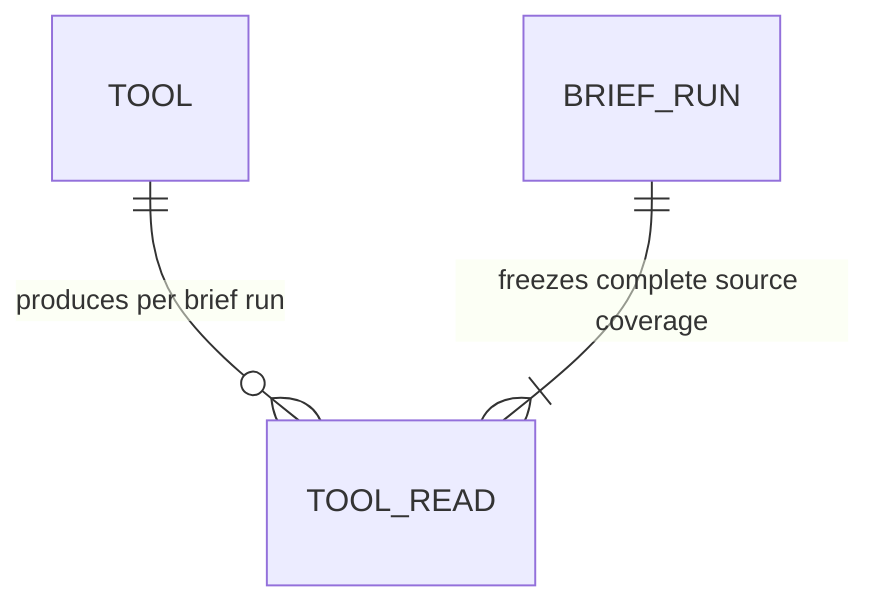
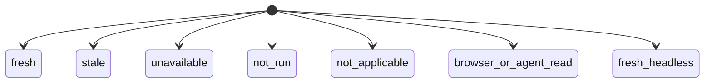

# Research Lab Domain Model

> This is the human-readable view of the product-domain SST. The formal model in
> `config/domain-model.yaml` wins on conflict. `tools.json`, `rldata.js`, and the
> brief contracts remain the field-level sources of truth; this document links
> those browser-side contracts rather than inventing a server data model.

## Domain Glossary

| Term | Definition | Terms to avoid | Related entities |
|------|------------|----------------|------------------|
| Tool | A registered, directly openable research experience defined once in `tools.json` | page, dashboard, hardcoded brief module | Tool, ToolRead |
| Source Tool | A Tool whose owning model contributes one normalized read to a brief run | brief section | Tool, ToolRead |
| Final aggregator | The Market Action Center Tool that combines source reads and is excluded from recursively reading itself | source Tool | Tool, ToolRead |
| Tool read | An immutable per-run normalized observation produced by a Tool's owning model or an explicit coverage-only outcome | recommendation, cached page text | ToolRead, Tool |
| Coverage-only read | An honest read stating that no server-side owner observation is available and browser or agent execution is required | empty result, inferred signal | ToolRead |
| Action eligibility | An explicit property derived from applicable evidence; unavailable or off-theme reads are never eligible | confidence alone | ToolRead |

## Entity Graph

`BriefRun` is contextual in this initial model. The promoted entities are the
registry-owned `Tool` and its immutable normalized `ToolRead` outcome.

## Lifecycles And State Machines

All current registry entries are `live`. That value is a registry posture, not
a deletion lifecycle, so the formal `Tool` entity has no terminal state.

The diagram uses underscore labels for Mermaid readability; the wire values are
`not-run`, `not-applicable`, `browser-or-agent-read`, and `fresh-headless`.
Each ToolRead is frozen for one run, so every read status is terminal for that
snapshot. A later run creates a new ToolRead rather than mutating prior evidence.

The shared page-data shell has a separate transient resource lifecycle
(`refreshing`, `ready`/`fresh`, `stale`, `error`, `missing`, or local-only). It
is not promoted as a ToolRead state because page hydration and brief evidence
are distinct contracts.

## Business Rules And Invariants

| Invariant | Why it matters | Authoritative rule | Enforced by | Proven by |
|-----------|----------------|--------------------|-------------|-----------|
| `INV-RL-REGISTRY-COMPLETE-TOOL-READS` | A hand-maintained brief subset would silently omit a newly registered research model | `config/domain-model.yaml` | Registry-derived `freezeToolReads` loop | `tests/distributed-briefs.contract.mjs` SCN-002-003 plus the foundation E2E suite |
| `INV-RL-UNAVAILABLE-READS-NOT-ACTIONABLE` | Missing or off-theme evidence must not be transformed into a market recommendation | `config/domain-model.yaml` | ToolRead applicability and recommendation-eligibility validation | `tests/distributed-briefs.contract.mjs` SCN-002-002 plus the foundation E2E suite |

The constitution's `Business Invariants` section still contains unchecked
template examples and a replacement marker. This document therefore does not
claim Facet-C ratification for either rule.

## Authoritative References

- Formal entities and invariants: `config/domain-model.yaml`
- Tool registry and briefing metadata: `tools.json`
- Shared ToolRead persistence and validation: `rldata.js`
- Registry freeze and complete read construction: `scripts/brief-refresh.mjs`
- Brief status vocabularies and validators: `rlbrief.js` and `rlcontracts.js`
- Adversarial contract proof: `tests/distributed-briefs.contract.mjs`
- Registry-addition and non-actionability E2E proof: `tests/distributed-briefs-foundation.e2e.mjs`
- Product architecture and operating contract: `README.md` and `.github/copilot-instructions.md`
- Per-feature field-level models: `specs/*/design.md` under each feature's `## Data Model`