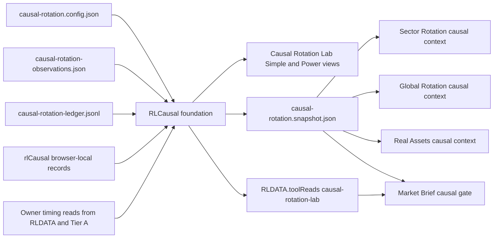

# Design: 001 Causal Rotation Intelligence

## Design Brief

### Current State

Research Lab is a build-free GitHub Pages site in which each owning tool computes its model in the browser, shares market resources through `rldata.js`, reports freshness through `rlapp.js`, and publishes a compact Simple-view projection through `RLDATA.toolReads`. `sector-research-lab.html` owns relative-strength timing; `global-rotation-lab.html` and `real-assets-lab.html` own their specialized market models; `scripts/brief-refresh.mjs` reproduces selected owning-tool reads for the headless Market Brief path.

Causal explanations currently exist only in `market-brief.payload.json` prose and agent research. They have no shared source-time contract, lifecycle, independence model, expiry policy, frozen decision record, or outcome ledger.

### Target State

Add one reusable Causal Rotation capability foundation and one owning Causal Rotation Lab. The foundation validates source-dated evidence, freezes evidence-time-safe decisions, evaluates four separate clocks, applies regime-conditioned transmission and sensitivity gates, preserves contradictions, and emits normalized causal reads without replacing any owning market-timing model.

The same pure evaluator runs in the browser and in the existing Node-based headless refresh path. Same-origin committed research supports the public Pages view; browser-local additions remain local; normalized snapshots feed Sector Rotation, Global Rotation, Real Assets, and the Market Brief without those consumers recomputing causal evidence.

### Patterns to Follow

- `rldata.js`: Node-safe IIFE, top-level pure functions, schema-versioned local storage, explicit freshness, and a narrow shared API.
- `rlapp.js`: resource-level `refreshing`, `ready`, `stale`, `missing`, and `error` reporting in the shared data-status control.
- `sector-research-lab.html`: Simple/Power modes, one computation feeding both views, synchronous canvas rendering, steerable controls that recompute without refetching, and owner-published `toolReads`.
- `global-rotation-lab.html` and `real-assets-lab.html`: model-specific owner reads with structured metrics and explicit unavailable inputs.
- `scripts/brief-refresh.mjs`: registry-derived Tier-A coverage and reuse of owning-tool functions rather than a second implementation of their models.
- `scripts/selftest.mjs`: extraction and execution of named pure production functions, registry parity checks, and adversarial contract assertions.
- `notes/market-brief.md`: low-noise plan relevance, structural ownership, explicit deep links, and no elevation of a read merely because it exists.

### Patterns to Avoid

- Do not place causal scoring inside `sector-research-lab.html`; that would make the timing owner also certify its own explanation.
- Do not use free-form Market Brief prose as a causal source. The Brief consumes normalized reads; it does not create evidence history.
- Do not copy causal records into each tool's private state. Legacy per-tool caches documented in `notes/shared-data-layer.md` are compatibility history, not the model for new shared capabilities.
- Do not collapse evidence classes into one blended score. Existing overlapping momentum blends are appropriate for a market ranking, but they cannot represent causal independence or contradiction.
- Do not adopt a soft-success path for an invalid causal contract. The overall brief refresh may continue, but the causal read must become explicitly unavailable and must not be elevated.
- Do not fetch causal research through browser CORS proxies as the only Pages path. Verified research is committed same-origin or stored locally; external URLs are citations, not an assumed live API.

### Resolved Decisions

- One shared `rlcausal.js` foundation owns validation, lifecycle reduction, clustering, four-clock evaluation, sensitivity policy, normalized projections, and outcome evaluation.
- One `causal-rotation-lab.html` owns causal hypothesis and evidence interaction; no sector-, country-, or commodity-specific causal tools are introduced.
- Public research uses versioned same-origin JSON plus an append-only JSONL decision/outcome ledger. Browser-only work uses a separate schema-versioned `rlCausal` local store.
- Sector Rotation remains the timing owner. Its stage and action logic are never modified by a causal read; it displays the read as separate context and deep-links to the owner.
- Global Rotation and Real Assets use the same normalized causal contract while retaining their own market models and terminology.
- Market Brief receives a causal read through its existing `toolReads` and registry coverage path and elevates it only when it changes, independently confirms, or falsifies the near-term plan.
- Sensitivity changes visibility and market-confirmation requirements only. Provenance, timestamp, freshness, clustering, contradiction, and invalidation gates are invariant.
- No overall numeric causal score is introduced. Candidate ordering is a transparent lexicographic policy over eligibility, stage, urgency, evidence quality, independent clusters, contradictions, and freshness.
- No backend, database, authentication service, bundler, framework, or runtime dependency is added to the published site.

### Open Questions

None blocking. Free forward-valuation, consensus-revision, institutional-flow, futures-curve, and inventory coverage is not assumed; those evidence classes remain visibly unavailable until a record passes the same source and timestamp contract.

## Purpose and Scope

The design implements the technical foundation required by `spec.md` for evidence-time-safe causal rotation research. It covers:

- source-dated catalyst, evidence, hypothesis, regime, exposure, decision, and outcome lifecycles;
- four independent clocks: catalyst, fundamental, positioning, and market confirmation;
- regime-conditioned transmission and at least one alternative-regime consequence;
- evidence clustering, contradiction preservation, sensitivity integrity, and anti-hindsight evaluation;
- one owning UI with Simple and Power views;
- read-only causal projections for Sector Rotation, Global Rotation, Real Assets, and Market Brief;
- browser-local research and committed public research without a server;
- static-site diagnostics and executable contract validation.

The foundation does not create market timing, forecast unobserved policy outcomes, infer fund flows from price, synthesize missing fundamental data, or turn a cause-emerging watch into an action. Market timing remains with the existing owning tools.

## Architecture Overview



### Runtime Topology

| Runtime | Inputs | Evaluator | Outputs | Mutation Boundary |
| --- | --- | --- | --- | --- |
| GitHub Pages/browser | Same-origin config, observations, ledger, normalized snapshot; browser-local `rlCausal`; existing `RLDATA` owner reads | `rlcausal.js` | Owner UI, local decision records, local normalized reads, `RLDATA.toolReads['causal-rotation-lab']` | Only browser local storage and explicit download exports |
| Local `file://` browser | Inline critical config plus local storage; same-origin fetches may be unavailable | `rlcausal.js` | Honest partial/local view with source failures visible | Only browser local storage |
| Headless Tier A | Committed config/observations/ledger, same-origin data snapshots, owning-tool functions | The same pure functions loaded from `rlcausal.js` | `causal-rotation.snapshot.json`, Market Brief tool read, console diagnostics | Repository artifacts written only by the existing refresh workflow |
| Market Brief Tier B | Tier-A snapshot and registry coverage | Brief plan-relevance policy | Coverage reason or plan-relevant action/attention item | Existing payload authoring path only |

### Ownership Boundaries

| Surface | Owns | Must Not Own |
| --- | --- | --- |
| Causal Rotation foundation | Provenance validation, evidence availability time, lifecycle, independence, contradiction, four clocks, sensitivity gates, normalized read, outcome classification | RRG math, sector action, country model, real-asset driver model, brief action selection |
| Causal Rotation Lab | Hypothesis/evidence interaction, source and staleness display, transmission matrices, decision freezing, outcome history | Market timing certification or portfolio execution |
| Sector Rotation | RRG state, acceleration, breadth, volume proxy, correlation, timing action and invalidation | Causal explanation or evidence lifecycle |
| Global Rotation | Country momentum, trend, FX confirmation, local-session and diversification model | Country-policy causal certification |
| Real Assets | Asset-specific market driver models and proxy limitations | Source/inventory/policy claims absent verified evidence |
| Market Brief | Next-session plan relevance and low-noise elevation | Creating or repairing causal evidence, changing causal stage, duplicating owner math |

### Build-Free Boundary

Published assets remain plain HTML, JavaScript, JSON, and JSONL. `rlcausal.js` uses an IIFE that attaches `RLCausal` to `globalThis`, avoids module resolution in the browser, and keeps pure functions as named declarations so `scripts/selftest.mjs` can execute production logic directly. Node scripts may load those functions for validation and snapshot generation; no bundling, transpilation, server, or database is required for Pages.

## Capability Foundation

### Foundation Contracts

| Contract | Responsibility | Consumers |
| --- | --- | --- |
| `CausalConfig/v1` | Closed enums, explicit stage policy, sensitivity policy, source policy, freshness policy, exposure catalog, and contract versions | Browser owner, headless adapter, validator |
| `CausalObservationSet/v1` | Public catalyst, evidence, hypothesis, exposure-map, and regime versions with immutable IDs and source times | Foundation reducer and owner UI |
| `RotationTimingRead/v1` | Owner-produced market state for one exposure, with `asOf`, `freshUntil`, limitations, and owner deep link | Four-clock evaluator only |
| `CausalCandidateRead/v1` | Full normalized candidate with four clocks, regime, independence, contradiction, freshness, confirmation, invalidation, and ownership | Owner UI, snapshots, outcome ledger |
| `CausalToolRead/v1` | Compact lossy projection compatible with `{id, asOf, read, metrics, deepLink}` | `RLDATA.toolReads`, Market Brief coverage |
| `CausalDecisionRecord/v1` | Frozen evaluation-time record with policy version, evidence versions/digests, regime, timing read, thresholds, and candidate result | Outcome review and anti-hindsight validation |
| `CausalLedgerEvent/v1` | Append-only `decision`, `outcome`, or `correction` event | Browser-local ledger and committed JSONL ledger |
| `CausalDiagnostics/v1` | Rejection, staleness, availability, clustering, persistence, and projection counters without secret or assertion-body telemetry | RLAPP details, developer console, headless output |

### Foundation Public API

`rlcausal.js` exposes one frozen `RLCausal` object:

| Function | Behavior |
| --- | --- |
| `validateConfig(value)` | Returns `{ok, errors[]}`; no missing policy receives a default |
| `validateObservationSet(value, config)` | Validates IDs, enums, references, source/timing/freshness fields, versions, and exposure mappings |
| `parseLedger(text, config)` | Parses JSONL one line at a time; returns accepted events plus line-specific errors |
| `mergeSources(committed, local)` | Combines immutable records by ID/version; conflicting content under the same identity is an error, never last-write-wins |
| `eligibleEvidence(hypothesis, asOf)` | Includes only records whose `availableAt <= asOf`, version existed by `asOf`, and freshness policy permits use at `asOf` |
| `clusterEvidence(observations)` | Groups shared causal origins and returns one independent line per cluster plus all member observations |
| `evaluateCandidate(input)` | Produces one deterministic `CausalCandidateRead/v1` or a structured exclusion with reasons |
| `evaluateAll(input)` | Evaluates and orders candidates with a stable lexicographic comparator |
| `explainSensitivity(candidate, from, to)` | Returns exactly which visibility or market-confirmation gate changed and which invariant gates did not |
| `freezeDecision(candidate, context)` | Produces a digest-bound decision record; persistence success is reported separately |
| `evaluateOutcome(decision, currentFacts)` | Classifies `confirmed`, `falsified`, `expired`, or `unresolved` without altering the decision record |
| `projectToolRead(snapshot)` | Produces the compact owner read; no unsupported field is invented |
| `readForExposure(snapshot, exposureId)` | Returns the normalized projection for a consumer or an explicit unavailable result |
| `diagnostics()` | Returns aggregate, non-sensitive health counters for the current evaluation |

All functions return data or structured errors. They do not write DOM, fetch networks, choose providers, or mutate another tool's state. Browser storage, same-origin fetch, headless file access, and rendering are adapters around the foundation.

### Foundation-Owned Invariants

1. **Evidence-time safety:** an observation is ineligible when its immutable `availableAt` is after the evaluation timestamp, even if `publishedAt` predates the decision. Backfilled research cannot rewrite an earlier call.
2. **Source completeness:** current supporting evidence requires a source identity, citation URL or stable public identifier, publication time, verification time, classification, evidence class, and explicit freshness policy.
3. **No neutralized absence:** missing, invalid, unavailable, and stale are distinct states. None contributes zero to an average because there is no causal average.
4. **Cluster independence:** all observations sharing `originKey` or an explicit dependency belong to one evidence cluster. A market reaction to the catalyst remains in the catalyst's reaction cluster rather than becoming another cause.
5. **Contradiction preservation:** support, contradiction, context, missing, and stale observations remain separately queryable and visible in every candidate.
6. **Primary-mechanism discipline:** one hypothesis version has exactly one primary mechanism. Secondary mechanisms require separately versioned hypotheses or explicit contextual links.
7. **Regime conditioning:** every eligible hypothesis includes a current-regime consequence and at least one alternative-regime consequence. Missing regime dimensions lower eligibility rather than being guessed.
8. **Sensitivity integrity:** posture cannot admit unverified, stale, source-incomplete, unclustered, contradiction-hidden, or non-falsifiable evidence.
9. **Owner separation:** only a `RotationTimingRead/v1` from the owning market tool can populate the market-confirmation clock.
10. **Immutable decisions:** decisions and outcomes append; corrections reference prior events. No operation edits or deletes an earlier decision.
11. **Determinism:** identical config, observations, ledger, timing reads, sensitivity, risk overlay, and `asOf` produce byte-equivalent normalized candidate data after canonical key ordering.

### Evaluation Pipeline

1. Validate config and all input contracts.
2. Resolve the requested evaluation timestamp and sensitivity policy version.
3. Select immutable hypothesis, catalyst, exposure-map, and regime versions available at that timestamp.
4. Exclude evidence that arrived later; classify current, stale, expired, retracted, superseded, unverified, and unavailable records.
5. Build evidence clusters and independence counts.
6. Derive each clock without averaging:
   - catalyst: lifecycle and scenario credibility;
   - fundamental: revisions, guidance, margins, valuation, credit, and supply/demand evidence;
   - positioning: options, disclosed positioning, leverage, crowding, and explicitly labeled proxies;
   - market confirmation: owner timing read only.
7. Evaluate current and alternative regime transmission.
8. Apply exposure mismatch, fragility, contradiction, freshness, confirmation, and invalidation gates.
9. Determine candidate stage and entry-edge state.
10. Explain visibility under the selected posture and risk overlay.
11. Order eligible candidates with the transparent comparator.
12. Emit the full snapshot and compact projections.

### Stage Policy

Stage evaluation is ordered so terminal evidence wins over promotion:

| Stage | Required State |
| --- | --- |
| `falsified` | A recorded invalidation condition is observed by its owner or a required causal premise is retracted before confirmation |
| `expired` | Expected transmission, catalyst, regime, or decision-critical freshness window closes without explicit revalidation and without prior falsification |
| `contradicted` | A current blocking contradiction, exposure mismatch, or regime incompatibility invalidates actionability while the hypothesis remains inspectable |
| `established` | Causal minimums remain valid and the timing owner reports established leadership; `entryEdge` is separately `present`, `limited`, or `absent` |
| `confirmable` | At least two independent current non-market clusters across at least two evidence classes, no blocking contradiction, fundamentals are non-deteriorating, and the timing owner reports emerging or confirming state |
| `watch` | Current credible causal evidence and falsifiers exist, but fundamental, regime, or market requirements remain incomplete or mixed |
| `cause-emerging` | A credible catalyst/scenario, primary mechanism, current regime mapping, explicit transmission window, confirmation, and invalidation exist; market confirmation may be unavailable |

`cause-unverified` is a causal status, not a promoted causal stage. A timing owner may publish market acceleration while the causal foundation returns `causeStatus: 'unverified'`; the owning tool remains visible and no hypothesis is selected from price behavior.

### Sensitivity Policy

| Posture | Visibility Gate | Market Gate | Invariant Gates |
| --- | --- | --- | --- |
| `discovery` | Show valid `cause-emerging`, `watch`, and later stages with at least one current credible causal cluster | May be unavailable | Source, time, freshness, cluster, contradiction, regime mapping, transmission window, confirmation, and invalidation all required |
| `balanced` | Require at least two independent current clusters across two non-market evidence classes | At least `emerging`, unless the candidate remains labeled watch-only | Same invariant gates |
| `confirmation` | Require balanced evidence and non-deteriorating fundamentals | At least `confirming`; an established move with absent entry edge remains established, not an add | Same invariant gates |

The risk overlay can only tighten policy. `crowded`, `leveraged`, `event-dependent`, or `regime-fragile` requires one additional independent non-market cluster and at least confirming market state. If the extra requirement is unmet, the candidate remains visible at its factual stage but is suppressed from actionability.

`explainSensitivity` reports the changed visibility gate and market gate, the previous and new posture, and a fixed list of invariant gates. It never rewrites the candidate's evidence or clocks.

### Candidate Ordering

There is no blended causal score. The queue uses this stable tuple, in order:

1. eligible before ineligible-but-inspectable;
2. posture-relevant stage priority;
3. nearest explicit event or transmission-window boundary;
4. source quality classification (`corroborated`, `bounded`, `unverified`);
5. independent current support-cluster count, descending;
6. blocking then non-blocking contradiction count, ascending;
7. decision-critical freshness margin, descending;
8. candidate ID, ascending for deterministic ties.

Every queue header exposes the active ordering. Changing posture changes stage priority and visibility only; it does not change source quality or cluster counts.

### Extension Points

- **Exposure adapter:** maps sector, factor, country, thematic, or real-asset identifiers to normalized exposure metadata and an owning market tool.
- **Timing adapter:** converts an owning tool's structured metrics into `RotationTimingRead/v1` without importing causal logic into that tool.
- **Observation adapter:** loads committed same-origin records or browser-local records; adapters must produce the same observation contract.
- **Source policy:** adds a named source/freshness rule through versioned config. Unknown sources fail validation.
- **Projection adapter:** maps a full candidate to a consumer-specific read while retaining owner, as-of, stage, confirmation, invalidation, and limitation fields.
- **Outcome rule:** adds a named deterministic outcome condition; rules are versioned and prospective.

## Concrete Implementations

### Causal Rotation Lab Owner

`causal-rotation-lab.html` loads `rldata.js`, `rlapp.js`, `rlcausal.js`, optional shared glossary/chart/ticker helpers, and `rlnav.js` in the repository-required order. It loads committed causal inputs same-origin, paints cached/local data first, reports each source through RLAPP, evaluates once, and renders both Simple and Power modes from the same candidate array.

It is the only UI that creates local hypotheses, supersedes observations, freezes decisions, records outcomes, or displays full source chronology. Public committed research is changed by the existing agent/editor workflow and validated before commit; the browser never attempts to write GitHub files.

### Committed Public Research Adapter

The adapter reads `causal-rotation.config.json`, `causal-rotation-observations.json`, and `causal-rotation-ledger.jsonl` from the same origin. Records contain public metadata and concise assertions, not copied article bodies. An agent-maintained record is accepted only when it cites and timestamps an external source; “agent generated” is not a source class.

The adapter validates the complete input before any candidate can be called current. Valid older records may still render as historical context when a newer line is invalid, but the current projection becomes unavailable rather than silently carrying an invalid value forward.

### Browser-Local Research Adapter

The `rlCausal` local-storage object holds local hypotheses, observation versions, local ledger events, UI state, and the latest normalized reads. It never holds provider keys, auth tokens, positions, sizes, cost basis, P&L, or committed-public authority claims.

Local records are labeled `origin: 'browser-local'`. They may support the user's own view after passing the same evidence contract, but they are never included in committed snapshots or the public Market Brief. Export is an explicit user action and preserves the origin label; import validates the whole packet before merging.

### Sector Rotation Timing Adapter and Consumer

Sector Rotation publishes `RotationTimingRead/v1` records for its included sector/factor exposures under structured `toolRead.metrics.timingReads`. Each record carries RRG state, acceleration, structural state, breadth, volume proxy, correlation divergence, `asOf`, `freshUntil`, limitations, and `deepLink`.

Sector Rotation consumes `CausalCandidateRead/v1` projections keyed by exposure. It displays stage, cause status, evidence age, contradiction count, confirmation, invalidation, and an owner deep link beside the existing timing result. The causal read does not alter RRG state, `entryTiming`, `rotationVerdict`, ranking, or action labels.

### Global Rotation Timing Adapter and Consumer

Global Rotation maps country/region ETFs to normalized country exposures and publishes its momentum, trend, FX, local-session, and risk state through the same timing contract with model-specific extensions. It may display a causal country-policy/growth/credit read, but country scoring and allocation order remain owned by `global-rotation-lab.html`.

### Real Assets Timing Adapter and Consumer

Real Assets maps equity, commodity, and proxy instruments to explicit exposure roles such as `equity-producer`, `spot-proxy`, `futures-linked-proxy`, and `monetary-asset`. Its timing adapter retains model-specific fields and proxy limitations. The causal projection may explain an equity-versus-underlying divergence only when supply, inventory, curve, policy, capital-discipline, or earnings evidence actually exists; absent evidence remains absent.

### Market Brief Consumer

The Causal Rotation Lab is registered in `tools.json`, `index.html`, and `rlnav.js`, which automatically adds it to registry-wide coverage. Tier A emits a deterministic `CausalToolRead/v1` from committed records and owner timing reads. Tier B compares candidates with the current plan and assigns exactly one relevance state:

- `changes-plan`: candidate changes a next-session action;
- `independent-confirmation`: a non-duplicated causal cluster supports an existing plan;
- `falsifies-plan`: invalidation or contradiction weakens an existing plan;
- `coverage-only`: useful owner context that consumes no action or attention slot.

An elevated item includes primary cause, stage, evidence as-of, regime, confirmation trigger, invalidation, owner deep link, and unique `reasonKeys`. Market price/options reactions whose `originKey` traces to the same catalyst cannot create additional reason keys.

### Headless Snapshot Adapter

The existing refresh process loads production pure functions from `rlcausal.js`, validates committed input, obtains owner timing reads from Tier-A builders, and writes `causal-rotation.snapshot.json`. It adds `causal-rotation-lab` to `snapshot.toolReads` rather than creating a second brief-only causal model.

If causal validation fails, the adapter emits an explicit unavailable tool read with structured health details and a coverage reason. It does not output a stage, candidate, or plan relevance. The rest of the Market Brief refresh can continue.

### Variation Axes

| Axis | Variants | Foundation Responsibility | Concrete Owner Responsibility |
| --- | --- | --- | --- |
| Exposure kind | sector, factor, thematic, country/region, real asset | Stable ID and common projection | Mapping, market model, limitations, deep link |
| Evidence classification | fact, estimate, proxy, scenario, contextual prior, unverified | Validation and promotion eligibility | Source-specific interpretation |
| Evidence class | catalyst, revisions, guidance, valuation, credit, supply/demand, positioning, seasonality, market reaction | Common clocks, clustering, contradiction | Record creation and source policy |
| Runtime | browser, headless Node | Deterministic pure evaluation | Fetch/file/local-storage adapter |
| Persistence | committed public, browser-local, generated snapshot, append-only ledger | Schema and merge invariants | Storage mechanics and origin label |
| Timing model | sector RRG, country/FX, real-asset model | Normalized timing envelope | Model-specific metrics and state mapping |
| Consumer composition | owner detail, timing-tool badge, Brief plan gate | Normalized read and required fields | UI placement and action ownership |
| Freshness mode | explicit time expiry, event-state expiry, retraction/supersession | Fail-closed freshness semantics | Named policy and source-specific dates |

## Data Model and Lifecycles

### Storage Surfaces

| Surface | Format | Authority | Contents |
| --- | --- | --- | --- |
| `causal-rotation.config.json` | JSON | Committed product policy | Contract versions, enums, exposure catalog, source/freshness policies, sensitivity policy, stage policy |
| `causal-rotation-observations.json` | JSON | Committed verified research | Immutable versions of catalysts, observations, hypotheses, exposure maps, and regime snapshots |
| `causal-rotation-ledger.jsonl` | JSONL | Append-only committed history | Public decision, outcome, and correction events |
| `causal-rotation.snapshot.json` | JSON | Generated deterministic projection | Public candidate reads, exposure index, health, and compact owner read |
| `localStorage.rlCausal` | JSON, schema version 1 | Browser-local user | Local records, local ledger, UI state, and latest local projections |
| `localStorage.rlData.toolReads` | Existing JSON slot | Owning-tool compatibility cache | Compact latest causal owner read only |

The foundation does not place full causal records inside `rlData`. Market cache eviction and causal audit retention have different lifecycles, and a four-megabyte market cache must not be able to prune decision history.

### Common Identity and Version Rules

- IDs use stable namespaced strings: `cat:`, `obs:`, `hyp:`, `exp:`, `reg:`, `cand:`, `dec:`, `out:`, and `corr:`.
- Immutable entities carry integer `version >= 1`, `recordedAt`, and optional `supersedes` pointing to the exact prior ID/version.
- Reusing an ID/version with different canonical content is `CR-CONFLICTING-IDENTITY`.
- Retraction and supersession create new records; they do not mutate or delete the prior record.
- Every source record carries `contentDigest: 'sha256:<hex>'` over canonical JSON excluding the digest field.
- Every decision stores the exact config version, sensitivity policy version, evidence IDs/versions/digests, timing read, regime version, and normalized candidate result used at `decisionAt`.

### Catalyst Event

| Field | Type | Rule |
| --- | --- | --- |
| `id`, `version` | string, integer | Immutable identity |
| `title` | string | Concise sourced event name |
| `eventClass` | enum | `policy`, `regulatory`, `central-bank`, `fiscal`, `trade`, `earnings`, `credit`, `supply`, `geopolitical`, `seasonal` |
| `lifecycle` | enum | `unverified`, `proposed`, `scheduled`, `announced`, `enacted`, `effective`, `expired`, `reversed` |
| `announcedAt`, `effectiveAt`, `scheduledFor` | ISO timestamp or null | Distinct knowledge and effect times |
| `sourceObservationIds` | string[] | At least one for every state except local unverified awareness |
| `scenarioSetId` | string or null | Required before an unobserved outcome is discussed |
| `reviewAt`, `expiresAt` | ISO timestamp | Explicit; no default expiry |

Lifecycle transitions are append-only versions. `unverified` cannot directly become `effective` without a new sourced version. `reversed` and `expired` remain queryable.

### Evidence Observation

| Field | Type | Rule |
| --- | --- | --- |
| `id`, `version` | string, integer | Immutable identity |
| `assertion` | string | Concise claim; no copied long-form source content |
| `classification` | enum | `fact`, `estimate`, `proxy`, `scenario`, `contextual-prior`, `unverified` |
| `evidenceClass` | enum | `catalyst`, `guidance`, `revision`, `margin`, `valuation`, `balance-sheet`, `credit`, `supply-demand`, `positioning`, `leverage`, `seasonality`, `market-reaction` |
| `clock` | enum | `catalyst`, `fundamental`, `positioning`, `market-confirmation` |
| `stance` | enum | `support`, `contradict`, `context` |
| `source` | object | `publisher`, `title`, `url` or stable public ID, `sourceType`, and optional methodology URL |
| `publishedAt`, `verifiedAt`, `availableAt` | ISO timestamps | `availableAt` is immutable and no earlier than both publication and first verified recording |
| `effectiveAt` | ISO timestamp or null | Required when publication and effect differ |
| `period` | object or null | `start`, `end`, and definition for measured windows |
| `freshness` | object | Explicit `mode`, `reviewAt`, and `expiresAt` or `expiryEventId` |
| `originKey` | string | Shared underlying cause/dependency for clustering |
| `dependencyIds` | string[] | Other observations on which this observation depends |
| `limitations` | string[] | Delay, proxy, coverage, methodology, or scope limits |
| `status` | enum | `pending`, `current`, `stale`, `superseded`, `retracted` |

`classification: 'unverified'` is visible awareness only and cannot support a candidate. `market-reaction` can populate market confirmation only through an owner timing adapter; a manually entered price reaction cannot certify that clock.

### Transmission Hypothesis

| Field | Type | Rule |
| --- | --- | --- |
| `id`, `version` | string, integer | Immutable hypothesis version |
| `catalystEventId` | string | One primary catalyst or scenario branch |
| `primaryMechanism` | object | Named class plus falsifiable mechanism statement |
| `secondaryContextIds` | string[] | Context only; no second primary cause |
| `exposureMapVersionId` | string | Exact affected exposure map |
| `currentRegimeVersionId` | string | Exact regime used for evaluation |
| `regimeConsequences` | object[] | Current plus at least one alternative regime, each with direction, timing, magnitude class, assumptions, and falsifier |
| `expectedWindow` | object | Explicit `start`, `end`, and rationale |
| `confirmation` | condition[] | Structured observable conditions and owning authority |
| `invalidation` | condition[] | Structured observable conditions and owning authority |
| `requiredEvidenceClasses` | string[] | Explicit, policy-versioned requirements |
| `observationIds` | string[] | Supporting, contradictory, and contextual records |
| `status` | enum | `draft`, `evidenced`, `watch`, `confirmed`, `contradicted`, `falsified`, `expired` |

### Exposure Map

An exposure map version contains one or more normalized exposures:

| Field | Rule |
| --- | --- |
| `exposureId` | Stable catalog ID such as a sector, factor, country, thematic basket, commodity, or equity-producer sleeve |
| `direction` | `benefit`, `harm`, `mixed`, or `neutral` under the named scenario |
| `mechanismRole` | Cash-flow, discount-rate, supply, demand, regulation, credit, or risk-premium role |
| `coverageScope` | The affected subsector/components and known exclusions |
| `vehicleIds` | Display/deep-link identifiers, never personalized holdings |
| `mismatchRules` | Conditions under which a broad ETF or proxy is too broad or structurally different from the mechanism |
| `asOf` | Composition/mapping date; stale composition is visible |

Exposure mismatch is a first-class contradiction. A bank-specific mechanism mapped to broad financials remains inspectable but cannot be treated as broad-sector proof.

### Regime Snapshot

Each regime version contains six required dimensions: growth, inflation, liquidity/rates, volatility/gamma, correlation/dispersion, and credit. A dimension includes `state`, `asOf`, `freshUntil`, observation IDs, and limitations. No dimension receives a neutral default.

The candidate uses the version available at evaluation time. A new regime creates a reassessment and a new decision; it never edits an earlier record.

### Rotation Timing Read

```text
contractVersion: "rotation-timing/v1"
ownerToolId: string
exposureId: string
asOf: ISO timestamp
freshUntil: ISO timestamp
marketState: emerging | confirming | established | weakening | invalidated | unavailable
structureState: string | null
breadthState: string | null
volumeProxyState: string | null
optionsState: string | null
correlationState: string | null
ownerMetrics: object
limitations: string[]
deepLink: relative URL
```

`ownerMetrics` is namespaced and never interpreted outside its adapter. A stale or absent timing read produces an unavailable market clock, not a neutral clock.

### Four-Clock State

Every clock uses the same envelope:

```text
state: supportive | mixed | contradictory | missing | stale | unavailable
asOf: ISO timestamp | null
freshUntil: ISO timestamp | null
independentClusterIds: string[]
observationIds: string[]
missingRequirements: string[]
summary: string
owner: causal-rotation-lab | <timing-owner-tool-id>
```

Clock summaries are derived from listed observations and conditions. They cannot contain facts absent those records.

### Normalized Candidate Read

`CausalCandidateRead/v1` contains:

- identity: candidate, hypothesis, exposure, and contract versions;
- timestamps: evaluation `asOf`, evidence `asOf`, oldest decision-critical input, and next refresh/event;
- `stage`, `causeStatus`, `entryEdge`, and exact `stageReasons`;
- primary catalyst and mechanism;
- all four clock envelopes;
- current and alternative regime consequences;
- independent support cluster count and IDs;
- blocking/non-blocking contradiction count and IDs;
- stale, unavailable, and missing required evidence lists;
- source-quality classification and limitations;
- expected transmission window and time-to-effect state;
- structured confirmation and invalidation conditions;
- exposure mismatch and fragility flags;
- sensitivity posture, risk overlay, and threshold explanation;
- timing owner and owner/causal deep links;
- deterministic reason keys for Brief de-duplication.

### Decision and Outcome Ledger

Each JSONL line is one `CausalLedgerEvent/v1`:

| Event | Required Payload |
| --- | --- |
| `decision` | Frozen candidate read, `decisionAt`, config/policy versions, evidence refs/digests, regime version, timing read, sensitivity, risk overlay, and candidate digest |
| `outcome` | `decisionId`, observed time, one of `confirmed`, `falsified`, `expired`, or `unresolved`, exact condition IDs, source observations, and evaluator version |
| `correction` | Target event ID, reason, replacement record reference, and correction time; original line remains authoritative history |

The browser adapter appends to an array and persists the entire schema object because local storage has no append primitive. The API exposes append only; failed persistence leaves the record as an unsaved draft and offers explicit export. It must never claim that a decision was recorded when the write failed.

### Lifecycle Transitions

| Primitive | Allowed Progression |
| --- | --- |
| Catalyst | unverified -> proposed/scheduled/announced -> enacted -> effective -> expired/reversed |
| Observation | pending -> current -> stale -> superseded/retracted |
| Hypothesis | draft -> evidenced -> watch -> confirmed/contradicted -> falsified/expired |
| Candidate | cause-emerging -> watch -> confirmable -> established, with contradiction/falsification/expiry able to interrupt |
| Decision | appended once; only outcome or correction events may reference it |
| Outcome | unresolved may receive a later confirmed/falsified/expired outcome event; prior outcome lines remain |

Transitions are validated against event time. Backward state changes require a new hypothesis version and explanation; they cannot rewrite the old lifecycle.

## Contracts and Cross-Surface Integration

### Static Fetch Contract

There are no HTTP APIs or server routes. Browser adapters use same-origin `GET` requests for the four public artifacts. HTTP failure, JSON parse failure, schema failure, and stale content are separate error states. `file://` mode may not permit those fetches; the UI still loads browser-local records and reports committed inputs unavailable.

### Compact Tool Read

The existing compatibility shape remains unchanged:

```text
id: "causal-rotation-lab"
asOf: ISO timestamp
read: one factual line with stage and primary mechanism, or an unavailable line
metrics:
  contractVersion: "causal-tool-read/v1"
  topCandidateId: string | null
  exposureId: string | null
  stage: cause-emerging | watch | confirmable | established | contradicted | falsified | expired | null
  causeStatus: verified | bounded | unverified | unavailable
  evidenceAsOf: ISO timestamp | null
  regimeVersionId: string | null
  independentConfirmationCount: integer
  contradictionCount: integer
  confirmation: string | null
  invalidation: string | null
  timingOwner: string | null
  planEligible: boolean
  candidateCount: integer
  health: fresh | partial | stale | unavailable
deepLink: "causal-rotation-lab.html#candidate=<encoded-id>"
```

The one-line `read` never says “buy”, “sell”, or “confirmed cause.” It reports the normalized stage and what remains required. Full evidence remains in the owner tool.

### Public Snapshot Contract

`causal-rotation.snapshot.json` contains:

```text
contractVersion: "causal-snapshot/v1"
generatedAt: ISO timestamp
asOf: ISO timestamp
configVersion: string
sourceDataAsOf: ISO timestamp | null
health: { state, errors[], staleResources[], rejectedRecordCount }
candidates: CausalCandidateRead/v1[]
readsByExposure: { <exposureId>: <candidate-id[]> }
toolRead: CausalToolRead/v1
```

Only committed public inputs enter this file. Browser-local research is never copied into it.

### Consumer Rules

| Consumer | Reads | Allowed Use | Forbidden Use |
| --- | --- | --- | --- |
| Sector Rotation | Best current projection for matching sector/factor exposure | Separate causal badge/detail and owner deep link | Alter RRG, action, ranking, or claim cause from price |
| Global Rotation | Matching country/region projection | Separate policy/growth/credit context | Alter country score or infer missing country evidence |
| Real Assets | Matching asset/producer/proxy projection | Explain sourced divergence and evidence needs | Treat spot/equity move as supply, curve, or inventory fact |
| Market Brief | Full public candidate projection plus compact read | Coverage or plan-relevance gate | Create evidence, count duplicated reactions, elevate watch-only cause |

### Market Brief Elevation Contract

A causal candidate can enter an action or attention item only when all are true:

1. The candidate is `confirmable` or `established`, or it is `contradicted`/`falsified` in a way that changes an existing plan.
2. `planEligible` is true under the selected risk overlay.
3. The owning timing tool's current read is present and not stale.
4. The item changes, independently confirms, or falsifies a concrete plan element.
5. Its `reasonKeys` add at least one independent reason not already used by the plan.
6. Primary cause, stage, evidence as-of, regime, confirmation, invalidation, and causal owner deep link are all populated.

`cause-emerging`, `watch`, stale, unavailable, and plan-irrelevant reads receive a specific `toolCoverage.reason` and consume no action/attention slot.

### Versioning and Compatibility

- Every public contract begins at version 1 and rejects unknown major versions.
- Additive optional fields are allowed within a major version only when absence has explicit semantics.
- Required field changes create a new major contract and an explicit migration function covered by tests.
- `RLDATA.toolReads` remains backward compatible because the outer shape does not change.
- Consumers reject an unknown causal projection version and show unavailable context while retaining their own model.
- Deep links use `#candidate=<encoded-id>` and optional `&asOf=<ISO>`; an unknown or historical candidate renders an explicit not-found/historical state.

### Error Model

| Code | Condition | User/Consumer Behavior |
| --- | --- | --- |
| `CR-CONFIG-INVALID` | Missing/invalid policy or enum | Block causal evaluation; owner models continue |
| `CR-SCHEMA-INVALID` | Invalid observation or snapshot structure | Reject affected input with record path; no current promotion |
| `CR-CONFLICTING-IDENTITY` | Same ID/version has different content | Block merge and show both origins |
| `CR-SOURCE-INCOMPLETE` | Missing source identity or citation | Keep as unverified awareness only |
| `CR-TIME-INELIGIBLE` | Evidence arrived after evaluation time | Exclude from that decision and show exclusion reason |
| `CR-EVIDENCE-STALE` | Explicit freshness window elapsed | Display stale; cannot count as current support |
| `CR-CLUSTER-INVALID` | Missing/cyclic/conflicting dependency origin | Candidate cannot be promoted until resolved |
| `CR-TIMING-UNAVAILABLE` | Owner read absent, stale, or wrong version | Market clock unavailable; discovery-only visibility may remain |
| `CR-PERSISTENCE-FAILED` | Local decision/record write failed | Keep unsaved draft and offer export; never claim persisted |
| `CR-SNAPSHOT-STALE` | Generated public snapshot older than source/owner requirements | Consumers show stale context and no plan elevation |
| `CR-IMPORT-REJECTED` | Local import is malformed, too large, unsafe, or conflicting | Merge nothing; show exact validation errors |

## Data Sources, Freshness, and Research Integrity

### Source Admission

| Source Class | Accepted Use | Conditions |
| --- | --- | --- |
| Primary public | Policy state, filings, issuer guidance, official statistics, official inventory/credit releases | Stable source identity, publication/effective times, verification time, expiry/review policy |
| Named professional secondary | Context or estimate when methodology and timestamp are visible | Must remain `estimate` or `context`; cannot be relabeled fact |
| Agent-maintained external observation | Structured recording of a primary/secondary source | Agent identity is provenance of recording, not authority for the claim; external citation remains mandatory |
| User-local observation | Private research in one browser | Same schema and labels; never public or Brief-consumed automatically |
| Market data/proxy | Timing, positioning, seasonality computation, or explicitly named credit/flow proxy | Comes through RLDATA/owner adapter, retains source/as-of and proxy limitation |
| Unverified claim/rumor | Awareness only | Cannot raise stage, quality, independence, plan eligibility, or actionability |

### Realistic Free-Data Posture

- Daily bars, volume, options snapshots, VIX, and existing macro proxies reuse `RLDATA` and same-origin snapshots. They describe market/positioning state, not cause.
- Policy, regulatory, central-bank, fiscal, trade, and geopolitical records are agent- or user-maintained from cited public sources. Browser scraping is not treated as reliable Pages infrastructure.
- SEC/issuer filings and guidance may support fundamentals when dates and scope are explicit.
- Reliable free sector-level consensus revisions and forward valuation are not assumed. A manually verified observation is accepted only with provider, estimate date, metric definition, and expiry; otherwise the field is unavailable.
- HYG/LQD and related prices are credit-spread market proxies, not debt issuance demand, loan conditions, or refinancing facts.
- ETF volume/OBV, put/call, and options activity remain delayed positioning proxies. They are never labeled institutional flow or causal confirmation.
- Commodity spot/futures-linked ETF bars do not establish curve structure, inventory, or supply. Those fields require a verified source; otherwise they remain unavailable.
- Seasonality may be computed from historical bars only when the window definition, sample count, median, dispersion, adverse tail, and available regime comparability are present. It changes prior context only.

### Freshness Semantics

Every decision-relevant record names its freshness policy. There is no global “fresh enough” fallback.

- `time-bound`: explicit `reviewAt` and `expiresAt`.
- `event-bound`: explicit `reviewAt` plus `expiryEventId`; the record becomes stale at review time when the event has not been reverified.
- `historical-context`: immutable historical fact that may inform an outcome study but cannot count as current confirmation.

The candidate exposes its oldest decision-critical input and next review/event. Any required stale input makes the affected clock stale or missing; it is not converted to neutral.

### Anti-Hindsight Rules

1. `availableAt` is immutable and conservative: no earlier than publication and first verified recording.
2. Evaluation at `T` selects only entity versions and evidence with `availableAt <= T`.
3. Decision records freeze policy, regime, owner timing, evidence refs/digests, confirmation, and invalidation at `T`.
4. New evidence creates a new candidate evaluation and decision record.
5. Outcome evaluation may reference later facts only to classify the frozen decision, never to improve its original stage.
6. Sensitivity studies group records by the posture and policy version actually used; they cannot rerun old records under new thresholds and call that prospective performance.
7. Weekend/holiday refreshes over the same completed market bar do not add market confirmation or persistence.

## UI and Interaction Design

No UX wireframe exists in `spec.md`, so this design defines technical component behavior without replacing UX-owned layout work. The implementation follows the repository's Simple/Power and accessibility conventions.

### Component Tree

```text
CausalRotationApp
├── SharedNav (rlnav.js)
├── DataStatus (rlapp.js)
├── ModeSegment (Simple | Power)
├── FilterBar
│   ├── SleeveSelect
│   ├── SensitivitySegment (Discovery | Balanced | Confirmation)
│   ├── RiskOverlayToggle
│   └── FreshnessFilter
├── SimpleView
│   ├── PrimaryRead
│   ├── ThresholdExplanation
│   ├── CandidateQueue
│   └── NoCandidateState
├── PowerView
│   ├── CandidateIndex
│   ├── CandidateHeader
│   ├── FourClockPanel
│   ├── EvidenceTimeline
│   ├── EvidenceClusters
│   ├── TransmissionMatrix
│   ├── ContradictionsAndMissing
│   ├── ConditionalEvidenceCharts
│   ├── DecisionRecorder
│   └── OutcomeLedger
└── LocalResearchEditor
```

### Simple View

Simple is the default and answers: what causal rotation is early, what stage is it in, and what would confirm or falsify it?

- The filter bar steers sleeve, posture, and optional risk overlay.
- Controls call one `render()` with already loaded records; they do not refetch.
- The primary read names at most one highest-ranked eligible candidate or states that none clears the evidence bar.
- Candidate rows show stage, primary mechanism, current regime fit, independent cluster count, contradiction count, evidence age, time-to-effect, confirmation, invalidation, and market timing owner.
- Changing posture animates no score. It shows a text diff of the exact visibility/market gate that changed and the invariant gates that remained fixed.
- A price-led move with no eligible hypothesis appears only as a timing-owner row labeled `cause unverified`; no candidate story is selected.
- Stage, cause status, and freshness use text plus icons/patterns, never color alone.

### Power View

Power exposes the complete audit trail for the selected candidate:

- **Four clocks:** four equal-status panels preserve supportive, mixed, contradictory, missing, stale, and unavailable states.
- **Timeline:** chronological catalyst and evidence versions, publication/effective/available times, decision freezes, outcomes, supersessions, and retractions.
- **Evidence clusters:** cluster membership, shared origin, independent count, and why market reactions did or did not add an independent reason.
- **Transmission matrix:** current and alternative regimes by affected exposure, direction, timing, assumptions, and falsifier.
- **Contradictions/missing:** blocking and non-blocking contradictions appear before supporting detail; required unavailable evidence is explicit.
- **Conditional charts:** valuation bands, revision breadth, credit pulse, equity/underlying divergence, and seasonality distributions render only when their exact input contracts are complete. An unavailable panel states which source/time/definition is absent.
- **Decision recorder:** freezes the current read after showing all included/excluded evidence and persistence destination.
- **Outcome ledger:** filters wins, misses, false positives, falsifications, expiries, unresolved records, sensitivity posture, exposure, and policy version without hiding unsuccessful records.

### Local Research Editing

- Creating an observation requires classification, evidence class, stance, source identity, source URL/public ID, publication time, verification time, available time, freshness policy, origin key, limitations, and affected hypothesis.
- An incomplete record can be saved only as `pending` or `unverified`; it cannot support a stage.
- Existing records have `Supersede` and `Retract` actions, never destructive edit/delete.
- Scenario authoring requires mutually exclusive scenario labels where outcomes conflict; no scenario is presented as predicted fact.
- Import validates size, schema, IDs, references, URL protocols, and digests before a single record is merged.
- Export is explicit and labels public versus browser-local origin.

### Charts

Every canvas has fallback text, an `aria-label`, synchronous draw calls, and `RLCHART.attach` hover hit testing. Each chart header states:

- the decision it supports;
- current interpretation;
- source/evidence as-of;
- limitations;
- the condition that invalidates the interpretation.

No empty chart frame is shown. Missing data renders a structured unavailable block instead of a zero line or fabricated continuity.

### Responsive and Accessible Behavior

- Desktop uses queue/detail columns in Power; mobile uses a queue followed by an in-document detail region with a persistent back-to-queue control.
- Four clocks become a two-column then one-column grid without changing order.
- Timeline and evidence tables retain semantic table markup and permit horizontal scrolling rather than clipped text.
- All controls have visible labels, keyboard operation, focus indication, and assistive-technology state text.
- Dynamic changes announce candidate count, selected stage, and persistence results through bounded `aria-live` regions.
- Tickers use `rlticker.js`; terms and dynamic values carry both definition and current-context tooltips; charts use `rlchart.js`.
- Reduced-motion preferences disable nonessential transitions.

### UI Failure States

| State | Visible Behavior | Promotion Effect |
| --- | --- | --- |
| Committed research loading | Cached/local queue remains usable; status says refreshing | No new stage until validation completes |
| Same-origin fetch failed | Explicit unavailable resource and last valid as-of if present | Last valid data is stale, never live |
| Config invalid | Blocking causal-contract panel with exact paths | No causal candidates or tool read stage |
| Some observation records invalid | Rejected-record count and detail; valid history inspectable | Any dependent candidate unavailable |
| Timing owner absent/stale | Market clock unavailable with owner deep link | Discovery watch may remain; no confirmed action |
| Required fundamental missing | Missing evidence row and affected clock | Cannot pass a posture requiring it |
| Contradiction observed | Contradiction appears before support | Stage becomes contradicted when blocking |
| Local storage quota/write failure | Unsaved draft badge and explicit export | No “recorded” confirmation |
| Unknown deep link | Candidate-not-found state plus current queue | No implicit selection |
| No eligible candidates | “Nothing clears the evidence bar” with exclusion counts | Valid outcome, no manufactured watch/action |

## Security and Privacy

- The feature has no authentication or server-side trust boundary. It must not imply multi-user authorization or remote persistence.
- Provider credentials remain exclusively in `localStorage.rlApiKeys`, edited at `index.html#data-settings`. The causal page contains no credential inputs and never copies keys into `rlCausal`.
- Full local hypotheses and decision history never leave the browser automatically. Headless and public snapshots read committed files only.
- Position size, share count, cost basis, P&L, account identity, and private research credentials are rejected from committed and normalized contracts.
- Imported JSON is treated as untrusted: validate object shape, own properties, size limits, enum values, references, and digest before merge; reject prototype-related keys.
- All rendered strings are escaped. Source URLs allow only `https:` and, where an official source requires it, `http:`; links open with `rel="noopener noreferrer"`. No source HTML is injected or embedded.
- External source retrieval is not performed with stored auth tokens. A source requiring credentials remains unavailable unless supported by the central credential contract and explicitly approved.
- Exports contain only fields shown in the export review; local origin and private-risk warnings are explicit.
- The public observation file stores concise original assertions and citations, not copied source text.

## Configuration, Migration, and Delivery

### Configuration

`causal-rotation.config.json` is the single source for contract versions and policy. Required sections are:

- `schemaVersion` and evaluator version;
- closed enum values;
- exposure catalog and timing owner per exposure;
- source classes and named freshness policies;
- stage policy;
- discovery, balanced, and confirmation policies;
- risk-overlay tightening policy;
- outcome condition vocabulary;
- consumer projection versions.

Every required value is explicit. Missing sections fail validation; source, freshness, stage, or sensitivity behavior has no code fallback.

### Initial Schema and Migration

This is a new capability, so schema version 1 has no legacy migration. On an unknown local-store version, the app leaves the bytes untouched, blocks merge, and offers export plus an explicit migration requirement. It does not reset or silently reinterpret local history.

Contract migration functions, when a new major version exists, must be pure, one-way, idempotent, and preserve original IDs/digests in a migration record. Public ledger history is never rewritten.

### Delivery Order

The coherent delivery order is foundation first, then owner, then projections:

1. shared contracts, pure evaluator, schemas, source validation, clustering, stage/sensitivity policy, anti-hindsight, and ledger logic;
2. committed source adapter, local adapter, deterministic snapshot adapter, and validation scripts;
3. Causal Rotation Lab Simple/Power UI and decision/outcome interaction;
4. Sector timing producer and read-only causal consumer;
5. Global Rotation and Real Assets timing/consumer adapters;
6. Market Brief Tier-A projection, Tier-B plan gate, registry coverage, and payload validation;
7. registry/nav/notes synchronization and Pages/browser qualification.

The feature is not treated as delivered at an intermediate point in this order. Public registration occurs only when the owner page, foundation, validation, owner timing handoff, Brief coverage, and outcome ledger are all functional.

### Rollback and Compatibility

A code rollback removes consumer display and registry entry while preserving unknown `rlCausal` local data. Existing market tools continue because causal projections are optional read-only inputs and never alter their computations. Existing `RLDATA.toolReads` records may remain until normal cache replacement; consumers check contract version and owner registration before display.

## Observability and Failure Handling

The repository has no configured `traceContracts` and the feature has no service-bearing runtime, so distributed traces and SLO spans do not apply. Observability is local, explicit, and privacy-preserving.

### RLAPP Resources

The owner reports these resources through `RLAPP.report`:

- `causal:config`;
- `causal:observations`;
- `causal:ledger`;
- `causal:snapshot`;
- `causal:timing:<owner-tool-id>`;
- `causal:local-store`.

Each reports state, as-of, record count, rejected count, and oldest decision-critical timestamp where applicable. Assertion text and user-entered research are not included in diagnostics.

### Diagnostic Counters

`RLCausal.diagnostics()` exposes:

- accepted/rejected records by error code;
- current/stale/expired/retracted/unverified observations;
- evidence cluster count and collapsed duplicate count;
- candidate count by stage and cause status;
- missing/contradictory clocks;
- timing-owner freshness;
- decision persistence failures;
- snapshot age and source-data age.

Headless validation prints these counters and exits non-zero for invalid config, invalid committed contracts, ledger corruption, identity conflict, or nondeterministic output. A missing optional evidence class does not fail the process; it appears as unavailable and may prevent candidate promotion.

### Failure Isolation

- A causal failure cannot blank Sector, Global, Real Assets, or Market Brief owner computations.
- A consumer never substitutes a prior causal stage as current. It may display a prior read only with stale age and no action eligibility.
- A malformed local import is all-or-nothing.
- A single invalid observation invalidates dependent candidates; unrelated valid candidates may render with the rejected-record health warning.
- A broken decision-ledger line is reported with line number. Events after that line are not trusted until the ledger is repaired through an appended correction or source edit reviewed before commit.
- Source fetch failure does not delete cached or local evidence; it changes freshness and eligibility visibly.

## Testing and Validation Strategy

### Test Surfaces

| Test Type | Location | Production Path Exercised | Purpose |
| --- | --- | --- | --- |
| Unit/property | `scripts/selftest.mjs` causal groups | Named pure functions extracted from `rlcausal.js` | Time eligibility, clustering, stage order, sensitivity invariants, regime changes, comparator, digest canonicalization, outcome classification |
| Contract | `scripts/validate-causal-rotation.mjs` | Production validators and reducer over committed files | Schema, refs, source/freshness, JSONL integrity, deterministic snapshot, no look-ahead, no duplicate identity |
| Integration | `scripts/selftest.mjs` integration group | Production causal evaluator plus recorded owner timing contracts | Four clocks, owner separation, snapshot and `toolReads` projection |
| Brief contract | `scripts/validate-brief-payload.mjs` and its selftest group | Production brief validator with causal registered | Coverage-only versus plan-relevant gates and reason-key de-duplication |
| Browser E2E | `tests/causal-rotation-lab.spec.mjs` | Served production HTML/JS, local storage, controls, DOM, charts, deep links | Simple/Power behavior, failures, accessibility, persistence, cross-tool display |
| Pages E2E | Same browser suite against the Pages artifact | Published static assets and same-origin fetches | GitHub Pages compatibility, nonblank first paint, registry/nav links, no CORS-only dependency |
| Stress | Causal group in `scripts/selftest.mjs` | Production evaluator on repeated recorded-contract corpus | Determinism, no stack overflow, bounded diagnostics, no mutation of inputs |

Browser automation uses a pinned test-only Playwright dependency. It does not enter the Pages artifact and does not add a runtime/build step. Required positive behavior uses source-recorded public observations with citation metadata; adversarial fixtures are limited to invalid/missing/stale inputs whose rejection is the assertion. No invented market result is used as proof of a successful candidate.

### Scenario-to-Test Mapping

| Scenario | Test Type | Test Location | Required Assertions |
| --- | --- | --- | --- |
| BS-001 cause before price | Unit + browser E2E | `scripts/selftest.mjs`; `tests/causal-rotation-lab.spec.mjs` | Discovery shows `cause-emerging`; market clock unavailable; window, confirmation, and invalidation visible; no action label |
| BS-002 price before cause | Integration + browser E2E | Same | Timing read remains visible; causal status is `unverified`; no hypothesis selected from price |
| BS-003 bank-specific XLF | Unit + browser E2E | Same | Exposure mismatch blocks broad proof; credit/loan/earnings/timing remain separate |
| BS-004 energy divergence | Integration + browser E2E | Same | Equity/underlying divergence renders; absent curve/inventory remains unavailable; no inferred cause |
| BS-005 semiconductor reflex bounce | Unit + browser E2E | Same | Fundamental contradiction remains visible; stage reads contradicted/reflex-risk rather than durable repair |
| BS-006 regime change | Unit + contract | `scripts/selftest.mjs`; `scripts/validate-causal-rotation.mjs` | New evaluation changes consequence; prior decision bytes/digest remain unchanged |
| BS-007 sensitivity integrity | Property + browser E2E | `scripts/selftest.mjs`; browser suite | Earlier candidate becomes visible; invariant gate results and evidence sets remain identical |
| BS-008 seasonality restraint | Unit + browser E2E | Same | Distribution/sample/dispersion shown; seasonal prior alone cannot promote stage/action |
| BS-009 correlated evidence | Property + Brief contract | `scripts/selftest.mjs`; `scripts/validate-brief-payload.mjs` | Announcement reactions collapse to one origin/reason key and one independent cluster |
| BS-010 stale forward valuation | Contract + browser E2E | Validator; browser suite | Missing provider time makes valuation stale/unavailable and excludes it from current support |
| BS-011 low-noise Brief | Brief contract + browser E2E | Brief validator; Market Brief browser test | Plan-irrelevant cause-emerging read has coverage reason and no action/attention card |
| BS-012 false-positive history | Unit + browser E2E | Selftest; browser suite | Falsified outcome appends; original evidence, posture, policy, threshold, and digest remain visible |

### Adversarial Contract Cases

The validator and selftest must reject or demote:

- evidence published or recorded after the decision time;
- missing source identity, publication time, available time, or expiry policy;
- a forward valuation with no provider/estimate timestamp;
- a rumor marked as fact;
- market reactions split into several independent clusters despite one origin;
- a cycle in evidence dependencies;
- an unknown timing-owner contract version;
- stale owner timing presented as confirming;
- a seasonality-only action;
- a broad exposure that fails its mismatch rule;
- an edited prior decision or reused ID/version with changed content;
- an outcome that changes the original candidate fields;
- a local-storage failure reported as persisted;
- an invalid import that partially mutates the store;
- a Brief action missing causal source age, confirmation, invalidation, or owner deep link.

### UI and Accessibility Checks

The browser suite verifies:

- meaningful cached/local first paint before any external research request completes;
- Simple is default and Power uses the same candidate result;
- sensitivity and filters recompute without network requests;
- source/staleness/contradiction states survive mobile and desktop layouts;
- keyboard operation, focus order, labels, text equivalents, and `aria-live` updates;
- ticker links and contextual tooltips;
- each canvas is nonblank only when data is complete, has fallback text and hover detail, and does not resize its layout on hover;
- missing charts render structured unavailable states;
- local decisions survive reload, append outcomes, and fail honestly on blocked storage;
- Sector/Global/Real Assets show causal context without changing their owner verdicts;
- Market Brief hides coverage-only causal reads from action and attention slots.

### Validation Commands

The implementation plan must use the repository's existing direct Node validation style and capture full output:

```text
node scripts/selftest.mjs
node scripts/validate-causal-rotation.mjs
node scripts/validate-brief-payload.mjs
npx playwright test tests/causal-rotation-lab.spec.mjs
```

The final browser qualification runs both a local served copy and the deployed Pages URL. A file syntax/ID check remains required but cannot substitute for scenario-specific browser behavior.

## Requirements Traceability

| Spec Requirements | Design Authority | Validation Authority |
| --- | --- | --- |
| FR-001 through FR-007: evidence and lifecycle | Capability Foundation; Data Model and Lifecycles; Decision and Outcome Ledger | Contract validator, BS-001, BS-006, BS-009, BS-010, BS-012 |
| FR-008 through FR-013: four clocks and early rotation | Evaluation Pipeline; Stage Policy; Rotation Timing Read; Four-Clock State | Unit/integration groups, BS-001, BS-002, BS-005 |
| FR-014 through FR-018: sensitivity and risk policy | Sensitivity Policy; Candidate Ordering; Simple View | Property and browser tests, BS-007 and the risk-overlay cases |
| FR-019 through FR-022: regime-conditioned transmission | Foundation-Owned Invariants; Transmission Hypothesis; Regime Snapshot | BS-006 unit/contract regression |
| FR-023 through FR-028: fundamentals, valuation, credit, and supply | Evidence Observation; Conditional Evidence Charts; Realistic Free-Data Posture | BS-003, BS-004, BS-005, BS-010 |
| FR-029 through FR-033: policy, geopolitics, seasonality, and elections | Catalyst Event; Source Admission; Stage Policy; Power View | BS-001, BS-006, BS-008 |
| FR-034 through FR-037: positioning, options, flows, and leverage | Evidence Observation classifications; Source Admission; risk overlay | Cluster/property tests, BS-009, risk-overlay browser cases |
| FR-038 through FR-046: decision views and charts | Simple View; Power View; Charts; UI Failure States | Browser E2E and accessibility checks |
| FR-047 through FR-052: cross-tool integration | Ownership Boundaries; Concrete Implementations; Consumer Rules; Market Brief Elevation Contract | Integration, registry parity, Brief contract, BS-011 |
| FR-053 through FR-056: outcome learning | Decision and Outcome Ledger; Anti-Hindsight Rules; diagnostic counters | BS-012 plus outcome and insufficient-history property tests |
| NFR-001 through NFR-010 | Runtime Topology; Build-Free Boundary; UI; Security and Privacy; Observability and Failure Handling | Contract, browser, Pages, accessibility, and stress checks |
| AC-001 through AC-012 | Scenario-to-Test Mapping | The corresponding BS-001 through BS-012 persistent regressions |

## Alternatives and Tradeoffs

### Put Causal Logic in Sector Rotation

Rejected. It would couple explanation to the price model, prevent country/real-asset reuse, and make a timing signal capable of manufacturing its own causal confidence.

### Keep Causal Research in Market Brief Prose

Rejected. Prose has no lifecycle, source-time eligibility, clustering, deterministic sensitivity, consumer contract, or append-only outcome accountability.

### Create Separate Sector, Country, and Commodity Causal Tools

Rejected. The domain primitives and integrity policies are shared, and separate tools would drift on source, freshness, stage, and anti-hindsight behavior. One owner plus adapters is the smaller coherent system.

### Add a Backend and Database

Rejected. It would violate the build-free static-site posture, introduce auth/hosting/operations, and is unnecessary for a single-user public research lab. Same-origin committed research plus browser-local private work satisfies the current actors.

### Store Everything in `rlData`

Rejected. `rlData` is a quota-pruned market cache with last-write semantics. Causal history requires immutable identities, source versions, and append-only decisions that market-cache pruning cannot own.

### Use One JSON Current-State File

Rejected. A mutable current snapshot cannot prove what was known at an earlier decision. Versioned observations plus JSONL decisions/outcomes preserve chronology while remaining static-site compatible.

### Use a Composite Causal Confidence Score

Rejected. It would hide contradictions, permit correlated evidence to inflate confidence, and make missing evidence look neutral. Stage gates and a transparent ordering tuple are more faithful to the specification.

### Browser-Scrape Every Free Source Live

Rejected. CORS, anti-bot controls, changing page structure, and unknown effective timestamps make this unreliable on GitHub Pages. Cited, verified, same-origin records are honest; unsupported categories remain unavailable.

## Complexity Tracking

| Decision | Simpler Alternative Considered | Why Rejected |
| --- | --- | --- |
| Shared `rlcausal.js` plus adapters | Inline all logic in the new HTML | Sector, Global, Real Assets, headless Tier A, and Brief need one deterministic contract; inline logic would be duplicated or inaccessible |
| Versioned observations plus JSONL ledger and generated snapshot | One mutable JSON object | Anti-hindsight, correction history, outcome accountability, and consumer-efficient reads require different lifecycles |
| Browser and headless adapters | Browser-only evaluation | Market Brief is generated headlessly and Pages consumers need a committed normalized read even when the owner page was not opened |
| Structured timing adapter per owning model | Read raw metrics directly in the causal engine | Raw RRG, FX, and real-asset fields differ and ownership would leak into the foundation |
| Pinned test-only browser runner | Manual browser walkthrough only | Required scenario-specific persistent E2E regression and accessibility checks cannot be proved by syntax/unit checks; the dependency does not affect the published runtime |

## Risks and Open Questions

### Risks

| Risk | Consequence | Mitigation |
| --- | --- | --- |
| Free fundamental/valuation coverage is sparse | Empty-looking clocks or pressure to fabricate continuity | Unavailable is a valid state; initial records require verified public sources and explicit expiry |
| Agent-maintained research can encode interpretation as fact | False causal authority | Classification, external citation, source time, verification time, scenario/fact separation, and validator rejection |
| Local and committed research diverge | Different users see different stages | Origin badges, separate snapshots, no automatic publication, explicit export/import review |
| Source revisions change historical meaning | Hindsight contamination | Immutable versions, supersession, content digests, and frozen decision refs |
| Owner timing contracts drift | Causal market clock misreads another tool | Versioned adapters, consumer contract tests, and unavailable-on-unknown-version behavior |
| Browser local-storage quota or corruption | Lost local decisions | Separate compact store, append confirmation only after write, export, and no false persistence claim |
| Public snapshots become stale | Brief or consumers show obsolete causal state | `generatedAt`, source/timing freshness, RLAPP status, and plan-ineligible stale reads |
| Too few prospective decisions | Sensitivity performance appears precise prematurely | Report counts, unresolved/miss outcomes, and insufficient-history state; do not optimize thresholds retrospectively |
| Candidate queue becomes a news dashboard | Low-noise outcome is lost | Primary-mechanism requirement, posture gates, lexicographic ordering, and valid no-candidate state |

### Decision Status

None block implementation. Source coverage is admitted record by record; policy changes are versioned prospectively; unsupported evidence classes remain unavailable rather than weakening the contract.
