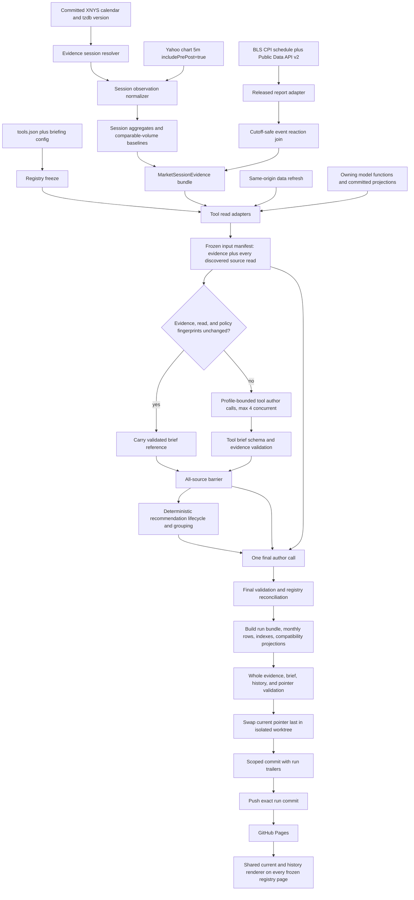
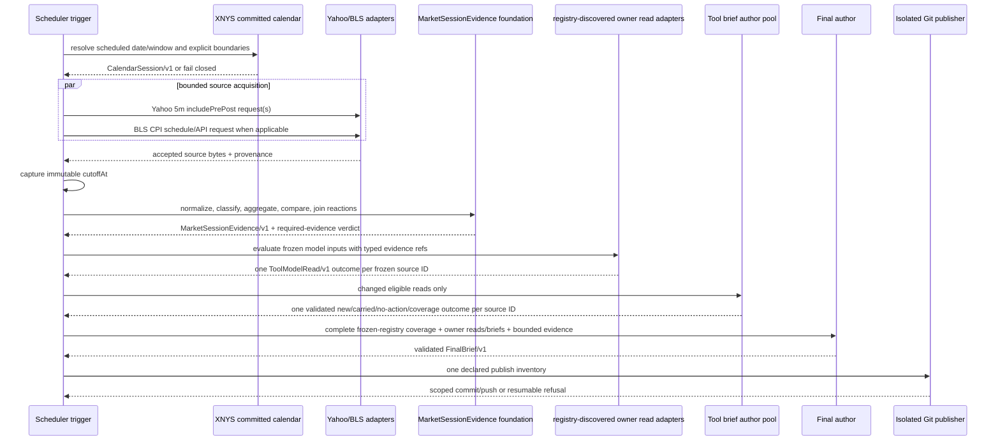
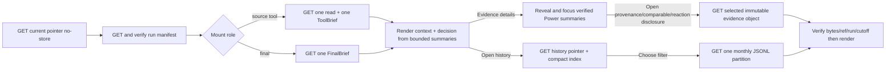

# Design: 002 Distributed Tool Briefs and Recommendation History

## Design Brief

### Current State

Research Lab is a build-free GitHub Pages site whose live committed `tools.json` currently contains 23 entries: `market-brief` as the sole final aggregator plus 22 source tools — including `bond-regime-lab` and the later-registered `company-fundamentals-lab`, `volatility-sizing-lab`, `technical-analysis-decision-lab`, `palm-springs-rental-market-lab`, and `ocean-shores-rental-market-lab`. Participant and source counts are derived from that live registry at run time, never fixed literals. The browser data foundation in `rldata.js` supports compact `toolReads`, but only Sector Rotation, Global Rotation, Real Assets, Bond Regime, and ETF Momentum currently publish normalized reads. `scripts/brief-refresh.mjs` reproduces four of those reads headlessly (all except Bond Regime), writes one global snapshot, and appends a large row to `brief-history.jsonl` before final narrative validation.

Build-free describes application delivery: the site has no bundle or application build step. The repository does have a private, dev-only Node test/tooling manifest in `package.json`, an exact npm v3 `package-lock.json`, a single-registry `.npmrc`, Playwright `1.61.1`, and `scripts/validate-node-source-lock.mjs` enforcing that closed source graph.

`scripts/brief-refresh-and-push.sh` then makes one Copilot call for `market-brief.payload.json`, stages selected root files, commits, and pushes. Its current soft-success and data-only paths can publish a new deterministic snapshot without a matching final narrative, and its root-worktree staging path is not a sufficient transaction boundary for the registry-wide capability.

### Target State

Add a reusable Distributed Briefing foundation that freezes a normalized read outcome for every source role discovered from the frozen registry, authors or carries one validated brief per discovered source, reconciles recommendation lifecycle events, and invokes one final author only after the complete tool barrier passes. The live registry currently resolves to 22 sources plus `market-brief` as its sole final aggregator; those counts are derived from `tools.json` at run time and asserted only as validation canaries, never runtime constants, and the aggregator never consumes a source brief for itself.

Before tool reads freeze, the same run acquires one versioned `MarketSessionEvidence/v1` bundle: an explicit XNYS calendar session, bounded extended-hours observations, aligned same-window volume baselines, released-report evidence, and cutoff-safe report reactions. Eligible owner tools interpret those references in `ToolModelRead/v1`; the shared capability normalizes clocks, provenance, adjustment basis, and comparability but never computes an owner model or turns a report/tape observation directly into a recommendation.

Published state remains plain JSON and JSONL. Two small JSON pointers select the current coherent publication and the latest history indexes; complete evidence, reads, and briefs are content-addressed; tool, final, run, recommendation, and evidence histories are monthly bounded streams. The scheduler builds the full set in an isolated Git worktree, validates every hash and reference, stages an exact inventory, commits one run identity, and pushes without touching the user's working tree.

### Patterns to Follow

- `tools.json`: registry membership and order are the only participant discovery mechanism.
- `rldata.js`: Node-safe shared contracts, explicit freshness, narrow projections, and no duplicated model ownership.
- `rlapp.js`: honest `fresh`, `stale`, `missing`, `unavailable`, and local-only status language.
- `rlbrief.js`: escaped shared renderers and deterministic pure helpers that can be exercised by `scripts/selftest.mjs`.
- `scripts/brief-refresh.mjs`: reuse owning-tool functions for headless reads rather than implementing a second model.
- `scripts/fetch-bars.mjs`: direct Node `fetch`, compact committed same-origin snapshots, an explicit source label, and no browser credential requirement.
- `intraday-tape-lab.html`: retain ownership of VWAP, profile, tape-control, and tactical interpretation; reuse its observable 5-minute bar vocabulary without reusing its fixed-offset or regular-only segmentation.
- `scripts/validate-brief-payload.mjs`: fail-loud contract validation before publication.
- `package.json`, `package-lock.json`, `.npmrc`, and `scripts/validate-node-source-lock.mjs`: private dev-only tooling, exact lockfile resolution, one trusted npm registry, no package scripts or runtime dependency graph.
- `playwright.config.mjs`: checkout-local Playwright `1.61.1` using the committed `system-chrome` project; browser tests use `npx --no-install playwright test <files> --config=playwright.config.mjs --project=system-chrome --reporter=list`.

### Patterns to Avoid

- Do not use browser `localStorage` as scheduled model evidence. It is private, machine-local, quota-pruned state.
- Do not let the final author inspect raw HTML, raw cache objects, unbounded history, or private browser state.
- Do not represent a missing read as neutral evidence or ask an LLM to infer model output from a tool description.
- Do not derive exchange holidays or the next session with weekday arithmetic, classify timestamps with a fixed `-04:00`/`-05:00` offset, or infer an actual report value from `macroEvents[]` prose.
- Do not coerce an absent volume field to zero, compare a partial pre/post window with a completed regular day, or label any price-volume proxy as fund flow.
- Do not call the Yahoo chart adapter an official feed. It is the repository's existing free best-effort source and may return unavailable, stale, incomplete, or revised observations.
- Do not append history in the user worktree before the all-tool and final validation barriers pass.
- Do not publish a data-only or partially authored run. A failed run may publish an audit-only run event, but it cannot move the current-publication pointer.
- Do not use prose similarity as identity, average confidence across correlated tools, or hide an incompatible horizon or invalidation as consensus.
- Do not mutate sealed history rows. Corrections and lifecycle changes are new events with references to prior identities.

### Resolved Decisions

- `America/New_York`, already declared by the Market Brief window configuration, is the canonical timezone for run keys and monthly partitions.
- Every frozen registry entry gains required briefing metadata; the live 23-entry registry is the current migration baseline (derived from `tools.json`, not a fixed count), and missing or unknown metadata blocks a run.
- Every registry-discovered source uses its profile-specific read adapter and per-tool LLM call. The live registry currently resolves to 22 sources, derived from `tools.json` rather than configured. Changed tools author concurrently with a maximum of four calls; unchanged tools carry a validated brief by reference.
- One final LLM call consumes the complete discovered source set of validated current briefs and normalized reads plus deterministic recommendation groups. It cannot start before the source barrier passes.
- Tool input/output budgets and one run-level ceiling are required configuration with no implicit values. Oversize structured input is reduced only by a deterministic priority rule; an irreducible request is refused.
- `briefs/current.json` is the sole current-publication pointer. `briefs/history-current.json` is the independent audit/history-index pointer.
- Exact artifact bytes use SHA-256; logical identities use SHA-256 over versioned canonical JSON.
- A recommendation has an origin-specific key and a separate cross-tool aggregation key. This preserves ownership while allowing compatible origins to merge.
- Existing `market-brief.payload.json` and `market-brief.snapshot.json` remain generated complete compatibility projections. No consumer retirement is assumed.
- Failed staging is retained in an isolated run worktree and local run journal. The root worktree, Spec 001, and unrelated files are never stashed, reset, or staged.
- `America/New_York` calendar truth comes from a committed annual `XNYSCalendar/v1` projection of the official NYSE Holidays & Trading Hours source. Every covered civil date is explicit, early closes are 13:00 ET when the source declares them, UTC boundaries are materialized with the recorded Node/IANA tzdb version, and absent coverage is a hard refusal with no weekday fallback.
- The four scheduled cutoffs remain the configured 07:30, 11:00, 15:00, and 17:00 ET instants. A scheduled run records both its nominal cutoff and actual acquisition time, accepts only completed observations ending at or before the cutoff, and never backfills a missed scheduled run from later evidence.
- Extended-hours acquisition is one direct Node GET to the already-used Yahoo v8 chart origin per declared symbol with `interval=5m`, `range=1mo`, `includePrePost=true`, `includeAdjustedClose=true`, and split/dividend events requested. Returned bars are accepted only after timestamp, calendar, adjustment, and volume-state validation, then published as compact same-origin snapshots.
- CPI uses the official BLS release calendar plus the no-key BLS Public Data API v2. `CUSR0000SA0` supplies the seasonally adjusted index used for headline month-over-month CPI and `CUUR0000SA0` supplies the not-seasonally-adjusted index used for headline year-over-year CPI. Consensus is nullable and can exist only as a separately sourced committed artifact with matching metric, period, unit, and basis.
- Comparable volume uses prior sessions of the same kind, boundary signature, provider semantics, and completed 5-minute bucket. A qualified distribution requires at least 10 eligible sessions and 70% candidate coverage; 5-9 sessions or lower coverage is thin and cannot create an anomaly claim.
- `ReactionSegment/v1` is the canonical name for each `EventMarketReaction/v1.segments[]` value. It carries exact non-zero-based comparison-window, source, boundary, cutoff, state, and semantic/occurrence identity material; the existing `buildComparableVolumeBaseline(current, candidates, policy)` signature accepts it without an owner-model interpretation.
- `MarketSessionEvidence/v1.requiredEvidence` is a discriminated `RequiredEvidence/v1` union. Open dates require the existing live benchmark aggregate/anchor path; closed dates require closure, prior-close, and next-open proof plus typed `not-applicable` live aggregate/baseline fields. A fully proven closed bundle may be current and `available` only as a closed/no-action publication.
- Initial owning-read consumers comprise the five current publishers (Sector Rotation, Global Rotation, Real Assets, Bond Regime, and ETF Momentum) plus a planned Intraday Tape publisher added by this feature. Market Brief consumes evidence references only after the corresponding owner publishes them; every remaining source tool receives an explicit evidence-applicability result until its normal read adapter declares compatible symbols and semantics.

### Open Questions

None blocking. The design does not assume that a missing headless adapter, private browser model, static model date, or off-theme tool can be promoted into live market evidence.

## Purpose and Scope

This design turns the business model in `spec.md` into a static, registry-driven technical capability. It covers:

- complete normalized model-read outcomes for every registered source tool;
- one reusable calendar/session/report/reaction evidence foundation frozen at the same run cutoff;
- constrained LLM authorship of one source brief per changed tool;
- carry-forward without repeated prose when evidence and policy are unchanged;
- stable recommendation identity, observations, lifecycle closure, supersession, and outcomes;
- provenance-aware final aggregation with visible conflicts and exclusions;
- agent-selectable current documents, monthly histories, and compact indexes;
- one all-or-nothing scheduled publication path that preserves a dirty user worktree;
- shared current and history components on every registered tool page;
- migration of all actual legacy `brief-history.jsonl` rows (row count derived from the live file at migration time, never a fixed literal; currently 55 and growing as the scheduler appends) without reconstructed narratives;
- static Pages operation, privacy, integrity, diagnostics, retry, and rollback.

The capability does not change any owning market formula, make personalized portfolio decisions, execute orders, read provider credentials, or make Spec 001 a dependency. Causal Rotation participates through the same registry contract only when it becomes a valid registry entry. `MarketSessionEvidence` can explain and normalize source facts, but only an owning `ToolModelRead` can interpret those facts as model confirmation, rejection, or action eligibility.

## Architecture Overview



### Runtime Topology

| Runtime | Reads | Writes | Authority Boundary |
| --- | --- | --- | --- |
| Scheduled Node process | Registry, required briefing config, committed XNYS calendar, direct allowlisted source responses, owning model code, current pointers and indexes | Run-scoped staging directory and isolated Git worktree | Owns orchestration and artifacts; cannot change calendar facts, source values, or model truth |
| Evidence adapters | One closed source request plus explicit calendar/cutoff policy | Normalized source snapshots and content-addressed evidence objects inside the run inventory | Normalize provenance, clocks, sessions, units, adjustment, and comparability only; cannot author narrative or recommendation |
| Tool author process | One validated `ToolAuthorRequest/v1` on stdin | One JSON response on stdout | No shell, repository write, browser state, or implicit network authority |
| Final author process | Complete frozen source-read and source-brief sets plus deterministic recommendation groups | One JSON response on stdout | Cannot omit participants, alter source briefs, or create evidence |
| GitHub Pages browser | Current pointer, selected complete documents, selected monthly partitions | DOM only; filter state may remain in memory | Read-only public consumer; rejects mixed or malformed publication state |
| Existing tool browser models | Shared `RLDATA` and browser-local controls | Existing browser-local state and compact live reads | May show local context separately; never supplies scheduled evidence implicitly |
| Git | Exact run artifact inventory | One content commit and, when needed, a push-receipt event commit | Commit trailer binds run identity without a circular commit hash in artifacts |

### Ownership Boundaries

| Owner | Owns | Must Not Own |
| --- | --- | --- |
| Tool model/read adapter | Re-evaluation of one owning tool and normalized evidence projection | Narrative, cross-tool confidence, final action selection |
| MarketSessionEvidence foundation | Calendar resolution, observation classification, session aggregation, same-window baselines, report lifecycle, reaction joins, source/freshness/provenance | Owning model interpretation, provider precedence hidden from consumers, recommendation eligibility by itself |
| Calendar source adapter | Exact XNYS annual date states and core/early-close boundaries sourced from NYSE | Weekday assumptions, venue-specific claims not present in the source, runtime network fallback |
| Market/report source adapters | Provider-specific request/parse logic and source-specific semantics | Cross-provider averaging, silent unit conversion, report interpretation |
| Distributed Briefing foundation | Registry freeze, contracts, identities, lifecycle reduction, budgets, barriers, persistence, validation | Tool formulas or provider credentials |
| Tool author | Interpretation of exactly one frozen read under one profile | Other tools, raw history, model repair, market facts absent from the read |
| Recommendation reducer | Stable keys, observations, upsert/close/supersede events, compatible groups and conflicts | Natural-language narrative |
| Final author | Low-noise synthesis from complete validated inputs | Source omission, evidence invention, hidden conflict, recursive Market Brief input |
| Shared UI renderer | Safe current/history display and on-demand partition loading | Model computation or mutation of committed history |
| Scheduler publisher | Isolated staging, exact Git inventory, commit and push state | Stashing, cleaning, resetting, or staging unrelated root-worktree edits |

### Static Pages Boundary

No server, database, route handler, service worker, bundler, or runtime package is required. Source acquisition runs in Node before publication; all public browser reads are same-origin GET requests for versioned JSON/JSONL assets. The browser fetches `briefs/current.json` with `cache: "no-store"`, follows only manifest-declared paths, and verifies that every loaded document carries the expected run ID and SHA-256. A mixed cache or incomplete Pages deployment is an integrity error, not permission to combine runs.

The root Node manifest is tooling-only and does not change the build-free static delivery model. `package.json` remains private with no package scripts or runtime `dependencies`; `package-lock.json` and `.npmrc` remain the lockfile-strict, source-locked authority validated by `scripts/validate-node-source-lock.mjs`. The Feature 002 foundation modules need no new runtime dependency: calendar generation, evidence acquisition, hashing, and timezone handling use built-in Node `fetch`, `crypto`, `fs`, URL, and `Intl` capabilities, while the existing pinned Playwright dependency remains test tooling only.

## Capability Foundation

### Foundation Contracts

| Contract | Responsibility | Consumers |
| --- | --- | --- |
| `BriefingRegistryEntry/v1` | Declares role, profile, read adapter, freshness policy, recommendation policy, and prompt budget for one `tools.json` entry | Registry freezer and validators |
| `SourceProvenance/v1` | Preserves source/adapter identity, request descriptor, source/observation/retrieval times, content hash, rights label, and freshness result | Every evidence object, owner read, validator, and provenance UI |
| `EvidenceReference/v1` | Binds contract version, semantic fingerprint, immutable path, byte hash, state, and cutoff without embedding the evidence body | ToolModelRead, ToolBrief, FinalBrief, run manifest, indexes |
| `CalendarSession/v1` | Resolves one explicit XNYS civil date into UTC-safe pre/regular/after boundaries, official close, closure reason, and next valid session | Observation classifier, scheduler, UI context strip |
| `SessionObservation/v1` | Represents one complete provider bar with explicit bar-start/end semantics, one calendar/session assignment, price basis, and missing-vs-zero volume | Session aggregation, reaction join, source audit |
| `SessionAggregate/v1` | Computes one cutoff-bounded session O/H/L/latest/VWAP/volume summary plus official-close anchor and coverage | Eligible owner reads and session UI primitives |
| `ComparableVolumeBaseline/v1` | Compares current cumulative volume with prior like sessions through the same completed bucket using robust statistics and visible exclusions | Owner reads, low-noise gate, peer comparison |
| `ReactionSegment/v1` | Freezes one chronological, session-bounded, strictly post-release completed-bar window with exact source, boundary, comparison, state, and identity semantics | Event reaction join, comparable-volume baseline, Scope 04 owner integration |
| `ReleasedReportEvidence/v1` | Preserves upcoming/released/revised/disputed CPI values, periods, units, source lineage, nullable consensus, and append-only revision identity | Bond Regime owner read, final coverage, report UI/history |
| `EventMarketReaction/v1` | Joins one immutable release to a pre-release baseline and only post-release bars through the run cutoff | Eligible owner reads, final context, reaction UI/history |
| `ToolModelRead/v1` | Complete structured evidence boundary for one source tool in one frozen run | Tool author, final author, current UI |
| `ToolBrief/v1` | Validated interpretation of one read, containing an actionable decision or an explicit no-recommendation/coverage-only result | Final author, current UI, tool history |
| `Recommendation/v1` | Immutable logical recommendation terms and origin provenance | Lifecycle reducer and final grouping |
| `RecommendationEvent/v1` | Append-only proposal, reaffirmation, modification, conflict, closure, outcome, supersession, or correction | Lifecycle history and recommendation index |
| `FinalBrief/v1` | Registry-complete global synthesis over all source outcomes | Market Brief UI and compatibility projection |
| `BriefRunManifest/v1` | Frozen registry, reads, brief outcomes, attempts, validation, publication inventory, and Git intent | Publisher, run history, diagnosis |
| `BriefCurrentPointer/v1` | Small atomic selector for one complete published run manifest | Every current consumer |
| `BriefHistoryPointer/v1` | Small selector for the latest compact tool/run/recommendation indexes | History renderer and research agents |
| `BriefHistoryIndex/v1` | Paths, ranges, counts, byte sizes, versions, and fingerprints without narrative bodies | Selective history reads |
| `BriefValidationResult/v1` | Structured passed/failed checks and contract versions | Barriers and run diagnostics |

### Foundation API

The Node-safe foundation exposes pure functions and thin filesystem adapters. The names and module placements below are design contracts; planning may sequence their implementation but cannot move logic across the ownership boundaries.

| Function | Contract |
| --- | --- |
| `validateRegistry(registry, config)` | Returns `FrozenBriefingRegistry/v1` in registry order or a closed set of errors; derives participant/source counts and requires exactly one final aggregator |
| `loadCalendarSession(calendar, tradingDate, cutoffPolicy)` | Returns one `CalendarSession/v1` only when the date is explicitly covered and all stored UTC/local boundaries round-trip under the recorded timezone contract |
| `classifySessionObservation(observation, calendarSession, cutoff)` | Returns one classified `SessionObservation/v1` or a closed timestamp/calendar/adjustment error; never assigns a bar to two sessions |
| `aggregateSession(observations, calendarSession, sessionKind, cutoff, officialCloseRef)` | Returns one `SessionAggregate/v1` from completed bars ending by cutoff, preserving partial coverage, missing volume, and a separate regular-close anchor |
| `buildComparableVolumeBaseline(current, historical, policy)` | Accepts one validated `SessionAggregate/v1` or `ReactionSegment/v1` without changing the public signature; returns qualified, thin, or unavailable `ComparableVolumeBaseline/v1` using the current input's exact comparison window, median/MAD, midrank percentile, and rVol rules |
| `normalizeReleasedReport(sourceSnapshot, schedule, consensusArtifact, previousEvidence)` | Returns append-only `ReleasedReportEvidence/v1`; time alone and schedule-only data can never produce an actual |
| `joinEventMarketReaction(release, observations, cutoff, policy)` | Returns one cutoff-safe `EventMarketReaction/v1` with a last-at/before-release baseline and only non-straddling post-release bars |
| `buildMarketSessionEvidence(input)` | Keeps the existing `MarketSessionEvidenceInputV1` object signature and produces one compact content-addressed bundle only after its discriminated open-date or closed-date required-evidence branch validates |
| `canonicalize(value, contractVersion)` | Produces deterministic UTF-8 canonical JSON with sorted object keys and preserved semantic array order |
| `fingerprint(kind, value)` | Returns `sha256:<hex>` over `kind`, contract version, and canonical bytes |
| `freezeToolReads(registry, adapters, runContext)` | Produces exactly one valid `ToolModelRead/v1` outcome for every source ID in the frozen registry |
| `compactAuthorInput(read, profileBudget)` | Retains required fields, then optional facts by stable priority and ID; returns omitted references or an oversize refusal |
| `compactFinalAuthorInput(registry, reads, briefs, groups, runContext, finalBudget)` | Produces one mandatory bounded source envelope per frozen source ID plus complete group/conflict/window context; refuses rather than omit a participant |
| `resolveBriefReuse(read, policy, currentIndex)` | Returns one exact validated brief reference only when the input fingerprint matches |
| `validateToolBrief(brief, read, profile)` | Enforces evidence references, recommendation eligibility, status, budgets, and privacy |
| `reduceRecommendationEvents(previous, current, run)` | Produces idempotent append-only lifecycle events and a new compact current-state index |
| `groupRecommendations(recommendations)` | Produces compatible groups, shared-origin groups, and explicit conflicts without averaging confidence |
| `validateFinalBrief(final, runInputs, groups)` | Proves complete coverage, valid provenance, bounded actions, preserved conflicts, and no unsupported recommendation |
| `buildPublishSet(run)` | Produces content objects, monthly rows, indexes, run manifest, pointers, and compatibility projections in staging |
| `validatePublishSet(staging)` | Re-hashes every artifact, validates references and JSONL prefix append-only behavior, and rejects undeclared files |
| `loadCurrent(pointer)` | Resolves a current run only when pointer, manifest, and selected objects agree on identity and hashes |
| `selectHistory(index, query)` | Returns the smallest partition set for tool, run, month, recommendation, state, outcome, or conflict filters |

The signatures below use TypeScript notation only to make plain frozen JavaScript object shapes unambiguous; no TypeScript compiler or dependency is introduced. Browser-safe `.js` foundations follow the existing `rldata.js`/`rlbrief.js` dual-runtime IIFE pattern: they expose one frozen `globalThis` namespace in browsers and assign the same object to guarded `module.exports` in Node. Node `.mjs` entrypoints load those CommonJS-compatible exports with built-in `createRequire`. They are not ESM `export` declarations in `.js` files, because the existing root dev-tooling manifest intentionally does not declare `type: module`.

```typescript
type Result<T> =
  | { ok: true; value: T }
  | { ok: false; error: EvidenceErrorV1 };

function loadCalendarSession(
  calendar: XNYSCalendarV1,
  tradingDate: string,
  cutoffPolicy: CutoffPolicyV1
): Result<CalendarSessionV1>;

function classifySessionObservation(
  sourceBar: SessionSourceBarV1,
  calendarSession: CalendarSessionV1,
  cutoffAt: string,
  source: SourceProvenanceV1
): Result<SessionObservationV1>;

function aggregateSession(
  observations: readonly SessionObservationV1[],
  calendarSession: CalendarSessionV1,
  sessionKind: "pre-market" | "regular" | "after-hours",
  cutoffAt: string,
  officialCloseAnchor: OfficialRegularCloseAnchorV1 | null
): Result<SessionAggregateV1>;

function buildComparableVolumeBaseline(
  current: SessionAggregateV1 | ReactionSegmentV1,
  candidates: readonly ComparableSessionCandidateV1[],
  policy: ComparableVolumePolicyV1
): Result<ComparableVolumeBaselineV1>;

function normalizeReleasedReport(
  sourceSnapshot: ReportSourceSnapshotV1,
  schedule: ReportScheduleV1,
  consensus: ReportConsensusArtifactV1 | null,
  previousEvidence: ReleasedReportEvidenceV1 | null,
  cutoffAt: string
): Result<ReleasedReportEvidenceV1>;

function joinEventMarketReaction(
  report: ReleasedReportEvidenceV1,
  observations: readonly SessionObservationV1[],
  cutoffAt: string,
  policy: ReactionPolicyV1
): Result<EventMarketReactionV1>;

function buildMarketSessionEvidence(
  input: MarketSessionEvidenceInputV1
): Result<MarketSessionEvidenceV1>;

async function fetchYahooSessionSource(
  request: YahooChartRequestV1,
  transport: SourceTransport,
  retryPolicy: SourceRetryPolicyV1
): Promise<Result<SessionObservationSourceV1>>;

async function fetchBlsCpiSource(
  request: BlsCpiRequestV1,
  transport: SourceTransport,
  retryPolicy: SourceRetryPolicyV1
): Promise<Result<ReportSourceSnapshotV1>>;
```

`SourceTransport` is injected only at the external boundary; production supplies built-in Node `fetch`, functional tests supply captured exact response bytes, and every downstream function receives normalized immutable data rather than a network client.

### Implementation Module Map

| File | Exact Owned Entrypoints | Boundary |
| --- | --- | --- |
| `rlcontracts.js` (new) | `canonicalize`, `fingerprint`, `validateRegistry`, `compactAuthorInput`, `compactFinalAuthorInput`, `validateToolModelRead`, `validateToolBrief`, `reduceRecommendationEvents`, `groupRecommendations`, `validateFinalBrief` | Pure dual-runtime briefing contracts, registry identity, validation, and reducers; no network, filesystem, DOM, or owner-model logic |
| `rlsession.js` (new) | `loadCalendarSession`, `classifySessionObservation`, `aggregateSession`, `buildComparableVolumeBaseline`, `normalizeReleasedReport`, `joinEventMarketReaction`, `buildMarketSessionEvidence`, typed evidence validators | Pure dual-runtime calendar/session/report/reaction semantics; no provider transport, narrative, or owner interpretation |
| `scripts/generate-xnys-calendar.mjs` (new) | `parseNyseCalendarSource`, `materializeXNYSCalendar`, `validateCalendarCoverage`; CLI `--config <path> [--check]` | Fetches/parses only the configured official source policy, materializes local/UTC rows, and fails when source rows or timezone round trips are ambiguous; `--check` compares generated canonical bytes without writing |
| `scripts/market-session-evidence.mjs` (new) | `loadSourcePolicies`, `validateSourceRequest`, `fetchWithSourcePolicy`, `fetchYahooSessionSource`, `fetchBlsCpiSchedule`, `fetchBlsCpiSource`, `acquireMarketSessionEvidence` | Sole external evidence transport; built-in `fetch`, exact allowlist, byte/time/retry limits, raw-body hashing, and normalized outputs only |
| `scripts/brief-refresh.mjs` | `freezeToolReads`, existing/new owner read adapters, `resolveBriefReuse`, `runBriefRefresh`; CLI run dispatcher | Owns registry-driven orchestration and owner delegation; invokes owning functions but does not copy their formulas |
| `scripts/brief-author.mjs` (new) | `buildToolAuthorRequest`, `buildFinalAuthorRequest`, `invokeAuthor`, `validateAuthorEnvelope` | Sole child-process author boundary; frozen JSON stdin/stdout, no repository or external-source authority |
| `scripts/brief-publication.mjs` (new) | `buildPublishSet`, `validatePublishSet`, `promotePublishSet`, `resumePublish`, `rollbackPublication`, `selectHistory` | Run staging, content objects, JSONL prefix validation, indexes, pointers, exact Git inventory, resume, and pointer-only rollback in the isolated worktree |
| `scripts/validate-distributed-briefs.mjs` (new) | `validateCurrentGraph`, `validateHistoryGraph`, `validateCompatibilityProjection`; CLI `--root <path>` | Independent whole-graph validator; imports production pure contracts and never repairs invalid data |
| `scripts/migrate-brief-history.mjs` (new) | `inventoryLegacyHistory`, `mapLegacyRows`, `validateMigrationParity`; CLI `--check` | Read-only legacy inventory/parity by default; writes only through the publication staging adapter during the implementation migration phase |
| `scripts/brief-refresh-and-push.sh` | Existing scheduler entrypoint, portable timeout dispatch, exit-code propagation | Thin macOS/WSL-compatible wrapper; no parsing, calendar math, model logic, or direct artifact mutation beyond invoking Node/Git adapters |
| `rldata.js` | Existing `putToolRead`/`toolRead` plus backward-compatible evidence-reference projection fields | Browser owner projection compatibility only; browser-local storage is never scheduled evidence |
| `rlbrief.js` | Contract parsing, hash-verified current/history loading, `BriefMount`, shared UI primitives, escaped rendering | Read-only DOM composition; no model/evidence calculations or authored URLs |
| `rlapp.js` | Registry/path mount discovery and existing Simple/Power host bridge | One high-fan-out bootstrap; no page-ID-specific evidence branch |

`rlcontracts.js` and `rlsession.js` contain no default policy values. Every policy object reaches them from the validated committed config or immutable artifact. The shell wrapper uses `#!/usr/bin/env bash` and the existing portable timeout capability rather than raw GNU-only `timeout`, `date`, `sed -i`, `stat -c`, or `readlink -f` forms.

### Registry Cardinality Contract

`tools.json` discovery is authoritative. `validateRegistry` freezes a `FrozenBriefingRegistry/v1` with `participantCount`, `sourceCount`, `aggregatorToolId`, `orderedParticipantIds`, `orderedSourceToolIds`, and `registryFingerprint`. It derives `sourceCount` by filtering entries whose validated briefing role is `source`; it does not calculate it as a configured literal or keep a parallel source list. Exactly one entry must have role/profile `final-aggregator`, and that entry must not appear in `orderedSourceToolIds`.

Counts are DERIVED from the live committed `tools.json` at run time, never fixed literals; the live registry currently resolves to `participantCount=23` and `sourceCount=22` (`market-brief` plus 22 sources). Five source pages currently publish browser `ToolModelRead` projections (Sector Rotation, Global Rotation, Real Assets, Bond Regime, and ETF Momentum), while `scripts/brief-refresh.mjs` headlessly reproduces four of them (all except Bond Regime). Any stated count is asserted by current-repository canaries against the derived registry only. Adding a valid future source entry simply becomes another briefed participant: the next run derives `participantCount=24` and `sourceCount=23`, requires that entry's read/brief/coverage/mount outcomes, and requires no design, scheduler-list, or final-prompt edit.

Every manifest, pointer, barrier result, telemetry event, and final coverage object stores the derived counts and ordered ID sets. Validators compare array/map membership with those frozen IDs and compare stored counts with their lengths; they never test successful publication against literal participant or source counts. A changed registry after freeze requires a distinct run fingerprint and cannot alter the in-progress run.

### Extension Points

1. **Calendar adapter:** materializes one annual XNYS calendar from a named official source into the closed calendar contract. The runtime reads committed dates only; it has no network or weekday fallback.
2. **Session-source adapter:** implements `fetchSessionObservations(request) -> SessionObservationSource/v1`. Provider protocol and field semantics stay adapter-specific; calendar assignment, completeness, and comparability stay in the foundation.
3. **Report-source adapter:** implements `fetchReportEvidence(request) -> ReportSourceSnapshot/v1`. Each report type owns one concrete transformation and source mapping rather than a generic arbitrary-report rules engine.
4. **Read adapter:** implements `evaluate(runContext, evidenceRefs) -> ToolModelRead/v1`. It may call owning pure model functions or read a committed projection, but cannot synthesize model evidence.
5. **Briefing profile:** supplies allowed decision kinds, evidence labels, freshness rules, deterministic compaction policy, and token ceilings.
6. **Author adapter:** accepts one closed request contract and returns structured JSON. Provider/model identity is configuration; the foundation owns validation and retries.
7. **History projector:** maps one accepted run into small per-tool, final, run, recommendation, and evidence rows without copying narrative bodies.
8. **Renderer adapter:** composes the same shared current/history primitives in a source-tool page or the Market Brief page.
9. **Publication adapter:** stages and commits the declared inventory. Git is the concrete adapter; storage contracts do not depend on Git internals.

### Foundation-Owned Invariants

1. The frozen registry contains every discovered participant exactly once, with one `final-aggregator` role and every other validated participant explicitly classified; counts are derived from the live registry, which currently resolves to 23 participants and 22 sources.
2. Every ID in `orderedSourceToolIds` has one valid read outcome and one valid brief outcome before final authorship.
3. `stale`, `unavailable`, `not-run`, and `not-applicable` are data states, not neutral scores.
4. A recommendation is legal only when the read says `recommendationEligibility.eligible: true`, every cited evidence ID exists, and the profile permits the action family.
5. Static model evidence cannot become fresh market confirmation. Synthetic, illustrative, local-only, and off-theme evidence cannot become a market recommendation.
6. An unchanged read plus unchanged prompt, schema, model, and validation policy reuses one exact brief object; no author call occurs.
7. Final authorship receives all source outcomes and cannot inspect a Market Brief source brief.
8. Compatible recommendations retain every origin. Shared evidence origins count once. Incompatible direction, horizon, or invalidation remains visible.
9. No current pointer changes until the complete publish set passes byte, schema, lineage, history, compatibility, and inventory validation.
10. Prior published objects and sealed partitions are immutable. Corrections append new events.
11. Every invocation receives an attempt identity. Duplicate attempts can be audited but cannot append duplicate authoritative tool, final, recommendation, commit, or push content.
12. Every committed artifact is free of credentials, private browser state, account data, position size, cost basis, P&L, and unpublished notes.
13. Every included observation has an explicit UTC timestamp, local rendering under `America/New_York`, one calendar date, one session kind, one cutoff, and one source/version; naive or impossible timestamps are rejected.
14. The official regular-close anchor and indicative pre/after-hours latest are separate fields and labels. An extended-hours latest can never populate an official-close field.
15. Missing volume is `null` plus a reason; an explicit provider zero is `0` plus `observed-zero`. Only the latter participates as zero in a cumulative window.
16. Comparable volume and peers align by provider semantics, calendar/boundary signature, session kind, 5-minute interval, adjustment basis, and completed bucket. A `SessionAggregate/v1` compares bucket 0 through `latestCompletedBucket`; a `ReactionSegment/v1` compares exactly its non-zero-based `comparisonWindow`. Any mismatch is non-comparable.
17. A schedule proves only `upcoming`. A report becomes `released` only when a declared source supplies the target period actual after the official release instant; revisions append new evidence identities.
18. A reaction baseline ends at or before release. A post-release bar must start strictly after release, end after release, and end by cutoff; a bar starting at or straddling release is excluded from both sides. Every emitted segment is a validated `reaction-segment/v1`, not an untyped summary.
19. A closed-date bundle contains explicit closure, prior-close, and next-open proof plus typed `not-applicable` live aggregate/baseline fields. Empty arrays, missing fields, or an `unavailable` benchmark cannot impersonate intentional calendar absence.
20. Evidence can consume an action slot only through a fresh eligible owning read that also clears the existing structural, persistence, or independent-corroboration gate.

## Concrete Implementations

### XNYS Committed Calendar Adapter

`XNYSCalendarAdapter/v1` materializes the official NYSE Holidays & Trading Hours publication (`https://www.nyse.com/markets/hours-calendars`) into `data/calendars/xnys/{calendarVersion}.json`. The first accepted calendar covers every civil date from 2026-01-01 through 2028-12-31 because the source currently publishes 2026, 2027, and 2028. The projection enumerates weekends, regular trading dates, named full holidays, and source-declared early closes; runtime classification never derives an unlisted date from `getDay()` or silently extends the coverage range.

The generated version is `xnys-v1:<coverage-start>:<coverage-end>:<source-content-sha256>:<tzdb-version>`. The artifact records the source URL, retrieval timestamp, source content SHA-256, generator contract, `process.versions.tz`, timezone `America/New_York`, and one row per civil date. Normal core hours are 09:30-16:00 ET. Source-declared equity early closes use 13:00 ET; 2026 examples include November 27 and December 24. Extended evidence boundaries are Research Lab evidence policy, not NYSE official-session claims: pre-market is 04:00 to core open and after-hours is official core close to 20:00 ET, with actual provider coverage reported separately.

For each row, calendar generation resolves local boundaries to UTC using `Intl.DateTimeFormat` round-trip matching under `America/New_York`, requires exactly one instant per boundary, and stores both local and UTC forms. Runtime uses those materialized UTC instants. A naive timestamp, a timestamp outside coverage, a local/UTC round-trip mismatch, an unknown holiday code, or a missing next open session returns `B002-CALENDAR`; there is no weekday-only or fixed-offset fallback.

Next-session calculation scans the committed rows after the current trading date and returns the first `regular` or `early-close` row. A holiday and weekend remain explicit closed rows. An after-hours run on an open date points to the next open row; a pre-market, morning, or pre-close run points to the current open row. A run on a closed date points to the next open row but cannot synthesize a live session for the closed date.

### Yahoo Extended-Hours Snapshot Adapter

`YahooChartSessionAdapter/v1` extends the exact direct-Node mechanism already used by `scripts/fetch-bars.mjs` and `scripts/brief-refresh.mjs`. For each registry-declared eligible symbol it issues one bounded GET to:

```text
https://query1.finance.yahoo.com/v8/finance/chart/<symbol>
  ?interval=5m
  &range=1mo
  &includePrePost=true
  &includeAdjustedClose=true
  &events=div%2Csplits
```

The lines above describe one URL; they are wrapped only for readability. `query1.finance.yahoo.com` is allowlisted and redirects to another host are rejected. The request carries only a non-secret User-Agent and accepts JSON. No credential, cookie, browser storage, proxy chain, or paid entitlement is presumed. Yahoo chart data is explicitly `best-effort-public-chart`, not an official exchange feed; HTTP failure, omitted pre/post rows, undocumented field changes, and rate limits become unavailable evidence rather than a source substitution.

The adapter caps the response at 8 MiB and 10,000 timestamps, validates parallel quote-array lengths, and emits compact per-symbol/per-trading-date normalized snapshots with at most 200 five-minute bars. A provider timestamp denotes bar start; `barEnd` is `barStart + 5 minutes`. Only bars wholly contained in one calendar interval and ending at or before the run cutoff are eligible. Bars before 04:00 ET, at or after 20:00 ET, or straddling a calendar boundary are retained only as excluded provenance records and never enter an aggregate.

The adapter preserves provider OHLC exactly as finite positive numbers. It never substitutes close for absent open/high/low. `volume: null` is `missing`; an explicit numeric `0` is `observed-zero`; a positive finite value is `observed`. The prior official regular close is the close of the last complete regular bar whose `barEnd` equals the preceding calendar session's official close. If that exact bar is absent, the official-close anchor is unavailable.

Yahoo does not provide a contract in this repository proving one adjustment basis for every intraday response. The adapter therefore labels intraday prices `provider-chart-basis`, requires anchor and current bars from the same provider contract, and blocks cross-discontinuity returns. A split or reverse-split event between the anchor and current observation yields `corporate-action-discontinuity`; no automatic ratio is applied. Comparable-volume candidates before the most recent split are excluded because volume adjustment semantics are likewise unproven. A cash-dividend event remains visible as `cash-dividend-context`; the change is labeled a raw price change, never total return, and a dividend date is excluded from anomaly baselines when the distribution is at least 0.5% of the prior official close. A symbol change or conflicting event record is disputed and blocks comparison.

### BLS CPI Report Adapter

`BlsCpiReportAdapter/v1` uses two official public surfaces and no API key:

- `GET https://www.bls.gov/schedule/news_release/cpi.htm` for report identity, scheduled date, and 08:30 ET release time. The adapter requires the `Schedule of Releases for the Consumer Price Index` heading and unique rows containing report period, release civil date, and ET time under `bls-cpi-schedule/v1`; missing, duplicate, reordered, or unparseable fields fail closed. The linked `bls.ics` endpoint is not a v1 runtime source because a 2026-07-14 probe from the execution environment returned HTTP 403;
- `POST https://api.bls.gov/publicAPI/v2/timeseries/data/` with `Content-Type: application/json` and the closed body `{ "seriesid": ["CUSR0000SA0", "CUUR0000SA0"], "startyear": "YYYY", "endyear": "YYYY" }` for official index observations. `registrationkey`, catalog flags, calculations, annual averages, and caller-supplied series are forbidden in v1.

The adapter requests only the declared series and years. `CUSR0000SA0` is CPI-U All items, U.S. city average, seasonally adjusted; `CUUR0000SA0` is the corresponding not-seasonally-adjusted series. The release schedule is the authority for `scheduledAt`; it cannot supply an actual. The API must return `REQUEST_SUCCEEDED`, the exact series IDs, the target `M01`-`M12` report period, finite index levels, and no contradictory period/footnote state before an actual exists.

The concrete transformations are:

$$
\operatorname{CPI\_MoM\_SA}_t = 100\left(\frac{\texttt{CUSR0000SA0}_t}{\texttt{CUSR0000SA0}_{t-1}} - 1\right)
$$

$$
\operatorname{CPI\_YoY\_NSA}_t = 100\left(\frac{\texttt{CUUR0000SA0}_t}{\texttt{CUUR0000SA0}_{t-12}} - 1\right)
$$

Both are stored as percentage values with explicit transform and basis; surprise is measured in percentage points, not relative percent. `previous` is the preceding report period's same transformed metric from the same accepted source snapshot. Raw index levels and transformed values are preserved together so recomputation is auditable.

Before `scheduledAt`, the lifecycle is `upcoming` even if a stale API response contains an older period. At or after `scheduledAt`, the target-period API value plus an on-time accepted retrieval proves `released`. If the target period is missing, the state is `unavailable`, never an older actual. A later accepted source snapshot that changes an original target or previous-period level appends `revised` evidence linked to the original release; it does not rewrite it.

Automated consensus is not sourced from BLS and no trustworthy free exact source is established by the current repository. `consensus` is therefore nullable. It may be populated only from a committed `ReportConsensusArtifact/v1` carrying a specific HTTPS source URL, source label, source-published time, captured-at time, report ID, target period, metric ID, value, unit, seasonal basis, transformation, source-content hash, and pre-release lock reference. The exact artifact hash must already be referenced by an authoritative run whose immutable `cutoffAt` is strictly before the report's `scheduledAt`; neither a backdated field nor a post-release commit is sufficient. The later release run reuses that exact object by hash. `market-brief.config.json::macroEvents[].note`, LLM prose, schedule text, and an artifact first observed at/after release are never consensus sources. With no valid pre-release artifact, `surprise` is null with `consensus-unavailable`.

For CPI, `actual`, `consensus`, and `previous` are separate metric records. Surprise exists only when metric ID, report period, `%` unit, seasonal basis, and `mom` or `yoy` transform match exactly. The adapter performs no hidden unit or basis conversion. Multiple valid sources for the same role that disagree produce `disputed`, preserve every sourced value, set the resolved value and surprise to null, and require a versioned source-resolution policy change to resolve the conflict; there is no averaging or user-side winner control.

#### ReportConsensusArtifact/v1

| Field | Type | Rule |
| --- | --- | --- |
| `contractVersion`, `consensusId` | strings | `report-consensus-artifact/v1` plus semantic fingerprint |
| `reportId`, `reportPeriod`, `metricId` | strings | Exact future release and metric identity; generic event prose is invalid |
| `value`, `unit`, `seasonalBasis`, `transform` | typed fields | Finite sourced value and exact comparison basis |
| `sourcePublishedAt`, `capturedAt` | timestamps | Both strictly before `scheduledAt`; source publication cannot be inferred from retrieval |
| `sourceRef`, `contentSha256` | refs/string | Reviewed citation/request policy and exact accepted source bytes |
| `preReleaseLockRef` | ref | Immutable evidence/run ref containing this exact artifact hash with `cutoffAt < scheduledAt` |
| `lockedAt`, `lockRunId`, `lockManifestSha256` | timestamp/strings | Copied from the referenced successful pre-release run; must resolve through its committed manifest |
| `fingerprint` | string | Hash of release/metric/value/basis/source/hash/lock identity; excludes later release-run clocks |

The capture path runs only before release and can append a new immutable consensus object when a source genuinely changes its estimate. The release adapter chooses the latest locked artifact by `sourcePublishedAt`, then `capturedAt`, then canonical fingerprint, all still before `scheduledAt`; it retains earlier artifacts as lineage. Two latest eligible sources with unequal comparable values produce `disputed`. A lock ref that does not resolve, resolves to another hash, comes from a non-authoritative/failed run, or has `cutoffAt >= scheduledAt` makes that artifact unavailable and records `consensus-lock-invalid` without exposing its value as current consensus.

### Report Adapter Extension Rule

`ReportSourceAdapter/v1` is intentionally narrow: identify the report, normalize its schedule and source observations, preserve revisions, and emit typed metric records. Adding PPI, employment, retail sales, or another report requires one concrete adapter with named official series/publication fields, explicit formulas, period mapping, units/basis, source allowlist entries, and recorded-source contract tests. The foundation supplies lifecycle, provenance, disagreement, revision, and cutoff rules; it does not accept configurable formulas or arbitrary field mappings that could turn a schedule or unrelated series into an actual.

### Initial Owning-Read Consumers

| Owner | Eligible Shared Evidence | Owner-Preserved Interpretation Boundary |
| --- | --- | --- |
| `intraday-tape-lab` | SPY/QQQ and selected eligible U.S.-listed symbol session aggregates, official-close anchor, aligned volume baseline | Owns VWAP/profile/tape-control/session-type interpretation; shared evidence replaces fixed-offset segmentation for published reads but not the tool's model |
| `sector-research-lab` | SPY and registered sector-ETF pre/regular/after aggregates and comparable volume | Owns RRG, acceleration, breadth, rotation direction, trigger, and invalidation; session evidence is tactical confirmation/context only |
| `etf-momentum-lab` | Current ranked U.S.-listed ETF session aggregates and baselines | Owns momentum/risk ranking and horizon; session evidence cannot change the score formula |
| `global-rotation-lab` | U.S.-listed country-ETF session evidence when its XNYS mapping is declared | Owns country, FX, local-close, trend, and risk model; non-U.S. local sessions are not forced into XNYS evidence |
| `real-assets-lab` | GLD, SLV, IBIT, DBC, UUP, TLT, and other explicitly declared U.S.-listed instruments | Owns asset-specific models; continuously traded `BTC-USD`/`ETH-USD` remain non-comparable under XNYS and expose `not-applicable` |
| `bond-regime-lab` | CPI actual/previous/nullable consensus, SPY/TLT/credit-ETF reaction segments, and source/cutoff provenance | Owns aligned credit, curve, inflation, duration, and sleeve interpretation; restricted local observations remain outside committed evidence |
| `market-brief` final aggregator | Normalized evidence for display plus interpretations from the five current publishers and the planned Intraday publisher | May preserve report/session context and conflicts; only owner-read conclusions can support a recommendation or confirmation count |

Every frozen source outside that initial owner-consumer set receives a typed `evidenceApplicability: not-applicable` or `not-integrated` result, never silent omission. Its normal briefing outcome remains mandatory. It becomes a consumer only by declaring symbols/session semantics in its registry read adapter and publishing the interpretation through `ToolModelRead/v1`; the final author never bypasses that step.

### Registry-Wide Tool Implementations

The required `briefing` block is stored with each `tools.json` entry so scheduler discovery never relies on a second hand-maintained list. The table below enumerates the complete live registry contract in `tools.json` order; the participant count is derived from that registry (currently 23), never a fixed literal, so registering a new tool simply adds another briefed row.

| Registry ID | Role | Profile | Read Adapter Behavior | Recommendation Boundary |
| --- | --- | --- | --- | --- |
| `market-brief` | final aggregator | `final-aggregator` | No source read or pre-final tool brief | Produces `FinalBrief/v1` only |
| `market-heatmap-lab` | source | `live-market` | Recompute committed breadth/leader/laggard projection from same-origin bars | Eligible only when bars and breadth window are fresh |
| `options-flow-feed-lab` | source | `live-market` | Recompute EOD unusual-activity and positioning proxy from same-origin option snapshots | Cannot infer buyer/seller side; absent/failing chains produce no recommendation |
| `intraday-tape-lab` | source | `live-market` | Recompute session VWAP/profile/control projection from committed intraday inputs | Tactical only during a valid fresh session; closed/stale session produces no new action |
| `swing-structure-lab` | source | `live-market` | Recompute MA stack, structure, profile, and regime projection from committed bars | Swing actions require fresh owning-model evidence |
| `options-structure-lab` | source | `live-market` | Recompute walls, flip, expected-move, and options-structure projection | Structure/hedge boundary only; unavailable chains remain unavailable |
| `gamma-trading-lab` | source | `live-market` | Recompute playbook projection from the same committed options snapshot used by its owner | No action when gamma regime or expiry evidence is unavailable |
| `sector-research-lab` | source | `live-market` | Reuse owning RRG/acceleration/rotation functions, as the current Tier-A path does | Eligible with fresh bars and explicit trigger/invalidation |
| `global-rotation-lab` | source | `live-market` | Reuse owning country, trend, FX, session, and risk functions | Eligible only inside its country/FX evidence boundary |
| `real-assets-lab` | source | `live-market` | Reuse owning asset-specific gold, silver, crypto, energy, and commodity models | Each subject retains its model-specific evidence and limitations |
| `bond-regime-lab` | source | `live-market` | Reuse the owning aligned-credit, curve, inflation, duration, and sleeve-scenario read; retain restricted observations outside committed output | Eligible only through its current owner read; unavailable restricted inputs remain unavailable |
| `ai-capex-strategy-lab` | source | `static-model` | Evaluate committed model inputs and assumptions; record model and source dates separately | Subject-specific model conclusion only; never live confirmation |
| `msft-july-print-model` | source | `static-model` | Evaluate committed earnings/margin scenario inputs and assumption set | MSFT scenario/model conclusion only; model date remains explicit |
| `company-fundamentals-lab` | source | `static-model` | Evaluate the committed hash-validated SEC company-facts publication, filing periods, and linked user scenario; keep statement, model, brief, market, and retrieval clocks separate | Company/fundamental brief conclusion only from source-qualified committed evidence; explicit evidence gaps stay partial or unavailable; never live confirmation or a market recommendation |
| `etf-momentum-lab` | source | `live-market` | Reuse owning signal and score functions, as the current Tier-A path does | Eligible with fresh ranked universe and owner horizon |
| `strategy-self-improvement-lab` | source | `local-model` | Read only a committed/shared deterministic synthetic projection; never browser ledger state | Methodology or model-run next step only; no market recommendation |
| `strategy-validation-lab` | source | `local-model` | Read only a committed/shared validation projection; label real-data or synthetic-demo origin | Strategy-validity conclusion only; browser-only state is unavailable |
| `smart-money-flow-lab` | source | `local-model` | Read only a committed/shared illustrative filing projection | Coverage and methodology only; illustrative filings cannot support market action |
| `waterfront-polo-lab` | source | `off-theme` | Evaluate the committed waterfront/polo universe or record unchanged/not-applicable state | Domain next step only; always excluded from market aggregation |
| `volatility-sizing-lab` | source | `live-market` | Recompute the conditional-volatility forecast and vol-targeting sizing throttle from shared-cache bars using the owning EWMA/GARCH functions | Magnitude-only sizing throttle, never a direction; eligible only with fresh shared-cache bars; the does-it-make-money question defers to Strategy Validation |
| `palm-springs-rental-market-lab` | source | `off-theme` | Evaluate the committed source-qualified place-based rental payload (whole-market and large-luxury segments) via the shared `rlrental.js` deterministic engine; keep missing property-level economics explicitly incomplete, never zero-filled | Real-estate/STR domain research summary only; `marketAggregationEligible: false`; always excluded from market aggregation |
| `ocean-shores-rental-market-lab` | source | `off-theme` | Evaluate the committed source-qualified place-based rental payload (whole-market and large-luxury segments) via the shared `rlrental.js` deterministic engine; keep missing property-level economics explicitly incomplete, never zero-filled | Real-estate/STR domain research summary only; `marketAggregationEligible: false`; always excluded from market aggregation |
| `technical-analysis-decision-lab` | source | `live-market` | Recompute the five-gate setup state and model-family-clustered evidence from source-qualified bars using the owning technical-analysis functions; preserve the setup-state vocabulary | Setup state only (confidence is evidence quality, not a win probability); a TRIGGERED/ARMED setup requires fresh source-qualified bars clearing all five gates; MIXED/UNAVAILABLE/stale produces no new action |

Every adapter emits the same contract. A source tool with no headless evidence path still emits a valid `unavailable` or `not-run` read with a reason and limitation. It does not receive inferred metrics from its blurb, tags, or HTML prose.

### Read Adapter Implementations

| Adapter Kind | Inputs | Output Rule |
| --- | --- | --- |
| `owning-function` | Committed same-origin data plus named pure functions from the owning tool/shared module | Recompute one normalized read and preserve owner model/version |
| `static-evaluator` | Committed model config, universe, assumptions, and their source dates | Mark evaluation time separately from model/source as-of time |
| `committed-projection` | Explicit committed normalized projection only | Browser-local or absent state becomes unavailable; no private-state read |
| `off-theme-evaluator` | Committed domain universe and deterministic owner logic | Produce domain summary/next step and `marketAggregationEligible: false` |
| `final-aggregator` | All validated current reads, briefs, and recommendation groups | Produce final coverage and low-noise synthesis without recursion |

### Author Implementations

`ToolBriefAuthor` and `FinalBriefAuthor` share one process contract but have different request schemas and permissions. Both receive instructions separately from a JSON data envelope, write JSON to stdout, and have no repository-write or shell authority. External research is collected by an explicit read adapter before the input freeze; an author cannot browse around missing evidence.

The first provider may remain the existing Copilot CLI, but provider-specific flags are held by the author adapter. `providerId`, `modelId`, and prompt-policy versions are required non-secret configuration and become provenance fields. Provider authentication remains in the provider's own credential store and never enters request JSON, logs, or committed files.

### Renderer Implementations

A shared Node-safe/browser-safe brief module owns contract parsing, safe link handling, current/history fetches, state labels, and DOM rendering. Source pages compose `CurrentToolBrief` plus a tool-filtered `ToolHistory`; `market-brief.html` composes `CurrentFinalBrief`, registry coverage, merged/conflicting recommendations, and the same history component with global filters.

### Variation Axes

| Axis | Variants | Foundation-Owned Policy |
| --- | --- | --- |
| Tool evidence | live market, static model, committed local projection, off-theme domain | Status and evidence boundary are mandatory; action eligibility varies by profile |
| Source protocol | committed official calendar, Yahoo chart JSON, BLS schedule/API, manually sourced consensus artifact | Allowlist, provenance, cutoff, size, and fail-closed validation are foundation-owned; parsing is adapter-owned |
| Session policy | pre-market, regular, after-hours, closed; normal versus early-close boundary signature | Classification, non-overlap, official-close separation, and next-session lookup are foundation-owned |
| Comparison window | cumulative from session start, release-to-cutoff segment, aligned peer segment | Exact completed-bucket alignment, coverage, robust statistics, and thin-state policy are foundation-owned |
| Report schema | CPI MoM SA, CPI YoY NSA, separately sourced consensus | Lifecycle/provenance/revisions are shared; formulas and series mappings remain concrete-adapter behavior |
| Read execution | owning function, static evaluator, committed projection | Same output schema, fingerprinting, privacy, and error model |
| Brief outcome | newly authored, carried forward, no recommendation, coverage only | Every source has exactly one outcome; only validated content becomes current |
| Recommendation behavior | market action, model conclusion, operational/domain next step | Only market-action records enter global market aggregation |
| LLM provider/model | provider adapter selected by required configuration | Closed request/response contract, budgets, retries, provenance, and validation |
| UI composition | source-tool current/history, final current/history | Same loader, status vocabulary, provenance, filters, accessibility, and safety |
| Publication state | full publication, audit-only failure event, push receipt, rollback | Full pointer advances only for a complete validated run |
| History query | tool, final, run, recommendation lifecycle | Monthly partition routing and compact metadata remain uniform |

## Data Model and Storage

### Run Cutoff and Time Semantics

Every scheduled occurrence has three clocks:

| Field | Meaning | Rule |
| --- | --- | --- |
| `scheduledFor` | Configured 07:30, 11:00, 15:00, or 17:00 ET trigger on an explicit calendar date | Resolves through `America/New_York`; never host locale |
| `acquisitionStartedAt` | UTC instant immediately before source calls begin | Must be at or after `scheduledFor`; delay is visible |
| `cutoffAt` | UTC instant captured once after bounded source acquisition and immediately before evidence filtering/input freeze | The sole knowledge cutoff for evidence and authorship; immutable across retries |

The run records `cutoffLocal` with UTC offset and zone name. Source calls execute concurrently inside a required 120-second acquisition ceiling. If acquisition crosses the calendar's regular-open or official-close boundary, exceeds 120 seconds, or causes the selected window to differ between `scheduledFor` and `cutoffAt`, the run ends `B002-CUTOFF-DRIFT` and no current pointer advances. Thus a 07:30 scheduled run may honestly freeze at 07:30:37 ET, but it cannot quietly become a morning run.

An observation is cutoff-eligible only when its complete interval ends at or before `cutoffAt`. A report is cutoff-eligible only when its official `releasedAt` is at or before `cutoffAt` and its source snapshot was retrieved within this bounded acquisition. A source retrieved later cannot be inserted into the frozen run. Ad-hoc historical reconstruction requires already committed source snapshots whose `retrievedAt` is at or before the explicit historical cutoff; live retrieval cannot backfill an earlier run. Retries consume the frozen evidence bundle and never reacquire data.

All machine timestamps are RFC 3339 UTC strings with millisecond precision. Local representations are display/audit fields derived from materialized calendar boundaries. Inputs without an explicit offset/`Z`, nonexistent spring-forward local times, ambiguous fall-back local times without offset, non-finite epochs, and timestamps that do not round-trip under the calendar's recorded timezone version are `B002-TIMESTAMP` failures.

### Freshness and State Precedence

Freshness is semantic and source-specific; retrieval recency never repairs the wrong period, session, or basis.

| Evidence | Current Rule | Stale/Partial Rule | Unavailable/Disputed Rule |
| --- | --- | --- | --- |
| Calendar | Requested civil date is explicit in the committed covered version and all boundaries round-trip | No stale calendar state is accepted; a reviewed new source projection creates a new version | Missing date/next session, unknown state, or timezone mismatch is `B002-CALENDAR` |
| Active Yahoo session price | Accepted response retrieved in the run; latest complete bar ends no more than 20 minutes before cutoff and no bar is from the future | `partial` while calendar interval remains open; `stale` when latest bar lags cutoff by more than 20 minutes | No eligible price bar is unavailable; duplicate disagreement is disputed |
| Completed session / official close | Final complete bar ends exactly at the calendar interval/official close | Missing interior volume can make volume partial; a missing final bar makes the aggregate incomplete | Missing exact official-close bar makes anchor/return unavailable; conflicting final bar is disputed |
| Comparable volume | Current window complete through selected bucket; candidate qualification and coverage pass | `thin` at 5/40 thresholds; partial current volume or missing current-window volume is unavailable, not extrapolated | Provider/calendar/interval/bucket/adjustment mismatch or fewer than five candidates is unavailable |
| Official CPI | Target report period is present in an accepted BLS response retrieved after official release and by cutoff | `stale` means only an older accepted report period or prior-run evidence is available after the due release; required publication is blocked | Missing target period is unavailable; conflicting comparable records are disputed |
| CPI consensus | Exact artifact source published/captured before release and hash-locked by an authoritative run with `cutoffAt < scheduledAt`; explicitly names release identity, metric/period/unit/basis/transform | There is no silent age extension or post-release backfill; an unresolvable/wrong-hash/late lock is unavailable | Absent is `consensus-unavailable`; invalid lock is `consensus-lock-invalid`; conflicting comparable locked artifacts are disputed |
| Reaction | Release and baseline are valid; every segment bar is strictly post-release and complete by cutoff | `partial` while a session/reaction window remains open; later cutoff creates another identity | Missing baseline/post-release bars is unavailable; conflicting bars/report values are disputed |

State precedence is `disputed` > `misaligned` > `unavailable` > `stale` > `partial` > `available` for a required field. A stronger failure cannot be downgraded by another current field. For a bundle, required-evidence state uses this precedence; optional failures remain attached to their owner refs and cannot contaminate an unrelated valid owner.

### SourceProvenance/v1 and EvidenceReference/v1

| Field | Type | Rule |
| --- | --- | --- |
| `contractVersion` | string | Exact contract ID |
| `sourceId` | string | Closed allowlisted ID such as `nyse-hours-calendar`, `yahoo-chart`, `bls-cpi-schedule`, `bls-public-api-v2`, or `manual-consensus-artifact` |
| `adapterId`, `adapterVersion` | strings | Exact parser/transform implementation identity |
| `sourceKind` | enum | `official-calendar`, `best-effort-public-chart`, `official-report`, `sourced-consensus` |
| `sourceUrl` | HTTPS URL | Must match the source allowlist; no redirects to an unlisted origin, credentials, or fragments |
| `requestDescriptor` | object | Canonical method, allowlisted path, and non-secret query fields; no headers containing values |
| `sourcePublishedAt` | timestamp/null | Present only when the source establishes publication time |
| `retrievedAt` | timestamp | Actual successful retrieval time |
| `contentSha256` | string | Hash of exact accepted response bytes before parsing |
| `accessClass` | enum | `public-official`, `public-best-effort`, or `public-manual-citation`; describes access provenance, not a legal conclusion |
| `sourceUsePolicyId`, `sourceUseReviewRef` | strings/ref | Versioned reviewed decision governing normalized-value publication, citation, and retention; missing/unapproved review blocks acquisition/publication |
| `retentionMode` | enum | `normalized-facts-and-hash`, `citation-only`, or `no-publication`; raw upstream bodies are never committed |
| `freshnessPolicy`, `freshnessState` | strings | Named policy plus `current`, `stale`, or `not-applicable` result |
| `diagnostics` | string[] | Closed safe reason codes only; no response body, credential, or narrative |

`EvidenceReference/v1` contains `contractVersion`, `evidenceType`, `fingerprint`, immutable relative `path`, exact `sha256`, `state`, `cutoffAt`, and `provenanceRefs`. Paths must remain under the manifest-declared evidence root. A read, brief, or final may include bounded display summaries, but the reference is the lineage authority. Source-use labels never assert that publicly reachable data is freely redistributable; only an approved `sourceUseReviewRef` can authorize the configured normalized retention mode.

### CalendarSession/v1

| Field | Type | Rule |
| --- | --- | --- |
| `contractVersion` | string | `calendar-session/v1` |
| `calendarId` | string | `XNYS` |
| `calendarVersion` | string | Content/source/tzdb-derived committed version |
| `timeZone` | string | `America/New_York` |
| `tradingDate` | date | Explicit covered civil date |
| `dateState` | enum | `regular`, `early-close`, `holiday`, `weekend` |
| `closureCode`, `closureLabel` | string/null | Required for holiday/weekend; source-derived holiday label where applicable |
| `preMarket`, `regular`, `afterHours` | interval/null | Each interval has local start/end and materialized UTC start/end; half-open `[start,end)` |
| `officialRegularCloseAt` | timestamp/null | `regular.end`; null for closed dates |
| `sessionBoundarySignatures` | object | One structural comparison signature per active session kind; excludes civil date, calendar content version, and absolute UTC instants |
| `nextOpenTradingDate` | date/null | First later explicit `regular`/`early-close` row; absent coverage is an error when requested |
| `sourceRef` | provenance ref | Exact calendar source/generation record |

Normal intervals are pre-market 04:00-09:30, regular 09:30-16:00, and after-hours 16:00-20:00 ET. On an official 13:00 early close, pre-market remains 04:00-09:30, regular is 09:30-13:00, and Research Lab's indicative after-hours evidence interval is 13:00-20:00; actual provider coverage and gaps are reported and no claim is made that all of that interval is an official NYSE session. Holiday/weekend rows have no active intervals.

Each `sessionBoundarySignatures[sessionKind]` hashes `calendarId`, `timeZone`, session kind, local wall-clock start/end, elapsed duration, interval size, and boundary-policy version. It deliberately excludes `tradingDate`, `calendarVersion`, UTC offset, and materialized UTC timestamps, so structurally identical 04:00-09:30 pre-market windows remain comparable across civil dates, DST changes, and reviewed annual calendar versions. A normal 09:30-16:00 regular session, a 09:30-13:00 early-close regular session, a normal 16:00-20:00 after-hours window, and an early-close 13:00-20:00 post-close window have distinct signatures. The full `CalendarSession/v1` identity still includes the exact date, source version, and UTC boundaries for audit; only the comparison signature is date-independent.

### SessionObservation/v1

| Field | Type | Rule |
| --- | --- | --- |
| `contractVersion` | string | `session-observation/v1` |
| `observationId` | string | Fingerprint over provider, symbol, interval, bar start/end, OHLCV state, price basis, events, calendar, and cutoff |
| `symbol`, `providerSymbol` | strings | Registry-safe canonical symbol plus exact provider symbol |
| `interval` | string | `PT5M` initially; other intervals are incompatible without a new comparison policy |
| `barStart`, `barEnd` | timestamps | Provider timestamp is start; end is exactly five minutes later |
| `tradingDate`, `sessionKind` | date/enum | One covered date and exactly one of `pre-market`, `regular`, `after-hours` |
| `calendarFingerprint` | string | Exact `CalendarSession/v1.semanticFingerprint` used for assignment |
| `comparisonBoundarySignature` | string | Exact `CalendarSession.sessionBoundarySignatures[sessionKind]` used by aggregate and reaction comparability |
| `bucketIndex` | integer | Zero-based from that session's start; must align exactly to the five-minute grid |
| `open`, `high`, `low`, `close` | finite numbers | Positive, complete, and internally ordered (`low <= open/close <= high`) |
| `volume` | finite number/null | Non-negative integer when present; null when absent |
| `volumeState` | enum | `observed`, `observed-zero`, `missing`; must agree with `volume` |
| `priceBasis` | string | `provider-chart-basis` for the initial Yahoo adapter |
| `adjustmentState` | enum | `compatible`, `corporate-action-discontinuity`, `disputed` |
| `corporateActionRefs` | ref[] | Split/dividend events intersecting comparison history |
| `cutoffAt` | timestamp | Must be at or after `barEnd`; one observation object belongs to one frozen cutoff |
| `sourceRef` | provenance ref | Exact chart response and retrieval |

The unique normalized bar key is `(sourceId, adapterVersion, providerSymbol, interval, barStart)`. Exact duplicates collapse. Two different payloads for the same key create `disputed` observations and block all dependent aggregates. A bar is included only when `[barStart,barEnd)` is wholly contained in one calendar interval. The 09:25-09:30 bar is pre-market and the 09:30-09:35 bar is regular; a boundary-straddling or grid-misaligned bar is excluded with a reason and cannot be reassigned.

### SessionAggregate/v1

| Field | Type | Rule |
| --- | --- | --- |
| `contractVersion` | string | `session-aggregate/v1` |
| `aggregateId` | string | Fingerprint of calendar, cutoff, symbol, session, included observations, official anchor, and policy |
| `symbol`, `tradingDate`, `sessionKind` | strings | Exact aggregate identity |
| `state` | enum | `available`, `partial`, `stale`, `unavailable`, `misaligned`, `disputed` |
| `sessionStart`, `sessionEnd`, `cutoffAt` | timestamps | Calendar interval plus immutable cutoff |
| `comparisonBoundarySignature` | string | Exact `CalendarSession.sessionBoundarySignatures[sessionKind]` value used for cross-date comparability |
| `latestCompletedBucket`, `elapsedMinutes` | integers/null | Last complete included bucket and minutes from session start through its end |
| `expectedBucketsThroughCutoff`, `priceBars`, `volumeBars`, `missingBuckets` | integers | Coverage counters; missing expected buckets are never imputed |
| `open`, `high`, `low`, `latest` | finite numbers/null | Derived only from included complete price bars |
| `latestAt` | timestamp/null | `barEnd` of the latest included observation |
| `cumulativeObservedVolume` | finite number/null | Sum of explicit observed and observed-zero bars; null when no volume is observed |
| `volumeCompleteness` | enum | `complete`, `partial`, `missing`, `all-observed-zero` |
| `vwap` | finite number/null | $\sum ((H+L+C)/3)V / \sum V$ only when every expected included price bar has known volume and total volume is positive |
| `officialRegularCloseAnchor` | object/null | Prior open date, exact official-close bar/value/time/basis/source; always separate from `latest` |
| `returnFromOfficialClose` | finite number/null | `latest / anchor.close - 1` only when basis is compatible and no discontinuity exists |
| `coverageStart`, `coverageEnd` | timestamps/null | Actual first/last complete included observation boundaries |
| `reasonCodes`, `observationRefs`, `sourceRefs` | arrays | Bounded, deterministic, provenance-complete |

An active session is `partial` before its calendar end even when every completed bucket is present. It is `available` after session end only when every expected price bucket is present; volume completeness is reported independently. A run before session start has no aggregate for that session. A provider response with no eligible bar is `unavailable`. Stale retrieval, impossible assignment, and conflicting duplicate bars retain their distinct state and cannot be carried as current.

The prior official close anchor is the preceding open date's exact final regular bar ending at its official close. A pre-market/regular/after-hours latest is always labeled with its own session kind and `indicative` for extended hours. Cross-date and cross-session de-duplication uses observation IDs: one observation may appear in only one aggregate in a bundle, and aggregate validation rejects repeated IDs.

### ComparableVolumeBaseline/v1

The baseline operates on a `ComparisonWindow/v1` defined by `sessionKind`, `startBucket`, and `endBucketInclusive`. Ordinary cumulative session volume uses `startBucket=0` and the current aggregate's latest completed bucket. Event reaction segments use the first strictly post-release bucket and the segment's final completed bucket. There is no equivalent-bucket mapping in v1; exact five-minute alignment is required.

Candidate dates are the 20 immediately preceding open XNYS dates in the committed calendar. A candidate is eligible only when its aggregate has the same `comparisonBoundarySignature`, source/adapter semantics, symbol, interval, session kind, bucket boundaries, price basis, and complete known volume for every expected bucket in the comparison window. This permits structurally identical local windows across DST while keeping normal and early-close regular/post-close windows separate. Dates at/before the latest split, dates with a qualifying dividend discontinuity, disputed bars, missing bars, missing volume, calendar mismatch, and post-current dates are excluded with one or more reason codes. Explicit zero-volume bars remain eligible.

| Field | Type | Rule |
| --- | --- | --- |
| `contractVersion` | string | `comparable-volume-baseline/v1` |
| `baselineId` | string | Fingerprint of current aggregate-or-segment/window, policy, candidate identities, values, and exclusions |
| `state` | enum | `qualified`, `thin`, `unavailable` |
| `currentAggregateRef`, `comparisonWindow` | refs/object | Exact current-input semantic fingerprint and bucket range. The v1 field name is retained for compatibility; when `current` is `ReactionSegment/v1`, this field contains that segment's `semanticFingerprint`, not a fabricated aggregate ref. |
| `candidateSessionCount`, `eligibleSessionCount`, `missingSessionCount` | integers | Candidate set, accepted set, and non-eligible count |
| `coverage` | finite number | `eligibleSessionCount / candidateSessionCount`; null only when candidate count is zero |
| `eligibleSessions` | object[] | Date, cumulative/segment volume, source ref, comparison boundary signature; maximum 20 |
| `excludedSessions` | object[] | Date and deterministic reason codes; maximum 20 |
| `currentVolume`, `median`, `mad`, `midrankPercentile`, `relativeVolume`, `robustZ` | finite number/null | Exact formulas below |
| `unusualness` | enum | `high`, `low`, `ordinary`, `not-qualified`, `zero-dispersion`, `unavailable` |
| `peerRefs` | ref[] | Optional aligned peer results only |

Qualification thresholds are fixed in `comparable-volume-policy/v1`:

- `qualified`: at least 10 eligible sessions and coverage at least 0.70;
- `thin`: at least 5 eligible sessions and coverage at least 0.40, but not qualified;
- `unavailable`: current-window incompleteness, fewer than 5 eligible sessions, coverage below 0.40, or a comparison incompatibility.

For eligible historical values $v_1,\ldots,v_n$ and current volume $x$:

$$
m=\operatorname{median}(v_i),\qquad \operatorname{MAD}=\operatorname{median}(|v_i-m|)
$$

$$
\operatorname{midrankPct}(x)=100\frac{\#(v_i<x)+0.5\,\#(v_i=x)}{n}
$$

$$
\operatorname{rVol}(x)=\frac{x}{m}\quad\text{only when }m>0
$$

$$
z_{robust}(x)=0.67448975\frac{x-m}{\operatorname{MAD}}\quad\text{only when MAD}>0
$$

Even-sized medians are the arithmetic mean of the two middle finite values. Equality is exact integer volume equality; all-equal history yields a 50th percentile. A confident `high` requires `qualified`, percentile at least 90, and robust $z\ge2.5$; `low` requires percentile at most 10 and robust $z\le-2.5$. Other qualified observations are `ordinary`. If MAD is zero, unusualness is `zero-dispersion`; percentile and rVol may remain visible but cannot create an anomaly. Thin results may display sample, coverage, median, percentile, and rVol as qualified context, but unusualness is `not-qualified` and the owning model cannot cite an anomaly.

Peer comparison uses normalized baseline results, not raw share volume. A peer must have the same trading date, cutoff, session kind, exact comparison buckets, calendar boundary class, interval, provider semantics, and a separately qualified baseline. Peers are ordered by `midrankPercentile`, then `relativeVolume`, then canonical symbol. Exact ties retain symbol order and share rank. Any alignment failure produces an explicit non-comparable peer record; it is not dropped and cannot count as corroboration.

### ReactionSegment/v1

`reaction-segment/v1` is the exact contract-version spelling; `ReactionSegmentV1` is only the TypeScript-notation name used by the unchanged `buildComparableVolumeBaseline` signature. A segment is produced only by `joinEventMarketReaction` from accepted `SessionObservation/v1` rows. It contains no provider interpretation, owner-model conclusion, anomaly label, or recommendation eligibility.

| Field | Type | Rule |
| --- | --- | --- |
| `contractVersion` | string | Exactly `reaction-segment/v1` |
| `segmentId` | string | Equals `occurrenceFingerprint`; identifies this segment occurrence at one cutoff |
| `semanticFingerprint`, `occurrenceFingerprint` | strings | SHA-256 identities under the rules below |
| `segmentOrdinal` | non-negative integer | Dense zero-based position after sorting emitted segments by `startAt`, then the closed policy order `pre-market`, `regular`, `after-hours`; it is not provider order |
| `releaseIdentity` | string | Exact immutable release identity used by the parent reaction |
| `symbol`, `providerSymbol`, `tradingDate` | strings | One instrument and one covered XNYS date shared by every included observation |
| `calendarFingerprint` | string | Semantic fingerprint of the exact `CalendarSession/v1` used to classify every included observation |
| `sessionKind` | enum | Exactly one of `pre-market`, `regular`, `after-hours` |
| `sessionStart`, `sessionEnd` | timestamps | Exact materialized UTC bounds of that calendar session; the segment remains wholly inside `[sessionStart,sessionEnd)` |
| `comparisonBoundarySignature` | string | Exact `CalendarSession.sessionBoundarySignatures[sessionKind]`; normal and early-close windows cannot compare when signatures differ |
| `interval` | string | `PT5M` in v1 |
| `preReleaseWindow` | `CompletedBarWindow/v1` | Exactly one completed baseline bar: role `pre-release-baseline`, its session kind/bucket/start/end, and one semantic plus occurrence observation ref matching the parent `preReleaseBaseline` |
| `postReleaseWindow` | `CompletedBarWindow/v1` | Role `post-release-reaction`; theoretical first strictly post-release eligible bucket through the last bucket completed by cutoff/session end, with ordered semantic/occurrence refs and explicit missing buckets |
| `comparisonWindow` | `ComparisonWindow/v1` | `sessionKind`, first calendar-grid bucket whose start is strictly post-release, and final calendar-grid bucket completed by cutoff/session end; must equal the standalone bucket fields below |
| `startBucket`, `endBucketInclusive` | non-negative integers | Exact expected completed-bar range even when a provider row is missing; `startBucket <= endBucketInclusive` and `expectedBucketCount = endBucketInclusive - startBucket + 1` |
| `startAt`, `endAt` | timestamps | Theoretical post-release window boundaries from the calendar grid; `releasedAt < startAt < endAt <= cutoffAt` and missing endpoint rows remain in `missingBuckets` |
| `cutoffAt` | timestamp | Immutable parent-reaction cutoff; every occurrence ref must be eligible at this cutoff |
| `sourceId`, `adapterVersion`, `priceBasis`, `adjustmentState` | strings/enums | Exact common provider and transformation semantics of all included rows; adjustment must be `compatible` for a comparable segment |
| `state` | enum | `available`, `partial`, or `stale`. An unavailable, misaligned, or disputed would-be segment is not emitted as usable evidence; the parent reaction carries the closed reason and state instead. |
| `expectedBucketCount`, `priceBarCount`, `volumeBarCount`, `missingBuckets` | integers/array | Exact coverage for the comparison window; missing interior buckets remain explicit and prevent a qualified volume baseline |
| `latest`, `high`, `low` | finite numbers | Derived only from included accepted rows; `low <= latest <= high` |
| `cumulativeObservedVolume` | non-negative integer/null | Sum of observed and observed-zero rows only; null when no segment volume is observed |
| `volumeCompleteness` | enum | `complete`, `partial`, `missing`, or `all-observed-zero`; it agrees with counters and missing buckets |
| `observationSemanticRefs`, `observationRefs` | string arrays | Chronological semantic and occurrence fingerprints for the same rows; both arrays have `priceBarCount` entries and no duplicates |
| `sourceRefs` | string[] | Sorted, de-duplicated exact `SourceProvenance/v1` occurrence fingerprints represented by the observations |
| `reasonCodes` | string[] | Sorted closed reasons such as `segment-window-open`, `missing-price-bucket`, `missing-volume-bucket`, or `source-stale`; empty only for `available` complete evidence |

`CompletedBarWindow/v1` contains exactly `contractVersion`, `role`, `sessionKind`, `startBucket`, `endBucketInclusive`, `startAt`, `endAt`, `expectedBucketCount`, `observationSemanticRefs`, `observationRefs`, and `missingBuckets`. The pre-release window has one bar and no missing bucket. The post-release window starts at the first calendar-grid bucket whose `barStart` is strictly after `releasedAt`, not merely the first row returned by the provider; it ends at the final grid bucket whose `barEnd` is at or before both cutoff and session end. Therefore a missing first post-release row remains an explicit missing bucket instead of silently moving `startBucket` later. `comparisonWindow` is the exact session/bucket projection of `postReleaseWindow`.

Rows are ordered by `(barStart, observationId)` and must be strictly increasing, non-overlapping, and unique. `available` requires the post-release window to have reached its session end with every expected price bucket present and current source semantics; `partial` means the session remains open at cutoff or one or more expected price/volume buckets are missing; `stale` requires otherwise usable rows whose declared source freshness is stale. Disputed or adjustment-incompatible rows make the parent reaction `disputed` or `unavailable` and produce no usable segment. The segment may be price-usable while its volume window is partial, but `buildComparableVolumeBaseline` returns `unavailable` unless every bucket in `comparisonWindow` has known volume. Historical candidates must match symbol, session kind, comparison boundary signature, interval, source ID, adapter version, price basis, adjustment state, and the exact non-zero-based bucket range. No candidate mapping may shift a reaction window back to bucket zero.

The semantic fingerprint includes contract and reaction-policy versions, release identity, ordinal, symbol/provider symbol, trading date, calendar fingerprint, session/boundary semantics, interval, exact pre/post/comparison windows, source/adapter/price/adjustment semantics, ordered observation semantic refs, derived price/volume values, coverage, state, and reasons. It excludes run ID, cutoff, retrieval occurrence, observation occurrence refs, and source occurrence refs. The occurrence fingerprint includes the semantic fingerprint, cutoff, ordered pre/post observation occurrence refs, and sorted source occurrence refs; `segmentId` equals it. `EventMarketReaction/v1` includes segment semantic fingerprints in chronological order in its semantic identity and segment occurrence fingerprints in its occurrence identity, so a later cutoff or changed source occurrence cannot mutate an earlier segment.

### ReleasedReportEvidence/v1

| Field | Type | Rule |
| --- | --- | --- |
| `contractVersion` | string | `released-report-evidence/v1` |
| `reportId`, `reportType`, `reportPeriod` | strings | Example `bls:cpi:2026-06`, `CPI`, `2026-06` |
| `scheduledAt`, `releasedAt` | timestamps | Official schedule and proven release; `releasedAt` null while upcoming |
| `state` | enum | `upcoming`, `released`, `revised`, `stale`, `unavailable`, `disputed` |
| `metrics` | object[] | Typed metric records; CPI v1 includes `headline-mom-sa` and `headline-yoy-nsa` |
| `actual`, `consensus`, `previous` | object[] | Each record names metric ID, period, finite value, `%` unit, basis, transform, and source ref; consensus additionally requires `preReleaseLockRef` and may be absent |
| `surprises` | object[] | Signed `actual - consensus` in percentage points only for exact comparable pairs |
| `revisionNumber` | integer | 0 for first release, increments per accepted source change |
| `releaseIdentity`, `revisionIdentity` | strings | Stable release key and fingerprint of source values/times; revision links never replace original |
| `supersedesEvidenceRef` | ref/null | Prior release/revision evidence when revised |
| `sourceRecords` | object[] | All accepted/conflicting source values with timestamps and provenance |
| `cutoffAt`, `freshnessState`, `reasonCodes` | fields | Exact knowledge boundary and truthful failure state |

`releaseIdentity` hashes report ID, report period, official scheduled/released time, and original accepted metric IDs; `revisionIdentity` additionally hashes revision number, accepted raw levels, transformed values, footnotes, and retrieval. The original evidence object is immutable. A repeated identical source snapshot reuses its revision identity and appends no event. A changed accepted value appends a `report.revised` event linking both evidence refs. Source disagreement creates a distinct disputed evidence object and event while retaining every source record.

Lifecycle resolution is deterministic. `cutoffAt < scheduledAt` yields `upcoming`. At/after schedule, the exact target-period official source yields `released`; a later changed accepted value yields `revised`. If acquisition fails but an older accepted report exists, state is `stale` and that value remains historical-only. No accepted target-period source yields `unavailable`. Two accepted comparable source records that disagree yield `disputed`, which has precedence over released/revised for current synthesis. The clock alone never advances the state beyond upcoming.

### EventMarketReaction/v1

| Field | Type | Rule |
| --- | --- | --- |
| `contractVersion` | string | `event-market-reaction/v1` |
| `reactionId` | string | Fingerprint of release ref, symbol, cutoff, baseline, segment observations, and baseline refs |
| `reportEvidenceRef`, `releaseIdentity`, `symbol`, `cutoffAt` | refs/strings | Immutable join identity |
| `state` | enum | `partial`, `complete`, `stale`, `unavailable`, `disputed` |
| `preReleaseBaseline` | object/null | Last complete bar with `barEnd <= releasedAt`, including value, bar times, session kind, price basis, and source ref |
| `segments` | `ReactionSegment/v1[]` | Chronological `pre-market`, `regular`, and/or `after-hours` reaction segments that actually exist by cutoff |
| `latest`, `returnFromBaseline`, `highExcursion`, `lowExcursion` | finite numbers/null | Derived from accepted post-release observations only |
| `volumeBaselineRefs` | ref[] | One same-window `ComparableVolumeBaseline/v1` per segment when qualified/thin |
| `observationRefs`, `sourceRefs`, `reasonCodes` | arrays | Complete bounded lineage |

The baseline is the latest complete bar with `barEnd <= releasedAt`. A reaction bar must have `barStart > releasedAt` and `barEnd <= cutoffAt`; equality at release is not strictly after and is excluded. Consequently an 08:30 CPI release with five-minute start-stamped bars uses at most the 08:25-08:30 bar as baseline and begins reaction observations with the 08:35-08:40 bar. The 08:30-08:35 bar is deliberately excluded because the provider does not prove sub-bar ordering. This limitation is visible.

Accepted bars are split at calendar session boundaries and each segment validates as `ReactionSegment/v1` before entering the parent. Volume compares the exact segment `comparisonWindow` with that range in prior same-kind sessions under `ComparableVolumeBaseline/v1`; it never uses full-session or full-day volume. `volumeBaselineRefs` are ordered one-for-one with segments that requested comparison and each baseline's legacy-named `currentAggregateRef` equals the segment semantic fingerprint. No segment is emitted when no strictly post-release complete bar exists. Later cutoffs and report revisions create new reaction and segment occurrence identities and append history events linked to the earlier reaction; they never add bars to an earlier object.

### MarketSessionEvidence/v1

| Field | Type | Rule |
| --- | --- | --- |
| `contractVersion` | string | `market-session-evidence/v1` |
| `evidenceId`, `runId`, `cutoffAt` | strings/timestamp | Bundle identity and knowledge boundary |
| `calendarSessionRef` | ref | Required and valid for every run |
| `sessionAggregateRefs`, `volumeBaselineRefs` | ref[] | Sorted by symbol/session kind |
| `releasedReportRefs`, `eventReactionRefs` | ref[] | Sorted by report/revision/symbol |
| `requiredEvidence` | `RequiredEvidence/v1` | Discriminated `open-date` or `closed-date` calendar, benchmark/typed-absence, closure, and due-report proof |
| `state` | enum | `available`, `partial`, `stale`, `unavailable`, `misaligned`, `disputed` |
| `sourceRefs`, `reasonCodes`, `fingerprint` | fields | Complete provenance and deterministic identity |

`CalendarSession` is always required. On an open date, `SPY` current-window aggregate plus official-close anchor is required for a new current final publication in pre-market, morning, pre-close, and after-hours. On a closed date, the explicit closure row, prior official-close anchor, next-open calendar row, and typed intentional absence of live aggregate/baseline replace the current aggregate requirement; no live-session claim or action is legal. A CPI adapter is required when the official schedule places CPI at or before cutoff: before release it must prove `upcoming`; after release it must produce a fresh `released`/`revised` record or the run cannot advance current state. Other symbol/report failures may normalize to unavailable and force dependent owner reads to no-recommendation without blocking unrelated owners.

### RequiredEvidence/v1 Open-Date and Closed-Date Contract

In the serialized `MarketSessionEvidence/v1` output, `requiredEvidence` is a closed object with exactly `contractVersion`, `mode`, `calendar`, `benchmark`, `closedDate`, and `dueReports`. `contractVersion` is `required-evidence/v1`; `mode` is `open-date` or `closed-date`. `calendar` always contains `required: true`, `state: "available"`, `tradingDate`, `dateState`, and `calendarSessionRef`; that ref must equal the bundle's top-level `calendarSessionRef`. `dueReports` retains the existing sorted required report results and is validated identically in both modes.

| Branch | `benchmark` | `closedDate` | Top-Level Session/Baseline Refs |
| --- | --- | --- | --- |
| `open-date` | `{ required: true, presence: "present", symbol, state, aggregateRef, officialCloseAnchorState: "available", baselineRef, reasonCodes }`; `aggregateRef` names a matching current-date aggregate, and `baselineRef` is a matching baseline ref or null with a typed non-anomaly reason | `null` | Must contain the required current-date benchmark aggregate; may contain its exact baseline and optional owner evidence |
| `closed-date` | `{ required: false, presence: "not-applicable", symbol, state: "not-applicable", aggregateRef: null, officialCloseAnchorState: "not-applicable", baselineRef: null, reasonCodes: ["calendar-closed"] }` | `{ required: true, state: "available", closureCalendarSessionRef, priorOfficialCloseAnchor, nextOpenCalendarSessionRef, nextOpenTradingDate, liveAggregatePresence: "not-applicable", liveBaselinePresence: "not-applicable", reasonCodes: ["calendar-closed"] }` | Must contain no current-date live aggregate or baseline. Prior-date anchor proof and the next-open calendar ref are not current live evidence. |

The public `buildMarketSessionEvidence(input)` signature does not change. `MarketSessionEvidenceInputV1` adds `closedDateProof: ClosedDateProofInputV1 | null`. The open branch requires null. The closed branch supplies `{ nextOpenCalendarSession, priorOfficialCloseAnchor }`; the builder validates both objects, writes the next-open immutable `EvidenceReference/v1` plus the anchor into output `requiredEvidence.closedDate`, and does not embed the resolved next-open object. No positional parameter or provider-specific input is added.

The closed branch is legal only when the current `CalendarSession.dateState` is `holiday` or `weekend`, all three active intervals and `officialRegularCloseAt` are null, `closureCalendarSessionRef` equals the bundle calendar ref, and `nextOpenTradingDate` equals both the closure row's date and the resolved next-open object's `tradingDate`. The next-open object must be a covered `regular` or `early-close` row under the same `calendarId`, `calendarVersion`, timezone, and source projection. `priorOfficialCloseAnchor` uses `official-regular-close-anchor/v1`: preceding explicit open `tradingDate`, positive exact `close`, official-close `at`, `provider-chart-basis`, `compatible` adjustment state, and exact source occurrence ref. It is historical anchor proof, not a renamed closed-date aggregate.

`presence: "not-applicable"` is intentional absence, not evidence failure. It is valid only in the closed branch with the exact null refs and `calendar-closed` reason above. A missing `benchmark` object, empty arrays without the marker, `state: "unavailable"`, a non-null current-date aggregate/baseline ref, or an open calendar paired with `closed-date` is invalid. Downstream consumers therefore distinguish:

- `not-applicable`: the calendar proves no live session exists, so no live aggregate/baseline is supposed to exist;
- `unavailable`: an applicable required or attempted source result should exist but could not be proven, retaining the existing failure semantics;
- missing or invalid shape: the producer did not satisfy `RequiredEvidence/v1`, producing `B002-INPUT-REJECTED` unless the defect is missing calendar coverage or next-open proof (`B002-CALENDAR`).

A closed-date bundle may have `state: "available"` and may become the latest validated current publication only when the closure calendar, prior official close, next-open calendar ref, every due-report result, all refs, and the exact typed-absence marker validate at the cutoff. Here current means the latest coherent closed/no-action publication, not a live market interval. Its semantic identity includes the closure and next-open calendar semantic fingerprints, prior-close anchor semantics, due-report identities, closed-absence marker, and policy. Its occurrence identity additionally includes run ID, cutoff, calendar/source occurrences, report occurrences, and freshness results. Repeated closed-date runs over unchanged facts may share semantic identity but create distinct auditable occurrences and receive no persistence or independent-confirmation credit. An uncovered civil date, absent next-open row inside committed coverage, calendar-version/source mismatch, or invalid prior-close anchor refuses the bundle and preserves the prior current pointer.

Malformed/invalid timestamps, calendar gaps, mixed adjustment, impossible assignment, duplicate disagreement, post-cutoff inclusion, a missing applicable required benchmark, invalid closed-date proof, or a missing due report is a publish-blocking evidence failure and leaves `briefs/current.json` unchanged. A valid optional `unavailable` result can proceed only as explicit no-action evidence. This distinction reconciles truthful unavailable tool outcomes with fail-loud current-publication safety.

### Static Artifact Layout

```text
briefs/
  current.json
  history-current.json
  objects/
    evidence/calendars/<calendar-fingerprint>.json
    evidence/sessions/<symbol>/<evidence-fingerprint>.json
    evidence/reports/<report-id>/<evidence-fingerprint>.json
    evidence/reactions/<report-id>/<symbol>/<evidence-fingerprint>.json
    reads/<tool-id>/<read-fingerprint>.json
    tool-briefs/<tool-id>/<content-fingerprint>.json
    final-briefs/<final-fingerprint>.json
  runs/<YYYY-MM>/<run-id>/manifest.json
  history/
    evidence/<YYYY-MM>.jsonl
    tools/<tool-id>/<YYYY-MM>.jsonl
    final/<YYYY-MM>.jsonl
    runs/<YYYY-MM>.jsonl
    recommendations/<YYYY-MM>.jsonl
  indexes/
    <index-fingerprint>/history.json
    <index-fingerprint>/evidence.json
    <index-fingerprint>/recommendations.json
data/
  calendars/xnys/{calendarVersion}.json
  session-bars/<symbol>/<trading-date>.json
  reports/cpi/<report-period>.json
market-brief.snapshot.json
market-brief.payload.json
brief-history.jsonl
```

`briefs/current.json` and `briefs/history-current.json` are the only mutable pointer contracts. Object paths are immutable by content identity. Run manifests are immutable. Evidence history appends references and lifecycle facts, not repeated bars or report bodies. The open calendar month's JSONL files append rows; prior month files are sealed after all canonical-month runs and retained local audit events are resolved. The compatibility payload and snapshot are complete root projections generated from the same run manifest. `brief-history.jsonl` becomes an immutable migration source after parity acceptance.

### Artifact Size, Cardinality, and Retention Budgets

All caps are encoded in `artifact-budget/v1` and validated before staging. A cap breach is `B002-ARTIFACT-BUDGET`; the generator cannot truncate required evidence or omit a registry participant.

| Artifact/Input | Hard Cap | Behavior At Cap |
| --- | ---: | --- |
| One external source response | 8 MiB / 10,000 timestamps | Abort parse; do not commit raw body |
| Session-evidence symbols per run | 48, with `SPY` required on open dates | Registry/config validation fails before acquisition |
| Source-fetch concurrency | 6 | Queue in registry/symbol order within 120-second ceiling |
| One normalized symbol/trading-date session snapshot | 200 five-minute bars / 128 KiB | Reject source snapshot; never drop interior bars |
| One `CalendarSession` object | 16 KiB | Reject calendar generator output |
| One session aggregate or comparable baseline object | 128 KiB | Reject; selected/excluded sessions remain capped at 20 each |
| One report evidence object | 64 KiB | Reject; raw BLS response is not embedded |
| One reaction evidence object | 128 KiB | Reject; maximum three session segments and 200 observation refs |
| One MarketSessionEvidence bundle | 256 KiB | Reject; bundle contains refs/summaries, not raw month bars |
| One ToolModelRead / ToolBrief object | 128 KiB / 96 KiB | Reject before authorship barrier/publish |
| One FinalBrief / run manifest | 512 KiB / 1 MiB | Reject before pointer promotion |
| Pointer or compact index | 256 KiB / 1 MiB | Reject; narrative bodies are forbidden |
| One JSONL row / monthly partition | 64 KiB / 4 MiB | Refuse the run rather than split or truncate the canonical month |
| One run publish inventory | 16 MiB and 2,000 files | Refuse before staging |

`data/session-bars/` and `data/reports/` are deterministic computation caches and same-origin current-source projections, not historical authority. Each symbol retains the latest 25 open calendar dates, enough to resolve the 20-date baseline plus acquisition gaps; removal beyond that bound is allowed only after every accepted run has embedded its current accepted observation slice and selected-comparable summaries in immutable evidence objects. Evidence/history refs never point to a rolling-cache path as their sole authority. Calendar files are retained by version for every referenced run.

Raw provider response bodies are hashed during acquisition and discarded after successful normalization. Immutable evidence objects retain accepted values/observations, source descriptors, content hash, selection/exclusion reasons, and transform policy required to reproduce the decision. This keeps static Pages bounded without turning a mutable provider cache into audit history.

### Registry Entry Contract

Each tool entry adds a required object with no omitted values:

```json
{
  "briefing": {
    "role": "source",
    "profile": "live-market",
    "readAdapter": "sector-owning-model-v1",
    "readContractVersion": "tool-model-read/v1",
    "freshnessPolicy": "daily-market-bars-v1",
    "recommendationPolicy": "market-action-v1",
    "budgetPolicy": "live-market-v1"
  }
}
```

Allowed roles are `source` and `final-aggregator`. Allowed profiles are `live-market`, `static-model`, `local-model`, `off-theme`, and `final-aggregator`. Role/profile mismatches, duplicate adapter IDs, an absent profile, or a second final aggregator are registry-contract failures.

### ToolModelRead/v1

| Field | Type | Rule |
| --- | --- | --- |
| `contractVersion` | string | Exactly `tool-model-read/v1` |
| `toolId`, `profile`, `role` | strings | Must match frozen registry |
| `runId` | string | Occurrence reference; excluded from semantic read fingerprint |
| `adapter` | object | Required adapter ID/version and owning model version |
| `status` | enum | `fresh`, `stale`, `unavailable`, `not-run`, or `not-applicable` |
| `evaluatedAt`, `modelAsOf`, `sourceAsOf`, `freshUntil` | ISO timestamps/null | Evaluation, model, source, and freshness clocks remain distinct |
| `summary` | string | One bounded owner-model read; cannot contain instructions |
| `facts` | array | Typed values with stable IDs, priority, source references, units, and limitations |
| `sources` | array | Same-origin path/public citation ID, as-of time, retrieval time, and content fingerprint |
| `evidenceCutoff` | timestamp | Must equal the frozen run cutoff when any current session/report evidence is referenced |
| `marketSessionEvidenceRef` | ref/null | One bundle ref for eligible live-market owners; null with a typed applicability reason for other profiles |
| `evidenceRefs` | ref[] | Bounded typed refs to session aggregates, baselines, reports, and reactions actually consumed by the owner |
| `evidenceInterpretations` | object[] | Owner-produced `supporting`, `contradicting`, `context`, `insufficient`, or `not-applicable` conclusion with owner model/version, evidence refs, and action-eligibility effect |
| `recommendationEligibility` | object | Boolean, reason code, permitted action families, permitted subject boundary |
| `evidenceBoundary`, `limitations` | arrays | Required human-readable boundaries; empty only when validator permits |
| `deepLink` | string | Registry-owned same-origin tool link |
| `fingerprint` | string | Semantic read identity |

An unavailable read is still complete: it names the missing resource or private-only boundary, carries no fabricated facts, sets recommendation eligibility false, and supports an honest no-recommendation brief. The evidence foundation may supply values and comparability states, but only the owner adapter may write `evidenceInterpretations`; validator provenance must show the owner adapter/model version. A brief or final author cannot add, change, or infer one.

### ToolBrief/v1

| Field | Type | Rule |
| --- | --- | --- |
| `contractVersion` | string | Exactly `tool-brief/v1` |
| `toolId`, `profile`, `runId` | strings | Must agree with registry and read |
| `readRef` | object | Immutable path, exact artifact SHA-256, and read fingerprint |
| `inputFingerprint` | string | Read plus prompt/schema/model/validation policy identity |
| `contentFingerprint` | string | Semantic brief identity excluding occurrence timestamps and usage |
| `outcome` | enum | `newly-authored`, `carried-forward`, `no-recommendation`, or `coverage-only` |
| `status` | enum | Published objects are `validated`; rejected drafts are not committed as content objects |
| `summary`, `decisionRationale` | strings | Concise interpretation bounded by cited read facts |
| `recommendations` | array | Empty unless the profile/read permits recommendations |
| `nextSteps` | array | Operational or domain steps; explicitly not market recommendations |
| `marketSessionEvidenceRef`, `evidenceRefs` | refs | Exact subset copied from the owner read; no new evidence identity is legal |
| `ownerInterpretationRefs` | refs | Exact owner interpretation IDs used by summary/recommendations |
| `windowUse` | enum | `primary`, `confirmation`, `context`, `not-applicable`; must agree with the run window policy and owner read |
| `evidenceBoundary`, `limitations` | arrays | Must preserve all material read boundaries |
| `authorship` | object | Provider/model, prompt policy, authored time, attempts, token usage when reported |
| `validation` | object | Schema/policy versions and passed checks |

`carried-forward` is represented in the run manifest and tool-history row. It points to the prior validated content object; the object itself is not rewritten to claim a new run or authored time. A live-market brief cannot carry forward across a changed evidence semantic fingerprint or freshness result; static/local/off-theme carry-forward remains governed by its profile.

### Recommendation/v1

```json
{
  "originRecommendationKey": "sha256:<hex>",
  "aggregationKey": "sha256:<hex>",
  "observationFingerprint": "sha256:<hex>",
  "originToolId": "sector-research-lab",
  "thesisFamily": "relative-rotation",
  "subjects": ["XLK", "XLF"],
  "actionFamily": "rotate",
  "horizon": "swing",
  "rationaleEvidenceIds": ["rrg-state", "breadth"],
  "trigger": "<falsifiable condition>",
  "invalidation": "<falsifiable condition>",
  "confidenceBand": "moderate",
  "confidenceScore": 64,
  "applicability": "educational-market-research"
}
```

`originRecommendationKey` includes contract version, origin tool, normalized thesis family, sorted subject set, action family, and horizon class. `aggregationKey` uses the same logical fields without origin tool and is only a candidate merge key. `observationFingerprint` adds exact trigger, invalidation, evidence fingerprints, confidence band, and applicability.

The market action vocabulary remains `hold`, `trim`, `add`, `hedge`, and `rotate`, matching the existing final payload validator. Static/local/off-theme tool operations use `nextSteps` with types such as `refresh-model`, `validate-assumption`, `collect-evidence`, or `review-domain-result`; these never enter the market recommendation stream.

### RecommendationEvent/v1

| Field | Rule |
| --- | --- |
| `eventId` | SHA-256 over event contract, run, recommendation key, event type, and observation/reference fingerprints |
| `eventType` | `proposed`, `reaffirmed`, `modified`, `conflicted`, `withdrawn`, `expired`, `satisfied`, `invalidated`, `unresolved`, `not-evaluable`, `superseded`, or `correction` |
| `occurredAt`, `canonicalMonth` | Event time and run month in `America/New_York` |
| `recommendationKey` | Origin recommendation identity |
| `observationRef` | Immutable terms for proposal/modification/outcome evaluation |
| `relatedKeys` | Conflicting, merged-origin, superseding, or corrected identities |
| `reasonCode`, `evidenceRefs` | Closed reason plus existing evidence identities |

### FinalBrief/v1

The final brief contains `runId`, `runFingerprint`, final fingerprint, author provenance, one coverage entry per `orderedParticipantIds` member, one read/brief reference per `orderedSourceToolIds` member, the frozen registry counts/fingerprint, the `MarketSessionEvidence/v1` bundle ref, bounded normalized evidence-display refs, owner interpretation refs, freshness summary, included/merged/conflicted/coverage-only/excluded outcomes, recommendation-group references, final actions, limitations, validation result, and publication identity. Every final recommendation names its aggregation group, all retained origin recommendation keys, and at least one eligible owner interpretation; normalized evidence alone cannot originate an action.

`windowContext` contains `window`, `scheduledFor`, `cutoffAt`, calendar session ref, official-close anchor ref, required-evidence results, and optional `priorWindowThesisRef`. Morning may reference only the published pre-market final/tool thesis from the same trading date and an earlier cutoff. If that predecessor does not exist, the state is `insufficient` rather than reconstructed from morning data. After-hours always stores the current date's official regular close separately from its indicative after-hours aggregate.

The final author may choose fewer actions than the eligible groups. It cannot add a subject/action/evidence combination absent from those groups. A merged confidence score is the minimum accepted origin score; independent confirmations are listed as provenance and never add or average confidence. A conflict remains a separate visible group and caps any shared summary at the lower band.

### BriefRunManifest/v1

The immutable manifest records:

- `runKey`, `runId`, `runFingerprint`, canonical month/window/session, source revision, registry fingerprint, and policy versions;
- `scheduledFor`, `acquisitionStartedAt`, immutable `cutoffAt`, calendar/tzdb versions, acquisition attempts, and the complete evidence bundle/object references;
- the frozen read manifest for every `orderedSourceToolIds` member plus the derived source count;
- every tool outcome, object reference, input/content fingerprint, attempt count, duration, and usage counters;
- recommendation events and current-index fingerprint;
- the final outcome and object reference;
- the exact publication inventory with path, bytes, and SHA-256;
- compatibility projection references;
- validation result and intended Git branch/remote;
- commit state and push receipt references without embedding the containing commit hash.

The commit carries `Brief-Run-Id`, `Brief-Run-Fingerprint`, and `Brief-Manifest-SHA256` trailers. This lets an agent find the containing commit without a circular self-hash.

### Current Pointers

`briefs/current.json` contains a monotonically increasing publication generation, run identity, manifest path/hash, final path/hash, frozen registry fingerprint/counts, MarketSessionEvidence bundle path/hash/state/cutoff, and a source-ID-keyed map of tool read/brief paths, hashes, outcomes, freshness, and evidence applicability. Its map keys must exactly equal `orderedSourceToolIds`; it contains no narrative bodies. A single-tool agent reads this pointer and one complete read or brief object; evidence bodies are followed only when requested by the UI/agent.

`briefs/history-current.json` contains the latest history-index and recommendation-index paths/hashes. It may advance for an audit-only failure event without moving `briefs/current.json`.

### Monthly JSONL Rows and Indexes

| Partition | Row Shape | Copy Policy |
| --- | --- | --- |
| `history/tools/<id>/<month>.jsonl` | One authoritative run occurrence with outcome and read/brief refs | Never embeds repeated brief narrative |
| `history/final/<month>.jsonl` | One published final occurrence with final ref and coverage counts | Never embeds final narrative |
| `history/runs/<month>.jsonl` | Run attempts, authoritative run state, validation, commit, push, refusal categories | Repeated invocation has a distinct attempt row but no duplicate publish row |
| `history/recommendations/<month>.jsonl` | Recommendation lifecycle events | Event IDs make retries idempotent |
| `history/evidence/<month>.jsonl` | Calendar/session/report/reaction publication, revision, dispute, and later-window links | References immutable evidence objects; never copies raw response bodies or bars |

Indexes list contract version, partition path, canonical month, first/last event time, row count, byte size, SHA-256, tool/recommendation/report/reaction keys, lifecycle/outcome counts, and current object references. They contain no prose. Index regeneration scans authoritative JSONL and object headers, produces the same canonical bytes, and never resolves a conflict by last-write-wins.

## Deterministic Identity and Lifecycle Semantics

### Canonicalization

Objects are canonicalized under `canonical-json/v1` as UTF-8 JSON with recursively sorted object keys, no `undefined`, finite ECMAScript JSON numbers, `-0` normalized to `0`, normalized RFC 3339 UTC timestamps with millisecond precision, closed enum spellings, and no insignificant whitespace. Ordered arrays such as bars, ranked facts, and chronology preserve order after their own timestamp/rank validator passes. Set-like arrays such as subjects, evidence IDs, reason codes, and provenance refs are sorted and de-duplicated. Exact file integrity uses SHA-256 over committed bytes; logical fingerprints use SHA-256 over a kind tag, contract version, policy version, and canonical semantic subset.

Evidence has two hashes. `semanticFingerprint` includes source IDs/versions, calendar/boundaries, observation/release times and values, adjustment/unit basis, selected candidates, exclusions, and comparison policy, but excludes retrieval time, run ID, and cutoff when they do not alter membership/state. `occurrenceFingerprint` additionally includes retrieval time, cutoff, run ID, and freshness result. Reads use semantic evidence fingerprints plus current freshness/state for carry-forward decisions; manifests/history use occurrence fingerprints for full provenance. Thus unchanged closed-market facts can be referenced without duplicate narrative while each run remains auditable.

### Identity Definitions

| Identity | Canonical Inputs |
| --- | --- |
| Scheduled run key | `scheduled`, ET session date, configured window |
| Ad-hoc run key | Explicit operator-supplied key; absence is a refusal |
| Run ID | Prefix plus SHA-256 of run key and frozen run fingerprint |
| Run fingerprint | Registry fingerprint, sorted read fingerprints, source revision, session/window, author/validation policy versions |
| Evidence semantic fingerprint | Calendar/source/policy identities plus normalized observations, aggregate values, report/revision values, baseline candidates/exclusions, reaction-segment semantic identities, and the exact open/closed required-evidence branch |
| Evidence occurrence fingerprint | Evidence semantic fingerprint plus run/cutoff/retrieval/freshness identity, including reaction-segment and closed-date proof occurrences |
| Tool read fingerprint | Tool/profile/status/model version, source/model as-of, normalized facts, sources, eligibility, limitations |
| Tool brief input fingerprint | Read fingerprint, evidence semantic fingerprints/current states, profile, prompt/schema/validator versions, provider/model identity |
| Tool brief content fingerprint | Structured meaning, recommendation/next-step records, boundaries, limitations; excludes run-local timing and usage |
| Origin recommendation key | Origin tool, thesis family, subjects, action family, horizon class |
| Aggregation key | Thesis family, subjects, action family, compatible horizon class |
| Observation fingerprint | Origin key plus trigger, invalidation, evidence fingerprints, confidence, applicability |
| Final fingerprint | Sorted evidence/read/brief/owner-interpretation refs, window context, group/conflict decisions, final structured content, final policy versions |

### Duplicate, Upsert, Close, and Supersede

1. **Duplicate invocation:** same run key and fingerprint resolves the authoritative run. It appends at most one idempotent attempt event and performs no authoring, history-content append, commit, or push.
2. **Duplicate author response:** same tool input and content fingerprints reuses the existing object. A retry cannot create another content object or tool-history occurrence.
3. **Reaffirm/upsert:** same origin key and observation fingerprint appends one lightweight `reaffirmed` event for the new authoritative run and points to the existing observation. Narrative is not copied.
4. **Modify/upsert:** same origin key with changed trigger, invalidation, evidence, or confidence appends `modified` with a new immutable observation. Prior terms remain addressable.
5. **Conflict:** an incompatible origin appends `conflicted` relationships for both keys without closing either active view.
6. **Close:** `withdrawn`, `expired`, `satisfied`, `invalidated`, `unresolved`, and `not-evaluable` close the active interval with original frozen evaluation terms.
7. **Supersede:** a changed thesis family, subject set, action family/direction, or horizon class creates a new key. The old key receives `superseded` referencing the new key; the new key receives `proposed`.
8. **Correction:** a new event names the affected event ID, explanation, replacement interpretation if any, and author/reviewer identity. It never deletes or edits the original event.

### Outcome Evaluation

Outcome evaluation reads the original trigger, invalidation, horizon, and evidence contract. Later facts may classify the result but cannot alter the original confidence, rationale, timestamp, or source set. Insufficient or unmatchable evidence yields `unresolved` or `not-evaluable`, never a guessed win/loss.

## Scheduler, Authorship, and Atomic Publication

### Window-Specific Consumption Contract

| Window | Required Current Evidence | Preserved/Compared Evidence | Explicitly Prohibited |
| --- | --- | --- | --- |
| `pre-market` | Calendar; prior official regular close; SPY pre-market aggregate/baseline through cutoff; every report officially scheduled by cutoff; eligible report reaction segments | Overnight/previous-session owner reads and regular-open scenarios; reports before release remain `upcoming` | Regular bars, report actuals, or reactions first available after cutoff; indicative latest labeled as close |
| `morning` | Calendar; SPY regular aggregate/baseline through cutoff; reports/reactions by cutoff | Exact published pre-market thesis refs from the same trading date; each owner emits `confirmed`, `rejected`, or `insufficient` against its own model | Reconstructing a missing pre-market thesis from morning facts; final-author confirmation invented without an owner interpretation |
| `pre-close` | Calendar; SPY regular aggregate/baseline through cutoff; current reports/reactions | Current regular owner reads plus clearly labeled overnight/next-session implications | Official close before calendar close; after-hours bars; partial regular volume compared with a full day |
| `after-hours` | Calendar; current date's official regular close; SPY after-hours aggregate/baseline through cutoff; post-close reports/reactions | Final regular owner reads and next-open calendar session | Indicative after-hours latest used as official close; a thin post-close print promoted without owner/low-noise gates |
| closed date | `RequiredEvidence/v1` closed branch: calendar closure ref, prior official close, explicit next-open calendar ref, typed not-applicable live aggregate/baseline, and any reports actually released by cutoff | Last published owner theses remain historical references; a fully validated bundle may be current only as a closed/no-action result | Invented current bars/baselines, empty arrays treated as proof, unavailable treated as not-applicable, persistence credit for repeated prior-close data, weekday next-session arithmetic |

`priorWindowThesisRef` is resolved only from a fully published run with the same `tradingDate`, an earlier cutoff, and the required predecessor window. If absent or invalid, the consumer displays `insufficient prior-window thesis`; it never falls back to prose or a later run. The final brief stores the exact predecessor refs so morning confirmation and after-hours follow-through remain auditable.

### Low-Noise Promotion Gate

Normalized evidence has three destinations: display context, owner-model input, and (only through an owner) recommendation support. It reaches an action/attention slot only when all of the following are true:

1. calendar, source, cutoff, adjustment/unit basis, and required fields validate;
2. price/report evidence is current and volume/reaction comparison is `qualified` when an unusualness claim is made;
3. an eligible live-market `ToolModelRead/v1` names the evidence refs and emits a supporting owner interpretation;
4. the owner recommendation has a falsifiable trigger, invalidation, subject, and horizon;
5. at least one existing anti-reactivity condition holds: a declared structural break, persistence across three distinct market-observation fingerprints, or corroboration by an independent owner/evidence origin;
6. no provider dispute, owner-direction conflict, thin baseline, or profile boundary blocks promotion.

Failure at gates 1-2 makes the evidence unavailable/disputed. Failure at gates 3-6 keeps valid evidence in `context` or `no-action`; it consumes no action slot and cannot increase confidence. Repeated runs over the same bar/release semantic fingerprint do not count toward persistence. Shared Yahoo/BLS provenance counts as one origin even when several owner tools cite it. Price-volume and up/down-volume analytics remain named proxies and never `fund flow`.

### Scheduled Run Sequence



### Required Barrier Order

1. Acquire one run-key lock and resolve duplicate/in-progress/completed state.
2. Fetch the target branch and create an isolated run worktree at the exact source revision. The user's root worktree is read-only to this process.
3. Validate and freeze the discovered registry, derive its participant/source counts and ordered ID sets, validate required policies, source allowlist, committed XNYS calendar coverage, and scheduled window, then record `scheduledFor` and `acquisitionStartedAt`.
4. Refresh same-origin daily bars, options, and other declared owner inputs inside the isolated worktree.
5. Acquire Yahoo session snapshots and applicable BLS/report sources concurrently under the source retry/acquisition ceiling; then capture immutable `cutoffAt`. No later source call may enter the run.
6. Normalize and validate all source observations, `CalendarSession`, aggregates, baselines, reports, reactions, and required-evidence results; freeze one `MarketSessionEvidence/v1` bundle. A required-evidence failure stops here.
7. Refresh or evaluate every source tool model through its registry-selected read adapter with only eligible typed evidence refs.
8. Validate one read outcome for every frozen source ID and each applicable owner interpretation, then freeze the registry/evidence/read input manifest. No retry may change it.
9. Resolve carry-forward candidates and calculate the full predicted call/token reservation.
10. Author changed tool briefs through a four-worker pool. Validate each result immediately; an initial attempt may receive at most two retries against the same read/evidence set.
11. Enforce the all-source barrier: source outcome IDs exactly equal `orderedSourceToolIds`, coverage IDs exactly equal `orderedParticipantIds`, and both derived counts match; against the live registry this currently resolves to 22 source outcomes and 23 coverage entries.
12. Reduce recommendation lifecycle changes and construct compatible/shared-origin/conflict groups deterministically.
13. Invoke one final author with all validated briefs, normalized reads, owner interpretations, bounded evidence summaries, and recommendation groups. Validate immediately; an initial final attempt may receive at most two retries against the same frozen source set.
14. Build and validate the complete evidence, final brief, object set, monthly appends, compact indexes, run manifest, compatibility projections, and pointers in a run-scoped staging directory.
15. Atomically promote the staged artifact inventory inside the isolated worktree, writing `briefs/current.json` last. Re-hash the promoted tree.
16. Stage only paths declared by the run manifest. Refuse if the Git index contains an undeclared path or a declared path differs from staged bytes.
17. Commit with run trailers. A commit error leaves prior public state unchanged and preserves the run worktree for exact resume.
18. Push the exact run commit. A transient push retries that commit without refresh or authoring. If the remote advanced, reconciliation is allowed only when its changed paths do not overlap the run inventory; an overlap is a refusal. Append a push-receipt event idempotently when possible; its absence cannot invalidate already served content.

This order replaces the current append-before-validation, weekday-only session calculation, and data-only soft-success behavior. A valid optional unavailable read/evidence result can proceed to a constrained no-recommendation brief. A required evidence failure or missing/invalid read contract cannot. `BRIEF_SKIP_NARRATIVE`, a missing author executable, and a source failure never authorize a data-only current-pointer advance.

### Source Retry and Freeze Policy

Each source request has one initial attempt and at most two retries. Only connection/timeout failures and HTTP 408, 429, or 5xx are retryable. Backoff is deterministic at 1 then 4 seconds; a numeric `Retry-After` may replace it only when at most 10 seconds and still inside the 120-second acquisition ceiling. Redirect-origin rejection, 4xx other than 408/429, oversize body, malformed JSON, unknown schema/series, invalid timestamps, or unit/basis mismatch is non-retryable because another identical call cannot make the payload trustworthy.

Every attempt records source ID, attempt number, start/end, HTTP category, byte count, and safe reason code. Response bodies are never logged. The first accepted response per source request is frozen; later retry responses cannot replace it. Optional exhaustion emits an unavailable source snapshot; required open-date benchmark, calendar/closed-date proof, or due-report exhaustion blocks publication. No source acquisition runs during tool/final author retries, commit retry, push retry, or rollback.

### Concurrency and Token Budgets

Required configuration contains all values below. There are no implicit values in code.

| Profile/Phase | Max Input Tokens | Max Output Tokens | Max Concurrent Calls | Timeout |
| --- | ---: | ---: | ---: | ---: |
| `live-market` tool | 7,500 | 1,200 | 4 shared workers | 180 seconds |
| `static-model` tool | 5,000 | 1,000 | 4 shared workers | 180 seconds |
| `local-model` tool | 4,000 | 900 | 4 shared workers | 180 seconds |
| `off-theme` tool | 3,000 | 700 | 4 shared workers | 180 seconds |
| final aggregation | 64,000 | 8,000 | 1 after barrier | 600 seconds |
| complete run | 200,000 input | 36,000 output | `3 * sourceCount + 3` theoretical attempts, ceiling-limited (69 for the current 22-source baseline) | phase timeouts above |

Preflight uses the UTF-8 byte length of the exact request as a conservative token-count upper bound and reserves fixed prompt bytes plus structured data bytes. The provider request also sets its output-token ceiling. Actual provider usage replaces the reservation in telemetry when available. Before every retry, the scheduler proves that the run ceiling still has capacity; otherwise it refuses the run rather than omitting a tool.

Each fact declares `requiredForBrief` and integer `briefPriority`. Compaction always retains identity, state, clocks, sources, boundaries, eligibility, and required facts. Optional facts are sorted by descending priority then stable fact ID and included whole until the cap. Omitted fact IDs/fingerprints are recorded. If required material alone exceeds the profile cap, input validation fails; an LLM is never used to summarize input merely to fit another LLM call.

### One-vs-Many Invocation Rationale

One monolithic source call was rejected because it hides omissions, mixes profile instructions, makes one malformed tool poison every result, weakens per-tool budgets, and cannot support fingerprint-based carry-forward. Serial calls across the complete frozen source set were rejected because independent changed tools do not need ordering and the scheduled run would spend most of its wall time idle.

The chosen shape is one call per changed source tool with a four-call pool, followed by one final call. It provides context isolation, profile-specific validation, bounded load, per-tool retry, and exact cost accounting. The final single call is intentionally not split: global de-duplication, conflict wording, action ranking, and complete coverage need one coherent view after deterministic grouping.

### Refusal and Partial-Failure Semantics

| Condition | Classification | Current Pointer | History Behavior | Resume Rule |
| --- | --- | --- | --- | --- |
| Stale/unavailable read with valid contract | Valid no-recommendation path | May advance after full run | Tool row records state/reason | Normal run |
| Closed calendar date with valid typed absence, prior close, and next-open ref | Valid available closed/no-action path | May advance after full run | Calendar closure, required-evidence branch, and no-action evidence event | Normal run; repeated semantic fingerprint gives no persistence credit |
| Missing calendar coverage/invalid DST mapping | `B002-CALENDAR` | Unchanged | Run refusal with date/version only | Install a reviewed calendar version covering the date; never infer weekdays |
| Invalid/naive/post-cutoff timestamp or impossible assignment | `B002-TIMESTAMP` | Unchanged | Safe source/field/reason event only | Correct adapter/source contract; reacquire under a new run |
| Acquisition crosses session boundary or exceeds ceiling | `B002-CUTOFF-DRIFT` | Unchanged | Scheduled/actual clocks and reason | New run in the correctly classified window |
| Required open-date SPY aggregate/official-close evidence, or closed-date prior official-close anchor, unavailable | `B002-SESSION-REQUIRED` | Unchanged | Source attempts and unavailable reason, no current evidence object | New run after source recovery |
| Optional symbol evidence unavailable | Valid owner no-recommendation path | May advance after full run | Evidence/tool rows record unavailable | No retry after freeze; next run reacquires |
| Split/adjustment discontinuity | Valid unavailable comparison unless required anchor is affected | May advance only with dependent claim suppressed | Corporate-action reason and raw qualified observations | Next run after compatible post-action history accumulates |
| Due CPI actual missing/stale/disputed after release | `B002-REPORT-REQUIRED` | Unchanged | Preserve every source record and dispute/missing reason | New run after source recovery/policy resolution |
| Consensus absent with valid official actual | Valid released evidence | May advance after full run | `consensus-unavailable`; surprise null | No invented/manual prose consensus |
| Invalid/missing registry profile or read | `B002-READ-BARRIER` | Unchanged | Run refusal event only | Correct owning contract, create new explicit run if inputs change |
| Predicted/actual budget ceiling exceeded | `B002-BUDGET` | Unchanged | Run refusal with counts, no omitted tool | Same frozen run only if configuration identity is unchanged and permits it |
| Tool author/validation exhausted | `B002-TOOL-AUTHOR` | Unchanged | Attempts and sanitized error categories only | Resume same frozen input; no accepted partial set exposed |
| Final author/validation exhausted | `B002-FINAL-AUTHOR` | Unchanged | Tool outcomes plus failed final category in run ledger; tool drafts remain non-current | Resume final phase with same validated source set |
| Publish-set hash/reference failure | `B002-PUBLISH-SET` | Unchanged | Failure event; staged set retained locally | Repair generator/validator, then revalidate exact staging |
| Commit failure | `B002-COMMIT` | Unchanged | Local journal persists full state; public ledger reconciles on next writable commit | Reuse isolated worktree and exact staged bytes |
| Push failure | `B002-PUSH` | Commit exists locally; public pointer remains prior until push | Committed-not-pushed event retained with run | Retry same commit; no refresh/authoring |
| Remote overlap on declared brief paths | `B002-REMOTE-OVERLAP` | Unchanged | Refusal names paths, not file contents | Human/owner resolves overlap; automation does not choose a winner |
| Concurrent same run key | `B002-RUN-IN-PROGRESS` | Unchanged | One duplicate-attempt event | Exit without authoring |
| Same completed run | Idempotent success | Existing pointer | One de-duplicated duplicate-attempt event | Return existing manifest |
| Secret/instruction-shaped invalid input | `B002-INPUT-REJECTED` | Unchanged | Category and field path only; rejected value absent | Correct owning projection before a new run |

Rejected LLM bodies are not committed. A sanitized attempt record may include tool ID, provider/model, attempt number, timestamps, token counts, duration, validator code, and output hash; it cannot contain prompt text, raw rejected narrative, secrets, or private data.

### Dirty Worktree and Git Isolation

The scheduler never runs `git add`, `git checkout`, `git restore`, `git reset`, `git stash`, `git clean`, pull-with-autostash, or rebase in the user's root worktree. It records root status paths for diagnosis only, creates a separate worktree from the fetched target revision, and limits every Git mutation to that worktree.

The run manifest declares every allowed path before staging. A post-stage inventory compares `git diff --cached --name-only` to that closed set. Remote reconciliation preserves the original run commit as a parent and is allowed only after a path-overlap check and complete publish-set revalidation. Spec 001 and all unrelated product/spec paths are outside the allowed inventory.

## Final Brief Aggregation

### Deterministic Pre-Aggregation

Before the final LLM call, the reducer:

1. separates market recommendations from operational/domain `nextSteps`;
2. validates origin keys and observations against owning briefs;
3. groups exact and compatible aggregation keys;
4. identifies shared source/evidence fingerprints so correlated tools do not count as independent confirmation;
5. identifies direction, horizon, trigger, invalidation, eligibility, and evidence-quality conflicts;
6. carries coverage-only, stale, synthetic, illustrative, static, local-only, and off-theme exclusions with reason codes;
7. emits one coverage row for every frozen participant in registry order and verifies the derived participant count.

### Final Author Request

`compactFinalAuthorInput` builds one `FinalSourceEnvelope/v1` for every `orderedSourceToolIds` member in registry order. Each envelope must retain tool/profile/status, read and brief refs/fingerprints, bounded owner summary and decision/no-action reason, every legal recommendation's subject/action/horizon/trigger/invalidation/confidence, operational next-step type, owner interpretation refs, evidence state/refs, source/model/freshness clocks, eligibility, boundaries, limitations, and final-use classification. It may omit only optional fact prose already represented by stable fact/evidence IDs; omitted IDs and fingerprints remain in the envelope. It cannot truncate strings, recommendation terms, conflict records, provenance IDs, or a participant.

The compactor first canonicalizes all mandatory source envelopes, the frozen run/window header, every recommendation group/conflict, required evidence summaries, low-noise gate results, and compact active lifecycle metadata. If that mandatory set exceeds the configured final input cap, it returns `B002-BUDGET` before author invocation. Otherwise it adds optional facts by descending declared `finalPriority`, then source registry order, then stable fact ID, only as whole records. The resulting request records canonical byte count, conservative token reservation, included/omitted fact IDs, policy fingerprint, and all participant IDs. Final validation proves those IDs equal `orderedSourceToolIds` and that every omitted fact remains reachable by immutable ref.

The request therefore includes the complete semantic decision contract for every normalized read/current validated brief without copying each object's full display narrative or evidence body. It also includes group/conflict records, lifecycle summary, existing Market Brief action thresholds, and no history bodies. The current recommendation index may contribute only compact active-state metadata needed for explicit lifecycle wording. Full read/brief objects remain immutable manifest references and are independently available to validators and users; the final author has no permission to fetch them ad hoc.

### Final Validation

Validation rejects a final brief when it:

- omits or duplicates a registry participant;
- references a read/brief/recommendation absent from the run manifest;
- creates a market recommendation from an ineligible profile/read;
- merges incompatible horizons, actions, triggers, or invalidations;
- counts shared evidence origins as independent confirmations;
- raises merged confidence above the minimum retained origin score;
- hides a conflict or changes source recommendation terms;
- exceeds action, attention, input, or output limits;
- embeds raw HTML, executable links, private fields, credentials, or uncited external facts;
- reports authored, evidence, model, and published times as one clock.

## User Interface and Shared Renderer

### Shared Component Tree

```text
BriefMount(toolId, role)
  BriefModeBridge(existing host Simple/Power state)
  CurrentBriefSection
    SafeAuthoredText
    EvidenceContextStrip
    DecisionReasonRow
    RecommendationList or NoRecommendationReason
    LowNoiseGateLabel
    CurrentEvidenceRows
      OfficialIndicativePriceRow
      ComparableVolumeRow
      ReportEvidenceRow
        ReactionWindowDisclosure
      ProviderConflictRows
    ProvenanceDisclosure
  FocusedHistorySection (collapsed until invoked)
    HistoryFilters
    PartitionLoadState
    FocusedHistoryTimeline
      ToolBriefEventRows
      RecommendationLifecycleRows
      ReportRevisionAndReactionRows
      FailedRunRows
  SafeTickerLink
```

`market-brief.html` uses the same primitives with `WindowComparison`, `FinalCoverage`, `MergedOrigins`, `ConflictList`, and `ExcludedReasons` inside `CurrentBriefSection`. Every other registered page receives the same mount fixed to its registry ID by `tools.json`. A registry profile determines applicability; page IDs never select bespoke evidence code. Components are unframed sibling bands separated by rules, matching the UX contract's no-nested-card composition.

### Component Contracts and State

The implementation extends the existing browser-safe `RLBRIEF` namespace; it does not add a framework or package. One mount-local controller holds immutable loaded contracts plus ephemeral view state. Nothing is persisted to `localStorage`, `sessionStorage`, IndexedDB, cookies, or a service worker.

| Primitive | Required Inputs | Local State | Events / Side Effects |
| --- | --- | --- | --- |
| `BriefMount` | `toolId`, registry role/profile, pointer URL, host mode adapter | `loading`, `ready`, `empty`, `integrity-error`; verified object cache keyed by SHA-256 | Fetches current path set; never computes owner evidence/model |
| `BriefModeBridge` | Host `getMode`, `setMode`, Simple/Power panel IDs, Power evidence heading | None | `Evidence details` activates existing Power mode and focuses the already loaded summary heading; the mode switch never fetches or recomputes evidence |
| `EvidenceContextStrip` | `CalendarSession`, bundle state, cutoff, freshness/partial reason | None | Emits one polite status update only when verified current identity changes |
| `DecisionReasonRow` | Validated ToolBrief/FinalBrief summary, no-action reason, owner interpretation refs | None | No action generation; links reason to owning tool/evidence detail |
| `OfficialIndicativePriceRow` | `SessionAggregate` and separate official-close anchor | Disclosure open/closed | Never aliases `latest` to official close; mobile order is official anchor then indicative latest |
| `ComparableVolumeRow` | `ComparableVolumeBaseline` | Selected-comparables disclosure | Shows sample, coverage, median/MAD, percentile/rVol, state, exclusions; thin/unavailable cannot acquire action styling |
| `ReportEvidenceRow` | `ReleasedReportEvidence` | Report disclosure | Upcoming renders no actual; released/revised renders typed metric rows; disputed renders all source records |
| `ReactionWindowDisclosure` | `EventMarketReaction` | Segment disclosure | Renders baseline -> verified release -> chronological session segments; no causal wording without an owner model |
| `ProviderConflictRows` | Disputed source records | Expanded source ID | No choose-winner interaction; synthesis-blocked state remains visible |
| `LowNoiseGateLabel` | Final/owner gate result and reason codes | None | Context remains below action rows and consumes no action slot |
| `ProvenanceDisclosure` | Calendar/source/evidence/owner refs | Expanded/collapsed | Lazy-fetches only declared immutable evidence; focus stays on trigger |
| `FocusedHistoryTimeline` | History pointer/index plus active tool/month/report/recommendation filters | Filter values, load state, verified rows | Fetches one selected partition; invalid line suppresses entire chronology |
| `SafeAuthoredText` | Bounded string | None | Assigns `textContent` only |
| `SafeTickerLink` | Registry-owned path or validated HTTPS citation record | None | Rejects raw authored URLs and unsafe schemes; names owning destination |

The controller state shape is:

```text
{
  registryEntry, pointer, manifest, currentRead, currentBrief, currentFinal,
  evidenceSummary, verifiedEvidenceByFingerprint,
  mode, currentLoadState,
  history: { open, filters, index, partitionPath, rows, loadState }
}
```

Every contract object is deep-frozen after validation. Changing Simple/Power, opening a disclosure, or filtering already loaded rows cannot mutate it. A new pointer generation creates a new controller snapshot only after the complete path set verifies.

### Current Brief Section

Every tool displays:

- text status: newly authored, carried forward, no recommendation, coverage only, stale evidence, unavailable evidence, validation failure in a later run, or last published current;
- summary plus recommendations or exact no-recommendation reason;
- trigger, invalidation, horizon, confidence, and origin for each legal recommendation;
- operational/domain next steps in a visually and semantically separate block;
- profile-specific assumption, synthetic, illustrative, local-only, static-date, or off-theme boundaries;
- model/source as-of, authored-at, published-at, and run ID as distinct labeled values;
- limitations and provenance with same-origin deep link to the owning tool.
- the exact UX evidence state and session vocabulary from `spec.md`: official close versus indicative latest, partial/elapsed bucket, observed-zero versus missing volume, report lifecycle, reaction cutoff, and provider dispute;
- no evidence row for an inapplicable profile beyond `Session evidence not applicable to this profile`.

A failed later run is a non-current notice. It cannot replace or visually masquerade as the current published brief.

### History Section

The history region is absent from network activity until the user invokes `Open history`. It then loads only `briefs/history-current.json` and the relevant compact index. A user action selects one tool/month, recommendation chain, report, or reaction and fetches only the declared monthly JSONL partition. Filters support tool, run, month, recommendation key, report identity, evidence state, lifecycle state, outcome, and conflict. Source-tool pages fix the tool filter while allowing report/recommendation/month filters; Market Brief exposes all filters.

Rows distinguish newly authored, carried reference, modified, conflicted, closed, outcome, correction, report release/revision, reaction extension, provider dispute, migration gap, run failure, commit failure, and push failure through text labels and structure. Original release and reaction rows remain in their original order; a later revision/reaction is a linked later row. Color is supplemental. The selected month and filters do not alter the committed data.

### Rendering and Data Flow



1. Fetch the relevant current pointer with `cache: "no-store"`, then fetch the referenced manifest.
2. Check byte caps, contract versions, run/cutoff identity, declared path, and SHA-256 with Web Crypto before rendering any dependent content; absent Web Crypto is an integrity-unavailable state.
3. A source tool initially fetches only its one read and one brief. Market Brief initially fetches one final object. The bundle summary in those objects supplies the context strip without loading raw evidence.
4. The Simple-to-Power mode switch uses bounded summaries already present in the verified read/brief/final objects and performs no network request or recomputation. Evidence bodies load only when a Power row requires its already-declared current detail or the user explicitly opens provenance, comparable-session, provider-conflict, or reaction detail. History loads only after explicit invocation and then only one indexed partition.
5. Create all LLM-authored text with `textContent`; no narrative reaches `innerHTML`. Structured table/list nodes are created with DOM methods.
6. Allow links only for same-origin registry paths or separately validated `https:` citation records; reject `javascript:`, `data:`, protocol-relative, credential-bearing, and malformed URLs.
7. Load JSONL on demand, enforce the declared byte/row count and SHA-256, parse every line before showing any row, and report the safe line category on failure without displaying a partial chronology as complete.
8. Pointer polling, if enabled by the host, swaps only after the new complete graph verifies. A mixed generation never partially updates the DOM.

### Accessibility and Responsive Behavior

Current and history headings use native landmarks. Filters have persistent labels, status changes use a polite live region, details controls are native keyboard-operable disclosures, tables have captions/scoped headers, and reaction/history sequences use ordered lists with timestamped accessible names. Focus moves only after explicit mode/history navigation and never on background loads. Session, freshness, partial, thin, unavailable, dispute, lifecycle, conflict, and outcome always have exact text equivalents and remain distinguishable with color disabled.

At 390 CSS pixels, context metadata, official/indicative values, report fields, provider records, and filters become one labeled column in semantic order; no horizontal page overflow is allowed. At 1440 pixels, price/report/provider comparisons may use columns while decision/reason and conflicts remain full width. Every control has at least a 44-by-44 CSS-pixel target, long timestamps/fingerprints wrap, and 130% root text zoom must not clip or overlap. The shared module does not change any tool's Simple/Power model calculation, mode persistence, controls, canvases, or local owner state.

### Static and Off-Theme Honesty

Static-model pages show both evaluation time and underlying assumption/source date. Local-model pages show `committed projection`, `synthetic`, `illustrative`, or `browser-only unavailable` as applicable. Waterfront Polo receives a domain-specific current brief and history, but the renderer labels its market aggregation state `excluded: off-theme` and never converts its domain next step into a market action.

## Change Boundary and Consumer Impact

### Allowed Implementation Boundary

| File Family | Permitted Change |
| --- | --- |
| `tools.json`, `market-brief.config.json` | Add required briefing/evidence metadata while preserving registry order and existing product descriptions |
| `rlcontracts.js` (new) | Dual-runtime registry, canonicalization, read/brief/final validation, recommendation reduction/grouping; no owner-model or transport logic |
| `rlsession.js` (new) | Node/browser-safe pure calendar, observation, aggregation, comparability, report, reaction, and evidence-validation functions; canonicalization remains owned by `rlcontracts.js` |
| `scripts/generate-xnys-calendar.mjs` (new) | Exact reviewed NYSE source projection and no-write canonical `--check` path |
| `scripts/market-session-evidence.mjs` (new) | Exact-policy Yahoo/BLS/NYSE acquisition, source-use checks, retries, committed calendar loading, source snapshot normalization |
| `scripts/brief-refresh.mjs` | Replace weekday/daily-only session inputs with frozen evidence refs and invoke owner read adapters; preserve existing owner model helpers |
| `scripts/brief-author.mjs`, `scripts/brief-publication.mjs` (new) | Closed author process boundary plus isolated staging/history/index/pointer/Git publication and rollback |
| `scripts/brief-refresh-and-push.sh` | Dispatch the evidence-first isolated-worktree run and remove soft/data-only current publication; preserve portable timeout behavior |
| `scripts/validate-brief-payload.mjs` and new Feature 002 validators/migration helpers | Validate evidence/read/brief/final/history/pointer contracts and compatibility projections |
| `rldata.js` | Backward-compatible expansion of ToolModelRead projection fields; no credential, provider, or cache-ownership redesign |
| `rlbrief.js`, `rlapp.js` | Shared loader/renderer plus one high-fan-out mount bootstrap; no owner-model calculation |
| Registered HTML pages | One declarative `data-rlbrief-mount` anchor and mode-target metadata; on the five current publishers plus the planned Intraday publisher, additive normalized evidence-interpretation publication only |
| `briefs/**`, `data/calendars/xnys/calendar.json`, bounded `data/session-bars/**`, `data/reports/**` | Generated versioned artifacts under the declared budgets |
| Feature 002 tests and recorded official-source fixtures | Scenario-specific production-contract, scheduler, static-browser, security, and load coverage |
| Product-owned Market Brief/shared-data docs | Synchronize real delivered contracts after implementation |

Every registered page declares exactly one mount:

```html
<section data-rlbrief-mount data-tool-id="registry-id" data-simple-target="simple-panel-id" data-power-target="power-panel-id"></section>
```

The literals above name the attribute contract; each page supplies its real registry ID and existing panel IDs. `rlapp.js` validates the current path/registry entry and loads `rlbrief.js` once. Missing/duplicate anchors or a tool/path mismatch produce one explicit unavailable mount and fail registry UI validation. New tools satisfy the same declarative contract; no JavaScript switch on tool ID is allowed.

### Excluded Boundary

- No change to Sector RRG, Global Rotation/FX, Real Assets, Bond Regime, ETF Momentum, Intraday Tape, options, gamma, or other owning formulas. Only extraction/delegation and normalized owner interpretation are allowed.
- No change to Spec 001 artifacts, Causal Rotation behavior, Feature 003/004 planning truth, certification fields, release-train config, deployment, monitoring, backups, or knb surfaces.
- No direct edit to `brief-history.jsonl`; it is a read-only, immutable migration source whose actual row count is derived at migration time (never a fixed literal; currently 55 and growing as the scheduler appends). No generated bar/options/payload file may be hand-authored as evidence.
- No change to `package.json`, `package-lock.json`, `.npmrc`, their exact Playwright/source-lock graph, or the authoritative source policy; no new runtime library, database, API server, service worker, browser credential, local/session storage owner, paid source, or hidden provider fallback.
- No broad HTML restyling, owner-cockpit restructuring, Simple/Power behavior change, navigation redesign, or unrelated cleanup in the very dirty worktree.

### Consumer Impact Sweep

| Existing Consumer/Contract | Current Coupling | Required Lockstep Proof |
| --- | --- | --- |
| `tools.json` -> `index.html`, `rlnav.js`, registry selftest | Every frozen ID and its order must agree; the live registry currently contains 23 entries | Briefing metadata leaves ID/order parity exact; one mount validates for every registered page, including an added-source fixture |
| Five current `RLDATA.putToolRead` publishers plus the planned Intraday publisher | Compact `{id,asOf,read,metrics,deepLink}` projection | Legacy fields remain readable; new evidence refs/interpretations round-trip; private/restricted fields remain absent |
| `scripts/brief-refresh.mjs` owner builders | Four headless owner reads, daily rows, weekday next session | Existing owner outputs remain byte/semantic-equivalent when no evidence applies; new evidence is additive owner input only |
| `scripts/fetch-bars.mjs` and daily same-origin snapshots | Shared daily inventory for all tools | Session acquisition is a new adapter and does not change daily snapshot/provider semantics |
| `market-brief.html` | Eager `Promise.all` over root payload/snapshot/global history/tools/config | Pointer-first initial load fetches only current final; compatibility root projections still match; history is user-invoked |
| `rlbrief.js` | Market Brief helpers/renderers | Existing structural/action helpers retain results; new renderer is additive and safe-text-only |
| `rlapp.js` on every registered page | Shared data/credential status shell | Independent canary proves every current page boot, owner controls, RLDATA, provider credentials, and status lifecycle unchanged before broad UI tests; an added-source fixture proves automatic mounting |
| `scripts/validate-brief-payload.mjs` | Root payload, registry coverage, four current headless owner reads | Accepts coverage IDs equal to `orderedParticipantIds` and source outcome IDs equal to `orderedSourceToolIds`, then proves root projections equal the pointer-selected run |
| `scripts/selftest.mjs` | Pure helper extraction and registry/security canaries | Existing assertions remain unchanged/passing; new evidence tests are additive |
| `brief-history.jsonl` and Market Brief persistence logic | Global change memory of all actual legacy rows (count derived at migration time, never a fixed literal; currently 55 and growing) | Migration parity proves byte identity; new persistence reads partitioned evidence/brief indexes, never the legacy writer |
| Static test server MIME/router | `.json`/`.jsonl` same-origin reads | New nested object/index paths resolve; traversal, missing hash, and HTML-for-JSON remain fail-closed |
| Scheduler launchd wrapper | Root worktree mutation, soft success, scoped root commit | Isolated-worktree canary proves no root index/worktree mutation and exact run inventory under every injected phase failure |

Because `rlapp.js`, `rldata.js`, `rlbrief.js`, `scripts/brief-refresh.mjs`, and the registry are high-fan-out protected surfaces, implementation must capture pre-change canaries for every current registry page boot (18 in the observed snapshot), the five current publisher projections, provider-credential state, existing selftest groups, and compatibility payload validation. An added-source fixture separately proves that a later registry entry joins the same loops without hand-maintained count changes. These canaries run independently immediately after each shared-file hunk and before the broad Feature 002 suite. A canary failure blocks further expansion and uses the restore path below.

## Rollout, Cutover, and Rollback

### Rollout

1. **Foundation shadow:** land pure contracts, validators, the exact committed calendar, and recorded-source adapter tests. Candidate evidence writes only to a run-scoped temporary directory; no public pointer/root projection/history writer changes.
2. **Owner shadow:** run the evidence adapter beside current Tier A, compare the five current publisher projections and all owner outputs, and add the planned Intraday owner projection. Candidate reads/briefs remain non-current.
3. **Publication shadow:** exercise the full isolated-worktree publisher against a temporary Git remote. Prove barriers by exact equality with the frozen source and participant ID sets, including the current 22-source/23-participant fixture and an added-source mutation; also prove the pointer/hash graph, root compatibility, source failures, commit/push resume, and zero root-worktree mutation.
4. **Atomic cutover:** one validated commit introduces `briefs/current.json`, switches browser loading to the pointer, publishes the full evidence/read/brief/final graph, and emits root compatibility projections from the same manifest. The old global history writer remains disabled only after actual-corpus migration parity (derived row count) passes.
5. **Post-cutover acceptance:** verify the deployed Pages pointer graph, one mount for every frozen registry participant, four window states, current CPI/report state, selective network reads, and prior compatibility consumers before accepting the new run as authoritative.

No rollout step exposes a mixed legacy/new current set. Shadow artifacts are outside public paths and are removed on success/failure by the isolated run cleanup; they are not accepted as evidence of delivery.

### Rollback

Run-data rollback never refetches, reauthors, or mutates history. It selects the previous validated `BriefRunManifest/v1`, verifies every object/hash, appends one rollback run/evidence event, regenerates the two root compatibility projections from that manifest, and commits one pointer/projection change. Newly published objects and history events remain immutable and discoverable.

Shared-code rollback reverts only the Feature 002 hunks in `rlapp.js`, `rldata.js`, `rlbrief.js`, scheduler/validator modules, declarative anchors, and config/registry metadata while retaining the last legacy-compatible root payload/snapshot. Pre-change canaries are rerun after the revert. It never resets/stashes/cleans the user worktree and never deletes source/evidence history. A failed index is regenerated to a new hash and selected through `history-current.json`; it is not repaired in place.

## Artifact Contracts and Error Model

There is no HTTP API. The public API is the versioned static artifact contract. Consumers must reject unsupported major contract versions and unknown closed-enum values.

### Static GET Contract and Authorization Matrix

GitHub Pages serves only static GET/HEAD operations. Requests have no body, cookie, bearer token, or user-specific query parameter. The browser never calls Yahoo/BLS/NYSE for this capability; the scheduled Node acquisition publishes same-origin evidence first.

| Method and Path | Response Contract | Public Browser | Research Agent | Scheduler/Publisher |
| --- | --- | --- | --- | --- |
| `GET /briefs/current.json` | `BriefCurrentPointer/v1` | Read | Read | Generate/commit only |
| `GET /briefs/history-current.json` | `BriefHistoryPointer/v1` | Read on history open | Read | Generate/commit only |
| `GET /briefs/runs/{YYYY-MM}/{runId}/manifest.json` | `BriefRunManifest/v1` | Read for provenance | Read | Generate/commit only |
| `GET /briefs/objects/evidence/{kind}/.../{fingerprint}.json` | Typed immutable calendar/session/report/reaction object | Read on evidence/detail demand | Read | Generate/commit only |
| `GET /briefs/objects/reads/{toolId}/{fingerprint}.json` | `ToolModelRead/v1` | Read current owning tool | Read | Generate/commit only |
| `GET /briefs/objects/tool-briefs/{toolId}/{fingerprint}.json` | `ToolBrief/v1` | Read current owning tool | Read | Generate/commit only |
| `GET /briefs/objects/final-briefs/{fingerprint}.json` | `FinalBrief/v1` | Read Market Brief | Read | Generate/commit only |
| `GET /briefs/indexes/{fingerprint}/{history,evidence,recommendations}.json` | Compact index contract | Read on history/evidence demand | Read | Generate/commit only |
| `GET /briefs/history/{stream}/{partition}.jsonl` | Declared bounded append-only rows | Read selected partition only | Read | Append/commit only |

There is no public write endpoint and no role can mutate committed history through the UI. Tool Owner, Market Brief Analyst, Risk/Audit Reviewer, Research User, and Research Agent all have the same anonymous static read authority; their product roles affect interpretation/workflow, not transport permissions. Scheduler source access is separate: only the scheduled Node process may GET allowlisted external origins, and only the isolated publisher may write the declared Git inventory. Tool/final author processes receive frozen local JSON and have no source-fetch or repository-write authority.

GitHub Pages `404` means an absent declared artifact and is an integrity failure. A `200` response still must pass content type, byte cap, contract version, path/ref, run/cutoff, and SHA-256 checks. Redirects, HTML returned for JSON, mixed-run refs, malformed JSON/JSONL, or unknown enums display `Could not verify this brief; showing no partial evidence`. A previously loaded, independently verified current publication may remain in memory under `Last verified publication`; disk/browser cache is never silently treated as a successful fallback.

| Code | Meaning | Publication Effect |
| --- | --- | --- |
| `B002-REGISTRY` | Missing, duplicate, unknown, or inconsistent participant metadata | Refuse before refresh/authorship |
| `B002-CALENDAR` | Calendar coverage, holiday/early-close row, closed-date next-open ref, or timezone materialization invalid | Refuse before source classification or closed-date bundle creation |
| `B002-TIMESTAMP` | Naive, invalid, DST-ambiguous, grid-misaligned, cross-session, or post-cutoff timestamp | Refuse affected required evidence/publish |
| `B002-CUTOFF-DRIFT` | Acquisition crossed a session boundary or exceeded its ceiling | Refuse and require a correctly classified new run |
| `B002-SOURCE` | Request-policy, redirect, transport, response-size/media-type, parse, or provider-schema failure | Optional source becomes unavailable; required source refuses publish |
| `B002-SOURCE-USE` | Source-use review missing, expired, denied, or incompatible with requested retention | Refuse acquisition/publication for that source; no raw or normalized values committed |
| `B002-SESSION-REQUIRED` | Required SPY aggregate/official-close anchor absent or invalid on an open date, or required prior official-close anchor invalid on a closed date | Preserve current pointer |
| `B002-COMPARABILITY` | Interval, session, bucket, provider, calendar, adjustment, coverage, or sample policy mismatch | Suppress comparison/anomaly; refuse if a required claim attempted |
| `B002-REPORT-REQUIRED` | Due official report actual absent/stale/disputed after release | Preserve current pointer; no schedule-only actual |
| `B002-REACTION` | Baseline or strict post-release/cutoff join invalid | Suppress reaction; refuse if final/owner claims one |
| `B002-ARTIFACT-BUDGET` | Symbol, bar, byte, row, file, partition, or publish-set cap exceeded | Refuse without truncation/omission |
| `B002-READ-BARRIER` | A source read is absent or contract-invalid | Refuse before tool authorship barrier completes |
| `B002-INPUT-REJECTED` | Secret/private/instruction-shaped or structurally unsafe data | Refuse and redact value from diagnostics |
| `B002-BUDGET` | Required context/call would exceed profile or run ceiling | Refuse before the call/publication |
| `B002-TOOL-AUTHOR` | Tool author process, schema, evidence, or policy validation exhausted | Refuse before final authorship |
| `B002-FINAL-AUTHOR` | Final process, coverage, grouping, schema, or policy validation exhausted | Refuse before staging |
| `B002-HISTORY` | JSONL prefix mutation, duplicate event, sealed partition edit, or index mismatch | Refuse publish set |
| `B002-PUBLISH-SET` | Inventory, reference, hash, compatibility, or pointer validation failed | Refuse staging/commit |
| `B002-COMMIT` | Exact scoped commit failed | Preserve staging; current public set unchanged |
| `B002-PUSH` | Exact commit did not reach target remote | Preserve commit; no re-authoring |
| `B002-REMOTE-OVERLAP` | Remote changed a declared artifact path | Refuse automated reconciliation |
| `B002-RUN-IN-PROGRESS` | Same run key already holds the lease | Exit duplicate attempt without work |
| `B002-MIGRATION` | Legacy row/parity/reconciliation failure | Keep legacy writer/reader state unchanged |

User-facing errors show category, affected tool/phase, attempt count, last published run, and safe resolution class. They never show stack traces, prompt bodies, credentials, or rejected private values.

## Configuration and Policy

### External Source And Use Policy

`market-brief.config.json` is the single source of truth for `SourceRequestPolicy/v1` and `SourceUsePolicy/v1`. A request is accepted only when its source ID, HTTPS origin, default port, method, decoded pathname template, exact query-key set, fixed query values, request-body schema, response media type, byte cap, and redirect policy all match one entry. URLs with user info, fragments, encoded traversal, duplicate query keys, an undeclared port, or an IP-literal host are rejected. Production calls use `redirect: "error"`; there is no proxy or alternate-origin fallback. DNS resolution and TLS remain Node responsibilities, while the accepted response records the configured hostname and exact response-byte hash.

| Source ID | Method / Exact Path | Allowed Request Shape | Accepted Response | Use And Retention Gate |
| --- | --- | --- | --- | --- |
| `nyse-hours-calendar` | `GET https://www.nyse.com/markets/hours-calendars` | No query/body | `text/html`, 8 MiB cap | Approved official-calendar review; normalized calendar rows/source hash/citation only |
| `yahoo-chart` | `GET https://query1.finance.yahoo.com/v8/finance/chart/{encodedProviderSymbol}` | Exact query keys/values `interval=5m`, `range=1mo`, `includePrePost=true`, `includeAdjustedClose=true`, `events=div%2Csplits`; symbol must come from validated registry config | JSON media type, 8 MiB and 10,000-timestamp cap | Approved best-effort normalized-observation review; accepted bars/derived summaries/hash/citation only, no raw body |
| `bls-cpi-schedule` | `GET https://www.bls.gov/schedule/news_release/cpi.htm` | No query/body; exact CPI heading and three-field release rows required | `text/html`, 2 MiB cap | Approved official-report review; normalized schedule rows/hash/citation only |
| `bls-public-api-v2` | `POST https://api.bls.gov/publicAPI/v2/timeseries/data/` | Exact no-key CPI body defined by `bls-cpi-request/v1`; current/needed comparison years only | JSON media type, 2 MiB cap | Approved official-report review; selected series observations/transforms/hash/citation only |
| `manual-consensus-artifact` | No runtime network request | Immutable committed `ReportConsensusArtifact/v1` whose own citation URL matches a separately reviewed policy ID | Contract-validated JSON artifact | Approved citation/retention review plus pre-release lock proof; absent policy means consensus unavailable |

Each use policy records `policyId`, `decision` (`allow-normalized-publication` or `deny-publication`), `reviewedAt`, `reviewedBy`, `basisRef`, `citationRequired`, `retentionMode`, and `rawBodyRetention: "hash-only"`. These are governance records, not inferred rights. An adapter with a missing, expired, or deny decision emits `B002-SOURCE-USE`; it cannot fetch-and-publish anyway. Adding or changing a source requires one reviewed request-policy entry, one use-policy decision, adapter contract tests, and config fingerprint change. Environment variables cannot add origins, relax paths, select a fallback, or override use decisions.

### Required Configuration

A versioned non-secret briefing config declares:

- canonical timezone and exact scheduled windows;
- provider ID, model ID, and prompt/schema/validator versions for tool and final authors;
- profile input/output budgets, run ceilings, concurrency, timeouts, and retry ceilings;
- required fact priorities and deterministic compaction policy;
- closed action, lifecycle, outcome, status, conflict, exclusion, and error enums;
- history root, object root, current pointers, compatibility outputs, and target branch/remote;
- freshness policies and profile-specific recommendation eligibility;
- external source allowlist for read adapters, when external retrieval is enabled.

Missing values stop configuration validation. Environment variables may select a named committed policy or supply provider-native authentication, but cannot supply silent behavior values or secret content to artifacts.

The active evidence block is one required object in the committed Market Brief config; every value below is exact and no field has a code fallback:

```json
{
  "marketSessionEvidence": {
    "contractVersion": "market-session-evidence-config/v1",
    "timeZone": "America/New_York",
    "calendar": {
      "calendarId": "XNYS",
      "path": "data/calendars/xnys/calendar.json",
      "sourceId": "nyse-hours-calendar"
    },
    "acquisition": {
      "ceilingSeconds": 120,
      "retryCount": 2,
      "backoffMs": [1000, 4000],
      "maxRetryAfterSeconds": 10,
      "concurrency": 6,
      "maxResponseBytes": 8388608
    },
    "sessions": {
      "interval": "5m",
      "range": "1mo",
      "includePrePost": true,
      "includeAdjustedClose": true,
      "eventTypes": ["div", "splits"],
      "preMarketStart": "04:00",
      "regularOpen": "09:30",
      "normalRegularClose": "16:00",
      "afterHoursEnd": "20:00"
    },
    "volumePolicy": {
      "candidateSessions": 20,
      "qualifiedMinSamples": 10,
      "qualifiedMinCoverage": 0.7,
      "thinMinSamples": 5,
      "thinMinCoverage": 0.4,
      "highPercentile": 90,
      "lowPercentile": 10,
      "robustZThreshold": 2.5
    },
    "symbols": {
      "required": ["SPY"],
      "maxPerRun": 48
    },
    "reports": {
      "cpi": {
        "scheduleSourceId": "bls-cpi-schedule",
        "actualSourceId": "bls-public-api-v2",
        "series": ["CUSR0000SA0", "CUUR0000SA0"],
        "consensusSourceIds": []
      }
    },
    "sourceRequestPolicy": "market-evidence-sources/v1",
    "sourceUsePolicy": "market-evidence-source-use/v1",
    "artifactBudgetPolicy": "artifact-budget/v1"
  }
}
```

The two policy IDs resolve to complete committed objects in the same config; they are shown by ID above to keep the evidence block readable, not as an external/default lookup. Config validation rejects a referenced policy object that is absent, unapproved, internally inconsistent, or not fingerprinted into the run.

`data/calendars/xnys/calendar.json` is a generated committed projection whose body carries the exact content-derived `calendarVersion`; each accepted run copies that version plus the file SHA-256 into its immutable manifest/evidence refs. `consensusSourceIds` is intentionally empty initially, so automatic CPI surprise is unavailable until a reviewed trustworthy source adapter/request/use-policy entry exists. Adding a source is a committed config and adapter change, never an environment override.

### Time and Partition Policy

Scheduled run keys and canonical months use `America/New_York`, matching existing brief windows. The intended session date, not host local date or completion time, selects the partition. A run's events remain in its canonical month; a month is sealed only after no unresolved run/spooled event can target it. Corrections to sealed content are appended to the current recommendation event partition and reference the affected identity.

## Migration from brief-history.jsonl

### Source Freeze and Inventory

Migration records the legacy file byte count, full SHA-256, one SHA-256 fingerprint per raw line for every line actually present (the row count is derived from the live `brief-history.jsonl` at migration time — currently 55 and growing as the scheduler appends — never a fixed literal), parsed timestamps/windows, and minimum/maximum times. A row fingerprint is SHA-256 over its exact bytes without the line terminator. A malformed row blocks migration; no row is skipped.

### Deterministic Mapping

Each source row receives `legacy/<timestamp>/<window>/<row-hash-prefix>` as its legacy run key and retains its source-row fingerprint. Normalized read data actually present is emitted as migrated read content with `migrationSource`. Exact canonical duplicate content creates one content object and multiple occurrence references.

No historical `ToolBrief/v1` is created because per-tool LLM briefs did not exist. No recommendation lifecycle is inferred from prose. A final brief reference is created only when Git history proves an exact payload/run relationship through timestamp, content hash, and containing commit; otherwise the occurrence records `legacy-final-unavailable`.

### Parity and Cutover

The migration validator proves:

- the actual input row count (derived from the live `brief-history.jsonl` at migration time, never a fixed literal) equals the mapped occurrence count, one-to-one;
- every raw row fingerprint appears exactly once in the migration map;
- timestamp/window coverage is unchanged;
- duplicate mappings preserve every occurrence;
- every absent per-tool brief/recommendation/final is explicitly unavailable;
- generated partition/index hashes and counts agree;
- legacy bytes are unchanged.

Only after parity passes does the scheduler stop appending `brief-history.jsonl` and begin authoritative monthly writes. The legacy file remains committed and immutable. The new UI switches directly to the pointer/index contracts; it does not silently substitute legacy rows when the new contract is invalid.

### Compatibility Projection

`market-brief.payload.json` and `market-brief.snapshot.json` continue to be generated from the accepted run, carry `runId`, `runFingerprint`, and manifest reference, and remain complete for existing consumers. This feature does not remove them. Their validator proves they represent the same current pointer. `brief-history.jsonl` is not used for new change detection after cutover.

## Security and Privacy

1. Tool reads are untrusted structured data. Validation permits only declared fields, finite numbers, bounded strings/arrays, safe timestamps, and known references.
2. Instructions and data are separate author request fields. Embedded imperative text in a read cannot change tool permissions, file scope, prompt policy, or provider settings.
3. Author processes receive no shell and no repository write permission. JSON stdout is parsed, size-limited, and validated before the orchestrator writes any file.
4. Scheduled reads never inspect `localStorage`, browser profiles, cookies, clipboard, keychain contents, provider token files, or uncommitted private notes.
5. Secret-field detection runs before authorship and again before publication. Names and values matching credentials/tokens/keys/passwords, account identifiers, position size, cost basis, P&L, and private-note fields are rejected. Diagnostics include only field path and reason code.
6. Public artifacts contain educational research only. No personalized holdings, suitability, execution instruction, or brokerage action is accepted.
7. External retrieval belongs only to `scripts/market-session-evidence.mjs` and an exact reviewed request/use-policy entry. Citations retain URL, retrieval time, source time, content fingerprint, and use-policy reference. An unavailable, unapproved, redirected, or policy-mismatched source remains unavailable; no alternate origin is tried.
8. LLM text is always rendered as text. Safe link construction ignores model-supplied protocols and uses registry/evidence records.
9. Artifact paths are derived from validated IDs and fingerprints; tool IDs must match the registry-safe slug pattern, preventing traversal.
10. Local run journals use user-only permissions and store metadata/hashes, not prompts, credentials, private narratives, or rejected values.

## Observability and Failure Handling

### Structured Run Events

The scheduler emits one JSON event per state transition to stdout and the local run journal:

| Event | Required Fields |
| --- | --- |
| `run.started` | attempt ID, run key, source revision, scheduled window/time, registry fingerprint |
| `calendar.resolved` | calendar ID/version/hash, trading date/state, local/UTC boundaries, next open date |
| `source.attempted` | source/request ID, attempt, start/end, HTTP category, bytes, safe result code |
| `refresh.completed` | adapter/resource counts, fresh/stale/unavailable counts, duration |
| `evidence.frozen` | acquisition start, cutoff, evidence fingerprint, aggregate/baseline/report/reaction counts, required-evidence verdicts |
| `volume.baseline.completed` | symbol/session/window, candidate/eligible/missing counts, coverage, state, percentile/rVol/MAD availability |
| `report.evidence.completed` | report/revision identity, period, state, released time, consensus/surprise availability, dispute reason |
| `reaction.completed` | report/revision, symbol, baseline time, segment labels/windows, cutoff, state |
| `inputs.frozen` | run fingerprint, registry fingerprint, participant/source counts, evidence fingerprint, ordered source read fingerprints, predicted budget |
| `tool.author.completed` | tool ID, outcome, attempts, duration, tokens/reservation, validation code |
| `tool.barrier.completed` | all outcome counts and barrier duration |
| `recommendations.reduced` | proposed/reaffirmed/modified/conflicted/closed/superseded counts |
| `final.author.completed` | attempts, duration, tokens, coverage/group/action counts |
| `publish.validated` | artifact count, total bytes, manifest/index/pointer fingerprints |
| `artifact.budget.checked` | symbol/bar/object/partition/file/byte counts, policy version, result |
| `git.committed` | run ID and commit identity in local journal only |
| `git.pushed` | remote/branch, commit identity, duration |
| `run.refused` | closed error code, phase, tool when applicable, attempt count |

Prompt bodies, complete narratives, secrets, and private field values are never telemetry.

### Run Ledger and Local Journal

The committed run ledger is the public audit surface. The local journal provides crash recovery for states that cannot yet be committed, including author-complete, staged, committed-not-pushed, and push-receipt-pending. On restart, the scheduler validates hashes before resuming; a mismatch refuses resume. Successfully reconciled journal entries are marked locally and may be pruned only after the corresponding committed event is verified.

### Operational Diagnosis

An operator can answer, without loading narrative bodies:

- which tools were fresh, unavailable, carried, or newly authored;
- which XNYS calendar version/boundaries classified the run and which next session was selected;
- which source attempts succeeded, failed, retried, or were excluded after cutoff without exposing response bodies;
- which price/volume windows were complete, partial, thin, missing, zero-observed, discontinuous, or disputed;
- which report period/revision was upcoming, released, revised, unavailable, or disputed and whether consensus/surprise existed;
- which pre-release baseline and post-release session segments entered each reaction;
- which call failed validation and how many attempts occurred;
- predicted and actual call/token usage;
- where the barrier stopped;
- which artifact/hash failed publication validation;
- whether the run is staged, committed, pushed, or receipt-pending;
- which prior run remains current.

## Rollback and Recovery

Rollback never re-runs a model or LLM. It selects a previously validated manifest, verifies all referenced objects still exist and hash correctly, generates a new rollback run event, and commits a pointer/compatibility-projection change that restores that coherent set. History remains append-only and records both the superseded publication and rollback relation.

An index can be regenerated from authoritative partitions and object headers into a new content-addressed index, then selected by `briefs/history-current.json`. A corrupt index cannot mutate history. A corrupt object or partition is an integrity refusal requiring restoration from Git history; the renderer does not guess around it.

A failed source/tool/final run leaves `briefs/current.json` unchanged. A failed commit leaves the staged worktree available. A failed push retains the exact commit. Cleanup removes an isolated worktree only after its pushed commit and receipt state are verified; cleanup never touches the root working tree.

## Testing and Validation Strategy

### Technical BDD Enrichment

The following scenarios refine BS-002-019 through BS-002-030. Timestamps are UTC; assertions also verify the recorded `America/New_York` rendering and calendar version.

```gherkin
Scenario: BS-002-019 assigns opening-boundary bars once
  Given CalendarSession XNYS 2026-07-14 has pre-market [08:00Z,13:30Z) and regular [13:30Z,20:00Z)
  And Yahoo five-minute bars start at 13:25Z and 13:30Z with cutoffAt 14:00Z
  When classifySessionObservation is called for both bars
  Then the 13:25Z bar is pre-market bucket 65 and ends at 13:30Z
  And the 13:30Z bar is regular bucket 0
  And their observation IDs occur in exactly one aggregate each

Scenario: BS-002-020 keeps official close separate and blocks a split discontinuity
  Given the 2026-07-13 regular bar [19:55Z,20:00Z) closes at 100 on provider-chart-basis
  And fresh 2026-07-14 pre-market bars through 11:30Z have O/H/L/latest 101/103/100/102
  When aggregateSession builds the pre-market aggregate without a corporate action
  Then officialRegularCloseAnchor is 100 at 20:00Z and indicative latest is 102
  And returnFromOfficialClose is 0.02
  When a split event is inserted between the anchor and pre-market bars
  Then adjustmentState is corporate-action-discontinuity
  And returnFromOfficialClose and comparable baseline are unavailable

Scenario: BS-002-021 qualifies only same-bucket comparable volume
  Given current pre-market cumulative volume is 300 through bucket 47
  And 14 of 20 prior same-boundary pre-market sessions have complete bucket-0-through-47 volumes [100,110,120,130,140,150,160,170,180,190,200,210,220,230]
  When buildComparableVolumeBaseline applies comparable-volume-policy/v1
  Then state is qualified with coverage 0.70, median 165, MAD 35, percentile 100, rVol approximately 1.8182, and robustZ approximately 2.6016
  And unusualness is high
  And a prior full regular-day total is rejected as non-comparable
  And an observed-zero bar remains zero while a missing-volume bar excludes its session
  And a ReactionSegment/v1 uses its exact non-zero startBucket and endBucketInclusive rather than a bucket-zero remap

Scenario: BS-002-022 moves CPI from upcoming to released without stale carry
  Given June 2026 CPI is officially scheduled for 2026-07-14T12:30:00Z
  And a pre-release authoritative run locks by hash a comparable 0.30 percent-point MoM SA consensus artifact before scheduledAt but has no June BLS index
  When normalizeReleasedReport runs at 12:29:59Z
  Then state is upcoming, actual is absent, and surprise is absent
  Given a later accepted BLS response has CUSR0000SA0 June=320 and May=319 and CUUR0000SA0 June=323 and prior-June=315
  When normalizeReleasedReport runs after release
  Then headline-mom-sa actual is 100*(320/319-1)
  And headline-yoy-nsa actual is 100*(323/315-1)
  And only the MoM SA field has a signed surprise against the matching consensus
  And an otherwise identical consensus artifact first committed after scheduledAt is rejected with consensus-lock-invalid

Scenario: BS-002-023 excludes a release-straddling bar and later look-ahead
  Given CPI releasedAt is 12:30Z, the 12:25Z bar ends at 12:30Z with close 100, and cutoffAt is 12:40Z
  And bars start at 12:30Z, 12:35Z, and 12:40Z
  When joinEventMarketReaction runs
  Then the 12:25Z bar is the immutable pre-release baseline
  And the 12:30Z straddling bar and 12:40Z post-cutoff bar are excluded
  And only the 12:35Z bar contributes to the reaction through 12:40Z
  And its ReactionSegment/v1 records ordinal 0, the one-bar pre-release window, the pre-market post-release window and boundary signature, comparison buckets 55 through 55, PT5M source semantics, cutoff 12:40Z, ordered semantic/occurrence observation refs, and distinct semantic/occurrence identities
  And buildComparableVolumeBaseline uses buckets 55 through 55 without shifting the segment to bucket 0

Scenario: BS-002-024 resolves holidays early closes and DST from committed calendar rows
  Given XNYS 2026-07-03 is the Independence Day observed holiday
  And XNYS 2026-11-27 is an early close with regular end 18:00Z (13:00 ET)
  When calendar sessions, next sessions, and MarketSessionEvidence required evidence are resolved
  Then July 3 has no active session and nextOpenTradingDate is 2026-07-06
  And the July 3 bundle uses required-evidence/v1 mode closed-date with available closure, prior-close, and July 6 next-open refs
  And its benchmark is explicitly not-applicable with null aggregate/baseline refs rather than missing or unavailable
  And the bundle may be available/current only as a closed/no-action publication with no current-date session aggregate or volume baseline
  And November 27 regular evidence ends at 18:00Z and after-hours evidence starts at 18:00Z
  And 2026-03-09 open is 13:30Z after spring DST while 2026-11-02 open is 14:30Z after fall DST

Scenario: BS-002-025 rejects invalid stale and post-cutoff timestamps
  Given observations with a naive timestamp, a nonexistent DST local time, a non-five-minute boundary, and barEnd after cutoff
  When the source and session validators run
  Then each returns B002-TIMESTAMP with a specific safe reason
  And no aggregate, anomaly, reaction, read recommendation, or current pointer is produced

Scenario: BS-002-026 preserves provider disagreement
  Given two accepted report records disagree on the same CPI metric and basis
  And two session records share one normalized bar key but have different closes
  When report and observation reconciliation run
  Then each result is disputed and retains both source records
  And resolved actual, surprise, aggregate, and reaction are absent
  And FinalBrief validation rejects any hidden winner or average

Scenario: BS-002-027 appends CPI revision identity
  Given original released evidence and its brief/reaction are published
  And a later accepted BLS snapshot changes a target or previous-period index level
  When normalizeReleasedReport runs with previousEvidence
  Then revisionNumber increments and supersedesEvidenceRef names the original
  And the original evidence, brief, reaction, and hashes are byte-identical
  And one report.revised event and a separately identified later reaction may append

Scenario Outline: BS-002-028 applies the exact scheduled-window evidence policy
  Given a fully frozen <window> run and evidence first available both before and after cutoff
  When owner reads and FinalBrief are validated
  Then required context is <required>
  And after-cutoff evidence is absent
  And the official-close field remains distinct from indicative extended hours

  Examples:
    | window | required |
    | pre-market | prior official close, current pre-market, due reports, and open scenarios |
    | morning | regular tape plus exact same-date published pre-market thesis refs |
    | pre-close | partial regular tape plus overnight implications, without a premature official close |
    | after-hours | official regular close plus indicative post-close evidence and next open session |

Scenario: BS-002-029 requires owner interpretation before final promotion
  Given every participant in the current frozen registry (derived from `tools.json`, currently 23 entries) has one coverage row and a fresh MarketSessionEvidence bundle
  And a live-market ToolModelRead references evidence but emits no supporting owner interpretation
  When ToolBrief and FinalBrief validation run
  Then the evidence is context or insufficient and no recommendation may cite it
  And static, local, and off-theme profiles remain not-applicable for live confirmation

Scenario: BS-002-030 keeps an unusual observation low-noise
  Given a qualified high comparable-volume state but no owner model support, structural break, three distinct observation fingerprints, or independent corroboration
  When the current ToolBrief and FinalBrief render
  Then the row reads Context only - action gate not met
  And action and attention counts do not increase
  And rendered text contains neither fund flow nor an extended-hours official close nor personalized execution advice
```

### Test Layers

| Layer and Exact Location | Production Behavior Exercised | Key Assertions |
| --- | --- | --- |
| Existing pure canaries in `scripts/selftest.mjs` | Current owner formulas, registry parity, provider security, structural/low-noise helpers | Every existing assertion remains; additive evidence helper checks cannot weaken an owner canary |
| Scope 01: `tests/market-session-evidence.unit.mjs`, `tests/market-session-evidence.foundation.functional.mjs`, `tests/market-session-evidence.foundation.e2e.mjs`, and additive cases in `tests/distributed-briefs.contract.mjs` | Pure calendar/session/comparability contracts and deterministic open-date plus closed-date evidence graphs | Exact boundaries/formulas/identities, typed closed-date absence, missing versus zero, qualified/thin states, fail-loud graph refusal |
| Scopes 02-03: `tests/market-session-evidence.functional.mjs`, `tests/market-session-evidence.source.e2e.mjs`, `tests/released-report-evidence.e2e.mjs`, `scripts/generate-xnys-calendar.mjs --check`, and `scripts/market-session-evidence-live-check.mjs` | Production Yahoo/BLS/NYSE adapters over captured external bytes plus read-only live structural checks | Source policy, bounds, provenance, official versus indicative fields, CPI lifecycle/dispute/revision, current-or-truthful-unavailable behavior, no writes |
| Scope 04: `tests/event-market-reaction.functional.mjs`, `tests/event-market-reaction.e2e.mjs`, `tests/distributed-briefs-owner-reads.integration.mjs`, `tests/distributed-briefs-owner-canary.mjs`, and `tests/distributed-briefs-owner-reads.e2e.mjs` | Cutoff-safe reaction joins and six production owner-read integrations | No look-ahead, owner-only interpretation, unchanged model semantics, restricted/private-field exclusion |
| Scope 05: `tests/distributed-briefs.contract.mjs`, `tests/distributed-briefs-read-adapters.integration.mjs`, `tests/distributed-briefs-shared-canary.mjs`, and `tests/distributed-briefs-foundation.e2e.mjs` | Registry freeze and truthful normalized-read coverage | Derived 23/22 canary, generic 24/23 mutation, one outcome per source, no parallel inventory |
| Scope 06: `tests/distributed-briefs.authorship.unit.mjs`, `tests/distributed-briefs.lifecycle.unit.mjs`, `tests/distributed-briefs.author-boundary.functional.mjs`, `tests/distributed-briefs.authorship.integration.mjs`, `tests/distributed-briefs.authorship.stress.mjs`, and `tests/distributed-briefs.authorship.e2e.mjs` | Bounded external authorship, compaction, pool limits, and recommendation lifecycle | Complete source barrier, exact caps, four-call concurrency, immutable events, shared-origin grouping, visible conflict |
| Scope 07: `tests/distributed-briefs.history.unit.mjs`, `tests/distributed-briefs.history.functional.mjs`, `tests/distributed-briefs.history.integration.mjs`, `tests/distributed-briefs.migration.integration.mjs`, `tests/distributed-briefs.history.load.mjs`, `tests/distributed-briefs.history.e2e.mjs`, and `tests/distributed-briefs.migration.e2e.mjs` | Point-readable history, immutable monthly streams, bounded indexes, and actual-corpus migration | Minimal partition selection, exact prefix/bytes/hashes, actual-corpus (derived row count) parity, idempotence, declared 31-day/124-reference budgets |
| Scope 08: `tests/distributed-briefs.final.unit.mjs`, `tests/distributed-briefs.final-author.functional.mjs`, `tests/distributed-briefs.final.integration.mjs`, and `tests/distributed-briefs.final.e2e.mjs` | Complete final compaction, barrier, window policy, and low-noise gate | Every source retained, unsupported output rejected, four cutoffs isolated, context cannot consume an action slot |
| Scope 09: `tests/distributed-briefs.scheduler.unit.mjs`, `tests/distributed-briefs.scheduler.integration.mjs`, `tests/distributed-briefs.scheduler.canary.mjs`, `tests/distributed-briefs.scheduler-failures.integration.mjs`, `tests/distributed-briefs.git-isolation.integration.mjs`, `tests/distributed-briefs.scheduler.stress.mjs`, and `tests/distributed-briefs.scheduler.e2e.mjs` | Real orchestration, filesystem, locks, child processes, isolated Git worktree, and local bare remote | Evidence-first barriers, retries/freeze, exact inventory, prior-pointer preservation, dirty-root isolation, push resume, rollback |
| Scope 10: `tests/distributed-briefs.renderer.unit.mjs`, `tests/distributed-briefs.static.integration.mjs`, `tests/distributed-briefs.ui-canary.mjs`, `tests/distributed-briefs.spec.mjs`, and `tests/distributed-briefs.consumer-trace.mjs` | Production pointer loader, shared mount, every registry-discovered page, real static server, Web Crypto, and lazy network behavior | Truthful states, no mixed run, focused history, keyboard/screen-reader semantics, 390/1440 geometry, 130% zoom, safe text, added-source mounting |
| Deployed Pages acceptance using `tests/distributed-briefs.spec.mjs` with `RESEARCH_LAB_BASE_URL` | The same Scope 10 browser scenarios against public static paths | Pointer/manifest coherence, nonblank verified current views, no external browser source calls, no mixed-run rendering |

The exact per-test titles and focused Node commands remain owned by the active ten-scope Test Plans. This table mirrors that file topology and does not create a second executable test inventory.

Tests execute production reducers, validators, publishers, and renderers. Captured source fixtures are exact external-boundary inputs with provenance, not proof that a provider is currently live. The live check supplies current structural evidence but makes no fixed-value assertion. An external-author test process may return contract-shaped responses because the LLM provider is an external boundary; assertions prove production validation accepts grounded output and rejects unsupported recommendations rather than merely echoing the process response. A test fails the no-self-validation rule if replacing the production function with `return input` would still satisfy it.

### Scenario-to-Test Mapping

| Business Scenario | Primary Test Type | Required Behavior Assertion |
| --- | --- | --- |
| BS-002-001 fresh live tool | Contract + browser E2E | Fresh read produces validated grounded brief and visible source-page section |
| BS-002-002 missing fresh data | Adversarial contract + browser E2E | No recommendation exists; exact stale/unavailable reason is visible |
| BS-002-003 static/local boundary | Contract + browser E2E | Assumption/synthetic/local-only labels persist and final eligibility is false where required |
| BS-002-004 Waterfront Polo | Registry integration + browser E2E | Domain brief/history exists; zero market recommendation/action slot |
| BS-002-005 final barrier | Scheduler integration | Final author process is not invoked before every ID in `orderedSourceToolIds` has one validated outcome |
| BS-002-006 duplicate invocation | Scheduler integration | Same run resolves existing manifest; no duplicate rows/events/commit/push |
| BS-002-007 unchanged carry | Foundation + scheduler integration | No tool author call, same content object, carried row only |
| BS-002-008 material change | Lifecycle unit + contract | Stable key, new observation, modified event, prior bytes unchanged |
| BS-002-009 merge/conflict | Grouping unit + final contract | Compatible origins merge, shared origin counts once, conflict remains visible |
| BS-002-010 tool failure | Scheduler fault injection at external boundary | Retries bounded; final author not invoked; current pointer byte-identical |
| BS-002-011 final failure | Scheduler fault injection at external boundary | Prior pointer/compatibility set remains; no staged tool brief becomes current |
| BS-002-012 push failure | Temporary remote integration | Same run commit retries; no refresh/authoring; root dirty paths unchanged |
| BS-002-013 cheap tool history | Browser/network assertion | Index plus one selected tool-month partition; no unrelated history narratives fetched |
| BS-002-014 legacy migration | Actual-corpus integration | Every actual legacy row mapped (derived row count, never a fixed literal), exact raw hashes, duplicate refs, explicit unavailable narratives |
| BS-002-015 outcome immutability | Lifecycle unit + history contract | Invalidated event appends; original recommendation hash unchanged |
| BS-002-016 cost ceiling | Scheduler integration | Refusal occurs before over-budget call and no participant is omitted |
| BS-002-017 private/instruction input | Security contract + renderer E2E | Rejected value absent from calls/logs/artifacts/DOM; prior current remains |
| BS-002-018 Causal Rotation discovery | Registry integration | Registration alone adds normal source treatment; absence remains complete and dependency-free |
| BS-002-019 session boundary | `tests/market-session-evidence.unit.mjs` + browser provenance row | 09:25 and 09:30 ET bars classify once with distinct buckets/IDs and no overlap |
| BS-002-020 official/indicative price | Unit + contract + UI E2E | Prior official close is separate; O/H/L/latest/VWAP valid; split blocks return/comparison |
| BS-002-021 comparable volume | Unit + contract + UI E2E | Same completed bucket, exact median/MAD/midrank/rVol, 10/70 qualification, thin suppression, zero != missing, peer alignment |
| BS-002-022 CPI lifecycle | Unit + captured-source functional + UI E2E + live source smoke | Schedule-only upcoming; BLS target-period actual; exact transform/unit/basis; nullable consensus; no stale carry |
| BS-002-023 event reaction | Unit + contract + history UI E2E | Last bar ending by release is baseline; straddling/equal-start and later-than-cutoff bars excluded; segment boundary/source/window/state identities validate; non-zero-based segment baseline remains aligned |
| BS-002-024 holiday/early close/DST | Unit + calendar/bundle contract + UI E2E | 2026-07-03 available closed/no-action bundle with typed absent live aggregate/baseline and explicit July 6 ref; 2026-11-27 13:00 ET close; March/November UTC shifts correct; uncovered dates still refuse |
| BS-002-025 timestamp failures | Unit + scheduler integration + UI E2E | Naive/nonexistent/ambiguous/misaligned/post-cutoff inputs fail with no pointer/action change |
| BS-002-026 provider dispute | Unit + final contract + UI E2E | Values retained separately; resolved value/surprise/reaction absent; no averaging/hidden precedence |
| BS-002-027 revision append | Unit + history contract + UI E2E | New revision/reaction refs/events append; original bytes/hashes and earlier brief remain exact |
| BS-002-028 window relevance | Scheduler matrix + final contract + UI E2E | Four windows use only required evidence; morning references exact earlier thesis; after-hours keeps official close separate |
| BS-002-029 owner boundary | Contract + scheduler integration | Evidence without owner interpretation cannot promote; non-live profiles remain ineligible; tool conflicts preserved |
| BS-002-030 low-noise context | Unit + final contract + UI E2E | Unconfirmed unusualness stays context, adds no action, retains educational/proxy labels |

### Edge and Adversarial Matrix

| Edge | Fixture/Mutation | Required Assertion |
| --- | --- | --- |
| Spring DST | XNYS March 6 and March 9, 2026 rows | Core open moves 14:30Z -> 13:30Z without local-boundary drift |
| Fall DST | XNYS October 30 and November 2, 2026 rows | Core open moves 13:30Z -> 14:30Z; duplicate local hour cannot affect session assignment |
| Holiday | 2026-07-03 | Closed, no intervals, next-open ref resolves 2026-07-06, benchmark aggregate/baseline are typed not-applicable, bundle is available closed/no-action, and no live action exists |
| Early close | 2026-11-27 | Regular ends 13:00 ET/18:00Z; 13:00-start bar is after-hours; full-day baseline is non-comparable |
| Calendar coverage missing | Date after committed coverage | `B002-CALENDAR`, no weekday fallback, pointer unchanged |
| Invalid timestamps | Naive, invalid epoch, impossible DST local, off-grid, bar end after cutoff | `B002-TIMESTAMP` with exact reason and no dependent output |
| Boundary bars | 09:25, 09:30, official close, after-hours end | Half-open intervals assign once; close/end bars outside next interval as specified |
| Partial session | Cutoff midway through pre/regular/after | `partial`, latest completed bucket exact, no future bar, no partial/full comparison |
| Missing vs zero | Remove a volume field versus set it to numeric zero | Missing excludes/incompletes; zero contributes as zero and remains visibly labeled |
| Tie distribution | Equal historical volumes and current equal value | Midrank 50, MAD zero, `zero-dispersion`, no anomaly |
| Thin sample | 5 eligible of 10 candidates | `thin`, metrics visible, anomaly/action suppressed |
| Qualified threshold boundaries | 10/14 and 14/20 eligible | Coverage/sample exact thresholds qualify; one below does not |
| Peer mismatch | Different cutoff/session/provider/interval/calendar signature | Peer is explicit non-comparable and counts as no corroboration |
| Split | Split between anchor/candidates and current | Return and pre-split comparable sessions unavailable/excluded |
| Dividend | Distribution >=0.5% of prior close | Raw observation visible; date excluded from anomaly baseline; not total-return wording |
| Duplicate disagreement | Same normalized bar key, different OHLCV | `disputed`, no aggregate/reaction; both provenance records retained |
| Report schedule only | Release time passed, target-period BLS value absent | `unavailable`, not released with stale actual; required run blocked |
| Unit/basis mismatch | MoM SA actual vs YoY NSA consensus | Surprise null with mismatch reason; no conversion |
| Late/backdated consensus | Artifact fields claim pre-release capture but no authoritative pre-release run contains its exact hash | `consensus-lock-invalid`; consensus/surprise absent; value cannot enter author input or UI |
| Report source disagreement | Same metric/basis, unequal values | `disputed`; no winner/average/surprise |
| Revision | Changed target or prior index in later source snapshot | New revision identity/event, old bytes unchanged, later reaction separately linked |
| Release cutoff | Baseline ending at release; bar starting at release; first later bar; bar ending after cutoff | Baseline accepted, release-start bar excluded, first strictly later accepted, post-cutoff excluded, and ReactionSegment semantic/occurrence identities preserve exact non-zero-based comparison membership |
| Acquisition drift | Source response crosses 09:30/16:00/13:00 boundary or 120 seconds | `B002-CUTOFF-DRIFT`; new correctly classified run required |
| Unsafe source/content | Redirect origin, credential URL, HTML for JSON, instruction-shaped fields, oversize body | Reject before authoring; secret/body absent from telemetry/artifacts/DOM |
| Static cache/mixed generation | New pointer with missing/wrong-hash object | No partial render; independently verified prior publication labeled separately |
| Mobile/desktop | 390x844 and 1440x1000, 130% text zoom, every evidence state | No horizontal overflow/overlap/clipping; same labels/order/semantics; 44px targets |
| Load/idempotence | 48 symbols x 20 candidate dates x four windows, repeated identical run, then one valid added source registry entry | Caps hold, deterministic hashes, one authoritative event set, current live-derived baseline coverage (23/22), and the +1 derived coverage (24/23) without scheduler/prompt changes |

### Adversarial and Boundary Coverage

- registry cardinalities of zero, current snapshot minus two, current snapshot minus one, the exact current snapshot, and current snapshot plus one; duplicate IDs; no aggregator; two aggregators; unknown profile;
- every read state across every profile, including stale static evidence and absent browser-only local state;
- exact budget edge, one byte over, required facts over cap, optional deterministic truncation, run ceiling before retry;
- process timeout, non-JSON, oversize JSON, unknown fields, evidence reference fabrication, illegal recommendation, unsafe URL;
- same run key with same fingerprint, same key with changed fingerprint, concurrent lease, crash after each barrier;
- JSONL duplicate event, changed historical prefix, sealed partition edit, malformed line, index/body disagreement;
- commit failure, push rejection, remote non-overlap, remote overlap, receipt reconciliation, rollback;
- every current registry page at desktop and mobile widths with keyboard traversal, 130% text zoom, text-only state differentiation, and request logs proving evidence/history are lazy; an added-source registry fixture proves count-generic validation and mounting.

### Required Validation Commands After Implementation

The repository remains application-build-free while its Node test/tooling graph remains lockfile-strict and source-locked. Scope-specific Node commands are defined by the active ten-scope Test Plans; the cross-scope fixed command surfaces are:

```bash
node scripts/validate-node-source-lock.mjs
node scripts/selftest.mjs
node scripts/generate-xnys-calendar.mjs --config market-brief.config.json --check
node scripts/validate-distributed-briefs.mjs --root .
node scripts/migrate-brief-history.mjs --check
npx --no-install playwright --version
npx --no-install playwright test tests/distributed-briefs.spec.mjs --config=playwright.config.mjs --project=system-chrome --reporter=list
node scripts/market-session-evidence-live-check.mjs --symbols SPY --reports cpi --no-write
```

Every path above must exist before its scope can complete; there is no placeholder command or manual-inspection substitute. `--no-write` is enforced by comparing the working tree and declared data roots before/after the live check. Browser acceptance runs first against the ephemeral same-origin static server and again against the deployed Pages base URL after publication, using the same command shape with the required `RESEARCH_LAB_BASE_URL` prefix. The checkout-local runner must report exactly `Version 1.61.1`; `npx --no-install` may not download or substitute a runner, and `playwright.config.mjs` remains the sole browser-selection authority for the headless `system-chrome` project.

## Requirements Traceability

| Requirements | Design Authority | Validation Authority |
| --- | --- | --- |
| FR-001 through FR-010 | Registry-Wide Tool Implementations; Registry Entry Contract; foundation invariants | Registry contract and all-page E2E |
| FR-011 through FR-019 | Required Barrier Order; deterministic identity; refusal semantics | Scheduler integration and duplicate/concurrency cases |
| FR-020 through FR-028 | ToolModelRead, ToolBrief, Recommendation, FinalBrief contracts | Contract validator and current UI E2E |
| FR-029 through FR-036 | Identity definitions; duplicate/upsert/close/supersede; deterministic pre-aggregation | Lifecycle/grouping tests and final validator |
| FR-037 through FR-042 | RecommendationEvent; outcome evaluation | Event-history contract and immutable-outcome tests |
| FR-043 through FR-053 | Static layout; pointers; monthly rows/indexes; migration | Point-read network assertions and actual-corpus (derived row count) migration check |
| FR-054 through FR-063 | Publish-set validation; Git isolation; refusal table; rollback | Isolated Git/remote integration and dirty-root containment |
| FR-064 through FR-070 | Required budgets; compaction; one-vs-many rationale; telemetry | Boundary, concurrency, retry, and ceiling tests |
| FR-071 through FR-077 | Security and Privacy; author process boundary; safe renderer | Security contract and DOM injection tests |
| FR-078 through FR-086 | Shared component tree; current/history sections; accessibility | Parameterized E2E over every registry-discovered page and mobile widths, including an added-source fixture |
| FR-087 through FR-091 | Registry-only participant discovery; provenance grouping | Causal absent/present registry integration tests |
| FR-092 through FR-097 | MarketSessionEvidence foundation; discriminated open/closed RequiredEvidence; run cutoff/time semantics; SourceProvenance; CalendarSession/Observation contracts | Unit boundary/DST/bundle tests, typed-absence and uncovered-date failures, captured-source functional tests, required-evidence scheduler tests, provenance UI |
| FR-098 through FR-102 | Yahoo adapter; SessionAggregate; official-close anchor; adjustment/corporate-action policy | Price aggregate/split/dividend unit tests, contract validation, official/indicative UI E2E |
| FR-103 through FR-109 | ComparableVolumeBaseline algorithm; exact ComparisonWindow; peer alignment | Median/MAD/midrank/rVol unit vectors, thin/zero/missing/peer mutations, volume UI E2E, load test |
| FR-110 through FR-116 | BLS CPI adapter; ReleasedReportEvidence lifecycle; consensus/dispute/revision rules | Captured BLS/schedule functional tests, formula/unit/basis unit tests, report/revision contract and UI history |
| FR-117 through FR-121 | EventMarketReaction strict baseline/post-release join, ReactionSegment boundary/source/window identities, and linked later occurrences | Release-boundary and non-zero-bucket comparability unit tests, reaction contract/history E2E, no-look-ahead scheduler matrix |
| FR-122 through FR-126 | Window-Specific Consumption Contract; priorWindowThesisRef; immutable cutoff | Four-window scheduler matrix, final validator, window comparison UI/network assertions |
| FR-127 through FR-130 | Initial owner consumers; owner interpretation fields; Low-Noise Promotion Gate | Owner projection canaries, final contract adversarial cases, no-action/context UI tests |
| FR-131 through FR-132 | Static GET contract; budgets; allowlist/security; failure matrix; test strategy | Artifact budget/load test, security/adversarial tests, live no-write source smoke, all amended scenario tests |
| NFR-001 through NFR-015 | Pointers/indexes, hashing, idempotence, budgets, security, rollback, compatibility | Contract, scheduler, migration, browser, and deployed Pages checks |
| NFR-016 through NFR-024 | Temporal correctness, robust comparability, calendar/source transparency, bounded evidence, static operation, failure isolation, low noise, educational boundary | Market-session unit/functional/scheduler/UI/load/live-source suite and source/privacy scans |

## Alternatives and Tradeoffs

### Keep One Global brief-history.jsonl

Rejected. It makes a single-tool query proportional to all history and narrative size, mixes run/tool/final concerns, and has no stable recommendation event chain.

### Put Full Current Brief Copies at Mutable Root Paths

Rejected as the authoritative read path. Several mutable current files can be cached or deployed from different runs. One small pointer to immutable hashed objects creates a verifiable coherent boundary. Complete root Market Brief files remain compatibility projections only.

### Add a Database or API Service

Rejected. The current product is a static Pages site, monthly partitions are bounded, Git supplies version history, and the required access patterns are point reads and selected chronological scans. A server would add deployment, authentication, and operational state without solving model truth.

### Keep Weekday Arithmetic or Fetch the Calendar at Runtime

Rejected. `scripts/brief-refresh.mjs::nextSessionDate` already demonstrates that weekday arithmetic cannot represent NYSE holidays or early closes. A runtime calendar fetch would make one run's boundaries depend on an unversioned response and permit network failure to trigger a hidden guess. One reviewed committed annual NYSE projection makes date coverage, source bytes, timezone materialization, and failures reproducible.

### Add an npm Trading-Calendar or Statistics Package

Rejected. Research Lab already has a private root manifest and exact lockfile solely for source-locked Node test tooling; that is not an application runtime dependency surface. Built-in `Intl`, explicit calendar rows, and small median/MAD/midrank functions cover the foundation behavior with inspectable contracts, so no new runtime dependency or source-policy change is needed. The committed `.npmrc`, lockfile, and `scripts/validate-node-source-lock.mjs` remain authoritative.

### Reuse Intraday Tape Segmentation as the Shared Foundation

Rejected. `intraday-tape-lab.html` currently hard-codes 09:30-16:00, uses provider `gmtoffset`/fixed-offset arithmetic, requests `includePrePost=false`, drops extended bars, averages scaled partial sessions, and converts absent volume to zero. Its VWAP/profile/tape interpretation remains owner logic, but those source/time/comparability mechanics contradict FR-092 through FR-121.

### Fetch Extended Hours in Every Browser

Rejected. Browser proxy/CORS availability is already best effort, private browser caches are not publication evidence, and the complete frozen source-read set plus the final brief need one frozen cutoff. Direct Node acquisition followed by committed same-origin snapshots gives every browser and owner the same validated bytes without credentials.

### Compare Partial Extended Hours With Full-Day or Average Scaled Volume

Rejected. Scaling shorter prior sessions and comparing partial pre/post volume to regular/full-day totals assumes an intraday volume shape and creates false precision. Exact completed five-minute buckets plus median/MAD/midrank expose real like-for-like evidence and return thin/unavailable when alignment is inadequate.

### Scrape a Generic Calendar Page for CPI Actual and Consensus

Rejected. The existing `macroEvents[]` prose proves how schedules and commentary can be mistaken for facts. BLS schedule/API supply official release/actual data, while no trustworthy free exact consensus source is established. Nullable consensus is more truthful than a scraped, unit-ambiguous number. A concrete future report source must satisfy the adapter extension rule rather than a generic scraper.

### Include the Five-Minute Bar Starting at the Release Time

Rejected. Yahoo timestamps bars at their start and does not provide sub-bar sequencing. An 08:30-08:35 bar straddles an 08:30 report release, so counting it as post-release may include a pre/post mix and counting it as baseline introduces look-ahead. V1 deliberately starts reaction evidence at the first bar whose start is strictly later than release.

### Treat a Closed Date as an Unavailable or Empty Live Aggregate

Rejected. `unavailable` means applicable evidence should exist but could not be proven, while an empty aggregate can hide whether classification was attempted. `RequiredEvidence/v1` instead requires explicit closure, prior-close, and next-open proof plus typed `not-applicable` live aggregate/baseline fields, preserving fail-loud behavior for uncovered dates and real source failures.

### Resolve Provider Disagreement by Precedence or Averaging

Rejected. Silent precedence hides evidence quality and averaging incompatible source values creates a third value no source published. `disputed` preserves each record and blocks a synthesized surprise/reaction until a reviewed versioned source policy changes.

### One LLM Call for All Tool Briefs and Final Brief

Rejected. It hides participant omission, prevents independent carry-forward and budgets, couples failures, and gives the model authority to create both source interpretation and final consensus in one opaque step.

### One LLM Call Per Tool Including Unchanged Inputs

Rejected. It creates cost and prose churn without new evidence. The input fingerprint and validated object reference provide accountability without another call.

### Let Each Tool Render Its Own Brief and History

Rejected. One renderer per registry entry would drift on status language, safety, accessibility, partition selection, and lifecycle semantics as the registry changes. Tools compose shared components while retaining their own model UI.

### Treat Tool Count as Independent Confirmation

Rejected. Several tools can reflect the same price move, data source, or catalyst. Evidence fingerprints and aggregation groups preserve shared origins and prevent confidence inflation.

### Modify the User Worktree and Use Autostash

Rejected. It can mix scheduler files with unrelated edits, conflicts with the required preservation boundary, and makes exact recovery ambiguous. An isolated worktree provides a closed mutation and staging surface.

## Complexity Tracking

| Decision | Simpler Alternative Considered | Why Rejected |
| --- | --- | --- |
| Content-addressed objects plus two pointers | Mutable current JSON files only | Atomic registry-wide reads, cache coherence, carry-forward, and byte verification require one coherent selector and immutable targets |
| Five history stream types | One global JSONL | Evidence lineage, tool point reads, run diagnosis, final chronology, and recommendation lifecycle have different bounded query dimensions |
| Reusable MarketSessionEvidence foundation plus concrete source adapters | Add Yahoo/CPI fields directly to Market Brief payload | The five current publishers, planned Intraday publisher, and shared UI/history need one clock/provenance/comparability contract; direct final fields would create a parallel owner-bypassing model |
| Field-complete ReactionSegment values inside EventMarketReaction | Keep anonymous segment summaries and infer source/window semantics from parent fields | Scope 04 and comparable-volume consumers need deterministic per-segment boundaries, source semantics, exact non-zero bucket windows, state, and identities without owner-model interpretation |
| Discriminated open-date/closed-date RequiredEvidence union | Use an unavailable benchmark or empty aggregate/baseline arrays on closed dates | Intentional calendar absence must be machine-distinct from source failure or malformed input while retaining closure, prior-close, next-open, and due-report proof |
| Committed content-versioned XNYS calendar | Weekends plus a small holiday list in scheduler code | Exact DST/holiday/early-close/next-session behavior must be auditable, extendable by reviewed data, and fail closed outside coverage |
| Separate semantic and occurrence fingerprints | One hash per evidence file | Carry-forward needs stable meaning while audit needs retrieval/cutoff/run identity; one hash either churns unchanged content or loses occurrence provenance |
| Exact same-bucket median/MAD/midrank baseline | Mean volume or scaled partial average | Robust like-for-like evidence, deterministic ties, observed-zero semantics, and thin-state suppression are required to avoid false anomaly precision |
| Separate official report, nullable consensus, and append-only revisions | One mutable event row with actual/estimate | Units/bases and source roles differ; absence/disagreement/revision must remain visible without inventing or rewriting facts |
| Conservative release-straddling-bar exclusion | Count the 08:30-start bar as reaction | Provider granularity cannot prove which sub-bar trades followed release, so exclusion is the only no-look-ahead choice |
| Evidence-first source/read/brief/final barrier | Keep existing soft data-only publication | A partial source or narrative run would mix current states and let late data alter the claimed cutoff |
| Bounded rolling source cache plus immutable evidence summaries | Commit every raw monthly provider response forever | Static Pages needs bounded bytes, while audit needs accepted observations, selected baselines, hashes, and provenance rather than unbounded response bodies |
| Origin and aggregation recommendation keys | One recommendation hash | One key cannot preserve tool ownership while also recognizing compatible cross-tool views |
| Per-tool parallel authors plus one final author | One monolithic call or all serial calls | Required isolation, reuse, budgets, failure containment, and global synthesis need the split |
| Isolated Git worktree and local journal | Stage in current checkout | Dirty-worktree preservation, exact resume, and closed artifact inventory are hard constraints |
| Shared renderer on all pages | Page-specific current/history code | Every registry-discovered consumer needs one safety, accessibility, state, and partition contract |
| Compatibility root projections | Immediate switch to pointer-only reads | Existing consumers are known but not inventoried for removal; complete generated projections preserve them without weakening the new authority |

## Risks and Open Questions

### Risks

| Risk | Consequence | Mitigation |
| --- | --- | --- |
| Some owning tools do not expose headless pure functions | Pressure to infer a read from prose or duplicate model logic | Adapter returns explicit unavailable until an owning projection exists; publication remains truthful |
| Yahoo omits/delays pre/post bars or changes its undocumented chart shape | Required benchmark or optional owner evidence unavailable at a cutoff | Best-effort source label, schema/lag checks, two bounded retries, exact unavailable state, prior pointer preservation; no provider claim/fallback |
| The committed NYSE calendar ends after 2028 or NYSE changes a published date | Future scheduled run lacks truthful boundaries | Calendar coverage check blocks before acquisition; a reviewed regenerated source-versioned projection is required before that date |
| Node/IANA timezone data differs across generator environments | UTC boundary drift across machines | Calendar generation materializes UTC boundaries with `process.versions.tz`; round-trip validator and DST fixtures reject a mismatched projection |
| BLS target-period API data is not available immediately at 08:30 ET | Pre-market run cannot prove the released actual | Due-report gate leaves prior current publication authoritative; a separately identified later run may publish once the official actual is available |
| Free trustworthy consensus remains unavailable | CPI surprise cannot be automated | Consensus and surprise remain null with an explicit reason; official actual/previous still publish, and no prose estimate is promoted |
| Five-minute bars omit the first post-release minutes | Earliest reaction segment starts later than users may expect | UI explains the excluded straddling bar and exact first accepted interval; a finer proven provider requires a new adapter/policy version |
| Split/dividend semantics make long comparable history ineligible | Thin or unavailable baseline after a corporate action | Exclude incompatible dates, preserve raw qualified observations, and suppress anomaly until same-basis history reaches thresholds |
| 48 symbols times one month of five-minute bars grows commits | Static Pages/history or Git churn becomes excessive | Per-response/object/run/partition caps, 25-date rolling cache, immutable summaries, lazy browser reads, and load gate |
| Feature 003/004 or user work changes shared owner/scheduler files concurrently | Merge conflicts or accidental formula regression | Hunk-level change boundary, isolated worktree, pre-change owner canaries, path-overlap refusal, and owner-artifact coordination through planning |
| Registry-derived tool calls at four daily windows are costly (22 sources in the live registry) | Budget exhaustion or long runs | Fingerprint carry-forward, compact normalized reads, four-call bound, profile caps, and run ceiling |
| LLM output varies across retries | Duplicate/churning content | Frozen input, structured schema, semantic/content fingerprints, first accepted object only |
| GitHub Pages/browser caching serves mixed bytes | Incorrect current combination | No-store pointer fetch, immutable objects, manifest hashes, run-ID checks, fail-closed rendering |
| Open monthly partitions are edited accidentally | Append-only history loss | Prefix hash validation, Git diff checks, sealed-month immutability, reconstructable indexes |
| Push receipt cannot be inside the commit it proves | Run ledger lags a successful push | Separate idempotent receipt event; served manifest proves remote content; next run reconciles receipt |
| Static/local tools are misunderstood as live evidence | Fabricated confidence | Profile labels, source/model clocks, eligibility validator, separate `nextSteps`, final exclusion reasons |
| Shared UI integration affects custom page layouts | Overlap or inaccessible controls | Minimal mount contract, shared responsive styles, parameterized all-page browser regression |
| Remote branch changes during a long authoring run | Push rejection or artifact conflict | Source revision freeze, exact run commit retry, non-overlap-only reconciliation, explicit overlap refusal |

### Decision Closure

None. This design selects one calendar, one initial market-data adapter, one concrete CPI adapter, one comparability policy, one cutoff policy, one owner-consumption path, and one static publication architecture. A new provider/report/interval requires an explicit versioned adapter and policy change; it is not an unresolved choice inside this design.
