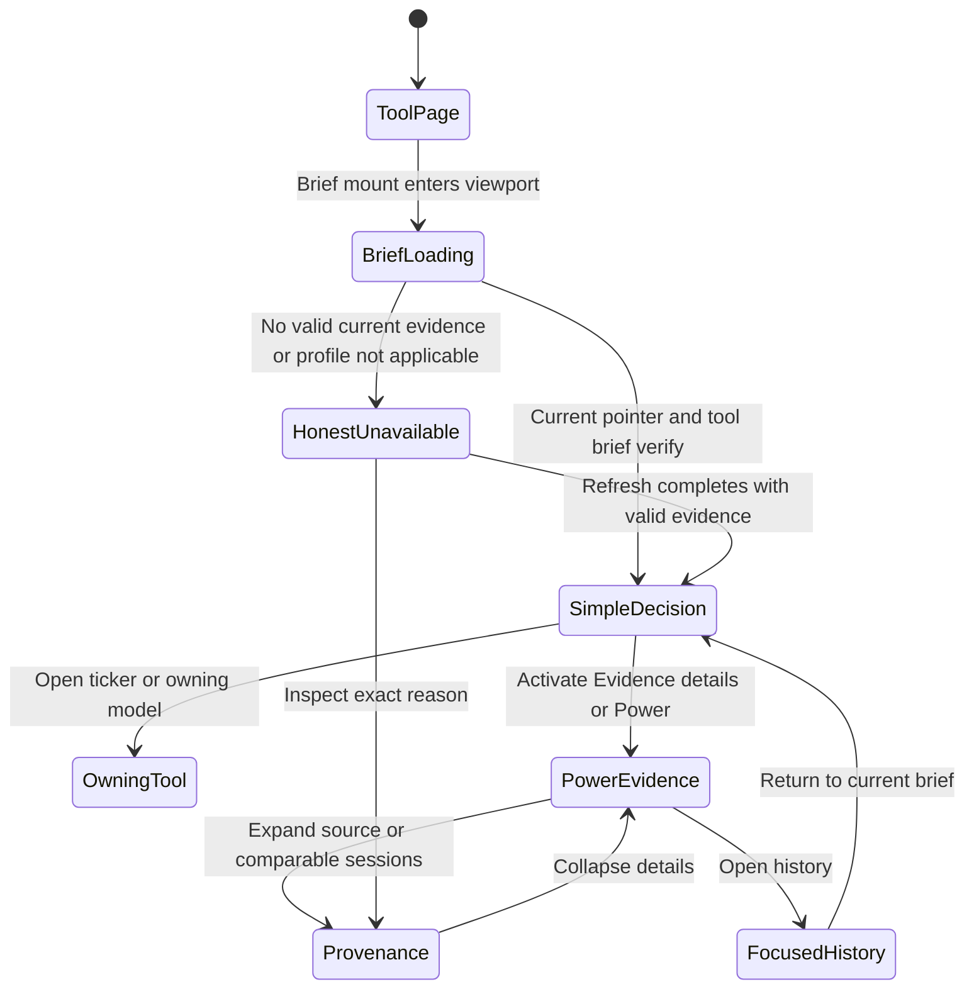
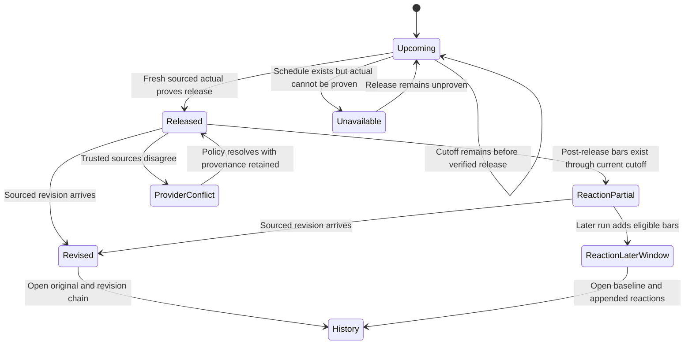
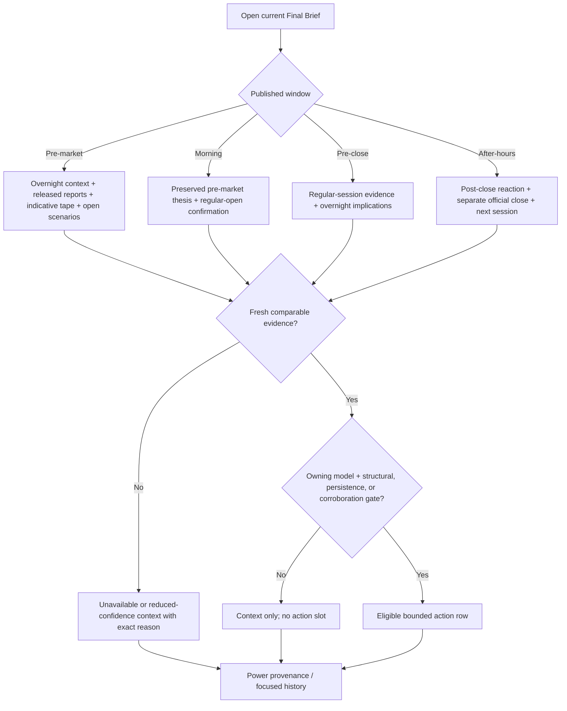
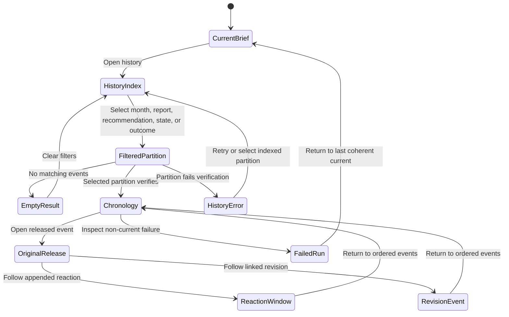

# Feature: 002 Distributed Tool Briefs and Recommendation History

## Problem Statement

Research Lab has a registry-wide promise but not a registry-wide briefing capability. `tools.json` is the live discovery authority. Its 2026-07-14 snapshot contains 18 entries: Market Brief as the final aggregator and 17 source tools after Bond Regime was registered. Five source pages currently publish normalized `RLDATA.putToolRead(...)` output: Sector Rotation, Global Rotation, Real Assets, Bond Regime, and ETF Momentum. Those counts describe the observed snapshot; they are not a fixed participant inventory. Every run must discover its source-tool set and final aggregator from the frozen registry so later registrations participate without a requirements amendment or hand-maintained prompt list. The scheduled workflow in `scripts/brief-refresh-and-push.sh` refreshes shared data, creates one deterministic Market Brief snapshot, makes one final narrative-authoring call, and then stages a scoped commit and push. It does not author, validate, persist, or display one brief per registered source tool.

The current history surface is also becoming a poor fit for repeated agent use. `brief-history.jsonl` contains 26 root-level rows and is 194,012 bytes, while the current final payload is 85,544 bytes. An agent seeking one tool's latest recommendation or one recommendation's lifecycle must read unrelated global snapshots and large narrative bodies. Repeated runs over unchanged market data can also preserve nearly identical prose without a stable run identity, recommendation identity, or explicit carried-forward relationship.

These gaps create six concrete failure modes:

1. Most tools have no durable, tool-specific post-refresh explanation or recommendation history.
2. The final Market Brief can inspect registry coverage, but it cannot prove that it consumed a validated current brief from every relevant tool.
3. Duplicate recommendations can appear across tools or repeated runs without a deterministic identity linking them.
4. A failed authoring, validation, commit, or push step can leave ambiguity about which current and historical artifacts belong to one coherent run.
5. Static, local-model, and off-theme tools can be treated as if they were failed live-market tools, creating pressure to invent market recommendations where no fresh model evidence exists.
6. A run labeled pre-market or after-hours can still rely on prior daily closes and schedule-only event notes, so it can miss already-released reports, mistake an indicative extended-hours print for an official close, or compare a partial extended-hours volume window with an incomparable full regular session.

The capability must therefore distribute authorship to every registered source tool while retaining one final aggregation step, one coherent run lifecycle, compact point reads, append-only recommendation accountability, and truthful no-action outcomes.

## Outcome Contract

**Intent:** After each scheduled refresh, every source tool discovered from the frozen registry has a current, validated, LLM-authored brief grounded in that tool's normalized read or explicit no-data/read state. Eligible live-market reads share source-aware market-session and released-report evidence without moving model ownership into the brief. The final Market Brief is authored only after those source outcomes are valid, consumes every current source ToolBrief and ToolModelRead outcome, and publishes one provenance-complete, de-duplicated global view.

**Success Signal:** A user or agent can open any registered tool and see its current brief, freshness, evidence boundary, actionable recommendation or explicit no-recommendation reason, and prior recommendation lifecycle. For a scheduled report or market-session transition, the user can distinguish what was knowable before the release or session from what became available afterward, and can see why an extended-hours price move or volume reading is or is not unusual relative to comparable evidence. From the final brief, the same user can account for every registry entry, trace each retained recommendation to its originating tool brief, model read, session/report evidence, and source cutoff, and reconstruct the exact successful run without reading unrelated historical partitions.

**Hard Constraints:**

- Every registry-discovered source tool, including a static, local-model, off-theme, stale, unavailable, not-run, or otherwise no-data participant, must receive a truthful brief/history outcome but no invented recommendation.
- All registry-discovered source-tool brief/read outcomes must be authored or carried forward and validated before final-brief authorship begins.
- A successful publish is atomic: current files, history rows, indexes, run record, final brief, commit, and push all refer to one run identity.
- Duplicate scheduler invocations and retries cannot append duplicate brief, recommendation, lifecycle, or run history.
- Cross-tool agreement may be merged, but disagreement, incompatible horizons, and distinct invalidations cannot be averaged away.
- History remains append-only from the consumer perspective; corrections and lifecycle changes create new events.
- Static, local-model, off-theme, and live-market tools retain distinct truth and aggregation policies.
- Market-session evidence uses `America/New_York`, an explicit trading calendar, source timestamps, and a run cutoff; evidence from another session or from after the cutoff cannot leak into or be counted twice in a read.
- Extended-hours prints remain indicative and distinct from the prior official regular close. Partial pre-market or after-hours volume is compared only with aligned comparable windows, never with a full regular-session total.
- Before a scheduled report is released, a brief may discuss scenarios but not an actual. After release, an eligible brief must consume the sourced actual print and any comparable surprise before making a report-dependent claim.
- Shared evidence may inform an owning live-market model read and final aggregation, but neither a tool brief nor the final brief may recompute or replace the owning model.
- No committed brief or history artifact may contain provider credentials, private browser state, position size, cost basis, P&L, account identity, or unpublished private research.
- The existing incomplete Causal Rotation feature is an optional future registry participant, not a prerequisite for this capability.

**Failure Condition:** The feature fails even if every file is syntactically valid when one registered source tool is silently omitted, a no-data tool receives a fabricated recommendation, a retry duplicates history, a partial run replaces current files, cross-tool disagreement is hidden as consensus, a final recommendation lacks provenance, an agent must scan unbounded global history to answer a single-tool question, an actual report value is inferred from a schedule, post-release evidence contaminates a pre-release baseline, or an extended-hours print or partial-volume window is presented as an official close or comparable full-session observation.

## Goals

- Create one reusable registry-driven briefing and history capability for every current and newly registered tool.
- Preserve the sequence shared refresh -> source-tool reads -> all tool briefs -> final brief -> scoped commit -> push.
- Define deterministic identities for runs, model reads, briefs, recommendations, observations, lifecycle events, and final aggregation.
- Preserve every scheduled invocation as an auditable run outcome without duplicating unchanged brief content.
- Make current and recent historical reads small, direct, and predictable for both browsers and agents.
- Track recommendation creation, reaffirmation, material change, withdrawal, expiry, and observed outcome without rewriting earlier states.
- Keep final Market Brief recommendations low-noise through provenance-aware cross-tool de-duplication.
- Give eligible live-market tools and the final aggregator one shared, source-aware market-session evidence vocabulary without centralizing their model logic.
- Distinguish scheduled, released, revised, stale, missing, and disputed report evidence and align any claimed market reaction strictly after the release timestamp.
- Make each scheduled window prioritize the evidence that is actually available and decision-relevant at its cutoff.
- Bound authoring cost by skipping unchanged work, limiting context to current structured artifacts, and enforcing per-profile budgets.
- Migrate the existing 26-row `brief-history.jsonl` corpus without inventing missing per-tool or final narratives.

## Non-Goals

- Replacing the market models, formulas, data refresh rules, or ownership of any registered tool.
- Treating every registered tool as a market-timing tool or forcing every brief to contain a trade recommendation.
- Making the final Market Brief an input to itself.
- Reconstructing historical LLM prose or recommendations that were never persisted.
- Introducing personalized portfolio advice, order execution, brokerage connectivity, or position tracking.
- Publishing browser-local model state or credentials into repository history.
- Completing, modifying, or depending on `specs/001-causal-rotation-intelligence`.
- Expanding Feature 002 into Causal Rotation, Bond/FX model redesign, or replacement of any owning tool's formulas.
- Selecting a paid provider, introducing a server-side data service, or weakening the public static-site and free/source-compatible input constraint.
- Defining implementation architecture, source files, or delivery scopes owned by downstream design and planning agents.

## Current Capability Map

| Capability | Concrete Repository Evidence | Current Status | Gap Owned By This Feature |
| --- | --- | --- | --- |
| Registry of available tools | The 2026-07-14 `tools.json` snapshot contains Market Brief plus 17 source entries, including `bond-regime-lab` | Complete for the observed snapshot | Registry entries do not yet declare a briefing role/profile or refresh/read policy; participant enumeration must remain registry-derived |
| Normalized current tool read | `RLDATA.putToolRead(...)` is used by Sector Rotation, Global Rotation, Real Assets, Bond Regime, and ETF Momentum | Partial; five currently discovered source publishers | Every discovered source entry without a durable normalized publisher needs an explicit read state rather than omission |
| Bond Regime owning read | `bond-regime-lab.html::buildBondToolRead` publishes credit regime, duration posture, confidence, optional preferred sleeve, scenario/horizon/result, conflicts, confirmation state, evidence dates, and an indeterminate reason | Complete current source publisher; per-tool brief/history missing | Its brief must preserve observed-versus-modeled separation, source rights, scenario limitations, and honest no-action behavior |
| Registry-wide coverage reason | `scripts/brief-refresh.mjs::buildToolCoverage` derives coverage from `tools.json` | Partial | Coverage can say inspect a tool, but no validated per-tool brief exists |
| Deterministic shared refresh | `scripts/brief-refresh.mjs` writes `market-brief.snapshot.json` and appends one root history row | Partial | No run manifest binds source reads, tool briefs, final brief, and publish state |
| Tool-specific LLM authorship | No per-tool brief artifacts or authoring phase exist | Missing | Every source tool needs a grounded current brief and history |
| Final LLM authorship | `scripts/brief-refresh-and-push.sh` contains one final Copilot authoring block | Complete for the current final brief | Final authorship occurs without a validated complete set of current tool briefs |
| Final payload validation | `scripts/validate-brief-payload.mjs` validates action shape and registry coverage | Partial | It does not verify per-tool brief lineage, run identity, lifecycle, or de-duplication |
| Current final user experience | `market-brief.html` renders final narrative, tool reads, and coverage | Partial | Tool pages do not show their own brief section or history view |
| Historical snapshots | `brief-history.jsonl` has 26 rows and is 194,012 bytes | Partial | One growing mixed file is costly for point reads and has no recommendation lifecycle index |
| Current final narrative | `market-brief.payload.json` is 85,544 bytes | Complete but large | Agents cannot select small per-tool/current records before loading the full narrative |
| Recommendation accountability | Recommendations exist in final payload prose and arrays | Partial | No stable recommendation key, observation fingerprint, lifecycle, or outcome ledger |
| Scoped publication | The scheduler stages named brief/data paths and commits before push | Partial | No run-level atomicity contract covers all new current/history/index artifacts |
| Scheduled-window classification | `scripts/brief-refresh.mjs::argWindow` labels four windows from the `America/New_York` clock | Partial | The label does not prove exchange-calendar state or identify which source observations belong to pre-market, regular, after-hours, holiday, or early-close windows |
| Tier-A market evidence | `scripts/brief-refresh.mjs::yahooRowsMemo` defaults to `1d` rows and `dailySnapshotRows` | Partial | A pre-market or after-hours run is mostly anchored to the latest daily bar rather than source-aware extended-hours price and volume |
| Intraday session analytics | `intraday-tape-lab.html` computes regular-session VWAP, profile, and prior value area | Partial | Its Yahoo request sets `includePrePost=false`, and `segment()` drops bars outside 09:30-16:00, so it cannot supply pre-market or after-hours evidence today |
| Macro/event evidence | `market-brief.config.json::macroEvents` stores scheduled dates and narrative notes; `rldata.js` macro state is a market-regime gauge | Partial | There is no shared released-report record with actual, consensus, previous, revision, units, source time, and reaction cutoff |
| Closed-session handling | `scripts/brief-refresh.mjs::main` marks Saturday/Sunday closed and `nextSessionDate` skips weekends | Partial | Exchange holidays and early closes are not represented by an explicit market calendar |
| Causal Rotation integration | Spec 001 is incomplete and its tool is not registered | Not available | Auto-discover it only after valid registry entry; do not create a dependency |

## Honest Findings And Constraints

1. **The current registry promise exceeds current production evidence.** Repository instructions say every tool writes a Simple-view tool read, but the current code search finds five source publishers. The new capability must model every other registry-discovered source as a migration/read-state requirement, not encode the current snapshot cardinality as permanent truth.
2. **The registered Market Brief is a special participant.** Treating every registry entry identically would make the final brief consume itself. `market-brief` is the final aggregator; all entries discovered with the source role participate in the source-tool barrier. The current 18/17 split is a dated snapshot, not a scheduler constant.
3. **Bond Regime is an owning live-market model, not a static configuration page.** Its compact read is derived from exact-date adjusted credit ratios, duration-confound attribution, independent confirmation when available, nominal/real Treasury curves, common-date breakevens, and a seven-sleeve carry/rate/spread/convexity scenario model. Its brief may explain that read but cannot treat the two credit ratios as independent confirmations, publish restricted current-tab OAS/financial-conditions observations, convert a scenario estimate into a forecast, or recommend a sleeve when the read is indeterminate or no expression is policy-eligible and rankable.
4. **Not every tool has a meaningful market recommendation.** Strategy Self-Improvement uses deterministic synthetic paths, Smart-Money uses illustrative filing data, and Waterfront Polo is off-theme. Their briefs can still provide tool-specific next actions and limitations, but they cannot be promoted into market recommendations without eligible evidence.
5. **Exactly-once cannot mean one LLM call on every timer tick.** If inputs and policy are unchanged, another call creates cost and prose churn rather than new information. Exactly-once means one authoritative run reference and no duplicate content; unchanged validated briefs are carried forward by reference.
6. **Legacy final history is incomplete.** The 26 deterministic history rows do not prove that a corresponding final narrative or per-tool brief existed for every row. Migration must preserve this absence explicitly.
7. **Repository onboarding is not complete.** This specification can define the product contract, but no delivery or certification claim follows from its creation.
8. **A window label is not session evidence.** `argWindow()` classifies the run by wall clock, while Tier A's tracked assets still resolve through daily rows. The pre-market payload can therefore describe the prior official close without observing the current pre-market tape.
9. **The existing intraday owner is regular-session-only.** The Intraday Tape requests `includePrePost=false` and filters to 09:30-16:00. Its VWAP and volume profile are useful owning-model evidence, but they do not currently establish comparable extended-hours baselines.
10. **The event calendar does not establish a release.** `macroEvents[]` contains schedules and human-authored notes. It cannot prove that CPI or another report has been released, what the actual print was, or which bars occurred after release.
11. **Weekend logic is not a market calendar.** Current closure and next-session logic skips weekends but cannot truthfully classify exchange holidays or early-close boundaries.

## Domain Capability Model

### Capability

**Distributed Tool Briefing and Recommendation History** is the registry-driven capability that freezes one coherent tool-read set, authors and validates one truthful brief per source tool, aggregates those briefs into a final brief, publishes the set atomically, and preserves recommendation identity and outcomes across repeated runs. Its shared **MarketSessionEvidence** sub-capability normalizes source and time truth for eligible live-market reads; it does not own or recompute the models that interpret that evidence.

### Domain Primitives

| Primitive | Purpose | Lifecycle |
| --- | --- | --- |
| ToolModelRead | Normalized, source-bounded description of what one tool currently knows after its refresh or model evaluation | pending -> fresh, stale, unavailable, not-run, or not-applicable -> superseded |
| ToolBrief | LLM-authored interpretation of exactly one ToolModelRead under the tool's briefing profile | draft -> validated -> staged -> published -> superseded; rejected drafts never become current |
| BriefRun | One scheduled or explicit invocation binding registry, frozen inputs, authorship attempts, validation, publication, and push outcome | scheduled -> refreshing -> inputs-frozen -> tool-briefing -> final-briefing -> validated -> committed -> pushed; any phase may end in a named failed state |
| Recommendation | A falsifiable action or no-action decision attributable to one or more tool briefs | proposed -> active -> reaffirmed or modified -> withdrawn or expired |
| RecommendationObservation | What a run observed about a recommendation without changing its stable logical identity | new, unchanged, strengthened, weakened, conflicted, satisfied, invalidated, or not-evaluable |
| LifecycleEvent | Append-only record of a recommendation or brief transition, correction, or outcome | appended once; correction references an earlier event rather than replacing it |
| FinalBrief | Global Market Brief authored from the frozen normalized reads and all current validated source-tool briefs | draft -> validated -> staged -> published -> superseded |
| HistoryPartition | Bounded chronological collection for one tool, final brief, recommendation event stream, or run ledger | open for one calendar month -> sealed -> retained |
| HistoryIndex | Compact routing metadata that lets an agent locate current records and relevant partitions without reading narrative bodies | rebuilt atomically with a publish; versioned and replaceable from authoritative history |
| DedupIdentity | Deterministic logical key used to recognize the same run, input, brief content, or recommendation across retries and tools | derived immutably from canonical business fields |
| ValidationResult | Structured proof that one read, brief, final aggregation, partition, or publish set satisfies the current contract | pending -> passed or failed; failed content cannot become current |
| MarketSessionEvidence | Source-aware envelope describing what price, volume, report, and calendar evidence was available by one run cutoff | pending -> available, partial, stale, unavailable, misaligned, or disputed -> superseded |
| MarketSessionWindow | Canonical `America/New_York` trading-date interval and kind used to prevent cross-session leakage | scheduled -> open -> complete, early-closed, holiday-closed, or unavailable |
| ComparableSessionBaseline | Robust historical distribution for the same session kind and elapsed-minute or explicitly equivalent bucket | insufficient -> qualified or available -> superseded when the comparison policy changes |
| ReleasedReportEvidence | One scheduled economic report's sourced lifecycle and values, including append-only revisions | upcoming -> released -> revised; any state may become stale, disputed, or unavailable |
| EventMarketReaction | Price and volume evidence observed strictly after a released report against a preserved pre-release baseline | pending -> partial -> complete, stale, unavailable, or disputed |

### Market Session Vocabulary

All boundaries use `America/New_York` and half-open intervals so a bar belongs to one session at most. An authoritative U.S. trading calendar supplies the trading date, regular open, official regular close, holiday, and early-close state.

| Session Kind | Business Boundary | Required Interpretation |
| --- | --- | --- |
| `pre-market` | 04:00 ET through the calendar's regular open, normally 09:30 ET | Indicative extended-hours trading before the official regular session; never an official close |
| `regular` | Calendar regular open through the official regular close, normally 09:30-16:00 ET and shorter on an early-close day | The only session whose official close may be labeled the regular close |
| `after-hours` | After the calendar's official regular close through the source/venue's declared extended-hours end, no later than 20:00 ET | Indicative post-close trading; coverage may shorten on an early-close day and must be disclosed |
| `closed` | Outside a recognized session, a full exchange holiday, or a date whose calendar status cannot be established | No live-session inference; retain the last official close only with its original timestamp and state |

### Tool Briefing Profiles

| Profile | Current Registry IDs (2026-07-14 Evidence Snapshot) | Truthful Brief Requirement | Final Aggregation Rule |
| --- | --- | --- | --- |
| `live-market` | `market-heatmap-lab`, `options-flow-feed-lab`, `intraday-tape-lab`, `swing-structure-lab`, `options-structure-lab`, `gamma-trading-lab`, `sector-research-lab`, `global-rotation-lab`, `real-assets-lab`, `bond-regime-lab`, `etf-momentum-lab` | Use current normalized market/model evidence and eligible shared MarketSessionEvidence within the tool's ownership. Stale, unavailable, misaligned, or insufficient inputs must produce an honest no-action brief. Bond Regime additionally preserves its observed credit/curve/inflation evidence separately from user-steered sleeve scenarios and excludes restricted current-tab observations from the normalized read. | Eligible when freshness, source/session alignment, evidence, horizon, trigger, invalidation, and owning-model policy satisfy the recommendation contract |
| `static-model` | `ai-capex-strategy-lab`, `msft-july-print-model` | Explain current configured model output and assumptions. Do not imply a fresh market observation when the model was not re-evaluated. | Eligible only for its declared subject and evidence window |
| `local-model` | `strategy-self-improvement-lab`, `strategy-validation-lab`, `smart-money-flow-lab` | Brief only committed/shared normalized output; never read or publish private browser state. Synthetic, fallback-demo, or illustrative status remains explicit. | May inform methodology or tool action; synthetic/illustrative output is ineligible as live market confirmation |
| `off-theme` | `waterfront-polo-lab` | Provide a domain-specific brief or explicit unchanged state without translating it into a market view. | Coverage only; excluded from market recommendation aggregation with a specific reason |
| `final-aggregator` | `market-brief` | Represented by FinalBrief, not by a pre-final ToolBrief, preventing recursive self-input. | Consumes every current source-tool brief/read outcome and publishes the global result |

This table records the current analyst classification assumptions so Bond Regime and every other present entry are visible during downstream reconciliation. It is not the runtime inventory. Every registry entry must declare exactly one role/profile in registry data, not in a hidden scheduler list. A new source tool becomes a participant through a valid registration and profile, with no specification edit, page-specific branch, or hand-edited final prompt inventory.

#### Bond Regime Brief Boundary

- **Observed data:** exact-common-date distribution-adjusted `JNK/LQD` and `HYG/LQD` relative-price evidence; explicit duration-confound attribution; independent OAS or financial-conditions confirmation only when supplied as a current-tab, memory-only observation; public nominal and real Treasury curves; and exact-common-date ten-year breakeven derivation.
- **Owning model:** credit regime and duration posture remain separate decisions. The seven generic sleeves are modeled under user-selected 3/6/12-month assumptions using carry, rate, spread, and convexity terms. Missing or stale characteristics make a sleeve not rankable; finite shocks beyond local approximation bounds retain arithmetic but reduce reliability and disclose omitted risks.
- **Normalized read:** the current `bond-regime-lab` publisher exposes compact state and provenance-safe fields: evidence as-of, credit regime, duration posture, confidence, optional preferred sleeve, scenario/horizon/result, conflict count, confirmation state, ratio/curve dates, and a reason when no expression is available. It excludes raw restricted observations and source URLs.
- **Tool brief and history:** each run receives a new, carried-forward, or honest no-action Bond Regime brief outcome. A recommendation is eligible only when the owning read is determinate and a policy-eligible rankable expression exists. Otherwise the brief names the missing/stale/indeterminate boundary, preserves scenario limitations, and creates no action. Market Brief must consume this source brief and read outcome exactly once alongside every other current registry source.

### Relationships

- One BriefRun freezes one registry version and one ToolModelRead outcome for every registered source tool.
- One source ToolModelRead may produce one new ToolBrief or reuse one existing validated ToolBrief when the input and policy fingerprints are unchanged.
- One ToolBrief may contain zero or more Recommendations; a valid no-recommendation reason is not a Recommendation.
- One Recommendation has a stable logical identity and many RecommendationObservations and LifecycleEvents.
- Multiple ToolBriefs may reference the same Recommendation identity when their subjects, direction, horizon, and thesis family align.
- Conflicting ToolBriefs retain distinct RecommendationObservations and cannot be collapsed into consensus.
- One FinalBrief references all source-tool outcomes, every included ToolBrief, every carry-forward reference, and every exclusion or failure reason.
- One successful BriefRun appends references to bounded history partitions and atomically advances current pointers and indexes.
- HistoryIndex points to authoritative current files and partitions; it is never the sole copy of historical content.
- One MarketSessionEvidence envelope belongs to one canonical run cutoff and may be referenced by many eligible ToolModelReads without granting the brief authority to recalculate those tools' models.
- MarketSessionWindow classifies every included bar exactly once; a bar cannot contribute to both extended-hours and regular-session aggregates.
- ComparableSessionBaseline compares like session kinds through the same elapsed minute or a declared equivalent bucket and records sample size and coverage.
- ReleasedReportEvidence preserves schedule, release, value, provenance, and revision events; EventMarketReaction references one immutable release observation and only post-release bars.

### Deterministic Identity And Canonicalization

1. **Run key:** the schedule identity and intended window form a stable run key. Concurrent or repeated invocations for that key coordinate on one authoritative run.
2. **Run fingerprint:** the registry fingerprint, sorted frozen ToolModelRead fingerprints, authoring-policy version, validation-policy version, intended session/window, and source revision determine the run fingerprint.
3. **Tool read fingerprint:** canonical normalized model fields, source/as-of state, model version, limitations, and eligible evidence determine the ToolModelRead fingerprint. Volatile collection timestamps and whitespace do not.
4. **Tool brief content fingerprint:** canonical structured meaning fields, recommendation references, no-action reason, provenance, and policy version determine the ToolBrief content fingerprint. Run-local timestamps and prose formatting do not create a new logical brief.
5. **Recommendation key:** owning thesis family, normalized subject/exposure set, action family, horizon, and origin-tool identity determine the stable logical recommendation key.
6. **Recommendation observation fingerprint:** recommendation key plus current trigger, invalidation, rationale facts, confidence band, evidence fingerprints, and applicability determine whether a run is unchanged or materially different.
7. **Final brief fingerprint:** sorted source-tool brief references, frozen normalized read fingerprints, cross-tool resolution decisions, final policy version, and intended window determine the FinalBrief fingerprint.
8. **Canonical form:** identities use UTF-8 canonical structured data with sorted object keys, normalized timestamps and finite numbers, stable enum values, and semantic array ordering. Arrays whose order carries rank or chronology retain that order.
9. **Hash strength:** deterministic fingerprints use a collision-resistant content hash and include the contract version in the hashed material.
10. **Session evidence fingerprint:** calendar identity/version, session kind/date/boundaries, run cutoff, source observations, adjustment state, comparison policy, and released-report/revision identities determine the MarketSessionEvidence fingerprint; later bars or revisions require a later evidence identity.

### Recommendation Lifecycle And Outcomes

| Event | Required Meaning |
| --- | --- |
| `proposed` | First valid actionable recommendation with source brief, trigger, invalidation, horizon, and evidence |
| `reaffirmed` | Same logical recommendation remains active and material actionable fields are unchanged |
| `modified` | Same logical thesis remains, but trigger, invalidation, direction strength, subject set, or confidence band changes materially |
| `conflicted` | Another eligible tool produces an incompatible direction, horizon, or invalidation; both views remain visible |
| `withdrawn` | Owning evidence no longer supports the recommendation before its natural horizon ends |
| `expired` | The declared horizon or event window closes without a superseding active observation |
| `satisfied` | The declared confirmation condition is observed within the evaluation contract |
| `invalidated` | The declared invalidation condition is observed |
| `unresolved` | The evaluation window closes without enough evidence to classify the outcome |
| `not-evaluable` | Required outcome evidence is unavailable or cannot be matched without hindsight |
| `correction` | A later record explains an error and references the original immutable event |

Outcome classification evaluates the frozen recommendation terms. Later facts may classify the outcome but may not improve the original recommendation, evidence, confidence, or timestamp.

### Business Policies

1. **Registry completeness:** every registered source tool has exactly one ToolModelRead outcome and one ToolBrief outcome in every BriefRun.
2. **Truth before action:** `stale`, `unavailable`, `not-run`, and `not-applicable` are valid read states. None can be converted into a market recommendation by the LLM.
3. **Aggregator non-recursion:** the final aggregator has a FinalBrief and coverage outcome, not a source ToolBrief.
4. **Frozen inputs:** once tool-brief authorship begins, retries use the same frozen input manifest. New data requires a separately identified run.
5. **Exactly-once publication:** one run key and run fingerprint can produce at most one authoritative published run record and one set of history references.
6. **Content de-duplication with run accountability:** unchanged validated briefs and recommendations are reused by reference; the run ledger still records that each tool was evaluated and carried forward.
7. **No hidden consensus:** compatible recommendations may merge with multiple origins; conflicts remain explicit and affect final confidence and wording.
8. **Atomic current state:** no current tool brief, final brief, or index advances unless the complete publish set validates.
9. **Append-only history:** published history and lifecycle events are never edited or removed. Corrections append.
10. **Source ownership:** a tool brief interprets its owning tool's read; it cannot repair, recompute, or silently replace that tool's model.
11. **Low-noise final:** coverage is mandatory, but only decision-relevant eligible recommendations consume final action or attention space.
12. **Agent-selectable history:** indexes reveal partition, date range, counts, fingerprints, and byte size before an agent loads narrative content.
13. **Knowledge cutoff:** each run records what was available by its cutoff; evidence arriving later cannot alter that run's read, brief, or pre-release baseline.
14. **Session isolation:** source observations are classified once under the canonical calendar and cannot leak across pre-market, regular, after-hours, or closed states.
15. **Comparable extended hours:** partial extended-hours price and volume are interpreted against the prior official close and like-for-like historical windows, never a full-day total.
16. **Missing is not zero:** an absent bar or volume field remains unavailable; a sourced zero-volume bar remains an observed zero and carries its own thin-trading qualification.
17. **Release truth:** a schedule proves an upcoming event only. An actual, consensus comparison, or revision requires released-report provenance and comparable units.
18. **No look-ahead:** event reaction evidence uses only observations timestamped after release and preserves the last eligible pre-release observation as its baseline.
19. **Profile containment:** static, local-model, and off-theme tools may expose shared evidence only as sourced context permitted by their profiles; it cannot manufacture a live recommendation or override their declared evidence boundary.
20. **Public low-noise operation:** session/report evidence remains source-compatible with the public static site, bounded for agent context, privacy-safe, and educational rather than personalized advice.

## Agent-Friendly History And Access Contract

### Access Patterns

The format follows observed access patterns rather than one universal file:

- Tool pages and agents most often need one tool's current brief.
- Outcome review needs one recommendation's event chain across runs.
- Run diagnosis needs one scheduled run and all its participant outcomes.
- The final author needs all current source-tool briefs, but no historical narrative by default.
- Migration and audit need chronological append-only records.

### Required Logical Surfaces

| Surface | Format | Reason Tied To Access Pattern |
| --- | --- | --- |
| Current source-tool brief | One complete JSON document per tool | One direct point read without loading other tools or history |
| Current final brief | One complete JSON document | Preserves the existing final point-read behavior and supports the UI |
| Current/history index | Compact JSON metadata only | Lets an agent choose a tool, run, recommendation, or monthly partition before reading narrative text |
| Per-tool history | One JSONL partition per tool per calendar month | At four scheduled runs per day, a tool partition is bounded to about 124 run references per month and supports focused chronology |
| Final-brief history | One JSONL partition per calendar month | Separates large final narratives from tool histories and bounds scans to one month |
| BriefRun ledger | One JSONL partition per calendar month | Reconstructs each invocation, retries, failures, carry-forwards, commit, and push without loading brief bodies |
| Recommendation lifecycle | Monthly JSONL event partitions plus a compact current-state index | Supports append-only outcome review and direct lookup by recommendation key |

The index contains no full narrative bodies. It records contract version, partition path, first and last run time, row count, byte size, content fingerprint, and current authoritative references. An index can be regenerated from history and must never override conflicting authoritative rows.

### Partition Rules

- Partitions use the BriefRun's intended market-window date in the configured canonical timezone, not the machine's accidental local date.
- A run never spans two monthly partitions. All references use the run's canonical month.
- A sealed prior-month partition is immutable. Corrections append to the current event partition and point to the affected historical identity.
- Per-tool partitions contain new ToolBrief content and carry-forward references, not repeated copies of unchanged narrative.
- Recommendation event partitions contain lifecycle facts, not embedded copies of every source brief.
- The final authoring context reads current JSON documents and compact indexes only. Historical partitions are loaded only for an explicit change/outcome question.

## Actors And Personas

| Actor | Description | Key Goals | Permission Boundary |
| --- | --- | --- | --- |
| Research User | Uses one or more labs to make research decisions | Understand what changed in one tool, what to do or not do, and how the view evolved | May inspect and filter briefs/history; cannot alter committed history through the UI |
| Tool Owner | Owns one registered tool's model and normalized read contract | Ensure the brief reflects the tool's actual evidence, limitations, and freshness | Owns model truth; cannot certify the final cross-tool conclusion alone |
| Market Brief Analyst | Owns low-noise global synthesis | Consume every current tool outcome, resolve duplication, preserve conflict, and produce attributable actions | May aggregate valid briefs; cannot invent missing tool evidence or omit a registry entry |
| Scheduler Operator | Relies on unattended refresh and publication | Get one coherent publish or an actionable failure with safe retry | May retry failed phases; cannot bypass validation or publish a partial set |
| Research Agent | Reads structured artifacts to answer questions or generate analysis | Locate current and historical records with minimal context and deterministic provenance | Reads indexes and selected partitions; must not infer absent history |
| Risk And Audit Reviewer | Reviews recommendation quality and process integrity | Trace recommendations, conflicts, changes, outcomes, costs, and publish failures | May classify outcomes and append corrections; cannot rewrite prior events |

## Use Cases

### UC-001: Read a tool-specific brief after refresh

- **Actor:** Research User
- **Preconditions:** The tool is registered as a source tool and the latest successful BriefRun includes it.
- **Main Flow:**
  1. The user opens the tool.
  2. The tool shows its current brief, source/model as-of state, recommendation or no-action decision, trigger, invalidation, limitations, and provenance.
  3. The user follows the history control to inspect changes without leaving the tool context.
- **Alternative Flows:** If the latest scheduled invocation failed globally, the last published brief remains current and the failed run is visible separately. If the tool had no fresh evidence, the brief states that and contains no invented recommendation.
- **Postconditions:** The user can distinguish current, carried-forward, stale, unavailable, and failed-run states.

### UC-002: Author truthful briefs for heterogeneous tools

- **Actor:** Tool Owner and Scheduler Operator
- **Preconditions:** Shared refresh has completed and the registry snapshot is frozen.
- **Main Flow:**
  1. Each source tool produces a normalized read outcome under its declared profile.
  2. The authoring stage receives only allowed structured fields and current evidence.
  3. One ToolBrief is authored and validated, or an unchanged validated brief is carried forward by reference.
  4. Every source-tool outcome is recorded before final authorship begins.
- **Alternative Flows:** Off-theme tools receive domain-specific coverage only. Local-model tools expose only committed normalized output. Missing evidence produces a no-recommendation brief.
- **Postconditions:** The complete source-tool set is ready for final aggregation or the run fails before current state changes.

### UC-003: Produce the final de-duplicated Market Brief

- **Actor:** Market Brief Analyst
- **Preconditions:** Every source-tool outcome is present and all newly authored briefs pass validation.
- **Main Flow:**
  1. The final author receives all current source-tool briefs and frozen normalized reads.
  2. Compatible recommendations are grouped by deterministic identity.
  3. Independent confirmations retain all origins; duplicates collapse; conflicts remain visible.
  4. The final brief records included, coverage-only, excluded, carried, and conflicted tool outcomes.
  5. The final brief validates before publication.
- **Alternative Flows:** A recommendation that is ineligible, stale, synthetic-only, off-theme, or not decision-relevant remains in coverage and consumes no action slot.
- **Postconditions:** Every final recommendation is traceable to source briefs and model-read fingerprints.

### UC-004: Retry a failed or duplicated run safely

- **Actor:** Scheduler Operator
- **Preconditions:** A run key already exists in progress, failed, committed, or pushed state.
- **Main Flow:**
  1. The scheduler resolves the existing run key and fingerprint.
  2. It resumes only the first incomplete retryable phase using the frozen input manifest.
  3. It reuses validated briefs and a committed publish set when present.
  4. It appends no duplicate authoritative history.
- **Alternative Flows:** A concurrent invocation exits as duplicate/in-progress. A changed input set requires a distinct explicit run identity. A push-only failure retries the same commit without re-authoring.
- **Postconditions:** At most one authoritative publish exists for the run key and fingerprint.

### UC-005: Review recommendation lifecycle and outcome

- **Actor:** Risk And Audit Reviewer
- **Preconditions:** A stable recommendation key exists in the current-state index.
- **Main Flow:**
  1. The reviewer selects the recommendation.
  2. The history view loads only the indexed monthly event partitions.
  3. The reviewer sees proposal, reaffirmation, material changes, conflicts, withdrawal/expiry, and outcomes in order.
  4. Any correction references the immutable original event.
- **Alternative Flows:** If outcome evidence is absent, the result is unresolved or not-evaluable rather than guessed.
- **Postconditions:** The original recommendation terms remain frozen and auditable.

### UC-006: Query history efficiently as an agent

- **Actor:** Research Agent
- **Preconditions:** Current and history indexes are valid.
- **Main Flow:**
  1. The agent reads the compact index.
  2. It selects one current JSON file or the smallest relevant monthly partition.
  3. It verifies fingerprints and follows run/recommendation references only as needed.
- **Alternative Flows:** If the index is invalid, the agent reports the integrity problem and may derive a read from authoritative history without trusting the index.
- **Postconditions:** A single-tool or single-recommendation query does not require loading the global legacy history or unrelated narratives.

### UC-007: Migrate legacy brief history without invention

- **Actor:** Scheduler Operator and Risk And Audit Reviewer
- **Preconditions:** The 26-row legacy history and repository commit history are available read-only.
- **Main Flow:**
  1. Each legacy row receives a deterministic source-row fingerprint and run reference.
  2. Available normalized tool reads are preserved with original timestamps and source labels.
  3. Exact duplicate content is stored once and referenced by each legacy run occurrence.
  4. A final narrative is associated only when repository evidence proves the relationship.
  5. Counts, hashes, and timestamp coverage are reconciled before new writes switch to partitions.
- **Alternative Flows:** Missing per-tool briefs, recommendations, or final narratives are marked unavailable; they are never reconstructed from hindsight.
- **Postconditions:** All 26 source rows are accounted for and the legacy file remains an immutable migration source until parity is accepted.

### UC-008: Auto-discover a newly registered tool

- **Actor:** Tool Owner and Market Brief Analyst
- **Preconditions:** A new tool has one valid registry entry and briefing profile.
- **Main Flow:**
  1. The next run freezes the new registry fingerprint.
  2. The new source tool receives a normalized read outcome and ToolBrief outcome automatically.
  3. Final coverage includes the same tool identity without a hand-maintained prompt list.
- **Alternative Flows:** An incomplete registry profile blocks publication with a specific registry-contract failure.
- **Postconditions:** Registry membership remains the single discovery mechanism.

### UC-009: Read a source-aware market-session brief

- **Actor:** Research User and Tool Owner
- **Preconditions:** An eligible live-market tool has an owning model read, the run has a canonical cutoff, and a U.S. trading-calendar state can be established.
- **Main Flow:**
  1. The run classifies each eligible source observation as pre-market, regular, after-hours, or closed under `America/New_York` and the canonical calendar.
  2. The shared evidence preserves the prior official regular close separately from indicative extended-hours price, current session open/high/low/latest, valid volume-weighted price, and source freshness.
  3. Current cumulative volume is compared with prior sessions of the same kind through the same elapsed minute or a declared equivalent bucket, with sample size, coverage, and a robust baseline.
  4. The owning tool consumes the evidence within its model boundary and publishes its ToolModelRead; the ToolBrief explains the resulting evidence without recomputing the model.
  5. The user sees whether the move and volume are unusual, ordinary, too thin, stale, disputed, or unavailable.
- **Alternative Flows:** A holiday or early close changes the session boundary. Missing bars remain missing rather than zero. A split or unresolved corporate action blocks an unadjusted comparison. Insufficient comparable history yields a qualified or unavailable baseline and no anomaly claim.
- **Postconditions:** The user can distinguish the prior official close from indicative extended-hours trading and can audit the comparison window and source cutoff.

### UC-010: Consume a released report and its aligned market reaction

- **Actor:** Research User, Market Brief Analyst, and Risk And Audit Reviewer
- **Preconditions:** A scheduled report has a sourced release schedule and the run cutoff is known.
- **Main Flow:**
  1. Before the release, the report remains upcoming and briefs may describe bounded scenarios without asserting an actual.
  2. After a sourced release, the evidence records scheduled and released timestamps, actual, consensus, previous, revision, units, provenance, and freshness.
  3. When actual and consensus are comparable, the owning read quantifies the surprise without changing either source value.
  4. Reaction evidence freezes the last eligible pre-release observation and uses only price and volume bars available after the release timestamp.
  5. Later revisions append a new evidence event and preserve the original release and reaction history.
- **Alternative Flows:** A schedule-only source cannot promote the report to released. Unit mismatch, missing actual, stale values, or provider disagreement remains visible and blocks a single synthesized surprise. Missing post-release bars yield an unavailable or partial reaction rather than a guessed move.
- **Postconditions:** The user can reconstruct what was known before release, what became known at release, and what the market did afterward without look-ahead.

### UC-011: Author a window-relevant final brief

- **Actor:** Market Brief Analyst
- **Preconditions:** Every source-tool outcome and its evidence cutoff are frozen for one scheduled window.
- **Main Flow:**
  1. A pre-market run prioritizes overnight context, reports already released, the current pre-market tape, and regular-open scenarios.
  2. A morning run compares regular-session opening confirmation with the preserved pre-market thesis.
  3. A pre-close run emphasizes current regular-session evidence and overnight exposure implications.
  4. An after-hours run emphasizes sourced post-close reactions and next-session implications while retaining the official regular close separately.
  5. The final brief preserves source provenance, unavailable states, and conflicting tool interpretations and promotes only evidence-backed actions that clear the owning-model and low-noise gates.
- **Alternative Flows:** If no item clears the action gate, the final brief publishes a truthful no-action result while retaining complete tool and evidence coverage.
- **Postconditions:** The visible brief reflects evidence available for its actual window rather than reusing a generic prior-close narrative.

## Requirements

### Registry, Profiles, And Truthfulness

- **FR-001:** The briefing participant set must be derived from the frozen `tools.json` registry for each run.
- **FR-002:** Every registry entry must declare exactly one briefing profile and whether it is a source tool or final aggregator.
- **FR-003:** Every source tool must produce one normalized ToolModelRead outcome per run, including tool identity, profile, model/read contract version, as-of/source-as-of, freshness, status, limitations, deep link, and deterministic fingerprint.
- **FR-004:** Every source tool must have one ToolBrief outcome per run: newly authored, carried forward, no-recommendation, or failed.
- **FR-005:** A stale, unavailable, not-run, or not-applicable ToolModelRead must not create a new market recommendation.
- **FR-006:** A no-recommendation ToolBrief must state the exact evidence or applicability reason and may include an operational next step such as refreshing data without disguising it as a market action.
- **FR-007:** Static and local-model briefs must identify assumption, synthetic, illustrative, or local-only boundaries in both current and historical views.
- **FR-008:** Off-theme briefs must remain tool-specific and must be excluded from market recommendation aggregation with a visible reason.
- **FR-009:** The final aggregator must not produce or consume a pre-final ToolBrief for itself.
- **FR-010:** A newly registered source tool with a valid profile must be included automatically on the next run.

### Ordered Run And Exactly-Once Semantics

- **FR-011:** The authoritative order must be shared data refresh, per-tool model/read refresh, registry/input freeze, all source-tool brief authoring and validation, final-brief authoring and validation, atomic current/history/index promotion, scoped commit, then push.
- **FR-012:** Final-brief authorship must not begin until every source-tool outcome exists and every newly authored ToolBrief passes validation.
- **FR-013:** A BriefRun must expose a stable run key, run fingerprint, intended window/session, source revision, registry fingerprint, policy versions, state, attempts, per-tool outcomes, final outcome, commit outcome, and push outcome.
- **FR-014:** Once the input manifest is frozen, all retries for that run must use the same ToolModelRead identities.
- **FR-015:** A duplicate or concurrent invocation for the same run key must not start a second authoring or publication path.
- **FR-016:** Re-executing a completed run with the same run fingerprint must return the existing authoritative result without new brief, recommendation, lifecycle, or history content.
- **FR-017:** Materially changed inputs after a completed run require a distinct explicit run identity and cannot rewrite the prior run.
- **FR-018:** Unchanged ToolModelRead and policy fingerprints must reuse the existing valid ToolBrief by reference rather than incur another LLM call or duplicate narrative row.
- **FR-019:** Every scheduled invocation, including duplicate, carried-forward, failed, committed-not-pushed, and pushed outcomes, must be represented in the run ledger without creating a second authoritative publish.

### Tool Brief And Final Brief Contracts

- **FR-020:** A ToolBrief must identify its tool, run, ToolModelRead, input/content fingerprints, profile, authoring model/provider identity, policy/prompt version, authored time, status, freshness, evidence boundaries, limitations, and validation result.
- **FR-021:** A ToolBrief must include a concise actionable summary, but may validly conclude no action or no recommendation.
- **FR-022:** Every Recommendation must include stable identity, subject/exposure, action family, horizon, rationale tied to evidence, trigger or applicability condition, invalidation, confidence band, origin tool, and evidence/source fingerprints.
- **FR-023:** A Recommendation must not use private position data and must remain educational research rather than personalized execution advice.
- **FR-024:** A FinalBrief must reference all source-tool outcomes and distinguish included, merged, carried-forward, coverage-only, conflicted, excluded, and failed states.
- **FR-025:** A FinalBrief must include its run/final fingerprint, all source brief/read references, authoring identity, policy/prompt version, validation result, freshness summary, de-duplication decisions, and publication identity.
- **FR-026:** The run identity in the FinalBrief must be discoverable in the scoped commit metadata so the containing commit can be proven without a circular self-hash.
- **FR-027:** Final recommendations must retain every independent origin and a human-readable explanation of why duplicates were merged or conflicts were preserved.
- **FR-028:** Every registered participant must appear in final coverage even when it contributes no recommendation.

### Cross-Tool De-Duplication And Conflict

- **FR-029:** Repeated wording changes must not create a new Recommendation identity when subject, action family, horizon, thesis family, and origin remain logically unchanged.
- **FR-030:** A material trigger, invalidation, direction, subject set, horizon, or evidence change must create a new RecommendationObservation and a lifecycle event.
- **FR-031:** Compatible same-subject recommendations may merge only when action family, horizon compatibility, and invalidation logic agree.
- **FR-032:** Merged recommendations must not sum or average confidence as if correlated tools were independent.
- **FR-033:** Independent origins must be identified by source/evidence fingerprints rather than tool count alone.
- **FR-034:** Conflicting direction, horizon, evidence quality, or invalidation must remain visible in the FinalBrief and history.
- **FR-035:** One underlying event reflected through several market tools must count as one causal reason when provenance shows a shared origin.
- **FR-036:** Coverage-only, off-theme, stale, synthetic-only, and ineligible recommendations must consume no final action slot.

### Recommendation History And Outcomes

- **FR-037:** Recommendation creation, reaffirmation, modification, conflict, withdrawal, expiry, satisfaction, invalidation, unresolved outcome, not-evaluable outcome, and correction must be append-only LifecycleEvents.
- **FR-038:** A repeated unchanged recommendation must be represented by run reference and reaffirmation metadata without copying the same narrative into each per-tool partition.
- **FR-039:** Outcome evaluation must use the original frozen trigger, invalidation, horizon, and evidence contract.
- **FR-040:** Later evidence may classify an outcome but must not alter the original recommendation or confidence.
- **FR-041:** Outcome history must include unsuccessful, conflicted, expired, unresolved, and not-evaluable recommendations, not only confirmed recommendations.
- **FR-042:** Corrections must reference the affected immutable event and explain the replacement or interpretation without deleting prior content.

### History, Indexing, And Migration

- **FR-043:** Current source-tool briefs and the current FinalBrief must each be independently readable complete JSON documents.
- **FR-044:** Per-tool, final-brief, run-ledger, and recommendation-event history must be partitioned monthly as bounded JSONL streams.
- **FR-045:** Compact JSON indexes must identify current records and partitions by path, date range, row count, byte size, contract version, and fingerprint without embedding narrative bodies.
- **FR-046:** A single-tool current query must require no unrelated history read; a recent single-tool history query must be resolvable from the index and one monthly partition.
- **FR-047:** Final authorship must not load historical partitions by default; history is consulted only for an explicit lifecycle, change, or outcome question.
- **FR-048:** Sealed historical partitions must be immutable and independently integrity-checkable.
- **FR-049:** Indexes must be atomically updated with the publish set and reproducible from authoritative current/history records.
- **FR-050:** Migration must account for all 26 legacy `brief-history.jsonl` rows by source hash, timestamp, window, and migration outcome.
- **FR-051:** Migration must preserve normalized read data that actually exists and mark unavailable any per-tool brief, recommendation, or final narrative that cannot be proven.
- **FR-052:** Exact duplicate legacy content must be stored once and referenced from each original run occurrence.
- **FR-053:** The legacy file must stop receiving new rows only after row-count, timestamp, and fingerprint parity passes; it remains an immutable migration source through acceptance.

### Atomic Publication, Retry, And Failure Policy

- **FR-054:** New current files, history rows, event rows, indexes, run state, and FinalBrief must be validated as one publish set before any current pointer advances.
- **FR-055:** A tool refresh that truthfully results in stale or unavailable data may continue through a valid no-recommendation ToolBrief.
- **FR-056:** A ToolBrief authoring or validation failure must receive no more than two bounded retries using the frozen input; exhaustion blocks final authorship and publication.
- **FR-057:** A FinalBrief authoring or validation failure must receive no more than two bounded retries using the same validated tool-brief set; exhaustion leaves all current pointers unchanged.
- **FR-058:** Failed attempts must remain visible in BriefRun history with error category and attempt count but must not expose rejected narrative as authoritative content.
- **FR-059:** Publication must not expose a subset in which some tool briefs are current and the final brief belongs to another run.
- **FR-060:** A commit failure must leave the prior published current state authoritative and the new publish set recoverable without duplicate history.
- **FR-061:** A push failure after a successful scoped commit must retry the same commit without refresh or re-authoring.
- **FR-062:** A rejected push may reconcile only when unrelated dirty work and overlapping brief paths are preserved; an ambiguous overlap blocks automated publication with an actionable state.
- **FR-063:** Commit and push retries must remain scoped to the run's declared artifact inventory and must never stage unrelated worktree changes.

### Cost And Token Controls

- **FR-064:** Each tool profile must declare enforced input and output token budgets appropriate to its normalized read, with oversize input rejected or deterministically reduced before authoring.
- **FR-065:** Raw full tool state, unbounded arrays, full HTML, and historical partitions must not be sent to the LLM when the normalized current read is sufficient.
- **FR-066:** Unchanged input and policy fingerprints must skip tool-brief LLM authorship and use carry-forward references.
- **FR-067:** Final authorship must consume all complete current ToolBriefs but only normalized current ToolModelReads, not raw tool payloads or legacy global history.
- **FR-068:** Tool-brief calls may use bounded concurrency, but final authorship remains a barrier after all source outcomes validate.
- **FR-069:** BriefRun telemetry must record calls attempted, calls skipped, retries, input/output token usage when available, model identity, duration, and validation failures without recording prompts that contain private data.
- **FR-070:** A configured run-level cost or token ceiling must fail before publication rather than silently omit a registered tool.

### Privacy And Security

- **FR-071:** Authoring inputs must be structured and treated as untrusted data, separated from instructions, and prohibited from granting execution or file-scope authority.
- **FR-072:** Tool-brief and final authoring may write only run-scoped brief artifacts and must not execute content supplied by a tool read.
- **FR-073:** External research access, when permitted, must use an explicit source policy and preserve citations and retrieval time; unverified web content cannot become a fact without validation.
- **FR-074:** Provider credentials, tokens, local storage contents, position size, cost basis, P&L, account identifiers, and private notes must be rejected from committed reads, briefs, indexes, and histories.
- **FR-075:** Browser-local models may contribute only an explicit committed/shared projection; absent local state remains unavailable.
- **FR-076:** Rendered brief content and links must be safe as untrusted text and must not execute embedded markup or navigation instructions.
- **FR-077:** Error and usage telemetry must contain identities, counts, timings, and categories but no secret values or private narrative bodies.

### User Experience

- **FR-078:** Every source-tool page must show a Brief section containing current status, summary, recommendation or no-recommendation reason, trigger, invalidation, freshness, limitations, provenance, and history entry point.
- **FR-079:** The Market Brief page must show registry-complete tool coverage, final actions, merged origins, preserved conflicts, excluded reasons, and final provenance.
- **FR-080:** A shared history view must support filtering by tool, run, date/month, recommendation key, lifecycle state, outcome, and conflict state.
- **FR-081:** The history view must load selected partitions on demand and show when a brief is carried forward rather than newly authored.
- **FR-082:** Failed-run history must be visually distinct from published brief history and must never replace the last published current brief.
- **FR-083:** Empty, stale, unavailable, off-theme, local-only, migration-gap, validation-failed, commit-failed, and push-failed states must each have distinct text.
- **FR-084:** Tool and final views must expose run identity, evidence/model as-of, authored-at, and published-at as separate concepts.
- **FR-085:** Status, lifecycle, conflict, and outcome must be conveyed through text and structure rather than color alone.
- **FR-086:** Current brief and history controls must be keyboard accessible, labeled for assistive technology, and usable on mobile without overlapping the tool's existing controls.

### Cross-Feature Relationship

- **FR-087:** `specs/001-causal-rotation-intelligence` must not appear in `state.json.specDependsOn` for this feature.
- **FR-088:** The Causal Rotation tool must participate only after it is a valid registered source tool with a briefing profile and normalized read contract.
- **FR-089:** If Causal Rotation is not registered or its read is unavailable, this capability must still publish truthful briefs for every other registry participant.
- **FR-090:** Once registered, Causal Rotation must be discovered through the same registry path as every other tool, with no feature-specific scheduler branch.
- **FR-091:** A causal recommendation and its downstream price/options reactions must use provenance-aware reason identity so the final brief does not count them as independent confirmations when they share one origin.

### Shared Market-Session Evidence

- **FR-092:** The capability must provide one shared, source-aware MarketSessionEvidence envelope that eligible live-market ToolModelReads and final aggregation can reference without transferring model ownership to the briefing layer.
- **FR-093:** Every MarketSessionEvidence envelope must use `America/New_York` and a named/versioned U.S. trading calendar to establish the trading date, regular open, official regular close, holiday state, and early-close state.
- **FR-094:** Session classification must distinguish pre-market, regular, after-hours, and closed states using the active calendar boundaries; normal-day reference boundaries are 04:00, 09:30, 16:00, and no later than 20:00 ET, while early-close boundaries come from the calendar.
- **FR-095:** Every source observation must retain provider/source identity, source timestamp, retrieval timestamp, canonical trading date, session kind, freshness policy/result, and run cutoff.
- **FR-096:** A source observation must belong to at most one session aggregate and one evidence cutoff; cross-session leakage, overlapping-window double counting, and use of evidence first available after the cutoff are prohibited.
- **FR-097:** Session evidence must expose `available`, `partial`, `stale`, `unavailable`, `misaligned`, and `disputed` states distinctly and fail loud on an unknown calendar, invalid timestamp, or impossible session assignment.

### Extended-Hours Price Context

- **FR-098:** Extended-hours price context must preserve the prior official regular close and its source/session timestamp as the reference anchor rather than relabeling the latest indicative print as a close.
- **FR-099:** When valid bars exist, each extended-hours session must expose its open, high, low, latest, return from the prior official regular close, and volume-weighted price; volume-weighted price must be unavailable when the included volume is missing or invalid.
- **FR-100:** User-visible and machine-readable outputs must label pre-market and after-hours prices as indicative extended-hours observations and reserve `official regular close` for the calendar-defined regular close.
- **FR-101:** Historical and current comparisons must use split/corporate-action-safe price series with declared adjustment state; an unresolved discontinuity or incompatible adjustment basis must block the comparison rather than create a false move.
- **FR-102:** Missing, stale, timestamp-misaligned, or source-incompatible price evidence must remain unavailable or qualified and must not silently carry forward as a current extended-hours observation.

### Extended-Hours Volume Context

- **FR-103:** Extended-hours evidence must preserve current cumulative observed volume through the run cutoff and the elapsed minute or equivalent declared progress bucket within the session.
- **FR-104:** A volume baseline must use prior comparable sessions of the same kind through the same elapsed minute, or an explicitly defined equivalent bucket whose mapping and coverage are visible.
- **FR-105:** Every baseline must report sample size, eligible-session coverage, missing-session count, comparison policy, and a robust distribution such as median plus percentile rank or an equivalently truthful outlier measure.
- **FR-106:** Thin trading, inadequate sample size, low coverage, or unstable baselines must be labeled and must cap or suppress unusual-volume claims rather than create false precision.
- **FR-107:** A sourced zero-volume bar and an absent bar are distinct states: zero may contribute as an observed zero, while absence must not be imputed as zero.
- **FR-108:** A partial pre-market or after-hours window must never be compared directly with a full regular-session or full-day total, and price-volume or up/down-volume proxies must never be labeled fund flow.
- **FR-109:** Peer, sector, or cross-instrument volume comparisons are eligible only when session kind, elapsed window/bucket, calendar date treatment, source semantics, and coverage are aligned; otherwise they remain unavailable or explicitly non-comparable.

### Released-Report Evidence

- **FR-110:** Scheduled report evidence must use an explicit lifecycle of upcoming, released, revised, stale, unavailable, or disputed rather than inferring release state from the current clock alone.
- **FR-111:** ReleasedReportEvidence must preserve report identity, scheduled timestamp, released timestamp, actual, consensus, previous, revision when present, units/seasonal basis, source/provenance, retrieval time, freshness, and evidence fingerprint.
- **FR-112:** Before the released state is proven, a ToolBrief or FinalBrief may discuss scenarios and consensus uncertainty but must not assert or imply an actual value.
- **FR-113:** After a release is proven and the actual is fresh, eligible report-dependent reads must consume the actual print; when actual and consensus are directly comparable, they must expose the signed surprise in the declared units or percentage basis.
- **FR-114:** A schedule-only source, missing actual, unit mismatch, stale carried value, or prior-period value must not be promoted to a current actual or silently reused.
- **FR-115:** When trustworthy sources disagree on actual, consensus, previous, timestamp, or units, the evidence must preserve each sourced value, expose a disputed state, and block a single synthesized surprise until the conflict is resolved by policy.
- **FR-116:** A report revision must append a revision event linked to the original release, preserve both values and timestamps, and never rewrite the prior evidence or historical brief.

### Event-To-Market Reaction Alignment

- **FR-117:** EventMarketReaction must preserve the last eligible price observation at or before the release as the pre-release baseline, including its timestamp, session kind, and source.
- **FR-118:** Post-release price and volume reaction must use only bars whose source timestamps are after the released timestamp and no later than the run cutoff; later bars must not enter an earlier run or baseline.
- **FR-119:** Reaction evidence must identify whether each observation occurred in pre-market, regular, or after-hours and report only windows that actually exist between release and cutoff.
- **FR-120:** A post-release volume reaction must use the same elapsed-window comparability, sample-size, coverage, and robust-baseline rules as other extended-hours volume evidence.
- **FR-121:** Report revisions and later reaction windows must append linked evidence/history events; they may reinterpret current context but must not rewrite what the earlier run knew or observed.

### Scheduled-Window Relevance

- **FR-122:** A pre-market brief must prioritize overnight context, reports released by its cutoff, current pre-market price/volume, and regular-open scenarios; unreleased events remain scenarios.
- **FR-123:** A morning brief must compare the regular open and current regular-session evidence with the preserved pre-market thesis and identify confirmation, rejection, or insufficient evidence.
- **FR-124:** A pre-close brief must prioritize regular-session price, volume, breadth, and owning-model evidence available by its cutoff, plus clearly labeled overnight implications.
- **FR-125:** An after-hours brief must prioritize sourced post-close reactions and next-session implications, preserve the official regular close as a separate anchor, and avoid treating thin indicative prints as closing prices.
- **FR-126:** Every ToolBrief and FinalBrief must expose the evidence cutoff and exclude or label any source first available after that cutoff, regardless of when the brief was generated or regenerated.

### Profile Boundaries, Noise, And Operating Constraints

- **FR-127:** An eligible live-market tool may consume shared MarketSessionEvidence only within its declared ownership and must publish any interpretation through its ToolModelRead; ToolBrief and FinalBrief authors must not recalculate or override that model.
- **FR-128:** Static-model, local-model, and off-theme tools must retain their existing evidence and recommendation restrictions; shared session/report context cannot turn synthetic, illustrative, private, or unrelated output into live-market confirmation.
- **FR-129:** Final aggregation must preserve source/report/session provenance, unavailable and disputed states, and conflicting owning-tool interpretations; provider or tool disagreement must not be hidden as consensus.
- **FR-130:** An extended-hours anomaly or released-report surprise may consume an attention/action slot only when it is fresh, comparable, decision-relevant, supported by the owning model, and clears the existing persistence/structural/corroboration gate; otherwise it remains context or no-action evidence.
- **FR-131:** MarketSessionEvidence, authoring inputs, current artifacts, and history must remain bounded, privacy-safe, educational rather than personalized advice, compatible with the public static site, and sourced from free or otherwise repository-compatible inputs without exposing credentials.
- **FR-132:** Automated validation must fail loud and preserve prior current state for stale, missing, invalid, or misaligned timestamps; holidays and early closes; partial windows; thin trading and insufficient samples; observed zero versus absent volume; split/corporate-action discontinuities; report revisions; and provider disagreement.

## Business Scenarios

### BS-002-001: Fresh live-market tool receives a grounded brief

```gherkin
Scenario: A registered live-market tool finishes a fresh model refresh
  Given the tool has a current normalized read with source time, limitations, and deterministic fingerprint
  When the source-tool briefing phase runs
  Then one validated tool brief is available for that tool
  And every recommendation cites the current read, trigger, invalidation, and horizon
  And the tool page shows the brief after publication
```

### BS-002-002: Missing fresh data produces no invented recommendation

```gherkin
Scenario: A registered live-market tool cannot obtain fresh model data
  Given the normalized read is stale or unavailable
  When the source-tool briefing phase runs
  Then the tool receives a truthful no-recommendation brief outcome
  And the brief identifies the missing or stale evidence
  And no new market recommendation is created
```

### BS-002-003: Static and local models retain their evidence boundary

```gherkin
Scenario: A static or local-model tool participates in a scheduled run
  Given only its committed normalized projection is available
  When its tool brief is authored
  Then the brief labels assumptions, synthetic or illustrative evidence, and model as-of state
  And private browser state is absent
  And the final brief cannot treat that output as fresh live-market confirmation
```

### BS-002-004: Off-theme tool remains covered without market contamination

```gherkin
Scenario: The off-theme Waterfront Polo tool is included by the registry
  Given it has a valid off-theme briefing profile
  When tool briefs and the final brief are authored
  Then it receives a domain-specific brief or explicit unchanged state
  And final coverage records the tool
  And its output creates no market recommendation or attention item
```

### BS-002-005: Final authorship waits for every source-tool outcome

```gherkin
Scenario: All registered source tools complete the tool-brief barrier
  Given the registry and normalized input manifest are frozen
  And every source tool has a valid new, carried-forward, or no-recommendation brief outcome
  When final authorship begins
  Then the final author consumes every current tool brief and normalized read
  And final coverage accounts for every registry participant exactly once
```

### BS-002-006: Duplicate invocation is idempotent

```gherkin
Scenario: The scheduler invokes the same completed run twice
  Given the run key and run fingerprint already identify a pushed authoritative run
  When the duplicate invocation resolves the run
  Then it returns the existing result
  And no brief, recommendation, lifecycle event, partition row, commit, or push is duplicated
  And the duplicate invocation is visible in run history as non-authoritative
```

### BS-002-007: Unchanged inputs carry a brief forward without prose churn

```gherkin
Scenario: A tool's normalized read and briefing policy are unchanged
  Given its current tool brief is valid for the same fingerprints
  When the next scheduled run evaluates that tool
  Then the current brief is reused by reference without another LLM call
  And the run ledger records a carried-forward outcome
  And no duplicate narrative row is appended
```

### BS-002-008: Material recommendation change preserves one lifecycle

```gherkin
Scenario: An active recommendation receives a materially different trigger or invalidation
  Given its logical subject, action family, horizon, and thesis identity remain the same
  When the new tool brief validates
  Then a modified observation and lifecycle event are appended under the same recommendation key
  And the prior recommendation terms remain visible and unchanged
```

### BS-002-009: Cross-tool duplicates merge but conflicts remain

```gherkin
Scenario: Several tools discuss the same subject in the same run
  Given two eligible recommendations have compatible direction, horizon, and invalidation
  And a third eligible recommendation conflicts on direction or horizon
  When the final brief resolves cross-tool recommendations
  Then the compatible pair appears once with both origins
  And confidence is not naively added or averaged
  And the conflicting view remains visible with its own evidence and invalidation
```

### BS-002-010: Tool-brief failure blocks partial publication

```gherkin
Scenario: One source-tool brief remains invalid after bounded retries
  Given all other source-tool briefs validate
  When the retry limit is exhausted
  Then final authorship does not begin
  And no current brief, history partition, or index advances
  And the failed run records the affected tool and attempt outcomes
```

### BS-002-011: Final-brief failure preserves the prior coherent set

```gherkin
Scenario: Final brief validation fails after all tool briefs validate
  Given the source-tool publish set is staged but not current
  When final retries are exhausted
  Then the prior current tool briefs and final brief remain authoritative
  And no staged tool brief is exposed as a partial new run
  And the failed final outcome is recorded in run history
```

### BS-002-012: Push failure retries the same scoped commit

```gherkin
Scenario: A complete publish set commits locally but cannot be pushed
  Given the scoped commit contains one validated run identity
  When the scheduler retries publication
  Then it retries the same commit without refresh or LLM authorship
  And unrelated dirty work remains untouched
  And run history distinguishes committed from pushed state
```

### BS-002-013: Agent reads one tool's recent history cheaply

```gherkin
Scenario: A research agent asks how one tool's recommendation changed this month
  Given the current and history indexes are valid
  When the agent resolves the tool and month
  Then it reads the compact index and one per-tool monthly partition
  And it can follow recommendation events without reading unrelated tool or final narratives
```

### BS-002-014: Legacy migration preserves evidence and gaps

```gherkin
Scenario: The 26-row legacy history is migrated
  Given each source row has a stable timestamp, window, and source-row fingerprint
  When migration and parity validation complete
  Then all 26 rows are accounted for in run history
  And exact duplicate content is referenced rather than copied
  And unproven per-tool or final narratives are marked unavailable rather than reconstructed
```

### BS-002-015: Recommendation outcome does not rewrite history

```gherkin
Scenario: Later evidence invalidates an active recommendation
  Given the original recommendation has frozen trigger, invalidation, horizon, and evidence references
  When the invalidation is observed
  Then an invalidated outcome event is appended
  And the original recommendation bytes and confidence remain unchanged
  And unsuccessful outcomes remain visible in history
```

### BS-002-016: Cost ceiling fails before omission

```gherkin
Scenario: The predicted run cost exceeds the configured ceiling
  Given all registered source tools are present in the frozen registry
  When the scheduler estimates the required authoring work
  Then the run fails before publication with a cost-ceiling outcome
  And no tool is silently omitted
  And unchanged eligible briefs are identified as skipped calls
```

### BS-002-017: Private or instruction-shaped input is rejected

```gherkin
Scenario: A normalized read contains a secret or embedded execution instruction
  Given the field is outside the allowed structured read contract
  When input validation runs
  Then the read is rejected before LLM authorship
  And the value is absent from logs, briefs, indexes, and history
  And the prior published brief remains current
```

### BS-002-018: Causal Rotation is auto-discovered without dependency

```gherkin
Scenario: The incomplete Causal Rotation feature later becomes a registered tool
  Given its registry entry, briefing profile, and normalized read contract are valid
  When the next BriefRun freezes the registry
  Then it receives the same tool-brief and history treatment as every source tool
  And no scheduler branch or spec dependency is added
  And runs before registration remain complete without it
```

### BS-002-019: Session boundaries prevent leakage and double counting

```gherkin
Scenario: A run spans observations around the regular open
  Given the canonical calendar defines today's regular open in America/New_York
  And source observations exist immediately before and after that boundary
  When MarketSessionEvidence is frozen at the run cutoff
  Then each observation belongs to exactly one of pre-market or regular evidence
  And no observation is counted in both aggregates
  And the evidence exposes the source timestamps, session boundaries, and cutoff
```

### BS-002-020: Extended-hours price remains indicative and corporate-action safe

```gherkin
Scenario: A security trades before the regular open after a prior official close
  Given fresh split-compatible pre-market bars and the prior official regular close are available
  When the eligible owning tool reads current session evidence
  Then the evidence shows the prior official close separately from pre-market open, high, low, latest, and valid volume-weighted price
  And the pre-market latest is labeled indicative rather than an official close
  And an unresolved split or adjustment mismatch makes the return comparison unavailable
```

### BS-002-021: Partial extended-hours volume uses a comparable baseline

```gherkin
Scenario: A pre-market run occurs partway through the session
  Given current cumulative volume is observed through a known elapsed minute
  And comparable prior pre-market sessions exist through the same minute or declared equivalent bucket
  When the volume context is evaluated
  Then it reports sample size, coverage, missing sessions, median or equivalent robust baseline, and percentile or equivalent unusualness
  And it does not compare the partial window with a full regular session or full-day total
  And thin or insufficient history suppresses a confident anomaly claim
  And absent bars remain missing while sourced zero-volume bars remain observed zeroes
```

### BS-002-022: A scheduled report becomes released evidence without stale carry

```gherkin
Scenario: CPI is scheduled and then released during the pre-market window
  Given the earlier run has only a sourced schedule and consensus
  When the report is not yet released
  Then its brief may present scenarios but no actual value
  When a later run has a fresh sourced actual with comparable units
  Then the report state is released
  And actual, consensus, previous, release time, source, freshness, and signed surprise are visible
  And no prior-period or stale actual is silently carried into the release
```

### BS-002-023: Event reaction uses no post-release look-ahead

```gherkin
Scenario: A report is released before the regular open
  Given the last eligible pre-release observation is preserved
  And source bars exist before and after the release timestamp
  When pre-market and later regular-session reactions are evaluated
  Then only bars after the release and no later than each run cutoff contribute to that run's reaction
  And the pre-release baseline remains unchanged
  And price and volume reactions identify their session kind and comparable window
  And a later report revision or reaction window appends history rather than rewriting the earlier evidence
```

### BS-002-024: Holidays and early closes follow the market calendar

```gherkin
Scenario: A scheduled run falls on a holiday or early-close trading date
  Given the canonical calendar identifies the date and official regular boundaries
  When the run classifies market-session evidence
  Then a full holiday produces a closed state with no invented live session
  And an early-close day ends regular evidence at the official early close
  And any post-close evidence begins only after that boundary with disclosed coverage
  And next-session reasoning uses the next valid calendar session rather than weekday arithmetic alone
```

### BS-002-025: Stale missing and misaligned timestamps fail loud

```gherkin
Scenario: Required session observations cannot be aligned truthfully
  Given a source timestamp is stale, missing, invalid, after the cutoff, or incompatible with the calendar assignment
  When MarketSessionEvidence validation runs
  Then the affected evidence is stale, unavailable, or misaligned with a specific reason
  And it creates no current anomaly, reaction, or recommendation
  And the prior coherent published brief remains current
```

### BS-002-026: Provider disagreement remains visible

```gherkin
Scenario: Two trusted sources disagree on a released report or session observation
  Given both source values retain timestamps, units, and provenance
  When the evidence is reconciled
  Then the state is disputed
  And both values remain visible without averaging or silent precedence
  And a single surprise or reaction claim is blocked until policy resolves the conflict
  And final aggregation preserves any resulting owning-tool disagreement
```

### BS-002-027: Report revision appends rather than rewrites

```gherkin
Scenario: An agency revises a previously released report
  Given the original release evidence and its associated brief history are published
  When a sourced revision becomes available
  Then a revision event links the original and revised values with their timestamps and provenance
  And the original release and pre-revision brief remain unchanged
  And the current brief may explain the revised implication without claiming it was known earlier
```

### BS-002-028: Each scheduled window prioritizes relevant evidence

```gherkin
Scenario Outline: A scheduled brief uses evidence relevant to its market window
  Given all source-tool outcomes are frozen at the <window> cutoff
  When the final brief is authored
  Then it prioritizes <primary evidence>
  And it preserves the source cutoff and unavailable states
  And it does not promote evidence first available after the cutoff

  Examples:
    | window | primary evidence |
    | pre-market | overnight context, reports already released, current pre-market tape, and regular-open scenarios |
    | morning | regular-open confirmation or rejection of the preserved pre-market thesis |
    | pre-close | current regular-session evidence and clearly labeled overnight implications |
    | after-hours | post-close reactions, the separate official regular close, and next-session implications |
```

### BS-002-029: Tool profiles preserve ownership and conflict

```gherkin
Scenario: Shared session evidence reaches heterogeneous registered tools
  Given eligible live-market, static-model, local-model, and off-theme tools are present
  When source reads and final aggregation consume the evidence
  Then each live-market interpretation is produced by its owning ToolModelRead
  And no ToolBrief or FinalBrief recomputes the owning model
  And static, synthetic, private, or off-theme outputs do not become live recommendations
  And final coverage preserves provenance, unavailable states, and conflicting interpretations
```

### BS-002-030: Extended-hours evidence remains low-noise educational context

```gherkin
Scenario: An extended-hours move appears unusual before model confirmation
  Given fresh comparable evidence identifies an unusual price or volume observation
  But no owning model and structural, persistence, or independent corroboration gate supports an action
  When the ToolBrief and FinalBrief are authored
  Then the observation remains context or a no-action item
  And it consumes no action slot
  And it is not labeled fund flow, an official close, personalized advice, or an execution instruction
  And committed artifacts contain no credentials or private portfolio data
```

## UI Scenario Matrix

| Scenario | Actor | Entry Point | Steps | Expected Outcome | Screen(s) |
| --- | --- | --- | --- | --- | --- |
| Read current tool brief | Research User | Any source-tool page | Open Brief section; inspect status, action/no-action, freshness, trigger, invalidation, provenance | Current tool-specific truth is visible without opening the global brief | Existing tool page Brief section |
| Review one tool over time | Research User | Tool brief history control | Choose month or recommendation; inspect chronological rows/events | Newly authored, carried, modified, conflicted, and outcome states are distinguishable | Shared history view |
| Inspect final provenance | Market Brief Analyst | Market Brief | Open coverage/provenance; inspect included, merged, conflicts, exclusions, run identity | Every registry participant and final action is attributable | Market Brief coverage and provenance views |
| Diagnose failed run | Scheduler Operator | Run history | Select failed run; inspect phase, attempts, affected tool/final/commit/push state | Failure is actionable and prior current set remains explicit | Run history view |
| Trace recommendation outcome | Risk And Audit Reviewer | Recommendation history | Filter by recommendation key and outcome; inspect immutable original plus events | Successes and failures share one append-only chronology | Recommendation lifecycle view |
| Query as an agent | Research Agent | Compact history index | Select current file or one monthly partition; verify references | Minimal relevant context is sufficient | Structured artifact surfaces |
| See truthful no-data state | Research User | Tool page after unavailable refresh | Open Brief section | No invented recommendation; reason and last published state are distinct | Tool Brief section |
| See off-theme coverage | Market Brief Analyst | Final coverage | Locate Waterfront Polo row | Domain brief is present but market aggregation exclusion is explicit | Final coverage view |
| Inspect current market-session evidence | Research User | Eligible live-market tool Brief section | Open session evidence; compare official close, indicative session range/latest/VWAP, source cutoff, and comparable-volume distribution | Price status and unusualness are understandable without confusing extended hours with the official close | Existing live-market tool Brief section |
| Compare opening confirmation | Research User | Morning Market Brief | Open preserved pre-market thesis; inspect regular-open confirmation/rejection and current evidence cutoff | The user sees what changed at the open and what remained unconfirmed | Market Brief window comparison |
| Inspect a released report | Research User | Event row in an eligible tool or Market Brief | Expand schedule/release details; inspect actual, consensus, previous, revision, units, source, surprise, and freshness | Upcoming and released states are unmistakable and stale values cannot masquerade as the print | Shared report-evidence detail |
| Trace event reaction | Risk And Audit Reviewer | Report history/reaction control | Inspect pre-release baseline, post-release windows by session, comparable volume, and revision events | What was known before and observed after is reconstructable without look-ahead | Shared history and Market Brief provenance views |
| Diagnose non-comparable evidence | Tool Owner | Tool evidence status | Inspect missing/misaligned/thin/disputed reason and source metadata | Unsupported anomaly and recommendation claims are visibly suppressed | Tool Brief evidence state |

## Competitive And Strategic Analysis

External competitor claims are intentionally not asserted because this run did not gather current public product evidence for a directly comparable distributed briefing system. The grounded comparison is against the repository's actual alternatives:

| Alternative | Grounded Strength | Grounded Limitation | Strategic Conclusion |
| --- | --- | --- | --- |
| Current single final Market Brief | One low-noise user-facing synthesis, validated actions, scoped publish | One final authoring call; only five current source publishers; no per-tool brief history | Retain it as final aggregator, but move source interpretation into reusable per-tool briefs |
| Current `RLDATA.toolReads` cache | Small normalized latest-read shape and tool ownership | Browser-local/latest only; not complete across registry; no durable lifecycle | Reuse the normalized-read concept as source input, not as historical authority |
| Current Tier-A window snapshots | Four named windows, deterministic daily-bar model reads, source freshness indexes | `argWindow()` labels time of day while tracked models normally consume `1d` rows; pre-market/after-hours tape is not captured | Keep the four-window cadence, but freeze source-aware MarketSessionEvidence at each cutoff |
| Current Intraday Tape owner | Regular-session VWAP, volume profile, opening range, and recent-session analogs | Requests `includePrePost=false` and filters to 09:30-16:00, so it has no comparable pre/post baseline | Reuse its owning computations where eligible; extend shared evidence rather than moving tape math into the brief |
| Current macro-event list | Near-term schedules and rich analyst-maintained context | Narrative notes do not prove release state, actual value, units, revision, or reaction timing | Add released-report evidence as a sourced lifecycle; retain scenarios before release |
| Root `brief-history.jsonl` | Simple append-only chronology | Mixed growing file; 194,012 bytes at 26 rows; expensive point reads; no rec identity | Preserve append-only semantics while partitioning by actual query dimension |
| Git commit history alone | Immutable repository audit and rollback | Does not answer recommendation lifecycle or single-tool queries without reconstructing diffs | Bind run IDs to scoped commits, but keep explicit domain history and indexes |
| One prompt that reads every raw tool | Simple orchestration surface | Unbounded context, repeated model logic, hidden omissions, poor failure isolation | Normalize and validate at tool boundary, then aggregate complete current briefs |

### Strategic Opportunities

| Opportunity | Type | Priority | Rationale From Current Evidence |
| --- | --- | --- | --- |
| Registry-driven per-tool briefs | Table stakes for the repository's stated coverage promise | High | The frozen registry, not a fixed count, defines coverage; the current source set has only five normalized publishers and every other discovered source needs an explicit read/brief outcome |
| Provenance-aware final de-duplication | Differentiator | High | Current final payload can repeat themes without stable recommendation/reason identity |
| Agent-selectable history | Differentiator | High | A 194 KB, 26-row global history already makes focused reads inefficient |
| Truthful heterogeneous profiles | Trust differentiator | High | Current tools mix live market, static, synthetic/local, and off-theme domains |
| Append-only recommendation outcomes | Trust differentiator | High | Current recommendations have no durable success/failure lifecycle |
| Fingerprint-based call skipping | Cost control | High | Repeated unchanged runs need accountability, not repeated prose generation |
| Source-aware session comparability | Trust differentiator | High | Tier A currently labels pre/post windows while normally consuming daily bars, and the Intraday Tape excludes extended hours |
| Released-report and reaction lineage | Trust differentiator | High | The config has schedules and notes but no sourced actual/revision lifecycle or no-look-ahead reaction boundary |

### Strategic Recommendation

Establish the shared domain and identity contracts before adding page-specific brief sections. The defensible product value is not more LLM prose; it is complete registry coverage, explicit evidence boundaries, deterministic lifecycle, conflict-preserving synthesis, and cheap historical retrieval.

## Improvement Proposals

### IP-001: Registry-Wide Tool Brief Barrier

- **Impact:** High
- **Effort:** Large
- **Competitive Advantage:** Turns the repository's stated registry-wide coverage promise into a provable all-source contract before final authorship.
- **Grounding:** The 2026-07-14 `tools.json` snapshot contains one final aggregator and 17 source participants after Bond Regime registration, while the targeted publisher search finds five current source `putToolRead` producers. Future participant counts come from the frozen registry rather than this baseline.
- **Actors Affected:** Research User, Tool Owner, Market Brief Analyst, Scheduler Operator
- **Business Scenarios:** BS-002-001 through BS-002-005, BS-002-018

### IP-002: Agent-Readable Partitioned History

- **Impact:** High
- **Effort:** Medium
- **Competitive Advantage:** Makes one-tool and one-recommendation history cheap to locate while retaining append-only chronology.
- **Grounding:** The current 26-row global history is already 194,012 bytes and mixes all tools and runs.
- **Actors Affected:** Research Agent, Research User, Risk And Audit Reviewer
- **Business Scenarios:** BS-002-007, BS-002-013, BS-002-014

### IP-003: Recommendation Identity And Outcome Ledger

- **Impact:** High
- **Effort:** Large
- **Competitive Advantage:** Preserves failures, conflicts, and changing triggers under stable logical recommendations instead of relying on prose similarity or selective memory.
- **Grounding:** Current payload recommendations have no stable cross-run key, observation fingerprint, lifecycle event, or outcome state.
- **Actors Affected:** Research User, Market Brief Analyst, Risk And Audit Reviewer
- **Business Scenarios:** BS-002-008, BS-002-009, BS-002-015

### IP-004: Atomic Idempotent BriefRun Publication

- **Impact:** High
- **Effort:** Large
- **Competitive Advantage:** Provides one coherent current state and safe retries in a dirty-worktree, scheduled-publish environment.
- **Grounding:** The current scheduler has separate refresh, author, stage, commit, rebase, and push paths but no shared run identity binding their outcomes.
- **Actors Affected:** Scheduler Operator, Market Brief Analyst, Research Agent
- **Business Scenarios:** BS-002-006, BS-002-010 through BS-002-012

### IP-005: Truthful Brief And History UI

- **Impact:** High
- **Effort:** Medium
- **Competitive Advantage:** Lets users inspect current tool truth, carry-forward state, failure state, provenance, and recommendation evolution without treating the global brief as the only research surface.
- **Grounding:** `market-brief.html` renders global narrative and tool reads, while registered source-tool pages have no shared per-tool brief/history contract.
- **Actors Affected:** Research User, Tool Owner, Risk And Audit Reviewer
- **Business Scenarios:** BS-002-001 through BS-002-004, BS-002-013, BS-002-015

### IP-006: Fingerprint-Based LLM Cost Controls

- **Impact:** Medium
- **Effort:** Medium
- **Competitive Advantage:** Retains run accountability while preventing unchanged data from generating duplicate prose and repeated model cost.
- **Grounding:** The current cadence runs four times daily and the final payload is 85,544 bytes; unchanged weekend inputs can still produce another narrative run.
- **Actors Affected:** Scheduler Operator, Market Brief Analyst
- **Business Scenarios:** BS-002-006, BS-002-007, BS-002-016

### IP-007: Shared MarketSessionEvidence

- **Impact:** High
- **Effort:** Large
- **Competitive Advantage:** Lets every eligible live-market tool and the final brief share one auditable session/calendar/source truth while preserving owning-model independence and honest unavailable states.
- **Grounding:** `scripts/brief-refresh.mjs` derives four window labels but defaults tracked series to daily rows; `intraday-tape-lab.html` requests no pre/post data and drops non-regular bars.
- **Actors Affected:** Research User, Tool Owner, Market Brief Analyst, Research Agent, Risk And Audit Reviewer
- **Business Scenarios:** BS-002-019 through BS-002-021, BS-002-024 through BS-002-026, BS-002-028 through BS-002-030

### IP-008: Released-Report And Reaction Lineage

- **Impact:** High
- **Effort:** Medium
- **Competitive Advantage:** Prevents schedule-only actuals and hindsight-contaminated reaction claims while making revisions and pre/post-release knowledge directly auditable.
- **Grounding:** `market-brief.config.json::macroEvents` carries scheduled dates and prose notes, while neither it nor `rldata.js` exposes actual/consensus/previous/revision/unit lineage or a release-aligned reaction window.
- **Actors Affected:** Research User, Market Brief Analyst, Research Agent, Risk And Audit Reviewer
- **Business Scenarios:** BS-002-022, BS-002-023, BS-002-026 through BS-002-028

## Non-Functional Requirements

- **NFR-001 Point-read efficiency:** A current single-tool brief is readable directly. A recent single-tool history query requires the compact index and at most one monthly tool partition, excluding explicitly followed lifecycle references.
- **NFR-002 Bounded partition growth:** At the current four-runs-per-day cadence, each per-tool and final monthly partition contains at most one authoritative reference per scheduled run, approximately 124 entries in a 31-day month before explicit ad-hoc runs.
- **NFR-003 Determinism:** Identical canonical registry, inputs, policies, and intended window produce identical run/read/brief/recommendation/final identities even when invocation time or whitespace differs.
- **NFR-004 Idempotency:** Repeated and concurrent invocations cannot create duplicate authoritative content, history rows, lifecycle events, commits, or pushes.
- **NFR-005 Atomicity:** Consumers can observe either the complete prior published run or the complete new published run, never a mixed set.
- **NFR-006 Reliability:** Authoring, validation, commit, and push failures preserve the last coherent published state and expose exact retry state.
- **NFR-007 Low noise:** Every tool receives coverage, but only eligible decision-relevant recommendations consume final action/attention space.
- **NFR-008 Explainability:** Every current and historical recommendation exposes origins, evidence fingerprints, trigger, invalidation, horizon, lifecycle, conflict, and outcome state.
- **NFR-009 Cost discipline:** Unchanged work skips LLM calls; raw and historical context is excluded by default; per-profile and per-run budgets are enforced before publication.
- **NFR-010 Privacy:** Committed artifacts and telemetry exclude secrets, private browser state, private portfolio data, and unpublished private research.
- **NFR-011 Security:** Structured tool reads are untrusted data; instruction-shaped content cannot expand authoring authority, execution rights, network scope, or write scope.
- **NFR-012 Accessibility:** Brief and history states are keyboard reachable, assistive-technology labeled, text-equivalent, and usable on mobile.
- **NFR-013 Integrity:** Current files, indexes, partitions, lifecycle events, and final provenance are independently fingerprinted and cross-reference one run.
- **NFR-014 Recoverability:** Indexes can be regenerated from authoritative records, and a failed index rebuild cannot destroy or reinterpret history.
- **NFR-015 Compatibility:** Existing final-brief consumers retain a valid current final projection during migration until they explicitly adopt the new current/index contract.
- **NFR-016 Temporal correctness:** Session and report evidence is reproducible from source timestamps, calendar version, and run cutoff; no observation first available later can change an earlier run.
- **NFR-017 Comparable-volume honesty:** Extended-hours unusualness reports sample size and coverage and uses a robust like-for-like distribution; inadequate evidence yields no confident percentile or anomaly label.
- **NFR-018 Calendar correctness:** Holidays, daylight-saving transitions, and early closes use `America/New_York` plus the canonical calendar rather than machine locale or weekday arithmetic.
- **NFR-019 Source transparency:** Price, volume, report, revision, and reaction values expose provider/source, observation/release time, retrieval time, adjustment/units, and freshness without blending incompatible sources.
- **NFR-020 Bounded evidence:** MarketSessionEvidence sent to an author is a compact current envelope plus explicitly selected comparable summaries, not raw unbounded intraday history or full report archives.
- **NFR-021 Public static compatibility:** Required current evidence and truthful unavailable states work within the repository's build-free GitHub Pages model and free or repository-compatible source posture; no private backend is presumed.
- **NFR-022 Failure isolation:** One stale, disputed, or unavailable evidence class cannot be converted into a successful claim and cannot corrupt another tool's valid owning read or the prior coherent publish set.
- **NFR-023 Low-noise continuity:** Window-specific evidence can update context without creating recommendation churn unless the owning model and existing structural/persistence/corroboration policy support a material change.
- **NFR-024 Educational boundary:** Session/report evidence explains conditions and uncertainty without personalized sizing, execution, guarantees, or investment-advice framing.

## Migration Contract For `brief-history.jsonl`

1. Freeze the source file and record its byte length, row count, full-file fingerprint, and one fingerprint per row before transformation.
2. Parse each of the 26 rows independently. A malformed row blocks migration rather than being skipped.
3. Map each row to a legacy BriefRun occurrence using its original timestamp and window.
4. Preserve every normalized tool read actually present in the row with `migrationSource` and source-row fingerprint.
5. Do not create historical ToolBriefs where no LLM-authored per-tool content exists.
6. Associate a historical FinalBrief only when repository history proves the exact payload/run relationship; otherwise record `legacy-final-unavailable`.
7. Collapse exact duplicate content into one content record while preserving all 26 run occurrences and their chronology.
8. Write migrated records into canonical monthly partitions and build compact indexes.
9. Prove parity for 26 source rows, timestamp/window coverage, row fingerprints, duplicate mappings, and every explicit unavailable field.
10. Keep the legacy file immutable and stop new legacy appends only after parity passes and the new current/partition/index set becomes authoritative.

## Cross-Feature Relationship To Spec 001

`specs/001-causal-rotation-intelligence` is incomplete, is not currently a registered tool, and remains independently owned. Feature 002 has **no implementation dependency** on it, so `state.json.specDependsOn` is empty.

The relationship is auto-discovery:

- Before Causal Rotation registration, Feature 002 operates over the current frozen registry and remains complete without it.
- After Causal Rotation has a valid registry entry, briefing profile, and normalized read, the next BriefRun discovers it like any other source tool.
- Causal recommendation provenance may improve cross-tool reason de-duplication, but Feature 002's own generic origin/fingerprint contract must work without causal-specific logic.
- No Feature 002 requirement changes Feature 001 artifacts, status, scopes, or delivery order.

## Amendment Ownership Decision

This is a sizable amendment to Feature 002, not a new standalone feature. The existing feature already owns registry-wide ToolModelRead normalization, per-tool briefing, final aggregation, history, provenance, and publication. MarketSessionEvidence is a shared evidence primitive inside that same read-to-brief contract, and its consumers are the already-declared live-market profiles and final aggregator.

The amendment does not add Causal Rotation behavior, change Bond/FX or other owning-model formulas, or make those features prerequisites. It supplies source/time/session/report evidence that an eligible owner may use. Feature 002 remains `not_started`, so reconciling its active business truth before implementation is safer than splitting one coherent run contract across two specs.

FR-092 through FR-132 and BS-002-019 through BS-002-030 are reconciled into the active `design.md` and the ten-scope plan rooted at `scopes/_index.md`. Those artifacts are the current design and planning authority. Feature 002 and all ten scopes remain `not_started`; implementation and certification have not begun.

## Assumptions And Open Questions

### Assumptions

1. `tools.json` remains the canonical tool discovery surface.
2. The current operating cadence remains four scheduled windows per day unless explicitly configured otherwise.
3. The final Market Brief remains the sole final aggregator and is represented by FinalBrief rather than a recursive source ToolBrief.
4. Repository history can bind run IDs to scoped commits without embedding a circular commit hash in the brief itself.
5. Some tools will need a normalized read contract before they can contribute recommendations; a truthful unavailable or no-recommendation outcome is acceptable during that transition.
6. The shared taxonomy applies directly to U.S.-listed market sessions; instruments with different or continuous trading calendars must declare their own eligible mapping or remain non-comparable rather than being forced into U.S. equity hours.
7. Free/public sources may delay, omit, or revise extended-hours bars and report fields; explicit unavailable, partial, stale, and disputed states are acceptable outcomes.
8. Surprise calculations are meaningful only when actual and consensus share a directly comparable unit, seasonal basis, period, and revision context.

### Open Questions For Downstream Design

1. Which authoritative market-calendar source and versioning policy will establish holidays, daylight-saving boundaries, and early closes without adding a paid or private-service dependency?
2. What exact profile budgets preserve useful current model evidence while keeping all-source final context bounded?
3. Which recommendation action vocabulary is shared across market tools, and which tool-specific actions remain coverage-only?
4. How will a failed local commit be retained as a recoverable staged publish without interacting with unrelated dirty work?
5. Which current final-payload compatibility projection remains during migration, and what proof permits its retirement?
6. What minimum comparable-session sample and coverage thresholds qualify a median/percentile baseline for each session kind and instrument liquidity class?
7. Which source-resolution policy can move disputed report or market evidence back to available without hiding the original disagreement?
8. Which registered instruments are eligible for U.S. pre-market/after-hours comparison, and which require a distinct calendar/session vocabulary?

None of these questions changes the business invariants: no omission, no invention, no partial publish, deterministic identities, append-only history, and registry-driven discovery.

## Acceptance Criteria

- **AC-001 / BS-002-001:** A fresh registered live-market read produces one validated tool brief with evidence, trigger, invalidation, horizon, provenance, and visible tool-page rendering.
- **AC-002 / BS-002-002:** A stale or unavailable live read produces no new market recommendation and exposes the exact reason.
- **AC-003 / BS-002-003:** Static/local briefs preserve assumption, synthetic/illustrative, and privacy boundaries and cannot masquerade as live confirmation.
- **AC-004 / BS-002-004:** Off-theme tools receive coverage and a domain brief while contributing zero market actions.
- **AC-005 / BS-002-005:** Final authorship begins only after all source-tool outcomes validate, and final coverage accounts for every frozen registry participant exactly once.
- **AC-006 / BS-002-006:** A duplicate completed invocation creates no duplicate artifact, event, history row, commit, or push.
- **AC-007 / BS-002-007:** Unchanged input/policy fingerprints skip LLM authorship, reuse the current brief by reference, and retain run accountability.
- **AC-008 / BS-002-008:** A material trigger or invalidation change appends a modified observation under the stable recommendation identity without altering prior terms.
- **AC-009 / BS-002-009:** Compatible cross-tool recommendations merge with all origins and no naive confidence sum; incompatible recommendations remain visible.
- **AC-010 / BS-002-010:** Exhausted tool-brief retries block final authorship and preserve every current pointer.
- **AC-011 / BS-002-011:** Exhausted final retries expose no staged tool brief and leave the prior coherent set current.
- **AC-012 / BS-002-012:** A push-only retry uses the same scoped commit and preserves unrelated dirty work.
- **AC-013 / BS-002-013:** An agent answers one tool's monthly change question from the compact index and one per-tool partition without reading unrelated narratives.
- **AC-014 / BS-002-014:** Migration accounts for all 26 source rows and marks unproven historical briefs unavailable.
- **AC-015 / BS-002-015:** Recommendation invalidation appends an outcome while original recommendation content remains unchanged.
- **AC-016 / BS-002-016:** Cost ceiling enforcement fails before publication rather than silently omitting a registered tool.
- **AC-017 / BS-002-017:** Secret-bearing or instruction-shaped out-of-contract input is rejected before authorship and absent from all outputs and telemetry.
- **AC-018 / BS-002-018:** Causal Rotation participates automatically only after valid registration, with no spec dependency or scheduler branch.
- **AC-019 / Outcome Contract:** A successful run provides one coherent, provenance-complete set of current tool briefs, final brief, run record, recommendation events, indexes, scoped commit, and push state.
- **AC-020 / Outcome Contract:** Every tool/final run outcome remains discoverable while duplicate content is referenced rather than copied.
- **AC-021 / BS-002-019:** Every source observation is assigned to at most one canonical session and cutoff with source timestamps visible and no boundary leakage or double counting.
- **AC-022 / BS-002-020:** Extended-hours price exposes the prior official close separately from indicative open/high/low/latest and valid VWAP, and incompatible corporate-action adjustment blocks the comparison.
- **AC-023 / BS-002-021:** Partial extended-hours volume uses an aligned comparable baseline with sample/coverage and robust unusualness; thin samples, absent bars, observed zeroes, and full-day totals remain truthfully distinct.
- **AC-024 / BS-002-022:** A report remains scenario-only before release and exposes fresh sourced actual/consensus/previous/units/release time/surprise after release without stale carry.
- **AC-025 / BS-002-023:** Event reaction preserves the pre-release baseline, uses only post-release bars available by each cutoff, identifies session/window, and appends later reaction or revision evidence.
- **AC-026 / BS-002-024:** Full holidays and early-close dates follow the canonical calendar, produce correct closed/regular/post-close boundaries, and resolve the next valid session without weekday-only assumptions.
- **AC-027 / BS-002-025:** Stale, missing, invalid, post-cutoff, and session-misaligned timestamps fail loud, create no current claim or recommendation, and preserve the prior coherent publish.
- **AC-028 / BS-002-026:** Provider disagreement retains both sourced values and blocks a synthesized surprise/reaction until resolved while final tool conflict remains visible.
- **AC-029 / BS-002-027:** A report revision appends linked evidence and may update current interpretation without changing the original release or historical brief.
- **AC-030 / BS-002-028:** Pre-market, morning, pre-close, and after-hours briefs each prioritize their declared evidence class and exclude information first available after the cutoff.
- **AC-031 / BS-002-029:** Shared evidence reaches eligible live-market owners without model recomputation, does not elevate non-live profiles, and retains provenance, unavailable states, and conflict in final coverage.
- **AC-032 / BS-002-030:** An unusual extended-hours observation remains context/no-action unless the owning model and low-noise gate support action, and outputs retain proxy, official-close, privacy, and educational boundaries.
- **AC-033 / FR-132:** Automated contract and end-to-end validation covers timestamp failures, holidays/early closes, partial/thin windows, zero versus absent volume, adjustment discontinuities, report revisions, and provider disagreement with fail-loud prior-state preservation.

## MarketSessionEvidence Requirement Traceability

| Outcome Slice | Requirements | Use Cases | Business Scenarios | Acceptance Criteria |
| --- | --- | --- | --- | --- |
| Shared source/calendar/cutoff truth | FR-092 through FR-097 | UC-009, UC-011 | BS-002-019, BS-002-024, BS-002-025 | AC-021, AC-026, AC-027 |
| Extended-hours price context | FR-098 through FR-102 | UC-009 | BS-002-020, BS-002-025 | AC-022, AC-027 |
| Comparable extended-hours volume | FR-103 through FR-109 | UC-009 | BS-002-021, BS-002-025 | AC-023, AC-027 |
| Released-report lifecycle and surprise | FR-110 through FR-116 | UC-010 | BS-002-022, BS-002-026, BS-002-027 | AC-024, AC-028, AC-029 |
| Release-aligned market reaction | FR-117 through FR-121 | UC-010 | BS-002-023, BS-002-027 | AC-025, AC-029 |
| Window relevance and knowledge cutoff | FR-122 through FR-126 | UC-011 | BS-002-028 | AC-030 |
| Tool/profile/final truth boundaries | FR-127 through FR-129 | UC-009, UC-011 | BS-002-026, BS-002-029 | AC-028, AC-031 |
| Low-noise, public, privacy, and test constraints | FR-130 through FR-132 | UC-009, UC-010, UC-011 | BS-002-021, BS-002-024 through BS-002-030 | AC-023, AC-026 through AC-033 |

## Analyst Evidence Notes

- Registry count and tool metadata were re-read from `tools.json` on 2026-07-14: 18 entries, including Market Brief as the final aggregator and 17 source participants. This is a dated evidence snapshot; active requirements derive participants from each run's frozen registry and impose no permanent exact count.
- The complete current profile snapshot accounts for every registry ID: eleven `live-market` sources, two `static-model` sources, three `local-model` sources, one `off-theme` source, and one `final-aggregator`. The profile table is reconciliation evidence, not a runtime allowlist.
- Current tool-read publisher evidence was located in `sector-research-lab.html`, `global-rotation-lab.html`, `real-assets-lab.html`, `bond-regime-lab.html`, and `etf-momentum-lab.html`; the targeted production search found five source publishers. Every other current source participant requires an explicit migration/read state, while Market Brief is intentionally not a source publisher.
- Bond Regime behavior was grounded in `notes/bond-regime-lab.md` and `bond-regime-lab.html::buildBondToolRead`, `buildDecisionRead`, `selectResearchExpression`, and `publish`: exact-date adjusted credit ratios and duration confounds remain distinct from independent confirmation; nominal/real curves and breakevens retain source rights; seven sleeves use transparent scenario arithmetic; missing/stale inputs prevent ranking or action; and the compact read excludes restricted current-tab values and source URLs.
- Scheduling and publication behavior was derived from `scripts/brief-refresh-and-push.sh` and `scripts/brief-refresh.mjs`.
- Current Tier-A session limitations were derived from `scripts/brief-refresh.mjs::argWindow`, `dailySnapshotRows`, `yahooRowsMemo`, `nextSessionDate`, and `main`: the run gets an ET window label, tracked rows default to daily data, and market-closed handling explicitly detects weekends but not exchange holidays or early closes.
- Existing intraday ownership was derived from `intraday-tape-lab.html::yahooUrl`, `regular`, `segment`, and `computeSession`: the owning tool has regular-session VWAP/profile logic but requests `includePrePost=false` and excludes bars outside 09:30-16:00.
- Released-report gaps were derived from `market-brief.config.json::macroEvents`, which stores schedule dates and narrative notes, and `rldata.js::putMacro`/`putEvents`, which do not currently establish a normalized actual/consensus/previous/revision/unit/release-reaction contract.
- The four intended window priorities and existing low-noise/proxy/privacy rules were grounded in `.github/copilot-instructions.md` and `notes/market-brief.md` sections 1, 3, 5, 6, 6b, 6c, and 10.
- Current final validation behavior was derived from `scripts/validate-brief-payload.mjs`.
- Measured baseline on 2026-07-12: `brief-history.jsonl` = 26 rows / 194,012 bytes; `market-brief.payload.json` = 85,544 bytes; `market-brief.snapshot.json` = 37,140 bytes.
- Spec 001 relationship was derived from its current `state.json`, which remains `not_started`, and from the absence of a Causal Rotation entry in the current 18-tool registry.
- No external competitor capability claim is made in this specification; strategic analysis is limited to the observed repository alternatives.

## UI Wireframes

### UX Amendment Boundary

This amendment extends the existing Feature 002 Tool Brief, Final Brief, and focused-history experience with one shared market-session and report-evidence presentation. It does not replace each tool's model cockpit, controls, calculations, or current Simple/Power behavior. The host page supplies its registry identity and current view mode; the shared brief surface derives every eligible section from the validated brief/evidence contract.

The presentation follows the Research Lab pattern already visible in `etf-momentum-lab.html` and `bond-regime-lab.html`: Simple is a decision-first read with one conclusion and its reason; Power exposes the same conclusion with source status, evidence, assumptions, and diagnostics. The Market Brief remains a low-noise cockpit. Repeated evidence is rendered as full-width bands and separated rows, never as cards nested inside cards.

### Screen Inventory

| Screen / Surface | Actor(s) | Route / Mount | Status | Stable Scenarios Served |
| --- | --- | --- | --- | --- |
| Current Tool Brief - Simple | Research User, Tool Owner | Registry-derived `[tool.file]#brief` inside the host tool's Simple view | Existing - modify | BS-002-001, BS-002-020 through BS-002-022, BS-002-024 through BS-002-026, BS-002-029, BS-002-030 |
| Current Tool Brief - Power Evidence | Research User, Tool Owner, Risk And Audit Reviewer | Same registry-derived brief mount inside the host tool's Power view | Existing - modify | BS-002-019 through BS-002-027, BS-002-029 |
| Current Final Brief - Simple | Research User, Market Brief Analyst | `market-brief.html#current-brief` | Existing - modify | BS-002-003, BS-002-022, BS-002-028 through BS-002-030 |
| Final Brief - Power Coverage And Evidence | Market Brief Analyst, Risk And Audit Reviewer | `market-brief.html#brief-evidence` | Existing - modify | BS-002-019 through BS-002-030 |
| Focused Brief And Evidence History | Research User, Tool Owner, Research Agent, Risk And Audit Reviewer | Inline `#brief-history` disclosure on a source tool or Market Brief | Existing planned surface - modify | BS-002-013 through BS-002-015, BS-002-023, BS-002-026, BS-002-027 |

There is no separate page inventory for each source tool. A valid registry entry receives the same current/history mount automatically. The registry profile and available contract fields determine whether a market-session, report, reaction, static-model, local-model, or off-theme row appears; a page ID never selects a bespoke UX branch.

### UI Primitives

| Primitive | Used By Screens | Composition Rule | Accessibility And Responsive Constraint |
| --- | --- | --- | --- |
| `BriefModeBridge` | Tool Simple, Tool Power, Final Simple, Final Power | Reads the host's existing Simple/Power selection and exposes the same brief decision in both modes; changing mode reveals detail without recomputing or refetching evidence. | Uses the host tab contract and preserves selected-tab focus, `aria-selected`, and panel labeling. |
| `EvidenceContextStrip` | Every current Tool Brief and Final Brief | First row of the brief: session label, calendar qualifier, evidence cutoff, freshness, and one plain-language evidence state. It is compact and never consumes an action slot. | One landmark label; values wrap in reading order. At narrow widths each label/value becomes one full-width row. |
| `EvidenceStateLabel` | Every evidence, report, reaction, conflict, and history row | Uses exact text plus a restrained shape/icon treatment; color may reinforce but never carry meaning. Unknown enum values fail as `Unavailable - unrecognized evidence state`. | State text is included in the accessible name and is not exposed as color alone. |
| `DecisionReasonRow` | Tool Simple, Final Simple | Shows one decision-relevant conclusion followed by `Why:` and the strongest truthful reason. If action is suppressed, the suppression reason is the conclusion. | Heading precedes reason; status changes announce once through a polite live region. |
| `OfficialIndicativePriceRow` | Eligible Tool Power, Final Power, Simple when it is the primary reason | Keeps `Prior official regular close` in a reference column and `Indicative pre-market latest` or `Indicative after-hours latest` in a separate current-session column. Range and VWAP appear only when valid. | Desktop columns have explicit headers and a visible divider; mobile stacks reference before indicative values without shortening either label to `close`. |
| `ComparableVolumeRow` | Eligible Tool Power, Final Power, Simple when it is the primary reason | States observed cumulative volume, cutoff/elapsed minute or bucket, like-session sample and coverage, median, percentile and/or relative volume, then an interpretation or exact unavailable reason. Never uses `fund flow`. | Definition-list semantics on mobile; abbreviations and current values have keyboard-focusable help text. |
| `ReportEvidenceRow` | Tool and Final Simple/Power, History | One row per report with lifecycle state, scheduled time, released time, actual, consensus, previous/revised value, unit/basis, signed surprise, source, and freshness. Before proof of release, Actual reads `Not released` and Surprise reads `Not available before release`. | Desktop uses scoped table headers; mobile transforms each row into a labeled definition list without losing field names. |
| `ReactionWindowDisclosure` | Tool Power, Final Power, History | Shows immutable pre-release baseline, a labeled release cutoff marker, and only post-release observations through the selected run cutoff. Later windows append below earlier windows. | Ordered reading is baseline -> release -> reaction. The cutoff marker has text, not only a line or color. |
| `ProviderConflictRows` | Tool Power, Final Power, History | Displays each provider's value, unit, source timestamp, retrieval time, and freshness side by side; never averages, hides, or silently chooses one. | Table caption explains that synthesis is blocked. On mobile, provider records stack but retain provider headings. |
| `ProvenanceDisclosure` | Tool Power, Final Power, History | Reveals source/provider, raw timestamps, calendar/version, cutoff, adjustment/unit basis, evidence fingerprint, selected comparable sessions, and owning-model reference. It is a row-level disclosure, not a card. | Native disclosure semantics; keyboard toggles; focus remains on the trigger; expanded content follows immediately in DOM order. |
| `SafeTickerLink` | All brief/evidence/history screens | Renders a ticker through the existing ticker-link convention and routes to a same-origin owning tool or allowed HTTPS citation. Authored labels never create raw URLs. | Descriptive accessible name such as `Open SPY in ETF Momentum Lab`; visible focus; no icon-only link. |
| `LowNoiseGateLabel` | Tool and Final Simple/Power | Uses `Context only - action gate not met` when a fresh move or volume observation lacks owning-model, structural, persistence, or independent corroboration support. Context remains visible below actions and cannot displace an eligible action. | State and reason are text; no animation or alert role for non-action context. |
| `FocusedHistoryTimeline` | Tool and Final history | Loads only the selected indexed partition and renders current/carry/release/revision/reaction/conflict/failure events in immutable order. | Ordered-list or row-header semantics, persistent filter labels, and focusable event headings. |
| `SafeAuthoredText` | Every LLM-authored summary, rationale, limitation, and history note | Renders authored content as escaped text only. Allowed links are separately validated structured fields. No authored markup, event handler, image, or style is interpreted. | Text wraps at word boundaries, long tokens break safely, and assistive technology receives the same literal content. |

### Shared Composition Rules

1. **One brief band, no nested cards.** The brief is a full-width section after the tool's decision cockpit. `EvidenceContextStrip`, current decision, evidence rows, and history are sibling bands separated by rules. A report, provider, or ticker record is a row, not another floating card.
2. **Simple is a conclusion, not a reduced dashboard.** It shows the context strip, one current decision/no-action state, one `Why:` sentence, and at most one evidence row that materially explains that decision. `Evidence details` switches to or focuses the host Power panel; it does not open an overlay.
3. **Power is the audit path.** It repeats the exact Simple conclusion, then exposes price, volume, reports, reactions, provenance, provider disagreement, raw timestamps, baseline composition, and selected comparable sessions. Detail cannot change the conclusion by presentation alone.
4. **History is user-invoked.** Current views do not load narrative history. `Open history` reveals filters and fetches only the selected month or recommendation/evidence chain. The current published brief remains visibly distinct from later failed runs or appended evidence events.
5. **Profile honesty remains visible.** Live-market profiles may show eligible session/report evidence. Static/local/off-theme profiles show their existing boundary and `Session evidence not applicable to this profile`; shared context cannot create a live recommendation.
6. **Registry discovery owns mounting.** Every valid source or final-aggregator registry entry gets the shared brief/history component from its declared role/profile. New tools require no page-specific renderer branch. Unknown or incomplete profile metadata produces one explicit unavailable mount, not omission.
7. **Action space remains scarce.** Session/report evidence reaches an action slot only after the existing owning-model and structural/persistence/corroboration gate. A large but ordinary move, a thin baseline, or an unavailable comparison stays context and lowers confidence; it never manufactures significance.

### State Language And Visual Hierarchy

The visible order is always: **session and cutoff -> current decision -> why -> evidence status -> detail/provenance -> history**. The first three items are present in Simple. Power adds the remaining layers.

| Domain State | Exact Visible Label | Simple Treatment | Power / History Treatment | User Next Action | Action-Space Effect |
| --- | --- | --- | --- | --- | --- |
| Pre-market | `Pre-market - indicative` | Context strip plus cutoff; primary reason only if decision-relevant | Boundaries, open/high/low/latest/VWAP, aligned volume baseline, sources | Open evidence details or owning ticker/tool | Context unless gate clears |
| Regular | `Regular session` | Current decision and open/ongoing confirmation state | Official session boundary, current range/VWAP/volume and preserved pre-market thesis | Compare with pre-market thesis | Existing gate applies |
| After-hours | `After-hours - indicative` | Context strip keeps official close separate | Prior official close, post-close range/latest/VWAP, same-window volume | Inspect next-session implication | Context unless gate clears |
| Closed | `Market closed` | Last official close remains timestamped; no live inference | Closure reason, next valid session, last available evidence | Review next-session plan | No session action generated |
| Holiday | `Holiday - market closed` | Names holiday/calendar date and next valid session | Calendar/version and full-day closed boundary | Review next valid session | No live-session action |
| Early close | `Early close - official close [time] ET` | Calendar qualifier appears beside active session | Exact regular end, post-close start, and shortened coverage | Inspect disclosed boundary/coverage | Does not imply anomaly |
| Current | `Current as of [time] ET` | Normal evidence reason | Source and retrieval clocks remain available | None required | Eligible only through model gate |
| Partial window | `Partial window - through [time/bucket]` | Confidence is qualified in the reason | Exact elapsed minute/bucket and like-for-like comparison policy | Inspect baseline details | Cannot compare with full day |
| Stale | `Stale evidence - last observed [time]` | Decision becomes no-new-action or carried current | Exact freshness threshold, source age, and last coherent publish | Activate `Refresh data` when the host supports it; otherwise inspect provenance | Blocks new anomaly/reaction/action |
| Unavailable | `Unavailable - [exact reason]` | Shows reason, never a zero or neutral substitute | Missing field/source/window and affected calculations | Inspect provenance or retry the source refresh | Blocks dependent action |
| Misaligned | `Unavailable - timestamp/session mismatch` | Same no-new-action treatment | Source timestamp, expected boundary, cutoff, and mismatch reason | Inspect provenance and source clock | Blocks dependent claim |
| Thin sample | `Thin sample - [n] comparable sessions` | Says confidence reduced; no percentile headline | Eligible count, excluded/missing count, coverage, and minimum policy | Inspect selected comparables | Suppresses confident anomaly |
| Provider conflict | `Provider conflict - synthesis blocked` | Says values disagree and no single conclusion is used | One row per source with values, units, timestamps, and freshness | Compare source records; await policy resolution | Blocks synthesized surprise/reaction |
| Upcoming report | `Upcoming report` | Schedule, consensus/scenario range, no actual | Scheduled time, source, consensus, previous and basis; Actual is `Not released` | Review scenarios or return after release | No actual/surprise claim |
| Released report | `Released report - [released time] ET` | Actual and signed surprise may become the one primary evidence row | Full report row plus source/freshness and reaction disclosure | Inspect reaction window | Eligible only through model gate |
| Revised report | `Revised report - original preserved` | Current implication notes revision without backdating it | Original and revised values/timestamps appear as linked rows | Open revision history | Appends context; never rewrites prior action |
| Reaction window | `Reaction window - [duration] after release` | One bounded reaction summary only when relevant | Baseline, release marker, post-release price/volume through cutoff, session kind, comparables | Expand the selected window or history | No bar after cutoff is shown |

Every state label uses text and a stable leading marker in compact contexts, for example `[STALE]`, `[PARTIAL]`, or `[CONFLICT]`. Color is supplemental. `Current` is visually quieter than exception states; `Unavailable`, `Thin sample`, and `Provider conflict` reduce emphasis and confidence rather than borrowing urgent action styling.

### Evidence Field Contracts

#### Report Evidence Row

| Field | Upcoming | Released | Revised / Conflict |
| --- | --- | --- | --- |
| State | `Upcoming report` | `Released report` | `Revised report` or `Provider conflict` |
| Scheduled | Always show timestamp and ET label | Preserve scheduled timestamp | Preserve scheduled timestamp |
| Released | `Pending verified release` | Show sourced release timestamp | Show original and revision source timestamps separately |
| Actual | `Not released` | Show value plus unit/basis | Show original and revised values; conflicting values remain source-specific |
| Consensus | Show only sourced comparable consensus | Show comparable consensus | Preserve each sourced consensus if providers differ |
| Previous / revised | Show sourced previous and any known prior revision notation | Show previous used for comparison | Show `previous [x], revised to [y]` without erasing either |
| Surprise | `Not available before release` | Signed value in declared comparable unit/basis | Recompute only under valid policy; conflict blocks a single value |
| Source / freshness | Always visible in compact form | Always visible | One source/freshness record per value |

The row never uses an empty numeric cell, zero, or a dash where a user could infer that an actual exists. `Not released`, `Unavailable - missing actual`, and `Provider conflict` are distinct text states.

#### Extended-Hours Price Evidence Display

- The reference block is labeled `Prior official regular close`, includes its date/time/source, and appears first.
- The current block is labeled `Indicative pre-market latest` or `Indicative after-hours latest`. The word `close` never appears in this label.
- Open, high, low, latest, and valid VWAP share the indicative-session heading. Invalid or missing volume makes VWAP read `Unavailable - valid included volume required`.
- Return is phrased `Indicative change from prior official close`, never `close change` or `today's close`.
- An unresolved split, corporate action, or adjustment mismatch replaces the return with `Unavailable - adjustment basis conflict` while leaving independently valid raw observations visible and qualified.

#### Comparable Volume Context

The primary sentence follows this grammar:

`[observed cumulative volume] through [elapsed minute or named bucket] of [session kind]; compared with [n] eligible [same session kind] sessions through the same [minute/bucket], [coverage] coverage; median [value], [percentile or relative-volume interpretation].`

The second sentence is either a bounded interpretation or one exact reason the comparison is unavailable. Valid reasons include `no same-window history`, `sample below [minimum]`, `coverage below [minimum]`, `source semantics differ`, `calendar/session mismatch`, `elapsed bucket unavailable`, `corporate-action discontinuity`, and `provider conflict`. `Observed zero volume` and `No bar reported` remain separate rows. The labels `fund flow`, `money flow`, and any direct partial-window-to-full-day comparison are prohibited.

#### Event Reaction Context

Reaction order is immutable:

1. `Pre-release baseline` with the last eligible observation at or before release, its timestamp, source, and session.
2. `Verified release cutoff` with released timestamp and report identity.
3. `Post-release reaction through [run cutoff]` containing only observations after release and no later than cutoff.
4. Later session windows or revisions as appended history events.

Wording uses `observed after release` rather than `caused by`, unless a separate owning model establishes causality. Before release, the reaction area reads `Reaction window starts after a verified release`; it never previews later bars or a result from a later run.

### Shared Load, Empty, Stale, And Error Contract

| Surface Condition | Visible Message | Preserved Content | User Next Action | Announcement / Focus |
| --- | --- | --- | --- | --- |
| Current brief loading | `Loading verified current brief...` | Host tool and its controls remain usable; no synthetic skeleton numbers | Wait; `Retry` appears only after a real failure | One polite status announcement; focus does not move |
| Current brief absent for registry entry | `No published brief for this registered tool` plus exact run/profile reason | Tool's own current model remains unchanged | Inspect coverage reason or retry the next validated refresh | Message is a heading and description, not an empty box |
| No session evidence applicable | `Session evidence not applicable to this [static/local/off-theme] profile` | Tool brief, boundaries, and domain next action remain | Inspect profile boundary | No warning styling |
| No eligible bars in active window | `Unavailable - no bars reported for this session through cutoff` | Prior official close stays visibly historical | Refresh source or inspect provenance | Polite update; no urgent alert |
| No scheduled report before cutoff | `No scheduled reports in this brief window` | Current decision remains | Inspect later window/history if needed | No empty table headers |
| Upcoming report | `Upcoming report - actual not released` | Schedule, consensus, previous, scenarios | Return after verified release | No live announcement unless state changes while open |
| Stale evidence | `Stale evidence - last observed [time]; no new claim generated` | Last coherent published brief remains labeled current-for-publication, not current data | Refresh data or inspect provenance | Status announcement once; no focus move |
| Partial or thin baseline | `Partial window` or `Thin sample` plus exact sample/coverage reason | Valid observed values remain | Inspect comparable sessions | Confidence text changes with state label |
| Provider conflict | `Provider conflict - synthesis blocked` | Both sourced values and prior coherent brief | Open source comparison | Conflict heading receives focus only when user activates details |
| Contract/hash/mixed-run load failure | `Could not verify this brief; showing no partial evidence` plus safe error category | Last independently verified current brief may remain in a separately labeled band | Retry verification or open run history | Error uses `role="alert"`; focus remains unless user follows action |
| History loading | `Loading selected [month/chain] history...` | Current brief remains visible | Wait | Polite status in history region |
| History has no matches | `No history matches these filters` | Filters and current brief remain | Clear one or all filters | Empty result receives a heading and result count `0` |
| History partition failure | `Selected history could not be verified; chronology is not shown` | No partial row set; current brief remains | Retry or choose another indexed partition | Error summarized at history heading; filter focus retained |
| Safe-text rejection | `Authored content unavailable - unsafe structured value rejected` | Valid structured state/provenance fields remain if independently verified | Inspect run validation category | Rejected text/value is never echoed |

### Screen: Current Tool Brief - Simple

**Actor:** Research User, Tool Owner  
**Route:** Registry-derived `[tool.file]#brief`  
**Status:** Existing - modify

```text
┌──────────────────────────────────────────────────────────────────────┐
│ [Existing tool title]                     [Simple] [Power]           │
│ [Existing controls and model decision cockpit remain unchanged]     │
├──────────────────────────────────────────────────────────────────────┤
│ CURRENT TOOL BRIEF                                                   │
│ PRE-MARKET - INDICATIVE  · cutoff 08:12 ET · PARTIAL WINDOW         │
│ Current as of 08:11 ET · official calendar · [Open history]         │
├──────────────────────────────────────────────────────────────────────┤
│ Context only - action gate not met                                   │
│ Why: indicative move is inside its comparable range and the owning  │
│ model has not confirmed a structural or persistent change.          │
├──────────────────────────────────────────────────────────────────────┤
│ Prior official regular close     Indicative pre-market latest       │
│ [ticker link] [value]             [value] · range [low]-[high]       │
│ [date/time/source]                through 08:11 ET                   │
├──────────────────────────────────────────────────────────────────────┤
│ [Evidence details - switches to Power]  [Open owning ticker/tool]    │
└──────────────────────────────────────────────────────────────────────┘
```

**Interactions:**

- `Evidence details` -> activates the host Power tab -> focuses the `Market-session evidence` heading without refetching or recomputing.
- `Open history` -> reveals the focused history region -> keeps the source-tool filter fixed to the current registry ID.
- Ticker link -> opens the registry-approved owning tool/deep link -> preserves a descriptive accessible name.
- `Refresh data`, when the host already supports refresh -> invokes that host action -> Simple remains no-new-action until fresh evidence validates.

**States:**

- Loading: context strip reads `Loading verified current brief...`; no prices, percentiles, or report actuals are synthesized.
- Empty: `No published brief for this registered tool` or `Session evidence not applicable to this profile`, with the exact profile/run reason.
- Stale: replaces the primary decision with `No new action - evidence stale` and names last observation time.
- Error: verified prior current content appears in a distinct `Last verified publication` band; partial new evidence is not rendered.

**Responsive:**

- Mobile: context labels stack; official reference appears before indicative latest; actions are full-width text buttons; no value shares a line narrower than its longest label.
- Tablet: context strip wraps to two rows; decision and reason remain full width; price columns may remain two-up when both labels fit.

**Accessibility:**

- DOM order is host mode tabs -> Brief heading -> context -> decision -> reason -> evidence -> actions; hidden Power content is removed from the tab order.
- Session, freshness, and confidence are full text, not color-only. Current-state updates use one polite live region.
- Help triggers for `official regular close`, `indicative`, `VWAP`, and current values work on keyboard focus and tap; the same definitions appear inline on mobile.
- Authored summary and reason render as escaped text; ticker/citation links come only from separately validated fields.

### Screen: Current Tool Brief - Power Evidence

**Actor:** Research User, Tool Owner, Risk And Audit Reviewer  
**Route:** Same registry-derived mount in host Power view  
**Status:** Existing - modify

```text
┌────────────────────────────────────────────────────────────────────────────┐
│ [Existing tool title]                               [Simple] [Power active] │
├────────────────────────────────────────────────────────────────────────────┤
│ CURRENT TOOL BRIEF · same decision as Simple                              │
│ PRE-MARKET - INDICATIVE · cutoff 08:12 ET · PARTIAL · source current       │
├────────────────────────────────────────────────────────────────────────────┤
│ DECISION              WHY                         CONFIDENCE                │
│ Context only          [owning-model reason]       Reduced - partial window  │
├────────────────────────────────────────────────────────────────────────────┤
│ MARKET-SESSION EVIDENCE                                                    │
│ Price reference       Indicative session          Source / freshness        │
│ Official close [v]    O/H/L/latest [values]       [provider] · [times]      │
│ [date/time/source]    VWAP [value or reason]      [adjustment basis]        │
├────────────────────────────────────────────────────────────────────────────┤
│ VOLUME THROUGH SAME ELAPSED MINUTE                                         │
│ Observed [v] through 08:12 · 20 eligible sessions · 18/20 coverage          │
│ Median [v] · 82nd percentile · 1.5x median · interpretation [text]          │
│ [Selected comparable sessions ▾] [Source provenance ▾]                     │
├────────────────────────────────────────────────────────────────────────────┤
│ REPORTS BY CUTOFF                                                          │
│ State     Scheduled Released Actual Consensus Prev/rev Unit Surprise Source│
│ Upcoming  08:30 ET  Pending  Not released 3.1% 3.0%    YoY  N/A    [src]   │
├────────────────────────────────────────────────────────────────────────────┤
│ [Provider conflict rows when present - synthesis blocked]                  │
│ [Open focused history]                                                     │
└────────────────────────────────────────────────────────────────────────────┘
```

**Interactions:**

- `Selected comparable sessions` -> expands exact dates, elapsed bucket, inclusion/exclusion reason, and coverage -> leaves decision unchanged.
- `Source provenance` -> expands source/observation/retrieval/cutoff timestamps, calendar/version, adjustment basis, and evidence fingerprint.
- Report row -> expands report details and any eligible reaction window -> keeps baseline/release/reaction in chronological order.
- Provider conflict row -> expands all source records -> does not offer a user-side `choose winner` control.
- `Open focused history` -> reveals filters with tool fixed -> can select report identity, recommendation, month, state, or outcome.

**States:**

- Loading: each major band names what is loading; numeric cells remain absent rather than zero.
- Empty: absent price, volume, or report classes show one exact reason row and omit meaningless column grids.
- Stale: stale evidence remains inspectable with original time but cannot support the current decision.
- Error: a failed band is isolated; dependent interpretation reads `Unavailable - [reason]`; independently valid bands remain qualified.

**Responsive:**

- Mobile: price reference and indicative session stack; volume becomes a labeled definition list; report rows become one report per full-width row; disclosures remain directly after their triggers.
- Tablet: three-column evidence bands become two columns plus a full-width provenance row; no horizontal overlap or clipped timestamps.

**Accessibility:**

- Tables use captions, column scopes, and row headers. Definition-list mobile presentation retains equivalent labels.
- Disclosures are native keyboard-operable controls with `aria-expanded`; focus remains on the trigger when toggled.
- Tooltips for VWAP, percentile, relative volume, coverage, and exact current values are focusable, dismissible, and repeated inline for touch/screen-reader use.
- Raw timestamps include timezone in visible text; screen-reader labels distinguish source time, retrieval time, release time, and run cutoff.

### Screen: Current Final Brief - Simple

**Actor:** Research User, Market Brief Analyst  
**Route:** `market-brief.html#current-brief`  
**Status:** Existing - modify

```text
┌──────────────────────────────────────────────────────────────────────┐
│ ACTIONABLE MARKET BRIEF                         [Simple] [Power]      │
│ [existing refresh / window controls remain]                          │
├──────────────────────────────────────────────────────────────────────┤
│ MORNING · REGULAR SESSION · cutoff 11:00 ET · CURRENT                │
│ Pre-market thesis: [preserved one-line thesis]                       │
├──────────────────────────────────────────────────────────────────────┤
│ Opening read: INSUFFICIENT CONFIRMATION                              │
│ Why: [regular-open evidence has not confirmed/rejected the thesis].  │
├──────────────────────────────────────────────────────────────────────┤
│ DECISION-RELEVANT EVIDENCE                                           │
│ [Released report row OR price/volume state OR no material change]    │
├──────────────────────────────────────────────────────────────────────┤
│ ACTIONS THAT CLEARED THE GATE                                        │
│ [existing bounded action rows, or: No action clears the gate]        │
├──────────────────────────────────────────────────────────────────────┤
│ CONTEXT ONLY                                                         │
│ [Large extended-hours move] · unsurprising vs comparable window      │
│ No action slot: owning model / structure / persistence not confirmed │
├──────────────────────────────────────────────────────────────────────┤
│ [Evidence details] [Coverage and conflicts] [Open history]           │
└──────────────────────────────────────────────────────────────────────┘
```

**Interactions:**

- Window control -> updates the declared brief focus only after a coherent published run for that window is selected -> never blends cutoffs.
- `Evidence details` -> activates/focuses Power evidence -> preserves the same decision and action list.
- `Coverage and conflicts` -> focuses Power coverage rows -> all registry outcomes and owning-tool disagreements remain visible.
- `Open history` -> reveals final-brief history filters -> current publication remains pinned above history.

**States:**

- Loading: existing page remains usable while the verified final brief loads; action rows do not show stale content without a label.
- Empty: `No action clears the gate for this window` is a successful low-noise state, distinct from missing data.
- Stale: `Last verified final brief - evidence stale for new action`; current publication identity remains visible.
- Error: `Could not verify this final brief; no partial action list shown`; last verified publication may remain separately labeled.

**Responsive:**

- Mobile: all bands are one column; context-only evidence follows the bounded action region; controls wrap without changing their order.
- Tablet: evidence and action rows may use two columns, but decision/why and provider conflict remain full width.

**Accessibility:**

- Main heading, current session heading, actions heading, and context-only heading form a stable landmark hierarchy.
- `No action`, `insufficient confirmation`, and conflicts are text states with no color dependency.
- Keyboard order follows window controls -> current read -> eligible actions -> context -> evidence/history controls.
- All LLM-authored text is escaped; ticker links have owning-tool destinations and descriptive accessible labels.

### Screen: Final Brief - Power Coverage And Evidence

**Actor:** Market Brief Analyst, Risk And Audit Reviewer  
**Route:** `market-brief.html#brief-evidence`  
**Status:** Existing - modify

```text
┌────────────────────────────────────────────────────────────────────────────┐
│ FINAL BRIEF EVIDENCE · MORNING · cutoff 11:00 ET · run [id]                │
├────────────────────────────────────────────────────────────────────────────┤
│ WINDOW COMPARISON                                                          │
│ Pre-market thesis       Regular-open evidence       State                  │
│ [frozen thesis/cutoff]  [confirmation/rejection]    [confirmed/insufficient]│
├────────────────────────────────────────────────────────────────────────────┤
│ RELEASED REPORTS AND REACTIONS                                             │
│ Report row: scheduled · released · actual · consensus · prev/rev · source  │
│ Baseline [08:29:59]  | VERIFIED RELEASE [08:30] | Reaction through [11:00] │
│ [pre-release value]  | report fingerprint       | pre-market / regular rows│
├────────────────────────────────────────────────────────────────────────────┤
│ SESSION PRICE / VOLUME                                                     │
│ [official vs indicative/regular row]                                       │
│ [same-elapsed volume row with sample, coverage, median, percentile/reason] │
├────────────────────────────────────────────────────────────────────────────┤
│ TOOL COVERAGE AND OWNERSHIP                                                │
│ Tool       Profile      Evidence state      Owning read      Final use      │
│ [ticker]   live-market  current/partial     [model state]    context/action │
│ [tool]     static       not applicable      [model state]    coverage only  │
├────────────────────────────────────────────────────────────────────────────┤
│ CONFLICTS · UNAVAILABLE · THIN BASELINES                                   │
│ [full-width reason rows; no averaged provider value or hidden tool conflict]│
├────────────────────────────────────────────────────────────────────────────┤
│ [Raw timestamps and provenance ▾] [Open final / report / reaction history] │
└────────────────────────────────────────────────────────────────────────────┘
```

**Interactions:**

- Window comparison row -> expands source cutoffs for both windows -> never substitutes a later thesis for the frozen pre-market thesis.
- Report/reaction row -> selects one report identity -> shows baseline, release cutoff, and each existing reaction window in order.
- Coverage row -> opens owning Tool Brief or tool -> final page does not recompute the model.
- Conflict/unavailable/thin row -> expands exact reason/provenance -> action suppression remains explicit.
- History control -> carries the selected report, reaction, tool, or run filter into focused history.

**States:**

- Loading: window, report, session, and coverage bands announce independently; the current run header appears only after pointer verification.
- Empty: no reports, no reactions, no conflicts, and no eligible actions each have separate successful empty messages.
- Stale: stale source rows remain timestamped and are excluded from current confirmation/action summaries.
- Error: mixed-run, malformed, hash, or contract errors suppress the affected chronology and action derivation; prior coherent final remains separately identified.

**Responsive:**

- Mobile: comparison columns become ordered `Earlier window` then `Current window`; release timeline remains baseline -> release -> reaction; coverage rows stack by tool.
- Tablet: report fields wrap to two rows under persistent labels; conflict/provider rows stay full-width.

**Accessibility:**

- Window comparison is a table with scoped headers or an equivalent labeled list on mobile.
- The release marker reads `Verified release cutoff [timestamp]`; a line/color alone never communicates it.
- Coverage state and final use are separate named columns so `unavailable` cannot sound like `neutral`.
- Focusable help defines `same elapsed`, `coverage`, `VWAP`, `percentile`, `official close`, and `indicative`; mobile keeps definitions visible near values.

### Screen: Focused Brief And Evidence History

**Actor:** Research User, Tool Owner, Research Agent, Risk And Audit Reviewer  
**Route:** Inline `[tool.file]#brief-history` or `market-brief.html#brief-history`  
**Status:** Existing planned surface - modify

```text
┌────────────────────────────────────────────────────────────────────────────┐
│ BRIEF AND EVIDENCE HISTORY                          Current run: [id]       │
├────────────────────────────────────────────────────────────────────────────┤
│ Tool [fixed/current or selector]  Month [YYYY-MM]  State [all ▾]           │
│ Report/recommendation [selector]  Outcome [all ▾]  [Clear filters]         │
├────────────────────────────────────────────────────────────────────────────┤
│ 08:29:59  PRE-RELEASE BASELINE · pre-market · [source/value]               │
│            [Raw timestamps and provenance ▾]                              │
├────────────────────────────────────────────────────────────────────────────┤
│ 08:30:00  RELEASED REPORT · actual [v] vs consensus [v] · surprise [v]    │
│            scheduled [t] · source [name] · fresh at [t]                   │
├────────────────────────────────────────────────────────────────────────────┤
│ 08:45:00  REACTION WINDOW · 0-15m pre-market · through cutoff [t]          │
│            price [v] · comparable volume [summary/reason]                  │
├────────────────────────────────────────────────────────────────────────────┤
│ 10:00:00  REACTION WINDOW · regular session · appended, not backfilled     │
├────────────────────────────────────────────────────────────────────────────┤
│ 12:15:00  REVISED REPORT · original [v] -> revised [v] · original retained │
├────────────────────────────────────────────────────────────────────────────┤
│ [CARRIED] [CONFLICT] [FAILED RUN - NON-CURRENT] rows when selected          │
│ Showing [n] events from [one selected partition]                           │
└────────────────────────────────────────────────────────────────────────────┘
```

**Interactions:**

- Filter change -> updates result count and fetches only the declared selected partition -> does not change current publication.
- Event heading -> expands immutable detail/provenance -> keeps chronology position.
- `Clear filters` -> restores the surface's default focused history -> returns focus to the first filter.
- Ticker/tool/report identity -> opens its current surface -> history remains read-only.

**States:**

- Loading: `Loading selected [month/chain] history...`; filters remain operable only when their indexes are verified.
- Empty: `No history matches these filters`; result count is zero and clear-filter action remains.
- Stale: history events do not become stale by age, but a historical event may truthfully record that its evidence was stale at that run.
- Error: an unverifiable partition shows no partial timeline and names the safe category; current publication remains visible outside history.

**Responsive:**

- Mobile: filters stack in label order; each timeline event becomes timestamp, state heading, summary, then disclosure; long fingerprints wrap without horizontal page overflow.
- Tablet: filters use two columns; timeline remains one chronological column to prevent baseline/release/reaction reordering.

**Accessibility:**

- Timeline uses an ordered list with event time in each accessible name. Revision links identify both original and revised event IDs.
- Filter labels remain visible; status/result count uses a polite live region; clearing filters is a text button.
- Keyboard order is filters -> result summary -> chronological events -> event disclosures; no disclosure steals focus.
- Historical LLM text stays escaped; unsafe links are absent rather than disabled-looking.

### Responsive And Interaction Contract

| Concern | Desktop | Mobile / Narrow View |
| --- | --- | --- |
| Context strip | Compact inline labels in session -> cutoff -> freshness order | One label/value row per item in the same order |
| Price comparison | Two explicit columns separated by a rule | Official reference first, indicative latest second |
| Volume comparison | One sentence plus metrics and disclosure | Labeled definition list; interpretation follows metrics |
| Report evidence | Scannable row/table with persistent headers | One report per stacked definition row; no unlabeled horizontal scroll |
| Reaction sequence | Horizontal baseline -> release -> reaction when space allows | Vertical baseline -> release -> reaction; never reordered |
| Provider conflict | Side-by-side provider columns | Provider records stack with repeated provider headings |
| History filters | Single compact row or two rows | One or two controls per row; persistent labels; 44px minimum target |
| Long text/timestamps | Wrap within bounded columns | Break long tokens/fingerprints; no overlap, clipping, or page overflow |

Keyboard order is deterministic: skip link -> host mode tabs -> existing tool controls -> Brief heading -> brief actions/ticker links -> evidence disclosures -> History control -> history filters -> timeline events. A user-triggered mode switch may focus the corresponding panel heading; background loads and status changes never move focus.

All term help is available by hover, keyboard focus, and tap. Tooltip content names the term and the exact current value/time it qualifies; it is dismissible with Escape and duplicated in adjacent detail text for touch and screen-reader users. Current-value help never hides the visible unit, timestamp, state, or source.

## User Flows

### Stable Scenario UX Mapping

| Stable Scenario | Primary Screen(s) | UX Assertion |
| --- | --- | --- |
| BS-002-001 | Current Tool Brief Simple/Power | Every registered source tool exposes one truthful current decision or exact no-recommendation reason and a focused history entry point. |
| BS-002-003 | Final Brief Simple/Power | Final actions and context preserve complete source coverage, merged origins, conflicts, exclusions, and owning-tool links. |
| BS-002-013 through BS-002-015 | Focused History | One indexed partition supplies immutable current/carry/lifecycle/outcome events; failures and unsafe content cannot masquerade as current or executable content. |
| BS-002-019 | Tool Power, Final Power | Context strip and provenance expose session boundaries, source timestamps, and cutoff; each observation appears in one session only. |
| BS-002-020 | Tool Simple/Power | Official regular close and indicative extended-hours latest are separate labeled values; adjustment conflict blocks return comparison. |
| BS-002-021 | Tool Simple/Power, Final Power | Volume states `through same elapsed minute/bucket`, sample, coverage, robust baseline, interpretation, and exact suppression reason. |
| BS-002-022 | Tool/Final Simple and Power | Upcoming report has no actual; released report exposes actual, consensus, previous, unit, surprise, source, released time, and freshness. |
| BS-002-023 | Final Power, Focused History | Baseline -> verified release cutoff -> post-release reaction order prevents look-ahead and preserves later windows as appended events. |
| BS-002-024 | Tool/Final context strip | Holiday, closed, and early-close labels name calendar boundaries and next valid session without inventing live evidence. |
| BS-002-025 | Every current screen | Stale, unavailable, and misaligned states name the exact reason, generate no current claim, and keep the prior coherent publication distinct. |
| BS-002-026 | Tool/Final Power, History | Provider values remain separately sourced; `Provider conflict - synthesis blocked` replaces any averaged surprise or reaction. |
| BS-002-027 | Report rows, Reaction disclosure, History | Revision row links original and revised values/times; earlier evidence and brief language remain unchanged. |
| BS-002-028 | Final Simple/Power | Pre-market, morning, pre-close, and after-hours each lead with their declared evidence class and visible cutoff. |
| BS-002-029 | All registry-mounted screens | Profile state controls eligible evidence presentation; shared component and registry identity require no page-specific branch or model recomputation. |
| BS-002-030 | Tool/Final Simple | Large but unsurprising extended-hours evidence is explicitly `Context only`, consumes no action slot, and never uses official-close, fund-flow, personalized, or execution wording. |

### User Flow: Read A Window-Relevant Tool Brief



**Scenario coverage:** BS-002-001, BS-002-019 through BS-002-021, BS-002-024 through BS-002-026, BS-002-029, BS-002-030.

**Journey refinement:** Simple answers `What is the current decision and why?`; Power answers `What evidence, cutoff, comparable window, source, and owning model justify or suppress it?`. No branch allows a partial, thin, stale, unavailable, or disputed state to become an action.

### User Flow: Scheduled Report To Released And Revised Evidence



**Scenario coverage:** BS-002-022, BS-002-023, BS-002-025 through BS-002-028.

**Journey refinement:** Before release, Actual is `Not released` and no reaction exists. After release, the visible sequence is pre-release baseline -> verified release cutoff -> bars observed after release through the run cutoff. A revision adds a linked row and may alter only the current interpretation.

### User Flow: Window-Specific Final Brief And Low-Noise Gate



**Scenario coverage:** BS-002-020 through BS-002-026, BS-002-028 through BS-002-030.

**Journey refinement:** A large observation is not synonymous with an unusual or actionable observation. The action list is rendered before context-only rows, and missing/thin/disputed baselines reduce confidence or suppress interpretation rather than escalating visual urgency.

### User Flow: Audit Session Boundary And Provider Disagreement

```mermaid
stateDiagram-v2
  [*] --> PowerEvidence
  PowerEvidence --> BoundaryDetails: Expand session provenance
  BoundaryDetails --> Aligned: Source time belongs to one session and cutoff
  BoundaryDetails --> Misaligned: Timestamp, calendar, or cutoff mismatch
  PowerEvidence --> SourceComparison: Provider conflict present
  SourceComparison --> Disputed: Values remain separate and synthesis blocked
  Misaligned --> PriorCurrent: No new claim; prior coherent brief remains
  Disputed --> PriorCurrent: No synthesized surprise or reaction
  Aligned --> ComparableBaseline: Inspect selected like-session windows
  ComparableBaseline --> Qualified: Sample and coverage meet policy
  ComparableBaseline --> Thin: Sample or coverage below policy
  Thin --> PriorCurrent: Confidence reduced; no anomaly claim
  Qualified --> [*]
  PriorCurrent --> [*]
```



**Scenario coverage:** BS-002-019, BS-002-021, BS-002-024 through BS-002-026, BS-002-029.

**Journey refinement:** The audit path exposes source and retrieval timestamps, calendar/version, boundaries, cutoff, comparison policy, and selected sessions. It provides no user control that silently overrides provider conflict or forces an unsupported comparison.

### User Flow: Inspect Append-Only Brief And Evidence History



**Scenario coverage:** BS-002-013 through BS-002-015, BS-002-023, BS-002-026, BS-002-027.

**Journey refinement:** The history surface never merges original and revised values, never inserts a later reaction into an earlier run, and never displays a partially parsed partition as complete. Current publication identity remains visible while history is inspected.

### UX Verification Responsibilities

- **Responsive geometry:** verify every shared mount at representative desktop and mobile widths; context labels, report fields, long timestamps/fingerprints, provider rows, and action controls must not overlap, clip, or resize surrounding tool controls.
- **Keyboard and focus:** verify host Simple/Power tabs, evidence/detail controls, ticker links, history filters, and timeline disclosures in DOM order with visible focus and no background-load focus movement.
- **Screen-reader semantics:** verify headings/landmarks, scoped report/provider tables, ordered reaction/history sequences, expanded-state announcements, and full text equivalents for every visual state.
- **Non-color states:** verify session, freshness, partial, thin, unavailable, conflict, report lifecycle, revision, and reaction states remain distinguishable with color disabled.
- **Safe authored content:** verify LLM-authored markup displays literally, unsafe structured links are absent, long tokens wrap, and only separately validated ticker/citation links navigate.
- **Registry auto-discovery:** verify a valid added registry tool receives the same Brief/History mount and profile-derived states without modifying page-specific rendering logic.
- **Low-noise continuity:** verify an unsurprising large extended-hours observation, thin sample, stale baseline, and provider conflict consume no action slot and cannot increase confidence.
