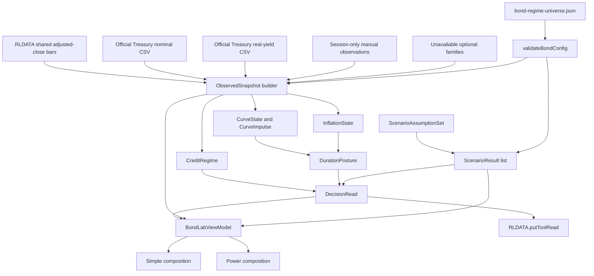

# Design: 003 Bond Regime and Fixed-Income Scenario Lab

## Design Brief

### Current State

Research Lab already has the two foundations this feature needs, but they are not joined into a fixed-income decision model. `rldata.js::ensureBars` provides cache-first daily adjusted-close bars and `etf-momentum-lab.html::parseTreasuryCSV` proves the official U.S. Treasury no-key CSV path. `global-rotation-lab.html` and `real-assets-lab.html` provide the current one-compute Simple/Power pattern, synchronous canvas rendering, and compact `RLDATA.putToolRead` publication.

There is no bond-specific object model, no common-date credit-ratio engine, no independent credit confirmation contract, and no rate-plus-spread scenario engine. Existing JNK/HYG/LQD usage is generic price-proxy context and cannot distinguish credit appetite from duration.

### Target State

Add one root static tool, `bond-regime-lab.html`, backed by one required editable configuration file, `bond-regime-universe.json`. The page builds one immutable observed snapshot, one mutable scenario assumption set, and one computed `BondLabViewModel`; Simple and Power render different compositions of that exact object.

The observed model keeps `CreditRegime`, `DurationPosture`, `CurveState`, `CurveImpulse`, and `InflationState` independent. The scenario model produces one decomposed `ScenarioResult` per generic sleeve and a conditional `DecisionRead` without changing observed market state.

### Patterns To Follow

- `rldata.js::bars`, `barInfo`, `ensureBars`, `reportData`, and `putToolRead` for shared cache access, honest freshness, delta hydration, and Market Brief publication.
- `global-rotation-lab.html::boot`, `hydrate`, `render`, and `drawCorrelation` for cache-first paint, fetch isolation, one model path, and synchronous Power-only chart drawing.
- `real-assets-lab.html::computeAll`, `render`, `applyMode`, `drawPathChart`, and top-level pure helper declarations for a transparent model with one view model and extractable tests.
- `etf-momentum-lab.html::parseTreasuryCSV` and `loadRates` for the official Treasury URL shape, current/prior-year merge, and explicit unavailable state.
- `rlchart.js::attach`, `nearestIndex`, and `tip`; `rlticker.js::tag`; `rlg.js` contextual tooltip behavior; `rlapp.js` resource lifecycle reporting.
- Registry parity enforced by `scripts/selftest.mjs`: `tools.json`, `index.html::TOOLS`, and `rlnav.js::TOOLS` remain in identical order.

### Patterns To Avoid

- The inline universe copies in older tools. Required bond characteristics and thresholds live only in `bond-regime-universe.json`; an absent or invalid config produces a visible fatal configuration state.
- The private parallel bar caches in older tools. ETF bars are read and refreshed only through `RLDATA`.
- `etf-momentum-lab.html` FRED query-key path. This feature adds no browser credential field, no query-key URL, and no restricted-series fetch.
- A generic weighted score that turns missing evidence into neutral values. Missing evidence remains unavailable and can make a regime indeterminate or a sleeve not rankable.
- `requestAnimationFrame` around chart rendering. Draw functions run synchronously from `render()`; resize alone is debounced.
- Separate Simple and Power compute functions, forward-filled ratio legs, opaque ML, single-ratio verdicts, and point estimates labeled as forecasts.

### Resolved Decisions

- One HTML file owns model, rendering, and external adapters; one JSON file owns ticker-neutral configuration and current sleeve characteristics.
- JNK/LQD and HYG/LQD form one relative-price evidence family. Neither is independent confirmation.
- A directional credit verdict requires a price pulse plus a current independent confirmation; otherwise credit is Mixed or Indeterminate.
- Nominal and real Treasury curves may use official U.S. Treasury no-key CSVs. Breakeven is derived only from common-date nominal minus real yields.
- ICE/FRED OAS and financial-conditions observations are never fetched, bundled, or persisted. They are explicit session-only user observations or Unavailable.
- Scenario arithmetic uses decimal yields internally, signed basis points at the UI boundary, and percentage-point contributions at the display boundary.
- The only locally persisted tool state is non-sensitive mode, scenario levers, ratio window, and focused sleeve. Manual observations and source metadata are memory-only.
- No change to `rldata.js` is required; the tool consumes its existing public contract.

### Open Questions

- None block implementation. A live OAS or financial-conditions adapter remains disabled unless a later design revision records a no-key browser path and redistribution permission. The current contract is complete through session-only user observation or explicit Unavailable state.

## Purpose And Scope

This design implements the complete behavior in `spec.md` as one build-free GitHub Pages tool. It covers:

- aligned adjusted-close credit ratios and duration-confound attribution;
- deterministic credit, nominal-curve, curve-impulse, inflation, and duration states;
- seven generic bond sleeves with current, source-stamped characteristics;
- transparent carry/rate/spread/convexity scenarios and break-even shocks;
- one shared Simple/Power view model;
- source-rights-safe optional observations;
- a normalized Market Brief read; and
- registry, notes, accessibility, screenshot, canvas, and regression integration.

There is no service, account model, server API, database, authentication layer, order path, position sizing, or personalized portfolio state.

## Architecture Overview



### Runtime Layers

| Layer | Owned Symbols | Responsibility |
| --- | --- | --- |
| Configuration | `loadBondConfig`, `validateBondConfig`, `indexBondConfig` | Load one required JSON source, reject missing/unknown/invalid values, and expose indexed instruments, sleeves, pairs, thresholds, presets, and source policies. |
| Data adapters | `readCachedBars`, `hydrateBondBars`, `parseTreasuryCurveCsv`, `loadTreasuryCurves`, `normalizeManualObservation` | Produce `MarketObservation` records without interpreting them. |
| Foundation model | `alignCommonDateRows`, `buildRatioSeries`, `estimateDurationConfound`, classifier helpers, scenario helpers | Deterministic pure transformations with no DOM, network, or storage writes. |
| View-model assembly | `buildObservedSnapshot`, `computeBondLabViewModel`, `buildDecisionRead`, `buildBondToolRead` | Freeze current observations, apply current assumptions, and create one render object. |
| UI composition | `renderShell`, `renderSimple`, `renderPower`, `drawRatioChart`, `drawCurveChart`, `drawDecompositionChart` | Render the shared view model. Draw functions never classify or fetch. |
| Integration | `publishBondToolRead`, registry entries, notes | Publish a compact owner read and make the tool discoverable. |

### State Separation

```js
runtime = {
  config: BondConfig,                 // immutable after validation
  observedSnapshot: ObservedSnapshot, // immutable replacement on validated refresh
  assumptions: ScenarioAssumptionSet, // mutable through local controls
  ui: UiState,                        // mode, ratio/window, focused sleeve
  viewModel: BondLabViewModel,        // replaced by computeBondLabViewModel
  refresh: RefreshState               // transport progress only
}
```

`computeBondLabViewModel(config, observedSnapshot, assumptions, ui)` is the only full compute entry. It is deterministic and side-effect free. Rendering and publication consume its return value. Refresh builds a new candidate snapshot and swaps it in only after each family validates; a failed family retains its prior stamped observation or becomes explicitly unavailable.

## Capability Foundation

### Foundation Contract

| Contract | Responsibility | Consumers |
| --- | --- | --- |
| `MarketObservation` | Carry value/series, units, source, observation time, retrieval time, freshness, adjustment status, rights classification, and error state together. | Every classifier, provenance row, and data-status view. |
| `ObservedSnapshot` | Immutable collection of bars, ratio pulses, curve rows, optional confirmations, and characteristic validity at one computation boundary. | Credit, duration, inflation, scenario, Simple, Power, tool read. |
| `RelativeCreditPulse` | Describe aligned ratio direction, trend, percentile, latest common date, duration gap, and confound without making a regime verdict. | `CreditRegime`, Power ratio panel, evidence ledger. |
| `CreditConfirmation` | Normalize an independent OAS or financial-conditions observation without treating a second ETF ratio as independent. | `CreditRegime`, evidence ledger, provenance. |
| `CreditRegime` | Apply the two-key credit rule and expose state, confidence, confirms, conflicts, missing families, and invalidation. | Both modes and `DecisionRead`. |
| `CurveState` / `CurveImpulse` | Keep current curve shape separate from recent movement. | `DurationPosture`, Power curve panel. |
| `InflationState` | Keep real-yield and breakeven evidence separate and optional. | `DurationPosture`, Power inflation panel. |
| `DurationPosture` | Produce Shorten, Balanced, Extend, or Indeterminate from observed rates/inflation only. | Both modes and `DecisionRead`. |
| `ScenarioResult` | Produce unit-safe carry, rate, spread, convexity, total, break-even, rankability, and reliability for one sleeve. | Both modes and `DecisionRead`. |
| `DecisionRead` | Combine observed regimes with the active modeled scenario while retaining the Observed/User Assumption/Modeled boundaries. | Simple lead strip, Power parity strip, `putToolRead`. |

### Extension Points

- **Observation adapter:** returns a valid `MarketObservation` or an explicit unavailable observation. It cannot return a neutral numeric substitute.
- **Relative-pair definition:** config names numerator/denominator instruments; common alignment and confound policy remain foundation-owned.
- **Confirmation adapter:** official-live, derived, user-observation, or unavailable. Every adapter declares rights and persistence policy.
- **Sleeve definition:** config supplies instrument characteristics and scenario behavior; the scenario equation remains shared.
- **Composition adapter:** Simple and Power receive `BondLabViewModel`; neither can invoke a classifier.
- **Consumer adapter:** `buildBondToolRead` reduces `DecisionRead` to the existing `RLDATA.putToolRead` shape without duplicating model math.

### Foundation-Owned Behavior

- common-date alignment and no forward fill;
- finite-value and unit conversion guards;
- two-key credit requirement;
- duration-confound calculation;
- controlled vocabularies and confidence caps;
- scenario decomposition and break-even solution;
- stale-characteristic rank exclusion;
- source-rights and persistence enforcement;
- one-model parity across modes; and
- explicit unavailable values rather than numeric zero.

## Concrete Implementations

### Shared-Bar Observation Adapter

Calls `RLDATA.bars(ticker, "1d")` synchronously for first paint, inspects `RLDATA.barInfo`, then calls `RLDATA.ensureBars(ticker, "1d", config.barPolicy.maxAgeHours, config.barPolicy.range)` only for stale or missing series. Yahoo and Pages snapshots are treated as distribution-adjusted because `rldata.js::yahooToRows` assigns adjusted close to `c`; any source not declared adjusted by the config source map is labeled `price-only` and never silently mixed with an adjusted leg.

### Official Treasury Adapters

- Nominal: official U.S. Treasury daily nominal par-yield CSV.
- Real: official U.S. Treasury daily real long-term rate CSV.
- Breakeven: derived from nominal minus real yield at the same maturity and common observation date.

The adapters fetch the current and prior UTC calendar year, parse required headers, merge by date, and cache only in browser storage. No observations are committed to the repository. A schema/header mismatch is unavailable, not zero.

### Restricted Optional Observation Adapter

OAS and financial conditions support exactly two modes declared in config: `user-observation-or-unavailable`. The user may enter a value, recent change, as-of date, public source URL, and source label for the current tab. The normalized record is marked `provenance: user-observation`, is never persisted, and is cleared on reload. Blank, incomplete, stale, or non-finite input produces `Unavailable`.

No ICE BofA/FRED observation URL, FRED API key, browser credential field, or static observation file is part of this implementation.

### Relative Credit Pair Implementations

- `jnk-lqd`: JNK numerator, LQD denominator.
- `hyg-lqd`: HYG numerator, LQD denominator.

They share alignment, trend, percentile, and confound logic. They are breadth inside one price family, not two independent confirmations.

### Sleeve Implementations

- bills/cash proxy;
- short Treasury;
- intermediate Treasury;
- long Treasury;
- inflation-linked Treasury;
- investment-grade corporate; and
- high-yield corporate.

Each is a config instance of the same scenario contract. JNK may remain a ratio instrument while HYG is the initial high-yield scenario proxy; changing the proxy requires only config and source review, not classifier code.

### Simple And Power Compositions

Simple renders the three decision cells, evidence summary, shared scenario controls, and compact result table. Power renders the parity strip plus ratio, confirmation, curve, inflation, sleeve, decomposition, and provenance details. Both receive the same object references from `BondLabViewModel` for regime labels, confidence, expression, ranking, confirmation, and invalidation.

### Variation Axes

| Axis | Options | Foundation Ownership |
| --- | --- | --- |
| Observation origin | RLDATA bars, official Treasury live CSV, derived breakeven, user observation, unavailable | Foundation validates provenance/freshness; adapters retrieve. |
| Rights policy | public-official, derived, restricted-local-view, unavailable | Foundation blocks persistence and publication where disallowed. |
| Evidence family | relative price, credit spread, financial conditions, nominal curve, real yield, breakeven | Foundation prevents correlated families from double-counting. |
| Sleeve risk | nominal rates only, real rates, rates plus IG spread, rates plus HY spread | Shared equation selects the declared shock mapping. |
| UI composition | Simple, Power | Composition only; no model variation. |
| Runtime state | immutable observed snapshot, mutable assumptions, non-sensitive UI focus | Foundation enforces write direction. |

## Data Model

### MarketObservation

| Field | Type | Contract |
| --- | --- | --- |
| `id` | string | Stable family-specific identifier. |
| `family` | enum | `bars`, `nominal-curve`, `real-curve`, `breakeven`, `oas`, `financial-conditions`, `characteristic`. |
| `state` | enum | `fresh`, `stale`, `unavailable`, `error`. Loading is transport state, not an observation. |
| `value` / `rows` | finite number or array | Exactly one value shape; absent when unavailable/error. |
| `unit` | enum | `adjusted-price`, `price-only`, `percent`, `basis-points`, `index`, `years`, `years-squared`. |
| `observedAt` | ISO date/time or null | Source observation time. Required for a usable observation. |
| `retrievedAt` | ISO date/time | Browser retrieval time. |
| `sourceId` / `sourceUrl` | string | Displayed and included in provenance. URL must be HTTP(S). |
| `freshness` | object | `maxAgeHours` or `reviewWindowDays`, computed age, and state. |
| `adjustment` | enum/null | `distribution-adjusted`, `price-only`, or not applicable. |
| `rights` | enum | `public-official`, `derived`, `restricted-local-view`, `unverified`. |
| `persistence` | enum | `shared-cache`, `browser-cache`, `memory-only`, `none`. |
| `errorCode` | string/null | Closed error code when unusable. |

### Fixed-Income Objects

| Object | Required Fields |
| --- | --- |
| `RelativeCreditPulse` | `pairId`, `latestCommonDate`, `adjustment`, `ratioRows`, `change21dPct`, `change63dPct`, `ma21`, `ma63`, `percentile`, `direction`, `durationGapYears`, `durationEffect21dPct`, `durationEffect63dPct`, `purity`, `freshness`, `evidence`. |
| `CreditConfirmation` | `id`, `kind`, `levelState`, `momentumState`, `direction`, `observedAt`, `freshness`, `rights`, `provenance`, `reason`. |
| `CreditRegime` | `state`, `confidence`, `pricePulseState`, `confirmationState`, `confirming[]`, `contradicting[]`, `missing[]`, `conflicts[]`, `nextConfirmation`, `invalidation`, `asOf`. |
| `CurveState` | `state`, `tenTwoBp`, `tenThreeMonthBp`, `asOf`, `horizonNotes`, `evidence[]`. |
| `CurveImpulse` | `state`, `lookbackDays`, `shortChangeBp`, `longChangeBp`, `slopeChangeBp`, `asOf`, `reason`. |
| `InflationState` | `state`, `realYieldLevelPct`, `realYieldChangeBp`, `breakevenLevelPct`, `breakevenChangeBp`, `asOf`, `availability`, `reason`. |
| `DurationPosture` | `state`, `confidence`, `curveState`, `curveImpulse`, `inflationState`, `creditContext`, `confirming[]`, `contradicting[]`, `nextConfirmation`, `invalidation`, `asOf`. |
| `ScenarioResult` | `sleeveId`, `rank`, `rankable`, `carryPct`, `ratePct`, `spreadPct`, `convexityPct`, `totalPct`, `rateBreakEvenBp`, `spreadBreakEvenBp`, `reliability`, `warnings[]`, `characteristicAsOf`. |
| `DecisionRead` | `creditRegime`, `durationPosture`, `confidence`, `expression`, `scenario`, `scenarioResults`, `confirming[]`, `conflicts[]`, `missing[]`, `nextConfirmation`, `invalidation`, `observedAsOf`, `generatedAt`. |

Objects are newly allocated on each compute. Render code treats them as read-only. Development builds may use `Object.freeze`; correctness must not depend on freeze support.

## Configuration Contract

`bond-regime-universe.json` is required and has no inline copy. The exact top-level shape is:

```text
schemaVersion: 1
toolId: "bond-regime-lab"
asOf: ISO date
initialState: { mode, presetId, ratioId, ratioWindow, focusSleeveId }
barPolicy: { interval, range, maxAgeHours, minimumRatioBars, percentileWindowBars }
sourcePolicies: { nominalCurve, realCurve, breakeven, oas, financialConditions }
classifier: { ratio, durationConfound, curve, confirmation, confidence }
localApproximationBounds: { nominalRateBp, igSpreadBp, hySpreadBp, breakevenBp, combinedYieldBp }
scenarioPresets: ScenarioAssumptionSet[]
instruments: BondInstrument[]
pairs: RelativePairDefinition[]
sleeves: BondSleeve[]
```

### Required Initial Research Assumptions

These values are explicit config, visible in Power provenance, and editable without changing code:

| Key | Initial Value | Meaning |
| --- | --- | --- |
| `ratio.change21dThresholdPct` | 0.5 | Minimum directional 21-session ratio move. |
| `ratio.change63dThresholdPct` | 1.0 | Minimum directional 63-session ratio move. |
| `ratio.percentileWindowBars` | 756 | Approximately three trading years for percentile context. |
| `ratio.minimumPercentileBars` | 252 | Below this, percentile is unavailable. |
| `durationConfound.minimumEffectPct` | 0.5 | Ignore immaterial estimated duration effects. |
| `durationConfound.materialShare` | 0.5 | Duration explains at least half the same-direction ratio move. |
| `curve.flatBandBp` | 25 | Absolute curve spread at or inside this band is Flat. |
| `curve.impulseLookbackDays` | 21 | Recent curve movement window. |
| `curve.impulseNoiseBp` | 5 | Smaller changes are noise for impulse naming. |
| `confirmation.staleAfterDays` | 7 | Manual weekly-style observations exceed freshness after seven days. |
| `localApproximationBounds.nominalRateBp` | 100 | Beyond this, result reliability is reduced. |
| `localApproximationBounds.igSpreadBp` | 150 | IG local spread bound. |
| `localApproximationBounds.hySpreadBp` | 300 | HY local spread bound. |
| `localApproximationBounds.breakevenBp` | 75 | Breakeven local bound. |
| `localApproximationBounds.combinedYieldBp` | 350 | Aggregate yield-shock bound for convexity use. |

These are model assumptions, not calibrated predictions. Their labels and values appear in the provenance/method section.

### Scenario Presets

| Preset | Horizon | Treasury | IG Spread | HY Spread | Breakeven | Interpretation |
| --- | ---: | ---: | ---: | ---: | ---: | --- |
| Soft Landing | 6 months | -25 bp | -10 bp | -25 bp | +10 bp | Moderate rate relief with orderly credit. |
| Growth Shock | 6 months | -100 bp | +40 bp | +150 bp | -30 bp | Treasury rally with weaker growth and credit. |
| Inflation / Term-Premium Shock | 6 months | +100 bp | +25 bp | +50 bp | +50 bp | Long-rate and inflation-compensation pressure. |
| Credit Stress | 6 months | -50 bp | +125 bp | +400 bp | -25 bp | Flight to quality with severe spread widening; HY exceeds the local bound by design and must show Reduced reliability. |
| Custom | inherited | inherited | inherited | inherited | inherited | Created only by editing a populated preset; it never invents values. |

Positive shocks mean yields or spreads rise. The direction note is permanently visible next to controls.

### BondInstrument

Each initial instrument catalog row is explicit: bills/cash proxy, short Treasury proxy, intermediate Treasury proxy, long Treasury proxy, TIPS proxy, LQD, HYG, and JNK. Each row requires:

- `ticker`, `name`, `instrumentType`, `issuerUrl`, `priceAdjustmentExpected`, and `proxyLimitations[]`;
- `carry: { valuePctAnnual, measure, asOf, reviewWindowDays, sourceUrl }`;
- `rateDuration: { valueYears, measure, asOf, reviewWindowDays, sourceUrl }`;
- `spreadDuration: { applicability, valueYears, measure, asOf, reviewWindowDays, sourceUrl }`;
- `convexity: { valueYearsSquared, measure, asOf, reviewWindowDays, sourceUrl }`; and
- `optionality: { state, note }`.

`spreadDuration.valueYears` is numeric for corporate instruments. For Treasury and TIPS instruments it is `null` only when `applicability` is exactly `not-applicable`; null never means zero or unknown. Missing carry, duration, applicable spread duration, convexity, source, as-of, or review window makes every sleeve using that instrument not rankable.

The implementation populates current issuer-verified characteristics. HYG and LQD values cited in `spec.md` are evidence anchors, not permanent constants; all shipped values remain in JSON with their own as-of and review windows.

### BondSleeve

| Field | Contract |
| --- | --- |
| `id` | Stable generic id such as `bills-cash` or `high-yield-corporate`. |
| `label` | Generic exposure label. |
| `proxyTicker` | Instrument catalog reference. |
| `rateShockKind` | `nominal` or `real-derived`. |
| `spreadShockKind` | `none`, `ig`, or `hy`. |
| `eligibleForExpression` | Explicit boolean. |
| `limitations[]` | ETF no-maturity, optionality, tracking, liquidity, and proxy caveats. |

### Config Validation And Failure

`validateBondConfig` returns `{ok, errors[]}` with JSON paths. It rejects:

- unknown keys or enum values;
- duplicate ids/tickers;
- missing initial-state references;
- non-finite values;
- scenario horizons outside 3, 6, or 12 months;
- pair references to unknown instruments;
- missing required characteristics or source metadata;
- negative durations/convexity/review windows;
- a corporate instrument with non-applicable spread duration;
- a non-corporate instrument with an unexplained numeric spread duration;
- source policies that contain credential fields, query-key templates, or restricted live endpoints; and
- any preset missing one of the five assumption fields.

Failure renders `Configuration invalid` with each path/code, reports `RLAPP.report("config:bond-regime", "error", ...)`, and performs no market fetch, classification, scenario rank, or tool-read publication.

## Data Acquisition And Freshness

### Shared Adjusted-Close Bars

1. After valid config, call `RLDATA.bars(ticker, "1d")` for every configured instrument and render the usable cache immediately.
2. Read `RLDATA.barInfo(ticker, "1d", maxAgeHours)` for source/freshness.
3. Start `RLDATA.ensureBars(ticker, "1d", maxAgeHours, range)` only for stale/missing resources, with bounded concurrency of four.
4. Recompute after each validated family batch; one failure cannot erase another family.
5. Use `RLDATA.reportData` lifecycle already emitted by `ensureBars`; report page-level aggregation through `RLAPP.report("page:bond-regime", ...)`.

`RLDATA.ensureBars` is the only ETF bar network path. The page adds no Yahoo/Twelve Data implementation and no credential UI.

### Common-Date Ratio Alignment

`alignCommonDateRows(leftRows, rightRows)`:

1. filters to finite positive `c` and finite `t`;
2. keys each row by UTC `YYYY-MM-DD`;
3. intersects keys exactly;
4. sorts ascending;
5. returns paired rows and the latest common date; and
6. records unmatched newer dates for the alignment warning.

`buildRatioSeries` divides only paired adjusted closes. It never uses nearest-date matching, carrying, interpolation, or forward fill. If source adjustment modes differ, the pair is unavailable with `BRL-RATIO-ADJUSTMENT-MISMATCH`. If both are explicitly price-only, the series remains usable as `Price-only` and cannot be described as total return.

### Official Treasury No-Key Paths

Nominal URL template:

```text
GET https://home.treasury.gov/resource-center/data-chart-center/interest-rates/daily-treasury-rates.csv/{YEAR}/all?type=daily_treasury_yield_curve&field_tdr_date_value={YEAR}&page&_format=csv
```

Real-yield URL template:

```text
GET https://home.treasury.gov/resource-center/data-chart-center/interest-rates/daily-treasury-rates.csv/{YEAR}/all?type=daily_treasury_real_yield_curve&field_tdr_date_value={YEAR}&page&_format=csv
```

The nominal parser requires `Date`, `3 Mo`, `2 Yr`, `5 Yr`, `10 Yr`, and `30 Yr`. The real parser requires `Date`, `5 YR`, `10 YR`, `20 YR`, and `30 YR` after case/whitespace normalization. Missing required columns fail that family.

The adapter reuses the existing direct -> `corsproxy.io` -> `allorigins/raw` -> `codetabs` text chain, with per-attempt abort timeout, because the endpoint is official but cross-origin behavior varies. It reads the existing `rlRates` 2Y/10Y cache for an immediate partial paint and writes an expanded versioned `rlTreasuryCurves` browser cache. The cache stores source URL, rows, retrieval time, and schema version; it is never committed.

Breakeven is `nominalYieldPct - realYieldPct` for the same maturity/date. It is unavailable when dates do not intersect. It is labeled `Derived from U.S. Treasury nominal and real curves`, not FRED T10YIE.

### Optional OAS And Financial Conditions

The Power provenance section exposes a `Session observation` disclosure row for each optional family. A valid entry requires:

- finite current value and unit;
- finite recent change and change window;
- observation date;
- HTTP(S) source URL;
- source label; and
- an acknowledgement that the value is shown only in this tab and will not be saved.

Values are held in `runtime.manualObservations` and never enter localStorage, `RLDATA`, screenshots committed as data, JSON configuration, or `putToolRead.metrics`. The tool publishes only the derived confirmation state and as-of date. Without a valid entry, the family is `Unavailable`.

## Credit Classification

### Relative Price Pulse

For each pair, `classifyRelativeCreditPulse` computes:

- 21- and 63-common-session percent changes;
- 21- and 63-session ratio moving averages;
- rolling percentile over up to 756 ratio rows, requiring at least 252;
- latest common date and adjustment label; and
- duration-confound estimates over matching Treasury windows.

Direction is:

- `strengthening` when both changes meet positive thresholds and latest ratio is above both moving averages;
- `weakening` when both changes meet negative thresholds and latest ratio is below both moving averages;
- `neutral` when both changes are inside thresholds; and
- `mixed` otherwise.

The pair-family pulse is `strengthening` or `weakening` only when all usable pairs agree. One usable pair may produce a directional pulse with `breadth: partial`; disagreement produces `mixed`.

### Duration Confound

For numerator $n$, denominator $d$, and matched Treasury yield change $\Delta y$ in decimal form:

$$
\Delta R_{duration} = -(D_n - D_d)\Delta y
$$

Displayed percent contribution is $100\Delta R_{duration}$. A pulse is `confounded` when:

1. the estimated duration effect has the same sign as the observed ratio move;
2. its absolute contribution is at least `minimumEffectPct`; and
3. it explains at least `materialShare` of the absolute observed move.

It is `clean` when the estimate is finite and the rule is not met, and `unknown` when duration metadata or the matched Treasury change is unavailable. The UI always shows numerator duration, denominator duration, gap, rate move, estimated effect, and observed move.

### Independent Confirmation

`classifyCreditConfirmation` keeps level and momentum separate:

- OAS level: `tight`, `normal`, or `wide` from explicit config bands.
- OAS momentum: `tightening`, `stable`, or `widening` from signed recent basis-point change and explicit noise band.
- Financial conditions level: `loose`, `neutral`, or `tight` from config bands.
- Financial conditions momentum: `easing`, `stable`, or `tightening`.

Tight-but-widening is represented as `{levelState:"tight", momentumState:"widening", direction:"mixed"}`. Wide-but-tightening is also mixed with improving momentum and poor level. A current OAS or financial-conditions family counts as independent; VIX/equity fear may appear as context but never satisfies the two-key rule.

`aggregateCreditConfirmations` treats all HY/IG OAS observations as one `oas` family and financial conditions as one separate family. A family is `improving` or `deteriorating` only when its current sub-observations agree directionally and none is stale; disagreement inside or across current families is `mixed`. The aggregate is directional only when at least one current independent family has that direction and no current family has the opposite direction. With no current independent family it is `unavailable`. Multiple OAS series increase breadth within the OAS family but do not count as multiple independent keys.

### CreditRegime Decision Table

| Price Pulse | Independent Confirmation | Duration Purity | Result | Confidence Rule |
| --- | --- | --- | --- | --- |
| strengthening | confirming improvement | clean | Constructive | High only when both ratios agree and no stale/conflict family exists; otherwise Moderate. |
| strengthening | confirming improvement | confounded/unknown | Constructive | Capped Moderate; confound remains listed. |
| weakening | confirming deterioration | any known purity | Defensive | High only with pair breadth and no conflict; otherwise Moderate. |
| directional | contradicting or mixed | any | Mixed | Low or Moderate according to freshness and breadth. |
| neutral/mixed | any usable confirmation | any | Mixed | Never High. |
| usable pulse | unavailable/stale confirmation | any | Indeterminate | Minimum two-key contract not met. |
| no usable pulse | any | any | Indeterminate | Minimum price key not met. |

`nextConfirmation` names the missing or contradicting family and threshold. `invalidation` names the first pair/confirmation condition that would move the current state out of its label. No aggregate numeric score is exposed.

## Curve, Inflation, And Duration Classification

### CurveState

- Classify each available spread independently as `Inverted` below `-flatBandBp`, `Flat` inside the inclusive band, or `Positive` above `flatBandBp`.
- The aggregate is that shared label when all available spreads agree.
- The aggregate is `Mixed` when 10Y-2Y and 10Y-3M have different labels.
- The aggregate is `Unavailable` when neither spread is computable.

Both spreads retain separate labels and horizon notes. CurveState alone never creates DurationPosture.

### CurveImpulse

Use 2Y as short rate and 10Y as long rate over `impulseLookbackDays` common observations. Changes smaller than `impulseNoiseBp` are noise.

| Short Change | Long Change | Slope Change | CurveImpulse |
| --- | --- | --- | --- |
| down | down | long minus short increases | Bull Steepener |
| down | down | long minus short decreases | Bull Flattener |
| up | up | long minus short increases | Bear Steepener |
| up | up | long minus short decreases | Bear Flattener |
| mixed signs/noise/insufficient | any | any | Mixed or Unavailable |

### InflationState

Official real-yield and derived-breakeven evidence remain separate fields. State is:

- `Heating` when breakeven rises beyond its configured noise band;
- `Cooling` when breakeven falls beyond the band;
- `Stable` when inside the band;
- `Mixed` when real-yield and breakeven impulses carry conflicting duration implications; and
- `Unavailable` without aligned official observations.

Real-yield level/change is evidence, not silently converted into inflation.

### DurationPosture

| Observed Condition | Posture | Context |
| --- | --- | --- |
| Both 2Y and 10Y fall beyond noise and InflationState is not Heating | Extend | If credit is Defensive, expression is restricted to high-quality duration and the growth-risk conflict is explicit. |
| 10Y rises beyond noise and impulse is Bear Steepener, or real yield/breakeven evidence confirms long-end pressure | Shorten | Long-duration pressure is primary. |
| Nominal evidence is current but directions conflict or remain inside noise | Balanced | Wait for named confirmation. |
| Required nominal observations are missing/stale | Indeterminate | No immediate posture from inversion alone. |

Confidence is categorical. Optional inflation data may raise or lower confidence but its absence does not erase a valid nominal-curve read.

## Scenario Engine

### Units And Sign Convention

- UI shocks are signed basis points.
- `bpToDecimal(bp) = bp / 10000`.
- Carry config is annual percentage; `pctToDecimal(value) = value / 100`.
- Horizon is months; `horizonYears = months / 12`.
- Duration units are years; convexity units are years squared.
- Internal contributions are decimal returns; display values are percentage points rounded to one decimal.

All inputs pass `Number.isFinite`. Invalid input yields `BRL-MODEL-NONFINITE`; the current result is `Not calculable`, and the last valid result is not presented as current.

### Shock Mapping

For nominal Treasury sleeves:

$$\Delta r = \Delta y_{Treasury}$$

For corporate sleeves:

$$\Delta r = \Delta y_{Treasury}, \qquad
\Delta s = \Delta s_{IG\ or\ HY}$$

For TIPS:

$$\Delta r_{real} = \Delta y_{nominal} - \Delta BE$$

where $\Delta BE$ is the breakeven-inflation shock. This identity prevents double counting. A positive breakeven shock with unchanged nominal yield lowers implied real yield and supports TIPS price. The model does not pretend a breakeven change is realized CPI accrual; carry remains the explicitly sourced fund carry measure.

### Return Equation

For each sleeve:

$$
R_{carry} = c_{annual}h
$$

$$
R_{rate} = -D_r\Delta r
$$

$$
R_{spread} = -D_s\Delta s
$$

$$
R_{convexity} = \frac{1}{2}C(\Delta r + \Delta s)^2
$$

$$
R_{scenario} = R_{carry} + R_{rate} + R_{spread} + R_{convexity}
$$

For Treasury/TIPS sleeves, $\Delta s=0$. Bills use their configured short rate duration rather than a hardcoded zero. Convexity is shown as its own term. The estimate excludes nonparallel curve moves, changing duration/convexity, optionality, defaults, recoveries, liquidity, fund flows, taxes, fees not represented in carry, and tracking differences.

### Break-Even Shock

Holding other shocks at zero, solve the smallest positive adverse shock $x$ that offsets horizon carry:

$$
c_{annual}h - Dx + \frac{1}{2}Cx^2 = 0
$$

For finite $C>0$ and discriminant $D^2-2Cc_{annual}h \ge 0$:

$$
x = \frac{D-\sqrt{D^2-2Cc_{annual}h}}{C}
$$

For zero convexity, $x=c_{annual}h/D$. Rate break-even uses rate duration. Spread break-even uses spread duration and is unavailable for non-credit sleeves. TIPS labels it `adverse real-yield move`. Results display to the nearest 5 bp to avoid false precision.

### Reliability And Rankability

- `Not rankable`: any required characteristic is missing, non-finite, or past its review window; scenario input is invalid; or source applicability is inconsistent.
- `Reduced reliability`: arithmetic is finite but any absolute shock exceeds its configured local bound, combined yield shock exceeds its bound, or `optionality.state` is `material`.
- `Within local range`: required characteristics are current and every shock is within bounds.

Large-shock arithmetic remains visible but cannot receive High confidence. Every reduced result lists nonparallel curves, optionality, defaults, liquidity, and tracking as residual risks.

### Conditional Research Expression

`selectResearchExpression` filters rankable results before choosing the highest modeled total:

- Defensive or Indeterminate credit excludes high-yield and investment-grade credit from preferred expression.
- Mixed credit permits IG only when no deterioration confirmation is present; HY remains excluded.
- Constructive credit permits IG/HY subject to scenario rank and reliability.
- Shorten duration prefers bills/short Treasury; Extend permits intermediate/long Treasury and credit only when credit policy permits it; Balanced allows all policy-permitted sleeves.
- A candidate must exceed the bills/cash result by `classifier.expression.minimumAdvantagePct`; otherwise bills/cash is the expression.

The output is a generic sleeve name with `fits`, `confirmation`, and `invalidation`. It contains no allocation weight, position size, account reference, execution verb, or guarantee.

## API And Integration Contracts

### HTTP Contracts

| Method And Path | Request | Success Response | Failure Behavior |
| --- | --- | --- | --- |
| `GET ./bond-regime-universe.json` | No query/body/credentials; `cache: no-store` | Exact `BondConfig` schema above. | Fatal `BRL-CONFIG-FETCH` or `BRL-CONFIG-SCHEMA`; no model or market requests. |
| `GET <Treasury nominal URL template>` | Current and prior year; no credentials | CSV with required nominal columns. | Family unavailable; cached validated rows may remain visibly stale. |
| `GET <Treasury real URL template>` | Current and prior year; no credentials | CSV with required real-yield columns. | Optional family unavailable; no FRED request. |
| `GET data/bars/<TICKER>.json` and provider requests internal to `RLDATA.ensureBars` | Called through RLDATA only. | Shared `{t,o,h,l,c,v}` rows. | RLDATA stale/error state; no page-owned alternate provider. |

No owned REST endpoint, request body, cookie, token, or versioned server API exists.

### Authorization Matrix

| Contract | Public | Local User | Authenticated Role | Notes |
| --- | --- | --- | --- | --- |
| Tool/config/static assets | Read | Read | Not applicable | GitHub Pages public static files. |
| Official Treasury CSV | Read | Read | Not applicable | Public no-key source. |
| Manual optional observations | No remote access | Create/update for current tab | Not applicable | Memory-only; never published as raw values. |
| Scenario controls | Read defaults | Edit non-sensitive assumptions | Not applicable | May persist locally. |
| Market Brief tool read | Read in same browser cache | Tool writes derived state | Not applicable | Contains no credentials or raw restricted observations. |

### Error Model

| Code | Condition | User Consequence |
| --- | --- | --- |
| `BRL-CONFIG-FETCH` | Required JSON unavailable. | Fatal config banner; no hydration. |
| `BRL-CONFIG-SCHEMA` | Config field missing/invalid/unknown. | Exact JSON paths listed; no model. |
| `BRL-BARS-UNAVAILABLE` | No valid cached or refreshed bars. | Affected instrument/pair/sleeve unavailable. |
| `BRL-RATIO-MISALIGNED` | Fewer than required common dates. | Ratio unavailable; no forward fill. |
| `BRL-RATIO-ADJUSTMENT-MISMATCH` | Pair legs have incompatible adjustment status. | Ratio unavailable. |
| `BRL-CURVE-NOMINAL-UNAVAILABLE` | Official nominal curve absent/invalid. | Duration Indeterminate; scenario engine still uses explicit assumptions and current characteristics. |
| `BRL-OPTIONAL-UNAVAILABLE` | Optional real/OAS/conditions family absent. | Visible unavailable row; confidence consequence. |
| `BRL-RIGHTS-BLOCKED` | Source policy requests restricted live/persisted data. | Adapter rejected before fetch/storage. |
| `BRL-CHARACTERISTIC-STALE` | Characteristic exceeds review window. | Sleeve visible but not rankable. |
| `BRL-MODEL-NONFINITE` | Invalid numeric input/intermediate. | Result not calculable; no stale-current display. |

### Normalized Tool Read

`publishBondToolRead` calls:

```js
RLDATA.putToolRead("bond-regime-lab", {
  asOf: decisionRead.observedAsOf,
  read: decisionRead.summary,
  metrics: {
    creditRegime: decisionRead.creditRegime.state,
    durationPosture: decisionRead.durationPosture.state,
    confidence: decisionRead.confidence,
    preferredSleeveId: decisionRead.expression && decisionRead.expression.sleeveId,
    scenarioId: decisionRead.scenario.id,
    horizonMonths: decisionRead.scenario.horizonMonths,
    resultPct: decisionRead.expression && decisionRead.expression.totalPct,
    conflictCount: decisionRead.conflicts.length,
    confirmationState: decisionRead.creditRegime.confirmationState,
    ratioAsOf: decisionRead.creditRegime.asOf,
    curveAsOf: decisionRead.durationPosture.asOf,
    indeterminateReason: decisionRead.indeterminateReason || null
  },
  deepLink: "bond-regime-lab.html#simple"
});
```

The raw OAS/NFCI values, user-entered source URL, and restricted observations are excluded. An Indeterminate read says so and sets `preferredSleeveId` and `resultPct` to null.

## UI And Interaction Design

### Component Tree

```text
ResearchLabShell
|- SkipLink
|- Header
|  |- ModeSwitch
|  |- RefreshButton
|  `- DataFreshnessBand
|- ScenarioWorkbench
|- SimpleRegion
|  |- ObservedDecisionStrip
|  |- EvidenceLedger
|  `- CompactScenarioTable
|- PowerRegion
|  |- DecisionParityStrip
|  |- CreditEvidenceSection
|  |  |- RatioChartWithSummary
|  |  |- DurationConfoundRead
|  |  `- IndependentConfirmationTable
|  |- CurveAndInflationSection
|  |  |- CurveChartWithSummary
|  |  `- OptionalInflationRows
|  |- SleeveAnalyticsTable
|  |- ScenarioDecomposition
|  |  |- ContributionChartWithSummary
|  |  `- ScenarioRankingTable
|  `- ProvenanceAndRightsTable
`- EducationalFooter
```

### One View Model

`BondLabViewModel` contains:

```text
status
observedSnapshot
creditRegime
curveState
curveImpulse
inflationState
durationPosture
assumptions
scenarioResults
decisionRead
selectedRatioDetail
focusedSleeveDetail
provenanceRows
```

Simple and Power read these fields directly. The Power parity strip uses the same text/value properties as the Simple cells, not recomputed equivalents. DOM elements carry `data-model-digest` from a stable serialization of the decision fields so E2E can prove parity.

### Fetch And Recompute Boundaries

| Action | Fetch | Observed Recompute | Scenario Recompute | Persist |
| --- | --- | --- | --- | --- |
| Boot after valid config | stale/missing only | Yes as families validate | Yes | No observations. |
| Refresh | stale/failed families | Yes | Yes if characteristics/observations change | Cache only. |
| Mode switch | No | No | No | Mode. |
| Preset/horizon/shock edit | No | No | Yes, synchronously | Non-sensitive levers. |
| Ratio/window/focused sleeve | No | Detail only | No | UI focus. |
| Manual optional observation | No | Yes | No unless preferred expression policy changes | Never. |

Every lever handler validates the field, updates `runtime.assumptions`, calls `computeBondLabViewModel`, and calls `render` in the same task. No timer, promise, animation frame, or network call appears in this path.

### Canvas Contract

- `drawRatioChart`, `drawCurveChart`, and `drawDecompositionChart` are called synchronously at the end of `renderPower` only when `runtime.ui.mode === "power"`.
- Resize uses one 120-180 ms debounce and calls only draw functions.
- Every canvas has stable CSS dimensions, an `aria-label`, fallback text between tags, a visible textual summary, and an equivalent table. Do not add `role="img"`, which breaks WebKit canvas fallback behavior in this repository.
- Every draw function calls `RLCHART.attach` after drawing.
- No chart understanding depends on hover, animation, or color.

### Persistence

`localStorage.bondRegimeLabState` contains only:

```text
schemaVersion, mode, presetId, horizonMonths,
treasuryShockBp, igSpreadShockBp, hySpreadShockBp, breakevenShockBp,
ratioId, ratioWindow, focusSleeveId
```

Unknown keys are discarded. Stored values are revalidated against current config. Credentials, manual macro observations, holdings, account data, tax data, source URLs, and market observations never enter this object.

### Accessibility And Responsive Behavior

- Include a skip link to `main` and landmark headings matching the spec screen order.
- Implement `ModeSwitch` as `role=tablist` with Left/Right/Home/End navigation and `aria-selected`.
- Use separate polite live regions for refresh state and scenario recalculation; only invalid-current-result transitions use `role=alert`.
- Use text labels plus symbols for Constructive/Mixed/Defensive/Indeterminate, Shorten/Balanced/Extend, conflict, stale, unavailable, and reliability.
- Every input has a persistent label, unit, direction, finite range, and `aria-describedby` validation/reliability text.
- Ticker output uses `RLTKR.tag` everywhere, including table cells and legends represented in DOM.
- Dynamic values carry contextual `title`/`data-tip`; fixed-income glossary terms are added additively to `rlg.js` without changing scan logic.
- At 390 CSS px, Simple has no horizontal body scroll. Power tables use contained horizontal scrolling with sticky first column.
- At desktop, the shell remains at 1240 px maximum. Fixed chart/table dimensions prevent state labels from shifting the layout.
- Honor `prefers-reduced-motion`; no essential state transition uses animation.

## Security, Privacy, And Source Rights

- Static public surface; no authorization secret or session identity exists.
- No account holdings, cost basis, tax status, identity, payment, or brokerage data is requested.
- No API-key field exists on the tool. The page does not call `RLDATA.key` for OAS, Treasury, real-yield, breakeven, or financial conditions.
- External links use HTTP(S), `target="_blank"`, and `rel="noopener noreferrer"`. User-entered source URLs are parsed with `new URL` and reject non-HTTP(S) protocols.
- Rendered config/user strings are escaped before insertion. Numeric inputs are parsed only after finite/range validation.
- Official Treasury data is fetched at runtime and may be browser-cached; no time-series observations are added to git.
- ICE BofA/FRED OAS observations and other restricted third-party values are memory-only user observations or unavailable. They are never redistributed in config, snapshots, tests, screenshots-as-data, or tool-read metrics.
- Derived breakeven records retain both official source ids and common date, so provenance is inspectable.
- Educational and bond-ETF-no-maturity disclosures remain visible in the analytical result, not hidden behind hover.

## Configuration, Migration, And Rollout

1. Add and validate the required config before any market work.
2. Add pure foundation helpers and `scripts/selftest.mjs` assertions first.
3. Build cache-first observed snapshot and scenario model in the HTML.
4. Add Simple composition, then Power composition over the same object.
5. Add registry/notes/docs entries only when the HTML and JSON exist and pass focused checks.
6. Extend the same-origin bar snapshot collector with configured bond symbols so GitHub Pages does not depend solely on public proxies.
7. Preserve existing `rlRates` as read-only compatibility input; write the richer versioned Treasury cache under a new key. Do not rewrite unrelated cache schemas.

No database or server migration exists. Config schema changes increment `schemaVersion`; unknown versions fail visibly. Stored UI state has its own schema and is ignored with a visible reset note when incompatible.

## Observability And Failure Handling

This is a static, non-service-bearing page. There is no distributed trace topology or server SLO. Runtime visibility is:

- `RLDATA.dataState()` for each bar resource;
- `RLAPP.report` for page config, nominal curve, real curve, optional confirmation, and page aggregate states;
- visible `ObservationStamp` and provenance rows;
- stable browser console errors prefixed `[bond-regime-lab]` with error code and no raw restricted value; and
- E2E assertions for zero uncaught errors and explicit partial/failure states.

### Failure Matrix

| Failure | Retained State | Decision Consequence |
| --- | --- | --- |
| Config missing/invalid | Shell plus fatal config details | No observed or modeled result. |
| One bar leg missing | Other bars and scenarios | Affected pair unavailable; credit may be Indeterminate. |
| One pair has unmatched newer leg | Common-date ratio plus alignment note | No forward fill; displayed as-of is latest common date. |
| Nominal curve unavailable | Cached curve if valid, otherwise unavailable | Duration Indeterminate; explicit assumptions can still produce scenario arithmetic. |
| Real curve/breakeven unavailable | Nominal curve and all ETF evidence | Inflation unavailable; duration confidence reduced as specified. |
| OAS/conditions unavailable | Price pulse and curve evidence | Credit Indeterminate without another independent confirmation. |
| Manual observation invalid/stale | Prior valid current-tab observation only if still current; otherwise unavailable | No neutral substitution. |
| Characteristic stale | Historical market evidence | Sleeve remains visible and not rankable. |
| Shock non-finite | Observed decision | Modeled result invalid; no stale-current rank. |
| Shock outside bounds | Observed decision and arithmetic result | Reduced reliability and warning. |

## Technical Scenario Contracts

### BS-001: Duration-Driven Ratio Improvement Stays Mixed

```gherkin
Given aligned adjusted-close fixtures produce a +3.0% 63-day JNK/LQD move
And estimateDurationConfound returns a same-direction +2.0% duration effect
And a current OAS confirmation reports stable rather than tightening spreads
When classifyCreditRegime evaluates the immutable snapshot
Then state is Mixed and conflicts include duration-confounded and no-spread-improvement
And state is not Constructive
```

### BS-002: Broad Credit Confirmation Is Constructive

```gherkin
Given JNK/LQD and HYG/LQD are both strengthening on common adjusted-close dates
And a current independent OAS observation reports tightening HY and IG spreads
When classifyCreditRegime evaluates the snapshot
Then state is Constructive
And invalidation names the configured ratio or spread deterioration threshold
```

### BS-003: Tight But Widening Remains Two Facts

```gherkin
Given classifyCreditConfirmation receives a level inside the tight band
And its recent basis-point change exceeds the widening threshold
When the confirmation and CreditRegime are built
Then levelState is tight, momentumState is widening, and direction is mixed
And the DecisionRead exposes benign level and deteriorating momentum separately
```

### BS-004: Bull Steepener Keeps Defensive Context

```gherkin
Given 2Y yield falls 100 bp and 10Y yield falls 40 bp over common dates
And CreditRegime is Defensive
When classifyCurveImpulse and classifyDurationPosture run
Then CurveImpulse is Bull Steepener and DurationPosture may be Extend
And DecisionRead restricts the expression to high-quality duration and lists growth-risk context
```

### BS-005: Bear Steepening Penalizes Long Duration

```gherkin
Given 2Y rises 20 bp, 10Y rises 80 bp, and breakeven rises 35 bp
When the observed classifiers and one shared scenario are computed
Then CurveImpulse is Bear Steepener and DurationPosture is Shorten
And the long-Treasury rate contribution is more negative than the short-Treasury contribution
```

### BS-006: Six-Month Rate-And-Spread Shock Decomposes

```gherkin
Given horizonMonths is 6, Treasury shock is -50 bp, IG shock is +60 bp, and HY shock is +150 bp
When calculateScenarioResult runs for Treasury, IG, and HY sleeves
Then every result exposes finite carry, rate, spread, convexity, and total fields
And the Treasury spread field is not-applicable while corporate spread fields are finite
```

### BS-007: Large Shock Retains Arithmetic With Warning

```gherkin
Given HY spread shock is above localApproximationBounds.hySpreadBp
When calculateScenarioResult receives otherwise valid current characteristics
Then totalPct remains finite and reliability is Reduced
And warnings name nonparallel curves, optionality, defaults, liquidity, and tracking
```

### BS-008: Stale Characteristics Block Rank

```gherkin
Given one required duration or carry characteristic is older than its reviewWindowDays
When calculateScenarioResult and rankScenarioResults run
Then the sleeve remains visible with BRL-CHARACTERISTIC-STALE
And rankable is false, rank is null, and it cannot be the preferred expression
```

### BS-009: Missing Optional Macro Degrades Honestly

```gherkin
Given adjusted ETF bars and current nominal Treasury rows are valid
And OAS, financial conditions, and real-yield observations are unavailable
When computeBondLabViewModel runs
Then available ratios and nominal curve remain visible
And CreditRegime is Indeterminate while DurationPosture follows nominal evidence with reduced confidence
And no optional value is zero
```

### BS-010: Misaligned Pair Uses Common Dates Only

```gherkin
Given the numerator has a newer date absent from the denominator
When alignCommonDateRows and buildRatioSeries run
Then the newer unmatched row is excluded
And latestCommonDate equals the newest intersecting UTC date
```

### BS-011: Simple And Power Are Coherent

```gherkin
Given one BondLabViewModel has been computed
When the user switches from Simple to Power without refresh
Then both parity surfaces expose identical model digests, regimes, confidence, expression, ranking, and invalidation
And no network request occurs
```

### BS-012: Lever Edit Does Not Rewrite Observations

```gherkin
Given observedSnapshot and its digest produce Mixed credit and Balanced duration
When the user changes only the HY spread input
Then ScenarioResult and DecisionRead modeled fields update synchronously
And observedSnapshot, CreditRegime, DurationPosture, source stamps, and their digest remain unchanged
```

### BS-013: Restricted Data Is Not Redistributed

```gherkin
Given sourcePolicies.oas is user-observation-or-unavailable
When a user enters a valid current-tab OAS observation and the tool publishes a read
Then the raw value and URL exist only in runtime.manualObservations
And localStorage, config, shared cache, and putToolRead metrics contain neither value nor URL
```

### BS-014: Partial Data Is Accessible

```gherkin
Given one optional source is unavailable
When a keyboard and screen-reader user traverses both modes
Then freshness, conflicts, confidence, invalidation, chart summaries, and reliability are reachable in DOM order
And mode, refresh, controls, tables, and disclosures require no pointer, hover, or color interpretation
```

## Testing And Validation Strategy

### Extractable Pure Helpers

The following are top-level `function name(...)` declarations in `bond-regime-lab.html`, with no DOM/network/storage access, so `scripts/selftest.mjs::extractFn` can balance and execute them:

- `bpToDecimal`, `pctToDecimal`, `finiteNumber`;
- `validateBondConfig`;
- `alignCommonDateRows`, `buildRatioSeries`, `rollingPercentile`;
- `estimateDurationConfound`, `classifyRelativeCreditPulse`, `classifyCreditConfirmation`, `classifyCreditRegime`;
- `classifyCurveState`, `classifyCurveImpulse`, `classifyInflationState`, `classifyDurationPosture`;
- `scenarioShockForSleeve`, `calculateScenarioResult`, `solveBreakEvenShock`, `classifyReliability`;
- `selectResearchExpression`, `buildDecisionRead`, `buildBondToolRead`; and
- `stableDecisionDigest`.

Selftest assertions cover common-date intersection, no forward fill, adjustment mismatch, pulse thresholds, two-key classification, duration-confound sign/share, curve quadrants, TIPS identity, all scenario terms, break-even roots, finite guards, stale exclusion, large-shock warning, and null publication for Indeterminate expression.

### Scenario-To-Test Mapping

| Scenario | Test Type | Test Location / Title | Primary Assertion |
| --- | --- | --- | --- |
| BS-001 | unit + Regression E2E | `scripts/selftest.mjs` bond group; `tests/bond-regime-lab.spec.mjs` - `BS-001 duration-driven ratio improvement stays mixed` | No Constructive ratio-only verdict. |
| BS-002 | unit + Regression E2E | same files - `BS-002 aligned ratios plus OAS confirmation are constructive` | Two-key constructive and invalidation. |
| BS-003 | unit + E2E | `BS-003 tight but widening keeps level and momentum separate` | Both facts remain visible. |
| BS-004 | unit + E2E | `BS-004 bull steepener retains defensive credit context` | Extend/high-quality context, no broad bullish label. |
| BS-005 | unit + E2E | `BS-005 bear steepener penalizes long duration most` | Curve name and contribution ordering. |
| BS-006 | unit + E2E | `BS-006 six month mixed shock decomposes every sleeve` | Carry/rate/spread/convexity equation. |
| BS-007 | unit + E2E | `BS-007 oversized shock preserves estimate and lowers reliability` | Finite arithmetic plus warning. |
| BS-008 | unit + E2E | `BS-008 stale characteristic remains visible and unranked` | No precise rank/expression. |
| BS-009 | E2E | `BS-009 optional macro outage leaves truthful partial read` | Unavailable, never zero; partial model retained. |
| BS-010 | unit + E2E | `BS-010 latest common date excludes unmatched leg` | Exact latest common date. |
| BS-011 | E2E | `BS-011 Simple and Power share one model digest` | Equality plus zero requests. |
| BS-012 | E2E | `BS-012 lever change recomputes without fetch or observed mutation` | Scenario changes, observed digest stable. |
| BS-013 | functional + E2E | `BS-013 restricted observation remains memory only` | Storage/tool-read scan contains no raw value/URL. |
| BS-014 | E2E accessibility | `BS-014 partial data is keyboard and text equivalent` | Focus order, live text, summaries, no color-only state. |

### Validation Categories

1. **Static syntax:** parse the inline script with `new Function`; validate `bond-regime-universe.json` with `JSON.parse`; assert every `getElementById` target exists.
2. **Unit/business logic:** extend `node scripts/selftest.mjs` with a Bond Regime group built from extracted helpers.
3. **Functional source contract:** parse captured official Treasury nominal and real header fixtures; assert no config/source URL contains `api_key`, FRED observation endpoints, or ICE observation payloads.
4. **Browser E2E:** run the real page through the existing local static server and Playwright runtime; use deterministic external-boundary fixtures only for scenario state, while executing the actual page/classifier/render paths.
5. **Live data smoke:** without request interception, assert `RLDATA.ensureBars` returns structurally valid common-date rows for at least one configured pair and official Treasury parsing returns required nominal columns when sources are reachable. A source outage is reported as unavailable, not misreported as a product pass.
6. **Regression:** keep every BS test in the feature-specific browser file and run the broader `node scripts/selftest.mjs` suite.
7. **Visual:** capture 1440x1000 and 390x844 screenshots for both modes and partial/large-shock states; assert no body horizontal overflow or incoherent overlap.
8. **Canvas:** after synchronous render, inspect each Power canvas for non-background pixels, stable dimensions, attached `__rlhit`, accessible fallback text, and equivalent table rows at desktop and mobile widths.
9. **Network boundary:** instrument browser requests around mode and lever actions and assert the count remains zero; Refresh is the only action allowed to add requests.
10. **Persistence/security:** inspect localStorage before/after manual OAS entry and tool-read publication; assert only allowlisted non-sensitive state persists and no raw restricted observation/source URL is present.

No test may treat injected fixture text as proof that a live source works. Deterministic fixtures prove classifier/render behavior; live smoke proves the external contract structurally.

## Exact Implementation Surface

### Add

| File | Symbols / Content |
| --- | --- |
| `bond-regime-lab.html` | All pure helpers, adapters, `computeBondLabViewModel`, render functions, synchronous charts, boot/wire/hydrate/publication. |
| `bond-regime-universe.json` | Required schema, source policies, thresholds, presets, instruments, pairs, sleeves, current characteristics and review windows. |
| `notes/bond-regime-lab.md` | Method, source rights, equations, input provenance, assumptions, limitations, current metadata sources, and operator refresh procedure. |
| `tests/bond-regime-lab.spec.mjs` | BS-001 through BS-014 browser regressions and screenshot/canvas assertions. |
| `tests/fixtures/bond-regime/` | Minimal deterministic external-boundary fixtures and official-Treasury parser fixtures with provenance metadata. |

### Update

| File | Exact Change |
| --- | --- |
| `scripts/selftest.mjs` | Add one extraction group for the listed top-level bond helpers and registry expectation through existing generic parity logic. |
| `scripts/fetch-bars.mjs` | Include every configured bond instrument in same-origin daily snapshot collection without a second provider path. |
| `rlg.js` | Add fixed-income glossary entries/aliases only; do not change scanner or tooltip behavior. |
| `tools.json` | Add `bond-regime-lab` with `data: bond-regime-universe.json`, notes, tags, status, and updated date. |
| `index.html` | Add matching `TOOLS` entry in the same order and no separate model code. |
| `rlnav.js` | Add matching nav entry in identical order. |
| `README.md` | Add live-tool row and layout entries. |
| `notes/README.md` | Add notes index row. |

### Explicitly Unchanged

- `rldata.js` public contract and storage schema;
- `rlchart.js` behavior;
- `rlapp.js` credential/status ownership;
- `rlticker.js` behavior;
- Market Brief model math and payload authoring; it consumes the new registered tool read through existing registry coverage;
- every existing tool's classifiers, caches, and UI; and
- feature `spec.md`, planning artifacts, reports, user validation, and all `state.json.certification` fields.

## Dirty-Worktree Containment And Rollback

The repository is already heavily modified. Implementation and this design run must use path-scoped status/diff checks and never use whole-tree cleanup.

### Design-Run Boundary

- Allowed writes: `specs/003-bond-regime-and-scenario-lab/design.md` and `specs/003-bond-regime-and-scenario-lab/state.json` execution metadata only.
- Forbidden writes: `spec.md`, scopes, reports, user validation, certification, product files, framework-managed files, and unrelated dirty paths.
- Validation compares `git status --short --untracked-files=all -- <two allowed paths>` and a full status snapshot; unrelated entries are preserved exactly.

### Implementation Boundary

- Allowed files are exactly those in `Exact Implementation Surface`.
- Shared-file edits (`scripts/fetch-bars.mjs`, `scripts/selftest.mjs`, `rlg.js`, registries, README) are small additive hunks; no wholesale rewrite.
- Before each shared edit, record its current diff because user changes already exist. Work with those changes and patch only the owning hunk.
- A failed implementation rollback removes only newly created feature files and reverse-applies only feature-owned registry/glossary/selftest/snapshot hunks.
- Never use `git reset --hard`, `git checkout --`, broad file restoration, or deletion of unrelated untracked files.
- If an allowed shared hunk cannot be separated from concurrent user work, stop that hunk and route the collision rather than overwriting either change.

### Runtime Rollback

The tool is additive. Removing its three synchronized registry entries makes it unreachable while leaving other tools intact. Browser storage uses new versioned keys, so removal does not require mutating another tool's cache. No server/database rollback exists.

## Alternatives And Tradeoffs

| Alternative | Decision | Rationale |
| --- | --- | --- |
| Use JNK/LQD alone | Rejected | Violates the two-key rule and duration confound exposed by HYG/LQD versus LQD duration differences. |
| Blend all evidence into one score | Rejected | Hides correlated inputs, missing families, level-versus-change conflicts, and controlled vocabularies. |
| Fetch FRED/ICE OAS in browser | Rejected | Current shared provider policy disables FRED browser credentials and ICE redistribution is restricted. |
| Commit macro snapshots | Rejected | Turns source-rights and staleness risk into repository data debt. |
| Separate Simple/Power calculators | Rejected | Creates disagreement risk and violates BS-011/FR-041. |
| Add a shared bond JavaScript module | Rejected for this feature | Only one tool currently consumes the model. Top-level pure helpers inside the HTML satisfy testability without premature cross-tool API. |
| Put Treasury curves into `RLDATA.macro` | Rejected | `macro.at` is a single timestamp; updating one nested family could make unrelated macro fields look fresh. |
| Ignore convexity | Rejected | Spec requires explicit decomposition and large-shock warning. |
| Full cash-flow bond pricing | Rejected | The product compares liquid generic sleeves and does not own issuer cash-flow/default modeling. |

## Complexity Tracking

| Decision | Simpler Alternative Considered | Why Rejected |
| --- | --- | --- |
| Foundation objects plus adapters inside one HTML | Direct DOM calculations | Two modes, multiple source rights, two ratio implementations, seven sleeve variants, and Market Brief consumption require one inspectable contract to prevent drift. |
| Required external JSON config | Inline constants | Current characteristics age independently and must be source-stamped/reviewable without rewriting model code. |
| Separate rate/spread durations and aggregate convexity | One duration times one yield shock | Corporate and Treasury exposures respond to different shocks; one term would hide the duration confound the feature exists to expose. |
| Official nominal/real adapters plus manual/unavailable optional adapters | Treat every macro family uniformly | Source rights and browser availability are materially different; uniform retrieval would either violate rights or fabricate completeness. |
| Versioned browser Treasury cache alongside RLDATA bars | Always fetch Treasury | Cache-first behavior and source failure resilience are required, while the current RLDATA macro timestamp cannot represent independent curve freshness safely. |

## Risks And Open Questions

| Risk | Consequence | Control / Decision Path | Owner |
| --- | --- | --- | --- |
| Issuer characteristics age or change definition | False precision or wrong confound/scenario result | Required source/as-of/review window; stale rows are not rankable; verify values before ship. | `bubbles.implement`, then `bubbles.validate` |
| Treasury CSV headers or CORS path change | Curve family unavailable | Strict header parsing, current/prior-year merge, browser cache, visible unavailable state, live source smoke. | `bubbles.implement` / `bubbles.test` |
| Official real-yield rows do not align with nominal holidays | Missing breakeven points | Common-date derivation only; no interpolation; InflationState may be Unavailable. | Model contract already resolved |
| No legally approved live OAS/NFCI path | Credit often Indeterminate without user observation | Session user observation or explicit Unavailable; no restricted fetch or snapshot. | Source-rights owner before any later adapter design |
| Thresholds look predictive | User overtrusts a research heuristic | Values live in config/provenance, no opaque score, categorical confidence, out-of-sample claim prohibited. | Product/validation review |
| ETF adjusted-close source changes | Ratio may become price-only or mismatched | Inspect source adjustment, label price-only, reject mixed adjustment. | Data adapter tests |
| Large shocks exceed local approximation | Misleading precision | Retain arithmetic, reduce reliability, round display, list residual risks, exclude stale characteristics. | Scenario engine tests |
| Existing dirty shared files receive overlapping edits | User work overwritten | Path-scoped additive patches and reverse-hunk rollback only. | Implementing agent |

No design ambiguity blocks planning. The next required owner is `bubbles.plan`, which must translate the foundation-first dependency order, all fourteen scenario contracts, focused test rows, and the exact change boundary into scopes without altering this design or the analyst/UX specification.
