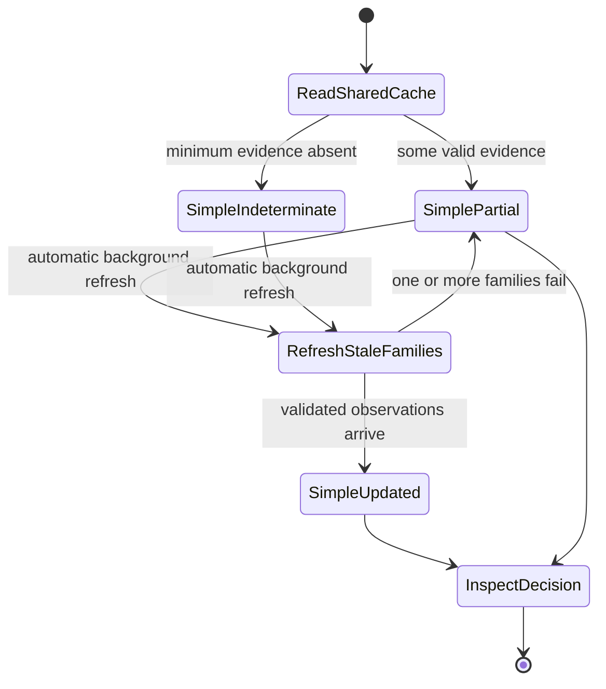
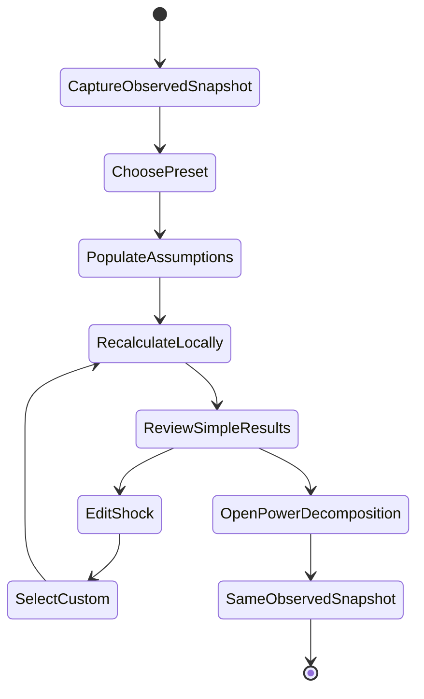
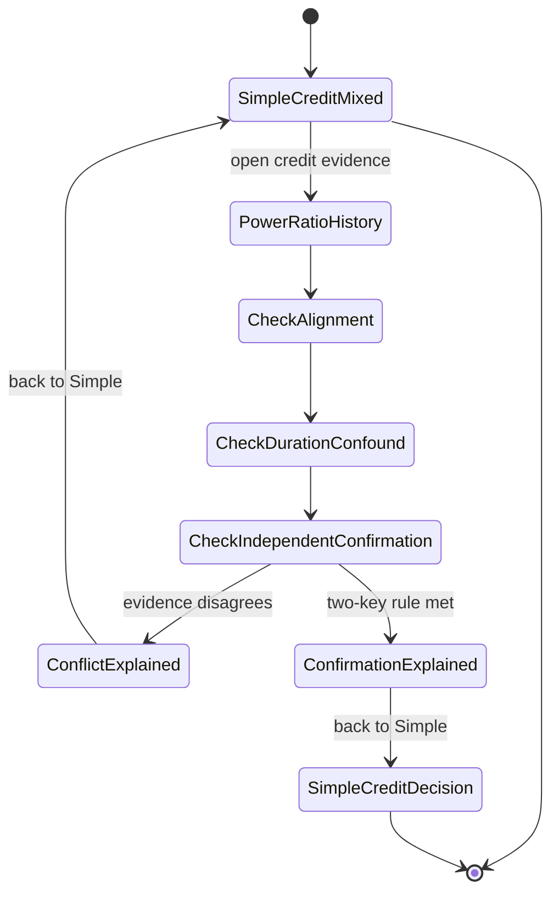
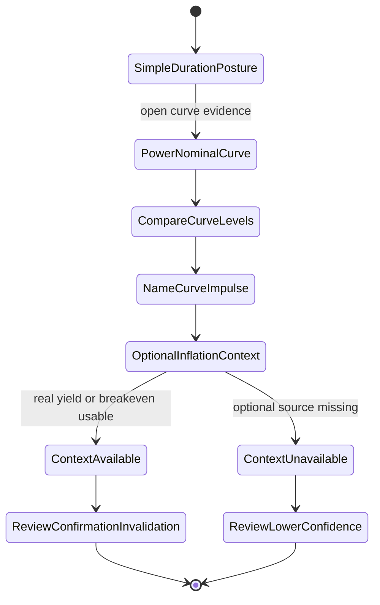
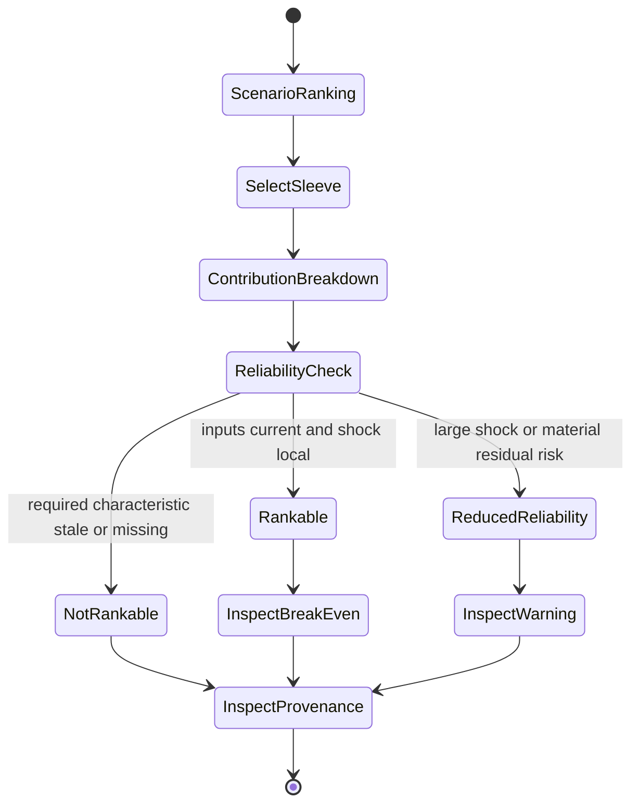
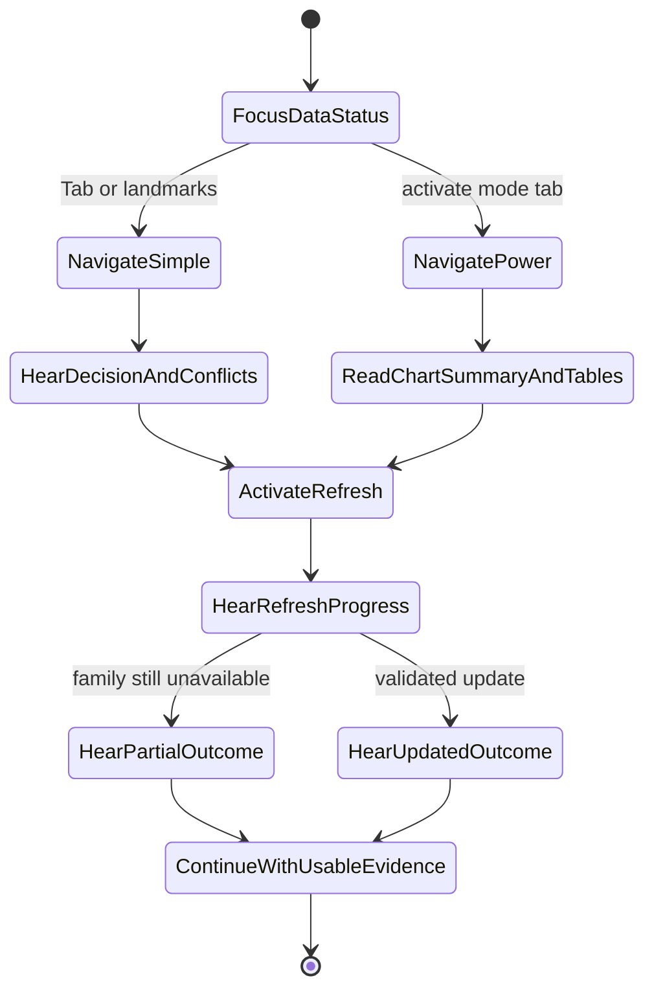

# Feature: 003 Bond Regime and Fixed-Income Scenario Lab

## Problem Statement

Research Lab can chart Treasury yields inside `etf-momentum-lab.html` and can rank broad cross-assets in `sector-research-lab.html`, but it has no fixed-income decision surface. A user who notices a move such as JNK/LQD must currently leave the site to answer four different questions: whether credit appetite is actually improving, whether the move is only a duration effect, which part of the yield curve is driving returns, and how a rate or spread shock would affect different bond sleeves.

A raw high-yield/investment-grade ETF ratio is useful but not sufficient. Current issuer facts illustrate the confound: as of 2026-07-10, HYG reported 2.99 years of effective duration and 242.25 basis points of option-adjusted spread, while LQD reported 7.87 years and 81.14 basis points. A rising high-yield/LQD ratio can therefore reflect improving credit appetite, rising long rates hurting LQD, or both. Calling that move simply “risk-on” would be materially misleading.

The missing capability is a decision-first bond regime lab that separates credit, duration, inflation, curve, and liquidity signals; corroborates price ratios with independent evidence; and lets a user model transparent rate-plus-spread scenarios. It must remain useful when optional macro series are unavailable and must never turn a stale or incomplete input set into a confident allocation instruction.

## Outcome Contract

**Intent:** Give a research user one coherent answer to three fixed-income questions: what credit is saying about risk appetite, whether to favor shorter or longer duration for the selected scenario, and which bond sleeve is most exposed to the user’s rate, spread, and inflation assumptions.

**Success Signal:** After loading current data, the user can see a sourced and freshness-bounded credit regime, a duration posture, the evidence that confirms or contradicts each, and modeled total-return ranges for cash, Treasury, inflation-linked, investment-grade, and high-yield sleeves. Changing a model lever updates the scenario outputs immediately without changing the observed market regime or fetching new data.

**Hard Constraints:**

- JNK/LQD, HYG/LQD, or any other single price ratio cannot independently produce a credit-risk verdict.
- Credit and duration must remain separate dimensions; a duration-driven ratio move cannot be labeled improving credit appetite without independent credit confirmation.
- Observed data, historical context, user assumptions, and modeled outputs must be visually and semantically distinct.
- Every market input and fund characteristic must expose source, as-of date, freshness, and proxy limitations.
- Scenario output must decompose carry, rate-duration effect, spread-duration effect, and convexity; it must not present a point estimate as a forecast.
- Missing, stale, misaligned, or legally restricted data must reduce confidence or produce an explicit indeterminate state, never a fabricated substitute.
- Total-return comparisons must use distribution-adjusted price history where available; raw-price ratios must be labeled as price-only.
- The tool is educational research, not personalized advice, portfolio optimization, execution, or a promise that an ETF can be held to maturity.
- Simple and Power views must use the same underlying regime and scenario calculations so they cannot disagree.

**Failure Condition:** The feature fails even if every chart renders when a duration selloff is mislabeled as improving credit, a stale OAS value silently confirms a live ETF ratio, a shock model hides its assumptions, a user cannot identify what would invalidate the posture, or Simple and Power produce different conclusions from the same inputs.

## Goals

- Build a fixed-income regime capability around credit appetite, curve/rate regime, inflation pressure, and duration exposure.
- Make JNK/LQD useful by showing its trend, percentile, and duration confound alongside HYG/LQD and independent credit confirmation.
- Distill the evidence into a low-noise Simple view with one credit posture, one duration posture, one preferred research expression, and explicit confirmation/invalidation conditions.
- Provide a Power view with full ratio history, yield-curve state and impulse, real-yield and breakeven context, credit-spread evidence, sleeve analytics, and data provenance.
- Provide transparent scenario presets and editable shocks for nominal rates, credit spreads, inflation compensation, horizon, carry, duration, and convexity.
- Reuse the Research Lab’s shared market-data cache and publish one normalized tool read for the Market Brief capability.

## Non-Goals

- Pricing individual bonds from cash-flow schedules or evaluating issuer-level default probability.
- Replacing a brokerage bond ladder, tax-equivalent-yield calculator, or holdings-level cash-flow report.
- Predicting Federal Reserve decisions, recessions, defaults, or exact ETF returns.
- Treating yield-curve inversion or steepening as a standalone timing signal.
- Publishing or committing restricted third-party macro time series into repository snapshots.
- Personalizing output by account size, tax status, liabilities, risk tolerance, current positions, or cost basis.
- Executing trades, sending alerts, or automatically rebalancing a portfolio.

## Current Capability Map

| Capability | Concrete Evidence | Current Status | Gap Owned By This Feature |
| --- | --- | --- | --- |
| Shared adjusted-close ETF history | `rldata.js::ensureBars`, `getBars`, and `putBars` cache daily bars from same-origin snapshots or Yahoo | Complete foundation | No bond-specific ratios, sleeve comparison, or fixed-income interpretation |
| Treasury nominal curve | `etf-momentum-lab.html::parseTreasuryCSV` and `loadRates` read official daily par yields without a required key | Partial | Only 2Y/10Y charting; no curve-regime classification, duration decision, or scenario linkage |
| Broad bond ETF analytics | `etf-momentum-lab.html` computes momentum, volatility, drawdown, correlation, beta/alpha, and projections | Partial | Generic ETF statistics do not separate rate risk from spread risk |
| Cross-asset regime context | `sector-research-lab.html` includes TLT and other cross-assets | Partial | No coherent credit/curve/inflation model or bond-sleeve action surface |
| Shared macro read | `rldata.js::ensureMacro` provides broad risk context | Partial | Broad fear/volatility context cannot substitute for fixed-income evidence |
| Scenario modeling | Existing strategy and options labs expose editable assumptions and model outputs | Pattern exists | No duration-plus-spread total-return approximation or break-even analysis |
| Simple/Power interaction | `sector-research-lab.html`, `global-rotation-lab.html`, and `real-assets-lab.html` use one model across Simple and Power views | Pattern exists | No fixed-income implementation |
| Fixed-income tool | No bond-regime tool is registered in `tools.json`, `index.html`, or `rlnav.js` | Missing | Entire capability |

## Honest Findings And Constraints

1. **JNK/LQD is directionally interesting but structurally impure.** HYG’s verified effective duration of 2.99 years versus LQD’s 7.87 years demonstrates that a long-rate shock can raise the ratio without better issuer fundamentals. The ratio is an early market-price pulse, not a sufficient credit conclusion.
2. **OAS is better credit evidence but has access and licensing constraints.** FRED’s ICE BofA series notes define OAS against a spot Treasury curve and distinguish below-investment-grade from investment-grade universes, but also restrict redistribution of top-level data. The product must not commit or republish those series as static site data; any permitted live use must remain sourced, browser-side, and optional.
3. **Yield-curve signals operate on different horizons.** The New York Fed’s recession model uses the 10Y-3M term spread for a twelve-month probability, whereas a bond-positioning decision may respond to daily 2Y/10Y changes. Level, change, and curve-shift type must not be collapsed into one signal.
4. **ETF price history is not a bond cash-flow guarantee.** Fidelity explicitly notes that most bond funds have no maturity date, so holding a fund does not eliminate price volatility the way holding an individual bond to maturity may. The tool must describe sleeves as traded exposures, not maturity-matched promises.
5. **The first-order duration model is useful but incomplete.** Effective duration and convexity provide a transparent local approximation. Large, nonparallel curve moves, changing spreads, optionality, defaults, fund flows, taxes, tracking differences, and liquidity can produce materially different realized returns.
6. **Current credit conditions can look benign while compensation is thin.** FRED showed 2.69% for the broad high-yield OAS and 0.77% for investment-grade OAS on 2026-07-10, while the Chicago Fed NFCI reported looser-than-average conditions. Tight spreads can confirm near-term risk appetite while simultaneously reducing the cushion against future widening; the tool must show both momentum and valuation/cushion.
7. **A no-key macro endpoint is not yet an established shared-cache contract.** The repository has a no-key U.S. Treasury path, but the proposed real-yield, breakeven, and OAS series require an explicit allowed retrieval and use policy before they can be treated as dependable inputs.

## Domain Capability Model

### Capability

**Fixed-Income Regime And Scenario Analysis** combines observed market evidence into independent credit, rates, curve, and inflation states, then applies explicit user shocks to bond-exposure characteristics without changing or disguising the observed state.

### Domain Primitives

| Primitive | Purpose | Lifecycle |
| --- | --- | --- |
| MarketObservation | One sourced value or time series with units, source time, retrieval time, and use restrictions | missing -> loading -> fresh or stale -> superseded; error remains visible |
| BondSleeve | A research exposure such as cash, short Treasury, intermediate Treasury, long Treasury, inflation-linked, investment-grade credit, or high-yield credit | configured -> active -> revised; characteristics carry their own as-of date |
| RelativeCreditPulse | Distribution-adjusted relative performance between a riskier and safer credit exposure | insufficient -> weakening, neutral, or strengthening -> superseded |
| CreditConfirmation | Independent evidence about credit compensation or broad financial conditions | unavailable -> confirming, mixed, or contradicting -> superseded |
| CurveState | Current curve level and shape at named maturities | unavailable -> inverted, flat, or positive -> superseded |
| CurveImpulse | Direction and relative speed of short- and long-rate changes | unavailable -> bull steepener, bull flattener, bear steepener, bear flattener, or mixed -> superseded |
| InflationState | Nominal, real, and breakeven-rate evidence | unavailable -> cooling, stable, or heating -> superseded |
| CreditRegime | Composite interpretation of price pulse, spread evidence, breadth, and freshness | indeterminate -> defensive, mixed, or constructive -> superseded |
| DurationPosture | Research stance on shorter, neutral, or longer rate exposure | indeterminate -> shorten, balanced, or extend -> superseded |
| ScenarioAssumptionSet | User-selected horizon and shocks to nominal rates, credit spreads, inflation compensation, and optional sleeve characteristics | preset or custom -> edited -> reset |
| ScenarioResult | Decomposed local return approximation for one sleeve under one assumption set | invalid -> calculated -> superseded when any input changes |
| EvidenceConflict | Explicit disagreement among observed signals | opened -> resolved by new evidence or retained as mixed |
| DecisionRead | Simple-view synthesis with posture, confidence, expression, confirmation, and invalidation | unavailable -> current -> stale -> superseded |

### Relationships

- A RelativeCreditPulse compares two BondSleeves but cannot create a CreditRegime without at least one independent CreditConfirmation.
- A CreditRegime is a separate axis from DurationPosture; neither inherits the other’s label.
- CurveState describes the level, while CurveImpulse describes recent movement; an inverted curve and a bull steepener may coexist.
- InflationState helps distinguish a growth-driven duration rally from an inflation- or term-premium-driven selloff.
- One ScenarioAssumptionSet produces one ScenarioResult per eligible BondSleeve using the sleeve characteristics effective at that as-of date.
- A DecisionRead references the observed regimes and the active scenario but labels each source separately.
- An EvidenceConflict lowers confidence and remains visible in both Simple and Power views.

### Business Policies

1. **Two-key credit rule:** a constructive or defensive CreditRegime requires both a relative-price pulse and independent confirmation; otherwise it is mixed or indeterminate.
2. **Duration-confound rule:** high-yield/investment-grade ratios must show the duration gap and compare against rate moves before interpretation.
3. **Level-plus-change rule:** spread and curve levels are shown together with their recent changes; tight-but-widening and wide-but-tightening are distinct states.
4. **Horizon rule:** tactical price momentum, swing credit conditions, and macro curve signals retain separate horizons.
5. **Aligned-date rule:** pair ratios use common observation dates only; one-sided stale bars are never forward-filled into a current ratio.
6. **Return-decomposition rule:** modeled return is displayed as carry plus rate effect plus spread effect plus convexity adjustment, with residual risks named.
7. **Local-approximation rule:** the model’s reliability warning increases as shocks grow, duration/convexity inputs age, or optionality is material.
8. **Truthful-degradation rule:** unavailable optional macro data removes that confirmation and lowers confidence; it does not remove usable ETF evidence or invent a replacement.
9. **Source-rights rule:** restricted data remains linked to its source and is not committed into public snapshots unless redistribution rights are documented.
10. **One-model rule:** Simple and Power views consume the same CreditRegime, DurationPosture, and ScenarioResult objects.

## Actors And Personas

| Actor | Description | Key Goals | Permission Boundary |
| --- | --- | --- | --- |
| Tactical Multi-Asset Researcher | Uses daily and weekly cross-asset signals to calibrate risk exposure | Know whether credit confirms equity risk appetite and what would invalidate it | May inspect and steer research assumptions; receives no execution or personalized sizing |
| Fixed-Income Allocator | Compares cash, Treasury, inflation-linked, investment-grade, and high-yield sleeves | Understand carry, duration, spread cushion, and scenario asymmetry | May compare generic sleeves; cannot treat modeled output as a guaranteed return |
| Macro Researcher | Interprets curve, real-yield, inflation, and financial-condition changes | Distinguish growth, policy, inflation, and term-premium pressure | May use macro evidence; must preserve different signal horizons and uncertainty |
| Model Explorer | Wants to understand how bond returns respond to rates and spreads | Change transparent assumptions and inspect decomposed effects | May edit model inputs; edits never rewrite observed market data |
| Data-Constrained User | Uses the static site when some public sources or proxies are blocked | Retain a truthful partial read and know exactly what is unavailable | May use cached ETF evidence; cannot receive full-confidence conclusions from missing inputs |
| Market Brief Consumer | Consumes compact normalized reads from Research Lab tools | Reuse the bond model’s current conclusion without duplicating its math | Reads the published decision state; cannot infer details absent from the tool read |

## Use Cases

### UC-001: Assess whether credit confirms risk appetite

- **Actor:** Tactical Multi-Asset Researcher
- **Preconditions:** At least one valid high-yield/investment-grade price pair has aligned adjusted-close history.
- **Main Flow:**
  1. The user opens the Simple view.
  2. The tool shows the JNK/LQD pulse, an alternate high-yield pair, and the duration gap.
  3. The tool compares the price pulse with available credit-spread or financial-condition confirmation.
  4. The user receives a constructive, mixed, defensive, or indeterminate credit posture with evidence and invalidation.
- **Alternative Flows:** If independent confirmation is unavailable or stale, the posture cannot be fully constructive or defensive and explains the missing confirmation. If the ratio rises while long rates rise and spreads do not improve, the tool flags a likely duration confound.
- **Postconditions:** The user can state whether credit confirms risk appetite and why.

### UC-002: Choose a duration research posture

- **Actor:** Fixed-Income Allocator
- **Preconditions:** Current or cached nominal Treasury observations exist.
- **Main Flow:**
  1. The tool shows curve level, recent short- and long-rate changes, and the named curve impulse.
  2. Available real-yield and inflation evidence is shown separately.
  3. The tool produces shorten, balanced, extend, or indeterminate duration posture.
  4. The tool names the confirmation and invalidation thresholds that matter next.
- **Alternative Flows:** A bull steepener associated with falling front-end rates is not presented as unconditionally bullish if credit is deteriorating. A bear steepener with rising inflation compensation highlights long-duration pressure.
- **Postconditions:** The user understands which rate exposure is favored by the selected evidence and what could reverse it.

### UC-003: Compare bond sleeves under a named scenario

- **Actor:** Model Explorer
- **Preconditions:** Each modeled sleeve has finite carry, duration, and as-of metadata; convexity and spread duration are present when applicable.
- **Main Flow:**
  1. The user selects a named scenario or Custom.
  2. The user adjusts horizon, Treasury-rate shock, investment-grade spread shock, high-yield spread shock, and inflation shock.
  3. Every eligible sleeve recalculates immediately without a data fetch.
  4. The tool ranks scenario results and decomposes each into carry, rate, spread, and convexity contributions.
  5. The user sees break-even rate or spread moves and approximation warnings.
- **Alternative Flows:** Missing or stale characteristics exclude a sleeve from ranking and explain why. Large shocks visibly lower model reliability.
- **Postconditions:** The user can explain why one sleeve behaves differently from another under the same scenario.

### UC-004: Investigate conflicting evidence in Power view

- **Actor:** Macro Researcher
- **Preconditions:** At least two evidence families disagree.
- **Main Flow:**
  1. The user switches to Power without changing the current model.
  2. Ratio, OAS/financial-condition, curve, real-yield, breakeven, and sleeve panels retain independent labels and horizons.
  3. The conflict panel identifies which observations disagree and how confidence is affected.
  4. The user inspects source, units, timestamps, transformations, and caveats.
- **Alternative Flows:** If a source is restricted or unavailable, the panel shows the contract rather than an empty chart that looks like zero.
- **Postconditions:** The user can distinguish a genuine mixed regime from missing data.

### UC-005: Use the tool with partial or stale data

- **Actor:** Data-Constrained User
- **Preconditions:** One or more live sources fail while cached data may exist.
- **Main Flow:**
  1. The tool paints from valid cache immediately.
  2. It refreshes only missing or stale resources.
  3. Every panel shows source and age.
  4. The decision read lowers confidence or becomes indeterminate according to the missing evidence.
- **Alternative Flows:** With no usable data, the tool presents a clear no-read state and keeps the scenario model available only with explicit user-entered assumptions.
- **Postconditions:** No stale observation is silently presented as live and no failed fetch erases valid cached evidence.

### UC-006: Publish a normalized bond decision read

- **Actor:** Market Brief Consumer
- **Preconditions:** The tool has a valid DecisionRead.
- **Main Flow:**
  1. The tool publishes a compact read with credit regime, duration posture, preferred research expression, confidence, source as-of times, conflicts, confirmation, and invalidation.
  2. The Market Brief can consume that read without recomputing ratios or scenario math.
- **Alternative Flows:** If the decision is indeterminate, the normalized read says so and contains no fabricated recommendation.
- **Postconditions:** The owning tool remains the single source of fixed-income interpretation.

## Business Scenarios

### BS-001: Duration-driven ratio improvement stays mixed

Given JNK/LQD is rising over the selected tactical window
And long Treasury yields are rising enough to disadvantage the longer-duration investment-grade sleeve
And independent credit spreads are not tightening
When the tool evaluates credit appetite
Then it must label the evidence as mixed or duration-confounded
And it must not call credit appetite constructive from the ratio alone

### BS-002: Broad credit confirmation supports constructive appetite

Given both primary high-yield/investment-grade ratios are strengthening on aligned total-return dates
And high-yield and investment-grade spread evidence is stable or improving within its freshness contract
When the tool evaluates credit appetite
Then it must show a constructive credit posture
And name the spread or ratio deterioration that would invalidate it

### BS-003: Tight but widening spreads expose poor asymmetry

Given credit-spread levels remain historically tight
And recent spread changes are widening
When the tool evaluates credit compensation
Then it must distinguish benign level from deteriorating momentum
And it must show that limited spread cushion can coexist with current risk appetite

### BS-004: Bull steepening does not hide a growth scare

Given short rates fall faster than long rates
And the curve steepens
And credit appetite is deteriorating
When the tool evaluates duration
Then it may identify support for high-quality duration
But it must also show the defensive growth-risk context rather than label the whole regime bullish

### BS-005: Bear steepening penalizes long duration

Given long rates rise faster than short rates
And inflation compensation or real yields are rising
When the tool evaluates duration
Then it must identify bear steepening or long-end pressure
And shorter-duration sleeves must show less modeled rate loss than longer-duration sleeves under the same shock

### BS-006: Custom rate-and-spread shock decomposes returns

Given the user selects a six-month horizon
And enters a negative Treasury-rate shock and positive credit-spread shock
When the model recalculates
Then each corporate sleeve must show carry, rate, spread, and convexity contributions separately
And a Treasury sleeve must not receive a corporate-spread contribution

### BS-007: Large shock raises approximation warning

Given the user enters a shock outside the model’s local-approximation range
When scenario results are displayed
Then the tool must retain the arithmetic result
But visibly downgrade reliability and name nonparallel curves, optionality, defaults, liquidity, and tracking as unmodeled risks

### BS-008: Stale fund characteristics block false precision

Given a sleeve’s duration, spread duration, yield, or convexity is older than its declared review window
When the user compares scenario results
Then the tool must identify the stale characteristic
And exclude or visibly downgrade that sleeve rather than silently using it as current truth

### BS-009: Missing optional macro data degrades honestly

Given ETF bars and nominal Treasury observations are available
But OAS, real-yield, or breakeven data is unavailable
When the tool builds the decision read
Then it must still show the evidence that is available
And confidence must reflect the missing families
And no missing value may be treated as zero or unchanged

### BS-010: Misaligned pair data is not forward-filled

Given one ETF in a pair has a newer observation than the other
When the ratio is calculated
Then only common dates may be used
And the displayed as-of date must be the latest common observation

### BS-011: Simple and Power remain coherent

Given a fixed observed dataset and scenario assumption set
When the user switches between Simple and Power
Then the credit regime, duration posture, scenario ranking, confidence, and invalidation must remain identical
And Power may add detail without changing the decision

### BS-012: Model lever changes do not rewrite market state

Given the current market evidence implies mixed credit and balanced duration
When the user changes the custom spread shock
Then scenario return estimates must update immediately
But the observed credit and duration regimes must not change

### BS-013: Restricted data is not redistributed

Given a third-party macro series carries redistribution restrictions
When the public tool uses or references that series
Then no repository snapshot may contain its observations without documented permission
And the UI must preserve source attribution and use limitations

### BS-014: Accessible partial-data experience

Given a keyboard-only or screen-reader user opens the tool with one failed data source
When they navigate Simple and Power views
Then all controls, states, evidence conflicts, freshness warnings, and chart summaries must be perceivable without color, hover, or pointer-only interaction

## Requirements

### Regime Evidence

- **FR-001:** The tool must calculate JNK/LQD and HYG/LQD from aligned distribution-adjusted daily closes where available.
- **FR-002:** Each ratio must expose latest common date, 21-day and 63-day change, trend relative to configurable moving averages, and a rolling historical percentile or standardized distance.
- **FR-003:** Ratio calculations must never forward-fill a missing leg into a newer common date.
- **FR-004:** Every ratio interpretation must display the current effective-duration difference between its legs or state that the difference is unavailable.
- **FR-005:** The credit regime must require at least one relative-price pulse and one independent confirmation family.
- **FR-006:** Independent confirmation may include option-adjusted spread level and change, a broad financial-conditions measure, or another separately sourced credit breadth measure; it cannot be a restatement of the same ETF ratio.
- **FR-007:** Credit regime vocabulary is limited to Constructive, Mixed, Defensive, and Indeterminate.
- **FR-008:** The regime must distinguish level from momentum, including tight-but-widening and wide-but-tightening states.
- **FR-009:** The decision read must include confidence, confirming evidence, contradicting evidence, and explicit invalidation.
- **FR-010:** Broad equity fear or volatility context may corroborate but cannot replace fixed-income confirmation.

### Curve, Rates, And Inflation

- **FR-011:** The tool must expose current nominal Treasury observations across short, intermediate, and long maturities when available.
- **FR-012:** It must show both 10Y-2Y and 10Y-3M curve spreads when their inputs are available and preserve their different use horizons.
- **FR-013:** Curve level must be separate from CurveImpulse.
- **FR-014:** CurveImpulse must classify bull steepener, bull flattener, bear steepener, bear flattener, or mixed from recent short- and long-rate changes.
- **FR-015:** Real yield and breakeven inflation must be shown as separate evidence families when available.
- **FR-016:** Duration posture vocabulary is limited to Shorten, Balanced, Extend, and Indeterminate.
- **FR-017:** Duration posture must include a next-confirmation condition and an invalidation condition.
- **FR-018:** Yield-curve inversion cannot independently generate an immediate trading posture.

### Sleeve Comparison

- **FR-019:** The initial comparison set must represent cash/bills, short Treasury, intermediate Treasury, long Treasury, inflation-linked Treasury, investment-grade corporate, and high-yield corporate exposures.
- **FR-020:** Each sleeve must disclose exposure type, ticker proxy, source, as-of date, carry measure, effective duration, spread duration when relevant, convexity when available, and key limitations.
- **FR-021:** Sleeve market evidence must include trailing total return, realized volatility, maximum drawdown, and trend state over the selected horizon when sufficient data exists.
- **FR-022:** Price momentum and modeled scenario return must remain separately labeled.
- **FR-023:** The tool must not imply that a bond ETF has a fixed maturity or guaranteed redemption value.
- **FR-024:** A preferred research expression must be conditional on the observed regime and selected scenario, and must include why it fits and what invalidates it.
- **FR-025:** A sleeve with missing required characteristics cannot receive a precise modeled rank.

### Scenario Modeling

- **FR-026:** The tool must provide at least Soft Landing, Growth Shock, Inflation/Term-Premium Shock, Credit Stress, and Custom assumption sets.
- **FR-027:** Editable assumptions must include horizon, parallel Treasury-rate shock, investment-grade spread shock, high-yield spread shock, and inflation-compensation shock or equivalent inflation-linked adjustment.
- **FR-028:** The model must use a transparent local approximation based on carry, effective duration, spread duration, and convexity.
- **FR-029:** Every result must expose the rate, spread, carry, and convexity contributions separately.
- **FR-030:** Treasury sleeves must have no corporate-spread contribution; corporate sleeves must separate rate and spread effects.
- **FR-031:** Inflation-linked sleeves must state how nominal, real, and breakeven assumptions enter the approximation.
- **FR-032:** The tool must calculate a break-even adverse rate or spread move that offsets modeled carry over the selected horizon when the required inputs are finite.
- **FR-033:** Assumption changes must recalculate locally without fetching data.
- **FR-034:** A large-shock warning must activate beyond disclosed local-approximation bounds.
- **FR-035:** Scenario results must be labeled estimates, not forecasts or probabilities.
- **FR-036:** Preset names must describe economic scenarios without claiming that any preset is currently most likely.

### Simple And Power Views

- **FR-037:** Simple view must lead with Credit Appetite, Duration Posture, and Preferred Research Expression.
- **FR-038:** Simple view must show the minimum evidence needed to understand each posture, including confidence and invalidation.
- **FR-039:** Simple view must expose scenario preset, horizon, rate shock, and spread shock as steerable controls.
- **FR-040:** Power view must expose ratio history, credit confirmation, curve level and impulse, real-yield/inflation context, sleeve analytics, model decomposition, and provenance.
- **FR-041:** Simple and Power must consume the same regime and scenario outputs.
- **FR-042:** Switching view mode must not fetch data or reset model assumptions.
- **FR-043:** The selected mode and non-sensitive assumptions may persist locally; market observations retain independent freshness.

### Data Truth And Degradation

- **FR-044:** The page must paint from valid shared cache first and refresh only missing or stale resources.
- **FR-045:** Every evidence family must expose source, observation time, retrieval time, units, and freshness state.
- **FR-046:** Missing and failed values must be represented as unavailable, never zero.
- **FR-047:** Data with different as-of times must not be presented as synchronized without an explicit alignment label.
- **FR-048:** Restricted third-party observations must not be committed into public repository snapshots without documented redistribution permission.
- **FR-049:** The model must continue with honest partial evidence when optional macro families are unavailable.
- **FR-050:** Confidence must decline according to missing, stale, or conflicting evidence and must become Indeterminate when the minimum evidence contract is not met.
- **FR-051:** Fund characteristics must carry a review-by or maximum-age contract separate from daily price freshness.
- **FR-052:** User-entered assumptions must be visibly labeled and cannot overwrite sourced observations.

### Integration And Safety

- **FR-053:** The tool must publish one compact normalized read owned by the bond-regime model.
- **FR-054:** The normalized read must contain observed credit regime, duration posture, conditional expression, confidence, conflicts, source as-of times, confirmation, invalidation, and deep link.
- **FR-055:** An Indeterminate read must publish no fabricated market action.
- **FR-056:** The tool must identify itself as educational research and not personalized investment advice.
- **FR-057:** It must not request, retain, or infer account holdings, cost basis, tax status, or brokerage credentials.
- **FR-058:** It must not execute orders or present position-size instructions.

## Competitive Analysis

| Capability | Research Lab Baseline | TradingView | Portfolio Visualizer | Fidelity Fixed Income Tools | Gap / Opportunity |
| --- | --- | --- | --- | --- | --- |
| Cross-instrument ratio | No bond-specific ratio surface | Flexible spread charts support division, z-distance, and pair comparison; warns that correlations change and spread bars can repaint | ETF comparisons are possible through portfolio backtests rather than a live ratio decision | Not the primary focus | Match flexible ratio inspection, but add duration-confound and independent-credit checks that generic spread charts do not provide |
| Portfolio history | Generic ETF analytics exist | Strong charting, weaker fixed-income decomposition | Rich risk, drawdown, rolling-return, stress-period, and correlation analysis | Holdings reports | Keep only decision-relevant history in Simple; expose stress/drawdown context in Power |
| Bond cash-flow and laddering | Missing | Market charting rather than personal ladder planning | Allocation backtests, not individual-bond cash flows | Bond ladder, cash-flow reporting, price/yield and tax-equivalent-yield calculators, auto-roll | Do not imitate brokerage workflows; specialize in regime and scenario analysis |
| Rate/spread scenario | Missing | Users can chart curves and instruments, but the researched spread-chart surface does not decompose bond returns | Backtests realized history rather than explicit duration/spread shocks | Calculators are security/portfolio oriented | Differentiator: transparent carry + rate + spread + convexity decomposition across generic sleeves |
| Decision synthesis | Existing Simple/Power pattern in other labs | User interprets charts | User interprets extensive reports | Product selection and holdings management | Differentiator: one conditional credit and duration decision with conflicts and invalidation |
| Data truth | Shared cache/freshness patterns exist | Notes repaint and changing-correlation caveats | Data-window limitations shown | Strong product-risk disclosures | Make data age, legal use, proxy mismatch, and model reliability first-class rather than footer caveats |

## Platform Direction And Market Trends

### Industry Trends

| Trend | Status | Relevance | Impact on Product |
| --- | --- | --- | --- |
| Cash and short-duration yields compete with risk assets | Established | High | Every risky bond sleeve needs an explicit carry hurdle versus bills/cash |
| ETF ratios are increasingly used as liquid macro proxies | Growing | High | Ratios should be supported, but corrected for duration, distributions, and changing composition |
| Investors demand scenario analysis rather than one-point forecasts | Growing | High | Editable rate/spread shocks and decomposed returns are more useful than an opaque score |
| Financial conditions combine many correlated indicators | Established | High | A corroboration model should avoid double-counting multiple expressions of the same credit signal |
| Real yields and inflation compensation matter independently | Established | High | Nominal-rate changes must be decomposed when evaluating duration and inflation-linked bonds |
| Public market-data access and licensing are becoming more constrained | Growing | High | Browser-side optional sources, source-rights metadata, and truthful partial operation are strategic requirements |

### Strategic Opportunities

| Opportunity | Type | Priority | Rationale |
| --- | --- | --- | --- |
| Duration-aware credit pulse | Differentiator | High | Turns the user’s JNK/LQD idea into a more defensible signal by exposing why the ratio moved |
| Rate-plus-spread scenario workbench | Differentiator | High | Bridges macro views to sleeve-level consequences without pretending to forecast |
| Cash-hurdle and spread-cushion view | Table Stakes | High | High current cash yields make “why take duration or credit?” the first allocation question |
| Curve-impulse classifier | Table Stakes | Medium | Bull/bear steepening and flattening are more actionable than curve level alone |
| Evidence-conflict ledger | Differentiator | Medium | Makes mixed regimes intelligible and prevents false composite certainty |
| Holdings-level ladder/tax planning | Table Stakes in brokerages, not this product | Low | Valuable but outside a public, non-personalized market-regime lab |

### Recommendations

1. **Immediate:** Deliver the duration-aware credit pulse, cash hurdle, Simple/Power decision surface, and transparent scenario workbench.
2. **Near-term:** Add source-rights-safe macro confirmation and historical regime analog validation only after its retrieval and redistribution contract is verified.
3. **Strategic:** Let the Market Brief consume the normalized bond decision read and later validate whether the regime labels have predictive value without optimizing thresholds in-sample.

## Improvement Proposals

### IP-001: Duration-Aware Credit Appetite

- **Impact:** High
- **Effort:** M
- **Competitive Advantage:** Generic spread charts show JNK/LQD; this model explains whether credit or duration drove it and refuses a one-signal verdict.
- **Actors Affected:** Tactical Multi-Asset Researcher, Macro Researcher
- **Business Scenarios:** BS-001, BS-002, BS-003, BS-010

### IP-002: Rate-Plus-Spread Scenario Workbench

- **Impact:** High
- **Effort:** M
- **Competitive Advantage:** Converts macro shocks into transparent sleeve consequences, separating carry, rate, spread, and convexity rather than presenting an opaque expected return.
- **Actors Affected:** Fixed-Income Allocator, Model Explorer
- **Business Scenarios:** BS-005, BS-006, BS-007, BS-008, BS-012

### IP-003: Cash Hurdle And Spread Cushion

- **Impact:** High
- **Effort:** S
- **Competitive Advantage:** Frames credit and duration against the return available in bills, and shows how much adverse move erases carry.
- **Actors Affected:** Fixed-Income Allocator
- **Business Scenarios:** BS-003, BS-006

### IP-004: Curve Impulse, Not Just Curve Shape

- **Impact:** Medium
- **Effort:** S
- **Competitive Advantage:** Distinguishes bull/bear steepening and flattening so a positive curve is not confused with a positive market impulse.
- **Actors Affected:** Macro Researcher, Fixed-Income Allocator
- **Business Scenarios:** BS-004, BS-005

### IP-005: Evidence Conflict And Confidence Contract

- **Impact:** High
- **Effort:** M
- **Competitive Advantage:** Most dashboards stack indicators without explaining disagreement; this tool names conflicts and mechanically limits confidence.
- **Actors Affected:** All research actors, Market Brief Consumer
- **Business Scenarios:** BS-001, BS-003, BS-009, BS-011

### IP-006: Source-Rights-Safe Macro Layer

- **Impact:** Medium
- **Effort:** M
- **Competitive Advantage:** Keeps a public static research tool useful without silently copying restricted series or requiring a credentialed backend.
- **Actors Affected:** Data-Constrained User, Risk reviewer
- **Business Scenarios:** BS-009, BS-013, BS-014

## UI Scenario Matrix

| Scenario | Actor | Entry Point | Steps | Expected Outcome | Screen(s) |
| --- | --- | --- | --- | --- | --- |
| BS-001 | Tactical Multi-Asset Researcher | Simple credit card | Inspect ratio, duration confound, and confirmation | Mixed credit posture with a precise reason | Simple |
| BS-002 | Tactical Multi-Asset Researcher | Simple credit card | Review two ratios and confirming spread state | Constructive posture with invalidation | Simple, Power credit |
| BS-003 | Fixed-Income Allocator | Credit cushion | Compare level, change, and carry break-even | Tight compensation and worsening impulse stay distinct | Simple, Power credit/model |
| BS-004 | Macro Researcher | Duration card | Inspect curve impulse and credit context | High-quality duration support with defensive caveat | Simple, Power curve |
| BS-005 | Fixed-Income Allocator | Duration card | Compare short/intermediate/long sleeves | Long-duration stress is explicit | Simple, Power sleeves |
| BS-006 | Model Explorer | Scenario controls | Select preset, edit shocks, inspect waterfall | Decomposed sleeve outcomes | Simple controls, Power model |
| BS-007 | Model Explorer | Custom scenario | Enter large shock | Result retained with high-visibility reliability warning | Simple, Power model |
| BS-008 | Data-Constrained User | Sleeve table | Inspect stale characteristics | Sleeve downgraded/excluded with reason | Power sleeves/provenance |
| BS-009 | Data-Constrained User | Page load | Use cache while optional macro fails | Honest partial read and lower confidence | Simple status, Power provenance |
| BS-010 | Tactical Multi-Asset Researcher | Ratio panel | Inspect latest date | Ratio ends on latest common observation | Power credit |
| BS-011 | Any research actor | Mode control | Toggle Simple/Power | Same decision and scenario ranking | Both |
| BS-012 | Model Explorer | Simple levers | Change spread shock | Scenario changes; observed regime does not | Simple, Power model |
| BS-013 | Risk reviewer | Provenance panel | Inspect restricted source | Attribution and no committed snapshot | Power provenance |
| BS-014 | Keyboard/screen-reader user | Page load | Navigate controls and summaries | Full non-pointer, non-color access | Both |

## Non-Functional Requirements

- **Performance:** Cached evidence must render before network refresh completes. Model lever changes should update perceived output immediately and must not trigger network requests.
- **Accessibility:** All controls require keyboard operation, visible focus, explicit labels, and state announcements. Charts require text summaries or equivalent tables; regime and warning states cannot rely on color alone.
- **Responsiveness:** The Simple decision stack and model controls must remain readable without horizontal scrolling on a narrow mobile viewport. Power tables may use deliberate contained scrolling with persistent row labels.
- **Data Integrity:** Pair series use aligned dates and finite values. Source and characteristic freshness are independent. Failed fetches cannot erase valid cached data.
- **Explainability:** Every composite posture must expose its component evidence, weighting or decision policy, conflicts, confidence, and invalidation.
- **Model Integrity:** Scenario math must be deterministic for a fixed assumption set, unit-safe for basis points versus percentages, and bounded against non-finite inputs.
- **Privacy:** No account, position, tax, payment, identity, or brokerage data is collected. Non-sensitive preferences may remain local to the browser.
- **Legal/Source Use:** Source attribution and redistribution restrictions must travel with macro evidence. Restricted observations are never committed or bundled without documented rights.
- **Maintainability:** Fund characteristics and source metadata must be editable without rewriting decision logic. The capability vocabulary remains provider- and ticker-neutral even though the initial implementation uses ETF proxies.

## Assumptions And Open Questions

- The initial product is a market-regime and generic-sleeve tool, not an individual-bond screener or ladder builder.
- Distribution-adjusted ETF closes are available through the shared bar contract for the initial sleeve universe.
- Official U.S. Treasury nominal curve data remains the primary no-key rate source.
- **Open rights question:** Whether browser-side use of ICE BofA OAS observations through FRED is permitted for this public tool must be verified before those observations become an enabled default. Until then, the tool must support a no-OAS partial state or explicit user-supplied observation.
- **Open data question:** A no-key, source-rights-safe path for daily real yields and breakevens must be verified before implementation treats them as dependable rather than optional.
- **Open validation question:** Composite thresholds should begin as transparent, editable research assumptions and must not be represented as predictive until an out-of-sample validation contract exists.

## Research Evidence

- Repository shared data contract: `rldata.js::ensureBars`, `getBars`, `putBars`, and `putToolRead`.
- Existing Treasury parser and no-key official source path: `etf-momentum-lab.html::parseTreasuryCSV` and `loadRates`.
- Existing Simple/Power precedent: `sector-research-lab.html`, `global-rotation-lab.html`, and `real-assets-lab.html`.
- HYG characteristics and fixed-income risk disclosures, as of 2026-07-10: <https://www.ishares.com/us/products/239565/ishares-iboxx-high-yield-corporate-bond-etf>
- LQD characteristics and fixed-income risk disclosures, as of 2026-07-10: <https://www.ishares.com/us/products/239566/ishares-iboxx-investment-grade-corporate-bond-etf>
- ICE BofA U.S. High Yield OAS definition, current value, and use restrictions: <https://fred.stlouisfed.org/series/BAMLH0A0HYM2>
- ICE BofA U.S. Corporate OAS definition, current value, and use restrictions: <https://fred.stlouisfed.org/series/BAMLC0A0CM>
- Official Treasury par-yield methodology and series caveats: <https://home.treasury.gov/resource-center/data-chart-center/interest-rates/TextView?type=daily_treasury_yield_curve>
- New York Fed yield-curve leading-indicator definition and horizon: <https://www.newyorkfed.org/research/capital_markets/ycfaq.html>
- 10-year real-yield definition: <https://fred.stlouisfed.org/series/DFII10>
- 10-year breakeven definition: <https://fred.stlouisfed.org/series/T10YIE>
- Chicago Fed NFCI construction, current components, and revision behavior: <https://www.chicagofed.org/research/data/nfci/current-data>
- TradingView spread-chart capabilities and changing-correlation/repainting caveats: <https://www.tradingview.com/support/solutions/43000502298-spread-charts/>
- Portfolio Visualizer backtest, stress, drawdown, correlation, and rolling-return capability: <https://www.portfoliovisualizer.com/backtest-asset-class-allocation>
- Fidelity fixed-income tools and bond-fund maturity/risk distinction: <https://www.fidelity.com/fixed-income-bonds/fixed-income-tools-services/overview>

## UI Wireframes

### UX Direction

The feature is one decision workspace at `bond-regime-lab.html`, not a landing page and not separate Simple and Power routes. It extends the established Research Lab model-desk language used by `sector-research-lab.html`, `global-rotation-lab.html`, and `real-assets-lab.html`: the shared `rlnav` shell, a constrained 1240px work area, charcoal surfaces, jade/gold/coral/cyan status accents, 8px-or-smaller radii, visible dividers, tabular numerals, and the existing Avenir Next / Iowan Old Style typography. Letter spacing remains zero. The page has one compact product header rather than a marketing hero.

Simple and Power are compositions over the same `CreditRegime`, `DurationPosture`, `ScenarioAssumptionSet`, `ScenarioResult`, and evidence records. The mode control only changes which sections are visible. It never fetches, resets controls, changes observations, or invokes a second model path.

The visual hierarchy uses three explicit semantic bands throughout:

1. **OBSERVED** — sourced market state, freshness, evidence, conflicts, credit appetite, and duration posture.
2. **USER ASSUMPTIONS** — preset, horizon, and editable basis-point shocks.
3. **MODELED ESTIMATE** — conditional expression, sleeve outcomes, decomposition, break-evens, and reliability.

These labels are always visible text, not color-only styling. Top-level sections may use a border and background; their internal columns are unframed cells separated by rules. Cards must not be placed inside cards, and the page must not include tutorial or feature-description panels. Domain caveats, source limitations, and model reliability are decision evidence and remain visible where they affect interpretation.

### Screen Inventory

| Screen / Composition | Actor(s) | Route | Status | Scenarios Served |
| --- | --- | --- | --- | --- |
| Shared Bond Lab Shell and Scenario Band | All research actors, keyboard/screen-reader user | `bond-regime-lab.html` | New shared composition | BS-005, BS-006, BS-007, BS-009, BS-011, BS-012, BS-014 |
| Simple Decision View | Tactical Multi-Asset Researcher, Fixed-Income Allocator, Model Explorer, Data-Constrained User | `bond-regime-lab.html` in Simple mode | New | BS-001 through BS-009, BS-011, BS-012, BS-014 |
| Power Evidence and Model View | Macro Researcher, Fixed-Income Allocator, Model Explorer, Data-Constrained User, Risk reviewer | `bond-regime-lab.html` in Power mode | New | BS-001 through BS-014 |

### UI Primitives

| Primitive | Used By | Composition Rule | Accessibility And Responsive Contract |
| --- | --- | --- | --- |
| `ResearchLabShell` | Shared shell, Simple, Power | Reuse `rlnav`, one `h1`, compact title/subtitle, mode control, refresh action, and global status band. No hero card. | Includes a skip link to `main`; header stacks below 680px; no body-level horizontal scrolling. |
| `ModeSwitch` | Shared shell | Two tabs: Simple and Power. Changing mode preserves focus context, observations, assumptions, focused ratio/sleeve, and scroll target where possible. It performs no fetch. | `role="tablist"`; Left/Right and Home/End move tabs; Enter/Space activates; selected state uses text, underline, and `aria-selected`, not color alone. |
| `DataFreshnessBand` | Shared shell, all evidence sections | Shows page state (`Loading`, `Fresh`, `Refreshing from cache`, `Partial`, `Stale`, `Unavailable`), usable-family count, latest aligned observation date, and refresh action. | One polite live region announces state transitions once. The dot/icon is decorative; the full state is text. On mobile, status wraps before the refresh button. |
| `ObservationStamp` | Decision cells, charts, confirmation rows, sleeve table, provenance | Fixed order: source label, observation as-of, retrieval time, freshness, alignment/proxy/rights note. Missing values render `Unavailable`, never `0` or an empty dash without a label. | Dates use an unambiguous localized date plus UTC in accessible text. Full details are available by focus/click, never hover alone. |
| `ScenarioWorkbench` | Shared shell, Simple, Power | Flat `USER ASSUMPTIONS` band with Preset, Horizon, Treasury yield shock, IG spread shock, HY spread shock, and Breakeven shock. Presets are Soft Landing, Growth Shock, Inflation / Term-Premium Shock, Credit Stress, and Custom. Editing any populated field selects Custom while retaining the edited values. | Every field has a persistent label, unit in the label (`bp` or months), numeric input plus stepper semantics, validation text, and `aria-describedby`. Preset and horizon span full width on narrow mobile; shock controls use two columns at 420-679px and one below 420px. |
| `ObservedDecisionCell` | Simple lead strip, Power parity strip | Displays dimension label, controlled vocabulary, one-sentence reason, confidence word, and observation stamp. Credit and duration remain separate cells. | Heading and value are programmatically associated. State includes word plus symbol; no color-only regime encoding. Cells stack in reading order on mobile. |
| `ConditionalExpression` | Simple lead strip, Power parity strip | Displays a generic sleeve expression only when both observed evidence and active scenario support it. It always includes fit, confirmation, and invalidation. When minimum evidence fails, it reads `No preferred expression` and names the missing contract. | The conditional status is included in the heading and announced when it changes. It never contains sizing, account, tax, or execution language. |
| `EvidenceLedger` | Simple evidence strip, Power credit/curve sections | Ordered groups: Confirming, Conflicting, Missing/Stale, Next confirmation, Invalidation. Each row links to its detailed Power section when available. | Uses text labels and `+`, `!`, `?`, `->`, `x` prefixes in accessible text; lists retain semantic list markup; mobile uses one vertical sequence. |
| `ConfidenceRead` | Simple, Power | Categorical `High`, `Moderate`, `Low`, or `Indeterminate`, followed by confirming/conflicting/missing-family counts. No unsupported decimal precision. | `meter` may supplement but never replace the text. Screen readers receive the category and counts. |
| `StateBanner` | Shared shell and affected section | Variants: loading, refreshing, partial, stale, failed, indeterminate, and large-shock reliability. A banner describes consequence and available action, not merely the technical error. | `role="status"` for non-blocking changes and `role="alert"` only when the current result becomes invalid. Icon, heading, and text distinguish variants without color. |
| `ChartWithSummary` | Ratio history, curve context, decomposition | Chart, concise current-value caption, and an equivalent summary/data table share one section. Chart interaction is optional to understanding. | Canvas/SVG has an accessible name and fallback text. A keyboard-reachable table exposes dates and values. Lines use direct labels plus dash/marker differences. |
| `ContainedDataTable` | Sleeve analytics, scenario ranking, provenance | Top-level section owns one table viewport. Header stays visible; first column stays visible when the table scrolls. Sort buttons do not change the underlying model. | Caption, `scope` headers, sortable state, and keyboard-operable controls required. At mobile widths, scrolling is contained inside the table and never moves the page body. |
| `ReliabilityRead` | Simple scenario summary, Power decomposition | Shows `Within local range`, `Reduced reliability`, or `Not rankable`, followed by the exact stale input, oversized shock, optionality, or missing characteristic that caused it. Arithmetic remains visible when valid. | Status word and reason are adjacent to every affected result and included in the live scenario summary. |

### Shared State And Composition Contract

- The page owns one immutable observed snapshot at a time and one mutable assumption set. Scenario controls may read observations but cannot write to the observed snapshot.
- `Refresh` is the only user action in this UX that may request market data. Mode changes, preset changes, horizon changes, shock edits, ratio selection, sleeve focus, table sorting, and chart-window changes are local operations and must issue zero network requests.
- While a refresh is in flight, valid cached observations and the last valid decision remain rendered with `Refreshing; cached read shown`. Newly returned families replace only their own superseded records; a failed family does not erase other valid evidence.
- The Simple lead strip and Power parity strip render the same labels, confidence, expression, confirmation, and invalidation from the same objects. Power can expose more evidence but cannot recompute or relabel the decision.
- Preset values come from the model configuration. The UI exposes the resolved values in every shock field; preset names never imply probability or current likelihood.
- Horizon options are `3 months`, `6 months`, and `12 months`. The selected horizon scales carry and is carried unchanged into both views.
- Shock fields are signed basis-point values. Positive Treasury, IG, HY, or breakeven shocks mean yields/spreads rise; this direction convention is permanently visible beside the group label and in each field's accessible description.
- A changed shock updates modeled totals, rank, conditional expression, break-even values, and reliability locally. It does not change Credit Appetite, Duration Posture, observed confidence, evidence conflicts, or any observation stamp.
- Observed momentum and scenario return are never placed in the same unlabeled column or visual scale. One is `OBSERVED`; the other is `MODELED ESTIMATE`.
- Focus order follows visual order: skip link, navigation, mode, refresh, scenario controls, decision, evidence, modeled results, then Power detail. Hidden-mode controls and panels are removed from the focus tree.

### Screen: Shared Bond Lab Shell And Scenario Band

**Actor:** All research actors | **Route:** `bond-regime-lab.html` | **Status:** New shared composition

```text
┌──────────────────────────────────────────────────────────────────────────────┐
│ [Research Lab nav]                                                           │
├──────────────────────────────────────────────────────────────────────────────┤
│ FIXED-INCOME MODEL DESK                              View [Simple] [Power]   │
│ Bond Regime & Scenario Lab                                  [↻ Refresh]     │
│ Credit, rates, curve, inflation and sleeve response                         │
├──────────────────────────────────────────────────────────────────────────────┤
│ [PARTIAL] 9/12 evidence families usable  │ aligned as of [Jul 10, 2026]    │
│ [Refreshing 2 stale families; cached decision remains visible]              │
├──────────────────── USER ASSUMPTIONS · OBSERVED REGIME FIXED ────────────────┤
│ Preset               Horizon       Treasury yield shock                     │
│ [Soft Landing     ▾] [6 months ▾]  [ -40 ] bp  [-][+]                      │
│                                                                              │
│ IG spread shock      HY spread shock       Breakeven shock                  │
│ [ +15 ] bp [-][+]    [ +60 ] bp [-][+]     [  0  ] bp [-][+]              │
│ [Custom values update estimates locally; no market-data request]            │
└──────────────────────────────────────────────────────────────────────────────┘
```

**Interactions:**

- `Simple` / `Power` -> change composition -> retain the same observed snapshot, assumption set, focus, decision, and modeled ranking; make no request.
- `Refresh` -> refresh missing or stale evidence families -> keep valid cache and current outputs visible until each family resolves.
- `Preset` -> load the model-defined assumption set -> populate every visible field and recalculate locally.
- `Horizon` -> select 3, 6, or 12 months -> rescale carry and scenario outputs locally; leave observed regime unchanged.
- Any shock input or stepper -> validate a signed basis-point value -> select Custom, recalculate locally, and preserve the observed regime.
- Invalid numeric input -> keep the last valid result visible but marked superseded -> disable rank/expression updates until the field is valid and announce the field error.

**States:**

- Loading: render header, mode, controls, and per-family progress immediately; paint valid cache before network work; show `Observed read pending` only where minimum evidence is absent.
- Refreshing: show progress and `cached decision remains visible`; disable only Refresh, not scenario controls or mode switching.
- Fresh: show usable-family count and latest aligned date; no success toast that steals focus.
- Partial: name unavailable families and their decision consequence; retain all usable observations and estimates supported by valid characteristics.
- Stale: show the oldest blocking family and age; lower confidence or mark the corresponding decision Indeterminate according to the evidence contract.
- Error: keep successful families; expose the failed family, last usable cache if any, and one `Retry failed sources` action through Refresh.
- No usable observations: show `No observed regime available`; scenario controls remain available only as explicit user assumptions and results read `Assumption-only estimate` when valid sleeve characteristics exist.

**Responsive:**

- Desktop: title and mode/actions share one header row; six controls form a 3-column by 2-row band with stable field widths.
- Tablet: header metadata wraps below title; controls form two columns; the global status occupies a full row.
- Mobile: title, mode, Refresh, status, preset, and horizon stack; shock controls use two columns at 420px and one below 420px. The mode switch fills available width; no control label is truncated.

**Accessibility:**

- The mode control follows the `ModeSwitch` keyboard contract and identifies the controlled Simple and Power regions.
- Refresh uses the familiar icon plus `aria-label="Refresh stale market data"`; its visible tooltip and accessible name agree.
- Data and scenario updates use separate polite live regions so a refresh does not overwrite a scenario announcement.
- Inputs expose signed-unit direction, current value, validation error, and model-bound warning without relying on placeholder text.

### Screen: Simple Decision View

**Actor:** Tactical Multi-Asset Researcher, Fixed-Income Allocator, Model Explorer, Data-Constrained User | **Route:** `bond-regime-lab.html` in Simple mode | **Status:** New

```text
┌──────────────────────────── OBSERVED DECISION ────────────────────────────────┐
│ CREDIT APPETITE          │ DURATION POSTURE       │ PREFERRED RESEARCH      │
│ [Mixed !]               │ [Balanced ↔]           │ EXPRESSION · CONDITIONAL│
│ [Moderate confidence]   │ [Moderate confidence]  │ [Bills / short Treasury]│
│ Ratio improving, but    │ Curve impulse is mixed │ Fits [+rate/+spread]    │
│ duration confound and   │ and inflation evidence │ Invalidate: [condition] │
│ spread widening remain. │ is partial.             │ Confirm: [condition]    │
│ as of [common date]     │ as of [curve date]      │ [MODELED ESTIMATE]      │
└─────────────────────────┴─────────────────────────┴───────────────────────────┘

┌──────────────────────── WHY THIS READ ────────────────────────────────────────┐
│ + CONFIRMING          │ ! CONFLICTS          │ CONFIDENCE                  │
│ [evidence 1]          │ [duration confound]  │ [Moderate]                  │
│ [evidence 2]          │ [tight but widening] │ 2 confirming / 2 conflict  │
├───────────────────────┴──────────────────────┴───────────────────────────────┤
│ -> NEXT CONFIRMATION: [specific observed threshold or evidence change]       │
│ x  INVALIDATION:      [specific ratio / spread / curve condition]            │
└──────────────────────────────────────────────────────────────────────────────┘

┌──────────────────── MODELED SLEEVE RESPONSE · [SCENARIO] ────────────────────┐
│ Sleeve              Estimate       Carry   Rate   Spread   Reliability       │
│ [Bills / cash]       [ +x.x% ]      [+]     [0]     [0]    Within range     │
│ [Short Treasury]     [ +x.x% ]      [+]     [+/-]   [0]    Within range     │
│ [Preferred sleeve]   [ +x.x% ]      [+]     [+/-]  [+/-]   Reduced !        │
│                                                                              │
│ [Assumption summary]  [Break-even: rate/spread move]  [Open in Power →]    │
└──────────────────────────────────────────────────────────────────────────────┘
```

**Exact composition:**

1. Shared shell and `USER ASSUMPTIONS` band.
2. `OBSERVED DECISION` lead strip in fixed order: Credit Appetite, Duration Posture, Preferred Research Expression.
3. `WHY THIS READ` evidence ledger containing confirming evidence, conflicts, categorical confidence with counts, next confirmation, and invalidation.
4. `MODELED SLEEVE RESPONSE` compact table showing bills/cash, the highest eligible high-quality sleeve, and the conditional preferred sleeve. It exposes estimated total, carry, rate, spread, and reliability; Treasury rows always show spread as `Not applicable`, not zero-as-observation.
5. Persistent educational-research and bond-ETF/no-maturity disclosure in the page footer, outside any result panel.

**Interactions:**

- Credit Appetite -> activate `Open credit evidence in Power` -> switch to Power and focus the Credit Evidence heading without changing state or fetching.
- Duration Posture -> activate `Open curve evidence in Power` -> switch to Power and focus Curve State and Impulse.
- Preferred Research Expression -> select its sleeve name -> switch to Power and focus that row in Sleeve Analytics.
- Confirming/conflict evidence row -> open the owning Power subsection and focus the exact evidence family.
- `Open in Power` -> switch mode and focus Scenario Decomposition with the same selected scenario and ranking.
- Scenario-control edits -> update only Preferred Research Expression and Modeled Sleeve Response -> leave both observed decision cells and their stamps unchanged.
- A result row with reduced reliability -> focus/click reliability label -> expose the precise shock/input warning inline; no hover-only detail.

**States:**

- Loading with cache: render cached observed cells and mark only refreshing stamps; scenario results remain based on the last valid characteristics.
- Loading without minimum evidence: Credit Appetite and/or Duration Posture read `Indeterminate`; Preferred Research Expression reads `No preferred expression`; evidence ledger identifies the missing key.
- Partial macro: available ETF and nominal-curve evidence renders; optional OAS, real-yield, or breakeven rows read `Unavailable`; confidence counts and expression update truthfully.
- Duration-confounded: Credit Appetite reads `Mixed !`; the conflict is the first conflict row and the ratio reason cannot use constructive language.
- Tight-but-widening: level appears under Confirming or Context while widening appears under Conflicts; neither silently replaces the other.
- Large shock: estimates remain visible with `Reduced reliability !`; the warning names nonparallel curves, optionality, defaults, liquidity, and tracking.
- Stale sleeve characteristics: affected row reads `Not rankable`; it is omitted from the top-three ordering but remains listed if it is the previously focused sleeve.
- Failed source: other cells remain; failed family reads `Unavailable - [source reason]`; no blank chart or zero value appears.

**Responsive:**

- Desktop: three decision cells share one flat band; the evidence ledger uses three columns above full-width confirmation/invalidation rows; the compact result table fits without page scroll.
- Tablet: Credit and Duration share the first row; Preferred Expression spans the second. Evidence columns become two rows.
- Mobile: decision cells, evidence groups, confirmation, invalidation, and result rows stack in semantic order. Each result becomes a labeled key/value row; no horizontal scroll is required in Simple.

**Accessibility:**

- After a scenario edit, announce one concise sentence: scenario name, new leading eligible sleeve, estimate, and reliability. Do not re-announce unchanged observed regimes.
- Credit, duration, and expression state use text plus symbols (`!`, `↔`, `+`, `-`) and never green/red alone.
- Confirmation and invalidation are semantic lists with descriptive link text, not generic `More` links.
- Dynamic focus moves only after an explicit cross-view navigation action; ordinary recalculation never steals focus.

### Screen: Power Evidence And Model View

**Actor:** Macro Researcher, Fixed-Income Allocator, Model Explorer, Data-Constrained User, Risk reviewer | **Route:** `bond-regime-lab.html` in Power mode | **Status:** New

```text
┌────────────── OBSERVED / MODELED PARITY STRIP · SAME MODEL ──────────────────┐
│ Credit Appetite [Mixed !] │ Duration [Balanced ↔] │ Expression [Conditional]│
│ Confidence [Moderate]     │ [confirmation]         │ [invalidation]          │
└──────────────────────────────────────────────────────────────────────────────┘

┌──────────────────────── CREDIT APPETITE EVIDENCE ────────────────────────────┐
│ RATIO HISTORY                     │ DURATION CONFOUND                         │
│ Ratio [JNK/LQD ▾] Window [1Y ▾]   │ HY duration [x.xx]y                      │
│ [aligned total-return line chart] │ IG duration [x.xx]y                      │
│ latest common [date]              │ gap [x.xx]y                              │
│ 21d [x%] · 63d [x%] · pctile [x]  │ rate move contribution [label/value]     │
├───────────────────────────────────┴──────────────────────────────────────────┤
│ INDEPENDENT CREDIT CONFIRMATION                                              │
│ Family          Level/state       Recent change     As of       Verdict      │
│ [HY OAS]        [tight/wide]      [tighten/widen]   [date]      [conflict]   │
│ [IG OAS]        [tight/wide]      [tighten/widen]   [date]      [confirm]    │
│ [NFCI/breadth]  [value/state]     [change]          [date]      [optional]   │
│ [Unavailable source remains an explicit row with source/use limitation]     │
└──────────────────────────────────────────────────────────────────────────────┘

┌──────────────────────── CURVE STATE AND IMPULSE ─────────────────────────────┐
│ NOMINAL CURVE                     │ STATE / IMPULSE                           │
│ [3M  2Y  5Y  10Y  30Y plot]      │ 10Y-2Y [value] [Flat/Inverted/Positive]  │
│ [current vs prior comparison]     │ 10Y-3M [value] [separate horizon]        │
│                                   │ [Bull/Bear Steepener/Flattener/Mixed]    │
├───────────────────────────────────┴──────────────────────────────────────────┤
│ OPTIONAL INFLATION CONTEXT                                                   │
│ 10Y real yield [value / Unavailable] │ 10Y breakeven [value / Unavailable]  │
│ [level] [recent impulse] [as-of mismatch label] [confidence consequence]    │
└──────────────────────────────────────────────────────────────────────────────┘

┌──────────────────────────── SLEEVE ANALYTICS ────────────────────────────────┐
│ Sleeve/proxy │ Carry │ Eff dur │ Spr dur │ Convex │ Total return │ Vol │ DD│
│ Bills/cash   │ [x]   │ [x]     │ N/A     │ [x/N/A]│ [x]          │ [x] │[x]│
│ Short Tsy    │ [x]   │ [x]     │ N/A     │ [x]    │ [x]          │ [x] │[x]│
│ Interm Tsy   │ [x]   │ [x]     │ N/A     │ [x]    │ [x]          │ [x] │[x]│
│ Long Tsy     │ [x]   │ [x]     │ N/A     │ [x]    │ [x]          │ [x] │[x]│
│ TIPS         │ [x]   │ [x]     │ N/A     │ [x]    │ [x]          │ [x] │[x]│
│ IG credit    │ [x]   │ [x]     │ [x]     │ [x]    │ [x]          │ [x] │[x]│
│ HY credit    │ [x]   │ [x]     │ [x]     │ [x]    │ [x]          │ [x] │[x]│
│ [Trend] [characteristics as of/review-by] [source/proxy limitation]         │
└──────────────────────────────────────────────────────────────────────────────┘

┌────────────────────── SCENARIO RANKING AND DECOMPOSITION ───────────────────┐
│ Focus sleeve [IG credit ▾]   [MODELED ESTIMATE · not a forecast]            │
│                                                                              │
│ Carry          Rate effect       Spread effect      Convexity       Total    │
│ [ +x.xx% ]  +  [ -x.xx% ]    +  [ -x.xx% ]    +   [ +x.xx% ]  =  [x.xx%]  │
│ [accessible waterfall / contribution table]                                 │
│ Break-even adverse move: [rate bp] / [spread bp]                            │
│ Reliability: [Within local range / Reduced / Not rankable]                  │
├──────────────────────────────────────────────────────────────────────────────┤
│ Rank │ Sleeve │ Estimate │ Carry │ Rate │ Spread │ Convexity │ Reliability  │
│ [all eligible sleeves; excluded sleeves remain with reason and no rank]      │
└──────────────────────────────────────────────────────────────────────────────┘

┌──────────────────────── DATA PROVENANCE AND RIGHTS ──────────────────────────┐
│ Family │ Source │ Observation as of │ Retrieved │ Units │ Freshness │ Note │
│ [ratios, curve, OAS, NFCI, real yield, breakeven, fund characteristics]     │
│ [alignment method] [adjusted/price-only] [proxy] [redistribution limitation]│
└──────────────────────────────────────────────────────────────────────────────┘
```

**Exact composition:**

1. Shared shell and `USER ASSUMPTIONS` band.
2. Compact parity strip repeating the exact Simple decision values, confidence, confirmation, and invalidation.
3. Credit Appetite Evidence in fixed order: Ratio History, Duration Confound, Independent Credit Confirmation.
4. Curve State and Impulse in fixed order: nominal curve, 10Y-2Y and 10Y-3M level, named impulse, then optional real-yield and breakeven context.
5. Sleeve Analytics table for bills/cash, short/intermediate/long Treasury, TIPS, IG credit, and HY credit.
6. Scenario Ranking and Decomposition with focused-sleeve contribution equation, accessible waterfall/table, break-even, reliability, and all-sleeve rank.
7. Data Provenance and Rights table as the last analytical section before the shared footer.

**Interactions:**

- Ratio selector -> switch between JNK/LQD and HYG/LQD using already aligned series -> update chart, metrics, and duration-confound detail locally without changing the composite decision.
- Ratio window -> change visible chart/history statistics only -> preserve the regime horizon and no fetch.
- Chart point or equivalent table row -> expose date, aligned ratio, both leg values, distribution-adjusted/price-only status, and observation stamp.
- Confirmation row -> expand source detail inline -> show level, recent change, freshness, units, and rights/proxy caveat without opening a nested card.
- Curve maturity or comparison date -> focus the selected observations -> update the chart summary, not Duration Posture.
- Sleeve row -> select focus -> synchronize decomposition and break-even while preserving rank and assumptions.
- Sortable sleeve/scenario column -> reorder the table presentation -> do not change preferred expression or model output.
- Decomposition contribution -> focus/click -> expose formula term, sign convention, input characteristic, characteristic as-of, and consequence.
- Provenance row -> expand complete metadata inline; external source links open in a new tab with a named destination.
- `Back to Simple decision` at the parity strip -> switch mode and focus the corresponding decision heading with no fetch or reset.

**States:**

- Ratio misalignment: chart and metrics end on the latest common date; a visible `Aligned through [date]` label names any newer unmatched leg; no forward-filled point is drawn.
- Price-only history: ratio title and table read `Price-only`; it cannot silently inherit total-return language.
- Duration unavailable: confound reads `Cannot isolate duration contribution`; Credit Appetite cannot become Constructive or Defensive from the ratio alone.
- Independent confirmation unavailable/stale: row remains present with `Unavailable` or `Stale`; composite confidence declines and minimum-contract failure becomes Indeterminate.
- Mixed evidence: confirming and conflicting rows retain separate verdict labels; the parity strip remains Mixed and links to both.
- Optional real yield/breakeven unavailable: the optional context section stays visible as a compact unavailable row; nominal curve remains usable and no zero is plotted.
- Stale characteristic: sleeve row remains visible, identifies the field and review-by breach, receives no precise rank, and cannot become Preferred Research Expression.
- Oversized shock: contribution arithmetic remains visible if finite; reliability becomes Reduced and the unmodeled-risk list is adjacent to the result.
- Invalid/non-finite model input: focused decomposition reads `Not calculable`; last valid value is not presented as current; affected sleeve has no rank.
- Restricted source: provenance shows `Linked live source; observations not bundled` and its use limitation; no empty visualization masquerades as a zero series.

**Responsive:**

- Desktop: Credit and Curve sections use two analytical columns with a full-width evidence row beneath; charts and tables use stable heights so loading labels do not shift layout.
- Tablet: each chart precedes its context column; parity strip uses two rows; decomposition equation wraps only between terms.
- Mobile: every analytical column stacks; chart summaries precede charts; sleeve, scenario, and provenance tables use contained horizontal scrolling with sticky first column and visible scroll affordance. The body never scrolls horizontally.
- Mobile decomposition uses one contribution per row (`Carry`, `Rate`, `Spread`, `Convexity`, `Total`) while preserving the arithmetic order and sign.

**Accessibility:**

- Every chart has a current-state sentence and equivalent data table; understanding never requires hover, pointer precision, animation, or color.
- Curve and ratio lines use direct text labels, marker shapes, and dash patterns in addition to color.
- Table headers use `scope="col"`; sleeve/family names use `scope="row"`; sort controls announce ascending/descending state.
- Expanded metadata is reachable and dismissible by keyboard, remains in DOM reading order, and does not trap focus.
- Reliability, stale, conflict, and unavailable states include a word and symbol. Focus indicators meet WCAG 2.2 AA contrast and are never clipped by sticky containers.
- Motion is limited to optional chart transitions and is removed under `prefers-reduced-motion`; loading uses text/progress rather than indefinite decorative animation.

### Data State Matrix

| Page / Family State | Global Status | Decision Treatment | Scenario Treatment | Required User Action |
| --- | --- | --- | --- | --- |
| Valid cache, refresh pending | `Refreshing; cached read shown` | Last valid observed decision remains current with its original as-of | Recalculate from current valid characteristics | None; optional Refresh already in progress |
| Fresh complete | `Fresh - all required families usable` | Full controlled vocabulary and normal confidence policy | Rank all eligible sleeves | None |
| Partial optional macro | `Partial - [families] unavailable` | Use available evidence; lower confidence; never fill missing with zero | Rank only sleeves with valid required characteristics | Refresh may retry; Power provenance explains |
| Missing independent credit confirmation | `Partial - credit confirmation missing` | Credit Appetite is Mixed or Indeterminate; never Constructive/Defensive from ratio alone | Scenario remains available independently | Inspect source status or Refresh |
| Stale blocking evidence | `Stale - [family] exceeds [contract]` | Lower confidence or Indeterminate according to minimum evidence | Preserve valid arithmetic; stale characteristics remove affected ranks | Refresh; inspect provenance |
| Source failure with valid cache | `Source failed - stale cache shown` | Explicit stale stamp and confidence consequence | Use only if the characteristic contract permits; otherwise no rank | Refresh retries failed families |
| Source failure without cache | `Unavailable - [family]` | Keep other families; no empty-as-zero values | Unaffected sleeves remain; affected outputs unavailable | Refresh or continue with partial read |
| No usable observed evidence | `No observed regime available` | Credit and Duration Indeterminate; no preferred expression | Only explicit assumption-only estimates with valid characteristics | Enter/choose assumptions or Refresh |
| Invalid assumption input | `Observed data unchanged` | Observed cells remain unchanged | Current calculation invalid; last valid result marked superseded and not current | Correct the named field |
| Large but finite shock | `Observed data unchanged` | Observed cells remain unchanged | Arithmetic visible; reliability Reduced with named residual risks | Reduce shock or accept reduced reliability |

### Interaction And State Invariants

| Action | May Recompute Observed Regime? | May Recompute Scenario? | May Fetch? | Persists Locally? |
| --- | --- | --- | --- | --- |
| Switch Simple / Power | No | No; re-render same result | No | Mode only |
| Select preset | No | Yes | No | Yes |
| Change horizon | No | Yes | No | Yes |
| Edit Treasury / IG / HY / breakeven shock | No | Yes | No | Yes |
| Select ratio or chart window | No composite recompute; detail only | No | No | Focus may persist |
| Select focused sleeve | No | No model recompute; detail/rank focus only | No | Focus may persist |
| Sort a table | No | No | No | No requirement |
| Refresh stale data | Yes, only after new observations validate | Yes, if sourced characteristics change | Yes | Market data follows shared-cache policy, not assumption storage |

### Localization And Content Contract

- UI labels, state vocabulary, and evidence sentences are centralized rather than assembled from unexplained abbreviations. `bp` may appear beside the full accessible term `basis points`.
- Dates are localized visually but expose ISO date and UTC retrieval time to assistive technology and provenance export.
- Percentages, yields, and signed basis-point values use locale-aware number formatting while preserving the model's sign convention.
- Layouts tolerate at least 30% text expansion without clipping controls, badges, table headings, or decision values.
- Controlled model vocabulary (`Constructive`, `Mixed`, `Defensive`, `Indeterminate`; `Shorten`, `Balanced`, `Extend`, `Indeterminate`) is not replaced by color names or casual market slang.

## User Flows

### Flow Coverage

| Flow | Scenarios Covered | Primary Composition |
| --- | --- | --- |
| UF-001 Cache-First Decision Read | BS-001, BS-002, BS-003, BS-004, BS-005, BS-009, BS-010 | Shared Shell -> Simple |
| UF-002 Steer Scenario Without Rewriting Observations | BS-005, BS-006, BS-007, BS-008, BS-011, BS-012 | Shared Scenario Band -> Simple / Power |
| UF-003 Investigate Credit Conflict | BS-001, BS-002, BS-003, BS-010, BS-011 | Simple -> Power Credit Evidence |
| UF-004 Investigate Curve And Inflation Context | BS-004, BS-005, BS-009 | Simple -> Power Curve Evidence |
| UF-005 Inspect Sleeve Decomposition And Provenance | BS-006, BS-007, BS-008, BS-013 | Simple / Power Scenario -> Power Provenance |
| UF-006 Accessible Partial-Data Recovery | BS-009, BS-014 | Shared Shell -> either mode |

### User Flow: UF-001 Cache-First Decision Read



**Flow contract:** Cached evidence paints first. Every decision cell carries its own stamp. A family failure can lower confidence or force Indeterminate, but cannot erase unrelated valid evidence or fabricate a substitute.

### User Flow: UF-002 Steer Scenario Without Rewriting Observations



**Flow contract:** Preset, horizon, Treasury shock, IG shock, HY shock, and breakeven shock are one assumption set. Every edit changes modeled estimates only. Credit Appetite, Duration Posture, evidence conflicts, confidence, and observation timestamps remain byte-for-byte equivalent until a data refresh validates a new observed snapshot.

### User Flow: UF-003 Investigate Credit Conflict



**Flow contract:** The ratio, duration gap, rate move, and independent spread/conditions family remain separate observations. The flow cannot bypass independent confirmation and cannot forward-fill a newer ratio leg.

### User Flow: UF-004 Investigate Curve And Inflation Context



**Flow contract:** Curve level, curve impulse, real yield, breakeven, and credit context retain separate labels and horizons. Missing optional inflation context reduces confidence without suppressing the nominal-curve read.

### User Flow: UF-005 Inspect Sleeve Decomposition And Provenance



**Flow contract:** Carry, rate, spread, and convexity remain separate. Treasury spread contribution is `Not applicable`; excluded sleeves stay visible with reasons. Provenance resolves the source, as-of, review-by, units, alignment, proxy, and rights questions for every input used.

### User Flow: UF-006 Accessible Partial-Data Recovery



**Flow contract:** Keyboard and screen-reader users receive the same freshness, conflicts, confidence, confirmation, invalidation, chart values, and reliability state as pointer users. Refresh progress is announced without moving focus, and every unavailable family remains explicitly represented.
