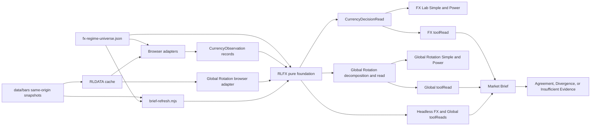

# Design: 004 FX Regime and Relative-Value Lab

## Design Brief

### Current State

`global-rotation-lab.html` computes country, benchmark, and FX returns from independent trailing row counts. It then passes `fx.score` into `globalCountryScore`, so a currency move already embedded in the USD-listed ETF return can increase the country score again. `scripts/brief-refresh.mjs::buildGlobalToolRead` extracts those browser functions and repeats the same additive path.

The repository already has the required delivery primitives: `rldata.js` owns cache-first same-origin bars and arbitrary structured `toolReads`; `rlapp.js` owns shared data status; `rlchart.js` and `rlticker.js` own chart context and ticker links; and `tools.json`, `index.html`, and `rlnav.js` form the route registry. No shared currency contract or dedicated FX route exists.

### Target State

Add one pure `rlfx.js` foundation as the only owner of currency normalization, exact-date alignment, FX returns, currency strength, pair analysis, Global Rotation decomposition, and FX/Global owner-read projection. Add an additive `RLDATA.barSeries` / `putBarSeries` / `ensureBarSeries` envelope boundary so browser and headless adapters receive rows together with source identity, rights, observed/retrieved clocks, review windows, and cache age. The browser consumes `globalThis.RLFX`; Node ESM consumers use `createRequire(import.meta.url)` to receive the same frozen CommonJS export without mutating Node globals.

Add `fx-regime-relative-value-lab.html` as a cache-first Simple/Power projection of one `CurrencyDecisionRead`. Reconcile Global Rotation so country scores contain only USD relative momentum, trend, and risk, while local-equity approximation and FX translation are explanatory decomposition. Market Brief consumes the two owner reads and emits only Agreement, Divergence, or Insufficient Evidence.

### Patterns To Follow

- `rldata.js`: same-origin daily bars first, append/dedupe cache behavior, arbitrary structured `toolReads`, and an additive envelope accessor that preserves bucket metadata without breaking existing bare-row consumers.
- `rlcausal.js`: pure browser/Node-safe model with no DOM, storage, network, or owner-specific rendering.
- `bond-regime-lab.html`: one immutable observed snapshot, one computation feeding Simple and Power, explicit unavailable states, exact-date alignment, model identity, and accessible chart tables.
- `global-rotation-lab.html`: existing Simple/Power shell, local control persistence, automatic bounded hydration, `RLTKR`, `RLCHART`, and one `render()` entry point.
- `scripts/brief-refresh.mjs`: cache/snapshot-first headless reads, registry-derived coverage, and named owner-read builders.
- `tests/causal-rotation-lab.spec.mjs`: a real ephemeral same-origin HTTP server and production browser paths.

### Patterns To Avoid

- Function extraction from HTML for shared FX or Global Rotation math. It creates a second loading contract and allows browser/headless drift.
- Bare row arrays or caller-restamped rows at an FX boundary. A consumer that cannot prove source policy, rights, observed time, retrieval time, and review window must produce an unavailable source envelope.
- The current `fxWeight` slider and any score input named `fx`. A lower weight still double-counts translation.
- Embedded universe fallbacks. A missing or invalid required JSON contract must render a structured unavailable read.
- Global `isFinite`, implicit zero, independent trailing row counts, forward fill, sign inference from ticker spelling, or pair/inverse double counting.
- Credential forms, licensed-source probes, cross-origin public-proxy-only first paint, restricted value persistence, or policy-rate spread labeled as executable carry.
- Market Brief currency math or a merged FX/country score.

### Resolved Decisions

- `rlfx.js` is the shared capability and has no DOM, storage, fetch, provider, ambient clock, or rendering code.
- `rldata.js` is an included shared-infrastructure change limited to an additive versioned series-envelope API and deterministic migration; `rlapp.js`, `rlchart.js`, and `rlticker.js` remain unchanged canaries.
- Public v1 activates a same-origin FX or broad-dollar series only when its source policy is explicitly `approved` and names a non-empty source-use policy ID and review reference. Existing Yahoo-derived rows, `DX-Y.NYB`, and `UUP` are not presumed authorized; without that record they are `RIGHTS_UNCLEAR`, carry no public numeric value, and cannot score.
- Fed H.10, BIS REER, CFTC positioning, CME carry/options, policy-rate, and event evidence use exact runtime unavailable records until an authorized static source is configured.
- G10, liquid-EM, and managed/reference cohorts are bounded and never pooled.
- Global Rotation removes the FX scoring control and migrates legacy persisted controls without retaining `fxWeight`.
- No database, backend, build step, package, service, credential, or personalized portfolio state is introduced.

### Open Questions

- None. Source activation is governed by the versioned source contract; absent authorization is a complete runtime unavailable behavior.

## Purpose And Scope

The design implements the capability described in `spec.md` across three owners:

1. FX Lab owns broad-dollar regime, cohort-relative currency strength, pair state, carry/value/risk/positioning/event anatomy, carry-unwind state, and generic hedge-research priority.
2. Global Rotation owns USD country leadership plus aligned USD/local/translation decomposition and agreement labels.
3. Market Brief owns registry-complete owner-read consumption and a low-noise Agreement/Divergence statement.

The feature does not create an execution venue, personalized hedge ratio, live dealer quote, broker path, holdings model, credential surface, or restricted-data repository. Optional evidence that cannot satisfy its source contract remains a first-class unavailable observation and is still rendered, published, and tested.

## Architecture Overview



### Runtime Ownership

| Layer | Owns | Does Not Own |
| --- | --- | --- |
| `rldata.js` | Existing bars and generic `toolReads`, plus additive preservation and retrieval of `BarSeriesEnvelopeV1` source/lifecycle metadata | Source authorization decisions, currency semantics, or FX decisions |
| `rlfx.js` | Validation, orientation, exact alignment, calculations, classifications, evidence lineage, decision identity, owner-read projections | Fetch, storage, DOM, credentials, prose rendering |
| `fx-regime-relative-value-lab.html` | Controls, adapters from `RLDATA` to observations, hydration, rendering, accessibility, publication | Currency formulas or source authorization decisions |
| `global-rotation-lab.html` | Country UI, equity-only controls, hydration, rendering, publication | FX scoring or duplicated decomposition formulas |
| `scripts/brief-refresh.mjs` | Node source-envelope acquisition, one explicit run decision time, owner projections, registry coverage, snapshot serialization | Extracted FX/Global math, source-clock restamping, or owner-independent synthesis |
| `rlbrief.js` / `market-brief.html` | Owner-read validation, canonical FX/Global relationship classification, rendering, and wording | Currency rank, decomposition, or a third composite |

### Data Flow

1. The page fetches and validates `fx-regime-universe.json`. Failure creates an unavailable decision with `SOURCE_ERROR`; there is no embedded fallback universe.
2. It reads every configured series through `RLDATA.barSeries(symbol, "1d", sourcePolicy, decisionTime)`. The returned `BarSeriesEnvelopeV1` preserves the cached bucket's real retrieval time and provider tag, derives observed time from the newest accepted row, applies the versioned source policy, and computes cache age against the explicit decision time. It never re-stamps a cache read.
3. It calls `RLDATA.ensureBarSeries` only for configured source policies that are `approved` and missing or stale. Existing `ensureBars` remains a compatibility surface for unrelated tools; Feature 004 consumers cannot use it. Controls never call fetch.
4. Each completed delta atomically replaces an immutable source-envelope snapshot and invokes one `RLFX.computeCurrencyDecision({ decisionTime, ...input })` call. Simple, Power, accessibility summaries, charts, and `toolRead` consume that result.
5. Global Rotation calls `RLFX.computeGlobalRotation({ decisionTime, ...input })` from the same envelopes. A two-leg ETF/benchmark set preserves USD leadership; a separately clocked three-leg ETF/benchmark/FX set gates decomposition.
6. `brief-refresh.mjs` loads `rlfx.js` with `createRequire`, captures one `decisionTime` for the run, and loads `BarSeriesEnvelopeV1` objects from same-origin snapshots or explicit network acquisition results. It must preserve the snapshot `fetched` clock and source-use metadata. A network response without an approved source-use record becomes `RIGHTS_UNCLEAR`; it is never re-stamped into an authorized row set.
7. Market Brief receives normalized owner reads. `RLBRIEF.classifyFxGlobalRelationship(fxToolRead, globalToolRead, decisionTime)` owns synthesis and never receives raw bars.

## Capability Foundation

### Foundation Contract

| Export | Responsibility | Consumers |
| --- | --- | --- |
| `validateUniverse(value)` | Reject unknown keys, duplicate currency/pair identity, incomplete thresholds, invalid cohort or orientation, unsafe URLs, and unbounded membership | FX page, collector tests, headless refresh |
| `normalizeSourceEnvelope(value, policy, decisionTime)` | Validate complete series lineage, preserve source clocks/rights, derive `freshUntil` and `cacheAgeMs`, and fail closed without source-use approval | Browser and headless adapters |
| `normalizeObservation(value)` | Enforce the `CurrencyObservationV1` discriminated union and strip no fields silently | All adapters |
| `normalizeCarryRead(value, decisionTime)` | Enforce the closed unavailable/policy-proxy/market-implied carry union before any projection | FX decision and owner read |
| `normalizeDailySeries(rows, leg)` | Produce finite positive daily levels keyed by UTC date with deterministic duplicate handling | FX and Global computations |
| `orientSeries(rows, sourceOrientation, requestedOrientation)` | Return verified canonical levels or `INVALID_ORIENTATION` | Spot, proxy, and decomposition paths |
| `alignExact(legs, horizonSessions)` | Build an `ObservationSetV1` from exact UTC-date intersection with no fill | Every multi-leg calculation |
| `computeCurrencyStrength(input)` | Build separate cohort ranks from unique peer relationships | FX decision |
| `computePairRead(input)` | Build selected-pair momentum, trend, risk, state, coverage, and lineage | FX decision |
| `computeBroadDollar(input)` | Preserve Broad/AFE/EME official/proxy reads and named conflicts | FX decision |
| `computeCurrencyDecision(input)` | Produce one immutable `CurrencyDecisionReadV1` | FX Simple, Power, browser read, headless read |
| `computeGlobalRotation(input)` | Produce equity-only scores plus optional aligned decomposition | Global browser and headless read |
| `projectFxToolRead(decision)` | Produce public compact FX owner read with no restricted values or source URLs | `RLDATA`, brief snapshot |
| `projectGlobalToolRead(result)` | Produce expanded Global owner read | `RLDATA`, brief snapshot |
| `canonicalize(value)` / `decisionId(value)` | Stable key ordering and non-cryptographic deterministic identity | Parity tests and UI identity |

### Loading And Export Contract

`rlfx.js` is one plain script with no dependency and this exact module boundary. The CommonJS branch returns before any browser-global assignment, so loading the module in Node cannot mutate `globalThis`:

```js
(function (factory) {
  "use strict";
  var api = Object.freeze(factory());
  if (typeof module === "object" && module && module.exports) {
    module.exports = api;
    return;
  }
  if (typeof globalThis === "undefined") throw new Error("RLFX_BROWSER_GLOBAL_UNAVAILABLE");
  globalThis.RLFX = api;
})(function () {
  "use strict";
  return {
    validateUniverse: validateUniverse,
    normalizeSourceEnvelope: normalizeSourceEnvelope,
    normalizeObservation: normalizeObservation,
    normalizeCarryRead: normalizeCarryRead,
    normalizeDailySeries: normalizeDailySeries,
    orientSeries: orientSeries,
    alignExact: alignExact,
    computeCurrencyStrength: computeCurrencyStrength,
    computePairRead: computePairRead,
    computeBroadDollar: computeBroadDollar,
    computeCurrencyDecision: computeCurrencyDecision,
    computeGlobalRotation: computeGlobalRotation,
    scoreCountryLeadership: scoreCountryLeadership,
    projectFxToolRead: projectFxToolRead,
    projectGlobalToolRead: projectGlobalToolRead,
    canonicalize: canonicalize,
    decisionId: decisionId
  };
});
```

Browser pages load `rldata.js`, then `rlfx.js`, then `rlapp.js`; their inline boot waits for `DOMContentLoaded`. Node ESM uses:

```js
import { createRequire } from 'node:module';
const require = createRequire(import.meta.url);
const RLFX = require('../rlfx.js');
```

No consumer extracts functions from HTML. `scripts/selftest.mjs` imports the same export rather than copying helper bodies. Importing `rlfx.js` in Node must leave any pre-existing `globalThis.RLFX` value byte-for-byte unchanged.

Every public compute entry point requires a finite ISO `decisionTime` in its input. The foundation parses it once, emits that exact instant as `computedAt`, and uses it for cache-age and freshness comparisons. Missing or invalid `decisionTime` is `RLFX_DECISION_TIME_INVALID`; the foundation never calls `Date.now()`, `new Date()` without an input value, or another ambient clock. Therefore identical complete inputs, including `decisionTime`, produce canonically identical outputs and decision IDs in browser and Node.

### Extension Points

- **Cache adapter:** `RLDATA.barSeries` supplies a complete source envelope. It may derive `observedAsOf` from accepted row timestamps and `cacheAgeMs`/`freshUntil` from the explicit decision time and source policy; it may not invent `retrievedAt`, rights, source-use approval, or a review window.
- **Headless adapter:** supplies the same envelope shape from a committed snapshot or a network acquisition result. A committed `fetched` value is the retrieval clock; opening the file is not retrieval. A live network completion time may be used only for that new response and does not authorize its rights.
- **Static evidence adapter:** supplies a complete `CurrencyObservationV1` only after the universe source policy names its path, rights, cadence, and review window.
- **Selected-pair adapter:** supplies a direct pair when configured; otherwise the foundation may build an allowed derived cross from two canonical USD legs.
- **Consumer projection:** each owner uses a dedicated projection function. Consumers cannot add fields to the decision calculation.
- **UI composition:** Simple and Power may arrange the same decision differently; neither receives lower-level mutable model state.

### Foundation-Owned Behavior

- Closed schemas and enums, `Number.isFinite`, positive-level guards, and input immutability.
- Canonical quote orientation and positive-return meaning.
- Pair/inverse relationship deduplication and lineage overlap marking.
- UTC-date normalization, exact intersection, coverage diagnostics, and no forward fill.
- Public/private rights filtering before scoring or persistence, including rejection of legacy bare-row buckets for Feature 004 scoring.
- Cohort eligibility, multi-peer strength, pair state, hedge priority, conflicts, and carry-unwind classification.
- Global USD/local/translation identity and equity-only score enforcement.
- Browser/headless parity and deterministic decision identity.

## Concrete Implementations

### FX Regime And Relative-Value Lab

`fx-regime-relative-value-lab.html` owns a small adapter/runtime object:

```js
runtime = {
  config,
  controls,
  observations,
  hydration,
  decision
};
```

`recompute()` creates one plain input, calls `RLFX.computeCurrencyDecision`, stores the returned frozen decision, then calls `renderSimple`, `renderPower`, `renderAccessibleSummaries`, `drawPowerCharts`, and `publish`. `window.FxRegimeLab` exposes read-only `runtime`, `recompute`, and `publish` for persistent browser tests; it exposes no source mutation or test-only result path.

### Global Rotation Reconciliation

`global-rotation-lab.html` replaces inline FX helpers with `RLFX.computeGlobalRotation`. The country score accepts only momentum, trend, and risk. The page shows aligned USD return, approximate local return, translation including interaction, and decomposition relationship. Missing FX leaves the two-leg USD leadership result intact.

The existing `fxWeight` control is removed. Persisted `globalRotationLabState` migrates to schema version 2 by copying `mode`, `benchmark`, `lookback`, `strictness`, and `posture`; `fxWeight` is discarded and never written. A legacy `fxWeight` value cannot influence score, decomposition, owner read, or UI text.

### Market Brief Integration

`scripts/brief-refresh.mjs` adds `buildFxToolRead()` and changes `buildGlobalToolRead()` to invoke `RLFX`. Its snapshot/network memo returns source envelopes rather than bare rows. It captures one run `decisionTime`; it does not use builder-local `new Date()` values as owner `asOf`, `computedAt`, or freshness substitutes. `market-brief.html` and `rlbrief.js` render one owner-aligned FX/Global item with both owner states, clocks, attribution, and deep links.

The relationship object has no numeric score. Its state is `Agreement`, `Divergence`, or `Insufficient Evidence`; its sentence is assembled only from owner-published facts by the Market Brief-owned `RLBRIEF.classifyFxGlobalRelationship` helper. `scripts/validate-brief-payload.mjs` rejects a missing FX read, an old Global read shape, a relationship containing a composite score, or synthesis when an owner is stale/unavailable.

### Variation Axes

| Axis | Supported Variants | Foundation Ownership |
| --- | --- | --- |
| Runtime | Browser global, Node CommonJS loaded from ESM | Export parity and pure behavior |
| Source family | Same-origin spot/proxy, authorized static official, access/rights unavailable | Schema, rights gate, freshness semantics |
| Cohort | G10, liquid-EM, managed/reference | Eligibility and separate ranking |
| Pair construction | Direct canonical pair, inverse source, derived cross | Orientation, deduplication, lineage |
| Evidence clock | Daily spot, event-driven policy, monthly REER, weekly positioning, tenor-specific carry | Independent review windows and states |
| Consumer | FX decision page, Global decomposition, Market Brief relationship | Owner-specific projection without formula duplication |
| UI composition | Simple, Power, mobile, accessible table | One decision identity and state vocabulary |

## Configuration And Universe

### `fx-regime-universe.json` Shape

The file is a closed contract. Unknown keys or a missing required policy make the whole configuration unavailable.

```ts
type FxUniverseV1 = {
  schemaVersion: "rlfx-universe/v1";
  version: string;
  reviewedAt: ISODate;
  currencies: CurrencyConfigV1[];
  broadDollarSeries: BroadDollarSeriesV1[];
  directPairs: DirectPairV1[];
  derivedCrosses: DerivedCrossPolicyV1;
  evidenceSources: EvidenceSourcePolicyV1[];
  policies: FxPolicyV1;
};

type EvidenceSourcePolicyV1 = {
  sourceId: string;
  providerTags: string[];
  family: ObservationFamily;
  activation: "approved" | "unreviewed" | "denied";
  acquisition: "same-origin-snapshot" | "headless-network" | "unavailable";
  sourceUrl: string;
  sourceUsePolicyId: string | null;
  sourceUseReviewRef: string | null;
  reviewedAt: ISODateTime | null;
  rights: "redistributable" | "reference-only" | "restricted" | "unknown";
  persistence: "public-snapshot" | "memory-only" | "forbidden";
  expectedCadence: "session" | "daily" | "weekly" | "monthly" | "event-driven" | "tenor-specific";
  reviewWindow:
    | { mode: "max-age"; observedMaxAgeMs: number; retrievalMaxAgeMs: number }
    | { mode: "next-review"; reviewAt: ISODateTime; retrievalMaxAgeMs: number };
  subjects: string[];
  limitations: string[];
};

type BarSeriesEnvelopeV1 =
  | {
      contractVersion: "rldata-bar-series/v1";
      seriesId: string;
      symbol: string;
      interval: "1d";
      availability: "fresh" | "stale";
      rows: Array<{ t: number; c: number; o?: number; h?: number; l?: number; v?: number }>;
      source: {
        id: string;
        providerTag: string;
        url: string;
        sourceUsePolicyId: string;
        sourceUseReviewRef: string;
      };
      observedAsOf: ISODateTime;
      retrievedAt: ISODateTime;
      expectedCadence: EvidenceSourcePolicyV1["expectedCadence"];
      reviewWindow: EvidenceSourcePolicyV1["reviewWindow"];
      freshUntil: ISODateTime;
      cacheAgeMs: number;
      rights: "redistributable" | "reference-only";
      quality: "observed" | "indicative-proxy" | "official-revised";
      limitations: string[];
    }
  | {
      contractVersion: "rldata-bar-series/v1";
      seriesId: string;
      symbol: string;
      interval: "1d";
      availability: "unavailable";
      rows: [];
      source: {
        id: string | null;
        providerTag: string | null;
        url: string | null;
        sourceUsePolicyId: string | null;
        sourceUseReviewRef: string | null;
      };
      observedAsOf: ISODateTime | null;
      retrievedAt: ISODateTime | null;
      expectedCadence: EvidenceSourcePolicyV1["expectedCadence"] | null;
      reviewWindow: EvidenceSourcePolicyV1["reviewWindow"] | null;
      freshUntil: null;
      cacheAgeMs: number | null;
      unavailableReason: UnavailableReason;
      rights: EvidenceSourcePolicyV1["rights"];
      quality: "observed" | "indicative-proxy" | "official-revised" | null;
      limitations: string[];
    };

type CurrencyConfigV1 = {
  code: string;
  name: string;
  cohort: "G10" | "liquid-EM" | "managed-reference";
  rankEligible: boolean;
  autoPairEligible: boolean;
  usdLeg: null | {
    symbol: string;
    sourceBase: string;
    sourceQuote: string;
    canonicalBase: string;
    canonicalQuote: "USD";
  };
  tradability: "indicative-proxy" | "reference-only" | "non-tradable";
  settlement: "deliverable" | "non-deliverable" | "mixed" | "reference";
  management: "free-float" | "managed" | "peg-band" | "reference";
  onshoreOffshore: "not-applicable" | "onshore" | "offshore" | "both";
  fixing: string | null;
  limitations: string[];
};
```

USD is the numeraire and has `usdLeg: null`; its unit level of 1 is a mathematical identity, not a market observation or confirmation.

### Bounded Public V1 Inventory

| Cohort | Members | Ranking / Auto Pair |
| --- | --- | --- |
| G10 | USD, EUR, JPY, GBP, CHF, CAD, AUD, NZD, NOK, SEK | Eligible when coverage passes |
| Liquid EM | MXN, BRL, ZAR, PLN, HUF, CZK, TRY | Eligible when coverage passes; liquidity and settlement limitations always visible |
| Managed/reference | CNY, CNH, HKD, SGD, INR, KRW, TWD | Inspection only; never strongest/weakest auto candidate |

Canonical USD legs may use the existing Yahoo-style symbol vocabulary for lookup identity, but a responding Yahoo endpoint or a pre-existing Yahoo-derived snapshot is not authorization evidence. Exact symbol/base/quote declarations and source-policy bindings live only in the universe file. A series is scoreable only after its bound source policy passes the activation rules below.

`directPairs` is a reviewed finite list used for selected-pair momentum when available. `derivedCrosses` permits only pairs whose two currencies are in this file, permits automatic construction only within one eligible cohort, and permits cross-cohort construction only after explicit selection. Every derived pair carries both USD-leg observation IDs and cannot count as independent confirmation of those legs.

### Required Policy Values

```json
{
  "horizons": {
    "tactical": { "sessions": 21, "deadbandLogReturn": 0.0025, "momentumScale": 0.02, "trendFast": 20, "trendSlow": 50 },
    "swing": { "sessions": 63, "deadbandLogReturn": 0.005, "momentumScale": 0.05, "trendFast": 50, "trendSlow": 200 },
    "structural": { "sessions": 126, "deadbandLogReturn": 0.0075, "momentumScale": 0.08, "trendFast": 50, "trendSlow": 200 }
  },
  "strength": { "minimumPeers": 3, "minimumCoverageRatio": 0.6, "stateZ": 0.5, "rankStabilityDates": 5 },
  "risk": { "volatilitySessions": 63, "drawdownSessions": 126, "annualization": 252, "calmPercentile": 0.33, "stressedPercentile": 0.67 },
  "pair": {
    "candidateMinimum": 0.2,
    "rejectedMaximum": -0.2,
    "lensWeights": {
      "balanced": { "strength": 0.35, "momentum": 0.30, "trend": 0.20, "risk": 0.15 },
      "trend": { "strength": 0.25, "momentum": 0.40, "trend": 0.25, "risk": 0.10 },
      "risk": { "strength": 0.30, "momentum": 0.20, "trend": 0.15, "risk": 0.35 }
    }
  },
  "globalRotation": {
    "agreementDeadbandPct": 0.25,
    "postureWeights": {
      "offense": { "momentum": 0.70, "trend": 0.22, "risk": 0.08 },
      "balanced": { "momentum": 0.56, "trend": 0.26, "risk": 0.18 },
      "defense": { "momentum": 0.42, "trend": 0.30, "risk": 0.28 }
    }
  },
  "carryUnwind": { "fundingStrengthZ": 0.5, "riskVolatilityRatio": 1.25 },
  "dailyBarReviewHours": 12
}
```

These values are required versioned research policy, not fallback values in code. Validation fails if any value is absent, non-finite, outside its closed range, or if a weight group does not sum to 1 within `1e-12`.

### Source Posture

| Family | Public V1 Adapter | Runtime State Without Approved Source-Use Record |
| --- | --- | --- |
| Spot and selected pairs | Same-origin `data/bars/<symbol>.json` through `RLDATA.ensureBarSeries`, only when policy activation is `approved` | `RIGHTS_UNCLEAR`; bare rows and unreviewed Yahoo-derived snapshots cannot score or persist as Feature 004 evidence |
| Broad-dollar proxy | Policy-approved `DX-Y.NYB` and/or `UUP` envelopes, separately labeled indicative proxies | `RIGHTS_UNCLEAR` when source use is unreviewed; `NO_SOURCE` when no source policy exists |
| Fed H.10 Broad/AFE/EME | No active adapter | `NO_SOURCE`; proxy-only regime remains usable |
| Policy-rate proxy | No active static set | `NO_SOURCE`; never substituted by spot |
| CME forward/futures/options carry | No active entitled static set | `ACCESS_REQUIRED` |
| BIS NEER/REER | No active terms-reviewed static set | `RIGHTS_UNCLEAR` |
| CFTC positioning | No active mapped static set | `NO_SOURCE` or `NO_COVERAGE` per currency |
| Event calendar | No active approved pair event set | `NO_SOURCE`; price/risk invalidation remains usable |

No rights-cleared numeric public minimum is asserted by this design for the current checkout. A meaningful public minimum becomes available only when enough spot and broad-dollar source policies are `approved` with non-empty `sourceUsePolicyId`, `sourceUseReviewRef`, rights, cadence, review window, schema version, and subject coverage. Until then the complete and testable v1 behavior is an explicit `RIGHTS_UNCLEAR` or `NO_SOURCE` decision with no numeric rank, pair, or regime value. In particular, this design makes no claim that Yahoo permits public snapshot persistence, redistribution, or model publication.

`rldata.js` keeps root cache schema 1. Each existing bar bucket may gain an optional `seriesMeta` object containing the complete approved source-policy fields; old readers ignore the additive key. Metadata-free legacy buckets keep their rows, `at`, and `src` unchanged and remain available through `getBars`, but `barSeries` returns a value-free `RIGHTS_UNCLEAR` envelope for Feature 004. `putBarSeries` writes rows and complete metadata atomically; `ensureBarSeries` may attach an approved policy only when the actual bucket `src` is listed in that policy's `providerTags`. It cannot infer approval from the symbol or a responding endpoint. No root migration, row rewrite, or cache reset occurs, so rollback to current code preserves all cached data. Credential schema, session-only credential storage, provider request transport, and all credential mutation APIs remain byte-for-byte behaviorally unchanged and are covered by the provider test suite.

## Contracts And Schemas

### Closed Vocabularies

```ts
type ObservationFamily =
  | "spot" | "broad-dollar" | "policy-rate-proxy" | "forward-carry"
  | "reer-value" | "realized-risk" | "positioning" | "event";

type Availability = "loading" | "fresh" | "stale" | "revised" | "unavailable";

type UnavailableReason =
  | "NO_SOURCE" | "ACCESS_REQUIRED" | "RIGHTS_UNCLEAR" | "NO_COVERAGE"
  | "NON_TRADABLE" | "INSUFFICIENT_HISTORY" | "NO_COMMON_DATES"
  | "INVALID_ORIENTATION" | "NONFINITE" | "SOURCE_ERROR";
```

No alias, generic `missing`, or free-text primary code is accepted.

### CurrencyObservation

```ts
type CurrencyObservationV1 = {
  contractVersion: "rlfx-currency-observation/v1";
  observationId: string;
  family: ObservationFamily;
  subject: { kind: "currency" | "pair" | "cohort" | "index" | "contract" | "event"; id: string };
  base: string | null;
  quote: string | null;
  sourceBase: string | null;
  sourceQuote: string | null;
  inverted: boolean | null;
  positiveMeaning: string | null;
  cohort: "G10" | "liquid-EM" | "managed-reference" | "unsupported";
  tradability: "tradable-observed" | "indicative-proxy" | "reference-only" | "non-tradable";
  value?: number;
  event?: { eventId: string; eventType: string; startsAt: ISODateTime; timeZone: string; affectedCurrencies: string[] };
  unit: string;
  transformation: "raw" | "inverted" | "indexed" | "return" | "volatility" | "percentile" | "spread" | "derived-cross" | "event-record";
  horizon: null | { kind: "sessions" | "tenor" | "release"; value: number | string };
  source: { id: string; label: string; url: string };
  observedAsOf: ISODateTime;
  retrievedAt: ISODateTime;
  expectedCadence: "session" | "daily" | "weekly" | "monthly" | "event-driven" | "tenor-specific";
  reviewWindow: EvidenceSourcePolicyV1["reviewWindow"];
  availability: Availability;
  unavailableReason?: UnavailableReason;
  availabilityDetail: string;
  rights: "redistributable" | "reference-only" | "restricted" | "unknown";
  quality: "observed" | "official-revised" | "indicative-proxy" | "derived" | "user-assumption";
  revisionId: string | null;
  adjustment: "raw-close" | "adjusted-close" | "not-applicable";
  lineage: { originIds: string[]; relationshipId: string | null; derivedFrom: string[] };
  limitations: string[];
};
```

Conditional rules:

- `fresh`, `stale`, and `revised` quantitative observations require an own `value` property that is finite. An event requires `event` and omits `value` unless its source explicitly defines a finite quantitative measure.
- `loading` and `unavailable` omit `value`. `unavailable` requires exactly one `unavailableReason`; all other states forbid it.
- `restricted` or `unknown` rights force `availability: "unavailable"` and `unavailableReason: "RIGHTS_UNCLEAR"` before scoring or persistence.
- Pair observations require all orientation fields. Non-pair families use explicit `null`, not inferred values.
- `limitations` is non-empty for indicative, derived, managed, delayed, revised, or market-implied evidence.

### CarryRead Discriminated Union

Carry is not a nullable numeric field on `CurrencyObservationV1`. `normalizeCarryRead` accepts and returns exactly one branch of this closed union:

```ts
type CarryReadV1 =
  | {
      contractVersion: "rlfx-carry-read/v1";
      kind: "unavailable";
      state: "Unavailable";
      pair: { base: string; quote: string };
      unavailableReason: UnavailableReason;
      availabilityDetail: string;
      computedAt: ISODateTime;
      freshUntil: null;
      limitations: string[];
    }
  | {
      contractVersion: "rlfx-carry-read/v1";
      kind: "policy-rate-proxy";
      state: "Proxy Only";
      pair: { base: string; quote: string };
      proxyInstrument: { basePolicyRate: string; quotePolicyRate: string };
      tenor: "policy-target-current";
      basis: "policy-rate-differential";
      value: number;
      unit: "percentage-points";
      roll: "not-applicable";
      liquidity: "not-observed";
      cost: "not-observed";
      rights: "redistributable" | "reference-only";
      sourceObservationIds: [string, string];
      observedAsOf: ISODateTime;
      retrievedAt: ISODateTime;
      computedAt: ISODateTime;
      freshUntil: ISODateTime;
      limitations: string[];
    }
  | {
      contractVersion: "rlfx-carry-read/v1";
      kind: "market-implied";
      subtype: "tradable-forward" | "futures-implied" | "swap-implied";
      state: "Market Implied";
      pair: { base: string; quote: string };
      instrument: { id: string; venue: string; contractOrQuote: string };
      tenor: string;
      basis: { kind: string; value: number | null; unit: string; observed: boolean };
      value: number;
      unit: string;
      roll: { convention: string; nextRollAt: ISODateTime | null; limitation: string };
      liquidity: { measure: string; value: number | null; unit: string; limitation: string };
      cost: { measure: string; value: number | null; unit: string; limitation: string };
      rights: "redistributable" | "reference-only";
      sourceObservationIds: string[];
      observedAsOf: ISODateTime;
      retrievedAt: ISODateTime;
      computedAt: ISODateTime;
      freshUntil: ISODateTime;
      limitations: string[];
    };
```

The `market-implied` branch is rejected unless `instrument.id`, venue, quote/contract identity, tenor, basis descriptor, roll convention, liquidity descriptor, cost descriptor, allowed rights, both source clocks, `freshUntil`, and at least one limitation are present. A missing numeric basis/liquidity/cost estimate is allowed only when the branch names the measure, sets `observed: false` or `value: null`, and carries a concrete limitation; omitting the field is invalid. The policy branch cannot use `kind: "market-implied"`, cannot carry a forward/futures/swap subtype, and always projects the exact label `Policy-rate proxy`.

### ObservationSet

```ts
type ObservationSetV1 = {
  contractVersion: "rlfx-observation-set/v1";
  setId: string;
  purpose: "pair-return" | "cohort-strength" | "broad-dollar" | "global-usd-leadership" | "global-decomposition";
  horizonSessions: number;
  legs: Array<{
    legId: string;
    observationId: string;
    subject: string;
    orientation: string;
    adjustment: "raw-close" | "adjusted-close" | "not-applicable";
    validDateCount: number;
  }>;
  alignedRows: Array<{ date: ISODate; values: Record<string, number> }>;
  coverage: {
    requiredRowCount: number;
    commonRowCount: number;
    earliestCommonDate: ISODate | null;
    latestCommonDate: ISODate | null;
    unmatchedNewerDates: Record<string, ISODate[]>;
    duplicateDatesDropped: Record<string, number>;
  };
  lineage: { sourceObservationIds: string[]; uniqueRelationshipIds: string[] };
  state: "aligned" | "insufficient" | "unavailable";
  unavailableReason?: UnavailableReason;
};
```

`alignedRows` contains exactly the last `horizonSessions + 1` common UTC dates when aligned. It is empty for `unavailable`; it may contain the exact smaller intersection for `insufficient` so required-versus-available coverage remains inspectable.

### CurrencyDecisionRead

```ts
type CurrencyDecisionReadV1 = {
  contractVersion: "rlfx-decision-read/v1";
  decisionId: string;
  configVersion: string;
  computedAt: ISODateTime;
  controls: {
    cohort: "G10" | "liquid-EM" | "managed-reference";
    horizon: "tactical" | "swing" | "structural";
    pairMode: "auto" | "explicit";
    base: string | null;
    quote: string | null;
    evidenceLens: "balanced" | "trend" | "risk";
    dollarComparison: "Broad" | "AFE" | "EME";
  };
  state: "ready" | "partial" | "indeterminate" | "unavailable";
  broadDollar: {
    selected: "Broad" | "AFE" | "EME";
    state: "Strengthening" | "Range-Bound" | "Weakening" | "Indeterminate";
    basis: "official" | "proxy-only" | "official-and-proxy" | "unavailable";
    series: Record<string, EvidenceStateV1>;
    concentration: "broad" | "AFE-led" | "EME-led" | "mixed" | "unavailable";
    confirmation: string;
    invalidation: string;
  };
  cohorts: Record<"G10" | "liquid-EM" | "managed-reference", {
    state: "ranked" | "partial" | "unavailable" | "reference-only";
    evaluationDate: ISODate | null;
    rankWindow: ObservationSetV1 | null;
    eligibleCount: number;
    configuredCount: number;
    coverageRatio: number;
    dispersion: number | null;
    ranked: CurrencyStrengthReadV1[];
  }>;
  pair: PairReadV1;
  hedgeResearch: {
    state: "Increase" | "Maintain" | "Reduce" | "Indeterminate";
    requiredEvidence: EvidenceRefV1[];
    rationale: string;
    confirmation: string;
    invalidation: string;
  };
  evidence: {
    spot: EvidenceStateV1;
    independentStrength: EvidenceStateV1;
    carry: CarryReadV1;
    reerValue: EvidenceStateV1;
    delayedPositioning: EvidenceStateV1;
    realizedRisk: EvidenceStateV1;
    events: EvidenceStateV1;
  };
  carryUnwind: { state: "Dormant" | "Watch" | "Active" | "Indeterminate"; conditions: ConditionV1[] };
  conflicts: EvidenceConflictV1[];
  coverage: { required: number; available: number; ratio: number; stale: number; unavailable: number };
  confidencePct: number | null;
  confirmation: string;
  invalidation: string;
  asOf: ISODateTime | null;
  freshUntil: ISODateTime | null;
  limitations: string[];
};
```

`CurrencyStrengthReadV1` contains `currency`, `cohort`, `state` (`Strong|Neutral|Weak|Unavailable`), `rank`, `rawMeanLogReturn`, `zDistance`, `breadth`, `eligiblePeerCount`, `requiredPeerCount`, `coverageRatio`, `relationshipIds`, one shared `rankWindowId`, one shared `windowStart`, one shared `evaluationDate`, `rankStability`, and unavailable detail. Every ranked member in one cohort result has identical rank-window fields. `PairReadV1` contains orientation, construction (`direct|inverse|derived`), relationship ID, separate strength spread, tactical/swing/structural momentum, trend, risk, `Candidate|Mixed|Rejected|Unavailable`, confidence, coverage, evidence, confirmation, invalidation, warnings, and lineage; its pair-specific windows cannot leak into cohort rank fields.

### Global Rotation Decomposition And Read

```ts
type GlobalRotationDecompositionV1 = {
  contractVersion: "rlfx-global-decomposition/v1";
  state: "ready" | "unavailable";
  currency: string;
  horizonSessions: number;
  observationSet: ObservationSetV1;
  usdReturnOnDecompositionDates?: number;
  benchmarkReturnOnDecompositionDates?: number;
  usdRelativeReturnOnDecompositionDates?: number;
  fxReturn?: number;
  approximateLocalReturn?: number;
  approximateLocalRelativeReturn?: number;
  translation?: number;
  interaction?: number;
  relationship: "Joint Support" | "Local-Equity-Led With FX Drag" | "FX-Led Translation" | "Joint Weakness" | "Mixed" | "Unavailable";
  unavailableReason?: UnavailableReason;
  asOf: ISODateTime | null;
  computedAt: ISODateTime;
  freshUntil: ISODateTime | null;
  limitations: string[];
};

type GlobalUsdLeadershipV1 = {
  contractVersion: "rlfx-global-usd-leadership/v1";
  state: "ready" | "unavailable";
  horizonSessions: number;
  observationSet: ObservationSetV1;
  usdEtfReturn?: number;
  benchmarkReturn?: number;
  usdRelativeReturn?: number;
  asOf: ISODateTime | null;
  computedAt: ISODateTime;
  freshUntil: ISODateTime | null;
  unavailableReason?: UnavailableReason;
};

type GlobalRotationReadV1 = {
  contractVersion: "rlfx-global-rotation-read/v1";
  resultId: string;
  benchmark: string;
  horizonSessions: number;
  posture: "offense" | "balanced" | "defense";
  computedAt: ISODateTime;
  freshUntil: ISODateTime | null;
  leader: null | {
    ticker: string;
    country: string;
    currency: string;
    score: number;
    usdLeadership: GlobalUsdLeadershipV1;
    decomposition: GlobalRotationDecompositionV1;
  };
  ranked: Array<{ ticker: string; country: string; currency: string; score: number; scoreCoverage: number }>;
  unavailableStates: Array<{ subject: string; reason: UnavailableReason; detail: string }>;
  asOf: ISODateTime | null;
};
```

Optional numeric fields are present only when their owning set is aligned. An unavailable decomposition contains no numeric decomposition fields. `usdLeadership` can remain ready with its own `computedAt`, `freshUntil`, exact two-leg coverage, and three returns when `decomposition` is unavailable. The decomposition separately exposes its three-leg coverage, FX/local/translation/interaction returns, relationship, clocks, and reason. No flattened `fxTranslation`, `agreement`, or shared `alignment` field may blur the two evidence products.

### Tool Read

```ts
type ToolReadV1 = {
  contractVersion: "rl-tool-read/v1";
  id: "fx-regime-relative-value-lab" | "global-rotation-lab";
  availability: "current" | "stale" | "unavailable";
  asOf: ISODateTime | null;
  read: string;
  metrics: FxToolMetricsV1 | GlobalToolMetricsV1;
  deepLink: string;
  computedAt: ISODateTime;
  freshUntil: ISODateTime | null;
};

type FxToolMetricsV1 = {
  contractVersion: "rlfx-tool-read/v1";
  decisionId: string;
  state: CurrencyDecisionReadV1["state"];
  broadDollarState: CurrencyDecisionReadV1["broadDollar"]["state"];
  broadDollarBasis: CurrencyDecisionReadV1["broadDollar"]["basis"];
  cohort: string;
  strongest: null | { currency: string; state: string; coverageRatio: number };
  weakest: null | { currency: string; state: string; coverageRatio: number };
  currencyStates: Record<string, { cohort: string; state: string; zDistance: number; coverageRatio: number }>;
  selectedPair: { base: string | null; quote: string | null; state: string; momentumState: string; strengthState: string; riskState: string };
  hedgeResearchState: string;
  carryUnwindState: string;
  coverage: CurrencyDecisionReadV1["coverage"];
  conflicts: Array<{ code: string; families: string[] }>;
  confirmation: string;
  invalidation: string;
  freshUntil: ISODateTime | null;
  educationalOnly: true;
};
```

`GlobalToolMetricsV1` carries `contractVersion: "rlfx-global-tool-read/v1"`, benchmark/horizon, leader identity, `usdLeadership: GlobalUsdLeadershipV1`, `decomposition: GlobalRotationDecompositionV1`, unavailable states, and `educationalOnly: true`. `projectGlobalToolRead` preserves each nested object's distinct returns, exact coverage, `computedAt`, and `freshUntil`; it cannot flatten or re-stamp them. Neither tool read contains restricted values, source URLs, holdings, personalized hedge fields, or raw bar arrays.

For an FX owner read, `asOf` is the oldest `observedAsOf` among evidence required for the published directional decision and `freshUntil` is the earliest required source-envelope deadline. For a Global owner read, top-level `asOf` and `freshUntil` come from ready two-leg USD leadership; the optional decomposition retains its own, potentially earlier, clocks. An unavailable owner has `availability: "unavailable"`, `asOf: null`, and `freshUntil: null`. A stale owner keeps its permitted facts but has `availability: "stale"` and cannot participate in Market Brief synthesis.

`RLDATA.putToolRead` gains an additive versioned branch: when `contractVersion === "rl-tool-read/v1"`, it validates and persists `availability`, `asOf`, `computedAt`, `freshUntil`, `read`, `metrics`, and `deepLink` exactly and rejects an incomplete read. It never supplies `new Date()` for a versioned read. Legacy unversioned tool reads retain the current compatibility behavior, so unrelated owners are not migrated by Feature 004.

### Error Model

Config/programmer errors return `{ ok:false, errors:[{ code, path, message }] }` with closed codes `RLFX_UNIVERSE_INVALID`, `RLFX_SCHEMA_INVALID`, `RLFX_CONTRACT_VERSION`, `RLFX_DECISION_TIME_INVALID`, and `RLFX_SOURCE_POLICY_INVALID`. Market-data limitations produce the domain unavailable records above, not thrown exceptions. Renderers catch only unexpected runtime faults, publish an unavailable owner read, and report `RLAPP.report("fx:compute", "error", { code: "RLFX_RUNTIME" })` without data values.

## Deterministic Algorithms

### 0. Source Envelope Lifecycle

`normalizeSourceEnvelope(envelope, policy, decisionTime)` applies these steps identically in browser and Node:

1. Require a valid ISO `decisionTime`, a non-empty source-use policy ID/review reference, `activation: "approved"`, allowed rights, matching provider tag, covered subject, valid observed/retrieved clocks, and a complete review window. Failure produces a value-free unavailable envelope; `RIGHTS_UNCLEAR` is used for absent/unreviewed rights and `SOURCE_ERROR` for malformed approved-source payloads.
2. Derive `observedAsOf` from the greatest accepted row timestamp and preserve `retrievedAt` from the cache bucket `at`, snapshot `fetched`, or the completion time of that exact new network response. Reading an existing cache/file does not change either clock.
3. Compute `cacheAgeMs = max(0, decisionTime - retrievedAt)`. For a max-age policy, compute `freshUntil = min(observedAsOf + observedMaxAgeMs, retrievedAt + retrievalMaxAgeMs)`. For a next-review policy, compute `freshUntil = min(reviewAt, retrievedAt + retrievalMaxAgeMs)`. All arithmetic uses parsed input instants; no ambient clock is read.
4. Set `availability: "fresh"` only when `decisionTime <= freshUntil`; otherwise retain permitted values as `stale`. Rights `restricted|unknown`, policy `unreviewed|denied`, a provider mismatch, or a public-persistence mismatch always removes rows/value from the public envelope and yields `unavailable`.
5. Canonical output includes the source-use policy fields, both clocks, review window, `freshUntil`, cache age, rights, quality, and limitations. No downstream adapter may overwrite them.

Browser `RLDATA.barSeries` and the headless snapshot/network adapter must produce byte-equivalent normalized envelopes for the same source payload, policy, and `decisionTime`. This is the controlling parity contract for GRILL-004-01.

### 1. Numeric And Daily-Row Normalization

1. Accept only rows with `Number.isFinite(t)`, `Number.isFinite(c)`, and `c > 0`.
2. Convert `t` to UTC `YYYY-MM-DD`.
3. For duplicate UTC dates, retain the row with greatest timestamp; an exact timestamp tie retains the later input index. Record the dropped count.
4. Sort ascending by UTC date. Never use global `isFinite`.
5. A required series with malformed/non-finite rows and no sufficient valid remainder becomes `NONFINITE` or `INSUFFICIENT_HISTORY`; no invalid row becomes zero.

### 2. Quote Orientation

For source level $S_t$ quoted `sourceBase/sourceQuote` and requested level $P_t$ quoted `base/quote`:

$$
P_t =
\begin{cases}
S_t, & (sourceBase, sourceQuote) = (base, quote) \\
1 / S_t, & (sourceBase, sourceQuote) = (quote, base) \\
\text{unavailable}, & \text{otherwise}
\end{cases}
$$

The configured meaning is always "quote units per one base unit"; a positive return means the base strengthened versus the quote. Inversion requires every source level to be finite and positive. Symbol spelling is never consulted.

### 3. Relationship And Inverse Deduplication

`relationshipId = "rel:" + [base, quote].sort().join("-")`. A direct pair and its inverse share one ID. Direct source wins over inverse; inverse wins over derived; ties use lexicographically smaller source ID. The discarded candidates remain in lineage diagnostics but do not increase peer count, coverage, breadth, or confidence.

A derived cross is:

$$
P_{base/quote,t} = \frac{USDPerBase_t}{USDPerQuote_t}
$$

on exact common dates only. It has `quality: "derived"`, `transformation: "derived-cross"`, both origin IDs, and the same relationship ID as any direct pair. It never creates an additional confirmation.

### 4. Exact-Date Intersection

For required leg date sets $D_1,\ldots,D_n$, compute $D = D_1 \cap \cdots \cap D_n$, sort ascending, and select the last $h+1$ dates for horizon $h$. No close is carried to another date. `unmatchedNewerDates[leg]` contains every valid leg date later than `latestCommonDate`.

- `aligned`: $|D| \ge h+1$.
- `insufficient`: $0 < |D| < h+1$, reason `INSUFFICIENT_HISTORY`.
- `unavailable`: $|D| = 0$, reason `NO_COMMON_DATES`.

Adjusted and raw legs cannot coexist; mismatch is `RLFX_SCHEMA_INVALID` before arithmetic.

### 5. Returns

All internal returns are decimal values:

$$R = \frac{P_{end}}{P_{start}} - 1, \qquad g = \ln(P_{end}/P_{start})$$

Simple returns drive user-facing pair and decomposition values. Log returns drive anti-symmetric peer strength and realized volatility. Formatting converts decimals to percentages only at the UI boundary.

### 6. Global USD, Local, Translation, And Interaction

First create a two-leg ETF/benchmark set. When aligned:

$$R_{USDRel} = R_{USD} - R_{benchmark}$$

This remains valid even if FX is unavailable. Separately create a three-leg ETF/benchmark/FX set. When aligned and $1+R_{FX}>0$:

$$R_{local} = \frac{1+R_{USD}}{1+R_{FX}}-1$$

$$R_{interaction}=R_{local}R_{FX}$$

$$R_{translation}=R_{USD}-R_{local}=R_{FX}+R_{interaction}$$

$$R_{localRel}=R_{local}-R_{benchmark}$$

The page labels `R_local` approximate because fees, withholding, composition, close timing, tracking, and US-hours price discovery remain. Translation explicitly says it includes interaction.

With deadband $d=0.25$ percentage points from config, classify signs of `R_localRel` and `R_translation`:

| Local Relative | Translation | Agreement |
| --- | --- | --- |
| positive | positive | Joint Support |
| positive | negative | Local-Equity-Led With FX Drag |
| zero/negative | positive and USD relative positive | FX-Led Translation |
| negative | negative | Joint Weakness |
| any other finite combination | any other finite combination | Mixed |
| missing decomposition | any | Unavailable |

### 7. Global Country Score

`RLFX.scoreCountryLeadership` accepts only `momentum`, `trend`, and `risk`; unknown keys such as `fx` and config keys such as `fxWeight` fail validation. Momentum is required. The selected posture weights are the required values in config. Missing trend or risk reduces `scoreCoverage` and the remaining present equity-only weights are renormalized. The score is:

$$score = clamp(50 + 50 \times \frac{\sum w_i clamp(x_i,-1,1)}{\sum w_i}, 0, 100)$$

FX agreement never changes score, rank, or leader spread.

### 8. Broad-Dollar Regime

Each official or proxy series is evaluated independently on its exact own-date horizon:

- Direction is sign of horizon log return after the configured deadband.
- Trend is `+1` when latest level > fast SMA > slow SMA, `-1` for the reverse, otherwise `0`.
- Vote is direction + trend: positive is Strengthening, negative is Weakening, zero is Range-Bound.
- Insufficient values produce Indeterminate.

Official Broad, AFE, and EME are separate entries. Proxies never populate an official slot. Two available sources with opposite nonzero states create `OFFICIAL_PROXY_DIVERGENCE`; the states are not averaged. With only a proxy, the selected state is explicitly `basis: "proxy-only"`, and unavailable AFE/EME remain unavailable.

### 9. Multi-Peer Currency Strength

For one cohort and horizon, first collect every unique rank-eligible relationship. Define one cohort-wide date set:

$$D_{cohort}=\bigcap_{r \in eligibleRelationships} D_r$$

Use exactly the last $h+1$ dates from $D_{cohort}$ for every edge and every currency in that rank. `evaluationDate` is the last selected date and `rankWindow` records the complete relationship-leg intersection and unmatched dates. Pair-specific exact windows remain valid for selected-pair reads but are forbidden inputs to cohort `raw_c`, `zDistance`, breadth, dispersion, rank, or rank stability.

If the full eligible relationship graph has fewer than $h+1$ cohort-common dates, the entire cohort rank is `state: "unavailable"`, `rankWindow.state: "insufficient"|"unavailable"`, and no member receives a numeric rank. The implementation must not drop a lagging relationship to recover a rank. This is a non-rankable outcome; users may inspect pair reads independently.

For currency $c$ versus peer $p$ on the cohort-wide dates:

$$g_{c,p} = \ln(USDPerC_{end}/USDPerC_{start}) - \ln(USDPerP_{end}/USDPerP_{start})$$

The inverse edge is exactly $-g_{c,p}` and is not a second relationship. For each currency:

$$raw_c = mean_p(g_{c,p}), \qquad breadth_c = \frac{\#(g_{c,p}>d)-\#(g_{c,p}<-d)}{peerCount}$$

After the cohort-wide rank window is established, a currency is eligible only when `peerCount >= 3` and `peerCount/(configuredCohortSize-1) >= 0.6`. Eligible raw values are standardized across that cohort using sample standard deviation. Zero dispersion yields `zDistance = 0` for every eligible member. `z >= 0.5` is Strong, `z <= -0.5` is Weak, otherwise Neutral. Ineligible currencies are Unavailable and unranked.

Ranks sort by descending `zDistance`, then descending peer count, then currency code. Rank stability recomputes the same method for the prior five eligible evaluation dates and returns:

$$stability = 1 - min\left(1, \frac{mean(|rank_t-rank_{latest}|)}{N-1}\right)$$

It is unavailable with fewer than three historical ranks. The selected pair is only one peer edge and cannot become the strength read.

### 10. Pair Momentum, Trend, And Risk

The selected pair uses the configured direct series, then inverse, then an allowed derived cross. It publishes tactical, swing, and structural simple returns from separate exact observation sets.

For the selected horizon, trend is `+1` when latest level > configured fast SMA > slow SMA, `-1` for the reverse, and `0` otherwise. Realized volatility is sample standard deviation of daily log returns over 63 observations times $\sqrt{252}$. Drawdown is the largest peak-to-trough decimal decline over 126 observations. Maximum daily absolute log return is shown as gap-risk context.

Risk percentiles compare only eligible direct/derived pairs in the same cohort: at or below the 33rd percentile is Calm, at or above the 67th is Stressed, otherwise Normal. Managed/reference pairs show the raw metric but cannot receive Calm as favorable quality and remain reference-only.

### 11. Cohort Coverage And Pair State

Core normalized components for the selected base-long/quote-short direction are:

- `strength = clamp((zBase-zQuote)/2, -1, 1)`.
- `momentum = clamp(selectedLogReturn/momentumScale, -1, 1)`.
- `trend = -1|0|1`.
- `risk = 0.25` for Calm, `0` for Normal, `-1` for Stressed.

The selected evidence lens supplies required weights that sum to 1. Missing strength, momentum/trend, risk, orientation, common dates, or eligibility makes the state Unavailable; core weights are not renormalized around missing required evidence.

- Candidate: composite >= 0.20, strength > 0, momentum > 0, trend = +1, and risk is not Stressed.
- Rejected: composite <= -0.20, or strength < 0 with momentum < 0 and trend = -1.
- Mixed: every other complete finite combination.
- Unavailable: invalid orientation, non-tradable/reference auto selection, no common dates, non-finite core input, or failed minimum strength coverage.

Auto selection considers only within-cohort Candidate-eligible relationships and sorts by strength spread, then pair momentum, then relationship ID. Cross-cohort pairs require explicit controls and can never be auto-selected.

`confidencePct = clamp(round(100 * minimumCurrencyCoverage * supportWeight - 100 * minimumCurrencyCoverage * contradictionWeight - 5 * nonBlockingConflictCount), 0, 100)`. Support and contradiction weights use the selected lens and retain their component names. Confidence is absent for Unavailable.

### 12. Generic Hedge-Research Priority

The required inputs are broad-dollar state, selected foreign currency strength versus USD, translation-risk direction, and realized-risk state.

- Increase: dollar Strengthening, foreign currency Weak, translation adverse to foreign exposure, and risk Normal or Stressed.
- Reduce: dollar Weakening, foreign currency Strong, translation supportive, and risk Calm or Normal.
- Maintain: all required evidence is available but neither complete rule holds.
- Indeterminate: any required family is unavailable, stale past its eligibility window, or the selected subject is managed/reference.

The output contains no ratio, notional, tenor, product, leverage, order, or account language.

### 13. Evidence Conflicts And Lineage

The foundation emits closed conflict codes:

| Code | Condition |
| --- | --- |
| `OFFICIAL_PROXY_DIVERGENCE` | Available official and proxy dollar states oppose |
| `STRENGTH_MOMENTUM_DIVERGENCE` | Pair direction and multi-peer strength spread oppose |
| `TREND_CARRY_DIVERGENCE` | Available carry side opposes direct pair trend |
| `VALUE_TREND_TENSION` | Available REER value state opposes tactical trend |
| `POSITIONING_CROWDING` | Available delayed positioning is crowded in the active pair direction |
| `LINEAGE_OVERLAP` | Two displayed factors share an origin or relationship and cannot count as independent confirmation |
| `SOURCE_CLOCK_MISMATCH` | Evidence is individually valid but describes materially different review clocks |

Each conflict contains `code`, `families`, `observationIds`, `blocking`, and user-facing detail. Missing evidence creates an unavailable family, not a conflict and not a neutral state.

### 14. Carry-Unwind State

Carry evidence is the `CarryReadV1` union. Policy-rate proxy never enters a market-implied branch, and only a fully valid market-implied branch can project a market-implied value.

Conditions are independently visible:

1. `highCarryWeakness`: a current carry/proxy read identifies the higher-carry side and that side has negative direct momentum.
2. `fundingStrength`: JPY or CHF has strength `z >= 0.5` against at least three peers.
3. `riskRise`: current realized volatility is Stressed or is at least 1.25 times the preceding equal window.
4. `crowded`: current delayed positioning explicitly classifies the higher-carry side crowded.

- Active requires `highCarryWeakness && riskRise && (fundingStrength || crowded)`.
- Watch requires `highCarryWeakness` plus exactly one of the other three conditions.
- Dormant requires current carry/positioning evidence and no Watch/Active rule.
- Indeterminate applies when neither current carry nor positioning evidence can establish the high-carry/crowding premise.

High carry by itself never creates Watch or Active.

### 15. One Compute, One Read

`computeCurrencyDecision` clones validated inputs, performs all calculations once, canonicalizes `{decisionTime, configVersion, controls, source envelopes, observation identities, normalized outputs}`, and assigns `decisionId = "fxd-v1-" + fnv1a32(canonicalBytes)`. `computedAt` is exactly the input `decisionTime`; freshness is computed only from source clocks against that same instant. This is a parity/change key, not a cryptographic security primitive. The result is deeply frozen.

Simple, Power, mobile, chart summaries, and `projectFxToolRead` receive the same object. A mode switch only toggles presentation and draws Power canvases from the current decision. A control change recomputes once. Hydration changes observations, then recomputes once.

### 16. Global Relationship Classification And Market Brief Synthesis

`computeGlobalRotation` owns the canonical six-state relationship classifier because both independent inputs belong to Global Rotation's decomposition:

- `localDirection = signDeadband(leader.decomposition.approximateLocalRelativeReturn)`.
- `translationDirection = signDeadband(leader.decomposition.translation)`.
- Both use `globalRotation.agreementDeadbandPct`; neither compares a Global value with FX Lab's rank or pair verdict.

The closed truth table is:

| Local Direction | Translation Direction | Global Relationship |
| --- | --- | --- |
| positive | positive | Joint Support |
| positive | negative | Local-Equity-Led With FX Drag |
| negative or zero | positive | FX-Led Translation |
| negative | negative | Joint Weakness |
| any other complete finite combination | any other complete finite combination | Mixed |
| missing, unavailable, or stale past either nested `freshUntil` | any | Unavailable |

Therefore positive FX translation with weak or flat local equity is always `FX-Led Translation`, never Agreement or Joint Support.

`RLBRIEF.classifyFxGlobalRelationship` owns only cross-owner synthesis. It validates both owner contract versions and requires `decisionTime <= fxRead.freshUntil`, `decisionTime <= globalRead.freshUntil`, a present `global.leader.currency`, a current `fxRead.currencyStates[global.leader.currency]`, and a ready Global decomposition. It compares two independent owner facts:

1. FX owner: independent multi-peer `currencyStates[global.leader.currency].zDistance` sign after the FX strength threshold. This is not the selected bilateral pair or Global's FX leg.
2. Global owner: `global.leader.decomposition.approximateLocalRelativeReturn` sign after `globalRotation.agreementDeadbandPct`. This is the country ETF's approximate local-equity leadership versus its benchmark, not USD ETF leadership or translation.

- Agreement: both directions are nonzero and equal.
- Divergence: both directions are nonzero and opposite.
- Insufficient Evidence: either owner is missing/unavailable/stale, a required field is absent, or either direction is zero.

Positive independent currency strength with negative or deadband-flat approximate local-relative return is `Divergence`; this is the canonical FX-led-USD-leadership/weak-local-equity case. Negative currency strength with positive local-relative return is also `Divergence`. The Market Brief sentence may append Global's already-owned decomposition relationship (`FX-Led Translation`, for example) as attributed context, but it cannot use that context to alter Agreement/Divergence and cannot calculate returns. The result carries both owner IDs, `computedAt`, `freshUntil`, as-of values, deep links, owner facts compared, relationship label, and one sentence. It contains no score, rank, raw return calculation, or inferred unavailable factor.

## UI Technical Design

### Component Tree And DOM Contract

```text
ResearchRouteShell
|- Shared status (RLAPP)
|- StableControlRail
|  |- #modeSeg
|  |- #cohortSeg
|  |- #horizonSeg
|  |- #pairModeSeg
|  |- #baseSelect / #quoteSelect / #swapPairBtn
|  |- #evidenceLensSeg
|  |- #dollarSeg
|  `- #refreshBtn
|- #decisionLive (polite text summary)
|- #simpleView
|  |- #dollarDecision
|  |- #cohortBoard
|  |- #pairDecision
|  |- #hedgeDecision
|  |- #evidenceStrip
|  `- #confirmInvalidate
|- #powerView.pw
|  |- #decisionParity
|  |- #dollarChart + #dollarChartSummary + #dollarChartTable
|  |- #strengthMatrix
|  |- #pairChart + #pairChartSummary + #pairChartTable
|  |- #alignmentDiagnostics
|  |- #evidenceAnatomy
|  |- #provenanceLedger
|  `- #globalOwnerLink
`- #provenanceDialog
```

There are no framework components or build output. These names identify semantic regions and renderer functions in the one HTML file.

### State And Events

- `controls` is the only mutable user state. It is schema-versioned and allowlisted before local persistence.
- `observations` is replaced as one immutable snapshot after cache reads or consolidated hydration deltas.
- Segment arrow keys select within the group; Tab exits. Mode selection preserves focus and scroll.
- Control events call `recompute()` and never `hydrate()`.
- Refresh and boot call `hydrate()`, which deduplicates in-flight symbols and reports each resource through `RLAPP`.
- `#decisionLive` announces one debounced sentence containing dollar state, pair state, coverage, and conflict count.
- The provenance dialog validates source URLs as HTTP/HTTPS, traps focus, supports Escape, and restores invoking focus.

### Simple Mapping

| UX Primitive | Decision Fields | Behavior |
| --- | --- | --- |
| Broad-dollar band | `broadDollar.*` | Shows selected state, all three official slots, proxies, basis, conflict, clocks |
| Cohort board | `cohorts.*` | Separate G10/liquid-EM summaries; managed/reference inspection has no rank |
| Pair band | `pair.*` | Keeps strength, momentum, trend, and risk in separate labeled rows before state |
| Hedge band | `hedgeResearch.*` | Generic research priority and educational boundary |
| Evidence strip | fixed `evidence` order | Shows observed spot, independent strength, policy proxy, market carry, REER, delayed positioning, risk, events |
| Confirmation/invalidation | decision and pair strings | Always visible when market-derived conditions can be stated |

### Power Mapping

Power starts with `decisionId` and the same headline fields as Simple. Charts draw only after Power is visible. Every `RLCHART.attach` hit test has a keyboard-focusable same-data summary and a semantic table. Matrix/table rows use `RLTKR.tag(symbol, {name, kind})` for all market symbols; canvas labels have adjacent linked legends/table cells.

### Global Rotation Mapping

The current FX slider row is replaced by non-interactive USD-leadership and decomposition status/coverage fields. Leaderboard score anatomy contains Momentum, Trend, and Risk only. The two-leg area uses `data-global-usd-return`, `data-global-benchmark-return`, `data-global-usd-relative`, `data-global-usd-alignment`, and `data-global-usd-fresh-until`. The three-leg area separately uses `data-global-decomposition-usd-return`, `data-global-decomposition-benchmark-return`, `data-global-local-return`, `data-global-translation`, `data-global-interaction`, `data-global-relationship`, `data-global-decomposition-alignment`, and `data-global-decomposition-fresh-until`. Missing FX retains visible USD leadership and explicit unavailable decomposition rows.

### Market Brief Mapping

Add one flat `FX / Global Rotation` owner relationship band. It contains two owner rows, the exact independent FX-strength and local-equity fields compared, one Agreement/Divergence/Insufficient Evidence label, and optional attributed Global decomposition context. It deep-links both owners and shows `computedAt` plus `freshUntil` for each. `RLBRIEF.renderToolReads` remains registry-derived for the complete list.

### Responsive Contract

- Desktop uses two cohort columns and an eight-cell evidence strip; tablet uses a 4 by 2 strip.
- Mobile shows one active cohort, stacked decision bands, list-form evidence, and no page-level horizontal overflow.
- Controls have at least 44 CSS-pixel mobile targets, stable equal tracks, wrapping labels, and no viewport-scaled font.
- Long reason codes and source IDs wrap; dynamic updates cannot resize fixed control rows.

## Static API And Authorization

There is no server API. The only network contracts are same-origin public GETs:

| Method | Path | Response | Failure |
| --- | --- | --- | --- |
| GET | `fx-regime-universe.json` | `FxUniverseV1` | Config unavailable; no fallback |
| GET | `data/bars/<encoded-symbol>.json` through `RLDATA` | Existing daily snapshot contract | Permitted stale cache or exact unavailable reason |
| GET | `global-rotation-universe.json` | Country/benchmark mapping with shared currency code | Global config unavailable |
| GET | `tools.json` | Existing registry | Brief shows registry coverage unavailable |

| Surface | Public | Credentialed User | Admin | Stored Secret |
| --- | --- | --- | --- | --- |
| FX page and static contracts | Read | Same read | Same read | None |
| Same-origin bar snapshots | Read | Same read | Same read | None |
| H.10/BIS/CFTC/CME inactive evidence | Exact unavailable state | No tool-page login path | No hidden override | None |

All routes remain static and educational. No role can activate a source from the tool page.

## Failure Handling

| Failure | Required Result |
| --- | --- |
| Universe missing/invalid | Structured unavailable decision, config error detail, no fallback membership |
| Empty first paint | Full semantic structure, Indeterminate/Unavailable states, automatic approved delta hydration |
| One bar source fails with valid cache | Cache remains Stale with age; other families and controls remain usable |
| Pair orientation mismatch | `INVALID_ORIENTATION`, no inversion guess, pair Unavailable |
| Duplicate/inverse pair input | One relationship, lineage note, no extra coverage/confidence |
| No exact common dates | Diagnostic dates/counts, no numeric result, no fill |
| Non-finite optional value | Unavailable observation without `value`; renderer prints `--` |
| Rights/access boundary | `RIGHTS_UNCLEAR` or `ACCESS_REQUIRED`, no request/persistence/scoring |
| Official/proxy disagreement | Both states plus named conflict; no averaging |
| FX missing in Global Rotation | USD leadership remains; local/translation/decomposition relationship unavailable |
| One Market Brief owner stale/unavailable | Insufficient Evidence and both owner states; no synthesis sentence claiming direction |
| Unexpected compute exception | Unavailable owner read, `RLAPP` error code, no stale result relabeled current |

## Security, Privacy, And Rights

- The new route has no password, API-key, token, broker, holdings, cost-basis, tax, leverage, order-size, or account input.
- Existing `rldata.js` credential behavior and every legacy bar/tool-read accessor are protected sub-surfaces inside the included file. The additive envelope methods call only the existing public acquisition paths after source-policy approval; they add no credential branch. `rlapp.js` remains excluded.
- Source URLs must parse as HTTP/HTTPS; rendered text is escaped; external links use `rel="noopener noreferrer"` and no referrer where source terms require it.
- Restricted or unknown-rights records are normalized to unavailable before model code. Their numeric payloads and URLs cannot enter localStorage, `toolRead`, Market Brief payload, screenshots-as-data, or committed snapshots.
- Only allowlisted controls persist. Observation records, source payloads, and decision objects remain cache-derived/in-memory except the compact public `toolRead` already owned by `RLDATA`.
- Public output includes `educationalOnly: true` and visible "Educational research, not investment advice" text.

## Accessibility

- One `h1`, ordered `h2` landmarks, semantic tables, explicit labels, and DOM order matching visual order.
- Segmented controls expose tab/selection state and arrow navigation. Recompute announcements are concise and debounced.
- Every dynamic value has visible context or focusable `aria-describedby` context equal to hover content. Hover alone is never required.
- Direction, status, conflict, and availability use words and marks in addition to color.
- Every canvas has `aria-label`, fallback text, `RLCHART.attach` pointer context, a focusable current summary, and a same-data table.
- The provenance dialog traps and restores focus. Source links, row selection, and expansion controls remain separate targets.
- At 390 and 1440 CSS-pixel widths and 130% root font size, controls and text must stay within the viewport with no incoherent overlap.

## Performance And Resource Use

- The configured universe is bounded at 24 currencies and at most 66 auto-eligible within-cohort relationships. Complexity is $O(C^2H)$ with small fixed $C$ and horizon $H \le 126$.
- Daily series are normalized once per observation snapshot and indexed by date. Controls reuse normalized series; they do not rebuild source fetches.
- One control event produces one compute/read and one render cycle. Hydration consolidates updates rather than rendering for every row.
- `RLDATA.ensureBarSeries` delegates request deduplication to existing `ensureBars` and adds no second request registry; the page's bounded worker pool prevents duplicate symbol requests.
- Hidden Power canvases are not drawn. Resize redraw is debounced and uses the current decision without recomputation or fetch.
- Tool reads contain summaries, not bars or provenance payloads, keeping the existing localStorage cap intact.

## Compatibility And Migration

1. `RLDATA` root schema remains version 1. Optional bar-bucket `seriesMeta`, additive envelope methods, and the versioned `putToolRead` branch are ignored by old consumers and require no root migration.
2. `rlfx.js` exposes browser global and CommonJS from identical bytes; no package metadata or bundler is added.
3. `globalRotationLabState` migrates to version 2, preserves all non-FX controls, drops `fxWeight`, and writes only the version 2 allowlist.
4. `global-rotation-universe.json` replaces `currencyProxy`/`fxInverse` with a currency code referencing the shared FX universe. No duplicate orientation remains.
5. Existing Market Brief generic tool list still renders every registry entry. The relationship band is additive and emits directional synthesis only from current complete versioned owner reads; stale/missing/unavailable reads render Insufficient Evidence.
6. Existing deep links remain valid. The new route uses `fx-regime-relative-value-lab.html`; `#simple`, `#power`, `#pair=<base>-<quote>`, `#cohort=<id>`, and `#horizon=<id>` are validated allowlisted inputs only.
7. Unknown contract versions fail closed and publish unavailable reads; they are never coerced into v1.

## Exact Change Boundary

### Included Product And Test Families

| Path | Allowed Change |
| --- | --- |
| `rlfx.js` | New pure shared foundation |
| `rldata.js` | Add only `barSeries`, `putBarSeries`, `ensureBarSeries`, optional bar-bucket `seriesMeta`, and the versioned `putToolRead` preservation branch; legacy APIs and credential behavior remain unchanged |
| `fx-regime-relative-value-lab.html` | New route and UI adapter |
| `fx-regime-universe.json` | New closed bounded universe/source/policy contract |
| `global-rotation-lab.html` | Delegate to RLFX, remove FX scoring control, render decomposition |
| `global-rotation-universe.json` | Replace duplicate orientation with shared currency references |
| `scripts/brief-refresh.mjs` | Import RLFX, build source envelopes without restamping, pass one run decision time, and build exact FX/Global Tier-A reads |
| `scripts/fetch-bars.mjs` | Add validated FX-universe symbol inventory while preserving snapshot `src`, `asof`, and `fetched` clocks; it does not assert rights |
| `scripts/selftest.mjs` | Add RLFX, parity, registry, and adversarial assertions; preserve every existing assertion |
| `scripts/validate-brief-payload.mjs` | Validate FX read, expanded Global read, and no-third-composite relationship |
| `market-brief.html`, `rlbrief.js`, `market-brief.config.json` | Validate/classify/render the owner relationship without FX or country-return math |
| `tools.json`, `index.html`, `rlnav.js` | One parity-synchronized route entry |
| `tests/fx-regime-relative-value-lab.spec.mjs` | New real same-origin browser regressions, with no request interception |
| `notes/fx-regime-relative-value-lab.md`, `notes/global-rotation-lab.md`, `notes/market-brief.md` | Owner-aligned method and operating contracts through the docs owner |
| `market-brief.payload.json` | Owner-command regeneration only when required to keep registry coverage valid; no manual value authoring |

Only named hunks are allowed in shared files. Existing credential, Bond Regime, Causal Rotation, and unrelated assertions in `scripts/selftest.mjs` are immutable canaries.

### Shared Infrastructure Impact Sweep

`rldata.js` is a protected high-fan-out surface. The following existing consumer contracts must remain unchanged: `bond-regime-lab.html`, `etf-momentum-lab.html`, `global-rotation-lab.html` legacy calls until its scoped migration, `intraday-tape-lab.html`, `market-brief.html`, `market-heatmap-lab.html`, `real-assets-lab.html`, `rlapp.js`, `sector-research-lab.html`, `strategy-validation-lab.html`, and `swing-structure-lab.html`. Specifically, `bars`, `putBars`, `barInfo`, `ensureBars`, `toolRead`, unversioned `putToolRead`, `freshness`, `dataState`, and `reportData` retain signatures, return shapes, cache schema, request behavior, and persistence behavior.

Before any FX overlay scope proceeds, an independent canary must prove: schema-1 cache round trip; old metadata-free bars remain readable through `bars`; the same bucket is value-free `RIGHTS_UNCLEAR` through `barSeries`; approved metadata round-trips without changing rows; unversioned tool reads retain legacy behavior; versioned reads preserve supplied clocks; browser and headless envelopes match; CommonJS import does not mutate Node globals; and all provider credential unit, functional, browser, stress, and load suites preserve session-only secrets and URL/header rules. The canary validates downstream contracts, not merely the new methods against themselves.

Rollback removes the additive methods, optional metadata write, and versioned tool-read branch. Root schema 1, legacy bucket fields, and every pre-existing method remain readable before and after rollback; no cache conversion or restore operation is necessary. Any edit outside the named `rldata.js` hunks or any changed legacy-canary output blocks implementation until the boundary is restored.

### Excluded Families

- `.github/bubbles/**`, `.github/agents/bubbles*`, `.github/prompts/bubbles.*`, `.github/instructions/bubbles-*`, `.github/skills/bubbles-*`, and all other framework-managed install artifacts.
- `specs/001-causal-rotation-intelligence/**`, `specs/002-distributed-tool-briefs-and-history/**`, `specs/003-bond-regime-and-scenario-lab/**`, and their certification/execution state.
- `bond-regime-lab.html`, `bond-regime-universe.json`, `notes/bond-regime-lab.md`, `tests/bond-regime-lab.spec.mjs`, and `tests/fixtures/bond-regime/**`.
- `rlcausal.js`, `causal-rotation.config.json`, `causal-rotation-observations.json`, `causal-rotation-ledger.jsonl`, and all causal fixtures/validators/pages.
- `rlapp.js`, edits to credential tests, and `specs/_bugs/BUG-001-central-provider-credential-security/**`. Credential tests are mandatory read-only canaries for the included `rldata.js` change.
- `rlchart.js`, `rlticker.js`, unrelated root pages, unrelated universe files, and unrelated notes.
- `brief-history.jsonl`, `market-brief.snapshot.json`, data snapshot indexes, screenshot outputs, `test-results/**`, and fetched/generated bar files during normal implementation and validation.
- All user work not named in the included table. No stash, reset, checkout, clean, broad formatter, staging, commit, or tree-wide rewrite is permitted.

## Technical Scenario Contracts

Each scenario executes production `RLFX` or the real served page; setup data is input to a real transformation, not the asserted result.

### BS-001 / BS-002: Dollar Separation And Conflict

```gherkin
Given aligned proxy bars and independent official Broad/AFE/EME observation records with declared clocks
When RLFX computes the broad-dollar read for the selected horizon
Then every source retains its own state and as-of
And opposing available official/proxy states emit OFFICIAL_PROXY_DIVERGENCE
And the selected state is never their numeric average
```

### BS-003 / BS-008: Multi-Peer Strength

```gherkin
Given EUR/USD rises and every G10 relationship has enough history on its own
But the full eligible G10 relationship graph does not share enough exact dates for the horizon
When RLFX ranks G10 strength
Then the entire G10 rank is unavailable with one cohort rankWindow
And no subset of pair-specific windows is mixed into a rank
And pair reads remain independently inspectable
```

### BS-004 / BS-005: Orientation And Alignment

```gherkin
Given direct, inverse, and mismatched-date daily legs
When RLFX orients and aligns the requested calculation
Then direct and inverse produce the same canonical return exactly once
And unmatched newer dates are reported
And an unverifiable orientation or empty intersection has no numeric result
```

### BS-006 / BS-007: Cohort And Management Boundaries

```gherkin
Given valid G10, liquid-EM, and managed/reference observations
When cohort boards and auto pairs are computed
Then ranks and candidates remain within each eligible cohort
And managed low volatility remains reference-only and cannot improve pair quality
```

### BS-009 Through BS-016: Evidence Anatomy

```gherkin
Given direct momentum, a CarryReadV1 branch, REER, delayed positioning, risk, and event records with independent clocks
When the pair decision is computed
Then every family retains its type, state, clock, and lineage
And policy-rate proxy is mechanically distinct from market-implied carry
And market-implied carry cannot project without instrument tenor basis roll liquidity cost rights timestamps and limitations
And adverse evidence creates a named conflict without replacing another family
And carry-unwind requires the disclosed multi-family rule
And missing events retain market-derived invalidation
```

### BS-017 Through BS-019: Cache, Controls, And Parity

```gherkin
Given the real page opens over same-origin HTTP with a partial schema-1 bar cache and one explicit decisionTime
When boot hydration runs and the user changes controls or modes
Then a meaningful partial Simple read appears before all deltas finish
And metadata-free or unreviewed rows remain value-free RIGHTS_UNCLEAR
And only approved missing/stale same-origin resources are requested
And controls cause no request
And Simple Power mobile browser CommonJS and toolRead retain one deterministic decisionId and computedAt
And CommonJS loading leaves the Node global unchanged
```

### BS-020 Through BS-022: Global Rotation Reconciliation

```gherkin
Given ETF, benchmark, and FX bars with an adversarial unmatched newest FX date
When Global Rotation evaluates a country
Then USD leadership uses its own exact two-leg set
And USD leadership exposes its own returns coverage computedAt and freshUntil
And decomposition exposes distinct three-leg returns coverage computedAt and freshUntil
And score is unchanged when only FX direction changes
And missing FX removes only the three-leg local translation interaction and relationship values
```

### BS-023 / BS-026: Brief And Registry

```gherkin
Given parity-registered FX and Global tools publish current versioned owner reads
When Market Brief renders registry coverage
Then it compares independent leader-currency strength with approximate local relative return
And positive currency strength with weak local equity is Divergence
And stale missing or unavailable owner evidence is Insufficient Evidence
And it shows both owner clocks and deep links
And it contains no merged score or recalculated factor
And every registry identity/order matches across tools.json, index.html, and rlnav.js
```

### BS-024 / BS-025: Rights And Accessible Meaning

```gherkin
Given a rights-unclear numeric payload and a keyboard-only narrow viewport
When the production page normalizes and renders it
Then the observation has RIGHTS_UNCLEAR and no value in public state
And every state, chart value, conflict, source, and invalidation has focus/adjacent text equivalent to hover
And color is not the sole state carrier
```

## Testing And Validation Strategy

### Scenario-To-Test Mapping

| Scenario | Test Type | Location | Required Assertion |
| --- | --- | --- | --- |
| BS-001 | production helper | `scripts/selftest.mjs` | Broad/AFE/EME states stay separate |
| BS-002 | adversarial helper + E2E | selftest + FX Playwright | Opposing official/proxy states name conflict, no average |
| BS-003 | adversarial helper | `scripts/selftest.mjs` | Pair-specific windows cannot create a cohort rank; one exact cohort window or no rank |
| BS-004 | production helper | `scripts/selftest.mjs` | Direct/inverse canonical parity; bad orientation unavailable |
| BS-005 | adversarial helper + E2E | selftest + FX Playwright | Unmatched newest dates excluded and shown |
| BS-006 | helper + E2E | selftest + FX Playwright | G10 and liquid-EM rank/candidate separation |
| BS-007 | helper + E2E | selftest + FX Playwright | Managed low vol remains reference-only |
| BS-008 | helper | `scripts/selftest.mjs` | Peer/coverage or cohort-wide-date failure yields no rank |
| BS-009 | helper + E2E | selftest + FX Playwright | Momentum/carry disagreement remains named |
| BS-010 | helper + E2E | selftest + FX Playwright | Policy-rate proxy wording and no executable label |
| BS-011 | schema helper | `scripts/selftest.mjs` | Market-implied carry requires instrument/tenor/basis/roll/liquidity/cost/rights/clocks/limitations |
| BS-012 | helper + E2E | selftest + FX Playwright | REER tension cannot create Candidate |
| BS-013 | schema helper + E2E | selftest + FX Playwright | Tuesday as-of and Friday release remain visible |
| BS-014 | helper | `scripts/selftest.mjs` | Missing positioning is unavailable, not uncrowded |
| BS-015 | adversarial helper | `scripts/selftest.mjs` | High carry alone cannot create Watch/Active |
| BS-016 | E2E | FX Playwright | Missing event plus usable price/risk invalidation |
| BS-017 | helper + real same-origin E2E | selftest + FX Playwright | Bare rows fail closed; approved envelope clocks/rights survive browser/headless; automatic delta-only requests |
| BS-018 | real same-origin E2E | FX Playwright | Control change has zero network requests |
| BS-019 | helper + real same-origin E2E | selftest + FX Playwright | Explicit decisionTime gives deterministic browser/CommonJS output without Node global mutation |
| BS-020 | helper + Global E2E | selftest + FX Playwright | Distinct two-leg and three-leg returns/alignment/coverage/clocks plus formula identity |
| BS-021 | adversarial regression | selftest + FX Playwright | FX reversal changes decomposition relationship but not country score/rank |
| BS-022 | Global E2E | FX Playwright | USD leadership survives missing FX |
| BS-023 | helper + validator + E2E | selftest + brief validator + FX Playwright | Independent strength versus local-equity classifier; FX-led/local-weak Divergence; stale refusal; no third composite |
| BS-024 | helper + E2E | selftest + FX Playwright | Restricted/unknown value absent from storage/read/DOM |
| BS-025 | E2E UI | FX Playwright | Keyboard, text, canvas table, mobile/desktop layout parity |
| BS-026 | registry helper + E2E | selftest + FX Playwright | Three-registry identity/order and current owner read |

### Pure Production Helper Coverage

`scripts/selftest.mjs` imports `rlfx.js` and tests the production exports directly. It includes:

- closed schema rejection, no numeric unavailable value, finite guards, and input immutability;
- schema-1 legacy cache compatibility, approved source-envelope preservation, bare-row/unknown-rights rejection, observed/retrieved/review/cache-age derivation, and browser/headless envelope identity;
- orientation, direct/inverse deduplication, derived lineage, exact intersection, and unmatched date lists;
- deterministic explicit-time returns, no CommonJS global mutation, decomposition identity, interaction, and Global score independence from FX;
- one cohort-wide rank window or a non-rankable outcome, selected-pair window isolation, coverage, strength, dispersion, rank stability, trend, risk, pair state, hedge priority, conflicts, and carry unwind;
- every rejected incomplete market-implied carry field and exact policy-proxy branch projection;
- distinct Global two-leg/three-leg returns, coverage, `computedAt`, and `freshUntil` in both owner projections;
- FX/Global tool-read schemas, FX-strength versus local-equity relationship truth table, stale/missing/unavailable refusal, registry parity, and preserved credential/Bond/Causal canaries.

### Real Same-Origin Playwright E2E

`tests/fx-regime-relative-value-lab.spec.mjs` starts the existing real ephemeral static HTTP server and opens production HTML. It must not call `page.route`, `route.fulfill`, `route.abort`, or response interception. Public data arrives through real same-origin `data/bars/*.json` requests; the suite fails if the required approved snapshots are absent rather than replacing them with canned responses.

Persistent test titles include:

- `Regression BS-017: cache-first FX page paints before delta hydration completes`
- `Regression BS-017: metadata-free cache rows remain rights-unavailable in FX decisions`
- `Regression BS-003: selected USD pair momentum cannot rename multi-peer strength`
- `Regression BS-003: pair-specific date windows cannot form a cohort rank`
- `Regression BS-005: exact-date alignment excludes unmatched newest legs`
- `Regression BS-006: G10 liquid-EM and managed cohorts never pool`
- `Regression BS-009: momentum and carry conflict remains visible`
- `Regression BS-019: Simple Power mobile and owner read share one decision`
- `Regression BS-019: CommonJS import preserves Node global and explicit time is deterministic`
- `Regression BS-020: Global Rotation preserves distinct two-leg and three-leg clocks and coverage`
- `Regression BS-021: raw FX cannot change Global Rotation country score`
- `Regression BS-022: missing FX preserves USD leadership`
- `Regression BS-023: Market Brief synthesizes owner agreement only`
- `Regression BS-023: FX-led USD leadership with weak local equity is Divergence`
- `Regression BS-023: stale owner reads yield Insufficient Evidence`
- `Regression BS-024: rights-unclear values never enter public state`
- `Regression BS-025: canvas context has keyboard and table equivalence`
- `Regression BS-026: FX registration and owner publication stay in parity`

Desktop 1440x1000 and mobile 390x844 runs check nonblank canvases, hit testers, same-data tables, no horizontal page overflow, no clipped controls, and 130% text scaling.

### Red-To-Green Contract

Before product implementation, the first targeted run must fail on all interrogated adversarial behaviors: metadata-free rows become scoreable or are restamped; CommonJS mutates the Node global or ambient time changes identical output; pair-specific windows create a cohort rank without a full-graph date intersection; Global owner projection flattens or shares two-leg/three-leg values or clocks; an incomplete carry object projects market-implied value; FX-led USD leadership with weak local equity is not Divergence; stale/missing/unavailable owners synthesize direction; and additive FX changes Global score. The same exact test titles must pass after implementation. Historical or expected failures are not evidence; planning must preserve current executed output in its report destination.

### Commands

Run from the repository root with complete output:

```bash
node scripts/selftest.mjs
PAGE=fx-regime-relative-value-lab.html node -e 'const fs=require("node:fs");const p=process.env.PAGE;if(!p)throw new Error("PAGE is required");const h=fs.readFileSync(p,"utf8");const scripts=[...h.matchAll(/<script(?![^>]*\bsrc=)[^>]*>([\s\S]*?)<\/script>/gi)].map(m=>m[1]).filter(s=>s.trim());if(!scripts.length)throw new Error("no inline script: "+p);scripts.forEach((s,i)=>{try{new Function(s)}catch(e){throw new Error("inline script "+(i+1)+": "+e.message)}});const ids=new Set([...h.matchAll(/\bid=["\x27]([^"\x27]+)["\x27]/g)].map(m=>m[1]));const refs=scripts.flatMap(s=>[...s.matchAll(/getElementById\(\s*["\x27]([^"\x27]+)["\x27]\s*\)/g)].map(m=>m[1]));const missing=[...new Set(refs.filter(id=>!ids.has(id)))];if(missing.length)throw new Error("missing ids: "+missing.join(", "));console.log("OK page="+p+" inline="+scripts.length+" refs="+refs.length)'
PAGE=global-rotation-lab.html node -e 'const fs=require("node:fs");const p=process.env.PAGE;if(!p)throw new Error("PAGE is required");const h=fs.readFileSync(p,"utf8");const scripts=[...h.matchAll(/<script(?![^>]*\bsrc=)[^>]*>([\s\S]*?)<\/script>/gi)].map(m=>m[1]).filter(s=>s.trim());if(!scripts.length)throw new Error("no inline script: "+p);scripts.forEach((s,i)=>{try{new Function(s)}catch(e){throw new Error("inline script "+(i+1)+": "+e.message)}});const ids=new Set([...h.matchAll(/\bid=["\x27]([^"\x27]+)["\x27]/g)].map(m=>m[1]));const refs=scripts.flatMap(s=>[...s.matchAll(/getElementById\(\s*["\x27]([^"\x27]+)["\x27]\s*\)/g)].map(m=>m[1]));const missing=[...new Set(refs.filter(id=>!ids.has(id)))];if(missing.length)throw new Error("missing ids: "+missing.join(", "));console.log("OK page="+p+" inline="+scripts.length+" refs="+refs.length)'
PAGE=market-brief.html node -e 'const fs=require("node:fs");const p=process.env.PAGE;if(!p)throw new Error("PAGE is required");const h=fs.readFileSync(p,"utf8");const scripts=[...h.matchAll(/<script(?![^>]*\bsrc=)[^>]*>([\s\S]*?)<\/script>/gi)].map(m=>m[1]).filter(s=>s.trim());if(!scripts.length)throw new Error("no inline script: "+p);scripts.forEach((s,i)=>{try{new Function(s)}catch(e){throw new Error("inline script "+(i+1)+": "+e.message)}});const ids=new Set([...h.matchAll(/\bid=["\x27]([^"\x27]+)["\x27]/g)].map(m=>m[1]));const refs=scripts.flatMap(s=>[...s.matchAll(/getElementById\(\s*["\x27]([^"\x27]+)["\x27]\s*\)/g)].map(m=>m[1]));const missing=[...new Set(refs.filter(id=>!ids.has(id)))];if(missing.length)throw new Error("missing ids: "+missing.join(", "));console.log("OK page="+p+" inline="+scripts.length+" refs="+refs.length)'
node scripts/validate-brief-payload.mjs
npx --no-install playwright test tests/fx-regime-relative-value-lab.spec.mjs --reporter=list
npx --no-install playwright test tests/provider-credentials.spec.mjs --reporter=list
node tests/provider-credentials.stress.mjs
node tests/provider-credentials.load.mjs
npx --no-install playwright test tests/bond-regime-lab.spec.mjs --reporter=list
npx --no-install playwright test tests/causal-rotation-lab.spec.mjs --reporter=list
node --test tests/provider-credentials.unit.mjs
node --test tests/provider-credentials.functional.mjs
node scripts/validate-causal-rotation.mjs
```

## Required Planning Reconciliation

The active design is authoritative. Before implementation resumes, `bubbles.plan` must reconcile `scopes.md`, `scenario-manifest.json`, and `test-plan.json` to the contracts below. This is one planning packet, not permission to implement around stale plan text.

| Finding / Design Change | Required Plan-Owned Reconciliation |
| --- | --- |
| `GRILL-004-01` source lifecycle parity | Move the additive `rldata.js` envelope and versioned tool-read hunks into foundation Scope 1; remove `rldata.js` from excluded paths; add the Shared Infrastructure Impact Sweep, independent canary, and rollback contract; change browser/headless adapters from bare rows to `BarSeriesEnvelopeV1`; add red/green and persistent rows proving unreviewed Yahoo-derived rows are `RIGHTS_UNCLEAR`, clocks are preserved, approved envelopes match, and all provider credential unit/functional/browser/stress/load canaries pass. |
| `GRILL-004-04` pure runtime determinism | Add foundation rows that import CommonJS with a sentinel `globalThis.RLFX`, prove no mutation, pass an explicit `decisionTime`, run byte-identical inputs twice and in browser/CommonJS, and assert identical `computedAt`, canonical output, and decision ID. Any plan text permitting ambient `Date.now()` or projection restamping must be removed. |
| `GRILL-004-05` cohort rank comparability | Rewrite SCN-004-003/005/008 rows so one cohort rank uses one full-graph exact-date intersection. Add an adversarial fixture where every pair has enough individual history but no cohort-wide window; expected result is a non-rankable cohort while pair reads remain available. Pair-specific dates must not satisfy rank DoD. |
| `GRILL-004-06` Global read separation | Rewrite Scope 3 contracts and rows to assert distinct `usdLeadership` and `decomposition` objects, each with its own returns, exact alignment/coverage, `asOf`, `computedAt`, and `freshUntil`; add shape rejection for flattened/shared fields and retain the missing-FX/two-leg-survival case. |
| `GRILL-004-07` typed carry | Replace generic typed-carry wording with `CarryReadV1` union coverage. Add one negative assertion for every required market-implied field (`instrument`, venue/contract, tenor, basis, roll, liquidity, cost, rights, observed/retrieved clocks, `freshUntil`, limitations) plus exact policy-proxy projection and no market-implied label/value from that branch. |
| `GRILL-004-08` canonical relationship | Move cross-owner classification ownership to `rlbrief.js`/Market Brief Scope 4. Rewrite SCN-004-023 and validator/E2E rows to compare independent leader-currency strength with Global approximate local-relative return, assert FX-led USD leadership with weak/flat local equity is `Divergence`, require both owner `computedAt`/`freshUntil`, and assert stale/missing/unavailable is `Insufficient Evidence`. Preserve the no-third-numeric-composite scan. |

Plan reconciliation must keep Scope 1 tagged `foundation:true`; Scopes 2-4 remain overlays that depend on it. Existing scenario IDs stay stable. Test titles and commands in the three plan-owned artifacts must be byte-consistent with this design, and Markdown/JSON parity must be restored before implementation pickup.

## Baseline Finding Accounting

Four observed pre-feature baseline findings remain explicit planning canaries. They are not Feature 004 behavior and must not be removed, weakened, or relabeled to make Feature 004 green.

| Finding | Historical Assertion / Failure | Owning Artifact | Feature 004 Disposition |
| --- | --- | --- | --- |
| BASE-SEC-01 | `provider credential is session-only while non-secret rlData remains durable` | `specs/_bugs/BUG-001-central-provider-credential-security` | Preserve the credential and durable-cache behavior while adding only envelope metadata/methods; unit, browser, stress, and load canaries are mandatory |
| BASE-SEC-02 | `registered tools expose no duplicate provider credential setter migration or durable storage access` | `specs/_bugs/BUG-001-central-provider-credential-security` | New FX page and additive `rldata.js` methods must pass the registry-derived canary; no credential code |
| BASE-SEC-03 | `registered tools expose no credential-bearing provider URL transport` | `specs/_bugs/BUG-001-central-provider-credential-security` | New envelope path delegates existing acquisition and adds no credential transport |
| BASE-BRIEF-01 | Market Brief `toolCoverage` omitted registered `bond-regime-lab` | `specs/003-bond-regime-and-scenario-lab` and Market Brief owner | Preserve registry validator and Bond entry while adding FX |

The prior design run recorded `node scripts/selftest.mjs` at 345 passed and 0 failed before this interrogation rework. That historical baseline is not implementation proof for the revised design and was not rerun by this design-only invocation. The four findings remain protected regressions; any recurrence routes to the named owner and blocks Feature 004 integration outside the expressly included `rldata.js` envelope hunks.

## Alternatives And Tradeoffs

| Alternative | Decision | Reason |
| --- | --- | --- |
| Keep FX helpers inline and extract them in Node | Rejected | Two loading contracts already drift; exact parity requires one importable module |
| Put currency decisions or observations inside `rldata.js` | Rejected | The shared cache must preserve source envelopes, but currency semantics and decisions stay in RLFX; this limits the high-fan-out edit to metadata transport |
| Use an ES module only | Rejected | Existing pages use classic scripts and there is no build/package layer; UMD/CommonJS is direct in both runtimes |
| Keep `fxWeight` at zero | Rejected | The invalid input remains in the model and can be re-enabled; the contract must make double counting impossible |
| Treat FX only as Global Rotation detail | Rejected | Regime, multi-peer strength, pair, carry/value/risk, and hedge research are a distinct owner job |
| Fetch H.10/BIS/CFTC/CME live from the public page | Rejected | Access, CORS, terms, cadence, and redistribution are not established for an approved static adapter |
| Use policy-rate spread as carry | Rejected | It omits forward basis, tenor, roll, liquidity, cost, and executable price |
| Rank every currency in one table | Rejected | G10, EM, and managed/reference instruments are not behaviorally comparable |
| Compute strength from one USD pair | Rejected | It cannot distinguish local strength from broad USD weakness and self-confirms selected-pair momentum |
| Forward-fill to align holidays | Rejected | It fabricates a common observation and hides unmatched dates |
| Let Market Brief compute an FX/country score | Rejected | It violates owner boundaries and creates an unattributable third model |
| Add a framework or chart dependency | Rejected | Existing no-build helpers and canvas primitives satisfy the UI contract |

## Complexity Tracking

| Decision | Simpler Alternative Considered | Why Rejected |
| --- | --- | --- |
| Shared UMD/CommonJS `rlfx.js` | Leave functions in each HTML/Node consumer | Three consumers require byte-identical orientation, alignment, and unavailable semantics |
| Additive `RLDATA` source envelope | Let each browser/headless consumer reconstruct rights and clocks from rows | Bare rows cannot preserve lifecycle parity, while a root schema bump would make rollback destructive |
| Versioned observation/read schemas | Pass loose bar arrays and nullable metrics | Rights, clocks, lineage, and no-numeric-unavailable rules are otherwise untestable |
| Bounded cohort/relationship graph | Rank USD crosses directly | Multi-peer strength, inverse deduplication, and cohort boundaries require explicit identity |
| Two Global observation sets | One three-leg set for everything | Missing FX must not erase valid USD ETF/benchmark leadership |
| Owner relationship renderer | Concatenate two read strings | Agreement/divergence needs version/freshness and leader-currency checks without a composite |

## Risks And Open Questions

### Risks

| Risk | Control |
| --- | --- |
| Same-origin FX snapshots are absent or stale | Honest first paint, bounded delta hydration, exact stale/unavailable state, no proxy-only hidden fetch |
| Public symbol orientation changes | Explicit source base/quote validation and adversarial inverse tests |
| Derived crosses appear independent | Shared relationship/origin IDs and `LINEAGE_OVERLAP` |
| Small cohort or missing peers destabilizes ranks | Minimum peer/coverage gates, dispersion, evaluation date, and rank stability |
| Slow evidence looks current | Independent observed/retrieved/review clocks and freshness eligibility |
| Global score semantics change unexpectedly | Equity-only score canary, legacy slider removal test, browser/headless parity |
| Registry addition reopens Bond/credential findings | Existing broad selftest and named owner suites are mandatory integration canaries |
| Dirty-tree collision | Exact path/hunk boundary, no broad commands, and path-scoped diff/status review |
| No currently approved numeric public source minimum | Public output remains explicitly `RIGHTS_UNCLEAR`/`NO_SOURCE`; activation requires a reviewed source-use record rather than an authorization guess |

### Decision Completeness

None. The active v1 source, cohort, algorithm, UI, compatibility, and ownership contracts are fully specified.
