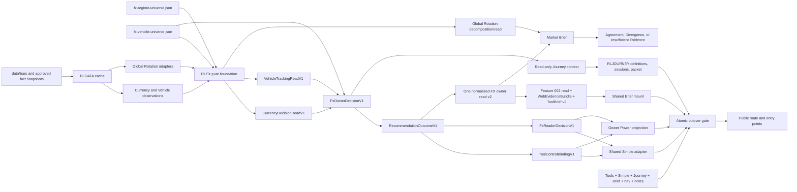
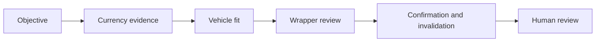
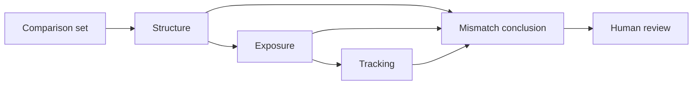

# Design: 004 FX Regime & Currency Vehicle Lab

## Design Brief

### Current State

Feature 004 already has an implemented but excluded foundation. `rlfx.js` owns versioned currency observations, source-envelope normalization, exact-date alignment, currency strength, pair reads, Global Rotation decomposition, deterministic identities, and compact owner projections. `rldata.js` already preserves reviewed series metadata through `barSeries`, `putBarSeries`, and `ensureBarSeries`. These bytes and their tests are not a shipped capability. No production FX page or registry entry consumes those contracts yet, and `site-exclusions.json` still accounts for the foundation.

The shipped owner surfaces still disagree with the reconciled specification. `global-rotation-lab.html`, `simple-models.json`'s `simple-model/country-rotation/v1`, `rlexperience-adapters/macro-rotation.js::computeCountryRotationSummary`, and `scripts/brief-refresh.mjs::buildGlobalToolRead` retain additive FX score semantics. Before this reconciliation, the design also described a route-local Simple/Power switch and omitted vehicle, shared Brief, and Journey contracts. The active design below replaces those stale contracts.

Feature 012's production foundation now exists: `rlviews.js` owns the ordinary Simple/Power/Brief/Journey shell; `rlexperience.js` resolves strict model and adapter declarations; `rlbrief.js` mounts the verified Feature 002 publication graph; and `rljourney.js` owns local no-execution sessions, transitive stale dependencies, and completion packets. The existing Brief live-read overlay does not yet reject a stale or evidence-mismatched owner read, and the Journey runtime does not yet expose an evidence-refresh transition. Those are shared-foundation gaps, not reasons to create page-local substitutes.

### Target State

Extend, rather than replace, the production RLFX foundation. Keep all valid `rlfx-*/v1` currency and Global Rotation contracts compatible. Add a source-reviewed `rlfx-vehicle-universe/v1`, `CurrencyVehicleV1`, `VehicleObservationV1`, `VehicleTrackingReadV1`, `VehicleFitReadV1`, and one `FxOwnerDecisionV1` that composes the current currency decision with vehicle fit. The selected vehicle, every rejection, exact tracking state, owner confirmation/invalidation, and evidence cutoff become identity-bearing owner facts.

Add `fx-regime-relative-value-lab.html` with visible title **FX Regime & Currency Vehicle Lab** while preserving stable tool ID and file route `fx-regime-relative-value-lab`. It consumes the shared ordinary four-view shell. Shared Simple and native Power edit one `ToolControlBindingV1`; Brief and Journey receive immutable read-only snapshots of that same binding and owner decision. No page-local mode strip, Brief renderer, Journey runtime, or second recommendation model is allowed.

Reconcile every Global Rotation execution path, including its Feature 012 Simple model, so country scores contain only USD relative momentum, trend, and risk. Local-equity approximation and FX translation remain explanatory decomposition. Market Brief consumes current owner reads and emits only attributable agreement, divergence, or insufficient evidence.

Close the owner output over one canonical union. A published call is a complete machine-checkable recommendation. Every other settled result is an explicit `no-vehicle` or `unavailable` non-recommendation. New tactical or swing results with incomplete trigger or invalidation attribution become unavailable non-recommendations. They never become new `not-evaluable` calls. Historical `not-evaluable` events remain append-only scorecard truth.

Ship only the complete decision-quality chain. Admission requires one production route, one normalized owner read, Brief and Journey integration, scenario-tested reader value, and one atomic registry cutover. Scope 5 keeps the entire feature excluded until every declared entry point passes real-browser validation. Feature 004 publishes no public watchlist matrix domain, applicability rule, cell, or coverage claim.

### Patterns To Follow

- `rlfx.js`: current pure browser/CommonJS export, strict versioned validators, explicit `decisionTime`, canonical identities, exact-date alignment, and no DOM/storage/network authority.
- `rldata.js`: same-origin daily bars first, append/dedupe cache behavior, reviewed source envelopes, and versioned `toolReads` without changing legacy consumers.
- `rlexperience.js`, `rlviews.js`, and `tool-experience.config.json`: strict ordinary four-view resolution, one shared tablist, registry-owned Simple controls, and explicit fail-closed dependencies.
- `rlexperience-adapters/macro-rotation.js`: owner-state adapter registration through the existing allowlisted module, after removing its stale additive FX path.
- `rlbrief.js` plus Feature 012's `WebEvidenceBundle/v1` and `ToolBrief/v2`: verified publication objects, powerless authorship, claim mapping, and prior-publication preservation.
- `rljourney.js`: the production `journey-session/v1`, transitive dependency graph, no-execution packet, verified local store, and privacy field rejection.
- `rlcontext.js`, `rlticker.js`, and structured `rlchart.js` adapters: one validated contextual-meaning object per rendered datum, shared ticker identity, synchronized pointer and keyboard chart context, and same-data table targets.
- `scripts/audit-reader-legibility.mjs` and `scripts/reader-vocabulary.mjs`: real-browser reach and default-copy validation. Static search may locate a candidate surface but cannot prove that a reader can reach it.
- `rlmarketaction.js::resolveCell` and `scripts/build-owner-reads.mjs`: domain-owned watchlist acceptance, explicit `domainId`, reasoned unavailable cells, and owner deep links without cross-domain substitution.
- `scripts/validate-tool-experience.mjs`: one closed registry packet in which tool, Simple model, Journey definitions/steps, adapter, and derived counts resolve together.
- `tests/causal-rotation-lab.spec.mjs` and existing Feature 012 suites: real ephemeral same-origin HTTP, production browser paths, and no request interception.

### Patterns To Avoid

- Function extraction from HTML for shared FX, vehicle fit, tracking, or Global Rotation math.
- A second page-local Simple/Power switch, Brief renderer, Journey state machine, or control store beside Feature 012's shared foundation.
- Bare row arrays, page-level timestamps, issuer-page timestamps applied to every field, or caller-restamped source records.
- The current `fxWeight` parameter in the page, Simple registry, macro adapter, headless builder, or any future country score input.
- Treating a listed vehicle as the underlying currency, treating two dollar baskets as interchangeable, or explaining a tracking residual with unsourced carry, fee, roll, collateral, or premium values.
- Persisting a daily-reset vehicle selection as current across a reset session or permitting it for swing/structural research.
- Broad ETF-category imports, crypto products, country ETFs, ticker-only vehicle records, or proprietary benchmark/rate reuse inferred from an issuer page.
- Embedded universe fallbacks, global `isFinite`, implicit zero, independent trailing row counts, forward fill, sign inference from ticker spelling, or pair/inverse double counting.
- Credential forms, restricted value persistence, Market Brief model math, direct Brief browsing, or Journey execution semantics.
- A new `not-evaluable` recommendation, a non-recommendation ledger event, or narrative-authored trigger and invalidation levels.
- Raw owner IDs, digests, contract labels, reason or status codes, capability slugs, or Bubbles vocabulary in Simple, Brief, Journey, route-default copy, accessible names, or announcements.
- Dynamic model or configuration text concatenated into markup, including tooltips, citations, rejection detail, or Journey packets.
- A Feature 004 matrix domain, owner-precedence entry, applicability rule, per-ticker coverage claim, or domain-agnostic owner read that can drift into an existing matrix cell.
- Static-grep reach claims, timeout widening without same-condition measurement, or partial registry activation presented as public delivery.

### Resolved Decisions

- Existing `CurrencyDecisionReadV1`, Global Rotation v1 contracts, and `rldata-bar-series/v1` remain compatibility contracts. `FxOwnerDecisionV1` is the new route-level owner truth.
- `fx-vehicle-universe.json` is a separate closed source-reviewed registry. It does not widen `fx-regime-universe/v1` or import category membership.
- FXY, FXE, UUP, UDN, USDU, CEW, and YCS enter as explicitly sourced structural records only. Time-varying active status, price, NAV, spread, volume, AUM, holdings, distributions, premium/discount, and closure state are separate observations with separate clocks.
- YCS is directionally short JPY/long USD and daily-reset 2x inverse JPY only to the extent stated in the current spec source. Issuer, exchange, legal structure, benchmark, current active state, and liquidity remain unavailable until an allowed source policy supplies them.
- `rlexperience-adapters/macro-rotation.js` remains the allowlisted adapter module. It gains the FX adapter and loses additive FX from the country-rotation adapter.
- `ToolControlBindingV1` is an additive generic shared seam. Simple and Power may edit it. Brief and Journey may only snapshot it.
- `rlbrief.js` must compare the live owner decision identity/cutoff with the verified published read and WebEvidenceBundle before showing a current conclusion.
- `rljourney.js` gains one generic evidence-refresh transition that reopens only steps whose declared semantic evidence refs changed and marks all transitive dependents stale.
- Tool discovery, Simple definition, two Journey definitions and steps, Brief source participation, navigation arrays, notes handoff, derived counts, and removal from `site-exclusions.json` activate in one registry transaction after the page and owner read validate.
- Global Rotation removes every additive FX control and score input. Existing non-FX controls migrate without retaining `fxWeight`.
- No database, backend, build step, package, service, credential, proprietary benchmark series, personalized portfolio state, or execution capability is introduced.
- `RecommendationOutcomeV1` is the only call/non-call boundary. Only its `recommendation` branch can enter the recommendation ledger.
- The owner read carries machine identities and internal reason codes. `FxReaderDecisionV1` maps them to product language. Only Power's explained evidence disclosure may show technical identity or provenance detail.
- Feature 004 registers `experience.matrixDomains: []`. Market Brief receives one market-level owner read. Any existing-domain watchlist use requires that domain owner's accepted contract and otherwise stays reasoned unavailable.
- Existing interaction, recompute, readiness, layout-shift, cooperative-chunk, and artifact budgets remain unchanged. A timeout change requires measured latency for the same condition and an adversarial assertion.
- Registration and exclusion removal form one fail-closed cutover. No route, navigation, Brief, Journey, note, owner-read, or coverage edge activates alone.

### Open Questions

- None. Source activation is governed by the versioned source contract; absent authorization is a complete runtime unavailable behavior.

## Purpose And Scope

The design implements the capability described in `spec.md` across five owners:

1. RLFX owns currency, vehicle, fit, tracking, exact-date, and final FX owner-decision semantics.
2. The FX route owns hydration, control binding, Power projection, accessible rendering, and publication of the RLFX owner read.
3. Feature 012 owns the four-view shell, strict Simple adapter runtime, shared Brief mount, Journey runtime, and registry validation.
4. Global Rotation owns USD country leadership plus aligned USD/local/translation decomposition and agreement labels.
5. Market Brief owns registry-complete owner-read consumption and a low-noise Agreement/Divergence statement.

The feature does not create an execution venue, personalized hedge ratio, live dealer quote, broker path, holdings model, tax-suitability decision, credential surface, or restricted-data repository. Optional evidence that cannot satisfy its source contract remains a first-class unavailable observation. A vehicle with insufficient current facts is unavailable or rejected; it is never promoted by ticker familiarity.

The admission boundary is product behavior, not code presence. The foundation may remain inert and excluded without creating a product claim. Admission occurs only when the production route, normalized owner read, Brief, Journey, one-owner deep links, atomic registration, and scenario-tested reader outcome exist together.

### FR-104 Through FR-126 Coverage

| Requirement | Controlling Design Contract |
| --- | --- |
| FR-104 | `VehicleUniverseV1` is a closed fiat-only registry. Category imports, crypto, and country ETFs fail validation. |
| FR-105 | `CurrencyVehicleV1.factRefs` requires every identity, objective, structure, leverage, reset, expense, tax-form, source, clock, and review field. |
| FR-106 | `VehicleObservationV1` gives every market, NAV, liquidity, holding, distribution, collateral, and closure fact an independent lifecycle. |
| FR-107 | `Initial Vehicle Records` contains FXY, FXE, UUP, UDN, USDU, CEW, and YCS with separate structure claims and unavailable facts. |
| FR-108 | `validateVehicleUniverse` requires a reviewed active-status and source policy for every added product. |
| FR-109 | `computeVehicleFitRead` evaluates direction, subject, horizon, structure, reset, liquidity, policy evidence, active state, and fact coverage. |
| FR-110 | `VehicleFitReadV1` and `VehicleEvaluationV1` enforce the closed aggregate and per-vehicle state vocabularies. |
| FR-111 | Every evaluation retains ordered criteria and exact `VehicleReasonCode` values. Missing facts produce Unavailable, never favorable fit. |
| FR-112 | `computeVehicleTrackingRead` uses `ObservationSetV1` exact-date alignment and rejects inferred legs or incompatible return bases. |
| FR-113 | `VehicleTrackingReadV1` separates market, NAV, underlying, sourced contexts, observed differences, and unexplained residual. |
| FR-114 | `VehicleSourcePolicyV1` limits facts to issuer, exchange, regulator, or approved public-market sources with explicit rights. |
| FR-115 | The daily-reset hard gate isolates YCS and later reset products from automatic, Swing, and Structural selection. |
| FR-116 | `FxToolMetricsV2.vehicle` preserves selection, alternatives, rejections, structure, tracking, cutoff, confirmation, invalidation, and no-fit states. |
| FR-117 | `Stable Identity, Visible Title, And Shared Shell` separates the visible product title from the stable route and owner ID. |
| FR-118 | `rlviews.js` owns exactly Simple, Power, Brief, and Journey through `ordinary-four-view/v1`. |
| FR-119 | `Simple Mapping` renders the ordered owner-decision spine from one `FxOwnerDecisionV1`. |
| FR-120 | `ToolControlBindingV1` owns the explicit objective, subject, horizon, class, reset, liquidity, policy, and evidence controls. |
| FR-121 | `Power Mapping` exposes currency and vehicle anatomy without replacing the owner-selected result. |
| FR-122 | `FxBriefEligibilityV1` requires one current owner read, one current bundle, exact claim citations, and matching owner evidence. |
| FR-123 | The Brief gate refuses stale, missing, contradicted, rights-ineligible, mismatched, or uncited current claims. |
| FR-124 | `Journey Contracts` defines the exact vehicle-selection wizard and wrapper-mismatch scenario-lab IDs. |
| FR-125 | The Journey DAGs, evidence-refresh mapping, and packet specialization preserve progress, backtracking, stale steps, signoff, and no execution. |
| FR-126 | `Control Binding And View Parity` verifies one owner identity, vehicle state, decision, confirmation, invalidation, and cutoff across all projections. |

## Architecture Overview


```mermaid
flowchart LR
  CU[fx-regime-universe.json] --> F[RLFX pure foundation]
  VU[fx-vehicle-universe.json] --> F
  B[data/bars and approved fact snapshots] --> R[RLDATA cache]
  R --> O[Currency and Vehicle observations]
  O --> F
  F --> CORE[CurrencyDecisionReadV1]
  F --> TRACK[VehicleTrackingReadV1]
  CORE --> OWNER[FxOwnerDecisionV1]
  TRACK --> OWNER
  VU --> OWNER
  OWNER --> OUTCOME[RecommendationOutcomeV1]
  OUTCOME --> C[ToolControlBindingV1]
  C --> SIMPLE[Shared Simple adapter]
  C --> POWER[Owner Power projection]
  OUTCOME --> READER[FxReaderDecisionV1]
  READER --> SIMPLE
  READER --> POWER
  OUTCOME --> READ[One normalized FX owner read v2]
  READ --> PUB[Feature 002 read + WebEvidenceBundle + ToolBrief v2]
  PUB --> BRIEF[Shared Brief mount]
  OWNER --> JCTX[Read-only Journey context]
  JCTX --> JOURNEY[RLJOURNEY definitions, sessions, packet]
  R --> G[Global Rotation adapters]
  G --> F
  F --> GD[Global Rotation decomposition/read]
  READ --> M[Market Brief]
  GD --> M
  M --> S[Agreement, Divergence, or Insufficient Evidence]
  REG[Tools + Simple + Journey + Brief + nav + notes] --> CUTOVER[Atomic cutover gate]
  SIMPLE --> CUTOVER
  POWER --> CUTOVER
  BRIEF --> CUTOVER
  JOURNEY --> CUTOVER
  CUTOVER --> PUBLIC[Public route and entry points]
```

### Runtime Ownership

| Layer | Owns | Does Not Own |
| --- | --- | --- |
| `rldata.js` | Existing bars and generic `toolReads`, plus additive preservation and retrieval of `BarSeriesEnvelopeV1` source/lifecycle metadata | Source authorization decisions, currency semantics, or FX decisions |
| `rlfx.js` | Existing v1 currency/Global contracts plus vehicle validation, tracking, fit, owner decision, identity, and v2 owner projection | Fetch, storage, DOM, credentials, prose, source-policy approval |
| `fx-regime-relative-value-lab.html` | RLDATA adapters, bounded hydration, control controller, Power UI, accessibility, owner publication | Mode shell, Brief/Journey implementations, formulas, source authorization |
| `rlexperience.js` / `rlviews.js` | Exact four-view shell, Simple model runtime, `ToolControlBindingV1`, hash/history/focus, shared control projection | FX formulas, source fetching, vehicle facts, Brief prose |
| `rlexperience-adapters/macro-rotation.js` | FX Simple adapter over frozen RLFX owner inputs and corrected country-rotation Simple adapter | Fetch, DOM, currency/vehicle formula forks |
| `rlbrief.js` | Verified shared Brief mount, current-owner/public-evidence eligibility, current/refused/prior projection | Browsing, FX/fit recomputation, source acquisition, uncited prose |
| `rljourney.js` | Definition/session/step/packet validation, evidence refresh, transitive stale reopening, local no-execution state | FX/fit recomputation, portfolio mutation, order or signoff side effects |
| `rlcontext.js` / `rlticker.js` / `rlchart.js` | Shared contextual meaning, public ticker identity, structured chart interaction, and same-data table linkage | FX formulas, reader conclusions, or a second data projection |
| `global-rotation-lab.html` | Country UI, equity-only controls, hydration, rendering, publication | FX scoring or duplicated decomposition formulas |
| `scripts/brief-refresh.mjs` | Node source-envelope acquisition, one explicit run decision time, owner projections, registry coverage, snapshot serialization | Extracted FX/Global math, source-clock restamping, owner-independent synthesis |
| Market Brief | Owner-read validation, canonical FX/Global relationship classification, rendering, wording, and owner deep links | Currency rank, decomposition, vehicle fit, scoreability, owner state, a third composite, or a watchlist-domain claim |
| Existing watchlist domain owner | Optional acceptance of the normalized FX owner read under its own existing domain contract | A Feature 004 domain, inferred applicability, recomputed FX state, or fabricated coverage |

### Data Flow

1. The page fetches and validates both closed universes. Either missing/invalid registry produces an unavailable owner decision with exact config errors; neither has an embedded fallback.
2. It reads configured currency, listed-market, NAV, underlying, and issuer facts through their approved adapters. Every adapter preserves the source's own observed/retrieved/review clocks and rights. Reading cache or a committed snapshot never re-stamps evidence.
3. It hydrates only approved missing or stale deltas. View changes and control changes never fetch. Time-varying vehicle facts are not acquired from broad category membership or inferred from the ticker.
4. RLFX computes the v1 currency core, exact-date tracking, individual vehicle evaluations, aggregate fit, and one `FxOwnerDecisionV1`. It then closes `RecommendationOutcomeV1` from typed owner evidence. The owner identity includes source and vehicle evidence identities, every control, and the complete outcome branch.
5. `ToolControlBindingV1` holds the current parameter values and owner decision. A commit from shared Simple or native Power calls the same route controller, recomputes once from loaded observations, publishes once, and notifies both projections. Brief and Journey receive frozen snapshots and no commit capability.
6. The versioned owner read is written through `RLDATA.putToolRead`. It carries the canonical outcome, one Power owner deep link, evidence identity, and cutoff. Reader projections omit machine identity and internal codes. A Feature 002 `ToolModelRead/v1` projection uses the same owner identity and evidence cutoff. The bounded acquisition stage builds one current `WebEvidenceBundle/v1`; only then may a networkless author produce `ToolBrief/v2`.
7. Journey creation snapshots the owner identity and objective. Evidence refresh compares semantic refs. Changed required refs reopen their owning steps and mark only transitive dependents stale. A current packet excludes all stale outcomes and always carries `noExecution:true` and `executed:false`.
8. Global Rotation calls existing RLFX exact-date computations from the same source envelopes. Its page, Simple adapter, and headless read share equity-only scoring.
9. Market Brief, Brief, Journey, and any accepted existing-domain watchlist consumer receive the same normalized owner read. They project its result and deep-link Power. They never recompute FX, vehicle fit, scoreability, or owner state. Cross-owner synthesis never receives raw bars or vehicle facts that neither owner published.
10. Scope 5 validates landing, navigation, direct route, Simple, Power, Brief, Journey, owner-read publication, notes, and Market Brief deep links in a real browser. The route remains excluded if any edge fails. Static search is diagnostic only.

## Capability Foundation

### Foundation Contract

| Export | Responsibility | Consumers |
| --- | --- | --- |
| `validateUniverse(value)` | Reject unknown keys, duplicate currency/pair identity, incomplete thresholds, invalid cohort or orientation, unsafe URLs, and unbounded membership | FX page, collector tests, headless refresh |
| `normalizeSourceEnvelope(value, policy, decisionTime)` | Validate complete series lineage, preserve source clocks/rights, derive `freshUntil` and `cacheAgeMs`, and fail closed without source-use approval | Browser and headless adapters |
| `normalizeObservation(value)` | Enforce the `CurrencyObservationV1` discriminated union and strip no fields silently | All adapters |
| `normalizeCarryRead(value, decisionTime)` | Enforce the closed unavailable/policy-proxy/market-implied carry union before any projection | FX decision and owner read |
| `normalizeDailySeries(rows, leg)` | Produce finite positive daily levels keyed by UTC date with deterministic duplicate handling | FX and Global computations |
| `orientSeries(rows, sourceOrientation, requestedOrientation)` | Return verified canonical levels or `INVALID_ORIENTATION` | Spot, proxy, and decomposition paths |
| `alignExact(legs, horizonSessions)` | Build an `ObservationSetV1` from exact UTC-date intersection with no fill | Every multi-leg calculation |
| `computeCurrencyStrength(input)` | Build separate cohort ranks from unique peer relationships | FX decision |
| `computePairRead(input)` | Build selected-pair momentum, trend, risk, state, coverage, and lineage | FX decision |
| `computeBroadDollar(input)` | Preserve Broad/AFE/EME official/proxy reads and named conflicts | FX decision |
| `computeCurrencyDecision(input)` | Produce one immutable `CurrencyDecisionReadV1` | FX Simple, Power, browser read, headless read |
| `validateVehicleUniverse(value)` | Validate the closed fiat-only vehicle registry, fact references, source policies, structure taxonomy, and no proprietary-series reuse | FX page, headless builder, registry tests |
| `normalizeVehicleObservation(value)` | Enforce separately clocked static and time-varying vehicle facts, rights, finite values, and unavailable reasons | Browser/headless vehicle adapters |
| `computeVehicleTrackingRead(input)` | Align market, NAV, and declared underlying on exact dates and retain unexplained residuals | Power, fit, Brief caveat |
| `computeVehicleFitRead(input)` | Evaluate every reviewed vehicle and produce selected, rejected, no-eligible, tactical-only, or unavailable state | Owner decision and all views |
| `computeFxOwnerDecision(input)` | Compose one v1 currency core plus tracking and fit into `FxOwnerDecisionV1` | Shared Simple, native Power, owner read, Journey context |
| `computeRecommendationOutcome(input)` | Produce exactly one complete machine-checkable recommendation or one explicit `no-vehicle` / `unavailable` non-recommendation | Owner decision, owner read, ledger gate, all reader projections |
| `computeGlobalRotation(input)` | Produce equity-only scores plus optional aligned decomposition | Global browser and headless read |
| `projectFxToolRead(decision)` | Produce public compact FX owner read with no restricted values or source URLs | `RLDATA`, brief snapshot |
| `projectFxToolReadV2(ownerDecision)` | Produce the selected objective/vehicle/fit/tracking/rejections/evidence-cutoff owner read | RLDATA, Feature 002 publisher, Market Brief |
| `projectFxReaderDecision(ownerDecision)` | Map the canonical outcome, evidence state, and machine reasons to escaped product-language copy without exposing technical identity | Simple, Brief, Journey, route status, announcements |
| `projectGlobalToolRead(result)` | Produce expanded Global owner read | `RLDATA`, brief snapshot |
| `canonicalize(value)` / `decisionId(value)` | Stable key ordering and non-cryptographic deterministic identity | Parity tests and UI identity |

### Loading And Export Contract

`rlfx.js` remains one plain script with no dependency. The CommonJS branch returns before browser-global assignment. Existing exports and v1 results remain valid. The additive exports are `validateVehicleUniverse`, `normalizeVehicleObservation`, `computeVehicleTrackingRead`, `computeVehicleFitRead`, `computeFxOwnerDecision`, and `projectFxToolReadV2`; no existing export changes meaning.

```js
(function (factory) {
  "use strict";
  var api = Object.freeze(factory());
  if (typeof module === "object" && module && module.exports) {
    module.exports = api;
    return;
  }
  if (typeof globalThis === "undefined") throw new Error("RLFX_BROWSER_GLOBAL_UNAVAILABLE");
  globalThis.RLFX = api;
})(function () {
  "use strict";
  return {
    validateUniverse: validateUniverse,
    normalizeSourceEnvelope: normalizeSourceEnvelope,
    normalizeObservation: normalizeObservation,
    normalizeCarryRead: normalizeCarryRead,
    normalizeDailySeries: normalizeDailySeries,
    orientSeries: orientSeries,
    alignExact: alignExact,
    computeCurrencyStrength: computeCurrencyStrength,
    computePairRead: computePairRead,
    computeBroadDollar: computeBroadDollar,
    computeCurrencyDecision: computeCurrencyDecision,
    validateVehicleUniverse: validateVehicleUniverse,
    normalizeVehicleObservation: normalizeVehicleObservation,
    computeVehicleTrackingRead: computeVehicleTrackingRead,
    computeVehicleFitRead: computeVehicleFitRead,
    computeFxOwnerDecision: computeFxOwnerDecision,
    computeGlobalRotation: computeGlobalRotation,
    scoreCountryLeadership: scoreCountryLeadership,
    projectFxToolRead: projectFxToolRead,
    projectFxToolReadV2: projectFxToolReadV2,
    projectGlobalToolRead: projectGlobalToolRead,
    canonicalize: canonicalize,
    decisionId: decisionId
  };
});
```

Browser pages load `rldata.js`, then `rlfx.js`, then `rlapp.js`; their inline boot waits for `DOMContentLoaded`. Node ESM uses:

```js
import { createRequire } from 'node:module';
const require = createRequire(import.meta.url);
const RLFX = require('../rlfx.js');
```

No consumer extracts functions from HTML. `scripts/selftest.mjs` imports the same export rather than copying helper bodies. Importing `rlfx.js` in Node must leave any pre-existing `globalThis.RLFX` value byte-for-byte unchanged.

Every public compute entry point requires a canonical ISO `decisionTime`. A daily-reset evaluation additionally requires a source-derived `resetSessionId` and `resetSessionEndsAt`; RLFX never derives either from the browser clock or a guessed exchange timezone. Identical complete inputs produce canonically identical outputs and IDs in browser and Node.

### Extension Points

- **Cache adapter:** `RLDATA.barSeries` supplies a complete source envelope. It may derive `observedAsOf` from accepted row timestamps and `cacheAgeMs`/`freshUntil` from the explicit decision time and source policy; it may not invent `retrievedAt`, rights, source-use approval, or a review window.
- **Headless adapter:** supplies the same envelope shape from a committed snapshot or a network acquisition result. A committed `fetched` value is the retrieval clock; opening the file is not retrieval. A live network completion time may be used only for that new response and does not authorize its rights.
- **Static evidence adapter:** supplies a complete `CurrencyObservationV1` only after the universe source policy names its path, rights, cadence, and review window.
- **Selected-pair adapter:** supplies a direct pair when configured; otherwise the foundation may build an allowed derived cross from two canonical USD legs.
- **Consumer projection:** each owner uses a dedicated projection function. Consumers cannot add fields to the decision calculation.
- **UI composition:** Simple and Power may arrange the same decision differently; neither receives lower-level mutable model state.
- **Vehicle source adapter:** supplies one `VehicleObservationV1` per fact. One page timestamp cannot authorize or freshen sibling facts.
- **Control binding:** shared Simple and native Power may call one validated commit function. Brief/Journey are snapshot consumers and receive no commit function.
- **Brief eligibility:** validates one current owner read and one current compatible WebEvidenceBundle before a current projection; prior verified content remains separately labeled.
- **Journey evidence refresh:** compares current semantic evidence refs with session refs and reopens declared steps through the existing dependency graph.
- **Contextual meaning:** every rendered control or datum supplies one validated `contextual-tooltip/v1` object. Hover, focus, adjacent text, and same-data chart tables consume that object without recomputing the owner model.
- **Existing-domain acceptance:** a watchlist domain owner may accept the normalized FX read only through its own reviewed contract. Feature 004 supplies no domain ID, precedence, applicability, or covered-cell mutation.

### Foundation-Owned Behavior

- Closed schemas and enums, `Number.isFinite`, positive-level guards, and input immutability.
- Canonical quote orientation and positive-return meaning.
- Pair/inverse relationship deduplication and lineage overlap marking.
- UTC-date normalization, exact intersection, coverage diagnostics, and no forward fill.
- Public/private rights filtering before scoring or persistence, including rejection of legacy bare-row buckets for Feature 004 scoring.
- Cohort eligibility, multi-peer strength, pair state, hedge priority, conflicts, and carry-unwind classification.
- Global USD/local/translation identity and equity-only score enforcement.
- Browser/headless parity and deterministic decision identity.
- Fiat-only vehicle membership, source-policy validation, objective/direction/structure/horizon fit, exact per-reason rejection, and closed-product exclusion.
- Daily-reset tactical-only eligibility and source-session expiry.
- Current Brief eligibility and Journey evidence-refresh semantics through shared contracts.
- Closed recommendation scoreability, non-recommendation ledger exclusion, and append-only historical outcome preservation.
- Machine-to-reader projection, authored-text escaping, internal-code translation, and Power-only technical identity disclosure.
- One-owner projection and deep-link semantics across Brief, Journey, Global Rotation, Market Brief, and accepted existing-domain consumers.

## Concrete Implementations

### FX Regime And Relative-Value Lab

`fx-regime-relative-value-lab.html` keeps the stable file route but renders **FX Regime & Currency Vehicle Lab**. It owns a small adapter/runtime object:

```js
runtime = {
  currencyUniverse,
  vehicleUniverse,
  controlBinding,
  currencyObservations,
  vehicleObservations,
  hydration,
  ownerDecision
};
```

The page includes exactly one `[data-rlbrief-mount][data-tool-id="fx-regime-relative-value-lab"]` anchor and no local mode control. `recompute()` calls `RLFX.computeFxOwnerDecision`, stores one frozen result, renders only the native Power projection, publishes the v2 owner read, and requests shared Simple requalification. `window.FxRegimeLab` exposes read-only snapshots and controller methods for production tests; it exposes no source mutation or test-only result path.

### Shared Four-View Adapter

`simple-model/fx-regime-vehicle/v1` and `simple-adapter/fx-regime-vehicle/v1` live in the existing `simple-models.json` and allowlisted `rlexperience-adapters/macro-rotation.js`. The adapter consumes the route's frozen normalized observation snapshot and calls RLFX. It does not reimplement formulas or fetch.

`ToolControlBindingV1` is generic and additive:

```ts
type ToolControlBindingV1 = {
  contractVersion: "tool-control-binding/v1";
  toolId: "fx-regime-relative-value-lab";
  revision: number;
  parameterValues: Record<string, string | number | boolean>;
  ownerDecisionId: string;
  evidenceIdentity: string;
  evidenceCutoff: ISODateTime | null;
  snapshot(): Readonly<ToolControlBindingV1>;
  commit(change: { parameterId: string; value: string | number | boolean; expectedRevision: number }): Promise<Readonly<ToolControlBindingV1>>;
};
```

Only Simple and Power receive `commit`. Revision mismatch is `E012-SIMPLE-INPUT`; the old state remains. Brief and Journey receive the serializable fields only. The shared Simple bridge initializes controls from the binding instead of registry defaults and commits through it. Power controls call the same method. One accepted commit updates both views and the owner read; a view transition does nothing to the binding.

### Global Rotation Reconciliation

`global-rotation-lab.html` delegates to `RLFX.computeGlobalRotation`. The country score accepts only momentum, trend, and risk. The page shows aligned USD return, approximate local return, translation including interaction, and decomposition relationship. Missing FX leaves two-leg USD leadership intact.

The existing page `fxWeight`, the `simple-model/country-rotation/v1` parameter `fx-weight`, `computeCountryRotationSummary`'s additive `fxW * fx`, and corresponding output paths are removed in one change. The Simple adapter calls the same RLFX equity-only scoring policy as Power. Persisted page state migrates by copying only non-FX controls. A legacy FX weight cannot influence either view, decomposition, owner read, or text.

### Market Brief Integration

`scripts/brief-refresh.mjs` adds `buildFxToolRead()` and changes `buildGlobalToolRead()` to invoke RLFX. Its snapshot/network memo returns source envelopes rather than bare rows. It captures one run `decisionTime`; it does not re-stamp `asOf`, `computedAt`, or freshness.

The FX source entry participates in Feature 002 as `ToolModelRead/v1` with `adapterId: "fx-regime-vehicle-owning-model-v1"`, `owningModelVersion: "rlfx-owner-decision/v1"`, and `profile: "live-market"`. Its fingerprint commits to `ownerDecisionId`, evidence identity, cutoff, selected-vehicle state, and v2 metrics. The associated `WebEvidenceBundle/v1` must match tool ID, run, cutoff, owner evidence ref, current claim sources, and rights policy. A networkless `ToolBrief/v2` may then cite regime, catalyst, vehicle structure, trigger, invalidation, and wrapper caveat.

`rlbrief.js` renders a current conclusion only when the live owner read, published ToolModelRead, bundle, and ToolBrief all agree on owner decision identity and cutoff and remain current. Otherwise it renders `non-current` with exact blocking evidence and may show only the prior verified publication under a visible prior-evidence label.

The FX/Global relationship has no numeric score. Its state is `Agreement`, `Divergence`, or `Insufficient Evidence`; its sentence uses owner-published facts only. Validation rejects a missing FX read, an old Global shape, a relationship containing a composite score, or synthesis when either owner is stale/unavailable.

Feature 004 publishes one market-level owner read. Its `tools.json` entry declares `experience.matrixDomains: []`. It does not write `market-brief.owner-reads.json`, `ownerPrecedence`, matrix applicability, a matrix cell, or a covered-cell count. A future existing-domain consumer may project the same normalized read only after that domain owner accepts the contract. Without acceptance, the consumer renders one reasoned unavailable state and the FX Power deep link.

### Journey Definitions

The shared Journey registry receives exactly two Feature 004 definitions:

- `journey/fx-regime-relative-value-lab/vehicle-selection/v1`, mechanism `wizard`;
- `journey/fx-regime-relative-value-lab/wrapper-mismatch/v1`, mechanism `scenario-lab`.

Both use production `JourneyDefinition/v1`, `JourneyStep/v1`, `journey-session/v1`, and `journey-completion-packet/v1`. Both require `noExecution:true`, public-safe context, owner evidence identity, explicit backtracking, current evidence, and human review. They never compute currency or vehicle fit. Their exact steps and packet specialization are defined under `## Journey Contracts` below.

### Variation Axes

| Axis | Supported Variants | Foundation Ownership |
| --- | --- | --- |
| Runtime | Browser global, Node CommonJS loaded from ESM | Export parity and pure behavior |
| Source family | Same-origin spot/proxy, authorized static official, access/rights unavailable | Schema, rights gate, freshness semantics |
| Cohort | G10, liquid-EM, managed/reference | Eligibility and separate ranking |
| Pair construction | Direct canonical pair, inverse source, derived cross | Orientation, deduplication, lineage |
| Evidence clock | Daily spot, event-driven policy, monthly REER, weekly positioning, tenor-specific carry | Independent review windows and states |
| Vehicle structure | Single-currency trust, futures commodity pool, forward-based broad basket, diversified currency basket, daily-reset leveraged/inverse | Closed taxonomy and structure-specific eligibility |
| Vehicle objective | Single fiat currency, long-dollar basket, short-dollar basket, diversified EM currency | Direction/basket matching before comparison |
| Horizon/reset | Tactical, swing, structural; no reset or daily reset | Tactical-only gating and reset-session expiry |
| Tracking evidence | Market only, market+NAV, market+NAV+underlying | Exact-date state and no invented attribution |
| Consumer | FX route, Global decomposition, owner reads, Brief, Journey, Market Brief | Owner-specific projection without formula duplication |
| UI composition | Shared Simple, owner Power, cited Brief, guided Journey, mobile/accessibility projections | One owner identity and state vocabulary |
| Outcome branch | Machine-checkable recommendation, no-vehicle non-recommendation, unavailable non-recommendation | Closed schema, scoreability, ledger eligibility |
| Reader projection | Default product-language projection, Power evidence disclosure, machine contract/log projection | Field allowlists, code translation, identity visibility |
| Watchlist consumption | No matrix use, accepted existing-domain projection, reasoned unavailable | Domain-owner acceptance and no fabricated coverage |

## Journey Contracts

### Shared Definition Contract

Both Feature 004 goals use the shipped `journey-definition/v1`, `journey-step/v1`, `journey-session/v1`, and `journey-completion-packet/v1` contracts. They extend no runtime schema. They specialize the definition context, evidence slots, step DAG, and step conclusions.

| Field | Vehicle Selection | Wrapper Mismatch | Required Value |
| --- | --- | --- | --- |
| `definitionId` | `journey/fx-regime-relative-value-lab/vehicle-selection/v1` | `journey/fx-regime-relative-value-lab/wrapper-mismatch/v1` | Stable and unique |
| `definitionVersion` | `1.0.0` | `1.0.0` | Exact version |
| `toolId` | `fx-regime-relative-value-lab` | `fx-regime-relative-value-lab` | Stable owner identity |
| `goalId` | `vehicle-selection` | `wrapper-mismatch` | Stable tool-local goal |
| `mechanism` | `wizard` | `scenario-lab` | Existing runtime vocabulary |
| `privacyClass` | `local-nonsensitive` | `local-nonsensitive` | No private market or account data |
| `noExecution` | `true` | `true` | Required by the runtime |
| `backtrackPolicy` | `{ mode: "transitive-dependents-stale", auditPriorOutcomes: true }` | Same | Exact runtime policy |
| `staleEvidencePolicy` | `{ mode: "reopen-dependent-steps", preserveAudit: true }` | Same | Exact runtime policy |
| `completionPolicy.outcomes` | `complete`, `partial`, `refused` | Same | Exact ordered vocabulary |
| `packetPolicy` | `{ contractVersion: "journey-completion-packet/v1", humanSignoffRequired: true, noExecution: true }` | Same | Exact runtime policy |

| Definition Field | Vehicle Selection | Wrapper Mismatch |
| --- | --- | --- |
| `prerequisiteRules` | `all-required-evidence-current`, `explicit-choice-recorded` | `all-required-evidence-current`, `scenario-comparison-complete` |
| `evidencePolicy.requiredSlots` | `owner-decision`, `currency-evidence`, `vehicle-fit`, `vehicle-facts`, `tracking-read`, `confirmation-invalidation`, `human-review` | `owner-decision`, `vehicle-fit`, `vehicle-facts`, `tracking-read`, `confirmation-invalidation`, `human-review` |
| `evidencePolicy.allowedProvenance` | `owner-evidence`, `public-source`, `user-choice` | Same |
| `completionPolicy.predicates` | `all-required-evidence-current`, `explicit-choice-recorded` | `all-required-evidence-current`, `scenario-comparison-complete`, `explicit-choice-recorded` |
| `accessibility.progressSemantics` | Ordered six-step wizard progress | Ordered six-step scenario-lab progress |
| `accessibility.currentStepSemantics` | `aria-current="step"` on the next valid step | Same |
| `limitations` | No execution, sizing, suitability, or tax conclusion | No execution, ranking override, or fabricated tracking explanation |

The Journey context is a frozen public-safe projection. It never receives `ToolControlBindingV1.commit`, raw observations, source payloads, or the complete control record.

```ts
type FxJourneyContextV1 = {
  contractVersion: "rlfx-journey-context/v1";
  ownerDecisionId: string;
  evidenceIdentity: string;
  evidenceCutoff: ISODateTime;
  controlBindingRevision: number;
  objective: FxOwnerDecisionV1["controls"]["objective"];
  subjectId: string;
  horizon: FxOwnerDecisionV1["controls"]["horizon"];
  vehicleClass: FxOwnerDecisionV1["controls"]["vehicleClass"];
  dailyResetPermission: FxOwnerDecisionV1["controls"]["dailyResetPermission"];
  liquidityPolicyId: string;
  vehicleFitState: VehicleFitReadV1["state"];
  selectedVehicleId: string | null;
  confirmation: string;
  invalidation: string;
};
```

`contextSchema.allowedFields` and `requiredFields` contain exactly the fields above. The Journey does not persist the owner's complete parameter map. In particular, the runtime's forbidden-field scan prevents account, holding, quantity, credential, secret, payment, position, and cost-bearing field names from entering a session or packet. The owner decision and evidence references preserve the omitted policy evidence without copying those fields into Journey storage.

### Vehicle-Selection Step DAG

| Order | `stepId` | Depends On | Required Evidence Slots | Completion Predicate | Input / Conclusion |
| --- | --- | --- | --- | --- | --- |
| 1 | `journey-step/fx-regime-relative-value-lab/vehicle-selection/objective/v1` | None | `owner-decision` | `explicit-choice-recorded` | Record objective, subject, horizon, vehicle class, daily-reset permission, and liquidity policy ID. |
| 2 | `journey-step/fx-regime-relative-value-lab/vehicle-selection/currency-evidence/v1` | Objective | `owner-decision`, `currency-evidence` | `all-required-evidence-current` | Record the current regime, thesis state, gaps, cutoff, confirmation, and invalidation. |
| 3 | `journey-step/fx-regime-relative-value-lab/vehicle-selection/vehicle-fit/v1` | Currency evidence | `vehicle-fit` | `all-required-evidence-current` | Record selected, no-eligible, tactical-only, unavailable, and rejection outcomes without relaxing constraints. |
| 4 | `journey-step/fx-regime-relative-value-lab/vehicle-selection/wrapper-review/v1` | Vehicle fit | `vehicle-facts`, `tracking-read` | `all-required-evidence-current` | Record structure, basket, reset, tracking state, wrapper caveats, and unresolved facts. |
| 5 | `journey-step/fx-regime-relative-value-lab/vehicle-selection/confirmation/v1` | Wrapper review | `confirmation-invalidation` | `explicit-choice-recorded` | Record explicit acceptance or refusal of the owner confirmation and invalidation. |
| 6 | `journey-step/fx-regime-relative-value-lab/vehicle-selection/human-review/v1` | Confirmation | `human-review` | `explicit-choice-recorded` | Record the research review decision. Packet signoff remains a separate runtime operation. |

| Step Role | `inputSchema.allowedFields` | `inputSchema.requiredFields` | `staleWhen` |
| --- | --- | --- | --- |
| Objective | `objective`, `subjectId`, `horizon`, `vehicleClass`, `dailyResetPermission`, `liquidityPolicyId` | All listed fields | `control:objective`, `control:subject`, `control:horizon`, `control:vehicle-class`, `control:daily-reset`, `control:liquidity-policy` |
| Currency evidence | `acknowledgedGapCodes` | None | `owner:currency-decision`, `owner:evidence-cutoff` |
| Vehicle fit | `acceptedVehicleFitState`, `acceptedVehicleId` | `acceptedVehicleFitState` | `owner:vehicle-fit` |
| Wrapper review | `acceptedCaveatIds`, `trackingAssessment` | `trackingAssessment` | `vehicle:static-facts`, `vehicle:tracking` |
| Confirmation | `confirmationDecision`, `invalidationDecision` | Both listed fields | `owner:confirmation`, `owner:invalidation` |
| Human review | `reviewDecision`, `reviewNote` | `reviewDecision` | `journey:upstream-current` |


```mermaid
flowchart LR
  VS1[Objective] --> VS2[Currency evidence]
  VS2 --> VS3[Vehicle fit]
  VS3 --> VS4[Wrapper review]
  VS4 --> VS5[Confirmation and invalidation]
  VS5 --> VS6[Human review]
```

Every step declares `contractVersion: "journey-step/v1"`, `inputSchema.contractVersion: "journey-step-input/v1"`, `sideEffectPolicy: "none"`, `optionalEvidenceSlots: []`, `branchRules: []`, and `invalidatesStepIds: []`. Every step uses the three allowed provenance classes. `ownerDeepLinks` contains `fx-regime-relative-value-lab.html#simple` and `fx-regime-relative-value-lab.html#power`. No step targets Brief as an evidence source.

### Wrapper-Mismatch Step DAG

| Order | `stepId` | Depends On | Required Evidence Slots | Completion Predicate | Input / Conclusion |
| --- | --- | --- | --- | --- | --- |
| 1 | `journey-step/fx-regime-relative-value-lab/wrapper-mismatch/comparison-set/v1` | None | `owner-decision`, `vehicle-fit` | `explicit-choice-recorded` | Select two reviewed vehicles that already match the owner subject and direction. |
| 2 | `journey-step/fx-regime-relative-value-lab/wrapper-mismatch/structure/v1` | Comparison set | `vehicle-facts` | `all-required-evidence-current` | Compare legal structure, exposure mechanism, leverage, reset, active state, and tax-form class. |
| 3 | `journey-step/fx-regime-relative-value-lab/wrapper-mismatch/exposure/v1` | Structure | `vehicle-facts` | `all-required-evidence-current` | Compare currency or basket membership, benchmark, collateral, rebalance, and distribution mechanics. |
| 4 | `journey-step/fx-regime-relative-value-lab/wrapper-mismatch/tracking/v1` | Exposure | `tracking-read` | `all-required-evidence-current` | Compare exact-date market, NAV, and underlying tracking with unexplained residuals retained. |
| 5 | `journey-step/fx-regime-relative-value-lab/wrapper-mismatch/conclusion/v1` | Structure, Exposure, Tracking | `vehicle-fit`, `confirmation-invalidation` | `scenario-comparison-complete` | Record compatible difference, material mismatch, insufficient evidence, or refusal. |
| 6 | `journey-step/fx-regime-relative-value-lab/wrapper-mismatch/human-review/v1` | Conclusion | `human-review` | `explicit-choice-recorded` | Record the research review decision. Packet signoff remains a separate runtime operation. |

| Step Role | `inputSchema.allowedFields` | `inputSchema.requiredFields` | `staleWhen` |
| --- | --- | --- | --- |
| Comparison set | `primaryVehicleId`, `comparisonVehicleId` | Both listed fields | `owner:controls`, `owner:vehicle-fit` |
| Structure | `structureAssessment` | `structureAssessment` | `vehicle:static-facts`, `vehicle:active-state` |
| Exposure | `exposureAssessment` | `exposureAssessment` | `vehicle:basket`, `vehicle:collateral`, `vehicle:rebalance`, `vehicle:distribution` |
| Tracking | `trackingAssessment` | `trackingAssessment` | `vehicle:market`, `vehicle:nav`, `vehicle:underlying`, `vehicle:return-basis` |
| Mismatch conclusion | `comparisonOutcome`, `acceptedCaveatIds` | `comparisonOutcome` | `owner:vehicle-fit`, `owner:confirmation`, `owner:invalidation` |
| Human review | `reviewDecision`, `reviewNote` | `reviewDecision` | `journey:upstream-current` |


```mermaid
flowchart LR
  WM1[Comparison set] --> WM2[Structure]
  WM2 --> WM3[Exposure]
  WM3 --> WM4[Tracking]
  WM2 --> WM5[Mismatch conclusion]
  WM3 --> WM5
  WM4 --> WM5
  WM5 --> WM6[Human review]
```

The comparison-set step cannot widen the owner subject, direction, or horizon. A basket mismatch, stale required fact, incompatible return basis, or absent exact-date tracking remains a visible scenario result. The lab does not manufacture a winner.

Every wrapper-mismatch step uses the same shared step fields, allowed provenance, and owner deep links as the vehicle-selection steps. Its `invalidatesStepIds` and `branchRules` arrays remain empty because the dependency DAG owns stale propagation and the scenario has one explicit terminal conclusion.

### Evidence Refresh And Stale Propagation

The shared evidence-refresh transition compares semantic references rather than only `ownerDecisionId`. It applies this mapping:

| Changed Semantic Reference | First Reopened Step | Transitive Result |
| --- | --- | --- |
| Objective, subject, horizon, class, reset permission, or liquidity policy | Objective or comparison set | Every dependent step becomes stale |
| Currency decision, regime, pair, or evidence cutoff | Currency evidence or comparison set | Fit, wrapper, conclusion, confirmation, and review become stale |
| Vehicle fit, selected vehicle, or rejection set | Vehicle fit or comparison set | Wrapper, tracking, conclusion, confirmation, and review become stale |
| Static vehicle fact or active state | Wrapper review or structure | Dependent conclusion and review become stale |
| Basket, collateral, rebalance, or distribution fact | Exposure | Tracking-dependent conclusion and review become stale |
| Market, NAV, underlying, return basis, or tracking state | Wrapper review or tracking | Dependent conclusion, confirmation, and review become stale |
| Confirmation or invalidation | Confirmation or conclusion | Human review becomes stale |

The runtime preserves prior outcomes in history. It clears evidence and conclusions only for reopened or stale steps. Unrelated completed steps remain current. A complete packet is impossible while any required step is stale, pending, or active.

### Completion Packet Specialization

Feature 004 adds no top-level packet keys. It specializes the fixed runtime packet through `context` and typed step conclusions.

```ts
type FxJourneyResultV1 = {
  contractVersion: "rlfx-journey-result/v1";
  result: "selected" | "no-eligible-vehicle" | "tactical-only" | "material-wrapper-mismatch" | "compatible-difference" | "unavailable" | "refused";
  selectedVehicleId: string | null;
  comparedVehicleIds: string[];
  vehicleFitState: VehicleFitReadV1["state"];
  trackingState: VehicleTrackingReadV1["state"] | null;
  reasonCodes: VehicleReasonCode[];
  caveats: string[];
  confirmation: string;
  invalidation: string;
  evidenceIdentity: string;
  evidenceCutoff: ISODateTime;
  reviewDecision: "accepted" | "refused";
  recommendationOutcome: RecommendationOutcomeV1;
  noExecution: true;
  executed: false;
};
```

The final completed step stores `FxJourneyResultV1` as its conclusion. `buildCompletionPacket` includes it in the ordered `outcomes` array. A `complete` packet requires every step current and one human signoff object. `partial` and `refused` packets list unresolved or conflicting evidence without promoting stale conclusions. `recordSignoff` changes only local review state. Every packet retains the runtime disclaimer, `noExecution:true`, `executed:false`, excluded stale/incomplete step lists, session fingerprint, history length, and packet fingerprint.

The visible packet maps the internal booleans to `No order was placed or prepared`. It never prints contract labels, booleans, technical IDs, or reason codes in default Journey copy. A non-recommendation packet omits trigger and invalidation success gates and cannot create a recommendation-ledger event.

## Configuration And Universe

### `fx-regime-universe.json` Shape

The file is a closed contract. Unknown keys or a missing required policy make the whole configuration unavailable.

```ts
type FxUniverseV1 = {
  schemaVersion: "rlfx-universe/v1";
  version: string;
  reviewedAt: ISODate;
  currencies: CurrencyConfigV1[];
  broadDollarSeries: BroadDollarSeriesV1[];
  directPairs: DirectPairV1[];
  derivedCrosses: DerivedCrossPolicyV1;
  evidenceSources: EvidenceSourcePolicyV1[];
  policies: FxPolicyV1;
};

type EvidenceSourcePolicyV1 = {
  sourceId: string;
  providerTags: string[];
  family: ObservationFamily;
  activation: "approved" | "unreviewed" | "denied";
  acquisition: "same-origin-snapshot" | "headless-network" | "unavailable";
  sourceUrl: string;
  sourceUsePolicyId: string | null;
  sourceUseReviewRef: string | null;
  reviewedAt: ISODateTime | null;
  rights: "redistributable" | "reference-only" | "restricted" | "unknown";
  persistence: "public-snapshot" | "memory-only" | "forbidden";
  expectedCadence: "session" | "daily" | "weekly" | "monthly" | "event-driven" | "tenor-specific";
  reviewWindow:
    | { mode: "max-age"; observedMaxAgeMs: number; retrievalMaxAgeMs: number }
    | { mode: "next-review"; reviewAt: ISODateTime; retrievalMaxAgeMs: number };
  subjects: string[];
  limitations: string[];
};

type BarSeriesEnvelopeV1 =
  | {
      contractVersion: "rldata-bar-series/v1";
      seriesId: string;
      symbol: string;
      interval: "1d";
      availability: "fresh" | "stale";
      rows: Array<{ t: number; c: number; o?: number; h?: number; l?: number; v?: number }>;
      source: {
        id: string;
        providerTag: string;
        url: string;
        sourceUsePolicyId: string;
        sourceUseReviewRef: string;
      };
      observedAsOf: ISODateTime;
      retrievedAt: ISODateTime;
      expectedCadence: EvidenceSourcePolicyV1["expectedCadence"];
      reviewWindow: EvidenceSourcePolicyV1["reviewWindow"];
      freshUntil: ISODateTime;
      cacheAgeMs: number;
      rights: "redistributable" | "reference-only";
      quality: "observed" | "indicative-proxy" | "official-revised";
      limitations: string[];
    }
  | {
      contractVersion: "rldata-bar-series/v1";
      seriesId: string;
      symbol: string;
      interval: "1d";
      availability: "unavailable";
      rows: [];
      source: {
        id: string | null;
        providerTag: string | null;
        url: string | null;
        sourceUsePolicyId: string | null;
        sourceUseReviewRef: string | null;
      };
      observedAsOf: ISODateTime | null;
      retrievedAt: ISODateTime | null;
      expectedCadence: EvidenceSourcePolicyV1["expectedCadence"] | null;
      reviewWindow: EvidenceSourcePolicyV1["reviewWindow"] | null;
      freshUntil: null;
      cacheAgeMs: number | null;
      unavailableReason: UnavailableReason;
      rights: EvidenceSourcePolicyV1["rights"];
      quality: "observed" | "indicative-proxy" | "official-revised" | null;
      limitations: string[];
    };

type CurrencyConfigV1 = {
  code: string;
  name: string;
  cohort: "G10" | "liquid-EM" | "managed-reference";
  rankEligible: boolean;
  autoPairEligible: boolean;
  usdLeg: null | {
    symbol: string;
    sourceBase: string;
    sourceQuote: string;
    canonicalBase: string;
    canonicalQuote: "USD";
  };
  tradability: "indicative-proxy" | "reference-only" | "non-tradable";
  settlement: "deliverable" | "non-deliverable" | "mixed" | "reference";
  management: "free-float" | "managed" | "peg-band" | "reference";
  onshoreOffshore: "not-applicable" | "onshore" | "offshore" | "both";
  fixing: string | null;
  limitations: string[];
};
```

USD is the numeraire and has `usdLeg: null`; its unit level of 1 is a mathematical identity, not a market observation or confirmation.

### Bounded Public V1 Inventory

| Cohort | Members | Ranking / Auto Pair |
| --- | --- | --- |
| G10 | USD, EUR, JPY, GBP, CHF, CAD, AUD, NZD, NOK, SEK | Eligible when coverage passes |
| Liquid EM | MXN, BRL, ZAR, PLN, HUF, CZK, TRY | Eligible when coverage passes; liquidity and settlement limitations always visible |
| Managed/reference | CNY, CNH, HKD, SGD, INR, KRW, TWD | Inspection only; never strongest/weakest auto candidate |

Canonical USD legs may use the existing Yahoo-style symbol vocabulary for lookup identity, but a responding Yahoo endpoint or a pre-existing Yahoo-derived snapshot is not authorization evidence. Exact symbol/base/quote declarations and source-policy bindings live only in the universe file. A series is scoreable only after its bound source policy passes the activation rules below.

`directPairs` is a reviewed finite list used for selected-pair momentum when available. `derivedCrosses` permits only pairs whose two currencies are in this file, permits automatic construction only within one eligible cohort, and permits cross-cohort construction only after explicit selection. Every derived pair carries both USD-leg observation IDs and cannot count as independent confirmation of those legs.

### Required Policy Values

```json
{
  "horizons": {
    "tactical": { "sessions": 21, "deadbandLogReturn": 0.0025, "momentumScale": 0.02, "trendFast": 20, "trendSlow": 50 },
    "swing": { "sessions": 63, "deadbandLogReturn": 0.005, "momentumScale": 0.05, "trendFast": 50, "trendSlow": 200 },
    "structural": { "sessions": 126, "deadbandLogReturn": 0.0075, "momentumScale": 0.08, "trendFast": 50, "trendSlow": 200 }
  },
  "strength": { "minimumPeers": 3, "minimumCoverageRatio": 0.6, "stateZ": 0.5, "rankStabilityDates": 5 },
  "risk": { "volatilitySessions": 63, "drawdownSessions": 126, "annualization": 252, "calmPercentile": 0.33, "stressedPercentile": 0.67 },
  "pair": {
    "candidateMinimum": 0.2,
    "rejectedMaximum": -0.2,
    "lensWeights": {
      "balanced": { "strength": 0.35, "momentum": 0.30, "trend": 0.20, "risk": 0.15 },
      "trend": { "strength": 0.25, "momentum": 0.40, "trend": 0.25, "risk": 0.10 },
      "risk": { "strength": 0.30, "momentum": 0.20, "trend": 0.15, "risk": 0.35 }
    }
  },
  "globalRotation": {
    "agreementDeadbandPct": 0.25,
    "postureWeights": {
      "offense": { "momentum": 0.70, "trend": 0.22, "risk": 0.08 },
      "balanced": { "momentum": 0.56, "trend": 0.26, "risk": 0.18 },
      "defense": { "momentum": 0.42, "trend": 0.30, "risk": 0.28 }
    }
  },
  "carryUnwind": { "fundingStrengthZ": 0.5, "riskVolatilityRatio": 1.25 },
  "dailyBarReviewHours": 12
}
```

These values are required versioned research policy, not fallback values in code. Validation fails if any value is absent, non-finite, outside its closed range, or if a weight group does not sum to 1 within `1e-12`.

### Source Posture

| Family | Public V1 Adapter | Runtime State Without Approved Source-Use Record |
| --- | --- | --- |
| Spot and selected pairs | Same-origin `data/bars/<symbol>.json` through `RLDATA.ensureBarSeries`, only when policy activation is `approved` | `RIGHTS_UNCLEAR`; bare rows and unreviewed Yahoo-derived snapshots cannot score or persist as Feature 004 evidence |
| Broad-dollar proxy | Policy-approved `DX-Y.NYB` and/or `UUP` envelopes, separately labeled indicative proxies | `RIGHTS_UNCLEAR` when source use is unreviewed; `NO_SOURCE` when no source policy exists |
| Fed H.10 Broad/AFE/EME | No active adapter | `NO_SOURCE`; proxy-only regime remains usable |
| Policy-rate proxy | No active static set | `NO_SOURCE`; never substituted by spot |
| CME forward/futures/options carry | No active entitled static set | `ACCESS_REQUIRED` |
| BIS NEER/REER | No active terms-reviewed static set | `RIGHTS_UNCLEAR` |
| CFTC positioning | No active mapped static set | `NO_SOURCE` or `NO_COVERAGE` per currency |
| Event calendar | No active approved pair event set | `NO_SOURCE`; price/risk invalidation remains usable |

No rights-cleared numeric public minimum is asserted by this design for the current checkout. A meaningful public minimum becomes available only when enough spot and broad-dollar source policies are `approved` with non-empty `sourceUsePolicyId`, `sourceUseReviewRef`, rights, cadence, review window, schema version, and subject coverage. Until then the complete and testable v1 behavior is an explicit `RIGHTS_UNCLEAR` or `NO_SOURCE` decision with no numeric rank, pair, or regime value. In particular, this design makes no claim that Yahoo permits public snapshot persistence, redistribution, or model publication.

`rldata.js` keeps root cache schema 1. Each existing bar bucket may gain an optional `seriesMeta` object containing the complete approved source-policy fields; old readers ignore the additive key. Metadata-free legacy buckets keep their rows, `at`, and `src` unchanged and remain available through `getBars`, but `barSeries` returns a value-free `RIGHTS_UNCLEAR` envelope for Feature 004. `putBarSeries` writes rows and complete metadata atomically; `ensureBarSeries` may attach an approved policy only when the actual bucket `src` is listed in that policy's `providerTags`. It cannot infer approval from the symbol or a responding endpoint. No root migration, row rewrite, or cache reset occurs, so rollback to current code preserves all cached data. Credential schema, session-only credential storage, provider request transport, and all credential mutation APIs remain byte-for-byte behaviorally unchanged and are covered by the provider test suite.

### Vehicle Universe And Source Policy

Vehicle membership is a separate closed registry at `fx-vehicle-universe.json`. It is not an extension point for a third-party category feed. Unknown keys, duplicate tickers, missing required fact references, a source policy that does not cover the referenced fact, or a crypto/country-equity classification rejects the registry.

```ts
type VehicleUniverseV1 = {
  contractVersion: "rlfx-vehicle-universe/v1";
  version: string;
  reviewedAt: ISODateTime;
  sourcePolicies: VehicleSourcePolicyV1[];
  vehicles: CurrencyVehicleV1[];
  observations: VehicleObservationV1[];
  policies: {
    contractVersion: "rlfx-vehicle-policy/v1";
    requiredStaticFactKinds: VehicleStaticFactKind[];
    trackingPolicyId: string;
    fitPolicyId: string;
    liquidityPolicies: VehicleLiquidityPolicyV1[];
    costPolicies: VehicleCostPolicyV1[];
  };
};

type VehicleSourcePolicyV1 = {
  contractVersion: "rlfx-vehicle-source-policy/v1";
  policyId: string;
  sourceId: string;
  sourceClass: "issuer" | "exchange" | "regulator" | "approved-public-market";
  sourceUrl: string;
  activation: "approved" | "unreviewed" | "denied";
  sourceUsePolicyId: string | null;
  sourceUseReviewRef: string | null;
  rights: "redistributable" | "reference-only" | "restricted" | "unknown";
  retention: "normalized-facts-and-hash" | "memory-only" | "forbidden";
  allowedFactKinds: VehicleFactKind[];
  forbiddenPayloadKinds: string[];
  subjectTickers: string[];
  expectedCadence: "exchange-session" | "daily" | "monthly" | "quarterly-review" | "event-driven";
  reviewWindow:
    | { mode: "max-age"; observedMaxAgeMs: number; retrievalMaxAgeMs: number }
    | { mode: "next-review"; reviewAt: ISODateTime; retrievalMaxAgeMs: number };
  limitations: string[];
};

type CurrencyVehicleV1 = {
  contractVersion: "rlfx-currency-vehicle/v1";
  vehicleId: string;
  ticker: string;
  assetBoundary: "fiat-currency-exchange-traded-vehicle";
  factRefs: {
    issuer: string;
    exchange: string;
    activeStatus: string;
    objective: string;
    direction: string;
    currencyOrBasket: string;
    benchmark: string;
    exposureMechanism: string;
    legalStructure: string;
    leverage: string;
    resetPolicy: string;
    expense: string;
    taxFormClass: string;
  };
  optionalFactRefs: {
    collateralPolicy: string | null;
    rebalancePolicy: string | null;
    distributionPolicy: string | null;
  };
};
```

Every `factRef` resolves to exactly one `VehicleObservationV1`, including an unavailable observation. The vehicle object therefore declares every required field without manufacturing a value. `activation:"unreviewed"`, `rights:"unknown"`, a missing review reference, or a source/fact mismatch normalizes the referenced observation to value-free `RIGHTS_UNCLEAR` and prevents eligibility.

The source-use decisions already present in `market-brief.config.json` are not silently reused. Its reviewed Yahoo policy is tied to a specific request/freshness contract. A daily vehicle-market adapter must name an approved policy that covers its daily request, ticker subjects, normalized publication, and review window. Issuer product pages require separate source-use reviews. Displayed WM/Reuters, USDX, or other proprietary benchmark/rate series are always included in `forbiddenPayloadKinds` unless an independent rights review explicitly authorizes that series. Naming an objective or benchmark does not authorize copying its levels or returns.

### Initial Vehicle Records

The initial registry contains exactly these seven `CurrencyVehicleV1` identities. Each record contains the complete `factRefs` map above. The table lists only the structural claims supported by the reconciled spec and its named source candidate. It is not a current active-status, liquidity, cost, or market-data assertion.

| Vehicle | Supported Design-Time Classification | Source Candidate Named By Spec | Required Facts Left Unavailable Until Approved/Current |
| --- | --- | --- | --- |
| FXY | Single-currency trust; long JPY/short USD; unlevered; no daily reset; exposure described as Japanese-yen deposits | Invesco FXY issuer page | Exchange, current active status, exact benchmark label/rights, expense, tax-form class, current market/NAV/liquidity facts |
| FXE | Single-currency trust; long EUR/short USD; unlevered; no daily reset; exposure described as euro deposits | Invesco FXE issuer page | Exchange, current active status, exact benchmark label/rights, expense, tax-form class, current market/NAV/liquidity facts |
| UUP | Long-USD six-currency USDX futures portfolio; futures commodity pool; Treasury/money-market collateral; no daily-reset leverage; Schedule K-1 treatment described | Invesco UUP issuer page | Exchange, current active status, reusable benchmark series, exact expense, current basket weights/roll/market/NAV/liquidity facts |
| UDN | Short-USD six-currency USDX futures portfolio; futures commodity pool; Treasury/money-market collateral; no daily-reset leverage; Schedule K-1 treatment described | Invesco UDN issuer page | Exchange, current active status, reusable benchmark series, exact expense, current basket weights/roll/market/NAV/liquidity facts |
| USDU | Long-USD broader dynamic developed/emerging currency basket; currency-contract exposure; short-duration collateral; no daily reset established by the current spec | WisdomTree USDU issuer page | Exchange, current active status, legal structure, exact benchmark and reusable weights, leverage confirmation, expense, tax-form class, current market/NAV/liquidity facts |
| CEW | Diversified emerging-market currency basket; combines currency changes, implied yields, and U.S. collateral; no daily reset established by the current spec | WisdomTree CEW issuer page | Exchange, current active status, legal structure, exact benchmark and reusable weights, leverage confirmation, expense, tax-form class, current market/NAV/liquidity facts |
| YCS | Short JPY/long USD; target described as twice inverse **daily** JPY performance; daily reset; path-dependent; tactical-only candidate | ETF.com YCS analysis named by the spec | Issuer, exchange, current active status, legal structure, exact benchmark, expense, tax-form class, current market/NAV/liquidity facts, and an approved-public-source use decision |

The production registry stores these claims as `VehicleObservationV1` values only after the matching policy is `approved`. Until then the record remains present for one-to-one rejection accounting, but required facts are unavailable and the vehicle cannot be Eligible or Tactical-Only. No initial record includes AUM, spread, volume, NAV, premium/discount, holdings, distribution yield, current basket weights, or a current active claim without its own observed-as-of clock.

## Contracts And Schemas

### Closed Vocabularies

```ts
type ObservationFamily =
  | "spot" | "broad-dollar" | "policy-rate-proxy" | "forward-carry"
  | "reer-value" | "realized-risk" | "positioning" | "event";

type Availability = "loading" | "fresh" | "stale" | "revised" | "unavailable";

type UnavailableReason =
  | "NO_SOURCE" | "ACCESS_REQUIRED" | "RIGHTS_UNCLEAR" | "NO_COVERAGE"
  | "NON_TRADABLE" | "INSUFFICIENT_HISTORY" | "NO_COMMON_DATES"
  | "INVALID_ORIENTATION" | "NONFINITE" | "SOURCE_ERROR";

type VehicleStaticFactKind =
  | "issuer" | "exchange" | "active-status" | "objective" | "direction"
  | "currency-or-basket" | "benchmark" | "exposure-mechanism" | "legal-structure"
  | "leverage" | "reset-policy" | "expense" | "tax-form-class"
  | "collateral-policy" | "rebalance-policy" | "distribution-policy";

type VehicleDynamicFactKind =
  | "market-price" | "nav" | "premium-discount" | "aum" | "spread" | "volume"
  | "holdings" | "distribution" | "collateral" | "closure-notice"
  | "underlying-level" | "reset-session";

type VehicleFactKind = VehicleStaticFactKind | VehicleDynamicFactKind;

type VehicleReasonCode =
  | UnavailableReason
  | "ACTIVE_STATUS_UNKNOWN" | "VEHICLE_CLOSED" | "REQUIRED_FACT_MISSING"
  | "REQUIRED_FACT_STALE" | "DIRECTION_MISMATCH" | "CURRENCY_MISMATCH"
  | "BASKET_MISMATCH" | "HORIZON_INCOMPATIBLE" | "STRUCTURE_INCOMPATIBLE"
  | "DAILY_RESET_NOT_PERMITTED" | "RESET_SESSION_UNAVAILABLE"
  | "LIQUIDITY_POLICY_FAILED" | "COST_POLICY_FAILED" | "RETURN_BASIS_MISMATCH"
  | "TRACKING_EVIDENCE_INCOMPLETE" | "FIT_TIE" | "NO_ELIGIBLE_VEHICLE";
```

No alias, generic `missing`, or free-text primary code is accepted.

### CurrencyObservation

```ts
type CurrencyObservationV1 = {
  contractVersion: "rlfx-currency-observation/v1";
  observationId: string;
  family: ObservationFamily;
  subject: { kind: "currency" | "pair" | "cohort" | "index" | "contract" | "event"; id: string };
  base: string | null;
  quote: string | null;
  sourceBase: string | null;
  sourceQuote: string | null;
  inverted: boolean | null;
  positiveMeaning: string | null;
  cohort: "G10" | "liquid-EM" | "managed-reference" | "unsupported";
  tradability: "tradable-observed" | "indicative-proxy" | "reference-only" | "non-tradable";
  value?: number;
  event?: { eventId: string; eventType: string; startsAt: ISODateTime; timeZone: string; affectedCurrencies: string[] };
  unit: string;
  transformation: "raw" | "inverted" | "indexed" | "return" | "volatility" | "percentile" | "spread" | "derived-cross" | "event-record";
  horizon: null | { kind: "sessions" | "tenor" | "release"; value: number | string };
  source: { id: string; label: string; url: string };
  observedAsOf: ISODateTime;
  retrievedAt: ISODateTime;
  expectedCadence: "session" | "daily" | "weekly" | "monthly" | "event-driven" | "tenor-specific";
  reviewWindow: EvidenceSourcePolicyV1["reviewWindow"];
  availability: Availability;
  unavailableReason?: UnavailableReason;
  availabilityDetail: string;
  rights: "redistributable" | "reference-only" | "restricted" | "unknown";
  quality: "observed" | "official-revised" | "indicative-proxy" | "derived" | "user-assumption";
  revisionId: string | null;
  adjustment: "raw-close" | "adjusted-close" | "not-applicable";
  lineage: { originIds: string[]; relationshipId: string | null; derivedFrom: string[] };
  limitations: string[];
};
```

Conditional rules:

- `fresh`, `stale`, and `revised` quantitative observations require an own `value` property that is finite. An event requires `event` and omits `value` unless its source explicitly defines a finite quantitative measure.
- `loading` and `unavailable` omit `value`. `unavailable` requires exactly one `unavailableReason`; all other states forbid it.
- `restricted` or `unknown` rights force `availability: "unavailable"` and `unavailableReason: "RIGHTS_UNCLEAR"` before scoring or persistence.
- Pair observations require all orientation fields. Non-pair families use explicit `null`, not inferred values.
- `limitations` is non-empty for indicative, derived, managed, delayed, revised, or market-implied evidence.

### VehicleObservation

Vehicle facts use a discriminated union. Static identity facts and dynamic market facts have the same source, rights, freshness, and revision discipline. An unavailable or loading observation carries no scalar or series value.

```ts
type VehicleObservationCommonV1 = {
  contractVersion: "rlfx-vehicle-observation/v1";
  observationId: string;
  vehicleId: string;
  ticker: string;
  factKind: VehicleFactKind;
  sourcePolicyId: string;
  source: { id: string; class: "issuer" | "exchange" | "regulator" | "approved-public-market"; url: string | null };
  observedAsOf: ISODateTime | null;
  retrievedAt: ISODateTime | null;
  expectedCadence: "exchange-session" | "daily" | "monthly" | "quarterly-review" | "event-driven" | null;
  reviewWindow: VehicleSourcePolicyV1["reviewWindow"] | null;
  freshUntil: ISODateTime | null;
  rights: "redistributable" | "reference-only" | "restricted" | "unknown";
  quality: "issuer-declared" | "exchange-observed" | "regulator-declared" | "approved-public-derived" | null;
  revisionId: string | null;
  limitations: string[];
};

type VehicleScalarObservationV1 = VehicleObservationCommonV1 & {
  kind: "scalar";
  availability: "fresh" | "stale" | "revised";
  value: string | number | boolean | string[];
  unit: string;
};

type VehicleSeriesObservationV1 = VehicleObservationCommonV1 & {
  kind: "series";
  availability: "fresh" | "stale" | "revised";
  series: {
    seriesId: string;
    returnBasis: "market-price" | "nav-per-share" | "spot" | "benchmark-index" | "total-return-index";
    adjustment: "raw-close" | "adjusted-close" | "not-applicable";
    currency: string;
  };
  unit: string;
};

type VehicleUnavailableObservationV1 = VehicleObservationCommonV1 & {
  kind: "unavailable";
  availability: "loading" | "unavailable";
  unavailableReason: VehicleReasonCode | null;
  availabilityDetail: string;
};

type VehicleObservationV1 =
  | VehicleScalarObservationV1
  | VehicleSeriesObservationV1
  | VehicleUnavailableObservationV1;
```

Rules:

- `loading` uses `unavailableReason:null`; settled `unavailable` requires exactly one reason.
- Restricted/unknown rights, unreviewed/denied policy, source/fact mismatch, or forbidden payload type strips `value`/`series`, strips the source URL when required, and produces `RIGHTS_UNCLEAR`.
- A scalar numeric value must be finite. Empty strings, empty arrays, and unrecognized enum values are `SOURCE_ERROR`, not zero or Unknown text.
- `active-status` is exactly `active`, `pending-closure`, `closed`, `merged`, or unavailable. Only current `active` can pass fit.
- A product-page retrieval time does not freshen an older field. Each observation keeps the field's source-declared as-of and review window.
- Market price, NAV, underlying, and total-return series declare their basis. Tracking refuses incompatible bases rather than treating them as like-for-like.

### CarryRead Discriminated Union

Carry is not a nullable numeric field on `CurrencyObservationV1`. `normalizeCarryRead` accepts and returns exactly one branch of this closed union:

```ts
type CarryReadV1 =
  | {
      contractVersion: "rlfx-carry-read/v1";
      kind: "unavailable";
      state: "Unavailable";
      pair: { base: string; quote: string };
      unavailableReason: UnavailableReason;
      availabilityDetail: string;
      computedAt: ISODateTime;
      freshUntil: null;
      limitations: string[];
    }
  | {
      contractVersion: "rlfx-carry-read/v1";
      kind: "policy-rate-proxy";
      state: "Proxy Only";
      pair: { base: string; quote: string };
      proxyInstrument: { basePolicyRate: string; quotePolicyRate: string };
      tenor: "policy-target-current";
      basis: "policy-rate-differential";
      value: number;
      unit: "percentage-points";
      roll: "not-applicable";
      liquidity: "not-observed";
      cost: "not-observed";
      rights: "redistributable" | "reference-only";
      sourceObservationIds: [string, string];
      observedAsOf: ISODateTime;
      retrievedAt: ISODateTime;
      computedAt: ISODateTime;
      freshUntil: ISODateTime;
      limitations: string[];
    }
  | {
      contractVersion: "rlfx-carry-read/v1";
      kind: "market-implied";
      subtype: "tradable-forward" | "futures-implied" | "swap-implied";
      state: "Market Implied";
      pair: { base: string; quote: string };
      instrument: { id: string; venue: string; contractOrQuote: string };
      tenor: string;
      basis: { kind: string; value: number | null; unit: string; observed: boolean };
      value: number;
      unit: string;
      roll: { convention: string; nextRollAt: ISODateTime | null; limitation: string };
      liquidity: { measure: string; value: number | null; unit: string; limitation: string };
      cost: { measure: string; value: number | null; unit: string; limitation: string };
      rights: "redistributable" | "reference-only";
      sourceObservationIds: string[];
      observedAsOf: ISODateTime;
      retrievedAt: ISODateTime;
      computedAt: ISODateTime;
      freshUntil: ISODateTime;
      limitations: string[];
    };
```

The `market-implied` branch is rejected unless `instrument.id`, venue, quote/contract identity, tenor, basis descriptor, roll convention, liquidity descriptor, cost descriptor, allowed rights, both source clocks, `freshUntil`, and at least one limitation are present. A missing numeric basis/liquidity/cost estimate is allowed only when the branch names the measure, sets `observed: false` or `value: null`, and carries a concrete limitation; omitting the field is invalid. The policy branch cannot use `kind: "market-implied"`, cannot carry a forward/futures/swap subtype, and always projects the exact label `Policy-rate proxy`.

### ObservationSet

```ts
type ObservationSetV1 = {
  contractVersion: "rlfx-observation-set/v1";
  setId: string;
  purpose: "pair-return" | "cohort-strength" | "broad-dollar" | "global-usd-leadership" | "global-decomposition" | "vehicle-tracking";
  horizonSessions: number;
  legs: Array<{
    legId: string;
    observationId: string;
    subject: string;
    orientation: string;
    adjustment: "raw-close" | "adjusted-close" | "not-applicable";
    validDateCount: number;
  }>;
  alignedRows: Array<{ date: ISODate; values: Record<string, number> }>;
  coverage: {
    requiredRowCount: number;
    commonRowCount: number;
    earliestCommonDate: ISODate | null;
    latestCommonDate: ISODate | null;
    unmatchedNewerDates: Record<string, ISODate[]>;
    duplicateDatesDropped: Record<string, number>;
  };
  lineage: { sourceObservationIds: string[]; uniqueRelationshipIds: string[] };
  state: "aligned" | "insufficient" | "unavailable";
  unavailableReason?: UnavailableReason;
};
```

`alignedRows` contains exactly the last `horizonSessions + 1` common UTC dates when aligned. It is empty for `unavailable`; it may contain the exact smaller intersection for `insufficient` so required-versus-available coverage remains inspectable.

### VehicleTrackingRead

```ts
type VehicleTrackingReadV1 = {
  contractVersion: "rlfx-vehicle-tracking-read/v1";
  trackingReadId: string;
  vehicleId: string;
  ticker: string;
  horizon: "tactical" | "swing" | "structural";
  state: "Tracking" | "Diverging" | "Indeterminate" | "Unavailable";
  observationSet: ObservationSetV1 | null;
  returnBasis: {
    market: string | null;
    nav: string | null;
    underlying: string | null;
  };
  returns: {
    market: number | null;
    nav: number | null;
    underlying: number | null;
  };
  observedDifferences: {
    marketMinusNav: number | null;
    navMinusUnderlying: number | null;
    marketMinusUnderlying: number | null;
  };
  sourcedContexts: Array<{
    factKind: "expense" | "distribution" | "collateral" | "premium-discount" | "rebalance-policy";
    observationId: string;
    state: "fresh" | "stale" | "revised" | "unavailable";
  }>;
  unexplainedResidual: { basis: "nav-minus-underlying" | "market-minus-underlying"; value: number } | null;
  evidenceCutoff: ISODateTime | null;
  freshUntil: ISODateTime | null;
  unavailableReason: VehicleReasonCode | null;
  limitations: string[];
};
```

Tracking uses `alignExact` with purpose `vehicle-tracking`. It requires like-for-like return bases and exact common dates. Market-only evidence yields `Indeterminate`, not tracking attribution. `Tracking` means complete same-direction market/NAV/underlying evidence is present; it does not claim the magnitude is economically small. `Diverging` requires an observed direction reversal between market, NAV, and underlying. Complete same-direction evidence with a material unexplained gap remains `Indeterminate` until the configured tracking policy can classify it. Expense, income, roll, collateral, and premium/discount facts are contextual evidence only; they are never arithmetically allocated into the residual unless their source supplies an exact compatible return contribution for the same dates.

### VehicleFitRead

```ts
type VehicleFitCriterionV1 = {
  criterion:
    | "active-status" | "objective-direction" | "currency-basket" | "horizon"
    | "structure" | "leverage-reset" | "liquidity" | "cost" | "fact-coverage" | "tracking";
  state: "pass" | "caution" | "fail" | "unavailable";
  reasonCodes: VehicleReasonCode[];
  evidenceObservationIds: string[];
};

type VehicleEvaluationV1 = {
  vehicleId: string;
  ticker: string;
  state: "Eligible" | "Caution" | "Tactical-Only" | "Rejected" | "Unavailable";
  criteria: VehicleFitCriterionV1[];
  reasonCodes: VehicleReasonCode[];
  materialWrapperCaveat: string;
  factCutoff: ISODateTime | null;
  freshUntil: ISODateTime | null;
  trackingReadId: string | null;
};

type VehicleFitReadV1 = {
  contractVersion: "rlfx-vehicle-fit-read/v1";
  fitReadId: string;
  objective: {
    kind: "foreign-currency-strength" | "dollar-strength" | "dollar-weakness" | "diversified-em-currency" | "compare-wrappers";
    subjectId: string;
    direction: string;
  };
  controls: {
    horizon: "tactical" | "swing" | "structural";
    vehicleClass: "unlevered-single-currency" | "broad-dollar-basket" | "diversified-currency-basket" | "tactical-daily-reset";
    dailyResetPermission: "exclude" | "permit-tactical";
    liquidityPolicyId: string;
    costPolicyId: string;
  };
  state: "Eligible" | "Caution" | "Tactical-Only" | "No Eligible Vehicle" | "Unavailable";
  selectedVehicleId: string | null;
  selected: VehicleEvaluationV1 | null;
  evaluations: VehicleEvaluationV1[];
  eligibleVehicleIds: string[];
  rejectedVehicleIds: string[];
  unavailableVehicleIds: string[];
  reasonCodes: VehicleReasonCode[];
  evidenceCutoff: ISODateTime | null;
  freshUntil: ISODateTime | null;
  confirmation: string;
  invalidation: string;
  limitations: string[];
};
```

Every reviewed universe member appears exactly once in `evaluations`, sorted by registry order. Fit does not use vehicle price momentum to create or reverse the currency thesis. It evaluates criteria in the order shown. A failed current active-status, objective, direction, currency/basket, horizon, structure, or reset criterion is Rejected. Missing required facts are Unavailable. A daily-reset product can be Tactical-Only only when the objective direction matches, horizon is Tactical, `dailyResetPermission` is `permit-tactical`, current `reset-session` evidence exists, and all other required facts pass.

Selection uses a versioned lexicographic policy, not an opaque composite score: current state tier (`Eligible`, then `Caution`, then permitted `Tactical-Only`), exact subject match, exact vehicle-class match, complete required fact coverage, tracking state (`Tracking`, then `Indeterminate`), liquidity policy pass, cost policy pass, then registry order. Two candidates identical through every semantic criterion produce `Unavailable/FIT_TIE`; ticker order cannot invent superiority. When no evaluation is Eligible, Caution, or permitted Tactical-Only, the aggregate state is `No Eligible Vehicle`, `selectedVehicleId` is null, and every product retains its exact disposition.

### CurrencyDecisionRead

```ts
type CurrencyDecisionReadV1 = {
  contractVersion: "rlfx-decision-read/v1";
  decisionId: string;
  configVersion: string;
  computedAt: ISODateTime;
  controls: {
    cohort: "G10" | "liquid-EM" | "managed-reference";
    horizon: "tactical" | "swing" | "structural";
    pairMode: "auto" | "explicit";
    base: string | null;
    quote: string | null;
    evidenceLens: "balanced" | "trend" | "risk";
    dollarComparison: "Broad" | "AFE" | "EME";
  };
  state: "ready" | "partial" | "indeterminate" | "unavailable";
  broadDollar: {
    selected: "Broad" | "AFE" | "EME";
    state: "Strengthening" | "Range-Bound" | "Weakening" | "Indeterminate";
    basis: "official" | "proxy-only" | "official-and-proxy" | "unavailable";
    series: Record<string, EvidenceStateV1>;
    concentration: "broad" | "AFE-led" | "EME-led" | "mixed" | "unavailable";
    confirmation: string;
    invalidation: string;
  };
  cohorts: Record<"G10" | "liquid-EM" | "managed-reference", {
    state: "ranked" | "partial" | "unavailable" | "reference-only";
    evaluationDate: ISODate | null;
    rankWindow: ObservationSetV1 | null;
    eligibleCount: number;
    configuredCount: number;
    coverageRatio: number;
    dispersion: number | null;
    ranked: CurrencyStrengthReadV1[];
  }>;
  pair: PairReadV1;
  hedgeResearch: {
    state: "Increase" | "Maintain" | "Reduce" | "Indeterminate";
    requiredEvidence: EvidenceRefV1[];
    rationale: string;
    confirmation: string;
    invalidation: string;
  };
  evidence: {
    spot: EvidenceStateV1;
    independentStrength: EvidenceStateV1;
    carry: CarryReadV1;
    reerValue: EvidenceStateV1;
    delayedPositioning: EvidenceStateV1;
    realizedRisk: EvidenceStateV1;
    events: EvidenceStateV1;
  };
  carryUnwind: { state: "Dormant" | "Watch" | "Active" | "Indeterminate"; conditions: ConditionV1[] };
  conflicts: EvidenceConflictV1[];
  coverage: { required: number; available: number; ratio: number; stale: number; unavailable: number };
  confidencePct: number | null;
  confirmation: string;
  invalidation: string;
  asOf: ISODateTime | null;
  freshUntil: ISODateTime | null;
  limitations: string[];
};
```

`CurrencyStrengthReadV1` contains `currency`, `cohort`, `state` (`Strong|Neutral|Weak|Unavailable`), `rank`, `rawMeanLogReturn`, `zDistance`, `breadth`, `eligiblePeerCount`, `requiredPeerCount`, `coverageRatio`, `relationshipIds`, one shared `rankWindowId`, one shared `windowStart`, one shared `evaluationDate`, `rankStability`, and unavailable detail. Every ranked member in one cohort result has identical rank-window fields. `PairReadV1` contains orientation, construction (`direct|inverse|derived`), relationship ID, separate strength spread, tactical/swing/structural momentum, trend, risk, `Candidate|Mixed|Rejected|Unavailable`, confidence, coverage, evidence, confirmation, invalidation, warnings, and lineage; its pair-specific windows cannot leak into cohort rank fields.

`CurrencyDecisionReadV1` remains the compatibility currency-core object returned by the existing `computeCurrencyDecision`. It is not the final four-view owner object after the vehicle extension.

### FxOwnerDecision

```ts
type FxOwnerDecisionV1 = {
  contractVersion: "rlfx-owner-decision/v1";
  ownerDecisionId: string;
  configVersions: { currencyUniverse: string; vehicleUniverse: string; fitPolicy: string; trackingPolicy: string };
  computedAt: ISODateTime;
  controls: {
    objective: "foreign-currency-strength" | "dollar-strength" | "dollar-weakness" | "diversified-em-currency" | "compare-wrappers";
    subjectId: string;
    cohort: "G10" | "liquid-EM" | "managed-reference";
    horizon: "tactical" | "swing" | "structural";
    pairMode: "auto" | "explicit";
    base: string | null;
    quote: string | null;
    vehicleClass: "unlevered-single-currency" | "broad-dollar-basket" | "diversified-currency-basket" | "tactical-daily-reset";
    dailyResetPermission: "exclude" | "permit-tactical";
    liquidityPolicyId: string;
    costPolicyId: string;
    evidenceLens: "balanced" | "trend" | "risk";
    dollarComparison: "Broad" | "AFE" | "EME";
  };
  currencyDecision: CurrencyDecisionReadV1;
  vehicleFit: VehicleFitReadV1;
  trackingReads: Record<string, VehicleTrackingReadV1>;
  state: "ready" | "partial" | "indeterminate" | "unavailable";
  ownerDecision: string;
  recommendationOutcome: RecommendationOutcomeV1;
  evidenceIdentity: string;
  evidenceCutoff: ISODateTime | null;
  freshUntil: ISODateTime | null;
  confirmation: string;
  invalidation: string;
  limitations: string[];
};
```

`ownerDecisionId` is the canonical identity of explicit decision time, every control, the v1 currency decision ID, vehicle-universe/policy versions, every consumed VehicleObservation ID/revision/state, every tracking ID, and the fit output. `evidenceIdentity` excludes retrieval occurrence times that do not change semantic evidence, but includes observation/revision IDs and evidence cutoff. `evidenceCutoff` is the oldest required current observation behind the published currency and selected-vehicle conclusion; `freshUntil` is their earliest deadline.

The owner state is `ready` only when the currency decision is directional and the aggregate fit has a current Eligible, Caution, Tactical-Only, or complete No Eligible Vehicle result. An unavailable required vehicle fact produces `partial` or `unavailable`; it cannot preserve a prior selected vehicle as current. A view transition cannot create a new owner identity.

`recommendationOutcome` is part of `ownerDecisionId` and the evidence identity. `Eligible`, `Caution`, or `Tactical-Only` describes vehicle fit only. It does not become a recommendation until both attributable gates pass the scoreability contract. `No Eligible Vehicle` always projects the `no-vehicle` branch. Missing or ineligible evidence projects the `unavailable` branch.

For a selected daily-reset vehicle, the identity includes `resetSessionId` and `resetSessionEndsAt`. At or after that source-declared boundary the fit is unavailable until a new session observation is loaded. Persisted user controls may retain `permit-tactical`; selected vehicle and current fit are never persisted across the reset boundary.

### Recommendation Outcome And Ledger Boundary

```ts
type RecommendationProvenanceV1 = {
  class: "observed-fact" | "user-assumption" | "model-estimate";
  evidenceRef: string;
};

type AttributableLevelGateV1 = {
  gateId: string;
  instrument: {
    vehicleId: string;
    ticker: string;
    marketSeriesId: string;
  };
  relation:
    | "closes-above" | "closes-below"
    | "trades-at-or-above" | "trades-at-or-below"
    | "enters-band" | "exits-band";
  level: number;
  unit: "instrument-price";
  observationBasis: {
    observationId: string;
    field: "close" | "adjusted-close";
    adjustment: "raw-close" | "adjusted-close";
    observedAsOf: ISODateTime;
  };
  evidenceRefs: string[];
};

type RecommendationOutcomeV1 =
  | {
      contractVersion: "rlfx-recommendation-outcome/v1";
      outcome: "recommendation";
      instrument: { vehicleId: string; ticker: string; marketSeriesId: string };
      objective: FxOwnerDecisionV1["controls"]["objective"];
      economicDirection: { instrumentSide: "long" | "short"; exposure: string };
      horizon: FxOwnerDecisionV1["controls"]["horizon"];
      trigger: AttributableLevelGateV1;
      invalidation: AttributableLevelGateV1;
      evidenceIdentity: string;
      evidenceCutoff: ISODateTime;
      provenance: RecommendationProvenanceV1[];
      ownerDeepLink: "fx-regime-relative-value-lab.html#power";
      evaluability: "machine-checkable";
      confidencePct: number | null;
    }
  | {
      contractVersion: "rlfx-recommendation-outcome/v1";
      outcome: "no-vehicle" | "unavailable";
      objective: FxOwnerDecisionV1["controls"]["objective"];
      economicDirection: { instrumentSide: "long" | "short"; exposure: string } | null;
      horizon: FxOwnerDecisionV1["controls"]["horizon"];
      reasonCodes: string[];
      evidenceIdentity: string;
      evidenceCutoff: ISODateTime | null;
      provenance: RecommendationProvenanceV1[];
      ownerDeepLink: "fx-regime-relative-value-lab.html#power";
      evaluability: "non-recommendation";
      confidencePct: number | null;
    };
```

Both branches use exact-key validation. The non-recommendation branch forbids `instrument`, `trigger`, and `invalidation` keys. `AttributableLevelGateV1.level` must be finite. Its instrument must equal the recommendation instrument. Its observation must be current, rights-eligible, and present in the owner evidence identity. Trigger and invalidation cannot be semantically identical.

RLFX derives gates from typed owner evidence and a versioned owner policy. Narrative text cannot originate or repair a level. Any incomplete recommendation branch becomes `outcome: "unavailable"`. Tactical and swing results enforce this before publication. No new Feature 004 event uses `evaluability: "not-evaluable"`.

The recommendation-ledger writer accepts only `outcome: "recommendation"` with `evaluability: "machine-checkable"`. It rejects both non-recommendation outcomes before event construction. Historical `not-evaluable` events remain untouched and continue to count in scorecard truth. Confidence remains evidence quality. Only the scorecard may publish realised frequencies.

### Reader Projection Contract

`projectFxReaderDecision` converts the machine outcome into `FxReaderDecisionV1`. Simple, Brief, Journey, route status, live announcements, and default error states consume only this projection. The projection contains product labels, interpreted cutoff text, escaped reason text, the visible owner deep link, and the educational boundary. It omits owner IDs, evidence digests, contract versions, capability slugs, internal status tokens, reason codes, gate codes, scope/spec terms, and framework bookkeeping.

Power consumes the same reader projection plus an explicit evidence-disclosure projection. The disclosure may show technical identity, provenance, internal codes, and contract versions only after accessible copy explains their purpose. It cannot change the owner outcome.

### Global Rotation Decomposition And Read

```ts
type GlobalRotationDecompositionV1 = {
  contractVersion: "rlfx-global-decomposition/v1";
  state: "ready" | "unavailable";
  currency: string;
  horizonSessions: number;
  observationSet: ObservationSetV1;
  usdReturnOnDecompositionDates?: number;
  benchmarkReturnOnDecompositionDates?: number;
  usdRelativeReturnOnDecompositionDates?: number;
  fxReturn?: number;
  approximateLocalReturn?: number;
  approximateLocalRelativeReturn?: number;
  translation?: number;
  interaction?: number;
  relationship: "Joint Support" | "Local-Equity-Led With FX Drag" | "FX-Led Translation" | "Joint Weakness" | "Mixed" | "Unavailable";
  unavailableReason?: UnavailableReason;
  asOf: ISODateTime | null;
  computedAt: ISODateTime;
  freshUntil: ISODateTime | null;
  limitations: string[];
};

type GlobalUsdLeadershipV1 = {
  contractVersion: "rlfx-global-usd-leadership/v1";
  state: "ready" | "unavailable";
  horizonSessions: number;
  observationSet: ObservationSetV1;
  usdEtfReturn?: number;
  benchmarkReturn?: number;
  usdRelativeReturn?: number;
  asOf: ISODateTime | null;
  computedAt: ISODateTime;
  freshUntil: ISODateTime | null;
  unavailableReason?: UnavailableReason;
};

type GlobalRotationReadV1 = {
  contractVersion: "rlfx-global-rotation-read/v1";
  resultId: string;
  benchmark: string;
  horizonSessions: number;
  posture: "offense" | "balanced" | "defense";
  computedAt: ISODateTime;
  freshUntil: ISODateTime | null;
  leader: null | {
    ticker: string;
    country: string;
    currency: string;
    score: number;
    usdLeadership: GlobalUsdLeadershipV1;
    decomposition: GlobalRotationDecompositionV1;
  };
  ranked: Array<{ ticker: string; country: string; currency: string; score: number; scoreCoverage: number }>;
  unavailableStates: Array<{ subject: string; reason: UnavailableReason; detail: string }>;
  asOf: ISODateTime | null;
};
```

Optional numeric fields are present only when their owning set is aligned. An unavailable decomposition contains no numeric decomposition fields. `usdLeadership` can remain ready with its own `computedAt`, `freshUntil`, exact two-leg coverage, and three returns when `decomposition` is unavailable. The decomposition separately exposes its three-leg coverage, FX/local/translation/interaction returns, relationship, clocks, and reason. No flattened `fxTranslation`, `agreement`, or shared `alignment` field may blur the two evidence products.

### Tool Read

```ts
type ToolReadV1 = {
  contractVersion: "rl-tool-read/v1";
  id: "fx-regime-relative-value-lab" | "global-rotation-lab";
  availability: "current" | "stale" | "unavailable";
  asOf: ISODateTime | null;
  read: string;
  metrics: FxToolMetricsV1 | GlobalToolMetricsV1;
  deepLink: string;
  computedAt: ISODateTime;
  freshUntil: ISODateTime | null;
};

type FxToolMetricsV1 = {
  contractVersion: "rlfx-tool-read/v1";
  decisionId: string;
  state: CurrencyDecisionReadV1["state"];
  broadDollarState: CurrencyDecisionReadV1["broadDollar"]["state"];
  broadDollarBasis: CurrencyDecisionReadV1["broadDollar"]["basis"];
  cohort: string;
  strongest: null | { currency: string; state: string; coverageRatio: number };
  weakest: null | { currency: string; state: string; coverageRatio: number };
  currencyStates: Record<string, { cohort: string; state: string; zDistance: number; coverageRatio: number }>;
  selectedPair: { base: string | null; quote: string | null; state: string; momentumState: string; strengthState: string; riskState: string };
  hedgeResearchState: string;
  carryUnwindState: string;
  coverage: CurrencyDecisionReadV1["coverage"];
  conflicts: Array<{ code: string; families: string[] }>;
  confirmation: string;
  invalidation: string;
  freshUntil: ISODateTime | null;
  educationalOnly: true;
};

type FxToolMetricsV2 = {
  contractVersion: "rlfx-tool-read/v2";
  ownerDecisionId: string;
  evidenceIdentity: string;
  state: FxOwnerDecisionV1["state"];
  objective: FxOwnerDecisionV1["controls"]["objective"];
  subjectId: string;
  horizon: FxOwnerDecisionV1["controls"]["horizon"];
  cohort: FxOwnerDecisionV1["controls"]["cohort"];
  broadDollarState: CurrencyDecisionReadV1["broadDollar"]["state"];
  broadDollarBasis: CurrencyDecisionReadV1["broadDollar"]["basis"];
  strongest: null | { currency: string; state: string; coverageRatio: number };
  weakest: null | { currency: string; state: string; coverageRatio: number };
  currencyStates: Record<string, { cohort: string; state: string; zDistance: number; coverageRatio: number }>;
  selectedPair: { base: string | null; quote: string | null; state: string; momentumState: string; strengthState: string; riskState: string };
  hedgeResearchState: string;
  carryUnwindState: string;
  vehicle: {
    state: VehicleFitReadV1["state"];
    selectedVehicleId: string | null;
    selectedTicker: string | null;
    selectedStructure: string | null;
    selectedDirection: string | null;
    materialWrapperCaveat: string | null;
    trackingState: VehicleTrackingReadV1["state"] | null;
    alternatives: Array<{ vehicleId: string; ticker: string; state: VehicleEvaluationV1["state"]; reasonCodes: VehicleReasonCode[] }>;
    rejected: Array<{ vehicleId: string; ticker: string; reasonCodes: VehicleReasonCode[] }>;
    factCutoff: ISODateTime | null;
    freshUntil: ISODateTime | null;
  };
  recommendationOutcome: RecommendationOutcomeV1;
  coverage: CurrencyDecisionReadV1["coverage"];
  conflicts: Array<{ code: string; families: string[] }>;
  confirmation: string;
  invalidation: string;
  evidenceCutoff: ISODateTime | null;
  freshUntil: ISODateTime | null;
  educationalOnly: true;
  executionAvailable: false;
};
```

`GlobalToolMetricsV1` carries `contractVersion: "rlfx-global-tool-read/v1"`, benchmark/horizon, leader identity, `usdLeadership: GlobalUsdLeadershipV1`, `decomposition: GlobalRotationDecompositionV1`, unavailable states, and `educationalOnly: true`. `projectGlobalToolRead` preserves each nested object's distinct returns, exact coverage, `computedAt`, and `freshUntil`; it cannot flatten or re-stamp them. Neither tool read contains restricted values, source URLs, holdings, personalized hedge fields, or raw bar arrays.

The top-level owner read remains `rl-tool-read/v1`, which `RLDATA.putToolRead` already validates without supplying a clock. `projectFxToolRead` continues to accept `CurrencyDecisionReadV1` and emit `rlfx-tool-read/v1` for compatibility. `projectFxToolReadV2` accepts only `FxOwnerDecisionV1` and emits `rlfx-tool-read/v2`. The active route and headless Feature 004 builder publish only v2 metrics.

For v2, top-level `availability` is `current` only when the owner decision is ready or policy-qualified partial, `decisionTime <= freshUntil`, and the aggregate vehicle result is current. It is `stale` only when every contributing source permits historical display. It is `unavailable` with null `asOf` and `freshUntil` otherwise. No selected ticker survives an unavailable fit. `read` includes the owner currency state and vehicle state but never an order verb or personalized action.

The normalized read always carries one `recommendationOutcome`. Its top-level `deepLink` is the same Power owner link in every consumer. A non-recommendation read remains publishable as owner truth but is ineligible for recommendation-ledger construction and directional Brief synthesis.

For an FX v2 owner read, `asOf` equals `FxOwnerDecisionV1.evidenceCutoff` and `freshUntil` equals the owner's earliest required deadline. For a Global owner read, top-level clocks come from ready two-leg USD leadership; optional decomposition retains its distinct clocks. A stale owner may display historical facts but cannot participate in Brief authorship, Journey step completion, or Market Brief synthesis.

### Brief Eligibility Contract

`rlbrief.js` owns the current-brief gate. It evaluates one live FX owner read, one verified `ToolModelRead/v1`, one validated `WebEvidenceBundle/v1`, one networkless `ToolBrief/v2`, and one explicit decision time. It never reads raw FX observations or calls RLFX.

```ts
type FxBriefEligibilityV1 = {
  contractVersion: "rlfx-brief-eligibility/v1";
  state: "pending" | "current" | "refused" | "unavailable";
  toolId: "fx-regime-relative-value-lab";
  ownerDecisionId: string | null;
  evidenceIdentity: string | null;
  evidenceCutoff: ISODateTime | null;
  modelReadRef: string | null;
  evidenceBundleRef: string | null;
  toolBriefRef: string | null;
  blockingReasons: Array<
    | "OWNER_READ_MISSING" | "OWNER_NOT_CURRENT" | "OWNER_ID_MISMATCH"
    | "EVIDENCE_CUTOFF_MISMATCH" | "MODEL_READ_MISMATCH"
    | "BUNDLE_PENDING" | "BUNDLE_STALE" | "BUNDLE_CONTRADICTED"
    | "BUNDLE_RIGHTS_INELIGIBLE" | "CLAIM_UNCITED" | "PUBLICATION_MISMATCH"
    | "OUTCOME_MISMATCH" | "RECOMMENDATION_UNSCOREABLE"
  >;
  priorPublicationRef: string | null;
};
```

The state is `current` only when all conditions pass:

1. The live `rl-tool-read/v1` has `rlfx-tool-read/v2` metrics, current availability, a current aggregate vehicle result, and `decisionTime <= freshUntil`.
2. The verified model read matches tool ID, owner decision ID, evidence identity, evidence cutoff, model version, and run fingerprint.
3. The evidence bundle matches the same tool, run, cutoff, and owner evidence reference. Every material claim is current, corroborated, rights-eligible, and free of unresolved contradiction.
4. `ToolBrief/v2` references that exact model read and bundle. Every material regime, catalyst, vehicle, trigger, invalidation, and wrapper claim has an allowed citation.
5. The selected vehicle, No Eligible Vehicle, Tactical-Only, or Unavailable state in prose matches the owner read exactly.
6. Any recommendation publication carries the complete `RecommendationOutcomeV1` recommendation branch. A non-recommendation publication omits call gates and states that no ledger call exists.

The state remains `pending` while required current artifacts are loading or validating. Pending renders no draft current prose. Any settled mismatch produces `refused` with every blocking reason. A prior verified publication may appear only through `priorPublicationRef` with the visible label `Prior evidence - not current`. It never satisfies a current condition. `unavailable` means neither a current eligible publication nor a verified prior publication exists.

### Error Model

Config/programmer errors return `{ ok:false, errors:[{ code, path, message }] }` with closed codes `RLFX_UNIVERSE_INVALID`, `RLFX_VEHICLE_UNIVERSE_INVALID`, `RLFX_SCHEMA_INVALID`, `RLFX_CONTRACT_VERSION`, `RLFX_DECISION_TIME_INVALID`, `RLFX_SOURCE_POLICY_INVALID`, `RLFX_VEHICLE_OBSERVATION_INVALID`, `RLFX_TRACKING_INPUT_INVALID`, and `RLFX_FIT_POLICY_INVALID`. Market/source limitations use `UnavailableReason` or `VehicleReasonCode`, not exceptions. Renderers catch only unexpected runtime faults, publish an unavailable v2 owner read, and call `RLAPP.report("fx:compute", "error", { code: "RLFX_RUNTIME", toolId: "fx-regime-relative-value-lab" })` without values, URLs, Journey state, or user choices.

Shared experience failures retain Feature 012's existing `E012-*` vocabulary. Tool-control revision or parameter errors are `E012-SIMPLE-INPUT`; stale/mismatched Brief evidence is `E012-WEB-CORROBORATION` or `E012-DEPENDENCY`; evidence-refresh reopening is `E012-JOURNEY-STALE`; registry cutover mismatch is `E012-REGISTRY`. Journey runtime failures retain the production `RLJOURNEY-*` vocabulary. Feature 004 defines no aliases.

Those codes are machine contracts for validators, logs, and Power evidence disclosure. `projectFxReaderDecision` and the shared reader-state mapper convert each code to product-language state, effect, and recovery text. Default copy, accessible names, live announcements, Simple, Brief, Journey, and the route status never render the code or its contract path.

## Deterministic Algorithms

### 0. Source Envelope Lifecycle

`normalizeSourceEnvelope(envelope, policy, decisionTime)` applies these steps identically in browser and Node:

1. Require a valid ISO `decisionTime`, a non-empty source-use policy ID/review reference, `activation: "approved"`, allowed rights, matching provider tag, covered subject, valid observed/retrieved clocks, and a complete review window. Failure produces a value-free unavailable envelope; `RIGHTS_UNCLEAR` is used for absent/unreviewed rights and `SOURCE_ERROR` for malformed approved-source payloads.
2. Derive `observedAsOf` from the greatest accepted row timestamp and preserve `retrievedAt` from the cache bucket `at`, snapshot `fetched`, or the completion time of that exact new network response. Reading an existing cache/file does not change either clock.
3. Compute `cacheAgeMs = max(0, decisionTime - retrievedAt)`. For a max-age policy, compute `freshUntil = min(observedAsOf + observedMaxAgeMs, retrievedAt + retrievalMaxAgeMs)`. For a next-review policy, compute `freshUntil = min(reviewAt, retrievedAt + retrievalMaxAgeMs)`. All arithmetic uses parsed input instants; no ambient clock is read.
4. Set `availability: "fresh"` only when `decisionTime <= freshUntil`; otherwise retain permitted values as `stale`. Rights `restricted|unknown`, policy `unreviewed|denied`, a provider mismatch, or a public-persistence mismatch always removes rows/value from the public envelope and yields `unavailable`.
5. Canonical output includes the source-use policy fields, both clocks, review window, `freshUntil`, cache age, rights, quality, and limitations. No downstream adapter may overwrite them.

Browser `RLDATA.barSeries` and the headless snapshot/network adapter must produce byte-equivalent normalized envelopes for the same source payload, policy, and `decisionTime`. This is the controlling parity contract for GRILL-004-01.

### 1. Numeric And Daily-Row Normalization

1. Accept only rows with `Number.isFinite(t)`, `Number.isFinite(c)`, and `c > 0`.
2. Convert `t` to UTC `YYYY-MM-DD`.
3. For duplicate UTC dates, retain the row with greatest timestamp; an exact timestamp tie retains the later input index. Record the dropped count.
4. Sort ascending by UTC date. Never use global `isFinite`.
5. A required series with malformed/non-finite rows and no sufficient valid remainder becomes `NONFINITE` or `INSUFFICIENT_HISTORY`; no invalid row becomes zero.

### 2. Quote Orientation

For source level $S_t$ quoted `sourceBase/sourceQuote` and requested level $P_t$ quoted `base/quote`:

$$
P_t =
\begin{cases}
S_t, & (sourceBase, sourceQuote) = (base, quote) \\
1 / S_t, & (sourceBase, sourceQuote) = (quote, base) \\
\text{unavailable}, & \text{otherwise}
\end{cases}
$$

The configured meaning is always "quote units per one base unit"; a positive return means the base strengthened versus the quote. Inversion requires every source level to be finite and positive. Symbol spelling is never consulted.

### 3. Relationship And Inverse Deduplication

`relationshipId = "rel:" + [base, quote].sort().join("-")`. A direct pair and its inverse share one ID. Direct source wins over inverse; inverse wins over derived; ties use lexicographically smaller source ID. The discarded candidates remain in lineage diagnostics but do not increase peer count, coverage, breadth, or confidence.

A derived cross is:

$$
P_{base/quote,t} = \frac{USDPerBase_t}{USDPerQuote_t}
$$

on exact common dates only. It has `quality: "derived"`, `transformation: "derived-cross"`, both origin IDs, and the same relationship ID as any direct pair. It never creates an additional confirmation.

### 4. Exact-Date Intersection

For required leg date sets $D_1,\ldots,D_n$, compute $D = D_1 \cap \cdots \cap D_n$, sort ascending, and select the last $h+1$ dates for horizon $h$. No close is carried to another date. `unmatchedNewerDates[leg]` contains every valid leg date later than `latestCommonDate`.

- `aligned`: $|D| \ge h+1$.
- `insufficient`: $0 < |D| < h+1$, reason `INSUFFICIENT_HISTORY`.
- `unavailable`: $|D| = 0$, reason `NO_COMMON_DATES`.

Adjusted and raw legs cannot coexist; mismatch is `RLFX_SCHEMA_INVALID` before arithmetic.

### 5. Returns

All internal returns are decimal values:

$$R = \frac{P_{end}}{P_{start}} - 1, \qquad g = \ln(P_{end}/P_{start})$$

Simple returns drive user-facing pair and decomposition values. Log returns drive anti-symmetric peer strength and realized volatility. Formatting converts decimals to percentages only at the UI boundary.

### 6. Global USD, Local, Translation, And Interaction

First create a two-leg ETF/benchmark set. When aligned:

$$R_{USDRel} = R_{USD} - R_{benchmark}$$

This remains valid even if FX is unavailable. Separately create a three-leg ETF/benchmark/FX set. When aligned and $1+R_{FX}>0$:

$$R_{local} = \frac{1+R_{USD}}{1+R_{FX}}-1$$

$$R_{interaction}=R_{local}R_{FX}$$

$$R_{translation}=R_{USD}-R_{local}=R_{FX}+R_{interaction}$$

$$R_{localRel}=R_{local}-R_{benchmark}$$

The page labels `R_local` approximate because fees, withholding, composition, close timing, tracking, and US-hours price discovery remain. Translation explicitly says it includes interaction.

With deadband $d=0.25$ percentage points from config, classify signs of `R_localRel` and `R_translation`:

| Local Relative | Translation | Agreement |
| --- | --- | --- |
| positive | positive | Joint Support |
| positive | negative | Local-Equity-Led With FX Drag |
| zero/negative | positive and USD relative positive | FX-Led Translation |
| negative | negative | Joint Weakness |
| any other finite combination | any other finite combination | Mixed |
| missing decomposition | any | Unavailable |

### 7. Global Country Score

`RLFX.scoreCountryLeadership` accepts only `momentum`, `trend`, and `risk`; unknown keys such as `fx` and config keys such as `fxWeight` fail validation. Momentum is required. The selected posture weights are the required values in config. Missing trend or risk reduces `scoreCoverage` and the remaining present equity-only weights are renormalized. The score is:

$$score = clamp(50 + 50 \times \frac{\sum w_i clamp(x_i,-1,1)}{\sum w_i}, 0, 100)$$

FX agreement never changes score, rank, or leader spread.

### 8. Broad-Dollar Regime

Each official or proxy series is evaluated independently on its exact own-date horizon:

- Direction is sign of horizon log return after the configured deadband.
- Trend is `+1` when latest level > fast SMA > slow SMA, `-1` for the reverse, otherwise `0`.
- Vote is direction + trend: positive is Strengthening, negative is Weakening, zero is Range-Bound.
- Insufficient values produce Indeterminate.

Official Broad, AFE, and EME are separate entries. Proxies never populate an official slot. Two available sources with opposite nonzero states create `OFFICIAL_PROXY_DIVERGENCE`; the states are not averaged. With only a proxy, the selected state is explicitly `basis: "proxy-only"`, and unavailable AFE/EME remain unavailable.

### 9. Multi-Peer Currency Strength

For one cohort and horizon, first collect every unique rank-eligible relationship. Define one cohort-wide date set:

$$D_{cohort}=\bigcap_{r \in eligibleRelationships} D_r$$

Use exactly the last $h+1$ dates from $D_{cohort}$ for every edge and every currency in that rank. `evaluationDate` is the last selected date and `rankWindow` records the complete relationship-leg intersection and unmatched dates. Pair-specific exact windows remain valid for selected-pair reads but are forbidden inputs to cohort `raw_c`, `zDistance`, breadth, dispersion, rank, or rank stability.

If the full eligible relationship graph has fewer than $h+1$ cohort-common dates, the entire cohort rank is `state: "unavailable"`, `rankWindow.state: "insufficient"|"unavailable"`, and no member receives a numeric rank. The implementation must not drop a lagging relationship to recover a rank. This is a non-rankable outcome; users may inspect pair reads independently.

For currency $c$ versus peer $p$ on the cohort-wide dates:

$$g_{c,p} = \ln(USDPerC_{end}/USDPerC_{start}) - \ln(USDPerP_{end}/USDPerP_{start})$$

The inverse edge is exactly $-g_{c,p}` and is not a second relationship. For each currency:

$$raw_c = mean_p(g_{c,p}), \qquad breadth_c = \frac{\#(g_{c,p}>d)-\#(g_{c,p}<-d)}{peerCount}$$

After the cohort-wide rank window is established, a currency is eligible only when `peerCount >= 3` and `peerCount/(configuredCohortSize-1) >= 0.6`. Eligible raw values are standardized across that cohort using sample standard deviation. Zero dispersion yields `zDistance = 0` for every eligible member. `z >= 0.5` is Strong, `z <= -0.5` is Weak, otherwise Neutral. Ineligible currencies are Unavailable and unranked.

Ranks sort by descending `zDistance`, then descending peer count, then currency code. Rank stability recomputes the same method for the prior five eligible evaluation dates and returns:

$$stability = 1 - min\left(1, \frac{mean(|rank_t-rank_{latest}|)}{N-1}\right)$$

It is unavailable with fewer than three historical ranks. The selected pair is only one peer edge and cannot become the strength read.

### 10. Pair Momentum, Trend, And Risk

The selected pair uses the configured direct series, then inverse, then an allowed derived cross. It publishes tactical, swing, and structural simple returns from separate exact observation sets.

For the selected horizon, trend is `+1` when latest level > configured fast SMA > slow SMA, `-1` for the reverse, and `0` otherwise. Realized volatility is sample standard deviation of daily log returns over 63 observations times $\sqrt{252}$. Drawdown is the largest peak-to-trough decimal decline over 126 observations. Maximum daily absolute log return is shown as gap-risk context.

Risk percentiles compare only eligible direct/derived pairs in the same cohort: at or below the 33rd percentile is Calm, at or above the 67th is Stressed, otherwise Normal. Managed/reference pairs show the raw metric but cannot receive Calm as favorable quality and remain reference-only.

### 11. Cohort Coverage And Pair State

Core normalized components for the selected base-long/quote-short direction are:

- `strength = clamp((zBase-zQuote)/2, -1, 1)`.
- `momentum = clamp(selectedLogReturn/momentumScale, -1, 1)`.
- `trend = -1|0|1`.
- `risk = 0.25` for Calm, `0` for Normal, `-1` for Stressed.

The selected evidence lens supplies required weights that sum to 1. Missing strength, momentum/trend, risk, orientation, common dates, or eligibility makes the state Unavailable; core weights are not renormalized around missing required evidence.

- Candidate: composite >= 0.20, strength > 0, momentum > 0, trend = +1, and risk is not Stressed.
- Rejected: composite <= -0.20, or strength < 0 with momentum < 0 and trend = -1.
- Mixed: every other complete finite combination.
- Unavailable: invalid orientation, non-tradable/reference auto selection, no common dates, non-finite core input, or failed minimum strength coverage.

Auto selection considers only within-cohort Candidate-eligible relationships and sorts by strength spread, then pair momentum, then relationship ID. Cross-cohort pairs require explicit controls and can never be auto-selected.

`confidencePct = clamp(round(100 * minimumCurrencyCoverage * supportWeight - 100 * minimumCurrencyCoverage * contradictionWeight - 5 * nonBlockingConflictCount), 0, 100)`. Support and contradiction weights use the selected lens and retain their component names. Confidence is absent for Unavailable.

### 12. Generic Hedge-Research Priority

The required inputs are broad-dollar state, selected foreign currency strength versus USD, translation-risk direction, and realized-risk state.

- Increase: dollar Strengthening, foreign currency Weak, translation adverse to foreign exposure, and risk Normal or Stressed.
- Reduce: dollar Weakening, foreign currency Strong, translation supportive, and risk Calm or Normal.
- Maintain: all required evidence is available but neither complete rule holds.
- Indeterminate: any required family is unavailable, stale past its eligibility window, or the selected subject is managed/reference.

The output contains no ratio, notional, tenor, product, leverage, order, or account language.

### 13. Evidence Conflicts And Lineage

The foundation emits closed conflict codes:

| Code | Condition |
| --- | --- |
| `OFFICIAL_PROXY_DIVERGENCE` | Available official and proxy dollar states oppose |
| `STRENGTH_MOMENTUM_DIVERGENCE` | Pair direction and multi-peer strength spread oppose |
| `TREND_CARRY_DIVERGENCE` | Available carry side opposes direct pair trend |
| `VALUE_TREND_TENSION` | Available REER value state opposes tactical trend |
| `POSITIONING_CROWDING` | Available delayed positioning is crowded in the active pair direction |
| `LINEAGE_OVERLAP` | Two displayed factors share an origin or relationship and cannot count as independent confirmation |
| `SOURCE_CLOCK_MISMATCH` | Evidence is individually valid but describes materially different review clocks |

Each conflict contains `code`, `families`, `observationIds`, `blocking`, and user-facing detail. Missing evidence creates an unavailable family, not a conflict and not a neutral state.

### 14. Carry-Unwind State

Carry evidence is the `CarryReadV1` union. Policy-rate proxy never enters a market-implied branch, and only a fully valid market-implied branch can project a market-implied value.

Conditions are independently visible:

1. `highCarryWeakness`: a current carry/proxy read identifies the higher-carry side and that side has negative direct momentum.
2. `fundingStrength`: JPY or CHF has strength `z >= 0.5` against at least three peers.
3. `riskRise`: current realized volatility is Stressed or is at least 1.25 times the preceding equal window.
4. `crowded`: current delayed positioning explicitly classifies the higher-carry side crowded.

- Active requires `highCarryWeakness && riskRise && (fundingStrength || crowded)`.
- Watch requires `highCarryWeakness` plus exactly one of the other three conditions.
- Dormant requires current carry/positioning evidence and no Watch/Active rule.
- Indeterminate applies when neither current carry nor positioning evidence can establish the high-carry/crowding premise.

High carry by itself never creates Watch or Active.

### 15. Vehicle Observation Eligibility

`normalizeVehicleObservation` resolves the referenced vehicle and source policy, then applies this order:

1. Reject unknown vehicle/fact/source IDs or a fact kind outside the policy's allowlist with `RLFX_VEHICLE_OBSERVATION_INVALID`.
2. If policy activation is not `approved`, rights are restricted/unknown, review IDs are empty, retention is forbidden, or the payload kind is forbidden, emit value-free `RIGHTS_UNCLEAR`.
3. Validate source clock, retrieval clock, cadence, review window, revision, value/series branch, finite numeric values, and source subject coverage.
4. Compute `freshUntil` from the fact's own source policy. A page or product retrieval timestamp never changes `observedAsOf`.
5. Preserve permitted stale/revised facts for display. Stale required facts cannot pass `active-status`, liquidity, cost, reset, or current Brief/Journey gates.

Issuer identity and objective observations may use a quarterly-review or event-driven window. Active status is event-driven and must also satisfy the fit policy's maximum publication age. Market/NAV/liquidity observations use exchange-session policies. No universal freshness interval exists in code.

### 16. Exact-Date Vehicle Tracking

`computeVehicleTrackingRead` resolves market, NAV, and stated-underlying series from their `VehicleObservationV1` references. It never infers an underlying series from the ticker or issuer benchmark label.

1. Require a compatible return basis. Market price versus NAV per share may be compared as price returns. Comparing either with a total-return index requires a corresponding total-return basis or produces `RETURN_BASIS_MISMATCH`.
2. Call `alignExact` with all available required legs, purpose `vehicle-tracking`, and the selected horizon. No leg is forward-filled and no NAV is inferred from market price.
3. On an aligned three-leg set, calculate market, NAV, and underlying returns plus the three directly observed differences. `unexplainedResidual` is `navMinusUnderlying` when NAV and underlying are available; otherwise it is null.
4. Attach only current sourced contexts. Context labels do not subtract from the residual unless an exact, same-date contribution series is supplied.
5. Classify `Diverging` only for an observed direction reversal among market, NAV, and underlying. Complete same-direction evidence is `Tracking` unless the configured tracking policy marks the magnitude unresolved, in which case it is `Indeterminate`. Missing required legs, mismatched bases, stale required series, or insufficient exact dates are `Indeterminate` or `Unavailable` with one reason.

The read always exposes common row count, earliest/latest common date, unmatched newer dates, duplicate dates dropped, each return basis, and independent evidence deadlines.

### 17. Vehicle Fit, No Eligible Vehicle, And Daily Reset

The active objective maps to eligible exposure before any liquidity/cost comparison:

| Objective | Required Exposure |
| --- | --- |
| Foreign-currency strength | Long the selected fiat currency and short USD through an unlevered single-currency vehicle |
| Dollar strength | Long USD through a declared broad-dollar basket |
| Dollar weakness | Short USD through a declared broad-dollar basket |
| Diversified EM currency | Long a declared diversified emerging-currency basket |
| Compare wrappers | Compare only vehicles already matching the selected direction/subject; it cannot widen subject membership |

`computeVehicleFitRead` produces one `VehicleEvaluationV1` per registry member:

1. Current active status and all required static facts must be present. Unknown status is Unavailable; closed/pending-closure/merged is Rejected.
2. Objective, direction, subject currency/basket, horizon, structure, and leverage/reset must pass. Failure is Rejected with every failed criterion retained.
3. The selected named liquidity and cost policies must resolve and have current required observations. Policy records contain explicit finite thresholds and minimum observation counts; code contains no threshold defaults. A failed threshold is Rejected; missing/stale evidence is Unavailable.
4. Tracking state is attached after structural eligibility. `Diverging` or `Indeterminate` may downgrade an otherwise compatible vehicle to Caution according to the versioned fit policy; it cannot reverse the currency thesis.
5. Apply the lexicographic selection policy defined by `VehicleFitReadV1`. Every nonselected vehicle remains in alternatives/rejections.

`No Eligible Vehicle` requires a settled current evaluation for every registry vehicle that could match the objective. It is unavailable when an unevaluated/current-fact gap could change the outcome. It never widens the objective, relaxes the liquidity floor, substitutes a country ETF, chooses an unrelated dollar basket, or enables daily-reset leverage.

Daily-reset products have an additional hard gate. The fit input must contain a current `reset-session` observation with source-declared `resetSessionId` and `resetSessionEndsAt`. YCS may become Tactical-Only only for a matching short-JPY/long-USD objective, Tactical horizon, explicit `permit-tactical`, current active/liquidity/cost facts, and current reset session. It is Rejected for JPY strength, Swing, Structural, or reset exclusion. At the reset boundary, the owner controller clears the selected fit, emits a new unavailable owner identity, and waits for current reset-session evidence. A prior YCS choice cannot remain current through localStorage or a Journey packet.

### 18. One Compute, One Owner Read

`computeCurrencyDecision` clones validated inputs, performs all calculations once, canonicalizes `{decisionTime, configVersion, controls, source envelopes, observation identities, normalized outputs}`, and assigns `decisionId = "fxd-v1-" + fnv1a32(canonicalBytes)`. `computedAt` is exactly the input `decisionTime`; freshness is computed only from source clocks against that same instant. This is a parity/change key, not a cryptographic security primitive. The result is deeply frozen.

`computeFxOwnerDecision` then consumes that frozen currency result, the complete vehicle registry, normalized vehicle observations, tracking reads, and explicit vehicle policies. It computes each input exactly once, creates `FxOwnerDecisionV1`, and assigns `ownerDecisionId = "fxo-v1-" + fnv1a32(canonicalBytes)`. It does not call the currency algorithms a second time.

Shared Simple, native Power, responsive summaries, owner publication, Brief eligibility, and Journey context receive the same owner object or its lossless public projection. A view switch only changes presentation. A control commit recomputes once through `ToolControlBindingV1`. Hydration replaces the observation snapshot and recomputes once. Brief/Journey never call compute.

### 19. Global Relationship Classification And Market Brief Synthesis

`computeGlobalRotation` owns the canonical six-state relationship classifier because both independent inputs belong to Global Rotation's decomposition:

- `localDirection = signDeadband(leader.decomposition.approximateLocalRelativeReturn)`.
- `translationDirection = signDeadband(leader.decomposition.translation)`.
- Both use `globalRotation.agreementDeadbandPct`; neither compares a Global value with FX Lab's rank or pair verdict.

The closed truth table is:

| Local Direction | Translation Direction | Global Relationship |
| --- | --- | --- |
| positive | positive | Joint Support |
| positive | negative | Local-Equity-Led With FX Drag |
| negative or zero | positive | FX-Led Translation |
| negative | negative | Joint Weakness |
| any other complete finite combination | any other complete finite combination | Mixed |
| missing, unavailable, or stale past either nested `freshUntil` | any | Unavailable |

Therefore positive FX translation with weak or flat local equity is always `FX-Led Translation`, never Agreement or Joint Support.

`RLBRIEF.classifyFxGlobalRelationship` owns only cross-owner synthesis. It validates both owner contract versions and requires `decisionTime <= fxRead.freshUntil`, `decisionTime <= globalRead.freshUntil`, a present `global.leader.currency`, a current `fxRead.currencyStates[global.leader.currency]`, and a ready Global decomposition. It compares two independent owner facts:

1. FX owner: independent multi-peer `currencyStates[global.leader.currency].zDistance` sign after the FX strength threshold. This is not the selected bilateral pair or Global's FX leg.
2. Global owner: `global.leader.decomposition.approximateLocalRelativeReturn` sign after `globalRotation.agreementDeadbandPct`. This is the country ETF's approximate local-equity leadership versus its benchmark, not USD ETF leadership or translation.

- Agreement: both directions are nonzero and equal.
- Divergence: both directions are nonzero and opposite.
- Insufficient Evidence: either owner is missing/unavailable/stale, a required field is absent, or either direction is zero.

Positive independent currency strength with negative or deadband-flat approximate local-relative return is `Divergence`; this is the canonical FX-led-USD-leadership/weak-local-equity case. Negative currency strength with positive local-relative return is also `Divergence`. The Market Brief sentence may append Global's already-owned decomposition relationship (`FX-Led Translation`, for example) as attributed context, but it cannot use that context to alter Agreement/Divergence and cannot calculate returns. The result carries both owner IDs, `computedAt`, `freshUntil`, as-of values, deep links, owner facts compared, relationship label, and one sentence. It contains no score, rank, raw return calculation, or inferred unavailable factor.

### 20. Closed Scoreability Algorithm

1. Start from one frozen owner decision and its selected vehicle evaluation. A fit state is not a call.
2. Resolve one current typed market series for the named listed instrument. Do not use pair prose, issuer copy, ticker spelling, or a narrative parser as a level source.
3. Resolve one trigger and one invalidation from the versioned owner level policy. Each gate names the same instrument, a closed relation, one finite level, one observation basis, and attributable evidence refs.
4. Validate allowed provenance, evidence identity, evidence cutoff, source rights, freshness, and gate inequality. Any failure returns the `unavailable` non-recommendation branch.
5. Return the recommendation branch only when every field passes. The ledger writer revalidates the branch and refuses every other outcome.

No-vehicle evaluation returns `no-vehicle` directly. It does not run gate generation. Missing tactical or swing attribution returns `unavailable`, never a new `not-evaluable` call. The algorithm never edits historical recommendation events.

### 21. One-Owner Consumer Projection

| Consumer | Accepted Input | Allowed Behavior | Forbidden Behavior |
| --- | --- | --- | --- |
| Simple and Power | One frozen owner decision plus reader projection | Simple edits through the shared binding. Power inspects evidence. | A second owner state or scoreability pass |
| Tool Brief | One normalized owner read and one matching public bundle | Cite and project the exact outcome, then deep-link Power | Browse, originate levels, or repair an unavailable call |
| Journey | One read-only owner snapshot | Record review progress and preserve the exact outcome | Commit controls, recompute fit, or create a ledger call |
| Global Rotation | Shared observations for its own decomposition plus the normalized FX owner read for owner context | Compute only its own ETF decomposition. Project FX context and deep-link the FX owner. | Recompute FX decision, vehicle fit, scoreability, or owner state |
| Market Brief | Normalized FX and Global owner reads | Classify owner-attributed relationship and deep-link both owners | Raw-input math, merged score, new levels, or watchlist-domain claims |
| Accepted existing watchlist domain | The normalized FX owner read under that domain owner's explicit contract | Project the accepted owner fact and Power deep link | Domain creation, inferred applicability, per-ticker FX recompute, or fabricated coverage |

### 22. Watchlist Boundary

Feature 004's registry entry declares no matrix domain. Its owner read is market-level and is not written into the per-ticker public owner-read matrix. The feature reads only public tickers and labels when a receiving surface needs a label. It never reads or infers holdings, quantity, size, cost basis, P&L, exposure, broker, tax, or intended-order fields.

An existing domain owner must explicitly accept the FX owner-read contract before using it. Acceptance fixes the domain, subject mapping, state semantics, freshness rule, and owner deep link. Without that contract, `rlmarketaction.js` receives no matching domain read and renders a reasoned unavailable cell. Feature 004 never converts that gap into a covered cell.

### 23. Reader Projection And Escaping

Model-authored and configuration-authored strings enter renderers only as data. Default renderers use `textContent` or an equivalent text-node API. Shared helpers that return markup must escape every dynamic field before composition. This rule covers decisions, tooltips, citations, source labels, rejection text, unavailable explanations, Journey labels, packet text, and announcements.

Every default projection uses a field allowlist. It rejects raw machine identity or governance vocabulary before rendering. The same vocabulary scan applies to generated Brief narrative before publication and to every declared browser view after rendering. Power's evidence disclosure is the only exception for technical identity and provenance, and its introductory accessible text must explain what each identity means.

## UI Technical Design

### Stable Identity, Visible Title, And Shared Shell

- Registry/tool/owner identity: `fx-regime-relative-value-lab`.
- File route: `fx-regime-relative-value-lab.html`.
- Visible `tools.json.title`, page `h1`, nav label, Brief heading, and Journey heading: **FX Regime & Currency Vehicle Lab**.
- `publicAliases` contains the prior human title only; aliases never become route or owner IDs.
- Public hashes are the shared `#simple`, `#power`, `#brief`, and `#journey` values. Stable nested public targets may follow Feature 012's `#<view>/<target>` contract. Decision IDs, session IDs, source URLs, and user choices never enter URL/history/referrer state.
- Simple, Brief, Journey, the route header, live regions, and default unavailable states never display the stable technical ID, owner ID, digest, contract label, internal reason/status code, or governance vocabulary. Power may disclose technical identity only through the explained evidence surface.

The page contains one declarative Brief anchor and loads `rldata.js`, `rlfx.js`, `rlapp.js`, then `rlnav.js` in the repository-required order. `rlapp.js` resolves the registered `ToolExperience/v1`; `rlviews.js` owns the only top-level tablist and moves the Brief anchor into the shared Brief panel. The page contains no `#modeSeg`, `#simpleTab`, `#powerTab`, page-local view array, Brief renderer, Journey mount, or Journey store.

### Component Tree And DOM Contract

```text
SharedFourViewShell (rlviews.js)
|- Simple panel (rlexperience.js + macro-rotation adapter)
|  |- shared ToolControlBinding controls
|  |- DecisionIdentityBar
|  |- OwnerDecisionSpine
|  |- VehicleFitResult / RejectionLedger summary
|  `- NoExecutionDisclosure
|- Power owner page (fx-regime-relative-value-lab.html)
|  |- shared-binding Power controls
|  |- DecisionIdentityBar parity header
|  |- currency evidence and exact-date diagnostics
|  |- VehicleComparisonMatrix
|  |- TrackingAttribution + same-data table
|  |- basket/reset anatomy
|  |- source clocks / ProvenanceInspector
|  `- Global Rotation owner-boundary link
|- Brief panel (rlbrief.js)
|  `- verified read + WebEvidenceBundle + ToolBrief projection or refusal
`- Journey panel (rljourney.js)
  |- goal chooser
  |- ordered progress and stale-step gate
  `- completion packet / no-execution signoff

Page infrastructure outside owner panels
|- h1 + educational disclosure
|- RLAPP data-status shell
|- [data-rlbrief-mount][data-tool-id="fx-regime-relative-value-lab"]
|- #decisionLive (polite owner-decision summary)
`- #provenanceDialog
```

These names are semantic regions/renderer responsibilities, not a component framework or build output.

### Control Binding And View Parity

- The route registers `globalThis.__rlOwnerStateProvider[toolId]` and the additive `globalThis.__rlToolControlBinding[toolId]` before shared-shell activation.
- Simple controls are generated from `simple-model/fx-regime-vehicle/v1`. Power renders the same parameter IDs in the same semantic order. Both initialize from the current binding revision.
- A valid Simple or Power change calls `binding.commit` with `expectedRevision`. The route validates the declared parameter domain, recomputes one `FxOwnerDecisionV1`, increments revision, publishes the v2 owner read, rerenders Power, and calls the existing `RLEXPERIENCE.requestSimpleRefresh({toolId})` coordinator when Simple is visible.
- An older async completion cannot replace a newer revision. Revision conflict preserves the current binding and surfaces `E012-SIMPLE-INPUT`.
- Brief and Journey receive `{parameterValues, ownerDecisionId, evidenceIdentity, evidenceCutoff}` by value. No commit method, mutable control reference, or raw observation payload crosses that boundary.
- Entering Brief/Journey shows the controls as a definition list plus `Change research context`, which returns to Simple and focuses the first identity-bearing control. Those views never edit controls inline.
- Every rendered view verifies `ownerDecisionId`, evidence identity, selected objective, selected vehicle state, recommendation outcome, confirmation, invalidation, and evidence cutoff. Mismatch refuses that projection. Default copy names the changed research context and cutoffs in product language. It never prints either technical identity.

### State And Events

- `controlBinding.parameterValues` is the only mutable research state. The allowlisted non-sensitive values may persist; owner decision, selected vehicle, evidence payloads, and daily-reset session do not.
- Currency/vehicle observations are replaced as one immutable snapshot after cache reads or consolidated approved deltas.
- Shared view events change presentation only. Control commit calls compute, not hydrate. Boot/manual refresh calls hydrate, not control mutation.
- `#decisionLive` announces one debounced sentence containing owner state, vehicle fit state, coverage, and conflict count.
- A source-derived reset boundary invalidates a Tactical-Only selection and triggers one owner recompute. It does not silently switch objective, vehicle class, or horizon.
- The provenance dialog validates HTTP/HTTPS source links, traps focus, supports Escape, and restores the exact invoking source/fact/citation control.

### Simple Mapping

| UX Primitive | Decision Fields | Behavior |
| --- | --- | --- |
| Decision continuity | objective, horizon, vehicle state, human-readable evidence state and cutoff | Reader-safe proof that all four views share one research context. Technical parity keys remain in Power. |
| Broad-dollar band | `currencyDecision.broadDollar.*` | Shows selected state, Broad/AFE/EME, proxy basis, conflicts, clocks |
| Cohort board | `currencyDecision.cohorts.*` | Separate G10/liquid-EM summaries; managed/reference inspection has no rank |
| Pair band | `currencyDecision.pair.*` | Keeps strength, momentum, trend, and risk separate before pair state |
| Vehicle result | `vehicleFit.*`, selected tracking read | Shows selected vehicle or explicit None, fit reasons, wrapper caveat, alternatives, and fact clocks |
| Hedge band | `currencyDecision.hedgeResearch.*` | Generic research priority and educational boundary |
| Evidence strip | currency evidence plus vehicle tracking/fact coverage | Shows independent states and exact unavailable reasons |
| Confirmation/invalidation | owner strings | Always visible; includes currency thesis and selected-wrapper fit |

Simple emits `VehicleFitResult` even when no product is selected. `No Eligible Vehicle` shows `Selected vehicle: None` and a count/summary of every settled rejection. Tactical-Only shows reset session, expiry, direction, and rejected longer horizons before any ticker link.

Simple also emits exactly one `RecommendationOutcome` projection. A recommendation shows every machine-checkable field. `no-vehicle` and `unavailable` show product-language rejection or evidence gaps, omit success gates, and state that no recommendation-ledger call exists.

### Power Mapping

Power starts with `ownerDecisionId` and the same objective, selected vehicle state, confirmation, invalidation, and cutoff as Simple. It exposes the complete vehicle matrix, one criterion row per fit check, one reason per rejection, independently clocked facts, exact market/NAV/underlying tracking, basket differences, YCS reset/path behavior, and the prior currency anatomy. Selecting a matrix row changes inspection only; it cannot replace `vehicleFit.selectedVehicleId`.

Charts draw only while Power is visible. Every `RLCHART.attach` hit test has a keyboard-focusable same-data summary and semantic table. Every ticker uses `RLTKR.tag`. Missing NAV/underlying preserves market history but makes tracking Indeterminate/Unavailable; Power never estimates the missing leg.

Feature 004 uses only structured `RLCHART.attach` adapters. Legacy hit-test functions are insufficient because they do not prove synchronized keyboard points and same-data table targets. The draw, `contextFor`, focus rail, visible summary, and table consume one computed chart projection. None may call RLFX or derive a second metric.

### Brief Mapping

Brief is entirely the shared `RLBRIEF.BriefMount` projection. Its current FX specialization contains owner identity/objective/vehicle, cited regime and thesis, material catalyst, selected-vehicle or no-eligible conclusion, wrapper caveat, confirmation, invalidation, source/fact clocks, and citation ledger. Current content requires a current matching owner read and current validated WebEvidenceBundle. A mismatch/stale/missing/contradicted/rights-ineligible claim renders the shared refusal state and, when present, the prior verified publication with a `Prior evidence - not current` label.

Default Brief copy shows reader continuity and cutoff rather than raw owner identity. A recommendation uses the exact owner outcome and cannot originate or parse levels from prose. A non-recommendation omits trigger and invalidation success gates and states that no ledger call exists.

### Journey Mapping

Journey is entirely the shared RLJOURNEY mount. It shows the two registered goals, storage truth, current read-only objective/decision/cutoff, ordered steps, stale dependents, and packet state. An owner-evidence change does not auto-move focus. The user activates `Review changed evidence`; the runtime then focuses the first reopened step. Complete packets require current steps and human signoff. Visible copy says `No order was placed or prepared` rather than exposing internal execution booleans.

### Global Rotation Mapping

The current FX slider row is replaced by non-interactive USD-leadership and decomposition status/coverage fields. Leaderboard score anatomy contains Momentum, Trend, and Risk only. The two-leg area uses `data-global-usd-return`, `data-global-benchmark-return`, `data-global-usd-relative`, `data-global-usd-alignment`, and `data-global-usd-fresh-until`. The three-leg area separately uses `data-global-decomposition-usd-return`, `data-global-decomposition-benchmark-return`, `data-global-local-return`, `data-global-translation`, `data-global-interaction`, `data-global-relationship`, `data-global-decomposition-alignment`, and `data-global-decomposition-fresh-until`. Missing FX retains visible USD leadership and explicit unavailable decomposition rows.

### Market Brief Mapping

Add one flat `FX / Global Rotation` owner relationship band. It contains two owner rows, the exact independent FX-strength and local-equity fields compared, one Agreement/Divergence/Insufficient Evidence label, and optional attributed Global decomposition context. It deep-links both owners and shows `computedAt` plus `freshUntil` for each. `RLBRIEF.renderToolReads` remains registry-derived for the complete list.

### Responsive Contract

- Wide Simple/Power use one centered content column up to 1180 CSS px. Shared Brief/Journey remain within the shared focused panel.
- Desktop controls use a stable four-plus-three grid; mobile stacks the same semantic order. Targets are at least 44 CSS px on mobile.
- Vehicle comparison uses sticky first-column/contained table overflow on wide screens. Mobile renders critical fields as ordered definitions and keeps the complete table inside a labeled horizontal region; the page itself never scrolls sideways.
- Journey uses a 220 CSS px progress rail plus active step on wide screens and an ordered progress summary above the step on mobile.
- The shared shell is top-centered on wide screens and bottom safe-area docked on mobile. Route content reserves its space.
- At 320/390 and 1440 CSS px, 130% text and 200% zoom, no label, reason code, source ID, ticker, action, or shell tab overlaps or clips. Font size does not scale with viewport width and letter spacing remains zero.

## Static API And Authorization

There is no server API. The only network contracts are same-origin public GETs:

| Method | Path | Response | Failure |
| --- | --- | --- | --- |
| GET | `fx-regime-universe.json` | `FxUniverseV1` | Config unavailable; no fallback |
| GET | `fx-vehicle-universe.json` | `VehicleUniverseV1` | Vehicle fit unavailable; no fallback registry |
| GET | `data/bars/<encoded-symbol>.json` through `RLDATA` | Existing daily snapshot contract | Permitted stale cache or exact unavailable reason |
| GET | `global-rotation-universe.json` | Country/benchmark mapping with shared currency code | Global config unavailable |
| GET | `tools.json` | Existing registry | Brief shows registry coverage unavailable |

| Surface | Public | Credentialed User | Admin | Stored Secret |
| --- | --- | --- | --- | --- |
| FX page and static contracts | Read | Same read | Same read | None |
| Same-origin bar snapshots | Read | Same read | Same read | None |
| H.10/BIS/CFTC/CME inactive evidence | Exact unavailable state | No tool-page login path | No hidden override | None |

All routes remain static and educational. No role can activate a source from the tool page.

## Failure Handling

| Failure | Required Result |
| --- | --- |
| Universe missing/invalid | Structured unavailable decision, config error detail, no fallback membership |
| Empty first paint | Full semantic structure, Indeterminate/Unavailable states, automatic approved delta hydration |
| One bar source fails with valid cache | Cache remains Stale with age; other families and controls remain usable |
| Pair orientation mismatch | `INVALID_ORIENTATION`, no inversion guess, pair Unavailable |
| Duplicate/inverse pair input | One relationship, lineage note, no extra coverage/confidence |
| No exact common dates | Diagnostic dates/counts, no numeric result, no fill |
| Non-finite optional value | Unavailable observation without `value`; renderer prints `--` |
| Rights/access boundary | `RIGHTS_UNCLEAR` or `ACCESS_REQUIRED`, no request/persistence/scoring |
| Official/proxy disagreement | Both states plus named conflict; no averaging |
| FX missing in Global Rotation | USD leadership remains; local/translation/decomposition relationship unavailable |
| One Market Brief owner stale/unavailable | Insufficient Evidence and both owner states; no synthesis sentence claiming direction |
| Unexpected compute exception | Unavailable owner read, `RLAPP` error code, no stale result relabeled current |
| Selected fit lacks a complete attributable trigger or invalidation | `unavailable` non-recommendation, product-language missing elements, no success gates, no ledger event |
| No reviewed vehicle passes current constraints | `no-vehicle` non-recommendation, complete rejection ledger, no trigger/invalidation gates, no ledger event |
| Existing watchlist domain has not accepted the FX read | Reasoned unavailable cell with owner deep link when allowed, no domain or coverage mutation |
| Default projection receives raw identity, code, contract label, or governance copy | Refuse the projection, retain machine detail for logs/Power, render a product-language unavailable state |
| Model/config string contains markup | Render escaped text. Never execute or interpret the string as markup. |
| Browser entry point is found only by static search | Reach remains unproven and the route stays excluded |
| Readiness timeout expires without same-condition latency evidence | Keep the budget unchanged and investigate starvation, isolation, or the owning readiness defect |
| Any registry edge is missing or mismatched | Keep or restore every Feature 004 public edge to excluded state. No partial activation is valid. |

## Security, Privacy, And Rights

- The new route has no password, API-key, token, broker, holdings, cost-basis, tax, leverage, order-size, or account input.
- Existing `rldata.js` credential behavior and every legacy bar/tool-read accessor are protected sub-surfaces inside the included file. The additive envelope methods call only the existing public acquisition paths after source-policy approval; they add no credential branch. `rlapp.js` remains excluded.
- Source URLs must parse as HTTP/HTTPS. Model-authored and configuration-authored text is escaped at every sink. Dynamic text uses text-node APIs or approved escaping helpers. External links use `rel="noopener noreferrer"` and no referrer where source terms require it.
- Restricted or unknown-rights records are normalized to unavailable before model code. Their numeric payloads and URLs cannot enter localStorage, `toolRead`, Market Brief payload, screenshots-as-data, or committed snapshots.
- Only allowlisted controls persist. Observation records, source payloads, and decision objects remain cache-derived/in-memory except the compact public `toolRead` already owned by `RLDATA`.
- Journey context, step input, evidence, conclusions, signoff, assumptions, conflicts, and unresolved records pass the runtime forbidden-field scan. Owner policy details that use forbidden field names remain behind owner evidence references and never enter Journey storage.
- Public output includes `educationalOnly: true` and visible "Educational research, not investment advice" text.
- Feature 004 stores no secret, provider credential, brokerage credential, holding, size, cost basis, P&L, exposure, broker, tax profile, or intended order. It performs no order preparation, portfolio mutation, or personalized tax conclusion.

## Accessibility

- One `h1`, ordered `h2` landmarks, semantic tables, explicit labels, and DOM order matching visual order.
- Segmented controls expose tab/selection state and arrow navigation. Recompute announcements are concise and debounced.
- Every control, ticker, KPI, badge, chart, axis, value, trigger, invalidation, rejection, freshness state, and unavailable state produces one validated `contextual-tooltip/v1` object. Its definition says what the item is. Its interpretation says what the current reading means.
- Existing trigger kinds map without a second context schema: controls use `term`, tickers use `ticker`, KPIs use `kpi`, freshness and unavailable states use `badge`, chart and axes use `chart` and `axis`, values use `table-value` or `chart-point`, and trigger, invalidation, and rejection conclusions use `conclusion`.
- Hover, keyboard focus, and adjacent `aria-describedby` or visible summary text consume the same validated context. Hover alone is never required. A label repeated as interpretation fails context validation.
- Every ticker is rendered through `RLTKR.tag` or the equivalent shared decorator. Bare ticker text in prose, tables, chart labels, axes, packets, or citations is invalid.
- Direction, status, conflict, and availability use words and marks in addition to color.
- Every canvas has `aria-label`, fallback text, one structured `RLCHART.attach` adapter, synchronized pointer and keyboard hit testing, a focusable current summary, and a same-data table. All five projections consume the same precomputed data.
- The provenance dialog traps and restores focus. Source links, row selection, and expansion controls remain separate targets.
- At 390 and 1440 CSS-pixel widths and 130% root font size, controls and text must stay within the viewport with no incoherent overlap.

## Performance And Resource Use

- The configured universe is bounded at 24 currencies and at most 66 auto-eligible within-cohort relationships. Complexity is $O(C^2H)$ with small fixed $C$ and horizon $H \le 126$.
- Daily series are normalized once per observation snapshot and indexed by date. Controls reuse normalized series; they do not rebuild source fetches.
- One control event produces one compute/read and one render cycle. Hydration consolidates updates rather than rendering for every row.
- `RLDATA.ensureBarSeries` delegates request deduplication to existing `ensureBars` and adds no second request registry; the page's bounded worker pool prevents duplicate symbol requests.
- Hidden Power canvases are not drawn. Resize redraw is debounced and uses the current decision without recomputation or fetch.
- Tool reads contain summaries, not bars or provenance payloads, keeping the existing localStorage cap intact.

Existing budgets remain exact and binding:

| Budget | Existing Assertion |
| --- | --- |
| Registry validation | 100 ms maximum |
| Interaction response | 100 ms maximum |
| Local recompute | 250 ms maximum |
| Layout shift | 0.1 maximum |
| Standard Simple compute | 100 ms maximum |
| Heavy Simple compute | 1000 ms maximum |
| Cooperative chunk | 16 ms maximum |
| Config artifact | 65,536 bytes maximum |
| Simple-model registry | 524,288 bytes maximum |
| Journey registry | 1,048,576 bytes maximum |
| Recent Brief history | 204,800 bytes and 30 rows maximum |
| Brief first load | 204,800 bytes maximum |

Feature 004 adds no larger timeout or budget. A timeout proposal must record latency for the same readiness condition in an appropriate environment. It must explain why the existing budget is invalid and add an adversarial assertion that still fails on starvation or a stall. Without that evidence, fix isolation, scheduling, readiness, or the owning defect.

## Compatibility And Migration

1. `RLDATA` root schema remains version 1. Optional bar-bucket `seriesMeta`, additive envelope methods, and the versioned `putToolRead` branch are ignored by old consumers and require no root migration.
2. `rlfx.js` exposes browser global and CommonJS from identical bytes; no package metadata or bundler is added.
3. `globalRotationLabState` migrates to version 2, preserves all non-FX controls, drops `fxWeight`, and writes only the version 2 allowlist.
4. `global-rotation-universe.json` replaces `currencyProxy`/`fxInverse` with a currency code referencing the shared FX universe. No duplicate orientation remains.
5. Existing Market Brief generic tool list still renders every registry entry. The relationship band is additive and emits directional synthesis only from current complete versioned owner reads; stale/missing/unavailable reads render Insufficient Evidence.
6. The new route has no historical public hash contract. Its canonical hashes are `#simple`, `#power`, `#brief`, and `#journey`, plus validated shared-shell nested targets. Pair, cohort, horizon, decision IDs, evidence IDs, and user choices never enter URL or referrer state.
7. Unknown contract versions fail closed and publish unavailable reads; they are never coerced into v1.

## Rollout And Cutover

Registration is the static-site cutover mechanism. No runtime feature flag or second route is introduced.

The cutover is all-or-excluded. Foundation code, tests, an excluded route, or any subset of registry edges cannot support a shipped, reachable, integrated, or covered claim. Scope 5 is the only activation boundary.

1. **Foundation compatibility:** Land additive RLFX vehicle, owner-read, source-envelope, Brief eligibility, control-binding, and Journey evidence-refresh contracts. Keep the FX route absent from all public registries. Run v1 compatibility and shared-infrastructure canaries before any overlay work.
2. **Owner route under exclusion:** Add the page, closed vehicle universe, Simple adapter, Power projection, Brief anchor, and both Journey definitions. Keep `site-exclusions.json` authoritative while four-view parity, source-unavailable behavior, accessibility, and owner publication are incomplete.
3. **Global Rotation migration:** Remove `fxWeight` from page state, Simple model, macro adapter, headless builder, score schema, and text in one change. Migrate only non-FX saved controls. Require equity-only score parity and two-leg/three-leg separation before continuing.
4. **Brief and Journey readiness:** Validate current-owner/public-evidence eligibility, prior-publication labeling, both Journey DAGs, stale evidence reopening, packet specialization, and no-execution behavior through shared Feature 012 paths.
5. **Atomic registry transaction:** Add the same tool ID, visible title, route, notes target, Simple definition, Brief policy, two Journey IDs, one normalized owner-read publication, navigation entries, and `experience.matrixDomains: []` across all consumers in one change set. Remove the route and required production assets from `site-exclusions.json` only in that change set. Any parity failure keeps every Feature 004 public edge excluded.
6. **Browser publication proof:** Open the landing page, shared navigation, direct route, all four views, Market Brief owner relationship, both Journey goals, note target, and every owner deep link in a real browser. Verify one normalized owner read and reader-visible value at each declared entry point. Static grep cannot satisfy this step.
7. **Publication activation:** Permit a current numeric owner read only after the required spot, broad-dollar, and vehicle source policies are approved. Before approval, direct validation must show the exact rights or source unavailable state. It cannot claim the feature's success signal.

Rollback reverses the complete cutover change set as one unit. It restores the exclusion entries and removes every Feature 004 public registry, navigation, Brief, Journey, note, and owner-read edge together. It then restores Global Rotation's last equity-only compatible version if needed. Additive v1-compatible RLFX and RLDATA contracts may remain inert. Rollback never restores `fxWeight`, a route-local mode control, stale current Brief prose, or an executable Journey path. Root cache schema 1 and existing owner reads remain readable throughout.

## Exact Change Boundary

### Included Product And Test Families

| Path | Allowed Change |
| --- | --- |
| `rlfx.js` | Add vehicle, tracking, fit, owner-decision, and v2 projection contracts while preserving all v1 exports |
| `rldata.js` | Add only `barSeries`, `putBarSeries`, `ensureBarSeries`, optional bar-bucket `seriesMeta`, and the versioned `putToolRead` preservation branch; legacy APIs and credential behavior remain unchanged |
| `fx-regime-relative-value-lab.html` | New route and UI adapter |
| `fx-regime-universe.json` | Preserve the delivered v1 universe and extend only reviewed source-policy data required by the active contract |
| `fx-vehicle-universe.json` | New closed fiat-vehicle, source-policy, fact-observation, tracking-policy, fit-policy, liquidity-policy, and cost-policy contract |
| `rlexperience.js`, `rlviews.js`, `rljourney.js` | Add generic control binding, current four-view parity, Brief/Journey snapshot, and evidence-refresh behavior without an FX formula or route-local substitute |
| `tool-experience.config.json`, `simple-models.json`, `journeys.json` | Register the shared view set, FX Simple model, exact two Journey definitions, and exact step DAGs |
| `rlexperience-adapters/macro-rotation.js` | Add the FX adapter and remove additive FX from the country-rotation adapter |
| `scripts/validate-tool-experience.mjs` | Validate the FX tool, Simple adapter, Brief policy, two definitions, every step, and derived counts as one packet |
| `global-rotation-lab.html` | Delegate to RLFX, remove FX scoring control, render decomposition |
| `global-rotation-universe.json` | Replace duplicate orientation with shared currency references |
| `scripts/brief-refresh.mjs` | Import RLFX, build source envelopes without restamping, pass one run decision time, and build exact FX/Global Tier-A reads |
| `scripts/fetch-bars.mjs` | Add validated FX-universe symbol inventory while preserving snapshot `src`, `asof`, and `fetched` clocks; it does not assert rights |
| `scripts/selftest.mjs` | Add RLFX, parity, registry, and adversarial assertions; preserve every existing assertion |
| `scripts/validate-brief-payload.mjs` | Validate FX read, expanded Global read, and no-third-composite relationship |
| `market-brief.html`, `rlbrief.js`, `market-brief.config.json` | Validate/classify/render the owner relationship without FX or country-return math |
| `tools.json`, `index.html`, `rlnav.js`, `site-exclusions.json` | One atomic route, title, order, and exclusion cutover |
| `tests/fx-regime-relative-value-lab.spec.mjs` | New real same-origin browser regressions, with no request interception |
| `notes/fx-regime-relative-value-lab.md`, `notes/global-rotation-lab.md`, `notes/market-brief.md` | Owner-aligned method and operating contracts through the docs owner |
| `market-brief.payload.json` | Owner-command regeneration only when required to keep registry coverage valid; no manual value authoring |

Only named hunks are allowed in shared files. Existing credential, Bond Regime, Causal Rotation, and unrelated assertions in `scripts/selftest.mjs` are immutable canaries.

### Shared Infrastructure Impact Sweep

`rldata.js` is a protected high-fan-out surface. The following existing consumer contracts must remain unchanged: `bond-regime-lab.html`, `etf-momentum-lab.html`, `global-rotation-lab.html` legacy calls until its scoped migration, `intraday-tape-lab.html`, `market-brief.html`, `market-heatmap-lab.html`, `real-assets-lab.html`, `rlapp.js`, `sector-research-lab.html`, `strategy-validation-lab.html`, and `swing-structure-lab.html`. Specifically, `bars`, `putBars`, `barInfo`, `ensureBars`, `toolRead`, unversioned `putToolRead`, `freshness`, `dataState`, and `reportData` retain signatures, return shapes, cache schema, request behavior, and persistence behavior.

Before any FX overlay scope proceeds, an independent canary must prove: schema-1 cache round trip; old metadata-free bars remain readable through `bars`; the same bucket is value-free `RIGHTS_UNCLEAR` through `barSeries`; approved metadata round-trips without changing rows; unversioned tool reads retain legacy behavior; versioned reads preserve supplied clocks; browser and headless envelopes match; CommonJS import does not mutate Node globals; and all provider credential unit, functional, browser, stress, and load suites preserve session-only secrets and URL/header rules. The canary validates downstream contracts, not merely the new methods against themselves.

Rollback removes the additive methods, optional metadata write, and versioned tool-read branch. Root schema 1, legacy bucket fields, and every pre-existing method remain readable before and after rollback; no cache conversion or restore operation is necessary. Any edit outside the named `rldata.js` hunks or any changed legacy-canary output blocks implementation until the boundary is restored.

### Excluded Families

- `.github/bubbles/**`, `.github/agents/bubbles*`, `.github/prompts/bubbles.*`, `.github/instructions/bubbles-*`, `.github/skills/bubbles-*`, and all other framework-managed install artifacts.
- `specs/001-causal-rotation-intelligence/**`, `specs/002-distributed-tool-briefs-and-history/**`, `specs/003-bond-regime-and-scenario-lab/**`, and their certification/execution state.
- `bond-regime-lab.html`, `bond-regime-universe.json`, `notes/bond-regime-lab.md`, `tests/bond-regime-lab.spec.mjs`, and `tests/fixtures/bond-regime/**`.
- `rlcausal.js`, `causal-rotation.config.json`, `causal-rotation-observations.json`, `causal-rotation-ledger.jsonl`, and all causal fixtures/validators/pages.
- `rlapp.js`, edits to credential tests, and `specs/_bugs/BUG-001-central-provider-credential-security/**`. Credential tests are mandatory read-only canaries for the included `rldata.js` change.
- `rlchart.js`, `rlticker.js`, unrelated root pages, unrelated universe files, and unrelated notes.
- `brief-history.jsonl`, `market-brief.snapshot.json`, data snapshot indexes, screenshot outputs, `test-results/**`, and fetched/generated bar files during normal implementation and validation.
- All user work not named in the included table. No stash, reset, checkout, clean, broad formatter, staging, commit, or tree-wide rewrite is permitted.

### SCOPE-01 V13 Foreign-Work Capture And Exact Promotion

V12 and all earlier evidence remain immutable. Scope 2 remains locked. V13 is an additive successor for SCOPE-01 only: it preserves the complete v12 inventory, selectors, records, and authority checks and adds a representation-aware proof that can recognize an exact foreign-work commit without treating arbitrary cleanup as equivalent. V13 never rewrites, reparses, or retroactively upgrades a v12 record.

#### CAPTURE Record And Eligibility

CAPTURE records the captured repository `HEAD` as `C` once. Every foreign path retains its complete canonical v12 full record and adds `promotionEligibility` plus the observations used to derive it. Those observations are the lossless raw porcelain record, captured `HEAD` tree entry, captured index entry, `lstat` kind and mode, worktree Git blob OID, raw-byte SHA-256, raw-byte length, and every index flag. A Git tree or index entry records presence, mode, object type, and OID separately. A missing entry is explicit. `lstat` is mandatory so a symlink cannot be accepted through dereferenced bytes.

`promotionEligibility` is a closed enum:

| Value | CAPTURE requirements |
| --- | --- |
| `untracked-regular-100644` | The raw status is exactly `??`; the exact path is absent from both `C` and the captured index; `lstat` reports a regular non-symlink file; all execute bits are clear; and CAPTURE records its worktree Git blob OID, raw-byte SHA-256, and raw-byte length. `indexFlags` is absent because no index entry exists. |
| `unstaged-content-regular-100644` | The raw status is exactly ` M`; both `C:path` and the captured index are `100644 blob` entries with the same OID; `lstat` reports a regular non-symlink file with all execute bits clear; the captured worktree Git blob OID differs from the shared `C`/index OID; and CAPTURE records its worktree raw-byte SHA-256 and length. Assume-unchanged, skip-worktree, intent-to-add, sparse, and every other non-default index flag are absent. |
| `none` | Every foreign state not satisfying exactly one class above. This includes `M `, `MM`, `A `, `AM`, rename, copy, delete, type or mode change, symlink, executable, submodule, conflict, missing path, special file, partial or staged state, and any non-default index flag. |

Eligibility is derived only from the captured observations. Equal bytes cannot promote `none` to an eligible class. A capture with a missing, ambiguous, contradictory, lossy, or unsupported observation is `none`; validation does not infer the observation later.

#### Per-Path Validation Branches

Each eligible foreign path validates independently and must satisfy exactly one branch:

1. **Exact captured state.** The current dirty or untracked full record is exactly the original captured full record, including raw status, representation, tree/index observations, `lstat` mode, content identities, index flags, numstat, and hunk identity. This is the unchanged v12 behavior.
2. **Exact clean promotion.** All conditions below hold together. A partial match fails closed.

For exact clean promotion, let `H` be current `HEAD`. Derive `L`, the exact-path last commit, from `H` using the literal path without rename or copy inference. Lineage and tree queries run with replacement-object influence disabled. If replacement disabling or any required query is unavailable or ambiguous, the promotion branch rejects.

An exact clean promotion requires:

- the path is absent from porcelain output and is tracked;
- `H:path`, the current index entry, and the current worktree Git object are regular `100644 blob` representations with OID equal to the captured worktree Git blob OID;
- current `lstat` reports a regular non-symlink file with all execute bits clear;
- current raw-byte SHA-256 and raw-byte length equal CAPTURE;
- assume-unchanged, skip-worktree, intent-to-add, sparse, and every other non-default index flag are absent;
- staged and unstaged numstat are both zero and staged and unstaged hunk sets are both empty;
- `C` is an ancestor of `L`, and `L` is an ancestor of `H`;
- both `L:path` and `H:path` are exact `100644 blob` entries with the captured worktree Git blob OID.

The validator must not require global `H == C`. That shortcut is forbidden because it would reject a legitimate descendant commit and would replace the required path-specific lineage proof. An eligible path may use the clean-promotion branch while another eligible path remains in its exact captured dirty state. No pair or inventory-wide promotion atomicity is required.

Every `promotionEligibility: none` path must remain its exact captured full record. Feature 004 required paths, the protected-clean authority closure, report-prefix authority, semantic-ledger selectors, exclusions, and no-inference language remain exact and gain no promotion branch. Any unrelated new dirty path fails validation. Any path, content, representation, type, mode, index-flag, status, inventory, selector, or authority mutation not admitted above fails validation.

Promotion proves only that captured bytes and regular-`100644` representation reached an exact descendant path commit. It grants no ownership, approval, scope membership, completion, certification, semantic coherence, or authority inference. The validator does not infer why the foreign path was committed or whether that commit is acceptable to its owner.

#### Required Adversarial Cases

| Case | Required result |
| --- | --- |
| Captured untracked symlink becomes a clean regular `100644` file with the same dereferenced bytes | Reject. CAPTURE class is `none`; later representation repair cannot create eligibility. |
| Captured untracked executable becomes a clean regular `100644` file with the same bytes | Reject. Execute bits make CAPTURE class `none`. |
| Captured tracked mixed or staged content becomes a clean commit of the worktree bytes | Reject. `M `, `MM`, `A `, `AM`, and every partial/staged record are `none`. |
| Exact eligible untracked regular file becomes an exact clean committed descendant | Accept only through the clean-promotion branch and only when every representation, content, flag, cleanliness, and lineage check passes. |
| Exact eligible unstaged-only regular edit becomes an exact clean committed descendant | Accept under the same complete clean-promotion proof. |
| Current bytes match CAPTURE but exact-path lineage does not descend from `C` | Reject. Byte equality cannot replace ancestry. |
| `L` is after `C` but `L:path` does not contain the captured worktree blob | Reject even if `H:path` currently has matching bytes. |
| An independent subset of eligible paths is exactly promoted while the remainder retain exact captured dirty records | Accept when every path independently satisfies one branch and all unchanged global checks pass. |
| Any content, path, type, mode, index-flag, selector, authority, or new-inventory mutation | Reject. |

#### Semantics-Preserving Validator Performance Gate

Planned validation-test optimizations are acceptable only as behavior-preserving substitutions:

- On one equivalence fixture, the optimized path-copy mutation helper and the original deep-clone helper emit byte-identical ordered candidate JSON, identical labels, and the same candidate count.
- The canonical source-object digest is identical immediately before and after candidate generation.
- The optimized helper clones only the containers along each mutation path. Untouched containers preserve identity; every required ancestor on the changed path is copied.
- One already-produced parser result supplies `settledPaths` to all five transition checks. The full parser is not invoked five additional times for those checks.
- No adversarial case, assertion, timeout, ordering check, or failure condition is removed, weakened, skipped, or relaxed.

Failure of any equivalence or immutability assertion rejects the optimization. Faster execution is not evidence of semantic equivalence.

## Technical Scenario Contracts

Each scenario executes production `RLFX` or the real served page; setup data is input to a real transformation, not the asserted result.

### BS-001 / BS-002: Dollar Separation And Conflict

```gherkin
Given aligned proxy bars and independent official Broad/AFE/EME observation records with declared clocks
When RLFX computes the broad-dollar read for the selected horizon
Then every source retains its own state and as-of
And opposing available official/proxy states emit OFFICIAL_PROXY_DIVERGENCE
And the selected state is never their numeric average
```

### BS-003 / BS-008: Multi-Peer Strength

```gherkin
Given EUR/USD rises and every G10 relationship has enough history on its own
But the full eligible G10 relationship graph does not share enough exact dates for the horizon
When RLFX ranks G10 strength
Then the entire G10 rank is unavailable with one cohort rankWindow
And no subset of pair-specific windows is mixed into a rank
And pair reads remain independently inspectable
```

### BS-004 / BS-005: Orientation And Alignment

```gherkin
Given direct, inverse, and mismatched-date daily legs
When RLFX orients and aligns the requested calculation
Then direct and inverse produce the same canonical return exactly once
And unmatched newer dates are reported
And an unverifiable orientation or empty intersection has no numeric result
```

### BS-006 / BS-007: Cohort And Management Boundaries

```gherkin
Given valid G10, liquid-EM, and managed/reference observations
When cohort boards and auto pairs are computed
Then ranks and candidates remain within each eligible cohort
And managed low volatility remains reference-only and cannot improve pair quality
```

### BS-009 Through BS-016: Evidence Anatomy

```gherkin
Given direct momentum, a CarryReadV1 branch, REER, delayed positioning, risk, and event records with independent clocks
When the pair decision is computed
Then every family retains its type, state, clock, and lineage
And policy-rate proxy is mechanically distinct from market-implied carry
And market-implied carry cannot project without instrument tenor basis roll liquidity cost rights timestamps and limitations
And adverse evidence creates a named conflict without replacing another family
And carry-unwind requires the disclosed multi-family rule
And missing events retain market-derived invalidation
```

### BS-017 Through BS-019: Cache, Controls, And Parity

```gherkin
Given the real page opens over same-origin HTTP with a partial schema-1 bar cache and one explicit decisionTime
When boot hydration runs and the user changes controls or moves among shared views
Then the shared Simple projection shows a meaningful partial owner read before all deltas finish
And metadata-free or unreviewed rows remain value-free RIGHTS_UNCLEAR
And only approved missing/stale same-origin resources are requested
And controls cause no request
And Simple and Power render one ownerDecisionId evidenceIdentity evidenceCutoff confirmation and invalidation
And Brief and Journey consume the same read-only owner identity and cutoff without calling compute
And every projection preserves one recommendation or explicit non-recommendation branch
And default copy exposes no raw identity digest contract label reason or status code or governance vocabulary
And mobile desktop browser CommonJS and toolRead projections retain deterministic owner and core decision identities
And CommonJS loading leaves the Node global unchanged
```

### BS-020 Through BS-022: Global Rotation Reconciliation

```gherkin
Given ETF, benchmark, and FX bars with an adversarial unmatched newest FX date
When Global Rotation evaluates a country
Then USD leadership uses its own exact two-leg set
And USD leadership exposes its own returns coverage computedAt and freshUntil
And decomposition exposes distinct three-leg returns coverage computedAt and freshUntil
And score is unchanged when only FX direction changes
And missing FX removes only the three-leg local translation interaction and relationship values
```

### BS-023 / BS-026: Brief And Registry

```gherkin
Given parity-registered FX and Global tools publish current versioned owner reads
When Market Brief renders registry coverage
Then it compares independent leader-currency strength with approximate local relative return
And positive currency strength with weak local equity is Divergence
And stale missing or unavailable owner evidence is Insufficient Evidence
And it shows both owner clocks and deep links
And it contains no merged score or recalculated factor
And Feature 004 declares no matrix domain applicability cell or coverage result
And every registry identity/order matches across tools.json, index.html, and rlnav.js
And a real browser reaches every declared entry point before the exclusion is removed
And removing any one cutover edge keeps the complete Feature 004 surface excluded
```

### BS-024 / BS-025: Rights And Accessible Meaning

```gherkin
Given a rights-unclear numeric payload and a keyboard-only narrow viewport
When the production page normalizes and renders it
Then the observation has RIGHTS_UNCLEAR and no value in public state
And every control ticker KPI badge chart axis value trigger invalidation rejection freshness state and unavailable state has one contextual meaning shared by hover focus and adjacent text
And every ticker uses RLTKR and every canvas has synchronized pointer keyboard summary and same-data table projections
And authored model and configuration text remains escaped text at every sink
And color is not the sole state carrier
```

### BS-027: Oriented Unlevered Vehicle

```gherkin
Given a current owner decision supports JPY strength versus USD for a Swing horizon
And current reviewed FXY facts establish long JPY short USD unlevered trust exposure
When vehicle fit evaluates every registry member under unlevered single-currency constraints
Then FXY is Eligible or Caution according to its current facts and tracking state
And every long USD or short JPY product is Rejected with DIRECTION_MISMATCH
And the selected orientation is identical in Simple Power Brief Journey and the owner read
```

### BS-028: Trust Tracking Does Not Become Spot

```gherkin
Given FXY or FXE market NAV and underlying observations share exact dates and compatible return bases
When RLFX computes VehicleTrackingReadV1
Then market NAV and underlying returns remain separate
And only sourced same-date contexts appear beside the observed differences
And the unexplained residual remains explicit
And missing NAV or underlying evidence cannot become an inferred carry fee income or premium contribution
```

### BS-029: Broad-Dollar Basket Distinction

```gherkin
Given current reviewed UUP and USDU records both match a long USD objective
When vehicle fit and Power comparison evaluate them
Then each retains its own basket benchmark exposure mechanism collateral rebalance expense and fact clocks
And neither becomes a substitute solely from shared dollar direction
And selection follows the declared lexicographic fit policy rather than ticker order or an opaque score
```

### BS-030: Daily-Reset Tactical Boundary

```gherkin
Given YCS has current direction active reset-session and required fact evidence
When horizon is Swing or Structural or daily reset is excluded
Then YCS is Rejected with every applicable reason
When horizon is Tactical daily reset is explicitly permitted and direction matches short JPY long USD
Then YCS may be Tactical-Only until resetSessionEndsAt
And it cannot outrank an unlevered long-horizon fit or remain current across the reset boundary
```

### BS-031: No Eligible Vehicle Is Complete

```gherkin
Given every potentially matching registry vehicle has a settled current evaluation
And none is Eligible Caution or permitted Tactical-Only
When aggregate vehicle fit is built
Then state is No Eligible Vehicle and selectedVehicleId is null
And every registry member appears once with exact rejection or unavailable reasons
And no constraint is relaxed and no unrelated fund is substituted
And the owner outcome has no instrument trigger or invalidation success gate
And no recommendation-ledger event is created
```

### BS-032: Current Brief Evidence Gate

```gherkin
Given a current FX owner read exists
But a required vehicle fact bundle citation or WebEvidenceBundle claim is stale missing contradicted or rights-ineligible
When the shared Brief mount evaluates FxBriefEligibilityV1
Then it refuses current prose with every blocking reason
And any prior verified publication is labeled Prior evidence - not current
And Brief performs no browsing FX recomputation vehicle-fit recomputation or gap filling
And an incomplete trigger or invalidation produces an unavailable non-recommendation rather than a new not-evaluable call
And no non-recommendation enters the recommendation ledger
```

### BS-033: Journey DAG And No-Execution Packet

```gherkin
Given either Feature 004 Journey has a current owner context and valid definition DAG
When the user records evidence backtracks or receives a changed semantic evidence reference
Then only the reopened step and its transitive dependents become stale
And unrelated completed steps and prior outcomes remain in audit history
And a complete packet requires every step current plus human signoff
And every packet keeps noExecution true executed false and contains no order portfolio holding account or credential field
```

## Testing And Validation Strategy

### Scenario-To-Test Mapping

| Scenario | Test Type | Location | Required Assertion |
| --- | --- | --- | --- |
| BS-001 | production helper | `scripts/selftest.mjs` | Broad/AFE/EME states stay separate |
| BS-002 | adversarial helper + E2E | selftest + FX Playwright | Opposing official/proxy states name conflict, no average |
| BS-003 | adversarial helper | `scripts/selftest.mjs` | Pair-specific windows cannot create a cohort rank; one exact cohort window or no rank |
| BS-004 | production helper | `scripts/selftest.mjs` | Direct/inverse canonical parity; bad orientation unavailable |
| BS-005 | adversarial helper + E2E | selftest + FX Playwright | Unmatched newest dates excluded and shown |
| BS-006 | helper + E2E | selftest + FX Playwright | G10 and liquid-EM rank/candidate separation |
| BS-007 | helper + E2E | selftest + FX Playwright | Managed low vol remains reference-only |
| BS-008 | helper | `scripts/selftest.mjs` | Peer/coverage or cohort-wide-date failure yields no rank |
| BS-009 | helper + E2E | selftest + FX Playwright | Momentum/carry disagreement remains named |
| BS-010 | helper + E2E | selftest + FX Playwright | Policy-rate proxy wording and no executable label |
| BS-011 | schema helper | `scripts/selftest.mjs` | Market-implied carry requires instrument/tenor/basis/roll/liquidity/cost/rights/clocks/limitations |
| BS-012 | helper + E2E | selftest + FX Playwright | REER tension cannot create Candidate |
| BS-013 | schema helper + E2E | selftest + FX Playwright | Tuesday as-of and Friday release remain visible |
| BS-014 | helper | `scripts/selftest.mjs` | Missing positioning is unavailable, not uncrowded |
| BS-015 | adversarial helper | `scripts/selftest.mjs` | High carry alone cannot create Watch/Active |
| BS-016 | E2E | FX Playwright | Missing event plus usable price/risk invalidation |
| BS-017 | helper + real same-origin E2E | selftest + FX Playwright | Bare rows fail closed; approved envelope clocks/rights survive browser/headless; shared Simple paints before automatic delta-only requests settle |
| BS-018 | real same-origin E2E | FX Playwright | Control change has zero network requests |
| BS-019 | helper + real same-origin E2E | selftest + FX Playwright | Simple, Power, Brief, Journey, responsive projections, CommonJS, and owner read preserve one owner identity and cutoff with no view-driven compute or fetch |
| BS-020 | helper + Global E2E | selftest + FX Playwright | Distinct two-leg and three-leg returns/alignment/coverage/clocks plus formula identity |
| BS-021 | adversarial regression | selftest + FX Playwright | FX reversal changes decomposition relationship but not country score/rank |
| BS-022 | Global E2E | FX Playwright | USD leadership survives missing FX |
| BS-023 | helper + validator + E2E | selftest + brief validator + FX Playwright | Independent strength versus local-equity classifier, one owner read/deep link, no third composite, and no Feature 004 watchlist domain or coverage claim |
| BS-024 | helper + E2E | selftest + FX Playwright | Restricted/unknown value absent from storage/read/DOM |
| BS-025 | E2E UI | FX Playwright | Shared contextual meaning, escaped authored text, RLTKR, structured canvas pointer/keyboard/table parity, and responsive layout |
| BS-026 | registry helper + real-browser E2E | selftest + FX Playwright | Atomic all-or-excluded registration, every browser entry point, one current owner read, fixed budgets, and no static-search reach claim |
| BS-027 | vehicle-fit helper + E2E | selftest + FX Playwright | JPY-strength Swing selects only an oriented unlevered vehicle and rejects opposite direction |
| BS-028 | tracking helper + E2E | selftest + FX Playwright | Exact-date market/NAV/underlying returns remain separate and residual attribution is never invented |
| BS-029 | universe/fit helper + E2E | selftest + FX Playwright | UUP and USDU preserve distinct basket, mechanism, collateral, benchmark, and fact clocks before fit |
| BS-030 | reset helper + E2E | selftest + FX Playwright | YCS is Rejected outside the exact Tactical permission gate and expires at the source reset boundary |
| BS-031 | aggregate-fit helper + E2E | selftest + FX Playwright | Complete settled rejection yields `no-vehicle`, no success gates, no ledger event, and no constraint relaxation |
| BS-032 | Brief validator + E2E | brief validator + FX Playwright | Stale, unscoreable, mismatched, contradicted, rights-ineligible, or uncited evidence yields unavailable non-recommendation and no ledger event |
| BS-033 | Journey validator + E2E | tool-experience validator + FX Playwright | Both exact DAGs, semantic evidence refresh, transitive stale propagation, signoff, and no-execution packet fields hold |

### Pure Production Helper Coverage

`scripts/selftest.mjs` imports `rlfx.js` and tests the production exports directly. It includes:

- closed schema rejection, no numeric unavailable value, finite guards, and input immutability;
- schema-1 legacy cache compatibility, approved source-envelope preservation, bare-row/unknown-rights rejection, observed/retrieved/review/cache-age derivation, and browser/headless envelope identity;
- orientation, direct/inverse deduplication, derived lineage, exact intersection, and unmatched date lists;
- deterministic explicit-time returns, no CommonJS global mutation, decomposition identity, interaction, and Global score independence from FX;
- one cohort-wide rank window or a non-rankable outcome, selected-pair window isolation, coverage, strength, dispersion, rank stability, trend, risk, pair state, hedge priority, conflicts, and carry unwind;
- every rejected incomplete market-implied carry field and exact policy-proxy branch projection;
- distinct Global two-leg/three-leg returns, coverage, `computedAt`, and `freshUntil` in both owner projections;
- vehicle-universe closure, separately clocked facts, exact tracking, lexicographic fit, No Eligible Vehicle, and daily-reset expiry;
- FX/Global tool-read schemas, FX-strength versus local-equity relationship truth table, stale/missing/unavailable refusal, and registry parity;
- current Brief eligibility, both Journey DAGs, stale evidence reopening, packet specialization, and preserved credential/Bond/Causal canaries.

### Real Same-Origin Playwright E2E

`tests/fx-regime-relative-value-lab.spec.mjs` starts the existing real ephemeral static HTTP server and opens production HTML. It must not call `page.route`, `route.fulfill`, `route.abort`, or response interception. Public data arrives through real same-origin `data/bars/*.json` requests; the suite fails if the required approved snapshots are absent rather than replacing them with canned responses.

Persistent test titles include:

- `Regression BS-017: cache-first FX page paints before delta hydration completes`
- `Regression BS-017: metadata-free cache rows remain rights-unavailable in FX decisions`
- `Regression BS-003: selected USD pair momentum cannot rename multi-peer strength`
- `Regression BS-003: pair-specific date windows cannot form a cohort rank`
- `Regression BS-005: exact-date alignment excludes unmatched newest legs`
- `Regression BS-006: G10 liquid-EM and managed cohorts never pool`
- `Regression BS-009: momentum and carry conflict remains visible`
- `Regression BS-019: Simple Power Brief Journey mobile and owner read share one owner decision`
- `Regression BS-019: CommonJS import preserves Node global and explicit time is deterministic`
- `Regression BS-020: Global Rotation preserves distinct two-leg and three-leg clocks and coverage`
- `Regression BS-021: raw FX cannot change Global Rotation country score`
- `Regression BS-022: missing FX preserves USD leadership`
- `Regression BS-023: Market Brief synthesizes owner agreement only`
- `Regression BS-023: FX-led USD leadership with weak local equity is Divergence`
- `Regression BS-023: stale owner reads yield Insufficient Evidence`
- `Regression BS-024: rights-unclear values never enter public state`
- `Regression BS-025: canvas context has keyboard and table equivalence`
- `Regression BS-026: FX registration and owner publication stay in parity`
- `Regression BS-027: JPY strength maps only to an oriented unlevered vehicle`
- `Regression BS-028: trust market NAV and spot tracking retain unexplained residual`
- `Regression BS-029: UUP and USDU remain distinct broad-dollar baskets`
- `Regression BS-030: YCS remains Tactical-Only inside the daily-reset gate`
- `Regression BS-031: settled rejections produce No Eligible Vehicle without substitution`
- `Regression BS-032: stale vehicle evidence refuses a current Brief`
- `Regression BS-033: Journey evidence changes reopen dependents and never execute`

Desktop 1440x1000 and mobile 390x844 runs check nonblank canvases, hit testers, same-data tables, no horizontal page overflow, no clipped controls, and 130% text scaling.

Scope 5 browser proof opens every declared reader path. It starts from landing and navigation, enters the direct route, activates Simple, Power, Brief, and Journey, opens both Journey goals, follows Market Brief and Global Rotation owner links, and resolves the note target. A static search may identify selectors for this test. It cannot replace browser execution or support a reach claim.

### Required Adversarial Design Checks

| Defect Reintroduced | Adversarial Mutation | Required Refusal | Existing Scenario Contract |
| --- | --- | --- | --- |
| Unscoreable call emission | Remove trigger instrument, relation, finite level, observation basis, or one invalidation field | Owner emits `unavailable` non-recommendation. No `not-evaluable` call is created. | SCN-004-032 |
| Non-recommendation enters ledger | Pass `no-vehicle` and `unavailable` branches to the ledger writer | Writer rejects both before event construction. Historical ledger bytes remain unchanged. | SCN-004-031, SCN-004-032 |
| Fabricated watchlist coverage | Add an FX matrix domain, owner-precedence entry, applicability, domain-agnostic per-ticker read, or covered cell without domain-owner acceptance | Registry or matrix validation fails. The cell stays reasoned unavailable. | SCN-004-023, SCN-004-026 |
| Raw identity or governance copy in defaults | Inject owner ID, digest, contract label, internal code, capability slug, scope/spec/gate text, or framework bookkeeping into Simple, Brief, Journey, route status, accessible names, or announcements | Reader projection or browser vocabulary audit fails. Power evidence remains the only technical disclosure. | SCN-004-019, SCN-004-025 |
| Unescaped authored text | Supply model/config text containing tags, attributes, script terminators, and entity payloads to every reader sink | Text renders literally. No element, attribute, script, or URL is created from the payload. | SCN-004-025 |
| Missing contextual meaning | Remove definition, current interpretation, focus path, or adjacent description from one control, ticker, KPI, badge, axis, value, gate, rejection, or state | Context validation or browser accessibility check fails. | SCN-004-025 |
| Canvas lacks same-data equivalent | Attach a legacy pointer-only hit test or remove the keyboard rail, summary, or table target | Structured adapter validation and browser check fail. | SCN-004-025 |
| Static search used as reach proof | Leave an entry point in source but make it unreachable in the browser | Browser cutover test fails even when grep finds the token. No reach claim is accepted. | SCN-004-026 |
| Timeout widened without measurement | Increase a readiness timeout while omitting same-condition latency evidence or the stall/starvation adversarial case | Budget guard fails. The original timeout remains. | SCN-004-026, NFR-021 |
| Partial registry activation | Remove or mismatch any one route, navigation, Simple, Brief, Journey, owner-read, note, exclusion, or deep-link edge | Atomic validator and browser test fail. The full feature remains excluded. | SCN-004-026 |

### Red-To-Green Contract

Before product implementation, the first targeted run must fail on all interrogated adversarial behaviors: metadata-free rows become scoreable or are restamped; CommonJS mutates the Node global or ambient time changes identical output; pair-specific windows create a cohort rank without a full-graph date intersection; Global owner projection flattens or shares two-leg/three-leg values or clocks; an incomplete carry object projects market-implied value; FX-led USD leadership with weak local equity is not Divergence; stale/missing/unavailable owners synthesize direction; and additive FX changes Global score. The same exact test titles must pass after implementation. Historical or expected failures are not evidence; planning must preserve current executed output in its report destination.

### Commands

Run from the repository root with complete output:

```bash
node scripts/selftest.mjs
PAGE=fx-regime-relative-value-lab.html node -e 'const fs=require("node:fs");const p=process.env.PAGE;if(!p)throw new Error("PAGE is required");const h=fs.readFileSync(p,"utf8");const scripts=[...h.matchAll(/<script(?![^>]*\bsrc=)[^>]*>([\s\S]*?)<\/script>/gi)].map(m=>m[1]).filter(s=>s.trim());if(!scripts.length)throw new Error("no inline script: "+p);scripts.forEach((s,i)=>{try{new Function(s)}catch(e){throw new Error("inline script "+(i+1)+": "+e.message)}});const ids=new Set([...h.matchAll(/\bid=["\x27]([^"\x27]+)["\x27]/g)].map(m=>m[1]));const refs=scripts.flatMap(s=>[...s.matchAll(/getElementById\(\s*["\x27]([^"\x27]+)["\x27]\s*\)/g)].map(m=>m[1]));const missing=[...new Set(refs.filter(id=>!ids.has(id)))];if(missing.length)throw new Error("missing ids: "+missing.join(", "));console.log("OK page="+p+" inline="+scripts.length+" refs="+refs.length)'
PAGE=global-rotation-lab.html node -e 'const fs=require("node:fs");const p=process.env.PAGE;if(!p)throw new Error("PAGE is required");const h=fs.readFileSync(p,"utf8");const scripts=[...h.matchAll(/<script(?![^>]*\bsrc=)[^>]*>([\s\S]*?)<\/script>/gi)].map(m=>m[1]).filter(s=>s.trim());if(!scripts.length)throw new Error("no inline script: "+p);scripts.forEach((s,i)=>{try{new Function(s)}catch(e){throw new Error("inline script "+(i+1)+": "+e.message)}});const ids=new Set([...h.matchAll(/\bid=["\x27]([^"\x27]+)["\x27]/g)].map(m=>m[1]));const refs=scripts.flatMap(s=>[...s.matchAll(/getElementById\(\s*["\x27]([^"\x27]+)["\x27]\s*\)/g)].map(m=>m[1]));const missing=[...new Set(refs.filter(id=>!ids.has(id)))];if(missing.length)throw new Error("missing ids: "+missing.join(", "));console.log("OK page="+p+" inline="+scripts.length+" refs="+refs.length)'
PAGE=market-brief.html node -e 'const fs=require("node:fs");const p=process.env.PAGE;if(!p)throw new Error("PAGE is required");const h=fs.readFileSync(p,"utf8");const scripts=[...h.matchAll(/<script(?![^>]*\bsrc=)[^>]*>([\s\S]*?)<\/script>/gi)].map(m=>m[1]).filter(s=>s.trim());if(!scripts.length)throw new Error("no inline script: "+p);scripts.forEach((s,i)=>{try{new Function(s)}catch(e){throw new Error("inline script "+(i+1)+": "+e.message)}});const ids=new Set([...h.matchAll(/\bid=["\x27]([^"\x27]+)["\x27]/g)].map(m=>m[1]));const refs=scripts.flatMap(s=>[...s.matchAll(/getElementById\(\s*["\x27]([^"\x27]+)["\x27]\s*\)/g)].map(m=>m[1]));const missing=[...new Set(refs.filter(id=>!ids.has(id)))];if(missing.length)throw new Error("missing ids: "+missing.join(", "));console.log("OK page="+p+" inline="+scripts.length+" refs="+refs.length)'
node scripts/validate-brief-payload.mjs
npx --no-install playwright test tests/fx-regime-relative-value-lab.spec.mjs --reporter=list
npx --no-install playwright test tests/provider-credentials.spec.mjs --reporter=list
node tests/provider-credentials.stress.mjs
node tests/provider-credentials.load.mjs
npx --no-install playwright test tests/bond-regime-lab.spec.mjs --reporter=list
npx --no-install playwright test tests/causal-rotation-lab.spec.mjs --reporter=list
node --test tests/provider-credentials.unit.mjs
node --test tests/provider-credentials.functional.mjs
node scripts/validate-causal-rotation.mjs
```

## Required Planning Reconciliation

The active design is authoritative. Before implementation resumes, `bubbles.plan` must reconcile `scopes.md`, `scenario-manifest.json`, and `test-plan.json` to the contracts below. This is one planning packet, not permission to implement around stale plan text.

| Finding / Design Change | Required Plan-Owned Reconciliation |
| --- | --- |
| Analyst Decisions 13-14 and policies 25-30 | Preserve all 33 existing `SCN-004-*` IDs. Strengthen SCN-004-019, SCN-004-023, SCN-004-025, SCN-004-026, SCN-004-031, and SCN-004-032 mappings for the closed outcome union, reader projection, authored-text escaping, contextual meaning, watchlist boundary, real-browser reach, fixed budgets, measured timeout rule, and all-or-excluded cutover. Add the ten adversarial checks above to `scopes.md`, `scenario-manifest.json`, and `test-plan.json` without starting Scope 2 or changing any execution state. |
| `F004-V13-CAPTURE-SHAPE-001` exact foreign promotion | Reconcile SCOPE-01 planning and test-plan rows to the v13 CAPTURE classes, independent per-path validation branches, lineage/tree replacement isolation, unchanged v12 authority selectors, nine adversarial cases, and the validator performance-equivalence gate above. Preserve all v12 and earlier evidence byte-for-byte, keep Scope 2 locked, and do not introduce global `H == C`, pair atomicity, or any ownership/completion inference. |
| `FR-104..FR-126` and `BS-027..BS-033` analyst extension | Preserve `SCN-004-001` through `SCN-004-026`. Add stable `SCN-004-027` through `SCN-004-033`, one exact scenario mapping per new business scenario, the vehicle/Brief/Journey Test Plan rows above, matching DoD items, updated scope files, and a 33-scenario manifest total. Remove every active 26-scenario, two-view, route-local mode, or pair-only assumption. |
| `GRILL-004-01` source lifecycle parity | Move the additive `rldata.js` envelope and versioned tool-read hunks into foundation Scope 1; remove `rldata.js` from excluded paths; add the Shared Infrastructure Impact Sweep, independent canary, and rollback contract; change browser/headless adapters from bare rows to `BarSeriesEnvelopeV1`; add red/green and persistent rows proving unreviewed Yahoo-derived rows are `RIGHTS_UNCLEAR`, clocks are preserved, approved envelopes match, and all provider credential unit/functional/browser/stress/load canaries pass. |
| `GRILL-004-04` pure runtime determinism | Add foundation rows that import CommonJS with a sentinel `globalThis.RLFX`, prove no mutation, pass an explicit `decisionTime`, run byte-identical inputs twice and in browser/CommonJS, and assert identical `computedAt`, canonical output, and decision ID. Any plan text permitting ambient `Date.now()` or projection restamping must be removed. |
| `GRILL-004-05` cohort rank comparability | Rewrite SCN-004-003/005/008 rows so one cohort rank uses one full-graph exact-date intersection. Add an adversarial fixture where every pair has enough individual history but no cohort-wide window; expected result is a non-rankable cohort while pair reads remain available. Pair-specific dates must not satisfy rank DoD. |
| `GRILL-004-06` Global read separation | Rewrite Scope 3 contracts and rows to assert distinct `usdLeadership` and `decomposition` objects, each with its own returns, exact alignment/coverage, `asOf`, `computedAt`, and `freshUntil`; add shape rejection for flattened/shared fields and retain the missing-FX/two-leg-survival case. |
| `GRILL-004-07` typed carry | Replace generic typed-carry wording with `CarryReadV1` union coverage. Add one negative assertion for every required market-implied field (`instrument`, venue/contract, tenor, basis, roll, liquidity, cost, rights, observed/retrieved clocks, `freshUntil`, limitations) plus exact policy-proxy projection and no market-implied label/value from that branch. |
| `GRILL-004-08` canonical relationship | Move cross-owner classification ownership to `rlbrief.js`/Market Brief Scope 4. Rewrite SCN-004-023 and validator/E2E rows to compare independent leader-currency strength with Global approximate local-relative return, assert FX-led USD leadership with weak/flat local equity is `Divergence`, require both owner `computedAt`/`freshUntil`, and assert stale/missing/unavailable is `Insufficient Evidence`. Preserve the no-third-numeric-composite scan. |

Plan reconciliation must keep Scope 1 tagged `foundation:true`; Scopes 2-4 remain overlays that depend on it. Existing scenario IDs through `SCN-004-026` stay stable. The seven new IDs append in business-scenario order. Test titles and commands in the three plan-owned artifacts must be byte-consistent with this design, and Markdown/JSON parity must be restored before implementation pickup.

## Baseline Finding Accounting

Four observed pre-feature baseline findings remain explicit planning canaries. They are not Feature 004 behavior and must not be removed, weakened, or relabeled to make Feature 004 green.

| Finding | Historical Assertion / Failure | Owning Artifact | Feature 004 Disposition |
| --- | --- | --- | --- |
| BASE-SEC-01 | `provider credential is session-only while non-secret rlData remains durable` | `specs/_bugs/BUG-001-central-provider-credential-security` | Preserve the credential and durable-cache behavior while adding only envelope metadata/methods; unit, browser, stress, and load canaries are mandatory |
| BASE-SEC-02 | `registered tools expose no duplicate provider credential setter migration or durable storage access` | `specs/_bugs/BUG-001-central-provider-credential-security` | New FX page and additive `rldata.js` methods must pass the registry-derived canary; no credential code |
| BASE-SEC-03 | `registered tools expose no credential-bearing provider URL transport` | `specs/_bugs/BUG-001-central-provider-credential-security` | New envelope path delegates existing acquisition and adds no credential transport |
| BASE-BRIEF-01 | Market Brief `toolCoverage` omitted registered `bond-regime-lab` | `specs/003-bond-regime-and-scenario-lab` and Market Brief owner | Preserve registry validator and Bond entry while adding FX |

The prior design run recorded `node scripts/selftest.mjs` at 345 passed and 0 failed before this interrogation rework. That historical baseline is not implementation proof for the revised design and was not rerun by this design-only invocation. The four findings remain protected regressions; any recurrence routes to the named owner and blocks Feature 004 integration outside the expressly included `rldata.js` envelope hunks.

## Alternatives And Tradeoffs

| Alternative | Decision | Reason |
| --- | --- | --- |
| Keep FX helpers inline and extract them in Node | Rejected | Two loading contracts already drift; exact parity requires one importable module |
| Put currency decisions or observations inside `rldata.js` | Rejected | The shared cache must preserve source envelopes, but currency semantics and decisions stay in RLFX; this limits the high-fan-out edit to metadata transport |
| Use an ES module only | Rejected | Existing pages use classic scripts and there is no build/package layer; UMD/CommonJS is direct in both runtimes |
| Keep `fxWeight` at zero | Rejected | The invalid input remains in the model and can be re-enabled; the contract must make double counting impossible |
| Treat FX only as Global Rotation detail | Rejected | Regime, multi-peer strength, pair, carry/value/risk, and hedge research are a distinct owner job |
| Fetch H.10/BIS/CFTC/CME live from the public page | Rejected | Access, CORS, terms, cadence, and redistribution are not established for an approved static adapter |
| Use policy-rate spread as carry | Rejected | It omits forward basis, tenor, roll, liquidity, cost, and executable price |
| Rank every currency in one table | Rejected | G10, EM, and managed/reference instruments are not behaviorally comparable |
| Compute strength from one USD pair | Rejected | It cannot distinguish local strength from broad USD weakness and self-confirms selected-pair momentum |
| Forward-fill to align holidays | Rejected | It fabricates a common observation and hides unmatched dates |
| Let Market Brief compute an FX/country score | Rejected | It violates owner boundaries and creates an unattributable third model |
| Let narrative emit `not-evaluable` Feature 004 calls | Rejected | New calls must be machine-checkable at birth. Missing attribution yields an unavailable non-recommendation. |
| Add an FX public-matrix domain for visibility | Rejected | Feature 004 owns one market-level read, not watchlist applicability or coverage semantics. |
| Show machine IDs and codes in every view for parity | Rejected | Internal parity remains machine-checkable while default reader projections use product language and Power owns explained technical evidence. |
| Add a framework or chart dependency | Rejected | Existing no-build helpers and canvas primitives satisfy the UI contract |

## Complexity Tracking

| Decision | Simpler Alternative Considered | Why Rejected |
| --- | --- | --- |
| Shared UMD/CommonJS `rlfx.js` | Leave functions in each HTML/Node consumer | Three consumers require byte-identical orientation, alignment, and unavailable semantics |
| Additive `RLDATA` source envelope | Let each browser/headless consumer reconstruct rights and clocks from rows | Bare rows cannot preserve lifecycle parity, while a root schema bump would make rollback destructive |
| Versioned observation/read schemas | Pass loose bar arrays and nullable metrics | Rights, clocks, lineage, and no-numeric-unavailable rules are otherwise untestable |
| Bounded cohort/relationship graph | Rank USD crosses directly | Multi-peer strength, inverse deduplication, and cohort boundaries require explicit identity |
| Two Global observation sets | One three-leg set for everything | Missing FX must not erase valid USD ETF/benchmark leadership |
| Owner relationship renderer | Concatenate two read strings | Agreement/divergence needs version/freshness and leader-currency checks without a composite |
| Separate closed vehicle universe | Add ticker fields to the currency universe or import an ETF category | Vehicle structure, source policy, fact clocks, crypto exclusion, and closure state are independent from currency identity |
| Shared four-view control binding | Keep the route-local Simple/Power mode and add Brief/Journey beside it | One owner revision must control all views without duplicate navigation, fetch, or model state |
| Two exact Journey DAGs | Use one generic FX checklist | Vehicle selection and wrapper mismatch have different evidence dependencies and completion semantics |
| Strict Brief eligibility object | Render the last available prose while evidence refreshes | Current prose must prove owner, bundle, citation, rights, and cutoff agreement or refuse |
| Atomic registry cutover | Publish each registry and view as it becomes ready | Partial registration would expose an unreachable view, missing goal, stale title, or owner-read mismatch |
| Closed recommendation outcome union | Reuse vehicle-fit state as a recommendation and let the evaluator decide later | Fit does not prove scoreability. The union makes call versus non-call machine-enforceable before publication. |
| Reader projection beside machine contracts | Render machine objects directly and hide selected fields with CSS | Default copy needs a positive allowlist, code translation, and sink-level escaping. CSS hiding does not protect accessible or generated copy. |
| Domain-owner acceptance for watchlist reuse | Put the market-level FX read into every macro-rotation cell | A domain mismatch would fabricate ticker-specific coverage and duplicate owner logic. |

## Risks And Open Questions

### Risks

| Risk | Control |
| --- | --- |
| Same-origin FX snapshots are absent or stale | Honest first paint, bounded delta hydration, exact stale/unavailable state, no proxy-only hidden fetch |
| Public symbol orientation changes | Explicit source base/quote validation and adversarial inverse tests |
| Derived crosses appear independent | Shared relationship/origin IDs and `LINEAGE_OVERLAP` |
| Small cohort or missing peers destabilizes ranks | Minimum peer/coverage gates, dispersion, evaluation date, and rank stability |
| Slow evidence looks current | Independent observed/retrieved/review clocks and freshness eligibility |
| Global score semantics change unexpectedly | Equity-only score canary, legacy slider removal test, browser/headless parity |
| Registry addition reopens Bond/credential findings | Existing broad selftest and named owner suites are mandatory integration canaries |
| Dirty-tree collision | Exact path/hunk boundary, no broad commands, and path-scoped diff/status review |
| No currently approved numeric public source minimum | Public output remains explicitly `RIGHTS_UNCLEAR`/`NO_SOURCE`; activation requires a reviewed source-use record rather than an authorization guess |
| Scoreable vehicle fit lacks an attributable level | Publish an unavailable non-recommendation with exact missing gate fields. Do not create a new `not-evaluable` call. |
| Internal identity leaks through shared default renderers | Default projections use `FxReaderDecisionV1`; browser vocabulary and authored-text adversarial checks cover every declared view. |
| A future watchlist consumer treats the FX read as a covered domain cell | Keep `matrixDomains: []`; require explicit domain-owner acceptance and reasoned unavailable behavior. |
| Browser suite flakes under load | Preserve existing timeouts, measure the exact readiness condition, and fix starvation or isolation before proposing any budget change. |

### Decision Completeness

None. The active v1 source, cohort, algorithm, UI, compatibility, and ownership contracts are fully specified.
