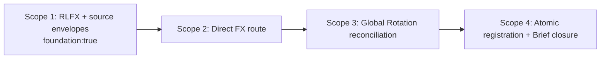

<!-- markdownlint-disable MD024 -->

# Scopes: FX Regime And Relative-Value Lab

Links: [spec.md](spec.md) | [design.md](design.md) | [report.md](report.md) | [uservalidation.md](uservalidation.md) | [scenario-manifest.json](scenario-manifest.json) | [test-plan.json](test-plan.json)

## Execution Outline

### Phase Order

1. **Scope 1 - Reusable RLFX and source-envelope foundation.** Build the pure browser/Node currency contract plus the additive `RLDATA` series-envelope boundary, exact-date math, cohort and rights rules, deterministic owner projections, controlled same-origin fixtures, and direct production-module contract tests.
2. **Scope 2 - Production FX route and truthful public runtime.** Add the direct Simple/Power route, cache-first hydration, bounded controls, real charts and accessible tables, and owner-read publication over the Scope 1 foundation. Public v1 renders source-contract unavailable states because no numeric source adapter is currently authorized. Registration is intentionally not changed in this scope.
3. **Scope 3 - Global Rotation return reconciliation.** Remove additive raw-FX scoring, migrate the persisted control shape, calculate distinct USD-leadership and optional local/translation products on their own exact dates and clocks, and publish the expanded Global owner read.
4. **Scope 4 - Atomic registration, Market Brief relationship, and publication closure.** Register the FX route together with registry-derived Brief coverage and note consumers, classify current owner facts in `rlbrief.js`, reject stale or unavailable synthesis and any third composite, and run the complete cross-tool regression and governance chain.

The scopes execute strictly in numeric order. Scope 1 is tagged `foundation:true`; every concrete consumer depends on it, satisfying G094. Registration and every registry-derived consumer are one Scope 4 transaction, so Scope 2 does not leave Market Brief or note coverage stale. Each scope has one primary outcome and an executable checkpoint before the next scope begins.

### New Types And Signatures

- `globalThis.RLFX` and CommonJS `module.exports`: one frozen API from identical `rlfx.js` bytes.
- `RLDATA.barSeries(symbol, interval, sourcePolicy, decisionTime) -> BarSeriesEnvelopeV1`
- `RLDATA.putBarSeries(symbol, interval, rows, seriesMeta) -> void`
- `RLDATA.ensureBarSeries(symbol, interval, sourcePolicy, decisionTime) -> Promise<BarSeriesEnvelopeV1>`
- `validateUniverse(value) -> ValidationResult<FxUniverseV1>`
- `normalizeSourceEnvelope(value, policy, decisionTime) -> BarSeriesEnvelopeV1`
- `normalizeObservation(value) -> CurrencyObservationV1 | ValidationError`
- `normalizeCarryRead(value, decisionTime) -> CarryReadV1 | ValidationError`
- `normalizeDailySeries(rows, leg) -> NormalizedDailySeries`
- `orientSeries(rows, sourceOrientation, requestedOrientation) -> OrientedSeries | Unavailable`
- `alignExact(legs, horizonSessions) -> ObservationSetV1`
- `computeCurrencyStrength(input) -> CohortStrengthReadV1`
- `computePairRead(input) -> PairReadV1`
- `computeBroadDollar(input) -> BroadDollarReadV1`
- `computeCurrencyDecision(input) -> CurrencyDecisionReadV1`
- `computeGlobalRotation(input) -> GlobalRotationReadV1`
- `scoreCountryLeadership(input) -> EquityOnlyLeadershipScore`
- `projectFxToolRead(decision) -> ToolReadV1`
- `projectGlobalToolRead(result) -> ToolReadV1`
- `RLBRIEF.classifyFxGlobalRelationship(fxRead, globalRead, decisionTime) -> Agreement | Divergence | Insufficient Evidence`
- `fx-regime-universe.json`: closed `rlfx-universe/v1` currency, pair, source, and policy contract.
- `globalRotationLabState` schema version 2: keeps non-FX controls and excludes `fxWeight`.

### Validation Checkpoints

- **Scope 1 first red:** run CMD-FIRST-RED. Its assertion title is `RLFX CommonJS import preserves the existing global and explicit decisionTime is deterministic`; it directly requires production `rlfx.js`, installs a sentinel `globalThis.RLFX`, and compares two byte-identical complete inputs before any browser or adapter work.
- **After Scope 1:** that exact CommonJS assertion and the remaining named RLFX/RLDATA assertions run red then green in `node scripts/selftest.mjs`; controlled source-envelope cases execute production `rlfx.js` and `rldata.js`, while the real production route is reserved for truthful unavailable-state E2E; foundation and artifact guards pass for the plan-owned packet.
- **After Scope 2:** the exact FX page syntax/ID command and production-path Playwright suite at desktop and mobile prove truthful `RIGHTS_UNCLEAR`, `NO_SOURCE`, `ACCESS_REQUIRED`, and Indeterminate states without fixture injection, request interception, or an inaccessible external dependency.
- **After Scope 3:** controlled production-module cases prove formulas and distinct two-leg/three-leg clocks, while the real Global route proves it never fabricates decomposition or score input when public FX evidence is unavailable. The stale-consumer scan is clean before Brief integration begins.
- **After Scope 4:** route registration, registry-derived Brief coverage, notes, validator, and relationship renderer land together. Exact page checks, all named browser/provider/Bond/Causal canaries, collision preservation, artifact/trace/reality/freshness/foundation/state guards, and installed Bubbles CLI checks form the completion boundary.

## Planning Baseline And Constraints

- **Design-recorded baseline:** `node scripts/selftest.mjs` previously reported 345 passed and 0 failed. This planning run does not treat that prior output as current execution evidence.
- **Current planning observation:** `node scripts/selftest.mjs` reported 344 passed and 1 failed on 2026-07-14. The sole failure is the pre-existing shared Market Brief payload omission of registered `bond-regime-lab`, already recorded by spec 003; Feature 004 must preserve the assertion and cannot claim a green repository baseline until the owning work resolves it.
- **Protected canaries:** `BASE-SEC-01`, `BASE-SEC-02`, `BASE-SEC-03`, and `BASE-BRIEF-01` remain unchanged assertions. A recurrence is a discovered issue routed to the named owning artifact; no scope may weaken, remove, or relabel the assertion.
- **Baseline disposition:** the 344/1 result is an open foreign-owned failure, not Feature 004 success evidence. Focused Feature 004 red/green work may execute, but no scope may be marked Done and no full-delivery completion may be claimed while `BASE-BRIEF-01` remains red. Its expected Bond coverage is unchanged.
- **Dirty-tree discipline:** [report.md](report.md#dirty-tree-collision-baseline-grill-004-09) records the 2026-07-14T16:43:33Z non-secret worktree/index identities and pre-existing hunk-body hashes for every already-dirty shared path in this plan. Before the first edit to each path, implementation must prove the recorded hash still matches or append a fresh just-in-time checkpoint; after the edit, every recorded hunk body must remain byte-identical as a distinct diff hunk. No stash, reset, checkout, clean, broad formatting, staging, committing, generated-data refresh, or shell-authored baseline file is allowed.
- **F004-COLLISION-001 reviewed supersession:** the original `feature004-dirty-baseline-v1` report block remains immutable history. One additive `feature004-dirty-supersession-v1` checkpoint may supersede only the following four original `rldata.js` hunk hashes: `e8864cffc8ed788d0c462d63967bb0cf8c3cf0187b42c2a56fb1fec122e439b6`, `685fef4c9a52fe92c9aeb613b0c8f145681ef5dbc15dcb3d81ca17eca913283c`, `11621f8ac37c1e4d65a59b0578af9e475c201fc9d5b1beb8771760dcdbfa5908`, and `a37cdc31bec1b491768bf7376067665d15596fec966309203b515ffc73880f43`. BUG-001 intentionally replaced those credential-owned hunks to enforce closure-private current-document credential memory, erase-only legacy cleanup, disabled unapproved providers, and no serialized, durable, or cross-document credential path; the review authority and evidence remain [BUG-001 spec](../_bugs/BUG-001-central-provider-credential-security/spec.md), [design](../_bugs/BUG-001-central-provider-credential-security/design.md), [scopes](../_bugs/BUG-001-central-provider-credential-security/scopes.md), and [report](../_bugs/BUG-001-central-provider-credential-security/report.md). The additive checkpoint must record the current `rldata.js` index OID, explicit unstaged status, complete current hunk-hash multiset, and current worktree SHA-256. Every other original tracked-path index identity and hunk hash, untracked-file prefix/hash contract, and volatile-path checkpoint rule remains unchanged.
- **Supersession guard semantics:** `tests/feature-004-dirty-tree-collision.test.mjs` must first prove that the original baseline block is byte-preserved, then parse the additive record as a closed exception for path `rldata.js` and exactly the four hashes above. It may remove those four hashes from the original required multiset only when the current index OID, unstaged state, complete current hunk multiset, worktree SHA-256, BUG-001 rationale, and evidence references match the reviewed checkpoint. It must still require every non-superseded original hash and every other baseline contract, compare the complete current `rldata.js` multiset rather than a subset, reject duplicate/unknown/path-mismatched supersessions, and fail closed on any future unreviewed loss or extra hunk. The persistent test-owned guard change is routed to `bubbles.test`; planning does not edit the test.
- **Supersession review history:** the first exact read-only capture in [report.md](report.md#reviewed-rldatajs-supersession-checkpoint-f004-collision-001) validated the four-hash `rldata.js` replacement and correctly kept two original `scripts/selftest.mjs` hashes plus three original `index.html` hashes fail-closed because that checkpoint did not review them.
- **Closed five-finding collision disposition (2026-07-15):** the additive [shared-path checkpoint](report.md#reviewed-shared-path-collision-disposition-checkpoint-f004-collision-001) accepts exactly `scripts/selftest.mjs` hashes `c412a7268a4ed3b6e9fe8aea49fd954e45ad2240d2c033daee9c2a0cc94961eb` and `ab27e89cd0dd8c6dd640254615a10d15a2be008596ec72834ca4512766c646fc`, plus `index.html` hashes `631ba96d2e0e396b1e49cd7a9b288b6ada1464d889c9ff7fd62a38fda75fcbd0`, `784e0fa7488dfea165fc6e4280cc93c2d1b4092582a8fbdf558d45a6712ee86b`, and `5e7199274d025114bfb9a1b9ae1d63fae602e3381506341c63ca8e89a5c003c1`. Original bytes were recovered by exact identity, every replacement is named to BUG-001 or marker-bounded Feature 005/006/007/009 work with executable evidence, Feature 008 owns no current byte, and both complete current path identities are frozen. RED owner evidence proves intent only and is not a feature-completion or test-pass claim.
- **Additive parser handoff:** `bubbles.test` must preserve both prior raw block hashes, parse exactly one closed-schema `feature004-dirty-collision-disposition-v1` block, accept only its five unique path/hash records after complete current-identity equality, validate the independent four-hash `rldata.js` checkpoint separately, and reject every duplicate, unknown, path-mismatched, ownerless, evidence-less, incomplete, identity-mismatched, added, removed, or reordered record or hunk. No skip, subset comparison, fallback, broad path exemption, or success-on-unknown branch is permitted.
- **F004-IDENTITY-DRIFT-001 additive delta handoff:** the post-checkpoint change is limited to `scripts/selftest.mjs` current identity and ordered hunk 7, from `0f9739b064bc90a02c3baf5a1014442b8f566ad9f88dd3528c1103a462c55e1b` to `ba4b911411a53fe83c6d9c99cce505f28b9cb0d38c88eae22eabb578f59e7c80`. The owning bytes are the Feature 006 Scope 3 M13-M18 consumers inside the inclusive start marker `/* ---------- Feature 006: Trend Dynamics deterministic capability foundation ---------- */` and exclusive end marker `/* ---------- Feature 007: Technical Analysis Decision foundation ---------- */`; Feature 006 remains Scope 3 / implement / In Progress. The additive report contract `feature004-dirty-collision-delta-v1` must extend the exact raw SHA-256 of `feature004-dirty-collision-disposition-v1`, freeze the complete current path identity, preserve every other current path and every baseline/supersession obligation, and reject any subsequent identity or ordered-hunk drift. `bubbles.test` must parse exactly one delta block, require its closed field sets and exact one-path/one-transition cardinality, validate marker uniqueness/order and owner/tool-log references, then overlay only the named hunk-7 transition before recomputing the complete identity. The current `node scripts/selftest.mjs` result remains 491 passed / 1 failed solely on Market Brief `nextSession.sessionDate`; it is neither Feature 006 success nor Feature 004 completion, and CMD-COLLISION remains intentionally red until the test owner implements this parser contract.
- **F004-POSTCHECKPOINT-DRIFT-001 final settled-owner handoff:** preserve the existing `feature004-dirty-collision-delta-v1` block byte-for-byte as superseded-current-identity history and append exactly one closed-schema `feature004-dirty-collision-settled-delta-v1` report block that extends its marker-inclusive, no-trailing-newline raw SHA-256 `334cae6ba3d95ad3837971ee3a402a68ffb46df23f490a31104d94cd73ea0e4b`. The only accepted overlay is `scripts/selftest.mjs`, ordered hunk 7, from captured hash `ba4b911411a53fe83c6d9c99cce505f28b9cb0d38c88eae22eabb578f59e7c80` to settled trimmed-body hash `15ff8c7662995bbc7e977c2ea57bb95c5ac64d494a43f4bdc1d64ee81e42f943`; hunks 1-6 and every inherited baseline, independent `rldata.js`, five-hash disposition, current-index, and non-target-path identity remain exact. Require status `" M"`, `staged:false`, `unstaged:true`, index OID `03a285cfa21b2f2e1b22b539ac0452094029c110`, worktree Git OID `484706d2f819971c298fd3dcef19e34915c4f052`, worktree SHA-256 `f47e86bc746eddad82892844aacde100ff8f82d6e29e4d0a4df6a68ed0bb53c8`, seven ordered hunks, and the unique Feature 006 marker slice at byte range `[117426,159494)` with SHA-256 `2959603e818bc2494baa51be85edcd71343657facdc660b0dc66bcfacb43ddef` and its exact 65-symbol inventory. Bind the overlay to Feature 006 `state.json`'s Scope 3 implement history entry finished at `2026-07-15T22:48:39Z`, outcome `route_required`, nine addressed findings, evidence ref `report.md#scope-3-season-cycle-context-and-association-engine`, that report section, and the matching `feature006-scope3-implement-current` tool-log records. The exact aggregate selftest remains 491 passed / 1 failed solely on Market Brief `nextSession.sessionDate must match snapshot.nextSessionDate`; classify it as unrelated and unresolved and make no Feature 006 or Feature 004 pass, Done, completion, or certification claim. `bubbles.test` must reject a missing or duplicate settled block, any unknown/missing/reordered field or record, any changed inherited identity, any future hunk or marker drift, and any attempt to treat the prior delta identity or the unrelated aggregate failure as current acceptance. CMD-COLLISION remains intentionally red until that exact parser overlay is implemented and executed by the test owner.
- **F004-CURRENT-SCRIPT-IDENTITY-003 owner-settled successor history (2026-07-17):** preserve the additive [two-path checkpoint](report.md#current-script-identity-transition-checkpoint---f004-current-script-identity-002) and the later validator-only superseded note byte-for-byte as history. Feature 010 Scope 01 `bubbles.implement` returned the marker-bounded v1 identity: status `" M"`, `staged:false`, `unstaged:true`, index OID `484706d2f819971c298fd3dcef19e34915c4f052`, worktree Git OID `f1f5d4c604efd6a46b4183408fd397202e650b6f`, worktree SHA-256 `25ae7940719ca58dadae2a82b3ac323258d55f0a91b09589eb603a9b0c329a1b`, one hunk with trimmed-body SHA-256 `9af6f8a57dcd3041b2b67711cebdb2b373f72a134d8b480f773b69e38fec3bd0`, and marker slice `[183893,191742)` with SHA-256 `29598851a8c881ac3d9d311a4dbad152cdd5391fe473b689ec4812f4a66614c3`. The v1 parser and direct canary were accepted by `bubbles.test` at 3/3 before the newer v2 identity transition. No v1 result establishes Feature 010, Feature 004, BUG-003, or BUG-002 completion.
- **TR-BUG-003-F004-PLAN historical ownership boundary:** BUG-003 DoD parity, the validator transition, and the v1 owner-settled checkpoint were planning-complete; `TR-BUG-003-F004-PLAN` and its test replay are resolved in current BUG-003 state. The v2 transition does not reopen BUG-003 or infer acceptance; it preserves that history and creates a new test-owned parser obligation only for the current identity. No allowlist, default, path exemption, subset comparison, or weakened identity comparison is permitted.
- **Concurrent config rule:** `market-brief.config.json` was clean at the recorded observation but is explicitly volatile because a concurrent mutation was reported. This plan claims no stable dirty baseline for it. Scope 4 must capture and record a fresh status/hash/hunk checkpoint immediately before any edit and stop on an unreviewed collision.
- **Browser authenticity:** controlled same-origin inputs against production `rlfx.js`, `rldata.js`, or `rlbrief.js` are browser functional tests, never E2E. E2E uses a real ephemeral same-origin HTTP server and the actual production route/config/data posture with no fixture replacement or request interception. `page.route`, `context.route`, request fulfillment, response interception, and file-parse proxies cannot satisfy an E2E row.
- **Public-v1 source truth:** no active official-dollar, policy-rate/carry, REER, positioning, or event adapter is authorized by the current design, and existing Yahoo-derived rows/proxies are not presumed authorized. Production-route E2E asserts exact unavailable states and absence of numeric values; controlled foundation cases prove available-state algorithms without pretending those sources are live.
- **Module authenticity:** Node and browser tests import or load the actual production `rlfx.js`; copied formulas and extraction of functions from HTML are prohibited.
- **Red/green rule:** each behavior slice first adds or activates the named focused assertion and records its failure, then implements the smallest owning change and reruns the exact same assertion green before broader commands.
- **Project config:** `.github/bubbles-project.yaml` declares neither `testImpact` nor `traceContracts`; G079/G080 add no project-specific rows. Their absence does not reduce scenario E2E, canary, or completion requirements.
- **F004-CURRENT-IDENTITY-RECONCILIATION (fail closed):** active planning accepts exactly one `feature004-dirty-collision-selftest-successor-v3` block, raw SHA-256 `8427a99ae9cadd27e401a7a06bd2f0e707e3c5096508c4e7fe903db67f8f1995`, extending mandatory byte-identical v2 block SHA-256 `eef8aa415b739df80b1aab4046adbb64a39c87c6fb1b73ff0ac210b67870f32a`. It preserves current HEAD/index OID `44be5ac34526a076050ddf69e92cb32ffc443831`, worktree Git OID `660eb298ff2a417064e514da5db8f95c2e85b87d`, worktree SHA-256 `519ec91a3531c7e8375860392f23d0672f6fe2babd09643a834a681260fbd96b`, six ordered hunks, the Feature 005 slice `[104099,108231)`, unchanged Feature 006 slice `[108232,150300)`, closed 13-path matrix, validator prefix, and volatile-config rule. V2 remains a mandatory parser input; any path, identity, hunk, marker, producer, owner state, prefix, commit, status, or staging drift fails closed.
- **TR-BUG-002-F004-PLAN-03 strict correction boundary:** preserve v2 and every predecessor byte-for-byte, validate v2 first, then consume the single v3 correction above. The parser must distinguish hunk-header context from changed-body bytes and committed producers from unknown current deletion authors; attribute only hunks 3-5 to Feature 005; retain hunks 1-2 and 6 as foreign-protected identity records with no inferred author or semantic approval; and keep every Feature 004, Feature 005, Feature 006, Feature 010, Feature 011 current-deletion, BUG-002, and BUG-003 pass, completion, acceptance, and certification inference false as applicable. `bubbles.implement` owns `TR-BUG-002-IMPLEMENT-DIAGNOSTICS-01` next; `bubbles.test` owns v3 adoption, the direct canary, and unchanged BUG-002 replay after that diagnostic.

### Active V3 Collision Handoff Correction

- `feature004-dirty-collision-selftest-successor-v2` remains mandatory immutable history with raw SHA-256 `eef8aa415b739df80b1aab4046adbb64a39c87c6fb1b73ff0ac210b67870f32a`. Active planning requires exactly one additive `feature004-dirty-collision-selftest-successor-v3` block with raw SHA-256 `8427a99ae9cadd27e401a7a06bd2f0e707e3c5096508c4e7fe903db67f8f1995`, extending that exact v2 hash. V3 supersedes v2 only as the active provenance interpretation and parser target; v2 and every predecessor remain byte-preserved and parser-validated.
- V3 preserves HEAD/index OID `44be5ac34526a076050ddf69e92cb32ffc443831`, worktree Git OID `660eb298ff2a417064e514da5db8f95c2e85b87d`, worktree SHA-256 `519ec91a3531c7e8375860392f23d0672f6fe2babd09643a834a681260fbd96b`, byte length `187207`, line-chunk count `1834`, six ordered hunk hashes, Feature 005 slice `[104099,108231)` with SHA-256 `84a6f11c4ba1ab0812187feeaf0bf8ac57f85beb23b1762ec9d55f82a9b77121`, and Feature 006 slice `[108232,150300)` with SHA-256 `2959603e818bc2494baa51be85edcd71343657facdc660b0dc66bcfacb43ddef`.
- `F005-IDENTITY-HUNK1-PRODUCER-CORRECTION`: hunk 1's `validateBriefPayload` import is retained header context from commit `943972e295b8fa93a19795e46015e5ae780b0350`; the actual deleted body line is `import { buildCompanyFundamentalsOwnerRead } from './brief-refresh.mjs';`, introduced by Feature 010 Scope 6 commit `a93076912aa1df17ca1e41ea929d37f1b8f40d51` (`feat(010): Feature 002 consume-once owner-read + registry discoverability (Increment B / Scope 6)`). Its current deletion author remains unknown and its disposition is only `foreign-protected-current-deletion-identity-only`; no approval, acceptance, completion, or certification follows. Hunk 2 remains committed Feature 011 content with unknown current deletion author, hunks 3-5 remain Feature 005 marker-bounded current hunks, and hunk 6 remains committed Feature 010 Scopes 2-7 content with unknown current deletion author.
- Every pass, completion, acceptance, and certification claim remains false for Feature 004, Feature 005, Feature 006, Feature 010, Feature 011, BUG-002, and BUG-003 as applicable. Feature 005 Scope 2 remains nonterminal under its existing semantic-fidelity route.
- Parser adoption is blocked by pending `TR-BUG-002-IMPLEMENT-DIAGNOSTICS-01`: `bubbles.implement` repairs wrapper diagnostics first, then `bubbles.test` adopts v3, executes the direct collision canary, and independently replays unchanged BUG-002 verification. Planning does not relabel the Feature 005 owner receipt's 491/0 selftest execution as planning evidence.

## Canonical Commands

Command IDs below are plan references only. The command text is verbatim repository command truth; implementation and test evidence must record the expanded command, not only the ID.

| ID | Exact Command | Purpose |
| --- | --- | --- |
| CMD-FIRST-RED | `node -e 'const assert=require("node:assert/strict");const input=require("./tests/fixtures/fx-regime/commonjs-determinism-input.json");const sentinel=Object.freeze({owner:"preexisting-global"});globalThis.RLFX=sentinel;delete require.cache[require.resolve("./rlfx.js")];const RLFX=require("./rlfx.js");assert.strictEqual(globalThis.RLFX,sentinel);const first=RLFX.computeCurrencyDecision(structuredClone(input));const second=RLFX.computeCurrencyDecision(structuredClone(input));assert.equal(first.computedAt,input.decisionTime);assert.equal(second.computedAt,input.decisionTime);assert.equal(RLFX.canonicalize(first),RLFX.canonicalize(second));assert.equal(first.decisionId,second.decisionId);console.log("PASS RLFX CommonJS import preserves the existing global and explicit decisionTime is deterministic")'` | Scope 1 cheapest first red against production `rlfx.js`; independent of the 344/1 broad baseline |
| CMD-SELFTEST | `node scripts/selftest.mjs` | Production helper, registry, owner-read, and protected model assertions |
| CMD-PAGE-FX | `PAGE=fx-regime-relative-value-lab.html node -e 'const fs=require("node:fs");const p=process.env.PAGE;if(!p)throw new Error("PAGE is required");const h=fs.readFileSync(p,"utf8");const scripts=[...h.matchAll(/<script(?![^>]*\bsrc=)[^>]*>([\s\S]*?)<\/script>/gi)].map(m=>m[1]).filter(s=>s.trim());if(!scripts.length)throw new Error("no inline script: "+p);scripts.forEach((s,i)=>{try{new Function(s)}catch(e){throw new Error("inline script "+(i+1)+": "+e.message)}});const ids=new Set([...h.matchAll(/\bid=["\x27]([^"\x27]+)["\x27]/g)].map(m=>m[1]));const refs=scripts.flatMap(s=>[...s.matchAll(/getElementById\(\s*["\x27]([^"\x27]+)["\x27]\s*\)/g)].map(m=>m[1]));const missing=[...new Set(refs.filter(id=>!ids.has(id)))];if(missing.length)throw new Error("missing ids: "+missing.join(", "));console.log("OK page="+p+" inline="+scripts.length+" refs="+refs.length)'` | Exact FX inline-script and literal-ID integrity |
| CMD-PAGE-GLOBAL | `PAGE=global-rotation-lab.html node -e 'const fs=require("node:fs");const p=process.env.PAGE;if(!p)throw new Error("PAGE is required");const h=fs.readFileSync(p,"utf8");const scripts=[...h.matchAll(/<script(?![^>]*\bsrc=)[^>]*>([\s\S]*?)<\/script>/gi)].map(m=>m[1]).filter(s=>s.trim());if(!scripts.length)throw new Error("no inline script: "+p);scripts.forEach((s,i)=>{try{new Function(s)}catch(e){throw new Error("inline script "+(i+1)+": "+e.message)}});const ids=new Set([...h.matchAll(/\bid=["\x27]([^"\x27]+)["\x27]/g)].map(m=>m[1]));const refs=scripts.flatMap(s=>[...s.matchAll(/getElementById\(\s*["\x27]([^"\x27]+)["\x27]\s*\)/g)].map(m=>m[1]));const missing=[...new Set(refs.filter(id=>!ids.has(id)))];if(missing.length)throw new Error("missing ids: "+missing.join(", "));console.log("OK page="+p+" inline="+scripts.length+" refs="+refs.length)'` | Exact Global Rotation inline-script and literal-ID integrity |
| CMD-PAGE-BRIEF | `PAGE=market-brief.html node -e 'const fs=require("node:fs");const p=process.env.PAGE;if(!p)throw new Error("PAGE is required");const h=fs.readFileSync(p,"utf8");const scripts=[...h.matchAll(/<script(?![^>]*\bsrc=)[^>]*>([\s\S]*?)<\/script>/gi)].map(m=>m[1]).filter(s=>s.trim());if(!scripts.length)throw new Error("no inline script: "+p);scripts.forEach((s,i)=>{try{new Function(s)}catch(e){throw new Error("inline script "+(i+1)+": "+e.message)}});const ids=new Set([...h.matchAll(/\bid=["\x27]([^"\x27]+)["\x27]/g)].map(m=>m[1]));const refs=scripts.flatMap(s=>[...s.matchAll(/getElementById\(\s*["\x27]([^"\x27]+)["\x27]\s*\)/g)].map(m=>m[1]));const missing=[...new Set(refs.filter(id=>!ids.has(id)))];if(missing.length)throw new Error("missing ids: "+missing.join(", "));console.log("OK page="+p+" inline="+scripts.length+" refs="+refs.length)'` | Exact Market Brief inline-script and literal-ID integrity |
| CMD-BRIEF-VALIDATE | `node scripts/validate-brief-payload.mjs` | Committed Brief owner-read and relationship contract |
| CMD-CAUSAL-VALIDATE | `node scripts/validate-causal-rotation.mjs` | Protected causal validator |
| CMD-E2E-FX | `npx --no-install playwright test tests/fx-regime-relative-value-lab.spec.mjs --reporter=list` | Feature 004 real-browser regressions |
| CMD-BROWSER-FUNCTIONAL | `npx --no-install playwright test tests/fx-regime-relative-value-lab.spec.mjs --grep "Browser functional" --reporter=list` | Controlled same-origin inputs through real production modules; not E2E |
| CMD-E2E-PROVIDER | `npx --no-install playwright test tests/provider-credentials.spec.mjs --reporter=list` | Provider credential browser canary |
| CMD-E2E-BOND | `npx --no-install playwright test tests/bond-regime-lab.spec.mjs --reporter=list` | Bond Regime browser canary |
| CMD-E2E-CAUSAL | `npx --no-install playwright test tests/causal-rotation-lab.spec.mjs --reporter=list` | Causal Rotation browser canary |
| CMD-PROVIDER-UNIT | `node --test tests/provider-credentials.unit.mjs` | Provider credential unit canary |
| CMD-PROVIDER-FUNCTIONAL | `node --test tests/provider-credentials.functional.mjs` | Provider credential functional canary |
| CMD-PROVIDER-STRESS | `node tests/provider-credentials.stress.mjs` | Provider credential stress canary |
| CMD-PROVIDER-LOAD | `node tests/provider-credentials.load.mjs` | Provider credential load canary |
| CMD-COLLISION | `node --test tests/feature-004-dirty-tree-collision.test.mjs` | Read-only validation of every immutable predecessor including mandatory raw-hash-validated v2 plus active `feature004-dirty-collision-selftest-successor-v3`, exact committed-producer and unknown-current-deletion distinctions across six ordered worktree hunks, Feature 005/011/010 boundaries, unchanged Feature 006 marker/symbol contract, complete 13-path identities, false completion claims, and the conditional just-in-time config checkpoint; expected red until `bubbles.test` adopts v3 after `TR-BUG-002-IMPLEMENT-DIAGNOSTICS-01` closes |
| CMD-ARTIFACT | `bash .github/bubbles/scripts/artifact-lint.sh specs/004-fx-regime-relative-value-lab 'SCN-004-[0-9]{3}'` | Plan and evidence artifact shape |
| CMD-TRACE | `bash .github/bubbles/scripts/traceability-guard.sh specs/004-fx-regime-relative-value-lab` | Scenario to Test Plan to concrete test to evidence linkage |
| CMD-REALITY | `bash .github/bubbles/scripts/implementation-reality-scan.sh specs/004-fx-regime-relative-value-lab --verbose` | No stubs, copied model paths, fake integration, defaults, or fallbacks |
| CMD-FRESHNESS | `bash .github/bubbles/scripts/artifact-freshness-guard.sh specs/004-fx-regime-relative-value-lab` | One active planning truth |
| CMD-FOUNDATION | `bash .github/bubbles/scripts/capability-foundation-guard.sh specs/004-fx-regime-relative-value-lab` | G094 foundation and overlay ordering |
| CMD-STATE | `bash .github/bubbles/scripts/state-transition-guard.sh specs/004-fx-regime-relative-value-lab` | Full completion gate; nonterminal planning state is preserved until execution evidence exists |
| CMD-DOCTOR | `bash .github/bubbles/scripts/cli.sh doctor` | Installed framework health |
| CMD-FRAMEWORK-WRITE | `bash .github/bubbles/scripts/cli.sh framework-write-guard` | Downstream framework immutability |
| CMD-READINESS | `bash .github/bubbles/scripts/cli.sh repo-readiness .` | Advisory repository command and instruction posture |
| CMD-GLOBAL-CONSUMERS | `git grep -n -E -e 'globalFxConfirm' -e 'fxWeight' -e 'fx\\.score' -e 'currencyProxy' -e 'fxInverse' -- global-rotation-lab.html global-rotation-universe.json scripts/brief-refresh.mjs scripts/selftest.mjs notes/global-rotation-lab.md; exit_code=$?; echo "global_consumer_trace_exit=$exit_code"; [[ "$exit_code" -eq 1 ]]` | G043 stale Global FX-scoring/orientation consumer scan |
| CMD-BRIEF-COMPOSITE | `git grep -n -E -e 'compositeScore' -e 'mergedScore' -e 'fxCountryScore' -- market-brief.html rlbrief.js scripts/brief-refresh.mjs scripts/validate-brief-payload.mjs; exit_code=$?; echo "brief_composite_trace_exit=$exit_code"; [[ "$exit_code" -eq 1 ]]` | Prove no third FX/country composite exists |

## Scope Summary

| # | Scope | Surfaces | Primary Tests | DoD Summary | Status |
| --- | --- | --- | --- | --- | --- |
| 1 | Reusable RLFX and source-envelope foundation | `rlfx.js`, additive `rldata.js` hunks, FX universe, controlled fixtures, selftest | Direct CommonJS unit, Node/browser functional, provider/Bond/Causal canaries | Closed contracts, explicit time, source clocks/rights, cohort-wide dates, typed carry | In Progress |
| 2 | Production FX route and truthful public runtime | FX HTML and feature E2E only | Page check and actual-route desktop/mobile E2E | Full Simple/Power shell, exact unavailable states, zero control fetch, a11y and owner read | Not Started |
| 3 | Global Rotation exact-date reconciliation | Global HTML/universe, Global headless owner-read hunk, selftest, feature E2E | Controlled formula tests, truthful route E2E, consumer scan | Equity-only rank, distinct USD/decomposition products and clocks, missing-FX survival | Not Started |
| 4 | Atomic registration, Brief relationship, and publication closure | Registry trio, Brief renderer/config/headless/validator, owner notes and registry docs | Brief validator, actual-route E2E, complete protected canary and governance chain | Registry consumers close together, RLBRIEF-owned synthesis, no third composite | Not Started |

## Scope 1: Reusable RLFX And Source-Envelope Foundation

**Scope ID:** SCOPE-01  
**Status:** In Progress  
**Depends On:** None  
**Scope-Kind:** contract-only  
**Tags:** foundation:true  
**Priority:** P0

### Outcome

One pure `rlfx.js`, one closed `fx-regime-universe.json`, and additive source-envelope methods in `rldata.js` provide the only currency semantics, math, rights, and source-clock boundary used by browser and Node consumers. Direct production-module and independent legacy-consumer canaries prove the contract before any overlay is wired.

### Change Boundary

**Allowed file families:**

- New `rlfx.js` and `fx-regime-universe.json` in full.
- `rldata.js` only for additive `barSeries`, `putBarSeries`, `ensureBarSeries`, optional bucket `seriesMeta`, and the versioned `putToolRead` preservation branch. Existing root schema, rows, retrieval timestamps, provider tags, credential behavior, and legacy APIs remain unchanged.
- New controlled inputs under `tests/fixtures/fx-regime/**`; every file is owned by a named SCN-004 functional test and reaches the real production module through ordinary same-origin GETs.
- New `tests/fx-regime-relative-value-lab.spec.mjs` only for `Browser functional ...` Scope 1 module-contract blocks. The suite reuses `startStaticServer()` from `tests/provider-credentials.support.mjs`, loads production `/rlfx.js` and `/rldata.js`, and never labels controlled input as E2E.
- New `tests/feature-004-dirty-tree-collision.test.mjs`, a read-only Node test that parses the report baseline and validates index identities, preserved hunk hashes, the untracked validator prefix, and a just-in-time config record whenever `market-brief.config.json` differs from its planning observation.
- `scripts/selftest.mjs` only inside one additive `Feature 004 RLFX/RLDATA foundation` assertion block and its direct production-module imports.
- `scripts/fetch-bars.mjs` only the additive validated `fx-regime-universe.json` symbol-inventory hunk; no fetch or snapshot semantics change.

**Excluded file families:** the FX route, all route registries and notes, `.github/bubbles/**`, specs 001-003, all Bond/Causal pages and fixtures, `rlapp.js`, `rlchart.js`, `rlticker.js`, Global Rotation product files, Brief product files, unrelated pages/universes/notes, committed market data, payload/history/snapshot files, screenshots, and `test-results/**`.

### Implementation Files

- `rlfx.js`
- `fx-regime-universe.json`
- `rldata.js`
- `scripts/fetch-bars.mjs`

**Shared-file hunk rule:** before editing `rldata.js`, `scripts/selftest.mjs`, or `scripts/fetch-bars.mjs`, the corresponding report baseline must match. Existing recorded hunk bodies, assertions, and execution order are immutable. Additive Feature 004 blocks may not merge with, reorder, or weaken provider, Bond, Causal, registry, or Brief work.

### Gherkin Scenarios

#### SCN-004-001 (BS-001): Separate broad-dollar cohorts

```gherkin
Scenario: SCN-004-001 - Separate broad-dollar cohorts
Given fresh Broad, AFE, and EME observations with independent source clocks
When RLFX computes the broad-dollar regime
Then each series retains its own state and as-of
And concentration is named without one series standing in for all three
```

#### SCN-004-002 (BS-002): Preserve official/proxy divergence

```gherkin
Scenario: SCN-004-002 - Preserve official/proxy divergence
Given an official dollar series weakens while an approved proxy strengthens
When RLFX computes the selected dollar read
Then it emits OFFICIAL_PROXY_DIVERGENCE
And it does not average the opposing states into neutral
```

#### SCN-004-003 (BS-003): One USD pair cannot fake broad strength

```gherkin
Scenario: SCN-004-003 - One USD pair cannot fake broad strength
Given EURUSD rises while EUR falls against at least three other unique eligible G10 peers on one cohort-wide exact-date window
When RLFX ranks EUR within G10
Then EUR is not Strong solely because EURUSD rose
And selected-pair momentum remains separate from independent strength
And no pair-specific date window may enter the cohort rank
```

#### SCN-004-004 (BS-004): Orientation and inverse deduplication

```gherkin
Scenario: SCN-004-004 - Orientation and inverse deduplication
Given direct and inverse sources describe the same pair relationship
When RLFX verifies orientation and computes canonical returns
Then both orientations produce the same economic return exactly once
And unverified orientation is unavailable with INVALID_ORIENTATION
```

#### SCN-004-005 (BS-005): Exact dates exclude unmatched newest observations

```gherkin
Scenario: SCN-004-005 - Exact dates exclude unmatched newest observations
Given one required leg has newer dates than another and each pair can have a different individual window
When RLFX aligns a multi-leg calculation
Then only exact common dates enter arithmetic
And unmatched newer dates are reported without forward fill
And a cohort rank uses one full eligible-relationship intersection rather than pair-specific windows
```

#### SCN-004-006 (BS-006): Cohort rankings never pool

```gherkin
Scenario: SCN-004-006 - Cohort rankings never pool
Given valid G10 and liquid-EM observations
When RLFX ranks currencies and selects automatic pairs
Then each cohort has an independent rank and coverage set
And no automatic pair crosses cohorts
```

#### SCN-004-007 (BS-007): Managed low volatility cannot improve rank

```gherkin
Scenario: SCN-004-007 - Managed low volatility cannot improve rank
Given a managed or pegged currency has low realized volatility
When RLFX evaluates rank and pair eligibility
Then the currency remains reference-only with management limitations
And low volatility does not create a favorable risk rank or automatic candidate
```

#### SCN-004-008 (BS-008): Insufficient peer coverage remains unranked

```gherkin
Scenario: SCN-004-008 - Insufficient peer coverage remains unranked
Given every eligible relationship has enough history on its own
But the full eligible cohort graph has fewer common exact dates than the configured horizon requires
When RLFX computes cohort strength
Then the entire cohort rank is Unavailable with one shared rankWindow and exact coverage reason
And no lagging relationship is dropped to recover a subset rank
And pair reads remain independently inspectable without becoming rank evidence
```

#### SCN-004-009 (BS-009): Momentum and carry conflict remains named

```gherkin
Scenario: SCN-004-009 - Momentum and carry conflict remains named
Given direct pair momentum and trend are positive while typed carry evidence is adverse
When RLFX builds the pair expression
Then momentum and carry remain separate evidence families
And the conflict lowers confidence without overwriting either family
```

#### SCN-004-010 (BS-010): Policy-rate proxy cannot become executable carry

```gherkin
Scenario: SCN-004-010 - Policy-rate proxy cannot become executable carry
Given policy rates exist and no authorized market-implied carry observation exists
When RLFX normalizes carry evidence
Then the available record is labeled Policy-rate proxy
And no executable, tradable, forward, roll, or transaction-cost claim is produced
```

#### SCN-004-011 (BS-011): Market-implied carry requires complete instrument lineage

```gherkin
Scenario: SCN-004-011 - Market-implied carry requires complete instrument lineage
Given each candidate market-implied CarryReadV1 omits exactly one required field in turn
When RLFX validates instrument id, venue and contract, tenor, basis, roll, liquidity, cost, rights, observed and retrieved clocks, freshUntil, and limitations
Then every incomplete market-implied branch is rejected
And a complete policy-rate-proxy branch projects exactly Policy-rate proxy with no market-implied subtype or value label
```

#### SCN-004-012 (BS-012): REER cannot time a tactical reversal

```gherkin
Scenario: SCN-004-012 - REER cannot time a tactical reversal
Given REER value is cheap and direct pair trend is negative
When RLFX computes the tactical pair state
Then value appears as long-horizon tension
And value alone cannot produce Candidate
```

#### SCN-004-013 (BS-013): Positioning preserves Tuesday and Friday clocks

```gherkin
Scenario: SCN-004-013 - Positioning preserves Tuesday and Friday clocks
Given a CFTC observation describes Tuesday positions and a Friday release
When RLFX normalizes positioning beside newer spot
Then both positioning clocks remain visible
And newer spot cannot make the positioning record current to the latest bar
```

#### SCN-004-014 (BS-014): Missing positioning is not uncrowded

```gherkin
Scenario: SCN-004-014 - Missing positioning is not uncrowded
Given the selected currency lacks mapped positioning coverage or authorized access
When RLFX evaluates crowding
Then positioning is unavailable with the exact reason
And the pair is not labeled balanced, light, or uncrowded
```

#### SCN-004-015 (BS-015): Carry unwind requires multiple evidence families

```gherkin
Scenario: SCN-004-015 - Carry unwind requires multiple evidence families
Given a higher-carry currency weakens
When RLFX evaluates carry-unwind state
Then Watch or Active requires the disclosed risk plus funding-strength or crowding conditions
And high carry alone remains insufficient
```

#### SCN-004-016 (BS-016): Missing events preserve market invalidation

```gherkin
Scenario: SCN-004-016 - Missing events preserve market invalidation
Given no approved event source covers the selected pair
When RLFX builds the pair decision
Then event evidence is unavailable with NO_SOURCE or NO_COVERAGE
And price- and risk-based invalidation remains present
```

#### SCN-004-024 (BS-024): Restricted values never enter public state

```gherkin
Scenario: SCN-004-024 - Restricted values never enter public state
Given a numeric source envelope is metadata-free, unreviewed, restricted, unknown-rights, or mismatched to its approved provider tag
When RLDATA and RLFX normalize, score, and project the observation at an explicit decisionTime
Then it becomes value-free RIGHTS_UNCLEAR with preserved source clocks where available
And no numeric value or restricted source URL enters cache metadata, owner reads, public DOM, or committed fixtures
```

### Implementation Plan

1. Add the exact UMD/CommonJS boundary and run CMD-FIRST-RED before any adapter work. `rlfx.js` remains pure, deeply frozen, and free of DOM, fetch, storage, provider, ambient-clock, and rendering code.
2. Add only the designed `rldata.js` methods and metadata fields. `barSeries` preserves the bucket provider/retrieval clock, derives observed time from accepted rows, evaluates the explicit source policy at the caller's `decisionTime`, and returns value-free `RIGHTS_UNCLEAR` for metadata-free or unapproved rows. The versioned `putToolRead` branch preserves supplied clocks; legacy reads remain unchanged.
3. Implement closed universe, source-envelope, observation, observation-set, decision, decomposition, tool-read, conflict, unavailable, and `CarryReadV1` schemas with strict unknown-key, version, source-policy, and finite-value rejection.
4. Implement orientation, relationship deduplication, derived lineage, exact intersections, one full-graph cohort rank window, pair-window isolation, unmatched-date diagnostics, and deterministic canonical identity.
5. Implement broad-dollar, strength, pair momentum/trend/risk, hedge priority, conflicts, typed carry, carry unwind, Global products, equity-only scoring, and owner projections. Cross-owner Agreement/Divergence is excluded and remains owned by Scope 4 `rlbrief.js`.
6. Add the bounded G10, liquid-EM, and managed/reference universe and required source/research policies. No embedded universe or presumed Yahoo authorization exists.
7. Add controlled committed inputs that force every adversarial branch. Node tests import production `rlfx.js`; browser functional tests load production `rlfx.js`/`rldata.js` over same-origin HTTP. Neither path is an E2E substitute.
8. Add only the validated FX-universe symbol inventory in `scripts/fetch-bars.mjs`; source clocks, snapshot rights, generated data, and acquisition behavior remain untouched.

### Shared Infrastructure Impact Sweep

`rldata.js` is a protected high-fan-out surface. Its downstream contracts are `bars`, `putBars`, `barInfo`, `ensureBars`, `toolRead`, unversioned `putToolRead`, `freshness`, `dataState`, `reportData`, root schema 1, provider credentials, request deduplication, and the listed Bond/ETF/Global/Intraday/Brief/Heatmap/Real Assets/Sector/Strategy/Swing consumers. Independent canaries must prove all of the following before Scope 2 pickup:

- schema-1 round trip and old metadata-free rows remain byte-identical/readable through `bars`;
- those same legacy rows are value-free `RIGHTS_UNCLEAR` through `barSeries`;
- approved `seriesMeta` round-trips without changing rows or re-stamping `retrievedAt`;
- versioned tool reads preserve caller clocks and unversioned reads retain legacy behavior;
- browser and headless envelopes match for identical policy, payload, and `decisionTime`;
- CommonJS import preserves a sentinel global and identical complete inputs produce identical canonical output, `computedAt`, and decision ID;
- provider credential unit, functional, browser, stress, and load suites preserve session-only secrets and URL/header rules;
- Bond and Causal browser suites plus the Causal validator preserve their existing assertions; and
- the full selftest retains `BASE-BRIEF-01` unchanged and cannot be called green while the 344/1 foreign baseline remains.

Rollback removes only the additive methods, optional metadata write, versioned-read branch, new module/universe/fixtures/tests, and isolated fetch-inventory hunk. Root schema 1 and every legacy API remain readable; no cache conversion, reset, restore, or user-data rewrite is allowed. The report collision baseline must prove every pre-existing dirty hunk survives before rollback or completion evidence is accepted.

### Test Plan

| ID | Scenario(s) | Test Type | Category | File / Exact Test Title | Command | Live System | Red/Green Focus |
| --- | --- | --- | --- | --- | --- | --- | --- |
| TP-01-01 | SCN-004-019 / NFR-001 | Unit | unit | production `./rlfx.js` / `RLFX CommonJS import preserves the existing global and explicit decisionTime is deterministic` | CMD-FIRST-RED | No | First red: missing module/API; green: sentinel unchanged and repeated complete input has identical canonical output, `computedAt`, and decision ID |
| TP-01-02 | SCN-004-017, SCN-004-024 | Functional | functional | `scripts/selftest.mjs` / `RLDATA source envelopes preserve approved rights and clocks and reject metadata-free rows` | CMD-SELFTEST | No | Real bucket `at`/`src` survive; unreviewed rows become value-free `RIGHTS_UNCLEAR` |
| TP-01-03 | Source compatibility | Functional | functional | `scripts/selftest.mjs` / `RLDATA schema-one bars and legacy tool reads remain compatible beside versioned envelopes` | CMD-SELFTEST | No | Legacy signatures/rows unchanged; versioned reads preserve supplied clocks without restamping |
| TP-01-04 | SCN-004-017, SCN-004-019, SCN-004-024 | Browser functional | functional | `tests/fx-regime-relative-value-lab.spec.mjs` / `Browser functional source envelopes match in browser and CommonJS for one decisionTime` | CMD-BROWSER-FUNCTIONAL | No | Controlled same-origin input reaches production modules; this is not route E2E |
| TP-01-05 | SCN-004-001, SCN-004-002 | Unit | unit | `scripts/selftest.mjs` / `RLFX broad dollar keeps Broad AFE EME and proxy states separate` | CMD-SELFTEST | No | Named official/proxy conflict with no averaging or slot substitution |
| TP-01-06 | SCN-004-003, SCN-004-005, SCN-004-008 | Unit | unit | `scripts/selftest.mjs` / `RLFX cohort rank requires one full-graph exact-date window` | CMD-SELFTEST | No | Every pair has history but graph intersection fails; whole rank unavailable and pair read remains inspectable |
| TP-01-07 | SCN-004-004 | Unit | unit | `scripts/selftest.mjs` / `RLFX orientation and inverse relationship contracts count one economic edge` | CMD-SELFTEST | No | Direct/inverse parity and `INVALID_ORIENTATION` without ticker inference |
| TP-01-08 | SCN-004-006, SCN-004-007 | Unit | unit | `scripts/selftest.mjs` / `RLFX cohort and managed-reference eligibility never pool or auto-elevate` | CMD-SELFTEST | No | Separate ranks/candidates and no managed low-vol uplift |
| TP-01-09 | SCN-004-009, SCN-004-010 | Functional | functional | `scripts/selftest.mjs` / `RLFX pair momentum and Policy-rate proxy remain distinct evidence` | CMD-SELFTEST | No | Adverse proxy remains named and cannot project executable or market-implied carry |
| TP-01-10 | SCN-004-011 | Unit | unit | `scripts/selftest.mjs` / `RLFX CarryReadV1 rejects every incomplete market-implied branch` | CMD-SELFTEST | No | One negative case each for instrument, venue/contract, tenor, basis, roll, liquidity, cost, rights, clocks, `freshUntil`, and limitations |
| TP-01-11 | SCN-004-012, SCN-004-013, SCN-004-014 | Functional | functional | `scripts/selftest.mjs` / `RLFX value and delayed positioning preserve semantics clocks and unavailable states` | CMD-SELFTEST | No | REER cannot time entry; Tuesday/Friday remain distinct; missing is not uncrowded |
| TP-01-12 | SCN-004-015, SCN-004-016 | Functional | functional | `scripts/selftest.mjs` / `RLFX carry unwind and event absence retain multi-family rules and market invalidation` | CMD-SELFTEST | No | High carry alone fails; no event source does not erase available price/risk invalidation |
| TP-01-13 | BASE-SEC-01 | Security unit canary | unit | `tests/provider-credentials.unit.mjs` / complete committed suite | CMD-PROVIDER-UNIT | No | Session-only credentials and durable non-secret cache behavior remain unchanged |
| TP-01-14 | BASE-SEC-01..03 | Security functional canary | functional | `tests/provider-credentials.functional.mjs` / complete committed suite | CMD-PROVIDER-FUNCTIONAL | No | Additive RLDATA methods gain no credential ownership or migration path |
| TP-01-15 | BASE-SEC-02, BASE-SEC-03 | Security E2E canary | e2e-ui | `tests/provider-credentials.spec.mjs` / complete committed suite | CMD-E2E-PROVIDER | Yes | Real registered routes retain storage-writer and URL/header protections |
| TP-01-16 | BASE-SEC-01..03 | Security stress canary | stress | `tests/provider-credentials.stress.mjs` / complete committed suite | CMD-PROVIDER-STRESS | No | Repeated envelope activity preserves session-only secret behavior |
| TP-01-17 | BASE-SEC-01..03 | Security load canary | load | `tests/provider-credentials.load.mjs` / complete committed suite | CMD-PROVIDER-LOAD | No | Concurrent/volume paths preserve credential and request contracts |
| TP-01-18 | BASE-BRIEF-01 | Cross-tool E2E canary | e2e-ui | `tests/bond-regime-lab.spec.mjs` / complete committed suite | CMD-E2E-BOND | Yes | RLDATA additions preserve Bond route/model behavior; no assertion changes |
| TP-01-19 | Causal baseline | Cross-tool E2E canary | e2e-ui | `tests/causal-rotation-lab.spec.mjs` / complete committed suite | CMD-E2E-CAUSAL | Yes | RLDATA additions preserve Causal browser behavior; no assertion changes |
| TP-01-20 | Causal baseline | Contract canary | functional | `scripts/validate-causal-rotation.mjs` / complete committed validator | CMD-CAUSAL-VALIDATE | No | Causal config/observation/ledger contracts remain unchanged |
| TP-01-21 | All Scope 1 + protected canaries | Full repository regression | functional | `scripts/selftest.mjs` / complete committed suite | CMD-SELFTEST | No | Must reach a genuinely green run without removing `BASE-BRIEF-01`; current 344/1 remains foreign-owned and open |
| TP-01-22 | GRILL-004-09 | Collision preservation | functional | `tests/feature-004-dirty-tree-collision.test.mjs` / `Feature 004 preserves every pre-existing dirty hunk` | CMD-COLLISION | No | Preserve all predecessor blocks byte-for-byte, require v2 by exact raw hash, parse exactly one v3 correction, recompute the exact six-hunk selftest identity and ordered 13-path matrix, distinguish retained header context from the Feature 010 Scope 6 deleted body line, enforce Feature 005/011/010 boundaries plus the unchanged Feature 006 slice and 65-symbol inventory, keep every applicable Feature 004/005/006/010/011/BUG-002/BUG-003 completion and certification claim false, and reject every unknown, missing, duplicate, reordered, staged, broadened, or byte-drifted state. |

### Definition of Done

Core implementation:

- [x] `rlfx.js` implements the complete frozen browser/CommonJS foundation with no DOM, network, storage, provider, rendering, copied formula, or HTML extraction path. **Evidence:** `report.md` Scope 1 Production Module And Selftest and Browser Functional sections; **Phase:** implement.
- [x] `fx-regime-universe.json` is bounded, versioned, closed, and complete for currency identity, cohort, pair orientation, source posture, rights, review windows, and required policy values. **Evidence:** `report.md` Scope 1 Production Module And Selftest; **Phase:** implement.
- [x] Additive `rldata.js` source envelopes and versioned tool reads preserve real source/retrieval clocks, fail closed on rights/provider mismatch, and leave every legacy API and schema-1 row contract unchanged. **Evidence:** `report.md` Scope 1 Production Module And Selftest and Provider And Cross-Tool Canaries; **Phase:** implement.
- [x] Exact-date, full-graph cohort rank, pair-window isolation, inverse-deduplication, typed carry, rights, finite-value, unavailable, and evidence-lineage invariants are enforced identically across browser and Node. **Evidence:** `report.md` Scope 1 Production Module And Selftest and supplemental Browser Functional output; **Phase:** implement.
- [x] `scripts/fetch-bars.mjs` changes only the validated FX-universe symbol inventory hunk and creates no generated data during validation. **Evidence:** `report.md` Scope 1 Implement Surface; **Phase:** implement.
- [ ] Independent canary and rollback/restore proof exists for every shared foundation consumer named in the Shared Infrastructure Impact Sweep.
- [ ] The report collision checkpoints preserve the immutable original record, accept only owner-proven replacements under complete current identities, and the Change Boundary contains zero unexplained excluded-file changes.
    > **Uncertainty Declaration**
    > **What was attempted:** Planning preserved every predecessor block, verified v2 at raw SHA-256 `eef8aa415b739df80b1aab4046adbb64a39c87c6fb1b73ff0ac210b67870f32a`, appended v3 at raw SHA-256 `8427a99ae9cadd27e401a7a06bd2f0e707e3c5096508c4e7fe903db67f8f1995`, and recomputed the stable six-hunk selftest identity.
    > **What was observed:** The current diff proves the v2/Feature 005 receipt's `validateBriefPayload` text is retained hunk-header context, while the actual deleted body line is the Feature 010 Scope 6 `buildCompanyFundamentalsOwnerRead` import. Planning has not edited the test-owned parser or relabeled the owner receipt's 491/0 run as planning evidence.
    > **Why this is uncertain:** The current parser does not enforce v2 plus the v3 provenance correction and complete current identities.
    > **What would resolve this:** After `bubbles.implement` closes `TR-BUG-002-IMPLEMENT-DIAGNOSTICS-01`, `bubbles.test` implements strict v3 parsing and executes CMD-COLLISION plus the unchanged BUG-002 replay without changing source or weakening any fail-closed branch.

Test Plan parity - 22 rows:

- [x] TP-01-01 records the exact CMD-FIRST-RED failure, then passes the identical production CommonJS purity/determinism assertion. **Evidence:** `report.md` Scope 1 First RED and First GREEN; **Phase:** implement.
- [x] TP-01-02 passes source-envelope rights/clock normalization for SCN-004-017 and SCN-004-024. **Evidence:** `report.md` Scope 1 Production Module And Selftest; **Phase:** implement.
- [x] TP-01-03 passes schema-1 and legacy/versioned tool-read compatibility. **Evidence:** `report.md` Scope 1 Production Module And Selftest; **Phase:** implement.
- [ ] TP-01-04 passes controlled browser/CommonJS envelope parity and remains classified functional.
- [x] TP-01-05 passes separated broad-dollar and official/proxy behavior for SCN-004-001/002. **Evidence:** `report.md` Scope 1 Production Module And Selftest; **Phase:** implement.
- [x] TP-01-06 passes the adversarial full-graph cohort-date case for SCN-004-003, SCN-004-005, and SCN-004-008. **Evidence:** `report.md` Scope 1 Production Module And Selftest; **Phase:** implement.
- [x] TP-01-07 passes explicit orientation and inverse deduplication for SCN-004-004. **Evidence:** `report.md` Scope 1 Production Module And Selftest; **Phase:** implement.
- [x] TP-01-08 passes cohort and managed/reference boundaries for SCN-004-006 and SCN-004-007. **Evidence:** `report.md` Scope 1 Production Module And Selftest; **Phase:** implement.
- [x] TP-01-09 passes pair-momentum versus policy-proxy separation for SCN-004-009/010. **Evidence:** `report.md` Scope 1 Production Module And Selftest; **Phase:** implement.
- [x] TP-01-10 rejects every incomplete market-implied `CarryReadV1` field and proves exact policy-proxy projection for SCN-004-011. **Evidence:** `report.md` Scope 1 Production Module And Selftest; **Phase:** implement.
- [x] TP-01-11 passes REER and delayed/missing positioning semantics for SCN-004-012/013/014. **Evidence:** `report.md` Scope 1 Production Module And Selftest; **Phase:** implement.
- [x] TP-01-12 passes carry-unwind and missing-event invalidation behavior for SCN-004-015/016. **Evidence:** `report.md` Scope 1 Production Module And Selftest; **Phase:** implement.
- [x] TP-01-13 provider credential unit canary passes unchanged. **Evidence:** `report.md` Scope 1 Provider And Cross-Tool Canaries; **Phase:** implement.
- [x] TP-01-14 provider credential functional canary passes unchanged. **Evidence:** `report.md` Scope 1 Provider And Cross-Tool Canaries; **Phase:** implement.
- [ ] TP-01-15 complete provider credential browser canary passes unchanged.
- [x] TP-01-16 provider credential stress canary passes unchanged. **Evidence:** `report.md` Scope 1 Provider And Cross-Tool Canaries; **Phase:** implement.
- [x] TP-01-17 provider credential load canary passes unchanged. **Evidence:** `report.md` Scope 1 Provider And Cross-Tool Canaries; **Phase:** implement.
- [ ] TP-01-18 Bond browser canary passes with unchanged assertions.
- [ ] TP-01-19 Causal browser canary passes with unchanged assertions.
- [x] TP-01-20 Causal validator passes with unchanged assertions. **Evidence:** `report.md` Scope 1 Provider And Cross-Tool Canaries; **Phase:** implement.
- [x] TP-01-21 complete selftest is genuinely green with no decreased count and unchanged `BASE-BRIEF-01`; 344/1 cannot satisfy this item. **Evidence:** `report.md` Scope 1 Production Module And Selftest reports 358 passed and 0 failed; **Phase:** implement.
- [ ] TP-01-22 collision test enforces every immutable predecessor block, mandatory v2, the v3 provenance correction, the unchanged validator tracked transition, and every remaining fail-closed contract without staging or destructive Git action.
    > **Uncertainty Declaration**
    > **What was attempted:** Planning preserved every predecessor block, retained v2 as mandatory immutable input, appended the closed v3 correction, and kept unchanged CMD-COLLISION as the required direct check.
    > **What was observed:** The direct discriminator remains expected red because the current parser stops at the older owner-settled identity and does not consume v2 or v3; planning does not convert the owner receipt's selftest result into test evidence.
    > **Why this is uncertain:** `bubbles.test` has not parsed or adversarially exercised `feature004-dirty-collision-selftest-successor-v3`.
    > **What would resolve this:** After wrapper diagnostics close, `bubbles.test` implements strict v3 parsing, runs CMD-COLLISION green, and independently executes the unchanged BUG-002 replay.

Build quality gate:

- [x] CMD-ARTIFACT, CMD-FRESHNESS, and CMD-FOUNDATION pass for the plan-owned packet; path-scoped `git diff --check` and collision-hunk verification are clean; no warning, skip, exclusive-test marker, default, fallback, or incomplete-work marker is introduced. **Evidence:** `report.md` Scope 1 Implement-Time Checks; **Phase:** implement.

## Scope 2: Production FX Route And Truthful Public Runtime

**Scope ID:** SCOPE-02  
**Status:** Not Started  
**Depends On:** Scope 1 - Reusable RLFX And Source-Envelope Foundation  
**Scope-Kind:** runtime-behavior  
**Priority:** P0

### Outcome

The user can open the direct production FX route and complete the Simple/Power journey from the checkout's real source posture. With no currently authorized numeric minimum, every affected family is useful and explicit as `RIGHTS_UNCLEAR`, `NO_SOURCE`, `ACCESS_REQUIRED`, or Indeterminate, with stable controls, accessible evidence, and one unavailable owner read rather than invented values.

### Change Boundary

**Allowed file families:** new `fx-regime-relative-value-lab.html` and the Scope 2 actual-route blocks in `tests/fx-regime-relative-value-lab.spec.mjs`.

**Allowed shared-file hunks:**

- `tests/fx-regime-relative-value-lab.spec.mjs`: production FX route scenarios and assertions only. These tests serve the repository root exactly as checked out and do not substitute controlled source inputs.

**Excluded file families:** `tools.json`, `index.html`, `rlnav.js`, all notes and README registries, `scripts/selftest.mjs`, shared shell/data/chart/ticker implementations, provider credential files, Global Rotation files, Brief files, Bond/Causal artifacts, generated bars/payload/history/snapshot files, framework-managed files, and specs 001-003.

### Implementation Files

- `fx-regime-relative-value-lab.html`

### Consumer Impact Sweep

- Producers: route title/file, allowlisted URL controls, `window.FxRegimeLab`, and `RLDATA.putToolRead("fx-regime-relative-value-lab", ...)`.
- Current consumers: the direct route, its browser tests, shared shell APIs, and future Scope 4 registration contract.
- Explicit boundary: no registry or note consumer is activated here. Scope 4 must add `tools.json`, `index.html`, `rlnav.js`, registry-derived Brief coverage, and notes atomically.

### Gherkin Scenarios

#### SCN-004-017 (BS-017): Cache-first partial paint

```gherkin
Scenario: SCN-004-017 - Cache-first truthful public paint
Given the current same-origin cache contains metadata-free or unreviewed currency rows and no approved numeric public minimum
When the production FX page opens
Then the Simple structure renders before any network completion with exact unavailable states and no numeric rank regime or pair value
And only approved stale or missing resources are eligible for request, which is an empty set under the current source contract
And null or rights-unclear inputs do not stop the page or become neutral
```

#### SCN-004-018 (BS-018): Controls recompute without data requests

```gherkin
Scenario: SCN-004-018 - Controls recompute without data requests
Given the production page has loaded its observation snapshot
When the user changes cohort, horizon, pair, evidence lens, or dollar comparison
Then one local computation updates Simple, Power, accessible summaries, and toolRead
And zero market-data requests are caused by the control change
```

#### SCN-004-019 (BS-019): Simple and Power decision parity

```gherkin
Scenario: SCN-004-019 - Simple and Power decision parity
Given fixed observations and controls
When the user switches between Simple and Power at desktop or mobile width
Then decisionId and every headline decision field remain identical
And Power adds evidence detail without producing a second conclusion
```

#### SCN-004-025 (BS-025): Accessible meaning and responsive integrity

```gherkin
Scenario: SCN-004-025 - Accessible meaning and responsive integrity
Given a keyboard-only user opens the production page at desktop and mobile widths
When they traverse controls, dynamic values, conflicts, charts, unavailable states, sources, and invalidation
Then focus or adjacent text provides meaning equivalent to hover
And canvas pixels are nonblank with pointer and keyboard context plus a same-data table
And no text, control, or panel overlaps or causes page-level horizontal overflow
```

### Implementation Plan

1. Build the complete self-contained route shell and stable control rail with `rldata.js -> rlfx.js -> rlapp.js -> rlnav.js` dependency order and optional helpers in their documented order.
2. Validate the universe before reading `BarSeriesEnvelopeV1` values; paint the structured unavailable decision from the actual cache/source policies, compute once, render every semantic projection, publish an unavailable versioned owner read, then hydrate only approved stale/missing deltas. Under the current source contract no unreviewed Yahoo/proxy request becomes eligible.
3. Implement all Simple decision bands and Power evidence areas from the same deeply frozen decision. A mode switch never computes or fetches.
4. Implement the full partial, stale, revised, rights/access unavailable, no-common-dates, managed/reference, cross-cohort, and indeterminate states with no neutral substitute.
5. Implement `RLTKR` links, `RLCHART.attach` hit testing, nonblank accessible canvases, same-data summaries/tables, focus-equivalent context, dialog focus restoration, text-plus-mark status, and stable responsive dimensions at 1440x1000, 390x844, and 130% root font size.
6. Publish one `rlfx-tool-read/v1` on every render, including the current unavailable state, while leaving registry activation to Scope 4.
7. Add real production-route E2E using `startStaticServer()` from `tests/provider-credentials.support.mjs`. Serve the repository root exactly as checked out; do not replace source policy, universe, cache, bar, or owner-read responses. Measure requests without interception and verify canvas pixels, pointer/focus/table equivalence, clipping, overlap, overflow, and decision parity.
8. Assert available-state algorithms only through Scope 1 controlled module tests. Route tests must fail if the page fabricates official, carry, REER, positioning, event, rank, pair, or regime values in the current no-authorization posture.

### UI Scenario Matrix

| Scenario | Preconditions | Steps | User-Visible Assertions | Test Type |
| --- | --- | --- | --- | --- |
| SCN-004-017 | Actual checkout with no authorized numeric minimum | Open production FX route; observe first paint and network log | Structured unavailable decision appears; exact reason codes visible; no unapproved request or numeric substitute | e2e-ui |
| SCN-004-018 | Actual unavailable observation snapshot loaded | Change every non-source control | One local unavailable decision updates; request counter remains zero | e2e-ui |
| SCN-004-019 | Actual source posture and controls fixed | Toggle modes at both viewports | Same decisionId, `computedAt`, unavailable states, and owner read; Power detail only | e2e-ui |
| SCN-004-025 | Desktop/mobile plus keyboard and pointer | Traverse controls, dialog, charts, tables, values | Nonblank canvas; hover/focus equivalence; no overlap/overflow; color not sole signal | e2e-ui |

### Test Plan

| ID | Scenario(s) | Test Type | Category | File / Exact Test Title | Command | Live System | Red/Green Focus |
| --- | --- | --- | --- | --- | --- | --- | --- |
| TP-02-01 | SCN-004-017 | Regression E2E | e2e-ui | `tests/fx-regime-relative-value-lab.spec.mjs` / `Regression SCN-004-017: public FX route paints truthful unavailable state without an authorized dependency` | CMD-E2E-FX | Yes | Actual cache/policy posture, no injected response, no numeric minimum |
| TP-02-02 | SCN-004-018 | Regression E2E | e2e-ui | `tests/fx-regime-relative-value-lab.spec.mjs` / `Regression SCN-004-018: control changes cause zero data requests` | CMD-E2E-FX | Yes | Count normal same-origin requests before/after controls |
| TP-02-03 | SCN-004-019 | Regression E2E | e2e-ui | `tests/fx-regime-relative-value-lab.spec.mjs` / `Regression SCN-004-019: Simple Power mobile and unavailable owner read share one decision` | CMD-E2E-FX | Yes | Decision identity, explicit `computedAt`, and unavailable-field parity |
| TP-02-04 | SCN-004-025 | Regression E2E | e2e-ui | `tests/fx-regime-relative-value-lab.spec.mjs` / `Regression SCN-004-025: canvas hover focus table and responsive layout are equivalent` | CMD-E2E-FX | Yes | Pixel nonblank, hover, keyboard, 130% text, desktop/mobile overlap |
| TP-02-05 | SCN-004-001, SCN-004-002 | Regression E2E | e2e-ui | `tests/fx-regime-relative-value-lab.spec.mjs` / `Regression SCN-004-001/002: public dollar slots stay independently unavailable without authorization` | CMD-E2E-FX | Yes | Broad/AFE/EME show exact states; unreviewed proxy supplies no number, substitute, or false divergence |
| TP-02-06 | SCN-004-003, SCN-004-006, SCN-004-007, SCN-004-008 | Regression E2E | e2e-ui | `tests/fx-regime-relative-value-lab.spec.mjs` / `Regression SCN-004-003/006/007/008: public cohort boards remain bounded and unranked without authorized spot` | CMD-E2E-FX | Yes | Separate cohorts/reference group, no selected-pair rename, no automatic rank/candidate |
| TP-02-07 | SCN-004-004, SCN-004-005 | Regression E2E | e2e-ui | `tests/fx-regime-relative-value-lab.spec.mjs` / `Regression SCN-004-004/005: public pair and alignment surfaces infer no orientation or numeric result` | CMD-E2E-FX | Yes | No ticker-spelling inference, fill, or fabricated common-date value |
| TP-02-08 | SCN-004-009..016 | Regression E2E | e2e-ui | `tests/fx-regime-relative-value-lab.spec.mjs` / `Regression SCN-004-009-016: public evidence anatomy retains exact unavailable families` | CMD-E2E-FX | Yes | Policy/carry/value/positioning/event unavailable reasons remain distinct; unwind Indeterminate; no false conflict |
| TP-02-09 | SCN-004-024 | Security Regression E2E | e2e-ui | `tests/fx-regime-relative-value-lab.spec.mjs` / `Regression SCN-004-024: rights-unclear source values stay out of public route state` | CMD-E2E-FX | Yes | No numeric/source payload in DOM, owner read, or storage |
| TP-02-10 | All Scope 2 | Page contract | functional | `fx-regime-relative-value-lab.html` / `fx-regime-relative-value-lab.html inline script and literal IDs` | CMD-PAGE-FX | No | Syntax, dependency order, and referenced DOM IDs |
| TP-02-11 | SCN-004-024, SCN-004-025 | Security/Accessibility E2E | e2e-ui | `tests/fx-regime-relative-value-lab.spec.mjs` / `Regression SCN-004-024/025: direct FX route exposes no credential or restricted-payload surface` | CMD-E2E-FX | Yes | No credential input/storage writer; source context remains focusable without restricted value |
| TP-02-12 | All Scope 2 scenarios | Broader E2E checkpoint | e2e-ui | `tests/fx-regime-relative-value-lab.spec.mjs` / complete committed actual-route set | CMD-E2E-FX | Yes | All actual-route tests pass together with zero interception, skip, or fixture replacement |

### Definition of Done

Core implementation:

- [ ] The production FX route delivers the complete Simple and Power hierarchy, every required lifecycle/error state, educational boundary, and all controls from `spec.md` without hidden model inputs.
- [ ] Cache-first paint and delta-only hydration use normal `RLDATA` paths; the current source contract requests no unapproved source, and control/mode changes never fetch.
- [ ] Desktop/mobile charts are nonblank, correctly framed, pointer- and keyboard-contextual, and backed by equivalent summaries/tables.
- [ ] Public v1 shows exact unavailable states and no numeric official-dollar, rank, pair, carry, REER, positioning, stress, or event result without authorization.
- [ ] Load order, route title, URL controls, data status, ticker/context surfaces, and unavailable owner-read publication are coherent; no registry or note consumer changes in this scope.
- [ ] Change Boundary is respected and zero excluded file families were changed.

Test Plan parity - 12 rows:

- [ ] TP-02-01 scenario-specific E2E regression passes for SCN-004-017.
- [ ] TP-02-02 persistent regression passes for SCN-004-018 with zero control-driven requests.
- [ ] TP-02-03 persistent regression passes for SCN-004-019 at desktop and mobile widths.
- [ ] TP-02-04 persistent accessibility/visual regression passes for SCN-004-025.
- [ ] TP-02-05 passes independent unavailable dollar-slot behavior for SCN-004-001/002.
- [ ] TP-02-06 passes bounded, separate, unranked cohort behavior for SCN-004-003/006/007/008.
- [ ] TP-02-07 passes unavailable orientation/alignment behavior for SCN-004-004/005.
- [ ] TP-02-08 passes distinct unavailable evidence-family behavior for SCN-004-009 through SCN-004-016.
- [ ] TP-02-09 passes rights-value erasure on the real route for SCN-004-024.
- [ ] TP-02-10 exact FX page inline-script/ID command passes.
- [ ] TP-02-11 passes direct-route credential/restricted-payload and accessible-context boundaries.
- [ ] TP-02-12 broader E2E regression runs the complete actual-route set with zero skip or interception.

Build quality gate:

- [ ] CMD-ARTIFACT, CMD-TRACE, CMD-FRESHNESS, and CMD-FOUNDATION pass for current planning/test linkage; `git diff --check` is clean on Scope 2 paths; no request interception, fixture substitution, skip/only marker, credential field, generated snapshot, default, fallback, registration edit, or excluded-file change exists.

## Scope 3: Global Rotation Exact-Date Reconciliation

**Scope ID:** SCOPE-03  
**Status:** Not Started  
**Depends On:** Scope 2 - Production FX Route And Truthful Public Runtime  
**Scope-Kind:** runtime-behavior  
**Priority:** P0

### Outcome

Global Rotation preserves valid USD-investor leadership while keeping optional local-equity/translation decomposition as a distinct evidence product with its own exact dates and clocks. Raw FX can no longer change country score or rank, and the current public route never fabricates decomposition from an unauthorized FX leg.

### Change Boundary

**Allowed file families:** `global-rotation-lab.html`, `global-rotation-universe.json`, the `buildGlobalToolRead`/RLFX import hunk in `scripts/brief-refresh.mjs`, additive Global Feature 004 assertions in `scripts/selftest.mjs`, and Scope 3 tests in `tests/fx-regime-relative-value-lab.spec.mjs`.

**Allowed shared-file hunks:** remove the FX score control and use from Global HTML; add separate USD-leadership/decomposition fields and owner link; migrate only `globalRotationLabState` v1 to v2; replace only currency proxy/orientation fields in the Global universe with shared currency codes; replace only the extracted Global math/read builder in `brief-refresh.mjs`; add exact Feature 004 assertions without changing existing Brief/Causal/Bond logic. Before editing `global-rotation-lab.html` or `scripts/selftest.mjs`, their report collision baseline must still match.

**Excluded file families:** the shared shell/data helpers, FX universe/foundation behavior except a proven foundation defect routed through plan ownership, Brief renderer/validator/config, owner notes, generated payloads/bars/history/snapshots, Bond/Causal artifacts, framework-managed files, and specs 001-003.

### Implementation Files

- `global-rotation-lab.html`
- `global-rotation-universe.json`
- `scripts/brief-refresh.mjs`

### Consumer Impact Sweep

- Removed/renamed producers: `globalFxConfirm`, `fxWeight`, additive `fx.score`, `currencyProxy`, and `fxInverse`.
- Consumers to update: Global controls, persistence migration, score anatomy, ranking, leader details, `buildGlobalToolRead`, selftest assertions, feature E2E, Global note consumer, Market Brief owner shape, and any deep-link context.
- CMD-GLOBAL-CONSUMERS must return the explicit zero-match exit sentinel after migration; no compatibility path may keep an FX score lever.

### Gherkin Scenarios

#### SCN-004-020 (BS-020): USD/local/translation decomposition

```gherkin
Scenario: SCN-004-020 - USD local and translation decomposition
Given country ETF, benchmark, and correctly oriented FX bars have sufficient exact common dates
When Global Rotation evaluates the country
Then usdLeadership exposes its two-leg returns coverage asOf computedAt and freshUntil
And decomposition separately exposes its three-leg returns coverage asOf computedAt and freshUntil
And approximate local return uses (1 + R_USD) / (1 + R_FX) - 1
And translation and multiplicative interaction plus approximation limitations remain inside decomposition
```

#### SCN-004-021 (BS-021): Raw FX reversal cannot change score or rank

```gherkin
Scenario: SCN-004-021 - Raw FX reversal cannot change score or rank
Given identical country ETF and benchmark bars with two opposite valid FX paths
When Global Rotation computes both results
Then country score rank and leader spread are identical
And only decomposition and agreement context change
```

#### SCN-004-022 (BS-022): Missing FX preserves USD leadership

```gherkin
Scenario: SCN-004-022 - Missing FX preserves USD leadership
Given country ETF and benchmark bars align while FX is missing misoriented or date-incompatible
When Global Rotation renders and publishes
Then usdLeadership remains available with its own two-leg returns coverage and clocks
And decomposition is unavailable with its own three-leg coverage reason and no numeric decomposition fields
And no zero-FX assumption appears
```

### Implementation Plan

1. Replace the inline/extracted FX path with `RLFX.computeGlobalRotation` in browser and Node consumers, passing one explicit caller-owned `decisionTime` and preserving source-envelope clocks.
2. Make `scoreCountryLeadership` accept only momentum, trend, and risk; reject unknown `fx`/`fxWeight` keys and keep score coverage renormalization equity-only.
3. Build separate exact two-leg `usdLeadership` and three-leg `decomposition` objects; each owns returns, alignment/coverage, `asOf`, `computedAt`, `freshUntil`, and unavailable reason. Reject flattened, aliased, or shared return/alignment/clock fields.
4. Render USD return, approximate local return, translation, interaction, agreement, alignment, limitations, and exact unavailable states; keep raw FX absent from score anatomy.
5. Remove the FX slider and migrate allowlisted persisted controls to schema v2 while discarding `fxWeight` permanently.
6. Replace duplicate currency orientation in the Global universe with shared currency codes; validate all consumers through CMD-GLOBAL-CONSUMERS.
7. Expand the browser and headless Global owner read through `RLFX.projectGlobalToolRead`; the projection preserves the two nested products and cannot re-stamp or flatten them. Do not add currency rank/carry/value/hedge logic to Global.
8. Run adversarial available-state formula/clock cases directly against production RLFX. Run the actual production route against the checkout's source posture and assert that USD evidence remains separate while unauthorized FX decomposition is unavailable; do not inject a production-route FX response.

### UI Scenario Matrix

| Scenario | Preconditions | Steps | User-Visible Assertions | Test Type |
| --- | --- | --- | --- | --- |
| SCN-004-020 | Controlled aligned ETF/benchmark/FX input | Execute production Global module/page computation | Distinct USD/decomposition returns, common dates, clocks, and limitations are produced | browser functional |
| SCN-004-021 | Controlled variants differ only in FX direction | Execute both through production computation | Score/rank unchanged; decomposition changes | browser functional |
| SCN-004-022 | Actual checkout with no authorized FX envelope | Open production Global route | USD leadership remains distinct; decomposition rows are explicitly unavailable with no numeric substitute | e2e-ui |

### Test Plan

| ID | Scenario(s) | Test Type | Category | File / Exact Test Title | Command | Live System | Red/Green Focus |
| --- | --- | --- | --- | --- | --- | --- | --- |
| TP-03-01 | SCN-004-020 | Unit | unit | `scripts/selftest.mjs` / `Global usdLeadership and decomposition preserve distinct returns coverage and clocks` | CMD-SELFTEST | No | Adversarial unmatched newest FX date; two-leg/three-leg objects cannot alias or share fields |
| TP-03-02 | SCN-004-021 | Unit | unit | `scripts/selftest.mjs` / `Global equity-only score and rank are invariant to raw FX reversal` | CMD-SELFTEST | No | Current additive score must fail red |
| TP-03-03 | SCN-004-020, SCN-004-022 | Functional | functional | `scripts/selftest.mjs` / `Global owner projection rejects flattened or shared USD and decomposition fields` | CMD-SELFTEST | No | Distinct nested returns/coverage/clocks survive projection; unavailable decomposition has no optional numeric fields |
| TP-03-04 | SCN-004-020 | Browser functional | functional | `tests/fx-regime-relative-value-lab.spec.mjs` / `Browser functional SCN-004-020: controlled Global inputs preserve exact two-leg and three-leg products` | CMD-BROWSER-FUNCTIONAL | No | Controlled same-origin input executes production page/module path; not E2E |
| TP-03-05 | SCN-004-021 | Browser functional | functional | `tests/fx-regime-relative-value-lab.spec.mjs` / `Browser functional SCN-004-021: controlled FX reversal cannot change Global score or rank` | CMD-BROWSER-FUNCTIONAL | No | Production computation changes decomposition only |
| TP-03-06 | SCN-004-022 | Regression E2E | e2e-ui | `tests/fx-regime-relative-value-lab.spec.mjs` / `Regression SCN-004-022: public Global route preserves USD leadership and truthful unavailable decomposition` | CMD-E2E-FX | Yes | Actual source posture, no injected FX, no zero/neutral substitution |
| TP-03-07 | All Scope 3 | Page contract | functional | `global-rotation-lab.html` inline script and literal IDs | CMD-PAGE-GLOBAL | No | Slider removal and new DOM fields remain coherent |
| TP-03-08 | SCN-004-021 | Consumer trace | functional | Global stale identifier scan | CMD-GLOBAL-CONSUMERS | No | Zero stale first-party scoring/orientation references |
| TP-03-09 | All Scope 3 | Broader E2E checkpoint | e2e-ui | `tests/fx-regime-relative-value-lab.spec.mjs` / complete committed Global actual-route set | CMD-E2E-FX | Yes | Global real-route behavior passes with zero interception or fixture replacement |
| TP-03-10 | All Scope 3 | Full repository regression | functional | `scripts/selftest.mjs` / complete committed suite | CMD-SELFTEST | No | Must be genuinely green with `BASE-BRIEF-01` unchanged; 344/1 is not success |

### Definition of Done

Core implementation:

- [ ] Browser and headless Global paths call production RLFX and contain no copied or extracted FX/decomposition formula.
- [ ] Country score, rank, leader, and score anatomy are equity-only; `fxWeight` is removed from UI, persistence, config, and all consumers.
- [ ] Two-leg `usdLeadership` and three-leg `decomposition` expose distinct returns, exact coverage, `asOf`, `computedAt`, and `freshUntil`; unavailable FX preserves USD evidence and strips numeric decomposition fields.
- [ ] Global owner projection preserves both nested objects and rejects flattened/shared fields or projection restamping; it deep-links the FX owner without duplicating its model.
- [ ] Consumer Impact Sweep and CMD-GLOBAL-CONSUMERS prove zero stale first-party references.
- [ ] Collision-hunk verification preserves pre-existing Global/selftest bytes, and the Change Boundary contains zero excluded-file changes.

Test Plan parity - 10 rows:

- [ ] TP-03-01 focused distinct-product red/green assertion passes for SCN-004-020.
- [ ] TP-03-02 focused FX-reversal red/green assertion passes for SCN-004-021.
- [ ] TP-03-03 rejects flattened/shared Global projection fields and strips unavailable decomposition numerics.
- [ ] TP-03-04 controlled browser functional coverage passes for SCN-004-020 and remains non-E2E.
- [ ] TP-03-05 controlled browser functional FX-reversal coverage passes for SCN-004-021 and remains non-E2E.
- [ ] TP-03-06 scenario-specific E2E regression passes truthful unavailable decomposition for SCN-004-022.
- [ ] TP-03-07 exact Global page inline-script/ID command passes.
- [ ] TP-03-08 consumer trace returns the explicit zero-stale-reference sentinel.
- [ ] TP-03-09 broader E2E regression runs the complete Global actual-route set with zero interception or fixture replacement.
- [ ] TP-03-10 complete selftest is genuinely green with no decreased count and unchanged `BASE-BRIEF-01`; 344/1 cannot satisfy this item.

Build quality gate:

- [ ] CMD-SELFTEST, CMD-BROWSER-FUNCTIONAL, CMD-PAGE-GLOBAL, CMD-GLOBAL-CONSUMERS, CMD-E2E-FX, CMD-ARTIFACT, CMD-TRACE, and CMD-FRESHNESS pass; path-scoped diff/collision checks are clean and no excluded or generated file changed.

## Scope 4: Atomic Registration Market Brief Relationship And Publication Closure

**Scope ID:** SCOPE-04  
**Status:** Not Started  
**Depends On:** Scope 3 - Global Rotation Exact-Date Reconciliation  
**Scope-Kind:** runtime-behavior  
**Priority:** P0

### Outcome

The FX route is registered atomically with every registry-derived consumer. Market Brief owns `RLBRIEF.classifyFxGlobalRelationship`, compares independent leader-currency strength with Global approximate local-relative return, publishes only attributable Agreement, Divergence, or Insufficient Evidence, never creates a third composite, and closes the feature with owner-managed documentation and protected regression proof.

### Change Boundary

**Allowed product files and exact hunks:**

- `tools.json`, `index.html`, and `rlnav.js`: one exact parity-synchronized route identity/order entry; every pre-existing dirty hunk remains byte-identical.
- `scripts/brief-refresh.mjs`: `buildFxToolRead`, RLFX import, Global owner call, and owner relationship assembly only; existing snapshot-first memo and registry coverage order remain intact.
- `scripts/validate-brief-payload.mjs`: FX owner schema, expanded Global owner schema, owner relationship freshness/shape, stale-or-missing refusal, and no-third-composite validation only.
- `market-brief.html` and `rlbrief.js`: one flat owner relationship band and owner state/deep-link rendering only; no FX or country math.
- `market-brief.config.json`: the minimum owner relationship presentation/config entry only.
- `tests/fx-regime-relative-value-lab.spec.mjs`: Scope 4 production Brief scenario and cross-owner freshness cases only.
- `scripts/selftest.mjs`: additive relationship and complete registry assertions only.
- Docs-owner publication surfaces: `notes/fx-regime-relative-value-lab.md`, `notes/global-rotation-lab.md`, `notes/market-brief.md`, and the existing README/notes tool registry section when its current structure requires the new route.
- `market-brief.payload.json` only through its owning generation command when registry coverage cannot otherwise validate; manual payload value edits are prohibited.

**Collision prerequisite:** all recorded current identities for `tools.json`, `index.html`, `rlnav.js`, `market-brief.html`, `notes/market-brief.md`, `README.md`, `notes/README.md`, `scripts/selftest.mjs`, and the now-tracked clean `scripts/validate-brief-payload.mjs` must match the additive successor immediately before editing. `market-brief.config.json` still requires a fresh just-in-time checkpoint because its captured clean identity remains non-authoritative for a future Scope 4 edit. Any mismatch blocks the path until the concurrent bytes are re-baselined and reviewed.

**Excluded file families:** `brief-history.jsonl`, `market-brief.snapshot.json`, generated bars/options/indexes, screenshot outputs, unrelated notes/pages/universes, Bond/Causal artifacts, shared shell/data helpers, framework-managed files, specs 001-003, and all user work not listed above.

### Implementation Files

- `tools.json`
- `index.html`
- `rlnav.js`
- `scripts/brief-refresh.mjs`
- `scripts/validate-brief-payload.mjs`
- `market-brief.html`
- `rlbrief.js`
- `market-brief.config.json`

### Consumer Impact Sweep

- Owner producers: FX toolRead and Global toolRead versioned schemas, as-of/freshness, deep links, leader currency, translation direction, confirmation, and invalidation.
- Registration consumers: `tools.json`, `index.html::TOOLS`, `rlnav.js::TOOLS`, route title, note target, landing navigation, shared navigation, fetch inventory, Market Brief registry coverage, selftest parity, deep links, README/notes registry, and browser tests.
- Relationship consumers: `brief-refresh.mjs`, committed payload validator, `rlbrief.js`, `market-brief.html`, Market Brief runbook, registry-derived coverage, and feature E2E.
- Documentation consumers: dedicated FX note, Global note, Market Brief runbook, README/notes registry, and route note target.
- Zero-third-composite rule: no numeric relationship score, rank, FX recomputation, decomposition recomputation, or stale/unavailable synthesis in code, payload, DOM, or toolRead.

### Gherkin Scenarios

#### SCN-004-023 (BS-023): Owner-attributed agreement and divergence only

```gherkin
Scenario: SCN-004-023 - Owner-attributed agreement and divergence only
Given current versioned FX and Global Rotation owner reads contain independent leader-currency strength and approximate local-relative return
When RLBRIEF evaluates their relationship at an explicit decisionTime
Then equal nonzero directions produce Agreement and opposite nonzero directions produce Divergence with both owner names computedAt freshUntil and deep links
And it calculates no new currency strength country score decomposition or merged composite
And zero-direction stale missing or unavailable evidence produces Insufficient Evidence without directional synthesis
```

#### SCN-004-026 (BS-026): Registration and publication stay in parity

```gherkin
Scenario: SCN-004-026 - Registration and publication stay in parity
Given the direct FX route and both owner-read contracts are complete
When Scope 4 activates the route and Market Brief registry coverage
Then id title route note target and order match across tools.json index.html and rlnav.js
And registry-derived Brief coverage includes both FX and Bond owners
And every FX render publishes exactly one versioned owner read including unavailable state
```

### Implementation Plan

1. Capture fresh path checkpoints, especially `market-brief.config.json`, then register the route in `tools.json`, `index.html`, and `rlnav.js` together with registry-derived Brief coverage and all note/README consumers. Do not leave a registered tool without valid Brief/note coverage at any checkpoint.
2. Import production RLFX in the headless refresh and build FX/Global reads from the same snapshot-first envelopes and validated universes used by their browser owners. Preserve one run `decisionTime`; never re-stamp snapshot or owner clocks.
3. Implement `RLBRIEF.classifyFxGlobalRelationship(fxRead, globalRead, decisionTime)`. Compare only `fx.metrics.currencyStates[global.leader.currency].zDistance` with `global.leader.decomposition.approximateLocalRelativeReturn`; validate both contract versions and both `computedAt`/`freshUntil` clocks. Do not use selected-pair momentum, USD leadership, translation, or a Global relationship as the classifier input.
4. Render one quiet full-width relationship band with two owner rows. No local controls, hidden numeric score, rank, or formula enter Brief.
5. Tighten the payload validator so missing FX coverage, old/flattened Global shape, stale/unavailable synthesis, absent owner clocks/attribution, and any third composite fail loud.
6. Use controlled owner-read inputs against production `rlbrief.js` for Agreement/Divergence and stale/missing adversarial classification; classify these as functional. Use the actual production Brief route for current public unavailable owners and require Insufficient Evidence; classify that as E2E.
7. Route durable documentation changes through the docs owner for the exact note and registry consumers; describe shipped behavior only after implementation evidence exists.
8. Run the complete product, browser, provider, Bond, causal, consumer-trace, collision, and governance command set. The unchanged 344/1 Bond coverage failure must be resolved by its owner before any completion claim.

### UI Scenario Matrix

| Scenario | Preconditions | Steps | User-Visible Assertions | Test Type |
| --- | --- | --- | --- | --- |
| SCN-004-023 Agreement | Controlled current owner reads with same nonzero direction | Execute production `rlbrief.js` classifier/renderer | Agreement, attribution, both `computedAt`/`freshUntil` clocks, conditions, and deep links | browser functional |
| SCN-004-023 Divergence | Controlled current owner reads with opposite nonzero direction | Execute production `rlbrief.js` classifier/renderer | Divergence and exact owner facts; no merged score | browser functional |
| SCN-004-023 Insufficient Evidence | Actual public owner reads are unavailable | Open production Brief route after registration | Named coverage outcome and both owner states; no directional relationship sentence | e2e-ui |
| SCN-004-026 Registry parity | Route and owner-read implementations complete | Open landing/nav/FX/Brief and inspect registry coverage | Three registries match; Bond and FX coverage both remain present; unavailable owner read publishes | e2e-ui |

### Test Plan

| ID | Scenario(s) | Test Type | Category | File / Exact Test Title | Command | Live System | Red/Green Focus |
| --- | --- | --- | --- | --- | --- | --- | --- |
| TP-04-01 | SCN-004-023 | Unit | unit | `scripts/selftest.mjs` / `RLBRIEF compares independent leader-currency strength with approximate local-relative return` | CMD-SELFTEST | No | Same/opposite nonzero signs yield Agreement/Divergence; selected pair, USD return, and translation cannot substitute |
| TP-04-02 | SCN-004-023 | Unit | unit | `scripts/selftest.mjs` / `RLBRIEF requires current owner versions computedAt and freshUntil` | CMD-SELFTEST | No | Zero, stale, missing, unavailable, wrong-version, or clock-incomplete input is Insufficient Evidence |
| TP-04-03 | SCN-004-023 | Functional | functional | `scripts/validate-brief-payload.mjs` / `FX Global owner relationship schema and no-third-composite contract` | CMD-BRIEF-VALIDATE | No | Reject flattened Global, absent clocks/owners, stale synthesis, and numeric composite |
| TP-04-04 | SCN-004-023 | Browser functional | functional | `tests/fx-regime-relative-value-lab.spec.mjs` / `Browser functional SCN-004-023: controlled current owner facts render Agreement and Divergence` | CMD-BROWSER-FUNCTIONAL | No | Production `rlbrief.js` and renderer; controlled owner reads, not E2E |
| TP-04-05 | SCN-004-023 | Browser functional adversarial | functional | `tests/fx-regime-relative-value-lab.spec.mjs` / `Browser functional SCN-004-023 adversarial: stale missing unavailable or flat owner facts render Insufficient Evidence` | CMD-BROWSER-FUNCTIONAL | No | No directional synthesis or third composite |
| TP-04-06 | SCN-004-023 | Regression E2E | e2e-ui | `tests/fx-regime-relative-value-lab.spec.mjs` / `Regression SCN-004-023: public Market Brief route reports Insufficient Evidence for unavailable owners` | CMD-E2E-FX | Yes | Actual owner reads/source posture, no injected current owner response |
| TP-04-07 | SCN-004-026 | Regression E2E | e2e-ui | `tests/fx-regime-relative-value-lab.spec.mjs` / `Regression SCN-004-026: FX registration Brief coverage and unavailable owner publication stay in parity` | CMD-E2E-FX | Yes | Landing/nav/route/note order, Bond+FX coverage, one versioned read |
| TP-04-08 | SCN-004-023 | Page contract | functional | `market-brief.html` / `market-brief.html inline script and literal IDs` | CMD-PAGE-BRIEF | No | Relationship DOM references remain valid |
| TP-04-09 | SCN-004-026 | Security E2E canary | e2e-ui | `tests/provider-credentials.spec.mjs` / complete committed suite | CMD-E2E-PROVIDER | Yes | All registered tools retain storage/transport protections |
| TP-04-10 | SCN-004-026 | Security unit canary | unit | `tests/provider-credentials.unit.mjs` / complete committed suite | CMD-PROVIDER-UNIT | No | Session-only credential and durable non-secret cache contract |
| TP-04-11 | SCN-004-026 | Security functional canary | functional | `tests/provider-credentials.functional.mjs` / complete committed suite | CMD-PROVIDER-FUNCTIONAL | No | Registered tool gains no credential mutation authority |
| TP-04-12 | SCN-004-026 | Security stress canary | stress | `tests/provider-credentials.stress.mjs` / complete committed suite | CMD-PROVIDER-STRESS | No | Repeated registered-route activity preserves secrets contract |
| TP-04-13 | SCN-004-026 | Security load canary | load | `tests/provider-credentials.load.mjs` / complete committed suite | CMD-PROVIDER-LOAD | No | Concurrent registered-route activity preserves secrets/request contract |
| TP-04-14 | SCN-004-026 / BASE-BRIEF-01 | Bond E2E canary | e2e-ui | `tests/bond-regime-lab.spec.mjs` / complete committed suite | CMD-E2E-BOND | Yes | Bond route/read behavior remains and coverage assertion is not weakened |
| TP-04-15 | Cross-tool | Causal E2E canary | e2e-ui | `tests/causal-rotation-lab.spec.mjs` / complete committed suite | CMD-E2E-CAUSAL | Yes | Causal route/read behavior unchanged |
| TP-04-16 | Cross-tool | Causal contract canary | functional | `scripts/validate-causal-rotation.mjs` / complete committed validator | CMD-CAUSAL-VALIDATE | No | Causal config/observation/ledger integrity unchanged |
| TP-04-17 | SCN-004-021 | Consumer trace | functional | Global stale identifier scan | CMD-GLOBAL-CONSUMERS | No | Removed additive FX consumers remain absent |
| TP-04-18 | SCN-004-023 | Consumer trace | functional | Brief third-composite stale identifier scan | CMD-BRIEF-COMPOSITE | No | No merged-score identifier enters first-party consumers |
| TP-04-19 | All 26 scenarios + protected canaries | Full repository regression | functional | `scripts/selftest.mjs` / complete committed suite | CMD-SELFTEST | No | Genuinely green run with unchanged Bond assertion; 344/1 is not success |
| TP-04-20 | All Scope 4 | Collision preservation | functional | `tests/feature-004-dirty-tree-collision.test.mjs` / `Feature 004 preserves every pre-existing dirty hunk` | CMD-COLLISION | No | Preserve all predecessor blocks including mandatory v2 byte-for-byte, parse the single v3 provenance correction, require exact committed-producer/current-deletion distinctions, six worktree hunks, marker ownership, Feature 006 bounds/hash/symbols, validator commit/blob/prefix equality, all 13 protected identities, and the volatile-config rule, and reject every authorship inference, unknown, missing, duplicate, reordered, staged, broadened, or byte-drifted state. |

### Definition of Done

Core implementation and documentation:

- [ ] SCN-004-023 is owned by `RLBRIEF` and compares only independent leader-currency strength with approximate local-relative return; equal/opposite nonzero directions yield Agreement/Divergence, while zero/stale/missing/unavailable yields Insufficient Evidence.
- [ ] Browser and headless FX/Global owner reads share production RLFX and preserve contract version, evidence identity, clocks, unavailable state, confirmation, invalidation, and deep links.
- [ ] Market Brief relationship state is limited to Agreement, Divergence, or Insufficient Evidence and contains no numeric composite, recomputed rank, recomputed decomposition, or invented unavailable evidence.
- [ ] SCN-004-026 registration, registry-derived Brief coverage, Bond coverage, note target, deep links, and unavailable owner publication land together with exact identity/order parity.
- [ ] Tool note, README/notes registry, Global note, and Market Brief runbook accurately describe delivered owner boundaries, exact commands, and data limitations through docs-owner changes.
- [ ] Consumer Impact Sweep proves all registry, note, owner-read, validator, renderer, and deep-link consumers are coherent.
- [ ] Four historical canaries retain their original assertions and every observed failure has an explicit owner disposition.
- [ ] Fresh collision checks preserve all recorded dirty hunks and the concurrent `market-brief.config.json` bytes; the Change Boundary contains zero excluded/generated changes.

Test Plan parity - 20 rows:

- [ ] TP-04-01 passes the exact independent-strength versus local-relative truth table.
- [ ] TP-04-02 rejects stale, flat, missing, unavailable, wrong-version, and clock-incomplete owner facts.
- [ ] TP-04-03 Brief payload validator passes nested Global, owner-clock, stale-refusal, and no-third-composite contracts.
- [ ] TP-04-04 controlled browser functional Agreement/Divergence coverage passes and remains non-E2E.
- [ ] TP-04-05 controlled browser functional adversarial Insufficient Evidence coverage passes and remains non-E2E.
- [ ] TP-04-06 scenario-specific E2E regression reports Insufficient Evidence for unavailable owners.
- [ ] TP-04-07 registration/Brief/Bond coverage and unavailable owner publication parity passes for SCN-004-026.
- [ ] TP-04-08 exact Market Brief inline-script/ID command passes.
- [ ] TP-04-09 complete provider credential browser canary passes unchanged.
- [ ] TP-04-10 provider credential unit canary passes unchanged.
- [ ] TP-04-11 provider credential functional canary passes unchanged.
- [ ] TP-04-12 provider credential stress canary passes unchanged.
- [ ] TP-04-13 provider credential load canary passes unchanged.
- [ ] TP-04-14 Bond browser canary and unchanged coverage assertion pass.
- [ ] TP-04-15 broader E2E regression Causal browser canary passes after feature/provider/Bond suites.
- [ ] TP-04-16 Causal validator passes unchanged.
- [ ] TP-04-17 Global stale-consumer trace returns its explicit zero-match sentinel.
- [ ] TP-04-18 no-third-composite consumer trace returns its explicit zero-match sentinel.
- [ ] TP-04-19 complete selftest is genuinely green with no decreased count and unchanged `BASE-BRIEF-01`; 344/1 cannot satisfy this item.
- [ ] TP-04-20 proves every inherited checkpoint and the v2 successor remain immutable, the committed-index, six-hunk selftest, validator, owner-state, and Feature 006 marker/symbol transitions are exact, and the volatile config was checkpointed immediately before its edit.

Build quality and completion gate:

- [ ] CMD-PAGE-FX, CMD-PAGE-GLOBAL, CMD-PAGE-BRIEF, CMD-BRIEF-VALIDATE, CMD-SELFTEST, CMD-BROWSER-FUNCTIONAL, CMD-E2E-FX, CMD-E2E-PROVIDER, CMD-PROVIDER-UNIT, CMD-PROVIDER-FUNCTIONAL, CMD-PROVIDER-STRESS, CMD-PROVIDER-LOAD, CMD-E2E-BOND, CMD-E2E-CAUSAL, and CMD-CAUSAL-VALIDATE pass with full output and no skipped required test.
- [ ] CMD-ARTIFACT, CMD-TRACE, CMD-REALITY, CMD-FRESHNESS, CMD-FOUNDATION, CMD-GLOBAL-CONSUMERS, CMD-BRIEF-COMPOSITE, CMD-FRAMEWORK-WRITE, CMD-DOCTOR, and CMD-READINESS produce current executed evidence with all plan-owned findings closed.
- [ ] Validate-owned completion independently resolves the transition contract and runs CMD-STATE; all scopes and DoD remain nonterminal until that full completion gate has current evidence and certification authority writes the terminal state.
- [ ] Path-scoped `git diff --check`, report hash/hunk verification, and just-in-time config checkpoint show only allowed Feature 004 paths/hunks, zero collateral formatting, and all pre-existing uncommitted work preserved without Git-state mutation.

## Scope DAG



**First eligible scope:** Scope 1 - Reusable RLFX And Source-Envelope Foundation.
