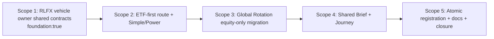

<!-- markdownlint-disable MD024 -->

# Scopes: FX Regime & Currency Vehicle Lab

Links: [spec.md](spec.md) | [design.md](design.md) | [report.md](report.md) | [uservalidation.md](uservalidation.md) | [scenario-manifest.json](scenario-manifest.json) | [test-plan.json](test-plan.json)

## Execution Outline

### Phase Order

1. **Scope 1 - Additive RLFX vehicle, owner, and shared-contract foundation.** Preserve the partially implemented currency and `RLDATA` contracts, add the closed vehicle, tracking, fit, owner-decision, control-binding, Brief-eligibility, and Journey evidence-refresh contracts, and prove protected shared-infrastructure canaries before any overlay proceeds.
2. **Scope 2 - ETF-first four-view route and Simple/Power integration.** Add the excluded production route, closed vehicle universe, one editable shared control binding, the shared Simple projection, native Power evidence, truthful unavailable states, accessible responsive behavior, and one v2 owner read without activating public registration.
3. **Scope 3 - Global Rotation equity-only migration.** Remove every additive raw-FX scoring control and consumer, migrate only non-FX saved controls, preserve separate two-leg USD leadership and three-leg decomposition clocks, and publish the expanded Global owner read.
4. **Scope 4 - Shared Brief and Journey integration.** Strengthen the shared current-Brief evidence gate, add both Feature 004 Journey definitions and semantic evidence-refresh behavior, preserve transitive stale reopening and no-execution packets, and integrate attributable FX/Global owner-read synthesis without page-local substitutes.
5. **Scope 5 - Atomic registration, documentation, and closure.** Activate tool, Simple, Brief, Journey, navigation, note, and exclusion registries in one transaction; synchronize owner docs; prove registry atomicity and the complete cross-tool/governance closure chain.

The scopes execute strictly in numeric order. Scope 1 is tagged `foundation:true`; every concrete consumer depends on it, satisfying G094. Scope 5 is the only public cutover and keeps every registry-derived consumer, documentation target, and exclusion change atomic. Each scope has one primary outcome, an explicit rollback boundary, and an executable checkpoint before the next scope begins.

### New Types And Signatures

- `globalThis.RLFX` and CommonJS `module.exports`: one frozen API from identical `rlfx.js` bytes.
- `RLDATA.barSeries(symbol, interval, sourcePolicy, decisionTime) -> BarSeriesEnvelopeV1`
- `RLDATA.putBarSeries(symbol, interval, rows, seriesMeta) -> void`
- `RLDATA.ensureBarSeries(symbol, interval, sourcePolicy, decisionTime) -> Promise<BarSeriesEnvelopeV1>`
- `validateUniverse(value) -> ValidationResult<FxUniverseV1>`
- `normalizeSourceEnvelope(value, policy, decisionTime) -> BarSeriesEnvelopeV1`
- `normalizeObservation(value) -> CurrencyObservationV1 | ValidationError`
- `normalizeCarryRead(value, decisionTime) -> CarryReadV1 | ValidationError`
- `normalizeDailySeries(rows, leg) -> NormalizedDailySeries`
- `orientSeries(rows, sourceOrientation, requestedOrientation) -> OrientedSeries | Unavailable`
- `alignExact(legs, horizonSessions) -> ObservationSetV1`
- `computeCurrencyStrength(input) -> CohortStrengthReadV1`
- `computePairRead(input) -> PairReadV1`
- `computeBroadDollar(input) -> BroadDollarReadV1`
- `computeCurrencyDecision(input) -> CurrencyDecisionReadV1`
- `validateVehicleUniverse(value) -> ValidationResult<VehicleUniverseV1>`
- `normalizeVehicleObservation(value) -> VehicleObservationV1 | ValidationError`
- `computeVehicleTrackingRead(input) -> VehicleTrackingReadV1`
- `computeVehicleFitRead(input) -> VehicleFitReadV1`
- `computeFxOwnerDecision(input) -> FxOwnerDecisionV1`
- `AttributableLevelGateV1`: one named listed instrument, closed relation, finite instrument-price level, current observation basis, and attributable evidence references.
- `computeRecommendationOutcome(input) -> RecommendationOutcomeV1`
- `projectFxReaderDecision(ownerDecision) -> FxReaderDecisionV1`
- Recommendation-ledger admission accepts only the complete `RecommendationOutcomeV1` recommendation branch and rejects `no-vehicle` and `unavailable` before event construction.
- `computeGlobalRotation(input) -> GlobalRotationReadV1`
- `scoreCountryLeadership(input) -> EquityOnlyLeadershipScore`
- `projectFxToolRead(decision) -> ToolReadV1`
- `projectFxToolReadV2(ownerDecision) -> ToolReadV1`
- `projectGlobalToolRead(result) -> ToolReadV1`
- `ToolControlBindingV1.commit(change) -> Promise<Readonly<ToolControlBindingV1>>`
- `RLBRIEF.evaluateFxBriefEligibility(liveOwnerRead, modelRead, evidenceBundle, toolBrief, decisionTime) -> FxBriefEligibilityV1`
- `RLJOURNEY.refreshEvidence(session, semanticEvidenceRefs) -> JourneySessionV1`
- `RLBRIEF.classifyFxGlobalRelationship(fxRead, globalRead, decisionTime) -> Agreement | Divergence | Insufficient Evidence`
- `fx-regime-universe.json`: closed `rlfx-universe/v1` currency, pair, source, and policy contract.
- `fx-vehicle-universe.json`: closed `rlfx-vehicle-universe/v1` fiat-vehicle, fact, source-policy, fit-policy, tracking-policy, liquidity-policy, and cost-policy contract.
- `globalRotationLabState` schema version 2: keeps non-FX controls and excludes `fxWeight`.

### Validation Checkpoints

- **Scope 1 first red:** run CMD-FIRST-RED. Its assertion title is `RLFX CommonJS import preserves the existing global and explicit decisionTime is deterministic`; it directly requires production `rlfx.js`, installs a sentinel `globalThis.RLFX`, and compares two byte-identical complete inputs before any browser or adapter work.
- **After Scope 1:** the existing CommonJS/currency assertions plus new vehicle, tracking, fit, owner-decision, control-binding, Brief-eligibility, and Journey-refresh assertions run red then green against production modules. Provider stress/load and browser canaries remain protected unresolved owner work until current execution proves them.
- **After Scope 2:** the exact FX page syntax/ID command and production-path Playwright suite at desktop and mobile prove one shared Simple/Power binding, truthful `RIGHTS_UNCLEAR`, `NO_SOURCE`, `ACCESS_REQUIRED`, No Eligible Vehicle, and owner-read states without fixture injection, request interception, or an inaccessible external dependency.
- **After Scope 3:** controlled production-module cases prove formulas and distinct two-leg/three-leg clocks, while the real Global route proves it never fabricates decomposition or score input when public FX evidence is unavailable. The stale-consumer scan is clean before Brief integration begins.
- **After Scope 4:** shared Brief refusal, prior-publication labeling, both Journey DAGs, semantic evidence refresh, transitive reopening, and no-execution packets pass controlled functional and real same-origin route checks before registration.
- **After Scope 5:** route registration, Simple/Brief/Journey registries, exclusion removal, notes, validator, and relationship renderer land together. Exact page checks, all named browser/provider/Bond/Causal canaries, collision preservation, artifact/trace/reality/freshness/foundation/state guards, and installed Bubbles CLI checks form the completion boundary.

## Planning Baseline And Constraints

- **Design-recorded baseline:** `node scripts/selftest.mjs` previously reported 345 passed and 0 failed. This planning run does not treat that prior output as current execution evidence.
- **Current planning observation:** `node scripts/selftest.mjs` reported 344 passed and 1 failed on 2026-07-14. The sole failure is the pre-existing shared Market Brief payload omission of registered `bond-regime-lab`, already recorded by spec 003; Feature 004 must preserve the assertion and cannot claim a green repository baseline until the owning work resolves it.
- **Protected canaries:** `BASE-SEC-01`, `BASE-SEC-02`, `BASE-SEC-03`, and `BASE-BRIEF-01` remain unchanged assertions. A recurrence is a discovered issue routed to the named owning artifact; no scope may weaken, remove, or relabel the assertion.
- **Baseline disposition:** the 344/1 result is an open foreign-owned failure, not Feature 004 success evidence. Focused Feature 004 red/green work may execute, but no scope may be marked Done and no full-delivery completion may be claimed while `BASE-BRIEF-01` remains red. Its expected Bond coverage is unchanged.
- **Dirty-tree discipline:** [report.md](report.md#dirty-tree-collision-baseline-grill-004-09) records the 2026-07-14T16:43:33Z non-secret worktree/index identities and pre-existing hunk-body hashes for every already-dirty shared path in this plan. Before the first edit to each path, implementation must prove the recorded hash still matches or append a fresh just-in-time checkpoint; after the edit, every recorded hunk body must remain byte-identical as a distinct diff hunk. No stash, reset, checkout, clean, broad formatting, staging, committing, generated-data refresh, or shell-authored baseline file is allowed.
- **F004-COLLISION-001 reviewed supersession:** the original `feature004-dirty-baseline-v1` report block remains immutable history. One additive `feature004-dirty-supersession-v1` checkpoint may supersede only the following four original `rldata.js` hunk hashes: `e8864cffc8ed788d0c462d63967bb0cf8c3cf0187b42c2a56fb1fec122e439b6`, `685fef4c9a52fe92c9aeb613b0c8f145681ef5dbc15dcb3d81ca17eca913283c`, `11621f8ac37c1e4d65a59b0578af9e475c201fc9d5b1beb8771760dcdbfa5908`, and `a37cdc31bec1b491768bf7376067665d15596fec966309203b515ffc73880f43`. BUG-001 intentionally replaced those credential-owned hunks to enforce closure-private current-document credential memory, erase-only legacy cleanup, disabled unapproved providers, and no serialized, durable, or cross-document credential path; the review authority and evidence remain [BUG-001 spec](../_bugs/BUG-001-central-provider-credential-security/spec.md), [design](../_bugs/BUG-001-central-provider-credential-security/design.md), [scopes](../_bugs/BUG-001-central-provider-credential-security/scopes.md), and [report](../_bugs/BUG-001-central-provider-credential-security/report.md). The additive checkpoint must record the current `rldata.js` index OID, explicit unstaged status, complete current hunk-hash multiset, and current worktree SHA-256. Every other original tracked-path index identity and hunk hash, untracked-file prefix/hash contract, and volatile-path checkpoint rule remains unchanged.
- **Supersession guard semantics:** `tests/feature-004-dirty-tree-collision.test.mjs` must first prove that the original baseline block is byte-preserved, then parse the additive record as a closed exception for path `rldata.js` and exactly the four hashes above. It may remove those four hashes from the original required multiset only when the current index OID, unstaged state, complete current hunk multiset, worktree SHA-256, BUG-001 rationale, and evidence references match the reviewed checkpoint. It must still require every non-superseded original hash and every other baseline contract, compare the complete current `rldata.js` multiset rather than a subset, reject duplicate/unknown/path-mismatched supersessions, and fail closed on any future unreviewed loss or extra hunk. The persistent test-owned guard change is routed to `bubbles.test`; planning does not edit the test.
- **Supersession review history:** the first exact read-only capture in [report.md](report.md#reviewed-rldatajs-supersession-checkpoint-f004-collision-001) validated the four-hash `rldata.js` replacement and correctly kept two original `scripts/selftest.mjs` hashes plus three original `index.html` hashes fail-closed because that checkpoint did not review them.
- **Closed five-finding collision disposition (2026-07-15):** the additive [shared-path checkpoint](report.md#reviewed-shared-path-collision-disposition-checkpoint-f004-collision-001) accepts exactly `scripts/selftest.mjs` hashes `c412a7268a4ed3b6e9fe8aea49fd954e45ad2240d2c033daee9c2a0cc94961eb` and `ab27e89cd0dd8c6dd640254615a10d15a2be008596ec72834ca4512766c646fc`, plus `index.html` hashes `631ba96d2e0e396b1e49cd7a9b288b6ada1464d889c9ff7fd62a38fda75fcbd0`, `784e0fa7488dfea165fc6e4280cc93c2d1b4092582a8fbdf558d45a6712ee86b`, and `5e7199274d025114bfb9a1b9ae1d63fae602e3381506341c63ca8e89a5c003c1`. Original bytes were recovered by exact identity, every replacement is named to BUG-001 or marker-bounded Feature 005/006/007/009 work with executable evidence, Feature 008 owns no current byte, and both complete current path identities are frozen. RED owner evidence proves intent only and is not a feature-completion or test-pass claim.
- **Additive parser handoff:** `bubbles.test` must preserve both prior raw block hashes, parse exactly one closed-schema `feature004-dirty-collision-disposition-v1` block, accept only its five unique path/hash records after complete current-identity equality, validate the independent four-hash `rldata.js` checkpoint separately, and reject every duplicate, unknown, path-mismatched, ownerless, evidence-less, incomplete, identity-mismatched, added, removed, or reordered record or hunk. No skip, subset comparison, fallback, broad path exemption, or success-on-unknown branch is permitted.
- **F004-IDENTITY-DRIFT-001 additive delta handoff:** the post-checkpoint change is limited to `scripts/selftest.mjs` current identity and ordered hunk 7, from `0f9739b064bc90a02c3baf5a1014442b8f566ad9f88dd3528c1103a462c55e1b` to `ba4b911411a53fe83c6d9c99cce505f28b9cb0d38c88eae22eabb578f59e7c80`. The owning bytes are the Feature 006 Scope 3 M13-M18 consumers inside the inclusive start marker `/* ---------- Feature 006: Trend Dynamics deterministic capability foundation ---------- */` and exclusive end marker `/* ---------- Feature 007: Technical Analysis Decision foundation ---------- */`; Feature 006 remains Scope 3 / implement / In Progress. The additive report contract `feature004-dirty-collision-delta-v1` must extend the exact raw SHA-256 of `feature004-dirty-collision-disposition-v1`, freeze the complete current path identity, preserve every other current path and every baseline/supersession obligation, and reject any subsequent identity or ordered-hunk drift. `bubbles.test` must parse exactly one delta block, require its closed field sets and exact one-path/one-transition cardinality, validate marker uniqueness/order and owner/tool-log references, then overlay only the named hunk-7 transition before recomputing the complete identity. The current `node scripts/selftest.mjs` result remains 491 passed / 1 failed solely on Market Brief `nextSession.sessionDate`; it is neither Feature 006 success nor Feature 004 completion, and CMD-COLLISION remains intentionally red until the test owner implements this parser contract.
- **F004-POSTCHECKPOINT-DRIFT-001 final settled-owner handoff:** preserve the existing `feature004-dirty-collision-delta-v1` block byte-for-byte as superseded-current-identity history and append exactly one closed-schema `feature004-dirty-collision-settled-delta-v1` report block that extends its marker-inclusive, no-trailing-newline raw SHA-256 `334cae6ba3d95ad3837971ee3a402a68ffb46df23f490a31104d94cd73ea0e4b`. The only accepted overlay is `scripts/selftest.mjs`, ordered hunk 7, from captured hash `ba4b911411a53fe83c6d9c99cce505f28b9cb0d38c88eae22eabb578f59e7c80` to settled trimmed-body hash `15ff8c7662995bbc7e977c2ea57bb95c5ac64d494a43f4bdc1d64ee81e42f943`; hunks 1-6 and every inherited baseline, independent `rldata.js`, five-hash disposition, current-index, and non-target-path identity remain exact. Require status `" M"`, `staged:false`, `unstaged:true`, index OID `03a285cfa21b2f2e1b22b539ac0452094029c110`, worktree Git OID `484706d2f819971c298fd3dcef19e34915c4f052`, worktree SHA-256 `f47e86bc746eddad82892844aacde100ff8f82d6e29e4d0a4df6a68ed0bb53c8`, seven ordered hunks, and the unique Feature 006 marker slice at byte range `[117426,159494)` with SHA-256 `2959603e818bc2494baa51be85edcd71343657facdc660b0dc66bcfacb43ddef` and its exact 65-symbol inventory. Bind the overlay to Feature 006 `state.json`'s Scope 3 implement history entry finished at `2026-07-15T22:48:39Z`, outcome `route_required`, nine addressed findings, evidence ref `report.md#scope-3-season-cycle-context-and-association-engine`, that report section, and the matching `feature006-scope3-implement-current` tool-log records. The exact aggregate selftest remains 491 passed / 1 failed solely on Market Brief `nextSession.sessionDate must match snapshot.nextSessionDate`; classify it as unrelated and unresolved and make no Feature 006 or Feature 004 pass, Done, completion, or certification claim. `bubbles.test` must reject a missing or duplicate settled block, any unknown/missing/reordered field or record, any changed inherited identity, any future hunk or marker drift, and any attempt to treat the prior delta identity or the unrelated aggregate failure as current acceptance. CMD-COLLISION remains intentionally red until that exact parser overlay is implemented and executed by the test owner.
- **F004-CURRENT-SCRIPT-IDENTITY-003 owner-settled successor history (2026-07-17):** preserve the additive [two-path checkpoint](report.md#current-script-identity-transition-checkpoint---f004-current-script-identity-002) and the later validator-only superseded note byte-for-byte as history. Feature 010 Scope 01 `bubbles.implement` returned the marker-bounded v1 identity: status `" M"`, `staged:false`, `unstaged:true`, index OID `484706d2f819971c298fd3dcef19e34915c4f052`, worktree Git OID `f1f5d4c604efd6a46b4183408fd397202e650b6f`, worktree SHA-256 `25ae7940719ca58dadae2a82b3ac323258d55f0a91b09589eb603a9b0c329a1b`, one hunk with trimmed-body SHA-256 `9af6f8a57dcd3041b2b67711cebdb2b373f72a134d8b480f773b69e38fec3bd0`, and marker slice `[183893,191742)` with SHA-256 `29598851a8c881ac3d9d311a4dbad152cdd5391fe473b689ec4812f4a66614c3`. The v1 parser and direct canary were accepted by `bubbles.test` at 3/3 before the newer v2 identity transition. No v1 result establishes Feature 010, Feature 004, BUG-003, or BUG-002 completion.
- **TR-BUG-003-F004-PLAN historical ownership boundary:** BUG-003 DoD parity, the validator transition, and the v1 owner-settled checkpoint were planning-complete; `TR-BUG-003-F004-PLAN` and its test replay are resolved in current BUG-003 state. The v2 transition does not reopen BUG-003 or infer acceptance; it preserves that history and creates a new test-owned parser obligation only for the current identity. No allowlist, default, path exemption, subset comparison, or weakened identity comparison is permitted.
- **Concurrent config rule:** `market-brief.config.json` was clean at the recorded observation but is explicitly volatile because a concurrent mutation was reported. This plan claims no stable dirty baseline for it. Scope 4 must capture and record a fresh status/hash/hunk checkpoint immediately before any edit and stop on an unreviewed collision.
- **Browser authenticity:** controlled same-origin inputs against production `rlfx.js`, `rldata.js`, or `rlbrief.js` are browser functional tests, never E2E. E2E uses a real ephemeral same-origin HTTP server and the actual production route/config/data posture with no fixture replacement or request interception. `page.route`, `context.route`, request fulfillment, response interception, and file-parse proxies cannot satisfy an E2E row.
- **Public-v1 source truth:** no active official-dollar, policy-rate/carry, REER, positioning, or event adapter is authorized by the current design, and existing Yahoo-derived rows/proxies are not presumed authorized. Production-route E2E asserts exact unavailable states and absence of numeric values; controlled foundation cases prove available-state algorithms without pretending those sources are live.
- **Module authenticity:** Node and browser tests import or load the actual production `rlfx.js`; copied formulas and extraction of functions from HTML are prohibited.
- **Red/green rule:** each behavior slice first adds or activates the named focused assertion and records its failure, then implements the smallest owning change and reruns the exact same assertion green before broader commands.
- **Project config:** `.github/bubbles-project.yaml` declares neither `testImpact` nor `traceContracts`; G079/G080 add no project-specific rows. Their absence does not reduce scenario E2E, canary, or completion requirements.
- **F004-CURRENT-IDENTITY-RECONCILIATION (fail closed):** active planning accepts exactly one `feature004-dirty-collision-selftest-successor-v3` block, raw SHA-256 `8427a99ae9cadd27e401a7a06bd2f0e707e3c5096508c4e7fe903db67f8f1995`, extending mandatory byte-identical v2 block SHA-256 `eef8aa415b739df80b1aab4046adbb64a39c87c6fb1b73ff0ac210b67870f32a`. It preserves current HEAD/index OID `44be5ac34526a076050ddf69e92cb32ffc443831`, worktree Git OID `660eb298ff2a417064e514da5db8f95c2e85b87d`, worktree SHA-256 `519ec91a3531c7e8375860392f23d0672f6fe2babd09643a834a681260fbd96b`, six ordered hunks, the Feature 005 slice `[104099,108231)`, unchanged Feature 006 slice `[108232,150300)`, closed 13-path matrix, validator prefix, and volatile-config rule. V2 remains a mandatory parser input; any path, identity, hunk, marker, producer, owner state, prefix, commit, status, or staging drift fails closed.
- **TR-BUG-002-F004-PLAN-03 strict correction boundary:** preserve v2 and every predecessor byte-for-byte, validate v2 first, then consume the single v3 correction above. The parser must distinguish hunk-header context from changed-body bytes and committed producers from unknown current deletion authors; attribute only hunks 3-5 to Feature 005; retain hunks 1-2 and 6 as foreign-protected identity records with no inferred author or semantic approval; and keep every Feature 004, Feature 005, Feature 006, Feature 010, Feature 011 current-deletion, BUG-002, and BUG-003 pass, completion, acceptance, and certification inference false as applicable. `bubbles.implement` owns `TR-BUG-002-IMPLEMENT-DIAGNOSTICS-01` next; `bubbles.test` owns v3 adoption, the direct canary, and unchanged BUG-002 replay after that diagnostic.

- **Historical-only routing notice for the preceding delta handoffs:** their `CMD-COLLISION remains intentionally red` wording records prior transition epochs only. Both parser obligations are implemented history and do not route current work. Current acceptance first requires `TR-F004-SCOPE01-SCOREABILITY-READER-FOUNDATION-001`, then exactly one v14 scoped-authority successor without weakening any inherited check.

### Historical V3 Collision Handoff Correction (Preserved Parser Input)

- `feature004-dirty-collision-selftest-successor-v2` remains mandatory immutable history with raw SHA-256 `eef8aa415b739df80b1aab4046adbb64a39c87c6fb1b73ff0ac210b67870f32a`. Active planning requires exactly one additive `feature004-dirty-collision-selftest-successor-v3` block with raw SHA-256 `8427a99ae9cadd27e401a7a06bd2f0e707e3c5096508c4e7fe903db67f8f1995`, extending that exact v2 hash. V3 supersedes v2 only as the active provenance interpretation and parser target; v2 and every predecessor remain byte-preserved and parser-validated.
- V3 preserves HEAD/index OID `44be5ac34526a076050ddf69e92cb32ffc443831`, worktree Git OID `660eb298ff2a417064e514da5db8f95c2e85b87d`, worktree SHA-256 `519ec91a3531c7e8375860392f23d0672f6fe2babd09643a834a681260fbd96b`, byte length `187207`, line-chunk count `1834`, six ordered hunk hashes, Feature 005 slice `[104099,108231)` with SHA-256 `84a6f11c4ba1ab0812187feeaf0bf8ac57f85beb23b1762ec9d55f82a9b77121`, and Feature 006 slice `[108232,150300)` with SHA-256 `2959603e818bc2494baa51be85edcd71343657facdc660b0dc66bcfacb43ddef`.
- `F005-IDENTITY-HUNK1-PRODUCER-CORRECTION`: hunk 1's `validateBriefPayload` import is retained header context from commit `943972e295b8fa93a19795e46015e5ae780b0350`; the actual deleted body line is `import { buildCompanyFundamentalsOwnerRead } from './brief-refresh.mjs';`, introduced by Feature 010 Scope 6 commit `a93076912aa1df17ca1e41ea929d37f1b8f40d51` (`feat(010): Feature 002 consume-once owner-read + registry discoverability (Increment B / Scope 6)`). Its current deletion author remains unknown and its disposition is only `foreign-protected-current-deletion-identity-only`; no approval, acceptance, completion, or certification follows. Hunk 2 remains committed Feature 011 content with unknown current deletion author, hunks 3-5 remain Feature 005 marker-bounded current hunks, and hunk 6 remains committed Feature 010 Scopes 2-7 content with unknown current deletion author.
- Every pass, completion, acceptance, and certification claim remains false for Feature 004, Feature 005, Feature 006, Feature 010, Feature 011, BUG-002, and BUG-003 as applicable. Feature 005 Scope 2 remains nonterminal under its existing semantic-fidelity route.
- **Historical disposition:** strict v3 parser adoption and the former `TR-BUG-002-IMPLEMENT-DIAGNOSTICS-01` prerequisite are complete historical records; neither routes current work. Current execution first routes `TR-F004-SCOPE01-SCOREABILITY-READER-FOUNDATION-001` to `bubbles.implement` for `AttributableLevelGateV1`, `RecommendationOutcomeV1`, `computeRecommendationOutcome`, and `projectFxReaderDecision` as required by TP-01-27 and TP-01-31, then routes the v14 scoped-evidence transition to `bubbles.test`. Planning does not relabel the Feature 005 owner receipt's 491/0 selftest execution as planning evidence.

### Durable Evidence Admission Successor

- **Closed additive contract:** `feature004-durable-evidence-admission/v1` introduces the test-owned report marker `feature004-scope1-durable-evidence-v1` and the additive identity marker `feature004-dirty-collision-current-identity-v4`. It supersedes only the runtime admission mechanism that resolves historical receipts. Every historical report block, marker-inclusive hash, command result, absolute tool-log reference, v2/v3 provenance interpretation, collision identity assertion, and predecessor-parser requirement remains immutable input and retains its original meaning.
- **Current tool-log source:** when `.specify/runtime/tool-calls.jsonl` exists, the parser must resolve each declared receipt by one exact stable key: `sessionId + agent + spec + scope + exact cmd + exitCode + stdoutHash + required tags`. Line numbers and append order are never identity. A candidate is a full-key match, not a partial command match; earlier RED or unrelated executions with a different exit code, hash, session, scope, or tag set remain separate history. Admission requires exactly one complete full-key record for every declared receipt and exact equality with the committed receipt declaration. A partial matched set, duplicate full key, missing or extra required tag, malformed selected row, broadened comparison, or contradiction between selected sources fails closed and cannot select the fallback branch.
- **Committed Markdown source:** only when the tool-log is absent or contains zero full-key matches across the entire declared receipt set may the parser admit exactly one committed `feature004-scope1-durable-evidence-v1` block. Each receipt must carry the exact stable-key fields, at least ten literal raw output lines from its executed command, and exact command, exit-code, and stdout-hash fields. The block must hash-link every immutable collision predecessor it relies on, and the collision parser must pin and recompute the block's marker-inclusive, no-trailing-newline SHA-256. Missing, malformed, mismatched, duplicate, reordered, broadened, subset-only, synthetic, or contradictory receipt data fails closed. Absence is never success, no row may be fabricated from prose, and one or more but fewer than all declared full-key matches is a partial-set failure rather than permission to switch sources.
- **Current receipt ownership:** current Scope 1 receipts are admissible only when `bubbles.test` selects the actual current-ledger rows produced by `bubbles.test` for this feature and scope. Planning defines the schema and handoff only. It does not copy ledger summaries into evidence, infer a green result, check TP-01-22 or any DoD item, close the provider canary transition, or advance Scope 1.
- **Current-identity checkpoint:** before parser adoption, `bubbles.test` must append exactly one `feature004-dirty-collision-current-identity-v4` block captured from the then-current index and worktree. Its exact Scope 1 path inventory is `rlfx.js`, `fx-regime-universe.json`, `fx-vehicle-universe.json`, `rldata.js`, `rlexperience.js`, `rlviews.js`, `rlbrief.js`, `rljourney.js`, `scripts/fetch-bars.mjs`, `scripts/selftest.mjs`, `tests/fx-regime-relative-value-lab.spec.mjs`, `tests/feature-004-dirty-tree-collision.test.mjs`, `tests/feature-004-vehicle-universe.test.mjs`, `tests/feature-004-tool-control-binding.test.mjs`, `tests/feature-004-brief-eligibility.test.mjs`, `tests/feature-004-journey-evidence-refresh.test.mjs`, `tests/fixtures/fx-regime/commonjs-determinism-input.json`, `tests/fixtures/fx-regime/foundation-cases.json`, and `tests/fixtures/fx-regime/foundation-harness.html`. The closed block records path kind, complete status, tracked HEAD/index identities where applicable, worktree Git OID, worktree SHA-256, hunk count, and complete ordered hunk hashes for every ordinary path. The collision parser path uses `normalized-self-pins/v1`: exactly one `DURABLE_EVIDENCE_BLOCK_SHA256` literal and one `CURRENT_IDENTITY_V4_BLOCK_SHA256` literal are replaced by 64 zeroes before its worktree and hunk hashes are computed. The test owner first sets both pin literals to 64 zeroes, captures the normalized identity, appends both report blocks, computes their marker-inclusive hashes, then fills the two literals; normalization must reproduce the captured identity and any other byte change fails. This avoids recursive self-hashing without exempting the parser path. The block separately inventories every current protected foreign dirty hunk and untracked file outside that exact list as `foreign-unrelated`, preserving its existing owner attribution without granting Feature 004 ownership. Any volatile or concurrently changing path, including `market-brief.config.json` when applicable, requires a just-in-time status/hash/hunk capture immediately before use; post-capture drift fails closed and requires another additive owner-routed checkpoint.
- **Exact test-owner handoff:** `bubbles.test` appends the actual durable receipt and identity blocks, pins their marker-inclusive hashes in `tests/feature-004-dirty-tree-collision.test.mjs`, replaces only absolute-line runtime admission with the two-source resolver, adds adversarial cases for both branches and every fail-closed condition above, runs the unchanged collision command RED then GREEN, and replays unchanged BUG-002 verification. No product code may change. Scope 1 remains In Progress, Scope 2 remains locked, certification remains untouched, and Feature 012 routes remain open unless their owners have returned terminal evidence and plan ownership permits a later reconciliation.

### Feature 004 Collision Lifecycle Successor (`F004-COLLISION-F010-LIFECYCLE-DRIFT-001`)

- **Closed additive identity:** append exactly one `feature004-dirty-collision-current-identity-v5` block. It extends the marker-inclusive, no-trailing-newline v4 SHA-256 `64ddfd9bb8a2adbaa218eb1a7f0efbe62746a51b7fcdc0ad2444debf297da30c` and the current durable-evidence block SHA-256 `c5ed7a110a2a743d2aef3b32c0655a2fd3c20c7ca6c9ee2ecef2716654ef7268`. V4, the durable block, every predecessor block, and every predecessor pin remain byte-for-byte mandatory parser inputs.
- **Historical owner entry remains exact:** the immutable owner-return record is agent `bubbles.implement`, started `2026-07-17T00:14:13Z`, finished `2026-07-17T00:34:15Z`, `statusBefore:not_started`, `statusAfter:not_started`, `scopesCompleted:[]`, all exact-evidence completion booleans false, and captured `owner.nonCompletionState` equal to top-level `not_started`, empty completed scopes, empty certified phases, and empty scope progress. Any mutation remains a hard failure.
- **Certified successor is separate evidence:** the same Feature 010 packet now has top-level status `done`, `certifiedAt:2026-07-30T14:41:30Z`, certification status `done`, exactly eight unique completed scopes, exactly eight scope-progress records all `done`, and certified phases exactly `[implement,test,regression,simplify,gaps,harden,stabilize,security,validate,audit,chaos,docs,spec-review]` in that order. Present state must satisfy this complete successor contract; it must not equal the historical `owner.nonCompletionState`.
- **Single semantic parser transition:** in `validateOwnerSettledSuccessor`, replace only the five present-state equality assertions captured at parser lines 1187-1191. Their line-joined, no-trailing-newline SHA-256 is `c9f2fcf6cfe7782af378ed713ce424bc1d7075af29c296400eb9c3402568d848`. The exact replacement in the v5 report block has SHA-256 `56f14a8579a6714ea5a83ac8185cd74d16c6543bc81e0a4ecc43d8d1797bbbae`. It revalidates the immutable historical owner-return entry before asserting the certified successor. `TR-F010-SCOPE01-TEST-OWNERSHIP-01` remains exact and resolved. No other semantic parser byte may change.
- **Normalized self identity:** retain `DURABLE_EVIDENCE_BLOCK_SHA256` and `CURRENT_IDENTITY_V4_BLOCK_SHA256` unchanged. Add only `CURRENT_IDENTITY_V5_BLOCK_SHA256` and define `normalized-self-pins/v2` as the exact three-literal normalization contract. Set only the new literal to 64 zeroes during capture. The v5 block records the complete pre-edit parser identity, the exact allowed assertion transition, and the final plan-owned path identities. Fill only the new pin after hashing v5. Normalization must reproduce the authorized successor identity.
- **Adversarial closure:** the collision suite must reject a mutated historical owner entry; an intermediate, unknown, or absent present status; wrong `certifiedAt`; missing, extra, duplicate, or non-done scope progress; duplicate, missing, or extra completed scopes; extra, missing, or reordered certified phases; and any mutation of `TR-F010-SCOPE01-TEST-OWNERSHIP-01`.
- **Ownership and boundary:** `bubbles.test` owns the v5 parser pin/schema, the exact five-assertion transition, adversarial cases, CMD-COLLISION RED/GREEN execution, and unchanged BUG-002 replay. No product file, Feature 010 artifact, prior report block, prior pin, unrelated dirty byte, Git state, scope status, checkbox, or certification field may change. Scope 1 remains In Progress and Scope 2 remains locked.

### Feature 004 Foreign Roadmap Identity Successor (`F004-COLLISION-FOREIGN-ROADMAP-V6`)

- **Closed additive contract:** append exactly one `feature004-dirty-collision-foreign-roadmap-v6` block. It extends exact marker-inclusive, no-trailing-newline v5 SHA-256 `c3a487a6e6d2f45084635a1fe6a8269a1efb4096ff76acebec3b419c36551780` and v4 SHA-256 `64ddfd9bb8a2adbaa218eb1a7f0efbe62746a51b7fcdc0ad2444debf297da30c`. V5, v4, every predecessor block, every predecessor pin, every non-roadmap v4 identity, and the still-unapplied v5 semantic parser transition remain byte-for-byte mandatory inputs.
- **Identity-only roadmap overlay:** overlay only `docs/Product-Review-and-Roadmap.md` from its exact old v4 identity to status `" M"`, `staged:false`, `unstaged:true`, worktree Git OID `016656d4bc39799cb976e02208f8a3ec81bdabc6`, worktree SHA-256 `8cb06fb713f25b52423604d7a0e196fa3017e685b756cfd5873604a588d068e6`, byte length `94895`, `555` additions, `0` deletions, and `25` ordered hunks. The current author remains unknown, classification is `foreign-unrelated`, Feature 004 ownership is false, and the overlay grants no semantic approval, acceptance, adoption, completion, certification, or ownership transfer.
- **Exact ordered trimmed-body hunk hashes:** `[40176ae5f2fd464650ca58f7dc1418000778aa030a833849ca73fa0c7cd71e6f, c2fc7186a7065431cd96698264544aca8692ab2ef1dfe819c552486b0de0ffc6, 1bf7916f52f145246d6f5d6af63f51b7ad235bb924d00af2ed231895c6249e51, c898b3c4ceb05354cfd53927723fef141cee2e5e42b381cd86b812c4ce78299a, 78d6f39d3d15fc9f75a5d782a30481755e272541c6f288f2f828a1e24e56ede9, 9a826b1633153762527d70a30df0bd743c6fe88b963d6f8ec514e0f881105c11, 3ab6ae72fdef851b3bc133d3df0071b58997d95418f1b1800b07dd7ea622a88e, d3ee434ec8900dd1a85dd90119ea84c3cb6702ead97dbac8777e5ce349bdb17c, 62e7bd1559f26066d6968ecc73f5c73f2281989d10315de9e9335711eebf8bc5, 1ec0d81f07ae7f0c1bdb6bcda9bb6072f6901dc8b4678443ac2ae49fa6e50d79, 841f1222eb2a9e9910d5e61787f8dd9878fa5233c02c9cb39976972ab2f11acf, f7563d17145dc8e476313c04af545043d47bcc3a9cd48f842ae42bc9e0aa7152, 02491a633017d8c81d2e8f2d9690b0cf24f7af339f6ec7362d40dce6919c284b, 122f93a2cdce610e161c7e40628966c766bc20c6db421ac4378a0dd725c33c22, 1731322e6747831c90e984d216682edc1747b5d2df500116e9d43abb35acacb5, c80816800a9f6cf410a86b121a0a87c8755be294c1795c0e7fa38d7e90ba571a, 1fc1863a8336fe1623609c2bc3052923f58398e564e42ca587aac6732d576881, fe919b89d0488181844118d28a8c7befcefa7a54a89de24f36ee09aefae0ee27, 800abd9bd9362c6646220c4a9fd760a419bfeb0510d438325e5a7d4a2c0e29fd, 013fbfe7ae59bf5c8d2096238f1bea7b8518a515b7b9b0a85c2938a87d6ecb6b, 7129c5219ca7026d43dff3110698e58716e268b7fe4b5042b4b52ce90f4f9a6a, f4cbd2d99b0445e7852e57982b60988852fa71a6df6155c4661e421cbfe8ce3d, 472486e79a7de2cfa3dd938f46ca22d199a9e77511c1f857e3c13a66e6e8f114, eab169ccd6d6da24b04fc2616c6dce1c675c84bcf4ee43fbecdae569f69c33e3, e0245b20de8fd8a4c8889edb6c1495e203ed5f9b2f8405d47a7ab2e27a727f5e]`.
- **One pin and parser handoff:** `bubbles.test` adds exactly one `FOREIGN_ROADMAP_V6_BLOCK_SHA256` literal and one strict v6 parser branch. The parser first validates every predecessor, validates and overlays the v6 roadmap transition only, recomputes the complete v4 identity matrix with all non-roadmap records unchanged, and only then applies the already-authorized v5 five-assertion semantic transition. It must not merge the two transitions, skip v5, reinterpret v5 as applied history, or normalize any additional literal.
- **Adversarial closure:** reject missing or duplicate v6 blocks; wrong v5 or v4 parent hash; unknown, missing, extra, or reordered fields; any path other than `docs/Product-Review-and-Roadmap.md`; wrong status, staging state, OID, SHA-256, byte length, additions, deletions, hunk count, hunk order, or hunk hash; subset comparison; any changed non-roadmap v4 identity; any author, ownership, semantic-approval, completion, or certification inference; applying v5 before v6; or any parser byte outside the one v6 pin/schema branch and the already-authorized v5 assertion transition.
- **Execution boundary:** `bubbles.plan` updates only Feature 004 planning routing. `bubbles.test` is the next owner for the v6 pin/parser implementation, adversarial tests, CMD-COLLISION RED/GREEN execution, and unchanged BUG-002 replay. No test, product, roadmap, generated artifact, checkbox, scope status, top-level status, or certification field changes in this planning handoff.

### Feature 004 Foreign-Set Identity Successor (`F004-COLLISION-FOREIGN-SET-V7`)

- **Closed additive contract:** append exactly one `feature004-dirty-collision-foreign-set-v7` block. It extends exact marker-inclusive, no-trailing-newline v6 SHA-256 `c2f6fc88b147e8de6501a7c87d41aaf3aa8bd9537ac49d06da61e49976b246f9`, v5 SHA-256 `c3a487a6e6d2f45084635a1fe6a8269a1efb4096ff76acebec3b419c36551780`, and v4 SHA-256 `64ddfd9bb8a2adbaa218eb1a7f0efbe62746a51b7fcdc0ad2444debf297da30c`. The appended v7 block has exact marker-inclusive, no-trailing-newline SHA-256 `851dca31caded6498c1a84e68e9e9372489c3cb39f3663ea8b254b8cbb35c121` and byte length `15002`. V4, v5, v6, every predecessor block, every predecessor pin, and every inherited path identity remain byte-for-byte mandatory parser inputs.
- **Pre-append capture:** the exact identity snapshot was captured at `2026-08-04T03:02:10.424Z` with the collision parser's zero-context changed-line algorithm. The parser hashes each hunk's ordered `+` and `-` lines joined by LF, with no trailing LF.
- **Roadmap successor overlay:** replace only the v6 expected identity for `docs/Product-Review-and-Roadmap.md` with status `" M"`, `staged:false`, `unstaged:true`, HEAD/index OID `5908e77e172fb78f7ef5dd2db1203aae7fd2016e`, worktree Git OID `f1286d2db719048541b5843040640126a68d74db`, worktree SHA-256 `ce3ce690906bbac5466ce0571d089557487559502f3ab15f9b5818db45798d2d`, byte length `100995`, `623` additions, `0` deletions, `25` ordered hunks, and last commit `4c576b3344dc0edea9703dadea1d8b4f14e35efc`. Classification remains `foreign-unrelated`, owner attribution remains `owner: unknown`, and Feature 004 ownership remains false.
- **Roadmap ordered hunk hashes:** `[40176ae5f2fd464650ca58f7dc1418000778aa030a833849ca73fa0c7cd71e6f, c2fc7186a7065431cd96698264544aca8692ab2ef1dfe819c552486b0de0ffc6, 1bf7916f52f145246d6f5d6af63f51b7ad235bb924d00af2ed231895c6249e51, c898b3c4ceb05354cfd53927723fef141cee2e5e42b381cd86b812c4ce78299a, 78d6f39d3d15fc9f75a5d782a30481755e272541c6f288f2f828a1e24e56ede9, 9a826b1633153762527d70a30df0bd743c6fe88b963d6f8ec514e0f881105c11, 3ab6ae72fdef851b3bc133d3df0071b58997d95418f1b1800b07dd7ea622a88e, d3ee434ec8900dd1a85dd90119ea84c3cb6702ead97dbac8777e5ce349bdb17c, 62e7bd1559f26066d6968ecc73f5c73f2281989d10315de9e9335711eebf8bc5, 1ec0d81f07ae7f0c1bdb6bcda9bb6072f6901dc8b4678443ac2ae49fa6e50d79, 841f1222eb2a9e9910d5e61787f8dd9878fa5233c02c9cb39976972ab2f11acf, f7563d17145dc8e476313c04af545043d47bcc3a9cd48f842ae42bc9e0aa7152, 02491a633017d8c81d2e8f2d9690b0cf24f7af339f6ec7362d40dce6919c284b, c6bd99e27fd2b40bd16620b25af914a61f6dc44fa81461d48629f674f5400ec2, 1731322e6747831c90e984d216682edc1747b5d2df500116e9d43abb35acacb5, c80816800a9f6cf410a86b121a0a87c8755be294c1795c0e7fa38d7e90ba571a, 1fc1863a8336fe1623609c2bc3052923f58398e564e42ca587aac6732d576881, fe919b89d0488181844118d28a8c7befcefa7a54a89de24f36ee09aefae0ee27, 800abd9bd9362c6646220c4a9fd760a419bfeb0510d438325e5a7d4a2c0e29fd, 013fbfe7ae59bf5c8d2096238f1bea7b8518a515b7b9b0a85c2938a87d6ecb6b, 8ba35d67554b27caec631f3e8b3ff768e0782dfd2f0dccb150ec8036b19fad46, f4cbd2d99b0445e7852e57982b60988852fa71a6df6155c4661e421cbfe8ce3d, 472486e79a7de2cfa3dd938f46ca22d199a9e77511c1f857e3c13a66e6e8f114, eab169ccd6d6da24b04fc2616c6dce1c675c84bcf4ee43fbecdae569f69c33e3, e0245b20de8fd8a4c8889edb6c1495e203ed5f9b2f8405d47a7ab2e27a727f5e]`.
- **New Improvement Plan foreign path:** add exactly `docs/Improvement-Plan.md` with status `" M"`, `staged:false`, `unstaged:true`, HEAD/index OID `db0e08c9f80ceb5b777988bf446daf0544c8dc3e`, worktree Git OID `d37371251409bb8e4f24a861cd03dcebc7f7c5df`, worktree SHA-256 `f84105b20bb5e47593426d14305fb16b60700cf143cda4af1a540eefcc40004e`, byte length `46804`, `26` additions, `4` deletions, one hunk, hunk hash `a0a3bd81e86d9c8b5343a286145a67a6712f0352cf3d13b39ade2c8793f1da75`, and last commit `32f8848c32330963c28b5019f7c78e1f453fceef`. Classification is `foreign-unrelated`, owner attribution is `owner: unknown`, and Feature 004 ownership is false.
- **New ETF Momentum foreign path:** add exactly `etf-momentum-lab.html` with status `" M"`, `staged:false`, `unstaged:true`, HEAD/index OID `a415eb92540178d21a32e9ec67e2d0131261baea`, worktree Git OID `47fcd1a3a7db0e2cb3fd9d177abb1ebc7d193343`, worktree SHA-256 `6383f4ae6ba145a5e7a343b75813cba33c1ca7c58392200f76b7cb14bc016136`, byte length `252209`, `32` additions, `0` deletions, two ordered hunks, hunk hashes `[740cd6aebe1b7d8f4a24123fb0f227d1976cad2af3ff6aaaddef3df2b7b1f334, 3ddb91b0641e19fee5c4a6639ce87779f3a6ed86a34c97c38dd829857e6ea38c]`, and last commit `e38615ea1e41616370e4c6530fe42b9f8fb93a62`. Classification is `foreign-unrelated`. Owner attribution is `owner: unknown`, with Feature 012 shared-adapter context recorded only as an unverified lead. Feature 004 ownership is false.
- **Inventory and exclusions:** v4 remains the exact 42-path base inventory. V7 adds exactly the two previously uncaptured foreign paths above. `docs/Product-Review-and-Roadmap.md` remains a v4 path updated through v6 and v7. Preserve `.vscode/mcp.json` as an existing v4 foreign path. Exclude only Feature 004 `report.md` recursion and `.specify/memory/bubbles.session.json.flock` from the live uncaptured-path comparison.
- **Exact parser order:** validate v4 first. Validate v6 schema, raw hash, parent hashes, and historical roadmap overlay second. Apply the v7 current foreign-set overlay third. Apply the still-unapplied v5 five-assertion semantic transition fourth. When v7 exists, v6 performs no live-current comparison. V7 owns the live comparison while v6 remains fully hash-validated historical input.
- **One pin and strict parser handoff:** `bubbles.test` adds exactly one `FOREIGN_SET_V7_BLOCK_SHA256` literal with value `851dca31caded6498c1a84e68e9e9372489c3cb39f3663ea8b254b8cbb35c121` and one v7 parser branch. The parser must require one v7 block, exact ordered fields, exact parent hashes, one roadmap successor, exactly two additions, exact exclusions, and complete current identity equality. It must reject duplicate or missing additions, unknown paths, changed inherited paths, subset equality, and any reordered path or hunk.
- **Adversarial closure:** reject wrong status, staging flags, HEAD/index/worktree OIDs, worktree SHA-256, byte length, numstat, hunk count, hunk order, hunk hash, last commit, classification, owner attribution, or ownership flag. Reject semantic approval, ownership transfer, adoption, acceptance, completion, checkbox, status, or certification claims. Reject v5 before v7, v6 live comparison when v7 exists, an unvalidated v6 schema/hash, changed exclusions, missing `.vscode/mcp.json`, report recursion in the foreign set, or the flock path in the foreign set.
- **Capture stability and rollback:** recompute all three identities immediately after the report append. If any identity differs from this pre-append capture, remove only the incomplete v7 planning additions and return `blocked`. Do not alter v4, v5, v6, tests, product paths, foreign paths, generated artifacts, Git state, checkboxes, statuses, or certification.
- **Execution boundary:** `bubbles.plan` updates only Feature 004 report, scopes, structured Test Plan, and execution routing. `bubbles.test` owns the v7 pin/parser, adversarial tests, the exact v5 semantic transition, CMD-COLLISION RED/GREEN execution, and unchanged BUG-002 replay.

### Feature 004 Post-Commit Collision Successor (`F004-COLLISION-POST-COMMIT-V9`)

- **Closed additive contract:** append exactly one `feature004-dirty-collision-post-commit-v9` block. It extends exact marker-inclusive, no-trailing-newline v7 SHA-256 `851dca31caded6498c1a84e68e9e9372489c3cb39f3663ea8b254b8cbb35c121`, v6 SHA-256 `c2f6fc88b147e8de6501a7c87d41aaf3aa8bd9537ac49d06da61e49976b246f9`, v5 SHA-256 `c3a487a6e6d2f45084635a1fe6a8269a1efb4096ff76acebec3b419c36551780`, v4 SHA-256 `64ddfd9bb8a2adbaa218eb1a7f0efbe62746a51b7fcdc0ad2444debf297da30c`, and durable-evidence SHA-256 `c5ed7a110a2a743d2aef3b32c0655a2fd3c20c7ca6c9ee2ecef2716654ef7268`. Every predecessor block, pin, schema, identity, and semantic obligation remains immutable parser input.
- **Required commit boundary:** capture and parse only at exact HEAD `4476cefdd6e9e3a2b39ae8bc59ff62e55745390f`. A different HEAD before capture, after the report append, or during test-owner adoption is a hard failure. The foreign commit changes repository history and may promote a required path from dirty to clean, but it does not establish Feature 004 completion or transfer ownership.
- **Complete Scope 1 matrix:** retain Feature 004 ownership only for these exact 19 paths: `rlfx.js`, `fx-regime-universe.json`, `fx-vehicle-universe.json`, `rldata.js`, `rlexperience.js`, `rlviews.js`, `rlbrief.js`, `rljourney.js`, `scripts/fetch-bars.mjs`, `scripts/selftest.mjs`, `tests/fx-regime-relative-value-lab.spec.mjs`, `tests/feature-004-dirty-tree-collision.test.mjs`, `tests/feature-004-vehicle-universe.test.mjs`, `tests/feature-004-tool-control-binding.test.mjs`, `tests/feature-004-brief-eligibility.test.mjs`, `tests/feature-004-journey-evidence-refresh.test.mjs`, `tests/fixtures/fx-regime/commonjs-determinism-input.json`, `tests/fixtures/fx-regime/foundation-cases.json`, and `tests/fixtures/fx-regime/foundation-harness.html`. Each record must declare exactly one transition class: unchanged content promoted to exact HEAD/index identity, still-dirty exact tracked identity, or exact untracked identity. A clean promotion is provenance only, never inferred completion.
- **Current Scope 1 dirty subset:** the post-commit matrix must record exactly five still-dirty tracked paths (`rlbrief.js`, `rlexperience.js`, `rlfx.js`, `rljourney.js`, and `tests/feature-004-dirty-tree-collision.test.mjs`) and exactly five untracked paths (`fx-vehicle-universe.json`, `tests/feature-004-brief-eligibility.test.mjs`, `tests/feature-004-journey-evidence-refresh.test.mjs`, `tests/feature-004-tool-control-binding.test.mjs`, and `tests/feature-004-vehicle-universe.test.mjs`). The remaining nine required paths are clean HEAD/index promotions whose complete content identity must still be recorded.
- **Surviving foreign matrix:** record exactly these 11 current dirty paths without ownership transfer: `.vscode/mcp.json`; Feature 004 `design.md`, `scenario-manifest.json`, `scopes.md`, `spec.md`, `state.json`, `test-plan.json`, and `uservalidation.md`; Feature 012 Scope 15 `scope.md`; and `tests/simple-production-bridge.integration.mjs` plus `tests/simple-production-bridge.unit.mjs`. `.vscode/mcp.json` remains foreign workspace configuration. Feature 004 artifacts retain their existing specialist or human owners. Feature 012 artifacts and tests retain Feature 012 ownership. Remove only v7 foreign records that are now clean at the required HEAD; retaining a clean former foreign path is a schema failure.
- **Exact exclusions:** exclude only Feature 004 `report.md` recursion and `.specify/memory/bubbles.session.json.flock` from the live dirty-path comparison. Neither exclusion may appear as a required or foreign matrix record, and no third exclusion is permitted.
- **Parser transition boundary:** validate v4, durable evidence, v6, and v7 schemas, marker-inclusive hashes, parent hashes, records, order, and historical semantics without any live-current comparison. Apply the complete v9 post-commit matrix next. Validate and apply the already-physical v5 five-assertion semantic transition only after v9. Recompute exact current dirty-path equality last. V6 and v7 dirty sets are historical only once v9 exists.
- **One pin and strict parser handoff:** `bubbles.test` adds exactly one `POST_COMMIT_V9_BLOCK_SHA256` literal and one v9 parser branch. The branch must require one block, the exact HEAD, exact predecessor hashes, all 19 ordered required records, all 11 ordered foreign records, the two exact exclusions, and complete current equality. Existing parser bytes remain unchanged except for the new pin, closed v9 schema/current-matrix composition, and the already-authorized physical v5 transition.
- **Adversarial closure:** reject wrong HEAD; a missing, extra, duplicate, or reordered required or foreign path; a clean former foreign path retained; a current dirty path omitted; a clean/dirty/untracked transition mismatch; any status, staging, HEAD/index/worktree OID, SHA-256, byte length, numstat, hunk count, hunk order, hunk hash, last-commit, classification, owner, or ownership mismatch; an owner transfer; changed, missing, extra, or matrix-included exclusions; duplicate or reordered fields, records, hashes, or parents; v5 validation before v9; live-current comparison by v6 or v7 when v9 exists; or any inferred semantic approval, acceptance, completion, checkbox, status, or certification claim.
- **Capture stability and rollback:** capture the complete matrix only after all plan-owned routing bytes are final, append the report block last, then recompute HEAD and every non-excluded current identity. If HEAD or any identity moves, remove only the incomplete v9 planning additions and return `blocked`; do not alter any predecessor, test, product, foreign, generated, checkbox, status, or certification byte.
- **Execution boundary:** `bubbles.plan` updates only Feature 004 report, scopes, structured Test Plan, and execution routing. `bubbles.test` owns the single v9 pin/parser branch, adversarial cases, CMD-COLLISION RED/GREEN execution, and unchanged BUG-002 replay. No product, test, foreign, generated, checkmark, scope-status, top-level-status, or certification edit is authorized by this successor.

### Feature 004 V13 Representation-Aware Foreign Promotion Successor (`F004-V13-CAPTURE-SHAPE-001`)

- **Current disposition:** the v13 report block and parser branch now exist and are immutable historical authority. The current planning reconciliation changes v13-captured planning identities, so v13 recapture is expected to refuse until the scoped v14 successor below is implemented. This statement is routing truth, not a collision-pass claim.
- **Additive successor only:** append exactly one `feature004-dirty-collision-post-commit-v13` report contract after every SCOPE-01 planning byte is final. V12 and every earlier report block remain byte-for-byte immutable parser inputs. The v13 block is planning input, never pass evidence, and its current `HEAD` is provenance only rather than a global equality gate.
- **Closed CAPTURE eligibility:** every non-excluded foreign record retains the complete v12 full-record observations and adds exactly one `promotionEligibility` value. `untracked-regular-100644` requires raw status exactly `??`, explicit absence from captured `HEAD` and index, no index entry or flags, regular non-symlink worktree representation, all execute bits clear, and captured Git-blob/raw-byte identities. `unstaged-content-regular-100644` requires raw status exactly ` M`, identical captured `HEAD` and index `100644 blob` OIDs, default index flags, a regular non-symlink non-executable worktree, a distinct worktree blob, and captured raw-byte identities. Every other status, type, mode, representation, index state, partial/staged state, flag state, missing observation, ambiguity, or contradiction is `none`; equal bytes cannot create eligibility later.
- **Independent per-path branches:** each eligible foreign path must retain either its exact captured dirty/untracked full record or satisfy the complete exact-clean-promotion branch. Every `none` path must retain its exact captured full record. Eligible paths may choose branches independently; pair or inventory-wide promotion atomicity is forbidden.
- **Exact clean promotion:** with captured `HEAD` `C`, current `HEAD` `H`, and literal-path last commit `L`, replacement-object influence is disabled for lineage and tree queries. Require the path absent from porcelain and tracked; current `H:path`, index, worktree Git object, and `lstat` representation all exact regular `100644 blob` with the captured worktree blob; raw-byte SHA-256/length exact; all index flags default; zero staged/unstaged numstat and empty staged/unstaged hunk sets; ancestry `C <= L <= H`; and exact captured worktree blob at both `L:path` and `H:path`. Never require global `H == C`, use rename/copy inference, or infer an unavailable observation.
- **No semantic inference:** promotion proves only that captured bytes and regular-`100644` representation reached an exact descendant path commit. It grants no ownership, approval, scope membership, semantic coherence, completion, checkbox, status, certification, or authority inference. Feature 004 required paths, protected-clean parser authority, report-prefix authority, semantic-ledger selectors, exclusions, and any `promotionEligibility:none` foreign record remain exact with no generic tolerance.
- **Adversarial closure:** TP-01-22 must reject (1) captured untracked symlink later cleaned as `100644` with matching dereferenced bytes, (2) captured untracked executable later cleaned as `100644`, (3) captured tracked mixed/staged content later committed, (6) matching bytes without lineage from `C`, (7) `L:path` without the captured blob even when `H:path` matches, and (9) any content/path/type/mode/index-flag/selector/authority/new-inventory mutation. It must accept only complete cases (4) eligible untracked exact descendant promotion, (5) eligible unstaged-only exact descendant promotion, and (8) an independently promoted eligible subset while remaining eligible paths preserve exact captured records.
- **Performance equivalence:** TP-01-22 must prove the path-copy candidate helper and original deep clone emit byte-identical ordered candidate JSON, labels, and count; leave the canonical source-object digest unchanged; copy every changed-path ancestor while preserving untouched-container identity; and reuse one already-produced `settledPaths` value across all five transition checks. No assertion, case, ordering check, failure condition, acceptance command, or timeout may be removed, weakened, skipped, or relaxed.
- **Capture and handoff boundary:** final capture occurs only after `scopes.md` and `test-plan.json` are reconciled. It includes the final NUL-safe porcelain inventory, every required and foreign full record, complete path-scoped clean parser authority, exact report prefix, semantic ledger selectors, exact exclusions for report recursion and `.specify/memory/bubbles.session.json.flock`, and the intended single test edit `tests/feature-004-dirty-tree-collision.test.mjs`. After append, recompute every protected value byte-for-byte. Drift removes only the incomplete v13 suffix and blocks. Stable capture routes only the v13 parser pin/schema, adversarial cases, performance-equivalence checks, and unchanged collision acceptance run to `bubbles.test`.

### Feature 004 V14 Scoped Evidence Authority Successor (`F004-V14-SCOPED-EVIDENCE-AUTHORITY-001`)

- **Purpose and ownership:** one test-owned additive v14 transition replaces repeated whole-dirty-tree recapture with scoped authority. `bubbles.plan` defines the contract only. `bubbles.implement` first delivers the missing Scope 1 recommendation/reader foundation. `bubbles.test` then implements the v14 parser/report transition and records only test-owned evidence. No work in this planning invocation appends to `report.md`, edits the collision parser, checks a DoD item, or changes certification.
- **Historical report preservation:** the byte range from report offset zero through the v13 end marker plus its exact two LF separator bytes remains byte-for-byte immutable and fully parsed. V12 and v13 payloads, hashes, selectors, predecessor links, and original meanings remain exact. The v14 parser validates that historical record with a historical adapter instead of applying v13's current-file-final assertion to a file containing the additive v14 block. The one v14 block is appended only after planning and Scope 1 foundation bytes settle; it becomes the final report block with its own exact two-LF file suffix. Any changed v12/v13 byte rejects v14.
- **Repository-supported evidence location:** subsequent Scope 1-5 execution evidence uses the existing Bubbles inline DoD format in this `scopes.md`: `Phase`, exact `Command`, `Exit Code`, `Claim Source`, and literal raw output under the exact DoD item. No evidence sidecar is created. Root `report.md` remains the immutable historical archive. Structured tool-log rows may corroborate inline evidence but are not the sole durable source.
- **Two scoped projections:** v14 records an immutable planning projection and an append-only execution projection. The planning projection normalizes checkbox markers to unchecked and removes only syntactically valid inline evidence subtrees directly attached to existing DoD items; every other `scopes.md` byte, every Test Plan row, every item text, order, scope header, dependency, and status remains exact. The execution projection keys each item by scope ID, item ordinal, and SHA-256 of its exact unchecked item text, then records checkbox state plus ordered evidence-block hashes. Existing checked items and historical evidence form the immutable base. A valid execution transition may change only one matching checkbox from unchecked to checked and append its correctly owned evidence. It may not edit item text, reorder items, replace or remove prior evidence, or write another phase's evidence.
- **Scoped authority set:** v14 protects `spec.md` and `design.md` as read-only owner authorities; `scopes.md`, `scenario-manifest.json`, `test-plan.json`, and planning-owned `state.json.execution` routing as Feature 004 planning authority; the immutable root report record; and the exact Scope 1 product/test paths declared by the active Change Boundary. Product/test paths use explicit scope-owner transitions and path-limited commits. No undeclared source, test, doc, spec, generated, workspace, or foreign path becomes Feature 004 authority.
- **Concurrent-session boundary:** capture records `HEAD` and a NUL-safe dirty inventory in memory at start and end. Equality is required only across that bounded capture transaction. Foreign entries, including `specs/017-decision-attention-and-developing-situations/**`, are never serialized into v14, classified, attributed, edited, or used for Feature 004 inference. Any foreign addition, removal, status change, or byte change observed between the two inventories aborts capture and requires a fresh read. Once v14 is committed, unrelated foreign work does not invalidate Feature 004 because it is outside the scoped authority set.
- **Evidence and foreign-erasure adversarial closure:** reject any v12/v13 byte mutation; evidence removal, replacement, reorder, phase forgery, command/hash mismatch, duplicate item key, checked item without valid evidence, changed item text disguised as evidence, or planning edit through the execution projection. Reject capture when a foreign path appears, disappears, or changes between start and end, when Feature 017 enters the persisted authority set, when any declared protected path is omitted, or when staged paths exceed the exact commit allowlist.
- **Exact path-limited commit sequence:** (A) after scoped validation and an exact cached-path check, the analyst owner stages and commits only `specs/004-fx-regime-relative-value-lab/spec.md`; (B) after the same scoped validation and cached-path check, the design owner stages and commits only `specs/004-fx-regime-relative-value-lab/design.md`; (C) after both owner-authority commits are present, `bubbles.plan` stages and commits only `scopes.md`, `scenario-manifest.json`, `test-plan.json`, and planning-owned `state.json.execution` routing after verifying that exact four-path cached list; (D) `bubbles.implement` stages and commits only the declared Scope 1 source/test paths after focused red/green and path-scoped diff checks; (E) `bubbles.test` captures stable start/end inventories, appends the single v14 block, changes only the collision parser plus immutable report, and commits only those exact two paths after collision RED/GREEN; (F) test evidence and execution routing are committed only through exact `scopes.md` inline evidence and `state.json.execution` paths. Every step re-reads `HEAD`, full dirty inventory, cached path inventory, and path-scoped diff before and after. No commit or staging occurs in this planning repair, and no `git add -A`, shared-index sweep, stash, reset, checkout, clean, or foreign-path stage is permitted.
- **Scope transition:** Scope 1 stays In Progress through steps A-C. Scope 2 stays Not Started. After the strengthened Scope 1 tests and inline evidence are complete, `bubbles.test` routes evidence/status reconciliation to `bubbles.validate`; only validation may certify Scope 1 closed and make Scope 2 eligible.

## Canonical Commands

Command IDs below are plan references only. The command text is verbatim repository command truth; implementation and test evidence must record the expanded command, not only the ID.

| ID | Exact Command | Purpose |
| --- | --- | --- |
| CMD-FIRST-RED | `node -e 'const assert=require("node:assert/strict");const input=require("./tests/fixtures/fx-regime/commonjs-determinism-input.json");const sentinel=Object.freeze({owner:"preexisting-global"});globalThis.RLFX=sentinel;delete require.cache[require.resolve("./rlfx.js")];const RLFX=require("./rlfx.js");assert.strictEqual(globalThis.RLFX,sentinel);const first=RLFX.computeCurrencyDecision(structuredClone(input));const second=RLFX.computeCurrencyDecision(structuredClone(input));assert.equal(first.computedAt,input.decisionTime);assert.equal(second.computedAt,input.decisionTime);assert.equal(RLFX.canonicalize(first),RLFX.canonicalize(second));assert.equal(first.decisionId,second.decisionId);console.log("PASS RLFX CommonJS import preserves the existing global and explicit decisionTime is deterministic")'` | Scope 1 cheapest first red against production `rlfx.js`; independent of the 344/1 broad baseline |
| CMD-SELFTEST | `node scripts/selftest.mjs` | Production helper, registry, owner-read, and protected model assertions |
| CMD-FOUNDATION-CONTRACTS | `node --test tests/feature-004-vehicle-universe.test.mjs tests/feature-004-tool-control-binding.test.mjs tests/feature-004-brief-eligibility.test.mjs tests/feature-004-journey-evidence-refresh.test.mjs` | Dedicated Scope 1 vehicle, owner-outcome, reader projection, control binding, Brief eligibility, and Journey refresh contracts; the previously observed 28-test run predates the strengthened outcome and reader assertions |
| CMD-PAGE-FX | `PAGE=fx-regime-relative-value-lab.html node -e 'const fs=require("node:fs");const p=process.env.PAGE;if(!p)throw new Error("PAGE is required");const h=fs.readFileSync(p,"utf8");const scripts=[...h.matchAll(/<script(?![^>]*\bsrc=)[^>]*>([\s\S]*?)<\/script>/gi)].map(m=>m[1]).filter(s=>s.trim());if(!scripts.length)throw new Error("no inline script: "+p);scripts.forEach((s,i)=>{try{new Function(s)}catch(e){throw new Error("inline script "+(i+1)+": "+e.message)}});const ids=new Set([...h.matchAll(/\bid=["\x27]([^"\x27]+)["\x27]/g)].map(m=>m[1]));const refs=scripts.flatMap(s=>[...s.matchAll(/getElementById\(\s*["\x27]([^"\x27]+)["\x27]\s*\)/g)].map(m=>m[1]));const missing=[...new Set(refs.filter(id=>!ids.has(id)))];if(missing.length)throw new Error("missing ids: "+missing.join(", "));console.log("OK page="+p+" inline="+scripts.length+" refs="+refs.length)'` | Exact FX inline-script and literal-ID integrity |
| CMD-PAGE-GLOBAL | `PAGE=global-rotation-lab.html node -e 'const fs=require("node:fs");const p=process.env.PAGE;if(!p)throw new Error("PAGE is required");const h=fs.readFileSync(p,"utf8");const scripts=[...h.matchAll(/<script(?![^>]*\bsrc=)[^>]*>([\s\S]*?)<\/script>/gi)].map(m=>m[1]).filter(s=>s.trim());if(!scripts.length)throw new Error("no inline script: "+p);scripts.forEach((s,i)=>{try{new Function(s)}catch(e){throw new Error("inline script "+(i+1)+": "+e.message)}});const ids=new Set([...h.matchAll(/\bid=["\x27]([^"\x27]+)["\x27]/g)].map(m=>m[1]));const refs=scripts.flatMap(s=>[...s.matchAll(/getElementById\(\s*["\x27]([^"\x27]+)["\x27]\s*\)/g)].map(m=>m[1]));const missing=[...new Set(refs.filter(id=>!ids.has(id)))];if(missing.length)throw new Error("missing ids: "+missing.join(", "));console.log("OK page="+p+" inline="+scripts.length+" refs="+refs.length)'` | Exact Global Rotation inline-script and literal-ID integrity |
| CMD-PAGE-BRIEF | `PAGE=market-brief.html node -e 'const fs=require("node:fs");const p=process.env.PAGE;if(!p)throw new Error("PAGE is required");const h=fs.readFileSync(p,"utf8");const scripts=[...h.matchAll(/<script(?![^>]*\bsrc=)[^>]*>([\s\S]*?)<\/script>/gi)].map(m=>m[1]).filter(s=>s.trim());if(!scripts.length)throw new Error("no inline script: "+p);scripts.forEach((s,i)=>{try{new Function(s)}catch(e){throw new Error("inline script "+(i+1)+": "+e.message)}});const ids=new Set([...h.matchAll(/\bid=["\x27]([^"\x27]+)["\x27]/g)].map(m=>m[1]));const refs=scripts.flatMap(s=>[...s.matchAll(/getElementById\(\s*["\x27]([^"\x27]+)["\x27]\s*\)/g)].map(m=>m[1]));const missing=[...new Set(refs.filter(id=>!ids.has(id)))];if(missing.length)throw new Error("missing ids: "+missing.join(", "));console.log("OK page="+p+" inline="+scripts.length+" refs="+refs.length)'` | Exact Market Brief inline-script and literal-ID integrity |
| CMD-BRIEF-VALIDATE | `node scripts/validate-brief-payload.mjs` | Committed Brief owner-read and relationship contract |
| CMD-CAUSAL-VALIDATE | `node scripts/validate-causal-rotation.mjs` | Protected causal validator |
| CMD-E2E-FX | `npx --no-install playwright test tests/fx-regime-relative-value-lab.spec.mjs --reporter=list` | Feature 004 real-browser regressions |
| CMD-BROWSER-FUNCTIONAL | `npx --no-install playwright test tests/fx-regime-relative-value-lab.spec.mjs --grep "Browser functional" --reporter=list` | Controlled same-origin inputs through real production modules; not E2E |
| CMD-E2E-PROVIDER | `npx --no-install playwright test tests/provider-credentials.spec.mjs --reporter=list` | Provider credential browser canary |
| CMD-E2E-BOND | `npx --no-install playwright test tests/bond-regime-lab.spec.mjs --reporter=list` | Bond Regime browser canary |
| CMD-E2E-CAUSAL | `npx --no-install playwright test tests/causal-rotation-lab.spec.mjs --reporter=list` | Causal Rotation browser canary |
| CMD-PROVIDER-UNIT | `node --test tests/provider-credentials.unit.mjs` | Provider credential unit canary |
| CMD-PROVIDER-FUNCTIONAL | `node --test tests/provider-credentials.functional.mjs` | Provider credential functional canary |
| CMD-PROVIDER-STRESS | `node tests/provider-credentials.stress.mjs` | Provider credential stress canary |
| CMD-PROVIDER-LOAD | `node tests/provider-credentials.load.mjs` | Provider credential load canary |
| CMD-COLLISION | `node --test tests/feature-004-dirty-tree-collision.test.mjs` | Unchanged three-case acceptance command with a 600-second execution ceiling. V12 and every predecessor remain immutable history; v13 remains immutable historical authority and is current only until exactly one marker-pinned v14 scoped-authority successor is adopted. Acceptance requires v14 planning/inline-evidence projections, bounded foreign-inventory equality, Feature 017 exclusion, path-limited staging, and every inherited v13 eligibility, representation, lineage, performance, case, assertion, order, and failure check without removal or weakening. |
| CMD-ARTIFACT | `bash .github/bubbles/scripts/artifact-lint.sh specs/004-fx-regime-relative-value-lab 'SCN-004-[0-9]{3}'` | Plan and evidence artifact shape |
| CMD-TRACE | `bash .github/bubbles/scripts/traceability-guard.sh specs/004-fx-regime-relative-value-lab` | Scenario to Test Plan to concrete test to evidence linkage |
| CMD-REALITY | `bash .github/bubbles/scripts/implementation-reality-scan.sh specs/004-fx-regime-relative-value-lab --verbose` | No stubs, copied model paths, fake integration, defaults, or fallbacks |
| CMD-FRESHNESS | `bash .github/bubbles/scripts/artifact-freshness-guard.sh specs/004-fx-regime-relative-value-lab` | One active planning truth |
| CMD-FOUNDATION | `bash .github/bubbles/scripts/capability-foundation-guard.sh specs/004-fx-regime-relative-value-lab` | G094 foundation and overlay ordering |
| CMD-STATE | `bash .github/bubbles/scripts/state-transition-guard.sh specs/004-fx-regime-relative-value-lab` | Full completion gate; nonterminal planning state is preserved until execution evidence exists |
| CMD-DOCTOR | `bash .github/bubbles/scripts/cli.sh doctor` | Installed framework health |
| CMD-FRAMEWORK-WRITE | `bash .github/bubbles/scripts/cli.sh framework-write-guard` | Downstream framework immutability |
| CMD-READINESS | `bash .github/bubbles/scripts/cli.sh repo-readiness .` | Advisory repository command and instruction posture |
| CMD-GLOBAL-CONSUMERS | `git grep -n -E -e 'globalFxConfirm' -e 'fxWeight' -e 'fx\\.score' -e 'currencyProxy' -e 'fxInverse' -- global-rotation-lab.html global-rotation-universe.json scripts/brief-refresh.mjs scripts/selftest.mjs notes/global-rotation-lab.md; exit_code=$?; echo "global_consumer_trace_exit=$exit_code"; [[ "$exit_code" -eq 1 ]]` | G043 stale Global FX-scoring/orientation consumer scan |
| CMD-BRIEF-COMPOSITE | `git grep -n -E -e 'compositeScore' -e 'mergedScore' -e 'fxCountryScore' -- market-brief.html rlbrief.js scripts/brief-refresh.mjs scripts/validate-brief-payload.mjs; exit_code=$?; echo "brief_composite_trace_exit=$exit_code"; [[ "$exit_code" -eq 1 ]]` | Prove no third FX/country composite exists |

## Scope Summary

| # | Scope | Surfaces | Primary Tests | DoD Summary | Status |
| --- | --- | --- | --- | --- | --- |
| 1 | Additive RLFX vehicle, owner, and shared-contract foundation | `rlfx.js`, additive `rldata.js` hunks, currency/vehicle universes, recommendation/reader projection, shared control/Brief/Journey contracts, controlled fixtures | Dedicated foundation contracts, Direct CommonJS unit, Node/browser functional, protected provider/Bond/Causal canaries | Compatible v1 currency contracts plus closed vehicle, scoreability, reader, ledger-admission, control-binding, Brief-eligibility, and evidence-refresh contracts | In Progress |
| 2 | ETF-first four-view route and Simple/Power integration | FX HTML, shared Simple adapter, native Power projection, feature E2E | Page check plus real same-origin desktop/mobile E2E and controlled functional cases | ETF-first Simple/Power behavior, exact unavailable states, zero control fetch, accessibility, owner-read parity | Not Started |
| 3 | Global Rotation equity-only migration | Global HTML/universe, Global headless owner-read hunk, selftest, feature E2E | Controlled formula tests, truthful route E2E, consumer scan | Equity-only rank, distinct USD/decomposition products and clocks, missing-FX survival | Not Started |
| 4 | Shared Brief and Journey integration | Shared Brief/Journey runtime, exact Feature 004 definitions, relationship classifier, feature functional/E2E | Brief validator, Journey DAG/evidence-refresh checks, real same-origin refusal and no-execution E2E | Current-evidence refusal, prior labeling, transitive reopening, no execution, attributable owner synthesis | Not Started |
| 5 | Atomic registration, documentation, and closure | Registry trio, exclusion cutover, owner notes, registry docs, complete governance chain | Registry atomicity E2E, protected provider/Bond/Causal canaries, planning and completion guards | One public cutover, synchronized docs, zero stale consumers, all findings accounted for | Not Started |

### Ten Design-Failure Adversarial Index

| Failure Reintroduced | Exact Test Row | Non-Tautological Mutation |
| --- | --- | --- |
| Unscoreable call emission | TP-01-31 | Remove each attributable trigger/invalidation field in turn; require unavailable non-recommendation and never new `not-evaluable` |
| Non-recommendation ledger entry | TP-01-27 | Pass canonical `no-vehicle` and `unavailable` outcomes to the actual ledger admission path; require zero event construction and unchanged history |
| Fabricated watchlist coverage | TP-04-03 | Add a Feature 004 domain, precedence entry, applicability rule, domain-agnostic per-ticker read, cell, or covered count without owner acceptance; validator must reject |
| Raw identity or governance copy in a default view | TP-04-07 | Inject machine identity and governance vocabulary into each default/accessibility/announcement sink; require refusal while explained Power disclosure remains valid |
| Unescaped authored text | TP-02-18 | Inject tags, attributes, script terminators, entities, and URL-shaped payloads at every reader sink; require literal text and no created executable/markup surface |
| Missing contextual meaning | TP-02-19 | Remove definition, current interpretation, focus path, adjacent text, or RLTKR decoration from each context class; completeness must fail |
| Missing same-data canvas equivalent | TP-02-04 | Replace structured context with pointer-only hit testing or remove keyboard rail, summary, table, pixels, or responsive containment; browser test must fail |
| Static-search reach false positive | TP-05-14 | Keep source tokens while making one declared reader target unreachable; grep would find it but browser cutover must fail and exclusion remain |
| Timeout widening without measurement | TP-05-15 | Increase a readiness timeout without same-predicate latency and stalled/starved coverage; budget guard must fail |
| Partial registration | TP-05-01 | Remove or mismatch each route/nav/registry/Simple/Brief/Journey/owner-read/note/deep-link/documentation/exclusion edge in turn; complete surface must remain excluded |

## Scope 1: Additive RLFX Vehicle Owner And Shared-Contract Foundation

**Scope ID:** SCOPE-01  
**Status:** In Progress  
**Depends On:** None  
**Scope-Kind:** contract-only  
**Tags:** foundation:true  
**Priority:** P0

### Outcome

One pure `rlfx.js`, closed currency and fiat-vehicle universes, additive source-envelope methods in `rldata.js`, and additive shared control-binding, Brief-eligibility, and Journey evidence-refresh contracts provide the only currency, vehicle, owner-decision, rights, source-clock, and shared-view boundary used by browser and Node consumers. Existing v1 currency and Global contracts remain compatible. Direct production-module and independent legacy-consumer canaries prove the protected foundation before any overlay is wired.

### Change Boundary

**Allowed file families:**

- Existing `rlfx.js` and `fx-regime-universe.json`, plus new `fx-vehicle-universe.json`, for additive v1-compatible currency, vehicle, tracking, fit, owner-decision, and v2 owner-read contracts.
- `rldata.js` only for additive `barSeries`, `putBarSeries`, `ensureBarSeries`, optional bucket `seriesMeta`, and the versioned `putToolRead` preservation branch. Existing root schema, rows, retrieval timestamps, provider tags, credential behavior, and legacy APIs remain unchanged.
- `rlexperience.js` and `rlviews.js` only for the generic `ToolControlBindingV1` seam and immutable Brief/Journey snapshots. No FX formula or route-owned view implementation may enter either file.
- `rlbrief.js` only for additive `FxBriefEligibilityV1` validation; current rendering and owner relationship integration remain Scope 4.
- `rljourney.js` only for the generic semantic evidence-refresh transition; Feature 004 definitions and route integration remain Scope 4.
- New controlled inputs under `tests/fixtures/fx-regime/**`; every file is owned by a named SCN-004 functional test and reaches the real production module through ordinary same-origin GETs.
- New `tests/fx-regime-relative-value-lab.spec.mjs` only for `Browser functional ...` Scope 1 module-contract blocks. The suite reuses `startStaticServer()` from `tests/provider-credentials.support.mjs`, loads production `/rlfx.js` and `/rldata.js`, and never labels controlled input as E2E.
- New `tests/feature-004-dirty-tree-collision.test.mjs`, a read-only Node test that parses the report baseline and validates index identities, preserved hunk hashes, the untracked validator prefix, and a just-in-time config record whenever `market-brief.config.json` differs from its planning observation.
- Test-owned `tests/feature-004-vehicle-universe.test.mjs`, `tests/feature-004-tool-control-binding.test.mjs`, `tests/feature-004-brief-eligibility.test.mjs`, and `tests/feature-004-journey-evidence-refresh.test.mjs` only for the existing TP-01-23 through TP-01-30 production-contract assertions. Their explicit admission here does not transfer product ownership or authorize an additional Test Plan row.
- `scripts/selftest.mjs` only inside one additive `Feature 004 RLFX/RLDATA foundation` assertion block and its direct production-module imports.
- `scripts/fetch-bars.mjs` only the additive validated `fx-regime-universe.json` symbol-inventory hunk; no fetch or snapshot semantics change.

**Excluded file families:** the FX route, all route registries and notes, `.github/bubbles/**`, specs 001-003, all Bond/Causal pages and fixtures, `rlapp.js`, `rlchart.js`, `rlticker.js`, Global Rotation product files, Brief product files, unrelated pages/universes/notes, committed market data, payload/history/snapshot files, screenshots, and `test-results/**`.

### Implementation Files

- `rlfx.js`
- `fx-regime-universe.json`
- `fx-vehicle-universe.json`
- `rldata.js`
- `rlexperience.js`
- `rlviews.js`
- `rlbrief.js`
- `rljourney.js`
- `scripts/fetch-bars.mjs`

**Shared-file hunk rule:** before editing `rldata.js`, `scripts/selftest.mjs`, or `scripts/fetch-bars.mjs`, the corresponding report baseline must match. Existing recorded hunk bodies, assertions, and execution order are immutable. Additive Feature 004 blocks may not merge with, reorder, or weaken provider, Bond, Causal, registry, or Brief work.

### Gherkin Scenarios

#### SCN-004-001 (BS-001): Separate broad-dollar cohorts

```gherkin
Scenario: SCN-004-001 - Separate broad-dollar cohorts
Given fresh Broad, AFE, and EME observations with independent source clocks
When RLFX computes the broad-dollar regime
Then each series retains its own state and as-of
And concentration is named without one series standing in for all three
```

#### SCN-004-002 (BS-002): Preserve official/proxy divergence

```gherkin
Scenario: SCN-004-002 - Preserve official/proxy divergence
Given an official dollar series weakens while an approved proxy strengthens
When RLFX computes the selected dollar read
Then it emits OFFICIAL_PROXY_DIVERGENCE
And it does not average the opposing states into neutral
```

#### SCN-004-003 (BS-003): One USD pair cannot fake broad strength

```gherkin
Scenario: SCN-004-003 - One USD pair cannot fake broad strength
Given EURUSD rises while EUR falls against at least three other unique eligible G10 peers on one cohort-wide exact-date window
When RLFX ranks EUR within G10
Then EUR is not Strong solely because EURUSD rose
And selected-pair momentum remains separate from independent strength
And no pair-specific date window may enter the cohort rank
```

#### SCN-004-004 (BS-004): Orientation and inverse deduplication

```gherkin
Scenario: SCN-004-004 - Orientation and inverse deduplication
Given direct and inverse sources describe the same pair relationship
When RLFX verifies orientation and computes canonical returns
Then both orientations produce the same economic return exactly once
And unverified orientation is unavailable with INVALID_ORIENTATION
```

#### SCN-004-005 (BS-005): Exact dates exclude unmatched newest observations

```gherkin
Scenario: SCN-004-005 - Exact dates exclude unmatched newest observations
Given one required leg has newer dates than another and each pair can have a different individual window
When RLFX aligns a multi-leg calculation
Then only exact common dates enter arithmetic
And unmatched newer dates are reported without forward fill
And a cohort rank uses one full eligible-relationship intersection rather than pair-specific windows
```

#### SCN-004-006 (BS-006): Cohort rankings never pool

```gherkin
Scenario: SCN-004-006 - Cohort rankings never pool
Given valid G10 and liquid-EM observations
When RLFX ranks currencies and selects automatic pairs
Then each cohort has an independent rank and coverage set
And no automatic pair crosses cohorts
```

#### SCN-004-007 (BS-007): Managed low volatility cannot improve rank

```gherkin
Scenario: SCN-004-007 - Managed low volatility cannot improve rank
Given a managed or pegged currency has low realized volatility
When RLFX evaluates rank and pair eligibility
Then the currency remains reference-only with management limitations
And low volatility does not create a favorable risk rank or automatic candidate
```

#### SCN-004-008 (BS-008): Insufficient peer coverage remains unranked

```gherkin
Scenario: SCN-004-008 - Insufficient peer coverage remains unranked
Given every eligible relationship has enough history on its own
But the full eligible cohort graph has fewer common exact dates than the configured horizon requires
When RLFX computes cohort strength
Then the entire cohort rank is Unavailable with one shared rankWindow and exact coverage reason
And no lagging relationship is dropped to recover a subset rank
And pair reads remain independently inspectable without becoming rank evidence
```

#### SCN-004-009 (BS-009): Momentum and carry conflict remains named

```gherkin
Scenario: SCN-004-009 - Momentum and carry conflict remains named
Given direct pair momentum and trend are positive while typed carry evidence is adverse
When RLFX builds the pair expression
Then momentum and carry remain separate evidence families
And the conflict lowers confidence without overwriting either family
```

#### SCN-004-010 (BS-010): Policy-rate proxy cannot become executable carry

```gherkin
Scenario: SCN-004-010 - Policy-rate proxy cannot become executable carry
Given policy rates exist and no authorized market-implied carry observation exists
When RLFX normalizes carry evidence
Then the available record is labeled Policy-rate proxy
And no executable, tradable, forward, roll, or transaction-cost claim is produced
```

#### SCN-004-011 (BS-011): Market-implied carry requires complete instrument lineage

```gherkin
Scenario: SCN-004-011 - Market-implied carry requires complete instrument lineage
Given each candidate market-implied CarryReadV1 omits exactly one required field in turn
When RLFX validates instrument id, venue and contract, tenor, basis, roll, liquidity, cost, rights, observed and retrieved clocks, freshUntil, and limitations
Then every incomplete market-implied branch is rejected
And a complete policy-rate-proxy branch projects exactly Policy-rate proxy with no market-implied subtype or value label
```

#### SCN-004-012 (BS-012): REER cannot time a tactical reversal

```gherkin
Scenario: SCN-004-012 - REER cannot time a tactical reversal
Given REER value is cheap and direct pair trend is negative
When RLFX computes the tactical pair state
Then value appears as long-horizon tension
And value alone cannot produce Candidate
```

#### SCN-004-013 (BS-013): Positioning preserves Tuesday and Friday clocks

```gherkin
Scenario: SCN-004-013 - Positioning preserves Tuesday and Friday clocks
Given a CFTC observation describes Tuesday positions and a Friday release
When RLFX normalizes positioning beside newer spot
Then both positioning clocks remain visible
And newer spot cannot make the positioning record current to the latest bar
```

#### SCN-004-014 (BS-014): Missing positioning is not uncrowded

```gherkin
Scenario: SCN-004-014 - Missing positioning is not uncrowded
Given the selected currency lacks mapped positioning coverage or authorized access
When RLFX evaluates crowding
Then positioning is unavailable with the exact reason
And the pair is not labeled balanced, light, or uncrowded
```

#### SCN-004-015 (BS-015): Carry unwind requires multiple evidence families

```gherkin
Scenario: SCN-004-015 - Carry unwind requires multiple evidence families
Given a higher-carry currency weakens
When RLFX evaluates carry-unwind state
Then Watch or Active requires the disclosed risk plus funding-strength or crowding conditions
And high carry alone remains insufficient
```

#### SCN-004-016 (BS-016): Missing events preserve market invalidation

```gherkin
Scenario: SCN-004-016 - Missing events preserve market invalidation
Given no approved event source covers the selected pair
When RLFX builds the pair decision
Then event evidence is unavailable with NO_SOURCE or NO_COVERAGE
And price- and risk-based invalidation remains present
```

#### SCN-004-024 (BS-024): Restricted values never enter public state

```gherkin
Scenario: SCN-004-024 - Restricted values never enter public state
Given a numeric source envelope is metadata-free, unreviewed, restricted, unknown-rights, or mismatched to its approved provider tag
When RLDATA and RLFX normalize, score, and project the observation at an explicit decisionTime
Then it becomes value-free RIGHTS_UNCLEAR with preserved source clocks where available
And no numeric value or restricted source URL enters cache metadata, owner reads, public DOM, or committed fixtures
```

### Implementation Plan

1. Add the exact UMD/CommonJS boundary and run CMD-FIRST-RED before any adapter work. `rlfx.js` remains pure, deeply frozen, and free of DOM, fetch, storage, provider, ambient-clock, and rendering code.
2. Add only the designed `rldata.js` methods and metadata fields. `barSeries` preserves the bucket provider/retrieval clock, derives observed time from accepted rows, evaluates the explicit source policy at the caller's `decisionTime`, and returns value-free `RIGHTS_UNCLEAR` for metadata-free or unapproved rows. The versioned `putToolRead` branch preserves supplied clocks; legacy reads remain unchanged.
3. Implement closed universe, source-envelope, observation, observation-set, decision, decomposition, tool-read, conflict, unavailable, and `CarryReadV1` schemas with strict unknown-key, version, source-policy, and finite-value rejection.
4. Implement orientation, relationship deduplication, derived lineage, exact intersections, one full-graph cohort rank window, pair-window isolation, unmatched-date diagnostics, and deterministic canonical identity.
5. Implement broad-dollar, strength, pair momentum/trend/risk, hedge priority, conflicts, typed carry, carry unwind, Global products, equity-only scoring, and owner projections. Cross-owner Agreement/Divergence is excluded and remains owned by Scope 4 `rlbrief.js`.
6. Add the bounded G10, liquid-EM, and managed/reference universe and required source/research policies. No embedded universe or presumed Yahoo authorization exists.
7. Add controlled committed inputs that force every adversarial branch. Node tests import production `rlfx.js`; browser functional tests load production `rlfx.js`/`rldata.js` over same-origin HTTP. Neither path is an E2E substitute.
8. Add only the validated FX-universe symbol inventory in `scripts/fetch-bars.mjs`; source clocks, snapshot rights, generated data, and acquisition behavior remain untouched.
9. Add the closed fiat-only vehicle registry and strict `CurrencyVehicleV1` and `VehicleObservationV1` validation for FXY, FXE, UUP, UDN, USDU, CEW, and YCS. Unknown or stale required facts remain unavailable and cannot improve fit.
10. Add exact-date `VehicleTrackingReadV1`, lexicographic `VehicleFitReadV1`, `FxOwnerDecisionV1`, and `projectFxToolReadV2` without changing any existing v1 export or allowing vehicle price momentum to create the currency thesis.
11. Add strict `AttributableLevelGateV1` and `RecommendationOutcomeV1` validation, typed owner-evidence gate derivation, `projectFxReaderDecision`, and the recommendation-ledger admission boundary. A complete recommendation keeps one named instrument plus attributable trigger and invalidation; `no-vehicle` and `unavailable` omit success gates and are rejected before ledger event construction. Historical `not-evaluable` events remain untouched.
12. Add the generic `ToolControlBindingV1` seam and current-owner Brief eligibility contract. Simple and Power may commit one validated binding; Brief and Journey receive read-only identity/cutoff snapshots.
13. Add the generic Journey semantic evidence-refresh transition. It reopens the first affected step and transitive dependents, preserves unrelated outcomes and audit history, and cannot make a packet executable.

### Scope 1 Continuation Gate

Current source inspection shows that `rlfx.js` has the vehicle, fit, owner-decision, and v2 projection functions but has no `AttributableLevelGateV1`, `RecommendationOutcomeV1`, `computeRecommendationOutcome`, or `projectFxReaderDecision` symbol. The dedicated 28-test foundation run supplied as diagnostic input predates those contracts and cannot prove them. `bubbles.implement` therefore owns the next action inside the declared Scope 1 `rlfx.js` boundary. After implementation, `bubbles.test` owns TP-01-23 through TP-01-31, the protected provider/Bond/Causal replays, and the v14 evidence/parser transition. Scope 1 cannot become Done, and Scope 2 cannot start, until every strengthened Scope 1 item has current test-owned inline evidence and validation legitimately closes Scope 1. The prior v9 and provider-only routes remain historical findings; neither is the current implementation target.

### Shared Infrastructure Impact Sweep

`rldata.js` is a protected high-fan-out surface. Its downstream contracts are `bars`, `putBars`, `barInfo`, `ensureBars`, `toolRead`, unversioned `putToolRead`, `freshness`, `dataState`, `reportData`, root schema 1, provider credentials, request deduplication, and the listed Bond/ETF/Global/Intraday/Brief/Heatmap/Real Assets/Sector/Strategy/Swing consumers. Independent canaries must prove all of the following before Scope 2 pickup:

- schema-1 round trip and old metadata-free rows remain byte-identical/readable through `bars`;
- those same legacy rows are value-free `RIGHTS_UNCLEAR` through `barSeries`;
- approved `seriesMeta` round-trips without changing rows or re-stamping `retrievedAt`;
- versioned tool reads preserve caller clocks and unversioned reads retain legacy behavior;
- browser and headless envelopes match for identical policy, payload, and `decisionTime`;
- CommonJS import preserves a sentinel global and identical complete inputs produce identical canonical output, `computedAt`, and decision ID;
- provider credential unit, functional, browser, stress, and load suites preserve session-only secrets and URL/header rules;
- Bond and Causal browser suites plus the Causal validator preserve their existing assertions; and
- the full selftest retains `BASE-BRIEF-01` unchanged and cannot be called green while the 344/1 foreign baseline remains.

Rollback removes only the additive methods, optional metadata write, versioned-read branch, new module/universe/fixtures/tests, and isolated fetch-inventory hunk. Root schema 1 and every legacy API remain readable; no cache conversion, reset, restore, or user-data rewrite is allowed. The report collision baseline must prove every pre-existing dirty hunk survives before rollback or completion evidence is accepted.

### Consumer Impact Sweep

#### Producer, Consumer, And Owner Impact Declarations

| New / Additive Surface | Producer And Exact Scope 1 Boundary | Scope 1 Consumers And Proof | Downstream Scope Consumers | Semantic Owner / Execution Owner |
| --- | --- | --- | --- | --- |
| RLFX vehicle, tracking, fit, owner-decision, closed recommendation outcome, reader projection, and v2 owner-read contracts | Additive exports in `rlfx.js`: `validateVehicleUniverse`, `normalizeVehicleObservation`, `computeVehicleTrackingRead`, `computeVehicleFitRead`, `computeFxOwnerDecision`, `computeRecommendationOutcome`, `projectFxReaderDecision`, and `projectFxToolReadV2`; no existing v1 export changes meaning | Dedicated production-module assertions TP-01-23 through TP-01-31 plus complete selftest TP-01-21 | Scope 2 route and Simple/Power projection; Scope 4 Brief, Journey, headless read, and Market Brief relationship; Scope 5 owner-read coverage validation | Feature 004 RLFX capability / `bubbles.implement`; test execution and evidence remain `bubbles.test` owned |
| Closed vehicle universe | New `fx-vehicle-universe.json` only; seven one-to-one records for FXY, FXE, UUP, UDN, USDU, CEW, and YCS with separately clocked fact references and no category import | `validateVehicleUniverse` and settled one-record-per-vehicle disposition in TP-01-23, TP-01-25, TP-01-26, and TP-01-27 | Scope 2 hydration and vehicle selection; Scope 4 headless owner evidence; Scope 5 registry closure reads the owner result but does not widen membership | Feature 004 vehicle registry / `bubbles.implement`; source approval remains outside the registry and unavailable facts stay unfavorable |
| `ToolControlBindingV1` | Generic additive seam in `rlexperience.js` and `rlviews.js`; only validated Simple/Power commits and immutable serializable snapshots, with no FX formula or route implementation in shared files | TP-01-28 proves revisioned commit, one owner recomputation, and read-only snapshots | Scope 2 Simple and Power edit the same binding; Scope 4 Brief and Journey receive snapshots without `commit`; Scope 5 validates registry-to-binding resolution | Feature 012 shared experience boundary consumed by Feature 004 / `bubbles.implement`; cross-view execution proof remains `bubbles.test` owned |
| `FxBriefEligibilityV1` | Additive validator in `rlbrief.js` only; no current Brief rendering, browsing, owner recomputation, or relationship synthesis enters Scope 1 | TP-01-29 exercises stale, mismatched, contradicted, rights-ineligible, and uncited refusal plus prior-publication non-current treatment | Scope 4 shared Brief mount and headless publication gate; Scope 5 validates Brief participation during atomic registration | Feature 012 shared Brief boundary consumed by Feature 004 / `bubbles.implement`; current-evidence behavior remains Scope 4 |
| Semantic Journey evidence refresh | Generic additive `RLJOURNEY.refreshEvidence` transition in `rljourney.js`; no Feature 004 definition, route integration, or execution side effect enters Scope 1 | TP-01-30 proves first-affected-step reopening, transitive staleness, unrelated-history preservation, and non-executable packets | Scope 4 vehicle-selection and wrapper-mismatch definitions/sessions; Scope 5 validates both Journey registrations | Feature 012 shared Journey boundary consumed by Feature 004 / `bubbles.implement`; Journey definitions remain Scope 4 |
| Dedicated Scope 1 tests and controlled fixtures | bubbles.test owns `tests/fx-regime-relative-value-lab.spec.mjs`, `tests/feature-004-dirty-tree-collision.test.mjs`, `tests/feature-004-vehicle-universe.test.mjs`, `tests/feature-004-tool-control-binding.test.mjs`, `tests/feature-004-brief-eligibility.test.mjs`, `tests/feature-004-journey-evidence-refresh.test.mjs`, and the three exact `tests/fixtures/fx-regime/*` files; planning declares exact titles and commands but writes no test result | TP-01-04 and TP-01-22 plus the production-module assertions named in TP-01-23 through TP-01-31 | Scopes 2 through 5 add only their declared blocks to the same feature suite; each scope retains its own scenario titles and evidence | bubbles.test; `bubbles.plan` owns only Test Plan and DoD fidelity |
| Existing v1 RLFX, RLDATA, provider, Bond, Causal, and Global contracts | Existing exports, root schema 1, legacy rows/tool reads, credential behavior, and protected assertions remain byte-compatible; rollback removes only the additive Scope 1 hunks listed above | TP-01-01 through TP-01-04 and TP-01-13 through TP-01-22, including CMD-COLLISION and unchanged complete-suite canaries | Scope 2 consumes the compatible foundation; Scope 3 migrates Global behavior only after Scope 1 closes; Scopes 4 and 5 cannot reinterpret v1 evidence | Existing capability owners retain semantics; Feature 004 may add only the declared compatibility-preserving seams, with execution proof owned by bubbles.test |

The matrix is exhaustive for Scope 1 additions. No producer or consumer authorizes edits outside the Scope 1 Change Boundary, advances Scope 2, changes a source-use approval, or transfers certification authority.

Consumer surfaces are bounded as follows:

- Navigation, breadcrumb, redirect, and public route registries receive no Scope 1 mutation; Scope 5 owns their atomic activation.
- No API client or generated client is introduced. Browser-global and CommonJS consumers load the same production `rlfx.js` bytes and retain the v1 compatibility contract.
- Deep links retain stable tool ID `fx-regime-relative-value-lab`; Brief and Journey links are consumed only through the Scope 4 shared owners and the Scope 5 registry transaction.
- Config consumers are limited to the closed currency and vehicle universes plus the explicit source-policy records named in the matrix.
- Test consumers are the exact TP-01-01 through TP-01-31 files and titles; Scopes 2 through 5 add only their declared blocks without reclassifying Scope 1 evidence.
- The stale-reference boundary is the complete matrix above plus TP-01-03 legacy compatibility, TP-01-21 complete selftest, and TP-01-22 collision and path-identity enforcement.

### Test Plan

| ID | Scenario(s) | Test Type | Category | File / Exact Test Title | Command | Live System | Red/Green Focus |
| --- | --- | --- | --- | --- | --- | --- | --- |
| TP-01-01 | SCN-004-019 / NFR-001 | Unit | unit | production `./rlfx.js` / `RLFX CommonJS import preserves the existing global and explicit decisionTime is deterministic` | CMD-FIRST-RED | No | First red: missing module/API; green: sentinel unchanged and repeated complete input has identical canonical output, `computedAt`, and decision ID |
| TP-01-02 | SCN-004-017, SCN-004-024 | Functional | functional | `scripts/selftest.mjs` / `RLDATA source envelopes preserve approved rights and clocks and reject metadata-free rows` | CMD-SELFTEST | No | Real bucket `at`/`src` survive; unreviewed rows become value-free `RIGHTS_UNCLEAR` |
| TP-01-03 | Source compatibility | Functional | functional | `scripts/selftest.mjs` / `RLDATA schema-one bars and legacy tool reads remain compatible beside versioned envelopes` | CMD-SELFTEST | No | Legacy signatures/rows unchanged; versioned reads preserve supplied clocks without restamping |
| TP-01-04 | SCN-004-017, SCN-004-019, SCN-004-024 | Browser functional | functional | `tests/fx-regime-relative-value-lab.spec.mjs` / `Browser functional source envelopes match in browser and CommonJS for one decisionTime` | CMD-BROWSER-FUNCTIONAL | No | Controlled same-origin input reaches production modules; this is not route E2E |
| TP-01-05 | SCN-004-001, SCN-004-002 | Unit | unit | `scripts/selftest.mjs` / `RLFX broad dollar keeps Broad AFE EME and proxy states separate` | CMD-SELFTEST | No | Named official/proxy conflict with no averaging or slot substitution |
| TP-01-06 | SCN-004-003, SCN-004-005, SCN-004-008 | Unit | unit | `scripts/selftest.mjs` / `RLFX cohort rank requires one full-graph exact-date window` | CMD-SELFTEST | No | Every pair has history but graph intersection fails; whole rank unavailable and pair read remains inspectable |
| TP-01-07 | SCN-004-004 | Unit | unit | `scripts/selftest.mjs` / `RLFX orientation and inverse relationship contracts count one economic edge` | CMD-SELFTEST | No | Direct/inverse parity and `INVALID_ORIENTATION` without ticker inference |
| TP-01-08 | SCN-004-006, SCN-004-007 | Unit | unit | `scripts/selftest.mjs` / `RLFX cohort and managed-reference eligibility never pool or auto-elevate` | CMD-SELFTEST | No | Separate ranks/candidates and no managed low-vol uplift |
| TP-01-09 | SCN-004-009, SCN-004-010 | Functional | functional | `scripts/selftest.mjs` / `RLFX pair momentum and Policy-rate proxy remain distinct evidence` | CMD-SELFTEST | No | Adverse proxy remains named and cannot project executable or market-implied carry |
| TP-01-10 | SCN-004-011 | Unit | unit | `scripts/selftest.mjs` / `RLFX CarryReadV1 rejects every incomplete market-implied branch` | CMD-SELFTEST | No | One negative case each for instrument, venue/contract, tenor, basis, roll, liquidity, cost, rights, clocks, `freshUntil`, and limitations |
| TP-01-11 | SCN-004-012, SCN-004-013, SCN-004-014 | Functional | functional | `scripts/selftest.mjs` / `RLFX value and delayed positioning preserve semantics clocks and unavailable states` | CMD-SELFTEST | No | REER cannot time entry; Tuesday/Friday remain distinct; missing is not uncrowded |
| TP-01-12 | SCN-004-015, SCN-004-016 | Functional | functional | `scripts/selftest.mjs` / `RLFX carry unwind and event absence retain multi-family rules and market invalidation` | CMD-SELFTEST | No | High carry alone fails; no event source does not erase available price/risk invalidation |
| TP-01-13 | BASE-SEC-01 | Security unit canary | unit | `tests/provider-credentials.unit.mjs` / complete committed suite | CMD-PROVIDER-UNIT | No | Session-only credentials and durable non-secret cache behavior remain unchanged |
| TP-01-14 | BASE-SEC-01..03 | Security functional canary | functional | `tests/provider-credentials.functional.mjs` / complete committed suite | CMD-PROVIDER-FUNCTIONAL | No | Additive RLDATA methods gain no credential ownership or migration path |
| TP-01-15 | BASE-SEC-02, BASE-SEC-03 | Security E2E canary | e2e-ui | `tests/provider-credentials.spec.mjs` / complete committed suite | CMD-E2E-PROVIDER | Yes | Real registered routes retain storage-writer and URL/header protections |
| TP-01-16 | BASE-SEC-01..03 | Security stress canary | stress | `tests/provider-credentials.stress.mjs` / complete committed suite | CMD-PROVIDER-STRESS | No | Repeated envelope activity preserves session-only secret behavior |
| TP-01-17 | BASE-SEC-01..03 | Security load canary | load | `tests/provider-credentials.load.mjs` / complete committed suite | CMD-PROVIDER-LOAD | No | Concurrent/volume paths preserve credential and request contracts |
| TP-01-18 | BASE-BRIEF-01 | Cross-tool E2E canary | e2e-ui | `tests/bond-regime-lab.spec.mjs` / complete committed suite | CMD-E2E-BOND | Yes | RLDATA additions preserve Bond route/model behavior; no assertion changes |
| TP-01-19 | Causal baseline | Cross-tool E2E canary | e2e-ui | `tests/causal-rotation-lab.spec.mjs` / complete committed suite | CMD-E2E-CAUSAL | Yes | RLDATA additions preserve Causal browser behavior; no assertion changes |
| TP-01-20 | Causal baseline | Contract canary | functional | `scripts/validate-causal-rotation.mjs` / complete committed validator | CMD-CAUSAL-VALIDATE | No | Causal config/observation/ledger contracts remain unchanged |
| TP-01-21 | All Scope 1 + protected canaries | Full repository regression | functional | `scripts/selftest.mjs` / complete committed suite | CMD-SELFTEST | No | Must reach a genuinely green run without removing `BASE-BRIEF-01`; current 344/1 remains foreign-owned and open |
| TP-01-22 | GRILL-004-09 / F004-V13-CAPTURE-SHAPE-001 / F004-V14-SCOPED-EVIDENCE-AUTHORITY-001 | Collision and evidence-history preservation | functional | `tests/feature-004-dirty-tree-collision.test.mjs` / all three existing top-level test cases | CMD-COLLISION | No | Preserve and parse every v12/v13 byte and exact v13 two-LF historical separator; adopt one v14 scoped-authority block; prove planning-versus-inline-evidence projections, evidence tamper rejection, bounded start/end inventory equality, Feature 017 exclusion from persisted authority, path-limited staging, and all inherited v13 representation/lineage/performance cases without changing the command, 600-second ceiling, case count, assertions, order, or failure conditions. |
| TP-01-23 | SCN-004-027 | Unit | unit | `tests/feature-004-vehicle-universe.test.mjs` / `RLFX vehicle fit rejects every direction mismatch before ranking` | CMD-FOUNDATION-CONTRACTS | No | JPY-strength versus USD can admit only long-JPY/short-USD orientation; opposite products retain `DIRECTION_MISMATCH` |
| TP-01-24 | SCN-004-028 | Unit | unit | `tests/feature-004-vehicle-universe.test.mjs` / `RLFX vehicle tracking preserves market NAV underlying and unexplained residual` | CMD-FOUNDATION-CONTRACTS | No | Exact dates and compatible bases are required; missing legs cannot become inferred fee, carry, income, roll, or premium attribution |
| TP-01-25 | SCN-004-029 | Unit | unit | `tests/feature-004-vehicle-universe.test.mjs` / `RLFX broad-dollar vehicle fit rejects basket mismatch before lexicographic selection` | CMD-FOUNDATION-CONTRACTS | No | UUP and USDU retain separate baskets, mechanisms, collateral, benchmarks, and clocks; ticker order cannot decide fit |
| TP-01-26 | SCN-004-030 | Unit | unit | `tests/feature-004-vehicle-universe.test.mjs` / `RLFX daily-reset fit rejects YCS outside the exact tactical reset session` | CMD-FOUNDATION-CONTRACTS | No | Swing/structural, reset exclusion, direction mismatch, and expired reset session each fail closed |
| TP-01-27 | SCN-004-031 | Unit adversarial | unit | `tests/feature-004-vehicle-universe.test.mjs` / `RLFX no-vehicle outcome retains every rejection and the recommendation ledger emits no event` | CMD-FOUNDATION-CONTRACTS | No | Canonical `no-vehicle` has null selection, no instrument/trigger/invalidation, and all settled reasons; the actual ledger admission path rejects it before event construction and existing history bytes remain unchanged |
| TP-01-28 | SCN-004-019, SCN-004-027..031 | Functional | functional | `tests/feature-004-tool-control-binding.test.mjs` / `RLFX owner decision and ToolControlBinding preserve one objective vehicle state and evidence identity` | CMD-FOUNDATION-CONTRACTS | No | One accepted commit recomputes once; read-only snapshots cannot commit or silently change owner truth |
| TP-01-29 | SCN-004-032 | Functional | functional | `tests/feature-004-brief-eligibility.test.mjs` / `RLBRIEF FX eligibility refuses stale mismatched contradicted rights-ineligible or uncited current evidence` | CMD-FOUNDATION-CONTRACTS | No | Prior verified publication stays explicitly non-current and cannot satisfy the current gate |
| TP-01-30 | SCN-004-033 | Functional | functional | `tests/feature-004-journey-evidence-refresh.test.mjs` / `RLJOURNEY evidence refresh reopens only semantic dependents and preserves no execution` | CMD-FOUNDATION-CONTRACTS | No | First affected step plus transitive dependents become stale; unrelated steps and audit history survive; packet remains non-executable |
| TP-01-31 | SCN-004-019, SCN-004-032 | Unit adversarial | unit | `tests/feature-004-vehicle-universe.test.mjs` / `RLFX RecommendationOutcomeV1 rejects incomplete attributable gates and projects reader-safe branches` | CMD-FOUNDATION-CONTRACTS | No | Remove each trigger/invalidation instrument, relation, finite level, observation basis, current-rights evidence ref, or branch field in turn; result is `unavailable` non-recommendation, never new `not-evaluable`; complete recommendation survives; `projectFxReaderDecision` omits raw identities/codes and escapes authored text |

### Definition of Done

Core implementation:

Historical checked items below retain their recorded evidence for the delivered currency/source-envelope slice. They do not satisfy the reconciled vehicle, owner, control-binding, Brief-eligibility, Journey-refresh, or provider-canary obligations added here.

- [x] `rlfx.js` implements the complete frozen browser/CommonJS foundation with no DOM, network, storage, provider, rendering, copied formula, or HTML extraction path. **Evidence:** `report.md` Scope 1 Production Module And Selftest and Browser Functional sections; **Phase:** implement.
- [x] `fx-regime-universe.json` is bounded, versioned, closed, and complete for currency identity, cohort, pair orientation, source posture, rights, review windows, and required policy values. **Evidence:** `report.md` Scope 1 Production Module And Selftest; **Phase:** implement.
- [x] Additive `rldata.js` source envelopes and versioned tool reads preserve real source/retrieval clocks, fail closed on rights/provider mismatch, and leave every legacy API and schema-1 row contract unchanged. **Evidence:** `report.md` Scope 1 Production Module And Selftest and Provider And Cross-Tool Canaries; **Phase:** implement.
- [x] Exact-date, full-graph cohort rank, pair-window isolation, inverse-deduplication, typed carry, rights, finite-value, unavailable, and evidence-lineage invariants are enforced identically across browser and Node. **Evidence:** `report.md` Scope 1 Production Module And Selftest and supplemental Browser Functional output; **Phase:** implement.
- [x] `scripts/fetch-bars.mjs` changes only the validated FX-universe symbol inventory hunk and creates no generated data during validation. **Evidence:** `report.md` Scope 1 Implement Surface; **Phase:** implement.
- [ ] TP-01-23, TP-01-25, TP-01-26, and TP-01-27 execute production `validateVehicleUniverse` and fit logic against all seven `fx-vehicle-universe.json` records, prove one settled disposition per record, and prove that direction, basket, reset-session, missing, stale, or unapproved facts cannot produce favorable eligibility.
- [ ] TP-01-24 and TP-01-28 execute production tracking, fit, owner-decision, and v2 owner-read paths to prove exact-date market/NAV/underlying separation, retained unexplained residual, one owner evidence identity, and deterministic projection; TP-01-03 and TP-01-21 independently prove existing v1 currency, Global, schema-1, and legacy tool-read behavior remains compatible.
- [ ] TP-01-28, TP-01-29, and TP-01-30 independently execute the generic `ToolControlBindingV1`, `FxBriefEligibilityV1`, and `RLJOURNEY.refreshEvidence` contracts and prove, respectively, revisioned Simple/Power commit with read-only Brief/Journey snapshots, current-evidence refusal with prior content non-current, and first-affected-step/transitive reopening with audit preservation and no execution.
- [ ] TP-01-27 and TP-01-31 execute the canonical `RecommendationOutcomeV1`, `AttributableLevelGateV1`, `projectFxReaderDecision`, and existing recommendation-ledger admission path. They prove complete scoreability or unavailable non-recommendation, no new `not-evaluable`, no non-recommendation event construction, reader-safe escaped default copy, and byte-preserved historical ledger rows.
- [ ] TP-01-01 through TP-01-04 and TP-01-13 through TP-01-22 each execute their named production-module, schema-1, browser/CommonJS, provider, Bond, Causal, full-selftest, and collision canary; CMD-COLLISION additionally proves that removing only the declared additive Scope 1 hunks preserves every inherited legacy contract and dirty-hunk identity.
- [ ] TP-01-22 executes the unchanged three-case CMD-COLLISION under a 600-second ceiling, preserves v12/v13 and every predecessor as immutable history, treats v13 as current only until adoption, and validates exactly one v14 scoped-authority successor. It proves the planning and inline-evidence projections, evidence-tamper rejection, bounded start/end foreign-inventory equality, Feature 017 exclusion from persisted authority, exact path-limited staging, and every inherited v13 eligibility A/B/none, independent dirty/clean-promotion, replacement-disabled `C <= L <= H`, exact-path blob, authority/selector, nine-case adversarial, path-copy/deep-clone, canonical-source-digest, and single-`settledPaths` check without weakening the command, case count, assertions, order, or failure conditions.
- [ ] The Scope 1 Consumer Impact Sweep is verified by TP-01-03, TP-01-21, and TP-01-22 across the RLFX vehicle/owner read, vehicle universe, `ToolControlBindingV1`, `FxBriefEligibilityV1`, Journey refresh, dedicated tests, v1 compatibility, navigation, breadcrumbs, redirects, API/generated clients, deep links, config, and downstream-scope consumers; zero stale first-party references remain.
    > **Uncertainty Declaration**
    > **What was attempted:** Planning preserved every v12/v13 historical byte and inherited parser obligation, then defined the additive v14 scoped-evidence authority without editing the test-owned parser or immutable report.
    > **What was observed:** The current parser already pins and validates v3 and v13. Current source inspection instead finds no `AttributableLevelGateV1`, `RecommendationOutcomeV1`, `computeRecommendationOutcome`, or `projectFxReaderDecision` symbol in `rlfx.js`.
    > **Why this is uncertain:** The TP-01-27/31 recommendation/reader foundation and its dependent v14 parser/report transition have not been implemented or executed, so no current collision or Scope 1 completion evidence exists.
    > **What would resolve this:** `bubbles.implement` first completes `TR-F004-SCOPE01-SCOREABILITY-READER-FOUNDATION-001`; after focused implementation settles, `bubbles.test` adopts exactly one v14 successor, executes unchanged CMD-COLLISION under its 600-second ceiling, and records only test-owned inline evidence without weakening inherited checks.

Test Plan parity - 31 rows:

- [x] TP-01-01 records the exact CMD-FIRST-RED failure, then passes the identical production CommonJS purity/determinism assertion. **Evidence:** `report.md` Scope 1 First RED and First GREEN; **Phase:** implement.
- [x] TP-01-02 passes source-envelope rights/clock normalization for SCN-004-017 and SCN-004-024. **Evidence:** `report.md` Scope 1 Production Module And Selftest; **Phase:** implement.
- [x] TP-01-03 passes schema-1 and legacy/versioned tool-read compatibility. **Evidence:** `report.md` Scope 1 Production Module And Selftest; **Phase:** implement.
- [ ] TP-01-04 passes controlled browser/CommonJS envelope parity and remains classified functional.
- [x] TP-01-05 passes separated broad-dollar and official/proxy behavior for SCN-004-001 and SCN-004-002. **Evidence:** `report.md` Scope 1 Production Module And Selftest; **Phase:** implement.
- [x] TP-01-06 passes the adversarial full-graph cohort-date case for SCN-004-003, SCN-004-005, and SCN-004-008. **Evidence:** `report.md` Scope 1 Production Module And Selftest; **Phase:** implement.
- [x] TP-01-07 passes explicit orientation and inverse deduplication for SCN-004-004. **Evidence:** `report.md` Scope 1 Production Module And Selftest; **Phase:** implement.
- [x] TP-01-08 passes cohort and managed/reference boundaries for SCN-004-006 and SCN-004-007. **Evidence:** `report.md` Scope 1 Production Module And Selftest; **Phase:** implement.
- [x] TP-01-09 passes pair-momentum versus policy-proxy separation for SCN-004-009 and SCN-004-010. **Evidence:** `report.md` Scope 1 Production Module And Selftest; **Phase:** implement.
- [x] TP-01-10 rejects every incomplete market-implied `CarryReadV1` field and proves exact policy-proxy projection for SCN-004-011. **Evidence:** `report.md` Scope 1 Production Module And Selftest; **Phase:** implement.
- [x] TP-01-11 passes REER and delayed/missing positioning semantics for SCN-004-012, SCN-004-013, and SCN-004-014. **Evidence:** `report.md` Scope 1 Production Module And Selftest; **Phase:** implement.
- [x] TP-01-12 passes carry-unwind and missing-event invalidation behavior for SCN-004-015 and SCN-004-016. **Evidence:** `report.md` Scope 1 Production Module And Selftest; **Phase:** implement.
- [x] TP-01-13 provider credential unit canary passes unchanged. **Evidence:** `report.md` Scope 1 Provider And Cross-Tool Canaries; **Phase:** implement.
- [x] TP-01-14 provider credential functional canary passes unchanged. **Evidence:** `report.md` Scope 1 Provider And Cross-Tool Canaries; **Phase:** implement.
- [ ] TP-01-15 complete provider credential browser canary passes unchanged.
- [x] TP-01-16 provider credential stress canary passes unchanged. **Evidence:** `report.md` Scope 1 Provider And Cross-Tool Canaries; **Phase:** implement.
- [x] TP-01-17 provider credential load canary passes unchanged. **Evidence:** `report.md` Scope 1 Provider And Cross-Tool Canaries; **Phase:** implement.
- [ ] TP-01-18 Bond browser canary passes with unchanged assertions.
- [ ] TP-01-19 Causal browser canary passes with unchanged assertions.
- [x] TP-01-20 Causal validator passes with unchanged assertions. **Evidence:** `report.md` Scope 1 Provider And Cross-Tool Canaries; **Phase:** implement.
- [x] TP-01-21 complete selftest is genuinely green with no decreased count and unchanged `BASE-BRIEF-01`; 344/1 cannot satisfy this item. **Evidence:** `report.md` Scope 1 Production Module And Selftest reports 358 passed and 0 failed; **Phase:** implement.
- [ ] TP-01-22 collision test preserves all three existing top-level cases and every v12/v13/predecessor assertion, adds only exactly one v14 scoped-authority successor with planning and inline-evidence projections, bounded start/end foreign-inventory equality, Feature 017 exclusion from persisted authority, and path-limited staging, retains every inherited v13 eligibility, representation, lineage, nine-case adversarial, performance-equivalence, and single-parse transition-reuse check, and executes with the unchanged `node --test tests/feature-004-dirty-tree-collision.test.mjs` command under the unchanged 600-second timeout.
    > **Uncertainty Declaration**
    > **What was attempted:** Planning read the current v13 parser/report contract, preserved the unchanged command and all three current top-level cases, and defined the scoped v14 evidence-authority successor without executing the collision command.
    > **What was observed:** The current parser pins and validates v13, while v13 requires itself to be report-final and captures exact planning plus foreign dirty identities. This reconciliation changes planning bytes and leaves v12/v13 report bytes untouched, so current v13 recapture is expected to refuse. The supplied 3/3 collision result is diagnostic input only and predates these planning changes.
    > **Why this is uncertain:** The v14 historical adapter, scoped authority, inline-evidence projection, bounded foreign-inventory comparison, and adversarial cases do not exist yet.
    > **What would resolve this:** After Scope 1 implementation settles, `bubbles.test` appends the one v14 block, changes only the collision parser/report transition, proves every v12/v13 byte and two-LF separator unchanged, adds the declared tamper/concurrency/path-limit cases, and runs the unchanged three-case command under the 600-second ceiling.
- [ ] TP-01-23 rejects adversarial direction mismatch before vehicle ranking for SCN-004-027.
- [ ] TP-01-24 preserves exact tracking legs and an unexplained residual for SCN-004-028.
- [ ] TP-01-25 rejects adversarial basket mismatch and prevents ticker-order selection for SCN-004-029.
- [ ] TP-01-26 enforces YCS direction, horizon, reset permission, and source reset-session expiry for SCN-004-030.
- [ ] TP-01-27 proves `no-vehicle` retains every rejection, contains no success gate, and produces no recommendation-ledger event for SCN-004-031.
- [ ] TP-01-28 proves one owner decision and one control binding across the vehicle state and read-only view snapshots.
- [ ] TP-01-29 proves the shared Brief eligibility refusal and prior-evidence boundary for SCN-004-032.
- [ ] TP-01-30 proves semantic evidence refresh, transitive reopening, audit preservation, and no execution for SCN-004-033.
- [ ] TP-01-31 proves exhaustive scoreability-field rejection, complete recommendation acceptance, unavailable non-recommendation fallback, no new `not-evaluable`, and reader-safe escaped projection for SCN-004-019/032.

Build quality gate:

- [x] CMD-ARTIFACT, CMD-FRESHNESS, and CMD-FOUNDATION pass for the plan-owned packet; path-scoped `git diff --check` and collision-hunk verification are clean; no warning, skip, exclusive-test marker, default, fallback, or incomplete-work marker is introduced. **Evidence:** `report.md` Scope 1 Implement-Time Checks; **Phase:** implement.

## Scope 2: ETF-First Four-View Route And Simple/Power Integration

**Scope ID:** SCOPE-02  
**Status:** Not Started  
**Depends On:** Scope 1 - Additive RLFX Vehicle Owner And Shared-Contract Foundation
**Scope-Kind:** runtime-behavior  
**Priority:** P0

### Outcome

The user can open the excluded production route named **FX Regime & Currency Vehicle Lab**, steer the ETF-first research objective through the shared ordinary four-view shell, and inspect one editable Simple/Power owner decision. The route maps the currency thesis to an eligible listed vehicle, Tactical-Only result, No Eligible Vehicle result, or exact Unavailable state without treating a wrapper as spot. Brief and Journey panels remain read-only shared mounts whose full behavior is completed in Scope 4. No registry is activated here.

### Change Boundary

**Allowed file families:** new `fx-regime-relative-value-lab.html`, the FX Simple model/adapter entries in `simple-models.json` and `rlexperience-adapters/macro-rotation.js`, the FX tool experience declaration in `tool-experience.config.json`, the route exclusion in `site-exclusions.json`, and Scope 2 blocks in `tests/fx-regime-relative-value-lab.spec.mjs`.

**Allowed shared-file hunks:**

- `tests/fx-regime-relative-value-lab.spec.mjs`: production FX route scenarios and assertions only. These tests serve the repository root exactly as checked out and do not substitute controlled source inputs.

**Excluded file families:** `tools.json`, `index.html`, `rlnav.js`, `journeys.json`, all notes and README registries, shared Brief/Journey runtime beyond the Scope 1 additive contracts, provider credential files, Global Rotation files, Market Brief files, Bond/Causal artifacts, generated bars/payload/history/snapshot files, framework-managed files, and specs 001-003.

### Implementation Files

- `fx-regime-relative-value-lab.html`
- `simple-models.json`
- `rlexperience-adapters/macro-rotation.js`
- `tool-experience.config.json`
- `site-exclusions.json`

### Consumer Impact Sweep

- Producers: route title/file, allowlisted URL controls, `window.FxRegimeLab`, and `RLDATA.putToolRead("fx-regime-relative-value-lab", ...)`.
- Current consumers: the direct excluded route, its Simple model/adapter, shared shell APIs, browser tests, and Scope 4 Brief/Journey integration.
- Explicit boundary: no public registry or note consumer is activated here. Scope 5 adds `tools.json`, `index.html`, `rlnav.js`, Brief participation, Journey registry activation, notes, and exclusion removal atomically.

### Gherkin Scenarios

#### SCN-004-017 (BS-017): Cache-first partial paint

```gherkin
Scenario: SCN-004-017 - Cache-first truthful public paint
Given the current same-origin cache contains metadata-free or unreviewed currency rows and no approved numeric public minimum
When the production FX page opens
Then the Simple structure renders before any network completion with exact unavailable states and no numeric rank regime or pair value
And only approved stale or missing resources are eligible for request, which is an empty set under the current source contract
And null or rights-unclear inputs do not stop the page or become neutral
```

#### SCN-004-018 (BS-018): Controls recompute without data requests

```gherkin
Scenario: SCN-004-018 - Controls recompute without data requests
Given the production page has loaded its observation snapshot
When the user changes cohort, horizon, pair, evidence lens, or dollar comparison
Then one local computation updates Simple, Power, accessible summaries, and toolRead
And zero market-data requests are caused by the control change
```

#### SCN-004-025 (BS-025): Accessible meaning and responsive integrity

```gherkin
Scenario: SCN-004-025 - Accessible meaning and responsive integrity
Given authored model and configuration copy contains HTML-sensitive text
And a keyboard-only or pointer user opens the production page at supported desktop and mobile widths
When they traverse every control ticker KPI badge chart axis value trigger invalidation rejection freshness state and unavailable state
Then authored copy renders only as escaped text and creates no element attribute script or URL
And each item exposes one contextual explanation of what it is and what its current value or state means through hover focus and adjacent accessible text
And every ticker uses RLTKR
And every canvas uses one structured same-data projection for nonblank pointer context keyboard context visible summary and accessible table
And color is not the sole state carrier
And no text control chart table panel or shared-shell action overlaps clips or causes page-level horizontal overflow at the supported responsive and text-scale checkpoints
```

#### SCN-004-027 (BS-027): Oriented unlevered yen vehicle

```gherkin
Scenario: SCN-004-027 - Oriented unlevered yen vehicle
Given the owner decision supports Japanese yen strength versus the U.S. dollar for a Swing horizon
And current reviewed FXY facts establish long JPY short USD unlevered trust exposure
When the user requests an unlevered single-currency vehicle
Then FXY is Eligible or Caution according to its current facts and tracking state
And every long USD or short JPY product is Rejected with DIRECTION_MISMATCH
And Simple and Power show the same selected orientation and evidence cutoff
```

#### SCN-004-028 (BS-028): Tracking preserves unexplained residual

```gherkin
Scenario: SCN-004-028 - Tracking preserves unexplained residual
Given a reviewed trust has market NAV and underlying observations on exact common dates and compatible return bases
When the user inspects vehicle tracking in Power
Then market NAV and underlying returns remain separate
And only sourced same-date contexts appear beside observed differences
And any remainder stays an unexplained residual rather than invented carry fee income roll or premium attribution
```

#### SCN-004-029 (BS-029): Broad-dollar basket mismatch remains visible

```gherkin
Scenario: SCN-004-029 - Broad-dollar basket mismatch remains visible
Given UUP and USDU both match a long-dollar direction but have different baskets mechanisms benchmarks collateral and clocks
When the user compares broad-dollar vehicles
Then each wrapper retains those differences before fit selection
And a basket mismatch is a visible rejection or caution reason
And neither product wins from ticker order or the shared dollar direction alone
```

#### SCN-004-030 (BS-030): Daily-reset leverage is tactical-only

```gherkin
Scenario: SCN-004-030 - Daily-reset leverage is tactical-only
Given YCS has current reviewed direction reset-session and required facts
When the horizon is Swing or Structural or daily reset is excluded
Then YCS is Rejected with every applicable reason
When the horizon is Tactical reset is permitted and direction matches short JPY long USD
Then YCS may be Tactical-Only only until resetSessionEndsAt
And it cannot outrank an unlevered long-horizon fit or survive the reset boundary
```

#### SCN-004-031 (BS-031): No Eligible Vehicle is complete

```gherkin
Scenario: SCN-004-031 - No Eligible Vehicle is complete
Given every potentially matching registry vehicle has a settled current evaluation
And none is Eligible Caution or permitted Tactical-Only
When the route renders aggregate vehicle fit
Then the canonical outcome is no-vehicle and is visibly an explicit non-recommendation
And selectedVehicleId is null
And every registry member appears once with exact rejection or unavailable reasons
And no constraint is relaxed and no unrelated fund is substituted
And the outcome contains no instrument trigger or invalidation success gate
And the recommendation-ledger writer rejects it before event construction
```

### Implementation Plan

1. Build the complete self-contained route with visible title **FX Regime & Currency Vehicle Lab**, stable ID `fx-regime-relative-value-lab`, one shared four-view shell, no page-local mode strip, and `rldata.js -> rlfx.js -> rlapp.js -> rlnav.js` dependency order.
2. Validate both closed universes before reading source envelopes; paint the structured unavailable owner decision from actual source policies, publish `rlfx-tool-read/v2`, then hydrate only approved stale or missing deltas. Under the current source contract no unreviewed Yahoo or issuer source becomes eligible.
3. Implement one `ToolControlBindingV1` for objective, subject, cohort, horizon, pair, vehicle class, daily-reset permission, liquidity policy, cost policy, evidence lens, and dollar comparison. Shared Simple and native Power edit that binding; Brief and Journey receive read-only snapshots.
4. Implement the ETF-first Simple decision spine and complete Power currency/vehicle anatomy from the same frozen `FxOwnerDecisionV1`. View switches never compute or fetch, and row inspection cannot replace the selected vehicle.
5. Render Eligible, Caution, Tactical-Only, Rejected, No Eligible Vehicle, and Unavailable distinctly. Show one reason per rejected product, exact fact clocks, wrapper caveats, tracking residual, and YCS path/reset boundaries without relaxing constraints.
6. Render every model-authored and configuration-authored string through text-safe sinks; implement `RLTKR` links; require contextual definition plus current interpretation for every control, ticker, KPI, badge, chart, axis, value, trigger, invalidation, rejection, freshness state, and unavailable state through hover, focus, and adjacent accessible text; use structured `RLCHART.attach` pointer/keyboard hit testing over the same projection as nonblank summaries/tables; preserve dialog focus, text-plus-mark status, and stable responsive dimensions at 1440x1000, 390x844, and 130% root font size.
7. Keep the route in `site-exclusions.json`. Declare the shared experience, Simple model, and adapter needed for direct validation without adding public tool, nav, Brief, Journey, or note registrations.
8. Add real production-route E2E using the existing ephemeral static server. Serve the repository root as checked out with no `page.route`, `context.route`, fulfillment, abort, or response interception. Controlled available-state module inputs remain functional tests and cannot satisfy these E2E rows.

### UI Scenario Matrix

| Scenario | Preconditions | Steps | User-Visible Assertions | Test Type |
| --- | --- | --- | --- | --- |
| SCN-004-017 | Actual checkout with no authorized numeric minimum | Open production FX route; observe first paint and network log | Structured unavailable decision appears; exact reason codes visible; no unapproved request or numeric substitute | e2e-ui |
| SCN-004-018 | Actual unavailable observation snapshot loaded | Change every non-source control | One local unavailable decision updates; request counter remains zero | e2e-ui |
| SCN-004-025 | HTML-sensitive authored copy plus desktop/mobile keyboard and pointer use | Traverse every declared context, ticker, dialog, chart, table, trigger, invalidation, rejection, freshness, and unavailable state | Authored text creates no markup; each context supplies definition and current meaning; RLTKR decorates tickers; one canvas projection drives pointer, keyboard, summary, and table; no overlap/overflow; color is not the sole signal | e2e-ui |
| SCN-004-027 | Current oriented FXY facts and a JPY-strength Swing decision | Select unlevered single-currency vehicle | FXY orientation and fit show; opposite-direction products show exact rejection | e2e-ui |
| SCN-004-028 | Compatible exact-date market/NAV/underlying evidence | Open Power tracking anatomy | Three returns and unexplained residual remain separate; absent contributions are not inferred | e2e-ui |
| SCN-004-029 | Current UUP and USDU facts | Compare broad-dollar wrappers | Basket, mechanism, collateral, benchmark, and clocks remain distinct before fit | e2e-ui |
| SCN-004-030 | Current YCS facts and reset session | Change horizon and reset permission | YCS rejects outside Tactical; Tactical-Only expires at source boundary | e2e-ui |
| SCN-004-031 | Settled current evaluation for every candidate | Apply constraints that admit no product | Selected vehicle is None and every product has an exact disposition | e2e-ui |

### Test Plan

| ID | Scenario(s) | Test Type | Category | File / Exact Test Title | Command | Live System | Red/Green Focus |
| --- | --- | --- | --- | --- | --- | --- | --- |
| TP-02-01 | SCN-004-017 | Regression E2E | e2e-ui | `tests/fx-regime-relative-value-lab.spec.mjs` / `Regression SCN-004-017: public FX route paints truthful unavailable state without an authorized dependency` | CMD-E2E-FX | Yes | Actual cache/policy posture, no injected response, no numeric minimum |
| TP-02-02 | SCN-004-018 | Regression E2E | e2e-ui | `tests/fx-regime-relative-value-lab.spec.mjs` / `Regression SCN-004-018: control changes cause zero data requests` | CMD-E2E-FX | Yes | Count normal same-origin requests before/after controls |
| TP-02-03 | SCN-004-017, SCN-004-018 | Regression E2E | e2e-ui | `tests/fx-regime-relative-value-lab.spec.mjs` / `Regression SCN-004-017/018: Simple and Power share one unavailable owner decision while controls do not fetch` | CMD-E2E-FX | Yes | Owner identity, explicit cutoff, and unavailable-field parity across editable projections |
| TP-02-04 | SCN-004-025 | Regression E2E adversarial | e2e-ui | `tests/fx-regime-relative-value-lab.spec.mjs` / `Regression SCN-004-025: canvas pointer keyboard summary table and responsive layout share one projection` | CMD-E2E-FX | Yes | Replace the structured adapter with pointer-only context or remove the focus rail, visible summary, same-data table, nonblank pixels, 130% text, or desktop/mobile containment and the test fails |
| TP-02-05 | SCN-004-001, SCN-004-002 | Regression E2E | e2e-ui | `tests/fx-regime-relative-value-lab.spec.mjs` / `Regression SCN-004-001/002: public dollar slots stay independently unavailable without authorization` | CMD-E2E-FX | Yes | Broad/AFE/EME show exact states; unreviewed proxy supplies no number, substitute, or false divergence |
| TP-02-06 | SCN-004-003, SCN-004-006, SCN-004-007, SCN-004-008 | Regression E2E | e2e-ui | `tests/fx-regime-relative-value-lab.spec.mjs` / `Regression SCN-004-003/006/007/008: public cohort boards remain bounded and unranked without authorized spot` | CMD-E2E-FX | Yes | Separate cohorts/reference group, no selected-pair rename, no automatic rank/candidate |
| TP-02-07 | SCN-004-004, SCN-004-005 | Regression E2E | e2e-ui | `tests/fx-regime-relative-value-lab.spec.mjs` / `Regression SCN-004-004/005: public pair and alignment surfaces infer no orientation or numeric result` | CMD-E2E-FX | Yes | No ticker-spelling inference, fill, or fabricated common-date value |
| TP-02-08 | SCN-004-009..016 | Regression E2E | e2e-ui | `tests/fx-regime-relative-value-lab.spec.mjs` / `Regression SCN-004-009-016: public evidence anatomy retains exact unavailable families` | CMD-E2E-FX | Yes | Policy/carry/value/positioning/event unavailable reasons remain distinct; unwind Indeterminate; no false conflict |
| TP-02-09 | SCN-004-024 | Security Regression E2E | e2e-ui | `tests/fx-regime-relative-value-lab.spec.mjs` / `Regression SCN-004-024: rights-unclear source values stay out of public route state` | CMD-E2E-FX | Yes | No numeric/source payload in DOM, owner read, or storage |
| TP-02-10 | All Scope 2 | Page contract | functional | `fx-regime-relative-value-lab.html` / `fx-regime-relative-value-lab.html inline script and literal IDs` | CMD-PAGE-FX | No | Syntax, dependency order, and referenced DOM IDs |
| TP-02-11 | SCN-004-024, SCN-004-025 | Security/Accessibility E2E | e2e-ui | `tests/fx-regime-relative-value-lab.spec.mjs` / `Regression SCN-004-024/025: direct FX route exposes no credential or restricted-payload surface` | CMD-E2E-FX | Yes | No credential input/storage writer; source context remains focusable without restricted value |
| TP-02-12 | All Scope 2 scenarios | Broader E2E checkpoint | e2e-ui | `tests/fx-regime-relative-value-lab.spec.mjs` / complete committed actual-route set | CMD-E2E-FX | Yes | All actual-route tests pass together with zero interception, skip, or fixture replacement |
| TP-02-13 | SCN-004-027 | Regression E2E adversarial | e2e-ui | `tests/fx-regime-relative-value-lab.spec.mjs` / `Regression SCN-004-027: JPY strength rejects every direction-mismatched vehicle before selecting FXY` | CMD-E2E-FX | Yes | Opposite-direction product is present and must fail; the test cannot pass from FXY presence alone |
| TP-02-14 | SCN-004-028 | Regression E2E adversarial | e2e-ui | `tests/fx-regime-relative-value-lab.spec.mjs` / `Regression SCN-004-028: tracking preserves an unexplained residual when no sourced contribution closes it` | CMD-E2E-FX | Yes | Missing contribution remains missing; residual cannot disappear into an invented label |
| TP-02-15 | SCN-004-029 | Regression E2E adversarial | e2e-ui | `tests/fx-regime-relative-value-lab.spec.mjs` / `Regression SCN-004-029: a long-dollar direction cannot erase the UUP and USDU basket mismatch` | CMD-E2E-FX | Yes | Both products share direction but differ in basket; shared direction alone cannot make them substitutes |
| TP-02-16 | SCN-004-030 | Regression E2E adversarial | e2e-ui | `tests/fx-regime-relative-value-lab.spec.mjs` / `Regression SCN-004-030: YCS resets to Rejected outside Tactical and expires at the source session boundary` | CMD-E2E-FX | Yes | Swing, reset exclusion, direction mismatch, and expired reset session are exercised |
| TP-02-17 | SCN-004-031 | Regression E2E adversarial | e2e-ui | `tests/fx-regime-relative-value-lab.spec.mjs` / `Regression SCN-004-031: no eligible result preserves every rejection and selects no substitute` | CMD-E2E-FX | Yes | Every product is settled but ineligible; null selection and no constraint relaxation are required |
| TP-02-18 | SCN-004-025 | Security regression E2E adversarial | e2e-ui | `tests/fx-regime-relative-value-lab.spec.mjs` / `Regression SCN-004-025 adversarial: authored markup renders only as text at every reader sink` | CMD-E2E-FX | Yes | Inject tags, attributes, script terminators, entities, and URL-shaped payloads into decision, tooltip, citation, rejection, unavailable, Journey, and packet copy; no element, attribute, script, navigation, or URL is created |
| TP-02-19 | SCN-004-025 | Accessibility regression E2E adversarial | e2e-ui | `tests/fx-regime-relative-value-lab.spec.mjs` / `Regression SCN-004-025 adversarial: every declared context has definition current meaning focus and adjacent text` | CMD-E2E-FX | Yes | Remove one definition, current interpretation, focus path, adjacent description, or RLTKR decoration from each context class in turn and the completeness audit fails |

### Definition of Done

Core implementation:

- [ ] The excluded production route delivers the ETF-first Simple and Power hierarchy through the shared four-view shell, every required lifecycle/error state, educational boundary, and all explicit controls without hidden inputs or a page-local mode switch.
- [ ] Cache-first paint and delta-only hydration use normal `RLDATA` paths; the current source contract requests no unapproved source, and control/mode changes never fetch.
- [ ] Desktop/mobile charts are nonblank, correctly framed, pointer- and keyboard-contextual, and backed by equivalent summaries/tables.
- [ ] Authored model/configuration text is escaped at every reader sink, and every declared context class exposes what it is plus what its current reading means through hover, focus, and adjacent accessible text with RLTKR ticker decoration.
- [ ] Public v1 shows exact unavailable states and no numeric official-dollar, rank, pair, carry, REER, positioning, stress, or event result without authorization.
- [ ] Eligible, Caution, Tactical-Only, Rejected, No Eligible Vehicle, and Unavailable remain distinct; direction, basket, tracking residual, wrapper, liquidity/cost, and reset boundaries are visible and no constraint is loosened implicitly.
- [ ] Load order, visible title, stable identity, shared shell, data status, ticker/context surfaces, and v2 owner-read publication are coherent; the route remains excluded and no public registry, Journey definition, or note consumer changes in this scope.
- [ ] Change Boundary is respected and zero excluded file families were changed.

Test Plan parity - 19 rows:

- [ ] TP-02-01 anchors the scenario-specific E2E regression set for every new, changed, or fixed Scope 2 behavior; every remaining row in this Test Plan retains its own exact checkbox, `Regression SCN-004-*` title, and CMD-E2E-FX command.
- [ ] TP-02-02 persistent regression passes for SCN-004-018 with zero control-driven requests.
- [ ] TP-02-03 persistent regression proves Simple/Power owner parity and zero control fetch for SCN-004-017/018.
- [ ] TP-02-04 adversarial structured-canvas pointer/keyboard/summary/table and responsive-containment regression passes for SCN-004-025.
- [ ] TP-02-05 passes independent unavailable dollar-slot behavior for SCN-004-001/002.
- [ ] TP-02-06 passes bounded, separate, unranked cohort behavior for SCN-004-003/006/007/008.
- [ ] TP-02-07 passes unavailable orientation/alignment behavior for SCN-004-004/005.
- [ ] TP-02-08 passes distinct unavailable evidence-family behavior for SCN-004-009 through SCN-004-016.
- [ ] TP-02-09 passes rights-value erasure on the real route for SCN-004-024.
- [ ] TP-02-10 exact FX page inline-script/ID command passes.
- [ ] TP-02-11 passes direct-route credential/restricted-payload and accessible-context boundaries.
- [ ] Broader E2E regression suite passes through TP-02-12 by running the complete committed actual-route set in `tests/fx-regime-relative-value-lab.spec.mjs` under exact command CMD-E2E-FX with zero skip, interception, or fixture replacement.
- [ ] TP-02-13 adversarial direction-mismatch regression passes for SCN-004-027.
- [ ] TP-02-14 adversarial tracking-residual regression passes for SCN-004-028.
- [ ] TP-02-15 adversarial basket-mismatch regression passes for SCN-004-029.
- [ ] TP-02-16 adversarial YCS horizon/reset/session regression passes for SCN-004-030.
- [ ] TP-02-17 adversarial No Eligible Vehicle regression passes for SCN-004-031.
- [ ] TP-02-18 adversarial authored-markup escaping regression passes at every Feature 004 reader sink for SCN-004-025.
- [ ] TP-02-19 adversarial contextual-definition/current-meaning/focus/adjacent-text/RLTKR completeness regression passes for SCN-004-025.

Build quality gate:

- [ ] CMD-ARTIFACT, CMD-TRACE, CMD-FRESHNESS, and CMD-FOUNDATION pass for current planning/test linkage; `git diff --check` is clean on Scope 2 paths; no request interception, fixture substitution, skip/only marker, credential field, generated snapshot, default, fallback, registration edit, or excluded-file change exists.

## Scope 3: Global Rotation Equity-Only Migration

**Scope ID:** SCOPE-03  
**Status:** Not Started  
**Depends On:** Scope 2 - ETF-First Four-View Route And Simple/Power Integration
**Scope-Kind:** runtime-behavior  
**Priority:** P0

### Outcome

Global Rotation preserves valid USD-investor leadership while keeping optional local-equity/translation decomposition as a distinct evidence product with its own exact dates and clocks. Raw FX can no longer change country score or rank, and the current public route never fabricates decomposition from an unauthorized FX leg.

### Change Boundary

**Allowed file families:** `global-rotation-lab.html`, `global-rotation-universe.json`, the `buildGlobalToolRead`/RLFX import hunk in `scripts/brief-refresh.mjs`, additive Global Feature 004 assertions in `scripts/selftest.mjs`, and Scope 3 tests in `tests/fx-regime-relative-value-lab.spec.mjs`.

**Allowed shared-file hunks:** remove the FX score control and use from Global HTML; add separate USD-leadership/decomposition fields and owner link; migrate only `globalRotationLabState` v1 to v2; replace only currency proxy/orientation fields in the Global universe with shared currency codes; replace only the extracted Global math/read builder in `brief-refresh.mjs`; add exact Feature 004 assertions without changing existing Brief/Causal/Bond logic. Before editing `global-rotation-lab.html` or `scripts/selftest.mjs`, their report collision baseline must still match.

**Excluded file families:** the shared shell/data helpers, FX universe/foundation behavior except a proven foundation defect routed through plan ownership, Brief renderer/validator/config, owner notes, generated payloads/bars/history/snapshots, Bond/Causal artifacts, framework-managed files, and specs 001-003.

### Implementation Files

- `global-rotation-lab.html`
- `global-rotation-universe.json`
- `scripts/brief-refresh.mjs`

### Consumer Impact Sweep

- Removed/renamed producers: `globalFxConfirm`, `fxWeight`, additive `fx.score`, `currencyProxy`, and `fxInverse`.
- Consumers to update: Global controls, persistence migration, score anatomy, ranking, leader details, `buildGlobalToolRead`, selftest assertions, feature E2E, Global note consumer, Market Brief owner shape, and any deep-link context.
- CMD-GLOBAL-CONSUMERS must return the explicit zero-match exit sentinel after migration; no compatibility path may keep an FX score lever.

### Gherkin Scenarios

#### SCN-004-020 (BS-020): USD/local/translation decomposition

```gherkin
Scenario: SCN-004-020 - USD local and translation decomposition
Given country ETF, benchmark, and correctly oriented FX bars have sufficient exact common dates
When Global Rotation evaluates the country
Then usdLeadership exposes its two-leg returns coverage asOf computedAt and freshUntil
And decomposition separately exposes its three-leg returns coverage asOf computedAt and freshUntil
And approximate local return uses (1 + R_USD) / (1 + R_FX) - 1
And translation and multiplicative interaction plus approximation limitations remain inside decomposition
```

#### SCN-004-021 (BS-021): Raw FX reversal cannot change score or rank

```gherkin
Scenario: SCN-004-021 - Raw FX reversal cannot change score or rank
Given identical country ETF and benchmark bars with two opposite valid FX paths
When Global Rotation computes both results
Then country score rank and leader spread are identical
And only decomposition and agreement context change
```

#### SCN-004-022 (BS-022): Missing FX preserves USD leadership

```gherkin
Scenario: SCN-004-022 - Missing FX preserves USD leadership
Given country ETF and benchmark bars align while FX is missing misoriented or date-incompatible
When Global Rotation renders and publishes
Then usdLeadership remains available with its own two-leg returns coverage and clocks
And decomposition is unavailable with its own three-leg coverage reason and no numeric decomposition fields
And no zero-FX assumption appears
```

### Implementation Plan

1. Replace the inline/extracted FX path with `RLFX.computeGlobalRotation` in browser and Node consumers, passing one explicit caller-owned `decisionTime` and preserving source-envelope clocks.
2. Make `scoreCountryLeadership` accept only momentum, trend, and risk; reject unknown `fx`/`fxWeight` keys and keep score coverage renormalization equity-only.
3. Build separate exact two-leg `usdLeadership` and three-leg `decomposition` objects; each owns returns, alignment/coverage, `asOf`, `computedAt`, `freshUntil`, and unavailable reason. Reject flattened, aliased, or shared return/alignment/clock fields.
4. Render USD return, approximate local return, translation, interaction, agreement, alignment, limitations, and exact unavailable states; keep raw FX absent from score anatomy.
5. Remove the FX slider and migrate allowlisted persisted controls to schema v2 while discarding `fxWeight` permanently.
6. Replace duplicate currency orientation in the Global universe with shared currency codes; validate all consumers through CMD-GLOBAL-CONSUMERS.
7. Expand the browser and headless Global owner read through `RLFX.projectGlobalToolRead`; the projection preserves the two nested products and cannot re-stamp or flatten them. Do not add currency rank/carry/value/hedge logic to Global.
8. Run adversarial available-state formula/clock cases directly against production RLFX. Run the actual production route against the checkout's source posture and assert that USD evidence remains separate while unauthorized FX decomposition is unavailable; do not inject a production-route FX response.

### Shared Infrastructure Impact Sweep

Scope 3 changes four protected, high-fan-out surfaces. The canaries run before TP-03-09 and TP-03-10 so a shared-contract break is isolated before either broad suite reruns.

- **Aggregate selftest harness (`scripts/selftest.mjs`):** downstream contracts include assertion ordering, protected `BASE-BRIEF-01` semantics, aggregate counts, collision identities, and every repository selftest consumer. Named canaries `SELFTEST-INDEPENDENCE-03` (TP-03-04 and TP-03-05 under CMD-BROWSER-FUNCTIONAL) and `GLOBAL-ROUTE-03` (TP-03-06 under CMD-E2E-FX) exercise production Global behavior outside the modified selftest block.
- **Headless owner-read path (`scripts/brief-refresh.mjs::buildGlobalToolRead`):** downstream contracts include normalized FX/Global owner shape, distinct two-leg and three-leg clocks, Market Brief ingestion, payload validation, and owner evidence identity. Named canary `HEADLESS-OWNER-03` (TP-03-03 with exact title `Global owner projection rejects flattened or shared USD and decomposition fields` under CMD-SELFTEST) executes the production headless projection, while `GLOBAL-CONSUMER-03` (TP-03-08 under CMD-GLOBAL-CONSUMERS) proves removed score/orientation consumers do not survive.
- **Global route and persisted control migration (`global-rotation-lab.html`):** downstream contracts include initial control ordering, schema-v1 read compatibility, schema-v2 non-FX control preservation, storage timing, Simple/Power context hydration, route rendering, and owner-read publication. Named canaries `GLOBAL-BROWSER-03` (TP-03-04 and TP-03-05 with their exact Browser functional titles) and `GLOBAL-PUBLIC-03` (TP-03-06 and TP-03-07 under CMD-E2E-FX and CMD-PAGE-GLOBAL) validate controlled and actual-route behavior. Tests use an ephemeral browser context and never mutate a user's baseline storage.
- **Global shared configuration and Feature 004 browser suite (`global-rotation-universe.json` and `tests/fx-regime-relative-value-lab.spec.mjs`):** downstream contracts include currency-code resolution, route/headless agreement, same-origin server bootstrap, request timing, and the Scope 1/2/4/5 blocks in the same feature suite. Named canaries `GLOBAL-CONFIG-03` (TP-03-01, TP-03-03, and TP-03-08) and `FEATURE-SUITE-CONTAINMENT-03` (TP-03-01 through TP-03-03 plus TP-03-07) execute outside the Scope 3 browser blocks and detect config, formula, consumer, or harness drift independently.

Rollback is marker- and hunk-bounded. Remove only Scope 3 assertions from `scripts/selftest.mjs` and `tests/fx-regime-relative-value-lab.spec.mjs`; restore only the reviewed `buildGlobalToolRead`/RLFX import hunk, Global route FX-control/decomposition hunks, and Global universe currency-code hunk; preserve every collision checkpoint and unrelated dirty hunk byte-for-byte. Persisted control migration must retain the exact schema-v1 serialized value until schema-v2 validation succeeds, copy only allowlisted non-FX controls, and restore that captured value on rollback without rewriting any other storage key. CMD-COLLISION plus the path-scoped diff verifies the restored file identities; TP-03-07 and TP-03-08 verify the restored route and consumer boundary.

### UI Scenario Matrix

| Scenario | Preconditions | Steps | User-Visible Assertions | Test Type |
| --- | --- | --- | --- | --- |
| SCN-004-020 | Controlled aligned ETF/benchmark/FX input | Execute production Global module/page computation | Distinct USD/decomposition returns, common dates, clocks, and limitations are produced | browser functional |
| SCN-004-021 | Controlled variants differ only in FX direction | Execute both through production computation | Score/rank unchanged; decomposition changes | browser functional |
| SCN-004-022 | Actual checkout with no authorized FX envelope | Open production Global route | USD leadership remains distinct; decomposition rows are explicitly unavailable with no numeric substitute | e2e-ui |

### Test Plan

| ID | Scenario(s) | Test Type | Category | File / Exact Test Title | Command | Live System | Red/Green Focus |
| --- | --- | --- | --- | --- | --- | --- | --- |
| TP-03-01 | SCN-004-020 | Unit | unit | `scripts/selftest.mjs` / `Global usdLeadership and decomposition preserve distinct returns coverage and clocks` | CMD-SELFTEST | No | Adversarial unmatched newest FX date; two-leg/three-leg objects cannot alias or share fields |
| TP-03-02 | SCN-004-021 | Unit | unit | `scripts/selftest.mjs` / `Global equity-only score and rank are invariant to raw FX reversal` | CMD-SELFTEST | No | Current additive score must fail red |
| TP-03-03 | SCN-004-020, SCN-004-022 | Functional | functional | `scripts/selftest.mjs` / `Global owner projection rejects flattened or shared USD and decomposition fields` | CMD-SELFTEST | No | Canary: production headless projection preserves distinct nested returns/coverage/clocks and strips unavailable decomposition numerics |
| TP-03-04 | SCN-004-020 | Browser functional | functional | `tests/fx-regime-relative-value-lab.spec.mjs` / `Browser functional SCN-004-020: controlled Global inputs preserve exact two-leg and three-leg products` | CMD-BROWSER-FUNCTIONAL | No | Canary: independent browser path outside `scripts/selftest.mjs` executes the production page/module contract; not E2E |
| TP-03-05 | SCN-004-021 | Browser functional | functional | `tests/fx-regime-relative-value-lab.spec.mjs` / `Browser functional SCN-004-021: controlled FX reversal cannot change Global score or rank` | CMD-BROWSER-FUNCTIONAL | No | Production computation changes decomposition only |
| TP-03-06 | SCN-004-022 | Regression E2E | e2e-ui | `tests/fx-regime-relative-value-lab.spec.mjs` / `Regression SCN-004-022: public Global route preserves USD leadership and truthful unavailable decomposition` | CMD-E2E-FX | Yes | Canary: actual route and source posture preserve USD leadership with no injected FX or zero/neutral substitution |
| TP-03-07 | All Scope 3 | Page contract | functional | `global-rotation-lab.html` inline script and literal IDs | CMD-PAGE-GLOBAL | No | Slider removal and new DOM fields remain coherent |
| TP-03-08 | SCN-004-021 | Consumer trace | functional | Global stale identifier scan | CMD-GLOBAL-CONSUMERS | No | Canary: zero stale first-party scoring/orientation references across every declared consumer |
| TP-03-09 | All Scope 3 | Broader E2E checkpoint | e2e-ui | `tests/fx-regime-relative-value-lab.spec.mjs` / complete committed Global actual-route set | CMD-E2E-FX | Yes | Global real-route behavior passes with zero interception or fixture replacement |
| TP-03-10 | All Scope 3 | Full repository regression | functional | `scripts/selftest.mjs` / complete committed suite | CMD-SELFTEST | No | Must be genuinely green with `BASE-BRIEF-01` unchanged; 344/1 is not success |

### Definition of Done

Core implementation:

- [ ] Browser and headless Global paths call production RLFX and contain no copied or extracted FX/decomposition formula.
- [ ] Country score, rank, leader, and score anatomy are equity-only; `fxWeight` is removed from UI, persistence, config, and all consumers.
- [ ] Two-leg `usdLeadership` and three-leg `decomposition` expose distinct returns, exact coverage, `asOf`, `computedAt`, and `freshUntil`; unavailable FX preserves USD evidence and strips numeric decomposition fields.
- [ ] Global owner projection preserves both nested objects and rejects flattened/shared fields or projection restamping; it deep-links the FX owner without duplicating its model.
- [ ] The Consumer Impact Sweep is completed by TP-03-08 under exact scan CMD-GLOBAL-CONSUMERS and by TP-03-06's exact public-route regression; zero stale first-party references remain across controls, persistence, score anatomy, ranking, headless owner projection, Global note, Market Brief owner shape, and deep-link context.
- [ ] Independent canary suite for shared fixture/bootstrap contracts passes before broad suite reruns through named canaries HEADLESS-OWNER-03 (TP-03-03), SELFTEST-INDEPENDENCE-03 (TP-03-04/05), GLOBAL-ROUTE-03 (TP-03-06/07), and GLOBAL-CONSUMER-03 (TP-03-08) using their exact Test Plan titles and commands.
- [ ] Rollback or restore path for shared infrastructure changes is documented and verified by the marker/hunk rollback contract, exact schema-v1 persisted-control snapshot restoration, CMD-COLLISION, and a path-scoped diff proving only declared Scope 3 bytes change.
- [ ] Collision-hunk verification preserves pre-existing Global/selftest bytes, and the Change Boundary contains zero excluded-file changes.

Test Plan parity - 10 rows:

- [ ] TP-03-01 focused distinct-product red/green assertion passes for SCN-004-020.
- [ ] TP-03-02 focused FX-reversal red/green assertion passes for SCN-004-021.
- [ ] TP-03-03 rejects flattened/shared Global projection fields and strips unavailable decomposition numerics.
- [ ] TP-03-04 controlled browser functional coverage passes for SCN-004-020 and remains non-E2E.
- [ ] TP-03-05 controlled browser functional FX-reversal coverage passes for SCN-004-021 and remains non-E2E.
- [ ] Scenario-specific E2E regression tests for every new/changed/fixed behavior in Scope 3 pass through TP-03-06's exact test `Regression SCN-004-022: public Global route preserves USD leadership and truthful unavailable decomposition` under CMD-E2E-FX, with TP-03-04/05 retaining the controlled SCN-004-020/021 behavior checks.
- [ ] TP-03-07 exact Global page inline-script/ID command passes.
- [ ] TP-03-08 consumer trace returns the explicit zero-stale-reference sentinel.
- [ ] Broader E2E regression suite passes through TP-03-09 by running the complete committed Global actual-route set under exact command CMD-E2E-FX with zero interception or fixture replacement.
- [ ] TP-03-10 complete selftest is genuinely green with no decreased count and unchanged `BASE-BRIEF-01`; 344/1 cannot satisfy this item.

Build quality gate:

- [ ] CMD-SELFTEST, CMD-BROWSER-FUNCTIONAL, CMD-PAGE-GLOBAL, CMD-GLOBAL-CONSUMERS, CMD-E2E-FX, CMD-ARTIFACT, CMD-TRACE, and CMD-FRESHNESS pass; path-scoped diff/collision checks are clean and no excluded or generated file changed.

## Scope 4: Shared Brief And Journey Integration

**Scope ID:** SCOPE-04  
**Status:** Not Started  
**Depends On:** Scope 3 - Global Rotation Equity-Only Migration
**Scope-Kind:** runtime-behavior  
**Priority:** P0

### Outcome

The excluded FX route completes the ordinary four-view experience through shared Feature 012 paths. Brief validates one current owner decision plus one current cited evidence bundle, refuses stale or mismatched evidence, and labels any prior publication non-current. Journey registers the exact vehicle-selection and wrapper-mismatch DAGs, refreshes semantic evidence, reopens transitive dependents, preserves audit history, and never executes. Market Brief classifies attributable FX/Global Agreement, Divergence, or Insufficient Evidence without a third model.

### Change Boundary

**Allowed product files and exact hunks:** `rlbrief.js`, `rljourney.js`, `journeys.json`, `scripts/brief-refresh.mjs`, `scripts/validate-brief-payload.mjs`, `market-brief.html`, `market-brief.config.json`, additive Feature 004 blocks in `scripts/selftest.mjs`, and Scope 4 blocks in `tests/fx-regime-relative-value-lab.spec.mjs`.

**Collision prerequisite:** recorded identities for `market-brief.html`, `scripts/selftest.mjs`, and `scripts/validate-brief-payload.mjs` must match before editing. `market-brief.config.json` requires a fresh just-in-time checkpoint because its prior clean observation is non-authoritative. Any mismatch blocks that path until reviewed.

**Excluded file families:** public registries, `site-exclusions.json`, owner notes and README registries, `brief-history.jsonl`, generated payload/snapshot/data files, provider/Bond/Causal tests, unrelated pages/universes, framework-managed files, specs 001-003, and all user work not named above.

### Implementation Files

- `scripts/brief-refresh.mjs`
- `scripts/validate-brief-payload.mjs`
- `market-brief.html`
- `rlbrief.js`
- `rljourney.js`
- `journeys.json`
- `market-brief.config.json`

### Consumer Impact Sweep

- Owner producers: FX v2 and Global versioned owner reads, evidence identity/cutoff, freshness, selected vehicle state, leader currency, confirmation, invalidation, and deep links.
- Brief consumers: live owner provider, verified model read, `WebEvidenceBundle/v1`, `ToolBrief/v2`, prior publication, shared Brief mount, payload validator, and real route.
- Journey consumers: exact two definitions, twelve steps, shared Journey mount, local session, semantic evidence refs, dependency graph, signoff, and completion packet.
- Relationship consumers: `brief-refresh.mjs`, payload validator, `rlbrief.js`, `market-brief.html`, and Feature 004 functional/E2E tests.
- Zero-third-composite rule: no numeric relationship score, rank, FX recomputation, decomposition recomputation, or stale/unavailable synthesis in code, payload, DOM, or toolRead.

### Gherkin Scenarios

#### SCN-004-019 (BS-019): All four views share one owner decision

```gherkin
Scenario: SCN-004-019 - All four views share one owner decision
Given fixed observations controls and one current FxOwnerDecisionV1 with one canonical RecommendationOutcomeV1
When the user moves among Simple Power Brief and Journey
Then every view consumes one owner outcome and one FxReaderDecisionV1 projection without changing objective direction horizon instrument or explicit non-recommendation state confirmation invalidation evidence cutoff provenance or owner deep link
And a recommendation preserves its complete attributable trigger and invalidation fields in every view
And no-vehicle or unavailable remains an explicit non-recommendation with no success gates or ledger call
And Simple Brief Journey route status accessible names and announcements contain no raw owner identity digest contract label internal reason or status code capability slug scope spec gate or framework bookkeeping
And only Power may disclose technical identity after accessible copy explains that it links the same evidence snapshot across views
And view changes cause no fetch no owner recomputation and no control commit capability in Brief or Journey
```

#### SCN-004-023 (BS-023): Owner-attributed agreement and divergence only

```gherkin
Scenario: SCN-004-023 - Owner-attributed agreement and divergence only
Given current versioned FX and Global Rotation owner reads contain independent leader-currency strength and approximate local-relative return
When RLBRIEF evaluates their relationship at an explicit decisionTime
Then equal nonzero directions produce Agreement and opposite nonzero directions produce Divergence from one FX owner read and one owner deep link with both owners attributed and both computedAt and freshUntil clocks preserved
And it calculates no new currency strength country score decomposition merged score or third composite
And Feature 004 creates no watchlist matrix domain cell applicability rule owner-precedence entry per-ticker coverage or covered-cell claim
And an existing domain whose owner has not accepted the FX read remains reasoned unavailable with the owner deep link when allowed
And zero-direction stale missing unavailable or unaccepted evidence produces Insufficient Evidence without directional synthesis or fabricated coverage
```

#### SCN-004-032 (BS-032): Brief cannot outrun owner evidence

```gherkin
Scenario: SCN-004-032 - Brief cannot outrun owner evidence
Given an FX owner read exists
But the owner outcome is not a complete machine-checkable recommendation or a required vehicle fact citation or WebEvidenceBundle claim is stale missing contradicted rights-ineligible or uncited
When the shared Brief mount evaluates current eligibility
Then it publishes only the complete machine-checkable recommendation branch or an unavailable explicit non-recommendation
And incomplete tactical or swing trigger or invalidation attribution withholds the call and never creates a new not-evaluable outcome
And stale missing contradicted rights-ineligible or uncited current evidence refuses current Brief prose with every blocking reason
And any prior verified publication is labeled Prior evidence - not current
And Brief performs no browsing FX recomputation vehicle-fit recomputation or gap filling
And no non-recommendation enters the recommendation ledger
And historical not-evaluable events remain byte-for-byte append-only history
```

#### SCN-004-033 (BS-033): Journey evidence refresh never executes

```gherkin
Scenario: SCN-004-033 - Journey evidence refresh never executes
Given either Feature 004 Journey has a current owner context and valid definition DAG
When the user records evidence backtracks or receives a changed semantic evidence reference
Then only the first affected step and its transitive dependents become stale
And unrelated completed steps and prior outcomes remain in audit history
And a complete packet requires every step current plus human signoff
And every packet keeps noExecution true executed false and contains no order portfolio holding account or credential field
```

### Implementation Plan

1. Import production RLFX in headless refresh and build FX/Global owner reads from the same source envelopes and validated universes as the browser owners. Preserve one run `decisionTime`; never re-stamp source or owner clocks.
2. Complete `FxBriefEligibilityV1` and the shared mount so current prose requires exact owner/model/bundle/publication identity, cutoff, and one complete machine-checkable `RecommendationOutcomeV1`. Render every stale, missing, contradicted, rights-ineligible, uncited, or scoreability blocking reason; map incomplete tactical/swing attribution to unavailable non-recommendation; and preserve a prior publication only under the visible prior-evidence label. Historical `not-evaluable` rows remain untouched.
3. Implement `RLBRIEF.classifyFxGlobalRelationship` from independent leader-currency strength and Global approximate local-relative return. Validate both owner versions and clocks; consume one FX owner read and owner deep link; never substitute pair momentum, USD return, translation, a third composite, or a Feature 004 watchlist domain/cell/applicability/coverage claim. An unaccepted existing-domain projection stays reasoned unavailable.
4. Add the exact vehicle-selection wizard and wrapper-mismatch scenario-lab definitions and all twelve step records to `journeys.json`. Validate each DAG, evidence slot, stale trigger, privacy field boundary, and no-execution policy.
5. Complete generic evidence refresh in `rljourney.js`: compare semantic refs, reopen the first affected step, mark transitive dependents stale, preserve unrelated outcomes and audit history, and block packet completion until every required step is current.
6. Bind Simple, Power, Brief, Journey, and owner read to one canonical outcome and one `FxReaderDecisionV1`. Default projections, accessible names, and announcements use escaped product language with no raw identity, digest, contract label, internal code, capability slug, scope/spec/gate text, or framework bookkeeping. Only Power's explained evidence disclosure may show technical identity. Brief/Journey remain read-only and route context changes back through Simple.
7. Use controlled production-module cases for owner relationship, Brief refusal/prior label, and Journey DAG/refresh. Use the real same-origin route without interception for four-view parity, current-brief refusal, stale-step reopening, and no-execution packet behavior.

### UI Scenario Matrix

| Scenario | Preconditions | Steps | User-Visible Assertions | Test Type |
| --- | --- | --- | --- | --- |
| SCN-004-023 Agreement | Controlled current owner reads with same nonzero direction | Execute production `rlbrief.js` classifier/renderer | Agreement, attribution, both `computedAt`/`freshUntil` clocks, conditions, and deep links | browser functional |
| SCN-004-023 Divergence | Controlled current owner reads with opposite nonzero direction | Execute production `rlbrief.js` classifier/renderer | Divergence and exact owner facts; no merged score | browser functional |
| SCN-004-023 Insufficient Evidence | Actual public owner reads are unavailable or an existing domain has not accepted the FX read | Open production Brief route after registration | One owner read/deep link remains attributable; no directional relationship, third composite, matrix domain/cell/applicability, or coverage claim appears; unaccepted domain stays reasoned unavailable | e2e-ui |
| SCN-004-019 | Direct excluded route, fixed controls, one canonical outcome, and adversarial machine vocabulary | Move through all four shared views | Outcome/cutoff/vehicle/confirmation/invalidation remain equal; default copy remains reader-safe; Power alone explains technical identity; no view-driven fetch or compute | e2e-ui |
| SCN-004-032 | Current owner read with incomplete scoreability or stale/uncited/contradicted/rights-ineligible evidence and a prior verified Brief | Open Brief | Complete recommendation renders or current prose refuses as unavailable non-recommendation; no new `not-evaluable` or ledger event; prior content is explicitly non-current | e2e-ui |
| SCN-004-033 | Current Journey session, then changed owner/vehicle evidence | Refresh evidence and review reopened steps | First affected step and transitive dependents reopen; unrelated history remains; packet is non-executable | e2e-ui |

### Test Plan

| ID | Scenario(s) | Test Type | Category | File / Exact Test Title | Command | Live System | Red/Green Focus |
| --- | --- | --- | --- | --- | --- | --- | --- |
| TP-04-01 | SCN-004-023 | Unit | unit | `scripts/selftest.mjs` / `RLBRIEF compares independent leader-currency strength with approximate local-relative return` | CMD-SELFTEST | No | Same/opposite nonzero signs yield Agreement/Divergence; selected pair, USD return, and translation cannot substitute |
| TP-04-02 | SCN-004-023 | Unit | unit | `scripts/selftest.mjs` / `RLBRIEF requires current owner versions computedAt and freshUntil` | CMD-SELFTEST | No | Zero, stale, missing, unavailable, wrong-version, or clock-incomplete input is Insufficient Evidence |
| TP-04-03 | SCN-004-023 | Functional adversarial | functional | `scripts/validate-brief-payload.mjs` / `FX Global relationship rejects third composites and Feature 004 watchlist coverage claims` | CMD-BRIEF-VALIDATE | No | Reject flattened Global, absent clocks/owners, stale synthesis, merged score, FX matrix domain, owner-precedence entry, applicability rule, domain-agnostic per-ticker read, cell, or covered-count claim; preserve reasoned unavailable for an unaccepted existing domain |
| TP-04-04 | SCN-004-023 | Browser functional | functional | `tests/fx-regime-relative-value-lab.spec.mjs` / `Browser functional SCN-004-023: controlled current owner facts render Agreement and Divergence` | CMD-BROWSER-FUNCTIONAL | No | Production `rlbrief.js` and renderer; controlled owner reads, not E2E |
| TP-04-05 | SCN-004-023 | Browser functional adversarial | functional | `tests/fx-regime-relative-value-lab.spec.mjs` / `Browser functional SCN-004-023 adversarial: stale missing flat or unaccepted owner facts stay reasoned unavailable` | CMD-BROWSER-FUNCTIONAL | No | No directional synthesis, third composite, watchlist domain/cell/applicability, or coverage claim; one owner deep link remains when allowed |
| TP-04-06 | SCN-004-023 | Regression E2E | e2e-ui | `tests/fx-regime-relative-value-lab.spec.mjs` / `Regression SCN-004-023: public Market Brief route reports Insufficient Evidence for unavailable owners` | CMD-E2E-FX | Yes | Actual owner reads/source posture, no injected current owner response |
| TP-04-07 | SCN-004-019 | Regression E2E adversarial | e2e-ui | `tests/fx-regime-relative-value-lab.spec.mjs` / `Regression SCN-004-019: four views share one reader outcome while machine identity stays in Power` | CMD-E2E-FX | Yes | Recommendation or explicit non-recommendation, vehicle, cutoff, confirmation, invalidation, provenance access, and deep link stay equal; inject raw identity/governance vocabulary and require every default view/accessibility/announcement sink to refuse it; Power explains technical identity; request and compute counts remain unchanged on view switches |
| TP-04-08 | SCN-004-023 | Page contract | functional | `market-brief.html` / `market-brief.html inline script and literal IDs` | CMD-PAGE-BRIEF | No | Relationship DOM references remain valid |
| TP-04-09 | SCN-004-032 | Unit adversarial | unit | `scripts/selftest.mjs` / `RLBRIEF publishes only complete scoreable outcomes and preserves refused prior and historical evidence` | CMD-SELFTEST | No | Remove each trigger/invalidation attribution field or make current evidence stale, missing, contradicted, rights-ineligible, or uncited; current prose refuses as unavailable non-recommendation, no ledger event or new `not-evaluable` appears, prior stays non-current, historical rows remain byte-identical |
| TP-04-10 | SCN-004-032 | Browser functional adversarial | functional | `tests/fx-regime-relative-value-lab.spec.mjs` / `Browser functional SCN-004-032: incomplete scoreability or stale evidence refuses current Brief` | CMD-BROWSER-FUNCTIONAL | No | Controlled production gate distinguishes one complete recommendation from unavailable non-recommendation and prior verified content without browsing or gap filling |
| TP-04-11 | SCN-004-032 | Regression E2E adversarial | e2e-ui | `tests/fx-regime-relative-value-lab.spec.mjs` / `Regression SCN-004-032: current Brief refuses ineligible evidence and incomplete scoreability` | CMD-E2E-FX | Yes | Real same-origin owner/publication posture; no direct browse, injected conclusion, new `not-evaluable`, non-recommendation ledger call, or current relabeling of prior evidence |
| TP-04-12 | SCN-004-033 | Contract | functional | `scripts/validate-tool-experience.mjs` / `Feature 004 Journey definitions resolve exact DAGs evidence slots and no-execution policy` | `node scripts/validate-tool-experience.mjs` | No | Two definitions, twelve steps, closed dependencies, privacy-safe context, signoff, and no execution |
| TP-04-13 | SCN-004-033 | Unit | unit | `scripts/selftest.mjs` / `RLJOURNEY semantic evidence refresh reopens only affected transitive dependents` | CMD-SELFTEST | No | Objective, fit, tracking, and confirmation changes reopen the correct first step and dependents while preserving unrelated history |
| TP-04-14 | SCN-004-033 | Regression E2E adversarial | e2e-ui | `tests/fx-regime-relative-value-lab.spec.mjs` / `Regression SCN-004-033: Journey evidence refresh reopens transitive dependents and every completion packet remains non-executable` | CMD-E2E-FX | Yes | Evidence change, backtrack, stale packet, re-evaluation, signoff, `noExecution:true`, `executed:false`, and forbidden field absence |
### Definition of Done

Core implementation:

- [ ] Simple, Power, Brief, Journey, and the v2 owner read preserve one objective, vehicle state, owner decision, confirmation, invalidation, evidence identity, and cutoff with no view-driven fetch or recomputation.
- [ ] Current Brief prose requires matching current owner, model-read, evidence-bundle, publication identity, cutoff, and complete machine-checkable recommendation branch; every incomplete, stale, missing, contradicted, rights-ineligible, mismatched, or uncited state becomes unavailable non-recommendation with no new `not-evaluable` or ledger event.
- [ ] Any prior verified Brief is visibly labeled `Prior evidence - not current` and cannot satisfy a current-evidence gate.
- [ ] Both exact Journey definitions and twelve steps validate; semantic evidence refresh reopens only the first affected step and transitive dependents while preserving unrelated steps and audit history.
- [ ] Journey completion requires current steps and human signoff, retains `noExecution:true` and `executed:false`, and contains no order, portfolio, holding, account, credential, or personalized tax field.
- [ ] FX/Global relationship classification uses one normalized FX owner read/deep link plus independent Global owner facts and exposes only Agreement, Divergence, or Insufficient Evidence with no third composite, Feature 004 matrix domain/cell/applicability, or coverage claim; an unaccepted existing domain stays reasoned unavailable.
- [ ] Default Simple, Brief, Journey, route-status, accessibility, and announcement projections consume one reader-safe escaped outcome with no raw identity/governance vocabulary; only Power's explained evidence disclosure may show technical identity.
- [ ] The Consumer Impact Sweep is completed by TP-04-03's exact `FX Global relationship rejects third composites and Feature 004 watchlist coverage claims` under CMD-BRIEF-VALIDATE plus CMD-BRIEF-COMPOSITE and TP-04-06/07/11/14 under CMD-E2E-FX; zero stale first-party references remain across owner producers, Brief model/bundle/publication consumers, both Journey DAGs, relationship consumers, deep links, watchlist boundaries, and unavailable-state handling.
- [ ] The Change Boundary is respected and the route remains publicly excluded until Scope 5.

Test Plan parity - 14 rows:

- [ ] TP-04-01 passes the independent-strength versus local-relative truth table for SCN-004-023.
- [ ] TP-04-02 rejects stale, flat, missing, unavailable, wrong-version, and clock-incomplete owner facts.
- [ ] TP-04-03 adversarially validates nested Global, owner clocks, stale refusal, no-third-composite shape, no Feature 004 watchlist domain/cell/applicability/coverage claim, and reasoned unavailable for unaccepted domains.
- [ ] TP-04-04 controlled Agreement/Divergence browser functional coverage passes and remains non-E2E.
- [ ] TP-04-05 controlled stale/missing/flat/unaccepted owner evidence remains reasoned unavailable with no synthesis or fabricated watchlist coverage and remains non-E2E.
- [ ] Scenario-specific E2E regression tests for every new/changed/fixed behavior in Scope 4 pass through TP-04-06, TP-04-07, TP-04-11, and TP-04-14 using their exact `Regression SCN-004-*` titles and exact CMD-E2E-FX command.
- [ ] TP-04-07 adversarial four-view reader-outcome parity, default-copy vocabulary refusal, Power-only explained identity, and zero view-driven fetch/recompute regression passes for SCN-004-019.
- [ ] TP-04-08 exact Market Brief inline-script/ID command passes.
- [ ] TP-04-09 rejects incomplete scoreability and every stale/missing/contradicted/rights-ineligible/uncited branch, preserves prior publication as non-current, creates no new `not-evaluable` or ledger event, and leaves historical rows byte-identical for SCN-004-032.
- [ ] TP-04-10 controlled complete-recommendation versus unavailable-non-recommendation Brief coverage passes and remains non-E2E.
- [ ] TP-04-11 real same-origin Brief evidence/scoreability refusal and prior-label regression passes for SCN-004-032.
- [ ] TP-04-12 validates both exact Journey DAGs, evidence slots, privacy boundary, signoff, and no-execution policy.
- [ ] TP-04-13 validates semantic evidence refresh and transitive stale propagation for SCN-004-033.
- [ ] Broader E2E regression suite passes through TP-04-14 under exact command CMD-E2E-FX; its exact test `Regression SCN-004-033: Journey evidence refresh reopens transitive dependents and every completion packet remains non-executable` runs inside the complete committed Feature 004 suite with the other Scope 4 E2E rows.

Build quality gate:

- [ ] CMD-PAGE-BRIEF, CMD-BRIEF-VALIDATE, CMD-SELFTEST, CMD-BROWSER-FUNCTIONAL, CMD-E2E-FX, CMD-BRIEF-COMPOSITE, CMD-ARTIFACT, CMD-TRACE, and CMD-FRESHNESS pass with current output; path-scoped diff/collision checks are clean and no registration, docs, generated payload, provider, Bond, Causal, or excluded file changed.

## Scope 5: Atomic Registration Documentation And Closure

**Scope ID:** SCOPE-05
**Status:** Not Started
**Depends On:** Scope 4 - Shared Brief And Journey Integration
**Scope-Kind:** runtime-behavior
**Priority:** P0

### Outcome

The stable route, visible title, shared four-view experience, two Journey definitions, Brief participation, note target, owner-read coverage, navigation, and exclusion removal activate in one transaction. Owner documentation matches delivered behavior. Registry atomicity, stale-reference scans, protected provider/Bond/Causal canaries, collision containment, and all planning/completion guards pass before validation pickup.

### Change Boundary

**Allowed product files and exact hunks:** `tools.json`, `index.html`, `rlnav.js`, `site-exclusions.json`, registry-validation blocks in `scripts/selftest.mjs` and `scripts/validate-tool-experience.mjs`, Scope 5 blocks in `tests/fx-regime-relative-value-lab.spec.mjs`, and owner-routed docs updates to `notes/fx-regime-relative-value-lab.md`, `notes/global-rotation-lab.md`, `notes/market-brief.md`, `README.md`, and `notes/README.md`.

**Collision prerequisite:** every recorded dirty/shared path identity must match immediately before edit. A mismatch requires a fresh reviewed checkpoint. `market-brief.config.json` is not edited in this scope.

**Excluded file families:** product formulas, route behavior, Brief/Journey runtime, Global scoring/decomposition, provider tests, Bond/Causal product files, generated payload/history/snapshot/data files, framework-managed files, specs 001-003, and unrelated user work.

### Implementation Files

- `tools.json`
- `index.html`
- `rlnav.js`
- `site-exclusions.json`
- `scripts/validate-tool-experience.mjs`

### Consumer Impact Sweep

- Registration consumers: `tools.json`, `index.html::TOOLS`, `rlnav.js::TOOLS`, route title, shared experience declaration, Simple adapter, Brief source participation, both Journey IDs, note target, landing/nav order, registry-derived Market Brief owner-read participation, selftest, validator, every owner deep link, README/notes registry, and route exclusion.
- Documentation consumers: dedicated FX method note, Global owner-boundary note, Market Brief runbook, README tool inventory, and notes handoff index.
- Closure consumers: provider credential registry canaries, Bond coverage, Causal browser/validator, Global stale-reference scan, no-third-composite scan, collision guard, and Bubbles planning/completion guards.
- Atomicity rule: any missing or mismatched consumer keeps `site-exclusions.json` unchanged and the route publicly inactive.

### Gherkin Scenarios

#### SCN-004-026 (BS-026): Registration and publication stay in parity

```gherkin
Scenario: SCN-004-026 - Registration and publication stay in parity
Given the direct FX route navigation registry Simple model shared Brief both Journey definitions owner-read publication note target and every owner deep link are complete
When Scope 5 performs the public cutover
Then route navigation registry Simple Brief Journey owner-read note and deep-link edges activate together or the complete Feature 004 surface remains excluded
And id visible title route note target order view declaration Brief participation Journey IDs and owner coverage match across every registry consumer
And a real browser reaches every declared landing navigation direct-route Simple Power Brief Journey Market Brief Global Rotation note and owner-deep-link entry point before exclusion removal
And static search is diagnostic only and cannot prove reader reach
And every render publishes exactly one versioned owner read including unavailable state
And existing interaction recompute readiness layout-shift cooperative-chunk and artifact budgets remain fixed
And any timeout widening is rejected unless the same readiness condition has measured latency evidence and an adversarial stall or starvation case still fails within the governing budget
```

### Implementation Plan

1. Capture fresh collision identities for every shared registry and documentation path before editing.
2. Add stable ID `fx-regime-relative-value-lab`, visible title **FX Regime & Currency Vehicle Lab**, route, note target, order, ordinary four-view declaration, FX Simple adapter, Brief participation, and both exact Journey IDs across every registry consumer.
3. Remove the route from `site-exclusions.json` only in the same change. Make the validator fail closed when any route, navigation, registry, Simple, Brief, Journey, owner-read, note, owner-deep-link, documentation, or exclusion edge is absent or mismatched.
4. Route the dedicated FX note, Global owner-boundary note, Market Brief runbook, README inventory, and notes index to `bubbles.docs`; documentation may claim only behavior proven by Scopes 1-4.
5. Add real same-origin registry atomicity E2E that starts from landing and navigation, reaches the direct route, activates Simple, Power, Brief, and Journey, opens both Journey goals, follows Market Brief and Global Rotation owner links, resolves the note target and every owner deep link, observes exactly one normalized owner read, and proves exclusion absence without interception. A source token or selector is diagnostic only; the browser must reach the entry point.
6. Preserve every existing interaction, recompute, readiness, layout-shift, cooperative-chunk, and artifact budget. Add a guard that rejects a changed timeout unless the same readiness predicate has recorded latency under the relevant condition and an adversarial stall/starvation case still exceeds the proposed budget. Run provider stress/load only as protected shared-infrastructure canaries; Feature 004 introduces no separate throughput objective.
7. Run all protected canaries, stale-reference scans, collision checks, and planning/completion guards. Route any foreign failure to its owner without weakening assertions or changing BUG-001.

### UI Scenario Matrix

| Scenario | Preconditions | Steps | User-Visible Assertions | Test Type |
| --- | --- | --- | --- | --- |
| SCN-004-026 | Scopes 1-4 complete and every cutover edge present together | Open landing and shared nav; enter direct route; activate all four views; open both Journey goals; follow Market Brief, Global Rotation, note, and every owner deep link | Every declared entry point is browser-reachable; identity/title/order match; exactly one owner read publishes; no static-search proxy is accepted; route is not excluded | e2e-ui |

### Test Plan

| ID | Scenario(s) | Test Type | Category | File / Exact Test Title | Command | Live System | Red/Green Focus |
| --- | --- | --- | --- | --- | --- | --- | --- |
| TP-05-01 | SCN-004-026 | Regression E2E adversarial | e2e-ui | `tests/fx-regime-relative-value-lab.spec.mjs` / `Regression SCN-004-026: cutover activates every route view owner note and deep link or remains excluded` | CMD-E2E-FX | Yes | Remove or mismatch any route, navigation, registry, Simple, Brief, Journey, owner-read, note, deep-link, documentation, or exclusion edge and the complete surface remains excluded; no partial-public state is accepted |
| TP-05-02 | SCN-004-026 | Security E2E canary | e2e-ui | `tests/provider-credentials.spec.mjs` / complete committed suite | CMD-E2E-PROVIDER | Yes | All registered tools retain storage/transport protections |
| TP-05-03 | SCN-004-026 | Security unit canary | unit | `tests/provider-credentials.unit.mjs` / complete committed suite | CMD-PROVIDER-UNIT | No | Session-only credential and durable non-secret cache contract |
| TP-05-04 | SCN-004-026 | Security functional canary | functional | `tests/provider-credentials.functional.mjs` / complete committed suite | CMD-PROVIDER-FUNCTIONAL | No | Registered tool gains no credential mutation authority |
| TP-05-05 | SCN-004-026 | Protected security stress canary | stress | `tests/provider-credentials.stress.mjs` / complete committed suite | CMD-PROVIDER-STRESS | No | Existing shared-infrastructure canary only; no Feature 004 stress objective |
| TP-05-06 | SCN-004-026 | Protected security load canary | load | `tests/provider-credentials.load.mjs` / complete committed suite | CMD-PROVIDER-LOAD | No | Existing shared-infrastructure canary only; no Feature 004 load objective |
| TP-05-07 | SCN-004-026 / BASE-BRIEF-01 | Bond E2E canary | e2e-ui | `tests/bond-regime-lab.spec.mjs` / complete committed suite | CMD-E2E-BOND | Yes | Bond route/read behavior remains and coverage assertion is not weakened |
| TP-05-08 | Cross-tool | Causal E2E canary | e2e-ui | `tests/causal-rotation-lab.spec.mjs` / complete committed suite | CMD-E2E-CAUSAL | Yes | Causal route/read behavior unchanged |
| TP-05-09 | Cross-tool | Causal contract canary | functional | `scripts/validate-causal-rotation.mjs` / complete committed validator | CMD-CAUSAL-VALIDATE | No | Causal config/observation/ledger integrity unchanged |
| TP-05-10 | SCN-004-021 | Consumer trace | functional | Global stale identifier scan | CMD-GLOBAL-CONSUMERS | No | Removed additive FX consumers remain absent |
| TP-05-11 | SCN-004-023 | Consumer trace | functional | Brief third-composite stale identifier scan | CMD-BRIEF-COMPOSITE | No | No merged-score identifier enters first-party consumers |
| TP-05-12 | All 33 scenarios + protected canaries | Full repository regression | functional | `scripts/selftest.mjs` / complete committed suite | CMD-SELFTEST | No | Genuinely green run with unchanged protected assertions and all 33 contracts; no prior count is accepted as current proof |
| TP-05-13 | All Scope 5 | Collision preservation | functional | `tests/feature-004-dirty-tree-collision.test.mjs` / `Feature 004 preserves every pre-existing dirty hunk` | CMD-COLLISION | No | Preserve every inherited checkpoint and complete current path identity; reject unknown, missing, duplicate, reordered, staged, broadened, or byte-drifted state. |
| TP-05-14 | SCN-004-026 | Regression E2E adversarial | e2e-ui | `tests/fx-regime-relative-value-lab.spec.mjs` / `Regression SCN-004-026 adversarial: source tokens do not prove an unreachable reader entry point` | CMD-E2E-FX | Yes | Keep each route/nav/view/Journey/note/deep-link token in source while making the browser target unreachable; static search still finds it, but browser reach fails and exclusion remains |
| TP-05-15 | SCN-004-026 / NFR-021 / D18 | Budget contract adversarial | functional | `scripts/selftest.mjs` / `Feature 004 rejects timeout widening without same-condition latency and stall coverage` | CMD-SELFTEST | No | Increase any readiness timeout without same-predicate measured latency and an adversarial stalled/starved predicate; the budget guard rejects it. A measured normal case alone cannot authorize widening |

### Definition of Done

Core implementation and documentation:

- [ ] Stable identity, visible title, route, order, ordinary four-view declaration, Simple adapter, Brief participation, both Journey IDs, note target, owner-read coverage, and exclusion removal land atomically for SCN-004-026.
- [ ] Any missing or mismatched registry consumer fails closed and keeps the route excluded; no partial-public state exists.
- [ ] A real browser reaches every declared landing, navigation, direct-route, Simple, Power, Brief, Journey-goal, Market Brief, Global Rotation, note, and owner-deep-link entry point; static search is never accepted as reach evidence.
- [ ] Existing budgets remain fixed. Any timeout change has same-condition measured latency plus adversarial stall/starvation coverage that still fails within the governing budget.
- [ ] Dedicated FX, Global owner-boundary, Market Brief, README, and notes-index documentation accurately describes only behavior proven by Scopes 1-4 and is authored through the docs owner.
- [ ] The Consumer Impact Sweep is completed by TP-05-01 under CMD-E2E-FX, TP-05-10 under CMD-GLOBAL-CONSUMERS, and TP-05-11 under CMD-BRIEF-COMPOSITE; zero stale first-party references remain across registries, navigation, breadcrumbs, redirects, notes, Journey, Brief, owner-read, deep-link, generated-client/API-client declarations, and exclusion state.
- [ ] Provider stress/load remain protected shared-infrastructure canaries only. Their assertions are not weakened and no Feature 004 performance claim is added.
- [ ] All protected provider, Bond, and Causal canaries retain their original assertions and every failure is routed with its full finding set.
- [ ] Fresh collision checks preserve every recorded dirty hunk and complete current identity; the Change Boundary contains zero excluded or generated changes.

Test Plan parity - 15 rows:

- [ ] TP-05-01 anchors the scenario-specific atomic-cutover E2E regression set under exact command CMD-E2E-FX with exact test `Regression SCN-004-026: cutover activates every route view owner note and deep link or remains excluded`; the static-reach mutation retains its own dedicated row below.
- [ ] TP-05-02 anchors the broader E2E regression checkpoint through the complete Feature 004, provider, Bond, and Causal browser suites under their declared exact commands; every companion canary retains its own dedicated row below.
- [ ] TP-05-03 provider credential unit canary passes unchanged.
- [ ] TP-05-04 provider credential functional canary passes unchanged.
- [ ] TP-05-05 provider credential stress canary passes unchanged as a protected shared-infrastructure canary.
- [ ] TP-05-06 provider credential load canary passes unchanged as a protected shared-infrastructure canary.
- [ ] TP-05-07 Bond browser canary and unchanged coverage assertion pass.
- [ ] TP-05-08 Causal browser canary passes unchanged.
- [ ] TP-05-09 Causal validator passes unchanged.
- [ ] TP-05-10 Global stale-consumer trace returns its explicit zero-match sentinel.
- [ ] TP-05-11 no-third-composite trace returns its explicit zero-match sentinel.
- [ ] TP-05-12 complete selftest is genuinely green with all 33 scenarios and unchanged protected assertions.
- [ ] TP-05-13 proves every inherited checkpoint and current shared-path identity remain exact.
- [ ] TP-05-14 proves static source presence is non-evidence when any declared browser entry point is unreachable.
- [ ] TP-05-15 rejects timeout widening without same-condition measured latency and an adversarial stalled/starved readiness predicate.

Build quality and completion gate:

- [ ] CMD-PAGE-FX, CMD-PAGE-GLOBAL, CMD-PAGE-BRIEF, CMD-BRIEF-VALIDATE, CMD-SELFTEST, CMD-E2E-FX, CMD-E2E-PROVIDER, CMD-PROVIDER-UNIT, CMD-PROVIDER-FUNCTIONAL, CMD-PROVIDER-STRESS, CMD-PROVIDER-LOAD, CMD-E2E-BOND, CMD-E2E-CAUSAL, and CMD-CAUSAL-VALIDATE pass with full output and no skipped required test.
- [ ] CMD-ARTIFACT, CMD-TRACE, CMD-REALITY, CMD-FRESHNESS, CMD-FOUNDATION, CMD-GLOBAL-CONSUMERS, CMD-BRIEF-COMPOSITE, CMD-FRAMEWORK-WRITE, CMD-DOCTOR, and CMD-READINESS produce current executed evidence with all plan-owned findings closed.
- [ ] Validate-owned completion independently resolves the transition contract and runs CMD-STATE; all scopes and DoD remain nonterminal until that full completion gate has current evidence and certification authority writes the terminal state.
- [ ] Path-scoped `git diff --check`, report hash/hunk verification, and just-in-time config checkpoint show only allowed Feature 004 paths/hunks, zero collateral formatting, and all pre-existing uncommitted work preserved without Git-state mutation.

## Scope DAG


```mermaid
flowchart LR
    S1[Scope 1: RLFX vehicle owner shared contracts<br/>foundation:true] --> S2[Scope 2: ETF-first route + Simple/Power]
    S2 --> S3[Scope 3: Global Rotation equity-only migration]
    S3 --> S4[Scope 4: Shared Brief + Journey]
    S4 --> S5[Scope 5: Atomic registration + docs + closure]
```

**First eligible scope:** Scope 1 - Additive RLFX Vehicle Owner And Shared-Contract Foundation. Remaining bounded Scope 1 implementation may proceed, but Scope 1 completion and Scope 2 pickup require `bubbles.test` to resolve `TR-F004-SCOPE01-PROVIDER-STRESS-CANARY-001` first.
