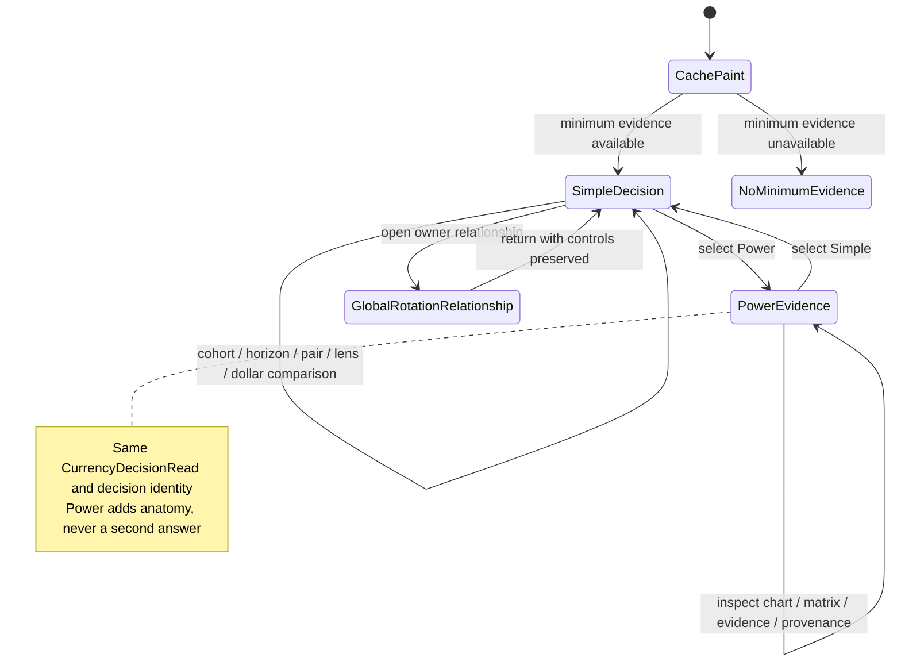
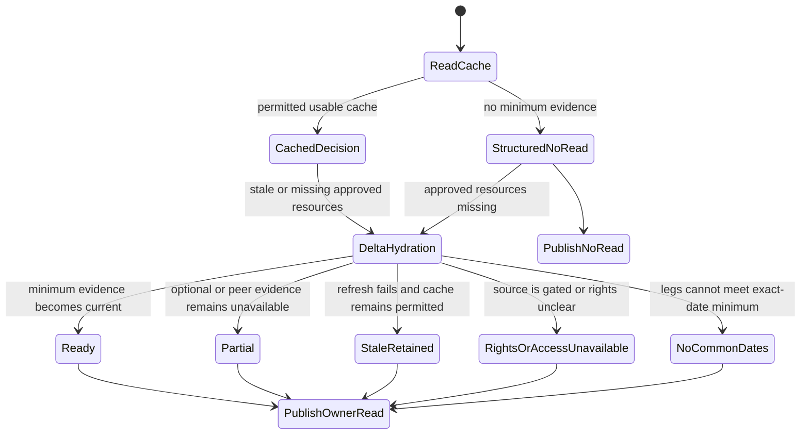
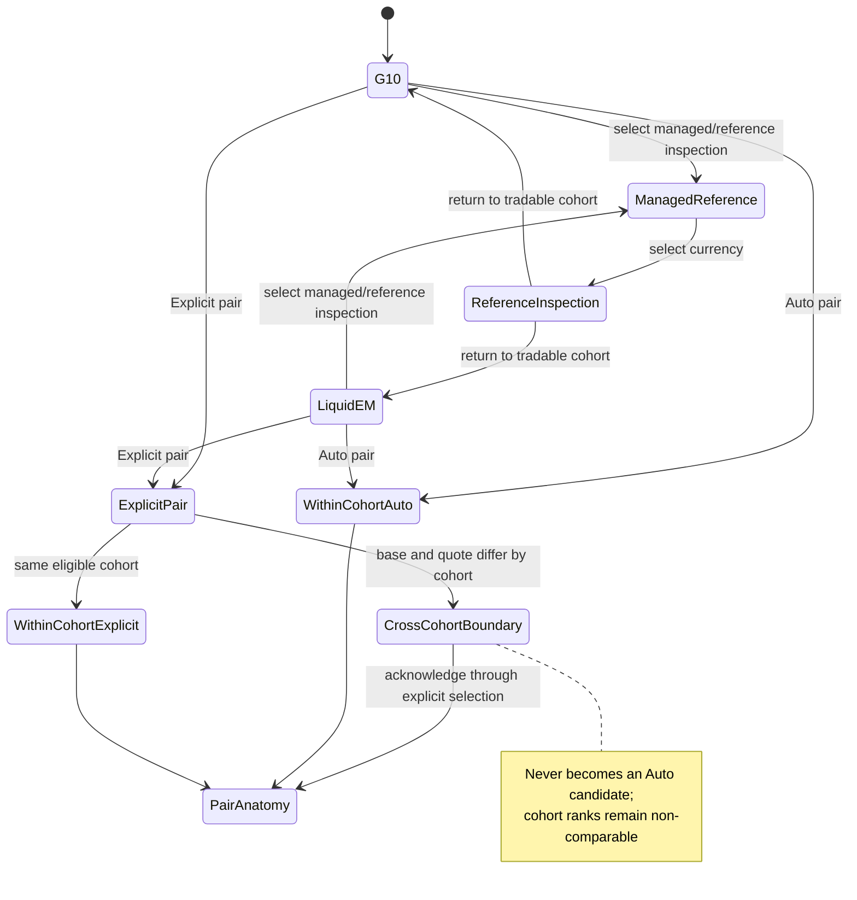
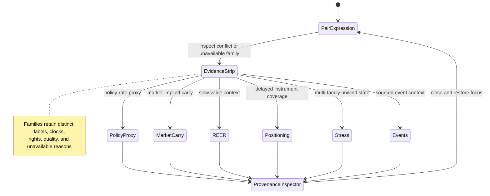
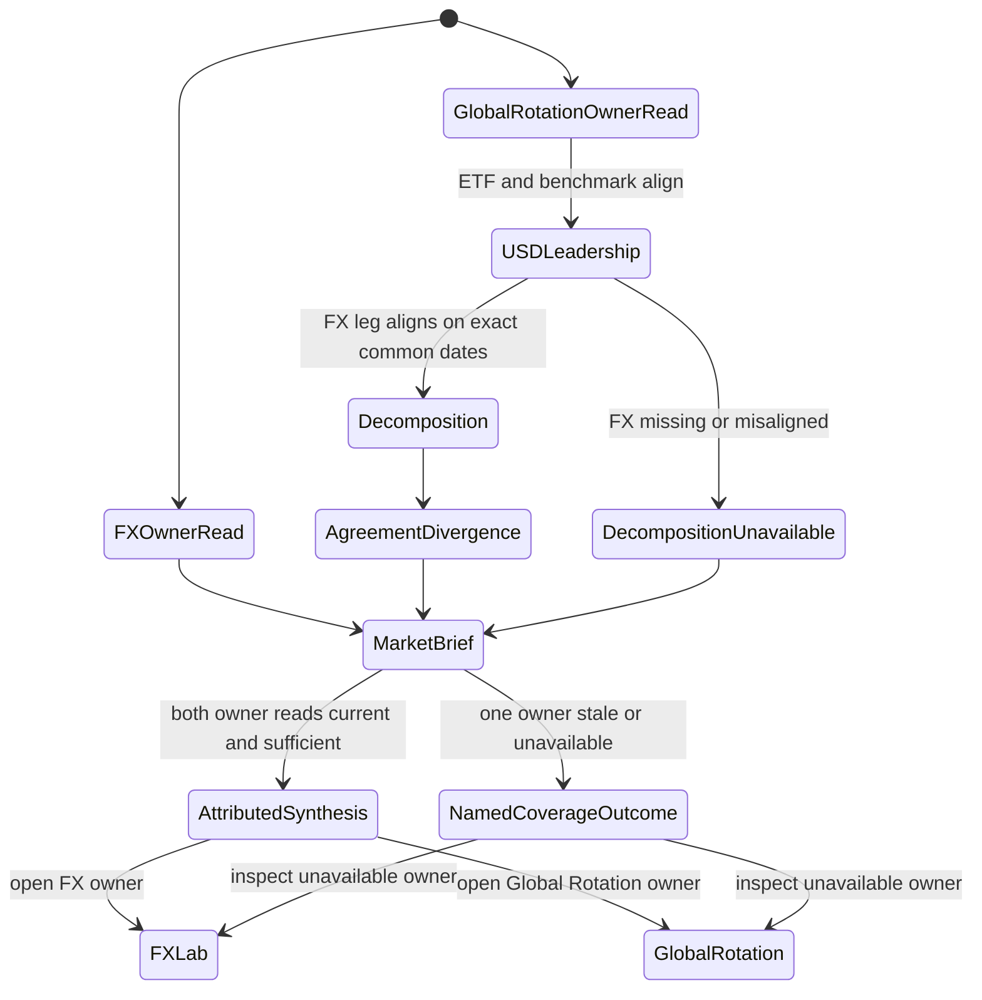
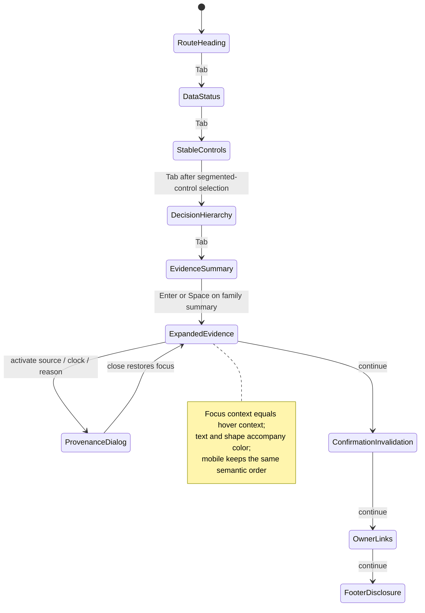

# Feature: 004 FX Regime and Relative-Value Lab

## Problem Statement

Research Lab has FX context but no FX decision capability. `global-rotation-lab.html` answers which country ETF deserves the next research slot from a USD investor's perspective. Its current model combines benchmark-relative USD ETF momentum, trend, realized risk, and a currency input. The page and `notes/global-rotation-lab.md` correctly warn that an unhedged US-listed country ETF already embeds currency translation and that adding FX can double-count the same impulse. The executable paths contradict that warning: `globalFxConfirm` produces both raw currency `score` and directional `confirmation`, but `buildModelRows` passes `fx.score` into `globalCountryScore`; `scripts/brief-refresh.mjs::buildGlobalToolRead` reproduces the same additive raw-FX path.

The current return path has a second integrity gap. `relativeReturn` calculates the country ETF and benchmark returns from independent trailing bar counts, while `globalFxConfirm` calculates the currency move from another independent bar count. Holidays, market closures, stale observations, and different trading calendars can therefore make apparently identical 21-, 63-, or 126-day windows start or end on different dates. The published Global Rotation read exposes USD relative momentum and FX strength but not exact common-date coverage, approximate local-equity return, or the contribution of currency translation.

Those defects should not be solved by turning Global Rotation into an FX terminal. Currency ranking, broad-dollar regime, carry, value, realized risk, positioning, stress behavior, event context, pair construction, and generic hedge research are a separate user job. `tools.json`, `index.html`, and `rlnav.js` currently register no dedicated FX tool, and `rldata.js` has generic bars and tool-read contracts but no reusable currency-observation contract with quote orientation, tradability, source rights, review windows, quality, or exact unavailable reasons.

The need is economically material. The [BIS 2025 Triennial Survey](https://www.bis.org/statistics/rpfx25_fx.htm) reports average OTC FX turnover of $9.6 trillion per day in April 2025 and the US dollar on one side of 89.2% of trades. That scale does not make every signal comparable or executable. [BIS research on currency momentum](https://www.bis.org/publ/work366.htm) finds momentum has very different properties from carry, while [NBER research on common currency risk factors](https://www.nber.org/papers/w14082) finds high-interest-rate currencies load on global risk, particularly in bad times. A useful Research Lab tool must preserve those distinctions rather than compress spot trend, policy rates, forward carry, value, positioning, and event risk into one opaque number.

## Outcome Contract

**Intent:** Give a USD-based research user one truthful FX workspace that identifies the broad-dollar regime, ranks independently measured currency strength within comparable cohorts, evaluates a selected pair or generic hedge research stance, and shows how momentum, trend, carry, value, realized risk, positioning, stress, and events agree or diverge.

**Success Signal:** With at least the minimum public spot and broad-dollar observations available, the user can identify the current dollar regime, strongest and weakest eligible currencies within each supported cohort, one conditional relative-value research expression, its evidence coverage, and explicit confirmation and invalidation conditions. The same currency-observation contract also lets Global Rotation expose exact common-date USD return, approximate local-equity return, FX translation, and agreement/divergence, while Market Brief consumes both owning-tool reads without recomputing either model.

**Hard Constraints:**

- Missing, stale beyond policy, non-finite, misoriented, non-tradable, access-gated, or rights-unclear inputs remain explicitly unavailable; none may become zero, neutral, unchanged, or implicitly current.
- Observed spot, broad-dollar indexes or proxies, policy-rate proxies, executable or indicative forward carry, REER value, positioning, realized risk, and event context remain separately labeled evidence families.
- A policy-rate differential is a carry proxy, not an executable forward return. It cannot be labeled tradable carry without instrument, tenor, forward or futures observation, timestamp, and cost/basis limitations.
- G10, liquid emerging-market, and managed/reference currencies use separate cohorts and eligibility rules. They cannot share one default ranking or be presented as interchangeable instruments.
- A currency's independent strength cannot be a renamed return of the selected pair or a single USD cross. Pair momentum and currency strength must retain separate evidence lineage.
- Global Rotation evaluates country ETFs from a USD investor's perspective and must not add raw FX strength as a second return forecast. FX contributes translation and agreement/divergence context, not additive alpha.
- Country ETF, benchmark, and FX decomposition uses exact common observation dates with no forward fill or independent start dates.
- Market Brief consumes normalized owner reads and shared observations; it cannot reimplement FX ranking, Global Rotation scoring, return decomposition, or unavailable-state logic.
- Simple and Power views consume one computation and cannot disagree for the same observations and controls.
- The tool remains educational research. It provides no personalized position size, order, broker connection, account advice, or claim of executable pricing.

**Failure Condition:** The feature fails even if every panel renders when it double-counts FX already embedded in a USD ETF return, calls a policy-rate spread executable carry, ranks a managed currency beside G10 without a boundary, treats a missing factor as neutral, combines mismatched dates, hides stale or restricted observations, lets Simple and Power disagree, or causes Market Brief to invent a synthesis that neither owning tool published.

## Goals

- Establish one reusable, source-aware currency-observation capability for the FX Lab, Global Rotation, and Market Brief.
- Provide a dedicated FX regime and relative-value tool with broad-dollar, independent strength, pair, momentum/trend, carry, value, risk, positioning, stress, event, confirmation, and invalidation reads.
- Reconcile Global Rotation's USD-investor return logic so local equity and currency translation are explanatory components rather than additive forecasts.
- Keep official, delayed, revised, restricted, and proxy data honest through explicit source, as-of, retrieval, review-window, rights, quality, and availability metadata.
- Preserve Research Lab's one-file, cache-first, automatic-delta, Simple/Power, tooltip, ticker-link, normalized-read, and educational-only contracts.
- Give Market Brief independent normalized reads that can surface cross-tool agreement or divergence without duplicating model logic.

## Non-Goals

- Brokerage execution, order routing, live dealer quotes, personalized hedge ratios, or account-specific currency exposure.
- A promise of real-time institutional spot, forward, swap, option, or positioning data without an authorized public source.
- Treating central-bank policy rates, deposit rates, ETF yields, or futures-implied rates as interchangeable measures.
- A single universal ranking that mixes G10, liquid emerging-market, pegged, managed, onshore, offshore, deliverable, and non-deliverable currencies.
- A forecast of central-bank decisions, exchange-rate targets, intervention levels, or exact pair returns.
- Replacing Global Rotation's country-equity research queue or Market Brief's low-noise cross-tool synthesis.
- Publishing restricted observations or derived datasets when redistribution rights are absent or unclear.
- Holdings ingestion, cost-basis tracking, tax advice, leverage recommendations, or position sizing.

## Current Capability Map

| Capability | Current Working-Tree Evidence | Status | Gap Owned By Feature 004 |
| --- | --- | --- | --- |
| Country ETF research queue | `global-rotation-lab.html`, `global-rotation-universe.json`, and `notes/global-rotation-lab.md` rank 13 country ETFs against ACWI/EFA/EEM | Partial | USD-return decomposition and exact ETF/benchmark/FX date alignment are absent |
| Currency orientation and directional context | `globalFxConfirm` orients Yahoo pairs so positive means local-currency strength and returns both `score` and `confirmation` | Partial | Raw `score`, not `confirmation`, enters the country score; no shared observation lineage |
| FX double-count disclosure | The Global Rotation method panel and note explicitly warn that USD ETF return already embeds FX | Present as prose | Executable browser and headless paths contradict the disclosure |
| Shared market cache | `rldata.js` stores provider-tagged interval bars, freshness, request status, and compact `toolReads` | Complete generic foundation | No currency family, quote orientation, cohort, tradability, source-rights, review-window, revision, or unavailable-reason contract |
| Cache-first automatic hydration | Global Rotation reads cached bars, renders, then calls `RLDATA.ensureBars` for stale or missing symbols | Existing pattern | New official, proxy, and contextual observations need the same truthful lifecycle |
| Simple and Power views | Global Rotation, Real Assets, Bond Regime, and other tools use a Simple default with a Power drilldown | Existing pattern | No FX-specific decision hierarchy or evidence anatomy |
| Market Brief owner-read reuse | `.github/copilot-instructions.md` and `rldata.js::putToolRead` require each tool to publish one compact owning read | Existing pattern | No FX owner read; Global Rotation read lacks decomposition and alignment metadata |
| Registered FX tool | Current `tools.json`, `index.html`, and `rlnav.js` include Global Rotation and Bond Regime but no FX Regime entry | Missing | New tool and parity registration are required during implementation |
| Broad-dollar official data | [Federal Reserve H.10](https://www.federalreserve.gov/releases/h10/summary/) provides daily nominal Broad/AFE/EME indexes and monthly real counterparts | External source available | No Research Lab observation adapter or regime read |
| Effective exchange-rate value context | [BIS EER](https://data.bis.org/topics/EER) provides broad NEER/REER coverage across 64 economies | External source available | No value observation, rights/freshness handling, or slow-data interpretation |
| Positioning context | [CFTC COT](https://www.cftc.gov/MarketReports/CommitmentsofTraders/AbouttheCOTReports/index.htm) publishes Tuesday open interest each Friday at 3:30 p.m. ET | External source available but delayed | No coverage mapping, delay label, or no-forward-fill rule |
| Derivatives context | [CME FX](https://www.cmegroup.com/markets/fx.html) exposes separate implied-rate, option-volatility, open-interest, COT, and market-profile tools | Access and rights vary | No authorized no-credential path is established; unavailable must remain a valid state |

## Honest Findings, Contradictions, And Limitations

1. **The disclosed model and executable model disagree.** `global-rotation-lab.html` says FX is confirmation and warns about double counting, yet `buildModelRows` passes `fx.score` into `globalCountryScore`. `scripts/brief-refresh.mjs::buildGlobalToolRead` does the same. Lowering the default weight does not resolve the conceptual duplication.
2. **`fx.confirmation` exists but does not control the score.** The current function already distinguishes agreement from raw strength. That dormant distinction is evidence that the intended business rule and the implemented ranking diverged.
3. **The current lookback label overstates alignment.** Country ETF, benchmark, and currency returns each count backward through their own row arrays. A shared number such as 63 does not prove a shared start date, end date, or observation set.
4. **The current normalized Global Rotation read is too lossy for honest reconciliation.** It publishes relative USD momentum and `fxStrengthPct` but not local-equity approximation, FX translation, common-date coverage, mismatch counts, or agreement/divergence classification.
5. **A single USD cross is not independent currency strength.** EURUSD momentum can describe EUR versus USD, but it cannot by itself establish whether EUR is broadly strong, USD is broadly weak, or both. Currency strength must use a cohort-relative observation set that does not collapse into the selected pair.
6. **Public spot availability does not establish executable carry.** Spot bars and broad-dollar proxies can support a robust first paint. Forward points, cross-currency basis, dealer spreads, financing costs, and roll conventions may require licensed or login-gated data. Their absence must constrain the conclusion rather than invite a policy-rate substitution.
7. **Official data operate on different clocks.** Fed nominal indexes are available daily while real indexes are monthly and can be revised with weights. BIS REER is slow-moving value context. CFTC COT describes Tuesday positions and is released Friday. Combining these as if synchronized would create false precision.
8. **Value is not a timing signal.** REER can identify expensive or cheap long-run context but does not specify when a currency will reverse. A value disagreement must remain visible rather than override current trend by itself.
9. **Carry is exposed to bad-times risk.** The NBER evidence that high-rate currencies load on global risk means a positive carry read requires explicit unwind/stress behavior and cannot be presented as free yield.
10. **G10 and emerging-market liquidity are structurally different.** Trading hours, convertibility, capital controls, NDF use, fixing mechanisms, central-bank intervention, gap risk, and transaction costs can dominate nominal score differences.
11. **Managed currencies can be analytically useful but not freely rankable.** A stable spot series can be the result of a peg, band, fixing, or intervention. Low realized volatility must not automatically become high risk quality.
12. **Cross-sectional ranks are sample-dependent.** The strongest currency label changes with cohort composition, missing peers, quote orientation, and common-date coverage. Every rank needs visible cohort and coverage.
13. **Positioning coverage is incomplete.** CFTC contracts do not map cleanly to every spot currency, and non-US venues or OTC positioning are not represented. Missing positioning must remain unavailable, not "not crowded."
14. **Event calendars can be incomplete or revised.** When no authorized source is available, the tool still needs market-derived invalidation while labeling event context unavailable.
15. **Country ETF local-return decomposition is approximate.** The identity removes observed currency translation from a USD ETF return, but fees, withholding, index composition, local/US close timing, tracking difference, and after-hours price discovery prevent it from becoming an exact local-index return.
16. **No credential input is permitted on the tool page.** The current project policy centralizes any supported credential management on `index.html#data-settings`; Feature 004 cannot solve data gaps by adding another key form.

## Domain Capability Model

### Capability

**Currency Regime And Relative-Value Analysis** turns heterogeneous currency observations into independent broad-dollar, currency-strength, pair-expression, hedge-research, risk, and evidence-conflict reads while preserving source lineage, tradability, cohort boundaries, timing, rights, and unavailable states. The capability is shared by the dedicated FX tool, Global Rotation's return decomposition, and Market Brief's cross-tool synthesis.

### Domain Primitives

| Primitive | Purpose | Lifecycle |
| --- | --- | --- |
| Currency | Identifies a currency, cohort, convertibility regime, settlement form, and managed/free-float characteristics | configured -> eligible, reference-only, or removed; classification changes are versioned |
| CurrencyPair | Defines base, quote, canonical orientation, venue/proxy, tenor when applicable, and tradability | configured -> observed -> stale or unavailable -> superseded |
| CurrencyObservation | One raw or derived spot, index, carry, value, risk, positioning, or event observation with complete provenance | loading -> fresh, stale, revised, or unavailable -> superseded |
| ObservationSet | Exact-date intersection and coverage record used by one calculation | insufficient -> aligned -> consumed -> superseded when any member changes |
| BroadDollarRegime | Separates broad, AFE, and EME dollar direction, trend, breadth, and official/proxy divergence | indeterminate -> strengthening, range-bound, or weakening -> stale or superseded |
| CurrencyStrengthRead | Cohort-relative strength measured across multiple eligible peers rather than from one selected pair | insufficient -> strong, neutral, or weak -> stale or superseded |
| PairMomentumRead | Direct selected-pair return, trend, breakout/drawdown, and exact-date coverage | insufficient -> positive, mixed, or negative -> stale or superseded |
| CarryRead | Tradable forward/futures carry when authorized, or an explicitly named policy-rate proxy | unavailable -> proxy-only or tradable-observed -> stale or superseded |
| ValueRead | Slow-moving NEER/REER context with revision and percentile/deviation metadata | unavailable -> cheap, neutral, or rich -> revised or superseded |
| RiskRead | Realized volatility, drawdown, gap behavior, and cohort-relative risk | insufficient -> calm, normal, or stressed -> stale or superseded |
| PositioningRead | Delayed futures/options positioning and crowding context with instrument coverage | unavailable -> light, balanced, or crowded -> stale or superseded |
| EventContext | Sourced central-bank, policy, fixing, intervention, election, or release event with timezone and review window | unavailable -> scheduled or active -> passed -> superseded |
| CarryUnwindState | Multi-evidence stress state for high-carry weakness, funding-currency strength, rising volatility, and crowding | indeterminate -> dormant, watch, or active -> resolved |
| PairExpression | Conditional long/short research expression with cohort, evidence, confidence, confirmation, and invalidation | unavailable -> candidate, mixed, or rejected -> superseded |
| HedgeResearchPosture | Generic USD-exposure research stance, never a personalized hedge ratio | indeterminate -> increase, maintain, or reduce hedge research priority -> superseded |
| EvidenceConflict | Explicit disagreement among independent evidence families or owner reads | opened -> retained, resolved, or superseded |
| CurrencyDecisionRead | One decision-first projection used by Simple, Power, and the normalized tool read | unavailable -> current -> stale -> superseded |

### Reusable Currency Observation Contract

Every CurrencyObservation must carry all fields below. A consumer may project fewer fields for display, but it cannot discard the lineage needed to interpret availability, freshness, rights, orientation, or tradability.

| Field | Required Meaning |
| --- | --- |
| `observationId` | Stable identity for the source, subject, measure, tenor, and transformation |
| `family` | One of `spot`, `broad-dollar`, `policy-rate-proxy`, `forward-carry`, `reer-value`, `realized-risk`, `positioning`, or `event` |
| `subject` | Currency, pair, cohort, index, contract, or event represented |
| `base` / `quote` | Canonical pair orientation when the observation is pair-based; absent only when not meaningful |
| `cohort` | `G10`, `liquid-EM`, `managed-reference`, or an explicitly unsupported classification |
| `tradability` | `tradable-observed`, `indicative-proxy`, `reference-only`, or `non-tradable` |
| `value` / `unit` | Finite observed or derived value and its unit; unavailable observations carry no numeric value |
| `transformation` | Raw, inverted, indexed, return, volatility, percentile, spread, or another explicitly named transform |
| `horizon` | Observation period or tenor; no implied default |
| `source` / `sourceUrl` | Named provider and inspectable source reference |
| `observedAsOf` | Time the market, index, report, or event observation describes |
| `retrievedAt` | Time Research Lab obtained the observation |
| `expectedCadence` | Daily, weekly, monthly, event-driven, session, or another source-declared cadence |
| `reviewWindow` | The exact maximum age or next-review rule after which the observation becomes stale |
| `availability` | `loading`, `fresh`, `stale`, `revised`, or `unavailable` |
| `unavailableReason` | Closed reason code required whenever availability is unavailable |
| `rights` | `redistributable`, `reference-only`, `restricted`, or `unknown` |
| `quality` | `observed`, `official-revised`, `indicative-proxy`, `derived`, or `user-assumption` |
| `revisionId` | Source release/version when revisions are possible; otherwise explicitly not applicable |
| `limitations` | Source, proxy, timing, coverage, liquidity, or interpretation limitations |

### Closed Availability And Unavailable Vocabulary

`unavailable` must include exactly one primary reason and may include additional detail that does not change the code:

| Reason | Meaning | Required Behavior |
| --- | --- | --- |
| `NO_SOURCE` | No approved source contract exists | Show unavailable; do not attempt an implicit source |
| `ACCESS_REQUIRED` | Login, entitlement, credential, or subscription is required | Show unavailable and identify the access boundary; no credential field on the tool |
| `RIGHTS_UNCLEAR` | Retrieval may work but reuse or redistribution rights are not established | Do not persist or score the observation |
| `NO_COVERAGE` | Source does not cover the currency, pair, tenor, or event | Keep the family unavailable for that subject |
| `NON_TRADABLE` | Observation describes a managed, reference, or inaccessible instrument | Exclude it from tradable ranking or expression |
| `INSUFFICIENT_HISTORY` | Too few valid observations exist for the declared horizon | Show exact required versus available coverage |
| `NO_COMMON_DATES` | Required legs have no sufficient exact-date intersection | Do not calculate or forward-fill |
| `INVALID_ORIENTATION` | Base/quote direction or inversion cannot be verified | Do not infer direction from ticker spelling |
| `NONFINITE` | Required numeric inputs are null, infinite, or malformed | Publish no numeric result |
| `SOURCE_ERROR` | Approved source retrieval or parsing failed | Preserve valid cache as stale when allowed; otherwise unavailable |

### Relationships

- A CurrencyStrengthRead consumes an ObservationSet spanning multiple eligible peers and cannot be derived solely from the selected CurrencyPair.
- A PairExpression combines CurrencyStrengthRead with a separately calculated PairMomentumRead; shared source lineage is visible so correlated evidence is not counted twice.
- A CarryRead may support or contradict a PairExpression but cannot overwrite its momentum, value, or risk states.
- A policy-rate-proxy CurrencyObservation can produce only a `proxy-only` CarryRead.
- A ValueRead supplies long-horizon context and cannot independently produce a tactical PairExpression.
- A PositioningRead is instrument-specific and cannot be generalized to uncovered currencies.
- CarryUnwindState requires price/risk evidence plus at least one independent carry or positioning condition; high carry alone is not an unwind.
- BroadDollarRegime keeps broad, AFE, EME, official, and proxy observations separate and creates EvidenceConflict when they disagree.
- Global Rotation consumes CurrencyObservations to decompose ETF returns but does not consume the FX Lab's pair rank as country-equity alpha.
- Market Brief consumes CurrencyDecisionRead and the Global Rotation owner read, preserving agreement and conflict instead of merging their scores.

### Business Policies

1. **Cohort policy:** G10 and liquid-EM strength tables are separate. Managed/reference currencies are inspectable but cannot be auto-selected as strongest/weakest tradable expressions.
2. **Coverage policy:** A cohort-relative strength read requires observations against at least three distinct eligible peers and the configured minimum percentage of the cohort. Pair and inverse-pair duplicates count once.
3. **Independence policy:** Direct selected-pair momentum and cohort-relative currency strength retain separate evidence identities even when they use related spot observations.
4. **Orientation policy:** Every pair declares base, quote, and positive-return meaning. Unverified inversion makes the pair unavailable.
5. **Common-date policy:** Every multi-leg return, relative return, decomposition, correlation, or rank uses exact common observation dates and reports unmatched newer dates.
6. **No-forward-fill policy:** Missing market observations are never carried into a newer date to create an apparently current result.
7. **Broad-dollar policy:** Official Broad, AFE, and EME indexes and liquid proxy series remain separate. Proxy disagreement is evidence, not an averaging problem.
8. **Carry taxonomy policy:** `tradable forward carry`, `futures-implied carry`, `swap-implied differential`, and `policy-rate proxy` are distinct labels. Only the first three may be described as market-implied, and none may be called executable without costs and timestamp limitations.
9. **Value policy:** REER/NEER context may change conviction or identify tension but cannot time an entry by itself.
10. **Positioning-delay policy:** COT always displays its Tuesday as-of and Friday release time; no newer spot date can make it current-week positioning.
11. **Stress policy:** An active carry-unwind read requires a disclosed combination of high-carry weakness, funding-currency strength, rising realized or implied risk, and/or crowded positioning. Missing conditions remain unavailable.
12. **Managed-currency policy:** Pegs, bands, fixing, convertibility, intervention, and onshore/offshore differences are first-class limitations. Low volatility under management is not automatically favorable risk.
13. **Rights policy:** Restricted or unknown-rights observations are not committed, cached beyond allowed use, or included in public scores.
14. **Revision policy:** A revised official observation is marked revised and supersedes the earlier value without rewriting its original as-of meaning.
15. **Truthful-degradation policy:** Missing optional evidence lowers coverage and confidence. Missing minimum evidence makes the affected read Indeterminate or Unavailable.
16. **One-decision policy:** One CurrencyDecisionRead feeds Simple, Power, and the tool read.
17. **Owner policy:** FX Lab owns currency regime, ranking, pair, and generic hedge research. Global Rotation owns country-equity leadership and USD/local/translation decomposition. Market Brief owns cross-tool synthesis only.

### Capability Ownership Boundaries

| Surface | Owns | Must Not Own |
| --- | --- | --- |
| FX Regime and Relative-Value Lab | Broad-dollar regime, cohort-relative currency strength, pair expression, carry/value/risk/positioning/stress/event evidence, generic hedge research posture, FX owner read | Country ETF ranking, Market Brief narrative, personalized execution |
| Global Rotation Lab | Country ETF USD leadership, exact common-date benchmark comparison, approximate local-equity return, FX translation, agreement/divergence, Global Rotation owner read | Currency cross leaderboard, forward carry, REER ranking, hedge decision, additive raw-FX forecast |
| Market Brief | Registry-complete consumption, material cross-tool agreement/divergence, attribution, low-noise plan relevance | Recomputing FX or Global Rotation models, filling unavailable evidence, creating a third composite score |
| Shared observation capability | Currency identity, orientation, cohort, availability, provenance, rights, quality, freshness, revision, and alignment vocabulary | Tool-specific verdicts or UI language |

## Actors And Personas

| Actor | Description | Key Goals | Permission Boundary |
| --- | --- | --- | --- |
| USD Multi-Asset Researcher | Interprets currencies as a funding, translation, and risk-regime input | Know whether broad USD conditions support or threaten non-US and risk-asset research | May inspect generic market reads; receives no account-specific hedge ratio or execution instruction |
| FX Relative-Value Researcher | Compares currencies and pairs over tactical and swing horizons | Find independently strong versus weak currencies, understand factor agreement, and define invalidation | May select cohorts, pairs, horizons, and evidence views; cannot treat proxy carry as executable |
| Global Allocation Researcher | Uses country ETFs and local-market context | Separate local-equity leadership from USD currency translation and identify agreement/divergence | Consumes Global Rotation decomposition; does not use the FX rank as an additive country score |
| Hedge Researcher | Studies generic USD translation risk around foreign exposure | Decide whether hedge research priority should increase, remain, decrease, or stay indeterminate | Receives a generic conditional posture only; no holdings, hedge percentage, tenor, or instrument recommendation |
| Macro Researcher | Studies dollar breadth, policy divergence, value, positioning, and stress | Distinguish fast price evidence from slow or delayed macro context | May inspect every source and conflict; cannot treat revised monthly context as live spot evidence |
| Data-Constrained Public User | Uses the static site with partial cache and no paid data entitlement | Get a useful public-data read and exact explanations for unavailable evidence | Uses approved public or cached observations; cannot be prompted for credentials on the tool page |
| Market Brief Analyst | Produces the registry-complete low-noise synthesis | Surface only material FX/Global Rotation agreement, divergence, or invalidation with attribution | Consumes normalized owner reads; cannot reconstruct missing factors or override an owner verdict |

## Use Cases

### UC-001: Assess the broad-dollar regime

- **Actor:** USD Multi-Asset Researcher
- **Preconditions:** At least one approved broad-dollar official index or explicitly labeled liquid proxy has sufficient current history.
- **Main Flow:**
  1. The user opens Simple view and sees Broad, AFE, and EME dollar states that are available.
  2. The tool shows direction, trend, breadth, risk state, source, and freshness for each independent observation.
  3. Official and proxy disagreement remains visible.
  4. The tool states what confirms and invalidates the current dollar regime.
- **Alternative Flows:** If only a proxy is available, the regime is labeled proxy-based. If no minimum source is usable, the broad-dollar regime is Indeterminate with an exact reason.
- **Postconditions:** The user can explain whether dollar strength is broad, concentrated, weakening, or unresolved without assuming all dollar indexes agree.

### UC-002: Rank independent currency strength within a cohort

- **Actor:** FX Relative-Value Researcher
- **Preconditions:** A configured cohort has sufficient exact-date spot coverage across multiple eligible peers.
- **Main Flow:**
  1. The user selects G10 or liquid EM.
  2. The tool reports cohort membership and coverage.
  3. Each eligible currency receives an independently derived strength read across peers.
  4. Strongest, weakest, breadth, dispersion, and rank stability are shown with source lineage.
- **Alternative Flows:** Managed/reference currencies appear in a separate inspection surface. A currency with insufficient peer coverage remains unranked.
- **Postconditions:** The user can identify broad currency strength without mistaking one USD pair for an independent rank.

### UC-003: Evaluate a pair expression

- **Actor:** FX Relative-Value Researcher
- **Preconditions:** Both currencies are eligible for the selected expression and direct pair history aligns with the strength observation set.
- **Main Flow:**
  1. The user selects or accepts a strongest-versus-weakest candidate within a cohort.
  2. The tool shows base/quote orientation and the meaning of a positive move.
  3. Independent strength spread, direct pair momentum/trend, carry label, value, risk, positioning, stress, and event context remain separate.
  4. The tool produces Candidate, Mixed, Rejected, or Unavailable with confidence, confirmation, and invalidation.
- **Alternative Flows:** Cross-cohort analysis requires an explicit user choice and displays liquidity/convertibility warnings. Managed or non-tradable pairs cannot become auto-selected expressions.
- **Postconditions:** The user understands why the pair is or is not a coherent research expression and which evidence could change it.

### UC-004: Assess a generic hedge research posture

- **Actor:** Hedge Researcher
- **Preconditions:** Broad-dollar regime, selected foreign-currency direction, and realized risk meet the minimum evidence contract.
- **Main Flow:**
  1. The user selects a generic foreign-exposure currency or cohort.
  2. The tool compares dollar regime, currency strength, translation risk, and stress behavior.
  3. It returns increase, maintain, reduce, or indeterminate hedge research priority.
  4. It states that the posture is generic and supplies no ratio, notional, tenor, or instrument.
- **Alternative Flows:** Missing current risk or currency evidence produces Indeterminate even if policy-rate context exists.
- **Postconditions:** The user knows whether currency translation deserves more research without receiving personalized hedge advice.

### UC-005: Challenge carry with value, risk, positioning, and events

- **Actor:** Macro Researcher
- **Preconditions:** At least one carry or carry-proxy observation exists; other context families may be available or unavailable.
- **Main Flow:**
  1. The user opens Pair Anatomy in Power view.
  2. The tool distinguishes market-implied carry from policy-rate proxy.
  3. REER value, realized risk, delayed positioning, carry-unwind state, and scheduled events appear with independent clocks.
  4. Conflicts lower confidence and remain named.
- **Alternative Flows:** Missing proprietary derivatives data remains `ACCESS_REQUIRED` or `RIGHTS_UNCLEAR`; policy rates remain visible only as proxy context.
- **Postconditions:** The user can distinguish a high-carry trend from a crowded or stress-sensitive trade and identify evidence limitations.

### UC-006: Operate with partial, stale, or revised data

- **Actor:** Data-Constrained Public User
- **Preconditions:** The shared cache may contain a mixture of fresh, stale, missing, revised, and inaccessible observations.
- **Main Flow:**
  1. The tool paints from valid cache immediately.
  2. Missing and stale deltas hydrate automatically through approved no-credential paths.
  3. Each family shows observation time, retrieval time, review window, rights, quality, and availability.
  4. The decision read updates without converting failed families to neutral.
- **Alternative Flows:** A stale cache remains visible as stale when permitted. A rights-unclear observation is excluded even if retrieval succeeded.
- **Postconditions:** The user gets the strongest honest partial read and can identify every limitation.

### UC-007: Decompose country ETF leadership for a USD investor

- **Actor:** Global Allocation Researcher
- **Preconditions:** Country ETF, benchmark, and correctly oriented currency series have sufficient exact common dates.
- **Main Flow:**
  1. Global Rotation calculates USD ETF and benchmark returns on the same exact dates.
  2. It approximates local-equity return as `(1 + R_USD) / (1 + R_FX) - 1`.
  3. It displays FX translation as the difference between USD ETF return and approximate local-equity return, including interaction.
  4. It classifies local-equity and FX agreement/divergence.
  5. Raw FX strength does not enter the country forecast score.
- **Alternative Flows:** Missing or misaligned FX leaves USD leadership usable but local/translation decomposition unavailable. No zero FX assumption is inserted.
- **Postconditions:** The user can tell whether country leadership is local-equity-led, FX-led, jointly supported, or currency-dragged.

### UC-008: Surface cross-tool agreement in Market Brief

- **Actor:** Market Brief Analyst
- **Preconditions:** Registry coverage includes current normalized reads from FX Lab and Global Rotation, or explicit unavailable outcomes.
- **Main Flow:**
  1. Market Brief consumes both reads and their provenance.
  2. It identifies material agreement, such as broad dollar weakness plus local-equity leadership and supportive translation.
  3. It identifies divergence, such as a country ETF leading in USD only because of FX while local equity is weak.
  4. It deep-links the owner and avoids recomputation.
- **Alternative Flows:** If one owner read is stale or unavailable, Brief states that coverage outcome and does not infer agreement.
- **Postconditions:** The final brief is attributable, low-noise, and consistent with both owners.

## Business Scenarios

### BS-001: Broad dollar strength is separated by trading-partner cohort

Given fresh Broad, AFE, and EME nominal dollar observations are available
When the tool evaluates the broad-dollar regime
Then it must show each index independently
And it must identify whether strength is broad or concentrated
And no one index may silently stand in for all three

### BS-002: Official and proxy dollar signals can disagree

Given an approved liquid dollar proxy is rising
And the latest official Broad Dollar Index is weakening over its own aligned window
When the Simple verdict is rendered
Then the regime must show a named official/proxy divergence
And it must not average the conflict into a false neutral

### BS-003: Currency strength is not a renamed USD cross

Given EURUSD is rising
But EUR is weak against most other eligible G10 peers on exact common dates
When EUR strength is ranked
Then the tool must not call EUR broadly strong from EURUSD alone
And the selected-pair momentum and independent EUR strength must remain separate

### BS-004: Pair orientation is explicit

Given one source quotes USD per EUR and another quotes local currency per USD
When observations enter the shared contract
Then each must declare base, quote, inversion, and positive-return meaning
And any unverified orientation must be unavailable with `INVALID_ORIENTATION`

### BS-005: Exact common dates control every multi-leg return

Given a pair, benchmark, or currency leg has a newer date than another required leg
When a relative return or decomposition is calculated
Then only exact common dates may be used
And the latest common date and unmatched newer dates must be visible
And no missing leg may be forward-filled

### BS-006: G10 and liquid EM ranks remain separate

Given valid G10 and liquid-EM observations exist
When the user opens the strength board
Then the tool must render separate cohort ranks and coverage
And no default strongest-versus-weakest expression may cross cohorts

### BS-007: Managed currency stability is not low risk by default

Given a managed or pegged currency has low observed volatility
When risk quality is evaluated
Then management, convertibility, intervention, and gap limitations must remain visible
And the currency must not receive an automatic favorable risk rank from low volatility

### BS-008: Missing peer coverage blocks a rank

Given a currency has observations against fewer than the minimum eligible peers
When cohort strength is computed
Then its rank must be unavailable with `INSUFFICIENT_HISTORY` or `NO_COVERAGE`
And it must not receive the cohort average or a neutral score

### BS-009: Momentum and carry can disagree

Given a selected pair has positive direct momentum and trend
And its available carry evidence is adverse
When a PairExpression is built
Then momentum and carry must remain separate
And the expression must show the conflict and reduced confidence

### BS-010: Policy rates are labeled as proxy-only

Given current central-bank policy rates are available
But no authorized forward, swap, or futures-implied observation is available
When carry context is displayed
Then the label must be `Policy-rate proxy`
And the tool must not claim executable forward carry, roll return, or transaction cost

### BS-011: Tradable carry requires instrument and tenor

Given an authorized forward or futures-implied observation has instrument, tenor, timestamp, and price lineage
When it is used as carry evidence
Then the tool may label it market-implied carry
And it must still disclose basis, roll, liquidity, and cost limitations

### BS-012: Cheap REER does not time a reversal

Given a currency is cheap on available REER context
And direct pair trend remains negative
When the pair is evaluated
Then value must appear as a long-horizon tension
And it must not independently produce a positive tactical expression

### BS-013: Delayed positioning stays delayed

Given the latest CFTC report describes Tuesday open interest and was released Friday
And spot bars are newer
When positioning is shown
Then both the Tuesday as-of and Friday release time must be visible
And newer spot data must not make positioning appear current to the latest bar

### BS-014: Missing positioning is not an uncrowded signal

Given CFTC or venue positioning does not cover a currency or access is unavailable
When crowding is evaluated
Then PositioningRead must be unavailable with the exact reason
And the pair must not be labeled uncrowded

### BS-015: Carry unwind requires multiple evidence families

Given a high-carry currency begins weakening
And realized or implied risk rises
And a funding currency strengthens or available positioning is crowded
When stress behavior is evaluated
Then CarryUnwindState may become Watch or Active under disclosed thresholds
And high carry alone may not create the unwind label

### BS-016: Event context can be unavailable without hiding invalidation

Given no approved event-calendar source covers the selected pair
When the pair expression is rendered
Then EventContext must show `NO_SOURCE` or `NO_COVERAGE`
And price- and risk-based invalidation must remain visible

### BS-017: Cache-first first paint survives missing data

Given the shared cache contains only part of the configured currency universe
When the FX tool opens
Then it must render a meaningful partial Simple view before network completion
And automatically request only stale or missing approved resources
And null values must render unavailable rather than stop the page

### BS-018: Control changes recompute without refetching

Given observations are already loaded
When the user changes cohort, horizon, pair, or evidence lens
Then one computation must update Simple, Power, and the normalized read
And no market-data request may occur solely because of the control change

### BS-019: Simple and Power share one decision

Given fixed observations and controls
When the user switches between Simple and Power
Then broad-dollar regime, strength ranks, pair state, hedge posture, confidence, conflicts, confirmation, and invalidation must remain identical
And Power may add evidence detail without changing the conclusion

### BS-020: Global Rotation separates USD, local, and FX translation

Given exact common-date country ETF and currency returns are available
When Global Rotation evaluates country leadership
Then it must show USD-investor ETF return
And approximate local-equity return using `(1 + R_USD) / (1 + R_FX) - 1`
And FX translation including the multiplicative interaction
And the approximation limitations

### BS-021: Raw FX cannot boost a country rank twice

Given a country ETF USD return is strong primarily because its local currency strengthened
When Global Rotation scores country leadership
Then raw FX strength must not enter as an additive forecast component
And the UI must identify the result as FX-led translation or agreement context

### BS-022: Missing FX does not erase valid USD leadership

Given country ETF and benchmark returns align
But currency observations are unavailable or misaligned
When Global Rotation renders
Then USD-investor relative leadership may remain available
And local-equity return, translation, and agreement must be unavailable
And FX must not be assumed zero

### BS-023: Market Brief preserves agreement and divergence

Given current owner reads from FX Lab and Global Rotation are available
When Market Brief evaluates them
Then it must surface a material agreement or divergence with owner attribution
And it must not calculate a new FX or country score

### BS-024: Restricted or unclear-rights data stays out of public state

Given an observation is technically retrievable
But its redistribution or persistence rights are restricted or unknown
When the public tool processes it
Then the observation must be excluded from committed snapshots and public scoring
And availability must state `RIGHTS_UNCLEAR` or the applicable restriction

### BS-025: Every dynamic read is understandable without hover alone

Given a keyboard-only or screen-reader user opens either mode
When they inspect controls, ranks, conflicts, charts, unavailable states, and invalidation
Then the same contextual meaning available in tooltips must be available through focus or adjacent accessible text
And color must not be the only carrier of direction or state

### BS-026: Registration and publication stay in parity

Given the FX tool is delivered
When registry and shell consistency is checked
Then the same tool identity, title, route, notes target, and order must exist in `tools.json`, `index.html`, and `rlnav.js`
And every render must publish one current `toolRead`

## Requirements

### Shared Currency Observation Foundation

- **FR-001:** The feature must establish one reusable CurrencyObservation contract consumed by FX Lab, Global Rotation, and Market Brief.
- **FR-002:** Every observation must include the full provenance, timing, review-window, availability, rights, quality, cohort, orientation, and tradability fields defined in this spec.
- **FR-003:** An unavailable observation must contain no numeric value and must carry one closed unavailable reason.
- **FR-004:** Missing, null, infinite, malformed, or non-numeric values must never pass a finite-value guard or enter arithmetic.
- **FR-005:** Pair-based observations must declare base, quote, inversion, and the economic meaning of a positive return.
- **FR-006:** Multi-leg calculations must expose exact common-date count, earliest and latest common date, and unmatched newer dates.
- **FR-007:** No multi-leg calculation may forward-fill or backfill a missing market observation.
- **FR-008:** Raw, inverted, indexed, return, spread, percentile, and derived observations must retain their transformation label.
- **FR-009:** Observations with adjusted and raw price conventions must not be silently mixed.
- **FR-010:** Source revisions must create a revised state and preserve source release/version metadata.
- **FR-011:** Rights `restricted` or `unknown` must exclude an observation from committed public snapshots and model scoring.
- **FR-012:** A valid stale cache may remain visible with its age and stale label when source policy permits, but it cannot be described as fresh or live.
- **FR-013:** Every consumer must preserve unavailable reasons rather than reduce all failures to a generic missing value.
- **FR-014:** Evidence lineage must identify when two factors reuse the same underlying observations so a model cannot present them as independent confirmations.

### Universe, Cohorts, And Tradability

- **FR-015:** Every configured currency must declare `G10`, `liquid-EM`, `managed-reference`, or explicitly unsupported cohort status.
- **FR-016:** G10 and liquid-EM must have separate default rankings, breadth, dispersion, coverage, and candidate selection.
- **FR-017:** Managed/reference currencies must appear in a separate inspection group and cannot become automatic tradable candidates.
- **FR-018:** Cross-cohort pair analysis must require an explicit user action and show liquidity, convertibility, settlement, intervention, and gap-risk limitations.
- **FR-019:** Onshore/offshore, deliverable/non-deliverable, peg/band, and fixing distinctions must remain visible when applicable.
- **FR-020:** Low realized volatility in a managed currency cannot independently improve risk quality.
- **FR-021:** Universe membership and classification changes must be sourceable and versioned so a rank remains interpretable.
- **FR-022:** Each displayed rank must show cohort and eligible-peer coverage.

### Broad-Dollar Regime

- **FR-023:** The tool must evaluate broad-dollar direction without treating one bilateral pair as the dollar regime.
- **FR-024:** Available Broad, AFE, and EME dollar indexes must remain separate reads.
- **FR-025:** Official dollar indexes and liquid proxies must remain separately labeled and must create a visible conflict when they disagree.
- **FR-026:** The BroadDollarRegime vocabulary is limited to Strengthening, Range-Bound, Weakening, and Indeterminate.
- **FR-027:** The regime must expose horizon, direction, trend, breadth or cohort concentration, realized risk, source as-of, and confirmation/invalidation.
- **FR-028:** A proxy-only regime must say proxy-only and cannot imply official-index confirmation.
- **FR-029:** Missing AFE or EME evidence must remain unavailable rather than inherit the Broad index state.
- **FR-030:** Monthly real-dollar context must not be displayed as daily nominal evidence.

### Independent Currency Strength

- **FR-031:** CurrencyStrengthRead must use multiple eligible peers and cannot be calculated from only the selected pair or one USD cross.
- **FR-032:** The minimum strength coverage must require at least three distinct eligible peers and the configured cohort coverage threshold.
- **FR-033:** A pair and its inverse count as one relationship for coverage and evidence independence.
- **FR-034:** Strength calculations must use exact common dates for the chosen horizon and report sample-dependent coverage.
- **FR-035:** Strength vocabulary is limited to Strong, Neutral, Weak, and Unavailable.
- **FR-036:** The strength board must expose rank, score or normalized distance, breadth, dispersion, coverage, horizon, and rank stability.
- **FR-037:** A currency that fails minimum coverage must remain unranked; no cohort mean, zero, or neutral value may be inserted.
- **FR-038:** Currency strength and direct pair momentum must remain separate in data, UI, decision logic, and normalized output.
- **FR-039:** Synthesized crosses must be labeled derived and cannot create a second independent confirmation from the same underlying USD legs.

### Pair Expression And Generic Hedge Research

- **FR-040:** A PairExpression must declare base, quote, cohort relationship, eligibility, horizon, and positive-return meaning.
- **FR-041:** Auto-selected strongest-versus-weakest candidates must remain within one eligible tradable cohort.
- **FR-042:** Pair state vocabulary is limited to Candidate, Mixed, Rejected, and Unavailable.
- **FR-043:** A Candidate requires minimum independent-strength coverage, usable direct pair momentum/trend, and usable realized-risk evidence.
- **FR-044:** Every pair state must include supporting evidence, contradicting evidence, coverage, confidence, confirmation, and invalidation.
- **FR-045:** Direct pair momentum must expose at least short, swing, and structural horizons when sufficient aligned history exists.
- **FR-046:** Pair trend must be separate from return magnitude and must state the disclosed trend rule.
- **FR-047:** Realized risk must expose volatility, drawdown, gap/missing-session limitations, and its own horizon.
- **FR-048:** A pair with invalid orientation, non-tradable status, no common dates, or non-finite required inputs must be Unavailable.
- **FR-049:** Cross-cohort candidates cannot be auto-elevated and must show explicit liquidity and regime warnings.
- **FR-050:** Generic HedgeResearchPosture vocabulary is limited to Increase, Maintain, Reduce, and Indeterminate research priority.
- **FR-051:** A hedge research posture must use broad-dollar, selected-currency, translation-risk, and realized-risk evidence; policy rates alone are insufficient.
- **FR-052:** A hedge research posture must never include personalized hedge percentage, notional, tenor, instrument, leverage, or execution language.

### Carry, Value, Positioning, Stress, And Events

- **FR-053:** CarryRead must identify exactly one of tradable-forward, futures-implied, swap-implied, policy-rate-proxy, or unavailable evidence type.
- **FR-054:** Policy-rate differences must always use `Policy-rate proxy` wording and cannot be labeled executable, tradable, or forward carry.
- **FR-055:** Market-implied carry requires instrument, tenor, observation timestamp, source, authorized rights, and basis/roll/cost limitations.
- **FR-056:** Carry values with different tenors cannot be compared without an explicit tenor normalization or an unavailable comparison state.
- **FR-057:** ValueRead must distinguish NEER from REER, nominal from real, and current release from revised history.
- **FR-058:** REER/NEER must be labeled slow-moving context and cannot independently change tactical PairExpression to Candidate.
- **FR-059:** PositioningRead must identify contract, venue, covered currency, report as-of, release time, category, and coverage limitation.
- **FR-060:** CFTC-based positioning must always expose Tuesday as-of and Friday 3:30 p.m. ET release cadence.
- **FR-061:** Missing positioning cannot be interpreted as balanced, light, or uncrowded.
- **FR-062:** CarryUnwindState vocabulary is limited to Dormant, Watch, Active, and Indeterminate.
- **FR-063:** Watch or Active requires disclosed multi-family evidence; positive carry by itself is insufficient.
- **FR-064:** Stress evidence must keep high-carry weakness, funding-currency strength, realized/implied risk, liquidity, and positioning independently visible.
- **FR-065:** EventContext must include source, event time and timezone, affected currency, observed/retrieved times, review window, and limitation.
- **FR-066:** Missing event context must remain unavailable while price- and risk-based invalidation remains present.
- **FR-067:** EventContext cannot claim a policy outcome or probability unless an approved source explicitly provides it with methodology.

### Global Rotation Reconciliation

- **FR-068:** Global Rotation must align country ETF, selected benchmark, and currency observations on exact common dates for each decomposed horizon.
- **FR-069:** It must expose the latest common date, common-row count, and unmatched newer dates for the decomposition.
- **FR-070:** It must calculate USD-investor ETF return and benchmark return from that same aligned observation set.
- **FR-071:** It must approximate local-equity return as `(1 + R_USD) / (1 + R_FX) - 1` using decimal returns and verified FX orientation.
- **FR-072:** It must expose FX translation as `R_USD - R_local`, label that translation as including the multiplicative interaction, and show the approximation limitations.
- **FR-073:** It must classify agreement/divergence as Joint Support, Local-Equity-Led With FX Drag, FX-Led Translation, Joint Weakness, Mixed, or Unavailable.
- **FR-074:** Raw FX strength must not enter `globalCountryScore` or another country-return forecast as an additive component.
- **FR-075:** A missing FX observation may reduce decomposition coverage but cannot erase valid aligned USD ETF-versus-benchmark evidence.
- **FR-076:** Missing FX must not be represented as zero translation or neutral confirmation.
- **FR-077:** The Global Rotation owner read must expose USD return, approximate local return, FX translation, alignment coverage, agreement/divergence, and relevant unavailable states for the leader.
- **FR-078:** Global Rotation must direct currency ranking, pair, carry, value, positioning, stress, and hedge questions to the FX owner rather than duplicate them.

### Market Brief Integration

- **FR-079:** FX Lab must publish one compact normalized owner read on every render, including Indeterminate or Unavailable outcomes.
- **FR-080:** The FX owner read must include broad-dollar state, cohort, strongest/weakest eligible currencies, selected pair state, generic hedge posture, evidence coverage, conflicts, confirmation, invalidation, as-of times, and deep link.
- **FR-081:** Market Brief must consume the current FX and Global Rotation owner reads through registry-derived coverage.
- **FR-082:** Market Brief must preserve each owner's as-of, freshness, unavailable state, and evidence identity.
- **FR-083:** Market Brief may surface agreement or divergence only when both owner reads supply the required evidence.
- **FR-084:** Market Brief must not calculate currency strength, pair state, ETF return decomposition, or a merged FX/country composite.
- **FR-085:** Stale or unavailable owner reads must remain explicit coverage outcomes and cannot become narrative evidence.
- **FR-086:** Every Brief statement about FX/Global agreement must attribute and deep-link the owning tool.

### Research Lab Product Contract

- **FR-087:** The dedicated tool must be one self-contained HTML research surface at the repository root.
- **FR-088:** Simple must be the default and Power the drilldown; both must use one CurrencyDecisionRead.
- **FR-089:** Changing a non-source control must recompute locally without fetching data.
- **FR-090:** The tool must paint valid cache first and automatically hydrate only stale or missing approved deltas.
- **FR-091:** A manual refresh control may request current approved observations but cannot be required for first meaningful paint.
- **FR-092:** The page must load `rldata.js` before `rlapp.js` and `rlapp.js` before `rlnav.js`.
- **FR-093:** The tool must render the shared data-status control and report custom observation lifecycles through the shared status contract.
- **FR-094:** The tool page must contain no provider credential input or tool-specific credential persistence.
- **FR-095:** Every ticker or market proxy shown in cards, prose, tables, legends, axes, or labels must use the shared `RLTKR` link and rich-tooltip behavior.
- **FR-096:** Every term, section, control, KPI, badge, dynamic value, chart, axis, and unavailable state must have contextual meaning available by hover and keyboard focus or adjacent accessible text.
- **FR-097:** Every canvas must provide contextual pointer/focus behavior and a non-canvas accessible summary or table.
- **FR-098:** All arithmetic and formatting on optional values must use `Number.isFinite`; null must render unavailable and never pass as zero.
- **FR-099:** Mode and non-sensitive controls may persist locally; observations retain independent freshness and cannot be persisted as user assumptions.
- **FR-100:** Tool registration identity, route, title, notes target, and order must remain in parity across `tools.json`, `index.html`, and `rlnav.js`.
- **FR-101:** Every render must publish a normalized `toolRead`, including the no-read state.
- **FR-102:** The tool and every decision surface must state that outputs are educational research and not investment advice.
- **FR-103:** The UI must not request or infer holdings, account value, cost basis, tax status, broker credentials, leverage, or intended order size.

## Product / UI Boundary

This section defines product hierarchy and state behavior so the UX owner can produce wireframes. It does not prescribe visual styling or technical component structure.

### Route And Mode Contract

- One dedicated route named **FX Regime and Relative-Value Lab**.
- Simple is the default route state and answers four questions in order: What is the dollar regime? Which currencies are independently strong or weak within the selected cohort? What pair expression is coherent? What generic hedge research posture follows?
- Power reveals evidence anatomy, source clocks, alignment, rights, quality, factor conflicts, and the complete cohort tables without changing the Simple decision.
- Switching modes preserves cohort, horizon, selected pair, evidence lens, and the current CurrencyDecisionRead.

### Simple View Information Hierarchy

1. **Data and mode strip:** Simple/Power control, cache/refresh state, overall as-of, and evidence coverage.
2. **Broad-dollar verdict:** Strengthening, Range-Bound, Weakening, or Indeterminate, with broad/AFE/EME concentration and official/proxy conflict.
3. **Cohort strength board:** separate G10 and liquid-EM summaries; managed/reference is visibly non-comparable.
4. **Conditional pair expression:** base/quote orientation, Candidate/Mixed/Rejected/Unavailable state, direct momentum, independent strength spread, realized risk, and confidence.
5. **Generic hedge research posture:** Increase/Maintain/Reduce/Indeterminate priority with an educational and non-personalized label.
6. **Evidence and conflict strip:** carry type, value, positioning delay, carry-unwind state, event availability, and exact unavailable reasons.
7. **Confirmation and invalidation:** one next-confirmation condition and one falsifiable invalidation for the active pair and dollar regime.

### Steerable Simple Controls

| Control | Allowed Choices | Behavior |
| --- | --- | --- |
| Cohort | G10, liquid EM, managed/reference inspection | Recomputes ranks and eligibility; never silently pools cohorts |
| Horizon | Tactical, swing, structural | Changes declared return/trend horizons using cached aligned observations |
| Pair | Auto within cohort or explicit eligible pair | Changes pair anatomy; explicit cross-cohort choice reveals boundary warnings |
| Evidence lens | Balanced, trend emphasis, risk emphasis | Changes disclosed decision weighting without changing observations or availability |
| Dollar comparison | Broad, AFE, EME | Changes the emphasized official cohort read while retaining all available index states |

### Power View Evidence Areas

- Broad/AFE/EME official and proxy time-series comparison with divergence and revision context.
- Full cohort currency-strength matrix with exact-date coverage, peer count, dispersion, and rank stability.
- Selected-pair price path, momentum horizons, trend, realized volatility, drawdown, and common-date diagnostics.
- Carry panel that separates tradable/market-implied evidence from policy-rate proxy and unavailable access.
- NEER/REER value panel with source release, revision, and slow-context warning.
- Positioning and open-interest panel with report/contract coverage and delay.
- Carry-unwind and stress panel with each required evidence family independently visible.
- Event and invalidation timeline with exact unavailable state when no approved source exists.
- Provenance ledger containing source, source URL, as-of, retrieval, cadence, review window, availability, rights, quality, transformation, and limitations.
- Global Rotation relationship panel that explains owner boundaries and deep-links the current country-equity decomposition.

### Required UI States

| State | User-Visible Behavior |
| --- | --- |
| Loading with usable cache | Render cached decision immediately, mark stale/fresh per observation, show delta hydration activity |
| Loading without minimum evidence | Render structure and exact missing families without a neutral verdict |
| Partial | Render valid independent families, lower coverage/confidence, and list every unavailable family and reason |
| Stale | Retain permitted observation with age, source, and review-window breach; block freshness-dependent elevation |
| Revised | Show source revision and the current value without disguising the older release lineage |
| Rights/access unavailable | Show named access or rights boundary and exclude the value from scoring/persistence |
| Non-tradable/managed | Allow reference inspection, prohibit automatic expression, show regime limitation |
| No common dates | Show leg coverage and mismatch; publish no multi-leg value |
| Indeterminate decision | Preserve evidence and invalidation but publish no directional action or neutral substitute |
| Ready | Show decision, coverage, confidence, conflicts, confirmation, invalidation, source clocks, and educational label |

## UI Scenario Matrix

| Scenario | Actor | Entry Point | User Steps | Expected Outcome | Primary Surface |
| --- | --- | --- | --- | --- | --- |
| BS-001 / BS-002 | USD Multi-Asset Researcher | Simple broad-dollar verdict | Open tool; compare Broad/AFE/EME and proxy status | Sees concentration or named conflict without averaging | Broad-dollar verdict and evidence strip |
| BS-003 / BS-008 | FX Relative-Value Researcher | Cohort strength board | Select cohort; inspect EUR or another member | Sees multi-peer rank or exact unranked reason | Strength board; Power matrix |
| BS-004 / BS-005 | FX Relative-Value Researcher | Pair card | Select pair; inspect orientation and dates | Sees canonical base/quote and exact common-date coverage | Pair card; alignment diagnostics |
| BS-006 / BS-007 | Macro Researcher | Cohort control | Switch G10, liquid EM, managed/reference | Sees separate ranks and managed-currency limitations | Cohort board and warnings |
| BS-009 / BS-010 / BS-011 | FX Relative-Value Researcher | Pair evidence strip | Inspect carry label and source | Distinguishes policy proxy from market-implied carry | Simple evidence; Power carry panel |
| BS-012 | Macro Researcher | Power value panel | Compare REER context with direct trend | Sees long-run tension without tactical override | Value and pair anatomy panels |
| BS-013 / BS-014 | Macro Researcher | Positioning panel | Inspect latest report and spot date | Sees Tuesday/Friday delay or exact unavailable reason | Positioning panel and provenance |
| BS-015 / BS-016 | FX Relative-Value Researcher | Stress/event strip | Inspect unwind and event states | Sees multi-factor stress and available market invalidation | Carry-unwind and event panels |
| BS-017 / BS-018 | Data-Constrained Public User | Initial load and controls | Open with partial cache; change horizon/pair | Gets immediate partial read, delta hydration, and no control-driven fetch | Shared status, all Simple panels |
| BS-019 | Any research user | Mode control | Toggle Simple and Power | Decision and controls remain identical | Entire route |
| BS-020 / BS-021 / BS-022 | Global Allocation Researcher | Global Rotation deep link | Inspect leader decomposition | Sees USD/local/translation or exact unavailable state; no additive FX | Global Rotation owner surface |
| BS-023 | Market Brief Analyst | Market Brief FX/Global item | Inspect material agreement/divergence | Sees owner-attributed synthesis and deep links | Market Brief |
| BS-024 | Data-Constrained Public User | Provenance ledger | Inspect restricted or unclear-rights source | Sees exclusion and exact rights state | Power provenance ledger |
| BS-025 | Keyboard/screen-reader user | Any route state | Navigate controls, values, chart summaries, conflicts | Receives equivalent meaning without color or hover dependence | Simple and Power |
| BS-026 | Maintainer/operator | Registry and rendered route | Run registry consistency and open tool | Finds one parity identity and current tool read | Registry, nav, landing page, cache |

## Data Sources, Rights, Freshness, And Quality

No source below is automatically authorized merely because a URL responds. Each active adapter must record the exact source terms and observation contract. `RIGHTS_UNCLEAR` is the required state until that check is complete.

| Evidence Family | Feasible Source / Evidence | Expected Cadence | Review Window | Rights / Access Posture | Quality And Interpretation |
| --- | --- | --- | --- | --- | --- |
| Public spot and pair bars | Existing provider-tagged `RLDATA` daily-bar path and approved same-origin snapshots | Daily market sessions | Fresh only when retrieval is within 12 hours and observedAsOf is no older than one expected session; holidays/weekends use the declared market calendar | Snapshot persistence requires documented source permission; otherwise reference-only | Observed or indicative proxy; adjusted/raw and quote orientation must be explicit |
| Liquid broad-dollar proxy | Approved daily market proxy such as the currently configured broad-dollar series | Daily market sessions | Same rule as daily spot bars | Reference or snapshot rights must be recorded | Tradable/indicative proxy, never the official Broad Dollar Index |
| Fed H.10 nominal dollar indexes | [Federal Reserve H.10 Broad, AFE, EME](https://www.federalreserve.gov/releases/h10/summary/) | Daily observations within the official release process | Current through the next scheduled H.10 release plus one business day | Public official source; reuse and snapshot policy still recorded | Observed official index; weights can be revised, so release/revision metadata is required |
| Fed H.10 real dollar indexes | Same H.10 summary, real Broad/AFE/EME | Monthly | Current through the next scheduled monthly release plus five business days | Public official source; exact use policy recorded | Official CPI-adjusted, revised context; never a daily signal |
| BIS NEER/REER | [BIS Effective Exchange Rates](https://data.bis.org/topics/EER), broad coverage across 64 economies | Source-declared release cadence | The source contract must name the next review date; unresolved cadence makes it ineligible for freshness-dependent scoring | BIS permitted-use terms must be recorded; unknown terms produce `RIGHTS_UNCLEAR` | Official-revised value/competitiveness context, not executable spot or timing |
| Policy-rate proxy | Official central-bank policy decision/rate pages | Event-driven | Through the next scheduled decision or source revision, whichever occurs first | Public official reference; source-specific reuse policy recorded | Policy-rate proxy only; not forward points, basis, or executable carry |
| Forward/futures/swap-implied carry | Authorized exchange or source observation with instrument and tenor; CME illustrates distinct swap-rate and derivatives tools | Session or settlement-specific | Must declare quote/settlement timestamp and expire at the next relevant session or settlement | May require login, entitlement, or licensed data; unavailable when access or rights are absent | Market-implied, still subject to basis, roll, spread, and transaction-cost limitations |
| Options volatility and open interest | Authorized exchange/venue observation; CME lists separate vol-converter and OI-profile tools | Session or daily settlement | Source-specific quote/settlement window | Access and data terms must be established; no assumed public redistribution | Implied/positioning context, not realized risk or directional trade side |
| CFTC positioning | [CFTC COT](https://www.cftc.gov/MarketReports/CommitmentsofTraders/AbouttheCOTReports/index.htm) | Weekly; Tuesday open interest released Friday at 3:30 p.m. ET | Current as the latest weekly positioning report until the next scheduled Friday release plus one business day | Freely available on CFTC.gov; exact persisted fields and attribution recorded | Official delayed futures/options positioning with incomplete spot-market coverage |
| Central-bank/event context | Approved official calendars, decisions, and announcements | Event-driven | Through event completion or source schedule revision | Public official reference where available; source contract required | Sourced context; no inferred outcome or probability |

### Data Honesty Rules

- Observation time and retrieval time must both be shown; one cannot substitute for the other.
- Review windows are family- and source-specific. A universal "latest" label is forbidden.
- A stale observation may explain historical context but cannot satisfy a fresh minimum-evidence requirement.
- A revised official series must show that the historical observation changed.
- A proxy must name what it approximates and what it cannot represent.
- A source requiring login, entitlement, proprietary terminal access, or unverified redistribution rights is not a required live dependency for the public tool.
- The public minimum read must remain possible from approved spot/broad-dollar observations, while optional families retain exact unavailable states.
- No data family may be relabeled to fill another: policy rate is not forward carry; spot is not REER; COT is not OTC positioning; realized volatility is not option-implied volatility; an event calendar is not a policy forecast.

## Competitive And Domain Analysis

| Capability | Research Lab Current State | TradingView Forex Screener | CME FX Tools | Fed / BIS / CFTC Official Sources | Feature 004 Opportunity |
| --- | --- | --- | --- | --- | --- |
| Broad cross screening | No dedicated currency board | The inspected [Forex Screener](https://www.tradingview.com/forex-screener/) exposes many major/minor crosses with prices, changes, and technical labels | Product-specific G10 and EM markets | Official sources do not provide one tactical screener | Match broad scanning while adding source lineage, cohort separation, independence, and unavailable-state honesty |
| Pair technicals | Global Rotation has one local-FX confirmation per country | Strong pair-level technical breadth | Tradable futures/options market analytics | Official macro sources are slower | Combine direct pair trend with independently measured currency strength rather than treating them as the same signal |
| Carry | No dedicated carry read | Not established from the inspected screener page | Swap Rate Monitor explicitly assesses implied interest-rate differentials; futures provide market instruments | Central banks provide policy rates, not executable carry | Make carry taxonomy and access limitations visible instead of substituting policy rates |
| Value | Missing | Not established from inspected screener evidence | Not the primary value surface | Fed real indexes and BIS REER provide official slow context | Join tactical trend to sourced long-horizon value without letting value masquerade as timing |
| Positioning and derivatives risk | Missing for FX | Not established from inspected screener evidence | Separate option-vol, open-interest, COT, and market-profile tools | CFTC provides weekly delayed positioning | Preserve separate clocks and exact coverage in one research anatomy |
| G10 versus EM | No FX cohort model | Major/minor screening is broad | CME explicitly presents G10 and Emerging Markets as separate product groups | Fed separates AFE and EME dollar indexes | Make cohort boundaries a decision policy, not only a filter |
| Data honesty | Generic provider tags and cache freshness | The inspected screener provides current table values but not this feature's required source-rights decomposition | Data access and some premium tools can require an account or terms | Official sources disclose cadence, methodology, and revisions | Differentiate through rights, quality, review-window, availability, and non-tradability metadata |
| Cross-tool synthesis | Market Brief consumes generic tool reads | Standalone platform | Standalone exchange ecosystem | Standalone data authorities | Unique advantage: reconcile FX owner, country-equity owner, and final Brief without duplicating models |

### Domain Evidence

- The [BIS 2025 survey](https://www.bis.org/statistics/rpfx25_fx.htm) reports $9.6 trillion average daily OTC turnover, 89.2% USD participation, and distinct spot, outright-forward, swap, and option shares. Instrument taxonomy is therefore a business requirement, not a Power-view nicety.
- [Fed H.10](https://www.federalreserve.gov/releases/h10/summary/) separates Broad, AFE, and EME indexes and separates daily nominal from monthly real series. The tool must preserve those dimensions and revision clocks.
- [BIS EER](https://data.bis.org/topics/EER) defines NEER as trade-weighted bilateral exchange rates and REER as NEER adjusted by relative consumer prices across broad 64-economy coverage. It is value/competitiveness context, not forward carry.
- [CFTC](https://www.cftc.gov/MarketReports/CommitmentsofTraders/AbouttheCOTReports/index.htm) states that COT covers Tuesday open interest and releases weekly reports Friday at 3:30 p.m. ET. A live spot date cannot remove that delay.
- [CME FX](https://www.cmegroup.com/markets/fx.html) presents implied-rate, options-volatility, open-interest, COT, and market-profile tools separately and distinguishes G10 from EM products. The Research Lab model should preserve the same conceptual boundaries without requiring inaccessible live feeds.
- [BIS Currency Momentum Strategies](https://www.bis.org/publ/work366.htm) reports that currency momentum has very different properties from carry. [NBER Common Risk Factors in Currency Markets](https://www.nber.org/papers/w14082) finds carry's high-rate-minus-low-rate exposure loads on global risk in bad times. Pair decisions therefore need distinct momentum, carry, and unwind/stress evidence.

## Platform Direction And Market Trends

### Industry Trends

| Trend | Status | Relevance | Impact On Research Lab |
| --- | --- | --- | --- |
| USD remains the dominant vehicle currency | Established | High | Dollar regime needs broad/AFE/EME decomposition rather than one pair |
| FX workflows increasingly combine spot and derivatives context | Established | High | Carry, implied volatility, OI, and liquidity must remain instrument-specific and access-aware |
| Cross-sectional momentum and carry are distinct factors | Established in research | High | Independent factor lineage and conflict handling are mandatory |
| Carry compensation includes global stress exposure | Established in research | High | Carry-unwind behavior belongs beside carry, not in a generic footer warning |
| Official macro/value data are slower and revised | Established | High | Separate clocks, review windows, and revision states are core product behavior |
| Public-data access and redistribution terms vary | Growing constraint | High | A no-credential public minimum plus exact unavailable states is more defensible than a brittle premium dependency |
| G10 and EM execution structures remain different | Established | High | Cohort boundaries, managed/reference status, and cross-cohort warnings prevent false comparability |

### Strategic Opportunities

| Opportunity | Type | Priority | Rationale |
| --- | --- | --- | --- |
| Shared currency-observation foundation | Platform Differentiator | High | Fixes current alignment/orientation gaps once and gives three consumers one truth contract |
| Independent currency strength plus pair anatomy | Table Stakes + Differentiator | High | Meets broad screening expectations while preventing a selected pair from confirming itself |
| Global Rotation USD/local/translation decomposition | Integrity Requirement | High | Removes the known additive FX contradiction and makes country leadership interpretable |
| Carry taxonomy and unwind state | Differentiator | High | Separates market-implied carry, policy proxy, and bad-times risk instead of offering a misleading yield rank |
| Registry-native Market Brief divergence | Platform Differentiator | Medium | Uses Research Lab's multi-tool architecture to expose conflicts competitors' standalone pages do not reconcile |
| Rights/freshness/provenance ledger | Trust Differentiator | Medium | Makes slow, delayed, restricted, and proxy observations usable without false precision |

## Improvement Proposals

### IP-001: Shared Currency Observation Foundation

- **Priority:** 1
- **Impact:** High
- **Effort:** Large
- **Competitive Advantage:** One versioned business contract gives FX Lab, Global Rotation, and Market Brief exact alignment, orientation, cohort, tradability, rights, quality, revision, and unavailable semantics.
- **Actors Affected:** All actors.
- **Business Scenarios:** BS-004, BS-005, BS-017, BS-020, BS-022, BS-023, BS-024.

### IP-002: Decision-First FX Regime And Pair Lab

- **Priority:** 2
- **Impact:** High
- **Effort:** Large
- **Competitive Advantage:** Combines broad dollar, independent cohort strength, pair trend, carry taxonomy, value, risk, positioning, stress, and events without collapsing their clocks or evidence lineage.
- **Actors Affected:** USD Multi-Asset Researcher, FX Relative-Value Researcher, Hedge Researcher, Macro Researcher.
- **Business Scenarios:** BS-001 through BS-019.

### IP-003: Global Rotation Return Reconciliation

- **Priority:** 3
- **Impact:** High
- **Effort:** Medium
- **Competitive Advantage:** Converts a known double-count warning into enforceable behavior and distinguishes true local-equity leadership from USD translation.
- **Actors Affected:** Global Allocation Researcher, USD Multi-Asset Researcher, Market Brief Analyst.
- **Business Scenarios:** BS-005, BS-020, BS-021, BS-022.

### IP-004: Cross-Tool Agreement And Divergence Read

- **Priority:** 4
- **Impact:** Medium
- **Effort:** Medium
- **Competitive Advantage:** Market Brief can explain when currency regime confirms or contradicts country leadership while preserving each owning model.
- **Actors Affected:** Market Brief Analyst, Global Allocation Researcher.
- **Business Scenarios:** BS-023, BS-026.

### IP-005: Source-Rights And Review-Window Ledger

- **Priority:** 5
- **Impact:** High
- **Effort:** Medium
- **Competitive Advantage:** Users can distinguish current public evidence, delayed official context, proxy-only inputs, and inaccessible derivatives data without silent degradation.
- **Actors Affected:** Data-Constrained Public User, Macro Researcher, Market Brief Analyst.
- **Business Scenarios:** BS-010, BS-011, BS-013, BS-014, BS-016, BS-017, BS-024.

### IP-006: Cohort And Managed-Currency Guardrails

- **Priority:** 6
- **Impact:** High
- **Effort:** Medium
- **Competitive Advantage:** Prevents polished but invalid G10/EM/managed comparisons and makes tradability a model input instead of a disclaimer.
- **Actors Affected:** FX Relative-Value Researcher, Hedge Researcher, Macro Researcher.
- **Business Scenarios:** BS-006, BS-007, BS-008.

## Acceptance Criteria

- AC-001 maps to BS-001/BS-002: Broad, AFE, EME, and proxy dollar states remain independent and conflicts are explicit.
- AC-002 maps to BS-003/BS-008: every strength rank proves multi-peer cohort coverage; insufficient coverage is unavailable.
- AC-003 maps to BS-004/BS-005: every pair and multi-leg result proves orientation and exact common-date alignment with no forward fill.
- AC-004 maps to BS-006/BS-007: G10, liquid EM, and managed/reference currencies remain behaviorally distinct.
- AC-005 maps to BS-009 through BS-016: momentum, carry, value, risk, positioning, stress, and events retain independent labels, clocks, and unavailable states.
- AC-006 maps to BS-017/BS-018/BS-019: cache-first automatic delta hydration and one-compute Simple/Power behavior work with partial data and control changes.
- AC-007 maps to BS-020/BS-021/BS-022: Global Rotation publishes USD/local/translation decomposition on exact common dates and contains no additive raw-FX forecast.
- AC-008 maps to BS-023: Market Brief surfaces owner-attributed agreement/divergence without model duplication.
- AC-009 maps to BS-024: restricted or unclear-rights observations cannot enter public snapshots or scores.
- AC-010 maps to BS-025: all controls, values, unavailable reasons, conflicts, charts, and invalidations are perceivable without color, hover, or pointer-only interaction.
- AC-011 maps to BS-026: route registration is identical across the three registries and every render publishes one current normalized read.
- AC-012 maps to all scenarios: no missing or non-tradable input becomes neutral/defaulted, and every directional read has confirmation and invalidation.

## Non-Functional Requirements

### Data Integrity

- **NFR-001:** Calculations must be deterministic for the same frozen observations and controls.
- **NFR-002:** First paint must complete with an empty or partial cache; unavailable values render safely and cannot stop the page.
- **NFR-003:** Cache reuse and automatic delta hydration must avoid duplicate fetches for observations already fresh under their declared review windows.
- **NFR-004:** Exact-date alignment, orientation, source, rights, and finite-value rules must apply identically in browser and headless owner-read paths.

### Accessibility And Responsive Use

- **NFR-005:** Keyboard users must reach every control, mode, pair, source, conflict, and deep link in a logical order.
- **NFR-006:** Dynamic meaning must be available through focus or adjacent accessible text; hover may enhance but cannot be the only path.
- **NFR-007:** Charts require accessible summaries/tables and cannot rely on color alone.
- **NFR-008:** Simple and Power must remain readable without overlap or clipped labels on supported mobile and desktop viewports.

### Privacy, Security, And Rights

- **NFR-009:** No tool surface may collect provider credentials, brokerage credentials, holdings, account value, cost basis, tax status, or intended order size.
- **NFR-010:** Source URLs, rights states, and limitations must be inspectable without exposing credentials or restricted payloads.
- **NFR-011:** Restricted and rights-unclear observations must fail closed for public persistence and scoring.

### Explainability And Safety

- **NFR-012:** Every model state must expose the evidence and coverage that produced it; no opaque score may be the only explanation.
- **NFR-013:** Every pair and hedge research posture must include a falsifiable confirmation and invalidation.
- **NFR-014:** Educational-only wording must appear in the route metadata, decision surface, normalized read context, and footer.
- **NFR-015:** Terms such as carry, value, positioning, stress, proxy, translation, local return, and common date must use consistent definitions across all three consumers.

## Analyst Decisions For Downstream Owners

1. The capability foundation is mandatory because three product surfaces share one observation and unavailable-state contract.
2. The dedicated FX tool is a separate owner, not a Global Rotation mode.
3. Global Rotation's raw FX weight cannot remain an additive ranking lever under the active requirements.
4. Public spot and broad-dollar observations form the minimum feasible data posture; proprietary derivatives data is optional evidence with explicit unavailable states.
5. No design may claim that policy-rate differential equals executable forward carry.
6. The implementation must preserve current dirty working-tree behavior outside the files explicitly planned by downstream owners.
7. No implementation, test, documentation, scope, or certification completion is claimed by this analyst artifact.

## UI Wireframes

### UX Direction

- **Surface:** one self-contained tool route at `fx-regime-relative-value-lab.html`, with Simple as the first usable view and Power as a denser projection of the same `CurrencyDecisionRead`.
- **Visual posture:** restrained operational research layout; compact title row, stable control rail, full-width decision bands, thin separators, and dense evidence tables. No giant hero, floating page sections, nested cards, decorative illustration, or marketing copy.
- **Local conventions:** use the shared `#modeSeg` Simple/Power pattern, shared data-status control, cache-first automatic delta hydration, `RLTKR` ticker links, glossary/context surfaces, and educational-only disclosure. Mode and control values may persist locally; observations keep their own clocks.
- **Context rule:** hover, keyboard focus, and adjacent accessible text expose the same domain meaning. Context explains the evidence or current value, not how to operate a control.
- **Decision parity:** Simple and Power render one immutable decision identity for the active observations and controls. Power may expose lineage and diagnostics; it must not calculate a second verdict.

### Screen Inventory

| Screen / State | Actor(s) | Status | Scenarios Served |
| --- | --- | --- | --- |
| FX Lab - Simple default route | USD Multi-Asset Researcher, FX Relative-Value Researcher, Hedge Researcher | New | BS-001, BS-002, BS-003, BS-006, BS-009, BS-010, BS-016, BS-018, BS-019 |
| FX Lab - Power evidence route | FX Relative-Value Researcher, Macro Researcher | New | BS-002, BS-003, BS-004, BS-005, BS-008 through BS-016, BS-019, BS-024, BS-025 |
| Loading with usable cache | Data-Constrained Public User | New state | BS-017, BS-018 |
| No minimum evidence | Data-Constrained Public User | New state | BS-008, BS-016, BS-017 |
| Partial, stale, and revised evidence | Data-Constrained Public User, Macro Researcher | New state | BS-002, BS-012, BS-013, BS-014, BS-017, BS-024 |
| Rights or access unavailable | Data-Constrained Public User, Macro Researcher | New state | BS-010, BS-011, BS-014, BS-016, BS-024 |
| No common dates | FX Relative-Value Researcher, Global Allocation Researcher | New state | BS-004, BS-005, BS-022 |
| Managed/reference inspection | Macro Researcher | New state | BS-006, BS-007, BS-008 |
| Explicit cross-cohort selection | FX Relative-Value Researcher | New state | BS-006, BS-007, BS-018 |
| Source and provenance inspector | All research actors | New overlay | BS-004, BS-005, BS-010 through BS-016, BS-024, BS-025 |
| Global Rotation decomposition | Global Allocation Researcher | Existing - Modify | BS-005, BS-020, BS-021, BS-022, BS-025 |
| Market Brief FX/Global item | Market Brief Analyst, USD Multi-Asset Researcher | Existing - Modify | BS-023, BS-025, BS-026 |
| Mobile Simple | All research actors | New responsive projection | BS-001 through BS-019, BS-025 |
| Mobile Power | FX Relative-Value Researcher, Macro Researcher | New responsive projection | BS-004, BS-005, BS-009 through BS-016, BS-024, BS-025 |

### Scenario-To-Screen Coverage

| Business Scenarios | Primary UX Contract | Secondary / Exception Surface |
| --- | --- | --- |
| BS-001, BS-002 | Simple broad-dollar verdict | Power broad-dollar anatomy; partial/revised state |
| BS-003, BS-008 | Simple cohort strength board | Power strength matrix; no-minimum-evidence state |
| BS-004, BS-005 | Simple pair orientation and coverage | Power alignment diagnostics; no-common-dates state |
| BS-006, BS-007 | Separate cohort controls and summaries | Managed/reference inspection; explicit cross-cohort selection |
| BS-009 through BS-012 | Simple pair expression and conflict strip | Power pair anatomy, carry, and value areas |
| BS-013, BS-014 | Evidence strip with delayed/unavailable positioning | Power positioning area; source/provenance inspector |
| BS-015, BS-016 | Evidence strip plus confirmation/invalidation | Power stress/event areas; rights/access unavailable state |
| BS-017, BS-018 | Loading-with-cache route and stable control rail | Partial/no-minimum-evidence states |
| BS-019 | Mode segmented control with parity identity | Power decision-parity band |
| BS-020 through BS-022 | Global Rotation decomposition | FX Lab Global Rotation relationship band |
| BS-023 | Market Brief owner-read item | Deep links to both owning tools |
| BS-024 | Rights/access state and provenance inspector | Excluded evidence row in Power |
| BS-025 | Every screen and overlay | Mobile Simple and Mobile Power |
| BS-026 | Route shell and current owner-read state | Market Brief registry-derived item |

### UI Primitives

| Primitive | Used By Screens / Consumers | Composition Rule |
| --- | --- | --- |
| `ResearchRouteShell` | Simple, Power, Global Rotation relationship, Market Brief consumption | Compact route title, shared nav/status, one educational disclosure, and one content column. Never wrap the whole route in a decorative card. |
| `StableControlRail` | Simple, Power, Mobile Simple, Mobile Power | Contains mode, cohort, horizon, pair mode/pair, evidence lens, dollar comparison, and refresh. It keeps the same order and control dimensions across modes; a mode change cannot move or resize it. |
| `ModeSegment` | Simple, Power, mobile | Two equal segments: Simple and Power. It changes presentation only, preserves every other control, retains keyboard focus, and exposes `aria-selected`; the decision identity remains unchanged. |
| `CohortSegment` | Simple, Power, managed/reference, cross-cohort | G10, Liquid EM, and Managed/reference inspection are mutually exclusive default contexts. G10 and Liquid EM never share an automatic ranking. Cross-cohort exists only behind explicit pair mode. |
| `HorizonSegment` | Simple, Power, Global Rotation relationship | Tactical, Swing, Structural have stable labels and equal width. The selected horizon changes aligned calculations from cache but not source hydration. |
| `PairSelector` | Simple, Power, cross-cohort, mobile | Auto is strongest-versus-weakest inside the active eligible cohort. Explicit exposes base and quote selectors plus orientation. Managed/reference entries cannot appear in Auto. |
| `EvidenceLensSegment` | Simple, Power | Balanced, Trend emphasis, and Risk emphasis disclose weighting emphasis only. They cannot relabel evidence, restore unavailable inputs, or fetch data. |
| `DollarComparisonSegment` | Simple, Power | Broad, AFE, EME changes emphasis while all available official states remain visible. It cannot substitute one index for another. |
| `ObservationStatus` | All screens, Global Rotation, Market Brief | Text plus icon/shape conveys Loading, Fresh, Stale, Revised, Unavailable, or Reference-only. It always exposes observed as-of separately from retrieved-at and review window. No color-only status. |
| `DecisionBand` | Simple, Power parity, Market Brief owner item | One full-width band with state, concise evidence rationale, confidence, coverage, and decision identity. Power and downstream owner reads consume it; no consumer recomputes it. |
| `CohortStrengthBoard` | Simple, Power, mobile | G10 and Liquid EM are sibling columns or tabs, never pooled. Managed/reference is a separate inspection entry. Every rank includes cohort, peer count, common-date coverage, horizon, and stability. |
| `PairExpressionBand` | Simple, Power, cross-cohort, mobile | Keeps independent strength, direct pair momentum/trend, realized risk, and orientation visibly separate before showing Candidate/Mixed/Rejected/Unavailable. |
| `HedgeResearchBand` | Simple, Power parity, Market Brief | Uses Increase/Maintain/Reduce/Indeterminate research priority and always carries generic, educational, non-personalized wording. It never shows a ratio, notional, tenor, or instrument. |
| `EvidenceConflictStrip` | Simple, Power, Market Brief | Fixed family order: Observed spot; Independent strength; Policy-rate proxy; Market-implied carry; REER value; Delayed positioning; Stress; Event evidence. Each cell keeps its own clock, quality, and availability; no family fills another family's absence. |
| `ConfirmInvalidateBar` | Simple, Power, Global Rotation | Two equal regions: next confirmation and falsifiable invalidation. Event evidence may be unavailable while market-derived invalidation remains present. |
| `UnavailableDetail` | No-minimum, rights/access, no-common-dates, Power | Expands the exact closed reason, affected subject/family, required-versus-available coverage, last permitted cache state, and provenance. It never shows a zero or neutral numeric substitute. |
| `ProvenanceInspector` | Simple values, Power ledger, Global Rotation decomposition, Market Brief attribution | Modal sheet/drawer opened from source, clock, status, or conflict controls. Shows source URL, orientation, transformation, cadence, rights, quality, revision, limitations, and evidence reuse. Restricted payload values remain absent. |
| `AccessibleEvidencePlot` | Power broad-dollar, pair path, risk, Global Rotation decomposition | Canvas/plot always has a same-data summary and table. Pointer and focus expose equivalent context; direction uses words and marks in addition to color. All ticker labels route through `RLTKR`. |
| `OwnerReadLink` | FX Lab relationship band, Global Rotation, Market Brief | Shows owner name, owner as-of/freshness, attributed read, and deep link. It never merges scores or strips unavailable state. |
| `TickerLink` | Every ticker in every screen, table, legend, axis, or sentence | Render only through `RLTKR`; focus/hover context names the instrument and kind. A bare ticker is invalid. |
| `EducationalDisclosure` | Route metadata, decision band, owner read, footer | Exact meaning stays visible: educational research, not investment advice; no execution or personalized hedge instruction. It is concise and never hidden behind hover. |

#### Primitive Dimensions And Responsive Stability

| Primitive | Desktop / Tablet Contract | Mobile Contract |
| --- | --- | --- |
| Control rail | 40 px minimum control height; 8 px gaps; labels reserve two text lines without changing row height; mode control reserves 168 px; horizon and lens reserve 252 px each | 44 px minimum target height; full-width rows; each segmented control uses equal-width tracks and wraps labels inside its fixed block rather than widening the page |
| Route/status row | Minimum 48 px; status and refresh reserve fixed end columns; long timestamps truncate visually only when full text remains in accessible name/context | Two rows with stable 44 px actions; status text wraps below title without covering mode control |
| Decision state / confidence | State column minimum 11 characters; confidence/coverage columns minimum 7rem; updates cannot shift neighboring columns | Two-column definition list; values wrap below labels and never use viewport-scaled type |
| Cohort board | Two equal minmax columns for G10 and Liquid EM; managed/reference occupies a separate full-width row | One cohort at a time under the cohort segment; the non-active cohort remains one control away, not horizontally scrolled |
| Evidence strip | Eight equal minmax cells at wide desktop; 4 x 2 at tablet; cell min-height 88 px | One semantic list with 44 px summary rows and expandable detail; no clipped eight-column strip |
| Confirmation/invalidation | Two equal columns, each min-height 96 px | Stacked confirmation then invalidation, each min-height 88 px |
| Dense evidence tables | Sticky first column; horizontal overflow belongs to the table region only; page itself never scrolls sideways | Column chooser is not introduced; critical columns become stacked row definitions, with full table available in an accessible overflow region |
| Provenance inspector | Right sheet width `min(42rem, 48vw)` with fixed heading/action rows | Bottom sheet / full-screen dialog; source URL and long identifiers wrap at safe break points |

#### Primitive Accessibility And Context Rules

- Focus order is route title and disclosure, shared data status, mode, cohort, horizon, pair mode/pair, evidence lens, dollar comparison, refresh, decision hierarchy, evidence details, confirmation/invalidation, relationship links, then footer.
- Arrow keys move within segmented controls; Tab leaves the control. Selecting a mode moves no focus and makes no live announcement beyond the new mode label. Recalculation announces one concise `aria-live="polite"` decision summary after controls settle.
- Every changing state uses text and an icon/shape. Strengthening/weakening, support/conflict, stale/revised, and available/unavailable never rely on hue alone.
- Tooltip/focus content answers domain questions such as what the measure is, what this value implies, its source clock, and its limitations. Visible text does not explain clicking, tapping, hovering, keyboard shortcuts, or control mechanics.
- Every ticker, market proxy, and ticker-like chart label is an `RLTKR` link. Every canvas has a nearby heading, current-value summary, and accessible data table or structured list.
- Dynamic values reserve enough width for the longest vocabulary item (`Indeterminate`, `Reference-only`, `RIGHTS_UNCLEAR`, `INSUFFICIENT_HISTORY`) and may wrap at word boundaries on mobile.

### Evidence Semantics Contract

| Display Label | Semantic Meaning | Must Never Be Presented As |
| --- | --- | --- |
| Observed spot | Verified oriented pair/index observation with market as-of and retrieval time | Independent currency strength, value, carry, or a current event |
| Independent strength | Multi-peer, exact-common-date cohort-relative read | The selected pair return or one USD cross renamed as strength |
| Policy-rate proxy | Official policy-rate differential context | Market-implied, tradable, forward, roll, or executable carry |
| Market-implied carry | Authorized tenor-specific forward/futures/swap-implied observation with basis/cost limitations | Policy-rate proxy or executable return after costs |
| REER value | Slow-moving official real effective exchange-rate context, including revision identity | Tactical timing, spot momentum, or carry |
| Delayed positioning | Instrument-specific report with report as-of and release time | Current OTC positioning, balanced positioning when missing, or live spot evidence |
| Stress | Independently visible high-carry weakness, funding-currency strength, risk, liquidity, and positioning conditions | A label produced by high carry alone |
| Event evidence | Sourced event time, timezone, affected currency, review window, and limitation | A forecast of the outcome or probability without an approved methodology |

### Screen: FX Lab - Simple Default Route

**Actor:** USD Multi-Asset Researcher, FX Relative-Value Researcher, Hedge Researcher | **Route:** `fx-regime-relative-value-lab.html` | **Status:** New

```text
┌────────────────────────────────────────────────────────────────────────────────────────┐
│ Research Lab / FX Regime & Relative Value      [Data: Fresh 14:05Z] [Simple|Power] [↻] │
│ Educational research · not investment advice                         [Coverage 78%]      │
├────────────────────────────────────────────────────────────────────────────────────────┤
│ Cohort [G10 | Liquid EM | Managed/reference]  Horizon [Tactical|Swing|Structural]       │
│ Pair [Auto|Explicit] [EUR / JPY ▾]            Lens [Balanced|Trend|Risk]                │
│ Dollar comparison [Broad|AFE|EME]             As of [latest common date]                │
├────────────────────────────────────────────────────────────────────────────────────────┤
│ BROAD-DOLLAR VERDICT                                                                     │
│ [Weakening]  [Broad ↓] [AFE ↓] [EME →]  Concentration: [AFE-led]  Conflict: [None]      │
│ [one evidence-grounded sentence]                           [Source & clock]              │
├───────────────────────────────────────────┬────────────────────────────────────────────┤
│ G10 INDEPENDENT STRENGTH                  │ LIQUID-EM INDEPENDENT STRENGTH              │
│ Strongest [EUR 1] [7/9 peers]             │ Strongest [MXN 1] [6/8 peers]              │
│ Weakest   [JPY 10] [8/9 peers]            │ Weakest   [ZAR 8] [6/8 peers]              │
│ Breadth [6 strong / 4 weak]               │ Breadth [3 strong / 5 weak]               │
│ [Open cohort detail]                      │ [Open cohort detail]                       │
├───────────────────────────────────────────┴────────────────────────────────────────────┤
│ CONDITIONAL PAIR EXPRESSION: [EUR/JPY] [Candidate] [Medium confidence]                  │
│ Orientation: 1 EUR in JPY · positive move = EUR strengthens                            │
│ Independent strength [supports] · Direct momentum [supports] · Realized risk [normal]   │
│ [Pair source / 63 common rows / latest common date]                                     │
├────────────────────────────────────────────────────────────────────────────────────────┤
│ GENERIC HEDGE-RESEARCH PRIORITY: [Maintain]  [foreign-currency context]                 │
│ Generic research posture only · no hedge ratio, tenor, instrument, or order             │
├────────────────────────────────────────────────────────────────────────────────────────┤
│ EVIDENCE / CONFLICT                                                                      │
│ Spot [Observed ✓] | Strength [Independent ✓] | Policy-rate proxy [Adverse]              │
│ Market-implied carry [ACCESS_REQUIRED] | REER value [Rich · revised]                    │
│ Positioning [Delayed · Tue/Fri] | Stress [Dormant] | Events [NO_SOURCE]                 │
├───────────────────────────────────────────┬────────────────────────────────────────────┤
│ CONFIRMS                                  │ INVALIDATES                                 │
│ [next exact price/strength/risk condition]│ [falsifiable price/risk/common-date rule]  │
└───────────────────────────────────────────┴────────────────────────────────────────────┘
```

**Interactions:**

- Mode segment -> swaps Simple/Power presentation in place, retains focus and all controls, and preserves the displayed decision identity.
- Cohort segment -> recomputes only the selected cohort ranking and eligible Auto pair from cached aligned observations; G10 and Liquid EM summaries remain separately visible.
- Horizon segment -> changes Tactical/Swing/Structural aligned windows across verdict, ranks, pair, confirmation, and invalidation without network activity.
- Pair Auto/Explicit -> Auto stays within the active tradable cohort; Explicit opens the eligible pair selector and the cross-cohort boundary when currencies differ by cohort.
- Evidence lens -> recomputes disclosed weighting emphasis from the same evidence; availability and semantic labels do not change.
- Dollar comparison -> changes the emphasized Broad/AFE/EME official read while preserving the other two states and any official/proxy conflict.
- Refresh icon -> requests only approved stale/missing deltas, exposes progress in shared status, and never blocks cached interaction.
- Any source, clock, coverage, conflict, unavailable reason, rank, or dynamic value -> opens/focuses contextual detail through `ProvenanceInspector` or adjacent description.
- Any ticker -> follows the shared `RLTKR` destination; Global Rotation relationship link appears after the decision hierarchy and deep-links its owner.

**State Behavior:**

- Ready shows the full hierarchy in the exact order above. Indeterminate replaces only affected directional states; it never inserts neutral evidence.
- Partial keeps every valid family visible, lowers coverage/confidence, and names missing families in the evidence strip.
- Stale or revised marks remain attached to the exact observation and propagate to dependent verdict eligibility without erasing the last permitted value.
- Control changes recompute one `CurrencyDecisionRead`; only refresh or automatic delta hydration may request data.

**Responsive:**

- Tablet uses a two-row control rail, two equal strength columns, and a 4 x 2 evidence strip.
- Mobile uses the dedicated Mobile Simple projection below: one cohort summary at a time, stacked decision bands, and list-form evidence while preserving hierarchy.

**Accessibility:**

- The route uses one `h1`; each decision band has an `h2`, and the value follows its label in DOM order.
- Segments expose tab/selection semantics and arrow-key movement; recomputation announces verdict, pair state, coverage, and conflict count once through a polite live region.
- Direction includes words/arrows and conflict/support labels. Source and unavailable controls have descriptive accessible names, not icon-only ambiguity.

### Screen: FX Lab - Power Evidence Route

**Actor:** FX Relative-Value Researcher, Macro Researcher | **Route:** `fx-regime-relative-value-lab.html` with `body.power` | **Status:** New

```text
┌────────────────────────────────────────────────────────────────────────────────────────┐
│ Research Lab / FX Regime & Relative Value      [Data: Fresh 14:05Z] [Simple|Power] [↻] │
├────────────────────────────────────────────────────────────────────────────────────────┤
│ [same fixed control rail, same values, same dimensions as Simple]                       │
├────────────────────────────────────────────────────────────────────────────────────────┤
│ DECISION PARITY  ID [fx-read-…]  Dollar [Weakening]  Pair [EUR/JPY · Candidate]         │
│ Hedge research [Maintain]  Confidence [Medium]  Coverage [78%]  Conflicts [2]           │
├───────────────────────────────────────────┬────────────────────────────────────────────┤
│ BROAD / AFE / EME ANATOMY                 │ OFFICIAL / PROXY DIVERGENCE                 │
│ [accessible time-series canvas]           │ Source | state | as-of | revision | risk    │
│ [same-data current summary]               │ Broad  | ...                               │
│ [Open accessible data table]              │ Proxy  | ...                               │
├───────────────────────────────────────────┴────────────────────────────────────────────┤
│ COHORT STRENGTH MATRIX                                                                  │
│ Ccy | Cohort | Rank | Breadth | Peer n | Common window | Dispersion | Stability | State │
│ [RLTKR-linked currency/proxy rows; G10 and Liquid EM separated by labeled row groups]   │
├───────────────────────────────────────────┬────────────────────────────────────────────┤
│ SELECTED-PAIR PATH                        │ ALIGNMENT & RISK DIAGNOSTICS                │
│ [accessible price/trend canvas]           │ Orientation | common rows | unmatched dates │
│ Tactical | Swing | Structural momentum    │ Volatility | drawdown | gaps | limitations  │
│ [same-data summary and table]             │ [Open unavailable/common-date detail]       │
├────────────────────────────────────────────────────────────────────────────────────────┤
│ EVIDENCE ANATOMY                                                                        │
│ Family                 | State/type            | Value | As of / released | Conflict     │
│ Observed spot          | observed              | [...] | [...]            | [...]        │
│ Independent strength   | multi-peer derived    | [...] | common window    | [...]        │
│ Policy-rate proxy      | proxy-only            | [...] | decision date    | [...]        │
│ Market-implied carry   | [Unavailable/tenor]   | [—]   | [—]              | [reason]     │
│ REER value             | slow official/revised | [...] | release/version  | [tension]    │
│ Delayed positioning    | Tue as-of/Fri release | [...] | both clocks      | [...]        │
│ Stress                 | multi-family state    | [...] | mixed clocks     | [...]        │
│ Event evidence         | sourced/unavailable   | [—]   | event timezone   | [...]        │
├────────────────────────────────────────────────────────────────────────────────────────┤
│ PROVENANCE LEDGER                                                                       │
│ Source | subject | transform | observed | retrieved | cadence | review | rights | quality │
│ [rows; selecting a row opens Source and Provenance Inspector]                           │
├───────────────────────────────────────────┬────────────────────────────────────────────┤
│ CONFIRMS / INVALIDATES                    │ GLOBAL ROTATION RELATIONSHIP                │
│ [same conditions as Simple]               │ [owner read / agreement / as-of] [Open ↗]  │
└───────────────────────────────────────────┴────────────────────────────────────────────┘
```

**Interactions:**

- Fixed controls perform the same local recomputation as Simple and update the parity band before detail areas; no Power-only control may alter a hidden model input.
- Evidence lens emphasizes rows/order/annotation but never hides contradicting families or changes their semantic type.
- Chart focus/pointer selects a date or observation and synchronizes the corresponding accessible summary/table row.
- Matrix row -> selects an explicit currency for inspection; eligible pair action uses the existing Pair selector rather than creating a second selection state.
- Evidence/provenance row -> opens the source inspector with source URL, clocks, rights, quality, transformation, revision, limitations, and lineage reuse.
- Global Rotation owner read -> follows its deep link; the relationship band cannot edit or recompute country leadership.

**State Behavior:**

- The parity band must byte-for-byte match the Simple decision fields for the same decision identity; a mismatch is a visible error state, not silently reconciled in UI.
- Missing market-implied carry, positioning, or event evidence stays as an unavailable row with no value. Other evidence remains inspectable.
- Hidden Power canvases are not drawn in Simple; entering Power draws them from the current computation and redraws on size changes.

**Responsive:**

- Tablet stacks each chart over its diagnostics and keeps evidence/provenance tables in bounded horizontal regions.
- Mobile uses the dedicated Mobile Power projection: parity first, evidence-family accordions, accessible summaries before optional plots, and no page-level horizontal overflow.

**Accessibility:**

- Power sections use headings and tables with scoped headers; sticky columns retain programmatic header association.
- Every canvas has a keyboard-focusable summary and full non-canvas data representation. Focus context equals pointer context.
- Dense evidence state is conveyed with text, marks, and `aria-describedby` limitations; row selection and links are distinct controls.

### Screen: Loading With Usable Cache

**Actor:** Data-Constrained Public User | **Route:** Simple default during automatic hydration | **Status:** New state

```text
┌──────────────────────────────────────────────────────────────────────────────┐
│ FX Regime & Relative Value   [Data: Refreshing 4 deltas] [Simple|Power] [↻] │
│ Cached decision as of [date/time] · Coverage [61%] · [3 stale] [4 loading]  │
├──────────────────────────────────────────────────────────────────────────────┤
│ [controls remain enabled; cached selections and fixed dimensions preserved] │
├──────────────────────────────────────────────────────────────────────────────┤
│ BROAD DOLLAR [Weakening · cached/stale]   [observed age] [review breach]     │
│ G10 [EUR strongest · cached]              Liquid EM [hydrating missing peers]│
│ PAIR [EUR/JPY · Mixed · cached]           HEDGE RESEARCH [Maintain · cached] │
├──────────────────────────────────────────────────────────────────────────────┤
│ DELTA ACTIVITY                                                               │
│ [Fed Broad: refreshing] [2 spot pairs: refreshing] [REER: cached/revised]    │
│ [Market-implied carry: ACCESS_REQUIRED - not requested]                      │
└──────────────────────────────────────────────────────────────────────────────┘
```

**Interactions:**

- Controls remain available and recompute from cache; changing them does not restart or expand network work.
- Refresh while hydration is active does not duplicate requests; its context reports the active delta set.
- Status/delta item -> opens exact resource status, source clock, and whether cache is permitted.

**State Behavior:**

- Cached values stay visible with stale/fresh labels. Only missing cells use loading treatment; no full-page skeleton or blocking overlay replaces a usable read.
- Each completed delta triggers one consolidated render and owner-read update; failed deltas become explicit unavailable states while valid cache remains.
- Optional inaccessible evidence is not described as loading and is not promised after refresh.

**Responsive:**

- Desktop/tablet shows compact delta chips below the status row.
- Mobile turns delta activity into a short status list below the controls; cached decision bands remain ahead of it.

**Accessibility:**

- Shared status uses `aria-live="polite"` with throttled summaries such as "four resources refreshing" rather than announcing every row mutation.
- Loading icons include text; motion honors reduced-motion preference and is never the only activity signal.

### Screen: No Minimum Evidence

**Actor:** Data-Constrained Public User | **Route:** Simple default with empty/insufficient public minimum | **Status:** New state

```text
┌──────────────────────────────────────────────────────────────────────────────┐
│ FX Regime & Relative Value      [Data: Unavailable] [Simple|Power] [↻]      │
├──────────────────────────────────────────────────────────────────────────────┤
│ [same stable controls; current selections remain inspectable]               │
├──────────────────────────────────────────────────────────────────────────────┤
│ BROAD-DOLLAR VERDICT: [Indeterminate]                                        │
│ Minimum evidence not met: [Broad index 14/63 rows] [spot peers 2/3 required] │
│ Latest usable dates: [Broad date] [pair date]      [Inspect missing evidence]│
├──────────────────────────────────────────────────────────────────────────────┤
│ G10 STRENGTH [Unavailable · INSUFFICIENT_HISTORY]                            │
│ Liquid EM [Unavailable · NO_COVERAGE]  Managed/reference [Reference only]    │
├──────────────────────────────────────────────────────────────────────────────┤
│ PAIR EXPRESSION [Unavailable]     HEDGE RESEARCH [Indeterminate]             │
│ No pair value, rank, confidence uplift, or neutral substitute is published.  │
├──────────────────────────────────────────────────────────────────────────────┤
│ AVAILABLE CONTEXT                                                            │
│ [valid source clocks / limitations / market-derived invalidation if present] │
└──────────────────────────────────────────────────────────────────────────────┘
```

**Interactions:**

- Inspect missing evidence -> opens `UnavailableDetail` grouped by required family and exact reason.
- Cohort/horizon changes recompute required-versus-available counts locally and may reveal a shorter valid horizon without asserting unavailable evidence exists.
- Refresh requests only approved missing/stale sources; there is no credential or entitlement input on this route.

**State Behavior:**

- Structure, source clocks, available context, and invalidation remain visible. Directional verdicts and numeric outputs stay absent when their minimum contract fails.
- A shorter horizon may become available only when it independently satisfies coverage; the tool does not auto-change the selected horizon to manufacture an answer.
- Source failures resolve to their closed reason codes and remain distinct from insufficient history.

**Responsive:**

- Desktop shows required/available evidence inline; mobile stacks each count with its family and reason.
- Long reason codes wrap inside bounded detail rows; no status word is clipped.

**Accessibility:**

- Indeterminate and Unavailable are announced as states before reasons. Exact required/available counts are text, not a visual-only progress ring.
- Focus on each missing family exposes the same limitation shown in the inspector.

### Screen: Partial, Stale, And Revised Evidence

**Actor:** Data-Constrained Public User, Macro Researcher | **Route:** Simple or Power with mixed observation lifecycle | **Status:** New state

```text
┌──────────────────────────────────────────────────────────────────────────────┐
│ Decision [Mixed]  Confidence [Low]  Coverage [63%]  [2 stale] [1 revised]    │
├──────────────────────────────────────────────────────────────────────────────┤
│ FAMILY                STATE              CLOCK / RELEASE          EFFECT     │
│ Observed spot         Fresh              [as-of / retrieved]      Supports   │
│ Independent strength  Partial 6/9 peers  [common window]          Supports   │
│ Policy-rate proxy     Fresh official     [decision date]          Conflicts  │
│ Market-implied carry  ACCESS_REQUIRED    [no authorized value]    Excluded   │
│ REER value            Revised official   [release / revision id]  Tension    │
│ Delayed positioning   Stale              [Tue / Fri / review]     No uplift  │
│ Stress                Indeterminate      [missing positioning]    Retained   │
│ Event evidence        NO_SOURCE          [reviewed date]          Excluded   │
├──────────────────────────────────────────────────────────────────────────────┤
│ Confirmation [price + breadth condition]  Invalidation [risk + trend rule]  │
└──────────────────────────────────────────────────────────────────────────────┘
```

**Interactions:**

- Lifecycle badge or row -> opens source/provenance detail at the selected revision and clock.
- Revised REER -> compares current release metadata to superseded release identity without presenting the old and new values as simultaneous current evidence.
- Stale positioning -> shows review-window breach and why it cannot elevate confidence; refresh appears only when an approved retrieval path exists.

**State Behavior:**

- Partial evidence can support a Mixed/Indeterminate read only under the disclosed minimum contract; unavailable families never become neutral.
- A revised official observation supersedes the current displayed value while retaining revision lineage and original as-of meaning.
- Stale data remains visible only when source policy permits and blocks freshness-dependent Candidate elevation.

**Responsive:**

- Desktop uses the compact evidence table; tablet/mobile converts each family to a labeled row with State, Clock, and Effect stacked.
- The evidence order never changes, preventing semantic family drift between widths.

**Accessibility:**

- State and effect are separate text fields. Revised/stale marks include accessible descriptions and do not rely on strike-through or color.
- The table supports row-header navigation and provides full timestamps in focus context.

### Screen: Rights Or Access Unavailable

**Actor:** Data-Constrained Public User, Macro Researcher | **Route:** Evidence detail from Simple/Power | **Status:** New state

```text
┌──────────────────────────────────────────────────────────────────────────────┐
│ EVIDENCE AVAILABILITY                                                        │
├──────────────────────────────────────────────────────────────────────────────┤
│ Market-implied carry · [ACCESS_REQUIRED]                                     │
│ Instrument/tenor: [not observed]   Numeric value: [—]   Model use: Excluded │
│ Boundary: [login / entitlement / subscription required by named source]      │
│ [Inspect source terms ↗]                                                     │
├──────────────────────────────────────────────────────────────────────────────┤
│ Derivatives context · [RIGHTS_UNCLEAR]                                       │
│ Retrieved payload: not persisted   Numeric value: [—]   Model use: Excluded │
│ Boundary: redistribution/persistence permission is not established          │
│ [Inspect source and rights record]                                           │
├──────────────────────────────────────────────────────────────────────────────┤
│ Policy-rate proxy · [Available]                                              │
│ Kept separate; it does not replace market-implied carry.                     │
└──────────────────────────────────────────────────────────────────────────────┘
```

**Interactions:**

- Source terms link -> opens the named external reference in a new context; it is not an in-tool login or credential workflow.
- Source and rights record -> opens provenance metadata only; restricted payloads and values remain absent.
- Close/Back -> returns focus to the exact unavailable badge that opened the detail.

**State Behavior:**

- `ACCESS_REQUIRED` and `RIGHTS_UNCLEAR` remain different states. Neither shows a spinner, estimated value, zero, neutral, or promise that refresh will resolve it.
- If rights later become explicitly authorized through a source contract, a future observation appears under its real family/type; the current state is not silently relabeled.
- Policy-rate proxy remains visible as proxy context and cannot occupy the market-implied-carry row.

**Responsive:**

- Desktop uses an inline detail band or provenance sheet; mobile uses a full-screen dialog with wrapped source/rights text.
- Long source URLs break safely and do not widen the viewport.

**Accessibility:**

- Dialog has a descriptive heading, initial focus on the reason, focus containment, Escape close, and focus return.
- The unavailable code, plain-language boundary, exclusion effect, and absence of value are all announced.

### Screen: No Common Dates

**Actor:** FX Relative-Value Researcher, Global Allocation Researcher | **Route:** Pair alignment or Global Rotation decomposition detail | **Status:** New state

```text
┌──────────────────────────────────────────────────────────────────────────────┐
│ ALIGNMENT DIAGNOSTIC · [NO_COMMON_DATES]                                     │
├──────────────────────────────────────────────────────────────────────────────┤
│ Required calculation: [selected pair / ETF decomposition]                    │
│ Leg                    Earliest      Latest        Valid rows   Newer unmatched│
│ [Country ETF / base]   [date]        [date]        [n]          [dates/count]  │
│ [Benchmark / quote]    [date]        [date]        [n]          [dates/count]  │
│ [FX translation leg]   [date]        [date]        [n]          [dates/count]  │
├──────────────────────────────────────────────────────────────────────────────┤
│ Common rows [0 / below minimum]  Latest common date [—]                      │
│ USD leadership [available if independently aligned]                          │
│ Local approximation [—]  FX translation [—]  Agreement [Unavailable]        │
│ No forward fill · no independent start dates · no zero-FX assumption         │
├──────────────────────────────────────────────────────────────────────────────┤
│ Market invalidation [available price/risk condition]      [Inspect sources]  │
└──────────────────────────────────────────────────────────────────────────────┘
```

**Interactions:**

- Leg row -> opens its observation dates, orientation, source clock, and missing-session limitations.
- Newer-unmatched count -> expands exact dates without changing the aligned window.
- Global Rotation context -> keeps valid USD leadership and deep-links the owner; local/translation fields remain unavailable.

**State Behavior:**

- Multi-leg values are not published below the exact-date minimum. Missing FX does not erase separately valid aligned USD ETF-versus-benchmark leadership.
- Rehydration may add real matching dates; no UI action offers forward fill, date substitution, or zero translation.
- Pair state is Unavailable when its required direct history has no common dates, even if independent currency strength exists.

**Responsive:**

- Desktop uses the leg table; mobile renders one leg per definition group followed by common-date outcome.
- Exact date lists expand vertically inside the diagnostic rather than introducing page-level horizontal scroll.

**Accessibility:**

- Table headers identify each leg and date measure; unavailable outputs are explicitly labeled, not blank cells.
- The no-forward-fill rule and retained valid USD evidence are adjacent text available to all input modes.

### Screen: Managed/Reference Inspection

**Actor:** Macro Researcher | **Route:** Simple/Power cohort control -> Managed/reference | **Status:** New

```text
┌──────────────────────────────────────────────────────────────────────────────┐
│ MANAGED / REFERENCE CURRENCIES                      [Reference-only cohort]   │
├──────────────────────────────────────────────────────────────────────────────┤
│ Currency | Regime      | Spot state | Realized vol | Convertibility | Rank  │
│ [HKD]    | Peg/band    | Fresh      | Low          | [limitations]  | [—]   │
│ [CNY]    | Managed     | Fresh      | Low          | Onshore/offshore| [—]   │
│ [CNH]    | Offshore ref| Fresh      | Normal       | [limitations]  | [—]   │
├──────────────────────────────────────────────────────────────────────────────┤
│ Selected [currency]                                                           │
│ Management/fixing [context] · intervention [context] · gap risk [context]    │
│ Low observed volatility does not imply favorable risk quality.               │
│ Auto expression [Not eligible]  Generic hedge priority [Indeterminate]       │
│ [Inspect source/provenance] [Return to G10]                                   │
└──────────────────────────────────────────────────────────────────────────────┘
```

**Interactions:**

- Currency row -> selects reference inspection only and exposes management, fixing, intervention, onshore/offshore, deliverability, and source limitations.
- Cohort segment -> returns to G10 or Liquid EM with prior selections preserved.
- Pair mode -> Auto remains unavailable; Explicit may open research inspection only when the business eligibility contract allows it and must retain non-tradable/reference labeling.

**State Behavior:**

- Managed/reference currencies receive no pooled tradable rank, strongest/weakest label, or automatic pair candidacy.
- Low volatility remains an observed statistic beside management/gap limitations; it never becomes a favorable risk mark by itself.
- Missing regime or convertibility metadata makes the subject unavailable for expression rather than silently free-floating.

**Responsive:**

- Desktop uses a flat table and one full-width selected-detail band; no card is nested in the table region.
- Mobile shows a currency list with selected detail below; critical regime/reference labels remain visible before numeric values.

**Accessibility:**

- Reference-only and Not eligible are text states included in row accessible names.
- Row selection is distinct from source links; every limitation is reachable through focus and adjacent selected detail.

### Screen: Explicit Cross-Cohort Selection

**Actor:** FX Relative-Value Researcher | **Route:** Pair -> Explicit -> choose currencies from different cohorts | **Status:** New state

```text
┌──────────────────────────────────────────────────────────────────────────────┐
│ EXPLICIT PAIR RESEARCH                                                       │
├──────────────────────────────────────────────────────────────────────────────┤
│ Base [EUR · G10 ▾]           Quote [MXN · Liquid EM ▾]      [Swap direction] │
│ Pair [EUR/MXN]  Positive move = EUR strengthens versus MXN                  │
├──────────────────────────────────────────────────────────────────────────────┤
│ CROSS-COHORT BOUNDARY                                                        │
│ Liquidity [different] · convertibility [inspect] · settlement [inspect]      │
│ intervention [inspect] · gap risk [elevated/unknown] · pair form [derived?]   │
│ [View exact limitations]                                                     │
├──────────────────────────────────────────────────────────────────────────────┤
│ INDEPENDENT READS                                                            │
│ EUR: G10 rank [n] / peer coverage [...]    MXN: Liquid-EM rank [n] / [...]   │
│ Direct pair momentum [...]   Realized risk [...]   Common dates [...]         │
├──────────────────────────────────────────────────────────────────────────────┤
│ EXPRESSION [Mixed / Rejected / Unavailable]  Confidence [Low]                │
│ Explicit research selection · never an Auto candidate                        │
│ Confirms [...]                                         Invalidates [...]     │
└──────────────────────────────────────────────────────────────────────────────┘
```

**Interactions:**

- Base/Quote selectors -> require an explicit user choice for each cohort and show cohort beside every currency option.
- Swap direction -> reverses canonical base/quote only when orientation is verified; it recomputes meaning and values without mutating source observations.
- Exact limitations -> opens the boundary detail with liquidity, convertibility, settlement, intervention, gap-risk, and derived-cross lineage.
- Auto mode -> returns to within-cohort selection; it never retains a cross-cohort pair as an automatic candidate.

**State Behavior:**

- Cross-cohort selection always carries its boundary state. It may be Mixed, Rejected, or Unavailable under evidence rules and cannot be auto-elevated.
- Each currency keeps its own cohort-relative rank; the UI does not compare ordinal rank numbers as though cohort samples were interchangeable.
- Invalid orientation, non-tradability, missing direct pair, or no common dates publishes Unavailable with the exact reason.

**Responsive:**

- Desktop places Base and Quote in equal columns; mobile stacks them with Swap direction between and keeps cohort labels always visible.
- Boundary evidence becomes a short labeled list; no warning text overlays the pair result.

**Accessibility:**

- Selector options include currency name, code, cohort, and tradability/reference state in their accessible label.
- Boundary state is announced before the expression state, and Swap direction has a domain-specific accessible name including current orientation.

### Screen: Source And Provenance Inspector

**Actor:** All research actors | **Route:** overlay from a source, clock, value, conflict, or unavailable control | **Status:** New

```text
┌──────────────────────────────────────────────────────────────────────────────┐
│ SOURCE & PROVENANCE: [family / subject]                              [Close] │
├──────────────────────────────────────────────────────────────────────────────┤
│ Semantic family      [Observed spot / Independent strength / ...]            │
│ Subject / cohort     [pair, currency, index / G10, liquid EM, reference]     │
│ Value / unit         [finite value or — when unavailable]                    │
│ Orientation          [base / quote / inversion / positive-return meaning]    │
│ Transformation       [raw / return / derived / percentile / spread]          │
│ Source               [name] [Open source ↗]                                  │
│ Observed as of       [timestamp]                                             │
│ Retrieved at         [timestamp]                                             │
│ Cadence / review     [cadence] / [exact review window]                       │
│ Availability         [Fresh / Stale / Revised / Unavailable]                 │
│ Rights / quality     [state] / [observed, proxy, derived, official-revised]  │
│ Revision             [release/version or not applicable]                     │
│ Evidence reuse       [families/reads sharing underlying observations]        │
│ Limitations          [specific source, timing, coverage, liquidity limits]   │
├──────────────────────────────────────────────────────────────────────────────┤
│ [Accessible observation-date / revision summary when applicable]             │
└──────────────────────────────────────────────────────────────────────────────┘
```

**Interactions:**

- Open source -> follows the recorded source URL without exposing credentials or restricted payload.
- Evidence reuse item -> moves focus to the related family/consumer and explains correlated lineage; it does not imply independent confirmation.
- Close -> returns focus to the invoking value/status/conflict control.

**State Behavior:**

- Unavailable observations show no numeric value and require one closed reason plus detail. Restricted/unknown-rights values remain excluded from public state and inspector output.
- Revised observations show current revision identity and lineage; stale observations show age and review-window breach.
- Derived observations name every source leg and transformation; invalid orientation blocks the value.

**Responsive:**

- Desktop/tablet uses a right sheet with fixed heading and scrollable definitions.
- Mobile uses a full-screen dialog with wrapped identifiers, one definition per row, and actions in a stable bottom region.

**Accessibility:**

- Dialog naming includes family and subject; definitions use semantic term/description structure.
- Focus is contained and restored. Source URL purpose, rights state, limitations, and absence of value are available without hover.

### Screen: Global Rotation Decomposition

**Actor:** Global Allocation Researcher | **Route:** `global-rotation-lab.html` leader detail | **Status:** Existing - Modify

```text
┌──────────────────────────────────────────────────────────────────────────────┐
│ GLOBAL ROTATION LEADER: [country ETF via RLTKR]     [horizon] [owner as-of] │
├──────────────────────────────────────────────────────────────────────────────┤
│ USD-investor ETF return       [value / state]                                │
│ Approximate local-equity return [value / Unavailable]                        │
│ FX translation incl. interaction [value / Unavailable]                      │
│ Agreement / divergence        [Joint Support / FX-Led / ... / Unavailable]   │
├──────────────────────────────────────────────────────────────────────────────┤
│ ALIGNMENT [common rows] [earliest date] [latest date] [newer unmatched]      │
│ Approximation: fees, withholding, tracking, close timing, and price discovery│
├──────────────────────────────────────────────────────────────────────────────┤
│ Currency regime questions belong to FX Regime & Relative Value               │
│ [Open FX owner read: broad dollar / relevant currency / freshness ↗]         │
└──────────────────────────────────────────────────────────────────────────────┘
```

**Interactions:**

- ETF/currency/proxy tickers -> use `RLTKR` links and context.
- Alignment -> opens exact common-date diagnostics; unavailable local/translation detail uses the shared `UnavailableDetail`.
- FX owner read -> deep-links `fx-regime-relative-value-lab.html` with supported cohort/horizon/pair context, without passing a country-score override.

**State Behavior:**

- USD leadership may remain available when FX is missing; local-equity approximation, translation, and agreement become unavailable with exact reasons.
- Raw FX strength never appears as a score contribution. Agreement/divergence is explanatory context only.
- The approximation visibly includes multiplicative interaction and limitations; it is never labeled an exact local-index return.

**Responsive:**

- Desktop presents four flat metrics above alignment; mobile uses a definition list with USD evidence first and unavailable decomposition rows retained.
- Long limitation text wraps below alignment and never overlays metrics.

**Accessibility:**

- Return labels include perspective (`USD-investor`, `approximate local-equity`, `FX translation`) in accessible names.
- Agreement state uses text and shape; accessible alignment summary precedes any canvas/table detail.

### Screen: Market Brief FX/Global Owner Item

**Actor:** Market Brief Analyst, USD Multi-Asset Researcher | **Route:** `market-brief.html` registry-derived FX/Global item | **Status:** Existing - Modify

```text
┌──────────────────────────────────────────────────────────────────────────────┐
│ FX / GLOBAL ROTATION                                      [Agreement|Divergence]│
│ Material read: [one low-noise owner-attributed sentence]                    │
├──────────────────────────────────────────────────────────────────────────────┤
│ FX owner              [read] [as-of] [Fresh/Stale/Unavailable] [Open FX ↗]  │
│ Global Rotation owner [read] [as-of] [Fresh/Stale/Unavailable] [Open GR ↗]  │
│ Evidence identity     [shared / independent lineage summary]                │
├──────────────────────────────────────────────────────────────────────────────┤
│ Confirmation [owner-published condition]  Invalidation [owner-published rule]│
│ Educational research · not investment advice                                │
└──────────────────────────────────────────────────────────────────────────────┘
```

**Interactions:**

- Open FX / Open GR -> deep-links the owning tool and preserves owner attribution; Market Brief offers no local score or pair controls.
- Source/freshness -> opens the owner-read provenance summary, not the underlying restricted observation value.
- Ticker references in the sentence -> render through `RLTKR` and keep full contextual meaning on focus.

**State Behavior:**

- Agreement/divergence appears only when both current owner reads provide required evidence. A stale or unavailable owner produces a named coverage outcome instead of synthesis.
- Brief never fills missing families, merges scores, recalculates strength, or recalculates ETF decomposition.
- Registry-derived absence is explicit and does not remove other tools from the brief.

**Responsive:**

- Desktop shows two owner rows; mobile stacks them with owner, state, as-of, and deep link before the synthesis conditions.
- The low-noise sentence wraps naturally; no hero treatment or nested card is introduced.

**Accessibility:**

- Agreement/divergence and owner availability are text, not color-only. Each deep link names the owner and destination.
- Updated owner reads announce only when the brief item materially changes, avoiding repeated live-region noise.

### Screen: Mobile Simple

**Actor:** All research actors | **Route:** `fx-regime-relative-value-lab.html` at narrow viewport | **Status:** New responsive projection

```text
┌──────────────────────────────────────┐
│ FX Regime & Relative Value     [↻]  │
│ [Data: Fresh] [Coverage 78%]         │
│ Educational research · no advice     │
├──────────────────────────────────────┤
│ [       Simple | Power       ]       │
│ [ G10 | Liquid EM | Managed/ref ]    │
│ [ Tactical | Swing | Structural ]    │
│ Pair [Auto|Explicit] [EUR/JPY ▾]     │
│ [ Balanced | Trend | Risk ]          │
│ [ Broad | AFE | EME ]                │
├──────────────────────────────────────┤
│ DOLLAR [Weakening]                   │
│ Broad ↓ · AFE ↓ · EME →              │
│ [source / conflict]                  │
├──────────────────────────────────────┤
│ G10 STRENGTH                         │
│ Strong [EUR] · Weak [JPY]            │
│ Coverage [7/9 peers] [Open detail]   │
├──────────────────────────────────────┤
│ PAIR [EUR/JPY · Candidate]           │
│ Strength [supports]                  │
│ Momentum [supports] · Risk [normal]  │
│ [orientation / common dates]         │
├──────────────────────────────────────┤
│ HEDGE RESEARCH [Maintain]            │
├──────────────────────────────────────┤
│ EVIDENCE [2 conflicts]               │
│ > Observed spot [Fresh]              │
│ > Independent strength [Fresh]       │
│ > Policy-rate proxy [Adverse]        │
│ > Market-implied carry [Unavailable] │
│ > REER value [Revised]               │
│ > Delayed positioning [Stale]        │
│ > Stress [Dormant]                   │
│ > Event evidence [NO_SOURCE]         │
├──────────────────────────────────────┤
│ CONFIRMS [condition]                 │
│ INVALIDATES [condition]              │
└──────────────────────────────────────┘
```

**Interactions:**

- Controls preserve desktop order and semantics with 44 px targets; segments use equal tracks and wrapped labels within fixed blocks.
- Evidence rows expand one at a time into clock, reason, effect, and provenance actions; expansion does not change the decision.
- Source, ticker, Global Rotation, and unavailable actions use the same destinations and focus-return contract as desktop.

**State Behavior:**

- Only the active cohort summary is shown after the cohort segment; switching cohorts replaces that summary without pooling ranks.
- Long unavailable states wrap. Cache loading, partial, stale, and revised states retain visible decisions under the same rules as desktop.
- Mode changes do not change toolbar height after initial layout and do not scroll the user to a different position implicitly.

**Responsive:**

- This is the <= narrow-layout contract. No horizontal page scroll, viewport-scaled font, clipped control label, or overlapping status is allowed.
- Confirmation and invalidation stack in semantic order; evidence becomes a list instead of miniaturized cells.

**Accessibility:**

- Accordion summaries include family, state, and effect; expanded content is associated with its summary.
- Focus order follows visual order, and the active cohort/mode/horizon states are programmatically exposed.

### Screen: Mobile Power

**Actor:** FX Relative-Value Researcher, Macro Researcher | **Route:** narrow viewport with Power selected | **Status:** New responsive projection

```text
┌──────────────────────────────────────┐
│ [same title/status/control stack]    │
├──────────────────────────────────────┤
│ DECISION PARITY                      │
│ Dollar [Weakening] · Pair [Candidate]│
│ Hedge [Maintain] · ID [fx-read-…]    │
├──────────────────────────────────────┤
│ BROAD / AFE / EME                    │
│ [current text summary]               │
│ [Open plot] [Open data table]        │
├──────────────────────────────────────┤
│ STRENGTH MATRIX                      │
│ [G10 | Liquid EM]                    │
│ [stacked rows: rank/peers/window]    │
├──────────────────────────────────────┤
│ PAIR ANATOMY                         │
│ [orientation / 3 horizons / risk]    │
│ [Open plot] [Alignment diagnostics]  │
├──────────────────────────────────────┤
│ EVIDENCE ANATOMY                     │
│ > Spot / strength                    │
│ > Policy proxy / market carry        │
│ > REER / positioning                 │
│ > Stress / events                    │
├──────────────────────────────────────┤
│ PROVENANCE [Open ledger]             │
│ GLOBAL ROTATION [owner read] [Open ↗]│
│ CONFIRMS [...] · INVALIDATES [...]   │
└──────────────────────────────────────┘
```

**Interactions:**

- Open plot -> reveals a bounded plot after its current text summary; Open data table remains available independently.
- Evidence groups expand into semantic family rows; provenance opens the full-screen inspector.
- Matrix tab changes only the inspected cohort; active pair and decision parity persist.

**State Behavior:**

- Parity remains first and identical to Mobile Simple. Optional plots never precede or replace the accessible summary.
- Unavailable, stale, and revised rows retain exact state and clocks. No collapsed group hides a conflict count from its summary.
- Power detail does not fetch on entry; it draws from current observations and automatic hydration state.

**Responsive:**

- This is the mobile Power contract. Dense tables become stacked row definitions or bounded table overflow; the page itself stays within viewport width.
- Stable control dimensions match Mobile Simple, and long identifiers wrap in provenance only.

**Accessibility:**

- Collapsed evidence groups announce contained conflict/unavailable counts.
- Plot controls, source links, and row selectors are independent focus targets with descriptive labels; the summary/table provides equivalent non-canvas access.

### UX Decisions And Open Questions

- **Decision:** no credential, entitlement, or provider-key control appears on the FX route. `ACCESS_REQUIRED` is an honest terminal observation state for that source contract; the shared landing-page data settings remain the only supported credential surface.
- **Decision:** the default Simple hierarchy is fixed: broad-dollar verdict; separate G10/Liquid-EM/managed-reference strength; conditional pair expression; generic hedge-research priority; evidence/conflict strip; confirmation/invalidation.
- **Decision:** Power starts with a decision-parity band and adds evidence anatomy below it. It cannot alter or replace the Simple answer.
- **Decision:** source/provenance details are one shared inspector across FX Lab, Global Rotation relationship, and Market Brief owner attribution.
- **Open question for technical design:** the exact configured currencies, pair aliases, and supported direct/derived crosses must come from the implementation's versioned universe contract. UX reserves honest unavailable and derived states rather than assuming coverage.
- **Open question for technical design:** choose the narrowest shared chart implementation that can provide synchronized focus context plus a same-data table without creating a second model path.

## User Flows

### User Flow: Default Decision Route And Mode Parity



### User Flow: Cache-First Hydration And Truthful Degradation



### User Flow: Cohort And Pair Selection



### User Flow: Evidence Challenge And Provenance Inspection



### User Flow: Global Rotation And Market Brief Ownership



### User Flow: Keyboard And Mobile Evidence Inspection



### Flow Invariants

- Every major journey enters a usable Simple state first from cache or a structured no-read state; no journey begins on a marketing page or waits for a manual fetch.
- Mode, cohort, horizon, pair, lens, and dollar comparison changes preserve stable control geometry and do not request market data by themselves.
- Managed/reference inspection and explicit cross-cohort research are deliberate branches. Neither can leak into default automatic ranking.
- Source inspection always returns focus to the invoking element. Hover is an enhancement, never the only context path.
- Global Rotation and Market Brief consume owner reads and deep-link owners. They do not become alternate FX computation surfaces.
- All outputs, owner reads, and downstream synthesis retain educational-only context and omit personalized sizing, account, execution, tax, and broker language.
