# Feature: 004 FX Regime and Relative-Value Lab

## Problem Statement

> **Delivered.** This section describes the repository as it stood BEFORE Feature 004. Every defect
> named below has since been fixed: Scope 3 removed the additive raw-FX path from `globalCountryScore`
> and `buildGlobalToolRead`, so `globalFxConfirm` and the `fx.score` input no longer exist and the
> Global Rotation score is equity-only. It is kept verbatim because it is the record of why the work
> happened; a reader should not read "current" here as a claim about the delivered system.

Research Lab has FX context but no FX decision capability. `global-rotation-lab.html` answers which country ETF deserves the next research slot from a USD investor's perspective. Its current model combines benchmark-relative USD ETF momentum, trend, realized risk, and a currency input. The page and `notes/global-rotation-lab.md` correctly warn that an unhedged US-listed country ETF already embeds currency translation and that adding FX can double-count the same impulse. The executable paths contradict that warning: `globalFxConfirm` produces both raw currency `score` and directional `confirmation`, but `buildModelRows` passes `fx.score` into `globalCountryScore`; `scripts/brief-refresh.mjs::buildGlobalToolRead` reproduces the same additive raw-FX path.

The current return path has a second integrity gap. `relativeReturn` calculates the country ETF and benchmark returns from independent trailing bar counts, while `globalFxConfirm` calculates the currency move from another independent bar count. Holidays, market closures, stale observations, and different trading calendars can therefore make apparently identical 21-, 63-, or 126-day windows start or end on different dates. The published Global Rotation read exposes USD relative momentum and FX strength but not exact common-date coverage, approximate local-equity return, or the contribution of currency translation.

Those defects should not be solved by turning Global Rotation into an FX terminal. Currency ranking, broad-dollar regime, carry, value, realized risk, positioning, stress behavior, event context, pair construction, and generic hedge research are a separate user job. `tools.json`, `index.html`, and `rlnav.js` currently register no dedicated FX tool, and `rldata.js` has generic bars and tool-read contracts but no reusable currency-observation contract with quote orientation, tradability, source rights, review windows, quality, or exact unavailable reasons.

The missing user-facing expression layer is exchange-traded currency vehicles. A user who forms a yen, euro, dollar, or diversified-currency thesis still cannot determine whether a listed vehicle such as FXY, FXE, UUP, UDN, USDU, or CEW faithfully expresses it. These products are not interchangeable wrappers. FXY and FXE are single-currency trusts; UUP and UDN use opposing U.S. Dollar Index futures portfolios and Treasury collateral; USDU uses a broader currency-forward and collateral mix; CEW combines emerging-market currency changes, implied yields, and collateral income. Daily-reset leveraged or inverse products such as YCS introduce a separate path-dependent tactical contract. The tool must translate one currency decision into an eligible listed vehicle without confusing spot direction, basket composition, collateral income, roll, fees, legal structure, liquidity, tax form, or reset behavior.

The need is economically material. The [BIS 2025 Triennial Survey](https://www.bis.org/statistics/rpfx25_fx.htm) reports average OTC FX turnover of $9.6 trillion per day in April 2025 and the US dollar on one side of 89.2% of trades. That scale does not make every signal comparable or executable. [BIS research on currency momentum](https://www.bis.org/publ/work366.htm) finds momentum has very different properties from carry, while [NBER research on common currency risk factors](https://www.nber.org/papers/w14082) finds high-interest-rate currencies load on global risk, particularly in bad times. A useful Research Lab tool must preserve those distinctions rather than compress spot trend, policy rates, forward carry, value, positioning, and event risk into one opaque number.

## Outcome Contract

**Intent:** Give a USD-based research user one truthful FX workspace that identifies the broad-dollar regime, ranks independently measured currency strength within comparable cohorts, evaluates a selected pair or generic hedge research stance, translates that thesis into an eligible exchange-traded currency vehicle, and shows how momentum, trend, carry, value, realized risk, positioning, stress, events, and vehicle structure agree or diverge.

**Success Signal:** With at least the minimum public spot, broad-dollar, and current issuer vehicle facts available, the user can identify the current dollar regime, strongest and weakest eligible currencies within each supported cohort, one conditional relative-value research expression, and the listed vehicle that best matches its direction, basket, horizon, structure, and liquidity constraints. The user can see why the selected vehicle differs from spot and when no eligible vehicle exists. Simple, Power, Brief, and Journey preserve one owner decision and evidence identity. The same currency-observation contract also lets Global Rotation expose exact common-date USD return, approximate local-equity return, FX translation, and agreement/divergence, while Market Brief consumes both owning-tool reads without recomputing either model.

**Hard Constraints:**

- Missing, stale beyond policy, non-finite, misoriented, non-tradable, access-gated, or rights-unclear inputs remain explicitly unavailable; none may become zero, neutral, unchanged, or implicitly current.
- Observed spot, broad-dollar indexes or proxies, policy-rate proxies, executable or indicative forward carry, REER value, positioning, realized risk, and event context remain separately labeled evidence families.
- A policy-rate differential is a carry proxy, not an executable forward return. It cannot be labeled tradable carry without instrument, tenor, forward or futures observation, timestamp, and cost/basis limitations.
- G10, liquid emerging-market, and managed/reference currencies use separate cohorts and eligibility rules. They cannot share one default ranking or be presented as interchangeable instruments.
- A currency's independent strength cannot be a renamed return of the selected pair or a single USD cross. Pair momentum and currency strength must retain separate evidence lineage.
- Global Rotation evaluates country ETFs from a USD investor's perspective and must not add raw FX strength as a second return forecast. FX contributes translation and agreement/divergence context, not additive alpha.
- Country ETF, benchmark, and FX decomposition uses exact common observation dates with no forward fill or independent start dates.
- Market Brief consumes normalized owner reads and shared observations; it cannot reimplement FX ranking, Global Rotation scoring, return decomposition, or unavailable-state logic.
- A listed vehicle is not the underlying currency. Vehicle market return, NAV return, spot or index return, collateral income, roll, fees, premium/discount, and unexplained residual remain separately labeled when available.
- Single-currency trusts, futures commodity pools, forward-based funds, diversified baskets, and daily-reset leveraged or inverse products use separate eligibility and comparison rules.
- Daily-reset leveraged or inverse vehicles are tactical-only. They cannot rank beside unlevered vehicles for a swing or structural objective, and their multi-day path dependence must remain visible.
- Simple, Power, Brief, and Journey consume one computation and cannot disagree for the same observations, controls, and evidence identity.
- Any published recommendation must satisfy the closed scoreability contract in this specification. Otherwise the owner read must publish an explicit non-recommendation outcome.
- Public registration must remain excluded until the route, owner read, Brief, Journey, and registry cutover are executable and scenario-tested together.
- The tool remains educational research. It provides no personalized position size, order, broker connection, account advice, or claim of executable pricing.

**Failure Condition:** The feature fails even if every panel renders when it double-counts FX already embedded in a USD ETF return, calls a policy-rate spread executable carry, ranks a managed currency beside G10 without a boundary, treats a missing factor as neutral, combines mismatched dates, hides stale or restricted observations, lets any of the four views disagree, or causes Market Brief to invent a synthesis that neither owning tool published.

## Goals

- Establish one reusable, source-aware currency-observation capability for the FX Lab, Global Rotation, and Market Brief.
- Provide a dedicated FX regime and relative-value tool with broad-dollar, independent strength, pair, momentum/trend, carry, value, risk, positioning, stress, event, confirmation, and invalidation reads.
- Add an ETF-first vehicle layer that maps currency or dollar-basket theses to structurally compatible listed products and exposes fit, tracking, cost, liquidity, reset, tax-form, and closure limitations.
- Deliver the ordinary Research Lab four-view contract: one steerable Simple decision, full Power evidence, a current cited Brief, and durable goal-specific Journeys.
- Reconcile Global Rotation's USD-investor return logic so local equity and currency translation are explanatory components rather than additive forecasts.
- Keep official, delayed, revised, restricted, and proxy data honest through explicit source, as-of, retrieval, review-window, rights, quality, and availability metadata.
- Preserve Research Lab's one-file, cache-first, automatic-delta, four-view, tooltip, ticker-link, normalized-read, and educational-only contracts.
- Give Market Brief independent normalized reads that can surface cross-tool agreement or divergence without duplicating model logic.

## Non-Goals

- Brokerage execution, order routing, live dealer quotes, personalized hedge ratios, or account-specific currency exposure.
- A promise of real-time institutional spot, forward, swap, option, or positioning data without an authorized public source.
- Treating central-bank policy rates, deposit rates, ETF yields, or futures-implied rates as interchangeable measures.
- A single universal ranking that mixes G10, liquid emerging-market, pegged, managed, onshore, offshore, deliverable, and non-deliverable currencies.
- A forecast of central-bank decisions, exchange-rate targets, intervention levels, or exact pair returns.
- Replacing Global Rotation's country-equity research queue or Market Brief's low-noise cross-tool synthesis.
- Publishing restricted observations or derived datasets when redistribution rights are absent or unclear.
- Holdings ingestion, cost-basis tracking, tax advice, leverage recommendations, or position sizing.
- Adding a public watchlist matrix domain, cell, applicability rule, or coverage claim without an owner-routed semantic and data contract.
- Treating crypto products as currency ETFs for this tool; crypto remains owned by Real Assets.
- Recommending a daily-reset leveraged or inverse vehicle for a multi-day objective.

## Product Principle Alignment

### Admission Decision

Feature 004 passes the admission test only as one closed decision-quality chain. It adds an independent FX and listed-vehicle decision capability. It publishes exactly one normalized owner read for Market Brief. Market Brief deep-links the owner instead of duplicating its analysis. Every recommendation is machine-scoreable or withheld.

Implemented foundation bytes do not pass admission by themselves. Public registration remains forbidden until the route and every publication surface are executable and scenario-tested. A partial cutover remains excluded.

### Applicable Principles

| Principle | Exact Feature 004 Behavior |
| --- | --- |
| **P1 - Every displayed figure carries provenance** | Each figure retains an allowed provenance class, source identity, observation clock, and evidence cutoff. Unprovenanced figures do not render. |
| **P2 - Missing data renders as missing** | Missing currency, vehicle, watchlist, or wrapper evidence stays unavailable. It never becomes zero, neutral, or inferred coverage. |
| **P3 - Confidence is evidence quality, never a win probability** | Confidence describes evidence quality and coverage. Feature 004 never presents it as a realised success frequency. |
| **P4 - Misses are published with equal prominence to hits** and **P5 - A rate is withheld below its minimum sample** | Feature 004 does not alter scorecard truth, rate policy, or miss prominence. Only the scorecard may publish realised frequencies. |
| **P6 - Say when the read is old** | Every owner read, vehicle fact, Brief claim, and relationship keeps its own age and freshness state. Old evidence cannot appear current. |
| **P7 - No blackbox numbers** | Every result exposes its inputs, transformations, coverage, conflicts, and limitations. An opaque aggregate cannot be the only explanation. |
| **P8 - Model-authored text is data, never markup** | Model-authored and configuration-authored text is escaped at every rendering sink. It cannot create markup or executable content. |
| **P9 - Works with nothing** | The route paints an honest no-key, no-proxy, no-account state. Optional inaccessible evidence cannot break the public minimum. |
| **P10 - UMD, never ESM** | The shared foundation preserves local-file and browser use without a build step. Downstream design must retain the existing dual-runtime contract. |
| **P11 - Reuse, never refetch** | The feature reuses current shared cache entries and requests only approved missing or stale deltas. View and control changes do not fetch. |
| **P12 - Cache-first, automatic first paint** | The route paints valid cached or structured unavailable state on load. It never waits for a manual fetch to become meaningful. |
| **P13 - Tickers only, forever** | Public watchlist integration reads tickers and public labels only. It never reads or infers size, quantity, cost basis, P&L, or exposure. |
| **P14 - Simple is the default, Power is the drill-down** | Simple leads with the owner decision. Power contains dense evidence, provenance, clocks, wrapper anatomy, and technical identifiers. |
| **P15 - Everything is explained in place** | Every control, ticker, KPI, badge, chart, axis, and value explains what it is and what the current state means. Canvas meaning is available by pointer, keyboard, and a same-data table. |
| **P16 - Deep-link, never duplicate** | Tool Brief, Market Brief, and Journey deep-link the FX owner. They never recalculate FX, vehicle fit, or Global Rotation results. |
| **P17 - Reachable or removed** | Staged exclusion is temporary. Final cutover makes the route reachable through every declared entry point or leaves the whole feature excluded. |
| **P18 - Wired or not shipped** | Foundation bytes without a production consumer remain excluded. Tests alone do not qualify the capability as shipped. |
| **P19 - One definition per concept** | Currency, vehicle, scoreability, and owner-read semantics have one owner definition. Consumers project those definitions without forks. |
| **P20 - Every claim is scoreable** | A recommendation carries the closed scoreability fields below. An unscoreable call is withheld, while unavailable and no-vehicle reads remain honest non-recommendations. |
| **P21 - Additive contracts, append-only history** | Contract evolution is additive. Recommendation and evidence history is corrected by a new event, never by rewriting prior outcomes. |
| **P22 - Budgets are assertions** | Existing performance and artifact budgets remain binding. Feature 004 adds no latency number and cannot raise a budget to obtain a pass. |
| **P23 - A guard that cannot fail is not a guard** | Every budget, cutover, scoreability, parity, and regression check needs an adversarial case that proves the check detects its target defect. |

### Delivery Truth

| Layer | Current Truth | Product Claim Boundary |
| --- | --- | --- |
| Scope 1 foundation slice | `rlfx.js` and `fx-regime-universe.json` exist on disk and remain in `site-exclusions.json`. Scope 1 remains nonterminal. | Implemented foundation behavior is not a Scope 1 completion, public delivery, or certification claim. |
| Scopes 2 through 4 | The route, four-view owner experience, Global Rotation migration, Brief, Journey, and Market Brief integration remain planned. | No screen, recommendation, owner-read publication, or integration example in those scopes is described as delivered. |
| Scope 5 | Public route, navigation, registry, Brief, Journey, owner-read, exclusion, and documentation cutover remains planned as one transaction. | No individual registration edge may ship or support a reachability claim alone. |
| Roadmap and wireframe examples | Example states illustrate the required outcome shape. | Example tickers, values, screens, and copy are not current runtime evidence. |

## Exposure Contract

| Capability | Surface class | Surface id | Status | Plan |
| --- | --- | --- | --- | --- |
| Currency regime and relative-value computation | internal | `rlfx.js::computeCurrencyDecision` | internal | Consumed by the planned FX route, Global Rotation reconciliation, and headless FX owner read in Feature 004 |
| FX regime and currency-vehicle workspace | uiRoute | `fx-regime-relative-value-lab.html` | planned | Feature 004 production-route and registration scopes, reconciled to the four-view contract |
| ETF vehicle comparison | uiRoute | `fx-regime-relative-value-lab.html#power` | planned | Feature 004 production-route scope |
| Cited FX and vehicle brief | uiRoute | `fx-regime-relative-value-lab.html#brief` | planned | Feature 004 consumes the shared Feature 012 Brief foundation during registration |
| Currency thesis-to-vehicle journeys | uiRoute | `fx-regime-relative-value-lab.html#journey` | planned | Feature 004 consumes the shared Feature 012 Journey foundation during registration |
| FX owner read | internal | `toolReads[fx-regime-relative-value-lab]` | planned | Feature 004 production-route and registration scopes |
| FX and Global Rotation relationship | uiRoute | `market-brief.html` | planned | Feature 004 Market Brief relationship and publication scope |

## Current Capability Map

| Capability | Current Working-Tree Evidence | Status | Gap Owned By Feature 004 |
| --- | --- | --- | --- |
| Country ETF research queue | `global-rotation-lab.html`, `global-rotation-universe.json`, and `notes/global-rotation-lab.md` rank 13 country ETFs against ACWI/EFA/EEM | Partial | USD-return decomposition and exact ETF/benchmark/FX date alignment are absent |
| Currency orientation and directional context | `globalFxConfirm` orients Yahoo pairs so positive means local-currency strength and returns both `score` and `confirmation` | Partial | Raw `score`, not `confirmation`, enters the country score; no shared observation lineage |
| FX double-count disclosure | The Global Rotation method panel and note explicitly warn that USD ETF return already embeds FX | Present as prose | Executable browser and headless paths contradict the disclosure |
| Shared market cache | `rldata.js` stores provider-tagged interval bars, freshness, request status, and compact `toolReads` | Complete generic foundation | No currency family, quote orientation, cohort, tradability, source-rights, review-window, revision, or unavailable-reason contract |
| Cache-first automatic hydration | Global Rotation reads cached bars, renders, then calls `RLDATA.ensureBars` for stale or missing symbols | Existing pattern | New official, proxy, and contextual observations need the same truthful lifecycle |
| Simple and Power views | Global Rotation, Real Assets, Bond Regime, and other tools use a Simple default with a Power drilldown | Existing pattern | No FX-specific decision hierarchy or evidence anatomy |
| Market Brief owner-read reuse | `.github/copilot-instructions.md` and `rldata.js::putToolRead` require each tool to publish one compact owning read | Existing pattern | No FX owner read; Global Rotation read lacks decomposition and alignment metadata |
| Registered FX tool | Current `tools.json`, `index.html`, and `rlnav.js` include Global Rotation and Bond Regime but no FX Regime entry | Missing | New tool and parity registration are required during implementation |
| Ordinary four-view experience | Feature 012, `tools.json`, `rlviews.js`, `rlbrief.js`, and `rljourney.js` define Simple, Power, Brief, and Journey for registered ordinary tools | Shared foundation exists | Feature 004 now plans all four views, but its route and integrations remain excluded and unregistered |
| Generic ETF analysis | `etf-momentum-lab` ranks ETFs by performance, risk, drawdown, correlation, CAPM, holdings, and constraints | Complete generic tool | It does not model currency orientation, trust versus futures/forward structure, reset behavior, collateral income, roll, tax form, or spot tracking |
| Currency vehicle context | `real-assets-universe.json` uses UUP as an inverse-dollar driver and Feature 004 names UUP only as a possible broad-dollar proxy | Fragmented | No first-party surface maps FXY, FXE, UUP, UDN, USDU, CEW, or tactical leveraged products to a currency thesis |
| Issuer vehicle facts | Invesco and WisdomTree product pages publish objective, structure, benchmark, expenses, AUM, spread, volume, NAV, holdings, and risk disclosures | External facts available | No reviewed vehicle contract, source clock, active/closed status, or fit model exists |
| Broad-dollar official data | [Federal Reserve H.10](https://www.federalreserve.gov/releases/h10/summary/) provides daily nominal Broad/AFE/EME indexes and monthly real counterparts | External source available | No Research Lab observation adapter or regime read |
| Effective exchange-rate value context | [BIS EER](https://data.bis.org/topics/EER) provides broad NEER/REER coverage across 64 economies | External source available | No value observation, rights/freshness handling, or slow-data interpretation |
| Positioning context | [CFTC COT](https://www.cftc.gov/MarketReports/CommitmentsofTraders/AbouttheCOTReports/index.htm) publishes Tuesday open interest each Friday at 3:30 p.m. ET | External source available but delayed | No coverage mapping, delay label, or no-forward-fill rule |
| Derivatives context | [CME FX](https://www.cmegroup.com/markets/fx.html) exposes separate implied-rate, option-volatility, open-interest, COT, and market-profile tools | Access and rights vary | No authorized no-credential path is established; unavailable must remain a valid state |

## Honest Findings, Contradictions, And Limitations

1. **The disclosed model and executable model disagree.** `global-rotation-lab.html` says FX is confirmation and warns about double counting, yet `buildModelRows` passes `fx.score` into `globalCountryScore`. `scripts/brief-refresh.mjs::buildGlobalToolRead` does the same. Lowering the default weight does not resolve the conceptual duplication.
2. **`fx.confirmation` exists but does not control the score.** The current function already distinguishes agreement from raw strength. That dormant distinction is evidence that the intended business rule and the implemented ranking diverged.
3. **The current lookback label overstates alignment.** Country ETF, benchmark, and currency returns each count backward through their own row arrays. A shared number such as 63 does not prove a shared start date, end date, or observation set.
4. **The current normalized Global Rotation read is too lossy for honest reconciliation.** It publishes relative USD momentum and `fxStrengthPct` but not local-equity approximation, FX translation, common-date coverage, mismatch counts, or agreement/divergence classification.
5. **A single USD cross is not independent currency strength.** EURUSD momentum can describe EUR versus USD, but it cannot by itself establish whether EUR is broadly strong, USD is broadly weak, or both. Currency strength must use a cohort-relative observation set that does not collapse into the selected pair.
6. **Public spot availability does not establish executable carry.** Spot bars and broad-dollar proxies can support a robust first paint. Forward points, cross-currency basis, dealer spreads, financing costs, and roll conventions may require licensed or login-gated data. Their absence must constrain the conclusion rather than invite a policy-rate substitution.
7. **Official data operate on different clocks.** Fed nominal indexes are available daily while real indexes are monthly and can be revised with weights. BIS REER is slow-moving value context. CFTC COT describes Tuesday positions and is released Friday. Combining these as if synchronized would create false precision.
8. **Value is not a timing signal.** REER can identify expensive or cheap long-run context but does not specify when a currency will reverse. A value disagreement must remain visible rather than override current trend by itself.
9. **Carry is exposed to bad-times risk.** The NBER evidence that high-rate currencies load on global risk means a positive carry read requires explicit unwind/stress behavior and cannot be presented as free yield.
10. **G10 and emerging-market liquidity are structurally different.** Trading hours, convertibility, capital controls, NDF use, fixing mechanisms, central-bank intervention, gap risk, and transaction costs can dominate nominal score differences.
11. **Managed currencies can be analytically useful but not freely rankable.** A stable spot series can be the result of a peg, band, fixing, or intervention. Low realized volatility must not automatically become high risk quality.
12. **Cross-sectional ranks are sample-dependent.** The strongest currency label changes with cohort composition, missing peers, quote orientation, and common-date coverage. Every rank needs visible cohort and coverage.
13. **Positioning coverage is incomplete.** CFTC contracts do not map cleanly to every spot currency, and non-US venues or OTC positioning are not represented. Missing positioning must remain unavailable, not "not crowded."
14. **Event calendars can be incomplete or revised.** When no authorized source is available, the tool still needs market-derived invalidation while labeling event context unavailable.
15. **Country ETF local-return decomposition is approximate.** The identity removes observed currency translation from a USD ETF return, but fees, withholding, index composition, local/US close timing, tracking difference, and after-hours price discovery prevent it from becoming an exact local-index return.
16. **No credential input is permitted on the tool page.** The current project policy centralizes any supported credential management on `index.html#data-settings`; Feature 004 cannot solve data gaps by adding another key form.
17. **The four-view contract is planned but not publicly delivered.** The active specification now requires Simple, Power, Brief, and Journey. Registering any one edge before the route, owner read, shared views, and tests are ready would create a partial public product.
18. **A currency vehicle return is not a spot return.** FXY and FXE hold currency deposits, but expenses can reduce currency per share and deposit income can differ by currency. UUP and UDN add futures roll and collateral income. USDU and CEW add forward-contract, basket, collateral, and rebalance effects.
19. **Broad-dollar vehicles express different baskets.** UUP and UDN use six-currency USDX futures. USDU uses a broader dynamic basket that includes developed and emerging currencies. They cannot confirm each other as independent dollar evidence or rank as substitutes without basket disclosure.
20. **The retail category label is noisy.** The inspected ETF.com currency category includes crypto products. Importing a broad category feed would cross the Real Assets ownership boundary and contaminate the fiat-currency universe.
21. **Daily-reset leverage changes the research problem.** YCS targets twice the inverse daily yen move and rebalances daily. Compounding and path dependence make it unsuitable for the same swing or structural comparison as unlevered FXY.
22. **Issuer facts have separate clocks.** Objective and legal structure change rarely, while AUM, spread, volume, NAV, premium/discount, holdings, distribution yield, and active/closed status require explicit as-of dates and review windows. A stale fund fact cannot become a current fit advantage.

## Domain Capability Model

### Capability

**Currency Regime And Relative-Value Analysis** turns heterogeneous currency observations into independent broad-dollar, currency-strength, pair-expression, hedge-research, risk, and evidence-conflict reads while preserving source lineage, tradability, cohort boundaries, timing, rights, and unavailable states. The capability is shared by the dedicated FX tool, Global Rotation's return decomposition, and Market Brief's cross-tool synthesis.

### Domain Primitives

| Primitive | Purpose | Lifecycle |
| --- | --- | --- |
| Currency | Identifies a currency, cohort, convertibility regime, settlement form, and managed/free-float characteristics | configured -> eligible, reference-only, or removed; classification changes are versioned |
| CurrencyPair | Defines base, quote, canonical orientation, venue/proxy, tenor when applicable, and tradability | configured -> observed -> stale or unavailable -> superseded |
| CurrencyObservation | One raw or derived spot, index, carry, value, risk, positioning, or event observation with complete provenance | loading -> fresh, stale, revised, or unavailable -> superseded |
| ObservationSet | Exact-date intersection and coverage record used by one calculation | insufficient -> aligned -> consumed -> superseded when any member changes |
| BroadDollarRegime | Separates broad, AFE, and EME dollar direction, trend, breadth, and official/proxy divergence | indeterminate -> strengthening, range-bound, or weakening -> stale or superseded |
| CurrencyStrengthRead | Cohort-relative strength measured across multiple eligible peers rather than from one selected pair | insufficient -> strong, neutral, or weak -> stale or superseded |
| PairMomentumRead | Direct selected-pair return, trend, breakout/drawdown, and exact-date coverage | insufficient -> positive, mixed, or negative -> stale or superseded |
| CarryRead | Tradable forward/futures carry when authorized, or an explicitly named policy-rate proxy | unavailable -> proxy-only or tradable-observed -> stale or superseded |
| ValueRead | Slow-moving NEER/REER context with revision and percentile/deviation metadata | unavailable -> cheap, neutral, or rich -> revised or superseded |
| RiskRead | Realized volatility, drawdown, gap behavior, and cohort-relative risk | insufficient -> calm, normal, or stressed -> stale or superseded |
| PositioningRead | Delayed futures/options positioning and crowding context with instrument coverage | unavailable -> light, balanced, or crowded -> stale or superseded |
| EventContext | Sourced central-bank, policy, fixing, intervention, election, or release event with timezone and review window | unavailable -> scheduled or active -> passed -> superseded |
| CarryUnwindState | Multi-evidence stress state for high-carry weakness, funding-currency strength, rising volatility, and crowding | indeterminate -> dormant, watch, or active -> resolved |
| PairExpression | Conditional long/short research expression with cohort, evidence, confidence, confirmation, and invalidation | unavailable -> candidate, mixed, or rejected -> superseded |
| HedgeResearchPosture | Generic USD-exposure research stance, never a personalized hedge ratio | indeterminate -> increase, maintain, or reduce hedge research priority -> superseded |
| EvidenceConflict | Explicit disagreement among independent evidence families or owner reads | opened -> retained, resolved, or superseded |
| CurrencyDecisionRead | One decision-first projection used by Simple, Power, and the normalized tool read | unavailable -> current -> stale -> superseded |
| CurrencyVehicle | Identifies one listed fiat-currency product, legal structure, issuer, exchange, objective, benchmark, underlying mechanism, direction, leverage, reset policy, basket, tax form, and active status | candidate -> reviewed -> eligible, tactical-only, unavailable, closed, or superseded |
| VehicleObservation | One current or historical issuer/market fact such as NAV, market price, AUM, spread, volume, holdings, expense, distribution, premium/discount, or closure notice | loading -> fresh, stale, revised, unavailable, or superseded |
| VehicleTrackingRead | Decomposes aligned vehicle return versus its stated spot, basket, or index exposure and preserves income, roll, fee, premium/discount, and residual limitations | insufficient -> aligned -> tracking, diverging, or indeterminate -> stale |
| VehicleFitRead | Evaluates whether a reviewed vehicle matches the thesis direction, currency or basket, horizon, structure, leverage/reset constraint, liquidity floor, cost policy, and evidence coverage | unavailable -> eligible, caution, tactical-only, or rejected -> superseded |
| FxToolExperience | Holds one evidence identity across Simple, Power, Brief, and Journey | unavailable -> current -> stale or superseded |

### Reusable Currency Observation Contract

Every CurrencyObservation must carry all fields below. A consumer may project fewer fields for display, but it cannot discard the lineage needed to interpret availability, freshness, rights, orientation, or tradability.

| Field | Required Meaning |
| --- | --- |
| `observationId` | Stable identity for the source, subject, measure, tenor, and transformation |
| `family` | One of `spot`, `broad-dollar`, `policy-rate-proxy`, `forward-carry`, `reer-value`, `realized-risk`, `positioning`, or `event` |
| `subject` | Currency, pair, cohort, index, contract, or event represented |
| `base` / `quote` | Canonical pair orientation when the observation is pair-based; absent only when not meaningful |
| `cohort` | `G10`, `liquid-EM`, `managed-reference`, or an explicitly unsupported classification |
| `tradability` | `tradable-observed`, `indicative-proxy`, `reference-only`, or `non-tradable` |
| `value` / `unit` | Finite observed or derived value and its unit; unavailable observations carry no numeric value |
| `transformation` | Raw, inverted, indexed, return, volatility, percentile, spread, or another explicitly named transform |
| `horizon` | Observation period or tenor; no implied default |
| `source` / `sourceUrl` | Named provider and inspectable source reference |
| `observedAsOf` | Time the market, index, report, or event observation describes |
| `retrievedAt` | Time Research Lab obtained the observation |
| `expectedCadence` | Daily, weekly, monthly, event-driven, session, or another source-declared cadence |
| `reviewWindow` | The exact maximum age or next-review rule after which the observation becomes stale |
| `availability` | `loading`, `fresh`, `stale`, `revised`, or `unavailable` |
| `unavailableReason` | Closed reason code required whenever availability is unavailable |
| `rights` | `redistributable`, `reference-only`, `restricted`, or `unknown` |
| `quality` | `observed`, `official-revised`, `indicative-proxy`, `derived`, or `user-assumption` |
| `revisionId` | Source release/version when revisions are possible; otherwise explicitly not applicable |
| `limitations` | Source, proxy, timing, coverage, liquidity, or interpretation limitations |

### Closed Availability And Unavailable Vocabulary

`unavailable` must include exactly one primary reason and may include additional detail that does not change the code:

| Reason | Meaning | Required Behavior |
| --- | --- | --- |
| `NO_SOURCE` | No approved source contract exists | Show unavailable; do not attempt an implicit source |
| `ACCESS_REQUIRED` | Login, entitlement, credential, or subscription is required | Show unavailable and identify the access boundary; no credential field on the tool |
| `RIGHTS_UNCLEAR` | Retrieval may work but reuse or redistribution rights are not established | Do not persist or score the observation |
| `NO_COVERAGE` | Source does not cover the currency, pair, tenor, or event | Keep the family unavailable for that subject |
| `NON_TRADABLE` | Observation describes a managed, reference, or inaccessible instrument | Exclude it from tradable ranking or expression |
| `INSUFFICIENT_HISTORY` | Too few valid observations exist for the declared horizon | Show exact required versus available coverage |
| `NO_COMMON_DATES` | Required legs have no sufficient exact-date intersection | Do not calculate or forward-fill |
| `INVALID_ORIENTATION` | Base/quote direction or inversion cannot be verified | Do not infer direction from ticker spelling |
| `NONFINITE` | Required numeric inputs are null, infinite, or malformed | Publish no numeric result |
| `SOURCE_ERROR` | Approved source retrieval or parsing failed | Preserve valid cache as stale when allowed; otherwise unavailable |

### Closed Recommendation Scoreability Contract

Feature 004 publishes either a machine-checkable recommendation or an explicit non-recommendation owner read. No third branch is allowed.

| Field | Machine-Checkable Recommendation | Explicit Non-Recommendation |
| --- | --- | --- |
| `outcome` | `recommendation` | `no-vehicle` or `unavailable` |
| `instrument` | One named listed instrument with an attributable market series | Absent. The outcome names why no instrument is eligible or available. |
| `objective` | One declared research objective | Preserved so the unavailable or no-vehicle result remains interpretable. |
| `direction` | One explicit economic direction for the named instrument | Preserved when known. It cannot imply an action. |
| `horizon` | One explicit tactical, swing, or structural horizon | Preserved as the evaluated horizon. |
| `trigger` | A machine-checkable relation, numeric level, named instrument, and observation basis | Absent. A non-recommendation has no success gate. |
| `invalidation` | A machine-checkable relation, numeric level, named instrument, and observation basis | Absent. Evidence gaps and rejection reasons remain visible instead. |
| `evidenceIdentity` | The exact owner evidence identity that produced the call | The exact owner evidence identity that produced the non-recommendation. |
| `evidenceCutoff` | The latest eligible evidence cutoff used for the call | The cutoff of the evaluated evidence, even when incomplete. |
| `provenance` | Allowed P1 classes plus attributable evidence references | `unavailable` or the allowed classes for the facts that support the no-vehicle result. |
| `deepLink` | The owning Power or evidence surface for the same decision | The owning rejection or unavailable-evidence surface. |
| `evaluability` | `machine-checkable` | `non-recommendation` |

Rules:

1. Every published recommendation must use the machine-checkable branch.
2. Swing and tactical calls without attributable trigger and invalidation levels are withheld.
3. A no-vehicle or unavailable owner read may still publish, but it cannot enter the recommendation ledger as a call.
4. Historical `not-evaluable` outcomes remain honest scorecard history. They do not authorize a new unscoreable call.
5. Confidence remains evidence quality. Only the scorecard may state a realised frequency.
6. Recommendation history remains append-only. A correction adds a new event that references the prior event.

### Relationships

- A CurrencyStrengthRead consumes an ObservationSet spanning multiple eligible peers and cannot be derived solely from the selected CurrencyPair.
- A PairExpression combines CurrencyStrengthRead with a separately calculated PairMomentumRead; shared source lineage is visible so correlated evidence is not counted twice.
- A CarryRead may support or contradict a PairExpression but cannot overwrite its momentum, value, or risk states.
- A policy-rate-proxy CurrencyObservation can produce only a `proxy-only` CarryRead.
- A ValueRead supplies long-horizon context and cannot independently produce a tactical PairExpression.
- A PositioningRead is instrument-specific and cannot be generalized to uncovered currencies.
- CarryUnwindState requires price/risk evidence plus at least one independent carry or positioning condition; high carry alone is not an unwind.
- BroadDollarRegime keeps broad, AFE, EME, official, and proxy observations separate and creates EvidenceConflict when they disagree.
- A VehicleFitRead consumes a CurrencyDecisionRead plus reviewed CurrencyVehicle and VehicleObservation records. Vehicle price momentum alone cannot create or reverse the currency thesis.
- A VehicleTrackingRead compares exact common-date market, NAV, and underlying observations when available. Missing components remain unavailable rather than being assigned to fees, carry, or roll by assumption.
- A single-currency trust may express one currency direction, while broad-dollar and emerging-currency baskets express declared multi-currency objectives. Basket products cannot be relabeled as single-currency substitutes.
- A daily-reset leveraged or inverse CurrencyVehicle can be eligible only for a tactical goal that explicitly accepts reset and path dependence.
- Brief and Journey consume the same CurrencyDecisionRead and VehicleFitRead used by Simple and Power. Neither surface may create a second recommendation model.
- Global Rotation consumes CurrencyObservations to decompose ETF returns but does not consume the FX Lab's pair rank as country-equity alpha.
- Market Brief consumes CurrencyDecisionRead and the Global Rotation owner read, preserving agreement and conflict instead of merging their scores.
- Market Brief may publish a recommendation only from the machine-checkable branch. No Eligible Vehicle and Unavailable remain non-recommendation owner reads.
- Public watchlist consumption may use an existing evidence domain only when that domain's owner contract accepts the FX read. Otherwise the cell stays reasoned unavailable.

### Business Policies

1. **Cohort policy:** G10 and liquid-EM strength tables are separate. Managed/reference currencies are inspectable but cannot be auto-selected as strongest/weakest tradable expressions.
2. **Coverage policy:** A cohort-relative strength read requires observations against at least three distinct eligible peers and the configured minimum percentage of the cohort. Pair and inverse-pair duplicates count once.
3. **Independence policy:** Direct selected-pair momentum and cohort-relative currency strength retain separate evidence identities even when they use related spot observations.
4. **Orientation policy:** Every pair declares base, quote, and positive-return meaning. Unverified inversion makes the pair unavailable.
5. **Common-date policy:** Every multi-leg return, relative return, decomposition, correlation, or rank uses exact common observation dates and reports unmatched newer dates.
6. **No-forward-fill policy:** Missing market observations are never carried into a newer date to create an apparently current result.
7. **Broad-dollar policy:** Official Broad, AFE, and EME indexes and liquid proxy series remain separate. Proxy disagreement is evidence, not an averaging problem.
8. **Carry taxonomy policy:** `tradable forward carry`, `futures-implied carry`, `swap-implied differential`, and `policy-rate proxy` are distinct labels. Only the first three may be described as market-implied, and none may be called executable without costs and timestamp limitations.
9. **Value policy:** REER/NEER context may change conviction or identify tension but cannot time an entry by itself.
10. **Positioning-delay policy:** COT always displays its Tuesday as-of and Friday release time; no newer spot date can make it current-week positioning.
11. **Stress policy:** An active carry-unwind read requires a disclosed combination of high-carry weakness, funding-currency strength, rising realized or implied risk, and/or crowded positioning. Missing conditions remain unavailable.
12. **Managed-currency policy:** Pegs, bands, fixing, convertibility, intervention, and onshore/offshore differences are first-class limitations. Low volatility under management is not automatically favorable risk.
13. **Rights policy:** Restricted or unknown-rights observations are not committed, cached beyond allowed use, or included in public scores.
14. **Revision policy:** A revised official observation is marked revised and supersedes the earlier value without rewriting its original as-of meaning.
15. **Truthful-degradation policy:** Missing optional evidence lowers coverage and confidence. Missing minimum evidence makes the affected read Indeterminate or Unavailable.
16. **One-decision policy:** One CurrencyDecisionRead feeds Simple, Power, and the tool read.
17. **Owner policy:** FX Lab owns currency regime, ranking, pair, and generic hedge research. Global Rotation owns country-equity leadership and USD/local/translation decomposition. Market Brief owns cross-tool synthesis only.
18. **Vehicle taxonomy policy:** Single-currency trusts, futures commodity pools, forward-based funds, diversified baskets, and daily-reset leveraged or inverse products are separate vehicle classes with explicit legal and return mechanics.
19. **Objective-match policy:** A vehicle is eligible only when its direction, underlying currency or basket, benchmark, and stated objective match the active research thesis.
20. **Horizon policy:** Unlevered and non-reset products may be evaluated for swing or structural research. Daily-reset leveraged or inverse products are isolated to tactical research and never auto-selected.
21. **Vehicle evidence policy:** Objective, issuer, structure, benchmark, expense, AUM, spread, volume, NAV, premium/discount, holdings, tax form, leverage/reset, and active status each carry source and as-of metadata. Missing required fields lower eligibility or make fit unavailable.
22. **Tracking policy:** Spot, index, NAV, and market returns use exact common dates. Tracking difference is reported, not explained by an invented fee, carry, roll, or premium component.
23. **Closed-product policy:** A delisted, liquidating, merged, or closed vehicle remains visible only as historical context and cannot rank or appear as a current expression.
24. **Four-view policy:** Simple, Power, Brief, and Journey share one owner decision and evidence identity. View changes cannot fetch, recompute from different inputs, or change the verdict silently.
25. **Scoreability policy:** Every recommendation satisfies the machine-checkable branch. An unscoreable recommendation is withheld, not relabeled as a call.
26. **Scorecard policy:** Feature 004 never states realised success frequency. Existing scorecard miss prominence and minimum-sample refusal remain unchanged.
27. **Watchlist policy:** Feature 004 cannot add a matrix domain, cell, applicability rule, or coverage claim. Such a change requires an owner-routed semantic and data contract.
28. **Reader-language policy:** Default reader views use product language. Raw governance identifiers, status tokens, contract IDs, and digests remain absent from default copy.
29. **Cutover policy:** Staged exclusion is temporary. Final activation is atomic across route, navigation, registry, Brief, Journey, owner read, exclusion, and documentation consumers.
30. **Quality-policy preservation:** Existing budgets and checks remain binding. A timeout or budget cannot be widened without a recorded measurement and an adversarial test.

### Capability Ownership Boundaries

| Surface | Owns | Must Not Own |
| --- | --- | --- |
| FX Regime and Currency Vehicle Lab | Broad-dollar regime, cohort-relative currency strength, pair expression, carry/value/risk/positioning/stress/event evidence, listed vehicle fit and tracking, generic hedge research posture, FX owner read, tool Brief, and tool Journeys | Country ETF ranking, Market Action Center synthesis, personalized execution or tax advice |
| Global Rotation Lab | Country ETF USD leadership, exact common-date benchmark comparison, approximate local-equity return, FX translation, agreement/divergence, Global Rotation owner read | Currency cross leaderboard, forward carry, REER ranking, hedge decision, additive raw-FX forecast |
| Market Brief | Registry-complete consumption, material cross-tool agreement/divergence, attribution, low-noise plan relevance | Recomputing FX or Global Rotation models, filling unavailable evidence, creating a third composite score |
| Shared observation capability | Currency identity, orientation, cohort, availability, provenance, rights, quality, freshness, revision, and alignment vocabulary | Tool-specific verdicts or UI language |
| Shared four-view experience | View navigation, current owner-read binding, cited Brief projection, durable Journey session, completion packet, and no-execution policy | FX formulas, vehicle fit policy, or vehicle facts |

## Actors And Personas

| Actor | Description | Key Goals | Permission Boundary |
| --- | --- | --- | --- |
| USD Multi-Asset Researcher | Interprets currencies as a funding, translation, and risk-regime input | Know whether broad USD conditions support or threaten non-US and risk-asset research | May inspect generic market reads; receives no account-specific hedge ratio or execution instruction |
| FX Relative-Value Researcher | Compares currencies and pairs over tactical and swing horizons | Find independently strong versus weak currencies, understand factor agreement, and define invalidation | May select cohorts, pairs, horizons, and evidence views; cannot treat proxy carry as executable |
| Currency Vehicle Researcher | Converts a fiat-currency or dollar-basket thesis into a listed research vehicle | Find a structure that matches the thesis and horizon, compare fit and tracking, and reject mismatched or path-dependent products | May compare reviewed public vehicles; receives no order, allocation, personalized tax conclusion, or unsupported liquidity claim |
| Global Allocation Researcher | Uses country ETFs and local-market context | Separate local-equity leadership from USD currency translation and identify agreement/divergence | Consumes Global Rotation decomposition; does not use the FX rank as an additive country score |
| Hedge Researcher | Studies generic USD translation risk around foreign exposure | Decide whether hedge research priority should increase, remain, decrease, or stay indeterminate | Receives a generic conditional posture only; no holdings, hedge percentage, tenor, or instrument recommendation |
| Macro Researcher | Studies dollar breadth, policy divergence, value, positioning, and stress | Distinguish fast price evidence from slow or delayed macro context | May inspect every source and conflict; cannot treat revised monthly context as live spot evidence |
| Data-Constrained Public User | Uses the static site with partial cache and no paid data entitlement | Get a useful public-data read and exact explanations for unavailable evidence | Uses approved public or cached observations; cannot be prompted for credentials on the tool page |
| Market Brief Analyst | Produces the registry-complete low-noise synthesis | Surface only material FX/Global Rotation agreement, divergence, or invalidation with attribution | Consumes normalized owner reads; cannot reconstruct missing factors or override an owner verdict |

## Use Cases

### UC-001: Assess the broad-dollar regime

- **Actor:** USD Multi-Asset Researcher
- **Preconditions:** At least one approved broad-dollar official index or explicitly labeled liquid proxy has sufficient current history.
- **Main Flow:**
  1. The user opens Simple view and sees Broad, AFE, and EME dollar states that are available.
  2. The tool shows direction, trend, breadth, risk state, source, and freshness for each independent observation.
  3. Official and proxy disagreement remains visible.
  4. The tool states what confirms and invalidates the current dollar regime.
- **Alternative Flows:** If only a proxy is available, the regime is labeled proxy-based. If no minimum source is usable, the broad-dollar regime is Indeterminate with an exact reason.
- **Postconditions:** The user can explain whether dollar strength is broad, concentrated, weakening, or unresolved without assuming all dollar indexes agree.

### UC-002: Rank independent currency strength within a cohort

- **Actor:** FX Relative-Value Researcher
- **Preconditions:** A configured cohort has sufficient exact-date spot coverage across multiple eligible peers.
- **Main Flow:**
  1. The user selects G10 or liquid EM.
  2. The tool reports cohort membership and coverage.
  3. Each eligible currency receives an independently derived strength read across peers.
  4. Strongest, weakest, breadth, dispersion, and rank stability are shown with source lineage.
- **Alternative Flows:** Managed/reference currencies appear in a separate inspection surface. A currency with insufficient peer coverage remains unranked.
- **Postconditions:** The user can identify broad currency strength without mistaking one USD pair for an independent rank.

### UC-003: Evaluate a pair expression

- **Actor:** FX Relative-Value Researcher
- **Preconditions:** Both currencies are eligible for the selected expression and direct pair history aligns with the strength observation set.
- **Main Flow:**
  1. The user selects or accepts a strongest-versus-weakest candidate within a cohort.
  2. The tool shows base/quote orientation and the meaning of a positive move.
  3. Independent strength spread, direct pair momentum/trend, carry label, value, risk, positioning, stress, and event context remain separate.
  4. The tool produces Candidate, Mixed, Rejected, or Unavailable with confidence, confirmation, and invalidation.
- **Alternative Flows:** Cross-cohort analysis requires an explicit user choice and displays liquidity/convertibility warnings. Managed or non-tradable pairs cannot become auto-selected expressions.
- **Postconditions:** The user understands why the pair is or is not a coherent research expression and which evidence could change it.

### UC-004: Assess a generic hedge research posture

- **Actor:** Hedge Researcher
- **Preconditions:** Broad-dollar regime, selected foreign-currency direction, and realized risk meet the minimum evidence contract.
- **Main Flow:**
  1. The user selects a generic foreign-exposure currency or cohort.
  2. The tool compares dollar regime, currency strength, translation risk, and stress behavior.
  3. It returns increase, maintain, reduce, or indeterminate hedge research priority.
  4. It states that the posture is generic and supplies no ratio, notional, tenor, or instrument.
- **Alternative Flows:** Missing current risk or currency evidence produces Indeterminate even if policy-rate context exists.
- **Postconditions:** The user knows whether currency translation deserves more research without receiving personalized hedge advice.

### UC-005: Challenge carry with value, risk, positioning, and events

- **Actor:** Macro Researcher
- **Preconditions:** At least one carry or carry-proxy observation exists; other context families may be available or unavailable.
- **Main Flow:**
  1. The user opens Pair Anatomy in Power view.
  2. The tool distinguishes market-implied carry from policy-rate proxy.
  3. REER value, realized risk, delayed positioning, carry-unwind state, and scheduled events appear with independent clocks.
  4. Conflicts lower confidence and remain named.
- **Alternative Flows:** Missing proprietary derivatives data remains `ACCESS_REQUIRED` or `RIGHTS_UNCLEAR`; policy rates remain visible only as proxy context.
- **Postconditions:** The user can distinguish a high-carry trend from a crowded or stress-sensitive trade and identify evidence limitations.

### UC-006: Operate with partial, stale, or revised data

- **Actor:** Data-Constrained Public User
- **Preconditions:** The shared cache may contain a mixture of fresh, stale, missing, revised, and inaccessible observations.
- **Main Flow:**
  1. The tool paints from valid cache immediately.
  2. Missing and stale deltas hydrate automatically through approved no-credential paths.
  3. Each family shows observation time, retrieval time, review window, rights, quality, and availability.
  4. The decision read updates without converting failed families to neutral.
- **Alternative Flows:** A stale cache remains visible as stale when permitted. A rights-unclear observation is excluded even if retrieval succeeded.
- **Postconditions:** The user gets the strongest honest partial read and can identify every limitation.

### UC-007: Decompose country ETF leadership for a USD investor

- **Actor:** Global Allocation Researcher
- **Preconditions:** Country ETF, benchmark, and correctly oriented currency series have sufficient exact common dates.
- **Main Flow:**
  1. Global Rotation calculates USD ETF and benchmark returns on the same exact dates.
  2. It approximates local-equity return as `(1 + R_USD) / (1 + R_FX) - 1`.
  3. It displays FX translation as the difference between USD ETF return and approximate local-equity return, including interaction.
  4. It classifies local-equity and FX agreement/divergence.
  5. Raw FX strength does not enter the country forecast score.
- **Alternative Flows:** Missing or misaligned FX leaves USD leadership usable but local/translation decomposition unavailable. No zero FX assumption is inserted.
- **Postconditions:** The user can tell whether country leadership is local-equity-led, FX-led, jointly supported, or currency-dragged.

### UC-008: Surface cross-tool agreement in Market Brief

- **Actor:** Market Brief Analyst
- **Preconditions:** Registry coverage includes current normalized reads from FX Lab and Global Rotation, or explicit unavailable outcomes.
- **Main Flow:**
  1. Market Brief consumes both reads and their provenance.
  2. It identifies material agreement, such as broad dollar weakness plus local-equity leadership and supportive translation.
  3. It identifies divergence, such as a country ETF leading in USD only because of FX while local equity is weak.
  4. It deep-links the owner and avoids recomputation.
- **Alternative Flows:** If one owner read is stale or unavailable, Brief states that coverage outcome and does not infer agreement.
- **Postconditions:** The final brief is attributable, low-noise, and consistent with both owners.

### UC-009: Select a listed currency vehicle

- **Actor:** Currency Vehicle Researcher
- **Preconditions:** A current CurrencyDecisionRead exists and at least one reviewed active vehicle covers the thesis currency or basket.
- **Main Flow:**
  1. The user states a fiat-currency, broad-dollar, or diversified-currency research objective and horizon.
  2. The tool filters vehicles by objective direction, currency or basket, structure, leverage/reset policy, liquidity floor, and evidence coverage.
  3. It shows the best-fit eligible vehicle, structurally different alternatives, and rejected vehicles with exact reasons.
  4. It states the selected vehicle's objective, benchmark, exposure mechanism, expense, spread, volume, AUM, premium/discount, income or roll mechanism, tax-form class, and as-of clocks.
  5. It carries the chosen vehicle and evidence identity into Power, Brief, and Journey.
- **Alternative Flows:** If no current vehicle satisfies the objective and constraints, the result is No Eligible Vehicle. Tactical leveraged or inverse products appear only after an explicit tactical-horizon choice and remain labeled path-dependent.
- **Postconditions:** The user can explain why a listed vehicle does or does not express the thesis without treating its ticker return as the currency itself.

### UC-010: Audit vehicle and underlying divergence

- **Actor:** Currency Vehicle Researcher
- **Preconditions:** Exact common-date vehicle market, NAV, and stated underlying observations are available for at least one declared horizon.
- **Main Flow:**
  1. The user opens the Power vehicle anatomy for the selected product.
  2. The tool compares market, NAV, and underlying returns on exact common dates.
  3. It displays observed premium/discount, income, expense, roll, or collateral context when sourced.
  4. Any unexplained difference remains a residual with named missing evidence.
  5. The tool identifies whether the divergence is within the configured evidence policy or makes vehicle fit Caution or Unavailable.
- **Alternative Flows:** If NAV or underlying observations are missing, market performance remains visible but no tracking explanation is fabricated.
- **Postconditions:** The user can distinguish currency direction from wrapper mechanics and identify what evidence would resolve the gap.

### UC-011: Read a current cited FX and vehicle brief

- **Actor:** USD Multi-Asset Researcher
- **Preconditions:** The current owner read and required public WebEvidenceBundle are valid for the same evidence cutoff.
- **Main Flow:**
  1. The user opens Brief for the active currency decision and vehicle.
  2. Brief states the regime, material change, vehicle mapping, catalyst, confirmation, invalidation, and key wrapper caveat.
  3. Every material current claim links to owner evidence or an allowed public source.
  4. The user can move to Power or Journey without losing the selected objective or evidence identity.
- **Alternative Flows:** If the owner read or required public evidence is stale, missing, contradicted, or rights-ineligible, Brief refuses a current conclusion and may show only a clearly labeled prior verified brief.
- **Postconditions:** The user gets a concise research update without a second FX model or an uncited market narrative.

### UC-012: Complete a currency thesis-to-vehicle journey

- **Actor:** Currency Vehicle Researcher
- **Preconditions:** A current owner evidence identity exists for the selected currency or dollar-basket objective.
- **Main Flow:**
  1. The user starts the vehicle-selection wizard or the wrapper-mismatch scenario lab.
  2. Journey records the objective, direction, horizon, structure constraints, required evidence, and selected comparison set.
  3. Each step consumes owner evidence and preserves explicit gaps, backtracking, and stale-step invalidation.
  4. Completion produces a human-readable, machine-checkable packet naming the eligible vehicle or no-vehicle outcome, evidence, caveats, confirmation, and invalidation.
  5. Human signoff records research completion but performs no trade, allocation, or portfolio mutation.
- **Alternative Flows:** Stale owner evidence reopens dependent steps. Missing required vehicle facts produces Partial or Refused rather than a default selection.
- **Postconditions:** The user has an auditable research conclusion that can be revisited when evidence changes.

## Business Scenarios

### BS-001: Broad dollar strength is separated by trading-partner cohort

Given fresh Broad, AFE, and EME nominal dollar observations are available
When the tool evaluates the broad-dollar regime
Then it must show each index independently
And it must identify whether strength is broad or concentrated
And no one index may silently stand in for all three

### BS-002: Official and proxy dollar signals can disagree

Given an approved liquid dollar proxy is rising
And the latest official Broad Dollar Index is weakening over its own aligned window
When the Simple verdict is rendered
Then the regime must show a named official/proxy divergence
And it must not average the conflict into a false neutral

### BS-003: Currency strength is not a renamed USD cross

Given EURUSD is rising
But EUR is weak against most other eligible G10 peers on exact common dates
When EUR strength is ranked
Then the tool must not call EUR broadly strong from EURUSD alone
And the selected-pair momentum and independent EUR strength must remain separate

### BS-004: Pair orientation is explicit

Given one source quotes USD per EUR and another quotes local currency per USD
When observations enter the shared contract
Then each must declare base, quote, inversion, and positive-return meaning
And any unverified orientation must be unavailable with `INVALID_ORIENTATION`

### BS-005: Exact common dates control every multi-leg return

Given a pair, benchmark, or currency leg has a newer date than another required leg
When a relative return or decomposition is calculated
Then only exact common dates may be used
And the latest common date and unmatched newer dates must be visible
And no missing leg may be forward-filled

### BS-006: G10 and liquid EM ranks remain separate

Given valid G10 and liquid-EM observations exist
When the user opens the strength board
Then the tool must render separate cohort ranks and coverage
And no default strongest-versus-weakest expression may cross cohorts

### BS-007: Managed currency stability is not low risk by default

Given a managed or pegged currency has low observed volatility
When risk quality is evaluated
Then management, convertibility, intervention, and gap limitations must remain visible
And the currency must not receive an automatic favorable risk rank from low volatility

### BS-008: Missing peer coverage blocks a rank

Given a currency has observations against fewer than the minimum eligible peers
When cohort strength is computed
Then its rank must be unavailable with `INSUFFICIENT_HISTORY` or `NO_COVERAGE`
And it must not receive the cohort average or a neutral score

### BS-009: Momentum and carry can disagree

Given a selected pair has positive direct momentum and trend
And its available carry evidence is adverse
When a PairExpression is built
Then momentum and carry must remain separate
And the expression must show the conflict and reduced confidence

### BS-010: Policy rates are labeled as proxy-only

Given current central-bank policy rates are available
But no authorized forward, swap, or futures-implied observation is available
When carry context is displayed
Then the label must be `Policy-rate proxy`
And the tool must not claim executable forward carry, roll return, or transaction cost

### BS-011: Tradable carry requires instrument and tenor

Given an authorized forward or futures-implied observation has instrument, tenor, timestamp, and price lineage
When it is used as carry evidence
Then the tool may label it market-implied carry
And it must still disclose basis, roll, liquidity, and cost limitations

### BS-012: Cheap REER does not time a reversal

Given a currency is cheap on available REER context
And direct pair trend remains negative
When the pair is evaluated
Then value must appear as a long-horizon tension
And it must not independently produce a positive tactical expression

### BS-013: Delayed positioning stays delayed

Given the latest CFTC report describes Tuesday open interest and was released Friday
And spot bars are newer
When positioning is shown
Then both the Tuesday as-of and Friday release time must be visible
And newer spot data must not make positioning appear current to the latest bar

### BS-014: Missing positioning is not an uncrowded signal

Given CFTC or venue positioning does not cover a currency or access is unavailable
When crowding is evaluated
Then PositioningRead must be unavailable with the exact reason
And the pair must not be labeled uncrowded

### BS-015: Carry unwind requires multiple evidence families

Given a high-carry currency begins weakening
And realized or implied risk rises
And a funding currency strengthens or available positioning is crowded
When stress behavior is evaluated
Then CarryUnwindState may become Watch or Active under disclosed thresholds
And high carry alone may not create the unwind label

### BS-016: Event context can be unavailable without hiding invalidation

Given no approved event-calendar source covers the selected pair
When the pair expression is rendered
Then EventContext must show `NO_SOURCE` or `NO_COVERAGE`
And price- and risk-based invalidation must remain visible

### BS-017: Cache-first first paint survives missing data

Given the shared cache contains only part of the configured currency universe
When the FX tool opens
Then it must render a meaningful partial Simple view before network completion
And automatically request only stale or missing approved resources
And null values must render unavailable rather than stop the page

### BS-018: Control changes recompute without refetching

Given observations are already loaded
When the user changes cohort, horizon, pair, or evidence lens
Then one computation must update Simple, Power, and the normalized read
And no market-data request may occur solely because of the control change

### BS-019: All four views share one decision

Given fixed observations and controls
When the user moves among Simple, Power, Brief, and Journey
Then broad-dollar regime, strength ranks, pair state, vehicle fit, hedge posture, confidence, conflicts, confirmation, invalidation, and evidence cutoff must remain identical
And each view may add its owned projection without changing the owner conclusion
And a recommendation must preserve its complete scoreability fields across every view
And No Eligible Vehicle or Unavailable must remain an explicit non-recommendation

### BS-020: Global Rotation separates USD, local, and FX translation

Given exact common-date country ETF and currency returns are available
When Global Rotation evaluates country leadership
Then it must show USD-investor ETF return
And approximate local-equity return using `(1 + R_USD) / (1 + R_FX) - 1`
And FX translation including the multiplicative interaction
And the approximation limitations

### BS-021: Raw FX cannot boost a country rank twice

Given a country ETF USD return is strong primarily because its local currency strengthened
When Global Rotation scores country leadership
Then raw FX strength must not enter as an additive forecast component
And the UI must identify the result as FX-led translation or agreement context

### BS-022: Missing FX does not erase valid USD leadership

Given country ETF and benchmark returns align
But currency observations are unavailable or misaligned
When Global Rotation renders
Then USD-investor relative leadership may remain available
And local-equity return, translation, and agreement must be unavailable
And FX must not be assumed zero

### BS-023: Market Brief preserves agreement and divergence

Given current owner reads from FX Lab and Global Rotation are available
When Market Brief evaluates them
Then it must surface a material agreement or divergence with owner attribution
And it must not calculate a new FX or country score
And the FX contribution must remain one normalized owner read with a deep link to its owner
And it may enter only an existing evidence surface whose owner contract accepts its semantics and data
And it must not create a watchlist matrix domain, cell, applicability rule, or coverage claim
And any recommendation must be machine-checkable or withheld

### BS-024: Restricted or unclear-rights data stays out of public state

Given an observation is technically retrievable
But its redistribution or persistence rights are restricted or unknown
When the public tool processes it
Then the observation must be excluded from committed snapshots and public scoring
And availability must state `RIGHTS_UNCLEAR` or the applicable restriction

### BS-025: Every dynamic read is understandable without hover alone

Given a keyboard-only or screen-reader user opens either mode
When they inspect controls, tickers, KPIs, badges, ranks, conflicts, charts, axes, values, unavailable states, and invalidation
Then the same contextual meaning available in tooltips must be available through focus or adjacent accessible text
And each context must explain what the item is and what its current state means
And every canvas must expose equivalent pointer, keyboard, and same-data table meaning
And default reader copy must contain no governance jargon, raw status token, contract identifier, or digest
And model-authored and configuration-authored text must render only as escaped text
And color must not be the only carrier of direction or state

### BS-026: Registration and publication stay in parity

Given the direct route, four views, owner read, Brief, Journey, and documentation are executable and scenario-tested
When the public cutover is attempted
Then route, navigation, registry, Brief, Journey, owner-read coverage, exclusion removal, and documentation must activate together
And every render must publish exactly one normalized owner read, including an explicit unavailable state
And any missing or mismatched edge must leave the entire cutover excluded
And browser measurement must prove every declared reader entry point is reachable

### BS-027: A yen thesis maps to an oriented unlevered vehicle

Given the current decision supports Japanese yen strength versus the U.S. dollar
And FXY is reviewed as an active unlevered trust holding Japanese yen
When the user requests an unlevered swing vehicle
Then FXY may be eligible with long-JPY and short-USD orientation shown explicitly
And a long-USD or short-JPY product must be rejected for directional mismatch

### BS-028: A single-currency trust does not equal spot

Given FXY or FXE market, NAV, and underlying spot observations share exact common dates
When the vehicle tracking read is calculated
Then market, NAV, and spot returns must remain separately visible
And sourced expenses, deposit income, and premium or discount may explain only their observed contributions
And any remainder must stay an unexplained residual rather than an invented carry value

### BS-029: Broad-dollar baskets remain distinguishable

Given UUP and USDU are both long-dollar vehicles
But their currency baskets, exposure mechanisms, benchmarks, collateral, and expenses differ
When the user compares broad-dollar vehicles
Then the tool must show those differences before ranking fit
And neither vehicle may be labeled a substitute for the other solely because both rise with a stronger dollar

### BS-030: Daily-reset leverage is tactical-only

Given YCS targets twice the inverse daily performance of the Japanese yen
When the user selects a swing or structural horizon
Then YCS must be ineligible and its daily reset and path dependence must be named
When the user explicitly selects a tactical horizon that permits daily reset
Then YCS may appear only as Tactical-Only and cannot outrank unlevered vehicles on long-horizon tracking

### BS-031: No eligible vehicle is a valid result

Given the currency thesis is current
But every matching vehicle is closed, stale, rights-ineligible, below the declared liquidity floor, directionally mismatched, or structurally incompatible with the horizon
When vehicle fit is evaluated
Then the result must be No Eligible Vehicle with one reason per rejected product
And the tool must not substitute a generic dollar fund, leveraged product, or unrelated country ETF
And the owner read may publish the no-vehicle research outcome only as a non-recommendation

### BS-032: Brief cannot outrun owner evidence

Given a current FX owner read exists
But the vehicle fact bundle or required current public evidence is stale, missing, or contradicted
When Brief opens
Then it must refuse a current vehicle conclusion
And it must identify the stale or missing evidence and preserve the last verified brief only with an explicit prior-evidence label
And it must publish no recommendation until the closed scoreability contract is satisfied

### BS-033: Journey completion never executes

Given the user completes the vehicle-selection wizard or wrapper-mismatch scenario lab
When the JourneyCompletionPacket is created and signed off
Then it must preserve the objective, evidence identity, selection or no-selection result, caveats, confirmation, and invalidation
And it must not create an order, mutate a portfolio, infer holdings, or claim tax suitability

## Requirements

### Shared Currency Observation Foundation

- **FR-001:** The feature must establish one reusable CurrencyObservation contract consumed by FX Lab, Global Rotation, and Market Brief.
- **FR-002:** Every observation must include the full provenance, timing, review-window, availability, rights, quality, cohort, orientation, and tradability fields defined in this spec.
- **FR-003:** An unavailable observation must contain no numeric value and must carry one closed unavailable reason.
- **FR-004:** Missing, null, infinite, malformed, or non-numeric values must never pass a finite-value guard or enter arithmetic.
- **FR-005:** Pair-based observations must declare base, quote, inversion, and the economic meaning of a positive return.
- **FR-006:** Multi-leg calculations must expose exact common-date count, earliest and latest common date, and unmatched newer dates.
- **FR-007:** No multi-leg calculation may forward-fill or backfill a missing market observation.
- **FR-008:** Raw, inverted, indexed, return, spread, percentile, and derived observations must retain their transformation label.
- **FR-009:** Observations with adjusted and raw price conventions must not be silently mixed.
- **FR-010:** Source revisions must create a revised state and preserve source release/version metadata.
- **FR-011:** Rights `restricted` or `unknown` must exclude an observation from committed public snapshots and model scoring.
- **FR-012:** A valid stale cache may remain visible with its age and stale label when source policy permits, but it cannot be described as fresh or live.
- **FR-013:** Every consumer must preserve unavailable reasons rather than reduce all failures to a generic missing value.
- **FR-014:** Evidence lineage must identify when two factors reuse the same underlying observations so a model cannot present them as independent confirmations.

### Universe, Cohorts, And Tradability

- **FR-015:** Every configured currency must declare `G10`, `liquid-EM`, `managed-reference`, or explicitly unsupported cohort status.
- **FR-016:** G10 and liquid-EM must have separate default rankings, breadth, dispersion, coverage, and candidate selection.
- **FR-017:** Managed/reference currencies must appear in a separate inspection group and cannot become automatic tradable candidates.
- **FR-018:** Cross-cohort pair analysis must require an explicit user action and show liquidity, convertibility, settlement, intervention, and gap-risk limitations.
- **FR-019:** Onshore/offshore, deliverable/non-deliverable, peg/band, and fixing distinctions must remain visible when applicable.
- **FR-020:** Low realized volatility in a managed currency cannot independently improve risk quality.
- **FR-021:** Universe membership and classification changes must be sourceable and versioned so a rank remains interpretable.
- **FR-022:** Each displayed rank must show cohort and eligible-peer coverage.

### Broad-Dollar Regime

- **FR-023:** The tool must evaluate broad-dollar direction without treating one bilateral pair as the dollar regime.
- **FR-024:** Available Broad, AFE, and EME dollar indexes must remain separate reads.
- **FR-025:** Official dollar indexes and liquid proxies must remain separately labeled and must create a visible conflict when they disagree.
- **FR-026:** The BroadDollarRegime vocabulary is limited to Strengthening, Range-Bound, Weakening, and Indeterminate.
- **FR-027:** The regime must expose horizon, direction, trend, breadth or cohort concentration, realized risk, source as-of, and confirmation/invalidation.
- **FR-028:** A proxy-only regime must say proxy-only and cannot imply official-index confirmation.
- **FR-029:** Missing AFE or EME evidence must remain unavailable rather than inherit the Broad index state.
- **FR-030:** Monthly real-dollar context must not be displayed as daily nominal evidence.

### Independent Currency Strength

- **FR-031:** CurrencyStrengthRead must use multiple eligible peers and cannot be calculated from only the selected pair or one USD cross.
- **FR-032:** The minimum strength coverage must require at least three distinct eligible peers and the configured cohort coverage threshold.
- **FR-033:** A pair and its inverse count as one relationship for coverage and evidence independence.
- **FR-034:** Strength calculations must use exact common dates for the chosen horizon and report sample-dependent coverage.
- **FR-035:** Strength vocabulary is limited to Strong, Neutral, Weak, and Unavailable.
- **FR-036:** The strength board must expose rank, score or normalized distance, breadth, dispersion, coverage, horizon, and rank stability.
- **FR-037:** A currency that fails minimum coverage must remain unranked; no cohort mean, zero, or neutral value may be inserted.
- **FR-038:** Currency strength and direct pair momentum must remain separate in data, UI, decision logic, and normalized output.
- **FR-039:** Synthesized crosses must be labeled derived and cannot create a second independent confirmation from the same underlying USD legs.

### Pair Expression And Generic Hedge Research

- **FR-040:** A PairExpression must declare base, quote, cohort relationship, eligibility, horizon, and positive-return meaning.
- **FR-041:** Auto-selected strongest-versus-weakest candidates must remain within one eligible tradable cohort.
- **FR-042:** Pair state vocabulary is limited to Candidate, Mixed, Rejected, and Unavailable.
- **FR-043:** A Candidate requires minimum independent-strength coverage, usable direct pair momentum/trend, and usable realized-risk evidence.
- **FR-044:** Every pair state must include supporting evidence, contradicting evidence, coverage, confidence, confirmation, and invalidation.
- **FR-045:** Direct pair momentum must expose at least short, swing, and structural horizons when sufficient aligned history exists.
- **FR-046:** Pair trend must be separate from return magnitude and must state the disclosed trend rule.
- **FR-047:** Realized risk must expose volatility, drawdown, gap/missing-session limitations, and its own horizon.
- **FR-048:** A pair with invalid orientation, non-tradable status, no common dates, or non-finite required inputs must be Unavailable.
- **FR-049:** Cross-cohort candidates cannot be auto-elevated and must show explicit liquidity and regime warnings.
- **FR-050:** Generic HedgeResearchPosture vocabulary is limited to Increase, Maintain, Reduce, and Indeterminate research priority.
- **FR-051:** A hedge research posture must use broad-dollar, selected-currency, translation-risk, and realized-risk evidence; policy rates alone are insufficient.
- **FR-052:** A hedge research posture must never include personalized hedge percentage, notional, tenor, instrument, leverage, or execution language.

### Carry, Value, Positioning, Stress, And Events

- **FR-053:** CarryRead must identify exactly one of tradable-forward, futures-implied, swap-implied, policy-rate-proxy, or unavailable evidence type.
- **FR-054:** Policy-rate differences must always use `Policy-rate proxy` wording and cannot be labeled executable, tradable, or forward carry.
- **FR-055:** Market-implied carry requires instrument, tenor, observation timestamp, source, authorized rights, and basis/roll/cost limitations.
- **FR-056:** Carry values with different tenors cannot be compared without an explicit tenor normalization or an unavailable comparison state.
- **FR-057:** ValueRead must distinguish NEER from REER, nominal from real, and current release from revised history.
- **FR-058:** REER/NEER must be labeled slow-moving context and cannot independently change tactical PairExpression to Candidate.
- **FR-059:** PositioningRead must identify contract, venue, covered currency, report as-of, release time, category, and coverage limitation.
- **FR-060:** CFTC-based positioning must always expose Tuesday as-of and Friday 3:30 p.m. ET release cadence.
- **FR-061:** Missing positioning cannot be interpreted as balanced, light, or uncrowded.
- **FR-062:** CarryUnwindState vocabulary is limited to Dormant, Watch, Active, and Indeterminate.
- **FR-063:** Watch or Active requires disclosed multi-family evidence; positive carry by itself is insufficient.
- **FR-064:** Stress evidence must keep high-carry weakness, funding-currency strength, realized/implied risk, liquidity, and positioning independently visible.
- **FR-065:** EventContext must include source, event time and timezone, affected currency, observed/retrieved times, review window, and limitation.
- **FR-066:** Missing event context must remain unavailable while price- and risk-based invalidation remains present.
- **FR-067:** EventContext cannot claim a policy outcome or probability unless an approved source explicitly provides it with methodology.

### Global Rotation Reconciliation

- **FR-068:** Global Rotation must align country ETF, selected benchmark, and currency observations on exact common dates for each decomposed horizon.
- **FR-069:** It must expose the latest common date, common-row count, and unmatched newer dates for the decomposition.
- **FR-070:** It must calculate USD-investor ETF return and benchmark return from that same aligned observation set.
- **FR-071:** It must approximate local-equity return as `(1 + R_USD) / (1 + R_FX) - 1` using decimal returns and verified FX orientation.
- **FR-072:** It must expose FX translation as `R_USD - R_local`, label that translation as including the multiplicative interaction, and show the approximation limitations.
- **FR-073:** It must classify agreement/divergence as Joint Support, Local-Equity-Led With FX Drag, FX-Led Translation, Joint Weakness, Mixed, or Unavailable.
- **FR-074:** Raw FX strength must not enter `globalCountryScore` or another country-return forecast as an additive component.
- **FR-075:** A missing FX observation may reduce decomposition coverage but cannot erase valid aligned USD ETF-versus-benchmark evidence.
- **FR-076:** Missing FX must not be represented as zero translation or neutral confirmation.
- **FR-077:** The Global Rotation owner read must expose USD return, approximate local return, FX translation, alignment coverage, agreement/divergence, and relevant unavailable states for the leader.
- **FR-078:** Global Rotation must direct currency ranking, pair, carry, value, positioning, stress, and hedge questions to the FX owner rather than duplicate them.

### Market Brief Integration

- **FR-079:** FX Lab must publish exactly one compact normalized owner read on every render, including Indeterminate, No Eligible Vehicle, and Unavailable outcomes.
- **FR-080:** The FX owner read must include broad-dollar state, cohort, strongest/weakest eligible currencies, selected pair state, generic hedge posture, objective, direction, horizon, vehicle or explicit no-vehicle outcome, evidence coverage, conflicts, confirmation, invalidation, evidence identity, evidence cutoff, provenance, evaluability, as-of times, and deep link.
- **FR-081:** Market Brief must consume the current FX and Global Rotation owner reads through registry-derived coverage without adding or claiming a watchlist matrix domain, cell, applicability rule, or coverage result.
- **FR-082:** Market Brief must preserve each owner's as-of, freshness, unavailable state, and evidence identity.
- **FR-083:** Market Brief may surface agreement or divergence only when both owner reads supply the required evidence and the receiving evidence surface accepts their semantics.
- **FR-084:** Market Brief must not calculate currency strength, pair state, ETF return decomposition, or a merged FX/country composite.
- **FR-085:** Stale, No Eligible Vehicle, or Unavailable owner reads must remain explicit non-recommendation outcomes and cannot become narrative recommendation evidence.
- **FR-086:** Every Brief statement about FX/Global agreement must attribute and deep-link the owning tool. A recommendation must satisfy the closed scoreability contract or be withheld. Only the scorecard may state realised frequencies.

### Research Lab Product Contract

- **FR-087:** The dedicated tool must be one self-contained HTML research surface at the repository root.
- **FR-088:** Simple must be the default and Power the drilldown; both must use one CurrencyDecisionRead.
- **FR-089:** Changing a non-source control must recompute locally without fetching data.
- **FR-090:** The tool must paint valid cache first and automatically hydrate only stale or missing approved deltas.
- **FR-091:** A manual refresh control may request current approved observations but cannot be required for first meaningful paint.
- **FR-092:** The page must load `rldata.js` before `rlapp.js` and `rlapp.js` before `rlnav.js`.
- **FR-093:** The tool must render the shared data-status control and report custom observation lifecycles through the shared status contract.
- **FR-094:** The tool page must contain no provider credential input or tool-specific credential persistence.
- **FR-095:** Every ticker or market proxy shown in cards, prose, tables, legends, axes, or labels must use the shared `RLTKR` link and explain the instrument plus the current reading.
- **FR-096:** Every term, section, control, ticker, KPI, badge, dynamic value, chart, axis, and unavailable state must explain what it is and what the current state means. The same meaning must be available by hover and keyboard focus or adjacent accessible text. Model-authored and configuration-authored text must be escaped at every sink.
- **FR-097:** Every canvas must provide equivalent contextual pointer and keyboard behavior plus a same-data accessible summary and table.
- **FR-098:** All arithmetic and formatting on optional values must use `Number.isFinite`; null must render unavailable and never pass as zero.
- **FR-099:** Mode and non-sensitive controls may persist locally; observations retain independent freshness and cannot be persisted as user assumptions.
- **FR-100:** Tool route, navigation, registry identity, title, notes target, order, Brief, Journey, owner-read coverage, exclusion removal, and documentation must activate in one cutover. Any mismatch must roll back or keep the whole cutover excluded.
- **FR-101:** Every render must publish exactly one normalized `toolRead`, including explicit no-vehicle and unavailable non-recommendation states.
- **FR-102:** The tool and every decision surface must state that outputs are educational research and not investment advice.
- **FR-103:** The UI and public watchlist integration must not request or infer holdings, quantity, account value, cost basis, P&L, tax status, broker credentials, leverage, exposure, or intended order size.

### Exchange-Traded Currency Vehicle Layer

- **FR-104:** The tool must maintain a curated fiat-currency vehicle universe; crypto products and country-equity ETFs cannot enter through broad category imports.
- **FR-105:** Every vehicle must declare ticker, issuer, exchange, active status, objective, direction, currency or basket membership, benchmark, exposure mechanism, legal structure, leverage, reset policy, expense, tax-form class, issuer source, fact as-of, and review window.
- **FR-106:** Market price, NAV, premium/discount, AUM, spread, volume, holdings, distributions, collateral, and closure notices must remain separately clocked VehicleObservations.
- **FR-107:** The initial reviewed comparison set must cover FXY, FXE, UUP, UDN, USDU, CEW, and YCS with their distinct trust, futures, forward/basket, collateral, and daily-reset mechanics.
- **FR-108:** Additional products may enter only through the same closed vehicle contract and a reviewed active-status/source policy; a ticker string is insufficient.
- **FR-109:** Vehicle fit must evaluate objective direction, currency or basket match, horizon, structure, leverage/reset permission, liquidity policy, cost policy, active status, and required fact coverage.
- **FR-110:** Vehicle fit vocabulary is limited to Eligible, Caution, Tactical-Only, Rejected, No Eligible Vehicle, and Unavailable.
- **FR-111:** Every rejected vehicle must show its exact reason; missing facts cannot become favorable fit inputs.
- **FR-112:** Vehicle market, NAV, and underlying returns must use exact common dates with no forward fill or inferred NAV, spot, index, fee, carry, roll, collateral, or premium component.
- **FR-113:** VehicleTrackingRead must preserve observed market return, NAV return, underlying return, sourced income/roll/fee/premium context, and unexplained residual.
- **FR-114:** Vehicle facts must come from the issuer, exchange, regulator, or an explicitly approved public source; third-party category membership cannot establish legal structure, active status, benchmark, or reset behavior.
- **FR-115:** Daily-reset leveraged or inverse products must remain outside automatic selection and outside swing or structural ranks.
- **FR-116:** The FX owner read must include selected vehicle fit, rejected alternatives, structure class, tracking state, objective, direction, horizon, evidence identity, evidence cutoff, provenance, confirmation, invalidation, evaluability, and deep link, including No Eligible Vehicle and Unavailable non-recommendation states.

### Four-View Tool Experience

- **FR-117:** The visible route name must be **FX Regime & Currency Vehicle Lab** while the stable route and registry identity remain `fx-regime-relative-value-lab`.
- **FR-118:** The tool must expose exactly Simple, Power, Brief, and Journey as its top-level ordinary-tool views.
- **FR-119:** Simple must answer the dollar regime, independent currency strength, coherent thesis, best-fit eligible listed vehicle, generic hedge-research priority, and confirmation/invalidation from one owner computation. Default copy must use product language and omit governance terms, raw status tokens, contract IDs, and digests.
- **FR-120:** Simple controls must include objective, cohort or currency/basket, horizon, vehicle class, leverage/reset permission, liquidity floor, and evidence lens; each choice must be explicit and bound to the evidence identity.
- **FR-121:** Power must expose currency evidence, vehicle comparison, vehicle-underlying tracking, structure and tax-form disclosure, liquidity/cost facts, basket composition, reset/path behavior, source clocks, provenance, and technical identities without changing the Simple conclusion.
- **FR-122:** Brief must consume exactly one current owner read plus one validated current WebEvidenceBundle and must cite each material current regime, catalyst, vehicle, trigger, invalidation, and wrapper claim. A recommendation must include the complete machine-checkable branch.
- **FR-123:** Brief must refuse a current conclusion when owner or required public evidence is stale, missing, contradicted, rights-ineligible, or unscoreable. It cannot browse directly, recompute FX or fit, fill a gap, or publish an unscoreable call.
- **FR-124:** Journey must provide `journey/fx-regime-relative-value-lab/vehicle-selection/v1` as a wizard and `journey/fx-regime-relative-value-lab/wrapper-mismatch/v1` as a scenario lab.
- **FR-125:** Journey sessions must preserve objective, evidence identity, progress, backtracking, stale-step invalidation, and a human-signoff completion packet with no execution or portfolio mutation.
- **FR-126:** Simple, Power, Brief, Journey, and the normalized owner read must show the same selected objective, direction, horizon, instrument or explicit no-vehicle outcome, vehicle state, owner decision, confirmation, invalidation, evidence identity, evidence cutoff, provenance, evaluability, and deep link. A view change cannot fetch or silently recompute.

## Product / UI Boundary

This section defines product hierarchy and state behavior so the UX owner can produce wireframes. It does not prescribe visual styling or technical component structure.

### Route And Mode Contract

- One dedicated route named **FX Regime & Currency Vehicle Lab** with stable identity `fx-regime-relative-value-lab`.
- The route exposes exactly Simple, Power, Brief, and Journey through the shared ordinary-tool experience.
- Simple is the default and answers five questions in order: What is the dollar regime? Which currencies are independently strong or weak? What thesis is coherent? Which eligible listed vehicle best expresses it? What generic hedge research posture follows?
- Power reveals currency and wrapper evidence anatomy, source clocks, alignment, rights, quality, factor conflicts, complete cohort tables, vehicle comparisons, and tracking without changing the Simple decision.
- Brief gives one concise cited current interpretation of the same owner decision and selected vehicle. It is not a second model.
- Journey guides the vehicle-selection and wrapper-mismatch goals with durable progress and no execution.
- Switching views preserves objective, cohort, horizon, selected pair, selected vehicle, structure constraints, evidence lens, evidence cutoff, and the current CurrencyDecisionRead and VehicleFitRead.

### Simple View Information Hierarchy

1. **Data and view strip:** Simple/Power/Brief/Journey control, cache/refresh state, overall as-of, and evidence coverage.
2. **Broad-dollar verdict:** Strengthening, Range-Bound, Weakening, or Indeterminate, with broad/AFE/EME concentration and official/proxy conflict.
3. **Cohort strength board:** separate G10 and liquid-EM summaries; managed/reference is visibly non-comparable.
4. **Conditional pair expression:** base/quote orientation, Candidate/Mixed/Rejected/Unavailable state, direct momentum, independent strength spread, realized risk, and confidence.
5. **Listed vehicle result:** Eligible/Caution/Tactical-Only/Rejected/No Eligible Vehicle/Unavailable state, direction and basket match, structure, fit reasons, material wrapper caveat, alternatives, and fact clocks.
6. **Generic hedge research posture:** Increase/Maintain/Reduce/Indeterminate priority with an educational and non-personalized label.
7. **Evidence and conflict strip:** carry type, value, positioning delay, carry-unwind state, event availability, vehicle tracking, and exact unavailable reasons.
8. **Confirmation and invalidation:** one next-confirmation condition and one falsifiable invalidation for the active pair, dollar regime, and selected vehicle fit.

### Steerable Simple Controls

| Control | Allowed Choices | Behavior |
| --- | --- | --- |
| Objective | Foreign-currency strength, dollar strength, dollar weakness, diversified EM currency, compare wrappers | Defines direction and eligible vehicle families without implying an order |
| Cohort | G10, liquid EM, managed/reference inspection | Recomputes ranks and eligibility; never silently pools cohorts |
| Horizon | Tactical, swing, structural | Changes declared return/trend horizons using cached aligned observations |
| Pair | Auto within cohort or explicit eligible pair | Changes pair anatomy; explicit cross-cohort choice reveals boundary warnings |
| Vehicle class | Unlevered single currency, broad-dollar basket, diversified currency basket, tactical daily-reset | Filters structure without hiding rejected alternatives |
| Daily reset | Exclude, permit for tactical horizon | Never permits a daily-reset product outside Tactical |
| Liquidity floor | Explicit named policy choices | Filters on current sourced spread, volume, and AUM evidence; no implicit threshold |
| Evidence lens | Balanced, trend emphasis, risk emphasis | Changes disclosed decision weighting without changing observations or availability |
| Dollar comparison | Broad, AFE, EME | Changes the emphasized official cohort read while retaining all available index states |

### Power View Evidence Areas

- Broad/AFE/EME official and proxy time-series comparison with divergence and revision context.
- Full cohort currency-strength matrix with exact-date coverage, peer count, dispersion, and rank stability.
- Selected-pair price path, momentum horizons, trend, realized volatility, drawdown, and common-date diagnostics.
- Carry panel that separates tradable/market-implied evidence from policy-rate proxy and unavailable access.
- NEER/REER value panel with source release, revision, and slow-context warning.
- Positioning and open-interest panel with report/contract coverage and delay.
- Carry-unwind and stress panel with each required evidence family independently visible.
- Event and invalidation timeline with exact unavailable state when no approved source exists.
- Full vehicle matrix with objective, direction, currency/basket, benchmark, exposure mechanism, legal structure, leverage/reset, expense, tax form, active status, AUM, spread, volume, NAV, premium/discount, and each fact clock.
- Exact-date market-versus-NAV-versus-underlying tracking with sourced income, roll, fee, collateral, and premium context plus unexplained residual.
- Basket exposure and rebalance comparison for UUP/UDN, USDU, and CEW so one broad label cannot hide different currency weights or mechanics.
- Daily-reset path-dependence scenario for YCS and any later leveraged or inverse product, isolated from unlevered fit ranks.
- Provenance ledger containing source, source URL, as-of, retrieval, cadence, review window, availability, rights, quality, transformation, and limitations.
- Global Rotation relationship panel that explains owner boundaries and deep-links the current country-equity decomposition.

### Required UI States

| State | User-Visible Behavior |
| --- | --- |
| Loading with usable cache | Render cached decision immediately, mark stale/fresh per observation, show delta hydration activity |
| Loading without minimum evidence | Render structure and exact missing families without a neutral verdict |
| Partial | Render valid independent families, lower coverage/confidence, and list every unavailable family and reason |
| Stale | Retain permitted observation with age, source, and review-window breach; block freshness-dependent elevation |
| Revised | Show source revision and the current value without disguising the older release lineage |
| Rights/access unavailable | Show named access or rights boundary and exclude the value from scoring/persistence |
| Non-tradable/managed | Allow reference inspection, prohibit automatic expression, show regime limitation |
| No common dates | Show leg coverage and mismatch; publish no multi-leg value |
| Indeterminate decision | Preserve evidence and invalidation but publish no directional action or neutral substitute |
| Vehicle facts stale | Preserve the last permitted facts with individual ages; block current fit elevation and current Brief claims |
| No eligible vehicle | Show the current currency thesis plus every rejected product and exact reason; select nothing |
| Tactical-only vehicle | Isolate daily-reset leverage, path dependence, and tactical horizon; never present it as the default or long-horizon fit |
| Brief unavailable | Show the stale, missing, contradicted, or rights-ineligible owner/public evidence; do not author a current conclusion |
| Journey evidence changed | Preserve prior step outcomes for audit, mark dependent steps stale, and require explicit re-evaluation |
| Ready | Show decision, coverage, confidence, conflicts, confirmation, invalidation, source clocks, and educational label |

## UI Scenario Matrix

| Scenario | Actor | Entry Point | User Steps | Expected Outcome | Primary Surface |
| --- | --- | --- | --- | --- | --- |
| BS-001 / BS-002 | USD Multi-Asset Researcher | Simple broad-dollar verdict | Open tool; compare Broad/AFE/EME and proxy status | Sees concentration or named conflict without averaging | Broad-dollar verdict and evidence strip |
| BS-003 / BS-008 | FX Relative-Value Researcher | Cohort strength board | Select cohort; inspect EUR or another member | Sees multi-peer rank or exact unranked reason | Strength board; Power matrix |
| BS-004 / BS-005 | FX Relative-Value Researcher | Pair card | Select pair; inspect orientation and dates | Sees canonical base/quote and exact common-date coverage | Pair card; alignment diagnostics |
| BS-006 / BS-007 | Macro Researcher | Cohort control | Switch G10, liquid EM, managed/reference | Sees separate ranks and managed-currency limitations | Cohort board and warnings |
| BS-009 / BS-010 / BS-011 | FX Relative-Value Researcher | Pair evidence strip | Inspect carry label and source | Distinguishes policy proxy from market-implied carry | Simple evidence; Power carry panel |
| BS-012 | Macro Researcher | Power value panel | Compare REER context with direct trend | Sees long-run tension without tactical override | Value and pair anatomy panels |
| BS-013 / BS-014 | Macro Researcher | Positioning panel | Inspect latest report and spot date | Sees Tuesday/Friday delay or exact unavailable reason | Positioning panel and provenance |
| BS-015 / BS-016 | FX Relative-Value Researcher | Stress/event strip | Inspect unwind and event states | Sees multi-factor stress and available market invalidation | Carry-unwind and event panels |
| BS-017 / BS-018 | Data-Constrained Public User | Initial load and controls | Open with partial cache; change horizon/pair | Gets immediate partial read, delta hydration, and no control-driven fetch | Shared status, all Simple panels |
| BS-019 | Any research user | View control | Move among Simple, Power, Brief, and Journey | Objective, owner decision, selected vehicle, evidence cutoff, confirmation, and invalidation remain identical | Entire route |
| BS-020 / BS-021 / BS-022 | Global Allocation Researcher | Global Rotation deep link | Inspect leader decomposition | Sees USD/local/translation or exact unavailable state; no additive FX | Global Rotation owner surface |
| BS-023 | Market Brief Analyst | Market Brief FX/Global item | Inspect material agreement/divergence | Sees owner-attributed synthesis and deep links | Market Brief |
| BS-024 | Data-Constrained Public User | Provenance ledger | Inspect restricted or unclear-rights source | Sees exclusion and exact rights state | Power provenance ledger |
| BS-025 | Keyboard/screen-reader user | Any route state | Navigate controls, values, chart summaries, conflicts | Receives equivalent meaning without color or hover dependence | All four views |
| BS-026 | Maintainer/operator | Registry and rendered route | Run registry consistency and open tool | Finds one parity identity, current owner read, Brief policy, and two Journey definitions | Registry, nav, landing page, cache, Brief, Journey |
| BS-027 / BS-031 | Currency Vehicle Researcher | Simple listed-vehicle result | Choose yen strength, swing, unlevered; inspect fit and rejections | Sees oriented FXY eligibility or No Eligible Vehicle, plus exact rejection reasons | Simple vehicle result |
| BS-028 / BS-029 | Currency Vehicle Researcher | Power vehicle anatomy | Compare FXY/FXE tracking or UUP/USDU baskets | Sees exact common-date tracking and structurally distinct baskets without invented decomposition | Power vehicle and tracking panels |
| BS-030 | Currency Vehicle Researcher | Horizon and reset controls | Compare swing versus tactical with daily reset excluded or permitted | YCS is rejected outside Tactical and remains Tactical-Only when explicitly permitted | Simple controls; Power path scenario |
| BS-032 | USD Multi-Asset Researcher | Brief | Open with current owner read but stale vehicle facts | Sees current-brief refusal and exact stale evidence, not a vehicle call | Brief |
| BS-033 | Currency Vehicle Researcher | Journey | Complete vehicle wizard or wrapper-mismatch scenario | Receives an auditable no-execution completion packet that reopens when evidence changes | Journey |

## Data Sources, Rights, Freshness, And Quality

No source below is automatically authorized merely because a URL responds. Each active adapter must record the exact source terms and observation contract. `RIGHTS_UNCLEAR` is the required state until that check is complete.

| Evidence Family | Feasible Source / Evidence | Expected Cadence | Review Window | Rights / Access Posture | Quality And Interpretation |
| --- | --- | --- | --- | --- | --- |
| Public spot and pair bars | Existing provider-tagged `RLDATA` daily-bar path and approved same-origin snapshots | Daily market sessions | Fresh only when retrieval is within 12 hours and observedAsOf is no older than one expected session; holidays/weekends use the declared market calendar | Snapshot persistence requires documented source permission; otherwise reference-only | Observed or indicative proxy; adjusted/raw and quote orientation must be explicit |
| Liquid broad-dollar proxy | Approved daily market proxy such as the currently configured broad-dollar series | Daily market sessions | Same rule as daily spot bars | Reference or snapshot rights must be recorded | Tradable/indicative proxy, never the official Broad Dollar Index |
| Fed H.10 nominal dollar indexes | [Federal Reserve H.10 Broad, AFE, EME](https://www.federalreserve.gov/releases/h10/summary/) | Daily observations within the official release process | Current through the next scheduled H.10 release plus one business day | Public official source; reuse and snapshot policy still recorded | Observed official index; weights can be revised, so release/revision metadata is required |
| Fed H.10 real dollar indexes | Same H.10 summary, real Broad/AFE/EME | Monthly | Current through the next scheduled monthly release plus five business days | Public official source; exact use policy recorded | Official CPI-adjusted, revised context; never a daily signal |
| BIS NEER/REER | [BIS Effective Exchange Rates](https://data.bis.org/topics/EER), broad coverage across 64 economies | Source-declared release cadence | The source contract must name the next review date; unresolved cadence makes it ineligible for freshness-dependent scoring | BIS permitted-use terms must be recorded; unknown terms produce `RIGHTS_UNCLEAR` | Official-revised value/competitiveness context, not executable spot or timing |
| Policy-rate proxy | Official central-bank policy decision/rate pages | Event-driven | Through the next scheduled decision or source revision, whichever occurs first | Public official reference; source-specific reuse policy recorded | Policy-rate proxy only; not forward points, basis, or executable carry |
| Forward/futures/swap-implied carry | Authorized exchange or source observation with instrument and tenor; CME illustrates distinct swap-rate and derivatives tools | Session or settlement-specific | Must declare quote/settlement timestamp and expire at the next relevant session or settlement | May require login, entitlement, or licensed data; unavailable when access or rights are absent | Market-implied, still subject to basis, roll, spread, and transaction-cost limitations |
| Options volatility and open interest | Authorized exchange/venue observation; CME lists separate vol-converter and OI-profile tools | Session or daily settlement | Source-specific quote/settlement window | Access and data terms must be established; no assumed public redistribution | Implied/positioning context, not realized risk or directional trade side |
| CFTC positioning | [CFTC COT](https://www.cftc.gov/MarketReports/CommitmentsofTraders/AbouttheCOTReports/index.htm) | Weekly; Tuesday open interest released Friday at 3:30 p.m. ET | Current as the latest weekly positioning report until the next scheduled Friday release plus one business day | Freely available on CFTC.gov; exact persisted fields and attribution recorded | Official delayed futures/options positioning with incomplete spot-market coverage |
| Central-bank/event context | Approved official calendars, decisions, and announcements | Event-driven | Through event completion or source schedule revision | Public official reference where available; source contract required | Sourced context; no inferred outcome or probability |
| Vehicle objective, structure, benchmark, expense, tax form, and risk | Issuer prospectus, fact sheet, regulatory report, and official product page | Event-driven or issuer update | Review at least quarterly and on any issuer notice, objective/index change, merger, liquidation, or prospectus update | Public reference use must be recorded; displayed proprietary index/rate series are not automatically redistributable | Authoritative wrapper facts; not a market-price or underlying-rate feed |
| Vehicle market price and volume | Approved `RLDATA` daily bars and same-origin snapshots for the listed ticker | Exchange sessions | Same rule as daily exchange-traded bars | Snapshot source-use policy required | Market return and volume only; not NAV, AUM, spread, holdings, or underlying return |
| Vehicle NAV, premium/discount, AUM, spread, holdings, and distributions | Issuer official product data or another approved source with individual as-of fields | Daily, monthly, or event-driven by field | Each field uses its own source-declared cadence and next review; no page-level shared timestamp | Public reference and persistence terms recorded per field | Vehicle fit evidence; stale fields cannot elevate fit |
| Vehicle active, merger, liquidation, or closure status | Issuer notices, exchange notices, and regulatory filings | Event-driven | Review before each publication and no less than monthly for eligible vehicles | Public reference with source link and retrieval time | Closed or pending-liquidation products are excluded from current selection |
| Leveraged/inverse reset contract | Issuer prospectus and official objective, corroborated by regulator or qualified product analysis when needed | Event-driven | Review on objective/prospectus change | Public reference only unless reuse rights permit more | Daily target, leverage multiple, rebalance, compounding, and path-dependence contract |

### Data Honesty Rules

- Observation time and retrieval time must both be shown; one cannot substitute for the other.
- Review windows are family- and source-specific. A universal "latest" label is forbidden.
- A stale observation may explain historical context but cannot satisfy a fresh minimum-evidence requirement.
- A revised official series must show that the historical observation changed.
- A proxy must name what it approximates and what it cannot represent.
- A source requiring login, entitlement, proprietary terminal access, or unverified redistribution rights is not a required live dependency for the public tool.
- The public minimum read must remain possible from approved spot/broad-dollar observations, while optional families retain exact unavailable states.
- No data family may be relabeled to fill another: policy rate is not forward carry; spot is not REER; COT is not OTC positioning; realized volatility is not option-implied volatility; an event calendar is not a policy forecast.
- Market price is not NAV, and either can diverge from the stated currency, basket, or index exposure.
- Distribution yield, collateral yield, deposit interest, embedded income yield, policy-rate spread, and executable carry are separate facts.
- A product page's newest date cannot make every displayed field current; each vehicle fact retains its own as-of and review window.
- A third-party currency-ETF category cannot define the fiat universe when it includes crypto, closed products, or products with incompatible structures.

## Competitive And Domain Analysis

| Capability | Research Lab Current State | TradingView Forex Screener | CME FX Tools | Fed / BIS / CFTC Official Sources | Feature 004 Opportunity |
| --- | --- | --- | --- | --- | --- |
| Broad cross screening | No dedicated currency board | The inspected [Forex Screener](https://www.tradingview.com/forex-screener/) exposes many major/minor crosses with prices, changes, and technical labels | Product-specific G10 and EM markets | Official sources do not provide one tactical screener | Match broad scanning while adding source lineage, cohort separation, independence, and unavailable-state honesty |
| Pair technicals | Global Rotation has one local-FX confirmation per country | Strong pair-level technical breadth | Tradable futures/options market analytics | Official macro sources are slower | Combine direct pair trend with independently measured currency strength rather than treating them as the same signal |
| Carry | No dedicated carry read | Not established from the inspected screener page | Swap Rate Monitor explicitly assesses implied interest-rate differentials; futures provide market instruments | Central banks provide policy rates, not executable carry | Make carry taxonomy and access limitations visible instead of substituting policy rates |
| Value | Missing | Not established from inspected screener evidence | Not the primary value surface | Fed real indexes and BIS REER provide official slow context | Join tactical trend to sourced long-horizon value without letting value masquerade as timing |
| Positioning and derivatives risk | Missing for FX | Not established from inspected screener evidence | Separate option-vol, open-interest, COT, and market-profile tools | CFTC provides weekly delayed positioning | Preserve separate clocks and exact coverage in one research anatomy |
| G10 versus EM | No FX cohort model | Major/minor screening is broad | CME explicitly presents G10 and Emerging Markets as separate product groups | Fed separates AFE and EME dollar indexes | Make cohort boundaries a decision policy, not only a filter |
| Data honesty | Generic provider tags and cache freshness | The inspected screener provides current table values but not this feature's required source-rights decomposition | Data access and some premium tools can require an account or terms | Official sources disclose cadence, methodology, and revisions | Differentiate through rights, quality, review-window, availability, and non-tradability metadata |
| Cross-tool synthesis | Market Brief consumes generic tool reads | Standalone platform | Standalone exchange ecosystem | Standalone data authorities | Unique advantage: reconcile FX owner, country-equity owner, and final Brief without duplicating models |

### Exchange-Traded Vehicle Research

| Capability | Research Lab Current State | Invesco CurrencyShares / DB Funds | WisdomTree Currency Funds | ETF.com / Leveraged Product Context | Feature 004 Opportunity |
| --- | --- | --- | --- | --- | --- |
| Single-currency expression | Generic ETF momentum exists, but no currency wrapper semantics | FXY and FXE explicitly track yen and euro through currency-holding trusts | Not the inspected product focus | Product databases classify direction and structure but can mix categories | Map an independent currency thesis to an oriented unlevered trust with source clocks and rejection reasons |
| Broad-dollar expression | UUP appears only as a Real Assets driver | UUP/UDN use opposing six-currency USDX futures portfolios plus collateral income | USDU uses a broader dynamic foreign-currency basket, forwards, and short-duration collateral | Comparison tools expose funds but do not own Research Lab's dollar-regime evidence | Compare objective, basket, mechanism, collateral, cost, and tracking before fit |
| Diversified emerging currencies | No listed-vehicle expression | No inspected diversified EM product | CEW combines selected EM currency changes, implied yields, and collateral income | Broad category tables lack Research Lab cohort and source-rights rules | Connect liquid-EM regime evidence to a basket while preserving holdings, spread, and intervention limitations |
| Wrapper return anatomy | Missing | Issuer pages separate NAV, market, benchmark, holdings, yield, and premium/discount | Issuer pages separate NAV, market, forwards/collateral, yield, holdings, and spread | Generic comparison focuses on product fields, not owner-thesis lineage | Exact-date market/NAV/underlying tracking with no invented residual explanation |
| Daily-reset leverage | Missing | UUP/UDN are directional futures pools but not described as daily 2x products | Not the inspected product focus | YCS targets twice inverse daily yen performance and is explicitly path-dependent | Segregate Tactical-Only products and refuse swing/structural auto-selection |
| Guided decision | No FX route | Issuer product pages explain one product | Issuer product pages explain one product | Screeners compare products | One Simple decision, full Power evidence, cited Brief, and auditable no-execution Journey |

### Domain Evidence

- The [BIS 2025 survey](https://www.bis.org/statistics/rpfx25_fx.htm) reports $9.6 trillion average daily OTC turnover, 89.2% USD participation, and distinct spot, outright-forward, swap, and option shares. Instrument taxonomy is therefore a business requirement, not a Power-view nicety.
- [Fed H.10](https://www.federalreserve.gov/releases/h10/summary/) separates Broad, AFE, and EME indexes and separates daily nominal from monthly real series. The tool must preserve those dimensions and revision clocks.
- [BIS EER](https://data.bis.org/topics/EER) defines NEER as trade-weighted bilateral exchange rates and REER as NEER adjusted by relative consumer prices across broad 64-economy coverage. It is value/competitiveness context, not forward carry.
- [CFTC](https://www.cftc.gov/MarketReports/CommitmentsofTraders/AbouttheCOTReports/index.htm) states that COT covers Tuesday open interest and releases weekly reports Friday at 3:30 p.m. ET. A live spot date cannot remove that delay.
- [CME FX](https://www.cmegroup.com/markets/fx.html) presents implied-rate, options-volatility, open-interest, COT, and market-profile tools separately and distinguishes G10 from EM products. The Research Lab model should preserve the same conceptual boundaries without requiring inaccessible live feeds.
- [BIS Currency Momentum Strategies](https://www.bis.org/publ/work366.htm) reports that currency momentum has very different properties from carry. [NBER Common Risk Factors in Currency Markets](https://www.nber.org/papers/w14082) finds carry's high-rate-minus-low-rate exposure loads on global risk in bad times. Pair decisions therefore need distinct momentum, carry, and unwind/stress evidence.
- The inspected [Invesco FXY](https://www.invesco.com/us/financial-products/etfs/product-detail?audienceType=Investor&ticker=FXY) and [FXE](https://www.invesco.com/us/financial-products/etfs/product-detail?audienceType=Investor&ticker=FXE) pages describe currency-holding trusts and warn that expenses can reduce currency represented per share. They also state that displayed WM/Reuters rates are not available for third-party reuse without an agreement. The vehicle facts are useful; the proprietary rate display is not an implied public data license.
- The inspected [UUP](https://www.invesco.com/us/financial-products/etfs/product-detail?audienceType=Investor&ticker=UUP) and [UDN](https://www.invesco.com/us/financial-products/etfs/product-detail?audienceType=Investor&ticker=UDN) pages define opposing six-currency USDX futures portfolios, Treasury or money-market collateral, commodity-pool risks, and Schedule K-1 treatment. Their total returns cannot be reduced to spot-dollar direction alone.
- The inspected [USDU](https://www.wisdomtree.com/investments/etfs/currency/usdu) page defines a broader long-dollar basket using currency contracts and short-duration collateral. The inspected [CEW](https://www.wisdomtree.com/investments/etfs/currency/cew) page combines a diversified EM currency basket, implied yields, and U.S. collateral. Both expose wrapper and basket dimensions absent from a single USDX proxy.
- The inspected [YCS](https://www.etf.com/YCS) analysis identifies twice inverse daily yen exposure, daily rebalancing, compounding, and path dependence. That evidence requires a tactical-only contract rather than a generic inverse label.
- The inspected [ETF.com currency category](https://www.etf.com/topics/currency) includes crypto products such as IBIT and FBTC. Feature 004 therefore needs a closed fiat-vehicle universe rather than category-feed ingestion.

## Platform Direction And Market Trends

### Industry Trends

| Trend | Status | Relevance | Impact On Research Lab |
| --- | --- | --- | --- |
| USD remains the dominant vehicle currency | Established | High | Dollar regime needs broad/AFE/EME decomposition rather than one pair |
| FX workflows increasingly combine spot and derivatives context | Established | High | Carry, implied volatility, OI, and liquidity must remain instrument-specific and access-aware |
| Cross-sectional momentum and carry are distinct factors | Established in research | High | Independent factor lineage and conflict handling are mandatory |
| Carry compensation includes global stress exposure | Established in research | High | Carry-unwind behavior belongs beside carry, not in a generic footer warning |
| Official macro/value data are slower and revised | Established | High | Separate clocks, review windows, and revision states are core product behavior |
| Public-data access and redistribution terms vary | Growing constraint | High | A no-credential public minimum plus exact unavailable states is more defensible than a brittle premium dependency |
| G10 and EM execution structures remain different | Established | High | Cohort boundaries, managed/reference status, and cross-cohort warnings prevent false comparability |
| Exchange-traded currency exposure uses heterogeneous wrappers | Established | High | Trust, futures, forward/basket, collateral, fee, tax, and reset mechanics must be part of vehicle fit |
| Retail access favors listed vehicles over OTC execution | Established | High | The tool should translate research into inspectable listed expressions without pretending ETF price equals spot |
| Leveraged and inverse products remain short-horizon instruments | Established | High | Daily target and compounding behavior require tactical-only eligibility and path scenarios |

### Strategic Opportunities

| Opportunity | Type | Priority | Rationale |
| --- | --- | --- | --- |
| Shared currency-observation foundation | Platform Differentiator | High | Fixes current alignment/orientation gaps once and gives three consumers one truth contract |
| Independent currency strength plus pair anatomy | Table Stakes + Differentiator | High | Meets broad screening expectations while preventing a selected pair from confirming itself |
| Global Rotation USD/local/translation decomposition | Integrity Requirement | High | Removes the known additive FX contradiction and makes country leadership interpretable |
| Carry taxonomy and unwind state | Differentiator | High | Separates market-implied carry, policy proxy, and bad-times risk instead of offering a misleading yield rank |
| Registry-native Market Brief divergence | Platform Differentiator | Medium | Uses Research Lab's multi-tool architecture to expose conflicts competitors' standalone pages do not reconcile |
| Rights/freshness/provenance ledger | Trust Differentiator | Medium | Makes slow, delayed, restricted, and proxy observations usable without false precision |
| Currency thesis-to-vehicle translation | Product Differentiator | High | Turns the existing FX model into a usable ETF-first research workflow while exposing wrapper mismatch |
| Four-view FX experience | Platform Requirement | High | Brings the unregistered Feature 004 route into current Simple, Power, Brief, and Journey parity before launch |

## Improvement Proposals

### IP-001: Shared Currency Observation Foundation

- **Priority:** 1
- **Impact:** High
- **Effort:** Large
- **Competitive Advantage:** One versioned business contract gives FX Lab, Global Rotation, and Market Brief exact alignment, orientation, cohort, tradability, rights, quality, revision, and unavailable semantics.
- **Actors Affected:** All actors.
- **Business Scenarios:** BS-004, BS-005, BS-017, BS-020, BS-022, BS-023, BS-024.

### IP-002: Decision-First FX Regime And Currency Vehicle Lab

- **Priority:** 2
- **Impact:** High
- **Effort:** Large
- **Competitive Advantage:** Combines broad dollar, independent cohort strength, pair trend, carry taxonomy, value, risk, positioning, stress, and events, then translates the thesis into a structurally compatible listed vehicle without collapsing spot and wrapper returns.
- **Actors Affected:** USD Multi-Asset Researcher, FX Relative-Value Researcher, Currency Vehicle Researcher, Hedge Researcher, Macro Researcher.
- **Business Scenarios:** BS-001 through BS-019 and BS-027 through BS-031.

### IP-007: Four-View Cited FX Experience

- **Priority:** 3
- **Impact:** High
- **Effort:** Medium
- **Competitive Advantage:** One owner decision flows from a steerable Simple model into Power evidence, a cited current Brief, and an auditable no-execution Journey instead of four disconnected interpretations.
- **Actors Affected:** All research actors and the maintainer/operator.
- **Business Scenarios:** BS-019, BS-025, BS-026, BS-032, BS-033.

### IP-003: Global Rotation Return Reconciliation

- **Priority:** 4
- **Impact:** High
- **Effort:** Medium
- **Competitive Advantage:** Converts a known double-count warning into enforceable behavior and distinguishes true local-equity leadership from USD translation.
- **Actors Affected:** Global Allocation Researcher, USD Multi-Asset Researcher, Market Brief Analyst.
- **Business Scenarios:** BS-005, BS-020, BS-021, BS-022.

### IP-004: Cross-Tool Agreement And Divergence Read

- **Priority:** 5
- **Impact:** Medium
- **Effort:** Medium
- **Competitive Advantage:** Market Brief can explain when currency regime confirms or contradicts country leadership while preserving each owning model.
- **Actors Affected:** Market Brief Analyst, Global Allocation Researcher.
- **Business Scenarios:** BS-023, BS-026.

### IP-005: Source-Rights And Review-Window Ledger

- **Priority:** 6
- **Impact:** High
- **Effort:** Medium
- **Competitive Advantage:** Users can distinguish current public evidence, delayed official context, proxy-only inputs, and inaccessible derivatives data without silent degradation.
- **Actors Affected:** Data-Constrained Public User, Macro Researcher, Market Brief Analyst.
- **Business Scenarios:** BS-010, BS-011, BS-013, BS-014, BS-016, BS-017, BS-024.

### IP-006: Cohort And Managed-Currency Guardrails

- **Priority:** 7
- **Impact:** High
- **Effort:** Medium
- **Competitive Advantage:** Prevents polished but invalid G10/EM/managed comparisons and makes tradability a model input instead of a disclaimer.
- **Actors Affected:** FX Relative-Value Researcher, Hedge Researcher, Macro Researcher.
- **Business Scenarios:** BS-006, BS-007, BS-008.

## Acceptance Criteria

- AC-001 maps to BS-001/BS-002: Broad, AFE, EME, and proxy dollar states remain independent and conflicts are explicit.
- AC-002 maps to BS-003/BS-008: every strength rank proves multi-peer cohort coverage; insufficient coverage is unavailable.
- AC-003 maps to BS-004/BS-005: every pair and multi-leg result proves orientation and exact common-date alignment with no forward fill.
- AC-004 maps to BS-006/BS-007: G10, liquid EM, and managed/reference currencies remain behaviorally distinct.
- AC-005 maps to BS-009 through BS-016: momentum, carry, value, risk, positioning, stress, and events retain independent labels, clocks, and unavailable states.
- AC-006 maps to BS-017/BS-018/BS-019: cache-first automatic delta hydration and one-compute Simple/Power/Brief/Journey behavior work with partial data and control changes, while recommendation scoreability or explicit non-recommendation state remains identical.
- AC-007 maps to BS-020/BS-021/BS-022: Global Rotation publishes USD/local/translation decomposition on exact common dates and contains no additive raw-FX forecast.
- AC-008 maps to BS-023: Market Brief consumes one normalized FX owner read, surfaces owner-attributed agreement/divergence without model duplication, deep-links the owner, and creates no watchlist matrix or coverage claim.
- AC-009 maps to BS-024: restricted or unclear-rights observations cannot enter public snapshots or scores.
- AC-010 maps to BS-025: every control, ticker, KPI, badge, chart, axis, value, unavailable reason, conflict, and invalidation explains itself and its current meaning without color, hover, or pointer-only dependence. Default reader copy contains no governance jargon or raw digest, and authored text is escaped.
- AC-011 maps to BS-026: route, navigation, registry, owner read, Brief, Journey, exclusion removal, and documentation activate atomically. Any missing edge keeps the whole cutover excluded, and browser measurement proves reachability.
- AC-012 maps to all scenarios: no missing or non-tradable input becomes neutral or defaulted. Every recommendation has an instrument, objective, direction, horizon, machine-checkable trigger and invalidation, evidence identity and cutoff, provenance, deep link, and machine-checkable evaluability.
- AC-013 maps to BS-027/BS-031: vehicle orientation, objective, horizon, structure, active status, liquidity policy, and evidence coverage control eligibility. No Eligible Vehicle remains an owner-read non-recommendation.
- AC-014 maps to BS-028/BS-029: market, NAV, and underlying returns use exact common dates; broad-dollar baskets and wrapper mechanics remain distinct; unexplained tracking residual is not fabricated.
- AC-015 maps to BS-030: daily-reset leveraged or inverse products are rejected for swing and structural horizons and remain Tactical-Only after explicit tactical permission.
- AC-016 maps to BS-032: Brief requires a current owner read and validated current public evidence bundle, cites material claims, and refuses a current conclusion or recommendation when evidence or scoreability is ineligible.
- AC-017 maps to BS-033: both Journey goals preserve evidence identity, backtracking, stale-step invalidation, and a signed no-execution completion packet.
- AC-018 maps to BS-025/BS-026: reach and coverage claims are browser-measured. Existing budgets remain unchanged and adversarially enforced. Timeout changes require recorded latency evidence.

## Non-Functional Requirements

### Data Integrity

- **NFR-001:** Calculations must be deterministic for the same frozen observations and controls.
- **NFR-002:** First paint must complete with an empty or partial cache; unavailable values render safely and cannot stop the page.
- **NFR-003:** Cache reuse and automatic delta hydration must avoid duplicate fetches for observations already fresh under their declared review windows.
- **NFR-004:** Exact-date alignment, orientation, source, rights, finite-value, vehicle-fit, and tracking rules must apply identically in browser and headless owner-read paths.
- **NFR-016:** Static vehicle identity facts and time-varying market, NAV, liquidity, holdings, distribution, and status facts must retain independent clocks and review windows.
- **NFR-020:** Every browser reach or coverage claim must come from a real browser measurement of the declared reader entry point. Static text search cannot prove reachability.
- **NFR-021:** No readiness or test timeout may increase until the same condition is measured under an appropriate environment and the recorded latency justifies the change.
- **NFR-022:** Existing performance and artifact budgets remain binding with adversarial tests. Feature 004 introduces no new latency target and cannot weaken a budget or check.

### Accessibility And Responsive Use

- **NFR-005:** Keyboard users must reach every control, view, pair, vehicle, source, conflict, Journey step, citation, and deep link in a logical order.
- **NFR-006:** Dynamic meaning must be available through focus or adjacent accessible text; hover may enhance but cannot be the only path.
- **NFR-007:** Charts require accessible summaries/tables and cannot rely on color alone.
- **NFR-008:** Simple, Power, Brief, and Journey must remain readable without overlap, clipped labels, hidden evidence state, or horizontal page overflow on supported mobile and desktop viewports.
- **NFR-017:** Vehicle comparison must remain usable when every product is rejected, when only stale facts exist, and at the narrowest supported mobile viewport.

### Privacy, Security, And Rights

- **NFR-009:** No tool or public watchlist surface may collect or infer provider credentials, brokerage credentials, holdings, quantity, account value, cost basis, P&L, tax status, exposure, or intended order size.
- **NFR-010:** Source URLs, rights states, and limitations must be inspectable without exposing credentials or restricted payloads.
- **NFR-011:** Restricted and rights-unclear observations must fail closed for public persistence and scoring.
- **NFR-018:** Journey state may persist only non-sensitive objective, evidence identity, progress, and explicit user choices; it cannot store holdings, order intent, tax profile, or broker data.

### Explainability And Safety

- **NFR-012:** Every model state must expose the evidence and coverage that produced it; no opaque score may be the only explanation.
- **NFR-013:** Every recommendation must include an attributable machine-checkable trigger and invalidation. Swing and tactical calls without both are withheld.
- **NFR-014:** Educational-only wording must appear in the route metadata, decision surface, normalized read context, and footer.
- **NFR-015:** Terms such as carry, value, positioning, stress, proxy, translation, local return, common date, vehicle fit, tracking, NAV, premium/discount, collateral, reset, and residual must use consistent definitions across all consumers.
- **NFR-019:** Each vehicle result must expose its objective match, fit reasons, rejection reasons, wrapper caveat, confirmation, invalidation, evidence cutoff, and source clocks. No Eligible Vehicle and Unavailable remain explicit non-recommendations, and no opaque aggregate score may be the only explanation.

## Analyst Decisions For Downstream Owners

1. The capability foundation is mandatory because three product surfaces share one observation and unavailable-state contract.
2. The dedicated FX tool is a separate owner, not a Global Rotation mode.
3. Global Rotation's raw FX weight cannot remain an additive ranking lever under the active requirements.
4. Public spot and broad-dollar observations form the minimum feasible data posture; proprietary derivatives data is optional evidence with explicit unavailable states.
5. No design may claim that policy-rate differential equals executable forward carry.
6. Downstream owners must capture a fresh change boundary before editing shared or registry surfaces and must preserve unrelated work outside the approved Feature 004 files.
7. No implementation, test, documentation, scope, or certification completion is claimed by this analyst artifact.
8. The ETF request extends Feature 004's existing identity and `RLFX` foundation. Creating a second forex-ETF tool would duplicate currency semantics and split owner reads.
9. The visible tool name becomes **FX Regime & Currency Vehicle Lab** while route, file, registry, and owner-read identity remain `fx-regime-relative-value-lab`.
10. The vehicle layer must distinguish single-currency trusts, futures commodity pools, forward-based funds, diversified baskets, and daily-reset leveraged or inverse products before the production route is implemented.
11. Simple, Power, Brief, and Journey must consume the shared Feature 012 experience contracts. Page-local Brief or Journey substitutes are not acceptable.
12. `bubbles.ux` must reconcile only the UX-owned `## UI Wireframes` and `## User Flows` sections. Default views must remove raw owner IDs, digests, contract labels, and governance vocabulary. Power must own provenance detail. Every tooltip and canvas must satisfy D13 and D15 without discarding the current four-view vehicle work.
13. `bubbles.design` must reconcile `design.md` to the closed scoreability branches, watchlist no-extension boundary, escaped reader-copy projection, browser-measured reach rule, measured-before-timeout rule, existing-budget preservation, adversarial checks, and all-or-excluded cutover rollback.
14. After design reconciliation, `bubbles.plan` must update `scopes.md`, `scenario-manifest.json`, and `test-plan.json`. It must strengthen existing SCN-004-019, SCN-004-023, SCN-004-025, SCN-004-026, SCN-004-031, and SCN-004-032 mappings while preserving all 33 IDs. Scope 2 remains locked.
15. Concurrent work in Feature 004 and other paths remains foreign unless its owner says otherwise. This reconciliation does not edit or transfer ownership for Features 008, 012, 015, or 017.
16. No implementation, test, documentation, scope, status, or certification completion is claimed by this analyst reconciliation.

## UI Wireframes

### UX Direction

- **Visible product name:** **FX Regime & Currency Vehicle Lab**.
- **Stable identity:** `fx-regime-relative-value-lab` across the route, registry, owner read, Brief, and Journey definitions.
- **Primary posture:** ETF-first decision research. Currency evidence establishes the thesis. The listed-vehicle result then states whether a reviewed wrapper fits that thesis and horizon.
- **Four-view contract:** the shared shell exposes exactly Simple, Power, Brief, and Journey. A route-owned Simple/Power switch must not duplicate the shared shell.
- **Owner-decision parity:** every view shows the same objective, vehicle state, owner decision, confirmation, invalidation, and evidence cutoff for one internal evidence identity.
- **Reader projection:** Simple, Brief, and Journey show a human-readable evidence state, cutoff, and stable `same research context` continuity. Raw owner-read IDs, digests, contract labels, status tokens, and governance vocabulary appear only inside Power's evidence/provenance disclosure, where accessible copy explains what the technical identity links.
- **Closed outcome posture:** every projection is either a complete machine-checkable recommendation or an explicit `no-vehicle` / `unavailable` non-recommendation. A tactical or swing result without attributable trigger and invalidation levels is withheld as an unavailable non-recommendation, never published as `not-evaluable`.
- **Downstream boundary:** the feature may expose one normalized owner read to Market Brief. It does not add a watchlist matrix domain, cell, applicability rule, or coverage claim. A receiving domain without an accepting owner contract remains reasoned unavailable.
- **Visual posture:** compact research controls, full-width decision bands, flat evidence regions, and bounded tables. The route has no giant hero, nested cards, decorative illustration, or marketing copy.
- **Data posture:** valid cache paints first. Approved stale or missing deltas hydrate automatically. A view change never fetches or silently recomputes.
- **Verification posture:** reader reach and coverage are browser-measured. Existing interaction, readiness, layout-shift, and artifact budgets remain unchanged. A timeout is never widened as a UX recovery path without recorded measurement of the same readiness condition.
- **Rendered-copy posture:** model-authored and configuration-authored strings remain text at every sink. They never become markup.
- **Safety posture:** every view remains educational research. No view requests holdings, sizing, tax status, broker credentials, or an intended order.

### Screen Inventory

| Screen / State | Actor(s) | Status | Scenarios Served |
| --- | --- | --- | --- |
| Simple owner decision and closed outcome | USD Multi-Asset Researcher, FX Relative-Value Researcher, Currency Vehicle Researcher, Hedge Researcher | Planned new | BS-001 through BS-019, BS-027, BS-031 |
| Power evidence and vehicle anatomy | FX Relative-Value Researcher, Currency Vehicle Researcher, Macro Researcher | Planned new | BS-002 through BS-016, BS-019, BS-024, BS-025, BS-028, BS-029 |
| Current cited Brief | USD Multi-Asset Researcher, Currency Vehicle Researcher, Market Brief Analyst | Planned new | BS-019, BS-023, BS-025, BS-026, BS-032 |
| Journey chooser and active workflow | Currency Vehicle Researcher | Planned new | BS-019, BS-025, BS-026, BS-033 |
| No Eligible Vehicle | Currency Vehicle Researcher | Planned state | BS-027, BS-031 |
| Tactical-Only YCS | Currency Vehicle Researcher | Planned state | BS-030 |
| Current-Brief refusal for stale vehicle facts | USD Multi-Asset Researcher, Currency Vehicle Researcher | Planned state | BS-032 |
| Journey stale-step reopening | Currency Vehicle Researcher | Planned state | BS-033 |
| Shared loading, partial, unavailable non-recommendation, and error states | Data-Constrained Public User, all research actors | Planned shared state | BS-005, BS-008, BS-014, BS-016 through BS-019, BS-023 through BS-025, BS-031, BS-032 |

### Scenario-To-Screen Coverage

| Business Scenarios | Primary UX Contract | Secondary / Exception Surface |
| --- | --- | --- |
| BS-001, BS-002 | Simple dollar-regime answer | Power official/proxy anatomy and conflict rows |
| BS-003, BS-006, BS-007, BS-008 | Simple independent-strength answer | Power cohort matrix and managed/reference inspection |
| BS-004, BS-005 | Simple thesis orientation | Power exact-common-date diagnostics |
| BS-009 through BS-016 | Simple evidence/conflict strip | Power carry, value, positioning, stress, and event evidence |
| BS-017, BS-018 | Shared cache-first and local-recompute states | Partial and owner-error states |
| BS-019 | Shared four-view shell and reader-safe `DecisionIdentityBar` continuity | Power-only technical identity disclosure and parity mismatch refusal |
| BS-020 through BS-022 | Power owner-boundary link to Global Rotation | Owner read retains unavailable decomposition state |
| BS-023 | Current cited Brief and one normalized downstream owner projection | Reasoned unavailable on an existing domain without an accepting owner contract; no matrix or coverage claim |
| BS-024 | Power provenance ledger | Rights/access detail in shared state surface |
| BS-025 | Contextual meaning on every control, ticker, KPI, badge, chart, axis, value, trigger, invalidation, rejection, freshness state, and unavailable reason | Hover, focus, adjacent text, RLTKR behavior, and canvas same-data summaries/tables |
| BS-026 | Route title, stable identity, owner read, Brief, and Journey goal labels | Atomic cutover and real-browser reach measurement remain delivery checks outside the route UI |
| BS-027 | Simple eligible vehicle result | Power structure and orientation evidence |
| BS-028, BS-029 | Power tracking and basket comparison | Simple material-wrapper caveat |
| BS-030 | Tactical-Only YCS state | Power daily-reset path scenario |
| BS-031 | No Eligible Vehicle explicit non-recommendation | Rejection ledger with one reason per product and no trigger/invalidation success gates or ledger call |
| BS-032 | Current-Brief unavailable non-recommendation | Exact evidence gaps, prior verified Brief with explicit prior-evidence label, and withheld unscoreable call |
| BS-033 | Journey workflow and stale-step reopening | Signed no-execution completion packet |

### UI Primitives

| Primitive | Used By Screens | Composition Rule |
| --- | --- | --- |
| `FourViewShell` | Simple, Power, Brief, Journey, all state screens | Uses the shared Simple/Power/Brief/Journey shell and hash routing. It owns view focus, history, and mobile placement. Route content must not render a second mode control. |
| `DecisionIdentityBar` | All four views and all exception states | Default Simple, Brief, and Journey projections show objective, horizon, vehicle state, human-readable evidence state/cutoff, `same research context` continuity, confirmation, and invalidation. They never show a raw owner-read ID, digest, contract label, status token, or governance term. Power's evidence disclosure may show the technical identity with accessible text explaining that it links the same evidence snapshot across views. Every underlying field must match before a projection can render. |
| `ResearchControlRail` | Simple and Power editable; Brief and Journey read-only | Keeps objective, currency or basket, horizon, vehicle class, daily-reset permission, liquidity floor, and evidence lens in one order. A control change creates a new owner decision from loaded observations without fetching. |
| `OwnerDecisionSpine` | Simple, Power parity header, Brief, Journey | Orders the shared answers as dollar regime, independent strength, coherent thesis, listed vehicle, generic hedge priority, confirmation, and invalidation. Brief and Journey consume it without recomputing. |
| `RecommendationOutcome` | Simple, Power, Brief, Journey, No Eligible Vehicle, unavailable states | The recommendation branch visibly names instrument, objective, direction, horizon, machine-checkable trigger and invalidation, each trigger/invalidation instrument, relation, numeric level, observation basis, evidence cutoff, provenance access, owner deep link, and educational/no-execution disclosure. The `no-vehicle` and `unavailable` branches are explicitly non-recommendations: they show exact rejection or evidence gaps, omit trigger/invalidation success gates, and never enter the recommendation ledger as a call. Missing attributable trigger or invalidation on a tactical or swing result selects the unavailable non-recommendation branch, not `not-evaluable`. |
| `VehicleFitResult` | Simple, Brief, Journey, No Eligible Vehicle, Tactical-Only YCS | Uses only Eligible, Caution, Tactical-Only, Rejected, No Eligible Vehicle, or Unavailable. It shows direction, structure, material caveat, fact cutoff, and exact fit reasons. |
| `RejectionLedger` | Simple alternatives, Power matrix, No Eligible Vehicle | Keeps every reviewed rejected product visible with one or more exact reasons. Filters may change eligibility, but they never hide the rejection trail. |
| `VehicleFactClock` | Simple, Power, Brief, Brief refusal | Separates issuer fact as-of, market as-of, NAV as-of, liquidity as-of, retrieval time, and review window. One clock cannot make another fact current. |
| `VehicleComparisonMatrix` | Power, No Eligible Vehicle, Tactical-Only YCS | Compares objective, direction, basket, structure, benchmark, leverage/reset, active state, liquidity, cost, tax-form class, and fact coverage before fit rank. |
| `TrackingAttribution` | Power, Brief wrapper caveat | Keeps market, NAV, and underlying returns on exact common dates. Sourced fee, income, roll, collateral, and premium context remain separate from unexplained residual. |
| `CitationLedger` | Brief and Brief refusal | Binds each current regime, catalyst, vehicle, trigger, invalidation, and wrapper claim to owner evidence or one validated public source. Default copy uses source purpose and human-readable as-of/cutoff text; technical bundle and owner identities remain in Power's evidence disclosure. It cannot browse or fill a missing citation. |
| `JourneyGoalChooser` | Journey | Offers only the current tool's vehicle-selection wizard and wrapper-mismatch scenario lab. It shows durable or session-only storage truth before a goal starts. |
| `JourneyProgressStepper` | Journey and stale-step reopening | Shows current, complete, incomplete, and stale steps. Backtracking marks transitive dependents stale and preserves prior outcomes for audit. |
| `StaleStepGate` | Journey stale-step reopening | Names the changed evidence identity, affected steps, and first required re-evaluation. It blocks packet completion until dependent steps are current. |
| `CompletionPacket` | Journey | Default copy shows objective, human-readable evidence state/cutoff, result, caveats, confirmation, invalidation, review state, and excluded steps. The internal evidence identity persists for continuity but is inspectable only through Power. It always states `No order was placed or prepared` in visible text. |
| `ObservationStatus` | Every screen | Combines plain-language state text with a mark for loading, current, prior/stale, revised, partial, unavailable, tactical-only, or refused behavior. Internal enum/status tokens stay out of default copy. Color never carries state alone. |
| `UnavailableDetail` | Shared states, No Eligible Vehicle, Brief refusal, Power | Default copy shows the exact reason in product language, affected subject, required and available owner evidence, last permitted evidence, effect, and allowed recovery path. Technical reason codes are disclosed only in Power. It never substitutes zero or neutral. |
| `ContextualMeaning` | Every screen and every interactive or dynamic datum | Every control, ticker, KPI, badge, chart, axis, value, trigger, invalidation, rejection reason, freshness state, and unavailable reason exposes both what it is and what the current reading means through hover, keyboard focus, and adjacent accessible text. Canvas content also uses an equivalent same-data summary and table. |
| `ProvenanceInspector` | Power evidence ledger and Power-routed evidence disclosures | Shows technical owner/evidence identity, source URL, orientation, transformation, as-of, retrieval, rights, quality, revision, review window, and limitations. Its accessible introduction explains the meaning of the technical identity. Simple, Brief, and Journey route evidence-detail requests into this Power disclosure rather than rendering technical identity themselves. Closing returns focus to the invoking Power control or the originating deep-link target. |
| `AccessibleEvidencePlot` | Power | Pairs every canvas with a same-data summary and table. Pointer and keyboard focus expose equivalent `what it is` and `what this value means` context for plots, axes, points, thresholds, and unavailable cells. |
| `TickerLink` | Every ticker in prose, matrices, citations, axes, and packets | Uses shared `RLTKR` linking and tooltip behavior to name the instrument and explain the current reading. A bare ticker is invalid. |
| `NoExecutionDisclosure` | Simple vehicle result, Brief, Journey, CompletionPacket | States educational research and no order, sizing, portfolio mutation, personalized tax conclusion, or suitability decision. It remains visible without hover. |

#### Primitive Dimensions And Responsive Stability

| Primitive | Desktop / Tablet Contract | Mobile Contract |
| --- | --- | --- |
| Four-view shell | Shared shell stays fixed 10 px from the top. Buttons use the repository-provided 32 px minimum height. Route content reserves the shell offset. | Shared shell stays 8 px above the bottom safe area. Buttons use 44 px minimum height. Content reserves at least 68 px below the last action. |
| Owner views | Simple and Power use one centered content column up to 1180 px with 16-24 px side gutters. Brief and Journey stay within the shared 860 px focused panel. | One column with 12-16 px side gutters. The page never scrolls horizontally. |
| Route/status row | Minimum 52 px. Title, human-readable evidence state, cutoff, owner-evidence completeness, and refresh occupy fixed grid tracks. | Title and evidence state use two rows. Text wraps without covering refresh or the bottom shell. |
| Route-owned controls | Minimum 40 px height with 8 px gaps. Labels reserve two lines. Seven controls use a stable 4+3 grid. | Minimum 44 px target height. Controls stack in the same semantic order and use full width. |
| Decision identity | One full-width reader band with fixed evidence-state, cutoff, and action tracks. The technical identity is absent here and available only in Power's evidence disclosure. | Definition list with label above value. Human-readable continuity wraps safely; no technical ID appears in the default row. |
| Recommendation outcome | Fixed tracks keep outcome, instrument, objective/direction/horizon, trigger, invalidation, cutoff, evidence action, and disclosure stable across branch changes. | One semantic column. Recommendation fields remain in that order; non-recommendation replaces trigger/invalidation gates with rejection or evidence-gap detail without shifting the disclosure below the shell. |
| Vehicle result | Two columns: decision and fit reasons at 2fr, facts and clock at 1fr. Minimum height 156 px. | One column. State, orientation, structure, caveat, facts, and actions retain that order. |
| Evidence and comparison tables | Sticky first column. Horizontal overflow stays inside the table region. Rows reserve two text lines for exact rejection reasons. | Critical facts become stacked definitions. The complete table remains available in a labeled overflow region. |
| Confirmation / invalidation | Two equal columns with 96 px minimum height. | Confirmation then invalidation, each at least 88 px high. |
| Journey layout | 220 px progress rail plus one flexible active-step column. | Progress becomes an ordered summary above the active step. No side rail or hidden horizontal stepper. |
| Provenance inspector | Right sheet width `min(42rem, 48vw)` with fixed heading and actions. | Full-screen dialog with safe wrapping for URLs and evidence IDs. |

#### Shared Keyboard, Focus, And Announcement Contract

- Focus order starts with the route title, data status, four-view shell, editable controls when present, decision continuity, owner decision, evidence details, trigger, invalidation, owner links, and disclosure.
- Left and Right move among the four shared view tabs. Home and End move to the first and last tab. Enter or Space activates the focused tab.
- A view change preserves the selected shell tab focus. It announces the new view and unchanged evidence cutoff once.
- Arrow keys move inside segmented controls. Tab exits the control. Control changes retain focus and announce the new decision state after computation settles.
- Hover and focus expose the same `what it is` and `what this reading means` text for every control and dynamic datum. Adjacent text preserves that meaning when neither hover nor focus is available.
- A technical identity is announced only after the user opens Power's evidence disclosure. Its accessible description says it is the unique key linking the same evidence snapshot across projections; the raw value is never announced during ordinary view changes.
- Brief and Journey expose the research context as read-only text. Their `Change research context` action returns to Simple and restores focus to the first changed control.
- Opening a dialog moves focus to its heading. Escape closes it. Close restores focus to the exact source, clock, citation, or reason that opened it.
- A stale Journey session does not move focus automatically. A polite announcement names the stale step count. Activating `Review changed evidence` moves focus to the reopened step heading.
- Loading announcements are throttled to aggregate counts. A completed delta does not announce every changed table cell.

#### Shared Loading, Partial, And Error Contract

| State | Visible Behavior | Interaction And Focus |
| --- | --- | --- |
| Loading with usable cache | Keep the cached owner decision, selected vehicle state, and individual clocks visible. Mark affected values stale or refreshing. Show only approved delta activity. | Controls remain enabled. Refresh cannot duplicate active requests. Focus stays on the invoking control. |
| Loading without minimum evidence | Keep route structure and controls. Show exact required and available evidence. Publish no neutral verdict, rank, vehicle, or confidence uplift. | `Inspect missing evidence` opens grouped reasons. The tool never auto-changes horizon or constraints to manufacture an answer. |
| Partial | Render every valid independent family. Lower coverage or confidence only under the owner policy. List excluded families and reasons. | View switching remains available. Brief may refuse if any required current claim lacks eligible evidence. |
| Stale or revised | Attach age, release, revision, and review-window state to the exact observation. Block freshness-dependent elevation. | An approved refresh path is offered only when one exists. Provenance remains available. |
| Rights or access unavailable | Show the exact access or rights boundary in product language. Exclude the value from scoring and public persistence; technical reason codes appear only in Power. | No credential field appears on this route. Source terms may open externally. |
| No common dates | Show each leg's coverage and unmatched dates. Publish no multi-leg value or tracking explanation. | Users may inspect legs and sources. No forward-fill or zero-translation action exists. |
| No eligible vehicle | Show `Non-recommendation: no reviewed vehicle passed the current constraints`, the evaluated cutoff, and every exact rejection in product language. Do not render trigger or invalidation success gates and do not create a recommendation-ledger call. | Users may inspect the rejection ledger or explicitly revise constraints. The UI never relaxes a constraint automatically. |
| Recommendation withheld | Show `Non-recommendation: recommendation unavailable` and name each missing attributable trigger or invalidation element: instrument, relation, numeric level, or observation basis. Tactical and swing outcomes never render as `not-evaluable`. | Users may inspect evidence in Power or change research context. No success gate or recommendation-ledger call exists. |
| Owner computation error | Keep the shell, controls, available source clocks, and exact product-language boundary. Show owner decision and vehicle state as Unavailable. Technical error identity appears only in Power. | Retry requests the same approved inputs only. No prior decision is relabeled current. |
| Parity mismatch | Refuse the default projection and show the two human-readable cutoffs and changed context fields. Power's evidence disclosure may show both technical identities. | `Return to Simple` restores the current owner context. The UI never reconciles two decisions silently. |

### Screen: Simple Owner Decision

**Actor:** USD Multi-Asset Researcher, FX Relative-Value Researcher, Currency Vehicle Researcher, Hedge Researcher | **Route:** `fx-regime-relative-value-lab.html#simple` | **Status:** Planned new

#### Desktop

```text
┌────────────────────────────────────────────────────────────────────────────────────────────┐
│ FX Regime & Currency Vehicle Lab  [Evidence current] [Through 2026-..] [Evidence 84%] [↻]  │
│ Educational research · not investment advice · no execution                                │
│                     [ Simple | Power | Brief | Journey ]                                    │
├────────────────────────────────────────────────────────────────────────────────────────────┤
│ Objective [JPY strength vs USD ▾]  Currency/Basket [JPY ▾]  Horizon [Swing ▾]               │
│ Vehicle class [Unlevered single currency ▾]  Daily reset [Exclude]  Liquidity [Policy A ▾]  │
│ Evidence lens [Balanced ▾]                                                               │
├────────────────────────────────────────────────────────────────────────────────────────────┤
│ DECISION CONTINUITY [Same research context]  Objective [JPY strength]  Vehicle [Eligible]  │
│ Evidence [Current through timestamp]                                                       │
│ Confirms [condition]                                    Invalidates [condition]              │
├──────────────────────────────┬──────────────────────────────┬───────────────────────────────┤
│ DOLLAR REGIME                │ INDEPENDENT STRENGTH         │ COHERENT THESIS               │
│ [Weakening / Indeterminate]  │ JPY [rank/state]             │ [Long JPY / short USD]        │
│ Broad / AFE / EME [states]   │ Cohort [G10] · peers [n]     │ Pair orientation [USD/JPY]    │
│ [conflict + source clock]    │ [coverage + stability]       │ [momentum + risk state]       │
├──────────────────────────────┴──────────────────────────────┴───────────────────────────────┤
│ RESEARCH OUTCOME [Recommendation · machine-checkable]                                      │
│ [FXY via RLTKR]  Objective [JPY strength]  Direction [long JPY/short USD]  Horizon [Swing] │
│ Vehicle fit [Eligible]  Structure [currency trust]                                         │
│ Why it fits: [direction] · [horizon] · [structure] · [liquidity policy] · [fact coverage]   │
│ Material wrapper caveat: [market/NAV/spot can diverge; inspect exact tracking]               │
│ Expense [fact + clock]  Spread/Volume/AUM [separate clocks]  Fact review [state]             │
│ Alternatives: [n Caution] [n Rejected] [Open rejection ledger] [Inspect vehicle anatomy]    │
├────────────────────────────────────────────────────────────────────────────────────────────┤
│ GENERIC HEDGE-RESEARCH PRIORITY [Maintain / Increase / Reduce / Indeterminate]               │
│ Generic research posture only. No ratio, notional, tenor, instrument instruction, or order. │
├────────────────────────────────────────────────────────────────────────────────────────────┤
│ EVIDENCE: Spot [state] · Strength [state] · Carry [type/state] · REER [state]                │
│ Positioning [clock/state] · Stress [state] · Events [state] · Vehicle tracking [state]       │
│ [Inspect evidence and technical provenance in Power]                                        │
├─────────────────────────────────────────────┬──────────────────────────────────────────────┤
│ TRIGGER FXY [relation] [numeric level]      │ INVALIDATION FXY [relation] [numeric level] │
│ Basis [observation] · cutoff [timestamp]     │ Basis [observation] · cutoff [timestamp]     │
└─────────────────────────────────────────────┴──────────────────────────────────────────────┘
```

#### Mobile

```text
┌──────────────────────────────────────┐
│ FX Regime & Currency Vehicle Lab [↻]│
│ [Evidence current] [84%] [Through time]│
│ Educational research · no execution │
├──────────────────────────────────────┤
│ Objective [JPY strength ▾]           │
│ Currency/Basket [JPY ▾]              │
│ Horizon [Swing ▾]                    │
│ Vehicle class [Unlevered ▾]          │
│ Daily reset [Exclude]                │
│ Liquidity [Policy A ▾]               │
│ Evidence lens [Balanced ▾]           │
├──────────────────────────────────────┤
│ DECISION [Same research context]     │
│ Evidence [Current through time]      │
├──────────────────────────────────────┤
│ DOLLAR [Weakening]                   │
│ JPY STRENGTH [rank / peers / state]  │
│ THESIS [Long JPY / short USD]        │
├──────────────────────────────────────┤
│ RECOMMENDATION · machine-checkable   │
│ FXY [Eligible] · Swing               │
│ Long JPY / short USD                 │
│ Currency trust · [material caveat]   │
│ Facts [separate clocks]              │
│ [Reasons] [Rejections] [Anatomy]     │
├──────────────────────────────────────┤
│ HEDGE RESEARCH [Maintain]            │
│ TRIGGER FXY [relation · level]       │
│ Basis [observation · cutoff]         │
│ INVALIDATES FXY [relation · level]   │
│ Basis [observation · cutoff]         │
├──────────────────────────────────────┤
│ Simple | Power | Brief | Journey     │
└──────────────────────────────────────┘
```

**Interactions:**

- Editing an allowed control recomputes one owner decision from loaded observations. It updates the internal evidence identity and every visible dependent field without fetching; default copy shows only the new human-readable state and cutoff.
- Selecting a ticker opens the shared market destination through `RLTKR`. Selecting evidence detail opens the matching disclosure in Power.
- `Open rejection ledger` expands all reviewed alternatives and exact reasons. `Inspect vehicle anatomy` opens Power with the same research context and cutoff.
- `Start guided review` opens Journey with the same objective and evidence identity. It creates no order or portfolio state.

**Loading / Partial / Error States:**

- Usable cache remains visible during delta hydration. Each affected currency or vehicle fact keeps its own stale or refreshing mark.
- Partial currency evidence can preserve a qualified thesis. Missing required vehicle facts produce Caution, Unavailable, or No Eligible Vehicle under the fit policy.
- A tactical or swing result missing an attributable trigger or invalidation instrument, relation, numeric level, or observation basis renders `Non-recommendation: recommendation unavailable`. It has no success gates, does not enter the recommendation ledger, and never appears as `not-evaluable`.
- Owner computation failure replaces the decision and vehicle values with Unavailable. It preserves controls, source clocks, and explicit error detail.

**Responsive:**

- Tablet uses a two-row control grid and three equal answer columns. The vehicle result remains full width.
- Mobile stacks controls and answers in fixed semantic order. The four-view shell stays at the bottom safe area.

**Keyboard / Focus:**

- The control rail follows the shared control order. Recompute keeps focus on the changed control and announces decision state, vehicle state, and cutoff once.
- Opening Power, Brief, or Journey preserves focus on the selected shared-shell tab.

**Accessibility:**

- One `h1` names the visible product. Each answer band has a semantic heading and its state follows the label in DOM order.
- Direction, fit, confidence, freshness, and conflict use words and marks. No result depends on color or hover.

### Screen: Power Evidence And Vehicle Anatomy

**Actor:** FX Relative-Value Researcher, Currency Vehicle Researcher, Macro Researcher | **Route:** `fx-regime-relative-value-lab.html#power` | **Status:** Planned new

#### Desktop

```text
┌────────────────────────────────────────────────────────────────────────────────────────────┐
│ FX Regime & Currency Vehicle Lab       [same status]      [Simple | Power | Brief | Journey]│
├────────────────────────────────────────────────────────────────────────────────────────────┤
│ [same editable ResearchControlRail and same selected values]                                │
├────────────────────────────────────────────────────────────────────────────────────────────┤
│ DECISION PARITY [Same research context] Objective [JPY strength] Vehicle [FXY · Eligible] │
│ Evidence [Current through time] [Open evidence/provenance disclosure]                      │
│ Owner decision [same text]  Confirms [same condition]  Invalidates [same condition]         │
│ RECOMMENDATION [FXY] [objective] [direction] [horizon] [machine-checkable]                 │
│ Trigger FXY [relation · numeric level · observation basis · cutoff]                        │
│ Invalidation FXY [relation · numeric level · observation basis · cutoff]                   │
├────────────────────────────────────────────────────────────────────────────────────────────┤
│ VEHICLE COMPARISON                                                                         │
│ Vehicle | Fit | Direction | Basket | Structure | Benchmark | Reset | Expense | Liquidity    │
│ FXY     | Eligible       | long JPY | JPY | trust | [source] | none  | [clock] | [clock]     │
│ FXE     | Rejected       | [reason] | EUR | trust | [source] | none  | [clock] | [clock]     │
│ UUP/UDN/USDU/CEW/YCS          [each row keeps exact fit state and reason]                    │
├────────────────────────────────────────────┬───────────────────────────────────────────────┤
│ MARKET / NAV / UNDERLYING TRACKING         │ STRUCTURE, COST, AND TAX-FORM DISCLOSURE      │
│ Exact common dates [start..end · n rows]   │ Issuer / exchange / active state [clocks]     │
│ Market return [observed]                   │ Objective / benchmark / mechanism             │
│ NAV return [observed or —]                 │ Legal structure / leverage / reset            │
│ Underlying return [observed or —]          │ Expense / tax-form class / limitations        │
│ Income / fee / roll / premium [sourced]    │ Spread / volume / AUM [independent clocks]    │
│ Unexplained residual [value or unavailable]│ [Open issuer and regulator sources]           │
├────────────────────────────────────────────┴───────────────────────────────────────────────┤
│ BASKET AND RESET ANATOMY                                                                    │
│ UUP vs USDU vs UDN vs CEW [weights/mechanisms/rebalance clocks]  YCS [daily-reset scenario] │
├────────────────────────────────────────────┬───────────────────────────────────────────────┤
│ CURRENCY EVIDENCE                           │ SOURCE CLOCKS AND PROVENANCE                  │
│ Broad / AFE / EME [plot + table]            │ Family | source | as-of | retrieved | rights │
│ Cohort matrix [rank/peers/window/stability] │ Quality | revision | review | limitation      │
│ Pair / carry / REER / positioning / stress  │ [Open ProvenanceInspector]                   │
│                                              │ Technical identity [fx-owner-…]             │
│                                              │ Unique key for this evidence snapshot       │
├────────────────────────────────────────────┴───────────────────────────────────────────────┤
│ GLOBAL ROTATION OWNER BOUNDARY [owner state + cutoff + deep link; no additive FX score]    │
└────────────────────────────────────────────────────────────────────────────────────────────┘
```

#### Mobile

```text
┌──────────────────────────────────────┐
│ FX Regime & Currency Vehicle Lab     │
│ [same status and controls]           │
├──────────────────────────────────────┤
│ PARITY [Same research context]       │
│ Objective [JPY strength]             │
│ FXY [Eligible] · Evidence through [time]│
│ Trigger / invalidation [levels+bases]│
├──────────────────────────────────────┤
│ VEHICLE COMPARISON                   │
│ > FXY [Eligible · reasons]           │
│ > FXE [Rejected · reason]            │
│ > UUP / UDN / USDU / CEW / YCS       │
│ [Open complete table]                │
├──────────────────────────────────────┤
│ TRACKING                             │
│ Market [value] · NAV [value]         │
│ Underlying [value] · Residual [state]│
│ Common dates [n / cutoff]            │
│ [Open same-data table]               │
├──────────────────────────────────────┤
│ STRUCTURE / TAX / LIQUIDITY          │
│ [stacked definitions + clocks]       │
├──────────────────────────────────────┤
│ BASKET / RESET [summary]             │
│ CURRENCY EVIDENCE [summary]          │
│ PROVENANCE [Open technical identity  │
│ and evidence ledger]                 │
├──────────────────────────────────────┤
│ Simple | Power | Brief | Journey     │
└──────────────────────────────────────┘
```

**Interactions:**

- Matrix rows select an inspected vehicle only. They do not replace the owner-selected vehicle or create a second fit state.
- Tracking dates, market, NAV, underlying, and residual controls synchronize the plot, summary, and same-data table.
- Basket rows open weights, benchmark, rebalance, collateral, and source clocks. YCS opens the isolated daily-reset scenario.
- Source and clock controls open the shared inspector. The Global Rotation link opens its owner surface without passing an FX score override.
- The evidence disclosure is the only projection that renders the raw technical owner/evidence identity. Its introduction explains the identity before exposing the value.

**Loading / Partial / Error States:**

- Missing NAV or underlying data preserves market performance but blocks tracking attribution and any favorable residual interpretation.
- A missing basket weight, tax-form fact, reset policy, or active-state fact remains an unavailable field. Required gaps can lower fit or block it.
- A parity mismatch hides evidence projections and shows the changed context fields and cutoffs. Only the Power evidence disclosure shows both technical identities before offering a return-to-Simple action.

**Responsive:**

- Tablet stacks tracking above structure facts and bounds each table's horizontal overflow.
- Mobile presents critical row definitions before complete tables. The page itself never scrolls sideways.

**Keyboard / Focus:**

- Table row inspection and ticker/source links are separate focus targets. Arrow-key table navigation does not activate links.
- Opening an accessible plot detail moves focus to its summary heading. Closing returns to the plot action.

**Accessibility:**

- Every table uses scoped headers. Rejection reasons are associated with the vehicle row.
- Every plot has a current summary and same-data table. Basket differences and reset risk use text, symbols, and values rather than color alone.

### Screen: Current Cited Brief

**Actor:** USD Multi-Asset Researcher, Currency Vehicle Researcher, Market Brief Analyst | **Route:** `fx-regime-relative-value-lab.html#brief` | **Status:** Planned new

#### Desktop

```text
┌──────────────────────────────────────────────────────────────────────────────────────┐
│                         [ Simple | Power | Brief | Journey ]                         │
├──────────────────────────────────────────────────────────────────────────────────────┤
│ FX REGIME & CURRENCY VEHICLE BRIEF                         [Current · cutoff timestamp]│
│ Decision [Same research context] · Evidence [Current through timestamp]               │
│ Objective [JPY strength] · Vehicle [FXY · Eligible]                                   │
│ Context [Swing / unlevered / reset excluded / liquidity policy / balanced evidence]  │
├──────────────────────────────────────────────────────────────────────────────────────┤
│ CURRENT INTERPRETATION                                                                │
│ Dollar regime [claim · 1]  Currency thesis [claim · 1,2]  Material catalyst [claim · 3]│
│ Listed vehicle [FXY via RLTKR · claim · 4]  Wrapper caveat [claim · 4,5]              │
├─────────────────────────────────────────┬────────────────────────────────────────────┤
│ TRIGGER · FXY                           │ INVALIDATION · FXY                        │
│ [relation · numeric level · basis · 1]  │ [relation · numeric level · basis · 1,4]  │
│ Evidence cutoff [timestamp]             │ Evidence cutoff [timestamp]                │
├─────────────────────────────────────────┴────────────────────────────────────────────┤
│ EVIDENCE ELIGIBILITY                                                                 │
│ Owner evidence [Current through cutoff]  Public evidence [Validated through cutoff]  │
│ No direct browsing · no FX recompute · no vehicle-fit recompute                      │
│ [Inspect technical provenance in Power]                                               │
├──────────────────────────────────────────────────────────────────────────────────────┤
│ CITATIONS                                                                            │
│ [1] Owner currency evidence [source / as-of]  [2] [public source / as-of]            │
│ [3] Catalyst source [as-of]                    [4] Issuer facts [fact as-of]          │
│ [5] Market/NAV source [independent clocks]    [Open citation ledger]                 │
├──────────────────────────────────────────────────────────────────────────────────────┤
│ [Inspect in Power] [Start Journey] [Change research context in Simple]               │
│ Educational research · no order, sizing, personalized tax conclusion, or suitability │
└──────────────────────────────────────────────────────────────────────────────────────┘
```

#### Mobile

```text
┌──────────────────────────────────────┐
│ FX & VEHICLE BRIEF [Current]         │
│ [Same research context]              │
│ [Evidence current through timestamp] │
│ JPY strength · Swing · FXY Eligible  │
├──────────────────────────────────────┤
│ CURRENT INTERPRETATION               │
│ Dollar [claim · 1]                   │
│ Thesis [claim · 1,2]                 │
│ Catalyst [claim · 3]                 │
│ Vehicle [claim · 4]                  │
│ Wrapper caveat [claim · 4,5]         │
├──────────────────────────────────────┤
│ TRIGGER FXY [relation · level]       │
│ [basis · cutoff · citation]          │
│ INVALIDATES FXY [relation · level]   │
│ [basis · cutoff · citation]          │
├──────────────────────────────────────┤
│ Currency evidence current            │
│ Public sources validated             │
│ [Citations] [Power] [Start Journey]  │
├──────────────────────────────────────┤
│ Simple | Power | Brief | Journey     │
└──────────────────────────────────────┘
```

**Interactions:**

- Citation numbers move focus to a complete citation row. Source links open the recorded source URL.
- `Inspect in Power` opens the same selected vehicle, decision context, and cutoff; Power may disclose the technical identity. `Start Journey` carries the same internal evidence identity without displaying its raw value.
- `Change research context in Simple` returns to Simple. It does not edit controls inside Brief.

**Loading / Partial / Error States:**

- Brief shows current content only after one current owner read and one validated current WebEvidenceBundle share the required cutoff.
- While the bundle validates, Brief shows the owner context and a pending eligibility state. It does not show draft current claims.
- Any stale, missing, contradicted, or rights-ineligible required claim opens the refusal screen below.
- A current `no-vehicle` or `unavailable` owner read remains a clearly labeled non-recommendation. Brief omits trigger/invalidation success gates, shows exact rejection or evidence gaps, and publishes no recommendation-ledger call.

**Responsive:**

- The focused desktop panel remains within 860 px. Citations use one column below 720 px.
- Mobile keeps claims before citations and actions before the bottom shell.

**Keyboard / Focus:**

- Enter on a citation reference moves focus to the matching citation row. A `Back to claim` action restores focus.
- Brief activation keeps focus on the Brief tab and announces `Current Brief` plus the cutoff.

**Accessibility:**

- Every material claim has a visible citation reference. The citation ledger supplies source purpose, date, and limitation.
- Current, validated, contradicted, and refused states use text. The disclosure remains visible.

### Screen: Journey Chooser And Active Workflow

**Actor:** Currency Vehicle Researcher | **Route:** `fx-regime-relative-value-lab.html#journey` | **Status:** Planned new

#### Desktop

```text
┌──────────────────────────────────────────────────────────────────────────────────────┐
│                         [ Simple | Power | Brief | Journey ]                         │
├──────────────────────────────────────────────────────────────────────────────────────┤
│ JOURNEY · FX Regime & Currency Vehicle Lab                                           │
│ Progress [Durable in this browser / Session only] · No execution                    │
│ Context [Same research context] [objective] [vehicle state] [evidence through cutoff]│
├──────────────────────────────────────────────────────────────────────────────────────┤
│ CHOOSE A GOAL                                                                        │
│ [Vehicle-selection wizard]  [Wrapper-mismatch scenario lab]                          │
│ Human-readable goal descriptions only; technical Journey IDs stay out of default copy│
├───────────────────────┬──────────────────────────────────────────────────────────────┤
│ PROGRESS              │ ACTIVE STEP                                                  │
│ 1 Objective       ✓   │ [Step title]                                                 │
│ 2 Evidence        ✓   │ Evidence [Current through cutoff]                            │
│ 3 Vehicle fit     ●   │ Required evidence [rows with state/source/cutoff]             │
│ 4 Wrapper review  ○   │ [explicit research choice or comparison]                     │
│ 5 Confirmation    ○   │ Caveats [visible]  Missing evidence [visible]                │
│ 6 Human signoff   ○   │ [Back] [Record step]                                         │
├───────────────────────┴──────────────────────────────────────────────────────────────┤
│ COMPLETION PACKET [Not ready]                                                        │
│ Objective · evidence cutoff · result · caveats · confirmation · invalidation         │
│ Recommendation: instrument · direction · horizon · trigger · invalidation · evidence │
│ Non-recommendation: exact gap/rejections · no success gates · not a ledger call       │
│ Human review required · no order was placed or prepared · no portfolio mutation      │
└──────────────────────────────────────────────────────────────────────────────────────┘
```

#### Mobile

```text
┌──────────────────────────────────────┐
│ JOURNEY · FX & Vehicle               │
│ [Durable / Session only]             │
│ [Same context · evidence through cutoff]│
│ No execution                         │
├──────────────────────────────────────┤
│ GOAL                                 │
│ [Vehicle-selection wizard]           │
│ [Wrapper-mismatch scenario lab]      │
├──────────────────────────────────────┤
│ PROGRESS 2 of 6                      │
│ ✓ Objective · ✓ Evidence             │
│ ● Vehicle fit · ○ Wrapper review     │
│ ○ Confirmation · ○ Human signoff     │
├──────────────────────────────────────┤
│ ACTIVE STEP                          │
│ [title] [required evidence states]   │
│ [choice/comparison]                  │
│ [caveats and missing evidence]       │
│ [Back] [Record step]                 │
├──────────────────────────────────────┤
│ PACKET [Not ready] · result branch   │
│ No order placed · no ledger call     │
├──────────────────────────────────────┤
│ Simple | Power | Brief | Journey     │
└──────────────────────────────────────┘
```

**Interactions:**

- Goal selection creates or resumes one local Journey session for the current tool. It records the objective and internal owner evidence identity while default copy shows human-readable continuity and cutoff only.
- `Back` previews affected dependent steps before backtracking. Confirmation marks those dependents stale and retains prior outcomes in the audit trail.
- `Record step` accepts only explicit choices supported by required current evidence. It never executes a trade or changes portfolio data.
- Building and signing the packet remain separate actions. Human signoff records review only.

**Loading / Partial / Error States:**

- Storage capability appears before goal selection. Session-only mode remains usable and offers safe packet export without claiming durability.
- Missing required evidence marks the step Partial or Refused. It cannot be completed with a default value.
- A recommendation packet is unavailable until its named instrument, objective, direction, horizon, trigger, invalidation, observation bases, cutoff, provenance, and deep link are complete. A no-vehicle or unavailable packet remains an explicit non-recommendation with no success gates or recommendation-ledger call.
- A definition or storage error keeps the owner context visible and names the unavailable capability. It does not break Simple, Power, or Brief.

**Responsive:**

- Desktop uses a fixed progress rail and one active-step column. Mobile places the ordered summary above the active step.
- Long definition IDs appear only in details and wrap safely. Actions remain above the bottom shell.

**Keyboard / Focus:**

- Goal buttons precede progress. `aria-current="step"` identifies the active step.
- Completing a step moves focus to the next step heading only after the saved state is confirmed.

**Accessibility:**

- Step state, evidence count, and stale reason appear in accessible names. Progress is an ordered list.
- Packet readiness, review state, and `No order was placed or prepared` are visible text and announced together.

### Screen: No Eligible Vehicle

**Actor:** Currency Vehicle Researcher | **Route:** `fx-regime-relative-value-lab.html#simple` | **Status:** Planned state

#### Desktop

```text
┌──────────────────────────────────────────────────────────────────────────────────────┐
│ [same title, four-view shell, controls, and decision identity]                       │
├──────────────────────────────────────────────────────────────────────────────────────┤
│ CURRENCY THESIS [Current] [objective / orientation / confirmation / invalidation]     │
├──────────────────────────────────────────────────────────────────────────────────────┤
│ NON-RECOMMENDATION [No Eligible Vehicle]                       Selected vehicle [None]│
│ No reviewed vehicle satisfies the current objective, horizon, structure, liquidity, │
│ active-state, and required-fact policies. Constraints were not loosened automatically.│
│ No trigger or invalidation success gates · not added to the recommendation ledger     │
├──────────────────────────────────────────────────────────────────────────────────────┤
│ REJECTION LEDGER                                                                     │
│ Vehicle      State       Exact reason(s)                                  Fact cutoff │
│ FXY          Rejected    [current sourced reason]                         [timestamp] │
│ FXE          Rejected    [currency/direction mismatch]                    [timestamp] │
│ UUP / UDN    Rejected    [basket/direction/structure mismatch]            [timestamp] │
│ USDU / CEW   Rejected    [basket/liquidity/fact coverage reason]          [timestamp] │
│ YCS          Rejected    [direction, daily reset, or horizon reason]      [timestamp] │
├──────────────────────────────────────────────────────────────────────────────────────┤
│ [Inspect complete comparison in Power] [Revise research constraints]                 │
│ No generic dollar fund, leveraged product, country ETF, or unrelated vehicle chosen. │
└──────────────────────────────────────────────────────────────────────────────────────┘
```

#### Mobile

```text
┌──────────────────────────────────────┐
│ THESIS [Current through cutoff]      │
├──────────────────────────────────────┤
│ NON-RECOMMENDATION                   │
│ NO ELIGIBLE VEHICLE                  │
│ Selected vehicle: None               │
│ Constraints remained explicit.       │
│ No success gates · not a ledger call │
├──────────────────────────────────────┤
│ REJECTIONS                           │
│ > FXY [reason + cutoff]              │
│ > FXE [reason + cutoff]              │
│ > UUP / UDN [reasons]                │
│ > USDU / CEW [reasons]               │
│ > YCS [reason]                       │
├──────────────────────────────────────┤
│ [Power comparison]                   │
│ [Revise research constraints]        │
├──────────────────────────────────────┤
│ Simple | Power | Brief | Journey     │
└──────────────────────────────────────┘
```

**Interactions:**

- Expanding a rejection shows every failed policy, supporting fact, clock, and source. It does not change selection.
- `Revise research constraints` moves focus to the first constraint in Simple. The user must make every relaxation explicitly.
- Power opens the complete vehicle matrix with the same No Eligible Vehicle state and evidence identity.
- No Eligible Vehicle publishes one normalized owner read as a non-recommendation. It never creates a recommendation-ledger call.

**Loading / Partial / Error States:**

- A current No Eligible Vehicle result requires current rejection facts. Stale required facts produce Unavailable rather than a confident no-fit result.
- Partial comparison coverage lists unevaluated vehicles as Unavailable. It does not classify them as rejected or eligible.

**Responsive:**

- Mobile uses expandable rejection rows. The state and selected vehicle remain visible before the list.

**Keyboard / Focus:**

- Rejection summaries expose vehicle, state, first reason, and reason count. Expansion keeps focus on the summary.
- Returning to constraints focuses the first field that can change the active filter.

**Accessibility:**

- `Selected vehicle: None` is explicit. Blank ticker space or color does not communicate the result.
- Each reason is text and remains associated with its vehicle and fact cutoff.
- The non-recommendation label, absence of success gates, and no-ledger-call meaning are visible without hover.

### Screen: Tactical-Only YCS

**Actor:** Currency Vehicle Researcher | **Route:** `fx-regime-relative-value-lab.html#power` | **Status:** Planned state

#### Desktop

```text
┌──────────────────────────────────────────────────────────────────────────────────────┐
│ Context: Objective [USD strength vs JPY]  Horizon [Tactical]  Daily reset [Permitted]│
│ Decision [Same research context]  Evidence [Current through cutoff]                  │
│ Selected inspected vehicle [YCS]  Fit [Tactical-Only]                               │
├──────────────────────────────────────────────────────────────────────────────────────┤
│ YCS via RLTKR · Orientation [short JPY / long USD] · Target [2x inverse daily JPY]   │
│ Daily reset [Every session] · Leverage [2x target] · Path dependence [Material]      │
│ Not eligible for Swing or Structural. Not ranked above unlevered long-horizon fits.  │
│ Outcome [Recommendation only when scoreability is complete]                          │
│ Trigger YCS [relation · numeric level · observation basis · cutoff]                   │
│ Invalidation YCS [relation · numeric level · observation basis · cutoff]              │
├─────────────────────────────────────────┬────────────────────────────────────────────┤
│ DAILY-RESET PATH SCENARIO               │ FIT BOUNDARIES                             │
│ Day | JPY move | Daily target | Path    │ Tactical horizon [required]               │
│ 1   | [value]  | [value]      | [state] │ Daily reset permission [required]         │
│ 2   | [value]  | [value]      | [state] │ Direction match [required]                │
│ Cum | [value]  | [value]      | [gap]   │ Current facts and liquidity [required]    │
│ [same-data summary and table]           │ Swing/Structural [Rejected]               │
├─────────────────────────────────────────┴────────────────────────────────────────────┤
│ If the active thesis is JPY strength, YCS is Rejected for directional mismatch.      │
│ [Compare unlevered vehicles] [Use in wrapper-mismatch Journey]                       │
│ Educational tactical research only · no order, sizing, or suitability statement      │
└──────────────────────────────────────────────────────────────────────────────────────┘
```

#### Mobile

```text
┌──────────────────────────────────────┐
│ YCS [Tactical-Only]                  │
│ Short JPY / long USD · 2x daily      │
│ Horizon Tactical · Reset Permitted   │
│ Recommendation only with complete    │
│ YCS trigger + invalidation levels     │
├──────────────────────────────────────┤
│ PATH DEPENDENCE                      │
│ [current summary]                    │
│ Day 1 [value/state]                  │
│ Day 2 [value/state]                  │
│ Cumulative gap [value/state]         │
│ [Open same-data table]               │
├──────────────────────────────────────┤
│ REQUIRED BOUNDARIES                  │
│ ✓ Tactical  ✓ Reset permitted       │
│ [Direction] [Facts] [Liquidity]      │
│ Swing / Structural: Rejected         │
├──────────────────────────────────────┤
│ [Compare unlevered] [Journey]        │
│ Simple | Power | Brief | Journey     │
└──────────────────────────────────────┘
```

**Interactions:**

- Changing Horizon away from Tactical immediately changes YCS to Rejected. It preserves the path scenario for explanation.
- Changing Daily reset to Exclude removes YCS from eligible tactical comparison and records the exact reason.
- `Use in wrapper-mismatch Journey` carries the current evidence identity and Tactical-Only state. It does not create an order.

**Loading / Partial / Error States:**

- Missing current reset, leverage, active-state, or liquidity facts makes YCS Unavailable. It cannot remain Tactical-Only on inferred metadata.
- Missing exact daily observations leaves the path scenario unavailable without an estimated cumulative return.
- Missing an attributable YCS trigger or invalidation instrument, relation, numeric level, or observation basis makes the research outcome an unavailable non-recommendation. Tactical-Only remains a fit description, not a call; the result has no success gates, no recommendation-ledger entry, and no `not-evaluable` label.

**Responsive:**

- Mobile shows the warning state and fit boundaries before the scenario values.

**Keyboard / Focus:**

- Horizon and reset changes keep focus on the changed control. The YCS fit-state change is announced once.
- The path table remains independently focusable from vehicle and Journey links.

**Accessibility:**

- Tactical-Only, daily reset, leverage target, path dependence, and rejected horizons are visible text.
- The path plot, when present, has a same-data table and plain-language cumulative-gap summary.

### Screen: Current-Brief Refusal For Stale Vehicle Facts

**Actor:** USD Multi-Asset Researcher, Currency Vehicle Researcher | **Route:** `fx-regime-relative-value-lab.html#brief` | **Status:** Planned state

#### Desktop

```text
┌──────────────────────────────────────────────────────────────────────────────────────┐
│                         [ Simple | Power | Brief | Journey ]                         │
├──────────────────────────────────────────────────────────────────────────────────────┤
│ CURRENT BRIEF REFUSED                               [Currency evidence current]       │
│ Evidence is current through [cutoff], but required vehicle/public facts are ineligible.│
│ NON-RECOMMENDATION [Unavailable] · no success gates · not a recommendation-ledger call│
├──────────────────────────────────────────────────────────────────────────────────────┤
│ INELIGIBLE REQUIRED EVIDENCE                                                        │
│ Fact / claim               State        As of        Review window      Effect       │
│ Active status              [Stale]      [date]       [breached]         blocks fit   │
│ Objective / benchmark      [Current]    [date]       [current]          retained     │
│ Spread / volume / AUM      [Stale]      [dates]      [breached]         blocks claim │
│ Market / NAV tracking      [Missing]    [—]          [required]         blocks caveat│
│ Public evidence bundle     [Refused]    [cutoff]     [reason]           no Brief     │
├──────────────────────────────────────────────────────────────────────────────────────┤
│ LAST VERIFIED BRIEF · PRIOR EVIDENCE [cutoff timestamp]                              │
│ [collapsed prior text]  This is not a current conclusion. [Open prior citations]     │
├──────────────────────────────────────────────────────────────────────────────────────┤
│ [Inspect stale evidence in Power] [Return to Simple] [Open prior verified Brief]      │
│ No direct browsing · no gap filling · no current vehicle call                        │
└──────────────────────────────────────────────────────────────────────────────────────┘
```

#### Mobile

```text
┌──────────────────────────────────────┐
│ CURRENT BRIEF REFUSED                │
│ Currency evidence current            │
│ Vehicle facts are stale              │
│ Evidence [Current through cutoff]    │
│ NON-RECOMMENDATION [Unavailable]     │
│ No success gates · not a ledger call │
├──────────────────────────────────────┤
│ BLOCKING EVIDENCE                    │
│ > Active status [Stale · cutoff]     │
│ > Liquidity facts [Stale · cutoff]   │
│ > Tracking [Missing]                 │
│ > Web bundle [Refused · reason]      │
├──────────────────────────────────────┤
│ PRIOR VERIFIED BRIEF [prior cutoff]  │
│ Not current. [Open prior citations]  │
├──────────────────────────────────────┤
│ [Power evidence] [Simple]            │
├──────────────────────────────────────┤
│ Simple | Power | Brief | Journey     │
└──────────────────────────────────────┘
```

**Interactions:**

- Blocking evidence rows open their source clock, review window, and refusal reason.
- `Open prior verified Brief` expands only the prior version and its original citations. It retains the prior-evidence label.
- Power and Simple preserve the current decision context and cutoff. Power alone may disclose its technical identity. Neither treats the prior Brief as current evidence.

**Loading / Partial / Error States:**

- Brief remains pending while required public evidence validates. It renders no current prose during that interval.
- Contradicted or rights-ineligible evidence uses the same refusal shape with its exact reason.
- If no prior verified Brief exists, the prior section says `None available` and remains absent of synthetic text.

**Responsive:**

- Mobile places the refusal reason before evidence rows and prior content. No stale table requires page-level horizontal scrolling.

**Keyboard / Focus:**

- Brief activation announces `Current Brief refused` and the blocking evidence count.
- Expanding prior content keeps focus on its disclosure. Closing returns to the disclosure.

**Accessibility:**

- Refused, Stale, Missing, and Prior evidence are explicit text. No warning relies on color.
- Each blocking fact includes its effect on the current conclusion.

### Screen: Journey Stale-Step Reopening

**Actor:** Currency Vehicle Researcher | **Route:** `fx-regime-relative-value-lab.html#journey` | **Status:** Planned state

#### Desktop

```text
┌──────────────────────────────────────────────────────────────────────────────────────┐
│ JOURNEY EVIDENCE CHANGED                                      [No execution]          │
│ Previous evidence [through cutoff A]  Current evidence [through cutoff B]             │
│ 3 dependent steps are stale. Prior outcomes remain in the audit trail.                │
│ [Review changed evidence] [Inspect technical evidence difference in Power]            │
├───────────────────────┬──────────────────────────────────────────────────────────────┤
│ PROGRESS              │ REOPENED STEP                                                │
│ 1 Objective       ✓   │ Step 2 · Evidence                                            │
│ 2 Evidence        ●   │ Changed: [vehicle state / fact / owner condition]             │
│ 3 Vehicle fit     !   │ Previous outcome [retained · prior evidence]                  │
│ 4 Wrapper review  !   │ Current required evidence [rows with state/source/cutoff]     │
│ 5 Confirmation    !   │ [Re-evaluate step] [Back to objective]                       │
│ 6 Human signoff   ○   │                                                              │
├───────────────────────┴──────────────────────────────────────────────────────────────┤
│ COMPLETION PACKET [Invalid until stale steps are current]                            │
│ Previous packet [audit only] · excluded stale steps [3,4,5] · review state [reopened]│
│ No order was placed or prepared · no portfolio mutation                              │
└──────────────────────────────────────────────────────────────────────────────────────┘
```

#### Mobile

```text
┌──────────────────────────────────────┐
│ JOURNEY EVIDENCE CHANGED             │
│ Prior [old cutoff] -> Current [new]  │
│ 3 dependent steps stale              │
│ [Review changed evidence]            │
├──────────────────────────────────────┤
│ PROGRESS                             │
│ ✓ Objective · ● Evidence             │
│ ! Vehicle fit · ! Wrapper review     │
│ ! Confirmation · ○ Human signoff     │
├──────────────────────────────────────┤
│ REOPENED STEP 2                      │
│ Changed [fact / decision field]      │
│ Prior outcome [audit only]           │
│ Current evidence [state + cutoff]    │
│ [Re-evaluate] [Back]                 │
├──────────────────────────────────────┤
│ PACKET [Invalid · no order placed]   │
├──────────────────────────────────────┤
│ Simple | Power | Brief | Journey     │
└──────────────────────────────────────┘
```

**Interactions:**

- `Review changed evidence` reveals the changed facts and human-readable cutoffs and moves focus to the first reopened step after activation. A separate Power deep link discloses the old and current technical identities.
- `Re-evaluate step` records a new outcome under the current evidence identity. It keeps the prior outcome as audit history.
- Dependent steps become available in order after their prerequisites are current. Human signoff remains unavailable until all required steps are current.

**Loading / Partial / Error States:**

- If current evidence is still loading, the reopened step remains Pending and shows the approved delta status.
- Missing required evidence makes the step Partial or Refused. The prior outcome cannot satisfy the current step.
- Corrupt or unavailable saved state is named. The tool offers a safe export or a new session without claiming the old session resumed.

**Responsive:**

- Mobile keeps the evidence-change notice and progress summary before the reopened step.

**Keyboard / Focus:**

- Detection announces the stale step count without moving focus. The review action moves focus only after user activation.
- Stale step summaries include the reason and remain reachable even when their forms are disabled.

**Accessibility:**

- Complete, current, stale, reopened, and blocked states use text plus distinct marks.
- Prior and current evidence cutoffs are labeled as such. Technical identities are available only in Power with explanatory accessible copy. The packet exposes excluded stale steps and states that no order was placed.

### Screen: Shared Loading, Partial, Unavailable Non-Recommendation, And Error States

**Actor:** Data-Constrained Public User, all research actors | **Route:** any of the four views | **Status:** Planned shared state

#### Desktop

```text
┌──────────────────────────────────────────────────────────────────────────────────────┐
│ [shared title and four-view shell remain available]                                  │
├──────────────────────────────────────────────────────────────────────────────────────┤
│ DATA STATE [Refreshing 4 approved deltas]  Cached cutoff [timestamp]  Owner evidence [61%]│
│ [Broad index refreshing] [2 vehicle facts stale] [Carry requires provider access]    │
├─────────────────────────────────────────┬────────────────────────────────────────────┤
│ USABLE CACHED / PARTIAL RESEARCH READ   │ EXCLUDED OR FAILED EVIDENCE                │
│ Dollar [cached/stale state]             │ [family/fact] [reason] [effect]            │
│ Thesis [current/partial/indeterminate]   │ [family/fact] [reason] [effect]            │
│ Vehicle [Caution/Unavailable/None]       │ [retry allowed / no approved path]         │
│ Trigger / invalidation [only if complete]│ [Inspect details]                        │
├─────────────────────────────────────────┴────────────────────────────────────────────┤
│ RESEARCH RESULT UNAVAILABLE [only when computation fails]                            │
│ Decision Unavailable · exact boundary [reason] · prior read [stale, never current]   │
│ NON-RECOMMENDATION · exact evidence gaps · no success gates · not a ledger call      │
│ [Retry approved inputs] [Inspect source clocks]                                      │
└──────────────────────────────────────────────────────────────────────────────────────┘
```

#### Mobile

```text
┌──────────────────────────────────────┐
│ DATA [Refreshing 4] [Owner evidence 61%]│
│ Cached cutoff [timestamp]            │
├──────────────────────────────────────┤
│ RESEARCH READ [cached / partial]     │
│ Dollar [state] · Thesis [state]      │
│ Vehicle [state]                      │
│ Confirms / Invalidates [conditions]  │
├──────────────────────────────────────┤
│ EXCLUDED / FAILED                    │
│ > [fact · reason · effect]           │
│ > [fact · reason · recovery]         │
├──────────────────────────────────────┤
│ ERROR [when present]                 │
│ Decision Unavailable · [reason]      │
│ NON-RECOMMENDATION                   │
│ No success gates · not a ledger call │
│ [Retry] [Source clocks]              │
├──────────────────────────────────────┤
│ Simple | Power | Brief | Journey     │
└──────────────────────────────────────┘
```

**Interactions:**

- Refresh requests only approved stale or missing deltas. It does not duplicate active requests.
- State rows open exact source, clock, rights, and recovery detail. A row with no approved path offers no retry promise.
- View switching remains available. Brief and Journey apply their stricter current-evidence gates to the same owner state.
- Owner-evidence completeness describes only the Feature 004 read. It is never presented as watchlist matrix applicability, a covered cell, or a coverage result. Market Brief receives one normalized read; an existing domain without an accepting owner contract remains reasoned unavailable.

**Loading / Partial / Error States:**

- Cache stays visible whenever policy permits. Missing cells use explicit Loading or Unavailable states instead of a full-page skeleton.
- Partial evidence never becomes neutral. Required vehicle gaps cannot produce Eligible.
- Missing tactical or swing trigger/invalidation attribution produces the unavailable non-recommendation branch, not a `not-evaluable` call.
- A retry failure leaves valid evidence in place and updates only the failed rows and owner eligibility.

**Responsive:**

- Mobile stacks owner state before exclusions and error detail. Product-language reasons wrap within their rows; technical codes remain in Power.

**Keyboard / Focus:**

- Aggregate live announcements report refreshing, completed, and failed counts. They do not announce every cell.
- Retry retains focus and reports its result through the shared status region.

**Accessibility:**

- Every loading, stale, partial, unavailable, and error state includes visible text and its effect on the owner decision.
- Reduced-motion settings remove activity animation without removing activity labels.

### UX Decisions For Technical Design

- The active experience uses the repository's shared four-view shell. The route must not own a second Simple/Power segment.
- Simple and Power own editable research controls. Brief and Journey show the same context read-only and route changes back through Simple.
- The listed-vehicle result precedes detailed pair and macro anatomy in the primary hierarchy. Pair evidence supports the thesis but does not define the product identity.
- No Eligible Vehicle is a complete owner outcome. The UI never relaxes constraints or substitutes a different product family automatically.
- YCS can show Tactical-Only only for a directionally matched tactical objective with explicit daily-reset permission and current required facts.
- Brief renders current prose only after owner and public evidence gates pass. A prior verified Brief never becomes a current fallback.
- Journey preserves prior outcomes for audit when evidence changes. It reopens dependent steps and invalidates packet readiness without executing anything.
- Simple, Brief, and Journey project stable continuity through human-readable evidence state and cutoff. Technical owner/evidence identity, digests, contract labels, status tokens, reason codes, and governance vocabulary remain inside Power's evidence/provenance disclosure, whose accessible copy explains their meaning.
- Source and provenance detail uses one Power-owned inspector. Default-view evidence actions deep-link the same context into that disclosure rather than opening a technical overlay in place.
- `RecommendationOutcome` has exactly two presentation branches. A recommendation renders every machine-checkable field and visible educational/no-execution disclosure. `no-vehicle` and `unavailable` render explicit non-recommendations with exact rejection/evidence gaps, no success gates, and no recommendation-ledger call.
- A Tactical-Only fit is not itself a recommendation. A tactical or swing call missing an attributable trigger or invalidation instrument, relation, numeric level, or observation basis becomes an unavailable non-recommendation, never `not-evaluable`.
- Feature 004 publishes one normalized owner read to Market Brief. It adds no watchlist matrix domain, cell, applicability rule, or coverage claim. An existing-domain consumer without an accepting owner contract shows a reasoned unavailable result.
- Every control, ticker, KPI, badge, chart, axis, value, trigger, invalidation, rejection reason, freshness state, and unavailable reason supplies contextual `what it is` and `what this reading means` content by hover, focus, and adjacent text. Tickers use `RLTKR`; every canvas provides equivalent pointer, keyboard, summary, and same-data-table meaning.
- Browser reach and coverage are asserted only from a real browser at the declared entry point. Static search may locate implementation but cannot support reader-reach copy or UX acceptance.
- Existing interaction, readiness, layout-shift, and artifact budgets remain unchanged. Timeout widening is not a UX recovery path until the same readiness condition has measured latency evidence and the governing check remains adversarial.
- Model-authored and configuration-authored strings are rendered as escaped data in every projection, tooltip, citation, reason, and packet. They never become markup.

## User Flows

### User Flow: Four-View Owner-Decision Parity

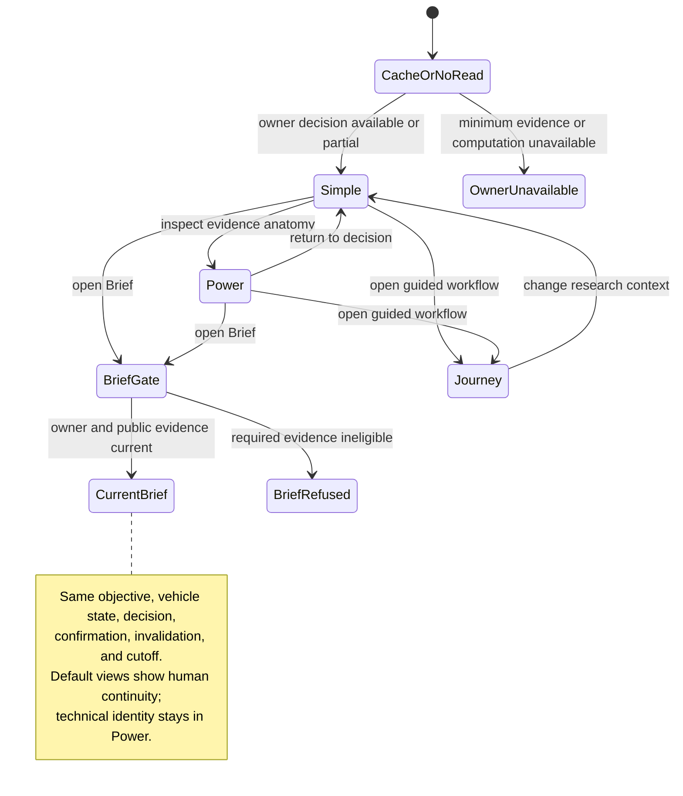
```mermaid
stateDiagram-v2
  [*] --> CacheOrNoRead
  CacheOrNoRead --> Simple: owner decision available or partial
  CacheOrNoRead --> OwnerUnavailable: minimum evidence or computation unavailable
  Simple --> Power: inspect evidence anatomy
  Power --> Simple: return to decision
  Simple --> BriefGate: open Brief
  Power --> BriefGate: open Brief
  BriefGate --> CurrentBrief: owner and public evidence current
  BriefGate --> BriefRefused: required evidence ineligible
  Simple --> Journey: open guided workflow
  Power --> Journey: open guided workflow
  Journey --> Simple: change research context
  note right of CurrentBrief
    Same objective, vehicle state, decision,
    confirmation, invalidation, and cutoff.
    Default views show human continuity;
    technical identity stays in Power.
  end note
```

### User Flow: Vehicle Fit, No Eligible Vehicle, And Tactical-Only YCS

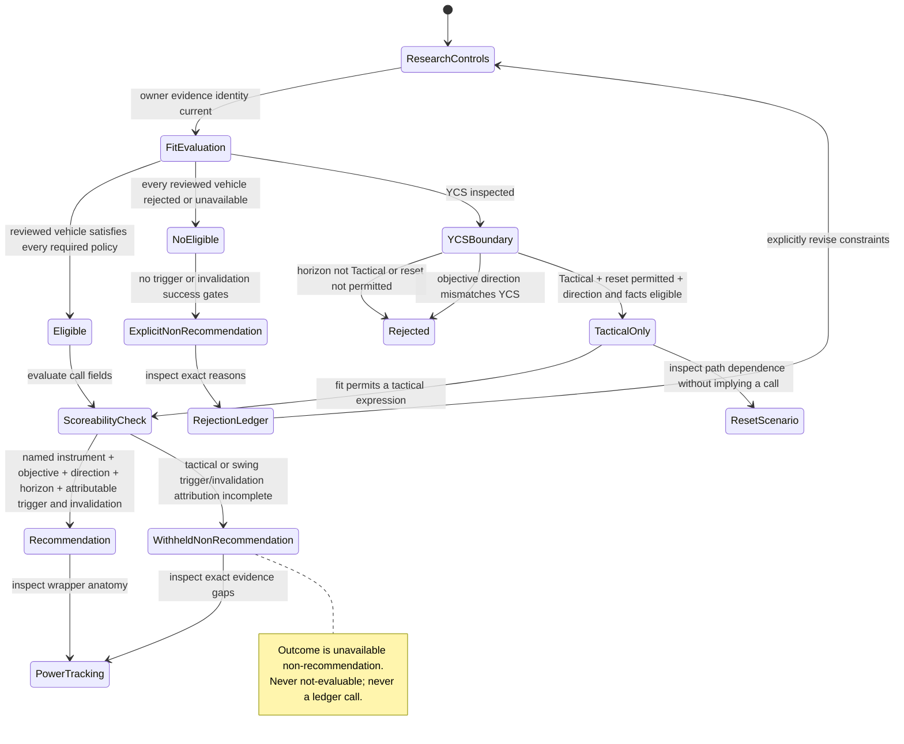
```mermaid
stateDiagram-v2
  [*] --> ResearchControls
  ResearchControls --> FitEvaluation: owner evidence identity current
  FitEvaluation --> Eligible: reviewed vehicle satisfies every required policy
  FitEvaluation --> NoEligible: every reviewed vehicle rejected or unavailable
  FitEvaluation --> YCSBoundary: YCS inspected
  YCSBoundary --> Rejected: horizon not Tactical or reset not permitted
  YCSBoundary --> Rejected: objective direction mismatches YCS
  YCSBoundary --> TacticalOnly: Tactical + reset permitted + direction and facts eligible
  Eligible --> ScoreabilityCheck: evaluate call fields
  TacticalOnly --> ScoreabilityCheck: fit permits a tactical expression
  ScoreabilityCheck --> Recommendation: named instrument + objective + direction + horizon + attributable trigger and invalidation
  ScoreabilityCheck --> WithheldNonRecommendation: tactical or swing trigger/invalidation attribution incomplete
  Recommendation --> PowerTracking: inspect wrapper anatomy
  NoEligible --> ExplicitNonRecommendation: no trigger or invalidation success gates
  ExplicitNonRecommendation --> RejectionLedger: inspect exact reasons
  TacticalOnly --> ResetScenario: inspect path dependence without implying a call
  WithheldNonRecommendation --> PowerTracking: inspect exact evidence gaps
  RejectionLedger --> ResearchControls: explicitly revise constraints
  note right of WithheldNonRecommendation
    Outcome is unavailable non-recommendation.
    Never not-evaluable; never a ledger call.
  end note
```

### User Flow: Current Brief And Evidence Refusal

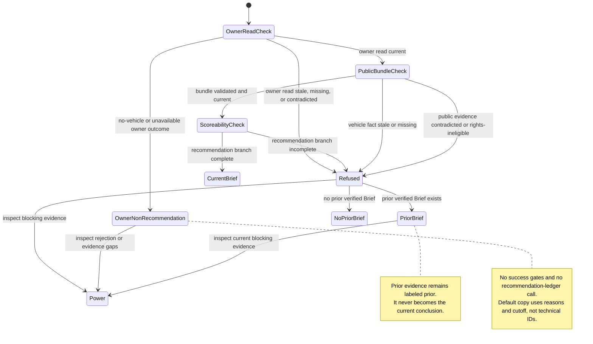
```mermaid
stateDiagram-v2
  [*] --> OwnerReadCheck
  OwnerReadCheck --> Refused: owner read stale, missing, or contradicted
  OwnerReadCheck --> OwnerNonRecommendation: no-vehicle or unavailable owner outcome
  OwnerReadCheck --> PublicBundleCheck: owner read current
  PublicBundleCheck --> ScoreabilityCheck: bundle validated and current
  ScoreabilityCheck --> CurrentBrief: recommendation branch complete
  ScoreabilityCheck --> Refused: recommendation branch incomplete
  PublicBundleCheck --> Refused: vehicle fact stale or missing
  PublicBundleCheck --> Refused: public evidence contradicted or rights-ineligible
  Refused --> PriorBrief: prior verified Brief exists
  Refused --> NoPriorBrief: no prior verified Brief
  Refused --> Power: inspect blocking evidence
  OwnerNonRecommendation --> Power: inspect rejection or evidence gaps
  PriorBrief --> Power: inspect current blocking evidence
  note right of PriorBrief
    Prior evidence remains labeled prior.
    It never becomes the current conclusion.
  end note
  note right of OwnerNonRecommendation
    No success gates and no recommendation-ledger call.
    Default copy uses reasons and cutoff, not technical IDs.
  end note
```

### User Flow: Journey Goal, Backtracking, And Stale-Step Reopening

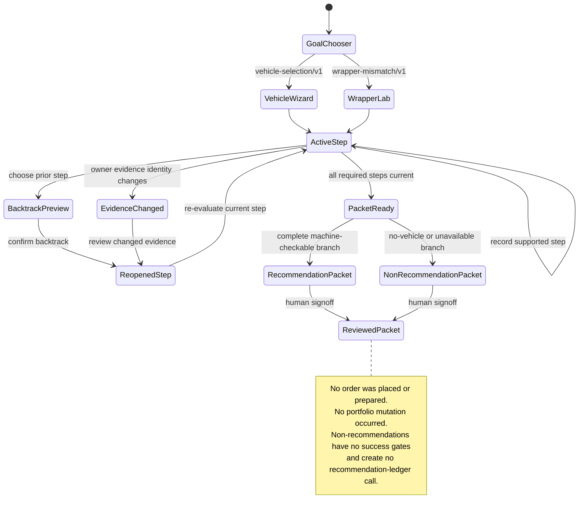
```mermaid
stateDiagram-v2
  [*] --> GoalChooser
  GoalChooser --> VehicleWizard: vehicle-selection/v1
  GoalChooser --> WrapperLab: wrapper-mismatch/v1
  VehicleWizard --> ActiveStep
  WrapperLab --> ActiveStep
  ActiveStep --> ActiveStep: record supported step
  ActiveStep --> BacktrackPreview: choose prior step
  BacktrackPreview --> ReopenedStep: confirm backtrack
  ActiveStep --> EvidenceChanged: owner evidence identity changes
  EvidenceChanged --> ReopenedStep: review changed evidence
  ReopenedStep --> ActiveStep: re-evaluate current step
  ActiveStep --> PacketReady: all required steps current
  PacketReady --> RecommendationPacket: complete machine-checkable branch
  PacketReady --> NonRecommendationPacket: no-vehicle or unavailable branch
  RecommendationPacket --> ReviewedPacket: human signoff
  NonRecommendationPacket --> ReviewedPacket: human signoff
  note right of ReviewedPacket
    No order was placed or prepared.
    No portfolio mutation occurred.
    Non-recommendations have no success gates
    and create no recommendation-ledger call.
  end note
```

### User Flow: Cache-First Hydration And Truthful Degradation

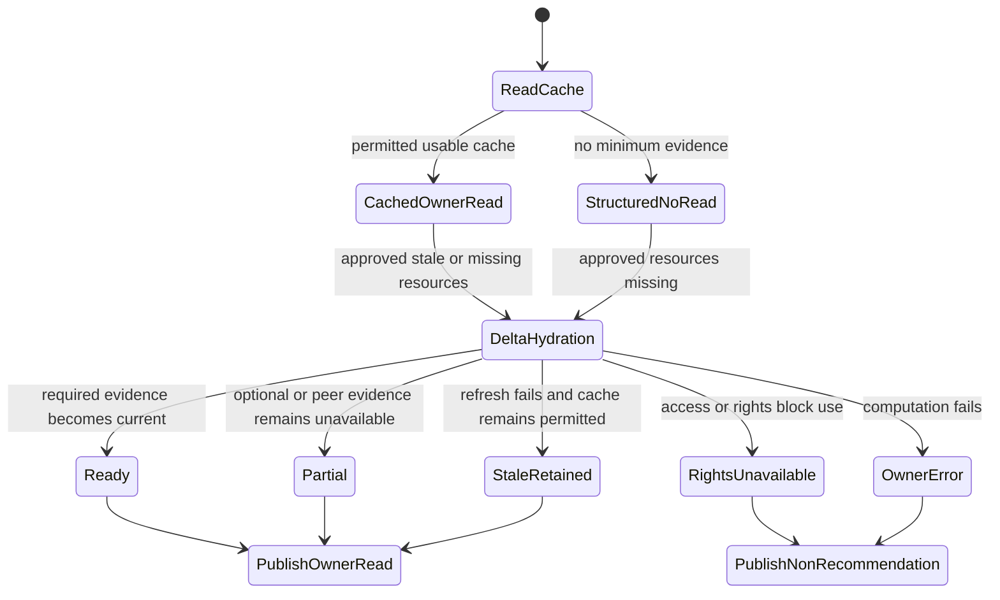
```mermaid
stateDiagram-v2
  [*] --> ReadCache
  ReadCache --> CachedOwnerRead: permitted usable cache
  ReadCache --> StructuredNoRead: no minimum evidence
  CachedOwnerRead --> DeltaHydration: approved stale or missing resources
  StructuredNoRead --> DeltaHydration: approved resources missing
  DeltaHydration --> Ready: required evidence becomes current
  DeltaHydration --> Partial: optional or peer evidence remains unavailable
  DeltaHydration --> StaleRetained: refresh fails and cache remains permitted
  DeltaHydration --> RightsUnavailable: access or rights block use
  DeltaHydration --> OwnerError: computation fails
  Ready --> PublishOwnerRead
  Partial --> PublishOwnerRead
  StaleRetained --> PublishOwnerRead
  RightsUnavailable --> PublishNonRecommendation
  OwnerError --> PublishNonRecommendation
```

### User Flow: Provenance, Keyboard, And Mobile Focus

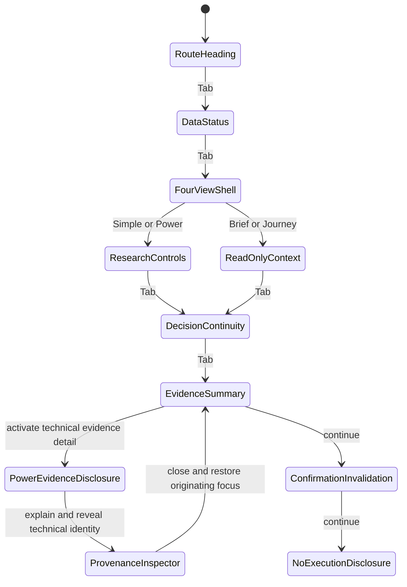
```mermaid
stateDiagram-v2
  [*] --> RouteHeading
  RouteHeading --> DataStatus: Tab
  DataStatus --> FourViewShell: Tab
  FourViewShell --> ResearchControls: Simple or Power
  FourViewShell --> ReadOnlyContext: Brief or Journey
  ResearchControls --> DecisionContinuity: Tab
  ReadOnlyContext --> DecisionContinuity: Tab
  DecisionContinuity --> EvidenceSummary: Tab
  EvidenceSummary --> PowerEvidenceDisclosure: activate technical evidence detail
  PowerEvidenceDisclosure --> ProvenanceInspector: explain and reveal technical identity
  ProvenanceInspector --> EvidenceSummary: close and restore originating focus
  EvidenceSummary --> ConfirmationInvalidation: continue
  ConfirmationInvalidation --> NoExecutionDisclosure: continue
```

### User Flow: Owner Consumption Without Recalculation

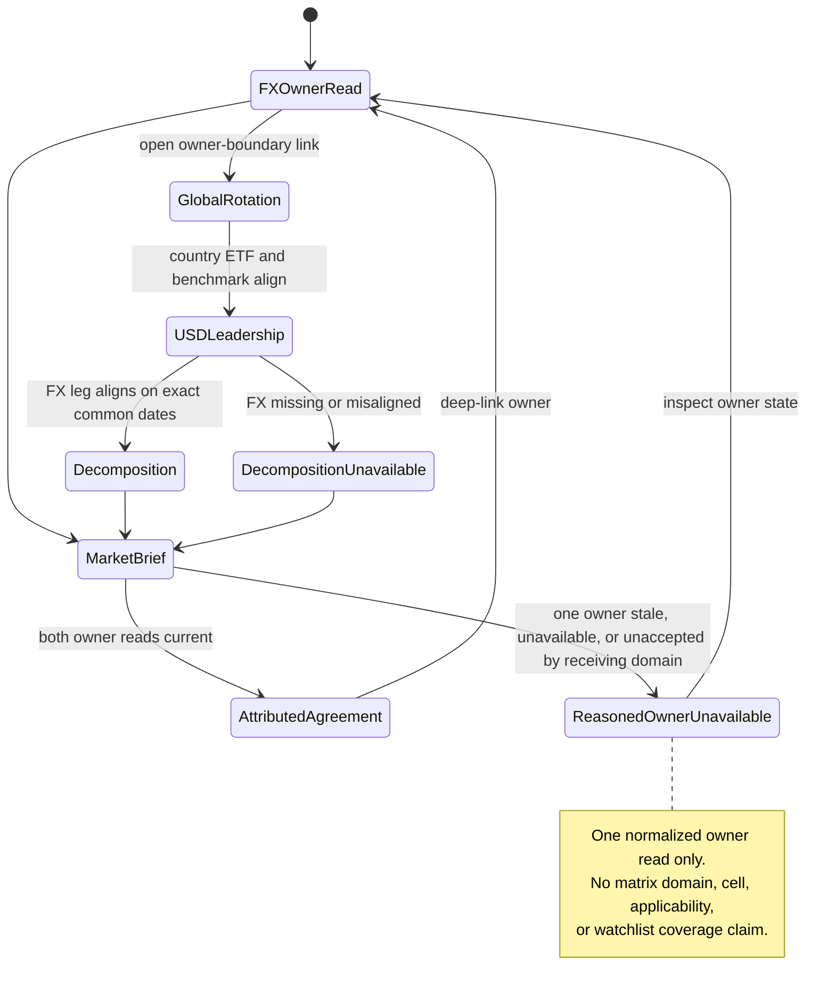
```mermaid
stateDiagram-v2
  [*] --> FXOwnerRead
  FXOwnerRead --> GlobalRotation: open owner-boundary link
  GlobalRotation --> USDLeadership: country ETF and benchmark align
  USDLeadership --> Decomposition: FX leg aligns on exact common dates
  USDLeadership --> DecompositionUnavailable: FX missing or misaligned
  FXOwnerRead --> MarketBrief
  Decomposition --> MarketBrief
  DecompositionUnavailable --> MarketBrief
  MarketBrief --> AttributedAgreement: both owner reads current
  MarketBrief --> ReasonedOwnerUnavailable: one owner stale, unavailable, or unaccepted by receiving domain
  AttributedAgreement --> FXOwnerRead: deep-link owner
  ReasonedOwnerUnavailable --> FXOwnerRead: inspect owner state
  note right of ReasonedOwnerUnavailable
    One normalized owner read only.
    No matrix domain, cell, applicability,
    or watchlist coverage claim.
  end note
```

### Flow Invariants

- The visible name is **FX Regime & Currency Vehicle Lab**. The route, owner read, and all Journey IDs retain `fx-regime-relative-value-lab`.
- All four views bind to one internal owner decision identity. View changes preserve objective, vehicle state, confirmation, invalidation, and evidence cutoff. Simple, Brief, and Journey show human-readable continuity; raw technical identity appears only in Power's explained evidence disclosure.
- View changes never fetch. Only automatic approved delta hydration or explicit refresh may request data.
- Simple and Power may change research controls. Brief and Journey consume the resulting context and route edits back through Simple.
- Eligible, No Eligible Vehicle, Tactical-Only, Unavailable, and Brief Refused remain distinct states. Only a complete machine-checkable recommendation is a call. No Eligible Vehicle and Unavailable are explicit non-recommendations with no success gates or ledger call; Tactical-Only describes fit and does not bypass scoreability.
- A prior verified Brief stays prior. It cannot fill a current owner or public-evidence gap.
- Journey backtracking and evidence changes preserve audit history and reopen dependents. They never execute or mutate a portfolio.
- Every control, ticker, KPI, badge, chart, axis, value, trigger, invalidation, rejection reason, freshness state, and unavailable reason explains what it is and what its current reading means by hover, focus, and adjacent text. Every ticker uses `RLTKR`. Every canvas has equivalent pointer/keyboard context plus a same-data summary and table.
- Global Rotation and Market Brief consume attributed owner reads. They never create a second FX, vehicle-fit, or country-leadership score. Feature 004 adds no watchlist matrix domain, cell, applicability rule, or coverage claim; an unaccepted existing-domain read stays reasoned unavailable.
- Reader reach and coverage are proven in a real browser at the declared entry point, never by static grep. Existing UX/readiness budgets remain fixed, and timeout widening requires measured evidence for the same readiness condition rather than being treated as recovery.
- Default projections contain no raw owner ID, digest, contract label, raw status token, reason code, or governance vocabulary. All model-authored and configuration-authored copy is escaped data, never markup.

## Superseded UX (Do Not Implement)

The historical pair-first two-view contract below is retained only as prior UX provenance. It predates FR-104 through FR-126 and BS-027 through BS-033. The active `## UI Wireframes` and `## User Flows` sections above replace it completely.

**Historical UX Direction**

- **Surface:** one self-contained tool route at `fx-regime-relative-value-lab.html`, with Simple as the first usable view and Power as a denser projection of the same `CurrencyDecisionRead`.
- **Visual posture:** restrained operational research layout; compact title row, stable control rail, full-width decision bands, thin separators, and dense evidence tables. No giant hero, floating page sections, nested cards, decorative illustration, or marketing copy.
- **Local conventions:** use the shared `#modeSeg` Simple/Power pattern, shared data-status control, cache-first automatic delta hydration, `RLTKR` ticker links, glossary/context surfaces, and educational-only disclosure. Mode and control values may persist locally; observations keep their own clocks.
- **Context rule:** hover, keyboard focus, and adjacent accessible text expose the same domain meaning. Context explains the evidence or current value, not how to operate a control.
- **Decision parity:** Simple and Power render one immutable decision identity for the active observations and controls. Power may expose lineage and diagnostics; it must not calculate a second verdict.

**Historical Screen Inventory**

| Screen / State | Actor(s) | Status | Scenarios Served |
| --- | --- | --- | --- |
| FX Lab - Simple default route | USD Multi-Asset Researcher, FX Relative-Value Researcher, Hedge Researcher | New | BS-001, BS-002, BS-003, BS-006, BS-009, BS-010, BS-016, BS-018, BS-019 |
| FX Lab - Power evidence route | FX Relative-Value Researcher, Macro Researcher | New | BS-002, BS-003, BS-004, BS-005, BS-008 through BS-016, BS-019, BS-024, BS-025 |
| Loading with usable cache | Data-Constrained Public User | New state | BS-017, BS-018 |
| No minimum evidence | Data-Constrained Public User | New state | BS-008, BS-016, BS-017 |
| Partial, stale, and revised evidence | Data-Constrained Public User, Macro Researcher | New state | BS-002, BS-012, BS-013, BS-014, BS-017, BS-024 |
| Rights or access unavailable | Data-Constrained Public User, Macro Researcher | New state | BS-010, BS-011, BS-014, BS-016, BS-024 |
| No common dates | FX Relative-Value Researcher, Global Allocation Researcher | New state | BS-004, BS-005, BS-022 |
| Managed/reference inspection | Macro Researcher | New state | BS-006, BS-007, BS-008 |
| Explicit cross-cohort selection | FX Relative-Value Researcher | New state | BS-006, BS-007, BS-018 |
| Source and provenance inspector | All research actors | New overlay | BS-004, BS-005, BS-010 through BS-016, BS-024, BS-025 |
| Global Rotation decomposition | Global Allocation Researcher | Existing - Modify | BS-005, BS-020, BS-021, BS-022, BS-025 |
| Market Brief FX/Global item | Market Brief Analyst, USD Multi-Asset Researcher | Existing - Modify | BS-023, BS-025, BS-026 |
| Mobile Simple | All research actors | New responsive projection | BS-001 through BS-019, BS-025 |
| Mobile Power | FX Relative-Value Researcher, Macro Researcher | New responsive projection | BS-004, BS-005, BS-009 through BS-016, BS-024, BS-025 |

**Historical Scenario-To-Screen Coverage**

| Business Scenarios | Primary UX Contract | Secondary / Exception Surface |
| --- | --- | --- |
| BS-001, BS-002 | Simple broad-dollar verdict | Power broad-dollar anatomy; partial/revised state |
| BS-003, BS-008 | Simple cohort strength board | Power strength matrix; no-minimum-evidence state |
| BS-004, BS-005 | Simple pair orientation and coverage | Power alignment diagnostics; no-common-dates state |
| BS-006, BS-007 | Separate cohort controls and summaries | Managed/reference inspection; explicit cross-cohort selection |
| BS-009 through BS-012 | Simple pair expression and conflict strip | Power pair anatomy, carry, and value areas |
| BS-013, BS-014 | Evidence strip with delayed/unavailable positioning | Power positioning area; source/provenance inspector |
| BS-015, BS-016 | Evidence strip plus confirmation/invalidation | Power stress/event areas; rights/access unavailable state |
| BS-017, BS-018 | Loading-with-cache route and stable control rail | Partial/no-minimum-evidence states |
| BS-019 | Mode segmented control with parity identity | Power decision-parity band |
| BS-020 through BS-022 | Global Rotation decomposition | FX Lab Global Rotation relationship band |
| BS-023 | Market Brief owner-read item | Deep links to both owning tools |
| BS-024 | Rights/access state and provenance inspector | Excluded evidence row in Power |
| BS-025 | Every screen and overlay | Mobile Simple and Mobile Power |
| BS-026 | Route shell and current owner-read state | Market Brief registry-derived item |

**Historical UI Primitives**

| Primitive | Used By Screens / Consumers | Composition Rule |
| --- | --- | --- |
| `ResearchRouteShell` | Simple, Power, Global Rotation relationship, Market Brief consumption | Compact route title, shared nav/status, one educational disclosure, and one content column. Never wrap the whole route in a decorative card. |
| `StableControlRail` | Simple, Power, Mobile Simple, Mobile Power | Contains mode, cohort, horizon, pair mode/pair, evidence lens, dollar comparison, and refresh. It keeps the same order and control dimensions across modes; a mode change cannot move or resize it. |
| `ModeSegment` | Simple, Power, mobile | Two equal segments: Simple and Power. It changes presentation only, preserves every other control, retains keyboard focus, and exposes `aria-selected`; the decision identity remains unchanged. |
| `CohortSegment` | Simple, Power, managed/reference, cross-cohort | G10, Liquid EM, and Managed/reference inspection are mutually exclusive default contexts. G10 and Liquid EM never share an automatic ranking. Cross-cohort exists only behind explicit pair mode. |
| `HorizonSegment` | Simple, Power, Global Rotation relationship | Tactical, Swing, Structural have stable labels and equal width. The selected horizon changes aligned calculations from cache but not source hydration. |
| `PairSelector` | Simple, Power, cross-cohort, mobile | Auto is strongest-versus-weakest inside the active eligible cohort. Explicit exposes base and quote selectors plus orientation. Managed/reference entries cannot appear in Auto. |
| `EvidenceLensSegment` | Simple, Power | Balanced, Trend emphasis, and Risk emphasis disclose weighting emphasis only. They cannot relabel evidence, restore unavailable inputs, or fetch data. |
| `DollarComparisonSegment` | Simple, Power | Broad, AFE, EME changes emphasis while all available official states remain visible. It cannot substitute one index for another. |
| `ObservationStatus` | All screens, Global Rotation, Market Brief | Text plus icon/shape conveys Loading, Fresh, Stale, Revised, Unavailable, or Reference-only. It always exposes observed as-of separately from retrieved-at and review window. No color-only status. |
| `DecisionBand` | Simple, Power parity, Market Brief owner item | One full-width band with state, concise evidence rationale, confidence, coverage, and decision identity. Power and downstream owner reads consume it; no consumer recomputes it. |
| `CohortStrengthBoard` | Simple, Power, mobile | G10 and Liquid EM are sibling columns or tabs, never pooled. Managed/reference is a separate inspection entry. Every rank includes cohort, peer count, common-date coverage, horizon, and stability. |
| `PairExpressionBand` | Simple, Power, cross-cohort, mobile | Keeps independent strength, direct pair momentum/trend, realized risk, and orientation visibly separate before showing Candidate/Mixed/Rejected/Unavailable. |
| `HedgeResearchBand` | Simple, Power parity, Market Brief | Uses Increase/Maintain/Reduce/Indeterminate research priority and always carries generic, educational, non-personalized wording. It never shows a ratio, notional, tenor, or instrument. |
| `EvidenceConflictStrip` | Simple, Power, Market Brief | Fixed family order: Observed spot; Independent strength; Policy-rate proxy; Market-implied carry; REER value; Delayed positioning; Stress; Event evidence. Each cell keeps its own clock, quality, and availability; no family fills another family's absence. |
| `ConfirmInvalidateBar` | Simple, Power, Global Rotation | Two equal regions: next confirmation and falsifiable invalidation. Event evidence may be unavailable while market-derived invalidation remains present. |
| `UnavailableDetail` | No-minimum, rights/access, no-common-dates, Power | Expands the exact closed reason, affected subject/family, required-versus-available coverage, last permitted cache state, and provenance. It never shows a zero or neutral numeric substitute. |
| `ProvenanceInspector` | Simple values, Power ledger, Global Rotation decomposition, Market Brief attribution | Modal sheet/drawer opened from source, clock, status, or conflict controls. Shows source URL, orientation, transformation, cadence, rights, quality, revision, limitations, and evidence reuse. Restricted payload values remain absent. |
| `AccessibleEvidencePlot` | Power broad-dollar, pair path, risk, Global Rotation decomposition | Canvas/plot always has a same-data summary and table. Pointer and focus expose equivalent context; direction uses words and marks in addition to color. All ticker labels route through `RLTKR`. |
| `OwnerReadLink` | FX Lab relationship band, Global Rotation, Market Brief | Shows owner name, owner as-of/freshness, attributed read, and deep link. It never merges scores or strips unavailable state. |
| `TickerLink` | Every ticker in every screen, table, legend, axis, or sentence | Render only through `RLTKR`; focus/hover context names the instrument and kind. A bare ticker is invalid. |
| `EducationalDisclosure` | Route metadata, decision band, owner read, footer | Exact meaning stays visible: educational research, not investment advice; no execution or personalized hedge instruction. It is concise and never hidden behind hover. |

**Historical Primitive Dimensions And Responsive Stability**

| Primitive | Desktop / Tablet Contract | Mobile Contract |
| --- | --- | --- |
| Control rail | 40 px minimum control height; 8 px gaps; labels reserve two text lines without changing row height; mode control reserves 168 px; horizon and lens reserve 252 px each | 44 px minimum target height; full-width rows; each segmented control uses equal-width tracks and wraps labels inside its fixed block rather than widening the page |
| Route/status row | Minimum 48 px; status and refresh reserve fixed end columns; long timestamps truncate visually only when full text remains in accessible name/context | Two rows with stable 44 px actions; status text wraps below title without covering mode control |
| Decision state / confidence | State column minimum 11 characters; confidence/coverage columns minimum 7rem; updates cannot shift neighboring columns | Two-column definition list; values wrap below labels and never use viewport-scaled type |
| Cohort board | Two equal minmax columns for G10 and Liquid EM; managed/reference occupies a separate full-width row | One cohort at a time under the cohort segment; the non-active cohort remains one control away, not horizontally scrolled |
| Evidence strip | Eight equal minmax cells at wide desktop; 4 x 2 at tablet; cell min-height 88 px | One semantic list with 44 px summary rows and expandable detail; no clipped eight-column strip |
| Confirmation/invalidation | Two equal columns, each min-height 96 px | Stacked confirmation then invalidation, each min-height 88 px |
| Dense evidence tables | Sticky first column; horizontal overflow belongs to the table region only; page itself never scrolls sideways | Column chooser is not introduced; critical columns become stacked row definitions, with full table available in an accessible overflow region |
| Provenance inspector | Right sheet width `min(42rem, 48vw)` with fixed heading/action rows | Bottom sheet / full-screen dialog; source URL and long identifiers wrap at safe break points |

**Historical Primitive Accessibility And Context Rules**

- Focus order is route title and disclosure, shared data status, mode, cohort, horizon, pair mode/pair, evidence lens, dollar comparison, refresh, decision hierarchy, evidence details, confirmation/invalidation, relationship links, then footer.
- Arrow keys move within segmented controls; Tab leaves the control. Selecting a mode moves no focus and makes no live announcement beyond the new mode label. Recalculation announces one concise `aria-live="polite"` decision summary after controls settle.
- Every changing state uses text and an icon/shape. Strengthening/weakening, support/conflict, stale/revised, and available/unavailable never rely on hue alone.
- Tooltip/focus content answers domain questions such as what the measure is, what this value implies, its source clock, and its limitations. Visible text does not explain clicking, tapping, hovering, keyboard shortcuts, or control mechanics.
- Every ticker, market proxy, and ticker-like chart label is an `RLTKR` link. Every canvas has a nearby heading, current-value summary, and accessible data table or structured list.
- Dynamic values reserve enough width for the longest vocabulary item (`Indeterminate`, `Reference-only`, `RIGHTS_UNCLEAR`, `INSUFFICIENT_HISTORY`) and may wrap at word boundaries on mobile.

**Historical Evidence Semantics Contract**

| Display Label | Semantic Meaning | Must Never Be Presented As |
| --- | --- | --- |
| Observed spot | Verified oriented pair/index observation with market as-of and retrieval time | Independent currency strength, value, carry, or a current event |
| Independent strength | Multi-peer, exact-common-date cohort-relative read | The selected pair return or one USD cross renamed as strength |
| Policy-rate proxy | Official policy-rate differential context | Market-implied, tradable, forward, roll, or executable carry |
| Market-implied carry | Authorized tenor-specific forward/futures/swap-implied observation with basis/cost limitations | Policy-rate proxy or executable return after costs |
| REER value | Slow-moving official real effective exchange-rate context, including revision identity | Tactical timing, spot momentum, or carry |
| Delayed positioning | Instrument-specific report with report as-of and release time | Current OTC positioning, balanced positioning when missing, or live spot evidence |
| Stress | Independently visible high-carry weakness, funding-currency strength, risk, liquidity, and positioning conditions | A label produced by high carry alone |
| Event evidence | Sourced event time, timezone, affected currency, review window, and limitation | A forecast of the outcome or probability without an approved methodology |

**Historical Screen: FX Lab - Simple Default Route**

**Actor:** USD Multi-Asset Researcher, FX Relative-Value Researcher, Hedge Researcher | **Route:** `fx-regime-relative-value-lab.html` | **Status:** New

```text
┌────────────────────────────────────────────────────────────────────────────────────────┐
│ Research Lab / FX Regime & Relative Value      [Data: Fresh 14:05Z] [Simple|Power] [↻] │
│ Educational research · not investment advice                         [Coverage 78%]      │
├────────────────────────────────────────────────────────────────────────────────────────┤
│ Cohort [G10 | Liquid EM | Managed/reference]  Horizon [Tactical|Swing|Structural]       │
│ Pair [Auto|Explicit] [EUR / JPY ▾]            Lens [Balanced|Trend|Risk]                │
│ Dollar comparison [Broad|AFE|EME]             As of [latest common date]                │
├────────────────────────────────────────────────────────────────────────────────────────┤
│ BROAD-DOLLAR VERDICT                                                                     │
│ [Weakening]  [Broad ↓] [AFE ↓] [EME →]  Concentration: [AFE-led]  Conflict: [None]      │
│ [one evidence-grounded sentence]                           [Source & clock]              │
├───────────────────────────────────────────┬────────────────────────────────────────────┤
│ G10 INDEPENDENT STRENGTH                  │ LIQUID-EM INDEPENDENT STRENGTH              │
│ Strongest [EUR 1] [7/9 peers]             │ Strongest [MXN 1] [6/8 peers]              │
│ Weakest   [JPY 10] [8/9 peers]            │ Weakest   [ZAR 8] [6/8 peers]              │
│ Breadth [6 strong / 4 weak]               │ Breadth [3 strong / 5 weak]               │
│ [Open cohort detail]                      │ [Open cohort detail]                       │
├───────────────────────────────────────────┴────────────────────────────────────────────┤
│ CONDITIONAL PAIR EXPRESSION: [EUR/JPY] [Candidate] [Medium confidence]                  │
│ Orientation: 1 EUR in JPY · positive move = EUR strengthens                            │
│ Independent strength [supports] · Direct momentum [supports] · Realized risk [normal]   │
│ [Pair source / 63 common rows / latest common date]                                     │
├────────────────────────────────────────────────────────────────────────────────────────┤
│ GENERIC HEDGE-RESEARCH PRIORITY: [Maintain]  [foreign-currency context]                 │
│ Generic research posture only · no hedge ratio, tenor, instrument, or order             │
├────────────────────────────────────────────────────────────────────────────────────────┤
│ EVIDENCE / CONFLICT                                                                      │
│ Spot [Observed ✓] | Strength [Independent ✓] | Policy-rate proxy [Adverse]              │
│ Market-implied carry [ACCESS_REQUIRED] | REER value [Rich · revised]                    │
│ Positioning [Delayed · Tue/Fri] | Stress [Dormant] | Events [NO_SOURCE]                 │
├───────────────────────────────────────────┬────────────────────────────────────────────┤
│ CONFIRMS                                  │ INVALIDATES                                 │
│ [next exact price/strength/risk condition]│ [falsifiable price/risk/common-date rule]  │
└───────────────────────────────────────────┴────────────────────────────────────────────┘
```

**Interactions:**

- Mode segment -> swaps Simple/Power presentation in place, retains focus and all controls, and preserves the displayed decision identity.
- Cohort segment -> recomputes only the selected cohort ranking and eligible Auto pair from cached aligned observations; G10 and Liquid EM summaries remain separately visible.
- Horizon segment -> changes Tactical/Swing/Structural aligned windows across verdict, ranks, pair, confirmation, and invalidation without network activity.
- Pair Auto/Explicit -> Auto stays within the active tradable cohort; Explicit opens the eligible pair selector and the cross-cohort boundary when currencies differ by cohort.
- Evidence lens -> recomputes disclosed weighting emphasis from the same evidence; availability and semantic labels do not change.
- Dollar comparison -> changes the emphasized Broad/AFE/EME official read while preserving the other two states and any official/proxy conflict.
- Refresh icon -> requests only approved stale/missing deltas, exposes progress in shared status, and never blocks cached interaction.
- Any source, clock, coverage, conflict, unavailable reason, rank, or dynamic value -> opens/focuses contextual detail through `ProvenanceInspector` or adjacent description.
- Any ticker -> follows the shared `RLTKR` destination; Global Rotation relationship link appears after the decision hierarchy and deep-links its owner.

**State Behavior:**

- Ready shows the full hierarchy in the exact order above. Indeterminate replaces only affected directional states; it never inserts neutral evidence.
- Partial keeps every valid family visible, lowers coverage/confidence, and names missing families in the evidence strip.
- Stale or revised marks remain attached to the exact observation and propagate to dependent verdict eligibility without erasing the last permitted value.
- Control changes recompute one `CurrencyDecisionRead`; only refresh or automatic delta hydration may request data.

**Responsive:**

- Tablet uses a two-row control rail, two equal strength columns, and a 4 x 2 evidence strip.
- Mobile uses the dedicated Mobile Simple projection below: one cohort summary at a time, stacked decision bands, and list-form evidence while preserving hierarchy.

**Accessibility:**

- The route uses one `h1`; each decision band has an `h2`, and the value follows its label in DOM order.
- Segments expose tab/selection semantics and arrow-key movement; recomputation announces verdict, pair state, coverage, and conflict count once through a polite live region.
- Direction includes words/arrows and conflict/support labels. Source and unavailable controls have descriptive accessible names, not icon-only ambiguity.

**Historical Screen: FX Lab - Power Evidence Route**

**Actor:** FX Relative-Value Researcher, Macro Researcher | **Route:** `fx-regime-relative-value-lab.html` with `body.power` | **Status:** New

```text
┌────────────────────────────────────────────────────────────────────────────────────────┐
│ Research Lab / FX Regime & Relative Value      [Data: Fresh 14:05Z] [Simple|Power] [↻] │
├────────────────────────────────────────────────────────────────────────────────────────┤
│ [same fixed control rail, same values, same dimensions as Simple]                       │
├────────────────────────────────────────────────────────────────────────────────────────┤
│ DECISION PARITY  ID [fx-read-…]  Dollar [Weakening]  Pair [EUR/JPY · Candidate]         │
│ Hedge research [Maintain]  Confidence [Medium]  Coverage [78%]  Conflicts [2]           │
├───────────────────────────────────────────┬────────────────────────────────────────────┤
│ BROAD / AFE / EME ANATOMY                 │ OFFICIAL / PROXY DIVERGENCE                 │
│ [accessible time-series canvas]           │ Source | state | as-of | revision | risk    │
│ [same-data current summary]               │ Broad  | ...                               │
│ [Open accessible data table]              │ Proxy  | ...                               │
├───────────────────────────────────────────┴────────────────────────────────────────────┤
│ COHORT STRENGTH MATRIX                                                                  │
│ Ccy | Cohort | Rank | Breadth | Peer n | Common window | Dispersion | Stability | State │
│ [RLTKR-linked currency/proxy rows; G10 and Liquid EM separated by labeled row groups]   │
├───────────────────────────────────────────┬────────────────────────────────────────────┤
│ SELECTED-PAIR PATH                        │ ALIGNMENT & RISK DIAGNOSTICS                │
│ [accessible price/trend canvas]           │ Orientation | common rows | unmatched dates │
│ Tactical | Swing | Structural momentum    │ Volatility | drawdown | gaps | limitations  │
│ [same-data summary and table]             │ [Open unavailable/common-date detail]       │
├────────────────────────────────────────────────────────────────────────────────────────┤
│ EVIDENCE ANATOMY                                                                        │
│ Family                 | State/type            | Value | As of / released | Conflict     │
│ Observed spot          | observed              | [...] | [...]            | [...]        │
│ Independent strength   | multi-peer derived    | [...] | common window    | [...]        │
│ Policy-rate proxy      | proxy-only            | [...] | decision date    | [...]        │
│ Market-implied carry   | [Unavailable/tenor]   | [—]   | [—]              | [reason]     │
│ REER value             | slow official/revised | [...] | release/version  | [tension]    │
│ Delayed positioning    | Tue as-of/Fri release | [...] | both clocks      | [...]        │
│ Stress                 | multi-family state    | [...] | mixed clocks     | [...]        │
│ Event evidence         | sourced/unavailable   | [—]   | event timezone   | [...]        │
├────────────────────────────────────────────────────────────────────────────────────────┤
│ PROVENANCE LEDGER                                                                       │
│ Source | subject | transform | observed | retrieved | cadence | review | rights | quality │
│ [rows; selecting a row opens Source and Provenance Inspector]                           │
├───────────────────────────────────────────┬────────────────────────────────────────────┤
│ CONFIRMS / INVALIDATES                    │ GLOBAL ROTATION RELATIONSHIP                │
│ [same conditions as Simple]               │ [owner read / agreement / as-of] [Open ↗]  │
└───────────────────────────────────────────┴────────────────────────────────────────────┘
```

**Interactions:**

- Fixed controls perform the same local recomputation as Simple and update the parity band before detail areas; no Power-only control may alter a hidden model input.
- Evidence lens emphasizes rows/order/annotation but never hides contradicting families or changes their semantic type.
- Chart focus/pointer selects a date or observation and synchronizes the corresponding accessible summary/table row.
- Matrix row -> selects an explicit currency for inspection; eligible pair action uses the existing Pair selector rather than creating a second selection state.
- Evidence/provenance row -> opens the source inspector with source URL, clocks, rights, quality, transformation, revision, limitations, and lineage reuse.
- Global Rotation owner read -> follows its deep link; the relationship band cannot edit or recompute country leadership.

**State Behavior:**

- The parity band must byte-for-byte match the Simple decision fields for the same decision identity; a mismatch is a visible error state, not silently reconciled in UI.
- Missing market-implied carry, positioning, or event evidence stays as an unavailable row with no value. Other evidence remains inspectable.
- Hidden Power canvases are not drawn in Simple; entering Power draws them from the current computation and redraws on size changes.

**Responsive:**

- Tablet stacks each chart over its diagnostics and keeps evidence/provenance tables in bounded horizontal regions.
- Mobile uses the dedicated Mobile Power projection: parity first, evidence-family accordions, accessible summaries before optional plots, and no page-level horizontal overflow.

**Accessibility:**

- Power sections use headings and tables with scoped headers; sticky columns retain programmatic header association.
- Every canvas has a keyboard-focusable summary and full non-canvas data representation. Focus context equals pointer context.
- Dense evidence state is conveyed with text, marks, and `aria-describedby` limitations; row selection and links are distinct controls.

**Historical Screen: Loading With Usable Cache**

**Actor:** Data-Constrained Public User | **Route:** Simple default during automatic hydration | **Status:** New state

```text
┌──────────────────────────────────────────────────────────────────────────────┐
│ FX Regime & Relative Value   [Data: Refreshing 4 deltas] [Simple|Power] [↻] │
│ Cached decision as of [date/time] · Coverage [61%] · [3 stale] [4 loading]  │
├──────────────────────────────────────────────────────────────────────────────┤
│ [controls remain enabled; cached selections and fixed dimensions preserved] │
├──────────────────────────────────────────────────────────────────────────────┤
│ BROAD DOLLAR [Weakening · cached/stale]   [observed age] [review breach]     │
│ G10 [EUR strongest · cached]              Liquid EM [hydrating missing peers]│
│ PAIR [EUR/JPY · Mixed · cached]           HEDGE RESEARCH [Maintain · cached] │
├──────────────────────────────────────────────────────────────────────────────┤
│ DELTA ACTIVITY                                                               │
│ [Fed Broad: refreshing] [2 spot pairs: refreshing] [REER: cached/revised]    │
│ [Market-implied carry: ACCESS_REQUIRED - not requested]                      │
└──────────────────────────────────────────────────────────────────────────────┘
```

**Interactions:**

- Controls remain available and recompute from cache; changing them does not restart or expand network work.
- Refresh while hydration is active does not duplicate requests; its context reports the active delta set.
- Status/delta item -> opens exact resource status, source clock, and whether cache is permitted.

**State Behavior:**

- Cached values stay visible with stale/fresh labels. Only missing cells use loading treatment; no full-page skeleton or blocking overlay replaces a usable read.
- Each completed delta triggers one consolidated render and owner-read update; failed deltas become explicit unavailable states while valid cache remains.
- Optional inaccessible evidence is not described as loading and is not promised after refresh.

**Responsive:**

- Desktop/tablet shows compact delta chips below the status row.
- Mobile turns delta activity into a short status list below the controls; cached decision bands remain ahead of it.

**Accessibility:**

- Shared status uses `aria-live="polite"` with throttled summaries such as "four resources refreshing" rather than announcing every row mutation.
- Loading icons include text; motion honors reduced-motion preference and is never the only activity signal.

**Historical Screen: No Minimum Evidence**

**Actor:** Data-Constrained Public User | **Route:** Simple default with empty/insufficient public minimum | **Status:** New state

```text
┌──────────────────────────────────────────────────────────────────────────────┐
│ FX Regime & Relative Value      [Data: Unavailable] [Simple|Power] [↻]      │
├──────────────────────────────────────────────────────────────────────────────┤
│ [same stable controls; current selections remain inspectable]               │
├──────────────────────────────────────────────────────────────────────────────┤
│ BROAD-DOLLAR VERDICT: [Indeterminate]                                        │
│ Minimum evidence not met: [Broad index 14/63 rows] [spot peers 2/3 required] │
│ Latest usable dates: [Broad date] [pair date]      [Inspect missing evidence]│
├──────────────────────────────────────────────────────────────────────────────┤
│ G10 STRENGTH [Unavailable · INSUFFICIENT_HISTORY]                            │
│ Liquid EM [Unavailable · NO_COVERAGE]  Managed/reference [Reference only]    │
├──────────────────────────────────────────────────────────────────────────────┤
│ PAIR EXPRESSION [Unavailable]     HEDGE RESEARCH [Indeterminate]             │
│ No pair value, rank, confidence uplift, or neutral substitute is published.  │
├──────────────────────────────────────────────────────────────────────────────┤
│ AVAILABLE CONTEXT                                                            │
│ [valid source clocks / limitations / market-derived invalidation if present] │
└──────────────────────────────────────────────────────────────────────────────┘
```

**Interactions:**

- Inspect missing evidence -> opens `UnavailableDetail` grouped by required family and exact reason.
- Cohort/horizon changes recompute required-versus-available counts locally and may reveal a shorter valid horizon without asserting unavailable evidence exists.
- Refresh requests only approved missing/stale sources; there is no credential or entitlement input on this route.

**State Behavior:**

- Structure, source clocks, available context, and invalidation remain visible. Directional verdicts and numeric outputs stay absent when their minimum contract fails.
- A shorter horizon may become available only when it independently satisfies coverage; the tool does not auto-change the selected horizon to manufacture an answer.
- Source failures resolve to their closed reason codes and remain distinct from insufficient history.

**Responsive:**

- Desktop shows required/available evidence inline; mobile stacks each count with its family and reason.
- Long reason codes wrap inside bounded detail rows; no status word is clipped.

**Accessibility:**

- Indeterminate and Unavailable are announced as states before reasons. Exact required/available counts are text, not a visual-only progress ring.
- Focus on each missing family exposes the same limitation shown in the inspector.

**Historical Screen: Partial, Stale, And Revised Evidence**

**Actor:** Data-Constrained Public User, Macro Researcher | **Route:** Simple or Power with mixed observation lifecycle | **Status:** New state

```text
┌──────────────────────────────────────────────────────────────────────────────┐
│ Decision [Mixed]  Confidence [Low]  Coverage [63%]  [2 stale] [1 revised]    │
├──────────────────────────────────────────────────────────────────────────────┤
│ FAMILY                STATE              CLOCK / RELEASE          EFFECT     │
│ Observed spot         Fresh              [as-of / retrieved]      Supports   │
│ Independent strength  Partial 6/9 peers  [common window]          Supports   │
│ Policy-rate proxy     Fresh official     [decision date]          Conflicts  │
│ Market-implied carry  ACCESS_REQUIRED    [no authorized value]    Excluded   │
│ REER value            Revised official   [release / revision id]  Tension    │
│ Delayed positioning   Stale              [Tue / Fri / review]     No uplift  │
│ Stress                Indeterminate      [missing positioning]    Retained   │
│ Event evidence        NO_SOURCE          [reviewed date]          Excluded   │
├──────────────────────────────────────────────────────────────────────────────┤
│ Confirmation [price + breadth condition]  Invalidation [risk + trend rule]  │
└──────────────────────────────────────────────────────────────────────────────┘
```

**Interactions:**

- Lifecycle badge or row -> opens source/provenance detail at the selected revision and clock.
- Revised REER -> compares current release metadata to superseded release identity without presenting the old and new values as simultaneous current evidence.
- Stale positioning -> shows review-window breach and why it cannot elevate confidence; refresh appears only when an approved retrieval path exists.

**State Behavior:**

- Partial evidence can support a Mixed/Indeterminate read only under the disclosed minimum contract; unavailable families never become neutral.
- A revised official observation supersedes the current displayed value while retaining revision lineage and original as-of meaning.
- Stale data remains visible only when source policy permits and blocks freshness-dependent Candidate elevation.

**Responsive:**

- Desktop uses the compact evidence table; tablet/mobile converts each family to a labeled row with State, Clock, and Effect stacked.
- The evidence order never changes, preventing semantic family drift between widths.

**Accessibility:**

- State and effect are separate text fields. Revised/stale marks include accessible descriptions and do not rely on strike-through or color.
- The table supports row-header navigation and provides full timestamps in focus context.

**Historical Screen: Rights Or Access Unavailable**

**Actor:** Data-Constrained Public User, Macro Researcher | **Route:** Evidence detail from Simple/Power | **Status:** New state

```text
┌──────────────────────────────────────────────────────────────────────────────┐
│ EVIDENCE AVAILABILITY                                                        │
├──────────────────────────────────────────────────────────────────────────────┤
│ Market-implied carry · [ACCESS_REQUIRED]                                     │
│ Instrument/tenor: [not observed]   Numeric value: [—]   Model use: Excluded │
│ Boundary: [login / entitlement / subscription required by named source]      │
│ [Inspect source terms ↗]                                                     │
├──────────────────────────────────────────────────────────────────────────────┤
│ Derivatives context · [RIGHTS_UNCLEAR]                                       │
│ Retrieved payload: not persisted   Numeric value: [—]   Model use: Excluded │
│ Boundary: redistribution/persistence permission is not established          │
│ [Inspect source and rights record]                                           │
├──────────────────────────────────────────────────────────────────────────────┤
│ Policy-rate proxy · [Available]                                              │
│ Kept separate; it does not replace market-implied carry.                     │
└──────────────────────────────────────────────────────────────────────────────┘
```

**Interactions:**

- Source terms link -> opens the named external reference in a new context; it is not an in-tool login or credential workflow.
- Source and rights record -> opens provenance metadata only; restricted payloads and values remain absent.
- Close/Back -> returns focus to the exact unavailable badge that opened the detail.

**State Behavior:**

- `ACCESS_REQUIRED` and `RIGHTS_UNCLEAR` remain different states. Neither shows a spinner, estimated value, zero, neutral, or promise that refresh will resolve it.
- If rights later become explicitly authorized through a source contract, a future observation appears under its real family/type; the current state is not silently relabeled.
- Policy-rate proxy remains visible as proxy context and cannot occupy the market-implied-carry row.

**Responsive:**

- Desktop uses an inline detail band or provenance sheet; mobile uses a full-screen dialog with wrapped source/rights text.
- Long source URLs break safely and do not widen the viewport.

**Accessibility:**

- Dialog has a descriptive heading, initial focus on the reason, focus containment, Escape close, and focus return.
- The unavailable code, plain-language boundary, exclusion effect, and absence of value are all announced.

**Historical Screen: No Common Dates**

**Actor:** FX Relative-Value Researcher, Global Allocation Researcher | **Route:** Pair alignment or Global Rotation decomposition detail | **Status:** New state

```text
┌──────────────────────────────────────────────────────────────────────────────┐
│ ALIGNMENT DIAGNOSTIC · [NO_COMMON_DATES]                                     │
├──────────────────────────────────────────────────────────────────────────────┤
│ Required calculation: [selected pair / ETF decomposition]                    │
│ Leg                    Earliest      Latest        Valid rows   Newer unmatched│
│ [Country ETF / base]   [date]        [date]        [n]          [dates/count]  │
│ [Benchmark / quote]    [date]        [date]        [n]          [dates/count]  │
│ [FX translation leg]   [date]        [date]        [n]          [dates/count]  │
├──────────────────────────────────────────────────────────────────────────────┤
│ Common rows [0 / below minimum]  Latest common date [—]                      │
│ USD leadership [available if independently aligned]                          │
│ Local approximation [—]  FX translation [—]  Agreement [Unavailable]        │
│ No forward fill · no independent start dates · no zero-FX assumption         │
├──────────────────────────────────────────────────────────────────────────────┤
│ Market invalidation [available price/risk condition]      [Inspect sources]  │
└──────────────────────────────────────────────────────────────────────────────┘
```

**Interactions:**

- Leg row -> opens its observation dates, orientation, source clock, and missing-session limitations.
- Newer-unmatched count -> expands exact dates without changing the aligned window.
- Global Rotation context -> keeps valid USD leadership and deep-links the owner; local/translation fields remain unavailable.

**State Behavior:**

- Multi-leg values are not published below the exact-date minimum. Missing FX does not erase separately valid aligned USD ETF-versus-benchmark leadership.
- Rehydration may add real matching dates; no UI action offers forward fill, date substitution, or zero translation.
- Pair state is Unavailable when its required direct history has no common dates, even if independent currency strength exists.

**Responsive:**

- Desktop uses the leg table; mobile renders one leg per definition group followed by common-date outcome.
- Exact date lists expand vertically inside the diagnostic rather than introducing page-level horizontal scroll.

**Accessibility:**

- Table headers identify each leg and date measure; unavailable outputs are explicitly labeled, not blank cells.
- The no-forward-fill rule and retained valid USD evidence are adjacent text available to all input modes.

**Historical Screen: Managed/Reference Inspection**

**Actor:** Macro Researcher | **Route:** Simple/Power cohort control -> Managed/reference | **Status:** New

```text
┌──────────────────────────────────────────────────────────────────────────────┐
│ MANAGED / REFERENCE CURRENCIES                      [Reference-only cohort]   │
├──────────────────────────────────────────────────────────────────────────────┤
│ Currency | Regime      | Spot state | Realized vol | Convertibility | Rank  │
│ [HKD]    | Peg/band    | Fresh      | Low          | [limitations]  | [—]   │
│ [CNY]    | Managed     | Fresh      | Low          | Onshore/offshore| [—]   │
│ [CNH]    | Offshore ref| Fresh      | Normal       | [limitations]  | [—]   │
├──────────────────────────────────────────────────────────────────────────────┤
│ Selected [currency]                                                           │
│ Management/fixing [context] · intervention [context] · gap risk [context]    │
│ Low observed volatility does not imply favorable risk quality.               │
│ Auto expression [Not eligible]  Generic hedge priority [Indeterminate]       │
│ [Inspect source/provenance] [Return to G10]                                   │
└──────────────────────────────────────────────────────────────────────────────┘
```

**Interactions:**

- Currency row -> selects reference inspection only and exposes management, fixing, intervention, onshore/offshore, deliverability, and source limitations.
- Cohort segment -> returns to G10 or Liquid EM with prior selections preserved.
- Pair mode -> Auto remains unavailable; Explicit may open research inspection only when the business eligibility contract allows it and must retain non-tradable/reference labeling.

**State Behavior:**

- Managed/reference currencies receive no pooled tradable rank, strongest/weakest label, or automatic pair candidacy.
- Low volatility remains an observed statistic beside management/gap limitations; it never becomes a favorable risk mark by itself.
- Missing regime or convertibility metadata makes the subject unavailable for expression rather than silently free-floating.

**Responsive:**

- Desktop uses a flat table and one full-width selected-detail band; no card is nested in the table region.
- Mobile shows a currency list with selected detail below; critical regime/reference labels remain visible before numeric values.

**Accessibility:**

- Reference-only and Not eligible are text states included in row accessible names.
- Row selection is distinct from source links; every limitation is reachable through focus and adjacent selected detail.

**Historical Screen: Explicit Cross-Cohort Selection**

**Actor:** FX Relative-Value Researcher | **Route:** Pair -> Explicit -> choose currencies from different cohorts | **Status:** New state

```text
┌──────────────────────────────────────────────────────────────────────────────┐
│ EXPLICIT PAIR RESEARCH                                                       │
├──────────────────────────────────────────────────────────────────────────────┤
│ Base [EUR · G10 ▾]           Quote [MXN · Liquid EM ▾]      [Swap direction] │
│ Pair [EUR/MXN]  Positive move = EUR strengthens versus MXN                  │
├──────────────────────────────────────────────────────────────────────────────┤
│ CROSS-COHORT BOUNDARY                                                        │
│ Liquidity [different] · convertibility [inspect] · settlement [inspect]      │
│ intervention [inspect] · gap risk [elevated/unknown] · pair form [derived?]   │
│ [View exact limitations]                                                     │
├──────────────────────────────────────────────────────────────────────────────┤
│ INDEPENDENT READS                                                            │
│ EUR: G10 rank [n] / peer coverage [...]    MXN: Liquid-EM rank [n] / [...]   │
│ Direct pair momentum [...]   Realized risk [...]   Common dates [...]         │
├──────────────────────────────────────────────────────────────────────────────┤
│ EXPRESSION [Mixed / Rejected / Unavailable]  Confidence [Low]                │
│ Explicit research selection · never an Auto candidate                        │
│ Confirms [...]                                         Invalidates [...]     │
└──────────────────────────────────────────────────────────────────────────────┘
```

**Interactions:**

- Base/Quote selectors -> require an explicit user choice for each cohort and show cohort beside every currency option.
- Swap direction -> reverses canonical base/quote only when orientation is verified; it recomputes meaning and values without mutating source observations.
- Exact limitations -> opens the boundary detail with liquidity, convertibility, settlement, intervention, gap-risk, and derived-cross lineage.
- Auto mode -> returns to within-cohort selection; it never retains a cross-cohort pair as an automatic candidate.

**State Behavior:**

- Cross-cohort selection always carries its boundary state. It may be Mixed, Rejected, or Unavailable under evidence rules and cannot be auto-elevated.
- Each currency keeps its own cohort-relative rank; the UI does not compare ordinal rank numbers as though cohort samples were interchangeable.
- Invalid orientation, non-tradability, missing direct pair, or no common dates publishes Unavailable with the exact reason.

**Responsive:**

- Desktop places Base and Quote in equal columns; mobile stacks them with Swap direction between and keeps cohort labels always visible.
- Boundary evidence becomes a short labeled list; no warning text overlays the pair result.

**Accessibility:**

- Selector options include currency name, code, cohort, and tradability/reference state in their accessible label.
- Boundary state is announced before the expression state, and Swap direction has a domain-specific accessible name including current orientation.

**Historical Screen: Source And Provenance Inspector**

**Actor:** All research actors | **Route:** overlay from a source, clock, value, conflict, or unavailable control | **Status:** New

```text
┌──────────────────────────────────────────────────────────────────────────────┐
│ SOURCE & PROVENANCE: [family / subject]                              [Close] │
├──────────────────────────────────────────────────────────────────────────────┤
│ Semantic family      [Observed spot / Independent strength / ...]            │
│ Subject / cohort     [pair, currency, index / G10, liquid EM, reference]     │
│ Value / unit         [finite value or — when unavailable]                    │
│ Orientation          [base / quote / inversion / positive-return meaning]    │
│ Transformation       [raw / return / derived / percentile / spread]          │
│ Source               [name] [Open source ↗]                                  │
│ Observed as of       [timestamp]                                             │
│ Retrieved at         [timestamp]                                             │
│ Cadence / review     [cadence] / [exact review window]                       │
│ Availability         [Fresh / Stale / Revised / Unavailable]                 │
│ Rights / quality     [state] / [observed, proxy, derived, official-revised]  │
│ Revision             [release/version or not applicable]                     │
│ Evidence reuse       [families/reads sharing underlying observations]        │
│ Limitations          [specific source, timing, coverage, liquidity limits]   │
├──────────────────────────────────────────────────────────────────────────────┤
│ [Accessible observation-date / revision summary when applicable]             │
└──────────────────────────────────────────────────────────────────────────────┘
```

**Interactions:**

- Open source -> follows the recorded source URL without exposing credentials or restricted payload.
- Evidence reuse item -> moves focus to the related family/consumer and explains correlated lineage; it does not imply independent confirmation.
- Close -> returns focus to the invoking value/status/conflict control.

**State Behavior:**

- Unavailable observations show no numeric value and require one closed reason plus detail. Restricted/unknown-rights values remain excluded from public state and inspector output.
- Revised observations show current revision identity and lineage; stale observations show age and review-window breach.
- Derived observations name every source leg and transformation; invalid orientation blocks the value.

**Responsive:**

- Desktop/tablet uses a right sheet with fixed heading and scrollable definitions.
- Mobile uses a full-screen dialog with wrapped identifiers, one definition per row, and actions in a stable bottom region.

**Accessibility:**

- Dialog naming includes family and subject; definitions use semantic term/description structure.
- Focus is contained and restored. Source URL purpose, rights state, limitations, and absence of value are available without hover.

**Historical Screen: Global Rotation Decomposition**

**Actor:** Global Allocation Researcher | **Route:** `global-rotation-lab.html` leader detail | **Status:** Existing - Modify

```text
┌──────────────────────────────────────────────────────────────────────────────┐
│ GLOBAL ROTATION LEADER: [country ETF via RLTKR]     [horizon] [owner as-of] │
├──────────────────────────────────────────────────────────────────────────────┤
│ USD-investor ETF return       [value / state]                                │
│ Approximate local-equity return [value / Unavailable]                        │
│ FX translation incl. interaction [value / Unavailable]                      │
│ Agreement / divergence        [Joint Support / FX-Led / ... / Unavailable]   │
├──────────────────────────────────────────────────────────────────────────────┤
│ ALIGNMENT [common rows] [earliest date] [latest date] [newer unmatched]      │
│ Approximation: fees, withholding, tracking, close timing, and price discovery│
├──────────────────────────────────────────────────────────────────────────────┤
│ Currency regime questions belong to FX Regime & Relative Value               │
│ [Open FX owner read: broad dollar / relevant currency / freshness ↗]         │
└──────────────────────────────────────────────────────────────────────────────┘
```

**Interactions:**

- ETF/currency/proxy tickers -> use `RLTKR` links and context.
- Alignment -> opens exact common-date diagnostics; unavailable local/translation detail uses the shared `UnavailableDetail`.
- FX owner read -> deep-links `fx-regime-relative-value-lab.html` with supported cohort/horizon/pair context, without passing a country-score override.

**State Behavior:**

- USD leadership may remain available when FX is missing; local-equity approximation, translation, and agreement become unavailable with exact reasons.
- Raw FX strength never appears as a score contribution. Agreement/divergence is explanatory context only.
- The approximation visibly includes multiplicative interaction and limitations; it is never labeled an exact local-index return.

**Responsive:**

- Desktop presents four flat metrics above alignment; mobile uses a definition list with USD evidence first and unavailable decomposition rows retained.
- Long limitation text wraps below alignment and never overlays metrics.

**Accessibility:**

- Return labels include perspective (`USD-investor`, `approximate local-equity`, `FX translation`) in accessible names.
- Agreement state uses text and shape; accessible alignment summary precedes any canvas/table detail.

**Historical Screen: Market Brief FX/Global Owner Item**

**Actor:** Market Brief Analyst, USD Multi-Asset Researcher | **Route:** `market-brief.html` registry-derived FX/Global item | **Status:** Existing - Modify

```text
┌──────────────────────────────────────────────────────────────────────────────┐
│ FX / GLOBAL ROTATION                                      [Agreement|Divergence]│
│ Material read: [one low-noise owner-attributed sentence]                    │
├──────────────────────────────────────────────────────────────────────────────┤
│ FX owner              [read] [as-of] [Fresh/Stale/Unavailable] [Open FX ↗]  │
│ Global Rotation owner [read] [as-of] [Fresh/Stale/Unavailable] [Open GR ↗]  │
│ Evidence identity     [shared / independent lineage summary]                │
├──────────────────────────────────────────────────────────────────────────────┤
│ Confirmation [owner-published condition]  Invalidation [owner-published rule]│
│ Educational research · not investment advice                                │
└──────────────────────────────────────────────────────────────────────────────┘
```

**Interactions:**

- Open FX / Open GR -> deep-links the owning tool and preserves owner attribution; Market Brief offers no local score or pair controls.
- Source/freshness -> opens the owner-read provenance summary, not the underlying restricted observation value.
- Ticker references in the sentence -> render through `RLTKR` and keep full contextual meaning on focus.

**State Behavior:**

- Agreement/divergence appears only when both current owner reads provide required evidence. A stale or unavailable owner produces a named coverage outcome instead of synthesis.
- Brief never fills missing families, merges scores, recalculates strength, or recalculates ETF decomposition.
- Registry-derived absence is explicit and does not remove other tools from the brief.

**Responsive:**

- Desktop shows two owner rows; mobile stacks them with owner, state, as-of, and deep link before the synthesis conditions.
- The low-noise sentence wraps naturally; no hero treatment or nested card is introduced.

**Accessibility:**

- Agreement/divergence and owner availability are text, not color-only. Each deep link names the owner and destination.
- Updated owner reads announce only when the brief item materially changes, avoiding repeated live-region noise.

**Historical Screen: Mobile Simple**

**Actor:** All research actors | **Route:** `fx-regime-relative-value-lab.html` at narrow viewport | **Status:** New responsive projection

```text
┌──────────────────────────────────────┐
│ FX Regime & Relative Value     [↻]  │
│ [Data: Fresh] [Coverage 78%]         │
│ Educational research · no advice     │
├──────────────────────────────────────┤
│ [       Simple | Power       ]       │
│ [ G10 | Liquid EM | Managed/ref ]    │
│ [ Tactical | Swing | Structural ]    │
│ Pair [Auto|Explicit] [EUR/JPY ▾]     │
│ [ Balanced | Trend | Risk ]          │
│ [ Broad | AFE | EME ]                │
├──────────────────────────────────────┤
│ DOLLAR [Weakening]                   │
│ Broad ↓ · AFE ↓ · EME →              │
│ [source / conflict]                  │
├──────────────────────────────────────┤
│ G10 STRENGTH                         │
│ Strong [EUR] · Weak [JPY]            │
│ Coverage [7/9 peers] [Open detail]   │
├──────────────────────────────────────┤
│ PAIR [EUR/JPY · Candidate]           │
│ Strength [supports]                  │
│ Momentum [supports] · Risk [normal]  │
│ [orientation / common dates]         │
├──────────────────────────────────────┤
│ HEDGE RESEARCH [Maintain]            │
├──────────────────────────────────────┤
│ EVIDENCE [2 conflicts]               │
│ > Observed spot [Fresh]              │
│ > Independent strength [Fresh]       │
│ > Policy-rate proxy [Adverse]        │
│ > Market-implied carry [Unavailable] │
│ > REER value [Revised]               │
│ > Delayed positioning [Stale]        │
│ > Stress [Dormant]                   │
│ > Event evidence [NO_SOURCE]         │
├──────────────────────────────────────┤
│ CONFIRMS [condition]                 │
│ INVALIDATES [condition]              │
└──────────────────────────────────────┘
```

**Interactions:**

- Controls preserve desktop order and semantics with 44 px targets; segments use equal tracks and wrapped labels within fixed blocks.
- Evidence rows expand one at a time into clock, reason, effect, and provenance actions; expansion does not change the decision.
- Source, ticker, Global Rotation, and unavailable actions use the same destinations and focus-return contract as desktop.

**State Behavior:**

- Only the active cohort summary is shown after the cohort segment; switching cohorts replaces that summary without pooling ranks.
- Long unavailable states wrap. Cache loading, partial, stale, and revised states retain visible decisions under the same rules as desktop.
- Mode changes do not change toolbar height after initial layout and do not scroll the user to a different position implicitly.

**Responsive:**

- This is the <= narrow-layout contract. No horizontal page scroll, viewport-scaled font, clipped control label, or overlapping status is allowed.
- Confirmation and invalidation stack in semantic order; evidence becomes a list instead of miniaturized cells.

**Accessibility:**

- Accordion summaries include family, state, and effect; expanded content is associated with its summary.
- Focus order follows visual order, and the active cohort/mode/horizon states are programmatically exposed.

**Historical Screen: Mobile Power**

**Actor:** FX Relative-Value Researcher, Macro Researcher | **Route:** narrow viewport with Power selected | **Status:** New responsive projection

```text
┌──────────────────────────────────────┐
│ [same title/status/control stack]    │
├──────────────────────────────────────┤
│ DECISION PARITY                      │
│ Dollar [Weakening] · Pair [Candidate]│
│ Hedge [Maintain] · ID [fx-read-…]    │
├──────────────────────────────────────┤
│ BROAD / AFE / EME                    │
│ [current text summary]               │
│ [Open plot] [Open data table]        │
├──────────────────────────────────────┤
│ STRENGTH MATRIX                      │
│ [G10 | Liquid EM]                    │
│ [stacked rows: rank/peers/window]    │
├──────────────────────────────────────┤
│ PAIR ANATOMY                         │
│ [orientation / 3 horizons / risk]    │
│ [Open plot] [Alignment diagnostics]  │
├──────────────────────────────────────┤
│ EVIDENCE ANATOMY                     │
│ > Spot / strength                    │
│ > Policy proxy / market carry        │
│ > REER / positioning                 │
│ > Stress / events                    │
├──────────────────────────────────────┤
│ PROVENANCE [Open ledger]             │
│ GLOBAL ROTATION [owner read] [Open ↗]│
│ CONFIRMS [...] · INVALIDATES [...]   │
└──────────────────────────────────────┘
```

**Interactions:**

- Open plot -> reveals a bounded plot after its current text summary; Open data table remains available independently.
- Evidence groups expand into semantic family rows; provenance opens the full-screen inspector.
- Matrix tab changes only the inspected cohort; active pair and decision parity persist.

**State Behavior:**

- Parity remains first and identical to Mobile Simple. Optional plots never precede or replace the accessible summary.
- Unavailable, stale, and revised rows retain exact state and clocks. No collapsed group hides a conflict count from its summary.
- Power detail does not fetch on entry; it draws from current observations and automatic hydration state.

**Responsive:**

- This is the mobile Power contract. Dense tables become stacked row definitions or bounded table overflow; the page itself stays within viewport width.
- Stable control dimensions match Mobile Simple, and long identifiers wrap in provenance only.

**Accessibility:**

- Collapsed evidence groups announce contained conflict/unavailable counts.
- Plot controls, source links, and row selectors are independent focus targets with descriptive labels; the summary/table provides equivalent non-canvas access.

**Historical UX Decisions And Open Questions**

- **Decision:** no credential, entitlement, or provider-key control appears on the FX route. `ACCESS_REQUIRED` is an honest terminal observation state for that source contract; the shared landing-page data settings remain the only supported credential surface.
- **Decision:** the default Simple hierarchy is fixed: broad-dollar verdict; separate G10/Liquid-EM/managed-reference strength; conditional pair expression; generic hedge-research priority; evidence/conflict strip; confirmation/invalidation.
- **Decision:** Power starts with a decision-parity band and adds evidence anatomy below it. It cannot alter or replace the Simple answer.
- **Decision:** source/provenance details are one shared inspector across FX Lab, Global Rotation relationship, and Market Brief owner attribution.
- **Open question for technical design:** the exact configured currencies, pair aliases, and supported direct/derived crosses must come from the implementation's versioned universe contract. UX reserves honest unavailable and derived states rather than assuming coverage.
- **Open question for technical design:** choose the narrowest shared chart implementation that can provide synchronized focus context plus a same-data table without creating a second model path.

**Historical User Flows (Do Not Implement)**

**Historical User Flow: Default Decision Route And Mode Parity**

```mermaid
stateDiagram-v2
    [*] --> CachePaint
    CachePaint --> SimpleDecision: minimum evidence available
    CachePaint --> NoMinimumEvidence: minimum evidence unavailable
    SimpleDecision --> SimpleDecision: cohort / horizon / pair / lens / dollar comparison
    SimpleDecision --> PowerEvidence: select Power
    PowerEvidence --> PowerEvidence: inspect chart / matrix / evidence / provenance
    PowerEvidence --> SimpleDecision: select Simple
    SimpleDecision --> GlobalRotationRelationship: open owner relationship
    GlobalRotationRelationship --> SimpleDecision: return with controls preserved
    note right of PowerEvidence
      Same CurrencyDecisionRead and decision identity
      Power adds anatomy, never a second answer
    end note
```

**Historical User Flow: Cache-First Hydration And Truthful Degradation**

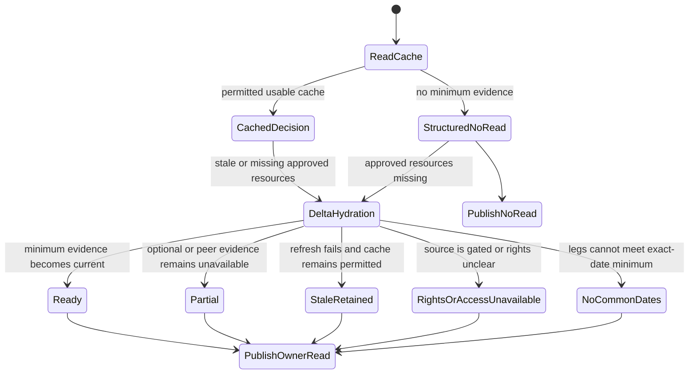
```mermaid
stateDiagram-v2
    [*] --> ReadCache
    ReadCache --> CachedDecision: permitted usable cache
    ReadCache --> StructuredNoRead: no minimum evidence
    CachedDecision --> DeltaHydration: stale or missing approved resources
    StructuredNoRead --> DeltaHydration: approved resources missing
    DeltaHydration --> Ready: minimum evidence becomes current
    DeltaHydration --> Partial: optional or peer evidence remains unavailable
    DeltaHydration --> StaleRetained: refresh fails and cache remains permitted
    DeltaHydration --> RightsOrAccessUnavailable: source is gated or rights unclear
    DeltaHydration --> NoCommonDates: legs cannot meet exact-date minimum
    Ready --> PublishOwnerRead
    Partial --> PublishOwnerRead
    StaleRetained --> PublishOwnerRead
    RightsOrAccessUnavailable --> PublishOwnerRead
    NoCommonDates --> PublishOwnerRead
    StructuredNoRead --> PublishNoRead
```

**Historical User Flow: Cohort And Pair Selection**

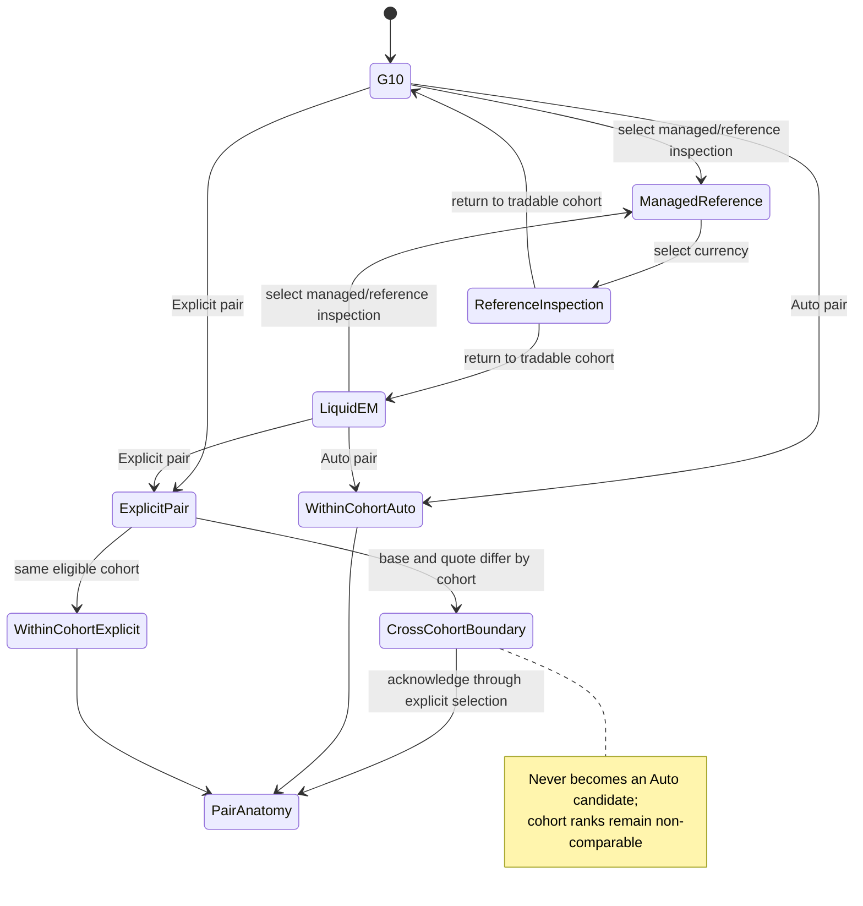
```mermaid
stateDiagram-v2
    [*] --> G10
    G10 --> WithinCohortAuto: Auto pair
    LiquidEM --> WithinCohortAuto: Auto pair
    G10 --> ExplicitPair: Explicit pair
    LiquidEM --> ExplicitPair: Explicit pair
    ExplicitPair --> CrossCohortBoundary: base and quote differ by cohort
    ExplicitPair --> WithinCohortExplicit: same eligible cohort
    CrossCohortBoundary --> PairAnatomy: acknowledge through explicit selection
    WithinCohortAuto --> PairAnatomy
    WithinCohortExplicit --> PairAnatomy
    G10 --> ManagedReference: select managed/reference inspection
    LiquidEM --> ManagedReference: select managed/reference inspection
    ManagedReference --> ReferenceInspection: select currency
    ReferenceInspection --> G10: return to tradable cohort
    ReferenceInspection --> LiquidEM: return to tradable cohort
    note right of CrossCohortBoundary
      Never becomes an Auto candidate;
      cohort ranks remain non-comparable
    end note
```

**Historical User Flow: Evidence Challenge And Provenance Inspection**

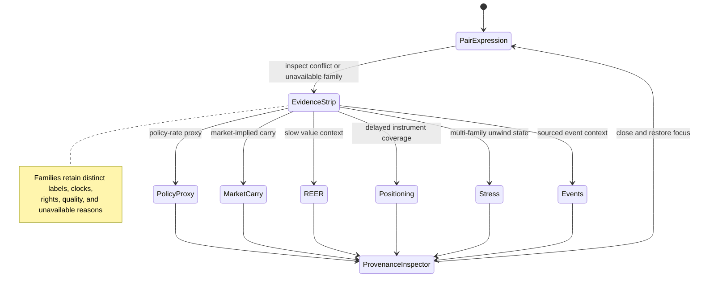
```mermaid
stateDiagram-v2
    [*] --> PairExpression
    PairExpression --> EvidenceStrip: inspect conflict or unavailable family
    EvidenceStrip --> PolicyProxy: policy-rate proxy
    EvidenceStrip --> MarketCarry: market-implied carry
    EvidenceStrip --> REER: slow value context
    EvidenceStrip --> Positioning: delayed instrument coverage
    EvidenceStrip --> Stress: multi-family unwind state
    EvidenceStrip --> Events: sourced event context
    PolicyProxy --> ProvenanceInspector
    MarketCarry --> ProvenanceInspector
    REER --> ProvenanceInspector
    Positioning --> ProvenanceInspector
    Stress --> ProvenanceInspector
    Events --> ProvenanceInspector
    ProvenanceInspector --> PairExpression: close and restore focus
    note right of EvidenceStrip
      Families retain distinct labels, clocks,
      rights, quality, and unavailable reasons
    end note
```

**Historical User Flow: Global Rotation And Market Brief Ownership**

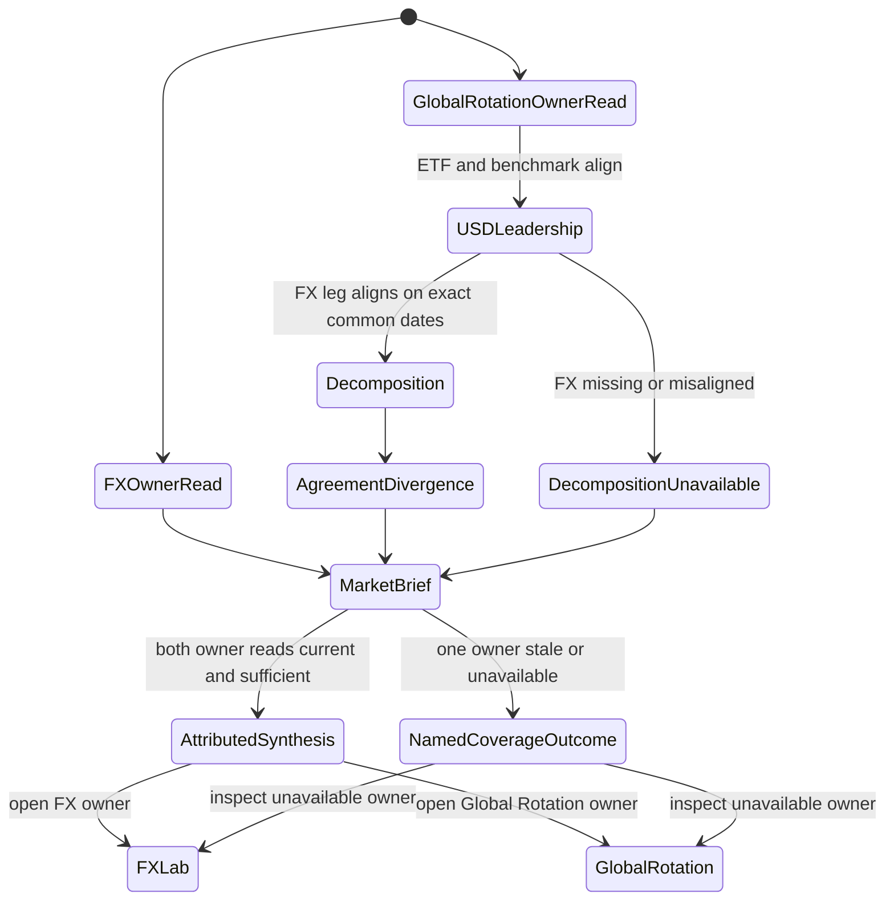
```mermaid
stateDiagram-v2
    [*] --> FXOwnerRead
    [*] --> GlobalRotationOwnerRead
    GlobalRotationOwnerRead --> USDLeadership: ETF and benchmark align
    USDLeadership --> Decomposition: FX leg aligns on exact common dates
    USDLeadership --> DecompositionUnavailable: FX missing or misaligned
    Decomposition --> AgreementDivergence
    FXOwnerRead --> MarketBrief
    AgreementDivergence --> MarketBrief
    DecompositionUnavailable --> MarketBrief
    MarketBrief --> AttributedSynthesis: both owner reads current and sufficient
    MarketBrief --> NamedCoverageOutcome: one owner stale or unavailable
    AttributedSynthesis --> FXLab: open FX owner
    AttributedSynthesis --> GlobalRotation: open Global Rotation owner
    NamedCoverageOutcome --> FXLab: inspect unavailable owner
    NamedCoverageOutcome --> GlobalRotation: inspect unavailable owner
```

**Historical User Flow: Keyboard And Mobile Evidence Inspection**

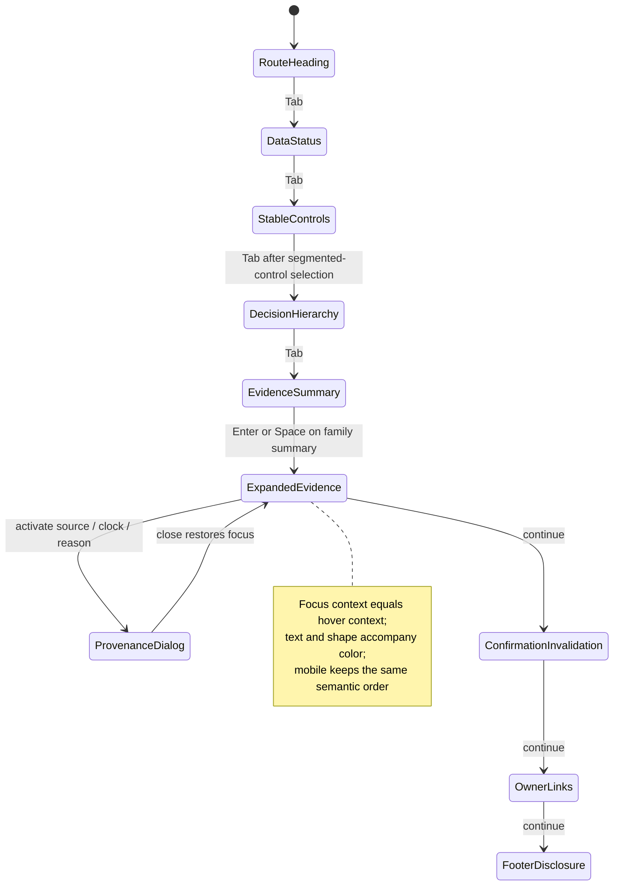
```mermaid
stateDiagram-v2
    [*] --> RouteHeading
    RouteHeading --> DataStatus: Tab
    DataStatus --> StableControls: Tab
    StableControls --> DecisionHierarchy: Tab after segmented-control selection
    DecisionHierarchy --> EvidenceSummary: Tab
    EvidenceSummary --> ExpandedEvidence: Enter or Space on family summary
    ExpandedEvidence --> ProvenanceDialog: activate source / clock / reason
    ProvenanceDialog --> ExpandedEvidence: close restores focus
    ExpandedEvidence --> ConfirmationInvalidation: continue
    ConfirmationInvalidation --> OwnerLinks: continue
    OwnerLinks --> FooterDisclosure: continue
    note right of ExpandedEvidence
      Focus context equals hover context;
      text and shape accompany color;
      mobile keeps the same semantic order
    end note
```

**Historical Flow Invariants**

- Every major journey enters a usable Simple state first from cache or a structured no-read state; no journey begins on a marketing page or waits for a manual fetch.
- Mode, cohort, horizon, pair, lens, and dollar comparison changes preserve stable control geometry and do not request market data by themselves.
- Managed/reference inspection and explicit cross-cohort research are deliberate branches. Neither can leak into default automatic ranking.
- Source inspection always returns focus to the invoking element. Hover is an enhancement, never the only context path.
- Global Rotation and Market Brief consume owner reads and deep-link owners. They do not become alternate FX computation surfaces.
- All outputs, owner reads, and downstream synthesis retain educational-only context and omit personalized sizing, account, execution, tax, and broker language.
