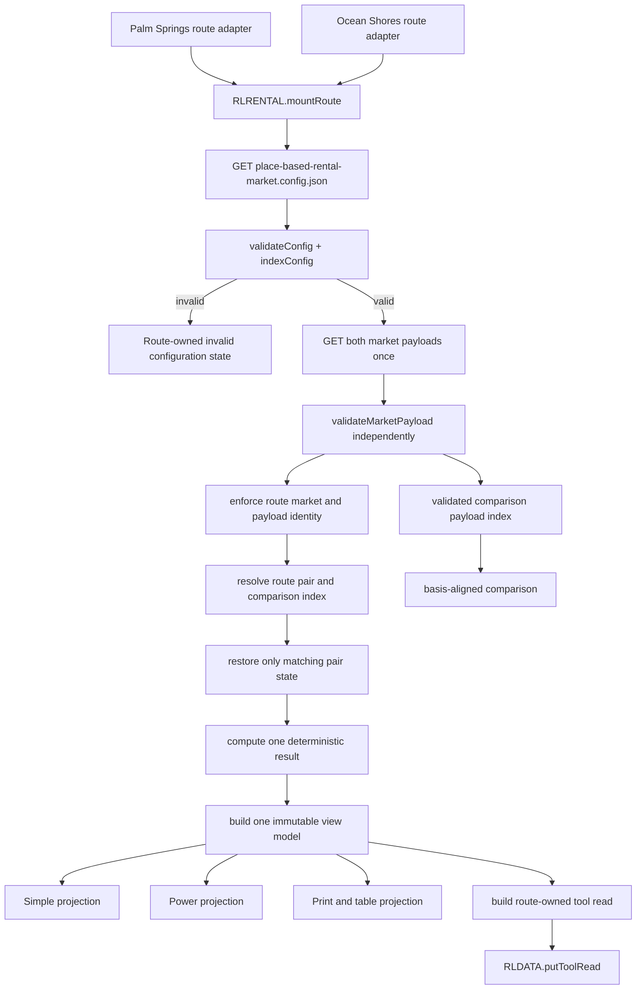
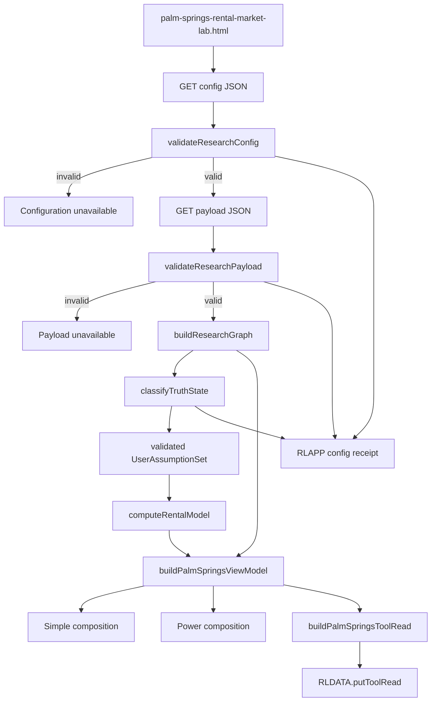
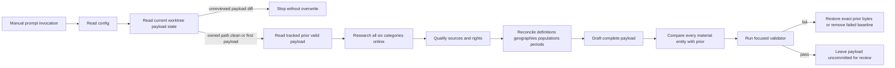

# Design: 005 Place-Based Rental Market Research

## Design Brief

### Current State

Research Lab is a build-free GitHub Pages site whose tool pages compute in the browser. The tracked `palm-springs-rental-market-lab.html`, `palm-springs-rental-market.config.json`, `scripts/validate-palm-springs-rental-market.mjs`, Palm fixture set, Palm Playwright suite, and Feature 005 block in `scripts/selftest.mjs` already provide useful fail-closed loading, closed-key validation, immutable occupancy and amortization equations, a real same-origin browser harness, and five protected regression scenarios. No production rental-market payload exists.

The existing design was stale. It placed the capability inside one Palm Springs page and explicitly rejected a shared rental-market module because it assumed one consumer. The reconciled `spec.md` now requires Palm Springs and Ocean Shores as two concrete consumers, four independently researched market-segment units, pair-safe switching, auditable 5+ entire-home luxury qualification, market-specific legal/cost/risk burdens, and one shared result contract.

### Target State

Create a proportional `Place-Based Rental Market Research` foundation in one browser/Node-safe `rlrental.js` module. It owns closed v2 validation, pair indexing, qualification and coverage, basis comparison, immutable equations, result/view-model/tool-read assembly, safe common rendering, and route-controller behavior. It owns no market facts, no network research, no persistence authority, and no page identity.

Use one generic `place-based-rental-market.config.json`, two market-owned payloads, and two route-owned HTML shells. Each route validates the generic config, validates both same-origin market payloads after config, selects only its route market for the primary view, and uses the other validated payload only for explicit comparison. Palm Springs and Ocean Shores retain different evidence obligations, legal profiles, required cost/risk lines, primary controls, visual composition, route identity, payload identity, and owner-read identity.

### Patterns To Follow

- `rlcontracts.js` and `rlcompany.js`: browser/Node-safe frozen APIs with pure domain functions and no hidden DOM, storage, or network authority.
- `company-fundamentals-lab.html`: shared module loaded before a small route controller, safe text-node rendering, and same-origin assets.
- `rldata.js::putToolRead`: exact outer `rl-tool-read/v1` validation and omission of invalid numeric fields.
- `rldata.js -> rlapp.js -> rlnav.js`: mandatory shared-shell ordering from `.github/copilot-instructions.md`.
- `rlchart.js`: synchronous canvas enhancement with text/table authority and contextual hit testing.
- `tests/palm-springs-rental-market-lab.spec.mjs`: real ephemeral `127.0.0.1` HTTP, no request interception, and the live compatibility path required by other specs.
- `package.json`, `.npmrc`, `package-lock.json`, `playwright.config.mjs`, and `tests/playwright-runtime.mjs`: exact Playwright 1.61.1, one npm registry, system Chrome, no browser download, and no ambient runner fallback.
- `notes/market-brief.md` plus its prompt shim: one detailed runbook with one concise manual invocation surface.

### Patterns To Avoid

- Do not copy the Palm page, validator, schemas, or formulas into an Ocean Shores page.
- Do not build a plugin system, schema compiler, renderer framework, or general place-research platform. The foundation supports exactly the shared rental-market behavior required by two market implementations.
- Do not keep Palm-named config as a second authority or hide it behind a JSON alias.
- Do not put market facts, scenario values, cost values, source records, or payload fallbacks in HTML, `rlrental.js`, localStorage, or query parameters.
- Do not infer a 5+ entire-home intersection from independent shares or call a 5-bedroom listing luxury without the configured qualification path.
- Do not render Ocean Shores through Palm data, retain prior-pair values after a failed switch, or use broad-market observations as observed luxury data.
- Do not add a backend, database, build artifact, runtime package, scheduler, scraper, service worker, browser research request, or automatic commit path.
- Do not weaken the current five equation/fail-loud regressions during migration.

### Resolved Decisions

- Shared module: `rlrental.js`, global/CommonJS API `RLRENTAL`, dependent only on existing `RLCONTRACTS`.
- Generic config: `place-based-rental-market.config.json`, schema `place-based-rental-market-config/v2`.
- Market payloads: `palm-springs-rental-market.payload.json` and `ocean-shores-rental-market.payload.json`, schema `place-based-rental-market-payload/v2`.
- Routes: existing Palm path plus new `ocean-shores-rental-market-lab.html`; each route owns one immutable `marketId` and one outer owner-read ID.
- Canonical validator: `scripts/validate-place-based-rental-market.mjs`; the old Palm validator remains a tested delegation entry because active first-party consumers execute it.
- Browser suite: retain `tests/palm-springs-rental-market-lab.spec.mjs` as the live compatibility suite and expand it to both routes; add a pure module contract suite rather than a second duplicated route harness.
- Research authority: one runbook, `notes/place-based-rental-market-research.md`, and one manual prompt, `.github/prompts/place-based-rental-market-update.prompt.md`, covering all four units.
- Both payloads load once after config. Controls, mode, segment, comparison, reset, inspector, print, and viewport changes issue zero subsequent requests.
- Production registration occurs only when the generic config, both payloads, both routes, validator, tests, owner reads, notes, and Market Brief coverage validate together.

### Open Questions

None blocking. Missing luxury performance, Ocean Shores legal detail, property-level coastal costs, and Palm Springs operating-cost benchmarks are research unknowns represented by the v2 contracts; they are not design gaps and cannot be filled by defaults.

## Purpose And Scope

This design replaces the Palm-only architecture with one current technical truth for:

- two route-owned production pages;
- two market payload files containing four independently researched units;
- one generic closed config with exact market, segment, formula, source, qualification, comparison, cost, risk, and display policy;
- one reusable browser/Node capability boundary;
- pair-safe loading, selection, persistence, comparison, rendering, and owner-read publication;
- immutable, finite, null-safe rental and acquisition equations;
- explicit market-specific legal, cost, and risk completeness;
- one manual four-unit LLM research and review workflow;
- source rights, safe text rendering, accessibility, print, mobile, and WebKit-compatible table authority;
- source-locked validator, selftest, and real HTTP Playwright verification; and
- additive registry, documentation, Market Brief, CI, migration, rollback, and consumer handling.

There is no API endpoint, authenticated role, database, DDL, backend process, worker, scheduler, service worker, remote write, browser scraper, generated bundle, deploy-time transformation, or production runtime dependency.

## Current-Byte Reconciliation

The following classification controls migration. It describes current bytes, not delivered v2 behavior.

| Current Surface | Current Value | Active v2 Treatment |
| --- | --- | --- |
| `palm-springs-rental-market-lab.html` | Tracked, clean foundation with 46 page-local functions and proof-only UI | Reworked into the Palm route shell after shared-module RED tests exist; exact equation behavior migrates into `rlrental.js` |
| `palm-springs-rental-market.config.json` | Tracked, clean Palm-specific v1 config | Field-by-field input to v2 config migration, then removed; it cannot remain a second authority |
| `scripts/validate-palm-springs-rental-market.mjs` | Tracked, clean extractor and focused validator | Reduced to a delegation entry over the canonical v2 validator; no schema or equation logic remains in the compatibility file |
| `tests/fixtures/palm-springs-rental-market/*` | Tracked, clean v1 synthetic config/current/invalid records | Values and adversarial intent migrate into a clearly labeled v2 two-market fixture corpus, then the v1 fixture directory is removed |
| `tests/palm-springs-rental-market-lab.spec.mjs` | Tracked, clean five-test real HTTP suite | Kept at its live path and expanded to cover both routes and v2 behavior; the five existing test titles and behaviors remain |
| Feature 005 block in `scripts/selftest.mjs` | Existing Palm extraction/model canary | Replaced surgically by a sentinel-bounded `RLRENTAL` module canary; concurrent Feature 010 additions and every other group remain byte-owned by their sessions |
| `scripts/selftest.mjs` outside Feature 005 | Concurrently modified at design time by Feature 010 | Protected shared surface; no normalization, formatting, movement, or rollback is authorized |
| `package.json`, lockfile, `.npmrc`, Playwright config/runtime | Source-locked and tracked | Reused unchanged unless the test owner identifies a separate defect; v2 adds no dependency |
| `.github/workflows/pages.yml` | Runs the Palm-named suite in a blocking verify job | DevOps-owned additive rename/coverage update; source lock and fresh root artifact remain unchanged |
| Production payload | Absent for Palm and Ocean Shores | Both market payloads must be authored by real research and validate before registration; fixture data cannot substitute |

The prior design is not mixed into active sections. Its historical decisions are summarized only in the final `## Superseded Design Decisions (Do Not Use)` appendix.

## Architecture Overview

### Runtime Topology



### Browser Script And Resource Order

Each route uses this exact order:

1. Static route-owned HTML, title, `h1`, loading truth band, and educational disclosure paint without data.
2. `rldata.js` loads.
3. `rlapp.js` loads.
4. `rlcontracts.js` loads.
5. `rlrental.js` loads.
6. `rlg.js` and `rlchart.js` load.
7. `rlnav.js` loads last among shared shell scripts.
8. One inline route adapter calls `RLRENTAL.mountRoute(...)` after verifying all required globals exist.
9. The controller fetches and validates config.
10. Only after valid config, it requests the two config-declared market payload paths with `cache: "no-store"` and `credentials: "same-origin"`.
11. It independently validates each market payload. The route-owned payload controls the primary view. The other payload controls only explicit comparison availability.
12. It commits one complete route/pair view model or one route-owned unavailable model.

Config failure produces zero payload requests. A route-owned payload failure cannot use the comparison payload. A comparison-payload failure does not invalidate a valid route-owned thesis/result, but cross-market comparison is `INCOMPARABLE` with `COMPARISON_PAYLOAD_UNAVAILABLE`.

### Runtime Layers

| Layer | Owner | Responsibility | Forbidden Authority |
| --- | --- | --- | --- |
| Shared contracts | `rlcontracts.js` | Canonical serialization and SHA-256 | Rental schema or market policy |
| Rental foundation | `rlrental.js` | Validation, indexing, qualification, coverage, comparison, equations, result/view/read assembly, safe common rendering/controller | Market facts, route identity, research fetch, config/payload writes |
| Generic policy | `place-based-rental-market.config.json` | Every version, enum, catalog, bound, format, profile, required field, and route/payload mapping | Researched conclusion or numeric market observation |
| Market research | Two payload JSON files | Pair-owned evidence, thesis, qualification, coverage, scenarios, acquisition/cost/risk assumptions, changes, and sources | Formula, enum, bound, renderer, route, or config mutation |
| Route adapters | Two HTML files | Immutable route market/tool identity, market-specific CSS/composition, shared slots, dependency injection | Market data, formula, fallback, alternate pair rendering |
| Local user state | Pair-keyed localStorage records | Public hypothetical controls for exactly one validated pair/unit revision | Research, credentials, addresses, owner-read authority |
| Owner read | Existing `RLDATA` cache | One strict current/stale/unavailable read per route | Research or formula recomputation |
| Manual research | One runbook and prompt | Actual online research, pair-specific payload proposals, validation, review boundary | Browser execution, config/formula edit, auto-commit |

### Runtime State

```text
runtime = {
  route: RouteAdapter,                    // immutable marketId + toolId
  config: frozen ConfigIndex,             // present only after complete validation
  payloads: Map<marketId, PayloadState>,  // independently valid or unavailable
  active: PairRuntime | UnavailableView,  // replaced atomically
  comparison: ComparisonRuntime,          // never primary-route authority
  ui: { mode, inspector, powerSection },
  requestLog: SameOriginRequestReceipt[],
  publication: OwnerReadReceipt
}
```

No renderer reads raw payload arrays, fetch, localStorage, or time. No event handler mutates config, payload, indexes, qualification, coverage, thesis, sources, or a prior `DeterministicResult`.

## Capability Foundation

### Foundation Contract

| Contract | Version | Responsibility | Consumers |
| --- | --- | --- | --- |
| Generic config | `place-based-rental-market-config/v2` | Closed catalogs, profiles, versions, policies, bounds, display, and routes | Module, validator, research agent, both routes |
| Market payload | `place-based-rental-market-payload/v2` | One market file containing independently complete segment units | Module, validator, route, research agent |
| Research unit | `place-based-rental-market-unit/v2` | One exact `(marketId, segmentId)` evidence and assumption graph | Qualification, coverage, model, view, read |
| Basis signature | `place-based-rental-market-basis/v1` | Complete comparison identity and mismatch reasons | Power comparison and inspector |
| User assumptions | `place-based-rental-market-user-assumptions/v2` | One validated pair/unit-revision public assumption set | Model and pair persistence |
| Result | `place-based-rental-market-result/v2` | Full-precision partial or complete deterministic output | Simple, Power, print, read |
| View model | `place-based-rental-market-view-model/v2` | Sole projection authority for all render surfaces | Shared renderer and route adapter |
| Inner owner read | `place-based-rental-market-tool-read/v2` | Pair/truth/coverage/result fields inside `rl-tool-read/v1` | RLDATA and Market Brief |

### `RLRENTAL` Public API

`rlrental.js` follows the existing frozen-global/CommonJS pattern. It resolves `RLCONTRACTS` from `globalThis` in the browser or `require("./rlcontracts.js")` in Node. Missing contracts fail with `PBRM-BOOT-DEPENDENCY`; no private canonicalizer or hash fallback is used.

| Function | Exact Contract |
| --- | --- |
| `validateConfig(value)` | Returns `{ok, errors}`; rejects missing/unknown/type-invalid keys, duplicate IDs, invalid references, incomplete profiles, unsafe routes, inconsistent bounds, and any catalog that omits a mandatory pair. |
| `indexConfig(config)` | Returns deep-frozen maps for contracts, markets, profiles, pairs, geographies, populations, fields, scenarios, policies, definitions, bounds, and formats. |
| `validateMarketPayload(value, configIndex, expectedMarketId)` | Validates the closed market envelope plus every unit and pair-local graph; rejects source-market/expected-market mismatch. |
| `indexMarketPayload(payload, configIndex)` | Returns deep-frozen market, unit, source, claim, metric, sample, legal, driver, scenario, change, and reverse-reference indexes. |
| `evaluateLuxuryQualification(unit, segmentPolicy)` | Recomputes every member gate and aggregate disposition; ignores marketing labels and rejects unsupported branch fields. |
| `computeCoverage(segmentCoverage, qualificationResult, configIndex)` | Returns counts, ratio or null, state, missing fields, and confidence consequence without inferring intersections. |
| `buildBasisSignature(observation, unit, configIndex)` | Returns all required basis fields plus canonical SHA-256. Missing fields stay explicit and make comparison unavailable. |
| `compareAligned(left, right)` | Returns `COMPARABLE` plus deltas only for identical signatures; otherwise `INCOMPARABLE` plus ordered closed reasons and no rank. |
| `normalizeUserAssumptions(candidate, pairContext)` | Enforces exact keys, IDs, unit revision, finite values, bounds, cost applicability, downtime method, and linked leverage/down payment. |
| `computeAdjustedOccupancy(base, demandDelta, supplyDelta)` | Applies the immutable clamped demand-over-supply equation with denominator guard. |
| `computeEffectiveAvailableNights(availableNights, downtime)` | Applies `explicit-disjoint-days` or `calendar-day-union` exactly and returns the auditable union count. |
| `computeMonthlyPayment(principal, annualRate, termYears)` | Applies positive-rate amortization or zero-rate straight-line principal exactly. |
| `computeRentalResult(pairContext, assumptions)` | Produces one full-precision result, partial valid market outputs, completeness receipt, and structured errors. |
| `resultIdentity(input)` | Uses `RLCONTRACTS.contentSha256` over the exact formula/pair/scenario/baseline/assumption identity object. |
| `buildViewModel(input)` | Produces one deep-frozen route/pair truth, coverage, qualification, thesis, assumption, result, comparison, section, source, error, and read projection. |
| `buildToolRead(viewModel, computedAt)` | Produces exact outer `rl-tool-read/v1`; omits invalid numerics and preserves route, pair, coverage, stale/unavailable, caveat, and result identity. |
| `mountRoute(options)` | Browser-only controller over an explicit route adapter and required DOM slots; owns one-time reads, atomic commit, events, persistence, rendering, focus, charts, print, RLAPP, and publication. |

All pure functions receive time, config, and inputs explicitly. They do not read `Date.now`, DOM, fetch, storage, `RLDATA`, or `RLAPP`.

### Foundation-Owned Behavior

1. Config validates before any payload request.
2. Market payload identity must equal its config catalog entry and expected path owner.
3. Every unit, record, reference, scenario, baseline, assumption, result, and owner read carries one matching pair key.
4. Pair-local references cannot resolve through another unit's map, even when text or source URLs match.
5. Whole-market values cannot populate observed large-luxury fields.
6. Luxury qualification always evaluates bedrooms, entire-home status, and exactly one configured qualification branch.
7. Coverage uses direct/deduplicated counts only. Independent marginals never form an intersection.
8. Comparison uses complete basis signatures; missing or unequal fields produce no delta/rank.
9. Cost applicability and value status are explicit. Missing is not zero, and a visible zero requires an explicit included line with provenance.
10. Formula operators, branch rules, and precedence live only in module code under the config formula version.
11. One `DeterministicResult` and result ID feed Simple, Power, mobile, print, charts/tables, and owner read.
12. The route market is immutable. Market switching is navigation, never an in-place market repaint.
13. All dynamic text is inert; external links come only from validated credential-free HTTP(S) SourceRecords.
14. A mode/control/segment/comparison/inspector/reset/print action performs no request.
15. Fixture mode is visibly synthetic, reads only closed same-origin fixture paths, disables persistence and owner-read publication, and cannot satisfy research evidence.

### Extension Points

- A new market requires one `marketCatalog` record, one complete `marketProfile`, config catalog fields, one payload, one route adapter, one owner read, and the full profile conformance suite. No market switch statement is added to equations.
- A new optional segment requires a config-version change and one pair-specific segment record. It cannot replace either mandatory segment.
- A new legal/cost/risk/premium field requires a catalog record and profile reference. Payload text cannot invent fields.
- A new formula output requires a specification and formula-version change plus known-value and finite/error tests.
- Route styling and section placement vary through HTML/CSS and profile `sectionOrder`; validation, qualification, coverage, equations, safe rendering, and event behavior do not vary.

## Concrete Implementations

### Palm Springs, California

- `marketId`: `palm-springs-ca`
- Route: `palm-springs-rental-market-lab.html`
- Tool/owner-read ID: `palm-springs-rental-market-lab`
- Payload: `palm-springs-rental-market.payload.json`
- Profile: `profile:palm-springs-ca:v2`
- Mandatory pairs: `palm-springs-ca::whole-market` and `palm-springs-ca::large-luxury-5plus`
- Composition: coverage and thesis first; certificate/cap/contract posture and event/season context before acquisition and the Palm operating ledger.
- Primary Simple controls: demand delta, ADR shock or explicit user ADR when required, purchase price, and variable management/operating ratio.
- Required legal fields: certificate eligibility, neighborhood cap, annual contract limit, and safety/pool compliance.
- Required explicit cost/treatment fields: certificate fees, property tax, lodging/business tax treatment, pool/spa, landscape, water, energy, management, safety/compliance, association/HOA, homeowner/STR insurance, and maintenance reserve.
- Large-luxury output remains unknown/assumption-driven until a qualifying 5+ entire-home sample exists; broad OTA and all-home evidence remains context.

### Ocean Shores, Washington

- `marketId`: `ocean-shores-wa`
- Route: `ocean-shores-rental-market-lab.html`
- Tool/owner-read ID: `ocean-shores-rental-market-lab`
- Payload: `ocean-shores-rental-market.payload.json`
- Profile: `profile:ocean-shores-wa:v2`
- Mandatory pairs: `ocean-shores-wa::whole-market` and `ocean-shores-wa::large-luxury-5plus`
- Composition: coverage and thesis first; effective-night arithmetic and geography-preserving coastal burden before generic economics.
- Primary Simple controls: coastal/access downtime, flood insurance, wind/storm reserve, and purchase price.
- Required legal fields: city endorsement, zoning eligibility, safety inspection, and occupancy/parking posture.
- Required risk/cost fields: coastal/access downtime, property tax, endorsement/inspection, homeowner/STR insurance, flood insurance, wind/storm, salt/moisture/erosion maintenance, water, sewer volume, storm drain, association/HOA, septic posture/cost, and maintenance reserve.
- Every coastal record declares `ocean-shores-city`, `grays-harbor-county`, `peninsulas-region`, `washington-coast`, or `property-level`; the renderer exposes this scope and never collapses it into a risk score.

### Variation Axes

| Axis | Shared Foundation | Palm Springs | Ocean Shores |
| --- | --- | --- | --- |
| Route identity | Validates immutable route/payload/tool mapping | Palm route and owner ID | Ocean route and owner ID |
| Segment semantics | Same mandatory IDs and luxury gates | 5+ entire-home plus Palm premium attributes | 5+ entire-home plus coastal/waterfront attributes |
| Evidence geography | Preserves configured IDs | City, Greater Palm Springs, Coachella Valley, PSP, California | City, county, Peninsulas, Washington coast, property |
| Legal posture | Structured required fields, no supply conversion | Certificate, cap, contracts, pool/safety | Endorsement, zoning, inspection, occupancy/parking |
| Downtime policy | Same union/disjoint computation | Explicit applicable heat/access/maintenance days when present | Coastal/access/storm/maintenance days are profile-required |
| Variable costs | One ratio and reconciled components | Management is mandatory | Management may be present; profile does not hide it when applicable |
| Fixed/risk costs | One completeness and sum contract | Pool, landscape, water/energy, compliance | Flood, wind/storm, salt/moisture/erosion, utility/sewer/storm/septic |
| Simple composition | Same components and result | Municipal/legal and operating emphasis | Coastal effect and geography emphasis |
| Power composition | Same audit primitives | Events, legal supply, Palm acquisition/burden | Geography, access, coastal sensitivity, sparse acquisition |
| Styling | Stable dimensions, semantic bands, no nested cards | Desert/municipal accent and typography | Coastal/access accent and typography |
| Owner read | Same inner contract | Palm outer ID and deep link | Ocean outer ID and deep link |
| Research file | Same unit schema | Palm-owned file | Ocean-owned file |

## Exact Implementation Surface

### Add

| File | Exact Purpose |
| --- | --- |
| `rlrental.js` | One frozen browser/CommonJS capability module and common browser controller/renderer. |
| `place-based-rental-market.config.json` | Sole v2 machine policy for both markets and every segment/profile/formula/field. |
| `palm-springs-rental-market.payload.json` | Palm market envelope containing the two Palm units. |
| `ocean-shores-rental-market.payload.json` | Ocean market envelope containing the two Ocean units. |
| `ocean-shores-rental-market-lab.html` | Ocean route shell, composition, styling, and adapter. |
| `scripts/validate-place-based-rental-market.mjs` | Canonical Node validator using `RLRENTAL`, production files, v2 fixtures, runbook/prompt, route, registration, and source-safety checks. |
| `tests/place-based-rental-market.contracts.unit.mjs` | Focused Node tests for v2 schemas, references, qualification, coverage, basis, equations, identity, and omissions. |
| `tests/fixtures/place-based-rental-market/config.v2.json` | Explicit synthetic v2 config; labels state `TEST FIXTURE`. |
| `tests/fixtures/place-based-rental-market/palm.valid.payload.json` | Palm whole/luxury fixture with complete and unknown/sparse branches. |
| `tests/fixtures/place-based-rental-market/ocean.valid.payload.json` | Ocean fixture with explicit non-overlapping downtime and complete cost lines. |
| `tests/fixtures/place-based-rental-market/invalid-closed-schema.json` | Unknown/missing-key and reference rejection cases. |
| `tests/fixtures/place-based-rental-market/invalid-pair-leak.json` | Wrong market/pair/file identity and cross-unit reference cases. |
| `tests/fixtures/place-based-rental-market/five-bedroom-not-luxury.json` | 5-bedroom candidates that fail or lack entire-home/luxury gates. |
| `tests/fixtures/place-based-rental-market/sparse-unknown-coverage.json` | Unknown denominator, sparse sample, and independent marginals. |
| `tests/fixtures/place-based-rental-market/broad-to-luxury-substitution.json` | Invalid observed luxury field sourced from whole-market evidence. |
| `tests/fixtures/place-based-rental-market/comparison-mismatch.json` | Basis mismatches for definition, geography, population, period, method, sample, and qualification. |
| `tests/fixtures/place-based-rental-market/palm-missing-burden.json` | Valid research with required Palm cost lines missing and incomplete economics. |
| `tests/fixtures/place-based-rental-market/ocean-coastal-sensitivity.json` | Valid Ocean baseline and changed downtime/fixed-cost controls. |
| `tests/fixtures/place-based-rental-market/unsafe-source.json` | Script-like text, unsafe URL schemes, credentials, and token-shaped query/hash cases. |
| `notes/place-based-rental-market-research.md` | Sole four-unit research, rights, method, validation, review, rollback, and no-auto-commit runbook. |
| `.github/prompts/place-based-rental-market-update.prompt.md` | Concise manual invocation that delegates to the shared runbook. |

### Update

| File | Exact Change Boundary |
| --- | --- |
| `palm-springs-rental-market-lab.html` | Replace proof-only page-local contracts with Palm route shell and adapter; preserve route/title and migrate protected behavior through `RLRENTAL`. |
| `scripts/validate-palm-springs-rental-market.mjs` | Delegate to canonical validator; preserve no-argument and legacy two-positional-argument command shapes with explicit Palm translation and no duplicate logic. |
| `tests/palm-springs-rental-market-lab.spec.mjs` | Keep path; preserve five exact existing regressions; add both-route/pair/UX/source/registration behavior over real HTTP. |
| `scripts/selftest.mjs` | Replace only the Feature 005 group with a sentinel-bounded `RLRENTAL` import and independent shared-runtime canaries. |
| `tools.json`, `index.html`, `rlnav.js` | Add two adjacent live entries in identical order only after both production payloads validate. |
| `README.md`, `notes/README.md` | Add two route entries and one shared methodology entry without changing unrelated content. |
| `.github/workflows/pages.yml` | DevOps-owned: rename the verify step and run the two-market compatibility suite plus canonical validator; keep source lock and fresh root artifact. |
| `.specify/memory/agents.md` | Commands owner records canonical validator, compatibility validator, unit suite, focused titles, and complete system-Chrome suite. |
| `market-brief.payload.json` | Existing brief refresh owner supplies registry coverage for both new IDs when registration lands; no rental research/equations are copied. |

### Remove After Same-Change Migration Proof

| File | Removal Condition |
| --- | --- |
| `palm-springs-rental-market.config.json` | Generic config validates; every v1 field is classified as migrated, intentionally replaced, or invalidated; stale-reference scan finds no runtime consumer. |
| `tests/fixtures/palm-springs-rental-market/config.json` | V2 config fixture covers every retained bound/enum/formula behavior. |
| `tests/fixtures/palm-springs-rental-market/current.payload.json` | V2 Palm/Ocean fixtures preserve the known equation inputs and stronger pair contracts. |
| `tests/fixtures/palm-springs-rental-market/invalid.payload.json` | V2 rejection corpus covers dangling references/category omissions plus new pair/qualification/basis/cost/source failures. |

Historical report command text and superseded design/spec appendices remain historical. They are not runtime consumers and are not rewritten.

### Explicitly Unchanged

- `rldata.js`, `rlapp.js`, `rlcontracts.js`, `rlchart.js`, `rlg.js`, and `rlnav.js` behavior.
- `tests/playwright-runtime.mjs`, `playwright.config.mjs`, `package.json`, `package-lock.json`, `.npmrc`, and `scripts/validate-node-source-lock.mjs` unless a separately owned defect is found.
- Market Brief calculation code and shared data cache schema.
- Any backend, database, build pipeline, release train, deployment target, scheduler, or provider credentials.

## Contract Naming And Identity Rules

### Version Constants

```text
config schema:       place-based-rental-market-config/v2
market payload:      place-based-rental-market-payload/v2
research unit:       place-based-rental-market-unit/v2
formula:             place-based-rental-market-model/2.0.0
research method:     place-based-rental-market-research/2.0.0
change accounting:   place-based-rental-market-change/v2
comparison basis:    place-based-rental-market-basis/v1
user assumptions:    place-based-rental-market-user-assumptions/v2
result:              place-based-rental-market-result/v2
view model:          place-based-rental-market-view-model/v2
inner owner read:    place-based-rental-market-tool-read/v2
outer owner read:    rl-tool-read/v1
```

Unknown contract versions fail. There is no v1-to-v2 browser migration because v1 has no production payload and only one Palm consumer. The implementation migration is explicit and test-backed.

### Market, Segment, Pair, And Record IDs

- Markets: `palm-springs-ca`, `ocean-shores-wa`.
- Mandatory segments: `whole-market`, `large-luxury-5plus`.
- Pair key: exactly `${marketId}::${segmentId}`.
- Pair-owned IDs match `kind:${marketId}:${segmentId}:${local-id}`.
- Allowed `kind` prefixes: `unit`, `source`, `claim`, `metric`, `conflict`, `method`, `series`, `scenario`, `sample`, `member`, `baseline`, `costset`, `riskset`, `legal`, `driver`, `change`, `unknown`.
- Config IDs use catalog-specific prefixes: `profile:`, `geo:`, `population:`, `metricdef:`, `legalfield:`, `costfield:`, `riskfield:`, `premium:`, `sourcepolicy:`.
- IDs are lowercase ASCII and match `^[a-z][a-z0-9-]*:[a-z0-9][a-z0-9._:-]*$`; pair keys match `^[a-z0-9-]+::[a-z0-9-]+$`.
- Every pair-owned ID prefix must contain the record's exact pair. A reference whose ID prefix names another pair is rejected before map lookup.
- Arrays with identity semantics reject duplicates and preserve config/payload order only where order is user-visible. Set-like arrays are canonicalized before hashing.

## Generic Config V2

### Exact Top-Level Shape

`place-based-rental-market.config.json` rejects unknown keys and requires exactly:

```text
schemaVersion
configVersion
contracts
requiredResearchCategoryIds
enums
freshness
limits
bounds
displayFormats
comparisonBasisFields
initialUi
marketCatalog
marketProfiles
segmentCatalog
geographyCatalog
populationCatalog
legalFieldCatalog
costFieldCatalog
riskFieldCatalog
premiumAttributeCatalog
sourcePolicies
metricDefinitions
scenarioCatalog
```

### `contracts`

`contracts` has exactly `marketPayload`, `unit`, `formula`, `researchMethod`, `changeAccounting`, `comparisonBasis`, `userAssumptions`, `result`, `viewModel`, `ownerRead`, and `uiState`, with the constants above.

### Required Research Categories

Every unit contains each category exactly once:

1. `lodging-performance`
2. `legal-active-supply`
3. `housing-acquisition`
4. `travel-access-feeder`
5. `macro-financing`
6. `hotel-competition`
7. `events-seasonality`
8. `operating-costs`
9. `physical-risks`

Each category ends `researched`, `partial`, `unknown`, or `unavailable` with eligible and/or attempted source IDs according to state. One pair's category record cannot satisfy another pair.

### Closed Enums

| Enum | Allowed Values |
| --- | --- |
| `evidenceClass` | `observed`, `assumption`, `inference`, `modeled-output` |
| `phase` | `early-cycle`, `mid-cycle`, `late-cycle`, `contraction`, `stabilizing`, `recovery`, `uncertain`, `unavailable` |
| `direction` | `strengthening`, `stable`, `softening`, `mixed`, `unavailable` |
| `claimKind` | `thesis`, `evidence`, `contradiction`, `catalyst`, `risk`, `falsifier`, `unknown`, `legal-fact`, `event-impact`, `forecast-rationale`, `assumption-revision`, `coverage`, `qualification`, `acquisition`, `cost` |
| `sourceRole` | `support`, `contradict`, `context`, `attempt` |
| `sourceState` | `eligible`, `stale`, `inaccessible`, `rejected` |
| `sourceQuality` | `official-primary`, `operator-primary`, `commercial-methodology`, `named-secondary`, `unverified-attempt` |
| `accessState` | `public`, `registration-required`, `subscription-gated`, `restricted`, `unavailable` |
| `rightsState` | `public-summary`, `citation-only`, `metadata-only`, `prohibited` |
| `categoryState` | `researched`, `partial`, `unknown`, `unavailable` |
| `coverageState` | `complete`, `partial`, `sparse`, `unknown`, `unavailable` |
| `countState` | `known`, `unknown` |
| `qualificationMethod` | `not-applicable`, `achieved-adr-tier`, `composite-sample` |
| `qualificationDisposition` | `qualified`, `not-qualified`, `unknown`, `not-applicable` |
| `gateState` | `pass`, `fail`, `unknown`, `not-applicable` |
| `rentalType` | `source-defined-market`, `entire-home` |
| `intersectionMethod` | `direct-source-cross-tab`, `deduplicated-member-audit`, `unknown` |
| `valueKind` | `point`, `range`, `unavailable` |
| `periodKind` | `day`, `week`, `month`, `quarter`, `year`, `trailing-twelve-month`, `forecast-horizon` |
| `scenarioState` | `researched-baseline`, `assumption-driven`, `unavailable` |
| `sampleStatus` | `active-ask`, `closed-sale`, `achieved-performance`, `advertised-rate` |
| `sampleState` | `clean`, `sparse`, `unclean`, `unknown`, `unavailable` |
| `propertyIdentityType` | `source-listing-id`, `mls-id`, `parcel-id`, `operator-property-id` |
| `fieldApplicability` | `applicable`, `not-applicable`, `unknown` |
| `fieldValueState` | `observed`, `quoted`, `assumed`, `missing`, `not-applicable`, `excluded` |
| `costKind` | `variable-ratio`, `annual-fixed-risk` |
| `downtimeMethod` | `explicit-disjoint-days`, `calendar-day-union` |
| `comparisonState` | `COMPARABLE`, `INCOMPARABLE` |
| `comparisonReason` | `METRIC_DEFINITION`, `MARKET`, `GEOGRAPHY`, `POPULATION`, `PERIOD`, `CURRENCY`, `UNIT`, `AGGREGATION`, `SOURCE_METHOD`, `SAMPLE_FRAME`, `SEGMENT_QUALIFICATION`, `MISSING_VALUE`, `UNKNOWN_BASIS`, `COMPARISON_PAYLOAD_UNAVAILABLE` |
| `changeType` | `added`, `removed`, `revised`, `unchanged`, `contradicted`, `unresolved` |
| `changeEntityType` | `thesis`, `claim`, `source`, `metric-observation`, `coverage`, `qualification-member`, `sample-member`, `legal-fact`, `driver`, `forecast-method`, `scenario`, `acquisition-sample`, `acquisition-baseline`, `cost-line`, `risk-assumption`, `unknown` |
| `priorMode` | `baseline`, `compared` |
| `legalState` | `current`, `scheduled`, `stale`, `disputed`, `unknown`, `superseded` |
| `driverState` | `upcoming`, `active`, `passed`, `stale`, `unknown`, `superseded` |

The payload cannot add enum values. `modeled-output` is produced by the module and is forbidden on source evidence, claims, and source-authored forecasts.

### Freshness, Limits, Bounds, And Formats

`freshness` has exactly `payloadMaxAgeHours: 336` and `clockSkewToleranceMinutes: 5`. Each unit's `staleAfter` must equal its `researchedAt + payloadMaxAgeHours`.

`limits` has explicit positive integer maxima for IDs, labels, short text, narrative, limitations, source refs, sources per unit, claims per unit, metrics per unit, sample members, changes, monthly rows, cost lines, risk lines, and unknowns. No validator supplies a missing limit.

| Bound | Min | Max | Additional Rule |
| --- | ---: | ---: | --- |
| `baseOccupancy` | 0 | 1 | finite ratio |
| `baseAdrUsd` | 1 | 20000 | finite when supplied |
| `availableNights` | 1 | 366 | integer |
| `downtimeDays` | 0 | 366 | integer; union total cannot exceed available nights |
| `demandDelta` | -0.50 | 0.50 | finite; occupancy is clamped |
| `supplyDelta` | -0.50 | 1.00 | `1 + supplyDelta > 0` |
| `adrShock` | -0.50 | 0.50 | adjusted ADR cannot be negative |
| `purchasePriceUsd` | 50000 | 50000000 | strictly positive |
| `leverageRatio` | 0 | 0.90 | linked to down payment |
| `downPaymentRatio` | 0.10 | 1 | exact complement of leverage |
| `annualMortgageRate` | 0 | 0.30 | finite ratio |
| `loanTermYears` | 1 | 40 | integer |
| `variableOperatingExpenseRatio` | 0 | 0.95 | component ratios sum exactly within epsilon |
| `annualFixedRiskCostUsd` | 0 | 5000000 | explicit zero is allowed only on a present sourced/assumed applicable line |
| `confidencePct` | 0 | 100 | integer |
| `squareFeet` | 1 | 100000 | integer when known |
| `sampleCount` | 0 | 1000000 | integer when known |

Every bound record also contains explicit `step` and `integer`; these values are validated but not treated as defaults.

`displayFormats` has exact entries for occupancy, ADR, RevPAR, effective nights, gross revenue, gross yield, purchase price, principal, debt service, variable cost, fixed/risk cost, total operating cost, and pre-tax cash flow. Each entry contains full `Intl.NumberFormat` options. Formatting receives null and returns the configured unavailable text `UNKNOWN` or `UNAVAILABLE`; it never converts null to zero.

`comparisonBasisFields` is exactly:

```text
metricDefinitionId, marketId, geographyId, populationId, segmentId,
periodStart, periodEnd, currency, unit, aggregation,
sourceMethodId, sampleFrameId, qualificationSignature
```

### Market Catalog

Each record has exactly `marketId`, `label`, `jurisdictionLabel`, `routePath`, `toolId`, `ownerReadId`, `payloadPath`, `currency`, `profileId`, `defaultSegmentId`, and `comparisonMarketId`.

| Market ID | Route | Tool/Read ID | Payload | Profile | Default Segment | Comparison Market |
| --- | --- | --- | --- | --- | --- | --- |
| `palm-springs-ca` | `palm-springs-rental-market-lab.html` | `palm-springs-rental-market-lab` | `palm-springs-rental-market.payload.json` | `profile:palm-springs-ca:v2` | `whole-market` | `ocean-shores-wa` |
| `ocean-shores-wa` | `ocean-shores-rental-market-lab.html` | `ocean-shores-rental-market-lab` | `ocean-shores-rental-market.payload.json` | `profile:ocean-shores-wa:v2` | `whole-market` | `palm-springs-ca` |

V2 requires exactly these two concrete market implementations. Route and payload paths must be safe root-relative file names with no scheme, query, fragment, `..`, or backslash.

### Segment Catalog

Each record has exactly `pairKey`, `marketId`, `segmentId`, `label`, `shortLabel`, `mandatory`, `populationDefinitionId`, `minimumBedrooms`, `rentalType`, `qualificationPolicy`, and `comparisonSegmentId`.

The config requires all four records:

| Pair | Minimum Bedrooms | Rental Type | Qualification | Comparison Segment |
| --- | ---: | --- | --- | --- |
| `palm-springs-ca::whole-market` | null | `source-defined-market` | `not-applicable` | `large-luxury-5plus` |
| `palm-springs-ca::large-luxury-5plus` | 5 | `entire-home` | achieved-ADR tier or composite policy below | `whole-market` |
| `ocean-shores-wa::whole-market` | null | `source-defined-market` | `not-applicable` | `large-luxury-5plus` |
| `ocean-shores-wa::large-luxury-5plus` | 5 | `entire-home` | achieved-ADR tier or composite policy below | `whole-market` |

Large-luxury policy has exactly:

```text
allowedMethods: ["achieved-adr-tier", "composite-sample"]
minimumBedrooms: 5
rentalType: "entire-home"
achievedAdrTier: {
  cohortDimension: "bedrooms",
  periodKind: "trailing-twelve-month",
  equalTierCount: 5,
  qualifyingTier: "luxury",
  requiresAchievedAdr: true
}
composite: {
  minimumSquareFeet: 3000,
  minimumPremiumAttributes: 2,
  percentile: 0.75,
  minimumSampleSize: 10,
  allowedMeasureTypes: ["acquisition-price", "standardized-advertised-rate"]
}
```

The payload chooses exactly one allowed method for each large-luxury unit. `standardized-advertised-rate` is always labeled non-ADR.

### Market Profiles

Each record has exactly `profileId`, `marketId`, `requiredResearchCategoryIds`, `requiredLegalFieldIds`, `requiredVariableCostFieldIds`, `requiredFixedRiskCostFieldIds`, `requiredRiskFieldIds`, `premiumAttributeIds`, `primaryLeverIds`, `simpleSectionOrder`, and `powerSectionOrder`.

Palm profile requirements:

```text
legalfield:palm:certificate-eligibility
legalfield:palm:neighborhood-cap
legalfield:palm:annual-contract-limit
legalfield:palm:safety-pool-compliance

costfield:palm:management-ratio
costfield:common:property-tax
costfield:palm:lodging-business-tax-treatment
costfield:palm:certificate-fees
costfield:palm:pool-spa-service
costfield:palm:landscape
costfield:palm:water
costfield:palm:energy
costfield:palm:safety-compliance
costfield:common:association-hoa
costfield:common:homeowner-str-insurance
costfield:common:maintenance-reserve
```

Ocean profile requirements:

```text
legalfield:ocean:city-endorsement
legalfield:ocean:zoning-eligibility
legalfield:ocean:safety-inspection
legalfield:ocean:occupancy-parking

riskfield:ocean:coastal-access-downtime
riskfield:ocean:flood
riskfield:ocean:wind-storm
riskfield:ocean:salt-moisture-erosion
riskfield:ocean:septic-posture

costfield:common:property-tax
costfield:ocean:endorsement-inspection
costfield:common:homeowner-str-insurance
costfield:ocean:flood-insurance
costfield:ocean:wind-storm-reserve
costfield:ocean:salt-moisture-erosion-maintenance
costfield:ocean:water
costfield:ocean:sewer-volume
costfield:ocean:storm-drain
costfield:common:association-hoa
costfield:ocean:septic-operation-maintenance
costfield:common:maintenance-reserve
```

Every required field must have a record. `not-applicable` is valid only with an explicit applicability claim and source/assumption reference. `unknown` or `missing` keeps economics incomplete.

### Field Catalog Records

`LegalFieldDefinition` has exactly `id`, `label`, `marketId`, `jurisdictionGeographyId`, `requiredForSegmentIds`, `allowedStates`, and `description`.

`CostFieldDefinition` has exactly `id`, `label`, `marketId`, `costKind`, `unit`, `requiredForSegmentIds`, `requiredForCompleteEconomics`, `conditionalApplicability`, `boundId`, `effect`, and `description`. `effect` is one of `variable-cost`, `fixed-risk-cost`, or `disclosure-only` and is config data, not payload executable text.

`RiskFieldDefinition` has exactly `id`, `label`, `marketId`, `unit`, `requiredForSegmentIds`, `boundId`, `effect`, `allowedGeographyIds`, and `description`. `effect` is `effective-nights`, `fixed-risk-cost`, or `disclosure-only`.

`PremiumAttributeDefinition` has exactly `id`, `label`, `marketId`, and `description`. Palm includes private pool/spa, design provenance, estate/gated acreage, detached casita, mountain-view lot, and sport court. Ocean includes direct waterfront, verified beach access, panoramic water view, private dock, hot tub/sauna, elevator, and game/theater room.

### Geography And Population Catalogs

The generic catalog contains all explicitly named scopes. Market profiles list which can support each implementation. At minimum:

- Palm: `geo:palm-springs-city`, `geo:greater-palm-springs`, `geo:coachella-valley`, `geo:psp-airport`, `geo:california`, `geo:united-states`.
- Ocean: `geo:ocean-shores-city`, `geo:grays-harbor-county`, `geo:peninsulas-region`, `geo:washington-coast`, `geo:washington-state`, `geo:property-level`, `geo:united-states`.
- Populations: broad OTA listings, entire-home listings, 5+ listings, qualified luxury members, managed homes, legal certificates/endorsements, eligible properties, waitlist entries, inspected properties, hotel rooms, passengers, scheduled seats, all-home sales, active asks, closed sales, and mortgage survey loans.

No hierarchy implies substitution. A county fact is not automatically valid for a city/property observation; a broad OTA count is not a qualified sample denominator.

### Source Policies And Metric Definitions

Source policy retains v1 quality/access/rights rigor. An eligible persisted numeric value requires a policy that allows the evidence class and role, `rights.state = public-summary`, `numericValueAllowed = true`, exact clocks, geography, population, method, and limitations. `citation-only`, `metadata-only`, and `prohibited` never carry persisted restricted numeric values. Inaccessible/rejected sources support only attempt/unknown records.

Every metric definition has exactly:

```text
id, label, family, unit, currency, numerator, denominator,
populationId, geographyId, segmentApplicability,
periodKind, aggregation, inclusions, exclusions,
sourceConvention, sourceMethodId, directlyComparableWith
```

V2 ports the valid Palm v1 definitions, adds Ocean equivalents, adds segment-specific definitions only when a source defines the exact qualifying population, and forbids `gross-screening-yield` from being presented as an observed metric. Derived model outputs use result fields, not source observation IDs.

### Scenario Catalog And Initial UI

The generic scenario catalog owns stable semantic slots rather than Palm-specific IDs:

```text
scenario-slot:rest-2026-base
scenario-slot:2027-downside
scenario-slot:2027-base
scenario-slot:2027-upside
scenario-slot:assumption-sensitivity
```

Each unit supplies pair-prefixed scenario IDs that reference one allowed slot. Whole-market units provide researched-baseline scenarios only when aligned evidence exists. Luxury units without an aligned baseline provide an `assumption-sensitivity` scenario with required user base inputs and no default observed conclusion.

`initialUi` has exactly `mode: "simple"` and `initialAnchor: "decision"`. Market default segment is explicit in `marketCatalog`; pair scenario/year comes from the matching unit. There is no first-array-entry fallback.

## Market Payload V2

### Exact Market Envelope

Each market payload rejects unknown keys and contains exactly:

```text
schemaVersion
payloadId
marketId
configVersion
formulaVersion
researchMethodVersion
changeAccountingVersion
assembledAt
units
educationalDisclosure
```

The file's `marketId`, expected path, config market record, and route comparison identity must agree. `units` contains each mandatory segment for that market exactly once. It cannot contain another market's unit.

### Exact Research Unit

Each unit rejects unknown keys and contains exactly:

```text
contractVersion
unitId
pairKey
marketId
segmentId
researchedAt
asOf
staleAfter
prior
categoryCoverage
segmentCoverage
luxuryQualification
thesis
sources
claims
metricObservations
definitionConflicts
forecastMethods
series
annualSyntheses
scenarios
initialSelection
acquisitionSample
acquisitionBaseline
variableCostBaseline
fixedRiskCostBaseline
riskAssumptionBaseline
legalFacts
drivers
changes
unknowns
```

`unitId`, pair, market, and segment must agree with the config pair record. Every nested pair-owned ID must contain that pair. One unit cannot be marked current by another unit's clocks or coverage.

### Prior And Change Identity

`prior` has exactly `mode`, `unitId`, `researchedAt`, and `gitBlobOid`.

- `baseline`: all identity fields null; changes contain zero records and no prior-relative language.
- `compared`: all fields present and identify the immediately prior valid unit for the same pair from the tracked market payload blob.

`changes` has exactly `contractVersion`, `mode`, `priorUnitId`, `comparedAt`, and `records`. Every material entity in the prior/current union receives exactly one closed change type. Sample composition, coverage, assumption, and market-performance changes use distinct entity types. A revised scenario, acquisition baseline, cost, or risk assumption cites eligible evidence explaining the revision.

### Category Coverage

Each of the nine config categories appears once as:

```text
categoryId
state
eligibleSourceIds
attemptedSourceIds
summaryClaimId
missingFieldIds
consequence
```

`researched` requires eligible support. `partial` requires eligible support plus explicit gaps. `unknown`/`unavailable` require attempted sources or an exact reason no source exists. Attempted sources cannot support positive claims or values.

### Segment Evidence Coverage

`segmentCoverage` has exactly:

```text
state
candidateCount
qualifyingCount
metricSamples
intersection
sourceCoverage
period
missingFieldIds
confidenceConsequence
```

`candidateCount` and `qualifyingCount` each have exactly `state`, `value`, `populationId`, `sourceIds`, and `method`. Known values are non-negative integers; unknown values are null.

Each `metricSamples` record has exactly `metricDefinitionId`, `sampleId`, `sampleN`, `qualifyingDenominator`, `sourceIds`, `missingFieldIds`, and `state`. Counts use the same known/null contract.

`intersection` has exactly `method`, `bedroomMarginalSourceIds`, `propertyTypeMarginalSourceIds`, `directSourceIds`, and `limitationClaimId`.

- `direct-source-cross-tab` requires direct exact-pair count evidence.
- `deduplicated-member-audit` requires a validated member set.
- `unknown` requires null candidate/qualifying intersection counts or independently supported candidate counts with explicit missing exact intersection.
- Independent bedroom/property-type shares may appear in observations and marginal source arrays, but no validator/model path multiplies them.

`computeCoverage` returns $K=m/q$ only for a verified $q>0$ and $0\le m\le q$. Unknown or zero denominator returns `coverageRatio: null` with count/missing details. `sparse` takes precedence when the qualifying or metric sample is below the config minimum sample size; it never becomes `complete` through a percentage alone.

### Auditable Luxury Qualification

`luxuryQualification` is always present.

Whole-market exact form:

```text
method: "not-applicable"
methodVersion: config contract
disposition: "not-applicable"
policyRef: pair config ref
sample: null
members: []
missingFieldIds: []
sourceIds: []
```

Large-luxury common keys are `method`, `methodVersion`, `disposition`, `policyRef`, `sample`, `members`, `missingFieldIds`, and `sourceIds`. The selected branch adds exactly one of `achievedAdrTier` or `composite`; the other key is forbidden.

`QualificationSample` has exactly:

```text
sampleId, marketId, segmentId, measureType, status, state,
filters, dedupMethod, memberIds, sampleN, period,
sourceIds, rightsState, limitations
```

`PropertyMember` has exactly:

```text
memberId
identity
bedrooms
rentalType
squareFeet
premiumAttributes
achievedAdrTier
sampleMeasure
gateResults
disposition
reasonCodes
sourceIds
rightsState
limitations
```

`identity` contains `type`, `sourceId`, and `sourcePropertyId`; no user-entered target address is stored. `bedrooms`, `rentalType`, `squareFeet`, `achievedAdrTier`, and `sampleMeasure` each carry state, value, and source IDs.

Achieved-ADR branch requires the same bedroom cohort, trailing period, source-defined five equal tiers, achieved ADR, Luxury tier, candidate count, qualifying count, and performance sample `n`. Composite branch requires 5+ bedrooms, entire home, at least 3,000 square feet, at least two configured premium attributes, a deduplicated same-market 5+ entire-home sample with `n>=10`, and member value at or above the sample's 75th percentile. Missing gates produce `unknown`; failed gates produce `not-qualified`. Marketing labels, star ratings, bedroom count alone, asking price alone, and one amenity are ignored.

### Evidence Graph

`SourceRecord` exact fields:

```text
id, publisher, title, url, methodologyUrl, categoryId,
policyId, quality, state, retrievedAt, publishedAt,
asOf, observationPeriod, geographyId, populationId,
segmentApplicability, access, rights, limitations
```

`access` contains `state`, `checkedAt`, and `note`. `rights` contains `state`, `numericValueAllowed`, `summaryAllowed`, and `note`. URL validation permits only credential-free HTTP(S), rejects userinfo, `javascript:`, `data:`, `file:`, token/key/auth query or fragment names, and malformed URLs.

`EvidenceClaim` exact fields:

```text
id, kind, evidenceClass, statement, geographyId, populationId,
period, confidencePct, sourceRefs, metricObservationIds,
supportsClaimIds, contradictsClaimIds, status
```

Source references contain `sourceId` and role. Claim graphs are acyclic. Inference requires observed inputs. Unknown claims carry no numeric metric and use attempt/context roles only. Agent/source forecasts carry their forecast provenance but do not masquerade as observed outcomes.

`MetricObservation` exact fields:

```text
id, metricDefinitionId, evidenceClass, value, period,
marketId, segmentId, geographyId, populationId,
sourceRefs, sourceMethodId, sampleFrameId,
qualificationSignature, forecastMethodId, limitations
```

Observed luxury metrics require `segmentId=large-luxury-5plus`, a qualified aggregate disposition, and a matching qualifying sample ID. A broad source/population or whole-market sample reference in such a field is `PBRM-PAYLOAD-BROAD-LUXURY-SUBSTITUTION`.

`DefinitionConflict`, `ForecastMethod`, `Series`, `AnnualSynthesis`, `LegalFact`, `Driver`, `UnknownRecord`, and `ChangeRecord` retain the prior structured intent but add mandatory pair keys and pair-local references. Every displayed material record resolves bidirectionally to its sources or explicit attempt records.

### Thesis And Scenarios

`thesis` has exactly `id`, `summaryClaimId`, `phase`, `direction`, `confidencePct`, `strongestSupportClaimId`, `strongestConflictOrUnknownClaimId`, `changeViewClaimIds`, `catalystClaimIds`, `riskClaimIds`, and `unknownClaimIds`.

An unknown large-luxury performance unit may have `phase=unavailable`, `direction=unavailable`, and a source-qualified statement that no observed conclusion is supportable. It does not need a fabricated positive support metric; its strongest support may be coverage/candidate evidence and its conflict/unknown points to the missing qualifying performance sample.

Each scenario has exactly:

```text
id, scenarioSlotId, pairKey, year, label, state,
baseOccupancy, baseAdrUsd, availableNights,
downtimeBaseline, forecastMethodId,
observedBaselineRefs, baselineGapClaimIds,
assumptionClaimIds, inferenceClaimIds, falsifierClaimIds,
coverageState, confidencePct, requiredUserInputIds
```

`researched-baseline` requires finite pair-matching base inputs and aligned evidence/method. `assumption-driven` permits null base occupancy/ADR only when `requiredUserInputIds` names them and the UI requires explicit user entry before calculation. `unavailable` has no result. No scenario derives luxury base values from whole-market metrics or premiums.

`initialSelection` has exactly `scenarioId`, `forecastYear`, `demandDelta`, `supplyDelta`, `adrShock`, and `downtimeAssumptionSetId`. Every field is explicit and pair-valid. No array-first fallback exists.

### Acquisition Sample And Baseline

`acquisitionSample` has exactly:

```text
sampleId, pairKey, status, state, filters, memberIds,
dedupMethod, sampleN, statistic, lowUsd, highUsd,
asOf, period, exclusions, legalUnknownIds,
sourceIds, rightsState, limitations
```

Every sample member has a stable source identity, market/pair, property status, price, date, bedrooms, property type, and source IDs. Active asks and closed sales cannot mix in one sample. Unclean or sparse samples remain visible and cannot yield an eligible baseline.

`acquisitionBaseline` has exactly `baselineId`, `pairKey`, `state`, `sampleId`, `purchasePriceUsd`, `statistic`, `sampleN`, `range`, `period`, `assumptionClaimIds`, `legalUnknownIds`, and `limitations`. An all-home sample cannot become a large-luxury baseline.

### Cost And Risk Baselines

`variableCostBaseline` has exactly `baselineId`, `pairKey`, `operatingExpenseRatio`, `components`, `assumptionClaimIds`, and `completeness`.

Each variable component has exactly `costFieldId`, `applicability`, `valueState`, `ratio`, `sourceIds`, `assumptionClaimIds`, `asOf`, and `limitations`. Applicable components sum to `operatingExpenseRatio` within `Number.EPSILON * 16`. Missing mandatory management or another applicable component makes variable cost incomplete.

`fixedRiskCostBaseline` has exactly `baselineId`, `pairKey`, `lines`, `assumptionClaimIds`, and `completeness`.

Each line has exactly:

```text
costFieldId, applicability, valueState, annualUsd,
geographyId, sourceIds, assumptionClaimIds, asOf, limitations
```

Rules:

- `applicable` requires `observed`, `quoted`, or `assumed` plus finite `annualUsd>=0` and provenance.
- A visible zero is a present explicit line and is not equivalent to omission.
- `not-applicable` requires null amount plus a claim/source explaining applicability.
- `unknown` requires `missing`, null amount, and incomplete economics.
- A profile-required field may be `excluded` only when the config field is disclosure-only; required complete-economics fields cannot be excluded.

`riskAssumptionBaseline` has exactly `baselineId`, `pairKey`, `downtime`, `riskLines`, `assumptionClaimIds`, and `completeness`.

`downtime` has exactly `method` and `items`:

- `explicit-disjoint-days`: each item has `riskFieldId`, integer `days`, `disjointWithAllOthers: true`, geography, and provenance; sum is used.
- `calendar-day-union`: each item has `riskFieldId`, unique canonical `YYYY-MM-DD` dates within the scenario year, geography, and provenance; set union cardinality is used.

Mixing methods, missing disjoint declaration, duplicate category IDs, dates outside year, or total/union beyond available nights is invalid. Occupancy remains a utilization rate over effective available nights; downtime does not reduce occupancy or get counted twice.

## Reference And Index Rules

`indexMarketPayload` creates independent indexes per pair:

```text
sourcesById
claimsById
metricsById
methodsById
seriesById
scenariosById
samplesById
membersById
legalById
driversById
changesById
unknownsById
claimToSources
sourceToClaims
metricToClaims
memberToSources
sampleToMembers
```

Rules:

1. All IDs are unique within the market payload and pair-prefixed.
2. Every ref resolves exactly once inside its unit unless it points to a config catalog.
3. Cross-unit refs are rejected, including same-market whole-to-luxury refs.
4. Source eligibility, rights, geography, population, period, segment applicability, method, and sample frame must support the referencing record.
5. Attempted sources support only explicit unknown/attempt records.
6. Every included qualification/acquisition member resolves to source evidence and the owning sample.
7. Every material displayed object has at least one forward source path and appears in the corresponding reverse index.
8. A source may be repeated as a distinct pair-prefixed SourceRecord when separately reviewed for two units. Sharing a URL never shares research status.
9. Input arrays are copied and deep-frozen. Ordering does not change membership, coverage, result, or identity.

## Comparison Basis Contract

`buildBasisSignature` produces:

```text
contractVersion
metricDefinitionId
marketId
geographyId
populationId
segmentId
periodStart
periodEnd
currency
unit
aggregation
sourceMethodId
sampleFrameId
qualificationSignature
sha256
```

`qualificationSignature` is `not-applicable` for whole-market or the SHA-256 of method, method version, thresholds, sample ID, period, and qualifying member IDs for luxury.

`compareAligned` checks fields in the exact `comparisonBasisFields` order. It returns:

```text
state: COMPARABLE | INCOMPARABLE
leftSignature
rightSignature
mismatchReasons[]
absoluteDelta: number | null
percentDelta: number | null
percentUnavailableReason: null | "ZERO_BASELINE"
ranking: null
```

For identical signatures and finite values, $\Delta=x_2-x_1$. Percentage change is $(x_2-x_1)/x_1$ only when $x_1\ne0$. Any mismatch/unknown/missing value returns `INCOMPARABLE`, null deltas, null ranking, and ordered reasons. Because market and geography are signature fields, cross-market observations normally remain side-by-side and incomparable; the UI does not invent normalization.

## Deterministic Equation Contract

All functions reject null, non-number, `NaN`, infinity, invalid bounds, and invalid branch inputs before arithmetic. They return structured errors and never parse prose. Full precision is retained until display formatting.

### Adjusted Occupancy

For pair-scoped base occupancy $O_b$, demand delta $D$, and supply delta $S$:

$$
O_a=\operatorname{clamp}\left(O_b\frac{1+D}{1+S},0,1\right)
$$

`1+S` must be finite and strictly positive. Failure returns `PBRM-MODEL-OCCUPANCY-DENOMINATOR` and no numeric value.

### Effective Available Nights

For scenario available nights $N_b$ and explicit downtime union $U_d$:

$$
N_e=\max(0,N_b-U_d)
$$

`U_d` is either the sum of explicitly disjoint item days or the cardinality of the dated calendar union. It cannot exceed $N_b$. Occupancy is not changed by downtime; gross revenue uses $N_e$, preventing double counting.

### Adjusted ADR, RevPAR, And Gross Revenue

For base ADR $A_b$ and ADR shock $P$:

$$
A_a=A_b(1+P)
$$

$$
R_p=O_aA_a
$$

$$
G=R_pN_e
$$

$A_a$ must be finite and non-negative. An assumption-driven unit with null base occupancy/ADR produces `PBRM-MODEL-BASE-INPUT-REQUIRED` until the user supplies explicit pair values.

### Purchase, Principal, And Debt Service

For purchase price $Q>0$, down-payment ratio $d$, leverage $l=1-d$, principal $L$, annual rate $i$, monthly rate $r=i/12$, and integer payment count $n=12T$:

$$
L=Q(1-d)=Ql
$$

For $r>0$:

$$
M=L\frac{r(1+r)^n}{(1+r)^n-1}
$$

For $r=0$:

$$
M=\frac{L}{n}
$$

$$
B=12M
$$

The power, denominator, monthly payment, and annual debt service must be finite; the positive-rate denominator must be positive.

### Variable, Fixed/Risk, Total Cost, Yield, And Cash Flow

For variable operating-expense ratio $e$ and every explicit applicable annual fixed/risk line $c_j$:

$$
C_v=Ge
$$

$$
C_f=\sum_j c_j
$$

$$
C_t=C_v+C_f
$$

$$
Y_g=\frac{G}{Q}
$$

$$
F=G-C_t-B
$$

`costCompleteness` is complete only when:

- variable ratio and all profile-required variable components are valid and reconciled;
- every profile-required fixed/risk field has an applicability record;
- every applicable field has a finite explicit amount and provenance; and
- every conditional field is either explicitly applicable with value or explicitly not applicable with evidence.

If incomplete, occupancy, ADR, RevPAR, effective nights, gross revenue, pre-expense gross yield, principal, and debt service may remain valid. `fixedRiskCostUsd`, `totalOperatingCostUsd`, and `preTaxCashFlowUsd` are null, `economicsState=INCOMPLETE`, and every missing field ID is exposed. No hidden zero or last-valid cash flow appears.

### Result Identity

The canonical identity input has exactly:

```text
contractVersion
formulaVersion
marketId
segmentId
pairKey
unitId
scenarioId
acquisitionBaselineId
variableCostBaselineId
fixedRiskCostBaselineId
riskAssumptionBaselineId
validatedUserAssumptions
```

`resultIdentity` returns `sha256:` plus the canonical SHA-256. Mode, viewport, print, chart state, inspector state, and render time are excluded. Any pair, unit, scenario, baseline, downtime, cost, or user value change produces a new ID.

## Route Adapter And Controller Design

### Route Adapter

Each HTML contains only one immutable adapter object plus market-specific markup/CSS:

```text
Palm:  { marketId: "palm-springs-ca", toolId: "palm-springs-rental-market-lab",
         configPath: "place-based-rental-market.config.json" }
Ocean: { marketId: "ocean-shores-wa", toolId: "ocean-shores-rental-market-lab",
         configPath: "place-based-rental-market.config.json" }
```

`mountRoute` verifies the config record's route path, tool ID, owner-read ID, profile ID, and payload path against the adapter and `location.pathname`. Mismatch is `PBRM-ROUTE-IDENTITY` and no payload value renders.

### One-Time Same-Origin Loading

- Production config and payload paths come only from config after config validation.
- Both payloads load once so cross-market basis inspection has validated data without a control-triggered request.
- The primary route waits for its own payload validation. Comparison payload validation is independent.
- Every request is same-origin GET, no body, `cache:no-store`, `credentials:same-origin`.
- No live market-data, commercial API, source URL, or research request occurs in the browser.
- `requestLog` records local path, start/end, HTTP/parse/validation state, and never records source content.

### Selection Resolution

Resolution order is explicit and fail-closed:

1. Route `marketId` always comes from the adapter.
2. If query `segment` exists, it must be a configured segment for that route market; invalid produces `INVALID PAIR LINK`. If absent, use the config market's explicit `defaultSegmentId`.
3. If query `mode` exists, validate it; otherwise use a valid global mode record; otherwise use config `initialUi.mode`.
4. If `year` or `scenario` is present, both must resolve to the selected unit; invalid produces `INVALID PAIR LINK`. If absent, use the unit's explicit `initialSelection`.
5. Pair state is admitted only when contract/config/formula/unit IDs all match current inputs. Otherwise the unit baseline is used with a visible storage-reset receipt.
6. No invalid query/storage value selects the first catalog item.

### Atomic Pair Switching

`preparePairCandidate(pairKey)` performs selection, state restore, normalization, coverage, qualification, model, view, and owner-read assembly off-DOM. It returns a complete candidate or a complete target-pair unavailable model.

`commitPair(candidate)` performs one synchronous state replacement while the root has `aria-busy=true`, renders all shared/market slots from the same view model, updates route query/deep link, publishes one owner read, clears busy, and focuses the target coverage heading. No frame combines target labels with prior-pair content. A failed target removes old thesis/numerics and shows target identity plus its errors.

Market switching never calls `commitPair` for another market. It navigates to the config route with validated target identifiers.

### Cross-Page Deep Links

Allowed parameters are exactly `segment`, `mode`, `year`, and `scenario`; allowed fragments are config-known section IDs such as `decision`, `coverage`, `qualification`, `comparison`, `palm-obligations`, `coastal-burden`, `sources`, and `owner-read`.

Example:

```text
ocean-shores-rental-market-lab.html?segment=large-luxury-5plus&mode=power&year=2027&scenario=scenario:ocean-shores-wa:large-luxury-5plus:assumption-sensitivity#coastal-burden
```

Deep links never contain research text, source records, market numerics, property IDs, cost values, assumptions, or credentials. The target route reconstructs only from its validated payload and pair-local state.

### Pair-Scoped Persistence

Global mode key:

```text
rl.placeBasedRentalMarket.mode.v2
```

Pair key:

```text
rl.placeBasedRentalMarket.pair.v2.<marketId>.<segmentId>
```

Mode record has exactly `contractVersion` and `mode`.

Pair record has exactly:

```text
contractVersion
configVersion
formulaVersion
unitId
marketId
segmentId
pairKey
scenarioId
forecastYear
assumptions
```

`assumptions` uses the exact UserAssumptionSet value fields and contains no free text. A unit/config/formula mismatch rejects the entire record, restores the explicit pair baseline, and displays `STORED PAIR STATE RESET`. Pair state is never copied across pairs. Fixture mode reads/writes no localStorage.

No config, payload, thesis, source, member, qualification, coverage, equation, owner read, address, intended offer, lender/broker detail, income, credit, account, holding, credential, or private financial data is stored.

### Owner Read IDs And Deep Links

Outer IDs remain route-specific. Inner metrics contain exactly:

```text
contractVersion
marketId
segmentId
pairKey
unitId
researchState
coverageState
qualificationDisposition
phase
direction
confidencePct
selectedYear
scenarioId
resultId
economicsState
materialCaveatClaimId
adjustedOccupancy?
adjustedAdrUsd?
adjustedRevparUsd?
effectiveAvailableNights?
grossRevenueUsd?
grossYield?
annualDebtServiceUsd?
variableOperatingCostUsd?
fixedRiskCostUsd?
totalOperatingCostUsd?
preTaxCashFlowUsd?
omittedMetrics
modelErrorCodes
missingCostFieldIds
```

Question-mark values are omitted unless finite and semantically available. Unavailable outer reads have `asOf:null`, `freshUntil:null`, no numeric metrics, target route/pair identity, error codes, and a factual caveat. Stale/sparse/incomplete remain in visible read text. Deep link names route, segment, mode, year, scenario, and `#decision`; pair local state reconstructs the same assumptions in the same browser.

## Shared View Model And Render Contract

### Exact View Model Shape

`buildViewModel` returns exactly:

```text
contractVersion
route
pair
truth
coverage
qualification
thesis
scenario
assumptions
result
resultId
costCompleteness
comparison
researchSections
marketProfileSections
sourceInspectorIndex
ownerRead
errors
renderDigest
```

- `route`: path, tool ID, owner-read ID, immutable route market.
- `pair`: market/segment/pair/unit/config/formula identities and labels.
- `truth`: current/stale/sparse/unknown/unavailable clocks and consequences.
- `coverage` and `qualification`: computed receipts, never raw payload shortcuts.
- `result`: one partial/complete `DeterministicResult` or null.
- `renderDigest`: SHA-256 over every user-visible semantic field except mode/layout; Simple, Power, mobile, print, and owner-read parity assertions compare it.

### Required DOM Slots

Both shells expose one instance of:

```text
data-rental-root
data-rental-truth
data-rental-mode
data-rental-market-link
data-rental-segment
data-rental-coverage
data-rental-qualification
data-rental-thesis
data-rental-primary-controls
data-rental-all-assumptions
data-rental-result
data-rental-cost-completeness
data-rental-comparison
data-rental-power-evidence
data-rental-power-scenarios
data-rental-power-changes
data-rental-market-profile
data-rental-sources
data-rental-owner-read
data-rental-live
data-rental-inspector
```

The Palm shell places `market-profile` after legal/event/acquisition context. The Ocean shell places its effective-night effect receipt and market-profile coastal ledger before generic economics. The same renderer fills these slots from profile-defined section order.

### Active UX Screen Support

| UX Screen | View-Model/Renderer Contract |
| --- | --- |
| Two-page shell and pair-safe first paint | Route/truth/pair plus atomic controller |
| Palm desktop Simple | Coverage, thesis, primary/all assumptions, result, Palm profile sections |
| Ocean desktop Simple | Coverage, thesis, coastal primary controls/effect, result, Ocean profile sections |
| Luxury qualification audit | Qualification gates, sample, members, coverage, inspector index |
| Palm Power audit | Evidence, legal/events, acquisition, series/scenarios, costs, changes, sources |
| Ocean Power audit | Geography, legal/access/hotel, acquisition, coastal sensitivity, series, changes, sources |
| Basis-aligned comparison | Complete left/right signatures, reasons, optional deltas |
| Native inspector | Source, Qualification, and Basis projections over indexed records |
| Mobile Simple | Same semantic order in one column; no alternate compute |
| Mobile Power | Native disclosures over same sections; table remains authoritative |
| Degraded truth states | Truth, errors, missing fields, partial valid outputs, no fallback |
| Four-unit refresh matrix | Runbook/validator receipt over four unit outcomes, not browser UI |

### Safe Common Rendering

- Static shell markup may use authored HTML. Dynamic strings use `textContent`, `createTextNode`, and `setAttribute` only after validation.
- No payload text enters `innerHTML`, CSS, selectors, event attributes, `srcdoc`, script/style/iframe, or raw URLs.
- Source links are constructed from validated URL objects and use `_blank`, `noopener noreferrer`, and `referrerpolicy=no-referrer`.
- Context tips define both term and selected-pair implication. Blocking warnings, missing costs, sample limits, and comparison reasons remain adjacent text.
- The module renders stable IDs/data attributes from config IDs only after safe-ID validation.
- No renderer recalculates qualification, coverage, basis, costs, or results.

### Native Inspector

One native `<dialog>` exposes `Source`, `Qualification`, and `Basis` views. Opening stores the exact trigger, populates text-only structured fields, calls `showModal`, and focuses the dialog heading. Escape/Close returns to the connected trigger; when a local filter removed it, focus returns to the owning section heading with one polite announcement. The dialog never edits evidence or computes a second result.

### Synchronous Charts And Table Parity

- Text summary and semantic table are authoritative and render before canvas.
- Canvas draws synchronously only after Power is visible and dimensions are nonzero.
- Every plotted row has the same stable row ID, class label, period, value, and source state as its table row.
- Every draw calls `RLCHART.attach` with contextual point detail.
- Missing months are gaps/unavailable rows; no interpolation.
- Resize redraws geometry only and does not compute or fetch.
- Print hides canvas and expands the same-data table.
- If `getContext` is absent, dimensions are zero, draw throws, or a pixel canary remains blank, canvas is hidden and summary/table stay visible. This is the WebKit-safe behavior; no result depends on canvas.

### Mode, Mobile, Focus, Motion, And Print

- Simple is config-initial and decision-first. Every required assumption remains available in Simple; Power adds audit detail only.
- Mode changes body composition without recompute, request, pair change, result ID change, or owner-read change.
- Below 680px the route is one column, actions are at least 44px, long labels/IDs wrap, and body-level horizontal overflow is forbidden. Essential side-by-side tables use labeled contained scrolling.
- Recompute keeps focus. Segment commit focuses coverage. Cross-page load focuses truth. Inspector restores its trigger. Invalid input keeps typed text and focuses the adjacent error on request.
- One polite live message names pair and changed outputs; unchanged thesis/evidence is not re-announced.
- Reduced-motion disables nonessential transitions and chart reveals.
- Print includes route/pair, truth/age, coverage/qualification, thesis/falsifier, assumptions, result/result ID, completeness, comparison, formulas, and visible source URLs. Navigation, sliders, dialog chrome, and canvas are suppressed.
- Font size never scales from viewport width; letter spacing is zero; stable tracks reserve signed currency and state words.

## Truth, Error, And Failure Handling

### Truth Matrix

| State | Primary View | Model | Owner Read |
| --- | --- | --- | --- |
| Own pair valid/current/complete | Current pair thesis and coverage | Complete when inputs/costs complete | Current with finite metrics |
| Own pair valid/stale | Persistent `STALE`, age, threshold | Same valid computation with stale context | Stale, never elevated |
| Luxury pair sparse/unknown | Coverage/unknown thesis, no observed luxury substitution | Explicit sensitivity only with complete user inputs | Coverage/caveat, unsupported metrics omitted |
| Config invalid | Route identity plus exact errors | None | Unavailable, no numerics |
| Own payload/unit invalid | Target market/pair unavailable | None | Unavailable target read |
| Comparison payload invalid | Own pair unaffected; cross-market comparison unavailable | Own model unaffected | Own read unchanged |
| Required cost/risk missing | Research unchanged; `INCOMPLETE ECONOMICS` | Independent gross/debt fields only | Invalid totals omitted; missing IDs visible |
| Invalid user input | Research unchanged; adjacent error | Dependent fields null | Invalid fields omitted |
| Finite negative cash flow | Signed value plus words | Complete signed result | Negative caveat retained |
| Basis mismatch | Both basis receipts, `INCOMPARABLE` | No delta/rank | Comparison metric omitted |
| Result/render/read mismatch | `RESULT IDENTITY ERROR` | Result retained for diagnostics, publication blocked | Numeric owner read suppressed |

### Error Vocabulary

Errors are `{code, path, message}` with static messages and safe IDs/paths.

| Prefix / Code | Condition |
| --- | --- |
| `PBRM-BOOT-DEPENDENCY` | Required shared module/global missing |
| `PBRM-CONFIG-FETCH`, `PBRM-CONFIG-PARSE` | Config transport/JSON failure |
| `PBRM-CONFIG-SCHEMA`, `PBRM-CONFIG-VERSION`, `PBRM-CONFIG-REF` | Closed config, version, or reference failure |
| `PBRM-CONFIG-PROFILE` | Missing/extra/invalid market legal/cost/risk obligation |
| `PBRM-ROUTE-IDENTITY`, `PBRM-PAIR-LINK` | Route/config/query mismatch |
| `PBRM-PAYLOAD-FETCH`, `PBRM-PAYLOAD-PARSE` | Payload transport/JSON failure |
| `PBRM-PAYLOAD-SCHEMA`, `PBRM-PAYLOAD-VERSION`, `PBRM-PAYLOAD-REF` | Closed payload, version, or pair-local reference failure |
| `PBRM-PAYLOAD-MARKET`, `PBRM-PAYLOAD-PAIR-LEAK` | Wrong file/market/pair or cross-unit reference |
| `PBRM-PAYLOAD-CATEGORY`, `PBRM-PAYLOAD-CITATION`, `PBRM-PAYLOAD-RIGHTS` | Coverage/source/rights failure |
| `PBRM-PAYLOAD-CLASSIFICATION`, `PBRM-PAYLOAD-FORECAST`, `PBRM-PAYLOAD-CHANGE` | Evidence/scenario/prior accounting failure |
| `PBRM-PAYLOAD-QUALIFICATION`, `PBRM-PAYLOAD-COVERAGE` | Luxury gate/sample/count/intersection failure |
| `PBRM-PAYLOAD-BROAD-LUXURY-SUBSTITUTION` | Broad evidence in observed luxury field |
| `PBRM-PAYLOAD-BASIS` | Missing/invalid basis field |
| `PBRM-PAYLOAD-ACQUISITION` | Unclean/mismatched sample or baseline |
| `PBRM-PAYLOAD-COST`, `PBRM-PAYLOAD-RISK` | Missing/malformed profile line or downtime contract |
| `PBRM-MODEL-NONFINITE`, `PBRM-MODEL-BOUNDS` | Invalid numeric input/intermediate/output |
| `PBRM-MODEL-BASE-INPUT-REQUIRED` | Assumption-driven pair lacks user base value |
| `PBRM-MODEL-OCCUPANCY-DENOMINATOR` | `1+supplyDelta<=0` |
| `PBRM-MODEL-ADR`, `PBRM-MODEL-DOWNTIME` | Invalid ADR or downtime union |
| `PBRM-MODEL-PAYMENT`, `PBRM-MODEL-COST-INCOMPLETE` | Debt or complete-economics failure |
| `PBRM-MODEL-IDENTITY` | Semantic projections disagree on result ID |
| `PBRM-COMPARISON-INCOMPARABLE` | Basis mismatch; not a payload failure |
| `PBRM-STORAGE-INVALID` | Entire pair record rejected and visibly reset |
| `PBRM-OWNER-READ-REJECTED` | Strict `RLDATA.putToolRead` rejects envelope |
| `PBRM-FIXTURE-UNKNOWN`, `PBRM-FIXTURE-CLOCK` | Closed fixture query failure |
| `PBRM-REFRESH-UNREVIEWED` | Owned payload already has an unreviewed diff |

## Manual Four-Unit LLM Research Workflow

### One Authority

`notes/place-based-rental-market-research.md` is the full authority. `.github/prompts/place-based-rental-market-update.prompt.md` names the requested refresh and delegates every rule to it. Market-specific prompt files are not added because they would duplicate the four-unit policy and allow divergent source/rights/formula instructions.

### Write Boundary

The refresh may propose changes only to:

- `palm-springs-rental-market.payload.json`
- `ocean-shores-rental-market.payload.json`

It reads config and each matching tracked prior, researches all four units independently, and writes no config, module, page, test, fixture, validator, notes, prompt, registry, Market Brief, state, scope, report, workflow, or framework-managed file. It does not stage, commit, push, deploy, or invoke an auto-publication wrapper.

### Research Sequence

1. Validate generic config and current market payloads when present.
2. Stop on an existing unreviewed diff in either owned payload; do not overwrite it.
3. Resolve each pair's immediately prior valid matching unit from Git history or mark baseline.
4. Perform actual online research separately for Palm whole, Palm luxury, Ocean whole, and Ocean luxury.
5. For every unit, cover all nine categories with eligible or exact attempted outcomes.
6. Reconcile geography, population, segment, period, methodology, sample, qualification, rights, and limitations before persistence.
7. Build or update property/sample identities, qualification gates, coverage, comparisons, scenarios, acquisition/cost/risk baselines, legal facts, drivers, unknowns, and change records per pair.
8. Preserve no public luxury-performance series as unknown/sparse unless new qualifying evidence actually clears the contract.
9. Confirm formula/config versions and that payload prose contains no executable/formula/render instructions.
10. Run the canonical validator against both candidate market payloads.
11. On failure, restore only exact bytes written by this invocation and report every finding; prior valid bytes remain.
12. On success, show pair/category/coverage/change/rights/validator receipts and leave both proposals uncommitted for review.

### Review Receipt

The review output lists config/formula versions, four unit IDs, prior IDs or baseline, category states, candidate/qualifying/metric samples, qualification methods, rights exceptions, source attempt counts, unknown fields, scenario posture, acquisition/cost/risk completeness, all change-type counts, actual validator command/exit, exact owned diffs, and `UNCOMMITTED FOR REVIEW`.

This receipt is execution output, not a third persisted research authority.

## Security, Privacy, Rights, And Educational Boundary

- No credential, auth/session token, cookie, private endpoint, API key input, or remote write exists.
- Source URLs are credential-free HTTP(S) and display exact publisher/title/URL/clocks/geography/population/method/access/rights/limitations.
- Payloads store concise original synthesis and publicly permitted facts, not copied report bodies or restricted tables.
- Public property evidence uses source identities; the page never requests or stores a user's target address, intended offer, lender/broker data, income, assets, liabilities, tax status, credit score, account, or private diligence.
- LLM-authored text remains inert in page, live region, tooltip, inspector, chart labels, tables, print, and owner reads.
- Missing legal/zoning/flood/septic/insurance/property applicability is visibly unknown and never converted into advice or a determination.
- Header, primary decision surface, owner-read context, print, and footer state educational market research only, not investment, appraisal, permit, flood-zone, insurance, septic, legal, tax, lending, transaction, or guaranteed-return advice.

## Observability And Diagnostics

There is no service trace topology or SLO. User-visible local receipts are the observability surface.

### RLAPP Resources

```text
rental-market:config
rental-market:palm-springs-ca:payload
rental-market:ocean-shores-wa:payload
rental-market:<pairKey>:model
rental-market:<toolId>:owner-read
```

States are refreshing, ready/fresh, stale, error, missing, or local. Checked-in research is never labeled live.

### Diagnostic Receipt

Power exposes counts and IDs only:

```text
configVersion, formulaVersion, routeMarketId,
payloadStates, unitId, pairKey, researchState,
coverageState, candidateCountState, qualifyingCountState,
metricSampleCountState, qualificationDisposition,
eligibleSourceCount, attemptedSourceCount, rejectedSourceCount,
claimCount, conflictCount, unknownCount,
scenarioId, resultId, economicsState,
missingCostFieldIds, comparisonState, comparisonReasons,
requestCount, publicationState, fixtureMode
```

Console diagnostics use `[place-based-rental-market]`, code, path, market/pair, and counts. They do not log narratives, source content, property members, URLs with query strings, or assumption values.

## Migration, Rollout, And Rollback

### V1 To V2 Field Migration

| V1 Surface | V2 Destination |
| --- | --- |
| Palm schema/tool/contracts | Generic contracts plus Palm market catalog/route record |
| Six research categories | Nine exact categories; valid v1 intent splits across lodging, legal, access, macro, hotel, events, costs, risks |
| Palm geography/population catalogs | Shared catalogs with explicit Palm and Ocean scopes |
| Source policies/rights | Ported and strengthened with pair/segment applicability |
| Metric definitions | Ported with market/segment/method/sample/basis fields; invalid gross-screening observation semantics removed |
| Four Palm scenarios | Generic scenario slots plus pair-prefixed unit scenarios |
| Acquisition baseline and excluded costs | Pair sample/baseline plus explicit variable/fixed/risk completeness; required costs no longer excluded silently |
| Page-local validators/model | `RLRENTAL` pure functions |
| Page-local fixture resolver | Closed v2 fixture map in `RLRENTAL`; fixture data in new directory |
| Palm view/read types | Generic view/read with route-owned IDs |
| FNV model digest | Canonical SHA-256 result/render identities through `RLCONTRACTS` |

### Migration Sequence And Gates

1. Add RED-first unit and browser assertions against current bytes. Required red outcomes include absent Ocean route/shared API and acceptance of unsupported v2 behavior, not merely a renamed assertion.
2. Add `rlrental.js`, generic fixture config, and two valid fixture payloads; make pure v2 contract/model tests green while all old five browser tests remain green.
3. Port each v1 config field into the generic config with a machine-readable migration assertion in the canonical validator; no v1 field disappears without an explicit classification.
4. Add Ocean route shell and convert Palm to the same module/controller while preserving route-specific composition.
5. Expand real HTTP E2E for pair safety, qualification, coverage, comparison, burdens, no-fetch, parity, source safety, and owner reads.
6. Author both real production payloads through the manual four-unit research workflow; fixtures are never copied into production.
7. Make canonical validator, compatibility validator, module unit suite, selftest, and complete two-route system-Chrome suite pass.
8. Remove old config and v1 fixtures only after stale-reference and semantic migration checks pass.
9. Register both routes, refresh Market Brief coverage, update docs/command registry, and broaden Pages verification atomically.

No route is registered as live with one missing/invalid production payload. The existing unregistered Palm foundation remains recoverable in Git throughout migration.

### Compatibility Handling

`scripts/validate-palm-springs-rental-market.mjs` remains because Features 006-008, CI/command history, and current canary commands execute that path. It imports the canonical validator and contains no schema/model constants.

- No arguments: run complete production v2 validation for generic config, both payloads, both routes, and shared contracts.
- Two positional arguments: translate legacy `[payloadPath, configPath]` into an explicit Palm-market candidate invocation and emit a compatibility receipt. Unknown arity fails.
- Exit code is the canonical validator exit code; findings are not renamed or suppressed.
- Removal is authorized only when a repository-wide consumer scan finds zero live command/config/test references outside historical reports and superseded appendices. Until that condition, the entry is real tested compatibility, not a second validator.

`tests/palm-springs-rental-market-lab.spec.mjs` remains the canonical browser suite path in v2 because multiple active test plans consume it. Its contents become place-based and cover both routes; no duplicate generic `.spec.mjs` file is added.

### Rollback

Before registration, rollback restores the tracked v1 Palm HTML/config/validator/test/fixtures/selftest hunk and removes only new v2 files. After registration, rollback also removes the exact two registry/nav/docs/Market Brief/CI entries and restores the prior Palm foundation. It never touches unrelated dirty files.

Payload refresh rollback restores exact prior bytes for only the payload file(s) changed by that refresh or removes an invalid first payload. It does not alter config, module, routes, tests, registries, or Git history.

There is no database, generated bundle, cache schema migration, backend, release train, or deployment pointer to reverse. Pair UI-state v2 keys can remain; a restored v1 page does not read them.

## Consumer Impact And Dirty-Worktree Containment

### Live Consumer Sweep

| Surface | Impact |
| --- | --- |
| Current Palm HTML/selftest/validator | Direct migration consumers |
| Feature 005 active scopes/test plan/scenario manifest | Planner must reconcile to v2 and new scenarios; design does not edit them |
| `.github/workflows/pages.yml` | Executes old suite path; suite path remains, coverage broadens |
| `.specify/memory/agents.md` | Live command registry; command owner updates canonical/compat commands |
| Features 006, 007, and 008 planning canaries | Execute old validator and/or Palm test path; compatibility paths remain valid |
| Historical Feature 005 report | Historical command/evidence text; not rewritten or treated as current architecture |
| `tools.json`, `index.html`, `rlnav.js` | Two adjacent entries required, same order |
| Market Brief registry coverage | Two distinct owner reads and deep links; no duplicated math/research |
| README and notes index | Two route entries, one shared methodology |
| `rldata.js`, `rlapp.js`, `rlcontracts.js`, `rlchart.js` | Read-only shared canaries; no API change |

Consumer completion requires zero live references to the removed v1 config/fixture paths and zero route/controller references to page-local Palm validators. Historical evidence references are explicitly excluded from runtime stale-reference failure but remain labeled historical by their owning artifacts.

### Shared-File Blast Radius

- `rlrental.js` is new and has exactly two product consumers plus Node tests/validator.
- `rlcontracts.js`, `rldata.js`, `rlapp.js`, and `rlchart.js` are dependencies but not edit targets.
- `scripts/selftest.mjs` is high fan-out and concurrently modified. Implementation records its pre-edit status/diff/hash, edits only the Feature 005 region, adds begin/end sentinels, reruns the independent shared canaries, and leaves Feature 010 and every other group byte-identical.
- Registry/nav/README/notes/Pages/command-registry files receive additive bounded hunks only. Any overlapping concurrent hunk stops that surface and routes to its owner; no normalization or reset occurs.
- No broad stage, clean, checkout, generated rewrite, or automatic commit is part of the workflow.

## Testing And Validation Strategy

No implementation or product test result is claimed by this design. Planning must use the following executable behavior contracts.

### RED-First Order

1. Add v2 contract tests and run them against current bytes. Record failures for missing `RLRENTAL`, missing Ocean route, absent pair/qualification/coverage/profile behavior, and broad-substitution acceptance.
2. Add browser expectations for the new route/pair behaviors while preserving the existing five tests. Record the current 404/missing-control or assertion failures.
3. Implement the smallest shared contract/model slice and rerun the focused unit tests before route edits.
4. Convert routes and rerun each focused browser test before adding another behavior slice.
5. Run independent shared-runtime/selftest canaries before the broad system-Chrome suite.

Tests must assert values produced by validators, qualification, coverage, comparison, equations, controller, and renderer. Merely echoing fixture text is invalid.

### Pure Contract Suite

`node --test tests/place-based-rental-market.contracts.unit.mjs` covers:

- exact config/payload/unit keys and all closed enums;
- duplicate, dangling, cyclic, cross-pair, and wrong-file references;
- route/payload/market/pair identity;
- source URL/access/rights and attempted-source restrictions;
- 5-bedroom-but-private-room, missing entire-home, marketing-only, one-amenity, low-square-foot, insufficient-`n`, below-percentile, and valid qualification cases;
- independent marginals never yielding intersection/coverage;
- known/unknown/sparse coverage and $m/q$ guards;
- broad-to-luxury substitution rejection;
- basis signature determinism and each mismatch reason;
- adjusted occupancy and denominator guard;
- disjoint and dated-union effective nights plus overlap/excess rejection;
- adjusted ADR, RevPAR, gross revenue, gross yield;
- amortizing and zero-rate debt service;
- variable component reconciliation, explicit fixed sum, missing-cost completeness, total cost, and signed cash flow;
- result identity determinism and mode/layout exclusion;
- owner-read omission and route/pair truth; and
- input immutability and ordering independence.

### Existing Five Regression Migrations

The five exact current titles remain in `tests/palm-springs-rental-market-lab.spec.mjs`:

| Existing Test | V2 Mapping Without Weakening |
| --- | --- |
| `Regression: SCN-005-002 missing configuration blocks payload fetch and every output` | Generic config 404; assert zero requests to either payload and no target/other-pair fallback; code namespace changes from `PSRM-CONFIG-FETCH` to `PBRM-CONFIG-FETCH`. |
| `Regression: SCN-005-004 invalid payload produces errors and no conclusion` | Invalid route-owned v2 unit/ref/category; assert no thesis/result/read and no use of the valid comparison payload; codes map to `PBRM-PAYLOAD-*`. |
| `Regression: SCN-005-006 occupancy equation clamps and rejects an invalid denominator` | Same known equation, clamp, denominator rejection, and absent numeric invalid output through `RLRENTAL`. |
| `Regression: SCN-005-008 buyer economics use standard amortization in one result` | Same amortization proof; cash-flow decomposition now explicitly includes variable and fixed/risk costs from the same result. |
| `Regression: SCN-005-009 zero-rate financing stays finite` | Same principal/payment branch and finite annual debt/cash flow with complete explicit costs. |

The error namespace and expanded cost decomposition are intentional v2 changes. Mathematical behavior is preserved.

### Required New Adversarial Behavior

| Behavior | Test Location | Required Assertion |
| --- | --- | --- |
| V2 closed-schema rejection | Unit + canonical validator | Exact path/code for missing/unknown keys, enums, refs, profiles |
| Pair leak/fallback | Unit + real HTTP E2E | Wrong-market file/ref rejected; unavailable target contains zero prior/other pair values |
| 5BR not luxury | Unit + E2E | Entire-home/path gates required; excluded/unknown visible; no observed luxury metric |
| Sparse/unknown coverage | Unit + E2E | Counts/states/missing denominator visible; ratio null; no complete label |
| No broad-to-luxury substitution | Validator + E2E | Invalid payload rejected or observed luxury field absent; context remains separately labeled |
| Comparison mismatch | Unit + E2E | Every differing basis field yields exact reason; deltas/rank null |
| Palm burden completeness | Unit + E2E | Each required Palm field visible; one missing applicable line suppresses total/cash flow |
| Ocean coastal sensitivity | Unit + E2E | Downtime changes effective nights/revenue; fixed cost changes total/cash flow; research digest unchanged |
| No-fetch controls | E2E request listener | Zero requests after ready across controls, segment, mode, comparison, inspector, reset, print |
| Simple/Power/mobile/print identity | E2E | Same pair, render digest, result ID, values, completeness, caveat; no overflow; print table visible |
| Owner-read omissions | Unit + E2E | Invalid/incomplete numerics absent, not null/zero; route/pair/stale/coverage preserved |
| Source safety | Unit + E2E | Unsafe URL rejected; script-like text inert; exact inspector focus return; safe rel/referrer |
| Registration | Selftest + validator | Both IDs/routes/data/notes present in identical adjacent order; both owner reads covered |

### Real HTTP Browser Suite

The retained compatibility suite starts one ephemeral `127.0.0.1` server, serves repository files with `no-store`, and uses the source-locked `system-chrome` project. It contains no `page.route`, `context.route`, fulfillment, response replacement, service worker, mocked internal module, skip, only, retry, or silent early return.

It validates both routes at desktop and 390x844 mobile, keyboard mode/segment/controls, atomic replacement, cross-page deep links, truth states, inspector, charts/table, print media, owner reads, and source safety. Request assertions listen only; they do not intercept.

WebKit behavior is contract-level progressive enhancement: text/table is primary and a closed fixture exercises unavailable/zero-size/blank canvas branches in the real page. The existing source lock does not acquire a Playwright WebKit binary or change the system-Chrome authority.

### Validator

`node scripts/validate-place-based-rental-market.mjs`:

1. Loads `rlcontracts.js` and `rlrental.js` through their real CommonJS exports.
2. Validates production generic config and both market payloads; absent payload is a production failure.
3. Validates both route adapters, script order, DOM slot uniqueness, route/config identity, safe dynamic-render contract, and zero embedded market values.
4. Executes every valid/rejection fixture and exact error code/path.
5. Recomputes qualification, coverage, basis, equations, costs, identity, and owner-read omissions.
6. Verifies the v1-to-v2 config migration classification before old config removal.
7. Verifies runbook/prompt cover four units, nine categories, rights, priors, validator, rollback, owned paths, and no auto-commit.
8. Verifies compatibility validator delegation contains no duplicated schema/model logic.
9. Verifies registration/docs/Market Brief coverage only when production readiness mode is requested.
10. Prints per-market/per-unit counts and exits nonzero on any finding.

The default command validates production and therefore cannot silently fall back to fixtures. Explicit fixture/candidate flags name every input. The compatibility wrapper's legacy positional mode is the only positional translation.

### Source-Locked Command Surface

The runner architecture remains:

```bash
node scripts/validate-node-source-lock.mjs
PLAYWRIGHT_SKIP_BROWSER_DOWNLOAD=1 npm ci --ignore-scripts
npx --no-install playwright --version
node --test tests/place-based-rental-market.contracts.unit.mjs
node scripts/validate-place-based-rental-market.mjs
npx --no-install playwright test tests/palm-springs-rental-market-lab.spec.mjs --config=playwright.config.mjs --project=system-chrome --reporter=list
node scripts/selftest.mjs
```

Focused browser commands use exact full test titles and the same config/project/reporter. No npm script alias, browser install, alternate runner, global/cache/sibling package, Python CLI, or absolute Chrome path can satisfy evidence.

### Shared Canaries And Registration Checks

- `scripts/selftest.mjs` imports `RLRENTAL` and runs pure known-value/adversarial tests independently of route fixtures.
- A canary snapshots existing `RLDATA.toolReads` and resource state, loads/executes pure `RLRENTAL`, and proves no mutation before `mountRoute`.
- Registry parity proves `tools.json == index.html::TOOLS == rlnav.js::TOOLS` in order and both pages load `rldata -> rlapp -> rlcontracts -> rlrental -> rlnav` in valid order.
- Existing non-Feature-005 selftest groups remain unchanged and pass before broad browser execution.

## Scenario And Requirement Traceability

### Business Scenarios

| Scenario | Primary Design Contract |
| --- | --- |
| BS-001 | Four-unit manual workflow, pair-local payload validation, source rights |
| BS-002 | Config-first load and zero payload requests on failure |
| BS-003 | Per-unit freshness and persistent stale truth/read |
| BS-004 | Closed payload/pair validation and no fallback output |
| BS-005 | One-time loads, assumptions, one local compute |
| BS-006 | Adjusted occupancy equation and denominator guard |
| BS-007 | Metric definitions, conflicts, basis signatures |
| BS-008 | Standard amortization and one result |
| BS-009 | Zero-rate branch |
| BS-010 | Explicit variable/fixed/debt decomposition and signed cash flow |
| BS-011 | One view model/result across mode/mobile/print |
| BS-012 | Pair-local bidirectional source graph and inspector |
| BS-013 | Compared prior and complete change union |
| BS-014 | Baseline prior null/zero-change contract |
| BS-015 | Attempted source and unknown behavior |
| BS-016 | Closed evidence classes and modeled-output separation |
| BS-017 | Legal fields distinct from active supply/scenario assumptions |
| BS-018 | Route/pair/state-faithful owner read and omissions |
| BS-019 | Atomic pair candidate/commit and cross-page route identity |
| BS-020 | Luxury gate evaluator and member audit |
| BS-021 | Coverage counts/ratio/state and sparse precedence |
| BS-022 | Broad-to-luxury rejection |
| BS-023 | Complete basis signature and `INCOMPARABLE` reasons |
| BS-024 | Ocean downtime/cost profile and effect receipt |
| BS-025 | Palm legal/operating profile and completeness |
| BS-026 | Two payloads/four independent units and refresh matrix |
| BS-027 | Acquisition sample/baseline identity/status/filters/rights |
| BS-028 | Scenario state, baseline/gap, method, assumptions, inference, falsifiers |

### Functional Requirements

| Requirement Range | Design Authority |
| --- | --- |
| FR-001..FR-011 | Two routes, config-first load, v2 contracts, truth states |
| FR-012..FR-019 | Shared manual four-unit research workflow and write boundary |
| FR-020..FR-035 | Source/claim/metric/forecast/series rights and graph contracts |
| FR-036..FR-050 | Pair controls, immutable adjusted occupancy/ADR/RevPAR/revenue/yield equations |
| FR-051..FR-064 | Acquisition sample/baseline, linked financing, cost completeness, signed cash flow |
| FR-065..FR-080 | Shared view model, active UX screens, safe rendering, mobile, keyboard, tooltips, chart/table parity |
| FR-081..FR-088 | Registration, two route owner reads, Market Brief consumption, privacy/safety |
| FR-089..FR-100 | Pair identity, mandatory segments, qualification, coverage, four units, source failures, acquisition samples |
| FR-101..FR-102 | Basis signatures and `INCOMPARABLE` result |
| FR-103..FR-107 | Ocean geography, evidence, effective nights, explicit costs/risks |
| FR-108..FR-110 | Palm population/legal/cost boundaries and event provenance |
| FR-111..FR-113 | Rest-2026/2027 scenario methods and unknown segment posture |
| FR-114..FR-118 | Atomic switching, shared semantics with market profiles, acceptance/safety boundaries |
| FR-119..FR-130 | Exact immutable equations, coverage, aligned deltas, and result identity |

### Acceptance And Non-Functional Requirements

| Contract | Design Mapping |
| --- | --- |
| AC-001..AC-003 | Four-unit categories/sources; config/payload fail closed; stale truth |
| AC-004..AC-007 | Local equations, definition separation, debt branches, signed/incomplete economics |
| AC-008..AC-015 | View parity, provenance, changes, failed research, evidence classes, legal separation, owner read, education |
| AC-016..AC-019 | Atomic pair switch, qualification, coverage, no substitution, basis comparison |
| AC-020..AC-025 | Ocean coastal effect, Palm burden, four-unit refresh, acquisition sample, scenarios, shared formulas/different profiles |
| NFR-001..NFR-008 | Checked-in render, no post-boot request, deterministic/finite/closed validation, rounding, isolated unit update |
| NFR-009..NFR-012 | Keyboard/live region/table/tooltip contracts |
| NFR-013..NFR-017 | Evidence/thesis/formula/rights/privacy/educational explainability |
| NFR-018..NFR-020 | Atomic pair commit, deterministic qualification, missing-cost preservation |
| NFR-021..NFR-025 | Text states, all-unknown usability, Ocean geography, exact safe source URLs, no private property/user data |

### User Flows

| Active Flow | Technical Path |
| --- | --- |
| UF-001 | Route shell -> config -> both payloads -> own pair -> truth/read |
| UF-002 | Prepare/commit segment or navigate/validate target route |
| UF-003 | Qualification gates -> sample/member audit -> coverage -> allowed/suppressed metrics |
| UF-004 | Normalize assumptions -> one result -> pair persistence/reset |
| UF-005 | Downtime union/fixed cost -> Ocean effect receipt |
| UF-006 | Build signatures -> compare -> delta or exact reasons |
| UF-007 | One manual prompt -> four units -> two payload proposals -> review |
| UF-008 | Truth matrix with no fallback/zero coercion |
| UF-009 | Native dialog projections and exact focus return |
| UF-010 | One render/result identity across mode/viewport/print/read |

## Alternatives And Tradeoffs

| Alternative | Decision | Rationale |
| --- | --- | --- |
| Copy Palm page/config for Ocean Shores | Rejected | Duplicates formulas/contracts, bakes Palm defaults into Ocean, and violates the second-consumer foundation requirement. |
| One giant payload for both markets | Rejected | Couples market refresh/rollback and makes route/file ownership weaker; two market files preserve independent authority. |
| Four payload files, one per pair | Rejected | Gives maximum unit isolation but doubles route reads and authoring surfaces; two market envelopes retain pair-local units while matching route ownership. |
| Page-local pure functions | Rejected for v2 | The second route would duplicate or import hidden Palm semantics; one module is now proportional. |
| General research plugin framework | Rejected | Only two rental-market implementations exist; catalogs/profiles are sufficient extension points. |
| Backend/database/research API | Rejected | Violates build-free Pages and adds operational/auth/storage complexity without an actor need. |
| Browser research or scraper | Rejected | Source access/rights/method reconciliation requires manual agent research; Pages CORS is not authority. |
| Load only route payload | Rejected | Cross-market basis inspection would require a later request or untrusted query transport; both checked-in payloads load once after config. |
| Keep old Palm config alias | Rejected | JSON alias cannot preserve validation semantics and creates a second authority. |
| Remove old validator/test paths immediately | Rejected | Active Features 006-008 and CI/commands execute them; tested compatibility avoids breaking consumers. |
| Separate Simple and Power models | Rejected | Violates one-result identity. |
| Canvas-first charts | Rejected | Fails print/WebKit/accessibility when canvas is unavailable; tables are authoritative. |
| Persist market payload/last-valid fallback | Rejected | Can mask an invalid deployment and leak stale/source-market data into a target pair. |
| Change Playwright/browser source | Rejected | Existing exact runner/system-Chrome path is source-locked and already supports the required real HTTP suite. |

## Complexity Tracking

| Decision | Simpler Alternative Considered | Why Rejected |
| --- | --- | --- |
| One shared `rlrental.js` foundation | Keep Palm page-local functions and copy them | There are two concrete route consumers sharing contracts/equations/UI behavior; duplication creates immediate drift and violates G094. |
| Generic config plus two market payloads | One JSON per route containing policy and research | LLM research must not control versions, enums, bounds, formula, profiles, or renderer semantics. |
| Two market envelopes with pair-local units | One four-unit global payload | Market refresh, route identity, rollback, and owner-read ownership must remain market-specific. |
| Complete qualification/coverage/member schemas | A `luxury:true` flag | Bedroom count/marketing labels cannot prove luxury; reproducible sample and gate evidence are core product truth. |
| Explicit market profiles and field catalogs | Free-form market-specific payload sections | Required legal/cost/risk lines must fail closed and drive UI/economics without hidden defaults. |
| Both payloads loaded once | Route payload only | Cross-market comparison must not trigger a later request or carry source data in links; independent validation prevents fallback. |
| Canonical validator plus compatibility entry | Rename/remove old validator | Multiple live first-party consumers execute the old path. Delegation preserves them without duplicate authority. |
| Retained Palm-named E2E path covering both routes | Rename suite and update only Feature 005 | Active cross-spec canaries execute the path; keeping it avoids collateral planning edits and duplicate suites. |

## Risks And Open Questions

| Risk / Known Unknown | Consequence | Control / Decision Path | Owner |
| --- | --- | --- | --- |
| No public qualified luxury performance for either market | Unsupported segment thesis/forecast | Unknown/sparse unit, no broad substitution, explicit user-required sensitivity inputs | Research agent and reviewer |
| Ocean legal/zoning/utility/insurance/property applicability remains unknown | False legal/cost conclusion | Required unknown/missing profile records, property-level boundary, incomplete economics | Research agent and reviewer |
| Palm cost benchmarks remain unavailable | Hidden luxury operating burden | Every profile line exists; missing values suppress complete economics | Research agent and reviewer |
| Two market payloads can differ in freshness | Cross-market comparison misleads | Each side carries own clocks/coverage; basis includes period; stale visible | Foundation and renderer |
| Shared module defect affects two pages | Wider regression blast radius | Pure unit suite, both-route E2E, independent RLDATA/RLAPP canary, atomic rollback | Implement/test owners |
| Concurrent `scripts/selftest.mjs` edits | User work overwritten | Sentinel-bounded Feature 005 hunk, pre-edit diff/hash, stop on overlap | Implement/test owners |
| Compatibility entry becomes accidental authority | Schema drift | Wrapper delegates only; canonical validator test rejects domain constants in wrapper | Implement/test owners |
| Source access/rights change | Published value exceeds rights | Per-record rights/access, canonical validation, no copied body | Research agent and reviewer |
| System Chrome absent/incompatible | Browser evidence unavailable | Existing fail-loud source-locked command; no alternate runner accepted | Environment/CI owner |
| Production payload remains absent | Pages could show fixture/empty authority | Registration and production validator remain blocked; fixtures visibly synthetic | Plan/implement/research owners |

No technical ambiguity blocks planning. The design deliberately preserves research unknowns as runtime states instead of inventing defaults.

## Design History Archive (Do Not Use)

The July 14-15 Palm-only design is historical and non-authoritative after the July 17 analyst/UX reconciliation. The active sections above fully replace it.

| Superseded Decision | Active Replacement |
| --- | --- |
| One Palm Springs route and one payload | Two route-owned pages and two market payloads containing four pair units |
| `palm-springs-rental-market.config.json` as sole config | Generic `place-based-rental-market.config.json` v2 |
| No second consumer, no shared module | G094 foundation in `rlrental.js` with exactly two concrete market implementations |
| Page-local validators, equations, view model, and owner read | Frozen browser/Node `RLRENTAL` API consumed by both route adapters |
| Six Palm research categories | Nine categories independently completed for all four units |
| One broad Palm population and four scenarios | Pair-keyed whole/luxury catalogs and pair-owned scenario slots |
| No segment identity/qualification/coverage | Auditable 5+ entire-home qualification, member/sample identity, coverage, and unknown states |
| No effective-night or explicit fixed/risk cost model | Downtime union, market profiles, cost completeness, fixed/risk sum, and total cost |
| One localStorage Palm state | Versioned global mode plus pair/unit-revision state keys |
| FNV Palm model digest | Canonical SHA-256 pair result/render identity through `RLCONTRACTS` |
| Palm-only validator and E2E semantics | Canonical place-based validator with tested compatibility entry and a two-route compatibility suite |

Valid historical choices retained in active form are sequential config-before-payload loading, closed schemas, source rights, immutable occupancy and amortization equations, safe text rendering, native dialog focus restoration, chart/table parity, source-locked Playwright 1.61.1, real same-origin HTTP tests, strict owner-read omission, dirty-worktree containment, no backend/build/runtime dependency, and no automatic commit.

### Archived July 14-15 Design Body (Verbatim; Non-Authoritative)

Every heading and contract below this notice is retained solely as historical design evidence. None is active, executable, or eligible to guide planning, implementation, testing, validation, or publication.

Archived document title: Design 005 Palm Springs Rental Market Lab

````markdown

## Design Brief

### Current State

Research Lab is a build-free GitHub Pages site. `market-brief.config.json`, `market-brief.payload.json`, `notes/market-brief.md`, `.github/prompts/market-brief-update.prompt.md`, and `scripts/validate-brief-payload.mjs` already separate machine-owned policy, agent-authored research, an authoring runbook, a manual prompt, and executable validation. `causal-rotation.config.json`, `causal-rotation-observations.json`, `causal-rotation-ledger.jsonl`, and `scripts/validate-causal-rotation.mjs` add versioned identities, explicit source policy, rejection fixtures, and deterministic contract checks.

The browser foundations also exist: `rldata.js::putToolRead` accepts the strict `rl-tool-read/v1` envelope, `rlapp.js::report` owns shared resource status, `rlchart.js::attach` owns canvas hit testing, and `tools.json`, `index.html`, and `rlnav.js` form the synchronized registry. No current file owns Palm Springs lodging research, source-definition conflicts, vacation-rental scenarios, or acquisition screening.

The browser-test command surface is not reproducible from a fresh checkout. Research Lab has no local package manifest or lockfile, every declared `npx --no-install playwright test ...` command stops before discovery, and `tests/playwright-runtime.mjs` can only adapt after an ambient Playwright CLI has already been found. The npm-cache and macOS absolute-Chrome precedents are machine-local escape paths, not repository contracts.

### Target State

Add one registered static route, `palm-springs-rental-market-lab.html`, that reads one required config and one required agent-authored payload from the same origin. The page validates both contracts, builds one source/claim graph, computes one deterministic view model, and renders thesis-first Simple and evidence-rich Power compositions without performing online research.

A manually invoked LLM research prompt performs real online research across six configured categories. It may replace payload-owned research and assumptions, but config-owned schemas, enums, bounds, source-admission policy, formula version, display precision, and rendering safety remain outside the payload. A successful refresh leaves only an uncommitted payload proposal for human review.

Keep the deployed application build-free while adding one dev-only, source-locked browser-test layer. A committed exact Playwright dependency, npm lockfile, registry allowlist, system-Chrome project, and blocking CI checks make the real static-server suite executable without resolving a runner from global, cache, sibling-repository, or Python installations and without downloading a browser.

### Patterns To Follow

- `market-brief.config.json` and `market-brief.payload.json`: separate machine constraints from agent narrative and current research.
- `notes/market-brief.md` and `.github/prompts/market-brief-update.prompt.md`: make the runbook authoritative and keep the prompt concise.
- `scripts/validate-brief-payload.mjs`: fail a complete payload with path-specific errors before publication.
- `causal-rotation.config.json` and `scripts/validate-causal-rotation.mjs`: version contracts, close vocabularies, preserve source states, and execute adversarial rejection fixtures.
- `bond-regime-lab.html`: keep page-specific pure helpers as top-level ES5-compatible `function` declarations, compute one view model, draw Power canvases synchronously, and publish one owner read.
- `sector-research-lab.html`: persist validated mode/levers and make mode/lever changes call one local `render()` without refetching.
- `rldata.js::putToolRead`: publish the exact strict `rl-tool-read/v1` shape rather than the permissive legacy shape.
- `tools.json`, `index.html::TOOLS`, and `rlnav.js::TOOLS`: preserve identical route order and identity.
- `tests/palm-springs-rental-market-lab.spec.mjs`: preserve the real ephemeral `127.0.0.1` server and same-origin reads; runner provisioning is a separate repository contract.
- `.github/workflows/pages.yml`: use a blocking verification job before the existing fresh-checkout deploy job so installed test packages never enter the root Pages artifact.

### Patterns To Avoid

- Do not copy Market Brief's scheduler, daemon, snapshot generator, auto-commit wrapper, or four-times-daily cadence. Palm Springs refresh is manual and ends before commit.
- Do not add a browser scraper, proxy chain, API key input, backend, database, bundler, generated bundle, or production runtime dependency. The only package layer is the explicit dev-only browser-test toolchain below; it does not build or transform the Pages artifact.
- Do not put contract logic in a large cross-tool framework. No second rental-market consumer needs a generic module; page-local pure functions plus a focused Node validator are the proportional boundary.
- Do not embed a second config/payload copy in HTML or localStorage. A failed same-origin read is unavailable.
- Do not copy older tools' permissive `innerHTML` rendering or silent localStorage recovery. LLM-authored text uses DOM nodes and `textContent` only.
- Do not use `requestAnimationFrame` for chart drawing. Hidden/background pages can skip it; Power charts draw synchronously after layout.
- Do not create a history JSONL merely to duplicate Git history. The payload carries its own prior comparison, and the refresh reads the tracked predecessor before writing.
- Do not resolve Playwright from `$HOME/.npm/_npx`, another repository's `node_modules`, a global package, a Python `playwright` executable, or a caller-supplied arbitrary path. Do not hardcode a macOS or Linux Chrome executable and do not run `playwright install` as an implicit fallback.

### Resolved Decisions

- Two authoritative data files: `palm-springs-rental-market.config.json` and `palm-springs-rental-market.payload.json`.
- No rental-specific shared JavaScript module and no history JSONL.
- One page-local capability foundation separates config validation, payload validation, source/claim indexing, deterministic equations, view-model assembly, refresh contracts, and owner-read publication.
- A native `<dialog>` is the Source Inspector. It supplies platform focus containment and avoids a custom overlay framework; close always restores the exact invoking element.
- Simple is the explicit initial mode from config. Stored mode/levers are admitted only after version, enum, and bound validation.
- Test datasets use a closed `?fixture=<id>&clock=<ISO>` query contract, real same-origin checked-in JSON, a persistent `TEST FIXTURE` truth band, disabled owner-read publication, and no Playwright request interception.
- Browser tests use exact dev dependency `playwright` `1.61.1`, a committed npm v3 lockfile, one pinned npm registry, and Playwright project `system-chrome` with `channel: "chrome"` and `headless: true`.
- Fresh-checkout provisioning is exactly `node scripts/validate-node-source-lock.mjs`, `PLAYWRIGHT_SKIP_BROWSER_DOWNLOAD=1 npm ci --ignore-scripts`, then `npx --no-install playwright --version`; the observed runner version must be `1.61.1` before tests run.
- Browser evidence uses direct `npx --no-install playwright test ... --config=playwright.config.mjs --project=system-chrome --reporter=list` commands with no npm script alias. Playwright channel discovery owns executable lookup on macOS and Linux/WSL; WSL requires Chrome inside its Linux environment.
- Registration occurs only after page, contracts, validator, runbook, prompt, tests, notes, and Market Brief coverage are coherent.
- Existing dirty shared files receive additive hunks only during implementation; this design run changes no shared file.

### Open Questions

None blocking. Source access and public-use rights are resolved record by record during each manual refresh; a source that cannot clear the contract remains an explicit attempted source or unknown.

## Purpose And Scope

This design turns the business and UX contracts in `spec.md` into one exact static-site architecture. It covers:

- versioned config and payload contracts;
- six-category manual LLM research with no automatic commit;
- source qualification, claim traceability, definition conflict preservation, and prior-payload change accounting;
- monthly actual/forecast series, annual synthesis, and named scenarios;
- immutable rental and financing equations;
- one Simple/Power view model and one strict owner read;
- current, stale, unavailable, invalid-contract, invalid-input, and negative-cash-flow behavior;
- safe plain-text rendering, source-link policy, privacy, and educational disclosure;
- additive registry delivery, rollback, and dirty-worktree containment; and
- executable validator, pure-helper, static-page, registry, prompt/runbook, and browser test contracts.

The design has no server API, database, authentication system, account state, property appraisal, booking operation, transaction action, or personalized recommendation.

## Architecture Overview

### Browser Data Flow



### Manual Research Flow



### Runtime Layers

| Layer | Page-Local Functions / Assets | Responsibility | Side Effects |
| --- | --- | --- | --- |
| Contract path resolver | `resolveContractPaths` | Select production paths or one closed test fixture pair | None |
| Config validation | `validateResearchConfig`, `indexResearchConfig` | Validate complete config, enums, bounds, definitions, and references | None |
| Payload validation | `validateResearchPayload`, `validateChangeAccounting` | Validate research, sources, claims, series, scenarios, citations, rights, and prior comparison | None |
| Research graph | `buildResearchGraph`, `resolveClaimSources`, `buildConflictIndex` | Build immutable ID maps and bidirectional claim/source/conflict references | None |
| Deterministic model | `computeAdjustedOccupancy`, `computeMonthlyPayment`, `computeRentalModel` | Produce finite market and acquisition outputs from validated inputs | None |
| View-model assembly | `classifyTruthState`, `buildPalmSpringsViewModel`, `stableModelDigest` | Produce one truth/result/render object for both modes | None |
| UI composition | `renderTruth`, `renderSimple`, `renderPower`, `renderSourceDialog`, chart functions | Render from one view model; never fetch or classify | DOM only |
| Integration | `loadContracts`, `persistUiState`, `publishPalmSpringsToolRead` | Same-origin reads, allowlisted local state, RLAPP receipts, strict owner read | Fetch/localStorage/RLDATA |

### State Separation

```text
runtime = {
  paths: ContractPaths,             // immutable after boot
  config: ResearchConfig,           // immutable after full validation
  payload: ResearchPayload,         // immutable after full validation
  graph: ResearchGraph,             // immutable indexed projection
  truth: TruthState,                // current | stale | unavailable
  assumptions: UserAssumptionSet,   // mutable, config-bound public assumptions
  ui: UiState,                      // mode, series metric, open source id
  model: DeterministicResult,        // replaced atomically on valid recompute
  viewModel: ResearchLabViewModel,   // sole input to Simple and Power
  receipt: TruthReceipt             // resource/model/publication diagnostics
}
```

No render function reads config, payload, localStorage, or network directly. No control handler mutates payload or graph. Contract candidates replace runtime state only after complete validation.

## Capability Foundation

### Foundation Contracts

| Contract | Responsibility | Consumers |
| --- | --- | --- |
| `PalmSpringsResearchConfig/v1` | Own versions, enums, source admission, freshness, definitions, bounds, scenario catalog, initial UI, and display precision | Browser validator, Node validator, refresh agent |
| `PalmSpringsResearchPayload/v1` | Own one complete researched thesis, source/claim graph, observations, forecasts, scenarios, baseline, drivers, legal facts, and changes | Browser graph, Node validator, refresh agent |
| `ResearchGraph/v1` | Index all IDs and expose bidirectional claim/source/metric/conflict relations | Simple, Power, Source Inspector, validator |
| `UserAssumptionSet/v1` | Hold one explicit selected year/scenario and validated market/acquisition levers | Deterministic model and persistence adapter |
| `PalmSpringsRentalResult/v1` | Hold one complete finite calculation or structured unavailability | Simple, Power, owner read |
| `PalmSpringsViewModel/v1` | Hold truth, thesis, graph projections, resolved inputs, outputs, errors, omissions, and model digest | Every renderer |
| `PalmSpringsRefreshReview/v1` | Define the manual six-category authoring and uncommitted review outcome | Prompt, runbook, validator output |
| `PalmSpringsToolRead/v1` | Define Palm Springs metrics inside strict outer `rl-tool-read/v1` | `RLDATA.toolReads`, Market Brief |

### Foundation Public Function Boundaries

All model and validation functions are top-level ES5-compatible declarations in the page's inline script. They accept data and return data; they do not access DOM, fetch, storage, time, or `RLDATA` unless time is an explicit parameter.

| Function | Exact Contract |
| --- | --- |
| `validateResearchConfig(value)` | Returns `{ok:boolean, errors:ContractError[]}` and rejects every missing, unknown, duplicate, non-finite, or inconsistent field. |
| `indexResearchConfig(config)` | Returns immutable maps for enums, categories, source policies, geographies, populations, definitions, scenarios, bounds, and formats. |
| `validateResearchPayload(payload, configIndex)` | Returns path-specific errors for versions, IDs, refs, categories, claims, rights, series, scenarios, baseline, and changes. |
| `buildResearchGraph(payload, configIndex)` | Returns ID maps plus source-to-claim, claim-to-source, metric-to-claim, and conflict indexes. |
| `classifyTruthState(config, payload, nowIso)` | Returns current/stale or a structured time error; it never reads `Date.now()` internally. |
| `normalizeUserAssumptions(candidate, config, payload)` | Returns a complete allowed set or errors; it uses explicit config/payload initial values only. |
| `computeAdjustedOccupancy(base, demandDelta, supplyDelta)` | Applies denominator guard and exact clamped equation. |
| `computeMonthlyPayment(principal, annualRate, termYears)` | Applies standard amortization or the exact zero-rate branch. |
| `computeRentalModel(config, scenario, assumptions)` | Returns `{ok,result,errors}` with full precision and no display rounding. |
| `buildPalmSpringsViewModel(input)` | Produces one immutable render object and stable decision identity. |
| `buildPalmSpringsToolRead(viewModel, computedAt)` | Produces the strict outer owner-read envelope and omits invalid numerics. |
| `stableModelDigest(viewModel)` | Stable serialization of truth, thesis ID, scenario, assumptions, and unrounded result for Simple/Power parity tests. |

The focused Node validator reads the production HTML, extracts these named functions with the repository's balanced-brace pattern, and executes the production validators. It does not maintain a second schema implementation.

### Foundation-Owned Invariants

1. Config is validated before payload fetch and interpretation.
2. Payload is all-or-nothing for publication; no valid subsection can manufacture a partial current thesis from an invalid payload.
3. Every material claim resolves to at least one source reference whose role and source state are allowed for that claim kind.
4. Observed, forecast, and inference are exclusive closed classifications.
5. Unknown research is represented by an observed research-attempt claim linked with `role: attempt`; it is never eligible support for a market value.
6. Every numeric observation has exactly one config-owned metric definition.
7. Incompatible observations remain separate and appear in a `DefinitionConflict`; no foundation function averages or converts them.
8. Config bounds and formula version are immutable from payload text.
9. Missing, null, non-finite, and invalid values never become zero.
10. Simple, Power, Source Inspector, charts, tables, and owner read consume one graph and one deterministic result.
11. User controls may change assumptions only. Thesis, evidence, source, forecast, and legal records remain byte-stable during browser interaction.
12. Current, stale, unavailable, model-invalid, and negative-cash-flow states survive in text and owner-read metadata.
13. Display rounding is the final renderer operation; chained calculations use unrounded values.
14. Fixture mode is visibly non-production and cannot publish or persist an owner read.
15. A manual refresh never changes config, equations, prompt, runbook, validator, page, registries, or Git state beyond the uncommitted payload proposal.

### Extension Points And Reuse Boundary

- A new source, geography, population, metric definition, scenario name, bound, or enum requires a config version change and validator coverage.
- A new payload-owned source or claim is valid only when it uses existing config vocabulary and reference rules.
- A new deterministic output requires a specification and formula-version change; it cannot arrive as payload text.
- Market Brief consumes only the normalized owner read. It does not import full Palm Springs research or model helpers.
- The foundation remains inside one HTML because there is one rental-market owner. Extraction makes it testable in Node without introducing a generic shared runtime.

### Browser Test Command Surface

The browser-test layer is shared test infrastructure, not an application runtime or build system. It has one repository-owned resolution path:

1. `scripts/validate-node-source-lock.mjs` validates the committed manifest, `.npmrc`, and lockfile without importing an installed package.
2. `PLAYWRIGHT_SKIP_BROWSER_DOWNLOAD=1 npm ci --ignore-scripts` installs exactly the lockfile graph from the one allowed registry. Lifecycle scripts are disabled, so provisioning cannot download Playwright-managed browsers.
3. `npx --no-install playwright --version` must report `1.61.1`; a missing or different local runner is a hard failure.
4. `npx --no-install playwright test ... --config=playwright.config.mjs --project=system-chrome` resolves only that local binary and the committed browser project.
5. `playwright.config.mjs` selects `browserName: "chromium"`, `channel: "chrome"`, and `headless: true`; it defines no bundled-browser or executable-path fallback.

`package.json` is `private: true`, has no runtime `dependencies`, no package scripts, and contains exactly `playwright: "1.61.1"` in `devDependencies` for this decision. `.npmrc` contains one canonical registry entry plus `save-exact=true`, `package-lock=true`, `ignore-scripts=true`, and `replace-registry-host=never`; per-scope registry overrides and verification-disabling options are forbidden. `package-lock.json` uses lockfile version 3, pins every external package version and integrity hash, and may resolve tarballs only beneath `https://registry.npmjs.org/`; git, file, path, HTTP, alternate-registry, and missing-integrity external entries fail the validator.

`tests/playwright-runtime.mjs` remains unchanged. Under the accepted command, `npx --no-install` can start only the local lockfile-installed CLI, and the helper's first `import("playwright/test")` resolves that same local package. Its compatibility fallback is not an accepted provisioner: a cached, global, sibling, or direct CLI invocation may diagnose an environment, but its output cannot satisfy a planned browser row.

## Concrete Implementations

### Required Config And Payload Adapter

The production route uses two sequential same-origin reads with `cache: "no-store"`:

1. `GET ./palm-springs-rental-market.config.json`
2. only after complete config validation, `GET ./palm-springs-rental-market.payload.json`

HTTP failure, JSON parse failure, contract failure, and staleness are separate states. The adapter does not read an inline copy, prior payload, browser cache, Market Brief payload, or acceptance-context values.

### Source And Claim Graph Implementation

`buildResearchGraph` indexes sources, claims, metric observations, methods, series, scenarios, legal facts, drivers, conflicts, and change records by ID. It builds reverse links once. Source Inspector, evidence rows, conflicts, and changes read those indexes rather than searching raw arrays independently.

### Deterministic Rental And Acquisition Model

`computeRentalModel` accepts one validated scenario and one validated assumption set. It owns occupancy, ADR, RevPAR, gross revenue, gross yield, principal, debt service, operating expense, and pre-tax cash flow. It returns all resolved inputs, formula version, errors, and exclusions with the result.

### One View Model And Two Compositions

`buildPalmSpringsViewModel` combines truth state, thesis references, graph projections, assumptions, model result, classification summaries, error paths, owner-read omissions, and one stable model digest. Simple and Power never call a model helper themselves.

### Manual Research Authoring Implementation

`notes/palm-springs-rental-market-lab.md` is the complete operating contract. `.github/prompts/palm-springs-rental-market-update.prompt.md` names the requested refresh and delegates all detailed rules to that runbook. `scripts/validate-palm-springs-rental-market.mjs` validates production or an explicit candidate path and runs checked-in rejection fixtures. No scheduler or shell wrapper is introduced.

### Source Inspector Implementation

One native `<dialog id="sourceInspector">` renders source, claim, definition, conflict, rights, and limitation fields. The dialog is a genuine framed inspection tool, not a page section or nested card. `openSourceInspector(trigger, context)` stores the exact trigger, populates trusted static labels plus text-only values, calls `showModal()`, and focuses the heading. Close, Cancel, and Escape call `closeSourceInspector()` and restore the stored trigger if it is still connected.

Native dialog is smaller and safer than a custom sheet because the repository has no shared modal/focus-trap abstraction. Power tables retain all critical provenance in-document, so the dialog adds focused detail without becoming the sole path to source truth.

### Chart And Table Implementation

Power contains occupancy, ADR, and RevPAR series views. `drawSeriesChart` receives already formatted geometry plus raw records, draws synchronously only when Power is visible, and calls `RLCHART.attach` at the end. The equivalent table is always present and carries the same row IDs and classification words. Missing months are gaps and `Unavailable` rows, never line interpolation.

### Strict Owner-Read Implementation

`publishPalmSpringsToolRead` calls `RLDATA.putToolRead("palm-springs-rental-market-lab", envelope)` once after every production render. The envelope uses `contractVersion: "rl-tool-read/v1"`. Fixture mode skips publication and shows a receipt explaining why.

### Source-Locked Browser-Test Implementation

`playwright.config.mjs` is the sole browser-selection authority for test-runner suites. The `system-chrome` project uses Playwright's vendor channel resolution instead of an absolute executable path. On macOS it resolves installed Google Chrome Stable through Playwright; on Linux and WSL it resolves Google Chrome Stable installed inside the same Linux environment. There is no Chromium fallback, cross-OS path translation, or automatic browser acquisition. If the channel is unavailable, Playwright exits nonzero before a scenario can be counted as executed.

The exact `playwright` version is source-locked in both manifest and lockfile. `npx --no-install` cannot choose another runner from the network. The source-lock validator exits nonzero for a missing file, dependency range, version mismatch, second registry, untrusted `resolved` URL, missing integrity, lifecycle-script relaxation, or git/file/path dependency. A new `verify` job in `.github/workflows/pages.yml` runs source validation, lockfile-strict installation, the runner-version check, and the complete Palm Springs suite. The existing `deploy` job depends on `verify` but performs a fresh checkout and no npm install, so `node_modules` and Playwright output never enter the uploaded repository-root artifact. The existing option snapshot may remain best-effort; no source-lock or browser-test step is `continue-on-error`.

### Variation Axes

| Axis | Variants | Foundation Responsibility | Concrete Responsibility |
| --- | --- | --- | --- |
| Research classification | observed, forecast, inference | Closed enum and citation rules | Agent assigns one valid class |
| Source outcome | eligible, stale, inaccessible, rejected | Admission and claim-role rules | Refresh records real outcome |
| Source rights | public-summary, citation-only, metadata-only, prohibited | Persistence/value restrictions | Source record carries reviewed posture |
| Geography | city, regional, airport, state, national catalog entries | Stable IDs and comparison rules | Claims/metrics choose exact scope |
| Population | OTA listing, managed home, certificate, waitlist, hotel room, passenger, seat, all-home, survey-loan | Stable IDs and conflict detection | Observation chooses exact population |
| Value shape | point, range, unavailable series row | Finite/range validation | Payload supplies researched value or absence |
| Runtime state | current, stale, unavailable, invalid user input | Truth and omission semantics | Renderer composes state |
| UI composition | Simple, Power, Source Inspector | One graph/result identity | Different detail density only |
| Consumer | owning page, Market Brief | Strict normalized projection | Consumer placement/deep link |

## Exact Implementation Surface

### Add

| File | Owner And Exact Content |
| --- | --- |
| `palm-springs-rental-market-lab.html` | Product implementation: styles, semantic shell, page-local pure validators/model, one view model, safe renderers, synchronous charts, dialog, boot, persistence, RLAPP, owner read. |
| `palm-springs-rental-market.config.json` | Product policy: exact versions, enums, categories, source policies, freshness, catalogs, metric definitions, bounds, formats, initial UI. |
| `palm-springs-rental-market.payload.json` | LLM research output: complete current researched payload under the exact contract below. |
| `notes/palm-springs-rental-market-lab.md` | Project runbook and methodology: sources, rights, refresh sequence, formulas, omissions, review, validation, and no-commit boundary. |
| `.github/prompts/palm-springs-rental-market-update.prompt.md` | Project prompt shim for one manual research refresh; no shell wrapper and no commit instruction. |
| `scripts/validate-palm-springs-rental-market.mjs` | Production-function extractor, config/payload validator, rejection-fixture runner, prompt/runbook contract checks, path-specific output. |
| `tests/palm-springs-rental-market-lab.spec.mjs` | One focused real static-server Playwright suite for the production page and checked-in same-origin fixtures. |
| `tests/fixtures/palm-springs-rental-market/config.json` | Explicit test-only config with contract-valid bounds and a visible fixture marker. |
| `tests/fixtures/palm-springs-rental-market/current.payload.json` | Contract-valid recorded fixture used only for model/render behavior, never as market-success evidence. |
| `tests/fixtures/palm-springs-rental-market/invalid.payload.json` | Invalid citation/category/bound cases with expected `PSRM-*` codes. |
| `tests/fixtures/palm-springs-rental-market/failed-source.payload.json` | Valid explicit unknown plus inaccessible attempted source. |
| `package.json` | Private dev-only manifest with exact `playwright: "1.61.1"`, no runtime dependencies, no scripts, and Node 20 engine policy. |
| `package-lock.json` | Committed npm lockfile v3 with exact versions, canonical registry URLs, and integrity hashes. |
| `.npmrc` | Single source allowlist and lockfile-strict settings: canonical npm registry, exact saves, package lock required, lifecycle scripts disabled, registry-host replacement disabled. |
| `playwright.config.mjs` | One `system-chrome` project using Chromium engine plus `channel: "chrome"`; no executable path or bundled-browser fallback. |
| `scripts/validate-node-source-lock.mjs` | Read-only structural source-lock validator for the manifest, npm config, and every lockfile package entry. |

No history JSONL is added. Git stores predecessor payloads; the current payload stores exact change accounting against the tracked prior payload ID. This removes a duplicate mutable history surface and avoids unbounded Pages growth.

### Update During Implementation

| File | Exact Additive Change |
| --- | --- |
| `scripts/selftest.mjs` | Add one Palm Springs group extracting production validators/model/tool-read helpers; retain all existing groups. |
| `tools.json` | Add one live tool record with `data` pointing to config, notes path, educational blurb, and tags. |
| `index.html` | Add matching `TOOLS` entry in the same position and preserve existing dirty entries. |
| `rlnav.js` | Add matching navigation entry in identical order. |
| `README.md` | Add one tool row and file-layout references without rewriting existing content. |
| `notes/README.md` | Add one methodology/runbook index row. |
| `market-brief.payload.json` | Through the existing Market Brief authoring/validation contract, add one registry-ordered coverage reason for the new owner read; do not duplicate Palm Springs research or equations. |
| `.github/workflows/pages.yml` | Add a blocking fresh-checkout verification job; make the unchanged root-artifact deploy job depend on it. |
| `.gitignore` | Ignore `/node_modules/`, `/test-results/`, and `/playwright-report/`. |
| `.specify/memory/agents.md` | Command-registry owner replaces absent-package prerequisite text with exact source validation, provisioning, runner-version, full, and focused browser commands. |

### Explicitly Unchanged

- `rldata.js`: strict `rl-tool-read/v1` already supports the required projection.
- `rlapp.js`: existing resource reports are sufficient.
- `rlchart.js`: existing canvas tooltip API is sufficient.
- `rlg.js` and `rlticker.js`: no new shared glossary or ticker behavior is required.
- `market-brief.html`, `rlbrief.js`, `market-brief.config.json`, and `scripts/brief-refresh.mjs`: generic registry/local owner-read behavior is reused.
- Application source, browser runtime dependencies, server infrastructure, release trains, generated site assets, and root-artifact deployment semantics. The dev-only manifest and test gate do not create a product build.

## Data And Storage Model

### No Database And No DDL

There is no database, table, index, migration SQL, or server endpoint. The deployable authority is two versioned JSON files served with the page. Git provides reviewed history. Browser storage holds only non-sensitive UI assumptions. Adding SQL would create an unused service boundary and violate the build-free repository architecture.

| Data Surface | Format | Authority | Persistence |
| --- | --- | --- | --- |
| Config | JSON | Code/config owner | Checked in, versioned by Git |
| Current research | JSON | Manual LLM refresh plus human review | Checked in only after explicit commit |
| Prior research | Prior tracked payload blob | Git history | Immutable Git history |
| UI state | JSON | Local user | `localStorage.palmSpringsRentalMarketLabState` only |
| Owner read | `rl-tool-read/v1` | Current page render | Existing `localStorage.rlData.toolReads` |
| Test fixtures | JSON | Test owner | Checked in under `tests/fixtures`, never production authority |

## ResearchConfig Contract

### Config Top-Level Shape

`palm-springs-rental-market.config.json` has exactly these required keys and rejects unknown keys:

```text
schemaVersion: "palm-springs-rental-config/v1"
configVersion: non-empty version string
toolId: "palm-springs-rental-market-lab"
contracts: ContractVersions
requiredResearchCategories: six unique category ids
enums: EnumCatalog
freshness: FreshnessPolicy
stringLimits: StringLimits
bounds: ModelBounds
initialUi: { mode: "simple" }
forecastYears: [2026, 2027]
scenarioCatalog: ScenarioCatalogEntry[]
geographies: GeographyDefinition[]
populations: PopulationDefinition[]
sourcePolicies: SourcePolicy[]
metricDefinitions: MetricDefinition[]
displayFormats: DisplayFormatMap
```

`contracts` is exact:

```text
payload: "palm-springs-rental-payload/v1"
formula: "palm-springs-rental-model/1.0.0"
researchMethod: "palm-springs-online-research/1.0.0"
changeAccounting: "palm-springs-change-accounting/1.0.0"
ownerRead: "palm-springs-tool-read/v1"
uiState: "palm-springs-ui-state/v1"
```

### Required Categories And Closed Enums

`requiredResearchCategories` contains exactly:

1. `current-performance`
2. `legal-supply-regulation`
3. `travel-air-access`
4. `macro-financing`
5. `hotel-competition-events`
6. `weather-seasonality`

| Enum | Allowed Values |
| --- | --- |
| `classification` | `observed`, `forecast`, `inference` |
| `phase` | `early-cycle`, `mid-cycle`, `late-cycle`, `contraction`, `stabilizing`, `recovery`, `uncertain` |
| `direction` | `strengthening`, `stable`, `softening`, `mixed`, `unavailable` |
| `claimKind` | `thesis`, `evidence`, `contradiction`, `catalyst`, `risk`, `falsifier`, `unknown`, `legal-fact`, `event-impact`, `forecast-rationale`, `assumption-revision` |
| `sourceRole` | `support`, `contradict`, `context`, `attempt` |
| `sourceState` | `eligible`, `stale`, `inaccessible`, `rejected` |
| `sourceQuality` | `official-primary`, `operator-primary`, `commercial-methodology`, `named-secondary`, `unverified-attempt` |
| `accessState` | `public`, `registration-required`, `subscription-gated`, `restricted`, `unavailable` |
| `rightsState` | `public-summary`, `citation-only`, `metadata-only`, `prohibited` |
| `coverageState` | `researched`, `unknown` |
| `valueKind` | `point`, `range` |
| `periodKind` | `day`, `week`, `month`, `quarter`, `year`, `trailing-twelve-month`, `forecast-horizon` |
| `changeType` | `added`, `removed`, `revised`, `unchanged`, `contradicted`, `unresolved` |
| `changeEntityType` | `thesis`, `claim`, `source`, `metric-observation`, `legal-fact`, `driver`, `forecast-method`, `scenario`, `acquisition-baseline` |
| `legalType` | `certificate-count`, `neighborhood-cap`, `waitlist`, `contract-limit`, `eligibility`, `enforcement` |
| `legalState` | `current`, `scheduled`, `stale`, `disputed`, `superseded` |
| `driverKind` | `catalyst`, `risk`, `event`, `hotel-change`, `access-change`, `weather`, `seasonality` |
| `driverState` | `upcoming`, `active`, `passed`, `stale`, `unknown` |
| `metricFamily` | `occupancy`, `adr`, `revpar`, `revenue`, `supply`, `passengers`, `scheduled-seats`, `hotel-demand`, `hotel-supply`, `home-price`, `mortgage-rate`, `gross-yield` |
| `unit` | `ratio`, `percent`, `usd`, `usd-per-night`, `usd-per-available-night`, `count`, `count-percent-change` |

### String And Collection Limits

All limits are explicit config values, not code fallbacks:

| Key | Value |
| --- | ---: |
| `idMaxChars` | 96 |
| `labelMaxChars` | 120 |
| `shortTextMaxChars` | 320 |
| `narrativeMaxChars` | 2400 |
| `limitationsMaxItems` | 12 |
| `sourceRefsMaxItems` | 12 |
| `sourcesMaxItems` | 200 |
| `claimsMaxItems` | 300 |
| `metricObservationsMaxItems` | 300 |
| `changesMaxItems` | 600 |
| `monthlyRowsMaxItems` | 60 |

IDs are lowercase namespaced strings matching `^[a-z][a-z0-9-]*:[a-z0-9][a-z0-9._:-]*$` and the configured maximum. Source IDs start `src:`, claims `claim:`, observations `metric:`, conflicts `conflict:`, methods `method:`, scenarios `scenario:`, legal facts `legal:`, drivers `driver:`, and changes `change:`.

### Freshness

```text
payloadMaxAgeHours: 336
clockSkewToleranceMinutes: 5
sourcePolicies:
  refresh-every-run: { mode: "per-refresh" }
  time-bound-30d: { mode: "time-bound", maxAgeHours: 720 }
  historical-context: { mode: "historical-context" }
```

The payload `staleAfter` must equal `researchedAt + payloadMaxAgeHours`. `researchedAt` cannot exceed validator/browser time by more than the configured clock-skew tolerance. `historical-context` may support historical statements but cannot make a current category researched without a source checked during the current refresh.

### Model Bounds

| Field | Minimum | Maximum | Step / Additional Rule |
| --- | ---: | ---: | --- |
| `baseOccupancy` | 0 | 1 | finite ratio |
| `baseAdrUsd` | 1 | 5000 | finite USD/night |
| `availableNights` | 1 | 366 | integer |
| `demandDelta` | -0.50 | 0.50 | 0.01 |
| `supplyDelta` | -0.50 | 1.00 | 0.01; `1 + value > 0` |
| `adrShock` | -0.50 | 0.50 | 0.01; adjusted ADR must remain non-negative |
| `purchasePriceUsd` | 100000 | 5000000 | 1000; strictly positive |
| `leverageRatio` | 0 | 0.90 | 0.01 |
| `downPaymentRatio` | 0.10 | 1.00 | 0.01; exactly `1 - leverageRatio` |
| `annualMortgageRate` | 0 | 0.20 | 0.0001 |
| `loanTermYears` | 1 | 40 | integer |
| `operatingExpenseRatio` | 0 | 0.80 | 0.01 |
| `confidencePct` | 0 | 100 | integer |

### Scenario Catalog

| ID | Year | Label |
| --- | ---: | --- |
| `scenario:2026:central` | 2026 | 2026 Central |
| `scenario:2027:downside` | 2027 | 2027 Downside |
| `scenario:2027:base` | 2027 | 2027 Base |
| `scenario:2027:upside` | 2027 | 2027 Upside |

The payload must provide every catalog entry exactly once and may not add a scenario. `initialSelection` names one catalog ID and explicitly sets all three shock levers.

### Geography And Population Catalogs

Initial geography IDs are `geo:palm-springs-city`, `geo:greater-palm-springs`, `geo:coachella-valley`, `geo:psp-airport`, `geo:california`, and `geo:united-states`. Initial population IDs are `pop:active-ota-listings`, `pop:managed-vacation-homes`, `pop:legal-certificates`, `pop:eligible-properties`, `pop:waitlist-entries`, `pop:hotel-rooms`, `pop:airport-passengers`, `pop:scheduled-seats`, `pop:all-homes`, and `pop:mortgage-survey-loans`.

Each catalog entry has exactly `id`, `label`, and `description`. A payload cannot invent a geography or population. A new scope requires a reviewed config version.

### Source Policies

Each `SourcePolicy` has `id`, `quality`, `allowedClassifications`, `allowedRoles`, `requiresMethodology`, `requiresPublishedAt`, `allowsPersistedNumericValue`, and `rightsStates`.

| Policy | Eligible Use |
| --- | --- |
| `official-primary` | Observed, forecast, or inference support; methodology optional when the official definition is in the source record. |
| `operator-primary` | Observed operator/airport/hotel facts and bounded forecasts; exact population and method required. |
| `commercial-methodology` | Publicly permitted summary values only; methodology, access, and rights fields required. |
| `named-secondary` | Forecast or inference context; cannot be sole support for a legal fact or observed official count. |
| `unverified-attempt` | `attempt` role on unknown claims only; never a numeric observation or thesis support. |

`rightsState: public-summary` is the only state that permits a persisted numeric value. `citation-only` permits citation and original high-level interpretation but no copied quote or restricted numeric field. `metadata-only` permits publisher/title/URL/access outcome only. `prohibited` cannot appear in a published source ledger except as a rejected attempt with no content or value.

### Metric Definitions

Every definition has exactly:

```text
id, label, family, unit, numerator, denominator, populationId,
geographyId, periodKind, aggregation, inclusions[], exclusions[],
sourceConvention, directlyComparableWith[]
```

Initial required definitions are:

| ID | Numerator / Denominator | Population / Geography | Period / Aggregation | Boundary |
| --- | --- | --- | --- | --- |
| `metricdef:occ-airdna-available-nights` | booked nights / available nights | active OTA listings / Palm Springs city | TTM / typical listing | Blocked nights follow source methodology; not paid occupancy. |
| `metricdef:occ-managed-paid-nights` | paid nights / managed inventory nights | managed vacation homes / Greater Palm Springs | month or quarter / cohort | Not comparable with OTA available-night occupancy. |
| `metricdef:adr-airdna-booked-night-gross` | booked nightly rates plus included guest fees / booked nights | active OTA listings / Palm Springs city | TTM / typical listing | Source-specific gross posture. |
| `metricdef:adr-managed-paid-night` | paid accommodation revenue / paid nights | managed vacation homes / declared geography | month or quarter / cohort | Charges and cohort must remain source-specific. |
| `metricdef:revpar-airdna-derived` | AirDNA occupancy times AirDNA ADR | active OTA listings / Palm Springs city | TTM / derived | Only valid with the matching AirDNA definitions. |
| `metricdef:revpar-managed-reported` | managed revenue / managed available inventory nights | managed vacation homes / declared geography | month or quarter / cohort | Cannot mix with OTA inputs. |
| `metricdef:revenue-airdna-typical-listing-gross` | booked rates plus included guest fees / typical active listing | active OTA listings / Palm Springs city | TTM / typical | Pre-expense, not net income. |
| `metricdef:supply-active-ota-listings` | de-duplicated active listings / not applicable | active OTA listings / Palm Springs city | TTM / count | Marketplace presence, not legal supply. |
| `metricdef:supply-active-certificates` | active certificates / not applicable | legal certificates / Palm Springs city | point-in-time / count | Legal record, not active listing. |
| `metricdef:supply-waitlist` | waitlist entries / not applicable | waitlist entries / Palm Springs city | point-in-time / count | Does not equal eligible or active supply. |
| `metricdef:psp-total-passengers` | arriving plus departing passengers per source / not applicable | airport passengers / PSP airport | month or YTD / count or YoY | Indirect demand signal only. |
| `metricdef:psp-scheduled-seats` | scheduled seats / not applicable | scheduled seats / PSP airport | month / count or YoY | Capacity, not realized passengers or stays. |
| `metricdef:hotel-demand` | occupied room nights / not applicable | hotel rooms / declared region | year / forecast change | Hotel population only. |
| `metricdef:hotel-supply` | available hotel room nights / not applicable | hotel rooms / declared region | year / forecast change | No automatic STR conversion. |
| `metricdef:home-price-redfin-median-all-homes` | sale price at median / closed home sales | all homes / Palm Springs city | month / median | Not a rental comparable or appraisal. |
| `metricdef:mortgage-freddie-mac-30y-fixed` | survey contract rate / qualifying surveyed loans | mortgage survey loans / United States | week / average | Not an investor or property quote. |
| `metricdef:gross-screening-yield` | gross annual STR revenue / all-home median price | mismatched market aggregates / Palm Springs city | derived / ratio | Inference only with explicit numerator/denominator mismatch. |

### Display Formats

Config owns formatting keys for `occupancy`, `adr`, `revpar`, `grossRevenue`, `grossYield`, `purchasePrice`, `loanPrincipal`, `annualDebtService`, `operatingExpense`, and `preTaxCashFlow`. Percent ratios display one decimal place; rates display two; ADR/RevPAR/currency totals display zero currency decimals; signed shocks display one percentage point decimal. Rendering uses `Intl.NumberFormat` with these explicit options. No format function supplies missing precision.

## ResearchPayload Contract

### Payload Top-Level Shape

`palm-springs-rental-market.payload.json` has exactly these required keys:

```text
schemaVersion: "palm-springs-rental-payload/v1"
payloadId: namespaced unique id
configVersion: exact config version
formulaVersion: exact config formula version
researchMethodVersion: exact config research method version
changeAccountingVersion: exact config change version
researchedAt: ISO timestamp
asOf: ISO timestamp
staleAfter: ISO timestamp derived from config
prior: PriorPayloadReference
researchCoverage: ResearchCoverage[6]
thesis: MarketThesis
sources: SourceRecord[]
claims: EvidenceClaim[]
metricObservations: MetricObservation[]
definitionConflicts: DefinitionConflict[]
forecastMethods: ForecastMethod[]
monthlySeries: MonthlySeries[]
annualSyntheses: AnnualSynthesis[]
scenarios: ScenarioDefinition[4]
initialSelection: InitialSelection
acquisitionBaseline: AcquisitionBaseline
legalFacts: LegalSupplyFact[]
drivers: MarketDriver[]
changes: ChangeSet
educationalDisclosure: exact non-empty text
```

Unknown top-level keys fail validation. Arrays may be empty only where the specification permits no current records; sources, claims, methods, scenarios, and research coverage are never empty.

### PriorPayloadReference

```text
mode: "baseline" | "compared"
payloadId: null | prior payload id
researchedAt: null | prior researchedAt
gitBlobOid: null | 40 or 64 lowercase hex tracked blob id
```

Baseline requires all three prior fields null and `changes.records` empty. Compared requires all three populated from the immediately prior valid tracked payload. The validator checks shape and current change completeness; refresh review checks the Git blob correspondence before accepting the proposal.

### ResearchCoverage

Each category appears exactly once:

```text
categoryId: configured category id
state: "researched" | "unknown"
eligibleSourceIds: unique source ids
attemptedSourceIds: unique source ids
summaryClaimId: claim id
```

`researched` requires at least one eligible source retrieved during this refresh. `unknown` requires at least one attempted source and a summary claim describing what failed and the consequence. An inaccessible source cannot appear in `eligibleSourceIds`.

### SourceRecord

| Field | Type / Rule |
| --- | --- |
| `id` | Unique `src:*` ID. |
| `publisher`, `title` | Required bounded plain text. |
| `url` | Absolute `http:` or `https:` URL; credentials, fragments containing tokens, `data:`, `file:`, and `javascript:` are rejected. |
| `methodologyUrl` | HTTP(S) URL or null; required by policy when methodology is not in the primary source. |
| `categoryId` | One configured required category. |
| `policyId`, `quality` | Matching configured source policy and quality. |
| `state` | `eligible`, `stale`, `inaccessible`, or `rejected`. |
| `retrievedAt`, `publishedAt` | ISO timestamps; publication may be null only for an inaccessible attempt. |
| `freshnessPolicyId`, `freshUntil` | Config policy reference and derived expiry; historical context uses null `freshUntil`. |
| `observationPeriod` | `{kind,start,end,label}` with valid order; required for eligible evidence. |
| `geographyId`, `populationId` | Config catalog refs; population may be null only when the source carries no metric. |
| `access` | `{state, checkedAt, note}`. |
| `rights` | `{state, numericValueAllowed, summaryAllowed, note}` consistent with policy. |
| `limitations` | One or more bounded plain-text limitations for commercial/secondary/inaccessible sources. |

The payload contains no copied article body or long quotation.

### EvidenceClaim

```text
id: unique claim id
kind: configured ClaimKind
classification: observed | forecast | inference
statement: bounded plain text
geographyId: configured id
populationId: configured id | null
period: {kind,start,end,label}
confidencePct: integer 0..100
sourceRefs: [{sourceId, role}]
metricObservationIds: unique refs
supportsClaimIds: unique refs
contradictsClaimIds: unique refs
status: "current" | "stale" | "superseded" | "unresolved"
```

Claims cannot self-reference. Reference cycles in support/contradiction graphs fail validation. An `unknown` claim must be `observed`, use only `attempt` or `context` source roles, and contain no metric value. A forecast requires a ForecastMethod reference through the enclosing scenario/series or a `forecastMethodId` field. An inference requires at least one observed input claim or metric observation.

### MarketThesis

```text
id: "thesis:current"
summaryClaimId: claim kind thesis
phase: configured phase
direction: configured direction
confidencePct: integer 0..100
strongestSupportClaimId: current support claim
strongestConflictOrUnknownClaimId: contradiction or unknown claim
changeViewClaimIds: one or more falsifier claim ids
catalystClaimIds: claim kind catalyst
riskClaimIds: claim kind risk
unknownClaimIds: claim kind unknown
```

The thesis has no free duplicate summary text; the claim graph is the one narrative authority.

### MetricObservation

```text
id: unique metric id
metricDefinitionId: configured definition
classification: observed | forecast | inference
value: {kind:"point", amount:finite} |
       {kind:"range", low:finite, high:finite}
period: {kind,start,end,label}
geographyId: must match or narrow the definition
populationId: must match definition
sourceRefs: one or more support/context refs
forecastMethodId: method id | null
limitations: bounded text array
```

Range requires `low <= high`. Forecast requires `forecastMethodId`; observed forbids it. Inference requires source observations and an inference claim. Unit comes only from `MetricDefinition`.

### DefinitionConflict

```text
id: unique conflict id
metricObservationIds: at least two unique ids
dimensions: one or more of geography | population | period | numerator |
            denominator | unit | method | aggregation | rights
reason: bounded plain text
consequence: bounded plain text
claimIds: conflict/contradiction claim refs
```

Directly comparable observations cannot be placed in a conflict merely to suppress comparison. Observations whose config definitions are not mutually comparable must have a conflict when displayed together.

### ForecastMethod

```text
id: unique method id
version: non-empty version
name: bounded text
procedure: bounded narrative
horizon: {start,end}
assumptions: [{id,label,value,unit,sourceClaimIds}]
sourceClaimIds: observed/context claim refs
falsifierClaimIds: falsifier refs
confidencePct: integer 0..100
```

The method describes agent research and forecast formation. It cannot contain executable code, formula overrides, HTML, or renderer instructions.

### MonthlySeries And AnnualSynthesis

Each `MonthlySeries` has `id`, `metricDefinitionId`, `geographyId`, `populationId`, and exactly ordered rows:

```text
month: YYYY-MM
availability: "available" | "unavailable"
classification: observed | forecast
value: point/range | null
sourceRefs: source refs
forecastMethodId: method id | null
reasonClaimId: claim id | null
```

Available observed rows require value and sources and forbid method. Available forecast rows require value and method. Unavailable rows require null value and an unknown claim. There is no interpolation. The payload includes sourced 2025 rows, available 2026 actual rows, and remaining-2026 forecast rows; omissions are explicit unavailable rows.

`AnnualSynthesis` has `year`, `classification`, occupancy/ADR/RevPAR/revenue metric observation refs, `forecastMethodId`, `sourceClaimIds`, and `falsifierClaimIds`. The 2026 synthesis is forecast when any annual component includes projected months.

### ScenarioDefinition

```text
id: exact configured scenario id
year: configured year
label: exact configured label
classification: "forecast"
baseOccupancy: finite config-bound ratio
baseAdrUsd: finite config-bound USD/night
availableNights: config-bound integer
forecastMethodId: valid method id
assumptionClaimIds: one or more claim refs
sourceClaimIds: one or more observed/context refs
falsifierClaimIds: one or more refs
confidencePct: integer 0..100
```

The browser never derives a missing base. `initialSelection` has exactly:

```text
forecastYear, scenarioId,
demandDelta, supplyDelta, adrShock
```

All fields are explicit and bound-valid. The three initial deltas may be zero but cannot be omitted.

### AcquisitionBaseline

```text
purchasePriceUsd: finite bound-valid number
leverageRatio: finite bound-valid ratio
downPaymentRatio: exactly 1 - leverageRatio
annualMortgageRate: finite bound-valid ratio
loanTermYears: bound-valid integer
operatingExpenseRatio: finite bound-valid ratio
assumptionClaimIds: one or more source-qualified claim refs
excludedCosts: exact list required by spec FR-062
```

The baseline is a public research assumption, not user identity or a property quote. The exact exclusion list contains property tax, insurance, HOA, furnishing, renovation, closing cost, depreciation, income tax, appreciation, sale proceeds, and property-specific permit eligibility.

### LegalSupplyFact And MarketDriver

`LegalSupplyFact` contains `id`, `claimId`, `legalType`, `jurisdictionGeographyId`, `state`, `effectiveFrom`, `effectiveTo`, `metricObservationIds`, and `sourceIds`. Certificate counts, caps, waitlists, contracts, eligibility, and enforcement remain different legal types.

`MarketDriver` contains `id`, `claimId`, `kind`, `state`, `startsAt`, `endsAt`, `geographyId`, `sourceIds`, and `confidencePct`. Hotel closure/reopening, events, airport access, weather, and seasonality remain claims until evidence supports a quantified model input.

### ChangeSet

```text
mode: "baseline" | "compared"
priorPayloadId: null | exact prior id
comparedAt: ISO timestamp
records: ChangeRecord[]
```

Each `ChangeRecord` has:

```text
id, entityType, entityId, changeType,
priorSummary: string | null,
currentSummary: string | null,
reason: bounded plain text,
evidenceSourceIds: unique source ids
```

For `compared`, every material current and prior thesis element, claim, source, metric observation, legal fact, driver, forecast method, scenario, and acquisition baseline receives exactly one record. Added has no prior summary; removed has no current summary; revised/unchanged/contradicted/unresolved have both. Every scenario or acquisition revision requires a non-empty reason and eligible evidence source. Baseline requires zero records and prohibits improvement, deterioration, acceleration, reversal, or other prior-relative language in change claims.

## Static File Read Contracts

### Production Reads

| Method / Path | Request | Success | Failure |
| --- | --- | --- | --- |
| `GET ./palm-springs-rental-market.config.json` | same origin, no body, no credentials, `cache:no-store` | HTTP 200 plus valid `PalmSpringsResearchConfig/v1` | `PSRM-CONFIG-FETCH`, `PSRM-CONFIG-PARSE`, or config validation codes; payload is not fetched |
| `GET ./palm-springs-rental-market.payload.json` | only after valid config; same origin, no body/credentials, `cache:no-store` | HTTP 200 plus valid `PalmSpringsResearchPayload/v1` | `PSRM-PAYLOAD-FETCH`, `PSRM-PAYLOAD-PARSE`, or payload validation codes; no thesis/model numeric publication |

There are no POST, PUT, PATCH, DELETE, websocket, worker, service-worker, GraphQL, or remote research endpoints.

### Fixture Reads

When `fixture` is present, `resolveContractPaths` accepts only `current`, `invalid`, `failed-source`, or `missing-config` from a closed page-owned `TEST_FIXTURE_PATHS` map. This map is a test transport seam needed before config fetch; it contains paths only and owns no market value, enum, bound, formula, or display behavior. `current`, `invalid`, and `failed-source` use checked-in fixture config/payload files. `missing-config` points at an intentionally absent config path to exercise real HTTP 404 behavior.

`clock` is accepted only in fixture mode and must be valid ISO. Fixture mode displays `TEST FIXTURE`, disables local persistence and `RLDATA.putToolRead`, and includes fixture state in the model digest. Unknown fixture/clock input fails with `PSRM-FIXTURE-UNKNOWN` or `PSRM-FIXTURE-CLOCK`.

### Authorization Matrix

| Surface / Operation | Public Reader | Local Research User | LLM Research Agent | Human Reviewer |
| --- | --- | --- | --- | --- |
| Page/config/payload GET | Read | Read | Read | Read |
| Scenario controls | Read initial | Edit validated local public assumptions | No special authority | Same as local user |
| Source links | Open public HTTP(S) link | Open | Research with configured policy | Review rights and support |
| Config/formula | Read | Read | Read-only | Changed only through reviewed product implementation |
| Payload worktree file | Read published | No browser write | Write proposal only | Review and explicitly commit/publish |
| Git commit/push | None | None | Forbidden in refresh workflow | Explicit human action outside refresh |

No authenticated roles exist at runtime. The matrix records repository workflow authority, not server authorization.

## Deterministic Equations

All inputs must be JavaScript numbers that satisfy `Number.isFinite`, config bounds, and the additional guards below. No equation parses payload prose. No output is rounded before all dependent calculations complete.

### Market Equations

Let:

- $o_b$ = base occupancy decimal;
- $d$ = demand delta decimal;
- $s$ = supply delta decimal;
- $a_b$ = base ADR in USD/night;
- $p_a$ = ADR shock decimal;
- $n_a$ = available nights; and
- $P$ = purchase price.

First guard the supply denominator:

$$
q = 1 + s
$$

If $q$ is non-finite or $q \le 0$, adjusted occupancy and every dependent result are unavailable with `PSRM-MODEL-OCCUPANCY-DENOMINATOR`.

Then:

$$
o_{raw} = o_b \times \frac{1+d}{1+s}
$$

$$
o = \min(1, \max(0, o_{raw}))
$$

$$
ADR = a_b \times (1+p_a)
$$

Adjusted ADR must be finite and non-negative; otherwise return `PSRM-MODEL-ADR`.

$$
RevPAR = o \times ADR
$$

$$
R_g = RevPAR \times n_a
$$

$$
Y_g = \frac{R_g}{P}
$$

Purchase price must be finite and strictly positive before gross yield is evaluated.

### Financing And Expense Equations

Let:

- $L$ = leverage ratio;
- $D = 1-L$ = down-payment ratio;
- $r_a$ = annual mortgage rate decimal;
- $T$ = loan term in years;
- $e$ = operating-expense ratio; and
- $N = 12T$ monthly payments.

The linked pair is validated as $L + D = 1$ within machine epsilon after one side is computed from the other. It is never independently rounded before principal calculation.

$$
DownPayment = P \times D
$$

$$
Principal = P - DownPayment = P \times L
$$

Principal must be finite and non-negative. $N$ must be a positive integer.

Monthly rate:

$$
r = \frac{r_a}{12}
$$

For $r = 0$:

$$
Payment_m = \frac{Principal}{N}
$$

For $r > 0$:

$$
Payment_m = Principal \times \frac{r(1+r)^N}{(1+r)^N - 1}
$$

The power, denominator, payment, and annualized result must all be finite; the denominator must be strictly positive.

$$
DebtService_a = 12 \times Payment_m
$$

$$
OperatingExpense = R_g \times e
$$

$$
CashFlow_{pre-tax} = R_g - OperatingExpense - DebtService_a
$$

A negative result remains a negative number. The renderer adds `NEGATIVE CASH FLOW`; it does not alter the value or rank it against gross yield.

### Display Rounding

The model returns full-precision numbers. `formatMetric` applies the exact config-owned `Intl.NumberFormat` options only when constructing text nodes. Accessibility text, canvas labels, table cells, tooltips, and owner-read prose use the same display formatter. Owner-read structured metrics retain finite full-precision values; invalid metrics are absent, not zero or formatted strings.

## Browser Runtime And Truth States

### Boot Sequence

1. Render static shell, educational disclosure, mode control, and `LOADING LOCAL RESEARCH CONTRACT` truth band. No thesis/control/result values exist yet.
2. Load `rldata.js`, `rlg.js`, `rlchart.js`, `rlapp.js`, then `rlnav.js`; page code boots after these scripts. `rlticker.js` is omitted because the feature has no ticker surface.
3. Resolve production or explicit fixture paths.
4. Fetch and validate config. Report `palm-springs:config` through `RLAPP.report`.
5. On config failure, render the exact error list, publish an unavailable owner read in production, and stop before payload fetch.
6. Fetch and validate payload. Report `palm-springs:payload`.
7. Derive current/stale from explicit clock and `staleAfter`; build graph.
8. Load allowlisted UI state, validate it against config/payload, or use the explicit config/payload initial values.
9. Compute one model and view model, render both compositions, draw visible Power charts synchronously, and publish the production owner read.

### Truth Matrix

| State | Thesis / Evidence | Model | Owner Read |
| --- | --- | --- | --- |
| Valid current | Visible as `CURRENT` | Available for valid assumptions | `availability: current` with valid metrics |
| Valid stale | Visible with persistent `STALE`, age, and threshold | Available but stale-labeled | `availability: stale` |
| Config missing/invalid | Not interpreted | Unavailable | Strict unavailable read; no numeric metrics |
| Payload missing/invalid | Unavailable; config metadata remains | Unavailable | Strict unavailable read; no numeric metrics |
| Valid payload plus explicit unknown | Unknown and attempted source visible | Available only if all model inputs validate | Current/stale with material unknown caveat |
| Invalid user assumption | Research truth unchanged | Affected and dependent outputs unavailable | Invalid numerics omitted and omission codes present |
| Negative finite cash flow | Research truth unchanged | Signed negative current result | Negative cash-flow caveat and finite signed metric |

There is no last-known-good browser payload fallback. The public Git version is already the reviewed artifact; a malformed current file must fail visibly rather than silently substitute an older browser copy.

### LocalStorage Boundary

`localStorage.palmSpringsRentalMarketLabState` has exactly:

```text
contractVersion, mode, forecastYear, scenarioId,
demandDelta, supplyDelta, adrShock,
purchasePriceUsd, leverageRatio, annualMortgageRate,
operatingExpenseRatio
```

Down payment is derived from leverage and is not stored separately. Loan term and available nights remain payload-owned read-only assumptions. Unknown keys, versions, IDs, non-finite numbers, and out-of-bound values reject the entire stored object with `PSRM-STORAGE-INVALID`; the app then uses the explicit config/payload initial object and shows a reset receipt. Fixture mode neither reads nor writes this key.

The key never stores config, payload, thesis, sources, claims, changes, private property details, credentials, income, credit score, intended offer, account state, or transaction data.

### Owner Read

Current/stale outer envelope:

```text
contractVersion: "rl-tool-read/v1"
id: "palm-springs-rental-market-lab"
availability: "current" | "stale"
asOf: payload.asOf
computedAt: render timestamp
freshUntil: payload.staleAfter
read: one line containing state, direction, confidence, selected scenario, and caveat
metrics:
  contractVersion: "palm-springs-tool-read/v1"
  researchState, payloadId, phase, direction, confidencePct,
  selectedYear, scenarioId, materialCaveatClaimId,
  adjustedOccupancy?, adjustedAdrUsd?, adjustedRevparUsd?,
  grossRevenueUsd?, grossYield?, annualDebtServiceUsd?, preTaxCashFlowUsd?,
  omittedMetrics[], modelErrorCodes[]
deepLink: "palm-springs-rental-market-lab.html#simple"
```

Question-mark fields are omitted unless finite and current for the selected assumption set. Unavailable outer envelope uses `availability: unavailable`, `asOf:null`, `freshUntil:null`, a factual unavailable read, and metrics containing state, error codes, and omitted metric names only.

## Manual LLM Research Refresh

### Preconditions And Write Boundary

- Invoke manually through `.github/prompts/palm-springs-rental-market-update.prompt.md`.
- Read config, runbook, current payload, and tracked predecessor before research.
- If the payload already differs from the tracked predecessor, stop with `PSRM-REFRESH-UNREVIEWED`; do not overwrite an unreviewed proposal.
- The refresh may write only `palm-springs-rental-market.payload.json`.
- It must not edit config, page, source/tests, notes, prompt, validator, registry, Market Brief, or feature planning artifacts.
- It must not stage, commit, push, deploy, or invoke any wrapper that does so.

### End-To-End Sequence

1. Validate config and the tracked current payload when present.
2. Establish `prior.mode`: `compared` for a valid tracked payload; `baseline` when the path has never existed in Git.
3. Perform real online research for every configured category during this invocation.
4. Prefer current primary publisher, City, airport, tourism, lender, hotel/operator, and market-methodology pages over snippets or copied summaries.
5. Record every attempted source with URL, access result, clocks, geography, population, period, methodology, rights, and limitations.
6. For each candidate fact, reconcile metric definition, geography, population, period, aggregation, units, revisions, and public-use rights before creating a value.
7. Preserve incompatible values in separate observations and create DefinitionConflicts.
8. Revise thesis, evidence, projections, scenarios, acquisition baseline, legal facts, drivers, catalysts, risks, falsifiers, unknowns, and source ledger only when current evidence supports the revision.
9. Create complete change accounting against every material entity in the tracked prior payload. Baseline emits zero change records.
10. Confirm `formulaVersion` exactly matches config and that no narrative field contains equation or rendering instructions.
11. Write the complete payload proposal and run `node scripts/validate-palm-springs-rental-market.mjs`.
12. On validation failure, restore the exact prior bytes, or remove the invalid first-payload file, and report all errors. The prior tracked payload remains authoritative.
13. On success, show the path-scoped diff and review packet. Leave the valid payload uncommitted.

### Failed Sources

An inaccessible, gated, blocked, or unverifiable source produces a SourceRecord with state `inaccessible` or `rejected`, `quality: unverified-attempt`, rights/access detail, and no persisted numeric value. The category receives a valid unknown claim linked by `role: attempt`. Failed access never becomes a quote, observation, eligible source, or inferred number.

### Refresh Review Receipt

The prompt output reports:

- prior payload ID or `BASELINE`;
- six category outcomes and eligible/attempted source counts;
- source-rights exceptions;
- counts for every change type;
- changed scenario/acquisition assumptions and their evidence IDs;
- validator command and actual exit;
- exact owned file diff; and
- `UNCOMMITTED FOR REVIEW`.

This receipt is conversational/terminal evidence, not a checked-in third artifact.

## UI And Interaction Design

### Component Tree

```text
PalmSpringsRentalMarketApp
|- ResearchLabShell
|  |- SkipLink
|  |- RouteTitleAndDisclosure
|  |- ModeSwitch
|  `- RLAPP DataStatus
|- TruthStateBand
|- AssumptionWorkbench
|- SimpleView
|  |- ThesisBand
|  |- DeterministicOutputStrip
|  |- WhyThisRead
|  `- OwnerReadReceipt
|- PowerView
|  |- DecisionParityBand
|  |- EvidenceLedger
|  |- DefinitionConflictTable
|  |- AccessibleSeries
|  |  |- SeriesSummary
|  |  |- SeriesCanvas
|  |  `- SeriesTable
|  |- ChangeLedger
|  |- MarketDriversAndLegalSupply
|  |- ModelDecomposition
|  `- FullSourceLedger
|- SourceInspectorDialog
|- RecalculationLiveRegion
`- EducationalFooter
```

### Function And Data Boundaries

| Component | Input | Events | Forbidden Responsibility |
| --- | --- | --- | --- |
| `TruthStateBand` | `viewModel.truth`, versions, clocks | Open data/source detail | Model compute or fetch |
| `ThesisBand` | resolved thesis and claim projections | Open source; open Power anchor | Copying raw payload or changing assumptions |
| `AssumptionWorkbench` | config controls plus `UserAssumptionSet` | Validate, update one set, compute, render | Fetch or mutate research |
| `DeterministicOutputStrip` | `viewModel.model` | Open equation detail | Recalculate independently |
| `EvidenceLedger` | graph projections | Filter/open source | Aggregate incompatible definitions |
| `AccessibleSeries` | selected series projection | Select metric; chart hit test | Fetch, interpolate, or classify |
| `ChangeLedger` | validated ChangeSet | Local filter/open evidence | Recompute prior comparison |
| `SourceInspectorDialog` | one graph projection | Close/return focus/open external URL | Render unvalidated HTML |
| `OwnerReadReceipt` | exact built owner read | Deep-link preview | Publish a second read |

### Mode And Recompute Rules

- Config declares Simple as initial mode. A valid stored Power choice may be restored.
- Ordinary mode switching keeps focus on the selected tab, retains assumptions and truth, and does not recompute or fetch.
- An explicit `Open in Power` action switches mode and focuses the named Power heading.
- Every lever handler parses the displayed input, validates the full assumption set, calls `computeRentalModel`, rebuilds one view model, and calls `render` synchronously in the same interaction task.
- The last valid model is not displayed as current after an invalid edit. Affected outputs show unavailable while the typed value remains for correction.
- Leverage and down payment are two controls over one ratio. Editing either computes the other without focus movement.

### Safe Text Rendering

- Every LLM-authored field is assigned through `textContent` or `document.createTextNode`.
- No payload value is concatenated into `innerHTML`, CSS, selectors, event-handler attributes, or URLs.
- Trusted static templates may be present in the HTML source; dynamic rows use `createElement`.
- External links are created only after URL validation and use `target="_blank"`, `rel="noopener noreferrer"`, and `referrerpolicy="no-referrer"`.
- `RLCHART.tip` may receive payload labels because it escapes all title/row/note values internally.
- Context tips use `setAttribute("data-tip", safeText)` and keep blocking caveats in adjacent visible text.

### Source Inspector Focus Contract

1. Store `document.activeElement` when a claim/source/conflict action opens.
2. Populate the dialog from indexed validated records with text-only nodes.
3. Call `showModal()` and focus the dialog heading.
4. Tab remains inside the native modal. Escape and Close use the same close path.
5. On close, return focus to the stored connected element. If the invoking row was removed by an explicit local filter, focus the owning section heading and announce that relocation.
6. Mode changes close the dialog first and return focus before changing the visible composition.

### Synchronous Chart/Table Parity

- `render()` calls `drawSeriesChart()` only after Power markup is visible.
- Resize uses one bounded debounce that calls draw functions only; it does not rerun research/model logic.
- Canvas CSS size and backing pixels are set before drawing.
- Every canvas has an `aria-label`, fallback text inside the element, a visible summary, and an equivalent table.
- Every drawn row has a matching table row ID; E2E compares row counts, labels, classifications, and displayed values.
- `RLCHART.attach` runs at the end of every draw.
- No body-level horizontal scrolling is allowed. Dense Power tables may scroll inside labeled regions.

### Visual Composition

Top-level truth, thesis, assumptions, modeled results, evidence, conflicts, history, changes, drivers, model, and sources are full-width semantic bands. Internal metrics and columns are unframed and divided by rules. The only framed overlays are the native Source Inspector and the existing shared RLAPP control. There are no cards inside cards, decorative floating page sections, marketing hero, gradient ornament, or viewport-scaled typography.

## Error Vocabulary

`ContractError` is `{code,path,message}`. Messages are static trusted templates with safe IDs/paths; they never echo full agent narrative or credentials.

| Code | Condition | Consequence |
| --- | --- | --- |
| `PSRM-CONFIG-FETCH` | Config HTTP failure | Stop before payload read |
| `PSRM-CONFIG-PARSE` | Config invalid JSON | Stop before payload read |
| `PSRM-CONFIG-SCHEMA` | Missing/unknown/type-invalid config field | Tool unavailable |
| `PSRM-CONFIG-VERSION` | Unknown config or contract version | Tool unavailable |
| `PSRM-CONFIG-BOUNDS` | Bounds inconsistent or denominator not protected | Tool unavailable |
| `PSRM-CONFIG-DEFINITION` | Invalid metric catalog/comparability | Tool unavailable |
| `PSRM-PAYLOAD-FETCH` | Payload HTTP failure | Research/model unavailable |
| `PSRM-PAYLOAD-PARSE` | Payload invalid JSON | Research/model unavailable |
| `PSRM-PAYLOAD-SCHEMA` | Missing/unknown/type-invalid payload field | Reject payload |
| `PSRM-PAYLOAD-VERSION` | Version mismatch | Reject payload |
| `PSRM-PAYLOAD-REF` | Duplicate/dangling/cyclic reference | Reject payload |
| `PSRM-PAYLOAD-CATEGORY` | Six-category coverage incomplete/invalid | Reject payload |
| `PSRM-PAYLOAD-CITATION` | Material claim lacks eligible role/source | Reject payload |
| `PSRM-PAYLOAD-RIGHTS` | Persisted value violates source rights | Reject payload |
| `PSRM-PAYLOAD-CLASSIFICATION` | Missing/multiple/inconsistent class | Reject payload |
| `PSRM-PAYLOAD-CONFLICT` | Incompatible evidence lacks valid conflict | Reject payload |
| `PSRM-PAYLOAD-FORECAST` | Forecast lacks method/assumptions/falsifiers | Reject payload |
| `PSRM-PAYLOAD-CHANGE` | Prior/change accounting incomplete or baseline relative claim | Reject payload |
| `PSRM-PAYLOAD-ASSUMPTION` | Scenario/baseline outside config or unreferenced | Reject payload |
| `PSRM-MODEL-NONFINITE` | Input/intermediate/output not finite | Affected model unavailable |
| `PSRM-MODEL-BOUNDS` | User/scenario input outside bounds | Affected model unavailable |
| `PSRM-MODEL-OCCUPANCY-DENOMINATOR` | `1 + supplyDelta <= 0` | Occupancy and dependents unavailable |
| `PSRM-MODEL-ADR` | Adjusted ADR negative/non-finite | ADR and dependents unavailable |
| `PSRM-MODEL-PURCHASE-PRICE` | Price non-positive | Yield/acquisition unavailable |
| `PSRM-MODEL-LEVERAGE` | Linked ratios invalid | Financing/cash flow unavailable |
| `PSRM-MODEL-TERM` | Payments not positive integer | Financing/cash flow unavailable |
| `PSRM-MODEL-PAYMENT` | Amortization denominator/result invalid | Financing/cash flow unavailable |
| `PSRM-MODEL-IDENTITY` | Simple/Power digest mismatch | Suppress numeric owner read |
| `PSRM-STORAGE-INVALID` | Stored state fails closed validation | Explicit reset to configured/payload initial state |
| `PSRM-REFRESH-UNREVIEWED` | Existing uncommitted payload proposal | Refresh stops without overwrite |
| `PSRM-FIXTURE-UNKNOWN` | Fixture ID not allowlisted | Test truth state unavailable |
| `PSRM-FIXTURE-CLOCK` | Fixture clock absent/invalid | Test truth state unavailable |

## Security Privacy And Educational Boundary

- The tool contains no credentials, credential input, authentication token, cookie, remote write, or private endpoint.
- Source URLs are validated with `new URL` and permit only HTTP(S). Userinfo in URLs is rejected.
- LLM-authored text is untrusted and text-only. The page never evaluates Markdown HTML, script, style, iframe, event attributes, or payload-supplied selectors.
- External links use `noopener noreferrer` and `no-referrer`.
- Source access and rights travel with every SourceRecord and remain visible in the Source Inspector and Power ledger.
- The payload stores concise original synthesis and facts permitted for public use, not copied commercial reports.
- The page requests no property address, intended offer, owner identity, income, assets, liabilities, tax status, credit score, lender/broker credentials, account values, holdings, or transaction data.
- Persisted user levers are hypothetical public model assumptions within config bounds. They are not labeled personal and cannot include free text.
- The primary header, model band, owner-read context, and footer state: educational market research, not investment, appraisal, legal, tax, insurance, lending, or transaction advice.
- Negative cash flow, source restrictions, legal uncertainty, model exclusions, and staleness are never hidden in a tooltip.

## Observability And Truth-State Receipts

The feature has no service topology, configured trace contract, distributed span, or server SLO. Runtime observability is local and user-visible.

### RLAPP Resources

| Resource | States / Detail |
| --- | --- |
| `palm-springs:config` | refreshing, ready, error; version and error count |
| `palm-springs:payload` | refreshing, ready, stale, error; payload ID, researched/as-of, age |
| `palm-springs:model` | ready or error; formula version, selected scenario, omitted metrics |
| `palm-springs:owner-read` | ready, stale, or error; strict envelope acceptance result |

### TruthReceipt

The view model exposes:

```text
configState, configVersion,
payloadState, payloadId, researchedAt, asOf, staleAfter, ageHours,
requiredCategoryCount, researchedCategoryCount, unknownCategoryCount,
eligibleSourceCount, inaccessibleSourceCount, rejectedSourceCount,
claimCount, conflictCount, unresolvedCount,
formulaVersion, scenarioId, modelState, modelErrorCodes,
omittedOwnerMetrics, publicationState, fixtureMode
```

The receipt appears in Power and concise form in Simple. Console diagnostics use prefix `[palm-springs-rental-market-lab]`, code, path, and count only. They do not log payload narratives, source-access content, or local assumption values.

### Failure Isolation

- Config failure prevents payload fetch and all research/model output.
- Payload failure leaves valid config metadata inspectable but produces no thesis/model numerics.
- A valid explicit unknown does not invalidate unrelated evidence; it lowers confidence only as authored and remains visible.
- Invalid user input does not alter research state; it invalidates affected deterministic outputs.
- `RLDATA.putToolRead` returning null becomes `PSRM-OWNER-READ-REJECTED` in the receipt; the page does not claim publication.
- Chart failure cannot change model/table output; it reports a chart error and leaves the equivalent table.

## Configuration Migration Rollout And Rollback

### Contract Migration

Version 1 has no legacy payload/config migration. Unknown major versions fail visibly and preserve the source bytes. A later major-version migration must be a pure, explicit, tested transformation with source/target versions; no browser code guesses missing fields.

Stored UI state has its own version. Unknown state is rejected and replaced with explicit current initial values plus a visible reset receipt. There is no migration from another tool's storage.

### Additive Rollout

1. Land `.npmrc`, the exact dev-only manifest/lockfile, source-lock validator, and `system-chrome` config; prove the locked runner version and focused real-browser launch before relying on browser evidence.
2. Land exact config/payload contracts, page-local pure foundation, and focused validator together.
3. Add the valid researched payload only after a real manual refresh and successful validator run.
4. Add Simple and Power renderers over one view model, safe dialog, tables/charts, and strict owner read.
5. Add pure helper selftests, validator fixtures, page script/ID check, and the real static-server Playwright suite.
6. Add prompt and runbook contract checks.
7. Add synchronized registry/nav/README/notes entries and a Market Brief registry coverage row only after all owning artifacts exist.
8. Make source-lock validation, lockfile-strict install, the runner-version check, and complete Palm Springs suite blocking in the new Pages verification job. Publish the unchanged repository-root artifact from the dependent fresh deploy job; no generated asset or release-train step exists.

### Dirty-Worktree Containment

The repository already has user/session modifications in `README.md`, `index.html`, `market-brief.html`, `rldata.js`, `rlg.js`, `rlnav.js`, `scripts/selftest.mjs`, `tools.json`, and other paths. The planner must also treat `.github/workflows/pages.yml`, `.gitignore`, and `.specify/memory/agents.md` as protected shared surfaces before assigning their owning changes.

- Implementation records path-scoped pre-edit diffs for every shared file.
- Shared edits are additive, minimal hunks around registry/selftest/docs entries.
- No file is reformatted or rewritten wholesale.
- `market-brief.html`, `rldata.js`, `rlapp.js`, `rlchart.js`, `rlg.js`, and `rlticker.js` remain canaries, not edit targets.
- If the intended hunk overlaps unresolved user content, that hunk stops and is owner-routed; no overwrite or restoration occurs.
- No broad staging, checkout, reset, clean, or auto-commit command is permitted.

### Rollback

Feature rollback removes only new Feature 005 implementation files, the exact dev-only test-toolchain files, and exact feature-owned registry/docs/selftest/Market Brief/Pages/ignore/command-registry hunks. Other dirty work remains byte-preserved. Removing the three synchronized registry entries makes the route undiscoverable; stale `RLDATA.toolReads` is ignored because consumers check the live registry and contract ID. No database, server, generated bundle, release train, or cache migration must be reversed.

The manual refresh rollback is narrower: validation failure restores exact prior payload bytes or removes an invalid first payload. A valid uncommitted proposal is reviewed, not auto-reverted or committed.

## Technical Business Scenario Contracts

### BS-001 Agent Refresh Performs Sourced Online Research

```gherkin
Given config requires exactly six research categories and the tracked payload path has no unreviewed diff
When the manual Palm Springs research prompt runs and authors a candidate payload
Then each category has a researched source retrieved in this invocation or an explicit unknown with attempted-source context
And every material claim resolves to allowed source roles
And the focused validator exits zero before the candidate remains in the worktree
And the payload remains uncommitted
```

### BS-002 Missing Configuration Blocks The Product

```gherkin
Given the production page receives HTTP 404 for its required config path
When boot completes
Then the truth band says INVALID CONFIGURATION with PSRM-CONFIG-FETCH
And no payload request, scenario control value, thesis, model output, or numeric owner metric exists
```

### BS-003 A Valid Stale Payload Remains Visibly Stale

```gherkin
Given fixture config and payload validate and fixture clock is after payload.staleAfter
When Simple and Power render
Then both carry the same STALE state age and threshold
And the strict owner read availability is stale
And no visible or accessible text calls the research current or live
```

### BS-004 An Invalid Payload Produces No Conclusion

```gherkin
Given config is valid and payload contains a dangling source reference and a missing required category
When payload validation runs in Node and the real page
Then PSRM-PAYLOAD-REF and PSRM-PAYLOAD-CATEGORY are reported
And no thesis projection deterministic result or numeric owner metric is rendered
```

### BS-005 User Shock Levers Recompute Without Research Fetch

```gherkin
Given one valid view model has rendered from same-origin contracts
When the user changes year scenario demand supply and ADR controls
Then the production model emits a new deterministic result and model digest synchronously
And thesis payload and graph digests remain unchanged
And the browser records zero requests after the initial config and payload reads
```

### BS-006 Demand And Supply Shocks Obey The Occupancy Equation

```gherkin
Given base occupancy is 0.40 demandDelta is 0.10 and supplyDelta is 0.25
When computeAdjustedOccupancy runs
Then adjusted occupancy equals clamp(0.40 * 1.10 / 1.25, 0, 1)
And a separate input with supply denominator at or below zero returns PSRM-MODEL-OCCUPANCY-DENOMINATOR and no number
```

### BS-007 Incompatible Metric Definitions Remain Separate

```gherkin
Given one observation uses occ-airdna-available-nights and another uses occ-managed-paid-nights
When the graph and Power conflict table render
Then both values definitions geographies populations and periods remain separate
And a DefinitionConflict names denominator and population incompatibility
And no aggregate observation or chart point is created
```

### BS-008 Buyer Economics Use Standard Amortizing Debt Service

```gherkin
Given a positive price leverage annual rate and integer loan term within config bounds
When computeRentalModel runs
Then monthly payment equals principal * rate * (1 + rate)^payments / ((1 + rate)^payments - 1)
And annual debt service gross yield operating expense and pre-tax cash flow come from the same result object
```

### BS-009 Zero-Rate Financing Remains Finite

```gherkin
Given principal is positive annual mortgage rate is zero and payments are positive
When computeMonthlyPayment runs
Then monthly payment equals principal divided by payments
And annual debt service and pre-tax cash flow are finite
```

### BS-010 Negative Cash Flow Remains Explicit

```gherkin
Given modeled gross revenue is less than operating expense plus annual debt service
When Simple Power and owner read render the result
Then pre-tax cash flow remains a signed negative number
And NEGATIVE CASH FLOW appears before gross-yield commentary
And no attractive viable or positive label describes the acquisition result
```

### BS-011 Mobile And Desktop Share One Simple And Power Decision

```gherkin
Given one valid fixture and one UserAssumptionSet
When the route renders at 1440 by 1000 and 390 by 844 and switches modes
Then state thesis confidence scenario outputs and data-model-digest are identical
And no body horizontal overflow overlap or pointer-only control exists
```

### BS-012 Every Material Claim Is Source Traceable

```gherkin
Given a displayed thesis legal fact risk catalyst contradiction forecast rationale assumption revision or change
When the user opens its source action and closes the Source Inspector
Then every source reference resolves to a complete allowed SourceRecord
And the dialog shows scope period access rights and limitations
And focus returns to the exact invoking element
```

### BS-013 Previous-Refresh Changes Require A Prior Payload

```gherkin
Given a compared payload names one valid tracked predecessor
When validateChangeAccounting runs
Then every material entity in the union of prior and current receives exactly one allowed change record
And every scenario or acquisition revision has a reason and eligible evidence source
```

### BS-014 First Refresh Invents No Change History

```gherkin
Given prior mode is baseline
When the payload and changes section validate and render
Then prior fields are null and change records are empty
And baseline text contains no prior-relative improvement deterioration acceleration or reversal claim
```

### BS-015 Failed Research Never Becomes Fabricated Data

```gherkin
Given one required page is inaccessible in the recorded failed-source fixture
When validation and the real page render the category
Then the source is inaccessible with unverified-attempt quality and no numeric value
And the category is unknown with attempted-source context
And the source cannot support a thesis metric or forecast
```

### BS-016 Observed Forecast And Inference Remain Distinct

```gherkin
Given monthly records and claims contain observed forecast and inference classifications
When Simple Power chart table and Source Inspector render
Then every item exposes exactly one classification word and non-color mark
And forecast rows resolve a method and inference rows resolve observed inputs
And modeled user outputs use MODELED FROM USER ASSUMPTIONS rather than a research classification
```

### BS-017 Legal Supply Does Not Silently Become Active Supply

```gherkin
Given payload contains certificates caps waitlist and active OTA listing observations
When Power and the supply control render
Then legal facts and marketplace observations remain different metric definitions and rows
And the supply delta is labeled an agent baseline plus user assumption
And no certificate-to-listing conversion exists
```

### BS-018 Owner Read Preserves Unavailable And Stale States

```gherkin
Given current stale invalid-payload and invalid-user-input render states
When buildPalmSpringsToolRead runs
Then the outer availability matches the research state
And direction confidence selected scenario and caveat remain when valid
And every invalid numeric metric is omitted rather than null-coerced or serialized as zero
```

## Testing And Validation Strategy

No implementation test is claimed by this design. The following are required executable contracts for planning and delivery.

### Pure Helper Selftests

`scripts/selftest.mjs` extracts these top-level functions from the production HTML:

- `finiteNumber`, `clamp`, `validateResearchConfig`, `validateResearchPayload`;
- `validateChangeAccounting`, `buildResearchGraph`, `classifyTruthState`;
- `normalizeUserAssumptions`, `computeAdjustedOccupancy`, `computeMonthlyPayment`;
- `computeRentalModel`, `stableModelDigest`, and `buildPalmSpringsToolRead`.

Assertions cover every bound edge, denominator guard, occupancy clamp, ADR, RevPAR, revenue, yield, linked leverage, positive-rate amortization, zero-rate amortization, annualization, expense, negative cash flow, classification exclusivity, dangling/cyclic refs, rights, conflicts, prior comparison, stale state, owner-read omission, and deterministic repeated output.

### Focused Validator

`node scripts/validate-palm-springs-rental-market.mjs`:

1. extracts production validators from HTML;
2. validates committed config and payload;
3. validates every rejection fixture and exact expected `PSRM-*` codes;
4. checks source/claim bidirectionality and six-category coverage;
5. checks prompt/runbook name all six categories, config/current/prior reads, source-rights reconciliation, focused validator command, restoration on failure, and no commit/push instruction;
6. checks formula strings/version cannot be supplied by payload; and
7. prints pass/fail counts and exits nonzero on any finding.

The validator accepts an optional payload path and optional config path for uncommitted review; omission means production files. It never writes files.

### Page Inline-Script And ID Check

Use the repository command from `.specify/memory/agents.md` with `PAGE=palm-springs-rental-market-lab.html`. It parses every inline script and verifies every literal `getElementById` target exists. This is static integrity only and cannot replace model or browser tests.

### Browser-Test Provisioning And Commands

From a fresh checkout, the exact validation sequence is:

```bash
node scripts/validate-node-source-lock.mjs
PLAYWRIGHT_SKIP_BROWSER_DOWNLOAD=1 npm ci --ignore-scripts
npx --no-install playwright --version
npx --no-install playwright test tests/palm-springs-rental-market-lab.spec.mjs --config=playwright.config.mjs --project=system-chrome --reporter=list
```

The planner must use this exact focused shape for each mapped scenario:

```bash
npx --no-install playwright test tests/palm-springs-rental-market-lab.spec.mjs --config=playwright.config.mjs --project=system-chrome --grep "Regression: SCN-005-NNN exact title" --reporter=list
```

`npm ci --ignore-scripts` is provisioning, not an application build. It writes only ignored `node_modules/` from the committed lock and runs no lifecycle scripts. Validation never runs `npm install`, `npx` without `--no-install`, `playwright install`, or a CLI path outside this checkout.

Failure is explicit and terminal for the affected evidence row:

- missing or invalid manifest, `.npmrc`, or lockfile -> source-lock validator exits nonzero before install;
- registry, integrity, range, or dependency-graph drift -> source-lock validator exits nonzero;
- absent local install or wrong local runner -> version check exits nonzero before discovery;
- unavailable system `chrome` channel -> Playwright exits during launch with project `system-chrome` and no browser fallback;
- discovery or assertion failure -> the exact command exits nonzero and no supplemental runner may substitute for it.

The installed Chrome version is environment evidence, not a value pinned by this design. Each execution records the local Playwright version and `browser.version()` from the fixture; compatibility is tested against installed Google Chrome Stable on macOS or Linux/WSL.

### Real Static-Server Playwright Suite

`tests/palm-springs-rental-market-lab.spec.mjs` starts one ephemeral `127.0.0.1` server through the source-locked `playwright/test` runtime and serves real repository files with no cache. It opens the production page or closed fixture query paths in the `system-chrome` project.

The suite must contain no `page.route`, `context.route`, request fulfillment, response replacement, service worker, or mocked internal module. It may listen to `page.on("request")` to assert that controls/mode/dialog create zero requests after boot. External online research is never part of browser E2E.

Required browser coverage:

- current fixture with explicit fixture clock;
- stale fixture clock;
- real 404 config and invalid payload;
- no-fetch lever/mode/source-detail interactions;
- Source Inspector focus return and link rel policy;
- Simple/Power digest and chart/table parity;
- exact amortizing and zero-rate outputs;
- negative cash flow;
- failed-source unknown and no value;
- legal/active supply separation;
- current/stale/unavailable owner-read envelopes;
- desktop/mobile overflow, focus, labels, classification marks, and synchronous nonblank canvas pixels.

### Registry And Consumer Parity

The existing selftest registry group must continue to prove `tools.json == index.html::TOOLS == rlnav.js::TOOLS` in order. It also checks every registered page loads `rldata.js` before `rlapp.js`, and `rlapp.js` before `rlnav.js`. The Market Brief validator must accept exactly one Palm Springs coverage row and must not require copied research or equations.

### Scenario-To-Test Mapping

| Scenario | Category | Executable Location / Title | Primary Assertion |
| --- | --- | --- | --- |
| BS-001 | contract + operational refresh | validator prompt/runbook group; actual manual prompt run evidence | Six real research categories, eligible/unknown records, validator before uncommitted review; execution proof cannot be inferred from payload alone. |
| BS-002 | Regression E2E | Playwright `BS-002 missing config blocks payload and model` | Real 404, no payload request or substitute values. |
| BS-003 | Regression E2E | `BS-003 valid stale payload stays stale everywhere` | State/age/threshold and strict stale owner read in both modes. |
| BS-004 | validator fixture + Regression E2E | invalid fixture; `BS-004 invalid payload produces no conclusion` | Exact errors and no thesis/model/numerics. |
| BS-005 | unit + Regression E2E | selftest model group; `BS-005 levers recompute with zero requests` | Changed result, unchanged research digest, zero post-boot requests. |
| BS-006 | unit + Regression E2E | selftest equation group; `BS-006 occupancy equation clamps and guards denominator` | Exact known result and unavailable invalid denominator. |
| BS-007 | validator + Regression E2E | conflict fixture; `BS-007 incompatible occupancy definitions never aggregate` | Separate definitions/values and no aggregate. |
| BS-008 | unit + Regression E2E | selftest amortization; `BS-008 buyer economics use standard amortization` | Known payment, annual debt, yield, expense, cash flow. |
| BS-009 | unit + Regression E2E | selftest zero branch; `BS-009 zero rate remains finite` | Principal/payments branch and finite result. |
| BS-010 | unit + Regression E2E | selftest sign; `BS-010 negative cash flow remains explicit` | Signed negative across both modes/read, no positive label. |
| BS-011 | Regression E2E | `BS-011 desktop mobile Simple Power parity` | Same digest/state/outputs; no overflow or overlap. |
| BS-012 | validator + Regression E2E | citation fixture; `BS-012 source inspector traces and returns focus` | Complete refs, safe URL, rights detail, exact focus return. |
| BS-013 | validator fixture + browser | compared fixture validation; `BS-013 change ledger accounts for prior` | One record per material union entity and sourced revisions. |
| BS-014 | validator fixture + browser | baseline validation; `BS-014 baseline invents no prior change` | Null prior, zero records, no relative language. |
| BS-015 | validator fixture + Regression E2E | failed-source fixture; `BS-015 inaccessible source stays unknown without value` | Attempt context only, no eligible support/numeric. |
| BS-016 | validator + Regression E2E | classification cases; `BS-016 classifications and modeled output stay distinct` | Exactly one word/mark and method/input lineage. |
| BS-017 | validator + Regression E2E | legal/supply cases; `BS-017 legal and active supply stay separate` | Separate definitions and no conversion. |
| BS-018 | unit + Regression E2E | owner-read selftest; `BS-018 owner read preserves truth and omissions` | Strict availability and absent invalid metric keys. |

### Test Authenticity Rules

- Recorded fixtures prove validation, equations, state handling, and rendering only. They do not prove that a commercial source is reachable or a market claim is true.
- BS-001 online-research completion requires actual current refresh tool evidence plus validator output; a static string test cannot substitute for that execution.
- Browser E2E exercises the production page over HTTP and actual same-origin reads. No request interception is permitted.
- Assertions target values produced by validators/model/renderers, not fixture text echoed unchanged.
- Implementation test output must be current-session evidence before any delivery claim.

## Requirements Traceability

| Requirement Group | Design Authority | Validation Authority |
| --- | --- | --- |
| FR-001..019 product/research | Architecture, Config/Payload contracts, Manual Refresh | BS-001..005, validator, prompt/runbook checks, browser truth states |
| FR-020..035 evidence/forecast | Source/claim graph, metric definitions, conflicts, series | BS-007, BS-012..017, validator fixtures, Power E2E |
| FR-036..050 market equations | Bounds and Deterministic Equations | BS-005..006, pure selftests, no-fetch E2E |
| FR-051..064 acquisition | AcquisitionBaseline and financing equations | BS-008..010, pure selftests, acquisition E2E |
| FR-065..080 UX/accessibility | UI component/function boundaries and chart/table/dialog contracts | BS-003..012, BS-016..017 browser suite |
| FR-081..088 registration/publication/safety | File inventory, strict owner read, security, rollout | BS-011..012, BS-018, registry and Market Brief contract checks |
| NFR-001..008 performance/integrity | Boot/recompute boundaries, validation, full precision | selftest, validator, zero-request browser assertions |
| NFR-009..012 accessibility | Mode, controls, live regions, dialog, chart/table parity | desktop/mobile keyboard and accessibility E2E |
| NFR-013..017 explainability/privacy | Graph, receipts, formula inputs, storage/security | source/model/owner-read E2E and storage scans |

## Alternatives And Tradeoffs

| Alternative | Decision | Rationale |
| --- | --- | --- |
| Browser performs live web research | Rejected | Pages CORS/access is unreliable, source rights differ, and the LLM workflow must reconcile narrative/methodology before publication. |
| Backend research service and database | Rejected | Violates build-free architecture and adds auth, hosting, migrations, and operational state without a current actor need. |
| Market Brief owns Palm Springs research | Rejected | It would duplicate domain evidence/equations and weaken owner-read boundaries. |
| One mutable JSON containing config and research | Rejected | Agent text could alter bounds/enums/formulas and contract review would lose machine/research separation. |
| Dedicated shared rental JavaScript module | Rejected | There is one owner page. Inline named pure functions remain browser/Node testable without premature framework surface. |
| Browser cache of last valid payload | Rejected | It could silently mask an invalid checked-in artifact and make Pages users see different research. |
| Append-only research history JSONL | Rejected | Git already retains full predecessors and current payload contains the required diff; another history file duplicates authority and grows indefinitely. |
| Custom modal or inline inspector framework | Rejected | Native dialog supplies semantics and focus containment with less code; all critical provenance remains in Power tables. |
| Separate Simple and Power calculators | Rejected | Creates disagreement risk and violates one-model parity. |
| Canvas-only history | Rejected | Fails accessibility and makes missing/classified rows difficult to audit; chart and table remain paired. |
| Round at each equation | Rejected | Compounds display error; full precision is retained until formatting. |
| Source-locked local `playwright` devDependency and system Chrome channel | Selected | It is the only nearby option that makes runner identity, dependency source, integrity, command shape, and browser selection repository-reviewable while keeping the Pages application unbuilt. |
| Repo launcher around an externally provisioned Playwright CLI | Rejected | No repository-owned external provisioner or provenance contract exists; path and version checks would still move source and installation authority outside the lockfile. |
| Existing active-CLI, npm-cache, global, sibling-module, Python CLI, or absolute-Chrome mechanisms | Rejected | They are mutable machine state, can select the wrong Playwright product or version, are not source-locked, and cannot reproduce a fresh-checkout command. |

## Complexity Tracking

| Decision | Simpler Alternative Considered | Why Rejected |
| --- | --- | --- |
| Config plus payload instead of one JSON | One agent-editable file | Machine constraints and immutable formulas must remain outside LLM authority. |
| Structured source/claim/metric/conflict graph | Free-form sourced narrative | Claim traceability, definition incompatibility, rights, and change accounting need machine-checkable references. |
| Dedicated Node validator extracting production functions | Browser validation only | Manual refresh must fail before review/commit and rejection fixtures need a non-browser command without duplicating logic. |
| Closed same-origin fixture query contract | Playwright request fulfillment | E2E must execute real static HTTP reads and production boot behavior with no interception. |
| Native Source Inspector dialog | All source detail always expanded | Full ledgers would overwhelm Simple/mobile; native modal provides focused detail and exact focus return without a custom framework. |
| Strict versioned owner read | Legacy permissive `putToolRead` object | Current/stale/unavailable and omission semantics require the strict contract already supported by `rldata.js`. |
| Dev-only npm manifest, lockfile, source validator, and shared Playwright config | Ambient external runner prerequisite | The smaller file count is not rigorous: it cannot prove runner version, source, integrity, or Chrome selection and has already failed every declared command before discovery. |

## Risks And Open Questions

| Risk | Consequence | Control / Decision Path | Owner |
| --- | --- | --- | --- |
| Commercial source access or redistribution terms change | Public payload may carry a value it should not | Per-refresh rights/access fields, config source policy, validator blocks non-public numeric persistence | Research agent plus human reviewer |
| Definitions drift at a source | False comparison or broken trend | Config-owned metric definitions and explicit config version change before new method use | Product/config owner |
| Agent reports a fetch it did not perform | Fabricated current research | Prompt requires real tool execution; review receipt and current tool logs; payload validation alone is never treated as fetch proof | Research agent and reviewer |
| Git predecessor is invalid or worktree proposal exists | Incorrect change accounting or overwritten work | Validate tracked prior; stop on unreviewed owned diff; restore exact bytes on failure | Refresh workflow |
| Long LLM text disrupts layout | Hidden status/falsifier or overlap | Config string limits, text wrapping, stable bands, desktop/mobile E2E | Product implementation |
| Native dialog behavior differs across browsers | Broken focus return | Standard `<dialog>`, explicit opener tracking, Escape/close tests in Chromium and available project browser runtime | Product/test owner |
| Google Chrome Stable is absent or changes incompatibly on a developer or CI host | Browser suite cannot launch or exposes a compatibility regression | `system-chrome` fails loud with no bundled fallback; record runner/browser versions; provision Chrome through the host image/package owner, then rerun the unchanged command | Environment/CI owner |
| npm registry or lockfile source drifts | Unreviewed runner code enters validation | Single `.npmrc` registry, exact devDependency, lockfile integrity, read-only source validator, `npm ci --ignore-scripts`, and blocking Pages verification | Test infrastructure owner |
| Stale payload appears current through local clock error | Misleading thesis | Explicit staleAfter, clock skew validation, visible ISO clocks, deterministic fixture-clock tests | Config/validator |
| Shared dirty registry/selftest/docs hunks collide | User work overwritten | Additive path-scoped patches; stop on overlapping hunk; exact reverse-hunk rollback | Implementing owner |
| Market Brief coverage lags registry addition | Repository selftest/validator failure | Register only with a registry-ordered coverage reason and strict owner-read canary | Market Brief owning workflow |

No design ambiguity blocks planning. The next required owner is `bubbles.plan`, which must reconcile every Playwright row in `scopes.md` and `test-plan.json` to the exact `system-chrome` command shape, add source-lock, provisioning, and runner-version checkpoints before browser evidence, and assign the protected shared-file changes to their proper implementation, test, devops, and docs owners. The implementation/test evidence owners must separately correct the unsupported Playwright `1.49.1` attribution in `report.md`; this design does not treat that historical statement as evidence.
````

## Superseded Design Decisions (Do Not Use)

The archived July 14-15 Palm-only body and decision mapping immediately above are historical and non-authoritative. The active Place-Based Rental Market Research design ends before `## Design History Archive (Do Not Use)` and fully replaces that history.
