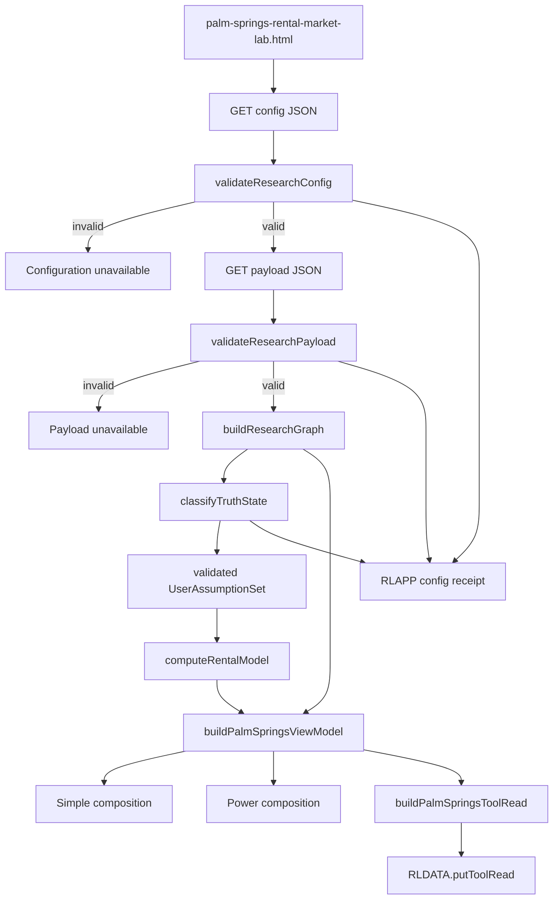
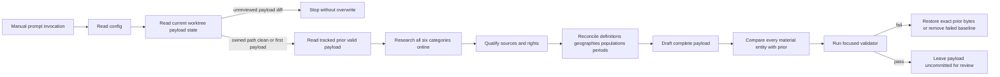

# Design: 005 Palm Springs Rental Market Lab

## Design Brief

### Current State

Research Lab is a build-free GitHub Pages site. `market-brief.config.json`, `market-brief.payload.json`, `notes/market-brief.md`, `.github/prompts/market-brief-update.prompt.md`, and `scripts/validate-brief-payload.mjs` already separate machine-owned policy, agent-authored research, an authoring runbook, a manual prompt, and executable validation. `causal-rotation.config.json`, `causal-rotation-observations.json`, `causal-rotation-ledger.jsonl`, and `scripts/validate-causal-rotation.mjs` add versioned identities, explicit source policy, rejection fixtures, and deterministic contract checks.

The browser foundations also exist: `rldata.js::putToolRead` accepts the strict `rl-tool-read/v1` envelope, `rlapp.js::report` owns shared resource status, `rlchart.js::attach` owns canvas hit testing, and `tools.json`, `index.html`, and `rlnav.js` form the synchronized registry. No current file owns Palm Springs lodging research, source-definition conflicts, vacation-rental scenarios, or acquisition screening.

The browser-test command surface is not reproducible from a fresh checkout. Research Lab has no local package manifest or lockfile, every declared `npx --no-install playwright test ...` command stops before discovery, and `tests/playwright-runtime.mjs` can only adapt after an ambient Playwright CLI has already been found. The npm-cache and macOS absolute-Chrome precedents are machine-local escape paths, not repository contracts.

### Target State

Add one registered static route, `palm-springs-rental-market-lab.html`, that reads one required config and one required agent-authored payload from the same origin. The page validates both contracts, builds one source/claim graph, computes one deterministic view model, and renders thesis-first Simple and evidence-rich Power compositions without performing online research.

A manually invoked LLM research prompt performs real online research across six configured categories. It may replace payload-owned research and assumptions, but config-owned schemas, enums, bounds, source-admission policy, formula version, display precision, and rendering safety remain outside the payload. A successful refresh leaves only an uncommitted payload proposal for human review.

Keep the deployed application build-free while adding one dev-only, source-locked browser-test layer. A committed exact Playwright dependency, npm lockfile, registry allowlist, system-Chrome project, and blocking CI checks make the real static-server suite executable without resolving a runner from global, cache, sibling-repository, or Python installations and without downloading a browser.

### Patterns To Follow

- `market-brief.config.json` and `market-brief.payload.json`: separate machine constraints from agent narrative and current research.
- `notes/market-brief.md` and `.github/prompts/market-brief-update.prompt.md`: make the runbook authoritative and keep the prompt concise.
- `scripts/validate-brief-payload.mjs`: fail a complete payload with path-specific errors before publication.
- `causal-rotation.config.json` and `scripts/validate-causal-rotation.mjs`: version contracts, close vocabularies, preserve source states, and execute adversarial rejection fixtures.
- `bond-regime-lab.html`: keep page-specific pure helpers as top-level ES5-compatible `function` declarations, compute one view model, draw Power canvases synchronously, and publish one owner read.
- `sector-research-lab.html`: persist validated mode/levers and make mode/lever changes call one local `render()` without refetching.
- `rldata.js::putToolRead`: publish the exact strict `rl-tool-read/v1` shape rather than the permissive legacy shape.
- `tools.json`, `index.html::TOOLS`, and `rlnav.js::TOOLS`: preserve identical route order and identity.
- `tests/palm-springs-rental-market-lab.spec.mjs`: preserve the real ephemeral `127.0.0.1` server and same-origin reads; runner provisioning is a separate repository contract.
- `.github/workflows/pages.yml`: use a blocking verification job before the existing fresh-checkout deploy job so installed test packages never enter the root Pages artifact.

### Patterns To Avoid

- Do not copy Market Brief's scheduler, daemon, snapshot generator, auto-commit wrapper, or four-times-daily cadence. Palm Springs refresh is manual and ends before commit.
- Do not add a browser scraper, proxy chain, API key input, backend, database, bundler, generated bundle, or production runtime dependency. The only package layer is the explicit dev-only browser-test toolchain below; it does not build or transform the Pages artifact.
- Do not put contract logic in a large cross-tool framework. No second rental-market consumer needs a generic module; page-local pure functions plus a focused Node validator are the proportional boundary.
- Do not embed a second config/payload copy in HTML or localStorage. A failed same-origin read is unavailable.
- Do not copy older tools' permissive `innerHTML` rendering or silent localStorage recovery. LLM-authored text uses DOM nodes and `textContent` only.
- Do not use `requestAnimationFrame` for chart drawing. Hidden/background pages can skip it; Power charts draw synchronously after layout.
- Do not create a history JSONL merely to duplicate Git history. The payload carries its own prior comparison, and the refresh reads the tracked predecessor before writing.
- Do not resolve Playwright from `$HOME/.npm/_npx`, another repository's `node_modules`, a global package, a Python `playwright` executable, or a caller-supplied arbitrary path. Do not hardcode a macOS or Linux Chrome executable and do not run `playwright install` as an implicit fallback.

### Resolved Decisions

- Two authoritative data files: `palm-springs-rental-market.config.json` and `palm-springs-rental-market.payload.json`.
- No rental-specific shared JavaScript module and no history JSONL.
- One page-local capability foundation separates config validation, payload validation, source/claim indexing, deterministic equations, view-model assembly, refresh contracts, and owner-read publication.
- A native `<dialog>` is the Source Inspector. It supplies platform focus containment and avoids a custom overlay framework; close always restores the exact invoking element.
- Simple is the explicit initial mode from config. Stored mode/levers are admitted only after version, enum, and bound validation.
- Test datasets use a closed `?fixture=<id>&clock=<ISO>` query contract, real same-origin checked-in JSON, a persistent `TEST FIXTURE` truth band, disabled owner-read publication, and no Playwright request interception.
- Browser tests use exact dev dependency `playwright` `1.61.1`, a committed npm v3 lockfile, one pinned npm registry, and Playwright project `system-chrome` with `channel: "chrome"` and `headless: true`.
- Fresh-checkout provisioning is exactly `node scripts/validate-node-source-lock.mjs`, `PLAYWRIGHT_SKIP_BROWSER_DOWNLOAD=1 npm ci --ignore-scripts`, then `npx --no-install playwright --version`; the observed runner version must be `1.61.1` before tests run.
- Browser evidence uses direct `npx --no-install playwright test ... --config=playwright.config.mjs --project=system-chrome --reporter=list` commands with no npm script alias. Playwright channel discovery owns executable lookup on macOS and Linux/WSL; WSL requires Chrome inside its Linux environment.
- Registration occurs only after page, contracts, validator, runbook, prompt, tests, notes, and Market Brief coverage are coherent.
- Existing dirty shared files receive additive hunks only during implementation; this design run changes no shared file.

### Open Questions

None blocking. Source access and public-use rights are resolved record by record during each manual refresh; a source that cannot clear the contract remains an explicit attempted source or unknown.

## Purpose And Scope

This design turns the business and UX contracts in `spec.md` into one exact static-site architecture. It covers:

- versioned config and payload contracts;
- six-category manual LLM research with no automatic commit;
- source qualification, claim traceability, definition conflict preservation, and prior-payload change accounting;
- monthly actual/forecast series, annual synthesis, and named scenarios;
- immutable rental and financing equations;
- one Simple/Power view model and one strict owner read;
- current, stale, unavailable, invalid-contract, invalid-input, and negative-cash-flow behavior;
- safe plain-text rendering, source-link policy, privacy, and educational disclosure;
- additive registry delivery, rollback, and dirty-worktree containment; and
- executable validator, pure-helper, static-page, registry, prompt/runbook, and browser test contracts.

The design has no server API, database, authentication system, account state, property appraisal, booking operation, transaction action, or personalized recommendation.

## Architecture Overview

### Browser Data Flow



### Manual Research Flow



### Runtime Layers

| Layer | Page-Local Functions / Assets | Responsibility | Side Effects |
| --- | --- | --- | --- |
| Contract path resolver | `resolveContractPaths` | Select production paths or one closed test fixture pair | None |
| Config validation | `validateResearchConfig`, `indexResearchConfig` | Validate complete config, enums, bounds, definitions, and references | None |
| Payload validation | `validateResearchPayload`, `validateChangeAccounting` | Validate research, sources, claims, series, scenarios, citations, rights, and prior comparison | None |
| Research graph | `buildResearchGraph`, `resolveClaimSources`, `buildConflictIndex` | Build immutable ID maps and bidirectional claim/source/conflict references | None |
| Deterministic model | `computeAdjustedOccupancy`, `computeMonthlyPayment`, `computeRentalModel` | Produce finite market and acquisition outputs from validated inputs | None |
| View-model assembly | `classifyTruthState`, `buildPalmSpringsViewModel`, `stableModelDigest` | Produce one truth/result/render object for both modes | None |
| UI composition | `renderTruth`, `renderSimple`, `renderPower`, `renderSourceDialog`, chart functions | Render from one view model; never fetch or classify | DOM only |
| Integration | `loadContracts`, `persistUiState`, `publishPalmSpringsToolRead` | Same-origin reads, allowlisted local state, RLAPP receipts, strict owner read | Fetch/localStorage/RLDATA |

### State Separation

```text
runtime = {
  paths: ContractPaths,             // immutable after boot
  config: ResearchConfig,           // immutable after full validation
  payload: ResearchPayload,         // immutable after full validation
  graph: ResearchGraph,             // immutable indexed projection
  truth: TruthState,                // current | stale | unavailable
  assumptions: UserAssumptionSet,   // mutable, config-bound public assumptions
  ui: UiState,                      // mode, series metric, open source id
  model: DeterministicResult,        // replaced atomically on valid recompute
  viewModel: ResearchLabViewModel,   // sole input to Simple and Power
  receipt: TruthReceipt             // resource/model/publication diagnostics
}
```

No render function reads config, payload, localStorage, or network directly. No control handler mutates payload or graph. Contract candidates replace runtime state only after complete validation.

## Capability Foundation

### Foundation Contracts

| Contract | Responsibility | Consumers |
| --- | --- | --- |
| `PalmSpringsResearchConfig/v1` | Own versions, enums, source admission, freshness, definitions, bounds, scenario catalog, initial UI, and display precision | Browser validator, Node validator, refresh agent |
| `PalmSpringsResearchPayload/v1` | Own one complete researched thesis, source/claim graph, observations, forecasts, scenarios, baseline, drivers, legal facts, and changes | Browser graph, Node validator, refresh agent |
| `ResearchGraph/v1` | Index all IDs and expose bidirectional claim/source/metric/conflict relations | Simple, Power, Source Inspector, validator |
| `UserAssumptionSet/v1` | Hold one explicit selected year/scenario and validated market/acquisition levers | Deterministic model and persistence adapter |
| `PalmSpringsRentalResult/v1` | Hold one complete finite calculation or structured unavailability | Simple, Power, owner read |
| `PalmSpringsViewModel/v1` | Hold truth, thesis, graph projections, resolved inputs, outputs, errors, omissions, and model digest | Every renderer |
| `PalmSpringsRefreshReview/v1` | Define the manual six-category authoring and uncommitted review outcome | Prompt, runbook, validator output |
| `PalmSpringsToolRead/v1` | Define Palm Springs metrics inside strict outer `rl-tool-read/v1` | `RLDATA.toolReads`, Market Brief |

### Foundation Public Function Boundaries

All model and validation functions are top-level ES5-compatible declarations in the page's inline script. They accept data and return data; they do not access DOM, fetch, storage, time, or `RLDATA` unless time is an explicit parameter.

| Function | Exact Contract |
| --- | --- |
| `validateResearchConfig(value)` | Returns `{ok:boolean, errors:ContractError[]}` and rejects every missing, unknown, duplicate, non-finite, or inconsistent field. |
| `indexResearchConfig(config)` | Returns immutable maps for enums, categories, source policies, geographies, populations, definitions, scenarios, bounds, and formats. |
| `validateResearchPayload(payload, configIndex)` | Returns path-specific errors for versions, IDs, refs, categories, claims, rights, series, scenarios, baseline, and changes. |
| `buildResearchGraph(payload, configIndex)` | Returns ID maps plus source-to-claim, claim-to-source, metric-to-claim, and conflict indexes. |
| `classifyTruthState(config, payload, nowIso)` | Returns current/stale or a structured time error; it never reads `Date.now()` internally. |
| `normalizeUserAssumptions(candidate, config, payload)` | Returns a complete allowed set or errors; it uses explicit config/payload initial values only. |
| `computeAdjustedOccupancy(base, demandDelta, supplyDelta)` | Applies denominator guard and exact clamped equation. |
| `computeMonthlyPayment(principal, annualRate, termYears)` | Applies standard amortization or the exact zero-rate branch. |
| `computeRentalModel(config, scenario, assumptions)` | Returns `{ok,result,errors}` with full precision and no display rounding. |
| `buildPalmSpringsViewModel(input)` | Produces one immutable render object and stable decision identity. |
| `buildPalmSpringsToolRead(viewModel, computedAt)` | Produces the strict outer owner-read envelope and omits invalid numerics. |
| `stableModelDigest(viewModel)` | Stable serialization of truth, thesis ID, scenario, assumptions, and unrounded result for Simple/Power parity tests. |

The focused Node validator reads the production HTML, extracts these named functions with the repository's balanced-brace pattern, and executes the production validators. It does not maintain a second schema implementation.

### Foundation-Owned Invariants

1. Config is validated before payload fetch and interpretation.
2. Payload is all-or-nothing for publication; no valid subsection can manufacture a partial current thesis from an invalid payload.
3. Every material claim resolves to at least one source reference whose role and source state are allowed for that claim kind.
4. Observed, forecast, and inference are exclusive closed classifications.
5. Unknown research is represented by an observed research-attempt claim linked with `role: attempt`; it is never eligible support for a market value.
6. Every numeric observation has exactly one config-owned metric definition.
7. Incompatible observations remain separate and appear in a `DefinitionConflict`; no foundation function averages or converts them.
8. Config bounds and formula version are immutable from payload text.
9. Missing, null, non-finite, and invalid values never become zero.
10. Simple, Power, Source Inspector, charts, tables, and owner read consume one graph and one deterministic result.
11. User controls may change assumptions only. Thesis, evidence, source, forecast, and legal records remain byte-stable during browser interaction.
12. Current, stale, unavailable, model-invalid, and negative-cash-flow states survive in text and owner-read metadata.
13. Display rounding is the final renderer operation; chained calculations use unrounded values.
14. Fixture mode is visibly non-production and cannot publish or persist an owner read.
15. A manual refresh never changes config, equations, prompt, runbook, validator, page, registries, or Git state beyond the uncommitted payload proposal.

### Extension Points And Reuse Boundary

- A new source, geography, population, metric definition, scenario name, bound, or enum requires a config version change and validator coverage.
- A new payload-owned source or claim is valid only when it uses existing config vocabulary and reference rules.
- A new deterministic output requires a specification and formula-version change; it cannot arrive as payload text.
- Market Brief consumes only the normalized owner read. It does not import full Palm Springs research or model helpers.
- The foundation remains inside one HTML because there is one rental-market owner. Extraction makes it testable in Node without introducing a generic shared runtime.

### Browser Test Command Surface

The browser-test layer is shared test infrastructure, not an application runtime or build system. It has one repository-owned resolution path:

1. `scripts/validate-node-source-lock.mjs` validates the committed manifest, `.npmrc`, and lockfile without importing an installed package.
2. `PLAYWRIGHT_SKIP_BROWSER_DOWNLOAD=1 npm ci --ignore-scripts` installs exactly the lockfile graph from the one allowed registry. Lifecycle scripts are disabled, so provisioning cannot download Playwright-managed browsers.
3. `npx --no-install playwright --version` must report `1.61.1`; a missing or different local runner is a hard failure.
4. `npx --no-install playwright test ... --config=playwright.config.mjs --project=system-chrome` resolves only that local binary and the committed browser project.
5. `playwright.config.mjs` selects `browserName: "chromium"`, `channel: "chrome"`, and `headless: true`; it defines no bundled-browser or executable-path fallback.

`package.json` is `private: true`, has no runtime `dependencies`, no package scripts, and contains exactly `playwright: "1.61.1"` in `devDependencies` for this decision. `.npmrc` contains one canonical registry entry plus `save-exact=true`, `package-lock=true`, `ignore-scripts=true`, and `replace-registry-host=never`; per-scope registry overrides and verification-disabling options are forbidden. `package-lock.json` uses lockfile version 3, pins every external package version and integrity hash, and may resolve tarballs only beneath `https://registry.npmjs.org/`; git, file, path, HTTP, alternate-registry, and missing-integrity external entries fail the validator.

`tests/playwright-runtime.mjs` remains unchanged. Under the accepted command, `npx --no-install` can start only the local lockfile-installed CLI, and the helper's first `import("playwright/test")` resolves that same local package. Its compatibility fallback is not an accepted provisioner: a cached, global, sibling, or direct CLI invocation may diagnose an environment, but its output cannot satisfy a planned browser row.

## Concrete Implementations

### Required Config And Payload Adapter

The production route uses two sequential same-origin reads with `cache: "no-store"`:

1. `GET ./palm-springs-rental-market.config.json`
2. only after complete config validation, `GET ./palm-springs-rental-market.payload.json`

HTTP failure, JSON parse failure, contract failure, and staleness are separate states. The adapter does not read an inline copy, prior payload, browser cache, Market Brief payload, or acceptance-context values.

### Source And Claim Graph Implementation

`buildResearchGraph` indexes sources, claims, metric observations, methods, series, scenarios, legal facts, drivers, conflicts, and change records by ID. It builds reverse links once. Source Inspector, evidence rows, conflicts, and changes read those indexes rather than searching raw arrays independently.

### Deterministic Rental And Acquisition Model

`computeRentalModel` accepts one validated scenario and one validated assumption set. It owns occupancy, ADR, RevPAR, gross revenue, gross yield, principal, debt service, operating expense, and pre-tax cash flow. It returns all resolved inputs, formula version, errors, and exclusions with the result.

### One View Model And Two Compositions

`buildPalmSpringsViewModel` combines truth state, thesis references, graph projections, assumptions, model result, classification summaries, error paths, owner-read omissions, and one stable model digest. Simple and Power never call a model helper themselves.

### Manual Research Authoring Implementation

`notes/palm-springs-rental-market-lab.md` is the complete operating contract. `.github/prompts/palm-springs-rental-market-update.prompt.md` names the requested refresh and delegates all detailed rules to that runbook. `scripts/validate-palm-springs-rental-market.mjs` validates production or an explicit candidate path and runs checked-in rejection fixtures. No scheduler or shell wrapper is introduced.

### Source Inspector Implementation

One native `<dialog id="sourceInspector">` renders source, claim, definition, conflict, rights, and limitation fields. The dialog is a genuine framed inspection tool, not a page section or nested card. `openSourceInspector(trigger, context)` stores the exact trigger, populates trusted static labels plus text-only values, calls `showModal()`, and focuses the heading. Close, Cancel, and Escape call `closeSourceInspector()` and restore the stored trigger if it is still connected.

Native dialog is smaller and safer than a custom sheet because the repository has no shared modal/focus-trap abstraction. Power tables retain all critical provenance in-document, so the dialog adds focused detail without becoming the sole path to source truth.

### Chart And Table Implementation

Power contains occupancy, ADR, and RevPAR series views. `drawSeriesChart` receives already formatted geometry plus raw records, draws synchronously only when Power is visible, and calls `RLCHART.attach` at the end. The equivalent table is always present and carries the same row IDs and classification words. Missing months are gaps and `Unavailable` rows, never line interpolation.

### Strict Owner-Read Implementation

`publishPalmSpringsToolRead` calls `RLDATA.putToolRead("palm-springs-rental-market-lab", envelope)` once after every production render. The envelope uses `contractVersion: "rl-tool-read/v1"`. Fixture mode skips publication and shows a receipt explaining why.

### Source-Locked Browser-Test Implementation

`playwright.config.mjs` is the sole browser-selection authority for test-runner suites. The `system-chrome` project uses Playwright's vendor channel resolution instead of an absolute executable path. On macOS it resolves installed Google Chrome Stable through Playwright; on Linux and WSL it resolves Google Chrome Stable installed inside the same Linux environment. There is no Chromium fallback, cross-OS path translation, or automatic browser acquisition. If the channel is unavailable, Playwright exits nonzero before a scenario can be counted as executed.

The exact `playwright` version is source-locked in both manifest and lockfile. `npx --no-install` cannot choose another runner from the network. The source-lock validator exits nonzero for a missing file, dependency range, version mismatch, second registry, untrusted `resolved` URL, missing integrity, lifecycle-script relaxation, or git/file/path dependency. A new `verify` job in `.github/workflows/pages.yml` runs source validation, lockfile-strict installation, the runner-version check, and the complete Palm Springs suite. The existing `deploy` job depends on `verify` but performs a fresh checkout and no npm install, so `node_modules` and Playwright output never enter the uploaded repository-root artifact. The existing option snapshot may remain best-effort; no source-lock or browser-test step is `continue-on-error`.

### Variation Axes

| Axis | Variants | Foundation Responsibility | Concrete Responsibility |
| --- | --- | --- | --- |
| Research classification | observed, forecast, inference | Closed enum and citation rules | Agent assigns one valid class |
| Source outcome | eligible, stale, inaccessible, rejected | Admission and claim-role rules | Refresh records real outcome |
| Source rights | public-summary, citation-only, metadata-only, prohibited | Persistence/value restrictions | Source record carries reviewed posture |
| Geography | city, regional, airport, state, national catalog entries | Stable IDs and comparison rules | Claims/metrics choose exact scope |
| Population | OTA listing, managed home, certificate, waitlist, hotel room, passenger, seat, all-home, survey-loan | Stable IDs and conflict detection | Observation chooses exact population |
| Value shape | point, range, unavailable series row | Finite/range validation | Payload supplies researched value or absence |
| Runtime state | current, stale, unavailable, invalid user input | Truth and omission semantics | Renderer composes state |
| UI composition | Simple, Power, Source Inspector | One graph/result identity | Different detail density only |
| Consumer | owning page, Market Brief | Strict normalized projection | Consumer placement/deep link |

## Exact Implementation Surface

### Add

| File | Owner And Exact Content |
| --- | --- |
| `palm-springs-rental-market-lab.html` | Product implementation: styles, semantic shell, page-local pure validators/model, one view model, safe renderers, synchronous charts, dialog, boot, persistence, RLAPP, owner read. |
| `palm-springs-rental-market.config.json` | Product policy: exact versions, enums, categories, source policies, freshness, catalogs, metric definitions, bounds, formats, initial UI. |
| `palm-springs-rental-market.payload.json` | LLM research output: complete current researched payload under the exact contract below. |
| `notes/palm-springs-rental-market-lab.md` | Project runbook and methodology: sources, rights, refresh sequence, formulas, omissions, review, validation, and no-commit boundary. |
| `.github/prompts/palm-springs-rental-market-update.prompt.md` | Project prompt shim for one manual research refresh; no shell wrapper and no commit instruction. |
| `scripts/validate-palm-springs-rental-market.mjs` | Production-function extractor, config/payload validator, rejection-fixture runner, prompt/runbook contract checks, path-specific output. |
| `tests/palm-springs-rental-market-lab.spec.mjs` | One focused real static-server Playwright suite for the production page and checked-in same-origin fixtures. |
| `tests/fixtures/palm-springs-rental-market/config.json` | Explicit test-only config with contract-valid bounds and a visible fixture marker. |
| `tests/fixtures/palm-springs-rental-market/current.payload.json` | Contract-valid recorded fixture used only for model/render behavior, never as market-success evidence. |
| `tests/fixtures/palm-springs-rental-market/invalid.payload.json` | Invalid citation/category/bound cases with expected `PSRM-*` codes. |
| `tests/fixtures/palm-springs-rental-market/failed-source.payload.json` | Valid explicit unknown plus inaccessible attempted source. |
| `package.json` | Private dev-only manifest with exact `playwright: "1.61.1"`, no runtime dependencies, no scripts, and Node 20 engine policy. |
| `package-lock.json` | Committed npm lockfile v3 with exact versions, canonical registry URLs, and integrity hashes. |
| `.npmrc` | Single source allowlist and lockfile-strict settings: canonical npm registry, exact saves, package lock required, lifecycle scripts disabled, registry-host replacement disabled. |
| `playwright.config.mjs` | One `system-chrome` project using Chromium engine plus `channel: "chrome"`; no executable path or bundled-browser fallback. |
| `scripts/validate-node-source-lock.mjs` | Read-only structural source-lock validator for the manifest, npm config, and every lockfile package entry. |

No history JSONL is added. Git stores predecessor payloads; the current payload stores exact change accounting against the tracked prior payload ID. This removes a duplicate mutable history surface and avoids unbounded Pages growth.

### Update During Implementation

| File | Exact Additive Change |
| --- | --- |
| `scripts/selftest.mjs` | Add one Palm Springs group extracting production validators/model/tool-read helpers; retain all existing groups. |
| `tools.json` | Add one live tool record with `data` pointing to config, notes path, educational blurb, and tags. |
| `index.html` | Add matching `TOOLS` entry in the same position and preserve existing dirty entries. |
| `rlnav.js` | Add matching navigation entry in identical order. |
| `README.md` | Add one tool row and file-layout references without rewriting existing content. |
| `notes/README.md` | Add one methodology/runbook index row. |
| `market-brief.payload.json` | Through the existing Market Brief authoring/validation contract, add one registry-ordered coverage reason for the new owner read; do not duplicate Palm Springs research or equations. |
| `.github/workflows/pages.yml` | Add a blocking fresh-checkout verification job; make the unchanged root-artifact deploy job depend on it. |
| `.gitignore` | Ignore `/node_modules/`, `/test-results/`, and `/playwright-report/`. |
| `.specify/memory/agents.md` | Command-registry owner replaces absent-package prerequisite text with exact source validation, provisioning, runner-version, full, and focused browser commands. |

### Explicitly Unchanged

- `rldata.js`: strict `rl-tool-read/v1` already supports the required projection.
- `rlapp.js`: existing resource reports are sufficient.
- `rlchart.js`: existing canvas tooltip API is sufficient.
- `rlg.js` and `rlticker.js`: no new shared glossary or ticker behavior is required.
- `market-brief.html`, `rlbrief.js`, `market-brief.config.json`, and `scripts/brief-refresh.mjs`: generic registry/local owner-read behavior is reused.
- Application source, browser runtime dependencies, server infrastructure, release trains, generated site assets, and root-artifact deployment semantics. The dev-only manifest and test gate do not create a product build.

## Data And Storage Model

### No Database And No DDL

There is no database, table, index, migration SQL, or server endpoint. The deployable authority is two versioned JSON files served with the page. Git provides reviewed history. Browser storage holds only non-sensitive UI assumptions. Adding SQL would create an unused service boundary and violate the build-free repository architecture.

| Data Surface | Format | Authority | Persistence |
| --- | --- | --- | --- |
| Config | JSON | Code/config owner | Checked in, versioned by Git |
| Current research | JSON | Manual LLM refresh plus human review | Checked in only after explicit commit |
| Prior research | Prior tracked payload blob | Git history | Immutable Git history |
| UI state | JSON | Local user | `localStorage.palmSpringsRentalMarketLabState` only |
| Owner read | `rl-tool-read/v1` | Current page render | Existing `localStorage.rlData.toolReads` |
| Test fixtures | JSON | Test owner | Checked in under `tests/fixtures`, never production authority |

## ResearchConfig Contract

### Config Top-Level Shape

`palm-springs-rental-market.config.json` has exactly these required keys and rejects unknown keys:

```text
schemaVersion: "palm-springs-rental-config/v1"
configVersion: non-empty version string
toolId: "palm-springs-rental-market-lab"
contracts: ContractVersions
requiredResearchCategories: six unique category ids
enums: EnumCatalog
freshness: FreshnessPolicy
stringLimits: StringLimits
bounds: ModelBounds
initialUi: { mode: "simple" }
forecastYears: [2026, 2027]
scenarioCatalog: ScenarioCatalogEntry[]
geographies: GeographyDefinition[]
populations: PopulationDefinition[]
sourcePolicies: SourcePolicy[]
metricDefinitions: MetricDefinition[]
displayFormats: DisplayFormatMap
```

`contracts` is exact:

```text
payload: "palm-springs-rental-payload/v1"
formula: "palm-springs-rental-model/1.0.0"
researchMethod: "palm-springs-online-research/1.0.0"
changeAccounting: "palm-springs-change-accounting/1.0.0"
ownerRead: "palm-springs-tool-read/v1"
uiState: "palm-springs-ui-state/v1"
```

### Required Categories And Closed Enums

`requiredResearchCategories` contains exactly:

1. `current-performance`
2. `legal-supply-regulation`
3. `travel-air-access`
4. `macro-financing`
5. `hotel-competition-events`
6. `weather-seasonality`

| Enum | Allowed Values |
| --- | --- |
| `classification` | `observed`, `forecast`, `inference` |
| `phase` | `early-cycle`, `mid-cycle`, `late-cycle`, `contraction`, `stabilizing`, `recovery`, `uncertain` |
| `direction` | `strengthening`, `stable`, `softening`, `mixed`, `unavailable` |
| `claimKind` | `thesis`, `evidence`, `contradiction`, `catalyst`, `risk`, `falsifier`, `unknown`, `legal-fact`, `event-impact`, `forecast-rationale`, `assumption-revision` |
| `sourceRole` | `support`, `contradict`, `context`, `attempt` |
| `sourceState` | `eligible`, `stale`, `inaccessible`, `rejected` |
| `sourceQuality` | `official-primary`, `operator-primary`, `commercial-methodology`, `named-secondary`, `unverified-attempt` |
| `accessState` | `public`, `registration-required`, `subscription-gated`, `restricted`, `unavailable` |
| `rightsState` | `public-summary`, `citation-only`, `metadata-only`, `prohibited` |
| `coverageState` | `researched`, `unknown` |
| `valueKind` | `point`, `range` |
| `periodKind` | `day`, `week`, `month`, `quarter`, `year`, `trailing-twelve-month`, `forecast-horizon` |
| `changeType` | `added`, `removed`, `revised`, `unchanged`, `contradicted`, `unresolved` |
| `changeEntityType` | `thesis`, `claim`, `source`, `metric-observation`, `legal-fact`, `driver`, `forecast-method`, `scenario`, `acquisition-baseline` |
| `legalType` | `certificate-count`, `neighborhood-cap`, `waitlist`, `contract-limit`, `eligibility`, `enforcement` |
| `legalState` | `current`, `scheduled`, `stale`, `disputed`, `superseded` |
| `driverKind` | `catalyst`, `risk`, `event`, `hotel-change`, `access-change`, `weather`, `seasonality` |
| `driverState` | `upcoming`, `active`, `passed`, `stale`, `unknown` |
| `metricFamily` | `occupancy`, `adr`, `revpar`, `revenue`, `supply`, `passengers`, `scheduled-seats`, `hotel-demand`, `hotel-supply`, `home-price`, `mortgage-rate`, `gross-yield` |
| `unit` | `ratio`, `percent`, `usd`, `usd-per-night`, `usd-per-available-night`, `count`, `count-percent-change` |

### String And Collection Limits

All limits are explicit config values, not code fallbacks:

| Key | Value |
| --- | ---: |
| `idMaxChars` | 96 |
| `labelMaxChars` | 120 |
| `shortTextMaxChars` | 320 |
| `narrativeMaxChars` | 2400 |
| `limitationsMaxItems` | 12 |
| `sourceRefsMaxItems` | 12 |
| `sourcesMaxItems` | 200 |
| `claimsMaxItems` | 300 |
| `metricObservationsMaxItems` | 300 |
| `changesMaxItems` | 600 |
| `monthlyRowsMaxItems` | 60 |

IDs are lowercase namespaced strings matching `^[a-z][a-z0-9-]*:[a-z0-9][a-z0-9._:-]*$` and the configured maximum. Source IDs start `src:`, claims `claim:`, observations `metric:`, conflicts `conflict:`, methods `method:`, scenarios `scenario:`, legal facts `legal:`, drivers `driver:`, and changes `change:`.

### Freshness

```text
payloadMaxAgeHours: 336
clockSkewToleranceMinutes: 5
sourcePolicies:
  refresh-every-run: { mode: "per-refresh" }
  time-bound-30d: { mode: "time-bound", maxAgeHours: 720 }
  historical-context: { mode: "historical-context" }
```

The payload `staleAfter` must equal `researchedAt + payloadMaxAgeHours`. `researchedAt` cannot exceed validator/browser time by more than the configured clock-skew tolerance. `historical-context` may support historical statements but cannot make a current category researched without a source checked during the current refresh.

### Model Bounds

| Field | Minimum | Maximum | Step / Additional Rule |
| --- | ---: | ---: | --- |
| `baseOccupancy` | 0 | 1 | finite ratio |
| `baseAdrUsd` | 1 | 5000 | finite USD/night |
| `availableNights` | 1 | 366 | integer |
| `demandDelta` | -0.50 | 0.50 | 0.01 |
| `supplyDelta` | -0.50 | 1.00 | 0.01; `1 + value > 0` |
| `adrShock` | -0.50 | 0.50 | 0.01; adjusted ADR must remain non-negative |
| `purchasePriceUsd` | 100000 | 5000000 | 1000; strictly positive |
| `leverageRatio` | 0 | 0.90 | 0.01 |
| `downPaymentRatio` | 0.10 | 1.00 | 0.01; exactly `1 - leverageRatio` |
| `annualMortgageRate` | 0 | 0.20 | 0.0001 |
| `loanTermYears` | 1 | 40 | integer |
| `operatingExpenseRatio` | 0 | 0.80 | 0.01 |
| `confidencePct` | 0 | 100 | integer |

### Scenario Catalog

| ID | Year | Label |
| --- | ---: | --- |
| `scenario:2026:central` | 2026 | 2026 Central |
| `scenario:2027:downside` | 2027 | 2027 Downside |
| `scenario:2027:base` | 2027 | 2027 Base |
| `scenario:2027:upside` | 2027 | 2027 Upside |

The payload must provide every catalog entry exactly once and may not add a scenario. `initialSelection` names one catalog ID and explicitly sets all three shock levers.

### Geography And Population Catalogs

Initial geography IDs are `geo:palm-springs-city`, `geo:greater-palm-springs`, `geo:coachella-valley`, `geo:psp-airport`, `geo:california`, and `geo:united-states`. Initial population IDs are `pop:active-ota-listings`, `pop:managed-vacation-homes`, `pop:legal-certificates`, `pop:eligible-properties`, `pop:waitlist-entries`, `pop:hotel-rooms`, `pop:airport-passengers`, `pop:scheduled-seats`, `pop:all-homes`, and `pop:mortgage-survey-loans`.

Each catalog entry has exactly `id`, `label`, and `description`. A payload cannot invent a geography or population. A new scope requires a reviewed config version.

### Source Policies

Each `SourcePolicy` has `id`, `quality`, `allowedClassifications`, `allowedRoles`, `requiresMethodology`, `requiresPublishedAt`, `allowsPersistedNumericValue`, and `rightsStates`.

| Policy | Eligible Use |
| --- | --- |
| `official-primary` | Observed, forecast, or inference support; methodology optional when the official definition is in the source record. |
| `operator-primary` | Observed operator/airport/hotel facts and bounded forecasts; exact population and method required. |
| `commercial-methodology` | Publicly permitted summary values only; methodology, access, and rights fields required. |
| `named-secondary` | Forecast or inference context; cannot be sole support for a legal fact or observed official count. |
| `unverified-attempt` | `attempt` role on unknown claims only; never a numeric observation or thesis support. |

`rightsState: public-summary` is the only state that permits a persisted numeric value. `citation-only` permits citation and original high-level interpretation but no copied quote or restricted numeric field. `metadata-only` permits publisher/title/URL/access outcome only. `prohibited` cannot appear in a published source ledger except as a rejected attempt with no content or value.

### Metric Definitions

Every definition has exactly:

```text
id, label, family, unit, numerator, denominator, populationId,
geographyId, periodKind, aggregation, inclusions[], exclusions[],
sourceConvention, directlyComparableWith[]
```

Initial required definitions are:

| ID | Numerator / Denominator | Population / Geography | Period / Aggregation | Boundary |
| --- | --- | --- | --- | --- |
| `metricdef:occ-airdna-available-nights` | booked nights / available nights | active OTA listings / Palm Springs city | TTM / typical listing | Blocked nights follow source methodology; not paid occupancy. |
| `metricdef:occ-managed-paid-nights` | paid nights / managed inventory nights | managed vacation homes / Greater Palm Springs | month or quarter / cohort | Not comparable with OTA available-night occupancy. |
| `metricdef:adr-airdna-booked-night-gross` | booked nightly rates plus included guest fees / booked nights | active OTA listings / Palm Springs city | TTM / typical listing | Source-specific gross posture. |
| `metricdef:adr-managed-paid-night` | paid accommodation revenue / paid nights | managed vacation homes / declared geography | month or quarter / cohort | Charges and cohort must remain source-specific. |
| `metricdef:revpar-airdna-derived` | AirDNA occupancy times AirDNA ADR | active OTA listings / Palm Springs city | TTM / derived | Only valid with the matching AirDNA definitions. |
| `metricdef:revpar-managed-reported` | managed revenue / managed available inventory nights | managed vacation homes / declared geography | month or quarter / cohort | Cannot mix with OTA inputs. |
| `metricdef:revenue-airdna-typical-listing-gross` | booked rates plus included guest fees / typical active listing | active OTA listings / Palm Springs city | TTM / typical | Pre-expense, not net income. |
| `metricdef:supply-active-ota-listings` | de-duplicated active listings / not applicable | active OTA listings / Palm Springs city | TTM / count | Marketplace presence, not legal supply. |
| `metricdef:supply-active-certificates` | active certificates / not applicable | legal certificates / Palm Springs city | point-in-time / count | Legal record, not active listing. |
| `metricdef:supply-waitlist` | waitlist entries / not applicable | waitlist entries / Palm Springs city | point-in-time / count | Does not equal eligible or active supply. |
| `metricdef:psp-total-passengers` | arriving plus departing passengers per source / not applicable | airport passengers / PSP airport | month or YTD / count or YoY | Indirect demand signal only. |
| `metricdef:psp-scheduled-seats` | scheduled seats / not applicable | scheduled seats / PSP airport | month / count or YoY | Capacity, not realized passengers or stays. |
| `metricdef:hotel-demand` | occupied room nights / not applicable | hotel rooms / declared region | year / forecast change | Hotel population only. |
| `metricdef:hotel-supply` | available hotel room nights / not applicable | hotel rooms / declared region | year / forecast change | No automatic STR conversion. |
| `metricdef:home-price-redfin-median-all-homes` | sale price at median / closed home sales | all homes / Palm Springs city | month / median | Not a rental comparable or appraisal. |
| `metricdef:mortgage-freddie-mac-30y-fixed` | survey contract rate / qualifying surveyed loans | mortgage survey loans / United States | week / average | Not an investor or property quote. |
| `metricdef:gross-screening-yield` | gross annual STR revenue / all-home median price | mismatched market aggregates / Palm Springs city | derived / ratio | Inference only with explicit numerator/denominator mismatch. |

### Display Formats

Config owns formatting keys for `occupancy`, `adr`, `revpar`, `grossRevenue`, `grossYield`, `purchasePrice`, `loanPrincipal`, `annualDebtService`, `operatingExpense`, and `preTaxCashFlow`. Percent ratios display one decimal place; rates display two; ADR/RevPAR/currency totals display zero currency decimals; signed shocks display one percentage point decimal. Rendering uses `Intl.NumberFormat` with these explicit options. No format function supplies missing precision.

## ResearchPayload Contract

### Payload Top-Level Shape

`palm-springs-rental-market.payload.json` has exactly these required keys:

```text
schemaVersion: "palm-springs-rental-payload/v1"
payloadId: namespaced unique id
configVersion: exact config version
formulaVersion: exact config formula version
researchMethodVersion: exact config research method version
changeAccountingVersion: exact config change version
researchedAt: ISO timestamp
asOf: ISO timestamp
staleAfter: ISO timestamp derived from config
prior: PriorPayloadReference
researchCoverage: ResearchCoverage[6]
thesis: MarketThesis
sources: SourceRecord[]
claims: EvidenceClaim[]
metricObservations: MetricObservation[]
definitionConflicts: DefinitionConflict[]
forecastMethods: ForecastMethod[]
monthlySeries: MonthlySeries[]
annualSyntheses: AnnualSynthesis[]
scenarios: ScenarioDefinition[4]
initialSelection: InitialSelection
acquisitionBaseline: AcquisitionBaseline
legalFacts: LegalSupplyFact[]
drivers: MarketDriver[]
changes: ChangeSet
educationalDisclosure: exact non-empty text
```

Unknown top-level keys fail validation. Arrays may be empty only where the specification permits no current records; sources, claims, methods, scenarios, and research coverage are never empty.

### PriorPayloadReference

```text
mode: "baseline" | "compared"
payloadId: null | prior payload id
researchedAt: null | prior researchedAt
gitBlobOid: null | 40 or 64 lowercase hex tracked blob id
```

Baseline requires all three prior fields null and `changes.records` empty. Compared requires all three populated from the immediately prior valid tracked payload. The validator checks shape and current change completeness; refresh review checks the Git blob correspondence before accepting the proposal.

### ResearchCoverage

Each category appears exactly once:

```text
categoryId: configured category id
state: "researched" | "unknown"
eligibleSourceIds: unique source ids
attemptedSourceIds: unique source ids
summaryClaimId: claim id
```

`researched` requires at least one eligible source retrieved during this refresh. `unknown` requires at least one attempted source and a summary claim describing what failed and the consequence. An inaccessible source cannot appear in `eligibleSourceIds`.

### SourceRecord

| Field | Type / Rule |
| --- | --- |
| `id` | Unique `src:*` ID. |
| `publisher`, `title` | Required bounded plain text. |
| `url` | Absolute `http:` or `https:` URL; credentials, fragments containing tokens, `data:`, `file:`, and `javascript:` are rejected. |
| `methodologyUrl` | HTTP(S) URL or null; required by policy when methodology is not in the primary source. |
| `categoryId` | One configured required category. |
| `policyId`, `quality` | Matching configured source policy and quality. |
| `state` | `eligible`, `stale`, `inaccessible`, or `rejected`. |
| `retrievedAt`, `publishedAt` | ISO timestamps; publication may be null only for an inaccessible attempt. |
| `freshnessPolicyId`, `freshUntil` | Config policy reference and derived expiry; historical context uses null `freshUntil`. |
| `observationPeriod` | `{kind,start,end,label}` with valid order; required for eligible evidence. |
| `geographyId`, `populationId` | Config catalog refs; population may be null only when the source carries no metric. |
| `access` | `{state, checkedAt, note}`. |
| `rights` | `{state, numericValueAllowed, summaryAllowed, note}` consistent with policy. |
| `limitations` | One or more bounded plain-text limitations for commercial/secondary/inaccessible sources. |

The payload contains no copied article body or long quotation.

### EvidenceClaim

```text
id: unique claim id
kind: configured ClaimKind
classification: observed | forecast | inference
statement: bounded plain text
geographyId: configured id
populationId: configured id | null
period: {kind,start,end,label}
confidencePct: integer 0..100
sourceRefs: [{sourceId, role}]
metricObservationIds: unique refs
supportsClaimIds: unique refs
contradictsClaimIds: unique refs
status: "current" | "stale" | "superseded" | "unresolved"
```

Claims cannot self-reference. Reference cycles in support/contradiction graphs fail validation. An `unknown` claim must be `observed`, use only `attempt` or `context` source roles, and contain no metric value. A forecast requires a ForecastMethod reference through the enclosing scenario/series or a `forecastMethodId` field. An inference requires at least one observed input claim or metric observation.

### MarketThesis

```text
id: "thesis:current"
summaryClaimId: claim kind thesis
phase: configured phase
direction: configured direction
confidencePct: integer 0..100
strongestSupportClaimId: current support claim
strongestConflictOrUnknownClaimId: contradiction or unknown claim
changeViewClaimIds: one or more falsifier claim ids
catalystClaimIds: claim kind catalyst
riskClaimIds: claim kind risk
unknownClaimIds: claim kind unknown
```

The thesis has no free duplicate summary text; the claim graph is the one narrative authority.

### MetricObservation

```text
id: unique metric id
metricDefinitionId: configured definition
classification: observed | forecast | inference
value: {kind:"point", amount:finite} |
       {kind:"range", low:finite, high:finite}
period: {kind,start,end,label}
geographyId: must match or narrow the definition
populationId: must match definition
sourceRefs: one or more support/context refs
forecastMethodId: method id | null
limitations: bounded text array
```

Range requires `low <= high`. Forecast requires `forecastMethodId`; observed forbids it. Inference requires source observations and an inference claim. Unit comes only from `MetricDefinition`.

### DefinitionConflict

```text
id: unique conflict id
metricObservationIds: at least two unique ids
dimensions: one or more of geography | population | period | numerator |
            denominator | unit | method | aggregation | rights
reason: bounded plain text
consequence: bounded plain text
claimIds: conflict/contradiction claim refs
```

Directly comparable observations cannot be placed in a conflict merely to suppress comparison. Observations whose config definitions are not mutually comparable must have a conflict when displayed together.

### ForecastMethod

```text
id: unique method id
version: non-empty version
name: bounded text
procedure: bounded narrative
horizon: {start,end}
assumptions: [{id,label,value,unit,sourceClaimIds}]
sourceClaimIds: observed/context claim refs
falsifierClaimIds: falsifier refs
confidencePct: integer 0..100
```

The method describes agent research and forecast formation. It cannot contain executable code, formula overrides, HTML, or renderer instructions.

### MonthlySeries And AnnualSynthesis

Each `MonthlySeries` has `id`, `metricDefinitionId`, `geographyId`, `populationId`, and exactly ordered rows:

```text
month: YYYY-MM
availability: "available" | "unavailable"
classification: observed | forecast
value: point/range | null
sourceRefs: source refs
forecastMethodId: method id | null
reasonClaimId: claim id | null
```

Available observed rows require value and sources and forbid method. Available forecast rows require value and method. Unavailable rows require null value and an unknown claim. There is no interpolation. The payload includes sourced 2025 rows, available 2026 actual rows, and remaining-2026 forecast rows; omissions are explicit unavailable rows.

`AnnualSynthesis` has `year`, `classification`, occupancy/ADR/RevPAR/revenue metric observation refs, `forecastMethodId`, `sourceClaimIds`, and `falsifierClaimIds`. The 2026 synthesis is forecast when any annual component includes projected months.

### ScenarioDefinition

```text
id: exact configured scenario id
year: configured year
label: exact configured label
classification: "forecast"
baseOccupancy: finite config-bound ratio
baseAdrUsd: finite config-bound USD/night
availableNights: config-bound integer
forecastMethodId: valid method id
assumptionClaimIds: one or more claim refs
sourceClaimIds: one or more observed/context refs
falsifierClaimIds: one or more refs
confidencePct: integer 0..100
```

The browser never derives a missing base. `initialSelection` has exactly:

```text
forecastYear, scenarioId,
demandDelta, supplyDelta, adrShock
```

All fields are explicit and bound-valid. The three initial deltas may be zero but cannot be omitted.

### AcquisitionBaseline

```text
purchasePriceUsd: finite bound-valid number
leverageRatio: finite bound-valid ratio
downPaymentRatio: exactly 1 - leverageRatio
annualMortgageRate: finite bound-valid ratio
loanTermYears: bound-valid integer
operatingExpenseRatio: finite bound-valid ratio
assumptionClaimIds: one or more source-qualified claim refs
excludedCosts: exact list required by spec FR-062
```

The baseline is a public research assumption, not user identity or a property quote. The exact exclusion list contains property tax, insurance, HOA, furnishing, renovation, closing cost, depreciation, income tax, appreciation, sale proceeds, and property-specific permit eligibility.

### LegalSupplyFact And MarketDriver

`LegalSupplyFact` contains `id`, `claimId`, `legalType`, `jurisdictionGeographyId`, `state`, `effectiveFrom`, `effectiveTo`, `metricObservationIds`, and `sourceIds`. Certificate counts, caps, waitlists, contracts, eligibility, and enforcement remain different legal types.

`MarketDriver` contains `id`, `claimId`, `kind`, `state`, `startsAt`, `endsAt`, `geographyId`, `sourceIds`, and `confidencePct`. Hotel closure/reopening, events, airport access, weather, and seasonality remain claims until evidence supports a quantified model input.

### ChangeSet

```text
mode: "baseline" | "compared"
priorPayloadId: null | exact prior id
comparedAt: ISO timestamp
records: ChangeRecord[]
```

Each `ChangeRecord` has:

```text
id, entityType, entityId, changeType,
priorSummary: string | null,
currentSummary: string | null,
reason: bounded plain text,
evidenceSourceIds: unique source ids
```

For `compared`, every material current and prior thesis element, claim, source, metric observation, legal fact, driver, forecast method, scenario, and acquisition baseline receives exactly one record. Added has no prior summary; removed has no current summary; revised/unchanged/contradicted/unresolved have both. Every scenario or acquisition revision requires a non-empty reason and eligible evidence source. Baseline requires zero records and prohibits improvement, deterioration, acceleration, reversal, or other prior-relative language in change claims.

## Static File Read Contracts

### Production Reads

| Method / Path | Request | Success | Failure |
| --- | --- | --- | --- |
| `GET ./palm-springs-rental-market.config.json` | same origin, no body, no credentials, `cache:no-store` | HTTP 200 plus valid `PalmSpringsResearchConfig/v1` | `PSRM-CONFIG-FETCH`, `PSRM-CONFIG-PARSE`, or config validation codes; payload is not fetched |
| `GET ./palm-springs-rental-market.payload.json` | only after valid config; same origin, no body/credentials, `cache:no-store` | HTTP 200 plus valid `PalmSpringsResearchPayload/v1` | `PSRM-PAYLOAD-FETCH`, `PSRM-PAYLOAD-PARSE`, or payload validation codes; no thesis/model numeric publication |

There are no POST, PUT, PATCH, DELETE, websocket, worker, service-worker, GraphQL, or remote research endpoints.

### Fixture Reads

When `fixture` is present, `resolveContractPaths` accepts only `current`, `invalid`, `failed-source`, or `missing-config` from a closed page-owned `TEST_FIXTURE_PATHS` map. This map is a test transport seam needed before config fetch; it contains paths only and owns no market value, enum, bound, formula, or display behavior. `current`, `invalid`, and `failed-source` use checked-in fixture config/payload files. `missing-config` points at an intentionally absent config path to exercise real HTTP 404 behavior.

`clock` is accepted only in fixture mode and must be valid ISO. Fixture mode displays `TEST FIXTURE`, disables local persistence and `RLDATA.putToolRead`, and includes fixture state in the model digest. Unknown fixture/clock input fails with `PSRM-FIXTURE-UNKNOWN` or `PSRM-FIXTURE-CLOCK`.

### Authorization Matrix

| Surface / Operation | Public Reader | Local Research User | LLM Research Agent | Human Reviewer |
| --- | --- | --- | --- | --- |
| Page/config/payload GET | Read | Read | Read | Read |
| Scenario controls | Read initial | Edit validated local public assumptions | No special authority | Same as local user |
| Source links | Open public HTTP(S) link | Open | Research with configured policy | Review rights and support |
| Config/formula | Read | Read | Read-only | Changed only through reviewed product implementation |
| Payload worktree file | Read published | No browser write | Write proposal only | Review and explicitly commit/publish |
| Git commit/push | None | None | Forbidden in refresh workflow | Explicit human action outside refresh |

No authenticated roles exist at runtime. The matrix records repository workflow authority, not server authorization.

## Deterministic Equations

All inputs must be JavaScript numbers that satisfy `Number.isFinite`, config bounds, and the additional guards below. No equation parses payload prose. No output is rounded before all dependent calculations complete.

### Market Equations

Let:

- $o_b$ = base occupancy decimal;
- $d$ = demand delta decimal;
- $s$ = supply delta decimal;
- $a_b$ = base ADR in USD/night;
- $p_a$ = ADR shock decimal;
- $n_a$ = available nights; and
- $P$ = purchase price.

First guard the supply denominator:

$$
q = 1 + s
$$

If $q$ is non-finite or $q \le 0$, adjusted occupancy and every dependent result are unavailable with `PSRM-MODEL-OCCUPANCY-DENOMINATOR`.

Then:

$$
o_{raw} = o_b \times \frac{1+d}{1+s}
$$

$$
o = \min(1, \max(0, o_{raw}))
$$

$$
ADR = a_b \times (1+p_a)
$$

Adjusted ADR must be finite and non-negative; otherwise return `PSRM-MODEL-ADR`.

$$
RevPAR = o \times ADR
$$

$$
R_g = RevPAR \times n_a
$$

$$
Y_g = \frac{R_g}{P}
$$

Purchase price must be finite and strictly positive before gross yield is evaluated.

### Financing And Expense Equations

Let:

- $L$ = leverage ratio;
- $D = 1-L$ = down-payment ratio;
- $r_a$ = annual mortgage rate decimal;
- $T$ = loan term in years;
- $e$ = operating-expense ratio; and
- $N = 12T$ monthly payments.

The linked pair is validated as $L + D = 1$ within machine epsilon after one side is computed from the other. It is never independently rounded before principal calculation.

$$
DownPayment = P \times D
$$

$$
Principal = P - DownPayment = P \times L
$$

Principal must be finite and non-negative. $N$ must be a positive integer.

Monthly rate:

$$
r = \frac{r_a}{12}
$$

For $r = 0$:

$$
Payment_m = \frac{Principal}{N}
$$

For $r > 0$:

$$
Payment_m = Principal \times \frac{r(1+r)^N}{(1+r)^N - 1}
$$

The power, denominator, payment, and annualized result must all be finite; the denominator must be strictly positive.

$$
DebtService_a = 12 \times Payment_m
$$

$$
OperatingExpense = R_g \times e
$$

$$
CashFlow_{pre-tax} = R_g - OperatingExpense - DebtService_a
$$

A negative result remains a negative number. The renderer adds `NEGATIVE CASH FLOW`; it does not alter the value or rank it against gross yield.

### Display Rounding

The model returns full-precision numbers. `formatMetric` applies the exact config-owned `Intl.NumberFormat` options only when constructing text nodes. Accessibility text, canvas labels, table cells, tooltips, and owner-read prose use the same display formatter. Owner-read structured metrics retain finite full-precision values; invalid metrics are absent, not zero or formatted strings.

## Browser Runtime And Truth States

### Boot Sequence

1. Render static shell, educational disclosure, mode control, and `LOADING LOCAL RESEARCH CONTRACT` truth band. No thesis/control/result values exist yet.
2. Load `rldata.js`, `rlg.js`, `rlchart.js`, `rlapp.js`, then `rlnav.js`; page code boots after these scripts. `rlticker.js` is omitted because the feature has no ticker surface.
3. Resolve production or explicit fixture paths.
4. Fetch and validate config. Report `palm-springs:config` through `RLAPP.report`.
5. On config failure, render the exact error list, publish an unavailable owner read in production, and stop before payload fetch.
6. Fetch and validate payload. Report `palm-springs:payload`.
7. Derive current/stale from explicit clock and `staleAfter`; build graph.
8. Load allowlisted UI state, validate it against config/payload, or use the explicit config/payload initial values.
9. Compute one model and view model, render both compositions, draw visible Power charts synchronously, and publish the production owner read.

### Truth Matrix

| State | Thesis / Evidence | Model | Owner Read |
| --- | --- | --- | --- |
| Valid current | Visible as `CURRENT` | Available for valid assumptions | `availability: current` with valid metrics |
| Valid stale | Visible with persistent `STALE`, age, and threshold | Available but stale-labeled | `availability: stale` |
| Config missing/invalid | Not interpreted | Unavailable | Strict unavailable read; no numeric metrics |
| Payload missing/invalid | Unavailable; config metadata remains | Unavailable | Strict unavailable read; no numeric metrics |
| Valid payload plus explicit unknown | Unknown and attempted source visible | Available only if all model inputs validate | Current/stale with material unknown caveat |
| Invalid user assumption | Research truth unchanged | Affected and dependent outputs unavailable | Invalid numerics omitted and omission codes present |
| Negative finite cash flow | Research truth unchanged | Signed negative current result | Negative cash-flow caveat and finite signed metric |

There is no last-known-good browser payload fallback. The public Git version is already the reviewed artifact; a malformed current file must fail visibly rather than silently substitute an older browser copy.

### LocalStorage Boundary

`localStorage.palmSpringsRentalMarketLabState` has exactly:

```text
contractVersion, mode, forecastYear, scenarioId,
demandDelta, supplyDelta, adrShock,
purchasePriceUsd, leverageRatio, annualMortgageRate,
operatingExpenseRatio
```

Down payment is derived from leverage and is not stored separately. Loan term and available nights remain payload-owned read-only assumptions. Unknown keys, versions, IDs, non-finite numbers, and out-of-bound values reject the entire stored object with `PSRM-STORAGE-INVALID`; the app then uses the explicit config/payload initial object and shows a reset receipt. Fixture mode neither reads nor writes this key.

The key never stores config, payload, thesis, sources, claims, changes, private property details, credentials, income, credit score, intended offer, account state, or transaction data.

### Owner Read

Current/stale outer envelope:

```text
contractVersion: "rl-tool-read/v1"
id: "palm-springs-rental-market-lab"
availability: "current" | "stale"
asOf: payload.asOf
computedAt: render timestamp
freshUntil: payload.staleAfter
read: one line containing state, direction, confidence, selected scenario, and caveat
metrics:
  contractVersion: "palm-springs-tool-read/v1"
  researchState, payloadId, phase, direction, confidencePct,
  selectedYear, scenarioId, materialCaveatClaimId,
  adjustedOccupancy?, adjustedAdrUsd?, adjustedRevparUsd?,
  grossRevenueUsd?, grossYield?, annualDebtServiceUsd?, preTaxCashFlowUsd?,
  omittedMetrics[], modelErrorCodes[]
deepLink: "palm-springs-rental-market-lab.html#simple"
```

Question-mark fields are omitted unless finite and current for the selected assumption set. Unavailable outer envelope uses `availability: unavailable`, `asOf:null`, `freshUntil:null`, a factual unavailable read, and metrics containing state, error codes, and omitted metric names only.

## Manual LLM Research Refresh

### Preconditions And Write Boundary

- Invoke manually through `.github/prompts/palm-springs-rental-market-update.prompt.md`.
- Read config, runbook, current payload, and tracked predecessor before research.
- If the payload already differs from the tracked predecessor, stop with `PSRM-REFRESH-UNREVIEWED`; do not overwrite an unreviewed proposal.
- The refresh may write only `palm-springs-rental-market.payload.json`.
- It must not edit config, page, source/tests, notes, prompt, validator, registry, Market Brief, or feature planning artifacts.
- It must not stage, commit, push, deploy, or invoke any wrapper that does so.

### End-To-End Sequence

1. Validate config and the tracked current payload when present.
2. Establish `prior.mode`: `compared` for a valid tracked payload; `baseline` when the path has never existed in Git.
3. Perform real online research for every configured category during this invocation.
4. Prefer current primary publisher, City, airport, tourism, lender, hotel/operator, and market-methodology pages over snippets or copied summaries.
5. Record every attempted source with URL, access result, clocks, geography, population, period, methodology, rights, and limitations.
6. For each candidate fact, reconcile metric definition, geography, population, period, aggregation, units, revisions, and public-use rights before creating a value.
7. Preserve incompatible values in separate observations and create DefinitionConflicts.
8. Revise thesis, evidence, projections, scenarios, acquisition baseline, legal facts, drivers, catalysts, risks, falsifiers, unknowns, and source ledger only when current evidence supports the revision.
9. Create complete change accounting against every material entity in the tracked prior payload. Baseline emits zero change records.
10. Confirm `formulaVersion` exactly matches config and that no narrative field contains equation or rendering instructions.
11. Write the complete payload proposal and run `node scripts/validate-palm-springs-rental-market.mjs`.
12. On validation failure, restore the exact prior bytes, or remove the invalid first-payload file, and report all errors. The prior tracked payload remains authoritative.
13. On success, show the path-scoped diff and review packet. Leave the valid payload uncommitted.

### Failed Sources

An inaccessible, gated, blocked, or unverifiable source produces a SourceRecord with state `inaccessible` or `rejected`, `quality: unverified-attempt`, rights/access detail, and no persisted numeric value. The category receives a valid unknown claim linked by `role: attempt`. Failed access never becomes a quote, observation, eligible source, or inferred number.

### Refresh Review Receipt

The prompt output reports:

- prior payload ID or `BASELINE`;
- six category outcomes and eligible/attempted source counts;
- source-rights exceptions;
- counts for every change type;
- changed scenario/acquisition assumptions and their evidence IDs;
- validator command and actual exit;
- exact owned file diff; and
- `UNCOMMITTED FOR REVIEW`.

This receipt is conversational/terminal evidence, not a checked-in third artifact.

## UI And Interaction Design

### Component Tree

```text
PalmSpringsRentalMarketApp
|- ResearchLabShell
|  |- SkipLink
|  |- RouteTitleAndDisclosure
|  |- ModeSwitch
|  `- RLAPP DataStatus
|- TruthStateBand
|- AssumptionWorkbench
|- SimpleView
|  |- ThesisBand
|  |- DeterministicOutputStrip
|  |- WhyThisRead
|  `- OwnerReadReceipt
|- PowerView
|  |- DecisionParityBand
|  |- EvidenceLedger
|  |- DefinitionConflictTable
|  |- AccessibleSeries
|  |  |- SeriesSummary
|  |  |- SeriesCanvas
|  |  `- SeriesTable
|  |- ChangeLedger
|  |- MarketDriversAndLegalSupply
|  |- ModelDecomposition
|  `- FullSourceLedger
|- SourceInspectorDialog
|- RecalculationLiveRegion
`- EducationalFooter
```

### Function And Data Boundaries

| Component | Input | Events | Forbidden Responsibility |
| --- | --- | --- | --- |
| `TruthStateBand` | `viewModel.truth`, versions, clocks | Open data/source detail | Model compute or fetch |
| `ThesisBand` | resolved thesis and claim projections | Open source; open Power anchor | Copying raw payload or changing assumptions |
| `AssumptionWorkbench` | config controls plus `UserAssumptionSet` | Validate, update one set, compute, render | Fetch or mutate research |
| `DeterministicOutputStrip` | `viewModel.model` | Open equation detail | Recalculate independently |
| `EvidenceLedger` | graph projections | Filter/open source | Aggregate incompatible definitions |
| `AccessibleSeries` | selected series projection | Select metric; chart hit test | Fetch, interpolate, or classify |
| `ChangeLedger` | validated ChangeSet | Local filter/open evidence | Recompute prior comparison |
| `SourceInspectorDialog` | one graph projection | Close/return focus/open external URL | Render unvalidated HTML |
| `OwnerReadReceipt` | exact built owner read | Deep-link preview | Publish a second read |

### Mode And Recompute Rules

- Config declares Simple as initial mode. A valid stored Power choice may be restored.
- Ordinary mode switching keeps focus on the selected tab, retains assumptions and truth, and does not recompute or fetch.
- An explicit `Open in Power` action switches mode and focuses the named Power heading.
- Every lever handler parses the displayed input, validates the full assumption set, calls `computeRentalModel`, rebuilds one view model, and calls `render` synchronously in the same interaction task.
- The last valid model is not displayed as current after an invalid edit. Affected outputs show unavailable while the typed value remains for correction.
- Leverage and down payment are two controls over one ratio. Editing either computes the other without focus movement.

### Safe Text Rendering

- Every LLM-authored field is assigned through `textContent` or `document.createTextNode`.
- No payload value is concatenated into `innerHTML`, CSS, selectors, event-handler attributes, or URLs.
- Trusted static templates may be present in the HTML source; dynamic rows use `createElement`.
- External links are created only after URL validation and use `target="_blank"`, `rel="noopener noreferrer"`, and `referrerpolicy="no-referrer"`.
- `RLCHART.tip` may receive payload labels because it escapes all title/row/note values internally.
- Context tips use `setAttribute("data-tip", safeText)` and keep blocking caveats in adjacent visible text.

### Source Inspector Focus Contract

1. Store `document.activeElement` when a claim/source/conflict action opens.
2. Populate the dialog from indexed validated records with text-only nodes.
3. Call `showModal()` and focus the dialog heading.
4. Tab remains inside the native modal. Escape and Close use the same close path.
5. On close, return focus to the stored connected element. If the invoking row was removed by an explicit local filter, focus the owning section heading and announce that relocation.
6. Mode changes close the dialog first and return focus before changing the visible composition.

### Synchronous Chart/Table Parity

- `render()` calls `drawSeriesChart()` only after Power markup is visible.
- Resize uses one bounded debounce that calls draw functions only; it does not rerun research/model logic.
- Canvas CSS size and backing pixels are set before drawing.
- Every canvas has an `aria-label`, fallback text inside the element, a visible summary, and an equivalent table.
- Every drawn row has a matching table row ID; E2E compares row counts, labels, classifications, and displayed values.
- `RLCHART.attach` runs at the end of every draw.
- No body-level horizontal scrolling is allowed. Dense Power tables may scroll inside labeled regions.

### Visual Composition

Top-level truth, thesis, assumptions, modeled results, evidence, conflicts, history, changes, drivers, model, and sources are full-width semantic bands. Internal metrics and columns are unframed and divided by rules. The only framed overlays are the native Source Inspector and the existing shared RLAPP control. There are no cards inside cards, decorative floating page sections, marketing hero, gradient ornament, or viewport-scaled typography.

## Error Vocabulary

`ContractError` is `{code,path,message}`. Messages are static trusted templates with safe IDs/paths; they never echo full agent narrative or credentials.

| Code | Condition | Consequence |
| --- | --- | --- |
| `PSRM-CONFIG-FETCH` | Config HTTP failure | Stop before payload read |
| `PSRM-CONFIG-PARSE` | Config invalid JSON | Stop before payload read |
| `PSRM-CONFIG-SCHEMA` | Missing/unknown/type-invalid config field | Tool unavailable |
| `PSRM-CONFIG-VERSION` | Unknown config or contract version | Tool unavailable |
| `PSRM-CONFIG-BOUNDS` | Bounds inconsistent or denominator not protected | Tool unavailable |
| `PSRM-CONFIG-DEFINITION` | Invalid metric catalog/comparability | Tool unavailable |
| `PSRM-PAYLOAD-FETCH` | Payload HTTP failure | Research/model unavailable |
| `PSRM-PAYLOAD-PARSE` | Payload invalid JSON | Research/model unavailable |
| `PSRM-PAYLOAD-SCHEMA` | Missing/unknown/type-invalid payload field | Reject payload |
| `PSRM-PAYLOAD-VERSION` | Version mismatch | Reject payload |
| `PSRM-PAYLOAD-REF` | Duplicate/dangling/cyclic reference | Reject payload |
| `PSRM-PAYLOAD-CATEGORY` | Six-category coverage incomplete/invalid | Reject payload |
| `PSRM-PAYLOAD-CITATION` | Material claim lacks eligible role/source | Reject payload |
| `PSRM-PAYLOAD-RIGHTS` | Persisted value violates source rights | Reject payload |
| `PSRM-PAYLOAD-CLASSIFICATION` | Missing/multiple/inconsistent class | Reject payload |
| `PSRM-PAYLOAD-CONFLICT` | Incompatible evidence lacks valid conflict | Reject payload |
| `PSRM-PAYLOAD-FORECAST` | Forecast lacks method/assumptions/falsifiers | Reject payload |
| `PSRM-PAYLOAD-CHANGE` | Prior/change accounting incomplete or baseline relative claim | Reject payload |
| `PSRM-PAYLOAD-ASSUMPTION` | Scenario/baseline outside config or unreferenced | Reject payload |
| `PSRM-MODEL-NONFINITE` | Input/intermediate/output not finite | Affected model unavailable |
| `PSRM-MODEL-BOUNDS` | User/scenario input outside bounds | Affected model unavailable |
| `PSRM-MODEL-OCCUPANCY-DENOMINATOR` | `1 + supplyDelta <= 0` | Occupancy and dependents unavailable |
| `PSRM-MODEL-ADR` | Adjusted ADR negative/non-finite | ADR and dependents unavailable |
| `PSRM-MODEL-PURCHASE-PRICE` | Price non-positive | Yield/acquisition unavailable |
| `PSRM-MODEL-LEVERAGE` | Linked ratios invalid | Financing/cash flow unavailable |
| `PSRM-MODEL-TERM` | Payments not positive integer | Financing/cash flow unavailable |
| `PSRM-MODEL-PAYMENT` | Amortization denominator/result invalid | Financing/cash flow unavailable |
| `PSRM-MODEL-IDENTITY` | Simple/Power digest mismatch | Suppress numeric owner read |
| `PSRM-STORAGE-INVALID` | Stored state fails closed validation | Explicit reset to configured/payload initial state |
| `PSRM-REFRESH-UNREVIEWED` | Existing uncommitted payload proposal | Refresh stops without overwrite |
| `PSRM-FIXTURE-UNKNOWN` | Fixture ID not allowlisted | Test truth state unavailable |
| `PSRM-FIXTURE-CLOCK` | Fixture clock absent/invalid | Test truth state unavailable |

## Security Privacy And Educational Boundary

- The tool contains no credentials, credential input, authentication token, cookie, remote write, or private endpoint.
- Source URLs are validated with `new URL` and permit only HTTP(S). Userinfo in URLs is rejected.
- LLM-authored text is untrusted and text-only. The page never evaluates Markdown HTML, script, style, iframe, event attributes, or payload-supplied selectors.
- External links use `noopener noreferrer` and `no-referrer`.
- Source access and rights travel with every SourceRecord and remain visible in the Source Inspector and Power ledger.
- The payload stores concise original synthesis and facts permitted for public use, not copied commercial reports.
- The page requests no property address, intended offer, owner identity, income, assets, liabilities, tax status, credit score, lender/broker credentials, account values, holdings, or transaction data.
- Persisted user levers are hypothetical public model assumptions within config bounds. They are not labeled personal and cannot include free text.
- The primary header, model band, owner-read context, and footer state: educational market research, not investment, appraisal, legal, tax, insurance, lending, or transaction advice.
- Negative cash flow, source restrictions, legal uncertainty, model exclusions, and staleness are never hidden in a tooltip.

## Observability And Truth-State Receipts

The feature has no service topology, configured trace contract, distributed span, or server SLO. Runtime observability is local and user-visible.

### RLAPP Resources

| Resource | States / Detail |
| --- | --- |
| `palm-springs:config` | refreshing, ready, error; version and error count |
| `palm-springs:payload` | refreshing, ready, stale, error; payload ID, researched/as-of, age |
| `palm-springs:model` | ready or error; formula version, selected scenario, omitted metrics |
| `palm-springs:owner-read` | ready, stale, or error; strict envelope acceptance result |

### TruthReceipt

The view model exposes:

```text
configState, configVersion,
payloadState, payloadId, researchedAt, asOf, staleAfter, ageHours,
requiredCategoryCount, researchedCategoryCount, unknownCategoryCount,
eligibleSourceCount, inaccessibleSourceCount, rejectedSourceCount,
claimCount, conflictCount, unresolvedCount,
formulaVersion, scenarioId, modelState, modelErrorCodes,
omittedOwnerMetrics, publicationState, fixtureMode
```

The receipt appears in Power and concise form in Simple. Console diagnostics use prefix `[palm-springs-rental-market-lab]`, code, path, and count only. They do not log payload narratives, source-access content, or local assumption values.

### Failure Isolation

- Config failure prevents payload fetch and all research/model output.
- Payload failure leaves valid config metadata inspectable but produces no thesis/model numerics.
- A valid explicit unknown does not invalidate unrelated evidence; it lowers confidence only as authored and remains visible.
- Invalid user input does not alter research state; it invalidates affected deterministic outputs.
- `RLDATA.putToolRead` returning null becomes `PSRM-OWNER-READ-REJECTED` in the receipt; the page does not claim publication.
- Chart failure cannot change model/table output; it reports a chart error and leaves the equivalent table.

## Configuration Migration Rollout And Rollback

### Contract Migration

Version 1 has no legacy payload/config migration. Unknown major versions fail visibly and preserve the source bytes. A later major-version migration must be a pure, explicit, tested transformation with source/target versions; no browser code guesses missing fields.

Stored UI state has its own version. Unknown state is rejected and replaced with explicit current initial values plus a visible reset receipt. There is no migration from another tool's storage.

### Additive Rollout

1. Land `.npmrc`, the exact dev-only manifest/lockfile, source-lock validator, and `system-chrome` config; prove the locked runner version and focused real-browser launch before relying on browser evidence.
2. Land exact config/payload contracts, page-local pure foundation, and focused validator together.
3. Add the valid researched payload only after a real manual refresh and successful validator run.
4. Add Simple and Power renderers over one view model, safe dialog, tables/charts, and strict owner read.
5. Add pure helper selftests, validator fixtures, page script/ID check, and the real static-server Playwright suite.
6. Add prompt and runbook contract checks.
7. Add synchronized registry/nav/README/notes entries and a Market Brief registry coverage row only after all owning artifacts exist.
8. Make source-lock validation, lockfile-strict install, the runner-version check, and complete Palm Springs suite blocking in the new Pages verification job. Publish the unchanged repository-root artifact from the dependent fresh deploy job; no generated asset or release-train step exists.

### Dirty-Worktree Containment

The repository already has user/session modifications in `README.md`, `index.html`, `market-brief.html`, `rldata.js`, `rlg.js`, `rlnav.js`, `scripts/selftest.mjs`, `tools.json`, and other paths. The planner must also treat `.github/workflows/pages.yml`, `.gitignore`, and `.specify/memory/agents.md` as protected shared surfaces before assigning their owning changes.

- Implementation records path-scoped pre-edit diffs for every shared file.
- Shared edits are additive, minimal hunks around registry/selftest/docs entries.
- No file is reformatted or rewritten wholesale.
- `market-brief.html`, `rldata.js`, `rlapp.js`, `rlchart.js`, `rlg.js`, and `rlticker.js` remain canaries, not edit targets.
- If the intended hunk overlaps unresolved user content, that hunk stops and is owner-routed; no overwrite or restoration occurs.
- No broad staging, checkout, reset, clean, or auto-commit command is permitted.

### Rollback

Feature rollback removes only new Feature 005 implementation files, the exact dev-only test-toolchain files, and exact feature-owned registry/docs/selftest/Market Brief/Pages/ignore/command-registry hunks. Other dirty work remains byte-preserved. Removing the three synchronized registry entries makes the route undiscoverable; stale `RLDATA.toolReads` is ignored because consumers check the live registry and contract ID. No database, server, generated bundle, release train, or cache migration must be reversed.

The manual refresh rollback is narrower: validation failure restores exact prior payload bytes or removes an invalid first payload. A valid uncommitted proposal is reviewed, not auto-reverted or committed.

## Technical Business Scenario Contracts

### BS-001 Agent Refresh Performs Sourced Online Research

```gherkin
Given config requires exactly six research categories and the tracked payload path has no unreviewed diff
When the manual Palm Springs research prompt runs and authors a candidate payload
Then each category has a researched source retrieved in this invocation or an explicit unknown with attempted-source context
And every material claim resolves to allowed source roles
And the focused validator exits zero before the candidate remains in the worktree
And the payload remains uncommitted
```

### BS-002 Missing Configuration Blocks The Product

```gherkin
Given the production page receives HTTP 404 for its required config path
When boot completes
Then the truth band says INVALID CONFIGURATION with PSRM-CONFIG-FETCH
And no payload request, scenario control value, thesis, model output, or numeric owner metric exists
```

### BS-003 A Valid Stale Payload Remains Visibly Stale

```gherkin
Given fixture config and payload validate and fixture clock is after payload.staleAfter
When Simple and Power render
Then both carry the same STALE state age and threshold
And the strict owner read availability is stale
And no visible or accessible text calls the research current or live
```

### BS-004 An Invalid Payload Produces No Conclusion

```gherkin
Given config is valid and payload contains a dangling source reference and a missing required category
When payload validation runs in Node and the real page
Then PSRM-PAYLOAD-REF and PSRM-PAYLOAD-CATEGORY are reported
And no thesis projection deterministic result or numeric owner metric is rendered
```

### BS-005 User Shock Levers Recompute Without Research Fetch

```gherkin
Given one valid view model has rendered from same-origin contracts
When the user changes year scenario demand supply and ADR controls
Then the production model emits a new deterministic result and model digest synchronously
And thesis payload and graph digests remain unchanged
And the browser records zero requests after the initial config and payload reads
```

### BS-006 Demand And Supply Shocks Obey The Occupancy Equation

```gherkin
Given base occupancy is 0.40 demandDelta is 0.10 and supplyDelta is 0.25
When computeAdjustedOccupancy runs
Then adjusted occupancy equals clamp(0.40 * 1.10 / 1.25, 0, 1)
And a separate input with supply denominator at or below zero returns PSRM-MODEL-OCCUPANCY-DENOMINATOR and no number
```

### BS-007 Incompatible Metric Definitions Remain Separate

```gherkin
Given one observation uses occ-airdna-available-nights and another uses occ-managed-paid-nights
When the graph and Power conflict table render
Then both values definitions geographies populations and periods remain separate
And a DefinitionConflict names denominator and population incompatibility
And no aggregate observation or chart point is created
```

### BS-008 Buyer Economics Use Standard Amortizing Debt Service

```gherkin
Given a positive price leverage annual rate and integer loan term within config bounds
When computeRentalModel runs
Then monthly payment equals principal * rate * (1 + rate)^payments / ((1 + rate)^payments - 1)
And annual debt service gross yield operating expense and pre-tax cash flow come from the same result object
```

### BS-009 Zero-Rate Financing Remains Finite

```gherkin
Given principal is positive annual mortgage rate is zero and payments are positive
When computeMonthlyPayment runs
Then monthly payment equals principal divided by payments
And annual debt service and pre-tax cash flow are finite
```

### BS-010 Negative Cash Flow Remains Explicit

```gherkin
Given modeled gross revenue is less than operating expense plus annual debt service
When Simple Power and owner read render the result
Then pre-tax cash flow remains a signed negative number
And NEGATIVE CASH FLOW appears before gross-yield commentary
And no attractive viable or positive label describes the acquisition result
```

### BS-011 Mobile And Desktop Share One Simple And Power Decision

```gherkin
Given one valid fixture and one UserAssumptionSet
When the route renders at 1440 by 1000 and 390 by 844 and switches modes
Then state thesis confidence scenario outputs and data-model-digest are identical
And no body horizontal overflow overlap or pointer-only control exists
```

### BS-012 Every Material Claim Is Source Traceable

```gherkin
Given a displayed thesis legal fact risk catalyst contradiction forecast rationale assumption revision or change
When the user opens its source action and closes the Source Inspector
Then every source reference resolves to a complete allowed SourceRecord
And the dialog shows scope period access rights and limitations
And focus returns to the exact invoking element
```

### BS-013 Previous-Refresh Changes Require A Prior Payload

```gherkin
Given a compared payload names one valid tracked predecessor
When validateChangeAccounting runs
Then every material entity in the union of prior and current receives exactly one allowed change record
And every scenario or acquisition revision has a reason and eligible evidence source
```

### BS-014 First Refresh Invents No Change History

```gherkin
Given prior mode is baseline
When the payload and changes section validate and render
Then prior fields are null and change records are empty
And baseline text contains no prior-relative improvement deterioration acceleration or reversal claim
```

### BS-015 Failed Research Never Becomes Fabricated Data

```gherkin
Given one required page is inaccessible in the recorded failed-source fixture
When validation and the real page render the category
Then the source is inaccessible with unverified-attempt quality and no numeric value
And the category is unknown with attempted-source context
And the source cannot support a thesis metric or forecast
```

### BS-016 Observed Forecast And Inference Remain Distinct

```gherkin
Given monthly records and claims contain observed forecast and inference classifications
When Simple Power chart table and Source Inspector render
Then every item exposes exactly one classification word and non-color mark
And forecast rows resolve a method and inference rows resolve observed inputs
And modeled user outputs use MODELED FROM USER ASSUMPTIONS rather than a research classification
```

### BS-017 Legal Supply Does Not Silently Become Active Supply

```gherkin
Given payload contains certificates caps waitlist and active OTA listing observations
When Power and the supply control render
Then legal facts and marketplace observations remain different metric definitions and rows
And the supply delta is labeled an agent baseline plus user assumption
And no certificate-to-listing conversion exists
```

### BS-018 Owner Read Preserves Unavailable And Stale States

```gherkin
Given current stale invalid-payload and invalid-user-input render states
When buildPalmSpringsToolRead runs
Then the outer availability matches the research state
And direction confidence selected scenario and caveat remain when valid
And every invalid numeric metric is omitted rather than null-coerced or serialized as zero
```

## Testing And Validation Strategy

No implementation test is claimed by this design. The following are required executable contracts for planning and delivery.

### Pure Helper Selftests

`scripts/selftest.mjs` extracts these top-level functions from the production HTML:

- `finiteNumber`, `clamp`, `validateResearchConfig`, `validateResearchPayload`;
- `validateChangeAccounting`, `buildResearchGraph`, `classifyTruthState`;
- `normalizeUserAssumptions`, `computeAdjustedOccupancy`, `computeMonthlyPayment`;
- `computeRentalModel`, `stableModelDigest`, and `buildPalmSpringsToolRead`.

Assertions cover every bound edge, denominator guard, occupancy clamp, ADR, RevPAR, revenue, yield, linked leverage, positive-rate amortization, zero-rate amortization, annualization, expense, negative cash flow, classification exclusivity, dangling/cyclic refs, rights, conflicts, prior comparison, stale state, owner-read omission, and deterministic repeated output.

### Focused Validator

`node scripts/validate-palm-springs-rental-market.mjs`:

1. extracts production validators from HTML;
2. validates committed config and payload;
3. validates every rejection fixture and exact expected `PSRM-*` codes;
4. checks source/claim bidirectionality and six-category coverage;
5. checks prompt/runbook name all six categories, config/current/prior reads, source-rights reconciliation, focused validator command, restoration on failure, and no commit/push instruction;
6. checks formula strings/version cannot be supplied by payload; and
7. prints pass/fail counts and exits nonzero on any finding.

The validator accepts an optional payload path and optional config path for uncommitted review; omission means production files. It never writes files.

### Page Inline-Script And ID Check

Use the repository command from `.specify/memory/agents.md` with `PAGE=palm-springs-rental-market-lab.html`. It parses every inline script and verifies every literal `getElementById` target exists. This is static integrity only and cannot replace model or browser tests.

### Browser-Test Provisioning And Commands

From a fresh checkout, the exact validation sequence is:

```bash
node scripts/validate-node-source-lock.mjs
PLAYWRIGHT_SKIP_BROWSER_DOWNLOAD=1 npm ci --ignore-scripts
npx --no-install playwright --version
npx --no-install playwright test tests/palm-springs-rental-market-lab.spec.mjs --config=playwright.config.mjs --project=system-chrome --reporter=list
```

The planner must use this exact focused shape for each mapped scenario:

```bash
npx --no-install playwright test tests/palm-springs-rental-market-lab.spec.mjs --config=playwright.config.mjs --project=system-chrome --grep "Regression: SCN-005-NNN exact title" --reporter=list
```

`npm ci --ignore-scripts` is provisioning, not an application build. It writes only ignored `node_modules/` from the committed lock and runs no lifecycle scripts. Validation never runs `npm install`, `npx` without `--no-install`, `playwright install`, or a CLI path outside this checkout.

Failure is explicit and terminal for the affected evidence row:

- missing or invalid manifest, `.npmrc`, or lockfile -> source-lock validator exits nonzero before install;
- registry, integrity, range, or dependency-graph drift -> source-lock validator exits nonzero;
- absent local install or wrong local runner -> version check exits nonzero before discovery;
- unavailable system `chrome` channel -> Playwright exits during launch with project `system-chrome` and no browser fallback;
- discovery or assertion failure -> the exact command exits nonzero and no supplemental runner may substitute for it.

The installed Chrome version is environment evidence, not a value pinned by this design. Each execution records the local Playwright version and `browser.version()` from the fixture; compatibility is tested against installed Google Chrome Stable on macOS or Linux/WSL.

### Real Static-Server Playwright Suite

`tests/palm-springs-rental-market-lab.spec.mjs` starts one ephemeral `127.0.0.1` server through the source-locked `playwright/test` runtime and serves real repository files with no cache. It opens the production page or closed fixture query paths in the `system-chrome` project.

The suite must contain no `page.route`, `context.route`, request fulfillment, response replacement, service worker, or mocked internal module. It may listen to `page.on("request")` to assert that controls/mode/dialog create zero requests after boot. External online research is never part of browser E2E.

Required browser coverage:

- current fixture with explicit fixture clock;
- stale fixture clock;
- real 404 config and invalid payload;
- no-fetch lever/mode/source-detail interactions;
- Source Inspector focus return and link rel policy;
- Simple/Power digest and chart/table parity;
- exact amortizing and zero-rate outputs;
- negative cash flow;
- failed-source unknown and no value;
- legal/active supply separation;
- current/stale/unavailable owner-read envelopes;
- desktop/mobile overflow, focus, labels, classification marks, and synchronous nonblank canvas pixels.

### Registry And Consumer Parity

The existing selftest registry group must continue to prove `tools.json == index.html::TOOLS == rlnav.js::TOOLS` in order. It also checks every registered page loads `rldata.js` before `rlapp.js`, and `rlapp.js` before `rlnav.js`. The Market Brief validator must accept exactly one Palm Springs coverage row and must not require copied research or equations.

### Scenario-To-Test Mapping

| Scenario | Category | Executable Location / Title | Primary Assertion |
| --- | --- | --- | --- |
| BS-001 | contract + operational refresh | validator prompt/runbook group; actual manual prompt run evidence | Six real research categories, eligible/unknown records, validator before uncommitted review; execution proof cannot be inferred from payload alone. |
| BS-002 | Regression E2E | Playwright `BS-002 missing config blocks payload and model` | Real 404, no payload request or substitute values. |
| BS-003 | Regression E2E | `BS-003 valid stale payload stays stale everywhere` | State/age/threshold and strict stale owner read in both modes. |
| BS-004 | validator fixture + Regression E2E | invalid fixture; `BS-004 invalid payload produces no conclusion` | Exact errors and no thesis/model/numerics. |
| BS-005 | unit + Regression E2E | selftest model group; `BS-005 levers recompute with zero requests` | Changed result, unchanged research digest, zero post-boot requests. |
| BS-006 | unit + Regression E2E | selftest equation group; `BS-006 occupancy equation clamps and guards denominator` | Exact known result and unavailable invalid denominator. |
| BS-007 | validator + Regression E2E | conflict fixture; `BS-007 incompatible occupancy definitions never aggregate` | Separate definitions/values and no aggregate. |
| BS-008 | unit + Regression E2E | selftest amortization; `BS-008 buyer economics use standard amortization` | Known payment, annual debt, yield, expense, cash flow. |
| BS-009 | unit + Regression E2E | selftest zero branch; `BS-009 zero rate remains finite` | Principal/payments branch and finite result. |
| BS-010 | unit + Regression E2E | selftest sign; `BS-010 negative cash flow remains explicit` | Signed negative across both modes/read, no positive label. |
| BS-011 | Regression E2E | `BS-011 desktop mobile Simple Power parity` | Same digest/state/outputs; no overflow or overlap. |
| BS-012 | validator + Regression E2E | citation fixture; `BS-012 source inspector traces and returns focus` | Complete refs, safe URL, rights detail, exact focus return. |
| BS-013 | validator fixture + browser | compared fixture validation; `BS-013 change ledger accounts for prior` | One record per material union entity and sourced revisions. |
| BS-014 | validator fixture + browser | baseline validation; `BS-014 baseline invents no prior change` | Null prior, zero records, no relative language. |
| BS-015 | validator fixture + Regression E2E | failed-source fixture; `BS-015 inaccessible source stays unknown without value` | Attempt context only, no eligible support/numeric. |
| BS-016 | validator + Regression E2E | classification cases; `BS-016 classifications and modeled output stay distinct` | Exactly one word/mark and method/input lineage. |
| BS-017 | validator + Regression E2E | legal/supply cases; `BS-017 legal and active supply stay separate` | Separate definitions and no conversion. |
| BS-018 | unit + Regression E2E | owner-read selftest; `BS-018 owner read preserves truth and omissions` | Strict availability and absent invalid metric keys. |

### Test Authenticity Rules

- Recorded fixtures prove validation, equations, state handling, and rendering only. They do not prove that a commercial source is reachable or a market claim is true.
- BS-001 online-research completion requires actual current refresh tool evidence plus validator output; a static string test cannot substitute for that execution.
- Browser E2E exercises the production page over HTTP and actual same-origin reads. No request interception is permitted.
- Assertions target values produced by validators/model/renderers, not fixture text echoed unchanged.
- Implementation test output must be current-session evidence before any delivery claim.

## Requirements Traceability

| Requirement Group | Design Authority | Validation Authority |
| --- | --- | --- |
| FR-001..019 product/research | Architecture, Config/Payload contracts, Manual Refresh | BS-001..005, validator, prompt/runbook checks, browser truth states |
| FR-020..035 evidence/forecast | Source/claim graph, metric definitions, conflicts, series | BS-007, BS-012..017, validator fixtures, Power E2E |
| FR-036..050 market equations | Bounds and Deterministic Equations | BS-005..006, pure selftests, no-fetch E2E |
| FR-051..064 acquisition | AcquisitionBaseline and financing equations | BS-008..010, pure selftests, acquisition E2E |
| FR-065..080 UX/accessibility | UI component/function boundaries and chart/table/dialog contracts | BS-003..012, BS-016..017 browser suite |
| FR-081..088 registration/publication/safety | File inventory, strict owner read, security, rollout | BS-011..012, BS-018, registry and Market Brief contract checks |
| NFR-001..008 performance/integrity | Boot/recompute boundaries, validation, full precision | selftest, validator, zero-request browser assertions |
| NFR-009..012 accessibility | Mode, controls, live regions, dialog, chart/table parity | desktop/mobile keyboard and accessibility E2E |
| NFR-013..017 explainability/privacy | Graph, receipts, formula inputs, storage/security | source/model/owner-read E2E and storage scans |

## Alternatives And Tradeoffs

| Alternative | Decision | Rationale |
| --- | --- | --- |
| Browser performs live web research | Rejected | Pages CORS/access is unreliable, source rights differ, and the LLM workflow must reconcile narrative/methodology before publication. |
| Backend research service and database | Rejected | Violates build-free architecture and adds auth, hosting, migrations, and operational state without a current actor need. |
| Market Brief owns Palm Springs research | Rejected | It would duplicate domain evidence/equations and weaken owner-read boundaries. |
| One mutable JSON containing config and research | Rejected | Agent text could alter bounds/enums/formulas and contract review would lose machine/research separation. |
| Dedicated shared rental JavaScript module | Rejected | There is one owner page. Inline named pure functions remain browser/Node testable without premature framework surface. |
| Browser cache of last valid payload | Rejected | It could silently mask an invalid checked-in artifact and make Pages users see different research. |
| Append-only research history JSONL | Rejected | Git already retains full predecessors and current payload contains the required diff; another history file duplicates authority and grows indefinitely. |
| Custom modal or inline inspector framework | Rejected | Native dialog supplies semantics and focus containment with less code; all critical provenance remains in Power tables. |
| Separate Simple and Power calculators | Rejected | Creates disagreement risk and violates one-model parity. |
| Canvas-only history | Rejected | Fails accessibility and makes missing/classified rows difficult to audit; chart and table remain paired. |
| Round at each equation | Rejected | Compounds display error; full precision is retained until formatting. |
| Source-locked local `playwright` devDependency and system Chrome channel | Selected | It is the only nearby option that makes runner identity, dependency source, integrity, command shape, and browser selection repository-reviewable while keeping the Pages application unbuilt. |
| Repo launcher around an externally provisioned Playwright CLI | Rejected | No repository-owned external provisioner or provenance contract exists; path and version checks would still move source and installation authority outside the lockfile. |
| Existing active-CLI, npm-cache, global, sibling-module, Python CLI, or absolute-Chrome mechanisms | Rejected | They are mutable machine state, can select the wrong Playwright product or version, are not source-locked, and cannot reproduce a fresh-checkout command. |

## Complexity Tracking

| Decision | Simpler Alternative Considered | Why Rejected |
| --- | --- | --- |
| Config plus payload instead of one JSON | One agent-editable file | Machine constraints and immutable formulas must remain outside LLM authority. |
| Structured source/claim/metric/conflict graph | Free-form sourced narrative | Claim traceability, definition incompatibility, rights, and change accounting need machine-checkable references. |
| Dedicated Node validator extracting production functions | Browser validation only | Manual refresh must fail before review/commit and rejection fixtures need a non-browser command without duplicating logic. |
| Closed same-origin fixture query contract | Playwright request fulfillment | E2E must execute real static HTTP reads and production boot behavior with no interception. |
| Native Source Inspector dialog | All source detail always expanded | Full ledgers would overwhelm Simple/mobile; native modal provides focused detail and exact focus return without a custom framework. |
| Strict versioned owner read | Legacy permissive `putToolRead` object | Current/stale/unavailable and omission semantics require the strict contract already supported by `rldata.js`. |
| Dev-only npm manifest, lockfile, source validator, and shared Playwright config | Ambient external runner prerequisite | The smaller file count is not rigorous: it cannot prove runner version, source, integrity, or Chrome selection and has already failed every declared command before discovery. |

## Risks And Open Questions

| Risk | Consequence | Control / Decision Path | Owner |
| --- | --- | --- | --- |
| Commercial source access or redistribution terms change | Public payload may carry a value it should not | Per-refresh rights/access fields, config source policy, validator blocks non-public numeric persistence | Research agent plus human reviewer |
| Definitions drift at a source | False comparison or broken trend | Config-owned metric definitions and explicit config version change before new method use | Product/config owner |
| Agent reports a fetch it did not perform | Fabricated current research | Prompt requires real tool execution; review receipt and current tool logs; payload validation alone is never treated as fetch proof | Research agent and reviewer |
| Git predecessor is invalid or worktree proposal exists | Incorrect change accounting or overwritten work | Validate tracked prior; stop on unreviewed owned diff; restore exact bytes on failure | Refresh workflow |
| Long LLM text disrupts layout | Hidden status/falsifier or overlap | Config string limits, text wrapping, stable bands, desktop/mobile E2E | Product implementation |
| Native dialog behavior differs across browsers | Broken focus return | Standard `<dialog>`, explicit opener tracking, Escape/close tests in Chromium and available project browser runtime | Product/test owner |
| Google Chrome Stable is absent or changes incompatibly on a developer or CI host | Browser suite cannot launch or exposes a compatibility regression | `system-chrome` fails loud with no bundled fallback; record runner/browser versions; provision Chrome through the host image/package owner, then rerun the unchanged command | Environment/CI owner |
| npm registry or lockfile source drifts | Unreviewed runner code enters validation | Single `.npmrc` registry, exact devDependency, lockfile integrity, read-only source validator, `npm ci --ignore-scripts`, and blocking Pages verification | Test infrastructure owner |
| Stale payload appears current through local clock error | Misleading thesis | Explicit staleAfter, clock skew validation, visible ISO clocks, deterministic fixture-clock tests | Config/validator |
| Shared dirty registry/selftest/docs hunks collide | User work overwritten | Additive path-scoped patches; stop on overlapping hunk; exact reverse-hunk rollback | Implementing owner |
| Market Brief coverage lags registry addition | Repository selftest/validator failure | Register only with a registry-ordered coverage reason and strict owner-read canary | Market Brief owning workflow |

No design ambiguity blocks planning. The next required owner is `bubbles.plan`, which must reconcile every Playwright row in `scopes.md` and `test-plan.json` to the exact `system-chrome` command shape, add source-lock, provisioning, and runner-version checkpoints before browser evidence, and assign the protected shared-file changes to their proper implementation, test, devops, and docs owners. The implementation/test evidence owners must separately correct the unsupported Playwright `1.49.1` attribution in `report.md`; this design does not treat that historical statement as evidence.
