# Feature: 005 Place-Based Rental Market Research

## Problem Statement

Research Lab has a mature pattern for agent-authored research and deterministic tools, but Feature 005 was planned around one Palm Springs consumer. The current `palm-springs-rental-market.config.json` and `palm-springs-rental-market-lab.html` foundation hard-code Palm Springs contract IDs, geographies, populations, scenarios, and page identity. No production research payload exists. The design statement that no second rental-market consumer needs a reusable foundation is now false because the requested product must cover both Palm Springs, California and Ocean Shores, Washington while preserving one source-aware research and calculation capability.

Current research also proves that neither a static dashboard nor a renamed copy of the Palm Springs page would be truthful. AirDNA's June 2026 public data reports 541 Ocean Shores OTA listings, of which 1.3% are 5+ bedroom, and 5,949 Palm Springs OTA listings, of which 6% are 5+ bedroom. Its entire-home shares are separate marginals, not cross-tabs, and its public pages do not publish 5+ entire-home luxury occupancy, ADR, RevPAR, revenue, or qualifying sample size. Natural Retreats reports a roughly 1,300-property Palm Springs managed cohort from 61 property managers using adjusted paid occupancy, but it does not isolate 5+ bedroom luxury homes. Redfin's July 17, 2026 active-for-sale filters expose four Ocean Shores 5+ bedroom houses and 23 Palm Springs 5+ bedroom houses, while each city's published median is for all home types. None of those populations can stand in for another.

The product is therefore a reusable **Place-Based Rental Market Research** capability with two concrete market implementations and two mandatory analysis segments per market: `whole-market` and `large-luxury`. Palm Springs large-luxury is always 5+ bedroom, entire-home, and independently luxury-qualified. Ocean Shores retains the same 5+ bedroom view and may add another evidence-supported large-house boundary only as a separately identified segment, never as a replacement for the 5+ view. A marketing adjective or bedroom count alone does not qualify a property as luxury.

The capability must support two honest production pages: `palm-springs-rental-market-lab.html` and `ocean-shores-rental-market-lab.html`. An LLM research agent separately refreshes each market and segment after real online research, while immutable deterministic equations apply explicit user assumptions without altering researched observations. Ocean Shores must carry coastal flood, tsunami, erosion, storm/wind, insurance, utility, association, maintenance, and access evidence into its scenarios and economics; it cannot be a Palm Springs narrative with a different place name. The result remains educational market research, not investment advice, a property appraisal, a booking guarantee, a permit determination, an insurance quote, or a substitute for legal, tax, lending, and property-level diligence.

## Outcome Contract

**Intent:** Give a research user one current, source-traceable way to select Palm Springs or Ocean Shores, select whole-market or large-luxury analysis, understand what is actually known for that exact population, and test how explicit demand, supply, pricing, acquisition, financing, operating-cost, and market-specific risk assumptions change one deterministic result.

**Success Signal:** Both production pages load a source-qualified thesis for their own market and selected segment, show segment identity and evidence coverage before numeric conclusions, and preserve the same selected research/result identity in Simple and Power. The user can switch market and segment and immediately see one result for that pair without a research fetch. Palm Springs large-luxury mode visibly requires 5+ bedrooms, entire-home status, and an auditable luxury qualification; it never inherits all-listing or all-home metrics as observed segment values. Ocean Shores visibly includes coastal downtime and coastal operating-cost assumptions in effective available nights and cash flow. Every rest-of-2026 and 2027 scenario exposes observed evidence, assumptions, inference, output, confidence, and falsifiers separately. Missing segment evidence produces an explicit unknown or unavailable result rather than a broad-market substitute.

**Hard Constraints:**

- Configuration is the sole authority for market and segment identities, schema versions, staleness, allowed source categories and quality levels, scenario names, metric definitions, model versions, market-specific cost/risk inputs, and all input bounds. A consumer cannot invent an omitted value.
- The agent-authored payload is the sole authority for each market-segment thesis, phase, direction, confidence, evidence claims, segment coverage, contradictions, changes, catalysts, risks, falsifiers, unknowns, historical and projected series, scenario assumptions, acquisition baseline, operating-cost baseline, events, legal facts, and source ledger.
- Every conclusion and deterministic result is keyed by exactly one `(marketId, segmentId)` pair. Switching either key cannot reuse a thesis, scenario, acquisition baseline, evidence-coverage record, or result owned by another pair.
- `large-luxury` membership requires `minBedrooms >= 5`, `rentalType = entire-home`, and one declared auditable luxury-qualification path. The preferred path is a source-defined luxury ADR tier within the same bedroom cohort and period. An alternative composite path must disclose its same-market sample, percentile method, size threshold, premium-amenity rules, and minimum sample requirement. Bedroom count, host marketing language, or a broad-market price alone is insufficient.
- Segment evidence coverage declares candidate population, qualifying population, metric sample size, intersection method, source coverage, period, and unavailable fields. Independently published bedroom and property-type percentages cannot be multiplied and presented as an observed intersection.
- Every material claim references valid source IDs. Observations, forecasts, and inferences remain visibly distinct in data and presentation.
- A projection includes its market, segment, method, method version, observed baseline, assumptions, inference steps, output horizon, sample/coverage limitations, confidence, and falsifiers. The research agent may revise assumptions when evidence warrants, but it cannot revise the deterministic equations.
- Occupancy, ADR, RevPAR, effective available nights, gross revenue, mortgage debt service, gross yield, explicit operating costs, and pre-tax cash flow use the deterministic equations in this specification and reject non-finite or invalid inputs.
- Incompatible metric definitions, populations, geographies, periods, segment qualifications, or sample frames remain separate. Whole-market and large-luxury deltas appear only when all comparison bases align; otherwise the comparison is marked incomparable.
- Available-night occupancy remains separate from adjusted paid occupancy. Segment occupancy cannot be inferred by multiplying or applying a premium to a broad-market occupancy value.
- User-adjustable levers modify only a UserAssumptionSet. They never mutate researched observations, evidence coverage, agent forecasts, legal facts, or source records.
- Simple is a lean decision cockpit: compact segment-identity, evidence-coverage, and luxury-qualification summaries, the dominant agent-authored thesis, the deterministic model-result card, and the playable sliders — and nothing else. Every bounded user assumption is adjustable by a paired slider whose companion number input remains the deterministic source of truth; the model-result card appears after segment identity, evidence coverage, and the decision — never before them. The full research audit, evidence-coverage receipts, deterministic-economics proof table, basis-aligned comparison, legal/active/assumed supply, municipal and coastal operating obligations, source ledger, and publication posture are the Power-mode deep dive, not the Simple cockpit. Sliders drive the same single compute as Power and never mutate researched observations, evidence coverage, forecasts, legal facts, or source records.
- Missing or invalid configuration makes the tool unavailable. A missing or invalid payload makes research and model outputs unavailable. A valid stale payload may remain visible only with an explicit stale state and age.
- The manual research refresh performs actual online research separately for all four required market-segment pairs, prefers current primary and methodology pages over snippets, compares against the prior matching pair, and never fabricates a fetch, source, value, sample, change, or conclusion.
- An inaccessible source is recorded as attempted/inaccessible with URL, attempt time, and consequence. Its snippet, prior quote, or expected value cannot become current evidence.
- Ocean Shores scenarios and economics must consume explicit coastal risk and cost inputs supported by Ocean Shores, Grays Harbor County, Washington coast, or property-level evidence whose geography remains visible. A Washington-coast or county fact cannot be relabeled as an Ocean Shores property fact.
- A refresh never commits automatically.
- Simple and Power use one selected market-segment payload, coverage record, assumption set, and deterministic result, so switching modes cannot change the pair, thesis, evidence coverage, or calculations.
- The product is educational research. It provides no personalized recommendation, transaction instruction, appraisal, legal determination, tax conclusion, or guaranteed return.

**Failure Condition:** The feature fails even if both pages render cleanly when Ocean Shores is merely reskinned Palm Springs, a 5+ bedroom candidate is silently called luxury, a segment sample or coverage denominator is hidden, whole-market occupancy/ADR/revenue is presented as observed luxury performance, an all-home price is presented as a large-luxury acquisition baseline, an incomparable delta is calculated, coastal evidence does not affect Ocean Shores scenarios/economics, a stale payload looks current, a user lever mutates research, a projection appears observed, a missing input becomes zero, or the agent can change equations through payload text.

## Goals

- Deliver Palm Springs and Ocean Shores production pages using the established Research Lab shared shell, Simple/Power model, contextual tooltips, and owner-read publication contract.
- Establish one reusable Place-Based Rental Market Research capability rather than duplicating Palm Springs-specific contract semantics in Ocean Shores.
- Require whole-market and large-luxury analysis in each market, with Palm Springs and Ocean Shores retaining explicit 5+ bedroom entire-home views.
- Make segment identity, luxury qualification, sample size, and evidence coverage visible before any segment metric, comparison, forecast, or acquisition baseline.
- Make the agent-authored thesis and its falsifiers the dominant Simple-view experience rather than presenting a dense metric dashboard first.
- Span lodging performance, legal and active supply, housing/acquisition, access and feeder markets, financing, hotel competition, events, seasonality, property-level operating burden, and market-specific physical risk.
- Make Ocean Shores coastal downtime, flood/insurance, wind/storm, salt/moisture maintenance, utilities, association, and wastewater/septic evidence materially affect scenario and cash-flow outputs when evidence is available.
- Preserve incompatible definitions and contradictions as decision evidence instead of forcing false agreement.
- Support source-aligned historical evidence, remaining-2026 scenarios, and 2027 scenarios for each market-segment pair with observed evidence, assumptions, inference, and outputs kept distinct.
- Let users steer market and acquisition assumptions locally and see deterministic, finite, null-safe results immediately.
- Make every refresh auditable against its predecessor through additions, removals, revisions, unchanged claims, and explicitly unresolved unknowns.
- Publish one compact owner read per production page and selected segment so Market Brief can cover both markets without duplicating research or equations.

## Non-Goals

- Scraping or continuously refreshing commercial vacation-rental datasets in the browser.
- Dynamic pricing, listing optimization, channel management, booking operations, or property-manager portfolio reporting.
- Automatically classifying every 5+ bedroom property as luxury or treating advertised nightly prices as achieved ADR.
- Property-level appraisal, automated comparable-property selection, title review, permit eligibility determination, zoning opinion, flood-zone determination, septic-capacity determination, or code-compliance advice.
- Personalized investment advice, purchase recommendation, lender quote, tax projection, insurance quote, HOA/association determination, cost-segregation estimate, or transaction execution.
- Claiming causal impact from an event, hotel closure, airline seat change, weather condition, or legal-supply change without evidence that supports causality.
- Replacing source-specific occupancy, ADR, RevPAR, revenue, listing, certificate, home-sale, permit, passenger, risk, or cost definitions with one universal market number.
- Inferring a segment value by multiplying independent broad-market shares, applying a bedroom/luxury premium to broad occupancy, or scaling an all-home acquisition metric.
- Guaranteeing that a current listing, permit, event, insurance product, utility rate, or coastal condition will remain available.
- Letting an agent, payload author, or user control alter the deterministic equations.

## Current Capability Map

| Capability | Current Repository Evidence | Status | Gap Owned By Feature 005 |
| --- | --- | --- | --- |
| Agent-authored research payload | `market-brief.payload.json` carries thesis, evidence, events, confidence, and falsifiers | Existing pattern | No Feature 005 production payload exists for any market or segment |
| Palm Springs page/config foundation | `palm-springs-rental-market-lab.html` and `palm-springs-rental-market.config.json` exist locally with Palm Springs contract IDs, geographies, populations, four scenarios, validators, and immutable formulas | Partial local foundation | The bytes are Palm Springs-specific, have no segment identity/coverage, and must remain untouched by this analyst run |
| Ocean Shores implementation | No `ocean-shores-rental-market-lab.html` or Ocean Shores market contract exists | Missing | Entire concrete market implementation and its research payload are absent |
| Reusable place-based foundation | Current config and page validators use Palm Springs-specific schema, tool, formula, research-method, owner-read, geography, and population IDs | Missing | Shared domain semantics must precede two concrete markets; design currently asserts the invalid single-consumer premise |
| Segment identity and luxury qualification | Current config has no segment catalog, bedroom threshold, rental type, luxury rule, evidence coverage, or segment comparison policy | Missing | Whole-market and 5+ entire-home large-luxury segments are mandatory for both markets |
| Segment performance evidence | AirDNA public supply pages expose separate bedroom and property-type marginals; Natural Retreats exposes an all-cohort Palm Springs report | External evidence only | No public source exposes the 5+ entire-home luxury intersection or its occupancy, ADR, RevPAR, revenue, and sample size |
| Segment acquisition evidence | Redfin current filters expose four Ocean Shores and 23 Palm Springs active 5+ bedroom houses; housing-market pages expose all-home medians | External evidence only | No cleaned luxury acquisition baseline, sold-comp series, permit eligibility, or aligned broad-vs-segment comparison exists |
| Manual online-research refresh | `.github/prompts/market-brief-update.prompt.md` requires source verification, prior-history comparison, and no fabricated recent fact | Existing pattern | No refresh matrix independently covers two markets x two segments, segment sample coverage, property costs, and Ocean Shores coastal risk |
| Prior-run change memory | `brief-history.jsonl` and `notes/market-brief.md` require a stored prior before calling something a change | Existing pattern | Change accounting is not keyed by market and segment and cannot yet distinguish sample changes from market changes |
| Deterministic model validation | Existing page/config foundation contains the planned occupancy, ADR, RevPAR, revenue, debt-service, yield, and cash-flow equations | Partial local foundation | Results are not keyed by market/segment and do not include effective nights or explicit market-specific fixed/risk costs |
| Shared owner read | `rldata.js::putToolRead` stores a compact owner-read envelope for Market Brief reuse | Complete generic foundation | No state-faithful owner read exists for either page or selected segment |
| Simple/Power interaction | Research Lab policy requires one compute feeding default Simple and detailed Power views | Complete product pattern | No market/segment switch, segment coverage state, or cross-page result identity exists |
| Tool registration | `tools.json`, `index.html`, and `rlnav.js` are the synchronized registry and shell surfaces | Existing generic foundation | Neither two-page Feature 005 registration nor market/segment coverage exists |

## Honest Findings, Contradictions, And Limitations

1. **The single-consumer premise is invalid.** The current page/config contract is Palm Springs-specific, while Ocean Shores is now a second concrete consumer. Reusing the current contract unchanged would make Palm Springs naming and assumptions the hidden shared foundation.
2. **No public source retrieved on July 17, 2026 exposes observed 5+ entire-home luxury performance for either market.** AirDNA publishes whole-market metrics and separate listing-mix marginals; Natural Retreats publishes an all-cohort managed-home sample; operator inventory pages publish candidates but not achieved occupancy, ADR, or revenue. Luxury segment performance is currently unknown, not zero.
3. **Bedroom and property-type shares do not reveal their intersection.** Ocean Shores is 1.3% 5+ bedroom and 86.5% entire-home; Palm Springs is 6% 5+ bedroom and 91.4% entire-home. Those rounded independent shares cannot be multiplied into an observed 5+ entire-home count, and neither share proves luxury qualification.
4. **Five bedrooms do not mean luxury.** AirDNA's documented Luxury price tier is the top equal fifth of listings within a bedroom cohort based on trailing-12-month achieved ADR. A host's use of words such as `luxury`, a high asking price, or a large bedroom count is a candidate attribute only unless an explicit qualification rule is met.
5. **Occupancy remains source-specific.** AirDNA available-night occupancy uses booked nights divided by nights available to book after a modeled booked-vs-blocked classification. Natural Retreats/Key Data adjusted paid occupancy uses guest nights divided by nights available after owner nights and holds. They are related but not interchangeable, and neither can be converted into segment occupancy by a premium multiplier.
6. **Metric names do not erase period or population differences.** Monthly, quarterly, trailing-12-month, booked-listing average, typical-listing, direct-PMS, and de-duplicated OTA measures remain separate even when each source calls a value occupancy, ADR, RevPAR, revenue, or active listings.
7. **Legal supply is not OTA supply.** Palm Springs certificates, neighborhood caps, waitlists, and annual contract limits describe legal status/capacity. Ocean Shores city endorsements and safety inspections describe approved operations. AirDNA listings describe marketplace presence. No count can be substituted for another.
8. **Ocean Shores legal eligibility remains partly unresolved.** The City confirms that each nightly-rental property needs a city endorsement and pre-operation building/safety inspection, and the City links Title 17 and its zoning map. The Code Publishing text and indexed transient-rental ordinance were inaccessible to this run, so allowed zones, any grandfathering/cap, occupancy, parking, and parcel-specific eligibility cannot be asserted.
9. **Palm Springs large-house legality is property-specific.** The City limits vacation rentals to qualifying single-family dwellings as ancillary residential uses, applies a 20% organized-neighborhood cap, and limits annual contracts to 26 for new permittees or 32 plus four Q3 contracts for qualifying existing permittees. None of those facts proves a listed 5+ bedroom house can obtain or retain a certificate.
10. **All-home acquisition measures are not segment baselines.** Redfin's May 2026 medians cover all home types. Its July 17 filters show four active Ocean Shores 5+ bedroom houses and 23 active Palm Springs 5+ bedroom houses, but those are asking-price snapshots with listing/IDX limitations, not sold comps, permit-ready rentals, or luxury-qualified cohorts.
11. **The Ocean Shores large-house population is visibly sparse.** AirDNA's rounded 1.3% 5+ share implies only a single-digit broad candidate population, and Redfin exposes four active 5+ houses after a house filter. Exact OTA 5+ entire-home luxury membership, legal-license overlap, and achieved performance remain unavailable.
12. **Ocean Shores city, Grays Harbor County, Washington's Peninsulas tourism region, the Washington coast, and AirDNA's OTA market are different geographies.** State and regional context can inform a scenario but cannot be relabeled as an Ocean Shores observation. The current Peninsulas Q1 2026 report was located but could not be extracted in this run.
13. **Feeder-market evidence is incomplete.** Redfin's search-behavior sample names Seattle and Portland as leading origins for users searching Ocean Shores homes, but it explicitly does not measure actual moves and says nothing about visitors. U.S. Travel expects more shorter, lower-cost regional and drive trips nationally; that is context, not Ocean Shores demand.
14. **Hotel competition is inventory context, not performance.** The City states that Ocean Shores has 23 hotels and a 29,900-square-foot convention center for groups of 30 to 1,000. No current public hotel occupancy, ADR, or room-count series was verified, so hotel displacement or compression remains inference.
15. **Event calendars are not booking data.** Ocean Shores publishes large events through September 2026 but no qualifying tourism event in its October-December calendar pages. Palm Springs/Greater Palm Springs publishes Pride, Modernism Week, Coachella, and film-festival dates. Calendar presence, estimated attendance, or absence does not prove incremental STR nights, and an empty future month may mean incomplete publishing.
16. **Coastal risk is material but not an expected-loss estimate.** Official sources require address-level FEMA flood-map and Washington DNR tsunami-map review; the City reports Damon Point remains closed and is holding a July 2026 North Jetty repair town hall. These facts support explicit downtime, insurance, and maintenance assumptions but not a fabricated annual loss probability.
17. **Flood, wind/storm, salt/moisture, erosion, and sewer-backup costs need explicit quotes or assumptions.** Washington's insurance regulator states typical home insurance excludes flood and identifies separate NFIP/private coverage and policy limits. This run obtained no property-specific premium, wind deductible, coastal maintenance history, or insurance availability evidence.
18. **Ocean Shores utilities and association costs are not universal.** The City offers water and sewer and states that commercial short-term rentals incur a sewer volume charge based on water use; all parcels receive storm-drain charges. Ocean Shores Community Club currently displays a $220 payment amount, but the page gives no effective year or parcel-applicability rule. Septic, HOA/club, and utility status must be resolved per property rather than defaulted.
19. **Palm Springs large-luxury operation carries distinct burdens.** Current operator inventories repeatedly identify pools, spas, estates, casitas, and large guest capacities, while City materials require certificate administration, contract summaries, transient-occupancy reporting, safety inspection, and pool compliance. Energy, water, pool service, landscaping, management, and compliance costs were not available as one public segment benchmark.
20. **Macro rates and travel forecasts are context only.** Freddie Mac's July 16, 2026 national 30-year fixed average is 6.55%; U.S. Travel, Visit California, and AirDNA publish 2026-2027 forecasts. None is an investor/DSCR quote or a local/segment forecast.
21. **Forecasts must earn their baseline.** A remaining-2026 or 2027 segment scenario may be published only with an aligned observed baseline or an explicitly assumption-driven unavailable/low-coverage posture. Broad-market occupancy cannot be multiplied by a bedroom, luxury, event, or amenity factor and relabeled evidence.
22. **User controls do not create observations.** A user may test occupancy, ADR, effective nights, purchase price, financing, costs, and risk assumptions, but the resulting number is modeled from user assumptions and cannot update research evidence, segment coverage, or agent-authored forecasts.
23. **A single expense ratio is insufficient for the expanded product.** The model must retain a variable operating-expense ratio and add explicit market-specific annual fixed/risk cost lines. A missing insurance, utility, association, permit/compliance, or coastal reserve input makes the affected economics incomplete rather than silently zero.
24. **Gross yield can look acceptable while cash flow is negative.** Both pages must show gross yield, explicit operating costs, debt service, and pre-tax cash flow together and cannot soften a negative result into an attractive or viable label.
25. **Commercial rights and access differ.** Public summaries, direct-PMS reports, gated dashboards, current listing pages, and downloadable official records have different persistence and quotation rights. Every source and segment sample must carry access, rights, retrieval time, and limitations.

## Domain Capability Model

### Capability

**Place-Based Rental Market Research** combines source-qualified lodging, legal and active supply, housing/acquisition, access, macro, hotel, event, seasonality, operating-cost, and physical-risk evidence for a selected place and analysis segment. It produces one segment-scoped thesis and scenario set, then applies immutable equations to explicit user assumptions without changing the observed research record.

### Required Market Implementations And Segments

| Market Implementation | Mandatory Segment | Identity And Minimum Boundary | Market-Specific Evidence Obligation |
| --- | --- | --- | --- |
| Palm Springs, California | `whole-market` | Source-defined Palm Springs city vacation-rental market; source population remains explicit | City legal/certificate posture, OTA and direct-PMS performance, all-home housing, air/event/seasonality, hotel competition, financing, and operating burden |
| Palm Springs, California | `large-luxury-5plus` | `minBedrooms = 5`, `rentalType = entire-home`, plus a declared auditable luxury qualification | Segment candidate/qualified/sample counts, achieved high-end ADR/revenue when available, legal eligibility, event/season demand, acquisition sample, pool/landscape/energy/water/compliance burden |
| Ocean Shores, Washington | `whole-market` | Source-defined Ocean Shores city/OTA market; city, county, Peninsulas region, Washington coast, and legal-license populations remain separate | City licensing/zoning, OTA performance and supply, all-home housing, tourism/events/drive context, hotel competition, coastal risk, utilities, insurance, maintenance, association, and wastewater/septic posture |
| Ocean Shores, Washington | `large-luxury-5plus` | `minBedrooms = 5`, `rentalType = entire-home`, plus a declared auditable luxury qualification | Sparse-population visibility, exact candidate/qualified/sample counts, waterfront/large-home evidence, legal-license overlap, acquisition sample, coastal downtime and cost assumptions |

Ocean Shores may add an evidence-supported large-house segment with a different bedroom boundary only as an additional segment. It cannot remove, rename, or replace `large-luxury-5plus`.

### Auditable Luxury Qualification

Every large-luxury research unit declares exactly one qualification path and the sources needed to reproduce it:

1. **Achieved-ADR tier path (preferred):** the property is 5+ bedroom, entire-home, and belongs to a source-defined Luxury tier calculated within the same bedroom cohort from achieved ADR over the declared period. AirDNA's current documented method - five equal listing-count tiers by bedroom cohort using trailing-12-month achieved ADR - is an eligible method when the filtered segment and sample are actually accessible.
2. **Composite sample path:** when no eligible achieved-ADR tier exists, the property is 5+ bedroom and entire-home, has at least 3,000 square feet, has at least two market-configured premium attributes, and meets or exceeds the 75th percentile of a deduplicated same-market 5+ entire-home price or standardized advertised-rate sample with `n >= 10`. The path must declare whether it uses acquisition price or standardized advertised rate; advertised rate is never achieved ADR.

Palm Springs premium attributes may include a private pool/spa, documented architecture/design provenance, estate/gated acreage, detached casita, mountain-view lot, tennis/sport court, or equivalent configured feature. Ocean Shores premium attributes may include direct ocean/bay/canal waterfront, verified beach access, panoramic water view, private dock, hot tub/sauna, elevator, game/theater room, or equivalent configured feature. A marketing label, star rating, bedroom count, or one premium attribute alone is insufficient. When the selected path lacks its minimum sample or a required field, qualification is `unknown`; the property remains a large-house candidate but not a luxury observation.

### Domain Primitives

| Primitive | Purpose | Lifecycle |
| --- | --- | --- |
| ResearchConfig | Defines schema/version compatibility, market/segment catalogs, staleness, source taxonomy, metric definitions, qualification paths, scenario names, model versions, cost/risk inputs, and all lever bounds | missing or invalid -> unavailable; valid -> current -> superseded by a newer compatible version |
| MarketIdentity | Stable place identity with city/jurisdiction boundary, concrete production page, canonical legal authorities, context geographies, currency, and required evidence categories | proposed -> configured -> active -> retired or superseded |
| MarketImplementationProfile | Declares the evidence, driver, risk, cost, legal, and comparison policies every segment in one market must use | incomplete -> validated -> active -> superseded |
| AnalysisSegment | Stable segment identity with market, bedroom boundary, rental type, qualification rule, population definition, and comparison basis | proposed -> configured -> active -> superseded; never silently redefined |
| LuxuryQualification | Reproducible achieved-ADR-tier or composite-sample rule, including method, thresholds, sample requirement, premium attributes, and source support | unavailable -> evaluated -> qualified, not-qualified, or unknown -> superseded |
| SegmentMembershipRecord | Records whether one deduplicated property is a candidate and whether each segment gate is met, failed, or unknown | candidate -> evaluated -> included, excluded, or unknown -> superseded |
| SegmentEvidenceCoverage | Declares candidate population, qualifying population, metric sample size, intersection method, coverage numerator/denominator, missing fields, period, and source coverage for one market-segment pair | missing -> researched-complete, researched-partial, sparse, or unknown -> stale or superseded |
| SourceRecord | Identifies one primary or secondary source, URL, publisher, title, retrieval time, observation period, geography, quality, access/rights, and limitations | proposed -> retrieved -> eligible, stale, inaccessible, or rejected -> superseded |
| MetricDefinition | Defines numerator, denominator, population, geography, period, unit, and source convention for one metric | configured -> active -> revised with a new config version |
| MetricObservation | Carries one observed value/range with market, segment, MetricDefinition, source IDs, sample/coverage, as-of, retrieval time, and quality | unavailable -> observed-current or observed-stale -> revised or superseded |
| EvidenceClaim | One market-segment statement classified as observed, forecast, or inference and linked to supporting or attempted SourceRecords | drafted -> validated -> current, contradicted, stale, retracted, unresolved, or superseded |
| DefinitionConflict | Records why two similarly named metrics cannot be directly compared or combined | opened -> retained until definitions become compatible -> resolved or superseded |
| MarketSegmentThesis | Agent-authored synthesis for exactly one market-segment pair containing phase, direction, confidence, coverage, strongest evidence, contradictions, unknowns, and what would change the view | unavailable -> current -> stale -> superseded by a researched refresh |
| ForecastMethod | Versioned explanation of how projections were formed, what assumptions they use, and what falsifies them | configured -> used by a payload -> revised under a new method version |
| SegmentForecastSeries | Source-aligned historical observations and remaining-2026/2027 scenario outputs for one market-segment pair, with rows separated by evidence class | incomplete -> validated-current, validated-low-coverage, or unavailable -> stale or superseded |
| SegmentScenarioDefinition | Named market-segment/year scenario with observed baseline, explicit assumptions, inference steps, effective available nights, costs/risks, confidence, and falsifiers | proposed -> validated -> selectable or unavailable -> superseded |
| SegmentAcquisitionSample | Deduplicated active-listing or closed-sale population with filters, identities, prices, dates, statuses, exclusions, sample size, and geography | unavailable -> collected -> cleaned -> current, sparse, stale, or superseded |
| SegmentAcquisitionBaseline | Agent-authored purchase/financing starting point derived from one eligible acquisition sample and carrying its statistic, sample size, period, and exclusions | proposed -> validated-current, sparse, or unavailable -> stale or superseded |
| OperatingCostBaseline | Explicit common and market-specific annual variable/fixed cost lines, source/quote/assumption status, clocks, and exclusions | proposed -> complete, incomplete, or unavailable -> stale or superseded |
| RiskAssumptionSet | Explicit evidence-backed or user-authored downtime/cost assumptions such as coastal closure days, flood insurance, or pool/landscape burden; never a hidden expected-loss estimate | proposed -> validated -> selected -> superseded |
| UserAssumptionSet | User-selected market, segment, year, scenario, shocks, effective-night/risk inputs, purchase terms, financing, variable expense ratio, and fixed cost lines | initialized from explicit matching payload/config values -> edited -> reset |
| DeterministicResult | Pair-owned adjusted occupancy, ADR, RevPAR, effective nights, gross revenue/yield, debt service, variable/fixed costs, and pre-tax cash flow produced by immutable formulas | unavailable for invalid/incomplete input -> calculated -> superseded on any selection/assumption change |
| SegmentComparison | Basis-checked whole-market vs large-luxury or cross-market comparison that either carries aligned deltas or an explicit incompatibility reason | requested -> aligned-comparable or incomparable -> stale or superseded |
| ChangeRecord | Pair-owned claim, fact, source, coverage, sample, forecast, scenario, cost, and assumption comparison with the immediately prior valid matching pair | baseline-no-prior -> added, removed, revised, unchanged, contradicted, or unresolved -> superseded |
| LegalSupplyFact | Sourced certificate, cap, waitlist, contract, enforcement, or eligibility fact with jurisdiction and effective date | proposed -> current, scheduled, stale, disputed, or superseded |
| MarketDriver | Sourced catalyst, risk, event, hotel change, access change, weather/seasonality, or cost condition with explicit geography and affected segment(s) | proposed -> upcoming, active, passed, stale, unknown, or superseded |
| ToolDecisionRead | One compact page/segment owner read derived from the current matching thesis, coverage, and deterministic result | unavailable -> current or stale -> superseded |

### Relationships

- ResearchConfig validates every market, segment, source, payload, qualification, comparison, and model concept and supplies no market conclusion itself.
- Each MarketIdentity has one MarketImplementationProfile and exactly the mandatory segments listed above.
- Every AnalysisSegment belongs to one MarketIdentity. Every MarketSegmentThesis, SegmentEvidenceCoverage, SegmentForecastSeries, SegmentScenarioDefinition, SegmentAcquisitionSample/Baseline, OperatingCostBaseline, ChangeRecord, UserAssumptionSet, DeterministicResult, and ToolDecisionRead carries the same market/segment keys.
- SegmentMembershipRecord evaluates bedroom, rental type, and luxury qualification separately. A missing luxury gate never becomes `qualified` through a bedroom or marketing-label shortcut.
- SegmentEvidenceCoverage governs whether a MetricObservation, thesis, forecast, comparison, or acquisition baseline can be described as segment-observed. Sparse or unknown coverage remains visible on every dependent surface.
- A MarketSegmentThesis references pair-matching EvidenceClaims; every material EvidenceClaim references one or more valid SourceRecords whose geography/population/period support that use.
- A MetricObservation has exactly one MetricDefinition and one explicit market/segment applicability. Two observations with incompatible bases create a DefinitionConflict rather than a combined series.
- A SegmentForecastSeries references a ForecastMethod and distinguishes observed evidence, model assumptions, inference, and scenario output. Those classes are not rows in one observed series.
- A SegmentScenarioDefinition, SegmentAcquisitionBaseline, OperatingCostBaseline, and RiskAssumptionSet initialize a matching UserAssumptionSet but remain unchanged when the user edits controls.
- One UserAssumptionSet produces one DeterministicResult. The result never writes back into MetricObservations, evidence coverage, qualification, agent forecasts, thesis, or source records.
- A SegmentComparison receives two basis signatures. It calculates a delta only when metric definition, geography, population, period, currency, aggregation, and segment qualification align.
- A ChangeRecord compares a new pair with the immediately prior valid payload for the same pair. A sample-composition change is recorded separately from a market-performance change.
- LegalSupplyFacts and MarketDrivers may support or contradict a thesis, but they do not become numeric demand, supply, cost, or downtime deltas unless an explicit classified inference and assumption connect them.
- One matching MarketSegmentThesis, SegmentEvidenceCoverage, UserAssumptionSet, and DeterministicResult feed Simple, Power, and ToolDecisionRead.

### Business Policies

1. **Config-authority policy:** Required markets, segments, enums, schema versions, freshness windows, source categories, quality levels, definitions, qualification paths, scenario names, formula version, cost/risk fields, and bounds exist only in ResearchConfig. Missing or incompatible config blocks the affected page.
2. **Payload-authority policy:** The agent payload owns current pair-scoped research and assumptions. No consumer may embed substitute market facts, segment samples, forecasts, scenarios, acquisition values, costs, or risk inputs.
3. **Four-unit policy:** Every refresh independently investigates Palm Springs whole-market, Palm Springs large-luxury-5plus, Ocean Shores whole-market, and Ocean Shores large-luxury-5plus. One successful unit cannot mark another researched.
4. **Research-category policy:** Each market-segment unit investigates lodging performance, legal/active supply, housing/acquisition, travel/access/feeder context, macro/financing, hotel competition, events/seasonality, operating costs, and physical risks applicable to that market. Every category ends with eligible evidence or an explicit attempted/unknown outcome.
5. **Market-boundary policy:** City, county, region, coast, airport, OTA boundary, legal-license population, all-home sales, and segment samples retain separate identities. Context evidence cannot be relabeled local observation.
6. **Primary-source policy:** Current official, methodology, issuer, operator, airport, tourism, lender, MLS/property-market, insurer/regulator, utility, and hazard pages take priority over snippets, copied summaries, and undated commentary.
7. **Source-access policy:** Every attempted URL records title/publisher when available, retrieval time, publication/as-of period, geography/population, access/rights, and limitations. Inaccessible sources support only an attempt record.
8. **Claim-trace policy:** Every material claim cites valid source IDs whose geography, population, period, sample, method, and limitations support the claim.
9. **Classification policy:** Observed evidence, model assumption, inference, and scenario output are closed, visible classes. Forecast is never represented as observation, and user output is never promoted to agent forecast.
10. **Definition policy:** Occupancy, ADR, RevPAR, revenue, supply, permits, home prices, passengers, event attendance, risks, costs, and yield carry source-specific definitions. Incompatibility is displayed, not normalized away.
11. **Occupancy policy:** Available-night occupancy and adjusted paid occupancy remain separate. No segment occupancy is formed by applying a bedroom, luxury, amenity, rate, or market-share multiplier to broad occupancy.
12. **Luxury-membership policy:** A 5+ bedroom candidate becomes luxury only through the declared achieved-ADR tier or composite sample path. Missing sample, threshold, rental type, or premium attributes yields unknown/not-qualified, never a silent pass.
13. **Coverage policy:** Every segment claim and metric exposes candidate count, qualifying count, metric sample size, coverage basis, and unavailable fields. Independently published marginals do not establish an intersection.
14. **Comparison policy:** Whole-market/large-luxury and cross-market deltas are calculated only on aligned basis signatures. Otherwise values may be shown side by side with `INCOMPARABLE`, but no delta, ranking, or superior/inferior conclusion appears.
15. **Acquisition policy:** Active asks, closed sales, all-home medians, 5+ house samples, and luxury-qualified samples remain distinct. A baseline names the statistic, sample `n`, period, property status, filters, cleaning exclusions, and permit/legal unknowns.
16. **Forecast policy:** Remaining-2026 and 2027 scenarios include method/version, matching observed baseline or explicit baseline gap, assumptions, inference steps, horizon, source support, sample coverage, confidence, and falsifiers. A low-coverage segment may expose assumption controls but cannot publish a default observed-performance conclusion.
17. **Previous-refresh policy:** A change claim requires the prior valid matching market-segment payload. With no matching prior, the unit is baseline-no-prior and reports no invented delta.
18. **No-fabrication policy:** Failed retrieval, inaccessible content, sparse sample, uncertain interpretation, absent prior evidence, or missing segment data becomes unavailable/unknown with consequence. No snippet, broad-market value, or marketing claim fills the gap.
19. **Formula-immutability policy:** Payloads revise inputs and assumptions only. Deterministic formulas and their version remain governed by ResearchConfig and this specification.
20. **Finite/completeness policy:** Invalid, null, infinite, negative-where-forbidden, out-of-bound, or required-but-missing values produce an explicit unavailable result. A missing cost is not zero.
21. **User-separation policy:** User edits affect only UserAssumptionSet and DeterministicResult. They never mutate researched observations, qualification, coverage, forecasts, legal facts, sources, or thesis confidence.
22. **Ocean Shores coastal policy:** The Ocean Shores implementation requires explicit effective-night and cost inputs for applicable flood insurance, wind/storm, salt/moisture maintenance, coastal/access downtime, storm drainage, utilities/sewer volume, association/HOA, and septic status. Evidence gaps stay visible; none is silently zero.
23. **Palm Springs operating policy:** Palm Springs large-luxury requires explicit certificate/contract-cap posture plus applicable pool/spa, landscape/water/energy, management, safety/compliance, tax-treatment, association/HOA, and insurance assumptions. Broad ratios cannot hide missing required lines.
24. **Legal-supply policy:** Certificates, endorsements, caps, waitlists, contracts, inspections, zoning eligibility, and active OTA listings remain distinct. A numeric supply or available-night assumption must name the inference connecting it to legal evidence.
25. **One-result policy:** The selected market, segment, payload, scenario, acquisition baseline, cost/risk assumptions, and user controls produce exactly one DeterministicResult consumed unchanged by Simple, Power, and ToolDecisionRead.
26. **No-commit policy:** The research refresh writes only its owned research outputs for review and never performs an automatic commit.

## Actors And Personas

| Actor | Description | Key Goals | Permission Boundary |
| --- | --- | --- | --- |
| Market Research Reader | Wants a concise, current view of Palm Springs or Ocean Shores and of the whole-market or large-luxury segment | Select the exact research unit, understand thesis/coverage/confidence, and know what would change the view | Consumes educational research; receives no personalized purchase instruction |
| Vacation-Rental Operator | Understands occupancy, ADR, RevPAR, seasonality, events, legal supply, risk, costs, and competitive lodging | Stress demand, supply, pricing, effective-night, and operating assumptions for one selected pair | May explore scenarios; does not receive dynamic pricing or listing-management actions |
| Large-House Buyer / Underwriter | Tests whether evidence for a 5+ bedroom entire-home luxury cohort can support a hypothetical acquisition screen | Audit segment membership and sample size; adjust price, leverage, rate, explicit costs, and risk | Receives simplified screening economics, not appraisal, financing, permit, legal, tax, HOA, septic, or insurance advice |
| Cross-Market Comparator | Needs to understand whether a Palm Springs/Ocean Shores or whole/luxury comparison is valid | Compare aligned metrics and see why unaligned metrics are incomparable | Cannot rank markets or segments from mismatched populations, periods, methods, or qualification rules |
| LLM Research Agent | Performs manual pair-specific refreshes and authors current research payloads | Research all four units, qualify segments, report sample coverage, update evidence/assumptions, compare with matching priors, and expose uncertainty | May change payload facts and assumptions within config; cannot change config, formulas, or commit automatically |
| Source And Method Auditor | Challenges source quality, segment membership, sample coverage, metric compatibility, and projection method | Trace every claim, membership decision, sample, comparison basis, and disagreement | Can inspect full provenance; cannot silently reclassify, merge, extrapolate, or repair missing evidence |
| Data-Constrained / Accessible User | Uses the public static tool on mobile, keyboard, screen reader, or with stale/missing files | Receive a truthful usable state without overlap, hidden meaning, or fabricated substitutes | May use a valid stale read with warnings; invalid inputs produce no result |
| Market Brief Consumer | Reuses concise owner-authored reads from both production pages | Include each selected market/segment without duplicating research or math | Consumes published ToolDecisionReads; cannot fill missing evidence, change segment identity, or rewrite the thesis |

## Use Cases

### UC-001: Refresh the market research

- **Actor:** LLM Research Agent
- **Preconditions:** Valid ResearchConfig defines both markets and all four mandatory market-segment units; matching current/prior payloads may exist or be absent.
- **Main Flow:**
  1. The agent reads config plus each unit's current and immediately prior matching payload when present.
  2. It performs actual online research separately for Palm Springs whole-market, Palm Springs large-luxury-5plus, Ocean Shores whole-market, and Ocean Shores large-luxury-5plus.
  3. For each unit, it researches every required category and records eligible or attempted/inaccessible sources.
  4. It reconciles source definitions, geographies, populations, periods, property identities, luxury qualification, sample coverage, quality, contradictions, and access/rights limitations.
  5. It authors complete unit records in which every material claim and sample decision references valid source IDs.
  6. It validates schema, keys, membership, coverage, bounds, classifications, citations, scenarios, comparisons, costs, and pair-specific change accounting.
  7. It confirms that deterministic equations and formula version are unchanged.
  8. It leaves the changed research outputs uncommitted for review.
- **Alternative Flows:** A missing category or segment metric becomes an explicit unknown with attempted-source and sample context. One valid unit does not make another complete. Invalid output is rejected and does not replace the last valid matching unit.
- **Postconditions:** Each unit is independently current, stale, partial/sparse, unknown, or unavailable with auditable matching-prior comparison.

### UC-002: Read the current thesis in Simple view

- **Actor:** Market Research Reader
- **Preconditions:** Config and the selected market-segment payload are valid; the payload may be current, stale, sparse, or partial.
- **Main Flow:**
  1. The user opens either production page and lands in Simple with an explicit market and segment.
  2. The tool shows segment identity, qualification rule, sample/coverage state, and unavailable fields before the thesis.
  3. It leads with the pair-owned thesis, market phase, direction, confidence, strongest evidence, and what would change the view.
  4. The tool distinguishes the research state from the user-selected scenario result.
  5. The user can inspect source links or move to Power without changing the conclusion.
- **Alternative Flows:** A stale payload remains visibly stale. Sparse or missing segment evidence remains visible and suppresses unsupported conclusions/metrics. A missing or invalid payload produces an unavailable state and no model output.
- **Postconditions:** The user can state which population is being analyzed, how much evidence covers it, the current view, and what falsifies it.

### UC-003: Stress market assumptions without refetching

- **Actor:** Vacation-Rental Operator
- **Preconditions:** A valid selected market/segment/year/scenario supplies finite base occupancy, ADR, available nights, and all required pair-specific assumptions.
- **Main Flow:**
  1. The user selects market, segment, forecast year, and scenario.
  2. The user adjusts demand, available/legal supply, ADR, and applicable effective-night/risk assumptions.
  3. Adjusted occupancy, ADR, RevPAR, effective available nights, gross revenue, and gross yield update immediately.
  4. The agent-authored thesis and observed evidence remain unchanged.
- **Alternative Flows:** Out-of-bound or invalid input makes the affected result unavailable and explains the violated bound.
- **Postconditions:** The user can explain the deterministic effect of each selected-pair assumption without confusing it with a new observation or forecast.

### UC-004: Reconcile incompatible evidence

- **Actor:** Source And Method Auditor
- **Preconditions:** At least two similarly named metrics or segment claims use different definitions, populations, geographies, periods, samples, or qualification rules.
- **Main Flow:**
  1. The user opens Power evidence hierarchy and metric definitions.
  2. The tool shows each observation with its market, segment, definition, sample/coverage, and provenance.
  3. It displays the incompatibility and its consequence for comparison.
  4. The thesis names whether the evidence confirms, contradicts, or remains incomparable.
- **Alternative Flows:** If source methodology is missing, the observation remains unresolved and cannot support a direct comparison.
- **Postconditions:** The user understands why the values differ and no false aggregate is created.

### UC-005: Test simplified buyer economics

- **Actor:** Large-House Buyer / Underwriter
- **Preconditions:** A valid pair-scoped scenario, acquisition baseline/sample, cost baseline, risk assumptions, and config bounds exist.
- **Main Flow:**
  1. The user inspects whether the acquisition baseline is all-home, 5+ active asks, closed sales, or luxury-qualified and sees sample `n` and legal unknowns.
  2. The user changes purchase price, leverage/down payment, mortgage rate, operating-expense ratio, and explicit applicable fixed/risk cost lines.
  3. The tool calculates loan principal and annual amortizing debt service.
  4. It displays gross revenue, gross yield, variable expense, each fixed/risk cost, total operating cost, debt service, and pre-tax cash flow.
  5. It displays excluded/unknown costs and labels the result a simplified screening model.
- **Alternative Flows:** A zero mortgage rate uses straight-line principal amortization. Invalid or required-but-missing term, price, leverage, expense, insurance, utility, association, compliance, or market-specific cost input produces no complete financial result.
- **Postconditions:** The user can see whether the selected pair's modeled revenue covers explicit costs and debt service without receiving an investment recommendation.

### UC-006: Audit source and refresh changes

- **Actor:** Source And Method Auditor
- **Preconditions:** A current pair-scoped payload and at least one valid source exist; a prior valid matching payload may exist.
- **Main Flow:**
  1. The user inspects the full source ledger and follows claim-to-source links.
  2. The user opens changes since prior refresh.
  3. Added, removed, revised, unchanged, contradicted, and unresolved claims, sources, sample members, coverage, costs, and assumptions remain distinct.
  4. Assumption changes state what evidence warranted them.
- **Alternative Flows:** With no prior matching market-segment payload, the change view says baseline with no prior comparison.
- **Postconditions:** The user can reproduce why the thesis or assumptions changed.

### UC-007: Use the tool with missing, stale, or invalid research

- **Actor:** Data-Constrained / Accessible User
- **Preconditions:** Config, market/segment identity, payload, sample coverage, or required cost/risk input is missing, stale, malformed, incomplete, or schema-incompatible.
- **Main Flow:**
  1. The tool validates config before payload and payload before rendering conclusions.
  2. It shows unavailable or stale with the exact reason and age.
  3. It never loads embedded values, another market/segment's values, a broad-market substitute, or a silent zero.
  4. The state and all available source details remain keyboard and screen-reader accessible.
- **Alternative Flows:** A valid stale payload may render with stale labels; an invalid payload cannot produce research or model outputs.
- **Postconditions:** The user knows whether the read is usable and why.

### UC-008: Publish and consume one owner read

- **Actor:** Market Brief Consumer
- **Preconditions:** The tool has rendered a current, stale, or unavailable state.
- **Main Flow:**
  1. The page publishes one line that names market, segment, coverage state, thesis state, direction, confidence, selected scenario, and material caveat.
  2. Structured metrics include pair identity, freshness, coverage, phase, direction, confidence, selected year/scenario, and deterministic outputs only when valid.
  3. Market Brief consumes the read and deep-links the owning tool.
- **Alternative Flows:** An unavailable state publishes unavailable and omits invalid numeric metrics.
- **Postconditions:** Market Brief covers both production pages and their selected segments without recreating research or formulas.

### UC-009: Switch market and segment without evidence leakage

- **Actor:** Market Research Reader
- **Preconditions:** Both markets and all mandatory segments are configured; selected units may have different coverage states.
- **Main Flow:**
  1. The user changes market or segment.
  2. The tool resolves the matching thesis, coverage, scenario, acquisition/cost baselines, assumptions, and deterministic result.
  3. Simple, Power, and the owner read update to that same pair.
  4. No observation, forecast, assumption, or result from the prior pair remains labeled current.
- **Alternative Flows:** If the selected pair is unavailable, the tool shows its own unavailable/unknown state and does not retain the prior pair's numerics as a fallback.
- **Postconditions:** Exactly one market-segment identity owns every visible claim and result.

### UC-010: Audit large-luxury qualification and evidence coverage

- **Actor:** Source And Method Auditor
- **Preconditions:** A large-luxury-5plus segment is selected.
- **Main Flow:**
  1. The user inspects the segment's bedroom, entire-home, and luxury-qualification gates.
  2. The tool shows the qualification path, source method, candidate count, qualifying count, performance sample `n`, coverage denominator, period, and missing fields.
  3. Candidate records with missing or failed gates remain excluded or unknown.
  4. Segment metrics cite only the qualifying sample.
- **Alternative Flows:** Independent bedroom/property-type shares, operator marketing labels, or an insufficient sample produce `UNKNOWN` and no observed luxury metric.
- **Postconditions:** The user can reproduce why the segment includes each observation and how representative the sample is.

### UC-011: Compare whole-market and large-luxury evidence honestly

- **Actor:** Cross-Market Comparator
- **Preconditions:** Two observations or scenarios are selected for comparison.
- **Main Flow:**
  1. The tool compares metric definition, geography, population, period, currency, aggregation, sample frame, and segment qualification.
  2. When every basis aligns, it shows the values and basis delta.
  3. When any basis differs, it shows both values with `INCOMPARABLE` and names each mismatch.
- **Alternative Flows:** One side may be unknown or sparse; no ranking or implied premium is produced.
- **Postconditions:** Every displayed delta is reproducible from aligned evidence, and every rejected delta has a concrete reason.

### UC-012: Model Ocean Shores coastal risk and operating burden

- **Actor:** Vacation-Rental Operator, Large-House Buyer / Underwriter
- **Preconditions:** Ocean Shores is selected and applicable cost/risk inputs are explicit.
- **Main Flow:**
  1. The user inspects source/assumption status for coastal/access downtime, flood insurance, wind/storm, salt/moisture maintenance, utilities/sewer volume, storm drainage, association/HOA, and septic posture.
  2. The user adjusts permitted risk/cost assumptions without changing source observations.
  3. Effective available nights, gross revenue, total operating cost, gross yield, and pre-tax cash flow recompute through immutable equations.
  4. The output explains which coastal inputs changed the result.
- **Alternative Flows:** Missing applicable inputs keep economics incomplete; county/coast context cannot become a property quote or expected-loss fact.
- **Postconditions:** Ocean Shores analysis materially reflects coastal risk and cost rather than reproducing Palm Springs economics with renamed labels.

## Business Scenarios

### BS-001: Agent refresh performs sourced online research

Given valid configuration and a manual refresh request
When the research agent refreshes the place-based rental research
Then it must inspect current online sources separately for every required market-segment unit and research category
And every material claim, membership decision, coverage record, scenario, acquisition baseline, and cost/risk assumption must cite eligible or attempted source IDs
And each unit must pass schema, key, membership, coverage, citation, and model-integrity validation before replacing its current matching unit

### BS-002: Missing configuration blocks the product

Given the required configuration is missing or unreadable
When the user opens the tool
Then the tool must show configuration unavailable with the exact reason
And no embedded market, segment, scenario, qualification, metric definition, lever bound, research claim, acquisition value, cost, or risk value may be substituted

### BS-003: A valid stale payload remains visibly stale

Given a valid selected market-segment payload is older than the configured stale threshold
When the user opens Simple or Power
Then every thesis and model surface must show stale status and age
And the payload must not be described as current or live

### BS-004: An invalid payload produces no conclusion

Given a payload has an incompatible schema, invalid pair key/source reference, missing required category/coverage field, failed segment qualification contract, or out-of-bound assumption
When validation runs
Then the payload must be rejected with specific errors
And no thesis, projection, tool read, or buyer-economics result may be produced from it

### BS-005: User shock levers recompute without research fetch

Given a valid selected market-segment payload and forecast scenario are loaded
When the user changes market/segment assumptions, forecast year, scenario, demand shock, supply change, ADR shock, effective-night risk, acquisition, financing, or cost inputs
Then one matching adjusted occupancy, ADR, RevPAR, effective-night, gross revenue/yield, cost, debt-service, and pre-tax-cash-flow result must update immediately
And no online research or market-data request may occur
And observed evidence, coverage, qualification, agent forecasts, and the agent thesis must remain unchanged

### BS-006: Demand and supply shocks obey the bounded occupancy equation

Given finite base occupancy and configured demand and supply deltas
When adjusted occupancy is calculated
Then it must equal the clamped base occupancy multiplied by one plus demand delta and divided by one plus supply delta
And the result must stay between zero and one
And an invalid denominator must produce unavailable rather than a numeric result

### BS-007: Incompatible metric definitions remain separate

Given one source reports paid occupancy for managed homes and another reports booked available-night occupancy for OTA listings
When the evidence is compared
Then both values, market/segment applicability, samples, and definitions must remain visible
And the tool must label direct comparison or aggregation incompatible
And neither value may be converted into the other's definition without source-supported methodology

### BS-008: Buyer economics use standard amortizing debt service

Given a positive purchase price, valid down payment, finite mortgage rate, and positive loan term
When the user changes purchase or financing assumptions
Then annual debt service must use the standard amortizing payment equation
And gross yield, explicit operating costs, and pre-tax cash flow must update from the same selected-pair deterministic result

### BS-009: Zero-rate financing remains finite

Given a positive loan principal, a zero annual mortgage rate, and a positive loan term
When annual debt service is calculated
Then monthly principal must equal loan principal divided by the number of monthly payments
And the result must remain finite

### BS-010: Negative cash flow remains explicit

Given gross revenue is less than variable operating expense plus explicit fixed/risk costs and annual debt service
When buyer economics are displayed
Then pre-tax cash flow must be negative
And the tool must not relabel the result attractive, viable, or positive from gross yield alone

### BS-011: Mobile and desktop share one Simple and Power decision

Given one valid selected market-segment payload and one matching user assumption set
When the user switches Simple and Power on mobile or desktop
Then market, segment, coverage, thesis, phase, direction, confidence, scenario outputs, costs, and stale state must remain identical
And Power may add detail without changing the conclusion
And all content must remain readable and operable without overlap or pointer-only interaction

### BS-012: Every material claim is source traceable

Given a thesis, segment membership/coverage record, legal fact, catalyst, risk, contradiction, projection rationale, acquisition baseline, cost assumption, or change claim is displayed
When the user inspects its provenance
Then at least one valid supporting source ID must resolve to a complete source-ledger record
And unsupported or mismatched citations must fail payload validation

### BS-013: Previous-refresh changes require a prior payload

Given a valid prior payload exists for the same market-segment pair
When a new matching researched payload is authored
Then each material claim, source, sample member, coverage record, legal fact, forecast assumption, cost/risk assumption, and thesis element must be classified as added, removed, revised, unchanged, contradicted, or unresolved
And the reason for every material assumption revision must cite evidence

### BS-014: First refresh invents no change history

Given no prior valid payload exists for the same market-segment pair
When the pair's first payload is authored
Then the change section must state baseline with no prior comparison
And it must not claim improvement, deterioration, acceleration, or reversal relative to an absent predecessor

### BS-015: Failed research never becomes fabricated data

Given a required page cannot be reached, a report is access-gated, or a value cannot be verified
When the agent completes the refresh attempt
Then the category must contain an explicit unavailable or unknown result with attempted-source context
And no search snippet, prior value, number, quote, sample member, source ID, or inference may be invented to fill the gap

### BS-016: Observed evidence, assumptions, inference, and scenario output remain distinct

Given an analysis contains historical observations, model assumptions, inferred relationships, remaining-year projections, and scenario outputs
When the user inspects the table or thesis
Then every record must carry exactly one applicable evidence/output class
And presentation, tooltips, equations, and source lineage must distinguish observed evidence, assumption, inference, and scenario output without color alone

### BS-017: Legal supply does not silently become active supply

Given certificate/endorsement counts, caps or zoning rules, waitlists/contracts/inspections, and OTA active-listing counts are available
When the tool evaluates supply
Then legal capacity, permitted/inspected supply, eligible properties, and observed active listings must remain separate by jurisdiction and segment
And any scenario supply or available-night delta must name the classified inference/assumption rather than directly convert a legal count

### BS-018: Owner read preserves unavailable and stale states

Given the tool renders a current, stale, or unavailable research state
When it publishes its one-line owner read
Then the read must preserve page, market, segment, coverage, state, thesis direction, confidence, selected scenario, and material caveat
And invalid numeric values must be omitted rather than serialized as zero

### BS-019: Market and segment switching consumes one matching result

Given valid configuration defines Palm Springs, Ocean Shores, whole-market, and large-luxury-5plus
When the user changes market or segment
Then the tool must resolve the matching thesis, evidence coverage, scenario, acquisition/cost baseline, user assumptions, and deterministic result
And Simple, Power, and the owner read must consume that same result
And no prior-pair value may remain labeled current or act as a fallback

### BS-020: Five bedrooms alone do not qualify luxury

Given a property or listing has at least five bedrooms
When large-luxury membership is evaluated
Then entire-home status and every gate in the declared achieved-ADR-tier or composite-sample qualification path must also pass
And a marketing luxury label, bedroom count, asking price, or one premium amenity cannot independently qualify it
And a missing gate must produce unknown/not-qualified rather than included

### BS-021: Sparse segment evidence remains visible

Given a large-luxury candidate population is small or the qualifying/performance intersection is unavailable
When a segment thesis, metric, forecast, acquisition baseline, or comparison is displayed
Then candidate count, qualifying count, metric sample `n`, coverage denominator/method, unavailable fields, and confidence consequence must remain visible
And a sparse/unknown state must not be represented as complete coverage

### BS-022: Whole-market performance cannot become observed luxury performance

Given whole-market occupancy, ADR, RevPAR, revenue, listing shares, or home prices are available but matching luxury observations are absent
When large-luxury analysis is produced
Then no broad value may be multiplied, premium-adjusted, or copied into an observed segment field
And the segment field must remain unknown or be shown only as an explicit model assumption

### BS-023: Segment and market deltas require aligned bases

Given two whole-market, luxury-segment, or cross-market values are selected
When the tool considers a delta or ranking
Then metric definition, geography, population, period, currency, aggregation, source method, sample frame, and segment qualification must all align
And any mismatch must produce `INCOMPARABLE` with reasons and no numeric delta/ranking

### BS-024: Ocean Shores coastal evidence affects deterministic analysis

Given Ocean Shores is selected with explicit applicable coastal/access downtime and fixed/risk costs
When the user or agent changes those assumptions within configured bounds
Then effective available nights, gross revenue, total operating cost, gross yield, and pre-tax cash flow must recompute through immutable equations
And the output must identify the effect of flood insurance, wind/storm, salt/moisture maintenance, access downtime, utilities/sewer volume, storm drainage, association/HOA, and septic posture where applicable
And missing applicable inputs must make economics incomplete rather than zero

### BS-025: Palm Springs large-luxury mode retains legal and operating boundaries

Given Palm Springs large-luxury-5plus is selected
When the thesis and economics are displayed
Then the tool must show 5+ entire-home luxury qualification, sample coverage, certificate/neighborhood-cap/annual-contract posture, event/season evidence, segment acquisition basis, and applicable pool/spa/landscape/water/energy/compliance costs
And all-listing performance and all-home prices must remain separate context rather than observed luxury metrics

### BS-026: Research refresh accounts for all four mandatory units

Given a manual LLM research refresh starts
When one or more market-segment units lacks eligible performance, legal, acquisition, cost, risk, or forecast evidence
Then every one of the four mandatory units must still receive its own coverage and attempted-source record
And no unit may inherit another unit's researched status, sample, source, or prior-change result

### BS-027: Segment acquisition baselines disclose sample and status

Given active asking listings, closed sales, or broad all-home prices are available
When an acquisition baseline is proposed
Then it must name market, segment, property status, filters, deduplication, sample `n`, statistic, range, observation date/period, exclusions, and legal/permit unknowns
And an active ask cannot be labeled a sale, an all-home median cannot be labeled 5+ luxury, and an unclean sample cannot yield a baseline

### BS-028: Remaining-2026 and 2027 scenarios are falsifiable, not factual

Given a market-segment unit has aligned observed evidence or an explicit baseline gap
When the agent authors remaining-2026 and 2027 scenarios
Then each scenario must separate observed baseline, model assumptions, inference, and scenario output
And it must declare method/version, sample/coverage, source support, confidence, and market/segment-specific falsifiers
And a low-coverage unit must remain labeled assumption-driven or unavailable rather than presenting the scenario as fact

## Requirements

Unless a requirement explicitly names one market, every active requirement applies independently to Palm Springs and Ocean Shores and to each mandatory segment. Existing `FR-001` through `FR-088` retain their identifiers; the requirements below reconcile their applicability and add new behavior rather than weakening prior contracts.

### Product And Research Contract

- **FR-001:** The feature must deliver self-contained production tools at `palm-springs-rental-market-lab.html` and `ocean-shores-rental-market-lab.html`, each with Simple and Power modes over one selected market-segment research and calculation state.
- **FR-002:** Simple must be the initial mode and must be dominated by the current agent-authored thesis, market phase, direction, confidence, strongest evidence, and what would change the view.
- **FR-003:** Power must expose the full evidence and model anatomy without changing Simple's conclusion.
- **FR-004:** The tool must load and validate required configuration before loading or interpreting the research payload.
- **FR-005:** ResearchConfig must own schema/version compatibility, market/segment identities, luxury-qualification paths, payload stale threshold, allowed source categories, source quality levels, required research categories, metric definitions, scenario names, model/formula version, market-specific cost/risk fields, lever bounds, and valid controlled vocabularies.
- **FR-006:** No consumer may supply an omitted config value, scenario, bound, metric definition, or version.
- **FR-007:** The agent payload must own pair-scoped thesis, phase, direction, confidence, segment membership/coverage, evidence claims, contradictions, changes, catalysts, risks, falsifiers, unknowns, actual and forecast records, scenarios, model assumptions, acquisition/cost/risk baselines, events, legal facts, and source ledger.
- **FR-008:** The payload must carry its schema version, config version, formula/method versions, researched-at time, overall as-of time, and stale-after time.
- **FR-009:** Missing or invalid config must make the entire tool unavailable with specific validation errors.
- **FR-010:** Missing or invalid payload must make research conclusions, projections, deterministic outputs, and the owner read unavailable.
- **FR-011:** A valid stale payload may remain visible only with persistent stale labeling, age, and the configured threshold it exceeded.
- **FR-012:** The manual refresh contract must perform actual online research for each mandatory market-segment unit on every invocation rather than only rewriting prior narrative or copying another unit.
- **FR-013:** Every unit refresh must research current lodging performance, legal and active supply/regulation, housing/acquisition, travel/access/feeder context, macro/financing, hotel competition, events/seasonality, operating costs, and applicable physical risks.
- **FR-014:** Each required category in each market-segment unit must contain eligible evidence or an explicit unavailable/unknown record with attempted-source context and consequence.
- **FR-015:** Current primary pages and reports must take precedence over snippets, aggregations, copied summaries, and undated commentary.
- **FR-016:** The refresh must reconcile source methodology, market, geography, population, segment qualification, sample coverage, period, units, revisions, and access/rights before using a value.
- **FR-017:** The refresh must read the immediately prior valid matching market-segment payload and produce claim-, sample-, coverage-, source-, cost-, forecast-, and assumption-level change accounting.
- **FR-018:** The refresh must update assumptions only when evidence warrants the change and must cite that evidence.
- **FR-019:** The refresh must not commit automatically or claim that validation, publication, or deployment occurred when it did not.

### Evidence, Definitions, And Forecast Integrity

- **FR-020:** Every SourceRecord must include stable source ID, publisher, exact title, exact URL, source category, quality level, retrieval time, published/updated/as-of time when available, observation period, geography, population, market/segment applicability, methodology URL/state, access/rights state, and limitations.
- **FR-021:** Every positive material EvidenceClaim, included segment member, metric, acquisition baseline, scenario input, comparison, and sourced cost/risk input must cite at least one eligible SourceRecord whose scope supports that use. Attempted SourceRecords may support only explicit inaccessible/unknown/coverage-gap records and cannot support a positive claim or value.
- **FR-022:** Material claims include the thesis, phase, direction, coverage state, strongest evidence, contradiction, change, catalyst, risk, falsifier, unknown, legal fact, event impact, segment qualification, acquisition statistic, forecast rationale, and assumption revision.
- **FR-023:** Every research and model record must be classified exactly once as observed evidence, model assumption, inference, or scenario output; source-authored forecasts retain forecast provenance inside the observed source record but are not reclassified as observed outcomes.
- **FR-024:** A forecast/scenario output must include ForecastMethod ID, method version, market/segment, horizon, aligned observed baseline or explicit gap, assumptions, inference steps, source support, sample coverage, confidence, and falsifiers.
- **FR-025:** An inference must identify the observations it interprets and must not be displayed as a measured fact.
- **FR-026:** Occupancy definitions must identify booked or paid nights, denominator nights, treatment of blocked/owner/hold nights, listing/property population, market/segment, geography, sample size/coverage, and period.
- **FR-027:** ADR definitions must identify included charges, booked-night population, geography, and period.
- **FR-028:** RevPAR definitions must identify whether they are source-reported or deterministically calculated and which occupancy/ADR definitions they use.
- **FR-029:** Revenue definitions must identify gross/net posture, included fees, period, market/segment, qualifying/sample population and coverage, and whether the value is typical, mean, median, or aggregate.
- **FR-030:** Supply definitions must distinguish active listings, available listings, legal certificates, eligible properties, waitlist entries, rooms, and contracted unit limits.
- **FR-031:** Incompatible definitions, markets, geographies, populations, segment qualifications, sample frames, periods, aggregations, or units must create a visible DefinitionConflict and cannot be silently aggregated, ranked, or directly compared.
- **FR-032:** Contradictions must name the conflicting claims, their source IDs, the definition/timing reason where known, and the consequence for confidence.
- **FR-033:** Each market-segment payload must include a monthly 2025 record set (observed values where sourced and explicit unavailable rows otherwise), available 2026 observations, remaining-2026 scenario outputs, annual 2026 synthesis, and named 2027 scenarios, all with pair-matching coverage.
- **FR-034:** Missing months must remain unavailable; adjacent periods cannot be interpolated into observed history.
- **FR-035:** Actual and projected rows must remain visibly distinct in tables, charts, summaries, accessible text, and exports.

### Scenario Levers And Deterministic Market Equations

- **FR-036:** Users must be able to change market, segment, forecast year, named scenario, demand shock, available/legal supply change, ADR shock, and applicable effective-night/risk assumptions.
- **FR-037:** Market/segment options, scenario names, and eligible forecast years must come from valid config and pair-matching payload records; the initial selection must be explicitly declared.
- **FR-038:** Base occupancy, base ADR, available nights, effective-night/risk assumptions, and scenario assumptions must come from the selected matching agent-authored scenario and cannot be embedded or borrowed by the consumer.
- **FR-039:** Demand delta, supply delta, and ADR shock must be finite decimal values within config bounds.
- **FR-040:** Config bounds must make `1 + supply delta` strictly positive and must prevent a negative adjusted ADR.
- **FR-041:** Adjusted occupancy must equal `clamp(base occupancy * (1 + demand delta) / (1 + supply delta), 0, 1)`.
- **FR-042:** Adjusted ADR must equal `base ADR * (1 + ADR shock)`.
- **FR-043:** Adjusted RevPAR must equal adjusted occupancy as a decimal multiplied by adjusted ADR.
- **FR-044:** Adjusted gross revenue must equal adjusted RevPAR multiplied by the scenario's valid effective available-night count.
- **FR-045:** Adjusted gross yield must equal adjusted gross revenue divided by purchase price.
- **FR-046:** Changing any market, segment, risk, or cost lever must recompute adjusted occupancy, ADR, RevPAR, effective nights, gross revenue/yield, total operating cost, and dependent acquisition results immediately without an online request.
- **FR-047:** User-lever edits must not alter observed evidence, segment qualification/coverage, agent-authored forecasts, thesis, phase, direction, confidence, legal facts, acquisition samples, or source records.
- **FR-048:** Results must preserve full calculation precision internally and display units and rounding rules declared by config.
- **FR-049:** Any invalid, null, non-finite, or out-of-bound market input must make the affected deterministic result unavailable with a specific reason.
- **FR-050:** The research agent may revise pair-scoped base scenario inputs and model assumptions in a new payload but cannot revise `FR-041` through `FR-045`, `FR-052` through `FR-059`, or `FR-119` through `FR-130`.

### Acquisition Economics

- **FR-051:** Users must be able to change purchase price, leverage/down payment, annual mortgage rate, variable operating-expense ratio, and every applicable explicit common or market-specific fixed/risk cost input.
- **FR-052:** Leverage and down payment must be one linked assumption pair whose percentages sum to 100%; changing one must update the other.
- **FR-053:** Loan principal must equal purchase price minus down payment and must never be negative.
- **FR-054:** Loan term must be an explicit positive agent-authored acquisition assumption within config bounds.
- **FR-055:** For a positive monthly rate, monthly debt service must equal `principal * rate * (1 + rate)^payments / ((1 + rate)^payments - 1)`, where rate is annual mortgage rate divided by 12 and payments is loan term in years multiplied by 12.
- **FR-056:** For a zero monthly rate, monthly debt service must equal principal divided by payments.
- **FR-057:** Annual debt service must equal monthly debt service multiplied by 12.
- **FR-058:** Variable operating expense must equal adjusted gross revenue multiplied by operating-expense ratio.
- **FR-059:** Pre-tax cash flow must equal adjusted gross revenue minus variable operating expense minus the sum of explicit annual fixed/risk costs minus annual debt service.
- **FR-060:** Buyer economics must display market/segment and baseline sample, adjusted occupancy, ADR, RevPAR, effective nights, gross revenue/yield, loan principal, annual debt service, variable expense, each fixed/risk cost, total operating cost, and pre-tax cash flow together.
- **FR-061:** Negative gross revenue, non-positive purchase price, invalid leverage/term/rate/expense, or any invalid or required-but-missing cost/risk input must produce an explicit unavailable or incomplete result rather than a substituted value or zero.
- **FR-062:** The acquisition surface must identify every included, assumed, unavailable, and excluded cost. Property tax, homeowner/STR/flood insurance, utilities, association/HOA, compliance, and market-specific reserves are explicit when applicable; furnishing, renovation, closing cost, depreciation, income tax, appreciation, sale proceeds, and property-specific permit eligibility remain excluded unless a future governing specification explicitly adds them.
- **FR-063:** Gross yield must be labeled pre-expense and pre-financing; pre-tax cash flow must be labeled a simplified model output rather than a return guarantee.
- **FR-064:** A negative pre-tax cash flow must remain visibly negative and must not be overridden by thesis confidence or gross yield.

### Simple And Power User Experience

- **FR-065:** Simple must show selected market, segment identity/qualification, evidence coverage, and current matching thesis before scenario controls and results.
- **FR-066:** Simple must show phase, direction, confidence, sample/coverage consequence, strongest supporting evidence, strongest contradiction or unknown, and what would change the selected pair's view.
- **FR-067:** Simple must expose all required market and acquisition controls without requiring Power.
- **FR-068:** Simple must show adjusted occupancy, ADR, RevPAR, effective nights, gross revenue/yield, total operating cost, annual debt service, and pre-tax cash flow with observed-evidence/assumption/inference/scenario-output context.
- **FR-069:** Power must expose evidence hierarchy, segment membership/coverage, acquisition sample, incompatible metric/comparison definitions, contradictions, and confidence consequences.
- **FR-070:** Power must expose changes since prior refresh, including added, removed, revised, unchanged, contradicted, and unresolved records.
- **FR-071:** Power must expose catalysts, risks, falsifiers, unknowns, monthly 2025 observed/unavailable rows, remaining-2026 scenario outputs, annual 2026 synthesis, and 2027 scenarios for the selected pair.
- **FR-072:** Power must expose events, permits/legal and active supply, hotel competition, travel/access/feeder context, macro/financing, weather/seasonality, physical risk, operating costs, acquisition samples, and economics applicable to the selected market/segment.
- **FR-073:** Power must expose the full source ledger and bidirectional claim-to-source traceability.
- **FR-074:** Simple and Power must use one matching MarketSegmentThesis, SegmentEvidenceCoverage, UserAssumptionSet, and DeterministicResult.
- **FR-075:** Switching modes must preserve selected market, segment, year, scenario, every lever, scroll/focus context where practical, and current coverage/stale/unavailable state; it must not fetch research.
- **FR-076:** The tool must remain readable without body-level horizontal scrolling on mobile and without overlapping controls, values, labels, or panels on mobile and desktop.
- **FR-077:** Every control must be keyboard operable with a persistent label, unit, valid range, current value, and adjacent validation message.
- **FR-078:** Every term, section, KPI, badge, dynamic value, chart, axis, metric definition, classification, and unavailable/stale state must provide both meaning and current-context interpretation through focus-accessible text or contextual tooltips.
- **FR-079:** Direction, confidence, classification, contradiction, stale state, and positive/negative economics must not rely on color alone.
- **FR-080:** Charts must have accessible names, fallback summaries or tables, and pointer/focus detail that does not become the only way to read the data.

### Registration, Publication, Safety, And Truth

- **FR-081:** Both tool identities, titles, routes, methodology notes, data-contract references, and order must be synchronized across the Research Lab registry, landing page, and shared navigation shell when implemented.
- **FR-082:** Every page render must publish one owner read containing page/market/segment identity, coverage, one-line read, as-of, freshness, structured metrics, and owning deep link.
- **FR-083:** The one-line read must include market, segment, coverage, thesis direction, confidence, selected forecast year/scenario, and the most material caveat; current deterministic outputs may appear only when valid.
- **FR-084:** Stale and unavailable owner reads must remain stale or unavailable in Market Brief and cannot be elevated into a current claim.
- **FR-085:** Market Brief must consume each owning page read and deep-link the matching Feature 005 page/segment rather than reimplement research, qualification, comparisons, costs, or calculations.
- **FR-086:** The tool must state prominently that it is educational market research and not investment advice.
- **FR-087:** The tool must not request or retain holdings, account value, income, tax status, credit score, broker/lender credentials, property address, intended offer, or private financial data.
- **FR-088:** No refresh, validation, render, user edit, or publication path may fabricate a source, metric, successful fetch, prior change, projection, legal conclusion, or financial result.

### Market, Segment, Coverage, Comparison, And Risk Extensions

- **FR-089:** Every thesis, source use, metric, forecast, scenario, acquisition/cost baseline, comparison, change record, user-assumption set, deterministic result, and owner read must carry a valid matching `marketId` and `segmentId`.
- **FR-090:** The market catalog must contain Palm Springs and Ocean Shores; each must contain `whole-market` and `large-luxury-5plus`, and the Ocean Shores 5+ segment cannot be replaced by another large-house boundary.
- **FR-091:** `large-luxury-5plus` must require `minBedrooms >= 5`, `rentalType = entire-home`, and exactly one auditable luxury-qualification path; bedroom count or marketing language alone must fail qualification.
- **FR-092:** The achieved-ADR-tier qualification path must identify source, bedroom cohort, trailing period, price-tier method, qualifying threshold, candidate count, qualifying count, and performance sample `n`.
- **FR-093:** The composite qualification path must require 3,000+ square feet, at least two configured market-specific premium attributes, and a 75th-percentile threshold from a deduplicated same-market 5+ entire-home acquisition-price or standardized-advertised-rate sample with `n >= 10`; it must label advertised rate as non-ADR.
- **FR-094:** SegmentEvidenceCoverage must include candidate count, qualifying count, metric sample `n`, total/denominator when known, intersection method, source coverage, period, missing fields, coverage state, and confidence consequence.
- **FR-095:** Separately reported bedroom and property-type shares may be displayed but cannot establish their intersection or be multiplied into an observed segment count.
- **FR-096:** The LLM refresh must produce independent category/coverage outcomes for all four mandatory market-segment units; no unit may inherit another unit's researched state, prior payload, sources, metrics, or assumptions.
- **FR-097:** Inaccessible pages/reports must remain attempted SourceRecords with exact URL, attempted title/publisher when available, attempt time, geography/population sought, failure state, and consequence; no inaccessible value or search snippet may be quoted as evidence.
- **FR-098:** Whole-market occupancy, ADR, RevPAR, revenue, supply, or home-price metrics cannot populate observed large-luxury fields or initialize an agent-authored segment baseline through a fixed premium/multiplier.
- **FR-099:** A SegmentAcquisitionSample must declare active-ask vs closed-sale status, exact filters, property identities, deduplication, geography, dates, prices, bedrooms, property type, sample `n`, exclusions, statistic/range, and source limitations.
- **FR-100:** A SegmentAcquisitionBaseline may derive only from an eligible cleaned matching sample and must retain sample `n`, statistic, period, range, permit/legal unknowns, and whether the source values are asks or sales.
- **FR-101:** SegmentComparison must construct a basis signature from metric definition, market/geography, population, period, currency, aggregation, source method, sample frame, and segment qualification before calculating a delta.
- **FR-102:** If any comparison-basis field differs or is unknown, both values may remain visible but the result must be `INCOMPARABLE` with mismatch reasons and no delta, ranking, premium, or superior/inferior language.
- **FR-103:** Ocean Shores research must distinguish Ocean Shores city, Grays Harbor County, the State of Washington Tourism Peninsulas region, Washington coast, AirDNA's OTA market, city endorsements/inspections, all-home sales, active 5+ house samples, and the qualifying luxury sample.
- **FR-104:** Ocean Shores required evidence includes licensing/zoning and active/legal supply; lodging performance/methods; housing/sales/inventory; tourism/events/seasonality; drive/access/feeder context; macro/mortgage; hotel inventory/performance where available; flood/tsunami/erosion/storm/wind; and applicable insurance, maintenance, utilities, association/HOA, storm-drain, sewer-volume, septic, and property-level costs.
- **FR-105:** Effective available nights must equal `max(0, scenario available nights - explicit downtime days)`; downtime categories must be explicit assumptions, cannot overlap without a declared rule, and cannot exceed available nights.
- **FR-106:** Explicit annual fixed/risk costs must equal the sum of every applicable finite included line; required-but-missing lines make total cost and pre-tax cash flow incomplete rather than zero.
- **FR-107:** Ocean Shores must expose applicable coastal/access downtime and flood-insurance, wind/storm, salt/moisture/erosion maintenance, utilities/sewer-volume, storm-drain, association/HOA, and septic-status inputs separately; the source/quote/assumption state of each line must be visible.
- **FR-108:** Palm Springs large-luxury research must distinguish all OTA listings, 5+ bedroom listings, entire homes, managed-home cohorts, city certificates/waitlists/contracts, all-home sales, active 5+ house samples, and the qualifying luxury performance/acquisition sample.
- **FR-109:** Palm Springs large-luxury must expose applicable certificate/neighborhood-cap/annual-contract posture and pool/spa, landscape/water/energy, management, safety/compliance, tax-treatment, association/HOA, insurance, and maintenance inputs separately.
- **FR-110:** Event records must use current organizer/official pages, exact dates, venue/geography, retrieval time, and publication status; stale pages, past dates, recurrence without a dated occurrence, and empty calendar months cannot become demand observations.
- **FR-111:** Every remaining-2026 scenario must use observations through the latest aligned period, declare treatment of missing months and seasonality, separate each assumption/inference/output, and identify falsifiers that can be checked before year-end.
- **FR-112:** Every 2027 scenario must state how it rolls forward the aligned 2026 baseline, which local and macro evidence informs demand/supply/ADR/effective-night/cost assumptions, and what 2027 observations or legal/risk events would falsify it.
- **FR-113:** When segment evidence is insufficient, the agent must publish unknowns and may expose user-entered assumption sensitivity, but it cannot publish a default observed segment conclusion or disguise a broad-market baseline as segment evidence.
- **FR-114:** Switching market or segment must atomically resolve the matching thesis, coverage, scenarios, acquisition/cost/risk baselines, controls, result, sources, and owner read; missing selected data cannot fall back to the prior pair.
- **FR-115:** Both pages must consume the same immutable equation semantics and reusable domain policies, but each MarketImplementationProfile must require and visibly apply its own evidence, legal, driver, risk, and cost obligations.
- **FR-116:** Ocean Shores acceptance must prove that changing an explicit coastal downtime or cost input changes effective nights, revenue, total cost, yield, or cash flow while leaving researched observations unchanged; static coastal prose alone is insufficient.
- **FR-117:** Palm Springs acceptance must prove that large-luxury mode shows its 5+ entire-home luxury qualification, evidence/sample coverage, legal posture, segment acquisition basis, and operating costs without substituting all-market/all-home metrics.
- **FR-118:** No output may be described as a personalized investment recommendation, appraisal, permit determination, flood-zone determination, insurance quote, septic determination, guaranteed return, or legal/tax/lending conclusion.

### Immutable Deterministic Equation Contract

The formulas below extend, and do not replace or relax, `FR-041` through `FR-059`. Every formula uses finite validated values for one selected market-segment pair. The research agent supplies or revises inputs only; it cannot change operators, branches, precedence, or formula version.

- **FR-119 / Adjusted occupancy:** $O_a = \operatorname{clamp}(O_b(1 + D)/(1 + S), 0, 1)$, where $O_b$ is pair-scoped base occupancy, $D$ is demand delta, and $S$ is supply delta with $1 + S > 0$.
- **FR-120 / Adjusted ADR:** $A_a = A_b(1 + P)$, where $A_b > 0$ is pair-scoped base ADR and $P$ is the ADR shock; $A_a$ cannot be negative.
- **FR-121 / Effective available nights:** $N_e = \max(0, N_b - \sum_i d_i)$, where $N_b$ is pair-scoped available nights and $d_i$ are explicit non-overlapping downtime-day assumptions. If categories may overlap, the payload must supply a configured union rule; the consumer cannot sum overlapping days.
- **FR-122 / RevPAR and gross revenue:** $R_p = O_a A_a$ and $G = R_p N_e$.
- **FR-123 / Gross yield:** $Y_g = G / Q$, where purchase price $Q > 0$; the result remains pre-expense and pre-financing.
- **FR-124 / Loan principal:** $L = Q(1 - d)$, where down-payment ratio $d$ is finite, bounded, and linked to leverage so the two sum to one.
- **FR-125 / Monthly debt service:** for monthly rate $r > 0$ and positive integer payment count $n$, $M = Lr(1+r)^n/((1+r)^n-1)$; for $r = 0$, $M = L/n$; annual debt service $B = 12M$.
- **FR-126 / Variable and fixed operating cost:** $C_v = G e$, where $e$ is the variable operating-expense ratio; $C_f = \sum_j c_j$, where every $c_j$ is an explicit finite included annual fixed/risk cost. A required-but-missing $c_j$ makes $C_f$ unavailable rather than zero.
- **FR-127 / Total operating cost and pre-tax cash flow:** $C_t = C_v + C_f$ and $F = G - C_t - B$.
- **FR-128 / Evidence coverage:** when a verified qualifying-population denominator $q > 0$ exists, metric coverage $K = m/q$, where $m$ is the deduplicated qualifying sample supporting that metric and $0 \le m \le q$. If $q$ is unknown, $K$ is unavailable and the tool displays $m$ plus the missing denominator; it cannot use a broad-market denominator.
- **FR-129 / Basis-aligned delta:** for values $x_1$ and $x_2$, $\Delta = x_2 - x_1$ and percentage change $\delta = (x_2-x_1)/x_1$ are available only when basis signatures are identical and $x_1 \ne 0$ for $\delta$. Otherwise both deltas are unavailable with `INCOMPARABLE` reasons.
- **FR-130 / One-result identity:** every deterministic result ID is a pure function of formula version, `marketId`, `segmentId`, scenario ID, acquisition/cost/risk baseline IDs, and validated UserAssumptionSet. Changing any identity/input produces a new result; changing Simple/Power does not.

## Current Research Acceptance Context

This section records current online evidence retrieved on July 17, 2026. It is analyst acceptance evidence, not a production payload, implementation claim, appraisal, permit decision, insurance quote, or guaranteed forecast. Exact source metadata and inaccessible attempts appear in `## Research Evidence`.

### Public Whole-Market Lodging Observations

AirDNA published both market pages on July 5, 2026 with June 2026 market status and trailing-12-month performance. Its public pages describe a de-duplicated Airbnb/Vrbo/Booking.com population. Its methodology distinguishes booked from host-blocked nights through a reservation model, defines occupancy as booked nights divided by available nights, defines market ADR as revenue divided by booked days, and includes cleaning fees but excludes Airbnb service fees in ADR/revenue. These are source-specific OTA measures, not paid-occupancy direct-PMS measures.

| Market | Active Listings | Avg. Annual Revenue | Occupancy | ADR | RevPAR | YoY Direction | Population / Limitations |
| --- | ---: | ---: | ---: | ---: | ---: | --- | --- |
| Ocean Shores | 541 | $24.1K | 43% | $243 | $100 | revenue -19.3%; occupancy -9.0%; ADR -1.0%; RevPAR -11.9%; listings +7.3% | Broad OTA market, June 2026 / trailing 12 months; not legal-license count, entire-home-only, 5+, or luxury |
| Palm Springs | 5,949 | $38.4K | 50% | $476 | $215 | revenue -21.1%; occupancy -6.5%; ADR -2.3%; RevPAR -12.2%; listings -7.8% | Broad OTA market, June 2026 / trailing 12 months; not certificate count, entire-home-only, 5+, or luxury |

The AirDNA public market pages use `active listings` for their headline trailing population, while the June 12 help article distinguishes prior-month `Total Active Listings` from listings booked at least once in the past 12 months. The refresh must retain the exact page-level definition and record this terminology conflict rather than assuming the counts share one clock.

### Public Segment Candidate Evidence

| Market | Public Bedroom Share | Public Property-Type Share | What Is Observed | What Remains Unknown |
| --- | ---: | ---: | --- | --- |
| Ocean Shores | 5+ bedroom = 1.3% of 541 | entire-home = 86.5% | Separate rounded marginals for the broad OTA population | Exact 5+ entire-home intersection, luxury qualification, legal overlap, occupancy, ADR, revenue, and performance sample `n` |
| Palm Springs | 5+ bedroom = 6% of 5,949 | entire-home = 91.4% | Separate rounded marginals for the broad OTA population | Exact 5+ entire-home intersection, luxury qualification, certificate overlap, occupancy, ADR, revenue, and performance sample `n` |

AirDNA's June 15, 2026 filter methodology can filter bedrooms, entire units, amenities, and price tiers. It defines five equally sized price tiers within bedroom cohorts from trailing-12-month achieved ADR, with `Luxury` the highest fifth. The public market pages do not expose the filtered luxury performance/sample required by this specification.

Natural Retreats' April 20, 2026 Palm Springs Q1 report identifies a Key Data sample of 61 property managers and approximately 1,300 Palm Springs properties. It reports adjusted paid occupancy of 56.8% for Q1 2026 versus 61.2% in Q1 2025 and defines adjusted paid occupancy as guest nights divided by available nights after owner nights and holds. It reports January/February/March adjusted RevPAR of $141/$213/$284 for 2026 versus $158/$231/$276 for 2025. The report does not disclose a 5+ entire-home luxury sample or extractable luxury ADR/revenue, so none of these values is a luxury observation.

Key Data's current Palm Springs market page displays 4,962 active listings but provides no visible as-of date, filter intersection, or current metric values. It cannot be directly reconciled with AirDNA's 5,949 June 2026 listings. Acme House Co.'s current `5 Bedroom Homes` page displays 36 matches but mixes Palm Springs with Palm Desert, Idyllwild, Indian Wells, and other locations and exposes no achieved ADR/occupancy/revenue. It proves operator inventory exists, not market size or performance.

### Housing And Acquisition Samples

| Market / Population | As-Of | Sample / Metric | Values | Required Interpretation |
| --- | --- | --- | --- | --- |
| Ocean Shores all home types | May 2026 | Redfin MLS/public-record three-month market calculation | median sale price $370,178 (-11.9% YoY); median $/sq. ft. $278 (-12.7% YoY); 82 sales shown for May; average 35 days in narrative | Whole housing market only; not 5+, luxury, rental-ready, legal, or an appraisal |
| Ocean Shores active 5+ houses | July 17, 2026 | Redfin/NWMLS house + min-5-bed filter, `n = 4` | asks $405,900 to $879,000; 2,492 to 4,520 sq. ft.; all four are 5-bedroom | Active asking snapshot with IDX exclusions; no sold statistic, permit status, or audited luxury qualification |
| Palm Springs all home types | May 2026 | Redfin MLS/public-record three-month market calculation | median sale price $658,606 (+1.3% YoY); median $/sq. ft. $385 (-12.9% YoY); 492 sales shown for May; average 67 days in narrative | Whole housing market only; not 5+, luxury, certificate-ready, or an appraisal |
| Palm Springs active 5+ houses | July 17, 2026 | Redfin house + min-5-bed filter, page reports `n = 23` | visible asks span $729,000 to $30,000,000 and include plans/outliers; visible sizes span roughly 2,115 to 15,975 sq. ft. | Must be cleaned/deduplicated before any statistic; no sold series, certificate status, STR performance, or luxury qualification |

### Legal, Tax, Utility, And Operating Evidence

| Market | Current Retrieved Evidence | Boundary / Unknown |
| --- | --- | --- |
| Ocean Shores | City Business Licensing says each nightly-rental property needs its own city endorsement and pre-operation building/safety inspection; City B&O is 0.2% of gross receipts and filed directly; lodging taxes flow through Washington DOR; City Utilities says short-term commercial rentals incur sewer volume charges based on water use and all parcels incur storm-drain charges | Title 17 transient-rental zone text, any license cap, legal-license count, occupancy/parking, current 2026 utility rates, parcel utility/septic status, insurance premium, and association applicability were not verified |
| Palm Springs | City Vacation Rentals page cites Ordinance 2075 and November 12, 2025 Ordinance 2118; vacation rentals are ancillary single-family residential uses, not apartments; organized-neighborhood cap is 20%; new permittees have 26 annual contracts and qualifying existing permittees 32 plus four Q3 contracts; GovOS handles application, monthly TOT, and contract summaries | Current certificate/waitlist counts, parcel eligibility, occupancy/parking details, exact TOT/TBID rate, 5+ segment legal overlap, pool/utility/insurance/management cost benchmarks, and achieved luxury performance remain unknown |

Ocean Shores Community Club's primary site currently displays a $220 membership-dues payment amount plus a $5 online convenience fee, but gives no effective year or parcel-applicability rule. It is a potential property-specific cost, not a citywide default. The accessible City water-rate document was for 2025; the rate folder was modified January 9, 2026 but no current 2026 rate table was extracted, so no current bill is quoted.

### Tourism, Hotel, Access, Event, And Physical-Risk Context

| Evidence | Current Observation | Scope / Limitation |
| --- | --- | --- |
| Ocean Shores visitor/hotel inventory | City states 23 hotels; Convention Center is 29,900 sq. ft. with 16,900 sq. ft. flexible space and capacity for groups of 30 to 1,000 | Inventory/marketing context, not hotel rooms, occupancy, ADR, or STR displacement |
| Ocean Shores 2026 events | Current City tourism calendar lists Hog Wild July 24-26 (estimated 2,500 Fri/Sat and 1,500 Sun), Step Ashore Aug. 6-9 (1,000), Body & Soul Aug. 15-16 (600), Corgi Beach Party Aug. 22, Chili Cook Off Aug. 29, Arts & Crafts Sept. 4-6 (500/day), and Top Tastes Sept. 19-20 | Organizer estimates/calendar entries, not booked nights or causal demand; no qualifying tourism events appeared on Oct.-Dec. month pages, which may reflect incomplete publishing |
| Ocean Shores feeder/access context | Redfin search-behavior sample names Seattle then Portland as leading outside origins for home-search users; U.S. Travel expects shorter/lower-cost regional and drive trips nationally | Not actual visitors, stays, drive time, or conversion; tourism `getting-here` page was inaccessible and Peninsulas regional report PDFs could not be extracted |
| Ocean Shores coastal risk | FEMA MSC is the official address-search flood-map source; WA DNR publishes tsunami evacuation maps; WA insurance regulator says typical home insurance excludes flood; City says Damon Point remained closed March 9, 2026 and scheduled a July 27 North Jetty repair town hall | Requires address/parcel and insurance quote; no annual probability, loss amount, premium, or downtime can be inferred from these facts |
| Palm Springs events/seasonality | Modernism Week Oct. 15-18, 2026 and Feb. 11-21, 2027; Pride Nov. 6-8, 2026; Palm Springs International Film Festival Jan. 7-18, 2027; Coachella Apr. 9-11 and 16-18, 2027 in Indio | Current organizer dates; attendance and Palm Springs 5+ luxury booking impact remain unobserved; Coachella is regional/Indio evidence |
| Palm Springs summer events | Splash House confirms a 2026 multi-venue Palm Springs hotel/pool festival, but accessible text did not expose the exact weekend dates | Attempted current organizer source; no date/value promoted from imagery or search snippets |

### Current Macro And Forecast Context

| Source | Date / Horizon | Current Evidence | Required Use |
| --- | --- | --- | --- |
| Freddie Mac PMMS | July 16, 2026 | U.S. 30-year fixed average 6.55%; 15-year 5.93%; thousands of Loan Product Advisor applications, weekly average | National macro observation only, not an investor/DSCR/property quote |
| U.S. Travel / Tourism Economics | May 7, 2026 forecast | Real travel spending growth 1% in 2026 and 3% in 2027; domestic leisure +0.9% in 2026; shorter/lower-cost regional/drive trips expected | National forecast/context only; no local occupancy or segment value |
| Visit California / Tourism Economics | May baseline published June 1, 2026 | California visits +1.5% to 275.5M in 2026; nominal spending +4.8% to $166.5B; explicit downside scenario | State forecast, not Palm Springs demand; nominal spending is price-influenced |
| State of Washington Tourism / Tourism Economics | May 1/5, 2026, reporting 2025 | statewide visits +0.1% to 111M; spending +0.9% to $25.3B; leisure -0.8%; hotel demand -1.1% | State observation, not Ocean Shores/Grays Harbor; county report is request-based and Peninsulas PDF was inaccessible |
| AirDNA U.S. 2026 Outlook | 2026-2027 forecast | national STR demand slows in 2026, supply reaccelerates (especially coastal/mountain-lake), occupancy dips in 2026 and lifts in 2027, ADR growth stays slow-positive then accelerates | Commercial national forecast/context, not a local or luxury-segment observation |

### Segment Evidence Status At Reconciliation

| Market-Segment Unit | Performance Coverage | Acquisition Coverage | Current Honest Output |
| --- | --- | --- | --- |
| Palm Springs / whole-market | Broad OTA TTM plus direct-PMS Q1 cohort with incompatible occupancy definitions | All-home market | Source-specific broad thesis/scenarios allowed; no false reconciliation |
| Palm Springs / large-luxury-5plus | Candidate share/operator inventory only; no qualifying achieved-performance sample | Active 5+ house candidates, unclean `n = 23`; no sold/permit/luxury intersection | Performance and default segment forecast unavailable; user sensitivity may be assumption-driven and labeled |
| Ocean Shores / whole-market | Broad OTA TTM plus current supply mix; no direct-PMS/hotel performance series | All-home market | Broad thesis/scenarios allowed with visible local/context boundaries |
| Ocean Shores / large-luxury-5plus | Rounded 5+ share only; no exact 5+ entire-home luxury or achieved-performance sample | Active 5+ houses `n = 4`; no legal/luxury overlap | Sparse/unknown performance; no default observed segment forecast or acquisition conclusion |

### Rest-Of-2026 And 2027 Scenario Posture

The following are analyst scenario hypotheses, not forecasts or facts. A production scenario may assign numeric occupancy/ADR/revenue only after the refresh obtains an aligned pair baseline and records its method. Until then, large-luxury scenarios remain unavailable by default.

| Unit / Horizon | Evidence-Grounded Hypothesis | Required Method | Falsifiers / Confirmation Signals |
| --- | --- | --- | --- |
| Ocean Shores whole-market, rest of 2026 | Current broad OTA evidence is softening: revenue/occupancy/RevPAR are down while listings are up; summer and early-fall event inventory may support dated demand windows, while Oct.-Dec. calendar coverage is uncertain | Use source-aligned monthly observations/seasonal indices; treat events as dated hypotheses; model coastal/access downtime and costs separately; never derive monthly values from the 43% TTM occupancy alone | Monthly occupancy/ADR/RevPAR and active supply; event cancellations/additions; North Jetty/Damon/access status; storm closures; legal-license changes |
| Ocean Shores whole-market, 2027 | Downside: supply outgrows demand and coastal/insurance costs worsen. Base: demand/supply rebalance and occupancy stabilizes. Upside: drive demand strengthens, supply growth slows, and no material access disruption occurs | Roll forward an aligned 2026 baseline; use AirDNA/U.S. Travel only as national context; disclose local demand/supply/ADR/effective-night/cost assumptions | 2026 exit run-rate; 2027 active supply; local event calendar; hotel/visitor evidence; mortgage/insurance/utility costs; coastal disruptions |
| Palm Springs whole-market, rest of 2026 | Broad OTA revenue/occupancy/ADR/RevPAR are down even as supply contracts; fall event dates can support scenario timing but not causal uplift. Direct-PMS Q1 evidence remains definition-incompatible context | Use aligned monthly city/population evidence; preserve paid-vs-available occupancy; treat events and hotel changes as inference with falsifiers | Monthly OTA/direct-PMS performance; certificate/contracts; exact event realization; air/hotel evidence; heat/access disruptions |
| Palm Springs whole-market, 2027 | Downside: weak demand persists despite lower supply. Base: demand stabilizes with national 2027 recovery context. Upside: rate/occupancy recover around verified events without renewed supply pressure | Roll forward aligned 2026 evidence; keep state/national forecasts contextual; use exact dated 2027 events and city legal constraints | 2026 exit run-rate; 2027 supply/certificates; Jan/Feb/Apr event-period performance; hotel/air demand; mortgage rates |
| Either large-luxury-5plus segment, 2026-2027 | No evidence-backed directional or numeric conclusion is currently supportable | Obtain an auditable qualifying sample and segment baseline; otherwise expose only explicit user sensitivity with low/unknown coverage | Qualifying sample `n`; achieved segment occupancy/ADR/revenue; legal overlap; cleaned acquisition sample; explicit cost quotes/assumptions |

## Competitive Analysis

| Capability | Current Research Lab / Feature 005 | AirDNA | Key Data / Natural Retreats | PriceLabs / Rabbu / Operator Pages | Feature 005 Differentiation |
| --- | --- | --- | --- | --- | --- |
| Multiple place implementations | Palm-specific local config/page foundation; no Ocean Shores page or payload | Market pages for both places | Destination/market reporting; Natural Retreats Palm Springs cohort | Market dashboards, acquisition/listing and operator inventory surfaces | One reusable place-based contract with two page implementations and no hidden Palm Springs default |
| Whole-market performance | No production payload; current analyst evidence only | Public June 2026 listings, revenue, occupancy, ADR, RevPAR, YoY, definitions | Direct-PMS + OTA + hotel positioning; Q1 Palm Springs paid-occupancy cohort | Market/comp dashboards and modeled financial summaries | Preserve each source's population, clock, definition, and rights rather than choosing one synthetic truth |
| 5+ entire-home luxury segment | Missing | App supports beds, entire units, amenities, and Luxury price tier; public pages show only separate marginals and no filtered sample/performance | Retrieved public pages do not expose 5+ luxury performance/sample | Operator 5BR pages expose candidates/marketing; no achieved market performance | Auditable qualification, membership, candidate/qualifying/metric sample counts, and honest unknowns |
| Comparison integrity | Missing | App filters/custom comp sets; public pages do not expose cross-source basis checks | Custom regions/benchmarking; proprietary basis | Comp sets and marketplace comparisons | Basis signature blocks deltas/rankings across incompatible definitions, geographies, periods, samples, or qualification rules |
| Legal vs active supply | Current Palm contract models distinctions but not a second jurisdiction | Regulation score is behavior-inferred, not a permit registry | Tourism/destination data can support policy discussion | Usually ancillary to revenue/acquisition products | City endorsements/certificates/caps/contracts/zoning/inspections remain separate from OTA supply for both markets |
| Market-specific physical risk and cost | Missing from current deterministic result | General investment/market context | Destination-level context | Acquisition tools may estimate expenses | Ocean Shores coastal downtime, flood/insurance, utilities, association, wastewater, and maintenance affect equations rather than prose only |
| Acquisition baseline | Existing broad price + amortization concept | Address-level Rentalizer / investability | Investor/enterprise feeds | Rabbu/listing marketplaces and financing leads | Cleaned active-ask/closed-sale samples with `n`, status, range, filters, legal unknowns, and no lead-generation objective |
| Forward analysis | Existing spec had supplied ranges but no production payload | National 2026/27 outlook and address projection | Booking pace/curves and forward occupancy | Dynamic market forecasts | Pair-specific agent scenarios with observed baseline, assumptions, inference, output, confidence, and falsifiers; unavailable when evidence is insufficient |
| Refresh/change audit | Market Brief provides source-aware agent research and history pattern | Public methods; deeper data app-based | Proprietary/direct-source reporting | Dashboard reports and current inventory pages | Exact URL/title/date/geography/population/method/source ledger plus pair-specific sample/claim/assumption change accounting |

## Platform Direction And Market Trends

### Industry Trends

| Trend | Status | Relevance | Impact On Feature 005 |
| --- | --- | --- | --- |
| Vacation-rental analytics are moving from historical averages to pacing and forward demand | Established | High | Projections need methods, clocks, confidence, and falsifiers rather than a single annual average |
| Commercial platforms increasingly use AI-authored reports | Growing | High | Agent authorship is useful only with source validation, schema enforcement, prior-run comparison, and no fabrication |
| Hotel and vacation-rental data are being analyzed together | Growing | High | Hotel competition and closures belong in evidence, but metric populations and causal claims remain separate |
| Legal supply and neighborhood eligibility materially constrain investability | Established | High | Certificates, caps, waitlists, and active listings require separate lifecycle and definition records |
| Analytics are becoming segment- and amenity-specific | Established | High | Beds/property type/price tier/amenity filters make a broad average inadequate; sample coverage and qualification must travel with every result |
| Property acquisition products combine revenue projections with financing | Growing | High | Buyer economics need cleaned acquisition samples, transparent equations, explicit costs, and unknowns rather than a black-box score |
| Climate, insurance, and resilience costs increasingly affect coastal acquisitions | Growing | High | Ocean Shores needs address-level hazard boundaries, explicit insurance/maintenance assumptions, and effective-night impact without fake expected losses |
| Demand is split across air, drive, event, seasonal, and weather channels | Established | High | Each proxy retains geography/population and cannot become booked demand without evidence |
| Rural/coastal destinations depend on drive markets and event calendars with thinner datasets | Established | High | Sparse evidence and incomplete future calendars must be visible; national regional-trip context cannot become local performance |

### Strategic Opportunities

| Opportunity | Type | Priority | Rationale |
| --- | --- | --- | --- |
| Reusable place-based research foundation | Integrity Requirement | High | A second market invalidates the Palm-specific foundation; shared semantics must own pair identity, qualification, coverage, forecasts, acquisition, costs, comparisons, and one result |
| Auditable large-luxury evidence kernel | Trust Differentiator | High | Public sources expose candidate shares and filters but not the required 5+ entire-home luxury intersection/performance sample |
| Ocean Shores coastal risk/cost model | Differentiator | High | Competing market summaries do not publicly connect local coastal/access evidence and explicit property costs to immutable scenario economics |
| Agent-rewriteable assumptions inside deterministic bounds | Differentiator | High | Keeps research adaptive while making every user scenario reproducible and testable |
| Legal-supply and active-supply separation | Integrity Requirement | High | Prevents certificate and OTA listing counts from creating a false supply narrative |
| Basis-checked whole/luxury and cross-market comparison | Trust Differentiator | High | Prevents rankings and premiums from mismatched definitions, geographies, periods, populations, and samples |
| Transparent acquisition and operating-cost stress test | Table Stakes | High | Converts an eligible sample and explicit costs into visible consequences without a black-box investability score |
| Prior-refresh claim accounting | Trust Differentiator | Medium | Makes thesis and assumption revisions auditable instead of presenting every refresh as a timeless answer |
| Registry-native pair-aware owner reads | Platform Differentiator | Medium | Lets Market Brief cover both places without duplicating qualification, research, costs, or equations |

## Improvement Proposals

### IP-001: Reusable Place-Based Research Foundation

- **Priority:** 1
- **Impact:** High
- **Effort:** Large
- **Competitive Advantage:** One pair-keyed domain contract serves Palm Springs and Ocean Shores while preserving market-specific evidence, legal, risk, and cost obligations.
- **Actors Affected:** All actors.
- **Business Scenarios:** BS-001, BS-011, BS-018, BS-019, BS-026.

### IP-002: Segment Qualification And Coverage Ledger

- **Priority:** 2
- **Impact:** High
- **Effort:** Large
- **Competitive Advantage:** Makes the 5+ entire-home luxury population auditable and prevents broad-market values or marketing labels from becoming segment evidence.
- **Actors Affected:** Large-House Buyer / Underwriter, Source And Method Auditor, LLM Research Agent, Cross-Market Comparator.
- **Business Scenarios:** BS-020, BS-021, BS-022, BS-025, BS-026.

### IP-003: Ocean Shores Coastal Scenario And Cost Workbench

- **Priority:** 3
- **Impact:** High
- **Effort:** Medium
- **Competitive Advantage:** Makes coastal/access downtime, flood/insurance, wind/storm, salt/moisture maintenance, utility/sewer, association, and septic assumptions affect one immutable result instead of appearing as generic caveats.
- **Actors Affected:** Vacation-Rental Operator, Large-House Buyer / Underwriter, Source And Method Auditor.
- **Business Scenarios:** BS-005, BS-010, BS-024.

### IP-004: Basis-Checked Segment And Market Comparison

- **Priority:** 4
- **Impact:** High
- **Effort:** Medium
- **Competitive Advantage:** Shows a delta only when definitions, geography, population, period, source method, sample frame, and qualification align; otherwise explains `INCOMPARABLE`.
- **Actors Affected:** Cross-Market Comparator, Market Research Reader, Source And Method Auditor.
- **Business Scenarios:** BS-007, BS-023.

### IP-005: Pair-Specific LLM Refresh And Scenario Diff

- **Priority:** 5
- **Impact:** High
- **Effort:** Medium
- **Competitive Advantage:** Separately researches all four units and reports exactly what claims, sample coverage, costs, assumptions, and falsifiers changed against each matching prior.
- **Actors Affected:** LLM Research Agent, Source And Method Auditor, Market Research Reader.
- **Business Scenarios:** BS-001, BS-013, BS-014, BS-015, BS-016, BS-026, BS-028.

### IP-006: Evidence-First Two-Page Simple/Power Publication

- **Priority:** 6
- **Impact:** Medium
- **Effort:** Medium
- **Competitive Advantage:** Both pages lead with pair identity and evidence coverage, use the same deterministic semantics, retain market-specific analysis, and publish state-faithful owner reads.
- **Actors Affected:** Market Research Reader, Data-Constrained / Accessible User, Market Brief Consumer.
- **Business Scenarios:** BS-003, BS-004, BS-011, BS-018, BS-019, BS-025.

## UI Scenario Matrix

| Scenario | Actor | Entry Point | User Steps | Expected Outcome | Primary Surface |
| --- | --- | --- | --- | --- | --- |
| BS-001 / BS-026 | LLM Research Agent | Manual refresh instruction | Read config and four matching priors; research every category per unit; validate coverage/output | Four independent current/sparse/unknown outcomes remain uncommitted for review | Refresh workflow |
| BS-002 / BS-004 | Data-Constrained / Accessible User | Initial load | Open with missing config or invalid payload | Explicit unavailable state and no substitute results | Simple and Power status |
| BS-003 / BS-021 | Market Research Reader | Initial load | Open valid stale or sparse pair | Thesis/coverage remains visible with persistent stale/sparse state, age, and sample | Simple lead, Power provenance |
| BS-005 / BS-006 | Vacation-Rental Operator | Simple controls | Select pair/year/scenario; edit demand/supply/ADR/effective-night shocks | Immediate bounded occupancy, ADR, RevPAR, effective nights, revenue, yield, and cost changes with no fetch | Simple controls and result strip |
| BS-007 / BS-023 | Source And Method Auditor, Cross-Market Comparator | Evidence/comparison hierarchy | Compare paid vs available occupancy or whole vs luxury values | Definitions/bases remain visible; aligned delta or explicit `INCOMPARABLE` | Power definitions/comparisons |
| BS-008 / BS-009 / BS-010 / BS-027 | Large-House Buyer / Underwriter | Acquisition controls | Inspect sample; edit price, down payment/LTV, rate, variable and fixed costs | Finite debt service, explicit costs, and honest positive/negative/incomplete cash flow | Simple economics, Power decomposition |
| BS-011 | Any research user | Mode control | Toggle modes on mobile and desktop | Same pair/coverage/thesis/calculation; detail changes only; accessible layout | Entire route |
| BS-012 | Source And Method Auditor | Claim, sample, membership, or source link | Follow thesis, legal, risk, acquisition, cost, or projection citation | Complete source record supports the exact use | Power source ledger |
| BS-013 / BS-014 | Market Research Reader | Changes panel | Inspect new refresh with or without predecessor | Complete diff or explicit baseline-no-prior state | Power changes |
| BS-015 | LLM Research Agent | Refresh workflow | Encounter blocked or unverifiable source | Explicit unknown; no fabricated value or source | Refresh validation, Power unknowns |
| BS-016 / BS-028 | Market Research Reader | Series, scenario, and thesis | Compare observed baseline, assumptions, inference, and outputs | Evidence/output classes and falsifiers remain visible without color dependence | Simple and Power |
| BS-017 | Vacation-Rental Operator | Supply evidence and lever | Compare certificates/endorsements/inspections/listings; change scenario supply | Separate legal/active counts and explicit inference/assumption | Power legal supply, Simple control |
| BS-018 | Market Brief Consumer | Shared owner-read cache | Consume current/stale/sparse/unavailable pair read | Correct page/pair/coverage state and deep link with no duplicated math | Market Brief coverage |
| BS-019 | Market Research Reader | Market and segment controls | Switch Palm Springs/Ocean Shores and whole/luxury | Matching pair atomically replaces thesis, coverage, controls, result, and read | Both production pages |
| BS-020 / BS-022 | Source And Method Auditor | Large-luxury qualification | Inspect candidate gates and broad-vs-segment evidence | Only qualified sample supports segment metrics; missing gates/metrics stay unknown | Power membership/coverage |
| BS-024 | Vacation-Rental Operator, Large-House Buyer / Underwriter | Ocean Shores cost/risk controls | Edit downtime, flood/insurance, maintenance, utility, association, septic assumptions | Coastal inputs materially alter effective nights/cost/cash flow, not evidence | Ocean Shores Simple/Power |
| BS-025 | Large-House Buyer / Underwriter | Palm Springs luxury segment | Inspect 5+ qualification, certificate posture, events, acquisition sample, pool/utility/compliance costs | Luxury view is segment-specific and never borrows all-market/all-home metrics | Palm Springs Simple/Power |

## Acceptance Criteria

- **AC-001:** BS-001 passes only when every required category is represented independently for all four units and every material claim/sample/assumption resolves to eligible or explicit attempted sources.
- **AC-002:** BS-002 and BS-004 prove missing/invalid contracts generate no thesis, numeric result, or owner-read metrics.
- **AC-003:** BS-003 proves a valid stale payload remains usable only as visibly stale and cannot appear current.
- **AC-004:** BS-005 and BS-006 prove all pair-specific market/risk/cost levers recompute locally through exact bounded equations with zero research requests and zero research mutation.
- **AC-005:** BS-007 proves incompatible occupancy definitions, samples, and market/segment applicability remain separate and unaggregated.
- **AC-006:** BS-008 and BS-009 prove amortizing and zero-rate debt service against known calculations.
- **AC-007:** BS-010 proves negative cash flow remains negative after variable plus explicit fixed/risk costs regardless of thesis confidence or gross yield.
- **AC-008:** BS-011 proves mobile/desktop and Simple/Power pair/coverage/decision parity, stable controls, keyboard access, and no overlap.
- **AC-009:** BS-012 proves every material displayed claim, membership/coverage decision, acquisition baseline, and cost/risk assumption has bidirectional source-ledger traceability.
- **AC-010:** BS-013 and BS-014 prove prior-refresh change accounting and baseline-no-prior behavior without invented deltas.
- **AC-011:** BS-015 proves blocked, inaccessible, and unverifiable research cannot become a source, value, or conclusion.
- **AC-012:** BS-016 proves observed evidence, model assumptions, inference, and scenario outputs are exclusive and perceivable without color.
- **AC-013:** BS-017 proves legal certificates/endorsements, caps/zoning, waitlists/contracts/inspections, eligible properties, and OTA active listings remain different evidence types.
- **AC-014:** BS-018 proves each page render publishes one pair/coverage/state-faithful owner read and invalid numerics are omitted.
- **AC-015:** All scenarios preserve the educational-only boundary and expose the simplified acquisition model's exclusions.
- **AC-016:** BS-019 proves market/segment switching atomically resolves one matching result and never leaks or falls back to the prior pair.
- **AC-017:** BS-020 proves every included large-luxury observation passes 5+ bedroom, entire-home, and the declared auditable luxury path; marketing labels and missing gates fail.
- **AC-018:** BS-021 and BS-022 prove candidate/qualifying/sample counts and coverage remain visible and broad-market metrics never populate observed luxury fields.
- **AC-019:** BS-023 proves whole/luxury and cross-market deltas appear only for complete aligned basis signatures; mismatches yield `INCOMPARABLE` and no ranking.
- **AC-020:** BS-024 proves Ocean Shores coastal downtime and explicit fixed/risk costs materially affect effective nights, revenue, total cost, yield, or cash flow while observations remain immutable.
- **AC-021:** BS-025 proves Palm Springs luxury mode shows 5+ entire-home luxury qualification, coverage, legal posture, event/season context, segment acquisition basis, and operating burdens without broad-market substitution.
- **AC-022:** BS-026 proves all four mandatory units receive separate current/partial/sparse/unknown coverage and matching-prior accounting in one refresh.
- **AC-023:** BS-027 proves an acquisition baseline cannot exist without a cleaned matching sample, declared status/filters/`n`/statistic/range/period, and visible legal unknowns.
- **AC-024:** BS-028 proves remaining-2026 and 2027 scenarios expose method/version, observed baseline or gap, assumptions, inference, output, coverage, confidence, and falsifiers and never appear factual.
- **AC-025:** Production acceptance requires both pages to satisfy the same formula semantics while Ocean Shores visibly applies coastal risk/cost obligations and Palm Springs visibly supports large-luxury-5plus mode.

## Non-Functional Requirements

### Performance And Responsiveness

- **NFR-001:** A valid checked-in config and selected pair payload must render a meaningful Simple view, including segment coverage, without waiting for online research.
- **NFR-002:** Market/segment selection and lever changes must update all dependent displayed results within one user interaction cycle and issue no research request.
- **NFR-003:** Simple must require no body-level horizontal scrolling at narrow mobile widths; Power may use contained table scrolling with stable headers and labels.

### Data And Model Integrity

- **NFR-004:** The same valid config, pair payload, market/segment selection, and user assumptions must always produce the same deterministic result.
- **NFR-005:** All optional numeric formatting and arithmetic must reject null and non-finite values before calculation or display.
- **NFR-006:** Schema, pair-key, membership, coverage, comparison-basis, acquisition-sample, config, payload, source-reference, classification, completeness, bound, and equation validation must produce specific, inspectable errors.
- **NFR-007:** Rounding occurs only for display; formula chaining uses unrounded finite values.
- **NFR-008:** A unit refresh failure cannot overwrite that unit's prior valid payload or alter another unit.
- **NFR-018:** Pair switching must be atomic: no frame may combine a new market/segment label with the prior pair's thesis, evidence, controls, result, or owner read.
- **NFR-019:** Segment coverage and qualification must remain deterministic and reproducible from the same source/sample records; source ordering cannot change membership.
- **NFR-020:** A missing required cost/risk value must remain missing through formatting, persistence, reset, and publication; it cannot coerce to zero.

### Accessibility

- **NFR-009:** Market, segment, mode, scenario, year, shock, risk, purchase, financing, and cost controls must be fully keyboard operable with visible focus.
- **NFR-010:** Dynamic recalculation must announce a concise result change without repeatedly announcing unchanged thesis content.
- **NFR-011:** Charts and visual evidence hierarchies require equivalent summaries or tables, and no state may rely on color or hover alone.
- **NFR-012:** Tooltips must explain both the metric/term and what the current value, coverage, qualification, comparison basis, or unknown means for the selected market/segment.
- **NFR-021:** Segment membership, coverage state, sample size, `INCOMPARABLE`, and incomplete economics must be conveyed in text and programmatic names, never by color, tooltip, or hover alone.

### Explainability, Privacy, And Safety

- **NFR-013:** Every pair thesis state/confidence must expose supporting, contradicting, missing, stale, sample-coverage, and falsifying evidence.
- **NFR-014:** Every deterministic output must expose its pair identity, resolved inputs, units, formula version, included/assumed/unavailable/excluded costs, and effective-night derivation.
- **NFR-015:** The tool stores no private financial, identity, property-address, lender, broker, or transaction data.
- **NFR-016:** Source access/rights, geography/population, period, methodology, sample, and limitations travel with every relevant source use, claim, membership decision, and comparison.
- **NFR-017:** Educational-only and not-investment-advice language must be present in route metadata, the primary decision surface, the owner-read context, and the footer.
- **NFR-022:** Both pages must remain fully usable when every large-luxury performance field is unknown; no empty panel, fabricated placeholder, or hidden fallback is permitted.
- **NFR-023:** Ocean Shores coastal evidence and assumptions must remain distinguishable as city, county, Peninsulas-region, Washington-coast, or property-level and must never collapse into one risk score.
- **NFR-024:** Source URLs and dates must be stored/displayed exactly and remain credential-free; attempted inaccessible pages must not expose search-engine snippet text as evidence.
- **NFR-025:** Public property/listing evidence may be cited, but the tool must not request or persist a user's target address, intended offer, lender data, or private diligence documents.

## Assumptions And Open Questions

- **Ocean Shores legal detail:** Current City pages prove per-property endorsement and safety inspection but the operative Title 17 transient-rental text was inaccessible. Allowed zones, any cap/grandfathering, occupancy/parking, and legal-license count remain unknown and must render that way.
- **Ocean Shores utilities/association/septic:** The current City rate folder did not expose a 2026 table to this run; the Community Club payment page does not state effective year or parcel applicability; property sewer/septic status is unknown. No citywide cost default is authorized.
- **Ocean Shores tourism/feeder evidence:** The Peninsulas 2026 Q1 report was located but not extractable, and the `getting-here` page was inaccessible. Seattle/Portland search interest and national drive-trip forecasts remain context, not visitor counts.
- **Palm Springs legal supply:** Current official pages verify the 20% neighborhood cap and contract limits, but a current certificate/waitlist table was not extractable. Segment legal overlap remains unknown.
- **Large-luxury performance:** No retrieved public source supplied a qualifying 5+ entire-home luxury achieved-performance sample for either market. The product must work honestly with these fields unavailable.
- **Palm Springs operating costs:** Current sources establish pools/spas, certificate administration, contract summaries, and pool compliance as relevant but provide no source-qualified segment benchmark for pool/landscape/energy/water/management/insurance burden.
- **Event evidence:** Splash House's current page confirms the 2026 event and venues but exact dates were not extractable; Ocean Shores Oct.-Dec. calendar pages list no qualifying tourism events. Both are coverage gaps, not evidence of no event/demand.
- **Commercial rights:** Numeric persistence and quotation rights for filtered AirDNA, Key Data, direct-PMS, and operator inventory must be recorded before production publication.
- **Scenario baselines:** Loan term, available nights, effective downtime, cost lines, and forecast assumptions are explicit pair-scoped agent assumptions within config bounds, never hidden constants. A missing segment baseline blocks a default segment forecast.
- **Foreign-artifact freshness:** Active UX wireframes, design, scopes, scenario manifest, test plan, report template, and user validation still encode the prior Palm Springs-only plan. Their owners must reconcile them in workflow order; this analyst run does not edit those artifacts.

## Research Evidence

### Repository Evidence

- `market-brief.config.json`: existing versioned config, research windows, source descriptions, threshold, and agent-maintained context pattern.
- `market-brief.payload.json`: existing agent-authored thesis, evidence, event, confidence, falsifier, and owner-read payload pattern.
- `.github/prompts/market-brief-update.prompt.md`: existing manual web-research, prior-snapshot, no-fabrication, and validation workflow.
- `notes/market-brief.md`: existing source ownership, previous-run change, deep research, classification, and anti-fabrication rules.
- `causal-rotation.config.json`: existing source-policy, freshness-policy, controlled-vocabulary, and versioned contract pattern.
- `rldata.js::putToolRead`: existing compact owner-read publication contract.
- `.github/copilot-instructions.md`: existing shared shell, Simple/Power, cache, tooltip, accessibility, registry, and educational-only requirements.
- `tools.json`: current registered tool inventory; neither Feature 005 production page is registered.
- `palm-springs-rental-market.config.json`: current local foundation is `palm-springs-rental-config/v1`, hard-codes the Palm Springs tool/formula/research/owner-read contracts, has only Palm Springs/Greater Palm Springs/Coachella Valley/PSP/California/U.S. geographies, and has no market or segment catalog.
- `palm-springs-rental-market-lab.html`: current local foundation validates the Palm-specific closed contract and exact four scenarios; it has no market/segment identity, luxury qualification, segment coverage, comparison basis, explicit fixed/risk costs, or Ocean Shores implementation.
- No `palm-springs-rental-market.payload.json` or equivalent production payload was present in the Feature 005 file inventory retrieved for this run.
- `specs/005-palm-springs-rental-market-lab/design.md`: active design states that no second rental-market consumer needs a generic module and keeps the foundation inside one Palm Springs page. The Ocean Shores request directly invalidates that design-owned assumption.
- `tests/palm-springs-rental-market-lab.spec.mjs`: current local foundation test surface is Palm Springs-only and was read as contract context only; this analyst run did not execute or edit it.

All online pages below were retrieved or attempted on **2026-07-17**. A page's own publication/as-of clock is recorded separately. Search engines were used only to discover destination URLs; search snippets and AI summaries were rejected as evidence.

### Shared Lodging Methodology And Forecast Sources

| Ref | Exact Title / Publisher | Exact URL | Published / As-Of | Geography / Population / Method | Use And Limitation |
| --- | --- | --- | --- | --- | --- |
| METH-01 | `The AirDNA Data Model 5.0` / AirDNA | <https://www.airdna.co/how-it-works> | Model 5.0 identified as 2025; no page publication date shown | Global Airbnb, Vrbo, Booking.com listing observations plus direct data; daily collection, cross-channel matching, reservation-vs-block model | Supports source method only; model marketing does not validate a local value or segment sample |
| METH-02 | `How does AirDNA calculate occupancy rate?` / AirDNA Help Center | <https://help.airdna.co/en/articles/8062178-how-does-airdna-calculate-occupancy-rate> | 2026-06-12 | Property TTM reserved days / active listing nights; market month booked nights / available nights; blocked nights excluded/model-classified | Available-night occupancy; not Key Data adjusted paid occupancy; active-listing terminology has multiple page clocks |
| METH-03 | `How does AirDNA calculate average daily rate (ADR)?` / AirDNA Help Center | <https://help.airdna.co/en/articles/8062173-how-does-airdna-calculate-average-daily-rate-adr> | 2026-05-22 | Total revenue / booked nights; includes host cleaning fee, excludes Airbnb service fees | Defines AirDNA ADR only; advertised Price is not achieved ADR |
| METH-04 | `How does AirDNA calculate revenue?` / AirDNA Help Center | <https://help.airdna.co/en/articles/8374548-how-does-airdna-calculate-revenue> | 2026-05-20 | Nightly rates + cleaning fees - service fees/discounts; market monthly average over listings with at least one booking | Gross/average source posture; not owner net revenue or one qualifying segment |
| METH-05 | `What is RevPAR?` / AirDNA Help Center | <https://help.airdna.co/en/articles/8062179-what-is-revpar> | 2026-06-10 | Daily revenue / available listings; monthly revenue / available listing nights | Source-specific RevPAR; must use matching source inputs |
| METH-06 | `Total active listings` / AirDNA Help Center | <https://help.airdna.co/en/articles/8380352-total-active-listings> | 2026-06-12 | Prior-month available/booked listing count distinguished from listings booked in the prior 12 months | Creates a terminology/clock boundary that the payload must retain |
| METH-07 | `How to apply filters in AirDNA?` / AirDNA Help Center | <https://help.airdna.co/en/articles/8062163-how-to-apply-filters-in-airdna> | 2026-06-15 | Beds/baths/guest capacity, entire/private/shared unit, amenities, channel, management, and five equal price tiers within bedroom cohort from TTM achieved ADR | Supports auditable Luxury-tier path; no public Palm Springs/Ocean Shores filtered values or sample `n` |
| METH-08 | `U.S. 2026 Short-Term Rental Outlook Report` / AirDNA | <https://www.airdna.co/outlook-report> | 2026/2027 horizon; no publication date shown on accessible page | U.S. and market-type forecast | National context: slower 2026 demand, faster supply, occupancy dip then 2027 lift; not local/segment forecast |

### Ocean Shores Market, Legal, Acquisition, Tourism, Cost, And Risk Sources

| Ref | Exact Title / Publisher | Exact URL | Published / As-Of | Geography / Population / Metric | Finding And Limitation |
| --- | --- | --- | --- | --- | --- |
| OS-01 | `Ocean Shores, Washington short-term rental market data` / AirDNA Data Team | <https://www.airdna.co/vacation-rental-data/app/us/washington/ocean-shores/overview> | Updated 2026-07-05; June 2026 / TTM | AirDNA Ocean Shores OTA market | 541 listings; $24.1K avg annual revenue; 43% available-night occupancy; $243 ADR; $100 RevPAR; broad OTA only |
| OS-02 | `Ocean Shores, Washington short-term rental listings & supply` / AirDNA Data Team | <https://www.airdna.co/vacation-rental-data/app/us/washington/ocean-shores/supply> | Updated 2026-07-05; June 2026 | 541 broad OTA listings; separate listing-mix marginals | 86.5% entire-home; 1.3% 5+ bedroom; no cross-tab, legal overlap, Luxury tier, or segment performance |
| OS-03 | `Ocean Shores, WA Housing Market` / Redfin | <https://www.redfin.com/city/13014/WA/Ocean-Shores/housing-market> | May 2026 three-month market period | All home types from MLS/public records | $370,178 median; -11.9% YoY; all-home only and not a rental/luxury comp |
| OS-04 | `Ocean Shores, WA homes for sale & real estate` / Redfin, house + min-5-bed filter | <https://www.redfin.com/city/13014/WA/Ocean-Shores/filter/property-type=house,min-beds=5> | MLS Grid as of Fri 2026-07-17 | Active Ocean Shores 5+ bedroom houses, `n = 4` | Asks $405,900-$879,000; IDX exclusions/unverified data; no sales, permits, legal overlap, or luxury qualification |
| OS-05 | `Business Licensing` / City of Ocean Shores | <https://www.osgov.com/departments/finance_department/business_licensing.php> | No publication date; current page retrieved 2026-07-17 | City businesses and each nightly-rental property | City endorsement per property; building/safety inspection before operation; no legal count/cap or zone decision |
| OS-06 | `Business And Occupational Tax` / City of Ocean Shores | <https://www.osgov.com/departments/finance_department/business_and_occupational_tax/index.php> | No publication date; current page | City gross receipts; Title 3.38 | 0.2% City B&O, direct filing; lodging taxes linked to WA DOR; not a complete property tax bill |
| OS-07 | `Planning` and `Zoning` / City of Ocean Shores | <https://www.osgov.com/departments/planning.php> and <https://www.osgov.com/departments/zoning_code_enforcement.php> | Planning page links 2026 materials; no page publication date | Ocean Shores parcels/land use | Links Title 17, zoning map, shoreline/environment controls; operative transient-rental text/parcel result unavailable |
| OS-08 | `Utility Billing` and `Utilities FAQ` / City of Ocean Shores | <https://www.osgov.com/departments/finance_department/utility_billing/index.php> and <https://www.osgov.com/departments/finance_department/utility_billing/utilities_faq.php> | Current pages; visible rate document effective 2025-01-01 | City water/sewer/storm/EMS; short-term commercial rentals | Sewer volume charge by water use; storm charge on all parcels; no extracted current 2026 rate or property bill |
| OS-09 | `Visitors` / City of Ocean Shores | <https://www.osgov.com/visitors/index.php> | Current 2026 content | City visitor inventory/marketing | 23 hotels; 29,900-sq.-ft. convention center; event-season descriptions; not measured demand or room inventory |
| OS-10 | `Facilities` / Ocean Shores Convention Center, City tourism | <https://tourismoceanshores.com/facilities/> | Current page retrieved 2026-07-17 | Convention Center | 16,900 sq. ft. flexible space; groups 30-1,000; not hotel/STR demand |
| OS-11 | `Ocean Shores Vacation Rentals: Beach Houses, Condos & What to Know Before You Book` / Tourism Ocean Shores | <https://tourismoceanshores.com/ocean-shores-vacation-rentals/> | 2026-06-25 | City tourism description of beach/canal/condo/neighborhood rentals | Supports segment/amenity vocabulary and group use only; marketing claims are not performance evidence |
| OS-12 | `Events` / Tourism Ocean Shores monthly calendar | <https://tourismoceanshores.com/calendar-of-events/month/2026-07/>, <https://tourismoceanshores.com/calendar-of-events/month/2026-08/>, <https://tourismoceanshores.com/calendar-of-events/month/2026-09/>, <https://tourismoceanshores.com/calendar-of-events/month/2026-10/>, <https://tourismoceanshores.com/calendar-of-events/month/2026-11/>, <https://tourismoceanshores.com/calendar-of-events/month/2026-12/> | Future dates through 2026-12-31 as retrieved 2026-07-17 | City/convention event entries and organizer attendance estimates | Dated event hypotheses only; Oct.-Dec. lack of qualifying tourism entries may be calendar incompleteness, not zero demand |
| OS-13 | `Damon Point Remains Closed to Public Access` / City of Ocean Shores | <https://www.osgov.com/top_alert_detail.php> | 2026-03-09 | Damon Point only | Current closure and changing/dangerous access; cannot be generalized to all city properties or annual downtime |
| OS-14 | `Town Hall - North Jetty Repair` / City of Ocean Shores | <https://www.osgov.com/news_detail_T6_R1354.php> | Current notice; meeting 2026-07-27 | North Jetty/community planning | Confirms active repair discussion; no property-loss, schedule, or rental-demand estimate |
| OS-15 | `Tsunamis` / Washington Department of Natural Resources | <https://dnr.wa.gov/washington-geological-survey/geologic-hazards-and-environment/tsunamis> | Current page; linked 2025 publications | Washington coast; address/location map portal | Official evacuation/hazard-map authority; not a parcel determination or loss probability |
| OS-16 | `Tsunami! Evacuation Map for Ocean Shores and Vicinity` / WA DNR | <https://dnr.wa.gov/publications/ger_tsunami_evac_oceanshores.pdf> | Publication date not extracted | Ocean Shores/vicinity evacuation map | Located but PDF text extraction failed; URL/title recorded, no map value quoted |
| OS-17 | `FEMA Flood Map Service Center: Welcome!` / FEMA | <https://msc.fema.gov/portal/home> | Continuously updated official source | Address/place flood hazard products for NFIP | Address-level lookup required; no citywide zone or premium inferred |
| OS-18 | `Flood insurance` / Washington State Office of the Insurance Commissioner | <https://www.insurance.wa.gov/flood-insurance> | Current page retrieved 2026-07-17 | Washington insurance consumers; NFIP/private context | Typical home policy excludes flood; NFIP home limits $250K building/$100K contents; not an Ocean Shores quote/availability decision |
| OS-19 | `Pay Dues` / Ocean Shores Community Club | <https://www.oceanshorescc.com/dues-payment-2> | No effective year shown; current display retrieved 2026-07-17 | OSCC member account payment | $220 amount + $5 online fee shown; parcel applicability/effective year unknown, so not citywide default |
| OS-20 | `New Tourism Report Indicates Slowing Visitation for State of Washington` / State of Washington Tourism | <https://industry.stateofwatourism.com/new-tourism-report-indicates-slowing-visitation-for-state-of-washington/> | Release 2026-05-01; posted 2026-05-05; reports 2025 | Washington statewide visitors/spending/hotel demand | State context only; no Grays Harbor/Ocean Shores value |
| OS-21 | `Data & Research` / State of Washington Tourism | <https://industry.stateofwatourism.com/data-research/> | Current page retrieved 2026-07-17 | Peninsulas region includes Clallam, Grays Harbor, Jefferson, Kitsap, Mason; Datafy mobile/credit-card method | Located 2025 and Q1 2026 Peninsulas PDFs; PDFs were inaccessible to extractor, so no regional value quoted |

### Palm Springs Market, Legal, Segment, Acquisition, And Event Sources

| Ref | Exact Title / Publisher | Exact URL | Published / As-Of | Geography / Population / Metric | Finding And Limitation |
| --- | --- | --- | --- | --- | --- |
| PS-01 | `Palm Springs, California short-term rental market data` / AirDNA Data Team | <https://www.airdna.co/vacation-rental-data/app/us/california/palm-springs/overview> | Updated 2026-07-05; June 2026 / TTM | AirDNA Palm Springs OTA market | 5,949 listings; $38.4K avg annual revenue; 50% available-night occupancy; $476 ADR; $215 RevPAR; broad OTA only |
| PS-02 | `Palm Springs, California short-term rental listings & supply` / AirDNA Data Team | <https://www.airdna.co/vacation-rental-data/app/us/california/palm-springs/supply> | Updated 2026-07-05; June 2026 | 5,949 broad OTA listings; separate marginals | 91.4% entire-home; 6% 5+ bedroom; no intersection, certificate overlap, Luxury tier, or segment performance |
| PS-03 | `Palm Springs, CA Housing Market` / Redfin | <https://www.redfin.com/city/14315/CA/Palm-Springs/housing-market> | May 2026 three-month market period | All home types from MLS/public records | $658,606 median; +1.3% YoY; not 5+, luxury, STR, or appraisal |
| PS-04 | `Palm Springs, CA homes for sale & real estate` / Redfin, house + min-5-bed filter | <https://www.redfin.com/city/14315/CA/Palm-Springs/filter/property-type=house,min-beds=5> | Active page retrieved 2026-07-17 | Page reports 23 active 5+ houses | Asks $729K-$30M with plans/outliers; requires cleaning; no sales/certificate/STR performance/luxury qualification |
| PS-05 | `Palm Springs 2026 Q1 Market Report` / Natural Retreats | <https://www.naturalretreats.com/realtors/ps/palm-springs-2026-Q1> | 2026-04-20; Q1 2026 | Key Data from 61 property managers / approx. 1,300 Palm Springs properties; adjusted paid occupancy | Q1 APO 56.8% vs 61.2%; monthly RevPAR values; no 5+ luxury sample/performance and operator commentary is not independent causal proof |
| PS-06 | `Vacation Rental Data for Palm Springs, California` / Key Data | <https://www.keydata.co/markets/palm-springs-california> | No as-of date shown | Page displays 4,962 active listings; direct-PMS/OTA product context | No current visible occupancy/ADR/revenue, filter intersection, or reconciliable clock; cannot merge with AirDNA count |
| PS-07 | `Stop Reacting. Start Leading With Confidence.` / Key Data DestinationData | <https://www.keydata.co/products/destinationdata> | Current page retrieved 2026-07-17 | Direct PMS/channel-manager + OTA + hotel product methodology | Supports population/method distinction and feeder/pacing capability; product claims do not supply Palm segment values |
| PS-08 | `5 Bedroom Homes for Rent in Palm Springs CA` / Acme House Co. | <https://www.acmehouseco.com/vacation-rentals/category/five-bedroom-rentals> | Current inventory retrieved 2026-07-17 | 36 page matches across multiple Southern California locations | Candidate/amenity evidence only; geography is mixed and no achieved ADR/occupancy/revenue is shown |
| PS-09 | `Vacation Rentals` / City of Palm Springs, Special Program Compliance | <https://www.palmspringsca.gov/government/departments/special-program-compliance/vacation-rentals-1098> | Ordinance 2075 adopted 2022-11-28; Ordinance 2118 adopted 2025-11-12 | Palm Springs certificate/legal population | Ancillary single-family use, apartment prohibition, 20% neighborhood cap, 26 vs 32+4 Q3 contracts; no property determination/current count |
| PS-10 | `Vacation Rental Certificate Application, Transfer and Closure` / City of Palm Springs | <https://www.palmspringsca.gov/government/departments/special-program-compliance/vacation-rentals/vacation-rental-certificate> | GovOS process effective 2024-02 | New/renewing certificate applicants | Application, monthly TOT, contract summaries; no segment legal count or approval guarantee |
| PS-11 | `Vacation Rental Neighborhood Percentage Information` / City of Palm Springs | <https://www.palmspringsca.gov/government/departments/special-program-compliance/vacation-rentals/vacation-rental-density> | Current page; linked table timestamp encoded but content not extracted | Organized neighborhoods / residential households | At/above 20% applications returned; waitlist available; current counts/table unavailable to this run |
| PS-12 | `Vacation Rental Department Reports` and `Other VR Reports` / City of Palm Springs | <https://www.palmspringsca.gov/government/departments/special-program-compliance/vacation-rentals/vacation-rental-department-reports> and <https://www.palmspringsca.gov/government/departments/special-program-compliance/vacation-rentals/vacation-rental-department-reports/other-vr-reports> | Current index; linked registrant file timestamp appears 2025 | Hotline/citation/suspension/registrant records | Exact current 2026 registrant/waitlist count not extracted; no number promoted |
| PS-13 | `The World-Renowned Celebration of Midcentury Architecture, Design and Culture` / Modernism Week | <https://modernismweek.com/> | Current 2026 page | Greater Palm Springs events | Oct. 15-18, 2026 and Feb. 11-21, 2027; event date only, no STR/luxury uplift |
| PS-14 | Palm Springs Pride home page / Greater Palm Springs Pride | <https://pspride.org/> | Current 2026 page | Palm Springs event | Nov. 6-8, 2026; no attendance or rental-performance measure |
| PS-15 | Coachella home page / Goldenvoice | <https://www.coachella.com/> | Current 2027 advance-sale page | Indio/Coachella Valley event | Apr. 9-11 and 16-18, 2027; regional context, not Palm Springs city demand observation |
| PS-16 | Palm Springs International Film Society home page / PSIFS | <https://www.psfilmfest.org/> | Current announcement | Palm Springs event | 38th festival Jan. 7-18, 2027; no segment booking impact |
| PS-17 | `Splash House 2026 - Palm Springs, CA` and `FESTIVAL INFO` / Splash House | <https://splashhouse.com/> and <https://splashhouse.com/festival-info> | Current 2026 page | Three Palm Springs hotel resorts + Air Museum | Event/venues confirmed; exact weekends were not extractable from accessible text, so no dates quoted |
| PS-18 | `TOP EVENTS IN GREATER PALM SPRINGS` / Visit Greater Palm Springs | <https://www.visitgreaterpalmsprings.com/events/> | Current calendar retrieved 2026-07-17 | Greater Palm Springs, multi-city | Season/event inventory context; city/venue must remain explicit and event presence is not demand causality |

### Macro, Travel, And Financing Context Sources

| Ref | Exact Title / Publisher | Exact URL | Published / As-Of | Geography / Population / Method | Finding And Limitation |
| --- | --- | --- | --- | --- | --- |
| MAC-01 | `Mortgage Rates - Primary Mortgage Market Survey` / Freddie Mac | <https://www.freddiemac.com/pmms> | 2026-07-16 | U.S. weekly averages from thousands of Loan Product Advisor applications | 30-year 6.55%, 15-year 5.93%; not investor/DSCR/property quote |
| MAC-02 | `U.S. Travel Forecast` / U.S. Travel Association, Tourism Economics | <https://www.ustravel.org/research/travel-forecasts> | Forecast 2026-05-07 | U.S., 2025 inflation-adjusted dollars | Real spending +1% 2026, +3% 2027; shorter/lower-cost regional drive trips; not local demand |
| MAC-03 | `Visitation and Spend Forecast (May 2026)` / Visit California, Tourism Economics | <https://industry.visitcalifornia.com/research/reports/travel-forecast> | Published 2026-06-01 | California statewide baseline/downside forecasts | 2026 visits +1.5%; nominal spending +4.8%; not Palm Springs/segment observation |
| MAC-04 | `2025 Economic Impact of Travel` / Visit California, Dean Runyan Associates | <https://industry.visitcalifornia.com/research/economic-impact> | 2026-04-20; reports/revises 2025/2024 | California/state-regions/counties; visitor spending/jobs/tax method | State context and methodology caveat; no 5+ luxury performance |

### Material Attempted / Inaccessible / Rejected Sources

| Attempt | URL(s) | Result On 2026-07-17 | Evidence Treatment |
| --- | --- | --- | --- |
| Ocean Shores codified Title 5/17 transient-rental text | <https://www.codepublishing.com/WA/OceanShores/> and direct Title 5/17 pages | HTTP 403 | Titles/maps are linked by City pages; no operative zoning, cap, occupancy, or parking text quoted |
| Ocean Shores Ordinance 940 / zoning PDF / utility PDF | <https://oceanshores.civicweb.net/document/32144/>, <https://oceanshores.civicweb.net/content/pdfstorage/6C2DB420ED924BE28290B2C92EB5FBEF-Zoning%20Ordinance.pdf>, <https://oceanshores.civicweb.net/document/63564/> | Meaningful text extraction failed | URL/title/attempt retained; search snippet rejected; legal/utility values remain unknown |
| State of Washington Tourism Peninsulas reports | <https://industry.stateofwatourism.com/wp-content/uploads/Peninsulas-2026-Q1-Report.pdf>, <https://industry.stateofwatourism.com/wp-content/uploads/Peninsulas-2025-Report.pdf> | PDF extraction failed | Region membership/method page is usable; no report value quoted or attributed to Grays Harbor/Ocean Shores |
| Ocean Shores tourism access page | <https://tourismoceanshores.com/getting-here/> | Meaningful content extraction failed | No drive time/distance quoted; feeder/access remains incomplete |
| Palm Springs codified Chapter 5.25 and ordinance/FAQ/report PDFs | <https://www.codepublishing.com/CA/PalmSprings/html/PalmSprings05/PalmSprings0525.html>, Ordinance 2075/2118 and City FAQ/report PDF links from PS-09/PS-12 | Code host 403 or PDF extraction failed | City HTML summaries support only stated rules; occupancy/parking/current counts remain unknown |
| Palm Springs current density/registrant tables | Table/PDF links on PS-11 and PS-12 | Meaningful content extraction failed or linked file appeared stale | No certificate, neighborhood, or waitlist count quoted |
| Splash House exact 2026 dates | <https://splashhouse.com/> | Event/venues accessible; dates appeared unavailable in extractable text | Current event recorded with date unknown; no image/search-snippet transcription |
| Fannie Mae July 2026 housing/economic forecast PDFs | <https://www.fanniemae.com/media/document/pdf/housing-forecast-072026>, <https://www.fanniemae.com/media/document/pdf/economic-forecast-072026> | PDF extraction failed | No forecast value quoted; Freddie Mac current observation used instead |
| Realtor.com market pages | Ocean Shores and Palm Springs overview URLs | HTTP 429 | No values quoted |
| Zillow guessed location-value URLs | Ocean Shores/Palm Springs guessed IDs | Resolved to unrelated Illinois/Iowa geographies | Rejected as geography mismatch; no values quoted |

### Analyst Research Conclusion

- **Observed whole-market conclusion:** Both AirDNA broad markets show declining revenue, occupancy, ADR, and RevPAR through June 2026; Ocean Shores simultaneously shows expanding active supply while Palm Springs shows contracting supply. This is source-specific broad OTA evidence, not proof of a luxury-segment trend.
- **Observed segment conclusion:** None available. Candidate listing/housing evidence exists, but no retrieved public source provides the audited 5+ entire-home luxury intersection, achieved performance sample, or legal overlap required by this specification.
- **Forecast conclusion:** No numeric large-luxury rest-of-2026 or 2027 forecast is supportable from current public evidence. Whole-market scenario directions may be authored only through the explicit methods/falsifiers in the acceptance context; segment defaults remain unavailable until coverage improves.
- **Acquisition conclusion:** Ocean Shores' visible 5+ house asking sample is sparse (`n = 4`); Palm Springs' `n = 23` active sample is heterogeneous and unclean. Neither supports an appraisal, sold-comp conclusion, permit finding, or guaranteed economics.
- **Research change magnitude:** **Sizable.** A second market, two mandatory segments per market, a reusable domain foundation, explicit segment evidence/forecast/acquisition/comparison primitives, and market-specific risk/cost equations invalidate the active Palm Springs-only UX/design/plan assumptions. The feature identity remains 005, but downstream UX, design, and planning artifacts require owner reconciliation before implementation resumes.

## Release Train

Not applicable in this repository. Research Lab has no `config/release-trains.yaml` registry or train-specific feature-flag bundles, and its current Feature 003 and Feature 004 control-plane states declare neither a release train nor introduced flags. Feature 005 introduces no feature flag, and this analyst run does not invent a train identifier.

## UI Wireframes

### UX Direction

- **Production surfaces:** two self-contained static pages, `palm-springs-rental-market-lab.html` and `ocean-shores-rental-market-lab.html`. Each page opens directly to its route-owned market. A market switch is a real cross-page navigation with an explicit target deep link; a page never paints another market under its own title or silently substitutes another market's payload.
- **Product family:** both pages use the same Research Lab shell, identity grammar, Simple/Power control, evidence-class vocabulary, coverage receipt, deterministic result receipt, source inspector, and owner-read contract. Palm Springs uses a desert/municipal-operating emphasis; Ocean Shores uses a coastal/access/property-burden emphasis. The difference is structural evidence and controls, not a renamed palette.
- **Default mode:** Simple is the first usable view. It is a decision cockpit, not a landing page, marketing hero, or reduced Power dashboard. Power is a full audit projection of the same selected pair, assumptions, and deterministic result.
- **First-viewport order:** market and selected segment -> truth state -> segment coverage/sample receipt -> thesis/direction/confidence/falsifier -> whole-market/5+ luxury control -> a small primary lever set -> immediate deterministic receipt. No segment performance number appears before the coverage receipt.
- **Truth posture:** `CURRENT`, `STALE`, `UNAVAILABLE`, `INVALID CONFIGURATION`, `INVALID PAYLOAD`, `SPARSE`, `UNKNOWN / ASSUMPTION-DRIVEN`, `INCOMPARABLE`, `INCOMPLETE ECONOMICS`, and `NEGATIVE CASH FLOW` are visible words. No state relies on color, icon, chart, hover, or numeric zero.
- **Evidence posture:** `OBSERVED EVIDENCE`, `ASSUMPTION`, `INFERENCE`, and `MODELED OUTPUT` are separate visible labels. A record occupies one class; whole-market context cannot appear beneath an observed luxury label.
- **Visual posture:** compact research-desk typography, full-width semantic bands, thin rules, tabular numerals, stable control tracks, restrained market-specific accents, and radii no larger than 8px. There are no gradients, decorative orbs, oversized headings, floating page-section cards, nested cards, tutorial copy, or generic dashboard tile clutter.
- **Shared shell:** conceptually preserve the repository order `rldata.js` -> `rlapp.js` -> `rlnav.js`, one `h1`, shared navigation, `Data behind this page`, educational-only disclosure, and the normalized owner-read publication path. Neither page renders credentials or duplicates shared data status.
- **Design language:** local Research Lab UI conventions only. `.github/bubbles-project.yaml` enables no optional design language, so this feature records no framework design-language selection.

### Screen Inventory

| Screen / State | Actor(s) | Route / Surface | Status | Scenarios Served |
| --- | --- | --- | --- | --- |
| Two-page shell and pair-safe first paint | All actors | Both production pages | Replace prior single-page shell | BS-002, BS-003, BS-004, BS-011, BS-018, BS-019 |
| Palm Springs desktop Simple cockpit | Reader, Operator, Buyer / Underwriter | `palm-springs-rental-market-lab.html`, Simple | Replace prior generic Simple | BS-003, BS-005, BS-006, BS-008 through BS-011, BS-016 through BS-019, BS-021, BS-022, BS-025, BS-027, BS-028 |
| Ocean Shores desktop Simple cockpit | Reader, Operator, Buyer / Underwriter | `ocean-shores-rental-market-lab.html`, Simple | New market implementation | BS-003, BS-005, BS-006, BS-008 through BS-011, BS-016 through BS-019, BS-021, BS-022, BS-024, BS-027, BS-028 |
| Large-luxury qualification and coverage audit | Source Auditor, Comparator, Buyer / Underwriter | In-page Power band and native inspector | New shared capability | BS-020, BS-021, BS-022, BS-025, BS-026, BS-027 |
| Palm Springs Power research audit | Source Auditor, Operator, Buyer / Underwriter | Palm Springs page, Power | Replace prior generic Power | BS-007, BS-011 through BS-017, BS-020 through BS-023, BS-025, BS-027, BS-028 |
| Ocean Shores Power research audit | Source Auditor, Operator, Buyer / Underwriter | Ocean Shores page, Power | New market implementation | BS-007, BS-011 through BS-017, BS-020 through BS-024, BS-026 through BS-028 |
| Basis-aligned comparison state | Comparator, Source Auditor | Power on either page | New shared capability | BS-007, BS-021, BS-022, BS-023 |
| Native source, qualification, and basis inspector | Source Auditor, Reader | Native dialog from either mode | Expanded shared overlay | BS-007, BS-012, BS-015 through BS-017, BS-020, BS-023, BS-027, BS-028 |
| Mobile Simple pair cockpit | All research users | Either page below 680px | Reconciled responsive projection | BS-003 through BS-006, BS-008 through BS-011, BS-016, BS-018, BS-019, BS-021, BS-024, BS-025 |
| Mobile Power research audit | Source Auditor, Data-Constrained User | Either page below 680px, Power | Reconciled responsive projection | BS-007, BS-011 through BS-017, BS-020 through BS-028 |
| Stale, unavailable, invalid, sparse, and incomplete states | Data-Constrained / Accessible User | Same route in place of affected content | Expanded state family | BS-002, BS-003, BS-004, BS-010, BS-015, BS-018, BS-019, BS-021, BS-024, BS-027, BS-028 |
| Four-unit research refresh and review matrix | LLM Research Agent, Source Auditor | Repository workflow output | Replace six-category single-unit handoff | BS-001, BS-012 through BS-017, BS-020 through BS-022, BS-026 through BS-028 |

### UI Primitives

| Primitive | Used By | Composition Rule | Accessibility And Responsive Contract |
| --- | --- | --- | --- |
| `ResearchLabShell` | Both pages, all modes | Shared navigation, skip link, compact route identity, pair link, mode switch, shared data status, educational disclosure, and footer. It never wraps the tool in a decorative card. | One `main` and one `h1`; shell actions become stable 44px rows below 680px; no body-level horizontal scrolling. |
| `RouteMarketIdentity` | First paint, Simple, Power, print, owner read | Fixed route owner plus city/state and selected segment. The route market remains visible during loading, unavailable, and cross-page navigation. | Programmatic page title and `h1` include the market; segment is adjacent text, not color-only. |
| `PairLink` | Both headers, comparison, owner read | Palm Springs and Ocean Shores are real links. The target URL may carry validated `segment`, `mode`, `year`, `scenario`, and destination anchor; it never carries the source pair's research or numeric result. | Link purpose includes target market and segment. Focus survives same-page segment changes and starts at target truth state after cross-page load. |
| `ModeSwitch` | Desktop/mobile Simple and Power | Two equal segments, `Simple` and `Power`. Mode changes presentation only; selected pair, assumptions, truth, result ID, and owner read remain unchanged. | Tablist semantics; Left/Right and Home/End navigate, Enter/Space activate, selected state uses text/border/`aria-selected`. |
| `TruthStateBand` | Every route state | Shows fixed state word, researched/as-of clocks, age, threshold, selected pair, and consequence. Stale stays visible in every state-bearing band. | One polite live announcement per material transition; blocking invalid state is an alert once; words accompany marks. |
| `SegmentControl` | Both pages and modes | Two equal choices from config: `Whole market` and `5+ luxury`. The second accessible name is `Large luxury, five or more bedrooms, entire home`. It never replaces Ocean Shores 5+ with another boundary. | Arrow-key segmented control with stable dimensions. Long label wraps below 360px without resizing adjacent controls. |
| `CoverageReceipt` | Before every thesis/segment metric, Power, owner read | Fixed order: segment boundary, qualification path, candidate `n`, qualifying `n`, metric sample `n`, denominator/intersection method, coverage state, missing fields, period, and confidence consequence. Unknown count is `UNKNOWN`, not `0`. | Semantic definition list; state and missing fields are adjacent text; all numbers have contextual descriptions. |
| `LuxuryQualificationReceipt` | 5+ Simple, qualification audit, inspector | Always displays `5+ bedrooms`, `entire home`, and the selected achieved-ADR-tier or composite-sample path. Each gate is pass/fail/unknown. Marketing language is never a gate. | Ordered gate list with explicit state words; focusable path opens the same native inspector; no checkmark-only meaning. |
| `EvidenceClassStamp` | Claims, values, tables, charts, equations | Closed visible labels: `OBSERVED EVIDENCE`, `ASSUMPTION`, `INFERENCE`, `MODELED OUTPUT`. Source-authored forecasts retain source provenance and do not become observed outcomes. | Text precedes values in accessible names; marks/patterns supplement, never replace, words. |
| `ContextTip` | Every term, section, KPI, badge, dynamic value, chart, axis, state, geography, source, and control | Defines the term and interprets the current selected-pair value. It never contains a blocking caveat that is absent from adjacent text. | Available on hover, focus, and activation; Escape closes; trigger retains focus; touch users receive the same content. |
| `ThesisBand` | Simple, Power parity, owner read | Fixed order: phase, direction, confidence, one pair-owned thesis sentence, strongest support, strongest contradiction/unknown, and what changes the view. | Plain text only; bounded summary can expand in place; full content remains available to assistive technology. |
| `PrimaryLeverRail` | First viewport Simple | Four or fewer pair-relevant controls plus scenario: Palm Springs prioritizes demand, ADR, purchase price, and management/operating ratio; Ocean Shores prioritizes coastal/access downtime, flood insurance, wind/storm reserve, and purchase price. All other required controls remain in Simple below the first receipt. | Persistent labels, unit, bounds, current value, source class, and adjacent error; synchronized range/number pair where useful; 44px targets. |
| `AssumptionLedger` | Simple below first viewport, Power receipt | Contains every required demand/supply/ADR/effective-night/acquisition/financing/common/market-specific cost input. One row shows source/quote/assumption/missing, value, unit, clock, and affected outputs. | Table on desktop, definition rows on mobile; missing remains blank plus `REQUIRED / MISSING`, never coerced to zero. |
| `ScenarioControl` | Both modes | Selects remaining-2026 or 2027 named scenario for the exact pair. Receipt shows observed baseline or gap, method/version, assumptions, inference, output horizon, coverage, confidence, and falsifiers. | Scenario names and years are config/payload values; invalid deep-link values produce a named pair-selection error, not a fallback. |
| `DeterministicReceipt` | Simple/Power, print, owner read | One compute result with result ID and fixed order: adjusted occupancy, ADR, RevPAR, effective nights, gross revenue, gross yield, variable cost, fixed/risk costs, total operating cost, annual debt service, and pre-tax cash flow. | Stable tracks reserve signs and state words; concise polite live update names only changed outputs; no value exists without class/unit/context. |
| `CostCompletenessReceipt` | Both Simple pages, Power economics | Lists required/included/missing/excluded cost counts and names. Any applicable missing line yields `INCOMPLETE ECONOMICS`; gross revenue may remain visible, but total cost, complete yield interpretation, and cash flow do not become zero-backed results. | Missing names are persistent text and part of region name. Exclusions are never tooltip-only. |
| `PalmOperatingLedger` | Palm Springs Simple/Power | Certificate, neighborhood-cap, annual-contract, event/season, acquisition sample, pool/spa, landscape, water/energy, management, safety/compliance, association/HOA, insurance, and maintenance rows. Legal facts never become active supply automatically. | Jurisdiction and clock are spoken with every legal fact; required cost status is visible without opening detail. |
| `CoastalBurdenLedger` | Ocean Shores Simple/Power | Coastal/access downtime, flood insurance, wind/storm reserve, salt/moisture/erosion maintenance, utilities/sewer volume, storm drain, association/HOA, and septic posture. Each row shows geography and output effects. | Geography labels use full words: city, Grays Harbor County, Peninsulas region, Washington coast, or property level. No collapsed risk score. |
| `ComparisonBasisReceipt` | Power comparison | Computes a signature from metric definition, geography, population, period, currency, aggregation, source method, sample frame, and segment qualification. Delta exists only for identical signatures. | `INCOMPARABLE` precedes exact mismatch list; no rank, arrow, premium, or superior/inferior wording. |
| `AccessibleSeries` | Power history/scenarios/events | Text summary -> canvas plot -> equivalent table over the same rows. Observed, assumption, inference, and modeled output use words plus line/marker patterns. | Canvas has accessible name and focus context; table is always available. If canvas is unsupported, zero-sized, blank, or fails in WebKit/print, the text/table remains the authoritative visible rendering. |
| `NativeEvidenceInspector` | Claims, sources, qualification gates, comparison bases, values | One native HTML `dialog` with `Source`, `Qualification`, and `Basis` views. It displays structured records; it does not recalculate or edit evidence. | Browser-native modal behavior, explicit Close, Escape, contained focus, trigger focus return, wrapped URLs/IDs, and full-screen mobile layout. |
| `ChangeLedger` | Power, refresh review | Fixed groups: added, removed, revised, unchanged, contradicted, unresolved. Pair and immediate matching prior are always visible. | Counts and words precede rows. Baseline reads `NO PRIOR VALID MATCHING PAIR`; removed meaning does not rely on strike-through. |
| `OwnerReadReceipt` | Both pages and Market Brief | Displays market, segment, coverage, truth, direction, confidence, scenario, caveat, valid metrics, omitted metric count, and exact deep link from the same result. | Current/stale/unavailable appears in visible link text and accessible name; invalid numerics are absent, not zero. |
| `FourUnitRefreshMatrix` | Manual LLM workflow | Four immutable rows: Palm whole, Palm 5+ luxury, Ocean whole, Ocean 5+ luxury. Every required category, source attempt, sample, coverage result, change record, and validation outcome belongs to one row. | Text states and counts; terminal/editor presentation remains readable without color or wide diff; no Commit action exists. |

### Shared Composition, Pair Authority, And Safety

- Each page bootstraps a route-owned `marketId`, validates configuration, resolves the requested `segmentId`, and only then resolves the matching payload, coverage, scenario, acquisition/cost/risk baselines, assumptions, sources, result, and owner read. The DOM receives the complete pair view model in one commit. No intermediate frame combines a new label with an old thesis or result.
- Palm Springs is the default market only on the Palm Springs route. Ocean Shores is the default market only on the Ocean Shores route. There is no global consumer fallback market.
- Within a page, segment switching is atomic. Across pages, market switching navigates to the target page. The source page may remain visible until navigation, but the target page shows its own loading/truth shell and never reuses source-page content.
- A cross-page deep link uses the target page plus validated identifiers, for example `ocean-shores-rental-market-lab.html?segment=large-luxury-5plus&mode=power&year=2027&scenario=[id]#coastal-burden`. Unknown identifiers produce `INVALID PAIR LINK` with exact invalid fields. They do not select a first option.
- Mode may persist as one validated preference. Segment, scenario, and lever values persist under a namespace containing both `marketId` and `segmentId`. Switching pair restores only that pair's validated saved assumptions; absent state uses the explicit matching payload baseline. Values are never copied between pairs merely because fields share a label.
- `Reset to researched baseline` resets only the selected pair to its explicit payload/config selection, recomputes once, and rewrites that pair's local assumption state. It neither fetches nor changes another pair.
- Local persistence never stores research payloads, source records, qualification decisions, equations, owner-read authority, credentials, addresses, intended offers, lender data, or other private financial data.
- One validated `UserAssumptionSet` feeds one deterministic compute. Simple, Power, mobile, print, chart/table, and owner read consume the same `DeterministicResult` and result ID. A parity mismatch yields `RESULT IDENTITY ERROR`, suppresses numeric owner-read publication, and preserves diagnostics.
- Agent-authored thesis, claim, source title, limitation, falsifier, event, and change text renders as text nodes from structured fields. HTML, Markdown HTML, scripts, styles, iframes, event handlers, data URLs, and `javascript:` links remain inert text. Only validated credential-free HTTP(S) SourceRecords create links.
- The browser loads checked-in configuration/payload resources only. No control, mode switch, pair switch, reset, inspector, sort, chart toggle, or print action performs online research. The manual LLM refresh is the only research-fetch workflow.
- Top-level semantic bands may have a border or muted surface. Their rows and columns remain unframed and separated by rules. A card never contains another card.

### Interaction, Persistence, And Pair-Switch Invariants

| Action | Atomic Pair Replacement? | Recompute? | Research Fetch? | Local Persistence |
| --- | --- | --- | --- | --- |
| Switch Simple / Power | Pair unchanged | No; render same result ID | No | Valid mode only |
| Switch whole market / 5+ luxury | Yes, within route | Once after full pair validation | No | Target pair segment and assumptions only |
| Switch Palm Springs / Ocean Shores | Yes, by target-page navigation | Target page computes after validation | No online research | Target pair state only |
| Follow cross-page deep link | Yes | Once if target pair/model complete | No | Valid target identifiers only |
| Change year / scenario | Pair unchanged | Yes | No | Pair-scoped after validation |
| Change market, coastal, acquisition, financing, or cost lever | Pair unchanged | Yes | No | Pair-scoped after validation |
| Reset to researched baseline | Pair unchanged | Yes | No | Replaces selected pair's saved assumptions |
| Open inspector, comparison reason, source, or chart/table | Pair unchanged | No | No | No requirement |
| Reload checked-in resources | Replace only after complete validation | Yes | Same-origin local files only | Research never persisted locally |
| Manual four-unit LLM refresh | Proposed payload units may change | Browser not involved | Yes, separately for all four units | Proposal stays uncommitted |

### Global Keyboard, Focus, Tooltip, Responsive, Motion, Print, And Canvas Contract

1. Focus order is skip link -> shared navigation -> route market identity -> target-market link -> data/truth state -> mode -> coverage receipt -> thesis -> segment control -> scenario -> primary levers -> result receipt -> remaining Simple assumptions/costs -> source actions -> Power sections when active -> owner-read receipt -> footer.
2. Segment and mode controls use arrow keys internally; Tab exits. Range/number controls support arrows and direct entry. Valid recompute never moves focus. Pair change focuses the new coverage heading after the atomic replacement; cross-page navigation focuses the target truth heading after load.
3. `NativeEvidenceInspector` opens from source IDs, coverage values, qualification gates, comparison signatures, equations, and dynamic values. Focus begins on its heading, Escape/Close returns to the exact trigger, and no background content is operable while open.
4. Every term, KPI, value, status, geography, date, source ID, axis, chart point, qualification gate, comparison basis, formula term, and control has a `ContextTip` that explains both meaning and selected-pair implication. Required warnings, missing costs, sample limitations, and `INCOMPARABLE` reasons remain adjacent text.
5. Dynamic result announcements are concise, for example: `Ocean Shores 5+ luxury: downtime 12 days; effective nights 338; cash flow remains unavailable because flood insurance is missing.` Unchanged thesis and evidence are not re-announced.
6. Desktop uses a maximum readable research width with stable four-, three-, and two-column tracks. Tablet collapses to two columns. Below 680px all primary content is one column, controls retain stable height, tables become definition rows where comparison is not lost, and any necessary table scroll is contained and labeled.
7. Layout tolerates at least 30% text expansion. Font size does not scale with viewport width, letter spacing is zero, long URLs/IDs break safely, negative currency reserves a sign column, and sticky elements never cover focused content.
8. Reduced-motion preference removes nonessential transitions and disables animated chart reveals. No state, recalculation, pair switch, or disclosure requires motion, timing, sound, pointer precision, or hover.
9. Print produces a dated audit snapshot of the current route/pair: market, segment, truth/age, coverage and qualification receipt, thesis/falsifier, selected assumptions, deterministic result ID, completeness state, comparison state, formula receipt, and source ledger with visible URLs. Navigation, sliders, dialog chrome, and decorative accents are suppressed; controls print as label/value receipts.
10. Print and WebKit use text/table chart parity as the authoritative representation. Canvas is progressive enhancement only. If `getContext` is unavailable, dimensions are zero, draw verification fails, or print cannot preserve the canvas, the plot is hidden and the same-data summary/table is expanded automatically. No result depends on canvas pixels.
11. Dates localize visually while full ISO/UTC clocks remain in provenance. Currency and percentages localize for display only; computation retains unrounded validated inputs.

### Screen: Two-Page Shell And Pair-Safe First Paint

**Actor:** All actors, Data-Constrained / Accessible User | **Routes:** both production pages | **Status:** Reconciled shared composition

```text
┌──────────────────────────────────────────────────────────────────────────────┐
│ [Skip to research] [Research Lab navigation]                                │
├──────────────────────────────────────────────────────────────────────────────┤
│ RENTAL MARKET RESEARCH                [Palm Springs] [Ocean Shores ↗]        │
│ [PALM SPRINGS, CALIFORNIA] / [WHOLE MARKET or 5+ LUXURY]                    │
│ Palm Springs Rental Market Lab        [Data behind this page] [Simple|Power] │
│ Educational research · no investment, appraisal, permit, legal, or tax call │
├──────────────────────────────────────────────────────────────────────────────┤
│ [LOADING LOCAL CONTRACT] market [Palm Springs] · segment [requested value]   │
│ Configuration [checking] · matching pair [waiting] · no research fetch       │
├──────────────────────────────────────────────────────────────────────────────┤
│ ATOMIC RESOLUTION                                                           │
│ [CURRENT / STALE / SPARSE / UNAVAILABLE] · as of […] · researched […]       │
│ pair [marketId / segmentId] · payload […] · formula […] · result […]         │
└──────────────────────────────────────────────────────────────────────────────┘
```

**Interactions:**

- Market link -> navigate to the other production page with validated target identifiers -> target resolves its own pair before showing content.
- Simple/Power -> change presentation only -> keep selected pair/result ID and issue no request.
- `Data behind this page` -> open shared resource status for config plus selected pair payload; it never labels checked-in research live.
- Truth clock/pair ID -> open native inspector at clocks and pair identity.

**States:**

- Loading shows route market and requested segment but no thesis, sample, lever value, or result from embedded/prior data.
- Valid current/stale/sparse pair commits all content at once. Stale and sparse words remain persistent.
- Missing target pair shows target market identity plus `PAIR UNAVAILABLE`; the previous page's content is absent.
- Invalid deep-link identifier shows `INVALID PAIR LINK`, exact field/value, and valid config-owned choices without auto-selecting one.
- Invalid config stops before payload interpretation. Invalid payload stops before thesis/result/owner-read metrics.

**Responsive:**

- Desktop keeps route identity left and market/data/mode actions right on two stable rows.
- Mobile order is route identity -> target-market link -> data status -> mode -> truth band; no action overlaps the title or state.

**Accessibility:**

- Page title, `h1`, truth region, and owner read all name the route market and selected segment.
- One polite region announces load resolution. Initial blocking errors receive focus once; subsequent state changes do not steal focus.
- Cross-page link text names the target market and retained target segment.

### Screen: Palm Springs Desktop Simple Decision Cockpit

**Actor:** Reader, Operator, Buyer / Underwriter | **Route:** `palm-springs-rental-market-lab.html`, Simple | **Status:** Reconciled market implementation

```text
┌─ PALM SPRINGS, CALIFORNIA / LARGE LUXURY 5+ ───────── [CURRENT ✓ · 2d] ───┐
│ SEGMENT COVERAGE RECEIPT · BEFORE PERFORMANCE                              │
│ Boundary [5+ bedrooms] [entire home] · Qualification [Achieved-ADR tier]   │
│ Candidate n [UNKNOWN] · Qualifying n [UNKNOWN] · Metric sample n [UNKNOWN] │
│ Coverage [UNKNOWN / ASSUMPTION-DRIVEN] · Period [TTM ending …]             │
│ Missing [5+∩entire-home count, luxury tier sample, occ., ADR, revenue]     │
│ [Inspect qualification and attempted sources]                              │
├─ OBSERVED EVIDENCE / INFERENCE ────────────────────────────────────────────┤
│ PHASE [unavailable] · DIRECTION [unavailable] · CONFIDENCE [low / unknown] │
│ THESIS [No observed luxury-performance conclusion is supportable.]         │
│ OBSERVED [5+ candidate share and active-house sample, exact sources]        │
│ INFERENCE [event/legal context may matter; no measured segment uplift]      │
│ WHAT CHANGES THE VIEW [qualifying achieved-performance sample + legal fit]  │
├──────────────────────────────────────────────────────────────────────────────┤
│ Segment [ Whole market | 5+ luxury ]  Horizon [Rest of 2026 | 2027]        │
│ Scenario [Assumption sensitivity ▾]                                        │
├─ ASSUMPTIONS · PRIMARY LEVERS ─────────────────────────────────────────────┤
│ Demand [−5%]  ADR [$… assumption]  Purchase price [$…]  Mgmt/opex [%]      │
│ [Reset this pair] · No refetch · observed evidence unchanged               │
├─ MODELED OUTPUT · SAME RESULT ID […] ──────────────────────────────────────┤
│ Occupancy […] │ ADR […] │ Effective nights […] │ Gross revenue […]         │
│ Gross yield […] │ Total costs [INCOMPLETE] │ Debt svc […] │ Cash flow [—] │
│ [INCOMPLETE ECONOMICS: insurance, pool/spa, water/energy costs missing]     │
└──────────────────────────────────────────────────────────────────────────────┘

┌─ PALM SPRINGS OBLIGATIONS AND ALL SIMPLE CONTROLS ─────────────────────────┐
│ LEGAL POSTURE                                                               │
│ Certificate [property-specific UNKNOWN] · Neighborhood cap [20% OBSERVED]   │
│ Annual contracts [26 new / 32+4 qualifying existing · OBSERVED policy]      │
│ Legal capacity ≠ eligible property ≠ active OTA listing                     │
├──────────────────────────────────────────────────────────────────────────────┤
│ EVENT / SEASON CONTEXT [Modernism Week / Pride / Film Festival / Coachella] │
│ Each row: geography · exact dates · OBSERVED event · INFERENCE impact [—]   │
├──────────────────────────────────────────────────────────────────────────────┤
│ ACQUISITION RECEIPT                                                         │
│ [Active 5+ house asks] · n [23 unclean] · range […] · as of [2026-07-17]   │
│ Status [NO ELIGIBLE LUXURY BASELINE] · exclusions / permit unknowns […]     │
├──────────────────────────────────────────────────────────────────────────────┤
│ COST ASSUMPTIONS                                                            │
│ Variable management [%]      Pool/spa [$ REQUIRED / MISSING]                │
│ Landscape [$…]               Water/energy [$ REQUIRED / MISSING]            │
│ Safety/compliance [$…]       Association/HOA [status + $ or N/A evidence]   │
│ Insurance [$ REQUIRED / MISSING]  Maintenance reserve [$…]                 │
│ Property tax [status + $…]   [Recompute one result]                         │
└──────────────────────────────────────────────────────────────────────────────┘
```

**Interactions:**

- Whole market / 5+ luxury -> resolve the complete target segment atomically; 5+ always restores boundary/path/coverage before performance.
- Horizon/scenario -> select only pair-valid records; an unavailable segment forecast exposes assumption sensitivity without a default observed conclusion.
- Primary and remaining assumption inputs -> validate bounds -> recompute once with no request and no research mutation.
- Legal, event, acquisition, coverage, value, or cost status -> open inspector at exact source/qualification/assumption record.
- Reset -> restore Palm Springs/selected-segment payload values only.

**States:**

- Whole-market mode may show source-qualified broad metrics after its whole-market coverage receipt; it never relabels them luxury.
- Large-luxury with no qualifying sample displays `UNKNOWN / ASSUMPTION-DRIVEN`, unknown counts as words, and no observed occupancy/ADR/revenue.
- Missing any applicable insurance, pool/spa, landscape/water/energy, management, safety/compliance, association, or maintenance value keeps affected economics incomplete; missing is not zero.
- Negative finite cash flow displays signed value plus `NEGATIVE CASH FLOW` even when gross yield is positive.
- Certificate/cap/contract facts remain legal context; no scenario supply delta is produced unless a separately labeled assumption/inference names the connection.

**Responsive:**

- Desktop first viewport uses full-width coverage/thesis, then a stable four-control rail and four-column result receipt.
- Tablet uses two-column controls/results. Mobile uses the shared mobile composition with Palm legal and cost rows below outputs.

**Accessibility:**

- Coverage heading receives focus after segment change. Candidate/qualifying/sample unknowns and missing fields are read before thesis values.
- Linked legal/cost rows expose source class and current consequence. Event impact absence is spoken as unavailable, not zero.
- Every result name includes `modeled output`; every research value includes its evidence class.

### Screen: Ocean Shores Desktop Simple Decision Cockpit

**Actor:** Reader, Operator, Buyer / Underwriter | **Route:** `ocean-shores-rental-market-lab.html`, Simple | **Status:** New market implementation

```text
┌─ OCEAN SHORES, WASHINGTON / LARGE LUXURY 5+ ──────── [SPARSE ! · 2d] ─────┐
│ SEGMENT COVERAGE RECEIPT · BEFORE PERFORMANCE                              │
│ Boundary [5+ bedrooms] [entire home] · Qualification [Composite sample]    │
│ Candidate n [single-digit broad indication] · Qualifying n [UNKNOWN]       │
│ Metric sample n [UNKNOWN] · Coverage [SPARSE / ASSUMPTION-DRIVEN]          │
│ Period […] · Missing [intersection, legal overlap, achieved performance]   │
│ [Inspect gates: 3,000+ sf · 2+ premium attributes · P75 · n≥10]            │
├─ OBSERVED EVIDENCE / INFERENCE ────────────────────────────────────────────┤
│ PHASE [unavailable] · DIRECTION [unavailable] · CONFIDENCE [low / unknown] │
│ THESIS [No observed luxury-performance conclusion is supportable.]         │
│ OBSERVED [broad OTA softness; four active 5+ house asks; city endorsement] │
│ INFERENCE [drive/events/coastal access can affect scenarios, not facts]     │
│ WHAT CHANGES THE VIEW [qualified sample + legal overlap + achieved metrics] │
├──────────────────────────────────────────────────────────────────────────────┤
│ Segment [ Whole market | 5+ luxury ]  Horizon [Rest of 2026 | 2027]        │
│ Scenario [Assumption sensitivity ▾]                                        │
├─ ASSUMPTIONS · COASTAL PRIMARY LEVERS ─────────────────────────────────────┤
│ Coastal/access downtime [12 d]  Flood insurance [$ REQUIRED / MISSING]     │
│ Wind/storm reserve [$…]          Purchase price [$…]                       │
│ [Reset this pair] · No refetch · source geography unchanged                │
├─ MODELED OUTPUT · COASTAL EFFECT RECEIPT · RESULT ID […] ──────────────────┤
│ Available nights [350] − downtime [12] = Effective nights [338]            │
│ Revenue effect [−$…] · Fixed/risk costs [INCOMPLETE] · Gross yield […]      │
│ Pre-tax cash flow [—] · [INCOMPLETE: flood insurance missing]              │
└──────────────────────────────────────────────────────────────────────────────┘

┌─ OCEAN SHORES COASTAL, ACCESS, AND PROPERTY BURDEN ────────────────────────┐
│ INPUT / EVIDENCE            GEOGRAPHY                 STATUS       EFFECT    │
│ Coastal/access downtime     [City / property]         ASSUMPTION  nights    │
│ Flood insurance             [Property level]          MISSING     costs     │
│ Wind/storm reserve          [WA coast / property]     ASSUMPTION  costs     │
│ Salt/moisture/erosion maint.[WA coast / property]     ASSUMPTION  costs     │
│ Utilities/sewer volume      [Ocean Shores city]       MISSING     costs     │
│ Storm drain                 [Ocean Shores parcel]     OBSERVED rule / cost? │
│ Association/HOA             [Property/OSCC]           UNKNOWN     costs     │
│ Septic posture              [Property level]          UNKNOWN     costs     │
├──────────────────────────────────────────────────────────────────────────────┤
│ Geography receipt: Ocean Shores city ≠ Grays Harbor County ≠ Peninsulas    │
│ region ≠ Washington coast ≠ property-level evidence.                       │
│ [Edit all Simple assumptions] [Inspect sources and current attempt failures]│
└──────────────────────────────────────────────────────────────────────────────┘
```

**Interactions:**

- Downtime -> change explicit non-overlapping days -> recompute effective nights, revenue, yield, and cash flow; source observations stay fixed.
- Flood, wind/storm, salt/moisture/erosion, utilities/sewer, storm-drain, association, and septic rows -> enter/adjust permitted assumption or inspect source/quote/missing status -> recompute affected totals only when complete.
- Geography label -> open inspector at source scope and limitation; the label cannot be edited into a more local geography.
- Segment, horizon, scenario, purchase, financing, demand/supply/ADR, reset, and Power actions follow the shared pair-safe rules.

**States:**

- A current city/coast fact with no property quote remains observed context plus a missing property input; it does not become a citywide dollar default.
- Overlapping or excessive downtime yields a named invalid assumption and unavailable dependent outputs.
- Missing applicable coastal cost yields `INCOMPLETE ECONOMICS`; visible gross revenue remains labeled pre-cost and cash flow remains unavailable.
- Sparse 5+ coverage preserves candidate/sample truth and suppresses observed segment metrics and rankings.
- A current-source attempt failure shows URL, attempt time, sought geography/population, failure, and consequence; no snippet/prior value fills the row.

**Responsive:**

- Desktop keeps coastal primary levers in four columns and burden rows in a flat table.
- Mobile promotes effective-night arithmetic directly after primary levers; burden rows become one labelled definition sequence with geography before value.

**Accessibility:**

- Each coastal input's accessible description names affected outputs and whether its status is observed, quoted, assumed, unknown, or missing.
- Effective-night subtraction and cost sum have readable sentence equivalents. No map, color, or risk score is required.
- Geography is included in every source action's accessible name.

### Screen: Large-Luxury Qualification And Coverage Audit

**Actor:** Source Auditor, Comparator, Buyer / Underwriter | **Surface:** Power band on either page | **Status:** New shared capability

```text
┌─ LARGE LUXURY 5+ QUALIFICATION ─────────────────────────────────────────────┐
│ Pair [market / large-luxury-5plus] · State [UNKNOWN / QUALIFIED / FAILED]  │
│ Gate 1 Bedrooms        [5+ required]                 [PASS / FAIL / UNKNOWN]│
│ Gate 2 Rental type     [entire home required]        [PASS / FAIL / UNKNOWN]│
│ Gate 3 Luxury path     [Achieved-ADR tier | Composite sample]               │
│   Achieved path: cohort […] · TTM […] · top fifth […] · sample n […]       │
│   Composite path: 3,000+ sf · 2+ attributes · P75 · dedup n≥10            │
│ Marketing label [NOT A GATE] · asking price [not achieved ADR]              │
├──────────────────────────────────────────────────────────────────────────────┤
│ COVERAGE                                                                    │
│ Candidate n […] · Qualifying n […] · Metric sample n […] / denominator […] │
│ Intersection method […] · Period […] · Source coverage […]                 │
│ Missing fields […] · Confidence consequence […]                            │
├──────────────────────────────────────────────────────────────────────────────┤
│ MEMBERSHIP AUDIT                                                            │
│ Candidate ID │ 5+ │ Entire home │ Luxury gates │ Disposition │ Source IDs │
│ […]          │PASS│ PASS        │ UNKNOWN      │ EXCLUDED    │ […]        │
│ [Inspect selected gate/source]                                              │
└──────────────────────────────────────────────────────────────────────────────┘
```

**Interactions:**

- Qualification path -> open native inspector with method, thresholds, cohort, source, period, and minimum sample.
- Candidate row -> inspect gate evidence -> return focus to exact row; no UI action can override the disposition.
- Coverage value -> inspect numerator/denominator/intersection and missing-field consequence.

**States:**

- Missing rental type, path gate, denominator, or minimum sample yields `UNKNOWN` or `EXCLUDED`; it never yields included by default.
- Independent bedroom/property-type marginals remain separate rows and never produce an intersection count.
- `n = 0` is shown only when an eligible source positively observes zero for the exact pair/basis. Unknown population is always `UNKNOWN`.
- Insufficient qualification suppresses observed luxury metrics and default forecasts while preserving explicit user assumption sensitivity.

**Responsive:**

- Desktop shows gate definitions above a flat membership table. Mobile renders one candidate per disclosure with disposition in its label.

**Accessibility:**

- Gate order and disposition are programmatic. Pass/fail/unknown use words and do not rely on checked icons.
- Table captions name pair, path, and period. Inspector focus returns to the exact gate or candidate.

### Screen: Palm Springs Power Research And Model Audit

**Actor:** Source Auditor, Operator, Buyer / Underwriter | **Route:** Palm Springs page, Power | **Status:** Reconciled market audit

```text
┌─ DECISION PARITY · PALM SPRINGS / [SEGMENT] · RESULT […] ─────────────────┐
│ [truth] [coverage] [phase] [direction] [confidence] [scenario] [cash flow] │
│ Thesis [exact Simple text]                             [Back to Simple]     │
├─ QUALIFICATION / COVERAGE ─────────────────────────────────────────────────┤
│ [5+ / entire home / path] [candidate n] [qualifying n] [metric n] [missing]│
├─ EVIDENCE AND BASIS SIGNATURES ────────────────────────────────────────────┤
│ Class │ Metric/claim │ Definition │ Geo/pop │ Period │ Sample │ Sources    │
│ [OBSERVED / ASSUMPTION / INFERENCE / MODELED OUTPUT rows]                  │
│ [Whole vs 5+ comparison: ALIGNED DELTA or INCOMPARABLE + exact reasons]    │
├─ LEGAL SUPPLY / EVENT / SEASON AUDIT ──────────────────────────────────────┤
│ Certificate │ neighborhood cap │ waitlist │ annual contracts │ OTA supply │
│ Event/date/venue/geography │ observed calendar │ inferred impact/falsifier  │
├─ ACQUISITION SAMPLE ───────────────────────────────────────────────────────┤
│ Active asks vs sales │ filters │ identities/dedup │ n │ range/statistic    │
│ Period │ exclusions │ certificate/permit unknowns │ eligible baseline?     │
├─ HISTORY AND FALSIFIABLE SCENARIOS ────────────────────────────────────────┤
│ 2025 observed/unavailable │ 2026 observed │ rest-2026 outputs │ 2027 cases │
│ [summary] [canvas if available] [same-data table] [method/version/falsifier]│
├─ PALM OPERATING COST AND FORMULA RECEIPT ──────────────────────────────────┤
│ Pool/spa │ landscape │ water/energy │ management │ safety/compliance       │
│ association │ insurance │ maintenance │ missing/excluded │ total            │
│ Oa=… Aa=… Ne=… G=… L=… B=… Cv=… Cf=… F=… [resolved values + units]       │
├─ CHANGES / SOURCES / OWNER READ ───────────────────────────────────────────┤
│ [added removed revised unchanged contradicted unresolved] [full ledger]     │
│ Owner read [state/pair/coverage/scenario/caveat/metrics omitted]            │
└──────────────────────────────────────────────────────────────────────────────┘
```

**Interactions:**

- Any evidence, legal, event, sample, cost, formula, or source row -> native inspector with full provenance/basis and focus return.
- Series selector -> switch metric over same rows; table and summary update with no fetch.
- Change group -> filter locally while all group counts stay visible.
- Controls remain available above Power and use the exact Simple compute path.

**States:**

- Paid occupancy, available-night occupancy, certificates, active listings, all-home prices, and 5+ samples remain separate evidence rows.
- No eligible 5+ performance sample yields gaps in charts/tables and `ASSUMPTION-DRIVEN`, not a broad-market series.
- Missing Palm cost rows keep complete economics unavailable; formula receipt names the first missing dependency and every dependent output.
- Baseline with no prior matching pair shows `NO PRIOR VALID MATCHING PAIR` and no direction language.

**Responsive:**

- Desktop uses full-width bands and contained audit tables. Tablet stacks plot over table. Mobile follows the Mobile Power composition.

**Accessibility:**

- Tables have captions/scoped headers. Formula symbols have sentence equivalents. Event and legal rows include geography/jurisdiction in accessible names.
- Every canvas has summary/table parity; source links state access/rights before navigation.

### Screen: Ocean Shores Power Research And Model Audit

**Actor:** Source Auditor, Operator, Buyer / Underwriter | **Route:** Ocean Shores page, Power | **Status:** New market audit

```text
┌─ DECISION PARITY · OCEAN SHORES / [SEGMENT] · RESULT […] ─────────────────┐
│ [truth] [coverage] [phase] [direction] [confidence] [scenario] [cash flow] │
│ Thesis [exact Simple text]                             [Back to Simple]     │
├─ QUALIFICATION / COVERAGE ─────────────────────────────────────────────────┤
│ [5+ / entire home / path] [candidate n] [qualifying n] [metric n] [missing]│
├─ GEOGRAPHY-PRESERVING EVIDENCE ────────────────────────────────────────────┤
│ Observation │ City │ Grays Harbor │ Peninsulas │ WA coast │ Property level│
│ [each fact remains in exactly its supported geography/population]           │
├─ LEGAL / ACCESS / EVENT / HOTEL AUDIT ─────────────────────────────────────┤
│ Endorsement │ safety inspection │ zoning UNKNOWN │ OTA supply │ 23 hotels  │
│ Event/date/venue │ Damon Point/North Jetty access │ impact assumption       │
├─ ACQUISITION AND LUXURY SAMPLE ────────────────────────────────────────────┤
│ Active 5+ asks n [4] │ filters/IDs/dedup │ range │ luxury/legal overlap —  │
│ [NO ELIGIBLE PERFORMANCE OR ACQUISITION CONCLUSION]                         │
├─ COASTAL SENSITIVITY AND COST LEDGER ──────────────────────────────────────┤
│ Input │ evidence geography │ observed/quote/assumption/missing │ value      │
│ Downtime │ flood │ wind/storm │ salt/moisture/erosion │ utilities/sewer   │
│ storm drain │ association/HOA │ septic │ affected nights/cost/revenue/yield │
├─ HISTORY AND FALSIFIABLE SCENARIOS ────────────────────────────────────────┤
│ 2025 observed/unavailable │ 2026 observed │ rest-2026 outputs │ 2027 cases │
│ [summary] [canvas if available] [same-data table] [method/version/falsifier]│
├─ FORMULA / CHANGE / SOURCE / OWNER RECEIPTS ───────────────────────────────┤
│ Nb − union(downtime)=Ne · G=Oa×Aa×Ne · Ct=Cv+Σcosts · F=G−Ct−B           │
│ [change groups] [attempt failures] [full source ledger] [owner read]        │
└──────────────────────────────────────────────────────────────────────────────┘
```

**Interactions:**

- Coastal ledger change -> recompute effective nights and/or explicit costs -> show signed effect on revenue, total cost, yield, and cash flow in an adjacent change receipt.
- Geography column/source -> inspect exact scope; no action can promote county/coast context to a city/property observation.
- Attempt-failure row -> inspect URL, attempt clock, sought field/geography/population, failure, and consequence.
- All evidence, comparison, series, change, source, and mode actions follow shared no-fetch/focus rules.

**States:**

- Missing flood quote, utility rate, association applicability, or septic posture remains distinct. Applicable missing lines produce incomplete economics.
- Current access closure is a sourced place-specific fact; annual downtime remains an assumption unless a method supports it.
- A `n = 4` active-ask sample stays sparse and cannot become sold comps, legal overlap, luxury membership, or performance.
- Failed Peninsulas/ordinance extraction remains an attempt record; no snippet or statewide value is relabeled local.

**Responsive:**

- Desktop prioritizes geography and coastal sensitivity bands before generic formula/source detail. Mobile places geography receipt before each evidence value.

**Accessibility:**

- Coastal effect receipt announces changed input, prior/current effective nights or cost, and current completeness state.
- Geography headers and source limitations remain in row reading order. Tables have stacked equivalents when horizontal comparison is not essential.

### Screen: Basis-Aligned Comparison State

**Actor:** Comparator, Source Auditor | **Surface:** Power on either page | **Status:** New shared capability

```text
┌─ COMPARISON · [Whole market] vs [5+ luxury] ────────────────────────────────┐
│ Field                 Left basis                    Right basis              │
│ Metric definition     [available-night occ.]       [UNKNOWN]                │
│ Geography             [AirDNA market]              [AirDNA market]          │
│ Population            [broad OTA]                  [qualified 5+ entire]    │
│ Period                [TTM Jun 2026]               [UNKNOWN]                │
│ Currency/aggregation  [USD / avg]                  [UNKNOWN]                │
│ Source method/sample  [AirDNA / 5,949]             [no qualifying sample]   │
│ Qualification         [not applicable]             [UNKNOWN]                │
├──────────────────────────────────────────────────────────────────────────────┤
│ RESULT [INCOMPARABLE !]                                                     │
│ Mismatches: population; period; sample frame; qualification; missing value. │
│ Values may remain side by side. Delta [—] · Ranking [NOT PRODUCED]          │
│ [Inspect complete signatures]                                               │
└──────────────────────────────────────────────────────────────────────────────┘
```

**Interactions:**

- Select comparison pair/metric -> construct both full signatures -> show delta only when every field is identical and values are valid.
- Signature/mismatch -> open Basis view in native inspector -> return to exact field.
- Cross-market target -> navigate/open target page deep link rather than importing its result into the current route without validation.

**States:**

- Identical signatures show signed absolute and percentage delta with no rank unless ranking is separately supported by the specification.
- Any mismatch or unknown yields `INCOMPARABLE`, exact reasons, no arrow/premium/rank, and no hidden calculation.
- Sparse/unknown side remains visible with its coverage receipt and cannot be treated as zero.

**Responsive:**

- Desktop uses a three-column basis table. Mobile shows each basis field as `Left`, `Right`, `Match state` rows before the result.

**Accessibility:**

- Region name includes comparable/incomparable. Mismatch count and exact fields are adjacent text and announced once after selection.
- Side-by-side values retain their complete accessible basis descriptions.

### Screen: Native Source, Qualification, And Basis Inspector

**Actor:** Source Auditor, Reader | **Surface:** native `dialog` from either mode | **Status:** Expanded shared overlay

```text
┌─ INSPECTOR: [SOURCE | QUALIFICATION | BASIS] · [subject] ────────── [Close] ┐
│ Pair                 [marketId / segmentId]                                │
│ Classification       [OBSERVED / ASSUMPTION / INFERENCE / MODELED OUTPUT]  │
├─ SOURCE VIEW ───────────────────────────────────────────────────────────────┤
│ ID / publisher / exact title / validated URL / methodology URL             │
│ Retrieved / published / observation period / freshness                     │
│ Geography / population / sample / quality / access / rights / limitations  │
│ Claims and values using source / support-conflict-attempt role              │
├─ QUALIFICATION VIEW ────────────────────────────────────────────────────────┤
│ Boundary / path / thresholds / cohort / period / candidates / qualifiers   │
│ Metric sample / denominator / intersection / missing gates / disposition    │
├─ BASIS VIEW ────────────────────────────────────────────────────────────────┤
│ Complete left/right signatures / matched fields / mismatch reasons          │
│ Comparison consequence [delta allowed | INCOMPARABLE]                       │
└──────────────────────────────────────────────────────────────────────────────┘
```

**Interactions:**

- Source URL -> open only validated credential-free HTTP(S) destination with named context; access/rights warning precedes action.
- Related claim/value/member -> close and focus exact owning row without changing mode, pair, scroll, or assumptions.
- View control -> change inspector record projection only; no evidence edit or recompute.
- Close/Escape -> restore exact trigger focus.

**States:**

- Attempted/inaccessible source shows exact attempt facts and no numeric value.
- Restricted/citation-only source shows rights before any allowed summary.
- Missing optional field reads `NOT SUPPLIED`; missing required field rejects the payload before inspector availability.
- Untrusted LLM text appears literally and cannot create markup or controls.

**Responsive:**

- Desktop uses a right-side native dialog no wider than `min(42rem, 48vw)` with fixed heading/action and scrolling body.
- Mobile dialog fills the viewport, uses one term/value row, wraps URLs/IDs, and keeps Close clear of content.

**Accessibility:**

- Dialog accessible name includes view, pair, and subject. Description lists preserve field relationships.
- Focus is contained and returned. Hover/focus/touch content is identical; no required fact lives only in a `title` attribute.

### Screen: Mobile Simple Pair Cockpit

**Actor:** All research users | **Route:** either page below 680px, Simple | **Status:** Reconciled responsive projection

```text
┌──────────────────────────────────────────┐
│ [PALM SPRINGS or OCEAN SHORES]           │
│ [selected segment] [Other market ↗]      │
│ [CURRENT / STALE / SPARSE / UNAVAILABLE] │
│ [Data behind this page] [Simple | Power] │
├──────────────────────────────────────────┤
│ COVERAGE · BEFORE PERFORMANCE            │
│ 5+ bedrooms · entire home · [path]       │
│ Candidate [n/?] · Qualifying [n/?]       │
│ Metric n [n/?] · [state] · [period]      │
│ Missing [fields]                         │
├──────────────────────────────────────────┤
│ THESIS [direction] [confidence]           │
│ [plain-text thesis]                      │
│ Support […] · Conflict/unknown […]        │
│ Changes view […]                         │
├──────────────────────────────────────────┤
│ [ Whole market | 5+ luxury ]             │
│ Horizon […] · Scenario […]               │
├──────────────────────────────────────────┤
│ PRIMARY ASSUMPTIONS                      │
│ Palm: demand / ADR / price / management  │
│ Ocean: downtime / flood / storm / price  │
├──────────────────────────────────────────┤
│ MODELED OUTPUT · result […]              │
│ Occupancy […] · ADR […] · RevPAR […]     │
│ Effective nights […] · Revenue […]       │
│ Total cost […] · Debt service […]        │
│ Cash flow [value / INCOMPLETE / NEGATIVE]│
├──────────────────────────────────────────┤
│ [All assumptions and costs]              │
│ [Trace sources] [Open Power detail]      │
│ Owner read [state / caveat]              │
└──────────────────────────────────────────┘
```

**Interactions:**

- Every desktop action is present in the same semantic order. `All assumptions and costs` expands a flat in-page ledger; it is not a nested card and no required input exists only in Power.
- Cross-market, segment, scenario, reset, inspector, and mode behaviors use the shared atomic/no-fetch contracts.

**States:**

- Long thesis/missing-field text expands in place. Coverage and state never collapse behind an icon.
- Palm shows legal/cost completeness below output; Ocean shows effective-night arithmetic and geography-tagged coastal rows.
- Invalid input keeps typed value for correction and removes only dependent current outputs.

**Responsive:**

- One column, at least 44px actions, stable mode/segment tracks, no viewport-scaled type, no body scroll, and safe wrapping for negative money/source IDs.

**Accessibility:**

- DOM order exactly matches the wireframe. Expanded ledgers use native disclosure semantics and announce state.
- Result live message names pair and affected output only. Error follows and describes the field.

### Screen: Mobile Power Research Audit

**Actor:** Source Auditor, Data-Constrained User | **Route:** either page below 680px, Power | **Status:** Reconciled responsive projection

```text
┌──────────────────────────────────────────┐
│ [same pair / truth / mode / controls]    │
├──────────────────────────────────────────┤
│ PARITY [thesis / scenario / result ID]   │
│ COVERAGE [candidate / qualifying / n]    │
├──────────────────────────────────────────┤
│ > Qualification audit [state + missing]  │
│ > Evidence & definitions [counts]        │
│ > Comparison [ALIGNED / INCOMPARABLE]    │
│ > Acquisition sample [status / n]        │
│ > Legal, event, seasonality [counts]     │
│ > Palm operating burden                  │
│   or Ocean coastal/geography burden      │
│ > Rest-2026 / 2027 scenarios             │
│ > Changes [A/R/U/C/? counts]             │
│ > Formula and cost receipt               │
│ > Sources and attempt failures           │
├──────────────────────────────────────────┤
│ [Text summary] [Open plot] [Open table]  │
│ Owner read [state / omissions / link]    │
└──────────────────────────────────────────┘
```

**Interactions:**

- Disclosures expand in document order; collapsing never removes state/count text from the label.
- Open plot places bounded canvas after current summary; Open table remains independently available and authoritative.
- Source/qualification/basis actions open the full-screen native inspector.

**States:**

- `INCOMPARABLE`, sparse coverage, missing cost, stale source, baseline-no-prior, and attempt-failure counts remain visible while groups are collapsed.
- Power entry issues no fetch and draws visible canvases synchronously from the current computation; table is already usable if draw fails.

**Responsive:**

- Dense tables become stacked definitions unless side-by-side basis comparison requires a contained labelled scroller.
- Sticky headings never cover focused rows; plot/table regions reserve stable height.

**Accessibility:**

- Disclosure names include state/count. Summaries and tables precede optional point exploration.
- Source links, plot controls, and rows are distinct focus targets with visible unclipped focus.

### Screen: Truthful Stale, Unavailable, Invalid, Sparse, And Incomplete States

**Actor:** Data-Constrained / Accessible User | **Route:** same page in place of affected content | **Status:** Expanded state family

```text
┌─ VALID BUT STALE ───────────────────────────────────────────────────────────┐
│ [STALE !] Pair […] researched [age] ago; threshold […]; as of […]           │
│ Last valid pair read remains visible. Every thesis/result/source/read says  │
│ STALE. [Inspect stale records]                                              │
├─ SPARSE OR UNKNOWN SEGMENT ─────────────────────────────────────────────────┤
│ [UNKNOWN / ASSUMPTION-DRIVEN] candidate […] · qualifying […] · metric n […]│
│ Missing […] · no broad-market substitution · no observed segment verdict   │
├─ INVALID CONFIGURATION / PAYLOAD / PAIR LINK ───────────────────────────────┤
│ [UNAVAILABLE ×] exact code/path/reason […]                                  │
│ No thesis, model result, or numeric owner read. Prior/other pair not reused.│
├─ CURRENT-SOURCE ATTEMPT FAILED ─────────────────────────────────────────────┤
│ URL […] · attempted […] · sought [field/geo/pop] · failure […]              │
│ Consequence [remains unknown] · snippet/prior quote not evidence             │
├─ INCOMPLETE ECONOMICS / INVALID INPUT ──────────────────────────────────────┤
│ Research state [unchanged] · required missing/invalid inputs […]             │
│ Gross revenue [if independently valid] · total cost/cash flow [UNAVAILABLE] │
│ [Return to exact input]                                                     │
└──────────────────────────────────────────────────────────────────────────────┘
```

**Interactions:**

- Inspect stale/attempt/coverage -> open native inspector filtered to exact records.
- Return to input -> focus exact control and preserve typed value for correction.
- Mode may expose diagnostics but cannot reveal substitutes. Pair link can navigate to another valid page only by explicit user action.

**States:**

- Stale is non-blocking only for a fully valid payload; age/threshold persist through modes/print/owner read.
- Invalid config prevents payload interpretation. Invalid/mismatched pair payload prevents thesis/result publication.
- Sparse/unknown preserves all known counts and missing fields while suppressing unsupported values.
- Incomplete economics names every applicable missing line; negative finite cash flow is a separate valid modeled state.
- Attempt failure never clears a prior valid pair, but the prior stays dated/stale and is not promoted as current evidence.

**Responsive:**

- State heading, pair, consequence, and exact reason precede diagnostics at every width. Long paths/URLs wrap safely.

**Accessibility:**

- Blocking state alerts once; stale/sparse/incomplete use status regions. Repeated labels are part of region names, not repeated live announcements.
- Error/attempt lists are semantic and include consequence. No state depends on color or icon.

### Screen: Four-Unit Manual LLM Refresh And Review Matrix

**Actor:** LLM Research Agent, Source Auditor | **Surface:** repository workflow output, not a public route | **Status:** Reconciled workflow surface

```text
┌─ PLACE-BASED RENTAL RESEARCH REFRESH ───────────────────────────────────────┐
│ Requested […] · Config […] · Formula [LOCKED] · Automatic commit [NO]       │
├──────────────────────────────────────────────────────────────────────────────┤
│ UNIT                              PRIOR        COVERAGE       VALIDATION      │
│ Palm Springs / whole market       [id/NONE]    [state]        [pass/reject]  │
│ Palm Springs / large-luxury-5plus [id/NONE]    [state]        [pass/reject]  │
│ Ocean Shores / whole market       [id/NONE]    [state]        [pass/reject]  │
│ Ocean Shores / large-luxury-5plus [id/NONE]    [state]        [pass/reject]  │
├──────────────────────────────────────────────────────────────────────────────┤
│ EACH UNIT: performance · legal/active supply · acquisition · access/travel  │
│ macro/financing · hotel · events/seasonality · operating costs · risk       │
│ [eligible sources n] [attempt failures n] [unknown fields] [sample receipt] │
├──────────────────────────────────────────────────────────────────────────────┤
│ CHANGE ACCOUNTING PER MATCHING PAIR                                          │
│ Added […] Removed […] Revised […] Unchanged […] Contradicted […] Unresolved │
│ or [NO PRIOR VALID MATCHING PAIR]                                            │
├──────────────────────────────────────────────────────────────────────────────┤
│ REVIEW: pair keys · citations · rights · qualification · coverage · bases   │
│ scenarios/falsifiers · acquisition · costs · formula version · owner reads  │
│ Proposed files [research-owned only] · Working tree [UNCOMMITTED FOR REVIEW]│
└──────────────────────────────────────────────────────────────────────────────┘
```

**Interactions:**

- Manual request -> read config and each matching prior -> research all four units independently -> record eligible or attempted outcomes for every required category.
- Unit/category/source/sample/change -> inspect exact proposed structured record and supporting source.
- Validation or formula mismatch -> reject only the proposed replacement, retain prior matching valid unit, and account for every finding.
- Human review may request revision or perform a manual commit outside the agent. No Commit control or hidden commit step exists.

**States:**

- A successful unit cannot mark another researched. Every row ends current/partial/sparse/unknown/unavailable independently.
- First pair refresh uses `NO PRIOR VALID MATCHING PAIR` and no change-direction language.
- Inaccessible source remains an attempt with consequence; no snippet, expected value, or other pair's source fills it.
- Large-luxury unit without qualified sample remains unknown/assumption-driven and cannot publish a default observed forecast.
- Formula/operator/precedence change is `REJECTED`; agent inputs may change only through valid pair-scoped payload fields.

**Responsive:**

- Editor/terminal output uses an ordered text hierarchy. Narrow presentation stacks each unit and retains category/source/change counts before details.

**Accessibility:**

- Every outcome is text. Added/removed/revised meaning does not depend on diff color or strike-through.
- Review actions have specific unit/category names and return focus to origin.

### Data State Matrix

| Pair / Contract State | Visible Label | Thesis / Evidence | Deterministic Result | Owner Read |
| --- | --- | --- | --- | --- |
| Config and exact pair valid/current/complete | `CURRENT` | Pair-owned read | Available for valid inputs | Current with valid metrics |
| Exact pair valid but stale | `STALE` plus age/threshold | Visible and stale everywhere | Available with stale context | Stale, never elevated |
| Exact luxury pair valid but sparse/unknown | `SPARSE` or `UNKNOWN / ASSUMPTION-DRIVEN` | Coverage and unknowns visible; no unsupported observed thesis | Sensitivity only when explicit complete assumptions exist | Includes coverage/caveat; unsupported metrics omitted |
| Config missing/unreadable/invalid | `INVALID CONFIGURATION` | Not interpreted | Unavailable | Unavailable; no numeric metrics |
| Pair payload missing/unreadable/invalid/mismatched | `PAIR/PAYLOAD UNAVAILABLE` | No prior/other pair fallback | Unavailable | Unavailable for target pair |
| Current source attempt fails but prior valid pair exists | Pair retains its dated state plus `CURRENT SOURCE ATTEMPT FAILED` | Prior remains dated; attempt and consequence visible | Uses prior only if still valid and labeled | Preserves prior state and caveat |
| Required cost/risk missing | `INCOMPLETE ECONOMICS` | Research unchanged | Independent gross fields may show; complete total/cash flow unavailable | Omits invalid metrics and names missing cost |
| User input invalid | Research state unchanged | Unchanged | Dependent values unavailable; last valid not current | Invalid metrics omitted |
| Finite negative cash flow | Research state unchanged | Unchanged | Signed value plus `NEGATIVE CASH FLOW` | Includes negative caveat when material |
| Comparison basis mismatch | `INCOMPARABLE` | Both basis receipts visible | No delta/rank | Comparison omitted from metrics |
| Simple/Power result ID mismatch | `RESULT IDENTITY ERROR` | Evidence remains inspectable | Numeric parity surface blocked | Numeric publication suppressed |

### UX Decisions For Design Handoff

- Both production pages are required first-class routes. A shared capability may power them, but route identity, market obligations, page title, owner read, and unavailable state remain market-specific.
- The first viewport cannot place thesis metrics or scenario output above segment coverage. The coverage receipt is a hard ordering contract.
- Large-luxury always means 5+ bedrooms, entire home, and the selected auditable path. Unknown path/sample produces unknown, not zero, broad-market substitution, or a marketing-defined cohort.
- Palm Springs Simple prioritizes certificate/cap/contract posture and high-burden operating costs. Ocean Shores Simple prioritizes effective-night loss, coastal/property costs, and evidence geography. This market distinction survives mobile and print.
- Every required input remains available in Simple; only the small pair-relevant primary set appears in the first viewport. Power adds audit detail, not hidden assumptions or a second result.
- The inspector is one native `dialog` with source/qualification/basis projections and exact focus return. It is not a custom floating panel or separate route.
- Charts are optional projections over authoritative summaries/tables. WebKit/print failure cannot hide evidence or alter acceptance.
- The technical design must preserve atomic pair replacement, pair-scoped persistence, exact result identity, native dialog behavior, print receipts, and canvas/table parity without introducing another compute or payload interpretation path.

## User Flows

### Flow Coverage

| Flow | Scenarios Covered | Primary Surface |
| --- | --- | --- |
| UF-001 Pair-safe first load and truth resolution | BS-002, BS-003, BS-004, BS-011, BS-018, BS-019, BS-021 | Both page shells -> target Simple/state |
| UF-002 Market, segment, and cross-page deep-link switch | BS-003, BS-011, BS-018, BS-019, BS-021, BS-022, BS-024, BS-025 | Pair controls -> atomic target pair |
| UF-003 Large-luxury qualification and coverage | BS-012, BS-015, BS-020, BS-021, BS-022, BS-025, BS-027 | Coverage receipt -> qualification audit/inspector |
| UF-004 Scenario, lever, reset, and pair-scoped persistence | BS-005, BS-006, BS-008, BS-009, BS-010, BS-016, BS-017, BS-018, BS-019, BS-027, BS-028 | Simple assumptions -> one deterministic receipt |
| UF-005 Ocean Shores coastal sensitivity | BS-005, BS-010, BS-012, BS-016, BS-024 | Ocean Shores Simple/Power coastal ledger |
| UF-006 Comparison alignment | BS-007, BS-012, BS-021, BS-022, BS-023 | Power basis receipt -> aligned delta/incomparable |
| UF-007 Four-unit research refresh and review | BS-001, BS-012 through BS-017, BS-020 through BS-022, BS-026 through BS-028 | Manual refresh matrix |
| UF-008 Unavailable, stale, sparse, incomplete, and attempt-failure handling | BS-002 through BS-004, BS-010, BS-015, BS-018, BS-019, BS-021, BS-024, BS-027, BS-028 | Truth/state family |
| UF-009 Source, qualification, and basis inspection | BS-007, BS-012, BS-015 through BS-017, BS-020, BS-023, BS-027, BS-028 | Native inspector |
| UF-010 Mode, viewport, print, and owner-read parity | BS-003, BS-005, BS-010, BS-011, BS-016, BS-018, BS-019, BS-024, BS-025 | Simple <-> Power -> mobile/print/read |

### User Flow: UF-001 Pair-Safe First Load And Truth Resolution

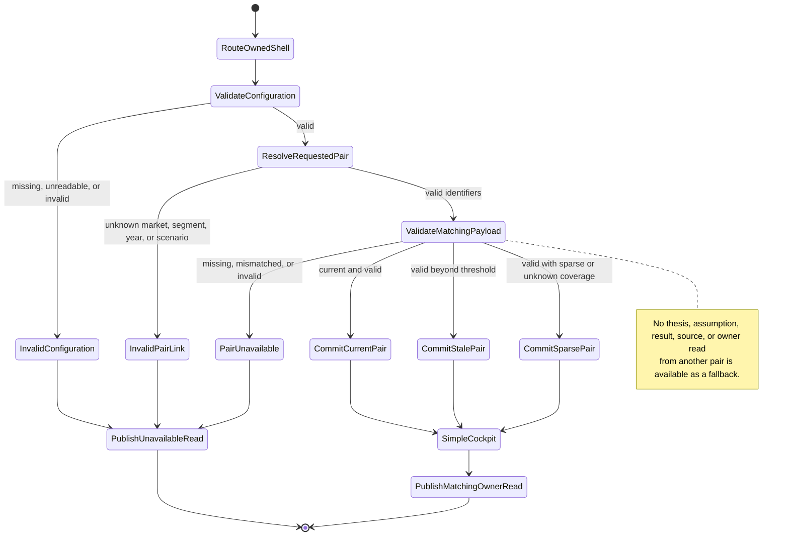
```mermaid
stateDiagram-v2
  [*] --> RouteOwnedShell
  RouteOwnedShell --> ValidateConfiguration
  ValidateConfiguration --> InvalidConfiguration: missing, unreadable, or invalid
  ValidateConfiguration --> ResolveRequestedPair: valid
  ResolveRequestedPair --> InvalidPairLink: unknown market, segment, year, or scenario
  ResolveRequestedPair --> ValidateMatchingPayload: valid identifiers
  ValidateMatchingPayload --> PairUnavailable: missing, mismatched, or invalid
  ValidateMatchingPayload --> CommitCurrentPair: current and valid
  ValidateMatchingPayload --> CommitStalePair: valid beyond threshold
  ValidateMatchingPayload --> CommitSparsePair: valid with sparse or unknown coverage
  CommitCurrentPair --> SimpleCockpit
  CommitStalePair --> SimpleCockpit
  CommitSparsePair --> SimpleCockpit
  SimpleCockpit --> PublishMatchingOwnerRead
  InvalidConfiguration --> PublishUnavailableRead
  InvalidPairLink --> PublishUnavailableRead
  PairUnavailable --> PublishUnavailableRead
  PublishMatchingOwnerRead --> [*]
  PublishUnavailableRead --> [*]
  note right of ValidateMatchingPayload
    No thesis, assumption, result, source, or owner read
    from another pair is available as a fallback.
  end note
```

**Flow contract:** the route market is visible immediately, but pair content enters the DOM only after complete matching validation. Stale/sparse remain explicit. Invalid target state publishes no numeric owner-read metrics.

### User Flow: UF-002 Market, Segment, And Cross-Page Deep-Link Switch

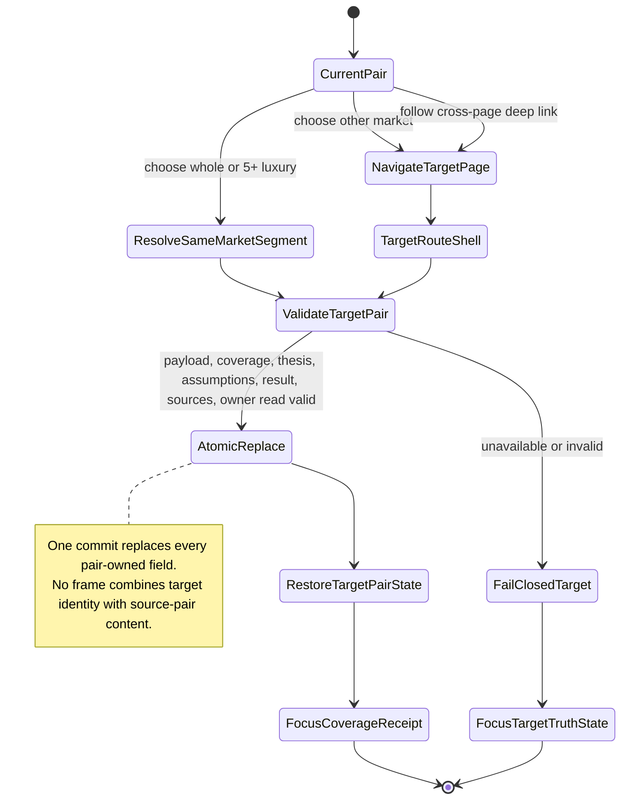
```mermaid
stateDiagram-v2
  [*] --> CurrentPair
  CurrentPair --> ResolveSameMarketSegment: choose whole or 5+ luxury
  CurrentPair --> NavigateTargetPage: choose other market
  CurrentPair --> NavigateTargetPage: follow cross-page deep link
  ResolveSameMarketSegment --> ValidateTargetPair
  NavigateTargetPage --> TargetRouteShell
  TargetRouteShell --> ValidateTargetPair
  ValidateTargetPair --> AtomicReplace: payload, coverage, thesis, assumptions, result, sources, owner read valid
  ValidateTargetPair --> FailClosedTarget: unavailable or invalid
  AtomicReplace --> RestoreTargetPairState
  RestoreTargetPairState --> FocusCoverageReceipt
  FailClosedTarget --> FocusTargetTruthState
  FocusCoverageReceipt --> [*]
  FocusTargetTruthState --> [*]
  note right of AtomicReplace
    One commit replaces every pair-owned field.
    No frame combines target identity with source-pair content.
  end note
```

**Flow contract:** market navigation is cross-page; segment navigation is in-page. Valid target persistence is namespaced by pair. Missing target content fails closed instead of retaining old values.

### User Flow: UF-003 Large-Luxury Qualification And Coverage

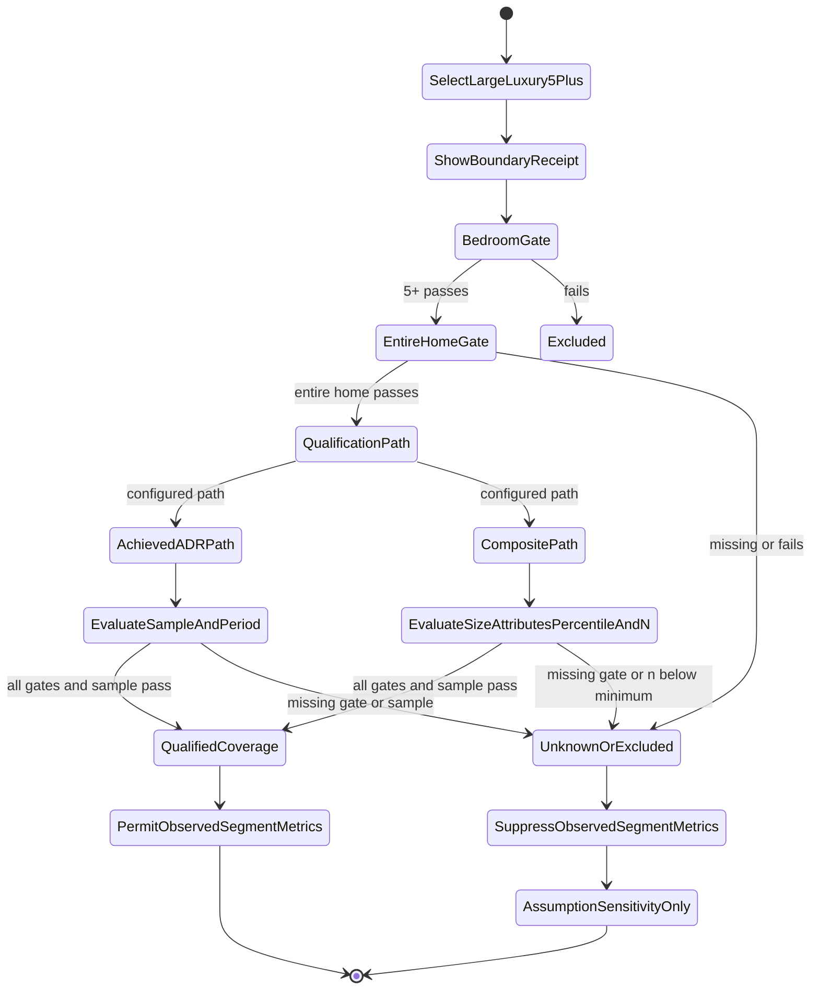
```mermaid
stateDiagram-v2
  [*] --> SelectLargeLuxury5Plus
  SelectLargeLuxury5Plus --> ShowBoundaryReceipt
  ShowBoundaryReceipt --> BedroomGate
  BedroomGate --> EntireHomeGate: 5+ passes
  BedroomGate --> Excluded: fails
  EntireHomeGate --> QualificationPath: entire home passes
  EntireHomeGate --> UnknownOrExcluded: missing or fails
  QualificationPath --> AchievedADRPath: configured path
  QualificationPath --> CompositePath: configured path
  AchievedADRPath --> EvaluateSampleAndPeriod
  CompositePath --> EvaluateSizeAttributesPercentileAndN
  EvaluateSampleAndPeriod --> QualifiedCoverage: all gates and sample pass
  EvaluateSizeAttributesPercentileAndN --> QualifiedCoverage: all gates and sample pass
  EvaluateSampleAndPeriod --> UnknownOrExcluded: missing gate or sample
  EvaluateSizeAttributesPercentileAndN --> UnknownOrExcluded: missing gate or n below minimum
  QualifiedCoverage --> PermitObservedSegmentMetrics
  UnknownOrExcluded --> SuppressObservedSegmentMetrics
  SuppressObservedSegmentMetrics --> AssumptionSensitivityOnly
  PermitObservedSegmentMetrics --> [*]
  AssumptionSensitivityOnly --> [*]
```

**Flow contract:** five bedrooms and marketing language never complete qualification. Candidate, qualifying, metric sample, denominator, period, missing fields, and consequence remain visible at every endpoint.

### User Flow: UF-004 Scenario, Lever, Reset, And Pair-Scoped Persistence

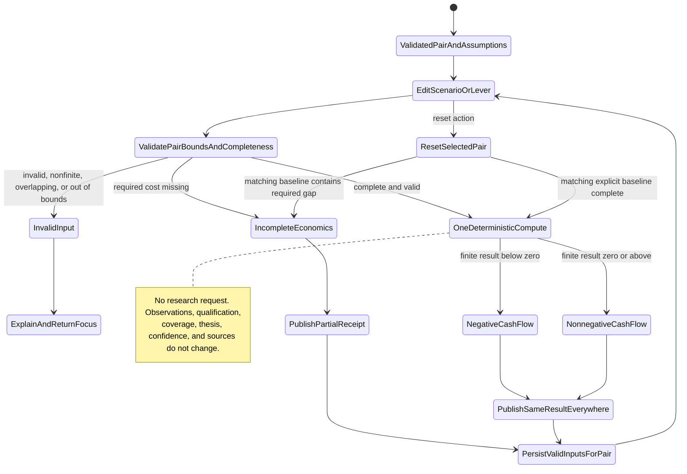
```mermaid
stateDiagram-v2
  [*] --> ValidatedPairAndAssumptions
  ValidatedPairAndAssumptions --> EditScenarioOrLever
  EditScenarioOrLever --> ValidatePairBoundsAndCompleteness
  ValidatePairBoundsAndCompleteness --> InvalidInput: invalid, nonfinite, overlapping, or out of bounds
  ValidatePairBoundsAndCompleteness --> IncompleteEconomics: required cost missing
  ValidatePairBoundsAndCompleteness --> OneDeterministicCompute: complete and valid
  InvalidInput --> ExplainAndReturnFocus
  IncompleteEconomics --> PublishPartialReceipt
  OneDeterministicCompute --> NegativeCashFlow: finite result below zero
  OneDeterministicCompute --> NonnegativeCashFlow: finite result zero or above
  NegativeCashFlow --> PublishSameResultEverywhere
  NonnegativeCashFlow --> PublishSameResultEverywhere
  PublishPartialReceipt --> PersistValidInputsForPair
  PublishSameResultEverywhere --> PersistValidInputsForPair
  PersistValidInputsForPair --> EditScenarioOrLever
  EditScenarioOrLever --> ResetSelectedPair: reset action
  ResetSelectedPair --> OneDeterministicCompute: matching explicit baseline complete
  ResetSelectedPair --> IncompleteEconomics: matching baseline contains required gap
  note right of OneDeterministicCompute
    No research request. Observations, qualification,
    coverage, thesis, confidence, and sources do not change.
  end note
```

**Flow contract:** zero-rate financing uses the finite straight-line branch; invalid supply denominator or downtime produces unavailable outputs. Reset and persistence are pair-scoped. Negative remains negative.

### User Flow: UF-005 Ocean Shores Coastal Sensitivity

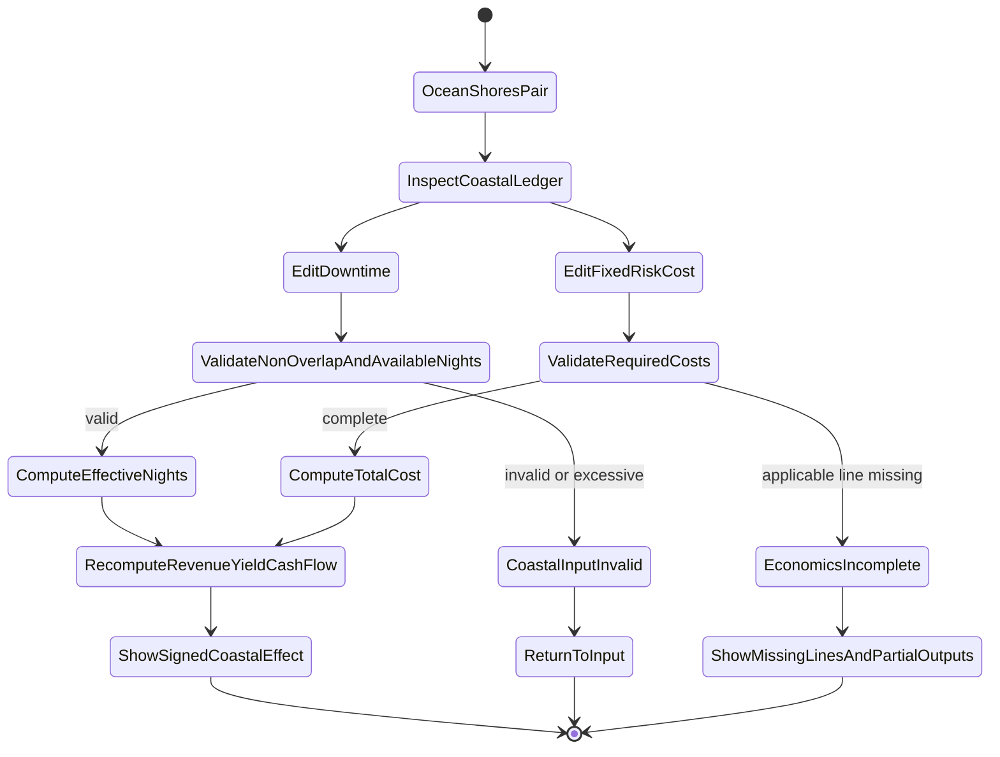
```mermaid
stateDiagram-v2
  [*] --> OceanShoresPair
  OceanShoresPair --> InspectCoastalLedger
  InspectCoastalLedger --> EditDowntime
  InspectCoastalLedger --> EditFixedRiskCost
  EditDowntime --> ValidateNonOverlapAndAvailableNights
  ValidateNonOverlapAndAvailableNights --> ComputeEffectiveNights: valid
  ValidateNonOverlapAndAvailableNights --> CoastalInputInvalid: invalid or excessive
  EditFixedRiskCost --> ValidateRequiredCosts
  ValidateRequiredCosts --> ComputeTotalCost: complete
  ValidateRequiredCosts --> EconomicsIncomplete: applicable line missing
  ComputeEffectiveNights --> RecomputeRevenueYieldCashFlow
  ComputeTotalCost --> RecomputeRevenueYieldCashFlow
  RecomputeRevenueYieldCashFlow --> ShowSignedCoastalEffect
  CoastalInputInvalid --> ReturnToInput
  EconomicsIncomplete --> ShowMissingLinesAndPartialOutputs
  ShowSignedCoastalEffect --> [*]
  ReturnToInput --> [*]
  ShowMissingLinesAndPartialOutputs --> [*]
```

**Flow contract:** downtime changes effective nights; flood, storm, salt/moisture/erosion, utility/sewer, storm-drain, association, and septic inputs change explicit costs. Every source keeps city/county/region/coast/property geography and cannot become an expected-loss fact.

### User Flow: UF-006 Comparison Alignment

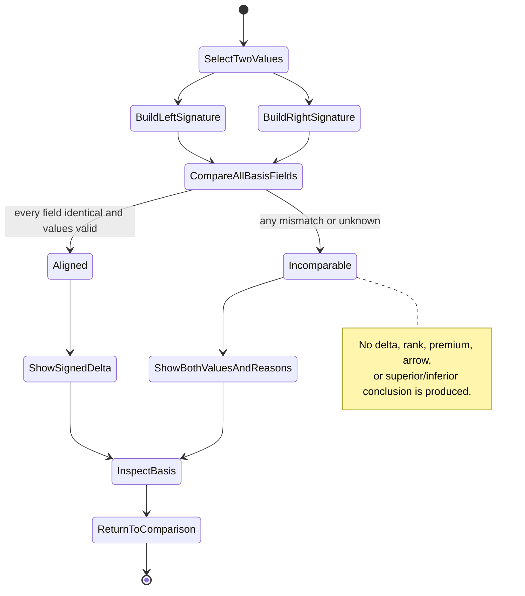
```mermaid
stateDiagram-v2
  [*] --> SelectTwoValues
  SelectTwoValues --> BuildLeftSignature
  SelectTwoValues --> BuildRightSignature
  BuildLeftSignature --> CompareAllBasisFields
  BuildRightSignature --> CompareAllBasisFields
  CompareAllBasisFields --> Aligned: every field identical and values valid
  CompareAllBasisFields --> Incomparable: any mismatch or unknown
  Aligned --> ShowSignedDelta
  Incomparable --> ShowBothValuesAndReasons
  ShowSignedDelta --> InspectBasis
  ShowBothValuesAndReasons --> InspectBasis
  InspectBasis --> ReturnToComparison
  ReturnToComparison --> [*]
  note right of Incomparable
    No delta, rank, premium, arrow,
    or superior/inferior conclusion is produced.
  end note
```

**Flow contract:** definition, geography, population, period, currency, aggregation, method, sample, and qualification all participate. Sparse or unknown is not zero.

### User Flow: UF-007 Four-Unit Research Refresh And Review

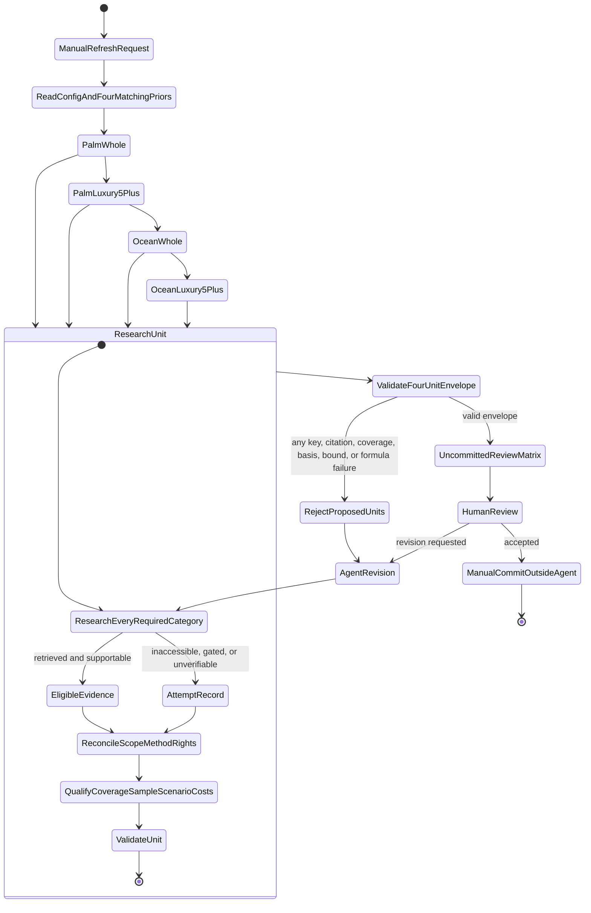
```mermaid
stateDiagram-v2
  [*] --> ManualRefreshRequest
  ManualRefreshRequest --> ReadConfigAndFourMatchingPriors
  ReadConfigAndFourMatchingPriors --> PalmWhole
  PalmWhole --> PalmLuxury5Plus
  PalmLuxury5Plus --> OceanWhole
  OceanWhole --> OceanLuxury5Plus
  state ResearchUnit {
    [*] --> ResearchEveryRequiredCategory
    ResearchEveryRequiredCategory --> EligibleEvidence: retrieved and supportable
    ResearchEveryRequiredCategory --> AttemptRecord: inaccessible, gated, or unverifiable
    EligibleEvidence --> ReconcileScopeMethodRights
    AttemptRecord --> ReconcileScopeMethodRights
    ReconcileScopeMethodRights --> QualifyCoverageSampleScenarioCosts
    QualifyCoverageSampleScenarioCosts --> ValidateUnit
    ValidateUnit --> [*]
  }
  PalmWhole --> ResearchUnit
  PalmLuxury5Plus --> ResearchUnit
  OceanWhole --> ResearchUnit
  OceanLuxury5Plus --> ResearchUnit
  ResearchUnit --> ValidateFourUnitEnvelope
  ValidateFourUnitEnvelope --> RejectProposedUnits: any key, citation, coverage, basis, bound, or formula failure
  ValidateFourUnitEnvelope --> UncommittedReviewMatrix: valid envelope
  RejectProposedUnits --> AgentRevision
  AgentRevision --> ResearchEveryRequiredCategory
  UncommittedReviewMatrix --> HumanReview
  HumanReview --> AgentRevision: revision requested
  HumanReview --> ManualCommitOutsideAgent: accepted
  ManualCommitOutsideAgent --> [*]
```

**Flow contract:** every unit receives its own researched/attempted outcome and matching-prior accounting. One success cannot cover another. Large-luxury remains unknown when sample evidence is insufficient. Formula changes are rejected and no automatic commit occurs.

### User Flow: UF-008 Unavailable, Stale, Sparse, Incomplete, And Attempt-Failure Handling

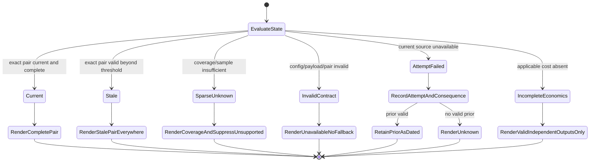
```mermaid
stateDiagram-v2
  [*] --> EvaluateState
  EvaluateState --> Current: exact pair current and complete
  EvaluateState --> Stale: exact pair valid beyond threshold
  EvaluateState --> SparseUnknown: coverage/sample insufficient
  EvaluateState --> InvalidContract: config/payload/pair invalid
  EvaluateState --> AttemptFailed: current source unavailable
  EvaluateState --> IncompleteEconomics: applicable cost absent
  Current --> RenderCompletePair
  Stale --> RenderStalePairEverywhere
  SparseUnknown --> RenderCoverageAndSuppressUnsupported
  InvalidContract --> RenderUnavailableNoFallback
  AttemptFailed --> RecordAttemptAndConsequence
  RecordAttemptAndConsequence --> RetainPriorAsDated: prior valid
  RecordAttemptAndConsequence --> RenderUnknown: no valid prior
  IncompleteEconomics --> RenderValidIndependentOutputsOnly
  RenderCompletePair --> [*]
  RenderStalePairEverywhere --> [*]
  RenderCoverageAndSuppressUnsupported --> [*]
  RenderUnavailableNoFallback --> [*]
  RetainPriorAsDated --> [*]
  RenderUnknown --> [*]
  RenderValidIndependentOutputsOnly --> [*]
```

**Flow contract:** every degraded state names pair, reason, and consequence. No state uses zero, another pair, a broad-market metric, snippet, or stale prior as a silent success.

### User Flow: UF-009 Source, Qualification, And Basis Inspection

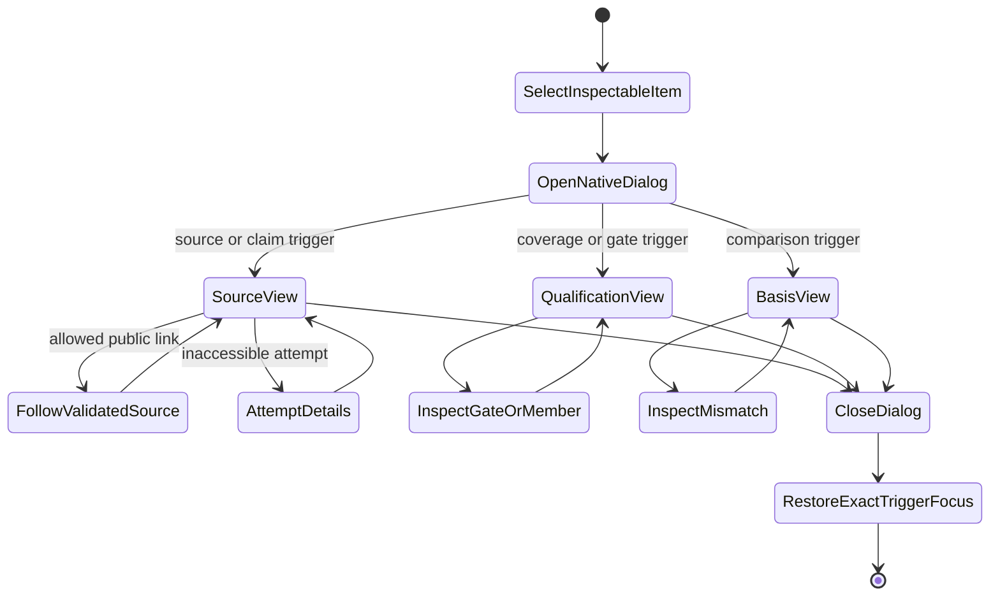
```mermaid
stateDiagram-v2
  [*] --> SelectInspectableItem
  SelectInspectableItem --> OpenNativeDialog
  OpenNativeDialog --> SourceView: source or claim trigger
  OpenNativeDialog --> QualificationView: coverage or gate trigger
  OpenNativeDialog --> BasisView: comparison trigger
  SourceView --> FollowValidatedSource: allowed public link
  SourceView --> AttemptDetails: inaccessible attempt
  QualificationView --> InspectGateOrMember
  BasisView --> InspectMismatch
  FollowValidatedSource --> SourceView
  AttemptDetails --> SourceView
  InspectGateOrMember --> QualificationView
  InspectMismatch --> BasisView
  SourceView --> CloseDialog
  QualificationView --> CloseDialog
  BasisView --> CloseDialog
  CloseDialog --> RestoreExactTriggerFocus
  RestoreExactTriggerFocus --> [*]
```

**Flow contract:** native dialog exposes structured evidence only and cannot mutate it. Source access/rights, qualification sample, and basis mismatch remain inspectable without hover; untrusted text stays inert.

### User Flow: UF-010 Mode, Viewport, Print, And Owner-Read Parity

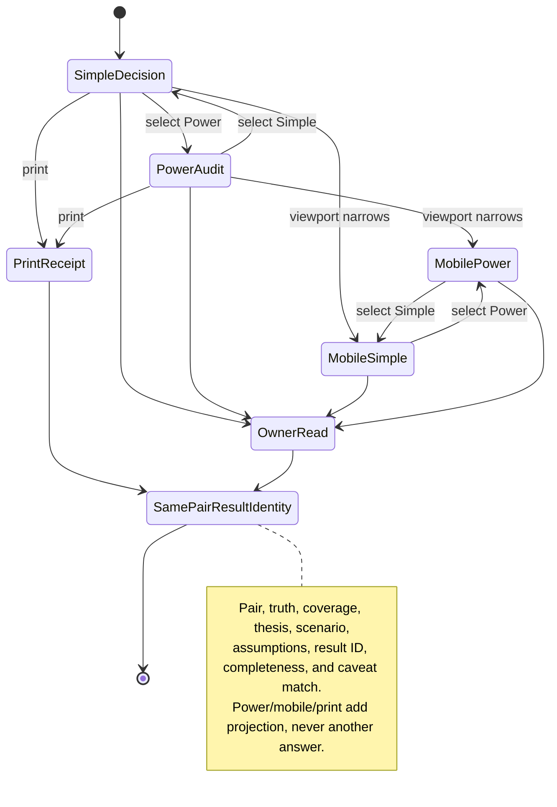
```mermaid
stateDiagram-v2
  [*] --> SimpleDecision
  SimpleDecision --> PowerAudit: select Power
  PowerAudit --> SimpleDecision: select Simple
  SimpleDecision --> MobileSimple: viewport narrows
  PowerAudit --> MobilePower: viewport narrows
  MobileSimple --> MobilePower: select Power
  MobilePower --> MobileSimple: select Simple
  SimpleDecision --> PrintReceipt: print
  PowerAudit --> PrintReceipt: print
  SimpleDecision --> OwnerRead
  PowerAudit --> OwnerRead
  MobileSimple --> OwnerRead
  MobilePower --> OwnerRead
  PrintReceipt --> SamePairResultIdentity
  OwnerRead --> SamePairResultIdentity
  SamePairResultIdentity --> [*]
  note right of SamePairResultIdentity
    Pair, truth, coverage, thesis, scenario,
    assumptions, result ID, completeness, and caveat match.
    Power/mobile/print add projection, never another answer.
  end note
```

**Flow contract:** mode/viewport do not fetch or recompute. Print uses table/text chart parity. Owner read consumes the same state and omits invalid metrics.

### Business Scenario Mapping

| Scenario | UX Surface | Journey / Transition | Observable Contract |
| --- | --- | --- | --- |
| BS-001 | Four-unit refresh matrix | UF-007 manual request -> four independent units -> validation/review | Actual online research, eligible/attempted sources, no automatic commit |
| BS-002 | Two-page first paint / unavailable state | UF-001 config validation fails | Exact reason; no invented market, segment, scenario, bound, metric, or result |
| BS-003 | Truth band on every screen | UF-001/UF-008 valid age exceeds threshold | Persistent stale word, age, threshold, and stale owner read |
| BS-004 | First paint invalid payload state | UF-001 pair payload validation fails | Exact errors; no thesis, output, or numeric owner read |
| BS-005 | Simple primary/all-assumption controls | UF-004 edit scenario/shock/cost -> one compute | Immediate no-fetch result; evidence/thesis unchanged |
| BS-006 | Deterministic/formula receipt | UF-004 valid/invalid demand-supply values | Clamped equation; bad denominator unavailable |
| BS-007 | Power evidence/comparison | UF-006/UF-009 inspect incompatible definitions | Separate values/bases; no aggregate or false delta |
| BS-008 | Acquisition controls/formula receipt | UF-004 change price/leverage/rate | Standard amortizing debt service from same result |
| BS-009 | Formula receipt | UF-004 set valid rate to zero | Finite straight-line principal branch with explicit label |
| BS-010 | Simple/Power result and state family | UF-004/UF-005 revenue below all costs/debt | Signed negative or incomplete state; gross yield cannot soften it |
| BS-011 | Mode/viewport/print parity | UF-010 switch mode/viewport | Same pair, coverage, thesis, assumptions, result ID; no overlap/pointer-only action |
| BS-012 | Evidence rows/native inspector | UF-009 follow claim/gate/cost/source | Complete bidirectional source record scoped to exact use |
| BS-013 | Power Change Ledger / refresh matrix | UF-007 compare matching prior | Every material item receives one change state; reasons cite evidence |
| BS-014 | Change Ledger baseline | UF-007 no matching prior | `NO PRIOR VALID MATCHING PAIR`; no invented direction |
| BS-015 | Attempt-failure state / refresh matrix | UF-007/UF-008 source unavailable | Attempt URL/time/scope/consequence; no snippet, quote, number, or invented source |
| BS-016 | Evidence labels, scenarios, charts/tables | UF-004/UF-009/UF-010 inspect classes | Observed, assumption, inference, and modeled output remain distinct without color |
| BS-017 | Palm legal / Ocean legal supply ledgers | UF-004 inspect legal rows then edit supply assumption | Legal capacity, eligibility, inspections, and OTA supply stay separate |
| BS-018 | Owner-read receipt | UF-001/UF-004/UF-010 publish current/stale/unavailable read | Pair/state/coverage/scenario/caveat preserved; invalid numerics omitted |
| BS-019 | Pair controls and cross-page links | UF-002 market/segment switch | Atomic matching thesis, coverage, assumptions, result, sources, and read or fail closed |
| BS-020 | Luxury qualification audit | UF-003 evaluate bedroom/type/path gates | 5+ alone/marketing/asking price never qualifies; unknown gate excludes or remains unknown |
| BS-021 | Coverage receipt before all segment metrics | UF-001/UF-003/UF-008 sparse target | Candidate/qualifying/metric n, denominator/method, missing fields, confidence visible |
| BS-022 | Luxury Simple/Power and comparison | UF-003/UF-006 missing segment performance | Whole-market values never populate observed luxury fields; assumption label required |
| BS-023 | Comparison basis receipt | UF-006 construct signatures | Delta only for identical bases; otherwise exact `INCOMPARABLE`, no rank |
| BS-024 | Ocean Shores coastal ledger/effect receipt | UF-005 edit downtime and explicit costs | Effective nights, revenue, costs, yield, cash flow respond; missing stays incomplete |
| BS-025 | Palm Springs luxury Simple/Power | UF-002/UF-003 select Palm 5+ luxury | 5+ path/coverage, legal posture, events, acquisition sample, explicit burden visible |
| BS-026 | Four-unit refresh matrix | UF-007 complete all unit rows | Each unit has independent category/coverage/attempt/prior state; no inheritance |
| BS-027 | Acquisition sample receipt | UF-003/UF-004 inspect/edit acquisition basis | Status, filters, dedup, n, statistic/range, period, exclusions, legal unknowns visible |
| BS-028 | Scenario receipt and Power series | UF-004/UF-007/UF-009 inspect rest-2026/2027 | Baseline/gap, assumptions, inference, output, method/version, coverage, confidence, falsifiers visible |

### Cross-Flow Invariants

- Every journey begins from a route-owned market identity and exact pair validation. No journey can make another pair current implicitly.
- Segment coverage and luxury qualification precede segment performance, thesis metrics, acquisition conclusion, comparison, and forecast output in visual and DOM order.
- Every control, reset, mode change, segment change, inspector, table sort, chart toggle, viewport change, print action, and cross-page link performs no online research.
- Pair change replaces thesis, coverage, scenarios, assumptions, result, owner read, and source context together or exposes a target-pair unavailable state.
- Palm Springs legal/operating obligations and Ocean Shores coastal/geography obligations remain distinct across Simple, Power, mobile, print, and owner-read caveats.
- `UNKNOWN`, `SPARSE`, `ASSUMPTION-DRIVEN`, `INCOMPARABLE`, `INCOMPLETE ECONOMICS`, `NEGATIVE CASH FLOW`, stale, and unavailable remain words in every applicable projection.
- Source/qualification/basis inspection always restores focus. Recompute preserves focus. Cross-page navigation focuses target truth; same-page segment switch focuses target coverage.
- LLM-authored text remains safe plain text in page content, tooltips, live messages, inspector fields, print, source titles, and refresh review.

## Superseded UX (Do Not Use)

The Palm Springs-only wireframes and BS-001 through BS-018 flows below are historical and non-authoritative after the July 17, 2026 two-market reconciliation. They must not guide design, planning, implementation, or validation.

### Superseded UI Wireframes

### Superseded UX Direction

- **Surface:** one self-contained route at `palm-springs-rental-market-lab.html`. Simple is the default thesis-first cockpit; Power is a detailed projection of the same research and deterministic result, not a second route or model.
- **Research posture:** the public route automatically loads the checked-in versioned configuration and agent-authored research payload on first paint. It does not perform online market research in the browser. A manual LLM research-agent run performs real online research, validates its proposed payload, and leaves changes uncommitted for human review.
- **Authority:** configuration owns schema compatibility, state vocabulary, freshness, source policy, metric definitions, model/formula versions, scenario names, bounds, units, and display precision. The agent-authored payload owns the thesis, evidence, conflicts, changes, forecasts, assumptions, legal facts, drivers, source ledger, and acquisition baseline. Local storage owns only the selected mode and validated user lever values.
- **Decision posture:** Simple leads with the market thesis, strongest support, strongest contradiction or unknown, and falsifier before controls or metrics. Scenario outputs are always labeled `MODELED FROM USER ASSUMPTIONS`; they never overwrite or visually masquerade as observed research.
- **Shell posture:** use the shared Research Lab shell in the established load order `rldata.js` -> `rlapp.js` -> `rlnav.js`, including shared navigation and the scoped `Data behind this page` status. The route adds no credential input and no duplicate data-status implementation.
- **Visual posture:** restrained research workspace with a compact title row, full-width semantic bands, thin dividers, tabular numerals, stable control tracks, and 8px-or-smaller radii. Internal columns are unframed and separated by rules. No page section floats as a decorative card, no card appears inside another card, and no marketing hero precedes the tool.
- **Truth posture:** `CURRENT`, `STALE`, `UNAVAILABLE`, `INVALID CONFIGURATION`, and `INVALID PAYLOAD` are visible words. State, direction, classification, confidence, conflict, and positive or negative economics never rely on color alone.
- **Design language:** local Research Lab UI conventions only. No optional framework design language is enabled in `.github/bubbles-project.yaml`, so no `### Design Language` selection is recorded.

### Superseded Screen Inventory

| Screen / State | Actor(s) | Route / Surface | Status | Scenarios Served |
| --- | --- | --- | --- | --- |
| Shared shell and automatic first paint | All research actors, Data-Constrained / Accessible User | `palm-springs-rental-market-lab.html` | New shared composition | BS-002, BS-003, BS-004, BS-011, BS-018 |
| Desktop Simple decision cockpit | Market Research Reader, Vacation-Rental Operator, Prospective Buyer / Underwriter | Route in Simple mode | New | BS-003, BS-005, BS-006, BS-008, BS-009, BS-010, BS-011, BS-016, BS-017, BS-018 |
| Desktop Power research and model audit | Source And Method Auditor, Vacation-Rental Operator, Prospective Buyer / Underwriter | Route in Power mode | New | BS-003, BS-007, BS-008 through BS-013, BS-015 through BS-018 |
| Source and definition inspector | Source And Method Auditor, Market Research Reader | Focus-returning overlay from Simple or Power | New overlay | BS-007, BS-012, BS-015, BS-016, BS-017 |
| Mobile Simple decision cockpit | All research actors | Narrow route in Simple mode | New responsive projection | BS-003, BS-005, BS-008 through BS-011, BS-016 through BS-018 |
| Mobile Power research audit | Source And Method Auditor, Data-Constrained / Accessible User | Narrow route in Power mode | New responsive projection | BS-007, BS-011 through BS-017 |
| Truthful stale, unavailable, and invalid states | Data-Constrained / Accessible User | Same route before or instead of model content | New state family | BS-002, BS-003, BS-004, BS-015, BS-018 |
| Manual LLM refresh review handoff | LLM Research Agent, Source And Method Auditor | Repository workflow output; not a public browser route | New workflow surface | BS-001, BS-012, BS-013, BS-014, BS-015, BS-016, BS-017 |

### Superseded UI Primitives

| Primitive | Used By Screens / Consumers | Composition Rule | Accessibility And Responsive Contract |
| --- | --- | --- | --- |
| `ResearchLabShell` | Shared shell, Simple, Power | Reuse `rlnav`, one `h1`, compact route identity, mode switch, `rlapp` data status, and educational disclosure. Never wrap the route in a decorative outer card. | Starts with a skip link to `main`; header stacks below 680px; no body-level horizontal scroll. |
| `ModeSwitch` | Desktop/mobile Simple and Power | Two equal segments: Simple and Power. Mode changes presentation only and retain thesis identity, truth state, controls, result, focused source, and scroll context where practical. | Tablist semantics; Left/Right and Home/End move selection; Enter/Space activates; selected state uses text, border, and `aria-selected`. |
| `TruthStateBand` | First paint, current, stale, unavailable, invalid states, owner read | Fixed vocabulary plus researched-at, as-of, age, stale threshold, and consequence. A valid stale payload remains usable only beneath the persistent stale band. | One polite live region announces material state changes once. Text and symbol accompany color; long reasons wrap. |
| `ThesisBand` | Simple, Power parity, mobile, owner read | Fixed order: phase, direction, confidence, thesis sentence, strongest support, strongest contradiction/unknown, and what changes the view. Agent text cannot push status or falsifier below the fold on desktop. | Semantic headings and lists; confidence is a word plus evidence counts; text expands without clipping. |
| `ClassificationLabel` | Claims, tables, charts, source inspector | Closed labels `OBSERVED`, `FORECAST`, and `INFERENCE`; one record receives exactly one label. `MODELED FROM USER ASSUMPTIONS` is a separate output label, not a research classification. | Label includes word plus distinct mark/pattern. Accessible names include classification before value. |
| `ContextTip` | Every term, section, KPI, badge, dynamic value, chart, axis, classification, state, and source ID | Explains both what the item means and what the current value implies in Palm Springs context. It never hides a blocking error, exclusion, or source limitation. | Opens on hover, focus, or activation; Escape dismisses; focus remains on trigger; critical meaning also exists as adjacent text. |
| `AssumptionWorkbench` | Desktop/mobile Simple and Power | One flat `USER ASSUMPTIONS` band: forecast year, named scenario, demand shock, available/legal supply change, ADR shock, purchase price, linked leverage/down payment, mortgage rate, and operating-expense ratio. Loan term and available nights are visible read-only agent assumptions. | Persistent labels, units, config range, current value, and adjacent validation. Numeric levers use synchronized range and numeric controls where practical; 44px mobile targets. |
| `LinkedLeverageControl` | Assumption workbench | Leverage and down payment are two views of one value pair that always sums to 100%. Editing either updates the other locally and announces the resolved pair once. | Both labels expose relationship and range. Keyboard edits never move focus to the paired field. |
| `DeterministicOutputStrip` | Simple, Power parity, mobile, owner read | Fixed order: adjusted occupancy, ADR, RevPAR, gross revenue, gross yield, annual debt service, pre-tax cash flow. One compute supplies every occurrence. | Stable dimensions reserve negative signs and `Unavailable`; concise polite announcement reports only changed outputs after valid lever edits. |
| `NegativeEconomicsState` | Simple result strip, Power decomposition, owner-read caveat | Negative pre-tax cash flow stays signed, uses `NEGATIVE CASH FLOW` text, and appears before gross-yield commentary. No confidence or thesis label can soften it. | Minus sign, word, and explanatory sentence; never red-only. The amount is announced with currency and period. |
| `EvidenceLedger` | Simple support/conflict rows, Power evidence hierarchy | Material claim rows retain classification, geography, population, period, source IDs, quality, and confidence effect. Selecting a row opens its source or conflict detail without changing the thesis. | Semantic list/table; every row has descriptive source actions; mobile preserves evidence order. |
| `DefinitionConflictRow` | Power definitions and source inspector | Shows both metrics side by side with numerator, denominator, population, geography, period, unit, incompatibility reason, and consequence. It never offers an aggregate action. | Conflict word and `!` mark; definition terms use row headers; full comparison is keyboard readable. |
| `ChangeLedger` | Power and manual refresh review | Fixed groups: added, removed, revised, unchanged, contradicted, unresolved. A baseline has a prominent `NO PRIOR VALID PAYLOAD` state and no directional change language. | Group counts and text labels precede rows. Removed content remains readable without strike-through as the sole cue. |
| `SourceInspector` | Source and definition overlay | One shared focus-returning inspector for source identity, URL, publisher, title, clocks, geography, population, period, quality, rights/access, limitations, claim use, and conflicts. | Desktop right sheet or inline band; mobile full-screen dialog. Focus containment, Escape close, and return to invoking claim/source are required. |
| `AccessibleSeries` | Power monthly history and projections | Current text summary -> chart -> equivalent table. Observed and forecast segments use labels, line patterns, and markers; inferred drivers never share the numeric series. | Canvas has an accessible name and fallback text; table remains available independently; pointer and keyboard context are equivalent. |
| `OwnerReadReceipt` | Simple footer, Power audit, Market Brief consumer | Shows publication state, one-line read preview, as-of, deep link, and omitted-invalid-metrics count. It consumes the same thesis/result and cannot recalculate them. | Current/stale/unavailable is included in link text and accessible name. It is a status receipt, not an editable card. |
| `RefreshReviewPacket` | Manual LLM refresh handoff | Summarizes six-category research completion, attempted/unavailable sources, validation, changed assumptions, claim diff, formula-version lock, and uncommitted working-tree state. No Commit action exists. | Ordered headings and status list; every failure names consequence and next review target; no terminal color dependency. |

### Superseded Shared Composition, Authority, And Safety Contract

- The route has one immutable validated research snapshot and one mutable validated `UserAssumptionSet`. The deterministic compute consumes both and produces one `DeterministicResult` for Simple, Power, and the owner read.
- Simple is always the initial mode when no valid stored mode exists. A persisted mode is restored only when it is one of the configured valid values. Persisted levers are restored only after config-bound validation; an invalid stored value is rejected and replaced only by the explicit config/payload initial value, never an invented consumer default.
- `localStorage` may contain only mode and user lever selections for this feature. It must not contain the research payload, source ledger, thesis, change history, configuration, model equations, online research output, private financial data, or owner-read authority.
- Forecast year, named scenario, demand shock, supply delta, ADR shock, purchase price, leverage/down payment, mortgage rate, and operating-expense ratio recompute locally through one `render()` path and issue no online research or market-data request.
- `Reset to researched baseline` restores the explicit selected scenario and acquisition baseline from the validated payload/config. It does not fetch, erase the checked-in payload, or claim that a refresh occurred.
- Entering Power, opening source detail, changing a chart/table view, sorting evidence, expanding a conflict, and returning to Simple issue no request and do not modify assumptions.
- Automatic first paint requests only the same-origin checked-in configuration and payload required by the route. `rlapp` reports these resources as local/current, local/stale, or unavailable; it never labels the research live.
- Real online research occurs only in the manual LLM research-agent workflow. A valid proposal may revise payload research and payload-owned model assumptions. The workflow rejects any attempt to revise the configured deterministic equations or silently change formula semantics.
- A newly validated payload affects the public route only after a human reviews and explicitly commits/publishes it through the repository workflow. The research agent never commits automatically.
- Agent-authored text is untrusted content. Render it as plain text from structured fields; do not interpret HTML, Markdown HTML, scripts, styles, iframes, event handlers, or `javascript:` URLs. Source links are created only from validated HTTP(S) SourceRecords, open with a named destination, and preserve rights/access warnings.
- Dynamic tooltips and announcements use trusted UI templates with escaped payload values. A source title, claim, thesis, limitation, or change reason cannot inject markup, alter labels, create a control, or hide status content.
- Long agent text wraps and may use an accessible disclosure after a visible bounded summary, but the full thesis, contradiction, falsifier, source limitation, and validation error remain reachable without hover.
- Top-level semantic bands may have a border/background. Their internal columns, rows, metrics, and definitions are unframed and divided by rules. No nested-card composition is permitted.

### Superseded Interaction And Persistence Invariants

| Action | May Change Agent Thesis / Evidence? | May Recompute Deterministic Result? | May Fetch Online Research? | Persists Locally? |
| --- | --- | --- | --- | --- |
| Switch Simple / Power | No | No; re-render same result | No | Mode only |
| Select forecast year / scenario | No | Yes | No | Yes, after validation |
| Edit demand / supply / ADR shock | No | Yes | No | Yes, after validation |
| Edit price / leverage / down payment / rate / expense ratio | No | Yes | No | Yes, after validation |
| Reset to researched baseline | No | Yes | No | Yes, explicit payload values |
| Open source, definition conflict, change, or chart detail | No | No | No | No requirement |
| Sort or filter a Power table | No | No | No | No requirement |
| Reload checked-in research files | Only if repository content changed | Yes, after full validation | No external research | No research persistence |
| Run manual LLM research refresh | Yes, in proposed payload only | Not in browser; validates new inputs | Yes, all required categories | No; proposal stays uncommitted |

### Superseded Global Keyboard, Focus, Context, And Localization Contract

1. Focus order is: skip link -> shared navigation -> route title/disclosure -> data/truth status -> Simple/Power switch -> forecast year -> scenario -> demand -> supply -> ADR -> purchase price -> leverage/down payment -> mortgage rate -> operating-expense ratio -> reset -> thesis -> deterministic outputs -> Simple source links -> Power sections when active -> owner-read receipt -> footer.
2. Arrow keys move within segmented controls; Tab leaves the control. Range/number controls support arrows plus direct entry. Every input has visible label, unit, range, current value, and named error target.
3. A plain mode switch leaves focus on the selected mode tab and preserves scroll. An explicit `Open in Power` link switches mode and then focuses the named destination heading. Returning from `SourceInspector` restores focus to the exact source, claim, value, or conflict trigger.
4. Valid lever recalculation never steals focus. One polite live message reports selected scenario, changed output, and negative/unavailable state. Invalid input uses an adjacent assertive error only for the affected result and leaves unchanged thesis content silent.
5. Every context tip is available by hover, focus, and activation. It defines the term and interprets the current value, source clock, comparison boundary, or model consequence. It does not contain instructions such as "hover here" or hide required caveats.
6. State uses words plus symbols/patterns: `CURRENT ✓`, `STALE !`, `UNAVAILABLE ×`, `OBSERVED ●`, `FORECAST ◇`, `INFERENCE ~`, `CONFLICT !`, and `NEGATIVE CASH FLOW −`. Icons are supplementary and have no duplicate spoken text.
7. Dates are localized visually while full ISO date/time and UTC retrieval time remain available in provenance. Currency, percentages, ratios, and signed deltas use locale-aware formatting without changing equation inputs or sign conventions.
8. Layout and controls tolerate at least 30% text expansion. Letter spacing remains zero; font size does not scale with viewport width; the longest state word and a negative currency value fit or wrap without overlap.
9. Reduced-motion preference removes nonessential transitions. No understanding depends on animation, pointer precision, hover, sound, or timed dismissal.

### Superseded Screen: Shared Shell And Automatic First Paint

**Actor:** All research actors, Data-Constrained / Accessible User | **Route:** `palm-springs-rental-market-lab.html` | **Status:** New shared composition

```text
┌──────────────────────────────────────────────────────────────────────────────┐
│ [Research Lab navigation]                                                    │
├──────────────────────────────────────────────────────────────────────────────┤
│ LOCAL-MARKET RESEARCH DESK                         View [Simple] [Power]     │
│ Palm Springs Rental Market Lab                    [Data behind this page]   │
│ Educational market research · not investment, legal, tax, or lending advice │
├──────────────────────────────────────────────────────────────────────────────┤
│ FIRST PAINT: [LOADING LOCAL RESEARCH CONTRACT …]                             │
│ Configuration [checking] · Payload [waiting] · No online research is running │
├──────────────────────────────────────────────────────────────────────────────┤
│ After validation:                                                            │
│ [CURRENT ✓] researched [2026-07-14 18:00Z] · as of [2026-07-13]             │
│ Config [v…] · Payload [v…] · Formula [immutable v…] · 6/6 categories         │
└──────────────────────────────────────────────────────────────────────────────┘
```

**Interactions:**

- Skip link -> move focus to the first active state or thesis heading.
- Simple / Power -> change presentation only -> retain one validated research/result identity and issue no request.
- `Data behind this page` -> open the shared `rlapp` resource status -> show config and payload availability, clocks, and local/no-live-data posture.
- Current/stale source timestamp -> open source/research metadata -> expose researched-at, overall as-of, stale-after, and formula version.

**States:**

- Before config validation: show only shell, educational boundary, mode, and loading truth band; no control or result is briefly populated from embedded values.
- Current: replace loading in place with `CURRENT`, clocks, versions, and category coverage, then reveal Simple.
- Stale: replace loading with the persistent stale composition defined below before revealing any thesis or result.
- Missing/invalid config: stop before payload interpretation and show `INVALID CONFIGURATION`; publish unavailable owner read with no numeric metrics.
- Missing/invalid payload: retain valid config metadata, show `INVALID PAYLOAD` or `PAYLOAD UNAVAILABLE`, and publish unavailable owner read with no thesis or model output.

**Responsive:**

- Desktop: title and mode/status actions share one row; truth metadata uses a second full-width row.
- Tablet: mode stays beside the title while data status wraps beneath.
- Mobile: title, disclosure, data status, mode switch, and truth band stack in that order; no loading label changes the width or location of the mode control.

**Accessibility:**

- Loading and resolved truth state share one polite live region; resolution is announced once without moving focus.
- The page has one `h1`, one `main`, and descriptive landmarks. Mode tabs identify controlled panels even while those panels are pending.
- `Data behind this page` has the same visible and accessible name. Loading animation is optional; visible text is the authoritative signal.

### Superseded Screen: Desktop Simple Decision Cockpit

**Actor:** Market Research Reader, Vacation-Rental Operator, Prospective Buyer / Underwriter | **Route:** route in Simple mode | **Status:** New

```text
┌────────────────────────────── CURRENT RESEARCH ──────────────────────────────┐
│ PHASE [Late-cycle / …]  DIRECTION [Softening ↓]  CONFIDENCE [Moderate 62%] │
│ THESIS: [agent-authored decision sentence rendered as plain text]           │
│ + STRONGEST SUPPORT: [claim] [OBSERVED ●] [SRC-…]                           │
│ ! STRONGEST CONFLICT / UNKNOWN: [claim or unresolved category] [SRC-…]      │
│ × WHAT CHANGES THE VIEW: [falsifiable condition]                            │
├──────────────────────────────────────────────────────────────────────────────┤
│ RESEARCH STATE [CURRENT ✓] · researched [time] · as of [time] · age [n]    │
│ [Trace thesis sources]                                      [Open in Power]  │
└──────────────────────────────────────────────────────────────────────────────┘

┌──────────────────────────── USER ASSUMPTIONS ────────────────────────────────┐
│ Forecast year [2027 ▾]       Scenario [Downside | Base | Upside]            │
│ Demand shock       Available/legal supply change       ADR shock            │
│ [────●────] [+0.0%] [────●────] [+0.0%]               [────●────] [+0.0%] │
├──────────────────────────────────────────────────────────────────────────────┤
│ Purchase price [$658,606]  Leverage [80%] ⇄ Down payment [20%]             │
│ Mortgage rate [6.49%]      Operating-expense ratio [35.0%]                 │
│ Loan term [agent assumption: 30y] · Available nights [scenario: 365]        │
│ [Reset to researched baseline]  [All values bounded by configuration]       │
└──────────────────────────────────────────────────────────────────────────────┘

┌──────────────────── MODELED FROM USER ASSUMPTIONS ──────────────────────────┐
│ Adjusted occupancy │ ADR       │ RevPAR   │ Gross revenue                   │
│ [36.8%]            │ [$410]    │ [$151]   │ [$55,100 / year]               │
├────────────────────┼───────────┼──────────┼─────────────────────────────────┤
│ Gross yield        │ Debt svc  │ Operating expense │ Pre-tax cash flow      │
│ [8.4% PRE-EXPENSE] │ [$42,000] │ [$19,285]         │ [−$6,185 / year]      │
│                                    [NEGATIVE CASH FLOW −]                   │
├──────────────────────────────────────────────────────────────────────────────┤
│ Inputs: [Base 2027 forecast ◇] + [user shocks] · Formula [locked v…]        │
│ Excludes tax, insurance, HOA, furnishing, renovation, closing, appreciation,│
│ sale proceeds, income tax, depreciation, and property permit eligibility.   │
│ [Inspect equations and exclusions in Power]                                 │
└──────────────────────────────────────────────────────────────────────────────┘

┌──────────────────────────── WHY THIS READ ───────────────────────────────────┐
│ SUPPORT [n]  [top claim + source]   │ CONFLICT / UNKNOWN [n] [top item]     │
│ NEXT CONFIRMATION [condition]       │ SOURCE TRACE [thesis -> claim -> IDs] │
├──────────────────────────────────────────────────────────────────────────────┤
│ OWNER READ [CURRENT ✓] [one-line preview] [Open Market Brief coverage ↗]    │
└──────────────────────────────────────────────────────────────────────────────┘
```

**Interactions:**

- Year or named scenario -> select only values present in validated config/payload -> update baseline inputs and every deterministic output locally.
- Demand, supply, or ADR range/number control -> validate finite config-bound delta -> recompute occupancy, ADR, RevPAR, gross revenue, gross yield, and dependent acquisition outputs with no request.
- Purchase price, linked leverage/down payment, mortgage rate, or expense ratio -> validate -> recompute principal, annual debt service, operating expense, gross yield, and pre-tax cash flow locally.
- `Reset to researched baseline` -> restore explicit payload/config initial selections -> announce restored scenario and output once; no fetch.
- Thesis/source link -> open `SourceInspector` or exact Power evidence heading -> preserve control values and focus-return target.
- `Open in Power` / `Inspect equations` -> activate Power and focus the named parity/equation section; preserve scroll context where practical and issue no fetch.

**States:**

- Current valid result: show all seven outputs with units, formula version, source scenario classification, and exclusions.
- Valid stale payload: keep thesis and calculations visible only with stale wording on the truth band, thesis band, output band, source links, and owner-read receipt.
- Invalid lever: affected output reads `Unavailable - [field] outside [range/reason]`; last valid value is not presented as current; thesis and evidence remain unchanged.
- Supply denominator at or below zero: adjusted occupancy and every dependent output become unavailable; no infinity, zero, or prior value appears.
- Zero mortgage rate: debt service remains finite and its context reads `Straight-line principal over [payments]`.
- Negative pre-tax cash flow: amount remains negative and `NEGATIVE CASH FLOW` precedes gross-yield interpretation.
- Unavailable source supporting the thesis: payload validation prevents the thesis from rendering; a category-level explicit unknown may render only when it is validly authored and cited to attempted-source context.

**Responsive:**

- Desktop: thesis uses one full-width band; assumption controls form three stable columns; output strip uses four columns then three-plus-cash-flow without body scroll.
- Tablet: scenario controls use two columns; acquisition controls use two columns; output metrics use two rows.
- Mobile: use the dedicated Mobile Simple composition below. Simple never requires horizontal scrolling.

**Accessibility:**

- After a valid lever change, announce one sentence: selected year/scenario, changed output, and negative/unavailable status; do not re-announce unchanged thesis text.
- Sliders and number fields expose one shared value and description; updating one synchronizes the other without focus movement.
- Confidence, support/conflict, forecast/model labels, and cash-flow sign include words and symbols. Source actions say which claim and source they open.
- Exclusions are persistent text, not tooltip-only. The educational boundary is visible above and below the model.

### Superseded Screen: Desktop Power Research And Model Audit

**Actor:** Source And Method Auditor, Vacation-Rental Operator, Prospective Buyer / Underwriter | **Route:** route in Power mode | **Status:** New

```text
┌──────────────────────── DECISION PARITY · SAME RESULT ───────────────────────┐
│ State [CURRENT ✓]  Phase […]  Direction […]  Confidence […]  Read ID […]   │
│ Thesis [exact Simple text] · Scenario [2027 / Base] · Cash flow [−$6,185]  │
│ [Back to Simple decision]                                                    │
└──────────────────────────────────────────────────────────────────────────────┘

┌──────────────────────────── EVIDENCE HIERARCHY ──────────────────────────────┐
│ Class      Claim / observation              Scope / period       Sources     │
│ OBSERVED ● [AirDNA available-night occ.]    [OTA / TTM]          [SRC-A]    │
│ OBSERVED ● [managed-home paid occupancy]    [regional / month]   [SRC-B]    │
│ FORECAST ◇ [2027 demand scenario]           [city / annual]      [SRC-C…]   │
│ INFERENCE ~ [hotel displacement hypothesis] [dated hypothesis]   [SRC-D…]   │
│ [Each row: quality · current/stale · support/conflict/unknown · inspect]    │
└──────────────────────────────────────────────────────────────────────────────┘

┌────────────────────────── DEFINITION CONFLICTS ! ────────────────────────────┐
│ Metric A             │ Metric B             │ Why incompatible              │
│ Available-night occ. │ Paid occupancy       │ denominator + population      │
│ Active OTA listings  │ Legal certificates   │ marketplace vs legal capacity │
│ City market          │ Greater Palm Springs │ geography                     │
│ Trailing 12 months   │ Monthly / quarterly  │ period                        │
│ [No aggregate] [Inspect both definitions] [Confidence consequence]          │
└──────────────────────────────────────────────────────────────────────────────┘

┌───────────────────── HISTORY, FORECASTS, AND SCENARIOS ─────────────────────┐
│ 2025 actuals ● | 2026 actuals ● | remaining 2026 forecast ◇ | 2027 ◇      │
│ [accessible occupancy / ADR / RevPAR series; visible line/marker patterns]  │
│ [Current text summary] [Equivalent monthly table] [Method + v] [Falsifiers] │
└──────────────────────────────────────────────────────────────────────────────┘

┌──────────────────────── CHANGES SINCE PRIOR REFRESH ─────────────────────────┐
│ [Added n] [Removed n] [Revised n] [Unchanged n] [Contradicted n] [Open n] │
│ Item / prior -> current │ Classification │ Evidence for revision │ Impact   │
│ [or: BASELINE · NO PRIOR VALID PAYLOAD · no directional change claims]      │
└──────────────────────────────────────────────────────────────────────────────┘

┌────────────────────── MARKET DRIVERS AND CONSTRAINTS ───────────────────────┐
│ Legal supply        │ Travel / air access │ Hotel / events                  │
│ [certificates/caps] │ [passengers/seats]  │ [competition/calendar]          │
│ Macro / financing   │ Weather / seasonality│ Risks / catalysts / unknowns   │
│ [rates/housing]     │ [dated conditions]  │ [claims + sources + confidence] │
│ Legal capacity, eligible supply, and active listings remain separate rows.  │
└──────────────────────────────────────────────────────────────────────────────┘

┌──────────────────── DETERMINISTIC MODEL AND ACQUISITION ────────────────────┐
│ Occupancy = clamp(base × (1+demand) / (1+supply), 0, 1)                    │
│ ADR = base × (1+ADR shock) · RevPAR = occupancy × ADR                      │
│ Revenue = RevPAR × available nights · Gross yield = revenue / price         │
│ Debt service [amortizing / zero-rate branch] · Expense = revenue × ratio    │
│ Pre-tax cash flow = revenue − expense − annual debt service                 │
├──────────────────────────────────────────────────────────────────────────────┤
│ Resolved inputs [values / units / payload source] · Formula [immutable v…]  │
│ Result decomposition [revenue] − [expense] − [debt] = [cash flow]          │
│ Reliability / exclusions [plain text]                                       │
└──────────────────────────────────────────────────────────────────────────────┘

┌──────────────────────────── FULL SOURCE LEDGER ──────────────────────────────┐
│ ID │ Publisher / title │ URL │ Retrieved │ Observed period │ Geo / pop     │
│    │ Category / quality│ Rights / access│ Limitations      │ Claims used   │
│ [select row -> SourceInspector; source-to-claim and claim-to-source links]   │
├──────────────────────────────────────────────────────────────────────────────┤
│ OWNER READ [CURRENT/STALE/UNAVAILABLE] [preview] [metrics included/omitted] │
└──────────────────────────────────────────────────────────────────────────────┘
```

**Interactions:**

- Fixed assumption controls above Power -> perform the exact Simple local recomputation -> update parity, model decomposition, and owner-read receipt without changing evidence.
- Evidence row -> expand structured claim detail inline or open source inspector -> retain classification, scope, clocks, and confidence effect.
- Definition conflict row -> focus one side or open both definitions -> never expose merge, average, or normalization as an action.
- Series selector -> choose occupancy, ADR, RevPAR, or revenue from the same validated series -> synchronize chart summary and table; no fetch.
- Change group -> filter the ledger locally -> keep all group counts visible, including removed and unresolved.
- Driver/legal row -> open supporting claims and sources -> keep legal capacity, eligible supply, active listings, hotel rooms, and events in separate semantic families.
- Equation term -> expose resolved input, unit, formula version, rounding rule, and exclusion through focus-accessible context.
- Source ledger row or claim ID -> open bidirectional inspector -> close and restore exact row focus.

**States:**

- Simple/Power parity mismatch: show `MODEL IDENTITY ERROR`; suppress owner-read numeric publication rather than reconciling two answers in presentation.
- Baseline refresh: Change Ledger reads `NO PRIOR VALID PAYLOAD` and has zero comparative direction claims.
- Definition conflict: values remain separately visible and confidence consequence is explicit; no combined chart point or KPI exists.
- Missing month: table cell reads `Unavailable`; chart has a gap; adjacent months are not joined as an observed segment.
- Stale source: row remains stale with age and policy consequence; valid stale payload keeps route-wide stale state.
- Restricted/access-gated source: row shows access/rights state and limitation. It contains no persisted proprietary value unless the validated payload permits public use.
- Non-finite or invalid model input: decomposition reads `Not calculable`; the affected result and owner-read metric are omitted, not serialized as zero.

**Responsive:**

- Desktop: evidence/conflict bands use stable columns; history uses chart plus table; drivers use three unframed columns; source ledger owns its contained table viewport.
- Tablet: charts precede tables; driver columns become two then one; parity and change counts wrap as full labels.
- Mobile: use the dedicated Mobile Power composition below. Dense tables use contained horizontal scrolling only when a semantic stacked form would lose comparisons; body width never exceeds viewport.

**Accessibility:**

- Every table has a caption, scoped column/row headers, and sortable controls that announce state. Sorting never changes the model.
- Series use labels, marker shapes, and line patterns in addition to color. A summary and full data table make pointer interaction optional.
- Expanded rows remain in DOM reading order and do not trap focus. Confidence consequences and source limitations are adjacent to the evidence they affect.
- Formula punctuation has a readable text equivalent; negative values include sign, currency, period, and state word.

### Superseded Screen: Source And Definition Inspector

**Actor:** Source And Method Auditor, Market Research Reader | **Route:** overlay from a claim, source ID, classification, definition conflict, or change | **Status:** New overlay

```text
┌──────────────────────────────────────────────────────────────────────────────┐
│ SOURCE & DEFINITION: [SRC-… / claim title]                          [Close] │
├──────────────────────────────────────────────────────────────────────────────┤
│ Classification       [OBSERVED ● / FORECAST ◇ / INFERENCE ~]               │
│ Publisher / title    [plain text]                                            │
│ Source URL           [Open validated source ↗]                              │
│ Category / quality   [official / commercial / secondary / …]                │
│ Retrieved at         [UTC]          Observation period [start / end]         │
│ Geography            [Palm Springs / Greater Palm Springs / …]              │
│ Population           [OTA listings / managed homes / certificates / …]      │
│ Definition           [numerator / denominator / included fees / unit]        │
│ Rights / access      [public / gated / restricted / unknown]                 │
│ Limitations          [agent-authored plain text]                             │
│ Claims using source  [claim IDs and support/conflict role]                   │
├──────────────────────── WHEN OPENED FROM A CONFLICT ─────────────────────────┤
│ Other definition     [same structured fields]                               │
│ Incompatibility      [geography / population / period / method / unit]       │
│ Consequence          [cannot aggregate / compare directly / confidence ↓]   │
└──────────────────────────────────────────────────────────────────────────────┘
```

**Interactions:**

- Open source -> follow only the validated HTTP(S) URL in a new context with a named destination; no credential or gated-content bypass is offered.
- Claim ID -> close inspector, move focus to the exact claim row, and preserve mode/scroll/assumptions.
- Other definition -> move within the inspector comparison without replacing either record.
- Close / Escape -> dismiss and restore focus to the invoking source, claim, conflict, or change row.

**States:**

- Complete source: all required fields render; omitted optional fields are labeled `Not supplied`, not blank.
- Unavailable attempt: URL/attempt time/reason may render while numeric value remains absent; attempted-source context cannot be promoted to supporting evidence.
- Restricted source: rights/access and public-use limitation precede any allowed summary.
- Invalid or mismatched source reference: payload is rejected before this inspector or the associated claim can render.
- Untrusted text: markup-like content is displayed literally as text and cannot create links, controls, styles, or hidden content.

**Responsive:**

- Desktop: right sheet no wider than the readable research column; comparison fields use two columns only where labels remain fully visible.
- Tablet: full-height sheet with one structured definition list.
- Mobile: full-screen dialog; one term/value pair per row; URLs and IDs wrap at safe points; fixed close control does not cover content.

**Accessibility:**

- Dialog name includes source ID and subject. Focus begins on the heading, remains contained, and returns to the trigger.
- Structured fields use semantic description lists. Source link purpose, access state, limitation, absence of value, and conflict consequence are all spoken.
- Focus and hover expose identical context; no information exists only in a title attribute.

### Superseded Screen: Mobile Simple Decision Cockpit

**Actor:** All research actors | **Route:** narrow route in Simple mode | **Status:** New responsive projection

```text
┌──────────────────────────────────────────┐
│ Palm Springs Rental Market Lab           │
│ [Data behind this page]                  │
│ [CURRENT ✓ · researched n days ago]     │
│ [          Simple | Power          ]     │
│ Educational research · no advice         │
├──────────────────────────────────────────┤
│ THESIS [Softening ↓] [Moderate]          │
│ [agent-authored sentence]                │
│ + SUPPORT [claim] [SRC-…]                │
│ ! CONFLICT / UNKNOWN [claim]             │
│ × CHANGES VIEW [condition]               │
├──────────────────────────────────────────┤
│ USER ASSUMPTIONS                         │
│ Year [2027 ▾]  Scenario [Base ▾]        │
│ Demand [slider] [+0.0%]                  │
│ Supply [slider] [+0.0%]                  │
│ ADR    [slider] [+0.0%]                  │
│ Price [$658,606]                         │
│ Leverage [80%] ⇄ Down payment [20%]     │
│ Rate [6.49%]  Expense ratio [35.0%]     │
│ Term [30y · researched] [Reset baseline] │
├──────────────────────────────────────────┤
│ MODELED RESULT                           │
│ Occupancy          [36.8%]               │
│ ADR                [$410]                │
│ RevPAR             [$151]                │
│ Gross revenue      [$55,100 / year]      │
│ Gross yield        [8.4% · pre-expense]  │
│ Annual debt svc    [$42,000]             │
│ Pre-tax cash flow  [−$6,185 / year]      │
│ [NEGATIVE CASH FLOW −]                  │
├──────────────────────────────────────────┤
│ [Trace sources] [Open details in Power]  │
│ Owner read [CURRENT ✓ · published]      │
└──────────────────────────────────────────┘
```

**Interactions:**

- Mode, year, scenario, every lever, reset, source trace, and Power deep link behave exactly as desktop and issue no research request.
- Paired range/number controls remain synchronized; direct number entry is always available when a slider would be imprecise.
- Source trace opens the full-screen source inspector and restores focus on close.

**States:**

- Current, stale, invalid-input, zero-rate, negative-cash-flow, and unavailable-result semantics are identical to desktop.
- Long thesis/support/conflict text wraps; a visible `Read full` disclosure may expand it in place without moving the controls or hiding falsifiers.
- A valid stale payload pins `STALE` immediately below the title and repeats it in result and owner-read labels.

**Responsive:**

- This is the below-680px contract. Every action target is at least 44px; labels wrap inside fixed-width tracks; no viewport-scaled text or page-level horizontal scroll.
- Results become a definition list in the same order as desktop. Source IDs and negative currency values wrap without overlapping labels.

**Accessibility:**

- DOM order matches the visual sequence. The active mode and scenario are programmatically selected.
- The control/result live message is concise and does not repeat the thesis. Error text follows the affected control and is referenced with `aria-describedby`.
- `Read full` has expanded state and leaves focus on its trigger; collapsed text is never the only copy available to assistive technology.

### Superseded Screen: Mobile Power Research Audit

**Actor:** Source And Method Auditor, Data-Constrained / Accessible User | **Route:** narrow route in Power mode | **Status:** New responsive projection

```text
┌──────────────────────────────────────────┐
│ [same title, truth band, mode, controls] │
├──────────────────────────────────────────┤
│ DECISION PARITY                          │
│ Direction […] · Confidence […]           │
│ Scenario […] · Cash flow […] · ID […]    │
├──────────────────────────────────────────┤
│ EVIDENCE [support n · conflict n]        │
│ > Performance / OTA definitions          │
│ > Legal supply / active supply            │
│ > Travel / air access                     │
│ > Macro / financing                       │
│ > Hotel / events                          │
│ > Weather / seasonality                   │
├──────────────────────────────────────────┤
│ DEFINITION CONFLICTS [n]                 │
│ > Available-night vs paid occupancy       │
│ > Legal certificates vs active listings  │
├──────────────────────────────────────────┤
│ HISTORY / FORECAST                       │
│ [current summary] [Open plot] [Table]    │
├──────────────────────────────────────────┤
│ CHANGES [A n · Rm n · Rv n · U n · ? n]│
│ > [group summaries retain every count]   │
├──────────────────────────────────────────┤
│ MODEL / ACQUISITION                      │
│ [inputs] [equations] [decomposition]     │
├──────────────────────────────────────────┤
│ SOURCES [Open full ledger]               │
│ OWNER READ [state / preview / omissions] │
└──────────────────────────────────────────┘
```

**Interactions:**

- Evidence, conflicts, changes, and model groups expand one at a time without changing the decision or issuing a request.
- `Open plot` reveals a bounded visualization after its current text summary; the equivalent table remains independently available.
- `Open full ledger` shows stacked source rows or a contained table, then opens the full-screen inspector for one source.
- `Back to Simple` preserves assumptions and returns focus to the Simple thesis heading only when explicitly requested.

**States:**

- Collapsed group summaries always expose conflict, stale, unavailable, and unresolved counts; collapsing cannot make a problem disappear.
- Baseline-no-prior, restricted source, missing month, definition conflict, stale payload, and invalid model states match desktop semantics.
- Power entry never triggers research or draws hidden canvases until the active region is visible; all content comes from the current validated computation.

**Responsive:**

- This composition replaces multi-column evidence with semantic disclosures and stacked definition rows. A table may scroll inside its own labeled region; the body does not.
- Shared controls keep identical dimensions and order to Mobile Simple, so switching modes cannot cause toolbar shift or overlap.

**Accessibility:**

- Disclosure names include contained counts, such as `Definition conflicts, 3` and `Sources unavailable, 2`.
- Plot summary and table precede optional fine-grained pointer exploration in reading order.
- Sticky controls or headings never cover focused content; focus indicators meet WCAG 2.2 AA contrast and are not clipped.

### Superseded Screen: Truthful Stale, Unavailable, And Invalid States

**Actor:** Data-Constrained / Accessible User | **Route:** same route before or instead of thesis/model content | **Status:** New state family

```text
┌──────────────────────────── VALID BUT STALE ─────────────────────────────────┐
│ [STALE !] Research is [19 days] old; threshold [14 days]; as of [date]      │
│ Last valid thesis and model remain visible below with STALE labels.          │
│ No claim is described as current or live. [Inspect stale sources]            │
└──────────────────────────────────────────────────────────────────────────────┘

┌──────────────────────── INVALID / MISSING CONFIGURATION ─────────────────────┐
│ [INVALID CONFIGURATION ×] Research and model publication stopped.            │
│ Exact errors:                                                                │
│ • [path] — [missing / unreadable / schema incompatible / invalid bound]      │
│ No scenario, definition, bound, formula, thesis, or numeric output loaded.   │
│ Owner read: UNAVAILABLE; numeric metrics omitted.                            │
└──────────────────────────────────────────────────────────────────────────────┘

┌────────────────────────── INVALID / MISSING PAYLOAD ─────────────────────────┐
│ [PAYLOAD UNAVAILABLE ×] Configuration [v…] is valid; research was rejected. │
│ Exact errors:                                                                │
│ • [claim SRC-X does not resolve]                                             │
│ • [required category weather/seasonality missing]                            │
│ • [assumption outside configured range]                                      │
│ No thesis, projection, deterministic output, or numeric owner read produced. │
└──────────────────────────────────────────────────────────────────────────────┘

┌──────────────────────────── INVALID USER INPUT ──────────────────────────────┐
│ Research state remains [CURRENT / STALE].                                    │
│ [Supply change] invalid: denominator must remain greater than zero.           │
│ Affected model outputs: UNAVAILABLE × · last valid values are not current.   │
│ [Return focus to supply control]                                             │
└──────────────────────────────────────────────────────────────────────────────┘
```

**Interactions:**

- Stale source action -> open source ledger filtered to stale/expired records -> preserve stale labels on return.
- Configuration/payload error row -> expose complete plain-text path/code/context -> no retry action claims it can repair repository content from the browser.
- Invalid user-input action -> return focus to the exact field and retain the typed value for correction.
- Mode switch remains available for stale payloads and may expose diagnostic detail for invalid states; it cannot reveal hidden substitute results.

**States:**

- Valid stale: thesis, evidence, controls, deterministic result, source inspector, and owner read remain visible but each state-bearing surface says stale and exposes age.
- Missing/unreadable config: payload is not interpreted; only shell, educational boundary, shared resource status, and exact config errors render.
- Invalid config: same as missing config, including no implicit scenario names, bounds, formula version, or acquisition values.
- Missing/unreadable/invalid payload: valid config metadata and exact payload errors render; all research/model content and numeric publication remain absent.
- Invalid local input: validated research remains visible; only affected deterministic outputs become unavailable; no request occurs.

**Responsive:**

- Every state is a full-width band on desktop and one vertical reading sequence on mobile. Error paths and long source IDs wrap without expanding the viewport.
- State heading, consequence, and exact reason remain above any diagnostic list at all widths.

**Accessibility:**

- Blocking invalid states use `role="alert"` once; stale uses a non-blocking status. Repeated state labels are included in region accessible names without creating repetitive live announcements.
- Error lists use semantic lists and plain-language consequence. State never depends on border color or icon.
- Focus moves to the blocking state heading only on initial load; later lever errors remain adjacent and do not move focus automatically.

### Superseded Screen: Manual LLM Refresh Review Handoff

**Actor:** LLM Research Agent, Source And Method Auditor | **Surface:** repository workflow output, not the public route | **Status:** New workflow surface

```text
┌──────────────────────── RESEARCH REFRESH REVIEW ──────────────────────────────┐
│ Requested manually [time] · Prior valid payload [ID / NONE]                 │
│ Online research [performed] · Proposed payload [valid / rejected]            │
├──────────────────────────────────────────────────────────────────────────────┤
│ REQUIRED CATEGORY               OUTCOME              ELIGIBLE / UNKNOWN      │
│ Current performance             [researched]         [n sources / reason]    │
│ Legal supply / regulation       [researched]         [n sources / reason]    │
│ Travel / air access             [researched]         [n sources / reason]    │
│ Macro / financing               [researched]         [n sources / reason]    │
│ Hotel competition / events      [researched]         [n sources / reason]    │
│ Weather / seasonality           [researched]         [n sources / reason]    │
├──────────────────────────────────────────────────────────────────────────────┤
│ CLAIM CHANGE ACCOUNTING                                                     │
│ Added [n] · Removed [n] · Revised [n] · Unchanged [n] · Contradicted [n]  │
│ Unresolved [n] · [or BASELINE: no prior valid payload]                      │
│ Assumptions revised [n] · each reason cites evidence [pass / fail]           │
├──────────────────────────────────────────────────────────────────────────────┤
│ CONTRACT REVIEW                                                              │
│ Source/citation validation [pass / fail] · Bounds [pass / fail]              │
│ Classifications [pass / fail] · Formula version [MATCH / CHANGE REJECTED]    │
│ Deterministic equations [IMMUTABLE] · Proposed files [payload-owned only]    │
├──────────────────────────────────────────────────────────────────────────────┤
│ WORKING TREE [UNCOMMITTED FOR REVIEW]                                        │
│ [Review payload diff] [Review source ledger] [Review assumption changes]     │
│ Available outcomes: accept for manual commit / request agent revision        │
│ Automatic commit: NOT PERMITTED                                              │
└──────────────────────────────────────────────────────────────────────────────┘
```

**Interactions:**

- Manual refresh request -> agent reads config/current/prior payload -> performs real online research in all six categories -> records eligible evidence or explicit unknowns.
- Review payload/source/assumption change -> inspect exact proposed change and supporting source -> return to the corresponding change group.
- Formula-version or equation change -> reject proposal -> retain prior valid payload and route the mismatch for design/governance review.
- Validation failure -> reject proposal -> preserve prior valid payload and show every error; no partial replacement.
- Human acceptance -> leaves explicit manual commit/publish action outside the agent run. There is no auto-commit control or hidden commit step.

**States:**

- First refresh: prior reads `NONE`; change accounting reads `BASELINE`; no improvement/deterioration/reversal language is allowed.
- Successful researched proposal: all six category outcomes and all validation classes are visible; working tree stays uncommitted.
- Required page inaccessible or value unverifiable: category shows `UNKNOWN` with attempted-source context; no invented value/source/quote appears.
- Invalid proposal: status reads rejected, prior valid payload remains authoritative, and all findings stay accounted for.
- Formula mutation: status reads `CHANGE REJECTED`; assumptions may be revised only through valid payload fields within config bounds.

**Responsive:**

- Terminal/editor presentation uses one ordered text hierarchy and tables that wrap; it never depends on a wide color-only diff.
- On narrow review surfaces, each category and change group becomes a labeled definition list with counts first.

**Accessibility:**

- Every state and validation outcome is text. Diff meaning uses Added/Removed/Revised words rather than color or strike-through alone.
- Review links/actions have specific names and return focus to the originating category/change row.
- Agent-provided source titles and reasons render as plain text under the same untrusted-content contract as the public route.

### Superseded Data State Matrix

| Contract State | Global Label | Thesis / Evidence | Deterministic Model | Owner Read |
| --- | --- | --- | --- | --- |
| Config and payload valid/current | `CURRENT ✓` | Full validated read | Available for valid assumptions | Current with valid metrics |
| Config and payload valid/stale | `STALE !` plus age/threshold | Visible, every state-bearing surface stale | Available but stale-labeled | Stale; never elevated by Market Brief |
| Config missing/unreadable/invalid | `INVALID CONFIGURATION ×` | Not interpreted | Unavailable | Unavailable; no numeric metrics |
| Config valid, payload missing/unreadable/invalid | `PAYLOAD UNAVAILABLE ×` / `INVALID PAYLOAD ×` | Unavailable; errors visible | Unavailable | Unavailable; no thesis/numerics |
| Payload valid with explicit unresolved category | Current or stale payload state plus category `UNKNOWN` | Unknown remains visible with attempted-source context | Available only when all required model inputs validate | Includes material unknown caveat |
| User assumption invalid | Research state unchanged | Unchanged | Affected result unavailable; no prior/zero substitute | Invalid metrics omitted; caveat updated |
| Negative but finite cash flow | Research state unchanged | Unchanged | Signed negative output remains current | Includes negative cash-flow caveat when material |

### Superseded UX Decisions And Open Decision For Design

- **Decision:** there is no browser control labeled `Research now`, `Live refresh`, or equivalent. The public static route loads checked-in research; the manual LLM workflow is the only online research refresh and always ends in an uncommitted review packet.
- **Decision:** Simple's order is fixed: truth state -> thesis/support/conflict/falsifier -> assumptions -> deterministic outputs -> source trace -> owner-read receipt.
- **Decision:** Power starts with exact Simple parity and adds evidence, conflicts, history/forecasts, changes, drivers/legal supply, equations/acquisition detail, and full provenance in that order.
- **Decision:** all user controls are available in Simple. Power adds inspection, not hidden assumptions.
- **Decision:** source and definition detail use one shared inspector with focus return; there is no separate source route and no nested-card evidence composition.
- **Open decision for `bubbles.design`:** choose the smallest existing Research Lab chart/dialog composition that can provide chart/table parity and inspector focus return without introducing a second render/model path. If a shared dialog is not suitable, use an inline detail band while preserving the same interaction contract.

### Superseded User Flows

### Superseded Flow Coverage

| Flow | Scenarios Covered | Primary Surface |
| --- | --- | --- |
| UF-001 Manual Agent Research And Review | BS-001, BS-012, BS-013, BS-014, BS-015, BS-016, BS-017 | Manual refresh review handoff |
| UF-002 Automatic First Paint And Truth State | BS-002, BS-003, BS-004, BS-011, BS-018 | Shared shell -> Simple / unavailable state |
| UF-003 No-Fetch Market And Acquisition Recompute | BS-005, BS-006, BS-008, BS-009, BS-010, BS-011 | Simple workbench -> deterministic output |
| UF-004 Simple/Power And Responsive Parity | BS-003, BS-011, BS-016, BS-018 | Simple <-> Power, desktop/mobile |
| UF-005 Definition Conflict Audit | BS-007, BS-012, BS-016, BS-017 | Power conflict table -> inspector |
| UF-006 Claim-To-Source Trace | BS-012, BS-015, BS-016 | Simple/Power claim -> source inspector |
| UF-007 Changes Since Prior Refresh | BS-013, BS-014, BS-015 | Power Change Ledger |
| UF-008 State-Faithful Owner Read Publication | BS-003, BS-004, BS-010, BS-018 | Route render -> RLDATA owner read -> Market Brief |

### Superseded User Flow: UF-001 Manual Agent Research And Review

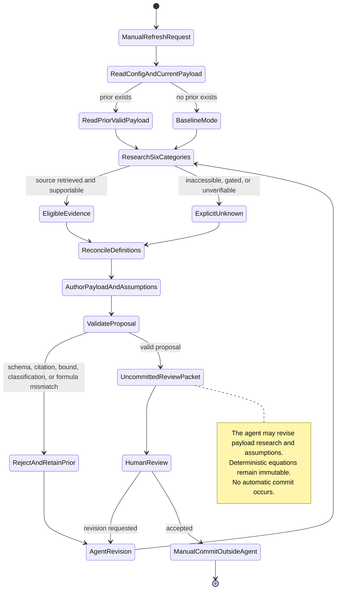
```mermaid
stateDiagram-v2
    [*] --> ManualRefreshRequest
    ManualRefreshRequest --> ReadConfigAndCurrentPayload
    ReadConfigAndCurrentPayload --> ReadPriorValidPayload: prior exists
    ReadConfigAndCurrentPayload --> BaselineMode: no prior exists
    ReadPriorValidPayload --> ResearchSixCategories
    BaselineMode --> ResearchSixCategories
    ResearchSixCategories --> EligibleEvidence: source retrieved and supportable
    ResearchSixCategories --> ExplicitUnknown: inaccessible, gated, or unverifiable
    EligibleEvidence --> ReconcileDefinitions
    ExplicitUnknown --> ReconcileDefinitions
    ReconcileDefinitions --> AuthorPayloadAndAssumptions
    AuthorPayloadAndAssumptions --> ValidateProposal
    ValidateProposal --> RejectAndRetainPrior: schema, citation, bound, classification, or formula mismatch
    ValidateProposal --> UncommittedReviewPacket: valid proposal
    RejectAndRetainPrior --> AgentRevision
    AgentRevision --> ResearchSixCategories
    UncommittedReviewPacket --> HumanReview
    HumanReview --> AgentRevision: revision requested
    HumanReview --> ManualCommitOutsideAgent: accepted
    ManualCommitOutsideAgent --> [*]
    note right of UncommittedReviewPacket
      The agent may revise payload research and assumptions.
      Deterministic equations remain immutable.
      No automatic commit occurs.
    end note
```

**Flow contract:** every invocation performs real online research across current performance, legal supply/regulation, travel/air access, macro/financing, hotel competition/events, and weather/seasonality. Each category ends with eligible evidence or an explicit unknown with attempted-source context. Validation failure cannot replace the prior valid payload. A valid proposal remains uncommitted until human review.

### Superseded User Flow: UF-002 Automatic First Paint And Truth State

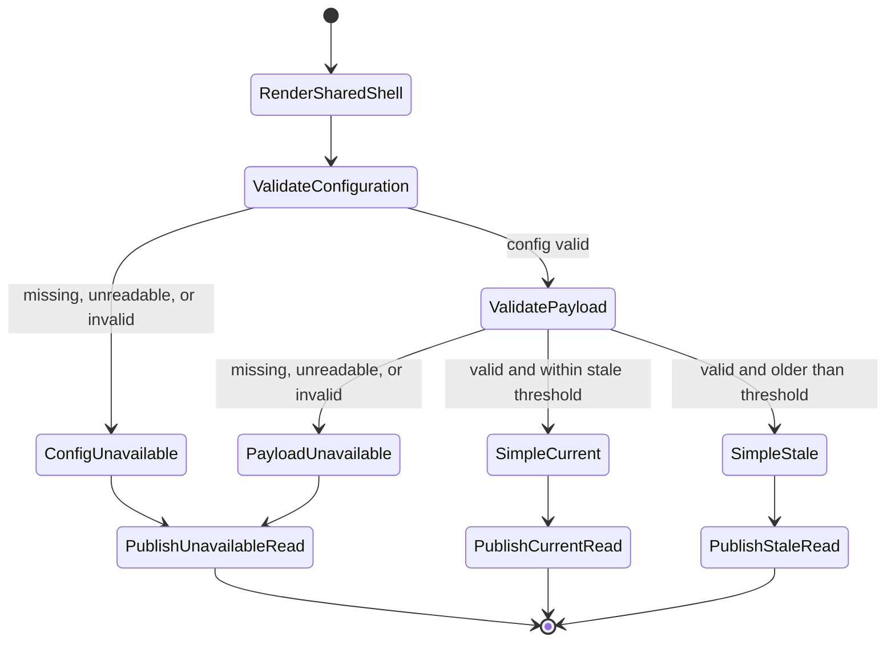
```mermaid
stateDiagram-v2
    [*] --> RenderSharedShell
    RenderSharedShell --> ValidateConfiguration
    ValidateConfiguration --> ConfigUnavailable: missing, unreadable, or invalid
    ValidateConfiguration --> ValidatePayload: config valid
    ValidatePayload --> PayloadUnavailable: missing, unreadable, or invalid
    ValidatePayload --> SimpleCurrent: valid and within stale threshold
    ValidatePayload --> SimpleStale: valid and older than threshold
    SimpleCurrent --> PublishCurrentRead
    SimpleStale --> PublishStaleRead
    ConfigUnavailable --> PublishUnavailableRead
    PayloadUnavailable --> PublishUnavailableRead
    PublishCurrentRead --> [*]
    PublishStaleRead --> [*]
    PublishUnavailableRead --> [*]
```

**Flow contract:** the shell paints immediately, then validates config before payload and payload before conclusions. No embedded values fill a gap. Stale remains stale everywhere. Invalid states publish unavailable with no numeric metrics.

### Superseded User Flow: UF-003 No-Fetch Market And Acquisition Recompute

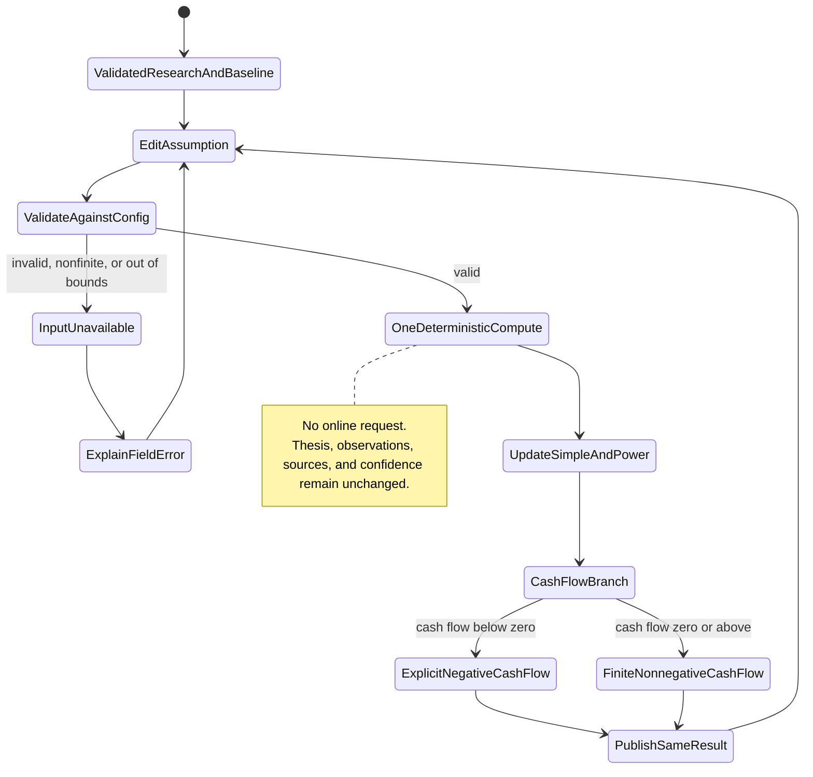
```mermaid
stateDiagram-v2
    [*] --> ValidatedResearchAndBaseline
    ValidatedResearchAndBaseline --> EditAssumption
    EditAssumption --> ValidateAgainstConfig
    ValidateAgainstConfig --> InputUnavailable: invalid, nonfinite, or out of bounds
    ValidateAgainstConfig --> OneDeterministicCompute: valid
    InputUnavailable --> ExplainFieldError
    ExplainFieldError --> EditAssumption
    OneDeterministicCompute --> UpdateSimpleAndPower
    UpdateSimpleAndPower --> CashFlowBranch
    CashFlowBranch --> ExplicitNegativeCashFlow: cash flow below zero
    CashFlowBranch --> FiniteNonnegativeCashFlow: cash flow zero or above
    ExplicitNegativeCashFlow --> PublishSameResult
    FiniteNonnegativeCashFlow --> PublishSameResult
    PublishSameResult --> EditAssumption
    note right of OneDeterministicCompute
      No online request.
      Thesis, observations, sources, and confidence remain unchanged.
    end note
```

**Flow contract:** year, scenario, market shocks, purchase price, linked leverage/down payment, rate, and operating ratio all pass through one validated computation. Zero rate uses the finite branch. Invalid denominator or input makes dependent outputs unavailable. Negative cash flow remains negative in Simple, Power, and the owner-read caveat.

### Superseded User Flow: UF-004 Simple/Power And Responsive Parity

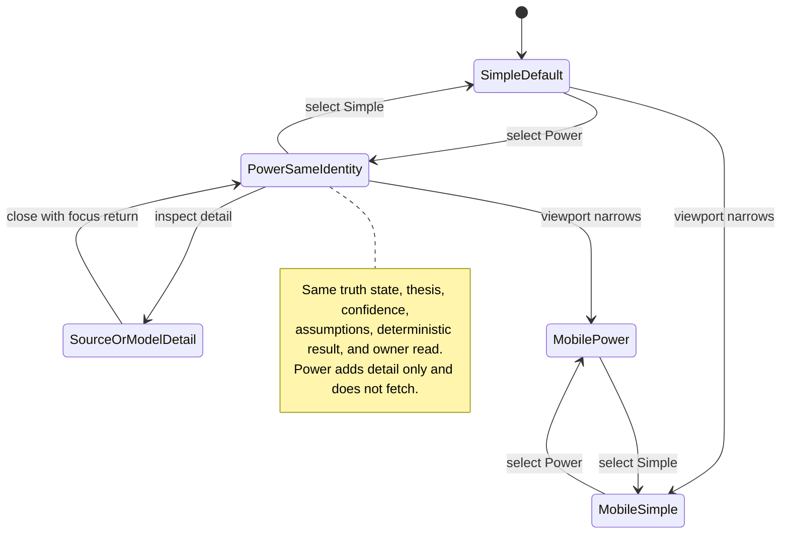
```mermaid
stateDiagram-v2
    [*] --> SimpleDefault
    SimpleDefault --> PowerSameIdentity: select Power
    PowerSameIdentity --> SourceOrModelDetail: inspect detail
    SourceOrModelDetail --> PowerSameIdentity: close with focus return
    PowerSameIdentity --> SimpleDefault: select Simple
    SimpleDefault --> MobileSimple: viewport narrows
    PowerSameIdentity --> MobilePower: viewport narrows
    MobileSimple --> MobilePower: select Power
    MobilePower --> MobileSimple: select Simple
    note right of PowerSameIdentity
      Same truth state, thesis, confidence,
      assumptions, deterministic result, and owner read.
      Power adds detail only and does not fetch.
    end note
```

**Flow contract:** mode and viewport never change the decision. Focus stays on the mode control for ordinary switches; explicit deep links focus the requested detail. Mobile retains semantic order, 44px targets, no overlap, and no body-level horizontal scrolling.

### Superseded User Flow: UF-005 Definition Conflict Audit

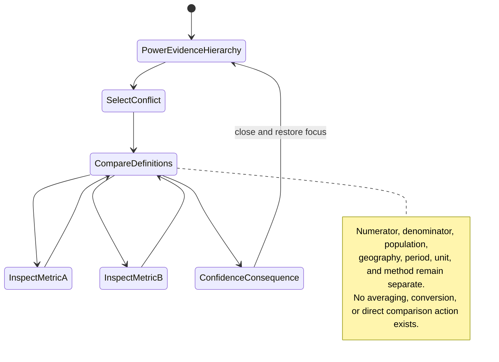
```mermaid
stateDiagram-v2
    [*] --> PowerEvidenceHierarchy
    PowerEvidenceHierarchy --> SelectConflict
    SelectConflict --> CompareDefinitions
    CompareDefinitions --> InspectMetricA
    CompareDefinitions --> InspectMetricB
    InspectMetricA --> CompareDefinitions
    InspectMetricB --> CompareDefinitions
    CompareDefinitions --> ConfidenceConsequence
    ConfidenceConsequence --> PowerEvidenceHierarchy: close and restore focus
    note right of CompareDefinitions
      Numerator, denominator, population,
      geography, period, unit, and method remain separate.
      No averaging, conversion, or direct comparison action exists.
    end note
```

**Flow contract:** paid occupancy and booked available-night occupancy remain separate, as do legal certificates and active OTA listings. Missing methodology remains unresolved. The audit explains disagreement and confidence impact without manufacturing a universal market metric.

### Superseded User Flow: UF-006 Claim-To-Source Trace

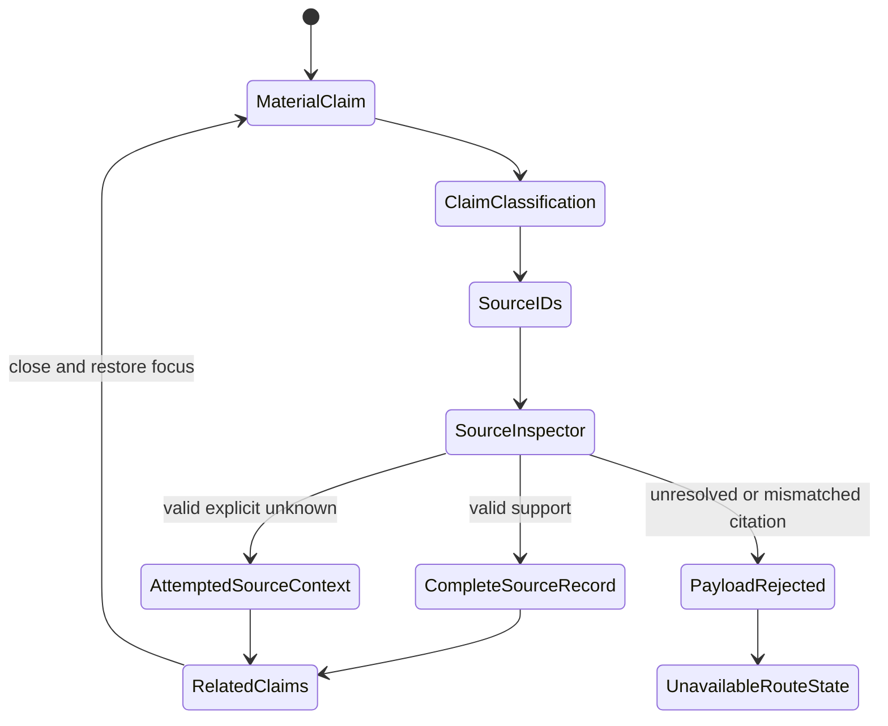
```mermaid
stateDiagram-v2
    [*] --> MaterialClaim
    MaterialClaim --> ClaimClassification
    ClaimClassification --> SourceIDs
    SourceIDs --> SourceInspector
    SourceInspector --> CompleteSourceRecord: valid support
    SourceInspector --> AttemptedSourceContext: valid explicit unknown
    CompleteSourceRecord --> RelatedClaims
    AttemptedSourceContext --> RelatedClaims
    RelatedClaims --> MaterialClaim: close and restore focus
    SourceInspector --> PayloadRejected: unresolved or mismatched citation
    PayloadRejected --> UnavailableRouteState
```

**Flow contract:** every displayed thesis, legal fact, catalyst, risk, contradiction, projection rationale, assumption revision, and change resolves to valid source records. Unsupported or mismatched citations fail before rendering. Observed, forecast, and inference labels remain exclusive and source scope remains visible.

### Superseded User Flow: UF-007 Changes Since Prior Refresh

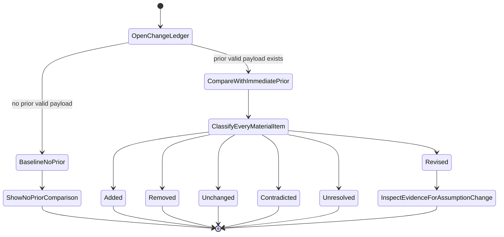
```mermaid
stateDiagram-v2
    [*] --> OpenChangeLedger
    OpenChangeLedger --> BaselineNoPrior: no prior valid payload
    OpenChangeLedger --> CompareWithImmediatePrior: prior valid payload exists
    BaselineNoPrior --> ShowNoPriorComparison
    CompareWithImmediatePrior --> ClassifyEveryMaterialItem
    ClassifyEveryMaterialItem --> Added
    ClassifyEveryMaterialItem --> Removed
    ClassifyEveryMaterialItem --> Revised
    ClassifyEveryMaterialItem --> Unchanged
    ClassifyEveryMaterialItem --> Contradicted
    ClassifyEveryMaterialItem --> Unresolved
    Revised --> InspectEvidenceForAssumptionChange
    ShowNoPriorComparison --> [*]
    Added --> [*]
    Removed --> [*]
    Unchanged --> [*]
    Contradicted --> [*]
    Unresolved --> [*]
    InspectEvidenceForAssumptionChange --> [*]
```

**Flow contract:** first refresh says baseline and invents no directional delta. With a predecessor, every material claim, source, legal fact, forecast assumption, and thesis element receives exactly one change state. Every material assumption revision cites evidence.

### Superseded User Flow: UF-008 State-Faithful Owner Read Publication

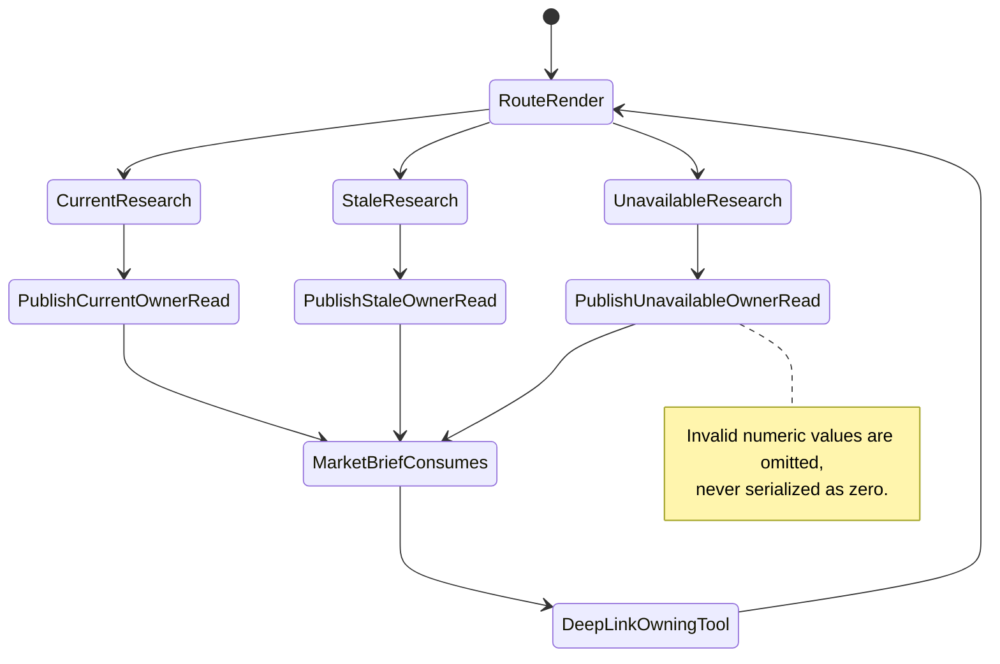
```mermaid
stateDiagram-v2
    [*] --> RouteRender
    RouteRender --> CurrentResearch
    RouteRender --> StaleResearch
    RouteRender --> UnavailableResearch
    CurrentResearch --> PublishCurrentOwnerRead
    StaleResearch --> PublishStaleOwnerRead
    UnavailableResearch --> PublishUnavailableOwnerRead
    PublishCurrentOwnerRead --> MarketBriefConsumes
    PublishStaleOwnerRead --> MarketBriefConsumes
    PublishUnavailableOwnerRead --> MarketBriefConsumes
    MarketBriefConsumes --> DeepLinkOwningTool
    DeepLinkOwningTool --> RouteRender
    note right of PublishUnavailableOwnerRead
      Invalid numeric values are omitted,
      never serialized as zero.
    end note
```

**Flow contract:** the owner read preserves current/stale/unavailable, thesis direction, confidence, selected scenario, and the material caveat. It uses the same result as the route. Market Brief deep-links the owning tool and does not reproduce its research or equations.

### Superseded Business Scenario Mapping

| Scenario | Entry / Screen | Interaction Or Transition | Observable UX Contract |
| --- | --- | --- | --- |
| BS-001 | Manual refresh review | Manual request -> six-category online research -> validation -> uncommitted packet | Real research and eligible source IDs; no replacement before validation; no auto-commit |
| BS-002 | Shared first paint | Config validation fails | Exact config reason; no scenario, metric definition, bound, thesis, acquisition value, model output, or numeric owner read |
| BS-003 | Truth state -> Simple/Power | Valid payload age exceeds config threshold | Persistent `STALE` plus age/threshold on thesis, model, provenance, and owner read; never current/live |
| BS-004 | Shared first paint | Payload schema/source/category/bound validation fails | Exact errors; no conclusion, projection, deterministic output, or numeric owner read |
| BS-005 | Simple workbench | Change year/scenario/demand/supply/ADR | Immediate one-compute result in both modes; zero online requests; thesis/evidence unchanged |
| BS-006 | Simple result / Power equation | Valid or invalid demand/supply deltas | Exact clamped equation; denominator failure becomes unavailable, never infinity/zero substitute |
| BS-007 | Power definition conflicts | Compare paid vs available-night occupancy | Both definitions visible; conflict and confidence consequence; no aggregate/conversion action |
| BS-008 | Simple acquisition controls | Change price/leverage/rate/expense assumptions | Standard amortizing debt service and same-result yield/cash-flow update |
| BS-009 | Power equation / Simple result | Set valid annual rate to zero | Finite straight-line principal result with explicit zero-rate context |
| BS-010 | Simple/Power output | Revenue is below expense plus debt service | Signed negative amount and `NEGATIVE CASH FLOW`; no attractive/viable/positive relabel from gross yield |
| BS-011 | Mode switch / responsive projection | Switch mode or viewport with one assumption set | Identical thesis, state, controls, outputs; Power detail only; keyboard/pointer parity; no overlap |
| BS-012 | Claim/source action | Follow material claim to source inspector and back | Complete source record and bidirectional links; focus return; invalid citation rejected pre-render |
| BS-013 | Change Ledger | Compare with immediate prior valid payload | Every material item assigned one change state; assumption revisions cite evidence |
| BS-014 | Change Ledger baseline | Open first valid payload with no predecessor | `NO PRIOR VALID PAYLOAD`; no improvement/deterioration/acceleration/reversal claim |
| BS-015 | Manual refresh / source inspector | Retrieval gated, inaccessible, or unverifiable | Explicit unknown/unavailable with attempted-source context; no invented number, quote, source, or inference |
| BS-016 | Thesis/evidence/series | Inspect observed, forecast, inference, and modeled outputs | Exclusive text labels, patterns/marks, source lineage, and no color-only distinction |
| BS-017 | Simple supply lever / Power legal evidence | Compare certificates/caps/waitlist/listings then change supply delta | Legal capacity, eligible supply, active listings, and scenario assumption remain separate |
| BS-018 | Every render -> owner read | Current, stale, unavailable, or invalid result | State-faithful one-line read; selected scenario and caveat retained; invalid numerics omitted |

### Superseded Cross-Flow Invariants

- Every browser journey begins with the shared shell and automatic config/payload validation. No empty shell waits behind a manual fetch button.
- Every valid browser journey enters Simple first unless a previously validated mode selection exists. Simple and Power consume one thesis, one assumption set, one result, and one owner-read identity.
- No user lever, mode switch, detail expansion, source trace, table sort, or viewport change performs online research. Only the explicit manual LLM research-agent workflow performs online research.
- No refresh proposal commits itself. The review packet accounts for every category, source failure, change state, assumption revision, validation finding, and formula-version check before human acceptance.
- Current, stale, unavailable, invalid, conflict, observed, forecast, inference, modeled, and negative states retain words at every viewport and in downstream owner reads.
- Source inspection always restores focus. Recalculation preserves focus. Mode-only changes preserve scroll; explicit cross-view links move focus only to the requested heading.
- Untrusted LLM text remains plain text everywhere, including tooltips, live announcements, source titles, change reasons, and review output.
