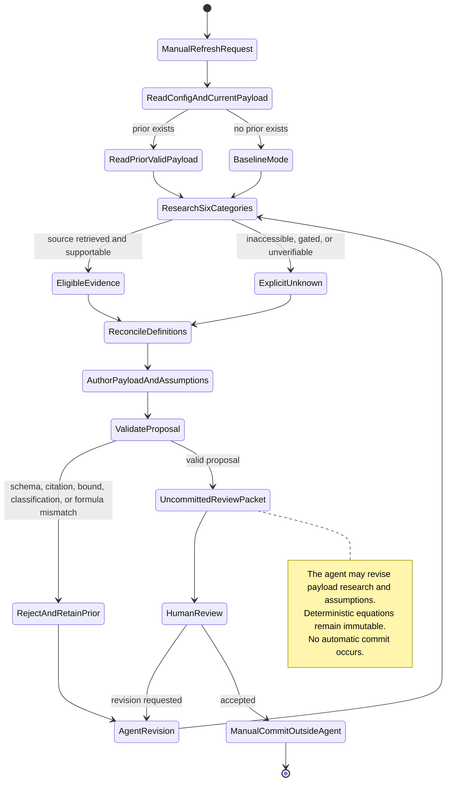
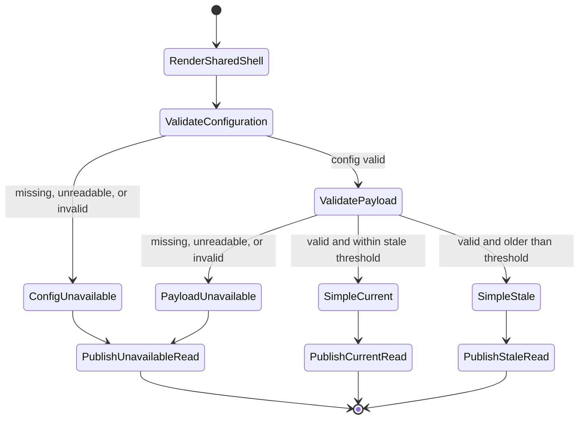
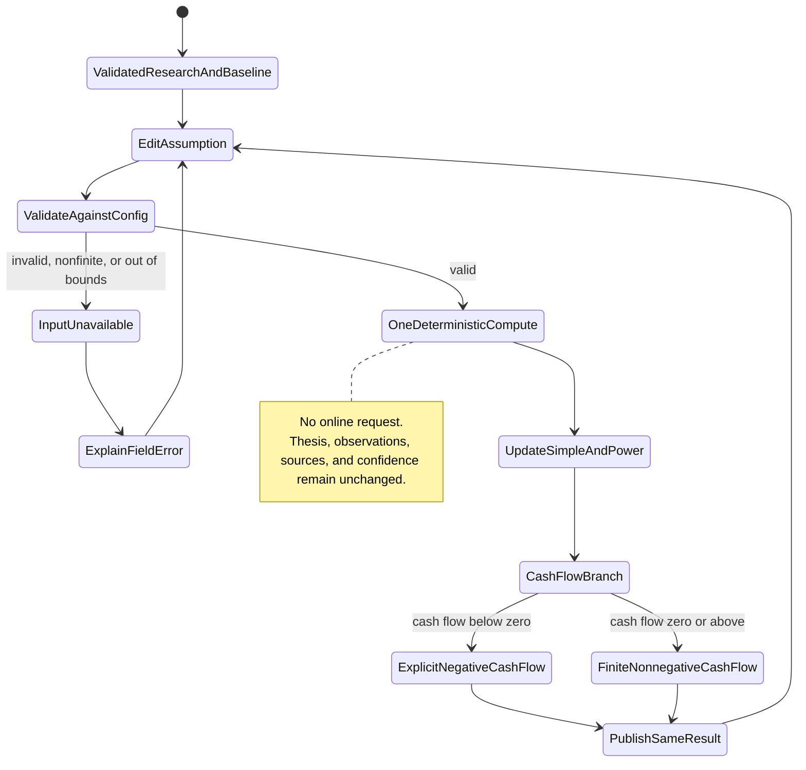
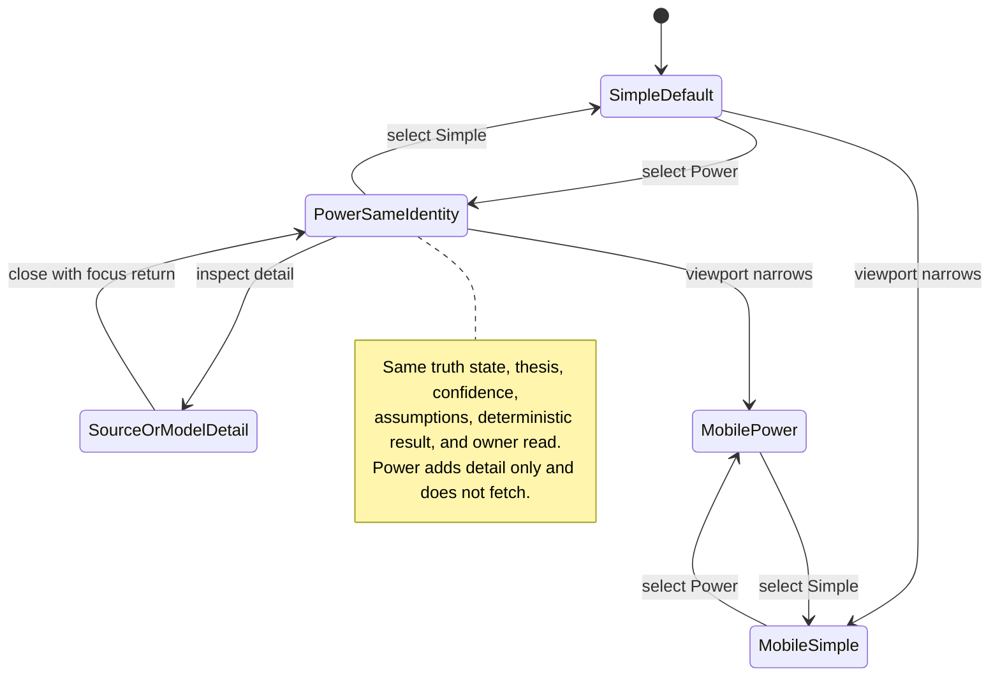
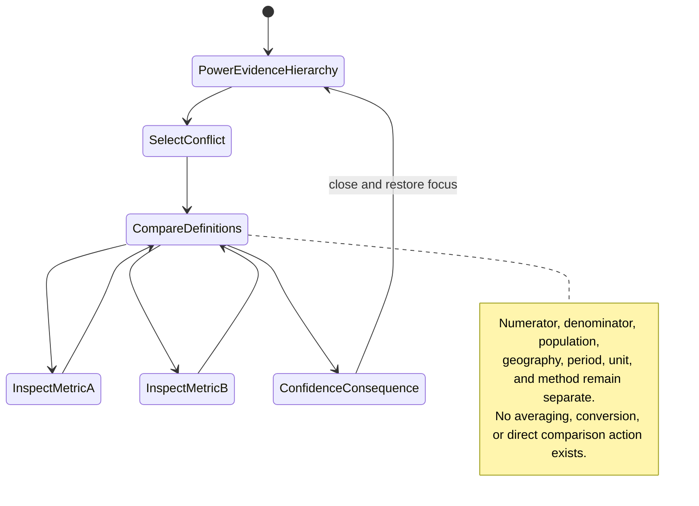
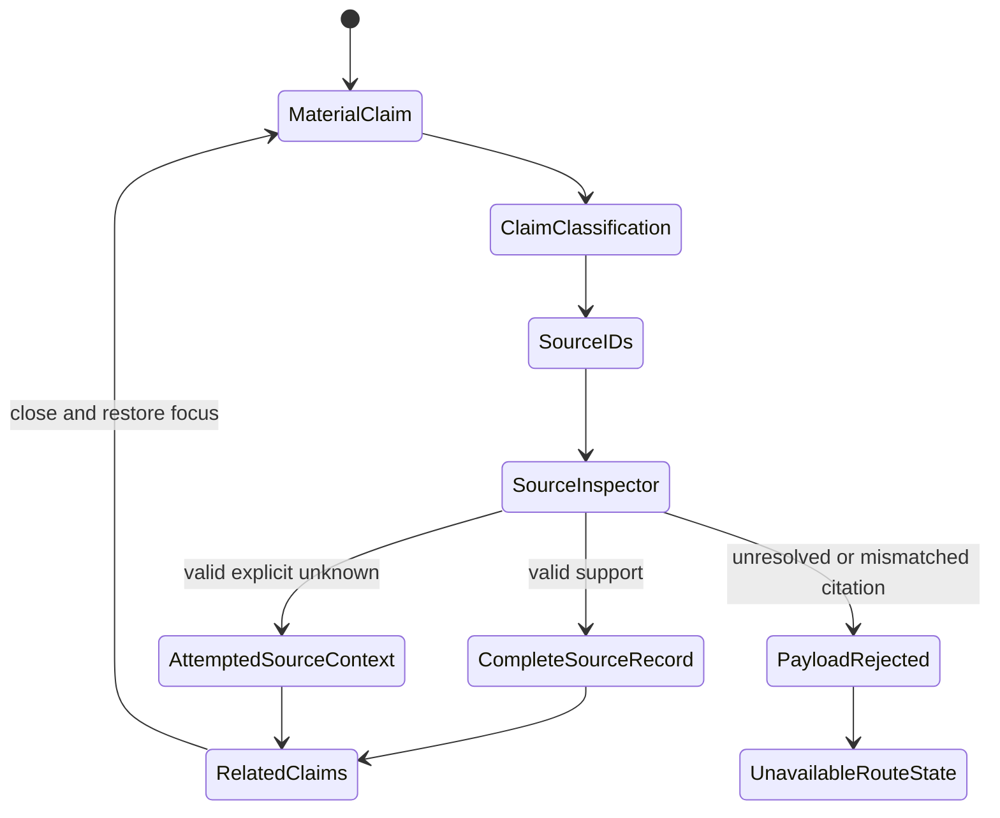
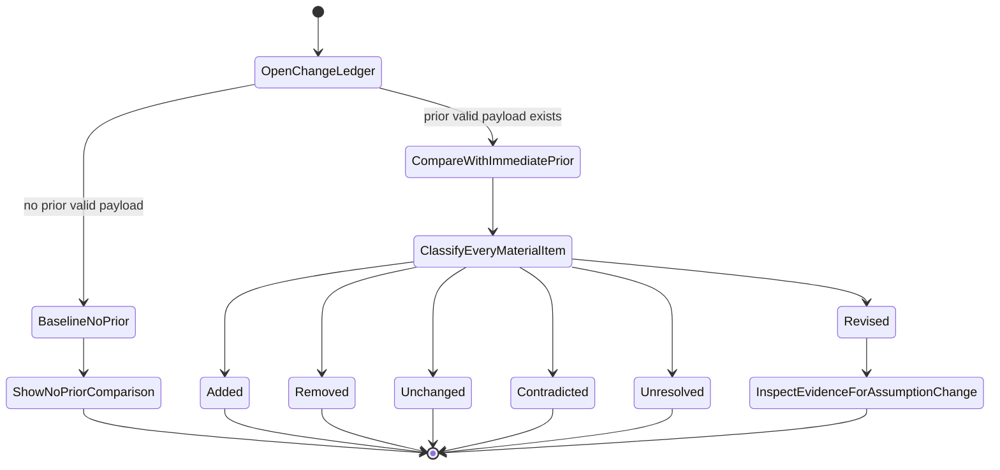
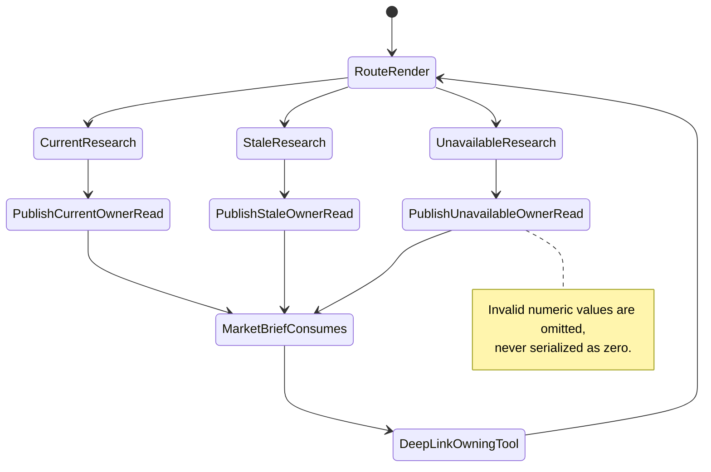

# Feature: 005 Palm Springs Rental Market Lab

## Problem Statement

Research Lab has a mature pattern for agent-authored research and deterministic tools, but no place-based vacation-rental market capability. `market-brief.config.json`, `market-brief.payload.json`, `notes/market-brief.md`, and `.github/prompts/market-brief-update.prompt.md` already separate machine-constrained configuration, deterministic calculations, agent-written interpretation, prior-run change detection, and online research. `rldata.js::putToolRead` gives every registered tool a compact owner-read contract. None of the registered tools in `tools.json` combines local lodging performance, legal supply, travel access, hotel competition, events, seasonality, acquisition cost, and financing into one Palm Springs market thesis.

The July 14, 2026 research set also exposes why a static dashboard would be misleading. AirDNA reports trailing available-night occupancy across de-duplicated OTA listings; Key Data and managed-home reports can use paid occupancy from direct reservation systems; a Natural Retreats city sample is narrower than Greater Palm Springs; City vacation-rental certificates are legal-supply records rather than active OTA listings; and monthly, quarterly, trailing-twelve-month, and annual figures describe different periods. These observations cannot be averaged or compared without preserving geography, population, period, and metric definition.

The missing product is one decision-first research tool at `palm-springs-rental-market-lab.html`. An LLM research agent must be able to rewrite the current thesis, evidence, assumptions, projections, risks, and falsifiers after real online research. At the same time, a versioned configuration contract and immutable equations must reject malformed research, keep incompatible definitions visible, and make user-controlled market and acquisition shocks reproducible. The result is educational market research, not investment advice, a property appraisal, a booking forecast guarantee, or a substitute for legal, tax, insurance, lending, or property-level diligence.

## Outcome Contract

**Intent:** Give a research user one current, source-traceable Palm Springs vacation-rental market view and one transparent way to test how demand, legal or available supply, pricing, purchase cost, leverage, financing, and operating costs change the research conclusion.

**Success Signal:** On first load, the user sees the current agent-authored thesis, market phase, direction, confidence, strongest evidence, and explicit conditions that would change the view. The user can change the forecast year, scenario, market shocks, purchase assumptions, and financing assumptions and immediately see adjusted occupancy, ADR, RevPAR, gross revenue, gross yield, annual debt service, and pre-tax cash flow without any research fetch. Power view explains every claim, conflict, change, projection, legal fact, event, assumption, and source.

**Hard Constraints:**

- Configuration is the sole authority for schema versions, staleness, allowed source categories and quality levels, scenario names, metric definitions, model versions, and all input bounds. A consumer cannot invent an omitted value.
- The agent-authored payload is the sole authority for the current thesis, phase, direction, confidence, evidence claims, contradictions, changes, catalysts, risks, falsifiers, unknowns, historical and projected series, scenario assumptions, acquisition baseline, events, legal facts, and source ledger.
- Every material claim references valid source IDs. Observations, forecasts, and inferences remain visibly distinct in data and presentation.
- A projection includes its method, method version, assumptions, and falsifiers. The research agent may revise assumptions when evidence warrants, but it cannot revise the deterministic equations.
- Occupancy, ADR, RevPAR, mortgage debt service, gross yield, and pre-tax cash flow use the deterministic equations in this specification and reject non-finite or invalid inputs.
- Incompatible metric definitions, populations, geographies, or periods remain separate. They cannot be silently averaged, reconciled, or used as direct year-over-year comparisons.
- Missing or invalid configuration makes the tool unavailable. A missing or invalid payload makes research and model outputs unavailable. A valid stale payload may remain visible only with an explicit stale state and age.
- The manual research refresh performs actual online research across all required categories, prefers current primary pages over snippets, compares against the prior payload, and never fabricates a fetch, source, value, change, or conclusion.
- A refresh never commits automatically.
- Simple and Power use one research payload and one deterministic result set, so switching modes cannot change the thesis or calculations.
- The product is educational research. It provides no personalized recommendation, transaction instruction, appraisal, legal determination, tax conclusion, or guaranteed return.

**Failure Condition:** The feature fails even if it renders cleanly when a stale payload looks current, a user-supplied shock triggers a fetch, paid occupancy is compared directly with available-night occupancy, a projection appears observed, a material claim has no valid source, a prior-refresh change is invented, a missing input becomes zero, financing math breaks at a zero rate, or the agent can change the equations through payload text.

## Goals

- Register one self-contained Palm Springs Rental Market Lab using the established Research Lab shared shell, Simple/Power model, contextual tooltips, and owner-read publication contract.
- Make the agent-authored thesis and its falsifiers the dominant Simple-view experience rather than presenting a dense metric dashboard first.
- Establish one source-aware local-market research capability spanning lodging performance, legal supply, travel access, financing, hotel competition, events, weather, and seasonality.
- Preserve incompatible definitions and contradictions as decision evidence instead of forcing false agreement.
- Support transparent monthly 2025 actuals, remaining-2026 projections, and 2027 scenarios with observed, forecast, and inference labels.
- Let users steer market and acquisition assumptions locally and see deterministic, finite, null-safe results immediately.
- Make every refresh auditable against its predecessor through additions, removals, revisions, unchanged claims, and explicitly unresolved unknowns.
- Publish one compact `RLDATA` tool read so Market Brief can cover the new tool without duplicating its research or equations.

## Non-Goals

- Scraping or continuously refreshing commercial vacation-rental datasets in the browser.
- Dynamic pricing, listing optimization, channel management, booking operations, or property-manager portfolio reporting.
- Property-level appraisal, comparable-property selection, title review, permit eligibility determination, neighborhood legal opinion, or code-compliance advice.
- Personalized investment advice, purchase recommendation, lender quote, tax projection, insurance quote, cost-segregation estimate, or transaction execution.
- Claiming causal impact from an event, hotel closure, airline seat change, weather condition, or legal-supply change without evidence that supports causality.
- Replacing source-specific occupancy, ADR, RevPAR, revenue, listing, certificate, or passenger definitions with one universal market number.
- Letting an agent, payload author, or user control alter the deterministic equations.

## Current Capability Map

| Capability | Current Repository Evidence | Status | Gap Owned By Feature 005 |
| --- | --- | --- | --- |
| Agent-authored research payload | `market-brief.payload.json` carries thesis, backdrop, evidence, events, actions, confidence, and falsifiers | Existing pattern | No Palm Springs lodging, legal-supply, or acquisition payload contract |
| Versioned configuration | `market-brief.config.json` and `causal-rotation.config.json` own versions, enums, source policies, freshness policies, and thresholds | Existing pattern | No rental-market metric definitions, scenario catalog, lever bounds, or stale threshold |
| Manual online-research refresh | `.github/prompts/market-brief-update.prompt.md` requires web research, source verification, prior-history comparison, and no fabricated recent fact | Existing pattern | No place-based six-category research mandate or source-definition reconciliation |
| Prior-run change memory | `brief-history.jsonl` and `notes/market-brief.md` require a stored prior before calling something a change | Existing pattern | No claim-level additions, removals, revisions, and assumption-change ledger for a local market |
| Deterministic model validation | `scripts/validate-brief-payload.mjs` and `scripts/validate-causal-rotation.mjs` validate checked-in contracts; `scripts/selftest.mjs` exercises pure model helpers | Existing pattern | No rental payload/config validation or acquisition-equation invariants |
| Shared owner read | `rldata.js::putToolRead` stores `{id, asOf, read, metrics, deepLink}` for Market Brief reuse | Complete generic foundation | No Palm Springs read, freshness state, thesis, or selected-scenario metrics |
| Simple/Power interaction | Research Lab policy and multiple registered tools require one compute feeding default Simple and detailed Power views | Complete product pattern | No rental-market decision hierarchy or local-market drilldown |
| Tool registration | `tools.json`, `index.html`, and `rlnav.js` are the synchronized registry and shell surfaces | Complete generic foundation | Feature 005 is not registered and has no route or methodology note |
| Vacation-rental market research | No Palm Springs, AirDNA, Key Data, GovOS, certificate, or lodging-market content exists in the repository | Missing | Entire capability |

## Honest Findings, Contradictions, And Limitations

1. **The supplied occupancy figures are not one metric.** AirDNA defines occupancy as booked nights divided by available nights across active OTA listings. Managed-home reports describe paid occupancy from a different population, while the Natural Retreats Key Data sample is a narrower city cohort. They are related evidence, not interchangeable observations.
2. **The supplied geographies differ.** Palm Springs city, Greater Palm Springs, a managed-home cohort, a city certificate population, and an OTA listing market do not share one boundary. Every claim needs an explicit geography and population.
3. **Legal supply is not OTA supply.** Vacation-rental certificates, waitlists, neighborhood caps, and contract limits describe legal capacity and operating constraints. Active listings describe observed marketplace presence. A decline in one does not prove the same decline in the other.
4. **AirDNA annual revenue is gross, trailing, and pre-expense.** Its public Palm Springs page defines annual revenue as trailing-twelve-month earnings for a typical active listing before host expenses and includes booked nightly rates plus cleaning and other guest fees. Comparing that value with a home price produces only a gross screening yield.
5. **The Redfin median is not a representative rental acquisition.** The May 2026 all-home median covers a broad housing population and does not establish property condition, bedroom count, neighborhood permit status, furnishing cost, or achievable STR revenue.
6. **Mortgage survey rates are not property-specific financing.** Freddie Mac's weekly national average is a sourced macro input, not a quote for an investor loan, DSCR product, second home, points, fees, taxes, or insurance.
7. **Air access is an indirect demand signal.** Passenger counts and scheduled seats can support or contradict a travel thesis, but they do not directly measure Palm Springs STR stays, length of stay, drive demand, international mix, or conversion into paid nights.
8. **Hotel supply changes are not automatically STR demand changes.** The Riviera closure and reopening can be a catalyst hypothesis, but the payload must label any displacement effect as inference unless sourced performance evidence establishes it.
9. **Event and weather effects require dated evidence.** Festival calendars, heat, storms, Tram closures, and other disruptions can change demand and access. A prior research note is not enough to carry the impact into a new refresh without current dates and sources.
10. **The initial forecast ranges are model projections, not observations.** They can seed acceptance and regression examples only after the first research payload records method, version, assumptions, source support, and falsifiers.
11. **A single operating-expense ratio is deliberately simplified.** It can include management, utilities, cleaning burden, maintenance, platform costs, and reserves only as one disclosed assumption. Property tax, insurance, HOA, furnishing, renovation, closing cost, depreciation, income tax, appreciation, and sale proceeds remain excluded unless a later governing specification changes the model.
12. **Gross yield can look acceptable while leveraged cash flow is negative.** The tool must show both and must not soften a negative pre-tax cash-flow result into an attractive investment label.
13. **Commercial source rights and access differ.** A publicly visible market summary can be cited, but paid dashboards, direct PMS data, proprietary forecasts, and downloadable reports may restrict persistence or redistribution. The source ledger must carry access and use limitations.
14. **Several user-supplied legal, hotel, event, and managed-home facts lack exact source URLs in this analyst input.** They remain acceptance context only. The first refresh must locate current source records or publish them as unresolved, never silently promote them to observed truth.

## Domain Capability Model

### Capability

**Place-Based Rental Market Research And Scenario Analysis** combines source-qualified lodging, legal-supply, access, macro, hotel, event, weather, and seasonality evidence into one agent-authored market thesis, then applies immutable equations to explicit market and acquisition assumptions without changing the observed research record.

### Domain Primitives

| Primitive | Purpose | Lifecycle |
| --- | --- | --- |
| ResearchConfig | Defines schema/version compatibility, staleness, source taxonomy, metric definitions, scenario names, model versions, required categories, and all lever bounds | missing or invalid -> unavailable; valid -> current -> superseded by a newer compatible version |
| SourceRecord | Identifies one primary or secondary source, URL, publisher, title, retrieval time, observation period, geography, quality, access/rights, and limitations | proposed -> retrieved -> eligible, stale, inaccessible, or rejected -> superseded |
| MetricDefinition | Defines numerator, denominator, population, geography, period, unit, and source convention for one metric | configured -> active -> revised with a new config version |
| MetricObservation | Carries one observed value or range with MetricDefinition, source IDs, as-of, retrieval time, and quality | unavailable -> observed-current or observed-stale -> revised or superseded |
| EvidenceClaim | One material statement classified as observed, forecast, or inference and linked to one or more SourceRecords | drafted -> validated -> current, contradicted, stale, retracted, or superseded |
| DefinitionConflict | Records why two similarly named metrics cannot be directly compared or combined | opened -> retained until definitions become compatible -> resolved or superseded |
| MarketThesis | Agent-authored synthesis containing phase, direction, confidence, strongest evidence, contradictions, unknowns, and what would change the view | unavailable -> current -> stale -> superseded by a researched refresh |
| ForecastMethod | Versioned explanation of how projections were formed, what assumptions they use, and what falsifies them | configured -> used by a payload -> revised under a new method version |
| ForecastSeries | Monthly or annual observed and projected occupancy, ADR, RevPAR, or revenue records | incomplete -> validated -> current or stale -> superseded |
| ScenarioDefinition | Named year-specific base occupancy, ADR, available nights, demand/supply assumptions, and narrative constraints authored by the agent within config bounds | proposed -> validated -> selectable -> superseded |
| AcquisitionBaseline | Agent-authored purchase price, down-payment or leverage, loan term, mortgage rate, operating-expense ratio, and available-night assumptions | proposed -> validated -> current or stale -> superseded |
| UserAssumptionSet | User-selected year, scenario, shocks, purchase terms, financing, and operating ratio | initialized from explicit payload/config values -> edited -> reset |
| DeterministicResult | Adjusted occupancy, ADR, RevPAR, gross revenue, gross yield, debt service, and pre-tax cash flow produced by immutable formulas | unavailable for invalid input -> calculated -> superseded on any assumption change |
| ChangeRecord | Claim-, fact-, source-, forecast-, and assumption-level comparison with the immediately prior valid payload | baseline-no-prior -> added, removed, revised, unchanged, or unresolved -> superseded |
| LegalSupplyFact | Sourced certificate, cap, waitlist, contract, enforcement, or eligibility fact with jurisdiction and effective date | proposed -> current, scheduled, stale, disputed, or superseded |
| MarketDriver | Sourced catalyst, risk, event, hotel change, access change, or weather/seasonality condition | proposed -> upcoming, active, passed, stale, or superseded |
| ToolDecisionRead | One compact owner read derived from the current thesis and selected deterministic result | unavailable -> current or stale -> superseded |

### Relationships

- ResearchConfig validates every ResearchPayload concept and supplies no market conclusion itself.
- A MarketThesis references EvidenceClaims; every material EvidenceClaim references one or more valid SourceRecords.
- A MetricObservation has exactly one MetricDefinition. Two observations with incompatible definitions create a DefinitionConflict rather than a combined series.
- A ForecastSeries references a ForecastMethod and distinguishes observed rows from projected rows.
- A ScenarioDefinition and AcquisitionBaseline initialize a UserAssumptionSet but remain unchanged when the user edits local controls.
- One UserAssumptionSet produces one DeterministicResult. The result never writes back into observed metrics, the agent thesis, or the payload.
- A ChangeRecord compares the new payload with the immediately prior valid payload and cannot be inferred from publication timestamps alone.
- LegalSupplyFacts and MarketDrivers may support or contradict the thesis, but they do not become numeric demand or supply deltas unless the agent explicitly labels and supports that inference.
- One MarketThesis and one DeterministicResult feed Simple, Power, and ToolDecisionRead.

### Business Policies

1. **Config-authority policy:** Required enums, schema versions, freshness windows, source categories, quality levels, definitions, scenario names, formula version, and lever bounds exist only in ResearchConfig. Missing or incompatible config is a blocking unavailable state.
2. **Payload-authority policy:** The agent payload owns all current research content and assumptions. No consumer may embed substitute market facts, forecasts, scenarios, or acquisition values.
3. **Research-category policy:** Every refresh investigates current performance, legal supply/regulation, travel/air access, macro/financing, hotel competition/events, and weather/seasonality. Each category ends with eligible evidence or an explicit unresolved outcome.
4. **Primary-source policy:** Current official, issuer, operator, airport, tourism, lender, and property-market pages take priority over snippets, copied summaries, and undated commentary.
5. **Claim-trace policy:** Every material claim cites valid source IDs whose geography, observation period, retrieval time, quality, and limitations support the claim.
6. **Classification policy:** Observed, forecast, and inference are closed, visible classifications. A claim cannot occupy more than one classification at once.
7. **Definition policy:** Occupancy, ADR, RevPAR, revenue, supply, passenger, and yield records carry source-specific definitions. Incompatibility is displayed, not normalized away.
8. **Forecast policy:** Every projection includes a method/version, assumptions, horizon, source support, confidence, and falsifiers. Agent revisions require evidence and appear in ChangeRecords.
9. **Previous-refresh policy:** A change claim requires a prior valid payload. With no prior payload, the refresh is labeled baseline and reports no invented deltas.
10. **No-fabrication policy:** Failed retrieval, inaccessible content, uncertain interpretation, or absent prior evidence becomes unavailable or unknown. The agent cannot reconstruct a missing number from narrative convenience.
11. **Formula-immutability policy:** The payload can revise model inputs and assumptions only. Deterministic formulas and their version remain governed by ResearchConfig and this specification.
12. **Finite-input policy:** Invalid, null, infinite, negative-where-forbidden, or out-of-bound values produce an explicit unavailable result. They never become zero or another substitute.
13. **Legal-supply policy:** Certificates, caps, waitlists, contracts, and active listings remain distinct. A numeric supply shock is an explicit scenario assumption, not a direct synonym for any one legal count.
14. **One-model policy:** Simple, Power, and ToolDecisionRead use the same current payload, user assumptions, and deterministic result.
15. **No-commit policy:** The research refresh writes only its owned research outputs for review and never performs an automatic commit.

## Actors And Personas

| Actor | Description | Key Goals | Permission Boundary |
| --- | --- | --- | --- |
| Market Research Reader | Wants a concise, current view of Palm Springs vacation-rental direction | Understand the thesis, strongest evidence, confidence, and what would change it | Consumes educational research; receives no personalized purchase instruction |
| Vacation-Rental Operator | Understands occupancy, ADR, RevPAR, seasonality, events, and competitive supply | Stress demand, available supply, and pricing assumptions | May explore market scenarios; does not receive dynamic pricing or listing-management actions |
| Prospective Buyer / Underwriter | Tests whether broad market economics can support a hypothetical acquisition | Adjust purchase price, down payment/leverage, rate, and operating costs | Receives simplified screening economics, not appraisal, financing, legal, tax, or insurance advice |
| LLM Research Agent | Performs the manual refresh and authors the current research payload | Reconcile definitions, update evidence and assumptions, compare with the prior payload, and expose uncertainty | May change payload facts and assumptions within config; cannot change config, formulas, or commit automatically |
| Source And Method Auditor | Challenges source quality, claim support, metric compatibility, and projection method | Trace every claim and understand every disagreement | Can inspect full provenance; cannot silently reclassify or merge evidence |
| Data-Constrained / Accessible User | Uses the public static tool on mobile, keyboard, screen reader, or with stale/missing files | Receive a truthful usable state without overlap, hidden meaning, or fabricated substitutes | May use a valid stale read with warnings; invalid inputs produce no result |
| Market Brief Consumer | Reuses a concise owner-authored Palm Springs read | Include the tool without duplicating its research or math | Consumes the published ToolDecisionRead; cannot fill missing evidence or rewrite the thesis |

## Use Cases

### UC-001: Refresh the market research

- **Actor:** LLM Research Agent
- **Preconditions:** Valid ResearchConfig exists; the current payload may exist or be absent.
- **Main Flow:**
  1. The agent reads config, the current payload, and the immediately prior valid payload when present.
  2. It performs actual online research across all six required categories.
  3. It reconciles source definitions, geographies, periods, quality, contradictions, and access limitations.
  4. It authors a complete payload in which every material claim references valid source IDs.
  5. It validates schema, bounds, classifications, citations, projections, and change accounting.
  6. It leaves the changed research outputs uncommitted for review.
- **Alternative Flows:** A missing category becomes an explicit unknown with attempted-source evidence. Invalid output is rejected and does not replace the last valid payload.
- **Postconditions:** A valid researched payload is available with an auditable comparison to its predecessor.

### UC-002: Read the current thesis in Simple view

- **Actor:** Market Research Reader
- **Preconditions:** Config and payload are valid; the payload may be current or stale.
- **Main Flow:**
  1. The user opens the tool and lands in Simple.
  2. The tool leads with thesis, market phase, direction, confidence, strongest evidence, and what would change the view.
  3. The tool distinguishes the research state from the user-selected scenario result.
  4. The user can inspect source links or move to Power without changing the conclusion.
- **Alternative Flows:** A stale payload remains visible as stale with age. A missing or invalid payload produces an unavailable research state and no model output.
- **Postconditions:** The user can state the current view, why it exists, and what falsifies it.

### UC-003: Stress market assumptions without refetching

- **Actor:** Vacation-Rental Operator
- **Preconditions:** A valid selected year/scenario supplies finite base occupancy and ADR.
- **Main Flow:**
  1. The user selects forecast year and scenario.
  2. The user adjusts demand, available/legal supply, and ADR shocks.
  3. Adjusted occupancy, ADR, RevPAR, gross revenue, and gross yield update immediately.
  4. The agent-authored thesis and observed evidence remain unchanged.
- **Alternative Flows:** Out-of-bound or invalid input makes the affected result unavailable and explains the violated bound.
- **Postconditions:** The user can explain the deterministic effect of each shock without confusing it with a new forecast.

### UC-004: Reconcile incompatible evidence

- **Actor:** Source And Method Auditor
- **Preconditions:** At least two similarly named metrics use different definitions, populations, geographies, or periods.
- **Main Flow:**
  1. The user opens Power evidence hierarchy and metric definitions.
  2. The tool shows each observation with its definition and provenance.
  3. It displays the incompatibility and its consequence for comparison.
  4. The thesis names whether the evidence confirms, contradicts, or remains incomparable.
- **Alternative Flows:** If source methodology is missing, the observation remains unresolved and cannot support a direct comparison.
- **Postconditions:** The user understands why the values differ and no false aggregate is created.

### UC-005: Test simplified buyer economics

- **Actor:** Prospective Buyer / Underwriter
- **Preconditions:** A valid scenario, acquisition baseline, and config bounds exist.
- **Main Flow:**
  1. The user changes purchase price, leverage/down payment, mortgage rate, and operating-expense ratio.
  2. The tool calculates loan principal and annual amortizing debt service.
  3. It displays gross revenue, gross yield, operating expense, and pre-tax cash flow.
  4. It displays excluded costs and labels the result a simplified screening model.
- **Alternative Flows:** A zero mortgage rate uses straight-line principal amortization. Invalid term, price, leverage, or expense inputs produce no financial result.
- **Postconditions:** The user can see whether broad scenario economics cover simplified operating costs and debt service without receiving an investment recommendation.

### UC-006: Audit source and refresh changes

- **Actor:** Source And Method Auditor
- **Preconditions:** A current payload and at least one valid source exist; a prior valid payload may exist.
- **Main Flow:**
  1. The user inspects the full source ledger and follows claim-to-source links.
  2. The user opens changes since prior refresh.
  3. Added, removed, revised, unchanged, contradicted, and unresolved items remain distinct.
  4. Assumption changes state what evidence warranted them.
- **Alternative Flows:** With no prior payload, the change view says baseline with no prior comparison.
- **Postconditions:** The user can reproduce why the thesis or assumptions changed.

### UC-007: Use the tool with missing, stale, or invalid research

- **Actor:** Data-Constrained / Accessible User
- **Preconditions:** Config or payload is missing, stale, malformed, or schema-incompatible.
- **Main Flow:**
  1. The tool validates config before payload and payload before rendering conclusions.
  2. It shows unavailable or stale with the exact reason and age.
  3. It never loads embedded market values or a silent substitute.
  4. The state and all available source details remain keyboard and screen-reader accessible.
- **Alternative Flows:** A valid stale payload may render with stale labels; an invalid payload cannot produce research or model outputs.
- **Postconditions:** The user knows whether the read is usable and why.

### UC-008: Publish and consume one owner read

- **Actor:** Market Brief Consumer
- **Preconditions:** The tool has rendered a current, stale, or unavailable state.
- **Main Flow:**
  1. The tool publishes one line that names the thesis state, direction, confidence, selected scenario, and material caveat.
  2. Structured metrics include freshness, phase, direction, confidence, selected year/scenario, and deterministic outputs only when valid.
  3. Market Brief consumes the read and deep-links the owning tool.
- **Alternative Flows:** An unavailable state publishes unavailable and omits invalid numeric metrics.
- **Postconditions:** Market Brief covers Palm Springs without recreating research or formulas.

## Business Scenarios

### BS-001: Agent refresh performs sourced online research

Given valid configuration and a manual refresh request
When the research agent updates the Palm Springs payload
Then it must inspect current online sources in every required research category
And every material claim must cite eligible source IDs
And the payload must pass schema and citation validation before replacing the current payload

### BS-002: Missing configuration blocks the product

Given the required configuration is missing or unreadable
When the user opens the tool
Then the tool must show configuration unavailable with the exact reason
And no embedded scenario, metric definition, lever bound, research claim, or acquisition value may be substituted

### BS-003: A valid stale payload remains visibly stale

Given a valid payload is older than the configured stale threshold
When the user opens Simple or Power
Then every thesis and model surface must show stale status and age
And the payload must not be described as current or live

### BS-004: An invalid payload produces no conclusion

Given a payload has an incompatible schema, invalid source reference, missing required category, or out-of-bound assumption
When validation runs
Then the payload must be rejected with specific errors
And no thesis, projection, tool read, or buyer-economics result may be produced from it

### BS-005: User shock levers recompute without research fetch

Given a valid payload and selected forecast scenario are loaded
When the user changes forecast year, scenario, demand shock, supply change, or ADR shock
Then adjusted occupancy, ADR, RevPAR, gross revenue, and gross yield must update immediately
And no online research or market-data request may occur
And observed evidence and the agent thesis must remain unchanged

### BS-006: Demand and supply shocks obey the bounded occupancy equation

Given finite base occupancy and configured demand and supply deltas
When adjusted occupancy is calculated
Then it must equal the clamped base occupancy multiplied by one plus demand delta and divided by one plus supply delta
And the result must stay between zero and one
And an invalid denominator must produce unavailable rather than a numeric result

### BS-007: Incompatible metric definitions remain separate

Given one source reports paid occupancy for managed homes and another reports booked available-night occupancy for OTA listings
When the evidence is compared
Then both values and definitions must remain visible
And the tool must label direct comparison or aggregation incompatible
And neither value may be converted into the other's definition without source-supported methodology

### BS-008: Buyer economics use standard amortizing debt service

Given a positive purchase price, valid down payment, finite mortgage rate, and positive loan term
When the user changes purchase or financing assumptions
Then annual debt service must use the standard amortizing payment equation
And gross yield and pre-tax cash flow must update from the same deterministic result

### BS-009: Zero-rate financing remains finite

Given a positive loan principal, a zero annual mortgage rate, and a positive loan term
When annual debt service is calculated
Then monthly principal must equal loan principal divided by the number of monthly payments
And the result must remain finite

### BS-010: Negative cash flow remains explicit

Given gross revenue is less than operating expense plus annual debt service
When buyer economics are displayed
Then pre-tax cash flow must be negative
And the tool must not relabel the result attractive, viable, or positive from gross yield alone

### BS-011: Mobile and desktop share one Simple and Power decision

Given one valid payload and one user assumption set
When the user switches Simple and Power on mobile or desktop
Then thesis, phase, direction, confidence, scenario outputs, and stale state must remain identical
And Power may add detail without changing the conclusion
And all content must remain readable and operable without overlap or pointer-only interaction

### BS-012: Every material claim is source traceable

Given a thesis, legal fact, catalyst, risk, contradiction, projection rationale, or change claim is displayed
When the user inspects its provenance
Then at least one valid supporting source ID must resolve to a complete source-ledger record
And unsupported or mismatched citations must fail payload validation

### BS-013: Previous-refresh changes require a prior payload

Given a valid prior payload exists
When a new researched payload is authored
Then each material claim, source, legal fact, forecast assumption, and thesis element must be classified as added, removed, revised, unchanged, contradicted, or unresolved
And the reason for every material assumption revision must cite evidence

### BS-014: First refresh invents no change history

Given no prior valid payload exists
When the first payload is authored
Then the change section must state baseline with no prior comparison
And it must not claim improvement, deterioration, acceleration, or reversal relative to an absent predecessor

### BS-015: Failed research never becomes fabricated data

Given a required page cannot be reached, a report is access-gated, or a value cannot be verified
When the agent completes the refresh attempt
Then the category must contain an explicit unavailable or unknown result with attempted-source context
And no number, quote, source ID, or inference may be invented to fill the gap

### BS-016: Observed, forecast, and inference remain distinct

Given one table contains finalized historical values, remaining-year projections, and an inferred hotel-displacement hypothesis
When the user inspects the table or thesis
Then every row and claim must carry exactly one classification
And presentation, tooltips, and source lineage must make those classifications distinguishable without color alone

### BS-017: Legal supply does not silently become active supply

Given current certificate counts, neighborhood caps, a waitlist, and OTA active-listing counts are available
When the tool evaluates supply
Then legal capacity, eligible supply, and observed active listings must remain separate
And any scenario supply delta must be labeled an agent or user assumption rather than a direct certificate conversion

### BS-018: Owner read preserves unavailable and stale states

Given the tool renders a current, stale, or unavailable research state
When it publishes its one-line owner read
Then the read must preserve that state, thesis direction, confidence, selected scenario, and material caveat
And invalid numeric values must be omitted rather than serialized as zero

## Requirements

### Product And Research Contract

- **FR-001:** The feature must deliver one self-contained tool at `palm-springs-rental-market-lab.html` with Simple and Power modes over one shared research and calculation state.
- **FR-002:** Simple must be the initial mode and must be dominated by the current agent-authored thesis, market phase, direction, confidence, strongest evidence, and what would change the view.
- **FR-003:** Power must expose the full evidence and model anatomy without changing Simple's conclusion.
- **FR-004:** The tool must load and validate required configuration before loading or interpreting the research payload.
- **FR-005:** ResearchConfig must own schema/version compatibility, payload stale threshold, allowed source categories, source quality levels, required research categories, metric definitions, scenario names, model/formula version, lever bounds, and valid controlled vocabularies.
- **FR-006:** No consumer may supply an omitted config value, scenario, bound, metric definition, or version.
- **FR-007:** The agent payload must own thesis, phase, direction, confidence, evidence claims, contradictions, changes, catalysts, risks, falsifiers, unknowns, actual and forecast series, scenarios, model assumptions, acquisition baseline, events, legal facts, and source ledger.
- **FR-008:** The payload must carry its schema version, config version, formula/method versions, researched-at time, overall as-of time, and stale-after time.
- **FR-009:** Missing or invalid config must make the entire tool unavailable with specific validation errors.
- **FR-010:** Missing or invalid payload must make research conclusions, projections, deterministic outputs, and the owner read unavailable.
- **FR-011:** A valid stale payload may remain visible only with persistent stale labeling, age, and the configured threshold it exceeded.
- **FR-012:** The manual refresh contract must perform actual online research on every invocation rather than only rewriting the prior narrative.
- **FR-013:** Every refresh must research current performance, legal supply/regulation, travel/air access, macro/financing, hotel competition/events, and weather/seasonality.
- **FR-014:** Each required research category must contain eligible evidence or an explicit unavailable/unknown record with attempted-source context.
- **FR-015:** Current primary pages and reports must take precedence over snippets, aggregations, copied summaries, and undated commentary.
- **FR-016:** The refresh must reconcile source methodology, geography, population, period, units, revisions, and access/rights before using a value.
- **FR-017:** The refresh must read the immediately prior valid payload and produce claim- and assumption-level change accounting.
- **FR-018:** The refresh must update assumptions only when evidence warrants the change and must cite that evidence.
- **FR-019:** The refresh must not commit automatically or claim that validation, publication, or deployment occurred when it did not.

### Evidence, Definitions, And Forecast Integrity

- **FR-020:** Every SourceRecord must include stable source ID, publisher, title, URL, source category, quality level, retrieval time, observation period, geography, population, access/rights state, and limitations.
- **FR-021:** Every material EvidenceClaim must cite at least one valid SourceRecord whose scope supports the claim.
- **FR-022:** Material claims include the thesis, phase, direction, strongest evidence, contradiction, change, catalyst, risk, falsifier, unknown, legal fact, event impact, forecast rationale, and assumption revision.
- **FR-023:** Every claim and data row must be classified exactly once as observed, forecast, or inference.
- **FR-024:** A forecast claim must include ForecastMethod ID, method version, horizon, assumptions, source support, confidence, and falsifiers.
- **FR-025:** An inference must identify the observations it interprets and must not be displayed as a measured fact.
- **FR-026:** Occupancy definitions must identify booked or paid nights, denominator nights, treatment of blocked nights, listing/property population, geography, and period.
- **FR-027:** ADR definitions must identify included charges, booked-night population, geography, and period.
- **FR-028:** RevPAR definitions must identify whether they are source-reported or deterministically calculated and which occupancy/ADR definitions they use.
- **FR-029:** Revenue definitions must identify gross/net posture, included fees, period, property population, and whether the value is typical, mean, median, or aggregate.
- **FR-030:** Supply definitions must distinguish active listings, available listings, legal certificates, eligible properties, waitlist entries, rooms, and contracted unit limits.
- **FR-031:** Incompatible definitions, geographies, populations, periods, or units must create a visible DefinitionConflict and cannot be silently aggregated or directly compared.
- **FR-032:** Contradictions must name the conflicting claims, their source IDs, the definition/timing reason where known, and the consequence for confidence.
- **FR-033:** The payload must include monthly 2025 actuals where sourced, available 2026 actuals, remaining-2026 projections, annual 2026 synthesis, and named 2027 scenarios.
- **FR-034:** Missing months must remain unavailable; adjacent periods cannot be interpolated into observed history.
- **FR-035:** Actual and projected rows must remain visibly distinct in tables, charts, summaries, accessible text, and exports.

### Scenario Levers And Deterministic Market Equations

- **FR-036:** Users must be able to change forecast year, named scenario, demand shock, available/legal supply change, and ADR shock.
- **FR-037:** Scenario names and eligible forecast years must come from valid config and payload records; the initial selection must be explicitly declared.
- **FR-038:** Base occupancy, base ADR, available nights, and scenario assumptions must come from the selected agent-authored scenario and cannot be embedded by the consumer.
- **FR-039:** Demand delta, supply delta, and ADR shock must be finite decimal values within config bounds.
- **FR-040:** Config bounds must make `1 + supply delta` strictly positive and must prevent a negative adjusted ADR.
- **FR-041:** Adjusted occupancy must equal `clamp(base occupancy * (1 + demand delta) / (1 + supply delta), 0, 1)`.
- **FR-042:** Adjusted ADR must equal `base ADR * (1 + ADR shock)`.
- **FR-043:** Adjusted RevPAR must equal adjusted occupancy as a decimal multiplied by adjusted ADR.
- **FR-044:** Adjusted gross revenue must equal adjusted RevPAR multiplied by the scenario's valid available-night count.
- **FR-045:** Adjusted gross yield must equal adjusted gross revenue divided by purchase price.
- **FR-046:** Changing any market lever must recompute adjusted occupancy, ADR, RevPAR, gross revenue, gross yield, and dependent acquisition results immediately without an online request.
- **FR-047:** Market-lever edits must not alter observed evidence, agent-authored forecasts, thesis, phase, direction, confidence, or source records.
- **FR-048:** Results must preserve full calculation precision internally and display units and rounding rules declared by config.
- **FR-049:** Any invalid, null, non-finite, or out-of-bound market input must make the affected deterministic result unavailable with a specific reason.
- **FR-050:** The research agent may revise base scenario inputs and model assumptions in a new payload but cannot revise FR-041 through FR-045 or the financing equations below.

### Acquisition Economics

- **FR-051:** Users must be able to change purchase price, leverage/down payment, annual mortgage rate, and operating-expense ratio.
- **FR-052:** Leverage and down payment must be one linked assumption pair whose percentages sum to 100%; changing one must update the other.
- **FR-053:** Loan principal must equal purchase price minus down payment and must never be negative.
- **FR-054:** Loan term must be an explicit positive agent-authored acquisition assumption within config bounds.
- **FR-055:** For a positive monthly rate, monthly debt service must equal `principal * rate * (1 + rate)^payments / ((1 + rate)^payments - 1)`, where rate is annual mortgage rate divided by 12 and payments is loan term in years multiplied by 12.
- **FR-056:** For a zero monthly rate, monthly debt service must equal principal divided by payments.
- **FR-057:** Annual debt service must equal monthly debt service multiplied by 12.
- **FR-058:** Operating expense must equal adjusted gross revenue multiplied by operating-expense ratio.
- **FR-059:** Pre-tax cash flow must equal adjusted gross revenue minus operating expense minus annual debt service.
- **FR-060:** Buyer economics must display adjusted occupancy, ADR, RevPAR, gross revenue, gross yield, loan principal, annual debt service, operating expense, and pre-tax cash flow together.
- **FR-061:** Negative gross revenue, non-positive purchase price, invalid leverage, invalid term, invalid rate, or invalid operating-expense ratio must produce an explicit unavailable result rather than a substituted value.
- **FR-062:** The acquisition surface must state that property tax, insurance, HOA, furnishing, renovation, closing cost, depreciation, income tax, appreciation, sale proceeds, and property-specific permit eligibility are excluded from the simplified model unless represented inside the disclosed operating-expense assumption.
- **FR-063:** Gross yield must be labeled pre-expense and pre-financing; pre-tax cash flow must be labeled a simplified model output rather than a return guarantee.
- **FR-064:** A negative pre-tax cash flow must remain visibly negative and must not be overridden by thesis confidence or gross yield.

### Simple And Power User Experience

- **FR-065:** Simple must show the current thesis before the scenario controls and results.
- **FR-066:** Simple must show phase, direction, confidence, strongest supporting evidence, strongest contradiction or unknown, and what would change the view.
- **FR-067:** Simple must expose all required market and acquisition controls without requiring Power.
- **FR-068:** Simple must show adjusted occupancy, ADR, RevPAR, gross revenue, gross yield, annual debt service, and pre-tax cash flow with observed/forecast/inference context.
- **FR-069:** Power must expose evidence hierarchy, incompatible metric definitions, contradictions, and confidence consequences.
- **FR-070:** Power must expose changes since prior refresh, including added, removed, revised, unchanged, contradicted, and unresolved records.
- **FR-071:** Power must expose catalysts, risks, falsifiers, unknowns, monthly 2025 actuals, remaining-2026 projections, annual 2026 synthesis, and 2027 scenarios.
- **FR-072:** Power must expose events, permits/legal supply, hotel competition, travel/air access, macro/financing, weather/seasonality, and acquisition economics.
- **FR-073:** Power must expose the full source ledger and bidirectional claim-to-source traceability.
- **FR-074:** Simple and Power must use one MarketThesis, UserAssumptionSet, and DeterministicResult.
- **FR-075:** Switching modes must preserve selected year, scenario, every lever, scroll/focus context where practical, and current stale/unavailable state; it must not fetch research.
- **FR-076:** The tool must remain readable without body-level horizontal scrolling on mobile and without overlapping controls, values, labels, or panels on mobile and desktop.
- **FR-077:** Every control must be keyboard operable with a persistent label, unit, valid range, current value, and adjacent validation message.
- **FR-078:** Every term, section, KPI, badge, dynamic value, chart, axis, metric definition, classification, and unavailable/stale state must provide both meaning and current-context interpretation through focus-accessible text or contextual tooltips.
- **FR-079:** Direction, confidence, classification, contradiction, stale state, and positive/negative economics must not rely on color alone.
- **FR-080:** Charts must have accessible names, fallback summaries or tables, and pointer/focus detail that does not become the only way to read the data.

### Registration, Publication, Safety, And Truth

- **FR-081:** The tool identity, title, route, methodology note, data-contract references, and order must be synchronized across the Research Lab registry, landing page, and shared navigation shell when implemented.
- **FR-082:** Every render must publish one `RLDATA` owner read containing a one-line read, as-of, freshness, structured metrics, and deep link.
- **FR-083:** The one-line read must include thesis direction, confidence, selected forecast year/scenario, and the most material caveat; current deterministic outputs may appear only when valid.
- **FR-084:** Stale and unavailable owner reads must remain stale or unavailable in Market Brief and cannot be elevated into a current claim.
- **FR-085:** Market Brief must consume the owning read and deep-link Feature 005 rather than reimplement the research or calculations.
- **FR-086:** The tool must state prominently that it is educational market research and not investment advice.
- **FR-087:** The tool must not request or retain holdings, account value, income, tax status, credit score, broker/lender credentials, property address, intended offer, or private financial data.
- **FR-088:** No refresh, validation, render, user edit, or publication path may fabricate a source, metric, successful fetch, prior change, projection, legal conclusion, or financial result.

## Initial Research Acceptance Context

The values below are user-supplied July 14, 2026 acceptance context for the first researched payload and regression contracts. They are not embedded live data, not a substitute for online research, and not automatically valid observations. The first agent refresh must assign valid source IDs, verify current pages and definitions, preserve incompatible populations, and revise or mark unresolved any item that cannot be substantiated.

### Palm Springs City Sample And Managed-Home Context

| Evidence Set | Period | Occupancy | ADR | RevPAR | Required Classification / Caveat |
| --- | --- | ---: | ---: | ---: | --- |
| Natural Retreats Key Data, Palm Springs city sample | Sep 2025 finalized | 14.3% | $298 | $43 | Acceptance context; exact source report and paid/available definition required |
| Natural Retreats Key Data, Palm Springs city sample | Oct 2025 finalized | 25.2% | $326 | $82 | Acceptance context; exact source report required |
| Natural Retreats Key Data, Palm Springs city sample | Nov 2025 finalized | 34.8% | $420 | $146 | Acceptance context; exact source report required |
| Natural Retreats Key Data, Palm Springs city sample | Dec 2025 finalized | 33.5% | $447 | $149 | Acceptance context; exact source report required |
| Natural Retreats Key Data, Palm Springs city sample | 2025 annual | 37.0% | $387 | $143 | Acceptance context; annual population/weighting required |
| Natural Retreats Key Data, Palm Springs city sample | Q1 2026 | 56.8% | $375 | $213 | Acceptance context; comparison period must be identified |
| Natural Retreats Key Data, supplied comparison | Q1 comparison | 61.4% | $366 | $225 | Acceptance context; exact comparison period must be sourced |
| Greater Palm Springs managed homes | Apr 2026 | paid occupancy 36.4% vs 36.2% | $806 vs $654 | Not supplied | Different geography/population; comparison period must be sourced |
| Greater Palm Springs managed homes | May 2026 | paid occupancy 34.5% vs 39.3% | $420 vs $384 | Not supplied | Different geography/population; comparison period must be sourced |

### Trailing OTA Context

The public AirDNA Palm Springs page retrieved during this analyst run states that it was updated July 5, 2026 and defines its metrics as trailing-twelve-month OTA market measures.

| Metric | Supplied / Public Context | YoY Context | Definition Boundary |
| --- | ---: | ---: | --- |
| Active listings | 5,949 | -7.8% | De-duplicated Airbnb, Vrbo, and Booking.com active listings over trailing 12 months |
| Annual revenue | $38.4K | -21.1% | Typical active listing, pre-expense, includes booked rates plus cleaning and other guest fees |
| Occupancy | 50% | -6.5% | Booked share of available nights over trailing 12 months |
| ADR | $476 | -2.3% | Paid nightly price across booked nights over trailing 12 months |
| RevPAR | $215 | -12.2% | Occupancy multiplied by ADR under AirDNA's definitions |

### Legal Supply And Operating Constraints

| Context Item | Supplied Value | Required Refresh Treatment |
| --- | --- | --- |
| City vacation-rental certificates | 2,876 in Jan 2025 to 2,780 in Dec 2025 | Verify certificate definition, effective dates, revisions, and exact City source |
| GovOS certificate count | 2,785 in Mar 2026 | Verify whether this is active, issued, eligible, or another status |
| Capped neighborhoods | 7 | Verify current neighborhood list and effective ordinance |
| Waitlist | 106 | Verify date, unit of count, movement rules, and source |
| Neighborhood cap | 20% | Verify denominator, exemptions, transfer rules, and effective ordinance |
| New contracts | 26 | Verify contract population and binding effect |
| Legacy contracts | 32 plus 4 in Q3 | Verify period, population, and legal effect; supplied research describes limits as largely nonbinding |

### Travel, Macro, Hotel, And Acquisition Context

| Category | Supplied Acceptance Context | Definition / Verification Requirement |
| --- | --- | --- |
| PSP passengers | Jan-Apr 2026 -2.9%; Apr -4.7%; Canada -11.4% | Verify against PSP monthly passenger reports and identify passenger denominator/comparison period |
| Scheduled PSP seats | May -4.2%; Jun +1.7%; Jul +8.3%; Aug +3.5% | Verify schedule source, publication date, domestic/international coverage, and whether capacity was realized |
| California visits | 2026 +1.5%; 2027 +2.5%; nominal spending grows faster | Verify source forecast, real/nominal definitions, and geography relevance |
| Desert hotels | 2027 demand +1.49% vs supply +1.17%; occupancy about 58.47%; ADR +1.2% | Verify hotel geography, room population, forecast method, and source |
| U.S. travel | Real travel spending +1% in 2026 and +3% in 2027; shorter/lower-cost drive trips | Verify current macro forecast and separate national context from Palm Springs evidence |
| Home purchase price | Redfin median $658,606 for May 2026 | Public all-home market median, not a rental comp or appraisal |
| Mortgage rate | Freddie Mac 30-year fixed 6.49% as of July 9, 2026 | National weekly average, not an investor-loan quote |
| Gross screening yield | AirDNA average revenue divided by Redfin median is about 5.8% before costs | Inference; must display numerator/denominator mismatch and all exclusions |
| Riviera hotel | 398-room closure June-Dec 2026; reopening Feb 2027 | Verify property status and dates; displacement to STR demand remains inference without evidence |
| Events, weather, and Tram closures | Prior research exists | Re-research exact current dates, operational effects, and sources on every relevant refresh |

### Initial Model Projection Context

All values in this subsection are supplied model projections, not observations. They are acceptable only when the payload records method/version, assumptions, confidence, source support, and falsifiers.

| Period | Projected Occupancy | Projected ADR | Classification |
| --- | ---: | ---: | --- |
| Jul 2026 | 19-21% | $295-$315 | Forecast |
| Aug 2026 | 19-22% | $295-$320 | Forecast |
| Sep 2026 | 13-16% | $290-$320 | Forecast |
| Oct 2026 | 24-29% | $325-$355 | Forecast |
| Nov 2026 | 34-39% | $410-$455 | Forecast |
| Dec 2026 | 33-38% | $435-$480 | Forecast |
| 2026 central annual | about 36% | about $400 | Forecast; supplied RevPAR about $144 |

| 2027 Scenario | Occupancy | ADR | RevPAR | Classification |
| --- | ---: | ---: | ---: | --- |
| Downside | 33-35% | $380-$400 | $125-$140 | Forecast scenario |
| Base | 36-38% | $400-$420 | $145-$160 | Forecast scenario |
| Upside | 39-41% | $420-$445 | $164-$182 | Forecast scenario |

## Competitive Analysis

| Capability | Research Lab Baseline | AirDNA | PriceLabs Market Dashboards | Key Data | Rabbu | Feature 005 Opportunity |
| --- | --- | --- | --- | --- | --- | --- |
| Market summary | No rental-market tool | Public Palm Springs occupancy, ADR, RevPAR, revenue, listings, score, and definitions | Market and comp-set occupancy, ADR, RevPAR | Direct PMS, OTA, and hotel performance coverage | Market and listing financial summaries | Preserve multiple sources and definitions rather than choosing one opaque score |
| Forward demand | Market Brief has agent projections and falsifiers for financial markets | Rentalizer advertises 12-month monthly projections and an AI report | Booking curves, lead time, pacing, and future occupancy | Five-plus years of booking history and forward-looking AI demand intelligence | Modeled projections from live market data | Agent-authored local thesis with explicit method/version/falsifiers and prior-refresh changes |
| Comparable sets | No lodging comps | Neighborhoods, property filters, and custom comp sets in the app | Up to 30 comp sets with 40+ filters | Portfolio and destination benchmarking | Property listings with verified or modeled income | City-level research that openly refuses false comparison across incompatible populations |
| Hotel and STR context | No lodging integration | Primarily STR market | STR market and operator workflows | Claims unified hotels plus vacation rentals | STR acquisition marketplace | Put hotel competition, closure/reopening, and STR supply into one evidence hierarchy without claiming causality |
| Acquisition economics | Existing deterministic financial models in other domains, none for STR | Investability score and address-level projection | Revenue estimator is a separate product | Investor/enterprise data feeds | Purchase marketplace, gross yield, projected financials, and financing partners | Open deterministic shock and amortization math with explicit exclusions and no lead-generation objective |
| Source/change audit | Market Brief has source-aware research and history | Public definitions and methodology links; deeper data is app-based | Dashboard/report workflow; product page does not expose this feature's claim ledger | Proprietary/direct-source positioning and demo/API access | Verified or modeled labels at listing level | Full source ledger, definition conflicts, no-fabrication gate, and claim-level change accounting |

## Platform Direction And Market Trends

### Industry Trends

| Trend | Status | Relevance | Impact On Feature 005 |
| --- | --- | --- | --- |
| Vacation-rental analytics are moving from historical averages to pacing and forward demand | Established | High | Projections need methods, clocks, confidence, and falsifiers rather than a single annual average |
| Commercial platforms increasingly use AI-authored reports | Growing | High | Agent authorship is useful only with source validation, schema enforcement, prior-run comparison, and no fabrication |
| Hotel and vacation-rental data are being analyzed together | Growing | High | Hotel competition and closures belong in evidence, but metric populations and causal claims remain separate |
| Legal supply and neighborhood eligibility materially constrain investability | Established | High | Certificates, caps, waitlists, and active listings require separate lifecycle and definition records |
| Property acquisition products combine revenue projections with financing | Growing | High | Buyer economics need transparent equations and explicit omitted costs, not a black-box investment score |
| Demand is split across air, drive, event, seasonal, and weather channels | Established | High | The research agent must cover access and seasonality without treating one proxy as booked demand |

### Strategic Opportunities

| Opportunity | Type | Priority | Rationale |
| --- | --- | --- | --- |
| Source-reconciled Palm Springs thesis | Differentiator | High | The market contains materially incompatible but decision-relevant evidence that commercial single-source dashboards do not reconcile publicly |
| Agent-rewriteable assumptions inside deterministic bounds | Differentiator | High | Keeps research adaptive while making every user scenario reproducible and testable |
| Legal-supply and active-supply separation | Integrity Requirement | High | Prevents certificate and OTA listing counts from creating a false supply narrative |
| Transparent acquisition stress test | Table Stakes | High | Converts broad market assumptions into visible cash-flow consequences without a black-box investability score |
| Prior-refresh claim accounting | Trust Differentiator | Medium | Makes thesis and assumption revisions auditable instead of presenting every refresh as a timeless answer |
| Registry-native owner read | Platform Differentiator | Medium | Lets Market Brief cover a non-securities market without duplicating its source or model logic |

## Improvement Proposals

### IP-001: Source-Reconciled Local-Market Research Contract

- **Priority:** 1
- **Impact:** High
- **Effort:** Large
- **Competitive Advantage:** Preserves city, regional, managed-home, OTA, hotel, legal, airport, and housing evidence without false aggregation.
- **Actors Affected:** Market Research Reader, Vacation-Rental Operator, Source And Method Auditor, LLM Research Agent.
- **Business Scenarios:** BS-001, BS-007, BS-012, BS-015, BS-016, BS-017.

### IP-002: Agent Thesis With Deterministic Guardrails

- **Priority:** 2
- **Impact:** High
- **Effort:** Medium
- **Competitive Advantage:** The agent can rewrite assumptions as evidence changes while schema, bounds, classifications, source references, and formulas remain mechanically constrained.
- **Actors Affected:** All actors.
- **Business Scenarios:** BS-001 through BS-006, BS-012 through BS-016.

### IP-003: Rental Market And Buyer Shock Workbench

- **Priority:** 3
- **Impact:** High
- **Effort:** Medium
- **Competitive Advantage:** One transparent interaction links demand, supply, ADR, purchase cost, leverage, rates, and expenses to both operating metrics and cash flow.
- **Actors Affected:** Vacation-Rental Operator, Prospective Buyer / Underwriter.
- **Business Scenarios:** BS-005, BS-006, BS-008, BS-009, BS-010.

### IP-004: Claim-Level Refresh Diff

- **Priority:** 4
- **Impact:** High
- **Effort:** Medium
- **Competitive Advantage:** Users see exactly what evidence, legal fact, forecast, or assumption changed and why, rather than receiving a rewritten narrative with no memory.
- **Actors Affected:** Market Research Reader, LLM Research Agent, Source And Method Auditor.
- **Business Scenarios:** BS-013, BS-014, BS-015.

### IP-005: Evidence-First Simple/Power Publication

- **Priority:** 5
- **Impact:** Medium
- **Effort:** Medium
- **Competitive Advantage:** Simple answers the market question immediately; Power retains the full audit trail; the same owner read extends Research Lab's registry-driven coverage.
- **Actors Affected:** Market Research Reader, Data-Constrained / Accessible User, Market Brief Consumer.
- **Business Scenarios:** BS-003, BS-004, BS-011, BS-018.

## UI Scenario Matrix

| Scenario | Actor | Entry Point | User Steps | Expected Outcome | Primary Surface |
| --- | --- | --- | --- | --- | --- |
| BS-001 | LLM Research Agent | Manual refresh instruction | Read config/prior payload; research six categories; validate output | Valid sourced payload remains uncommitted for review | Refresh workflow |
| BS-002 / BS-004 | Data-Constrained / Accessible User | Initial load | Open with missing config or invalid payload | Explicit unavailable state and no substitute results | Simple and Power status |
| BS-003 | Market Research Reader | Initial load | Open valid stale payload | Thesis remains visible with persistent stale state and age | Simple lead, Power provenance |
| BS-005 / BS-006 | Vacation-Rental Operator | Simple controls | Select year/scenario; edit demand/supply/ADR shocks | Immediate bounded occupancy, ADR, RevPAR, revenue, and yield changes with no fetch | Simple controls and result strip |
| BS-007 | Source And Method Auditor | Evidence hierarchy | Compare paid and available-night occupancy | Values remain separate with definitions and incompatibility | Power definitions/conflicts |
| BS-008 / BS-009 / BS-010 | Prospective Buyer / Underwriter | Acquisition controls | Edit price, down payment/LTV, rate, and expense ratio | Finite debt service and explicit positive/negative cash flow | Simple economics, Power decomposition |
| BS-011 | Any research user | Mode control | Toggle modes on mobile and desktop | Same thesis/calculation; detail changes only; accessible layout | Entire route |
| BS-012 | Source And Method Auditor | Claim or source link | Follow thesis, legal, risk, or projection citation | Complete source record supports the exact claim | Power source ledger |
| BS-013 / BS-014 | Market Research Reader | Changes panel | Inspect new refresh with or without predecessor | Complete diff or explicit baseline-no-prior state | Power changes |
| BS-015 | LLM Research Agent | Refresh workflow | Encounter blocked or unverifiable source | Explicit unknown; no fabricated value or source | Refresh validation, Power unknowns |
| BS-016 | Market Research Reader | Series and thesis | Compare actual, projected, and inferred records | Classification remains visible without color dependence | Simple and Power |
| BS-017 | Vacation-Rental Operator | Supply evidence and lever | Compare certificates/listings; change scenario supply | Separate legal/active counts and explicit scenario assumption | Power legal supply, Simple control |
| BS-018 | Market Brief Consumer | Shared owner-read cache | Consume current/stale/unavailable read | Correct state and deep link with no duplicated math | Market Brief coverage |

## Acceptance Criteria

- **AC-001:** BS-001 passes only when every required research category is represented and all material claims resolve to eligible sources.
- **AC-002:** BS-002 and BS-004 prove missing/invalid contracts generate no thesis, numeric result, or owner-read metrics.
- **AC-003:** BS-003 proves a valid stale payload remains usable only as visibly stale and cannot appear current.
- **AC-004:** BS-005 and BS-006 prove all market levers recompute locally through the exact bounded equations with zero research requests.
- **AC-005:** BS-007 proves incompatible occupancy definitions remain separate and unaggregated.
- **AC-006:** BS-008 and BS-009 prove amortizing and zero-rate debt service against known calculations.
- **AC-007:** BS-010 proves negative cash flow remains negative regardless of thesis confidence or gross yield.
- **AC-008:** BS-011 proves mobile/desktop and Simple/Power decision parity, stable controls, keyboard access, and no overlap.
- **AC-009:** BS-012 proves every material displayed claim has bidirectional source-ledger traceability.
- **AC-010:** BS-013 and BS-014 prove prior-refresh change accounting and baseline-no-prior behavior without invented deltas.
- **AC-011:** BS-015 proves blocked, inaccessible, and unverifiable research cannot become a source, value, or conclusion.
- **AC-012:** BS-016 proves observed, forecast, and inference classifications are exclusive and perceivable without color.
- **AC-013:** BS-017 proves legal certificates, caps, waitlists, and OTA active listings remain different evidence types.
- **AC-014:** BS-018 proves every render publishes one state-faithful owner read and invalid numerics are omitted.
- **AC-015:** All scenarios preserve the educational-only boundary and expose the simplified acquisition model's exclusions.

## Non-Functional Requirements

### Performance And Responsiveness

- **NFR-001:** A valid checked-in config and payload must render a meaningful Simple view without waiting for online research.
- **NFR-002:** Lever changes must update all dependent displayed results within one user interaction cycle and issue no network request.
- **NFR-003:** Simple must require no body-level horizontal scrolling at narrow mobile widths; Power may use contained table scrolling with stable headers and labels.

### Data And Model Integrity

- **NFR-004:** The same valid config, payload, and user assumptions must always produce the same deterministic results.
- **NFR-005:** All optional numeric formatting and arithmetic must reject null and non-finite values before calculation or display.
- **NFR-006:** Schema, config, payload, source-reference, classification, bound, and equation validation must produce specific, inspectable errors.
- **NFR-007:** Rounding occurs only for display; formula chaining uses unrounded finite values.
- **NFR-008:** A refresh failure cannot overwrite the prior valid payload with invalid content.

### Accessibility

- **NFR-009:** Mode, scenario, year, shock, purchase, financing, and expense controls must be fully keyboard operable with visible focus.
- **NFR-010:** Dynamic recalculation must announce a concise result change without repeatedly announcing unchanged thesis content.
- **NFR-011:** Charts and visual evidence hierarchies require equivalent summaries or tables, and no state may rely on color or hover alone.
- **NFR-012:** Tooltips must explain both the metric or term and what the current value means in this Palm Springs context.

### Explainability, Privacy, And Safety

- **NFR-013:** Every thesis state and confidence value must expose supporting, contradicting, missing, stale, and falsifying evidence.
- **NFR-014:** Every deterministic output must expose its resolved inputs, units, formula version, and excluded costs.
- **NFR-015:** The tool stores no private financial, identity, property-address, lender, broker, or transaction data.
- **NFR-016:** Source access/rights limitations travel with every relevant source and claim.
- **NFR-017:** Educational-only and not-investment-advice language must be present in route metadata, the primary decision surface, the owner-read context, and the footer.

## Assumptions And Open Questions

- The initial tool is Palm Springs city centered but must retain Greater Palm Springs evidence as a separately labeled geography when it materially informs the thesis.
- The first researched payload must resolve exact source pages/reports for the Natural Retreats Key Data sample, managed-home data, City/GovOS certificate counts, contract limits, Riviera closure/reopening, event calendar, weather effects, and Tram closures.
- Commercial source persistence and quotation rights must be recorded before any proprietary observation is checked into the public site.
- Acquisition loan term and available nights are agent-authored baseline assumptions governed by config bounds; they are not hidden constants.
- The operating-expense ratio is a simplified aggregate. The UI must name excluded costs and must not imply a property-level net operating income calculation.
- A citywide median home price and citywide average rental revenue can support a broad screening inference only; they cannot support a property-level conclusion.
- The user-supplied July 14 context remains acceptance material until a real refresh verifies or rejects each item.

## Research Evidence

### Repository Evidence

- `market-brief.config.json`: existing versioned config, research windows, source descriptions, threshold, and agent-maintained context pattern.
- `market-brief.payload.json`: existing agent-authored thesis, evidence, event, confidence, falsifier, and owner-read payload pattern.
- `.github/prompts/market-brief-update.prompt.md`: existing manual web-research, prior-snapshot, no-fabrication, and validation workflow.
- `notes/market-brief.md`: existing source ownership, previous-run change, deep research, classification, and anti-fabrication rules.
- `causal-rotation.config.json`: existing source-policy, freshness-policy, controlled-vocabulary, and versioned contract pattern.
- `rldata.js::putToolRead`: existing compact owner-read publication contract.
- `.github/copilot-instructions.md`: existing shared shell, Simple/Power, cache, tooltip, accessibility, registry, and educational-only requirements.
- `tools.json`: current registered tool inventory; no Palm Springs rental-market tool exists.

### Online Product And Domain Evidence Retrieved For This Analysis

- AirDNA Palm Springs market page, updated July 5, 2026: <https://www.airdna.co/vacation-rental-data/app/us/california/palm-springs/overview>
- PriceLabs Market Dashboards product page: <https://hello.pricelabs.co/market-dashboards/>
- Key Data lodging analytics and forecasting product page: <https://www.keydatadashboard.com/>
- Rabbu STR acquisition product page: <https://rabbu.com/>
- Palm Springs International Airport statistics page and report cadence: <https://flypsp.com/statistics/>
- Redfin Palm Springs housing-market page, May 2026 market period: <https://www.redfin.com/city/14315/CA/Palm-Springs/housing-market>
- Freddie Mac Primary Mortgage Market Survey, July 9, 2026 period: <https://www.freddiemac.com/pmms>

### Input Provenance

- The remaining legal-supply, managed-home, tourism forecast, hotel forecast, Riviera, event/weather, Tram, and initial projection values are supplied by the user as July 14, 2026 acceptance context. They are intentionally not represented as independently verified live observations in this specification.

## Release Train

Not applicable in this repository. Research Lab has no `config/release-trains.yaml` registry or train-specific feature-flag bundles, and its current Feature 003 and Feature 004 control-plane states declare neither a release train nor introduced flags. Feature 005 introduces no feature flag, and this analyst run does not invent a train identifier.

## UI Wireframes

### UX Direction

- **Surface:** one self-contained route at `palm-springs-rental-market-lab.html`. Simple is the default thesis-first cockpit; Power is a detailed projection of the same research and deterministic result, not a second route or model.
- **Research posture:** the public route automatically loads the checked-in versioned configuration and agent-authored research payload on first paint. It does not perform online market research in the browser. A manual LLM research-agent run performs real online research, validates its proposed payload, and leaves changes uncommitted for human review.
- **Authority:** configuration owns schema compatibility, state vocabulary, freshness, source policy, metric definitions, model/formula versions, scenario names, bounds, units, and display precision. The agent-authored payload owns the thesis, evidence, conflicts, changes, forecasts, assumptions, legal facts, drivers, source ledger, and acquisition baseline. Local storage owns only the selected mode and validated user lever values.
- **Decision posture:** Simple leads with the market thesis, strongest support, strongest contradiction or unknown, and falsifier before controls or metrics. Scenario outputs are always labeled `MODELED FROM USER ASSUMPTIONS`; they never overwrite or visually masquerade as observed research.
- **Shell posture:** use the shared Research Lab shell in the established load order `rldata.js` -> `rlapp.js` -> `rlnav.js`, including shared navigation and the scoped `Data behind this page` status. The route adds no credential input and no duplicate data-status implementation.
- **Visual posture:** restrained research workspace with a compact title row, full-width semantic bands, thin dividers, tabular numerals, stable control tracks, and 8px-or-smaller radii. Internal columns are unframed and separated by rules. No page section floats as a decorative card, no card appears inside another card, and no marketing hero precedes the tool.
- **Truth posture:** `CURRENT`, `STALE`, `UNAVAILABLE`, `INVALID CONFIGURATION`, and `INVALID PAYLOAD` are visible words. State, direction, classification, confidence, conflict, and positive or negative economics never rely on color alone.
- **Design language:** local Research Lab UI conventions only. No optional framework design language is enabled in `.github/bubbles-project.yaml`, so no `### Design Language` selection is recorded.

### Screen Inventory

| Screen / State | Actor(s) | Route / Surface | Status | Scenarios Served |
| --- | --- | --- | --- | --- |
| Shared shell and automatic first paint | All research actors, Data-Constrained / Accessible User | `palm-springs-rental-market-lab.html` | New shared composition | BS-002, BS-003, BS-004, BS-011, BS-018 |
| Desktop Simple decision cockpit | Market Research Reader, Vacation-Rental Operator, Prospective Buyer / Underwriter | Route in Simple mode | New | BS-003, BS-005, BS-006, BS-008, BS-009, BS-010, BS-011, BS-016, BS-017, BS-018 |
| Desktop Power research and model audit | Source And Method Auditor, Vacation-Rental Operator, Prospective Buyer / Underwriter | Route in Power mode | New | BS-003, BS-007, BS-008 through BS-013, BS-015 through BS-018 |
| Source and definition inspector | Source And Method Auditor, Market Research Reader | Focus-returning overlay from Simple or Power | New overlay | BS-007, BS-012, BS-015, BS-016, BS-017 |
| Mobile Simple decision cockpit | All research actors | Narrow route in Simple mode | New responsive projection | BS-003, BS-005, BS-008 through BS-011, BS-016 through BS-018 |
| Mobile Power research audit | Source And Method Auditor, Data-Constrained / Accessible User | Narrow route in Power mode | New responsive projection | BS-007, BS-011 through BS-017 |
| Truthful stale, unavailable, and invalid states | Data-Constrained / Accessible User | Same route before or instead of model content | New state family | BS-002, BS-003, BS-004, BS-015, BS-018 |
| Manual LLM refresh review handoff | LLM Research Agent, Source And Method Auditor | Repository workflow output; not a public browser route | New workflow surface | BS-001, BS-012, BS-013, BS-014, BS-015, BS-016, BS-017 |

### UI Primitives

| Primitive | Used By Screens / Consumers | Composition Rule | Accessibility And Responsive Contract |
| --- | --- | --- | --- |
| `ResearchLabShell` | Shared shell, Simple, Power | Reuse `rlnav`, one `h1`, compact route identity, mode switch, `rlapp` data status, and educational disclosure. Never wrap the route in a decorative outer card. | Starts with a skip link to `main`; header stacks below 680px; no body-level horizontal scroll. |
| `ModeSwitch` | Desktop/mobile Simple and Power | Two equal segments: Simple and Power. Mode changes presentation only and retain thesis identity, truth state, controls, result, focused source, and scroll context where practical. | Tablist semantics; Left/Right and Home/End move selection; Enter/Space activates; selected state uses text, border, and `aria-selected`. |
| `TruthStateBand` | First paint, current, stale, unavailable, invalid states, owner read | Fixed vocabulary plus researched-at, as-of, age, stale threshold, and consequence. A valid stale payload remains usable only beneath the persistent stale band. | One polite live region announces material state changes once. Text and symbol accompany color; long reasons wrap. |
| `ThesisBand` | Simple, Power parity, mobile, owner read | Fixed order: phase, direction, confidence, thesis sentence, strongest support, strongest contradiction/unknown, and what changes the view. Agent text cannot push status or falsifier below the fold on desktop. | Semantic headings and lists; confidence is a word plus evidence counts; text expands without clipping. |
| `ClassificationLabel` | Claims, tables, charts, source inspector | Closed labels `OBSERVED`, `FORECAST`, and `INFERENCE`; one record receives exactly one label. `MODELED FROM USER ASSUMPTIONS` is a separate output label, not a research classification. | Label includes word plus distinct mark/pattern. Accessible names include classification before value. |
| `ContextTip` | Every term, section, KPI, badge, dynamic value, chart, axis, classification, state, and source ID | Explains both what the item means and what the current value implies in Palm Springs context. It never hides a blocking error, exclusion, or source limitation. | Opens on hover, focus, or activation; Escape dismisses; focus remains on trigger; critical meaning also exists as adjacent text. |
| `AssumptionWorkbench` | Desktop/mobile Simple and Power | One flat `USER ASSUMPTIONS` band: forecast year, named scenario, demand shock, available/legal supply change, ADR shock, purchase price, linked leverage/down payment, mortgage rate, and operating-expense ratio. Loan term and available nights are visible read-only agent assumptions. | Persistent labels, units, config range, current value, and adjacent validation. Numeric levers use synchronized range and numeric controls where practical; 44px mobile targets. |
| `LinkedLeverageControl` | Assumption workbench | Leverage and down payment are two views of one value pair that always sums to 100%. Editing either updates the other locally and announces the resolved pair once. | Both labels expose relationship and range. Keyboard edits never move focus to the paired field. |
| `DeterministicOutputStrip` | Simple, Power parity, mobile, owner read | Fixed order: adjusted occupancy, ADR, RevPAR, gross revenue, gross yield, annual debt service, pre-tax cash flow. One compute supplies every occurrence. | Stable dimensions reserve negative signs and `Unavailable`; concise polite announcement reports only changed outputs after valid lever edits. |
| `NegativeEconomicsState` | Simple result strip, Power decomposition, owner-read caveat | Negative pre-tax cash flow stays signed, uses `NEGATIVE CASH FLOW` text, and appears before gross-yield commentary. No confidence or thesis label can soften it. | Minus sign, word, and explanatory sentence; never red-only. The amount is announced with currency and period. |
| `EvidenceLedger` | Simple support/conflict rows, Power evidence hierarchy | Material claim rows retain classification, geography, population, period, source IDs, quality, and confidence effect. Selecting a row opens its source or conflict detail without changing the thesis. | Semantic list/table; every row has descriptive source actions; mobile preserves evidence order. |
| `DefinitionConflictRow` | Power definitions and source inspector | Shows both metrics side by side with numerator, denominator, population, geography, period, unit, incompatibility reason, and consequence. It never offers an aggregate action. | Conflict word and `!` mark; definition terms use row headers; full comparison is keyboard readable. |
| `ChangeLedger` | Power and manual refresh review | Fixed groups: added, removed, revised, unchanged, contradicted, unresolved. A baseline has a prominent `NO PRIOR VALID PAYLOAD` state and no directional change language. | Group counts and text labels precede rows. Removed content remains readable without strike-through as the sole cue. |
| `SourceInspector` | Source and definition overlay | One shared focus-returning inspector for source identity, URL, publisher, title, clocks, geography, population, period, quality, rights/access, limitations, claim use, and conflicts. | Desktop right sheet or inline band; mobile full-screen dialog. Focus containment, Escape close, and return to invoking claim/source are required. |
| `AccessibleSeries` | Power monthly history and projections | Current text summary -> chart -> equivalent table. Observed and forecast segments use labels, line patterns, and markers; inferred drivers never share the numeric series. | Canvas has an accessible name and fallback text; table remains available independently; pointer and keyboard context are equivalent. |
| `OwnerReadReceipt` | Simple footer, Power audit, Market Brief consumer | Shows publication state, one-line read preview, as-of, deep link, and omitted-invalid-metrics count. It consumes the same thesis/result and cannot recalculate them. | Current/stale/unavailable is included in link text and accessible name. It is a status receipt, not an editable card. |
| `RefreshReviewPacket` | Manual LLM refresh handoff | Summarizes six-category research completion, attempted/unavailable sources, validation, changed assumptions, claim diff, formula-version lock, and uncommitted working-tree state. No Commit action exists. | Ordered headings and status list; every failure names consequence and next review target; no terminal color dependency. |

### Shared Composition, Authority, And Safety Contract

- The route has one immutable validated research snapshot and one mutable validated `UserAssumptionSet`. The deterministic compute consumes both and produces one `DeterministicResult` for Simple, Power, and the owner read.
- Simple is always the initial mode when no valid stored mode exists. A persisted mode is restored only when it is one of the configured valid values. Persisted levers are restored only after config-bound validation; an invalid stored value is rejected and replaced only by the explicit config/payload initial value, never an invented consumer default.
- `localStorage` may contain only mode and user lever selections for this feature. It must not contain the research payload, source ledger, thesis, change history, configuration, model equations, online research output, private financial data, or owner-read authority.
- Forecast year, named scenario, demand shock, supply delta, ADR shock, purchase price, leverage/down payment, mortgage rate, and operating-expense ratio recompute locally through one `render()` path and issue no online research or market-data request.
- `Reset to researched baseline` restores the explicit selected scenario and acquisition baseline from the validated payload/config. It does not fetch, erase the checked-in payload, or claim that a refresh occurred.
- Entering Power, opening source detail, changing a chart/table view, sorting evidence, expanding a conflict, and returning to Simple issue no request and do not modify assumptions.
- Automatic first paint requests only the same-origin checked-in configuration and payload required by the route. `rlapp` reports these resources as local/current, local/stale, or unavailable; it never labels the research live.
- Real online research occurs only in the manual LLM research-agent workflow. A valid proposal may revise payload research and payload-owned model assumptions. The workflow rejects any attempt to revise the configured deterministic equations or silently change formula semantics.
- A newly validated payload affects the public route only after a human reviews and explicitly commits/publishes it through the repository workflow. The research agent never commits automatically.
- Agent-authored text is untrusted content. Render it as plain text from structured fields; do not interpret HTML, Markdown HTML, scripts, styles, iframes, event handlers, or `javascript:` URLs. Source links are created only from validated HTTP(S) SourceRecords, open with a named destination, and preserve rights/access warnings.
- Dynamic tooltips and announcements use trusted UI templates with escaped payload values. A source title, claim, thesis, limitation, or change reason cannot inject markup, alter labels, create a control, or hide status content.
- Long agent text wraps and may use an accessible disclosure after a visible bounded summary, but the full thesis, contradiction, falsifier, source limitation, and validation error remain reachable without hover.
- Top-level semantic bands may have a border/background. Their internal columns, rows, metrics, and definitions are unframed and divided by rules. No nested-card composition is permitted.

### Interaction And Persistence Invariants

| Action | May Change Agent Thesis / Evidence? | May Recompute Deterministic Result? | May Fetch Online Research? | Persists Locally? |
| --- | --- | --- | --- | --- |
| Switch Simple / Power | No | No; re-render same result | No | Mode only |
| Select forecast year / scenario | No | Yes | No | Yes, after validation |
| Edit demand / supply / ADR shock | No | Yes | No | Yes, after validation |
| Edit price / leverage / down payment / rate / expense ratio | No | Yes | No | Yes, after validation |
| Reset to researched baseline | No | Yes | No | Yes, explicit payload values |
| Open source, definition conflict, change, or chart detail | No | No | No | No requirement |
| Sort or filter a Power table | No | No | No | No requirement |
| Reload checked-in research files | Only if repository content changed | Yes, after full validation | No external research | No research persistence |
| Run manual LLM research refresh | Yes, in proposed payload only | Not in browser; validates new inputs | Yes, all required categories | No; proposal stays uncommitted |

### Global Keyboard, Focus, Context, And Localization Contract

1. Focus order is: skip link -> shared navigation -> route title/disclosure -> data/truth status -> Simple/Power switch -> forecast year -> scenario -> demand -> supply -> ADR -> purchase price -> leverage/down payment -> mortgage rate -> operating-expense ratio -> reset -> thesis -> deterministic outputs -> Simple source links -> Power sections when active -> owner-read receipt -> footer.
2. Arrow keys move within segmented controls; Tab leaves the control. Range/number controls support arrows plus direct entry. Every input has visible label, unit, range, current value, and named error target.
3. A plain mode switch leaves focus on the selected mode tab and preserves scroll. An explicit `Open in Power` link switches mode and then focuses the named destination heading. Returning from `SourceInspector` restores focus to the exact source, claim, value, or conflict trigger.
4. Valid lever recalculation never steals focus. One polite live message reports selected scenario, changed output, and negative/unavailable state. Invalid input uses an adjacent assertive error only for the affected result and leaves unchanged thesis content silent.
5. Every context tip is available by hover, focus, and activation. It defines the term and interprets the current value, source clock, comparison boundary, or model consequence. It does not contain instructions such as "hover here" or hide required caveats.
6. State uses words plus symbols/patterns: `CURRENT ✓`, `STALE !`, `UNAVAILABLE ×`, `OBSERVED ●`, `FORECAST ◇`, `INFERENCE ~`, `CONFLICT !`, and `NEGATIVE CASH FLOW −`. Icons are supplementary and have no duplicate spoken text.
7. Dates are localized visually while full ISO date/time and UTC retrieval time remain available in provenance. Currency, percentages, ratios, and signed deltas use locale-aware formatting without changing equation inputs or sign conventions.
8. Layout and controls tolerate at least 30% text expansion. Letter spacing remains zero; font size does not scale with viewport width; the longest state word and a negative currency value fit or wrap without overlap.
9. Reduced-motion preference removes nonessential transitions. No understanding depends on animation, pointer precision, hover, sound, or timed dismissal.

### Screen: Shared Shell And Automatic First Paint

**Actor:** All research actors, Data-Constrained / Accessible User | **Route:** `palm-springs-rental-market-lab.html` | **Status:** New shared composition

```text
┌──────────────────────────────────────────────────────────────────────────────┐
│ [Research Lab navigation]                                                    │
├──────────────────────────────────────────────────────────────────────────────┤
│ LOCAL-MARKET RESEARCH DESK                         View [Simple] [Power]     │
│ Palm Springs Rental Market Lab                    [Data behind this page]   │
│ Educational market research · not investment, legal, tax, or lending advice │
├──────────────────────────────────────────────────────────────────────────────┤
│ FIRST PAINT: [LOADING LOCAL RESEARCH CONTRACT …]                             │
│ Configuration [checking] · Payload [waiting] · No online research is running │
├──────────────────────────────────────────────────────────────────────────────┤
│ After validation:                                                            │
│ [CURRENT ✓] researched [2026-07-14 18:00Z] · as of [2026-07-13]             │
│ Config [v…] · Payload [v…] · Formula [immutable v…] · 6/6 categories         │
└──────────────────────────────────────────────────────────────────────────────┘
```

**Interactions:**

- Skip link -> move focus to the first active state or thesis heading.
- Simple / Power -> change presentation only -> retain one validated research/result identity and issue no request.
- `Data behind this page` -> open the shared `rlapp` resource status -> show config and payload availability, clocks, and local/no-live-data posture.
- Current/stale source timestamp -> open source/research metadata -> expose researched-at, overall as-of, stale-after, and formula version.

**States:**

- Before config validation: show only shell, educational boundary, mode, and loading truth band; no control or result is briefly populated from embedded values.
- Current: replace loading in place with `CURRENT`, clocks, versions, and category coverage, then reveal Simple.
- Stale: replace loading with the persistent stale composition defined below before revealing any thesis or result.
- Missing/invalid config: stop before payload interpretation and show `INVALID CONFIGURATION`; publish unavailable owner read with no numeric metrics.
- Missing/invalid payload: retain valid config metadata, show `INVALID PAYLOAD` or `PAYLOAD UNAVAILABLE`, and publish unavailable owner read with no thesis or model output.

**Responsive:**

- Desktop: title and mode/status actions share one row; truth metadata uses a second full-width row.
- Tablet: mode stays beside the title while data status wraps beneath.
- Mobile: title, disclosure, data status, mode switch, and truth band stack in that order; no loading label changes the width or location of the mode control.

**Accessibility:**

- Loading and resolved truth state share one polite live region; resolution is announced once without moving focus.
- The page has one `h1`, one `main`, and descriptive landmarks. Mode tabs identify controlled panels even while those panels are pending.
- `Data behind this page` has the same visible and accessible name. Loading animation is optional; visible text is the authoritative signal.

### Screen: Desktop Simple Decision Cockpit

**Actor:** Market Research Reader, Vacation-Rental Operator, Prospective Buyer / Underwriter | **Route:** route in Simple mode | **Status:** New

```text
┌────────────────────────────── CURRENT RESEARCH ──────────────────────────────┐
│ PHASE [Late-cycle / …]  DIRECTION [Softening ↓]  CONFIDENCE [Moderate 62%] │
│ THESIS: [agent-authored decision sentence rendered as plain text]           │
│ + STRONGEST SUPPORT: [claim] [OBSERVED ●] [SRC-…]                           │
│ ! STRONGEST CONFLICT / UNKNOWN: [claim or unresolved category] [SRC-…]      │
│ × WHAT CHANGES THE VIEW: [falsifiable condition]                            │
├──────────────────────────────────────────────────────────────────────────────┤
│ RESEARCH STATE [CURRENT ✓] · researched [time] · as of [time] · age [n]    │
│ [Trace thesis sources]                                      [Open in Power]  │
└──────────────────────────────────────────────────────────────────────────────┘

┌──────────────────────────── USER ASSUMPTIONS ────────────────────────────────┐
│ Forecast year [2027 ▾]       Scenario [Downside | Base | Upside]            │
│ Demand shock       Available/legal supply change       ADR shock            │
│ [────●────] [+0.0%] [────●────] [+0.0%]               [────●────] [+0.0%] │
├──────────────────────────────────────────────────────────────────────────────┤
│ Purchase price [$658,606]  Leverage [80%] ⇄ Down payment [20%]             │
│ Mortgage rate [6.49%]      Operating-expense ratio [35.0%]                 │
│ Loan term [agent assumption: 30y] · Available nights [scenario: 365]        │
│ [Reset to researched baseline]  [All values bounded by configuration]       │
└──────────────────────────────────────────────────────────────────────────────┘

┌──────────────────── MODELED FROM USER ASSUMPTIONS ──────────────────────────┐
│ Adjusted occupancy │ ADR       │ RevPAR   │ Gross revenue                   │
│ [36.8%]            │ [$410]    │ [$151]   │ [$55,100 / year]               │
├────────────────────┼───────────┼──────────┼─────────────────────────────────┤
│ Gross yield        │ Debt svc  │ Operating expense │ Pre-tax cash flow      │
│ [8.4% PRE-EXPENSE] │ [$42,000] │ [$19,285]         │ [−$6,185 / year]      │
│                                    [NEGATIVE CASH FLOW −]                   │
├──────────────────────────────────────────────────────────────────────────────┤
│ Inputs: [Base 2027 forecast ◇] + [user shocks] · Formula [locked v…]        │
│ Excludes tax, insurance, HOA, furnishing, renovation, closing, appreciation,│
│ sale proceeds, income tax, depreciation, and property permit eligibility.   │
│ [Inspect equations and exclusions in Power]                                 │
└──────────────────────────────────────────────────────────────────────────────┘

┌──────────────────────────── WHY THIS READ ───────────────────────────────────┐
│ SUPPORT [n]  [top claim + source]   │ CONFLICT / UNKNOWN [n] [top item]     │
│ NEXT CONFIRMATION [condition]       │ SOURCE TRACE [thesis -> claim -> IDs] │
├──────────────────────────────────────────────────────────────────────────────┤
│ OWNER READ [CURRENT ✓] [one-line preview] [Open Market Brief coverage ↗]    │
└──────────────────────────────────────────────────────────────────────────────┘
```

**Interactions:**

- Year or named scenario -> select only values present in validated config/payload -> update baseline inputs and every deterministic output locally.
- Demand, supply, or ADR range/number control -> validate finite config-bound delta -> recompute occupancy, ADR, RevPAR, gross revenue, gross yield, and dependent acquisition outputs with no request.
- Purchase price, linked leverage/down payment, mortgage rate, or expense ratio -> validate -> recompute principal, annual debt service, operating expense, gross yield, and pre-tax cash flow locally.
- `Reset to researched baseline` -> restore explicit payload/config initial selections -> announce restored scenario and output once; no fetch.
- Thesis/source link -> open `SourceInspector` or exact Power evidence heading -> preserve control values and focus-return target.
- `Open in Power` / `Inspect equations` -> activate Power and focus the named parity/equation section; preserve scroll context where practical and issue no fetch.

**States:**

- Current valid result: show all seven outputs with units, formula version, source scenario classification, and exclusions.
- Valid stale payload: keep thesis and calculations visible only with stale wording on the truth band, thesis band, output band, source links, and owner-read receipt.
- Invalid lever: affected output reads `Unavailable - [field] outside [range/reason]`; last valid value is not presented as current; thesis and evidence remain unchanged.
- Supply denominator at or below zero: adjusted occupancy and every dependent output become unavailable; no infinity, zero, or prior value appears.
- Zero mortgage rate: debt service remains finite and its context reads `Straight-line principal over [payments]`.
- Negative pre-tax cash flow: amount remains negative and `NEGATIVE CASH FLOW` precedes gross-yield interpretation.
- Unavailable source supporting the thesis: payload validation prevents the thesis from rendering; a category-level explicit unknown may render only when it is validly authored and cited to attempted-source context.

**Responsive:**

- Desktop: thesis uses one full-width band; assumption controls form three stable columns; output strip uses four columns then three-plus-cash-flow without body scroll.
- Tablet: scenario controls use two columns; acquisition controls use two columns; output metrics use two rows.
- Mobile: use the dedicated Mobile Simple composition below. Simple never requires horizontal scrolling.

**Accessibility:**

- After a valid lever change, announce one sentence: selected year/scenario, changed output, and negative/unavailable status; do not re-announce unchanged thesis text.
- Sliders and number fields expose one shared value and description; updating one synchronizes the other without focus movement.
- Confidence, support/conflict, forecast/model labels, and cash-flow sign include words and symbols. Source actions say which claim and source they open.
- Exclusions are persistent text, not tooltip-only. The educational boundary is visible above and below the model.

### Screen: Desktop Power Research And Model Audit

**Actor:** Source And Method Auditor, Vacation-Rental Operator, Prospective Buyer / Underwriter | **Route:** route in Power mode | **Status:** New

```text
┌──────────────────────── DECISION PARITY · SAME RESULT ───────────────────────┐
│ State [CURRENT ✓]  Phase […]  Direction […]  Confidence […]  Read ID […]   │
│ Thesis [exact Simple text] · Scenario [2027 / Base] · Cash flow [−$6,185]  │
│ [Back to Simple decision]                                                    │
└──────────────────────────────────────────────────────────────────────────────┘

┌──────────────────────────── EVIDENCE HIERARCHY ──────────────────────────────┐
│ Class      Claim / observation              Scope / period       Sources     │
│ OBSERVED ● [AirDNA available-night occ.]    [OTA / TTM]          [SRC-A]    │
│ OBSERVED ● [managed-home paid occupancy]    [regional / month]   [SRC-B]    │
│ FORECAST ◇ [2027 demand scenario]           [city / annual]      [SRC-C…]   │
│ INFERENCE ~ [hotel displacement hypothesis] [dated hypothesis]   [SRC-D…]   │
│ [Each row: quality · current/stale · support/conflict/unknown · inspect]    │
└──────────────────────────────────────────────────────────────────────────────┘

┌────────────────────────── DEFINITION CONFLICTS ! ────────────────────────────┐
│ Metric A             │ Metric B             │ Why incompatible              │
│ Available-night occ. │ Paid occupancy       │ denominator + population      │
│ Active OTA listings  │ Legal certificates   │ marketplace vs legal capacity │
│ City market          │ Greater Palm Springs │ geography                     │
│ Trailing 12 months   │ Monthly / quarterly  │ period                        │
│ [No aggregate] [Inspect both definitions] [Confidence consequence]          │
└──────────────────────────────────────────────────────────────────────────────┘

┌───────────────────── HISTORY, FORECASTS, AND SCENARIOS ─────────────────────┐
│ 2025 actuals ● | 2026 actuals ● | remaining 2026 forecast ◇ | 2027 ◇      │
│ [accessible occupancy / ADR / RevPAR series; visible line/marker patterns]  │
│ [Current text summary] [Equivalent monthly table] [Method + v] [Falsifiers] │
└──────────────────────────────────────────────────────────────────────────────┘

┌──────────────────────── CHANGES SINCE PRIOR REFRESH ─────────────────────────┐
│ [Added n] [Removed n] [Revised n] [Unchanged n] [Contradicted n] [Open n] │
│ Item / prior -> current │ Classification │ Evidence for revision │ Impact   │
│ [or: BASELINE · NO PRIOR VALID PAYLOAD · no directional change claims]      │
└──────────────────────────────────────────────────────────────────────────────┘

┌────────────────────── MARKET DRIVERS AND CONSTRAINTS ───────────────────────┐
│ Legal supply        │ Travel / air access │ Hotel / events                  │
│ [certificates/caps] │ [passengers/seats]  │ [competition/calendar]          │
│ Macro / financing   │ Weather / seasonality│ Risks / catalysts / unknowns   │
│ [rates/housing]     │ [dated conditions]  │ [claims + sources + confidence] │
│ Legal capacity, eligible supply, and active listings remain separate rows.  │
└──────────────────────────────────────────────────────────────────────────────┘

┌──────────────────── DETERMINISTIC MODEL AND ACQUISITION ────────────────────┐
│ Occupancy = clamp(base × (1+demand) / (1+supply), 0, 1)                    │
│ ADR = base × (1+ADR shock) · RevPAR = occupancy × ADR                      │
│ Revenue = RevPAR × available nights · Gross yield = revenue / price         │
│ Debt service [amortizing / zero-rate branch] · Expense = revenue × ratio    │
│ Pre-tax cash flow = revenue − expense − annual debt service                 │
├──────────────────────────────────────────────────────────────────────────────┤
│ Resolved inputs [values / units / payload source] · Formula [immutable v…]  │
│ Result decomposition [revenue] − [expense] − [debt] = [cash flow]          │
│ Reliability / exclusions [plain text]                                       │
└──────────────────────────────────────────────────────────────────────────────┘

┌──────────────────────────── FULL SOURCE LEDGER ──────────────────────────────┐
│ ID │ Publisher / title │ URL │ Retrieved │ Observed period │ Geo / pop     │
│    │ Category / quality│ Rights / access│ Limitations      │ Claims used   │
│ [select row -> SourceInspector; source-to-claim and claim-to-source links]   │
├──────────────────────────────────────────────────────────────────────────────┤
│ OWNER READ [CURRENT/STALE/UNAVAILABLE] [preview] [metrics included/omitted] │
└──────────────────────────────────────────────────────────────────────────────┘
```

**Interactions:**

- Fixed assumption controls above Power -> perform the exact Simple local recomputation -> update parity, model decomposition, and owner-read receipt without changing evidence.
- Evidence row -> expand structured claim detail inline or open source inspector -> retain classification, scope, clocks, and confidence effect.
- Definition conflict row -> focus one side or open both definitions -> never expose merge, average, or normalization as an action.
- Series selector -> choose occupancy, ADR, RevPAR, or revenue from the same validated series -> synchronize chart summary and table; no fetch.
- Change group -> filter the ledger locally -> keep all group counts visible, including removed and unresolved.
- Driver/legal row -> open supporting claims and sources -> keep legal capacity, eligible supply, active listings, hotel rooms, and events in separate semantic families.
- Equation term -> expose resolved input, unit, formula version, rounding rule, and exclusion through focus-accessible context.
- Source ledger row or claim ID -> open bidirectional inspector -> close and restore exact row focus.

**States:**

- Simple/Power parity mismatch: show `MODEL IDENTITY ERROR`; suppress owner-read numeric publication rather than reconciling two answers in presentation.
- Baseline refresh: Change Ledger reads `NO PRIOR VALID PAYLOAD` and has zero comparative direction claims.
- Definition conflict: values remain separately visible and confidence consequence is explicit; no combined chart point or KPI exists.
- Missing month: table cell reads `Unavailable`; chart has a gap; adjacent months are not joined as an observed segment.
- Stale source: row remains stale with age and policy consequence; valid stale payload keeps route-wide stale state.
- Restricted/access-gated source: row shows access/rights state and limitation. It contains no persisted proprietary value unless the validated payload permits public use.
- Non-finite or invalid model input: decomposition reads `Not calculable`; the affected result and owner-read metric are omitted, not serialized as zero.

**Responsive:**

- Desktop: evidence/conflict bands use stable columns; history uses chart plus table; drivers use three unframed columns; source ledger owns its contained table viewport.
- Tablet: charts precede tables; driver columns become two then one; parity and change counts wrap as full labels.
- Mobile: use the dedicated Mobile Power composition below. Dense tables use contained horizontal scrolling only when a semantic stacked form would lose comparisons; body width never exceeds viewport.

**Accessibility:**

- Every table has a caption, scoped column/row headers, and sortable controls that announce state. Sorting never changes the model.
- Series use labels, marker shapes, and line patterns in addition to color. A summary and full data table make pointer interaction optional.
- Expanded rows remain in DOM reading order and do not trap focus. Confidence consequences and source limitations are adjacent to the evidence they affect.
- Formula punctuation has a readable text equivalent; negative values include sign, currency, period, and state word.

### Screen: Source And Definition Inspector

**Actor:** Source And Method Auditor, Market Research Reader | **Route:** overlay from a claim, source ID, classification, definition conflict, or change | **Status:** New overlay

```text
┌──────────────────────────────────────────────────────────────────────────────┐
│ SOURCE & DEFINITION: [SRC-… / claim title]                          [Close] │
├──────────────────────────────────────────────────────────────────────────────┤
│ Classification       [OBSERVED ● / FORECAST ◇ / INFERENCE ~]               │
│ Publisher / title    [plain text]                                            │
│ Source URL           [Open validated source ↗]                              │
│ Category / quality   [official / commercial / secondary / …]                │
│ Retrieved at         [UTC]          Observation period [start / end]         │
│ Geography            [Palm Springs / Greater Palm Springs / …]              │
│ Population           [OTA listings / managed homes / certificates / …]      │
│ Definition           [numerator / denominator / included fees / unit]        │
│ Rights / access      [public / gated / restricted / unknown]                 │
│ Limitations          [agent-authored plain text]                             │
│ Claims using source  [claim IDs and support/conflict role]                   │
├──────────────────────── WHEN OPENED FROM A CONFLICT ─────────────────────────┤
│ Other definition     [same structured fields]                               │
│ Incompatibility      [geography / population / period / method / unit]       │
│ Consequence          [cannot aggregate / compare directly / confidence ↓]   │
└──────────────────────────────────────────────────────────────────────────────┘
```

**Interactions:**

- Open source -> follow only the validated HTTP(S) URL in a new context with a named destination; no credential or gated-content bypass is offered.
- Claim ID -> close inspector, move focus to the exact claim row, and preserve mode/scroll/assumptions.
- Other definition -> move within the inspector comparison without replacing either record.
- Close / Escape -> dismiss and restore focus to the invoking source, claim, conflict, or change row.

**States:**

- Complete source: all required fields render; omitted optional fields are labeled `Not supplied`, not blank.
- Unavailable attempt: URL/attempt time/reason may render while numeric value remains absent; attempted-source context cannot be promoted to supporting evidence.
- Restricted source: rights/access and public-use limitation precede any allowed summary.
- Invalid or mismatched source reference: payload is rejected before this inspector or the associated claim can render.
- Untrusted text: markup-like content is displayed literally as text and cannot create links, controls, styles, or hidden content.

**Responsive:**

- Desktop: right sheet no wider than the readable research column; comparison fields use two columns only where labels remain fully visible.
- Tablet: full-height sheet with one structured definition list.
- Mobile: full-screen dialog; one term/value pair per row; URLs and IDs wrap at safe points; fixed close control does not cover content.

**Accessibility:**

- Dialog name includes source ID and subject. Focus begins on the heading, remains contained, and returns to the trigger.
- Structured fields use semantic description lists. Source link purpose, access state, limitation, absence of value, and conflict consequence are all spoken.
- Focus and hover expose identical context; no information exists only in a title attribute.

### Screen: Mobile Simple Decision Cockpit

**Actor:** All research actors | **Route:** narrow route in Simple mode | **Status:** New responsive projection

```text
┌──────────────────────────────────────────┐
│ Palm Springs Rental Market Lab           │
│ [Data behind this page]                  │
│ [CURRENT ✓ · researched n days ago]     │
│ [          Simple | Power          ]     │
│ Educational research · no advice         │
├──────────────────────────────────────────┤
│ THESIS [Softening ↓] [Moderate]          │
│ [agent-authored sentence]                │
│ + SUPPORT [claim] [SRC-…]                │
│ ! CONFLICT / UNKNOWN [claim]             │
│ × CHANGES VIEW [condition]               │
├──────────────────────────────────────────┤
│ USER ASSUMPTIONS                         │
│ Year [2027 ▾]  Scenario [Base ▾]        │
│ Demand [slider] [+0.0%]                  │
│ Supply [slider] [+0.0%]                  │
│ ADR    [slider] [+0.0%]                  │
│ Price [$658,606]                         │
│ Leverage [80%] ⇄ Down payment [20%]     │
│ Rate [6.49%]  Expense ratio [35.0%]     │
│ Term [30y · researched] [Reset baseline] │
├──────────────────────────────────────────┤
│ MODELED RESULT                           │
│ Occupancy          [36.8%]               │
│ ADR                [$410]                │
│ RevPAR             [$151]                │
│ Gross revenue      [$55,100 / year]      │
│ Gross yield        [8.4% · pre-expense]  │
│ Annual debt svc    [$42,000]             │
│ Pre-tax cash flow  [−$6,185 / year]      │
│ [NEGATIVE CASH FLOW −]                  │
├──────────────────────────────────────────┤
│ [Trace sources] [Open details in Power]  │
│ Owner read [CURRENT ✓ · published]      │
└──────────────────────────────────────────┘
```

**Interactions:**

- Mode, year, scenario, every lever, reset, source trace, and Power deep link behave exactly as desktop and issue no research request.
- Paired range/number controls remain synchronized; direct number entry is always available when a slider would be imprecise.
- Source trace opens the full-screen source inspector and restores focus on close.

**States:**

- Current, stale, invalid-input, zero-rate, negative-cash-flow, and unavailable-result semantics are identical to desktop.
- Long thesis/support/conflict text wraps; a visible `Read full` disclosure may expand it in place without moving the controls or hiding falsifiers.
- A valid stale payload pins `STALE` immediately below the title and repeats it in result and owner-read labels.

**Responsive:**

- This is the below-680px contract. Every action target is at least 44px; labels wrap inside fixed-width tracks; no viewport-scaled text or page-level horizontal scroll.
- Results become a definition list in the same order as desktop. Source IDs and negative currency values wrap without overlapping labels.

**Accessibility:**

- DOM order matches the visual sequence. The active mode and scenario are programmatically selected.
- The control/result live message is concise and does not repeat the thesis. Error text follows the affected control and is referenced with `aria-describedby`.
- `Read full` has expanded state and leaves focus on its trigger; collapsed text is never the only copy available to assistive technology.

### Screen: Mobile Power Research Audit

**Actor:** Source And Method Auditor, Data-Constrained / Accessible User | **Route:** narrow route in Power mode | **Status:** New responsive projection

```text
┌──────────────────────────────────────────┐
│ [same title, truth band, mode, controls] │
├──────────────────────────────────────────┤
│ DECISION PARITY                          │
│ Direction […] · Confidence […]           │
│ Scenario […] · Cash flow […] · ID […]    │
├──────────────────────────────────────────┤
│ EVIDENCE [support n · conflict n]        │
│ > Performance / OTA definitions          │
│ > Legal supply / active supply            │
│ > Travel / air access                     │
│ > Macro / financing                       │
│ > Hotel / events                          │
│ > Weather / seasonality                   │
├──────────────────────────────────────────┤
│ DEFINITION CONFLICTS [n]                 │
│ > Available-night vs paid occupancy       │
│ > Legal certificates vs active listings  │
├──────────────────────────────────────────┤
│ HISTORY / FORECAST                       │
│ [current summary] [Open plot] [Table]    │
├──────────────────────────────────────────┤
│ CHANGES [A n · Rm n · Rv n · U n · ? n]│
│ > [group summaries retain every count]   │
├──────────────────────────────────────────┤
│ MODEL / ACQUISITION                      │
│ [inputs] [equations] [decomposition]     │
├──────────────────────────────────────────┤
│ SOURCES [Open full ledger]               │
│ OWNER READ [state / preview / omissions] │
└──────────────────────────────────────────┘
```

**Interactions:**

- Evidence, conflicts, changes, and model groups expand one at a time without changing the decision or issuing a request.
- `Open plot` reveals a bounded visualization after its current text summary; the equivalent table remains independently available.
- `Open full ledger` shows stacked source rows or a contained table, then opens the full-screen inspector for one source.
- `Back to Simple` preserves assumptions and returns focus to the Simple thesis heading only when explicitly requested.

**States:**

- Collapsed group summaries always expose conflict, stale, unavailable, and unresolved counts; collapsing cannot make a problem disappear.
- Baseline-no-prior, restricted source, missing month, definition conflict, stale payload, and invalid model states match desktop semantics.
- Power entry never triggers research or draws hidden canvases until the active region is visible; all content comes from the current validated computation.

**Responsive:**

- This composition replaces multi-column evidence with semantic disclosures and stacked definition rows. A table may scroll inside its own labeled region; the body does not.
- Shared controls keep identical dimensions and order to Mobile Simple, so switching modes cannot cause toolbar shift or overlap.

**Accessibility:**

- Disclosure names include contained counts, such as `Definition conflicts, 3` and `Sources unavailable, 2`.
- Plot summary and table precede optional fine-grained pointer exploration in reading order.
- Sticky controls or headings never cover focused content; focus indicators meet WCAG 2.2 AA contrast and are not clipped.

### Screen: Truthful Stale, Unavailable, And Invalid States

**Actor:** Data-Constrained / Accessible User | **Route:** same route before or instead of thesis/model content | **Status:** New state family

```text
┌──────────────────────────── VALID BUT STALE ─────────────────────────────────┐
│ [STALE !] Research is [19 days] old; threshold [14 days]; as of [date]      │
│ Last valid thesis and model remain visible below with STALE labels.          │
│ No claim is described as current or live. [Inspect stale sources]            │
└──────────────────────────────────────────────────────────────────────────────┘

┌──────────────────────── INVALID / MISSING CONFIGURATION ─────────────────────┐
│ [INVALID CONFIGURATION ×] Research and model publication stopped.            │
│ Exact errors:                                                                │
│ • [path] — [missing / unreadable / schema incompatible / invalid bound]      │
│ No scenario, definition, bound, formula, thesis, or numeric output loaded.   │
│ Owner read: UNAVAILABLE; numeric metrics omitted.                            │
└──────────────────────────────────────────────────────────────────────────────┘

┌────────────────────────── INVALID / MISSING PAYLOAD ─────────────────────────┐
│ [PAYLOAD UNAVAILABLE ×] Configuration [v…] is valid; research was rejected. │
│ Exact errors:                                                                │
│ • [claim SRC-X does not resolve]                                             │
│ • [required category weather/seasonality missing]                            │
│ • [assumption outside configured range]                                      │
│ No thesis, projection, deterministic output, or numeric owner read produced. │
└──────────────────────────────────────────────────────────────────────────────┘

┌──────────────────────────── INVALID USER INPUT ──────────────────────────────┐
│ Research state remains [CURRENT / STALE].                                    │
│ [Supply change] invalid: denominator must remain greater than zero.           │
│ Affected model outputs: UNAVAILABLE × · last valid values are not current.   │
│ [Return focus to supply control]                                             │
└──────────────────────────────────────────────────────────────────────────────┘
```

**Interactions:**

- Stale source action -> open source ledger filtered to stale/expired records -> preserve stale labels on return.
- Configuration/payload error row -> expose complete plain-text path/code/context -> no retry action claims it can repair repository content from the browser.
- Invalid user-input action -> return focus to the exact field and retain the typed value for correction.
- Mode switch remains available for stale payloads and may expose diagnostic detail for invalid states; it cannot reveal hidden substitute results.

**States:**

- Valid stale: thesis, evidence, controls, deterministic result, source inspector, and owner read remain visible but each state-bearing surface says stale and exposes age.
- Missing/unreadable config: payload is not interpreted; only shell, educational boundary, shared resource status, and exact config errors render.
- Invalid config: same as missing config, including no implicit scenario names, bounds, formula version, or acquisition values.
- Missing/unreadable/invalid payload: valid config metadata and exact payload errors render; all research/model content and numeric publication remain absent.
- Invalid local input: validated research remains visible; only affected deterministic outputs become unavailable; no request occurs.

**Responsive:**

- Every state is a full-width band on desktop and one vertical reading sequence on mobile. Error paths and long source IDs wrap without expanding the viewport.
- State heading, consequence, and exact reason remain above any diagnostic list at all widths.

**Accessibility:**

- Blocking invalid states use `role="alert"` once; stale uses a non-blocking status. Repeated state labels are included in region accessible names without creating repetitive live announcements.
- Error lists use semantic lists and plain-language consequence. State never depends on border color or icon.
- Focus moves to the blocking state heading only on initial load; later lever errors remain adjacent and do not move focus automatically.

### Screen: Manual LLM Refresh Review Handoff

**Actor:** LLM Research Agent, Source And Method Auditor | **Surface:** repository workflow output, not the public route | **Status:** New workflow surface

```text
┌──────────────────────── RESEARCH REFRESH REVIEW ──────────────────────────────┐
│ Requested manually [time] · Prior valid payload [ID / NONE]                 │
│ Online research [performed] · Proposed payload [valid / rejected]            │
├──────────────────────────────────────────────────────────────────────────────┤
│ REQUIRED CATEGORY               OUTCOME              ELIGIBLE / UNKNOWN      │
│ Current performance             [researched]         [n sources / reason]    │
│ Legal supply / regulation       [researched]         [n sources / reason]    │
│ Travel / air access             [researched]         [n sources / reason]    │
│ Macro / financing               [researched]         [n sources / reason]    │
│ Hotel competition / events      [researched]         [n sources / reason]    │
│ Weather / seasonality           [researched]         [n sources / reason]    │
├──────────────────────────────────────────────────────────────────────────────┤
│ CLAIM CHANGE ACCOUNTING                                                     │
│ Added [n] · Removed [n] · Revised [n] · Unchanged [n] · Contradicted [n]  │
│ Unresolved [n] · [or BASELINE: no prior valid payload]                      │
│ Assumptions revised [n] · each reason cites evidence [pass / fail]           │
├──────────────────────────────────────────────────────────────────────────────┤
│ CONTRACT REVIEW                                                              │
│ Source/citation validation [pass / fail] · Bounds [pass / fail]              │
│ Classifications [pass / fail] · Formula version [MATCH / CHANGE REJECTED]    │
│ Deterministic equations [IMMUTABLE] · Proposed files [payload-owned only]    │
├──────────────────────────────────────────────────────────────────────────────┤
│ WORKING TREE [UNCOMMITTED FOR REVIEW]                                        │
│ [Review payload diff] [Review source ledger] [Review assumption changes]     │
│ Available outcomes: accept for manual commit / request agent revision        │
│ Automatic commit: NOT PERMITTED                                              │
└──────────────────────────────────────────────────────────────────────────────┘
```

**Interactions:**

- Manual refresh request -> agent reads config/current/prior payload -> performs real online research in all six categories -> records eligible evidence or explicit unknowns.
- Review payload/source/assumption change -> inspect exact proposed change and supporting source -> return to the corresponding change group.
- Formula-version or equation change -> reject proposal -> retain prior valid payload and route the mismatch for design/governance review.
- Validation failure -> reject proposal -> preserve prior valid payload and show every error; no partial replacement.
- Human acceptance -> leaves explicit manual commit/publish action outside the agent run. There is no auto-commit control or hidden commit step.

**States:**

- First refresh: prior reads `NONE`; change accounting reads `BASELINE`; no improvement/deterioration/reversal language is allowed.
- Successful researched proposal: all six category outcomes and all validation classes are visible; working tree stays uncommitted.
- Required page inaccessible or value unverifiable: category shows `UNKNOWN` with attempted-source context; no invented value/source/quote appears.
- Invalid proposal: status reads rejected, prior valid payload remains authoritative, and all findings stay accounted for.
- Formula mutation: status reads `CHANGE REJECTED`; assumptions may be revised only through valid payload fields within config bounds.

**Responsive:**

- Terminal/editor presentation uses one ordered text hierarchy and tables that wrap; it never depends on a wide color-only diff.
- On narrow review surfaces, each category and change group becomes a labeled definition list with counts first.

**Accessibility:**

- Every state and validation outcome is text. Diff meaning uses Added/Removed/Revised words rather than color or strike-through alone.
- Review links/actions have specific names and return focus to the originating category/change row.
- Agent-provided source titles and reasons render as plain text under the same untrusted-content contract as the public route.

### Data State Matrix

| Contract State | Global Label | Thesis / Evidence | Deterministic Model | Owner Read |
| --- | --- | --- | --- | --- |
| Config and payload valid/current | `CURRENT ✓` | Full validated read | Available for valid assumptions | Current with valid metrics |
| Config and payload valid/stale | `STALE !` plus age/threshold | Visible, every state-bearing surface stale | Available but stale-labeled | Stale; never elevated by Market Brief |
| Config missing/unreadable/invalid | `INVALID CONFIGURATION ×` | Not interpreted | Unavailable | Unavailable; no numeric metrics |
| Config valid, payload missing/unreadable/invalid | `PAYLOAD UNAVAILABLE ×` / `INVALID PAYLOAD ×` | Unavailable; errors visible | Unavailable | Unavailable; no thesis/numerics |
| Payload valid with explicit unresolved category | Current or stale payload state plus category `UNKNOWN` | Unknown remains visible with attempted-source context | Available only when all required model inputs validate | Includes material unknown caveat |
| User assumption invalid | Research state unchanged | Unchanged | Affected result unavailable; no prior/zero substitute | Invalid metrics omitted; caveat updated |
| Negative but finite cash flow | Research state unchanged | Unchanged | Signed negative output remains current | Includes negative cash-flow caveat when material |

### UX Decisions And Open Decision For Design

- **Decision:** there is no browser control labeled `Research now`, `Live refresh`, or equivalent. The public static route loads checked-in research; the manual LLM workflow is the only online research refresh and always ends in an uncommitted review packet.
- **Decision:** Simple's order is fixed: truth state -> thesis/support/conflict/falsifier -> assumptions -> deterministic outputs -> source trace -> owner-read receipt.
- **Decision:** Power starts with exact Simple parity and adds evidence, conflicts, history/forecasts, changes, drivers/legal supply, equations/acquisition detail, and full provenance in that order.
- **Decision:** all user controls are available in Simple. Power adds inspection, not hidden assumptions.
- **Decision:** source and definition detail use one shared inspector with focus return; there is no separate source route and no nested-card evidence composition.
- **Open decision for `bubbles.design`:** choose the smallest existing Research Lab chart/dialog composition that can provide chart/table parity and inspector focus return without introducing a second render/model path. If a shared dialog is not suitable, use an inline detail band while preserving the same interaction contract.

## User Flows

### Flow Coverage

| Flow | Scenarios Covered | Primary Surface |
| --- | --- | --- |
| UF-001 Manual Agent Research And Review | BS-001, BS-012, BS-013, BS-014, BS-015, BS-016, BS-017 | Manual refresh review handoff |
| UF-002 Automatic First Paint And Truth State | BS-002, BS-003, BS-004, BS-011, BS-018 | Shared shell -> Simple / unavailable state |
| UF-003 No-Fetch Market And Acquisition Recompute | BS-005, BS-006, BS-008, BS-009, BS-010, BS-011 | Simple workbench -> deterministic output |
| UF-004 Simple/Power And Responsive Parity | BS-003, BS-011, BS-016, BS-018 | Simple <-> Power, desktop/mobile |
| UF-005 Definition Conflict Audit | BS-007, BS-012, BS-016, BS-017 | Power conflict table -> inspector |
| UF-006 Claim-To-Source Trace | BS-012, BS-015, BS-016 | Simple/Power claim -> source inspector |
| UF-007 Changes Since Prior Refresh | BS-013, BS-014, BS-015 | Power Change Ledger |
| UF-008 State-Faithful Owner Read Publication | BS-003, BS-004, BS-010, BS-018 | Route render -> RLDATA owner read -> Market Brief |

### User Flow: UF-001 Manual Agent Research And Review



**Flow contract:** every invocation performs real online research across current performance, legal supply/regulation, travel/air access, macro/financing, hotel competition/events, and weather/seasonality. Each category ends with eligible evidence or an explicit unknown with attempted-source context. Validation failure cannot replace the prior valid payload. A valid proposal remains uncommitted until human review.

### User Flow: UF-002 Automatic First Paint And Truth State



**Flow contract:** the shell paints immediately, then validates config before payload and payload before conclusions. No embedded values fill a gap. Stale remains stale everywhere. Invalid states publish unavailable with no numeric metrics.

### User Flow: UF-003 No-Fetch Market And Acquisition Recompute



**Flow contract:** year, scenario, market shocks, purchase price, linked leverage/down payment, rate, and operating ratio all pass through one validated computation. Zero rate uses the finite branch. Invalid denominator or input makes dependent outputs unavailable. Negative cash flow remains negative in Simple, Power, and the owner-read caveat.

### User Flow: UF-004 Simple/Power And Responsive Parity



**Flow contract:** mode and viewport never change the decision. Focus stays on the mode control for ordinary switches; explicit deep links focus the requested detail. Mobile retains semantic order, 44px targets, no overlap, and no body-level horizontal scrolling.

### User Flow: UF-005 Definition Conflict Audit



**Flow contract:** paid occupancy and booked available-night occupancy remain separate, as do legal certificates and active OTA listings. Missing methodology remains unresolved. The audit explains disagreement and confidence impact without manufacturing a universal market metric.

### User Flow: UF-006 Claim-To-Source Trace



**Flow contract:** every displayed thesis, legal fact, catalyst, risk, contradiction, projection rationale, assumption revision, and change resolves to valid source records. Unsupported or mismatched citations fail before rendering. Observed, forecast, and inference labels remain exclusive and source scope remains visible.

### User Flow: UF-007 Changes Since Prior Refresh



**Flow contract:** first refresh says baseline and invents no directional delta. With a predecessor, every material claim, source, legal fact, forecast assumption, and thesis element receives exactly one change state. Every material assumption revision cites evidence.

### User Flow: UF-008 State-Faithful Owner Read Publication



**Flow contract:** the owner read preserves current/stale/unavailable, thesis direction, confidence, selected scenario, and the material caveat. It uses the same result as the route. Market Brief deep-links the owning tool and does not reproduce its research or equations.

### Business Scenario Mapping

| Scenario | Entry / Screen | Interaction Or Transition | Observable UX Contract |
| --- | --- | --- | --- |
| BS-001 | Manual refresh review | Manual request -> six-category online research -> validation -> uncommitted packet | Real research and eligible source IDs; no replacement before validation; no auto-commit |
| BS-002 | Shared first paint | Config validation fails | Exact config reason; no scenario, metric definition, bound, thesis, acquisition value, model output, or numeric owner read |
| BS-003 | Truth state -> Simple/Power | Valid payload age exceeds config threshold | Persistent `STALE` plus age/threshold on thesis, model, provenance, and owner read; never current/live |
| BS-004 | Shared first paint | Payload schema/source/category/bound validation fails | Exact errors; no conclusion, projection, deterministic output, or numeric owner read |
| BS-005 | Simple workbench | Change year/scenario/demand/supply/ADR | Immediate one-compute result in both modes; zero online requests; thesis/evidence unchanged |
| BS-006 | Simple result / Power equation | Valid or invalid demand/supply deltas | Exact clamped equation; denominator failure becomes unavailable, never infinity/zero substitute |
| BS-007 | Power definition conflicts | Compare paid vs available-night occupancy | Both definitions visible; conflict and confidence consequence; no aggregate/conversion action |
| BS-008 | Simple acquisition controls | Change price/leverage/rate/expense assumptions | Standard amortizing debt service and same-result yield/cash-flow update |
| BS-009 | Power equation / Simple result | Set valid annual rate to zero | Finite straight-line principal result with explicit zero-rate context |
| BS-010 | Simple/Power output | Revenue is below expense plus debt service | Signed negative amount and `NEGATIVE CASH FLOW`; no attractive/viable/positive relabel from gross yield |
| BS-011 | Mode switch / responsive projection | Switch mode or viewport with one assumption set | Identical thesis, state, controls, outputs; Power detail only; keyboard/pointer parity; no overlap |
| BS-012 | Claim/source action | Follow material claim to source inspector and back | Complete source record and bidirectional links; focus return; invalid citation rejected pre-render |
| BS-013 | Change Ledger | Compare with immediate prior valid payload | Every material item assigned one change state; assumption revisions cite evidence |
| BS-014 | Change Ledger baseline | Open first valid payload with no predecessor | `NO PRIOR VALID PAYLOAD`; no improvement/deterioration/acceleration/reversal claim |
| BS-015 | Manual refresh / source inspector | Retrieval gated, inaccessible, or unverifiable | Explicit unknown/unavailable with attempted-source context; no invented number, quote, source, or inference |
| BS-016 | Thesis/evidence/series | Inspect observed, forecast, inference, and modeled outputs | Exclusive text labels, patterns/marks, source lineage, and no color-only distinction |
| BS-017 | Simple supply lever / Power legal evidence | Compare certificates/caps/waitlist/listings then change supply delta | Legal capacity, eligible supply, active listings, and scenario assumption remain separate |
| BS-018 | Every render -> owner read | Current, stale, unavailable, or invalid result | State-faithful one-line read; selected scenario and caveat retained; invalid numerics omitted |

### Cross-Flow Invariants

- Every browser journey begins with the shared shell and automatic config/payload validation. No empty shell waits behind a manual fetch button.
- Every valid browser journey enters Simple first unless a previously validated mode selection exists. Simple and Power consume one thesis, one assumption set, one result, and one owner-read identity.
- No user lever, mode switch, detail expansion, source trace, table sort, or viewport change performs online research. Only the explicit manual LLM research-agent workflow performs online research.
- No refresh proposal commits itself. The review packet accounts for every category, source failure, change state, assumption revision, validation finding, and formula-version check before human acceptance.
- Current, stale, unavailable, invalid, conflict, observed, forecast, inference, modeled, and negative states retain words at every viewport and in downstream owner reads.
- Source inspection always restores focus. Recalculation preserves focus. Mode-only changes preserve scroll; explicit cross-view links move focus only to the requested heading.
- Untrusted LLM text remains plain text everywhere, including tooltips, live announcements, source titles, change reasons, and review output.
