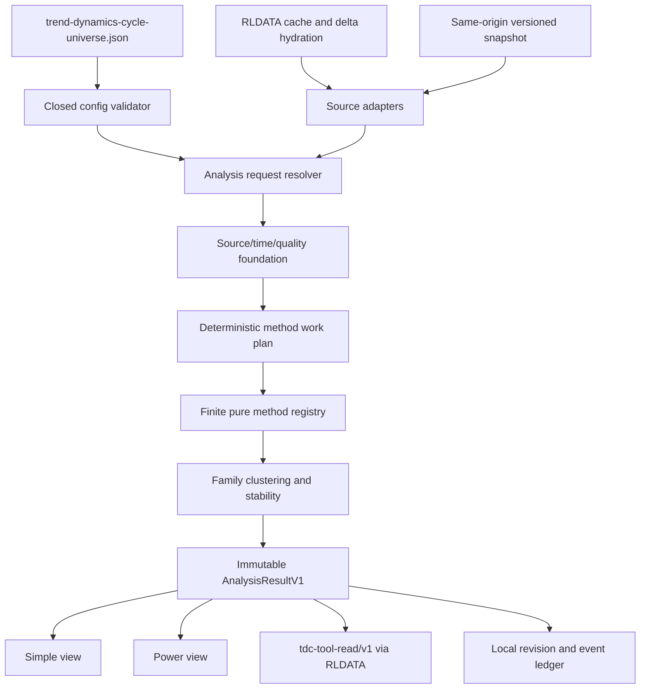

# Design: 006 Trend Dynamics and Cycle Lab

## Design Brief

### Current State

Research Lab is a build-free GitHub Pages site whose registered tools are single HTML files. `rldata.js` owns source-tagged browser cache, freshness, delta hydration, and tool reads; `rlapp.js` owns the shared data-status surface; `rlchart.js`, `rlticker.js`, and `rlg.js` own chart pointer details, ticker links, and glossary behavior. Existing trend behavior in `real-assets-lab.html`, `sector-research-lab.html`, and `swing-structure-lab.html` is useful but tool-specific, while `scripts/selftest.mjs` extracts top-level pure function declarations from production pages for deterministic tests.

There is no generic source/vintage contract, detector registry, family-level consensus, revision-safe turning record, multi-season decomposition, cycle eligibility engine, or owner read for cross-domain trend dynamics. `RLDATA.putToolRead` can carry a nested tool-specific metrics contract, so this feature does not need to widen the shared cache schema.

### Target State

Add `trend-dynamics-cycle-lab.html`, an editable `trend-dynamics-cycle-universe.json`, and a methodology note. The page computes one deterministic `AnalysisResultV1` in the browser and renders the same result into Simple, Power, and the shared owner-read transport. It distinguishes source truth, trend direction/type/strength, dynamics, online change evidence, retrospective anatomy, seasonality, quasi-periodicity, contextual cycles, association, and causation.

The initial registry is finite: 18 methods covering linear, robust, local/state, sequential change, retrospective segmentation, latent regime, extrema, harmonic decomposition, regular/irregular periodicity, time-varying spectrum, and context association. It deliberately does not claim a JavaScript copy of every SciPy, statsmodels, ruptures, or PyWavelets implementation.

### Patterns To Follow

- Cache-first `RLDATA.ensureBars` hydration and `RLAPP` lifecycle reporting from `rldata.js` and `rlapp.js`.
- One compute feeding Simple and Power, with `#modeSeg` state preservation, as used by `sector-research-lab.html`.
- Top-level pure `function` declarations extractable by `scripts/selftest.mjs`, following the Feature 004, Bond Regime, and Palm Springs selftest groups.
- Synchronous canvas drawing plus `RLCHART.attach` after every draw, following `bond-regime-lab.html`, with additional page-owned keyboard traversal and table parity.
- Source-qualified, closed JSON contracts and stable digests, following `bond-regime-universe.json` and `palm-springs-rental-market-lab.html`.
- Registry parity across `tools.json`, `index.html`, and `rlnav.js`, already enforced by `scripts/selftest.mjs`.

### Patterns To Avoid

- Do not add a build, package, framework, Python runtime, WASM module, remote analytics service, or external browser dependency.
- Do not place statistical helpers in `rldata.js`; that file has high fan-out and owns transport/cache concerns, not feature analytics.
- Do not count SMA/EMA variants or correlated smoothers as independent confirmations.
- Do not implement retrospective smoothers as online alerts, silently interpolate irregular observations, or turn a spectrum peak into a forecast.
- Do not use `requestAnimationFrame` as a correctness or chart-render prerequisite; hidden canvases and test clocks make that timing non-deterministic.
- Do not render imported labels, event text, source metadata, or catalog descriptions with untrusted `innerHTML`.

### Resolved Decisions

- The statistical kernel is page-local and pure; `rldata.js` remains byte-for-byte unchanged.
- The existing versioned tool-read envelope transports source availability; `metrics.truthState` carries `current|stale|degraded|unavailable` without changing the shared enum.
- Default analysis uses source-qualified daily market series already present in the shared cache. Unbound cross-domain entries remain contextual or ineligible.
- Online and retrospective endpoint postures are distinct fields in every method result and turning record.
- Required and expensive methods run in a deterministic fixed-work scheduler; a new result replaces the prior result only after an atomic complete commit.
- Canvas rendering is synchronous after DOM/result commit. Progress yielding uses fixed work units and `setTimeout(..., 0)`, never animation frames.
- Configuration is explicit and closed. Missing configuration or an unknown key/version blocks analysis rather than selecting a hidden value.
- G094 applies: planning must create a `foundation:true` scope before page, catalog, publication, and E2E overlay scopes.

### Open Questions

None blocking. Revision-safe replay is available only for descriptors with actual publication vintages; shared market bars are explicitly observation-cutoff replay only.

## Purpose And Scope

The feature implements the `Trend Dynamics And Contextual Cycle Intelligence` capability from `spec.md` in one static browser route. It must satisfy FR-001 through FR-083 and NFR-001 through NFR-018 without claiming live data, source rights, method execution, confidence, cycle phase, or causation that the resolved inputs cannot support.

The design has four technical layers:

1. **Source and time truth:** validate descriptors and observations, resolve availability/vintage cutoffs, transform values, and assess quality.
2. **Finite method registry:** execute eligible pure methods with declared endpoint posture, assumptions, history, and numerical guards.
3. **Evidence synthesis:** cluster related methods, preserve contradictions, evaluate nearby parameters, build change/cycle records, and compute a conservative consensus.
4. **Static experience and publication:** render Simple/Power from one immutable result, expose accessible charts/tables and progress, and publish one state-faithful tool read.

No server API, database, account, execution integration, position data, or private identity data is introduced.

## Current System And Concrete Change Boundary

### Intended Implementation Surfaces

| Surface | Change | Responsibility |
| --- | --- | --- |
| `trend-dynamics-cycle-lab.html` | New | Self-contained CSS, semantic markup, pure statistical kernel, adapters, scheduler, state, rendering, and owner-read publication |
| `trend-dynamics-cycle-universe.json` | New | Single editable source for series descriptors, methods, profiles, bounds, horizons, cycle catalog, evaluation, and display precision |
| `notes/trend-dynamics-cycle-lab.md` | New | Methodology, formulas, source posture, limitations, configuration guide, and run handoff |
| `tools.json` | Modify | Register `trend-dynamics-cycle-lab` and its note |
| `index.html` | Modify | Add matching landing registry entry only |
| `rlnav.js` | Modify | Add matching navigation registry entry only |
| `scripts/selftest.mjs` | Modify | Extract production pure functions and test contracts, formulas, determinism, numerical guards, and shared-cache canaries |
| `tests/fixtures/trend-dynamics-cycle/` | New | Source-qualified historical snapshots and deterministic analytic inputs with provenance; no production fallback data |
| `tests/trend-dynamics-cycle-lab.spec.mjs` | New | Scenario-specific Playwright E2E through the real static server and production page |

### Explicitly Excluded Surfaces

- `rldata.js`, `rlapp.js`, `rlchart.js`, `rlticker.js`, `rlg.js`, and `rlbrief.js` are consumers only and are not modified.
- Existing tool formulas and owner reads remain unchanged.
- Feature 005 artifacts and every unrelated dirty-worktree file remain untouched.
- No `package.json`, lockfile, Pages workflow, service, endpoint, or deployment change is required.
- No `scopes.md`, `report.md`, `uservalidation.md`, `scenario-manifest.json`, source, or test file is created by the design phase.

### Why `rldata.js` Stays Unchanged

`rldata.js` has registered-tool-wide consumers and currently owns transport concerns: bars, metadata envelopes, request state, freshness, central credentials, and tool reads. Adding trend/cycle functions or event history would mix statistical policy into that cache owner and would require canaries for every registered page.

Feature 006 instead consumes these existing calls:

- `RLDATA.bars`, `barInfo`, and `ensureBars` for cache-first shared bars.
- `RLDATA.reportData` through existing ensure behavior for shared status.
- `RLDATA.putToolRead` for publication.

The owner read uses the accepted `rl-tool-read/v1` transport. Its top-level `availability` remains source availability (`current|stale|unavailable`); the nested `metrics.contractVersion = "tdc-tool-read/v1"` and `metrics.truthState` preserve the analytical state (`current|stale|degraded|unavailable`). A degraded sentence starts with `Degraded:` and the Market Brief consumes the sentence rather than recalculating it. This is additive, truthful, and avoids changing existing readers.

If an implementation cannot preserve `metrics.truthState` through the existing transport, it must stop and return a contract error; changing the shared schema is not an implicit escape hatch.

## Architecture Overview



### Browser Runtime Modules Inside The Page

The single inline production script is organized by top-level function declarations, not runtime modules or bundled imports:

1. Contract constants and error constructors.
2. Canonicalization, finite numeric, matrix, distribution, and circular-statistic helpers.
3. Config/source/request validators.
4. Observation/vintage/transform/quality helpers.
5. Method implementations.
6. Family, trend, dynamics, change, cycle, multiplicity, replay, and consensus synthesis.
7. View-model and owner-read builders.
8. Browser-only effects: config fetch, RLDATA adapters, scheduler, persistence, DOM wiring, charts, and boot.

Pure functions accept all clocks, configuration, and data as arguments. They do not read `window`, `document`, storage, network, `Date.now()`, or random state. Browser effects are thin and are not counted as business logic.

### Load Order

The page loads optional helpers and the shared shell in this order:

1. `rldata.js`
2. `rlapp.js`
3. `rlg.js`
4. `rlchart.js`
5. `rlticker.js`
6. the page's inline script
7. `rlnav.js`

The inline script waits for DOM readiness but may read `RLDATA` synchronously after the config contract resolves. No provider credential field exists on the route.

## Capability Foundation

### Foundation Contracts

| Contract | Responsibility | Consumers |
| --- | --- | --- |
| `TrendDynamicsConfigV1` | Closed registry, method/profile bounds, series descriptors, cycle catalog, evaluation policy, display precision | Validator, request resolver, controls, every method |
| `SeriesEnvelopeV1` | Source-qualified observations plus availability and vintage truth | Quality, transform, as-of replay, source audit |
| `AnalysisRequestV1` | One explicit series, cutoff, transform, horizon, sensitivity, parameters, cycle/context selection | Work-plan builder and result digest |
| `DataQualityProfileV1` | Coverage, regularity, invalid rows, gaps, outliers, changes, revision capability, freshness | Eligibility and truth-state resolver |
| `MethodDefinitionV1` | Method id/family/cluster, endpoint posture, inputs, eligibility, parameter schema, output type | Registry execution and Power method table |
| `DetectorResultV1` | One method's result, parameters, state, score, uncertainty, assumptions, effective/detection times, limitations | Family clustering and evidence audit |
| `FamilyVoteV1` | One independent-cluster vote preserving internal disagreement and unavailable methods | Trend, dynamics, change, and cycle consensus |
| `TurningRecordV1` | Immutable candidate identity, effective/detected/confirmed/invalidated times, delays, parameters, cutoff, revisions | Simple change record, replay, history |
| `CycleEligibilityV1` | Type-specific requirements, observed coverage, search breadth, stability, held-out evidence, state | Simple context and Power cycle/catalog views |
| `AnalysisResultV1` | Immutable complete result shared by Simple, Power, history, and owner read | All renderers and publication |
| `ToolDecisionReadV1` | State-faithful compact projection nested in the existing tool-read transport | Market Brief and deep-link consumers |

### Extension Points

- **Series adapter:** converts a declared source kind into `SeriesEnvelopeV1`; it cannot change source policy or invent observations.
- **Transform:** pure function with declared input-unit predicate, formula, output unit, and inverse/audit metadata.
- **Method:** pure registry entry with one closed parameter schema and one typed result.
- **Cycle evaluator:** dispatches by declared cycle type; types cannot switch at runtime.
- **Renderer:** consumes `AnalysisResultV1` only and cannot calculate a second verdict.

### Foundation-Owned Behavior

- Closed contract/version validation and unknown-key rejection.
- Explicit as-of resolution and endpoint-posture separation.
- Finite-number enforcement, deterministic ordering, stable digests, and immutable output.
- Method eligibility and unavailable reasons.
- Family clustering, sensitivity invariants, stability perturbations, and multiplicity accounting.
- Atomic result commit, cancellation semantics, truth-state precedence, and owner-read projection.
- Safe text, source provenance, accessibility, and no-color-only state vocabulary.

### Planning Dependency Requirement

Because this is a new reusable capability with multiple method, source, cycle, and UI implementations, `bubbles.plan` must create a first scope tagged `foundation:true`. Every page/adapter/catalog/publication/E2E scope must name that foundation scope in `Depends On`. This design does not author those plan-owned artifacts.

## Concrete Implementations

### Shared Daily-Bar Adapter

- Reads `RLDATA.bars(series.symbol, "1d")` and `RLDATA.barInfo` synchronously.
- Requires the configured provider allowlist to contain `barInfo.src`; a mismatch is `TDC-SOURCE-PROVIDER-MISMATCH`.
- Maps each bar timestamp using the descriptor's explicit `timestampMeaning` and `availabilityLagMs`.
- Carries adjusted/raw semantics from the descriptor and cache metadata; incompatible adjustment is unavailable.
- Supports observation-cutoff replay only because the cache does not contain historical publication vintages.

### Same-Origin Vintage Snapshot Adapter

- Fetches only a descriptor-declared relative HTTPS/Pages path under the same origin.
- Requires every row to carry observation, availability, vintage, and revision identity.
- Reports lifecycle through `RLAPP.report` because it is not an `RLDATA.ensure*` resource.
- Enables revision-safe as-of replay only after contract validation succeeds.

### Trend And Dynamics Implementations

- Linear/HAC slope, robust Theil-Sen/Kendall, one-sided local quadratic, and filtered local-linear state estimates.
- The local quadratic and local-linear methods share one family vote; they do not count twice.

### Change And Regime Implementations

- CUSUM and BOCPD online methods.
- Scale, distribution, and correlation shift diagnostics.
- Penalized linear segmentation, two-state Gaussian HMM, and prominence extrema for retrospective/state evidence.

### Seasonal And Cycle Implementations

- Simultaneous robust harmonic decomposition for multiple declared periods.
- ACF/Welch plus harmonic significance for regular data.
- Generalized Lomb-Scargle for irregular data.
- Rolling spectrum for period/amplitude/phase drift.
- Type-specific calendar, seasonality, oscillation, lifecycle, regime, and event evaluators.

### Context Implementations

- Availability-safe lag scan for compatible paired series.
- Non-overlapping event study with exact sign evidence.
- Catalog-only records when no real target binding exists.

### UI Implementations

- Simple Decision Cockpit.
- Power Evidence and Stability.
- Power Change Replay and Revision.
- Power Seasonality and Cycle Eligibility.
- Power Context Catalog and Lead-Lag.
- Source Audit and Owner Read.

### Variation Axes

| Axis | Supported Options | Foundation Ownership |
| --- | --- | --- |
| Source/time shape | shared regular bars; same-origin vintage observations; irregular source-qualified observations | Contract, quality, and as-of rules are foundation-owned; adapter fetch is concrete |
| Endpoint posture | one-sided filtered; retrospective smoothed/segmented | Separation and labeling are foundation-owned; method math is concrete |
| Method family | linear; robust; local/state; sequential; segmentation; regime; extrema; seasonal; spectral; association | Family clustering and vote semantics are foundation-owned |
| Cycle type | deterministic calendar; empirical seasonality; quasi-periodic oscillation; lifecycle; regime; event | Type invariants are foundation-owned; catalog entries are concrete |
| Sensitivity | cautious; balanced; early; valid custom tuning | Integrity gates and bounds are foundation-owned; profile values are config-owned |
| UI composition | Simple decision; Power evidence/replay/cycle/context/audit | One-result parity and truth vocabulary are foundation-owned; section rendering is concrete |
| Publication | on-page result; local revision ledger; shared owner read | Projection and truth preservation are foundation-owned |

## Data Model

### `TrendDynamicsConfigV1`

`trend-dynamics-cycle-universe.json` has `additionalProperties: false` semantics at every object level and exactly these top-level fields:

```json
{
  "contractVersion": "tdc-config/v1",
  "toolId": "trend-dynamics-cycle-lab",
  "registryVersion": "tdc-method-registry/1",
  "initialSelection": {},
  "limits": {},
  "horizons": [],
  "profiles": [],
  "controlBounds": {},
  "transforms": [],
  "methods": [],
  "series": [],
  "cycleCatalog": [],
  "evaluation": {},
  "display": {}
}
```

All required values are present in JSON. The page contains no production parameter fallback. A missing file, missing field, duplicate id, unknown key, unknown contract version, non-finite number, invalid enum, invalid range, dangling reference, or profile outside bounds yields `TDC-CONFIG-*` and no analysis result.

### `SeriesDescriptorV1`

| Field | Type | Rule |
| --- | --- | --- |
| `id`, `label` | string | Non-empty, unique; label is untrusted text |
| `kind` | enum | `market`, `macro`, `technology`, `social`, `political`, `climate`, `weather`, `biological`, `agricultural`, `physical`, or `operational` |
| `adapter` | enum | `shared-bars-v1` or `same-origin-vintages-v1` |
| `symbol` | string or null | Required only for shared bars; validated before `RLTKR.tag` |
| `source` | object | Authority, measure, URL, provider tags, source-use policy/review refs, rights, quality, limitations |
| `scope` | object | Geography and population, each explicit or null with reason |
| `units` | object | Input unit id/label, scale type, zero/negative eligibility |
| `cadence` | object | Regular/irregular kind, expected milliseconds, accepted gap multipliers, timezone, timestamp meaning, availability lag |
| `revisionPolicy` | enum | `none`, `latest-only`, or `vintage-aware`; `latest-only` cannot claim revision-safe replay |
| `freshness` | object | Expected cadence and review window in milliseconds |
| `transforms` | string[] | Explicit eligible transform ids |
| `snapshotPath` | string or null | Same-origin relative path only for the vintage adapter |

### `ObservationV1`

```text
contractVersion: "tdc-observation/v1"
observationId: stable source-qualified id
observedAt: RFC3339 instant
availableAt: RFC3339 instant
vintageId: non-empty string
revisedAt: RFC3339 instant or null
value: finite number
unitId: exact descriptor unit
sourceRowId: source identifier or null
qualityFlags: closed string array
```

Rows are validated in input order. Duplicate ids/timestamps within one vintage, out-of-order availability, non-finite values, nulls, incompatible units, and revisions that precede the original are recorded as explicit validation errors. They are never coerced, sorted into apparent validity, or converted to zero. Invalid-row exclusion is allowed only when config permits degraded analysis and the invalid fraction remains within its explicit bound; the quality profile lists every exclusion.

### `AnalysisRequestV1`

```text
contractVersion: "tdc-analysis-request/v1"
seriesId, comparisonSeriesId|null
decisionTime, vintageId|null
transformId, transformParameters
horizonId, profileId
controls {bandwidthFraction, effectZ, persistenceBars, changeProbability,
          consensusFamilies, cycleEvidenceThreshold}
enabledCycleIds[], lagRange|null, selectedPowerSection
registryVersion, configDigest
```

The stable request digest is computed from canonical key-sorted serialization. Deep links carry only these public selection fields. Any value not present in the loaded config is rejected and is not replaced by the initial selection.

### `AnalysisResultV1`

```text
contractVersion, resultId, requestDigest, registryVersion, configDigest
computedAt, decisionTime, sourceAsOf, sourceAvailability, truthState
series, request, quality, transformedSeriesAudit
methodResults[], familyVotes[]
trend, strength, dynamics, changeState, turningRecords[]
decomposition, cycleResults[], contextResults[], leadLag
stability, walkForward, searchBreadth, multiplicity
supportingFamilies[], contradictingFamilies[], unavailableFamilies[]
confirmationConditions[], invalidationConditions[], caveats[]
errors[], timings, complete
```

`complete` is true only after every required work item has produced an eligible result, unavailable result, cancellation, or explicit error. Only `complete:true` can replace the last complete result or publish an owner read. Arrays are sorted by registry order and stable ids.

### Turning And Revision Records

`TurningRecordV1` has a stable id from series, transform, horizon, profile, event type, and effective time. The original record is immutable. A later cutoff appends `RevisionV1 {revisionId, observedAt, priorState, nextState, changedFields, reason, sourceVintageId}`. Confirmation or invalidation never edits the original alert time, parameters, or cutoff.

The browser effect layer persists non-sensitive public event/revision records under `trendDynamicsCycleLabHistoryV1`. Existing records are read-back verified and code never edits an existing id. `limits.historyRecordLimit` is explicit; reaching it makes persistence degraded and asks the user to export/clear history, while the current calculation remains labeled with the history failure. Corrupt history is unavailable and is never auto-repaired.

## Source, Time, Quality, And Transform Rules

### As-Of Resolution

For cutoff $T$, include only rows with `availableAt <= T`. For each observation identity, select the latest vintage whose `availableAt <= T`; later revisions are invisible. Shared bars have one latest vintage, so replay is labeled `observation-cutoff-only` and revision metrics are unavailable.

Retrospective methods may use rows after an event only up to the selected final cutoff. Their effective date is never copied into `firstDetectedAt`. Online methods are rerun across ascending cutoffs to find the first qualifying alert.

### Data Quality

`tdcAssessDataQuality` reports:

- valid/invalid count and span;
- expected versus observed cadence and each missing interval;
- irregular-spacing ratio;
- duplicate/out-of-order/unit errors;
- robust outliers where $|x_i - median(x)| / (1.4826 MAD) > 6$;
- source/frequency/definition change markers;
- latest revision count and maximum revision magnitude;
- observed, available, retrieved, and fresh-until clocks.

Blocking integrity errors produce `unavailable`. Otherwise quality is `sufficient` or `degraded` according to explicit descriptor/method thresholds. An outlier is flagged but retained unless the request explicitly selects the configured reversible winsorization transform.

### Transform Formulas

Let $x_t$ be the source value, $k$ an explicit lookback, and $A$ the configured observations-per-year:

| Transform | Formula | Eligibility / Output Unit |
| --- | --- | --- |
| `level` | $y_t=x_t$ | Always when finite; source unit |
| `log-level` | $y_t=\ln(x_t)$ | Every included $x_t>0$; log source unit |
| `difference` | $y_t=x_t-x_{t-1}$ | At least two rows; source unit per observation |
| `rate-of-change` | $y_t=100(x_t/x_{t-k}-1)$ | Nonzero denominator and configured $k$; percent per $k$ observations |
| `growth` | $y_t=100A(\ln x_t-\ln x_{t-k})/k$ | Positive values and configured $A,k$; annualized percent |
| `seasonally-adjusted` | $y_t=x_t-\sum_j S_{j,t}$ | A complete eligible harmonic decomposition; source unit |
| `z-normalized` | $y_t=(x_t-\bar{x}_{window})/s_{window}$ | Explicit window and positive finite sample deviation; standard deviations |
| `unit-conversion` | $y_t=a x_t+b$ | Descriptor-declared finite $a,b$; declared output unit |

Every derived row retains origin observation ids. Resampling, interpolation, winsorization, adjustment, or conversion is an explicit transform record and is reversible where mathematically possible. No method silently resamples.

## Numerical Foundation And Guards

### Exact Pure Symbols

The page exposes these top-level declarations for `scripts/selftest.mjs` extraction:

```text
tdcError, tdcIsPlainObject, tdcHasExactKeys, tdcFiniteNumber
tdcStableSerialize, tdcStableDigest, tdcKahanSum, tdcQuantile, tdcMedian, tdcMad
tdcNormalCdf, tdcLogGamma, tdcRegularizedBeta, tdcStudentTCdf
tdcHouseholderSolve, tdcAutocorrelation, tdcLjungBox
tdcValidateConfig, tdcIndexConfig, tdcValidateSeriesEnvelope
tdcResolveAsOfVintage, tdcApplyTransform, tdcAssessDataQuality
tdcRollingOlsHac, tdcTheilSenKendall, tdcEndpointLocalQuadratic
tdcLocalLinearState, tdcCusum, tdcBocpd
tdcScaleShift, tdcDistributionShift, tdcCorrelationShift
tdcPenalizedLinearSegments, tdcGaussianHmm2, tdcProminentExtrema
tdcHarmonicDecomposition, tdcWelchSpectrum, tdcGeneralizedLombScargle
tdcRollingSpectrum, tdcLeadLag, tdcEventStudy, tdcAdjustPValues
tdcClusterFamilyVotes, tdcClassifyTrend, tdcClassifyDynamics
tdcBuildChangeTimeline, tdcEvaluateCycle, tdcWalkForward
tdcBuildConsensus, tdcCreateWorkPlan, tdcBuildViewModel, tdcBuildToolRead
```

Each pure function returns a frozen success object or `{ok:false, errors:[TdcErrorV1...]}` and does not throw for user/source data. Programmer-contract violations may throw only in browser wiring and are converted to `TDC-INTERNAL` before presentation.

### Numeric Rules

- `Number.isFinite` is required at every numeric boundary and before formatting.
- Kahan summation is used for sums, means, covariance, and squared error.
- Regression time is centered and scaled in observation units before solving.
- Least squares uses deterministic Householder QR; a diagonal ratio below `limits.minimumQrDiagonalRatio` is `TDC-NUMERIC-SINGULAR`.
- Scale floor is `max(limits.absoluteVarianceFloor, limits.relativeVarianceFloor * medianAbsValue^2)`, with both values supplied by config.
- Probabilities use log-sum-exp. A result outside $[-\epsilon,1+\epsilon]$ is an error; values within epsilon are rounded to the boundary and the guard is recorded.
- Stable sorting always uses `(primary value, registry order, id)`; no engine-dependent tie order is accepted.
- Full precision remains in `AnalysisResultV1`; `display` owns rounding only.
- No method uses `Math.random`. All evaluation splits and grids are declared and deterministic.

## Finite Method Registry

The initial registry contains exactly these 18 methods. Registry order is contract order.

| ID / Pure Function | Independent Family Cluster | Question / Endpoint | Minimum Eligibility | Primary Output |
| --- | --- | --- | --- | --- |
| `M01-ols-hac` / `tdcRollingOlsHac` | `trend-linear` | Average slope; one-sided | 30 rows and selected window | slope, normalized slope, HAC interval, $R^2$ |
| `M02-theil-kendall` / `tdcTheilSenKendall` | `trend-robust` | Robust monotonic direction; one-sided | 30 rows | median pair slope, tau-b, block interval |
| `M03-local-quadratic` / `tdcEndpointLocalQuadratic` | `trend-local-state` | Endpoint slope/curvature; one-sided | bandwidth >=15 and >=3x bandwidth history | slope, acceleration, endpoint leverage |
| `M04-local-linear-state` / `tdcLocalLinearState` | `trend-local-state` | Latent level/slope; filtered online and RTS-smoothed retrospective | 40 regular rows | state, covariance, filtered/smoothed revision |
| `M05-cusum` / `tdcCusum` | `change-online` | Accumulated small level shift; online | 40 baseline + 20 monitor rows | positive/negative alarm, reset/effective time |
| `M06-bocpd` / `tdcBocpd` | `change-online` | New run probability and run length; online | 60 rows | change probability, run-length posterior |
| `M07-scale-shift` / `tdcScaleShift` | `change-scale-distribution` | Variance change; online | long window >=60, short >=20 | log variance ratio, uncertainty, persistence |
| `M08-distribution-shift` / `tdcDistributionShift` | `change-scale-distribution` | Adjacent-window distribution change; online diagnostic | two windows >=30 | KS statistic, dependence-qualified p-value |
| `M09-correlation-shift` / `tdcCorrelationShift` | `change-scale-distribution` | Pair-correlation change; online diagnostic | paired adjacent windows >=30 | Fisher-z difference and interval |
| `M10-linear-segments` / `tdcPenalizedLinearSegments` | `change-retrospective` | Stable level/slope breaks; retrospective | 80 rows, configured min segment | breakpoints, segment slopes, penalty stability |
| `M11-gaussian-hmm2` / `tdcGaussianHmm2` | `regime-latent` | Persistent two-state transition; filtered/retrospective | 120 rows and >=20 effective rows/state | state probabilities, transitions, durations |
| `M12-prominent-extrema` / `tdcProminentExtrema` | `turn-extrema` | Material peak/trough; provisional/retrospective | 60 rows | prominence, width, distance, plateau, delay |
| `M13-harmonic-decomposition` / `tdcHarmonicDecomposition` | `season-harmonic` | Multiple declared seasonal components; one-sided fit | each period meets repetition rule | trend, separate components, residual, strength |
| `M14-welch-acf` / `tdcWelchSpectrum` | `period-regular` | Repeated regular-sample power; descriptive | regular, 4 configured segments | ACF, Welch power, harmonic p-value |
| `M15-generalized-lomb` / `tdcGeneralizedLombScargle` | `period-irregular` | Periodicity under uneven sampling; descriptive | 60 rows, span >=4 max candidate periods | weighted floating-mean power and p-values |
| `M16-rolling-spectrum` / `tdcRollingSpectrum` | `period-time-varying` | Period/amplitude/phase drift; retrospective anatomy | >=3 windows, each >=4 candidate periods | rolling period, amplitude, phase, edge status |
| `M17-lead-lag` / `tdcLeadLag` | `context-association` | Availability-safe candidate lead; one-sided evaluation | 60 aligned rows and configured lags | discovery lag, held-out effect, adjusted evidence |
| `M18-event-study` / `tdcEventStudy` | `context-association` | Repeatable event distribution; retrospective scoring | 8 non-overlapping events | median/mean effect, dispersion, exact sign p-value |

### Truthful Omissions

The initial route does not claim full STL/MSTL robust LOESS, ADF/KPSS critical-value surfaces, PELT pruning, Markov-switching maximum-likelihood variants, continuous wavelets, kernel change detection, AR cost libraries, or price-specific ADX/MACD/RSI. Harmonic decomposition represents multi-seasonality; exact penalized dynamic programming represents segmented change; a two-state Gaussian HMM represents latent regimes; rolling spectrum represents time-frequency behavior. The method table and note name these substitutions and their limits.

## Exact Algorithms

### Linear Slope With HAC Uncertainty

For centered observation index $u_i$, fit $y_i=a+b u_i$ by QR. Newey-West covariance is

$$
\widehat{V}(\hat\beta)=(X'X)^{-1}\left(\Gamma_0+\sum_{l=1}^{L}\left(1-\frac{l}{L+1}\right)(\Gamma_l+\Gamma_l')\right)(X'X)^{-1},
$$

where $\Gamma_l=\sum_{t=l+1}^{n}x_t e_t e_{t-l}x_{t-l}'$ and $L=\lfloor4(n/100)^{2/9}\rfloor$. The registry declares the 95% interval multiplier. Normalized slope is $b/s_r$, where $s_r=1.4826 MAD(residual)$ and a zero scale is unavailable rather than infinite.

### Theil-Sen And Kendall

The slope is the median of every finite pair $(y_j-y_i)/(u_j-u_i)$ for $i<j$. Kendall tau-b includes tie corrections. Dependence-aware uncertainty is the 2.5%/97.5% quantile of 12 deterministic contiguous delete-one-block estimates; fewer than eight valid block estimates makes the interval unavailable but does not invent zero uncertainty.

### One-Sided Local Quadratic

Use the trailing configured bandwidth $B$. At endpoint $u=0$, fit $y=a+bu+cu^2$ for $u\in[-1,0]$ with tricube weights $w=(1-|u|^3)^3$. Output slope $b/B$ in value per observation and acceleration $2c/B^2$ in value per observation squared. QR conditioning and endpoint effective-sample size are explicit eligibility gates.

### Local-Linear State

State $s_t=[level_t,slope_t]'$ uses

$$F=\begin{bmatrix}1&1\\0&1\end{bmatrix},\quad H=[1,0],\quad
Q=s_r^2\,diag(q_{level},q_{slope}),\quad R=s_r^2.$$

$s_r=1.4826 MAD(\Delta y)/\sqrt{2}$. The profile provides $q_{level}$ and $q_{slope}$. Standard Kalman predict/update produces the online filtered state. Rauch-Tung-Striebel backward smoothing is retrospective only. Singular innovation covariance or a degenerate scale is unavailable.

### CUSUM

The baseline is the median and MAD scale of the declared baseline window. For standardized residual $z_t$:

$$S_t^+=\max(0,S_{t-1}^++z_t-k),\qquad S_t^-=\min(0,S_{t-1}^-+z_t+k).$$

An alarm occurs at $S_t^+\ge h$ or $S_t^-\le-h$. The profile declares $k$, $h$, persistence, and reset policy (`zero-after-record`). Effective time is the first observation after the last zero extremum that began the qualifying run; detection time is the alert cutoff.

### Bayesian Online Change-Point Detection

`tdcBocpd` uses a constant hazard $H=1/E(runLength)$ and Normal-Inverse-Gamma Student-t predictive distributions. For each retained run length $r$:

$$
P(r_t=r+1,x_{1:t})=P(r_{t-1}=r,x_{1:t-1})p(x_t|r)(1-H),
$$

$$
P(r_t=0,x_{1:t})=\sum_rP(r_{t-1}=r,x_{1:t-1})p(x_t|r)H.
$$

NIG updates are $\kappa'=\kappa+1$, $\mu'=(\kappa\mu+x)/\kappa'$, $\alpha'=\alpha+1/2$, and $\beta'=\beta+\kappa(x-\mu)^2/(2\kappa')$. Log-sum-exp normalization prevents underflow. The run-length cap is explicit; discarded tail mass above the configured tolerance degrades the method instead of being ignored.

### Scale, Distribution, And Correlation Shift

- Scale effect is $\log((s_{short}^2+f)/(s_{long}^2+f))$ with contiguous-block jackknife uncertainty.
- Distribution effect is two-sample KS $D$; its asymptotic series uses up to 100 terms and stops only when the next term is below the configured epsilon. Serial dependence reduces inferential weight and is visible.
- Correlation shift compares adjacent exact-date paired windows using Fisher $z=(atanh(r_2)-atanh(r_1))/\sqrt{1/(n_1-3)+1/(n_2-3)}$.

### Penalized Linear Segmentation

Prefix sums provide constant-time linear segment SSE. Dynamic programming uses

$$F(e)=\min_{s\le e-m}\{F(s)+C(s+1,e)+\lambda\},\qquad F(0)=-\lambda,$$

where $m$ is configured minimum segment length and $\lambda=c\,s_r^2\log(n)\,2$ for two segment parameters. It is exact $O(n^2)$ dynamic programming, not claimed as PELT. A breakpoint is stable only when it recurs within the configured date tolerance under 0.8x, 1.0x, and 1.2x penalty.

### Two-State Gaussian HMM

The HMM runs on configured returns or residuals. Deterministic initialization uses 25th/75th quantile means, global variance, and configured diagonal transition probability. Baum-Welch runs in log space for at most 50 iterations and stops at relative log-likelihood change below `limits.hmmTolerance`. States are sorted by mean after every iteration to fix label switching. Occupancy below 20, variance at the floor, non-convergence, or invalid transition rows makes the method unstable/unavailable. Filtered probability is current evidence; smoothed probability is retrospective only.

### Prominent Extrema

Extrema operate on the selected one-sided trend for online candidates and smoothed trend for retrospective anatomy. A peak/trough must satisfy configured prominence, half-prominence width, minimum distance, and plateau rules. Online detection requires the configured right-side confirmation bars; therefore effective time and first detection time differ by construction. Reversal confirmation additionally requires direction-family change or persistence.

### Harmonic Decomposition

After break handling, fit all declared periods simultaneously:

$$y_t=a+bt+\sum_p\sum_{k=1}^{K_p}[\alpha_{p,k}\cos(2\pi kt/p)+\beta_{p,k}\sin(2\pi kt/p)]+e_t.$$

The design matrix is solved by QR with the configured ridge floor and three Huber IRLS passes ($\delta=1.345s_r$). Each period's component remains separate. Harmonic count is predeclared on the discovery window and frozen for confirmation. Trend strength is $\max(0,1-Var(e)/Var(trend+e))`; seasonal strength for component $p$ is $\max(0,1-Var(e)/Var(S_p+e))$.

### ACF, Welch, And Harmonic Significance

ACF uses centered Kahan covariance. Ljung-Box is $Q=n(n+2)\sum_{k=1}^{m}\rho_k^2/(n-k)$ with chi-square survival. Welch uses a Hann window, declared segment length, 50% overlap, and direct DFT; at least four complete segments are required. Candidate-frequency evidence is tested by adding sine/cosine terms to the trend-only regression:

$$F=((SSE_0-SSE_1)/2)/(SSE_1/(n-3)),\qquad p=(\nu/(\nu+2F))^{\nu/2},\ \nu=n-3.$$

### Generalized Lomb-Scargle

For each explicit frequency, weighted least squares compares a floating-mean model with `[1, cos(wt), sin(wt)]`. Power is $(SSE_0-SSE_1)/SSE_0`; the same two-degree-of-freedom F survival supplies raw evidence. The frequency grid, sampling-window aliases, weights, and number of tested frequencies are outputs. No interpolation is performed.

### Rolling Spectrum

Use explicit overlapping windows. In each window, select the strongest multiplicity-eligible frequency from the same configured grid, then estimate amplitude $\sqrt{a^2+b^2}$ and phase $\operatorname{atan2}(-b,a)$. Across windows report period coefficient of variation, amplitude coefficient of variation, circular phase concentration $R=|n^{-1}\sum e^{i\phi}|$, intermittent coverage, and edge windows. This is a short-time harmonic map, not a wavelet implementation.

### Lead-Lag And Event Study

Paired rows align on availability-safe timestamps without interpolation. The discovery window selects the strongest corrected lag; confirmation evaluates that exact lag only. Nearby-window and regime slices are separate outputs. Event windows may not overlap; median, mean, quantiles, and the exact two-sided binomial sign probability are reported. Both outputs remain association evidence.

### Multiplicity

Search breadth is the number of unique hypothesis keys actually evaluated: `(target, context, transform, method, period-or-lag, region)`. It is never inferred from visible winners.

- Discovery ranking uses Benjamini-Hochberg at configured $q=0.10$.
- Activation uses Holm family-wise correction at configured $\alpha=0.05$.
- Both raw and adjusted values are stored when a valid p-value exists.
- Methods without defensible p-values use effect/stability/held-out gates and say `not-applicable`; they do not receive a made-up p-value.

## Eligibility And Minimum History

### Common Gates

A method contributes only when all of its registry predicates pass:

1. Source rights/policy and provider match.
2. Required transform and units are compatible.
3. Valid count and span meet the method minimum.
4. Regularity requirement is met, or the method explicitly supports irregular sampling.
5. Missingness, invalid rows, revisions, and definition changes are within configured bounds.
6. Required complete repetitions, events, pairs, or state occupancy exist.
7. Numerical conditioning and finite output pass.
8. Break contamination policy permits the method.

Failure yields `MethodAvailabilityV1 {state:"unavailable", code, observed, required}`. It is not a zero vote.

### Horizon And Nested Windows

Initial configured horizons are 63, 126, 252, and 504 observations. For selected horizon $H$, nested dynamics windows are `short = max(20, floor(H/4))`, `medium = max(30, floor(H/2))`, and `long = H`; these formulas and resulting values are rendered. A horizon is selectable only when at least two trend families can satisfy it.

### Season And Cycle Coverage

- Empirical seasonality requires at least five complete anchored repetitions for `active`; three to five may be `contextual` if all other evidence passes.
- Quasi-periodic oscillation requires at least four complete repetitions for `active`.
- Calendar effects require at least eight non-overlapping historical events before an effect distribution can be more than contextual.
- A lifecycle, regime, or one-off event has no oscillatory repetition or next-turn field.
- Any fraction below the required repetition count is shown exactly and produces no phase, next-turn date, or confidence.

## Sensitivity Profiles And Governed Controls

All values below are explicit records in the JSON configuration, not page constants.

| Parameter | Early | Balanced | Cautious |
| --- | ---: | ---: | ---: |
| Local bandwidth fraction of horizon | 0.15 | 0.25 | 0.35 |
| State slope process ratio | 0.010 | 0.003 | 0.001 |
| Minimum standardized effect | 0.75 | 1.00 | 1.50 |
| Persistence observations | 2 | 3 | 5 |
| BOCPD change probability | 0.55 | 0.70 | 0.85 |
| Independent family support | 2 | 2 | 3 |
| Minimum nearby stability | 0.55 | 0.67 | 0.78 |
| Cycle evidence threshold | 0.60 | 0.70 | 0.80 |
| CUSUM reference $k$ | 0.25 | 0.50 | 0.75 |
| CUSUM limit $h$ | 3.5 | 5.0 | 7.0 |
| BOCPD expected run length | 80 | 126 | 252 |

Simple control bounds are explicit: bandwidth fraction 0.10-0.45 step 0.05; effect 0.50-2.50 step 0.25; persistence 2-10; change probability 0.50-0.95 step 0.05; consensus 2-4; cycle threshold 0.50-0.90 step 0.05. Invalid edits remain unapplied and never update the owner read.

Profiles may change these speed/reliability values only. They cannot change source policy, transform eligibility, minimum method history, minimum cycle repetitions, as-of resolution, endpoint posture, family clustering, multiplicity method, held-out separation, or invalidation retention.

Custom tuning is labeled `exploratory` because the user has seen outcomes. The three predeclared profiles retain walk-forward comparability.

## Trend, Strength, Dynamics, And Consensus

### Family Clustering

Methods inside one cluster are summarized by median signed evidence and median reliability. Internal sign disagreement makes the family `unstable`; it cannot supply a confirmation. The independent clusters are:

```text
trend-linear: M01
trend-robust: M02
trend-local-state: M03,M04
change-online: M05,M06
change-scale-distribution: M07,M08,M09
change-retrospective: M10
regime-latent: M11
turn-extrema: M12
season-harmonic: M13
period-regular: M14
period-irregular: M15
period-time-varying: M16
context-association: M17,M18
```

Only the first three determine generic trend direction. Change/regime/extrema can confirm a turn but cannot manufacture trend direction. Seasonal/context families cannot confirm a trend or regime change.

### Direction

Each trend family votes rising/falling/flat only when effect and uncertainty pass. Consensus is:

- `rising` or `falling`: at least the profile's independent-family count supports the same sign and no qualifying family supports the opposite sign.
- `flat/range`: the required family count is flat and no directional family qualifies.
- `mixed`: qualifying opposite signs exist, or evidence exists without enough independent support.
- `unavailable`: fewer than two trend families are eligible.

A sustained claim also requires the configured minimum duration fraction of the horizon, quality not blocking, persistence, and nearby stability.

### Trend Type

Primary type precedence is `segmented -> regime-dependent -> exponential/saturating -> nonlinear -> monotonic/linear -> mean-reverting/range -> mixed/unavailable`. Secondary flags remain visible.

- `linear`: OLS $R^2>=0.65$, insignificant curvature, no stable break.
- `monotonic`: $|\tau_b|>=0.65$ but linear fit below 0.65.
- `nonlinear`: local curvature passes effect/interval gates without a stable break.
- `segmented`: M10 has a stable break and adjacent slopes differ by the profile effect.
- `exponential`: log-level fit exceeds level fit $R^2$ by at least 0.10 and log transform is eligible.
- `saturating`: direction remains intact, slope magnitude falls at least 50% from long to short, curvature opposes direction, and reversal is unconfirmed.
- `mean-reverting/range`: required trend families are flat, no HMM directional transition exists, and lag-one residual correlation is negative beyond the configured effect.
- `regime-dependent`: filtered HMM state changes the state-conditioned direction or variance and passes persistence.

### Strength

Display four components:

1. residual-relative trend strength;
2. absolute Kendall monotonicity;
3. share of rolling family votes preserving direction;
4. median eligible fit/noise score.

The displayed score is `100 * (0.35 residual + 0.25 monotonicity + 0.25 persistence + 0.15 fit)`. It is inspectable, not a gate by itself. Labels are Weak `<40`, Moderate `40..<70`, Strong `>=70`. Sustained trend still requires every profile gate independently.

### Dynamics

Local acceleration and nested-window slope change form two independent dynamics sources. A dynamics state requires profile effect, interval/persistence, and nearby stability:

- `accelerating`: acceleration has the same sign as direction.
- `decelerating`: acceleration opposes direction while direction remains supported.
- `inflecting`: slope remains on its prior side of zero, acceleration is persistent, projected zero crossing is within the short horizon, and at least one change family is watching.
- `stable`: no qualifying slope change.
- `unavailable`: fewer than two dynamics sources are eligible.

Reversal requires direction-family change plus change confirmation; deceleration alone cannot produce it.

### Influence Diagnostics

The result recomputes four deterministic probes: remove newest row; shift the window boundary one row; remove each flagged outlier adjustment; remove each of the last five rows in turn. The UI states whether the conclusion is newest-observation-driven, boundary-driven, adjustment-driven, or broad-run-supported.

### Nearby-Parameter Stability

Nine results are evaluated: current plus 0.8x/1.2x one-at-a-time perturbations for bandwidth, effect, persistence, and consensus, each restricted to declared bounds. Stability is the share with the same `(truthState,direction,trendType,dynamics,changeState,topCycleState)`. A score below the profile threshold labels the conclusion unstable.

### Confidence

Confidence does not average away a weak dimension:

$$confidence=100\min(dataAdequacy,familyAvailability,agreement,intervalClarity,parameterStability).$$

Each component is printed. `Low <50`, `Moderate 50..<75`, `High >=75`. Freshness is a separate truth state and caveat; stale data do not become statistically more certain or uncertain merely because time passed.

## Change, Replay, And Walk-Forward Logic

### Lifecycle

`none -> watching -> provisional peak/trough -> confirmed peak/trough or reversal/inflection`. A candidate may instead become `invalidated`, `merged`, or `superseded`. No state deletes its prior record.

### Confirmation

A turn confirms only when either:

- two independent change/turn clusters qualify for the configured persistence, or
- one online cluster qualifies and a trend-direction cluster reverses with required effect and persistence.

Every candidate stores a concrete invalidation condition, such as CUSUM reset below half limit and restoration of prior family direction within the profile window.

### Replay

Replay enumerates actual availability cutoffs, not visual pixel positions. At each cutoff it resolves vintages, applies the exact frozen request, executes online methods, and records the first transition. Offline/smoothed methods appear only in the retrospective column. Play pauses on alert, confirmation, invalidation, revision, or data-quality transition.

### Walk-Forward Outcomes

Configured profiles are frozen before evaluation. Online alerts use only data at each cutoff. Target events are the one-to-one union of stable M10 breaks and M12 extrema computed for scoring after the evaluation window closes; they never feed alert generation.

Match the earliest unmatched alert to a target inside the configured lead/delay tolerance. Unmatched alerts are false alarms; unmatched targets are misses. Report precision, recall, false alarms per observed year, misses, median and quantile delay, state-duration distribution, and revision rate. Parameter selection occurs on the declared discovery segment; the confirmation segment evaluates the frozen choice. Pre-boundary observations may initialize state, but scores begin only at the confirmation boundary.

## Cycle Taxonomy And Activation

### Type Rules

| Type | Permitted Output | Prohibited Output |
| --- | --- | --- |
| `deterministic-calendar` | official date/state; empirical event distribution if eligible | sinusoidal phase or certain effect direction |
| `empirical-seasonality` | anchored period, phase, amplitude, drift, strength | trend direction or causation |
| `quasi-periodic-oscillation` | period range, current phase only when eligible, stability | fixed next-turn clock |
| `lifecycle` | configured stage and stage evidence | oscillatory period/phase without recurrence evidence |
| `regime` | official/model state and transition uncertainty | calendar recurrence |
| `event` | scheduled/observed/expired state and scenarios | repetitions or cycle confidence |

### Catalog Schema

Every entry requires id, type, domain, label, authority/source URL, mechanism or calendar, expected period/stage range, observables, state vocabulary, scope, minimum history/repetitions/events, expected lags, confounders, evidence tier, invalidation, and `dataBinding` or explicit `null` with reason. Enabling an entry changes evaluation selection only; it cannot alter these requirements.

The initial finite catalog covers all ten spec domains with high-value entries: market calendar/seasonality and issuance schedules; official business-regime chronology and inventory/fixed-investment hypotheses; credit/property regimes; technology adoption/hype/replacement and semiconductor inventory lifecycles; demographic/social attention proxies; election/budget/policy calendars; annual/ENSO/MJO/QBO climate-weather context; crop/phenology/health seasonality; and day/tide/lunar/solar physical context. Entries without real bound observations remain catalog-only, contextual, or ineligible.

### Break-First Evaluation

Definition/frequency/intervention markers and stable M10 breaks are assessed before periodic methods. Unresolved contamination blocks activation. A user may inspect candidate power, but the state remains `unsupported` or `unresolved` and the break reason leads the explanation.

### Activation Gate

An empirical seasonality or quasi-periodic entry is `active` only when all are true:

1. mechanism/calendar and source lineage exist;
2. complete repetitions meet the type minimum;
3. component effect/strength meets profile threshold;
4. period CV <=0.20, amplitude CV <=0.50, and circular phase concentration >=0.60 where applicable;
5. Holm-adjusted activation evidence <=0.05 where a valid p-value exists;
6. frozen held-out model improves configured error by at least 5%;
7. nearby-parameter state is stable;
8. break contamination is clear;
9. target geography/population and expected lag are compatible.

The displayed cycle evidence score is `100 * min(repetition, effect, stability, heldOut, mechanism, scopeCompatibility)`. It summarizes the gate but cannot override a failed component. `contextual`, `contradictory`, `unresolved`, `unsupported`, `ineligible`, and `unavailable` remain first-class.

## Contracts, Endpoint Posture, Errors, And Versioning

### HTTP / Browser Endpoint Posture

There is no application API. The browser uses only static GET resources and existing shared provider behavior.

| Resource | Method | Caller | Authorization | Failure Behavior |
| --- | --- | --- | --- | --- |
| `trend-dynamics-cycle-lab.html` | GET | Public browser | Public | Static route error |
| `trend-dynamics-cycle-universe.json` | GET same origin | Page boot | Public | `TDC-CONFIG-LOAD`; shell remains unavailable |
| Descriptor snapshot path | GET same origin | Declared adapter | Public | Existing cache retained; truth becomes stale/degraded/unavailable |
| `RLDATA.ensureBars` provider path | Existing shared contract | Shared adapter | Central index-owned credential/session policy | Existing RLDATA status and stale-cache semantics |
| `RLDATA.putToolRead` | Browser-local call | Publisher | No auth; public non-sensitive state only | Publication error shown; result remains visible but unpublished |

No POST, mutation API, CORS proxy, credential query, or server-side authorization matrix is introduced. Public users may select/configure local analysis; no role can bypass eligibility or evidence rules.

### Statistical Endpoint Posture

Every `DetectorResultV1` has `endpointPosture` exactly one of:

- `one-sided-filtered`
- `retrospective-smoothed`
- `retrospective-segmented`
- `descriptive-full-window`

Consensus for current/early-warning states accepts only `one-sided-filtered`. Other postures may qualify anatomy or scoring and must display their cutoff.

### Closed Error Model

| Code Family | Examples | User Treatment |
| --- | --- | --- |
| `TDC-CONFIG-*` | load, version, key, reference, range | Unavailable; observed/required/config path |
| `TDC-SOURCE-*` | missing, provider mismatch, rights, stale, refresh | Stale/degraded/unavailable with scoped retry/settings action |
| `TDC-DATA-*` | null, non-finite, duplicate, order, unit, cadence, revision | Row audit plus method/consensus impact |
| `TDC-TRANSFORM-*` | ineligible, domain, denominator, units | Invalid edit; prior result retained |
| `TDC-METHOD-*` | history, regularity, repetitions, assumptions, convergence | Method unavailable/unstable; never zero vote |
| `TDC-NUMERIC-*` | singular, overflow, probability, variance | Method unavailable; no formatted numeric result |
| `TDC-COMPUTE-CANCELLED` | user or superseding run | Prior complete result retained; no publication |
| `TDC-HISTORY-*` | storage, corruption, capacity | Current result labeled degraded; existing history untouched |
| `TDC-PUBLISH-*` | rejected owner read | Visible publication failure; no claim of brief coverage |
| `TDC-INTERNAL` | unexpected program defect | Blocking state with no stack/active content rendered |

Errors are structured `{code, severity, path, methodId|null, observed, required, message}`. Display messages are fixed code-owned phrases plus text-rendered values.

### Versioning

- Config: `tdc-config/v1`.
- Series: `tdc-series/v1`; observation: `tdc-observation/v1`.
- Request/result: `tdc-analysis-request/v1`, `tdc-analysis-result/v1`.
- Registry: `tdc-method-registry/1`.
- Owner metrics: `tdc-tool-read/v1` nested in `rl-tool-read/v1`.
- History: `tdc-history/v1`.

Unknown major versions fail loud. Registry/config/request digests travel with every result, event, replay row, and owner read. Additive optional display fields may retain v1; changed calculations, enums, or required fields require a new version.

## Component And Data Flow

### Runtime State

```text
runtime = {
  config, configIndex,
  sourceCache: Map<seriesId, SeriesEnvelopeV1>,
  request: AnalysisRequestV1,
  lastCompleteResult: AnalysisResultV1|null,
  pendingRun: {runId, requestDigest, cancelled, progress}|null,
  historyState,
  ui: {mode, powerSection, focusOwner, chartPointById, explanationId}
}
```

Only `request` is mutable analysis state. Every valid change creates a new request and work plan. Renderers receive the frozen complete result and never reach into methods or source cache.

### Boot And Hydration

1. Render static shell, controls-disabled loading state, educational notice, and unavailable owner preview synchronously.
2. Fetch and validate the JSON config. No embedded config substitutes for failure.
3. Resolve persisted public preferences against the loaded config; invalid saved values are reported and not applied.
4. Read usable `RLDATA` rows synchronously and compute/render the cached complete result.
5. Start only the selected series/context missing or stale delta.
6. On refresh success, validate candidate data and run one new analysis; on failure retain the prior result with updated truth/caveat.

### Local Recompute

Valid control changes are coalesced for the explicit configured delay. The prior complete result is marked pending while the new run proceeds. No source request occurs. At completion, one assignment sets `lastCompleteResult`, then Simple, visible Power panels, tables, live summaries, history, and owner read update from that exact object.

## Simple And Power UI Composition

### Component Tree

```text
TrendDynamicsCycleLabPage
  ResearchLabShell
    RlNavigation
    DataBehindPageStatus
    ModeSegment (#modeSeg)
  AnalysisControlRail
  DataTruthBand
  ResultStatusAndProgress
  SimpleDecisionCockpit
    DecisionStateStack
    SpeedReliabilityFrontier
    DecisionChartWithTable
    EvidenceBalance
    ChangeTimeRecord
    RelevantContext
    OwnerReadPreview
  PowerEvidenceSection
  PowerChangeReplaySection
  PowerCyclesSection
  PowerContextSection
  PowerSourcePublicationSection
  ResultLiveRegion
  ChartDetailLiveRegion
  EducationalFooter
```

### One-Result Parity

Simple and Power data attributes include the same `resultId` and `requestDigest`. Mode changes update `body.power`, mode ARIA state, visibility, and then synchronously draw newly visible charts from `lastCompleteResult`. They do not compute, fetch, or publish.

### Canvas Timing

`renderCommittedResult(result)` performs:

1. text/status/control/table DOM updates;
2. mode visibility update;
3. direct `drawVisibleCharts(result)` in the same call stack;
4. `RLCHART.attach` at the end of each draw;
5. owner-read publication after all renderers return successfully.

There is no `requestAnimationFrame`. Resize uses a configured `setTimeout` debounce and direct redraw. A hidden chart is not drawn; mode activation draws it synchronously after it becomes measurable. Canvas dimensions derive from CSS size, device pixel ratio, and stable aspect-ratio/min/max constraints.

### Canvas Accessibility And Interaction

Every chart has a `<figure>`, decision-question heading, interpretation, provenance line, focusable canvas, polite detail region, and equivalent table/structured summary from the same chart model. `RLCHART.attach` owns pointer/touch details. Page-owned keyboard handling uses the same `chartPoints[]`: Left/Right moves, Home/End reaches bounds, and Enter opens the rich explanation. Hover is never required. Color is supplemented by text, line style, marker shape, and state word.

### Safe Text And Tickers

- Imported text uses `textContent`, `createTextNode`, and DOM attribute setters.
- Dynamic table rows use DOM construction; dynamic `innerHTML` is forbidden.
- Fixed static templates may use literal HTML.
- Validated configured market tickers use `RLTKR.tag`; arbitrary labels never enter that HTML helper.
- Source URLs must parse as HTTPS (same-origin relative paths excepted) and render with `rel="noopener noreferrer"` and `referrerpolicy="no-referrer"`.
- Labels use wrapping and `overflow-wrap:anywhere`; no user text controls element width or canvas dimensions.

### Focus And Announcements

Control changes retain focus. The live region announces only series, changed control, new trend/dynamics/change/truth state. Mode uses a tab/segmented pattern with Left/Right/Home/End and preserves focus. Power index links move focus to section headings. Automatic refresh never steals focus. Cancel returns focus to its initiator.

### Mobile Layout

- Above 960px: control rail may sit beside results.
- 600-960px: controls become a full-width band.
- Below 600px: one logical column; evidence/change bands stack; legends move below charts.
- Simple has no body-level horizontal scroll.
- Power tables/matrices scroll only inside labeled focusable containers.
- Sticky shell/index reserve layout space and cannot cover focus rings, messages, or charts.

## Long-Running Computation, Progress, And Cancellation

`tdcCreateWorkPlan` produces deterministic jobs in registry order. Cheap current-window methods are one job each. Replay uses fixed batches of 32 cutoffs; period/lag grids use fixed batches of 32 hypotheses; stability uses one perturbation per job. These sizes are config-validated constants.

The browser scheduler executes one job, records immutable output, updates visual progress, and yields with `setTimeout(next, 0)`. It does not use elapsed-time slicing, so machine speed cannot change arithmetic order. Progress is `completedWorkUnits / totalWorkUnits` and names the active family.

Each run has a monotonic `runId` and cancellation flag. A new valid control change cancels the prior run before creating a new plan. Every slice checks the flag before and after work. Cancelled, failed, or superseded runs cannot mutate `lastCompleteResult`, history, charts, or owner read. The last complete result stays visible with an explicit pending/cancelled label.

The implementation performance target is interaction responsiveness, not a fabricated millisecond SLA: on the maximum configured dataset, keyboard/navigation events must be serviced between fixed work units and cancellation must stop before the next unit begins. Planning must include a stress row because responsiveness under maximum configured work is a required behavior.

## Owner Read Contract

`tdcBuildToolRead(result)` returns the existing strict transport shape:

```text
contractVersion: "rl-tool-read/v1"
id: "trend-dynamics-cycle-lab"
availability: current|stale|unavailable
asOf: sourceAsOf or null
read: state-faithful one-line sentence prefixed with Degraded/Unavailable when applicable
metrics: {
  contractVersion: "tdc-tool-read/v1",
  truthState, seriesId, transformId, horizonId,
  direction, trendType, strengthScore, dynamics, changeState,
  confidencePct, keyContext, caveat, resultId, requestDigest
}
deepLink, computedAt, freshUntil
```

For analytical `degraded`, top-level availability still states source freshness while `metrics.truthState` and the sentence preserve degraded evidence. Unavailable omits all invalid numeric fields and uses `asOf:null`, `freshUntil:null`. Publication is automatic only after complete render. A rejected `putToolRead` is `TDC-PUBLISH-REJECTED` and visible; the page cannot claim Market Brief coverage.

## Security, Privacy, And Compliance

- Public observations, public selections, non-secret preferences, and public detector history are the only stored values.
- Holdings, cost basis, position size, P/L, account identity, execution credentials, auth/session tokens, and payment data are neither requested nor accepted.
- Provider credentials remain central and same-tab under existing `rldata.js` policy; this page cannot write them.
- Deep links contain allowlisted public ids and numeric controls only, never source payloads or credentials.
- Source/catalog text is untrusted and text-rendered; URLs use strict parsing; no `eval`, dynamic script, or active imported markup exists.
- Method/config JSON is data, not executable plugin code. The registry dispatches only known code-owned method ids.
- Educational research and no-guarantee language appear in route metadata, Simple, owner-read context, and footer.
- Association is a closed output enum and cannot be promoted to causation by UI prose. A mechanism record is contextual evidence, not automatic causal proof.

## Observability And Failure Handling

Research Lab has no service runtime, so server logs, traces, and production SLO topology are not applicable. Static observability is user-visible and local:

- `RLAPP` reports config/snapshot/bar refresh lifecycle.
- The Data Truth Band reports exact source clocks, truth state, affected resources, quality, and last failure.
- `AnalysisResultV1.timings` records `performance.now()` durations for diagnostics only; durations are excluded from result digest and conclusions.
- An in-memory bounded event log records run start/cancel/complete, method unavailable/error, render error, history error, and publication error without raw source payloads or credentials.
- Power Source Audit exposes method status, registry/config/request digest, search breadth, corrections, and source lineage.

Failure precedence is `unavailable > degraded > stale > current`. A refresh or method failure cannot overwrite cached observations, last complete result, original event records, or owner read with a partial result. A render failure blocks publication and shows a fixed safe state. Storage failure degrades history only and remains explicit.

## Configuration, Migration, And Rollout

There is no database migration or build artifact. Rollout is additive:

1. Land the pure foundation and JSON contract.
2. Land the single page and registry entries together so no navigation points to a missing route.
3. Land selftests and scenario-specific browser coverage in the same delivery.
4. Publish the methodology note before any delivered-status claim.

Local storage keys are new and versioned; no legacy migration exists. Unknown stored versions are ignored with an explicit preferences/history warning, not translated by guesswork. Rollback removes the route/registry/note/config/tests together; existing shared cache and sibling tools remain unchanged.

## Testing And Validation Strategy

### Test Seams

`scripts/selftest.mjs` extracts the exact pure declarations above from the production HTML. It supplies known mathematical inputs, source-qualified real-history fixtures, explicit clocks, and config. Replacing a function with `return input` must fail its assertions.

Playwright uses the checkout-local exact runner, committed config, system Chrome, and its real ephemeral static HTTP server. It does not use `page.route`, request interception, or mocked internal behavior. E2E fixtures are checked-in source-qualified snapshots with origin/retrieval metadata; analytically constructed series are limited to formula-level selftests and are never presented as live evidence.

### Scenario-To-Test Mapping

| Scenario Class | Scenarios | Pure / Contract Proof | Real Browser Proof |
| --- | --- | --- | --- |
| Sustained direction and dynamics | BS-001..BS-003 | OLS, Theil/Kendall, local/state, strength, acceleration, influence invariants | Simple and Power show one result; deceleration remains distinct from reversal |
| Early change, false alarms, sensitivity, endpoint honesty | BS-004..BS-007 | CUSUM/BOCPD/event lifecycle, immutable revisions, as-of walk-forward metrics | Profile change, replay cutoff, invalidated candidate, one-sided/retrospective dates |
| Multiple seasonality, irregular data, long-cycle eligibility | BS-008..BS-010 | Harmonic separation, Welch/GLS eligibility, repetition shortfall | Separate component rows; no interpolation; no phase for ineligible cycle |
| Lifecycle, calendar, and climate typing | BS-011..BS-013 | Closed cycle-type dispatch and scope/mechanism gates | Catalog records keep lifecycle/calendar/climate semantics and unavailable fields |
| Break-first, multiplicity, and disagreement | BS-014..BS-016 | segmentation contamination, BH/Holm, family clustering/stability | Power diagnostics show break, search breadth, raw/adjusted evidence, mixed consensus |
| Lead-lag association | BS-017 | exact-date alignment, discovery/frozen held-out lag, correction | Context workbench states association and exposes overlap/stability/held-out evidence |
| Truth state, view parity, publication | BS-018..BS-020 | truth precedence, immutable result id, owner projection omission rules | cached/stale/degraded/unavailable states, mode/focus parity, state-faithful tool read |
| Accessibility and responsive contracts | NFR-011..NFR-015 | chart model/table equivalence and safe formatter functions | keyboard controls/chart traversal, live regions, 390px and desktop no-overlap checks |
| Responsiveness and cancellation | NFR-001..NFR-004 | fixed work-plan order and cancellation immutability | maximum configured history remains navigable; progress and cancel retain prior result |
| Safety and text handling | FR-081..FR-083, NFR-016..NFR-018 | exact-key validation, URL/text guards, unavailable omission | hostile labels render as text; no credential/account controls; notices visible |

### Required Test Categories

| Category | Location | Required Behavior |
| --- | --- | --- |
| `unit` | `scripts/selftest.mjs` production extraction group | Every pure kernel branch, formula, eligibility rule, deterministic digest, profile invariant, and numerical failure |
| `functional` | same selftest group with full config/request/result fixtures | Source -> transform -> registry -> family -> consensus -> owner-read pipelines |
| `integration` | selftest browser-global sandbox plus real `rldata.js` | Existing cache/toolReads round trip unchanged; no shared-state or credential regression |
| `e2e-ui` / Regression E2E | `tests/trend-dynamics-cycle-lab.spec.mjs` | Every BS class and UI contract through the real page/server |
| `stress` | selftest maximum configured rows plus Playwright cancel/responsiveness case | Deterministic output across repeated runs, bounded work units, responsive cancellation |

No separate `e2e-api` applies because the feature has no API endpoint. Static resource contract failures are exercised through real HTTP in the E2E suite.

### Formula And Numerical Assertions

Tests must cover at least:

- known exact linear slope/HAC finite interval and scale invariance;
- Theil-Sen outlier robustness and Kendall tie behavior;
- local quadratic acceleration sign/units and endpoint-only data use;
- filtered state prefix invariance versus retrospective smoothing revision;
- CUSUM target shift and reset; BOCPD posterior normalization/truncation guard;
- variance, KS, correlation change direction and insufficient windows;
- segmentation penalty stability and HMM deterministic labels/convergence failure;
- extrema prominence/width/delay and invalidation retention;
- harmonic component reconstruction, residual identity, and multiple-period separation;
- Welch regular-only and Lomb irregular-only paths; no interpolation;
- rolling period/amplitude/phase stability and edge flags;
- BH/Holm monotonic adjusted evidence and exact search count;
- lead-lag availability safety and frozen held-out lag;
- all profile invariants, nine-point stability, family anti-double-counting, conservative confidence;
- null, NaN, Infinity, singular matrix, zero denominator/scale, duplicate/order/unit, and corrupt history failures;
- 100 repeated identical inputs produce byte-identical canonical result excluding diagnostic timings.

### Focused Implementation Validation Commands

Downstream implementation uses the repository's declared commands:

```text
node scripts/selftest.mjs
PAGE=trend-dynamics-cycle-lab.html node -e '<the documented inline-script and id check from .specify/memory/agents.md>'
npx --no-install playwright --version
npx --no-install playwright test tests/trend-dynamics-cycle-lab.spec.mjs --config=playwright.config.mjs --project=system-chrome --reporter=list
```

There is no build, lint, typecheck, service startup, or manual deployment command.

## Requirements Coverage

| Requirements | Design Mechanism |
| --- | --- |
| FR-001..FR-010 | One-page state; source/observation/config/request contracts; quality and transform rules; explicit as-of vintage resolution |
| FR-011..FR-019 | M01-M04, family clustering, direction/type/strength gates, flat/mixed first-class states |
| FR-020..FR-025 | Nested windows, local acceleration, dynamics classification, uncertainty/stability/influence probes |
| FR-026..FR-036 | M05-M12, online/offline separation, turning/revision records, as-of replay and walk-forward scoring |
| FR-037..FR-043 | Explicit profiles, bounds, local cached recompute, speed-risk outcomes, immutable evidence invariants, nine-point stability |
| FR-044..FR-055 | M13-M16, component separation, regular/irregular/time-varying evidence, break-first eligibility, residual diagnostics |
| FR-056..FR-065 | Closed catalog schema, ten-domain seed set, six type evaluators, enable/filter behavior, ineligible/contextual states |
| FR-066..FR-072 | M17-M18, exact availability alignment, mechanism-neutral association, hypothesis keys, BH/Holm, frozen held-out evaluation |
| FR-073..FR-080 | Simple/Power composition, one immutable result, accessible chart/table, source audit, exact owner-read projection |
| FR-081..FR-083 | Persistent notices, no private/execution data, source/method/result anti-fabrication contracts |
| NFR-001..NFR-004 | Cache-first boot, local recompute, fixed-work scheduler, progress/cancel, responsive/mobile layout |
| NFR-005..NFR-010 | Stable digests, finite guards, full precision, method assumptions, deterministic replay, atomic failure handling |
| NFR-011..NFR-015 | Native controls, focus/live regions, chart keyboard/table parity, non-color state, evidence explanations |
| NFR-016..NFR-018 | Public preference storage only, educational language, text-only untrusted rendering |

## Alternatives And Tradeoffs

| Alternative | Decision |
| --- | --- |
| Add all analytics to `rldata.js` | Rejected: high fan-out cache owner and unrelated consumer risk; page-local pure foundation is extractable and sufficient |
| Add a separate `rltrend.js` | Rejected for the initial delivery: the repository's tool pattern is one self-contained HTML, and no second tool consumes the kernel yet |
| Add Python/WASM scientific packages | Rejected: violates build-free/static/no-runtime constraints and would make Pages/offline behavior dependent on an external toolchain |
| Copy full STL/MSTL, wavelet, ruptures, and statsmodels families | Rejected: too broad to validate truthfully in one static route; finite representative methods expose honest omissions |
| Compute only cheap methods and lazily change consensus in Power | Rejected: Simple/Power/owner parity requires one atomic result; expensive work is chunked instead |
| Use a Web Worker generated from Blob source | Rejected: duplicates/serializes the kernel and complicates source/test parity; fixed-work yielding is sufficient for the configured limits |
| Use `requestAnimationFrame` for charts/progress | Rejected: hidden canvas timing and headless clocks can skip correctness work; direct draw plus timeout work yielding is deterministic |
| Extend shared tool-read availability with `degraded` | Rejected: source availability and analytical truth are different axes; nested `metrics.truthState` preserves the distinction without shared schema churn |
| Produce one weighted detector score | Rejected: related methods would create false consensus and contradictions would disappear; family votes and conservative confidence remain explicit |

## Complexity Tracking

| Decision | Simpler Alternative Considered | Why Rejected |
| --- | --- | --- |
| 18-method finite registry with typed family clusters | A few moving averages and one change threshold | Cannot satisfy independent robust/state/change/season/irregular/context behaviors or expose false consensus |
| Fixed-work cooperative scheduler | Run every method in one blocking call | Violates progress/cancellation/responsiveness for replay and frequency grids |
| Explicit vintage/event/revision contracts | Keep only latest values and final turn dates | Cannot separate what was knowable then from retrospective anatomy or retain false alarms |
| Closed cross-domain cycle taxonomy | One generic period/phase model | Would mislabel calendars, lifecycles, regimes, and events as oscillations |
| Exact QR/distribution/multiplicity helpers in page | Rely on JavaScript arithmetic and visual fit | Required uncertainty, conditioning, and multiple-search honesty need deterministic numerical contracts |
| Source availability plus nested analytical truth state | One shared status enum | A current source can still have degraded analytical evidence; collapsing them would violate FR-080 |

## Risks And Open Questions

### Risks With Resolutions

| Risk | Resolution / Decision Path |
| --- | --- |
| Latest-only market bars cannot prove revision-safe macro replay | Descriptor labels observation-cutoff-only; vintage metrics stay unavailable until a real vintage source is configured |
| Exact $O(n^2)$ segmentation and pair slopes can be expensive on mobile | Explicit dataset limits, fixed work units, progress/cancel, and maximum-history stress coverage |
| Harmonic p-values can be optimistic under residual dependence | Residual diagnostics reduce inferential weight; activation also requires effect, stability, correction, and held-out gain |
| A two-state HMM can be unstable or overinterpreted | Deterministic initialization, convergence/occupancy gates, filtered/smoothed distinction, and one family vote only |
| Catalog breadth can look like evidence breadth | Unbound entries are catalog-only/contextual/ineligible; search breadth counts only evaluated hypotheses |
| Local storage is user-mutable and capacity-limited | History is a local convenience, not certification; read-back validation, explicit degradation, and no silent repair |
| Existing Market Brief consumers may inspect only the sentence | The sentence itself carries Degraded/Unavailable and caveat; nested truth metrics are additive and no consumer may upgrade it |
| Static browser diagnostics are not centralized telemetry | Data Truth, method status, compute timings, and local event log are the appropriate observable surface for this no-service tool |

### Open Questions

None blocking. Any new source adapter, cycle type, method family, or shared-kernel consumer requires a design revision and registry-version decision rather than an unplanned plugin.
