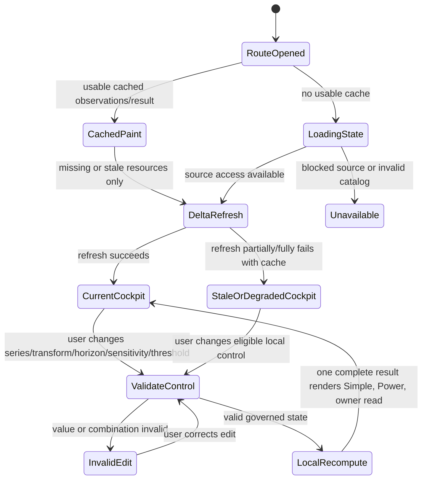
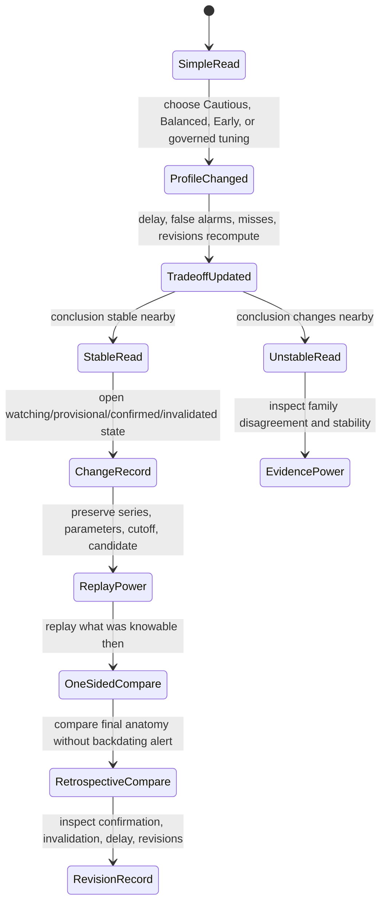
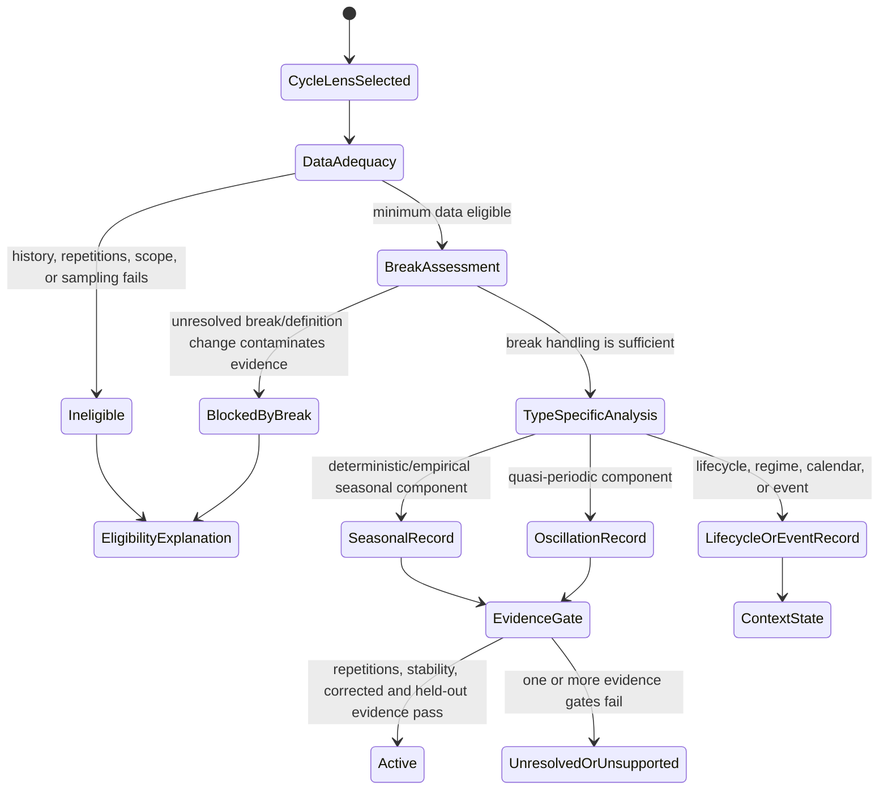
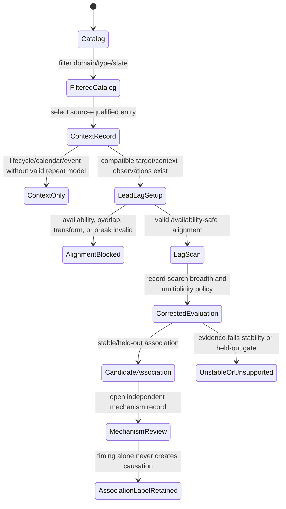
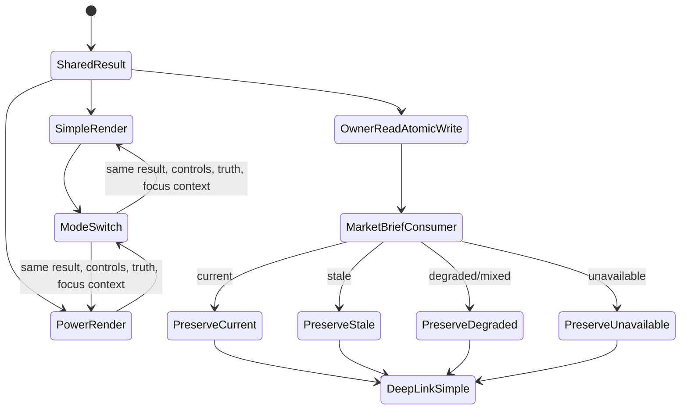

# Feature: 006 Trend Dynamics and Cycle Lab

## Problem Statement

Research Lab can describe price momentum, relative rotation, structural market regime, and causal hypotheses, but it cannot answer the more general question the user asked: whether an observed movement is a sustained trend, whether that trend is strengthening or weakening, whether an apparent turn is early evidence or noise, and which seasonal, cyclical, or exogenous contexts are actually relevant.

The current repository proves both the foundation and the gap:

- `rldata.js::sma` and `rldata.js::momentumPct` provide shared simple moving-average and trailing-momentum primitives only.
- `real-assets-lab.html::realTrendState` blends fixed 21-, 63-, and 126-bar returns with 50- and 200-bar position into one trend score. It does not estimate trend uncertainty, curvature, change points, cycle stability, or detector agreement.
- `sector-research-lab.html::computeEntry` defines acceleration as the ten-bar change in normalized relative-strength momentum and uses fixed `Basing` and `Peaking` thresholds. It is useful for relative rotation but is not a general trend-change detector.
- `swing-structure-lab.html` owns 20/50/200 moving-average alignment, weekly trend, pivots, chart structure, and market regime. Those heuristics do not separate real-time and retrospective turning points or decompose multiple seasonalities.
- `rlbrief.js::consecutiveRun` and `isPersistentSignal`, together with `notes/market-brief.md`, impose a 2-3 snapshot anti-whipsaw gate. The brief can report a change, but no owning tool measures detection delay, false alarms, revisions, or multi-method stability.
- Feature 001 owns causal rotation evidence and treats seasonality as a contextual prior. It does not own generic decomposition, spectral analysis, or cross-domain cycle validation.

A generic `trend-dynamics-cycle-lab.html` is therefore needed. It must operate on source-qualified time series, separate trend from seasonal and residual behavior, compare several established detector families, expose sensitivity without weakening evidence quality, and maintain a governed catalog of market, economic, technology, social, political, climate, weather, biological, agricultural, and physical cycle hypotheses.

The phrase "all known cycles" cannot truthfully mean that every named cycle is active, causal, or useful. The set is open-ended; many named economic and market cycles are retrospective labels, unstable estimates, or publication-mined stories. The product must instead be taxonomy-complete and extensible: every configured cycle is classified as deterministic calendar, empirical seasonality, quasi-periodic oscillation, lifecycle, regime, or one-off event, and is activated only when the target series has enough source-quality history and out-of-sample evidence.

## Outcome Contract

**Intent:** Let a research user determine the direction, persistence, strength, acceleration, deceleration, and possible turning state of a time series across multiple horizons, while seeing which seasonal or cyclical contexts are measured, merely scheduled, weakly associated, or unsupported.

**Success Signal:** For a valid selected series, Simple view states the dominant trend type and horizon, normalized strength, current dynamics, earliest credible change state, estimated effective change time, detection time and delay, confidence range, strongest confirming and contradicting methods, relevant seasonal/cycle context, and explicit conditions that would confirm or invalidate the read. Sensitivity and parameter changes recompute locally without changing source data. Power view reproduces every decomposition, detector vote, revision, cycle test, false-positive tradeoff, and as-of-safe walk-forward result.

**Hard Constraints:**

- Trend, turning point, structural break, seasonality, cycle, lifecycle, regime, event, and causation are distinct concepts and remain distinct in data and presentation.
- A real-time result uses only observations available by its decision timestamp. A retrospective result may use later observations only when labeled retrospective and may never overwrite the original real-time record.
- Every result identifies source, frequency, units, transform, observation window, missingness, revisions, and freshness. Missing or incompatible inputs never become zero or a neutral signal.
- Sensitivity may change smoothing, minimum effect size, persistence, detector threshold, or consensus requirement within governed bounds. It may not waive minimum history, provenance, multiple-testing control, no-look-ahead rules, or required invalidation.
- No single detector is treated as truth. The primary read exposes method agreement, disagreement, stability across nearby parameters, and the tradeoff between earlier detection and false alarms.
- A cycle claim requires a defined mechanism or calendar, period or phase range, minimum repetitions, stability evidence, geographic or population scope, source lineage, and out-of-sample evaluation. Coincidence and lead-lag correlation are not causation.
- Long cycles with insufficient history are unavailable, not estimated from a fraction of one cycle.
- Known future calendar dates may inform event context, but their effects remain scenarios until observed.
- Simple and Power use one selected series, one parameter state, and one computed result.
- The product is educational research, not investment advice, a scientific forecast guarantee, or a basis for automated execution.

**Failure Condition:** The feature fails even if it renders cleanly when it calls a smoothed wiggle a turn, uses future observations in an early-warning claim, presents an election date or technology lifecycle as a sinusoidal cycle, activates a 20-year cycle from three years of data, hides detector disagreement, lets sensitivity bypass evidence rules, treats a spectral peak as causal, or promotes an in-sample seasonal pattern without multiplicity-aware out-of-sample evidence.

## Goals

- Deliver one reusable trend-dynamics capability rather than another market-specific moving-average dashboard.
- Detect and distinguish sustained uptrends, downtrends, flat/range states, nonlinear trends, segmented trends, accelerating and decelerating trends, inflections, peaks, troughs, reversals, level shifts, volatility shifts, and regime transitions.
- Support early warning and retrospective confirmation as separate products with visible detection delay and revision history.
- Make sensitivity, horizon, smoothing, effect-size, persistence, consensus, and cycle controls steerable in Simple view and fully inspectable in Power.
- Decompose trend, multiple seasonal patterns, quasi-periodic components, interventions, and residual noise without forcing every source into one method.
- Maintain an extensible cross-domain cycle knowledge catalog whose entries are evidence-ranked and relevance-tested against the selected target.
- Compare method families and prefer robust agreement over false precision from one optimized parameter set.
- Publish one compact state-faithful owner read for the Market Brief without duplicating this feature's trend or cycle calculations.

## Non-Goals

- Claiming that every named historical cycle is real, stationary, causal, or currently relevant.
- Turning astronomical, lunar, election, generational, technology, climate, or calendar coincidence into a market prediction without a plausible mechanism and target-specific evidence.
- Replacing Feature 001 causal-rotation hypotheses, Sector Rotation relative-strength ownership, Swing Structure support/resistance and chart-pattern ownership, or domain-specific weather and macro forecasts.
- Automated trading, portfolio allocation, personalized advice, policy recommendations, or guaranteed forecasts.
- Hiding model selection, smoothing lag, endpoint instability, parameter sensitivity, data revisions, false alarms, or missed turns behind one score.
- Using a two-sided smoother or full-sample decomposition as proof that the same turn was knowable in real time.
- Treating search interest, news volume, social activity, or market price as a direct measure of adoption, public belief, causation, or welfare.

## Current Capability Map

| Capability | Current Repository Evidence | Status | Gap Owned By Feature 006 |
| --- | --- | --- | --- |
| Shared time-series cache | `rldata.js` stores source-tagged interval bars and provides `sma` plus trailing momentum | Generic foundation exists | No generic transform, decomposition, change, cycle, or revision contract |
| Multi-horizon directional trend | `real-assets-lab.html::realTrendState`, Global Rotation, and Market Brief use fixed return and moving-average windows | Partial | No uncertainty, robust slope, curvature, persistence, or nearby-parameter stability |
| Relative acceleration | `sector-research-lab.html::computeEntry` uses ten-bar change in RS-Momentum | Complete for relative rotation | Not a general acceleration estimate and no false-turn calibration |
| Structural market regime | `swing-structure-lab.html` owns MA alignment, weekly trend, Weinstein stage, pivots, and market regime | Complete for its market workflow | No generic source/frequency support or real-time-versus-retrospective distinction |
| Persistence gate | `rlbrief.js::consecutiveRun` and `isPersistentSignal`; `notes/market-brief.md` requires 2-3 distinct snapshots or structural/corroborating evidence | Partial | No owner for calibrated persistence, detection delay, or revision |
| Causal and seasonal context | Feature 001 models causal evidence and requires seasonality/election samples, dispersion, and regime compatibility | Partial | No generic seasonality decomposition or cycle-relevance test |
| Walk-forward honesty | Strategy Validation owns embargoed out-of-sample evaluation and multiple-testing-aware performance validation | Existing pattern | No detector-event scoring for timeliness, false alarms, precision, recall, or revision |
| General trend and cycle lab | No registered tool in `tools.json` owns this capability | Missing | Entire capability |

## Honest Findings, Contradictions, And Limitations

1. **Early and certain are competing objectives.** Lower delay generally raises false alarms. The product must show the tradeoff rather than promise both maximal earliness and high certainty.
2. **Turning points are not observable at the instant they occur.** A peak or trough needs later evidence. The tool must distinguish estimated effective time from detection time and report the delay.
3. **Smoothing can create or move turns.** Stronger smoothing reduces noise but adds lag; two-sided smoothing also revises endpoints as later data arrive.
4. **Acceleration is scale- and transform-dependent.** A second difference in levels, log levels, rates, and percentage changes can tell different stories. Every dynamics claim requires the active transform and units.
5. **A structural break can masquerade as a cycle.** Spectral or autocorrelation methods applied across a level shift can manufacture apparent periodicity unless breaks and trend are handled first.
6. **A spectral peak is not a forecast.** Frequency-domain power does not by itself establish stable phase, future recurrence, mechanism, or target relevance.
7. **Irregularly sampled and revised data need different treatment.** Interpolation can invent smoothness or periodicity; vintage-aware macro series can change historical turning signals.
8. **Long cycles need long histories.** Business, financial, demographic, climate, and technology narratives often have too few independent repetitions for strong inference.
9. **Historical cycle names are not equivalent evidence.** Kitchin, Juglar, Kuznets, and Kondratiev labels are useful catalog concepts, but they are not operational clocks without current source-qualified validation.
10. **Technology adoption is usually a lifecycle, not a periodic oscillator.** S-curves, diffusion, hype, replacement, inventory, and capital-spending waves must remain separate.
11. **Political cycles mix fixed calendars and contingent effects.** Election and budget dates are known; direction, magnitude, and transmission are not.
12. **Weather and climate teleconnections are regional and probabilistic.** ENSO, MJO, and other oscillations have accepted phase definitions, but impact depends on season, geography, and target mechanism.
13. **Cross-domain lead-lag is especially vulnerable to data mining.** Searching many periods, lags, series, geographies, and transforms requires explicit multiplicity control and held-out evaluation.
14. **Method agreement can still be wrong.** Highly related smoothers are not independent confirmations. Agreement must be reported by method family and shared-input cluster.
15. **The repository currently has strong daily market data patterns but no generic social, technology, political, or weather source contract.** Those categories require explicit source records and may be unavailable for a selected target; the product cannot silently substitute prose or generated data.

## Established Technique Matrix

The feature needs representative established families, not a bag of every named indicator. Each row below has a different inferential job. A design that implements several rows from one family while omitting the others would create false consensus.

| Family / Technique | Primary Question | Real-Time Posture | Strength | Main Failure Mode | Required Product Treatment |
| --- | --- | --- | --- | --- | --- |
| Multi-horizon SMA/EMA, MA slope and stack | Is level direction aligned across fixed horizons? | One-sided and current | Transparent, cheap, familiar, already used in Research Lab | Lag, arbitrary windows, correlated confirmations, poor uncertainty | Keep as one technical-filter family; expose lag/window sensitivity and never count each average independently |
| OLS or log-linear slope | What is average directional rate over a window? | One-sided rolling | Interpretable slope, fit, residuals, and units | Outlier sensitivity, serial correlation, window dependence, nonlinear misspecification | Show slope, robust uncertainty, residual diagnostics, transform, and nearby-window stability |
| Theil-Sen slope plus Kendall rank trend | Is direction monotonic and robust to outliers? | One-sided rolling | Median pairwise slope and rank-based agreement; confidence bounds are inspectable | Assumes a useful monotonic summary; autocorrelation and seasonality can distort significance | Treat as robust/nonparametric family and correct inference for the active dependence/seasonality policy |
| Local polynomial / LOESS smoother | How is a nonlinear trend bending locally? | One-sided only for early warning; two-sided for retrospective anatomy | Flexible local trend and derivatives | Endpoint revision, bandwidth choice, over-smoothing, false curvature | Compare one-sided and retrospective estimates; expose bandwidth and endpoint instability |
| STL / MSTL decomposition | How much behavior is trend, one or more seasonal patterns, and remainder? | Primarily descriptive; endpoint-sensitive | Robust weighting, changing seasonality, multiple periods, residual-relative strength | Period/window assumptions, missing-data handling, short histories, endpoint revisions | Require explicit periods, windows, robustness, repetitions, residual diagnostics, and revision labels |
| Local-level / local-linear state-space trend | What are the current latent level, slope, and uncertainty as observations arrive? | Naturally sequential when filtered | Dynamic slope, uncertainty, interventions, stochastic components | Model/specification sensitivity, distribution assumptions, parameter instability | Expose model variant, filtered versus smoothed state, interval, fit diagnostics, and nearby-model stability |
| Trend/seasonal strength, linearity and curvature features | Is trend or seasonality material relative to unexplained variation? | Available from current decomposition | Dimensionless, comparable, useful for ranking many series | Depends on decomposition quality and can hide direction | Report as evidence components, never as direction or turn by themselves |
| ADF/KPSS, runs and residual autocorrelation diagnostics | Is the transformed behavior compatible with the assumptions of the selected method? | Current-window diagnostic | Complementary null hypotheses and non-randomness checks | Low power, contradictory outcomes, dependence on deterministic terms and lag choice | Preserve all outcomes and assumptions; use to gate/qualify methods, not as a trading signal |
| EWMA and CUSUM | Has a small sustained shift accumulated relative to a stable baseline? | Online | Explicit memory, target shift, false-alarm and miss tradeoff; CUSUM is efficient for small shifts | Baseline drift, serial dependence, poor calibration, repeated alarms | Expose memory/reference/control limits, reset rule, average run length or equivalent, and calibration window |
| Bayesian online change-point run length | How likely is a new generating regime now, and how long has the current run lasted? | Online | Probabilistic run length and modular observation models | Hazard prior and likelihood misspecification; computational growth; sensitive probabilities | Expose hazard/likelihood assumptions, posterior run-length distribution, calibration, and decision threshold |
| Penalized offline segmentation (PELT, dynamic programming, binary/window/kernel variants) | Where did level, slope, distribution, rank, kernel, or autoregressive behavior change in the completed sample? | Retrospective | Multiple breaks and method-specific costs | Penalty/segment count determines answer; not real-time evidence | Label retrospective, expose cost and penalty, assess breakpoint stability, and never backdate an alert |
| Markov-switching / hidden-state regime model | Which persistent latent state is probable, and how likely is transition? | Filtered for current use; smoothed retrospectively | State probabilities, switching means/slopes/variances, expected durations | Number/label of states, local optima, unstable estimates, smoothed look-ahead | Expose state count, parameter search, filtered/smoothed distinction, transition uncertainty, and duration stability |
| Prominence/width/distance peak-trough detection | Which local extrema are large and separated enough to matter? | A peak is provisional until later samples arrive | Direct control of prominence, width, distance and plateaus | Noise shifts extrema; smoothing and future samples move the date | Require prominence/effect size, confirmation delay, smoothing disclosure, and invalidation history |
| ACF plus periodogram/Welch spectrum | Is repeated power concentrated near a frequency in evenly sampled residuals? | Descriptive; rolling windows for current stability | Frequency inventory; Welch reduces variance by segment averaging | Spectral leakage, aliasing, trend/break contamination, low frequency resolution, no phase stability | Detrend/de-break first; expose window, segment, overlap, resolution, repetitions, and rolling stability |
| Generalized Lomb-Scargle | Is a weak periodic component supported under uneven sampling? | Descriptive or rolling | Weighted least-squares frequency scan with floating mean for irregular observations | Frequency-grid search, low-frequency amplitude blow-up, sampling-window aliases, multiplicity | Expose frequency grid, floating mean, weights, sampling window, significance/correction, and held-out stability |
| Dynamic harmonic regression / Fourier terms | Can a long or multiple seasonal pattern be represented compactly? | One-sided fit and forecast when predictors are known | Arbitrary periods and controllable smoothness | Fixed seasonality assumption, term-count overfit, overlapping harmonics, unknown future predictors | Select term count without confirmation leakage; show fixed-pattern assumption and predictor scenarios |
| Continuous wavelet transform | Does cycle energy, period, or phase vary through time? | Retrospective anatomy; rolling current estimates with edge caveats | Joint time-frequency view for intermittent or drifting cycles | Wavelet/scale/bandwidth choice, aliasing at low scales, edge effects, false visual patterns | Expose wavelet, scale-to-frequency mapping, resolution, cone/edge limits, significance and nearby-parameter stability |
| Cross-correlation, lag scan and event study | Does one series tend to precede another, or does a calendar event have a repeatable distribution? | Availability-safe rolling or frozen event windows | Interpretable lead/lag and event dispersion | Nonstationarity, common drivers, overlapping windows, multiple searches, leakage | Require mechanism-neutral association labels, search breadth, adjusted evidence, held-out stability, and regime slices |
| Price-specific ADX/MACD/RSI or breadth/volume confirmation | Does a traded series show directional strength or participation under market conventions? | Online on closed/current bars with confirmation state | Useful domain confirmation and repository interoperability | Price-only scope, correlated formulas, bar-in-progress revision, arbitrary thresholds | Optional market overlay only; never the generic trend foundation or cross-domain consensus |

## Domain Capability Model

### Capability

**Trend Dynamics And Contextual Cycle Intelligence** transforms a source-qualified time series into multi-horizon trend, strength, dynamics, change-event, seasonal, quasi-periodic, and context evidence, while preserving as-of truth, method disagreement, sensitivity tradeoffs, and cycle relevance.

### Domain Primitives

| Primitive | Purpose | Lifecycle |
| --- | --- | --- |
| SeriesDescriptor | Defines target meaning, source, geography/population, frequency, units, transform eligibility, revision policy, and expected cadence | configured -> available, stale, revised, incompatible, or unavailable |
| ObservationVintage | Freezes values and availability times known at one decision timestamp | ingested -> valid or rejected -> retained as immutable as-of evidence |
| DataQualityProfile | Records coverage, missingness, irregular spacing, outliers, revisions, frequency changes, and minimum usable history | assessed on every run -> sufficient, degraded, or blocking |
| AnalysisTransform | Defines level, log level, difference, growth rate, seasonal adjustment, normalization, and unit conversion without altering source observations | selected -> validated -> applied -> superseded on user change |
| AnalysisHorizon | Defines sampling interval, lookback, minimum repetitions, and decision horizon | configured -> selected -> unavailable when history is insufficient |
| SensitivityProfile | Governs smoothing, effect size, persistence, change probability, detector agreement, and false-alarm posture | cautious, balanced, or early -> locally tuned within bounds |
| TrendEstimate | Directional level and slope estimate with uncertainty, robustness, horizon, and endpoint status | insufficient -> emerging -> sustained -> weakening -> ended or revised |
| TrendStrength | Dimensionless evidence describing signal relative to residual variation, monotonicity, persistence, and fit | unavailable -> weak, moderate, or strong -> revised |
| DynamicsEstimate | Slope, change in slope, curvature, and acceleration/deceleration classification with units and uncertainty | unavailable -> stable, accelerating, decelerating, or inflecting -> revised |
| ChangeCandidate | Evidence of a level, slope, variance, distribution, correlation, or regime change | watching -> provisional -> confirmed, invalidated, merged, or superseded |
| TurningPoint | Peak, trough, reversal, or inflection with estimated effective time, detection time, delay, confidence, and revision history | candidate -> provisional -> confirmed or invalidated -> retrospectively dated |
| RegimeState | Persistent combination of direction, strength, volatility/noise, and change state | emerging -> active -> weakening -> transitioned |
| SeasonalComponent | Calendar-anchored repeating component with period, amplitude, phase, stability, and coverage | candidate -> validated -> active, drifting, broken, or unavailable |
| CycleHypothesis | Quasi-periodic component or domain cycle with type, mechanism, period range, phase, stability, relevance, and evidence tier | cataloged -> eligible -> detected -> active, dormant, rejected, or unresolved |
| ContextEvent | Dated technology, social, political, weather, climate, policy, supply, or physical event/state that may align with the target | scheduled, observed, revised, expired, or unavailable |
| DetectorResult | One method-family vote with parameters, effective time, detection time, confidence, and limitations | computed -> stable, unstable, contradicted, or unavailable |
| ConsensusRead | Family-clustered synthesis that preserves agreements and contradictions | unavailable -> candidate -> supported -> confirmed, weakened, or invalidated |
| WalkForwardRecord | As-of-safe detector outcome containing alert, target event, lead/lag, false alarm, miss, revision, and parameter state | append-only evaluation history |
| ToolDecisionRead | Compact owner read for other Research Lab surfaces | unavailable -> current or stale -> superseded |

### Relationships

- A SeriesDescriptor owns many ObservationVintages; every real-time result resolves exactly one vintage cutoff.
- A valid AnalysisTransform and AnalysisHorizon produce a transformed analysis series without rewriting source observations.
- TrendEstimate, TrendStrength, DynamicsEstimate, ChangeCandidate, SeasonalComponent, and CycleHypothesis each reference the same transform, horizon, vintage, and DataQualityProfile.
- A TurningPoint references one or more ChangeCandidates and records estimated effective time separately from detection time.
- DetectorResults are grouped by method family so multiple related smoothers do not masquerade as independent confirmation.
- A ConsensusRead combines family-level support, contradiction, and unavailable evidence; it never averages away disagreement.
- A CycleHypothesis may reference ContextEvents and SeasonalComponents, but temporal alignment alone cannot create a causal relationship.
- A WalkForwardRecord evaluates what was knowable at each timestamp and never inherits later retrospective labels as contemporaneous evidence.
- Simple, Power, and ToolDecisionRead consume one ConsensusRead and one parameter state.

### Business Policies

1. **Concept-separation policy:** Trend, strength, acceleration, turn, break, seasonality, cycle, lifecycle, regime, event, association, and causation remain separate typed claims.
2. **As-of policy:** Every early-warning result uses only the ObservationVintage available at that decision time. Retrospective labels are visibly separate.
3. **Delay policy:** Every provisional or confirmed turn reports effective time, first detection time, confirmation time, and corresponding delays.
4. **Revision policy:** A later re-estimate appends a revision; it never rewrites the original alert or parameter state.
5. **Family-independence policy:** Confirmations are counted by method family and evidence cluster, not by raw indicator count.
6. **Sensitivity-integrity policy:** Sensitivity changes earliness and false-alarm tolerance within configured bounds but cannot weaken source, history, as-of, multiplicity, or invalidation requirements.
7. **Data-adequacy policy:** Each method declares minimum observations, regularity, repetitions, and supported transforms. Failing a requirement produces unavailable.
8. **Endpoint-honesty policy:** One-sided and two-sided estimates are labeled, compared, and never substituted for one another.
9. **Cycle-taxonomy policy:** Every catalog entry is one of deterministic calendar, empirical seasonality, quasi-periodic oscillation, lifecycle, regime, or event. A label cannot silently change type.
10. **Cycle-evidence policy:** An active cycle needs mechanism/calendar, expected period range, enough repetitions, stable phase/amplitude evidence, source lineage, target relevance, and out-of-sample support.
11. **Long-cycle policy:** A cycle with less than the configured minimum complete repetitions is unavailable regardless of visual fit.
12. **Multiplicity policy:** Searching multiple periods, lags, transforms, targets, or contexts records the search count and applies the configured false-discovery or family-wise error policy.
13. **Break-before-cycle policy:** Structural breaks, missingness, frequency changes, and interventions are assessed before periodicity; unresolved breaks reduce or block cycle claims.
14. **Lead-lag policy:** Cross-correlation or phase lead is association evidence only. Causal language requires an independently sourced mechanism and non-leaky evaluation.
15. **No-forced-read policy:** A valid output may be sustained, changing, mixed, cycle-unresolved, or unavailable. The product never manufactures a directional conclusion.
16. **One-model policy:** Simple, Power, and the owner read use the same resolved data, transform, horizon, sensitivity, detector set, and consensus.

## Actors And Personas

| Actor | Description | Key Goals | Permission Boundary |
| --- | --- | --- | --- |
| Cross-Domain Trend Researcher | Studies any configured market, macro, technology, social, climate, or operational series | Determine what kind of trend exists, how strong it is, and whether its dynamics are changing | May select series and parameters; cannot convert unavailable evidence into a conclusion |
| Tactical Market Researcher | Needs earlier evidence of acceleration, deceleration, peak, trough, or regime shift | Trade off detection speed against false alarms and preserve structural context | Receives educational signals only; no automated execution or personalized advice |
| Macro And Cycle Analyst | Compares business, financial, inventory, policy, and long-horizon context | Separate recurring evidence from retrospective cycle stories and data revisions | May inspect and challenge cycles; cannot promote a catalog entry without evidence |
| Technology And Social Trend Scout | Tracks adoption, attention, diffusion, replacement, and narrative change | Distinguish sustained adoption from hype, seasonality, one-off virality, or measurement changes | Search or social activity remains a proxy and cannot be called adoption by itself |
| Weather And Climate Context Analyst | Uses climate and weather states where they plausibly affect a target | See phase, regional relevance, seasonal interaction, and uncertainty | Cannot universalize a teleconnection or turn it into target causation without evidence |
| Model Auditor / Risk Manager | Challenges detector stability, revisions, multiplicity, look-ahead, and false positives | Reproduce the read and understand why methods disagree | May tighten evidence thresholds; cannot edit historical alerts |
| Market Brief Consumer | Needs one normalized trend-change read and deep link | Reuse current evidence without duplicating calculations | Consumes only the owner read and preserves stale/unavailable state |

## Use Cases

### UC-001: Diagnose a sustained trend

- **Actor:** Cross-Domain Trend Researcher
- **Preconditions:** A source-qualified series and enough history for at least two independent trend families exist.
- **Main Flow:**
  1. The user selects the series, transform, horizon, and sensitivity.
  2. The product estimates direction, slope, monotonicity, residual-relative trend strength, persistence, and uncertainty.
  3. It classifies the trend type and displays family-level agreement and contradictions.
  4. It names the evidence that would weaken or end the trend.
- **Alternative Flows:** Insufficient history or incompatible frequency produces unavailable methods and no forced consensus.
- **Postconditions:** The user can explain direction, duration, strength, noise, and the basis of the sustained-trend claim.

### UC-002: Detect acceleration, deceleration, and inflection

- **Actor:** Tactical Market Researcher
- **Preconditions:** A valid trend estimate exists over at least two nested horizons.
- **Main Flow:**
  1. The product estimates current slope and change in slope using robust and state-updating families.
  2. It distinguishes accelerating with-trend movement, decelerating but intact trend, inflection watch, and confirmed reversal.
  3. It reports effect size, uncertainty, persistence, and nearby-parameter stability.
- **Alternative Flows:** A curvature sign change below minimum effect size remains noise.
- **Postconditions:** The user knows whether momentum is changing without being told that every deceleration is a reversal.

### UC-003: Tune early-warning sensitivity honestly

- **Actor:** Tactical Market Researcher or Model Auditor / Risk Manager
- **Preconditions:** At least one online detector and one confirmation family are available.
- **Main Flow:**
  1. The user selects cautious, balanced, or early sensitivity and may tune governed parameters.
  2. Results update locally with changed detection delay, persistence, effect-size, and consensus thresholds visible.
  3. The product shows how historical false alarms, misses, and median delay change under the selected profile.
- **Alternative Flows:** A requested parameter outside configured bounds is rejected.
- **Postconditions:** Earlier settings visibly accept more false-alarm risk without weakening evidence integrity.

### UC-004: Separate a real-time turn from retrospective confirmation

- **Actor:** Model Auditor / Risk Manager
- **Preconditions:** A candidate turn and later confirming observations exist.
- **Main Flow:**
  1. The user replays the series by vintage or observation cutoff.
  2. The product shows when each detector first alerted and when confirmation became available.
  3. It compares the one-sided result with the final retrospective estimate and records revisions.
- **Alternative Flows:** If vintage data are unavailable, the product labels replay limitations and does not claim revision-safe macro history.
- **Postconditions:** The user can distinguish what was knowable then from what looks obvious now.

### UC-005: Decompose seasonality and quasi-periodic behavior

- **Actor:** Cross-Domain Trend Researcher or Macro And Cycle Analyst
- **Preconditions:** Frequency, calendar, coverage, and minimum repetitions are known.
- **Main Flow:**
  1. The product assesses one or more plausible seasonal periods after transformations and break checks.
  2. It estimates trend, each seasonal component, residual, strength, phase, and drift.
  3. It compares calendar/decomposition evidence with spectral and time-frequency evidence.
  4. It reports whether the component is stable, drifting, intermittent, unresolved, or unsupported.
- **Alternative Flows:** Irregular data use an eligible irregular-sampling method or remain unavailable; they are not silently interpolated.
- **Postconditions:** The user understands which repetition is measured and whether it is stable enough to inform the current read.

### UC-006: Evaluate a cross-domain cycle catalog entry

- **Actor:** Macro And Cycle Analyst, Technology And Social Trend Scout, or Weather And Climate Context Analyst
- **Preconditions:** A catalog entry has a type, source, mechanism/calendar, period range or lifecycle stages, scope, and evidence requirements.
- **Main Flow:**
  1. The user enables a category or cycle lens for the selected target.
  2. The product checks history length, repetitions, phase/amplitude stability, current state, target relevance, and out-of-sample association.
  3. It classifies the lens as active, contextual, contradictory, unresolved, or ineligible.
- **Alternative Flows:** A lifecycle or fixed calendar is displayed as context and never forced through an oscillatory phase model.
- **Postconditions:** The user sees why a cycle is or is not relevant instead of receiving a universal cycle overlay.

### UC-007: Compare series and candidate leading relationships

- **Actor:** Cross-Domain Trend Researcher
- **Preconditions:** Two compatible source-qualified series overlap for enough observations.
- **Main Flow:**
  1. The product aligns availability-safe observations and evaluates lagged association across governed lags.
  2. It reports sign, strength, stability, search breadth, lead-time distribution, and regime dependence.
  3. It labels the result association unless a separate mechanism record exists.
- **Alternative Flows:** Nonstationary or structurally broken relationships remain unstable or unavailable.
- **Postconditions:** The user can use a candidate lead as context without mistaking it for causation.

### UC-008: Publish one owner read

- **Actor:** Market Brief Consumer
- **Preconditions:** The tool has a current, stale, degraded, or unavailable consensus state.
- **Main Flow:**
  1. The tool publishes direction, trend type, horizon, strength, dynamics, earliest credible change state, relevant context, confidence, as-of, and deep link.
  2. Market Brief consumes that read without reimplementing detector or cycle logic.
- **Alternative Flows:** Stale, degraded, and unavailable states remain unchanged in the consumer.
- **Postconditions:** Other Research Lab surfaces reuse one state-faithful trend read.

## Business Scenarios

### BS-001: Noisy sustained trend is recognized without chasing every wiggle

```gherkin
Scenario: Multiple method families support a sustained trend
  Given a valid series has a persistent positive direction across the selected horizon
  And short-lived residual fluctuations do not exceed the governed change threshold
  When the balanced profile is evaluated
  Then the result identifies a sustained uptrend with strength and uncertainty
  And local residual wiggles are not emitted as turning points
  And supporting and contradicting method families are visible
```

### BS-002: Acceleration is separated from trend direction

```gherkin
Scenario: An established uptrend accelerates
  Given the selected series is in a sustained uptrend
  And its source-qualified slope increases by more than the configured effect size with required persistence
  When trend dynamics are evaluated
  Then direction remains up
  And dynamics are classified as accelerating
  And the acceleration units, horizon, uncertainty, and confirming families are shown
```

### BS-003: Deceleration does not automatically become a reversal

```gherkin
Scenario: Uptrend weakens while direction remains positive
  Given the selected series has a positive trend slope
  And its slope is declining but has not crossed the reversal or change threshold
  When trend dynamics are evaluated
  Then the result is decelerating uptrend rather than downtrend
  And the product shows the confirmation and invalidation conditions for an inflection watch
```

### BS-004: Early turning candidate records detection delay

```gherkin
Scenario: A provisional peak is detected before full confirmation
  Given an online detector raises a source-qualified peak candidate
  And at least one independent confirmation family agrees
  When the early profile is evaluated
  Then the result is provisional peak watch rather than confirmed reversal
  And estimated effective time and first detection time are both shown
  And later confirmation appends its confirmation time and delay
```

### BS-005: A false early turn is preserved and invalidated

```gherkin
Scenario: Candidate reversal fails persistence
  Given an early sensitivity profile raises a reversal candidate
  And subsequent observations restore the prior trend before confirmation
  When the candidate is reevaluated
  Then it is marked invalidated rather than deleted
  And its original data cutoff, parameters, alert time, and false-alarm outcome remain inspectable
```

### BS-006: Sensitivity changes the speed-risk tradeoff, not evidence rules

```gherkin
Scenario: User changes from cautious to early sensitivity
  Given the same valid series, transform, and horizon
  When the user selects early sensitivity
  Then lower governed effect-size or persistence thresholds may reveal an earlier candidate
  And the displayed historical false-alarm and delay profile updates
  And source, history, as-of, multiplicity, and invalidation requirements remain unchanged
```

### BS-007: Retrospective smoothing cannot claim real-time foresight

```gherkin
Scenario: Final decomposition dates a turn earlier than it was detectable
  Given a two-sided retrospective estimate uses observations after the turn
  And the real-time one-sided estimate alerted later
  When the user compares the results
  Then the retrospective and real-time dates remain separate
  And the early-warning record uses the real-time detection date
  And the difference is reported as endpoint revision and detection delay
```

### BS-008: Multiple seasonalities remain separate

```gherkin
Scenario: Daily series contains weekly and annual seasonal patterns
  Given the series has enough complete repetitions for both configured periods
  When seasonal decomposition is evaluated
  Then weekly and annual components have separate strength, phase, amplitude, and stability records
  And neither component is counted as the long-term trend
```

### BS-009: Irregular sampling does not create invented observations

```gherkin
Scenario: A source has uneven observation times and missing intervals
  Given the selected series is irregularly sampled
  When cycle evidence is evaluated
  Then only methods eligible for irregular observations may contribute
  And any explicit resampling or imputation is labeled with its effect
  And silent interpolation cannot create a seasonal or cycle claim
```

### BS-010: Insufficient history blocks a long cycle

```gherkin
Scenario: Long-horizon cycle has less than the required repetitions
  Given a configured cycle requires multiple complete repetitions
  And the selected series contains less than that history
  When cycle relevance is evaluated
  Then the cycle is ineligible with the exact coverage shortfall
  And no phase, next-turn date, or confidence value is produced
```

### BS-011: Technology lifecycle is not forced into periodicity

```gherkin
Scenario: Search attention follows an adoption or hype lifecycle
  Given a technology series shows launch, acceleration, saturation, and decline stages
  And no stable repeating period is supported
  When the technology lens is evaluated
  Then the result is a lifecycle stage with proxy limitations
  And it is not labeled an oscillatory cycle or proof of adoption
```

### BS-012: Political calendar is known but effect remains uncertain

```gherkin
Scenario: Election or budget date is fixed in advance
  Given a political calendar event has an official date
  And target effects vary across prior samples or regimes
  When the event context is displayed
  Then the date is deterministic calendar context
  And direction and magnitude remain scenarios with sample, dispersion, and mechanism
  And the event alone cannot confirm a trend turn
```

### BS-013: Climate oscillation is scoped to geography and season

```gherkin
Scenario: ENSO phase is considered for a regional target
  Given an official ENSO state and target-specific regional mechanism are available
  When climate context is evaluated
  Then the phase, source, confidence, season, geography, and historical dispersion are shown
  And no universal target effect is asserted
```

### BS-014: Structural break is not misreported as a cycle

```gherkin
Scenario: Series level shifts after a definition or regime change
  Given a source revision, measurement change, or one-time intervention creates a persistent level shift
  When periodicity is evaluated
  Then break evidence is shown before cycle evidence
  And unresolved break contamination reduces or blocks periodic conclusions
```

### BS-015: Multiple cycle searches are multiplicity controlled

```gherkin
Scenario: User scans many candidate periods and lags
  Given the analysis evaluates multiple periods, transforms, lags, or context series
  When significance and ranking are calculated
  Then the search count and correction policy are visible
  And an in-sample peak that fails corrected or held-out criteria is labeled unsupported
```

### BS-016: Detector disagreement remains visible

```gherkin
Scenario: Slope methods strengthen while change-point methods do not confirm
  Given trend estimators report acceleration
  And independent change-point or regime families remain below threshold
  When the consensus is formed
  Then the result preserves the disagreement
  And it cannot be promoted to confirmed regime change by averaging scores
```

### BS-017: Lead-lag association does not become causation

```gherkin
Scenario: Social attention appears to lead a market series
  Given a lag scan finds an availability-safe association
  And no independently sourced transmission mechanism is established
  When the relationship is displayed
  Then it is labeled a candidate lead-lag association
  And search breadth, stability, regime dependence, and out-of-sample result are shown
  And causal language is prohibited
```

### BS-018: Missing or stale data produces a truthful state

```gherkin
Scenario: Required source data are missing, stale, or revised incompatibly
  Given the selected analysis lacks required current observations or a compatible vintage
  When the tool evaluates the series
  Then affected methods and consensus are degraded or unavailable with exact reasons
  And no cached value is described as current
  And no missing value becomes zero or neutral
```

### BS-019: Simple and Power cannot disagree

```gherkin
Scenario: User switches views and adjusts parameters
  Given one valid series and one resolved parameter state
  When the user switches Simple and Power or changes a governed control
  Then both views show the same trend, dynamics, turn state, cycle relevance, confidence, and truth state
  And parameter changes recompute without refetching unchanged source data
```

### BS-020: Owner read preserves uncertainty

```gherkin
Scenario: Market Brief consumes a mixed or unavailable trend read
  Given the owning tool reports mixed detector evidence, stale context, or unavailable analysis
  When the owner read is published and consumed
  Then the same state and caveat appear in the consumer
  And the consumer cannot fill missing evidence or recalculate the verdict
```

## Requirements

### Series, Time, And Data Integrity

- **FR-001:** The feature must provide one self-contained Trend Dynamics and Cycle Lab with Simple and Power views over one shared analysis state.
- **FR-002:** Every selectable series must declare source, measure, geography or population, units, frequency, observation timestamp, publication or availability timestamp when applicable, revision policy, and freshness.
- **FR-003:** Every analysis must declare the exact source vintage or observation cutoff it uses.
- **FR-004:** The product must assess observation count, time span, missingness, irregular spacing, outliers, frequency changes, revisions, and structural metadata changes before analysis.
- **FR-005:** Missing, null, non-finite, duplicate, out-of-order, or unit-incompatible observations must produce explicit validation outcomes and cannot silently become valid values.
- **FR-006:** The user must be able to select an eligible level, log-level, difference, rate-of-change, growth, seasonal-adjustment, normalization, or unit transform.
- **FR-007:** Transform labels and resulting units must remain visible on every trend, strength, acceleration, and cycle output.
- **FR-008:** An ineligible transform must be rejected with the governing reason; it cannot be replaced by another transform.
- **FR-009:** Resampling, interpolation, winsorization, outlier adjustment, seasonal adjustment, or revision handling must be explicit and reversible in the analysis record.
- **FR-010:** A real-time replay must use only values and revisions available at each replay timestamp.

### Trend Direction, Type, And Strength

- **FR-011:** The product must classify trend direction as rising, falling, flat/range, mixed, or unavailable for every selected horizon.
- **FR-012:** The product must distinguish monotonic, approximately linear, nonlinear, segmented, exponential or saturating, mean-reverting/range, and regime-dependent trend types when supported.
- **FR-013:** Direction must include slope, normalized slope, effect size, uncertainty range, duration, and stability across nearby windows or parameter values.
- **FR-014:** Trend strength must combine inspectable evidence for residual-relative strength, monotonicity, persistence, fit, and noise rather than one unlabeled score.
- **FR-015:** At least one robust slope family, one local or state-updating trend family, and one monotonic/nonparametric family must contribute when eligible.
- **FR-016:** Methods sharing the same mathematical family must be clustered and cannot count as independent confirmations.
- **FR-017:** The product must show method-family votes, unavailable methods, contradictions, and the reason each method carries its current weight.
- **FR-018:** A sustained-trend claim must satisfy configured minimum duration, effect size, persistence, data quality, and independent-family support.
- **FR-019:** A flat or mixed result must remain a first-class conclusion and cannot be forced into rising or falling.

### Strength Change, Acceleration, And Deceleration

- **FR-020:** The product must estimate current slope and change in slope over at least two nested horizons.
- **FR-021:** Dynamics states must include stable, accelerating, decelerating, inflecting, and unavailable, independent of direction.
- **FR-022:** Acceleration and curvature must include units, transform, horizon, effect size, uncertainty, persistence, and parameter stability.
- **FR-023:** A decelerating uptrend and an accelerating downtrend must remain distinct from a confirmed reversal.
- **FR-024:** Inflection watches require a governed change in slope plus independent evidence or persistence; a single noisy second difference is insufficient.
- **FR-025:** The product must expose whether a dynamics result is driven by the newest observation, an outlier adjustment, a window boundary, or a broad run of observations.

### Change Points, Turning Points, And Regimes

- **FR-026:** The detector registry must cover level, slope, variance, distribution, correlation, and regime changes when the selected series supports them.
- **FR-027:** The product must distinguish online early-warning detectors from offline retrospective segmentation.
- **FR-028:** Online evidence must include at least cumulative small-shift monitoring and probabilistic or sequential run-length evidence when eligible.
- **FR-029:** Retrospective evidence must include penalized or segmented change-point analysis and must report its penalty or segment-count assumptions.
- **FR-030:** Regime evidence must support persistent state transitions and transition uncertainty rather than only threshold crossings.
- **FR-031:** Turning-point types must include provisional peak, confirmed peak, provisional trough, confirmed trough, reversal, inflection, and invalidated candidate.
- **FR-032:** Every turning point must record estimated effective time, first detection time, confirmation time, detection delay, active parameters, data cutoff, and revision history.
- **FR-033:** Turning-point confirmation must require configured persistence or independent family support and an explicit invalidation condition.
- **FR-034:** A candidate that fails confirmation must remain in evaluation history as invalidated.
- **FR-035:** One-sided and two-sided estimates must be visibly labeled and comparable; a two-sided date cannot be used as an online alert date.
- **FR-036:** Detector performance must report false alarms, misses, precision, recall, lead/lag or delay distribution, and state-duration behavior on as-of-safe evaluation windows.

### Sensitivity And Parameters

- **FR-037:** Simple view must offer at least cautious, balanced, and early sensitivity profiles plus horizon selection.
- **FR-038:** Governed controls must include eligible smoothing or state responsiveness, minimum effect size, persistence, change threshold or probability, consensus requirement, and cycle-evidence threshold.
- **FR-039:** Every control must display units, valid range, current value, and what a higher or lower setting changes.
- **FR-040:** Changing sensitivity or parameters must recompute from cached source observations without an avoidable refetch.
- **FR-041:** The product must show the selected profile's historical timeliness, false-alarm, miss, and revision tradeoff.
- **FR-042:** Parameter changes cannot disable source quality, minimum history, as-of, multiplicity, family independence, or invalidation policies.
- **FR-043:** Conclusions that change under a small nearby parameter perturbation must be labeled unstable.

### Seasonality And Cycle Detection

- **FR-044:** The product must separate trend, one or more seasonal components, quasi-periodic components, interventions, and residual behavior when data are sufficient.
- **FR-045:** Seasonal evidence must include period, calendar anchor, strength, amplitude, phase, peak/trough timing, stability, drift, complete repetitions, and residual diagnostics.
- **FR-046:** Multiple seasonal periods must remain separate and must not be forced into one composite seasonality score.
- **FR-047:** Long or complex seasonal patterns must support harmonic evidence with visible smoothness or term-count selection and held-out evaluation.
- **FR-048:** Evenly sampled periodicity evidence must support frequency-domain power and autocorrelation views after trend and break handling.
- **FR-049:** Irregularly sampled periodicity evidence must use an eligible irregular-sampling method or remain unavailable.
- **FR-050:** Time-varying or intermittent cycle evidence must expose how period, amplitude, and phase change through time rather than reporting one full-sample frequency.
- **FR-051:** Peak and trough detection must expose prominence, width, distance, plateau, smoothing, and missing-data sensitivity where applicable.
- **FR-052:** A periodic or seasonal component must meet configured minimum repetitions, effect size, stability, and held-out support before it can be active.
- **FR-053:** A spectral, autocorrelation, or wave-like peak that lacks stable phase, mechanism/calendar, repetitions, or held-out support must remain candidate or unsupported.
- **FR-054:** Structural breaks, interventions, frequency changes, and source-definition changes must be assessed before cycle activation.
- **FR-055:** The product must expose residual autocorrelation and unexplained structure after decomposition.

### Cross-Domain Cycle Knowledge Catalog

- **FR-056:** The cycle catalog must be extensible and classify every entry as deterministic calendar, empirical seasonality, quasi-periodic oscillation, lifecycle, regime, or event.
- **FR-057:** Every entry must declare domain, label, source authority, mechanism or calendar, expected period or stage range, observables, phase/state vocabulary, geography/population, minimum history/repetitions, expected lags, known confounders, evidence tier, and invalidation.
- **FR-058:** Initial domains must include market/trading, economic/business, financial/credit, technology/innovation, industry/inventory/capital spending, demographic/social, political/institutional, climate/weather/ocean-atmosphere, biological/agricultural/health, and astronomical/physical context.
- **FR-059:** Deterministic calendars such as elections, fiscal periods, scheduled policy meetings, earnings windows, and option expiries must remain calendar events; their target effects require empirical distributions and mechanisms.
- **FR-060:** Technology adoption, hype, replacement, and diffusion must remain lifecycle evidence unless stable recurrence is independently established.
- **FR-061:** Named historical macro cycles such as inventory, fixed-investment, infrastructure/demographic, and long-wave hypotheses must carry evidence-tier and sample-size caveats rather than fixed next-turn dates.
- **FR-062:** Climate oscillations must carry official state sources, accepted period ranges, confidence, seasonal/geographic applicability, teleconnection uncertainty, and target mechanism.
- **FR-063:** Astronomical or physical cycles may be cataloged only with source-qualified observables; they cannot influence a target consensus without a plausible mechanism and multiplicity-aware target evidence.
- **FR-064:** Users must be able to enable, disable, filter, and compare catalog entries without changing their evidence requirements.
- **FR-065:** A catalog entry with insufficient data or target relevance must show ineligible or contextual rather than an estimated phase.

### Cross-Series Context And Multiplicity

- **FR-066:** The product must compare compatible targets and candidate context series using availability-safe timestamps and explicit lag ranges.
- **FR-067:** Lead-lag output must include overlap, transform, lag search range, strongest lag, effect size, uncertainty, nearby-window stability, regime dependence, and held-out result.
- **FR-068:** Lead-lag and phase alignment must be labeled association unless an independently sourced mechanism record exists.
- **FR-069:** Every search across multiple periods, lags, transforms, series, regions, or detectors must record its search breadth.
- **FR-070:** Statistical ranking must use a configured multiple-comparison control and show unadjusted and adjusted evidence where meaningful.
- **FR-071:** In-sample discovery and out-of-sample confirmation periods must remain separate, with no parameter selection on the confirmation period.
- **FR-072:** A relationship that fails held-out, vintage, or nearby-parameter stability must be labeled unsupported or unstable.

### Simple, Power, Publication, And Safety

- **FR-073:** Simple must lead with one plain-language state: trend type and horizon, strength, dynamics, earliest credible change state, confidence, strongest support, strongest contradiction, relevant context, and what would change the read.
- **FR-074:** Simple must expose sensitivity, horizon, transform, effect size, persistence, consensus, and cycle-lens controls without requiring Power.
- **FR-075:** Power must expose the source/vintage audit, transforms, decompositions, method-family table, change timeline, one-sided versus retrospective comparison, seasonal/cycle spectrum and stability, context catalog, parameter stability, and walk-forward outcomes.
- **FR-076:** Every chart must have a decision purpose, current interpretation, source/as-of, method/parameters, uncertainty, and accessible table or summary.
- **FR-077:** Direction, strength, change state, detector agreement, uncertainty, freshness, and cycle evidence tier must not rely on color alone.
- **FR-078:** Simple and Power must use one resolved result and preserve controls, selected series, truth state, and focus across mode changes.
- **FR-079:** Every render must publish one owner read containing current/stale/unavailable state, as-of, series, transform, horizon, trend type, strength, dynamics, change state, confidence, key context, caveat, and deep link.
- **FR-080:** Consumers must preserve mixed, stale, degraded, and unavailable owner reads and cannot reimplement or upgrade the verdict.
- **FR-081:** The product must state that it is educational research, not investment advice or a scientific forecast guarantee.
- **FR-082:** The product must not request or store holdings, position size, cost basis, account data, private identity data, or execution credentials.
- **FR-083:** No analysis may fabricate a source, observation, vintage, cycle phase, detector run, turn date, validation result, confidence, or causal mechanism.

## Initial Cycle Knowledge Taxonomy

| Domain | Candidate Context | Correct Type | Initial Evidence Posture | Required Treatment |
| --- | --- | --- | --- | --- |
| Market/trading | Intraday session, weekday, turn-of-month, quarter/year-end, earnings, option expiry, halving or issuance schedules | Calendar or empirical seasonality | Mixed and target-specific | Show calendar separately from measured effect, sample, dispersion, costs, regime, and multiplicity |
| Economic/business | NBER expansion/recession chronology, composite leading/coincident indicators, inventory and fixed-investment cycles | Regime or historical cycle hypothesis | Institutional for chronology; variable for periodicity | Preserve retrospective dating delay, diffusion, duration, revisions, and target-specific lead evidence |
| Financial/credit | Credit/property cycle, debt-service and leverage build-up | Regime or long quasi-cycle | Institutional but slow and revision-sensitive | Require long histories, endpoint/revision caveats, stable signals, and false-positive tradeoff |
| Technology/innovation | Adoption S-curve, diffusion, hype/attention, replacement, semiconductors, capex and inventory | Lifecycle; some industry cycles may be quasi-periodic | Mechanism-specific | Separate adoption, attention, supply, inventory, replacement, and capex; never infer adoption from search interest alone |
| Industry/supply | Inventory restocking, commodity production, shipping, housing/construction, maintenance/replacement | Lifecycle, empirical seasonality, or quasi-cycle | Domain/source-specific | Require physical or accounting observables, lead/lag stability, and structural-break handling |
| Demographic/social | Cohort, migration, household formation, media attention, cultural/event calendars | Slow trend, lifecycle, calendar, or event | Often sparse or proxy-heavy | Avoid fixed generational clocks; preserve population/geography and proxy limitations |
| Political/institutional | Elections, budgets, legislative sessions, policy meetings, regulatory effective dates | Deterministic calendar or event | Dates may be official; effects uncertain | Display event state and scenarios; require empirical target distributions and mechanism for effects |
| Climate/weather | Annual seasons, diurnal cycle, ENSO, MJO, QBO, NAO/AO, PDO and other official teleconnections | Seasonality or quasi-periodic oscillation | Official state definitions vary by phenomenon | Preserve accepted period range, official phase/state, geography, season, forecast confidence, and impact dispersion |
| Biological/agricultural/health | Crop calendar, phenology, disease seasonality, breeding or migration cycles | Calendar or empirical seasonality | Domain-specific and regional | Require official/observed data, geography, intervention and structural-change controls |
| Astronomical/physical | Day/night, tides, lunar month, solar cycle | Deterministic or quasi-periodic physical context | Physical recurrence can be strong; target relevance often absent | Permit context only; target influence requires plausible mechanism and corrected held-out evidence |

## Competitive Analysis

The reviewed public product surfaces establish useful table stakes but also expose the differentiation boundary. TrendSpider and Koyfin pages were attempted but did not yield extractable product evidence in this run, so no capability claims about them are included.

| Capability | Research Lab Today | TradingView | MacroMicro | Google Trends | Feature 006 Opportunity |
| --- | --- | --- | --- | --- | --- |
| Multi-horizon trend | Fixed lookbacks, MA stacks, RRG, and tool-specific trend scores | 400+ built-ins, multi-timeframe analysis, 26-indicator Technical Ratings, custom intervals, and alternative trend charts | Cross-series macro and market charts with custom trend analysis | User-selected time and geography windows for indexed search interest | One cross-domain trend contract with method-family agreement, uncertainty, and parameter stability |
| Turning-point discovery | RRG `Basing`/`Peaking`, pivots, MA stages, and brief persistence gates | Alerts, replay, auto chart patterns, indicator thresholds, and confirmed higher-timeframe ratings | Public page explicitly markets forward indicators and charts intended to spot turning points | Trending interest can surface emerging attention within minutes | Effective-time versus detection-time records, online/offline separation, invalidated alerts, and measured delay |
| Seasonality and cycles | Feature 001 governs seasonality as context; no generic decomposition | Seasonals compares annual symbol paths; platform also offers many community cycle indicators | Platform positions itself around macro cycle analysis and cross-series indicators | Repeating search-interest patterns can be explored but values are normalized samples | Multiple seasonality, quasi-cycle stability, lifecycle/calendar typing, and cycle eligibility rather than visual recurrence alone |
| Replay and validation | Strategy Validation has embargoed OOS patterns; no generic turn replay | Bar Replay, strategy testing, historical ranges, reports, and synchronized charts | Research toolbox advertises strategy testing and custom indicators | Data can be exported/compared, but reviewed help does not expose detector backtesting | As-of/vintage replay with false alarms, misses, precision/recall, detection delay, revision, and multiplicity |
| Macro and cross-series context | Market Brief and domain labs provide separate owner reads | 400+ economic metrics, world trends, calendars, formulas, and yield-curve comparisons | Large macro/industry database, related charts, timeline, calendar, and cross-country views | Search topics/terms across regions and languages | Mechanism-qualified context catalog plus availability-safe lead/lag workbench without causal overclaim |
| Technology and social signals | No generic source contract | Social/news/on-chain data can be scripted, but reviewed product page does not define adoption truth | Technology and AI narratives appear in research reports, not as a generic lifecycle contract | Near-real-time search-interest proxy; Google says it is sampled, normalized, noisy, and not polling | Separate attention, adoption, hype, replacement, investment, and supply lifecycles with proxy labels |
| Transparency of consensus | Tool-specific formulas are inspectable; no generic ensemble | Technical Ratings discloses constituent rules but averages many correlated indicators into one score | Individual chart source/definition surfaces vary; public home page emphasizes insight and recommended charts | Methodology explains normalization, sampling, filtering, noise, low-volume zeros, and comparison limits | Cluster related methods, preserve disagreement, expose unavailable votes, and prevent indicator-count confidence |
| Endpoint and revision honesty | Brief history preserves prior snapshots; fixed indicators otherwise emphasize current values | Confirmed/unconfirmed higher-timeframe bars are distinguished, but public pages do not expose statistical endpoint revision | Public pages show latest stats; reviewed pages do not expose real-time-vintage turn revisions | Samples, ranges, granularity and normalization can change comparisons | One-sided versus retrospective result, vintage cutoff, original alert, append-only revision, and detector stability |

## Platform Direction And Market Trends

### Industry Trends

| Trend | Status | Relevance | Impact On Feature 006 |
| --- | --- | --- | --- |
| Indicator abundance and multi-timeframe aggregation | Established | High | More indicators no longer differentiate; family independence and disagreement do |
| Replay, alerts, and historical strategy testing | Established | High | Early-turn claims need as-of replay and explicit false-alarm/delay scoring as table stakes |
| Annual seasonality and calendar overlays | Established in market tools | High | Feature 006 must move beyond overlays to strength, drift, break handling, and held-out support |
| Macro cross-series charting and leading-indicator narratives | Established | High | Source/vintage alignment and mechanism-neutral association are required to avoid hindsight stories |
| Near-real-time attention proxies for social and technology topics | Growing | High | Sampled search interest can detect attention changes but must remain distinct from adoption and public opinion |
| AI-authored cycle and trend narratives | Growing | High | Narrative value depends on a deterministic evidence contract, source lineage, no fabricated fetches, and explicit uncertainty |
| Time-varying seasonality and time-frequency analysis | Growing in analytical tooling | Medium | MSTL and wavelets can expose changing cycles but make parameter, edge, and alias controls mandatory |
| Vintage-aware real-time macro evaluation | Specialized but strategically important | High | This is the trust differentiator between a hindsight cycle chart and an honest early-warning product |

### Strategic Opportunities

| Opportunity | Type | Priority | Rationale |
| --- | --- | --- | --- |
| As-of-safe trend-change consensus | Differentiator | High | Existing tools expose many current indicators but not what was knowable at the time or how the estimate revised |
| Sensitivity risk frontier | Differentiator | High | Users can choose earlier or safer detection while seeing measured false alarms, misses, delay, and instability |
| Governed cross-domain cycle atlas | Differentiator | High | A typed, evidence-gated atlas answers the broad request without laundering folklore into prediction |
| Multiple-seasonality and time-frequency anatomy | Table Stakes Plus | High | Handles annual, weekly, intraday, intermittent, and drifting patterns without forcing one stationary period |
| Cross-series mechanism and association separation | Integrity Requirement | High | Prevents social, political, climate, technology, and market alignment from becoming false causation |
| Registry-native owner read | Platform Differentiator | Medium | Gives Market Brief one trusted trend/change source and removes duplicated acceleration narratives |

### Recommendations

1. **Immediate:** Establish the source/vintage, transform, method-family, sensitivity, turning-event, and cycle-catalog contracts together; omitting any one makes later evidence incomparable.
2. **Near-term:** Make the default Simple output a speed-versus-reliability decision, not a chart gallery. It should state sustained trend, dynamics, earliest credible change, method disagreement, relevant cycle context, and invalidation.
3. **Strategic:** Treat cross-domain catalogs as source-qualified overlays over the common foundation. Add a category only when real observations and mechanism metadata satisfy the same no-look-ahead and held-out rules.

## Improvement Proposals

### IP-001: As-Of Trend And Turning Consensus

- **Priority:** 1
- **Impact:** High
- **Effort:** Large
- **Competitive Advantage:** Joins robust slope, state updating, sequential change, retrospective segmentation, and regime evidence without pretending related indicators are independent.
- **Actors Affected:** All research and audit actors.
- **Business Scenarios:** BS-001 through BS-007, BS-016, BS-018, BS-019.

### IP-002: Sensitivity Speed-Risk Frontier

- **Priority:** 2
- **Impact:** High
- **Effort:** Medium
- **Competitive Advantage:** Makes the user's requested sensitivity control honest by showing detection delay, false alarms, misses, revisions, and nearby-parameter instability for every posture.
- **Actors Affected:** Tactical Market Researcher, Model Auditor / Risk Manager.
- **Business Scenarios:** BS-004 through BS-007, BS-015, BS-016.

### IP-003: Governed Cross-Domain Cycle Atlas

- **Priority:** 3
- **Impact:** High
- **Effort:** Large
- **Competitive Advantage:** Covers market, economic, financial, technology, social, political, climate, weather, biological, agricultural, and physical contexts while structurally blocking the claim that every named cycle is a predictive clock.
- **Actors Affected:** Cross-Domain Trend Researcher, Macro And Cycle Analyst, Technology And Social Trend Scout, Weather And Climate Context Analyst.
- **Business Scenarios:** BS-008 through BS-015.

### IP-004: Multi-Scale Seasonality And Cycle Stability Map

- **Priority:** 4
- **Impact:** High
- **Effort:** Large
- **Competitive Advantage:** Combines multiple decomposition, harmonic, spectrum, irregular-sampling, and time-frequency evidence with break-first and held-out controls.
- **Actors Affected:** Cross-Domain Trend Researcher, Macro And Cycle Analyst, Weather And Climate Context Analyst.
- **Business Scenarios:** BS-008 through BS-010, BS-013 through BS-016.

### IP-005: Mechanism-Aware Lead-Lag Workbench

- **Priority:** 5
- **Impact:** Medium
- **Effort:** Medium
- **Competitive Advantage:** Lets users test whether technology, social, policy, climate, or macro context precedes a target while making search breadth, instability, and non-causality impossible to miss.
- **Actors Affected:** Cross-Domain Trend Researcher, Macro And Cycle Analyst, Technology And Social Trend Scout.
- **Business Scenarios:** BS-012, BS-013, BS-015, BS-017.

### IP-006: Research Lab Trend Owner Read

- **Priority:** 6
- **Impact:** Medium
- **Effort:** Small
- **Competitive Advantage:** Makes Feature 006 the single owner of generic trend strength and change dynamics so Market Brief and sibling tools can deep-link instead of diverging on duplicated acceleration logic.
- **Actors Affected:** Market Brief Consumer and every owning tool that needs generic trend context.
- **Business Scenarios:** BS-018 through BS-020.

## UI Scenario Matrix

| Scenario | Actor | Entry Point | User Steps | Expected Outcome | Primary Surface |
| --- | --- | --- | --- | --- | --- |
| BS-001 through BS-003 | Cross-Domain Trend Researcher | Simple auto-load | Select series, horizon, transform, sensitivity | Sustained direction, strength, acceleration/deceleration, and evidence disagreement | Simple decision cockpit |
| BS-004 through BS-007 | Tactical Market Researcher, Model Auditor | Change-state summary | Compare early/cautious profiles and replay cutoffs | Provisional/confirmed/invalidated turns with effective, detection, confirmation, and revision times | Simple alert band, Power change timeline |
| BS-008 through BS-010 | Macro And Cycle Analyst | Season/cycle lens | Select periods and inspect history adequacy | Multiple components remain separate; irregular and under-covered cycles fail honestly | Power decomposition and eligibility table |
| BS-011 | Technology And Social Trend Scout | Technology/social category | Compare adoption, attention, and lifecycle stages | Lifecycle classification with proxy limitations and no invented periodicity | Context catalog and phase view |
| BS-012 | Macro And Cycle Analyst | Political/institutional category | Open official event and historical distribution | Fixed date plus uncertain scenario effects; no turn confirmation from calendar alone | Context event timeline |
| BS-013 | Weather And Climate Context Analyst | Climate/weather category | Select official phase and target geography | Region/season-specific context with confidence and mechanism limits | Context catalog and impact distribution |
| BS-014 through BS-016 | Model Auditor / Risk Manager | Diagnostics | Inspect break checks, search breadth, correction, and family votes | Break contamination, multiplicity, and disagreement remain visible | Power diagnostics |
| BS-017 | Cross-Domain Trend Researcher | Compare series | Choose target/context and lag range | Association with stability/search/out-of-sample limits, not causation | Lead-lag workbench |
| BS-018 through BS-020 | Data-constrained user, Market Brief Consumer | Initial load or shared owner read | Open stale/missing series or consume read | Truthful degraded/unavailable state and one-model parity | Status band, Simple/Power, owner read |

## Acceptance Criteria

- **AC-001:** BS-001 through BS-003 prove direction, strength, acceleration, deceleration, and inflection remain separate and noise does not automatically become a turn.
- **AC-002:** BS-004 through BS-007 prove provisional, confirmed, invalidated, one-sided, and retrospective states retain effective/detection/confirmation times and revisions.
- **AC-003:** BS-006 proves sensitivity changes measured speed-risk tradeoffs but cannot weaken evidence invariants.
- **AC-004:** BS-008 through BS-010 prove multiple seasonality, irregular sampling, and long-cycle eligibility behavior without invented data or phase.
- **AC-005:** BS-011 through BS-013 prove lifecycle, deterministic calendar, and climate oscillation types remain distinct and scoped.
- **AC-006:** BS-014 proves structural breaks are assessed before periodicity.
- **AC-007:** BS-015 proves search breadth and multiple-comparison control are visible and enforced.
- **AC-008:** BS-016 proves detector disagreement remains explicit and blocks false confirmation.
- **AC-009:** BS-017 proves lead-lag association cannot become causation without an independent mechanism.
- **AC-010:** BS-018 proves missing, stale, revised, and incompatible inputs cannot produce current conclusions or neutral substitutes.
- **AC-011:** BS-019 proves Simple and Power parity and local recomputation under all governed controls.
- **AC-012:** BS-020 proves the owner read preserves uncertainty and consumers do not duplicate the model.
- **AC-013:** Every active trend, change, seasonality, cycle, context, and lead-lag claim resolves to source, vintage, transform, horizon, parameters, eligibility, and uncertainty records.
- **AC-014:** Every as-of evaluation prevents look-ahead and retains false alarms, misses, and revisions rather than reporting successful turns only.

## Non-Functional Requirements

### Performance And Responsiveness

- **NFR-001:** Cached valid observations must paint a meaningful Simple state before any delta refresh completes.
- **NFR-002:** Sensitivity and parameter changes must recompute locally within one interaction cycle for the current series and must not trigger an avoidable source request.
- **NFR-003:** Long-running method families must expose progress and cancellation and cannot freeze navigation or leave a partial result labeled complete.
- **NFR-004:** Simple must fit narrow mobile widths without body-level horizontal scrolling; Power tables may scroll inside labeled containers.

### Statistical And Data Integrity

- **NFR-005:** The same source vintage, transform, horizon, parameters, and detector registry must reproduce the same result.
- **NFR-006:** All numeric operations must reject null and non-finite values before arithmetic or formatting.
- **NFR-007:** Results must retain full calculation precision internally and expose display rounding separately.
- **NFR-008:** Every detector and cycle method must state minimum data, assumptions, endpoint behavior, known failure modes, and computational status.
- **NFR-009:** Out-of-sample and replay evaluations must be deterministic and preserve the exact parameter and source-vintage record.
- **NFR-010:** A failed refresh or analysis cannot overwrite the last valid source observations or historical detector records.

### Accessibility And Explainability

- **NFR-011:** Every control must be keyboard operable and have persistent label, unit, bounds, current value, and contextual explanation.
- **NFR-012:** Dynamic result changes must announce the changed trend/dynamics/change state concisely without replaying the whole page.
- **NFR-013:** Every chart must have an accessible name, equivalent summary or table, focus-accessible detail, and current-value interpretation.
- **NFR-014:** State, direction, strength, confidence, disagreement, freshness, and evidence tier must not depend on color, shape, animation, or hover alone.
- **NFR-015:** Every Simple verdict must explain support, contradiction, unavailable evidence, uncertainty, and confirmation/invalidation.

### Safety, Privacy, And Scope

- **NFR-016:** The product stores only public series selections and analysis preferences; no account, position, identity, or execution data.
- **NFR-017:** Educational-only and no-guarantee language must be present in route metadata, the main decision surface, the owner read context, and the footer.
- **NFR-018:** Untrusted labels, source text, event descriptions, and imported series metadata must render as text and cannot execute active content.

## Assumptions And Open Questions

- The default initial target family is daily market and macro series already compatible with Research Lab's cache and public snapshots. Cross-domain categories can be present only when their actual source records and data satisfy the same contract.
- The product needs a finite, governed initial method registry. "All techniques" means representative established families with explicit eligibility and extensibility, not every published variant.
- A design owner must choose which mathematically equivalent methods can run fully in-browser within the build-free single-file constraint without weakening the required behavior.
- Vintage-aware macro replay depends on sources that expose publication vintages. When they do not, the product can evaluate observation-time behavior but cannot claim revision-safe history.
- The exact minimum number of repetitions, false-discovery policy, detector penalties, and sensitivity bounds belong in configuration and technical design; the business invariants in this specification cannot be relaxed.
- Climate, weather, technology, social, and political context must begin unavailable for a target when no real source adapter or checked-in source-qualified snapshot exists.

## Research Evidence

### Repository Evidence

- `rldata.js::sma` and `momentumPct`: shared moving-average and trailing-momentum foundation.
- `real-assets-lab.html::realTrendState`: fixed multi-horizon trend score and MA-position logic.
- `sector-research-lab.html::computeEntry`, `stateLabel`, and `chartAccel`: relative-strength momentum acceleration and early `Basing`/`Peaking` states.
- `swing-structure-lab.html::mtfTrend`, `weinsteinStage`, `alignment`, `pivots`, and `structure`: fixed-horizon market trend, stage, and turning-pattern heuristics.
- `rlbrief.js::consecutiveRun` and `isPersistentSignal`: persistence primitives used by Market Brief.
- `notes/market-brief.md`: structure-first hierarchy, 2-3 snapshot persistence gate, and warning against one-window change claims.
- `specs/001-causal-rotation-intelligence/spec.md`: causal evidence lifecycle, four-clock separation, seasonality restraint, chronology, and outcome accountability.
- `tools.json`: no registered general trend-dynamics or cycle-analysis tool.

### Method And Institutional Evidence Retrieved For This Analysis

- Statsmodels STL documentation: trend, seasonal, and residual decomposition; robust reweighting for large errors; explicit smoother windows; one seasonal period.
- Statsmodels MSTL documentation and Bandura, Hyndman, and Bergmeir reference: iterative trend plus multiple seasonal components, time-varying seasonality, explicit periods/windows, and missing-data limitations.
- Statsmodels structural unobserved-components example: dynamic level and slope, stochastic or deterministic trend, seasonal, damped cycle, intervention, explanatory, and irregular components; model specification materially changes inferred trend/cycle.
- Hyndman and Athanasopoulos, Forecasting: Principles and Practice: residual-relative trend and seasonal strength in [0,1], linearity and curvature features, multiple seasonality, and dynamic harmonic regression for long periods.
- NIST CUSUM guidance: cumulative monitoring is more efficient than Shewhart charts for small sustained mean shifts, with explicit false-alarm, miss, and target-shift design parameters.
- Adams and MacKay, Bayesian Online Changepoint Detection: online run-length probability for abrupt changes in generative parameters.
- Truong, Oudre, and Vayatis / `ruptures`: offline segmentation of non-stationary signals with exact and approximate methods and distinct costs for piecewise constant, linear, autoregressive, rank, and kernel changes.
- SciPy signal documentation: periodogram power for evenly sampled data, generalized Lomb-Scargle for weak periodic signals under uneven sampling, and peak detection governed by height, threshold, distance, prominence, width, and plateau size; noisy/NaN inputs require explicit handling.
- NBER Business Cycle Dating Committee: peaks/troughs are retrospective, use broad depth/diffusion/duration evidence rather than one fixed rule, and are announced after confidence accumulates.
- BIS analysis of financial-cycle early warning: financial cycles differ from business cycles; useful early warnings require timing, stability, interpretability, false-positive/miss evaluation, long history, break adjustment, and judgment rather than a mechanical one-indicator rule.
- NOAA Climate.gov ENSO guidance: ENSO is an irregular 2-7 year ocean-atmosphere pattern with official coupled ocean/atmosphere criteria, multi-month persistence, forecast alert states, and geographically/seasonally varying impacts.
- OECD Composite Leading Indicator: an amplitude-adjusted index designed for qualitative early signals of business-cycle turning points around long-term potential, not a quantitative growth forecast.
- NOAA Climate Prediction Center teleconnection guidance: recurring pressure/circulation anomaly patterns can persist from weeks to years, have specific affected regions and seasons, and arise from internal dynamics or tropical forcing rather than one universal periodic clock.
- Gartner Hype Cycle methodology: technology maturity is a five-stage lifecycle from innovation trigger through inflated expectations, disillusionment, enlightenment, and productivity; it is a risk/adoption frame rather than a fixed-period oscillator.
- Google Trends methodology: search interest is a sampled, anonymized, normalized 0-100 share of searches; low volume may appear as zero, statistical noise can create one-off spikes, and it is explicitly not polling or proof that a topic is winning.
- TradingView public features and Technical Ratings documentation: multi-timeframe ratings average 15 moving-average/filter conditions and 11 oscillator conditions; the platform also provides alerts, replay, strategy testing, auto patterns, annual seasonals, and economic data.
- MacroMicro public product pages: cross-series macro charts, cycle-focused narratives, economic calendars, custom chart research, and leading-indicator examples are established competitor expectations.
- SciPy Theil-Sen documentation: robust linear trend uses the median of pairwise slopes and provides slope confidence bounds, with explicit missing-value policy.
- Statsmodels Markov switching examples: switching means, autoregressive effects, and variances produce regime probabilities and expected durations, while state count, starting parameters, and specification materially change results.
- Statsmodels ADF/KPSS guidance: complementary null hypotheses can distinguish unit-root, trend-stationary, difference-stationary, and contradictory cases; both tests and their deterministic/lag choices must remain visible.
- NIST EWMA guidance: memory weight controls responsiveness to gradual drift and must be calibrated against a representative baseline and tolerated alarm rate.
- PyWavelets CWT guidance and Torrence-Compo reference: time-frequency maps can resolve changing periodic components, but wavelet, scale, center frequency, bandwidth, precision, Nyquist/aliasing, and edge choices can create artifacts.
- SciPy Welch guidance: averaging overlapping segment periodograms reduces spectral variance; segment length, overlap, window, detrending, and mean-versus-median averaging govern resolution and robustness.
- Statsmodels multiple-testing guidance: period and lag scans need an explicit family-wise-error or false-discovery correction such as Holm or Benjamini-Hochberg rather than unadjusted peak selection.

### Online Sources

- <https://www.statsmodels.org/stable/examples/notebooks/generated/stl_decomposition.html>
- <https://www.statsmodels.org/stable/examples/notebooks/generated/mstl_decomposition.html>
- <https://www.statsmodels.org/stable/examples/notebooks/generated/statespace_structural_harvey_jaeger.html>
- <https://www.statsmodels.org/stable/examples/notebooks/generated/markov_regression.html>
- <https://www.statsmodels.org/stable/examples/notebooks/generated/stationarity_detrending_adf_kpss.html>
- <https://otexts.com/fpp3/stlfeatures.html>
- <https://otexts.com/fpp3/complexseasonality.html>
- <https://otexts.com/fpp3/dhr.html>
- <https://www.itl.nist.gov/div898/handbook/pmc/section3/pmc313.htm>
- <https://www.itl.nist.gov/div898/handbook/pmc/section3/pmc314.htm>
- <https://arxiv.org/abs/0710.3742>
- <https://centre-borelli.github.io/ruptures-docs/>
- <https://docs.scipy.org/doc/scipy/reference/generated/scipy.stats.theilslopes.html>
- <https://docs.scipy.org/doc/scipy/reference/generated/scipy.signal.periodogram.html>
- <https://docs.scipy.org/doc/scipy/reference/generated/scipy.signal.welch.html>
- <https://docs.scipy.org/doc/scipy/reference/generated/scipy.signal.lombscargle.html>
- <https://docs.scipy.org/doc/scipy/reference/generated/scipy.signal.find_peaks.html>
- <https://pywavelets.readthedocs.io/en/latest/ref/cwt.html>
- <https://www.nber.org/research/business-cycle-dating>
- <https://www.bis.org/publ/qtrpdf/r_qt1403g.htm>
- <https://www.oecd.org/en/data/indicators/composite-leading-indicator-cli.html>
- <https://www.climate.gov/enso>
- <https://www.climate.gov/news-features/understanding-climate/climate-variability-oceanic-nino-index>
- <https://www.cpc.ncep.noaa.gov/data/teledoc/teleintro.shtml>
- <https://www.gartner.com/en/research/methodologies/gartner-hype-cycle>
- <https://support.google.com/trends/answer/4365533?hl=en>
- <https://www.tradingview.com/features/>
- <https://www.tradingview.com/support/solutions/43000614331-technical-ratings/>
- <https://en.macromicro.me/>

## Release Train

Not applicable in this repository. Research Lab has no `config/release-trains.yaml` registry or train-specific feature-flag bundles. Feature 006 introduces no feature flag, and this analyst run does not invent a release-train identifier.

## UI Wireframes

### Experience Contract

- The route opens directly into the Simple decision cockpit. There is no marketing, onboarding, or manual-fetch gate before the user sees the analysis surface.
- First paint is automatic and cache-first. The shell and controls render immediately; any usable cached result renders with its exact as-of and freshness state while only the missing or stale delta refreshes. With no usable cache, the route renders a labeled loading or unavailable state rather than empty panels, synthetic values, or zeros.
- The shared Research Lab shell remains visible: `rlnav` owns navigation, `rlapp` owns the scoped "Data behind this page" status, and `rldata` owns shared observations, source status, and the single credential store. The tool never renders a credential field; a missing provider credential may only deep-link to `index.html#data-settings`.
- `#modeSeg` is the persistent Simple/Power segmented control. Simple is the default. A mode change preserves the selected series, transform, horizon, sensitivity, governed parameters, truth state, scroll context, and focused control.
- One resolved series state and one computation feed Simple, Power, and the owner read. A control change performs one local recomputation from cached observations and then renders all consumers. A mode change alone neither refetches nor creates a second result.
- Every term, section title, control, KPI, badge, chart, axis, legend, value, source, and status exposes a rich contextual explanation that states both what it means generally and what the current value means for this selected series. Hover is never the only path: the same explanation opens on keyboard focus and tap.
- Every ticker is a shared ticker link with company/asset-kind context. No ticker appears as inert text in a card, table, chart legend, axis, tooltip, owner read, or prose summary.
- Every chart has one decision question, a plain-language current interpretation, source/as-of text, active method/parameters, uncertainty, hover/touch hit testing, keyboard point traversal, and an equivalent accessible table or structured summary.
- The educational-research and no-guarantee notice remains visible on the decision surface, in owner-read context, and in the footer. The interface never asks for holdings, cost basis, position size, account identity, or execution credentials.

### Screen Inventory

| Screen / Surface | Actor(s) | Route / Entry | Status | Scenarios Served |
| --- | --- | --- | --- | --- |
| Simple Decision Cockpit | All research actors; Market Brief Consumer via deep link | `trend-dynamics-cycle-lab.html`, Simple default | New | BS-001, BS-002, BS-003, BS-004, BS-006, BS-016, BS-018, BS-019, BS-020 |
| Power Evidence And Stability | Cross-Domain Trend Researcher; Model Auditor / Risk Manager | Same route, Power -> Evidence | New | BS-001, BS-002, BS-003, BS-006, BS-015, BS-016, BS-019 |
| Power Change Replay And Revision | Tactical Market Researcher; Model Auditor / Risk Manager | Same route, Power -> Change replay | New | BS-004, BS-005, BS-006, BS-007, BS-018, BS-019 |
| Power Seasonality And Cycle Eligibility | Cross-Domain Trend Researcher; Macro And Cycle Analyst; Weather And Climate Context Analyst | Same route, Power -> Cycles | New | BS-008, BS-009, BS-010, BS-013, BS-014, BS-015, BS-016 |
| Power Context Catalog And Lead-Lag | Macro And Cycle Analyst; Technology And Social Trend Scout; Weather And Climate Context Analyst | Same route, Power -> Context | New | BS-011, BS-012, BS-013, BS-015, BS-017 |
| Source Audit And Owner Read | Model Auditor / Risk Manager; Market Brief Consumer | Same route, Power -> Source & publication; shared read deep link returns to Simple | New | BS-005, BS-007, BS-018, BS-019, BS-020 |

### Truth And Computation State Inventory

| State | Visible Treatment | Interaction Contract | Owner-Read Contract |
| --- | --- | --- | --- |
| Loading, no usable cache | Shared shell and enabled source-independent controls render; result region says "Loading source-qualified observations" with indeterminate progress and em dashes only | Navigation, mode, series choice, and cancel remain usable; no conclusion, chart trace, confidence, or neutral value appears | Publish `unavailable` with loading reason only; never publish a directional result |
| Cached and refreshing | Last valid result paints immediately with `Cached` and exact as-of; a separate `Refreshing delta` status shows the resource in flight | All local controls remain usable; refresh does not steal focus or reset parameters | Preserve the cached truth state and mark it stale or current according to its TTL; never call it live merely because refresh started |
| Current / ready-fresh | `Current` plus exact source availability time, vintage/cutoff, and successful refresh time | Full controls and all eligible drilldowns are enabled | Publish `current` with the same result, caveat, as-of, and deep link |
| Stale | Persistent `Stale` status names age, expected cadence, affected resources, and last refresh outcome; result remains visibly cached | Local recomputation is allowed against the disclosed vintage; retry delta refresh is available; state cannot be described as current | Publish `stale` unchanged; consumer cannot upgrade it |
| Degraded | `Degraded` status names missing, irregular, revised, or ineligible evidence and shows which method families/cycle lenses were excluded | Eligible calculations remain inspectable; controls that need blocked evidence are disabled with the exact eligibility reason | Publish `degraded` with the reduced evidence and strongest caveat |
| Unavailable | Decision region replaces metrics with the blocking reason, required condition, observed shortfall, and relevant source-settings or retry action | No disabled control is silent; source-independent navigation/audit remains available; no score or phase is estimated | Publish `unavailable` and the exact reason; no prior conclusion is carried forward as current |
| Invalid control or transform | Invalid field carries inline error, bounds/eligibility explanation, and `aria-invalid`; an unapplied edit is visually distinct from active parameters | Last valid result stays visible but is labeled "Previous valid result - edit not applied"; owner read does not update until valid | Retain the prior valid read and parameter record; never publish the invalid candidate state |
| Recomputing locally | Compact `Recomputing` progress appears beside the changed control and result timestamp; prior result is marked pending | Controls coalesce rapid changes, cancellation remains available for long methods, and navigation stays responsive | Owner read updates atomically only after the complete shared result resolves |
| Refresh or method failure after valid data | Last valid observations remain; status becomes stale or degraded and names the failed resource/method without erasing history | Retry is scoped to the failed delta/method; unaffected evidence remains usable | Preserve prior state with new stale/degraded caveat; never overwrite with a partial result labeled complete |
| Revised vintage | Revision marker shows original vintage, latest vintage, affected observations, and whether the current conclusion changed | User can compare vintages in Power; original alert and parameters are immutable | Publish only the selected active vintage while retaining revision caveat and deep link to the comparison |

### UI Primitives

| Primitive | Used By Screens | Composition Rule | Accessibility And Responsive Contract |
| --- | --- | --- | --- |
| Research Lab Shell | All screens | Shared navigation, scoped data-status control, Simple/Power segment, page title, educational notice; never duplicated inside a panel | Landmarks are ordered header -> navigation -> main -> footer; mode buttons support Left/Right/Home/End; shell controls wrap without covering title or status |
| Data Truth Band | All screens | One canonical source/freshness/vintage/revision status feeds every screen and owner read; component state uses the closed truth vocabulary above | Text plus icon and status word; `role=status` announces only material truth-state changes; long resource names wrap and never widen the body |
| Analysis Control Rail | Simple and all Power screens | Series, transform, horizon, sensitivity, smoothing/responsiveness, effect size, persistence, change threshold, consensus, and cycle threshold bind to one parameter state | Persistent labels, units, bounds, current value, and rich help; native select/slider/stepper semantics; one column on narrow screens with no clipped values |
| Contextual Explanation | All screens | Shared rich tooltip/popover for every term, section, KPI, badge, chart, axis, legend, value, and control; dynamic copy explains the current reading | Opens on hover, focus, and tap; Escape closes; focus is not trapped; content is text-only, bounded to viewport, and available in accessible descriptions |
| Decision State Stack | Simple, Owner Read | Direction/trend lifecycle, strength, dynamics, and change/turn lifecycle are separate rows and may never be collapsed into one ambiguous score | Headings and explicit state words carry meaning without color; rows stack on mobile; live update announces only changed rows |
| Speed-Reliability Frontier | Simple, Power Evidence | Cautious/Balanced/Early and tuned parameters show median detection delay, false alarms, misses, and revision rate from the same as-of-safe evaluation | Segment has one selected state; chart has a table equivalent; values reflow to a two-column definition list on mobile |
| Evidence Balance | Simple, Power Evidence | Supporting, contradicting, unavailable, and unstable votes are counted by independent method family, never raw indicator count | Expand/collapse control exposes every family; support and contradiction use words, counts, and symbols; reading order follows the visual order |
| Change Time Record | Simple, Change Replay, Owner Read | Effective, first-detected, confirmed, invalidated, and retrospective-estimate times stay separate with explicit delay labels | Uses a definition list on mobile and timeline on wide screens; dates include timezone/cadence context; no color-only provisional/confirmed distinction |
| Parameter Stability Summary | Simple, Power Evidence | Simple shows a compact nearby-perturbation verdict; Power shows each governed parameter and conclusion change | Matrix has row/column headers and table alternative; unstable cells include the changed conclusion in accessible text |
| Cycle Eligibility Record | Simple, Cycles, Context | Type, state, required repetitions/history, observed coverage, mechanism/calendar, phase eligibility, stability, held-out support, evidence tier, and invalidation remain one reusable record | Ineligible records remain discoverable and explain the shortfall; no empty phase field is read as zero; cards become disclosure rows on mobile |
| Provenance Line | Every result/chart/table; Owner Read | Source authority, measure, geography/population, frequency, units, transform, observation window, vintage/cutoff, revisions, and freshness travel with the claim | Compact visual form expands to full text on focus/tap; source links have descriptive names; no provenance exists only in a tooltip |
| Decision Chart With Table | Simple and all analytical Power screens | Canvas carries the visual trace; shared model also renders interpretation and equivalent table/summary; chart never computes its own result | Focusable chart region supports Left/Right point traversal and Home/End; `RLCHART` hover/touch detail is mirrored to a polite live region; table is always reachable |
| State Message | All screens | Loading, stale, degraded, unavailable, invalid, and method-ineligible states use the same observed/required/next-action structure | Appropriate `status` or `alert` semantics; focus moves only for blocking user-triggered errors; automatic refresh failures do not steal focus |
| Owner Read Preview | Simple footer status, Source Audit And Owner Read | Automatic publication preview is derived from the complete shared result; no manual publish button and no consumer-side recomputation | Preview is a labeled region with copy-deep-link icon/button, full text alternative, truth state, and exact as-of; unavailable fields are omitted, never synthesized |

### State Vocabulary And Composition Rules

| Dimension | Allowed Visible States | Composition Rule |
| --- | --- | --- |
| Trend lifecycle | insufficient, emerging, sustained, weakening, ended, revised | Direction remains rising, falling, flat/range, mixed, or unavailable and is always shown separately |
| Dynamics | stable, accelerating, decelerating, inflecting, unavailable | Dynamics never changes the direction label by itself; units, horizon, uncertainty, and persistence accompany it |
| Turn/change | none, watching, provisional peak/trough, confirmed peak/trough, reversal, inflection, invalidated, unavailable | Effective time, detection time, confirmation/invalidation time, and delay are separate fields |
| Detector agreement | supported, mixed, contradicted, unstable, unavailable | Family support and contradiction remain visible; a numeric average cannot hide disagreement |
| Cycle/context | active, contextual, contradictory, unresolved, unsupported, ineligible, unavailable | Lifecycle, calendar, event, regime, seasonality, and oscillation types retain their declared type and type-specific fields |
| Endpoint posture | one-sided filtered, retrospective smoothed | Postures may be compared but never merged; retrospective dates cannot populate online alert fields |

### Global Interaction, Focus, And Announcement Contract

1. Page load places focus nowhere unexpectedly. The document title and first heading identify the tool; the first Tab stop is shared navigation, followed by data status, mode, and analysis controls.
2. Changing a control preserves focus on that control. Local recomputation announces once in a polite live region using: series, changed parameter, new trend, new dynamics, new change state, and truth state. Unchanged values are not repeated.
3. Invalid user input is announced through its field association and a concise alert summary. Focus remains on the invalid field. The previous valid result is not announced as newly computed.
4. Automatic cache refresh never steals focus. A current-to-stale, stale-to-current, degraded, or unavailable transition is announced once through the Data Truth Band. Routine progress ticks are not announced.
5. Simple/Power mode uses a keyboard-operable segmented tab pattern: Left/Right moves, Home/End jumps, Enter/Space activates. Activation keeps focus on the selected mode control; the new view heading is referenced through `aria-controls`/`aria-labelledby` and is not auto-focused.
6. Within Power, a sticky section index uses links, not a second tab system. Activating a section link moves focus to that section heading. Back-to-top returns focus to the invoking link.
7. Disclosure controls use Enter/Space and preserve their trigger in the tab order. Escape closes rich explanations, chart detail popovers, and mobile filter drawers and returns focus to the opener.
8. Long-running analysis exposes determinate method-family progress when known, an explicit Cancel action, and completion/failure announcement. Cancel returns focus to the initiating control and retains the last complete result.
9. Chart focus announces the chart question and current interpretation. Left/Right traverses observations, Home/End reaches bounds, and the detail live region announces date, value, uncertainty, and state without moving DOM focus.
10. Owner-read publication is automatic after an atomic complete render. Its live region announces only truth-state or verdict changes, not every metric update.

### Responsive, No-Overlap, And Label-Safety Contract

- At wide desktop widths, the control rail may sit beside the decision/evidence surface; at tablet widths it becomes a full-width band above results; below 600 CSS pixels every control, state row, and action becomes one column in logical reading order.
- Simple never causes body-level horizontal scrolling. Power tables and matrices may scroll only inside a labeled, keyboard-focusable container with visible overflow affordance and a non-scrolling first column where practical.
- Every grid/flex child can shrink, every text container wraps, and no result panel has a fixed text height. Mode controls, status badges, dates, confidence ranges, and action buttons reserve enough height for two lines without colliding.
- Charts use an explicit aspect ratio and minimum/maximum height. Legends move below the chart on narrow screens. The accessible table follows the chart and never overlays it.
- Sticky shell, section index, and mobile controls reserve their own layout space. Focus outlines, rich explanations, validation messages, and live-region text never cover another control.
- Imported series names, source labels, catalog labels, event descriptions, geography, units, and method names are untrusted text. They render as text, never active markup. Visual labels use wrapping and `overflow-wrap:anywhere`; compact chips may visually truncate only when the full sanitized value remains in the accessible name and focus/tap explanation.
- Extremely long unbroken labels cannot change control width, chart canvas size, table column layout, or button placement. Tables cap label columns, wrap within cells, and expose full text without hover dependence.
- Dynamic text is localized as complete phrases with room for expansion. State meaning is not encoded in capitalization, color, punctuation, or iconography alone.

### Screen: Simple Decision Cockpit

**Actor:** All research actors | **Route:** `trend-dynamics-cycle-lab.html` | **Status:** New, default view

```text
┌────────────────────────────────────────────────────────────────────────────────────────────┐
│ [Research Lab nav]  Trend Dynamics & Cycle Lab       [Data behind this page: Cached ▾]     │
│ Educational research · not advice or a forecast guarantee       [Simple | Power]           │
├────────────────────────────────────────────────────────────────────────────────────────────┤
│ SERIES & DECISION CONTROLS                                                                  │
│ Series [Search configured series ▾]  Transform [Log level ▾]  Horizon [6 months ▾]         │
│ Sensitivity [Cautious | Balanced | Early]   Cycle lens [Relevant contexts ▾]                │
│ Speed ↔ reliability:  median delay [8 bars] · false alarms [3/yr] · misses [1/12] [i]       │
│ [Decision thresholds ▾] effect size [──●──] persistence [3 bars] consensus [2 families ▾]   │
├────────────────────────────────────────────────────────────────────────────────────────────┤
│ DATA TRUTH  Cached · stale by [2h] · vintage [2026-07-14 16:00 ET] · Refreshing delta…      │
│ Source [authority] · [measure] · [frequency] · [units] · [window] · [missingness] [Audit]   │
├────────────────────────────────────────────────────────────────────────────────────────────┤
│ DOMINANT READ · [6-month horizon]                                             [Confidence]  │
│ Sustained rising trend                                                                    │
│ Strength: [Strong 0.78]     Dynamics: [Decelerating]     Turn: [Inflection watch]          │
│ Current slope [value + units/range] · duration [value] · stability [7/9 nearby settings]   │
│                                                                                            │
│ ┌────────────────────────────────────────────────────────────────────────────────────────┐ │
│ │ Decision chart: Is the trend intact, and when did its dynamics change?                 │ │
│ │ [one-sided trend + interval] [observations] [candidate/confirmation markers]           │ │
│ │ Current interpretation: [plain-language sentence]                  [View data table]   │ │
│ └────────────────────────────────────────────────────────────────────────────────────────┘ │
├──────────────────────────────────────────────┬─────────────────────────────────────────────┤
│ EVIDENCE BALANCE                             │ CHANGE RECORD                               │
│ Supports [3 independent families ▾]          │ Effective [date] · detected [date]          │
│ Contradicts [1 family ▾]                     │ Delay [bars/days] · state [Provisional]      │
│ Unavailable [2 families ▾]                   │ Confirm when [condition]                     │
│ Result [Mixed, not regime-confirmed]         │ Invalidate when [condition]                  │
├──────────────────────────────────────────────┴─────────────────────────────────────────────┤
│ RELEVANT CONTEXT                                                                           │
│ [Annual seasonality: contextual] [Inventory cycle: ineligible - 1.4/3 repetitions]        │
│ [Election calendar: scheduled, effect uncertain] [ENSO: unresolved for selected geography]│
│ Strongest context [label + why] · Strongest contradiction [label + why]     [Explore]      │
├────────────────────────────────────────────────────────────────────────────────────────────┤
│ OWNER READ  [Current/Stale/Degraded/Unavailable] · updated from this exact result           │
│ "[Series] is [trend] on [horizon], [dynamics]; [change state]. [Key caveat]." [Copy link]  │
└────────────────────────────────────────────────────────────────────────────────────────────┘
```

**Interactions:**

- Opening the route renders the shell and the best truthful cached or unavailable state automatically, then refreshes only missing/stale resources and re-renders atomically.
- Series search selects only configured, source-qualified series. A result row shows source, measure, geography/population, frequency, units, coverage, and freshness before selection.
- Transform and horizon choices reject incompatible combinations inline; they never silently substitute another transform or window.
- Sensitivity changes the governed speed-risk posture and updates median delay, false alarms, misses, revisions, persistence, effect-size, and consensus values in one local computation.
- `Decision thresholds` exposes all Simple-required controls without sending the user to Power. Each value shows units, valid range, and higher/lower consequence.
- Evidence counts expand to family-level support, contradiction, instability, and unavailability reasons. Related methods appear within one family row and never inflate the count.
- A change record opens the Power replay at the same series, transform, horizon, sensitivity, candidate, and source cutoff.
- A context record opens the Power cycle/context section at the same entry. Ineligible entries remain inspectable and never expose phase or next-turn values.
- Mode switch renders Power from the same result and parameters. Copy link preserves non-secret selection and view state only.
- Owner read updates automatically only after the complete shared result resolves; there is no manual publish command.

**States:**

- Empty selection is not a boot state. The configured initial series resolves automatically; if no configured series is usable, the cockpit shows Unavailable with the exact catalog/source reason.
- Loading, cached-refreshing, current, stale, degraded, unavailable, invalid, recomputing, revised, and refresh-failed behavior follows the shared state inventory.
- Mixed detector evidence remains `Mixed`; absent methods are listed as unavailable rather than neutral; a decelerating uptrend remains distinct from reversal.
- A provisional or invalidated change stays visible with its original cutoff and parameters. Retrospective evidence never changes the Simple alert date.

**Responsive:**

- Desktop uses a two-column Evidence Balance/Change Record band; tablet and mobile stack it in reading order after the decision chart.
- Controls become one labeled control per row on mobile; the sensitivity segment and mode segment may wrap internally but never overlap adjacent status text.
- Context records become full-width disclosure rows. No body-level horizontal scroll is allowed; long source/series labels wrap under their labels.

**Accessibility:**

- The dominant read is the first heading inside `main`; its separate trend, strength, dynamics, and turn rows are a structured description, not visually arranged anonymous text.
- Control changes retain focus and announce only material changes through the shared polite result live region.
- Decision chart provides keyboard traversal, current interpretation, source/as-of, and an equivalent table.
- State words, family counts, conditions, and evidence-tier text supplement every color/icon. Rich explanations are available on focus and tap.

### Screen: Power Evidence And Stability

**Actor:** Cross-Domain Trend Researcher; Model Auditor / Risk Manager | **Route:** Same route, Power -> Evidence | **Status:** New

```text
┌────────────────────────────────────────────────────────────────────────────────────────────┐
│ [Shared shell + identical control rail]                 POWER INDEX                         │
│ [Evidence] [Change replay] [Cycles] [Context] [Source & publication]                        │
├────────────────────────────────────────────────────────────────────────────────────────────┤
│ CONSENSUS BREAKDOWN  [Mixed: trend supported; regime change unconfirmed]                    │
│ Method family        Direction   Dynamics      Turn/change    Stability    Eligibility      │
│ Robust slope         Rising      Decelerating  Watching       Stable       Eligible         │
│ State updating       Rising      Decelerating  Provisional    Unstable     Eligible         │
│ Nonparametric        Rising      Stable        None           Stable       Eligible         │
│ Sequential change    —           —             Below gate     Stable       Eligible         │
│ Regime model         Mixed       —             No transition  Unstable     Eligible         │
│ [Expand family methods, parameters, weight reason, uncertainty, limitations]                │
├──────────────────────────────────────────────┬─────────────────────────────────────────────┤
│ SPEED ↔ RELIABILITY FRONTIER                 │ NEARBY-PARAMETER STABILITY                  │
│ [delay vs false-alarm chart]                 │            lower   current   higher         │
│ Cautious [values] Balanced [values]          │ smoothing  [state]  [state]   [state]         │
│ Early [values] Current tuned [values]        │ effect     [state]  [state]   [state]         │
│ [Accessible outcome table]                   │ persistence[state] [state]   [state]         │
│                                              │ consensus  [state]  [state]   [state]         │
├──────────────────────────────────────────────┴─────────────────────────────────────────────┤
│ TREND / DYNAMICS DETAILS                                                                   │
│ [slope + interval] [normalized effect] [monotonicity] [residual strength] [duration]       │
│ [linearity/curvature] [newest-observation influence] [outlier/window-boundary influence]   │
│ [One-sided trend/dynamics chart with model-family overlays]             [View data table]  │
└────────────────────────────────────────────────────────────────────────────────────────────┘
```

**Interactions:**

- Method-family rows expand in place to show constituent methods, active parameters, eligibility, shared-input cluster, contribution, uncertainty, and reason for current weight.
- Sorting changes table order only and never changes consensus. Filters may isolate supporting, contradicting, unstable, or unavailable families without hiding the global counts.
- Selecting a frontier profile updates the shared sensitivity state and recomputes Simple, all Power panels, and owner read once from cached observations.
- Selecting a stability cell explains the parameter perturbation, resulting conclusion, detection delay, and whether the current verdict changes.
- Trend/dynamics details expose whether the newest observation, an outlier adjustment, a window boundary, or a broad run drives the state.

**States:**

- An ineligible family remains as a row with observed data and exact requirement; it has no zero vote.
- Partial method progress appears per family. Until all required families finish or fail explicitly, consensus is marked recomputing and the previous complete consensus remains labeled as prior.
- Mixed, contradicted, and unstable are first-class outputs and cannot be visually subordinated to the leading trend family.

**Responsive:**

- On mobile, consensus table becomes one family disclosure per row; each disclosure keeps Direction, Dynamics, Change, Stability, and Eligibility labels.
- Frontier and stability panels stack. Matrices and full tables scroll only in labeled internal regions with a table alternative.
- Power section index becomes a horizontally scrollable link row with visible start/end affordances; it never overlays content.

**Accessibility:**

- Table headers and row groups identify method family versus constituent method. Sort buttons announce field and direction.
- Frontier chart and stability matrix have equivalent tables and keyboard-selectable points/cells.
- Expanding a family preserves focus on the disclosure and announces the expanded row count, not the whole table.

### Screen: Power Change Replay And Revision

**Actor:** Tactical Market Researcher; Model Auditor / Risk Manager | **Route:** Same route, Power -> Change replay | **Status:** New

```text
┌────────────────────────────────────────────────────────────────────────────────────────────┐
│ CHANGE REPLAY  Candidate [Provisional peak ▾]  Cutoff [date/time ◀ ● ▶]  [Play] [Pause]     │
│ View [One-sided real time | Side-by-side | Retrospective]  Vintage [original | latest ▾]   │
├────────────────────────────────────────────────────────────────────────────────────────────┤
│ AS-OF RECORD                                                                               │
│ Effective estimate [date]   First detected [date]   Confirmed/invalidated [date]            │
│ Detection delay [bars/days]   Confirmation delay [bars/days]   Data cutoff [timestamp]      │
│ Parameters [profile + values]   State [Watching / Provisional / Confirmed / Invalidated]    │
├──────────────────────────────────────────────┬─────────────────────────────────────────────┤
│ ONE-SIDED / FILTERED                         │ RETROSPECTIVE / SMOOTHED                     │
│ Uses observations available by [cutoff]      │ Uses observations through [final cutoff]    │
│ [real-time trace + first alert marker]        │ [two-sided trace + final estimated marker]   │
│ Read then: [state + uncertainty]              │ Final anatomy: [state + endpoint revision]   │
│ [Accessible point/event table]                │ [Accessible point/event table]               │
├──────────────────────────────────────────────┴─────────────────────────────────────────────┤
│ DETECTOR EVENT TIMELINE                                                                    │
│ [CUSUM watch]──[run-length alert]──[family confirmation]──[confirmed / invalidated]         │
│ Original records are immutable · Revision [#] changed [fields] because [vintage/method]     │
├────────────────────────────────────────────────────────────────────────────────────────────┤
│ WALK-FORWARD OUTCOMES  false alarms [n/rate] · misses [n/rate] · precision [ ] · recall [ ] │
│ Delay distribution [summary/chart] · state durations [summary] · revisions [n/rate]        │
└────────────────────────────────────────────────────────────────────────────────────────────┘
```

**Interactions:**

- Cutoff scrubber advances only through availability-safe observation/vintage times. Play pauses automatically on first alert, confirmation, invalidation, revision, or data-quality transition.
- Side-by-side is the comparison default when entering from a Simple change record. One-sided and retrospective labels remain pinned above their respective traces.
- Vintage selection changes the comparison source, never the original stored alert. A revision disclosure lists every changed field and the cause.
- Candidate selection includes active, confirmed, invalidated, merged, and superseded records. Invalidated records cannot be hidden by the default filter.
- Selecting a detector event opens the family evidence at that historical cutoff, not at the latest data state.

**States:**

- If publication-vintage history is absent, observation-cutoff replay remains available only when honest; a persistent limitation states that revision-safe replay is unavailable.
- A two-sided estimate with an earlier effective date shows the endpoint revision explicitly and cannot populate first-detected or alert fields.
- A failed early candidate remains Invalidated with original cutoff, parameters, alert, and false-alarm outcome.

**Responsive:**

- Side-by-side traces stack one-sided first on mobile, with synchronized scale and explicit labels repeated above each chart.
- Cutoff controls wrap into labeled rows; Play/Pause remain icon buttons with accessible names and stable dimensions.
- Timeline becomes a vertical ordered event list on mobile. No event label overlays another marker.

**Accessibility:**

- Replay supports keyboard step backward/forward, Home/End, Play/Pause, and a reduced-motion mode that disables autoplay animation while preserving step controls.
- Each event exposes type, effective time, observed-at time, detector family, state, and revision in a semantic list/table.
- Cutoff changes announce the new timestamp and material state change once; rapid scrub updates are debounced for screen readers.

### Screen: Power Seasonality And Cycle Eligibility

**Actor:** Cross-Domain Trend Researcher; Macro And Cycle Analyst; Weather And Climate Context Analyst | **Route:** Same route, Power -> Cycles | **Status:** New

```text
┌────────────────────────────────────────────────────────────────────────────────────────────┐
│ SEASONALITY & CYCLES  Periods [Weekly ✓] [Annual ✓] [Add eligible period]  Threshold [ ]   │
│ Sampling [regular/irregular] · Break check [clear/contaminated] · Search breadth [n]        │
├────────────────────────────────────────────────────────────────────────────────────────────┤
│ DECOMPOSITION                                                                              │
│ [Observed] [Trend] [Weekly seasonal] [Annual seasonal] [Interventions] [Residual]           │
│ Each row: strength · amplitude/units · phase · drift · repetitions · endpoint state        │
│ [Synchronized decomposition charts]                                      [View data table] │
├──────────────────────────────────────────────┬─────────────────────────────────────────────┤
│ PERIOD / TIME-FREQUENCY EVIDENCE             │ RESIDUAL & BREAK DIAGNOSTICS                │
│ [ACF + spectrum / irregular method]          │ Breaks [list/state] Frequency changes [ ]    │
│ [time-varying period/amplitude/phase map]     │ Residual autocorrelation [ ] Missingness [ ] │
│ Resolution/edge limits [plain text]          │ Interventions [ ] Unexplained structure [ ]  │
├──────────────────────────────────────────────┴─────────────────────────────────────────────┤
│ CYCLE ELIGIBILITY                                                                          │
│ Lens / type       State         Required vs observed     Stability   Held-out   Why          │
│ Annual / season   Active        [5] vs [8] repeats       Stable      Pass       [reason]     │
│ Inventory / quasi Ineligible    [3] vs [1.4] repeats     —           —          [shortfall]  │
│ Election / event  Contextual    [official calendar]      Variable    Mixed      [scenario]   │
│ ENSO / quasi      Unresolved    [region/season record]   Drifting    Mixed      [reason]     │
│ [Open selected eligibility record and nearby-parameter stability]                         │
└────────────────────────────────────────────────────────────────────────────────────────────┘
```

**Interactions:**

- Period controls list only eligible configured or governed candidate periods and show the minimum required repetitions before activation.
- Adding/removing a period changes the recorded search breadth and correction policy and recomputes all cycle evidence once.
- Selecting a decomposition row isolates that component without hiding the others; trend, multiple seasonalities, interventions, quasi-periodic energy, and residual remain distinct.
- Spectrum/time-frequency selection exposes method, resolution, window/scale, edge limits, aliases, multiplicity adjustment, and held-out stability.
- Eligibility rows open the full Cycle Eligibility Record. Ineligible rows show exact history/repetition shortfall and cannot expose phase, next turn, or confidence.
- Structural break or definition-change evidence appears before periodic evidence and explains every reduced/blocked cycle conclusion.

**States:**

- Irregular observations permit only eligible irregular-sampling methods. Any explicit resampling/imputation is labeled and reversible; silent interpolation is absent.
- Multiple seasonalities each retain independent strength, phase, amplitude, drift, repetitions, and stability.
- A spectral/time-frequency peak without stable phase, mechanism/calendar, repetitions, corrected evidence, or held-out support remains unresolved or unsupported.
- Long-cycle insufficiency shows coverage as both duration and fraction of required repetitions, with no estimated phase.

**Responsive:**

- Decomposition small multiples become a vertical synchronized stack on mobile. Component labels sit above each plot, never inside the trace area.
- Eligibility table becomes disclosure rows retaining type, state, required, observed, stability, held-out, and reason labels.
- Time-frequency maps scroll/zoom only within their chart region; an equivalent period-by-window table remains available.

**Accessibility:**

- Component toggles expose checked state and never use color as the only series key. Patterns/line labels and text state remain available.
- Every visual has a plain-language interpretation and table; heatmap cells are keyboard traversable with period, time window, power/effect, significance, and edge status announced.
- Ineligible controls associate their disabled reason and exact shortfall through accessible description.

### Screen: Power Context Catalog And Lead-Lag

**Actor:** Macro And Cycle Analyst; Technology And Social Trend Scout; Weather And Climate Context Analyst; Cross-Domain Trend Researcher | **Route:** Same route, Power -> Context | **Status:** New

```text
┌────────────────────────────────────────────────────────────────────────────────────────────┐
│ CONTEXT CATALOG  Domain [All ▾] Type [All ▾] State [Relevant + unresolved ▾] [Search…]      │
│ Enabled lenses [n] · evaluated [n] · search breadth [n] · correction [policy]              │
├────────────────────────────────────────────────────────────────────────────────────────────┤
│ Label                  Type / domain       State         Scope        Evidence tier          │
│ [Technology attention] Lifecycle / tech    Contextual    [population] [tier + proxy limit]   │
│ [Election date]        Calendar / politics Contextual    [geography]  [official + variable]  │
│ [ENSO state]           Quasi / climate     Unresolved    [region]     [official + target OOS] │
│ [Named long cycle]     Historical quasi    Ineligible    [scope]      [sample caveat]         │
│ [Enable/disable] [Compare selected] [Open source/mechanism/invalidation record]             │
├────────────────────────────────────────────────────────────────────────────────────────────┤
│ SELECTED CONTEXT RECORD                                                                     │
│ Source authority [ ] · observable [ ] · type [ ] · mechanism/calendar [ ] · scope [ ]       │
│ Period/stages [ ] · current phase/state [eligible value or unavailable] · expected lags [ ] │
│ Confounders [ ] · repetitions [ ] · stability [ ] · held-out [ ] · invalidation [ ]         │
├────────────────────────────────────────────────────────────────────────────────────────────┤
│ LEAD-LAG WORKBENCH                                                                          │
│ Target [selected series]  Context [source-qualified series ▾]  Lag range [from] to [to]     │
│ Availability alignment [valid/degraded]  Overlap [ ]  Transform [ ]  Regime slice [All ▾]   │
│ Strongest association [lag/effect/range] · nearby stability [ ] · held-out [ ]              │
│ Label: Candidate association - not causation        [lag scan chart] [accessible table]     │
└────────────────────────────────────────────────────────────────────────────────────────────┘
```

**Interactions:**

- Catalog filters change visibility only. Enabling/disabling a lens changes evaluation state but never changes that lens's source, mechanism, evidence requirements, or type.
- Compare selected preserves type-specific fields; a lifecycle stage is never plotted as an oscillatory phase, and a calendar date is never shown as a directional effect.
- Opening source/mechanism displays authority, observables, scope, evidence tier, confounders, and invalidation without leaving the current parameter state.
- Lead-lag analysis accepts only compatible source-qualified context series and availability-safe timestamps. Lag-range changes update search breadth and correction.
- Results show overlap, transform, lag range, strongest lag, effect/uncertainty, nearby-window stability, regime dependence, and held-out result before any chart.
- A mechanism record may be opened beside association evidence, but temporal alignment alone never changes the visible label from association to causation.

**States:**

- Technology search attention remains a proxy/lifecycle context unless independent adoption observables exist; no stable repetition means no oscillatory cycle state.
- Political dates may be Current/Scheduled/Observed while effect direction and magnitude remain scenario distributions.
- Climate context requires official state, confidence, geography, season, mechanism, and historical dispersion; absent target scope yields Ineligible or Unresolved.
- Broken/nonstationary lead-lag relationships remain Unstable or Unavailable with no best-lag recommendation.

**Responsive:**

- Catalog filters collapse into a labeled mobile drawer; applying filters returns focus to the results heading and announces the count.
- Catalog table becomes disclosure rows. Selected context and lead-lag workbench stack below it.
- Long mechanism/source/event labels wrap; compare rows align by semantic field rather than equal-height cards.

**Accessibility:**

- Search and filters have persistent labels and result-count status. Enable controls announce lens label, type, and new state.
- Comparison uses headings and definition lists; no type distinction depends on iconography.
- Lag chart offers keyboard traversal and an equivalent table containing adjusted and unadjusted evidence, search breadth, stability, regime, and held-out result.

### Screen: Source Audit And Owner Read

**Actor:** Model Auditor / Risk Manager; Market Brief Consumer | **Route:** Same route, Power -> Source & publication | **Status:** New

```text
┌────────────────────────────────────────────────────────────────────────────────────────────┐
│ SOURCE / VINTAGE AUDIT                                                                      │
│ Series [label] · authority [source] · measure [ ] · geography/population [ ] · units [ ]     │
│ Frequency [ ] · observed through [ ] · available through [ ] · expected cadence [ ]         │
│ Active cutoff/vintage [ ] · freshness [Current/Stale/Degraded/Unavailable] · revisions [n]  │
├────────────────────────────────────────────────────────────────────────────────────────────┤
│ DATA QUALITY                                                                                 │
│ Observations [ ] · span [ ] · missing [ ] · irregular gaps [ ] · duplicates [ ]             │
│ Outliers [ ] · frequency/definition changes [ ] · imputation/adjustment [none or exact]      │
│ [Open observation/revision table] [Compare original vs latest vintage]                       │
├────────────────────────────────────────────────────────────────────────────────────────────┤
│ ACTIVE ANALYSIS RECORD                                                                       │
│ Transform [label + resulting units] · horizon [ ] · sensitivity [ ] · parameters [ ]         │
│ Detector registry [version/list] · methods unavailable [reasons] · computed at [ ]           │
│ Search breadth [ ] · correction [ ] · discovery window [ ] · held-out window [ ]             │
├────────────────────────────────────────────────────────────────────────────────────────────┤
│ OWNER READ PREVIEW · automatic, atomic publication                                           │
│ Truth [Current/Stale/Degraded/Unavailable] · as-of [ ] · deep link [Copy icon]               │
│ Trend [type/direction/horizon] · strength [ ] · dynamics [ ] · change [ ] · confidence [ ]   │
│ Context [ ] · caveat [ ]                                                                     │
│ Read: "[state-faithful one-line read; no missing field is filled by the consumer]"           │
│ Consumer behavior: preserve truth + caveat · open deep link · never recalculate or upgrade  │
└────────────────────────────────────────────────────────────────────────────────────────────┘
```

**Interactions:**

- Observation/revision table shows value, observation time, availability/publication time, vintage, revision delta, validation state, and active inclusion for each record.
- Vintage compare identifies source revisions separately from model/parameter revisions and links affected trend, change, cycle, and owner-read fields.
- Active analysis record is copyable as non-secret structured text and remains tied to the selected result; copying never includes provider credentials or private browser state.
- Owner-read preview is read-only and updates automatically after a complete render. Copy deep link preserves public analysis selection and opens the same Simple truth state when source history permits.
- Missing provider access offers only `Open Data Settings`, which navigates to the central settings surface; this route never presents or persists credentials.

**States:**

- Current, stale, degraded, unavailable, revised, and refresh-failed labels match the Data Truth Band exactly.
- If a latest vintage changes a conclusion, both original and revised reads remain inspectable with their own as-of, parameters, and truth state.
- An unavailable result publishes no numeric metrics, phase, confidence, or neutral substitute. A degraded result identifies excluded methods and strongest caveat.

**Responsive:**

- Audit fields become definition lists on mobile; wide observation/revision tables scroll within a labeled container.
- Owner read uses natural wrapping and reserves space for long series/source labels. Copy action remains adjacent in reading order without overlaying text.
- Comparison views stack original first, latest second, with repeated labels rather than relying on column position.

**Accessibility:**

- Audit sections use headings, definition lists, and tables with explicit headers. Revision deltas include signed value, units, and conclusion impact in text.
- Copy action announces success in a polite live region and retains focus. The deep link has an accessible name describing selected series, horizon, and truth state.
- Source status and owner-read status are separate labeled regions but share the same canonical state value, preventing contradictory announcements.

## User Flows

### User Flow: Automatic Cache-First Decision And Local Recompute



### User Flow: Speed-Reliability Choice And Turn Investigation



### User Flow: Seasonality, Cycle, And Break-First Eligibility



### User Flow: Context Catalog And Candidate Lead-Lag



### User Flow: Truth-State Preservation And Owner-Read Publication



### Scenario-To-Flow Coverage

| Scenario | Primary Screen | Flow Path | Observable UX Outcome |
| --- | --- | --- | --- |
| BS-001 | Simple Decision Cockpit; Power Evidence | Cache-First Decision -> Current Cockpit; Evidence Balance | Sustained trend, uncertainty, family support, contradiction, and residual wiggles remain distinct |
| BS-002 | Simple Decision Cockpit; Power Evidence | Local Recompute -> Dynamics Details | Rising direction and accelerating dynamics show separate units, horizon, uncertainty, and families |
| BS-003 | Simple Decision Cockpit | Local Recompute -> Decision State Stack | Decelerating uptrend remains intact; confirmation and invalidation conditions are visible |
| BS-004 | Simple Decision Cockpit; Change Replay | Speed-Reliability -> Change Record -> Replay | Provisional peak watch shows effective and first-detected time, then confirmation delay |
| BS-005 | Change Replay; Source Audit | Replay -> Revision Record | Invalidated candidate retains cutoff, parameters, alert, and false-alarm outcome |
| BS-006 | Simple Decision Cockpit; Power Evidence | Profile Changed -> Tradeoff Updated | Earlier posture changes measured risk/timing while invariant evidence gates remain visible |
| BS-007 | Change Replay | One-Sided Compare -> Retrospective Compare | Retrospective date and online detection date remain separate with endpoint revision |
| BS-008 | Seasonality And Cycle Eligibility | Type-Specific Analysis -> Seasonal Record | Weekly and annual components retain separate strength, phase, amplitude, and stability |
| BS-009 | Seasonality And Cycle Eligibility | Data Adequacy -> Type-Specific Analysis or Ineligible | Irregular sampling uses only eligible methods; explicit resampling is labeled |
| BS-010 | Seasonality And Cycle Eligibility | Data Adequacy -> Ineligible -> Eligibility Explanation | Exact long-cycle history/repetition shortfall appears with no phase or next-turn estimate |
| BS-011 | Context Catalog | Context Record -> Context Only | Technology attention remains lifecycle/proxy context, not periodic adoption proof |
| BS-012 | Context Catalog | Context Record -> Context Only | Official political date remains deterministic; effect is an uncertain distribution/scenario |
| BS-013 | Context Catalog; Cycle Eligibility | Context Record -> Type-Specific Analysis | Official climate state shows confidence, season, geography, mechanism, and dispersion |
| BS-014 | Cycle Eligibility | Break Assessment -> Blocked By Break | Break evidence precedes and reduces/blocks periodic conclusions |
| BS-015 | Power Evidence; Cycle Eligibility; Context | Lag/period scan -> Corrected Evaluation | Search breadth, adjustment policy, unadjusted/adjusted evidence, and held-out outcome are visible |
| BS-016 | Simple Decision Cockpit; Power Evidence | Evidence Balance -> Evidence Power | Trend acceleration support and change-family nonconfirmation remain mixed, not averaged away |
| BS-017 | Context Catalog And Lead-Lag | Lead-Lag Setup -> Corrected Evaluation -> Association Label Retained | Availability-safe candidate lead stays association with stability/regime/held-out limits |
| BS-018 | Simple Decision Cockpit; Source Audit | Cache-First Decision -> Stale/Degraded/Unavailable | Exact affected methods/reasons appear; cached data is never current and missing is never neutral |
| BS-019 | Simple and all Power screens | Shared Result -> Mode Switch -> same result | Controls, truth state, focus context, and computed verdict remain identical without refetch |
| BS-020 | Source Audit And Owner Read | Owner Read Atomic Write -> Market Brief Consumer | Consumer preserves mixed/stale/degraded/unavailable truth and cannot fill or recalculate evidence |

### Publication And Deep-Link Flow Contract

- Every complete render produces exactly one owner read with series, transform, horizon, trend type/direction, strength, dynamics, change state, confidence, key context, caveat, truth state, as-of, and deep link.
- Publication is atomic: a partial method run, invalid edit, or canceled computation cannot replace the last complete read.
- Deep links contain only public analysis selection and view context. They contain no credentials, raw provider responses, account data, or private identity data.
- A deep link attempts the same source/vintage when available. If that vintage is no longer available, the destination states the mismatch and offers an explicit latest-vintage comparison; it never silently reproduces a different result under the old as-of label.
- Market Brief and other consumers display the owner-read sentence and truth state verbatim enough to preserve meaning, then deep-link to this tool. They do not recompute, upgrade confidence, fill unavailable metrics, or collapse mixed evidence.
