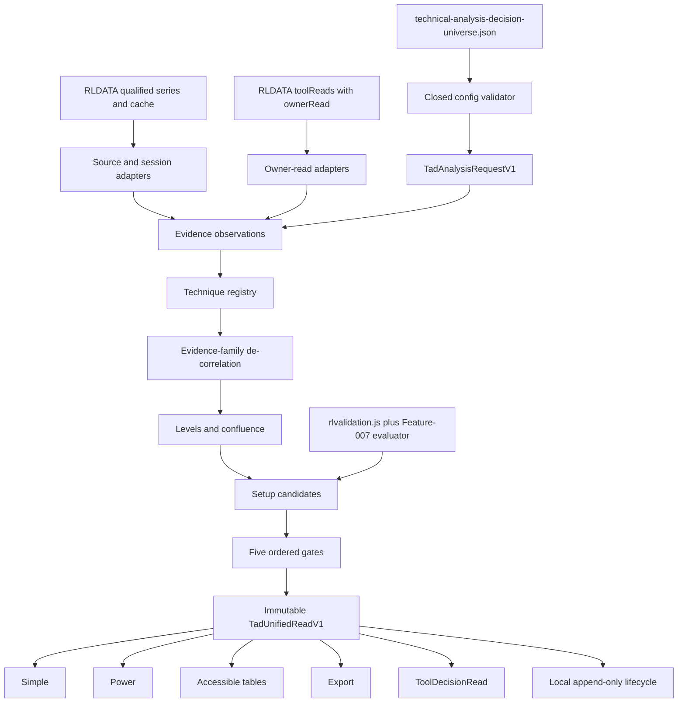

# Design: 007 Technical Analysis Decision Lab

## Design Brief

### Current State

Research Lab is a build-free GitHub Pages site whose deployable tools are root-level HTML files with ES5 browser code. `rldata.js` owns the shared cache, central credential boundary, source-qualified daily series, request lifecycle, and `rl-tool-read/v1`; `rlapp.js`, `rlnav.js`, `rlg.js`, `rlticker.js`, and `rlchart.js` own the shared status, navigation, explanations, ticker links, and chart pointer/touch behavior.

The technical-analysis calculations needed by Feature 007 are currently split across private page functions. Swing Structure, Intraday Tape, Options Structure, Gamma Trading, Market Heatmap, Sector Research, Strategy Validation, and Feature 006 have useful results, but no common detailed owner-read contract exposes them to a five-gate consumer. `RLDATA.putToolRead` can carry nested versioned metrics, while `RLDATA.putBarSeries` currently accepts only first-class `1d` series; these are the two concrete composition gaps.

### Target State

Add `technical-analysis-decision-lab.html` as one deterministic decision orchestrator. It resolves an explicit instrument/session/timeframe/comparison/cost request, consumes source-qualified observations and compatible owner reads, executes only Feature-007-owned techniques, evaluates versioned setup candidates through five ordered gates, and atomically commits one immutable `TadUnifiedReadV1`.

Simple, Power, accessible tables, export, local candidate history, and `ToolDecisionRead` are projections of that one object. Existing specialist pages remain the owners of their detailed calculations; Feature 007 neither invokes their private functions nor scrapes their DOM. A missing, stale, provisional, incompatible, or unversioned owner result remains an explicit non-neutral state.

### Patterns To Follow

- Cache-first and delta-only hydration through `rldata.js`, with resource lifecycle reported through `rlapp.js`.
- One compute feeding Simple and Power through `#modeSeg`, following `sector-research-lab.html` and the contract in `.github/copilot-instructions.md`.
- Top-level pure ES5 `function` declarations extracted from production files by `scripts/selftest.mjs`.
- Synchronous first canvas draw followed by `RLCHART.attach`, with table parity and page-owned keyboard traversal.
- Strict versioned JSON/config contracts and stable canonical identities, following Feature 006 and the Bond/Palm Springs tools.
- Existing `rl-tool-read/v1` transport with a nested Feature-007 metrics contract; no second credential or tool-read store.

### Patterns To Avoid

- No build, package, framework, server, database, worker service, broker integration, or remote analytics runtime.
- No cross-page function calls, iframe access, DOM scraping, duplicated credential state, or private cache reads.
- No flat indicator score, majority vote, missing-as-zero, direction-as-confidence, or probability-shaped confidence badge.
- No implicit resampling, session blending, four-hour stock-bar fiction, current-week backfill, target fitting, or inherited validation after an identity change.
- No `requestAnimationFrame` dependency for first paint or correctness; no hidden canvas is treated as rendered.
- No imported label, ticker, source, event, or claim text enters active markup.

### Resolved Decisions

- The preferred U.S. equity tactical profile is Weekly / Daily / 65-minute core-session bars. Six equal 65-minute bars partition a normal 390-minute core session.
- A U.S. equity `4h/1d/1w` profile is never implicit. The user chooses either core-only `240m + 150m remainder` or `04:00-20:00 ET` extended-hours `4 x 240m`; each is a distinct variant and validation identity.
- Early-close remainders are `partial` and cannot confirm a trigger. Daily-only mode uses an explicit Daily-close trigger role and only daily-eligible setup variants.
- `rl-tool-read/v1` remains the transport. Detailed owner evidence is nested as `rl-ta-owner-read/v1`; invalid or absent nested contracts are unavailable.
- A small shared `rlvalidation.js` foundation owns purged fold construction, multiplicity adjustment, and generic outcome summaries. Feature 007 owns setup simulation, costs, and setup-specific passports; Strategy Validation retains its own strategy rule.
- The page commits only complete `TadUnifiedReadV1` objects. Candidate ranking is deterministic and excludes directional preference.
- First result and every mode-triggered chart draw are synchronous. Long validation work yields only between deterministic work units with `setTimeout(..., 0)`.
- No source, owner, validation, option, footprint, depth, or cost shortfall is converted to neutral evidence.

### Open Questions

None blocking. Any new source interval, owner capability, setup family, option convention, or validation policy requires a contract-version decision rather than an untyped extension.

## Purpose And Scope

Feature 007 implements the `Explainable Multi-Model Technical Decision Intelligence` capability defined in `spec.md`. The visible boundary is `Educational research only`. The route does not place an order, connect to a broker, size a real account, claim personal suitability, or promise performance.

The design covers four technical layers:

1. Source, vintage, session, interval-role, adjustment, and comparison truth.
2. A capability foundation for evidence families, techniques, levels, setups, validation, risk/process, gates, and publication.
3. Concrete specialist and setup implementations layered over that foundation.
4. One static experience that projects a single immutable read into every visual, nonvisual, export, and owner-read surface.

There is no application API, database, authenticated role, or service runtime. Contract-grade API detail therefore consists of static GET resources plus exact in-browser function contracts and local persistence schemas.

## Current System And Change Boundary

### Intended Implementation Surfaces

| Surface | Change | Responsibility |
| --- | --- | --- |
| `technical-analysis-decision-lab.html` | New | Semantic shell, pure Feature-007 kernel, orchestration, state, rendering, owner-read publication, and export |
| `technical-analysis-decision-universe.json` | New | Closed sessions, profiles, evidence families, techniques, setups, comparison, validation, cost, sensitivity, bounds, and display contract |
| `rlvalidation.js` | New shared helper | Pure purged-fold, multiplicity, deflated-statistic, and outcome-summary primitives shared with Strategy Validation |
| `rldata.js` | Additive modification | Versioned source-qualified interval series support while preserving existing `barSeries` and generic tool-read behavior |
| `swing-structure-lab.html` | Additive modification | Publish a source-faithful `swing-structure/v1` owner read from its existing computed state |
| `intraday-tape-lab.html` | Additive modification | Publish `intraday-auction/v1` with session/VWAP/profile/proxy truth from its existing state |
| `options-structure-lab.html` | Additive modification | Publish `options-positioning/v1` with snapshot clocks, assumptions, coverage, and frozen sign convention |
| `gamma-trading-lab.html` | Additive modification | Publish `gamma-playbook/v1` with proxy and convention caveats |
| `market-heatmap-lab.html` | Additive modification | Publish `market-breadth/v1` without reproducing its treemap in Feature 007 |
| `sector-research-lab.html` | Additive modification | Publish role-compatible relative/breadth evidence with denominator and source identity |
| `strategy-validation-lab.html` | Narrow modification | Consume shared validation primitives with canary parity; retain strategy-specific rule and UI |
| `notes/technical-analysis-decision-lab.md` | New | Methods, formulas, source/owner boundaries, controls, limitations, and page validation commands |
| `tools.json`, `index.html`, `rlnav.js` | Modify together | Register the new route and note with exact registry parity |
| `scripts/selftest.mjs` | Modify | Extract production pure functions and run foundation, formula, lifecycle, identity, and shared-contract canaries |
| `scripts/validate-technical-analysis-decision.mjs` | New | Validate the committed config, claim/source registry, closed references, and production contract parity |
| `tests/fixtures/technical-analysis-decision/` | New | Provenance-bearing historical source snapshots plus clearly analytic formula fixtures |
| `tests/technical-analysis-decision-lab.spec.mjs` | New | Scenario-specific real-HTTP browser regression suite |

### Protected And Excluded Surfaces

- No provider credentials, Pages workflow, package manifest, lockfile, service, deployment, or secret file changes are needed.
- `rlapp.js`, `rlnav.js`, `rlg.js`, `rlticker.js`, and `rlchart.js` remain unchanged consumers except for the required route registration in `rlnav.js`.
- Existing specialist formulas remain owned by their pages. Their Feature-007 changes only serialize already-computed state into closed owner reads.
- Feature 006 is an active implementation dependency, not certified delivered behavior. Feature 007 accepts its owner read only when `tdc-tool-read/v1`, source identity, cutoff, and selection match; otherwise Trend Dynamics evidence is unavailable without blocking Feature-007-owned TA trend methods.
- This design does not create plan-owned artifacts or product code.

### Shared-Surface Impact Rules

`rldata.js`, `rlvalidation.js`, and owner-read publishers are shared/high-fan-out surfaces. Planning must require marker-bounded edits, pre/post canaries for existing `RLDATA.barSeries`, `putToolRead`, Strategy Validation fold/statistic results, and zero behavior change in sibling pages when no new contract is consumed. The rollback unit is the additive contract plus all of its consumers; registry navigation never points to a route missing its config or tests.

## Architecture Overview



### Runtime Layers Inside The Page

The inline production script is ordered as top-level ES5 declarations:

1. Error, canonicalization, finite-number, and contract helpers.
2. Config, source/vintage, owner-read, session, bar, and comparison validators.
3. Pure technique and evidence-family functions.
4. Level, setup, validation, expectancy, process, and gate functions.
5. Unified read, view-model, export, and owner-read builders.
6. Browser effects: static GET, RLDATA adapters, persistence, scheduler, DOM, canvas, and boot.

Pure functions receive clocks, configuration, observations, owner reads, and prior records as arguments. They do not read `window`, `document`, storage, network, random state, or the current clock.

### Shared Script Load Order

The route loads scripts in this order:

1. `rldata.js`
2. `rlapp.js`
3. `rlg.js`
4. `rlvalidation.js`
5. `rlchart.js`
6. `rlticker.js`
7. page inline script
8. `rlnav.js`

No credential input exists on the route. Data-setting remediation links to `index.html#data-settings`.

## Capability Foundation

### Foundation Contracts

| Contract | Responsibility | Consumers |
| --- | --- | --- |
| `TadSourceVintageV1` | Source authority, provider, retrieval/availability clocks, rights/review, adjustment, revisions, and freshness | Every observation, owner read, result, export, and audit line |
| `TadSessionContractV1` | Venue timezone, calendar, core/extended segments, early closes, DST, and aggregation boundaries | Timeframe resolver and bar builder |
| `TadTimeframeProfileV1` | Primary/setup/trigger roles independent of interval, session, and partial-bar policy | Techniques, setups, validation identity, UI |
| `TadEvidenceObservationV1` | One fact/transform with lineage, tier, status, units, cutoff, and quality | Techniques and family de-correlation |
| `TadEvidenceFamilyV1` | Independent cluster, allowed gate jobs, lineage overlap, support/contradiction semantics | Gates, confidence, heatmap, candidate ranking |
| `TadTechniqueDefinitionV1` | Formula version, parameters, eligibility, outputs, limitations, owner/family, and validation identity | Registry, controls, method audit |
| `TadTechniqueResultV1` | Current method output with closed/provisional status, source lineage, support, contradiction, and errors | Family resolver and specialist overlays |
| `TadPriceLevelV1` | Sourced level/zone identity, method, timeframe, age, uncertainty, and lifecycle | Confluence, setup geometry, charts, risk |
| `TadSetupDefinitionV1` | Versioned prerequisites, armed condition, trigger, invalidation, natural target logic, expiry, gates, and bounds | Candidate evaluator and validator |
| `TadSetupCandidateV1` / `TadSetupEventV1` | Immutable application of one exact setup variant and append-only state transitions | Five gates, timelines, local history, export |
| `TadValidationPassportV1` | Exact variant, samples, trials, folds, costs, outcomes, uncertainty, slices, and status | Gate 5, UI, owner read |
| `TadRiskPlanV1` | Frozen hypothetical trigger, invalidation, pre-derived target path, expiry, costs, R, and breakeven | Gate 3/5 and process guard |
| `TadBehaviorGuardV1` | Observable chase, contradiction, plan mutation, target fitting, unvalidated trials, and frequency checks | Gate 5 and process audit |
| `TadGateResultV1` | Observed, required, outcome, reasons, dependencies, and blocking state for one ordered gate | Synthesis and every renderer |
| `TadUnifiedReadV1` | One complete immutable synthesis and identity | Simple, Power, tables, export, publication |
| `TadOwnerEvidenceReadV1` | Detailed source-faithful read from an owning specialist without private calls or DOM access | Feature-007 owner adapters |
| `TadToolDecisionReadV1` | Compact state-faithful projection nested in `rl-tool-read/v1` | Market Brief and deep-link consumers |

### Extension Points

- **Qualified-series adapter:** returns `TadSeriesEnvelopeV1`; it cannot invent metadata or normalize mixed adjustment silently.
- **Owner-read adapter:** validates one discriminated capability payload and exact source/cutoff identity; it cannot recompute the owner result.
- **Technique:** a code-owned pure dispatch entry with a closed parameter schema. Config selects known ids; JSON cannot inject code.
- **Setup evaluator:** applies one closed `TadSetupDefinitionV1` to current observations and prior candidate events.
- **Cost model:** applies one explicit `TadCostPolicyV1`; absent components remain absent and block net claims.
- **Renderer:** consumes `TadViewModelV1` built from one `TadUnifiedReadV1`; renderers cannot call technique or gate functions.

### Foundation-Owned Behavior

- Exact-key/version validation, stable serialization/digests, finite-number enforcement, deterministic ordering, and immutable outputs.
- Source/vintage/session/adjustment eligibility and as-of resolution.
- Closed, provisional, partial, stale, revised, incompatible, failed, disabled, and unavailable truth without neutral substitution.
- Technique lineage and evidence-family de-correlation before gate evaluation.
- Level provenance and confluence without order-book language.
- Setup lifecycle transition legality, terminal identity, event append semantics, and candidate ranking.
- Variant identity, trial accounting, as-of validation, cost treatment, target audit, and arithmetic reconciliation.
- Five ordered gates, mandatory-fail precedence, atomic result commit, one-result publication, and safe text.

### Source And Owner Boundary

Feature 007 consumes only these boundaries:

1. `RLDATA.barSeries` for current source-qualified daily data.
2. New additive `RLDATA.putQualifiedBarSeries` / `RLDATA.qualifiedBarSeries` for non-daily interval envelopes with session metadata.
3. `RLDATA.toolRead(ownerId)` only when nested `metrics.ownerRead.contractVersion === "rl-ta-owner-read/v1"` and the capability-specific contract validates.
4. `RLDATA.options` only for backward-compatible display. Gamma/positioning gate evidence requires the owner read because legacy snapshots omit a complete sign/assumption/source contract.

The orchestrator never calls `resampleWeekly`, `snapshotOf`, `computeEntry`, `walkForward`, or another page's private function, never imports another HTML script, and never parses another page's markup. If a detailed owner read is absent, the owner-specific overlay is unavailable. Feature-007-owned generic techniques may still run from qualified observations, but they do not claim the specialist owner's richer semantics.

### Evidence Family De-Correlation

Every technique definition carries `familyId`, `clusterId`, `inputKinds`, `lineageKeys`, and `transformSignature`. `tadClusterEvidenceFamilies` resolves each cluster as follows:

1. Disabled and unavailable methods stay listed and contribute no state.
2. Eligible methods derived from overlapping lineage and the same transform cluster produce one cluster result.
3. Same-direction methods in one cluster produce one `supports` result with method detail retained.
4. Opposite directions inside a cluster produce `unstable`; the cluster cannot support a gate.
5. A method can inform multiple gate questions, but its lineage contributes independent support only once per gate.
6. Family counts are denominator-bearing: supporting, contradicting, unstable, disabled, and unavailable counts are separate.

The five gates consume predicate outcomes, not summed scores. Confidence is a record of `quality`, `coverage`, `agreement`, `stability`, and `validation`, each as a qualitative state plus inspectable inputs. It is never formatted as a win probability.

### Planning Dependency Requirement

G094 applies. `bubbles.plan` must create a foundation scope tagged `foundation:true` before owner publishers, specialist/setup overlays, page rendering, publication, and browser-regression scopes. Overlay scopes must declare the foundation scope in `Depends On`.

## Concrete Implementations

### Existing Owner Reuse Matrix

| Owner | Reused As-Is | Additive Owner Contract | Feature 007 Must Not Reimplement |
| --- | --- | --- | --- |
| Swing Structure | Daily/weekly computed structure, 20/50/200 context, pivots, composite profile levels, pattern/phase hypotheses | `swing-structure/v1`: source set, confirmed/provisional roles, levels, patterns, limitations | Full Swing verdict, profile-shape narrative, option-level plan, or private `resampleWeekly` call |
| Intraday Tape | Session VWAP, statistical bands, session profile, opening range, prior value, OHLCV proxy labels | `intraday-auction/v1`: session contract, source cutoff, value levels, opening state, proxy classification | Tape playbook, synthetic aggressor flow, private chart/session calculations |
| Options Structure | Persisted option snapshot and existing sign-applied levels | `options-positioning/v1`: snapshot/availability times, expirations, liquidity filters, rates/dividends/volatility assumptions, `signConventionId`, `signApplied:true` | Greeks/chain aggregation, dealer identity, silent re-signing, or private `snapshotOf` |
| Gamma Trading | Gamma playbook result and option-volume proxy caveat | `gamma-playbook/v1`: setup vocabulary, convention, source snapshot id, proxy limits | Gamma playbook calculation or true order-flow claim |
| Market Heatmap | Broad/sector/constituent breadth and deep link | `market-breadth/v1`: universe version, denominator, source/cutoff, breadth state | Treemap rendering or constituent scoring |
| Sector Research | Existing relative ratio, RRG, breadth, and group results | `relative-context/v1`: role, symbol set, as-of classification, aligned timestamps, denominator, normalized results | Private `computeEntry`, peer taxonomy inference, or raw-price overlay |
| Strategy Validation | Purged/embargoed fold discipline, multiplicity-aware statistics, cross-instrument separation | Shared `rlvalidation.js` generic primitives; no claim that its existing rule validates Feature 007 | Existing fixed strategy result, cost proof, or private `walkForward` invocation |
| Feature 006 | Planned `tdc-tool-read/v1` direction, dynamics, change state, family agreement, cutoff, truth | Strict adapter matching source and selection; absent/in-progress owner read is unavailable | Feature 006 detector formulas, cycle logic, or delivery claim |

### Source Adapters

#### Qualified Daily Bars

- Use `RLDATA.barSeries(symbol, "1d", sourcePolicy, decisionTime)`.
- Require metadata verification, provider policy, adjustment policy, and availability cutoff.
- Build closed daily bars and a separate provisional current-session observation when the source supplies one.

#### Qualified Intraday Bars

- Use the new `qualifiedBarSeries` v2 envelope, not legacy rows alone.
- Require source, retrieval, availability, venue/session, timezone, adjustment, and bar-boundary metadata.
- Legacy `RLDATA.bars("5m"|"1m")` rows without this envelope remain visible in their owner tools but are ineligible for Feature 007 confirmation.

#### Owner Reads

- Validate transport, nested owner version, capability discriminator, source-set id, result id, clocks, provisional coverage, payload, and limitations.
- Require owner cutoff `<=` Feature 007 decision cutoff and exact symbol/session/adjustment compatibility.
- Preserve owner truth; a stale owner read stays stale and never upgrades qualified source observations.

### Timeframe Profile Implementations

| Profile Id | Primary | Setup | Trigger | Session Policy |
| --- | --- | --- | --- | --- |
| `us-equity-session-v1` | closed weekly plus separate current-week provisional | closed daily plus current-day provisional | 65m core bars | 09:30-16:00 venue-local; six full bars on normal days; early-close remainder is partial/non-confirming |
| `continuous-4h-v1` | 1w | 1d | 4h | Explicit near-continuous session boundary; six equal bars/day where the source contract supports it |
| `us-equity-4h-core-v1` | 1w | 1d | 240m plus 150m remainder | Core only; unequal remainder always labeled and cannot be treated as a comparable full 4h confirmation bar |
| `us-equity-4h-extended-v1` | 1w | 1d | 4h | 04:00-20:00 ET four equal bars; pre/core/post session composition visible; requires eligible extended-hours source |
| `daily-close-v1` | 1w | 1d | 1d-close event | No tactical approximation; daily-eligible setup variants only |
| `custom-v1` | explicit | explicit | explicit | Validator requires declared session, divisibility/partial policy, history, and distinct identity |

Weekly aggregation closes at the venue's final eligible session of the week. The current week is a separate provisional bar and never mutates the last closed weekly result. Missing sessions, holidays, early closes, DST transitions, cadence changes, and incomplete bars become quality records.

### Daily-Only Setup Eligibility

Daily-close variants are available for trend pullback, breakout acceptance, failed-break reclaim, balance extreme mean reversion, volatility compression expansion, return to value, and event-gap continuation/reversal when each definition names a daily close trigger and has an exact passport. Trend Exhaustion remains `WATCH` until a separate reversal setup confirms. Intraday retest, session VWAP acceptance, opening-range, and tactical participation variants are unavailable.

### Specialist Overlays

The nine overlays consume foundation results and add no private conclusion:

1. Multi-Timeframe Structure: Feature-007 pivots plus compatible Swing/Feature-006 owner evidence.
2. Trend And Momentum: SMA/EMA, MACD, RSI, ADX/DMI, ATR-normalized state, with cluster-level support.
3. Price-Volume And Wyckoff Hypothesis: relative volume, OBV/CMF, effort/result, range events; hypothesis vocabulary only.
4. Auction And Value: distinct VWAP envelopes and volume-at-price levels; Intraday/Swing owner evidence when compatible.
5. Breakout And Reversal: close, excursion, reclaim, retest, acceptance, displacement, participation, and follow-through events.
6. Mean Reversion And Volatility: Bollinger/ATR/value distance gated by balance regime.
7. Relative Confirmation: explicit market, sector/industry, peer, and optional context roles.
8. Options Positioning: expected move and positioning scenarios under one frozen owner convention.
9. Psychology, Expectancy, And Process: observable plan/action checks, cost-aware arithmetic, no mind-reading.

### Setup Implementations

The eight definitions from `spec.md` are config records dispatched by known code-owned evaluators:

- `trend-pullback-continuation/v1`
- `breakout-acceptance-retest/v1`
- `failed-break-reclaim/v1`
- `balance-extreme-mean-reversion/v1`
- `volatility-compression-expansion/v1`
- `return-to-value/v1`
- `trend-exhaustion-watch/v1`
- `event-gap-continuation-reversal/v1`

Each definition has separate interval/session variants. A changed trigger, displacement, participation, persistence, target, expiry, cost, comparison, or denominator rule creates a new variant identity.

### Candidate Competition

`tadRankCandidates` sorts eligible candidates lexicographically by:

1. mandatory-gate state (`all pass` before caution before pending before failed/unavailable);
2. number of mandatory gates complete before the first block;
3. validation state (`supported`, `fragile`, `descriptive-only`, `insufficient`, `rejected`, `unavailable`);
4. source truth (`current`, `stale`, `degraded`, `unavailable`);
5. contradiction severity and count;
6. setup eligibility/specificity;
7. registry order, definition id, and candidate id as stable tie-breakers.

Bullish/bearish direction is not a rank dimension. Every non-selected candidate remains in `UnifiedRead.candidates` with its exact losing dimensions.

### Variation Axes

| Axis | Options | Foundation Ownership |
| --- | --- | --- |
| Source/vintage | qualified daily; qualified intraday; owner read; same-origin validation fixture | Validation, cutoff, and truth are foundation-owned; fetch is adapter-owned |
| Session aggregation | U.S. core 65m; core unequal 4h; extended 4h; continuous 4h; daily close; custom | Divisibility, partial, DST, holiday, and identity rules are foundation-owned |
| Evidence family | structure; trend; momentum; volatility; participation; auction/value; relative; options; validation/process | Lineage clustering and counting are foundation-owned |
| Technique | code-owned formulas and versioned parameters | Registry/eligibility/output contract is foundation-owned; formula is concrete |
| Setup | eight setup definitions with interval/session variants | Lifecycle, gate obligations, target audit, and identity are foundation-owned |
| Validation | supported; fragile; descriptive-only; insufficient; rejected; unavailable | As-of, split, trials, costs, slices, and status semantics are foundation-owned |
| Comparison | broad market; sector/industry; peers; optional context | Role separation, membership freeze, denominator, and compatibility are foundation-owned |
| Option posture | no chain; legacy incomplete snapshot; compatible signed owner snapshot | No-neutral and no-resign rules are foundation-owned |
| UI composition | Simple; Power; table; export; owner read | One-result parity and truth vocabulary are foundation-owned |

## Data Model And Invariants

### `TadConfigV1`

`technical-analysis-decision-universe.json` is closed at every object level and has exactly these top-level fields:

```json
{
  "contractVersion": "tad-config/v1",
  "toolId": "technical-analysis-decision-lab",
  "registryVersion": "tad-technique-registry/1",
  "initialSelection": {},
  "sourcePolicies": [],
  "sessionCalendars": [],
  "timeframeProfiles": [],
  "sensitivityProfiles": [],
  "evidenceFamilies": [],
  "techniques": [],
  "setupDefinitions": [],
  "comparisonPolicies": [],
  "validationPolicies": [],
  "costPolicySchema": {},
  "claimLedger": [],
  "controlBounds": {},
  "limits": {},
  "display": {}
}
```

Missing files/keys, unknown keys/versions, duplicate ids, dangling references, invalid enums/ranges, or non-finite numbers produce `TAD-CONFIG-*` and no requested result. The page has no embedded production config substitute.

### `TadSourceVintageV1` And `TadSeriesEnvelopeV1`

```text
TadSourceVintageV1 {
  contractVersion: "tad-source-vintage/v1",
  sourceId, authority, providerTag, sourceUrl,
  sourceUsePolicyId, sourceUseReviewRef, rights, quality,
  observedThrough, availableAt, retrievedAt, freshUntil,
  adjustmentPolicyId, currency, venue, sessionContractId,
  revisionPolicy, vintageId, limitations[]
}

TadSeriesEnvelopeV1 {
  contractVersion: "tad-series/v1",
  symbol, assetClass, interval, source: TadSourceVintageV1,
  bars: TadBarV1[], availability, errors[]
}
```

All instants are RFC3339. `observedThrough <= availableAt <= retrievedAt` and `freshUntil >= retrievedAt`. Mixed adjustment/currency/session inputs are rejected unless the config names an explicit reversible normalization record. Source labels are untrusted text.

### `TadBarV1`

```text
{
  barId, interval, sessionId,
  openedAt, closedAt, availableAt,
  o, h, l, c, v,
  adjustmentPolicyId,
  status: "closed"|"provisional"|"partial",
  expectedDurationMs, actualDurationMs,
  qualityFlags[], sourceRowIds[]
}
```

OHLC values are finite, `l <= min(o,c) <= max(o,c) <= h`, volume is finite and non-negative, timestamps are ordered, and duplicate bar ids are invalid. A partial bar cannot satisfy a closed-bar predicate. Resampling records every input id and session policy.

### `TadTimeframeProfileV1`

```text
{
  profileId, version, assetClass,
  roles: {
    primary: {interval, sessionContractId, confirmationPolicy},
    setup: {interval, sessionContractId, confirmationPolicy},
    trigger: {interval, sessionContractId, confirmationPolicy}
  },
  partialBarPolicy, earlyClosePolicy, extendedHoursPolicy,
  minimumHistoryByRole, limitations[]
}
```

Roles are semantic and may share an interval only in daily-only mode. A profile id plus session policies participates in variant identity.

### `TadEvidenceObservationV1`

```text
{
  observationId, kind, value, unit,
  symbol, timeframeRole, interval,
  observedAt, availableAt, decisionCutoff,
  barStatus, sourceVintageId,
  transformId, formulaVersion,
  evidenceTier: "A"|"B"|"C"|"D",
  state: "current"|"stale"|"provisional"|"revised"|"degraded"|"rejected",
  qualityFlags[], lineageKeys[], limitations[]
}
```

Tier D cannot activate a technique or gate. Rejected observations remain auditable but never enter a calculation.

### Technique And Family Contracts

`TadTechniqueDefinitionV1` requires `techniqueId`, `version`, `familyId`, `clusterId`, `owner`, `formula`, `parameters`, `parameterBounds`, `requiredInputs`, `supportedRoles`, `eligibility`, `outputVocabulary`, `limitations`, and `claimIds`.

`TadTechniqueResultV1` requires:

```text
{
  techniqueId, definitionVersion, parameterDigest,
  timeframeRole, state, signal, magnitude, unit,
  supportState, closedState, observed, required,
  sourceObservationIds[], lineageKeys[],
  uncertainty, stability, limitations[], errors[]
}
```

`signal` is a closed method-specific enum. Ineligible methods use `state:"unavailable"` with non-empty observed/required; they do not emit `magnitude:0`.

`TadFamilyResultV1` carries `familyId`, `clusterResults`, support/contradiction/unstable/disabled/unavailable method ids, `state`, gate uses, and denominator. A raw method count never appears as independent confidence.

### Level Contracts

```text
TadPriceLevelV1 {
  levelId, type, methodId, sourceVintageId,
  timeframeRole, interval, window, observedAt, availableAt,
  price, lower, upper, widthUnit, uncertainty,
  state: "candidate"|"active"|"tested"|"held"|"broken"|"reclaimed"|"stale"|"expired",
  invalidation, limitations[]
}

TadConfluenceZoneV1 {
  zoneId, lower, upper, atrDistance,
  memberLevelIds[], independentFamilyIds[],
  label: "historical/model level confluence",
  state, sourceCutoff
}
```

Clustering never deletes member provenance and never uses `liquidity`, `book`, or `orders` as the zone type.

### Comparison Contracts

```text
TadComparisonSetV1 {
  comparisonSetId, version, decisionVintage,
  roles: [{role, symbol, rationale, classificationSource, classificationAsOf}],
  normalizationId, currencyPolicy, sessionPolicy, adjustmentPolicy,
  minimumPeerDenominator, membershipDigest
}

TadComparisonResultV1 {
  role, symbolIds[], eligibleIds[], excluded[{symbol,reason}],
  timeframeRole, alignedCount, denominator,
  state, ratio, normalizedReturn, swingState, percentile,
  sourceVintageIds[], observed, required
}
```

No comparator is auto-replaced. A peer percentile exists only when `denominator >= minimumPeerDenominator`; pairwise ratios remain available otherwise. Role, membership, classification, normalization, or denominator changes alter variant identity.

### Setup Lifecycle Contracts

`TadSetupDefinitionV1` requires exact machine-readable predicates for prerequisites, armed condition, trigger event(s), invalidation, natural target selector order, expiry, evaluation horizon, mandatory gate ids, optional/required families, supported profiles, parameter bounds, cost requirement, and claim ids.

`TadSetupCandidateV1` identity is the digest of definition/version, parameters, instrument, source/vintage policy, timeframe/session profile, comparison set, cost policy, validation policy, and first qualifying decision cutoff.

`TadSetupEventV1` is append-only:

```text
{
  eventId, candidateId, fromState, toState,
  decisionTime, observationCutoff, sourceSetId,
  variantId, gateSnapshotId, reasonCodes[],
  terminalConditionId|null, hypotheticalOutcome|null
}
```

Allowed transitions are exactly:

```text
SCANNING -> NO_EDGE | WATCH
NO_EDGE -> WATCH
WATCH -> ARMED | NO_EDGE | EXPIRED
ARMED -> TRIGGERED | WATCH | INVALIDATED | EXPIRED
TRIGGERED -> INVALIDATED | EXPIRED | COMPLETED_EVALUATION
INVALIDATED | EXPIRED | COMPLETED_EVALUATION -> terminal
```

A later similar setup gets a new candidate id. Terminal records never reopen or overwrite.

### Variant Identity

`tadBuildVariantIdentity` canonicalizes and hashes:

```text
tool/registry/config versions
setup definition/version and all behavior-bearing parameters
instrument/session/timeframe profile
comparison membership/roles/classification/normalization/denominator
cost policy and risk-unit semantics
validation policy, population, folds, horizon, outcome definition
source/vintage/adjustment policy and claim-ledger version
```

Mode, sort order, expanded section, chart focus, cursor, and visual overlay selection are display-only and excluded. Any behavior-bearing difference creates a new identity and cannot inherit a passport.

### Validation Passport

```text
TadValidationPassportV1 {
  contractVersion: "tad-validation-passport/v1",
  passportId, variantId, setupDefinitionId,
  evaluatedAt, decisionCutoffPolicy, sourceVintagePolicy,
  population, symbols, sectors, marketPeriods,
  folds[], purgeBars, embargoBars,
  discoveryTrials, totalTrials, multiplicityMethod,
  costPolicyId, outcomeDefinition, horizon,
  signalCount, wins, losses, unresolved,
  winRate, winRateInterval,
  averageWinR, medianWinR, averageLossR, medianLossR,
  payoffDistribution, grossExpectancyR, netExpectancyR,
  maxDrawdown, maeDistribution, mfeDistribution, durationDistribution,
  slices[], selectedInstrumentFit, crossInstrumentRobustness,
  uncertainty, status, reasons[], errors[]
}
```

Status is `supported`, `fragile`, `descriptive-only`, `insufficient`, `rejected`, or `unavailable`. Validation uses only observations with `availableAt <= decisionTime`; retrospective labels cannot create entries. Discovery/selection and evaluation are separate. Every attempted behavior-bearing variant increments `totalTrials`, including failed and rejected runs.

### Cost, Risk, Arithmetic, And Process

`TadCostPolicyV1` is explicit and may include commission per order, regulatory fees, half-spread bps, entry/exit slippage bps, gap model, borrow bps, financing bps, and sizing semantics. Missing required components make net metrics unavailable. No zero-cost policy is silently applied.

`TadRiskPlanV1` freezes trigger, invalidation, target ids ordered by natural-level selection, expiry, evaluation horizon, cost policy, and optional risk unit before trigger evaluation. Target audit records the time each target existed; a target created after R calculation is invalid.

For equal-risk binary summaries:

$$E_{gross}=p\bar{W}-(1-p)\bar{L}$$

$$TotalR_{gross}=N E_{gross}$$

$$p_{break-even,gross}=\frac{\bar{L}}{\bar{W}+\bar{L}}$$

Net outcome applies per-event costs before summary. `tadAuditExpectancy` rejects a claimed total outside the configured numeric tolerance unless an explicit variable-size sequence, partial-exit sequence, or cost sequence reconciles it.

`TadBehaviorGuardV1` records only observable facts: entry distance versus frozen trigger, changed plan fields, unacknowledged contradictions, target timing, unvalidated variant count, and setup frequency versus explicit policy. It cannot infer emotion, mental health, intent, or suitability.

### Gate And Unified Read Contracts

`TadGateResultV1`:

```text
{
  gateId: "primary"|"regime"|"location"|"trigger"|"validation-risk-process",
  order, mandatory, outcome: "pending"|"pass"|"caution"|"fail"|"unavailable",
  observed[], required[], reasons[], dependencyIds[],
  weakestEvidenceId|null, closedState, sourceCutoff
}
```

`TadUnifiedReadV1`:

```text
{
  contractVersion: "tad-unified-read/v1",
  resultId, variantId, requestDigest, sourceSetId,
  registryVersion, configDigest, claimLedgerVersion,
  computedAt, decisionCutoff, truthState, complete,
  instrument, timeframeProfile, comparisonSet, costPolicy,
  direction, regime, setupState, selectedCandidateId,
  gates[5], familyResults[], techniqueResults[],
  levels[], confluenceZones[], candidates[], setupEvents[],
  validationPassport, riskPlan, behaviorGuard,
  strongestSupport, strongestContradiction,
  unavailableEvidence[], confirmationConditions[], invalidationConditions[],
  sourceAudit, ownerReads[], errors[], caveats[]
}
```

`complete:true` requires every required job to resolve to a result, explicit unavailable state, or structured failure. Exactly five gates exist in order. A mandatory `fail` or `unavailable` prevents `TRIGGERED` regardless of optional support.

## Technique Algorithms And Exact Pure Symbols

### Core Technique Formulas

- SMA/EMA 20/50/200 expose stack, slope, cross, distance in ATR, and level state. Length/smoothing variants remain one trend-filter cluster.
- MACD exposes fast/slow/signal and histogram delta; it remains a momentum cluster.
- RSI exposes lookback, Wilder gain/loss state, and divergence candidate; overbought/oversold alone cannot trigger reversal.
- Bollinger exposes center SMA, sample dispersion, width, and standardized position; the regime gate determines meaning.
- ADX/DMI uses Wilder true range and directional movement; ADX is strength only, while DI supplies directional movement context.
- ATR/ATRP normalizes distance/displacement/risk and never votes direction.
- OBV, CMF, relative volume, and effort/result retain their bar-direction/proxy labels and form one participation family.
- VWAP envelopes are volume-weighted statistical distance. Volume profile allocates historical traded bar volume by the declared bucket method and value-area share. They stay separate.
- Relative strength uses aligned total-return-normalized ratios and corresponding swings, never raw-price similarity.

### Extractable Pure Declarations

The production page exposes these top-level functions for `scripts/selftest.mjs`:

```text
tadError
tadIsPlainObject
tadHasExactKeys
tadFiniteNumber
tadStableSerialize
tadStableDigest
tadDeepFreeze
tadValidateConfig
tadIndexConfig
tadValidateSourceVintage
tadValidateSeriesEnvelope
tadValidateOwnerRead
tadResolveAsOf
tadResolveSession
tadClassifyBarStatus
tadAggregateBars
tadBuildTimeframeProfile
tadAlignSeries
tadBuildComparisonSet
tadBuildVariantIdentity
tadBuildSourceSetIdentity
tadSmaSeries
tadEmaSeries
tadAtrSeries
tadRsiSeries
tadMacdSeries
tadBollingerSeries
tadAdxDmiSeries
tadObvSeries
tadCmfSeries
tadRelativeVolume
tadEffortResult
tadVolumeProfile
tadVwapEnvelope
tadPivots
tadRelativeStrength
tadEvaluateTechnique
tadClusterEvidenceFamilies
tadNormalizeLevels
tadClusterConfluence
tadUpdateLevelLifecycle
tadEvaluateSetupDefinition
tadTransitionCandidate
tadRankCandidates
tadBuildPurgedEvaluation
tadSimulateSetupVariant
tadApplyCosts
tadSummarizeValidation
tadBuildValidationPassport
tadDeriveNaturalTargets
tadBuildRiskPlan
tadAuditTargets
tadAuditExpectancy
tadLossStreakScenario
tadEvaluateBehaviorGuard
tadEvaluatePrimaryGate
tadEvaluateRegimeGate
tadEvaluateLocationGate
tadEvaluateTriggerGate
tadEvaluateValidationRiskProcessGate
tadSynthesizeFiveGates
tadBuildUnifiedRead
tadBuildViewModel
tadBuildToolDecisionRead
tadBuildExport
```

Shared `rlvalidation.js` exposes top-level Node-safe functions through `RLVALID`:

```text
rlvBuildPurgedFolds
rlvAdjustBenjaminiHochberg
rlvAdjustHolm
rlvDeflatedSharpe
rlvWilsonInterval
rlvQuantiles
rlvSummarizeOutcomes
```

Every pure function returns a frozen success object or `{ok:false, errors:[TadErrorV1...]}` for user/source input. Browser wiring converts unexpected defects to `TAD-INTERNAL` before rendering.

## API And Contracts

### Static HTTP Resources

| Resource | Method | Caller | Authorization | Success Shape | Failure Behavior |
| --- | --- | --- | --- | --- | --- |
| `technical-analysis-decision-lab.html` | GET | Public browser | Public | Static page | Static route failure |
| `technical-analysis-decision-universe.json` | GET same origin | Page boot | Public | `TadConfigV1` | `TAD-CONFIG-LOAD`; shell remains unavailable |
| RLDATA provider request | Existing shared contract | Qualified adapter | Central settings policy | Qualified series or existing cache | Cached truth retained; affected source stale/unavailable |
| Existing owner page tool read | Browser-local RLDATA read | Owner adapter | No auth | Strict `rl-tool-read/v1` with nested owner read | Owner overlay unavailable; no DOM/private call |
| `RLDATA.putToolRead` | Browser-local call | Publisher | No auth | Accepted `rl-tool-read/v1` | `TAD-PUBLISH-REJECTED`; visible result remains unpublished |

There are no POST/PUT/PATCH/DELETE endpoints and no e2e-api surface.

### `TadAnalysisRequestV1`

```text
{
  contractVersion: "tad-analysis-request/v1",
  instrument: {symbol, assetClass, venue, currency},
  sourcePolicyId, decisionTime,
  timeframeProfileId, sensitivityProfileId,
  setupFocusId, enabledTechniqueIds[],
  techniqueParameters,
  comparisonSet: TadComparisonSetV1,
  costPolicy: TadCostPolicyV1|null,
  riskScenario: {riskUnitLabel, lossStreakCount}|null,
  selectedEvidenceId, selectedPowerSection,
  configDigest, registryVersion
}
```

Analysis-bearing fields are required according to config. Unknown ids, keys, intervals, or incompatible combinations return `TAD-REQUEST-*`; the prior complete read remains current/aged under its own identity. Display focus fields are excluded from `variantId` but included in a sanitized deep link when allowlisted.

### Owner Read Transport

Each owning page writes the existing strict envelope:

```text
{
  contractVersion: "rl-tool-read/v1",
  id, availability, asOf, computedAt, freshUntil, read, deepLink,
  metrics: {
    ownerRead: {
      contractVersion: "rl-ta-owner-read/v1",
      capabilityVersion, ownerId, resultId, sourceSetId,
      symbol, sessionContractId, decisionCutoff,
      truthState, closedCoverage, provisionalCoverage,
      payload, limitations[]
    }
  }
}
```

`capabilityVersion` is one of the closed owner contracts listed in the reuse matrix. A capability payload has exact keys defined in config/code. The outer availability and nested truth state are both preserved.

### Tool Decision Read

`tadBuildToolDecisionRead` returns:

```text
contractVersion: "rl-tool-read/v1"
id: "technical-analysis-decision-lab"
availability: current|stale|unavailable
asOf: decisionCutoff or null
computedAt, freshUntil
read: one state-faithful educational sentence
metrics: {
  contractVersion: "tad-tool-decision-read/v1",
  truthState, resultId, variantId, symbol,
  direction, regime, setupState, selectedSetupId,
  triggerSummary, invalidationSummary,
  strongestSupport, strongestContradiction,
  validationState, unavailableEvidence[], provisional,
  educationalOnly: true
}
deepLink
```

Unavailable omits trigger/invalidation numeric fields and uses `asOf:null`, `freshUntil:null`. Stale, provisional, mixed, and descriptive-only states remain explicit in both sentence and metrics.

### Authorization Matrix

| Surface | Public Browser | Market Brief Consumer | Owning Tool | Broker/Execution Role |
| --- | --- | --- | --- | --- |
| Read static page/config | Yes | Deep link only | Yes | Not present |
| Select local public context | Yes | No mutation | Own page only | Not present |
| Publish owner read | Current page's code only | Read only | Yes, own capability only | Not present |
| Publish ToolDecisionRead | Feature 007 only | Read only | No | Not present |
| Edit provider credentials | No; link to central settings | No | No | Not present |
| Place/route an order | No | No | No | Not present |

## Deterministic Orchestration

### Runtime State

```text
runtime = {
  config, configIndex,
  sourceEnvelopesByKey,
  ownerReadsByCapability,
  request,
  lastCompleteRead,
  rejectedRequest,
  pendingRun: {runId, requestDigest, workUnits, completed, cancelled},
  lifecycleLedger,
  validationPassports,
  ui: {mode, powerSection, focusId, chartCursorById, explanationId}
}
```

Renderers receive only `lastCompleteRead` and the UI focus state. They cannot read mutable technique scratch state.

### Boot And Cache-First Flow

1. Render shell, source-independent controls, educational boundary, and explicit loading state synchronously.
2. Fetch/validate config. No embedded substitute is used.
3. Resolve persisted public preferences against the loaded config; invalid values remain rejected.
4. Read qualified cached series and owner reads synchronously.
5. Compute and atomically render a complete cached/daily-only read when eligible.
6. Request only missing/stale deltas and report each resource through RLDATA/RLAPP.
7. On refresh success, validate and compute a new identity. On failure, preserve the prior read with exact age/failure effects.

### One Compute Path

`tadBuildUnifiedRead(inputs, request, priorLedger, passports)` is the only conclusion builder. `tadBuildViewModel(read)` creates presentation-safe structures. These consumers use that same result id:

- Simple verdict, gates, setup, heatmap, confluence, comparisons, specialist rows.
- Power charts, method records, candidates, timeline, validation, sources, and claims.
- Accessible tables and plain-language chart interpretations.
- Export and sanitized deep link.
- `TadToolDecisionReadV1` publication.

Mode, table/chart toggle, sorting, disclosure, and chart overlay selection never invoke `tadBuildUnifiedRead` or fetch data.

### Atomic Recompute And Cancellation

A valid control change creates one request digest. Repeated changes cancel the prior run and retain the last complete read. Current-state techniques run in deterministic registry order. Validation uses fixed work units (one fold, one trial, or one symbol slice) and yields with `setTimeout(next, 0)` between units. Arithmetic order is stable and does not depend on elapsed time.

Only a complete run whose `runId` still matches may assign `lastCompleteRead`, append lifecycle events, persist a passport, render, export, or publish. Cancelled, failed, and superseded runs cannot mutate those surfaces.

### Five-Gate Evaluation

1. Primary Context evaluates closed primary/setup structure, Feature-007 trend families, and explicit comparison roles.
2. Regime And Phase resolves trend/range/compression/transition plus bounded phase hypotheses and contradictions.
3. Location And Asymmetry requires sourced levels, natural invalidation, pre-derived targets, and adequate structural room.
4. Trigger And Confirmation requires the exact event semantics and closed/provisional policy declared by the setup.
5. Validation/Risk/Process requires an eligible passport state, frozen cost-aware plan, arithmetic integrity, and clear process guard.

Gate execution stops transition eligibility at the first mandatory fail/unavailable but still computes later gate diagnostics for explanation. A candidate cannot skip `ARMED`, and a provisional/partial bar cannot create a confirmed trigger.

### Truth-State Precedence

Aggregate truth precedence is `unavailable > failed > invalid-request > degraded > stale > recomputing > cached-refreshing > current`, with `revised` as an orthogonal marker. The active read and rejected/pending request have separate states. A component may be worse than the aggregate but never better than its source/owner input.

## Option, Microstructure, And Claim Integrity

### Option Convention

Positioning evidence is eligible only when the owner payload includes one `signConventionId`, `signApplied:true`, source snapshot id, snapshot age, expiration coverage, liquidity filters, rates/dividends/volatility assumptions, and limitations. Flip, walls, net GEX, and playbook evidence must reference that same convention/snapshot. Feature 007 never changes the sign.

Legacy snapshots can contribute plainly observed chain fields only when individually qualified. They cannot produce neutral gamma, no wall, or a positioning scenario. A convention mismatch or missing convention makes all sign-dependent outputs unavailable.

### Footprint And Depth

Feature 007 has closed eligibility records:

- Footprint requires tick-level executed volume at price plus reliable bid/ask or aggressor classification.
- Depth requires time-stamped full depth-of-book events distinguishing add, move, cancel, and execute.
- Large-trade classification requires an eligible trade feed with size, price, time, and classification.

OHLCV, volume profile, and end-of-day option chains satisfy none of these contracts. Their modules emit `TAD-MICROSTRUCTURE-DATA-REQUIRED` with observed/required/action and no proxy visualization styled as the real feed.

### Claim Admission

Every technique/setup/explanation lists `claimIds`. `tadValidateConfig` rejects an active claim unless the claim ledger contains an independent source or reproducible calculation, `supported|bounded` verdict, evidence tier, scope, limitation, and allowed treatment. Repetition across transcripts does not alter the ledger. Rejected claims remain visible in Power audit and cannot enter parameters, results, gates, setup definitions, or copy.

## UI And Component Architecture

### Component Tree

```text
TechnicalAnalysisDecisionLabPage
  ResearchLabShell
    RlNavigation
    DataBehindPageStatus
    ModeSegment (#modeSeg)
  InstrumentContextRail
  DataTruthBand
  ConfigurationImpactBanner
  SimpleDecisionCockpit
    UnifiedVerdictHeader
    FiveGateRail
    SetupLifecycleTimeline
    PrecommittedPlanStrip
    ModelTimeframeEvidenceHeatmap
    PriceLevelConfluenceMap
    ComparisonRoleStrip
    SpecialistModelList
    CandidateCompetitionDisclosure
    OwnerReadPreview
  PowerIndex
  PowerEvidenceWorkspace
    SynchronizedDecisionCharts
    MethodFamilyRecords
    LevelTable
  PowerModelsAndSetup
    SpecialistRegistry
    TypedConfigurationEditor
    CandidateCompetitionTable
    SetupEventHistory
  PowerContext
    ComparisonWorkbench
    OptionsEligibility
    MicrostructureEligibility
  PowerValidation
    ValidationPassport
    ExpectancyArithmeticAudit
    ProcessGuard
  PowerAudit
    SourceVintageLedger
    ResultIdentity
    ClaimAdmissionLedger
    ToolDecisionReadPreview
  ResultLiveRegion
  ChartDetailLiveRegion
  EducationalFooter
```

### Data Flow And State Ownership

- Context controls edit a draft `TadAnalysisRequestV1`; Apply validates and classifies display-only, known validated recompute, or new unvalidated variant.
- `lastCompleteRead` is the sole analysis state used by components.
- UI focus/cursor/disclosures are separate display state and never enter the variant digest.
- Invalid edits retain draft values, `aria-invalid`, observed/required/correction, and the labeled last valid read.
- Owner/tool publication occurs only after all visible and accessible renderers return successfully for the same result id.

### Synchronous Canvas Contract

`renderCommittedRead(read)` executes in one call stack:

1. update semantic text, definitions, tables, status, and controls;
2. apply mode visibility;
3. call `drawVisibleCharts(read)` directly;
4. call `RLCHART.attach` at the end of every draw;
5. publish the owner read after rendering succeeds.

There is no `requestAnimationFrame` first paint. Hidden Power canvases draw synchronously when mode/section activation makes them measurable. Resize uses a bounded `setTimeout` debounce and direct redraw from the same read.

### Accessibility

- Every chart/heatmap/map has a decision-question heading, interpretation, source/as-of, focusable visual, keyboard/touch detail, and equivalent table from the same chart model.
- Heatmap arrow/Home/End/Control+Home/End and level-map ascending-price navigation follow the UX contract.
- State is text plus symbol/shape/line style; color is supplemental.
- Mode and section controls retain focus; automatic refresh never steals it; invalid input focus stays on the field.
- One polite announcement summarizes an atomic result change. Progress ticks are silent. User-caused blocking errors use associated alerts.
- Explanations are available by hover, focus, and tap, with essential meaning inline.
- `RLTKR.tag` receives only validated ticker ids. Other imported text uses `textContent`/DOM construction.

### Responsive And Stable Geometry

- Simple uses stable five-track gates and semantic heatmap columns on wide screens, then ordered one-column disclosures below 600 CSS px.
- Power chart triads stack Primary, Setup, Trigger on tablet/mobile without changing aligned cursor identity.
- Simple has no body-level horizontal scroll. Power tables scroll only inside labeled focusable regions.
- Charts use explicit aspect ratios/min/max heights; legends sit outside plots and move below on narrow screens.
- Every grid/flex child has `min-width:0`; dynamic labels wrap; no fixed text height clips content.
- Focus/tooltips do not resize canvas or overlap sticky navigation, headings, legends, messages, or final rows.

## Security And Privacy

- Provider credentials remain central in `rldata.js` session-scoped storage and are never copied into page state, export, history, logs, or tool reads.
- No brokerage credentials, auth/session tokens, payment data, holdings, position size, cost basis, account value, or realized P/L are requested or stored.
- Local settings contain public tickers, public comparison roles, model parameters, cost assumptions, and hypothetical risk-unit labels only.
- Config/source/owner/event/ticker/claim text is untrusted. Dynamic content uses text nodes/attributes; fixed code-owned templates alone may use literal HTML.
- URLs must be same-origin relative or validated HTTPS with `noopener`, `noreferrer`, and no credential query.
- No `eval`, dynamic script injection, executable plugin JSON, or imported markup is permitted.
- Deep links contain allowlisted public ids/numbers only and omit source payloads and private notes.
- Educational-only/no-execution/no-guarantee/no-personalized-advice language appears beside the UnifiedRead, in export, and in ToolDecisionRead.

## Configuration, Persistence, And Rollout

### Local Persistence

| Key | Contract | Contents | Failure Treatment |
| --- | --- | --- | --- |
| `technicalAnalysisDecisionLabPreferencesV1` | `tad-preferences/v1` | Public context/control/display selections only | Invalid/corrupt values rejected; config initial selection remains explicit |
| `technicalAnalysisDecisionLabLedgerV1` | `tad-ledger/v1` | Append-only candidate events and plan revisions with stable ids/digests | History degraded/unavailable; current compute remains explicit |
| `technicalAnalysisDecisionLabPassportsV1` | `tad-passports/v1` | Exact local passport summaries and identity/source refs, not raw credentials | Passport unavailable; no validation inheritance |
| `rlData.toolReads.technical-analysis-decision-lab` | existing | Latest strict ToolDecisionRead | Publication failure visible; no brief-coverage claim |

Local storage is user-mutable convenience, not certified evidence. Reads validate exact keys, ids, digests, monotonic event transitions, and finite values. Corrupt records are never silently repaired. Capacity failure preserves the current result and reports the affected persistence contract.

### Export

Export is a sanitized `tad-export/v1` object containing the full result identity, source/vintage audit, request, comparison set, technique/family/gate states, levels, selected/non-selected candidates, lifecycle, passport, cost/risk/process records, caveats, and educational boundary. It excludes credentials, raw secret-bearing headers, account data, and executable markup.

### Rollout

Rollout is additive and build-free:

1. Shared validation and qualified-series/owner-read contracts land with canaries.
2. Existing owners publish nested reads from their current compute path.
3. The new config, page, note, registry entries, selftests, validator, and browser suite land as one route-complete unit.
4. GitHub Pages serves the repository root unchanged.

Unknown storage/config/owner/registry major versions fail loud. A changed formula, setup predicate, gate rule, cost interpretation, or identity field requires a version change.

## Observability And Failure Handling

Research Lab has no service runtime, so distributed traces, server logs, and service SLO topology are not applicable. Static observability is user-visible and local:

- RLDATA/RLAPP resource lifecycle for config, bars, comparisons, and owner reads.
- Data Truth Band with observed/available/retrieved/fresh-until clocks, closed/provisional/partial coverage, revisions, and affected modules.
- Deterministic in-memory event rows for run start/cancel/complete, method unavailability/failure, render failure, persistence failure, and publication rejection.
- Power audit for config/registry/request/source/variant/passport digests, trial count, claim admission, and owner compatibility.
- Diagnostic durations from `performance.now()` excluded from identities and conclusions.

### Closed Error Model

```text
TadErrorV1 {
  code, severity, path, ownerId|null, techniqueId|null,
  setupId|null, observed, required, action, message
}
```

| Code Family | Examples | Treatment |
| --- | --- | --- |
| `TAD-CONFIG-*` | load, key, version, ref, range | No requested result; correction path |
| `TAD-SOURCE-*` | missing, rights, provider, adjustment, stale, refresh | Scoped stale/degraded/unavailable |
| `TAD-SESSION-*` | calendar, boundary, DST, early close, partial | Profile invalid/degraded; no silent aggregation |
| `TAD-DATA-*` | finite, OHLC, duplicate, gap, order, revision | Row/method impact; no coercion |
| `TAD-OWNER-*` | version, capability, cutoff, identity, payload | Owner overlay unavailable |
| `TAD-TECHNIQUE-*` | history, input, interval, liquidity, failure | Method unavailable/failed; no zero |
| `TAD-FAMILY-*` | lineage, conflict, denominator | Unstable/degraded family |
| `TAD-LEVEL-*` | invalid range, stale, target order | Level excluded or risk blocked |
| `TAD-SETUP-*` | predicate, transition, expiry, terminal reopen | Candidate blocked; prior history intact |
| `TAD-VALIDATION-*` | as-of, split, trial, sample, passport | Descriptive/insufficient/rejected/unavailable |
| `TAD-COST-*` / `TAD-RISK-*` | missing component, target fit, invalid distance | Net unavailable or Gate 5 fail |
| `TAD-ARITHMETIC-*` | inconsistent total, denominator, sequence | Audit rejected pending explicit reconciliation |
| `TAD-MICROSTRUCTURE-*` | footprint/depth/trade feed absent | Explicit unavailable contract |
| `TAD-PERSIST-*` | version, corruption, capacity | History/passport degraded; current read retained |
| `TAD-PUBLISH-*` | rejected transport | Result visible, owner read unchanged |
| `TAD-RENDER-*` / `TAD-INTERNAL` | unexpected defect | Publication blocked; safe text-only state |

A failed refresh, method, render, storage write, or publication cannot erase cached observations, overwrite a complete read with partial state, reopen terminal candidates, or upgrade truth.

## Testing And Validation Strategy

### Test Seams

`scripts/selftest.mjs` extracts the exact production pure declarations from `technical-analysis-decision-lab.html` and `rlvalidation.js`. Formula fixtures may be analytically constructed and are labeled as such; behavior/integration fixtures are checked-in source-qualified historical snapshots with source/retrieval metadata. No fixture is presented as live evidence.

`scripts/validate-technical-analysis-decision.mjs` validates the committed config, exact keys, registry references, session/profile divisibility policies, setup predicates, evidence-family lineage, claim admission, comparison policies, and owner capability schemas.

Playwright uses the checkout-local exact runner, committed config/project, system Chrome, and the real ephemeral static server in `tests/playwright-runtime.mjs`. It does not intercept internal requests or inject canned browser responses.

### Required Test Categories

| Category | Planned Location | Required Behavior |
| --- | --- | --- |
| `unit` | `scripts/selftest.mjs` | Every pure formula, validator, identity, transition, rank, gate, arithmetic, and failure branch |
| `functional` | `scripts/validate-technical-analysis-decision.mjs` plus selftest full-pipeline fixtures | Config/source/owner/request -> techniques -> families -> setups -> gates -> UnifiedRead -> publication |
| `e2e-ui` / Regression E2E | `tests/technical-analysis-decision-lab.spec.mjs` | BS-001..BS-031 and accessibility/responsive/truth-state behavior through the real page |

No separate integration category is needed: the functional suite runs real shared browser modules in Node-safe sandboxes, and e2e-ui exercises the assembled real HTTP page. No e2e-api exists. No numeric latency SLA is defined, so a stress category is not required; responsiveness/cancellation is asserted functionally and in e2e-ui using maximum configured work units without inventing a timing promise.

### Formula And Invariant Coverage

Tests must cover:

- SMA/EMA stack/slope/cross/distance and anti-double-counting.
- MACD/RSI/Bollinger/ADX-DMI/ATR outputs, bounds, and prohibited interpretations.
- OBV/CMF/RVOL/effort-result proxy lineage and one-family counting.
- VWAP envelope versus volume-profile value-area separation.
- weekly/65m/4h/daily aggregation, early close, DST, holiday, missing bar, partial and provisional states.
- source/vintage/adjustment rejection, cache retention, failed delta, and owner-read mismatch.
- level identity/lifecycle/confluence and target-before-R audit.
- every legal/illegal setup transition and terminal immutability.
- deterministic candidate rank ties and non-selected visibility.
- comparison role separation, denominator threshold, incompatibility, and variant changes.
- as-of setup simulation, purge/embargo, trial count, multiplicity, slices, selected-stock versus cross-instrument results.
- costs, gross/net R/expectancy/breakeven, transcript arithmetic, variable-size reconciliation, and compounding loss scenarios.
- option convention coherence and missing-chain no-neutral behavior.
- footprint/depth/large-trade exact unavailable contracts.
- one-result ids across Simple/Power/tables/export/ToolDecisionRead.
- null/NaN/Infinity, unknown versions/keys, corrupt storage, cancellation, render, and publication failures.
- 100 repeated identical complete inputs produce byte-identical canonical output excluding diagnostic duration/computed-at clocks supplied by the caller.

### Repository Commands For Delivery Validation

```text
node scripts/validate-technical-analysis-decision.mjs
node scripts/selftest.mjs
PAGE=technical-analysis-decision-lab.html node -e '<the exact inline-script and literal-id check from .specify/memory/agents.md>'
npx --no-install playwright --version
npx --no-install playwright test tests/technical-analysis-decision-lab.spec.mjs --config=playwright.config.mjs --project=system-chrome --reporter=list
```

The runner version must be exactly `Version 1.61.1`. There is no application build, lint, typecheck, service startup, or deploy command.

## Technical Scenario Contracts

| Scenario | Exact Given State | Technical Action | Required Assertions | Primary Contract/Test Class |
| --- | --- | --- | --- | --- |
| BS-001 | Closed W/D/trigger up families; no active level within configured ATR distance | `tadBuildUnifiedRead` | Gate 1 pass, Gate 3 fail, `NO_EDGE`, no trigger | Gates, levels; unit + e2e-ui |
| BS-002 | Exact supported passport, all closed predicates, complete cost plan | Synthesize five gates | Five passes, `TRIGGERED`, frozen trigger/invalidation/targets/gross/net/support/contradiction/expiry | UnifiedRead; functional + e2e-ui |
| BS-003 | Bullish trend/momentum clusters; closed invalidation event | Evaluate candidate | Cluster counts once, trigger/risk gate fails, `INVALIDATED` event appended | Families/lifecycle; unit + e2e-ui |
| BS-004 | Trigger up; primary closed down | Evaluate eligibility/rank | Conflict visible; no primary reversal; only countertrend-enabled definitions remain | Timeframe/gates; functional + e2e-ui |
| BS-005 | U.S. equity core 390m; select core 4h profile | Resolve profile | `240m+150m`, remainder partial/non-confirming, session disclosure, distinct variant | Session/profile; unit + e2e-ui |
| BS-006 | Near-continuous eligible source; select continuous 4h | Resolve profile | Role intervals/boundaries exact; no U.S. partial warning | Session/profile; unit + e2e-ui |
| BS-007 | Current week beyond level but not closed; prior closed state stored | Resolve as-of/reload | Provisional separate; prior confirmed unchanged; no historical rewrite | Bar/vintage; functional + e2e-ui |
| BS-008 | Intrabar support excursion and close reclaim | Evaluate failed-break definition | Candidate only, extreme/close/volume/context shown, no actor/intent language | Setup/claims; unit + e2e-ui |
| BS-009 | Closed structural break and qualified RVOL threshold | Evaluate participation | One proxy family supports, source/window/classification visible, no identity | Technique/family; unit + e2e-ui |
| BS-010 | Positive SMA/EMA/MACD/RSI/Bollinger methods | Cluster families | MA variants one cluster; momentum clusters declared; raw count absent from confidence | Family; unit + e2e-ui |
| BS-011 | Mature post-decline range without required range event | Evaluate phase/setup | Candidate hypotheses and contradictions; no long trigger | Regime/setup; functional + e2e-ui |
| BS-012 | Context/regime/location pass; reclaim close absent | Transition candidate | `WATCH -> ARMED`, exact trigger/expiry, no backdated entry | Lifecycle; unit + e2e-ui |
| BS-013 | Swing/MA/HVN levels within configured ATR distance | Cluster levels/render | Members/provenance retained; historical/model confluence label; no book-liquidity label | Levels/UI; unit + e2e-ui |
| BS-014 | Stock breakout; sector ratio/peer percentile below corresponding highs | Build comparison results | Market/sector/peers separate; relative contradiction; no Dow equivalence claim | Comparison; functional + e2e-ui |
| BS-015 | No compatible option owner snapshot | Evaluate options overlay | `UNAVAILABLE`, required source named, no zero/no-wall/neutral, optional absence policy honored | Options; unit + e2e-ui |
| BS-016 | Compatible owner snapshot with one convention | Adapt option read | Flip/walls/GEX share snapshot/convention; no re-sign | Owner/options; functional + e2e-ui |
| BS-017 | OHLCV and EOD chain only | Request footprint/depth | Exact tick/book requirements, both unavailable, no proxy styling | Microstructure; unit + e2e-ui |
| BS-018 | Passport payoff distribution and complete explicit costs | Apply costs/summarize | Gross/net separate; cost-adjusted breakeven; no gross-edge claim | Validation/cost; unit + e2e-ui |
| BS-019 | 71%, +6R, -1.8R, N=50, claimed negative total | `tadAuditExpectancy` | Positive computed gross, inconsistency error, reconciliation inputs named | Arithmetic; unit + e2e-ui |
| BS-020 | Supported variant; behavior-bearing threshold changed | Build identity | New variant id; old passport unchanged; new state descriptive-only | Identity/passport; unit + e2e-ui |
| BS-021 | Current price beyond configured chase distance after trigger | Evaluate process guard | `CHASE`, original plan blocked, changed R/distance shown, no emotion diagnosis | Behavior/risk; unit + e2e-ui |
| BS-022 | Every eligible candidate has mandatory contradiction/block | Rank/synthesize | `NO_EDGE` or `MIXED`, near-ready candidate allowed, no weak substitute | Candidate/gates; functional + e2e-ui |
| BS-023 | One complete result; mode toggle | Render both modes | Same result/variant/direction/gates/setup/validation/comparisons/caveats; no fetch/recompute | One-result UI; e2e-ui |
| BS-024 | Qualified W/D current; trigger source unavailable | Build daily-only read | Daily `WATCH` or `NO_EDGE` allowed; tactical modules unavailable; owner read preserves limit | Profile/truth/publication; functional + e2e-ui |
| BS-025 | Armed candidate; trigger window closes | Transition candidate | `EXPIRED`, unmet trigger, immutable identity/evidence; later pattern new id | Lifecycle; unit + e2e-ui |
| BS-026 | Triggered candidate; first predeclared terminal condition resolves | Evaluate horizon | `COMPLETED_EVALUATION`, gross/net hypothetical outcome/path/reason; no execution wording | Lifecycle/validation; functional + e2e-ui |
| BS-027 | Bull/bear/two-sided candidates with different gates/passports/truth | Rank candidates | Complete evidence wins, direction ignored, others visible, family reuse counted once | Ranking/family; unit + e2e-ui |
| BS-028 | Supported comparison variant; membership/role changes | Build set/identity | Membership/rationale/source/as-of/denominator visible; new id; old passport retained | Comparison/identity; unit + e2e-ui |
| BS-029 | Current complete read; invalid interval/threshold/target edit | Validate request | Requested identity rejected with observed/required/action; last valid read retained; correction recomputes without fetch | Request/truth; functional + e2e-ui |
| BS-030 | Source-qualified cached read; delta request fails | Hydrate/resolve truth | Cached result retained with exact age/failure; no current relabel; no neutral module | Source/truth; functional + e2e-ui |
| BS-031 | Transcript assertion absent from supported/bounded ledger | Validate config/claim use | Rejected; cannot affect definitions/results/gates/copy; repetition ignored | Claim admission; unit + e2e-ui |

## Requirements Coverage

All 107 requirements map to active design contracts below.

| Requirements | Design Sections | Contract / Mechanism |
| --- | --- | --- |
| FR-001..FR-002 | Data Model; Source Boundary | `TadSourceVintageV1`, mixed-adjustment rejection |
| FR-003..FR-006 | Timeframe Implementations | `TadTimeframeProfileV1`, explicit session/partial policies |
| FR-007..FR-009 | Bar Model; Orchestration | closed/provisional/partial and unavailable interval rules |
| FR-010..FR-012 | Boot Flow; Security | cache-first delta, stale preservation, central credentials |
| FR-013..FR-020 | Technique Contracts; Algorithms | closed registry and named indicator/proxy outputs |
| FR-021..FR-026 | De-Correlation; Evidence Model | lineage clusters, count states, confidence/probability/tier separation |
| FR-027..FR-029 | Five-Gate Evaluation | ordered `TadGateResultV1`, mandatory predicate precedence |
| FR-030..FR-039 | Unified Read; Lifecycle; Ranking | separate direction/setup enums, transitions, warnings, phase humility, abstention |
| FR-040..FR-043 | Level Contracts | level provenance, confluence, VWAP/profile distinction |
| FR-044..FR-050 | Setup Implementations; Risk | eight mechanical definitions, trigger-event distinctions, pre-derived targets, candle bounds |
| FR-051..FR-057 | Comparison Contracts | explicit roles, confirmation, aligned normalization, incompatibility, bounded Dow language |
| FR-058..FR-063 | Techniques; Microstructure | volume-profile method/proxy, exact feed eligibility, no actor identity |
| FR-064..FR-066 | Option Convention | owner assumptions, frozen sign, scenario labels, no-neutral missing state |
| FR-067..FR-074 | Validation Passport | exact identity, as-of split, trials/multiplicity, metrics/slices/robustness, no inheritance |
| FR-075..FR-080 | Cost/Risk/Process | frozen plan, gross/net arithmetic, inconsistency rejection, compounding scenario, observable guard |
| FR-081..FR-085 | UI Component Tree | complete Simple, heatmap, levels, specialists, steerable context controls |
| FR-086..FR-091 | Power; One Compute; Configuration Impact | synchronized evidence, selectable overlays, table parity, mode identity, impact classification |
| FR-092..FR-098 | Tool Read; Safety; Error Model | state-faithful publication, educational/privacy/text safety, explicit truth/error semantics |
| FR-099..FR-101 | Setup Lifecycle; Candidate Competition | append-only events, hypothetical terminal state, deterministic ranking |
| FR-102..FR-105 | Comparison/Variant/Request Models | frozen membership/denominator, new identity, invalid-request preservation |
| FR-106..FR-107 | Claim Admission; Audit | reject-by-default ledger and user-visible source/calculation scope |

### Non-Functional Coverage

| Requirements | Design Mechanism |
| --- | --- |
| NFR-001..NFR-004 | cache-first complete read, local recompute, deterministic work units, cancellation and atomic latest identity |
| NFR-005..NFR-012 | responsive stable geometry, no overlap, non-color semantics, chart/table parity, labeled controls, focus/live regions, reduced motion |
| NFR-013..NFR-015 | complete export identity, uncertainty-aware precision, fail-closed unavailable/degraded states |
| NFR-016..NFR-018 | safe text, no sensitive state, educational no-broker operation |
| NFR-019..NFR-020 | complete explainability and abstention precedence |

## Alternatives And Tradeoffs

| Alternative | Decision |
| --- | --- |
| Copy each owner page's private formulas into Feature 007 | Rejected: creates drift and violates ownership; consume closed owner reads or run only Feature-007-owned generic techniques |
| Call functions in another HTML page or scrape its DOM | Rejected: fragile, timing-dependent, inaccessible on direct route, and not a contract |
| Put all TA analytics in `rldata.js` | Rejected: high-fan-out cache/credential owner; only source-qualified interval transport belongs there |
| Make every existing tool import one new TA kernel | Rejected for existing formulas: broad refactor risk; owner reads preserve current owners while the new foundation owns only shared contracts |
| Copy Strategy Validation's `walkForward` into the new page | Rejected: private fixed-rule engine and no costs; shared generic validation primitives plus setup-specific simulation are coherent |
| Use classic stock 4h bars as one 4h plus an unlabeled remainder | Rejected: unequal session geometry would contaminate triggers and validation |
| Use only extended-hours 4h bars | Rejected as a universal policy: changes liquidity/session meaning; explicit profile choice is required |
| Aggregate indicator votes into a score | Rejected: correlated transforms inflate confidence and mandatory failures disappear |
| Treat missing optional evidence as zero | Rejected: zero is an observation; missing/unavailable has no directional meaning |
| Persist only the latest candidate state | Rejected: violates as-of and terminal-history requirements; append-only events are required |
| Use a Web Worker or external analytics service | Rejected: adds duplicated serialization/runtime/build complexity; deterministic fixed work units satisfy the non-SLA responsiveness contract |
| Use `requestAnimationFrame` for first chart paint | Rejected: hidden canvas/headless timing can skip correctness work; direct draw is deterministic |

## Complexity Tracking

| Decision | Simpler Alternative Considered | Why Rejected |
| --- | --- | --- |
| Versioned detailed owner reads across specialist pages | Read only generic one-line tool reads | Generic reads lack levels, session, convention, lineage, and provisional truth needed for gates |
| Additive qualified intraday series contract | Consume legacy `bars + barInfo` | Legacy rows lack complete source/vintage/session/adjustment evidence required for confirmation |
| Shared validation primitives plus setup-specific evaluator | Duplicate or deep-link only | Duplication drifts; deep-link-only cannot produce exact Feature-007 passports or costs |
| Family lineage/de-correlation graph | Count positive methods | Correlated MA/momentum/volume transforms would manufacture support |
| Append-only candidate/event model | Keep current setup state only | Cannot prove non-backdating, expiry, revision, or terminal identity |
| Explicit profile variants for stock 4h | One universal 4h selection | A 390-minute core session cannot produce equal 4h bars without changing session scope |
| Exact comparison membership/denominator identity | Use current suggested peers | Historical membership drift and small denominators would borrow invalid validation |
| Full cost/target/arithmetic contracts | Display gross reward-to-risk | Gross geometry is not net expectancy and can be fitted after the fact |
| One immutable result plus presentation view model | Let each panel compute its own state | Simple/Power/export/owner read could disagree or upgrade missing evidence |

## Risks And Open Questions

### Risks With Resolutions

| Risk | Resolution / Decision Path |
| --- | --- |
| Existing owners do not yet publish detailed reads | Add closed owner publishers in their own pages from existing computed state; invalid/absent contracts remain unavailable |
| Feature 006 is in progress rather than certified | Adapter requires exact `tdc-tool-read/v1`; Feature-007 TA methods remain independent, while dynamics/change evidence is unavailable until real publication exists |
| Shared `rldata.js` changes can affect every tool | Additive v2 functions, preserve v1 behavior byte-for-byte, marker-bounded diff, and full shared-cache canaries |
| Refactoring Strategy Validation statistics can change existing output | Move only generic pure primitives with before/after fixture parity; keep its strategy-specific engine and UI unchanged |
| Qualified intraday data is often unavailable on Pages | Daily-only is a complete honest path; tactical/setup variants stay unavailable rather than proxying incompatible data |
| U.S. equity 4h choices can be misread | Preferred 65m profile, explicit core/extended variants, visible partial/segment labels, and separate passports |
| Local storage is mutable/capacity-limited | Treat as convenience, validate every read, preserve immutable ids, expose degradation, and make export reproducible |
| Validation in a browser can be computationally heavy | Explicit config limits, fixed deterministic work units, cancel/supersede semantics, and no timing-based conclusion |
| Option assumptions can appear factual | Require one frozen convention/snapshot/assumption record and scenario language; legacy incomplete snapshots cannot gate |
| Dense evidence can overwhelm mobile/accessibility | UX-defined one-column compositions, disclosures, text/symbol states, stable geometry, keyboard/touch models, and table parity |

### Decision Status

None blocking. Contract additions beyond the finite owner capabilities, technique/setup registry, session profiles, comparison roles, or validation policy require a design revision and version increment.
