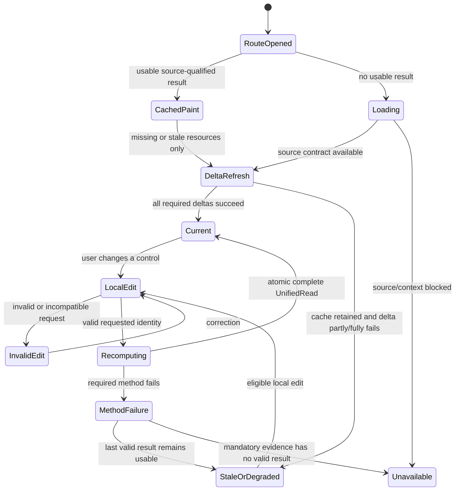
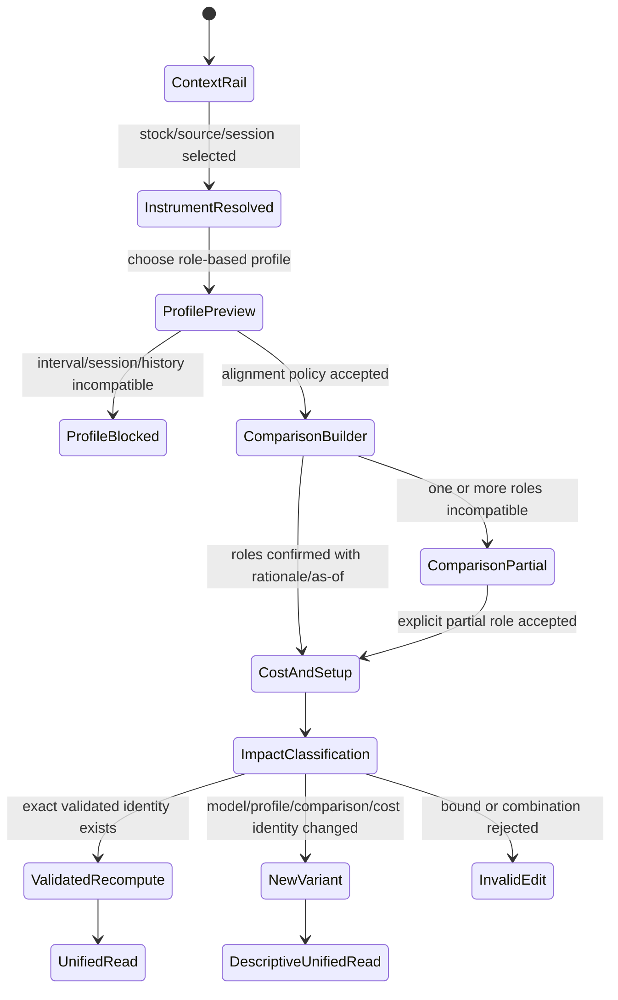
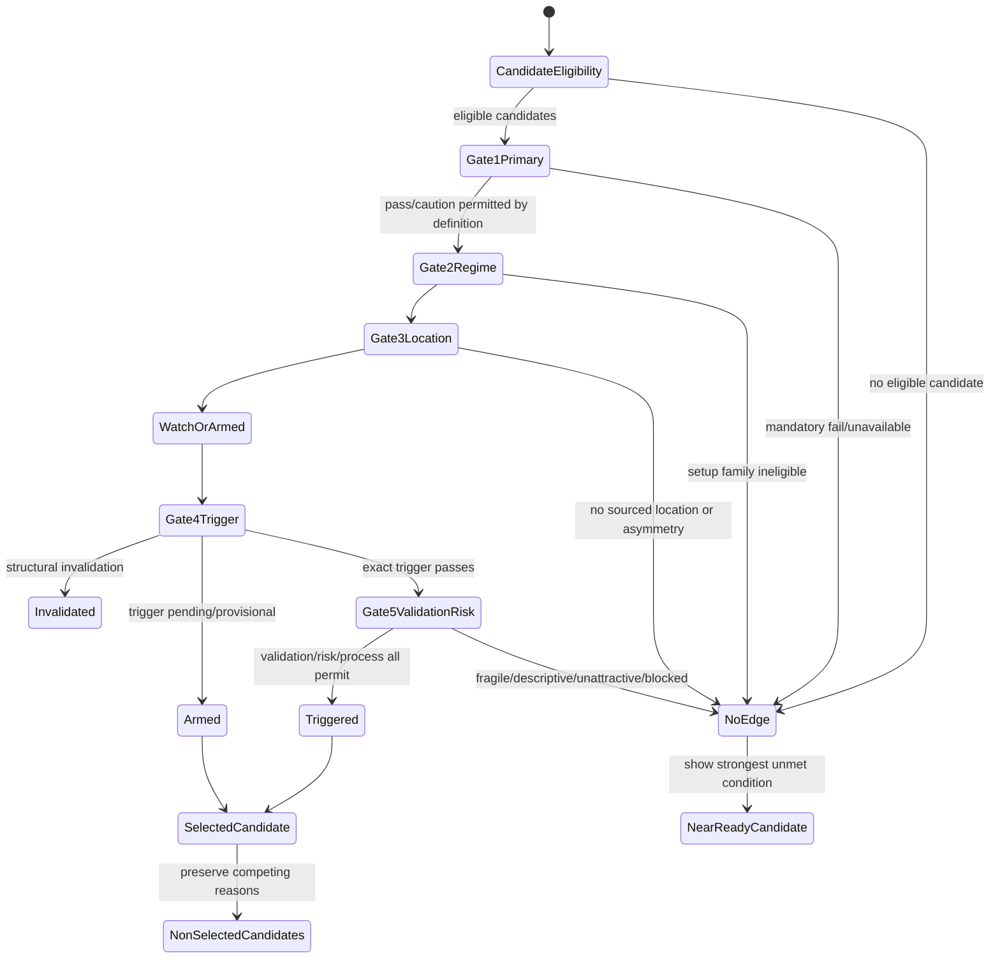
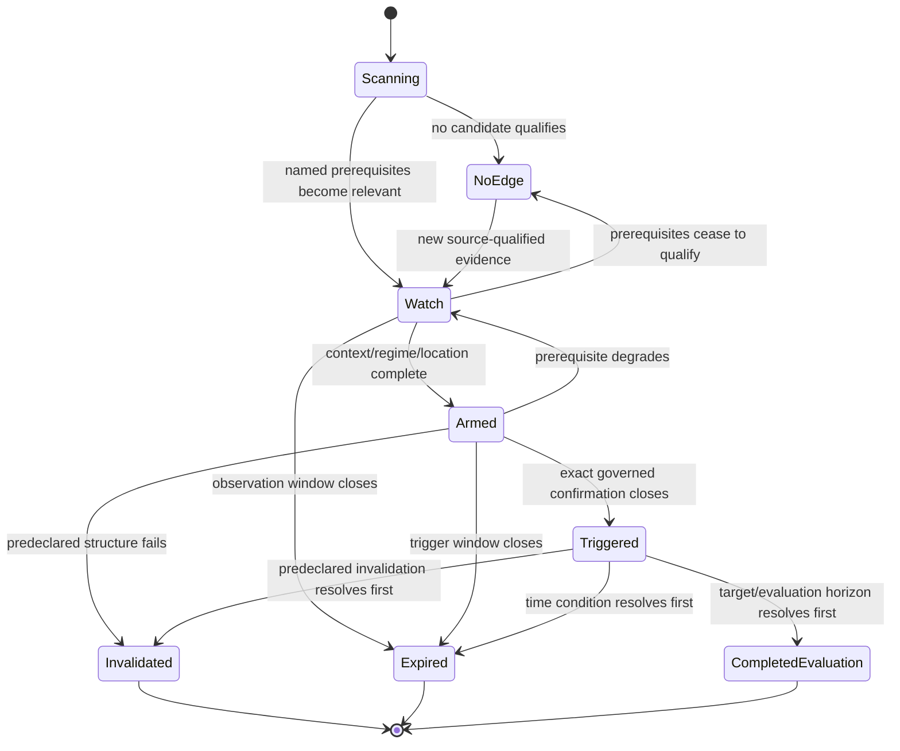
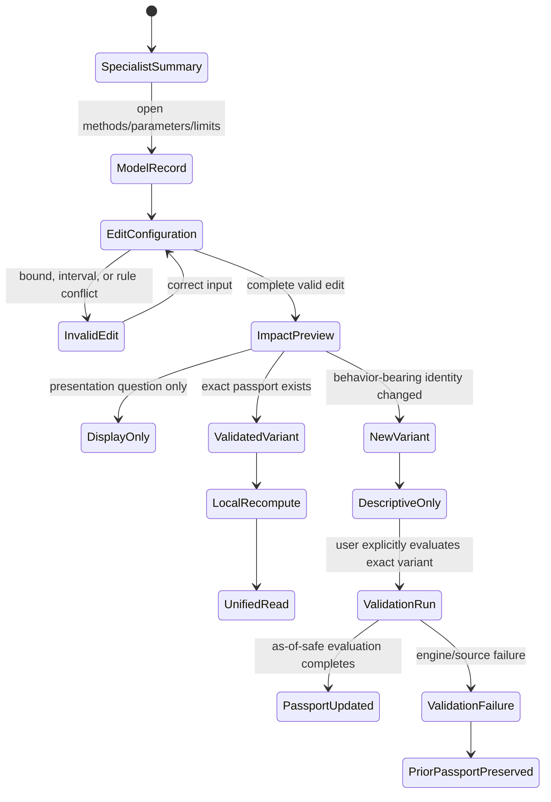
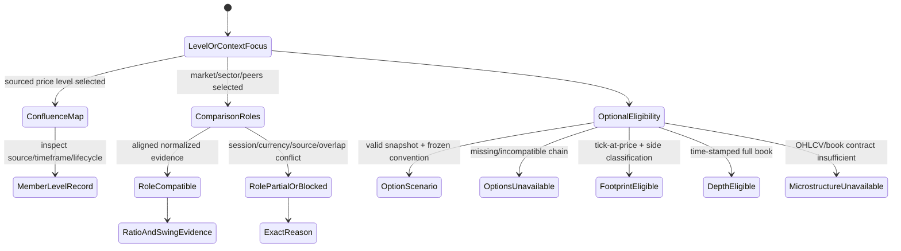
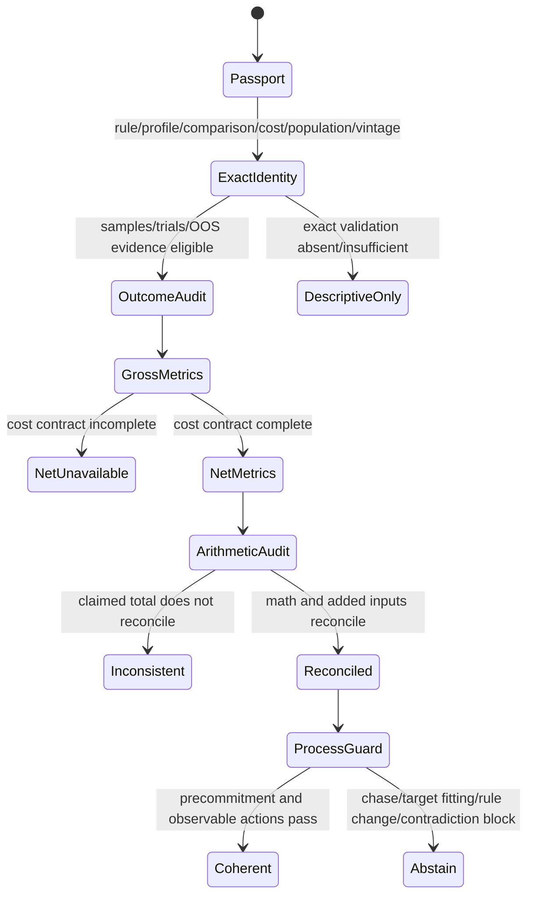
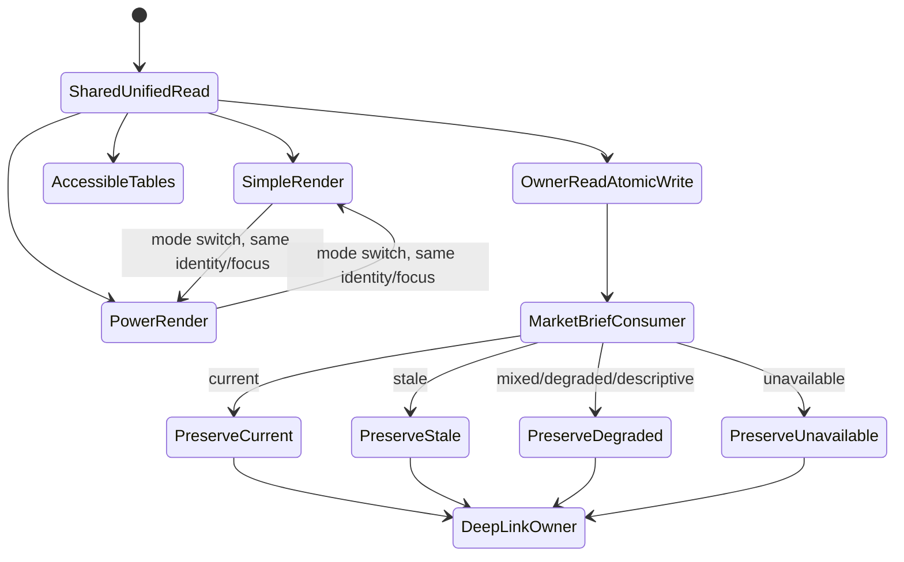
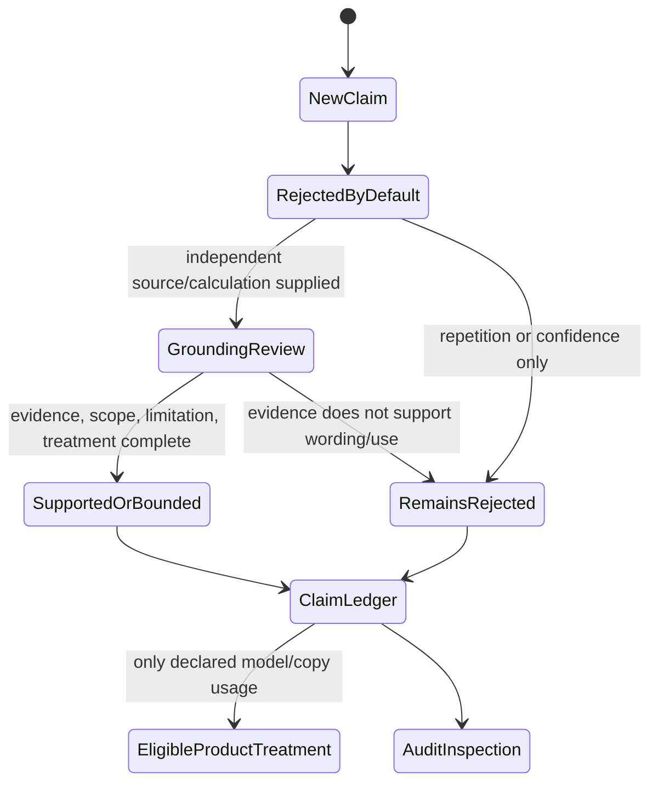

# Feature: 007 Technical Analysis Decision Lab

## Problem Statement

Research Lab already contains strong technical-analysis components, but it does not contain one coherent decision framework that tells a stock researcher what matters now, which setup is actually present, what would trigger it, what would invalidate it, and whether the rule has survived honest historical evaluation.

The current repository establishes both the foundation and the ownership gap:

- `swing-structure-lab.html` owns daily and weekly market structure, 20/50/200 moving-average context, composite volume profile, pattern detection, accumulation/distribution hypotheses, and swing option levels.
- `intraday-tape-lab.html` owns session VWAP, session volume profile, opening-range behavior, prior value, and explicitly labeled OHLCV order-flow proxies.
- `options-structure-lab.html` owns convention-dependent gamma exposure, call/put walls, max pain, expected move, skew, and positioning provenance.
- `gamma-trading-lab.html` owns gamma playbooks and their option-volume proxy.
- `market-heatmap-lab.html` owns the cross-market sector and constituent treemap.
- `strategy-validation-lab.html` owns purged/embargoed walk-forward, cross-instrument, and multiple-testing-aware validation of mechanical rules. Its current checked-in rule engine does not expose a first-class transaction-cost policy, so Feature 007 must not cite it as proof of net expectancy.
- `specs/006-trend-dynamics-cycle-lab/spec.md` owns general trend strength, dynamics, change detection, detector-family agreement, and as-of-safe evidence.
- `rldata.js` owns interval-keyed, provider-tagged shared observations, but its current first-class source-qualified series contract is daily; intraday availability is best-effort and source constrained.

The missing capability is not another indicator dashboard. It is a decision layer that composes those owners into one transparent research state while adding a governed family of configurable specialist models. A user should be able to research one stock, compare it with its market, sector, and peers, inspect primary/setup/trigger timeframes, understand support and resistance, evaluate volume and option context when eligible, and receive a clear `NO EDGE`, `WATCH`, `ARMED`, `TRIGGERED`, `INVALIDATED`, or `EXPIRED` setup state with plain-language reasons.

The four supplied transcripts are useful hypothesis catalogs, not authorities. They contain historically grounded ideas alongside unsupported universals, vendor marketing, causal stories that cannot be inferred from chart data, and internally inconsistent arithmetic. This feature must preserve the useful hypotheses only after independent research and must keep rejected claims visible so they cannot silently re-enter the model.

## Outcome Contract

**Intent:** Give a stock researcher one simple but rigorous technical-analysis workflow that moves from primary context to regime, location, trigger, and expectancy, while preserving the independent evidence from specialized structure, trend, volume, value, pattern, relative-strength, option-positioning, and trader-process models.

**Success Signal:** After selecting a source-qualified stock, an explicit timeframe profile, and an explicit comparison set, Simple view shows one overview read with direction, regime, setup state, the five gate outcomes, primary/setup/trigger timeframe agreement, the selected specialist setup, trigger, invalidation, target path, gross and cost-adjusted reward-to-risk, strongest support, strongest contradiction, unavailable evidence, and what would change the read. A model-by-timeframe evidence heatmap and a price-level confluence map make agreement and conflict visible. Specialized model summaries explain their own parameters and evidence. Power view reproduces the same result with synchronized charts, formulas, source/vintage details, pattern lifecycle, comparison ratios, option assumptions, and as-of-safe validation records.

**Hard Constraints:**

- The transcripts remain research prompts. No claim becomes active merely because a transcript states it confidently.
- Dow Theory, the Wyckoff method, modern indicators, market microstructure, option positioning, risk mathematics, and behavioral evidence retain distinct provenance and limitations.
- The product's five-gate workflow is a modern Dow/Wyckoff-informed synthesis. It is not labeled as Charles Dow's historical "five principles." Canonical Dow doctrine remains separately documented.
- A setup cannot become `TRIGGERED` by averaging indicator votes. Required context, location, confirmation, validation, and risk gates must each pass under the active model definition.
- SMA and EMA variants, MACD, RSI, stochastic-style oscillators, Bollinger Bands, and related transforms are clustered by mathematical family so correlated indicators cannot manufacture confidence.
- Confidence describes evidence quality, coverage, agreement, stability, and validation. It is never displayed as a win probability. A probability or hit rate appears only with an as-of-safe sample, denominator, horizon, costs, and uncertainty.
- Weekly, daily, and four-hour views are supported as an explicit profile, but intervals are role-based and session-aware. A U.S. equity's 6.5-hour core session cannot silently become one four-hour bar plus an unequal remainder.
- Closed-bar evidence and provisional open-bar evidence remain separate. A provisional higher-timeframe state cannot masquerade as confirmed history after reload.
- Wicks are traded extremes, not lies. A wick through a level may qualify a failed-break candidate, but it does not prove a stop hunt, liquidity sweep, institutional actor, or intent.
- Price and bar volume cannot reveal named institutions, hidden orders, aggressor side, or resting order-book depth. Any institutional-participation label is explicitly a proxy hypothesis.
- Volume profile reports historical traded activity by price. Its up/down split is an OHLCV direction proxy unless true bid/ask-classified tick data exists.
- A footprint requires tick-level traded volume at price with bid/ask or aggressor classification. A liquidity heatmap requires time-stamped depth-of-book. Neither is synthesized from OHLCV or an end-of-day option chain.
- Displayed order-book liquidity is not promised execution: orders may move or cancel, and spoofing cases prove that visible size may be non-bona-fide.
- Option walls and net dealer gamma are convention-dependent positioning scenarios. Missing chain data or an unknown dealer-position sign makes the module unavailable; it does not become neutral.
- Trigger, invalidation, and target levels must be defined before a hypothetical entry. A target cannot be chosen solely to make reward-to-risk pass.
- Reward-to-risk arithmetic includes an explicit gross view and, when cost assumptions are supplied, a cost-adjusted view. Breakeven win rate is not profitability evidence.
- A custom parameter change creates a distinct tested variant and cannot inherit another variant's validation passport.
- `NO EDGE`, `MIXED`, and `UNAVAILABLE` are successful, first-class outputs. The model never forces a trade or directional opinion.
- The product is educational research. It does not route orders, connect to a broker, guarantee outcomes, or personalize financial advice.
- Simple, Power, specialized model summaries, exported analysis, and the shared owner read consume one source/vintage, parameter state, setup state, and unified result.

**Failure Condition:** The feature fails even if every chart renders when it counts correlated indicators as independent confirmation, presents a wick as proven institutional manipulation, labels an OHLCV proxy as true order flow, uses unequal stock-session four-hour bars without disclosure, calls a Wyckoff schematic an observed institution campaign, treats dealer gamma as known fact, reports confidence as win probability, backfits a target to satisfy reward-to-risk, carries validation across changed parameters, hides contradictory timeframes, or emits a trade signal when any required gate is unavailable or failed.

## Goals

- Establish one five-gate decision workflow: primary context, regime/phase, location/asymmetry, trigger/confirmation, and validation/risk/process.
- Provide one overview model that consumes every eligible technique family without collapsing them into an unstructured score.
- Provide configurable specialist models for multi-timeframe structure, trend/momentum, price-volume/Wyckoff hypotheses, auction/value, breakout/reversal patterns, mean reversion/volatility, relative confirmation, options positioning, and psychology/risk discipline.
- Make every model state explainable through supporting, contradicting, unstable, and unavailable evidence.
- Support asset- and session-aware primary/setup/trigger timeframe profiles, including weekly/daily/4h where appropriate.
- Turn actionable patterns into explicit lifecycle records with prerequisites, trigger, invalidation, targets, expiry, and historical validation.
- Compare the researched stock with a broad-market benchmark, sector or industry benchmark, and a small explicit peer set rather than arbitrary ticker overlays.
- Use an evidence heatmap and a level-confluence map to make multi-model alignment visible without pretending to show order-book liquidity.
- Incorporate trader psychology through observable market proxies and process guardrails, never through claims about hidden motives.
- Reuse owner results and shared source-qualified observations so this capability coordinates existing tools rather than becoming a second implementation of each one.

## Non-Goals

- Replacing the detailed Swing Structure, Intraday Tape, Options Structure, Gamma Trading, Market Heatmap, Strategy Validation, or Trend Dynamics tools.
- Building a Level-2 terminal, footprint chart, time-and-sales reader, dark-pool feed, or order-book liquidity heatmap from data the repository does not possess.
- Identifying an institution, fund, dealer inventory, hidden order, stop cluster, or participant intent from OHLCV.
- Declaring that Dow, Wyckoff, MACD, RSI, Bollinger Bands, candlesticks, chart patterns, or any named method works universally.
- Treating accumulation, distribution, markup, markdown, fear, greed, FOMO, capitulation, or absorption as directly observed psychological facts.
- Optimizing hundreds of parameter combinations and presenting the best in-sample result as an edge.
- Automated execution, broker integration, portfolio allocation, personalized position sizing, or account-level advice.
- Ranking a stock as fundamentally attractive; this capability studies technical state and setup quality only.

## Current Capability Map

| Capability | Current Repository Evidence | Status | Feature 007 Responsibility |
| --- | --- | --- | --- |
| Source-qualified daily bars | `rldata.js::barSeries`, provider tags, availability timestamps, source policy | Existing foundation | Consume without weakening source/vintage truth |
| Intraday/session evidence | `intraday-tape-lab.html`; shared `1m`/`5m` buckets are source constrained | Existing specialist | Use only when eligible; retain proxy labels |
| Weekly/daily structure | `swing-structure-lab.html::resampleWeekly`, pivots, 20/50/200 stack | Existing specialist | Normalize into timeframe-role evidence |
| General trend dynamics | Feature 006 detector families and consensus contract | Planned/active dependency | Consume trend state and family agreement rather than duplicate it |
| Volume profile and value | Intraday and Swing tools; TradingView source confirms lower-timeframe aggregation and up/down proxy | Existing specialists | Normalize levels and caveats into location evidence |
| Option positioning | Options Structure and Gamma tools; shared `RLDATA.options` snapshots | Existing specialists | Treat as optional scenario evidence with inherited sign convention |
| Broad market heatmap | `market-heatmap-lab.html` | Complete | Deep-link breadth context; do not recreate sector treemap |
| Relative rotation | `sector-research-lab.html`, `global-rotation-lab.html` | Complete for allocation/rotation | Use market/sector/peer confirmation for the researched stock |
| Strategy validation | `strategy-validation-lab.html::walkForward` and `deflatedSharpe`; `notes/strategy-validation-lab.md` documents purged/embargoed folds and cross-instrument robustness but no first-class transaction-cost contract | Existing specialist foundation, partial for Feature 007 | Reuse its as-of/multiplicity discipline; require Feature 007's explicit cost policy before any net expectancy claim |
| One TA decision contract | No registered tool owns a five-gate, family-clustered setup lifecycle | Missing | Entire capability |

## Source Grounding And Claim Boundaries

| Requirement Surface | Concrete Anchor | What The Anchor Supports | What It Does Not Support |
| --- | --- | --- | --- |
| Source-qualified bars and vintages | `rldata.js::barSeries`, `putBarSeries`, `barInfo`, and `ensureBarSeries` | Interval-keyed observations, provider/source metadata, availability and retrieval times, adjustment policy, and explicit missing/rejected series states | A guarantee that every ticker has eligible intraday history or that differently adjusted sources may be blended |
| Shared cache and owner reads | `rldata.js::putToolRead`; `notes/shared-data-layer.md`; `.github/copilot-instructions.md` | Cache-first reuse, one shared credential/status surface, explicit freshness, and source-faithful cross-tool reads | Permission for Feature 007 to create a private credential store or silently recompute another tool's result |
| Swing structure | `swing-structure-lab.html::resampleWeekly`; `notes/swing-structure-lab.md` | Weekly/daily structure, 20/50/200 context, pivots, profile levels, patterns, and current phase hypotheses | A source-qualified institution identity, causal accumulation/distribution fact, or validation passport for Feature 007 variants |
| Intraday value and tape context | `notes/intraday-tape-lab.md`; `intraday-tape-lab.html` | Session VWAP, statistical bands, session profile, opening range, and explicitly proxied up/down volume | True aggressor-side footprint, resting depth, or a clean four-hour U.S. equity session contract |
| Option positioning | `options-structure-lab.html::snapshotOf`; its dealer-sign control; `notes/options-structure-lab.md` | Snapshot-aged walls, flip, max pain, expected-move inputs, and convention-dependent GEX scenarios | Observed dealer inventory, guaranteed pinning, or a neutral result when a chain is absent |
| Trend dynamics | `specs/006-trend-dynamics-cycle-lab/spec.md` | Planned owner contract for family-clustered trend strength, change state, as-of truth, and detector disagreement | Permission to duplicate Feature 006 formulas or treat its future implementation as already delivered |
| Relative context | `sector-research-lab.html::computeEntry`; `market-heatmap-lab.html`; their notes and checked-in universes | Normalized market/sector/group momentum, breadth, constituents, and relative comparisons | A universal peer taxonomy, survivorship-safe historical membership, or proof that a suggested peer is economically comparable |
| Rule validation | `strategy-validation-lab.html::backtest`, `walkForward`, and `deflatedSharpe`; `notes/strategy-validation-lab.md` | Real-data rule evaluation, embargoed folds, held-instrument robustness, and trial-aware Sharpe evidence | Transaction costs, Feature 007 setup semantics, or inherited validation after a parameter/comparison change |
| Simple/Power parity | `.github/copilot-instructions.md` Simple/Power and one-compute rules | One compute state, local lever recomputation, cache-first hydration, and owner-read publication | License for either view or Market Brief to upgrade stale, provisional, mixed, or unavailable evidence |
| Historical and market-method claims | The named historical, academic, exchange, regulatory, and vendor methodology sources under `## Research Sources` | Only the bounded claims recorded in the Transcript Claim Validation Ledger and Evidence Tier Policy | Universal profitability, hidden intent, named actor attribution, or a claim omitted from the ledger |

Repository anchors establish current capability and ownership, not empirical edge. External sources establish doctrine, data definitions, historical samples, or documented failure modes, not that any Feature 007 setup is profitable. Only an exact, as-of-safe ValidationRecord may support a local outcome-rate claim.

## Honest Findings, Contradictions, And Limitations

1. **The repository already has two TA dashboards.** Building another broad dashboard would duplicate Swing and Intraday. Feature 007 must coordinate their evidence and own decision state, setup lifecycle, and validation identity.
2. **Dow has no canonical five-principle list matching Transcript 1's five execution steps.** The commonly taught doctrine contains six tenets; StockCharts traces later organization to Nelson, Hamilton, and Rhea. The product may use five gates only when labeled a modern synthesis.
3. **The `1/3` to `2/3` secondary retracement is a loose Hamilton observation.** The source explicitly warns that secondary-move characteristics are guidelines, not forecasting rules. Fibonacci numbers do not become proof merely because they lie inside that range.
4. **Dow trading ranges are neutral before resolution.** The historical source says accumulation versus distribution was virtually impossible to determine until a break. A sideways range after a decline or advance can set a prior, not a fact.
5. **The Wyckoff Composite Man is explicitly a heuristic device.** It is useful for disciplined scenario thinking but cannot establish one coordinated actor or the motive behind a price bar.
6. **Wyckoff schematics are pattern families, not templates the market must follow.** Springs and UTADs are not required elements even inside the doctrine. Model matching therefore needs tolerances, alternatives, and an unresolved state.
7. **Trend following has meaningful empirical support, but at a strategy-family level.** The AQR historical study and time-series-momentum literature do not validate every MA length, every asset, every sample, or every single-stock signal.
8. **Objectively encoded chart patterns can add information in some samples.** Lo, Mamaysky, and Wang found incremental information for several patterns in U.S. stocks from 1962-1996, while emphasizing that visual charting is subjective. The New York Fed head-and-shoulders result is limited to daily major exchange rates over 1973-1994. Neither supports universal pattern probabilities.
9. **Indicator count is not evidence independence.** TradingView's Technical Ratings averages 15 MA/filter ratings and 11 oscillators. Many share price, lookback, smoothing, or momentum inputs. Feature 007 must cluster them rather than reward formula duplication.
10. **A U.S. stock's core session is 390 minutes.** NYSE and Nasdaq publish 9:30 a.m.-4:00 p.m. ET core hours. Four-hour candles produce unequal fragments unless extended hours or a declared alignment policy is used.
11. **Volume profile is historical and reactive.** TradingView states it uses lower-timeframe bars, classifies up/down volume by bar direction, and defines value area by a selected share of historical traded volume. It is not future order-book liquidity.
12. **Footprint and heatmap data are different.** Sierra Chart requires tick-level volume-at-price and historical bid/ask trade volume for accurate footprint bars. Nasdaq TotalView provides full displayed depth; Bookmap records that depth over time. Neither contract exists in OHLCV.
13. **Displayed liquidity can be withdrawn.** The SEC's 2020 J.P. Morgan case documents non-bona-fide orders placed to create false interest and canceled after favorable executions. A heatmap is evidence of displayed orders, not guaranteed fills or identity.
14. **Option gamma is real; inferred dealer gamma is conditional.** OCC material defines gamma and its expiration behavior, but a net dealer exposure estimate additionally needs positions, signs, and assumptions that an end-of-day chain does not reveal.
15. **Transcript 3's opening journal arithmetic does not reconcile.** At a 71% win rate, `+6R` winners and `-1.8R` losers imply gross expectancy of `+3.738R` per trade, not a 50-trade loss. At 38%, `+3.1R` winners and `-1R` losers imply `+0.558R` per trade, not `+47R` over 50 equal-risk trades. The example is rejected as stated.
16. **Gross reward-to-risk breakeven arithmetic is correct but incomplete.** With equal independent risk units, gross breakeven is `loss / (win + loss)`: 50% at 1:1, 33.3% at 2:1, and 25% at 3:1. Costs, slippage, gaps, partial exits, sizing variation, and estimation error raise the required realized win rate.
17. **A 2% risk rule is not universal.** The compounding examples are arithmetically plausible, but suitability depends on strategy distribution, correlation, gap risk, leverage, liquidity, and the user's circumstances. The product may model hypothetical fractions; it cannot prescribe one.
18. **VWAP deviation bands and volume-profile value area are not the same object.** Transcript 3 calls VWAP plus deviation bands a value area; the product must label statistical VWAP envelopes separately from a 70%-style volume-at-price value area.
19. **Frequent trading costs matter.** FINRA warns that short-term trading is less reliable than long-term investing and that costs can erode returns. Barber and Odean's 66,465-household sample links high turnover to lower realized performance; that supports process guardrails, not a universal trader-failure percentage.
20. **No reputable source retrieved supports the transcripts' `95%` or `99%` universal failure claims.** Those numbers cannot appear as facts, model priors, or marketing copy.
21. **The existing Strategy Validation tool does not close the cost problem.** Its checked-in `backtest`, `walkForward`, and `deflatedSharpe` functions support rule evaluation, embargo, robustness, and multiplicity analysis, but no first-class commission, spread, slippage, borrow, or gap-cost contract was found. Feature 007's gross/net requirements are new business behavior, not inherited proof.

## Transcript Claim Validation Ledger

**Admission rule:** Every transcript statement starts as an unverified hypothesis. It may influence a TechniqueModule, SetupDefinition, GateResult, default, label, or explanatory sentence only when this ledger gives it a `Supported` or `Bounded` verdict, names an independent source or reproducible calculation, and defines the allowed product treatment. A transcript claim absent from the ledger remains rejected by default; confident wording, repetition across transcripts, or similarity to a chart does not admit it.

**Source map:** Dow and trading-range rows are grounded in StockCharts' Dow Theory history and theorem discussion; Wyckoff, Composite Man, comparative-strength, spring/UTAD, and cause/effect rows are grounded in the two named StockCharts Wyckoff sources; objective-pattern and trend-family rows use the NBER, New York Fed, and AQR studies with their named samples; session, indicator-count, volume-profile, footprint, depth, and spoofing rows use NYSE/Nasdaq, TradingView, Sierra Chart, Nasdaq TotalView, Bookmap, and the SEC order; option rows use the Options Industry Council and the cited gamma study; expectancy rows use reproducible arithmetic, FINRA, and Barber/Odean. Where that source set does not support a universal, causal, actor-identifying, or probability claim, the ledger keeps it rejected or bounded.

| Transcript Claim | Verdict | Research Result | Product Treatment |
| --- | --- | --- | --- |
| Dow never wrote a trading book; later writers organized his editorials | Supported | StockCharts attributes the modern organization to Nelson, Hamilton, and Rhea | Historical note only |
| Dow Theory has six core tenets | Supported as common modern summary | The doctrine covers discounting, three movements, phases, average confirmation, volume confirmation, and persistence | Preserve six-tenet reference; do not rename product gates |
| Weekly/daily/4h are Dow's mandated charts | Rejected | Dow/Hamilton discuss primary, secondary, and daily movements, not a mandatory modern interval trio | Use role-based, asset-aware intervals |
| Secondary reactions usually retrace 33%-66% | Bounded guideline | Hamilton's historical estimate is explicitly a loose guideline | Configurable location context; no automatic entry |
| Closing structure matters | Supported with nuance | Dow examples use closing-price line charts and confirmed peak/trough breaks | Closed-bar state is confirmatory; intrabar extremes remain visible |
| Wicks lie and prove liquidity sweeps | Rejected | Wicks are traded extremes; no OHLCV field identifies intent or stops | Label failed-break candidate only |
| Every major pullback is institutions reloading | Rejected | No observed source or participant identity supports the universal | Never infer actor or motive |
| Accumulation and distribution are known from range context | Rejected as fact | Dow treats a line as neutral until breakout; Wyckoff uses a multi-event hypothesis | Emit candidate/unresolved phase with evidence |
| Volume should support the trend | Supported as doctrine, conditional empirically | Dow treats volume as confirmation and price as ultimate determinant | One independent participation family |
| Weakness is not reversal until structure confirms | Supported | Dow trend persists until confirmed peak/trough reversal | Separate warning, break candidate, and confirmed reversal |
| Diminishing impulses, deeper corrections, and failed breaks warn of exhaustion | Usable hypotheses | Observable and algorithmically definable; no universal probability established | Exhaustion-watch model, never automatic reversal |
| Candlestick users lose because everyone sees candles | Rejected | No causal or universal evidence | Excluded from product copy and priors |
| Volume profile shows volume traded by price | Supported | TradingView defines POC, VAH/VAL, HVN/LVN from lower-timeframe traded activity | Reactive location model with method disclosure |
| Volume profile identifies banks or institutions | Rejected | Bar-direction volume cannot identify participant class | No participant label |
| Footprints show bid/ask traded volume at each price | Supported when proper data exists | Sierra Chart requires tick-level volume at price and bid/ask trade volume | Unavailable without eligible feed |
| Large bubbles reveal a specific large buyer or seller | Rejected as identity claim | A print shows executed size and classified side, not beneficial owner or motive | `large executed trade`, never named actor |
| Liquidity heatmaps show likely future trades | Rejected | They show displayed resting depth that may remain, move, execute, or cancel | No predictive promise; no imitation from OHLCV |
| Win rate is meaningless | Rejected | Expectancy depends jointly on probability, payoff distribution, costs, and dependence | Show all components, not one slogan |
| Transcript 3's two trader examples are arithmetically valid | Rejected | The stated rates and R multiples do not produce the claimed totals | Include a calculation audit and reject inconsistent inputs |
| 1:2 needs roughly 34%; 1:3 needs 25% gross | Supported with qualification | Gross equal-risk breakeven is 33.3% and 25%; costs raise it | Cost-aware expectancy calculator |
| Risk is the only thing a trader controls | Overstated | Entry, order choice, exposure, diversification, exit rules, and abstention are also controlled; fills and gaps are not | Process guard covers controllables and residual risks |
| Acceptance outside VWAP bands defines price discovery | Testable setup, not law | A mechanical time/distance rule can be evaluated; VWAP bands are not volume value area | Specialist setup with explicit definition and validation |
| Wyckoff's three laws are scientific laws | Rejected terminology | They are doctrine within a historical method | Display as method heuristics |
| Composite Man reveals actual smart-money intent | Rejected as observation | Source calls it a heuristic device | Optional explanatory lens with no actor claim |
| Springs/upthrusts are high-probability by definition | Rejected | The doctrine describes them, but source notes they are optional and can repeat/fail | Mechanical candidate plus analog passport |
| Longer base guarantees larger move | Rejected | Wyckoff cause/effect is a P&F projection doctrine with subjective counts and cautions | Research-only target hypothesis until validated |
| Patterns should be combined with context and confirmation | Supported as a product principle | Academic work favors objective definitions; Dow/Wyckoff both require context and confirmation | Every setup has prerequisites and confirmation |

## Evidence Tier Policy

| Tier | Evidence Type | Examples | Allowed Claim |
| --- | --- | --- | --- |
| A | Direct exchange, regulatory, source, or computation fact | OHLCV, closed bar, NYSE hours, Nasdaq depth schema, SEC enforcement, option-chain fields | `Observed` or `Computed`, with source and timestamp |
| B | Replicated or peer-reviewed empirical relationship | Time-series momentum, algorithmic pattern studies, investor-turnover research | `Historically supported in named sample`, never universal |
| C | Established technical methodology | Dow doctrine, Wyckoff doctrine, MACD, RSI, Bollinger, VWAP, P&F | `Method indicates` or `Hypothesis`, with parameters |
| D | Vendor, transcript, schematic, or discretionary interpretation | Smart-money motive, stop hunt, heatmap attraction, named phase from appearance | `Unverified hypothesis` or `Rejected`; cannot gate a signal |

A result may move from Tier C or D to a locally validated setup only through an as-of-safe ValidationRecord. Local validation does not upgrade a heuristic into causal truth.

## Domain Capability Model

### Capability

**Explainable Multi-Model Technical Decision Intelligence** transforms source-qualified stock, benchmark, volume, event, and optional option evidence into a gated, configurable setup lifecycle with explicit provenance, conflicts, validation, trigger, invalidation, and expectancy.

### Domain Primitives

| Primitive | Purpose | Lifecycle |
| --- | --- | --- |
| InstrumentContext | Identifies selected stock, venue/session, asset class, price-adjustment policy, liquidity eligibility, and comparison roles | selected -> resolved, degraded, incompatible, or unavailable |
| TimeframeRole | Names `primary`, `setup`, or `trigger` function independently of its actual interval and session alignment | configured -> eligible -> closed/provisional -> superseded on profile change |
| EvidenceObservation | Carries value, source, timestamp, availability time, timeframe, units, transform, quality, and evidence tier | missing -> current, stale, revised, degraded, or rejected |
| TechniqueModule | Declares one method family, parameters, input eligibility, output vocabulary, limitations, and validation identity | disabled, eligible, running, active, unstable, or unavailable |
| TechniqueResult | One module's directional or contextual evidence with support, contradiction, uncertainty, and explanation | provisional -> confirmed, contradicted, invalidated, expired, or revised |
| ComparisonSet | Assigns broad-market, sector/industry, and peer roles with normalized comparison rules | unresolved -> explicit -> current, partial, stale, or incompatible |
| PriceLevel | Represents a sourced level or zone such as swing, MA, VWAP, profile, gap, range, expected move, or option wall | candidate -> active -> tested -> held, broken, reclaimed, stale, or expired |
| SetupDefinition | Versioned mechanical prerequisites, trigger, invalidation, targets, expiry, evidence gates, cost policy, and parameters | cataloged -> configured -> validated, descriptive-only, or rejected |
| SetupCandidate | Applies one SetupDefinition to one instrument, vintage, comparison set, and timeframe profile | scanning -> no-edge, watch, armed, triggered, invalidated, expired, or completed-evaluation |
| ValidationRecord | Freezes variant identity, trials, samples, regimes, costs, outcomes, uncertainty, and as-of-safe evaluation | absent -> insufficient, exploratory, supported, fragile, or rejected |
| RiskPlan | Expresses hypothetical entry, invalidation, target path, gross/net R, break-even rate, gap/slippage caveat, and optional risk unit | incomplete -> valid, asymmetric, unattractive, invalidated, or expired |
| BehaviorGuard | Detects process hazards such as chasing, contradiction blindness, unplanned stop movement, overconfidence, recency, and overtrading | clear -> caution -> blocked until plan is coherent |
| GateResult | Records observed, required, outcome, reasons, and dependent evidence for one of the five gates | pending -> pass, caution, fail, or unavailable |
| UnifiedRead | One immutable synthesis of gates, setup state, independent family evidence, comparisons, levels, validation, and caveats | unavailable -> no-edge, watch, armed, triggered, invalidated, expired, or revised |
| ToolDecisionRead | Compact source-faithful projection for Market Brief and other Research Lab consumers | unavailable -> current or stale -> superseded |

### Relationships

- InstrumentContext owns one explicit ComparisonSet and one three-role timeframe profile.
- Every EvidenceObservation belongs to one source/vintage and may feed many TechniqueModules without becoming many independent observations.
- Related TechniqueModules belong to one evidence family; their TechniqueResults roll up to one family vote before any gate evaluates.
- PriceLevels may cluster into a confluence zone, but each level retains source, method, timeframe, age, and uncertainty.
- A SetupDefinition names which GateResults are mandatory and which TechniqueResults are confirming, contradicting, or informational.
- A SetupCandidate cannot become `armed` until its context, regime, and location gates pass; it cannot become `triggered` until confirmation and risk/process gates also pass.
- A ValidationRecord belongs to the exact SetupDefinition version, parameters, timeframe profile, comparison policy, cost policy, and instrument population.
- A RiskPlan references the pre-existing trigger and invalidation; it cannot move either level merely to improve the ratio.
- BehaviorGuard consumes the same contradictions, entry distance, plan changes, and validation uncertainty visible to the user.
- Simple, Power, specialist summaries, export, and ToolDecisionRead consume one UnifiedRead.

### Business Policies

1. **Source-before-signal:** No directional state exists without source, interval, session, adjustment, availability time, and freshness.
2. **Closed-bar integrity:** Closed and provisional bars remain distinct through calculation, display, history, and reload.
3. **Role-before-interval:** Primary/setup/trigger roles are stable concepts; actual intervals depend on asset, session, and user-selected profile.
4. **Session-alignment:** An interval that does not evenly partition the selected session must expose its partial-bar policy and cannot silently compare unlike bars.
5. **Family independence:** Closely related MAs and oscillators contribute one family result, not one vote per formula.
6. **Gated synthesis:** A failed or unavailable mandatory gate cannot be overwhelmed by positive optional evidence.
7. **No missing-as-neutral:** Disabled, missing, stale, incompatible, and unavailable evidence remain explicit and contribute no neutral zero.
8. **Confidence/probability separation:** Confidence is evidence quality; empirical outcome probability requires a ValidationRecord and denominator.
9. **Phase humility:** Dow/Wyckoff phase names are candidate interpretations until observable resolution and validation support them.
10. **Actor humility:** Price, volume, options, and order data never identify beneficial owner or motive.
11. **Wick humility:** A wick is an extreme and may define a failed-break setup; it is not proof of manipulation.
12. **Volume honesty:** Up/down bar volume, OBV, CMF, and effort/result are participation proxies, not aggressor or institutional flow.
13. **Microstructure eligibility:** Footprint, large-trade, and depth heatmap results require their declared tick or book data. Absent data blocks the module.
14. **Option convention integrity:** Every gamma-derived level inherits one frozen sign convention and chain snapshot; consumers never silently re-sign it.
15. **Level provenance:** Every level retains method, window, timeframe, source, age, and invalidation state.
16. **Pattern objectivity:** Every active pattern has a machine-testable definition and tolerance. A visually similar chart without the rule remains unclassified.
17. **State-before-action:** `WATCH`, `ARMED`, and `TRIGGERED` remain different; a candidate cannot skip states because the latest move looks compelling.
18. **Precommitment:** Trigger, invalidation, targets, expiry, and costs are fixed before hypothetical entry and revisions append rather than overwrite.
19. **No target fitting:** A setup fails the risk gate when natural structural targets do not support the required asymmetry.
20. **Validation identity:** Any parameter, rule, cost, timeframe, comparison, or population change creates a new variant identity.
21. **Multiplicity accounting:** Every tested variant counts toward selection-bias disclosure.
22. **As-of evaluation:** Historical signals use only data available at each decision time; revised and retrospective labels remain separate.
23. **Comparison roles:** Broad market, sector/industry, and peers remain separate evidence roles; one cannot substitute silently for another.
24. **Contradiction visibility:** Higher-timeframe conflict, relative weakness, weak participation, event risk, or validation fragility cannot be averaged away.
25. **Abstention:** No edge, mixed evidence, inadequate asymmetry, insufficient data, and unsupported variants all result in abstention rather than a weak signal.
26. **One-result parity:** All views and consumers project one UnifiedRead and cannot recompute private alternatives.

## Historical Doctrine Mapping

| Canonical Dow Concept | Evidence-Constrained Product Adaptation |
| --- | --- |
| Averages discount known information | Treat price as an aggregate observable, not proof that all information is correctly priced |
| Markets have primary, secondary, and minor movements | Use primary/setup/trigger roles with asset-aware intervals |
| Primary trends have psychological phases | Expose phase hypotheses separately from measured trend and require observable evidence |
| Industrial and transportation averages confirm one another | Preserve the historical rule; use market, sector, and peers as modern comparison context without claiming they are identical substitutes |
| Volume confirms trend | Use one participation family; price structure remains independently visible |
| A trend persists until clear reversal evidence | Maintain warning, candidate break, and confirmed reversal as distinct states |

The product's five gates also draw on Wyckoff's documented five-step stock-selection process: assess the market, prefer relative strength/weakness aligned with that market, evaluate objective potential, require readiness, and time commitment with market context. Modern validation, costs, and process controls are added explicitly rather than attributed to the historical doctrine.

## Five-Gate Decision Framework

| Gate | Question | Minimum Observable Evidence | Pass Outcome | Fail/Unavailable Outcome |
| --- | --- | --- | --- | --- |
| 1. Primary Context | What is the broad and primary direction, and does the selected stock have compatible relative behavior? | Closed primary/setup structure, independent trend family, market and sector context | Direction and structural boundary are named | `NO EDGE` or countertrend-only hypothesis; no triggered setup |
| 2. Regime And Phase | Is price trending, ranging, compressing, transitioning, or in unresolved phase evidence? | Trend strength/dynamics, volatility state, range/trend evidence, phase evidence with contradictions | Eligible specialist setup families are named | Ineligible setup families are blocked; unresolved remains visible |
| 3. Location And Asymmetry | Is price at a sourced level where a setup has structural room and a natural invalidation? | Swing/MA/value/profile/gap/options levels, confluence, distance in volatility units, natural target path | Candidate becomes `WATCH` or `ARMED` | Chasing, middle-of-range, or poor asymmetry remains `NO EDGE` |
| 4. Trigger And Confirmation | Has the setup's exact closed-bar trigger occurred with required participation and relative confirmation? | Versioned trigger, close versus intrabar excursion, displacement, volume/participation, follow-through policy | Candidate becomes `TRIGGERED` | Remains `ARMED`, becomes `INVALIDATED`, or expires |
| 5. Validation, Risk, And Process | Is this exact rule supported enough to study, and is the precommitted plan coherent after costs and behavioral checks? | Validation passport, sample/uncertainty, trigger/invalidation/target, costs, gross/net R, process guard | Triggered research plan is complete | Descriptive-only, fragile, unattractive, or behavior-blocked; abstain |

## Model Family Research

### One Overview Model

The Overview Model evaluates the five gates in order and presents one UnifiedRead. It includes every eligible specialist family but does not treat them equally or additively:

- Mandatory gates are conjunctive: one cannot be outvoted.
- Within each gate, evidence is clustered into independent families before support is counted.
- Specialized models compete only after the regime gate determines eligibility.
- The selected setup is the highest-quality eligible candidate, not the most bullish or the one with the most indicators.
- The result exposes direction and action state separately. A bullish primary trend can still produce `NO EDGE`; a range can produce a two-sided `ARMED` plan; mixed timeframes can remain `WATCH`.
- The result names the best supporting family, strongest contradiction, weakest required gate, missing evidence, and precise confirmation/invalidation condition.

### Specialist Model Registry

| Specialist Model | Core Techniques | Eligible Job | Clear Signal Vocabulary | Required Caveat |
| --- | --- | --- | --- | --- |
| Multi-Timeframe Structure | Closing-price pivots, higher/lower peaks and troughs, primary/secondary/trigger boundaries, Trend Dynamics owner read | Establish direction and reversal state | aligned-up, aligned-down, range, mixed, warning, break-candidate, reversal-confirmed | Pivot sensitivity and bar-close status visible |
| Trend And Momentum | SMA/EMA 20/50/200, slopes, distance in ATR, MACD, ADX, RSI, trend persistence | Measure direction, strength, acceleration, extension | sustained, strengthening, weakening, extended, tangled, unavailable | Related indicators count as one family |
| Price-Volume And Wyckoff Hypothesis | Relative volume, spread/range, OBV/CMF, effort/result, range tests, spring/upthrust candidates | Test participation and phase hypotheses | confirms, diverges, failed-break candidate, unresolved phase | Never identifies institution or motive |
| Auction And Value | Anchored/session VWAP, statistical VWAP bands, volume POC/VAH/VAL/HVN/LVN, acceptance/rejection | Locate fair-value, discovery, and return-to-value candidates | accepted, rejected, balanced, discovery, return-to-value | VWAP envelope and volume value area stay distinct |
| Breakout And Reversal | Structural close, displacement/ATR, retest, failed break/reclaim, follow-through, gap context | Define objective event-driven setups | watch, armed, triggered, failed, reclaimed, expired | No wick-only reversal or causal stop-hunt label |
| Mean Reversion And Volatility | Bollinger position/width, RSI state, VWAP/value distance, ATR percentile, regime gate | Fade extremes only in compatible balance regimes | stretched, rejected, reverting, squeeze, expansion | Overbought/oversold alone is not a reversal |
| Relative Confirmation | Stock/market and stock/sector ratios, peer percentile, corresponding swings, breadth owner read | Distinguish idiosyncratic strength/weakness from market beta | confirms, leads, lags, diverges, incompatible | Comparisons use explicit roles and aligned timestamps |
| Options Positioning | Call/put walls, flip, expected move, max pain, skew, option volume, inherited gamma convention | Add scenario levels and volatility context | pin scenario, trend-amplification scenario, wall test, unavailable | Dealer position and direction are estimated, not observed |
| Psychology, Expectancy, And Process | Entry distance, contradiction review, precommitment, outcome distribution, gross/net expectancy, loss-streak scenarios | Prevent chasing and grade rule adherence | coherent, caution, chase, fragile edge, unattractive, blocked | Does not diagnose the user's emotions or prescribe risk |

### Cross-Model Evidence Independence

A specialist model is an interpretation job, not an independent vote. The same close, moving average, volume bar, comparison ratio, or option snapshot may feed several specialists, but it is counted once in its evidence family for a given gate.

| Evidence Family | Representative Inputs | May Inform | Independence Rule |
| --- | --- | --- | --- |
| Closing structure | Confirmed pivots, range boundaries, higher/lower peaks and troughs | Structure, breakout/reversal, Wyckoff hypotheses | Multiple pattern labels derived from the same pivots remain one structural family |
| Trend filters | SMA/EMA stack, slopes, distance from trend | Structure, trend/momentum, pullback location | Average lengths and smoothing variants do not become separate confirmations |
| Momentum transforms | MACD, RSI, stochastic-style change measures | Trend/momentum, exhaustion, mean reversion | Shared return/lookback transforms are clustered and expose correlation |
| Volatility and displacement | ATR/ATRP, Bollinger width/position, realized range | Regime, breakout, mean reversion, risk normalization | Volatility may qualify regime/location/risk but cannot vote direction by itself |
| Participation proxy | Bar volume, relative volume, OBV, CMF, effort/result | Breakout confirmation, price-volume hypotheses, exhaustion | Re-expressions of the same OHLCV volume remain one proxy family and never become actor evidence |
| Auction and historical value | VWAP, VWAP envelopes, POC, VAH/VAL, HVN/LVN | Location, return-to-value, balance/breakout models | Statistical VWAP and volume-at-price remain distinct methods but neither is resting liquidity |
| Relative context | Market, sector/industry, peer ratios, swings, breadth | Primary context, relative confirmation, candidate ranking | Each comparison role stays visible; multiple peers contribute one denominator-aware peer result |
| Option positioning scenario | Expected move, walls, flip, skew, max pain under one snapshot/convention | Location, volatility context, scenario contradiction | All outputs from one chain snapshot/convention form one optional positioning family |
| Validation and process | Exact-variant outcomes, costs, uncertainty, precommitment, chase distance | Gate 5 only | These determine research eligibility and plan coherence; they do not add bullish or bearish votes |

### Indicator Role Matrix

| Technique | Family Role | Useful Output | Misuse The Product Blocks |
| --- | --- | --- | --- |
| SMA/EMA 20/50/200 | Trend/location | Stack, slope, cross, distance, dynamic level | Counting six MA variants as six confirmations |
| MACD | Trend/momentum | Fast-slow EMA spread, signal relation, histogram change | Treating a crossover as sufficient setup |
| RSI | Momentum/state | Relative gain/loss state and divergence candidate | Automatically selling `overbought` in a strong trend |
| Bollinger Bands/Width | Volatility/location | Standardized extension and compression/expansion | Calling every band touch a reversal |
| ADX/DMI | Trend strength | Directional movement and strength state | Treating ADX alone as direction |
| ATR/ATRP | Volatility/risk normalization | Displacement, distance, stop/target normalization | Treating ATR as directional evidence |
| OBV/CMF/up-down volume | Participation proxy | Cumulative participation or divergence | Calling it literal institutional accumulation |
| VWAP/anchored VWAP | Price benchmark/location | Distance, reclaim/loss, acceptance test | Calling it volume-profile value area |
| Volume profile | Historical activity by price | POC, VAH/VAL, HVN/LVN, prior acceptance | Calling it resting liquidity or future orders |
| Candlestick forms | Trigger detail at a governed level | Close location, rejection, range/body, follow-through | Using isolated candle names without context |

## Actionable Setup Registry

| Setup | Prerequisite | Armed Condition | Trigger | Invalidation | Natural Target Logic |
| --- | --- | --- | --- | --- | --- |
| Trend Pullback Continuation | Primary/setup trend aligned; specialist trend model sustained | Secondary reaction reaches swing/MA/HVN or anchored-VWAP confluence without primary break | Closed reclaim or continuation close with required participation | Close through the significant setup swing or declared zone | Prior impulse high/low, next structural shelf, then measured extension only if validated |
| Breakout Acceptance And Retest | Defined range or structural boundary; sufficient room | Closed break with configured displacement and participation | Time/distance acceptance or successful retest close | Re-entry and close inside failed boundary under rule | Next sourced shelf, profile node, swing, or expected-move boundary |
| Failed Break Reclaim (Spring/Upthrust Family) | Mature range with explicit support/resistance and context | Price trades beyond boundary and returns toward range | Closed reclaim/rejection plus configured confirmation | Renewed close beyond excursion extreme or failed follow-through | Opposite range side, POC/value center, then only validated extension |
| Balance Extreme Mean Reversion | Range/balance regime; no imminent incompatible event | Price reaches volume value edge, VWAP envelope, or Bollinger extreme with adequate liquidity | Rejection close and movement back toward value | Acceptance outside value or structural range break | VWAP/POC first, opposite value edge second |
| Volatility Compression Expansion | Bollinger width/ATR and range contract to configured percentile | Price is near a defined boundary and direction remains unresolved | Closed expansion break with participation and relative confirmation | Failed expansion and close back through range | Next structural level and realized-volatility path |
| Return To Value | Prior acceptance outside a statistical VWAP envelope or profile boundary has failed | Price re-enters the governed value definition | Confirmed acceptance back inside | Renewed acceptance outside in original direction | VWAP or POC, not an invented fixed target |
| Trend Exhaustion Watch | Mature trend with shrinking impulses, deeper reactions, failed extensions, or participation divergence | At least two independent warning families persist | No reversal trigger until significant structure breaks and confirms | New impulse and confirmed high/low in trend direction | Warning model manages risk posture; reversal target belongs to subsequent setup |
| Event Gap Continuation/Reversal | Source-qualified gap around a named event with prior structure | Gap location, volume, market/sector context and opening behavior qualify | Configured hold, reclaim, or failed-gap close | Opposite side of event structure under declared session | Prior/next value, gap boundary, or structural shelf |

Every setup exposes its exact formula version and validation state. A user may configure thresholds, but a custom threshold set is a distinct variant.

### Setup Lifecycle Rules

| Current State | Permitted Next State | Required Business Evidence |
| --- | --- | --- |
| `SCANNING` | `NO EDGE` or `WATCH` | Eligibility resolved; either no candidate qualifies or one candidate has named unmet prerequisites |
| `NO EDGE` | `WATCH` | New source-qualified evidence makes a specific SetupDefinition relevant; no entry is backdated |
| `WATCH` | `ARMED`, `NO EDGE`, or `EXPIRED` | Context/regime/location become complete, cease to qualify, or the declared observation window closes |
| `ARMED` | `TRIGGERED`, `WATCH`, `INVALIDATED`, or `EXPIRED` | Exact closed/provisional trigger status, prerequisite degradation, structural invalidation, or elapsed trigger window |
| `TRIGGERED` | `INVALIDATED`, `EXPIRED`, or `COMPLETED-EVALUATION` | The predeclared invalidation, time expiry, target/evaluation horizon, and cost policy resolve without implying an executed trade |
| `INVALIDATED`, `EXPIRED`, or `COMPLETED-EVALUATION` | terminal for that candidate identity | A new opportunity creates a new SetupCandidate; the prior record is never reopened or overwritten |

Every transition appends decision time, observation cutoff, source/vintage, active definition and parameter identity, comparison-set identity, gate outcomes, and reason. `COMPLETED-EVALUATION` records the hypothetical rule outcome at the predeclared horizon; it does not assert that the user entered, exited, or realized that result.

## Timeframe And Bar Policy

| Profile | Primary Role | Setup Role | Trigger Role | Product Posture |
| --- | --- | --- | --- | --- |
| U.S. stock, session-aligned | Weekly | Daily | A declared divisor of the 390-minute core session, such as 65 or 130 minutes | Preferred when eligible intraday data exists; all partial-session rules visible |
| Continuous or near-continuous market | Weekly | Daily | 4 hours | Clean 4h/1d/1w hierarchy when the session contract supports it |
| Classic 4h/1d/1w stock research | Weekly | Daily | 4 hours | Supported only with an explicit core/extended session and unequal-final-bar warning or declared aggregation policy |
| Daily-only evidence | Weekly | Daily | Daily close event | Valid swing research; intraday trigger modules unavailable rather than approximated |
| Custom | User-labeled primary/setup/trigger intervals | User selected | User selected | Compatibility, history, session alignment, and validation identity recomputed |

The overview always displays roles and actual intervals together. Higher-timeframe bars under construction remain provisional. Early-close sessions, daylight-saving transitions, holidays, and extended-hours inclusion are part of the visible bar contract.

## Comparison Stock Research Policy

A comparison set contains roles rather than an undifferentiated ticker list:

1. **Broad market benchmark:** the market exposure most relevant to the selected stock and venue.
2. **Sector or industry benchmark:** an explicit ETF, index, or curated group representing the stock's economic peer context.
3. **Direct peers:** a small editable set chosen by comparable business exposure or user research intent.
4. **Optional risk/context series:** a volatility, rate, commodity, or currency series only when its relationship is named and separately evaluated.

The product may suggest comparison candidates from checked-in metadata, but the active set and rationale are visible and user-confirmed. Results use normalized returns, relative-strength ratios, corresponding swings, and percentile ranks rather than misleading raw-price overlays. Different sessions, currencies, adjustment policies, stale timestamps, and insufficient overlap produce a degraded or incompatible comparison, not a silent merge.

The ComparisonSet is versioned by symbol membership, role, classification source and as-of date, currency/session/adjustment policy, normalization method, and decision vintage. Historical evaluation freezes the membership known at each decision time; today's index constituents or sector labels cannot be retroactively substituted. A peer percentile must disclose its eligible denominator and requires the configured minimum compatible peer count; below that count, the product may show named pairwise ratios but not a peer percentile. Removing an incompatible comparator leaves that role partial or unavailable and never triggers an automatic replacement. Any membership, role, normalization, or minimum-denominator change creates a distinct setup variant and cannot inherit the prior ValidationRecord.

## Actors And Personas

| Actor | Description | Key Goals | Permission Boundary | Evidence Basis |
| --- | --- | --- | --- | --- |
| Decision-First Swing Researcher | Wants one concise read before inspecting charts | Know whether a valid setup exists, why, and what changes it | Receives educational setup states, not an order or personalized advice | Research Lab's `.github/copilot-instructions.md` requires a decision-first Simple verdict; current TA detail is split across Swing and Intraday |
| Multi-Timeframe Technician | Studies structure from tactical to primary horizons | Separate primary trend, secondary reaction, and trigger without timeframe leakage | Can configure intervals; cannot promote provisional bars to confirmed | `swing-structure-lab.html::resampleWeekly`, Feature 006's as-of contract, and TradingView's confirmed/unconfirmed higher-timeframe behavior |
| Price-Volume / Wyckoff Researcher | Tests price-volume and phase hypotheses | Identify objective range events, effort/result, and failed breaks | Cannot label a hidden actor or campaign as observed fact | `notes/intraday-tape-lab.md`, `notes/swing-structure-lab.md`, and the StockCharts Wyckoff heuristic/schematic sources |
| Systematic Pattern Researcher | Wants mechanical triggers and historical evidence | Configure rules, inspect samples, and reject fragile variants | Cannot inherit validation after changing a rule | `strategy-validation-lab.html::walkForward`/`deflatedSharpe` plus the NBER and New York Fed objective-pattern studies |
| Options-Aware Stock Researcher | Uses option levels as conditional context | See expected move, walls, flip, and convention uncertainty | Cannot convert inferred dealer positioning into fact | `options-structure-lab.html::snapshotOf`, its dealer-sign toggle, `gamma-trading-lab.html`, and the Options Industry Council gamma definition |
| Risk And Process Auditor | Challenges source admission, transcript arithmetic, expectancy, costs, contradictions, and observable behavior traps | Know whether the claim, plan, comparison set, and evidence are coherent | Does not promote an unsupported transcript claim or provide personal suitability or account advice | Transcript 3's rejected arithmetic, `strategy-validation-lab.html`, FINRA's frequent-trading warning, and Barber/Odean's named sample |
| Data-Constrained / Accessible User | May have only cached daily bars or use keyboard/screen reader | Receive a complete honest state with equivalent nonvisual evidence | Missing feeds never become synthetic data | `rldata.js::barSeries` missing/rejected states, cache-first project policy, and the repository's Simple/Power accessibility rules |
| Market Brief Consumer | Needs one compact owner read and deep link | Reuse the current state without duplicating model logic | Cannot upgrade stale, mixed, or unavailable evidence | `rldata.js::putToolRead`, `notes/market-brief.md`, and the registry-derived owner-read contract in `.github/copilot-instructions.md` |

## Use Cases

### UC-001: Configure one research context

- **Actor:** Decision-First Swing Researcher
- **Preconditions:** At least one source-qualified stock series is available.
- **Main Flow:**
  1. The user selects a stock, timeframe profile, sensitivity profile, setup focus, and comparison set.
  2. The product validates venue/session, source, adjustment, history, overlap, and module eligibility.
  3. It identifies missing or incompatible evidence before calculating a signal.
- **Alternative Flows:** Daily-only data produces a valid swing context with tactical modules unavailable.
- **Postconditions:** One explicit InstrumentContext and parameter identity feed every view.

### UC-002: Read the unified five-gate decision

- **Actor:** Decision-First Swing Researcher
- **Preconditions:** InstrumentContext is resolved.
- **Main Flow:**
  1. The overview evaluates primary context, regime, location, trigger, and validation/risk/process in order.
  2. It chooses the best eligible specialized setup or abstains.
  3. It states direction, setup state, trigger, invalidation, target path, expectancy, support, contradiction, and unavailable evidence.
- **Alternative Flows:** A mandatory failed gate yields `NO EDGE`; mixed evidence remains `WATCH` or `MIXED`.
- **Postconditions:** The user can explain why a setup is or is not actionable.

### UC-003: Inspect and tune a specialist model

- **Actor:** Multi-Timeframe Technician or Systematic Pattern Researcher
- **Preconditions:** At least one specialist model is eligible.
- **Main Flow:**
  1. The user opens the model's methods, formulas, parameters, family cluster, and limitations.
  2. A governed control change recomputes locally against the same observations.
  3. The result receives a new variant identity and shows whether validation exists for it.
- **Alternative Flows:** Invalid or ineligible parameters are rejected without replacing the last valid result.
- **Postconditions:** The model is configurable without hiding overfitting consequences.

### UC-004: Follow an actionable setup lifecycle

- **Actor:** Systematic Pattern Researcher
- **Preconditions:** Context, regime, and location gates pass for a SetupDefinition.
- **Main Flow:**
  1. The candidate moves from `WATCH` to `ARMED` when prerequisites and location hold.
  2. The exact trigger is evaluated on the declared closed/provisional basis.
  3. It becomes `TRIGGERED`, `INVALIDATED`, or `EXPIRED` with timestamps and reasons.
  4. A triggered candidate reaches `COMPLETED-EVALUATION` only when its predeclared target, invalidation, expiry, or evaluation horizon resolves under the frozen cost policy.
- **Alternative Flows:** A wick-only excursion leaves the setup armed or creates a failed-break candidate according to the rule; it does not prove reversal.
- **Postconditions:** No setup state is backdated, reopened, or rewritten, and no hypothetical outcome is described as an executed trade.

### UC-005: Understand price-level confluence

- **Actor:** Price-Volume / Wyckoff Researcher
- **Preconditions:** Two or more sourced level families are eligible.
- **Main Flow:**
  1. The product maps swing, MA, VWAP, profile, range, gap, and optional option levels onto one normalized price axis.
  2. Nearby levels form a zone without losing their individual provenance.
  3. The user sees which levels have been tested, held, broken, reclaimed, or expired.
- **Alternative Flows:** Sparse or stale levels remain separate or unavailable.
- **Postconditions:** The user sees a confluence map, not a fictional order-book heatmap.

### UC-006: Compare the stock with market, sector, and peers

- **Actor:** Multi-Timeframe Technician
- **Preconditions:** At least one compatible comparison series exists.
- **Main Flow:**
  1. The product computes aligned relative-strength and corresponding-swing evidence by role.
  2. It reports market, sector, and denominator-aware peer confirmation separately.
  3. It preserves the classification source, membership as-of date, normalization, and exact eligible comparator set.
  4. Divergence appears as a contradiction or specialized relative-strength setup.
- **Alternative Flows:** Session, source, currency, or overlap conflicts make the affected comparison incompatible.
- **Postconditions:** The selected stock's signal is not mistaken for broad beta or unsupported idiosyncrasy, and changed comparison membership cannot borrow prior validation.

### UC-007: Add option and microstructure context honestly

- **Actor:** Options-Aware Stock Researcher
- **Preconditions:** An eligible option snapshot or microstructure feed exists.
- **Main Flow:**
  1. The options module inherits snapshot age and gamma convention.
  2. It contributes expected-move and positioning scenarios without overriding price structure.
  3. Footprint or depth modules run only when their tick/book contracts are satisfied.
- **Alternative Flows:** Missing chain, tick, or book data produces an explicit unavailable module and names the required data.
- **Postconditions:** No proxy is mislabeled as actual order flow or dealer intent.

### UC-008: Audit historical edge and expectancy

- **Actor:** Systematic Pattern Researcher or Risk And Process Auditor
- **Preconditions:** A mechanical SetupDefinition and sufficient source-qualified history exist.
- **Main Flow:**
  1. The user inspects as-of-safe walk-forward outcomes, costs, sample count, regime slices, and trial count.
  2. The product reports win rate, payoff distribution, net expectancy, drawdown, adverse/favorable excursion, duration, and uncertainty together.
  3. Cross-instrument or peer robustness remains separate from selected-stock performance.
- **Alternative Flows:** Insufficient or in-sample-only evidence yields descriptive-only or fragile state.
- **Postconditions:** A clear signal never borrows confidence from an untested variant.

### UC-009: Build a coherent hypothetical plan

- **Actor:** Risk And Process Auditor
- **Preconditions:** A setup is armed or triggered.
- **Main Flow:**
  1. The product freezes trigger, invalidation, natural targets, expiry, and cost assumptions.
  2. It calculates gross/net R and breakeven rate and runs configured loss-streak scenarios.
  3. BehaviorGuard flags chasing, contradictory evidence, target fitting, unplanned rule changes, or excessive unvalidated attempts.
- **Alternative Flows:** Unattractive asymmetry or a behavior block returns abstention.
- **Postconditions:** Process quality is judged independently of whether one historical trade won.

### UC-010: Consume one state across Simple, Power, and Market Brief

- **Actor:** Data-Constrained / Accessible User or Market Brief Consumer
- **Preconditions:** A UnifiedRead exists or its source is unavailable.
- **Main Flow:**
  1. Simple, Power, accessible tables, export, and owner read show the same state and identity.
  2. Staleness, provisional bars, conflicts, and missing evidence remain intact.
  3. A deep link restores the selected stock, setup, and evidence focus when possible.
- **Alternative Flows:** No usable data publishes unavailable with reason only.
- **Postconditions:** No consumer invents a more favorable state.

## Business Scenarios

### BS-001: Aligned multi-timeframe trend still needs a setup

```gherkin
Scenario: Aligned trend without location remains no edge
  Given the primary, setup, and trigger roles all show a confirmed uptrend
  And price is extended away from every governed support or value zone
  When the overview evaluates the five gates
  Then primary context passes
  And location fails
  And the UnifiedRead is NO EDGE rather than a bullish trigger
```

### BS-002: Five gates produce one explainable trigger

```gherkin
Scenario: Every mandatory gate passes for one configured setup
  Given the exact SetupDefinition has a supported ValidationRecord
  And primary context, regime, location, and closed-bar confirmation satisfy its rules
  And the precommitted plan remains attractive after configured costs
  When the overview resolves
  Then the candidate is TRIGGERED
  And trigger, invalidation, target path, gross and net reward-to-risk, strongest support, strongest contradiction, and setup expiry are visible
```

### BS-003: A failed mandatory gate cannot be outvoted

```gherkin
Scenario: Correlated bullish indicators cannot override a structural break
  Given several moving averages and oscillators are bullish
  And the significant setup structure has closed beyond its invalidation
  When evidence is synthesized
  Then the related indicators count within their declared families
  And the invalidation gate fails
  And the setup is INVALIDATED
```

### BS-004: Timeframe disagreement remains visible

```gherkin
Scenario: Tactical strength conflicts with the primary downtrend
  Given the trigger role turns up
  And the closed primary role remains a confirmed downtrend
  When the user reads the overview
  Then the result states the timeframe conflict
  And it does not call the primary trend reversed
  And only setup families explicitly eligible for countertrend research may remain armed
```

### BS-005: Stock four-hour profile discloses session mismatch

```gherkin
Scenario: Four-hour U.S. stock bars require an explicit session policy
  Given the selected stock trades a 390-minute core session
  When the user selects the classic 4h/1d/1w profile
  Then the product shows the included session and aggregation policy
  And it identifies any unequal final segment
  And the profile receives a distinct validation identity
```

### BS-006: Continuous-market four-hour profile is clean

```gherkin
Scenario: Four-hour bars evenly represent a continuous-market session
  Given the selected instrument has a compatible near-continuous session contract
  When the 4h/1d/1w profile resolves
  Then the trigger, setup, and primary roles are labeled with actual intervals and session boundaries
  And no U.S. stock partial-session warning appears
```

### BS-007: Open higher-timeframe bar is provisional

```gherkin
Scenario: A provisional weekly break cannot become confirmed history
  Given the current weekly bar trades beyond a primary level but has not closed
  When the overview renders
  Then the weekly evidence is provisional
  And the confirmed primary state remains unchanged
  And reload cannot rewrite the prior closed state as if the break had been known
```

### BS-008: Wick through support is not institutional intent

```gherkin
Scenario: Intrabar excursion creates a failed-break candidate only
  Given price trades below a governed support zone and closes back above it
  When the failed-break model evaluates the bar
  Then it may mark a spring-family candidate under the configured rule
  And it reports the extreme, close, volume, context, and required confirmation
  And it does not claim a stop hunt, liquidity sweep, institution, or motive
```

### BS-009: Volume confirms without identifying an actor

```gherkin
Scenario: Expansion volume supports a breakout hypothesis
  Given price closes beyond a structural boundary
  And source-qualified relative volume exceeds the configured threshold
  When the breakout model evaluates confirmation
  Then participation supports the breakout family
  And the source, normalization window, and bar classification are visible
  And no participant identity is inferred
```

### BS-010: Indicator families prevent vote inflation

```gherkin
Scenario: Related indicators count once at family level
  Given SMA, EMA, MACD, RSI, and Bollinger-derived conditions are all positive
  When the overview counts independent support
  Then SMA and EMA variants remain in the trend family
  And MACD and RSI remain in their declared momentum clusters
  And the user can inspect raw methods without the raw count becoming confidence
```

### BS-011: Range stays unresolved before confirmation

```gherkin
Scenario: Sideways range after a decline is not declared accumulation
  Given price has formed a mature range after a downtrend
  And no configured spring, sign of strength, or confirmed range break has completed
  When the phase model resolves
  Then accumulation remains a candidate hypothesis
  And distribution and continuation contradictions remain visible
  And the overview does not trigger a long setup
```

### BS-012: Setup lifecycle does not skip armed state

```gherkin
Scenario: A pattern is observed before its trigger
  Given all prerequisites and location rules for a trend-pullback setup pass
  And the configured reclaim close has not occurred
  When the candidate is evaluated
  Then its state is ARMED
  And the exact trigger and expiry are visible
  And no hypothetical entry is backdated to the pullback low
```

### BS-013: Price-level confluence is not a liquidity heatmap

```gherkin
Scenario: Multiple sourced levels form an explainable zone
  Given a daily swing low, 50-day MA, and composite HVN lie within the configured volatility distance
  When the confluence map renders
  Then each source and timeframe remains inspectable
  And the zone is labeled historical level confluence
  And it is not labeled resting liquidity or an order-book heatmap
```

### BS-014: Comparison roles reveal relative weakness

```gherkin
Scenario: Stock breakout lacks sector and peer confirmation
  Given the stock closes at a new setup high
  And its sector ratio and peer percentile remain below their corresponding highs
  When comparison evidence resolves
  Then market, sector, and peer outcomes are shown separately
  And relative weakness is a contradiction
  And the product does not generalize Dow's industrial/transport rule into an unsupported identical rule
```

### BS-015: Option positioning is unavailable without a valid snapshot

```gherkin
Scenario: Missing option chain cannot become neutral gamma
  Given no current compatible option snapshot exists
  When the selected stock is analyzed
  Then the options module is UNAVAILABLE with the required source named
  And zero gamma, no wall, or neutral dealer positioning is not inferred
  And the price-based gates continue only if the SetupDefinition permits absent options
```

### BS-016: Dealer convention remains coherent

```gherkin
Scenario: One inherited convention governs every option-derived result
  Given a current option snapshot was computed under a declared dealer-sign convention
  When option levels contribute to the overview
  Then the flip, walls, net gamma scenario, and caveat use that same convention
  And the consumer does not silently re-sign the snapshot
```

### BS-017: Footprint and depth modules fail honestly

```gherkin
Scenario: OHLCV cannot satisfy microstructure requirements
  Given only bar OHLCV and an end-of-day option chain are available
  When footprint and liquidity-depth evidence are requested
  Then footprint states that tick-level bid/ask traded volume is required
  And depth states that time-stamped full order-book data is required
  And neither module emits a proxy result styled as the real feed
```

### BS-018: Gross and net expectancy stay separate

```gherkin
Scenario: Costs change an otherwise positive gross setup
  Given a validated setup has a stated win rate and payoff distribution
  And the user supplies commissions, spread, slippage, and gap assumptions
  When expectancy is calculated
  Then gross and net expectancy are both shown
  And breakeven win rate reflects the configured payoff and costs
  And the product does not call gross reward-to-risk an edge
```

### BS-019: Inconsistent transcript arithmetic is rejected

```gherkin
Scenario: Journal inputs cannot produce the claimed result
  Given a user enters a 71 percent win rate, 6R average winner, and 1.8R average loser
  When the expectancy audit runs
  Then it calculates positive gross expectancy under equal-risk assumptions
  And it flags a claimed negative 50-trade total as inconsistent
  And it names sizing, sequencing, costs, or transcription as required reconciliation inputs
```

### BS-020: Custom parameters lose inherited validation

```gherkin
Scenario: Changing a threshold creates a new variant
  Given the balanced breakout definition has a supported ValidationRecord
  When the user changes its displacement, volume, persistence, or target rule
  Then a new variant identity is created
  And the prior validation remains attached only to the prior definition
  And the custom result is descriptive-only until evaluated
```

### BS-021: Psychology guard blocks chasing without mind-reading

```gherkin
Scenario: Late entry violates the precommitted plan
  Given a setup triggered at a defined level
  And current price has moved beyond the configured chase distance
  When the process model evaluates a new hypothetical entry
  Then it flags CHASE and blocks the original plan
  And it explains changed reward-to-risk and invalidation distance
  And it does not diagnose fear, greed, or the user's emotional state
```

### BS-022: No-trade day is a valid result

```gherkin
Scenario: No specialist setup clears every gate
  Given trend, range, and reversal models each have unresolved contradictions
  When the overview evaluates all eligible candidates
  Then the UnifiedRead is NO EDGE or MIXED
  And the strongest near-ready candidate and its missing condition may be shown
  And no low-confidence directional signal is forced
```

### BS-023: Simple and Power cannot disagree

```gherkin
Scenario: Both modes project one immutable result
  Given a UnifiedRead has resolved for one stock and parameter identity
  When the user switches between Simple and Power
  Then direction, gate outcomes, setup state, trigger, invalidation, validation state, comparisons, and caveats remain identical
  And changing display mode causes no refetch or private recomputation
```

### BS-024: Stale or daily-only evidence remains useful and honest

```gherkin
Scenario: Intraday evidence is missing but daily structure is current
  Given weekly and daily bars are current
  And the tactical source is unavailable
  When the tool resolves
  Then daily swing models may produce a current WATCH or NO EDGE state
  And tactical trigger models remain UNAVAILABLE
  And the owner read preserves that limitation
```

### BS-025: Armed setup expires without a trigger

```gherkin
Scenario: Trigger window closes before confirmation
  Given a setup is ARMED with a declared trigger window and expiry
  And its exact closed-bar trigger never occurs
  When the trigger window closes
  Then the candidate becomes EXPIRED with its unmet trigger named
  And its original vintage, parameters, comparison set, gate outcomes, and expiry remain inspectable
  And a later similar pattern creates a new candidate rather than reopening the expired one
```

### BS-026: Completed evaluation is not an executed trade

```gherkin
Scenario: Triggered candidate reaches its predeclared evaluation horizon
  Given a candidate became TRIGGERED under one frozen SetupDefinition and cost policy
  And its target, invalidation, expiry, and evaluation horizon were fixed before the trigger
  When the first terminal evaluation condition resolves
  Then the candidate becomes COMPLETED-EVALUATION with gross and net hypothetical outcomes
  And the outcome retains the as-of path and terminal reason
  And the product does not claim that the user entered, exited, or realized the result
```

### BS-027: Candidate selection favors gate quality over direction

```gherkin
Scenario: Several eligible setups compete for the overview
  Given a bullish breakout, bearish failed-break, and two-sided mean-reversion candidate are simultaneously eligible
  And their mandatory gates, validation quality, contradictions, and freshness differ
  When the Overview Model selects one setup
  Then it selects the candidate with the strongest complete gate and validation evidence rather than the most bullish score
  And the non-selected candidates remain visible with their weaker or missing conditions
  And evidence reused across candidates is counted once by family
```

### BS-028: Comparison-set change creates a new variant

```gherkin
Scenario: User changes the peer membership after validation
  Given a setup variant has a ValidationRecord for one confirmed market, sector, and peer set
  When the user adds, removes, or reclassifies a comparison symbol
  Then the new ComparisonSet shows its membership, rationale, classification source, as-of date, and eligible denominator
  And a new variant identity is created
  And the prior ValidationRecord remains attached only to the prior comparison policy
```

### BS-029: Invalid configuration preserves the last valid read

```gherkin
Scenario: A parameter combination violates a governed bound
  Given one current UnifiedRead exists for a valid configuration
  When the user enters an incompatible interval, threshold, or target rule
  Then the new configuration is rejected with observed, required, and corrective action
  And the last valid read remains visibly identified as the last valid result rather than recomputed under a fallback
  And correcting the input recomputes the requested identity without a source refetch
```

### BS-030: Failed delta refresh does not erase cached truth

```gherkin
Scenario: Current cached daily evidence survives an unavailable refresh
  Given a source-qualified cached result and its exact age are available
  And a missing or stale delta refresh fails
  When the overview resolves after the failure
  Then the last valid result remains visible with stale or partial status as applicable
  And affected modules name the failed refresh and required source
  And no cached value is relabeled current and no unavailable module becomes neutral
```

### BS-031: Unreviewed transcript claim cannot enter the model

```gherkin
Scenario: New transcript assertion has no independent grounding
  Given a transcript confidently states a universal win rate, hidden actor, or causal chart rule
  And the assertion has no supported or bounded ledger verdict with an independent source or reproducible calculation
  When the claim-admission policy evaluates it
  Then the assertion remains rejected and cannot affect a default, TechniqueResult, SetupDefinition, GateResult, or product copy
  And the ledger names the evidence required for reconsideration
  And repeated wording across transcripts does not count as independent support
```

## Requirements

### Source, Instrument, And Timeframe Truth

- **FR-001:** Every analysis must identify stock, venue/session, asset class, currency, source, source availability time, retrieval time, price-adjustment policy, and freshness.
- **FR-002:** The feature must reject a mixed adjusted/raw price series unless an explicit reversible normalization is defined.
- **FR-003:** Primary, setup, and trigger roles must be named separately from actual intervals.
- **FR-004:** The feature must provide explicit stock-session, continuous-market, classic 4h/1d/1w, daily-only, and custom timeframe profiles when their inputs are eligible.
- **FR-005:** A profile whose interval does not evenly partition the selected session must show its aggregation and partial-bar policy before producing a result.
- **FR-006:** Core, pre-market, after-hours, overnight, and combined sessions must not be mixed silently.
- **FR-007:** Closed and provisional bars must remain separate in every TechniqueResult, GateResult, setup history, export, and owner read.
- **FR-008:** Holidays, early closes, missing bars, daylight-saving changes, and frequency changes must produce explicit data-quality states.
- **FR-009:** A missing interval must make dependent modules unavailable rather than trigger resampling from an incompatible interval without disclosure.
- **FR-010:** Cached current data must render before a delta refresh; a refresh failure must not erase the last valid result.
- **FR-011:** Stale evidence may support a stale read only with exact age and affected modules visible.
- **FR-012:** Source settings and credentials must remain owned by the shared central data surface; this feature must not create another credential store.

### Technique Families And Evidence Independence

- **FR-013:** The model registry must declare each method's family, formula version, parameters, required inputs, supported intervals, limitations, and output vocabulary.
- **FR-014:** SMA and EMA 20/50/200 must support stack, slope, cross, distance, and level-state evidence without becoming independent votes per average.
- **FR-015:** MACD must expose its fast, slow, and signal parameters and remain momentum/trend evidence rather than a sufficient setup.
- **FR-016:** RSI must expose lookback and state and cannot automatically convert overbought or oversold into a reversal.
- **FR-017:** Bollinger Bands must expose center, dispersion, width, and lookback and must be interpreted through the regime gate.
- **FR-018:** ADX/DMI must remain strength/directional-movement evidence and cannot be presented as direction by ADX alone.
- **FR-019:** ATR/ATRP must normalize distance, displacement, and risk and cannot vote directionally by itself.
- **FR-020:** OBV, CMF, up/down volume, and effort/result must be labeled volume/participation proxies with their bar-classification rules.
- **FR-021:** TechniqueResults sharing inputs or mathematical construction must be clustered before independent support is counted.
- **FR-022:** Supporting, contradicting, unstable, disabled, and unavailable families must remain separately countable and inspectable.
- **FR-023:** A method that is ineligible for history, frequency, liquidity, or source quality must emit exact observed-versus-required evidence.
- **FR-024:** A confidence state must report quality, coverage, family agreement, parameter stability, and validation quality and must not use a percent format indistinguishable from win probability.
- **FR-025:** Any empirical hit rate or probability must include sample size, decision horizon, outcome definition, costs, uncertainty, and as-of-safe evaluation status.
- **FR-026:** The feature must preserve direct facts, empirical findings, technical doctrine, and unverified hypotheses as separate evidence tiers.

### Five Gates And Unified State

- **FR-027:** The overview must evaluate Primary Context, Regime And Phase, Location And Asymmetry, Trigger And Confirmation, and Validation/Risk/Process in order.
- **FR-028:** Each gate must expose observed evidence, required evidence, outcome, and reasons.
- **FR-029:** SetupDefinitions must declare which gates are mandatory and cannot let optional indicators override a mandatory fail or unavailable state.
- **FR-030:** Direction must support bullish, bearish, two-sided, neutral/range, mixed, and unavailable independently of setup state.
- **FR-031:** Setup state must support scanning, no-edge, watch, armed, triggered, invalidated, expired, and completed-evaluation.
- **FR-032:** A candidate may become armed only after context, regime, and location prerequisites pass.
- **FR-033:** A candidate may become triggered only after its exact confirmation and risk/process requirements pass.
- **FR-034:** Invalidated and expired candidates must retain original vintage, parameters, evidence, timestamps, and reasons.
- **FR-035:** Warning signs such as shrinking impulses, deeper corrections, or failed extensions must remain warnings until the configured reversal definition confirms.
- **FR-036:** A significant trend reversal must distinguish structural break time, first detection, confirmation, and any later retrospective label.
- **FR-037:** Trading ranges must support balance, accumulation-candidate, distribution-candidate, continuation-candidate, and unresolved states.
- **FR-038:** The overview must choose the best eligible setup by gate quality and validation, not by the most directional score.
- **FR-039:** When no setup clears every required gate, the product must emit no-edge or mixed without a weak substitute.

### Levels, Patterns, And Triggers

- **FR-040:** Every PriceLevel must identify type, source, timeframe, window, age, price/zone width, and lifecycle state.
- **FR-041:** Swing, MA, VWAP, profile, range, gap, expected-move, and option levels must remain distinct even when clustered into a confluence zone.
- **FR-042:** The level-confluence map must state that it represents historical/model level agreement and not resting liquidity.
- **FR-043:** VWAP statistical envelopes and volume-profile value area must remain distinct in calculation and labels.
- **FR-044:** Every active SetupDefinition must have machine-testable prerequisites, armed condition, trigger, invalidation, target logic, expiry, and parameter bounds.
- **FR-045:** The initial setup registry must cover trend pullback, breakout acceptance/retest, failed break reclaim, balance mean reversion, volatility compression/expansion, return to value, trend exhaustion watch, and event-gap continuation/reversal.
- **FR-046:** A close beyond a level, an intrabar excursion, a reclaim, a retest, and time/distance acceptance must remain different trigger events.
- **FR-047:** A wick through a level must not be labeled a stop hunt, liquidity sweep, institutional action, or confirmed structure break.
- **FR-048:** Breakout displacement, participation, retest, and follow-through thresholds must be configurable and visible.
- **FR-049:** Natural target levels must be derived before reward-to-risk evaluation and cannot be moved solely to pass a threshold.
- **FR-050:** A candlestick name may contribute trigger detail only within a qualifying setup and sourced level; an isolated candle cannot create a setup.

### Comparison Context

- **FR-051:** ComparisonSet must support explicit broad-market, sector/industry, direct-peer, and optional risk/context roles.
- **FR-052:** The active comparison symbols and rationale must be visible and user-confirmed even when candidates are suggested from metadata.
- **FR-053:** Comparison evidence must use aligned normalized returns, relative-strength ratios, corresponding swings, or percentile ranks rather than raw-price similarity.
- **FR-054:** Market, sector, and peer outcomes must remain separate and cannot be averaged into one unlabeled confirmation.
- **FR-055:** Currency, session, adjustment, timestamp, stale, and overlap conflicts must degrade or block only affected comparisons with exact reasons.
- **FR-056:** Relative confirmation must be available across primary and setup roles when history permits.
- **FR-057:** The product must describe its comparison logic as modern context and must not claim that arbitrary benchmarks are equivalent to Dow's industrial/transport confirmation theorem.

### Volume, Orders, And Option Positioning

- **FR-058:** Volume profile must identify source interval, bucket method, value-area share, POC, VAH/VAL, HVN/LVN, and up/down classification.
- **FR-059:** Bar-direction up/down volume must be labeled a proxy and cannot be displayed as true buyer-versus-seller aggression.
- **FR-060:** Footprint evidence must require tick-level trades at price and reliable bid/ask or aggressor classification; otherwise it must be unavailable.
- **FR-061:** Liquidity-depth heatmap evidence must require time-stamped depth-of-book and must distinguish resting orders, executions, moves, cancellations, and unavailable hidden liquidity.
- **FR-062:** Large executed trades, if an eligible feed exists, may report size, price, time, and classification but not beneficial owner or motive.
- **FR-063:** No OHLCV, volume-profile, or option-chain result may identify a bank, fund, market maker, institution, or composite operator as observed.
- **FR-064:** Option-derived evidence must inherit snapshot age, expiration coverage, liquidity filters, rate/dividend/volatility assumptions, and one frozen dealer-sign convention.
- **FR-065:** Option walls, max pain, gamma flip, and net GEX must be labeled model-derived positioning scenarios rather than guaranteed support, resistance, pinning, or trend amplification.
- **FR-066:** Missing or incompatible option evidence must be unavailable and cannot create zero gamma, no wall, or neutral positioning.

### Validation, Expectancy, And Trader Process

- **FR-067:** Every validated SetupDefinition must have a ValidationRecord tied to exact rule, parameters, timeframe profile, comparison policy, instrument population, cost policy, and data vintage policy.
- **FR-068:** Validation must be as-of-safe and separate model selection from evaluation; retrospective pattern labels cannot be backfilled as real-time triggers.
- **FR-069:** Validation must disclose total variants/trials and apply the repository's multiple-testing and overfitting controls.
- **FR-070:** Validation must report signal count, win rate, average/median win and loss, payoff distribution, gross/net expectancy, drawdown, adverse/favorable excursion, duration, and uncertainty.
- **FR-071:** Regime, timeframe, symbol, sector, and market-period slices must remain visible and may not be hidden behind one aggregate.
- **FR-072:** Cross-instrument and peer robustness must remain separate from selected-stock fit.
- **FR-073:** Insufficient, in-sample-only, fragile, or rejected variants must remain descriptive-only and cannot emit a validation-backed triggered state.
- **FR-074:** Any rule or parameter change must create a new variant identity and retain the prior ValidationRecord unchanged.
- **FR-075:** RiskPlan must freeze hypothetical trigger, invalidation, natural targets, expiry, costs, and risk unit before entry evaluation.
- **FR-076:** The feature must calculate gross reward-to-risk, cost-adjusted reward-to-risk, gross breakeven rate, and cost-adjusted expectancy as separate values.
- **FR-077:** The expectancy audit must reject mathematically inconsistent combinations of win rate, average payoffs, trade count, and claimed total unless additional sizing/sequence/cost inputs reconcile them.
- **FR-078:** Loss-streak modeling must use compounding and must be labeled a scenario rather than a forecast or universal risk recommendation.
- **FR-079:** BehaviorGuard must test chase distance, contradiction acknowledgement, precommitment changes, target fitting, repeated unvalidated variants, and setup frequency using observable actions only.
- **FR-080:** The process model must grade rule adherence separately from one trade's outcome and cannot diagnose emotion, mental health, or suitability.

### Simple, Power, Publication, And Safety

- **FR-081:** Simple must lead with one UnifiedRead containing direction, regime, setup state, five gates, selected setup, trigger, invalidation, target path, gross/net R, validation state, support, contradiction, unavailable evidence, and what changes the read.
- **FR-082:** Simple must show a model-family by timeframe-role evidence heatmap with textual and symbolic equivalents.
- **FR-083:** Simple must show a price-level confluence map with each level's source and lifecycle available on focus/tap.
- **FR-084:** Simple must list every specialist model's state and one-line reason without requiring Power.
- **FR-085:** Simple must expose stock, timeframe profile, sensitivity, setup focus, comparison set, and risk/cost scenario controls needed to understand the result.
- **FR-086:** Power must expose synchronized primary/setup/trigger charts, raw family evidence, formulas, parameters, levels, pattern lifecycle, comparisons, validation passport, and source/vintage audit.
- **FR-087:** Chart overlays must be selectable by evidence question so all indicators are not forced onto one unreadable plot.
- **FR-088:** Every chart, heatmap, and map must provide a plain-language interpretation and an equivalent accessible table or structured list.
- **FR-089:** Simple and Power must preserve one result identity, selected stock, controls, focus, and truth state through mode changes.
- **FR-090:** Display-mode changes must cause no data fetch and no private recomputation.
- **FR-091:** Every configuration change must show whether it changes only display, recomputes a known validated variant, or creates an unvalidated variant.
- **FR-092:** ToolDecisionRead must preserve setup state, direction, trigger/invalidation summary, strongest support/contradiction, validation state, freshness, and deep link.
- **FR-093:** A consumer must not upgrade stale, provisional, mixed, descriptive-only, or unavailable owner-read evidence.
- **FR-094:** Educational-only and no-guarantee language must remain visible near the decision result and in exported/owner-read context.
- **FR-095:** The feature must never request brokerage credentials, place orders, or describe an output as personalized financial advice.
- **FR-096:** User-entered model settings and hypothetical risk scenarios must remain local and must not include or persist authentication/payment secrets.
- **FR-097:** Untrusted ticker, model, source, event, and imported labels must render as text and cannot become active markup.
- **FR-098:** Loading, current, stale, degraded, unavailable, invalid configuration, recomputing, and method failure must each have explicit observed/required/action semantics without synthetic values.

### Lifecycle, Comparison, And Claim-Admission Completeness

- **FR-099:** SetupCandidate transitions must follow the declared lifecycle, append decision time and source/vintage evidence, and never reopen a terminal candidate identity.
- **FR-100:** `COMPLETED-EVALUATION` must require a predeclared terminal condition and must report a hypothetical rule outcome without claiming user execution or realized profit/loss.
- **FR-101:** When multiple candidates are eligible, the overview must rank them by mandatory-gate completeness, validation quality, freshness, contradiction severity, and setup eligibility; non-selected candidates and reasons must remain visible.
- **FR-102:** Every ComparisonSet must freeze symbol membership, role, rationale, classification source and as-of date, session/currency/adjustment policy, normalization method, and decision vintage.
- **FR-103:** A peer percentile must disclose its eligible denominator and satisfy the configured minimum compatible peer count; otherwise only named pairwise evidence may be shown.
- **FR-104:** Any comparison membership, role, classification, normalization, or denominator-policy change must create a new variant identity and cannot inherit a prior ValidationRecord.
- **FR-105:** Invalid configuration must preserve the last valid result with its identity, reject the requested identity without fallback, and identify the exact correction required.
- **FR-106:** Every transcript-derived claim must default to rejected until the claim ledger records independent grounding, a supported or bounded verdict, and an allowed product treatment; transcript repetition is not independent evidence.
- **FR-107:** Every active doctrine, empirical, market-data, option, microstructure, expectancy, and process claim must retain a named source or reproducible calculation plus its scope and limitation in user-visible method evidence.

## Acceptance Criteria

- **AC-001:** BS-001 through BS-004 prove sequential gating, independent-family counting, and timeframe conflict without vote inflation.
- **AC-002:** BS-005 through BS-007 prove asset/session-aware timeframe profiles and closed/provisional integrity.
- **AC-003:** BS-008 through BS-011 prove wick, volume, indicator-family, and range-phase honesty.
- **AC-004:** BS-012 and BS-020 prove setup and variant lifecycle records are append-only and cannot inherit invalid state or validation.
- **AC-005:** BS-013 and BS-014 prove sourced level confluence and role-based comparison context without false Dow or order-book claims.
- **AC-006:** BS-015 through BS-017 prove option, footprint, and depth evidence fail honestly when their contracts are absent.
- **AC-007:** BS-018 and BS-019 prove gross/net expectancy separation and arithmetic reconciliation.
- **AC-008:** BS-021 and BS-022 prove process guardrails and abstention without mind-reading or forced signals.
- **AC-009:** BS-023 proves Simple, Power, export, and owner-read parity from one result.
- **AC-010:** BS-024 proves a useful daily-only result does not fabricate a tactical trigger.
- **AC-011:** BS-025 and BS-026 prove terminal setup states are append-only, predeclared, and never misrepresented as user execution.
- **AC-012:** BS-027 and BS-028 prove candidate ranking, cross-model evidence independence, and comparison-set validation identity.
- **AC-013:** BS-029 and BS-030 prove invalid input and refresh failures preserve the last valid truth without fallback or relabeling.
- **AC-014:** BS-031 proves transcript repetition or confidence cannot bypass independent source admission.

## Competitive Analysis

| Capability | Research Lab Before 007 | Feature 007 Direction | TradingView | TrendSpider | Bookmap | StockCharts / ChartSchool |
| --- | --- | --- | --- | --- | --- | --- |
| One compact multi-technique read | Separate specialist tools | Five sequential gates plus one setup lifecycle | Technical Ratings averages 26 constituents | Broad automated analysis suite | Microstructure-focused, not broad TA synthesis | Method education and charting |
| Multi-timeframe state | Present in several tools, inconsistent ownership | Role-based, asset/session-aware, conflict preserving | Multi-timeframe rating table; open HTF can be provisional | Native multi-timeframe analysis and scanning | Very fine intraday zoom | Dow/Wyckoff short/medium/long guidance |
| Indicator breadth | Strong but scattered | Curated families with inspectable parameters | 15 MA/filter plus 11 oscillator ratings | 200-300+ indicators and custom studies | Secondary metrics around order flow | Broad indicator catalog |
| Automated pattern recognition | Swing patterns and owner tools | Versioned setups with watch/armed/triggered lifecycle | Community/built-in scripts and chart tools | Native automated pattern recognition and machine vision | Liquidity/order-flow patterns | Historical doctrine and examples |
| Honest family independence | Feature 006 precedent only | Correlated methods cluster before support count | Raw constituent averages by group | Not established from retrieved pages | Not applicable to broad TA | No unified composite score |
| Historical validation | Dedicated separate Strategy Validation tool | Exact-variant validation passport and deep link | Strategy scripts available, methodology varies | Backtest/forward test, cost/slippage and variance tools | Replay/interpretation rather than broad rule validation | Educational examples and selected studies |
| Volume profile | Intraday and Swing specialists | Reused as reactive level evidence | POC/VAH/VAL/HVN/LVN; up/down proxy | Included among chart/analysis tools | Executed volume plus depth | Available chart studies |
| Footprint / depth heatmap | Explicitly absent/proxied | Unavailable unless exact feed contract exists | Depends on data/product | Premium data ecosystem | Core full-depth heatmap and bubbles | Not core |
| Option gamma context | Strong Options/Gamma specialists | Optional inherited scenario evidence | Options available | OPRA add-on and unusual options | Not core broad options structure | Not core |
| Psychology/process guard | Educational notices only | Observable chase, contradiction, precommitment, and overfit guard | Not evident in rating | Smart checklists and risk calculators | Interpretation left to trader | Dow/Wyckoff discipline education |
| Cost/access | Free static research tools | Transparent, no-login, shared cache | Freemium/subscription | Paid plans plus data add-ons | Platform/data subscriptions | Subscription charting plus free education |

Feature 007 does not compete on indicator count, automation breadth, or real-time microstructure. Its differentiator is a narrow one: a transparent decision contract that refuses correlation-as-confidence, preserves missing data and contradictions, ties every signal to a setup lifecycle and validation identity, and explains when not to act.

## Improvement Proposals

### IP-001: Five-Gate Unified Read

- **Impact:** High
- **Effort:** Medium
- **Evidence Basis:** `tools.json` has no unified TA decision owner, while TradingView Technical Ratings demonstrates the competing flat 26-constituent averaging pattern.
- **Competitive Advantage:** Replaces flat buy/sell voting with a context-to-validation chain that can abstain and identify the exact failed gate.
- **Actors Affected:** All
- **Business Scenarios:** BS-001 through BS-004, BS-022

### IP-002: Model-Timeframe Evidence Heatmap And Level-Confluence Map

- **Impact:** High
- **Effort:** Medium
- **Evidence Basis:** Swing, Intraday, Options Structure, Feature 006, and sector-relative evidence currently live on separate surfaces; Nasdaq TotalView and Bookmap also establish why this must not be labeled a depth heatmap.
- **Competitive Advantage:** Gives the requested heatmap-level clarity without fabricating depth-of-book. It shows where independent model families and sourced levels align or conflict.
- **Actors Affected:** Decision-First Swing Researcher, Multi-Timeframe Technician, Data-Constrained / Accessible User
- **Business Scenarios:** BS-004, BS-013, BS-023

### IP-003: Versioned Actionable Setup Lifecycle

- **Impact:** High
- **Effort:** Medium
- **Evidence Basis:** Existing Swing and Intraday pages expose patterns and playbooks, but `tools.json` has no owner for append-only watch/armed/triggered/terminal candidate identity.
- **Competitive Advantage:** Makes `WATCH`, `ARMED`, `TRIGGERED`, `INVALIDATED`, and `EXPIRED` reproducible instead of backfitted chart annotations.
- **Actors Affected:** Systematic Pattern Researcher, Risk And Process Auditor
- **Business Scenarios:** BS-008, BS-012, BS-020

### IP-004: Exact-Variant Validation Passport

- **Impact:** High
- **Effort:** Large
- **Evidence Basis:** `strategy-validation-lab.html::walkForward` and `deflatedSharpe` establish embargo and multiplicity discipline, while its missing first-class cost contract and Feature 007's broader setup families prevent validation from being inherited wholesale.
- **Competitive Advantage:** Connects Research Lab's signal tools to its existing walk-forward rigor and prevents parameter changes from borrowing stale evidence.
- **Actors Affected:** Systematic Pattern Researcher, Risk And Process Auditor
- **Business Scenarios:** BS-018 through BS-020

### IP-005: Evidence-Tier Microstructure And Options Honesty

- **Impact:** Medium
- **Effort:** Small
- **Evidence Basis:** Sierra Chart requires tick-level bid/ask volume for accurate footprint bars, Nasdaq TotalView documents full displayed depth, the SEC case demonstrates cancellable non-bona-fide size, and Research Lab option snapshots retain a sign convention.
- **Competitive Advantage:** Makes the tool more trustworthy than vendor-style smart-money narratives by stating exactly what bar, tick, option, and depth data can and cannot prove.
- **Actors Affected:** Price-Volume / Wyckoff Researcher, Options-Aware Stock Researcher
- **Business Scenarios:** BS-008, BS-015 through BS-017

### IP-006: Observable Trader-Process Guard

- **Impact:** Medium
- **Effort:** Medium
- **Evidence Basis:** Transcript 3's two journal examples fail reproducible expectancy arithmetic; FINRA and Barber/Odean support cost/turnover caution without supporting a universal failure percentage.
- **Competitive Advantage:** Operationalizes trader psychology as preventable process errors rather than vague motivation or claims about emotion.
- **Actors Affected:** Decision-First Swing Researcher, Risk And Process Auditor
- **Business Scenarios:** BS-021, BS-022

## UI Scenario Matrix

| Scenario | Actor | Entry Point | Steps | Expected Outcome | Surface |
| --- | --- | --- | --- | --- | --- |
| BS-001 through BS-004 | Decision-First Swing Researcher | Open selected stock | Review headline, five gates, model-timeframe matrix, contradiction | One gated state; failed gate cannot be outvoted | Simple overview |
| BS-005 through BS-007 | Multi-Timeframe Technician | Timeframe profile control | Choose stock/continuous/classic/custom; inspect bar status | Actual intervals, session policy, closed/provisional state visible | Simple controls; Power timeframes |
| BS-008 through BS-012 | Price-Volume / Wyckoff and Pattern Researchers | Specialist summary | Open failed-break/range/volume model and lifecycle | Objective candidate, no actor claim, exact next condition | Simple specialist list; Power setup timeline |
| BS-013 | Price-Volume / Wyckoff Researcher | Level map | Focus clustered zone and inspect components | Confluence with source, timeframe, lifecycle; not depth | Simple confluence map; Power level table |
| BS-014 | Multi-Timeframe Technician | Comparison summary | Inspect market, sector, peers independently | Relative confirmation and conflict remain role-specific | Simple comparison line; Power ratio charts |
| BS-015 through BS-017 | Options-Aware Researcher | Optional evidence summary | Open options/footprint/depth records | Eligible evidence or exact unavailable contract | Simple evidence matrix; Power provenance |
| BS-018 through BS-020 | Systematic Pattern Researcher | Validation badge | Inspect outcomes; change a parameter; audit math | Gross/net evidence and new variant identity | Simple passport summary; Power validation |
| BS-021 and BS-022 | Risk And Process Auditor | Plan/process section | Inspect chase, contradictions, asymmetry, no-edge | Coherent plan or explicit abstention | Simple plan; Power process record |
| BS-023 and BS-024 | Accessible User / Market Brief Consumer | Mode switch or deep link | Switch views or open limited-data state | Same result and honest missing tactical evidence | Simple, Power, accessible table, owner read |
| BS-025 and BS-026 | Systematic Pattern Researcher | Setup timeline | Inspect expiry or terminal evaluation event | Immutable terminal reason and hypothetical outcome, never an execution claim | Simple lifecycle summary; Power event history |
| BS-027 | Decision-First Swing Researcher | Candidate summary | Compare selected and non-selected eligible setups | Best complete evidence wins; reused inputs count once | Simple overview; Power candidate table |
| BS-028 | Multi-Timeframe Technician | Comparison control | Change a peer or role and inspect identity | Membership/as-of/denominator visible; validation does not carry over | Simple comparison control; Power comparison audit |
| BS-029 and BS-030 | Data-Constrained / Accessible User | Configuration or data status | Enter invalid input or observe failed refresh | Last valid truth remains labeled; exact correction/source requirement is accessible | Simple status; Power source/config audit |
| BS-031 | Risk And Process Auditor | Method/source disclosure | Inspect a new transcript-derived claim | Rejected until independently grounded and bounded | Simple claim warning; Power claim ledger |

## Non-Functional Requirements

- **NFR-001:** A usable cached daily result must produce a meaningful Simple state before any stale/missing delta refresh completes.
- **NFR-002:** A local parameter change over an already loaded stock must update one UnifiedRead without a network request.
- **NFR-003:** The overview must remain responsive while specialist models evaluate; partial completion cannot be labeled a final consensus.
- **NFR-004:** Repeated rapid control changes must resolve to the latest complete parameter identity and cannot publish an intermediate result as current.
- **NFR-005:** Simple must remain readable at narrow mobile widths with no body-level horizontal scrolling; dense Power tables may scroll inside labeled regions.
- **NFR-006:** No text, ticker, formula, source label, setup name, or parameter value may overlap or be clipped without an accessible full value.
- **NFR-007:** Every heatmap cell, level, setup state, gate outcome, and chart series must be distinguishable without color alone.
- **NFR-008:** Every chart and heatmap must have an accessible name, plain-language interpretation, keyboard/touch inspection, and equivalent structured data.
- **NFR-009:** Controls must expose persistent label, unit, bounds/options, current value, validation impact, and contextual explanation.
- **NFR-010:** Mode controls, setup lists, disclosure controls, and chart focus must support keyboard operation with visible focus and logical reading order.
- **NFR-011:** Automatic refresh and recomputation status must use non-disruptive announcements; blocking user-triggered errors must identify the affected control.
- **NFR-012:** Reduced-motion preference must preserve state and information without animated transitions.
- **NFR-013:** Every result must be reproducible from exported instrument, source/vintage, timeframe profile, comparison set, setup version, parameters, cost policy, and validation identity.
- **NFR-014:** Numeric precision must reflect source precision and model uncertainty; levels and probabilities cannot imply unsupported exactness.
- **NFR-015:** The product must render unavailable and degraded states without zeros, synthetic conclusions, or a stale state mislabeled current.
- **NFR-016:** Imported and provider text must be escaped; no result may execute supplied markup or script.
- **NFR-017:** Provider credentials, brokerage credentials, authentication secrets, and payment data must never appear in analysis state, export, logs, or owner read.
- **NFR-018:** The feature must function as educational research without requiring a broker connection, order permission, or personal portfolio data.
- **NFR-019:** Each Simple verdict must explain support, contradiction, unavailable evidence, uncertainty, validation state, confirmation, and invalidation.
- **NFR-020:** The system must prefer a clear `NO EDGE` or `UNAVAILABLE` result over a complete-looking result built from ineligible evidence.

## Release Train

Not applicable in this repository. Research Lab has no `config/release-trains.yaml` registry or train-specific feature-flag bundles. Feature 007 introduces no feature flag, `state.json.flagsIntroduced` is empty, and this analyst run does not invent a release-train identifier.

## Open Questions For Owning Specialists

1. **UX owner:** turn the evidence heatmap, level-confluence map, specialist summaries, candidate competition, setup event history, and five-gate state into responsive Simple and Power surfaces with equivalent nonvisual evidence.
2. **UX owner:** distinguish current, last-valid, stale, provisional, unavailable, invalid-configuration, expired, invalidated, and completed-evaluation states without relying on color or implying execution.
3. **Design owner:** choose the source-of-truth composition boundary between existing owner reads and a shared technique foundation so formulas are not duplicated while all five gates remain locally reproducible.
4. **Design owner:** select the initial U.S. stock tactical interval from session-aligned candidates and define the explicit classic-four-hour aggregation policy.
5. **Design owner:** define which SetupDefinitions can run from daily-only observations and which require eligible tactical bars.
6. **Design owner:** determine the bounded in-browser method set that can meet the exact-variant validation and explicit transaction-cost contracts without duplicating Strategy Validation.
7. **Plan owner:** preserve the capability-foundation ordering: common evidence/setup/validation contracts must precede overview and specialist implementations.

## Research Sources

### Repository Evidence

- `README.md`: current live-tool inventory and build-free Research Lab purpose.
- `rldata.js`: interval-keyed cache, source metadata, daily source-qualified series, and best-effort intraday behavior.
- `notes/shared-data-layer.md`: shared data, option snapshot, freshness, and proxy contracts.
- `notes/intraday-tape-lab.md`: VWAP, session profile, opening range, and explicit OHLCV proxy boundaries.
- `notes/swing-structure-lab.md`: 20/50/200, weekly structure, profile, patterns, regime, and accumulation/distribution hypotheses.
- `notes/options-structure-lab.md`: option walls, gamma convention, expected move, and positioning limitations.
- `notes/gamma-trading-lab.md`: gamma playbooks and option-volume proxy limitations.
- `notes/market-heatmap-lab.md`: existing sector/constituent treemap ownership.
- `strategy-validation-lab.html::backtest`, `walkForward`, and `deflatedSharpe`, plus `notes/strategy-validation-lab.md`: real-data walk-forward, embargo, cross-instrument robustness, and multiple-testing controls; no first-class transaction-cost contract was found.
- `specs/006-trend-dynamics-cycle-lab/spec.md`: trend/dynamics family consensus, as-of truth, sensitivity, and change-state contract.
- `tools.json`: registered capability inventory and absence of a unified TA decision owner.

### Independent Historical, Academic, Regulatory, And Product Evidence

- StockCharts ChartSchool, Dow Theory: <https://chartschool.stockcharts.com/table-of-contents/market-analysis/dow-theory>
- StockCharts ChartSchool, Wyckoff Market Analysis: <https://chartschool.stockcharts.com/table-of-contents/market-analysis/wyckoff-analysis-articles/wyckoff-market-analysis>
- StockCharts ChartSchool, The Wyckoff Method: A Tutorial: <https://chartschool.stockcharts.com/table-of-contents/market-analysis/wyckoff-analysis-articles/the-wyckoff-method-a-tutorial>
- Lo, Mamaysky, and Wang, Foundations of Technical Analysis, NBER Working Paper 7613: <https://www.nber.org/papers/w7613>
- Osler and Chang, Head and Shoulders: Not Just a Flaky Pattern, Federal Reserve Bank of New York Staff Report 4: <https://www.newyorkfed.org/research/staff_reports/sr4.html>
- Hurst, Ooi, and Pedersen, A Century of Evidence on Trend-Following Investing: <https://www.aqr.com/Insights/Research/Journal-Article/A-Century-of-Evidence-on-Trend-Following-Investing>
- Barber and Odean, Trading Is Hazardous to Your Wealth, abstract and sample: <https://ideas.repec.org/a/bla/jfinan/v55y2000i2p773-806.html>
- FINRA, Frequent Intraday Trading: Understanding the Basics: <https://www.finra.org/investors/investing/investment-products/stocks/day-trading>
- NYSE core trading hours: <https://www.nyse.com/markets/hours-calendars>
- Nasdaq trading hours: <https://www.nasdaq.com/market-activity/stock-market-holiday-schedule>
- TradingView Technical Ratings methodology: <https://www.tradingview.com/support/solutions/43000614331-technical-ratings/>
- TradingView Volume Profile basic concepts: <https://www.tradingview.com/support/solutions/43000502040-volume-profile-indicators-basic-concepts/>
- Fidelity Technical Indicator Guide: <https://www.fidelity.com/learning-center/trading-investing/technical-analysis/technical-indicator-guide/overview>
- Sierra Chart Numbers Bars/Footprint data requirements: <https://www.sierrachart.com/index.php?page=doc/NumbersBars.php>
- Nasdaq TotalView full depth-of-book: <https://www.nasdaq.com/solutions/nasdaq-totalview>
- Bookmap market-depth heatmap methodology and limitations: <https://bookmap.com/blog/heatmap-in-trading-the-complete-guide-to-market-depth-visualization>
- SEC, J.P. Morgan Securities manipulative non-bona-fide order case: <https://www.sec.gov/newsroom/press-releases/2020-233>
- Options Industry Council, Gamma: <https://www.optionseducation.org/advancedconcepts/gamma>
- Barbon and Buraschi, Gamma Fragility, DOI metadata: <https://doi.org/10.2139/ssrn.3725454>
- TrendSpider product and pricing evidence: <https://trendspider.com/> and <https://trendspider.com/pricing/>

## UI Wireframes

### Experience Contract

- `technical-analysis-decision-lab.html` opens directly into a compact Simple decision cockpit. There is no landing-page hero, onboarding interstitial, or manual-fetch gate before the research surface.
- Simple is a complete, purpose-built composition, not the Power workspace with sections removed. It answers, in reading order: whether an edge exists, which setup is selected, which mandatory gate blocks or permits it, where trigger/invalidation/targets sit, how evidence conflicts by timeframe, which levels confluence, what comparisons say, whether the exact variant is validated, and what would change the read.
- Power is the evidence and audit composition of the same immutable `UnifiedRead`. It exposes synchronized primary/setup/trigger charts, family methods, model configuration, candidate/setup history, comparison ratios, optional-data eligibility, validation, expectancy, sources, vintages, and claim admission without creating a second conclusion.
- The persistent `#modeSeg` control follows the Research Lab `body.power` convention. Simple is default. Switching mode preserves instrument, comparison set, timeframe profile, setup/model focus, parameter identity, data vintage, selected evidence, chart cursor, section focus, and truth state; it performs no fetch or private recomputation.
- First paint is automatic and cache-first. The shared shell and source-independent controls render immediately; a usable cached result renders with its exact age while only missing or stale deltas refresh. With no usable result, the decision surface shows an explicit loading or unavailable contract, never zeros, synthetic evidence, or a neutral conclusion.
- `rldata` owns source-qualified observations and central credentials, `rlapp` owns the scoped "Data behind this page" status, `rlnav` owns navigation, `rlticker` owns ticker links, and `rlchart` owns pointer/touch chart inspection. This feature renders no credential input and deep-links missing provider access to `index.html#data-settings`.
- One result identity feeds Simple, Power, accessible tables, export, and `ToolDecisionRead`. A valid local control change recomputes once from loaded observations; rapid changes commit only the latest complete identity. Publication is atomic after the complete result resolves.
- Every term, section title, status, method, parameter, KPI, chart, axis, legend, cell, level, source, and dynamic value has a rich contextual explanation stating both its definition and what the current reading means. The explanation is available by hover, keyboard focus, and tap; essential meaning is also present inline.
- Every ticker is a shared ticker link with company/asset-kind context. Imported ticker, source, model, event, and claim labels render as text, never active markup.
- Educational-research, no-guarantee, no-execution, and no-personalized-advice language stays adjacent to the UnifiedRead and travels with export and owner-read projections.

### Research Lab Pattern Reconciliation

| Existing Surface | Pattern Retained | Feature 007 Adaptation |
| --- | --- | --- |
| `swing-structure-lab.html` | Compact dark research-tool vocabulary, structure/level emphasis, steerable Simple verdict, Power evidence | Preserve visual continuity while replacing one positioning score with sequential five-gate state, exact setup lifecycle, family independence, and validation identity |
| `intraday-tape-lab.html` | Session truth, VWAP/profile context, explicit proxy caveats, nearest-level plan | Carry session and proxy honesty into timeframe eligibility, evidence heatmap, and level confluence without actor or order-book claims |
| `strategy-validation-lab.html` | OOS-first verdict, embargoed walk-forward evidence, cross-instrument robustness, trial-aware Sharpe | Promote exact-variant status into Simple and provide a full Power validation passport with Feature 007 cost policy; use the standard `#modeSeg` pattern instead of a nested Power disclosure |
| `sector-research-lab.html` and `global-rotation-lab.html` | One compute for both modes, role-aware relative evidence, steerable decision | Keep broad-market, sector/industry, and peer roles separate and denominator-aware rather than blending comparisons |
| `specs/006-trend-dynamics-cycle-lab/spec.md` | Data Truth Band, explicit truth-state inventory, contextual explanations, chart/table parity, source audit | Reuse these contracts for TA evidence while adding setup, gate, price-level, option-convention, expectancy, and claim-admission primitives |

The local visual language remains a quiet, dense research instrument: dark neutral surfaces, compact tool typography, thin separators, semantic green/amber/red/blue accents, and restrained 6-8px corners. Full-width bands separate workflow stages; repeated model or evidence rows may be individually bounded, but cards are never nested inside cards. No decorative blobs, oversized display type, promotional copy, or animation competes with the decision.

### Screen Inventory

| Screen / Composition | Actor(s) | Route / Entry | Status | Scenarios Served |
| --- | --- | --- | --- | --- |
| Shared Tool Shell And Research Context | All actors | `technical-analysis-decision-lab.html`, always present | New | BS-005, BS-006, BS-007, BS-023, BS-024, BS-028, BS-029, BS-030 |
| Desktop Simple Decision Cockpit | Decision-First Swing Researcher; Data-Constrained / Accessible User | Same route, Simple default | New | BS-001 through BS-004, BS-008 through BS-016, BS-018, BS-020 through BS-025, BS-027 through BS-030 |
| Power Synchronized Evidence Workspace | Multi-Timeframe Technician; Price-Volume / Wyckoff Researcher | Same route, Power -> Evidence | New | BS-003 through BS-014, BS-017, BS-023, BS-024, BS-027 |
| Power Specialist Models, Configuration, And Setup Timeline | Systematic Pattern Researcher; Multi-Timeframe Technician | Same route, Power -> Models & setup | New | BS-008 through BS-012, BS-020, BS-025 through BS-029 |
| Power Comparison, Options, And Microstructure | Multi-Timeframe Technician; Options-Aware Stock Researcher | Same route, Power -> Context | New | BS-014 through BS-017, BS-024, BS-028 |
| Power Validation Passport And Expectancy Audit | Systematic Pattern Researcher; Risk And Process Auditor | Same route, Power -> Validation | New | BS-002, BS-018 through BS-021, BS-026 through BS-029 |
| Source, Vintage, Claim, And Publication Ledger | Risk And Process Auditor; Market Brief Consumer | Same route, Power -> Audit | New | BS-007 through BS-010, BS-015 through BS-017, BS-023, BS-025, BS-026, BS-028 through BS-031 |
| Truth-State Recovery Surface | Data-Constrained / Accessible User | Replaces or annotates result regions in either mode | New | BS-007, BS-015, BS-017, BS-022, BS-024, BS-029, BS-030 |
| Mobile Simple Decision Cockpit | Decision-First Swing Researcher; Data-Constrained / Accessible User | Same route below 600 CSS px, Simple | New | BS-001 through BS-031 through the same UnifiedRead |
| Mobile Power Inspection | All audit/detail actors | Same route below 600 CSS px, Power | New | BS-003 through BS-031 through the same Power sections |

### Truth And Computation State Inventory

| State | Visible Treatment | Interaction Contract | Publication Contract |
| --- | --- | --- | --- |
| Loading, no usable result | Shell, context controls, skeleton row geometry, and text `Loading source-qualified evidence` render; every analytic value is an em dash | Mode, navigation, instrument/context selection, and Cancel remain usable; no direction, score, chart trace, setup state, or neutral evidence appears | `ToolDecisionRead` is `unavailable` with loading reason only |
| Cached and refreshing | Last valid result paints immediately with `Cached`, exact age/cutoff, and separate `Refreshing [resources]` progress | Local controls remain usable; automatic refresh never steals focus or resets the selected identity | Preserve cached truth as current or stale according to its own TTL; refresh activity never upgrades it |
| Current | Persistent `Current` state names source availability, cutoff, completed-at time, and closed/provisional coverage | All eligible controls and drilldowns are enabled | Publish the same current UnifiedRead, caveats, and deep link |
| Stale | `Stale by [duration]` names affected observations/modules and expected cadence; last valid result remains visibly aged | Scoped Retry is available; local recomputation may use only the disclosed vintage | Publish `stale` unchanged; consumers cannot upgrade it |
| Degraded / partial | Persistent band names missing, irregular, revised, or incompatible evidence and every excluded module/gate dependency | Eligible models remain usable; blocked controls expose observed, required, and corrective action | Publish `degraded` with the same exclusions and strongest caveat |
| Unavailable | UnifiedRead region becomes an observed/required/action message; no numeric substitutes appear | Source-independent audit and context correction remain available; no disabled action is silent | Publish `unavailable` with exact reason only |
| Invalid configuration | Invalid fields show `aria-invalid`, observed value, required bound/compatibility, and correction; requested identity is marked rejected | The last complete result remains labeled `Last valid result - requested edit not applied`; focus stays on the invalid field | Retain the prior read and identity; never publish the invalid request or silently coerce it |
| Recomputing locally | Compact determinate progress appears beside changed controls and result identity; prior result is visibly pending replacement | Changes coalesce to the latest valid request; Cancel retains the prior complete result; no network request occurs | Publish atomically only when all mandatory model/gate results for the new identity resolve |
| Method failure | Affected model/gate row names method, observed failure, required recovery condition, and scoped Retry; unaffected results remain | Failure cannot become zero/neutral or disappear from family counts; prior complete result remains stale/degraded when still usable | Preserve prior truth with method-failure caveat or publish unavailable when mandatory |
| Delta refresh failure | Last source-qualified result remains with exact age; failed resource, provider state, and required source are named | Retry addresses only the failed delta; cached observations are not erased | Never relabel cached data current and never convert missing evidence to neutral |
| Revised vintage | Revision marker names original/latest vintages, changed observations, affected gates/setup state, and conclusion impact | Power permits side-by-side source/model revision inspection; prior lifecycle records remain immutable | Publish selected active vintage with revision caveat and audit deep link |

### UI Primitives

| Primitive | Used By Screens | Composition Rule | Accessibility And Responsive Contract |
| --- | --- | --- | --- |
| Research Lab Tool Shell | All screens | Shared navigation, compact title, `#modeSeg`, data status, and educational boundary form one stable-height shell; no marketing hero | Landmark order is header -> navigation -> main -> footer; mode buttons support Left/Right/Home/End and retain focus; shell wraps into reserved rows without overlay |
| Instrument And Context Rail | Shared context, Simple, all Power screens | Stock, venue/session, timeframe profile, setup focus, sensitivity, comparison roles, and cost scenario bind to one `InstrumentContext` and variant identity | Every control has persistent label, current value, unit/options, validity, and impact text; mobile uses one control per row; no credential input appears |
| Data Truth Band | All screens, owner read | One canonical current/stale/degraded/unavailable/revised record feeds every section; component caveats cannot contradict it | State word + symbol + prose, never color alone; material changes use one polite announcement; long resource/source labels wrap |
| Configuration Impact Banner | Shared context, model configuration, validation | Every accepted edit is classified as `Display only`, `Validated recompute`, or `New unvalidated variant`; rejected edits preserve last valid identity | Announcement names changed control and impact; invalid summary links to fields; it never moves focus automatically |
| Unified Verdict Header | Simple, Power, owner read | Direction, regime, setup state, selected setup, weakest gate, validation state, freshness, and identity remain distinct fields | Semantic heading and definition list; state text accompanies symbol/color; wraps into stacked rows on mobile without changing hierarchy |
| Five-Gate Rail | Simple, Power evidence | Exactly five ordered gates expose outcome, observed, required, reason, and dependency; mandatory fail/unavailable cannot be visually outvoted | Wide layout is five equal stable tracks; mobile is ordered disclosures; `PASS`, `CAUTION`, `FAIL`, `UNAVAILABLE`, `PENDING` are full text |
| Setup Lifecycle Timeline | Simple, model/setup Power, audit | `SCANNING -> NO EDGE/WATCH -> ARMED -> TRIGGERED -> terminal` events are append-only and tied to cutoff, definition, parameters, and reasons | Timeline becomes ordered list on mobile; current/terminal state has text and marker shape; keyboard focus follows chronological order |
| Precommitted Plan Strip | Simple, validation Power | Trigger, invalidation, natural targets, expiry, gross/net R, breakeven, costs, and chase distance consume the same frozen `RiskPlan` | Definition list on narrow screens; unavailable cost-adjusted values state why; no action resembles an order button |
| Model-By-Timeframe Evidence Heatmap | Simple, Power evidence | Rows are independent method families/specialists; columns are Primary/Setup/Trigger roles plus gate use; cells preserve support, contradiction, unstable, unavailable, and provisional states | Each cell has row/column headers, symbol + state word, focus/tap detail, and table equivalent; mobile becomes per-row three-state disclosures |
| Price-Level Confluence Map | Simple, Power evidence | One normalized price axis clusters sourced levels but preserves type, source, timeframe, window, age, zone width, and lifecycle; title always says `Historical/model level confluence` | Levels use labels, line style, shape, and lifecycle text in addition to color; arrow/key traversal and sorted table equivalent; mobile becomes ordered price list |
| Specialist Model Summary | Simple, model/setup Power | All nine specialists render state, one-line reason, strongest evidence, contradiction, eligibility, active parameters, and validation identity; summary opens the same detailed record | Repeated flat rows, never nested cards; disclosure has correct expanded state and focus retention; long method names wrap |
| Candidate Competition Table | Simple near-ready disclosure, model/setup Power | Selected and non-selected candidates show gate completeness, validation, freshness, contradictions, and eligibility; reused evidence is counted once by family | Sort changes display only; selected reason is text; mobile uses one candidate disclosure retaining every ranking dimension |
| Comparison Role Strip | Shared context, Simple, context Power | Market, sector/industry, peers, and optional context retain explicit roles, rationale, membership as-of, normalization, compatibility, and peer denominator | Tickers use shared links; role and state never rely on position/color; mobile stacks roles; incompatible rows retain correction path |
| Synchronized Decision Chart | Power evidence, context Power | Primary/setup/trigger charts share cursor, event focus, setup/level selection, and source cutoff while preserving role-specific scales and closed/provisional status | Every chart has a question, interpretation, source/as-of, overlay labels, keyboard point traversal, touch hit targets, and equivalent table |
| Method Family Record | Power evidence, model configuration | Family, constituent formulas, shared-input cluster, parameters, output vocabulary, limitations, current result, and gate contribution remain one record | Semantic table/disclosure; raw formula is selectable text; ineligible methods expose observed-versus-required instead of a zero |
| Eligibility Record | Simple specialist summary, context Power | History, frequency, session, liquidity, option-chain, tick, or depth requirements resolve to eligible/degraded/unavailable with no proxy substitution | Disabled controls reference the exact reason; requirements are readable without hover; state changes announce once |
| Validation Passport | Simple, validation Power, audit | Exact setup/version/profile/comparison/cost/population/vintage identity, sample, trials, OOS posture, uncertainty, and status travel together | Summary is a definition list; Power tables have scoped internal scroll; `SUPPORTED`, `FRAGILE`, `DESCRIPTIVE ONLY`, `INSUFFICIENT`, `REJECTED` are explicit words |
| Expectancy And Process Audit | Simple plan, validation Power | Gross/net expectancy, payoff distribution, costs, arithmetic reconciliation, loss-streak scenario, chase, contradiction acknowledgment, target fitting, and rule changes remain separate | Equations have prose equivalents; invalid combinations link to inputs; process findings describe observable actions, never emotions or suitability |
| Source And Vintage Line | Every result/chart/table, audit | Source, observation time, availability time, retrieval, adjustment, interval/session, transform, cutoff, and age travel with every claim | Compact line expands on focus/tap; core provenance remains inline; links have descriptive labels; values wrap without changing chart dimensions |
| Claim Admission Record | Audit, specialist method details | Transcript claim, independent source/calculation, verdict, allowed treatment, scope, limitation, and model usage are inspectable together | Filterable semantic table; rejected claims remain readable; source links and verdict text do not rely on color |
| Contextual Explanation | All screens | One shared rich explanation pattern covers terms and current values without duplicating conflicting copy | Hover, focus, tap open; Escape closes and returns focus; popover stays within viewport, does not obscure its trigger, and is mirrored in accessible description |
| State Message | All screens | Loading, stale, degraded, unavailable, invalid, recomputing, refresh-failed, and method-failed states use `Observed / Required / Action` | Automatic events use `status`; blocking user-caused errors use `alert`; focus moves only to the first invalid control after explicit submit/apply |
| Owner Read Preview | Simple footer, audit | Automatic projection contains state, direction, setup, trigger/invalidation summary, support, contradiction, validation, freshness, and deep link from the complete UnifiedRead | Read-only labeled region; copy announces success without moving focus; unavailable fields are omitted rather than synthesized |

### State Vocabulary And Composition Rules

| Dimension | Allowed Visible States | Composition Rule |
| --- | --- | --- |
| Direction | bullish, bearish, two-sided, neutral/range, mixed, unavailable | Direction is separate from setup state; bullish context may still be `NO EDGE` |
| Gate outcome | pending, pass, caution, fail, unavailable | Mandatory `fail` or `unavailable` blocks transition regardless of optional support |
| Setup lifecycle | scanning, no edge, watch, armed, triggered, invalidated, expired, completed evaluation | Terminal candidate identity never reopens; completed evaluation is explicitly hypothetical |
| Evidence family | supports, contradicts, unstable, disabled, unavailable, provisional | Related raw methods remain inside one family; unavailable is not neutral |
| Level lifecycle | candidate, active, tested, held, broken, reclaimed, stale, expired | Clustered zones retain every member level and lifecycle |
| Comparison | confirms, leads, lags, diverges, partial, stale, incompatible, unavailable | Market, sector/industry, peers, and optional context remain separate |
| Validation | supported, fragile, descriptive only, insufficient, rejected, unavailable | Any parameter/comparison/cost/profile change creates a new identity and loses inherited validation |
| Truth | loading, cached-refreshing, current, stale, degraded, unavailable, invalid, recomputing, failed, revised | Truth state wraps the result and cannot be upgraded by a component or consumer |

### Global Interaction, Focus, Touch, And Announcement Contract

1. Route load does not move focus. The document title and first `h1` identify the tool; Tab order is shared navigation, data status, mode, research context, decision, then detail sections.
2. Mode follows a segmented tab pattern: Left/Right moves, Home/End jumps, Enter/Space activates. Activation keeps focus on the selected mode; `aria-controls` identifies the composition. Mode alone causes no fetch or computation.
3. Changing a valid control retains focus on that control. One polite announcement names the changed field, variant impact, recomputation state, new setup/gate outcome, and truth state after atomic completion; unchanged values are not repeated.
4. Invalid input is associated with its control via `aria-describedby` and `aria-invalid`. Focus remains on the invalid control; an error summary links to every invalid field. The last valid read is not announced as a new result.
5. Automatic refresh never steals focus. Loading completion, current/stale/degraded/unavailable transitions, and refresh failure announce once through the Data Truth Band; progress ticks are silent.
6. Heatmap cells use arrow keys within the grid, Home/End within a row, and Control+Home/End for grid bounds. Enter opens evidence detail; Escape closes and returns focus to the cell. Touch targets are at least 44 by 44 CSS pixels even when visual cells are denser.
7. Level map keyboard navigation follows ascending price. Left/Right selects the adjacent level/zone; Enter opens provenance and lifecycle. Pointer/touch hit areas do not alter plotted geometry.
8. Synchronized charts use Left/Right for adjacent observation, Home/End for bounds, and Up/Down to move Primary/Setup/Trigger at the same aligned time. The detail region announces role, timestamp, OHLCV/derived value, closed/provisional state, selected levels, and setup event.
9. Disclosure controls use Enter/Space, preserve the trigger in the tab sequence, and return focus to the opener on Escape. Mobile drawers are modal only while open and restore focus on close.
10. Power section links are ordinary anchors in a sticky, reserved-height index. Activation focuses the destination heading. No second nested tab system hides evidence sections.
11. Long-running local validation exposes determinate progress by fold/trial when known and a Cancel action. Cancel retains the previous complete passport and returns focus to the initiating control.
12. Reduced-motion mode removes animated chart transitions, timeline motion, auto-scrolling, and progress interpolation; every state and control remains available.

### Responsive, Stable-Dimension, And No-Overlap Contract

- Wide desktop uses a constrained research canvas with full-width workflow bands. The Simple gate rail uses five stable equal tracks; the heatmap uses fixed semantic columns; Power chart triads use three equal minmax tracks. No section floats as a decorative card.
- Tablet stacks chart triads into Primary above Setup above Trigger while retaining synchronized cursor state. Two-column evidence bands become one column in DOM order.
- Below 600 CSS pixels, every control, gate, comparison role, specialist summary, plan field, and audit record becomes one column. Simple has no body-level horizontal scroll. Power tables/matrices may scroll only inside a labeled, focusable region with visible overflow affordance.
- Mode and setup-state controls have stable minimum height for two-line labels. Chart regions use explicit aspect ratios and min/max heights. Heatmap rows, level-axis bands, status bands, icon buttons, and progress areas reserve space so hover, focus, loading text, and long values cannot shift adjacent content.
- Every flex/grid child has `min-width:0`; dynamic labels wrap with `overflow-wrap:anywhere`. No fixed text height clips ticker, formula, source, model, setup, event, or state labels. Compact text does not scale with viewport width.
- Sticky navigation, Power section index, and mobile action areas reserve layout space and never cover headings, focus outlines, chart legends, error messages, popovers, or the last table row.
- Chart legends sit outside plot geometry and move below the chart on narrow screens. Focus/tooltips never alter canvas size. Every chart's table follows it in DOM order and never overlays it.
- Status meaning always combines full text, symbol/shape, and contextual prose. Color is supplementary. Semantic accents use more than one hue and retain WCAG contrast in current, hover, focus, selected, disabled, and high-contrast modes.
- Localized complete phrases have expansion room. Numeric fields reserve unit space; precision follows source/model uncertainty. No value or label is clipped into an ambiguous ellipsis without an adjacent full accessible value.

### Functional Requirement-To-UX Coverage

All 107 functional requirements are represented by the contiguous ranges below; no requirement is intentionally omitted from the UX contract.

| Requirements | Primary UX Contract | Main Screens / Primitives |
| --- | --- | --- |
| FR-001 through FR-012 | Source, instrument, session, timeframe, bar status, cache-first rendering, delta failure, and central-settings ownership | Shared context; Data Truth Band; Source/Vintage Line; Truth-State Recovery |
| FR-013 through FR-026 | Inspectable method registry, formula parameters, family clustering, eligibility, evidence tiers, confidence/probability separation | Heatmap; Method Family Record; Specialist Summary; Eligibility Record; Validation Passport |
| FR-027 through FR-039 | Ordered five gates, mandatory-gate behavior, independent direction/setup vocabularies, candidate lifecycle, warnings, phase humility, candidate selection, abstention | Unified Verdict; Five-Gate Rail; Lifecycle Timeline; Candidate Competition; Simple cockpit |
| FR-040 through FR-050 | Sourced level lifecycle, confluence, distinct value methods, objective setups and trigger events, configurable thresholds, natural targets | Level-Confluence Map; Precommitted Plan; Model/Setup Power; synchronized charts |
| FR-051 through FR-057 | Explicit comparison roles, rationale, normalized/aligned evidence, role separation, incompatibility, primary/setup views, bounded historical analogy | Context Rail; Comparison Role Strip; Comparison Power |
| FR-058 through FR-066 | Volume-profile method disclosure, proxy labels, footprint/depth eligibility, actor humility, option snapshot/convention/scenario integrity | Specialist Summary; Eligibility Record; Context Power; Source Audit |
| FR-067 through FR-080 | Exact validation identity, as-of-safe evaluation, multiplicity, full outcome set/slices, cost-aware risk/expectancy, arithmetic audit, scenario loss streak, observable process guard | Validation Passport; Expectancy And Process Audit; Plan Strip; Validation Power |
| FR-081 through FR-098 | Complete Simple, evidence heatmap, level map, all specialists, steerable controls, detailed Power, focused overlays, chart/table parity, mode parity, config impact, owner read, safety/privacy, explicit UI states | Simple cockpit; all Power screens; Configuration Impact; Owner Read; Truth-State Recovery; mobile screens |
| FR-099 through FR-107 | Append-only setup events, hypothetical completed evaluation, candidate ranking, frozen comparison identity/denominator, invalid preservation, claim admission, visible source/calculation scope | Lifecycle Timeline; Candidate Competition; Comparison Power; Claim Ledger; Audit screen |

### Screen: Shared Tool Shell And Research Context

**Actor:** All actors | **Route:** `technical-analysis-decision-lab.html` | **Status:** New, persistent across modes

```text
┌──────────────────────────────────────────────────────────────────────────────────────────────┐
│ [Research Lab nav]  Technical Analysis Decision Lab   [Data behind this page: Current ▾]     │
│ Educational research · no orders · no personalized advice                 [Simple | Power]    │
├──────────────────────────────────────────────────────────────────────────────────────────────┤
│ RESEARCH CONTEXT · result [TA-AAPL-7F2C] · edit impact [Validated recompute]                   │
│ Stock [AAPL ▾]  Venue/session [NASDAQ · core ▾]  Profile [W / D / 65m session-aligned ▾]      │
│ Setup focus [Best eligible ▾]  Sensitivity [Cautious | Balanced | Early]                       │
│ Market [SPY · broad]  Sector [XLK · technology]  Peers [MSFT, GOOGL, META · 3 eligible ▾]     │
│ Costs [Named scenario ▾]  Risk unit [1R]  [Model controls ▾]                   [Copy deep link] │
├──────────────────────────────────────────────────────────────────────────────────────────────┤
│ DATA TRUTH  ✓ Current · cutoff [2026-07-15 16:00 ET] · closed W/D · trigger bar provisional   │
│ Bars [sources/ages] · Comparisons [4/5 compatible] · Options [stale 18h] · Microstructure [?]  │
│ Session policy [390m -> 6 x 65m] · adjusted prices [split/dividend policy]       [Full audit]  │
└──────────────────────────────────────────────────────────────────────────────────────────────┘
```

**Interactions:**

- Instrument search rows show ticker link, company, asset class, venue/session, source, available intervals, coverage, adjustment policy, and freshness before selection. Selecting a stock hydrates cached evidence first and requests only required deltas.
- Profile selection previews role/interval/session alignment before applying. Classic stock `4h/1d/1w` exposes core/extended-hours policy, unequal-final-segment treatment, and validation-identity impact; continuous instruments show their own session boundaries.
- Comparison editor groups broad market, sector/industry, direct peers, and optional context. Each symbol requires a role and rationale; metadata suggestions remain inactive until confirmed. Adding/removing/reclassifying a comparator is labeled `New unvalidated variant`.
- `Model controls` opens a viewport-bounded drawer containing all enabled specialists, their eligibility, parameter summary, and validation impact. Simple-required controls remain available without switching to Power.
- Cost scenario exposes commission, spread, slippage, gap, borrow/financing eligibility, units, and inclusion state. Missing assumptions leave net metrics unavailable, not equal to gross.
- Copy deep link serializes public context and focus only; it excludes credentials, account data, holdings, secret values, and private notes.

**States:**

- Current, cached-refreshing, stale, degraded, unavailable, invalid, recomputing, refresh-failed, and revised states use the shared inventory.
- A daily-only stock keeps weekly/daily research eligible while trigger-role and dependent models say `UNAVAILABLE - compatible intraday source required`.
- Invalid role ordering, incompatible interval, mixed adjustment, insufficient overlap, or too few compatible peers rejects the requested identity and preserves the last valid result visibly.

**Responsive:**

- Desktop uses two compact control rows beneath the shell; tablet wraps each labeled control as an atomic unit; mobile uses one control per row inside `Research context` and `Comparison & costs` disclosures.
- Data Truth Band always occupies its own row. Long source or peer lists wrap and cannot overlap mode, status, or deep-link actions.

**Accessibility:**

- Mode is a labeled segmented tab control; context controls use native inputs/selects/checkboxes where possible and expose units/bounds in descriptions.
- Tickers use shared linked markup and contextual names. Comparison chips have remove buttons with role and ticker in the accessible name.
- Data status is a polite live region; opening detail moves no focus. Every warning includes text, not color or icon alone.

### Screen: Desktop Simple Decision Cockpit

**Actor:** Decision-First Swing Researcher; Data-Constrained / Accessible User | **Route:** Same route, Simple default | **Status:** New

```text
┌──────────────────────────────────────────────────────────────────────────────────────────────┐
│ UNIFIED READ · [AAPL] · result [TA-AAPL-7F2C] · ✓ Current · evidence confidence [Moderate]   │
│ WATCH · bullish primary / balanced setup · Trend Pullback Continuation                        │
│ Why now: primary context and regime pass; price is at support; reclaim trigger has not closed │
│ Weakest gate: Trigger & confirmation · Validation: FRAGILE [42 OOS signals · costs included]  │
├──────────────────────────────────────────────────────────────────────────────────────────────┤
│ FIVE GATES                                                                                   │
│ 1 PRIMARY      2 REGIME       3 LOCATION       4 TRIGGER          5 VALIDATION/RISK            │
│ ✓ PASS         ✓ PASS         ✓ PASS           … PENDING          ! CAUTION                    │
│ Up + RS leads  Trend/pullback  50D+HVN zone    Need D close       Fragile across sectors       │
│ [Observed / required / reason on focus or tap for each gate]                                 │
├──────────────────────────────────────────────────────────────────────────────────────────────┤
│ SETUP LIFECYCLE                                                                              │
│ SCANNING [09:30] ── WATCH [Jul 12 close] ──◆ ARMED [Jul 15 close] ── TRIGGERED ── TERMINAL     │
│ Current ARMED condition [price holds 50D/HVN] · Trigger [daily close > 228.40 + rel vol 1.2x] │
│ Invalidate [daily close < 221.10] · Targets [236.00 shelf -> 242.50 swing] · expires [5 bars] │
│ Gross R [1.36 / 2.25] · Net R [1.24 / 2.10] · asymmetry [adequate to T2] · chase [not active] │
├──────────────────────────────────────────────────────────────────────────────────────────────┤
│ EVIDENCE BY TIMEFRAME         LEGEND ✓ supports  × contradicts  ! unstable  ? unavailable    │
│ Specialist family                  Primary W        Setup D          Trigger 65m    Gate use    │
│ Multi-timeframe structure          ✓ up             ✓ pullback       ! provisional  1,2,4       │
│ Trend & momentum                   ✓ sustained      ! decelerating   ✓ turn up       1,2,4       │
│ Price-volume / Wyckoff hypothesis  ✓ confirms       ! unresolved     ? no eligible   2,3,4       │
│ Auction & value                    ✓ above value    ✓ 50D/HVN        ✓ reclaim       3,4         │
│ Breakout & reversal                — context        ✓ armed          … pending       4           │
│ Mean reversion & volatility        × trend regime   × ineligible     × ineligible    2,3         │
│ Relative confirmation              ✓ market         × sector high    ✓ peers 3/4     1,4         │
│ Options positioning                — context        ! stale 18h      ? no 0DTE       3           │
│ Psychology / expectancy / process  —                ✓ planned        ✓ no chase      5           │
│ Interpretation: [support is broad; trigger and sector confirmation remain incomplete] [Table]│
├──────────────────────────────────────────────────────────────────────────────────────────────┤
│ HISTORICAL / MODEL LEVEL CONFLUENCE · not resting liquidity                                 │
│ $218        $221.10             $225.40-226.20       $228.40          $236        $242.50     │
│  ├ gap ──────┼ invalidation ──────████ support zone ───┼ trigger ───────┼ T1 ────────┼ T2     │
│  │           │ daily swing         50D MA + HVN        range close     shelf          swing   │
│  │           │ tested / held       active / 2 sources  candidate       active         active  │
│ [Focus/tap level: source · timeframe · window · age · width · lifecycle · caveat] [Table]    │
├───────────────────────────────────────────────┬──────────────────────────────────────────────┤
│ COMPARISON CONTEXT                            │ WHAT SUPPORTS / CONTRADICTS / CHANGES READ    │
│ Market [SPY] ✓ confirms · W/D                 │ Strongest support: closing structure + value  │
│ Sector [XLK] × lags prior high                │ Strongest contradiction: sector ratio lag     │
│ Peers [3/4 eligible] ✓ 68th percentile        │ Unavailable: 65m price-volume; current chain   │
│ Pairwise [MSFT ✓] [GOOGL ×] [META ✓]          │ Confirm when: governed reclaim close completes │
│ Membership as-of [date] · [Edit comparisons]  │ Invalidate when: close below 221.10            │
├───────────────────────────────────────────────┴──────────────────────────────────────────────┤
│ SPECIALIST MODELS · every model remains visible                                              │
│ Structure      ✓ Aligned up; tactical bar provisional                  [Open summary]         │
│ Trend/momentum ! Sustained but decelerating; one correlated family     [Open summary]         │
│ Price-volume   ! Daily confirms; tactical source unavailable           [Open summary]         │
│ Auction/value  ✓ Pullback sits at 50D/HVN confluence                   [Open summary]         │
│ Break/reversal ◆ ARMED; exact reclaim close pending                    [Open summary]         │
│ Mean reversion × Ineligible in current trend regime                    [Open summary]         │
│ Relative       ! Market/peers confirm; sector contradicts              [Open summary]         │
│ Options        ! Stale scenario evidence; no neutral inference         [Open summary]         │
│ Process        ✓ Precommitted plan; exact variant is fragile           [Open summary]         │
├──────────────────────────────────────────────────────────────────────────────────────────────┤
│ OWNER READ [Current]  "AAPL is ARMED, not triggered: 3 gates pass; reclaim close and sector   │
│ confirmation remain. Fragile exact-variant validation; net asymmetry 2.10R to T2." [Copy]    │
│ Educational research only · hypothetical setup, not an order or performance promise           │
└──────────────────────────────────────────────────────────────────────────────────────────────┘
```

**Interactions:**

- Gate focus/tap opens observed, required, reasons, dependent families, closed/provisional state, and exact method/parameter identity. Optional support never changes mandatory outcome styling.
- Lifecycle events open immutable cutoff, source/vintage, definition, comparison set, gate snapshot, and reason. The current trigger/invalidation/target fields deep-link to the same price/time in Power charts.
- Heatmap cells open the specialist/timeframe evidence record; table switches presentation only. Selecting a row focuses the corresponding specialist summary without changing the result.
- Level selection synchronizes every occurrence in the confluence table, plan strip, comparison context, and Power charts. Cluster selection exposes each member rather than replacing them with one synthetic level.
- Specialist summary opens an inline disclosure containing methods, key parameters, family cluster, support, contradiction, eligibility, limitation, and exact validation state. `Open in Power` preserves model/timeframe/evidence focus.
- Comparison editing, setup focus, sensitivity, and costs remain accessible from the context rail. A valid edit announces whether it is display-only, a known validated recompute, or a new unvalidated variant.
- The nearest non-selected candidate disclosure lists each candidate's mandatory-gate completeness and why it lost; choosing it changes focus only unless the user explicitly applies that setup focus.

**States:**

- `NO EDGE` replaces the plan emphasis with the failed/ unavailable mandatory gate, strongest near-ready candidate, unmet condition, and explicit abstention; it never emits a low-confidence direction as action.
- `MIXED` keeps every conflict in gates, heatmap, comparisons, and summaries. `UNAVAILABLE` uses observed/required/action and no values. `WATCH`, `ARMED`, `TRIGGERED`, `INVALIDATED`, `EXPIRED`, and `COMPLETED EVALUATION` retain distinct lifecycle treatment.
- Provisional trigger evidence is labeled in the verdict, gate, heatmap, lifecycle, chart deep link, and owner read. It cannot render as a closed trigger after reload.
- Validation states are exact words with sample/horizon/cost posture. Confidence is a qualitative evidence record, never a win-rate-shaped percentage.

**Responsive:**

- Desktop uses a five-track gate rail, one full-width heatmap, one full-width level map, and two-column comparison/change-read band. Tablet stacks comparison below change-read.
- Mobile uses the dedicated Mobile Simple composition below. No Simple region requires body-level horizontal scrolling.

**Accessibility:**

- The UnifiedRead is the first `h2` in `main`; direction, setup state, validation, and truth are separate definition terms.
- Gate rail and heatmap implement semantic list/grid equivalents with textual outcomes. The level map has an always-reachable sorted table and plain-language interpretation.
- Every dynamic value's contextual explanation is available on focus/tap; hover is supplemental. Tickers are shared accessible links.
- Result updates use one atomic polite announcement. Invalid, unavailable, and blocking process outcomes use concise associated alerts without moving focus unexpectedly.

### Screen: Power Synchronized Evidence Workspace

**Actor:** Multi-Timeframe Technician; Price-Volume / Wyckoff Researcher | **Route:** Same route, Power -> Evidence | **Status:** New

```text
┌──────────────────────────────────────────────────────────────────────────────────────────────┐
│ [Shared shell + identical context rail + Data Truth Band]                                    │
│ POWER INDEX [Evidence] [Models & setup] [Comparisons & optional data] [Validation] [Audit]    │
├──────────────────────────────────────────────────────────────────────────────────────────────┤
│ CHART QUESTION [Structure & setup ▾]  Overlays [levels ✓] [MA family ✓] [value ✓] [events ✓] │
│ Cursor [2026-07-15 15:10 ET] · cutoff [same UnifiedRead] · [Closed only | Include provisional]│
├──────────────────────────────┬──────────────────────────────┬────────────────────────────────┤
│ PRIMARY · WEEKLY · CLOSED    │ SETUP · DAILY · CLOSED       │ TRIGGER · 65m · PROVISIONAL    │
│ [candles / closing structure]│ [candles / setup geometry]   │ [candles / trigger events]     │
│ [major levels + regime]      │ [value + natural targets]    │ [close/excursion/retest]       │
│ Read: [primary direction]    │ Read: [location/setup state] │ Read: [exact trigger status]   │
│ [View equivalent table]      │ [View equivalent table]      │ [View equivalent table]        │
├──────────────────────────────┴──────────────────────────────┴────────────────────────────────┤
│ FAMILY EVIDENCE · raw methods stay clustered                                                  │
│ Family             Methods / formula    W result     D result     65m result   Gate  Stability │
│ Closing structure  pivots v3            supports     supports     provisional  1/4   stable    │
│ Trend filters      SMA/EMA cluster      supports     caution      supports     1/2/4 stable    │
│ Momentum           MACD/RSI clusters    supports     mixed        supports     2/4   unstable  │
│ Volatility         ATR/BB family        context      supports     supports     2/3/5 stable    │
│ Participation      RVOL/OBV/CMF proxy   supports     supports     unavailable  2/4   partial   │
│ Auction/value      VWAP/profile distinct context     supports     supports     3/4   stable    │
│ Relative context   market/sector/peers  supports     mixed        supports     1/4   stable    │
│ Option scenario    snapshot convention  context      stale        unavailable  3     stale     │
│ Validation/process exact variant/costs   —           caution      pass         5     fragile   │
│ [Expand method registry / parameter / shared-input / limitation / evidence tier] [Table]     │
├──────────────────────────────────────────────────────────────────────────────────────────────┤
│ EVIDENCE INTERPRETATION  [plain-language support, contradiction, instability, missing data]  │
│ LEVEL TABLE [selected chart/zone] · lifecycle · source · method · timeframe · age · caveat    │
└──────────────────────────────────────────────────────────────────────────────────────────────┘
```

**Interactions:**

- Chart question selects one evidence purpose: structure/setup, trend/momentum, price-volume, auction/value, breakout/reversal, volatility, relative ratios, or option scenario. It changes overlays/display only and never the UnifiedRead.
- Cursor, selected level/zone, setup event, and comparison date synchronize across all three charts. Scale remains role-specific; raw-price vertical alignment is never implied across different intervals.
- Closed-only is default for confirmation evidence. Including provisional bars reveals them with distinct pattern/label and cannot change the persisted confirmed lifecycle record.
- Family rows expand to constituent formulas, source observations, parameters, family cluster, output, uncertainty, eligibility, evidence tier, limitation, and contribution. Sorting/filtering affects display only.
- `View equivalent table` opens OHLCV/derived observations, active levels, setup events, and closed/provisional state for the chart's current window. Table row focus synchronizes the chart cursor.

**States:**

- Ineligible/unavailable family rows remain visible with observed-versus-required detail and no zero result. Partial family computation keeps the new consensus in `RECOMPUTING` while the prior complete result remains labeled.
- Data gaps, early close, daylight-saving, adjustment conflict, or unequal session segment appear on the affected chart and table, not only in the global status.
- Chart method failure leaves interpretation and accessible table for unaffected evidence; mandatory loss degrades or blocks the UnifiedRead according to setup definition.

**Responsive:**

- Desktop chart triad has three stable equal tracks. Tablet/mobile stack Primary, Setup, Trigger while one synchronized cursor state persists.
- Family table becomes one family disclosure per row below 720 px. Wide raw tables scroll only inside labeled regions; key identity/state columns remain visible where practical.

**Accessibility:**

- Each chart is a named region with decision question, current interpretation, role/interval/session, source/as-of, overlay list, and table equivalent.
- Keyboard/touch chart contract follows the global rules. Line style, marker shape, direct labels, and text distinguish series and provisional state without color.
- Family table has correct row/column headers and expansion state; formulas are readable text, not images.

### Screen: Power Specialist Models, Configuration, And Setup Timeline

**Actor:** Systematic Pattern Researcher; Multi-Timeframe Technician | **Route:** Same route, Power -> Models & setup | **Status:** New

```text
┌──────────────────────────────────────────────────────────────────────────────────────────────┐
│ MODELS & SETUP  Focus [Trend Pullback Continuation ▾]  Variant [TP-v3-7F2C]                  │
│ Edit impact [Current validated identity]  [Compare variant] [Restore exact validated values] │
├──────────────────────────────────────────────────────────────────────────────────────────────┤
│ SPECIALIST REGISTRY                                                                          │
│ Specialist                   State        Active methods/parameters       Validation  [Edit] │
│ Multi-timeframe structure    aligned-up   pivots v3 · sensitivity 3       supported     [⚙]  │
│ Trend & momentum             weakening    20/50/200 · MACD 12/26/9        supported     [⚙]  │
│ Price-volume / Wyckoff       unresolved   RVOL 20 · effort/result v2      descriptive   [⚙]  │
│ Auction & value              accepted     AVWAP anchor · profile 70%       fragile       [⚙]  │
│ Breakout & reversal          armed        displacement .8 ATR · 1.2 RVOL   fragile       [⚙]  │
│ Mean reversion / volatility  ineligible   BB 20/2 · regime required       supported*     [⚙]  │
│ Relative confirmation        mixed        ratios · peers 3/4               fragile       [⚙]  │
│ Options positioning          stale        sign convention [declared]       unavailable   [⚙]  │
│ Psychology / expectancy      coherent     costs [scenario] · chase .5 ATR  descriptive   [⚙]  │
├───────────────────────────────────────────────┬──────────────────────────────────────────────┤
│ SELECTED MODEL CONFIGURATION                  │ DEFINITION CONTRACT                          │
│ Enable [✓]  Family [breakout/reversal]        │ Prerequisites [machine-testable list]        │
│ Displacement [0.8 ATR] [range .1-3]           │ Armed condition [observed / required]        │
│ Relative volume [1.2x] [range 1-5]            │ Trigger [close / reclaim / retest / accept]   │
│ Persistence [2 bars]  Follow-through [1 bar]  │ Invalidation [structural rule]                │
│ Target logic [next sourced shelf ▾]           │ Targets [natural sequence before R:R]         │
│ [Apply new variant] [Discard edits]            │ Expiry [window] · eligible regimes [list]     │
├───────────────────────────────────────────────┴──────────────────────────────────────────────┤
│ SETUP CANDIDATES · selected by complete evidence, not direction                              │
│ Candidate                  Gates    Validation  Freshness  Contradictions  Eligibility  Rank │
│ Trend pullback             3P/1?/1! fragile    current    sector lag       eligible     1    │
│ Bullish breakout           2P/2?/1! supported  current    location         watch        2    │
│ Bearish failed break       2P/1×/2! descriptive current   primary up       watch        3    │
│ Two-sided mean reversion   1P/2×/2? supported  current    trend regime     ineligible   —    │
├──────────────────────────────────────────────────────────────────────────────────────────────┤
│ SETUP EVENT HISTORY · immutable candidate [SC-20260712-AAPL-01]                              │
│ [SCANNING 09:30]──[WATCH Jul 12]──[ARMED Jul 15]──◆[TRIGGER pending]──[terminal condition]   │
│ Event              Decision time    Observation cutoff    Gates/identity        Reason       │
│ WATCH              [time]           [vintage]             [snapshot link]       [condition]  │
│ ARMED              [time]           [vintage]             [snapshot link]       [condition]  │
│ [Open trigger/invalidation/target path on synchronized charts] [View accessible event table] │
└──────────────────────────────────────────────────────────────────────────────────────────────┘
```

**Interactions:**

- Specialist rows open one flat detail region; only one detail is expanded by default. Editing uses typed controls with units/bounds and shows formula/output consequences before Apply.
- Apply validates the complete configuration. Valid changes generate a new variant identity and `DESCRIPTIVE ONLY` status until an exact ValidationRecord resolves; the prior variant/passport remains unchanged and comparable.
- Invalid threshold, interval, target rule, or family combination is rejected with observed/required/correction; the last valid result and form values remain distinctly labeled.
- Candidate selection focuses evidence without changing configuration. `Apply setup focus` is an explicit separate command. Candidate rank dimensions remain visible even when sorting changes.
- Timeline events open the as-of gate snapshot and synchronize charts. Expired, invalidated, and completed-evaluation records remain available and cannot be reopened.

**States:**

- Disabled model, source-ineligible model, method failure, configuration invalidity, recomputing, and new-unvalidated variant are distinct states.
- `COMPLETED EVALUATION` displays predeclared terminal reason and hypothetical gross/net rule outcome; no copy says entered, exited, filled, P&L, or realized.
- A wick excursion can create a failed-break candidate only under exact rule; the record uses `intrabar extreme` and `closed reclaim`, never intent or actor language.

**Responsive:**

- Registry and candidates become disclosure lists on mobile. Configuration and definition stack with Apply/Discard in normal reading order.
- Timeline becomes a vertical event list; event labels sit outside marker geometry and wrap without collision.

**Accessibility:**

- Every edit control includes model, parameter, unit, bound, active value, and validation impact in its accessible description.
- Timeline is an ordered list plus table. Current and terminal states have full text and marker shape; no information depends on animation or color.
- Applying/rejecting configuration announces new/rejected identity and validation state once; focus remains on Apply or the invalid field.

### Screen: Power Comparison, Options, And Microstructure

**Actor:** Multi-Timeframe Technician; Options-Aware Stock Researcher | **Route:** Same route, Power -> Comparisons & optional data | **Status:** New

```text
┌──────────────────────────────────────────────────────────────────────────────────────────────┐
│ COMPARISON POLICY  Normalization [total-return ratio ▾]  Minimum peers [3]  As-of [date]      │
│ Market [SPY · broad]  Sector [XLK · technology]  Peers [MSFT, GOOGL, META, AMZN] [Edit]      │
│ Classification source [name/version] · currency/session/adjustment [compatible/partial]       │
├──────────────────────────────────────────────────────────────────────────────────────────────┤
│ ROLE RESULTS                                                                                 │
│ Role             Primary W                  Setup D                   State / gate effect      │
│ Broad market     ratio rising · confirms    ratio stable · confirms  supports Gate 1          │
│ Sector/industry  below prior ratio high      lagging swing            contradicts Gates 1/4    │
│ Peers 3/4        68th percentile (n=3)      2 lead / 1 lag           supports with denominator │
│ Optional context [relationship + result]     [separate evidence]      informational only       │
├───────────────────────────────────────────────┬──────────────────────────────────────────────┤
│ NORMALIZED RATIO CHARTS                       │ CORRESPONDING SWINGS / PEER DETAIL           │
│ [stock / market W and D]                      │ [named pairwise ratios + aligned timestamps] │
│ [stock / sector W and D]                      │ Eligible [3] Excluded [1: insufficient overlap]│
│ [peer percentile distribution, n visible]     │ Membership/rationale/as-of [full record]      │
│ [Interpretation + equivalent tables]          │ [No percentile when n below configured min]  │
├──────────────────────────────────────────────────────────────────────────────────────────────┤
│ OPTIONS POSITIONING ELIGIBILITY                                                            │
│ Snapshot [stale 18h] · expirations [coverage] · liquidity filters [values] · sign [declared] │
│ Expected move [scenario] · call/put walls [scenario] · flip/GEX [same convention]            │
│ State ! STALE / OPTIONAL · Observed [snapshot facts] · Assumption [dealer convention]        │
│ Treatment [context only; no neutral value if missing]                          [Open owner]    │
├──────────────────────────────────────────────────────────────────────────────────────────────┤
│ MICROSTRUCTURE ELIGIBILITY                                                                  │
│ Footprint ? UNAVAILABLE  Observed [OHLCV only]  Required [tick trades + bid/ask classification]│
│ Depth map ? UNAVAILABLE  Observed [no book feed] Required [time-stamped full depth-of-book]  │
│ Large trades ? UNAVAILABLE Observed [no eligible feed] Required [trade size/price/time/class]│
│ No OHLCV/profile/chain proxy is styled as footprint, book depth, owner identity, or motive   │
└──────────────────────────────────────────────────────────────────────────────────────────────┘
```

**Interactions:**

- Comparison editing exposes symbol, role, rationale, classification source/as-of, currency, session, adjustment, overlap, normalization, and active eligibility. It never auto-replaces an incompatible symbol.
- Ratio chart selection synchronizes corresponding swing points and dates; raw-price similarity is absent. Pairwise rows remain available when peer denominator is below percentile minimum.
- Option record opens source snapshot, age, expiration coverage, rates/dividends/volatility assumptions, filters, formula owner, and frozen dealer-sign convention. Consumers cannot re-sign it.
- Eligibility rows explain the exact data contract and deep-link to owning tools/settings where applicable; no action implies that unavailable data has been approximated.

**States:**

- Comparison roles independently support current, partial, stale, incompatible, and unavailable. One role cannot silently stand in for another.
- Missing chain yields `UNAVAILABLE`, not zero gamma/no wall/neutral. Stale chain remains stale in Simple, gates, Power, export, and owner read.
- Footprint/depth/large-trade modules are eligible only with their exact feed contracts. OHLCV-only state remains useful elsewhere without generating proxy microstructure output.

**Responsive:**

- Role table and eligibility records become labeled disclosures on mobile. Ratio charts stack with their interpretation and table directly beneath each chart.
- Long comparison membership and assumption lists wrap; internal tables may scroll in labeled regions without moving page controls off-screen.

**Accessibility:**

- Every role outcome includes role name, ticker links, timeframe, normalization, result, denominator, and compatibility in text.
- Ratio charts support point traversal and tables. Peer distributions expose denominator and excluded names/reasons to screen readers.
- Unavailable eligibility messages use headings and observed/required/action definition lists; icons/color are supplementary.

### Screen: Power Validation Passport And Expectancy Audit

**Actor:** Systematic Pattern Researcher; Risk And Process Auditor | **Route:** Same route, Power -> Validation | **Status:** New

```text
┌──────────────────────────────────────────────────────────────────────────────────────────────┐
│ VALIDATION PASSPORT · FRAGILE                                                                │
│ Variant [TP-v3-7F2C] · setup [Trend Pullback] · profile [W/D/65m] · comparisons [CMP-91A]   │
│ Population [symbols/periods] · source/vintage policy [as-of-safe] · costs [COST-04]           │
│ Selection [walk-forward + embargo] · trials [37] · OOS signals [42] · horizon [10 bars]       │
│ Uncertainty [interval/method] · cross-instrument [2/5 held] · status reason [plain language]  │
├──────────────────────────────────────────────────────────────────────────────────────────────┤
│ OUTCOME AUDIT                                                                                │
│ Signals [42] · win rate [with interval] · avg/median win [R] · avg/median loss [R]            │
│ Gross expectancy [R/signal] · Net expectancy [R/signal] · max drawdown [R/%]                 │
│ MAE/MFE [distribution] · duration [distribution] · breakeven [gross / cost-adjusted]           │
│ Slices [Regime ▾] [Timeframe ▾] [Symbol ▾] [Sector ▾] [Market period ▾] [Table / chart]      │
│ Selected-stock fit and cross-instrument robustness remain separate                            │
├───────────────────────────────────────────────┬──────────────────────────────────────────────┤
│ COST / ASYMMETRY SCENARIO                     │ EXPECTANCY ARITHMETIC CHECK                  │
│ Trigger [228.40 frozen]                       │ Win rate [71%] · avg win [6R]               │
│ Invalidation [221.10 frozen]                  │ Avg loss [1.8R] · count [50]                │
│ Targets [236.00 -> 242.50 frozen]             │ Computed gross [positive value]             │
│ Commission [ ] Spread [ ] Slippage [ ] Gap [ ]│ Claimed total [negative value] × INCONSISTENT│
│ Gross R [ ] Net R [ ] Breakeven [ ]           │ Required: sizing/sequence/cost/transcription │
│ Natural target audit [PASS / target fitting]  │ [Correct inputs] [View reproducible equation]│
├───────────────────────────────────────────────┴──────────────────────────────────────────────┤
│ PROCESS GUARD                                                                                │
│ Chase distance [clear/caution/blocked] · contradictions acknowledged [yes/no]                 │
│ Precommitment changes [none/list] · target fitting [clear/blocked] · unvalidated variants [n] │
│ Setup frequency [observed vs policy] · loss-streak compounding [scenario, not forecast]       │
│ Rule adherence [grade + evidence] · one outcome does not determine process quality             │
└──────────────────────────────────────────────────────────────────────────────────────────────┘
```

**Interactions:**

- Passport identity fields deep-link to exact model definition, timeframe/session policy, comparison membership, costs, population, source/vintage policy, and trial ledger.
- Slice controls change displayed evaluation only and preserve the global sample. Every slice shows denominator, uncertainty, and whether it was selected before evaluation.
- Cost edits recompute the local scenario and create a new variant identity when the cost policy is validation-bearing. Gross remains visible beside net; missing assumptions make net unavailable.
- Arithmetic check accepts rate/payoff/count/claimed total and shows the reproducible equation. Inconsistent inputs remain rejected until additional sizing, sequencing, costs, or transcription reconcile them.
- Process guard opens each observable event and the plan version that caused it. It never asks how the user feels or assigns a psychological diagnosis.

**States:**

- `SUPPORTED`, `FRAGILE`, `DESCRIPTIVE ONLY`, `INSUFFICIENT`, `REJECTED`, and `UNAVAILABLE` each name the exact reason and permitted product treatment.
- New variant recomputation shows progress by fold/trial and never borrows prior metrics. Failure preserves the prior passport and labels the requested identity unvalidated/failed.
- Missing first-class costs blocks net-edge claims; gross values remain labeled gross and cannot be described as proven expectancy.

**Responsive:**

- Passport identity and metrics become definition lists on mobile. Outcome tables scroll only inside labeled regions; slice controls become one row each.
- Cost/expectancy columns stack with frozen plan first, arithmetic check second. Equations wrap and have prose equivalents.

**Accessibility:**

- Metrics include units, sample, horizon, cost posture, and uncertainty in accessible names. Charts have tables and interpretations.
- Validation status is announced as text, not a probability-like badge. Invalid arithmetic is associated with all contributing fields and correction actions.
- Process guard findings are semantic lists with observed action, required policy, and consequence.

### Screen: Source, Vintage, Claim, And Publication Ledger

**Actor:** Risk And Process Auditor; Market Brief Consumer | **Route:** Same route, Power -> Audit | **Status:** New

```text
┌──────────────────────────────────────────────────────────────────────────────────────────────┐
│ SOURCE / VINTAGE AUDIT · UnifiedRead [TA-AAPL-7F2C] · cutoff [timestamp] · revision [2]      │
│ Resource            Source/authority  Interval/session  Observed/available  Age     State     │
│ Stock bars          [provider]        W/D/65m core      [times]             [age]   current   │
│ Market/sector/peers [providers]       aligned roles     [times]             [age]   partial   │
│ Option snapshot     [owner read]      expirations       [times]             [age]   stale     │
│ Validation records  [engine/version]  decision cutoffs  [times]             [age]   current   │
│ [Open observations, adjustments, missing bars, revisions, and inclusion decisions]           │
├──────────────────────────────────────────────────────────────────────────────────────────────┤
│ ACTIVE RESULT IDENTITY                                                                       │
│ Instrument [ ] · profile/session [ ] · setup/version [ ] · model parameters [ ]              │
│ comparison set [ ] · cost policy [ ] · population [ ] · validation [ ] · computed at [ ]     │
│ Closed/provisional coverage [ ] · unavailable methods [reasons] · source failures [reasons]   │
├──────────────────────────────────────────────────────────────────────────────────────────────┤
│ SETUP / RESULT EVENT LEDGER                                                                  │
│ Event     Decision time   Cutoff/vintage   Identity/gates   Reason   Hypothetical outcome     │
│ WATCH     [time]          [source]         [links]          [text]   —                        │
│ ARMED     [time]          [source]         [links]          [text]   —                        │
│ EXPIRED   [time]          [source]         [links]          [text]   no trigger               │
├──────────────────────────────────────────────────────────────────────────────────────────────┤
│ TRANSCRIPT / SOURCE CLAIM LEDGER  Filter [Active | Rejected | All] [Search]                   │
│ Claim                       Independent evidence      Verdict    Allowed treatment  Used by   │
│ "wicks prove stop hunts"   [source/calculation]      REJECTED   no model/copy       none      │
│ "volume confirms trend"    [named doctrine/sample]  BOUNDED    proxy family only  Gate 4     │
│ [Open scope, limitation, evidence tier, source links, reconsideration requirement]            │
├──────────────────────────────────────────────────────────────────────────────────────────────┤
│ OWNER READ PREVIEW · automatic / atomic                                                       │
│ Truth [Current] · state [ARMED] · direction [bullish] · validation [FRAGILE] · as-of [ ]      │
│ Trigger/invalidation [summary] · support [ ] · contradiction [ ] · unavailable [ ]            │
│ "[state-faithful one-line read]" [Copy deep link] [Copy non-secret result identity]          │
│ Consumer: preserve truth/caveats · never recompute · open owning deep link                    │
└──────────────────────────────────────────────────────────────────────────────────────────────┘
```

**Interactions:**

- Resource rows open observation time, availability time, retrieval, provider, adjustment, interval/session, quality, missingness, revision, and active inclusion. Original and latest vintages compare side-by-side without rewriting lifecycle history.
- Result identity is copyable as sanitized non-secret structured text. It excludes provider credentials, browser secrets, holdings, account values, and executable markup.
- Setup ledger filters by candidate/state but terminal and failed records remain reachable. Event links restore the exact cutoff and synchronized chart focus when retained observations permit.
- Claim ledger filters display only. Opening a row exposes transcript wording, independent source/reproducible calculation, evidence tier, verdict, scope, limitation, allowed treatment, current model usage, and reconsideration evidence.
- Owner read is read-only and updates only from the atomic UnifiedRead. Copy deep link preserves selected context/focus and opens the owning Simple truth state.

**States:**

- Source revisions and model/parameter revisions are labeled separately. A conclusion-changing revision shows both prior and active reads with their own timestamps and identities.
- A rejected claim remains rejected even when repeated across transcripts. Unsupported new claims have no active model/default/copy usage.
- Unavailable result publishes no numeric state, probability, or neutral setup; stale/degraded result preserves exact caveats.

**Responsive:**

- Audit fields become definition lists on mobile. Resource, event, and claim tables become disclosure rows or use labeled internal scroll with repeated headers.
- Owner-read copy wraps naturally and reserves action space; copy buttons never overlay text.

**Accessibility:**

- Audit tables use explicit headers and captions. Revision deltas include units, changed fields, and conclusion impact in text.
- Filters expose result counts. Claim verdict and allowed treatment are full words; source links have descriptive names.
- Copy actions retain focus and announce success through a polite live region.

### Screen: Truth-State Recovery Surface

**Actor:** Data-Constrained / Accessible User | **Route:** Same route, either mode | **Status:** New state composition

```text
┌──────────────────────────────────────────────────────────────────────────────────────────────┐
│ DATA TRUTH [state word + symbol]  Result identity [current / last valid / none]               │
├──────────────────────────────────────────────────────────────────────────────────────────────┤
│ LOADING        Observed [no usable cache] Required [qualified bars] Action [Cancel / settings]│
│ CACHED REFRESH Observed [cutoff + age]       Required [delta]          Action [continue]       │
│ CURRENT        Observed [complete identity]  Required [met]            Action [inspect]        │
│ STALE          Observed [age + failed delta] Required [fresh resource] Action [Retry delta]    │
│ DEGRADED       Observed [missing modules]    Required [named inputs]   Action [use eligible]    │
│ UNAVAILABLE    Observed [blocking shortfall] Required [contract]       Action [correct/source]  │
│ INVALID EDIT   Observed [bad value/combination] Required [bound]       Action [correct field]   │
│ RECOMPUTING    Observed [new valid identity] Required [methods/gates]  Action [Cancel]          │
│ METHOD FAILURE Observed [method/error class] Required [successful run] Action [Retry method]   │
├──────────────────────────────────────────────────────────────────────────────────────────────┤
│ LAST VALID RESULT [TA-AAPL-7F2C] · [Stale/Degraded] · cutoff [ ]                              │
│ [Full prior UnifiedRead remains visible only when source-qualified and clearly aged]          │
│ No value is relabeled current; no missing evidence becomes zero/neutral; no invalid edit applies│
└──────────────────────────────────────────────────────────────────────────────────────────────┘
```

**Interactions:**

- Retry is scoped to the failed resource or method. `Open Data Settings` is the only credential-related action and navigates to the central owner.
- Cancel stops only the in-flight recomputation/refresh and retains the last complete result; it does not manufacture completion for the requested identity.
- Correction links focus the invalid/incompatible context control. `Use eligible evidence` opens the exact degraded dependency list before preserving the current result.

**States:**

- The screen enumerates loading, cached-refreshing, current, stale, degraded, unavailable, invalid, recomputing, method failure, and delta failure as distinct contracts.
- With no last valid result, the lower region is absent rather than filled with empty metrics. With a last valid result, every section carries the aged truth label.
- Mandatory unavailable evidence produces `NO EDGE` or `UNAVAILABLE` according to the active SetupDefinition; optional unavailable evidence remains explicit and contributes no neutral value.

**Responsive:**

- State rows become observed/required/action definition lists on mobile. Actions follow the explanation in DOM order and never float over long messages.
- Skeleton geometry reserves the same major row heights as the resolved Simple composition to avoid disruptive layout jumps.

**Accessibility:**

- Automatic transitions use a polite `status`; a user-submitted invalid configuration uses an `alert` associated with fields. Routine progress is not repeatedly announced.
- State word, observed, required, and action are always textual. Retry/Cancel controls have stable touch size and specific accessible names.

### Screen: Mobile Simple Decision Cockpit

**Actor:** Decision-First Swing Researcher; Data-Constrained / Accessible User | **Route:** Same route, Simple below 600 CSS px | **Status:** New responsive composition

```text
┌──────────────────────────────────────┐
│ [Nav] Technical Analysis     [Data ▾]│
│ [Simple | Power]  ✓ Current           │
├──────────────────────────────────────┤
│ [Research context ▾]                  │
│ AAPL · W/D/65m · CMP 3/4 · COST-04    │
├──────────────────────────────────────┤
│ WATCH · bullish primary               │
│ Trend Pullback Continuation            │
│ Trigger not closed · validation FRAGILE│
│ Weakest gate: 4 Trigger                │
├──────────────────────────────────────┤
│ FIVE GATES                             │
│ 1 ✓ PASS  Primary up / RS leads        │
│ 2 ✓ PASS  Trend pullback regime        │
│ 3 ✓ PASS  50D + HVN location           │
│ 4 … PENDING  close > 228.40            │
│ 5 ! CAUTION  fragile OOS breadth       │
├──────────────────────────────────────┤
│ SETUP                                  │
│ SCANNING -> WATCH -> ◆ ARMED            │
│ Trigger     228.40 + 1.2x RVOL          │
│ Invalidate  221.10 close                │
│ Targets     236.00 -> 242.50            │
│ Gross / net 2.25R / 2.10R to T2         │
├──────────────────────────────────────┤
│ EVIDENCE BY TIMEFRAME [Expand all]     │
│ Structure  W ✓  D ✓  65m !             │
│ Trend      W ✓  D !  65m ✓             │
│ Price-vol  W ✓  D !  65m ?             │
│ Value      W —  D ✓  65m ✓             │
│ Breakout   W —  D ✓  65m …             │
│ Mean rev   W ×  D ×  65m ×             │
│ Relative   W ✓  D ×  65m ✓             │
│ Options    W —  D !  65m ?             │
│ Process    W —  D ✓  65m ✓             │
├──────────────────────────────────────┤
│ LEVELS · historical/model confluence  │
│ 242.50  T2 · swing · active            │
│ 236.00  T1 · shelf · active            │
│ 228.40  trigger · candidate             │
│ 225.40-226.20  50D+HVN · active         │
│ 221.10  invalidation · tested/held       │
│ [Open level table]                      │
├──────────────────────────────────────┤
│ COMPARISONS                            │
│ Market ✓ · Sector × · Peers ✓ 3/4      │
│ Support [closing structure + value]    │
│ Contradiction [sector ratio lag]        │
│ Unavailable [65m participation; chain] │
│ Change read [daily reclaim close]       │
├──────────────────────────────────────┤
│ [Specialist models: 9 rows ▾]          │
│ [Near-ready candidates ▾]               │
│ Educational research only               │
└──────────────────────────────────────┘
```

**Interactions:**

- Research context opens a full-height but non-destructive drawer with controls and current identity summary; Apply/Cancel preserve the prior result until valid completion.
- Gates, evidence rows, levels, comparisons, specialists, and candidates are disclosures. Only one dense detail opens by default; opening another never scrolls the trigger beneath sticky UI.
- Tapping evidence or level rows opens the same record used on desktop. `Open in Power` retains item focus and lands on the corresponding Power heading.

**States:**

- All truth/setup/validation states remain identical to desktop. `NO EDGE` and `UNAVAILABLE` replace the setup block with exact failed/required/action detail, not an empty shell.
- Recomputing keeps the last complete read with a pending label; invalid edit remains in the context drawer and never changes the owner read.

**Responsive:**

- This is the under-600px composition. It uses one column, natural-height rows, no body-level horizontal scroll, and no fixed text heights.
- Heatmap becomes model rows with three compact but 44px-tappable state controls. Confluence becomes a descending level list. Comparison peers wrap as links.

**Accessibility:**

- Reading order matches visual order. Gate/evidence/level state is conveyed by full text in accessible names, with symbols only as reinforcement.
- Drawer traps focus only while open, closes on Escape, and restores focus. Disclosures expose expanded state and retain triggers.
- Contextual explanations open on focus/tap and remain within the viewport; essential trigger/invalidation/validation copy remains inline.

### Screen: Mobile Power Inspection

**Actor:** All audit/detail actors | **Route:** Same route, Power below 600 CSS px | **Status:** New responsive composition

```text
┌──────────────────────────────────────┐
│ [Nav] Technical Analysis     [Data ▾]│
│ [Simple | Power]  result [7F2C]       │
├──────────────────────────────────────┤
│ POWER INDEX (internal scroll)         │
│ [Evidence] [Models] [Context]         │
│ [Validation] [Audit]                  │
├──────────────────────────────────────┤
│ EVIDENCE · Structure & setup [▾]      │
│ PRIMARY W · CLOSED                     │
│ [chart] [interpretation] [table]       │
│ SETUP D · CLOSED                       │
│ [chart] [interpretation] [table]       │
│ TRIGGER 65m · PROVISIONAL              │
│ [chart] [interpretation] [table]       │
│ [Method families: disclosure rows]     │
├──────────────────────────────────────┤
│ MODELS & SETUP                         │
│ [Registry rows] [Configuration ▾]      │
│ [Candidates] [Vertical event history]  │
├──────────────────────────────────────┤
│ CONTEXT                                │
│ [Market] [Sector] [Peers n/denominator]│
│ [Ratio charts + tables]                │
│ [Options eligibility] [? Footprint]    │
├──────────────────────────────────────┤
│ VALIDATION                             │
│ [Passport definition list]             │
│ [Outcomes] [Costs] [Arithmetic]         │
│ [Process guard]                         │
├──────────────────────────────────────┤
│ AUDIT                                  │
│ [Sources] [Identity] [Events] [Claims] │
│ [Owner read]                           │
└──────────────────────────────────────┘
```

**Interactions:**

- Power index uses anchor links and retains the active section in the URL/deep link. It does not hide other sections or alter computation.
- Stacked charts retain one synchronized timestamp; moving in one updates the other role summaries without auto-scrolling.
- Dense tables default to semantic disclosure rows; `Open full table` uses a focusable internal scroller with a visible edge cue and Close action.
- Configuration, validation, and audit actions match desktop and preserve focus/identity.

**States:**

- Every Power section independently shows current/degraded/unavailable/method-failed evidence while the Data Truth Band states the aggregate truth.
- If one chart role is unavailable, its observed/required/action block remains in sequence; the other charts do not stretch into its semantic role or imply replacement.

**Responsive:**

- This is the mobile Power composition. Charts use stable 4:3 regions with legends below. Tables/disclosures wrap long formulas, sources, and tickers.
- Sticky index reserves its own height and never overlays headings, popovers, or focus rings.

**Accessibility:**

- Section links focus destination headings. Chart/table parity and keyboard/touch behavior match desktop.
- Internal scrollers are labeled, keyboard-focusable, and provide start/end cues. Close returns focus to the invoking action.
- No Power evidence is available only through hover, color, chart pixels, or column position.

## User Flows

### User Flow: Automatic Cache-First Decision And Truth Preservation



### User Flow: Configure Instrument, Timeframes, Comparisons, And Variant Identity



### User Flow: Sequential Five-Gate Decision And Candidate Selection



### User Flow: Setup Lifecycle From Watch Through Terminal Evaluation



### User Flow: Inspect And Reconfigure A Specialist Model



### User Flow: Compare Levels, Benchmarks, Options, And Eligible Microstructure



### User Flow: Audit Validation, Costs, Expectancy, And Process



### User Flow: Simple, Power, Owner Read, And Audit Parity



### User Flow: Admit Or Reject A Transcript-Derived Claim



### Scenario-To-Screen And Flow Coverage

| Scenario | Primary Screen(s) | Flow Path | Observable UX Outcome |
| --- | --- | --- | --- |
| BS-001 | Simple | Five-Gate Decision -> Gate 3 -> No Edge | Aligned trend remains `NO EDGE` when no governed location exists |
| BS-002 | Simple; Validation | Five-Gate Decision -> Gate 5 -> Triggered | Exact trigger, invalidation, targets, gross/net R, support, contradiction, and expiry are visible |
| BS-003 | Simple; Evidence | Gate 4/5 -> Invalidated; Family Evidence | Correlated bullish methods stay clustered and cannot override structural invalidation |
| BS-004 | Simple; Evidence | Gate 1 -> conflict; synchronized charts | Tactical strength and primary downtrend remain separately labeled; only eligible countertrend setup persists |
| BS-005 | Shared Context; Audit | Profile Preview -> Profile Blocked/Accepted | Stock 4h policy exposes session, unequal segment, and distinct identity before application |
| BS-006 | Shared Context; Evidence | Profile Preview -> Accepted | Continuous-market role intervals and boundaries resolve without stock-session warning |
| BS-007 | Simple; Evidence; Audit | Truth Preservation -> Provisional/Revision | Open weekly break remains provisional and cannot rewrite prior confirmed history |
| BS-008 | Simple; Models; Audit | Lifecycle -> Watch/Armed; Claim Review | Wick is an intrabar extreme/failed-break candidate with required confirmation, never actor intent |
| BS-009 | Simple; Evidence | Gate 4 -> Participation family | Relative volume supports one proxy family with source/window/classification and no identity claim |
| BS-010 | Simple; Evidence | Family Evidence -> Method Record | MA/oscillator raw methods remain inspectable while independent support uses clusters |
| BS-011 | Simple; Models | Gate 2 -> unresolved; Candidate Selection | Range exposes competing phase hypotheses and does not trigger a long setup |
| BS-012 | Simple; Models | Lifecycle -> Armed | Exact trigger and expiry are visible; candidate cannot skip Armed or backdate entry |
| BS-013 | Simple; Evidence | Confluence Map -> Member Level Record | Swing, MA, and HVN form sourced historical confluence, not book liquidity |
| BS-014 | Simple; Context | Comparison Roles -> Ratio Evidence | Market, sector, and peer results remain separate; relative weakness is a contradiction |
| BS-015 | Simple; Context | Optional Eligibility -> Options Unavailable | Missing chain is `UNAVAILABLE`; no zero gamma/no wall/neutral result appears |
| BS-016 | Context; Audit | Optional Eligibility -> Option Scenario | Flip, walls, and GEX carry one snapshot and frozen sign convention |
| BS-017 | Context; Truth Recovery | Optional Eligibility -> Microstructure Unavailable | Footprint and depth state exact required feeds; OHLCV proxy is not styled as either |
| BS-018 | Simple; Validation | Outcome Audit -> Gross/Net Metrics | Gross/net expectancy and breakeven remain separate with explicit cost posture |
| BS-019 | Validation | Arithmetic Audit -> Inconsistent | Reproducible math rejects the claimed total and names reconciliation inputs |
| BS-020 | Shared Context; Models; Validation | Model Edit -> New Variant | Parameter change creates new identity; prior passport remains attached only to prior variant |
| BS-021 | Simple; Validation | Process Guard -> Abstain | Chase is blocked through observable distance/R changes without diagnosing emotion |
| BS-022 | Simple; Truth Recovery | Candidate Selection -> No Edge/Near Ready | `NO EDGE`/`MIXED` is complete; near-ready condition may show without forced signal |
| BS-023 | Simple; Power; Audit | Mode/Owner Parity | Every mode and consumer projects one identity with no fetch/private recomputation |
| BS-024 | Simple; Context; Truth Recovery | Cache/Truth -> Degraded; Eligibility | Daily swing read remains useful while tactical modules stay unavailable |
| BS-025 | Simple; Models; Audit | Lifecycle -> Expired | Trigger window expiry records unmet trigger and immutable identity; new pattern gets new candidate |
| BS-026 | Models; Validation; Audit | Lifecycle -> Completed Evaluation | Predeclared hypothetical terminal outcome appears without execution/realized-result wording |
| BS-027 | Simple; Models | Candidate Selection -> Selected/Non-selected | Strongest complete gates/validation win rather than bullish score; reused evidence counts once |
| BS-028 | Shared Context; Context; Validation | Comparison Edit -> New Variant | Membership/rationale/source/as-of/denominator remain visible and prior validation does not carry |
| BS-029 | Shared Context; Truth Recovery | Local Edit -> Invalid Edit -> Correction | Rejected identity names observed/required/correction while last valid result remains labeled |
| BS-030 | Simple; Truth Recovery; Audit | Delta Refresh -> Stale/Degraded | Failed refresh preserves exact cached truth and affected-module/source requirements |
| BS-031 | Audit | Claim Admission -> Remains Rejected | Ungrounded transcript assertion cannot enter defaults, results, gates, setup definitions, or copy |
