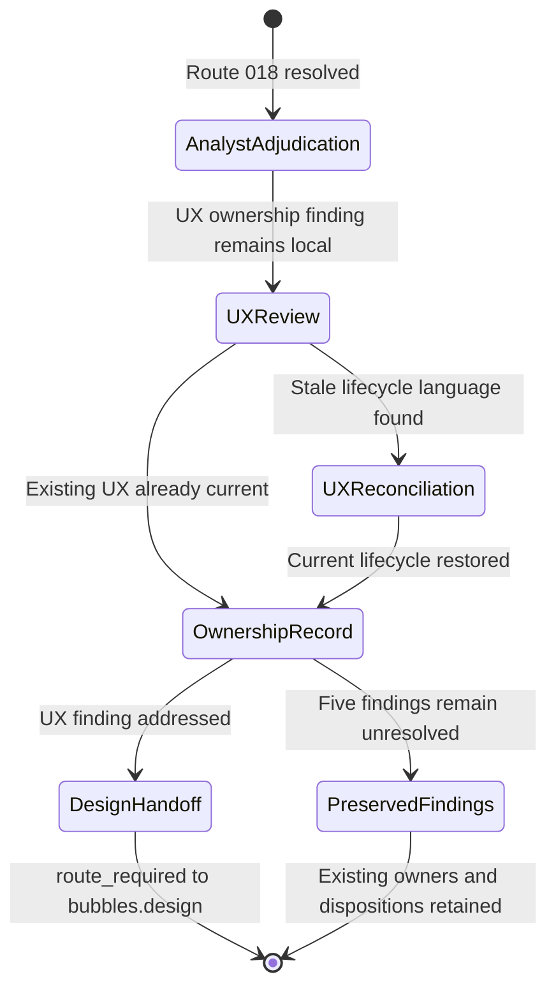

# BUG-007 Expected Behavior Specification

## Problem Statement

Feature 008 accepts string subjects and domains as completion identities.
`composeBrief()` currently stores those strings in ordinary-object maps. Three
legal strings collide with inherited names, mutate shared built-ins, and escape
the module's result contract through a synchronous `TypeError`.

This bug specification hardens caller-keyed aggregation. It does not revise
completion identity, ranking, evidence eligibility, or refusal semantics.

## Outcome Contract

**Intent:** Treat every accepted subject and domain string as data rather than
as an object-prototype control surface.

**Success Signal:** Normal composition remains byte-for-byte equivalent at the
observable contract. Subject and domain values `__proto__`, `constructor`, and
`toString` complete without a throw, produce deterministic ordinary-key output,
and leave `Object.prototype`, `Object`, and `Object.prototype.toString`
unchanged.

**Hard Constraints:**

- Every internal map keyed by caller-derived subject or domain uses an
  inheritance-free representation.
- The nested support-date set uses the same set-like representation.
- Caller-supplied `owners` and `priorEvidenceIds` are read only through own-key
  membership.
- The fix does not blacklist or rewrite `__proto__`, `constructor`, or
  `toString`.
- The fix does not catch an exception and return a plausible partial brief.
- Normal lane order, subject order, materiality ordering, no-action reasons,
  inference floors, and action signatures remain unchanged.
- Existing input, window, timestamp, cutoff, and shared-policy refusals retain
  their current code, reason, field, and precedence.
- No public function signature, contract version, storage schema, policy value,
  or route changes.

**Failure Condition:** The repair fails if any named key throws, returns outside
the result contract, mutates a shared built-in, disappears from own-key
aggregation, changes the normal control order, or changes an existing refusal.

## Requirements

### FR-B007-001 - Inheritance-free caller-keyed aggregation

`distinctCount()` and `composeBrief()` must allocate every internal map keyed
by a caller-derived subject or domain with `Object.create(null)` or an existing
equivalent safe-map helper. A partial conversion is insufficient because a
later ordinary map can reintroduce the same inherited lookup.

### FR-B007-002 - Prototype-sensitive subject keys are ordinary data

Completion subjects `__proto__`, `constructor`, and `toString` must traverse
the complete composition path without throwing. Each must remain distinguishable
from a missing key and must appear in the same lane or no-action contract that
an ordinary subject with the same evidence would receive.

### FR-B007-003 - Prototype-sensitive domain keys are ordinary data

Completion domains `__proto__`, `constructor`, and `toString` must clear or
miss the existing inference floors according to their actual completion dates
and counts. They must never resolve an inherited object or function.

### FR-B007-004 - Shared built-in integrity

Composition must not add, remove, or change properties on `Object.prototype`,
`Object`, or `Object.prototype.toString`. Persistent adversarial tests must use
cleanup in a `finally` block so the pre-fix RED run cannot contaminate later
tests in the same process.

### FR-B007-005 - Caller lookup maps use own membership

An absent prototype-sensitive key in `owners` or `priorEvidenceIds` must remain
absent. An own key supplied by the caller must remain readable. Inherited
properties must never become an owner record or prior evidence array.

### FR-B007-006 - Normal output and refusal non-movement

The committed normal fixture must retain lane order
`held,watchlist,completedResearch,inferredRelevance` and subject order
`MSFT,BND,ZZTOP,semiconductors`. Existing local and shared-policy refusal
controls must return their current envelopes in their current order.

### FR-B007-007 - Persistent adversarial regression

The persistent functional and browser regressions must cover all six
subject/domain combinations for `__proto__`, `constructor`, and `toString`, a
normal control, no shared built-in mutation, cleanup after a failing pre-fix
call, and no escaped exception. A mutation control must prove that restoring an
ordinary caller-keyed map makes the regression fail.

### Single-Capability Justification

This repair hardens one existing capability: caller-keyed aggregation during
portfolio brief composition. It does not add a provider, strategy, route,
storage layer, or second identity contract.

The same safe representation must cover every internal stage because each
stage consumes the same accepted subject/domain key. Splitting the repair into
map-specific policies would create several answers to one key-safety invariant.

## Acceptance Criteria

| ID | Criterion | Planned verification |
| --- | --- | --- |
| AC-1 | The normal fixture retains its current success, lane order, subject order, and refusal controls. | `SCN-B007-NORMAL-COMPATIBILITY` |
| AC-2 | All three hostile subject keys return through the normal result contract without mutation or throw. | `SCN-B007-SUBJECT-KEY-SAFETY` |
| AC-3 | All three hostile domain keys return through the normal result contract without mutation or throw. | `SCN-B007-DOMAIN-KEY-SAFETY` |
| AC-4 | The persistent RED run cleans every process-global probe property, and the post-fix matrix observes zero mutation. | Subject and domain scenarios plus `TP-B007-004` |
| AC-5 | A source mutation restoring ordinary caller-keyed maps makes the exact regression fail. | `TP-B007-004` |

## Product Principle Alignment

### Admission Test

The change improves decision quality by keeping brief composition available and
by preventing caller data from changing shared runtime state. A thrown partial
composition provides neither a decision nor an honest unavailable result.

### P7 - No blackbox numbers

Completion counts and domain floors must arise from the caller's own records.
Inherited object properties must not silently alter those numbers.

### P15 - Everything is explained in place

The existing lane and no-action explanations remain attached to the exact
subject they describe. Prototype collisions must not replace or suppress those
explanations.

### P23 - A guard that cannot fail is not a guard

The regression includes the exact dangerous strings and a source mutation that
restores the defect. Normal-only fixtures would not detect this failure class.

### Current-Truth Adjudication - 2026-09-02 {#bug007-route-018-analyst-adjudication-20260902}

Route `BUG-007-ROUTE-018` accepts `TP-B007-012` as `executed-passed` by
`bubbles.test`. The test-owned route 014 evidence records current GREEN,
expected old-state detection, protected-byte preservation, exact restoration,
restored GREEN, and an unchanged operator checkout. This analyst adjudication
consumes that evidence. It does not claim a new semantic-inverse execution.

The active planner lifecycle is repaired. `scopes.md` and `test-plan.json`
record completed test execution and plan reconciliation without requesting a
test rerun. The two hardening findings remain previously addressed by their
owning phases. This record adds provenance and does not reimplement them.

The current `scenario-manifest.json` rollback object contains one
`executionOwner`, whose value is `bubbles.test`. It retains
`status: executed-passed`, the route 014 evidence reference, and
`reconciliationOwner: bubbles.plan`.

Route 018 is resolved after current strict checks accepted these facts. The
next local owner is `bubbles.ux` for the existing UX-owned sections. External
and independent audit findings remain unresolved in execution state.

## Release Train

Not applicable in this repository. Research Lab has no
`config/release-trains.yaml` registry or train-specific feature-flag bundles.
This bug introduces no feature flag.

## Non-Goals

- Changing the accepted completion subject or domain vocabulary.
- Adding a key blacklist or reserved-name refusal.
- Changing evidence scoring, inference thresholds, lane ranking, or queue caps.
- Replacing all repository objects with `Map`.
- Hardening unrelated fixed-vocabulary lookup tables in this packet.
- Editing parent Feature 008 planning artifacts.

## UI Wireframes

This repair changes no product UI. The wireframe below defines the canonical
operator and agent reading order for the BUG-007 closure packet. It governs
active lifecycle and routing language only. Dated evidence remains historical
truth.

### UX Ownership Adjudication - 2026-09-03 {#bug007-ux-provenance-adjudication-20260903}

`bubbles.ux` reviewed the existing non-product wireframe and flow against the
analyst adjudication, the audit finding, the bug classification, and current
execution state. The prior UX copy was materially stale because it still
presented the completed planning repair and hardening re-entry as future work.

The current contract records `TP-B007-012` as `executed-passed` by
`bubbles.test`, route `BUG-007-ROUTE-018` as resolved by `bubbles.analyst`, and
`AUDIT-B007-ROUTE018-PROVENANCE-001` as addressed. This UX review changes no
product behavior, source, persistent test, acceptance, audit-attempt history,
or certification field. It establishes UX ownership provenance and addresses
only `AUDIT-B007-UX-OWNERSHIP-001`.

Audit attempt `BUG-007-AUDIT-001` remains `REWORK_REQUIRED`. The five external
or independent findings remain unresolved with their existing owners. The
current closure handoff routes to `bubbles.design`.

### Single-Screen Justification

The repair has one operator-facing surface: the planning packet lifecycle
summary. It introduces no product screen or reusable product UI primitive.

### Screen Inventory

| Screen | Actor(s) | Status | Findings Served |
| --- | --- | --- | --- |
| Closure Packet Lifecycle Summary | Operator, top-level workflow, specialist agent | Existing planning surface - reconciled | `AUDIT-B007-UX-OWNERSHIP-001` and the preserved seven-finding audit ledger |

### Screen: Closure Packet Lifecycle Summary

**Actor:** Operator and workflow agent | **Route:** BUG-007 planning artifacts |
**Status:** Reconcile active state and owner routing

```text
┌────────────────────────────────────────────────────────────────────┐
│ BUG-007 CLOSURE PACKET                                             │
├────────────────────────────────────────────────────────────────────┤
│ TP-B007-012 proof      [executed-passed: bubbles.test]             │
│ Product behavior       [unchanged by provenance review]            │
│ Product source/tests   [unchanged by provenance review]            │
│ Route 018              [resolved: bubbles.analyst]                 │
│ Route 018 provenance   [addressed]                                 │
│ UX ownership           [addressed: bubbles.ux]                     │
│ Current handoff        [bubbles.design]                            │
├────────────────────────────────────────────────────────────────────┤
│ Audit attempt          [REWORK_REQUIRED: unchanged]                │
│ G090 framework         [unresolved external: bubbles.implement]    │
│ Check 8 agent ID       [unresolved external: bubbles.implement]    │
│ Handoff cycle          [unresolved external: bubbles.implement]    │
│ Collected test count   [unresolved existing: bubbles.test]         │
│ Stale receipt          [unresolved existing: bubbles.validate]     │
├────────────────────────────────────────────────────────────────────┤
│ TP-B007-011            [not-run / unchecked]                       │
│ Build Quality Gate     [unchecked]                                 │
│ Scope 01               [Not Started]                               │
│ Packet status          [in_progress]                               │
│ Certification status   [in_progress]                               │
└────────────────────────────────────────────────────────────────────┘
```

**Interactions:**

- A reader follows each row independently. One row never implies another row.
- The UX ownership row links to this adjudication and its matching
  `state.json.executionHistory` record.
- The current handoff returns to the top-level workflow with
  `nextRequiredOwner: bubbles.design`.
- Each unresolved row retains its existing owner and packet disposition.
- No action in this status surface executes a product test, changes product
  behavior, or advances certification.

**States:**

- Current local provenance state: route 018 and both required provenance
  findings are addressed by their owning agents.
- Preserved unresolved state: five external or independent findings remain
  routed and are not claimed fixed by this review.
- Audit state: `BUG-007-AUDIT-001` remains `REWORK_REQUIRED`; its attempt
  history is unchanged.
- Nonterminal state: transition, Build Quality, scope, packet, and
  certification remain incomplete.
- Invalid state: any summary that hides an unresolved finding, reopens an
  addressed finding without evidence, or attributes product execution to this
  UX review contradicts the ledger.

**Responsive:**

- Narrow readers stack the rows without dropping labels, owners, dispositions,
  or evidence references.
- Wide readers keep each state dimension on its own row.

**Accessibility:**

- Every status includes text. Color or punctuation never carries status alone.
- Owner, disposition, and evidence remain explicit for screen-reader and
  plain-text consumers.
- The reading order is product proof and non-change, local provenance,
  unresolved routes, then nonterminal gates.

### State Language Contract

Active UX surfaces must use these dimensions independently:

| Dimension | Exact active value | Meaning |
| --- | --- | --- |
| Test execution | `executed-passed` | `bubbles.test` executed `TP-B007-012`; the durable evidence reference remains unchanged. |
| Provenance-review behavior impact | `none` | This review changes no product behavior, source, or persistent test. |
| Route 018 | `resolved` | `bubbles.analyst` supplied the current-truth adjudication. |
| Route 018 provenance finding | `addressed` | `AUDIT-B007-ROUTE018-PROVENANCE-001` remains in the addressed ledger. |
| UX ownership finding | `addressed` | `AUDIT-B007-UX-OWNERSHIP-001` is closed by this UX adjudication and its execution record. |
| Audit attempt | `REWORK_REQUIRED` | The historical attempt and its verdict remain unchanged. |
| Current closure owner | `bubbles.design` | The top-level workflow routes the next closure step to the design owner. |
| G090 framework finding | `unresolved` | `VALIDATE-B007-G090-FRAMEWORK-001` remains externally routed to `bubbles.implement`. |
| Check 8 parser finding | `unresolved` | `VALIDATE-B007-CHECK8-AGENT-ID-001` remains externally routed to `bubbles.implement`. |
| Handoff-cycle finding | `unresolved` | `VALIDATE-REPO-HANDOFF-CYCLE-001` remains externally routed to `bubbles.implement`. |
| Collected-test-count finding | `unresolved` | `VALIDATE-REPO-COLLECTED-TEST-COUNT-001` remains routed to `bubbles.test` in existing packets. |
| Stale-receipt finding | `unresolved` | `VALIDATE-REPO-STALE-RECEIPT-001` remains routed to `bubbles.validate` in its existing packet. |
| Transition guard | `not-run` | `TP-B007-011` remains unchecked. |
| Build Quality Gate | `unchecked` | The grouped gate remains open. |
| Scope status | `Not Started` | Scope 01 is not terminal. |
| Packet status | `in_progress` | Top-level completion is not claimed. |
| Certification status | `in_progress` | Validate-owned certification is not claimed. |

Do not use one field to encode proof, ownership, routing, and certification.
Addressing the two local provenance findings does not resolve any external or
independent finding and does not change the audit verdict.

### Durable Current-State Copy Contract

Active UX narrative must state:

```text
Packet status: in_progress
Audit attempt: REWORK_REQUIRED
Next required owner: bubbles.design

TP-B007-012 was executed-passed by bubbles.test. The rollback and restore DoD
remains linked to its dated test-owned evidence. This UX review performed no
product test rerun and changed no product behavior, source, or persistent test.

BUG-007-ROUTE-018 is resolved. AUDIT-B007-ROUTE018-PROVENANCE-001 and
AUDIT-B007-UX-OWNERSHIP-001 are addressed by their respective execution
records. The five external or independent findings remain unresolved with
their existing owners and packet dispositions.

TP-B007-011 is not-run and unchecked. Build Quality is unchecked. Scope 01 is
Not Started. Top-level status and certification.status are in_progress. Audit
attempt history, historical evidence, and certification remain unchanged.
```

## User Flows

### User Flow: UX Provenance Closure And Design Routing



The current invocation ends at `DesignHandoff` while preserving the unresolved
finding branch. It does not execute product behavior or advance transition,
scope, packet, audit-attempt, or certification state.
