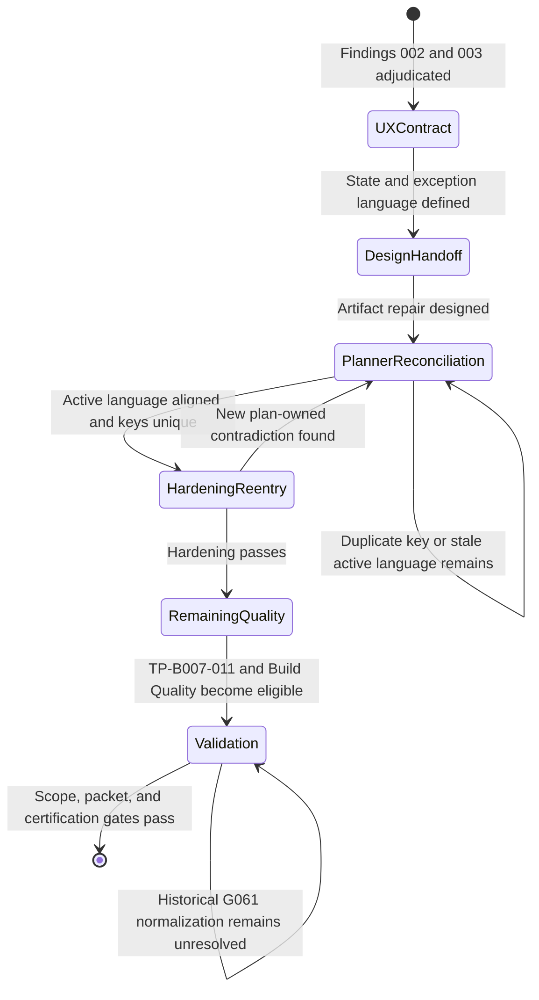

# BUG-007 Expected Behavior Specification

## Problem Statement

Feature 008 accepts string subjects and domains as completion identities.
`composeBrief()` currently stores those strings in ordinary-object maps. Three
legal strings collide with inherited names, mutate shared built-ins, and escape
the module's result contract through a synchronous `TypeError`.

This bug specification hardens caller-keyed aggregation. It does not revise
completion identity, ranking, evidence eligibility, or refusal semantics.

## Outcome Contract

**Intent:** Treat every accepted subject and domain string as data rather than
as an object-prototype control surface.

**Success Signal:** Normal composition remains byte-for-byte equivalent at the
observable contract. Subject and domain values `__proto__`, `constructor`, and
`toString` complete without a throw, produce deterministic ordinary-key output,
and leave `Object.prototype`, `Object`, and `Object.prototype.toString`
unchanged.

**Hard Constraints:**

- Every internal map keyed by caller-derived subject or domain uses an
  inheritance-free representation.
- The nested support-date set uses the same set-like representation.
- Caller-supplied `owners` and `priorEvidenceIds` are read only through own-key
  membership.
- The fix does not blacklist or rewrite `__proto__`, `constructor`, or
  `toString`.
- The fix does not catch an exception and return a plausible partial brief.
- Normal lane order, subject order, materiality ordering, no-action reasons,
  inference floors, and action signatures remain unchanged.
- Existing input, window, timestamp, cutoff, and shared-policy refusals retain
  their current code, reason, field, and precedence.
- No public function signature, contract version, storage schema, policy value,
  or route changes.

**Failure Condition:** The repair fails if any named key throws, returns outside
the result contract, mutates a shared built-in, disappears from own-key
aggregation, changes the normal control order, or changes an existing refusal.

## Requirements

### FR-B007-001 - Inheritance-free caller-keyed aggregation

`distinctCount()` and `composeBrief()` must allocate every internal map keyed
by a caller-derived subject or domain with `Object.create(null)` or an existing
equivalent safe-map helper. A partial conversion is insufficient because a
later ordinary map can reintroduce the same inherited lookup.

### FR-B007-002 - Prototype-sensitive subject keys are ordinary data

Completion subjects `__proto__`, `constructor`, and `toString` must traverse
the complete composition path without throwing. Each must remain distinguishable
from a missing key and must appear in the same lane or no-action contract that
an ordinary subject with the same evidence would receive.

### FR-B007-003 - Prototype-sensitive domain keys are ordinary data

Completion domains `__proto__`, `constructor`, and `toString` must clear or
miss the existing inference floors according to their actual completion dates
and counts. They must never resolve an inherited object or function.

### FR-B007-004 - Shared built-in integrity

Composition must not add, remove, or change properties on `Object.prototype`,
`Object`, or `Object.prototype.toString`. Persistent adversarial tests must use
cleanup in a `finally` block so the pre-fix RED run cannot contaminate later
tests in the same process.

### FR-B007-005 - Caller lookup maps use own membership

An absent prototype-sensitive key in `owners` or `priorEvidenceIds` must remain
absent. An own key supplied by the caller must remain readable. Inherited
properties must never become an owner record or prior evidence array.

### FR-B007-006 - Normal output and refusal non-movement

The committed normal fixture must retain lane order
`held,watchlist,completedResearch,inferredRelevance` and subject order
`MSFT,BND,ZZTOP,semiconductors`. Existing local and shared-policy refusal
controls must return their current envelopes in their current order.

### FR-B007-007 - Persistent adversarial regression

The persistent functional and browser regressions must cover all six
subject/domain combinations for `__proto__`, `constructor`, and `toString`, a
normal control, no shared built-in mutation, cleanup after a failing pre-fix
call, and no escaped exception. A mutation control must prove that restoring an
ordinary caller-keyed map makes the regression fail.

### Single-Capability Justification

This repair hardens one existing capability: caller-keyed aggregation during
portfolio brief composition. It does not add a provider, strategy, route,
storage layer, or second identity contract.

The same safe representation must cover every internal stage because each
stage consumes the same accepted subject/domain key. Splitting the repair into
map-specific policies would create several answers to one key-safety invariant.

## Acceptance Criteria

| ID | Criterion | Planned verification |
| --- | --- | --- |
| AC-1 | The normal fixture retains its current success, lane order, subject order, and refusal controls. | `SCN-B007-NORMAL-COMPATIBILITY` |
| AC-2 | All three hostile subject keys return through the normal result contract without mutation or throw. | `SCN-B007-SUBJECT-KEY-SAFETY` |
| AC-3 | All three hostile domain keys return through the normal result contract without mutation or throw. | `SCN-B007-DOMAIN-KEY-SAFETY` |
| AC-4 | The persistent RED run cleans every process-global probe property, and the post-fix matrix observes zero mutation. | Subject and domain scenarios plus `TP-B007-004` |
| AC-5 | A source mutation restoring ordinary caller-keyed maps makes the exact regression fail. | `TP-B007-004` |

## Product Principle Alignment

### Admission Test

The change improves decision quality by keeping brief composition available and
by preventing caller data from changing shared runtime state. A thrown partial
composition provides neither a decision nor an honest unavailable result.

### P7 - No blackbox numbers

Completion counts and domain floors must arise from the caller's own records.
Inherited object properties must not silently alter those numbers.

### P15 - Everything is explained in place

The existing lane and no-action explanations remain attached to the exact
subject they describe. Prototype collisions must not replace or suppress those
explanations.

### P23 - A guard that cannot fail is not a guard

The regression includes the exact dangerous strings and a source mutation that
restores the defect. Normal-only fixtures would not detect this failure class.

### Current And Planned Behavior

Current execution succeeds for the ordinary fixture and throws for all six
hostile subject/domain controls after mutating a shared built-in. Planned work
changes only map representation and own-membership reads. No fix or persistent
test is claimed by this filing packet.

## Release Train

Not applicable in this repository. Research Lab has no
`config/release-trains.yaml` registry or train-specific feature-flag bundles.
This bug introduces no feature flag.

## Non-Goals

- Changing the accepted completion subject or domain vocabulary.
- Adding a key blacklist or reserved-name refusal.
- Changing evidence scoring, inference thresholds, lane ranking, or queue caps.
- Replacing all repository objects with `Map`.
- Hardening unrelated fixed-vocabulary lookup tables in this packet.
- Editing parent Feature 008 planning artifacts.

## UI Wireframes

This repair changes no product UI. The wireframe below defines the canonical
operator and agent reading order for the BUG-007 planning packet. It governs
active lifecycle language only. Dated evidence remains historical truth.

### Single-Screen Justification

The repair has one operator-facing surface: the planning packet lifecycle
summary. It introduces no product screen or reusable product UI primitive.

### Screen Inventory

| Screen | Actor(s) | Status | Findings Served |
| --- | --- | --- | --- |
| Planning Packet Lifecycle Summary | Operator, top-level workflow, specialist agent | Existing planning surface - clarify | `HARDEN-B007-PLAN-LIFECYCLE-002`, `HARDEN-B007-MANIFEST-DUPKEY-003` |

### Screen: Planning Packet Lifecycle Summary

**Actor:** Operator and workflow agent | **Route:** BUG-007 planning artifacts |
**Status:** Clarify active state language

```text
┌────────────────────────────────────────────────────────────────────┐
│ BUG-007 PLANNING PACKET                                            │
├────────────────────────────────────────────────────────────────────┤
│ Test proof             [executed-passed]                           │
│ Human acceptance       [recorded]                                  │
│ Planning repair        [required: findings 002 and 003]            │
│ Current handoff        [bubbles.design]                             │
│ Post-plan handoff      [bubbles.harden: exhaustive re-entry]       │
├────────────────────────────────────────────────────────────────────┤
│ Transition guard       [not-run / unchecked]                       │
│ Build Quality Gate     [unchecked]                                 │
│ Scope 01               [Not Started]                               │
│ Packet status          [in_progress]                               │
│ Certification status   [in_progress]                               │
│ Historical G061 route  [unresolved: bubbles.validate]              │
└────────────────────────────────────────────────────────────────────┘
```

**Interactions:**

- A reader follows each row independently. One row never implies another row.
- `bubbles.design` converts this language contract into an artifact repair design.
- `bubbles.plan` reconciles active planning text and removes the duplicate key.
- `bubbles.harden` re-enters only after planner reconciliation completes.
- `bubbles.validate` owns historical G061 normalization and certification.

**States:**

- Current state: test proof passed and human acceptance is recorded.
- Repair state: both adjudicated planning findings remain unresolved.
- Post-plan state: planning is reconciled and exhaustive hardening re-entry is required.
- Nonterminal state: transition, Build Quality, scope, packet, and certification remain incomplete.
- Invalid state: a duplicate JSON key refuses reconciliation. Parser last-write behavior never resolves ambiguity.

**Responsive:**

- Narrow readers stack the rows without dropping labels, owners, or evidence references.
- Wide readers keep each state dimension on its own row.

**Accessibility:**

- Every status includes text. Color or punctuation never carries status alone.
- Owner, action, and evidence remain explicit for screen-reader and plain-text consumers.
- The reading order is proof, acceptance, planning, next action, then terminal gates.

### State Language Contract

Active planning surfaces must use these dimensions independently:

| Dimension | Exact active value | Meaning |
| --- | --- | --- |
| Test execution | `executed-passed` | `bubbles.test` executed `TP-B007-012`; the durable evidence reference remains unchanged. |
| Human acceptance | `recorded` | The human record exists. It is not an open workflow gate and does not certify the packet. |
| Planner reconciliation before repair | `reconciliation-required` | Findings 002 and 003 still require plan-owned artifact changes. |
| Planner reconciliation after repair | `reconciled-current-evidence` | Active planning language matches the executed proof and has unique structured keys. |
| Post-plan workflow action | `exhaustive-hardening-reentry-required` | `bubbles.harden` must evaluate the reconciled packet. This value does not mean hardening passed. |
| Transition guard | `not-run` | `TP-B007-011` remains unchecked. |
| Build Quality Gate | `unchecked` | The grouped gate remains open. |
| Scope status | `Not Started` | Scope 01 is not terminal. |
| Packet status | `in_progress` | Top-level completion is not claimed. |
| Certification status | `in_progress` | Validate-owned certification is not claimed. |
| Historical route normalization | `unresolved` | `HARDEN-B007-G061-HISTORY-001` remains owned by `bubbles.validate`. |

Do not use one field to encode proof, reconciliation, routing, and
certification. In particular, `planningStatus` describes planning only.
Owner and action require separate labels.

### Exact Post-Reconciliation Copy Contract

After `bubbles.plan` repairs the owned artifacts, active narrative must state:

```text
Packet status: in_progress
Planning reconciliation: reconciled-current-evidence
Next required owner: bubbles.harden
Next required action: exhaustive-hardening-reentry

TP-B007-012 was executed-passed by bubbles.test. The rollback and restore DoD
is checked against its dated evidence. Human acceptance is recorded. This
planner reconciliation claims no test execution, hardening result, transition
result, scope completion, packet completion, or certification.

TP-B007-011 is not-run and unchecked. Build Quality is unchecked. Scope 01 is
Not Started. Top-level status and certification.status are in_progress.
HARDEN-B007-G061-HISTORY-001 remains unresolved under bubbles.validate.
Historical evidence and route records remain unchanged.
```

The structured Test Plan must use `planningStatus` value
`reconciled-current-evidence`. It must carry `nextRequiredOwner` value
`bubbles.harden` and `nextRequiredAction` value
`exhaustive-hardening-reentry` separately.

The scenario manifest must retain one `executionOwner: bubbles.test` entry for
`finalTreeRollbackRestore`. It must retain `status: executed-passed`, the
durable evidence reference, and `reconciliationOwner: bubbles.plan`. A
duplicate key makes the structured planning artifact invalid and blocks the
handoff.

## User Flows

### User Flow: Planning Truth Repair And Hardening Re-entry



The current invocation ends at `DesignHandoff`. It does not advance planner,
hardening, transition, scope, packet, historical-route, or certification state.
