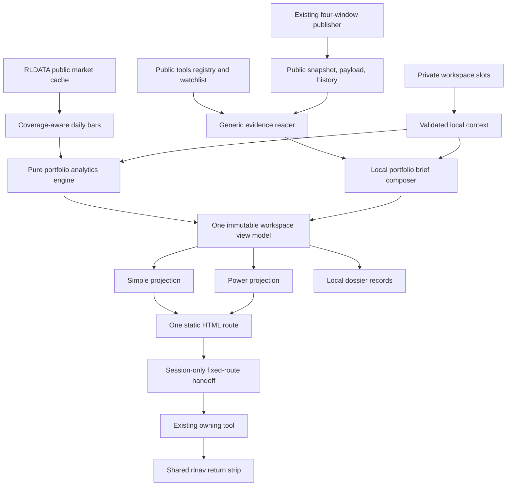
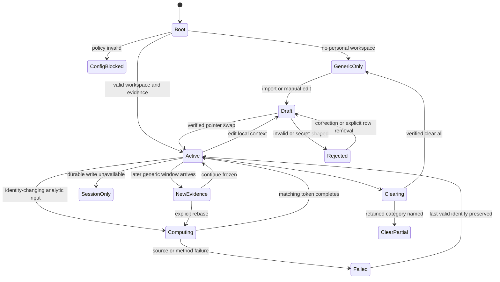

# Design: 008 Portfolio Survival and Brief Lab

## Design Brief

### Current State

Research Lab is a build-free static site with one self-contained HTML route per tool, shared browser market data in `rldata.js`, shared status/navigation in `rlapp.js` and `rlnav.js`, and pure helpers tested directly by `scripts/selftest.mjs`. The generic Market Brief already publishes four public windows through `market-brief.snapshot.json`, `market-brief.payload.json`, and `brief-history.jsonl`, but no current module owns private portfolio identity, mandate, behavior evidence, portfolio analytics, or local recommendation lifecycle.

The checked-in same-origin bar cache is broad but commonly contains about 500 daily rows, roughly two years. `RLDATA.ensureBars(symbol, "1d", age, "5y")` currently accepts that shorter same-origin snapshot without proving requested coverage, so a five-year portfolio model cannot infer that it received five years merely because it requested that range.

### Target State

Add one route, `portfolio-survival-allocation-lab.html`, whose default tab is Portfolio Brief and whose six tabs project one immutable local workspace identity. Generic four-window evidence remains public and publisher-owned; local holdings, mandate, behavior, paths, candidate allocations, and dossiers are composed and persisted only in the browser.

The feature adds a private portfolio foundation, a pure analytics engine, and a deterministic behavior/brief composer. Route-specific DOM and canvas rendering stays in the HTML, following existing single-file tool conventions, while shared logic remains Node-safe and extractable for real unit tests.

### Patterns To Follow

- `rldata.js`: cache-first append/merge, source/freshness reporting, no duplicate provider path, and additive shared APIs.
- `rlcontracts.js`: canonical JSON, deterministic SHA-256 identities, closed validators, and dual browser/CommonJS exposure.
- `market-brief.html`, `rlbrief.js`, and `notes/market-brief.md`: four exact window identities, generic evidence ownership, low-noise action queues, and deep links to owning analysis.
- `etf-momentum-lab.html`: exact-date return alignment, separate arithmetic/CAGR/CAPM diagnostics, and plain browser math.
- `strategy-validation-lab.html`: decision-time walk-forward evaluation, embargo, and explicit trial-count discipline.
- `bond-regime-lab.html`, `global-rotation-lab.html`, and `real-assets-lab.html`: Simple/Power from one compute, explicit partial/unavailable states, synchronous canvas drawing, and adjacent accessible tables.
- Feature 002 `rlcontracts.js`/`rlsession.js`: content identity and qualified cutoff evidence where a valid `MarketSessionEvidence/v1` reference actually exists.

### Patterns To Avoid

- Do not add personal fields to `rlData`, `toolReads`, Market Brief payloads/history, publisher argv/environment, URLs, referrers, service workers, or remote diagnostics.
- Do not fork Market Brief narrative generation, add a second scheduler, or recompute an owning tool's specialist narrative.
- Do not copy AI Capex theme assumptions, ETF Momentum IID Monte Carlo, or heuristic inverse-volatility weights and call them general portfolio optimization.
- Do not introduce a remote portfolio API, build step, runtime package, third-party optimizer, chart dependency, or service worker.
- Do not put route-specific rendering abstractions into shared modules when one HTML route is their only consumer.

### Resolved Decisions

- The personal store is a separate `RLPORTFOLIO` namespace, never a child of `RLDATA`.
- Durable writes use two validated slots plus an atomic pointer swap; persistence failure becomes an explicit session-only state.
- RLDATA receives one additive coverage-aware daily-bar method; the portfolio feature does not own another proxy chain.
- Behavior records only explicitly confirmed completed research, never click/open/dwell/scroll/settings/parameter activity.
- Relevance uses a visible deterministic evidence floor and decay policy; it can rank research only.
- Portfolio Brief consumes the exact generic window identities and converts generic evidence into non-executing local research actions.
- Analytics use exact-date source-qualified returns, explicit covariance conditioning, reproducible stationary bootstrap, and dependency-free constrained solvers.
- Every allocation method shares one frozen evidence, constraint, cost, and scenario basis. The UI presents tradeoffs and infeasibility, never a winner.
- All canvas rendering is synchronous inside `render()`; compute jobs may yield between deterministic chunks with `setTimeout`, never `requestAnimationFrame`.
- Feature 002 evidence enriches provenance when present but is not required for the core route because Feature 002 is not certified complete.

### Open Questions

None blocking. Calibration values are explicit versioned research policy and remain visible in Power mode and dossier sensitivity records.

## Purpose And Scope

The tool answers five connected research questions from one local context:

1. What deserves portfolio research in the current generic Market Brief window?
2. Which holdings, overlaps, benchmark relationships, and covariance contributions dominate risk?
3. Which dependent paths collide with explicitly dated cash needs or an explicit survival floor?
4. How do normal, stress, tail, appraisal, and hedge assumptions alter diversification claims?
5. How do six allocation methods differ under the same evidence, constraints, costs, and validation basis?

The route is a local research workbench. It does not own generic publishing, brokerage integration, order execution, tax adjudication, suitability, or remote persistence.

## Evidence And Research Findings

| Evidence inspected | Finding | Design consequence |
| --- | --- | --- |
| `market-brief.html::boot` | The browser reads config, payload, watchlist, history, snapshot, and registry as public same-origin assets. | Consume those assets read-only; do not add a personalized payload. |
| `market-brief.html::localToolReads` and `rlbrief.js::renderToolReads` | Browser tool reads are merged into the generic cockpit but are intended to be publishable compact model reads. | The portfolio tool may publish only a privacy-boundary status read, never holdings or local conclusions. |
| `scripts/brief-refresh.mjs::main` | Tier A appends public JSONL and overwrites one public snapshot. | Publisher remains untouched by local composition and cannot import `rlportfolio.js`. |
| `scripts/brief-refresh-and-push.sh` | The wrapper stages and pushes named public brief/data artifacts. | Personal namespaces and exports are absent from its owned inventory and subprocess inputs. |
| `market-brief.config.json::windows` | Window IDs and ET times are already authoritative. | Reuse `pre-market` 07:30, `morning` 11:00, `pre-close` 15:00, `after-hours` 17:00 exactly. |
| `brief-history.jsonl` | Repeated rows can describe the same completed market bar. | Window selection de-duplicates by evidence identity; repeat publication is not independent confirmation. |
| `rldata.js::load/save` | `rlData` is public market cache and silently compacts persistence under quota while retaining session memory. | Personal state cannot share this store or its pruning behavior. |
| `rldata.js::ensureBars` | Same-origin snapshots are preferred, then the existing provider/proxy path is used. Coverage length is not verified. | Add `ensureBarCoverage`; preserve `ensureBars` behavior for existing tools. |
| `rlcontracts.js` | Canonicalization, content hashes, semantic/occurrence fingerprints, and secret-shaped request rejection already exist. | Reuse canonical identity primitives and their Node/browser contract. |
| `rlsession.js` | The module is market-session evidence, not browser session storage. | Use valid cutoff evidence when available; create no storage dependency on `RLSESSION`. |
| `ai-capex-strategy-lab.html` | Existing min-var/risk-parity labels are heuristic inverse-risk scores over theme assumptions. | Reuse UI/model lessons, not those weights as general optimizers. |
| `etf-momentum-lab.html::computeMetrics` | Arithmetic return, CAGR, drawdown, beta, alpha, R-squared, and residual risk are implemented from aligned daily history. | Preserve metric separation and strengthen sample, recovery, and source contracts. |
| `strategy-validation-lab.html::walkForward` | Existing walk-forward and Deflated Sharpe machinery provides a selection-bias precedent, but costs are not first-class. | Reuse decision-time discipline; add explicit turnover/cost accounting in the dossier. |
| `bond-regime-lab.html` tests and rendering | Synchronous canvas, equivalent tables, mobile screenshots, and truth states are established patterns. | Every chart is immediate, nonblank-checked, and table-equivalent on desktop/mobile. |
| `tools.json`, `index.html`, `rlnav.js`, `README.md` | Registration is a four-surface contract and the selftest checks parity. | Register only after route, notes, tests, and privacy checks are ready together. |
| Playwright suites | Real pages are served by ephemeral local HTTP servers; some older suites intercept external requests. | Feature 008 uses a deterministic static fixture overlay and no `page.route` or `context.route`. |
| Feature 002 state and source | `rlcontracts.js`/`rlsession.js` exist, but Feature 002 remains `not_started`. | Consume stable source APIs with canaries; do not require unpublished distributed-brief artifacts. |

## Existing-System Map



The public publisher has no edge back to local context. The only network-capable component is the existing public market-data layer, which receives an explicitly approved public symbol lookup, never a portfolio object or personal numeric field.

## Architecture Overview

### Runtime Layers

| Layer | Inputs | Outputs | Authority boundary |
| --- | --- | --- | --- |
| Generic evidence reader | Existing public brief artifacts, `watchlist.json`, `tools.json`, qualified owner reads | `GenericEvidenceWindow/v1` | Cannot see personal storage or author narrative |
| Private context store | File/manual drafts, explicit mandate, lifecycle commands | Validated workspace revisions and privacy inventory | Cannot fetch, publish, log values remotely, or write `RLDATA` |
| Public market data adapter | Public symbols, explicit source/network policy | Source-qualified bar envelopes | Cannot receive quantity, cost, P&L, mandate, action, or dossier data |
| Analytics engine | Frozen local context plus qualified public series and policy | Immutable metric, path, dependence, hedge, allocation, and validation results | Pure; no DOM, storage, fetch, clock, or random global |
| Brief/behavior engine | Generic window, direct scope, minimal eligible events, analytics state | Interest signals and ranked research actions | Cannot alter mandate, expected returns, BL views, optimizer confidence, or trade authority |
| Route controller/renderer | One immutable workspace view model | DOM, canvas, tables, local lifecycle commands | Cannot compute a second Simple/Power result |
| Dossier store | Frozen result identities and validation/cost/trial records | Append-oriented local audit records | Cannot rewrite prior records or publish personal output |
| Shared return strip | Strict session handoff and current tool route | Local return navigation | Cannot persist behavior completion or serialize private state into a URL |

### Compute And Identity Flow

`WorkspaceIdentity/v1` is the root of every calculation and visible view. Its semantic fingerprint includes:

- portfolio revision fingerprint;
- mandate/cash-need revision fingerprint or explicit absence;
- selected generic window ID and public evidence fingerprints;
- public watchlist fingerprint;
- selected bar-series fingerprints and common cutoff;
- behavior policy version and behavior cutoff;
- analytics policy version, valuation currency, and explicit network policy.

`computeWorkspace(context, evidence, policy)` returns one frozen `PortfolioWorkspaceViewModel/v1`. Simple and Power render that object. Any edit to an identity input creates a draft/new identity; it does not mutate the active result in place.

## Capability Foundation

### Foundation Contracts

| Contract | Responsibility | Consumers |
| --- | --- | --- |
| `PortfolioWorkspace/v1` | Holds current personal revisions, behavior lifecycle, and local policy choices | All six tabs, privacy inventory, exports |
| `PortfolioRevision/v1` | Immutable local portfolio identity with holdings and valuation basis | Brief, analytics, dossier |
| `MandateRevision/v1` | Explicit objective, horizon, constraints, and dated cash needs | Paths and all allocation candidates |
| `PortfolioBarSet/v1` | Exact-date, source-qualified, common-currency return matrix with exclusions | Risk, paths, dependence, allocation, validation |
| `BehaviorEvent/v1` | Minimal explicit completed-research fact | Interest derivation and privacy inventory |
| `InterestSignal/v1` | Deterministic relevance inference with floor, decay, recency, and support | General-interest action generation only |
| `ResearchAction/v1` | Non-executing task with why, trigger, lifecycle, and owner | Portfolio Brief, privacy, dossier, deep links |
| `GenericEvidenceWindow/v1` | Validated public snapshot/payload/history/owner-read projection for one exact window | Local brief composer |
| `WorkspaceIdentity/v1` | Binds every active local/public input and policy | All results and view projections |
| `PortfolioAnalyticsResult/v1` | Structured risk, path, dependence, hedge, allocation, sensitivity, and unavailable states | Tabs and dossier |
| `ResearchDossier/v1` | Append-oriented source/assumption/trial/cost/validation/claim record | Dossier tab and private export |
| `ReturnContext/v1` | Session-only fixed-route return/focus record | Portfolio route and `rlnav.js` owner pages |

### Foundation-Owned Policies

1. Closed schema validation with unknown-field rejection for personal and derived records.
2. Canonical semantic identities through `RLCONTRACTS`, with volatile timestamps excluded only where the contract names them.
3. Pointer-swapped durable writes, explicit session-only mode, and no silent personal-data pruning.
4. One explicit generic cutoff and one exact-date market-data basis per workspace.
5. Behavior evidence floor, de-duplication, decay, confidence vocabulary, and clearing semantics.
6. Closed research-action verbs and lifecycle; no order or suitability vocabulary.
7. Shared truth states: current, partial, stale, unavailable, unstable, infeasible, disputed, corrupt, and session-only.
8. Same-basis comparison and common random numbers across allocation candidates.
9. Append/supersede dossier corrections instead of historical mutation.
10. Personal data never enters public or remote surfaces.

### Extension Points

- `BarCoverageSource`: extends RLDATA's existing same-origin and Yahoo/proxy sequence without exposing private context.
- `AssetMetadataResolver`: resolves only public static metadata or explicit user-entered classifications; missing fields remain missing.
- `FactorProxyDefinition`: versioned public proxy return definitions with source and limitations.
- `ScenarioMethod`: pure dependent-path method receiving an explicit RNG and policy.
- `AllocationMethod`: pure candidate solver receiving one `AllocationBasis/v1`.
- `GenericEvidenceAdapter`: accepts current Market Brief assets and, when available, validated Feature 002 evidence references.
- `OwnerDeepLink`: fixed route/hash plus session handoff, never a personalized URL.
- `DossierProjector`: maps any result into the common audit record without changing its calculation.

## Concrete Implementations

### Local Portfolio Store

`rlportfolio.js` owns schema validation, import drafts, pointer-slot persistence, migrations, quarantine metadata, privacy inventory, behavior/action lifecycle storage, explicit export, and session handoff creation/consumption. It requires `RLCONTRACTS` for canonicalization and fingerprinting but has no RLDATA, DOM, or fetch dependency.

### Pure Analytics Engine

`rlportfolioanalytics.js` owns return alignment, metric identities, matrix operations, stationary bootstrap, dependence diagnostics, hedge variants, constrained candidate solvers, sensitivity, and walk-forward/cost calculations. Every policy and random seed is an argument.

### Local Brief And Relevance Composer

`rlportfoliobrief.js` owns eligible-event reduction, deterministic decayed relevance, generic-window validation, action candidate generation, ranking, why-shown projection, de-duplication, and lifecycle reduction. It never accepts mandate fields as behavior evidence and never returns execution verbs.

### Route Renderer

`portfolio-survival-allocation-lab.html` owns the one route, six tab panels, mode controller, bounded editors, render functions, canvas hit testing, accessible tables, and chunked compute controller. DOM renderers remain route-local because there is one screen composition and no second renderer consumer.

### Shared Bar Coverage Extension

`rldata.js::ensureBarCoverage` is additive. Existing `ensureBars` behavior and public cache schema remain compatible. The new method verifies actual first/last dates before deciding that a requested span is complete.

### Shared Return Strip

`rlnav.js` consumes strict `ReturnContext/v1` only when the destination file matches the current tool. It renders a local return strip and deletes expired/consumed context. It does not record completion or behavior.

### Variation Axes

| Axis | Variants | Foundation ownership |
| --- | --- | --- |
| Personal persistence | durable pointer slots, sessionStorage, memory-only | Store chooses explicit state and verification |
| Portfolio input | weights, quantities plus prices, local values, manual alternatives | Validation and identity common; valuation differs |
| Generic evidence | current matching payload/snapshot, history-only window, partial, unavailable, Feature 002-qualified | Common truth/cutoff contract |
| Return source | same-origin Tier A, existing RLDATA cache, approved public symbol lookup, manual dated series | Common source/coverage envelope |
| Analytics availability | complete, partial, unstable, infeasible, unavailable | Common result/error vocabulary |
| Dependence lens | normal Pearson, stress raw, Forbes-Rigobon qualified adjustment, empirical lower tail, drawdown/recovery overlap | Common sample/provenance contract |
| Path method | stationary bootstrap, explicit IID comparison, unavailable regime/fat-tail | Common scenario identity and cash-flow engine |
| Allocation method | current, equal, min-var, risk parity, BL, constrained MVO | Common basis, constraints, cost, sensitivity, dossier |
| UI projection | Simple, Power, desktop, contained tablet, narrow mobile | One view model and result identity |

## Module And File Map

| File | Change | Owned behavior |
| --- | --- | --- |
| `portfolio-survival-allocation-lab.html` | New | One actual route; editors, tabs, one compute, route-local renderers, synchronous canvases |
| `portfolio-survival-allocation.config.json` | New | Mandatory versioned research, storage, behavior, analytics, solver, and test-visible policy |
| `rlportfolio.js` | New | Private contracts, storage, migration, import, privacy, action lifecycle, handoff |
| `rlportfolioanalytics.js` | New | Pure portfolio math, paths, dependence, hedge, optimizers, walk-forward |
| `rlportfoliobrief.js` | New | Generic evidence projection, behavior relevance, deterministic local actions |
| `rldata.js` | Additive | `ensureBarCoverage`; no existing API behavior or cache field removed |
| `rlnav.js` | Additive | Registry entry at release; generic strict ReturnContext strip |
| `scripts/selftest.mjs` | Additive | Pure contract/math invariants and registry canaries |
| `tests/fixtures/portfolio-survival-allocation/**` | New | Frozen real-format generic evidence, bars, imports, manual assets, covariance/path cases |
| `tests/portfolio-*.unit.mjs` | New | Pure engine and store tests |
| `tests/portfolio-*.functional.mjs` | New | Storage/import/privacy/publisher/brief integration without browser interception |
| `tests/portfolio-survival-*.spec.mjs` | New | Scenario-specific real-page Playwright coverage |
| `tests/portfolio-survival.support.mjs` | New | Ephemeral static server and request ledger; production HTML/JS served unchanged |
| `index.html`, `tools.json`, `README.md` | Release-only additive | Tool registration after implementation and tests are ready |
| `notes/portfolio-survival-allocation-lab.md` | Release-only new | Methodology, data, privacy, checks, rollout |

No change is made to `market-brief.html`, `market-brief.payload.json`, `market-brief.snapshot.json`, `brief-history.jsonl`, `market-brief.config.json`, or the publisher scheduler to personalize them.

## Mandatory Policy Configuration

`portfolio-survival-allocation.config.json` is required. Missing, malformed, or unknown-version policy disables dependent computation while leaving privacy inspect/clear available. These v1 values are visible research parameters, not hidden universal defaults.

| Policy | V1 value | Reason and visible sensitivity |
| --- | --- | --- |
| Target daily history | 5 calendar years | Requested coverage; actual shorter coverage remains partial |
| Minimum risk observations | 252 aligned returns | One trading-year floor for covariance/risk estimates |
| Minimum CAPM observations | 126 aligned returns | Six-month diagnostic floor, always disclosed |
| Minimum tail observations | 250 aligned returns and 8 joint tail events | Thin empirical tail results become unavailable |
| Covariance conditioning | diagonal shrinkage, lambda 0.20 | Raw matrix remains visible; sensitivity includes 0.00, 0.10, 0.20, 0.35 |
| Risk reconciliation tolerance | `1e-8` in annualized volatility units | Mechanical component-sum check |
| Stationary bootstrap | mean block length 10 sessions | Visible dependence parameter; sensitivity includes 5, 10, 20 |
| Path budget | 2,000 paths, 21 parameter draws | Browser-tractable initial policy; UI exposes both counts |
| Initial seed | `20260715` | Visible reproducibility seed, editable before run |
| Solver budget | 5,000 iterations, tolerance `1e-8` | Deterministic convergence contract, not silent success |
| Analytics asset budget | 30 listed return series | Above the budget, descriptive scope remains but matrix/solver state is unavailable |
| Behavior floor | 2 distinct completions on 2 distinct UTC dates | Prevents one action from becoming a profile |
| Behavior decay | 14-day half-life, 56-day maximum evidence age | Visible and sensitivity-tested; expired evidence contributes zero |
| Relevance bands | low: floor met; medium: score >=3 plus 2 categories/surfaces; high: score >=5 plus 2 categories and support within 14 days | Categories describe evidence strength, not success probability |
| Queue cap | 5 direct plus 2 general-interest actions | Matches existing low-noise brief ceiling; Power accounts for suppressed items |
| Material exposure marker | 5% current weight | Ranking research parameter only; never a suitability or risk-capacity threshold |
| Near cash-need marker | 30 calendar days | Ranking urgency parameter; exact date always shown |

Every parameter appears in Power mode and in the dossier. A changed parameter creates a distinct policy/result fingerprint and counts as a tried variant.

## Contract And Error Model

### Closed Error Shape

All modules return either `{ ok: true, value }` or:

```text
PortfolioError/v1 {
  code: closed P008-* token,
  reason: safe reason token,
  field: optional schema path,
  row: optional one-based import row,
  valueEchoed: false,
  recoverable: boolean
}
```

The closed codes are `P008-CONFIG`, `P008-STORE-UNAVAILABLE`, `P008-STORE-WRITE`, `P008-STORE-CONFLICT`, `P008-SCHEMA-FUTURE`, `P008-SCHEMA-CORRUPT`, `P008-MIGRATION`, `P008-IMPORT-SHAPE`, `P008-IMPORT-SECRET`, `P008-IDENTITY`, `P008-CURRENCY`, `P008-NUMERIC`, `P008-DATA-COVERAGE`, `P008-ALIGNMENT`, `P008-COVARIANCE`, `P008-PATH`, `P008-INFEASIBLE`, `P008-SOLVER`, `P008-GENERIC-EVIDENCE`, and `P008-EXPORT`.

No error contains a rejected value, raw row, portfolio name, quantity, cost, cash amount, or secret. UI copy resolves safe code plus row/field only.

### Storage Namespaces

| Key | Contents | Clear behavior | Clear all |
| --- | --- | --- | --- |
| `rlPortfolioWorkspaceV1.pointer` | Active slot, generation, semantic hash | Replaced | Removed after tombstone commit |
| `rlPortfolioWorkspaceV1.slotA` / `slotB` | Full validated workspace envelope | New empty behavior revision | Removed and verified |
| `rlPortfolioWorkspaceV1.quarantine` | Safe hashes, versions, categories, reason codes; never rejected raw values | Behavior quarantine entries removed | Removed |
| `rlPortfolioDossiersV1.pointer` and two slots | Local dossier records and corrections | Preserved | Removed and verified |
| `rlPortfolioUiV1` | Mode, selected tab/window, disclosure and local network policy; no behavior evidence | Preserved | Removed |
| `rlPortfolioWorkspaceSessionV1` | Session-only validated workspace when durable storage is unavailable | Rewritten | Removed |
| `rlReturnContextV1` in sessionStorage | Strict route/focus/expiry handoff | Preserved unless behavior clear targets exact action outcomes | Removed/consumed |

### Portfolio Workspace Envelope

| Field | Type | Constraint |
| --- | --- | --- |
| `contractVersion` | string | Exactly `portfolio-workspace/v1` |
| `generation` | non-negative integer | Compare-and-swap generation |
| `portfolioRevisions` | array | Immutable validated revisions; current ID must exist |
| `currentPortfolioId` | hash or null | Null means no local portfolio; empty portfolio is a real revision |
| `mandateRevisions` | array | Immutable explicit user inputs |
| `currentMandateId` | hash or null | Absence never creates a default mandate |
| `behaviorEvents` | array | Closed minimal events only |
| `interestSignals` | array | Derived cache reproducible from events and policy |
| `actionOutcomes` | array | Exact action lifecycle only |
| `policyRefs` | object | Behavior, analytics, network, and schema versions |
| `createdAt`, `updatedAt` | canonical UTC strings | Operational occurrence fields |
| `semanticFingerprint` | SHA-256 | Recomputed with volatile occurrence fields removed |
| `contentSha256` | SHA-256 | Hash of full canonical envelope excluding this field |

Unknown fields, duplicate IDs, missing references, non-finite numbers, impossible dates, and future versions fail closed.

### Portfolio Revision And Holdings

`PortfolioRevision/v1` carries `portfolioId`, `name`, `valuationCurrency`, `inputBasis`, ordered `holdings`, `createdAt`, `supersedes`, and semantic fingerprint. It never stores provider credentials or an external account ID.

`HoldingEntry/v1` fields are:

- stable local `holdingId` and optional separate `lotId`;
- `assetType`: `listed`, `cash`, or `manual-alternative`;
- public identity (`symbol` for listed assets or inert user label for manual assets);
- ISO currency;
- exactly one input basis: weight, quantity plus eligible price, or local value;
- optional local cost basis and acquisition date;
- optional explicit public classifications (issuer, asset class, sector, geography, factor tags);
- for manual alternatives: valuation date, method/source class, liquidity class, transaction-cost estimate or unavailable, valuation frequency, and uncertainty note;
- lifecycle state: valid, unresolved, stale-price, manual, excluded.

Weights are derived in memory from one valuation cutoff. Separate lots aggregate only after the user confirms the visible merge rule; cost fields remain lot-specific.

### Mandate And Cash Needs

`MandateRevision/v1` contains an explicit horizon, valuation currency, objective label, survival definition or null, rebalance policy, cost policy, expected-return policy, constraints, and ordered cash needs. Every field records `inputAuthority: user` and `constraintKind: hard|research` where applicable.

`CashNeed/v1` contains local ID, exact date, amount, currency, priority, unit (`currency` or `portfolio-fraction`), and treatment timing (`start-of-step` or `end-of-step`). Missing FX makes a cross-currency need unavailable; the engine never assumes currency equivalence.

### Minimal Behavior Event

`BehaviorEvent/v1` contains only:

- `eventId` and semantic de-duplication key;
- one category from `ticker-research-completed`, `risk-analysis-completed`, `path-analysis-completed`, `dependence-analysis-completed`, `hedge-analysis-completed`, `allocation-analysis-completed`, `dossier-review-completed`, `owner-review-completed`, or `brief-action-completed`;
- non-sensitive subject kind/ID, domain, and declared research horizon;
- source surface and completed result/evidence identity;
- completion-condition ID and canonical occurrence time;
- policy version and lifecycle state.

It cannot contain raw text, click/open counts, dwell/scroll data, settings, parameter values, quantities, costs, P&L, goals, cash amounts, credentials, or sensitive traits.

### Interest Signal

`InterestSignal/v1` contains subject/domain/horizon, supporting event IDs/categories/surfaces, distinct-date count, latest support time, decayed evidence score, floor result, relevance band, half-life/max-age policy, sensitivity band, and expiry. It contains no market/model confidence and no personal-trait label.

### Research Action

`ResearchAction/v1` contains action ID, kind (`portfolio-specific` or `general-interest`), closed verb (`Review`, `Inspect`, `Run`, `Compare`, `Revisit`, `Refresh`, `Open`), inert subject, owner route/hash, scope sources, why-shown components, relevance confidence or null, market/model confidence or null, horizon, generic evidence fingerprint/cutoff/state, trigger, completion condition, invalidation/stale condition, rank tuple/reason, and lifecycle.

No field carries an order side, executable quantity, target weight, suitability class, or automatic rebalance instruction.

### Generic Evidence Window

`GenericEvidenceWindow/v1` contains exact window ID/timezone/time, snapshot/payload/history fingerprints, generic cutoff, generic publication time, local retrieval/composition times, owner-read references, public watchlist fingerprint, state, reasons, and optional validated Feature 002 evidence references.

State rules:

- `current`: matching window and trading date, valid snapshot/payload, all used evidence at or before cutoff, and not superseded by the next scheduled window;
- `partial`: snapshot-only, payload-only, owner-read gaps, or mismatched component cutoffs;
- `stale`: prior session or superseded window retained with exact age;
- `unavailable`: no valid evidence for the requested window;
- `disputed`: incompatible public source identities/cutoffs.

The latest history row for a window may provide Tier-A facts, but it cannot reconstruct a missing Tier-B narrative. A missing narrative remains partial.

## Storage, Migration, Quarantine, And Atomicity

### Pointer-Swap Write

`commitAtomic(namespace, candidate, expectedGeneration)` performs:

1. Validate and canonicalize the complete candidate in memory.
2. Read and validate the active pointer/slot; reject a generation conflict.
3. Write the candidate to the inactive slot with generation plus one.
4. Re-read the inactive slot and verify schema, semantic fingerprint, and byte hash.
5. Write one small pointer to the verified inactive slot.
6. Re-read pointer and slot and verify they agree.
7. Retain the previous slot as last-known-good; it is overwritten only by a later verified commit.

If any step fails, the prior pointer remains authoritative. The UI states `Not saved` and keeps the validated candidate in session memory. There is no merge of partially written personal state.

### Storage Capability And Session-Only Mode

The store probes localStorage with a namespaced write/read/delete before any personal import. If durable storage is blocked, it tries the versioned sessionStorage envelope. If that also fails, it uses memory only. The user sees `Session-only - closes with this tab` before confirming import. A mid-session quota/write failure preserves the active durable revision and the new in-memory draft but never claims persistence.

### Migration

Migrations are a closed ordered map from known version to next version. Each migration accepts one validated old envelope and returns one complete candidate; it uses the same pointer-swap commit. Unknown older shapes, failed migrations, and newer versions are not interpreted.

A future-version active slot remains untouched and becomes `P008-SCHEMA-FUTURE`. The v1 code cannot downgrade or overwrite it. A safe quarantine record stores only source key, contract version, hash, observed time, and reason codes. Secret-bearing import bytes are never persisted as quarantine.

### Clear Semantics

- `Clear behavior history` commits a new workspace generation with behavior events, interest signals, and completed/dismissed action outcomes empty. Portfolio, mandate, cash needs, explicit scenarios, and public data remain.
- `Clear all personal data` first pointer-swaps to a validated empty tombstone, then removes old workspace slots, dossiers, UI state, return context, session fallback, and quarantine. It re-reads every namespace. Any retained category yields partial failure, not success.
- Generic `rlData`, provider credential capability state, public watchlist, and public brief assets are never deleted by either operation.

## Data And Source Strategy

### Public Symbols And Consent Boundary

Portfolio confirmation requires an explicit local network policy:

- `same-origin-only`: use existing `RLDATA` cache and committed `data/bars` snapshots only;
- `allow-public-symbol-lookup`: permit the existing RLDATA source sequence to request public symbol, interval, and range only.

The second mode sends no quantity, value, cost, P&L, portfolio name, mandate, behavior, or action identity. A symbol request is labeled as a public market-data lookup and is never behavior evidence. There is no hidden network fallback when `same-origin-only` lacks coverage.

### Coverage-Aware Bars

`RLDATA.ensureBarCoverage(symbol, "1d", policy)` returns:

```text
BarCoverageResult/v1 {
  rows, sourceIds, firstAt, lastAt, requestedStartAt, observedSessions,
  coverageState: complete|partial|stale|unavailable,
  adjustmentState, currency, reasons
}
```

The method:

1. Reads current merged cache.
2. Reads the same-origin static snapshot and appends/deduplicates it.
3. Measures actual first/last date coverage; it never trusts the requested range label.
4. If coverage is short and policy permits public lookup, requests the five-year Yahoo chart through RLDATA's existing direct/proxy sequence and appends only missing dates.
5. Reports complete only when actual dates satisfy the requested start and source/adjustment checks.
6. Returns retained partial rows with reasons when acquisition fails.

Existing `ensureBars` callers and cache keys remain unchanged.

### Return Alignment

1. Listed assets use adjusted-close simple returns with source/adjustment metadata.
2. Every return is keyed by an explicit observation date. Portfolio matrices use exact common dates; no price forward-fill or missing-as-zero is allowed.
3. Mixed currencies require exact-date FX conversion into the workspace valuation currency. Missing FX excludes the affected series from common-currency analytics and marks results partial.
4. Current weights create a clearly labeled `current-weight historical backcast`; the tool does not claim historical holdings unless the user imports dated holdings history.
5. Manual alternatives are analyzed at their actual valuation frequency. They do not enter a daily matrix through interpolation. A compatible lower-frequency comparison is separate and qualified.
6. Cash requires an explicit treatment: zero nominal, named public proxy, or manual rate. Absent treatment makes return/path contribution unavailable rather than silently zero.
7. Corporate-action/adjustment disagreement, source disagreement, and calendar mismatch remain explicit exclusion or disputed states.

### Existing Universes And Metadata

Public identities and labels may be resolved from registered universe files and `tools.json`, but no universe becomes a hidden eligibility list. User-entered public classifications are provenance-labeled. Look-through concentration is available only when a current public holdings snapshot with source/date exists; otherwise the UI names the missing layer.

### Automated Test Data

All unit/functional/browser tests use frozen real-format data under `tests/fixtures/portfolio-survival-allocation/`. The ephemeral static server serves production HTML/JS unchanged and overlays only public JSON/data paths from the fixture tree. No test calls an external provider, uses a service worker, or invokes `page.route`/`context.route`.

## Behavior And Relevance Contract

### Eligible Completion Gate

An event is written only after all conditions hold:

1. A current or qualified production result identity exists.
2. The ResearchAction completion condition is satisfied or explicitly acknowledged.
3. The user activates `Record research complete` or `Record review complete`.
4. A confirmation previews exact category, non-sensitive subject/domain/horizon, time policy, decay, and future ranking effect.
5. The semantic de-duplication key is not already active.

Opening a tab/tool, expanding Why Shown, clicking a link, changing mode/window/filter/sort/control, running a calculation, or lingering on a page writes no event.

### De-Duplication

The event key is a semantic fingerprint of category, subject/domain/horizon, source surface, completed result/evidence identity, completion-condition ID, and policy version. Repeating the same completion or repeating a public window over the same evidence identity returns the existing event. A materially new result/evidence identity can create a new event only after a new explicit confirmation.

### Deterministic Decay

For each subject/domain/horizon bucket, eligible event contribution at age `d` days is:

$$
w(d) = \begin{cases}
2^{-d/14}, & 0 \le d \le 56 \\
0, & d > 56
\end{cases}
$$

The evidence score is the sum of contributions after semantic de-duplication. The floor also requires two distinct completion identities on two distinct UTC dates. Confidence categories follow the configured evidence/diversity rules and are always called relevance confidence.

Power mode recomputes relevance under half-lives 7, 14, and 28 days. A band change is shown as sensitivity, not hidden policy tuning.

### Ranking Policy

Ranking is lexicographic, not an engagement score:

| Tuple position | Ordered value |
| --- | --- |
| 1. Integrity | blocking privacy/data issue, then normal |
| 2. Scope | dated cash collision, material held exposure, other held exposure, public watchlist, recent completed ticker research, inferred domain/horizon |
| 3. Trigger | due/imminent, current, refresh-needed, no active trigger |
| 4. Direct materiality | explicit current exposure bucket; null for non-holdings |
| 5. Evidence state | current, partial, stale, unavailable |
| 6. Relevance | descending decayed score only inside inferred/recent classes |
| 7. Stable tie | subject ID, action kind, action ID |

Inference cannot move an item into a more authoritative direct class or increase exposure materiality. A mixed action retains the direct class and may use inference only after all direct tuple fields tie. Every row exposes its tuple reasons in Why Shown.

### Confidence And Insufficient History

- `insufficient`: floor not met; no InterestSignal and no inferred action.
- `low`: floor met but medium diversity/score not met.
- `medium`: score at least 3 with at least two event categories or source surfaces.
- `high`: score at least 5, at least two categories, and support within 14 days.

These are evidence-strength categories. They are not probabilities, preferences, traits, optimizer confidence, or market confidence.

### Completion, Dismissal, And Clearing

- Completion closes the exact action and writes one minimal event.
- `Not now` suppresses the exact action until the next distinct generic window or material trigger.
- `Already reviewed` closes the exact action without an event unless the user separately confirms eligible completion.
- `No longer material` invalidates the exact action until its evidence identity changes.
- Dismissal and automatic stale/invalidation never reduce domain relevance or imply dislike/risk preference.
- Behavior clear removes all event-derived influence immediately on local recomposition.

## Portfolio Brief Design

### Generic Input Resolution

On route load, the controller fetches with `cache: "no-store"`:

- `market-brief.config.json` for window identity only;
- `market-brief.snapshot.json` and `market-brief.payload.json` as independent public sources;
- `brief-history.jsonl` for latest Tier-A record per window and evidence de-duplication;
- `watchlist.json` and `tools.json`;
- current `RLDATA.toolRead()` projections that satisfy the closed current read contract.

Owner reads support an action only when their source `asOf` does not exceed the selected generic cutoff and their availability/freshness contract is valid. Legacy unversioned reads may be displayed as qualified context but cannot create a current portfolio action.

If a valid `MarketSessionEvidence/v1` reference is later present, the adapter uses its state/cutoff. Without it, the existing public timestamps remain the qualified evidence contract. No Feature 002 artifact is guessed.

### Candidate Generation

The composer creates candidates from closed conditions:

1. Privacy/import/storage integrity -> correct or inspect local state.
2. Stale/missing held data -> refresh public evidence.
3. Explicit near cash need plus available path basis -> run withdrawal collision.
4. Material concentration/overlap -> review Risk X-Ray.
5. Fresh generic catalyst/owner read matching held scope -> inspect catalyst or scenario.
6. Public watchlist match -> inspect owning tool, explicitly not held.
7. Completed ticker research with new evidence -> revisit thesis.
8. Eligible domain/horizon InterestSignal plus qualified owner evidence -> general-interest inspect/compare/revisit action.
9. Unstable allocation or missing cost/sensitivity -> compare assumptions/open dossier.

Public `hold/add/trim/hedge/rotate/watch` text remains attributed generic evidence. It is not copied as a local command. The closed local mapping is:

| Generic evidence family | Local research action |
| --- | --- |
| hold/add/trim/rotate on a direct subject | `Review exposure and evidence` |
| hedge | `Compare hedge cost and basis risk` |
| watch/attention | `Inspect owning analysis` |
| stale/missing | `Refresh evidence` |

The local text is deterministic and contains no newly authored market narrative.

### Four Windows

| Window | Required identity | Local emphasis |
| --- | --- | --- |
| `pre-market` | 07:30 ET | overnight exposure, known catalyst, stale thesis, scenario preparation |
| `morning` | 11:00 ET | open confirmation/rejection from qualified owner evidence |
| `pre-close` | 15:00 ET | overnight concentration, liquidity, hedge-cost, cash timing |
| `after-hours` | 17:00 ET | sourced reactions, invalidation, dossier and next-session research |

A user can inspect a stale historical window, but it remains stale. A later source observation never enters an earlier cutoff.

### No-Change And Recomposition

Candidate/action identity excludes local composition time but includes public evidence fingerprint, portfolio revision, policy, and trigger. Recomposition over unchanged inputs produces byte-identical semantic actions. No material candidate yields an explicit low-noise no-action state with per-scope coverage reasons. Clearing behavior recomposes immediately without waiting for another public refresh.

## Analytics Design

### Return, Growth, And Volatility Drag

For aligned simple portfolio returns `r_t`, annualization factor `A`, and sample count `n`:

$$
\hat\mu_{arith} = A\frac{1}{n}\sum_t r_t, \qquad
\hat\sigma = \sqrt{A}\,s(r_t)
$$

Historical compounded annual growth is computed from the wealth index over exact elapsed time:

$$
CAGR = \left(\frac{W_T}{W_0}\right)^{365.25/\Delta days} - 1
$$

The observed drag is `arithmetic annualized - geometric annualized`. The approximation

$$
g \approx \mu - \frac{\sigma^2}{2}
$$

is shown only for compatible continuously compounded/lognormal scale assumptions, no external cash flows, and matched horizons. It never ranks a lower-volatility portfolio as universally superior.

### Drawdown And Recovery

From wealth `W_t`, running peak `P_t = max_{s<=t} W_s`, drawdown is `D_t = W_t/P_t - 1`. The engine returns maximum depth, peak date, trough date, current depth, time under water, and the first at-or-after-trough date that reaches the original peak. If no such observation exists by cutoff, state is `unrecovered`; no duration is extrapolated.

### Concentration And Look-Through

Position concentration reports max weight, HHI `sum(w_i^2)`, and effective count `1/HHI`. Issuer, asset class, sector, geography, factor, currency, and constituent overlap are separate lenses. Each lens carries coverage count/weight and source date. A missing classification or ETF holdings snapshot lowers that lens coverage; it does not assign `Other`, zero, or average exposure.

Manual assets remain a separate coverage class and do not inherit public classifications from label text.

### CAPM And Proxy Factors

CAPM uses exact common dates and a named benchmark:

$$
\beta = \frac{Cov(r_p-r_f,r_m-r_f)}{Var(r_m-r_f)}, \quad
\alpha_d = \overline{r_p-r_f} - \beta\overline{r_m-r_f}
$$

Annual alpha is `A * alpha_d`; `R^2 = corr(r_p,r_m)^2`; residual risk is the annualized sample standard deviation of OLS residuals. The result includes coefficient standard errors, sample, frequency, benchmark, risk-free policy, and condition state. If risk-free data is absent, beta/correlation/R-squared may remain available while alpha is unavailable.

Proxy-factor analysis uses only explicit versioned factor definitions from public bar symbols, such as market, size-spread, value-spread, duration, USD, or broad commodity proxies. It labels them proxies, fits OLS with intercept on exact common dates, reports matrix condition, and returns unavailable on rank deficiency unless the user explicitly selects a regularization policy.

### Covariance Conditioning And Risk Contribution

The engine always preserves raw sample covariance `Sigma_raw`. The selected diagonal-shrinkage estimate is:

$$
\Sigma_\lambda = (1-\lambda)\Sigma_{raw} + \lambda\,diag(\Sigma_{raw})
$$

with explicit `lambda`. Cholesky and symmetric eigen diagnostics report positive-definiteness, minimum eigenvalue, and condition estimate. There is no automatic lambda increase. A singular raw matrix and a valid explicitly conditioned matrix are shown as two states.

For portfolio volatility `sigma_p = sqrt(w' Sigma w)`:

$$
MRC_i = \frac{(\Sigma w)_i}{\sigma_p}, \qquad
RC_i = w_i MRC_i, \qquad \sum_i RC_i = \sigma_p
$$

Negative hedge contributions are allowed and explained. The reconciliation gate compares the sum with configured tolerance. Return contribution remains separate.

### Reproducible Stationary Bootstrap

V1's supported dependent method is Politis-Romano stationary bootstrap over the aligned multivariate return rows. With mean block length `L`, each step starts at a uniformly sampled row with probability `1/L`; otherwise it advances one row cyclically. A pure uint32 `mulberry32(seed)` generator supplies every draw. No call uses `Math.random`.

`ScenarioSpecification/v1` freezes source rows/fingerprint, seed, horizon, path count, block policy, parameter ranges, rebalance policy, costs, contributions, withdrawals, cash needs, valuation basis, and allocation candidate. Identical specifications yield identical path hashes and summaries.

IID bootstrap may be shown only as `independence simplification`. Regime/fat-tail state is `unavailable` until an explicit calibrated model passes the same contract; V1 satisfies the dependent-path requirement through stationary bootstrap and does not synthesize regime states.

### Parameter Uncertainty And Common Random Numbers

Parameter draws use deterministic stratified values over explicit ranges for drift adjustment, block length, fee/cost, and any user-enabled stress shift. The same path index and base random stream are reused across allocation candidates. The engine reports:

- conditional path-randomness percentiles at the central parameter vector;
- across-parameter distribution of medians/failure rates;
- combined distribution;
- sensitivity ordering by outcome range.

Changing any range or distribution creates a new scenario identity and trial record.

### Dated Cash-Flow Collision

Each cash flow applies at the first modeled step whose date is on/after its explicit date. `start-of-step` flows apply before return; `end-of-step` flows apply after return and costs. The engine records capital immediately before and after the flow, funded fraction, first floor breach, and downstream path effect. It never moves, shrinks, or skips a need to improve results.

Absolute cash needs require an explicit starting value and common currency. Without those, percentage-based paths can render but absolute collision/survival is unavailable. Survival probability requires explicit horizon, floor/condition, and cash-need policy; otherwise only wealth/drawdown distributions render.

### Stress, Raw/Adjusted Correlation, And Tail Dependence

Normal and stress samples are explicit named date sets or a benchmark downside quantile. The engine reports sample sizes, variances, raw Pearson correlation, and confidence intervals.

Forbes-Rigobon adjustment is optional and anchor-specific. With crisis correlation `rho_c` and relative anchor variance increase `delta = sigma_c^2/sigma_t^2 - 1`:

$$
\rho_{adj} = \frac{\rho_c}{\sqrt{1 + \delta(1-\rho_c^2)}}
$$

It is available only when the anchor/turbulent/tranquil samples and heteroskedasticity assumptions are explicit and finite. The UI shows anchor orientation, raw result, adjusted estimate, and caveat; it never treats adjustment as proof of no contagion.

Empirical lower-tail co-exceedance at quantile `q` is:

$$
\hat\lambda_L(q) = \frac{\#\{U_i\le q, U_j\le q\}/n}{q}
$$

where `U` are empirical ranks. It reports joint-event count and bootstrap interval and is unavailable below the explicit sample/event floor. Downside co-exceedance, drawdown overlap, and recovery overlap remain separate diagnostics.

### Manual Alternatives And Appraisal Smoothing

Observed manual/appraisal returns retain their actual valuation frequency, age, method, liquidity, and costs. No daily interpolation is used. Optional de-smoothing is a separate model estimate with explicit `rho`:

$$
r_t^* = \frac{r_t-\rho r_{t-1}}{1-\rho}, \quad 0\le\rho<1
$$

The tool shows observed and de-smoothed sensitivity side by side. Missing cost/liquidity/frequency or too few observations blocks a diversification conclusion. Physical asset type alone contributes no diversification score.

### Hedged And Unhedged Variants

The generic overlay return is:

$$
r_{h,t} = r_{p,t} + h\,r_{proxy,t} - carry_t - directCost_t - rebalanceCost_t
$$

The user explicitly supplies proxy/instrument class, sign, hedge ratio, horizon, rebalance, carry, spread/slippage, and residual exposure basis. Basis risk is the residual variance after regressing the target exposure on the hedge proxy. If a US-listed hedged/unhedged ETF pair is used, it is labeled a product-pair comparison rather than a synthetic overlay.

Missing carry/cost/proxy evidence yields gross-only or unavailable net benefit. No hedge ratio is selected as suitable or executed.

### Allocation Basis And Feasibility

`AllocationBasis/v1` freezes eligible assets, evidence/covariance/mean policies, mandate constraints, cash treatment, cost policy, scenario specification, and solver policy. Every candidate receives the same object. Method-specific inputs are separate children.

Supported linear constraints are asset lower/upper bounds, exclusions, cash reserve, no-leverage sum-to-one, turnover budget, and group lower/upper bounds when group metadata exists. Projection uses deterministic Dykstra iterations over the bounded simplex and linear half-spaces. A failed feasibility projection returns infeasible.

An irreducible conflict set is found by deterministic deletion filtering: remove each constraint only when the remainder stays infeasible. It is labeled irreducible, not guaranteed globally smallest.

### Six Candidate Methods

1. **Current:** observed baseline; may violate mandate and remains visible.
2. **Equal weight:** projection of `1/n` onto the common feasible set; cash/ineligible handling is explicit.
3. **Minimum variance:** projected gradient minimization of `w' Sigma w`.
4. **Risk parity:** projected minimization of squared differences between component risk shares and equal risk budgets; residual imbalance is reported.
5. **Explicit Black-Litterman:** `pi = delta Sigma w_market`; explicit `P`, `q`, `Omega`, `tau`, and user confidence produce posterior means, then the common constrained MVO solver. No views yields an equilibrium-only candidate.
6. **Constrained MVO:** projected maximization of `w' mu - lambda/2 w' Sigma w`, with explicit expected-return policy and risk-aversion parameter.

Each iterative solver returns state, weights/ranges, iterations, objective, projected-gradient/KKT residual, constraint residuals, and convergence reason. Exhausting the iteration budget yields unstable/unavailable, never a silent weight vector.

### Sensitivity And No-Winner Summary

The engine evaluates declared history windows, covariance lambdas, expected-return policies/ranges, view confidence, costs, and constraint perturbations. It reports valid-trial count, failed/infeasible trials, weight ranges, turnover/objective/path ranges, and reversal conditions.

The comparison has no blended winner score. It reports a Pareto-style tradeoff table over risk, drawdown, cash-need outcomes, concentration, turnover/cost, and stability. A selected objective lens changes presentation only.

### Walk-Forward, Costs, And Trial Count

At each explicit rebalance date, estimates use only prior observations ending before the decision cutoff, plus the configured embargo. Weights apply only to later returns. Current-universe backtests disclose survivorship and unavailable constituent history.

Gross and net remain separate. Net requires explicit commission, spread, slippage, financing/carry, turnover, and rebalance timing; missing cost fields produce gross-only. Every method, parameter vector, history window, stress definition, de-smoothing value, hedge ratio, and sample inspected increments the dossier trial ledger. Deflated Sharpe may summarize selected walk-forward evidence but cannot prove future superiority.

## Exact Browser APIs

### `RLPORTFOLIO`

| Function | Contract |
| --- | --- |
| `validatePolicy(value)` | Closed validation of mandatory public config |
| `openWorkspace(storageAdapters, now)` | Returns durable/session/memory state, migration/quarantine results, and privacy inventory |
| `validateImport(fileKind, bytes, current, policy)` | Parses CSV/JSON into a draft preview; never writes |
| `applyDraftRemoval(draft, rowIds)` | Returns a new preview after explicit removals |
| `commitWorkspace(candidate, expectedGeneration)` | Pointer-swap compare-and-swap commit |
| `recordCompletion(action, resultIdentity, now)` | Writes one de-duplicated minimal event after closed eligibility checks |
| `reduceActionOutcome(action, command, reason, now)` | Exact complete/dismiss/restore/invalidate transition |
| `clearBehavior(expectedGeneration)` | Atomic behavior-only revision |
| `clearAllPersonalData(expectedGeneration)` | Tombstone, delete, verify, and inventory result |
| `privacyInventory(workspace, dossiers, storageState)` | Safe counts/states only, no raw values |
| `exportPreview(selection)` / `exportPrivate(selection)` | Explicit Blob download; no upload or public URL |
| `writeReturnContext(value)` / `consumeReturnContext(currentFile, now)` | Strict session-only fixed-route handoff |

### `RLPORTFOLIO_ANALYTICS`

The frozen namespace exposes pure top-level functions including `alignPortfolioReturns`, `computeReturnMetrics`, `computeDrawdown`, `computeConcentration`, `fitCapm`, `fitFactorModel`, `sampleCovariance`, `conditionCovariance`, `choleskyDiagnostic`, `riskContributions`, `mulberry32`, `stationaryBootstrapIndices`, `simulatePortfolioPaths`, `applyDatedCashFlows`, `computeSurvival`, `computeStressDependence`, `forbesRigobonAdjustment`, `empiricalTailDependence`, `desmoothReturns`, `computeHedgeVariant`, `projectBoundedConstraints`, `findIrreducibleConflict`, `solveMinimumVariance`, `solveRiskParity`, `blackLittermanPosterior`, `solveConstrainedMvo`, `runAllocationComparison`, `runSensitivity`, and `walkForwardAllocation`.

Every helper is declared as `function name(...)` so `extractFn` can execute real logic. The module also exposes the same API through guarded `module.exports`.

### `RLPORTFOLIO_BRIEF`

The frozen namespace exposes `validateGenericWindow`, `dedupeBehaviorEvents`, `deriveInterestSignals`, `buildActionCandidates`, `rankResearchActions`, `composePortfolioBrief`, `whyShown`, and `reduceResearchActionLifecycle`. It accepts no storage/fetch/DOM objects.

### Route Controller

`computeWorkspace` is the only orchestration compute. The controller maintains `activeIdentity`, `activeViewModel`, `draftIdentity`, `computeToken`, and `lastValidViewModel`. Every async acquisition/chunk result compares its token before publication so an older edit cannot become current.

## Static Resource And Authorization Matrix

The feature introduces no application API endpoint, server route, account, authentication, or role model. HTTP is read-only static delivery plus the existing optional public market-data adapter. Personal operations are in-browser capability checks against validated local state.

| Method / operation | Resource | Anonymous browser | Local user gesture | Generic publisher | External market provider |
| --- | --- | --- | --- | --- | --- |
| `GET` | `/portfolio-survival-allocation.config.json` | Allowed, public config | Same | May package unchanged | No access |
| `GET` | `/market-brief.config.json`, `/market-brief.snapshot.json`, `/market-brief.payload.json`, `/brief-history.jsonl`, `/watchlist.json`, `/tools.json` | Allowed, public generic evidence | Selects one validated window locally | Owns generic writes outside browser | No access |
| `GET` | `/data/bars/index.json`, `/data/bars/{publicSymbol}.json`, public universe JSON | Allowed, public market facts | Supplies explicit public symbols only | Existing ownership unchanged | No access |
| Existing RLDATA lookup | Allowlisted provider/proxy request for `{publicSymbol, interval, range}` | Disabled unless current-tab policy permits | Explicitly enables `allow-public-symbol-lookup` | No personal input | Receives public request fields only |
| `localStorage` / `sessionStorage` write | `rlPortfolio*` and `rlReturnContextV1` closed namespaces | No automatic authority | Requires a validated candidate and the operation-specific explicit gesture | Structurally inaccessible | Structurally inaccessible |
| Blob download | User-selected private export | No automatic action | Preview plus explicit download only | No access | No access |
| Generic publication | Existing public brief files | Read-only | No write path | Existing Node/Git workflow only | Supplies generic public facts under existing policy |

There are no Admin, Host, Guest, or Public application roles to authorize. The relevant separation is operation authority: public resources are anonymously readable, personal state changes require the local user's explicit gesture, and no remote actor has a personal-state operation. All static responses are `200` or ordinary static `404`; personal validation errors are local `PortfolioError/v1` values, not HTTP responses.

## UI Architecture And State Flow

### One Compute Feeds Every View

The immutable view model contains shared identity/truth plus six tab projections. `render(viewModel)` updates both Simple and Power DOM from the same values. Power adds rows/provenance/parameters; it does not rerun analytics or change a conclusion.

### Logical Component Tree

The implementation remains dependency-free DOM code. The names below are logical ownership boundaries and stable test selectors, not framework classes.

```text
PortfolioLabApp
|- ResearchLabShell (existing RLNAV + RLAPP)
|- ToolHeader
|  |- LocalOnlyBoundary
|  |- ModeSegment
|  |- PortfolioMandateCommand
|  `- LocalPrivacyCommand
|- WorkspaceIdentityBand
|  |- DataTruthBand
|  `- NewEvidenceControl
|- WorkspaceTabList
|  |- PortfolioBriefPanel
|  |  |- GenericWindowSegment
|  |  |- ScopeLane[held|watchlist|completed|inferred]
|  |  |  `- RankedResearchActionRow -> WhyShownSheet
|  |  `- ImportantRisksPreview
|  |- RiskXRayPanel
|  |  |- ReturnAndCompounding
|  |  |- DrawdownRecoveryFrame + EquivalentTable
|  |  |- ConcentrationLenses
|  |  |- CapmFactorRows
|  |  `- RiskContributionRows
|  |- PathLabPanel
|  |  |- ScenarioControls
|  |  |- CashNeedTimeline
|  |  |- PathFanFrame + EquivalentTable
|  |  `- SurvivalAndSensitivityRows
|  |- DiversificationPanel
|  |  |- DependenceLensControl
|  |  |- DependenceMatrix + EquivalentTable
|  |  |- AlternativeQualityRows
|  |  `- HedgeVariantRows
|  |- AllocationPanel
|  |  |- SharedBasisBand
|  |  |- AllocationCandidateRow[6]
|  |  |- OutcomeComparison
|  |  |- SensitivityRows
|  |  `- BlackLittermanViewSheet
|  `- DossierPanel
|     |- DossierIndex
|     |- ReproducibilityLedger
|     |- ValidationAndCostLedger
|     |- ClaimBoundaryRows
|     `- CorrectionLedger
|- PortfolioMandateSheet
|  |- ImportManualEditor
|  `- MandateCashNeedEditor
|- LocalPrivacySheet
`- TruthStateRecoverySurface
```

### Component Inputs, State, And Events

| Logical component | Input / props | State ownership | Events and side effects |
| --- | --- | --- | --- |
| `PortfolioLabApp` | mandatory config and storage adapters | active/draft identity, view model, compute token | `boot`, `computeWorkspace`, reject obsolete token, call `render` |
| `ModeSegment` | active mode and same view model | `rlPortfolioUiV1.mode` only | `selectMode`; `replaceState`; no compute, fetch, or behavior event |
| `WorkspaceTabList` | active hash and same view model | URL fixed hash plus focus memory | `selectTab`; history update and focus only |
| `WorkspaceIdentityBand` | `WorkspaceIdentity/v1`, truth states | none | `previewLatest`, `confirmRebase`; confirmation starts one new compute |
| `PortfolioBriefPanel` | `viewModel.brief` | disclosures and display filters only | `selectWindow`, `openWhyShown`, `openOwner`, `reduceActionOutcome` |
| `WhyShownSheet` | one `ResearchAction/v1` and supporting safe projections | temporary disclosure state | `recordCompletion`, `dismissAction`, `openOwner`; explicit local commits only |
| `ImportManualEditor` | current revision and draft | draft bytes/rows in memory | `validateImport`, `applyDraftRemoval`, `commitWorkspace`, `discardDraft` |
| `MandateCashNeedEditor` | current mandate and draft | draft structured fields in memory | validate/preview/commit; never calls behavior engine |
| `RiskXRayPanel` | `viewModel.analytics.risk` | lens/focus display state | metric focus and explicit parameter-change recompute |
| `PathLabPanel` | `viewModel.analytics.paths` | scenario draft, progress, selection | validate, chunked run/cancel, dossier append after accepted result |
| `DiversificationPanel` | `viewModel.analytics.dependence` | lens and selected pair | display-only lens; assumption edit creates a new variant identity |
| `AllocationPanel` | `viewModel.analytics.allocations` | selected comparison lens | run common basis, edit explicit BL views, preserve all candidate states |
| `DossierPanel` | local dossier records | display filter/focus only | private export preview/download or append correction |
| `LocalPrivacySheet` | `privacyInventory` | confirmation phrase only | `clearBehavior` or `clearAllPersonalData`; re-render from verified inventory |
| `StableChartFrame` | immutable result rows and selected datum | route-local pointer/focus | synchronous draw, RLCHART attach, equivalent-table focus; no data mutation |

All mutable application state belongs to the controller or one in-memory editor draft. Components receive immutable slices and dispatch named events; they do not read arbitrary storage. The only side-effect adapters are static fetch/RLDATA, private store, URL/history, fixed-route session handoff, Blob download, and safe RLAPP status projection.

### Route And Hash Contract

The only file route is `portfolio-survival-allocation-lab.html`. Public hashes are exactly `#brief`, `#risk-xray`, `#path-lab`, `#diversification`, `#allocation`, and `#dossier`. Hashes contain no ticker, portfolio ID, action ID, amounts, parameters, or inference.

### Deep-Link Handoff

Sibling links use the fixed hash plus an in-memory focus record. Owner-tool links write `ReturnContext/v1` to sessionStorage, navigate same-tab to the allowlisted tool base file plus `#portfolio-brief-handoff`, and set `referrerpolicy="no-referrer"` where applicable. `rlnav.js` validates destination file/expiry and renders the return strip. On return, the portfolio route validates a current owner `toolRead` before enabling explicit review completion.

### Canvas Contract

Each `draw*` function:

1. prepares a stable CSS-size canvas and DPR backing store;
2. clears and draws synchronously during `render()`;
3. attaches `RLCHART` hit testing at the end;
4. updates the adjacent semantic table from the same result rows;
5. draws an explicit unavailable state or leaves the table as primary evidence when no plottable data exists.

No rendering call is wrapped in `requestAnimationFrame`. Resize uses a bounded `setTimeout` debounce and draws only the active visible canvas.

### Responsive And Accessibility Rules

- Simple has no body-level horizontal scroll; Power tables use labeled internal scrollers.
- Stable aspect ratios are 16:9 metrics, 3:2 paths, 1:1 matrices, and 4:3 mobile.
- No card is nested in another card; repeated actions/candidates are flat rows or mobile disclosures.
- Six tabs and mode controls use full keyboard tablist/segmented behavior.
- Every chart has a question, interpretation, source line, accessible description, hit testing, and equivalent table.
- All state, source, confidence, and provenance meanings use text/shape plus color.
- Reduced motion removes rank/path transitions; computation status remains textual.
- Imported labels and action text render with text nodes/escaping only.

### UI State Machine



## Security And Privacy Threat Model

| Threat | Control | Verification |
| --- | --- | --- |
| Secret/account fields in import | Closed field/value detectors; reject full draft; no value echo or quarantine bytes | Unit mutation set plus E2E redacted error |
| XSS through labels/provider text | Closed schema, inert text rendering, escaped attributes, allowlisted owner routes | Functional hostile strings and DOM assertions |
| Personal data in generic publisher | No module import/key access, publisher owned-file inventory unchanged | Publisher boundary functional test plus artifact sentinel scan |
| Personal data in URL/referrer | Fixed hashes/routes, session handoff, no-referrer external links | Request ledger and history/location assertions |
| Personal data in public tool read | Only constant privacy-boundary read with `personalDataIncluded:false` | Selftest and E2E inspect `RLDATA.toolRead` |
| Personal data in remote provider request | Explicit network policy; public symbol/range only; no serialized context | Same-origin-only E2E request ledger and public-lookup request-shape unit test |
| Same-origin script compromise | No third-party runtime JS, CSP-compatible code, no auth/payment secrets, clear/export controls | Source scan and registered-script inventory |
| localStorage theft by browser extension/device user | Explicit local-device trust warning; no encryption theater without key management | UI copy and privacy inventory |
| Corrupt/future state overwritten | Closed version validation, sanitized quarantine metadata, no downgrade | Storage functional tests |
| Partial local write | Inactive slot validation plus pointer swap and generation CAS | Fault injection at each write step |
| Clear reports success while bytes remain | Tombstone first, delete every namespace, re-read verification | LocalStorage/sessionStorage failure matrix |
| Behavior becomes profiling | Closed event vocabulary, explicit completion, no negative dismiss signal, fixed relevance-only consumers | Forbidden-field/property-based tests |
| Optimizer becomes trade authority | No execution verbs/API, candidates cannot mutate current portfolio | UI/source scan and E2E current revision assertion |

Local browser storage is privacy-bounded, not cryptographically secret from other code in the same origin or a compromised browser profile. The product states this plainly and never stores authentication, payment, or brokerage secrets.

## Failure Handling And Truth States

| Failure | Result | Preserved truth |
| --- | --- | --- |
| Mandatory config invalid | Analysis blocked; privacy clear/export remains | Existing personal slots untouched |
| Import invalid/secret-shaped | Draft rejected with safe row/field reasons | Current portfolio/result unchanged |
| Durable storage unavailable | Explicit sessionStorage/memory state | Current session candidate usable after acknowledgment |
| Pointer/slot mismatch | Corrupt/quarantined state; no partial interpretation | Last independently valid slot if pointer proves it |
| Daily coverage short | Partial coverage with actual date range | Eligible shorter-window metrics only |
| FX/currency missing | Common-currency result partial/unavailable | Native facts and unaffected assets |
| Covariance singular | Raw state shown; conditioned result only if explicitly selected and valid | Non-covariance analytics |
| Solver non-convergence | Candidate unstable/unavailable with residual | Other candidates and current portfolio |
| Constraints infeasible | Candidate visible with irreducible conflict set | Constraints and current portfolio unchanged |
| Tail/stress sample thin | Tail/stress unavailable with counts | Normal dependence |
| Manual alternative stale/smoothed | Confidence reduced; daily matrix exclusion | Manual valuation and qualified lower-frequency evidence |
| Hedge costs missing | Gross-only; net unavailable | Risk/basis decomposition |
| Generic snapshot/payload mismatch | Partial generic window | Each independently valid source and cutoff |
| Owner read after cutoff | Excluded from selected window with reason | Earlier qualified evidence |
| Compute superseded by edit | Old token discarded | Last valid active identity |
| Clear deletion failure | Partial-clear inventory and retry | Verified-cleared categories and public generic assets |

## Observability And Local Diagnostics

The repo has no wired remote observability contract. Feature 008 emits no telemetry and never calls an operate-plane endpoint.

Local diagnostics are user-visible and value-safe:

- `RLAPP.report` receives public resource IDs, state, source family, observation count, and dates only; it receives no holding symbols derived solely from private state, quantities, costs, portfolio name, mandate, behavior, or action subjects.
- The privacy panel reports storage mode, schema/policy versions, generation, safe category counts, last verified write/clear state, quarantined count/reason codes, and public request count.
- Console output is limited to fixed P008 reason codes and never prints imported rows or personal values.
- Power mode exposes compute duration, aligned observations, path/variant counts, solver iterations/residuals, and stale/partial reasons locally.
- The E2E request ledger is test-only and remains under Playwright output; it proves no sentinel reaches URL, body, or referrer.

## Testing And Validation Strategy

### Test Architecture

| Layer | Files | Real behavior asserted |
| --- | --- | --- |
| Pure unit | `tests/portfolio-foundation.unit.mjs`, `tests/portfolio-analytics.unit.mjs` | Closed schemas, atomic slots, identities, formulas, solvers, RNG, paths, dependence |
| Functional | `tests/portfolio-brief.functional.mjs`, `tests/portfolio-privacy.functional.mjs`, `tests/portfolio-allocation.functional.mjs`, `tests/portfolio-publisher-boundary.functional.mjs` | Multi-module composition, import round trip, leakage boundaries, lifecycle, dossier |
| Core regression | `scripts/selftest.mjs` groups | Extracted production helpers, RLDATA coverage, registry/load-order/public-read canaries |
| E2E UI | Six focused `tests/portfolio-survival-*.spec.mjs` files | Actual route, local storage, tabs/modes, editors, charts/tables, mobile, deep-link return |

The support server serves the real route/modules from repository root and deterministic public artifacts/bars from a fixture overlay. It logs requests but does not intercept or synthesize browser responses in Playwright. `page.addInitScript` seeds versioned browser storage before production code loads; it does not replace production functions. All external source calls are disabled by the explicit `same-origin-only` workspace policy.

### Test Integrity Rules

- Known-value unit assertions are independently derived mathematical identities, not fixture pass-through values.
- Every optimizer test checks objective/constraints/KKT or risk-contribution identities and includes a mutation that would fail for heuristic inverse-volatility weights.
- Path tests compare deterministic index/path hashes and cash-flow ordering, not only seeded fixture echoes.
- E2E asserts user-visible values/states, persistent round trips, request ledger privacy, and DOM/canvas/table parity.
- No selected scenario uses `page.route`, `context.route`, an external provider, a service worker, an early-return bailout, or optional required assertion.
- Every scenario has one exact persistent Playwright title; files are split by domain to keep failures actionable.

### Technical Gherkin Scenarios

These scenarios elaborate the analyst-owned business scenarios against exact production functions, storage states, public fixtures, and UI controls. Fixture IDs are stable test inputs, not production defaults.

```gherkin
Scenario: SCN-008-001 commits one valid local portfolio revision
  Given `openWorkspace` returns generation 3 with current portfolio `pf-old` and a valid CSV fixture has 3 recognized rows and no forbidden field
  When the user previews the file and confirms the candidate returned by `validateImport`
  Then `commitWorkspace(candidate, 3)` verifies the inactive slot, points generation 4 at one new `PortfolioRevision/v1`, and reload renders that same revision without any remote request

Scenario: SCN-008-002 rejects an invalid import atomically and redacts values
  Given generation 4 points to `pf-current` and a CSV fixture contains a malformed quantity, an unresolved identity, and sentinel field `broker_api_token`
  When `validateImport` and the import preview run
  Then confirmation remains disabled, `pf-current` and both active hashes remain unchanged, errors contain only row/field/P008 codes, and no storage/request/console/public artifact contains the sentinel value

Scenario: SCN-008-003 uses only an explicit mandate as hard constraints
  Given `MandateRevision/v1` contains horizon `2036-12-31`, one dated USD cash need, two hard bounds, and behavior events supporting a different domain
  When `computeWorkspace` runs paths and allocations
  Then every hard constraint reference resolves to that mandate revision and no `BehaviorEvent/v1` changes a bound, date, amount, objective, or expected return

Scenario: SCN-008-004 leaves goal fit unavailable without a mandate
  Given a valid portfolio revision exists and `currentMandateId` is null
  When the user opens `#risk-xray`, `#path-lab`, and `#allocation`
  Then descriptive risk/path/candidate rows may render but goal fit and survival state are `unavailable` with `P008-*` reason and no invented floor, tolerance, horizon, or liquidity need

Scenario: SCN-008-005 preserves the generic publisher boundary
  Given local storage contains sentinel quantities, costs, cash needs, and behavior events
  When public brief artifacts are read or refreshed through their existing publisher boundary and `composePortfolioBrief` runs locally
  Then the public snapshot/payload/history inputs and outputs, RLDATA public read, requests, URLs, and referrers contain no sentinel while local actions retain the current portfolio fingerprint

Scenario Outline: SCN-008-006 composes each exact generic window
  Given fixtures contain a valid `<window>` record with cutoff `<cutoff>` and one later observation
  When the user selects `<window>` and `validateGenericWindow` plus `composePortfolioBrief` run
  Then the identity stores `<window>` and `<cutoff>`, excludes the later observation, and displays generic publication and local composition times separately
  Examples:
    | window      | cutoff |
    | pre-market  | 07:30 America/New_York |
    | morning     | 11:00 America/New_York |
    | pre-close   | 15:00 America/New_York |
    | after-hours | 17:00 America/New_York |

Scenario: SCN-008-007 keeps direct and inferred scope classes separate
  Given NVDA is held, MSFT is public-watchlist only, GLD has an eligible completed ticker event, and bonds have only an eligible domain InterestSignal
  When `buildActionCandidates` and `rankResearchActions` run
  Then rows are labeled held, public watchlist, completed research, and inferred relevance respectively, and no inferred row acquires a holding or mandate field

Scenario: SCN-008-008 explains one inferred action completely
  Given two eligible completed events on distinct dates derive a current bond-domain InterestSignal
  When an inferred hedge-comparison action renders and the user opens `Why shown`
  Then the sheet shows supporting categories, relevance band, horizon, recency, decay/expiry, generic freshness/cutoff, trigger, completion/invalidation, owner route, and a separate market/model confidence field

Scenario: SCN-008-009 excludes settings and parameters from relevance
  Given behavior storage is empty
  When the user changes risk, horizon, shock, mode, sort, filter, and scenario controls
  Then the workspace's `behaviorEvents`, `interestSignals`, and general-interest action identities remain byte-identical while only explicit calculation identities may change

Scenario: SCN-008-010 requires the behavior evidence floor
  Given zero events survive the 56-day maximum age or fewer than two distinct completions on two UTC dates remain
  When `deriveInterestSignals` and `composePortfolioBrief` run
  Then no InterestSignal/general-interest row exists, the UI states insufficient history, and direct holdings/watchlist/generic scope remains available

Scenario: SCN-008-011 clears only behavior influence atomically
  Given generation 6 contains a portfolio, mandate, cash need, three behavior events, two interests, and action outcomes
  When the user confirms `Clear behavior history`
  Then `clearBehavior(6)` commits generation 7 with events/interests/outcomes empty, recomposes no inferred rows, and preserves portfolio, mandate, needs, generic cache, and public watchlist hashes

Scenario: SCN-008-012 stores no engagement or sensitive profile
  Given click, pointer, dwell, scroll, setting, parameter, raw text, and sensitive-trait values are present in the test realm
  When every public `RLPORTFOLIO` behavior operation is exercised
  Then only the closed minimal completed-research event fields persist and no cross-device identifier, hidden profile, engagement score, or forbidden value appears

Scenario: SCN-008-013 separates arithmetic, compounded, and conditional drag
  Given an exact dated volatile return fixture with independently calculated arithmetic annualization and wealth-index CAGR
  When `computeReturnMetrics` runs
  Then arithmetic mean, CAGR, and observed drag match independent values and the `mu - sigma^2/2` value carries the conditional-approximation state rather than a winner conclusion

Scenario: SCN-008-014 stops unrecovered drawdown at the cutoff
  Given a wealth fixture peaks on day 3, troughs on day 7, and remains below the peak on the final eligible day
  When `computeDrawdown` runs at that cutoff
  Then peak, trough, maximum/current depth, and observed time under water are exact and recovery state is `unrecovered` with no future duration

Scenario: SCN-008-015 reports separate concentration lenses and coverage
  Given holdings share issuer/sector/factor exposure and only a subset has dated look-through constituents
  When `computeConcentration` runs
  Then position, issuer, sector, factor, and look-through outputs remain distinct, each reports covered weight/count/source date, and missing detail is not assigned zero or `Other`

Scenario: SCN-008-016 separates CAPM diagnostics
  Given aligned portfolio and SPY returns have known beta near 0.6 but substantial independent residual noise
  When `fitCapm` runs with an explicit risk-free series
  Then beta, annual alpha, R-squared, correlation, residual risk, uncertainty, sample, frequency, and benchmark are separate and UI copy does not call moderate beta low total risk

Scenario: SCN-008-017 reconciles marginal and total risk contribution
  Given finite weights and a positive-definite covariance fixture
  When `riskContributions` runs
  Then every MRC/RC matches the matrix identity and RC sum equals portfolio volatility within `1e-8`; a singular fixture reports raw invalidity and never silently changes lambda

Scenario: SCN-008-018 reproduces dependent paths
  Given one `ScenarioSpecification/v1` freezes the return fingerprint, stationary-bootstrap policy, seed 20260715, horizon, flows, fees, and weights
  When `stationaryBootstrapIndices` and `simulatePortfolioPaths` run twice
  Then index/path/result hashes are equal; changing seed or block length changes the scenario identity

Scenario: SCN-008-019 separates parameter uncertainty from path randomness
  Given a deterministic 21-point parameter grid and common base random streams are frozen
  When `simulatePortfolioPaths` evaluates every point
  Then central-parameter path percentiles, across-parameter median/failure dispersion, combined distribution, and assumption influence are separate result fields and separate visible bands

Scenario: SCN-008-020 applies a dated cash need without moving it
  Given a path falls before an explicit end-of-step USD cash need on 2028-06-30
  When `applyDatedCashFlows` and `computeSurvival` run
  Then the need is applied at the first modeled date on/after 2028-06-30, records capital before/amount/after/funded fraction, and changes later floor outcomes without shifting or reducing the need

Scenario: SCN-008-021 refuses a survival probability without success conditions
  Given aligned returns and weights exist but mandate horizon and survival condition are absent
  When paths are generated
  Then wealth/drawdown/cash-flow distributions are available while `computeSurvival` returns unavailable and the route shows no hidden floor, rate, or success percentage

Scenario: SCN-008-022 contextualizes raw stress correlation
  Given named tranquil/stress samples have finite anchor variances and a known stress correlation
  When `computeStressDependence` and eligible `forbesRigobonAdjustment` run
  Then raw correlations, both variance states, anchor orientation, formula assumptions, and adjusted estimate or exact unavailable reason render separately without an automatic contagion label

Scenario: SCN-008-023 keeps finite tail dependence uncertain
  Given empirical ranks produce a finite downside sample with a configured quantile and joint-event count
  When `empiricalTailDependence` runs
  Then estimate, event count, sample, and bootstrap interval render and no text says all assets always become correlation one; below-floor fixtures return unavailable

Scenario: SCN-008-024 qualifies appraisal-smoothed alternatives
  Given a manual real-estate series has quarterly appraisals, stale valuation date, low liquidity, and missing transaction cost
  When observed and optional `desmoothReturns` analyses render
  Then frequency/date/method/liquidity/cost/smoothing caveats precede observed and de-smoothed sensitivity, and no mechanical orthogonality conclusion is available

Scenario: SCN-008-025 decomposes hedge research and blocks unsupported net benefit
  Given explicit portfolio/proxy returns and hedge ratio exist but cost/carry evidence is missing
  When `computeHedgeVariant` runs
  Then gross risk, residual/basis risk, turnover, carry, direct cost, liquidity, and net fields remain separate, net is unavailable, and no optimal personal hedge ratio is emitted

Scenario: SCN-008-026 gives all six methods one frozen basis
  Given one valid `AllocationBasis/v1` freezes universe, evidence, covariance/mean policy, constraints, costs, and scenario streams
  When `runAllocationComparison` evaluates current, equal, min-var, risk-parity, BL, and constrained-MVO methods
  Then six stable rows share the same basis fingerprint, preserve method-specific assumptions, and retain every feasible/infeasible/unavailable state

Scenario: SCN-008-027 presents tradeoffs without a winner
  Given one candidate leads in-sample return while others differ on risk, drawdown, cash needs, concentration, turnover/cost, and sensitivity
  When the allocation summary renders under each presentation lens
  Then it shows a Pareto-style tradeoff and reversal conditions and contains no best, recommended, suitable, apply, or rebalance command

Scenario: SCN-008-028 exposes unstable weights
  Given declared history, mean, covariance, cost, view, and constraint perturbations produce materially different candidate weights
  When `runSensitivity` runs
  Then valid/failed trial counts, per-asset ranges, turnover/objective/path ranges, unstable labels, and reversal conditions render without false point precision

Scenario: SCN-008-029 returns infeasible without relaxation
  Given hard minimums exceed 100 percent after exclusions and required cash
  When `projectBoundedConstraints`, one allocation solver, and `findIrreducibleConflict` run
  Then candidate state is infeasible, the deterministic irreducible conflict set is shown, no constraint changes, and current portfolio identity remains unchanged

Scenario: SCN-008-030 prevents behavior-derived Black-Litterman views
  Given a behavior-derived theme InterestSignal exists but explicit BL views are empty
  When `blackLittermanPosterior` and the BL candidate run
  Then behavior fields are absent from `P`, `q`, `Omega`, expected returns, and confidence; the candidate is equilibrium-only or unavailable until a separate explicit user view is confirmed

Scenario: SCN-008-031 separates walk-forward, costs, and tried variants
  Given explicit rebalance dates, decision-time samples, embargo, costs, and trial identities exist
  When `walkForwardAllocation` and the dossier projector run
  Then in-sample, out-of-sample, gross, net, cost, trial, survivorship, and selection-bias records remain separate and no row claims future superiority

Scenario: SCN-008-032 scopes an efficiency claim to its tested information set
  Given a dossier claim identifies one efficiency form, information set, sample, test, costs, alternatives, and tried variants
  When claim validation/rendering runs
  Then only that tested proposition is described and data-snooping/alternative explanations remain visible; a claim omitting any required field is invalid

Scenario: SCN-008-033 refuses a substantially-identical verdict
  Given two securities have high historical correlation plus public overlap/tracking/issuer facts
  When the tax comparison renders
  Then those facts remain educational inputs, no threshold returns a substantially-identical yes/no result, and professional tax review is the explicit boundary

Scenario: SCN-008-034 emits only non-executing research actions
  Given fresh generic evidence and direct concentration/catalyst exposure create a candidate
  When `composePortfolioBrief` validates and renders it
  Then its verb is Review/Inspect/Run/Compare/Revisit/Refresh/Open with trigger, completion/invalidation, confidence/freshness, and fixed deep link, and no buy/sell/order/size/automatic-rebalance instruction or control exists

Scenario: SCN-008-035 preserves partial and corrupt truth states
  Given one holding is stale, one lacks factor history, and a separate future/corrupt workspace slot exists while localStorage can be disabled
  When `openWorkspace` and `computeWorkspace` run in each fixture state
  Then valid independent results remain, affected rows state stale/missing/quarantined/session-only, no value becomes zero/average, and last valid state is not overwritten

Scenario: SCN-008-036 preserves one identity across Simple Power mobile and deep links
  Given one active workspace/result identity renders at desktop and 390-by-844 viewports
  When the user switches Simple/Power, visits every fixed tab hash, opens an owner route, and returns
  Then values/caveats/action identities/chart tables remain equal, focus/Why-shown state restores from session handoff, canvases are nonblank synchronous, layout has no body overflow, and no personal value enters a request or URL
```

### Scenario-To-Test Mapping

| Scenario | Narrow executable proof | Exact Playwright regression title and primary assertion |
| --- | --- | --- |
| SCN-008-001 | foundation import round trip | `Regression: SCN-008-001 valid local portfolio import creates one current revision` - preview/confirm/reload preserves revision |
| SCN-008-002 | fault-injected slot/import tests | `Regression: SCN-008-002 invalid or secret-bearing import is atomic and redacted` - prior identity and request ledger unchanged |
| SCN-008-003 | mandate schema/consumer test | `Regression: SCN-008-003 explicit mandate alone supplies every hard constraint` - downstream rows cite user input |
| SCN-008-004 | missing-mandate analytics test | `Regression: SCN-008-004 no mandate leaves goal fit and survival unavailable` - no hidden floor/tolerance |
| SCN-008-005 | publisher boundary functional | `Regression: SCN-008-005 generic publisher and public requests contain no personal sentinel` - generated public files/request log clean |
| SCN-008-006 | four-window composer table test | `Regression: SCN-008-006 all four exact ET windows preserve cutoff and composition time` - four cases, no later evidence |
| SCN-008-007 | source-lane ranking unit | `Regression: SCN-008-007 held watch recent and inferred sources remain distinct` - labels/why source exact |
| SCN-008-008 | whyShown contract validation | `Regression: SCN-008-008 inferred action exposes complete why shown provenance` - all required fields visible |
| SCN-008-009 | forbidden event mutation matrix | `Regression: SCN-008-009 settings parameters scroll and dwell create no interest signal` - event store byte-identical |
| SCN-008-010 | floor/decay unit matrix | `Regression: SCN-008-010 insufficient completed history produces zero inferred actions` - direct queue remains |
| SCN-008-011 | behavior-clear atomic test | `Regression: SCN-008-011 clear behavior removes ranking influence and preserves portfolio` - post-clear inventory exact |
| SCN-008-012 | event schema forbidden fields | `Regression: SCN-008-012 behavior evidence excludes engagement and sensitive profiling` - no hidden/cross-device fields |
| SCN-008-013 | return identity unit cases | `Regression: SCN-008-013 arithmetic CAGR and conditional drag stay separate` - independently calculated metrics/caveat |
| SCN-008-014 | unrecovered drawdown unit case | `Regression: SCN-008-014 unrecovered drawdown stops at the evidence cutoff` - peak/trough/current and no invented recovery |
| SCN-008-015 | concentration coverage cases | `Regression: SCN-008-015 concentration lenses expose overlap and missing look through` - separate coverage rows |
| SCN-008-016 | CAPM synthetic identity | `Regression: SCN-008-016 beta alpha R squared and residual risk stay separate` - known beta with low-R2 case |
| SCN-008-017 | covariance contribution identity | `Regression: SCN-008-017 marginal and total risk contributions reconcile` - sum/tolerance and singular disclosure |
| SCN-008-018 | seeded stationary-bootstrap hashes | `Regression: SCN-008-018 identical stationary bootstrap specification reproduces paths` - repeated path/result hashes match |
| SCN-008-019 | parameter-grid decomposition | `Regression: SCN-008-019 parameter uncertainty is separate from path randomness` - two labeled bands/influence rows |
| SCN-008-020 | dated-flow ordering unit case | `Regression: SCN-008-020 dated cash need records before and after collision capital` - exact date/order/effect |
| SCN-008-021 | survival precondition matrix | `Regression: SCN-008-021 missing survival definition renders distributions without probability` - no default floor/rate |
| SCN-008-022 | Forbes-Rigobon known case | `Regression: SCN-008-022 raw stress correlation shows volatility context and qualified adjustment` - raw/variance/adjusted visible |
| SCN-008-023 | empirical tail thin/full cases | `Regression: SCN-008-023 finite tail evidence never claims universal correlation one` - counts/interval/copy |
| SCN-008-024 | appraisal/de-smoothing cases | `Regression: SCN-008-024 appraisal smoothing and illiquidity block mechanical decorrelation` - caveats precede result |
| SCN-008-025 | hedge decomposition identity | `Regression: SCN-008-025 hedge comparison separates gross carry costs basis and residual` - net unavailable when cost missing |
| SCN-008-026 | common-basis candidate contract | `Regression: SCN-008-026 all six allocation methods share one frozen basis` - six rows and basis fingerprint equal |
| SCN-008-027 | Pareto/no-score functional | `Regression: SCN-008-027 allocation comparison presents tradeoffs and no universal winner` - no winner/apply copy |
| SCN-008-028 | sensitivity perturbation unit | `Regression: SCN-008-028 unstable allocation shows weight ranges and reversal conditions` - small input change, large range |
| SCN-008-029 | infeasible projection/conflict test | `Regression: SCN-008-029 conflicting constraints remain infeasible without relaxation` - conflict set/current portfolio unchanged |
| SCN-008-030 | BL input isolation mutation test | `Regression: SCN-008-030 behavior cannot alter Black Litterman views returns or confidence` - candidate hash unchanged |
| SCN-008-031 | walk-forward/cost/trial functional | `Regression: SCN-008-031 dossier separates in sample walk forward costs and trials` - decision-time and gross/net rows |
| SCN-008-032 | claim schema unit | `Regression: SCN-008-032 efficiency claim is scoped to one tested information set` - form/sample/test/cost/alternatives present |
| SCN-008-033 | tax boundary forbidden verdict | `Regression: SCN-008-033 correlation never emits a substantially identical verdict` - evidence rows plus professional boundary |
| SCN-008-034 | closed action-verb scan/composer | `Regression: SCN-008-034 every visible recommendation remains non executing research` - closed verbs, no order/size/apply controls |
| SCN-008-035 | partial/corrupt/storage matrix | `Regression: SCN-008-035 partial data corrupt schema and localStorage disabled preserve truth` - session-only/quarantine/no synthetic values |
| SCN-008-036 | shared identity/parity/handoff tests | `Regression: SCN-008-036 Simple Power mobile and deep link return preserve one identity` - values/caveats/focus/request log parity |

### Playwright File Boundaries

- `portfolio-survival-foundation.spec.mjs`: SCN-008-001 through 005, 011, 012, 035.
- `portfolio-survival-brief.spec.mjs`: SCN-008-006 through 010 and 034.
- `portfolio-survival-risk.spec.mjs`: SCN-008-013 through 017.
- `portfolio-survival-paths.spec.mjs`: SCN-008-018 through 021.
- `portfolio-survival-diversification.spec.mjs`: SCN-008-022 through 025.
- `portfolio-survival-allocation.spec.mjs`: SCN-008-026 through 033.
- `portfolio-survival-mobile.spec.mjs`: mobile/no-overlap/canvas-table/deep-link portions of SCN-008-008, 011, 035, and 036.

### Focused Validation Commands Planned

The implementation uses the existing command surface:

- `node scripts/selftest.mjs` for pure and registry regressions;
- one Node invocation per unit/functional file;
- `npx --no-install playwright test <focused files> --config=playwright.config.mjs --project=system-chrome --reporter=list` for actual browser scenarios;
- the repository's inline-script/ID check with `PAGE=portfolio-survival-allocation-lab.html`;
- source-lock validation before provisioning or browser evidence when needed.

No external provider call is part of any test command.

## Rollout And Cutover

### Additive Delivery

1. Land private modules, mandatory config, RLDATA additive API, route, fixtures, and tests while the route is unregistered.
2. Validate direct HTTP route behavior, privacy sentinels, storage-disabled mode, all 36 scenario regressions, canvases/tables, and mobile layouts.
3. Add `notes/portfolio-survival-allocation-lab.md` with exact method/data/privacy checks.
4. In one registry transaction, add the tool to `index.html`, `tools.json`, `rlnav.js`, and README only after the route and tests are ready.
5. Run registry parity/selftest and full focused Playwright set. Pages publishes the unchanged repository-root artifact model.

Registration automatically makes the generic Market Brief account for the new tool through `tools.json`. The portfolio tool writes only an `rl-tool-read/v1` unavailable/privacy-boundary read:

```text
read: Private local portfolio analysis stays in its owning tab; open the tool for local research.
metrics: { privacyBoundary: local-only, personalDataIncluded: false }
availability: unavailable
```

It never emits personal facts or conclusions to public tool reads.

### Version Behavior

- Policy/store/result contracts are independent versioned strings.
- Additive readers accept only explicitly supported prior versions through named migrations.
- A newer store remains untouched and blocked in older code.
- Changed analytics or behavior policy creates new result/action identities and leaves old dossiers superseded.
- No migration silently reclassifies behavior, changes constraints, or rewrites dossier history.

### Rollback

Rollback removes the route/modules/config/tests/notes and the four registry/doc entries from the implementation commit. It reverts the additive RLDATA/rlnav behavior only if no other consumer adopted it. It does not modify Market Brief snapshot/payload/history/config or rerun the publisher.

Rollback never deletes browser personal keys automatically. They remain inert and local so a later compatible reinstall can read them. An older implementation that encounters a newer contract must preserve it and refuse overwrite. Users may clear data before rollback through the shipped privacy control; source rollback itself performs no hidden deletion.

## Alternatives And Tradeoffs

| Alternative | Decision | Rationale |
| --- | --- | --- |
| Personalize `market-brief.payload.json` remotely | Rejected | Commits private context and forks generic publisher trust boundary |
| Store portfolio under `rlData` | Rejected | Public cache has different ownership and quota pruning semantics |
| One giant HTML with all logic inline | Rejected | Prevents reusable pure contracts, storage fault testing, and foundation-first tab coherence |
| Separate UI renderer module | Rejected | One route is the only DOM consumer; route-local renderers are simpler |
| New fetch/proxy code in portfolio module | Rejected | Duplicates RLDATA and creates inconsistent freshness/source behavior |
| Third-party numerical/optimization library | Rejected | Adds dependency/build/source-lock burden; required methods are tractable with bounded pure solvers |
| IID/GBM as primary survival method | Rejected | Does not preserve observed serial/cross-asset dependence |
| Automatic covariance repair | Rejected | Hides a material assumption; raw and explicit conditioned states must remain distinct |
| Remote encrypted portfolio backend | Rejected | Cross-device identity and server trust are non-goals |
| URL-encoded deep-link context | Rejected | Leaks through history, copy, referrer, screenshots, and logs |
| Dedicated/service worker | Rejected | Unnecessary for one static route and creates cache/privacy lifecycle risk |
| Treat Feature 002 as a hard dependency | Rejected | Its evidence contracts are useful but the feature is not certified complete |

## Complexity Tracking

| Decision | Simpler alternative considered | Why rejected |
| --- | --- | --- |
| Three pure/private modules plus one route | All logic inline in one HTML file | Shared identity, storage faults, behavior, analytics, and tests would be tightly coupled and unreviewable |
| Two-slot pointer persistence | One `localStorage.setItem` | Cannot prove atomic replacement or preserve last valid state after partial failure |
| Additive `ensureBarCoverage` | Call current `ensureBars(..., "5y")` | Current static-first path does not verify actual five-year coverage |
| Deterministic constrained solvers | Inverse-volatility and score heuristics | Heuristics do not implement min-var, ERC, BL, or constrained MVO contracts |
| Stationary bootstrap plus parameter strata | IID resampling only | Survival claims require dependent paths and separate parameter uncertainty |
| Generic rlnav return context | Query-string focus | Query/referrer/history leakage violates private handoff constraints |
| Multiple focused Playwright files | One 36-test monolith | Domain isolation keeps every scenario executable and failures attributable without reducing coverage |

Each complexity item removes a concrete correctness, privacy, or testability risk. No plugin framework, generic remote store, or multi-route application shell is introduced.

## Design-To-Requirement Traceability

| Requirements | Design sections |
| --- | --- |
| FR-001 through FR-018 | Portfolio schemas; storage/import atomicity; mandate/cash needs; no execution |
| FR-019 through FR-038 | Provenance/error contracts; behavior schema; privacy threat model; clear/version/quarantine |
| FR-039 through FR-067 | Portfolio Brief design; generic evidence; ranking/lifecycle; deep-link handoff |
| FR-068 through FR-085 | Return alignment; risk formulas; drawdown; concentration; CAPM/factors; covariance contributions |
| FR-086 through FR-104 | Scenario identity; stationary bootstrap; parameter uncertainty; dated cash flows; survival states |
| FR-105 through FR-122 | Stress/tail dependence; Forbes-Rigobon; manual alternatives; hedge decomposition |
| FR-123 through FR-150 | Shared allocation basis; six solvers; sensitivity; infeasibility; walk-forward/cost/trials; dossier/tax boundary |
| NFR-001 through NFR-009 | Local trust boundary, deterministic identities, atomic store, dossier reproducibility |
| NFR-010 through NFR-018 | Cache-first coverage, chunk tokens, explicit calibration, one compute, accessible stable canvases/tables |
| NFR-019 through NFR-024 | Inert imports, static portability, failure isolation, educational copy, auditability, verified deletion |

All SCN-008-001 through SCN-008-036 map one-to-one to exact executable tests in the Scenario-To-Test Mapping. The mapping also covers the required cross-cutting cases: mobile layout, disabled localStorage/session-only mode, corrupt-schema quarantine, atomic import, publisher non-leakage, behavior clear, Simple/Power parity, deterministic paths, analytics identities, infeasible allocation, and deep-link return.

## Risks And Open Questions

### Risks

1. **Five-year coverage may remain unavailable for some symbols.** The coverage contract preserves actual dates and limits metric families rather than inventing history.
2. **Same-origin localStorage is not a secure vault.** No third-party runtime scripts or secrets are accepted; the privacy UI states device/browser trust explicitly.
3. **Large portfolios can make browser solvers/path generation expensive.** The visible 30-series compute budget, deterministic chunk token, and last-valid result prevent UI lockup or stale publication.
4. **Optimizer estimates remain unstable.** Raw/conditioned matrices, solver residuals, sensitivity ranges, and no-winner UI make instability a result rather than an implementation detail.
5. **Manual alternative data can create false smoothness.** Actual frequency, age, liquidity, costs, and optional de-smoothing sensitivity are mandatory before any dependence claim.
6. **Generic Market Brief payload and snapshot may disagree by window.** They remain independent partial evidence; local composition never silently merges incompatible cutoffs.
7. **Feature 002 contracts may evolve while its implementation is active.** Feature 008 consumes only frozen exported APIs with canary tests and treats absent evidence references as unavailable.

### Unresolved Decisions

None blocking. The design deliberately turns unsupported data/method combinations into explicit unavailable states rather than unresolved product decisions.
