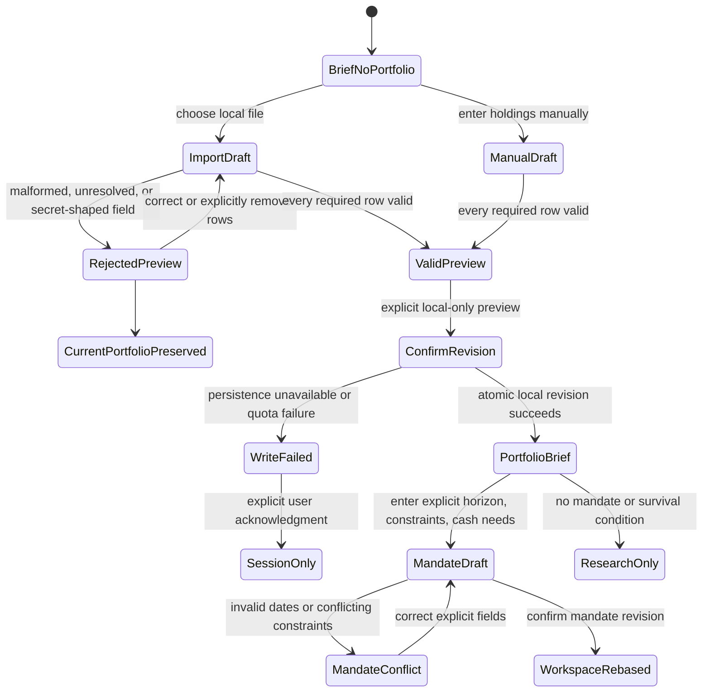
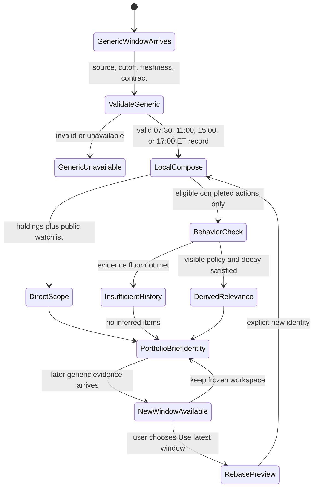
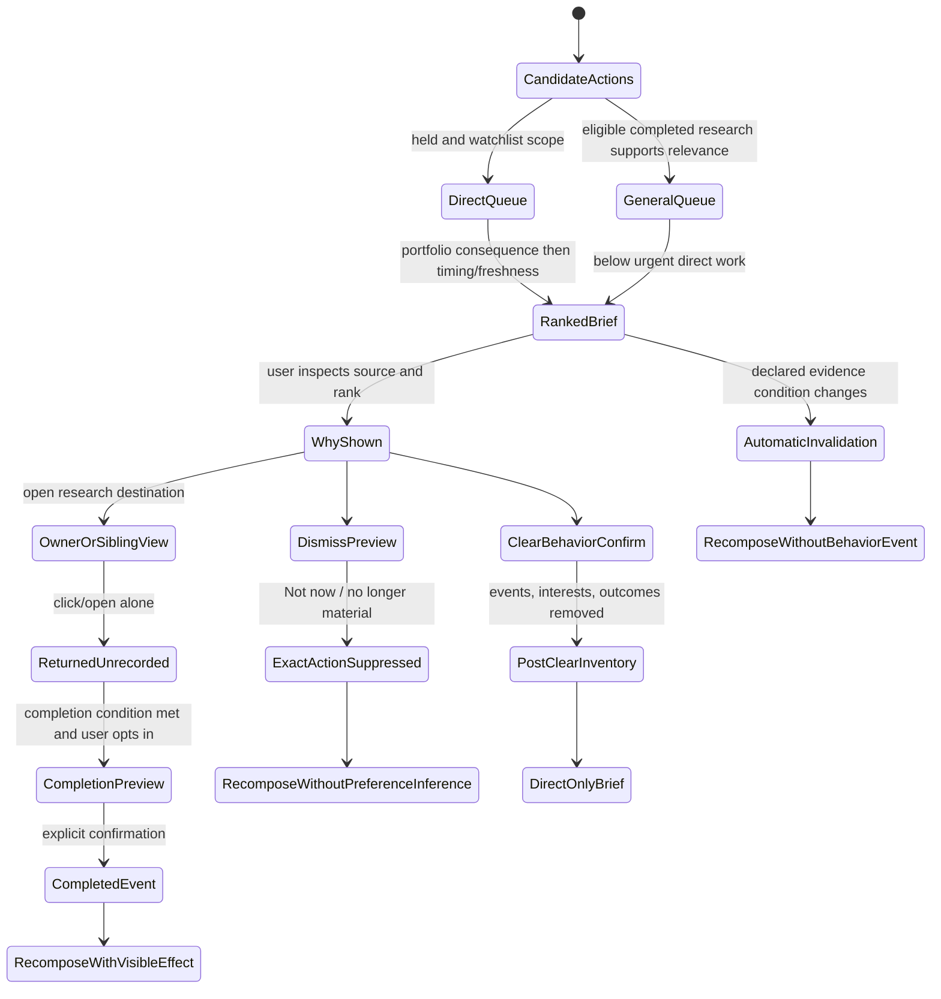
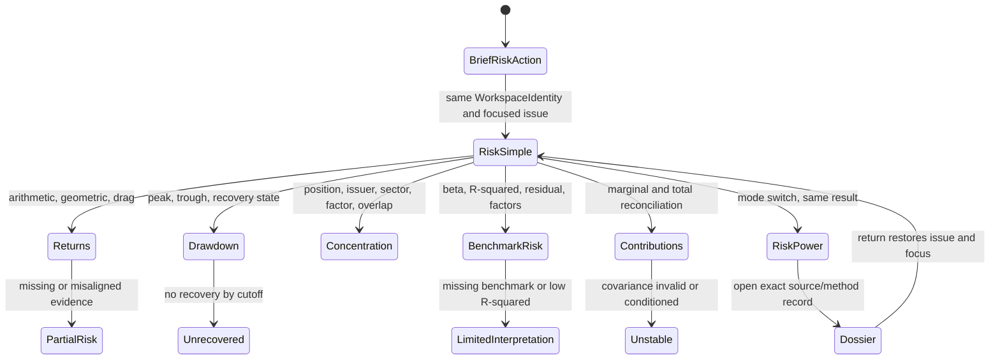
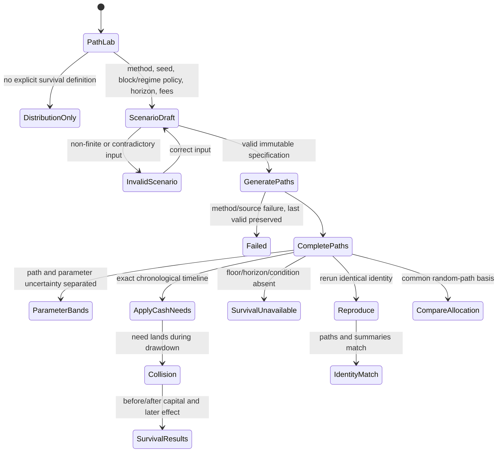
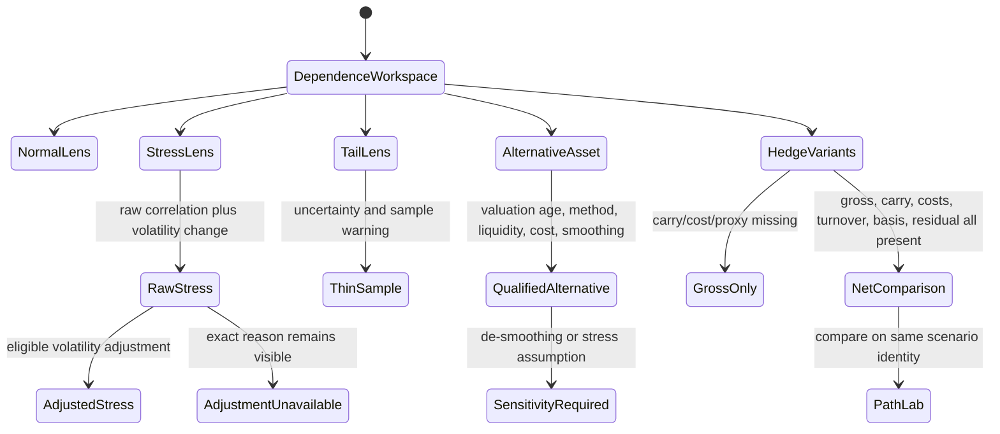
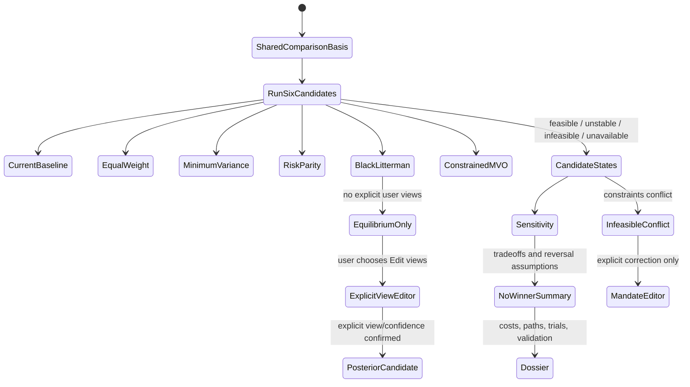
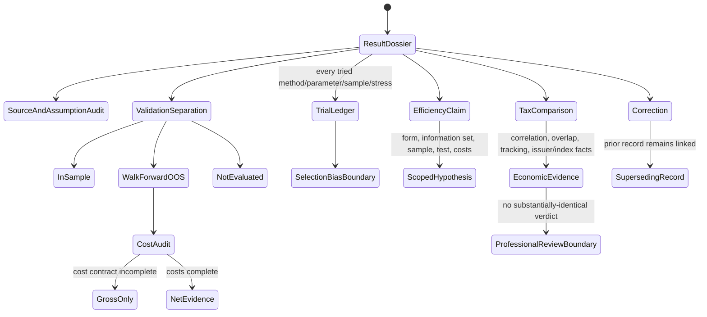
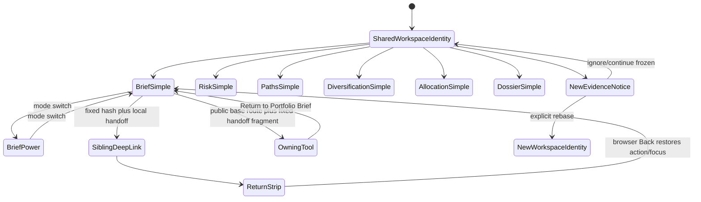
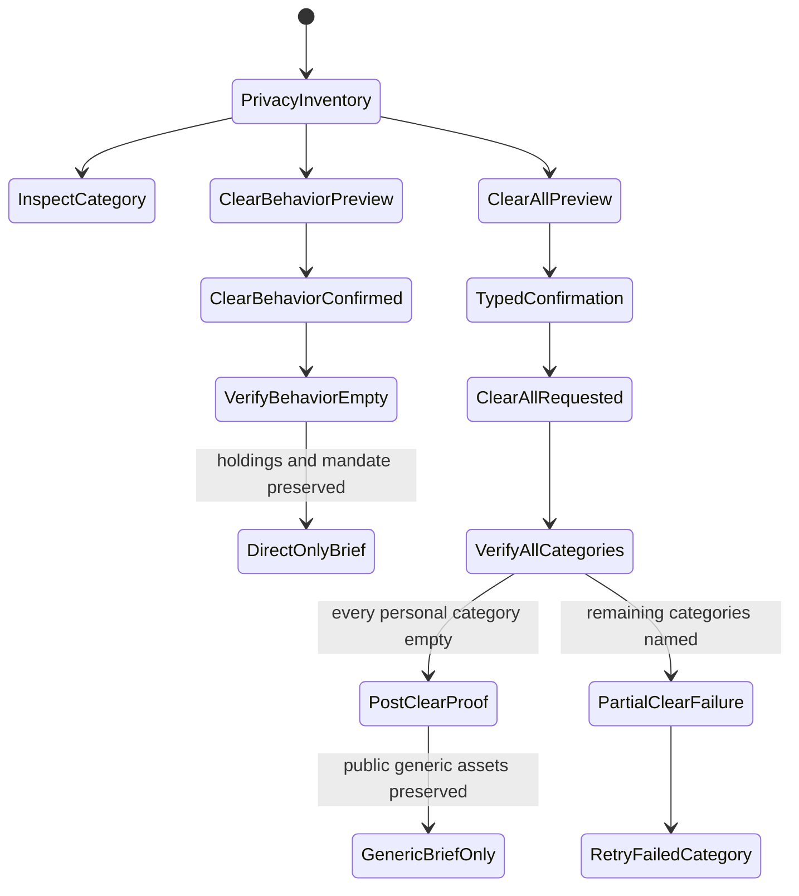

# Feature: 008 Portfolio Survival and Brief Lab

## Problem Statement

Research Lab has several strong portfolio ingredients, but no coherent portfolio-survival capability and no private portfolio-specific brief.

- `ai-capex-strategy-lab.html` can aggregate a theme-specific basket and offers minimum-variance and risk-parity objectives, but its universe, assumptions, and theme-aware correlations are specialized to AI-capex research.
- `etf-momentum-lab.html` computes CAGR, arithmetic return, volatility, maximum drawdown, CAPM beta, alpha, correlation, R-squared, residual risk, and Monte Carlo projections for ETFs, but it does not own a user's portfolio, dated cash needs, crisis-dependence analysis, optimizer comparison, or survival framing.
- `strategy-validation-lab.html::backtest`, `walkForward`, and `deflatedSharpe` establish useful out-of-sample, embargo, robustness, and multiple-testing discipline, but the current checked-in rule engine has no first-class transaction-cost policy and is not a portfolio-allocation dossier.
- `market-brief.config.json`, `notes/market-brief.md`, and `scripts/brief-refresh.mjs` establish four public brief windows at 07:30, 11:00, 15:00, and 17:00 America/New_York time. `market-brief.snapshot.json`, `market-brief.payload.json`, and `brief-history.jsonl` are committed public artifacts. They cannot safely contain holdings, quantities, cost basis, P&L, or local behavior history.
- `watchlist.json` is deliberately public and ticker-only. `rlbrief.js::renderWatchlist` renders that public scope, while `rldata.js` provides a shared browser-local market cache and current tool reads. Neither surface owns private portfolio state or a transparent behavior-derived interest model.
- A targeted production search found no existing `recentTickers`, viewed-ticker history, research-action history, or behavior-derived-interest contract. Personalization therefore cannot be claimed as an extension of an existing implementation.

The transcript themes motivating this feature are useful hypotheses, not authorities: goals-first investing, uncertainty and sample paths, volatility drag and geometric growth, diversification under crisis dependence, CAPM beta, alternatives and physical decorrelation, hedged versus unhedged portfolios, backward-looking metrics and backtests, and positioning for survival rather than prediction. Several common versions of those claims are materially incomplete. Lower volatility is not a universal winner, crisis correlation is not always one, illiquid assets may look smooth because they are stale, a backtest does not establish future superiority, and market-efficiency forms are empirical hypotheses rather than a single proposition that is simply true or false.

The missing product is a real portfolio research cockpit that starts with a portfolio-specific brief, then lets the user inspect risk, paths, diversification, allocation alternatives, and a research dossier from the same local portfolio and evidence cutoff. It must compare approaches and expose uncertainty. It must not select a universal best portfolio, infer personal constraints from behavior, provide personalized investment advice, or execute trades.

## Outcome Contract

**Intent:** Give a research user one private, goals-aware workspace for answering: what deserves portfolio research now, what risks dominate the current holdings, which plausible paths threaten dated cash needs, how diversification may change in stress, and how several allocation approaches behave under the same explicit constraints and uncertain assumptions.

**Success Signal:** A user can import or enter a portfolio locally, state a mandate and dated cash needs explicitly, and open the default Portfolio Brief tab to see a fresh four-window research agenda tailored to held tickers, the public watchlist, recently researched tickers, and behavior-derived interests. Every item explains why it was shown and remains a non-executing research action. From the same cockpit, the user can compare current, equal-weight, minimum-variance, risk-parity, Black-Litterman, and constrained mean-variance allocations; inspect arithmetic versus geometric growth, drawdown/recovery, beta/R-squared/residual and factor risk, crisis dependence, hedge costs, and reproducible survival paths; and audit assumptions, costs, validation, provenance, and invalidation in a dossier.

**Hard Constraints:**

- Observable facts, user-entered holdings and constraints, behavior-derived interests, model estimates, and recommendations remain visibly and structurally distinct with provenance.
- Behavior may rank relevance and suggest research/review actions. It cannot infer or decide risk tolerance, ability to bear loss, liquidity needs, tax status, personal goals, or trade authority.
- Settings and preference fields are never evidence for inferred interests. Only eligible observed actions may contribute, and parameter values cannot be reinterpreted as personal traits.
- Holdings, quantities, cost basis, P&L, goals, dated cash needs, and local action history remain local-only. They never enter committed payloads/history, remote telemetry, public tool reads, public URLs, or the four-times-daily publisher.
- The public publisher refreshes generic market evidence on the existing four-window cadence. Personalized composition occurs locally from that generic evidence plus local holdings, the public watchlist, and eligible local action history.
- Every behavior-derived recommendation includes `why shown`, evidence event categories, relevance confidence, horizon, evidence recency, decay state, freshness, trigger or review condition, invalidation or completion condition, and a visible way to clear local behavior history.
- Recommendations are non-executing research actions such as review concentration, inspect catalyst risk, run a scenario, compare hedge cost, test stressed dependence, revisit a stale thesis, or inspect an owning tool. They are never automatic buy/sell instructions, position sizes, orders, or claims of personalized suitability.
- The product does not optimize engagement, infer sensitive traits, build cross-device identity, or maintain a hidden profile.
- All allocation approaches use the same frozen evidence and explicit constraints for a comparison. No method is labeled the universal winner.
- Calibration choices such as history windows, block lengths, stress definitions, factor sets, confidence bands, decay rates, tail parameters, optimizer bounds, and survival floors are explicit research parameters with provenance and sensitivity, not universal constants hidden in code or prose.
- Simple and Power views, the portfolio brief, allocation comparison, path lab, and dossier project one coherent local portfolio identity and one frozen evidence set.

**Failure Condition:** The feature fails even if every chart renders when private portfolio data reaches a committed or remote surface; behavior silently becomes a risk profile or goal; a settings value is used as inferred interest; a recommendation lacks a truthful `why shown`; insufficient history produces a fabricated preference; a stale appraisal is treated as mechanical decorrelation; raw crisis correlation is presented as unconditional contagion; the geometric approximation is used to prove lower volatility always wins; an optimizer is presented as the best portfolio without sensitivity; a backtest is presented as future proof; a tax-loss replacement is declared substantially identical or safe from a correlation threshold; or any output can place or imply an order.

## Product Decision: One Portfolio Cockpit, Brief First

Feature 008 is one new tool, not a separate portfolio tool plus a separate personalized-brief tool.

The default first screen is the **Portfolio Brief** tab within the Portfolio Survival and Allocation Lab. Risk X-Ray, Path Lab, Diversification, Allocation Comparison, and Research Dossier are sibling tabs over the same local portfolio, mandate, evidence cutoff, assumptions, and provenance records.

This decision is grounded in current workflow evidence:

1. `notes/market-brief.md` defines the existing brief as a cockpit that ranks attention and deep-links to owning analysis. A portfolio brief has the same attention-first job, but its scope depends on private local context.
2. The research actions in the brief naturally open portfolio risk, path, hedge, allocation, or dossier views. A separate tool would force context switching and duplicate local import, privacy controls, provenance, and evidence freezing.
3. `rldata.js` already supports one local shared market-data context, and Research Lab's Simple/Power rule requires one compute to feed multiple views. One cockpit preserves that invariant.
4. The public Actionable Market Brief remains a distinct generic market tool. Feature 008 consumes its generic evidence locally; it does not replace, fork, or personalize the public publisher.

When no local portfolio exists, the first screen remains usable as an explicit setup state: it may show generic evidence and the public ticker-only watchlist, but it cannot claim portfolio coverage, position impact, or behavior-derived interest. Import/edit and privacy controls are the primary actions.

## Goals

- Make the portfolio-specific brief the first-class entry point at each existing market-brief window.
- Keep public generic refresh and private local composition as separate trust zones.
- Support local portfolio import/edit without brokerage credentials, account identifiers, or committed personal data.
- Let users state mandate, constraints, and dated cash needs explicitly without behavior inference.
- Explain arithmetic return, geometric growth, volatility drag, drawdown, recovery, concentration, CAPM, factor, and marginal risk in one coherent X-ray.
- Generate reproducible dependent sample paths with parameter uncertainty and withdrawal-collision/survival outcomes.
- Compare normal, stressed, and tail dependence while correcting common crisis-correlation and alternative-asset claims.
- Compare current, equal-weight, minimum-variance, risk-parity, Black-Litterman, and constrained mean-variance approaches side by side with sensitivity bands.
- Separate gross historical fit from walk-forward, cost-aware, selection-bias-aware evidence.
- Make every recommendation attributable, inspectable, clearable, non-executing, and deep-linked to its owning research surface.

## Non-Goals

- Brokerage aggregation, credential collection, account login, order routing, automatic rebalancing, or trade execution.
- Personalized investment advice, suitability determination, fiduciary recommendation, or a claim that one allocation is best for the user.
- Inferring risk tolerance, capacity for loss, liquidity needs, goals, tax status, family status, health, wealth, politics, or any sensitive trait from behavior.
- Cross-device profile sync, advertising, notification engagement loops, click maximization, dwell-time optimization, or opaque recommendation ranking.
- Replacing the market-wide Actionable Market Brief, its public publisher, or its owning tool reads.
- Replacing the detailed AI Capex, ETF Momentum, Bond Regime, Global Rotation, Real Assets, Strategy Validation, or Technical Analysis tools.
- Treating manually valued art, watches, private businesses, or real estate as liquid mark-to-market series or automatically independent assets.
- Tax-return preparation, wash-sale adjudication, tax-lot execution, legal advice, or declaring two securities substantially identical from correlation alone.
- Forecasting a single expected market path or guaranteeing a survival probability.
- Selecting a paid data provider, adding a remote portfolio service, or defining implementation architecture owned by `bubbles.design`.

## Current Capability Map

| Capability | Concrete Repository Evidence | Current Status | Feature 008 Responsibility |
| --- | --- | --- | --- |
| Four-window generic market brief | `market-brief.config.json::windows`, `notes/market-brief.md` section 1, `scripts/brief-refresh.mjs::argWindow` | Live at 07:30/11:00/15:00/17:00 ET | Reuse generic evidence and window identity; compose private portfolio relevance locally |
| Public deterministic snapshot/history | `market-brief.snapshot.json`, `brief-history.jsonl`, `scripts/brief-refresh.mjs::main` | Live and committed | Never place private portfolio or behavior data in these artifacts |
| Public narrative and recommendations | `market-brief.payload.json`, `rlbrief.js::renderAttention`, `renderRecs`, `renderNextSession` | Live and market-wide | Treat as generic evidence; portfolio overlay emits research tasks, not personalized trade actions |
| Public ticker-only watchlist | `watchlist.json` note and four-item snapshot; `rlbrief.js::renderWatchlist` | Live | Use as direct public scope, separate from local holdings and inferred interests |
| Shared browser-local market cache | `rldata.js::load`, `putBars`, `putToolRead`, `freshness` | Live | Reuse market observations; add a separate privacy-bounded portfolio/action capability rather than mixing personal fields into public tool reads |
| Theme-specific allocation | `ai-capex-strategy-lab.html::_portfolioCompute`, `allocationFor`, `barbellAlloc`; minimum-variance and risk-parity controls | Complete for AI-capex universe | Reuse concepts, not theme assumptions; add general portfolio method comparison and sensitivity |
| ETF risk/CAPM/simulation | `etf-momentum-lab.html` metrics around CAGR, arithmetic mean, max drawdown, beta, R-squared, residual risk, correlation, and Monte Carlo | Substantial specialist capability | Compose source-qualified portfolio X-ray and replace one-path-distribution framing with dependent-path survival analysis |
| Walk-forward/multiplicity discipline | `strategy-validation-lab.html::backtest`, `walkForward`, `deflatedSharpe` | Partial foundation; no first-class cost contract found | Require exact allocation-variant validation, transaction costs, and selection-bias accounting |
| Goals-first research | `strategy-self-improvement-lab.html` goal scorecard; no portfolio cash-need owner | Partial and strategy-specific | Add explicit mandate, dated cash needs, and survival definitions to portfolio research |
| Fixed-income and hedge context | `bond-regime-lab.html`, `global-rotation-lab.html`, `real-assets-lab.html` owner reads | Existing specialists | Deep-link and consume owner evidence without duplicating formulas |
| Portfolio import and local holdings | No registered owner; project policy only states private values stay local | Missing | Own local portfolio definition, edit/import validation, and personal-data boundary |
| Viewed/researched ticker history | Targeted production search for recent/view/action history returned no result | Missing | Own a transparent, bounded, clearable local action ledger |
| Portfolio-specific brief | No registered owner or payload | Missing | Own local composition, recommendation provenance, and first-screen experience |

## Repository And Source Grounding

| Claim Or Boundary | Evidence | Supported Conclusion | Explicit Non-Conclusion |
| --- | --- | --- | --- |
| Cadence | `market-brief.config.json::windows` and cron | Four named ET windows are the compatibility contract | A wall-clock label alone does not prove fresh evidence |
| Public/private split | `watchlist.json` note; `.github/copilot-instructions.md` privacy rule | Public watchlist contains tickers only; sizing/cost/P&L stay local | Existing public artifacts are not safe personal stores |
| Generic publisher | `scripts/brief-refresh.mjs` writes snapshot/history; wrapper stages and pushes them | Remote publisher can refresh generic market evidence | It cannot receive local portfolio/action context |
| Brief rendering | `rlbrief.js` renders generic actions, tool reads, and watchlist | Existing cockpit/deep-link pattern is reusable | Existing `add/trim/hedge` copy is not a personalized portfolio recommendation contract |
| Shared data | `rldata.js` stores bars/options/macro/events/tool reads locally | Market evidence can be reused without refetch | Current schema does not own private portfolio or behavior state |
| Risk metrics | `etf-momentum-lab.html` computes return, volatility, drawdown, beta, R-squared, residual risk | Existing formulas can be an owning evidence source | One ETF screen is not a portfolio-survival model |
| Allocation | `ai-capex-strategy-lab.html` exposes minimum variance and risk parity | Optimizer patterns exist | AI-theme assumptions and correlations are not general portfolio truth |
| Validation | `strategy-validation-lab.html` has walk-forward and deflated Sharpe | OOS and multiplicity patterns exist | Current code does not prove net allocation performance after transaction costs |
| Crisis correlation | Forbes and Rigobon, NBER Working Paper 7267 | Unadjusted crisis correlation can be upward biased when volatility rises | Correlations never change in crises, or always go to one |
| Appraisal smoothing | Geltner, *Journal of Real Estate Research* 8(3), 1993 | Appraisal-based indexes require correction for smoothing, temporal aggregation, and reappraisal seasonality to estimate underlying market returns | Physical or appraised assets are mechanically orthogonal to public markets |
| Dependent resampling | Politis and Romano, *JASA* 89(428), 1994 | Stationary bootstrap is a recognized resampling method for stationary dependent observations | One chosen block policy is universally correct |
| Backtest selection | Bailey, Borwein, Lopez de Prado, and Zhu, 2013 metadata; Strategy Validation precedent | Repeated strategy selection creates backtest-overfitting risk that must be counted | A high in-sample score proves future performance |
| Goals-first framing | Das, Markowitz, Scheid, and Statman, 2010 abstract | Goal thresholds and failure probabilities can be modeled per explicit mental account | Behavior reveals the user's actual goals or risk capacity |
| Wash-sale boundary | IRS Publication 550 (2025), updated 2026-04-30 | Substantially identical is facts-and-circumstances dependent | A correlation threshold can provide a legal safe harbor |

## Honest Findings And Research Corrections

1. **The portfolio brief cannot be generated remotely from private context.** The existing timer commits and pushes its outputs. Personalization must happen locally after generic evidence arrives.
2. **There is no current behavior history to consume.** Any initial release must include an explicit no-history state; it cannot claim to know interests from current settings, the current portfolio, or a default persona.
3. **Direct scope and inferred scope are different.** Holdings, the public watchlist, and the current ticker are observable scope. Recently viewed/researched tickers and domain interests are behavior-derived. Neither category establishes goals or suitability.
4. **`g ~= mu - sigma^2 / 2` is conditional.** It is a useful approximation under an appropriate return model and scale. It is not a universal proof that the lower-volatility portfolio produces more wealth; expected return, covariance, skew, tails, sequence, fees, and withdrawals also matter.
5. **Arithmetic and geometric return answer different questions.** The arithmetic mean summarizes one-period expected return under assumptions; CAGR/geometric growth reports compounded historical path. Both must be shown with sample and horizon.
6. **Crisis correlations may rise, but raw estimates can be biased upward.** Forbes-Rigobon demonstrates that higher turmoil volatility can inflate unadjusted correlation. The product must show raw and volatility-adjusted/stress-qualified evidence and must never state that all correlations go to one.
7. **Low observed volatility in alternatives may be a measurement artifact.** Geltner's appraisal-index work explicitly addresses appraisal smoothing, temporal aggregation, and reappraisal seasonality. Watches, art, real estate, and private assets also have liquidity, transaction-cost, valuation-frequency, selection, storage, insurance, and idiosyncratic risks.
8. **CAPM beta is not total risk.** Beta is benchmark sensitivity over a chosen sample. R-squared shows how much variation that benchmark relationship explains; residual and factor risks remain.
9. **An optimizer amplifies estimation choices.** Small changes in means, covariance, constraints, or sample can produce large weight changes. Every optimizer output therefore needs sensitivity bands, turnover/cost context, and an infeasible/unstable state.
10. **Black-Litterman does not remove judgment.** It starts from implied equilibrium returns and adjusts them with explicit views and confidence. Behavior-derived interests must never become market views, expected returns, or confidence inputs.
11. **Backtests are backward-looking.** Walk-forward evaluation, embargo where needed, transaction costs, survivorship/selection caveats, and trial counts reduce but do not eliminate uncertainty.
12. **Market efficiency is not one binary claim.** Weak, semi-strong, and strong-form propositions are hypotheses about information incorporation under specific definitions and tests. Product copy cannot dismiss them collectively as simply false.
13. **Tax analysis cannot be automated from similarity alone.** IRS Publication 550 requires facts and circumstances for substantially identical securities. Correlation may be research evidence but is not a legal classification.
14. **The source-audit itself found two attractive but wrong citation paths.** DOI `10.1111/1540-6229.00636` resolves to a reverse-mortgage paper, not appraisal smoothing; `10.2307/2958773` resolves to an unrelated classification paper, not stationary bootstrap. The corrected sources are Geltner DOI `10.1080/10835547.1993.12090713` and Politis-Romano DOI `10.1080/01621459.1994.10476870`. This is why source identity is a first-class dossier field.

## Domain Capability Model

### Capability

**Portfolio Survival And Research Briefing** turns a local portfolio, explicit mandate, fresh generic market evidence, and transparent local research actions into provenance-separated risk estimates, dependent scenario paths, diversification diagnostics, allocation comparisons, and non-executing research recommendations.

### Domain Primitives

| Primitive | Purpose | Lifecycle |
| --- | --- | --- |
| PortfolioDefinition | Local identity for the user's research portfolio and valuation currency | absent -> draft -> valid -> revised -> cleared |
| HoldingEntry | User-entered asset, quantity/weight/value and optional cost information | imported/entered -> valid, unresolved, stale-price, or excluded -> revised/removed |
| Mandate | Explicit user-entered research horizon, objective, constraints, and prohibited/required exposures | absent -> draft -> valid -> revised; never inferred |
| CashNeed | Explicit amount/date/currency/priority used for collision and survival research | draft -> valid -> funded, at-risk, past, or removed |
| GenericEvidenceWindow | Public market evidence for one of the four existing brief windows | scheduled -> fresh, partial, stale, unavailable, or superseded |
| ProvenanceClaim | Typed value classified as observable fact, user entry, inferred interest, model estimate, or recommendation | created -> current -> stale, corrected, superseded, or cleared |
| BehaviorEvent | Minimal local record of an eligible completed user action | observed -> eligible or excluded -> decayed -> cleared |
| InterestSignal | Non-sensitive topic/ticker/scope inference derived only from eligible BehaviorEvents | insufficient -> low, medium, or high relevance confidence -> decayed/cleared |
| ResearchAction | Non-executing recommendation with reason, horizon, condition, invalidation, freshness, and deep link | proposed -> current -> completed, dismissed, stale, invalidated, or cleared |
| PortfolioBrief | Local composition of generic evidence, direct scope, and eligible InterestSignals | composing -> current, partial, stale, or unavailable -> superseded |
| RiskEstimate | Return, drawdown, concentration, benchmark, factor, or contribution estimate | pending -> available, partial, unstable, or unavailable -> superseded |
| DependenceEstimate | Normal, stressed, tail, raw, or adjusted relationship with source/window/method | pending -> available, thin, unstable, stale, disputed, or unavailable |
| ScenarioSpecification | Explicit seed, method, horizon, parameters, constraints, cash needs, and uncertainty policy | draft -> valid -> executed -> revised |
| ScenarioPathSet | Reproducible block-bootstrap or regime/fat-tail paths under one specification | generating -> complete, partial, failed, or superseded |
| SurvivalResult | Distribution of goal-floor and cash-need outcomes, not a guarantee | pending -> available, imprecise, infeasible, or unavailable -> superseded |
| AllocationCandidate | One method's weights and diagnostics under a shared evidence/constraint set | pending -> feasible, unstable, infeasible, or unavailable -> superseded |
| AllocationComparison | Side-by-side candidates with sensitivity, turnover, costs, and no universal rank | pending -> complete, partial, or unavailable -> superseded |
| HedgeComparison | Hedged/unhedged or partial-hedge research result with carry, cost, basis, and implementation caveats | pending -> available, partial, infeasible, or unavailable -> superseded |
| ResearchDossier | Frozen audit of data, assumptions, variants, costs, validation, caveats, and invalidation | draft -> complete -> superseded; corrections append |
| LocalPrivacyState | Inspectable inventory and clear controls for holdings, goals, behavior, and derived interests | empty -> populated -> partially cleared or fully cleared |

### Provenance Classes

| Class | Examples | May Influence | Must Not Be Presented As |
| --- | --- | --- | --- |
| Observable fact | Sourced price, timestamp, corporate action, published generic event | Risk/path/dependence inputs when eligible | User preference, goal, or recommendation |
| User-entered holding | Ticker, quantity, weight, cost basis, manual valuation | Portfolio exposure and local analytics | Public fact or inferred preference |
| User-entered constraint | Cash need, horizon, maximum exposure, allowed assets | Feasibility and survival definitions | Behavior inference or system-selected suitability |
| Behavior-derived interest | Repeated completed research actions on a ticker/domain | Content relevance and general research-action ranking | Risk tolerance, loss capacity, goal, tax status, or market view |
| Model estimate | Beta, scenario survival, expected-return band, tail dependence | Transparent analysis with assumptions/uncertainty | Fact, guarantee, or personal constraint |
| Recommendation | Review concentration, run scenario, compare hedge cost | User-controlled research workflow | Buy/sell/order/size instruction or personalized advice |

### Eligible Behavior Vocabulary

Eligible events are meaningful completed actions, not a raw clickstream:

- ticker or owning-tool opened;
- a portfolio risk, path, dependence, hedge, or allocation analysis completed;
- a dossier or prior thesis revisited;
- a deep link from a brief followed;
- a research action opened, completed, dismissed, or explicitly marked stale.

The ledger excludes dwell time, pointer movement, scroll depth, ad-style engagement, settings/preferences, raw text entry, secret fields, quantities, cost basis, P&L, goal amounts, and the numeric values selected in a risk or shock control. A completed scenario may support the topic `scenario research`; its shock magnitude cannot be treated as risk tolerance.

### Relationships

- One PortfolioDefinition has zero or more HoldingEntries, one current Mandate, and zero or more CashNeeds.
- One GenericEvidenceWindow is public and portfolio-agnostic. Many local PortfolioBriefs may consume it without changing it.
- One BehaviorEvent may support zero or more InterestSignals; every InterestSignal lists its supporting event categories, recency, decay policy, and relevance confidence.
- Holdings and public watchlist entries contribute direct scope without becoming InterestSignals.
- A PortfolioBrief may contain holding-specific ResearchActions and general interest-derived ResearchActions. The two kinds remain labeled.
- Every RiskEstimate, DependenceEstimate, ScenarioPathSet, SurvivalResult, AllocationCandidate, and HedgeComparison references one frozen PortfolioDefinition revision and evidence cutoff.
- Every AllocationCandidate uses the same constraints and evidence set in one AllocationComparison; method-specific assumptions remain separately visible.
- A ResearchDossier freezes the exact inputs and variants behind a result. Later corrections append and supersede rather than rewrite prior claims.

### Business Policies

1. **Local-only personal state:** holdings, quantities, cost basis, P&L, mandate, cash needs, and behavior never enter public or remote surfaces.
2. **No secret import:** account numbers, broker IDs, API keys, tokens, passwords, and credential-shaped fields are rejected rather than stored.
3. **Inference containment:** behavior changes relevance only. It never changes constraints, expected-return views, optimizer objectives, survival floors, or trade permissions.
4. **No settings inference:** settings can alter an explicit calculation but do not contribute to InterestSignals.
5. **Transparent decay:** interest evidence decays under a visible, versioned policy. No hidden engagement tuning changes that policy.
6. **Insufficient-history honesty:** absent or thin eligible events produce `insufficient behavior history`; direct portfolio/watchlist scope still works.
7. **Immediate clearing:** clearing behavior removes events and derived interests and stops their ranking effect without deleting holdings unless the user separately clears them.
8. **Generic/personalized barrier:** public refresh knows no local portfolio. Local composition never writes back personal fields.
9. **Research-action boundary:** all recommendations are review/investigate/compare/run/revisit actions with completion or invalidation conditions.
10. **One evidence cutoff:** all portfolio views disclose and share the same active data cutoff or identify a partial mismatch.
11. **No missing-as-zero:** missing holdings data, returns, factors, appraisals, costs, or behavior remain unavailable.
12. **No universal winner:** allocation candidates are compared by outcomes and sensitivities, not collapsed into one authoritative rank.
13. **Explicit infeasibility:** an optimizer that cannot satisfy the mandate returns infeasible and identifies conflicting constraints.
14. **Parameter humility:** every calibrated threshold or distributional choice is a named research parameter with uncertainty/sensitivity.
15. **Path reproducibility:** identical portfolio revision, evidence, scenario specification, and seed reproduce identical paths and results.
16. **Survival is user-defined:** the horizon, floor, cash needs, and success conditions come from explicit inputs; absent inputs produce research-only distribution views, not goal-fit claims.
17. **Dependence humility:** normal correlation, stress correlation, volatility-adjusted correlation, and tail dependence remain distinct.
18. **Alternative-asset humility:** infrequent valuation and illiquidity reduce confidence and cannot be translated into automatic diversification benefit.
19. **Backtest humility:** every historical result names its sample, availability, costs, trials, walk-forward status, and forward-use limitation.
20. **Tax/legal humility:** tax output is analytical education only; facts-and-circumstances legal judgments are never automated from a metric.

## Portfolio Brief Contract

The Portfolio Brief is the first tab and the daily working queue. It consumes the same four generic windows as Market Brief:

| Window | Existing Time (ET) | Generic Evidence Focus | Local Portfolio Composition Focus |
| --- | --- | --- | --- |
| Pre-market | 07:30 | Overnight/global context and upcoming events | Held/watch/recent tickers with overnight exposure, catalyst review, stale thesis, and scenario tasks |
| Morning | 11:00 | Open confirmation/rejection and breadth | Which held or researched exposures need concentration, catalyst, path, or thesis review after the open |
| Pre-close | 15:00 | Into-close state and overnight implications | Non-executing review of overnight concentration, liquidity, hedge-cost comparison, and dated cash-need collision |
| After-hours | 17:00 | Post-close reactions and next-session context | Thesis invalidation/review, dossier refresh, and next-session portfolio research agenda |

### Ranking Inputs

The brief ranks from four separately labeled sources:

1. **Direct local holdings:** private factual exposure scope.
2. **Public watchlist:** direct public research scope from `watchlist.json`.
3. **Previously researched/viewed tickers:** eligible local BehaviorEvents.
4. **Behavior-derived domains and horizons:** InterestSignals based on repeated or recent meaningful actions.

Direct holdings do not prove interest; inferred interest does not prove ownership. The ranking policy may prioritize material exposure or imminent evidence, but any materiality threshold is an explicit portfolio research parameter, not an inferred risk tolerance.

### Research Action Contract

Every behavior-derived ResearchAction includes:

- action kind (`portfolio-specific` or `general-interest`);
- subject and owning deep link;
- `why shown` in plain language;
- direct-scope sources and/or eligible behavior event categories;
- relevance confidence, separately labeled from market/model confidence;
- horizon;
- latest supporting-event time, age, and decay state;
- generic evidence cutoff and freshness;
- trigger/review condition;
- invalidation, completion, or stale condition;
- model/evidence assumptions when applicable;
- clear-history control and an explanation of what clearing changes.

Examples include:

- review concentration around a held ticker before a sourced catalyst;
- inspect catalyst risk in an owning tool;
- run a withdrawal-collision scenario;
- compare hedged versus unhedged carry and cost;
- test whether stressed dependence erodes the apparent diversification benefit;
- revisit a stale thesis after a contradictory owner read;
- compare allocation sensitivity before treating optimizer weights as stable;
- inspect a general fixed-income or real-assets dossier because repeated completed research actions indicate that domain, without claiming the user owns it or should trade it.

## Privacy And Trust Model

Feature 008 has four trust zones. Crossing a zone requires an explicit, user-visible contract; personal data never crosses into the public zones.

| Trust Zone | Permitted Data | Permitted Use | Forbidden Flow |
| --- | --- | --- | --- |
| Public generic evidence | Committed market snapshots, generic narratives, public ticker watchlist, registry metadata, owner-tool reads safe for publication | Four-times-daily generic refresh, public Research Lab rendering, source-qualified portfolio inputs | Receiving holdings, quantities, cost basis, P&L, mandate, cash needs, behavior events, or inferred interests |
| Local personal facts | Holdings, quantities, weights, optional cost basis/P&L, mandate, constraints, dated cash needs, manual valuations | Local portfolio valuation, risk/path/allocation analysis, direct portfolio brief scope | Commit, publisher input, remote telemetry, URL/referrer, public tool read, automatic clipboard, or cross-device sync |
| Local derived research | BehaviorEvents, InterestSignals, recommendation lifecycle, local scenarios, allocation candidates, personal dossiers | Local relevance ranking, explainable research actions, local comparison and audit | Treating an inference as a trait/constraint/view; remote profiling; public history; engagement optimization |
| Explicit user export | User-selected local portfolio or dossier fields after preview and privacy warning | User-controlled local backup or independent review | Automatic export, hidden upload, credential inclusion, or claim that exported personal data is safe to commit |

### Trust-Boundary Rules

1. The generic publisher and public artifacts are untrusted with respect to personal data: they receive no local fields even when run on the same physical device.
2. Generic market evidence is untrusted input to local composition until source, cutoff, freshness, and contract validity are established.
3. Imported holdings and labels are untrusted local input until schema, identity, numeric, currency, and secret-field validation passes.
4. Behavior-derived interests are low-authority relevance signals. They cannot become mandate fields, Black-Litterman views, expected returns, confidence in a market thesis, or permission to trade.
5. Personal deep links must not encode holdings, quantities, costs, goals, scenario values, or profile identities in a shareable URL.
6. Error reporting and diagnostics may expose only non-personal categories, counts, contract versions, and sanitized failure reasons.
7. `Clear behavior history` and `Clear all personal data` are separate, inspectable local operations with distinct confirmation and post-clear inventories.
8. A persistence failure is a trust failure: the product must state that local data was not saved and cannot imply durable deletion or retention without verification.
9. No authentication, session, payment, or brokerage secret is accepted as portfolio data or stored by this capability.
10. Public generic evidence remains usable after all personal state is cleared; personal state is never required to access the public site.

## Actors And Personas

| Actor | Description | Key Goals | Permission Boundary | Evidence Basis |
| --- | --- | --- | --- | --- |
| Portfolio Researcher | Maintains a local set of holdings or target weights | See what deserves review and how the portfolio behaves as a whole | Enters/edits local data; receives no order or suitability instruction | Project privacy rule currently reserves sizing/cost/P&L for local state |
| Goals-First Planner | Has explicit dated cash needs or mandate constraints | Test whether paths collide with cash needs and which tradeoffs matter | Must enter goals/constraints directly; behavior cannot fill them | Das et al. goals/threshold framework and missing current cash-need owner |
| Risk Researcher | Challenges return, drawdown, beta, factor, and contribution claims | Understand dominant risks, assumptions, and uncertainty | Can tune research parameters; cannot relabel estimates as facts | ETF Momentum owns current metric precedents |
| Diversification And Hedge Researcher | Studies normal/stress dependence and hedged/unhedged variants | Know when apparent decorrelation may fail or be costly | Receives analytical comparisons, not hedge instructions | Forbes-Rigobon, Geltner, Bond/FX/Real Assets owner tools |
| Allocation Method Evaluator | Compares allocation philosophies under common constraints | Understand why weights differ and how unstable they are | May compare candidates; no universal winner or automatic rebalance | AI Capex optimizer precedent and Portfolio Visualizer competitor evidence |
| Behavior-Aware Returning User | Wants the cockpit to remember real research activity without hidden profiling | Receive relevant tasks and understand why each appears | Can inspect and clear local action history; settings are excluded | No existing behavior-history owner was found |
| Data-Constrained User | Has missing prices, short histories, manual valuations, or blocked sources | Retain honest partial analysis and know what cannot be concluded | May supply manual local facts; missing evidence never becomes zero | Research Lab cache-first/degraded-state conventions |
| Privacy And Research Auditor | Reviews provenance, leakage, selection bias, and claim quality | Prove local-only boundaries and reconstruct each result | May inspect/export local dossier; cannot alter historical evidence silently | Existing source/provenance and validation disciplines |

## Use Cases

### UC-001: Import Or Enter A Local Portfolio

- **Actor:** Portfolio Researcher
- **Preconditions:** The portfolio is absent or editable; no broker connection is required.
- **Main Flow:**
  1. The user imports a local file or enters holdings manually.
  2. The product previews recognized tickers, currencies, quantities/weights, optional cost fields, duplicates, and rejected fields.
  3. The user confirms an all-or-nothing valid revision.
  4. The portfolio remains local and the brief/risk views recompute from that revision.
- **Alternative Flows:** Credential-shaped or account-identity fields are rejected. Unknown tickers remain unresolved. A malformed import changes nothing.
- **Postconditions:** One valid PortfolioDefinition revision is current and no personal field reached a public or remote surface.

### UC-002: State A Mandate And Dated Cash Needs

- **Actor:** Goals-First Planner
- **Preconditions:** A local portfolio may or may not exist.
- **Main Flow:**
  1. The user explicitly enters horizon, research objective, constraints, and one or more dated cash needs.
  2. The product validates dates, amounts, currencies, priorities, and conflicts.
  3. Risk, path, and allocation views identify which conclusions depend on those inputs.
- **Alternative Flows:** Without a mandate, the product offers distribution research but no goal-fit or survival claim. Conflicting constraints become infeasible.
- **Postconditions:** Hard constraints are attributable to user input, never behavior.

### UC-003: Read The Four-Window Portfolio Brief

- **Actor:** Portfolio Researcher or Behavior-Aware Returning User
- **Preconditions:** A generic evidence window is available; local scope may include holdings, watchlist, or eligible history.
- **Main Flow:**
  1. The user opens the lab and lands on Portfolio Brief.
  2. The brief names its generic window/cutoff and local composition time.
  3. It presents portfolio-specific and general-interest research actions with `why shown`, provenance, horizon, recency/decay, confidence, freshness, trigger, invalidation/completion, and deep links.
  4. The user opens an owning tab/tool or marks a task complete/dismissed.
- **Alternative Flows:** Stale generic evidence yields a stale agenda; no portfolio yields setup/watchlist-only state; no eligible behavior yields direct-scope-only composition.
- **Postconditions:** The user has a bounded research queue, not a trade list.

### UC-004: Inspect And Clear Behavior-Derived Interests

- **Actor:** Behavior-Aware Returning User or Privacy And Research Auditor
- **Preconditions:** Zero or more eligible BehaviorEvents exist.
- **Main Flow:**
  1. The user opens `Why shown` or the local privacy inventory.
  2. The product lists event categories, recency, decay, excluded sources, and derived InterestSignals.
  3. The user clears behavior history separately from holdings.
  4. Behavior-derived ranking and general recommendations disappear on recomposition.
- **Alternative Flows:** Corrupt history is quarantined and ignored. Clearing all personal state requires a separate confirmation.
- **Postconditions:** The user controls the profile and can prove what remains local.

### UC-005: Run A Portfolio Risk X-Ray

- **Actor:** Risk Researcher
- **Preconditions:** Portfolio weights and enough eligible return history exist for at least one metric family.
- **Main Flow:**
  1. The product freezes portfolio, benchmark, evidence cutoff, return convention, and history window.
  2. It shows arithmetic and geometric returns, volatility drag, CAGR, drawdown/recovery, concentration, beta/R-squared/residual risk, factors, and marginal/total risk contributions.
  3. Every metric shows provenance, sample, method, and unavailable/unstable state.
- **Alternative Flows:** Short or misaligned history limits only affected metrics. Manual/appraisal assets remain separately qualified.
- **Postconditions:** The user can identify dominant risk without mistaking a metric for a forecast.

### UC-006: Test Reproducible Survival Paths

- **Actor:** Goals-First Planner or Risk Researcher
- **Preconditions:** A valid ScenarioSpecification exists.
- **Main Flow:**
  1. The user chooses block-bootstrap and/or regime/fat-tail methods, horizon, seed, parameter policy, and uncertainty ranges.
  2. Explicit contributions, withdrawals, fees, and CashNeeds are placed on the path timeline.
  3. The product generates reproducible paths and reports collision, drawdown, recovery, terminal wealth, floor, and survival distributions with uncertainty.
- **Alternative Flows:** Insufficient history or unstable regime estimation yields imprecise/unavailable, not synthetic certainty.
- **Postconditions:** The user sees distributions and failure modes rather than one forecast.

### UC-007: Examine Diversification In Normal And Stress States

- **Actor:** Diversification And Hedge Researcher
- **Preconditions:** At least two compatible exposure series or qualified manual assets exist.
- **Main Flow:**
  1. The user compares normal, stressed, raw, volatility-adjusted, and tail-dependence views.
  2. The product shows sample definitions, volatility changes, co-exceedances, and uncertainty.
  3. Illiquid/manual assets display valuation frequency and stale-price/liquidity warnings.
- **Alternative Flows:** Thin crisis samples or incompatible valuations suppress definitive claims.
- **Postconditions:** The user can see where diversification is observed, assumed, or measurement-dependent.

### UC-008: Compare Hedged And Unhedged Portfolios

- **Actor:** Diversification And Hedge Researcher
- **Preconditions:** The hedge exposure, horizon, instrument/proxy, and cost assumptions are explicit.
- **Main Flow:**
  1. The product compares unhedged, hedged, and allowed partial-hedge research variants.
  2. It decomposes risk reduction, carry, direct cost, turnover, basis risk, liquidity, and residual exposure.
  3. Path and allocation views reuse the selected research variant without implying execution.
- **Alternative Flows:** Missing cost or proxy evidence makes net benefit unavailable.
- **Postconditions:** The user understands the tradeoff and invalidation, not a prescribed hedge ratio.

### UC-009: Compare Allocation Approaches Side By Side

- **Actor:** Allocation Method Evaluator
- **Preconditions:** A shared evidence set, explicit constraints, and candidate universe are valid.
- **Main Flow:**
  1. The product evaluates current, equal-weight, minimum-variance, risk-parity, Black-Litterman, and constrained MVO candidates.
  2. It shows weights, objective, assumptions, expected/realized risk bands, concentration, turnover, costs, goal/cash-need outcomes, and sensitivity.
  3. The user inspects why methods disagree.
- **Alternative Flows:** Infeasible, unstable, missing-view, or insufficient-history candidates remain visible with reasons.
- **Postconditions:** No candidate is declared universally best or automatically applied.

### UC-010: Enter Explicit Black-Litterman Views

- **Actor:** Allocation Method Evaluator
- **Preconditions:** A benchmark allocation and eligible covariance evidence exist.
- **Main Flow:**
  1. The user explicitly enters a view, horizon, magnitude/range, and confidence source.
  2. The product separates implied equilibrium returns from user views and posterior estimates.
  3. Sensitivity shows how weights change with view/confidence assumptions.
- **Alternative Flows:** No explicit views yields equilibrium-only research; behavior history never supplies a view.
- **Postconditions:** The candidate's judgment inputs are fully attributable.

### UC-011: Audit An Allocation Research Dossier

- **Actor:** Privacy And Research Auditor
- **Preconditions:** A risk, path, hedge, or allocation result exists.
- **Main Flow:**
  1. The dossier shows source vintages, transformations, assumptions, candidate identities, trials, costs, walk-forward design, results, caveats, and invalidation conditions.
  2. It separates in-sample, walk-forward/out-of-sample, and not-evaluated claims.
  3. Later corrections append and supersede prior records.
- **Alternative Flows:** Missing costs or validation prevents net/performance claims.
- **Postconditions:** The result is reproducible and its limits are visible.

### UC-012: Use The Lab With Partial Or Manual Data

- **Actor:** Data-Constrained User
- **Preconditions:** Some holdings have missing prices, sparse history, non-daily valuations, or source conflicts.
- **Main Flow:**
  1. Valid local and generic evidence renders first.
  2. Each affected metric/path/allocation identifies observed versus required data.
  3. Unaffected analyses remain available while unsupported claims are suppressed.
- **Alternative Flows:** A user-entered manual valuation is clearly labeled with date and valuation method.
- **Postconditions:** Partial truth remains useful without false precision.

### UC-013: Review Tax-Related Research Without Legal Automation

- **Actor:** Portfolio Researcher or Privacy And Research Auditor
- **Preconditions:** The user explicitly opens an analytical tax caveat or replacement comparison.
- **Main Flow:**
  1. The product compares economic exposure, correlation, holdings overlap, tracking behavior, and known facts.
  2. It states that substantially identical is a facts-and-circumstances legal determination.
  3. It provides no safe/unsafe classification, filing instruction, or automatic transaction.
- **Alternative Flows:** Missing tax status does not block general educational analysis because no personal tax outcome is computed.
- **Postconditions:** The user receives research evidence and an explicit professional-review boundary.

## Business Scenarios

Each `BS-008-NNN` is a stable business identifier and the candidate title for a later plan-owned `SCN-008-NNN` scenario contract.

### BS-008-001 / SCN-008-001 Candidate: Valid local portfolio import

```gherkin
Scenario: A user imports a valid portfolio without credentials
  Given the import contains recognized holding fields and no secret or account-identity field
  When the user reviews and confirms the import preview
  Then one new local portfolio revision becomes current
  And holdings, quantities, optional cost fields, and derived values remain local-only
  And the Portfolio Brief and portfolio analyses reference the new revision
```

### BS-008-002 / SCN-008-002 Candidate: Invalid import is atomic

```gherkin
Scenario: A malformed or secret-bearing import cannot partially replace the portfolio
  Given a current valid portfolio exists
  And a new import contains malformed rows, credential-shaped fields, or unresolved required identities
  When import validation runs
  Then the requested revision is rejected with row and field reasons
  And the prior portfolio remains current and unchanged
  And no rejected value enters storage, logs, URLs, telemetry, or committed artifacts
```

### BS-008-003 / SCN-008-003 Candidate: Explicit mandate owns hard constraints

```gherkin
Scenario: Dated cash needs and constraints come only from user input
  Given the user explicitly enters a horizon, a dated cash need, and allocation bounds
  When survival and allocation analyses run
  Then every affected result cites those user-entered constraints
  And behavior history does not add, remove, or modify a constraint
  And missing mandate fields remain absent rather than inferred
```

### BS-008-004 / SCN-008-004 Candidate: No mandate means no goal-fit claim

```gherkin
Scenario: A portfolio can be researched before goals are entered
  Given a valid local portfolio exists
  But no valid mandate or cash need exists
  When the user opens Risk X-Ray, Path Lab, or Allocation Comparison
  Then descriptive distributions and comparisons may be shown
  And goal-fit and survival-to-goal states are unavailable with an explicit reason
  And no default goal, risk tolerance, or liquidity need is invented
```

### BS-008-005 / SCN-008-005 Candidate: Generic publisher never receives personal context

```gherkin
Scenario: A scheduled generic brief refresh occurs while local portfolio data exists
  Given the browser holds quantities, cost basis, P&L, cash needs, and behavior events
  When the public four-window publisher refreshes generic evidence
  Then none of those local fields is included in a publisher input or output
  And committed payload, snapshot, and history remain portfolio-agnostic
  And personalized composition occurs only after generic evidence reaches the local context
```

### BS-008-006 / SCN-008-006 Candidate: Four-window local composition

```gherkin
Scenario Outline: The Portfolio Brief uses the matching generic evidence window
  Given a fresh generic <window> evidence record exists
  And a valid local portfolio or direct research scope exists
  When the user opens the Portfolio Brief
  Then the brief identifies <window> and its evidence cutoff
  And portfolio-specific research actions use only evidence available by that cutoff
  And local composition time remains distinct from generic publication time

  Examples:
    | window |
    | pre-market |
    | morning |
    | pre-close |
    | after-hours |
```

### BS-008-007 / SCN-008-007 Candidate: Direct and inferred scope stay separate

```gherkin
Scenario: Held, watchlist, completed-research, and inferred-relevance subjects qualify for different reasons
  Given one ticker is in local holdings
  And one ticker is only in the public watchlist
  And one ticker appears only in eligible explicitly completed research action history
  And one domain appears only through relevance inferred from eligible explicitly completed research action history
  When the brief ranks research actions
  Then the held ticker, watchlist ticker, completed-research ticker, and inferred domain appear in the Held, Public watchlist, Completed research, and Inferred relevance lanes respectively
  And each item states the correct direct or behavior-derived scope source
  And no inferred ticker is presented as held
  And no held ticker is presented as proof of user interest or risk preference
```

### BS-008-008 / SCN-008-008 Candidate: Every behavior-derived item explains why it appears

```gherkin
Scenario: A behavior-derived general research action is shown
  Given eligible completed actions support a non-sensitive domain interest
  When a general research action is ranked from that interest
  Then it shows why shown, event categories, relevance confidence, horizon, recency, decay, freshness, trigger, and completion or invalidation condition
  And it links to the owning research surface
  And it is labeled as a relevance inference rather than a personal constraint or market fact
```

### BS-008-009 / SCN-008-009 Candidate: Settings never become inferred interests

```gherkin
Scenario: A user changes risk, horizon, shock, or display controls
  Given the user has no eligible behavior history for the affected domain
  When settings and parameter values change
  Then no InterestSignal is created or strengthened from those fields
  And no risk tolerance, loss capacity, goal, tax status, or preferred asset is inferred
  And calculation changes remain attributable to explicit user input only
```

### BS-008-010 / SCN-008-010 Candidate: Insufficient behavior history degrades honestly

```gherkin
Scenario: The browser has too little eligible action history
  Given no eligible events survive the visible evidence and decay policy
  When the Portfolio Brief composes
  Then behavior-derived interests are labeled insufficient
  And the brief uses holdings, public watchlist, current context, and generic evidence only
  And no fabricated preference, persona, or general-interest recommendation appears
```

### BS-008-011 / SCN-008-011 Candidate: Clear behavior history removes its influence

```gherkin
Scenario: A user clears local behavior history
  Given behavior-derived items currently affect brief ranking
  When the user confirms Clear behavior history
  Then eligible events and derived InterestSignals are removed locally
  And the next composition contains no behavior-derived ranking influence
  And holdings, mandate, cash needs, and public watchlist remain unless separately cleared
```

### BS-008-012 / SCN-008-012 Candidate: No engagement or sensitive profiling

```gherkin
Scenario: The local ranking model evaluates user activity
  Given pointer movement, dwell time, scroll depth, settings, and sensitive-trait fields exist or can be observed
  When eligible behavior evidence is selected
  Then those sources are excluded
  And only named completed research-action categories may contribute
  And no cross-device identifier or hidden profile is created
  And ranking optimizes research relevance rather than engagement
```

### BS-008-013 / SCN-008-013 Candidate: Arithmetic and geometric return remain distinct

```gherkin
Scenario: The portfolio has volatile historical returns
  Given an aligned return sample and portfolio weights are valid
  When Risk X-Ray calculates return statistics
  Then arithmetic mean, compounded CAGR, and observed volatility drag are shown separately
  And the approximation g ~= mu - sigma squared over two is labeled conditional with assumptions
  And no conclusion states that lower volatility universally produces higher wealth
```

### BS-008-014 / SCN-008-014 Candidate: Drawdown and unrecovered state are truthful

```gherkin
Scenario: The latest portfolio path has not recovered its prior peak
  Given the sample includes a peak and subsequent drawdown
  But no later observation regains that peak by the evidence cutoff
  When drawdown statistics are shown
  Then maximum drawdown, peak date, trough date, and current depth are visible
  And recovery is labeled unrecovered as of the cutoff
  And no future recovery duration is fabricated
```

### BS-008-015 / SCN-008-015 Candidate: Concentration exposes overlapping risk

```gherkin
Scenario: Several holdings share the same issuer, sector, factor, or underlying constituents
  Given compatible exposure data is available
  When concentration is evaluated
  Then position, issuer, sector, factor, and known look-through overlap remain separate views
  And missing holdings detail is visible
  And a concentration threshold is labeled as a research parameter rather than universal suitability
```

### BS-008-016 / SCN-008-016 Candidate: Beta, R-squared, and residual risk stay separate

```gherkin
Scenario: A portfolio has moderate benchmark beta but low explanatory power
  Given a named benchmark and aligned return window are valid
  When the CAPM diagnostic runs
  Then beta, R-squared, alpha estimate, and residual risk are reported separately
  And the benchmark, sample, frequency, and uncertainty are visible
  And moderate beta is not described as low total risk
```

### BS-008-017 / SCN-008-017 Candidate: Marginal and total risk contribution reconcile

```gherkin
Scenario: Risk contributions are available for the current covariance estimate
  Given finite weights and a valid covariance estimate exist
  When asset and factor contributions are calculated
  Then marginal and total contribution definitions are visible
  And total contributions reconcile to portfolio risk within declared numerical tolerance
  And unstable or non-positive-definite estimates are not silently repaired without disclosure
```

### BS-008-018 / SCN-008-018 Candidate: Block-bootstrap paths are reproducible

```gherkin
Scenario: The same dependent-path specification is executed twice
  Given portfolio revision, return sample, block policy, horizon, cash flows, fees, and seed are identical
  When block-bootstrap paths are generated twice
  Then path identities and result summaries are identical
  And block length and sampling assumptions are visible
  And changing the seed or block policy creates a distinct ScenarioSpecification
```

### BS-008-019 / SCN-008-019 Candidate: Parameter uncertainty is part of survival

```gherkin
Scenario: Plausible expected-return, dependence, or tail parameters vary
  Given the user selects explicit uncertainty ranges or an evidence-derived parameter policy
  When survival paths are evaluated
  Then results show a distribution across parameter uncertainty as well as path randomness
  And the most influential assumptions are identified
  And one point estimate is not presented as the survival truth
```

### BS-008-020 / SCN-008-020 Candidate: Withdrawal collision changes the path outcome

```gherkin
Scenario: A dated cash need lands during an early drawdown
  Given the user entered the need amount and date explicitly
  And a generated path falls before that date
  When the withdrawal is applied at the declared time
  Then the path records the cash-need collision and post-withdrawal capital
  And survival/floor outcomes reflect sequence risk
  And the need is not shifted or reduced to improve the result
```

### BS-008-021 / SCN-008-021 Candidate: Missing survival definition does not create a default

```gherkin
Scenario: The user runs paths without a floor or goal horizon
  Given return history and portfolio weights are available
  But survival success conditions are absent
  When paths are generated
  Then wealth, drawdown, and cash-flow distributions may be shown
  And survival probability is unavailable with a reason
  And no hidden wealth floor, withdrawal rate, or success threshold is supplied
```

### BS-008-022 / SCN-008-022 Candidate: Raw crisis correlation receives volatility context

```gherkin
Scenario: Cross-asset correlation rises during a high-volatility stress sample
  Given normal and stress samples are explicitly defined
  When dependence is compared
  Then raw correlations and volatility changes are shown
  And an eligible volatility-adjusted estimate or an explicit unavailable reason is shown
  And the product does not automatically label the raw increase contagion
```

### BS-008-023 / SCN-008-023 Candidate: Crisis correlation never becomes a universal one

```gherkin
Scenario: Several holdings become more dependent in downside observations
  Given a finite stressed sample and uncertainty estimate exist
  When the diversification read is authored
  Then increased dependence and tail co-movement are visible
  And thin-sample uncertainty is visible
  And the read does not state that all assets always become perfectly correlated
```

### BS-008-024 / SCN-008-024 Candidate: Alternative appraisal smoothing limits decorrelation claims

```gherkin
Scenario: A manually valued real estate or collectible series appears smooth
  Given valuations are infrequent, stale, appraisal-based, or user-entered
  When normal correlation and volatility are shown
  Then valuation frequency, last appraisal, liquidity, expected transaction cost, and smoothing caveat are prominent
  And the asset is not treated as mechanically orthogonal
  And sensitivity to a de-smoothed or stress assumption is required before a diversification conclusion
```

### BS-008-025 / SCN-008-025 Candidate: Hedged and unhedged comparison includes carry and basis risk

```gherkin
Scenario: A user compares a currency-hedged and unhedged research portfolio
  Given hedge proxy, horizon, carry, transaction cost, rebalance, and basis-risk assumptions are explicit
  When the comparison runs
  Then gross risk change, carry, direct cost, turnover, residual exposure, and net modeled outcome are separate
  And missing cost evidence makes net benefit unavailable
  And no hedge ratio is prescribed as personally optimal
```

### BS-008-026 / SCN-008-026 Candidate: All six allocation methods share one comparison basis

```gherkin
Scenario: A user compares allocation approaches
  Given one frozen portfolio universe, evidence set, mandate, and cost policy are valid
  When current, equal-weight, minimum-variance, risk-parity, Black-Litterman, and constrained MVO candidates run
  Then every candidate uses the same shared inputs and constraints where applicable
  And method-specific assumptions remain visible
  And all feasible and infeasible candidates appear side by side
```

### BS-008-027 / SCN-008-027 Candidate: No optimizer is the universal winner

```gherkin
Scenario: One allocation candidate has the strongest in-sample metric
  Given other candidates differ on drawdown, cash-need survival, turnover, concentration, and sensitivity
  When the comparison summary renders
  Then it states the tradeoffs by objective
  And it does not label the strongest in-sample candidate best or recommended
  And the user can inspect what assumption would reverse the apparent lead
```

### BS-008-028 / SCN-008-028 Candidate: Estimation sensitivity exposes unstable weights

```gherkin
Scenario: Small input changes produce large allocation changes
  Given a candidate is recomputed across declared history, mean, covariance, and constraint perturbations
  When its sensitivity band is evaluated
  Then weight ranges, turnover, objective ranges, and unstable holdings are visible
  And the point-weight vector is labeled unstable when warranted by the declared policy
  And no false precision is shown
```

### BS-008-029 / SCN-008-029 Candidate: Conflicting constraints return infeasible

```gherkin
Scenario: The mandate cannot be satisfied by the eligible universe
  Given explicit minimums, maximums, exclusions, liquidity, and cash requirements conflict
  When an allocation method attempts to solve
  Then the candidate is infeasible
  And the smallest identifiable conflicting constraint set is explained when possible
  And no constraint is silently relaxed
  And the current portfolio remains unchanged
```

### BS-008-030 / SCN-008-030 Candidate: Black-Litterman views are explicit, not inferred

```gherkin
Scenario: A behavior-derived interest exists for a market theme
  Given the user has not entered a Black-Litterman view for that theme
  When the Black-Litterman candidate runs
  Then behavior history contributes no view, return adjustment, or confidence
  And the candidate remains equilibrium-only or unavailable according to its explicit inputs
  And any later user-entered view is labeled separately with sensitivity
```

### BS-008-031 / SCN-008-031 Candidate: Walk-forward and costs limit backtest claims

```gherkin
Scenario: An allocation rule looks attractive in the selected historical sample
  Given transaction costs, rebalance timing, walk-forward splits, and trial count are available
  When the dossier evaluates the candidate
  Then in-sample, walk-forward, and cost-adjusted results remain separate
  And selection-bias and survivorship limitations are visible
  And no historical result is described as proof of future superiority
```

### BS-008-032 / SCN-008-032 Candidate: Market-efficiency claims stay empirical

```gherkin
Scenario: Research evidence appears to contradict one market-efficiency form
  Given the dossier identifies the information set, sample, test, and costs
  When the conclusion is written
  Then it is limited to the tested weak, semi-strong, or strong-form proposition
  And alternative explanations and data-snooping risk are visible
  And the product does not state that all market-efficiency hypotheses are false
```

### BS-008-033 / SCN-008-033 Candidate: Correlation cannot adjudicate substantially identical

```gherkin
Scenario: Two securities have very high historical correlation
  Given the user opens an analytical replacement comparison
  When tax-related evidence is displayed
  Then correlation, holdings overlap, issuer/index facts, and tracking evidence remain research inputs
  And no numeric threshold labels the securities substantially identical or not substantially identical
  And professional tax review is the explicit next boundary
```

### BS-008-034 / SCN-008-034 Candidate: Recommendations remain non-executing

```gherkin
Scenario: A held position has concentration and catalyst risk
  Given fresh generic evidence and local exposure identify the research issue
  When the Portfolio Brief authors an action
  Then the action says review concentration, inspect catalyst risk, or run a scenario
  And it includes condition, invalidation/completion, confidence, freshness, and deep link
  And it contains no buy, sell, order, trade size, or automatic rebalance instruction
```

### BS-008-035 / SCN-008-035 Candidate: Partial data does not create synthetic completeness

```gherkin
Scenario: One holding has stale prices and another lacks factor history
  Given other holdings and generic evidence are current
  When portfolio analyses compose
  Then valid current results remain visible
  And stale-price and missing-factor impacts are named per result
  And no missing value is treated as zero, unchanged, or average
  And affected allocation/path confidence is reduced or unavailable by explicit policy
```

### BS-008-036 / SCN-008-036 Candidate: One state feeds Simple and Power

```gherkin
Scenario: The user switches between Simple and Power or follows a brief deep link
  Given one portfolio revision, evidence cutoff, behavior state, mandate, and result identity are active
  When the display mode or portfolio tab changes
  Then portfolio facts, recommendations, risk results, paths, candidate weights, and caveats remain coherent
  And display navigation causes no public publication or personal-data transmission
  And Power adds evidence without upgrading or changing the conclusion
```

## Requirements

### Local Portfolio, Mandate, And Cash Needs

- **FR-001:** The product must support local manual entry and local file import for portfolio holdings without requiring a login, broker connection, credential, or account identifier.
- **FR-002:** A HoldingEntry must identify asset/ticker, valuation currency, and either explicit weight or enough local quantity/value information to derive weight; optional cost basis remains local and separately labeled.
- **FR-003:** Import must preview accepted, normalized, duplicate, unresolved, and rejected rows before changing the current PortfolioDefinition.
- **FR-004:** Import is atomic: any unresolved required error prevents partial replacement unless the user explicitly removes the affected rows and confirms a new valid revision.
- **FR-005:** Credential-shaped fields, account numbers, broker IDs, tokens, passwords, API keys, and payment/authentication data must be rejected and not retained.
- **FR-006:** Duplicate asset rows must be merged only under an explicit, visible rule or remain separate; no silent aggregation is permitted.
- **FR-007:** Manual valuations must include valuation date, currency, method/source class, and liquidity/uncertainty note.
- **FR-008:** Portfolio revisions must be locally identifiable and supersede rather than silently mutate the provenance of prior dossier results.
- **FR-009:** The user must be able to edit, remove, clear, and locally export their portfolio with an explicit privacy warning.
- **FR-010:** The current public `watchlist.json` remains ticker-only and must not be used to persist quantities, cost basis, P&L, mandate, or cash needs.
- **FR-011:** Mandate fields must be explicit user inputs and identify their purpose, units, horizon, and whether they are hard constraints or research preferences.
- **FR-012:** CashNeed must include date, amount, currency, priority, and treatment policy; invalid/past/conflicting dates must be identified.
- **FR-013:** Missing mandate or cash needs must produce an explicit research-only state rather than hidden defaults or inferred values.
- **FR-014:** The product may support explicit user-entered maximum/minimum exposures, exclusions, liquidity reserves, turnover budgets, leverage rules, and asset eligibility, but must not infer them from holdings or behavior.
- **FR-015:** Constraints must travel unchanged into every allocation candidate and survival result for the same comparison identity.
- **FR-016:** Conflicting constraints must return infeasible with reasons; the product must not silently relax, reorder, or delete constraints.
- **FR-017:** User-entered goals and portfolio values must never be presented as observable market facts.
- **FR-018:** No local portfolio edit may place an order, send a broker instruction, or change an external account.

### Provenance, Privacy, And Behavior Trust

- **FR-019:** Every material value and narrative claim must carry one provenance class: observable fact, user-entered holding, user-entered constraint, behavior-derived interest, model estimate, or recommendation.
- **FR-020:** Each observable fact must expose source, observation/as-of time, retrieval/publication time when distinct, units, transform, and freshness.
- **FR-021:** Each model estimate must expose method, portfolio/evidence identity, assumptions, calibration parameters, uncertainty, and known invalidation.
- **FR-022:** Behavior-derived interests must be visibly labeled as relevance inferences and never as facts, ownership, preferences, goals, or constraints.
- **FR-023:** Holdings, quantities, cost basis, P&L, mandate, cash needs, and behavior/action history must remain local-only.
- **FR-024:** Personal fields must not enter committed files, public tool reads, public history, remote telemetry, logs sent off-device, URLs/query strings, referrers, or generic publisher inputs.
- **FR-025:** The public four-times-daily publisher must remain portfolio-agnostic even when it runs on a device that also holds local portfolio data.
- **FR-026:** Local personalized composition must not write personal fields or derived interests back into generic evidence artifacts.
- **FR-027:** The product must expose a local privacy inventory separating holdings, mandate/cash needs, behavior events, inferred interests, dismissed/completed actions, and cached generic evidence.
- **FR-028:** Clear behavior history must remove eligible events and derived interests without removing holdings or mandate unless separately requested.
- **FR-029:** Clear all personal data must require explicit confirmation and remove holdings, mandate, cash needs, behavior, inferences, and personal dossiers while preserving public generic assets.
- **FR-030:** No cross-device identifier, sync profile, advertising identifier, or account-linked behavioral profile may be created.
- **FR-031:** Ranking and telemetry must not optimize dwell time, clicks, scroll, return frequency, notification opens, or other engagement outcomes.
- **FR-032:** The product must not infer sensitive traits, including health, family, politics, religion, ethnicity, income/wealth class, or psychological diagnosis.
- **FR-033:** Settings, preference fields, shock magnitudes, risk controls, and display mode must not create or strengthen InterestSignals.
- **FR-034:** Eligible BehaviorEvents are limited to documented completed research actions and retain category, subject/domain, timestamp, source surface, and local lifecycle state.
- **FR-035:** Raw text, secret fields, quantities, cost basis, P&L, and goal amounts must be excluded from behavior events.
- **FR-036:** The behavior evidence-floor and decay policy must be visible, versioned, sensitivity-tested, and described as a research parameter rather than a psychological truth.
- **FR-037:** Corrupt, unrecognized, or future-version behavior records must be quarantined/ignored with an inspectable reason rather than partially interpreted.
- **FR-038:** Imported/provider labels and recommendation text must render as inert text and cannot become executable markup or navigation authority.

### Portfolio Brief And Four-Window Personalization

- **FR-039:** Portfolio Brief must be the default first tab of the new Portfolio Survival and Allocation Lab.
- **FR-040:** The brief must consume the existing `pre-market`, `morning`, `pre-close`, and `after-hours` generic window identities and expose their 07:30, 11:00, 15:00, and 17:00 ET compatibility.
- **FR-041:** The generic evidence cutoff, generic publication time, local composition time, and local action-history cutoff must remain separate fields.
- **FR-042:** The brief must tailor direct coverage to locally held tickers and the public watchlist without conflating ownership and watch status.
- **FR-043:** The brief must tailor behavior-derived coverage to previously viewed/researched tickers and non-sensitive scope inferred from eligible completed actions.
- **FR-044:** The brief must support both portfolio-specific ResearchActions and additional general-interest ResearchActions derived from behavior scope.
- **FR-045:** Every behavior-derived ResearchAction must include `why shown`, evidence event categories, relevance confidence, horizon, recency, decay state, freshness, trigger/review condition, completion/invalidation condition, and deep link.
- **FR-046:** Relevance confidence must be labeled separately from market/model confidence and cannot be presented as probability of success.
- **FR-047:** A direct holdings-based action must identify exposure evidence; a behavior-based action must identify behavior evidence; a mixed-source action must show both.
- **FR-048:** Missing/insufficient eligible history must produce an `insufficient behavior history` state and no inferred-interest item.
- **FR-049:** With insufficient history, the brief must remain useful from generic evidence, holdings, watchlist, and current explicit context only.
- **FR-050:** Generic evidence that is stale, partial, unavailable, or after the cutoff must retain that state and cannot support a current action as if fresh.
- **FR-051:** A public generic trade-style action may be shown only as attributed market evidence; the local portfolio overlay must express its output as a non-executing research task.
- **FR-052:** Allowed research-action families include review, inspect, compare, run scenario, test dependence, revisit thesis, refresh evidence, and open owning analysis.
- **FR-053:** Portfolio actions must not contain order verbs, automatic rebalance, trade size, personalized target weight, or claims of suitability.
- **FR-054:** Every action must identify what would complete, stale, or invalidate it so repeated windows do not create permanent unresolved prompts.
- **FR-055:** Dismissed and completed actions may affect local action lifecycle but must not be interpreted as risk preference or market view.
- **FR-056:** Ranking must preserve a bounded, low-noise visible queue; its size and materiality policy must be explicit calibration parameters validated for usability rather than universal limits.
- **FR-057:** Repeated windows over the same underlying market evidence must not masquerade as independent confirmation.
- **FR-058:** Holding materiality may affect ranking only through explicit exposure calculations and must not imply willingness or capacity to bear the risk.
- **FR-059:** General-interest recommendations must state that they are not known holdings and must not displace urgent direct portfolio research without a visible ranking reason.
- **FR-060:** Every ticker and deep link must retain the owning Research Lab tool when one exists rather than duplicating its specialist model in the brief.
- **FR-061:** A recurring research need without an owner may be identified as an unowned capability, but the brief must not fabricate a specialist result.
- **FR-062:** The brief must expose a clear local-history control wherever behavior-derived ranking is visible.
- **FR-063:** Clearing behavior must remove behavior-derived items on the next local composition without waiting for a public refresh.
- **FR-064:** The brief must show why a held/watch/recent ticker has no current action when its evidence is unavailable or nothing clears the research-materiality policy.
- **FR-065:** Empty portfolio, empty watchlist, no history, and no material generic change are valid low-noise states and must not be padded with speculative actions.
- **FR-066:** The brief must retain educational-research, non-execution, and non-personalized-advice boundaries adjacent to its action queue.
- **FR-067:** A portfolio brief identity must bind portfolio revision, generic window/cutoff, local composition cutoff, behavior-policy version, and action set.

### Risk X-Ray

- **FR-068:** Risk X-Ray must freeze return convention, frequency, history window, benchmark, valuation currency, portfolio revision, and evidence cutoff.
- **FR-069:** Arithmetic mean return and geometric/compounded CAGR must be calculated and labeled separately with sample and annualization policy.
- **FR-070:** Volatility drag must be shown as an observed or modeled relationship and not as an unconditional causal proof.
- **FR-071:** The approximation `g ~= mu - sigma^2 / 2` must state its return-model/scale assumptions and must not rank portfolios by volatility alone.
- **FR-072:** Maximum drawdown must include peak, trough, depth, duration, and recovery state; unrecovered drawdowns remain unrecovered at cutoff.
- **FR-073:** Recovery and time-under-water must not use future observations outside the declared cutoff.
- **FR-074:** Concentration must support position, issuer, asset-class, sector, geography, factor, currency, and known look-through overlap when eligible.
- **FR-075:** Concentration thresholds and classifications must be explicit research parameters with sensitivity rather than universal suitability rules.
- **FR-076:** CAPM diagnostics must expose benchmark, beta, alpha estimate, R-squared, correlation, residual risk, sample, frequency, and uncertainty.
- **FR-077:** Beta must not be described as total risk, and low R-squared must visibly limit benchmark-based interpretation.
- **FR-078:** Factor analysis must expose factor definitions, source, estimation window, coefficients/exposures, fit, residual, instability, and unavailable factors.
- **FR-079:** Asset and factor marginal/total risk contributions must identify methodology and reconcile to portfolio risk under the declared model.
- **FR-080:** Non-positive-definite, singular, sparse, or unstable covariance estimates must be visible; any conditioning/shrinkage is a named assumption.
- **FR-081:** Return contribution and risk contribution must remain distinct.
- **FR-082:** Manual/appraisal assets must remain separate from high-frequency market assets in volatility and dependence interpretation.
- **FR-083:** Corporate actions, currency conversion, missing bars, and mismatched trading calendars must produce explicit alignment states.
- **FR-084:** Risk metrics are backward-looking/model estimates and must not be presented as forecasts or risk limits selected for the user.
- **FR-085:** Every X-ray metric must provide a plain-language interpretation and equivalent structured data, not a black-box score only.

### Path Lab And Survival

- **FR-086:** Path Lab must support reproducible dependent resampling using a block-bootstrap family with explicit seed, block policy, source sample, and horizon.
- **FR-087:** Path Lab must support a regime/fat-tail scenario family or explicitly report it unavailable; regime states, transition assumptions, tail model, and calibration uncertainty must be visible.
- **FR-088:** IID simulation, when offered for comparison, must be labeled as an independence simplification and cannot be the sole survival model without caveat.
- **FR-089:** A ScenarioSpecification must freeze portfolio revision, evidence, horizon, frequency, seed, method, parameters, fees, contributions, withdrawals, cash needs, constraints, and uncertainty policy.
- **FR-090:** Identical ScenarioSpecifications must reproduce identical path identities and result summaries.
- **FR-091:** Changing seed, block length, sample window, regime/tail parameters, cash flows, or fees must create a distinct scenario identity.
- **FR-092:** Block length and other dependence controls must be explicit research parameters with sensitivity, not hidden universal defaults.
- **FR-093:** Parameter uncertainty must be propagated separately from path randomness and shown in survival/result bands.
- **FR-094:** Dated contributions, withdrawals, and CashNeeds must be applied in declared chronological order and cannot move to improve outcomes.
- **FR-095:** Withdrawal collision must identify the path state immediately before and after the cash need and its effect on later survival.
- **FR-096:** Survival success requires an explicit horizon, floor/condition, and cash-need treatment; absent definitions make survival probability unavailable.
- **FR-097:** Survival estimates must report path count, effective sample/calibration limits, uncertainty, and failure definitions without implying a guarantee.
- **FR-098:** Path outputs must include terminal wealth, drawdown, time under water, recovery, floor breaches, cash-need outcomes, and sequence examples when applicable.
- **FR-099:** A scenario can be infeasible when required cash flows exceed eligible resources under all paths; infeasibility must be explicit.
- **FR-100:** Extreme but finite assumptions may be evaluated with prominent extrapolation/model-reliability warnings rather than silently clipped.
- **FR-101:** Non-finite, impossible, or contradictory assumptions must be rejected while the last valid scenario remains identified.
- **FR-102:** No path may be described as the expected future path; representative paths are examples from a distribution.
- **FR-103:** Path comparisons across allocations must use the same scenario specification and random-path basis when the business question is allocation-only.
- **FR-104:** A path result must deep-link back to its assumptions, cash needs, allocation candidate, and dossier record.

### Diversification, Crisis Dependence, Alternatives, And Hedging

- **FR-105:** Diversification Lab must distinguish normal, stressed, and tail dependence with explicit sample definitions.
- **FR-106:** It must show raw correlation and volatility changes during stress and provide an eligible volatility-adjusted estimate or explicit unavailable reason.
- **FR-107:** It must cite the Forbes-Rigobon bias caveat when interpreting a raw crisis-correlation increase.
- **FR-108:** It must not state that crisis correlations always go to one or that adjusted evidence proves no contagion in every event.
- **FR-109:** Tail dependence must use an explicit measure, threshold/quantile policy, sample count, uncertainty, and thin-sample warning.
- **FR-110:** Downside co-exceedance, drawdown overlap, and recovery overlap must remain distinct from linear correlation.
- **FR-111:** Dependence windows, stress dates, and event selections are research parameters and must count toward selection-bias disclosure when searched.
- **FR-112:** Alternative/manual assets must expose valuation frequency, last valuation, source/method, liquidity, estimated transaction cost, storage/insurance when relevant, and appraisal/stale-price caveats.
- **FR-113:** An alternative asset cannot be labeled decorrelated or orthogonal solely from low measured volatility or correlation in an appraisal-smoothed series.
- **FR-114:** De-smoothing or stress assumptions, when used, must be explicit, sensitivity-tested model estimates rather than replacements for observed data.
- **FR-115:** Physical asset type must not be treated as a sufficient diversification factor; economic drivers and idiosyncratic risks remain visible.
- **FR-116:** HedgeComparison must identify exposure being hedged, proxy/instrument class, horizon, hedge ratio assumption, and residual/basis risk.
- **FR-117:** Hedged/unhedged comparison must separate gross risk effect, carry, direct costs, turnover/rebalance cost, liquidity, and net modeled outcome.
- **FR-118:** Missing carry/cost/proxy data must make net hedge benefit unavailable rather than zero-cost.
- **FR-119:** Partial hedge ratios are explicit research variants and cannot be inferred from behavior or selected automatically as suitable.
- **FR-120:** Hedge costs and effectiveness must be tested across normal/stress paths and sensitivity ranges when evidence permits.
- **FR-121:** Hedging analytics must not place trades, select contracts for execution, or provide personalized hedge size.
- **FR-122:** Every dependence and hedge conclusion must name what evidence would invalidate or materially change it.

### Allocation Comparison, Dossier, Backtests, And Tax Boundary

- **FR-123:** Allocation Comparison must include current, equal-weight, minimum-variance, risk-parity, Black-Litterman, and constrained mean-variance candidates.
- **FR-124:** Every candidate must use one frozen eligible universe, portfolio revision, evidence cutoff, valuation currency, mandate, and cost policy for the comparison.
- **FR-125:** Method-specific inputs, objectives, and assumptions must remain separately visible and cannot be normalized into a misleading common score.
- **FR-126:** Current allocation is an observed baseline, not an endorsement.
- **FR-127:** Equal weight is a transparent comparator and must disclose treatment of cash, ineligible assets, and constraints.
- **FR-128:** Minimum variance must expose covariance policy, sample, conditioning/shrinkage, constraints, and sensitivity.
- **FR-129:** Risk parity must expose risk measure, contribution definition, covariance policy, constraints, and whether equal contribution is feasible.
- **FR-130:** Black-Litterman must separate benchmark weights, implied equilibrium returns, explicit user views, view confidence/uncertainty, posterior estimates, and optimizer output.
- **FR-131:** Behavior-derived interests, holdings presence, settings, and research frequency must never become Black-Litterman views or confidence.
- **FR-132:** Constrained MVO must expose expected-return estimation, covariance policy, objective/risk aversion as an explicit research parameter, and all constraints.
- **FR-133:** An absent expected-return view/policy must not be hidden by a default that is presented as user belief.
- **FR-134:** Every optimizer must support feasible, unstable, infeasible, insufficient-history, and unavailable states.
- **FR-135:** No constraint may be silently relaxed to produce weights.
- **FR-136:** Allocation candidates must report weights, concentration, risk contributions, expected/model return bands, drawdown/path outcomes, cash-need survival, turnover, and costs where applicable.
- **FR-137:** Every candidate must include sensitivity bands over declared sample, mean, covariance, view, cost, and constraint perturbations appropriate to its method.
- **FR-138:** Large weight dispersion under small input perturbations must be identified as instability and point weights must not imply false precision.
- **FR-139:** No candidate may be labeled universally best, optimal for the user, recommended, or suitable.
- **FR-140:** Comparison summaries must state method-specific tradeoffs and what assumptions would change the relative result.
- **FR-141:** No allocation candidate may automatically replace the current PortfolioDefinition or create an external rebalance.
- **FR-142:** ResearchDossier must freeze data sources/vintages, transformations, assumptions, constraints, candidate/variant identities, trials, costs, and invalidation conditions.
- **FR-143:** Dossier must separate in-sample, walk-forward/out-of-sample, stress, and not-evaluated results.
- **FR-144:** Walk-forward validation must preserve decision-time data availability, rebalance schedule, costs, and any embargo/purge needed by the selected evidence contract.
- **FR-145:** Transaction costs must include explicit commission/spread/slippage/turnover assumptions appropriate to the research and cannot default to zero without a visible gross-only state.
- **FR-146:** Every tried method/parameter/sample/stress variant must count toward multiple-testing and selection-bias disclosure.
- **FR-147:** Backtests must disclose survivorship, stale constituents/classifications, data availability, look-ahead, selection, and source limitations where applicable.
- **FR-148:** Market-efficiency discussion must identify the tested information set and form/hypothesis and cannot conclude all forms are simply false.
- **FR-149:** Any tax-related feature must remain analytical/educational, must not infer tax status, and must not issue filing or transaction advice.
- **FR-150:** Substantially identical analysis must state the IRS facts-and-circumstances boundary and cannot reduce the determination to correlation, tracking error, holdings overlap, or any numeric threshold.

## Edge, Error, And Degraded Paths

| Condition | Required User-Visible State | Preserved Capability | Prohibited Behavior |
| --- | --- | --- | --- |
| No local portfolio | Setup/direct-watchlist state | Generic evidence and public watchlist research | Claiming portfolio exposure or survival |
| Empty valid portfolio | `Portfolio empty` | Import/edit/privacy controls | Treating as all-cash unless explicitly entered |
| Malformed import | Rejected preview with row/field reasons | Prior portfolio | Partial replacement or retained secrets |
| Duplicate tickers | Merge-choice or separate-lot state | Preview and prior revision | Silent aggregation |
| Unknown ticker/asset | Unresolved holding | Manual correction/exclusion | Guessing identity |
| Mixed currencies without eligible FX | Partial/unavailable valuation | Per-asset local facts | Treating currencies as equal |
| Missing/stale price | Stale-price holding | Other current holdings | Zero price or current label |
| Corporate action mismatch | Adjustment conflict | Raw qualified observations | False return discontinuity |
| Local storage unavailable/quota | Session-only or write-failed state with consequence | Current in-memory work where safe | Claiming persistence succeeded |
| Corrupt behavior history | Quarantined/ignored records | Direct scope and valid events | Partial hidden interpretation |
| Insufficient behavior history | Direct-scope-only brief | Holdings/watchlist/current context | Fabricated interests |
| Generic brief stale/unavailable | Stale/partial portfolio brief | Last verified generic evidence labeled with age | Current action from stale evidence |
| Generic/local cutoff mismatch | Partial mixed-cutoff state | Independently valid sections | One coherent timestamp claim |
| Missing benchmark | CAPM unavailable | Other risk metrics | Beta default of one |
| Singular covariance | Unstable/unavailable candidate | Equal/current and nondependent views | Silent matrix repair |
| Infeasible constraints | Infeasible candidate | Other candidates and current portfolio | Constraint relaxation |
| Missing expected-return policy | MVO/BL unavailable or equilibrium-only as applicable | Risk-only candidates | Hidden belief/default |
| Sparse crisis sample | Thin stress/tail evidence | Normal dependence | Definitive crisis claim |
| Appraisal-only alternative | Smoothed/stale manual state | Scenario ranges and qualitative drivers | Mechanical low-risk/decorrelation label |
| Missing hedge cost/carry | Gross-only hedge comparison | Risk decomposition | Zero-cost net benefit |
| Scenario non-finite/invalid | Rejected requested identity | Last valid scenario | Clipping into plausible result |
| No survival definition | Distribution-only state | Paths/drawdowns/cash-flow examples | Default survival probability |
| Cash need exceeds resources | Infeasible/collision state | Path failure distribution | Moving or shrinking need |
| Source disagreement | Disputed evidence | Separate source records | Averaging away disagreement |
| Tax-status absent | General analytical boundary | Economic comparison | Tax outcome or suitability |
| Clear behavior requested | Confirmed behavior clear | Holdings/mandate unless separately selected | Hidden retained influence |
| Clear all requested | Explicit destructive confirmation | Public generic assets | Partial undisclosed personal retention |

## Competitive Analysis

The competitor matrix records only behaviors directly observed in the fetched public pages during this analyst run.

| Capability | Research Lab Before 008 | Portfolio Visualizer | Curvo Backtest | Portfolio Charts | Portfolio Optimizer API | Feature 008 Opportunity |
| --- | --- | --- | --- | --- | --- | --- |
| Portfolio backtest | ETF/strategy specialists, no general local portfolio owner | Up to three portfolios, benchmark, contributions/withdrawals, risk, drawdowns, decomposition | Browser-saved portfolio backtests for European index investors; optional login for cross-device | Popular portfolio catalog and matrix | Optimization API rather than end-user backtest cockpit | Combine local privacy, explicit cash needs, path survival, and dossier without remote account dependency |
| Risk X-ray | ETF Momentum has many component metrics | Return/risk/drawdown, beta/R-squared, VaR/CVaR, style and contribution views | Historical portfolio analysis | Portfolio comparisons | Algorithm endpoints | Integrate metric provenance with marginal/factor risk and local holdings |
| Optimizer breadth | AI Capex has specialized min-var/risk parity and other objectives | MVO, CVaR, risk parity, tracking error, information ratio, Kelly, Sortino, Omega, max drawdown, Black-Litterman | Not established from fetched page | Not established from fetched page | Long-only minimum-variance example and advanced API algorithms | Compare six required approaches with common constraints and sensitivity rather than maximizing method count |
| Optimizer honesty | Theme assumptions are visible but not general | Page explicitly says optimization does not predict out-of-period best performance | Backtest is explicitly past performance | Educational popular portfolio framing | Complexity hidden behind API endpoints | Make instability, walk-forward, costs, trials, and no-winner policy first-class |
| Goals/cash needs | Strategy goal scorecard only | Periodic withdrawals and safe/perpetual withdrawal metrics | Not established from fetched page | Portfolio education | Not established | Dated cash-need collision and explicit user-defined survival |
| Private local state | Project rule reserves personal data locally, but no portfolio capability | Sign-up/login links present; storage posture not established by fetched page | Explicitly saves portfolios in the browser; login enables cross-device | Privacy posture not established by fetched page | Remote web API; no registration required | Local-only holdings and behavior, no cross-device profile, generic/personalized barrier |
| Four-window personalized brief | Generic Market Brief only | Not observed | Not observed | Not observed | Not observed | Differentiator: fresh generic evidence plus explainable local relevance and non-executing tasks |
| Behavior transparency | No history model | Not observed | Not observed | Not observed | Not observed | Differentiator: inspectable/clearable event evidence, decay, confidence, and no settings inference |
| Alternatives/crisis dependence | Real Assets/Bond/FX specialists | Historical stress/correlation views | Not established | Diversified portfolio catalog | Not established | Correct raw crisis correlation and appraisal-smoothing/illiquidity claims |

### Competitive Gaps

1. No fetched competitor demonstrated a four-window portfolio-specific research brief over private local context.
2. No fetched competitor demonstrated behavior-derived recommendations with event-level `why shown`, decay, confidence, and clear-history controls.
3. Portfolio Visualizer is analytically broad, but its own optimizer page warns that historical optimization does not predict outside-period winners; Feature 008 can make that warning operational through sensitivity and dossier state.
4. Curvo demonstrates browser-only portfolio persistence, but its page explicitly offers login for cross-device access; Feature 008 intentionally rejects cross-device identity.
5. Portfolio Optimizer democratizes optimization through a remote API, while Feature 008's differentiator is local personal-data containment and explainable multi-method comparison.
6. Popular-portfolio catalogs teach named allocations but do not resolve a user's explicit cash-needs path or local portfolio research queue.
7. Existing Research Lab tools have strong specialist math but no shared portfolio-survival capability or private first-screen brief.

## Improvement Proposals

### IP-001: Brief-First Local Portfolio Cockpit

- **Impact:** High
- **Effort:** Large
- **Competitive Advantage:** Combines the existing four-window generic evidence with private local scope without sending personal data to the publisher.
- **Evidence Basis:** `market-brief.config.json`, timer scripts, public payload/history, and absent portfolio-specific brief owner.
- **Actors Affected:** Portfolio Researcher, Behavior-Aware Returning User, Data-Constrained User
- **Scenarios:** BS-008-005 through BS-008-012, BS-008-034 through BS-008-036

### IP-002: Provenance-Separated Behavior Relevance

- **Impact:** High
- **Effort:** Medium
- **Competitive Advantage:** Makes personalization inspectable and clearable while prohibiting settings inference, engagement optimization, and sensitive profiling.
- **Evidence Basis:** Targeted search found no current action-history surface; user privacy requirements are stricter than fetched competitor evidence.
- **Actors Affected:** Behavior-Aware Returning User, Privacy And Research Auditor
- **Scenarios:** BS-008-007 through BS-008-012

### IP-003: Portfolio Risk X-Ray With Contribution Truth

- **Impact:** High
- **Effort:** Medium
- **Competitive Advantage:** Composes existing ETF metrics into portfolio return, recovery, benchmark, factor, overlap, and marginal-risk explanations without one opaque score.
- **Evidence Basis:** `etf-momentum-lab.html` current metrics and missing portfolio owner.
- **Actors Affected:** Portfolio Researcher, Risk Researcher
- **Scenarios:** BS-008-013 through BS-008-017

### IP-004: Cash-Need Survival Path Lab

- **Impact:** High
- **Effort:** Large
- **Competitive Advantage:** Frames allocation around explicit failure conditions and sequence risk rather than one forecast or backward-looking safe-withdrawal number.
- **Evidence Basis:** Goals-first research, Politis-Romano dependent resampling, Portfolio Visualizer withdrawal precedent.
- **Actors Affected:** Goals-First Planner, Risk Researcher
- **Scenarios:** BS-008-018 through BS-008-021

### IP-005: Crisis And Alternative-Asset Dependence Audit

- **Impact:** High
- **Effort:** Medium
- **Competitive Advantage:** Corrects raw crisis-correlation and appraisal-smoothing narratives that commonly overstate both contagion and decorrelation.
- **Evidence Basis:** Forbes-Rigobon and Geltner sources; existing Real Assets/FX/Bond owner tools.
- **Actors Affected:** Diversification And Hedge Researcher, Privacy And Research Auditor
- **Scenarios:** BS-008-022 through BS-008-025

### IP-006: No-Winner Allocation Comparison

- **Impact:** High
- **Effort:** Large
- **Competitive Advantage:** Places six philosophies on one evidence/constraint basis and foregrounds instability, infeasibility, costs, and cash-need outcomes.
- **Evidence Basis:** AI Capex allocator, Portfolio Visualizer optimization/Black-Litterman pages, Portfolio Optimizer API.
- **Actors Affected:** Allocation Method Evaluator, Goals-First Planner
- **Scenarios:** BS-008-026 through BS-008-030

### IP-007: Selection-Bias-Aware Research Dossier

- **Impact:** High
- **Effort:** Medium
- **Competitive Advantage:** Makes source identity, trials, walk-forward status, costs, tax/legal boundaries, and invalidations part of every decision rather than footer disclaimers.
- **Evidence Basis:** Strategy Validation, Bailey et al., IRS Publication 550, and two wrong-source paths caught during this run.
- **Actors Affected:** Privacy And Research Auditor, Allocation Method Evaluator, Portfolio Researcher
- **Scenarios:** BS-008-031 through BS-008-033

## UI Scenario Matrix

| Scenario Group | Actor | Entry Point | Business Steps | Expected Outcome | UX-Owned Surface |
| --- | --- | --- | --- | --- | --- |
| BS-008-001 to 004 | Portfolio Researcher, Goals-First Planner | Default Portfolio Brief with no/old portfolio | Import/edit; preview; confirm; enter mandate/cash needs | Valid local revision or exact rejected/incomplete state | Portfolio setup band and local privacy inventory |
| BS-008-005 to 012 | Returning User, Privacy Auditor | Portfolio Brief | Read window; inspect why shown; inspect events/decay; clear history | Explainable direct/inferred scope with local-only proof | Default brief tab, Why Shown disclosure, Clear History controls |
| BS-008-013 to 017 | Risk Researcher | Brief action or Risk X-Ray tab | Freeze evidence; inspect returns, drawdown, concentration, CAPM, factors/contributions | Dominant risks and limitations are understandable | Risk X-Ray Simple and Power compositions |
| BS-008-018 to 021 | Goals-First Planner | Brief action or Path Lab tab | Select method/seed/uncertainty; apply cash needs; inspect paths | Reproducible distribution and explicit survival/infeasible state | Path timeline, fan/path view, cash-need collision table |
| BS-008-022 to 025 | Diversification Researcher | Brief action or Diversification tab | Compare normal/stress/tail; inspect alternative quality; compare hedge variants | Dependence and hedge tradeoffs with caveats | Dependence matrix, stress view, alternative/hedge evidence rows |
| BS-008-026 to 030 | Allocation Evaluator | Brief action or Allocation tab | Run six methods; inspect constraints, sensitivity, and disagreement | Side-by-side candidates with no winner | Candidate comparison table and sensitivity view |
| BS-008-031 to 033 | Research Auditor | Dossier tab | Inspect sources, variants, costs, OOS, tax boundary | Reproducible evidence and bounded claims | Dossier ledger and source/claim records |
| BS-008-034 to 036 | All actors | Any brief deep link / mode switch | Follow research task; inspect partial state; switch Simple/Power | Same state, no execution, no personal-data transmission | Shared shell, truth band, accessible degraded states |

## UI Wireframes

### Experience Contract

- The planned tool route is `portfolio-survival-allocation-lab.html`. It opens directly to the `Portfolio Brief` workspace tab at `#brief`; there is no landing page, promotional hero, account wall, questionnaire, or manual-fetch gate before the working surface.
- The first viewport identifies `Portfolio Brief · [local portfolio name or No local portfolio]`, the active generic window, local-only posture, frozen portfolio/evidence identity, and the ranked research queue. The upper edge of `Most important portfolio risks` remains visible at the bottom of a typical desktop viewport so the next analytical section is discoverable without displacing the brief.
- The visual language extends the current Actionable Market Brief and Research Lab tools: charcoal neutral surfaces, thin cool-gray separators, compact workbench typography, teal/amber/blue/violet semantic accents, 6-8px corners, contextual explanations, restrained motion, and dense full-width bands. It does not introduce a marketing treatment, decorative blobs, oversized type, or a second navigation shell.
- The global `rlnav` drawer remains the tool-level navigation owner. `rlapp` remains the generic data-status owner. This lab adds one same-route workspace tablist, one persisted `#modeSeg` Simple/Power control, and two commands (`Portfolio & mandate`, `Local privacy`) that open bounded editors rather than new product routes.
- Simple is the default decision-first composition. It shows a bounded research queue and the most important risks, paths, diversification failures, allocation disagreements, and evidence limits. Power shows the full diagnostics, parameters, provenance, uncertainty, action history, and accessible tables from the same computed state.
- **One compute, one truth:** one immutable `WorkspaceIdentity` binds portfolio revision, mandate revision, generic window/cutoff, generic publication time, local composition cutoff, behavior-policy version, valuation currency, and source vintages. Every sibling tab, Simple/Power projection, chart/table pair, action, scenario, allocation candidate, and dossier record names that identity. Switching tabs or modes never changes it.
- A newer generic window or edited portfolio appears as `New evidence available` or `Draft changes`. It cannot silently replace active results. `Use latest window` or `Confirm revision` creates a new identity, marks prior results superseded, and recomputes all sibling views atomically.
- Public generic evidence and private local composition remain visually and behaviorally separate. No personal value appears in a URL, public tool read, generic publisher status, remote diagnostic, referrer, or committed artifact. Deep links carry only fixed route/section identifiers; local subject/focus handoff stays in the current browser session.
- The feature uses local Research Lab UI conventions only. `.github/bubbles-project.yaml` defines no optional framework design language, so no additional design-language section or aesthetic preset is selected.

### Information Architecture And Navigation

| Level | Control / Route | Exact Hierarchy | Interaction Contract |
| --- | --- | --- | --- |
| Global | Shared `rlnav` drawer | Research Lab home and registered tools | Existing launcher, Escape, current-tool indication, and focus behavior remain unchanged |
| Tool | `portfolio-survival-allocation-lab.html` | Portfolio Survival and Allocation Lab | The route paints cache-first; it never opens on a marketing or setup-only page |
| Mode | Persistent `#modeSeg` | `Simple` (default) / `Power` | Left/Right/Home/End move focus; Enter/Space activates; mode uses `replaceState`, records no behavior event, fetches nothing, and changes no conclusion |
| Workspace | Primary tablist | `Portfolio Brief` -> `Risk X-Ray` -> `Path Lab` -> `Diversification` -> `Allocation Comparison` -> `Research Dossier` | Exact hashes are `#brief`, `#risk-xray`, `#path-lab`, `#diversification`, `#allocation`, and `#dossier`; activation uses browser history and preserves identity/mode/focus |
| Brief time | Four-window segmented control | `Pre-market · 07:30 ET`, `Morning · 11:00 ET`, `Pre-close · 15:00 ET`, `After-hours · 17:00 ET` | Defaults to the latest eligible verified window; selecting a missing slot shows unavailable rather than substituting another; no later evidence enters an earlier cutoff |
| Tool commands | Header buttons | `Portfolio & mandate`; `Local privacy` | Open non-modal desktop side sheets and modal mobile sheets; neither is a workspace tab or ranking signal |
| Power detail | In-page anchor index | Per-tab semantic sections such as Evidence, Methods, Sensitivity, Sources | Ordinary anchors, not nested tab systems; all evidence remains in the document and section links focus headings |

#### Deep-Link And Return Contract

1. A Portfolio Brief action targeting a sibling view pushes only the fixed destination hash (for example `#risk-xray`) and stores the action, subject, section focus, expanded `Why shown` state, and originating focus target in a local session handoff. No ticker, holding, amount, scenario value, portfolio ID, or inference appears in the URL.
2. The destination displays a compact `From Portfolio Brief` return strip with the research verb and locally rendered subject. `Return to Portfolio Brief` uses browser Back when the source entry exists; otherwise it navigates to `#brief`. In both cases it restores the originating action row, disclosure state, and keyboard focus.
3. A deep link to an owning Research Lab tool opens that tool's public base route plus a fixed `#portfolio-brief-handoff` fragment. The local browser-session handoff carries the private focus. A click alone records nothing. On return, the user may explicitly choose `Record review complete` only after the owning surface produced an eligible current/qualified read.
4. Reloading or sharing a URL restores only the public route and section. Private focus is restored from local state on the same browser when available and otherwise omitted. Copy/share actions never serialize personal state.
5. Browser Back traverses sibling tabs and owner-tool visits in user order. Mode changes, disclosure expansion, chart cursor movement, sorting, filtering, and settings do not add history entries.

### Screen Inventory

| Screen / Composition | Actor(s) | Route / Entry | Status | Scenarios Served |
| --- | --- | --- | --- | --- |
| Shared Shell, Workspace Identity, And Tab Navigation | All actors | Tool route, persistent | New | SCN-008-005, 006, 035, 036 |
| Portfolio Brief - Populated Simple Default | Portfolio Researcher; Returning User | `#brief`, Simple | New | SCN-008-005 through 012, 034 through 036 |
| Portfolio Brief - Power Ranking Audit | Returning User; Privacy Auditor | `#brief`, Power | New | SCN-008-006 through 012, 034 through 036 |
| No-Portfolio / Onboarding Brief | New or cleared user | `#brief`, no valid portfolio | New | SCN-008-001 through 004, 010, 035 |
| Portfolio Import And Manual Editor | Portfolio Researcher | `Portfolio & mandate` -> Holdings | New | SCN-008-001, 002, 024, 035 |
| Mandate And Dated Cash-Need Editor | Goals-First Planner | `Portfolio & mandate` -> Mandate | New | SCN-008-003, 004, 020, 021, 029 |
| Why Shown And Action Lifecycle Inspector | Returning User | Any inferred action -> `Why shown` | New | SCN-008-007 through 012, 030, 034 |
| Local Privacy Inventory And Clear Flows | Returning User; Privacy Auditor | `Local privacy` | New | SCN-008-005, 009 through 012, 035 |
| Risk X-Ray - Simple | Risk Researcher | `#risk-xray`, Simple or brief deep link | New | SCN-008-013 through 017, 035, 036 |
| Risk X-Ray - Power Diagnostics | Risk Researcher; Auditor | `#risk-xray`, Power | New | SCN-008-013 through 017, 024, 035, 036 |
| Path Lab - Survival Workbench | Goals-First Planner; Risk Researcher | `#path-lab` | New | SCN-008-018 through 021, 025, 035, 036 |
| Diversification And Hedge Research | Diversification Researcher | `#diversification` | New | SCN-008-022 through 025, 035, 036 |
| Allocation Comparison | Allocation Evaluator | `#allocation` | New | SCN-008-026 through 030, 035, 036 |
| Explicit Black-Litterman View Editor | Allocation Evaluator | `#allocation` -> `Edit explicit views` | New | SCN-008-026, 028, 030 |
| Research Dossier | Privacy Auditor; all researchers | `#dossier` | New | SCN-008-031 through 033, 035, 036 |
| Truth-State Recovery Surface | Data-Constrained User | Replaces/annotates affected regions | New | SCN-008-002, 004, 010, 014, 017 through 025, 028, 029, 035 |
| Mobile Portfolio Brief | All brief actors | `#brief` below 600 CSS px | New | SCN-008-001 through 012, 034 through 036 |

### Candidate Journey Coverage

| Scenario | User Journey | Primary UX Proof |
| --- | --- | --- |
| SCN-008-001 | Import a valid local portfolio | Import preview -> explicit confirm -> new local revision; no login/broker/URL path exists |
| SCN-008-002 | Reject malformed or secret-bearing import atomically | Redacted field/row errors, disabled confirm, and `Current portfolio unchanged` identity strip |
| SCN-008-003 | Enter explicit mandate and cash needs | User-entry provenance labels on every field and downstream result dependency |
| SCN-008-004 | Research without mandate | Persistent `Research only - survival definition unavailable` state; no default goal or tolerance |
| SCN-008-005 | Keep generic publisher portfolio-agnostic | Public/local split in identity and privacy inventory; generic evidence contains no local counts/values |
| SCN-008-006 | Compose all four windows locally | Exact four-window selector with separate generic cutoff/publication/local composition times |
| SCN-008-007 | Separate held, watchlist, recent, and inferred scope | Four textual source lanes plus per-action source chips and mixed-source disclosure |
| SCN-008-008 | Explain every behavior-derived item | Prominent `Why shown` control with event categories, relevance confidence, recency, decay, horizon, freshness, conditions, and owner link |
| SCN-008-009 | Exclude settings from inference | Parameter impact says `Calculation only - not behavior evidence`; privacy inventory lists settings under excluded sources |
| SCN-008-010 | Show insufficient behavior history honestly | Direct-scope queue remains; general-interest lane states `Insufficient completed research history` with zero inferred items |
| SCN-008-011 | Clear behavior separately | Dedicated confirmation removes events, interests, and action outcomes while preserving holdings/mandate; post-clear inventory proves counts |
| SCN-008-012 | Prevent engagement/sensitive profiling | Eligible-event contract and excluded-source inventory; no streaks, rewards, nudges, dwell/click counters, hidden score, or cross-device ID |
| SCN-008-013 | Distinguish arithmetic and geometric return | Side-by-side labeled metrics, sample/horizon, conditional approximation disclosure, and no winner copy |
| SCN-008-014 | Preserve unrecovered drawdown truth | Peak/trough/current-depth timeline says `Unrecovered as of [cutoff]`; no future recovery estimate |
| SCN-008-015 | Expose overlapping concentration | Position/issuer/sector/factor/look-through views remain separate with missing-detail states |
| SCN-008-016 | Separate beta, R-squared, and residual risk | Distinct metric rows, benchmark/sample/uncertainty, and interpretation that beta is not total risk |
| SCN-008-017 | Reconcile marginal and total risk | Contribution table includes methodology, tolerance, covariance state, and reconciliation result |
| SCN-008-018 | Reproduce dependent paths | Scenario identity displays method, seed, block policy, source sample, and deterministic rerun status |
| SCN-008-019 | Propagate parameter uncertainty | Separate path-randomness and parameter-uncertainty bands plus assumption influence ranking |
| SCN-008-020 | Show withdrawal collision | Dated cash marker on path/timeline with before/after capital and sequence-risk impact |
| SCN-008-021 | Avoid hidden survival definition | Distribution-only result with unavailable survival probability and direct link to explicit definition fields |
| SCN-008-022 | Contextualize raw crisis correlation | Raw and volatility-adjusted columns, stress sample definition, volatility change, and unavailable adjustment reason |
| SCN-008-023 | Avoid universal correlation-one claim | Tail/co-exceedance row, finite sample and interval, plain-language uncertainty copy |
| SCN-008-024 | Qualify appraisal-smoothed alternatives | Persistent valuation age, liquidity/cost, smoothing, and de-smoothing/stress sensitivity warning before any diversification claim |
| SCN-008-025 | Compare hedged/unhedged honestly | Gross risk, carry, direct cost, turnover, basis, residual, liquidity, and net fields stay separate; missing cost blocks net |
| SCN-008-026 | Compare all six methods on one basis | Six fixed candidate rows share one frozen header; method-specific assumptions stay visible |
| SCN-008-027 | Present no universal winner | `Tradeoffs, not a winner` summary and objective-specific differences with reversal conditions |
| SCN-008-028 | Expose estimation sensitivity | Weight ranges, dispersion, turnover/objective ranges, unstable labels, and no false point precision |
| SCN-008-029 | Fail conflicting constraints loudly | Candidate remains visible as `INFEASIBLE`; conflict set and correction link; current portfolio unchanged |
| SCN-008-030 | Keep Black-Litterman views explicit | Dedicated view editor says `Behavior and settings are not inputs`; equilibrium and user view/posterior remain separate |
| SCN-008-031 | Limit backtest claims | Dossier separates in-sample, walk-forward/OOS, gross/net, costs, trials, survivorship, and selection limits |
| SCN-008-032 | Scope market-efficiency claims | Claim row requires form, information set, sample, test, costs, alternatives, and data-snooping boundary |
| SCN-008-033 | Keep tax comparison educational | Economic evidence rows plus prominent `No substantially-identical verdict` and professional-review boundary |
| SCN-008-034 | Keep actions non-executing | Verb-first Review/Inspect/Run/Compare/Revisit rows; forbidden order/size verbs absent from commands |
| SCN-008-035 | Preserve partial truth | Per-result current/stale/missing/manual states and aggregate partial band; no zero/average substitution |
| SCN-008-036 | Keep Simple/Power and deep links coherent | Same WorkspaceIdentity, result values, caveats, source focus, and return target across mode/tab/tool navigation |

### UI Primitives

| Primitive | Used By Screens | Composition Rule | Accessibility And Responsive Contract |
| --- | --- | --- | --- |
| Research Lab Tool Shell | All screens | Reuses shared navigation/data status; compact title, mode, commands, and educational boundary occupy reserved rows | Landmark order is header -> workspace nav -> main -> footer; shell wraps without overlay; mode supports full tab keyboard pattern |
| Workspace Tab Bar | All sibling views | Exactly six peer tabs in fixed order; portfolio setup/privacy remain commands, not hidden tabs | `role=tablist`; arrow/Home/End navigation; active tab has text, underline, and `aria-selected`; mobile uses labeled horizontal internal scroll with edge cue |
| Frozen Identity Band | All screens | One record shows portfolio/mandate revisions, window/cutoff/publication/local composition, behavior policy, currency, and truth; updates require explicit rebase | Definition list on narrow screens; state is text + symbol; new evidence announcement never steals focus |
| Generic Window Selector | Brief | Uses exact Market Brief labels/times and last verified record for each; a missing window stays explicitly unavailable | Segmented-control keyboard pattern; selected state is not color-only; times and timezone are in accessible names |
| Provenance Chip | Every material row | Closed vocabulary: `Held`, `Public watchlist`, `Completed research`, `Inferred relevance`, `User constraint`, `Market fact`, `Model estimate`, `Research action` | Full words and distinct marker shapes; color supplementary; mixed sources enumerate every class |
| Scope Lane | Brief | Direct local holdings, public watchlist, recent completed ticker research, and inferred domain/horizon relevance occupy separate full-width lanes; no nested cards | Headings expose counts and meaning; mobile preserves lane order and labels; empty lanes remain honest and compact |
| Ranked Research Action Row | Brief, dossier | Stable columns: ordinal priority, verb/subject, source, horizon, freshness, lifecycle, `Why shown`, command; rows never resemble trade tickets | Ordinal is announced as research order, not score; row actions have 44px targets; long subjects wrap; no drag-to-rank |
| Why Shown Disclosure | Brief, privacy | One canonical disclosure exposes source events, relevance confidence, market/model confidence separately, recency, decay, horizon, freshness, trigger, conditions, deep link, and clear-history effect | Button is always visible on inferred/mixed rows; focus/tap opens; Escape returns focus; mobile uses bottom sheet with non-modal reading fallback |
| Confidence Pair | Brief, analytics | `Relevance confidence` applies only to behavior relevance; `Market/model confidence` applies to evidence/model. They never share a meter or total | Each label includes definition and current meaning; qualitative state plus interval/reason where available; no probability-of-success styling |
| Action Lifecycle Record | Brief, privacy, dossier | Proposed/current/completed/dismissed/stale/invalidated/cleared transitions retain reason and identity; completion and dismissal effects are explicit | State word + timestamp + reason; controls confirm consequences; automatic invalidation uses polite status |
| Data Truth Band | All screens | Aggregate and per-component loading/current/stale/partial/unavailable/corrupt/session-only states cannot contradict each other | `role=status` for automatic changes, `role=alert` for blocking user submissions; observed/required/action text; no color-only meaning |
| Source/Freshness Line | Every metric/chart/action | Source, observation time, publication/retrieval, cutoff, transform, rights, age, and proxy/manual status travel with the claim | Core facts inline; detail on focus/tap; long source labels wrap without resizing charts |
| Contextual Explanation | All screens | Existing rich tooltip convention states what a term is and what the current value means; essential caveat stays inline | Hover, focus, tap; Escape closes; viewport-bounded; associated description remains readable without tooltip |
| Portfolio Revision Editor | Setup | Manual rows and file preview share one draft; valid confirm creates one revision; invalid import cannot mutate current identity | Table has row/column headers; errors link to rows/fields; mobile uses per-holding field groups; secret values are never echoed |
| Mandate/Cash-Need Editor | Setup, paths, allocation | Explicit fields carry `User-entered constraint`; behavior evidence is absent by construction; draft impact previews downstream sections | Native controls with units/bounds; dated needs form ordered list; conflicts summarized and linked; no inferred prefill |
| Local Privacy Inventory | Brief, privacy | Counts and categories for holdings, mandate/needs, events, interests, outcomes, dossiers, and generic cache; generic cache is visually outside personal-data group | Semantic table/list, status after clear, descriptive destructive actions; no raw sensitive values in summary or diagnostics |
| Metric Definition Row | Risk, paths, diversification, allocation | Name, estimate, uncertainty, sample, method, provenance, state, interpretation, and owner link stay one flat row | Definition-list fallback; precision follows uncertainty; unavailable cells show reason, never dash alone |
| Stable Chart Frame | Risk, paths, diversification, allocation | Every canvas has fixed aspect ratio/min-max height, external legend, question, interpretation, source line, and immediately adjacent equivalent table | Canvas has role/label/description and keyboard/touch inspection; table is always reachable; no chart is sole evidence; reduced motion disables transitions |
| Cash-Need Timeline | Setup, paths, allocation | Dated need markers, priority, currency, treatment, path collision, and before/after capital use one canonical order | Ordered list/table equivalent; marker shape + label; mobile vertical timeline; no alarm-only color |
| Dependence Matrix | Diversification | Raw, adjusted, stress, tail, downside co-exceedance, and recovery overlap remain separate lenses over named samples | Grid keyboard navigation and semantic table; cells include sample and uncertainty; mobile becomes pair disclosures |
| Allocation Candidate Row | Allocation, dossier | Six methods occupy stable rows with state, objective, weights/ranges, risk, path/cash outcomes, turnover/cost, sensitivity, and assumptions; no winner badge | Column headers and captions; mobile method disclosures preserve every dimension; infeasible/unavailable remain in order |
| Scenario/Variant Identity | Paths, diversification, allocation, dossier | Seed/method/parameters/costs/constraints and parent WorkspaceIdentity create immutable child identities | Copy excludes personal values by default and requires preview for local export; changes announce new identity |
| Dossier Ledger | Dossier | Sources, transforms, assumptions, variants, trials, costs, validation, claims, corrections, and invalidations are append-oriented rows | Filter/search changes display only; tables have captions/headers; corrections link prior/current records |
| State Message | All screens | Standard `Observed / Required / Action / Preserved truth` structure for loading, empty, stale, partial, corrupt, invalid, failed, or unavailable states | Blocking errors link fields; automatic state does not move focus; actions have specific names such as `Retry bars for [n] holdings` |

### Source Separation And Visual Grammar

| Source Class | Visible Label / Marker | Queue Placement | Explicit Non-Conclusion |
| --- | --- | --- | --- |
| Direct local holdings | `Held · local` with solid square marker and teal edge | First `Portfolio-specific research` lane when evidence is material | Ownership does not imply interest, suitability, or risk tolerance |
| Public watchlist | `Public watchlist` with outlined circle and blue edge | Separate direct-scope lane below held actions | Watch status does not imply ownership or a private preference |
| Recently completed ticker research | `Completed research · [age]` with clock marker and amber edge | `Additional research from completed actions` after urgent direct scope | Completion means a research task occurred, not that the user favors or owns the asset |
| Behavior-derived domain/horizon | `Inferred relevance` with dotted diamond and violet edge | General-interest lane only; never displaces urgent direct portfolio work | Relevance is not market confidence, a trait, goal, constraint, view, or advice |
| Mixed direct + inferred | Every applicable chip appears; `Why shown` lists independent contributions | Ranked by direct portfolio consequence first; inference may break ties only within the same direct priority class | Inference cannot increase exposure materiality or alter mandate inputs |

The four lanes are full-width bands separated by headings and rules, not cards inside a parent card. Each action repeats its source label so meaning survives filtering, mobile stacking, screen-reader linearization, printing, and monochrome/high-contrast display.

### Action Priority, Recording, And Lifecycle Contract

#### Visible Queue Policy

- Simple reserves up to five direct portfolio/watchlist rows and up to two additional general-interest rows, matching the existing Brief's seven-item low-noise ceiling. `Queue display policy v1` and its counts are visible research-UX calibration, not universal truth. Power can show suppressed/no-action rows and ranking components.
- Ranking is ordinal and reasoned; no engagement score, streak, reward, progress ring, popularity count, or opaque blended number appears. Power shows component states (`Immediate dated need`, `Material local exposure`, `Fresh trigger`, `Owner evidence available`, `Recent eligible completion`, `Decaying relevance`) and the deterministic tie-break reason.
- Priority order is: blocking data/privacy integrity message; direct held exposure with imminent cash-need/catalyst collision; other material held risk; public-watchlist direct scope; recently completed ticker research; inferred general domain/horizon research. Freshness and actionable trigger order items within a class. General-interest work never displaces an urgent direct holding or dated need.
- Stale evidence may create `Refresh evidence` or `Revisit stale thesis`; it cannot support a current action as though fresh. No material change is a valid empty queue with a short no-action explanation.
- Allowed leading verbs are `Review`, `Inspect`, `Run`, `Compare`, `Revisit`, `Refresh`, and `Open`. Lifecycle commands are `Record review complete`, `Dismiss`, `Restore`, and `View history`. No command says Buy, Sell, Add, Trim, Order, Rebalance, Size, Allocate to, or Execute.

#### Eligible Completion Recording

| User Activity | UI Lifecycle Effect | Eligible BehaviorEvent? | Relevance Effect |
| --- | --- | --- | --- |
| Click, tap, hover, dwell, scroll, chart cursor, disclosure open | Ephemeral UI state only | No | None |
| Mode/tab/window/display/filter/sort/parameter/settings change | Calculation or presentation state, explicitly labeled | No | None |
| Open brief action or owner deep link | Action may show `Opened this session`; no persisted completion | No | None |
| Current risk/path/dependence/hedge/allocation result completes and user activates `Record research complete` | Action becomes completed with result identity and completion condition | Yes: named completed category, subject/domain, timestamp, source surface, lifecycle only | May increase that non-sensitive subject/domain relevance under visible cap/decay policy |
| Owner deep link returns with eligible current/qualified owner read and user activates `Record review complete` | Action becomes completed | Yes: `owner_review_completed`; click alone is excluded | May support subject/domain relevance; owner conclusion and numeric controls are not copied into behavior evidence |
| Revisit dossier and explicitly activate `Record review complete` | Dossier action becomes completed | Yes: `dossier_review_completed` | May support research-process/domain relevance |
| Dismiss `Not now` | Suppresses exact action until next generic window or material trigger | No | No domain/ticker relevance change |
| Dismiss `Already reviewed` | Closes exact action; user may separately record completion if the condition was met | Only if explicit completion is confirmed | Completion effect is shown before confirmation |
| Dismiss `No longer material under current evidence` | Invalidates exact action identity until evidence changes | No | No trait/preference inference |
| Automatic stale/invalidation/expiry | Updates exact action lifecycle | No | None |

Completion records never include raw text, parameter values, shock sizes, quantities, costs, P&L, goals, or secret-shaped fields. The `Record research complete` confirmation previews the exact category, subject/domain, timestamp policy, decay policy, and future ranking effect before writing. It is never preselected or automatic.

#### Completion, Dismissal, And Clear Semantics

1. `Complete` requires the action's stated completion condition and explicit confirmation. It removes the current row, writes one minimal eligible event, and appears in `Local privacy -> Completed research actions`. Repeated completion of the same action/evidence identity is de-duplicated, not counted as independent interest evidence.
2. A completion may raise relevance only for its named non-sensitive ticker/domain/horizon. The next Brief displays the event category, age, decay, and rank contribution in `Why shown`. It cannot alter exposure materiality, mandate, survival floor, expected returns, Black-Litterman views, optimizer confidence, or market/model confidence.
3. `Dismiss` first asks for one bounded lifecycle reason. It suppresses or invalidates only the exact action. It is not treated as dislike, risk preference, tax state, or negative domain evidence. Power shows the suppression rule and when the action may return.
4. Automatic invalidation/staleness is caused only by the action's declared evidence conditions. It never creates a behavior event and never penalizes relevance.
5. `Clear behavior history` removes eligible events, derived interests, and completed/dismissed action outcomes so no behavioral ranking influence remains. It preserves holdings, mandate, cash needs, scenarios tied only to explicit inputs, and public watchlist/cache.
6. `Clear all personal data` removes holdings, mandate, cash needs, behavior, inferences, action outcomes, local scenario/allocation identities, and personal dossiers. It preserves only public generic assets/cache. A post-clear inventory must verify each category; any failed deletion remains named and blocks a success claim.

### User-Facing Copy Boundary

| Context | Required Copy | Forbidden Copy |
| --- | --- | --- |
| Brief action | `Review concentration before [event]`; `Inspect catalyst risk`; `Run withdrawal collision`; `Compare hedge cost`; `Revisit stale thesis` | Buy, sell, add, trim, order, execute, rebalance, size, target position, suitable, recommended for you |
| General-interest item | `Additional research from completed actions · not a known holding` | `You like`, `You prefer`, `Your profile`, `People like you`, or any ownership implication |
| Relevance | `Relevance confidence: Moderate - supported by [categories/recency]` | A shared confidence percentage that resembles market probability or success odds |
| Model output | `Modeled under [assumptions]`; `Unavailable`; `Unstable`; `Tradeoff` | Guaranteed, safe, optimal for you, best portfolio, expected future path |
| Survival | `Share of modeled paths meeting the explicit condition` | Chance you will succeed, safe withdrawal guarantee, or an unstated floor |
| Allocation | `Candidate`; `objective-specific tradeoff`; `apparent lead reverses when...` | Winner, recommended allocation, apply rebalance, target weights for you |
| Tax | `Economic comparison only`; `facts-and-circumstances professional review required` | Substantially identical: yes/no; wash-sale safe; filing instruction |
| Public generic trade-style evidence | `Generic Market Brief evidence - inspect original context` with local verb `Review` or `Inspect` | Repeating public Add/Trim/Hedge as a local portfolio command |

### Truth, Empty, Error, And Persistence State Inventory

| State | Visible Treatment | Preserved Capability | Prohibited Treatment |
| --- | --- | --- | --- |
| Loading without usable local result | Stable shell/identity geometry, `Loading [named sources]`, em dashes, Cancel where applicable | Navigation, setup, privacy, public generic shell | Neutral/zero metrics, inferred queue, or blank page |
| Cached and refreshing | Last valid result with exact age and `Refreshing [delta]` | Full inspection and local controls | Relabel cached evidence current |
| Current | `Current` plus cutoff, source completeness, and completion time | All eligible interactions | Hiding provenance because fresh |
| New generic window available | Active frozen identity remains; nonblocking `17:00 evidence available` | Continue current analysis or explicitly rebase | Silent cross-tab update |
| No local portfolio | First-screen setup band plus generic window/public watchlist | Import/manual entry, privacy, generic research | Portfolio exposure, goal fit, survival, inferred interest |
| Empty valid portfolio | `Portfolio empty - no all-cash assumption` | Edit/import/privacy | Treat empty as cash |
| Insufficient behavior history | Separate general-interest lane says exactly that | Holdings/watchlist/current generic scope | Fabricated persona or inferred item |
| Stale generic or holding evidence | Persistent age/state on each affected action/metric; `Refresh evidence` | Last verified truth and unaffected results | Current action from stale evidence |
| Partial / mixed cutoff | Aggregate `Partial` band and per-result cutoffs/exclusions | Independently valid sections | One coherent timestamp or synthetic completeness |
| Invalid import/edit | Error summary, linked fields/rows, disabled confirm, `Current revision unchanged` | Current portfolio/results | Partial write, coercion, secret echo |
| Secret-shaped import field | Redacted rejection names field/category only | Prior revision and sanitized correction | Rendering, logging, storing, or exporting the value |
| Corrupt portfolio/personal state | Quarantine summary with category/version/reason; no partial interpretation | Generic evidence, privacy clear/export of safe diagnostics | Guessing fields or merging corrupt data |
| Corrupt behavior history | Ignored/quarantined count and reason; direct-scope queue | Holdings/watchlist and valid events | Partial inference from corrupt records |
| `localStorage` unavailable or disabled | `Session-only - closes with this tab` before data entry/import; Save state unavailable | In-memory research, explicit local export preview, clear memory | Claim saved, durable, or deleted without verification |
| Quota/write failure | `Not saved` with failed category and retained in-memory state | Current session and export | Silent fallback or success toast |
| Source/computation failure | Observed/required/action per component; scoped Retry | Unaffected analyses and last valid result | Whole-screen collapse or missing-as-zero |
| Infeasible optimizer/scenario | Stable candidate/result row with conflict/failure reason | Other candidates/current portfolio/dossier | Constraint relaxation or disappearance |
| Clear operation partial failure | Post-clear inventory names remaining categories and retry action | Public data and verified-cleared categories | `All data cleared` success claim |

### Global Interaction, Accessibility, And Announcement Contract

1. WCAG 2.2 AA contrast, visible focus, 44x44 CSS-pixel touch targets, zoom to 200%, text spacing overrides, high contrast, reduced motion, and keyboard-only operation are acceptance responsibilities.
2. Route load does not move focus. A skip link targets the active workspace panel. Tab order is shared navigation, data status, mode, portfolio/privacy commands, workspace tabs, identity/window controls, then active content.
3. Workspace and mode tablists use Left/Right, Home/End, Enter/Space. Automatic activation is allowed only after focus settles and must not cause a fetch; otherwise activation is manual. Inactive panels are removed from the accessibility tree without destroying state.
4. Every valid local edit retains focus. One polite announcement names the field, whether it created a draft/new identity, and the resulting truth state. Rapid edits coalesce; intermediate results never announce as current.
5. Invalid submission uses an error summary with links and `aria-invalid`/`aria-describedby`. Focus moves to the summary only after explicit submit, then to the selected field. The last valid result is not announced as changed.
6. Automatic refresh, action invalidation, and new evidence never steal focus. Material state changes announce once. Progress ticks, chart cursor moves, and filter counts are silent unless requested.
7. `Why shown`, provenance, and contextual explanations work by focus/tap as well as hover. Escape closes and restores focus. Essential reason, source class, freshness, and action conditions remain inline.
8. Every canvas has a visible question, plain-language interpretation, `role=img`, accessible description, source/as-of line, keyboard/touch hit testing, and equivalent table immediately after it. Left/Right traverses observations; Home/End jumps bounds; matrix arrows traverse cells. Canvas failure defaults to the table, not a blank region.
9. Tables use captions and scoped headers. Power-only wide tables sit in labeled, focusable internal scrollers with visible start/end cues; Simple never requires body-level horizontal scrolling.
10. Confirmation dialogs state exact affected categories and preserved categories. `Clear all personal data` requires typing `CLEAR ALL LOCAL DATA`; paste is allowed for accessibility. The destructive button remains disabled until the phrase matches. Focus is trapped only while the dialog is open and returns to the invoking control.
11. Reduced-motion mode removes animated path drawing, rank movement, chart transitions, auto-scroll, and progress interpolation. Ranking changes use a text summary such as `Moved from research order 4 to 2 because a fresh held-exposure trigger became current`.
12. Imported/provider labels and action text are inert. Tickers rendered as links use the shared ticker convention and a no-referrer external policy; a held ticker's private scope is not encoded in its destination URL.

### Responsive, Stable-Dimension, And No-Overlap Contract

- Wide desktop uses a constrained research canvas and full-width workflow bands. The identity band, tab bar, and action headers reserve stable heights. Repeated rows may be bounded; no card is placed inside another card.
- At 760-1024 CSS px, two-column analyses stack in semantic order while tables retain contained scrolling. The four window controls wrap as two-by-two with equal tracks; six workspace tabs scroll internally rather than shrinking labels.
- Below 600 CSS px, the brief becomes one column. Source lanes remain distinct, each action row becomes verb/subject -> source/freshness -> condition -> commands, and `Why shown` opens a bottom sheet. No Simple screen has body-level horizontal scroll.
- Charts use explicit aspect ratios and min/max heights: compact metrics 16:9, path fans 3:2, matrices 1:1 up to a maximum, and mobile charts 4:3. Loading, no-data, focus, and tooltip states occupy the same frame.
- Every grid/flex child uses `min-width:0`; long portfolio names, tickers, methods, sources, states, currencies, and errors wrap with `overflow-wrap:anywhere`. No negative letter spacing or viewport-scaled font size is used.
- Legends live outside plot geometry and move below charts on narrow screens. Focus rings, popovers, sticky tabs, shared data status, and mobile sheets never cover headings, action buttons, chart labels, or the final table row.
- Status is conveyed with full text, marker shape, and prose in addition to color. Precision follows source/model uncertainty; unstable allocation weights show ranges, not tightly formatted points.

### Screen: Shared Shell And Populated Portfolio Brief - Simple Default

**Actor:** Portfolio Researcher; Behavior-Aware Returning User | **Route:** `portfolio-survival-allocation-lab.html#brief` | **Status:** New

```text
┌──────────────────────────────────────────────────────────────────────────────────────────────┐
│ [Research Lab nav]  Portfolio Survival and Allocation Lab      [Data: Partial ▾]              │
│ Local research only · no orders · no personalized advice       [Simple | Power]              │
│ [Portfolio & mandate] [Local privacy]                                                        │
├──────────────────────────────────────────────────────────────────────────────────────────────┤
│ WORKSPACE [PSA-7F2C]  Portfolio [Household research · rev 4 · local]  Mandate [rev 2]         │
│ Window [Morning · 11:00 ET] · evidence cutoff [11:00] · published [11:06] · composed [11:08] │
│ Behavior policy [v1 · 3 eligible events] · valuation [USD] · PARTIAL [1 stale holding]       │
│ [New 15:00 evidence available - preview] [Use latest window]                                  │
├──────────────────────────────────────────────────────────────────────────────────────────────┤
│ [Portfolio Brief] [Risk X-Ray] [Path Lab] [Diversification] [Allocation] [Dossier]           │
├──────────────────────────────────────────────────────────────────────────────────────────────┤
│ PORTFOLIO BRIEF · Morning 11:00 ET                                  [four-window selector]    │
│ What deserves research now for this local portfolio. Research tasks, not trade instructions. │
│ [Pre-market 07:30] [Morning 11:00 SELECTED] [Pre-close 15:00] [After-hours 17:00]            │
├──────────────────────────────────────────────────────────────────────────────────────────────┤
│ PORTFOLIO-SPECIFIC RESEARCH · up to 5                                                       │
│ 1 REVIEW [Semiconductor concentration before catalyst]        Held · local · Fresh · Swing   │
│   Why rank: material direct exposure + fresh owner trigger     [Why shown] [Inspect risk]     │
│   Complete when [concentration and catalyst evidence reviewed] · invalidate [event passes]   │
│ 2 RUN [Withdrawal collision at dated cash need]                User constraint · Current      │
│   Why rank: [cash need date] intersects stressed path window   [Why shown] [Open Path Lab]    │
│ 3 INSPECT [Watchlist catalyst evidence]                        Public watchlist · Partial     │
│   No holding claim · owner evidence missing [one family]       [Why shown] [Open analysis]    │
├──────────────────────────────────────────────────────────────────────────────────────────────┤
│ ADDITIONAL RESEARCH FROM COMPLETED ACTIONS · up to 2 · not known holdings                    │
│ 4 COMPARE [Hedged and unhedged duration sleeve]  Completed research · 2d · decay: current    │
│   Relevance confidence MODERATE · Market confidence LOW        [Why shown] [Compare]          │
│ 5 REVISIT [Real-assets appraisal assumptions]    Inferred relevance · 6d · decay: fading     │
│   Relevance confidence LOW · not a preference/constraint      [Why shown] [Revisit dossier]  │
│ [Clear behavior history]                                                                    │
├──────────────────────────────────────────────────────────────────────────────────────────────┤
│ NO CURRENT ACTION                                                                           │
│ [Held ticker] has no row because [owner evidence unavailable / materiality policy not met]. │
├──────────────────────────────────────────────────────────────────────────────────────────────┤
│ MOST IMPORTANT PORTFOLIO RISKS  [hint of next analytical section]            [Open Risk X-Ray]│
│ Concentration [High · issuer/factor overlap] · Cash timing [Needs scenario] · Data [1 stale] │
└──────────────────────────────────────────────────────────────────────────────────────────────┘
```

**Interactions:**

- Selecting a generic window recomposes from that window's verified cutoff only. `Use latest window` previews changed sources/actions and creates a new WorkspaceIdentity after confirmation; the active workspace never mutates beneath the user.
- `Why shown` is always visible on inferred/mixed rows and optional on direct rows. It opens the canonical provenance/lifecycle disclosure. `Why rank` exposes ordinal component reasons without a blended score.
- `Inspect risk`, `Open Path Lab`, `Compare`, and owning-tool links use the deep-link/return contract. Returning restores the action row and expanded state.
- `Record research complete` appears only after the stated completion condition can be evidenced and is always explicit. `Dismiss` is in the expanded lifecycle menu, never a swipe or unlabeled icon.
- The no-action section accounts for held/watch/recent scope with no qualifying action so silence is not mistaken for omitted coverage.

**States:**

- Current, partial, stale, generic-unavailable, insufficient-history, no-material-change, action-completed, dismissed, invalidated, new-window-available, and persistence-failed states use the shared inventories.
- If behavior history is insufficient, the entire additional-research lane reads `Insufficient completed research history - no inferred items`; no filler rows or default persona appear.
- If generic evidence is stale, direct rows may say `Refresh evidence`; no current trigger or false independent confirmation appears.

**Responsive:**

- Desktop uses stable flat action rows. Tablet moves `Why shown` and the command to a second row. Mobile uses the dedicated Mobile Brief composition and preserves source-lane order.
- The first viewport includes identity, selected window, at least the highest-priority queue rows, and the upper edge of `Most important portfolio risks` at common 900px-high desktop viewports.

**Accessibility:**

- Queue is an ordered list with research-order labels. Each row's accessible name includes verb, subject, source class, horizon, freshness, and lifecycle.
- Window and workspace selectors use tab/segmented-control keyboard behavior. Ranking updates announce the moved row and reason, not the entire queue.
- Source, relevance, and model confidence are separate definition terms; marker/color never carries the distinction alone.

### Screen: Portfolio Brief - Power Ranking Audit

**Actor:** Behavior-Aware Returning User; Privacy And Research Auditor | **Route:** `#brief`, Power | **Status:** New

```text
┌──────────────────────────────────────────────────────────────────────────────────────────────┐
│ [Shared shell, same WorkspaceIdentity, same window, same actions and conclusions]             │
│ POWER INDEX [Ranking evidence] [Coverage] [Action lifecycle] [Behavior policy] [Sources]      │
├──────────────────────────────────────────────────────────────────────────────────────────────┤
│ RANKING EVIDENCE · Queue display policy v1 · direct cap 5 · general cap 2                    │
│ Order Action                 Scope class        Exposure/timing  Freshness  Relevance  Tie-break│
│ 1     Review concentration  Held                material/near    current    n/a        cash/date│
│ 2     Run collision         User constraint     dated/high       current    n/a        exact date│
│ 3     Inspect catalyst      Public watchlist    direct/near      partial    n/a        owner state│
│ 4     Compare hedge costs   Completed research  no holding       current    moderate   recency 2d │
│ 5     Revisit appraisal     Inferred relevance  no holding       stale      low        fading     │
│ No composite engagement score exists. [Open deterministic policy and calibration]             │
├──────────────────────────────────────────────────────────────────────────────────────────────┤
│ COVERAGE ACCOUNTING                                                                          │
│ Held [8: 2 actions, 5 no-action reasons, 1 stale] · Watchlist [4: 1 action, 3 no action]      │
│ Recent completed tickers [2] · Inferred domains [2] · Quarantined behavior [0]               │
├──────────────────────────────────────────────────────────────────────────────────────────────┤
│ ACTION LIFECYCLE                                                                             │
│ [Action ID] [proposed/current/completed/dismissed/stale/invalidated] [condition] [reason]     │
│ [View exact outcome effect] [Restore eligible dismissed action] [Clear behavior history]      │
├──────────────────────────────────────────────────────────────────────────────────────────────┤
│ BEHAVIOR POLICY                                                                              │
│ Eligible: explicitly completed owner/risk/path/dependence/hedge/allocation/dossier research   │
│ Excluded: clicks · dwell · scroll · mode · settings · parameters · raw text · personal values │
│ Decay [version/method/sensitivity] · Interest signals [subjects/domains/reasons]               │
└──────────────────────────────────────────────────────────────────────────────────────────────┘
```

**Interactions:**

- Sorting/filtering changes display only and never rank truth. Selecting a row focuses the same action in Simple; it does not create an event.
- `Open deterministic policy` explains ordering, evidence floor, decay, de-duplication, repeated-window policy, and calibration sensitivity in text and structured rows.
- Lifecycle rows expose exact suppression/return conditions and allow Restore only while the original evidence identity remains eligible.

**States:**

- Insufficient history shows zero inferred rows and the observed evidence count/floor. Corrupt/future behavior records appear only as quarantined counts and reasons.
- Repeated windows over the same evidence identify one evidence identity; Power never displays them as multiple confirmations.

**Responsive:**

- Ranking and lifecycle tables become one disclosure per action below 720px. All columns remain in each disclosure; no hidden horizontal comparison is required.

**Accessibility:**

- Tables use captions, row/column headers, and full state words. Filters announce result counts only on request/apply.
- The policy explanation is ordinary document content, not tooltip-only text.

### Screen: No-Portfolio / Onboarding Brief

**Actor:** New, cleared, or Data-Constrained User | **Route:** `#brief`, no valid PortfolioDefinition | **Status:** New

```text
┌──────────────────────────────────────────────────────────────────────────────────────────────┐
│ PORTFOLIO BRIEF · No local portfolio                                      LOCAL DATA [Empty] │
│ Generic Morning evidence [11:00 ET · current] · Local composition [11:08 ET]                 │
├──────────────────────────────────────────────────────────────────────────────────────────────┤
│ START LOCAL PORTFOLIO RESEARCH                                                              │
│ Holdings and goals stay in this browser. No broker login, account number, or URL import.     │
│ [Import local file]  [Enter holdings manually]  [Inspect local privacy]                      │
│ Supported draft fields [ticker/asset · currency · weight OR quantity/value · optional cost]  │
├──────────────────────────────────────────────────────────────────────────────────────────────┤
│ DIRECT PUBLIC RESEARCH                                                                       │
│ Public watchlist [ticker-only rows and generic owner evidence]                [Open analysis]│
│ No portfolio exposure, P&L, goal-fit, survival, or inferred-interest claim is available.     │
├──────────────────────────────────────────────────────────────────────────────────────────────┤
│ MANDATE [Not entered]                                                                        │
│ You can add an explicit horizon and dated cash needs before or after holdings.               │
│ [Enter mandate and cash needs] · Nothing is inferred from browsing or current settings.      │
├──────────────────────────────────────────────────────────────────────────────────────────────┤
│ WHAT BECOMES AVAILABLE AFTER A VALID LOCAL REVISION                                          │
│ Risk X-Ray · reproducible paths · diversification · six-method allocation comparison         │
└──────────────────────────────────────────────────────────────────────────────────────────────┘
```

**Interactions:**

- Import and manual-entry actions open the same revision editor at different starting steps. No drag/drop or URL field auto-processes data without an explicit file selection.
- Public watchlist rows deep-link to owning generic tools but cannot be recorded as inferred interest until an eligible completion is explicitly confirmed.
- Mandate entry remains available independently; without holdings it creates a draft, not a goal-fit result.

**States:**

- Distinguishes absent portfolio, empty valid portfolio, corrupt/quarantined portfolio, and session-only persistence. A cleared user sees a post-clear inventory link.
- If public generic evidence is unavailable, setup remains usable and the public section states observed/required/action.

**Responsive:**

- Desktop uses full-width setup/public/mandate bands. Mobile stacks commands and keeps their explanatory text before each action.

**Accessibility:**

- The setup heading is the first active-panel heading. File requirements and privacy consequences are associated with the file input before activation.
- No disabled analytic tab is silent: selecting it opens the exact missing requirement and a return/setup action.

### Screen: Portfolio Import And Manual Editor

**Actor:** Portfolio Researcher | **Route:** Header -> `Portfolio & mandate` -> Holdings | **Status:** New

```text
┌──────────────────────────────────────────────────────────────────────────────────────────────┐
│ PORTFOLIO & MANDATE / HOLDINGS                         Current [rev 4] · Draft [not applied]   │
│ Personal values stay local. Files are read in-browser; no URL, upload, or broker connection. │
├──────────────────────────────────────────────────────────────────────────────────────────────┤
│ [Import file] [Manual entry SELECTED] [Review revision]                                      │
│ File [Choose local CSV/JSON]  [Download field template]  [Cancel draft]                      │
├──────────────────────────────────────────────────────────────────────────────────────────────┤
│ DRAFT HOLDINGS                                                                              │
│ Row Asset/ticker  Currency  Input basis      Quantity/weight/value  Optional cost  State     │
│ 1   [NVDA       ] [USD ▾]   [Weight ▾]       [12.5 %            ]   [—          ]  Valid     │
│ 2   [Private RE ] [USD ▾]   [Manual value ▾] [value             ]   [—          ]  Needs info│
│     Valuation date [date] Method/source [text] Liquidity [select] Uncertainty note [text]    │
│ [+ Add holding] [Resolve duplicates]                                                         │
├──────────────────────────────────────────────────────────────────────────────────────────────┤
│ IMPORT PREVIEW · ATOMIC                                                                     │
│ Accepted [7] · normalized [2] · duplicates [1] · unresolved [1] · rejected [1]              │
│ Row/field           Treatment             Reason                                             │
│ 3 ticker            Unresolved            Unknown identity - correct or explicitly remove   │
│ 5 broker_api_token  REJECTED / REDACTED   Credential-shaped fields are never accepted/stored│
│ Rejected values are not shown, logged, copied, or retained.                                  │
│ [Remove selected invalid rows and revalidate] [Return to file]                               │
├──────────────────────────────────────────────────────────────────────────────────────────────┤
│ CURRENT PORTFOLIO REMAINS rev 4 until every required row is valid and you confirm.           │
│ [Confirm new local revision - disabled] [Discard draft]                                      │
└──────────────────────────────────────────────────────────────────────────────────────────────┘
```

**Interactions:**

- File selection performs schema/identity/numeric/currency/secret-field checks into a draft preview only. The current portfolio and every result remain unchanged until a fully valid explicit confirmation.
- Duplicate rows require `Keep separate` or a previewed merge rule; merge shows before/after fields and provenance. Nothing aggregates silently.
- Secret/account-shaped fields reject the complete requested revision. Error copy names only row and field category; it never interpolates the rejected value.
- `Remove selected invalid rows and revalidate` is explicit and produces a new preview. It is not partial acceptance of the rejected import.
- Confirmation previews revision identity, local-only categories, affected analyses, and superseded result identities. Export has a separate preview/privacy warning and never includes credentials.

**States:**

- Draft clean, valid preview, malformed file, unknown asset, duplicate unresolved, mixed-currency missing FX, manual valuation incomplete, secret-field rejected, write failed, session-only, confirmed, and discarded.
- On any validation/write failure, `Current portfolio remains [revision]` persists adjacent to the action area.

**Responsive:**

- Desktop table is flat and internally scrollable only for optional columns. Below 720px each holding is a numbered field group; import errors remain ordered by source row.

**Accessibility:**

- Error summary links exact row/field. Every numeric control names units and input basis. Secret rejection is announced without exposing content.
- Confirm disabled state has visible reason; when validation succeeds it becomes enabled and announces the revision summary once.

### Screen: Mandate And Dated Cash-Need Editor

**Actor:** Goals-First Planner | **Route:** Header -> `Portfolio & mandate` -> Mandate | **Status:** New

```text
┌──────────────────────────────────────────────────────────────────────────────────────────────┐
│ PORTFOLIO & MANDATE / EXPLICIT CONSTRAINTS              USER ENTERED · never behavior inferred│
├──────────────────────────────────────────────────────────────────────────────────────────────┤
│ RESEARCH MANDATE                                                                             │
│ Objective [Research objective text/select]  Horizon [date or duration]  Valuation [USD]      │
│ Survival condition [Not defined | Explicit floor/condition]                                  │
│ Liquidity reserve [amount/% + unit]  Turnover budget [value + period]  Leverage [rule]       │
│ Exposure bounds / required / excluded assets [structured rows]                               │
│ Each field: [Hard constraint | Research preference] · purpose · units                         │
├──────────────────────────────────────────────────────────────────────────────────────────────┤
│ DATED CASH NEEDS                                                                             │
│ Priority  Date        Amount       Currency  Treatment                     State             │
│ 1         [date]      [amount]     [USD ▾]  [withdraw at declared date ▾] Valid              │
│ 2         [date]      [amount]     [EUR ▾]  [separate FX assumption ▾]    Needs FX evidence  │
│ [+ Add cash need]                                                                            │
├──────────────────────────────────────────────────────────────────────────────────────────────┤
│ IMPACT PREVIEW                                                                               │
│ Risk [descriptive unchanged] · Paths [survival available/unavailable] · Allocation [constraints]│
│ Behavior history contributes to none of these fields. Settings changes create no interests. │
│ Conflict [minimums exceed 100%] -> Allocation candidates will be infeasible; no relaxation.  │
├──────────────────────────────────────────────────────────────────────────────────────────────┤
│ [Confirm mandate revision] [Keep as draft] [Discard]                                         │
└──────────────────────────────────────────────────────────────────────────────────────────────┘
```

**Interactions:**

- Every field requires purpose, units, and hard-vs-research classification. No field is prefilled from holdings, browsing, parameter settings, or inferred interest.
- Cash needs are ordered by date/priority and validate date, currency, amount, and treatment. Past/conflicting needs remain visible with correction choices; the product never moves/reduces them.
- Impact preview names which sibling results become available, change identity, or become infeasible before confirmation.

**States:**

- No mandate, draft, valid, conflicting, past need, missing FX, infeasible constraints, confirmed, and write-failed. No mandate always yields research-only distributions and unavailable goal fit.

**Responsive:**

- Two-column mandate controls become one field per row. Cash needs become ordered disclosures with date/amount/priority in the summary.

**Accessibility:**

- Hard/research selection is a labeled radio group, not color. Conflict summary links all involved fields.
- Dates have text equivalents and errors; currency/amount units are announced. Impact changes use one polite summary.

### Screen: Why Shown And Action Lifecycle Inspector

**Actor:** Behavior-Aware Returning User; Privacy Auditor | **Route:** Any inferred/mixed action -> `Why shown` | **Status:** New

```text
┌──────────────────────────────────────────────────────────────────────────────┐
│ WHY SHOWN · Compare hedged and unhedged duration sleeve            [Close] │
├──────────────────────────────────────────────────────────────────────────────┤
│ SOURCE TYPE        Inferred relevance · not a known holding                  │
│ Supporting events Completed hedge comparison; completed bond dossier review │
│ Latest support     [timestamp] · age [2 days]                                │
│ Recency / decay    Current · policy v1 · begins fading [date] · expires [date]│
│ Relevance confidence MODERATE · enough eligible evidence, limited history   │
│ Market/model confidence LOW · separate owner evidence state                  │
│ Horizon            Swing / research horizon [definition]                    │
│ Generic evidence   Morning 11:00 ET · cutoff [time] · Current                │
│ Why this rank      General-interest order 1; below all urgent held actions  │
├──────────────────────────────────────────────────────────────────────────────┤
│ REVIEW CONTRACT                                                              │
│ Trigger            [fresh hedge-cost/carry evidence available]               │
│ Complete when      [gross/net/carry/basis evidence reviewed]                 │
│ Invalidate when    [evidence stale, exposure unavailable, or window expires] │
│ Owning analysis    [Open Bond / FX owner]                                    │
├──────────────────────────────────────────────────────────────────────────────┤
│ RECORDING                                                                     │
│ Opening/clicking is not recorded. After eligible review: [Record complete]   │
│ [Dismiss ▾] Exact-action suppression only; no dislike/risk-profile inference │
│ [Inspect supporting event categories] [Clear behavior history]               │
└──────────────────────────────────────────────────────────────────────────────┘
```

**Interactions:**

- Supporting-event detail lists category, subject/domain, source surface, lifecycle, and timestamp only. It omits personal numeric values, raw text, and settings.
- `Record complete` previews the exact minimal event and future relevance effect. It is disabled until the declared completion condition is available/acknowledged.
- Dismiss offers `Not now`, `Already reviewed`, and `No longer material under current evidence`, with exact suppression semantics shown before confirmation.
- `Clear behavior history` opens the separate behavior-clear confirmation and returns to the recomposed brief with focus on the general-interest lane status.

**States:**

- Direct-only rows omit relevance confidence and say `Shown from direct scope`; mixed rows split direct and inferred reasons. Insufficient, decaying, expired, cleared, quarantined, stale, completed, and dismissed states remain explicit.

**Responsive:**

- Desktop opens an inline side sheet without covering the action title. Mobile uses a full-height bottom sheet with sticky Close and action controls after content.

**Accessibility:**

- Heading names verb/subject. Terms and values form a definition list. Focus starts on heading only after explicit open, remains trapped only in modal mobile presentation, and returns to `Why shown`.

### Screen: Local Privacy Inventory, Clear Confirmations, And Post-Clear Proof

**Actor:** Behavior-Aware Returning User; Privacy And Research Auditor | **Route:** Header -> `Local privacy` | **Status:** New

```text
┌──────────────────────────────────────────────────────────────────────────────────────────────┐
│ LOCAL PRIVACY INVENTORY                    This browser only · no sync · no remote deletion  │
├──────────────────────────────────────────────────────────────────────────────────────────────┤
│ PERSONAL DATA                         Count / state     Ranking effect        Control          │
│ Portfolio holdings / revisions        [8 / 4]          direct exposure       [Inspect/export] │
│ Mandate and dated cash needs          [1 / 2]          hard inputs only      [Inspect]        │
│ Eligible completed research events    [3]              relevance only        [Inspect]        │
│ Derived interests                     [2]              general rank only     [Why derived]    │
│ Completed/dismissed action outcomes   [5 / 2]          exact lifecycle       [Inspect]        │
│ Personal scenarios/allocations/dossiers[4 / 6 / 3]     no behavior inference [Inspect]        │
├──────────────────────────────────────────────────────────────────────────────────────────────┤
│ EXCLUDED FROM BEHAVIOR EVIDENCE                                                             │
│ Clicks 0 · dwell 0 · scroll 0 · settings 0 · parameters 0 · raw text 0 · sensitive traits 0│
├──────────────────────────────────────────────────────────────────────────────────────────────┤
│ PUBLIC GENERIC DATA (NOT PERSONAL)                                                           │
│ Market windows/cache [current/age] · public watchlist [ticker-only] · owner reads [count]    │
│ These remain after either clear action.                                                      │
├──────────────────────────────────────────────────────────────────────────────────────────────┤
│ BEHAVIOR HISTORY                                  [Clear behavior history]                   │
│ Removes events, interests, completion/dismissal outcomes. Preserves holdings/mandate.        │
├──────────────────────────────────────────────────────────────────────────────────────────────┤
│ DANGER ZONE                                        [Clear all personal data]                 │
│ Removes every PERSONAL DATA row above. Requires typed confirmation and verified inventory.   │
└──────────────────────────────────────────────────────────────────────────────────────────────┘

┌──────────────────────────────────────────────────────────────────────────────┐
│ CLEAR ALL PERSONAL DATA                                             [Close] │
│ Will remove [itemized counts]. Will preserve [generic cache/watchlist].      │
│ Type CLEAR ALL LOCAL DATA  [                                      ]          │
│ [Cancel] [Clear all personal data - disabled until exact phrase]             │
└──────────────────────────────────────────────────────────────────────────────┘

┌──────────────────────────────────────────────────────────────────────────────┐
│ POST-CLEAR INVENTORY                                                        │
│ Holdings 0 · Mandate/needs 0 · Events 0 · Interests 0 · Outcomes 0          │
│ Scenarios 0 · Allocations 0 · Personal dossiers 0                           │
│ Generic evidence [preserved] · public watchlist [preserved]                 │
│ Clear verified at [local time]. [Return to Portfolio Brief]                 │
└──────────────────────────────────────────────────────────────────────────────┘
```

**Interactions:**

- Inspect shows schemas/categories and safe counts before values. Export requires field preview and a warning that the file contains personal data and must not be committed or shared unintentionally.
- Behavior clear uses a simple explicit confirmation with affected/preserved categories. Full clear uses typed confirmation and a second storage verification pass.
- A failed category remains in the post-clear inventory with `Not cleared`, reason, and scoped Retry. No success banner appears until all requested categories verify empty.

**States:**

- Empty, populated, session-only, corrupt/quarantined, quota-failed, clearing, fully cleared, and partially failed. Generic cache is always shown outside the personal group.

**Responsive:**

- Inventory table becomes category disclosures on mobile. Destructive actions follow their explanatory text and never share one compact button group.

**Accessibility:**

- Destructive dialogs announce title, item counts, preserved data, and consequence. Typed confirmation supports paste and does not impose a timeout.
- Post-clear proof is a status region and remains in the document until dismissed; focus moves there only after explicit clear completion.

### Screen: Risk X-Ray - Simple

**Actor:** Risk Researcher; Portfolio Researcher | **Route:** `#risk-xray`, Simple | **Status:** New

```text
┌──────────────────────────────────────────────────────────────────────────────────────────────┐
│ RISK X-RAY · Workspace [PSA-7F2C] · cutoff [11:00 ET] · PARTIAL [1 manual/stale asset]       │
│ Return [total return ▾] Frequency [daily ▾] History [5y ▾] Benchmark [SPY ▾] [Power details] │
├──────────────────────────────────────────────────────────────────────────────────────────────┤
│ MOST IMPORTANT RISKS                                                                         │
│ 1 Concentration [issuer/factor overlap]  2 Cash timing [scenario needed]  3 Residual risk    │
│ Each row: estimate · uncertainty · sample · why it matters · what would change it             │
├──────────────────────────────────────────────────────────────────────────────────────────────┤
│ RETURN AND COMPOUNDING                                                                       │
│ Arithmetic mean [estimate]   CAGR/geometric [estimate]   Observed volatility drag [estimate] │
│ `g ≈ μ - σ²/2` [conditional approximation; assumptions] · no lower-volatility winner claim  │
├──────────────────────────────────────────────────────────────────────────────────────────────┤
│ DRAWDOWN / RECOVERY                                                                          │
│ Peak [date/value] ───── trough [date/depth] ───────── current [depth]                         │
│ Recovery [UNRECOVERED AS OF CUTOFF] · time under water [observed]          [Chart] [Table]   │
├──────────────────────────────────────────────────────────────────────────────────────────────┤
│ CONCENTRATION             BENCHMARK / FACTOR              RISK CONTRIBUTION                  │
│ Position [state]          Beta [estimate]                  Top total contributors [rows]      │
│ Issuer [state]            R² [low/mod/high + meaning]      Marginal vs total [definition]     │
│ Sector/look-through [?]   Residual [estimate]              Reconciles [yes/tolerance]          │
│ Factor [state]            Alpha [estimate/uncertainty]     Covariance [stable/shrunk/etc.]     │
└──────────────────────────────────────────────────────────────────────────────────────────────┘
```

**Interactions:**

- Valid controls recompute once from the frozen source set and create a child result identity; they do not refetch or create behavior events. `Use as workspace evidence` is an explicit rebase action if a source cutoff changes.
- Metric rows open formula, source, sample, annualization, uncertainty, limitations, and plain-language interpretation. `Open in Power` preserves metric/factor/holding focus.
- Drawdown selection synchronizes chart/table and cannot inspect observations after the active cutoff.

**States:**

- No portfolio, short/misaligned history, manual/appraisal asset, missing benchmark, low R², singular covariance, conditioned covariance, unrecovered drawdown, partial, stale, and unavailable.
- Missing look-through/factor data limits only those rows and lowers/blocks affected contribution conclusions; it never becomes zero.

**Responsive:**

- Desktop uses full-width bands and a three-column final band. Tablet/mobile stack in reading order. Metric strips use stable tracks and become definition lists on mobile.

**Accessibility:**

- Every metric includes unit, sample, state, and interpretation in its accessible name. Equations have prose equivalents.
- Drawdown chart has a table with peak/trough/current/recovery rows and keyboard point traversal.

### Screen: Risk X-Ray - Power Diagnostics

**Actor:** Risk Researcher; Privacy And Research Auditor | **Route:** `#risk-xray`, Power | **Status:** New

```text
┌──────────────────────────────────────────────────────────────────────────────────────────────┐
│ [Same risk result and identity]  POWER INDEX [Returns] [Drawdowns] [Exposure] [CAPM/factors] │
│                                           [Contributions] [Alignment/source audit]            │
├──────────────────────────────────────────────────────────────────────────────────────────────┤
│ RETURN SAMPLE / ALIGNMENT                                                                    │
│ Holding Source/vintage Currency/FX Calendar Corporate actions Missing bars Included/reason   │
│ [flat rows; manual/appraisal assets separated]                                                │
├──────────────────────────────────────────────────────────────────────────────────────────────┤
│ RETURN DISTRIBUTION [chart + table] · arithmetic/geometric/drag · skew/tail · sensitivity    │
│ DRAWDOWN LEDGER [peak/trough/recovery/time-under-water, no post-cutoff observations]          │
├──────────────────────────────────────────────────────────────────────────────────────────────┤
│ CONCENTRATION LENSES [Position] [Issuer] [Asset class] [Sector] [Geography] [Factor] [FX]    │
│ Known look-through overlap [constituent/source/as-of] · Missing detail [named]                 │
├──────────────────────────────────────────────────────────────────────────────────────────────┤
│ CAPM / FACTOR RECORD                                                                         │
│ Benchmark/sample/frequency · beta/alpha/R²/correlation/residual · uncertainty/stability      │
│ Factor definitions/source/window · coefficients/fit/residual · unavailable/unstable factors │
├──────────────────────────────────────────────────────────────────────────────────────────────┤
│ CONTRIBUTION RECONCILIATION                                                                  │
│ Asset/factor  Weight  Marginal risk  Total risk  Return contribution  State                  │
│ Portfolio total [risk] · sum contributions [risk] · tolerance [value] · [RECONCILES/FAILS]   │
│ Covariance [raw/shrunk/conditioned] · non-positive-definite disclosure · sensitivity          │
└──────────────────────────────────────────────────────────────────────────────────────────────┘
```

**Interactions:**

- Lens selection changes presentation only. Source/alignment exclusions remain reachable from every affected metric.
- Covariance policy and factor set are explicit research parameters; changing them creates a new result identity and displays sensitivity before adoption.
- Contribution row selection highlights the same holding/factor across exposure, CAPM, and source records without changing truth.

**States:**

- Raw/conditioned covariance, unstable estimate, missing factor, mixed currencies, source disagreement, manual valuation, partial alignment, and method failure remain distinct.

**Responsive:**

- Dense tables become disclosures or labeled internal scrollers. Charts stack with their tables immediately after each frame.

**Accessibility:**

- Lens controls expose selected state and do not hide tables from screen readers. Reconciliation failure is an alert with observed/required/action, not a red cell alone.

### Screen: Path Lab - Reproducible Survival Workbench

**Actor:** Goals-First Planner; Risk Researcher | **Route:** `#path-lab` | **Status:** New

```text
┌──────────────────────────────────────────────────────────────────────────────────────────────┐
│ PATH LAB · Workspace [PSA-7F2C] · Scenario [SCN-A19D] · same portfolio/evidence identity    │
│ Method [Stationary/block bootstrap ▾] Seed [visible] Horizon [explicit] Paths [parameter]    │
│ Block policy [method/value] Fees [policy] Uncertainty [ranges/policy] [Run new scenario]      │
├──────────────────────────────────────────────────────────────────────────────────────────────┤
│ SURVIVAL DEFINITION                                                                          │
│ Horizon [explicit] · Floor/condition [explicit / NOT DEFINED] · cash-need treatment [exact]  │
│ If absent: `Distribution only - survival probability unavailable` [Edit mandate]              │
├──────────────────────────────────────────────────────────────────────────────────────────────┤
│ CASH-FLOW TIMELINE                                                                           │
│ Start ─ contribution [date] ─ ▼ cash need [date/amount/priority] ─ withdrawal [date] ─ End   │
│ Selected collision: capital before [value] -> need [value] -> after [value] -> later effect   │
├──────────────────────────────────────────────────────────────────────────────────────────────┤
│ PATH DISTRIBUTION                                                        [Fan chart] [Table] │
│ Representative paths are examples, never the expected future path.                           │
│ Path randomness band [style/label] · Parameter uncertainty band [different style/label]      │
│ Terminal wealth · max drawdown · time under water · recovery · floor breaches · cash needs  │
├──────────────────────────────────────────────────────────────────────────────────────────────┤
│ SURVIVAL / COLLISION RESULTS                                                                  │
│ Modeled path share meeting explicit condition [estimate + interval] · failures [definition]  │
│ Cash needs funded/on-time/at-risk [distribution] · infeasible paths [count/reason]            │
│ Most influential assumptions [ordered sensitivity rows]                                      │
├──────────────────────────────────────────────────────────────────────────────────────────────┤
│ REPRODUCIBILITY                                                                              │
│ Portfolio rev · evidence · sample · method · seed · blocks · flows · fees · uncertainty     │
│ [Rerun identical] -> identity/result match [yes]  [Open full assumptions] [Open dossier]      │
└──────────────────────────────────────────────────────────────────────────────────────────────┘
```

**Interactions:**

- `Run new scenario` validates all fields and preserves the last valid result while computing. Any seed/block/sample/regime/tail/cash-flow/fee change creates a distinct ScenarioSpecification.
- A same-basis allocation comparison locks identical paths/random draws so differences isolate allocation. The UI states when common random paths are active.
- Selecting a fan percentile/path or cash marker synchronizes chart, timeline, before/after table, and assumption record. It never labels a path expected.
- `Rerun identical` reports identity/result equality; it is an audit command, not a new behavior event unless the user later explicitly records completed scenario research.

**States:**

- No survival definition, insufficient history, unstable regime, parameter-imprecise, cash-need collision, universally infeasible, extreme extrapolation, invalid/non-finite input, computing/cancelled/failed, partial, and complete.
- IID comparison, if present, is labeled `Independence simplification`; block/regime availability remains separate.

**Responsive:**

- Desktop places controls and timeline in full-width bands. Mobile uses one control per row, a vertical cash timeline, 4:3 chart, and distribution list before the full table.

**Accessibility:**

- Fan chart description states percentiles, uncertainty types, selected path, and collision. Table contains equivalent path/summary values.
- Seed and method are read as identity fields. Progress is determinate when known and has Cancel; completion announces scenario state once.

### Screen: Diversification And Hedge Research

**Actor:** Diversification And Hedge Researcher | **Route:** `#diversification` | **Status:** New

```text
┌──────────────────────────────────────────────────────────────────────────────────────────────┐
│ DIVERSIFICATION · Workspace [PSA-7F2C] · sample/cutoff [frozen]                              │
│ Lens [Normal | Stress | Tail]  Stress definition [named dates/rule]  Threshold [quantile]    │
│ Dependence [Raw | Volatility-adjusted | Co-exceedance | Drawdown | Recovery overlap]         │
├──────────────────────────────────────────────────────────────────────────────────────────────┤
│ DEPENDENCE MATRIX / PAIR TABLE                                             [Matrix] [Table] │
│ Pair      Normal raw  Stress raw  Volatility change  Adjusted/state  Tail/co-exceed  Sample │
│ [A/B]     [estimate]  [estimate]  [values]           [estimate/—]    [estimate]       [n/CI] │
│ Raw stress rise is not automatically contagion; adjustment/caveat [Forbes-Rigobon].          │
├──────────────────────────────────────────────────────────────────────────────────────────────┤
│ ALTERNATIVE / MANUAL ASSET QUALITY                                                          │
│ Asset  Last value  Frequency/method  Liquidity  Costs  Smoothing/stale warning  Sensitivity  │
│ [RE]   [date]      appraisal/manual  low        [?]    PROMINENT               required       │
│ No measured low volatility/correlation is labeled mechanical diversification.                │
├──────────────────────────────────────────────────────────────────────────────────────────────┤
│ HEDGED VS UNHEDGED RESEARCH VARIANTS                                                         │
│ Variant    Gross risk  Carry  Direct cost  Turnover  Basis/residual  Liquidity  Net modeled  │
│ Unhedged   [value]     n/a    [value]      [value]   [exposure]      [state]    [value/state] │
│ Hedged     [value]     [val]  [value]      [value]   [risk]          [state]    [value/state] │
│ Partial    [range]     [val]  [value]      [value]   [risk]          [state]    [sensitivity] │
│ Missing cost/carry -> net unavailable. No hedge ratio is prescribed. [Open Path comparison]  │
├──────────────────────────────────────────────────────────────────────────────────────────────┤
│ WHAT WOULD CHANGE THIS READ [sample/volatility/liquidity/cost/basis invalidation conditions] │
└──────────────────────────────────────────────────────────────────────────────────────────────┘
```

**Interactions:**

- Lens changes presentation over the frozen result; changing stress dates, threshold, adjustment, de-smoothing, or hedge assumptions creates a new variant and counts toward dossier selection/trial disclosure where applicable.
- Matrix cell/pair selection opens sample, volatility, uncertainty, co-exceedances, caveat, and source. Raw and adjusted estimates cannot overwrite one another.
- Alternative rows require valuation frequency/date/method, liquidity, costs, and caveat before a conclusion. Hedge variants deep-link to same-basis Path Lab comparisons without prescribing execution.

**States:**

- Thin stress/tail sample, adjustment unavailable, disputed sources, appraisal-smoothed/manual, cost/carry missing, proxy/basis partial, illiquid, unstable, and current.

**Responsive:**

- Matrix becomes pair disclosures on mobile. Hedge comparison becomes one variant per disclosure with all cost/basis fields retained.

**Accessibility:**

- Grid keyboard navigation follows the global matrix contract. Cell accessible names include pair, lens, estimate, sample, interval, and state.
- Warnings are headings/prose before conclusions, not color badges after them.

### Screen: Allocation Comparison - Six Methods, No Winner

**Actor:** Allocation Method Evaluator; Goals-First Planner | **Route:** `#allocation` | **Status:** New

```text
┌──────────────────────────────────────────────────────────────────────────────────────────────┐
│ ALLOCATION COMPARISON · Workspace [PSA-7F2C] · Comparison [ALLOC-C31A]                       │
│ Shared: universe [n] · evidence [cutoff] · mandate [rev] · costs [policy] · currency [USD]   │
│ [Run all six on shared basis] [Sensitivity policy ▾] [Edit explicit BL views] [Open dossier]│
├──────────────────────────────────────────────────────────────────────────────────────────────┤
│ TRADEOFFS, NOT A WINNER                                                                      │
│ Objective lens [Cash-need paths ▾] · Apparent lead [candidate] reverses when [assumption]    │
│ No candidate is recommended, suitable, or applied to the current portfolio.                  │
├──────────────────────────────────────────────────────────────────────────────────────────────┤
│ METHOD                 STATE       OBJECTIVE / ASSUMPTIONS         WEIGHTS / SENSITIVITY     │
│ Current                FEASIBLE    observed baseline               [weights] [fixed baseline]│
│ Equal weight           FEASIBLE    transparent comparator          [weights/ranges]          │
│ Minimum variance       UNSTABLE    covariance/shrinkage policy      [ranges/dispersion]       │
│ Risk parity            FEASIBLE    contribution definition          [ranges]                 │
│ Black-Litterman        EQ-ONLY     benchmark/implied; no user views [ranges]                 │
│ Constrained MVO        INFEASIBLE  expected-return policy/constraints[conflict set]          │
├──────────────────────────────────────────────────────────────────────────────────────────────┤
│ OUTCOME COMPARISON                                                                            │
│ Method   Risk band  Drawdown/path  Cash needs  Concentration  Turnover/cost  Stability       │
│ [six stable rows; unavailable and infeasible remain visible]                                 │
├──────────────────────────────────────────────────────────────────────────────────────────────┤
│ SENSITIVITY                                                                                  │
│ History · mean · covariance · views · costs · constraints -> weight/objective/path ranges   │
│ Unstable holdings [names/ranges] · false precision suppressed · reversal conditions          │
├──────────────────────────────────────────────────────────────────────────────────────────────┤
│ INFEASIBLE CONSTRAINTS                                                                       │
│ Observed [minimums/maxima/exclusions/liquidity/cash conflict]                                 │
│ Smallest identifiable conflict [rows] · no relaxation · current portfolio unchanged          │
│ [Edit explicit mandate] [Keep infeasible record]                                              │
└──────────────────────────────────────────────────────────────────────────────────────────────┘
```

**Interactions:**

- `Run all six` validates one shared basis and renders all candidate states atomically. A method failure does not remove its row or block independent candidates.
- Objective lens changes comparison emphasis, not candidate computation or rank. There is no global score. Selecting a method opens assumptions, formulas, source, constraints, costs, and reversal sensitivities.
- Weight charts always pair with exact range tables. No `Apply`, `Rebalance`, `Trade`, or target-position command exists. Export is research-only with personal-data preview.
- Conflict correction opens the explicit mandate editor; no optimizer relaxes a constraint in-place.

**States:**

- Pending, feasible, unstable, infeasible, insufficient history, equilibrium-only, missing views, missing expected-return policy, unavailable, and failed.
- Current allocation is labeled observed baseline; equal weight states treatment of cash/ineligible assets.

**Responsive:**

- Desktop maintains six aligned method rows and stable columns. Mobile uses six ordered method disclosures; `Compare selected fields` may pin two methods but cannot hide other states.

**Accessibility:**

- Table caption states common basis and no-winner policy. Method/state/objective are row headers/text. Range charts have tables and do not rely on color.
- Infeasible conflicts are an associated alert with links; no auto-focus occurs during background computation.

### Screen: Explicit Black-Litterman View Editor

**Actor:** Allocation Method Evaluator | **Route:** `#allocation` -> `Edit explicit BL views` | **Status:** New

```text
┌──────────────────────────────────────────────────────────────────────────────┐
│ BLACK-LITTERMAN · EXPLICIT USER VIEWS                              [Close] │
│ Behavior history, holdings presence, settings, and research frequency are  │
│ NOT inputs to views, expected returns, or confidence.                       │
├──────────────────────────────────────────────────────────────────────────────┤
│ EQUILIBRIUM                                                                 │
│ Benchmark [identity/weights] · risk aversion [research parameter]           │
│ Implied returns [table/source/uncertainty]                                  │
├──────────────────────────────────────────────────────────────────────────────┤
│ USER VIEW 1                                                                │
│ Assets/expression [structured] · Horizon [ ] · Direction/magnitude range [ ]│
│ Confidence source [explicit rationale/evidence class] · Uncertainty [ ]     │
│ [Add view] [Remove view]                                                    │
├──────────────────────────────────────────────────────────────────────────────┤
│ POSTERIOR PREVIEW                                                           │
│ Implied vs user view vs posterior [separate rows] · weight sensitivity      │
│ No views -> equilibrium-only candidate. [Confirm new candidate identity]    │
└──────────────────────────────────────────────────────────────────────────────┘
```

**Interactions:**

- Views require explicit assets/expression, horizon, magnitude/range, confidence source, and uncertainty. No inferred chips, suggested views from behavior, or preselected confidence appear.
- Preview separates equilibrium, each view, posterior estimates, and allocation effect. Confirmation creates a new candidate identity and loses inherited validation until exact evidence exists.

**States:**

- No views/equilibrium-only, draft, invalid, conflicting, confirmed, unstable, and unavailable benchmark/covariance.

**Responsive:**

- Desktop side sheet; mobile full-height form. Each view is one field group; posterior table becomes asset disclosures.

**Accessibility:**

- Exclusion statement is programmatically associated with view fields. Every confidence field explains that it is user-supplied view uncertainty, not behavioral or market success confidence.

### Screen: Research Dossier

**Actor:** Privacy And Research Auditor; Allocation Evaluator; Portfolio Researcher | **Route:** `#dossier` | **Status:** New

```text
┌──────────────────────────────────────────────────────────────────────────────────────────────┐
│ RESEARCH DOSSIER · Workspace [PSA-7F2C] · active result/variant [select] · supersedes [id]  │
│ [Overview] [Sources] [Assumptions] [Validation] [Costs/trials] [Claims] [Corrections]        │
├──────────────────────────────────────────────────────────────────────────────────────────────┤
│ REPRODUCIBILITY                                                                              │
│ Portfolio/mandate revisions · evidence vintages/cutoffs · transforms · methods · seed       │
│ Constraints · costs · scenarios · allocation candidates · unavailable/excluded inputs       │
├──────────────────────────────────────────────────────────────────────────────────────────────┤
│ VALIDATION SEPARATION                                                                        │
│ Candidate/variant  In-sample  Walk-forward/OOS  Stress  Gross  Net/cost  Status/limits       │
│ [rows; not-evaluated stays NOT EVALUATED]                                                     │
│ Rebalance timing · decision-time availability · embargo/purge · sample · uncertainty        │
├──────────────────────────────────────────────────────────────────────────────────────────────┤
│ COST / SELECTION-BIAS LEDGER                                                                 │
│ Commission · spread · slippage · turnover · financing/carry · missing cost -> gross-only    │
│ Tried methods/parameters/samples/stresses [count + identities] · survivorship/look-ahead     │
├──────────────────────────────────────────────────────────────────────────────────────────────┤
│ CLAIM BOUNDARIES                                                                             │
│ Efficiency claim [weak/semi-strong/strong] · information set · sample/test/costs · alternatives│
│ Tax comparison [correlation/overlap/tracking facts] · NO substantially-identical verdict    │
│ Professional tax review boundary · no filing/transaction instruction                         │
├──────────────────────────────────────────────────────────────────────────────────────────────┤
│ CORRECTIONS / INVALIDATIONS                                                                  │
│ Prior record [id/time] -> correction [id/time/reason] -> current impact [text]               │
│ Records append/supersede; no silent rewrite. [Preview private export]                         │
└──────────────────────────────────────────────────────────────────────────────────────────────┘
```

**Interactions:**

- Selecting a result/variant changes dossier focus only. Every source, transform, assumption, trial, cost, caveat, and invalidation links back to its owning tab/section under the same identity.
- Filters/search alter display only. `Preview private export` itemizes personal fields, excludes secrets, warns against commit/share, and requires explicit field selection.
- Correction rows retain prior/current records and conclusion impact. No edit mutates historical evidence in place.

**States:**

- Draft, complete, superseded, corrected, missing cost, not evaluated, OOS insufficient, source revised, export failed, and partial. A missing validation/cost field blocks net/future-superiority copy.

**Responsive:**

- Desktop uses flat ledger bands. Mobile converts tables to definition/disclosure rows; the section index scrolls internally and reserves height.

**Accessibility:**

- Tables have captions/scoped headers; filters announce counts on submit. Source links are descriptive. Claim boundaries are inline prose, not footer disclaimers.

### Screen: Truth-State Recovery Surface

**Actor:** Data-Constrained User | **Route:** Any workspace tab | **Status:** New state composition

```text
┌──────────────────────────────────────────────────────────────────────────────────────────────┐
│ DATA / LOCAL TRUTH [STATE WORD + SYMBOL] · active [identity or none] · last valid [identity] │
├──────────────────────────────────────────────────────────────────────────────────────────────┤
│ Observed   [no portfolio / stale bars / corrupt behavior / storage blocked / method failure]│
│ Required   [exact contract, source, field, version, or storage capability]                    │
│ Action     [Import] [Correct field] [Retry named delta] [Use session-only] [Open privacy]    │
│ Preserved  [last valid portfolio/result and exact age]                                       │
├──────────────────────────────────────────────────────────────────────────────────────────────┤
│ COMPONENT ACCOUNTING                                                                         │
│ Brief [state/reason] · Risk [state/reason] · Paths [state/reason] · Diversification [state]  │
│ Allocation [state/reason] · Dossier [state/reason]                                           │
│ Valid sections remain available; unsupported claims are suppressed, never filled.            │
└──────────────────────────────────────────────────────────────────────────────────────────────┘
```

**Interactions:**

- Retry is scoped to the named source/method/storage operation. Correction links focus exact fields. `Use session-only` requires acknowledging that closing the tab loses personal state.
- Cancel preserves the previous complete identity. Clear/quarantine actions open the privacy inventory and show their consequences.

**States:**

- Implements every state in the shared inventory, including loading, empty, stale, partial, invalid, corrupt, `localStorage`-disabled, write-failed, method-failed, infeasible, and clear-partial-failure.

**Responsive:**

- Observed/required/action/preserved become a one-column definition list. Component accounting remains ordered by workspace tab.

**Accessibility:**

- Automatic state uses polite status; blocking explicit-submit errors use alert. State/action are full text and focus never moves on background failures.

### Screen: Mobile Portfolio Brief

**Actor:** All brief actors | **Route:** `#brief` below 600 CSS px | **Status:** New responsive composition

```text
┌──────────────────────────────────────────┐
│ [Nav] Portfolio Lab        [Data: Partial]│
│ [Simple | Power] [Portfolio] [Privacy]    │
├──────────────────────────────────────────┤
│ WORKSPACE PSA-7F2C · local · PARTIAL      │
│ Portfolio rev 4 · Mandate rev 2           │
│ Morning 11:00 · composed 11:08            │
│ [Identity details ▾]                       │
├──────────────────────────────────────────┤
│ WORKSPACE TABS (contained scroll)          │
│ [Brief] [Risk] [Paths] [Diversify] [...]   │
├──────────────────────────────────────────┤
│ PORTFOLIO BRIEF                            │
│ [07:30] [11:00 SELECTED]                   │
│ [15:00] [17:00]                            │
├──────────────────────────────────────────┤
│ PORTFOLIO-SPECIFIC                         │
│ 1 REVIEW Semiconductor concentration       │
│ Held · local · Fresh · Swing               │
│ Material exposure + catalyst               │
│ [Why shown] [Inspect risk]                 │
│ Complete [condition] · invalidate [condition]│
├──────────────────────────────────────────┤
│ 2 RUN Withdrawal collision                 │
│ User constraint · Current                  │
│ [Why shown] [Open Path Lab]                │
├──────────────────────────────────────────┤
│ ADDITIONAL COMPLETED-RESEARCH INTEREST      │
│ 3 COMPARE Hedged/unhedged duration          │
│ Not a known holding · relevance MODERATE   │
│ [Why shown] [Compare]                      │
│ [Clear behavior history]                   │
├──────────────────────────────────────────┤
│ MOST IMPORTANT RISKS                       │
│ Concentration High · Cash timing Needs run │
│ [Open Risk X-Ray]                          │
└──────────────────────────────────────────┘
```

**Interactions:**

- Workspace tabs and windows use contained scroll/two-row controls with visible labels. Action disclosures and bottom sheets preserve originating focus.
- No swipe gesture completes, dismisses, clears, or changes an action. Destructive/lifecycle changes require labeled controls and confirmation.

**States:**

- Same truth, source, lifecycle, and insufficient-history states as desktop. No information is removed; dense details move into disclosures.

**Responsive:**

- One column, natural row height, no body-level horizontal scroll, stable command rows, and no fixed text clipping. Shared data status and bottom sheets do not cover the last action.

**Accessibility:**

- Reading order matches visual order. Every compact chip's accessible name expands its full source/state. Bottom sheets trap focus only while modal and restore it on close.

## User Flows

### User Flow: Local Portfolio Import, Atomic Validation, And Explicit Mandate



### User Flow: Four-Window Generic Evidence And Local Composition Barrier



### User Flow: Rank, Explain, Complete, Dismiss, And Clear Research Actions



### User Flow: Risk X-Ray From Brief To Full Diagnostics



### User Flow: Reproducible Paths And Dated Cash-Need Collision



### User Flow: Diversification, Alternative Quality, And Hedge Comparison



### User Flow: Six Allocation Methods, Sensitivity, Infeasibility, And Explicit Views



### User Flow: Dossier, Backtest Claims, Efficiency, And Tax Boundary



### User Flow: Simple, Power, Sibling Tabs, Owning Tools, And Return Focus



### User Flow: Inspect, Clear Behavior, Or Clear All Personal Data



## Non-Functional Requirements

- **NFR-001 Privacy:** Personal portfolio, goals, cash needs, P&L, cost basis, and behavior stay local and absent from all public/remote surfaces.
- **NFR-002 Determinism:** Fixed portfolio/evidence/scenario/allocation identities reproduce the same deterministic outputs; stochastic paths reproduce under the same seed.
- **NFR-003 Explainability:** Every material estimate and recommendation exposes provenance, assumptions, uncertainty, and invalidation.
- **NFR-004 No engagement optimization:** Ranking is evaluated for research relevance and task utility, never click/dwell/retention.
- **NFR-005 Data integrity:** Missing, stale, disputed, misaligned, and manual values remain distinct and never become zero/current/observed by fallback.
- **NFR-006 Temporal integrity:** No fact first available after a generic or model cutoff may enter that result.
- **NFR-007 Atomic local edits:** Invalid imports/configurations preserve the last valid portfolio and result identities.
- **NFR-008 Local resilience:** Persistence failure or quota pressure must be visible; the product cannot claim a local save succeeded when it did not.
- **NFR-009 Reproducibility:** Dossiers carry enough non-secret inputs and identities to reproduce calculations locally without exporting personal data automatically.
- **NFR-010 Performance:** Cache-first initial content must remain usable while stale/missing generic evidence refreshes; local parameter changes must not require a public refresh or remote personal-data request.
- **NFR-011 Calibration:** Interactive latency, visible action count, behavior evidence floor/decay, stress sample, and simulation-size budgets must be measured against representative portfolios and recorded as explicit research parameters rather than universal constants.
- **NFR-012 Concurrency:** Rapid local edits resolve to the latest complete identity; intermediate portfolio, path, or allocation results cannot publish as current.
- **NFR-013 Accessibility:** Controls and state changes are keyboard operable, visibly focused, assistive-technology labeled, and understandable without color, hover, or pointer precision.
- **NFR-014 Chart parity:** Every chart, matrix, fan, and contribution visualization has a plain-language interpretation and equivalent table/list.
- **NFR-015 Responsive layout:** The default brief and all Simple views require no body-level horizontal scrolling on narrow mobile; dense Power tables use labeled contained scrolling.
- **NFR-016 Stable dimensions:** Loading, long tickers, labels, tooltips, focus outlines, and dynamic values cannot resize fixed-format controls or overlap adjacent content.
- **NFR-017 Precision honesty:** Numeric precision reflects source precision, sample size, and model uncertainty; unstable optimizer weights do not show spurious precision.
- **NFR-018 Source transparency:** Every external or owner-tool input retains source rights, freshness, method, and proxy limitations.
- **NFR-019 Security:** Imported/provider text is untrusted data; credential-shaped fields and executable markup are rejected.
- **NFR-020 Portability:** The business capability remains usable in Research Lab's build-free static-site posture with local computation and public generic evidence; no private backend is presumed.
- **NFR-021 Failure isolation:** One unavailable holding, factor, scenario, optimizer, or generic evidence class cannot corrupt independently valid local results.
- **NFR-022 Educational boundary:** Every output remains research, not advice, execution, guarantee, legal/tax determination, or suitability assessment.
- **NFR-023 Auditability:** A user can trace every recommendation to direct scope and/or exact event categories and can inspect what clearing history changes.
- **NFR-024 Local deletion:** Confirmed local-history and personal-data clearing is complete, observable, and does not depend on a remote deletion request.

## Measurable Success Criteria

- **SC-001:** For each of the four existing windows, a fresh generic evidence record can produce a local Portfolio Brief whose generic cutoff and local composition time are distinct.
- **SC-002:** Privacy validation finds zero holdings, quantities, cost basis, P&L, mandate, cash-need, or behavior fields in committed payload/history, public tool reads, remote telemetry, or publisher inputs.
- **SC-003:** Every behavior-derived ResearchAction contains all required why/provenance/confidence/horizon/recency/decay/freshness/condition fields; none is derived from settings.
- **SC-004:** Clearing behavior history removes all behavior-derived ranking effects on the next local composition while preserving holdings and mandate.
- **SC-005:** With no eligible behavior history, the brief shows an explicit insufficient-history state and zero inferred-interest claims.
- **SC-006:** Identical path specifications and seeds reproduce identical path/result identities; changed dependence or parameter policy creates a new identity.
- **SC-007:** A dated cash need appears at the exact declared path time and changes collision/survival outcomes without being moved or softened.
- **SC-008:** Risk X-Ray separately reports arithmetic mean, CAGR/geometric return, volatility drag, drawdown/recovery, concentration, beta, R-squared, residual risk, factor risk, and contribution states when eligible.
- **SC-009:** Raw and adjusted/stress-qualified crisis-dependence evidence remain separate, and no user-visible claim says correlations always become one.
- **SC-010:** Every manual/appraisal asset displays valuation age, liquidity/transaction-cost, and smoothing caveats before contributing a diversification claim.
- **SC-011:** Current, equal-weight, minimum-variance, risk-parity, Black-Litterman, and constrained MVO candidates appear side by side as feasible/infeasible/unstable/unavailable, with no winner label.
- **SC-012:** Every allocation candidate exposes sensitivity and cost/turnover context appropriate to its method.
- **SC-013:** Black-Litterman behavior tests prove local interests/settings cannot alter views, expected returns, or view confidence.
- **SC-014:** Dossier output separates in-sample, walk-forward/OOS, cost-adjusted, and not-evaluated claims and records total tried variants.
- **SC-015:** Tax-related comparison never emits a substantially-identical yes/no verdict or correlation safe harbor.
- **SC-016:** All visible recommendations are non-executing research actions and contain no order placement, automatic rebalance, or position-size instruction.
- **SC-017:** Loading, empty, stale, partial, disputed, invalid, infeasible, storage-failed, and unavailable states preserve the last valid truth without synthetic values.
- **SC-018:** Keyboard, screen-reader, touch, reduced-motion, desktop, tablet, and narrow-mobile journeys expose equivalent decisions, provenance, errors, and clear controls without overlap.

## Research And Source Matrix

| Source | Type | Directly Supports | Limitation Applied In This Spec |
| --- | --- | --- | --- |
| `notes/market-brief.md` | Repository runbook | Four-window cockpit, generic/public refresh, deep-link ownership, low-noise behavior | Current public action verbs are not portfolio-personalized recommendations |
| `market-brief.config.json` | Repository config | Exact 07:30/11:00/15:00/17:00 ET windows and generic tracked evidence | Config does not own private portfolio state |
| `scripts/brief-refresh.mjs` | Repository source | Generic snapshot/history writes, public watchlist computation, tool coverage | Current weekend logic and public artifacts are not personal-state channels |
| `scripts/brief-refresh-and-push.sh` | Repository source | Refresh -> narrative -> scoped commit -> push architecture | Its remote/committed path must never receive local personal fields |
| `market-brief.payload.json`, `market-brief.snapshot.json`, `brief-history.jsonl` | Current artifacts | Public generic evidence/narrative/history shapes and cutoffs | Current contents are public and backward-looking, not portfolio-safe |
| `market-brief.html::boot`, `renderAll`, `localToolReads` | Repository page source | Loads six public artifacts, renders generic next-session/attention/watchlist/tool-read surfaces, and merges browser-local owner reads | Contains no current portfolio, holdings, or behavior-history path and therefore does not prove personalization |
| `rlbrief.js` | Repository source | Brief rendering, low-noise/deep-link patterns, public watchlist roll-up | No local behavior provenance or portfolio research-action contract |
| `rldata.js` | Repository source | Shared local market cache, freshness, owner tool reads | Current schema has no private portfolio/action owner; provider credentials are a separate security boundary |
| `watchlist.json` | Repository data | Public ticker-only scope and explicit privacy warning | Cannot contain quantities, cost, or P&L |
| `index.html`, `tools.json`, `README.md` | Repository registry/docs | Current tool inventory and absence of a general portfolio-survival tool | Capability claims are inventory evidence, not implementation proof for Feature 008 |
| `ai-capex-strategy-lab.html` | Repository specialist | Portfolio aggregation, specialized min-var/risk-parity/optimizer patterns | Theme assumptions and universe do not generalize automatically |
| `etf-momentum-lab.html` | Repository specialist | Arithmetic/CAGR, volatility, drawdown, CAPM beta/R-squared/residual, correlation, simulation | ETF-level backward-looking estimates do not establish survival or optimizer superiority |
| `strategy-validation-lab.html` | Repository specialist | Walk-forward, embargo, robustness, deflated Sharpe/multiplicity patterns | No current first-class commission/spread/slippage policy found |
| Portfolio Visualizer backtest and optimizer pages | Competitor/product evidence | Portfolio comparisons, withdrawals, risk/drawdown/decomposition, broad optimizer methods, explicit out-of-period warning | Page output does not establish private local behavior briefing |
| Portfolio Visualizer Black-Litterman page | Competitor/method evidence | Implied equilibrium returns, explicit investor views, posterior optimization | Does not remove estimation or judgment uncertainty |
| Curvo Backtest | Competitor/product evidence | Browser-only portfolio saving; no signup for basic use | Login/cross-device path is intentionally not adopted |
| Portfolio Charts portfolios page | Competitor/product evidence | Named popular allocation education and matrix comparison | Does not establish user-specific cash-need survival or local behavior personalization |
| Portfolio Optimizer | Competitor/product evidence | Free no-registration API and minimum-variance example | Remote API is not the trust model for private local holdings |
| Forbes and Rigobon, NBER Working Paper 7267 / *Journal of Finance* 57(5) | Academic | Higher turmoil volatility biases unadjusted cross-market correlations upward in their tested crises | Does not prove correlations never change or every crisis is mere interdependence |
| Geltner, 1993, DOI `10.1080/10835547.1993.12090713` | Academic | Correcting appraisal smoothing, temporal aggregation, and reappraisal seasonality in commercial-property indexes | Commercial real estate result is a measurement warning, not a universal de-smoothing formula for all alternatives |
| Politis and Romano, 1994, DOI `10.1080/01621459.1994.10476870` | Statistical method | Stationary bootstrap for stationary dependent observations | Dependence stationarity and block policy remain assumptions |
| Bailey et al., 2013, DOI `10.2139/ssrn.2326253` | Research metadata/paper | Probability of backtest overfitting and trial/selection risk | Metadata/title alone is not a calibrated threshold for this product |
| Das, Markowitz, Scheid, Statman, 2010, DOI `10.1017/S0022109010000141` | Academic abstract | Goal thresholds, failure probabilities, and explicit mental-account risk | Does not authorize inference of goals from behavior |
| Fama, 1970, DOI `10.2307/2325486` | Canonical academic review metadata | Efficient-market theory and empirical-work framing | Full text was not retrieved in this run; no detailed empirical claim is attributed beyond the canonical hypothesis framing |
| Investor.gov diversification glossary | Regulatory education | Diversification as spreading exposure in hope losses are offset | It does not guarantee loss prevention or crisis independence |
| IRS Publication 550 (2025), updated 2026-04-30 | Government tax guidance | Wash-sale window and facts-and-circumstances substantially-identical discussion | Product provides education, not legal/tax determination |

## Release Train

Not applicable in this repository. Research Lab has no `config/release-trains.yaml` registry or train-specific feature-flag bundles. Feature 008 introduces no release flag, and `state.json.flagsIntroduced` is empty.

## Assumptions And Open Questions

### Assumptions

1. The existing four generic brief windows remain the compatibility cadence; Feature 008 does not create a second public publisher.
2. The public watchlist remains ticker-only and may be used as direct public research scope.
3. Local portfolio storage is permitted for non-auth personal research data, while auth/payment credentials remain forbidden.
4. A user may operate in weights-only mode without quantities or cost basis; any unavailable P&L/tax-lot analysis remains explicit.
5. Existing specialist tool reads may contribute generic evidence, but Feature 008 remains the sole owner of local portfolio composition.
6. The initial allocation comparison is research-only and does not mutate the current portfolio.
7. Some alternatives will have no reliable return history; scenario ranges and qualitative drivers are acceptable while measured correlation remains unavailable.

### Open Questions For `bubbles.ux`

1. How should the first Portfolio Brief screen distinguish held, watched, recently researched, and inferred-interest items without visual overload or implying ownership?
2. What compact `Why shown` pattern makes event categories, confidence, recency/decay, and clear-history control accessible on mobile and to screen readers?
3. How should local-only trust boundaries and separate `Clear behavior` versus `Clear all personal data` controls be placed to prevent accidental deletion?
4. How should six allocation candidates, sensitivity bands, infeasibility, and no-winner language remain scannable without card nesting or false ranking?
5. What reusable primitives can carry provenance classes, truth states, assumptions, uncertainty, and invalidation across all tabs?
6. How should cash-need collisions and survival distributions be explained without making probability feel guaranteed or alarming?

### Open Questions For Later Owners

1. **Design:** define the local capability boundary and storage lifecycle without adding personal fields to `rlData.toolReads` or public artifacts.
2. **Design:** choose source-qualified portfolio return alignment, factor/covariance methods, dependent-resampling methods, numerical conditioning, and optimizer implementations.
3. **Design:** define a deterministic, inspectable behavior-event/decay contract that records meaningful actions without a raw clickstream.
4. **Design:** establish how generic Market Brief evidence is consumed locally with cutoff integrity and no personal writeback.
5. **Plan:** preserve foundation-first ordering: local privacy/provenance and portfolio identity precede brief, analytics, paths, diversification, allocation, and dossier overlays.
6. **Plan/Test:** require network-boundary regressions proving personal sentinels never reach public publisher, committed files, telemetry, URLs, or tool reads.

## Acceptance Criteria

- **AC-001:** BS-008-001 through BS-008-004 prove atomic local portfolio/mandate ownership and zero inferred hard constraints.
- **AC-002:** BS-008-005 and BS-008-006 prove the generic four-window publisher/local composition barrier and cutoff integrity.
- **AC-003:** BS-008-007 through BS-008-012 prove direct-versus-inferred scope, complete `why shown`, settings exclusion, insufficient-history behavior, clearability, and no hidden profiling.
- **AC-004:** BS-008-013 proves arithmetic/geometric/conditional volatility-drag separation without a lower-volatility universal.
- **AC-005:** BS-008-014 through BS-008-017 prove drawdown/recovery, concentration, CAPM/R-squared/residual, and marginal/factor contribution truth.
- **AC-006:** BS-008-018 and BS-008-019 prove seed-reproducible dependent paths and parameter uncertainty.
- **AC-007:** BS-008-020 and BS-008-021 prove dated withdrawal collision and explicit survival definitions without hidden floors.
- **AC-008:** BS-008-022 and BS-008-023 prove raw/adjusted stress dependence, tail uncertainty, and no universal correlation-one claim.
- **AC-009:** BS-008-024 proves appraisal smoothing, illiquidity, stale-price, and physical-asset caveats precede diversification claims.
- **AC-010:** BS-008-025 proves hedged/unhedged carry, cost, basis-risk, and residual-risk decomposition without prescribed hedge sizing.
- **AC-011:** BS-008-026 through BS-008-029 prove all six allocation candidates share evidence/constraints, remain no-winner, expose sensitivity, and fail infeasible constraints loudly.
- **AC-012:** BS-008-030 proves behavior and settings cannot influence Black-Litterman views or confidence.
- **AC-013:** BS-008-031 proves walk-forward, transaction-cost, trial-count, and selection-bias separation from in-sample fit.
- **AC-014:** BS-008-032 proves market-efficiency conclusions remain scoped empirical hypotheses.
- **AC-015:** BS-008-033 proves substantially-identical analysis is not reduced to a metric or legal verdict.
- **AC-016:** BS-008-034 proves every recommendation is a non-executing research action with provenance and conditions.
- **AC-017:** BS-008-035 proves partial/stale/missing evidence remains explicit and cannot create synthetic completeness.
- **AC-018:** BS-008-036 proves Simple, Power, tabs, deep links, and public/local boundaries project one coherent state.
- **AC-019:** The Research And Source Matrix contains no known wrong DOI discovered during this run and distinguishes metadata/abstract/product evidence from stronger empirical claims.
- **AC-020:** UX-owned wireframes and flows remain explicitly routed to `bubbles.ux`; no analyst-authored technical design, scope plan, source, test, report, documentation, or certification claim is made.

<!-- End of analyst-owned business specification. -->