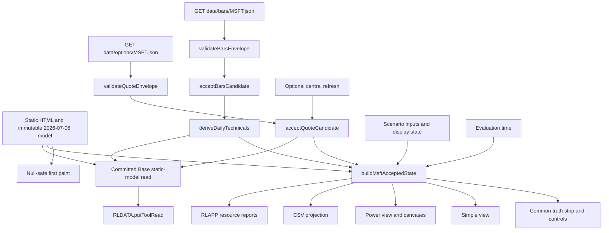

# Design: 009 MSFT July Market Refresh

## Design Brief

### Current State

`msft-july-print-model.html` is a 2,056-line, single-file, build-free FY26 Q4/FY27 scenario tool. Its model functions, presets, controls, tables, and canvases are already complete, but active market context is coupled to `SPOT = 390.49`, one `2026-07-06` label, an old 52-week range, ambiguous forward-P/E prose, and a CSV `data_as_of` row.

The repository now has two newer same-origin resources with different clocks: `data/options/MSFT.json` owns a CBOE delayed quote and quote retrieval time, while `data/bars/MSFT.json` owns adjusted daily rows, a 2026-07-13 cutoff, and a separate retrieval time. `rldata.js` owns shared cache/status/publication primitives, `rlapp.js` owns the shared status shell, and spec 002 keeps this tool under the `static-model` profile.

### Target State

Keep the fundamental model immutable as of 2026-07-06 and add one page-local accepted-state reducer around it. First paint renders the static model with null-safe market placeholders, then two parallel same-origin reads validate and independently accept quote and daily-bar evidence. One derived view model drives Simple, Power, CSV, status, and the normalized tool read.

The quote may update spot-relative comparisons only. Daily bars may update daily close and technicals only. Neither source may mutate a model input, a user-edited scenario input, the selected scenario P/E, the model cutoff, or the other source's clock.

### Patterns To Follow

- `rldata.js::putQuote`, `putBars`, `reportData`, `putToolRead`, and the strict `rl-tool-read/v1` envelope for shared reuse, scoped status, and compact owner publication.
- `rlapp.js::report` and its `quotes:*` / `bars:*` resource aggregation for the shared "Data behind this page" control.
- `options-flow-feed-lab.html::pagesUrl` and `options-structure-lab.html::fetchChainPages` for direct same-origin JSON reads with `cache: "no-store"` and no public proxy dependency.
- `etf-momentum-lab.html::applyMode` for one persisted Simple/Power mode over one compute path.
- `scripts/selftest.mjs::extractFn` for focused tests of top-level page-local pure functions.
- `tests/bond-regime-lab.spec.mjs` for a real ephemeral static server, production-page state replacement, mode parity, viewport overflow, canvas-pixel, screenshot, and accessibility assertions.
- `tests/playwright-runtime.mjs`, `playwright.config.mjs`, and `scripts/validate-node-source-lock.mjs` for the exact checkout-local Playwright 1.61.1 `system-chrome` contract.

### Patterns To Avoid

- Do not add a provider interface, market-data service, generic fetch coordinator, second cache, backend, proxy, build step, or shared-module rewrite.
- Do not use `RLDATA.ensureBars` as the page's authoritative envelope reader because it returns rows but discards the committed `asof`, `fetched`, and `src` clocks required by this feature.
- Do not retain `390.49` as an initial current spot, success fallback, or failed-cache substitute.
- Do not insert the delayed quote into the daily series or derive a daily close, moving average, or rolling high from it.
- Do not revive a page-local Finnhub input, `msftFhKey`, legacy migration, `rlApiKeys` access, a credential-bearing URL, or direct provider `fetch`.
- Do not copy current Market Brief numbers into the page. The page derives technicals from accepted rows.
- Do not duplicate model controls between Simple and Power or let either mode own a second computation.

### Resolved Decisions

- One page-local runtime object and one pure accepted-state builder are sufficient; no new foundation is created.
- `data/options/MSFT.json` is quote-owned evidence only, despite also containing option contracts and bundled bars.
- `data/bars/MSFT.json` is the only daily-technical input for this feature.
- Quote staleness is based on its absolute retrieval clock; the timezone-less provider `asof` token is preserved verbatim and is not reinterpreted as UTC, ET, or local time.
- Daily-bar staleness is evaluated from both its cutoff date and absolute retrieval time.
- Optional Finnhub refresh remains central-policy-gated. The current `rldata.js` marks Finnhub browser transport disabled, so the shipped current behavior is an explicit central-transport-unavailable state, never a local workaround.
- The current dirty credential removal is preserved as intent. Missing `RLDATA.hasKey` / `providerFetch` symbols are not recreated locally; current `credentialStatus` / `useCredential` policy remains authoritative.
- The shared `static-model` tool read uses the committed Base scenario, not persisted user-edited controls. The on-screen read and CSV use the active user scenario.
- Current cache-derived values are validation canaries, not constants. All arithmetic uses unrounded rows and rounds only at presentation/export boundaries.

### Open Questions

None blocking. A successful optional Finnhub browser refresh requires a separately authorized central RLDATA operation; this feature is complete and useful from same-origin caches while that operation remains disabled.

## Purpose And Scope

This design translates `spec.md` into an implementation-ready, static-site change for the existing MSFT tool. It covers:

- immutable fundamental-model identity and mutable user scenario state;
- quote and daily-bar envelope validation;
- source-specific staleness, monotonic acceptance, partial states, and null-safe first paint;
- daily technical derivation and spot-relative valuation;
- one Simple/Power presentation over one accepted state;
- centralized optional refresh behavior;
- CSV and strict normalized tool-read publication;
- direct consumer metadata and notes reconciliation;
- accessibility, responsiveness, security, performance, rollback, and observability; and
- scenario-driven functional and browser validation.

It does not revise fundamentals, consensus, FY26 Q4 actuals, cost-cycle evidence, provider policy, cache-generation scripts, shared APIs, another tool, or any deployment/build surface.

## Brownfield Inventory

### Existing MSFT Page

| Surface | Current Owner / Symbol | Design Treatment |
| --- | --- | --- |
| Fundamental inputs and presets | `PRESETS`, `PHASES`, existing input elements | Preserve values, formulas, ranges, and user editability. Market actions never write these elements. |
| Fundamental calculation | `calculateAnnual`, `calculateRecon`, `updateQ4`, `updateRecon` | Preserve model math. Call it with active scenario inputs for the page and committed Base inputs for the static-model tool read. |
| Existing spot state | `let SPOT = 390.49` | Replace with nullable quote state. No numeric market fallback exists before acceptance. |
| Spot-relative rendering | `o_pricevs`, `renderEV`, valuation prose | Gate every spot operation on a valid accepted quote and valid denominator. |
| Options snapshot side effect | `autoImpliedMove` writes `impMove` from `optSnaps` | Remove the write. `impMove` remains user-owned and may be persisted only as a scenario input. |
| Optional quote refresh | `fetchLive`, `setLiveStatus` | Keep a secondary central-policy-gated action. Preserve cache truth on every refusal/failure. |
| CSV | `exportScenario`, ambiguous `data_as_of` | Replace with the versioned field schema in this design. |
| Charts | `drawMsftCharts`, `drawTornadoSafe` | Draw only while Power is visible; redraw synchronously when Power becomes visible and on debounced resize. |
| Shared scripts | bottom-of-page `rldata.js`, `rlapp.js`, `rlnav.js` | Ensure execution order is RLDATA, RLAPP, page boot, then navigation; no inline model boot may race shared APIs. |

### Shared Runtime Contracts

| File | Existing Contract Used | Explicit Non-Change |
| --- | --- | --- |
| `rldata.js` | `putQuote`, `putBars`, `reportData`, `dataState`, `putToolRead`, `credentialStatus`, `useCredential` | No schema, credential policy, provider policy, fetch pipeline, or helper change. |
| `rlapp.js` | `RLAPP.report(resource, state, detail)` and shared status shell | No status-shell or settings change. |
| `rlchart.js` | canvas hit testing and tooltips already used by MSFT charts | No chart-helper change. |
| `rlticker.js` | static ticker decoration | Keep MSFT ticker text linkable through existing classes/attributes. |
| `rlnav.js` | stable route identity | No route, order, or navigation metadata change. |

### Current Committed Market Envelopes

The following observations ground the design but are not embedded as runtime constants:

| Resource | Observed Shape | Current Repository Canary |
| --- | --- | --- |
| `data/options/MSFT.json` | `{sym, spot, asof, fetched, o, bars}` | `sym=MSFT`, 1,290 contracts, 501 bundled bars; quote and clocks match the analyst spec. |
| `data/bars/MSFT.json` | `{sym, interval, range, asof, fetched, src, rows}` | `interval=1d`, `src=option-snapshot`, 500 rows; last row date matches the declared cutoff. |

The current accepted rows independently derive an adjusted close near 390.99, SMA20 near 380.55, SMA50 near 402.68, SMA200 near 440.13, and a 252-observation high near 538.66. Their unrounded relationships produce the expected bear stack and documented distances. Tests recompute these values from the file rather than asserting these prose values as constants.

## Change Boundary

### Implementation-Owned Product Changes

Only the following product surfaces may receive Feature 009 hunks during delivery:

1. `msft-july-print-model.html` for accepted state, validators, hydration, presentation, export, and publication.
2. `notes/msft-july-print-model.md` for one active two-clock handoff truth.
3. The existing `msft-july-print-model` record only in `tools.json`.
4. The existing `msft-july-print-model` record only in `index.html`.
5. Additive Feature 009 assertions in `scripts/selftest.mjs`.
6. A focused `tests/msft-july-market-refresh.spec.mjs` browser suite.

This design does not authorize edits to those files now; it defines the later implementation boundary for `bubbles.plan`.

### Protected Dirty Work

The implementer must capture pre-edit bytes or a scoped diff for every dirty file and prove that non-Feature-009 hunks remain unchanged.

| Protected Surface | Current Dirty Work That Must Survive |
| --- | --- |
| `msft-july-print-model.html` | Removed `#fhKey`; removed page-local `rlKeys`, `rlGetKey`, `rlSetKey`, and `rlMigrate`; removed `msftFhKey` migration/storage; removed direct tokenized Finnhub fetch; added central RLDATA/RLAPP intent and shared script tags. Feature 009 may reconcile missing central method names, but it must not restore any removed credential behavior. |
| `index.html` | `no-referrer`; provider-status/settings band; changed landing privacy copy; shared RLDATA/RLAPP loads; Bond Regime tool record. Only the existing MSFT record may change for Feature 009. |
| `tools.json` | The complete Bond Regime tool record. Only the existing MSFT record may change for Feature 009. |
| `scripts/selftest.mjs` | Approximately 1,017 unrelated added lines for Features 004-007 and shared contracts. Feature 009 tests must be one additive marker-bounded group; no rewrite, reorder, or repair of unrelated assertions is authorized. |
| `rldata.js`, `rlapp.js` | In-flight shared credential/status/source-envelope work. Read-only dependency for Feature 009. |

### Excluded Surfaces

- `scripts/fetch-options.mjs`, `scripts/fetch-bars.mjs`, option/bar data files, and their indexes.
- `market-brief.*`, `scripts/brief-refresh.mjs`, `rlbrief.js`, and spec 002 artifacts.
- `rldata.js`, `rlapp.js`, `rlchart.js`, `rlticker.js`, `rlnav.js`, and any shared credential policy.
- Every non-MSFT record in `tools.json` and `index.html`.
- Every test outside the new Feature 009 file and the additive Feature 009 self-test group.
- All source facts and model values treated as fundamental, consensus, Q4 actual, guidance, or cost-cycle evidence.
- All Bubbles framework-managed files and every plan/state/certification artifact.

### Containment Proof

Planning must require a pre/post path-scoped diff check. The final implementation diff must show only the six allowed surface families above, and hunk review must show:

- no reappearance of credential inputs, storage, migration, or tokenized URLs;
- no change to Bond Regime additions in either registry;
- no change to unrelated `scripts/selftest.mjs` groups; and
- no change to shared/data/brief files.

## Architecture Overview



### Smallest Viable Runtime

All Feature 009 logic remains inside `msft-july-print-model.html` as named top-level pure functions plus one controller object. No new production JavaScript or configuration file is introduced.

| Layer | Proposed Symbols | Responsibility |
| --- | --- | --- |
| Validation | `msftValidateQuoteEnvelope`, `msftValidateBarsEnvelope`, `msftValidateBarRow` | Convert untrusted same-origin JSON into closed accepted candidates or stable reason codes. |
| Derivation | `msftSma`, `msftDeriveDailyTechnicals`, `msftDistancePct`, `msftClassifyStack` | Compute daily-only technicals with no DOM, I/O, clock, or rounding side effects. |
| Acceptance | `msftShouldAcceptQuote`, `msftShouldAcceptBars`, `msftReduceResourceOutcome` | Enforce request sequence, observation monotonicity, and failure preservation. |
| Model projection | existing model functions plus `msftBuildValuationRead` | Keep model math unchanged and produce null-safe spot-dependent fields. |
| State assembly | `msftBuildAcceptedState` | Create one immutable render/export state from all owned domains and an injected evaluation time. |
| Controller | `window.MsftJulyModel` | Boot, hydrate, refresh, set mode, recompute, export, publish, and expose read-only diagnostics/testable production reducers. |
| Presentation | `msftRenderCommon`, `msftRenderSimple`, `msftRenderPower`, `msftDrawPowerCharts` | Render one state. No renderer fetches or classifies. |

### Boot Sequence And Script Order

The final page execution order is fixed:

1. Parse the complete HTML DOM.
2. Execute `rldata.js`.
3. Execute `rlapp.js`.
4. Execute `rlchart.js` before the first chart-capable render.
5. Define page-local pure functions and `window.MsftJulyModel`.
6. Run `MsftJulyModel.boot()` once.
7. Load `rlticker.js` and `rlnav.js`, with `rlapp.js` still preceding `rlnav.js`.

`boot()` performs these steps in order:

1. Capture immutable model constants and canonical Base scenario.
2. Admit one complete persisted UI/scenario record or retain the explicit HTML/Base values; never partially merge an invalid record.
3. Initialize quote and bars as `loading` with `value: null` / `rows: []`.
4. Compute and render the static model immediately. All market-dependent fields render `Unavailable`.
5. Start exactly two parallel same-origin reads.
6. Accept and render each resource independently as it settles.
7. Publish the strict static-model tool read after each accepted-state replacement.

No boot branch calls Finnhub automatically. Optional provider access is user initiated after the cache-first view exists.

## Capability Foundation Decision

### Single-Implementation Justification

G094 does not require a new foundation. This is one narrow update to one existing page and one existing concrete symbol. Shared capability foundations already exist for cache/storage/publication (`RLDATA`), resource status (`RLAPP`), chart interaction (`RLCHART`), navigation, ticker decoration, and static-model briefing policy (spec 002).

The feature does not add a second provider, adapter family, data schema family, screen route, service, connector, or reusable cross-tool contract. A new provider or market-state abstraction would duplicate those owners and create a second source of policy. The proportional design is page-local validators and reducers layered on the existing foundations.

## Accepted State Model

### State Invariants

1. The state is replaced as a complete object after every accepted resource or user action; renderers never mutate it.
2. `fundamentalModel` is immutable and always carries `asOf: "2026-07-06"`.
3. `quote` owns spot and quote clocks only.
4. `dailyBars` owns rows, close, technicals, and bar clocks only.
5. `scenarioInputs` and `display` are user-owned; market reducers receive neither by mutable reference.
6. `evaluationTime` is generated or injected for each state build and is never used as a source observation time.
7. Raw option contracts and raw bar rows do not enter CSV, tool reads, status messages, or persisted UI state.

### Canonical Runtime Shape

```js
MsftAcceptedStateV1 = {
  schemaVersion: "msft-accepted-state/v1",
  fundamentalModel: {
    toolId: "msft-july-print-model",
    asOf: "2026-07-06",
    status: "static",
    q4Status: "scenario-not-actual",
    sourceBoundary: "verified Q1-Q3 FY26 anchors plus user-editable Q4/FY27 assumptions"
  },
  quote: {
    status: "loading|available|stale|unavailable|rejected|refreshing|refresh-failed|disabled",
    valueUsd: null,
    sourceId: null,
    sourceLabel: null,
    providerAsOf: null,
    providerEpochMs: null,
    retrievedAt: null,
    orderingAtMs: null,
    requestSeq: 0,
    reasonCode: null,
    limitation: null
  },
  dailyBars: {
    status: "loading|available|stale|unavailable|rejected",
    sourceId: null,
    sourceLabel: null,
    cutoff: null,
    retrievedAt: null,
    orderingCutoff: null,
    orderingRetrievedAtMs: null,
    rowCount: 0,
    rows: [],
    reasonCode: null,
    limitation: null
  },
  technicals: {
    status: "loading|available|partial|unavailable",
    cutoff: null,
    close: null,
    sma20: null,
    sma50: null,
    sma200: null,
    high252: null,
    stack: null,
    closeVsSma50Pct: null,
    closeVsSma200Pct: null,
    closeVsHigh252Pct: null,
    unavailableReasons: {}
  },
  scenarioInputs: {
    values: {},
    selectedPreset: "base|bull|bear|custom",
    selectedCostPhase: "inflation|transition|deflation|custom",
    selectedScenarioPe: null
  },
  modelOutputs: {},
  valuation: {
    modeledFy27Eps: null,
    selectedScenarioPe: null,
    scenarioImpliedPrice: null,
    spotOverModeledFy27Eps: null,
    scenarioPriceVsSpotPct: null,
    probabilityWeightedValue: null,
    probabilityWeightedValueVsSpotPct: null,
    impliedMoveLow: null,
    impliedMoveHigh: null,
    reasonCodes: []
  },
  marketStatus: "loading|complete|partial|stale|unavailable",
  evaluationTime: "ISO-8601 absolute instant",
  display: {
    mode: "simple|power",
    heatMetric: "om|oi|eps"
  }
}
```

The implementation freezes the top-level object and its source/model projections before assigning `runtime.acceptedState`. Raw rows may be retained in a separately frozen internal resource object and omitted from a public diagnostic projection to avoid expensive deep copies on every lever movement.

### User Scenario Input Set

The accepted state captures every existing editable numeric control exactly once:

`revFY26`, `om26`, `volumeGrowth`, `priceMixGrowth`, `churn`, `fx`, `priceMargin`, `volumeMargin`, `churnMargin`, `opexIntensity`, `deltaDep`, `q3Revenue`, `q3OperatingIncome`, `q4Revenue`, `q4OperatingMargin`, `q4Capex`, `q4DaEstimate`, `consensusFY26Revenue`, `consensusFY26EbitMargin`, `ytdRevenue`, `ytdOperatingIncome`, `seasonalDeltaBps`, `otherIncome`, `taxRate`, `shares`, `fwdPE`, `pBull`, `pBase`, `pBear`, and `impMove`.

Each value must be `Number.isFinite`, inside its existing DOM `min`/`max`, and representable at the existing `step`. One invalid persisted value rejects the entire persisted record; the explicit HTML/Base scenario remains visible and no partial persisted state is applied.

### Presentation Persistence Record

Only non-sensitive scenario/presentation state is persisted:

```js
localStorage["msftJulyPrintModelV1"] = JSON.stringify({
  schemaVersion: 1,
  mode: "simple|power",
  heatMetric: "om|oi|eps",
  selectedPreset: "base|bull|bear|custom",
  selectedCostPhase: "inflation|transition|deflation|custom",
  inputs: { /* exact complete input set above */ }
});
```

There is no legacy migration and no credential field. First use defaults to Simple. A complete valid record may restore Power and scenario values. Mode persistence changes presentation only and never invokes hydration.

## Source Ownership And Temporal Policy

### Ownership Matrix

| Field Family | Sole Owner | May Update | Must Never Update |
| --- | --- | --- | --- |
| Model date, reported anchors, assumptions, formulas | Immutable page model | User actions may change editable assumptions, not the model date | Quote, bars, provider refresh, mode switch |
| Spot and quote provenance | Accepted options-cache quote or accepted central provider quote | `quote.*`, spot-dependent valuation | Scenario controls, selected P/E, bar rows, technicals, model date |
| Daily close and technicals | Accepted daily-bar envelope | `dailyBars.*`, `technicals.*` | Quote, scenario controls, model date |
| Evaluation time | State builder clock | `evaluationTime` only | Source as-of/retrieval fields |
| Scenario controls | User/preset/phase actions | `scenarioInputs`, model outputs | Quote/bar clocks and values |
| Display mode | User mode action | `display.mode`, visibility, canvas redraw | Data, model, scenario values |

### Source Identities

- Quote cache: `sourceId = "same-origin-options-snapshot:cboe-delayed"`; visible label `Cached delayed quote`.
- Daily bars: `sourceId = "same-origin-bars-snapshot:" + envelope.src`; visible label `Daily adjusted bars` with the exact `src` token in Power.
- Optional central refresh: source identity comes only from a successful sanitized central RLDATA result. The page cannot name Finnhub as successful unless that result identifies Finnhub.
- Fundamental: `sourceId = "msft-static-model:2026-07-06"`.

### Staleness Policy

Staleness never changes or discards a valid value; it changes status and limitation text.

| Resource | Available Window | Stale Condition | Rejection Condition |
| --- | --- | --- | --- |
| Quote cache | `evaluationTime - fetched <= 24 hours` | Valid envelope older than 24 hours | Invalid value/symbol/shape, absolute retrieval more than 5 minutes after evaluation, provider calendar date after retrieval UTC calendar date, or unusable timestamps |
| Daily bars | retrieval age `<= 48 hours` and cutoff age `<= 4 calendar days` | Either valid age exceeds its bound | Invalid envelope/rows/symbol/interval, last-row UTC date differs from cutoff, absolute retrieval more than 5 minutes after evaluation, or cutoff after evaluation UTC date |
| Central quote | Central result's declared policy plus page numeric/time validation | Central result explicitly reports stale | Missing/disabled transport, invalid sanitized quote, future timestamp, or provider error |

The four-calendar-day bar window tolerates a normal weekend without claiming exchange-calendar knowledge. The page always renders the actual cutoff, so even an `available` bar resource is never called live or assigned the page date.

The timezone-less quote `providerAsOf` is validated lexically as `YYYY-MM-DDTHH:mm:ss` with optional fractional seconds and displayed unchanged. It is not passed through `toISOString()` and does not drive absolute age. Its calendar date must not be later than the absolute retrieval date's UTC calendar date. This detects obvious future metadata without inventing a timezone.

### Aggregate Market Status

| Quote | Bars | Aggregate |
| --- | --- | --- |
| loading + loading | any unsettled initial combination | `loading` |
| available + available | both accepted within policy | `complete` |
| stale + available, available + stale, stale + stale | both accepted and at least one stale | `stale` |
| accepted + unavailable/rejected, or reverse | exactly one accepted | `partial` |
| unavailable/rejected + unavailable/rejected | neither accepted | `unavailable` |

`refreshing` or `refresh-failed` affects the quote row but does not erase an accepted quote. Aggregate status remains based on the retained accepted quote and bars, with the refresh receipt shown separately.

## Cache And Provider Contracts

### Same-Origin HTTP Requests

The page issues exactly these first-load requests in parallel:

| Method | Path | Cache Mode | Timeout | Consumer |
| --- | --- | --- | --- | --- |
| `GET` | `data/options/MSFT.json` | `no-store` | 9 seconds | quote envelope validator |
| `GET` | `data/bars/MSFT.json` | `no-store` | 9 seconds | bars envelope validator |

Both use a small page-local `fetchMsftJson` helper with `AbortController`. It has no proxy chain, provider selection, retry loop, or fallback URL. HTTP non-2xx, timeout, network error, and JSON parse error become resource-specific reason codes.

### Quote Envelope

Required input:

```js
{
  sym: "MSFT",
  spot: Number,
  asof: "provider wall-clock token",
  fetched: "absolute ISO-8601 instant",
  o: Array // non-empty; proves this is the expected options snapshot contract
}
```

Validation rules:

1. Root is a plain object.
2. `sym` is exactly `MSFT` after no coercion.
3. `spot` is a finite number greater than zero.
4. `asof` matches the timezone-less provider timestamp grammar and remains an opaque display token.
5. `fetched` parses to a finite absolute instant and passes future/staleness checks.
6. `o` is a non-empty array. The page does not parse or export its contracts.
7. `bars`, when present, is ignored by Feature 009 so it cannot become a second daily-series source.

Stable quote reason codes are `MSFT-QUOTE-HTTP`, `MSFT-QUOTE-TIMEOUT`, `MSFT-QUOTE-JSON`, `MSFT-QUOTE-SHAPE`, `MSFT-QUOTE-SYMBOL`, `MSFT-QUOTE-PRICE`, `MSFT-QUOTE-PROVIDER-ASOF`, `MSFT-QUOTE-RETRIEVED`, `MSFT-QUOTE-FUTURE`, and `MSFT-QUOTE-EMPTY`.

### Daily-Bar Envelope

Required input:

```js
{
  sym: "MSFT",
  interval: "1d",
  range: String,
  asof: "YYYY-MM-DD",
  fetched: "absolute ISO-8601 instant",
  src: String,
  rows: [{ t, o, h, l, c, v }]
}
```

Validation rules:

1. Root is a plain object; `sym === "MSFT"`; `interval === "1d"`.
2. `range` and `src` are non-empty strings.
3. `asof` is a real ISO calendar date and not after the evaluation UTC date.
4. `fetched` is an absolute finite instant, no more than 5 minutes after evaluation.
5. `rows` is non-empty.
6. Every row has finite `t`, `o`, `h`, `l`, `c`, and `v`; prices are positive; volume is non-negative; `l <= min(o,c) <= max(o,c) <= h` is not required because adjusted close may not lie inside unadjusted OHLC, but `h >= l` is required.
7. Row timestamps are strictly increasing and unique. The page does not silently sort, deduplicate, forward-fill, or repair them.
8. The UTC date of the final row timestamp equals envelope `asof`.

Stable bar reason codes are `MSFT-BARS-HTTP`, `MSFT-BARS-TIMEOUT`, `MSFT-BARS-JSON`, `MSFT-BARS-SHAPE`, `MSFT-BARS-SYMBOL`, `MSFT-BARS-INTERVAL`, `MSFT-BARS-ASOF`, `MSFT-BARS-RETRIEVED`, `MSFT-BARS-FUTURE`, `MSFT-BARS-EMPTY`, `MSFT-BARS-ROW`, `MSFT-BARS-ORDER`, and `MSFT-BARS-CUTOFF`.

### Shared Cache And Status Integration

After page-local acceptance, and only after acceptance:

- call `RLDATA.putQuote("MSFT", valueUsd, null, sourceId)` for sibling reuse;
- call `RLDATA.putBars("MSFT", "1d", rows, sourceId)` for append-only sibling reuse;
- keep the page's envelope clocks in its own accepted state because the legacy shared bucket does not preserve both clocks; and
- report exact source clocks through `RLAPP.report` detail.

The shared write is an integration side effect, not the page's source of truth for the current state. A shared-cache write failure does not reclassify an already validated same-origin resource, but it is reported as a scoped shared-cache warning in Power and never as successful shared reuse.

### Optional Central Finnhub Refresh

The button is secondary and never runs during boot.

1. Read `RLDATA.credentialStatus("finnhub")`.
2. If state is `disabled`, render `Central Finnhub transport disabled - cache view retained` and report a scoped unavailable resource.
3. If state is `unconfigured`, render `Finnhub not configured - cache view retained` plus `index.html#data-settings`.
4. If state is `configured`, call only the central operation exposed by `RLDATA.useCredential`; never construct a provider URL in the page.
5. If the central contract returns no successful sanitized quote envelope, retain the accepted cache quote and report the central reason code.
6. If an authorized central operation eventually returns a sanitized MSFT quote, run it through the same finite/symbol/time candidate validator and monotonic acceptance reducer before replacing quote-owned fields.

The current shared policy has no authorized Finnhub operation, so steps 2-3 are the current production path. This is intentional fail-closed behavior, not an implementation gap. Feature 009 does not edit shared policy to make the button succeed.

## Monotonic And Out-Of-Order Acceptance

### Quote Request Identity

The controller increments `runtime.nextQuoteRequestSeq` for every quote-producing operation, including the initial options-cache request and each optional central refresh. Every candidate carries that sequence.

Acceptance rules:

1. A candidate may not replace an accepted quote with a greater `requestSeq`.
2. If both candidate and accepted quote have absolute provider observation epochs, the candidate epoch must be greater, or equal with a later/equal retrieval time.
3. Otherwise `orderingAtMs` is the absolute retrieval time, and it must be greater than or equal to the accepted ordering time.
4. A failed request never advances the accepted sequence and never clears a prior accepted quote.
5. An older request may supply a baseline while a newer request is pending only if no newer candidate has yet been accepted. Once the newer candidate is accepted, the older completion is ignored.

This permits cache truth to remain useful if a later provider attempt fails while preventing a late cache response from overwriting a successfully accepted refresh.

### Daily-Bar Ordering

A bars candidate replaces accepted bars only when:

1. its cutoff date is later; or
2. its cutoff is equal and its retrieval time is later or equal.

An earlier cutoff can never replace a later accepted series, even if fetched later. No mode or scenario action starts a bar request.

### Failure Preservation

Resource failures update `lastAttempt`/receipt state while leaving the last accepted value untouched. The UI distinguishes:

- `Unavailable`: no accepted value exists;
- `Rejected`: the current candidate failed validation and no accepted value exists;
- `Stale`: a valid accepted value is older than policy;
- `Refresh failed - cached value retained`: a newer attempt failed after an accepted value existed.

## Daily Technical Algorithms

All derivations use only the accepted, strictly ascending daily-bar rows and full unrounded adjusted close `row.c` values.

### Latest Daily Close

For at least one valid row:

```text
dailyClose = rows[rows.length - 1].c
dailyCutoff = envelope.asof
```

The delayed quote is never appended, substituted, or averaged into the rows.

### Simple Moving Average

For window `n` in `{20, 50, 200}`:

$$
SMA_n = \frac{1}{n}\sum_{i=N-n}^{N-1} close_i
$$

Return `null` with reason `insufficient-<n>-observations` when `N < n`. Return `null` with reason `invalid-close-in-window` if any selected close is not finite and positive, even though envelope validation should already prevent that branch.

### 252-Observation High

Exactly 252 observations are required:

$$
High_{252} = \max(close_{N-252}, \ldots, close_{N-1})
$$

When `N < 252`, `high252` and `closeVsHigh252Pct` are unavailable. The tool must not rename a shorter available maximum a 52-week high.

### Stack Classification

The stack uses the repository's existing 20/50/200 convention:

- `bull-stack` when $SMA_{20} > SMA_{50} > SMA_{200}$;
- `bear-stack` when $SMA_{20} < SMA_{50} < SMA_{200}$;
- `tangled` when all three exist and neither strict ordering holds; and
- `null` / `unavailable` when any required average is unavailable.

Equal averages produce `tangled`, not a directional stack.

### Signed Distances

For a finite positive level $L$:

$$
distancePct(close,L) = \left(\frac{close}{L} - 1\right) \times 100
$$

The same formula applies to SMA50, SMA200, and High252. Values below a level are negative. No absolute-value conversion occurs in state or export; prose may say `27.41% below` while retaining the signed value in Power/CSV/read data.

### Precision And Rounding

- Compute and store every value at JavaScript number precision.
- Quote and daily price/level headlines use two decimals.
- Simple prose may show moving-average/high levels to one decimal when space is constrained, but its underlying `data-value` and tooltip use the two-decimal format.
- Distances use two decimals and retain sign.
- Stack is categorical and unrounded.
- CSV exports raw numeric strings produced from accepted state, not display-formatted currency or percentages.
- Tests derive expected values from current rows, compare unrounded results within `1e-10`, then test formatting separately. They do not embed current prices or averages as expected literals.

## Valuation And Scenario Behavior

### Model-Only Outputs

`calculateAnnual` and all Q4/FY27 model formulas remain independent of spot. They must produce the same outputs before hydration, after hydration, after failed refresh, and across mode switches for the same scenario inputs.

### Spot-Dependent Projection

`msftBuildValuationRead(model, quote, probabilities, impliedMovePct)` applies these rules:

1. A usable spot requires quote status `available` or `stale` and finite `valueUsd > 0`.
2. A usable modeled EPS requires finite `EPS27 > 0`.
3. `spotOverModeledFy27Eps = spot / EPS27` only when both are usable; otherwise `null` with `quote-required` or `positive-modeled-eps-required`.
4. `scenarioPriceVsSpotPct = (model.implied / spot - 1) * 100` only when spot and implied price are finite and positive.
5. Probability-weighted scenario price remains computable without spot because it is model-only. Its return versus spot is unavailable without spot.
6. Implied-move low/high require usable spot and finite non-negative user-owned `impMove`; otherwise both are unavailable.
7. Risk-neutral scenario odds require usable spot, valid option IV evidence, and monotone scenario prices. Missing IV/spot leaves the odds unavailable without affecting model probabilities.

The visible label for the market multiple is exactly `Spot / modeled FY27E EPS`, qualified by `Model-relative - not consensus forward P/E`.

### User Ownership

- Cache hydration and provider refresh never assign to any input element.
- `fwdPE` remains the selected scenario P/E and is never replaced by `spot / EPS27`.
- `impMove` remains user-owned; the existing `autoImpliedMove` cache write is removed.
- Preset and cost-phase actions may change their existing declared model controls, mark other controls `custom` when edited, and trigger one local recompute.
- Mode changes change no scenario field.

### Null-Safe Rendering

Every formatter that may receive market/derived state begins with `Number.isFinite(value)`. Missing values render visible `Unavailable`, not `$0`, `0.0%`, `NaN`, `Infinity`, a stale number, or an unlabeled dash.

Before quote acceptance:

- `o_pricevs` says `Unavailable - delayed quote required`;
- market multiple is unavailable;
- spot-relative scenario returns and implied-move band are unavailable;
- model implied prices, FY27 EPS, scenario probabilities, and all non-spot outputs remain visible.

Before bars acceptance, the technical group says `Daily-bar technicals unavailable` or `Loading daily bars`; no default trend or level is shown.

## UI Composition

### DOM Structure

The page keeps one route and one set of controls:

```text
body
  nav.rlnav
  header#msftHeader
    h1
    #modeSeg[role=tablist]
      #simpleTab[role=tab][aria-controls=simpleView]
      #powerTab[role=tab][aria-controls=powerView]
    #pageActions
      #btnLive
      #btnCsv
  #truthStrip[aria-label="Model and market provenance"]
    #modelTruth
    #quoteTruth
    #barsTruth
    #evaluationTruth
  main#msftWorkspace
    #scenarioControls
      .simple-core
      .power-only
    #simpleView[role=tabpanel][aria-labelledby=simpleTab]
      #simpleMarketRead
      #simpleScenarioRead
      #simpleStatus
    #powerView[role=tabpanel][aria-labelledby=powerTab]
      #provenanceTable
      #dailyTechnicals
      existing detailed result panels
      existing canvases and equivalent tables
  #marketAnnouncements[role=status][aria-live=polite]
  footer
```

Inputs are not duplicated. Existing control groups receive `simple-core` or `power-only` presentation classes. Existing detailed output panels live in `#powerView`; Simple receives compact projections with stable `data-state-field` hooks that read the same accepted state.

### Component Contract

| Component | State Input | Events | Side Effects |
| --- | --- | --- | --- |
| `ModeSegment` | `display.mode` | click, Left/Right Arrow, Home/End, Enter/Space | Persist display record; toggle visibility; redraw Power canvases when shown. No fetch/recompute. |
| `TruthStrip` | model, quote, bars, evaluation | none | Polite aggregate announcement after each resource settles. |
| `ScenarioControls` | `scenarioInputs` | input, preset, phase | Persist accepted controls; recompute model/state once; no fetch. |
| `SimpleMarketRead` | accepted state valuation/technicals | none | Compact truthful read with source qualifiers. |
| `PowerProvenance` | accepted source/resource states | none | Exact clocks, status, reason, row count, formulas, limitations. |
| `RefreshQuoteAction` | quote status, central policy status | click | One central quote attempt; never bars/fundamental fetch. |
| `CsvAction` | accepted state | click | Build/download versioned CSV snapshot; no state mutation except export receipt. |
| `PowerCharts` | accepted state and model outputs | mode show, model recompute, resize | Canvas draw only; no classification or fetch. |

### Simple Default

On first use, `body` has no `power` class, `simpleTab` is selected, `simpleView.hidden = false`, and `powerView.hidden = true`. Simple shows:

- persistent `STATIC MODEL - as of 2026-07-06`;
- quote value/status/source/provider as-of when accepted;
- daily technical stack and cutoff when supported;
- `Spot / modeled FY27E EPS` when supported;
- scenario implied price and signed comparison when supported;
- core controls: preset, cost phase, Q4 revenue, Q4 operating margin, volume growth, incremental depreciation, and selected P/E; and
- exact partial/stale/unavailable language without hiding the useful model.

### Power Mode

Power adds:

- the complete existing control set and all existing model panels;
- provenance rows for model, quote, bars, and evaluation;
- daily close, SMA20/50/200, High252, stack, signed distances, observation counts, and unsupported-metric reasons;
- exact valuation arithmetic and distinction between selected scenario P/E and market/model-relative multiple;
- source limitations and optional-refresh receipt; and
- all existing charts/tables.

### Mode Transition And Canvas Redraw

`setMode(mode)` performs no I/O and does not call the model calculator. It:

1. validates `simple|power`;
2. updates `body.power`, selected classes, `aria-selected`, `hidden`, and `inert`;
3. persists mode;
4. when entering Power, synchronously calls `msftDrawPowerCharts(runtime.acceptedState)` after visibility changes; and
5. leaves focus on the selected tab.

Power chart functions return early when Power is hidden. Debounced resize redraws only if Power is visible. Canvas pixel tests must prove the first Power transition draws nonblank content without a data request.

## Accessibility And Responsive Design

### Keyboard And Semantics

- `#modeSeg` is a tablist; each mode button is a tab with `aria-controls` and correct `aria-selected`.
- Left/Right arrows cycle tabs; Home/End move to first/last; Enter/Space selects. Focus remains on the selected tab.
- Inactive view uses both `hidden` and `inert` so it leaves layout, focus order, and the accessibility tree.
- Every input keeps an explicit label. Range controls expose min, max, value, and unit through native semantics and an updated output label.
- Refresh uses `aria-busy` and disabled only for the active request. Failure does not move focus.
- Status uses text plus state words; color is supplemental.
- Source timestamps are visible text, copyable, and not tooltip-only.
- Every ticker remains decorated by `rlticker.js`; every dynamic metric has a contextual tooltip through existing Research Lab rules.

### Charts And Tables

- Each canvas retains a concise `aria-label` and points to an adjacent complete table/description.
- Hover tips are supplemental. Every plotted value and implication is available in DOM text/table form.
- Hidden canvases are not drawn.
- Reduced-motion mode disables nonessential transitions; no animation conveys state.
- Heatmap cells include row/column context and a text value independent of color.

### Responsive Rules

- At `>= 1200px`, Simple uses up to four stable metric tracks; Power uses the existing control/evidence split.
- At `761-1199px`, metric and control groups use two tracks.
- At `<= 760px`, truth rows, controls, metrics, and actions stack in DOM order.
- The truth strip uses `overflow-wrap: anywhere` for source/time tokens.
- No body-level horizontal scroll is permitted at 320, 390, 768, or 1440 CSS pixels.
- Provenance and dense model tables use labeled contained scrollers; controls/buttons never live inside those scrollers.
- Loading/error rows reserve stable minimum height to prevent first-paint layout jumps.
- Canvases use bounded width and height; text never overlays another component.

## CSV Contract

### File Shape

The download remains a two-column CSV with header `field,value` and deterministic row order. Schema row:

```text
schema_version,msft-july-market-refresh/v1
```

Required provenance rows:

```text
tool_id
model_as_of
model_status
q4_status
evaluation_time
exported_at
display_mode
market_status
quote_status
quote_value_usd
quote_source_id
quote_provider_as_of
quote_retrieved_at
quote_reason_code
daily_bars_status
daily_bars_source_id
daily_bars_cutoff
daily_bars_retrieved_at
daily_bars_row_count
daily_bars_reason_code
```

Required technical rows:

```text
daily_close_usd
sma20_usd
sma50_usd
sma200_usd
high252_usd
ma_stack
close_vs_sma50_pct
close_vs_sma200_pct
close_vs_high252_pct
```

Scenario rows are emitted as `scenario_<inputId>` for the exact complete input set. Output rows include the existing FY26/FY27/Q4/reconciliation outputs plus:

```text
selected_scenario_pe
scenario_implied_price_usd
spot_over_modeled_fy27_eps
scenario_price_vs_spot_pct
probability_weighted_value_usd
probability_weighted_value_vs_spot_pct
```

There is no `data_as_of` row. Unavailable values are empty while status/reason rows remain populated. Numeric values are raw finite state values, not localized display strings. CSV generation snapshots the current accepted state once and never fetches or recomputes from different inputs during serialization.

## Normalized Tool Read Contract

### Top-Level Envelope

The page publishes the existing strict shape:

```js
{
  contractVersion: "rl-tool-read/v1",
  id: "msft-july-print-model",
  availability: "current|stale|unavailable",
  asOf: "2026-07-06",
  read: String,
  metrics: MsftStaticModelMetricsV1,
  deepLink: "msft-july-print-model.html#simple",
  computedAt: evaluationTime,
  freshUntil: null
}
```

If the committed Base model cannot compute, top-level `availability` is `unavailable`, `asOf` is `null`, and no numeric model/valuation metrics are included. Under normal operation:

- `current` means the static read was computed and both market resources are accepted within their own policies; it does not mean the fundamental model is current.
- `stale` means the static model computed but market evidence is stale, partial, or unavailable.

The one-line `read` always starts with `Static MSFT model as of 2026-07-06` and names the market state. It never says the model was refreshed or confirmed.

### Metrics Shape

```js
MsftStaticModelMetricsV1 = {
  schemaVersion: "msft-static-model-read/v1",
  profile: "static-model",
  model: {
    asOf: "2026-07-06",
    scenarioBasis: "committed-base",
    q4Status: "scenario-not-actual",
    activeUserScenarioIncluded: false
  },
  market: {
    status: "complete|partial|stale|unavailable",
    quote: {
      status, valueUsd, sourceId, providerAsOf, retrievedAt, reasonCode
    },
    dailyBars: {
      status, cutoff, retrievedAt, sourceId, rowCount, reasonCode
    }
  },
  valuation: {
    modeledFy27Eps,
    committedScenarioPe,
    scenarioImpliedPriceUsd,
    spotOverModeledFy27Eps,
    scenarioPriceVsSpotPct,
    basis: "model-relative-not-consensus"
  },
  technicals: {
    status, cutoff, close, sma20, sma50, sma200, high252, stack,
    closeVsSma50Pct, closeVsSma200Pct, closeVsHigh252Pct
  },
  recommendationEligible: false,
  marketAggregationEligible: false,
  limitations: [
    "Static fundamental model; market evidence does not re-evaluate fundamentals",
    "FY26 Q4 remains a scenario until a separately sourced post-print analysis",
    "Quote is delayed and daily technicals use a separate cutoff"
  ]
}
```

Unavailable numeric fields are `null`, never zero. The read includes no credential, raw option contract, raw bar row, localStorage value, active user control set, provider error body, consensus claim, target price, Q4 actual, or investment action.

### Static-Model Enforcement From Spec 002

- Newer market timestamps never advance `model.asOf`.
- The shared brief may describe dated quote/bar context and committed-Base model-relative valuation only.
- `recommendationEligible` and `marketAggregationEligible` remain false.
- A partial/stale market state remains partial/stale in the tool read.
- Final aggregation cannot count quote and bar technicals as independent fundamental confirmation.
- No owner consumer may recompute Microsoft fundamentals or promote FY26 Q4 scenario fields to actuals.

## Registry And Notes Integration

### Registry Records

Only the existing MSFT records in `tools.json` and `index.html` change. They retain:

- id `msft-july-print-model`;
- file `msft-july-print-model.html`;
- notes `notes/msft-july-print-model.md`;
- status `live`;
- existing title/nav identity; and
- `static-model` briefing classification wherever that classification is already owned.

The delivered date, blurb, and tags describe cache-first delayed quote, daily technicals, separate model/market clocks, and Simple/Power. They must not say live fundamentals, current consensus, FY26 Q4 actuals, or official current close.

`rlnav.js` needs no change because identity/path/order do not change.

### Notes Reconciliation

`notes/msft-july-print-model.md` must expose one active truth:

1. Fundamental analysis last run: 2026-07-06.
2. FY26 Q4 remains a scenario; scheduled print remains 2026-07-29.
3. Latest verified repository quote and bar snapshots are separate records with their exact clocks/status/source.
4. The active notes remove contradictory claims that no live/cache price path exists and remove the obsolete hard-coded-current instruction.
5. Existing fundamental and cost-cycle sections are not reverified or redated by this feature.
6. Validation commands are updated to include the focused Feature 009 test surfaces without rewriting unrelated test guidance.

## Consumer Impact

| Consumer | Contract After Feature 009 | Required Verification |
| --- | --- | --- |
| Existing scenario user | Same formulas and controls; new source-qualified market context | Input snapshot before/after hydration and mode switches is byte-equivalent. |
| Simple user | Default concise model/market read | First paint, complete/partial/stale/failure states, keyboard mode control. |
| Power reviewer | Exact clocks, derivations, reasons, tables, canvases | Provenance parity, nonblank canvases, text equivalents. |
| CSV user | Versioned reconstructable accepted state | Field inventory, no `data_as_of`, no static fallback. |
| `RLDATA.toolRead` | Strict static-model read based on committed Base | Schema acceptance, no local scenario/secret/raw payload, static restrictions. |
| Market Brief / spec 002 | Source-qualified context only | No recommendation eligibility, no fundamental freshening, no Q4 actual. |
| `tools.json` / `index.html` | Synchronized MSFT discovery metadata | Exact MSFT parity and preserved Bond Regime/unrelated records. |
| `rlnav.js` | Existing stable route | No diff and link remains valid. |
| Shared cache users | May receive accepted MSFT quote/bars through existing RLDATA writes | Existing RLDATA canary remains unchanged; no shared API mutation. |

## Authorization Matrix

Research Lab has no account roles or server authorization. Access is constrained by source and action ownership:

| Surface / Action | Public Page User | Central RLDATA Policy | Tool Page |
| --- | --- | --- | --- |
| Read same-origin quote cache | Allowed | Not required | Validates and accepts quote-owned fields only |
| Read same-origin daily bars | Allowed | Existing shared cache may receive rows | Validates and derives daily technicals |
| Edit scenario controls | Allowed, browser local | Not involved | Mutates scenario state only |
| Persist scenario/mode | Allowed, non-sensitive local state | Not involved | No credentials or positions |
| Request Finnhub refresh | User may activate control | Must authorize provider/document/operation and transport | Cannot collect credential or bypass refusal |
| Export CSV | Allowed, local download | Not involved | Exports accepted state only |
| Publish tool read | Automatic local shared-cache write | `RLDATA.putToolRead` validates envelope | Publishes committed Base static-model projection |
| Change fundamentals/Q4 status | Not authorized by this feature | Not applicable | Immutable |

## Security Privacy And Educational Boundary

- No credential input, storage, migration, URL parameter, query token, raw header, log value, CSV field, tool-read field, or DOM copy is allowed.
- Optional provider transport is central-only and disabled when policy is not approved.
- Same-origin JSON is untrusted input and passes strict shape, numeric, symbol, date, and ordering validation before use.
- Provider/network error bodies are not inserted into the DOM. Visible errors come from a closed reason-code-to-copy map and use `textContent`.
- Dynamic source labels and timestamps use `textContent`; existing model-generated HTML remains limited to model-owned controlled strings.
- Raw option contracts and bar rows remain in memory only as needed and are not persisted by Feature 009 outside existing RLDATA behavior.
- The page stores scenario assumptions and display mode only. It stores no position, size, basis, P&L, account, identity, or personalized recommendation.
- Existing educational/not-investment-advice language remains visible in both modes.
- Model outputs remain scenarios; technical labels remain descriptive; no buy/sell/execute language is introduced.

## Observability And Status Design

### Shared Resource Reports

| Resource Id | States | Required Detail |
| --- | --- | --- |
| `quotes:MSFT:cache` | `refreshing`, `fresh`, `stale`, `missing`, `error` | label, providerAsOf, retrievedAt, sourceId, reasonCode |
| `bars:MSFT:1d` | `refreshing`, `fresh`, `stale`, `missing`, `error` | label, cutoff, retrievedAt, sourceId, rows, reasonCode |
| `quotes:MSFT:finnhub` | `refreshing`, `fresh`, `stale`, `missing`, `error` | central policy state/reason, accepted source clocks; never a credential |
| `toolread:msft-july-print-model` | `ready` or `error` | profile, marketStatus, modelAsOf, reasonCode |

The page calls `RLAPP.report`, which delegates to `RLDATA.reportData`. Page-local visible rows are more precise than the shared aggregate and use the exact UX labels from the spec.

### Evaluation Receipts

Power exposes:

- model identity and model as-of;
- quote status, value, provider as-of, retrieval, and source;
- bars status, cutoff, retrieval, source, row count;
- technical metric availability/reasons;
- evaluation time;
- optional refresh attempt state/reason; and
- tool-read publication status.

No console message is required for normal state. Unexpected programming errors may use `console.error` with a stable code and no payload/credential. Expected missing/stale/rejected states are product state, not console errors.

## Failure Handling

| Failure | Accepted-State Result | User Result |
| --- | --- | --- |
| Both same-origin requests pending | Static model + loading quote/bars | Useful first paint, no market arithmetic |
| Quote 404/timeout/invalid | Quote unavailable/rejected | Bars and model continue; no 390.49 fallback |
| Bars 404/timeout/invalid | Bars/technicals unavailable/rejected | Quote and model comparison continue |
| Both fail | Market unavailable | Full static model remains; optional central status visible |
| Quote stale | Valid quote retained with stale status | Exact provider/retrieval clocks; no live/current label |
| Bars stale | Valid rows/technicals retained with stale status | Exact cutoff; no page-date relabeling |
| Insufficient bars | Supported metrics remain; unsupported metrics null | Per-metric `insufficient history` |
| Quote/bar values disagree | Both retained independently | `Different observation windows - no merged price` |
| Provider disabled/unconfigured | Cache state unchanged | Central reason and Data settings link |
| Provider/network/validation failure | Last accepted quote unchanged | `Refresh failed - cached delayed quote retained` or quote unavailable |
| Older response settles late | Candidate ignored | No visible regression in accepted clocks/value |
| Shared cache write fails | Page accepted state retained | Scoped Power warning; no false shared-ready report |
| Tool-read rejection | Page remains usable | Scoped publication error; no malformed read stored |
| CSV construction/download fails | Accepted state unchanged | Scoped export failure; button restored |

## Performance Design

- First load performs two same-origin GETs in parallel and no provider request.
- Quote validation is O(1) with a non-empty options-array check; it does not map 1,290 contracts.
- Bar validation and technical derivation are O(N) over the current 500-row file and O(252) for rolling calculations.
- Scenario input changes run existing model math and reuse accepted market state; no JSON parse or fetch occurs.
- Mode changes perform visibility updates and, on Power entry, canvas redraw only.
- Accepted source objects are reused across scenario recomputes; rows are not cloned on every slider event.
- Resize drawing remains debounced. Resource fetches have a 9-second abort timeout and no retry chain.
- No new package/runtime dependency or application build is introduced.

## Configuration Migrations And Publication

### Configuration

No runtime configuration is added. Source paths, tool id, symbol, model date, and staleness policy are page constants because this is one concrete static tool, not a configurable provider foundation.

### Local State Migration

There is no migration from tool-specific credential or options-cache state. The new `msftJulyPrintModelV1` record is admitted only at schema version 1. Existing unrelated localStorage keys are neither read nor modified. The old `msftFhKey` path remains removed.

### Data Migration

None. Existing same-origin JSON files are read-only inputs. No cache generation or data rewrite occurs.

### Publication Order

Implementation should land page behavior and tests before synchronizing notes and the two MSFT registry records. Registry publication occurs only when route behavior, static-model tool read, and focused tests are coherent. No route rename or registry reorder is involved.

## Technical Scenarios

### BS-009-001: Cache-First First View

```gherkin
Scenario: The production page opens with valid same-origin MSFT caches
  Given GET data/options/MSFT.json returns a valid MSFT quote envelope
  And GET data/bars/MSFT.json returns a valid MSFT 1d envelope
  And RLDATA credentialStatus for Finnhub is disabled or unconfigured
  When msft-july-print-model.html boots
  Then the static model renders before either request settles
  And both resources are accepted independently after validation
  And no provider request occurs
  And fundamentalModel.asOf equals 2026-07-06
```

### BS-009-002: Separate Clocks

```gherkin
Scenario: Quote and bars expose distinct source clocks
  Given the accepted quote carries providerAsOf and quote retrievedAt
  And the accepted bars carry a different cutoff and bars retrievedAt
  When the truth strip and Power provenance table render
  Then model as-of, quote provider as-of, quote retrieval, bar cutoff, bar retrieval, and evaluation time occupy distinct fields
  And no generic data_as_of or page-wide live label exists
```

### BS-009-003: Spot Reprices Only The Existing Scenario

```gherkin
Scenario: A valid quote is accepted with positive modeled FY27E EPS
  Given all scenario inputs are snapshotted before acceptance
  When acceptQuoteCandidate commits a valid positive spot
  Then Spot / modeled FY27E EPS and scenario price versus spot recompute
  And every scenario input remains byte-equivalent
  And selectedScenarioPe remains the user's fwdPE
  And the multiple is labeled model-relative not consensus
```

### BS-009-004: User Edits Survive Refresh

```gherkin
Scenario: Cache or optional quote completion follows user edits
  Given the user changed Q4 revenue, FY27 depreciation, and selected P/E
  When a quote outcome is accepted or rejected
  Then those exact input values remain selected and persisted
  And only quote-owned state and spot-dependent derived fields may differ
```

### BS-009-005: Daily Technicals Use Daily Bars

```gherkin
Scenario: Quote and latest daily close differ
  Given accepted bars contain at least 252 valid observations
  And a newer delayed quote has a different price
  When deriveDailyTechnicals executes
  Then close, SMA20, SMA50, SMA200, High252, stack, and distances equal calculations over daily rows only
  And the last row count and cutoff are unchanged
  And no synthetic row equals the delayed quote
```

### BS-009-006: Quote Missing

```gherkin
Scenario: Quote resource fails while bars are accepted
  Given the quote request returns HTTP 404 or an invalid envelope
  And the bars envelope is valid
  When both outcomes settle
  Then marketStatus is partial
  And quote value and spot-dependent fields are unavailable
  And technicals remain available
  And 390.49 appears in no active current-market field
```

### BS-009-007: Bars Missing

```gherkin
Scenario: Bars resource fails while quote is accepted
  Given the quote envelope is valid
  And the bars request returns HTTP 404 or an invalid envelope
  When both outcomes settle
  Then marketStatus is partial
  And quote/model comparisons remain available
  And every daily technical field is unavailable with a scoped reason
```

### BS-009-008: Stale Or Malformed Resource

```gherkin
Scenario: One candidate is stale and another is malformed
  Given the quote envelope is valid but older than quote policy
  And the bars envelope contains wrong-symbol or out-of-order rows
  When validators and reducers execute
  Then the quote is retained and labeled stale with original clocks
  And bars are rejected with the exact reason code
  And the static model renders without exception or neutral technical substitutes
```

### BS-009-009: Central Optional Refresh

```gherkin
Scenario: The user requests Finnhub refresh under current central policy
  Given the cache-first state is already visible
  And RLDATA reports Finnhub disabled or unconfigured
  When the user activates Refresh quote
  Then no direct provider fetch and no credential input occurs
  And the cache-backed state is retained
  And the page reports the central reason and Data settings link
```

### BS-009-010: Failed Or Out-Of-Order Refresh

```gherkin
Scenario: A newer quote is accepted before an older request settles
  Given request sequence 2 has produced an accepted quote
  When request sequence 1 later returns a valid but older candidate
  Then the accepted quote remains sequence 2
  And a later failed request records a failure receipt without clearing it
  And bars, model inputs, and model date remain unchanged
```

### BS-009-011: Simple Power Parity

```gherkin
Scenario: The user switches modes after hydration and edits
  Given one accepted state drives the page
  When the user changes Simple to Power and back with keyboard and pointer input
  Then data-bound spot, stack, valuation, and clocks match in both modes
  And no network request is added
  And controls remain unchanged
  And Power canvases redraw nonblank when made visible
```

### BS-009-012: Reconstructable CSV

```gherkin
Scenario: The user exports a partial or complete accepted state
  Given one state snapshot is visible
  When buildMsftCsvRows and download execute
  Then schema_version is msft-july-market-refresh/v1
  And model, quote, bars, evaluation, export, scenario, and output fields are separate
  And unavailable values are empty with statuses/reasons present
  And no data_as_of or old static spot row exists
```

### BS-009-013: Static-Model Tool Read

```gherkin
Scenario: The page publishes its normalized read
  Given the user may have edited active controls
  When buildMsftStaticToolRead executes
  Then it computes from committed Base assumptions and accepted market evidence
  And activeUserScenarioIncluded is false
  And recommendationEligible and marketAggregationEligible are false
  And no Q4 actual, current consensus, credential, raw option, or raw bar data is published
```

### BS-009-014: Direct Consumers And Dirty Work

```gherkin
Scenario: Feature metadata and tests are synchronized in a dirty worktree
  Given Bond Regime registry additions, provider settings, credential removal, and unrelated self-tests already exist
  When Feature 009 implementation is complete
  Then only the existing MSFT registry records and additive Feature 009 test group differ for this feature
  And the stable tool id, page path, notes path, navigation entry, and static-model profile remain unchanged
  And every protected unrelated hunk remains byte-equivalent
```

## Testing And Validation Strategy

### Test Architecture

#### Pure And Functional Tests

Add one marker-bounded Feature 009 group to `scripts/selftest.mjs`. It reads production `msft-july-print-model.html` and the actual committed MSFT cache files, extracts the page's pure functions, and proves:

- quote and bars envelope acceptance;
- wrong symbol, empty arrays, invalid/future clocks, non-positive spot, bad row, duplicate/out-of-order row, and cutoff mismatch rejection;
- source-specific stale classification with an injected clock;
- latest close, SMA20/50/200, High252, stack, signed distances, and metric-level insufficient history;
- valuation null behavior for missing/invalid spot and missing/non-positive EPS;
- market reducers preserve scenario input objects and selected P/E;
- request-sequence and source-time monotonicity;
- CSV row inventory and unavailable-field behavior;
- strict `rl-tool-read/v1` acceptance and static-model restrictions; and
- credential regression source scans.

The group must call production functions. It must not copy algorithms into the test or assert only fixture literals.

#### Browser Regression Tests

Add `tests/msft-july-market-refresh.spec.mjs` using `tests/playwright-runtime.mjs` and `startStaticServer()` from the committed support module. It opens the real page over ephemeral `127.0.0.1` HTTP and uses actual same-origin cache files for the primary first-paint scenario.

For partial/failure/out-of-order UI states, tests call the public production controller's candidate/outcome reducers, following the existing `BondRegimeLab.replaceObservedSnapshot` testability pattern. They do not intercept requests, replace internal functions, or call a test-only renderer.

### Focused Test Inventory

| Test Id | Type | Production Surface | Primary Assertions |
| --- | --- | --- | --- |
| T-009-01 | functional | quote/bar validators | Actual cache accepted; all adversarial mutations rejected with exact codes. |
| T-009-02 | functional | technical derivation | Actual rows independently derive unrounded levels/distances/stack; insufficient windows null only unsupported metrics. |
| T-009-03 | functional | state/valuation reducer | Quote changes only spot-owned projections; invalid spot/EPS is unavailable; user controls/P-E unchanged. |
| T-009-04 | functional | monotonic reducer | Late old response cannot replace newer accepted quote/bars; failed attempt retains prior truth. |
| T-009-05 | functional | CSV/tool read | Exact schemas, provenance, static restrictions, null fields, no ambiguous date/secret/raw payload. |
| T-009-06 | functional | source scan | No key input, `msftFhKey`, credential migration/storage, token URL, direct provider fetch, or old current fallback. |
| T-009-07 | e2e-ui | first paint/hydration | Model paints first; actual quote/bars settle; exact clocks remain separate; no provider call. |
| T-009-08 | e2e-ui | partial/failure | Quote-only, bars-only, both-missing, stale, rejected, and failed-refresh states preserve independent truth. |
| T-009-09 | e2e-ui | scenario preservation | Edited Q4/depreciation/P-E values survive resource acceptance/failure and mode switches. |
| T-009-10 | e2e-ui | Simple/Power parity | Same bound values/clocks; zero mode requests; keyboard tabs; valid persistence. |
| T-009-11 | e2e-ui | canvas/a11y/responsive | Power transition draws nonblank canvases; table equivalents, labels, no overlap/body overflow at required viewports. |
| T-009-12 | e2e-ui | CSV/tool read | Download/projection matches visible state; local `RLDATA.toolRead` has strict static-model metrics. |
| T-009-13 | e2e-ui canary | credential boundary | No page credential surface; current central-disabled refresh retains cache and links settings. |
| T-009-14 | functional/diff | dirty-work boundary | Only allowed Feature 009 hunks; protected registry/test/credential bytes unchanged. |

### Scenario-To-Test Mapping

| Scenario | Test Types | Test Ids | Behavioral Proof |
| --- | --- | --- | --- |
| BS-009-001 | functional + e2e-ui | T-009-01, T-009-07 | Real same-origin cache-first first view without provider credential. |
| BS-009-002 | functional + e2e-ui | T-009-01, T-009-07 | Six clocks retain separate fields/labels. |
| BS-009-003 | functional + e2e-ui | T-009-03, T-009-09 | Spot reprices derived comparisons only. |
| BS-009-004 | functional + e2e-ui | T-009-03, T-009-09 | User inputs survive every market outcome. |
| BS-009-005 | functional + e2e-ui | T-009-02, T-009-07 | Technicals derive from actual daily rows, never quote. |
| BS-009-006 | functional + e2e-ui | T-009-01, T-009-08 | Quote failure yields truthful bars-only partial state. |
| BS-009-007 | functional + e2e-ui | T-009-01, T-009-08 | Bars failure yields truthful quote-only partial state. |
| BS-009-008 | functional + e2e-ui | T-009-01, T-009-02, T-009-08 | Stale retained, malformed rejected, model stable. |
| BS-009-009 | functional + e2e-ui | T-009-06, T-009-13 | Central policy only, no credential/direct transport. |
| BS-009-010 | functional + e2e-ui | T-009-04, T-009-08 | Out-of-order/failure preservation. |
| BS-009-011 | e2e-ui | T-009-10, T-009-11 | One state, zero refetch, canvas redraw. |
| BS-009-012 | functional + e2e-ui | T-009-05, T-009-12 | Reconstructable CSV from exact accepted state. |
| BS-009-013 | functional + e2e-ui | T-009-05, T-009-12 | Strict committed-Base static read with no elevation. |
| BS-009-014 | functional/diff | T-009-06, T-009-14 | Consumer parity and protected dirty-work containment. |

### Browser Viewport And Accessibility Matrix

For each of 1440x1000, 768x1024, 390x844, and 320x800:

- capture Simple complete and Power complete screenshots;
- exercise one partial/failure Power screenshot at 1440 and 390;
- assert `documentElement.scrollWidth <= clientWidth + 1` except contained table scrollers;
- inspect visible interactive/text elements for viewport and text overflow;
- assert mode tab semantics and keyboard navigation;
- assert hidden mode is `hidden` and `inert`;
- assert every canvas has an accessible label, adjacent equivalent, positive dimensions, attached hit test, and nonblank pixel count after entering Power;
- assert status is visible text and source timestamps wrap without overlap; and
- assert focus is unchanged by hydration and refresh refusal.

### Exact Command Surfaces

All commands run from the Research Lab repository root:

```bash
node scripts/validate-node-source-lock.mjs
npx --no-install playwright --version
node scripts/selftest.mjs
npx --no-install playwright test tests/msft-july-market-refresh.spec.mjs --config=playwright.config.mjs --project=system-chrome --reporter=list
npx --no-install playwright test tests/provider-credentials.spec.mjs --config=playwright.config.mjs --project=system-chrome --reporter=list
```

The runner identity must print exactly `Version 1.61.1`. Playwright is used only through the committed local dependency/config/project. No package download, cached/global/sibling runner, Python Playwright, arbitrary executable path, or alternate browser rule may satisfy a browser test row.

The per-page syntax/ID check remains a direct `node -e` command derived from the notes pattern and must parse every Feature 009 inline function block and verify every `getElementById` target exists. Planning should record the exact final expression after the page's script boundaries are known.

### Red-To-Green Expectation

1. Add focused Feature 009 functional/browser assertions first.
2. Run the focused command before source changes and record failures showing the current page still exposes hard-coded spot/date semantics, lacks cache hydration/Simple-Power state, or lacks the new schemas.
3. Implement the smallest page/consumer changes.
4. Re-run the identical focused command to green.
5. Run `node scripts/selftest.mjs`, the credential canary, source-lock check, runner identity, and complete Feature 009 browser file.

Existing unrelated baseline failures must be recorded and kept separate; Feature 009 tests may not be weakened or unrelated tests rewritten to manufacture a green result.

## Rollback

Rollback is hunk-scoped, not a wholesale file reset in the dirty worktree.

1. Remove Feature 009 page hydration/state/mode/export/publication hunks.
2. Retain the existing credential-input/storage/migration/direct-fetch removals and shared script intent.
3. Retain all unrelated `index.html`, `tools.json`, and `scripts/selftest.mjs` additions.
4. Revert only the MSFT metadata/notes changes and remove only the focused Feature 009 tests.
5. The rollback presentation is `Static model - market context unavailable`; it must not resurrect 390.49 as a current quote.
6. Verify the stable route/id/notes/navigation and run the page syntax/credential canary after rollback.

No data file, shared API, provider policy, or cache pipeline requires rollback because this feature does not modify them.

## Risks And Mitigations

| Risk | Impact | Mitigation |
| --- | --- | --- |
| Dirty shared files collide with implementation | User work is overwritten | Explicit Change Boundary, pre/post byte/diff proof, additive marker-bounded tests, no whole-file rewrite. |
| Spec names `hasKey/providerFetch` while current RLDATA exports stricter disabled policy APIs | Missing method or unsafe workaround | Treat centralization intent as binding, current shared policy as authoritative, render disabled/unavailable, no page-local compatibility implementation. |
| Timezone-less quote `asof` is reinterpreted | False clock precision/freshness | Preserve token verbatim; age from `fetched`; only calendar-level future sanity check. |
| Bar retrieval and cutoff are collapsed | July 13 becomes July 15 | Separate fields/status/provenance in every projection. |
| Quote replaces daily close | Technicals acquire synthetic intraday row | Source ownership invariant and daily-only derivation tests. |
| Old spot survives a failed cache | Stale value masquerades as current | Initial quote is null; no numeric fallback; source scan and missing-cache browser tests. |
| Market hydration resets controls | Research scenario is lost | Reducers receive immutable scenario snapshots; no input writes; byte-equivalence tests. |
| Hidden Power canvases remain blank | Audit view appears broken | Draw only after visibility switch; canvas pixel checks on desktop/mobile. |
| Tool read leaks local scenario or becomes recommendation | Spec 002 violation | Committed-Base builder, explicit false eligibility, strict schema and consumer tests. |
| Large options JSON adds work | Slow first hydration | O(1) quote validation; do not map contracts; two bounded parallel reads. |
| Partial status becomes generic success | User cannot reconstruct evidence | Resource-specific statuses/reasons and aggregate status table. |
| Registry metadata cleanup expands | Unrelated dirty records change | Exact existing MSFT record only; no reorder and no rlnav change. |

## Alternatives And Tradeoffs

| Alternative | Benefit | Rejection Reason |
| --- | --- | --- |
| Keep `SPOT = 390.49` until a refresh succeeds | Minimal code | Violates cache-first/null-safe truth and can masquerade as current. |
| Use only options snapshot | Newest spot | No daily technical history or bar cutoff. |
| Use only bars snapshot | Complete technicals | Omits newer delayed spot and conflates bar/quote clocks. |
| Use `RLDATA.ensureBars` as sole input | Shared helper | Loses the committed envelope clocks/source required for provenance. |
| Add metadata support to RLDATA | Cleaner shared envelope | Shared high-fan-out change is unnecessary for one page and excluded by scope. |
| Build a generic market-state/provider adapter | Reusable in theory | No second implementation; duplicates RLDATA/RLAPP and fails G094 proportionality. |
| Auto-call provider on open | Potentially newer quote | Credential/network/policy dependent and violates useful cache-first first paint. |
| Use quote as latest daily row | One headline price | Fabricates an official daily close and corrupts moving averages/high. |
| Publish active local scenario in tool read | Mirrors current screen | Violates spec 002's committed static-model/private-state boundary. |
| Copy Market Brief technical values | Small implementation | Creates date-free duplicated conclusions and can drift from current rows. |

## Complexity Tracking

None - simplest viable approach used.

## Open Questions And Decision Path

None blocking.

The only conditional capability is successful Finnhub browser refresh. Its decision owner is the shared RLDATA credential/provider policy, not this feature. Until that owner exposes an authorized sanitized quote operation, Feature 009 visibly reports central transport disabled/unavailable and remains fully useful from the two same-origin cache resources.

## Implementation Handoff

`bubbles.plan` should scope this as vertical slices that keep red/green evidence and dirty-work containment visible:

1. Page-local validators, derivation, accepted-state reducer, null-safe first paint, and functional tests.
2. Simple/Power DOM, mode persistence, canvas redraw, partial/failure UI, and browser tests.
3. CSV, strict static-model tool read, centralized refresh refusal/success reducer, and credential/consumer tests.
4. Notes and the two exact MSFT registry records, followed by full focused validation and Change Boundary proof.

No foundation scope is required because the design explicitly selects the G094 single-implementation path.
