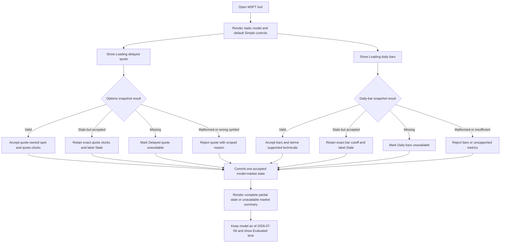
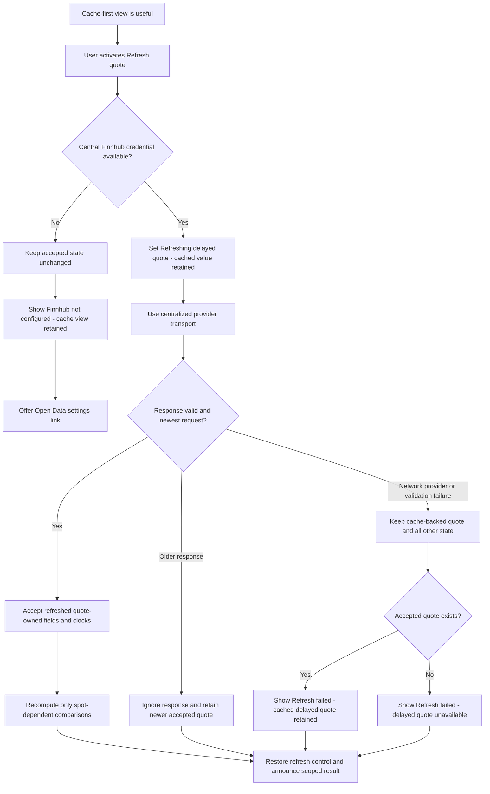
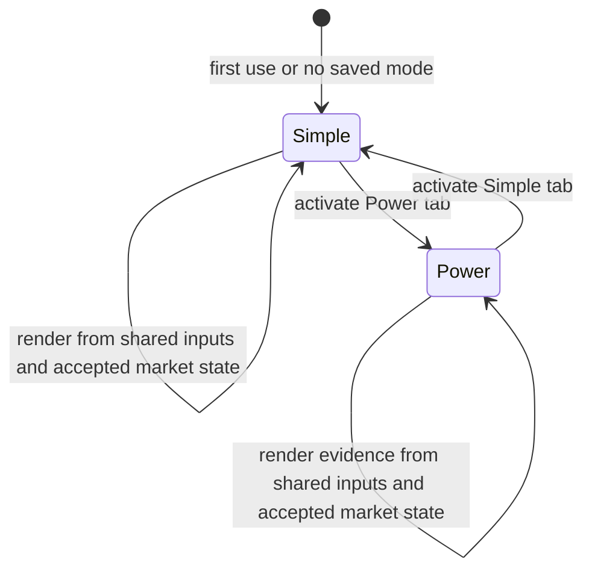
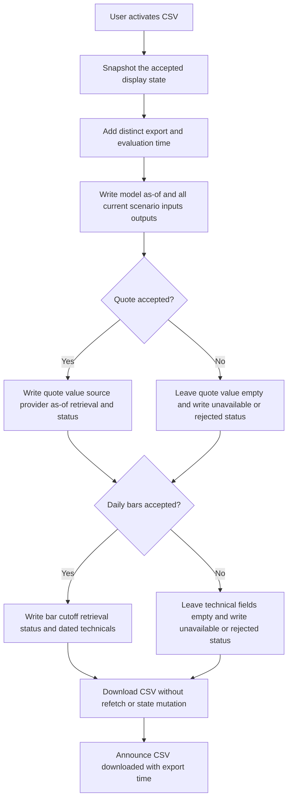

# Feature: 009 MSFT July Market Refresh

## Problem Statement

The MSFT July-Print Margin and EPS Model is an existing static fundamental scenario tool whose market context is stale and internally ambiguous.

- `msft-july-print-model.html` identifies the fundamental scenario as of 2026-07-06, but the same date is also attached to a hard-coded $390.49 spot, a hard-coded 52-week range, a prose claim of approximately 21x forward P/E, and the CSV field `data_as_of`. One label currently carries several facts with different clocks.
- `notes/msft-july-print-model.md` correctly records the last fundamental analysis run as 2026-07-06 and the FY26 Q4 print as a scenario, but it also says there are no live prices and instructs the next run to update market and fundamental items together.
- The repository now contains newer market evidence. `data/options/MSFT.json` was fetched at `2026-07-15T15:00:17.841Z` and carries a delayed quote of `397.065` with provider as-of `2026-07-15T10:44:13`. `data/bars/MSFT.json` was fetched at `2026-07-15T11:31:27.597Z`, but its daily-series as-of is 2026-07-13. These are valid but different clocks.
- `market-brief.snapshot.json` and `market-brief.payload.json` derive a 2026-07-13 daily-bar read of 390.99, a bear-stack, approximately 2.9% below the 50-day average near 402.7, 11.17% below the 200-day average near 440.1/440.2, and 27.41% below the 52-week high near 538.7. That technical read must not be mislabeled as a July 15 bar or as fresh fundamental confirmation.
- The current page exposes a manual quote refresh as the only path to newer spot context. This conflicts with the repository rule in `.github/copilot-instructions.md` that every tool paints a cache-first first view automatically and treats manual provider access only as a delta refresh.
- In-flight user work has already removed the page-local Finnhub key field and migration helpers, routed quote requests through `RLDATA.providerFetch`, reported status through `RLAPP.report`, loaded `rldata.js` and `rlapp.js`, and directed credential setup to `index.html#data-settings`. The market refresh must preserve that contract.

The business problem is therefore not to revise Microsoft's fundamentals. It is to let a user view the unchanged 2026-07-06 scenario against the newest repository-available market snapshot without collapsing model age, quote time, bar date, retrieval time, or user-edited assumptions into a false single notion of freshness.

## Outcome Contract

**Intent:** Give a research user an automatically hydrated, source-labeled MSFT market snapshot beside the existing 2026-07-06 fundamental scenario, so the user can compare current market pricing and technical structure with the model without mistaking a newer quote for a newer fundamental analysis.

**Success Signal:** On first open, the tool renders a useful Simple view without requiring a credential or a Fetch click. When the same-origin MSFT option and bar caches are valid, the user sees the delayed spot with its provider and retrieval clocks, the daily technical read with its separate 2026-07-13 bar cutoff, and valuation comparisons recomputed from that market spot and the current user scenario. Power view, CSV output, notes, registry metadata, and the shared tool read preserve the same two-clock truth. The fundamental/model date remains 2026-07-06 unless independently sourced fundamental work explicitly changes it.

**Hard Constraints:**

- Fundamental and market clocks remain separate. Market freshness can never advance the fundamental/model as-of date.
- The Q1-Q3 FY26 reported anchors, Q4 scenario inputs, FY26/FY27 assumptions, consensus inputs, cost-cycle thesis, and user-selected scenario values remain unchanged by market hydration or quote refresh.
- No FY26 Q4 actual may appear before a sourced release on or after the scheduled 2026-07-29 print, and this feature does not perform that post-print re-analysis.
- No current consensus, target price, forward multiple, 52-week range, or fundamental assumption may be invented from the market caches.
- A daily bar through 2026-07-13 is never labeled July 15, live, intraday, or an official July 15 close.
- Provider quote time, cache retrieval time, daily-bar cutoff, model date, and page evaluation/render time retain their own labels.
- Cache-first hydration works without a provider credential. Optional live refresh remains secondary and uses only the centralized home-page credential contract.
- The page must not render, read, migrate, or persist a tool-specific credential and must not bypass `RLDATA`/`RLAPP`.
- The existing `msft-july-print-model` tool id, page path, notes path, and `static-model` brief profile remain stable.
- The change remains educational, non-executing, and scoped to this MSFT tool and its direct consumers.

**Failure Condition:** The feature fails even if all numbers render when a July 15 market quote silently changes or redates any fundamental input; a July 13 daily bar is presented as July 15 market data; a stale, missing, malformed, or failed source is disguised by the old hard-coded snapshot; Simple and Power disagree; a CSV or tool read uses one ambiguous `data_as_of`; the shared Market Brief treats the refreshed quote as a fresh model confirmation; a page-local credential surface returns; or unrelated tools/data-fetch pipelines are changed as part of the refresh.

## Goals

- Separate the 2026-07-06 fundamental/model cutoff from every market-data cutoff.
- Auto-hydrate the first view from same-origin MSFT options and daily-bar snapshots.
- Update spot, source/as-of labels, technical context, and spot-dependent valuation comparisons from valid market evidence.
- Preserve every FY26/FY27 scenario input across automatic hydration and optional quote refresh.
- Provide coherent Simple and Power views from one market/model state.
- Make missing, stale, malformed, partial, disagreeing, and failed-refresh states explicit without destroying the last valid truth.
- Keep notes, both registry declarations, CSV, normalized tool-read output, and shared-brief behavior aligned with the two-clock contract.
- Preserve the centralized credential work already present in the dirty worktree.

## Non-Goals

- Re-analyzing Microsoft filings, consensus, Q4/FY27 guidance, cost-cycle sources, or the fundamental scenario.
- Publishing FY26 Q4 actuals before Microsoft releases and the repository independently verifies them.
- Replacing the existing Q4/FY27 model, formulas, presets, scenario controls, charts, or valuation ladder.
- Rewriting `rldata.js`, `rlapp.js`, `scripts/fetch-options.mjs`, `scripts/fetch-bars.mjs`, or the Market Brief data pipeline.
- Adding another market-data provider, credential store, backend, proxy, or server.
- Changing another research tool, its registry identity, its cached data, or its brief behavior.
- Treating an options-cache spot as an option-flow confirmation, a fundamental signal, or an official close.
- Treating a technical trend label as a buy/sell recommendation or as proof about the July 29 print.
- Updating unverified consensus, analyst targets, or a provider-supplied forward P/E.

## Product Context And Current Capability Map

| Capability | Concrete Repository Evidence | Current State | Feature 009 Responsibility |
| --- | --- | --- | --- |
| Fundamental scenario | `msft-july-print-model.html` model inputs, presets, `calculateAnnual`, Q4 reconciliation, and FY27 bridge | Complete static model, last analyzed 2026-07-06 | Preserve calculations and all scenario inputs; expose the model cutoff independently |
| Fundamental handoff | `notes/msft-july-print-model.md` sections 2-8 | Complete but couples market and fundamental next-run work | Split market snapshot documentation from fundamental-analysis status |
| Delayed MSFT quote cache | `data/options/MSFT.json::{spot,asof,fetched}` | Available: 397.065; provider as-of 2026-07-15T10:44:13; fetched 2026-07-15T15:00:17.841Z | Use as an automatic, source-labeled market spot when valid; do not infer fundamentals or option-flow conclusions |
| MSFT daily-bar cache | `data/bars/MSFT.json::{asof,fetched,rows}` | Available through 2026-07-13; fetched 2026-07-15T11:31:27.597Z | Use for daily technical calculations while preserving the bar cutoff |
| Current technical read | `market-brief.snapshot.json::names.MSFT` and `market-brief.payload.json::technicalStructure.MSFT` | 390.99 daily-bar read; bear-stack; below 50-day/200-day; 27.41% off high | Reproduce from eligible bar evidence or expose an unavailable state; never copy a date-free conclusion |
| Cache-first daily bars | `rldata.js::pagesBars` and `ensureBars` | Same-origin daily snapshot is preferred before a network fallback | Reuse the shared contract rather than creating a second bar cache |
| Cache-first options pattern | `.github/copilot-instructions.md` and `options-flow-feed-lab.html::pagesUrl` | Same-origin `data/options/<SYM>.json` is the Pages-safe first source | Apply the established first-view pattern to the MSFT snapshot |
| Central credentials | In-flight `msft-july-print-model.html::fetchLive`, `RLDATA.providerFetch`, `RLDATA.hasKey`, and `index.html#data-settings` | User change in progress; page-local key input removed | Preserve and regression-protect the centralized contract |
| Shared status | In-flight `msft-july-print-model.html::setLiveStatus` using `RLAPP.report` | User change in progress | Report quote and bar resources independently and honestly |
| Simple/Power shell | `.github/copilot-instructions.md` and current reference tools | Required repository-wide; absent from this MSFT page | Add one default Simple read and one Power drill-down over one compute/state |
| Registry | `tools.json` and `index.html` entries for `msft-july-print-model` | Both say updated 2026-06-30 and describe only the static model | Synchronize only the MSFT entry after delivery while preserving unrelated dirty entries |
| Shared brief contract | Spec 002 `static-model` profile, FR-007, FR-128, BS-002-003, and BS-002-029 | Static model cannot masquerade as fresh live confirmation | Publish separate model and market cutoffs and retain `static-model` restrictions |

### Single-Capability Justification

This is a narrow refresh inside the existing MSFT static-model and shared-data foundations. It does not add a second model, provider abstraction, screen family, or reusable data contract. `RLDATA`, `RLAPP`, same-origin snapshots, and spec 002 already own those shared capabilities. Creating another market-data or provider foundation here would duplicate live repository contracts and expand the blast radius without removing real complexity.

## Honest Findings

1. **"Latest" is source-scoped, not global.** The July 15 options snapshot is newer than the July 13 daily bars, while both are newer than the July 6 fundamental analysis. One page-level freshness badge cannot truthfully summarize all three.
2. **The newer spot does not verify the model.** A quote can change spot-relative valuation and the market-implied multiple, but it cannot confirm revenue, operating margin, capex, depreciation, consensus, or the cost-cycle thesis.
3. **The current approximately 21x prose is not safely refreshable from either cache.** The repository caches supply price and bars, not an independently verified current forward-EPS consensus. The page may compute spot divided by its own current modeled FY27E EPS, but must label that as a model-relative comparison rather than market consensus forward P/E.
4. **The technical snapshot and delayed quote may disagree without either being invalid.** They represent different observations. The correct behavior is to show both clocks, not overwrite the bar close with the delayed quote or recompute a 200-day series from one quote.
5. **The old $390.49 snapshot is not a valid success fallback.** On cache failure it may remain only as a clearly dated historical/model-context reference if intentionally retained; it cannot be presented as current, cached, or live.
6. **The notes are currently self-contradictory.** They identify July 6 market values, later say the hard-coded spot is $368.57 as of June 29, and state that no live prices exist while the page already contains an optional quote path. The implementation must reconcile those active claims rather than append another date.
7. **The registry is duplicated.** Updating `tools.json` without the corresponding `index.html` entry would leave conflicting discovery metadata, while broad registry cleanup would collide with unrelated in-flight work.
8. **No external competitor research is needed for this slice.** This feature does not select a vendor or add a novel market product. The decision is between repository-supported refresh alternatives, so internal contract comparison is more probative than a generic competitor feature matrix.

## Actors And Personas

| Actor | Description And Evidence | Key Goals | Permission Boundary |
| --- | --- | --- | --- |
| MSFT Scenario Researcher | Uses the existing Q4/FY27 controls and valuation ladder in `msft-july-print-model.html` | Compare an unchanged scenario with the newest eligible spot and technical context | May edit scenario inputs locally; cannot turn market data into reported fundamentals |
| Returning Simple-View User | Repository rules require a meaningful cache-first Simple view on open | Understand model age, market state, and the top comparison without reading every panel | Sees a compact decision read; cannot lose access to freshness or limitations |
| Power-View Reviewer | Repository rules require Power to expose raw signals, assumptions, tables, and a11y equivalents | Audit quote/bar sources, timestamps, technical derivations, and valuation arithmetic | Reads the same computed state as Simple; mode changes cannot mutate or refetch it |
| Model Steward | Maintains `msft-july-print-model.html` and `notes/msft-july-print-model.md` | Keep model assumptions, source dates, notes, exports, and user-facing claims coherent | May reverify fundamentals only in a separately evidenced analysis; this refresh cannot do so |
| Shared Brief Consumer | Spec 002 consumes each registered tool's normalized read under a profile | Receive useful MSFT context without promoting a static scenario into live confirmation | May summarize source-qualified market context; cannot recompute or freshen the owning model |
| Data And Audit Reviewer | Inspects same-origin caches, registry entries, CSV, tool reads, and degraded states | Reconstruct which value came from which source and cutoff | Cannot accept a synthetic fallback, hidden disagreement, or ambiguous `data_as_of` |

## Use Cases

### UC-009-001: Open The Tool With Repository Market Data

- **Actor:** Returning Simple-View User
- **Preconditions:** At least one same-origin MSFT cache is readable.
- **Main Flow:**
  1. The user opens the tool without configuring a provider credential.
  2. The page renders the 2026-07-06 scenario immediately.
  3. The page automatically reads the MSFT options and bars snapshots.
  4. Each valid market resource updates only the fields it owns and shows its own source/as-of state.
- **Alternative Flows:** A missing, stale, or invalid resource produces a scoped degraded state while the other resource and model remain usable.
- **Postconditions:** The first view is meaningful without a Fetch click and no market timestamp changes the model date.

### UC-009-002: Compare Current Spot With The Fundamental Scenario

- **Actor:** MSFT Scenario Researcher
- **Preconditions:** A valid market spot and a valid current scenario output exist.
- **Main Flow:**
  1. The user inspects the market spot and its exact source/time.
  2. The tool recomputes spot-relative upside/downside and spot divided by modeled FY27E EPS.
  3. The tool labels the comparison as model-relative, not verified consensus forward P/E.
  4. The user edits a scenario lever and sees the comparison recompute against the same market observation.
- **Alternative Flows:** If modeled EPS is absent, non-finite, or non-positive, the multiple is unavailable rather than fabricated.
- **Postconditions:** Market context changes comparisons only; scenario inputs remain user/model owned.

### UC-009-003: Inspect Daily Technical Context

- **Actor:** Power-View Reviewer
- **Preconditions:** The daily-bar cache has enough valid observations for a requested calculation.
- **Main Flow:**
  1. The reviewer sees the last eligible daily bar and its 2026-07-13 cutoff.
  2. The tool exposes moving-average structure, distances, and distance from the rolling high with source-qualified labels.
  3. The reviewer can trace the read to daily bars rather than to the July 15 delayed quote.
- **Alternative Flows:** Insufficient bars make only the unsupported metric unavailable; no default level or trend is inserted.
- **Postconditions:** Technical context remains a dated market observation, not fundamental confirmation or advice.

### UC-009-004: Refresh The Quote Through Central Credentials

- **Actor:** MSFT Scenario Researcher
- **Preconditions:** Cache-first content is already visible; a Finnhub credential may or may not exist in the central home-page settings.
- **Main Flow:**
  1. The user optionally requests a quote refresh.
  2. The page uses the centralized provider transport and shared status surface.
  3. A valid response advances only quote-owned market fields and spot-dependent comparisons.
- **Alternative Flows:** Missing credentials route the user to `index.html#data-settings`; network/provider failure leaves the cache-backed truth visible with an error state.
- **Postconditions:** No page-local credential is rendered, stored, migrated, logged, or placed in a URL.

### UC-009-005: Move Between Simple And Power

- **Actor:** Returning Simple-View User and Power-View Reviewer
- **Preconditions:** The page has computed a model/market state.
- **Main Flow:**
  1. Simple presents the model date, market snapshot status, spot, technical headline, and model-relative valuation.
  2. The user switches to Power.
  3. Power reveals per-source timestamps, derivations, assumptions, partial-state details, and equivalent tables.
  4. The user returns to Simple without a refetch or state change.
- **Postconditions:** Both views communicate the same conclusion from one computation.

### UC-009-006: Export A Reconstructable Scenario

- **Actor:** Data And Audit Reviewer
- **Preconditions:** A current scenario exists; market resources may be complete or partial.
- **Main Flow:**
  1. The reviewer exports CSV.
  2. The export identifies model as-of, export/evaluation time, spot value/source/provider-as-of/retrieval time, daily-bar cutoff/retrieval time, and current scenario inputs/outputs separately.
  3. Unavailable fields remain empty with status/provenance rather than receiving old defaults.
- **Postconditions:** A consumer can reconstruct the same displayed model/market boundary without relying on page prose.

### UC-009-007: Maintain Direct Consumers Without Collateral Changes

- **Actor:** Model Steward
- **Preconditions:** The tool behavior has been delivered and validated.
- **Main Flow:**
  1. The steward reconciles active date/source claims in the notes.
  2. The steward updates only the MSFT entries in `tools.json` and `index.html` while preserving unrelated dirty content.
  3. The steward preserves the tool id, page path, notes path, and `static-model` classification.
- **Postconditions:** Discovery, notes, page, and registry metadata tell one active truth.

### UC-009-008: Publish A Truthful Static-Model Read

- **Actor:** Shared Brief Consumer
- **Preconditions:** The MSFT page has a normalized read with model and market provenance.
- **Main Flow:**
  1. The consumer reads the unchanged model as-of and current market observations separately.
  2. It may describe model-relative valuation and dated technical context.
  3. It retains the static-model evidence boundary from spec 002.
- **Alternative Flows:** Partial or stale market evidence produces a partial/stale read and no invented confirmation.
- **Postconditions:** The final brief cannot claim that a newer quote re-evaluated the MSFT model.

## Requirements

### Clock And Fundamental Truth

**Evidence basis:** `msft-july-print-model.html` header/footer/export, `notes/msft-july-print-model.md`, cache metadata, and spec 002 FR-128.

- **FR-001:** The active fundamental/model as-of must remain 2026-07-06 unless a separately sourced fundamental analysis explicitly reverifies and changes it.
- **FR-002:** The product must expose the fundamental/model as-of independently from market quote, market-bar, retrieval, and evaluation timestamps.
- **FR-003:** Market hydration or quote refresh must not mutate any FY26/FY27 scenario input, preset, reported Q1-Q3 anchor, Q4 estimate, consensus input, cost-cycle assumption, or user-edited value.
- **FR-004:** Before a sourced FY26 Q4 release is verified, every Q4 value must remain labeled estimate, scenario, guide, consensus-implied, or seasonality-implied as applicable; no actual Q4 result may be asserted.
- **FR-005:** The feature must not update or imply current consensus revenue, margin, EPS, target price, or provider forward P/E from quote/options/bar data.
- **FR-006:** A spot divided by the current modeled FY27E EPS must be labeled model-implied or model-relative market multiple, never consensus forward P/E.
- **FR-007:** The market snapshot date may be 2026-07-15 while the model date remains 2026-07-06; neither may overwrite the other.

### Cache-First Market Snapshot

**Evidence basis:** `.github/copilot-instructions.md` auto-hydration rules, `rldata.js::ensureBars`, established same-origin options readers, and the two MSFT cache files.

- **FR-008:** On page open, the tool must render the scenario and automatically attempt same-origin `data/options/MSFT.json` and `data/bars/MSFT.json` hydration without waiting for a manual fetch.
- **FR-009:** A valid options snapshot may provide spot only when symbol, numeric validity, source metadata, and timestamps satisfy the market-snapshot contract.
- **FR-010:** For the current repository snapshot, Power provenance must be able to show spot `397.065`, provider as-of `2026-07-15T10:44:13`, and retrieval `2026-07-15T15:00:17.841Z` without adding timezone semantics absent from the provider field.
- **FR-011:** A valid daily-bar snapshot must retain its own series cutoff and retrieval time; for the current repository snapshot those are 2026-07-13 and `2026-07-15T11:31:27.597Z`.
- **FR-012:** Technical calculations must use eligible daily bars, not replace the last daily close with the newer delayed quote.
- **FR-013:** When enough valid bars exist, the tool must derive and source-label moving-average structure, distance to 50-day, distance to 200-day, and distance from the rolling 52-week high.
- **FR-014:** The current expected technical interpretation is a 2026-07-13 daily-bar read near 390.99, bear-stacked, approximately -2.9% from the 50-day near 402.7, -11.17% from the 200-day near 440.1/440.2, and -27.41% from the high near 538.7; tests must derive rather than hard-code those conclusions.
- **FR-015:** Spot-dependent valuation ladder comparisons, upside/downside, and model-relative multiples must recompute when a valid market spot changes.
- **FR-016:** A valid market update must not silently change the user's selected P/E scenario input; market-implied multiple and selected scenario multiple remain separate concepts.
- **FR-017:** Quote and bar observations with different cutoffs must coexist visibly; the product must not choose one timestamp as the date for all market fields.

### Failure, Staleness, And Concurrency

**Evidence basis:** `.github/copilot-instructions.md` honest scoped status and crash-proof first paint rules, `RLDATA.reportData`, and spec 002 FR-132.

- **FR-018:** A missing options cache must leave spot unavailable or retain a separately labeled last valid spot while valid bars/model content continue.
- **FR-019:** A missing bars cache must leave technical context unavailable while a valid quote/model comparison continues.
- **FR-020:** A stale source may remain visible only with its original timestamps, stale label, and limitations; it must never be called live or current by fallback.
- **FR-021:** Malformed JSON, wrong symbol, empty rows/options, invalid timestamps, non-finite/non-positive spot, invalid bars, and future-dated metadata must be rejected per resource without crashing first paint.
- **FR-022:** Rejection of one resource must not erase independently valid model or market state.
- **FR-023:** A failed optional provider refresh must preserve the last valid cache-backed view, restore the refresh control, and show a scoped failure reason.
- **FR-024:** If cache and provider quote values disagree, the latest accepted quote may own spot only with its own source/as-of label; bar-derived technicals retain the daily series and no hidden averaging occurs.
- **FR-025:** Out-of-order asynchronous responses must not allow an older request to overwrite a newer accepted market observation.
- **FR-026:** Every value displayed before hydration completes must be null-safe; absence renders an unavailable marker and cannot stop the model from rendering.

### Central Credentials And Shared Status

**Evidence basis:** the in-flight MSFT diff, `.github/copilot-instructions.md`, `rldata.js` provider policy, and `index.html#data-settings`.

- **FR-027:** The page must preserve use of `RLDATA.providerFetch`, `RLDATA.hasKey`, and `RLAPP.report` for optional quote refresh/status.
- **FR-028:** The page must not render a Finnhub key input, read or write `msftFhKey`, create a second key store, perform credential migration, or embed a credential in a query string.
- **FR-029:** Missing Finnhub credentials must not block cache-first content and must direct configuration to `index.html#data-settings`.
- **FR-030:** Quote and daily-bar resources must expose independently scoped shared status rather than one ambiguous live badge.
- **FR-031:** Script load order must preserve the shared-shell credential/status contract and must not reintroduce a page-local transport.

### Simple And Power Experience

**Evidence basis:** `.github/copilot-instructions.md` Simple/Power and one-compute rules.

- **FR-032:** Simple must be the default and must show the 2026-07-06 model date, market state, latest accepted spot/source time, daily technical headline/bar date, and one model-relative valuation read without hiding stale/partial status.
- **FR-033:** Power must expose provider/source identity, quote as-of, quote retrieval, bar cutoff, bar retrieval, model as-of, evaluation time, technical inputs/derivations, and valuation arithmetic.
- **FR-034:** Simple and Power must consume one computed state; switching mode must not refetch data, reset user inputs, change dates, or produce a different conclusion.
- **FR-035:** Every chart-based market comparison must have an equivalent textual/table read, and every status/date must remain understandable without color or hover.
- **FR-036:** Long source labels, stale/error messages, and timestamps must not overlap controls or force body-level horizontal scrolling on narrow screens.

### Consumer And Publication Contracts

**Evidence basis:** current MSFT notes/registry/export, `RLDATA.putToolRead`, `.github/copilot-instructions.md` brief coverage, and spec 002 static-model rules.

- **FR-037:** The notes must identify the last fundamental analysis (2026-07-06) separately from the latest verified market snapshot and remove contradictory active spot/no-live-price claims.
- **FR-038:** The notes must keep the scheduled FY26 Q4 print at 2026-07-29 and must not claim post-print actuals, refreshed consensus, or reverified cost-cycle sources.
- **FR-039:** The MSFT entries in `tools.json` and `index.html` must remain synchronized for title, id, paths, status, delivered updated date, blurb, and tags while unrelated dirty entries remain byte-for-byte outside the implementer's changes.
- **FR-040:** CSV must replace ambiguous `data_as_of` semantics with separate model-as-of, export/evaluation time, spot value/source/provider-as-of/retrieved-at, daily-bar-as-of/retrieved-at, source status, scenario inputs, and scenario outputs.
- **FR-041:** CSV must export the same accepted state shown on screen; unavailable market fields stay unavailable and no old hard-coded value is inserted.
- **FR-042:** The normalized `toolReads[msft-july-print-model]` outcome must expose separate model and market provenance, model-relative valuation, technical cutoff/status, deep link, and static-model limitation without credentials or raw option-chain data.
- **FR-043:** The tool-read and shared brief must retain the `static-model` profile and must not treat a newer market quote or technical read as model re-evaluation, fundamental confirmation, or an independent recommendation.
- **FR-044:** Shared brief output may describe dated market context and model-relative comparison only when source/status/cutoff are present; partial or stale evidence must remain partial or stale.
- **FR-045:** The feature must preserve the existing tool id, page path, notes path, and first-party links; no route, identifier, or notes rename is authorized.
- **FR-046:** The implementation must not rewrite the shared data-fetch pipeline, add a provider, alter other cache files, or change unrelated tool/registry entries.

## User Scenarios (Gherkin)

### BS-009-001: Cache-First First View

```gherkin
Scenario: A user opens the tool with valid same-origin MSFT caches
  Given the fundamental model was last analyzed on 2026-07-06
  And valid MSFT option and daily-bar snapshots are available from the repository origin
  When the page opens without a configured provider credential
  Then the scenario renders without a Fetch action
  And spot and technical context hydrate automatically from their owning snapshots
  And the model date remains 2026-07-06
```

### BS-009-002: Two Market Clocks Remain Visible

```gherkin
Scenario: The delayed quote is newer than the daily bars
  Given the quote has provider as-of 2026-07-15T10:44:13
  And the daily series is complete only through 2026-07-13
  When the market snapshot is displayed
  Then the quote and bar cutoffs are labeled separately
  And the July 13 bar is not labeled July 15, live, intraday, or an official July 15 close
  And both remain separate from the 2026-07-06 model cutoff
```

### BS-009-003: Market Spot Reprices The Existing Scenario Only

```gherkin
Scenario: A valid market spot replaces the old static comparison
  Given the current FY27E scenario has a valid modeled EPS
  When a valid delayed spot is accepted
  Then spot-relative upside or downside and the model-relative market multiple recompute
  And no FY26 or FY27 input changes
  And the result is not labeled consensus forward P/E
```

### BS-009-004: User Scenario Edits Survive Market Refresh

```gherkin
Scenario: A user has edited model assumptions before a quote update
  Given the user has changed one or more Q4 or FY27 scenario controls
  When cache hydration or optional quote refresh completes
  Then every user-edited scenario value is preserved
  And only market-owned fields and derived comparisons change
```

### BS-009-005: Daily Technicals Use Daily Bars

```gherkin
Scenario: A newer delayed quote differs from the latest daily close
  Given valid daily bars support the moving-average and high-distance calculations
  And a newer delayed quote is also valid
  When technical context is computed
  Then trend, moving averages, and high distance use the daily series
  And the delayed quote is not inserted as a synthetic daily bar
  And the technical cutoff remains the last eligible daily-bar date
```

### BS-009-006: Missing Options Cache Produces A Partial View

```gherkin
Scenario: The options snapshot is missing but daily bars are valid
  Given the fundamental scenario can render
  And the daily-bar cache is valid
  But the options snapshot cannot be read
  When first-view hydration completes
  Then technical context remains available with its bar cutoff
  And quote-owned fields are unavailable or explicitly last-known
  And no old hard-coded spot is presented as current
```

### BS-009-007: Missing Bars Cache Produces A Partial View

```gherkin
Scenario: The daily bars are missing but the delayed quote is valid
  Given the fundamental scenario can render
  And the options snapshot has a valid spot and timestamps
  But the daily-bar snapshot cannot be read
  When first-view hydration completes
  Then spot-dependent model comparisons remain available
  And technical fields are unavailable with a scoped reason
  And no default moving average or trend is invented
```

### BS-009-008: Stale Or Malformed Cache Does Not Corrupt Truth

```gherkin
Scenario: One same-origin market resource is stale or malformed
  Given the page has a valid fundamental scenario and may have another valid market resource
  When the invalid or stale resource is evaluated
  Then malformed content is rejected and stale content retains its original date and stale label
  And independently valid state remains visible
  And the page does not crash or claim a successful current refresh
```

### BS-009-009: Optional Provider Refresh Preserves Central Credentials

```gherkin
Scenario: A user requests a newer quote after cache-first paint
  Given the first view is already usable
  When the user requests an optional provider refresh
  Then the request uses the centralized provider transport and shared status
  And no page-local key field or credential copy exists
  And missing credentials direct the user to the home-page data settings
```

### BS-009-010: Failed Optional Refresh Keeps The Cache-Backed View

```gherkin
Scenario: The optional quote provider is unavailable
  Given a valid cache-backed market view is visible
  When the provider request fails or returns an invalid price
  Then the last valid cache-backed state remains visible
  And the quote resource reports a scoped failure
  And model inputs, model date, bar technicals, and user edits remain unchanged
```

### BS-009-011: Simple And Power Share One Truth

```gherkin
Scenario: A user switches between Simple and Power
  Given the model and market resources have one accepted state
  When the user changes display mode
  Then Simple and Power show the same spot, technical conclusion, valuation comparison, and cutoffs
  And Power adds derivation and provenance detail
  And the mode change does not refetch or mutate data
```

### BS-009-012: CSV Preserves Reconstructable Provenance

```gherkin
Scenario: A user exports a partially or fully hydrated scenario
  Given the displayed state has separate model and market provenance
  When CSV is generated
  Then the export separates model, quote, bar, retrieval, and export clocks
  And it contains the same scenario inputs and derived outputs shown on screen
  And unavailable values remain unavailable rather than receiving a static fallback
```

### BS-009-013: Shared Tool Read Retains Static-Model Restrictions

```gherkin
Scenario: The shared brief consumes the refreshed MSFT tool read
  Given the tool read contains a 2026-07-06 model cutoff and newer source-qualified market context
  When a tool brief or final brief interprets the read
  Then it may describe the dated market context and model-relative comparison
  And it cannot claim that the fundamentals were re-evaluated or confirmed
  And it cannot assert an FY26 Q4 actual before a sourced release
```

### BS-009-014: Direct Consumers Stay Synchronized

```gherkin
Scenario: The delivered tool metadata is published
  Given unrelated work is already present in registry and test files
  When the MSFT page, notes, and registry metadata are updated
  Then only the intended MSFT consumer records change
  And the tool id, page path, notes path, and static-model profile remain stable
  And active notes, page labels, CSV, and registry descriptions express one two-clock truth
```

## Edge Case Matrix

| Edge Case | Required Outcome | Evidence Anchor |
| --- | --- | --- |
| Options JSON missing/404 | Render model plus eligible bar technicals; quote unavailable | FR-018, BS-009-006 |
| Bars JSON missing/404 | Render model plus eligible quote comparison; technicals unavailable | FR-019, BS-009-007 |
| Both caches missing | Render model with explicit no-market-data state; optional central refresh remains available | FR-018 to FR-023 |
| Stale quote or bars | Show last observation with exact stale date and source; no live/current label | FR-020, BS-009-008 |
| Malformed JSON or wrong symbol | Reject affected resource, preserve all independent state, show scoped error | FR-021 to FR-022 |
| Empty or insufficient bar history | Compute only supported metrics; no default MA/high/trend | FR-013, FR-019, FR-026 |
| Non-finite, zero, or negative spot | Reject quote and suppress spot-relative multiple | FR-009, UC-009-002 |
| Positive modeled EPS absent | Show model-relative multiple unavailable while other outputs remain | FR-006, UC-009-002 |
| Quote and bar prices disagree | Preserve both observations and clocks; no hidden merge | FR-017, FR-024 |
| Provider response arrives out of order | Older response cannot replace newer accepted quote | FR-025 |
| Provider credential absent | Cache-first first view works; refresh points to home settings | FR-029, BS-009-009 |
| Provider refresh fails | Last valid cache state and user scenario survive | FR-023, BS-009-010 |
| Market closed/weekend | Preserve source trading date; page date cannot manufacture a bar | FR-011, FR-020 |
| Future-dated metadata | Reject or visibly quarantine the affected resource | FR-021 |
| Narrow mobile/long timestamps | No overlap; source/time remains readable and accessible | FR-035 to FR-036 |
| CSV from partial state | Empty market fields plus explicit statuses; no old static substitution | FR-040 to FR-041 |

## Competitive And Alternative Analysis

External competitor research was not performed because this slice does not choose a market-data product, pricing model, or vendor. The relevant alternatives are already implemented or documented in this repository.

| Alternative | Repository Evidence | Benefit | Material Failure | Decision |
| --- | --- | --- | --- | --- |
| Keep $390.49 and manual Fetch only | Current `SPOT`, header, and `fetchLive` flow | Minimal code change | Violates cache-first first view; old value can masquerade as current | Reject |
| Redate the whole model to July 15 | Current single `data_as_of` and age label | Superficially simple | Fabricates fundamental freshness and obscures unverified consensus/Q4 assumptions | Reject |
| Use only `data/options/MSFT.json` | Current quote cache | Newest available spot, no credential | Cannot produce a daily technical series; options cache does not verify fundamentals | Reject as sole source |
| Use only `data/bars/MSFT.json` | `RLDATA.ensureBars` and Market Brief technicals | Reproducible technical context | Omits newer delayed spot and could misstate July 13 as July 15 | Reject as sole source |
| Fetch Finnhub automatically before paint | Existing optional central transport | Potentially newer quote | Credential/network dependent, slower first view, no bar context | Secondary action only |
| Two-clock same-origin hydration plus optional refresh | Repository cache rules, both MSFT snapshots, and centralized credentials | Useful first view, honest provenance, graceful partial states | Requires explicit source ownership in UI/export/read | Select |

## UI Scenario Matrix

| Scenario | Actor | Entry Point | User-Visible Steps | Expected Outcome | Surface |
| --- | --- | --- | --- | --- | --- |
| BS-009-001 to 003 | Returning user, Scenario Researcher | Tool open, Simple default | Open; inspect model/market strip; compare valuation | Automatic useful read with separate model, quote, and bar clocks | Simple cockpit |
| BS-009-004 to 005 | Scenario Researcher, Power Reviewer | Scenario controls or Power mode | Edit lever; inspect daily derivation | User inputs persist; market context recomputes only owned outputs | Existing controls plus Power provenance |
| BS-009-006 to 008 | All users | Automatic hydration | Observe partial/stale/error state | Independent valid content remains usable; no fabricated fallback | Shared status and market context areas |
| BS-009-009 to 010 | Scenario Researcher | Optional refresh control | Request refresh; configure centrally if needed; recover from failure | Central credential path with cache-backed resilience | Refresh control and `index.html#data-settings` link |
| BS-009-011 | Simple/Power users | `#modeSeg` | Switch mode and back | Same state/conclusion; Power adds audit detail | Shared mode shell |
| BS-009-012 | Audit Reviewer | CSV control | Export; inspect fields | Reconstructable two-clock model/market record | CSV download |
| BS-009-013 | Shared Brief Consumer | Normalized tool read | Consume static model plus market context | No fresh-fundamental or pre-print-actual claim | Tool-read/brief surfaces |
| BS-009-014 | Model Steward | Notes/registry publication | Reconcile notes and direct registry entries | One active truth; unrelated dirty work preserved | Notes, `tools.json`, `index.html` |

## UI Wireframes

### UX Scope And Existing Visual Language

This pass modifies one existing route, `msft-july-print-model.html`. Simple and Power are display modes over the same accepted state, not separate pages or separate computations. The page keeps the current Research Lab visual language: dark research workspace, teal primary accent, amber/red/green as supplemental meaning, compact uppercase section labels, tabular numerics, one-level panels, and contained data tables. It does not introduce a marketing hero, nested cards, decorative gradients, or a redesign of navigation, shared data settings, or any other tool.

The existing model controls remain authoritative. Simple curates the smallest useful steering set; Power retains every current control and evidence surface. No new visible tutorial or mode-explainer copy is added. Labels, values, statuses, contextual tooltips, and normal control affordances must communicate the interaction.

### Screen Inventory

| Screen / Mode | Actor(s) | Route | Status | Scenarios Served |
| --- | --- | --- | --- | --- |
| MSFT Simple cockpit | Returning Simple-View User, MSFT Scenario Researcher | `msft-july-print-model.html` | Existing route - add default mode | BS-009-001 to 004, BS-009-006 to 011 |
| MSFT Power evidence workspace | Power-View Reviewer, Data And Audit Reviewer, Model Steward | `msft-july-print-model.html` | Existing route - reorganize as drill-down | BS-009-002 to 005, BS-009-008, BS-009-011 to 014 |
| Central Data settings destination | MSFT Scenario Researcher | `index.html#data-settings` | Existing direct consumer - link only, no redesign | BS-009-009 |

CSV download and the normalized tool read are outputs of the MSFT page, not additional screens. Notes and registry records are publication consumers and receive no new UI in this feature.

### UI Primitives

| Primitive | Used By | Composition Rule | Accessibility And Responsive Contract |
| --- | --- | --- | --- |
| View mode segment | Simple, Power | `#modeSeg` is the single Simple/Power switch. First use defaults to Simple; a valid saved display preference may restore Power. Switching changes visibility only and never fetches, recomputes from different inputs, or resets controls. | One labeled tablist with two tabs, `aria-selected`, `aria-controls`, visible focus, Left/Right Arrow navigation, and Enter/Space activation. Focus stays on the selected tab. |
| Two-domain truth strip | Simple, Power | One compact strip has exactly two primary truth domains: **Static model** and **Market context**. Quote and daily bars remain separate rows inside Market context; evaluation time is subordinate metadata. The same primitive and values appear in both modes. | A semantic description list or grouped status region. Labels precede values in DOM order. At narrow widths rows stack and timestamps wrap; color is never the only status signal. |
| Resource status row | Truth strip, Power provenance | Each row owns one resource, one status word, one source as-of, and one retrieval time. A resource update replaces only its own row. | Prefix every state with visible text: `Loading`, `Available`, `Refreshing`, `Stale`, `Unavailable`, `Rejected`, or `Refresh failed`. Scoped changes announce through one polite live region; a newly rejected source uses an assertive error announcement without moving focus. |
| Scenario preset segment | Simple, Power controls | Preserve Bull, Base, Bear, and Reset to Base. It changes model inputs only. Reset is a command, not a fourth scenario state. | Buttons expose selected preset with `aria-pressed`; Reset has an accessible name and familiar reset icon. The segment wraps as a unit and never changes page width. |
| Scenario lever | Simple core levers, Power full controls | Every lever has a persistent label, value, unit, permitted range, and contextual tooltip. Simple and Power bind to the same value. | Label/control association is explicit. Range controls expose current value, minimum, maximum, and unit. Keyboard adjustment follows native control behavior; no drag-only interaction. |
| Metric read | Simple decision read, Power results | A metric consists of label, value, source qualifier, and limitation. Market-relative metrics never lose the model qualifier. Repeated metrics may use the existing one-level KPI treatment but are never placed inside another card. | Metric label and qualifier are programmatically associated. Positive/negative direction includes text or sign in addition to color. Values reserve stable height so hydration does not shift adjacent controls. |
| Provenance table | Power | One table exposes resource, visible status, value/cutoff, source as-of, retrieved at, and limitation. Model, quote, bars, and evaluation occupy distinct rows. | Proper caption and column headers; no merged data cells. On narrow screens it scrolls inside its labeled region while the page body does not scroll horizontally. |
| Chart/table pair | Power charts | Margin path, bridge, tornado, and any market comparison pair one canvas with a complete textual or tabular equivalent. Hover content is supplemental. Heatmap remains a DOM table. | The table is the canonical assistive-technology path. Canvas has a concise label and references the table, or is hidden from accessibility APIs when fully redundant. Every datum available on hover is available in text. |
| Page action bar | Simple, Power | Contains optional delayed-quote refresh and CSV export. Both modes use the same controls and status target. Missing credentials reveal only an `Open Data settings` link. | Buttons have icon plus accessible text, stable dimensions, and visible disabled/busy state. Success/failure is announced without focus theft. On mobile actions form a two-column row or stack without truncation. |

### Temporal Truth Hierarchy And Exact Status Language

The visible hierarchy is fixed. Higher levels must never be visually collapsed into a lower one:

1. **Static model identity:** `Static model · as of 2026-07-06`.
2. **Market-context summary:** complete, partial, stale, or unavailable; never `live`.
3. **Resource truth:** delayed quote and daily bars, each with its own source clock and retrieval clock.
4. **Derived-read qualifier:** valuation names the model input it uses; technicals name the daily-bar cutoff they use.
5. **Page evaluation:** `Evaluated {evaluationTime}` describes when the current accepted state was rendered, not when any source observation occurred.

For the repository fixtures described by this spec, the expanded Power text is exact:

- `Static model · as of 2026-07-06`
- `Cached delayed quote · provider as of 2026-07-15T10:44:13 · retrieved 2026-07-15T15:00:17.841Z`
- `Daily bars · through 2026-07-13 · retrieved 2026-07-15T11:31:27.597Z`
- `Evaluated {evaluationTime}`

The provider quote time is rendered verbatim. The UI must not append `Z`, `ET`, `local`, or another timezone interpretation to `2026-07-15T10:44:13`. Retrieval and evaluation timestamps retain their supplied or generated timezone designator.

| Resource State | Exact Visible Label | Required Detail / Action |
| --- | --- | --- |
| Model accepted | `Static model · as of 2026-07-06` | Always remains visible. Never use `fresh`, `live`, or `updated today` for the model. |
| Both market resources accepted | `Market context · Quote + daily bars available` | Quote and bars remain separately expanded beneath the summary. |
| Quote accepted from same-origin cache | `Cached delayed quote · provider as of {quoteAsOf}` | Power adds `Retrieved {quoteRetrievedAt}` and source identity. |
| Quote accepted from optional provider refresh | `Refreshed delayed quote · provider as of {quoteAsOf}` | Power adds `Retrieved {quoteRetrievedAt}` and provider identity. This does not change the model or bar labels. |
| Quote refresh in progress | `Refreshing delayed quote · cached value retained` | Keep the last accepted quote visible. Mark the refresh control busy and disabled only for the active request. |
| Quote stale but accepted | `Stale delayed quote · provider as of {quoteAsOf}` | Power adds retrieval time and the stale limitation. Do not substitute the old hard-coded spot. |
| Quote absent | `Delayed quote unavailable` | Market summary becomes `Market context · Partial: quote unavailable` when bars remain valid, otherwise `Market context · Unavailable`. |
| Quote malformed or wrong-symbol | `Delayed quote rejected · {reason}` | Allowed concise reasons are `malformed snapshot`, `symbol mismatch`, `invalid price`, `invalid timestamp`, or `future-dated metadata`. Independently valid state remains visible. |
| Refresh failed with accepted cache | `Refresh failed · cached delayed quote retained` | The cached quote keeps its original as-of/retrieval text. A retry does not clear the model, bars, or user inputs. |
| Refresh failed with no accepted quote | `Refresh failed · delayed quote unavailable` | Model and eligible daily technicals remain usable. |
| Credential absent after refresh request | `Finnhub not configured · cache view retained` | Show one action link labeled `Open Data settings` to `index.html#data-settings`; render no key field, credential hint input, or migration affordance. |
| Daily bars accepted | `Daily bars · through {barCutoff}` | Power adds `Retrieved {barRetrievedAt}` and source identity. Technical metric labels repeat the bar cutoff. |
| Daily bars stale but accepted | `Stale daily bars · through {barCutoff}` | Power adds retrieval time and stale limitation; quote status remains independent. |
| Daily bars absent | `Daily bars unavailable` | Market summary becomes `Market context · Partial: daily bars unavailable` when quote remains valid. Technical metrics show an unavailable marker. |
| Daily bars malformed / insufficient | `Daily bars rejected · {reason}` | Allowed concise reasons are `malformed snapshot`, `symbol mismatch`, `invalid bars`, `invalid timestamp`, `future-dated metadata`, or `insufficient history`. Unsupported technical metrics remain unavailable. |
| Initial cache evaluation | `Loading delayed quote` / `Loading daily bars` | The static model and Simple controls render immediately; loading text reserves the final row dimensions. |
| Evaluation complete | `Evaluated {evaluationTime}` | Never appears as a source as-of or retrieval label. |

No visible badge, pill, or summary may say only `Live`, `Current`, `Fresh`, `Ready`, or `As of {one date}` for the page. The shared status machinery may use its internal state vocabulary, but the MSFT page must render the resource-scoped language above.

### Static Model Versus Fresh Market Context

- The static model is always marked with the persistent text label `STATIC MODEL`; market rows use `DELAYED QUOTE` and `DAILY BARS`. These labels remain visible in both modes and do not rely on border or text color.
- Model-only outputs use the source qualifier `Modeled from 2026-07-06 assumptions`.
- The exact market-relative multiple label is `Spot / modeled FY27E EPS`; its qualifier is `Model-relative · not consensus forward P/E`.
- The exact spot-relative price comparison qualifier is `Compared with {quoteSource} delayed quote as of {quoteAsOf}`.
- The technical group heading is `Daily-bar technicals · through {barCutoff}`. Its moving averages, trend, and rolling-high distance never inherit the delayed quote time.
- A newer quote can update spot, spot-relative upside/downside, and `Spot / modeled FY27E EPS`. It cannot change model-only values, the selected scenario P/E, the daily-bar close, moving averages, trend, or rolling-high distance.
- A newer bar snapshot can update bar-derived technicals only. It cannot change spot unless the product explicitly accepts a quote-owned observation through the quote path.
- Evaluation time appears at the end of the truth strip and in export provenance, visually subordinate to all source clocks.

### Screen: MSFT Simple Cockpit

**Actor:** Returning Simple-View User, MSFT Scenario Researcher  
**Route:** `msft-july-print-model.html`  
**Status:** Existing route - add default Simple mode

#### Simple Wide Layout

```text
┌──────────────────────────────────────────────────────────────────────────────────────────────┐
│ Research Lab / MSFT July-Print Margin & EPS Model       [Simple selected] [Power]            │
│ STATIC MODEL · FY26 Q1-Q3 reported anchors + Q4/FY27 scenario       [↻ Refresh quote] [↓ CSV]│
├──────────────────────────────────────────────────────────────────────────────────────────────┤
│ STATIC MODEL                              │ MARKET CONTEXT · QUOTE + DAILY BARS AVAILABLE     │
│ As of 2026-07-06                          │ DELAYED QUOTE  $397.07                             │
│ Modeled assumptions, not refreshed        │ Provider as of 2026-07-15T10:44:13                │
│                                           │ DAILY BARS  through 2026-07-13                    │
│                                           │ Evaluated [evaluationTime]                         │
├──────────────────────────────────────────────────────────────────────────────────────────────┤
│ SCENARIO LEVERS                                                                               │
│ Preset [Bull] [Base selected] [Bear] [Reset]     Cost phase [Inflation] [Transition] [Defl.] │
│ [Q4 revenue $B] [Q4 op. margin %] [Volume growth %] [Incremental depreciation $B] [P/E x]   │
├──────────────────────────────────────────────────────────────────────────────────────────────┤
│ MARKET VS MODEL READ                                                                          │
│ Spot                    Daily-bar technicals       Spot / modeled FY27E EPS   Scenario price │
│ [$397.07]               [Bear-stacked]             [model-relative x]         [price / delta]│
│ Delayed quote           Through 2026-07-13         Not consensus P/E          vs quote time  │
├──────────────────────────────────────────────────────────────────────────────────────────────┤
│ CURRENT SCENARIO                                                                              │
│ FY27 revenue [value]      Operating margin [value]      FY27 EPS [value]      P/E [value]   │
│ Q4 print read [inside/below/above guide]   Model date 2026-07-06   Market state [complete]  │
├──────────────────────────────────────────────────────────────────────────────────────────────┤
│ [Scoped quote/bar status or credential action appears here without replacing accepted truth] │
└──────────────────────────────────────────────────────────────────────────────────────────────┘
```

The Simple cockpit is a compact decision surface, not a marketing hero and not a card containing other cards. The truth strip, lever band, market-vs-model read, and current-scenario read are sibling page bands. Metric cells use stable equal tracks and the existing KPI visual treatment only at one level.

#### Simple Narrow Layout

```text
┌──────────────────────────────────────────┐
│ MSFT July-Print Model                    │
│ [Simple selected] [Power]                │
│ [↻ Quote]              [↓ CSV]           │
├──────────────────────────────────────────┤
│ STATIC MODEL                             │
│ As of 2026-07-06                         │
├──────────────────────────────────────────┤
│ MARKET CONTEXT · AVAILABLE               │
│ Cached delayed quote $397.07             │
│ Provider as of                           │
│ 2026-07-15T10:44:13                      │
│ Daily bars through 2026-07-13            │
│ Evaluated [evaluationTime]               │
├──────────────────────────────────────────┤
│ PRESET  [Bull] [Base] [Bear] [Reset]     │
│ COST PHASE [Infl.] [Transition] [Defl.]  │
│ Q4 revenue                    [value]     │
│ Q4 operating margin           [value]     │
│ Volume growth                 [slider]    │
│ Incremental depreciation      [slider]    │
│ Selected P/E                  [slider]    │
├──────────────────────────────────────────┤
│ MARKET VS MODEL                          │
│ Spot                         [$397.07]    │
│ Daily-bar trend            [Bear-stack]  │
│ Bar cutoff                 [2026-07-13]  │
│ Spot / modeled FY27E EPS       [x]       │
│ Scenario price / delta       [value]     │
├──────────────────────────────────────────┤
│ FY27 revenue                 [value]      │
│ Operating margin             [value]      │
│ FY27 EPS                     [value]      │
└──────────────────────────────────────────┘
```

**Interactions:**

- Selecting Bull, Base, Bear, Reset, or a cost phase updates the shared model inputs, runs the single render path, and leaves every accepted market observation and source clock unchanged.
- Adjusting a core Simple lever updates its paired Power control and all model-derived reads immediately without fetching.
- Selecting Power preserves the current scroll-safe state, focus on the mode control, all model inputs, all accepted resources, and the evaluation identity; it does not invoke hydration again.
- `Refresh quote` invokes only the optional centralized Finnhub path. It does not refresh daily bars or fundamentals.
- `CSV` exports the exact accepted state currently driving the screen. Export does not trigger hydration or change evaluation/source clocks except for the distinct export timestamp.
- Dynamic metrics retain Research Lab contextual tooltips. Tooltips explain both the metric and what the current reading means, but no result depends on hover.

**States:**

- Initial: static model and controls render immediately; quote and bars rows say `Loading delayed quote` and `Loading daily bars`.
- Complete: quote and bars are accepted; market summary says `Market context · Quote + daily bars available`.
- Partial: one resource remains usable and the missing/rejected resource is named in the summary.
- Stale: the stale resource remains dated and visibly labeled; no generic warning replaces the useful model or the other accepted resource.
- Rejected: the resource row shows the concise rejection reason; dependent metrics show an unavailable marker.
- Refreshing / refresh failed: the accepted cache truth remains on screen. The scoped refresh status appears below the strip and never overwrites the quote's original clocks.
- No credential: only after a refresh request, show `Finnhub not configured · cache view retained` and the `Open Data settings` link.

**Responsive:**

- Wide desktop uses four equal metric tracks and up to five core lever tracks with minimum widths; dynamic content cannot resize the mode segment or action buttons.
- Tablet uses two metric columns and two control columns. The truth strip keeps Model and Market as two top-level groups, with Evaluation on a full-width subordinate row.
- Mobile stacks all bands and controls in reading order. Timestamp tokens may wrap within their own row; labels never share a line when doing so would truncate the value.
- No body-level horizontal scrolling is permitted. The Simple view contains no wide table or canvas.
- Loading, partial, and error copy reserve the same minimum row height as accepted states, preventing layout jumps during hydration.

**Accessibility:**

- DOM order is mode control, page actions, truth strip, scenario levers, market-vs-model read, current scenario, then scoped status.
- Hydration never moves focus. The truth strip uses grouped semantics and a concise polite summary announcement after both cache attempts settle.
- Every status includes visible text, every change includes a sign or word, and unavailable values use `Unavailable`, not color or an unlabeled dash alone.
- Core controls retain explicit labels and native keyboard behavior. Preset/phase selection exposes selected state programmatically.
- If visual transitions are added, `prefers-reduced-motion: reduce` removes movement and uses immediate state replacement; no animation is required for comprehension.

### Screen: MSFT Power Evidence Workspace

**Actor:** Power-View Reviewer, Data And Audit Reviewer, Model Steward  
**Route:** `msft-july-print-model.html`  
**Status:** Existing route - preserve and organize full drill-down

#### Power Wide Layout

```text
┌──────────────────────────────────────────────────────────────────────────────────────────────┐
│ Research Lab / MSFT July-Print Margin & EPS Model       [Simple] [Power selected]            │
│ STATIC MODEL · FY26 Q1-Q3 reported anchors + Q4/FY27 scenario       [↻ Refresh quote] [↓ CSV]│
├──────────────────────────────────────────────────────────────────────────────────────────────┤
│ STATIC MODEL · as of 2026-07-06 │ MARKET CONTEXT · [complete / partial / stale / unavailable]│
│                                 │ Quote: [status] [spot] [provider as-of] [retrieved]          │
│                                 │ Bars:  [status] [cutoff] [retrieved]   Evaluated [time]      │
├──────────────────────────────────────────┬───────────────────────────────────────────────────┤
│ MODEL CONTROLS                           │ MARKET + MODEL PROVENANCE                         │
│ Presets: Bull / Base / Bear / Reset      │ Resource │ Status │ Value/cutoff │ As-of │ Retrieved│
│ FY27 annual                              │ Model    │ Static │ 2026-07-06   │ —     │ —        │
│  Rev FY26, OM26, volume, price/mix,      │ Quote    │ [...]  │ [spot]       │ [...] │ [...]    │
│  churn, FX                               │ Bars     │ [...]  │ [cutoff]     │ [...] │ [...]    │
│ Margins + cost                           │ Evaluate │ Done   │ [time]       │ —     │ —        │
│  price/volume/churn margins, opex, dep   ├───────────────────────────────────────────────────┤
│ Q4 print assumptions                     │ DAILY-BAR TECHNICALS · through [barCutoff]        │
│  Q3 actuals, Q4 rev/OM/capex/D&A         │ Close [value] · MA50 [value] · MA200 [value]      │
│ Reconciliation                           │ Stack [text] · distance to high [value]            │
│  consensus rev/OM, YTD actuals, seasonal │ Source: daily bars; delayed quote excluded         │
│ EPS + valuation                          ├───────────────────────────────────────────────────┤
│  other income, tax, shares, selected P/E │ RESULTS + EVIDENCE                                │
│ Probability / expected move              │ Margin trajectory · cost-cycle thesis · cascade    │
│  bull/base/bear odds, implied move        │ Q4 print · reconciliation · FY27E · weighted EV    │
│ Cost phase presets                        │ Margin/bridge canvases + tables · EPS tornado table │
│  inflation / transition / deflation       │ OI bridge · valuation ladder · heatmap · anchors   │
├──────────────────────────────────────────┴───────────────────────────────────────────────────┤
│ SOURCE LIMITATIONS · model-relative, delayed quote, daily bars, educational only             │
└──────────────────────────────────────────────────────────────────────────────────────────────┘
```

Every named control group and evidence area above corresponds to an existing page surface. The Power pass may reorder those surfaces for hierarchy but must not delete model controls, presets, phase controls, probability controls, tables, canvases, references, or source limitations.

#### Power Narrow Layout

```text
┌──────────────────────────────────────────┐
│ MSFT July-Print Model                    │
│ [Simple] [Power selected]                │
│ [↻ Quote]              [↓ CSV]           │
├──────────────────────────────────────────┤
│ STATIC MODEL · as of 2026-07-06          │
│ MARKET CONTEXT · [state]                 │
│ Quote [status / value / as-of]           │
│ Quote retrieved [timestamp]              │
│ Bars [status / cutoff]                   │
│ Bars retrieved [timestamp]               │
│ Evaluated [timestamp]                    │
├──────────────────────────────────────────┤
│ MODEL CONTROLS                           │
│ [Presets and full existing control set]  │
│ [Each group is a sibling section]        │
├──────────────────────────────────────────┤
│ PROVENANCE TABLE  [contained scroll →]   │
├──────────────────────────────────────────┤
│ DAILY-BAR TECHNICALS · through [date]    │
│ [text metrics and limitations]           │
├──────────────────────────────────────────┤
│ RESULTS + EVIDENCE                       │
│ [trajectory / cost cycle / cascade]      │
│ [Q4 / reconciliation / FY27E / EV]       │
│ [canvas]                                 │
│ [equivalent table]                       │
│ [tornado canvas + equivalent table]      │
│ [bridge / ladder / heatmap / anchors]    │
├──────────────────────────────────────────┤
│ SOURCE LIMITATIONS                       │
└──────────────────────────────────────────┘
```

**Interactions:**

- All current inputs remain editable in Power and mirror any Simple edits. Each input runs the same model computation used by Simple.
- The provenance table is inspectable but not editable. Source identity and timestamps are copyable text, not tooltip-only content.
- Heatmap metric selection remains a segmented option set. Cost-cycle and scenario presets remain commands over model inputs, not market-data actions.
- Chart redraw on entering Power or resizing uses the already accepted state; it does not fetch or generate a different conclusion.
- Selecting Simple returns to the concise read with every control value and resource status preserved.
- Refresh and CSV behavior is identical to Simple. There is no Power-only credential input or alternate export state.

**States:**

- Power expands the same initial, complete, partial, stale, rejected, refreshing, failed-refresh, and no-credential states specified for Simple.
- When a quote is unavailable, quote-dependent valuation rows say `Unavailable · delayed quote required`; model-only results remain populated.
- When bars are unavailable or rejected, the technical section says `Daily-bar technicals unavailable · {reason}` and exposes no default moving average, trend, or rolling high.
- When a technical metric alone lacks enough history, that row says `Unavailable · insufficient history`; supported bar metrics remain visible.
- A quote/bar disagreement is not an error: both observations remain visible with separate clocks and the limitation `Different observation windows · no merged price`.

**Responsive:**

- At wide widths the full existing control rail and evidence column remain side by side. Neither column contains a nested card hierarchy; control groups and evidence groups are sibling sections.
- At tablet and mobile widths the order is truth strip, full controls, provenance, daily technicals, results/evidence, limitations. This preserves source context before dense analytics.
- Dense tables use a labeled contained scroller with a stable first column where practical. The page body never scrolls horizontally.
- Canvases use a bounded aspect ratio and stable minimum height. Their table alternatives follow immediately in DOM order and remain usable at 320 CSS pixels.
- Long timestamps and provider/error strings use wrapping within their cell. They cannot overlap an input, button, chart, or adjacent status.

**Accessibility:**

- Power sections use real headings in a logical hierarchy; visual uppercase styling does not replace semantic headings.
- The provenance table uses a caption and scoped headers. Status cells contain words, not color dots.
- Each chart has a complete text/table equivalent. Keyboard and touch users can inspect all values without precision hover.
- Heatmap cells include the row and column labels in their accessible names and remain readable without color.
- Focus order follows the single-column mobile order even on desktop. Mode switching hides the inactive mode from both layout and accessibility APIs.
- Contextual tooltips remain supplemental and are available by focus as well as hover. Escape dismisses a shown tooltip without changing the control value.
- Refresh errors announce once. Repeated render/model changes do not continuously announce every KPI and overwhelm assistive technology.

### Localization And Temporal Formatting

- Status templates are complete phrases with named parameters, not fragments assembled in a different visual order. This keeps later localization possible without changing temporal meaning.
- Power preserves source timestamps exactly; Simple may wrap them but may not shorten away the date, source role, or provider/retrieval distinction.
- Currency, percentages, signs, and decimal precision may use locale formatting, while CSV retains machine-reconstructable values and explicit field names.
- `Model as of`, `Provider as of`, `Through`, `Retrieved`, and `Evaluated` are distinct terms and must not be translated to one generic date label.

### Direct-Consumer UX Boundary

- `index.html#data-settings` remains the only credential-editing surface. The MSFT page owns only a conditional link to it.
- `tools.json`, the MSFT entry in `index.html`, notes, CSV, and `toolReads[msft-july-print-model]` must describe the same visible model/market separation, but this UX pass does not redesign those surfaces.
- Existing dirty changes in `msft-july-print-model.html`, `index.html`, `tools.json`, and `scripts/selftest.mjs` are protected inputs. Downstream implementation must make surgical, MSFT-owned edits and preserve all unrelated bytes and behavior.

## User Flows

### User Flow: Cache-First First Paint And Source Acceptance



The two cache reads may settle in either order. Each accepted result updates only its resource row and dependent calculations. The page does not wait for both resources before presenting the static model, and a rejected resource cannot erase an independently accepted one.

### User Flow: Optional Centralized Quote Refresh And Failure Preservation



No branch renders, reads, migrates, stores, logs, or URL-encodes a page-local key. Navigating to Data settings is an explicit user action; returning to the MSFT page restarts from cache-first truth rather than assuming a refresh succeeded.

### User Flow: Simple And Power Share Model Controls



Mode selection changes only presentation. A lever change uses one compute/render path and never triggers quote or bar I/O. A restored Power preference is allowed only as a display preference; it cannot bypass cache-first hydration or alter the first accepted state.

### User Flow: CSV Export From Complete Or Partial State



### Scenario-To-Flow Coverage

| Business Scenario | Screen / Flow Coverage |
| --- | --- |
| BS-009-001 to 003 | Simple wireframe + Cache-First First Paint flow + temporal truth hierarchy |
| BS-009-004 to 005 | Simple/Power shared-control flow + static-model/market-context rules |
| BS-009-006 to 008 | Cache-First First Paint partial, stale, missing, and rejection branches |
| BS-009-009 to 010 | Optional Centralized Quote Refresh flow, credential boundary, and failure-preservation states |
| BS-009-011 | Simple/Power shared-control flow and one-state mode primitive |
| BS-009-012 | CSV Export flow with complete and partial branches |
| BS-009-013 | Static-model versus market-context qualifiers and Direct-Consumer UX Boundary |
| BS-009-014 | Direct-Consumer UX Boundary and protected dirty-work constraint |

## Improvement Proposals

### IP-009-001: Two-Clock Truth Strip

- **Priority:** P0
- **Impact:** High
- **Effort:** Small
- **Competitive Advantage:** Research users can distinguish what changed in the market from what was actually re-analyzed, avoiding the false-freshness problem created by generic finance dashboards.
- **Evidence Basis:** Current shared `data_as_of`, the 2026-07-06 model, the July 15 quote cache, and the July 13 bar cutoff.
- **Actors Affected:** All actors.
- **Scenarios:** BS-009-001 through BS-009-005.

### IP-009-002: Partial-State Cache-First Opening

- **Priority:** P0
- **Impact:** High
- **Effort:** Small
- **Competitive Advantage:** The tool remains decision-useful on GitHub Pages without credentials or proxy reliability while refusing to manufacture missing market context.
- **Evidence Basis:** `.github/copilot-instructions.md`, `RLDATA.ensureBars`, and established options-cache readers.
- **Actors Affected:** Returning Simple-View User, Data And Audit Reviewer.
- **Scenarios:** BS-009-001 and BS-009-006 through BS-009-010.

### IP-009-003: Provenance-Complete Export And Tool Read

- **Priority:** P1
- **Impact:** Medium
- **Effort:** Small
- **Competitive Advantage:** Human and agent consumers can reconstruct the exact scenario/market boundary without parsing prose or loading raw chain data.
- **Evidence Basis:** Current ambiguous CSV `data_as_of`, `RLDATA.putToolRead`, and spec 002 source/static-profile restrictions.
- **Actors Affected:** Data And Audit Reviewer, Shared Brief Consumer, Model Steward.
- **Scenarios:** BS-009-012 through BS-009-014.

### IP-009-004: Explicit Post-Print Admission Gate

- **Priority:** P1
- **Impact:** High
- **Effort:** Small
- **Competitive Advantage:** The July 29 event cannot silently turn scenario fields into actuals; a later re-analysis must prove source, release time, and changed fundamental cutoff.
- **Evidence Basis:** `notes/msft-july-print-model.md` scheduled print and spec 002 released-report boundary.
- **Actors Affected:** Model Steward, Shared Brief Consumer, Scenario Researcher.
- **Scenarios:** BS-009-013.

## Consumer Impact Sweep

| Consumer | Current Contract | Required Impact | Restriction |
| --- | --- | --- | --- |
| `msft-july-print-model.html` header/status | One scenario date plus static/live spot text | Separate model, quote, bar, and evaluation labels; cache-first first paint | Preserve existing model inputs and in-flight central-credential changes |
| Valuation ladder and summary | Hard-coded spot/range/~21x prose | Recompute spot-relative comparisons; label model-relative multiple; source/date technical range | Do not invent current consensus forward P/E or 52-week claim from quote alone |
| Existing model controls/presets | User-editable Q4/FY27 inputs | Remain unchanged across all market events | No silent reset or market-driven mutation |
| CSV downloader | Ambiguous `data_as_of` plus spot | Export separate clocks, statuses, scenario inputs, and outputs | No stale hard-coded fallback in unavailable fields |
| `notes/msft-july-print-model.md` | July 6 analysis plus contradictory spot/no-live statements | Reconcile to one active fundamental truth and a separate market snapshot section | Do not claim Q4 actuals, refreshed consensus, or source reverification |
| `tools.json` MSFT entry | Updated 2026-06-30, static-model description | Reflect delivered cache-first/two-clock behavior | Preserve all unrelated dirty entries and stable id/paths |
| `index.html` MSFT entry | Duplicate registry metadata | Match the delivered MSFT registry description/date | Preserve data-settings and unrelated in-flight entries |
| `rlnav.js` consumer | Resolves the stable tool id/path through registry/navigation | Verify existing link remains valid | No rename/removal or broad navigation rewrite |
| Shared `RLDATA`/`RLAPP` | Central cache, credentials, and scoped status | Consume existing APIs and report quote/bar state | No shared pipeline rewrite or page-local key store |
| `toolReads[msft-july-print-model]` | Required by project brief coverage; no current publisher found in the page | Publish compact two-clock static-model read | No credentials, raw options chain, private state, or fresh-fundamental claim |
| Spec 002 tool brief/final brief | `static-model` profile; assumptions and model as-of explicit | Admit source-qualified market context as context only | No owning-model recompute, model freshening, or independent recommendation |
| Market Brief | Current technical MSFT read is daily-bar dated | Preserve bar cutoff and quote distinction when consuming the tool read | Never call the July 13 bar July 15 or count quote and technicals as independent confirmation |
| Tool/CSV readers and tests | Existing selectors, export fields, and static profile assumptions | Update consumers deliberately and protect stable ids | No generic catch-all behavior or unrelated test rewrite |

## Feature Boundary

### Intended Product Surfaces

- `msft-july-print-model.html`
- `notes/msft-july-print-model.md`
- The `msft-july-print-model` entries only in `tools.json` and `index.html`
- Feature-specific validation/tests selected by `bubbles.plan`

### Protected And Excluded Surfaces

- Existing unrelated changes in every dirty file, including `index.html`, `tools.json`, and `scripts/selftest.mjs`
- `rldata.js`, `rlapp.js`, credential storage/migration policy, and `index.html#data-settings`
- `scripts/fetch-options.mjs`, `scripts/fetch-bars.mjs`, Market Brief refresh/publish code, and cache-generation policy
- Other tool pages, notes, registry entries, datasets, specs, and tests
- Fundamental values, scenario defaults, model formulas, presets, and post-print actuals
- Framework-managed `.github/bubbles/**`, `.github/agents/bubbles*`, `.github/skills/bubbles-*`, and `.github/instructions/bubbles-*`

## Non-Functional Requirements

- **NFR-001 Temporal Integrity:** Every observation retains source as-of, retrieval, and evaluation semantics; no timestamp may expand another value's evidence window.
- **NFR-002 Determinism:** The same accepted caches and scenario inputs produce the same technicals and valuation comparisons.
- **NFR-003 First-Paint Resilience:** Missing or half-hydrated market data cannot crash or blank the fundamental model.
- **NFR-004 Source Transparency:** Every market number and derived comparison exposes its owning source, cutoff, status, and limitation in Power view and export.
- **NFR-005 Accessibility:** Mode controls, refresh, errors, dates, and market comparisons are keyboard operable, assistive-technology labeled, and understandable without color/hover.
- **NFR-006 Responsive Integrity:** Simple and Power content do not overlap at desktop or narrow-mobile widths; dense audit detail uses contained labeled overflow.
- **NFR-007 Precision Honesty:** Display precision reflects the source; exact cache precision remains available in provenance/export while headline currency may round consistently.
- **NFR-008 Privacy And Security:** No provider credential appears outside the central home-page settings/store or enters status, CSV, tool read, logs, notes, or URLs.
- **NFR-009 Failure Isolation:** Quote, bars, model, export, status, and shared-read failures remain independently visible and cannot corrupt another valid surface.
- **NFR-010 Static-Site Compatibility:** The useful first view works in the repository's build-free GitHub Pages posture from same-origin snapshots.
- **NFR-011 Performance:** Mode switches and model lever changes use current state without market refetch; page open performs only the bounded MSFT snapshot work required by this feature.
- **NFR-012 Educational Boundary:** Market and model outputs remain scenarios/research context, not investment advice, execution, or guaranteed forecasts.

## Measurable Success Criteria

- **SC-001:** A no-credential first open with both current MSFT cache fixtures shows the model plus quote and technical context without invoking manual refresh.
- **SC-002:** The rendered state contains one model cutoff (2026-07-06), one quote provider as-of, one quote retrieval time, one bar cutoff (2026-07-13 for the current fixture), one bar retrieval time, and one evaluation time with no collapsed `data_as_of` claim.
- **SC-003:** Replacing only spot changes spot-relative comparisons and zero model/user input fields.
- **SC-004:** Replacing only daily bars changes eligible technical metrics and zero quote/model fields.
- **SC-005:** Current-fixture technical calculations independently reproduce the bear-stack and approximate distance values documented in the repository Market Brief.
- **SC-006:** Missing, stale, and malformed options and bars fixtures each produce the required partial/error state with no crash and no synthetic current value.
- **SC-007:** A failed optional provider refresh preserves the full last valid cache-backed state and user scenario.
- **SC-008:** A credential scan finds no MSFT key input, tool-specific credential persistence/migration, or direct tokenized provider URL.
- **SC-009:** Simple and Power expose identical spot, technical conclusion, valuation comparison, and clock values from one accepted state.
- **SC-010:** CSV and normalized tool read carry separate model/quote/bar provenance and match the displayed accepted state.
- **SC-011:** Shared-brief validation rejects any claim that the market refresh advanced fundamental analysis or supplied FY26 Q4 actuals.
- **SC-012:** Diff containment shows no unrelated product, data-pipeline, registry-entry, framework, or dirty-work changes.

## Release Train

Not applicable in this repository. Research Lab has no `config/release-trains.yaml` registry or train-specific feature-flag bundles. Feature 009 introduces no release flag, and `state.json.flagsIntroduced` is empty.

## Assumptions And Open Questions

### Assumptions

1. `data/options/MSFT.json` remains the repository's same-origin delayed-quote/options snapshot and `data/bars/MSFT.json` remains its daily-series snapshot.
2. The market refresh may use repository cache metadata already present but cannot reinterpret absent timezone information.
3. The current fundamental scenario remains valid as a user-editable historical model even when market context is partial or unavailable.
4. The current tool id and paths remain stable, so the Consumer Impact Sweep requires verification rather than a rename migration.
5. The shared Market Brief continues to enforce spec 002's `static-model` profile.

### Open Questions For `bubbles.design`

1. Define the smallest accepted market-state contract that maps the existing options and bar payload shapes into quote-owned and bar-owned fields without changing the shared fetch pipeline.
2. Define source-specific freshness policies that can label each current fixture honestly without turning a page/render date into a trading date.
3. Define how the existing model-relative ladder and new market-implied multiple share one calculation while the selected scenario P/E remains user owned.
4. Define the compact `toolRead` schema extension that preserves two clocks and static-model restrictions without exporting raw chain/bar payloads.
5. Define the request-identity rule that prevents an older optional provider response from replacing a newer accepted quote.

## Acceptance Criteria

- **AC-001 / BS-009-001:** Valid same-origin caches produce a meaningful automatic no-credential first view while model as-of remains 2026-07-06.
- **AC-002 / BS-009-002:** Quote, quote retrieval, bar cutoff, bar retrieval, model, and evaluation clocks remain independently visible and correctly named.
- **AC-003 / BS-009-003:** A new spot updates only spot-dependent comparisons and never masquerades as verified consensus forward P/E.
- **AC-004 / BS-009-004:** Automatic and manual market updates preserve every user-edited and preset/model input.
- **AC-005 / BS-009-005:** Daily technicals derive from the daily series and do not use the delayed quote as a synthetic close.
- **AC-006 / BS-009-006:** Missing options data yields a truthful partial view with no old static spot presented as current.
- **AC-007 / BS-009-007:** Missing bars yield unavailable technicals while valid quote/model output remains usable.
- **AC-008 / BS-009-008:** Stale and malformed inputs are labeled/rejected per resource without corrupting valid state or first paint.
- **AC-009 / BS-009-009:** Optional refresh uses central credentials/status only and missing credentials route to home-page settings.
- **AC-010 / BS-009-010:** Failed optional refresh preserves cache-backed state, model inputs, technicals, and user edits.
- **AC-011 / BS-009-011:** Simple and Power use one accepted state and mode switching neither refetches nor mutates it.
- **AC-012 / BS-009-012:** CSV separates all clocks and exports exactly the accepted displayed state, including explicit unavailable fields.
- **AC-013 / BS-009-013:** Tool-read and brief consumers retain static-model boundaries and reject fresh-fundamental or pre-print-actual claims.
- **AC-014 / BS-009-014:** Notes and both registry records are synchronized only for MSFT, stable identities remain intact, and unrelated dirty work is preserved.
