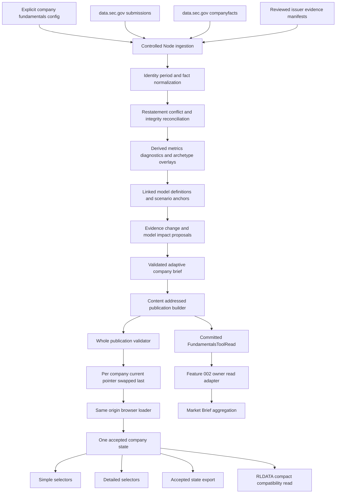

# Design: 010 Company Fundamentals and Adaptive Brief Lab

## Design Brief

### Current State

Research Lab is a build-free static site. `msft-july-print-model.html` contains a useful but company-specific FY26/FY27 Microsoft scenario, `rldata.js` owns browser-local market caches and compact tool-read compatibility, and Feature 002 defines the registry-driven distributed brief boundary. No current surface owns reusable company identity, filing facts, statement integrity, archetype-specific KPIs, linked company scenarios, restatement history, or an adaptive fundamentals brief.

The public browser cannot use SEC Company Facts directly because `data.sec.gov` has no CORS. Current Finnhub and Alpha Vantage browser policies in `rldata.js` are disabled and not eligible. The first useful company view therefore cannot depend on a browser credential, a public CORS proxy, browser-local fundamentals, or an inferred provider fallback.

### Target State

Add one reusable Company Research capability whose immutable, source-qualified publications are produced by a bounded Node ingestion path and consumed through same-origin static GETs. A single accepted state powers Simple and Detailed views, exports, company brief history, and a committed `FundamentalsToolRead`; optional market or licensed enrichment remains independently dated and can fail without erasing the accepted dossier.

The capability supports three initial source-qualified canaries: Microsoft as a recurring-revenue/software overlay, Chipotle as a unit-economics/lease overlay, and JPMorgan as a financial-institution overlay. They share identity, periods, facts, lineage, revisions, scenarios, evidence changes, and brief contracts, but they do not share a universal score or an economically invalid model formula.

### Patterns To Follow

- `msft-july-print-model.html::calculateAnnual`, `calculateRecon`, and the Feature 009 accepted-state design for explicit model inputs, derived outputs, separate market/model clocks, and user-owned scenario changes.
- `rldata.js::putToolRead`, `reportData`, and provider-policy fail-closed behavior for browser compatibility and scoped data status, not for authoritative company storage.
- `scripts/fetch-bars.mjs` for direct Node acquisition with an identifying User-Agent and committed same-origin snapshots, strengthened here with explicit SEC allowlists, bounded requests, staging, hashes, and pointer-last promotion.
- Feature 002 `ToolModelRead/v1` for owner-model authority, complete unavailable outcomes, evidence boundaries, registry discovery, and final-brief non-recomputation.
- `rlbrief.js` and `scripts/selftest.mjs` for Node-safe pure helpers and deterministic validation.
- The UX-owned persistent company shell, Simple/Detailed tab model, evidence-class vocabulary, source trace controls, and accessible table equivalents in `spec.md`.

### Patterns To Avoid

- Do not call `data.sec.gov`, issuer IR sites, Finnhub, Alpha Vantage, or a CORS proxy from `company-fundamentals-lab.html`.
- Do not store authoritative filings, statements, archetypes, accepted facts, or brief history in `localStorage`; browser storage is presentation and user-scenario state only.
- Do not import the existing MSFT page's hard-coded numbers as source truth. The generic dossier independently reconciles SEC and issuer evidence and treats any mismatch as a visible comparison or conflict.
- Do not choose the first XBRL fact, silently subtract YTD periods, average conflicting sources, carry a missing value forward, or coerce absence to zero.
- Do not encode formulas as executable strings, use `eval`, or make one industrial-company model apply to a bank.
- Do not let an LLM, news item, sentiment observation, or market move create a reported fact or mutate an accepted scenario.
- Do not duplicate Simple and Detailed computations, fetch on mode change, hide a source clock behind one page date, or render a composite company score.

### Resolved Decisions

- The initial supported canary set is MSFT, CMG, and JPM. A company outside the committed index receives an honest unsupported/coverage-only state.
- SEC Submissions and Company Facts are the keyless primary automated sources for U.S. issuer identity and standard reported facts. Issuer-specific KPI observations enter through reviewed source manifests with exact citations and rights metadata.
- SEC acquisition runs only in Node. `SEC_USER_AGENT` is a required non-secret execution input containing a real public contact identity; there is no built-in value and it is never persisted or logged.
- Public company data is content-addressed. A small per-company current pointer selects one validated immutable publication; pointers change last.
- `rldata.js` is not extended with a fundamentals cache family. The new dual-runtime `rlcompany.js` owns pure company contracts and browser acceptance; `RLDATA.putToolRead` receives only a compact compatibility projection.
- The initial data/accounting boundary is SEC-reporting U.S. GAAP issuers. International/IFRS identity may be displayed only as unsupported until an explicit source and taxonomy contract exists.
- Current consensus is not required. Licensed estimates can be added only through an eligible provider adapter; dated user assumptions remain `user-assumption`, never `estimate` or `actual`.
- The company brief is change-driven. Unchanged evidence fingerprints carry the prior validated brief and append an unchanged receipt only when a new evidence set was actually reviewed.
- Feature 002 consumes the committed owner read through a registry read adapter. It never reads browser-local state and cannot recompute facts, select an archetype, or apply a model proposal.
- The existing MSFT July-print model remains an independent specialist overlay with its own 2026-07-06 cutoff and scenario identity. The two tools deep-link; no assumption or reported-fact synchronization occurs implicitly.

### Open Questions

None blocking for technical design. Release-train adoption remains an owner-routed delivery precondition recorded in `spec.md`; this design does not invent a train. Optional commercial entitlements remain disabled until a separately approved source policy supplies rights, endpoint, credential transport, and failure behavior.

## Purpose And Scope

This design translates FR-010-001 through FR-010-104, NFR-010-001 through NFR-010-022, BS-010-001 through BS-010-032, and the UX-owned wireframes into one implementable static-site architecture. It covers:

- controlled SEC and reviewed issuer-evidence ingestion;
- immutable publication, lineage, revision, conflict, and integrity contracts;
- shared annual/quarterly statements, derived metrics, contextual diagnostics, and peer comparability;
- explicit ordinary-company and financial-institution linked models;
- evidence-change classification, adaptive company briefs, and user-controlled model-impact proposals;
- one accepted browser state across Simple, Detailed, export, and owner-read projections;
- Feature 002 registry, read-adapter, and history integration;
- accessible, responsive, keyboard-operable UI composition;
- source rights, privacy, failure containment, observability receipts, and build-free validation; and
- compatibility with the current Microsoft specialist model without replacing its assumptions.

This design does not authorize implementation, source-data fabrication, a browser SEC client, a paid source, a brokerage action, an international taxonomy, or a rewrite of Feature 002 or Feature 009.

## Brownfield Inventory

| Surface | Current Contract | Feature 010 Treatment |
| --- | --- | --- |
| `msft-july-print-model.html` | One dated MSFT Q4/FY27 scenario, editable controls, accepted market overlay, CSV | Preserve as specialist overlay; add only explicit cross-links during implementation and no silent state transfer |
| `notes/msft-july-print-model.md` | Primary-source notes plus known derived/estimated values and dated limitations | Use as reconciliation evidence, never as the generic dossier's authoritative data store |
| `rldata.js` | Schema-v1 browser market cache, disabled browser providers, strict `rl-tool-read/v1` compatibility | Reuse market/status/tool-read APIs; do not add authoritative fundamentals or browser SEC transport |
| `rlapp.js` | Shared scoped data-status surface | Report manifest, summary, detail, brief, read, and market resources independently |
| `rlbrief.js` | Node/browser pure brief helpers and render primitives | Reuse safe rendering conventions; company change/model logic stays in `rlcompany.js` |
| `scripts/selftest.mjs` | Pure helper extraction, registry parity, shared contract canaries | Add production-function tests without weakening existing groups |
| `scripts/brief-refresh.mjs` | Current deterministic Market Brief snapshot and partial owner-read set | Add a Feature 002 owner-read adapter that reads committed Feature 010 publications only |
| Feature 002 | Registry-driven `ToolModelRead/v1`, per-tool brief, immutable history, final aggregation boundary | Register the company tool as one `static-model` source and preserve its inner per-company outcomes |
| Feature 009 | MSFT model/market two-clock contract and immutable fundamental model cutoff | Preserve all clocks; generic MSFT dossier can link to but cannot re-date or rewrite the specialist model |
| `tools.json`, `index.html`, `rlnav.js` | Triplicated registry/discovery contract | Add one route in lockstep; registry participation automatically expands Feature 002 coverage |
| `market-brief.payload.json` | Current MSFT market/event narrative without owner fundamentals | Consume only the validated owner-read projection after Feature 002 integration; no hand-authored duplicate company math |

## Change Boundary

The later implementation may add or modify only product-owned company capability, registry, validation, and Feature 002 adapter surfaces planned from this design. It must not alter Bubbles framework-managed files, Feature 009 assumptions, existing market formulas, provider eligibility, credentials, release-train configuration, deployment, or unrelated tools.

The primary high-fan-out surfaces are `rldata.js`, `rlapp.js`, `scripts/selftest.mjs`, `tools.json`, `index.html`, `rlnav.js`, and `scripts/brief-refresh.mjs`. The preferred design avoids changes to `rldata.js` and `rlapp.js`; if implementation finds an unavoidable shared-contract gap, planning must isolate that change and require registry-wide canaries before broader work.

## Architecture Overview



### Runtime Boundaries

| Runtime | Reads | Writes | Authority |
| --- | --- | --- | --- |
| Controlled Node ingestion | Explicit config, required `SEC_USER_AGENT`, allowlisted SEC responses, reviewed issuer manifests, prior publication | Run-scoped staging and validated company artifacts | May acquire and normalize source evidence; cannot author user assumptions or market conclusions |
| Company publication builder | Reconciled dossier, explicit model definitions, prior accepted brief/read | Immutable objects, append-only history rows, current pointers | Owns deterministic projections and pointer promotion; cannot hide failed validation |
| Optional brief author adapter | One bounded structured owner input | One structured candidate brief in staging | May phrase supported interpretation; cannot add facts, evidence IDs, proposals, or authority |
| GitHub Pages browser | Same-origin index, pointer, immutable objects, existing market cache | DOM and non-sensitive local presentation/scenario state | Read-only for shared evidence; accepts only validated hashes/contracts |
| Feature 002 scheduled process | Frozen registry and committed owner-read reference | Feature 002 read/brief/history artifacts | Summarizes owner outcome; cannot recompute the company capability |

## Capability Foundation

### Foundation Contracts

| Contract | Responsibility | Consumers |
| --- | --- | --- |
| `CompanyIdentity/v1` | Stable issuer, security/share class, filing identity, listing, fiscal, currency, and accounting basis | Ingestion, browser selector, exports, owner reads |
| `ReportingPeriod/v1` | Exact instant/duration, fiscal labels, form, amendment, units, currency, and comparability | Facts, statements, KPIs, models, peers |
| `SourceArtifact/v1` | Source identity, public citation, acceptance/retrieval clocks, hash, rights, and availability | Every fact, claim, conflict, trace, and brief |
| `FactObservation/v1` | One immutable reported/normalized/estimate/claim/market/news/sentiment observation | Reconciliation, metrics, model anchors, evidence changes |
| `NormalizedFact/v1` | Explicit mapping from source concept to shared concept with sign, scale, and mapping state | Shared statements and cross-company formulas |
| `DerivedMetric/v1` | Formula/version/input lineage and qualifications | Diagnostics, models, Simple/Detailed views, owner read |
| `ArchetypeDefinition/v1` | KPI priorities, diagnostic applicability, model definition, brief topics, and peer rules | Concrete company overlays |
| `CompanyDossier/v1` | One reconciled identity/evidence/history state at an immutable cutoff | Browser, scenario builder, brief pipeline |
| `ScenarioRevision/v1` | Historical cutoff, accepted assumptions, model definition, outputs, and lineage | Model workspace, brief, export, owner read |
| `EvidenceChange/v1` | Deterministic prior/current evidence disposition and affected claims/drivers | Adaptive brief and model proposals |
| `ModelImpactProposal/v1` | Proposed assumption effect with evidence, range, conflict, confidence, and invalidation | User accept/edit/reject flow |
| `AdaptiveCompanyBrief/v1` | Validated material-change or unchanged company synthesis | Simple, Detailed, history, Feature 002 |
| `FundamentalsToolRead/v1` | Compact source-bounded owner outcome with separate clocks and deep links | Feature 002 adapter and browser compatibility projection |
| `CompanyPublicationManifest/v1` | Hash-bound coherent generation and object inventory | Browser acceptance, validators, rollback |

### Extension Points

1. **Source adapter:** maps one allowlisted source protocol into `SourceArtifact/v1` plus raw observations. It cannot resolve conflicts or invent missing data.
2. **Concept mapping:** maps explicit source concepts to shared facts for named companies/taxonomies. Unknown concepts remain unmapped.
3. **Archetype overlay:** supplies KPI definitions, diagnostic applicability, model definition ID, brief priorities, and peer compatibility rules.
4. **Model definition:** implements named pure formula nodes over validated facts and accepted assumptions. Configuration selects formula IDs but never carries executable expressions.
5. **Brief author adapter:** turns one validated structured brief input into bounded prose while preserving exact references and dispositions.
6. **Optional enrichment adapter:** may add estimates, news, transcripts, or sentiment only after rights, entitlement, transport, freshness, and failure policy are explicit.
7. **Feature 002 read adapter:** wraps committed per-company owner outcomes into one registry-discovered `ToolModelRead/v1` without rerunning company logic.
8. **Specialist overlay link:** binds a company dossier to an independent company/event model through explicit tool/model/cutoff metadata only.

### Foundation-Owned Invariants

1. A company publication resolves to one verified issuer and security identity or blocks company-level conclusions.
2. Every material value and claim resolves to one or more immutable source observations and all transformation consumers.
3. Reported, normalized, derived, guidance, estimate, user-assumption, model-output, management-claim, market-observation, news, and sentiment classes never share an unlabeled series.
4. Reporting end, source acceptance, retrieval, model cutoff, brief cutoff, market observation, and computation times remain separate fields.
5. Missing, absent-from-source, explicit zero, unavailable, stale, conflicted, rejected, and restated are distinct states.
6. Restatements and corrections append observations. No accepted observation or prior brief is rewritten.
7. Archetypes prioritize and qualify shared facts; they cannot change a reported value.
8. A diagnostic is evaluated only after applicability. Invalid/inapplicable checks do not become passes, failures, zeros, or score inputs.
9. No composite universal quality score exists.
10. A scenario revision is immutable after acceptance. Editing creates a draft; saving or accepting a proposal creates a new revision.
11. Evidence may create a proposal but cannot apply it. Only an explicit user confirmation changes the active revision.
12. Simple, Detailed, export, and owner read are selectors/projections over one accepted state generation.
13. Optional-source failure preserves the last valid dossier and independently valid classes, with no source substitution.
14. A brief can change only from a new validated evidence disposition or explicit correction. Unchanged evidence does not create novelty.
15. Feature 002 receives owner interpretations and clocks; it cannot infer or recompute them.

## Concrete Implementations

### Controlled SEC Source Adapter

The first automated adapter supports exactly two keyless endpoints per configured SEC issuer:

- `GET https://data.sec.gov/submissions/CIK{cik10}.json`
- `GET https://data.sec.gov/api/xbrl/companyfacts/CIK{cik10}.json`

The adapter allows only `https`, host `data.sec.gov`, no credentials, no cookies, and no cross-host redirects. It sends the required `SEC_USER_AGENT`, never prints that value, uses one request at a time, and enforces a configured minimum request interval that stays below the SEC 10 requests/second ceiling. Timeout, byte cap, attempt count, and retryable status codes are required explicit configuration. Exhaustion produces a source failure; it does not switch to a proxy or alternate provider.

### Reviewed Issuer Evidence Adapter

Issuer-specific KPIs, definitions, guidance, and management claims enter through `IssuerEvidenceManifest/v1`. Each manifest names an exact source URL/document identity, source-published time, captured/retrieved time, content hash when captured, document locator, rights class, structured observations, and reviewer rationale. The validator rejects an observation whose issuer, period, units, class, or source locator is missing.

The public publication stores only content permitted by the rights class. `redistributable-structured` may include structured values; `citation-and-summary-only` includes citation metadata and bounded factual summaries; `restricted-reference` includes identity and availability but no source body. Full transcripts and paid-source text never enter public artifacts unless a later approved rights policy explicitly permits it.

### Shared Dossier And Browser Runtime

`rlcompany.js` is a dual-runtime, dependency-free IIFE following `rldata.js`/`rlbrief.js`. It exposes named pure functions for contract validation, canonical hashing input, period classification, reconciliation, derived metrics, diagnostics, model graphs, evidence changes, accepted-state reduction, selectors, export projection, and owner-read projection. It has no network, filesystem, DOM, provider credential, or authoring authority.

`company-fundamentals-lab.html` owns the controller and renderers. It loads `rldata.js`, `rlapp.js`, `rlcompany.js`, `rlg.js`, `rlchart.js`, `rlticker.js`, and `rlnav.js` in dependency order. The controller performs same-origin publication loading and state transitions; renderers consume selectors and never fetch or mutate source truth.

### Microsoft Recurring-Revenue/Software Overlay

- Required shared statements: income, balance sheet, cash flow, capital allocation, per-share history.
- Prioritized sourced KPIs: Azure/cloud growth, RPO or equivalent backlog, capex, depreciation, margins, cash conversion, and dilution.
- Model family: ordinary-company three-statement model plus recurring-revenue growth, margin, capex/depreciation, and share-count nodes.
- Diagnostic qualifications: cash/investments classification, debt/lease distinction, capex definition, OpenAI/non-operating effects, and RPO concentration.
- Specialist boundary: `msft-july-print-model` remains a separately identified scenario with its own cutoff and assumptions.

### Chipotle Unit-Economics/Lease Overlay

- Required shared statements: income, balance sheet, cash flow, capital allocation, per-share history.
- Prioritized sourced KPIs: comparable sales, unit count, openings/closures, restaurant margin, labor/food costs, and lease obligations.
- Model family: ordinary-company three-statement model plus unit count, unit sales, comparable sales, restaurant margin, lease, and opening-investment nodes.
- Diagnostic qualifications: raw funded debt remains separate from lease obligations; treasury-stock-reduced equity and gross/net share effects remain visible.
- Missing unit or lease definition continuity blocks related trend/model outputs rather than inheriting another period.

### JPMorgan Financial-Institution Overlay

- Required shared facts remain source-compatible, but industrial current-ratio, net-debt/EBITDA, ordinary liabilities/equity, and generic free-cash-flow conclusions are inapplicable unless a specific valid definition exists.
- Prioritized sourced KPIs: net interest income/margin, deposits, loans, credit losses/charge-offs/reserves, fee/trading mix, CET1, liquidity, preferred/regulatory capital, and capital distributions.
- Model family: financial-institution model over earning assets, funding/deposits, NIM, noninterest revenue/expense, provision/credit cost, capital, risk-weighted assets, and shares.
- Deposits and trading liabilities are business-model balance-sheet items, not silently reclassified as ordinary funded debt.
- The 0.8 liabilities/equity heuristic is `inapplicable` and cannot affect summary direction.

### Feature 002 Owner-Read Adapter

The registry entry for `company-fundamentals-lab` uses role `source`, profile `static-model`, read adapter `company-fundamentals-owner-v1`, read contract `tool-model-read/v1`, an explicit company-fundamentals freshness policy, and a non-market-action recommendation policy. The adapter reads the committed current owner-read manifest for configured `briefSubjects`; it does not load browser `localStorage` or invoke company formulas.

Each `FundamentalsToolRead/v1` becomes a bounded fact set and owner interpretation inside Feature 002 `ToolModelRead/v1`. `recommendationEligibility.eligible` is false for trade actions. The allowed outcome is an educational company-research conclusion with explicit direction, conflicts, horizon, watch conditions, and invalidation. Feature 002 retains its own run/evidence cutoff while preserving statement, model, company-brief, and market clocks from the owner object.

### Microsoft Specialist Overlay Compatibility

The generic MSFT publication includes `SpecialistOverlayLink/v1` with `toolId`, `modelIdentity`, `modelCutoff`, `modelStatus`, `deepLink`, and `boundary`. The link states that the specialist page is an independent FY26 Q4/FY27 scenario. It does not copy assumptions, treat the specialist model as consensus, or assert that generic dossier refresh changed the specialist model.

The specialist page can link back using only company identity and a return target. Returning restores generic display/scenario state from the generic tool's own local state. Any future explicit assumption transfer would require a separate user-confirmed import contract; it is not implicit in this feature.

### Variation Axes

| Axis | Variants | Foundation-Owned Policy |
| --- | --- | --- |
| Source protocol | SEC keyless JSON, reviewed issuer manifest, eligible licensed enrichment, existing market cache | Provenance, rights, clocks, hash, and failure states are shared; transport/parsing stays adapter-owned |
| Evidence class | reported, normalized, derived, guidance, estimate, user assumption, model output, management claim, market, news, sentiment | Classes never collapse; allowable consumers vary |
| Company archetype | recurring software, unit economics/leases, financial institution, unclassified | Shared facts stay stable; KPI/model/diagnostic/brief priorities vary |
| Model family | ordinary-company three-statement, financial-institution balance-sheet/capital | Common scenario lineage and output contracts; formulas differ |
| Storage behavior | immutable public publication, append-only history, local user scenario/display state | Public evidence is authoritative; local state cannot replace it |
| Brief outcome | material update, unchanged, partial, stale, conflicted, unavailable | Every outcome carries evidence disposition and cutoffs |
| UI composition | Simple cockpit, six Detailed workspaces, degraded/blocking states | One accepted state and reusable primitives across all views |
| Consumer | browser UI, export, browser compatibility read, Feature 002 scheduled owner read | All projections must match one publication/state generation |

## Data Model

There is no database and no SQL migration. The storage schema is a set of versioned JSON objects, immutable content-addressed files, and append-only JSONL history. TypeScript notation below documents plain JavaScript/JSON shapes; no TypeScript toolchain is introduced.

### Common Types

```typescript
type EvidenceClass =
  | "reported" | "normalized" | "derived" | "guidance" | "estimate"
  | "user-assumption" | "model-output" | "management-claim"
  | "market-observation" | "news" | "sentiment";

type EvidenceState =
  | "current" | "partial" | "stale" | "conflicted" | "unavailable"
  | "rejected" | "restated" | "absent-from-eligible-source";

type ObjectRef = {
  contractVersion: "company-object-ref/v1";
  path: string;
  sha256: `sha256:${string}`;
  objectId: string;
};

type SourceClock = {
  reportingPeriodEnd: string | null;
  sourcePublishedAt: string | null;
  acceptedAt: string | null;
  retrievedAt: string | null;
  observedAt: string | null;
};
```

### CompanyIdentity/v1

| Field | Type | Rule |
| --- | --- | --- |
| `companyId` | string | Stable identity such as `sec-cik-<10 digits>`; never ticker-only |
| `issuerName`, `ticker`, `exchange`, `securityName` | strings | Exact accepted identity fields |
| `cik` | 10-digit string | Required for SEC adapter |
| `reportingCurrency`, `fiscalYearEnd`, `accountingBasis` | strings | Explicit; no inferred default |
| `identitySourceRefs` | ref[] | Must prove issuer and security/listing relationship |
| `continuity` | object | Ticker/share-class/merger/spin state and explicit decision |
| `status` | enum | `verified`, `conflicted`, `inactive`, or `unsupported` |

### ReportingPeriod/v1

```typescript
type ReportingPeriodV1 = {
  contractVersion: "reporting-period/v1";
  periodId: string;
  kind: "instant" | "quarter" | "year-to-date" | "annual" | "trailing";
  start: string | null;
  end: string;
  durationDays: number | null;
  fiscalYear: number;
  fiscalQuarter: 1 | 2 | 3 | 4 | null;
  form: "10-K" | "10-K/A" | "10-Q" | "10-Q/A" | "8-K" | "issuer-release";
  accession: string | null;
  filedAt: string;
  amendmentState: "original" | "amended" | "recast";
  comparability: "comparable" | "qualified" | "incomparable";
  qualifications: string[];
};
```

Quarter, YTD, annual, and instant records have distinct IDs. A fourth-quarter value derived from annual minus comparable Q1-Q3 is `derived`, carries all four inputs, and is never relabeled `reported`.

### SourceArtifact/v1

```typescript
type SourceArtifactV1 = {
  contractVersion: "source-artifact/v1";
  sourceId: string;
  companyId: string;
  sourceKind: "sec-submissions" | "sec-companyfacts" | "filing" | "issuer-release" |
    "issuer-presentation" | "transcript" | "estimate-set" | "market" | "news" | "sentiment";
  url: string;
  documentId: string;
  clocks: SourceClock;
  contentSha256: string | null;
  rights: "redistributable-structured" | "citation-and-summary-only" | "restricted-reference";
  availability: "available" | "metadata-only" | "link-unavailable";
  limitations: string[];
};
```

### FactObservation/v1 And NormalizedFact/v1

```typescript
type FactObservationV1 = {
  contractVersion: "fact-observation/v1";
  observationId: string;
  companyId: string;
  evidenceClass: EvidenceClass;
  sourceRef: ObjectRef;
  periodRef: ObjectRef | null;
  sourceConcept: string;
  value: string | null;
  valueType: "decimal" | "integer" | "string" | "boolean";
  unit: string;
  currency: string | null;
  decimals: string | null;
  signConvention: string;
  state: EvidenceState;
  clocks: SourceClock;
  definition: string;
  qualifiers: string[];
};

type NormalizedFactV1 = {
  contractVersion: "normalized-fact/v1";
  factId: string;
  normalizedConcept: string;
  currentObservationId: string | null;
  observationIds: string[];
  mappingId: string;
  mappingVersion: string;
  transformation: { sign: number; scalePower10: number; aggregation: string };
  resolutionState: "reconciled" | "restated" | "conflicted" | "unmapped" | "unavailable";
  resolutionReason: string;
};
```

Canonical source numbers remain decimal strings. Calculation helpers convert only validated finite decimal strings within the declared safe range; source strings remain available for reconstruction. Rounding occurs only in presentation or explicitly versioned derived formulas.

### DerivedMetric/v1 And DiagnosticCheck/v1

| Field | Derived metric | Diagnostic check |
| --- | --- | --- |
| Identity | `metricId`, `formulaId`, `formulaVersion` | `checkId`, `policyId`, `policyVersion` |
| Inputs | Ordered fact/metric refs with periods and units | Raw fact/metric refs plus adjustment refs |
| Output | Decimal string, unit, period, state | Raw result, applicability, adjustment, contextual result |
| Qualification | Invalid denominator, comparability, missing input, precision | Named rule, archetype rationale, limitations |
| Lineage | Every input and transformation | Raw and contextual consumers remain side by side |

### ArchetypeAssignment/v1

```typescript
type ArchetypeAssignmentV1 = {
  contractVersion: "archetype-assignment/v1";
  companyId: string;
  primary: string | null;
  secondary: string | null;
  status: "accepted" | "proposed" | "unclassified" | "under-review";
  evidenceRefs: ObjectRef[];
  rationale: string;
  activeFrom: string;
  supersedes: string | null;
  kpiDefinitionIds: string[];
  modelDefinitionId: string | null;
  diagnosticPolicyIds: string[];
};
```

### ScenarioRevision/v1

```typescript
type ScenarioRevisionV1 = {
  contractVersion: "company-scenario-revision/v1";
  scenarioId: string;
  revision: number;
  companyId: string;
  name: string;
  owner: "committed-research" | "local-user";
  state: "draft" | "active" | "superseded";
  dossierRef: ObjectRef;
  historicalCutoff: string;
  modelDefinitionId: string;
  assumptions: ModelAssumptionV1[];
  outputs: ModelOutputV1[];
  integrity: IntegrityResultV1[];
  createdAt: string;
  parentRevisionRef: string | null;
};
```

Every assumption has `assumptionId`, driver, evidence class, value/range, unit, affected periods, rationale, source refs, owner, and revision state. A required missing assumption blocks dependent outputs; model definitions carry no fallback values.

### EvidenceChange/v1 And ModelImpactProposal/v1

`EvidenceChange/v1` stores prior/current observation refs, class, exact period/window, novelty state (`material`, `immaterial`, `duplicate`, `confirmation`, `conflict`, `not-evaluable`), company mechanism, affected claim/driver refs, and ranking inputs. `ModelImpactProposal/v1` stores affected assumption IDs, proposed direction/range, rationale, supporting/conflicting evidence, confidence band, invalidation, decision state, and resulting scenario revision only after user confirmation.

### AdaptiveCompanyBrief/v1

```typescript
type AdaptiveCompanyBriefV1 = {
  contractVersion: "adaptive-company-brief/v1";
  briefId: string;
  companyId: string;
  archetypeAssignmentRef: ObjectRef;
  dossierRef: ObjectRef;
  scenarioRevisionRef: string;
  priorBriefRef: ObjectRef | null;
  status: "material-update" | "unchanged" | "partial" | "stale" | "conflicted" | "unavailable";
  evidenceCutoff: string;
  coverage: EvidenceCoverageV1[];
  changes: EvidenceChangeV1[];
  thesisClaims: ThesisClaimV1[];
  modelImpactProposals: ModelImpactProposalV1[];
  catalysts: BoundedClaimV1[];
  risks: BoundedClaimV1[];
  watchConditions: BoundedClaimV1[];
  invalidations: BoundedClaimV1[];
  sourceRefs: ObjectRef[];
  validation: { policyVersion: string; checks: string[] };
};
```

### FundamentalsToolRead/v1

| Field | Rule |
| --- | --- |
| `toolId`, `companyId`, `company`, `archetypes` | Exact owner/tool/subject identity |
| `publicationRef`, `dossierRef`, `briefRef`, `scenarioRevisionRef` | Immutable current owner references |
| `computedAt` | Projection time only; never source freshness |
| `statementCutoff`, `modelCutoff`, `briefCutoff`, `marketCutoff` | Four independent clocks; nullable only with typed reason |
| `coverage` | Per-class current/partial/stale/conflicted/unavailable state |
| `fundamentalDirection`, `financialResilience` | Source-bounded text/state with evidence refs; no score |
| `materialChanges`, `modelImpactProposals` | Bounded IDs/summaries and decision states |
| `catalysts`, `risks`, `watchConditions`, `invalidations` | Falsifiable, evidence-linked, horizon-qualified items |
| `confidenceBand`, `limitations`, `conflicts` | Must constrain the read when evidence is weak |
| `deepLinks` | Same-origin current/brief/source/model targets |
| `fingerprint` | Canonical semantic identity excluding computation occurrence |

### CompanyPublicationManifest/v1

```typescript
type CompanyPublicationManifestV1 = {
  contractVersion: "company-publication-manifest/v1";
  publicationId: string;
  generation: number;
  companyId: string;
  createdAt: string;
  sourceCutoff: string;
  configFingerprint: string;
  policyVersions: Record<string, string>;
  identityRef: ObjectRef;
  summaryRef: ObjectRef;
  dossierRef: ObjectRef;
  modelPackRef: ObjectRef | null;
  briefRef: ObjectRef | null;
  ownerReadRef: ObjectRef;
  sourceRefs: ObjectRef[];
  historyRefs: ObjectRef[];
  validation: { status: "validated"; checks: string[] };
  manifestSha256: string;
};
```

## Static API And Ingestion Contracts

### Public Same-Origin GET Contracts

| Method | Path | Response | Browser policy |
| --- | --- | --- | --- |
| `GET` | `data/company-fundamentals/index.json` | `CompanyIndex/v1` with verified companies and current pointer refs | `cache: no-store`; exact schema required |
| `GET` | `data/company-fundamentals/companies/{companyId}/current.json` | Small current-pointer object with generation, manifest path/hash | `cache: no-store`; company ID must match selection |
| `GET` | `data/company-fundamentals/objects/{sha256}.json` | One immutable object whose bytes match URL/ref hash | Same-origin only; verify SHA-256 before acceptance |
| `GET` | `data/company-fundamentals/history/{companyId}/{yyyy-mm}.jsonl` | Append-only brief/read/revision index rows | User-initiated history only; validate each bounded row |
| `GET` | Existing `data/bars/{ticker}.json` and quote/option resources | Separate market evidence | Existing `RLDATA`/Feature 009 policy; never a fundamentals source |

Static responses never accept request bodies, auth headers, cookies, or user-specific query parameters. Unsupported contract major versions, wrong content type, HTML returned for JSON, missing hash, unsafe path, or identity mismatch are rejected.

### CompanyIndex/v1 And Current Pointer

```typescript
type CompanyIndexV1 = {
  contractVersion: "company-index/v1";
  generatedAt: string;
  configFingerprint: string;
  companies: Array<{
    companyId: string;
    issuerName: string;
    ticker: string;
    exchange: string;
    securityName: string;
    cik: string;
    status: "supported" | "unsupported" | "conflicted";
    currentPointerPath: string | null;
  }>;
};

type CompanyCurrentPointerV1 = {
  contractVersion: "company-current-pointer/v1";
  companyId: string;
  generation: number;
  publicationId: string;
  manifestPath: string;
  manifestSha256: `sha256:${string}`;
  selectedAt: string;
};
```

The static host may return `404` for an absent path; the loader maps that to `C010-PUBLICATION-NOT-FOUND`. Any non-2xx response, redirect outside the same origin, wrong media type, JSON parse failure, unsupported version, company mismatch, or byte-hash mismatch produces a scoped or blocking `CompanyError/v1`; response text is never rendered as an error message.

### Browser Route And Deep-Link Contract

`company-fundamentals-lab.html` accepts only these bounded query parameters:

| Parameter | Values | Behavior |
| --- | --- | --- |
| `company` | Ticker or stable company ID present in current index | Requests identity resolution; unknown value produces unsupported state |
| `mode` | `simple` or `detailed` | Presentation only |
| `tab` | `statements`, `resilience`, `model`, `brief`, `sources`, `peers` | Detailed workspace selection only |
| `ref` | Stable object/fact/claim/brief ID matching the accepted company publication | Focus target; invalid or cross-company refs are rejected |

Query parameters cannot carry facts, assumptions, credentials, source URLs, or executable expressions. A historical brief link resolves an immutable brief ref and remains read-only.

### External Node Acquisition Contract

The SEC adapter issues only the two exact endpoint families above. Request configuration requires:

- `SEC_USER_AGENT` present and non-empty;
- allowlisted scheme/host/path pattern;
- explicit timeout, response-byte limit, minimum interval, attempt count, and retryable statuses from `company-fundamentals.config.json`;
- redirect rejection when destination origin differs;
- JSON content type and finite parse size; and
- response identity equal to configured CIK.

The adapter records URL without query secrets, HTTP status, started/completed times, byte count, response hash, and result code. It never records headers or environment values.

### Authorization Matrix

| Surface | Public browser | Research user | Scheduled/local ingestion | Feature 002 | Rights reviewer |
| --- | --- | --- | --- | --- | --- |
| Same-origin company GETs | Read | Read | Read/produce through validator | Read owner ref | Read |
| SEC external GETs | Forbidden | Forbidden from page | Allowed with required User-Agent and allowlist | Forbidden | Read citation separately |
| Issuer evidence manifest | Read permitted public projection | Read | Produce only from reviewed source evidence | Read owner projection | Approves rights metadata |
| Local scenario state | No shared access | Read/write own browser state | No access | No access | No access |
| Public publication pointers/history | Read | Read | Append/promote after validation | Read | Read |
| Feature 002 owner read | Read compatibility projection | Read | Produce committed object | Consume only | Read |

## Source Ingestion And Update Flow

1. Resolve explicit company selection from `company-fundamentals.config.json`. Missing CIK, identity, archetype decision, source policy, or required policy version fails before network access.
2. Create a run-scoped staging directory outside public data paths. No current pointer or history file changes.
3. Fetch SEC Submissions and Company Facts serially with bounded policy. Preserve exact response hashes and source clocks.
4. Load reviewed issuer evidence manifests and validate issuer, security, period, units, class, source locator, content hash/rights, and duplicate identity.
5. Normalize identity and periods. Reject wrong-company, wrong-share-class, malformed, future-dated, duplicate, impossible-duration, or unsupported-currency observations into a quarantine receipt.
6. Build immutable source observations. Map only explicitly allowed concepts. Preserve unmapped issuer extensions and missing concepts.
7. Reconcile amendments, later comparative recasts, duplicates, and conflicts. Never delete an earlier observation.
8. Run statement identities, cash roll-forward checks, per-share basis checks, mapping checks, and archetype applicability checks.
9. Build derived metrics, diagnostics, model anchors, committed scenario packs, evidence changes, proposals, brief candidate, and owner read from the reconciled dossier.
10. Validate the complete object graph, canonical hashes, cross-object refs, rights constraints, UI summary/detail parity, and Feature 002 read projection.
11. Write immutable objects under hash paths, append new history rows, update the company index if membership changed, and replace the per-company current pointer last.
12. Emit a structured run receipt with counts and reason codes. A failed run keeps staging for diagnosis or removes it without changing current state; it never publishes a partial generation.

Repeated ingestion of identical accepted source bytes, config, and policy versions produces the same semantic fingerprints and no duplicate fact, change, proposal, brief content, or history event.

## Normalization And Period Rules

### XBRL Context Selection

- Identity key: CIK, taxonomy, concept, unit, start/end or instant, accession, form, fiscal year/period, filed time, and frame when supplied.
- Accepted automated forms: configured `10-K`, `10-K/A`, `10-Q`, and `10-Q/A`. Other forms remain source artifacts until a mapping explicitly permits them.
- Instant facts bind to an exact date. Duration facts preserve exact start/end and duration.
- A direct quarter requires a quarter-duration observation and compatible fiscal/form context. YTD observations remain YTD.
- Annual-minus-Q1-Q2-Q3 derives Q4 only when concept, unit, currency, accounting basis, fiscal year, and comparability all match. The result is `derived-q4`, not reported.
- Trailing values are derived only from explicit compatible quarters with no overlap/gap; otherwise unavailable.
- Fiscal 52/53-week and stub periods preserve duration and qualify comparisons.

### Mapping Resolution

Mappings are versioned and explicit by normalized concept, accepted taxonomy concepts, duration/instant kind, sign, unit, and company override. If two eligible observations map to the same fact:

1. Identical source/value/context observations deduplicate by semantic ID while preserving source receipts.
2. A later amendment or comparative recast may become current only under an explicit chronology rule; the earlier observation remains `superseded-by-restatement`.
3. Different values with no valid amendment/recast relation remain `conflicted`.
4. An issuer-specific KPI definition never maps to a shared concept solely because its label resembles one.
5. No hidden precedence, averaging, prior-period carry, or zero substitution is allowed.

### Statement Integrity

Balance-sheet tolerance is derived from accepted XBRL precision, not a hidden percentage. For each input with finite `decimals`, the validator derives its half-rounding interval; the maximum permissible identity difference is the sum of input intervals. Missing precision makes the precision-based identity unevaluable rather than silently selecting a tolerance.

Cash roll-forward uses beginning cash plus operating, investing, financing, and FX/other reconciliation items only when all components cover the same period and cash definition. Per-share checks require a declared split-adjustment and diluted-share basis. A failed check records input refs, observed difference, allowed interval, and affected consumers.

### Restatement And Conflict Propagation

- Current display chooses a later accepted amended/recast observation only when its relationship is proven.
- Trend charts mark the break and do not draw an unqualified continuous series across changed definitions.
- Derived metrics and model anchors inherit the most severe unresolved input state.
- A conflicted model anchor blocks dependent outputs and proposals; independent outputs remain usable.
- Brief changes distinguish `restatement`, `correction`, and `new-period` so historical truth is not rewritten as ordinary growth.

## Derived Metrics And Contextual Diagnostics

Every derived metric is a named pure function over explicit input refs. The required shared set includes growth, margins, cash conversion, selected free-cash-flow definition, capex intensity, liquidity, net-debt decomposition, leverage where valid, asset efficiency, returns where valid, and per-share development.

`FreeCashFlow/v1` is operating cash flow less the explicitly selected PP&E capital-expenditure concept. Acquisitions, leases, financing, and stock compensation are separate components. `NetDebt/v1` separately reports cash, restricted cash, eligible securities, funded debt, lease liabilities, and other financing obligations; consumers choose a named view rather than one opaque value.

The Buffett lens produces five independent `DiagnosticCheck/v1` results. Each shows raw facts/formula, named rule if any, applicability, adjustment, rationale, source refs, and contextual result. Preferred stock has `present`, `explicit-zero`, `absent-from-eligible-source`, `ambiguous`, or `unavailable`. Retained earnings includes dividends/distributions and accumulated-deficit context. Treasury stock includes accounting sign, gross repurchases, issuance/SBC, net share change, financing, and available price context before interpretation.

## Linked Model Computation

### Model Graph Contract

Each `ModelDefinition/v1` declares input node IDs, formula node IDs, dependency edges, output classes, integrity checks, prohibited ranges, and balancing-item policy. Formula IDs resolve to named production functions in `rlcompany.js`; configuration cannot inject code. A topological sort rejects cycles before evaluation.

Evaluation uses one immutable tuple:

```text
(company publication ID, historical cutoff, model definition version,
 accepted scenario revision, explicit market observation ref or null)
```

Changing one assumption creates a draft tuple and recomputes all reachable nodes once. It cannot mutate reported history, another revision, or a committed brief. Non-finite results, invalid denominators, prohibited negative values, unresolved anchor states, and failed accounting identities stop the affected branch with an exact dependency path.

### Ordinary-Company Model Family

The ordinary-company foundation supports explicit nodes for revenue drivers, gross profit/margin, operating expense, operating income, taxes, net income, D&A, capex, working-capital change, operating cash flow, free cash flow, financing, debt, cash, retained earnings, equity, diluted shares, EPS, and valuation. It uses only nodes supplied by the selected company/archetype definition.

Representative relationships are versioned formula identities, not default assumptions:

$$
Revenue_t = Revenue_{t-1} \times \prod_i (1 + Driver_{i,t})
$$

$$
OperatingIncome_t = GrossProfit_t - OperatingExpense_t
$$

$$
Cash_t = Cash_{t-1} + CFO_t + CFI_t + CFF_t + FXOther_t
$$

$$
RetainedEarnings_t = RetainedEarnings_{t-1} + NetIncome_t - DividendsDistributions_t
$$

Every active relationship names its input concepts and period. If working capital, lease, financing, tax, or share nodes are not defined, dependent cash/balance/per-share outputs are unavailable rather than balanced by an unnamed residual.

### Financial-Institution Model Family

The bank model uses explicit nodes for average earning assets, NIM, net interest income, noninterest revenue, noninterest expense, pre-provision earnings, provision/credit cost, pretax income, tax, net income, loans, deposits/funding, reserves, risk-weighted assets, CET1 capital/ratio, preferred capital, distributions, and diluted shares.

It does not call ordinary-company free cash flow, current ratio, net-debt/EBITDA, or the 0.8 liabilities/equity lens. Balance growth and capital distributions must reconcile to capital/RWA outputs when those anchors exist. Missing regulatory facts block capital outputs without blocking independent income facts.

### Sensitivity And Valuation

Sensitivity varies one or two named accepted assumptions within explicit user/model bounds and records invalid regions. No interpolation crosses a blocked/non-finite region. Valuation records method, horizon, model output, market observation ref/date, rate/multiple assumptions, and limitations. A market-price refresh changes market-relative outputs only; it never changes statement/model/brief cutoffs.

## Adaptive Brief Pipeline

1. Compare current and prior accepted publications by semantic observation, mapping, metric, claim, scenario, and source identities.
2. Classify each evidence item as material, immaterial, duplicate, confirmation, conflict, or not evaluable.
3. Link evidence only to demonstrated company mechanisms, active thesis claims, and model drivers.
4. Rank changes by explicit source quality, company materiality, model sensitivity, novelty, event proximity, and unresolved risk. Headline count is not an input.
5. Build deterministic thesis, resilience, catalyst, risk, watch, invalidation, and proposal records from eligible refs.
6. If an author adapter is enabled, provide only bounded structured records and closed instructions. Treat all source strings as untrusted data. The author returns schema-valid text and references only.
7. Validate every material sentence/number against cited owner records, preserve conflicts and classes, and reject unsupported output.
8. Publish `material-update`, `unchanged`, `partial`, `stale`, `conflicted`, or `unavailable` with prior-brief linkage.
9. Project the same accepted result into `FundamentalsToolRead/v1`.

Management claims remain claims. News and sentiment may create risk/watch context but never a fact or numeric assumption update. A price move changes valuation/market context only. An unchanged brief lists reviewed evidence and no-change rationale; it does not rewrite the prior thesis for novelty.

## Feature 002 Owner-Read Integration

### Committed Owner Read

For each configured `briefSubject`, the company publication contains one `FundamentalsToolRead/v1`. A small current owner-read manifest maps company IDs to object refs and fingerprints. The Feature 002 adapter freezes that manifest at its run cutoff and emits one `ToolModelRead/v1` whose facts and owner interpretations preserve each subject boundary.

The adapter mapping is:

| Feature 010 field | Feature 002 field |
| --- | --- |
| Company publication/model version | `adapter.owningModelVersion` and source refs |
| Owner read status and coverage | `status`, facts, limitations, evidence boundary |
| Statement/model/brief/market cutoffs | Separate facts plus `modelAsOf`/`sourceAsOf`; no single inherited freshness claim |
| Direction/resilience/changes/conflicts | Owner facts and `evidenceInterpretations` |
| Horizon/watch/invalidation | Static-model conclusion fields; not a trade recommendation |
| Deep links | Registry-owned same-origin tool link plus validated inner refs |
| Fingerprint | Input to Feature 002 semantic read fingerprint |

The Market Brief may quote or summarize the validated owner interpretation and disagreement. It cannot select a different current fact, convert `partial` to `fresh`, apply a proposal, or treat a market observation as a newer statement.

### Browser Compatibility Read

On each accepted render, the page calls `RLDATA.putToolRead("company-fundamentals-lab", envelope)` with strict `rl-tool-read/v1`. `computedAt` is the browser projection time; `asOf` is the owner brief cutoff or null when no brief exists; `metrics` includes separate statement/model/brief/market cutoffs, coverage, company ID, publication ID, and fingerprint. The one-line `read` names the subject and limitations. This local record supports the existing browser shell only and is never scheduled authority.

## Accepted Browser State

```typescript
type CompanyAcceptedStateV1 = {
  contractVersion: "company-accepted-state/v1";
  request: { companyToken: string; requestSeq: number };
  identity: { status: "loading" | "accepted" | "conflicted" | "unsupported"; value: CompanyIdentityV1 | null };
  publication: { status: EvidenceState | "loading"; manifestRef: ObjectRef | null; generation: number | null };
  summary: CompanyDossierSummaryV1 | null;
  dossier: CompanyDossierV1 | null;
  archetype: ArchetypeAssignmentV1 | null;
  scenario: { active: ScenarioRevisionV1 | null; draft: ScenarioRevisionV1 | null; saved: ScenarioRevisionV1[] };
  brief: AdaptiveCompanyBriefV1 | null;
  ownerRead: FundamentalsToolReadV1 | null;
  market: { status: EvidenceState | "loading"; observationRef: string | null; observedAt: string | null };
  evidenceCoverage: EvidenceCoverageV1[];
  display: { mode: "simple" | "detailed"; tab: "statements" | "resilience" | "model" | "brief" | "sources" | "peers"; focusRef: string | null };
  receipts: EvaluationReceiptV1[];
};
```

### State Transitions

- `selectCompany` increments request sequence, clears every prior-company projection immediately, preserves only global display preference, and begins index/pointer loading.
- `acceptPublication` requires matching requested identity, a newer/equal generation, valid manifest/object hashes, and complete required summary refs.
- Detailed objects begin hydrating automatically after summary acceptance. Mode change never initiates a request; it reads current hydration state.
- `acceptMarketObservation` updates market-owned fields and market-relative outputs only.
- `editAssumption` creates/updates a draft; `saveDraft` creates an immutable local revision; `discardDraft` restores the selected saved revision.
- `acceptProposal` and `editProposal` require confirmation and create a new revision. `rejectProposal` records the decision without changing active assumptions.
- `setMode`, `setTab`, and `setFocusRef` change presentation only.
- A failed request records a scoped receipt and retains the last valid same-company state. A new company request never displays the previous company's values.

### Local Persistence

`localStorage.rlCompanyUserStateV1` stores only schema version, display preference, last selected company ID, per-company user scenario revisions, active local revision ID, and proposal decisions. It stores no filings, source facts, private notes, positions, cost basis, P&L, credentials, or restricted content. Every restored scenario must match the accepted company ID, dossier cutoff, and model definition version; mismatch leaves it inactive and visible for explicit review rather than silently rebasing it.

## UI Component Specification

### Component Tree

```text
CompanyFundamentalsApp
  CompanyTruthShell
    CompanyIdentityCombobox
    ModeSegment
    PageActionBar
    CompanyTruthStrip
    ScopedDegradationBanner
  SimpleCockpit
    AdaptiveBriefBand
    FundamentalDirectionBand
    FinancialResilienceBand
    MaterialChangesBand
    ActiveScenarioBand
    ModelImpactProposalList
    CatalystRiskWatchBand
  DetailedWorkspace
    DetailedTabs
    StatementsWorkspace
    ResilienceWorkspace
    ModelWorkspace
    BriefWorkspace
    SourcesWorkspace
    PeersWorkspace
  CompanyLiveRegion
```

These are composition responsibilities, not a component framework. The implementation remains semantic HTML plus named JavaScript render functions in one tool page, using shared scripts for data/status/chart/ticker/navigation behavior.

### Data Flow And Selectors

| Selector | Input | Consumers | Rule |
| --- | --- | --- | --- |
| `selectTruthStrip` | accepted state | persistent shell | Returns distinct statement/model/brief/market/coverage clocks |
| `selectSimpleView` | accepted state | Simple bands and compatibility read | Bounded decision-first projection; no recomputation |
| `selectStatementsView` | dossier plus display period | Statements | Period-valid rows, metrics, qualifications, trace refs |
| `selectResilienceView` | dossier, archetype, diagnostics | Resilience | Raw before contextual; no aggregate score |
| `selectModelView` | active/draft scenario | Model | One dependency graph and integrity results |
| `selectBriefView` | brief plus decisions | Brief | Current/history projections with immutable refs |
| `selectSourcesView` | dossier plus focus ref | Sources | Exact observations, transformations, consumers, conflicts |
| `selectPeersView` | dossier plus peer purpose | Peers | Comparable/qualified/excluded rows and sample truth |
| `buildAcceptedExport` | accepted state | Export | No network or hidden refresh |

### Event And Side-Effect Ownership

| User event | Pure transition | Allowed side effect |
| --- | --- | --- |
| Company search/select | `reduceCompanySelection` | Same-origin publication reads started once for selection |
| Simple/Detailed or tab change | `reduceDisplay` | DOM update and synchronous visible-canvas redraw only |
| Period/metric/peer-purpose change | `reduceDisplayFilter` | DOM update only |
| Assumption edit | `reduceScenarioDraft` plus model evaluation | Persist non-sensitive draft after valid state replacement |
| Accept/Edit/Reject proposal | `reduceProposalDecision` | Persist decision/new local revision after confirmation |
| Trace action | `reduceDisplay` with focus ref | Focus movement and URL update with bounded same-company ref |
| Export | `buildAcceptedExport` | Browser download of current accepted projection only |
| Refresh eligible market class | Existing RLDATA policy | Scoped status update; no fundamentals mutation |

### Responsive And Canvas Rules

- Simple follows the exact UX band order. Only direction/resilience and catalyst/watch use sibling columns on wide screens.
- Detailed tables scroll inside labeled regions; the page body never scrolls horizontally at 320 CSS pixels.
- Long issuer names, source IDs, timestamps, negative values, and localized labels wrap without resizing stable controls.
- Mobile makes accessible tables/text summaries primary and places charts after summaries.
- Canvas drawing is synchronous when Detailed and the owning tab are visible. It is never deferred solely through `requestAnimationFrame`; resize redraw is debounced.
- Every canvas has an ARIA label, fallback text, an equivalent table/summary, and `RLCHART` hit testing. Exact values never exist only in hover content.

## Accessibility Contract

- Company search implements the ARIA combobox/listbox pattern with active descendant, result count, Escape, Arrow, Enter, and explicit identity acceptance.
- Mode and workspace controls use tab semantics, keyboard arrows, Home/End, visible focus, and inactive content removed from layout/accessibility APIs.
- Every evidence class/state, direction, sign, freshness, conflict, and confidence is visible text plus optional icon/color.
- Table captions, row/column headers, formula text, and source relationships provide complete non-visual meaning.
- Trace navigation focuses the exact selected heading and restores focus to the invoking control on return.
- One polite live region announces hydration and summarized model recalculation. New blocking identity/integrity failures announce once with `role=alert`; stale/partial state does not repeatedly announce.
- Proposal arrival never steals focus. Confirmed revision creation announces the new revision once.
- Tooltip content supplements visible/accessibly named information and never carries the only qualification or source.

## Error And Degraded-State Model

```typescript
type CompanyErrorV1 = {
  contractVersion: "company-error/v1";
  code: string;
  scope: "config" | "source" | "identity" | "period" | "mapping" | "integrity" |
    "model" | "brief" | "publication" | "rights" | "peer" | "market";
  severity: "blocking" | "scoped";
  companyId: string | null;
  affectedRefs: string[];
  observed: string;
  required: string;
  preserveLastValid: boolean;
};
```

Closed code families are `C010-CONFIG-*`, `C010-SOURCE-*`, `C010-IDENTITY-*`, `C010-PERIOD-*`, `C010-MAPPING-*`, `C010-INTEGRITY-*`, `C010-MODEL-*`, `C010-BRIEF-*`, `C010-PUBLICATION-*`, `C010-RIGHTS-*`, `C010-PEER-*`, and `C010-MARKET-*`. Unknown error codes fail contract validation.

Identity conflict blocks all company conclusions while preserving source candidates. Statement-integrity failure blocks clean resilience and dependent model/brief outputs. Missing facts, optional source failure, stale market context, or a disputed KPI degrade only their dependent consumers. The UI always names the retained cutoff, affected outputs, and evidence required to recover.

## Security Privacy And Rights

1. The browser performs only same-origin reads. Content Security Policy need not permit SEC or issuer origins for this feature.
2. SEC User-Agent/contact input exists only in the Node process environment, is required, and is neither logged nor committed.
3. No provider credential appears in a URL, page field, artifact, export, log, history row, or owner read.
4. Source URLs are parsed with `URL`, require `https`, and must match the adapter allowlist. Cross-origin redirects are rejected.
5. Response byte limits, JSON depth/array limits, bounded strings, finite numerics, and exact schemas prevent oversized or malformed source data from reaching public state.
6. Source text is untrusted data. It cannot become author instructions, HTML, JavaScript, Markdown links, file paths, or shell arguments.
7. Rendering uses text nodes/escaped shared renderers. Source-provided HTML is never inserted with `innerHTML`.
8. Public artifacts include only rights-permitted structured facts, citations, and bounded summaries. Restricted document bodies are omitted.
9. Local user scenarios contain no portfolio position, cost basis, P&L, account identity, or personalized action context.
10. Exports and owner reads pass an explicit privacy/rights validator before creation.
11. All output remains educational company research, with no guaranteed valuation, personalized advice, or execution instruction.

## Configuration Publication And Migration

### Explicit Configuration

`company-fundamentals.config.json` is the project-owned configuration source for:

- contract and policy versions;
- required SEC request limits and allowed paths;
- company identities and source identifiers;
- accepted concept mappings and company overrides;
- archetype definitions/assignments and KPI definitions;
- model definitions and committed scenario packs;
- per-class freshness policies;
- evidence materiality/ranking policy;
- peer sets and compatibility purpose;
- rights policy; and
- Feature 002 `briefSubjects` and read-budget policy.

Every required property is explicit. Missing configuration fails validation; production code supplies no default company, archetype, concept, threshold, source, assumption, or freshness window.

### Static File Layout

```text
company-fundamentals-lab.html
company-fundamentals.config.json
rlcompany.js
data/company-fundamentals/index.json
data/company-fundamentals/companies/<company-id>/current.json
data/company-fundamentals/objects/<sha256>.json
data/company-fundamentals/history/<company-id>/<yyyy-mm>.jsonl
scripts/ingest-company-fundamentals.mjs
scripts/validate-company-fundamentals.mjs
tests/company-fundamentals-lab.spec.mjs
notes/company-fundamentals-lab.md
```

These are implementation surfaces, not artifacts created by this design pass.

### MSFT Migration And Compatibility

1. Ingest MSFT from SEC/issuer evidence independently.
2. Reconcile source-qualified current/earlier facts against the values cited in `notes/msft-july-print-model.md` and the specialist page.
3. Record matches as corroborating comparisons and mismatches as definition/period/source conflicts. Do not import code literals as reported facts.
4. Publish the generic MSFT dossier and explicit specialist overlay link.
5. Preserve Feature 009 market/model clocks and all current specialist inputs.
6. Validate that neither route changes the other's local scenario or source cutoff.

CMG and JPM use the same publication contracts and their own overlays; they are not generated by copying MSFT mappings or model definitions.

### Cutover And Rollback

The new route is registered only after all three canary publications, validator, selftests, and browser scenarios are valid. Current pointers make rollback data-only: select the previous validated manifest after rechecking hashes, append a rollback receipt, and preserve newer immutable objects/history. Shared-code rollback reverts only Feature 010 product hunks and reruns registry/shared canaries; it never rewrites source history or user local state.

## Observability And Failure Handling

### Browser Resource Reports

The page reports these independent resources through `RLAPP.report` or `RLDATA.reportData`:

- `company:index`
- `company:<companyId>:pointer`
- `company:<companyId>:summary`
- `company:<companyId>:dossier`
- `company:<companyId>:model`
- `company:<companyId>:brief`
- `company:<companyId>:owner-read`
- `company:<companyId>:market`

States use the existing status shell's honest vocabulary and include publication/source cutoff, retrieved/computed time, object hash prefix, generation, reason code, and affected class. They never include source bodies, credentials, private assumptions, or contact headers.

### Read-Only Diagnostics

`window.RLCompanyDiagnostics` exposes a sanitized frozen projection for browser validation: requested/accepted company IDs, request sequence, publication generation/ID, object hashes, resource states, cutoffs, active/draft scenario IDs, mode/tab, coverage states, and reason codes. It does not expose restricted text, credentials, source headers, or local scenario values.

### Ingestion Receipts

The Node process prints bounded structured lines for run ID, company, phase, source adapter, status, HTTP code when applicable, byte count, hash prefix, accepted/rejected/restated/conflicted counts, validation checks, and whether a pointer changed. An empty or failed source response cannot be reported as a successful refresh. No external telemetry service is introduced.

### Failure Matrix

| Failure | Preserved state | Blocked output | Recovery condition |
| --- | --- | --- | --- |
| SEC request/parse failure | Prior current publication | New source generation | Later successful controlled ingestion |
| Wrong CIK/company identity | Source receipt and prior publication | All candidate conclusions | Verified matching identity |
| Missing concept | Independent facts and scenarios | Dependent metric/model/claim | Eligible sourced observation |
| Mapping conflict | All candidate observations | Reconciled fact and dependents | Versioned mapping/source resolution |
| Statement imbalance | Source facts and unaffected views | Clean resilience and dependent model/brief | Reconciling facts or accepted restatement |
| Optional enrichment failure | SEC/issuer dossier and active scenario | Enrichment-dependent claims | Eligible source succeeds |
| Brief author/validation failure | Dossier, prior brief, deterministic changes | New brief publication | Validated bounded brief |
| Pointer/object hash mismatch | Last accepted in-memory same-company state | New generation acceptance | Coherent pointer/object graph |
| Market stale/unavailable | Fundamentals and model | Market-relative claims | Eligible market observation |

## Testing And Validation Strategy

### Test Architecture

1. **Pure production helpers:** Add named functions to `rlcompany.js` and exercise them through `node scripts/selftest.mjs`. Tests cover period classification, mapping, restatement, precision-based identities, derived metrics, diagnostics, model graphs, evidence changes, proposals, selectors, hashes, and export/read parity.
2. **Publication validator:** `node scripts/validate-company-fundamentals.mjs` validates config, canary publications, refs/hashes, append-only histories, rights, privacy, source clocks, summary/detail parity, and Feature 002 projections.
3. **Source contract tests:** Use immutable captured real SEC response bytes for the configured canaries plus adversarial mutations generated by test logic. Tests verify production parser behavior; they do not use invented financial outputs as positive proof.
4. **Browser E2E:** `tests/company-fundamentals-lab.spec.mjs` uses the real ephemeral static server, committed source-qualified publications, checkout-local Playwright 1.61.1, and system Chrome. It does not intercept internal requests or inject canned owner responses.
5. **Registry/consumer canaries:** Existing selftest registry parity, Feature 002 owner-read validation, Market Brief compatibility, MSFT specialist separation, and all existing tool boot behavior remain intact.
6. **Accessibility/responsive:** Browser tests cover keyboard paths, focus return, ARIA states, accessible chart tables, non-color labels, 320/768/1440 widths, contained table scrolling, canvas pixels in Detailed mode, and no body overflow.

### Scenario-To-Test Mapping

| Scenario | Primary test location | Test type | Required assertion |
| --- | --- | --- | --- |
| BS-010-001 | `tests/company-fundamentals-lab.spec.mjs` | e2e-ui | MSFT Simple prioritizes sourced software drivers and separates all clocks |
| BS-010-002 | same | e2e-ui | CMG raw debt/equity and lease/treasury context remain side by side |
| BS-010-003 | same | e2e-ui | JPM bank lens marks industrial liabilities/equity rule inapplicable |
| BS-010-004 | `scripts/selftest.mjs` plus E2E | unit/e2e-ui | Annual, quarter, YTD, and instant comparisons never mix |
| BS-010-005 | same | unit/e2e-ui | Precision-derived imbalance blocks clean dependent claims |
| BS-010-006 | same | unit/e2e-ui | Later restatement is current and earlier observation remains traceable |
| BS-010-007 | same | unit/e2e-ui | Mixed currency/calendar comparison is qualified or unavailable |
| BS-010-008 | same | unit/e2e-ui | Archetype changes KPI priority without changing shared facts |
| BS-010-009 | same | unit/e2e-ui | Unclassified issuer keeps shared facts and withholds overlay claims |
| BS-010-010 | same | unit/e2e-ui | Raw/context diagnostic exposes formula, adjustment, rationale, and refs |
| BS-010-011 | same | unit/e2e-ui | Omitted preferred stock is absent-from-source, never zero/pass |
| BS-010-012 | same | unit/e2e-ui | Buyback interpretation includes issuance, dilution, and net shares |
| BS-010-013 | same | unit/e2e-ui | Evidence refresh leaves accepted user assumptions unchanged |
| BS-010-014 | same | unit/e2e-ui | Driver edit recomputes reachable outputs and reports failed identities |
| BS-010-015 | same | e2e-ui | Simple/Detailed values, clocks, conflicts, and proposals are identical |
| BS-010-016 | same | unit/e2e-ui | Actual and estimate remain separate with comparable forecast error only |
| BS-010-017 | same | unit/e2e-ui | Material filing change leads brief and links thesis/model effect |
| BS-010-018 | same | unit/e2e-ui | Management statement remains claim and cannot become actual |
| BS-010-019 | same | unit/e2e-ui | Unverified news cannot change facts or accepted assumptions |
| BS-010-020 | same | unit/e2e-ui | Sentiment/fundamental divergence and both windows remain visible |
| BS-010-021 | same | unit/e2e-ui | Macro item enters only through an evidenced company mechanism |
| BS-010-022 | same | unit/e2e-ui | Material KPI outranks headline volume under deterministic ranking |
| BS-010-023 | same | unit/e2e-ui | Proposal changes scenario only after confirm and creates new revision |
| BS-010-024 | same | unit/e2e-ui | Stale evidence retains cutoff and withholds unsupported claims |
| BS-010-025 | same | unit/e2e-ui | Conflicting sources remain visible and no average becomes current |
| BS-010-026 | same | unit/e2e-ui | Missing concept remains missing and only dependents are withheld |
| BS-010-027 | same | functional/e2e-ui | Optional failure preserves last valid dossier without credential prompt |
| BS-010-028 | same | unit/e2e-ui | Incompatible peers are excluded/qualified with sample truth |
| BS-010-029 | same | e2e-ui | Every material Simple claim reaches exact source/transformation/consumer |
| BS-010-030 | validator plus Feature 002 test | integration | Market Brief consumes owner read and preserves four clocks/boundaries |
| BS-010-031 | `scripts/selftest.mjs` plus E2E | unit/e2e-ui | Immaterial evidence yields unchanged receipt without narrative churn |
| BS-010-032 | browser suite | e2e-ui | Keyboard, assistive labels, table equivalents, and narrow viewport pass |

### Requirement-To-Design Traceability

| Requirement group | Design authority | Technical scenario coverage |
| --- | --- | --- |
| FR-010-001 through FR-010-012 | Data Model; Static API; Source Ingestion; Normalization | BS-010-004, 006, 007, 016, 025, 026, 029 |
| FR-010-013 through FR-010-022 | ReportingPeriod; Statement Integrity; UI Statements | BS-010-004 through 007, 015, 026 |
| FR-010-023 through FR-010-030 | Derived Metrics; Linked Model Computation | BS-010-005, 012, 014, 026, 028 |
| FR-010-031 through FR-010-040 | Contextual Diagnostics; Resilience UI | BS-010-002, 003, 010 through 012 |
| FR-010-041 through FR-010-050 | Capability Foundation; Concrete Implementations | BS-010-001 through 003, 008, 009 |
| FR-010-051 through FR-010-062 | ScenarioRevision; Linked Model Computation | BS-010-013 through 016, 023 |
| FR-010-063 through FR-010-080 | Adaptive Brief Pipeline | BS-010-017 through 025, 031 |
| FR-010-081 through FR-010-087 | Market ownership; Peer view/compatibility | BS-010-007, 020, 021, 028, 030 |
| FR-010-088 through FR-010-098 | Accepted State; UI; Export; Feature 002 integration | BS-010-001, 015, 023, 029, 030, 032 |
| FR-010-099 through FR-010-104 | Error Model; Security/Rights; Failure Matrix | BS-010-005, 009, 011, 019, 024 through 027 |
| NFR-010-001 through NFR-010-004 | Accepted State; Performance Design; Responsive rules | BS-010-001, 015, 027, 032 |
| NFR-010-005 through NFR-010-008 | Accessibility Contract | BS-010-015, 023, 029, 032 |
| NFR-010-009 through NFR-010-012 | Foundation invariants; Publication; Restatements | BS-010-005, 006, 014, 025, 031 |
| NFR-010-013 through NFR-010-016 | Ingestion flow; Brief deduplication; Failure Matrix | BS-010-017, 024, 027, 031 |
| NFR-010-017 through NFR-010-019 | Security Privacy And Rights | BS-010-019, 027, 029, 030 |
| NFR-010-020 through NFR-010-022 | Capability Foundation; Variation Axes; Config | BS-010-002, 003, 008, 009, 028 |

## Technical Scenarios

Each technical scenario uses the real production contracts and committed source-qualified canary publications. Adversarial cases mutate a copied real source envelope before it enters the production validator; the asserted output must be produced by production code, not copied from test setup.

### BS-010-001: Microsoft Source-Qualified Simple Read

```gherkin
Scenario: Microsoft opens from one coherent publication
  Given CompanyIndex/v1 maps MSFT to sec-cik-0000789019 and its current pointer selects a hash-valid publication
  And that publication contains sourced software KPIs, an accepted scenario revision, and separately dated market evidence
  When the browser GETs the index, pointer, manifest, and referenced summary objects and renders Simple
  Then the accepted state prioritizes cloud, backlog, capex, depreciation, margin, cash-conversion, and dilution records that exist
  And the statement, model, brief, and market cutoffs equal the owner objects and the MSFT specialist cutoff remains separate
```

### BS-010-002: Chipotle Lease Context

```gherkin
Scenario: Chipotle raw and contextual leverage remain distinct
  Given the source-qualified CMG publication contains funded-debt, lease-liability, equity, treasury-stock, and share observations
  When selectResilienceView evaluates the cash/debt and liabilities/equity checks
  Then the raw formulas use the reported observations without adjustment
  And the contextual records name lease and treasury-stock effects with exact refs and no pass/fail value
```

### BS-010-003: JPMorgan Bank Applicability

```gherkin
Scenario: JPMorgan does not execute an industrial-company debt rule
  Given the accepted JPM archetype is financial-institution with deposits, credit, liquidity, CET1, and preferred-capital facts
  When the resilience selector resolves diagnostic applicability
  Then ordinary liabilities/equity and net-debt/EBITDA checks are inapplicable with the financial-institution policy ID
  And bank-specific facts remain available without producing an industrial weakness rank
```

### BS-010-004: Period-Safe History

```gherkin
Scenario: Annual quarterly YTD and instant facts retain period meaning
  Given one company dossier contains compatible and incompatible ReportingPeriod/v1 records
  When the user selects annual, quarterly, trailing, and comparison controls
  Then each computed delta uses only matching duration, concept, unit, currency, and comparability states
  And a YTD or instant observation never appears as a standalone quarter
```

### BS-010-005: Statement Imbalance

```gherkin
Scenario: A precision-qualified balance-sheet imbalance blocks dependent conclusions
  Given a copied accepted SEC fact set is changed so assets fall outside the summed XBRL rounding intervals for liabilities and equity
  When the production publication validator runs statement integrity and dependent projections
  Then it emits C010-INTEGRITY-BALANCE-SHEET with input refs, difference, and allowed interval
  And clean resilience plus dependent model and brief outputs are blocked while source facts remain inspectable
```

### BS-010-006: Restatement Lineage

```gherkin
Scenario: An amended filing becomes current without deleting the original
  Given two eligible observations share company, concept, period, and unit and the later accession proves an amendment relation
  When reconcileFactObservations builds the normalized fact
  Then resolutionState is restated and currentObservationId names the amended observation
  And both observation IDs remain in lineage and the change pipeline classifies the event as restatement
```

### BS-010-007: Currency And Fiscal Incompatibility

```gherkin
Scenario: An unsupported cross-currency or fiscal comparison remains unavailable
  Given two company or peer facts differ in currency or non-aligned period and no explicit conversion/alignment object exists
  When the comparison selector evaluates compatibility
  Then the original values and bases remain visible
  And growth, aggregate statistic, and rank are unavailable with the exact incompatibility reason
```

### BS-010-008: Archetype Priority Without Fact Mutation

```gherkin
Scenario: Software and restaurant overlays select different priorities over shared facts
  Given MSFT and CMG publications use the same normalized revenue and cash-flow contracts but different accepted archetypes
  When selectSimpleView runs for each accepted state
  Then MSFT prioritizes software drivers and CMG prioritizes unit/lease drivers
  And the shared fact IDs, values, periods, units, and sources remain byte-equivalent to their dossier records
```

### BS-010-009: Unclassified Company

```gherkin
Scenario: An unclassified company receives no inherited overlay
  Given a verified company publication has shared statements but ArchetypeAssignment/v1 status unclassified
  When Simple and Detailed selectors run
  Then shared statements and source trace remain available
  And KPI priorities, archetype diagnostics, model definition, and company-specific brief claims are unavailable with evidence requirements
```

### BS-010-010: Raw And Contextual Diagnostic Trace

```gherkin
Scenario: A contextual diagnostic preserves its raw accounting result
  Given a DiagnosticCheck/v1 has valid raw inputs and one evidenced contextual adjustment
  When the Resilience workspace selects that check
  Then raw value, formula, threshold, input refs, and period render before contextual output
  And adjustment amount, rationale, source refs, sensitivity, and applicability render without erasing the raw record
```

### BS-010-011: Preferred Stock Absence

```gherkin
Scenario: Omitted preferred stock is not converted to zero
  Given no eligible observation proves preferred stock present or explicit zero
  When the preferred-stock diagnostic runs
  Then its state is absent-from-eligible-source or unavailable
  And no numeric zero, positive interpretation, or summary pass is emitted
```

### BS-010-012: Buyback And Dilution

```gherkin
Scenario: Repurchases are interpreted with issuance and share effects
  Given a publication contains gross repurchases, treasury stock, issuance, SBC, diluted shares, debt change, and available price context
  When the capital-allocation metric and brief interpretation run
  Then gross repurchase and treasury balance remain distinct from period flows
  And any interpretation cites net share change and dilution rather than treating repurchase existence as beneficial
```

### BS-010-013: Evidence Refresh Preserves User Assumptions

```gherkin
Scenario: A newer publication cannot overwrite a local accepted scenario
  Given local scenario revision U3 is active for the same company and model definition
  When a newer hash-valid company publication is accepted
  Then U3 values and revision identity remain active without rebasing
  And affected drivers receive separate ModelImpactProposal/v1 records requiring a user decision
```

### BS-010-014: Linked Scenario Recompute

```gherkin
Scenario: Editing one driver recomputes one dependency graph
  Given an accepted scenario and acyclic model definition produce valid linked outputs
  When editAssumption changes one company-specific driver and creates a draft
  Then every reachable statement, cash, balance, KPI, per-share, and valuation node recomputes from the draft tuple
  And unreachable history is unchanged and any failed node reports its dependency path
```

### BS-010-015: Simple Detailed Parity

```gherkin
Scenario: Display mode changes presentation only
  Given one CompanyAcceptedState/v1 has a fixed publication, scenario, brief, coverage, and market observation
  When the user switches Simple to Detailed and across all six tabs
  Then no company publication request is initiated by the mode/tab actions
  And every shared value, classification, cutoff, conflict, proposal, and limitation matches the Simple selector
```

### BS-010-016: Estimate To Actual

```gherkin
Scenario: A sourced release adds an actual without rewriting its estimate
  Given an estimate observation exists for a period and a later eligible filing supplies a comparable reported observation
  When the publication reconciles the period
  Then estimate and reported observations retain separate classes, sources, and clocks
  And forecast error is derived only when definition, unit, currency, and period are compatible
```

### BS-010-017: Material Filing Update

```gherkin
Scenario: A material reported change leads the adaptive brief
  Given prior and current publications differ on a sourced fact linked to an active claim and sensitive model driver
  When the evidence-change and brief pipelines run
  Then the change is material with source, period, mechanism, claim effect, and model-impact proposal when numeric support exists
  And unchanged claims are not emitted as new changes
```

### BS-010-018: Management Claim Boundary

```gherkin
Scenario: Transcript language remains a management claim
  Given a rights-valid issuer evidence manifest records a management assertion without reported delivery evidence
  When the brief pipeline evaluates it
  Then the observation class remains management-claim with its window and source
  And it may create a watch condition or proposal but cannot create a reported fact or actual
```

### BS-010-019: Rumor Boundary

```gherkin
Scenario: Unverified high-attention news cannot modify the model
  Given a news observation has no authoritative confirmation and may affect event risk
  When the brief and scenario reducers process it
  Then the item remains news with unverified limitation and evidence needed
  And the accepted facts, assumptions, and scenario revision are byte-equivalent to their pre-evaluation state
```

### BS-010-020: Sentiment Divergence

```gherkin
Scenario: Positive sentiment does not erase deteriorating fundamentals
  Given a current sentiment observation is positive and a separately sourced reported trend is deteriorating
  When selectBriefView renders the current thesis
  Then both evidence classes, windows, sources, and divergent directions are present
  And confidence is constrained without changing the reported fundamental direction
```

### BS-010-021: Company-Specific Macro Mechanism

```gherkin
Scenario: Macro evidence enters only through a linked exposure
  Given a macro observation changes and an accepted company mechanism links it to financing, demand, valuation, or operating economics
  When the change ranker evaluates relevance
  Then the brief cites that mechanism and affected driver or risk
  And the same macro observation is context-only or excluded for a company with no evidenced mechanism
```

### BS-010-022: Materiality Beats Headline Count

```gherkin
Scenario: One sensitive KPI outranks repeated generic articles
  Given one new high-quality KPI change affects a sensitive driver and several duplicate generic news observations do not
  When rankEvidenceChanges applies the versioned ranking policy
  Then the KPI change ranks first with its component scores
  And duplicate headline count contributes no independent source-quality or materiality weight
```

### BS-010-023: Proposal Acceptance

```gherkin
Scenario: A model-impact proposal applies only after explicit confirmation
  Given active scenario revision R4 and a validated pending proposal target one assumption
  When the proposal arrives or the user opens it
  Then R4 remains active and unchanged
  When the user accepts or edits and confirms the proposal
  Then a new immutable revision R5 is created and rejection instead records a decision with no revision change
```

### BS-010-024: Stale Evidence

```gherkin
Scenario: Stale evidence retains its cutoff and constrains current claims
  Given the latest valid KPI observation exceeds its explicit class freshness policy
  When the brief and Simple selectors run
  Then the KPI state is stale with its original cutoff and required update
  And unsupported current claims and model-impact proposals are absent while prior dated truth remains visible
```

### BS-010-025: Source Conflict

```gherkin
Scenario: Filing and normalized provider disagreement remains unresolved
  Given two eligible observations appear to map to one company concept and period but materially disagree without amendment relation
  When reconciliation and dependent projections run
  Then both observations remain visible and the normalized fact state is conflicted
  And no average is created and dependent metrics, anchors, and claims inherit conflicted or unavailable state
```

### BS-010-026: Missing Field Propagation

```gherkin
Scenario: A missing concept withholds only dependent outputs
  Given an accepted dossier lacks one required fact observation while independent facts are valid
  When derived metrics and model nodes evaluate
  Then the concept remains unavailable and no zero or carried value is created
  And only dependency-reachable outputs are withheld with the missing fact ID
```

### BS-010-027: Optional Provider Failure

```gherkin
Scenario: Optional enrichment failure preserves the source-qualified dossier
  Given a current hash-valid SEC/issuer publication is accepted
  When an eligible optional enrichment request fails validation or transport
  Then the accepted dossier, scenario, and prior brief remain rendered
  And only that evidence class reports unavailable and no credential field or synthetic value appears
```

### BS-010-028: Peer Compatibility

```gherkin
Scenario: Incompatible peers do not enter statistics or ranks
  Given a PeerSet/v1 contains comparable, qualified, and excluded observations with explicit purposes
  When selectPeersView computes level or trend context
  Then only comparable observations enter the named statistic and sample size
  And qualified/excluded rows, missing counts, outliers, and exact reasons remain visible with no zero insertion
```

### BS-010-029: Claim Traceability

```gherkin
Scenario: A material Simple claim resolves to its full evidence chain
  Given a Simple direction, resilience, change, catalyst, or risk claim is rendered with data-ref
  When the user activates its trace control
  Then Sources focuses the exact observation, artifact, period/window, mapping, formula or interpretation, and consumers
  And restatements, conflicts, rights limits, and unavailable links remain in the chain
```

### BS-010-030: Feature 002 Boundary

```gherkin
Scenario: Feature 002 consumes a committed fundamentals owner read once
  Given the frozen registry selects company-fundamentals-owner-v1 and its committed owner-read manifest
  When Feature 002 builds ToolModelRead/v1 and the final Market Brief consumes it
  Then statement, model, company-brief, and market cutoffs equal the owner records and limitations remain intact
  And no Feature 002 function recomputes facts, changes archetype, applies proposals, or promotes price movement to fresh fundamentals
```

### BS-010-031: Unchanged Brief

```gherkin
Scenario: Immaterial reviewed evidence produces an unchanged outcome
  Given a prior validated brief exists and every new eligible observation is duplicate, confirmation, or immaterial to active claims/drivers
  When the evidence-change and brief pipelines run
  Then brief status is unchanged and reviewed evidence plus no-change rationale are recorded
  And no material-change item, model proposal, or duplicate narrative content is created
```

### BS-010-032: Accessible Narrow Workspace

```gherkin
Scenario: A keyboard user completes the research flow at 320 CSS pixels
  Given the real page loads a source-qualified company publication in system Chrome at 320 CSS pixels
  When the user selects a company, switches modes/tabs, edits a draft, reviews a proposal, and traces a claim using the keyboard
  Then focus order, names, roles, selected states, error descriptions, live summaries, and focus return are correct
  And chart-equivalent tables expose the same values and the document body has no horizontal overflow or color-only state
```

### Exact Command Surfaces

```bash
node scripts/selftest.mjs
node scripts/validate-company-fundamentals.mjs
PAGE=company-fundamentals-lab.html node -e 'const fs=require("node:fs");const p=process.env.PAGE;if(!p)throw new Error("PAGE is required");const h=fs.readFileSync(p,"utf8");const scripts=[...h.matchAll(/<script(?![^>]*\bsrc=)[^>]*>([\s\S]*?)<\/script>/gi)].map(m=>m[1]).filter(s=>s.trim());if(!scripts.length)throw new Error("no inline script: "+p);scripts.forEach((s,i)=>{try{new Function(s)}catch(e){throw new Error("inline script "+(i+1)+": "+e.message)}});const ids=new Set([...h.matchAll(/\bid=["\x27]([^"\x27]+)["\x27]/g)].map(m=>m[1]));const refs=scripts.flatMap(s=>[...s.matchAll(/getElementById\(\s*["\x27]([^"\x27]+)["\x27]\s*\)/g)].map(m=>m[1]));const missing=[...new Set(refs.filter(id=>!ids.has(id)))];if(missing.length)throw new Error("missing ids: "+missing.join(", "));console.log("OK page="+p+" inline="+scripts.length+" refs="+refs.length)'
npx --no-install playwright --version
npx --no-install playwright test tests/company-fundamentals-lab.spec.mjs --config=playwright.config.mjs --project=system-chrome --reporter=list
bash .github/bubbles/scripts/cli.sh doctor
bash .github/bubbles/scripts/cli.sh framework-write-guard
```

Live SEC ingestion is not a routine validation command because it mutates tracked publications. When ingestion itself is under test, the exact explicit company/cutoff command and resulting validator output must be captured separately.

### Testability Hooks

- All material algorithms are named pure functions with injected policy/time and no DOM/I/O.
- The ingestion transport is injected only at the external boundary; positive contract fixtures are captured real source bytes, and assertions verify production normalization/reconciliation.
- `RLCompanyDiagnostics` exposes sanitized accepted-state identities for browser assertions.
- Every rendered row carries stable `data-company-id`, `data-ref`, `data-class`, and `data-state` attributes derived from accepted objects.
- Publication hashes and generation IDs let tests prove Simple, Detailed, export, owner read, and Feature 002 consume the same state.
- Browser tests inspect rendered pixels only after Detailed makes a canvas visible and the synchronous draw completes.

## Performance Design

- First paint renders the persistent shell immediately, then accepts the small summary object before optional enrichment. Detailed objects start loading automatically after pointer acceptance; mode change never starts a fetch.
- Immutable hash-addressed objects are cacheable; current index/pointers use `no-store` and remain small.
- The summary is a validated projection of the dossier, not a second computation. Publication validation recomputes summary/read values from detail objects and rejects drift.
- Detailed tables render bounded visible periods and reuse accepted arrays. At least 20 annual and 40 quarterly observations per metric remain supported without changing calculation semantics.
- Model recomputation evaluates only dependency-reachable nodes and batches one polite outcome announcement.
- History partitions load only on explicit history use. Source bodies are not loaded into the browser when metadata/structured observations suffice.

## Risks And Mitigations

| Risk | Mitigation |
| --- | --- |
| SEC Company Facts concept/context ambiguity | Explicit mappings, exact context identity, no first-value selection, conflict preservation |
| Company-specific KPIs unavailable in SEC standard facts | Reviewed issuer manifests with definitions, rights, and explicit unavailable states |
| Static multi-file cache mixing | Pointer-first generation, immutable hash refs, browser hash verification, pointer changed last |
| Generic model becomes economically false | Separate ordinary-company and financial-institution model families plus archetype applicability |
| User assumptions silently rebase after filing | Bind revisions to dossier/model versions and require explicit review/new revision |
| Brief narrative invents causality | Deterministic evidence links/ranking plus closed author input/output validation |
| Feature 002 collapses clocks | Inner owner-read refs and separate facts remain mandatory; no browser-local scheduled source |
| MSFT duplicate truth owners | Generic SEC dossier and specialist scenario remain independently identified and cross-linked |
| Restricted transcript/vendor text leaks | Rights classes, metadata-only projection, privacy/rights validator |
| Large shared-file blast radius | New `rlcompany.js` and page-local controller; shared edits require independent registry canaries |

## Alternatives And Tradeoffs

### Direct Browser SEC Requests

Rejected. `data.sec.gov` has no CORS, and a proxy-only browser path would be unreliable, unaudited, and inconsistent with first-use and credential policy.

### Extend `rldata.js` With Full Fundamentals

Rejected as the authoritative store. The 4 MiB quota-pruned browser cache is appropriate for reusable market observations, not filings, restatements, source ledgers, models, or public history. A compact compatibility read remains appropriate.

### One JSON File Per Ticker Without Hashes

Rejected. It would permit mixed cached generations, make rollback/restatement identity weak, and force Simple/Detail duplication or one oversized first load.

### One Universal Financial Model And Score

Rejected. It would misclassify bank liabilities, obscure leases and treasury-stock effects, and violate explicit business scenarios.

### Separate Hard-Coded Pages For MSFT, CMG, And JPM

Rejected. It would duplicate fact/period/source/scenario/brief semantics and create divergent definitions. Archetype overlays provide required variation without separate foundations.

### Commercial Normalization As Required Source

Rejected for the initial architecture because entitlement, browser eligibility, rights, and failure policy are not established. The adapter boundary preserves an honest optional path without making it a hidden dependency.

### Automatic Evidence Application To Scenarios

Rejected. It would transfer model ownership from the user to the evidence/author pipeline and erase decision history.

## Complexity Tracking

| Added complexity | Simpler alternative | Why the simpler alternative is rejected |
| --- | --- | --- |
| Content-addressed objects plus current pointers | Mutable per-company JSON file | Required to prove coherent generation, preserve history/restatements, and prevent mixed cached state |
| Foundation plus three archetype overlays | One generic schema/model | Shared facts can be generic; economic applicability and model formulas cannot |
| Separate summary/detail/model/brief/read objects | One large dossier file | Supports first useful paint and bounded Feature 002 reads while validator proves one generation |
| Controlled Node ingestion and staging | Browser fetch or manual literal edits | SEC CORS, provenance, rate, integrity, and no-fabrication requirements need a controlled path |
| Two model families | One three-statement formula graph | Banks require balance-sheet/capital economics that invalidate ordinary-company formulas |
| Deterministic change pipeline plus optional bounded author | Free-form narrative generation | Materiality, unchanged outcomes, evidence classes, and user ownership require deterministic authority |

## Open Questions And Decision Path

No technical question blocks `bubbles.plan`.

- Release-train adoption remains owned outside this design. Planning must preserve the `spec.md` gate and must not invent a train.
- A commercial enrichment source requires a separate owner decision and an approved adapter policy before configuration can name it. Current behavior is explicit unavailable enrichment.
- The initial release contract is U.S. SEC/US GAAP and the three named canaries. Unsupported international issuers remain identifiable only when identity evidence is safe and receive no false normalized/model conclusion.

## Planning Handoff Constraints

Planning must place the shared contracts/publication validator before source adapters and archetype overlays, and must place Feature 002 integration after committed owner reads exist. It must preserve scenario-specific unit, functional, and real browser tests, the three real source-qualified canaries, and the no-browser-SEC/no-silent-apply boundaries. This section states dependency constraints only; scope decomposition, Test Plan rows, DoD, report, and user validation remain exclusively owned by `bubbles.plan`.
