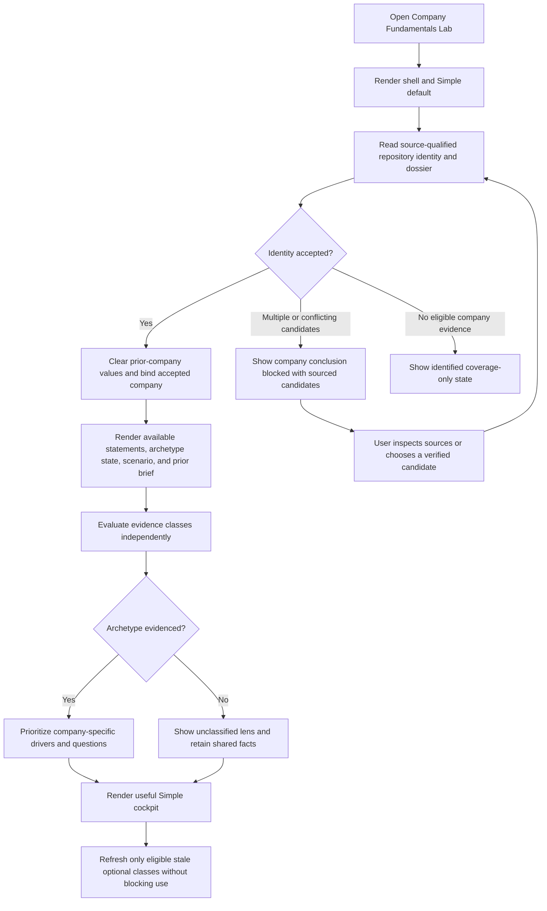
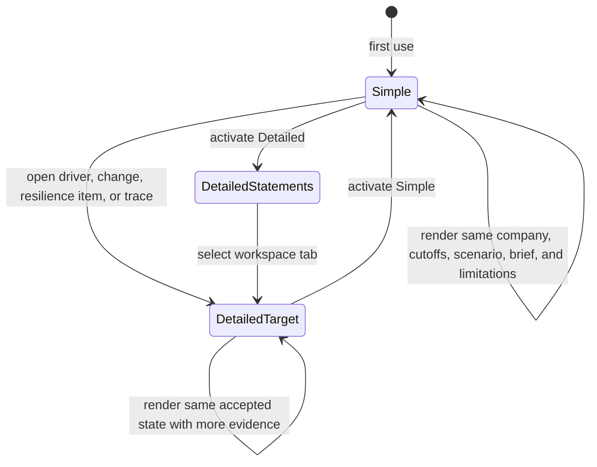
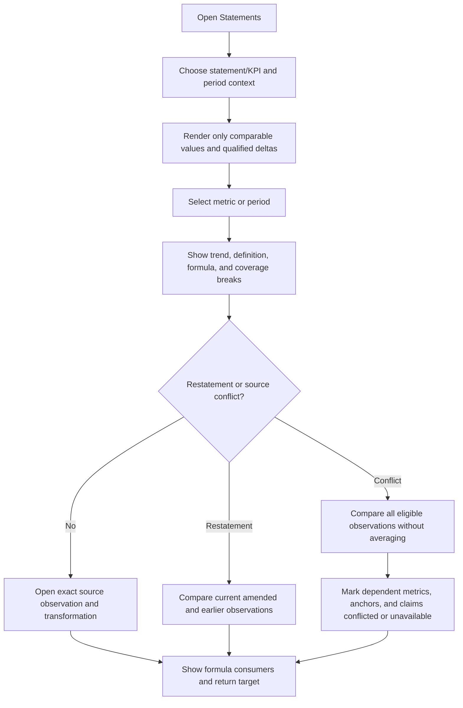
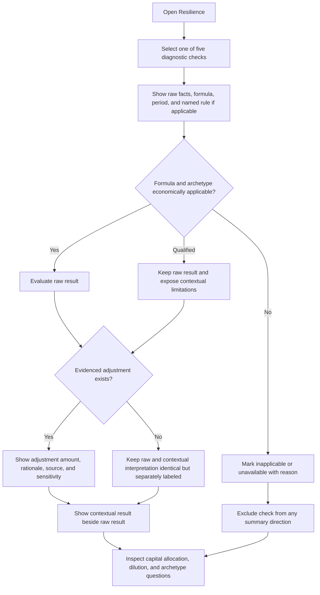
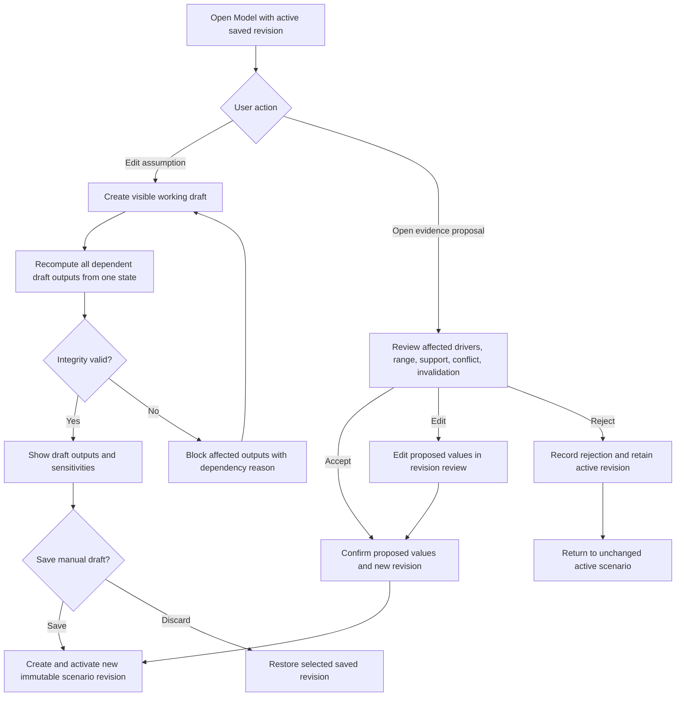
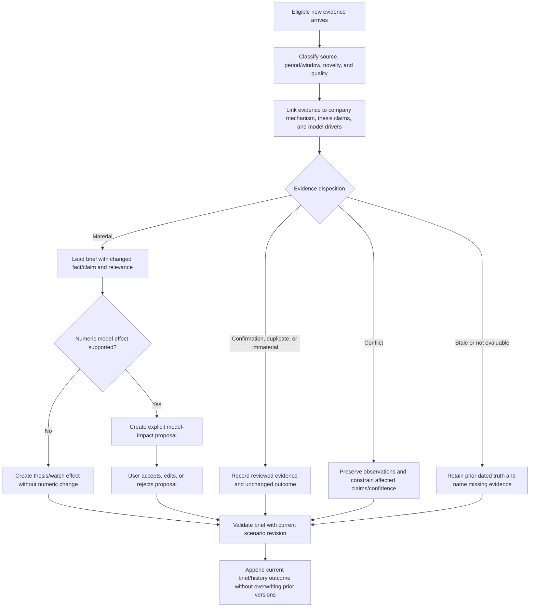
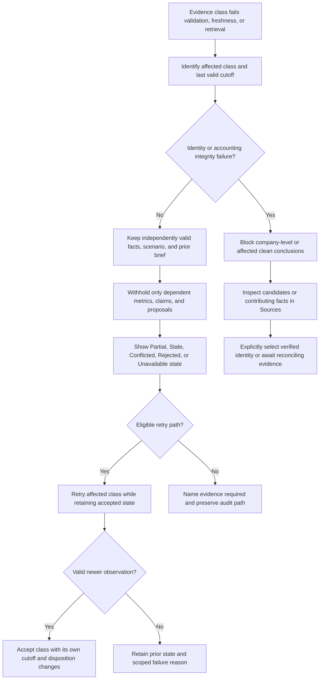
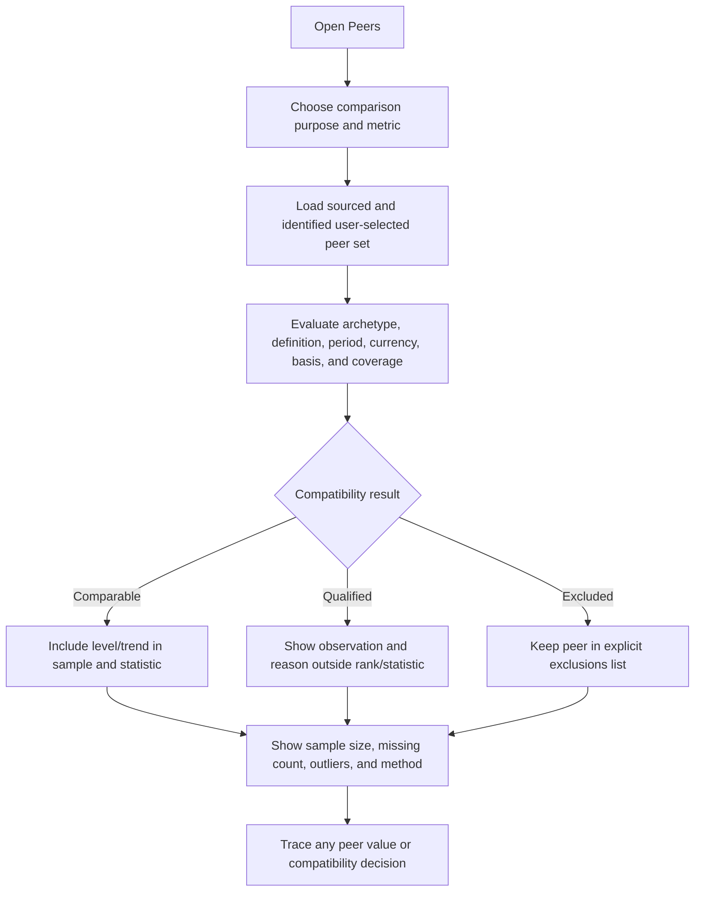
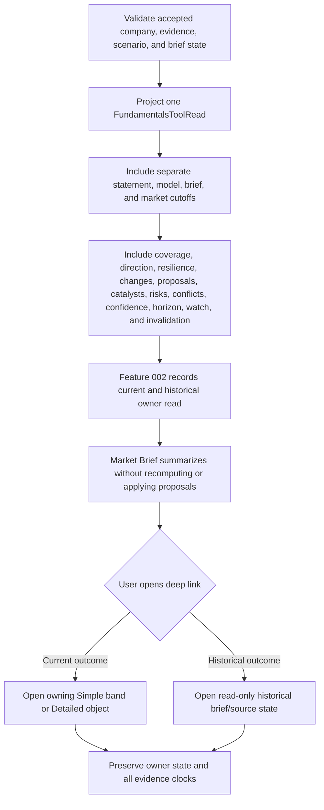

# Feature: 010 Company Fundamentals and Adaptive Brief Lab

## Problem Statement

Research Lab can model one Microsoft earnings setup in depth, but it cannot yet answer the more general question: "How is this company's underlying business and financial position changing, what matters now, and how should new evidence change the model?"

The existing `msft-july-print-model.html` is deliberately company- and event-specific. It models reported Microsoft FY26 Q1-Q3 income-statement anchors, a Q4 scenario, an FY27 margin bridge, capex/depreciation sensitivity, EPS, and a valuation ladder. It does not provide reusable annual and quarterly statement history, a three-statement company model, balance-sheet diagnostics, source-level metric traceability, company-specific KPI selection, or a normalized fundamentals read for the shared brief. The current page also contains no retained-earnings, treasury-stock, preferred-stock, total-asset, total-liability, or generic debt analysis.

The shared data and brief surfaces do not close that gap. `rldata.js` currently stores market bars, quotes, options, macro data, events, and normalized tool reads. Its Finnhub and Alpha Vantage policies remain `browserOriginAuthorization: "unverified"`, `authTransport: "unavailable"`, and `cspProfile: "not-eligible"`, so a new company tool cannot quietly make credentialed browser calls. `market-brief.payload.json` discusses MSFT price structure and the July earnings/capex event repeatedly, but the MSFT page publishes no company-fundamentals read. The final brief can therefore discuss dated price action and a scenario event while remaining unable to establish whether cash conversion, leverage, leases, retained earnings, segment economics, guidance, or company-specific KPIs changed.

The supplied Buffett transcript provides a useful fast-screen lens: compare cash with debt, inspect liabilities relative to equity, identify preferred stock, track retained earnings, and inspect treasury stock. It also demonstrates why those checks cannot become one universal score. Its Chipotle example adjusts for lease liabilities and treasury stock. A financial institution such as JPMorgan has business-model liabilities, regulatory capital, trading balances, and preferred capital that make an ordinary industrial-company debt/equity threshold misleading. A software company such as Microsoft needs cloud growth, remaining performance obligations, capex, depreciation, and cash conversion context. A restaurant such as Chipotle needs unit growth, same-store sales, leases, and restaurant-level economics. The same visible shell must therefore ask different questions without changing the meaning of shared financial facts.

External products establish the table stakes. TIKR advertises detailed financials, ratios, analyst forecasts, filings, call transcripts, monitoring, and a customizable valuation builder. Finbox advertises ten years of financials and editable DCF, dividend-discount, and comparable-company models. BamSEC centers filing/transcript search, historical table extraction, filing comparison, and alerts. AlphaSense combines structured financial data, qualitative research, monitoring, and auditable AI synthesis. Fiscal.ai explicitly combines source-linked financial statements, ratios, company-specific KPIs, estimates, filings, transcripts, slides, news, and minutes-after-earnings updates. Research Lab should not imitate a terminal by adding more undifferentiated tables. Its defensible product is a transparent, source-bounded model and brief that adapt to what economically matters for each company and show exactly how new evidence affects, conflicts with, or leaves the thesis unchanged.

## Outcome Contract

**Intent:** A research user selects a public company and receives one coherent company dossier: sourced historical statements and operating KPIs, contextual balance-sheet diagnostics, editable forward scenarios, and a dynamic brief that identifies what changed, why it matters for this company, what model assumptions are affected, and what evidence would confirm or invalidate the interpretation.

**Success Signal:** On first open, the user can understand the company's current fundamental direction, financial resilience, most material company-specific drivers, latest evidence changes, model implications, and data freshness from a compact Simple view. The user can enter Detailed view to trace every material number or claim to its source and period, inspect annual and quarterly trends, reconcile raw and contextualized balance-sheet checks, edit assumptions, compare scenarios and peers, and review the current brief against prior briefs. Microsoft, Chipotle, and JPMorgan can all use the same capability while receiving materially different relevant questions and without any company being forced through an inapplicable universal score.

**Hard Constraints:**

- Reported facts, normalized facts, derived metrics, user assumptions, consensus estimates, model outputs, market observations, sentiment, and narrative interpretations remain visibly distinct.
- Every material number and brief claim carries source identity, source date, reporting period, retrieval or observation time when applicable, units, currency, and freshness state.
- New market or narrative evidence cannot silently advance a financial-statement date, convert an estimate into an actual, or overwrite a user model assumption.
- Balance-sheet heuristics are lenses, not investment verdicts. Raw values, formula, threshold, applicability, contextual adjustments, and unresolved limitations remain visible.
- Company archetype and KPI relevance alter prioritization and interpretation, never the underlying reported fact.
- Missing, stale, conflicting, restated, incomparable, or unavailable evidence remains explicit and cannot be converted into a neutral value, passing score, or confident brief claim.
- A dynamic brief may propose a model impact, but the user's accepted scenario changes only through an explicit accept, edit, or reject action.
- Simple and Detailed views consume one company, evidence, and model state; changing view cannot refetch, mutate, or reinterpret the company.
- The company tool publishes a truthful normalized fundamentals outcome for Feature 002's distributed brief without exposing credentials, private research, or personalized portfolio data.
- The product remains educational research. It does not execute trades, issue personalized advice, or guarantee valuation outcomes.

**Failure Condition:** The feature fails even if every table renders when it applies one generic score to unlike companies, presents a lease or bank deposit as ordinary debt without context, rewards any buyback without testing dilution or value creation, mixes actuals with estimates, hides a restatement, treats sentiment as fact, produces a generic brief that could describe another issuer unchanged, changes user assumptions automatically, omits a material conflicting source, or lets the Market Brief claim fresh fundamentals from stale or market-only evidence.

## Goals

- Provide a compact, decision-first company view and an auditable detailed research workspace over one state.
- Model at least annual and quarterly income statement, balance sheet, cash flow, capital allocation, and per-share development when source history supports them.
- Support transparent driver-based forward scenarios whose assumptions and outputs stay separate from reported history.
- Make balance-sheet rules of thumb useful by exposing both raw checks and company/archetype context.
- Select and rank company-specific KPIs and evidence based on the issuer's economic model rather than a fixed universal dashboard.
- Detect and explain material changes across filings, earnings releases, transcripts, guidance, company news, estimates, market environment, and sentiment.
- Show how each material update affects the thesis, model, catalyst map, risk map, and confidence, including a valid "no change" result.
- Preserve source traceability, restatements, conflicts, stale states, and prior brief history.
- Publish a normalized company-fundamentals read that the distributed brief can consume without recomputing the company model.
- Establish reusable company-research primitives that can support more issuers and lenses without creating one hard-coded page per ticker.

## Non-Goals

- Replacing the current Microsoft July-print model or changing its verified FY26 assumptions under this feature.
- Building a brokerage, order-entry, portfolio-position, tax, or personalized-advice product.
- Treating Buffett's five checks, any composite score, or any language-model narrative as a buy or sell recommendation.
- Guaranteeing complete global issuer coverage, licensed consensus coverage, or real-time transcript availability without an eligible source.
- Reconstructing historical company facts, consensus values, or management statements that cannot be proven from source evidence.
- Comparing companies across currencies, fiscal periods, accounting regimes, or business models without an explicit comparability decision.
- Making social or news sentiment an independent proof of business quality or financial deterioration.
- Selecting a paid vendor, network topology, storage implementation, or page architecture in the business specification.
- Authoring UI wireframes, technical design, implementation scopes, or certification evidence owned by downstream specialists.

## Release Train

Research Lab has no `config/release-trains.yaml` registry and the existing version-3 feature template and state records do not declare `releaseTrain`. No train id can be truthfully assigned by the analyst. Feature 010 remains `not_started`; a transition into active delivery requires the release-train owner to either establish a valid repository train registry and bind this feature or confirm that release-train governance is not adopted for this repository.

## Current Capability Map

| Capability | Concrete Evidence | Current Status | Feature 010 Responsibility |
| --- | --- | --- | --- |
| Company-specific earnings model | `msft-july-print-model.html::calculateAnnual`, Q4 reconciliation, FY27 bridge, valuation ladder, sensitivity, and cost-cycle controls | Complete for one dated MSFT scenario | Preserve as a specialist overlay; provide reusable company history, model, and brief primitives it can consume or complement |
| Reported Microsoft anchors | `notes/msft-july-print-model.md` records FY26 Q1-Q3 income statement, cash-flow, PP&E, capex, and IR source notes | Partial and manually curated | Represent reported periods with source, units, filing identity, revisions, and fact/model separation |
| Generic financial statements | Repository search finds no generic company income-statement, balance-sheet, cash-flow, or SEC Company Facts model | Missing | Define reusable statement periods, facts, provenance, validation, and cross-statement relationships |
| Balance-sheet analysis | No reusable cash/debt, liability/equity, preferred-stock, retained-earnings, treasury-stock, liquidity, lease, or bank-capital capability | Missing | Provide contextual raw and adjusted diagnostics without universal pass/fail advice |
| Shared market cache | `rldata.js` stores bars, quotes, options, macro, events, and tool reads | Complete for market context; no fundamentals family | Consume eligible market context while preserving financial, market, and retrieval clocks |
| Browser provider eligibility | `rldata.js` marks Finnhub and Alpha Vantage authorization unverified and their browser operations disabled | Explicitly unavailable | First useful view cannot depend on direct credentialed browser access; unavailable enrichment remains honest |
| Distributed brief | Feature 002 defines source-tool reads, profiles, provenance, no-action outcomes, history, and final aggregation | Foundation exists | Add a company-fundamentals owner read and preserve its company/model/source boundary |
| Current MSFT brief coverage | `market-brief.payload.json` contains MSFT price, moving-average, capex-event, and deep-link discussion | Market/event context present; fundamental change evidence absent | Supply a structured company read so the brief can distinguish market narrative from sourced fundamental change |
| Simple/Power interaction | Repository tools and Feature 009 require one compute/state across Simple and Power | Established product convention | Use Simple for decision relevance and Detailed/Power for audit, modeling, and source exploration |
| Source-linked company research | No per-figure source ledger or filing/restatement comparison exists | Missing | Make source trace, period identity, restatement, conflict, and evidence coverage first-class user outcomes |

## Honest Findings And Constraints

1. **A normalized statement is an interpretation, not the filing itself.** SEC Company Facts aggregates standard taxonomy concepts and excludes issuer extensions and facts that do not apply to the entire entity. Company-specific KPIs, segment detail, non-GAAP definitions, and some lease or regulatory facts still require filing or issuer evidence.
2. **The public page cannot call SEC Company Facts directly.** The SEC states that `data.sec.gov` does not support CORS. It offers keyless real-time submissions and XBRL APIs plus nightly bulk archives, so source ingestion must occur through a repository-compatible controlled path rather than an improvised browser proxy.
3. **Credentialed providers are not currently eligible Research Lab browser sources.** Existing provider policy disables Finnhub and Alpha Vantage browser operations. A useful first view must come from source-qualified repository data; paid or credentialed enrichment is additive only after policy eligibility is established elsewhere.
4. **Commercial normalization solves speed and breadth, not truth ownership.** Fiscal.ai advertises source-to-filing auditability and company KPIs; Finnhub offers as-reported filings and many paid normalized/estimate/transcript endpoints. The product still needs fact lineage, conflict handling, and a primary-source path.
5. **The transcript's liability/equity threshold is not universal.** Lease-heavy operators and financial institutions would be misclassified without a contextual lens. Even for ordinary companies, negative or buyback-reduced equity can make the ratio undefined or economically misleading.
6. **Treasury stock is not automatically shareholder-friendly.** Buybacks can offset dilution, retire shares below intrinsic value, or destroy value above it. The tool must show gross repurchases, issuance/dilution, net share-count change, financing, and business context before interpreting capital return.
7. **Retained earnings can fall for reasons other than business decay.** Dividends, distributions, reorganizations, accumulated deficits, and acquisition accounting affect the balance. The trend is evidence, not a stand-alone quality verdict.
8. **Sentiment is fast but epistemically weak.** News and social tone may identify attention, disagreement, or event risk. It cannot establish an accounting fact, management delivery, or durable economics.
9. **One generic brief is not adaptive.** A Microsoft brief that ignores Azure, RPO, AI infrastructure capex, and depreciation is weak; a Chipotle brief that ignores comparable sales, openings, restaurant margins, and leases is weak; a JPMorgan brief that ignores net interest income, credit costs, deposits, CET1, and capital distributions is weak.
10. **Historical comparability is conditional.** Fiscal calendars, acquisitions, divestitures, stock splits, reporting currency, accounting policies, discontinued operations, recasts, and filing amendments can break naive period-over-period charts.
11. **Peer rankings are easy to overstate.** Sector labels alone do not prove comparable economics. A valid peer view needs a declared comparison reason, compatible metric definitions, dates, currencies, and archetype.
12. **Dynamic does not mean always changing.** If new evidence is immaterial, stale, duplicative, or already represented in the model, the correct brief update is an explicit unchanged thesis with the evidence disposition recorded.

## Domain Capability Model

### Capability

**Company Research Dossier and Adaptive Briefing** is the reusable capability that binds sourced company facts, company-specific operating evidence, contextual diagnostics, user-owned scenarios, market context, and a change-aware brief into one auditable research state. Concrete ticker experiences and business-model lenses are overlays on this capability; they do not own separate definitions of a financial fact, scenario, or brief update.

### Domain Primitives

| Primitive | Purpose | Lifecycle |
| --- | --- | --- |
| CompanyIdentity | Stable issuer/security identity, listing, reporting currency, fiscal calendar, industry, and source identifiers | unresolved -> identified -> verified -> changed or inactive |
| CompanyArchetype | Primary and optional secondary economic lens that determines relevant questions and KPI priority | proposed -> evidenced -> accepted -> reviewed on material business change |
| ReportingPeriod | Fiscal interval or instant with form, filing, currency, units, amendment, and comparability metadata | expected -> reported -> amended/restated -> superseded |
| SourceArtifact | Filing, earnings release, transcript, presentation, estimate set, company news item, market observation, or sentiment source | discovered -> eligible -> ingested -> current/stale/disputed/superseded |
| FinancialFact | Reported or normalized value with concept, period, units, source, and confidence in mapping | missing -> reported -> normalized -> reconciled or disputed -> restated |
| DerivedMetric | Transparent formula over eligible facts, such as net debt, free cash flow, return on capital, or dilution | unavailable -> calculated -> qualified/disputed -> superseded |
| CompanyKPI | Company- or archetype-specific operating measure with definition and source lineage | proposed -> sourced -> active -> definition-changed or retired |
| DiagnosticCheck | Raw rule, threshold, applicability decision, contextual adjustment, and interpretation | not-evaluable -> raw result -> contextualized -> confirmed/disputed/superseded |
| EvidenceCoverage | Completeness and conflict state across statements, KPIs, market, narrative, and source classes | unknown -> complete/partial/stale/conflicted/unavailable |
| ModelAssumption | User-owned forward driver with units, period, rationale, source reference, and accepted value | proposed -> accepted/edited/rejected -> superseded |
| CompanyScenario | Named coherent set of assumptions and linked outputs | draft -> valid -> active -> compared -> superseded |
| ModelOutput | Forward statement, KPI, cash-flow, valuation, or sensitivity result produced from one scenario | unavailable -> calculated -> qualified -> superseded |
| ThesisClaim | Falsifiable statement about company economics, financial resilience, catalyst, or risk | proposed -> supported/conflicted/unresolved -> confirmed/invalidated/superseded |
| EvidenceChange | Material difference between prior and current eligible evidence | detected -> classified -> linked to claims/assumptions -> accepted as material/immaterial/disputed |
| ModelImpactProposal | Explicit suggestion that evidence may alter one or more assumptions, with direction and rationale | proposed -> accepted/edited/rejected -> applied to a new scenario revision |
| AdaptiveCompanyBrief | Company-specific synthesis of changes, current thesis, model effects, catalysts, risks, and watch conditions | draft -> validated -> current -> unchanged/materially-updated -> superseded |
| PeerSet | Sourced group of companies with an explicit comparison rationale and metric compatibility | proposed -> validated -> active -> revised/superseded |
| FundamentalsToolRead | Compact source-bounded company outcome for the distributed brief | pending -> current/partial/stale/conflicted/unavailable -> superseded |

### Company Archetype Vocabulary

| Archetype | Questions Prioritized | Example Evidence |
| --- | --- | --- |
| Recurring-revenue / software platform | Revenue durability, bookings/RPO, cloud or subscription mix, gross margin, sales efficiency, capex/depreciation, cash conversion, dilution | Microsoft Azure growth, RPO, AI infrastructure capex, depreciation, cloud margin |
| Consumer / unit-economics operator | Comparable sales, unit count, openings/closures, unit economics, labor/food costs, lease obligations, working capital, pricing/traffic | Chipotle comparable sales, restaurant margin, new units, lease liabilities |
| Financial institution | Net interest income/margin, deposits, loan growth, credit losses, reserve coverage, trading/fee mix, CET1, liquidity, preferred/regulatory capital | JPMorgan deposits, NII, charge-offs, CET1, capital distributions |
| Capital-intensive compounder | Backlog, utilization, capex, depreciation, asset turns, maintenance versus growth investment, leverage, contracted cash flow | Semiconductor, industrial, utility, telecom, or infrastructure disclosures |
| Commodity / cyclical producer | Realized price, volume, unit cost, reserves/inventory, sustaining capex, balance-sheet cycle position, hedges | Energy, mining, materials, and commodity-linked operating data |
| Pre-profit / milestone-driven company | Liquidity runway, burn, dilution, milestone probability, regulatory/technical events, contingent obligations | Biotechnology, emerging technology, or development-stage issuers |

A company may have one primary and one secondary archetype when evidence supports a mixed model. The system must state why each archetype applies and which questions are suppressed or qualified. An unknown or changing business remains `unclassified` with a visible coverage gap; it does not inherit a convenient default lens.

### Relationships

- One CompanyIdentity has many ReportingPeriods, SourceArtifacts, FinancialFacts, CompanyKPIs, CompanyScenarios, and AdaptiveCompanyBrief versions.
- One FinancialFact belongs to one reporting context and may have many source observations or mapping candidates; one reconciled value remains current without erasing conflicts or restatements.
- One DerivedMetric references every input fact, formula version, period-alignment rule, and qualification used to calculate it.
- One DiagnosticCheck evaluates FinancialFacts and DerivedMetrics under one archetype-aware applicability policy and exposes raw and contextual results together.
- One CompanyArchetype prioritizes CompanyKPIs, diagnostics, peer comparators, brief topics, and model drivers but cannot change source facts.
- One CompanyScenario references one immutable historical cutoff and one accepted set of ModelAssumptions; a change creates a new scenario revision.
- One EvidenceChange may support, conflict with, or leave unchanged several ThesisClaims and may create zero or more ModelImpactProposals.
- One ModelImpactProposal cannot modify a CompanyScenario until the user accepts or edits it.
- One AdaptiveCompanyBrief references the current evidence cutoff, prior brief, active scenario revision, thesis claims, evidence changes, proposals, and unresolved conflicts.
- One FundamentalsToolRead is produced from the validated dossier/brief state and is consumed by Feature 002 without recomputing financial statements or scenarios.

### Business Policies

1. **Source hierarchy:** issuer filings and investor-relations evidence are primary for reported facts and management-defined KPIs. Normalized providers improve access but remain attributable transformations. Estimates, news, sentiment, and user inputs retain distinct classes.
2. **No silent normalization:** every normalized concept retains its source concept, mapping, units, sign convention, period, and unresolved ambiguity.
3. **Accounting integrity:** assets equal liabilities plus equity within a declared tolerance, cash-flow roll-forwards and period durations are checked, and failures remain visible.
4. **Restatement preservation:** amendments and recasts create new fact observations and change records; earlier reported values remain auditable.
5. **Actual/estimate separation:** reported, preliminary, management-guided, consensus, user-modeled, and inferred values never share one unlabeled series.
6. **Applicability before scoring:** a diagnostic that is economically inapplicable or has an invalid denominator is unavailable/qualified, not failed or passed.
7. **Raw before adjusted:** any lease, treasury-stock, regulatory-capital, acquisition, or other adjustment is shown beside the raw check with rationale and sensitivity.
8. **No universal composite verdict:** the product may summarize direction and evidence quality but cannot reduce unlike company economics to one opaque quality number.
9. **Company-specific relevance:** a brief prioritizes evidence by demonstrated materiality to the company's archetype, active model drivers, catalysts, and risks.
10. **Sentiment containment:** sentiment can describe attention and directional tone only with source window, coverage, and divergence; it cannot prove a fundamental claim.
11. **User-owned model state:** evidence can propose but never silently apply an assumption change.
12. **One-state parity:** Simple, Detailed, export, brief, and FundamentalsToolRead use the same accepted company/evidence/scenario revision.
13. **Truthful degradation:** partial, stale, conflicting, unclassified, and unavailable states remain usable when possible but cannot be promoted to complete or confident.
14. **Change threshold:** every new source is dispositioned as material, immaterial, duplicate, conflicting, or not yet evaluable. Dynamic updates do not require narrative churn.
15. **No private leakage:** committed or shared outputs exclude credentials, account information, holdings, cost basis, P&L, and unpublished private research.

## Actors & Personas

| Actor | Description And Evidence | Key Goals | Permission Boundary |
| --- | --- | --- | --- |
| Research User | Uses Research Lab for a fast, evidence-backed company read | Understand financial direction, resilience, what changed, and what matters next | May inspect and compare research; cannot turn a heuristic or brief into personalized execution advice |
| Simple-View Decision Maker | Needs the smallest useful answer before opening detailed statements | See thesis, key changes, model impact, risks, freshness, and next evidence in minutes | Receives a compact view but cannot lose caveats, source age, conflicts, or unavailable states |
| Fundamental Modeler | Edits forward drivers and studies statement, cash-flow, valuation, and sensitivity consequences | Build coherent base/upside/downside scenarios and understand which assumptions drive value | Owns accepted assumptions; automated evidence may only propose changes |
| Company Specialist | Understands issuer-specific KPIs, accounting presentation, catalysts, and industry context | Ensure the tool asks the right company questions and preserves definitions | May classify archetype/KPI relevance with evidence; cannot rewrite reported facts or hide counterevidence |
| Data And Audit Reviewer | Verifies sources, periods, mappings, restatements, formulas, and comparability | Reconstruct every material number and narrative claim | May dispute or qualify evidence; cannot silently replace an earlier observation |
| Research Brief Agent | Produces the company-specific dynamic brief from eligible structured evidence | Explain what changed, why it matters, model effects, and watch conditions without generic filler | Interprets current evidence; cannot invent data, apply assumptions, or recompute the owning model |
| Market Brief Consumer | Consumes the compact fundamentals outcome under Feature 002 | Combine company fundamentals with market context while preserving disagreement and clocks | May aggregate the validated read; cannot treat market movement as fresh fundamentals or omit limitations |

## Use Cases

### UC-010-001: Open A Company Dossier

- **Actor:** Research User and Simple-View Decision Maker
- **Preconditions:** The company identity and at least one eligible evidence class are available.
- **Main Flow:**
  1. The user selects or searches for a company.
  2. The system establishes company identity, fiscal context, archetype state, evidence coverage, and active scenario.
  3. Simple view shows fundamental direction, financial resilience, top company-specific drivers, material changes, model impacts, catalysts/risks, and source freshness.
  4. The user can open each item in the detailed workspace.
- **Alternative Flows:** An unsupported or partially covered company renders identified gaps and eligible evidence without inheriting another company's metrics.
- **Postconditions:** The user can state what is known, what changed, what is modeled, and what is missing.

### UC-010-002: Analyze Financial Development Over Time

- **Actor:** Research User and Fundamental Modeler
- **Preconditions:** Two or more comparable reporting periods exist.
- **Main Flow:**
  1. The user chooses annual, quarterly, trailing, or period-comparison context.
  2. The system presents statements, margins, cash generation, capital intensity, leverage/liquidity, returns, and per-share trends with period-aware deltas.
  3. The user selects a metric to inspect its history, formula, source, and qualifications.
- **Alternative Flows:** Incomparable, recast, short/long, missing, or mixed-currency periods are isolated or qualified.
- **Postconditions:** Trends do not conceal breaks in accounting or period comparability.

### UC-010-003: Trace And Reconcile A Financial Fact

- **Actor:** Data And Audit Reviewer
- **Preconditions:** A displayed fact or metric has at least one source observation.
- **Main Flow:**
  1. The reviewer opens provenance for the fact.
  2. The system shows source artifact, filing identity, period, units, concept/mapping, retrieval state, amendments, and every formula consumer.
  3. The reviewer compares conflicting or restated observations.
- **Alternative Flows:** A source link is unavailable while its identity and captured observation remain visible; unresolved mapping remains disputed.
- **Postconditions:** The current displayed value is reconstructable without erasing prior truth.

### UC-010-004: Apply Contextual Balance-Sheet Heuristics

- **Actor:** Research User and Company Specialist
- **Preconditions:** Required balance-sheet concepts are present or explicitly absent.
- **Main Flow:**
  1. The user opens the financial-resilience lens.
  2. The tool displays cash versus debt, liabilities/equity, preferred stock, retained earnings, and treasury stock as raw checks.
  3. It evaluates applicability and shows company-specific adjustments and limitations.
  4. The user can compare raw and contextualized results without losing either.
- **Alternative Flows:** Invalid equity, bank liabilities, leases, absent concepts, or ambiguous preferred/treasury classifications produce qualified or unavailable checks.
- **Postconditions:** The user gains a fast screen without receiving a false universal verdict.

### UC-010-005: Use Company-Specific KPIs And Lenses

- **Actor:** Company Specialist and Research User
- **Preconditions:** Company identity, business description, disclosures, or KPI evidence support an archetype decision.
- **Main Flow:**
  1. The system proposes primary and optional secondary archetypes with reasons.
  2. The specialist reviews the prioritized KPIs, diagnostics, model drivers, and evidence topics.
  3. The active view emphasizes relevant measures while retaining shared financial statements.
- **Alternative Flows:** The specialist can reject or revise an archetype with evidence. An unclassified company shows no default company-specific KPI set.
- **Postconditions:** Different issuers receive different relevant research questions under the same fact model.

### UC-010-006: Build A Linked Forward Scenario

- **Actor:** Fundamental Modeler
- **Preconditions:** Eligible historical anchors and a valid scenario definition exist.
- **Main Flow:**
  1. The modeler selects a base, upside, downside, or named scenario revision.
  2. The tool presents archetype-relevant drivers with units, periods, rationales, and source references.
  3. The modeler edits assumptions and sees linked financial, KPI, cash-flow, balance-sheet, per-share, and valuation consequences.
  4. The tool identifies failed identities, impossible relationships, and balancing assumptions.
- **Alternative Flows:** Insufficient anchors leave affected outputs unavailable rather than supplied by hidden defaults.
- **Postconditions:** Every output traces to historical facts and accepted assumptions.

### UC-010-007: Inspect Sensitivity And Thesis Dependence

- **Actor:** Fundamental Modeler and Research User
- **Preconditions:** A valid scenario produces one or more outputs.
- **Main Flow:**
  1. The user selects a key output or thesis claim.
  2. The tool identifies the most influential accepted assumptions and displays bounded sensitivities.
  3. The user compares scenarios and sees which evidence would move each driver.
- **Alternative Flows:** Nonlinear, discontinuous, non-finite, or insufficient relationships are qualified instead of receiving smooth false precision.
- **Postconditions:** The user understands what must be true, not only a point estimate.

### UC-010-008: Read A Dynamic Company Brief

- **Actor:** Simple-View Decision Maker and Research User
- **Preconditions:** A current evidence cutoff and prior brief state are known.
- **Main Flow:**
  1. The brief identifies material new evidence since the prior validated brief.
  2. It separates reported changes, management claims, estimates, market context, news, and sentiment.
  3. It explains company-specific economic relevance, thesis effects, model-impact proposals, conflicts, catalysts, risks, and watch conditions.
  4. It records an unchanged result when new evidence is not material.
- **Alternative Flows:** Missing, stale, or conflicting evidence produces a bounded partial/conflicted brief and no invented conclusion.
- **Postconditions:** The user can explain why the brief changed or did not change.

### UC-010-009: Evaluate New Evidence Against The Model

- **Actor:** Research Brief Agent and Fundamental Modeler
- **Preconditions:** New eligible evidence relates to one or more active claims or assumptions.
- **Main Flow:**
  1. The agent classifies the evidence and links it to affected claims and drivers.
  2. It proposes direction, range, rationale, confidence, and invalidation for any model impact.
  3. The modeler accepts, edits, or rejects each proposal.
  4. Acceptance creates a new scenario revision and preserves the prior one.
- **Alternative Flows:** Evidence can be material to the thesis but insufficient for a numeric change, or immaterial to both.
- **Postconditions:** Automation accelerates research without taking ownership of assumptions.

### UC-010-010: Relate Company Evidence To Market Environment And Sentiment

- **Actor:** Research User and Research Brief Agent
- **Preconditions:** Eligible market, macro, news, or sentiment observations have explicit windows and sources.
- **Main Flow:**
  1. The system links environmental evidence only to demonstrated company exposures or active thesis drivers.
  2. It keeps price/technical, macro, news, analyst, insider, and social sentiment channels separate.
  3. It highlights confirmation and divergence without converting either into an accounting fact.
- **Alternative Flows:** Generic sector or macro data with no evidenced company mechanism remains context-only or excluded.
- **Postconditions:** The brief is dynamic and company-specific without becoming headline-driven.

### UC-010-011: Compare A Company With Valid Peers

- **Actor:** Research User and Company Specialist
- **Preconditions:** A PeerSet has a declared comparison purpose and compatible metrics.
- **Main Flow:**
  1. The user chooses operating, financial-resilience, growth, capital-efficiency, or valuation comparison.
  2. The system shows peer definitions, periods, currencies, metric definitions, and coverage.
  3. The user compares levels, trends, and dispersion without hiding outliers or missing values.
- **Alternative Flows:** An invalid peer or metric is excluded with a reason rather than forced into rank.
- **Postconditions:** Peer evidence informs context without manufacturing precision.

### UC-010-012: Continue Research Under Degraded Evidence

- **Actor:** All research actors
- **Preconditions:** One or more statement, KPI, market, narrative, estimate, or provider sources are missing, stale, malformed, or conflicting.
- **Main Flow:**
  1. Each evidence class reports its own state and last valid cutoff.
  2. Independently valid facts, scenarios, and prior brief remain available.
  3. Unsupported metrics, claims, and proposals are withheld or qualified.
- **Alternative Flows:** Identity or accounting-integrity failure blocks company-level conclusions while preserving inspectable source evidence.
- **Postconditions:** Failure is scoped and no synthetic success replaces it.

### UC-010-013: Publish A Fundamentals Read And History Outcome

- **Actor:** Research Brief Agent and Market Brief Consumer
- **Preconditions:** The company dossier, active scenario, and adaptive brief have validated source and state boundaries.
- **Main Flow:**
  1. The company tool publishes a compact outcome with company, archetype, evidence cutoff, fundamental direction, resilience, changes, scenario/model impacts, catalysts, risks, conflicts, confidence, and deep links.
  2. Feature 002 records the current and historical outcome.
  3. The Market Brief consumes the read once and preserves company-fundamental and market clocks.
- **Alternative Flows:** Partial, stale, conflicted, or unavailable company states publish those exact outcomes and no recommendation.
- **Postconditions:** The global brief can use company research without recomputing it or fabricating freshness.

## Requirements

### Identity, Periods, And Source Truth

- **FR-010-001:** A company dossier must identify issuer, security/listing, ticker, stable filing identifier when available, reporting currency, fiscal year end, accounting basis, and identity source.
- **FR-010-002:** A ticker change, share-class difference, merger, spin-off, or issuer-identity conflict must not merge histories without an explicit continuity decision.
- **FR-010-003:** Every ReportingPeriod must identify start/end or instant date, fiscal year/quarter, duration, form/source type, filing/acceptance date, amendment/restatement state, units, and currency.
- **FR-010-004:** Annual, quarterly, year-to-date, trailing, preliminary, guided, estimated, modeled, and instantaneous values must remain distinct.
- **FR-010-005:** Every displayed material fact must link to its SourceArtifact and original or mapped concept.
- **FR-010-006:** A normalized fact must retain source concept, normalized concept, sign convention, scaling, mapping status, and transformation provenance.
- **FR-010-007:** Issuer extensions, management-defined KPIs, and non-GAAP measures must retain issuer definition and must not be silently mapped to a standard concept.
- **FR-010-008:** Amendments, restatements, and recasts must create a visible later observation and preserve the earlier reported value.
- **FR-010-009:** Conflicting eligible sources must remain visible with source, timestamp, value, and resolution state; no hidden averaging is allowed.
- **FR-010-010:** Missing values must remain missing and cannot become zero, prior-period carry, estimated actual, or passing status.
- **FR-010-011:** Source freshness must be evaluated per evidence class and observation, not by one page-level date.
- **FR-010-012:** The user must be able to distinguish reporting-period end, release/acceptance time, retrieval time, market observation time, model cutoff, and brief cutoff.

### Historical Statements And Integrity

- **FR-010-013:** When eligible facts exist, the dossier must present income statement, balance sheet, and cash-flow history for both annual and quarterly contexts.
- **FR-010-014:** The historical view must support level, absolute change, percentage change, margin/common-size, and per-share analysis only when denominators and comparability are valid.
- **FR-010-015:** Statement views must expose at least revenue, gross profit when applicable, operating income, pretax income, net income, diluted EPS/share count, cash, investments, debt, assets, liabilities, equity, operating cash flow, capital expenditure, financing flows, dividends, repurchases, and issuance when reported.
- **FR-010-016:** Statement identity checks must test assets against liabilities plus equity within declared units/tolerance and show any unresolved imbalance.
- **FR-010-017:** Cash movement and cash-flow period relationships must be checked when source facts support reconciliation; unsupported checks remain unavailable.
- **FR-010-018:** Fiscal-period length, 52/53-week years, acquisitions, divestitures, discontinued operations, accounting changes, and recasts must qualify affected trends.
- **FR-010-019:** Split-adjusted per-share and share-count series must disclose adjustment basis and cannot be mixed with unadjusted observations.
- **FR-010-020:** Foreign-currency translation must retain original values and rates/dates; cross-currency comparisons must identify the chosen basis.
- **FR-010-021:** A chart or summary may omit immaterial rows for readability only when Detailed view retains the complete eligible statement and the omission does not alter totals.
- **FR-010-022:** At least five annual periods and eight quarterly periods should be shown when eligible source history exists; thinner coverage must state the exact available range.

### Derived Fundamentals And Capital Allocation

- **FR-010-023:** Derived metrics must expose formula, input facts, periods, units, and qualifications.
- **FR-010-024:** The dossier must calculate or mark unavailable revenue growth, gross/operating/net margins, operating cash conversion, free cash flow, capex intensity, net debt, liquidity, leverage, asset efficiency, return on invested capital/equity where economically valid, and per-share development.
- **FR-010-025:** Free cash flow must disclose its selected definition and cannot merge acquisitions, financing, or stock compensation into capex without an explicit policy.
- **FR-010-026:** Net debt must distinguish cash, restricted cash, marketable securities, funded debt, leases, and other financing obligations rather than use one opaque number.
- **FR-010-027:** Capital-allocation analysis must show dividends, gross repurchases, issuance, stock-based compensation/dilution context, net share-count change, acquisitions/divestitures, and debt change when available.
- **FR-010-028:** A buyback must not receive a positive interpretation solely because treasury stock or repurchases exist.
- **FR-010-029:** Return metrics with negative or near-zero denominators, financial-institution balance sheets, or economically invalid capital definitions must be qualified or unavailable.
- **FR-010-030:** Ratio trends must not hide numerator/denominator changes; the user can inspect the decomposition.

### Contextual Buffett And Financial-Resilience Lens

- **FR-010-031:** The lens must expose cash and eligible liquid investments versus funded debt as raw values and a clearly defined comparison.
- **FR-010-032:** The lens must expose total liabilities divided by shareholder equity only when equity is finite and economically interpretable.
- **FR-010-033:** The transcript's `0.8` liabilities/equity threshold may appear as a named rule of thumb, not as a universal accounting or investment standard.
- **FR-010-034:** Lease liabilities, treasury-stock-reduced equity, regulatory deposits/capital, securitization, and other material archetype effects must be shown as explicit contextual adjustments or applicability limits.
- **FR-010-035:** Preferred stock must report present, absent-from-eligible-source, unavailable, or ambiguous; absence from a normalized row is not proof of zero.
- **FR-010-036:** Retained earnings must show level, change, dividend/distribution context, accumulated deficit, and recession/stress-period behavior when comparable.
- **FR-010-037:** Treasury stock and repurchases must show accounting sign, cumulative versus period flow, issuance/dilution, and net share effect before interpretation.
- **FR-010-038:** The user must be able to see raw result, contextual result, adjustment amount, formula, rationale, and source facts together.
- **FR-010-039:** Inapplicable or unsupported checks must not count as passes, failures, or zeros in any summary.
- **FR-010-040:** The five checks must not produce a single opaque company quality score or direct buy/sell conclusion.

### Archetypes, KPIs, And Company-Specific Research

- **FR-010-041:** Every company must have an evidenced primary archetype or an explicit unclassified state.
- **FR-010-042:** A secondary archetype may be active only when a material second economic model is evidenced.
- **FR-010-043:** Archetype selection must state evidence, affected KPI priorities, diagnostics, model drivers, and suppressed or qualified rules.
- **FR-010-044:** A company-specific KPI must include name, issuer definition, units, period, source, history, comparability state, and materiality rationale.
- **FR-010-045:** KPI definitions that change across periods must split or qualify the series; labels alone cannot imply continuity.
- **FR-010-046:** The active KPI set must include the most material disclosed drivers for the company and may validly differ across issuers.
- **FR-010-047:** Microsoft coverage must be capable of prioritizing cloud/Azure growth, RPO or equivalent backlog, AI/data-center capex, depreciation, margins, cash conversion, and dilution when sourced.
- **FR-010-048:** Chipotle coverage must be capable of prioritizing comparable sales, unit growth, openings/closures, restaurant-level economics, labor/food costs, and lease obligations when sourced.
- **FR-010-049:** JPMorgan coverage must be capable of prioritizing net interest income/margin, deposits, loans, credit losses/charge-offs/reserves, fee/trading mix, CET1, liquidity, and capital distributions when sourced.
- **FR-010-050:** An archetype can be reviewed after a material acquisition, divestiture, reporting change, or business-model shift without rewriting prior briefs or facts.

### Linked Scenario Modeling

- **FR-010-051:** Reported history and forward model periods must occupy separate, clearly labeled series.
- **FR-010-052:** Each ModelAssumption must identify driver, value/range, units, affected periods, rationale, source reference, owner, and revision state.
- **FR-010-053:** A scenario must preserve historical cutoff, accepted assumption set, formula/policy identity, outputs, and revision lineage.
- **FR-010-054:** Base, upside, downside, and user-named scenarios must use the same historical facts and differ only through visible accepted assumptions.
- **FR-010-055:** Editing one driver must recompute every dependent output from one model state and must not mutate reported history or another scenario revision.
- **FR-010-056:** Model outputs must include company-relevant forward statements, KPIs, cash generation, capital needs, balance-sheet effects, per-share effects, and valuation only when the necessary relationships are defined.
- **FR-010-057:** A balancing item or residual must be explicit, economically named, and inspectable; hidden balancing defaults are forbidden.
- **FR-010-058:** Impossible accounting identities, invalid denominators, non-finite outputs, negative values where economically prohibited, and circular dependencies must block affected outputs with a specific reason.
- **FR-010-059:** Sensitivity analysis must identify changed drivers, bounds, resulting outputs, and nonlinear/invalid regions.
- **FR-010-060:** Valuation must identify method, horizon, market observation date, model output, multiple/rate assumptions, and limitations; it cannot present a point value as certainty.
- **FR-010-061:** Consensus and guidance values may anchor scenarios only with source, contributor/count when available, as-of, range, and estimate status.
- **FR-010-062:** A new actual must replace an estimate only through a sourced period update and must preserve estimate-versus-actual comparison.

### Adaptive Dynamic Brief

- **FR-010-063:** Every brief must identify company, archetype, evidence cutoff, model/scenario revision, prior brief, status, and evidence coverage.
- **FR-010-064:** The brief must lead with material changes since the prior validated brief, not a generic company description.
- **FR-010-065:** Each material change must identify evidence class, source, time/period, observed fact or claim, company-specific relevance, affected thesis claims, and disposition.
- **FR-010-066:** The brief must separate reported facts, management claims, analyst estimates, model outputs, market observations, news, and sentiment.
- **FR-010-067:** The brief must include current thesis, supporting evidence, counterevidence/conflicts, financial resilience, model impacts, catalysts, risks, watch conditions, and invalidations when evidence supports them.
- **FR-010-068:** The brief must rank topics by demonstrated company materiality, active model sensitivity, event proximity, evidence novelty, source quality, and unresolved risk rather than by raw headline volume.
- **FR-010-069:** A material company-specific KPI or filing change must outrank generic sector commentary when it has greater demonstrated model or thesis impact.
- **FR-010-070:** New evidence already represented in the active scenario or prior brief must be classified as confirmation, duplicate, immaterial, or conflict rather than rewritten as novelty.
- **FR-010-071:** An unchanged brief outcome must identify reviewed evidence and why no thesis/model change was warranted.
- **FR-010-072:** Management guidance or transcript language must remain a management claim until later evidence establishes delivery.
- **FR-010-073:** Rumor, unattributed narrative, or social sentiment cannot create a reported fact or numeric model update.
- **FR-010-074:** Sentiment must identify channel, observation window, coverage, method/source, direction, intensity, and divergence from fundamentals/market when available.
- **FR-010-075:** Macro or market environment may enter the brief only through an evidenced company exposure, scenario driver, catalyst, risk, or peer mechanism.
- **FR-010-076:** A market price move may change valuation or market context but cannot independently freshen financial facts or confirm management delivery.
- **FR-010-077:** Every ModelImpactProposal must identify affected assumptions, proposed direction/range, rationale, confidence, supporting/conflicting evidence, and invalidation.
- **FR-010-078:** A ModelImpactProposal must not change the active scenario until explicitly accepted or edited by the user.
- **FR-010-079:** Accepted proposals create a new scenario revision; rejected proposals remain in brief history with the decision.
- **FR-010-080:** A brief with stale, partial, disputed, or unavailable evidence must expose that state and constrain confidence and claims.

### Market, Peer, And Comparative Context

- **FR-010-081:** Market price, technical structure, options, macro, and event observations must retain their own source clocks and cannot inherit the statement or brief date.
- **FR-010-082:** A PeerSet must state comparison purpose, inclusion rationale, archetype/industry relationship, security identity, and revision.
- **FR-010-083:** Peer metrics must use compatible definitions, periods, currencies, accounting bases, and coverage or display a specific qualification.
- **FR-010-084:** Peer averages/ranks must disclose sample size, missing values, outliers, and statistic; no missing peer value becomes zero.
- **FR-010-085:** Comparison must support both level and trend so scale alone does not determine quality.
- **FR-010-086:** User-selected peers may coexist with a sourced peer set but must remain identified as user choices.
- **FR-010-087:** Cross-archetype comparison must suppress inapplicable metrics and cannot force a universal rank.

### Simple, Detailed, Export, And Brief Integration

- **FR-010-088:** Simple must be the default and show company identity/archetype, evidence health, fundamental direction, financial resilience, top company-specific drivers, material changes, model-impact proposals, active scenario, catalysts/risks, and freshness.
- **FR-010-089:** Detailed must expose historical statements, KPI history, diagnostics, source trace, restatements/conflicts, model assumptions/outputs, sensitivities, peers, evidence timeline, brief history, and formula details.
- **FR-010-090:** Simple and Detailed must consume one accepted state and produce the same classifications, values, cutoffs, and limitations.
- **FR-010-091:** Switching company, period, scenario, or view must not leak state from the prior selection.
- **FR-010-092:** Every chart must have an equivalent accessible table or text summary, and every state must be understandable without color, hover, or animation.
- **FR-010-093:** Export must preserve company identity, periods, source/provenance, actual/estimate/model classes, active assumptions, derived formulas, brief cutoff, and unavailable/conflict states.
- **FR-010-094:** Exported and shared values must match the accepted on-screen state; no hidden refresh or alternate computation is allowed.
- **FR-010-095:** FundamentalsToolRead must include company/archetype, evidence/model/market cutoffs, coverage, direction, resilience, material changes, model impacts, catalysts, risks, conflicts, confidence, horizon, invalidation/watch conditions, and deep links.
- **FR-010-096:** A partial, stale, conflicted, unclassified, or unavailable state must publish that exact state and no fabricated recommendation.
- **FR-010-097:** Feature 002 and the Market Brief may summarize the owner read but cannot recompute facts, apply proposals, change the archetype, or collapse company/model/market clocks.
- **FR-010-098:** Brief/history updates must preserve material change, unchanged, rejected-proposal, conflict, and correction outcomes rather than overwrite prior research.

### Failure, Security, And Educational Boundaries

- **FR-010-099:** A source or enrichment failure must preserve the last valid dated dossier and independently valid evidence while identifying the failed class.
- **FR-010-100:** Malformed, future-dated, wrong-company, wrong-currency, duplicate, non-finite, or identity-conflicting evidence must be rejected or quarantined without crashing the first useful view.
- **FR-010-101:** A first useful view must not require a credentialed browser request or expose a page-local credential field.
- **FR-010-102:** Credentials, private browser state, account identity, holdings, cost basis, P&L, and unpublished private research must not enter committed data, exports, tool reads, or brief history.
- **FR-010-103:** No heuristic, archetype, score, model output, brief, or peer rank may be labeled as guaranteed, personalized advice, or an execution instruction.
- **FR-010-104:** When evidence is insufficient to determine direction or model impact, the system must say what is missing and publish no confident substitute.

## User Scenarios (Gherkin)

### BS-010-001: Microsoft Opens With A Company-Specific Simple Read

```gherkin
Scenario: A user opens Microsoft with sourced statements and market context
  Given Microsoft has eligible reported history, cloud and capex KPIs, an active scenario, and separately dated market evidence
  When the company dossier opens in Simple view
  Then it prioritizes cloud durability, RPO or equivalent backlog, AI infrastructure capex, depreciation, margins, cash conversion, and dilution when sourced
  And it separates reported, modeled, and market cutoffs
  And it does not replace the existing July-print scenario or claim a newer fundamental date from market data
```

### BS-010-002: Chipotle Lease Context Changes The Raw Heuristic Interpretation

```gherkin
Scenario: A lease-heavy restaurant is evaluated with the Buffett lens
  Given Chipotle reports material lease liabilities and treasury stock
  When liabilities to equity and cash to debt checks are displayed
  Then the raw accounting values remain visible
  And lease and treasury-stock context appears as explicit adjustments or limitations
  And the result is not converted into an unconditional pass or fail
```

### BS-010-003: A Bank Does Not Receive An Industrial Debt Score

```gherkin
Scenario: A user opens JPMorgan's financial-resilience lens
  Given JPMorgan is classified as a financial institution
  When the balance-sheet diagnostics are evaluated
  Then deposits, trading liabilities, regulatory capital, liquidity, preferred capital, and credit measures receive bank-specific interpretation
  And an ordinary-company liabilities-to-equity threshold is marked inapplicable or qualified
  And the tool does not rank the bank as weak solely because liabilities exceed industrial-company norms
```

### BS-010-004: Annual And Quarterly Trends Preserve Period Meaning

```gherkin
Scenario: A user switches between annual and quarterly history
  Given eligible annual, quarterly, year-to-date, and instantaneous facts exist
  When the user changes the period context
  Then only compatible values and deltas are compared
  And period duration, fiscal identity, units, and source remain visible
  And year-to-date values are not presented as standalone quarters
```

### BS-010-005: Statement Imbalance Blocks A Clean Financial-Health Claim

```gherkin
Scenario: Reported or normalized statement facts do not reconcile
  Given assets do not equal liabilities plus equity within the declared tolerance
  When the dossier validates the reporting period
  Then the imbalance and contributing facts are visible
  And affected diagnostics and model anchors are qualified or unavailable
  And the brief cannot call the evidence complete or financially clean
```

### BS-010-006: A Restatement Preserves Both Truths

```gherkin
Scenario: A later filing amends a previously displayed period
  Given an earlier reported value and a sourced amended value both exist
  When the period history is refreshed
  Then the amended value becomes current with its filing identity
  And the earlier value remains auditable
  And trend, model, and brief changes identify the restatement rather than silently rewriting history
```

### BS-010-007: Mixed Currency Or Fiscal Calendars Do Not Create A False Comparison

```gherkin
Scenario: A company or peer comparison contains incompatible currency or fiscal periods
  Given values use different currencies or non-aligned fiscal periods
  When the user requests a comparison
  Then original values and incompatibilities are visible
  And conversion or alignment occurs only with an explicit basis
  And unsupported ranks or growth rates are unavailable
```

### BS-010-008: The Archetype Selects Relevant KPIs Without Changing Facts

```gherkin
Scenario: Two companies have different evidenced business models
  Given one company is recurring-revenue software and another is a unit-economics restaurant operator
  When each Simple view is composed
  Then each view prioritizes its evidenced company-specific KPIs and risks
  And both use the same definitions for shared financial facts
  And no irrelevant KPI is treated as missing performance
```

### BS-010-009: An Unclassified Company Does Not Inherit A Default Lens

```gherkin
Scenario: Evidence is insufficient to establish a company archetype
  Given the issuer is identified but its business model or disclosures are insufficient
  When the dossier opens
  Then shared statements and sourced facts remain available
  And archetype-specific KPIs, diagnostics, and brief claims are marked unavailable
  And the reason and evidence needed for classification are shown
```

### BS-010-010: Raw And Contextual Buffett Checks Stay Side By Side

```gherkin
Scenario: A contextual adjustment is applied to a raw heuristic
  Given a raw check and an evidenced company-specific adjustment are available
  When the user inspects the diagnostic
  Then raw values, formula, threshold, adjustment, rationale, source, and contextual result are visible together
  And the raw accounting result is not erased
```

### BS-010-011: Missing Preferred Stock Is Not Assumed To Be Zero

```gherkin
Scenario: The eligible normalized source omits a preferred-stock concept
  Given no source proves either a positive balance or an explicit zero
  When the preferred-stock check is evaluated
  Then the result is absent-from-source or unavailable
  And it does not pass the no-preferred-stock rule
```

### BS-010-012: Buybacks Are Evaluated With Dilution And Price Context

```gherkin
Scenario: A company reports treasury stock and substantial repurchases
  Given issuance, stock compensation, share count, financing, and repurchase evidence may also exist
  When capital allocation is interpreted
  Then gross repurchases and treasury stock are shown with net share-count change and dilution
  And the tool does not label the buyback beneficial solely because treasury stock increased
```

### BS-010-013: User Assumptions Survive Evidence Refresh

```gherkin
Scenario: New company evidence arrives while a user scenario is active
  Given the user has accepted custom forward assumptions
  When new filings, transcript evidence, estimates, market data, or sentiment are evaluated
  Then the active scenario remains unchanged
  And any affected assumptions receive explicit impact proposals
  And the user can accept, edit, or reject each proposal
```

### BS-010-014: Linked Scenario Outputs Reconcile

```gherkin
Scenario: A modeler changes a company-specific operating driver
  Given a valid scenario and linked model relationships exist
  When the driver changes
  Then every dependent statement, cash-flow, balance-sheet, per-share, KPI, and valuation output recomputes from one revision
  And reported history remains unchanged
  And any failed identity or invalid output is explicit
```

### BS-010-015: Simple And Detailed Views Share One Truth

```gherkin
Scenario: A user switches between Simple and Detailed views
  Given one company, evidence cutoff, archetype, and scenario revision are active
  When the view changes
  Then both views show the same values, classifications, model impacts, conflicts, and freshness
  And Detailed adds source, formula, history, and sensitivity detail
  And the mode change does not refetch or mutate state
```

### BS-010-016: An Estimate Becomes Actual Only Through A Sourced Release

```gherkin
Scenario: A reporting period moves from expected to reported
  Given the model contains an estimate for the period
  When an eligible filing or issuer release provides the actual
  Then actual and prior estimate are preserved as separate observations
  And forecast error is shown when definitions are comparable
  And the actual does not inherit an earlier estimate source or timestamp
```

### BS-010-017: A New Filing Produces A Material Brief Update

```gherkin
Scenario: A filing changes a material financial or operating fact
  Given a prior validated company brief and active scenario exist
  When the new filing is reconciled
  Then the brief leads with the changed fact, source, company-specific relevance, thesis effect, and model-impact proposal if warranted
  And unchanged claims are not rewritten as new
```

### BS-010-018: Management Language Remains A Claim

```gherkin
Scenario: An earnings transcript introduces a new management assertion
  Given the assertion is sourced but not yet proven by reported results
  When the brief evaluates it
  Then the statement is labeled as management commentary
  And supporting and conflicting evidence are shown
  And it can create a watch condition or proposal but not a reported actual
```

### BS-010-019: Rumor Does Not Rewrite The Company Model

```gherkin
Scenario: A high-attention news item lacks authoritative confirmation
  Given the item may affect sentiment or event risk
  When the dynamic brief evaluates it
  Then the source and unverified state are explicit
  And no financial fact or accepted assumption changes
  And the brief states what evidence would make the item actionable research
```

### BS-010-020: Sentiment Diverges From Fundamentals

```gherkin
Scenario: Company sentiment improves while sourced fundamentals deteriorate
  Given both evidence classes have valid but different windows and sources
  When the brief synthesizes the company state
  Then it preserves the divergence and both clocks
  And sentiment does not override the fundamental deterioration
  And confidence reflects the unresolved conflict
```

### BS-010-021: Macro Context Enters Through A Company Mechanism

```gherkin
Scenario: Interest rates or another macro factor changes materially
  Given the company has an evidenced exposure through financing, demand, valuation, or operating economics
  When the brief evaluates the environment
  Then it explains the company-specific mechanism and affected assumptions or risks
  And generic macro commentary with no demonstrated mechanism is excluded or context-only
```

### BS-010-022: Company-Specific Evidence Outranks Headline Volume

```gherkin
Scenario: Many generic articles and one material KPI update arrive together
  Given the KPI is highly sensitive to the active company model
  When the brief ranks what matters
  Then the KPI update receives priority based on novelty, source quality, and model impact
  And headline count alone does not determine importance
```

### BS-010-023: A Proposed Model Change Requires User Acceptance

```gherkin
Scenario: New evidence supports changing a forward assumption
  Given the brief has created a sourced model-impact proposal
  When the user reviews the proposal
  Then the current scenario remains unchanged until acceptance or edit
  And acceptance creates a new scenario revision
  And rejection remains recorded with the evidence and decision
```

### BS-010-024: Stale Evidence Constrains The Brief

```gherkin
Scenario: The latest available statement or KPI evidence is stale
  Given a last valid dated dossier and active scenario exist
  When the current brief is produced
  Then stale evidence retains its original cutoff and limitations
  And unsupported current claims and impact proposals are withheld
  And the brief states the missing update needed to regain coverage
```

### BS-010-025: Conflicting Sources Remain Visible

```gherkin
Scenario: A filing fact and normalized provider value disagree materially
  Given both observations identify the same apparent concept and period
  When the fact is reconciled
  Then both source values and mappings remain visible
  And affected metrics, model anchors, and brief claims are conflicted or unavailable
  And no hidden average becomes authoritative
```

### BS-010-026: Missing Statement Fields Do Not Become Zeros

```gherkin
Scenario: A required financial or KPI concept is absent
  Given other company evidence remains valid
  When statements, diagnostics, and model outputs are computed
  Then the missing concept remains unavailable
  And only dependent outputs are withheld or qualified
  And independent facts and scenarios remain usable
```

### BS-010-027: Provider Failure Preserves The Last Valid Dossier

```gherkin
Scenario: An optional enrichment source fails
  Given a source-qualified repository dossier is already available
  When the enrichment request is unavailable or invalid
  Then the last valid dossier and scenario remain visible
  And the failed evidence class reports its own state
  And no synthetic data or credential prompt blocks first use
```

### BS-010-028: Peer Ranking Requires Comparability

```gherkin
Scenario: A peer set contains an inapplicable or incomparable company
  Given metric definitions, periods, currencies, or archetypes do not align
  When peer comparison is requested
  Then the incompatible observation is excluded or qualified with a reason
  And sample size and missing values remain visible
  And no zero or forced rank is inserted
```

### BS-010-029: Every Material Claim Is Traceable

```gherkin
Scenario: A reviewer opens a financial or narrative claim from Simple view
  Given the claim is material to direction, resilience, model impact, catalyst, or risk
  When the reviewer follows its evidence path
  Then the source artifact, observation, period/window, transformation, and formula or interpretation are visible
  And restatements, conflicts, and limitations are preserved
```

### BS-010-030: The Market Brief Preserves The Fundamentals Boundary

```gherkin
Scenario: The distributed brief consumes a company fundamentals read
  Given the read contains separate statement, model, brief, and market cutoffs
  When the Market Brief aggregates it with market evidence
  Then it may summarize the validated company outcome and disagreement
  And it cannot recompute facts, apply model proposals, or claim fresh fundamentals from a price move
  And partial or stale company evidence remains partial or stale
```

### BS-010-031: Immaterial Evidence Produces An Unchanged Brief

```gherkin
Scenario: New eligible evidence does not change any material claim or model driver
  Given a prior validated brief and current evidence cutoff exist
  When the evidence is dispositioned
  Then the brief records an unchanged outcome and the reviewed evidence
  And it explains why no thesis or model change is warranted
  And it does not generate narrative churn or duplicate history
```

### BS-010-032: The Research Workspace Remains Usable Without Visual Cues Alone

```gherkin
Scenario: A keyboard and assistive-technology user inspects the company dossier on a narrow viewport
  Given Simple and Detailed content includes charts, tables, statuses, and controls
  When the user navigates, changes a scenario, opens provenance, and reviews the brief
  Then every control is keyboard operable and focus is visible
  And charts have equivalent text or table information
  And state, direction, conflict, and freshness are conveyed without color or hover
  And content does not overlap or require body-level horizontal scrolling
```

## Edge Case Matrix

| Edge Case | Required Outcome | Scenario / Requirement |
| --- | --- | --- |
| Wrong ticker maps to another issuer or share class | Block identity merge; show candidates and source identifiers | FR-010-002, FR-010-100 |
| 52/53-week fiscal year or stub period | Preserve exact duration and qualify growth/margins | FR-010-003, FR-010-018, BS-010-004 |
| Annual value duplicated in a fourth-quarter series | Distinguish annual/YTD/quarterly duration; do not double count | FR-010-004, BS-010-004 |
| Amended filing or issuer recast | New current observation plus immutable prior value and change reason | FR-010-008, BS-010-006 |
| SEC standard concept omits issuer extension | Preserve missing standard fact; source issuer KPI separately | FR-010-007, FR-010-010 |
| Assets do not balance | Surface integrity failure; block clean conclusion and dependent anchors | FR-010-016, BS-010-005 |
| Negative or near-zero equity | Liability/equity and ROE unavailable/qualified; no infinite score | FR-010-029, FR-010-032 |
| Large lease obligations | Raw and lease-context diagnostics side by side | FR-010-034, BS-010-002 |
| Bank deposits and regulatory capital | Bank lens; ordinary debt rules inapplicable/qualified | FR-010-034, BS-010-003 |
| Preferred stock omitted from normalized source | Absent-from-source, not zero/pass | FR-010-035, BS-010-011 |
| Treasury stock is negative accounting balance | Explain sign and cumulative nature; compare issuance/share count | FR-010-037, BS-010-012 |
| Retained earnings fall after dividend/distribution | Show decomposition; no automatic deterioration verdict | FR-010-036 |
| Acquisition creates step-change growth | Qualify organic comparability and model baseline | FR-010-018 |
| Stock split or changing diluted-share basis | Preserve adjustment basis; no mixed per-share series | FR-010-019 |
| Reporting-currency change | Preserve original currencies and explicit translation basis | FR-010-020, BS-010-007 |
| Consensus has one contributor or old timestamp | Show count/as-of/range; constrain use as anchor | FR-010-061 |
| Actual and consensus definitions differ | No surprise calculation until comparable | FR-010-062 |
| User edits scenario during refresh | Preserve accepted inputs; proposals remain separate | FR-010-078, BS-010-013 |
| Circular or non-finite model relationship | Block affected output with exact reason | FR-010-058 |
| Company changes business model | Review archetype prospectively; retain earlier lens in history | FR-010-050 |
| Sentiment coverage is tiny or source-biased | Qualify or exclude; no fundamental inference | FR-010-074 |
| Price rallies on deteriorating fundamentals | Preserve divergence and clocks | FR-010-076, BS-010-020 |
| News repeats an already modeled fact | Duplicate/confirmation disposition; no novelty inflation | FR-010-070 |
| Optional provider unavailable | Last valid source-qualified dossier remains useful | FR-010-099, BS-010-027 |
| No source-qualified fundamentals exist | Identity/coverage-only state; no model or brief conclusion | FR-010-104 |
| Narrow screen, long source labels, negative numbers | No overlap/body scroll; signs, units, and status remain readable | BS-010-032 |

## Competitive Analysis

The matrix records only behavior visible on the official pages reviewed on 2026-07-15. `Not established` means the reviewed page did not support the claim; it does not prove the product lacks the feature.

| Capability | Research Lab Current | Feature 010 Target | TIKR | Finbox | BamSEC | AlphaSense | Fiscal.ai |
| --- | --- | --- | --- | --- | --- | --- | --- |
| Historical company financials and ratios | Dated MSFT scenario only | Source-linked annual/quarterly statements, trends, diagnostics | Detailed financials, ratios, forecasts; global coverage advertised | Ten years of financials and ratios advertised | Historical tables from filings | Structured financial data included in unified research | Financial statements, ratios, adjusted metrics |
| Editable forward model | MSFT Q4/FY27 only | Archetype-aware linked scenarios and sensitivities | Custom valuation builder with assumptions and stress tests | Editable DCF, dividend-discount, and comparable models | Not established | Not established on reviewed platform page | Estimates/guidance advertised as forward-model inputs |
| Filings and transcripts | Manual MSFT IR notes | First-class source artifacts and trace paths | Filings, conference transcripts, call transcripts | Not established | Core filing/transcript search and comparison | Unified document research and search | Filings, transcripts, slides, IR content |
| Per-figure source audit | Manual notes | Every fact/metric/claim traceable with restatements/conflicts | S&P Capital IQ source advertised; per-figure trace not established | S&P Global licensing advertised; per-figure trace not established | Document/table location workflow | Auditable research outputs advertised | Explicit source-to-filing click-through and human verification |
| Company-specific KPIs and archetypes | Hand-built MSFT drivers | Reusable lens selects issuer-specific KPIs/questions | Not established on reviewed page | Not established | Not established | Industry and qualitative breadth, but adaptive KPI contract not established | Segments, geographies, and core company KPIs explicitly advertised |
| Monitoring and dynamic updates | Scheduled Market Brief lacks fundamentals read | Material-change brief tied to model impacts and history | Watchlist news, events, earnings, transcripts, and filings | Watchlists/news/data monitoring | Email alerts and filing comparison | Ongoing monitoring and workflow agents | Data published within minutes after earnings advertised |
| Adaptive evidence-to-model brief | No | Company-specific change, thesis, conflicts, proposals, accept/edit/reject | Not established | Not established | Not established | AI synthesis across qualitative and structured evidence; explicit assumption-control contract not established | AI-ready source-backed data; explicit assumption-control contract not established |
| Raw versus contextual Buffett lens | No | Five fast checks with applicability and archetype adjustments | Not established | Not established | Not established | Not established | Not established |
| Separate statement/model/market/sentiment clocks | MSFT Feature 009 covers model/market only | Required across all evidence classes | Not established | Not established | Not established | Not established | Filing-speed claim exists; clock-separation UX not established |

### Competitive Gaps

1. Research Lab lacks the table-stakes historical financial and source-document workspace offered across TIKR, Finbox, BamSEC, AlphaSense, and Fiscal.ai.
2. It lacks the editable generic modeling offered by TIKR and Finbox.
3. It lacks company-specific KPI coverage and source-to-figure auditability highlighted by Fiscal.ai.
4. It lacks filing/transcript search and change monitoring represented by BamSEC, TIKR, AlphaSense, and Fiscal.ai.
5. Competitor pages reviewed do not establish the exact combined contract Feature 010 targets: company-archetype relevance, raw/contextual heuristic transparency, separate evidence clocks, and evidence proposals that never silently change the user model.

## Source Option Analysis

| Source Option | Verified Strength | Verified Constraint | Best Product Role |
| --- | --- | --- | --- |
| SEC EDGAR Submissions and Company Facts | Keyless REST JSON; submissions and standard XBRL facts; updated through the day, typically under one second for submissions and under one minute for XBRL; nightly bulk archives | No CORS; fair-access limit of no more than 10 requests/second; Company Facts covers standard entity-wide taxonomy facts and not every issuer extension/KPI | Primary U.S. filing identity and reported-fact evidence through a controlled repository-compatible ingestion path |
| Issuer filings and investor relations | Primary source for financial statements, KPI definitions, guidance, releases, slides, and management commentary | Formats and definitions vary by issuer; transcript rights/availability vary; reconciliation work is company-specific | Primary source for issuer-defined KPIs, segment details, guidance, and management claims |
| Fiscal.ai | Source-to-filing auditability, human verification, normalized financials/ratios, segments/KPIs, estimates, filings, IR content, news, and minutes-after-earnings publication advertised | Commercial service and entitlement decision; repository provider eligibility not established | Strong normalized enrichment option when the owner accepts commercial access and policy eligibility |
| Finnhub | Token-authenticated REST; free company profile/news/filings/as-reported and some metrics/surprises; broad company, filing, estimate, transcript, sentiment, KPI, and alternative-data catalog | All calls require token; standardized statements, estimates, transcripts, news sentiment, many KPIs, and advanced datasets are marked premium; current Research Lab browser policy is disabled | Selective enrichment or controlled ingestion after exact endpoint entitlement and provider policy are approved |
| Alpha Vantage | Official premium page says most endpoints have free access with a standard 25-request/day limit and paid higher-throughput plans | Endpoint documentation could not be reliably extracted in this research pass; current Research Lab browser policy is disabled | Candidate to re-evaluate only after endpoint, rights, and browser authorization evidence are established |
| Existing Research Lab market caches | Already supply source-dated bars, quotes, options, macro, and event context | Do not supply generic financial statements, filing lineage, company KPIs, consensus, or transcripts | Separate market/environment evidence for valuation and brief context, never primary fundamentals |

### Preferred Product Posture

The strongest initial posture is source-first and provider-optional:

1. Maintain a source-qualified company dossier derived from SEC/issuer evidence so first use and historical truth do not depend on a browser credential.
2. Preserve original concepts and artifacts alongside normalized facts, especially for company KPIs, extensions, restatements, and contextual diagnostics.
3. Add a commercial or credentialed normalization source only as an attributable enrichment after rights, entitlement, origin authorization, and failure behavior are established.
4. Keep market, estimate, news, transcript, and sentiment enrichments independently optional so one outage cannot erase the financial dossier.
5. Require every provider path to satisfy the same fact lineage, conflict, freshness, and actual/estimate policies.

## Platform Direction & Market Trends

Independent trend-report research is not included because this is a greenfield product-definition pass and the analyst workflow prioritizes establishing the first capability before broader trend optimization. The official competitor and provider evidence nevertheless supports three concrete platform directions:

| Direction | Evidence Status | Relevance | Product Consequence |
| --- | --- | --- | --- |
| Source-auditable AI research | Established across AlphaSense and Fiscal.ai product positioning | High | Every synthesis and model-impact proposal must trace to structured evidence and preserve conflicts |
| Company-specific operational data | Established in Fiscal.ai segments/KPI catalog and issuer disclosures | High | A generic statement viewer is insufficient; archetype and KPI primitives are core |
| Integrated monitor-to-model workflow | Growing across TIKR monitoring, AlphaSense monitoring/workflow agents, and Fiscal.ai rapid updates | High | The brief should disposition new evidence and propose explicit model impacts rather than merely summarize news |

### Strategic Opportunities

| Opportunity | Type | Priority | Rationale |
| --- | --- | --- | --- |
| Source-linked historical company dossier | Table Stakes | P0 | Closes the largest current product gap and makes every later model/brief claim auditable |
| Linked editable company model | Table Stakes | P0 | Existing MSFT behavior proves demand, while TIKR and Finbox show model editing is expected |
| Archetype-aware KPI and diagnostic lens | Differentiator | P0 | Avoids universal-score failure and lets one tool serve unlike companies credibly |
| Evidence-to-model adaptive brief | Differentiator | P0 | Connects monitoring, narrative, and model ownership without silent automation |
| Raw/contextual Buffett resilience lens | Differentiator | P1 | Converts the transcript's simple screen into an honest cross-company teaching tool |
| Comparable peer and change-history workspace | Table Stakes / Differentiator | P1 | Adds context while preserving definitions, revisions, and conflict instead of opaque ranks |

## Improvement Proposals

### IP-010-001: Adaptive Company Lens

- **Impact:** High
- **Effort:** Large
- **Competitive Advantage:** One source/fact model supports software, restaurants, banks, capital-intensive, cyclical, and milestone-driven firms while changing the questions and KPIs that matter. This avoids both one-page-per-ticker duplication and generic terminal noise.
- **Actors Affected:** Research User, Company Specialist, Research Brief Agent
- **Business Scenarios:** BS-010-001 to BS-010-003, BS-010-008, BS-010-009

### IP-010-002: Evidence-To-Model Adaptive Brief

- **Impact:** High
- **Effort:** Large
- **Competitive Advantage:** Each update explains what changed, maps it to thesis claims and assumptions, and asks the user to accept/edit/reject proposed model impacts. Reviewed competitors advertise research synthesis or modeling, but the exact ownership boundary was not established on their reviewed pages.
- **Actors Affected:** Simple-View Decision Maker, Fundamental Modeler, Research Brief Agent, Market Brief Consumer
- **Business Scenarios:** BS-010-017 to BS-010-025, BS-010-030, BS-010-031

### IP-010-003: Source And Restatement Ledger

- **Impact:** High
- **Effort:** Medium
- **Competitive Advantage:** Per-figure provenance, mapping, amendment, conflict, and formula lineage make the model and brief inspectable rather than merely persuasive.
- **Actors Affected:** Data And Audit Reviewer, Fundamental Modeler, Market Brief Consumer
- **Business Scenarios:** BS-010-005 to BS-010-007, BS-010-025, BS-010-029

### IP-010-004: Linked Historical-To-Forward Model

- **Impact:** High
- **Effort:** Large
- **Competitive Advantage:** Historical statements, company KPIs, assumptions, forward statements, cash flow, balance sheet, per-share outcomes, and valuation share one revision instead of living in disconnected calculators.
- **Actors Affected:** Fundamental Modeler, Research User
- **Business Scenarios:** BS-010-004, BS-010-013 to BS-010-016, BS-010-023

### IP-010-005: Contextual Buffett Resilience Lens

- **Impact:** Medium
- **Effort:** Medium
- **Competitive Advantage:** Keeps the transcript's fast educational value while exposing why leases, treasury stock, banks, negative equity, buybacks, and missing concepts change applicability.
- **Actors Affected:** Research User, Company Specialist, Data And Audit Reviewer
- **Business Scenarios:** BS-010-002, BS-010-003, BS-010-010 to BS-010-012

### IP-010-006: Comparable Peer Workspace

- **Impact:** Medium
- **Effort:** Medium
- **Competitive Advantage:** Peer context is admitted only when definitions, dates, currencies, and business models are comparable, preventing the opaque ranks common in broad screeners.
- **Actors Affected:** Research User, Company Specialist
- **Business Scenarios:** BS-010-007, BS-010-028

### IP-010-007: Evidence Health And Conflict Cockpit

- **Impact:** Medium
- **Effort:** Medium
- **Competitive Advantage:** The user sees completeness, staleness, contradictions, source quality, and unresolved questions before confidence or narrative, making degraded research useful without making it look complete.
- **Actors Affected:** All actors
- **Business Scenarios:** BS-010-005, BS-010-009, BS-010-024 to BS-010-027, BS-010-029

## Change Magnitude Decision

**Decision: Sizable new capability.** Feature 010 introduces new actors and journeys, a reusable domain capability, multiple company/archetype variants, historical and forward research states, source/restatement/conflict contracts, a company-specific brief, distributed-brief integration, and Simple/Detailed surfaces. It cannot be safely implemented as another MSFT page edit or a small extension of Feature 009. The existing Microsoft model should remain a specialist overlay and migration canary while the generic foundation is designed independently.

## UI Scenario Matrix

| Scenario | Actor | Entry Point | User-Visible Steps | Expected Outcome | Screen(s) |
| --- | --- | --- | --- | --- | --- |
| BS-010-001 / 008 / 009 | Research User, Simple-View Decision Maker | Company search/select | Select company; inspect identity, archetype, evidence, drivers, changes | Useful company-specific read or explicit unclassified/partial state | Simple company cockpit |
| BS-010-004 / 006 / 007 | Research User, Audit Reviewer | Historical trend or statement detail | Select period/metric; inspect comparability/restatement/currency | Honest annual/quarterly history with breaks visible | Detailed statements and provenance |
| BS-010-002 / 003 / 010 / 011 / 012 | Research User, Company Specialist | Financial resilience | Open five checks; compare raw/contextual; inspect capital allocation | Fast heuristic view without universal score | Simple resilience summary, Detailed diagnostic decomposition |
| BS-010-013 / 014 / 016 / 023 | Fundamental Modeler | Scenario selector and assumptions | Edit drivers; review proposal; accept/edit/reject; compare revisions | Linked outputs with user-owned assumptions and immutable history | Simple scenario summary, Detailed model workspace |
| BS-010-017 to 022 / 024 / 031 | Research User, Brief Agent | Company brief | Review changes; expand evidence; inspect model/thesis effects and unchanged dispositions | Dynamic company-specific synthesis with clocks and conflicts | Simple brief, Detailed evidence-change timeline |
| BS-010-025 to 027 / 029 | Audit Reviewer, all users | Evidence health or claim link | Open conflict/missing/failure/provenance | Last valid truth preserved; unsupported conclusions withheld | Evidence health strip and Detailed source ledger |
| BS-010-028 | Research User, Company Specialist | Peer comparison | Select purpose/peers; inspect compatibility and ranks | Comparable level/trend context with exclusions visible | Detailed peer workspace |
| BS-010-030 | Market Brief Consumer | Normalized company read / deep link | Consume outcome; open owning company evidence | Global brief preserves company/model/market boundaries | Tool-read consumer and company deep link |
| BS-010-015 / 032 | Keyboard/mobile/assistive user | Mode control and all routes | Navigate, switch view, edit scenario, open source | One state; keyboard/a11y parity; no overlap or color-only meaning | Simple and Detailed responsive states |

## Non-Functional Requirements

### Performance And Responsiveness

- **NFR-010-001:** A source-qualified Simple view must become useful without waiting for optional enrichment sources.
- **NFR-010-002:** Company, view, period, and scenario transitions must preserve responsiveness while larger detailed evidence is prepared.
- **NFR-010-003:** Historical rendering must remain stable for at least 20 annual and 40 quarterly observations per metric when such history is eligible, without changing calculation meaning.
- **NFR-010-004:** Dynamic changes must not resize fixed controls, overlap labels, or shift the primary decision strip incoherently.

### Accessibility

- **NFR-010-005:** All interactive flows must satisfy WCAG 2.2 AA keyboard, focus, name/role/value, contrast, and error-identification expectations.
- **NFR-010-006:** Charts must have equivalent accessible tables or summaries with the same values, units, dates, and qualifications.
- **NFR-010-007:** Direction, confidence, freshness, conflict, actual/estimate/model class, and financial sign must use text or symbols in addition to color.
- **NFR-010-008:** Numeric controls and scenario changes must announce concise outcome changes without repeatedly announcing unchanged page content.

### Integrity And Explainability

- **NFR-010-009:** Identical accepted inputs, evidence identities, and policy versions must produce identical facts, metrics, classifications, model outputs, and brief-eligibility decisions.
- **NFR-010-010:** Every material automated classification must expose the facts, policy, and qualifications that produced it.
- **NFR-010-011:** No failure, missing input, or source conflict may be hidden by a default, sample value, or fallback success.
- **NFR-010-012:** Corrections and restatements are append-only from the consumer perspective and preserve prior identities.

### Freshness And Reliability

- **NFR-010-013:** New eligible filing or issuer-release evidence must be available for disposition by the next scheduled company-brief run after ingestion; ingestion failure remains visible.
- **NFR-010-014:** Market, statement, estimate, transcript, news, and sentiment staleness policies must be independently declared and visible.
- **NFR-010-015:** Optional source failure must not erase a valid dossier, scenario, prior brief, or independent evidence class.
- **NFR-010-016:** Repeated processing of unchanged evidence must not create duplicate facts, proposals, brief changes, or history events.

### Security, Privacy, And Rights

- **NFR-010-017:** Provider credentials and private user research remain outside committed company artifacts, exports, tool reads, logs, URLs, and brief history.
- **NFR-010-018:** Every source class must record rights or redistribution constraints sufficient to prevent restricted narrative or transcript content from entering public artifacts.
- **NFR-010-019:** User scenario inputs remain local research state unless the user explicitly exports them; shared briefs receive no private position context.

### Scale And Extensibility

- **NFR-010-020:** Adding a company that fits an existing archetype must not require redefining shared financial facts, scenarios, diagnostics, or brief vocabulary.
- **NFR-010-021:** Adding a new archetype or KPI definition must preserve prior company/brief interpretation and state why the new definition applies.
- **NFR-010-022:** The capability must tolerate different fiscal calendars, currencies, accounting bases, and sparse histories without pretending universal comparability.

## Acceptance Criteria

- **AC-010-001:** BS-010-001 and BS-010-008 prove Microsoft receives a useful company-specific Simple read with separate statement, model, brief, and market clocks.
- **AC-010-002:** BS-010-002 and BS-010-010 prove Chipotle-style lease and treasury-stock context preserves raw and adjusted heuristic truth.
- **AC-010-003:** BS-010-003 proves a financial institution does not receive an ordinary industrial-company debt/equity verdict.
- **AC-010-004:** BS-010-004 through BS-010-007 prove period, accounting identity, restatement, currency, and comparability behavior.
- **AC-010-005:** BS-010-009 and BS-010-011 prove unsupported archetypes and missing concepts remain unavailable rather than defaulted.
- **AC-010-006:** BS-010-012 proves treasury stock and buybacks are interpreted with issuance, dilution, and net share effects.
- **AC-010-007:** BS-010-013 through BS-010-016 and BS-010-023 prove linked scenarios, actual/estimate separation, one-state parity, and explicit user ownership of assumption changes.
- **AC-010-008:** BS-010-017 through BS-010-022 and BS-010-031 prove the brief is material-change-led, company-specific, source-class-aware, and capable of a truthful unchanged outcome.
- **AC-010-009:** BS-010-024 through BS-010-027 and BS-010-029 prove stale, conflict, missing, failure, and traceability behavior without synthetic success.
- **AC-010-010:** BS-010-028 proves peer comparisons exclude or qualify incompatible observations and expose sample/coverage truth.
- **AC-010-011:** BS-010-030 proves Feature 002 consumes the owner read without recomputing fundamentals or collapsing clocks.
- **AC-010-012:** BS-010-032 proves keyboard, accessible-equivalent, non-color, and narrow-viewport behavior across the research journey.
- **AC-010-013:** Every FR and NFR maps to at least one scenario-specific test during planning, including persistent browser regression coverage for every changed user-visible behavior.
- **AC-010-014:** Microsoft, Chipotle, and JPMorgan serve as archetype canaries using source-qualified evidence; canary validation cannot rely on invented or self-validating fixture outputs as proof of real source behavior.

## Open Questions And Decision Gates

1. **Release governance:** Research Lab has no release-train registry. The owning train agent must resolve adoption before active delivery status.
2. **Initial issuer set:** MSFT, CMG, and JPM provide high-value archetype canaries, but the product owner must choose the initial supported universe and whether one pre-profit or commodity issuer is required at launch.
3. **Source entitlement:** SEC/issuer evidence can establish the primary U.S. foundation. The owner must decide whether commercial normalization, consensus, transcripts, and company KPI breadth justify Fiscal.ai, Finnhub, another licensed source, or source-only initial coverage.
4. **Consensus policy:** Free current consensus coverage is not established. The owner must choose licensed estimates, explicitly dated user-entered assumptions, or no consensus-dependent feature.
5. **Global coverage:** IFRS and international filing sources introduce taxonomy, language, currency, rights, and source-access decisions. They require explicit acceptance rather than accidental partial support.
6. **Brief cadence:** The product must determine whether every scheduled Market Brief run evaluates followed companies, whether company briefs update only on evidence change, or whether both paths share one deduplicated history contract.
7. **Specialist MSFT relationship:** Downstream design must decide whether the current MSFT July-print model consumes the generic dossier, links to it, or remains an independent specialist overlay with a shared read identity. Feature 010 does not rewrite its current verified assumptions.

## Evidence Sources

### Repository Evidence Reviewed

- `msft-july-print-model.html` for the existing company-specific scenario, controls, calculations, and absence of a generic fundamentals read.
- `notes/msft-july-print-model.md` for reported Microsoft anchors, IR source notes, PP&E/capex context, and current manual curation limits.
- `rldata.js` for cache families, normalized tool reads, and disabled Finnhub/Alpha Vantage browser authorization.
- `market-brief.payload.json` for current MSFT market/event discussion without a sourced company-fundamentals outcome.
- `specs/002-distributed-tool-briefs-and-history/spec.md` for tool-read truth, source profiles, history, no-action outcomes, and aggregation boundaries.
- `specs/009-msft-july-market-refresh/spec.md` for the model/market two-clock contract and the explicit non-reanalysis boundary.

### External Evidence Reviewed

- TIKR official product page: detailed financials, forecasts, transcripts, filings/news monitoring, global screening, and custom valuation builder.
- Finbox official product page: ten years of financials/ratios, editable valuation models, charts, watchlists, and S&P Global data licensing.
- BamSEC official product page: SEC filing and earnings-transcript search, historical table extraction, filing comparison, collaboration, and alerts.
- AlphaSense official platform page: unified structured and qualitative research, monitoring, workflow agents, and auditable generative research.
- Fiscal.ai official product page: financials/ratios, source-to-filing audit, segments/KPIs, adjusted metrics, estimates, filings, IR content, news, ownership, and rapid post-earnings publication.
- SEC EDGAR API and developer pages: keyless submissions and XBRL APIs, real-time update characteristics, Company Facts scope, no CORS, nightly bulk archives, and fair-access limit.
- Finnhub official API documentation: token authentication, as-reported financials, filings, company news, peers/basic metrics, and premium standardized statements, estimates, transcripts, sentiment, and KPI endpoints.
- Alpha Vantage official premium page: standard 25-request/day limit for free access and paid higher-throughput plans; endpoint-level coverage was not treated as proven because the official documentation page could not be reliably extracted in this pass.

## UI Wireframes

### UX Scope And Research Lab Visual Language

Feature 010 introduces one proposed Research Lab route, `company-fundamentals-lab.html`, with **Simple** and **Detailed** display modes over one accepted company, evidence, scenario, and brief state. Simple is the first-use default. Detailed is the user-facing name for the repository's established Power pattern; an implementation may retain the existing `body.power` convention internally, but the visible control and accessible name are `Detailed`.

The route follows the existing Research Lab workspace language demonstrated by `sector-research-lab.html` and the Feature 009 UX contract: a dark analytical canvas, restrained teal primary emphasis, amber/red/green/blue only as supplemental meaning, compact section labels, tabular numerics, one-level panels, contained dense tables, contextual tooltips, shared navigation, and cache-first data status. It is an operational research tool, not a landing page. It has no marketing hero, oversized title treatment, decorative illustration, nested cards, universal company score, or visible feature-explainer copy.

The existing `msft-july-print-model.html` remains a specialist model and is not redesigned by this feature. Feature 010 may expose a source-qualified link to that specialist overlay for Microsoft, but it does not copy its assumptions, silently replace its verified cutoff, or present the specialist model as generic company truth.

No framework design language is enabled in `.github/bubbles-project.yaml`; these wireframes therefore use Research Lab's local UI conventions only and intentionally omit a `### Design Language` declaration.

### Screen Inventory

| Screen / Workspace | Actor(s) | Route / Entry | Status | Scenarios Served |
| --- | --- | --- | --- | --- |
| Company Simple cockpit | Research User, Simple-View Decision Maker | `company-fundamentals-lab.html` | New; default mode | BS-010-001, 008, 009, 015, 017-024, 027, 031, 032 |
| Detailed statements and KPI history | Research User, Fundamental Modeler, Company Specialist | Same route -> `Statements` | New Detailed workspace | BS-010-004-009, 012, 016, 025, 026, 029, 032 |
| Detailed resilience and capital allocation | Research User, Company Specialist, Data And Audit Reviewer | Same route -> `Resilience` | New Detailed workspace | BS-010-002, 003, 005, 010-012, 025, 026, 029, 032 |
| Detailed scenarios and sensitivity | Fundamental Modeler, Research User | Same route -> `Model` | New Detailed workspace | BS-010-013-016, 021, 023-026, 032 |
| Detailed adaptive brief and evidence change | Research User, Research Brief Agent, Fundamental Modeler | Same route -> `Brief` | New Detailed workspace | BS-010-017-025, 027, 029-032 |
| Detailed source trace and conflict review | Data And Audit Reviewer, Company Specialist | Same route -> `Sources` or any trace action | New Detailed workspace | BS-010-005-007, 010-012, 016-019, 024-027, 029, 032 |
| Detailed peer comparison | Research User, Company Specialist | Same route -> `Peers` | New Detailed workspace | BS-010-007, 008, 028, 032 |
| Scoped degradation and identity-conflict states | All research actors | Route-state variants across both modes | New state contract | BS-010-005, 009, 011, 024-027, 032 |

The export and `FundamentalsToolRead` are outputs of the accepted on-screen state, not separate screens. Feature 002's Market Brief is a consumer and deep-link entry point; it cannot mutate this route's company, evidence, archetype, scenario, or brief state.

### UI Primitives

| Primitive | Used By | Composition Rule | Accessibility And Responsive Contract |
| --- | --- | --- | --- |
| Company identity combobox | Every screen | One search/select control resolves ticker, issuer, listing/share class, filing identifier, reporting currency, fiscal year end, and identity status. The accepted company appears beside the selector; no prior issuer value remains visible while a different identity is unresolved. | ARIA combobox with labeled input, listbox results, active descendant, issuer + ticker + listing in each option, Escape-to-close, and full Arrow/Enter keyboard behavior. On mobile it occupies a full row and long issuer names wrap without covering the mode control. |
| Simple / Detailed mode segment | Every screen | One two-tab control changes presentation only. First use defaults to Simple; a saved display preference may restore Detailed. It never fetches, changes company, accepts evidence, applies a proposal, or recomputes from different inputs. | Labeled tablist with `aria-selected`, `aria-controls`, Left/Right Arrow navigation, Enter/Space activation, visible focus, and inactive content removed from layout and accessibility APIs. |
| Detailed workspace tabs | Statements, Resilience, Model, Brief, Sources, Peers | The six tabs are sibling workspaces under one truth shell. A trace or deep link may select a tab and focused object without changing accepted state. First Detailed entry opens Statements; later entries may restore the last workspace for the same company only. | Proper tablist/tab/tabpanel semantics. Home/End and Arrow keys move tabs; activation is explicit. At narrow widths the tab row is a contained horizontal scroller with start/end affordances and no body-level scroll. |
| Company truth strip | Every screen | Fixed-order rows expose `Statements`, `Model`, `Brief`, `Market`, and `Evidence coverage`. Each retains its own cutoff and state. Retrieval time is expanded in Detailed or source trace, never substituted for an observation cutoff. | Semantic description list/status region. Labels precede values in DOM order. Every state is visible text; timestamps can wrap. A scoped update announces only the changed row through one polite live region. |
| Evidence health matrix | Simple, Brief, Sources, degraded states | Statement, KPI, estimate, filing/transcript, market, news, and sentiment classes each show coverage and last valid cutoff. No page-wide green status hides a stale or conflicted class. | Table or grouped list with class, state, cutoff, and limitation. Text labels supplement icons and color. On mobile it becomes a vertical list ordered by materiality and then evidence class. |
| Evidence-class label | Every metric, claim, change, proposal, and source | Closed visible vocabulary: `Reported`, `Normalized`, `Derived`, `Guidance`, `Estimate`, `User assumption`, `Model output`, `Management claim`, `Market observation`, `News`, and `Sentiment`. A value cannot appear without one class. | Class text is included in accessible names and table cells. Shape/icon may supplement but never replace the word. Labels do not truncate to ambiguous initials. |
| Evidence-state label | Every truth and evidence surface | Closed visible vocabulary: `Loading`, `Current`, `Partial`, `Stale`, `Conflicted`, `Unavailable`, `Rejected`, `Restated`, `Unclassified`, and `Refreshing`. `Absent from eligible source` is distinct from zero and unavailable. | State uses text plus optional icon. Error and conflict reasons are linked with `aria-describedby`. Status changes do not steal focus. |
| Company-specific driver row | Simple, Statements, Model, Brief | Shows the highest-materiality sourced KPIs or drivers selected by the accepted archetype, with current level/direction, period, class, source status, and model sensitivity. The count is bounded by available width; Detailed retains the full active set. | Uses a list or table, not color-only mini charts. Each direction has sign + word. Mobile presents one driver per row with value before qualification. |
| Material-change row | Simple, Brief, Sources | One row binds evidence class, observed change, period/window, company-specific relevance, affected claim/driver, disposition, and trace action. Headline count never controls order. | Semantic row with a descriptive trace control. On mobile it becomes a labeled definition group; source and disposition remain visible without hover. |
| Metric / claim trace control | Every material number and narrative claim | A familiar evidence-link icon opens Sources with the selected fact or claim. It never opens an unscoped generic source list. The current company, period, scenario, and brief cutoff are preserved. | Icon button has an accessible name such as `Trace operating cash flow for FY2026`; tooltip is focusable/hoverable and supplemental. Returning restores focus to the invoking control. |
| Historical period control | Statements, Resilience, Peers | Segments annual, quarterly, trailing, and explicit comparison contexts. View controls switch level, absolute change, percentage change, margin/common-size, or per-share only when valid. | Tab/segmented-control semantics with selected state. Invalid analyses are disabled with an adjacent reason, not silently omitted. Controls wrap as complete groups. |
| Chart / accessible table pair | Statements, Model, Brief, Peers | Every visual trend, sensitivity, bridge, or comparison has a sibling table or complete text summary generated from the same accepted result. Hover is supplemental and never the only source of exact values. | Canvas/SVG has a concise label and references the equivalent table. The table uses caption and scoped headers. At 320 CSS pixels the table scrolls within its labeled region; the page body does not. |
| Raw / contextual diagnostic | Resilience, Simple summary | Always shows raw input facts, formula, named rule-of-thumb when applicable, applicability, adjustment, rationale, and contextual result together. It never collapses to pass/fail or contributes to one opaque score. | Two labeled columns become consecutive `Raw accounting view` and `Contextual view` sections on mobile. Reading order preserves raw before adjusted. Inapplicable/invalid states are words, not muted blanks. |
| Scenario revision selector | Simple, Model, Brief | Identifies scenario name, revision, owner, historical cutoff, state (`Active`, `Draft`, `Superseded`), and comparison targets. Base/upside/downside/user-named scenarios share one historical truth. | Native select or listbox plus explicit revision text. Changing selection announces the new revision and does not move focus. Mobile uses a full-width control with no clipped revision identity. |
| Assumption editor row | Model | One driver row exposes class, current value/range, units, affected periods, rationale/source, and base/upside/downside or named-scenario value. Editing creates a visible working draft and recomputes only draft outputs. | Explicit label, unit, min/max/step where meaningful, text alternative to sliders, invalid-value association, and native keyboard operation. Outcome announcements are summarized, not emitted per keystroke. |
| Model-impact proposal | Simple, Model, Brief | Shows affected assumption(s), proposed direction/range, rationale, confidence, supporting/conflicting evidence, invalidation, and `Accept`, `Edit`, `Reject`. The active scenario remains unchanged until the user confirms a new revision. | A grouped region with one heading and three real buttons. Confirmation names the resulting revision. Reject is not styled as destructive deletion because history is retained. Focus moves only to an explicit review surface, never on arrival of new evidence. |
| Source ledger row | Sources | Exposes artifact, evidence class, issuer/provider, form/document identity, period/window, accepted/retrieved time, rights/availability, mapping, freshness, and conflict/restatement state. | Real data table with caption, scoped headers, sortable headers expressed as buttons, and contained horizontal scroll. Long source IDs wrap or can be copied; they are never tooltip-only. |
| Conflict / restatement comparison | Sources, degraded states | Places every eligible observation side by side with value, units, period, concept, source, acceptance time, mapping, and resolution state. Current display choice is identified without erasing prior truth. | Comparison uses row/column headers and a text explanation of why the state is conflicted/restated. Differences are marked with text/symbols in addition to color. |
| Peer compatibility marker | Peers | Each peer/metric is `Comparable`, `Qualified`, or `Excluded`, with purpose, period, currency, definition, accounting basis, and reason. Only comparable observations enter statistics or ranks. | Status and reason are visible table cells. Excluded rows remain discoverable through an explicit list; they do not become zero-height or color-only annotations. |
| Scoped degradation banner | Every screen | Appears directly below the truth strip, names only affected evidence classes and dependent outputs, preserves last valid dated state, and provides trace/retry actions only when valid. It never replaces independently valid content. | `role=status` for stale/partial, `role=alert` for newly rejected identity/integrity input. One concise announcement; details remain in normal reading order. |
| Page action bar | Every screen | Contains icon-led `Export accepted state` and, only where an eligible source path exists, `Refresh stale evidence`. Provider credentials remain on `index.html#data-settings`; no page-local credential field appears. | Stable-size icon buttons with accessible text/tooltips, busy/disabled state, and non-focus-stealing result announcement. Mobile actions stay beside or below the company selector without overlap. |

### Information Classes, Clocks, And Status Language

The same words and hierarchy apply in both modes and every workspace.

**Clock hierarchy (highest-level strip order):**

1. `Statements through {reportingPeriod} · accepted {filingOrReleaseTime}`
2. `Model {scenarioName} {revision} · historical cutoff {modelCutoff}`
3. `Brief {status} · evidence cutoff {briefCutoff}`
4. `Market observed {marketObservationTime}`
5. `Evidence coverage {complete | partial | stale | conflicted | unavailable}`

Detailed source rows additionally show `Retrieved {retrievalTime}`. A retrieval time never relabels a statement, KPI, estimate, management claim, market observation, or brief as newer. The top-level strip never says only `Live`, `Fresh`, `Ready`, `Updated today`, or `As of {one date}`.

**Exact summary outcomes:**

| Condition | Visible Summary | UX Consequence |
| --- | --- | --- |
| Eligible classes current and reconciled | `Evidence coverage · Complete through {cutoff}` | Conclusions may render with their normal qualifications. |
| Independently useful gaps exist | `Evidence coverage · Partial: {classes}` | Preserve valid facts and name every withheld dependent output. |
| A class exceeded its declared freshness policy | `Evidence coverage · Stale: {class} through {cutoff}` | Preserve its original date; withhold claims requiring newer evidence. |
| Eligible sources materially disagree | `Evidence coverage · Conflicted: {concept or claim}` | Show both observations; affected conclusions and anchors are conflicted/unavailable. |
| No eligible observation exists | `{concept} · Unavailable: {required evidence}` | Never substitute zero, a prior value, estimate, or generic average. |
| Source omitted a concept without proving zero | `{concept} · Absent from eligible source` | Does not count as a positive or negative diagnostic result. |
| Archetype is not evidenced | `Company lens · Unclassified` | Shared statements remain usable; company-specific priorities are unavailable with named evidence needs. |
| New evidence is reviewed but immaterial | `Brief · Unchanged after reviewing {evidence summary}` | Preserve reviewed evidence and rationale; do not create novelty text. |
| Identity or accounting integrity fails | `Company conclusion blocked · {specific reason}` | Hide no evidence, but block company-level direction, clean resilience, and affected model/brief outputs. |

### Workspace Composition Rules

- The company selector, mode segment, action bar, truth strip, and scoped degradation banner form one persistent shell. Each workspace begins below it as a sibling page band.
- Simple uses decision-first bands in this order: adaptive brief, fundamental direction and drivers, resilience, model-impact proposals, catalysts/risks/watch conditions. None is a card nested inside another card.
- Detailed uses six tabs: `Statements`, `Resilience`, `Model`, `Brief`, `Sources`, and `Peers`. Switching tabs is local presentation; it neither fetches nor mutates accepted state.
- Selecting another company immediately clears the prior issuer's company-bound values from view, enters an identity-loading state, and renders only after the selected identity is accepted. A saved scenario may be restored only when its company identity matches exactly.
- Auto-hydration reads the source-qualified repository dossier first and paints the smallest useful Simple state. Optional classes refresh independently and cannot block first use.
- Every ticker uses the shared ticker-link treatment. Every term, KPI, status, chart, and dynamic value has a contextual tooltip that explains what it is and what the current reading means; no decision depends on that tooltip.
- The visible UI never asks for provider credentials. An unavailable optional provider may expose `Open Data settings`, linking to `index.html#data-settings`.
- All headings, controls, tables, source labels, and status phrases reserve stable dimensions so loading, long negative numbers, dates, and error text cannot shift or overlap adjacent content.

### Screen: Company Simple Cockpit

**Actor:** Research User, Simple-View Decision Maker

**Route:** `company-fundamentals-lab.html`

**Status:** New; first-use default

#### Wide Layout

```text
┌────────────────────────────────────────────────────────────────────────────────────────────────────┐
│ Research Lab / Company Fundamentals          Company [Search issuer or ticker        ▾]            │
│ [Issuer name] [TICKER] [listing] · [Primary archetype / Unclassified]   [Simple] [Detailed] [↓]  │
├────────────────────────────────────────────────────────────────────────────────────────────────────┤
│ STATEMENTS [period / state] │ MODEL [scenario r# / cutoff] │ BRIEF [state / cutoff] │ MARKET [time]│
│ EVIDENCE COVERAGE [Complete / Partial / Stale / Conflicted / Unavailable]             [Inspect]   │
├────────────────────────────────────────────────────────────────────────────────────────────────────┤
│ [Scoped degradation banner: affected class, retained cutoff, dependent limitations, trace action] │
├────────────────────────────────────────────────────────────────────────────────────────────────────┤
│ ADAPTIVE BRIEF · [Material update / Unchanged / Partial / Conflicted]                               │
│ [What changed first: sourced fact or claim, period, company-specific relevance]         [Trace]   │
│ Thesis effect [supported / conflicted / unchanged] · Confidence [qualified text]                    │
├──────────────────────────────────────────────────────────┬─────────────────────────────────────────┤
│ FUNDAMENTAL DIRECTION                                    │ FINANCIAL RESILIENCE                    │
│ [Direction statement + horizon + evidence class]         │ [Contextual result, never a score]      │
│ Driver             Reading       Period       Sensitivity│ Cash / funded debt       [raw/context]│
│ [company KPI 1]    [value/dir]   [period]     [high/...] │ Liabilities / equity     [qualified]  │
│ [company KPI 2]    [value/dir]   [period]     [high/...] │ Preferred / retained / treasury [state]│
│ [company KPI 3]    [value/dir]   [period]     [high/...] │ [Open resilience decomposition]        │
├──────────────────────────────────────────────────────────┴─────────────────────────────────────────┤
│ MATERIAL CHANGES                                                                                   │
│ Class        Observed change        Why it matters        Claim / driver       Disposition  Trace │
│ [Reported]   [change + period]      [company mechanism]   [affected item]      [material]    [↗]  │
│ [Mgmt claim] [claim + window]       [watch mechanism]     [affected item]      [watch]       [↗]  │
├────────────────────────────────────────────────────────────────────────────────────────────────────┤
│ ACTIVE SCENARIO [name r# ▾]  [historical cutoff]   [Base] [Upside] [Downside]   [Open model]       │
│ Key output [value + Model output] · Key sensitivity [driver] · Integrity [Valid / Blocked reason] │
├────────────────────────────────────────────────────────────────────────────────────────────────────┤
│ MODEL-IMPACT PROPOSALS                                                                             │
│ [Affected driver] [proposed direction/range] [support + conflict] [Accept] [Edit] [Reject] [Trace] │
├─────────────────────────────────────────────┬──────────────────────────────────────────────────────┤
│ CATALYSTS / RISKS                           │ WATCH / INVALIDATION                                  │
│ [dated catalyst + source class]             │ [condition, evidence needed, affected claim]          │
│ [risk + mechanism + horizon]                │ [next report / KPI / threshold to inspect]             │
└─────────────────────────────────────────────┴──────────────────────────────────────────────────────┘
```

#### Narrow Layout

```text
┌──────────────────────────────────────────────┐
│ Company Fundamentals                        │
│ Company [Search issuer or ticker         ▾] │
│ [Issuer] [TICKER] [listing]                 │
│ [Simple selected] [Detailed]      [↓ Export]│
├──────────────────────────────────────────────┤
│ STATEMENTS  [period / state]                 │
│ MODEL       [scenario r# / cutoff]           │
│ BRIEF       [state / cutoff]                 │
│ MARKET      [observation time]               │
│ EVIDENCE    [coverage state]        [Inspect]│
├──────────────────────────────────────────────┤
│ [Scoped evidence warning and trace action]   │
├──────────────────────────────────────────────┤
│ ADAPTIVE BRIEF · [state]                     │
│ [What changed and why it matters]    [Trace]│
│ Thesis effect [text] · Confidence [text]     │
├──────────────────────────────────────────────┤
│ FUNDAMENTAL DIRECTION                        │
│ [Direction + horizon + evidence class]       │
│ [Driver 1] [value] [period] [sensitivity]    │
│ [Driver 2] [value] [period] [sensitivity]    │
│ [Driver 3] [value] [period] [sensitivity]    │
├──────────────────────────────────────────────┤
│ FINANCIAL RESILIENCE                         │
│ [Contextual result, no composite score]      │
│ [Raw/context summary]          [Decompose]   │
├──────────────────────────────────────────────┤
│ MATERIAL CHANGES                             │
│ [class] [change + period]                    │
│ [why / affected claim / disposition] [Trace]│
├──────────────────────────────────────────────┤
│ ACTIVE SCENARIO [name r#                ▾]  │
│ [key output] [sensitivity] [integrity]       │
├──────────────────────────────────────────────┤
│ MODEL-IMPACT PROPOSALS                       │
│ [driver + proposed range]                    │
│ [Accept] [Edit] [Reject]             [Trace]│
├──────────────────────────────────────────────┤
│ CATALYSTS / RISKS / WATCH CONDITIONS         │
│ [dated, sourced rows]                        │
└──────────────────────────────────────────────┘
```

**Interactions:**

- Typing in Company filters verified issuer candidates; selecting one enters identity resolution, clears prior-company values, and opens that company's source-qualified Simple state when accepted.
- Activating a driver, resilience item, material change, claim, or trace icon opens the corresponding Detailed tab with that object selected and focus on its heading.
- Selecting a scenario changes only the accepted scenario projection for the selected company. It does not change reported facts, evidence cutoffs, or another company's saved state.
- Accepting a model-impact proposal opens a concise revision review; confirmation creates and activates a new revision. Edit opens the same review with editable proposed values. Reject records the decision and leaves the active revision unchanged.
- Switching to Detailed preserves company, evidence, archetype, scenario, brief version, and all limitations without refetch.
- Export snapshots exactly the accepted visible state, including source classes, cutoffs, formulas, conflicts, unavailable values, and active assumptions; it never refreshes first.

**States:**

- Initial loading renders the shell immediately, identifies the requested company when possible, and labels each truth row `Loading`; no prior-company metric remains beneath it.
- Complete renders all eligible bands with independently dated source classes.
- Unchanged brief keeps the current thesis and scenario visible and names the evidence reviewed and why it was immaterial or confirmatory.
- Partial/stale/conflicted preserves independently valid bands, displays the scoped banner, and replaces only unsupported dependent values with a named unavailable reason.
- Unclassified preserves shared statements and sourced facts but replaces company-specific drivers and interpretations with `Company lens · Unclassified` plus the required evidence.
- Identity or accounting-integrity failure uses the blocking state defined below and suppresses company-level direction, clean resilience, and affected model/brief claims.
- No eligible fundamentals renders identity and coverage only; it does not create a generic company read.

**Responsive:**

- Wide screens use two sibling columns only for direction/resilience and catalyst/watch bands; every other band is full width.
- Tablet uses two-column driver rows and stacks direction above resilience when either needs more than four rows.
- Mobile follows the narrow layout exactly. Actions wrap as complete controls; no body-level horizontal scroll is allowed.
- Long issuer names, source labels, negative values, and timestamps wrap within their own rows. The mode segment and action buttons retain stable dimensions.
- Simple contains no wide statement table or precision chart. Dense evidence is reached through an explicit Detailed action.

**Accessibility:**

- DOM order is company selector, mode/action controls, truth strip, degradation banner, brief, direction, resilience, changes, scenario, proposals, then catalyst/risk/watch.
- Company search follows the ARIA combobox pattern. Result count and identity acceptance are announced without moving focus.
- Proposal arrival is not announced as an interrupt and never steals focus. User action results announce the created revision or retained rejection once.
- All direction, confidence, freshness, conflict, class, and sign meaning is present in text/symbols in addition to color.
- A single polite live region summarizes hydration completion; blocking identity/integrity errors use an assertive announcement once.

### Screen: Detailed Statements And KPI History

**Actor:** Research User, Fundamental Modeler, Company Specialist, Data And Audit Reviewer

**Route:** `company-fundamentals-lab.html` -> Detailed -> Statements

**Status:** New Detailed workspace

```text
┌────────────────────────────────────────────────────────────────────────────────────────────────────┐
│ [Persistent company selector, Simple/Detailed mode, action bar, truth strip, scoped banner]        │
├────────────────────────────────────────────────────────────────────────────────────────────────────┤
│ [Statements selected] [Resilience] [Model] [Brief] [Sources] [Peers]                               │
├────────────────────────────────────────────────────────────────────────────────────────────────────┤
│ HISTORY  [Annual] [Quarterly] [Trailing] [Compare]   [Level] [Δ] [%Δ] [Margin] [Per share]        │
│ Section [Income ▾]  Periods [available range]  Currency [reported / explicit translation] [Export]│
├───────────────────────────────────────────────┬────────────────────────────────────────────────────┤
│ SELECTED METRIC TREND                         │ METRIC DEFINITION                                  │
│ [chart with actual / estimate / model classes]│ [name, issuer/normalized definition, formula]      │
│ [restatement and comparability markers]       │ [units, period basis, source, qualifications]      │
│ [equivalent data table immediately follows]   │ [Open source trace] [Compare revisions]            │
├───────────────────────────────────────────────┴────────────────────────────────────────────────────┤
│ STATEMENT / KPI TABLE                                                                               │
│ Metric [class]       FY[ ] A   FY[ ] R   Q[ ] A   Q[ ] E   Q[ ] M   Change   Comparability  Trace │
│ Revenue [Reported]   [value]   [value]*  [value]  [value]  [value]  [delta]  [qualified]    [↗]   │
│ [Company KPI]        [value]   [value]   [value]  [—]      [value]  [delta]  [definition]   [↗]   │
│ Assets = L + E       [difference / tolerance / integrity state]                         [Inspect]  │
├────────────────────────────────────────────────────────────────────────────────────────────────────┤
│ COVERAGE & BREAKS  [52/53 week] [acquisition] [recast] [currency] [split basis] [missing concepts]│
└────────────────────────────────────────────────────────────────────────────────────────────────────┘
```

`A`, `E`, and `M` are always expanded in visible headers or a persistent legend as `Actual`, `Estimate`, and `Modeled`; they are never left as unexplained abbreviations. Amended/restated periods carry a visible revision marker and preserve the prior observation in the revisions comparison.

**Interactions:**

- Selecting Income, Balance Sheet, Cash Flow, Capital Allocation, or Company KPIs updates chart/table rows from the same accepted history.
- Changing period or analysis context recomputes only valid period-aware deltas. Invalid combinations stay disabled with an adjacent reason.
- Selecting a metric synchronizes the trend, definition, formula/decomposition, and source action.
- `Compare revisions` opens the restatement comparison for the selected period without replacing the active fact.
- Any value/row trace opens Sources focused on the exact company, concept, period, observation, and formula consumers.

**States:**

- Thin history states the exact available annual/quarterly range instead of inserting empty periods.
- Incomparable periods remain visible with a reason; unsupported change/margin calculations display `Unavailable · incomparable periods`.
- A restatement marks the current value and earlier value distinctly; charts do not join across an unqualified break.
- Missing concepts remain blank with `Unavailable` or `Absent from eligible source`; zero is shown only when a source proves zero.
- Statement imbalance pins a visible integrity row, qualifies affected metrics/anchors, and adds the global blocking or scoped degradation banner as appropriate.
- Source conflict shows both candidate indicators and withholds any dependent normalized metric that lacks a resolution.

**Responsive:**

- Desktop pairs the selected trend and definition as sibling columns; the statement table spans the full workspace below.
- Tablet stacks the definition below the chart and keeps period/view controls in complete wrapped groups.
- Mobile makes the equivalent table primary, places the chart after its text summary, and uses a contained table scroller with a sticky metric column when practical.
- No body-level horizontal scroll; long metric names and source qualifications wrap within a minimum-width first column.

**Accessibility:**

- Period/view controls expose selected and disabled states programmatically with reasons.
- Chart series use dash/marker/label differences as well as color. The equivalent table contains identical values, classes, units, dates, and qualifications.
- Statement tables use captions, row headers, column headers, and a persistent actual/estimate/model legend.
- Selecting a metric updates a polite summary (`Revenue selected; 8 quarterly observations; one restatement`) rather than announcing every table cell.
- Restatement, missing, and conflict markers include visible words and accessible descriptions.

### Screen: Detailed Resilience And Capital Allocation

**Actor:** Research User, Company Specialist, Data And Audit Reviewer

**Route:** `company-fundamentals-lab.html` -> Detailed -> Resilience

**Status:** New Detailed workspace

```text
┌────────────────────────────────────────────────────────────────────────────────────────────────────┐
│ [Persistent shell and Detailed workspace tabs]                                                     │
├────────────────────────────────────────────────────────────────────────────────────────────────────┤
│ FINANCIAL RESILIENCE · [Primary archetype] · No composite score                                    │
│ Check                         Raw accounting view             Applicability / contextual state      │
│ Cash vs funded debt          [cash, securities, debt]        [leases / restrictions / rationale]   │
│ Liabilities / equity         [formula, value, 0.8 lens]       [valid / qualified / inapplicable]    │
│ Preferred stock              [value / absent / unavailable]  [classification and source limits]    │
│ Retained earnings            [level and change]              [dividends / deficit / stress context]│
│ Treasury stock / repurchase  [balance + period flow]         [issuance / dilution / net shares]    │
├──────────────────────────────────────────────────────────────┬─────────────────────────────────────┤
│ SELECTED CHECK · RAW                                         │ CONTEXTUAL VIEW                     │
│ Formula [inputs / units / period]                             │ Applicability [state + rationale]   │
│ Named rule [Buffett transcript rule-of-thumb / none]          │ Adjustments [amount + source]       │
│ Raw result [value + qualification]                            │ Contextual result [text, no pass]   │
│ [Trace every input]                                          │ [Sensitivity to adjustment]         │
├──────────────────────────────────────────────────────────────┴─────────────────────────────────────┤
│ CAPITAL ALLOCATION & PER-SHARE DEVELOPMENT                                                        │
│ Period │ Dividends │ Gross repurchase │ Issuance/SBC │ Net share change │ Debt change │ Trace   │
│ [rows with source class, period, sign, and comparability]                                         │
├────────────────────────────────────────────────────────────────────────────────────────────────────┤
│ ARCHETYPE QUESTIONS                                                                               │
│ [Software: capex/depreciation/cash conversion] [Restaurant: leases/units] [Bank: CET1/liquidity] │
└────────────────────────────────────────────────────────────────────────────────────────────────────┘
```

**Interactions:**

- Selecting one of the five checks updates the raw/context decomposition and focuses its heading.
- Trace controls open source facts for every numerator, denominator, adjustment, and interpretation.
- Adjustment sensitivity changes presentation only when the evidence supplies a bounded alternative; it does not rewrite the reported raw fact.
- Selecting a capital-allocation period synchronizes dividends, repurchases, issuance/dilution, net share count, financing, and related brief claims.
- Archetype evidence links open Sources; changing an archetype is not an inline toggle and requires a separately evidenced review rather than a casual mode switch.

**States:**

- Ordinary-company checks display raw and contextual results without a combined grade.
- Financial institutions mark ordinary liabilities/equity heuristics `Inapplicable` or `Qualified` and prioritize deposits, liquidity, credit, CET1, and preferred/regulatory capital context.
- Negative/near-zero equity blocks liabilities/equity and ROE-style interpretation with the denominator reason.
- Lease-heavy companies show lease obligations as an explicit adjustment/limitation beside raw accounting values.
- Preferred stock can be `Present`, `Explicit zero`, `Absent from eligible source`, `Unavailable`, or `Ambiguous`; only sourced explicit zero is zero.
- Missing issuance/share-count evidence withholds a beneficial buyback interpretation while preserving gross repurchases and treasury stock.

**Responsive:**

- Desktop shows the selected raw and contextual views as equal sibling columns; neither contains nested cards.
- Tablet stacks the diagnostic table above the two-column decomposition.
- Mobile renders each check as raw block followed immediately by contextual block, then the capital-allocation rows as labeled records.
- Wide capital-allocation data scrolls inside its labeled region. The body remains fixed to viewport width.

**Accessibility:**

- Raw precedes contextual in DOM and visual order. Screen-reader users never encounter an adjusted conclusion without its source facts first.
- `Inapplicable`, `Qualified`, `Unavailable`, and `Absent from eligible source` are explicit words, not neutral colors or dashes.
- Formulas are available as readable text, not only mathematical glyphs or tooltips.
- Selected-check controls expose current selection. Context updates announce the check name and applicability once.
- Numeric signs and accounting direction are spoken and visible; parentheses are supplemented by an accessible negative label when needed.

### Screen: Detailed Scenarios And Sensitivity

**Actor:** Fundamental Modeler, Research User

**Route:** `company-fundamentals-lab.html` -> Detailed -> Model

**Status:** New Detailed workspace

```text
┌────────────────────────────────────────────────────────────────────────────────────────────────────┐
│ [Persistent shell and Detailed workspace tabs]                                                     │
├────────────────────────────────────────────────────────────────────────────────────────────────────┤
│ SCENARIO [Base r4 · Active ▾] [Compare: Upside r2 ▾] [New revision] [Save revision] [Discard draft]│
│ Historical cutoff [date] · Working state [Active / Draft] · Integrity [Valid / blocked reason]      │
├──────────────────────────────────────────────────┬─────────────────────────────────────────────────┤
│ ASSUMPTIONS                                      │ LINKED OUTPUTS                                  │
│ Driver        Class     Period   Base  Work  Unit │ Statements [summary / integrity]               │
│ [company KPI] [User]    FY[ ]    [x]   [input] % │ KPI path [value / delta]                        │
│ [margin]      [Guide]   FY[ ]    [x]   [input] % │ Cash generation [value / class]                │
│ [capex]       [User]    FY[ ]    [x]   [input] $ │ Balance sheet / capital need [value]           │
│ [shares]      [Estimate]FY[ ]    [x]   [input] # │ Per share [value] · Valuation [method/date]    │
│ [rationale/source] [Trace]                       │ [balancing item named and inspectable]          │
├──────────────────────────────────────────────────┴─────────────────────────────────────────────────┤
│ MODEL-IMPACT PROPOSALS                                                                                │
│ Evidence │ Affected driver │ Proposed range │ Support / conflict │ Invalidation │ Accept Edit Reject│
├───────────────────────────────────────────────┬────────────────────────────────────────────────────┤
│ SCENARIO COMPARISON                           │ SENSITIVITY / THESIS DEPENDENCE                    │
│ Output │ Base r4 │ Work draft │ Upside r2    │ Driver │ Bounds │ Output range │ Invalid region     │
│ [table with actual/model boundary visible]    │ [chart plus equivalent table]                     │
└───────────────────────────────────────────────┴────────────────────────────────────────────────────┘
```

**Interactions:**

- Selecting a scenario switches the accepted projection while preserving the same historical cutoff and facts.
- Editing any assumption creates a visible working draft from the selected revision, recomputes every dependent draft output through one model state, and leaves reported history and saved revisions immutable.
- `Save revision` requires a scenario name/revision confirmation and records the user action. `Discard draft` restores the selected saved revision.
- Accepting a proposal opens its affected assumptions in a revision review. Edit changes the proposal before confirmation. Reject records the evidence and decision without applying values.
- Selecting an output or thesis claim reorders sensitivity rows by influence but does not alter assumptions.
- Trace actions disclose historical anchors, guidance/estimate sources, formulas, balancing items, and proposal evidence.

**States:**

- Valid draft outputs are labeled `Draft model output`; saved active outputs are labeled `Model output` with revision.
- Insufficient historical anchors leave the affected assumption/output unavailable with the exact missing concepts; no hidden default appears.
- Failed identities, impossible values, circularity, or non-finite calculations block only affected outputs and identify the dependency path.
- Nonlinear or discontinuous sensitivities mark invalid regions rather than drawing a smooth interpolation through them.
- A new actual remains separate from the prior estimate and may create a forecast-error row only when definitions are comparable.
- Concurrent evidence refresh creates proposals but cannot replace the user's draft or accepted values.

**Responsive:**

- Desktop uses assumptions and outputs as sibling columns, then full-width proposal and comparison/sensitivity bands.
- Tablet stacks assumptions above outputs while keeping scenario controls in two complete rows.
- Mobile uses one assumption per labeled row with numeric input plus unit; outputs follow in dependency order. Comparison and sensitivity tables use contained scrolling.
- Sliders, when present, always have a paired numeric input; no precision operation depends on drag.

**Accessibility:**

- Inputs have explicit driver, period, unit, allowed range, and error associations. Native step controls and keyboard increments work.
- Recalculation uses one debounced polite summary such as `Draft recomputed; 12 outputs valid; 2 blocked`, not a flood of per-value announcements.
- Invalid outputs reference their failed input or identity with `aria-describedby`.
- Scenario comparison does not rely on line color; series include names, markers, and an equivalent table.
- Proposal review traps no focus. After confirmation, focus returns to the new revision heading and the revision creation is announced once.

### Screen: Detailed Adaptive Brief And Evidence Change

**Actor:** Research User, Research Brief Agent, Fundamental Modeler

**Route:** `company-fundamentals-lab.html` -> Detailed -> Brief

**Status:** New Detailed workspace

```text
┌────────────────────────────────────────────────────────────────────────────────────────────────────┐
│ [Persistent shell and Detailed workspace tabs]                                                     │
├────────────────────────────────────────────────────────────────────────────────────────────────────┤
│ ADAPTIVE BRIEF · [Material update / Unchanged / Partial / Conflicted]                              │
│ Current [brief cutoff] · Prior [brief id / cutoff] · Scenario [name r#] · Evidence [coverage]      │
├───────────────────────────────────────────────────────────┬────────────────────────────────────────┤
│ WHAT CHANGED                                               │ EVIDENCE CHANGE TIMELINE               │
│ Priority │ Class │ Observation │ Relevance │ Disposition   │ [time] [class] [source] [disposition] │
│ [rows ordered by materiality, sensitivity, novelty, risk] │ [material / immaterial / duplicate]   │
│ [Trace]                                                    │ [conflict / not yet evaluable]         │
├───────────────────────────────────────────────────────────┴────────────────────────────────────────┤
│ CURRENT THESIS                                                                                     │
│ Claim │ Horizon │ Supporting evidence │ Counterevidence/conflict │ Status │ Invalidation │ Trace    │
├────────────────────────────────────────────────────────────────────────────────────────────────────┤
│ MODEL IMPACTS                                                                                      │
│ [Proposal rows with assumptions, range, confidence, support/conflict, Accept/Edit/Reject, history]│
├───────────────────────────────────────────────┬────────────────────────────────────────────────────┤
│ CATALYSTS / RISKS                             │ WATCH CONDITIONS                                   │
│ [dated mechanism, source class, claim link]   │ [next evidence, trigger, affected claim/driver]    │
├───────────────────────────────────────────────┴────────────────────────────────────────────────────┤
│ BRIEF HISTORY  Version │ Status │ Evidence cutoff │ Scenario r# │ Material changes │ Decisions │ Open│
└────────────────────────────────────────────────────────────────────────────────────────────────────┘
```

**Interactions:**

- Selecting a change or timeline event synchronizes the affected thesis claims, model proposal, and source trace.
- Evidence filters may isolate reported facts, management claims, estimates, market, news, or sentiment but cannot collapse their classifications.
- Accept/Edit/Reject proposal behavior matches the shared primitive and always creates or preserves revision history.
- Opening a prior brief presents its immutable state and offers `Return to current`; it never makes the prior scenario active.
- Trace opens the exact observation and interpretation chain in Sources. Market Brief deep links may land on a specific current or historical brief without recomputation.

**States:**

- Material update leads with only genuinely new material evidence and identifies unchanged claims separately.
- Unchanged outcome lists reviewed evidence and its `Immaterial`, `Duplicate`, or `Confirmation` disposition plus the no-change rationale.
- Management commentary remains `Management claim`; rumor/news remains `News` or `Sentiment` and cannot display as an actual or numeric accepted assumption.
- Partial/stale brief exposes coverage limits, preserves prior valid claims with their original cutoffs, and withholds unsupported current conclusions/proposals.
- Conflicted brief places counterevidence before confidence and marks affected claims/proposals conflicted or unavailable.
- No prior brief states `First validated brief · no prior comparison` rather than inventing a change baseline.

**Responsive:**

- Desktop uses change list and evidence timeline as sibling columns; thesis, proposals, catalyst/watch, and history span full width.
- Tablet stacks timeline below changes while retaining the same reading order.
- Mobile turns every change/claim into a labeled record. Action groups wrap intact beneath proposal evidence.
- Brief history scrolls within its region; the current/prior identifiers remain visible in each row.

**Accessibility:**

- Brief status, class, disposition, thesis effect, and confidence are full text. No sentiment or direction meaning depends on color.
- Timeline order is represented by an ordered list, not spatial position alone.
- Filters announce the number and classes of retained items without announcing every row.
- Historical brief view announces that it is read-only and names its cutoff/scenario revision.
- Proposal actions and source-return focus follow the shared primitive contracts.

### Screen: Detailed Source Trace And Conflict Review

**Actor:** Data And Audit Reviewer, Company Specialist

**Route:** `company-fundamentals-lab.html` -> Detailed -> Sources

**Status:** New Detailed workspace and deep-link destination

```text
┌────────────────────────────────────────────────────────────────────────────────────────────────────┐
│ [Persistent shell and Detailed workspace tabs]                                                     │
├────────────────────────────────────────────────────────────────────────────────────────────────────┤
│ SOURCE LEDGER  Class [All ▾] Status [All ▾] Period [All ▾] Artifact [Search] [Clear]              │
│ Artifact / form │ Class │ Period/window │ Accepted │ Retrieved │ Mapping │ State │ Rights │ Open │
│ [source rows with copyable identity, unavailable-link state, conflict/restatement marker]          │
├────────────────────────────────────────────────────┬───────────────────────────────────────────────┤
│ SELECTED FACT / CLAIM                              │ TRANSFORMATION & CONSUMERS                    │
│ [displayed value/claim + class]                    │ Source concept -> normalized concept          │
│ Company / period / units / currency                │ [sign / scale / mapping / formula version]    │
│ Source artifact / filing identity / acceptance     │ Inputs [linked facts]                         │
│ Current observation state                          │ Consumers [metrics / model / brief / read]    │
│ [Open artifact] [Copy citation]                    │ [Open each consumer]                          │
├────────────────────────────────────────────────────┴───────────────────────────────────────────────┤
│ CONFLICT / RESTATEMENT COMPARISON                                                                │
│ Observation │ Value/claim │ Units │ Concept │ Source │ Accepted │ Mapping │ State │ Current use   │
│ [earlier, amended, normalized, conflicting observations remain visible side by side]              │
├────────────────────────────────────────────────────────────────────────────────────────────────────┤
│ LIMITATIONS  [unavailable source link] [issuer extension] [definition break] [rights restriction]│
└────────────────────────────────────────────────────────────────────────────────────────────────────┘
```

**Interactions:**

- Filters narrow the ledger without changing accepted evidence or source states.
- Selecting a row updates the fact/claim, transformation, consumers, and conflict/restatement comparison.
- `Open artifact` follows the eligible source link; when unavailable, the disabled control names why while captured identity and observation remain inspectable.
- `Copy citation` copies source identity, period/window, accepted/retrieved times, concept, and current state, never a credential or restricted source body.
- Opening a formula consumer moves to its Detailed workspace and preserves a return target to the selected source row.
- Comparison controls change which observations are visually aligned; they do not average, delete, or silently resolve them.

**States:**

- Current single-source facts show one accepted observation and transformation chain.
- Restated facts show current amended observation plus every superseded observation and the filing/change reason.
- Conflicted facts show all eligible values/claims with no default average; affected consumers list `Conflicted` or `Unavailable`.
- Mapping dispute exposes source concept, candidate normalized concepts, transformations, and unresolved state.
- Unavailable source link preserves captured metadata and says `Source link unavailable`; it does not erase the observation.
- Rights-restricted narrative exposes citation metadata and permitted summary only, not restricted full text.
- No observation shows `Unavailable · no eligible source observation` and links back to the dependent output rather than creating a blank trace.

**Responsive:**

- Desktop pairs selected fact and transformation/consumers; ledger and comparison remain full-width tables.
- Tablet stacks selected fact above transformations.
- Mobile begins with selected fact when entered by deep link, followed by source identity, transformation, comparison, and then the full ledger filters/results.
- Ledger and comparison tables have separate labeled contained scrollers. Source IDs and URLs wrap or copy without widening the page.

**Accessibility:**

- Tables have captions and scoped headers; sort controls expose key and direction.
- Deep-link arrival focuses the selected fact heading, not the table body. Returning restores focus to the original trace button.
- Transformation arrows have textual equivalents (`Source concept normalized to...`).
- Conflict/restatement differences use text and symbols plus accessible descriptions, never color alone.
- Copy and external-link results are announced once; an external source opens only through explicit user action.

### Screen: Detailed Peer Comparison

**Actor:** Research User, Company Specialist

**Route:** `company-fundamentals-lab.html` -> Detailed -> Peers

**Status:** New Detailed workspace

```text
┌────────────────────────────────────────────────────────────────────────────────────────────────────┐
│ [Persistent shell and Detailed workspace tabs]                                                     │
├────────────────────────────────────────────────────────────────────────────────────────────────────┤
│ PEER PURPOSE [Operating] [Resilience] [Growth] [Capital efficiency] [Valuation]                    │
│ Peer set [Sourced set r# ▾] [Include user-selected peers]  Metric [company-relevant metric ▾]     │
│ Basis [Level] [Trend] · Period [aligned period] · Currency [reported / explicit conversion basis] │
├──────────────────────────────────────────────────┬─────────────────────────────────────────────────┤
│ COMPARISON                                       │ COMPATIBILITY & SAMPLE                         │
│ [chart with company + comparable peers]          │ Comparable [n] · Qualified [n] · Excluded [n] │
│ [equivalent table immediately follows]           │ Statistic [median / distribution]             │
│                                                  │ Outliers [visible] · Missing [count]           │
├──────────────────────────────────────────────────┴─────────────────────────────────────────────────┤
│ PEER TABLE                                                                                         │
│ Company │ Archetype │ Metric/definition │ Period │ Currency │ Level │ Trend │ Status │ Reason │ Trace│
│ [subject and peer rows; qualified/excluded rows remain visible and never become zero or forced rank]│
├────────────────────────────────────────────────────────────────────────────────────────────────────┤
│ EXCLUSIONS / QUALIFICATIONS  [peer, metric, exact incompatibility, evidence needed]                │
└────────────────────────────────────────────────────────────────────────────────────────────────────┘
```

**Interactions:**

- Selecting comparison purpose changes the eligible metric set and peer rationale, not the underlying company facts.
- Selecting Level or Trend changes the comparison basis while preserving the same peer revision and compatibility decisions.
- User-selected peers are visibly tagged and coexist with the sourced set; adding one triggers compatibility evaluation before inclusion in statistics.
- Selecting a peer/metric opens its definition, period/currency basis, and source trace.
- Qualified/excluded filters may hide rows visually, but sample counts and an explicit exclusion list remain visible.

**States:**

- Comparable observations enter the displayed statistic/rank with sample size and method.
- Qualified observations remain visible but are excluded from rank/statistic unless an explicit compatible basis is accepted and displayed.
- Excluded peers remain in the exclusions list with the exact archetype, definition, period, currency, or accounting-basis mismatch.
- Missing peer values stay missing; they do not become zero or inherit another period.
- Mixed currencies or fiscal periods require an explicit conversion/alignment basis; otherwise comparison outputs are unavailable.
- A peer set with too few comparable observations shows levels individually and withholds aggregate/rank language.

**Responsive:**

- Desktop pairs comparison visual and sample/compatibility summary, followed by the full table.
- Tablet stacks the summary above the visual so limitations precede interpretation.
- Mobile renders the subject company first, then comparable peers as labeled rows, then qualifications/exclusions. The accessible table remains available in a contained scroller.
- Purpose and basis controls wrap as whole segmented groups; no option label truncates.

**Accessibility:**

- Chart markers/patterns and direct labels distinguish peers in addition to color; the table carries all exact values.
- Sample size, missing count, statistic, and exclusion reasons are visible text and included in the chart description.
- User-selected peer tags and comparability states are in accessible names.
- Changing purpose announces the retained comparable count and withheld outputs once.
- No ranking is communicated solely by visual order; rank/availability is a table cell with qualification.

### Screen: Scoped Degradation And Identity-Conflict States

**Actor:** All research actors

**Route:** State variants on `company-fundamentals-lab.html`

**Status:** New cross-mode state contract

#### Scoped Degradation

```text
┌────────────────────────────────────────────────────────────────────────────────────────────┐
│ [Accepted company identity] [Simple / Detailed] [Export accepted state]                    │
├────────────────────────────────────────────────────────────────────────────────────────────┤
│ STATEMENTS [Current through period] │ MODEL [Active r#] │ BRIEF [Partial] │ MARKET [Stale] │
│ EVIDENCE COVERAGE · Partial: company KPI; stale: market through [time]          [Inspect]  │
├────────────────────────────────────────────────────────────────────────────────────────────┤
│ PARTIAL EVIDENCE                                                                            │
│ Company KPI source unavailable · last valid [cutoff] · affected: driver trend, brief claim │
│ Market context stale · retained [observation time] · fundamentals are not re-dated         │
│ [Open sources] [Retry eligible stale classes]                                               │
├────────────────────────────────────────────────────────────────────────────────────────────┤
│ [Independently valid statements, scenario, and prior brief remain visible]                  │
│ [Unsupported dependent values read Unavailable with exact requirement]                     │
└────────────────────────────────────────────────────────────────────────────────────────────┘
```

#### Blocking Identity Or Accounting Conflict

```text
┌────────────────────────────────────────────────────────────────────────────────────────────┐
│ Company [Search issuer or ticker ▾]                              [Simple] [Detailed]         │
├────────────────────────────────────────────────────────────────────────────────────────────┤
│ COMPANY CONCLUSION BLOCKED · [Identity conflict / statement integrity failure]             │
│ Observed [specific conflicting identity or imbalance]                                      │
│ Required [verified issuer/share class or reconciling facts]                                │
├────────────────────────────────────────────────────────────────────────────────────────────┤
│ CANDIDATES / CONTRIBUTING FACTS                                                            │
│ Identity or fact │ Source │ Period │ Value / identifier │ Conflict reason │ Inspect        │
│ [rows; no candidate preselected and no clean conclusion displayed]                         │
├────────────────────────────────────────────────────────────────────────────────────────────┤
│ PRESERVED EVIDENCE                                                                          │
│ [Open source ledger] [Select a verified issuer candidate when available]                    │
└────────────────────────────────────────────────────────────────────────────────────────────┘
```

**Interactions:**

- `Inspect` opens Sources focused on the failed class, conflict, rejected observation, or integrity inputs.
- Retry acts only on eligible stale/failed classes, preserves accepted values during the attempt, and cannot retry identity by guessing.
- Selecting an issuer candidate requires explicit user choice from source-identified options and re-runs identity acceptance before any dossier conclusion appears.
- Export remains available for accepted partial/conflicted state and preserves exact limitations. It is disabled only when no company identity can be safely attached, with the reason visible.
- Switching modes preserves the same degradation/blocking state and cannot reveal a hidden clean conclusion in the other mode.

**States:**

- Provider failure preserves the last valid dated dossier, scenario, prior brief, and independent evidence classes.
- Missing concepts withhold only dependent metrics/claims/proposals.
- Stale evidence retains its original cutoff and names what update is required.
- Source conflict preserves both observations and marks dependent anchors/claims conflicted or unavailable.
- Wrong-company, wrong-share-class, malformed, future-dated, wrong-currency, duplicate, or non-finite observations are rejected/quarantined with reason.
- Identity conflict blocks all company-level interpretation; statement imbalance blocks clean financial-health and affected model/brief outputs while source facts remain inspectable.

**Responsive:**

- Both variants are single-column at every width. Evidence rows become labeled records below tablet width.
- Blocking title, observed condition, and required resolution appear before candidate/source detail on mobile.
- No long error, source identifier, or numeric value causes body-level horizontal scrolling.

**Accessibility:**

- Newly detected blocking errors announce once with `role=alert`; pre-existing stale/partial state is a normal status region and does not re-announce on every render.
- Focus remains on the triggering company/source control or moves to the blocking heading only after explicit submission.
- Rejected/conflicted items include visible reason text and source identity. No state is conveyed only by disabled styling.
- Retry busy state exposes the affected evidence class and preserves keyboard access to independent content.

### Direct-Consumer, Export, And Specialist-Overlay Boundary

- Export uses the accepted company/evidence/scenario/brief state already on screen. It includes identity, periods, source classes, source/acceptance/retrieval clocks, formulas, actual/estimate/model labels, assumptions, conflicts, unavailable states, and export time. It never performs a hidden refresh.
- `FundamentalsToolRead` is a compact projection of the same state. Its company, archetype, evidence/model/brief/market cutoffs, direction, resilience, changes, proposals, catalysts, risks, conflicts, horizon, confidence, invalidation, and deep links must match the visible owner screen.
- A Feature 002 deep link lands on the owning Simple band, Detailed tab, source fact, or historical brief named by the read. The Market Brief cannot change the company lens, recompute a fact, accept a proposal, or make a stale company state current.
- A Microsoft specialist-overlay link may open `msft-july-print-model.html` with a visible boundary label identifying its distinct model/cutoff. Returning to Feature 010 restores the company dossier state; neither surface copies assumptions into the other without an explicit user-owned revision action defined elsewhere.

### Localization And Temporal Formatting

- Status templates are complete phrases with named values; implementation must not assemble fragments whose order assumes English grammar.
- Issuer names, filing identifiers, ticker symbols, source concepts, and captured source timestamps remain exact. Timestamps include supplied timezone/offset or state that timezone is unavailable; the UI does not invent `ET`, `local`, or `Z`.
- Currency, percentage, sign, and decimal display may follow locale conventions, while source values and export retain explicit currency, units, scale, and machine-reconstructable fields.
- `Reporting period`, `Accepted/released`, `Retrieved`, `Model cutoff`, `Brief cutoff`, `Market observed`, and `Exported` are distinct labels and cannot collapse into a generic `Date`.
- Long translated labels and status phrases must wrap without changing fixed control dimensions or obscuring numeric values.

## User Flows

### User Flow: Select Company And Establish First Useful Truth



The shell never displays one issuer's values beneath another issuer's pending identity. Optional provider failure after first paint cannot erase the source-qualified dossier.

### User Flow: Move Between Simple And Detailed Without Changing Truth



Mode and workspace changes are presentation transitions. They do not hydrate, refetch, accept evidence, or mutate a scenario.

### User Flow: Inspect History, Restatement, And Source Trace



### User Flow: Apply The Contextual Buffett Lens



No branch produces a universal pass/fail, buy/sell conclusion, or composite company score.

### User Flow: Edit A Scenario And Review Evidence Proposals



Reported history never changes through this flow. A new actual enters through sourced period reconciliation, not an assumption edit.

### User Flow: Produce A Material, Unchanged, Or Degraded Adaptive Brief



Management claims, news, sentiment, market observations, estimates, and reported facts remain separately labeled throughout the flow.

### User Flow: Continue Under Missing, Stale, Conflicting, Or Failed Evidence



### User Flow: Compare Only Valid Peers



### User Flow: Publish And Consume The Fundamentals Owner Read



### Scenario-To-Screen And Flow Coverage

| Business Scenario | UX Coverage |
| --- | --- |
| BS-010-001 | Simple cockpit, company truth strip, company-selection flow |
| BS-010-002 | Resilience screen, contextual Buffett flow |
| BS-010-003 | Resilience financial-institution state, contextual Buffett flow |
| BS-010-004 | Statements screen and period controls |
| BS-010-005 | Statements integrity row, source review, blocking/scoped degradation flow |
| BS-010-006 | Statements revisions and Source conflict/restatement comparison |
| BS-010-007 | Statements/Peers currency and comparability states |
| BS-010-008 | Company-specific driver primitive, Simple cockpit, Peers purpose |
| BS-010-009 | Simple unclassified state, company-selection flow |
| BS-010-010 | Raw/context diagnostic primitive and Resilience screen |
| BS-010-011 | Resilience preferred-stock states and Source trace |
| BS-010-012 | Resilience capital-allocation table and Statements history |
| BS-010-013 | Model working draft, proposal primitive, scenario flow |
| BS-010-014 | Model linked outputs and integrity states |
| BS-010-015 | Shared mode segment and one-state Simple/Detailed flow |
| BS-010-016 | Statements actual/estimate classes and Source observation history |
| BS-010-017 | Brief material-update state and adaptive-brief flow |
| BS-010-018 | Brief management-claim class and Source trace |
| BS-010-019 | Brief news/sentiment state and no-apply proposal boundary |
| BS-010-020 | Brief counterevidence/conflict layout and separate clocks |
| BS-010-021 | Model assumption/source linkage and Brief company mechanism |
| BS-010-022 | Material-change ordering and company-specific driver rows |
| BS-010-023 | Proposal actions and scenario revision flow |
| BS-010-024 | Scoped stale state and degraded-evidence flow |
| BS-010-025 | Source conflict comparison and affected-consumer states |
| BS-010-026 | Statements missing values and scoped dependency withholding |
| BS-010-027 | Scoped provider-failure state and company first-use flow |
| BS-010-028 | Peer compatibility marker, Peers screen, valid-peer flow |
| BS-010-029 | Trace control, Source ledger, transformation/consumer path |
| BS-010-030 | Direct-consumer boundary and owner-read publish/consume flow |
| BS-010-031 | Brief unchanged state and adaptive-brief flow |
| BS-010-032 | Every screen's responsive/accessibility contract, shared chart/table and keyboard primitives |
