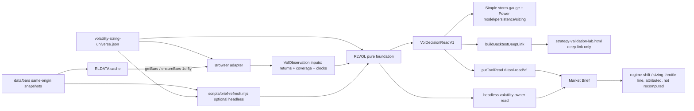

# Design: 011 Volatility Regime and Vol-Targeting Sizing Lab

## Design Brief

### Current State

Research Lab measures realized risk in many tools — `etf-momentum-lab.html` computes realized volatility, drawdown, VaR, Sharpe, and Sortino; `strategy-validation-lab.html` runs an out-of-sample walk-forward with embargoed folds and a Deflated Sharpe; `portfolio-survival-allocation-lab.html` sizes for survival. None of them owns a forward conditional-volatility **forecaster**, a window-relative volatility **regime percentile**, a persistence/half-life decomposition, or a capped vol-targeting **sizing multiplier**.

The delivery primitives already exist and are stable: `rldata.js` owns the cache-first same-origin daily-bar store (`ensureBars(sym,"1d",maxAgeH,range)` defaults `1d` to `range "5y"`, `getBars` reads bare rows, `putToolRead` persists one compact owner read, `freshness`/`barInfo` expose clocks), `rlchart.js` owns canvas hover hit-testing, `rlticker.js` owns ticker links, `rlnav.js`/`index.html`/`tools.json` form the route registry, and `rlvalidation.js` owns the deflated-Sharpe/fold machinery that the backtest hand-off delegates to. No shared conditional-volatility contract and no dedicated volatility route exist.

### Target State

Add one pure `rlvol.js` foundation (capability **RLVOL**) as the only owner of log-return derivation, EWMA/RiskMetrics conditional variance (the default), an optional bounded in-browser GARCH(1,1) optimizer (explicitly not MLE), the forecast term structure, annualization, the window-relative volatility percentile, the regime band, persistence/half-life, the capped-and-floored sizing multiplier, managed-suppression detection, and the single normalized owner-read projection. RLVOL is browser/Node-safe: the browser consumes `globalThis.RLVOL`; Node ESM consumers use `createRequire(import.meta.url)` to receive the same frozen CommonJS export without mutating Node globals.

Add `volatility-sizing-lab.html` as a cache-first Simple/Power projection of one immutable `VolDecisionReadV1`. It consumes the **existing** `RLDATA.ensureBars`/`getBars` bare-row path (no `rldata.js` change), publishes one versioned `rl-tool-read/v1` owner read via the **existing** `RLDATA.putToolRead`, and deep-links the backtest question to `strategy-validation-lab.html`. Market Brief consumes that owner read and surfaces a regime/throttle line without recomputing the model.

### Patterns To Follow

- `rlfx.js` / `rlcausal.js` / `rlvalidation.js`: a pure browser/Node-safe UMD module with no DOM, storage, network, timer, or ambient-clock code, exposing top-level `function` declarations through a frozen API.
- `bond-regime-lab.html`: one immutable observed snapshot, one computation feeding Simple and Power, explicit unavailable states, model identity, synchronous canvas draws in `render()`, accessible chart tables, and `RLDATA.putToolRead` publication.
- `rldata.js` existing surface: `ensureBars(sym,"1d",maxAgeH,range)` for cache-first + automatic delta hydration, `getBars(sym,"1d")` for first-paint reads, the versioned `rl-tool-read/v1` branch of `putToolRead` for the owner read.
- `rlvalidation.js`: the backtest question is delegated (deep-link) to the owner of `rlvDeflatedSharpe`/`rlvBuildPurgedFolds`; RLVOL never re-implements it.
- `scripts/selftest.mjs` Feature 004 group: `createRequire` import of the pure module, a global-preservation assertion, deterministic explicit-`decisionTime` identity, and adversarial red-to-green helpers.

### Patterns To Avoid

- Function extraction from HTML for the shared volatility math. It creates a second loading contract and allows browser/headless drift. The math lives only in `rlvol.js`.
- Presenting a browser GARCH fit as `arch`/R-grade maximum-likelihood estimation, or a converged fit as prediction skill.
- Interchanging a typed `forecast` with a typed `realized` estimate, or publishing either without its `kind`.
- An uncapped or unfloored `targetVol / forecastVol` that diverges as `forecastVol → 0`.
- A regime percentile shown without its trailing window and observation count, or a cross-asset-comparable "danger score".
- An in-tool backtest, equity curve, or any reproduction of a single-path multi-decade outperformance number.
- Treating peg/band/halt-suppressed low volatility as "calm" or automatically full-size.
- `requestAnimationFrame` for a chart draw (rAF does not fire in hidden / Simple-Browser tabs, so the canvas would never paint); deferring a canvas draw off the synchronous `render()` path.
- Any modification to `rldata.js`, `rlfx.js`, `rlcausal.js`, `rlapp.js`, `rlchart.js`, or `rlticker.js` beyond the one `rlnav.js` registry entry. RLVOL is purely additive.
- A credential form, a personalized real-account currency size, an order, a broker path, or an executable-pricing claim.

### Resolved Decisions

- `rlvol.js` is the shared capability and has no DOM, storage, fetch, provider, ambient clock, or rendering code; it contains no reference to `document`, `localStorage`, `fetch`, or `Date.now()`.
- RLVOL consumes the **existing** `rldata.js` bare-row daily-bar path (`ensureBars`/`getBars`) and the **existing** versioned `putToolRead` branch. `rldata.js` is an unchanged read-only canary; this feature adds no method, key, or migration to it.
- EWMA / RiskMetrics (λ closed form, default `λ = 0.94`) is the default estimator. GARCH(1,1) is an optional, explicitly-labeled lightweight bounded optimizer that enforces stationarity `α + β < 1` and falls back to EWMA on non-convergence.
- Every published volatility value is a typed `forecast` or `realized` observation; the two are never interchanged.
- The sizing multiplier is `min(cap, targetVol / max(floor, forecastVol))` with `cap` and forecast-vol `floor` from the universe policy; it is conditional and generic (no account currency size, no order).
- The regime is a window-relative percentile against a declared trailing window and observation count, with a `calm | normal | elevated | storm` band; the window travels with the percentile everywhere.
- The backtest question is emitted as a deep-link into `strategy-validation-lab.html`; RLVOL owns only link **emission**, never an in-tool verdict, and never modifies the target tool.
- Every compute entry point takes an explicit ISO `decisionTime`; identical complete inputs (including `decisionTime`) produce canonically identical outputs and one deterministic `decisionId` in browser and Node.
- No database, backend, build step, package, service, credential, or personalized portfolio state is introduced.

### Open Questions

- Whether the Market Brief volatility line is published **browser-only** (via `RLDATA.putToolRead`) or **also** headless (a `buildVolToolRead()` in `scripts/brief-refresh.mjs` for the static snapshot). This design specifies both surfaces additively; `bubbles.plan` selects whether the headless builder ships in the first scope or a follow-up. Neither choice changes the RLVOL contract.

## Purpose And Scope

The design implements the capability described in `spec.md` across three owners:

1. The Volatility Sizing Lab owns the conditional-volatility forecast (EWMA default, optional GARCH(1,1)), the window-relative regime percentile, persistence/half-life, the capped conditional sizing multiplier, and the single volatility owner read.
2. Strategy Validation Lab owns the out-of-sample backtest verdict; the Volatility Sizing Lab reaches it only by deep-link.
3. Market Brief owns cross-tool synthesis; it consumes the volatility owner read and never recomputes the model.

The feature creates no execution venue, personalized position size in currency, live dealer quote, broker path, holdings model, credential surface, or restricted-data repository. Insufficient, stale, non-finite, unavailable, non-convergent, or managed-suppressed inputs remain first-class explicit states that are still rendered, published, and tested — never a zero, neutral, flat "calm" band, or an implicit full-size multiplier.

## Architecture Overview



### Runtime Ownership

| Layer | Owns | Does Not Own |
| --- | --- | --- |
| `rldata.js` (unchanged) | Existing bare-row `1d` bar cache (`ensureBars`/`getBars`/`barInfo`/`freshness`) and the versioned `putToolRead` branch | Volatility semantics, forecast/realized typing, regime, sizing, or any RLVOL logic |
| `rlvol.js` | Validation, log returns, EWMA/GARCH conditional variance, forecast term structure, annualization, percentile regime, persistence/half-life, capped sizing, managed-suppression, decision identity, owner-read projection, deep-link emission | Fetch, storage, DOM, credentials, prose rendering, ambient clock, backtest execution |
| `volatility-sizing-lab.html` | Controls, adapters from `RLDATA` bars to RLVOL inputs, cache-first hydration, rendering, accessibility, synchronous canvas draws, publication | Volatility formulas, source fetching beyond `RLDATA`, backtest verdict |
| `strategy-validation-lab.html` | The out-of-sample backtest verdict (unchanged) | The forecast/regime/sizing cockpit |
| `scripts/brief-refresh.mjs` (optional) | Node cache/snapshot-first read, one run `decisionTime`, the optional headless volatility owner read | Extracted RLVOL math or an owner-independent synthesis |
| `rlbrief.js` / `market-brief.html` | Owner-read validation, the volatility regime/throttle line, rendering and wording | Recomputing volatility, inventing a synthesis the owner never published |

### Data Flow

1. The page fetches and validates `volatility-sizing-universe.json`. Failure creates an unavailable decision (`SOURCE_ERROR`); there is no embedded fallback universe.
2. First paint reads cached bars synchronously through `RLDATA.getBars(sym,"1d")` and computes one `VolDecisionReadV1` from whatever valid history exists (or an explicit unavailable state).
3. Automatic delta hydration calls `RLDATA.ensureBars(sym,"1d",maxAgeHours,"5y")` only for missing/stale bars. Controls never call fetch. An optional longer-history control calls `ensureBars(sym,"1d",0,"10y"|"max")` best-effort (Yahoo-only, caveated).
4. Each completed delta replaces the immutable bar snapshot and invokes one `RLVOL.buildVolDecisionRead({ decisionTime, ...input })`. Simple, Power, accessibility summaries, canvases, the owner read, and the deep-link all consume that one frozen result.
5. The tool publishes the owner read through `RLDATA.putToolRead("volatility-sizing-lab", RLVOL.projectVolToolRead(decision))`.
6. `scripts/brief-refresh.mjs` (optional) loads `rlvol.js` with `createRequire`, captures one run `decisionTime`, reads same-origin snapshots, and builds the same owner read for the static snapshot. It never re-stamps clocks or recomputes in a second code path.
7. Market Brief receives the normalized owner read and renders one attributed regime/throttle line; it never receives raw bars and never recomputes the model.

## Capability Foundation

### Foundation Contract

| Export | Responsibility | Consumers |
| --- | --- | --- |
| `validateUniverse(value)` | Reject unknown keys, duplicate/invalid asset identity, invalid cohort/management flags, out-of-range policy values, and unbounded membership; return a closed frozen universe | Tool page, selftest, headless refresh |
| `logReturns(closes)` | Produce finite log returns `ln(cₜ/cₜ₋₁)` from positive closes with deterministic invalid-row handling | Every estimator |
| `ewmaVar(returns, lambda, seedWindow)` | RiskMetrics closed-form conditional-variance path and the one-step-ahead variance; the DEFAULT estimator | `forecastTerm`, decision |
| `ewmaVol(returns, lambda, seedWindow)` | `sqrt(ewmaVar)` one-step-ahead daily volatility (pre-annualization) | Decision, tests |
| `garch11Fit(returns, opts)` | Bounded, capped-iteration in-browser optimizer for `{ω,α,β}` enforcing `α+β<1`; explicitly NOT MLE; returns diagnostics or a non-convergent result | Optional estimator, `forecastTerm` |
| `forecastTerm(model, horizon)` | 1-day + N-day forward variance/vol; flat for EWMA, decaying toward the long-run variance for GARCH | Term chart, decision |
| `annualizeVol(dailyVol)` | Multiply daily volatility by `√252` (factor stated) | Every displayed volatility |
| `realizedVol(returns, window)` | Trailing realized volatility over a declared rolling window, annualized by `√252`; always typed `realized` | Regime window, decision |
| `volPercentile(currentVol, history, windowRef)` | Window-relative percentile with the declared trailing window and observation count returned | Regime |
| `regimeBand(percentile, thresholds)` | Map a percentile to a `calm` / `normal` / `elevated` / `storm` band | Regime |
| `halfLife(persistence)` | `ln(0.5)/ln(persistence)` trading days from `α+β` (or `λ`) | Persistence panel, decision |
| `sizingMultiplier(targetVol, forecastVol, cap, floor)` | `min(cap, targetVol / max(floor, forecastVol))` | Sizing card, decision |
| `detectManagedSuppression(returns, levels, policy)` | Heuristic peg/band/halt detection; flags `MANAGED_SUPPRESSED` | Regime, decision |
| `normalizeObservation(value)` | Enforce the `VolObservationV1` discriminated union; strip no lineage field silently | All projections |
| `buildVolDecisionRead(input)` | Produce one immutable `VolDecisionReadV1` | Simple, Power, owner read, deep-link |
| `buildBacktestDeepLink(context)` | Produce the allowlisted `strategy-validation-lab.html` deep-link URL | Backtest CTA |
| `projectVolToolRead(decision)` | Produce the compact versioned `rl-tool-read/v1` owner read (no raw bars, no restricted values) | `RLDATA.putToolRead`, brief snapshot |
| `canonicalize(value)` / `decisionId(value)` | Stable key ordering and non-cryptographic deterministic identity | Parity tests, UI identity |

### Loading And Export Contract

`rlvol.js` is one plain script with no dependency and this exact module boundary. The CommonJS branch returns before any browser-global assignment, so loading the module in Node cannot mutate `globalThis`:

```js
(function (factory) {
  "use strict";
  var api = Object.freeze(factory());
  if (typeof module === "object" && module && module.exports) {
    module.exports = api;
    return;
  }
  if (typeof globalThis === "undefined") throw new Error("RLVOL_BROWSER_GLOBAL_UNAVAILABLE");
  globalThis.RLVOL = api;
})(function () {
  "use strict";
  return {
    validateUniverse: validateUniverse,
    logReturns: logReturns,
    ewmaVar: ewmaVar,
    ewmaVol: ewmaVol,
    garch11Fit: garch11Fit,
    forecastTerm: forecastTerm,
    annualizeVol: annualizeVol,
    realizedVol: realizedVol,
    volPercentile: volPercentile,
    regimeBand: regimeBand,
    halfLife: halfLife,
    sizingMultiplier: sizingMultiplier,
    detectManagedSuppression: detectManagedSuppression,
    normalizeObservation: normalizeObservation,
    buildVolDecisionRead: buildVolDecisionRead,
    buildBacktestDeepLink: buildBacktestDeepLink,
    projectVolToolRead: projectVolToolRead,
    canonicalize: canonicalize,
    decisionId: decisionId
  };
});
```

Browser pages load `rldata.js`, then `rlvol.js`, then `rlapp.js`, `rlticker.js`, `rlchart.js`, `rlnav.js`; their inline boot waits for `DOMContentLoaded`. Node ESM uses:

```js
import { createRequire } from 'node:module';
const require = createRequire(import.meta.url);
const RLVOL = require('../rlvol.js');
```

The pure module contains no `document`, `localStorage`, `fetch`, `Date.now()`, or `requestAnimationFrame` reference, so importing it in Node is a no-op on every global. `scripts/selftest.mjs` imports the same export rather than copying helper bodies. Importing `rlvol.js` in Node must leave any pre-existing `globalThis.RLVOL` value byte-for-byte unchanged.

Every public compute entry point requires a finite ISO `decisionTime` in its input. The foundation parses it once, emits that exact instant as `computedAt`, and uses it for cache-age and freshness comparisons. Missing or invalid `decisionTime` is `RLVOL_DECISION_TIME_INVALID`; the foundation never calls `Date.now()`, `new Date()` without an input value, or another ambient clock. Therefore identical complete inputs, including `decisionTime`, produce canonically identical outputs and decision IDs in browser and Node.

### Extension Points

- **Bar adapter:** the page (or the headless refresh) supplies finite positive daily closes plus their observed/retrieved clocks and coverage counts from the existing `RLDATA` bare-row path. RLVOL derives returns, coverage, and freshness; it never fetches.
- **Estimator adapter:** EWMA is the closed-form default; `garch11Fit` is an optional bounded optimizer whose non-convergence is a first-class `FIT_NONCONVERGENT` outcome that resolves to the labeled EWMA fallback.
- **Regime window adapter:** the caller declares the trailing window and observation count; the percentile is meaningless without them and RLVOL refuses to emit one that lacks its `windowRef`.
- **Consumer projection:** Simple, Power, the owner read, and the deep-link each read the same frozen decision; consumers cannot add fields to the computation.
- **UI composition:** Simple and Power arrange one decision identity differently; neither receives lower-level mutable model state.

### Foundation-Owned Behavior

- Closed schemas and enums, `Number.isFinite` guards, positive-close guards, and input immutability.
- Forecast/realized typing: a `forecast` value can never be relabeled `realized` and vice versa.
- Estimator honesty: EWMA is closed-form; GARCH is a labeled lightweight optimizer with an enforced stationarity guard and an EWMA fallback.
- Cap-and-floor sizing so `forecastVol → 0` reaches the cap, never infinity.
- Window-relative percentile that always carries its trailing window and observation count.
- Managed-suppression detection that marks a low-vol read as a limitation, never "calm".
- Deterministic browser/Node parity and one deterministic `decisionId`.

## Concrete Implementations

### Volatility Sizing Lab

`volatility-sizing-lab.html` owns a small adapter/runtime object:

```js
runtime = {
  config,        // validated universe + policy
  controls,      // asset, mode, estimator, termLength, targetVol, notional, historyRange
  bars,          // immutable cached daily-close snapshot per asset
  decision       // frozen VolDecisionReadV1
};
```

`recompute()` builds one plain input, calls `RLVOL.buildVolDecisionRead`, stores the returned frozen decision, then calls `renderSimple`, `renderPower`, `renderAccessibleSummaries`, `drawPowerCharts`, and `publish`. `window.VolSizingLab` exposes read-only `runtime`, `recompute`, and `publish` for persistent browser tests; it exposes no bar mutation or test-only result path.

`publish()` calls `RLDATA.putToolRead("volatility-sizing-lab", RLVOL.projectVolToolRead(runtime.decision))`. The estimator control switches EWMA and the GARCH lightweight optimizer over the same bars; a non-convergent fit resolves to the EWMA fallback state. The backtest CTA calls `RLVOL.buildBacktestDeepLink(...)` and navigates; it renders no in-tool verdict.

### Market Brief Integration

The browser tool's owner read is registry-consumed by `market-brief.html` exactly like every other tool read. Optionally, `scripts/brief-refresh.mjs` adds `buildVolToolRead()` (invoking RLVOL via `createRequire`) so the static snapshot carries the same owner read; it captures one run `decisionTime` and does not use builder-local `new Date()` values as owner `asOf`/`computedAt`/freshness substitutes. `market-brief.html` / `rlbrief.js` render one attributed regime/throttle line with the owner's as-of, freshness, the window-visible percentile, and a deep link. The brief never recomputes the model; a stale or unavailable owner read renders a named coverage outcome, not an invented synthesis.

### Variation Axes

| Axis | Supported Variants | Foundation Ownership |
| --- | --- | --- |
| Runtime | Browser global, Node CommonJS loaded from ESM | Export parity and pure behavior |
| Estimator | EWMA closed form (default), GARCH(1,1) lightweight optimizer, EWMA fallback on non-convergence | One typed forecast; labeled method; stationarity guard |
| Volatility kind | Forecast (1-day / N-day), realized (rolling window) | Typing that is never interchanged |
| Regime window | Configurable trailing window + observation count per asset | Percentile that always carries its window |
| Asset management | Free-float, managed/reference (peg/band/halt) | Managed-suppression limitation, never "calm" |
| Term structure | Flat (EWMA), geometric decay toward long-run (GARCH) | Persistence-governed decay |
| Consumer | Simple cockpit, Power detail, owner read, deep-link | Owner-specific projection without formula duplication |
| UI composition | Simple, Power, mobile, accessible table | One decision identity and state vocabulary |

## Configuration And Universe

### `volatility-sizing-universe.json` Shape

The file is a closed contract. Unknown keys or a missing required policy value make the whole configuration unavailable (no embedded fallback).

```ts
type VolUniverseV1 = {
  schemaVersion: "rlvol-universe/v1";
  version: string;
  reviewedAt: ISODate;
  assets: VolAssetV1[];
  policy: VolPolicyV1;
};

type VolAssetV1 = {
  symbol: string;                       // rendered only through RLTKR
  name: string;
  cohort: "equity-index" | "single-name" | "crypto" | "commodity" | "fx" | "rate";
  management: "free-float" | "managed-reference";  // peg/band/halt candidates
  defaultTargetVol: number;             // annualized decimal, e.g. 0.15
  regimeWindowObs: number;              // declared trailing window (e.g. 252)
  minForecastObs: number;              // declared minimum returns for a forecast
  reviewWindowHours: number;            // freshness / next-review rule
  limitations: string[];               // non-empty for managed/reference assets
};

type VolPolicyV1 = {
  ewma: { lambda: number; seedWindow: number };            // default 0.94, seed 20
  garch: { maxIter: number; tolerance: number; minOmega: number; maxPersistence: number };
  forecast: { defaultHorizonDays: number; maxHorizonDays: number; annualization: number };
  regime: { calmMaxPct: number; normalMaxPct: number; elevatedMaxPct: number };  // storm = above elevatedMaxPct
  sizing: { cap: number; forecastVolFloor: number };       // e.g. cap 2.0, floor 0.05
  managedSuppression: { zeroReturnFraction: number; minAbsDailyReturn: number; identicalCloseRun: number };
  history: { defaultRange: "5y"; longRangeOptions: ["10y", "max"]; dailyBarReviewHours: number };
};
```

`defaultTargetVol`, `regimeWindowObs`, `minForecastObs`, the estimator/sizing constants, and the regime thresholds are required versioned research policy, not fallback values in code. Validation fails if any value is absent, non-finite, outside its closed range, or if `calmMaxPct < normalMaxPct < elevatedMaxPct` is violated.

### Bounded Public V1 Inventory

| Cohort | Example Members | Management |
| --- | --- | --- |
| Equity index | SPY, QQQ, IWM | free-float |
| Single name | AAPL, MSFT, NVDA | free-float |
| Crypto | BTC-USD, ETH-USD | free-float (high-vol) |
| Commodity | GLD, USO | free-float |
| Managed / reference | a peg/band/halt-prone proxy | managed-reference (inspection only) |

The asset list, per-asset default target vol, regime windows, and review windows are runtime-editable through the universe file; a managed/reference asset always carries its limitation label and can never silently become a free-float read. Symbol identity uses the existing Yahoo-style lookup vocabulary; a responding endpoint is not a rights assertion (the tool consumes only the existing public/cached same-origin bar path).

### Required Policy Values (illustrative defaults)

```json
{
  "ewma": { "lambda": 0.94, "seedWindow": 20 },
  "garch": { "maxIter": 200, "tolerance": 1e-8, "minOmega": 1e-12, "maxPersistence": 0.999 },
  "forecast": { "defaultHorizonDays": 21, "maxHorizonDays": 63, "annualization": 252 },
  "regime": { "calmMaxPct": 25, "normalMaxPct": 75, "elevatedMaxPct": 95 },
  "sizing": { "cap": 2.0, "forecastVolFloor": 0.05 },
  "managedSuppression": { "zeroReturnFraction": 0.30, "minAbsDailyReturn": 0.0005, "identicalCloseRun": 10 },
  "history": { "defaultRange": "5y", "longRangeOptions": ["10y", "max"], "dailyBarReviewHours": 12 }
}
```

## Contracts And Schemas

### Closed Vocabularies

```ts
type VolKind = "forecast" | "realized";

type Estimator = "ewma" | "garch11" | "realized-rolling";

type RegimeBand = "calm" | "normal" | "elevated" | "storm";

type Availability = "loading" | "fresh" | "stale" | "unavailable";

type Quality = "observed" | "derived" | "closed-form" | "fitted" | "user-assumption";

type UnavailableReason =
  | "INSUFFICIENT_HISTORY" | "NONFINITE" | "NO_COMMON_DATES"
  | "FIT_NONCONVERGENT" | "MANAGED_SUPPRESSED" | "SOURCE_ERROR"
  | "STALE_BEYOND_POLICY";
```

No alias, generic `missing`, or free-text primary reason is accepted.

### VolObservation (the reusable typed envelope)

Every published volatility value carries the fields the spec's Reusable Volatility Observation Contract requires. A consumer may project fewer fields for display but may not discard the lineage needed to interpret method, typing, coverage, or freshness.

```ts
type VolObservationV1 = {
  contractVersion: "rlvol-observation/v1";
  observationId: string;                 // stable across {asset, measure, horizon, estimator}
  kind: VolKind;                         // "forecast" | "realized" — never interchanged
  subject: string;                      // asset symbol
  estimator: Estimator;
  value?: number;                       // finite annualized volatility (decimal); absent when unavailable
  unit: "annualized-decimal";
  horizon: { kind: "day" | "term" | "rolling-window"; value: number };
  annualization: 252;                   // stated explicitly (√252)
  params: null | { lambda: number } | { omega: number; alpha: number; beta: number };
  persistence: null | { value: number; halfLifeDays: number };  // α+β (or λ) + implied half-life
  coverageObs: { used: number; requiredMinimum: number };
  windowRef: null | { observations: number; startDate: ISODate; endDate: ISODate };  // required for a percentile
  source: { id: string; url: string | null };
  observedAsOf: ISODate;                 // as-of date of the last bar used
  retrievedAt: ISODateTime;             // when Research Lab obtained the bars
  reviewWindow: { maxAgeHours: number };
  availability: Availability;
  unavailableReason?: UnavailableReason; // required whenever availability is "unavailable"
  quality: Quality;
  limitations: string[];                // non-empty for managed, short-history, fitted, or provider-limited reads
};
```

Conditional rules:

- `fresh` and `stale` quantitative observations require a finite own `value`. `loading` and `unavailable` omit `value`.
- `unavailable` requires exactly one `unavailableReason`; all other states forbid it.
- A `forecast` observation uses estimator `ewma` or `garch11`; a `realized` observation uses `realized-rolling`. The pairing is enforced.
- A percentile-bearing read requires a non-null `windowRef`; RLVOL refuses to emit one without it.
- `params` is `{lambda}` for EWMA, `{omega,alpha,beta}` for GARCH, and `null` for a pure realized read.

### VolDecisionRead

```ts
type VolDecisionReadV1 = {
  contractVersion: "rlvol-decision-read/v1";
  decisionId: string;                    // "vold-v1-" + fnv1a32(canonicalBytes)
  configVersion: string;
  computedAt: ISODateTime;               // exactly the input decisionTime
  controls: {
    asset: string;
    estimator: Estimator;                // requested estimator ("realized-rolling" never requested here)
    termLengthDays: number;
    targetVol: number;                   // user-declared annualized decimal (user-assumption)
    notional: number | null;             // for the worked example only; never a real-account size
    historyRange: "5y" | "10y" | "max";
  };
  state: "ready" | "partial" | "unavailable";
  forecast: VolObservationV1;            // kind "forecast"; the headline 1-day-ahead read
  realized: VolObservationV1;            // kind "realized"; never relabeled a forecast
  term: {
    state: "ready" | "unavailable";
    estimator: Estimator;
    longRunVol: number | null;           // null for EWMA (integrated / no long-run)
    points: Array<{ horizonDays: number; vol: number; kind: "forecast" }>;
    unavailableReason?: UnavailableReason;
  };
  regime: {
    state: "ready" | "unavailable";
    band: RegimeBand | null;
    percentile: number | null;
    windowRef: VolObservationV1["windowRef"];   // always present when ready
    managedSuppressed: boolean;
    unavailableReason?: UnavailableReason;
  };
  persistence: {
    state: "ready" | "unavailable";
    shockWeight: number | null;          // 1−λ (EWMA) or α (GARCH)
    memoryWeight: number | null;         // λ (EWMA) or β (GARCH)
    persistence: number | null;          // λ or α+β
    halfLifeDays: number | null;
  };
  sizing: {
    state: "ready" | "unavailable";
    multiplier: number | null;           // min(cap, targetVol / max(floor, forecastVol))
    cap: number;
    forecastVolFloor: number;
    workedExample: null | { notional: number; conditionalExposure: number };
    conditional: true;                   // "apply only if a separate signal fires"
    unavailableReason?: UnavailableReason;
  };
  diagnostics: {
    estimatorResolved: Estimator;        // may differ from controls.estimator on GARCH fallback
    garchConverged: boolean | null;
    garchIterations: number | null;
    coverageObs: number;
    requiredMinimum: number;
  };
  conflicts: VolEvidenceConflictV1[];
  coverage: { required: number; available: number; ratio: number };
  asOf: ISODate | null;
  freshUntil: ISODateTime | null;
  limitations: string[];
  educationalOnly: true;
};

type VolEvidenceConflictV1 = {
  code: "EWMA_GARCH_PERSISTENCE_DIVERGENCE" | "REALIZED_FORECAST_DIVERGENCE" | "MANAGED_VOL_SUPPRESSION";
  detail: string;
  observationIds: string[];
  blocking: boolean;
};
```

An `unavailable` decision carries no forecast/regime/sizing numbers. A `partial` decision may render some ready sub-reads (for example a forecast) while others are explicitly unavailable (for example sizing suppressed under `MANAGED_SUPPRESSED`). EWMA and GARCH persistence that disagree materially open `EWMA_GARCH_PERSISTENCE_DIVERGENCE`; both are shown, never averaged.

### Tool Read (owner read)

The owner read reuses the **existing** versioned `putToolRead` branch (`contractVersion: "rl-tool-read/v1"`); no `rldata.js` change is required.

```ts
type VolToolReadV1 = {
  contractVersion: "rl-tool-read/v1";
  id: "volatility-sizing-lab";
  availability: "current" | "stale" | "unavailable";
  asOf: ISODate | null;
  read: string;                          // e.g. "SPY vol regime elevated (78th pct / 252 obs); throttle ×0.82"
  metrics: VolToolMetricsV1;
  deepLink: string;                     // "volatility-sizing-lab.html"
  computedAt: ISODateTime;
  freshUntil: ISODateTime | null;
};

type VolToolMetricsV1 = {
  contractVersion: "rlvol-tool-read/v1";
  decisionId: string;
  asset: string;
  estimatorResolved: Estimator;
  forecastVol: number | null;            // annualized decimal, typed forecast
  realizedVol: number | null;            // annualized decimal, typed realized
  regimeBand: RegimeBand | null;
  regimePercentile: number | null;
  regimeWindowObs: number | null;        // the percentile ALWAYS travels with its window
  managedSuppressed: boolean;
  persistence: number | null;
  halfLifeDays: number | null;
  sizingMultiplier: number | null;
  sizingCap: number;
  sizingFloor: number;
  coverage: { required: number; available: number; ratio: number };
  conflicts: Array<{ code: string; blocking: boolean }>;
  educationalOnly: true;
};
```

`projectVolToolRead` copies only summary values — never raw bars, never a restricted payload, never a source URL beyond the tool deep-link. For a `current` owner read, `asOf` is the forecast `observedAsOf` and `freshUntil` is the forecast source deadline. An `unavailable` owner read has `availability: "unavailable"`, `asOf: null`, and `freshUntil: null`. A `stale` owner read keeps its permitted facts but cannot drive a Market Brief synthesis.

### Error Model

Config/programmer errors return `{ ok:false, errors:[{ code, path, message }] }` with closed codes `RLVOL_UNIVERSE_INVALID`, `RLVOL_SCHEMA_INVALID`, `RLVOL_CONTRACT_VERSION`, and `RLVOL_DECISION_TIME_INVALID`. Market-data limitations produce the domain unavailable records above, not thrown exceptions. Renderers catch only unexpected runtime faults, publish an unavailable owner read, and report `RLAPP.report("vol:compute", "error", { code: "RLVOL_RUNTIME" })` without data values.

## Closed Availability And Unavailable State Machine

`availability: "unavailable"` must carry exactly one primary reason. Each reason has a defined detection and a required UI behavior.

| Reason | Detection | Required UI Behavior |
| --- | --- | --- |
| `INSUFFICIENT_HISTORY` | Valid returns `< minForecastObs` for the horizon | Show exact required-vs-available counts and the latest usable date; publish no forecast/regime/sizing; never default to zero, neutral, calm, or full size |
| `NONFINITE` | Required inputs null/±∞/malformed after row filtering | Publish no numeric result; render `--`; keep distinct from a source failure |
| `NO_COMMON_DATES` | A multi-series alignment (e.g. a future cross-asset compare) lacks a sufficient exact-date intersection | Do not calculate or forward-fill; show the diagnostic |
| `FIT_NONCONVERGENT` | `garch11Fit` fails stationarity `α+β<1` or the iteration/tolerance cap | Fall back to the EWMA closed form and **label** the fallback; show the EWMA numbers, never a broken/silent GARCH value |
| `MANAGED_SUPPRESSED` | `detectManagedSuppression` heuristic fires (zero-return fraction, sub-floor daily ranges, or an identical-close run) | Show the regime **marked managed-suppressed**, not "calm"; show the forecast with the mark; withhold or explicitly caveat sizing (never automatic full size) |
| `SOURCE_ERROR` | Universe or bar retrieval/parsing failed | Preserve valid cache as `stale` when allowed; otherwise unavailable; no fabricated result |
| `STALE_BEYOND_POLICY` | Cached bars exceed `reviewWindowHours` and no refresh is possible | Show explicitly stale, never relabeled fresh/current; suppress sizing while stale beyond policy; keep distinct from a policy-permitted `stale` mark |

The managed-suppression heuristic (`detectManagedSuppression`) is a first-class, testable classifier — a low realized volatility that is manufactured by management is a limitation, not a green light.

## Deterministic Algorithms

### 1. Log-Return And Row Normalization

1. Accept only closes with `Number.isFinite(c)` and `c > 0` (never global `isFinite`).
2. Compute `gₜ = ln(cₜ / cₜ₋₁)` on consecutive valid closes; a gap drops that single return, recorded in coverage.
3. A required series whose valid returns fall below `minForecastObs` is `INSUFFICIENT_HISTORY`; malformed inputs with no sufficient valid remainder are `NONFINITE`. No invalid row becomes zero.

### 2. EWMA / RiskMetrics Conditional Variance (default)

Seed `σ²₀` with the sample variance of the first `seedWindow` returns, then recurse:

$$\sigma^2_t = \lambda\,\sigma^2_{t-1} + (1-\lambda)\,r^2_{t-1}, \qquad \lambda = 0.94 \text{ (policy)}$$

The one-step-ahead variance forecast given returns through `r_T` is:

$$\sigma^2_{T+1} = \lambda\,\sigma^2_T + (1-\lambda)\,r^2_T$$

`ewmaVol` returns `sqrt(σ²_{T+1})` (daily). EWMA is integrated (`λ + (1−λ) = 1`), so it has **no** finite long-run variance and its multi-day forecast is **flat**: `σ²_{T+h} = σ²_{T+1}` for all `h`. This is stated honestly — the decaying term structure is a GARCH property, not an EWMA one. EWMA persistence for display is `λ`.

### 3. Optional GARCH(1,1) Lightweight Optimizer

`garch11Fit(returns, {maxIter, tolerance, minOmega, maxPersistence})` fits `{ω, α, β}` by a **bounded, capped-iteration** in-browser search (variance-targeting coordinate descent minimizing the Gaussian negative log-likelihood). It is explicitly **not** MLE-grade and is labeled a lightweight optimizer everywhere. It enforces:

- `ω ≥ minOmega`, `α > 0`, `β > 0`;
- stationarity `α + β < maxPersistence < 1`;
- iteration cap `maxIter` and convergence `tolerance`.

On success it returns `{ ok:true, omega, alpha, beta, persistence: α+β, longRunVar: ω/(1−α−β), converged:true, iterations }`. On any breach it returns `{ ok:false, reason:"FIT_NONCONVERGENT" }`, and the caller resolves the estimator to the EWMA closed form with a labeled fallback. The GARCH one-step-ahead variance is `σ²_{T+1} = ω + α·r²_T + β·σ²_T`.

### 4. Forecast Term Structure

`forecastTerm(model, horizon)` returns typed-`forecast` points for `1 … horizon` days:

- **EWMA:** flat — every horizon equals the one-step-ahead vol; `longRunVol = null`.
- **GARCH:** `σ²_{T+h} = σ²_{LR} + (α+β)^{h-1}\,(σ²_{T+1} − σ²_{LR})` with `σ²_{LR} = ω/(1−α−β)`, a geometric decay toward the long-run at rate `(α+β)`. `longRunVol = √(annualize(σ²_{LR}))`.

Every point is annualized by `√252` at the boundary and carries `kind: "forecast"`.

### 5. Annualization

$$\sigma_{ann} = \sigma_{daily}\times\sqrt{252}$$

The `√252` trading-day factor is stated on every displayed volatility (`annualization: 252`).

### 6. Realized Volatility (typed `realized`)

`realizedVol(returns, window)` is the sample standard deviation of daily log returns over the declared rolling `window`, annualized by `√252`. It is always typed `realized` and can inform the regime window, but it can never be relabeled a `forecast`.

### 7. Window-Relative Percentile And Regime Band

`volPercentile(currentVol, history, windowRef)` ranks the current same-typed volatility within the trailing `history` of length `windowRef.observations`:

$$p = 100\times\frac{\#\{h \in history : h \le currentVol\}}{|history|}$$

The returned read always carries `windowRef` (observation count + start/end dates). `regimeBand(p, thresholds)` maps `p` to `calm` (`p ≤ calmMaxPct`), `normal` (`≤ normalMaxPct`), `elevated` (`≤ elevatedMaxPct`), else `storm`. A percentile is never emitted without its window, and two assets' percentiles are not presented as cross-asset-comparable.

### 8. Persistence And Half-Life

`halfLife(persistence)` returns the shock decay half-life in trading days:

$$t_{1/2} = \frac{\ln(0.5)}{\ln(\text{persistence})}, \qquad 0 < \text{persistence} < 1$$

where `persistence` is `λ` for EWMA and `α+β` for GARCH. Shock weight is `1−λ` (or `α`), memory weight is `λ` (or `β`). High persistence is presented as the reason the one-day forecast is informative and the GARCH term decays slowly — never as directional prediction skill.

### 9. Managed-Suppression Detection

`detectManagedSuppression(returns, levels, policy)` returns `true` when any policy heuristic fires:

- zero-return fraction `≥ managedSuppression.zeroReturnFraction` (peg/halt),
- maximum absolute daily return over the window `< managedSuppression.minAbsDailyReturn` (band),
- a run of `≥ managedSuppression.identicalCloseRun` identical closes (halt).

A managed-suppressed asset's regime is shown marked managed-suppressed (not "calm") and its sizing multiplier is withheld or explicitly caveated.

### 10. Sizing Multiplier (capped and floored)

$$m = \min\!\left(cap,\; \frac{targetVol}{\max(floor,\; forecastVol)}\right)$$

with `cap` and `floor` from `policy.sizing` (defaults `2.0`, `0.05`). BS-003: `min(2.0, 0.15/max(0.05,0.30)) = 0.5`. BS-004: `forecastVol → 0` floors at `0.05`, giving `min(2.0, 0.15/0.05) = min(2.0, 3.0) = 2.0` — capped, never infinite. The multiplier is conditional ("apply only if a separate signal fires"), generic (no account currency size), and the worked example multiplies a **user-entered** notional purely for illustration.

### 11. One Compute, One Read, Deterministic Identity

`buildVolDecisionRead` clones validated inputs, performs all calculations once, canonicalizes `{decisionTime, configVersion, controls, bar identities, normalized outputs}`, and assigns `decisionId = "vold-v1-" + fnv1a32(canonicalBytes)`. `computedAt` is exactly the input `decisionTime`; freshness is computed only from source clocks against that same instant. This is a parity/change key, not a cryptographic primitive. The result is deeply frozen. Simple, Power, mobile, chart summaries, the deep-link, and `projectVolToolRead` receive the same object; a mode switch only toggles presentation and draws Power canvases from the current decision; a control change recomputes once.

### 12. Backtest Deep-Link Emission

`buildBacktestDeepLink({ asset, targetVol, estimator })` returns an allowlisted, URL-encoded hash link:

```text
strategy-validation-lab.html#focus=<SYM>&targetVol=<pct>&estimator=<ewma|garch11>&src=volatility-sizing-lab
```

RLVOL owns only **emission**. The target tool consuming these params is out of scope for this feature; an unconsumed param is a graceful no-op (the user still lands on a fully usable Strategy Validation Lab), and a missing target file is stated honestly with no fabricated result. No in-tool backtest, equity curve, or single-path multi-decade number is ever produced here.

## Data Reach And Fetch Contract

- Default reach is `RLDATA.ensureBars(sym, "1d", dailyBarReviewHours, "5y")` — roughly 1,250 daily bars, statistically sufficient for a stable EWMA/GARCH read.
- First paint reads `RLDATA.getBars(sym, "1d")` synchronously from cache; missing/stale bars hydrate automatically as deltas, and each completed delta triggers exactly one consolidated synchronous re-render and one owner-read update.
- An optional longer-history control calls `RLDATA.ensureBars(sym, "1d", 0, "10y")` or `"max"` — Yahoo-only, best-effort. Any coverage beyond the default is caveated as best-effort; **no** multi-decade single-path outperformance number is reproduced, and there is no single-path performance claim of any kind.
- Controls never call fetch; only refresh and automatic delta hydration request bars. The tool adds no request registry (it reuses `ensureBars`' existing deduplication).

## UI Technical Design

### Component Tree And DOM Contract

```text
ResearchRouteShell
|- Shared status (RLAPP)
|- StableControlRail
|  |- #modeSeg
|  |- #assetSelect
|  |- #estimatorSeg
|  |- #termLenInput
|  |- #targetVolInput
|  |- #notionalInput
|  `- #refreshBtn
|- #decisionLive (polite text summary)
|- #simpleView
|  |- #forecastValue
|  |- #stormGauge
|  |- #sizingSuggestion
|  |- #provenanceChips
|  `- #backtestCta
|- #powerView.pw
|  |- #decisionParity
|  |- #termChart + #termChartSummary + #termChartTable
|  |- #persistencePanel
|  |- #estimatorCompare
|  |- #sizingCard
|  |- #provenanceLedger
|  |- #backtestHandoff
|  `- #ownerReadLink
`- #provenanceDialog
```

There are no framework components or build output. These names identify semantic regions and renderer functions in the one HTML file.

### State And Events

- `controls` is the only mutable user state. It is schema-versioned and allowlisted before local persistence (asset, mode, estimator, term length, target vol, notional, history range).
- `bars` is replaced as one immutable snapshot after cache reads or consolidated hydration deltas.
- Segment arrow keys select within a group; Tab exits. Mode selection preserves focus and scroll and only toggles presentation.
- Control events call `recompute()` and never `hydrate()`. Refresh and boot call `hydrate()`, which reuses `ensureBars` deduplication and reports each resource through `RLAPP`.
- `#decisionLive` announces one debounced polite sentence: forecast, regime band with its trailing window and observation count, and the multiplier.
- The provenance dialog validates any source URL as HTTP/HTTPS, traps focus, supports Escape, and restores invoking focus.

### Rendering Contract (canvas)

All `<canvas>` draws happen **synchronously** inside `render()`. RLVOL/tool code never schedules a chart draw with `requestAnimationFrame` — rAF does not fire in a hidden or Simple-Browser tab, so a deferred draw would leave the canvas blank while the text/table fallback is already present. Only Power charts are drawn, and only when Power is visible (`body.power`); entering Power draws them synchronously from the current decision. A resize triggers a debounced redraw of the current decision (resize-only debounce) — never a recompute or a fetch. Every canvas carries an `aria-label`, an adjacent current-value summary, and a full text/table fallback drawn on the same synchronous path.

### Simple Mapping

| UX Primitive | Decision Fields | Behavior |
| --- | --- | --- |
| Forecast value | `forecast.*` | One-day-ahead annualized forecast with estimator, `√252`, and a `forecast` typing badge |
| Storm gauge | `regime.*` | Regime band as a percentile that ALWAYS shows its trailing window and observation count; managed-suppressed marked, never "calm" |
| Sizing suggestion | `sizing.*` | One-line `min(cap, targetVol/max(floor, forecastVol))` with cap/floor visible and the conditional caveat |
| Provenance chips | `forecast` stamp | kind, estimator, observed as-of, retrieved, review window, availability — text plus marks, never color-only |
| Backtest CTA | `buildBacktestDeepLink` | Deep-links Strategy Validation Lab; no in-tool verdict |

### Power Mapping

Power starts with `decisionId` and the same headline fields as Simple (the parity band must byte-for-byte match Simple for the same identity; a mismatch is a visible error, not silently reconciled). It adds the forecast term chart (synchronous canvas + summary + table), the persistence/half-life panel, the EWMA-vs-GARCH comparison strip (a material persistence disagreement is an explicit `EWMA_GARCH_PERSISTENCE_DIVERGENCE`, never averaged), the full sizing card with the visible cap/floor expression and worked example, a provenance ledger, the backtest hand-off, and the owner-read link. A non-convergent GARCH fit renders the labeled EWMA fallback, never a broken value.

### Market Brief Mapping

`market-brief.html` renders one registry-derived volatility owner item: the window-visible regime percentile, the sizing throttle, the owner as-of/freshness, and a deep link. It consumes the owner read and never recomputes the model; a stale/unavailable owner read renders a named coverage outcome, not an invented synthesis.

### Responsive Contract

- Desktop/tablet keep a two-row control rail, a full-width forecast value, and a full-width storm gauge; Power tables stay in bounded horizontal regions.
- Mobile uses dedicated Mobile Simple / Mobile Power projections: stacked reads with the regime word, percentile, trailing window, and observation count preserved as text lines (none dropped for width), 44 CSS-pixel targets, equal segmented-control tracks, wrapping labels, and no viewport-scaled font.
- Long reason codes (`INSUFFICIENT_HISTORY`, `MANAGED_SUPPRESSED`, `FIT_NONCONVERGENT`, `STALE_BEYOND_POLICY`) wrap at word boundaries and are never clipped.

## Registration Contract

One parity-synchronized route entry is added in each of these surfaces with identical identity and order:

| Surface | Change |
| --- | --- |
| `tools.json` | Add the tool object: `id: "volatility-sizing-lab"`, `title`, `nav: { label: "Vol Sizing", icon: "🌪️" }`, `file: "volatility-sizing-lab.html"`, `notes: "notes/volatility-sizing-lab.md"`, `data: "volatility-sizing-universe.json"`, `status`, `updated`, `blurb`, `tags` |
| `index.html` `TOOLS` array | Add one entry with matching `id`, `file`, `notes`, nav label/icon, and landing blurb |
| `rlnav.js` `TOOLS` array | Add one entry `{ label: "Vol Sizing", full: "Volatility Regime & Vol-Targeting Sizing Lab", icon: "🌪️", file: "volatility-sizing-lab.html" }` in the same order |
| `README.md` | Add the tool to the catalog listing |
| `notes/README.md` | Add the index row and next-run focus |
| `notes/volatility-sizing-lab.md` | New notes file (purpose, sources, math, levers, findings, limitations, next-run checklist, version history) |

Identity, order, label, icon, and file basename must match across `tools.json`, `index.html`, and `rlnav.js` (a registry parity check enforces this in selftest/E2E).

## Static API And Authorization

There is no server API. The only network contracts are same-origin public GETs already owned by `rldata.js`:

| Method | Path | Response | Failure |
| --- | --- | --- | --- |
| GET | `volatility-sizing-universe.json` | `VolUniverseV1` | Config unavailable (`SOURCE_ERROR`); no fallback |
| GET | `data/bars/<encoded-symbol>.json` via `RLDATA` | Existing daily snapshot contract | Permitted stale cache or exact unavailable reason |
| GET | `tools.json` | Existing registry | Brief shows registry coverage unavailable |

| Surface | Public | Credentialed User | Admin | Stored Secret |
| --- | --- | --- | --- | --- |
| Vol Sizing page and static contracts | Read | Same read | Same read | None |
| Same-origin bar snapshots | Read | Same read | Same read | None |

All routes remain static and educational. No role can activate a source or a credential from the tool page.

## Failure Handling

| Failure | Required Result |
| --- | --- |
| Universe missing/invalid | Structured unavailable decision, config error detail, no fallback membership |
| Empty first paint | Full semantic structure, `unavailable`/`partial` states, automatic delta hydration |
| One bar source fails with valid cache | Cache remains `stale` with age; controls remain usable |
| Fewer valid returns than the minimum | `INSUFFICIENT_HISTORY` with exact required-vs-available counts; no zero/neutral/calm/full-size default |
| Non-finite inputs | `NONFINITE`; renderer prints `--`; kept distinct from `SOURCE_ERROR` |
| GARCH non-convergent | `FIT_NONCONVERGENT` → labeled EWMA fallback; regime/sizing recomputed on EWMA |
| Managed/peg/halt history | `MANAGED_SUPPRESSED`; regime marked, sizing withheld/caveated; never "calm"/full size |
| Cached bars beyond review window | `STALE_BEYOND_POLICY`; explicitly stale, sizing suppressed; never relabeled fresh |
| Near-zero forecast vol | Floored so the multiplier hits the cap; never diverges |
| Backtest target unavailable | State so; show no fabricated performance result |
| One Market Brief owner stale/unavailable | Named coverage outcome; no recomputation, no invented synthesis |
| Unexpected compute exception | Unavailable owner read, `RLAPP` error code, no stale result relabeled current |

## Security, Privacy, And Rights

- The new route has no password, API-key, token, broker, holdings, cost-basis, tax, leverage, order-size, or real-account input. The notional field is illustrative-only and never a real-account size.
- `rlvol.js` performs no network, storage, or credential access. The tool consumes only the existing `RLDATA` public/cached same-origin bar path; it adds no credential branch and does not touch `rldata.js` credential code (an unchanged canary).
- Any rendered source URL must parse as HTTP/HTTPS; rendered text is escaped; external links use `rel="noopener noreferrer"`.
- Only allowlisted controls persist to localStorage. Bar snapshots and decision objects remain cache-derived/in-memory except the compact public `toolRead` already owned by `RLDATA`.
- Public output includes `educationalOnly: true` and visible "Educational research · magnitude only · not investment advice" text. Nothing implies price direction, a target, a top, or a bottom.

## Accessibility

- One `h1`, ordered `h2` landmarks, semantic tables, explicit labels, and DOM order matching visual order.
- Segmented controls expose tab/selection state and arrow navigation. Recompute announcements are concise, debounced, and include the regime percentile's trailing window and observation count.
- Every dynamic value has visible context or focusable `aria-describedby` context equal to hover content. Hover alone is never required. Tooltips answer domain questions (what the measure is, what a percentile means against which window, what the multiplier throttles) — never how to operate a control.
- Regime band, `forecast`/`realized` typing, fresh/stale, converged/fallback, and available/unavailable use words and marks in addition to color.
- Every `<canvas>` has `aria-label`, an adjacent current summary, and a same-data table, all produced on the synchronous `render()` path so a hidden/Simple-Browser tab still yields the table.
- The provenance dialog traps and restores focus. At 390 and 1440 CSS-pixel widths and 130% root font size, controls and text stay within the viewport with no incoherent overlap.

## Performance And Resource Use

- Closed-form EWMA plus the regime/sizing render on a cached 5-year (~1,250-bar) series completes well within an interactive frame budget.
- `garch11Fit` is bounded by `maxIter` and never blocks first paint; the tool paints the EWMA read first and layers the optional GARCH result when available.
- Daily series are normalized once per snapshot; controls reuse the normalized returns and do not rebuild fetches. One control event produces one compute/read and one render cycle.
- Hidden Power canvases are not drawn; resize redraw is debounced and uses the current decision without recomputation or fetch.
- The owner read contains summaries, not bars, keeping the existing localStorage cap intact.

## Compatibility And Migration

1. `rldata.js` is unchanged. RLVOL uses the pre-existing `ensureBars`/`getBars`/`barInfo`/`freshness` bare-row path and the already-shipped versioned `putToolRead` branch; no method, key, schema, or migration is added.
2. `rlvol.js` exposes browser global and CommonJS from identical bytes; no package metadata or bundler is added.
3. `volatility-sizing-universe.json` is a new closed contract; a missing or invalid file yields a structured unavailable decision.
4. Existing Market Brief generic tool list still renders every registry entry; the volatility owner item is additive and emits a regime/throttle line only from a current versioned owner read.
5. The new route uses `volatility-sizing-lab.html`; `#focus`, `#targetVol`, `#estimator` on the deep-link are allowlisted validated inputs only.
6. Unknown contract versions fail closed and publish unavailable reads; they are never coerced into v1.
7. Rollback removes `rlvol.js`, the new tool, the universe, the one registry entry, and the selftest/E2E group; because `rldata.js` is untouched, no cache conversion or restore is necessary.

## Exact Change Boundary

### Included Product And Test Families

| Path | Allowed Change |
| --- | --- |
| `rlvol.js` | New pure shared foundation (RLVOL) |
| `volatility-sizing-lab.html` | New route and UI adapter |
| `volatility-sizing-universe.json` | New closed bounded asset/policy contract |
| `tools.json`, `index.html`, `rlnav.js` | One parity-synchronized route entry |
| `README.md`, `notes/README.md`, `notes/volatility-sizing-lab.md` | Catalog + notes registration and method/operating notes |
| `scripts/selftest.mjs` | Add an RLVOL group (helpers, parity, registry, adversarial red-to-green); preserve every existing assertion |
| `tests/volatility-sizing-lab.spec.mjs` | New real same-origin browser regressions, no request interception |
| `scripts/brief-refresh.mjs` | Optional additive `buildVolToolRead()` via `createRequire`, one run `decisionTime`, no restamping |
| `market-brief.html`, `rlbrief.js`, `market-brief.config.json` | Additive volatility owner item; no volatility math in the brief |

Only named hunks are allowed in shared files. Existing selftest assertions (RLFX, RLVALID, causal, bond, credential) are immutable canaries.

### Shared Infrastructure Impact Sweep

`rldata.js` is a protected high-fan-out surface and is **not modified** by this feature. RLVOL consumes only its existing public methods (`ensureBars`, `getBars`, `barInfo`, `freshness`, versioned `putToolRead`, `reportData`, `dataState`), whose signatures, return shapes, cache schema, and request behavior are unchanged. Any edit to `rldata.js`, `rlfx.js`, `rlcausal.js`, `rlapp.js`, `rlchart.js`, or `rlticker.js` beyond the one `rlnav.js` registry entry blocks implementation until the boundary is restored. Before any owner-read scope proceeds, a canary must prove: an unversioned tool read retains legacy behavior; the versioned volatility read preserves supplied clocks; and browser and headless owner reads match for the same input and `decisionTime`.

### Excluded Families

- `.github/bubbles/**`, `.github/agents/bubbles*`, `.github/prompts/bubbles.*`, `.github/instructions/bubbles-*`, `.github/skills/bubbles-*`, and all other framework-managed install artifacts.
- Every other `specs/**` feature and bug folder and its certification/execution state.
- `rldata.js`, `rlfx.js`, `rlcausal.js`, `rlapp.js`, `rlchart.js`, `rlticker.js` (core bodies), `strategy-validation-lab.html`, and every unrelated root page, universe, or note.
- `brief-history.jsonl`, `market-brief.snapshot.json`, data snapshot indexes, screenshot outputs, `test-results/**`, and fetched/generated bar files during normal implementation and validation.
- All user work not named in the included table. No stash, reset, checkout, clean, broad formatter, staging, commit, or tree-wide rewrite is permitted.

## Testing And Validation Strategy

### Scenario-To-Test Mapping

| Scenario | Test Type | Location | Required Assertion |
| --- | --- | --- | --- |
| BS-001 | production helper + E2E | `scripts/selftest.mjs` + Vol Playwright | High persistence keeps tomorrow's forecast elevated vs long-run; typed `forecast` |
| BS-002 | production helper + E2E | selftest + Vol Playwright | A percentile is emitted only with its trailing window + observation count; not cross-asset-absolute |
| BS-003 | production helper | `scripts/selftest.mjs` | `min(2.0, 0.15/max(0.05,0.30)) ≈ 0.5` and a worked cash example is present |
| BS-004 | adversarial helper | `scripts/selftest.mjs` | `forecastVol → 0` floors and the multiplier hits the cap, never diverges |
| BS-005 | E2E UI | Vol Playwright | No panel/label/badge/axis/marker implies direction, target, top, or bottom |
| BS-006 | helper + E2E | selftest + Vol Playwright | A GARCH fit is labeled a lightweight optimizer, never institutional MLE |
| BS-007 | E2E UI | Vol Playwright | The backtest is a deep-link only; no in-tool verdict is rendered |
| BS-008 | adversarial helper + E2E | selftest + Vol Playwright | `detectManagedSuppression` marks the read managed-suppressed, not "calm"/full size |
| BS-009 | helper + E2E | selftest + Vol Playwright | Below-minimum coverage is `INSUFFICIENT_HISTORY` with exact counts; no zero/neutral/calm/full size |
| BS-010 | helper + E2E | selftest + Vol Playwright | Simple and Power consume one `decisionId`; the parity band matches |
| BS-011 | adversarial helper | `scripts/selftest.mjs` | A non-convergent GARCH falls back to EWMA and labels it, not a broken/silent result |
| BS-012 | adversarial helper + E2E | selftest + Vol Playwright | Material EWMA-vs-GARCH persistence disagreement is an EvidenceConflict, not averaged |
| BS-013 | schema helper + E2E | selftest + Vol Playwright | A realized read is typed `realized` and never relabeled a forecast in the owner read |
| BS-014 | adversarial helper + E2E | selftest + Vol Playwright | Longer history is best-effort/caveated; no single-path multi-decade number is reproduced |

### Pure Production Helper Coverage

`scripts/selftest.mjs` imports `rlvol.js` (via `createRequire`) and tests the production exports directly:

- closed schema rejection, no numeric unavailable value, finite guards, and input immutability;
- `logReturns` invalid-row handling; `ewmaVar`/`ewmaVol` closed-form recursion and a flat EWMA term structure; `annualizeVol` `√252`;
- `garch11Fit` stationarity/convergence, the `α+β<1` guard, and the `FIT_NONCONVERGENT` → EWMA fallback;
- `forecastTerm` GARCH decay toward the long-run and `halfLife` from persistence;
- `volPercentile` returning its `windowRef`; `regimeBand` thresholds; `detectManagedSuppression` heuristics;
- `sizingMultiplier` cap/floor (BS-003 value and BS-004 floor-at-cap);
- forecast-vs-realized typing that is never interchanged; the EWMA-vs-GARCH `EvidenceConflict`;
- deterministic explicit-`decisionTime` identity, no CommonJS global mutation, and `projectVolToolRead` schema;
- registry parity across `tools.json`/`index.html`/`rlnav.js`, and preserved RLFX/RLVALID/causal/bond/credential canaries.

### Real Same-Origin Playwright E2E

`tests/volatility-sizing-lab.spec.mjs` starts the existing real ephemeral static HTTP server and opens production HTML. It must not call `page.route`, `route.fulfill`, `route.abort`, or response interception; bars arrive through real same-origin `data/bars/*.json` requests. Persistent titles include:

- `Regression BS-002: storm-gauge percentile always renders its trailing window and observation count`
- `Regression BS-004: near-zero forecast vol floors the multiplier at the cap`
- `Regression BS-005: no directional element appears in Simple or Power`
- `Regression BS-007: backtest is a deep-link with no in-tool verdict`
- `Regression BS-008: managed-suppressed history is marked, not calm/full-size`
- `Regression BS-009: insufficient history is unavailable with exact counts`
- `Regression BS-010: Simple and Power share one decision identity`
- `Regression BS-011: non-convergent GARCH falls back to labeled EWMA`
- `Regression BS-013: realized is never relabeled a forecast in the owner read`
- `Regression BS-014: longer history is caveated and reproduces no multi-decade claim`

Desktop 1440x1000 and mobile 390x844 runs check non-blank canvases, hit testers, same-data tables, no horizontal page overflow, no clipped controls, and 130% text scaling.

### Red-To-Green Contract

Before product implementation, the first targeted run must fail on all interrogated adversarial behaviors: a percentile renders without its window; `forecastVol → 0` diverges the multiplier; a non-convergent GARCH shows a broken value instead of the labeled EWMA fallback; a realized read is relabeled a forecast; managed-suppressed low vol reads as "calm"/full size; EWMA-vs-GARCH disagreement is averaged; Simple and Power disagree on identity; and longer history reproduces a multi-decade single-path number. The same exact test titles must pass after implementation. Historical or expected failures are not evidence.

### Commands

Run from the repository root with complete output:

```bash
node scripts/selftest.mjs
PAGE=volatility-sizing-lab.html node -e 'const fs=require("node:fs");const p=process.env.PAGE;if(!p)throw new Error("PAGE is required");const h=fs.readFileSync(p,"utf8");const scripts=[...h.matchAll(/<script(?![^>]*\bsrc=)[^>]*>([\s\S]*?)<\/script>/gi)].map(m=>m[1]).filter(s=>s.trim());if(!scripts.length)throw new Error("no inline script: "+p);scripts.forEach((s,i)=>{try{new Function(s)}catch(e){throw new Error("inline script "+(i+1)+": "+e.message)}});const ids=new Set([...h.matchAll(/\bid=["\x27]([^"\x27]+)["\x27]/g)].map(m=>m[1]));const refs=scripts.flatMap(s=>[...s.matchAll(/getElementById\(\s*["\x27]([^"\x27]+)["\x27]\s*\)/g)].map(m=>m[1]));const missing=[...new Set(refs.filter(id=>!ids.has(id)))];if(missing.length)throw new Error("missing ids: "+missing.join(", "));console.log("OK page="+p+" inline="+scripts.length+" refs="+refs.length)'
npx --no-install playwright test tests/volatility-sizing-lab.spec.mjs --reporter=list
```

## Hard-Constraint Traceability

Every Outcome-Contract hard constraint maps to a contract in this design:

| Hard Constraint | Enforcing Contract |
| --- | --- |
| Magnitude-only, no direction | No directional field anywhere; UI Technical Design + BS-005 E2E; `educationalOnly: true` |
| EWMA default, GARCH optional/labeled, never MLE | Foundation Contract (`ewmaVar` default, `garch11Fit` labeled); Deterministic Algorithms §2–§3 |
| Typed forecast vs realized never interchanged | `VolObservationV1.kind`; §6; owner read `forecastVol`/`realizedVol`; BS-013 |
| Capped + floored conditional sizing | `sizingMultiplier` §10; `policy.sizing`; BS-003/BS-004 |
| Window-visible regime percentile | `volPercentile`/`regimeBand` §7; `windowRef` required; BS-002 |
| No in-tool backtest (deep-link only) | Backtest Deep-Link Contract §12; BS-007 |
| No multi-decade single-path claim | Data Reach And Fetch Contract; BS-014 |
| Managed/pegged low-vol is first-class limitation | `detectManagedSuppression` §9; `MANAGED_SUPPRESSED` state machine; BS-008 |
| Simple/Power consume one computation | One-Compute-One-Read §11; `decisionId`; BS-010 |
| Insufficient/stale/non-finite stays explicit | Closed Availability And Unavailable State Machine; BS-009 |
| Educational-only, no personalized size/order/broker | Security, Privacy, And Rights; illustrative notional only |

## Complexity Tracking

| Deviation | Simpler Alternative Considered | Why Rejected |
| --- | --- | --- |
| A dedicated `rlvol.js` foundation module | Inline the volatility math directly in `volatility-sizing-lab.html` | The math must be shared with Market Brief (and headless refresh) and unit-tested under Node; an inline copy would create a second loading contract and browser/headless drift — the exact anti-pattern the repo already avoids with `rlfx.js`/`rlcausal.js` |
| Two estimators (EWMA default + optional GARCH) | EWMA only | The spec's differentiated primitive requires exposing persistence structure and an honest estimator comparison; GARCH is gated behind a labeled optional control with an EWMA fallback, so the default path stays simple |
| Typed forecast/realized discriminated envelope | A single numeric volatility field | The Outcome Contract forbids interchanging forecast and realized; typing is the mechanism that prevents the failure condition |

Otherwise: simplest viable approach used — `rldata.js` is consumed unchanged, the backtest is delegated by deep-link rather than re-implemented, and no backend/build/package is introduced.

## Open Questions And Deferrals

- Headless Market Brief publication (browser-only vs also `scripts/brief-refresh.mjs::buildVolToolRead`) is deferred to `bubbles.plan` scope sequencing; both surfaces are specified additively and neither changes the RLVOL contract.
- The concrete managed-suppression thresholds and regime-band cut points ship as versioned universe policy values; `bubbles.plan`/`bubbles.implement` may tune the illustrative defaults against real cached history without changing the RLVOL contract or the closed vocabularies.
