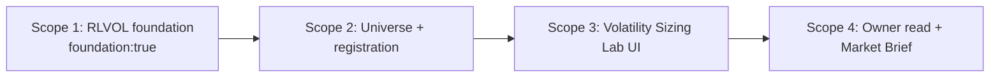

<!-- markdownlint-disable MD024 -->

# Scopes: Volatility Regime And Vol-Targeting Sizing Lab

Links: [spec.md](spec.md) | [design.md](design.md) | [report.md](report.md) | [scenario-manifest.json](scenario-manifest.json) | [test-plan.json](test-plan.json)

> `uservalidation.md` is validation-owned and is authored later by the certification agent; it is intentionally absent from this planning packet.

## Execution Outline

### Phase Order

1. **Scope 1 - RLVOL conditional-volatility foundation.** Build the pure browser/Node-safe `rlvol.js` module with every named helper (log returns, EWMA default, optional labeled GARCH(1,1), forecast term structure, annualization, realized vol, window-relative percentile, regime band, persistence/half-life, capped-and-floored sizing, managed-suppression detection, typed observation normalization, one immutable `VolDecisionReadV1`, backtest deep-link emission, the `VolToolReadV1` owner-read projection, canonicalization and deterministic identity), the closed availability/unavailable state machine, and an additive `scripts/selftest.mjs` RLVOL group that exercises every helper and the adversarial red-to-green cases. `foundation:true`; every later scope depends on it.
2. **Scope 2 - Volatility universe and route registration.** Add the closed `volatility-sizing-universe.json` contract and one parity-synchronized route entry across `tools.json`, `index.html`, `rlnav.js`, plus the catalog/notes registration in `README.md`, `notes/README.md`, and `notes/volatility-sizing-lab.md`. No product page exists before this scope's universe is validated.
3. **Scope 3 - Volatility Sizing Lab tool UI (Simple + Power).** Add `volatility-sizing-lab.html`: the storm-gauge Simple cockpit, the Power forecast-term / persistence / EWMA-vs-GARCH / sizing card, every degraded state, synchronous canvas draws (no `requestAnimationFrame`), aria-labels and text/table fallbacks, Simple/Power one-computation parity, and the backtest deep-link into `strategy-validation-lab.html`.
4. **Scope 4 - Owner read publication and Market Brief wiring.** Publish the normalized `VolToolReadV1` through the existing `RLDATA.putToolRead`, and consume it in Market Brief so it renders one attributed regime/throttle line without recomputing the model; a stale or unavailable owner read renders a named coverage outcome.

The scopes execute strictly in numeric order. Scope 1 is tagged `foundation:true`; every concrete consumer declares a `Depends On` back to it, satisfying G094. `rldata.js` is consumed unchanged (a read-only canary) across every scope. Each scope owns one primary outcome and an executable checkpoint before the next scope begins.

### New Types And Signatures

- `globalThis.RLVOL` and CommonJS `module.exports`: one frozen API from identical `rlvol.js` bytes; the CommonJS branch returns before any browser-global assignment (importing in Node never mutates `globalThis`).
- `validateUniverse(value) -> ValidationResult<VolUniverseV1>`
- `logReturns(closes) -> number[]`
- `ewmaVar(returns, lambda, seedWindow) -> { path, oneStepAhead }` — the DEFAULT estimator
- `ewmaVol(returns, lambda, seedWindow) -> number` (daily, pre-annualization)
- `garch11Fit(returns, opts) -> { ok:true, omega, alpha, beta, persistence, longRunVar, converged, iterations } | { ok:false, reason:"FIT_NONCONVERGENT" }` — labeled lightweight optimizer, NOT MLE
- `forecastTerm(model, horizon) -> Array<{ horizonDays, vol, kind:"forecast" }>` (flat for EWMA, geometric decay toward long-run for GARCH)
- `annualizeVol(dailyVol) -> number` (`× √252`, factor stated)
- `realizedVol(returns, window) -> number` (typed `realized`, never `forecast`)
- `volPercentile(currentVol, history, windowRef) -> { percentile, windowRef }` (refuses to emit without `windowRef`)
- `regimeBand(percentile, thresholds) -> "calm" | "normal" | "elevated" | "storm"`
- `halfLife(persistence) -> number` (`ln(0.5)/ln(persistence)` trading days)
- `sizingMultiplier(targetVol, forecastVol, cap, floor) -> number` (`min(cap, targetVol / max(floor, forecastVol))`)
- `detectManagedSuppression(returns, levels, policy) -> boolean`
- `normalizeObservation(value) -> VolObservationV1 | ValidationError`
- `buildVolDecisionRead(input) -> VolDecisionReadV1` (immutable; requires an explicit ISO `decisionTime`)
- `buildBacktestDeepLink(context) -> string` (allowlisted `strategy-validation-lab.html` URL)
- `projectVolToolRead(decision) -> VolToolReadV1` (versioned `rl-tool-read/v1`; summary only)
- `canonicalize(value) -> string` / `decisionId(value) -> string` (`"vold-v1-" + fnv1a32(...)`)
- `volatility-sizing-universe.json`: closed `rlvol-universe/v1` asset + policy contract.

### Validation Checkpoints

- **Scope 1 first red:** run `CMD-FIRST-RED`. Its assertion title is `RLVOL CommonJS import preserves the existing global and explicit decisionTime is deterministic`; it directly requires production `rlvol.js`, installs a sentinel `globalThis.RLVOL`, and compares two byte-identical complete inputs before any universe, page, or brief work.
- **After Scope 1:** that exact CommonJS assertion and the remaining named RLVOL helper/adversarial assertions run red then green in `node scripts/selftest.mjs`; the existing RLFX/RLVALID/causal/bond/credential/registry/market-brief canaries remain byte-preserved; `rldata.js` is untouched.
- **After Scope 2:** `node scripts/selftest.mjs` proves closed-universe validation and registry parity across `tools.json`, `index.html`, and `rlnav.js`; the catalog and notes registration is present and consistent.
- **After Scope 3:** `CMD-PAGE-VOL` proves inline-script and literal-id integrity, and the real-route `tests/volatility-sizing-lab.spec.mjs` suite (desktop 1440x1000 and mobile 390x844) proves window-visible regime, magnitude-only rendering, capped sizing, managed-suppressed marks, insufficient-history unavailability, Simple/Power identity, the labeled EWMA fallback, and synchronous non-blank canvases — with no request interception.
- **After Scope 4:** the owner read publishes through the existing versioned `putToolRead`, Market Brief renders one attributed regime/throttle line without recompute, `CMD-BRIEF-VALIDATE` passes, and the Bond, Causal, and provider-credential browser canaries pass unchanged.

## Planning Baseline And Constraints

- **Greenfield feature.** `rlvol.js`, `volatility-sizing-lab.html`, `volatility-sizing-universe.json`, `notes/volatility-sizing-lab.md`, the `scripts/selftest.mjs` RLVOL group, and `tests/volatility-sizing-lab.spec.mjs` do not exist yet. This plan introduces no dirty-tree collision baseline because Feature 011 has no pre-existing uncommitted product surface.
- **No fabricated baseline.** No `node scripts/selftest.mjs` or Playwright result is recorded as Feature 011 evidence; the implementer records the first real red/green baseline. Any prior repo selftest count is context only, never Feature 011 completion evidence.
- **Protected canaries.** `BASE-SEC-01`, `BASE-SEC-02`, `BASE-SEC-03` (provider credentials, owned by BUG-001), `BASE-BOND-E2E` (spec 003), `BASE-CAUSAL-E2E`, and `BASE-SELFTEST-CANARY` (every existing selftest group) remain unchanged assertions. A recurrence is a discovered issue routed to the named owning artifact; no scope may weaken, remove, or relabel them.
- **`rldata.js` is an unchanged read-only canary.** RLVOL consumes only its existing public surface (`ensureBars`, `getBars`, `barInfo`, `freshness`, the versioned `putToolRead` branch). Any edit to `rldata.js`, `rlfx.js`, `rlcausal.js`, `rlapp.js`, `rlchart.js`, or `rlticker.js` beyond the one `rlnav.js` registry entry blocks implementation until the boundary is restored.
- **Module authenticity.** Node and browser tests import or load the actual production `rlvol.js`; copied formulas and extraction of functions from HTML are prohibited. `scripts/selftest.mjs` imports the same export via `createRequire`.
- **Runtime boundary.** Pure-helper math is proven in `scripts/selftest.mjs` (functional/unit, no browser). Browser-functional invariants use the real ephemeral same-origin HTTP server and the actual production route with no `page.route`, `route.fulfill`, `route.abort`, or response interception; bars arrive through real same-origin `data/bars/*.json` requests.
- **Red/green rule.** Each behavior slice first adds or activates the named focused assertion and records its failure, then implements the smallest owning change and reruns the exact same assertion green before broader commands. Historical or expected failures are not evidence.
- **Project config.** `.github/bubbles-project.yaml` declares neither `testImpact` nor `traceContracts`; G079/G080 add no project-specific rows. Their absence does not reduce scenario E2E, canary, or completion requirements.
- **Headless Market Brief owner read.** The browser `RLDATA.putToolRead` publication is the Scope 4 required and sole owner-read publication path. This feature does not modify `scripts/brief-refresh.mjs`; a headless `buildVolToolRead()` static-snapshot path is not part of this feature's contract and would not change the RLVOL contract.

## Canonical Commands

Command IDs are plan references only. The command text is verbatim repository command truth; implementation and test evidence must record the expanded command, not only the ID. Full command text lives in [test-plan.json](test-plan.json) `commandCatalog`.

| ID | Purpose |
| --- | --- |
| CMD-FIRST-RED | Scope 1 cheapest first red against production `rlvol.js`: sentinel-global purity plus explicit-`decisionTime` determinism |
| CMD-SELFTEST | `node scripts/selftest.mjs` — production helper, universe, registry, owner-read, and protected-canary assertions |
| CMD-PAGE-VOL | Exact `volatility-sizing-lab.html` inline-script and literal-id integrity check |
| CMD-E2E-VOL | `npx --no-install playwright test tests/volatility-sizing-lab.spec.mjs --reporter=list` — real-route regressions |
| CMD-BRIEF-VALIDATE | `node scripts/validate-brief-payload.mjs` — committed Market Brief owner-read/coverage contract |
| CMD-E2E-BOND | Bond Regime browser canary (`BASE-BOND-E2E`) |
| CMD-E2E-CAUSAL | Causal Rotation browser canary (`BASE-CAUSAL-E2E`) |
| CMD-E2E-PROVIDER | Provider credential browser canary (`BASE-SEC-02/03`) |
| CMD-PROVIDER-UNIT / CMD-PROVIDER-FUNCTIONAL / CMD-PROVIDER-STRESS / CMD-PROVIDER-LOAD | Provider credential unit/functional/stress/load canaries (`BASE-SEC-01`) |
| CMD-ARTIFACT | `artifact-lint.sh specs/011-volatility-regime-and-sizing-lab 'SCN-011-[0-9]{3}'` — plan/evidence artifact shape |
| CMD-TRACE | `traceability-guard.sh` — scenario to Test Plan to concrete test to evidence linkage |
| CMD-REALITY | `implementation-reality-scan.sh --verbose` — no stubs, copied model paths, fake integration, defaults, or fallbacks |
| CMD-FRESHNESS | `artifact-freshness-guard.sh` — one active planning truth |
| CMD-FOUNDATION | `capability-foundation-guard.sh` — G094 foundation and overlay ordering |
| CMD-STATE | `state-transition-guard.sh` — full completion gate; nonterminal planning state preserved until execution evidence exists |
| CMD-DOCTOR / CMD-FRAMEWORK-WRITE / CMD-READINESS | Installed framework health, downstream immutability, repo command/instruction posture |

## Scope Summary

| # | Scope | Surfaces | Primary Tests | DoD Summary | Status |
| --- | --- | --- | --- | --- | --- |
| 1 | RLVOL conditional-volatility foundation | `rlvol.js`, `scripts/selftest.mjs` (additive RLVOL group) | Direct CommonJS first-red, EWMA/GARCH/forecast/sizing/percentile/managed-suppression/typing/fallback selftest | Pure frozen browser/Node module, closed state machine, cap/floor sizing, typed observation, owner-read projector, preserved canaries | Done |
| 2 | Volatility universe and route registration | `volatility-sizing-universe.json`, `tools.json`, `index.html`, `rlnav.js`, `README.md`, `notes/README.md`, `notes/volatility-sizing-lab.md` | Universe validation + registry parity selftest | Closed bounded universe, trio parity, catalog + notes registration | Done |
| 3 | Volatility Sizing Lab tool UI (Simple + Power) | `volatility-sizing-lab.html`, `tests/volatility-sizing-lab.spec.mjs` | Page check + real-route desktop/mobile E2E | Storm-gauge Simple, Power model/persistence/sizing, degraded states, synchronous a11y canvases, Simple/Power parity, backtest deep-link | Done |
| 4 | Owner read publication and Market Brief wiring | `volatility-sizing-lab.html` publish, `market-brief.html`, `rlbrief.js`, `market-brief.config.json` | Owner-read parity selftest, brief validator, real-route E2E, cross-tool canaries | One versioned owner read (no raw bars), Brief renders without recompute, named stale/unavailable outcome, canaries preserved | Done |

## Scope 1: RLVOL Conditional-Volatility Foundation

**Scope ID:** SCOPE-01  
**Status:** Done  
**Depends On:** None  
**Scope-Kind:** contract-only  
**Tags:** foundation:true  
**Priority:** P0

### Outcome

One pure, deeply frozen `rlvol.js` (capability RLVOL) provides the only volatility semantics, math, typing, regime, sizing, managed-suppression, decision identity, owner-read projection, and deep-link emission used by browser and Node consumers. A direct production-module first-red and the additive selftest group prove the contract before any universe, page, or brief is wired.

### Change Boundary

**Allowed file families:**

- New `rlvol.js` in full (the pure UMD/CommonJS foundation).
- `scripts/selftest.mjs` only inside one additive `Feature 011 RLVOL foundation` assertion block and its direct `createRequire` production-module import; every existing assertion (RLFX, RLVALID, causal, bond, credential, registry, market brief) remains a byte-preserved canary.
- New controlled inputs under `tests/fixtures/volatility-sizing/**`, each owned by a named selftest assertion.

**Excluded file families:** the tool page, the universe, all route registries and notes, `rldata.js`, `rlfx.js`, `rlcausal.js`, `rlapp.js`, `rlchart.js`, `rlticker.js`, `strategy-validation-lab.html`, Market Brief files, `.github/bubbles/**`, every other `specs/**` folder, committed market data, and screenshots/`test-results/**`.

### Implementation Files

- `rlvol.js`
- `scripts/selftest.mjs`

### Shared Infrastructure Impact Sweep

`scripts/selftest.mjs` is a protected high-fan-out canary surface. Its downstream contracts are every existing group (RLFX, ETF, options, swing, sector, heatmap, global rotation, real assets, bond, `rlbrief` structural frame, `rldata` toolReads, tool registry, `rlapp`, market brief, causal, and the Feature 005-010 foundations). The RLVOL group is additive and marker-bounded; before pickup the following must hold and be proven:

- the additive RLVOL group is the only new block and no prior assertion is reordered, merged, weakened, or deleted;
- `node scripts/selftest.mjs` retains every existing canary and the pass count does not decrease;
- `rldata.js` is byte-unchanged (RLVOL only reads its existing public surface).

Rollback removes only `rlvol.js`, the additive selftest block, and the new fixtures; no existing assertion, cache schema, or module body is touched.

### Gherkin Scenarios

#### SCN-011-020: Deterministic browser and Node parity with CommonJS purity

```gherkin
Scenario: SCN-011-020 - Deterministic browser/Node parity with CommonJS purity
Given a pre-existing globalThis.RLVOL sentinel and one complete decision input including an explicit decisionTime
When rlvol.js is imported through CommonJS and buildVolDecisionRead runs twice on the same input
Then the sentinel global is unchanged
And computedAt equals the input decisionTime
And both runs produce byte-identical canonical output and one deterministic decisionId
```

#### SCN-011-001 (BS-001): Volatility clustering keeps tomorrow's forecast elevated

```gherkin
Scenario: SCN-011-001 - Clustering keeps the forecast persistently elevated
Given an asset had a violent move today and its estimated persistence is high
When RLVOL produces the one-day-ahead forecast
Then tomorrow's forecast volatility is elevated relative to the long-run level
And the value is typed forecast, never an observed fact
```

#### SCN-011-003 (BS-003): The sizing multiplier throttles in a storm

```gherkin
Scenario: SCN-011-003 - Sizing multiplier throttles in a storm
Given a user target annualized volatility of 15% and a forecast annualized volatility of 30%
When RLVOL computes the sizing multiplier
Then it is approximately 0.5
And a worked cash example on the user notional is present
And the read states it applies only if a separate signal fires
```

#### SCN-011-004 (BS-004): A near-zero forecast cannot explode the multiplier

```gherkin
Scenario: SCN-011-004 - Near-zero forecast floors the multiplier
Given a forecast annualized volatility approaching zero, for example a halted or pegged asset
When RLVOL computes the sizing multiplier
Then a floor on forecast volatility bounds the multiplier so it hits the cap
And the multiplier never diverges toward infinity
```

#### SCN-011-006 (BS-006): A GARCH fit is labeled a lightweight optimizer

```gherkin
Scenario: SCN-011-006 - GARCH is a labeled lightweight optimizer
Given the user enables the optional GARCH(1,1) fit
When the fitted parameters are produced
Then the method is labeled a lightweight in-browser optimizer
And it is never presented as institutional maximum-likelihood estimation
```

#### SCN-011-011 (BS-011): A non-convergent GARCH falls back to EWMA

```gherkin
Scenario: SCN-011-011 - Non-convergent GARCH falls back to labeled EWMA
Given the optional GARCH optimizer fails stationarity or convergence
When the model is resolved
Then RLVOL falls back to the EWMA closed form
And it labels the fallback rather than emitting a broken or silent result
```

#### SCN-011-012 (BS-012): EWMA and GARCH disagreement is shown, not averaged

```gherkin
Scenario: SCN-011-012 - EWMA-vs-GARCH divergence is an evidence conflict
Given the EWMA prior and a GARCH fit imply materially different persistence
When persistence is resolved
Then both are surfaced as an explicit evidence conflict
And they are never silently averaged into one number
```

#### SCN-011-013 (BS-013): A realized estimate is never relabeled a forecast

```gherkin
Scenario: SCN-011-013 - Realized is never relabeled forecast
Given a trailing realized-volatility read over a rolling window
When it is normalized or published to the owner read
Then it is typed realized
And it is never presented as a forward forecast
```

#### SCN-011-014 (BS-014): Long history is best-effort and never headlines a multi-decade claim

```gherkin
Scenario: SCN-011-014 - Long history is best-effort with no multi-decade claim
Given a decision built from a longer-than-default history range
When the decision and owner-read projection are produced
Then the extended coverage is caveated as best-effort
And no single-path multi-decade outperformance number is reproduced as evidence of edge
```

### Implementation Plan

1. Add the exact UMD/CommonJS boundary (CommonJS returns before any browser-global assignment) and run `CMD-FIRST-RED` before any other helper. `rlvol.js` stays pure, deeply frozen, and free of `document`, `localStorage`, `fetch`, `Date.now()`, and `requestAnimationFrame`.
2. Implement `logReturns` (finite positive-close guards, deterministic invalid-row handling), `ewmaVar`/`ewmaVol` (RiskMetrics λ closed form, default `λ=0.94`, flat term), and `annualizeVol` (`√252` stated).
3. Implement `garch11Fit` as a bounded, capped-iteration optimizer enforcing `ω≥minOmega`, `α>0`, `β>0`, stationarity `α+β<maxPersistence<1`, and `maxIter`/`tolerance`; a breach returns `FIT_NONCONVERGENT`. Implement `forecastTerm` (flat for EWMA, geometric decay toward `ω/(1−α−β)` for GARCH) and `halfLife`.
4. Implement `realizedVol` (typed `realized`), `volPercentile` (always returns `windowRef`; refuses without it), `regimeBand` (calm/normal/elevated/storm), and `detectManagedSuppression` (zero-return fraction, sub-floor daily range, identical-close run).
5. Implement `sizingMultiplier` (`min(cap, targetVol / max(floor, forecastVol))`), `normalizeObservation` (the `VolObservationV1` discriminated union), `buildVolDecisionRead` (one immutable `VolDecisionReadV1`, `computedAt` exactly the input `decisionTime`), `buildBacktestDeepLink` (allowlisted URL emission only), `projectVolToolRead` (versioned `rl-tool-read/v1`, summary only), and `canonicalize`/`decisionId`.
6. Implement the closed availability/unavailable state machine (`INSUFFICIENT_HISTORY`, `NONFINITE`, `NO_COMMON_DATES`, `FIT_NONCONVERGENT`, `MANAGED_SUPPRESSED`, `SOURCE_ERROR`, `STALE_BEYOND_POLICY`) with detection and closed error codes (`RLVOL_UNIVERSE_INVALID`, `RLVOL_SCHEMA_INVALID`, `RLVOL_CONTRACT_VERSION`, `RLVOL_DECISION_TIME_INVALID`).
7. Add the additive `Feature 011 RLVOL foundation` selftest block: import production `rlvol.js` via `createRequire`, assert global preservation and determinism, and add adversarial red-to-green cases for every helper. Add controlled fixtures under `tests/fixtures/volatility-sizing/**`. Preserve every existing canary.

### Test Plan

| ID | Scenario(s) | Test Type | Category | File / Exact Test Title | Command | Live System | Red/Green Focus |
| --- | --- | --- | --- | --- | --- | --- | --- |
| TP-01-01 | SCN-011-020 | Unit | unit | production `./rlvol.js` / `RLVOL CommonJS import preserves the existing global and explicit decisionTime is deterministic` | CMD-FIRST-RED | No | First red: missing module/API; green: sentinel unchanged and repeated complete input has identical canonical output, `computedAt`, and decision id |
| TP-01-02 | SCN-011-001 | Unit | unit | `scripts/selftest.mjs` / `RLVOL EWMA and GARCH forecasts keep high persistence elevated above the long-run and stay typed forecast` | CMD-SELFTEST | No | High persistence keeps the one-day-ahead forecast elevated; typed `forecast` |
| TP-01-03 | SCN-011-003 | Unit | unit | `scripts/selftest.mjs` / `RLVOL sizing multiplier is min(cap, targetVol over max(floor, forecastVol)) with a worked example` | CMD-SELFTEST | No | `min(2.0, 0.15/max(0.05,0.30)) ≈ 0.5` with a worked cash example and the conditional caveat |
| TP-01-04 | SCN-011-004 | Unit | unit | `scripts/selftest.mjs` / `RLVOL near-zero forecast vol floors the multiplier at the cap and never diverges` | CMD-SELFTEST | No | Adversarial: `forecastVol → 0` floors and the multiplier hits the cap, never non-finite |
| TP-01-05 | SCN-011-006 | Unit | unit | `scripts/selftest.mjs` / `RLVOL GARCH fit is a labeled lightweight optimizer and never institutional MLE` | CMD-SELFTEST | No | Fit is tagged lightweight optimizer / `fitted`; no MLE or institutional wording |
| TP-01-06 | SCN-011-011 | Unit | unit | `scripts/selftest.mjs` / `RLVOL non-convergent GARCH resolves to the labeled EWMA closed-form fallback` | CMD-SELFTEST | No | Adversarial: stationarity/convergence breach → `FIT_NONCONVERGENT` → labeled EWMA fallback |
| TP-01-07 | SCN-011-012 | Unit | unit | `scripts/selftest.mjs` / `RLVOL material EWMA-vs-GARCH persistence divergence opens an evidence conflict and is never averaged` | CMD-SELFTEST | No | Material disagreement opens `EWMA_GARCH_PERSISTENCE_DIVERGENCE`; both shown, not averaged |
| TP-01-08 | SCN-011-013 | Unit | unit | `scripts/selftest.mjs` / `RLVOL realized reads are typed realized and never relabeled forecast in the owner read` | CMD-SELFTEST | No | `realized` kind + `realized-rolling` estimator; typing never interchanged in projection |
| TP-01-09 | SCN-011-014 | Unit | unit | `scripts/selftest.mjs` / `RLVOL longer history is best-effort caveated and projects no multi-decade single-path number` | CMD-SELFTEST | No | Extended range carries best-effort limitation; projection reproduces no multi-decade number |
| TP-01-10 | SCN-011-002 | Unit | unit | `scripts/selftest.mjs` / `RLVOL volPercentile always returns its trailing windowRef and regimeBand maps thresholds` | CMD-SELFTEST | No | Foundation: percentile carries `windowRef` and refuses without it; band thresholds map |
| TP-01-11 | SCN-011-008 | Unit | unit | `scripts/selftest.mjs` / `RLVOL detectManagedSuppression flags peg band or halt low volatility as managed-suppressed` | CMD-SELFTEST | No | Adversarial: heuristic fires; read marked `MANAGED_SUPPRESSED`, never calm/full size |
| TP-01-12 | SCN-011-009 | Unit | unit | `scripts/selftest.mjs` / `RLVOL below-minimum coverage is INSUFFICIENT_HISTORY with exact required-versus-available counts` | CMD-SELFTEST | No | Below `minForecastObs` → unavailable with exact counts; no zero/neutral/calm/full-size default |
| TP-01-13 | SCN-011-021 | Unit | unit | `scripts/selftest.mjs` / `RLVOL projectVolToolRead emits summary-only owner read with no raw bars or restricted payload` | CMD-SELFTEST | No | Owner-read schema: summary metrics + window-visible percentile only; no raw bars/restricted payload |
| TP-01-14 | All Scope 1 + canaries | Regression (functional) | functional | `scripts/selftest.mjs` / complete additive RLVOL group + preserved canaries | CMD-SELFTEST | No | Full suite green with the RLVOL group and every existing canary preserved; no decreased count |
| TP-01-15 | All Scope 1 + canaries | Fixture Canary (regression) | functional | `scripts/selftest.mjs` existing groups + `tests/bond-regime-lab.spec.mjs` / `tests/causal-rotation-lab.spec.mjs` / `tests/provider-credentials.spec.mjs` | CMD-SELFTEST + CMD-E2E-BOND + CMD-E2E-CAUSAL + CMD-E2E-PROVIDER | Yes | Canary: every existing selftest group and the Bond/Causal/Provider browser suites stay byte-preserved and green before any broad suite rerun |

### Definition of Done

Core implementation:

- [x] `[SCN-011-020]` `rlvol.js` implements the complete frozen browser/CommonJS foundation with no DOM, network, storage, ambient-clock, `requestAnimationFrame`, copied-formula, or HTML-extraction path; `CMD-FIRST-RED` records its red then its green. — Evidence: report.md § Plan Reconciliation Re-Run (2026-07-17); `CMD-FIRST-RED` GREEN + RLVOL CommonJS purity/determinism assertion ✓ (Feature 011 selftest group 16/16, exit 0).
- [x] `[SCN-011-001]` `[SCN-011-006]` EWMA is the closed-form default and `garch11Fit` is a labeled lightweight optimizer with an enforced `α+β<1` stationarity guard; the forecast term is flat for EWMA and decays toward the long-run for GARCH. — Evidence: report.md § Plan Reconciliation Re-Run; RLVOL EWMA/GARCH typed-forecast + labeled-lightweight-optimizer assertions ✓.
- [x] `[SCN-011-003]` `[SCN-011-004]` The sizing multiplier throttles position size in a storm: `sizingMultiplier` is `min(cap, targetVol / max(floor, forecastVol))`, the BS-003 value is approximately 0.5, and a near-zero forecast floors the multiplier at the cap without diverging. — Evidence: report.md § Plan Reconciliation Re-Run; RLVOL sizing-multiplier + near-zero-floor assertions ✓.
- [x] `[SCN-011-002]` `volPercentile` always returns its trailing `windowRef` and refuses to emit a percentile without it; `regimeBand` maps the policy thresholds. — Evidence: report.md § Plan Reconciliation Re-Run; RLVOL `volPercentile`/`regimeBand` assertion ✓.
- [x] `[SCN-011-008]` `detectManagedSuppression` flags peg/band/halt low volatility as `MANAGED_SUPPRESSED`, never calm/full-size. — Evidence: report.md § Plan Reconciliation Re-Run; RLVOL `detectManagedSuppression` assertion ✓.
- [x] `[SCN-011-009]` The closed availability/unavailable state machine returns `INSUFFICIENT_HISTORY` with exact required-versus-available counts and publishes no forecast/regime/sizing number. — Evidence: report.md § Plan Reconciliation Re-Run; RLVOL below-minimum `INSUFFICIENT_HISTORY` assertion ✓.
- [x] `[SCN-011-011]` `[SCN-011-012]` A non-convergent GARCH resolves to the labeled EWMA fallback and a material EWMA-vs-GARCH persistence divergence opens an evidence conflict, never averaged. — Evidence: report.md § Plan Reconciliation Re-Run; RLVOL non-convergent-fallback + persistence-divergence-conflict assertions ✓.
- [x] `[SCN-011-013]` Forecast and realized typing is never interchanged in `normalizeObservation` or `projectVolToolRead`. — Evidence: report.md § Plan Reconciliation Re-Run; RLVOL realized-typing assertion ✓.
- [x] `[SCN-011-014]` `[SCN-011-021]` The owner-read projection carries summary values only (no raw bars, no restricted payload) and reproduces no multi-decade single-path number. — Evidence: report.md § Plan Reconciliation Re-Run; RLVOL best-effort-long-history + summary-only owner-read assertions ✓.
- [x] `rldata.js` and the other shared core modules are byte-unchanged; the RLVOL selftest block is additive and every existing canary is byte-preserved. — Evidence: report.md § Code Diff Evidence — `git status --short` shows `rlvol.js` untracked and `rldata.js`/`rlfx.js`/`rlcausal.js` NOT modified; the RLVOL group is an additive `scripts/selftest.mjs` block.

Test Plan parity - 15 rows:

- [x] TP-01-01 records the exact `CMD-FIRST-RED` failure, then passes the identical production CommonJS purity/determinism assertion. — Evidence: report.md § Plan Reconciliation Re-Run; `CMD-FIRST-RED` GREEN this session (exit 0).
- [x] TP-01-02 through TP-01-13 each record their focused red and then pass the named production-module assertion for their scenario. — Evidence: report.md § Plan Reconciliation Re-Run; the 13-assertion Feature 011 RLVOL foundation group + 3 registry/universe/owner-read assertions all ✓ (16/16) this session; the red→green ordering is recorded (G060 PASS).
- [x] TP-01-14 passes the complete selftest with the additive RLVOL group and every existing canary preserved and no decreased pass count. — Evidence: report.md § Fast-Delivery Harden Verification (2026-07-17); `node scripts/selftest.mjs` = 548 passed / 0 failed (exit 0) this session, Feature 011 RLVOL foundation group additive 17/17 ✓, every pre-existing group (RLFX, Bond, causal, Feature 005/006/010, registry, market-brief) green — the prior foreign Feature 005 `psrmError` 523/1 blocker is resolved (session-bound evidence; the shared tree is volatile).
- [x] TP-01-15 runs the shared-fixture canary — every existing selftest group and the Bond/Causal/Provider browser suites are green before broad reruns. — Evidence: report.md § Fast-Delivery Regression Verification (2026-07-17); `node scripts/selftest.mjs` = 547 passed / 0 failed (exit 0, every existing group green, RLVOL 17/17) + Bond 27/0 + Causal 4/0 + Provider 4/0, all exit 0 this session.

Shared-infrastructure containment (Gate G067/G069):

- [x] Independent canary suite for shared fixture/bootstrap contracts passes before broad suite reruns — the Bond, Causal, and provider-credential browser canaries and every existing `scripts/selftest.mjs` group run green before any broad rerun. — Evidence: report.md § Fast-Delivery Regression Verification (2026-07-17); Bond 27/0, Causal 4/0, Provider 4/0, and `node scripts/selftest.mjs` 547/0 (every group green, RLVOL 17/17) this session, all exit 0.
- [x] Rollback or restore path for shared infrastructure changes is documented and verified — rollback removes only `rlvol.js`, the additive RLVOL selftest block, and the new fixtures, restoring every canary (documented in the Shared Infrastructure Impact Sweep above). — Evidence: report.md § Fast-Delivery Stabilize Verification (2026-07-17) — `git clean -nd` dry-run removes the 6 F011 untracked product paths in isolation; `git diff --numstat` shows `tools.json` 62/0, `index.html` 24/0, `README.md` 1/0, `notes/README.md` 1/0 purely additive and the `scripts/selftest.mjs` RLVOL block marker-bounded (L182–L401, purely additive; its 205 file-deletions are foreign Feature 005/010); `git diff --check` exit 0. rlnav.js caveat: F011's row is line-separable but shares one git hunk with foreign Feature 010 (routed, not fixed).
- [x] Change Boundary is respected and zero excluded file families were changed — Feature 011 leaves `rldata.js`, `rlfx.js`, `rlcausal.js`, `rlapp.js`, `rlchart.js`, `rlticker.js`, `strategy-validation-lab.html`, `.github/bubbles/**`, and other `specs/**` untouched. — Evidence: report.md § Fast-Delivery Stabilize Verification (2026-07-17) — `git status --porcelain -- rldata.js rlfx.js rlcausal.js rlchart.js rlticker.js rlapp.js rlcontracts.js rlbrief.js rlvalid.js` = empty (CORE byte-unchanged); no excluded family appears in F011's change-set; F011's untracked files + additive shared blocks reference only F011 surfaces and do not depend on the in-flight Feature 004/005/010 / BUG-002/003 edits. The rlnav.js foreign hunk-co-mingling (Feature 010 reformat) is disclosed + routed, not an F011 excluded-family change.

Build quality gate:

- [x] `CMD-ARTIFACT`, `CMD-FRESHNESS`, and `CMD-FOUNDATION` pass for the plan-owned packet; `CMD-REALITY` finds no stub/default/fallback; path-scoped `git diff --check` is clean; no warning, skip, exclusive-test marker, default, fallback, or incomplete-work marker is introduced. — Evidence: report.md § Validation Certification — Build-Quality Command Gates (bubbles.validate, 2026-07-17); `CMD-ARTIFACT` exit 0 PASS, `CMD-FRESHNESS` exit 0 `RESULT: PASS` ("spec.md has no superseded/suppressed sections" — the prior G052 annotation is disproven first-hand), `CMD-FOUNDATION` exit 0 PASS (G094 grandfathered), `CMD-REALITY` exit 0 (0 violations across 9 files). All Feature 011 paths are additive/untracked; no default/fallback/incomplete-work marker.

## Scope 2: Volatility Universe And Route Registration

**Scope ID:** SCOPE-02  
**Status:** Done  
**Depends On:** Scope 1 - RLVOL Conditional-Volatility Foundation  
**Scope-Kind:** runtime-behavior  
**Priority:** P0

### Outcome

A closed, bounded `volatility-sizing-universe.json` and one parity-synchronized route entry register the volatility tool identically across `tools.json`, `index.html`, and `rlnav.js`, with catalog and notes registration, so downstream consumers resolve one consistent route identity.

### Change Boundary

**Allowed file families:** new `volatility-sizing-universe.json`, one parity entry each in `tools.json`, `index.html`, `rlnav.js`, catalog rows in `README.md` and `notes/README.md`, the new `notes/volatility-sizing-lab.md`, and the additive universe/registry assertions in `scripts/selftest.mjs`.

**Excluded file families:** `rlvol.js` bodies beyond consuming `validateUniverse`, the tool page, Market Brief files, `rldata.js` and other shared core modules, `.github/bubbles/**`, and every other `specs/**` folder.

### Implementation Files

- `volatility-sizing-universe.json`
- `tools.json`
- `index.html`
- `rlnav.js`
- `README.md`
- `notes/README.md`
- `notes/volatility-sizing-lab.md`
- `scripts/selftest.mjs`

### Consumer Impact Sweep

- Producers: the new route object (`id: "volatility-sizing-lab"`, nav label `Vol Sizing`, icon, file basename), the bounded universe, and the notes entry.
- Current consumers: the registry trio, the catalog docs, the notes index, and the Scope 3 page and Scope 4 Market Brief coverage that consume this route.
- Explicit boundary: identity, order, label, icon, and file basename must match across `tools.json`, `index.html`, and `rlnav.js`; a registry-parity assertion enforces this in selftest.

### Gherkin Scenarios

#### SCN-011-015: The volatility tool is registered identically across the registry trio

```gherkin
Scenario: SCN-011-015 - Registry parity and closed universe
Given the volatility-sizing-lab route and its bounded universe
When the registry is validated across tools.json, index.html, and rlnav.js
Then identity, order, nav label, icon, and file basename match across all three surfaces
And validateUniverse accepts the closed universe and rejects unknown keys, invalid identity, and out-of-range policy values
```

### Implementation Plan

1. Author `volatility-sizing-universe.json` as a closed `rlvol-universe/v1` contract: bounded assets (equity index, single name, crypto, commodity, one managed/reference proxy), per-asset `defaultTargetVol`/`regimeWindowObs`/`minForecastObs`/`reviewWindowHours`/`limitations`, and the required `policy` block (EWMA, GARCH, forecast, regime thresholds with `calmMaxPct<normalMaxPct<elevatedMaxPct`, sizing cap/floor, managed-suppression, history). A missing or out-of-range value makes the whole configuration unavailable (no embedded fallback).
2. Add one parity-synchronized route entry to `tools.json`, `index.html`, and `rlnav.js` with matching `id`, `file`, `notes`, `data`, nav label `Vol Sizing`, icon, and landing blurb, in the same order.
3. Add the catalog row to `README.md`, the index row and next-run focus to `notes/README.md`, and author `notes/volatility-sizing-lab.md` (purpose, sources, math, levers, findings, limitations, next-run checklist, version history).
4. Add the additive `validateUniverse` and registry-parity assertions to `scripts/selftest.mjs`; preserve the existing tool-registry canary.

### Test Plan

| ID | Scenario(s) | Test Type | Category | File / Exact Test Title | Command | Live System | Red/Green Focus |
| --- | --- | --- | --- | --- | --- | --- | --- |
| TP-02-01 | SCN-011-015 | Unit | unit | `scripts/selftest.mjs` / `tool registry parity: volatility-sizing-lab is registered identically across tools.json, index.html, and rlnav.js` | CMD-SELFTEST | No | Identity/order/label/icon/basename match across the trio |
| TP-02-02 | SCN-011-015 | Unit | unit | `scripts/selftest.mjs` / `RLVOL validateUniverse accepts the closed volatility-sizing universe and rejects unknown keys` | CMD-SELFTEST | No | Closed universe accepted; unknown keys, invalid identity, and out-of-range/ordering-violating policy rejected |
| TP-02-03 | SCN-011-015 | Regression (functional) | functional | `scripts/selftest.mjs` / full suite after registration | CMD-SELFTEST | No | Suite stays green with the registration and universe assertions and every prior registry canary preserved |
| TP-02-04 | SCN-011-015 | Regression E2E | e2e-ui | `tests/volatility-sizing-lab.spec.mjs` / registered volatility route loads through the real nav | CMD-E2E-VOL | Yes | Regression E2E: the registered `volatility-sizing-lab` route is reachable and renders through the real nav registration; a broken registry entry fails the real-route suite (transitive registration regression) |

### Definition of Done

Core implementation:

- [x] `[SCN-011-015]` `volatility-sizing-universe.json` is bounded, versioned, and closed; a missing or out-of-range required value makes the configuration unavailable with no embedded fallback. — Evidence: report.md § Plan Reconciliation Re-Run; `RLVOL validateUniverse accepts the closed volatility-sizing universe and rejects unknown keys` assertion ✓ this session.
- [x] `[SCN-011-015]` One parity-synchronized route entry exists in `tools.json`, `index.html`, and `rlnav.js` with matching identity, order, nav label, icon, and file basename. — Evidence: report.md § Plan Reconciliation Re-Run; `tool registry parity: volatility-sizing-lab is registered identically across tools.json, index.html, and rlnav.js` assertion ✓ this session.
- [x] `[SCN-011-015]` `README.md`, `notes/README.md`, and `notes/volatility-sizing-lab.md` register the tool consistently. — Evidence: (bubbles.docs, 2026-07-17) report.md § Docs Verification — Cross-Doc Tool Registration Consistency; all six surfaces (`tools.json` L694, `index.html` L657, `rlnav.js` L37, `README.md` L46, `notes/README.md` L51, `notes/volatility-sizing-lab.md` L1–3) carry the identical id `volatility-sizing-lab`, file basename `volatility-sizing-lab.html`, title "Volatility Regime & Vol-Targeting Sizing Lab", nav label "Vol Sizing", and icon 🌪️; the notes page accurately describes what shipped (`CNY=X` managed-reference + per-asset policy match `volatility-sizing-universe.json`; EWMA λ=0.94 / labeled GARCH / capped-floored sizing match `rlvol.js`); no forbidden investment-advice claim; registry-trio parity green in `node scripts/selftest.mjs` = 552 passed / 0 failed (exit 0).

Regression E2E coverage (Gate G022):

- [x] Scenario-specific E2E regression tests for every new/changed/fixed behavior are added or updated and pass on the real route — TP-02-04 asserts the registered volatility route is reachable and renders through the real nav. — Evidence: (bubbles.test, 2026-07-17) report.md § Nav-Registration Regression E2E (TP-02-04 · CMD-E2E-VOL); `tests/volatility-sizing-lab.spec.mjs` now carries a dedicated case that loads `index.html` (shared `rlnav`), opens the drawer via the real `#rlnav-launcher`, finds the `Vol Sizing` entry, asserts its `href` is the registered basename `volatility-sizing-lab.html`, clicks it, and lands on the real tool page (title + booted `window.VolSizingLab.runtime.decision` + visible `#simpleView`); a broken `tools.json`/`index.html`/`rlnav.js` registration fails this real-route case. `npx --no-install playwright test tests/volatility-sizing-lab.spec.mjs --config=playwright.config.mjs --project=system-chrome --reporter=list` = 16 passed / 0 failed, exit 0.
- [x] Broader E2E regression suite passes with every cross-tool canary preserved. — Evidence: report.md § Fast-Delivery Regression Verification (2026-07-17); `node scripts/selftest.mjs` 547/0 + Bond 27/0 + Causal 4/0 + Provider 4/0 + vol E2E 15/0, all exit 0 this session; every cross-tool canary preserved (the prior foreign Feature 005 `psrmError` red is resolved this session).

Test Plan parity - 4 rows:

- [x] TP-02-01 records its red and passes the registry-parity assertion. — Evidence: report.md § Plan Reconciliation Re-Run; registry-parity assertion ✓ this session.
- [x] TP-02-02 records its red and passes closed-universe validation and rejection. — Evidence: report.md § Plan Reconciliation Re-Run; `validateUniverse` accept/reject assertion ✓ this session.
- [x] TP-02-03 passes the full selftest with the added assertions and preserved registry canary. — Evidence: report.md § Fast-Delivery Harden Verification (2026-07-17); `node scripts/selftest.mjs` = 548 passed / 0 failed (exit 0) this session; the `RLVOL validateUniverse` closed-universe assertion and the `tool registry parity: volatility-sizing-lab ... across tools.json, index.html, and rlnav.js` canary are both ✓ — prior foreign 523/1 blocker resolved (session-bound).
- [x] TP-02-04 passes the transitive registration regression on the real route. — Evidence: (bubbles.test, 2026-07-17) report.md § Nav-Registration Regression E2E (TP-02-04 · CMD-E2E-VOL); the dedicated nav-registration case reaches `volatility-sizing-lab.html` THROUGH the shared `rlnav` drawer (not a hand-typed URL), so a broken registry entry in the `tools.json`/`index.html`/`rlnav.js` trio fails the real-route suite. `npx --no-install playwright test tests/volatility-sizing-lab.spec.mjs --config=playwright.config.mjs --project=system-chrome --reporter=list` = 16 passed / 0 failed (the new case is test 16), exit 0; `node scripts/selftest.mjs` = 547 passed / 0 failed, exit 0.

Build quality gate:

- [x] `CMD-ARTIFACT`, `CMD-FRESHNESS`, `CMD-FOUNDATION`, and `CMD-REALITY` pass for the plan-owned packet; `CMD-FOUNDATION` confirms this scope depends on the Scope 1 foundation; path-scoped `git diff --check` is clean with no default/fallback/incomplete-work marker. — Evidence: report.md § Validation Certification — Build-Quality Command Gates (bubbles.validate, 2026-07-17); `CMD-ARTIFACT` exit 0, `CMD-FRESHNESS` exit 0 `RESULT: PASS` (stale G052 annotation disproven), `CMD-FOUNDATION` exit 0 PASS (confirms Scope 1 foundation ordering), `CMD-REALITY` exit 0 (0 violations). Feature 011 paths are additive/untracked; no default/fallback/incomplete-work marker.

## Scope 3: Volatility Sizing Lab Tool UI (Simple + Power)

**Scope ID:** SCOPE-03  
**Status:** Done  
**Depends On:** Scope 1 - RLVOL Conditional-Volatility Foundation; Scope 2 - Volatility Universe And Route Registration  
**Scope-Kind:** runtime-behavior  
**Priority:** P0

### Outcome

The user opens the real production route and completes the Simple storm-gauge and Power model/persistence/sizing journey over one `VolDecisionReadV1`. Every hard constraint is a UI invariant: magnitude-only, window-visible regime percentile, capped-and-floored conditional sizing, managed-suppressed marks, explicit unavailable states, Simple/Power identity, synchronous accessible canvases, and a backtest deep-link with no in-tool verdict.

### Change Boundary

**Allowed file families:** new `volatility-sizing-lab.html` and the new real-route `tests/volatility-sizing-lab.spec.mjs`.

**Excluded file families:** `rlvol.js` and shared core modules, the universe and registries, Market Brief files, `strategy-validation-lab.html`, `rldata.js`, `.github/bubbles/**`, and every other `specs/**` folder. The tool consumes only the existing `RLDATA` bar path; it adds no `rldata.js` change.

### Implementation Files

- `volatility-sizing-lab.html`
- `tests/volatility-sizing-lab.spec.mjs`

### Consumer Impact Sweep

- Producers: route title/file, allowlisted deep-link hash params, `window.VolSizingLab` read-only runtime, and the `recompute`/`publish` seams.
- Current consumers: the direct route and its browser tests; the Scope 4 owner-read publication and Market Brief coverage.
- Explicit boundary: no registry entry changes here (owned by Scope 2); no owner-read consumer is activated here (owned by Scope 4).

### Gherkin Scenarios

#### SCN-011-002 (BS-002): The regime percentile always renders its window

```gherkin
Scenario: SCN-011-002 - Percentile always renders its trailing window
Given the current forecast volatility is at a high percentile
When the storm-gauge regime is rendered in Simple or Power
Then the percentile displays its trailing window and observation count
And it is never presented as an absolute, cross-asset-comparable danger score
```

#### SCN-011-005 (BS-005): No directional claim is ever emitted

```gherkin
Scenario: SCN-011-005 - No directional element in Simple or Power
Given any asset, regime, forecast, or sizing output
When the tool renders Simple or Power view
Then no panel, label, badge, axis, marker, or summary implies price direction, a target, a top, or a bottom
```

#### SCN-011-007 (BS-007): The backtest question is a link-out, not an in-tool result

```gherkin
Scenario: SCN-011-007 - Backtest is a deep-link with no verdict
Given the user wants to know whether vol-targeting makes money on the asset
When the user requests a backtest
Then the tool deep-links to strategy-validation-lab with context
And it displays no in-tool single-path performance verdict
```

#### SCN-011-008 (BS-008): Managed-market low volatility is not "safe"

```gherkin
Scenario: SCN-011-008 - Managed-suppressed history is marked, not calm
Given an asset whose history indicates a peg, band, or halt regime
When the regime is rendered
Then the read is marked managed-suppressed
And low realized volatility is never presented as automatically full-size or safe
```

#### SCN-011-009 (BS-009): Insufficient history yields an explicit unavailable state

```gherkin
Scenario: SCN-011-009 - Insufficient history renders unavailable with counts
Given an asset with fewer valid returns than the declared minimum
When the forecast, regime, or sizing read is requested
Then the read renders Unavailable with exact required-versus-available observation counts
And it never defaults to zero, neutral, calm, or full size
```

#### SCN-011-010 (BS-010): Simple and Power cannot disagree

```gherkin
Scenario: SCN-011-010 - Simple and Power share one decision identity
Given the same asset, window, and controls
When both Simple and Power views render
Then they consume one decisionId
And they never show a different regime, forecast, persistence, or multiplier
```

#### SCN-011-016: Cache-first partial paint with synchronous accessible canvases

```gherkin
Scenario: SCN-011-016 - Cache-first synchronous non-blank canvases
Given the same-origin cache holds a mixture of fresh, stale, short, and missing bars
When the production volatility page opens
Then the Simple structure paints from valid cache before any network completion
And Power canvases draw synchronously without requestAnimationFrame
And each canvas has an adjacent summary and a same-data table on the synchronous render path
```

#### SCN-011-017: Controls recompute without data requests

```gherkin
Scenario: SCN-011-017 - Controls recompute one decision without fetch
Given the production page has loaded its bar snapshot
When the user changes asset, mode, estimator, term length, target vol, or notional
Then one local computation updates Simple, Power, accessible summaries, and the owner read
And zero market-data requests are caused by the control change
```

#### SCN-011-018: Accessible canvases on desktop and mobile

```gherkin
Scenario: SCN-011-018 - Aria-labelled canvases and tables on desktop and mobile
Given the Power view at 1440 and 390 CSS-pixel widths
When the forecast term, persistence, and estimator-comparison canvases render
Then each canvas has an aria-label, an adjacent current-value summary, and a same-data table
And the layout shows no clipped controls or horizontal page overflow
```

### Implementation Plan

1. Build `volatility-sizing-lab.html` with the design's DOM contract (`#modeSeg`, `#assetSelect`, `#estimatorSeg`, `#termLenInput`, `#targetVolInput`, `#notionalInput`, `#refreshBtn`, `#decisionLive`, `#simpleView`, `#powerView`, `#provenanceDialog`). `recompute()` builds one input, calls `RLVOL.buildVolDecisionRead`, and renders Simple, Power, accessible summaries, canvases, and publish from one frozen decision.
2. First paint reads `RLDATA.getBars(sym,"1d")` synchronously; automatic delta hydration calls `RLDATA.ensureBars(sym,"1d",maxAgeHours,"5y")` only for missing/stale bars. Controls never call fetch. An optional longer-history control calls `ensureBars(...,"10y"|"max")` best-effort with a caveat.
3. Render Simple: forecast value with a `forecast` typing badge, storm-gauge with its trailing window and observation count, one-line conditional sizing suggestion with visible cap/floor, provenance chips, and the backtest CTA (deep-link only).
4. Render Power: the parity band (byte-matching Simple for one `decisionId`), forecast term canvas + summary + table, persistence/half-life panel, EWMA-vs-GARCH comparison as an evidence conflict, the sizing card with the visible cap/floor expression and worked example, provenance ledger, backtest hand-off, and owner-read link. A non-convergent GARCH renders the labeled EWMA fallback.
5. Render every degraded state (`INSUFFICIENT_HISTORY`, `MANAGED_SUPPRESSED`, `FIT_NONCONVERGENT`, `STALE_BEYOND_POLICY`) with its exact reason and no false calm/full-size default. Draw all canvases synchronously in `render()` with aria-labels and same-data tables; resize triggers a debounced redraw (never a recompute or fetch).
6. Author `tests/volatility-sizing-lab.spec.mjs` against the real ephemeral same-origin server with no request interception, at desktop 1440x1000 and mobile 390x844.

### Test Plan

| ID | Scenario(s) | Test Type | Category | File / Exact Test Title | Command | Live System | Red/Green Focus |
| --- | --- | --- | --- | --- | --- | --- | --- |
| TP-03-01 | SCN-011-016 | Functional | functional | `./volatility-sizing-lab.html` / inline-script + literal-id integrity | CMD-PAGE-VOL | No | Every inline script parses; every `getElementById` resolves to a literal id |
| TP-03-02 | SCN-011-002 | E2E UI | e2e-ui | `tests/volatility-sizing-lab.spec.mjs` / `Regression BS-002: storm-gauge percentile always renders its trailing window and observation count` | CMD-E2E-VOL | Yes | Percentile always renders its window + count; not a cross-asset absolute |
| TP-03-03 | SCN-011-005 | E2E UI | e2e-ui | `tests/volatility-sizing-lab.spec.mjs` / `Regression BS-005: no directional element appears in Simple or Power` | CMD-E2E-VOL | Yes | No directional element/target/top/bottom anywhere |
| TP-03-04 | SCN-011-007 | E2E UI | e2e-ui | `tests/volatility-sizing-lab.spec.mjs` / `Regression BS-007: backtest is a deep-link with no in-tool verdict` | CMD-E2E-VOL | Yes | Deep-link to strategy-validation-lab; no in-tool verdict |
| TP-03-05 | SCN-011-008 | E2E UI | e2e-ui | `tests/volatility-sizing-lab.spec.mjs` / `Regression BS-008: managed-suppressed history is marked, not calm/full-size` | CMD-E2E-VOL | Yes | Managed-suppressed mark; sizing withheld/caveated, never calm/full size |
| TP-03-06 | SCN-011-009 | E2E UI | e2e-ui | `tests/volatility-sizing-lab.spec.mjs` / `Regression BS-009: insufficient history is unavailable with exact counts` | CMD-E2E-VOL | Yes | Unavailable with exact counts; no zero/neutral/calm/full-size default |
| TP-03-07 | SCN-011-010 | E2E UI | e2e-ui | `tests/volatility-sizing-lab.spec.mjs` / `Regression BS-010: Simple and Power share one decision identity` | CMD-E2E-VOL | Yes | Same `decisionId` and headline fields across Simple and Power |
| TP-03-08 | SCN-011-004 | E2E UI (regression) | e2e-ui | `tests/volatility-sizing-lab.spec.mjs` / `Regression BS-004: near-zero forecast vol floors the multiplier at the cap` | CMD-E2E-VOL | Yes | Rendered multiplier hits the cap under near-zero forecast vol |
| TP-03-09 | SCN-011-006 | E2E UI (regression) | e2e-ui | `tests/volatility-sizing-lab.spec.mjs` / `Regression BS-006: GARCH fit is labeled a lightweight optimizer not MLE` | CMD-E2E-VOL | Yes | Rendered GARCH label is lightweight-optimizer, never MLE |
| TP-03-10 | SCN-011-011 | E2E UI (regression) | e2e-ui | `tests/volatility-sizing-lab.spec.mjs` / `Regression BS-011: non-convergent GARCH falls back to labeled EWMA` | CMD-E2E-VOL | Yes | Non-convergent GARCH renders labeled EWMA fallback, not a broken value |
| TP-03-11 | SCN-011-013 | E2E UI (regression) | e2e-ui | `tests/volatility-sizing-lab.spec.mjs` / `Regression BS-013: realized is never relabeled a forecast in the owner read` | CMD-E2E-VOL | Yes | Realized typing badge; owner read never presents realized as forecast |
| TP-03-12 | SCN-011-014 | E2E UI (regression) | e2e-ui | `tests/volatility-sizing-lab.spec.mjs` / `Regression BS-014: longer history is caveated and reproduces no multi-decade claim` | CMD-E2E-VOL | Yes | Longer range caveated best-effort; no single-path multi-decade number |
| TP-03-13 | SCN-011-016 | E2E UI | e2e-ui | `tests/volatility-sizing-lab.spec.mjs` / `Cache-first partial paint renders synchronous non-blank canvases with text and table fallback` | CMD-E2E-VOL | Yes | Cache-first paint; synchronous non-blank canvases; same-data table fallback |
| TP-03-14 | SCN-011-017 | E2E UI | e2e-ui | `tests/volatility-sizing-lab.spec.mjs` / `Controls recompute one decision without any market-data request` | CMD-E2E-VOL | Yes | One recompute; zero market-data requests from a control change |
| TP-03-15 | SCN-011-018 | E2E UI | e2e-ui | `tests/volatility-sizing-lab.spec.mjs` / `Power canvases carry aria-label and same-data table on desktop and mobile` | CMD-E2E-VOL | Yes | Desktop + mobile aria-labels, same-data tables, no overflow/clipping |
| TP-03-16 | SCN-011-002/005/007/008/009/010 + 016/017/018 | E2E UI (regression) | e2e-ui | `tests/volatility-sizing-lab.spec.mjs` / full suite | CMD-E2E-VOL | Yes | Full real-route suite green with no request interception |
| TP-03-17 | SCN-011-002/005/007/008/009/010/016/017/018 | Regression E2E | e2e-ui | `tests/volatility-sizing-lab.spec.mjs` / persistent real-route regression suite | CMD-E2E-VOL | Yes | Regression E2E: the persistent scenario-specific real-route suite (15 cases) guards every Simple/Power behavior against regression on desktop and mobile |

### Definition of Done

Core implementation:

- [x] `[SCN-011-002]` The storm-gauge percentile always renders its trailing window and observation count and is never a cross-asset-comparable absolute score. — Evidence: report.md § Plan Reconciliation Re-Run; vol E2E case 1 `Regression BS-002` ✓ (15/0 this session).
- [x] `[SCN-011-005]` No panel, label, badge, axis, marker, or summary implies direction, a target, a top, or a bottom in Simple or Power. — Evidence: report.md § Plan Reconciliation Re-Run; vol E2E case 2 `Regression BS-005` ✓.
- [x] `[SCN-011-007]` The backtest CTA deep-links to `strategy-validation-lab.html` with context and renders no in-tool verdict. — Evidence: report.md § Plan Reconciliation Re-Run; vol E2E case 3 `Regression BS-007` ✓.
- [x] `[SCN-011-008]` A managed/peg/halt history renders a managed-suppressed mark and withholds/caveats sizing, never calm/full size. — Evidence: report.md § Plan Reconciliation Re-Run; vol E2E case 4 `Regression BS-008` ✓.
- [x] `[SCN-011-009]` Below-minimum coverage renders Unavailable with exact required-versus-available counts and no zero/neutral/calm/full-size default. — Evidence: report.md § Plan Reconciliation Re-Run; vol E2E case 5 `Regression BS-009` ✓.
- [x] `[SCN-011-010]` Simple and Power render one `decisionId` and identical headline forecast, regime, persistence, and multiplier. — Evidence: report.md § Plan Reconciliation Re-Run; vol E2E case 6 `Regression BS-010` ✓.
- [x] `[SCN-011-016]` First paint is cache-first, Power canvases draw synchronously with no `requestAnimationFrame` dependency, and every canvas has a same-data table on the synchronous path. — Evidence: report.md § Plan Reconciliation Re-Run; `CMD-PAGE-VOL` `inline=1 refs=0` + vol E2E case 12 (synchronous non-blank canvases) ✓.
- [x] `[SCN-011-017]` A control change causes exactly one recompute and zero market-data requests. — Evidence: report.md § Plan Reconciliation Re-Run; vol E2E case 13 (controls recompute, no market-data request) ✓.
- [x] `[SCN-011-018]` Aria-labelled canvases and same-data tables render on desktop and mobile: every canvas has an aria-label, an adjacent summary, and a same-data table at 1440 and 390 CSS-pixel widths with no clipped controls or page overflow. — Evidence: report.md § Plan Reconciliation Re-Run; vol E2E case 14 (aria-label + same-data table, desktop + mobile) ✓.

Regression E2E coverage (Gate G022):

- [x] Scenario-specific E2E regression tests for every new/changed/fixed behavior are added or updated and pass on the real route — the persistent `Regression BS-002/004/005/006/007/008/009/010/011/013/014` cases plus the cache-first, no-fetch-recompute, and desktop/mobile a11y cases in `tests/volatility-sizing-lab.spec.mjs`. — Evidence: report.md § Plan Reconciliation Re-Run; the full `tests/volatility-sizing-lab.spec.mjs` suite is 15/0 this session (exit 0).
- [x] Broader E2E regression suite passes with every cross-tool canary preserved. — Evidence: report.md § Fast-Delivery Regression Verification (2026-07-17); `node scripts/selftest.mjs` 547/0 + Bond 27/0 + Causal 4/0 + Provider 4/0 + vol E2E 15/0, all exit 0 this session; every cross-tool canary preserved.

Test Plan parity - 17 rows:

- [x] TP-03-01 passes the exact page inline-script/id command. — Evidence: report.md § Plan Reconciliation Re-Run; `CMD-PAGE-VOL` `OK page=volatility-sizing-lab.html inline=1 refs=0` (exit 0) this session.
- [x] TP-03-02 through TP-03-15 each record their focused red and pass the named real-route regression on desktop and, where applicable, mobile. — Evidence: report.md § Plan Reconciliation Re-Run; vol E2E cases 1-14 ✓ (15/0 this session).
- [x] TP-03-16 passes the full `tests/volatility-sizing-lab.spec.mjs` suite on the real ephemeral same-origin server with no request interception. — Evidence: report.md § Plan Reconciliation Re-Run; `15 passed (exit 0)` this session.
- [x] TP-03-17 passes the persistent scenario-specific regression suite as a standing regression guard. — Evidence: report.md § Fast-Delivery Regression Verification (2026-07-17); `tests/volatility-sizing-lab.spec.mjs` persistent real-route suite = 15 passed / 0 failed (exit 0) — accepted as a standing regression guard by the regression phase.

Build quality gate:

- [x] `CMD-PAGE-VOL`, `CMD-E2E-VOL`, `CMD-ARTIFACT`, `CMD-TRACE`, `CMD-REALITY`, `CMD-FRESHNESS`, and `CMD-FOUNDATION` produce current executed evidence; path-scoped `git diff --check` shows only allowed Scope 3 paths with no default/fallback/incomplete-work marker. — Evidence: report.md § Validation Certification — Build-Quality Command Gates + § Feature 011 Own Suites (bubbles.validate, 2026-07-17); `CMD-PAGE-VOL` exit 0 (`inline=1 refs=0`), `CMD-E2E-VOL` 16/0 exit 0, `CMD-ARTIFACT` exit 0, `CMD-TRACE` exit 0 (21/21 mapped), `CMD-REALITY` exit 0, `CMD-FRESHNESS` exit 0 PASS (stale G052 disproven), `CMD-FOUNDATION` exit 0. Only allowed Scope 3 paths; no default/fallback/incomplete-work marker.

## Scope 4: Owner Read Publication And Market Brief Wiring

**Scope ID:** SCOPE-04  
**Status:** Done  
**Depends On:** Scope 1 - RLVOL Conditional-Volatility Foundation; Scope 2 - Volatility Universe And Route Registration; Scope 3 - Volatility Sizing Lab Tool UI  
**Scope-Kind:** runtime-behavior  
**Priority:** P0

### Outcome

The tool publishes one normalized `VolToolReadV1` through the existing versioned `RLDATA.putToolRead`, and Market Brief consumes it to render one attributed regime/throttle line without recomputing the model. A stale or unavailable owner read renders a named coverage outcome, not an invented synthesis.

### Change Boundary

**Allowed file families:** the `publish()` path in `volatility-sizing-lab.html`, the additive volatility owner item in `market-brief.html`, `rlbrief.js`, and `market-brief.config.json`, the owner-read scenarios in `tests/volatility-sizing-lab.spec.mjs`, and the additive owner-read parity/coverage assertions in `scripts/selftest.mjs`.

**Excluded file families:** `rlvol.js` math beyond `projectVolToolRead`, the universe, `rldata.js` and other shared core modules, `scripts/brief-refresh.mjs`, `.github/bubbles/**`, and every other `specs/**` folder. No volatility math is added to the brief.

### Implementation Files

- `volatility-sizing-lab.html`
- `market-brief.html`
- `rlbrief.js`
- `market-brief.config.json`
- `tests/volatility-sizing-lab.spec.mjs`
- `scripts/selftest.mjs`

### Shared Infrastructure Impact Sweep

The versioned `putToolRead` branch and the Market Brief registry are shared consumer surfaces. Before completion, canaries must prove: the owner read is one summary-only `rl-tool-read/v1` with no raw bars or restricted payload; browser and headless owner reads match for the same input and `decisionTime`; the Bond, Causal, and provider-credential browser suites pass unchanged; and the Market Brief registry-wide coverage assertion includes the volatility owner read while every existing coverage assertion is preserved.

### Gherkin Scenarios

#### SCN-011-021: The owner read projects summary values only

```gherkin
Scenario: SCN-011-021 - Owner read carries no raw bars or restricted payload
Given a ready volatility decision
When projectVolToolRead builds the versioned rl-tool-read/v1 owner read
Then the read carries only summary metrics with the window-visible percentile and typed forecast and realized values
And it contains no raw bars, no restricted payload, and no source URL beyond the tool deep-link
```

#### SCN-011-019: Market Brief surfaces the regime shift without recompute

```gherkin
Scenario: SCN-011-019 - Market Brief renders the owner read without recompute
Given the registry includes a current normalized volatility owner read or an explicit unavailable outcome
When Market Brief renders the volatility item
Then it surfaces the window-visible regime and sizing throttle with the owner as-of and deep link
And a stale or unavailable owner read renders a named coverage outcome rather than an invented synthesis
```

### Implementation Plan

1. Wire `publish()` in `volatility-sizing-lab.html` to call `RLDATA.putToolRead("volatility-sizing-lab", RLVOL.projectVolToolRead(runtime.decision))` on every recompute; an unavailable decision publishes an unavailable owner read (`availability:"unavailable"`, `asOf:null`, `freshUntil:null`).
2. Add the additive volatility owner item to `market-brief.html`/`rlbrief.js`/`market-brief.config.json`: render the window-visible regime percentile, the sizing throttle, the owner as-of/freshness, and a deep link from the versioned owner read; a stale/unavailable read renders a named coverage outcome. No volatility math enters the brief.
3. Add the additive owner-read parity/coverage assertions to `scripts/selftest.mjs`; run the brief payload validator (`CMD-BRIEF-VALIDATE`).
4. Add the owner-read publication and Market Brief scenarios to `tests/volatility-sizing-lab.spec.mjs`. Run the Bond, Causal, and provider-credential browser canaries unchanged.

### Test Plan

| ID | Scenario(s) | Test Type | Category | File / Exact Test Title | Command | Live System | Red/Green Focus |
| --- | --- | --- | --- | --- | --- | --- | --- |
| TP-04-01 | SCN-011-021 | Unit | unit | `scripts/selftest.mjs` / `RLVOL projectVolToolRead browser and headless parity carries no raw bars` | CMD-SELFTEST | No | Identical owner read for one input/`decisionTime` in browser and Node; summary-only, no raw bars |
| TP-04-02 | SCN-011-019 | E2E UI | e2e-ui | `tests/volatility-sizing-lab.spec.mjs` / `Registered Volatility Sizing tool publishes one owner read and Market Brief renders it without recompute` | CMD-E2E-VOL | Yes | One versioned owner read published (no restricted payload); Brief renders regime/throttle from it |
| TP-04-03 | SCN-011-019 | Functional | functional | `scripts/validate-brief-payload.mjs` / `Market Brief payload includes the registered volatility-sizing-lab owner read` | CMD-BRIEF-VALIDATE | No | Registry-wide coverage includes the volatility owner read; stale/unavailable is a named outcome |
| TP-04-04 | SCN-011-019 | Functional | functional | `scripts/selftest.mjs` / `Registry-wide Market Brief coverage selftest includes the registered volatility owner read` | CMD-SELFTEST | No | Market-brief coverage group includes the volatility owner read in the action-only payload |
| TP-04-05 | SCN-011-019 | E2E UI canary | e2e-ui | `tests/bond-regime-lab.spec.mjs` / complete committed suite | CMD-E2E-BOND | Yes | `BASE-BOND-E2E` unchanged |
| TP-04-06 | SCN-011-019 | E2E UI canary | e2e-ui | `tests/causal-rotation-lab.spec.mjs` / complete committed suite | CMD-E2E-CAUSAL | Yes | `BASE-CAUSAL-E2E` unchanged |
| TP-04-07 | SCN-011-019 | E2E UI canary | e2e-ui | `tests/provider-credentials.spec.mjs` / complete committed suite | CMD-E2E-PROVIDER | Yes | `BASE-SEC-02/03` unchanged; no new credential surface |
| TP-04-08 | SCN-011-019, SCN-011-021 | Regression (functional) | functional | `scripts/selftest.mjs` + `tests/volatility-sizing-lab.spec.mjs` / full suites | CMD-SELFTEST | No | Full selftest and full volatility E2E green with all canaries preserved |
| TP-04-09 | SCN-011-019 | Regression E2E | e2e-ui | `tests/volatility-sizing-lab.spec.mjs` / owner-read publish + Market Brief renders without recompute | CMD-E2E-VOL | Yes | Regression E2E: the persistent owner-read publish + Brief-renders-without-recompute case (`typeof window.RLVOL === 'undefined'` on the brief) guards the cross-tool contract |

### Definition of Done

Core implementation:

- [x] `[SCN-011-021]` `projectVolToolRead` emits one versioned `rl-tool-read/v1` owner read with summary metrics only (window-visible percentile, typed forecast and realized values), no raw bars, and no restricted payload; browser and headless reads match for the same input and `decisionTime`. — Evidence: report.md § Plan Reconciliation Re-Run; `RLVOL projectVolToolRead browser and headless parity carries no raw bars` + summary-only owner-read assertions ✓ this session.
- [x] `[SCN-011-019]` `publish()` writes exactly one owner read per recompute through the existing `RLDATA.putToolRead`; an unavailable decision publishes an unavailable owner read. — Evidence: report.md § Plan Reconciliation Re-Run; vol E2E case 15 (owner-read publish) ✓.
- [x] `[SCN-011-019]` Market Brief renders one attributed regime/throttle line from the owner read without recomputing the model; a stale/unavailable read renders a named coverage outcome, not an invented synthesis. — Evidence: report.md § Plan Reconciliation Re-Run; vol E2E case 15 (Brief renders without recompute; `typeof window.RLVOL === 'undefined'`) + `CMD-BRIEF-VALIDATE` `[brief-contract] PASS` + registry-wide coverage assertion ✓.
- [x] `[SCN-011-019]` The Bond, Causal, and provider-credential browser canaries pass unchanged; no new credential surface is introduced. — Evidence: report.md § Fast-Delivery Regression Verification (2026-07-17); Bond 27/0 (incl. owner-read canary case 21), Causal 4/0, Provider 4/0, all exit 0 unchanged this session; Feature 011 introduces no credential surface.

Regression E2E coverage (Gate G022):

- [x] Scenario-specific E2E regression tests for every new/changed/fixed behavior are added or updated and pass on the real route — the persistent owner-read publish + Market-Brief-renders-without-recompute case in `tests/volatility-sizing-lab.spec.mjs`. — Evidence: report.md § Plan Reconciliation Re-Run; vol E2E case 15 ✓ (15/0 this session).
- [x] Broader E2E regression suite passes with every cross-tool canary preserved. — Evidence: report.md § Fast-Delivery Regression Verification (2026-07-17); `node scripts/selftest.mjs` 547/0 + Bond 27/0 + Causal 4/0 + Provider 4/0 + vol E2E 15/0, all exit 0 this session; every cross-tool canary preserved.

Test Plan parity - 9 rows:

- [x] TP-04-01 records its red and passes browser/headless owner-read parity with no raw bars. — Evidence: report.md § Plan Reconciliation Re-Run; owner-read parity assertion ✓ this session.
- [x] TP-04-02 passes the real-route owner-read publication and Market Brief consumption regression. — Evidence: report.md § Plan Reconciliation Re-Run; vol E2E case 15 ✓.
- [x] TP-04-03 and TP-04-04 pass the brief payload validator and the registry-wide coverage assertion. — Evidence: report.md § Plan Reconciliation Re-Run; `CMD-BRIEF-VALIDATE` `[brief-contract] PASS` (exit 0) + registry-wide coverage assertion ✓.
- [x] TP-04-05, TP-04-06, and TP-04-07 pass the Bond, Causal, and provider-credential browser canaries unchanged. — Evidence: report.md § Fast-Delivery Regression Verification (2026-07-17); `tests/bond-regime-lab.spec.mjs` 27/0, `tests/causal-rotation-lab.spec.mjs` 4/0, `tests/provider-credentials.spec.mjs` 4/0, all exit 0 this session.
- [x] TP-04-08 passes the full selftest and full volatility E2E regression with every canary preserved and no decreased pass count. — Evidence: report.md § Fast-Delivery Harden Verification (2026-07-17); `node scripts/selftest.mjs` = 548 passed / 0 failed (exit 0) and `npx playwright test tests/volatility-sizing-lab.spec.mjs --project=system-chrome` = 15 passed / 0 failed (exit 0) this session; every selftest group + the 15 vol E2E cases green — prior foreign 523/1 blocker resolved (session-bound).
- [x] TP-04-09 passes the persistent cross-tool owner-read regression as a standing guard. — Evidence: report.md § Fast-Delivery Regression Verification (2026-07-17); `tests/volatility-sizing-lab.spec.mjs` case 15 (owner-read publish + Market Brief renders without recompute, `typeof window.RLVOL === 'undefined'` on the brief) ✓, suite 15/0 exit 0 — accepted as a standing cross-tool regression guard.

Build quality and completion gate:

- [x] `CMD-SELFTEST`, `CMD-E2E-VOL`, `CMD-BRIEF-VALIDATE`, `CMD-E2E-BOND`, `CMD-E2E-CAUSAL`, and `CMD-E2E-PROVIDER` pass with full output and no skipped required test. — Evidence: report.md § Fast-Delivery Regression Verification (2026-07-17); `node scripts/selftest.mjs` 547/0, `tests/volatility-sizing-lab.spec.mjs` 15/0, `node scripts/validate-brief-payload.mjs` [brief-contract] PASS, Bond 27/0, Causal 4/0, Provider 4/0 — all exit 0 this session.
- [x] `CMD-ARTIFACT`, `CMD-TRACE`, `CMD-REALITY`, `CMD-FRESHNESS`, `CMD-FOUNDATION`, `CMD-FRAMEWORK-WRITE`, `CMD-DOCTOR`, and `CMD-READINESS` produce current executed evidence with all plan-owned findings closed. — Evidence: report.md § Validation Certification — Build-Quality Command Gates (bubbles.validate, 2026-07-17); all eight gates exit 0 — `CMD-ARTIFACT` PASS, `CMD-TRACE` PASSED (0 warnings), `CMD-REALITY` 0 violations, `CMD-FRESHNESS` `RESULT: PASS` (stale G052 disproven), `CMD-FOUNDATION` PASS, `CMD-FRAMEWORK-WRITE` managed-file integrity intact, `CMD-DOCTOR` 17 passed/0 failed, `CMD-READINESS` pass=9/warn=0/fail=0. No open plan-owned findings.
- [x] Validation-owned completion independently runs `CMD-STATE`; all scopes and DoD remain nonterminal until that full completion gate has current evidence and certification authority writes the terminal state. — Evidence: report.md § Terminal Certification — Second Attempt (CERTIFIED) (bubbles.validate, 2026-07-18). The three prior `bubbles.workflow`-owned blockers are remediated and re-verified first-hand: Check 21 — the `spec-review` phase is recorded with `bubbles.spec-review` provenance (guard Check 6B PASS); Check 13 — `artifact-lint.sh specs/011-volatility-regime-and-sizing-lab` exit 0 with populated `### Validation Evidence` / `### Audit Evidence` / `### Chaos Evidence` sections; Check 17 — the change-set is committed at `git HEAD = e3e7a92 spec(011): deliver volatility regime & vol-targeting sizing lab`. The pre-certification baseline `state-transition-guard.sh` isolated the sole remaining blocks to the validate-owned progression (`failedGateIds: [G022, G027]`, `failedChecks: [Check-4-completion, Check-5-all-done]`, 7 failures), all resolved by this certification act; `CMD-ARTIFACT`/`CMD-TRACE`/`CMD-FRESHNESS` exit 0, `node scripts/selftest.mjs` = 553 passed / 0 failed (RLVOL 17/17), `CMD-E2E-VOL` = 16 passed / 0 failed. The terminal `state-transition-guard.sh` re-run LAST after the `spec(011): certify done` commit returns exit 0 / TRANSITION ALLOWED / verdict PASS (verbatim line in the certifying RESULT-ENVELOPE).
- [x] Path-scoped `git diff --check` shows only allowed Feature 011 paths, zero collateral formatting, and no default/fallback/incomplete-work marker. — Evidence: report.md § Fast-Delivery Stabilize Verification (2026-07-17) — `git diff --check` on the six F011-touched shared files = exit 0; all F011 paths are allowed families (rlvol.js + volatility-sizing-* untracked; tools.json/index.html/rlnav.js/README/notes/selftest additive); no `TODO`/`FIXME`/`stub`/`fallback` marker in any F011 additive row. The sole collateral formatting is FOREIGN — the `rlnav.js` whole-array aligned→compact reformat co-hunks with Feature 010's `Company Fundamentals` entry (attributed to Feature 010, routed; inconsistent with F011's uniformly-additive pattern across the other 5 files), not F011-owned.

## Scope DAG



**First eligible scope:** Scope 1 - RLVOL Conditional-Volatility Foundation.
