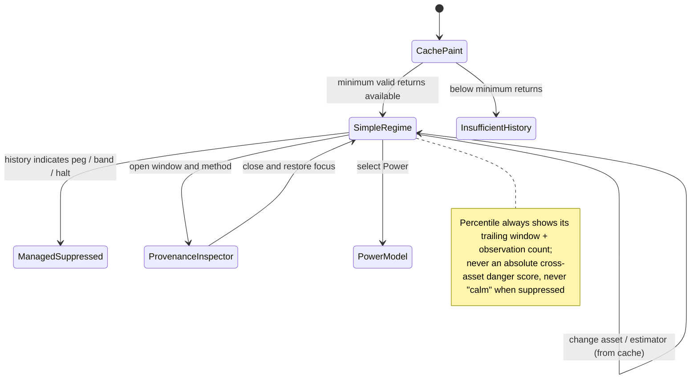
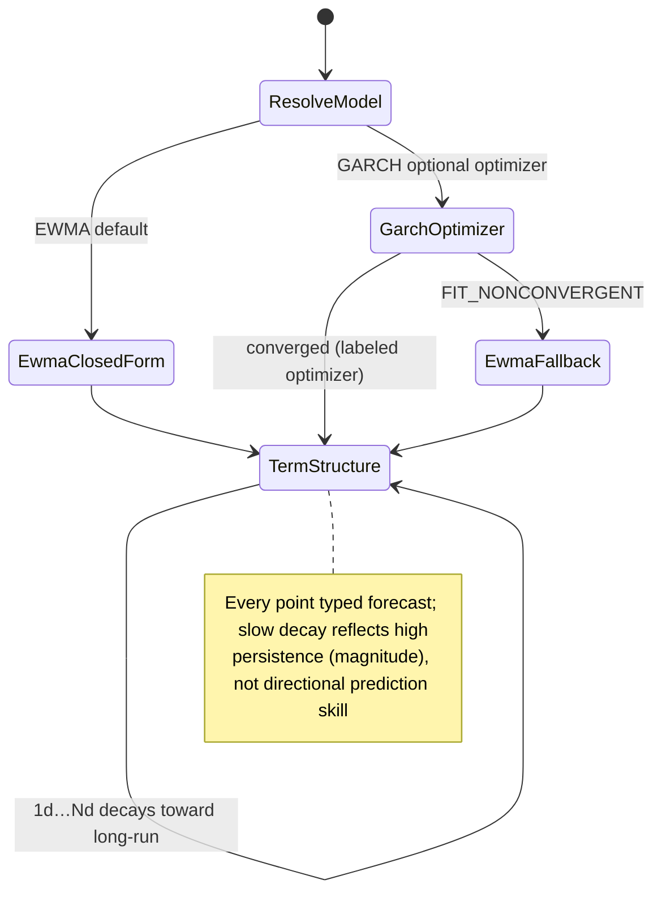
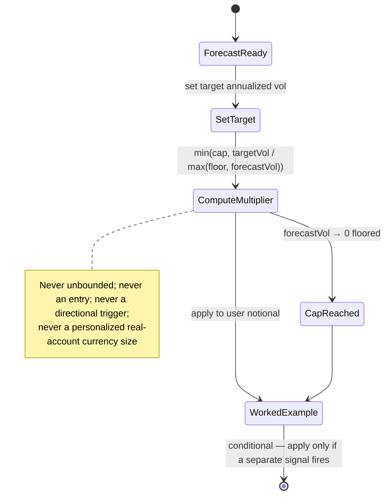
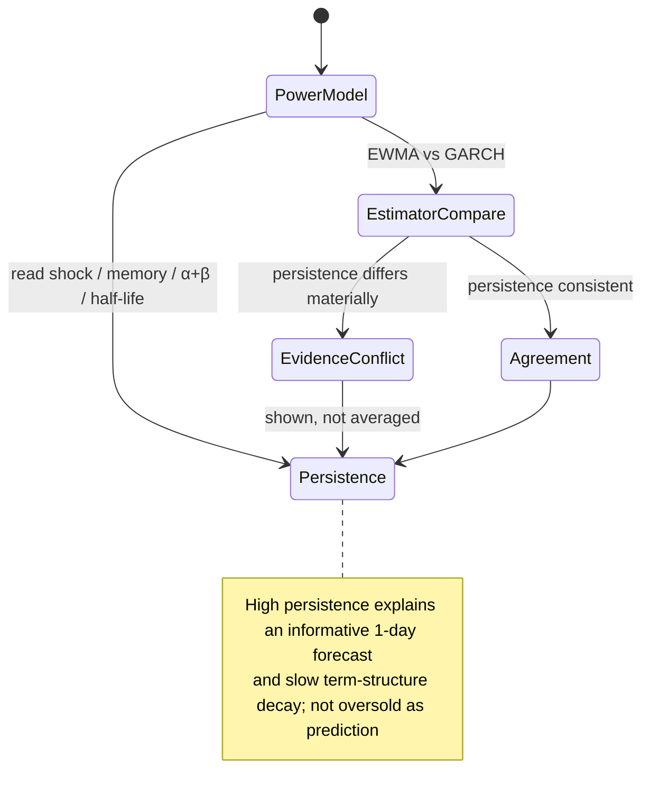
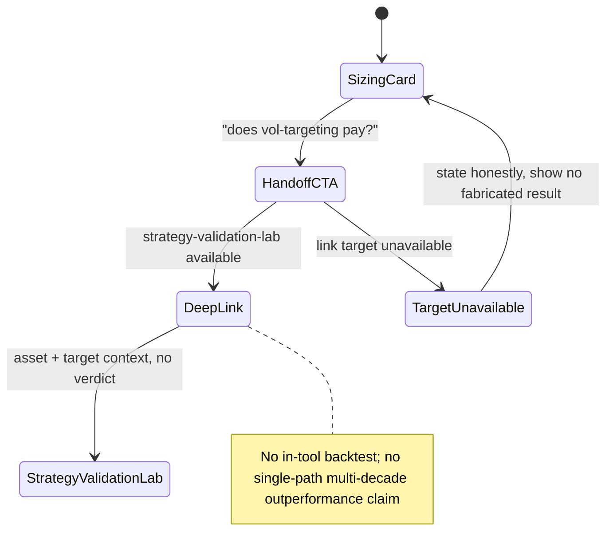
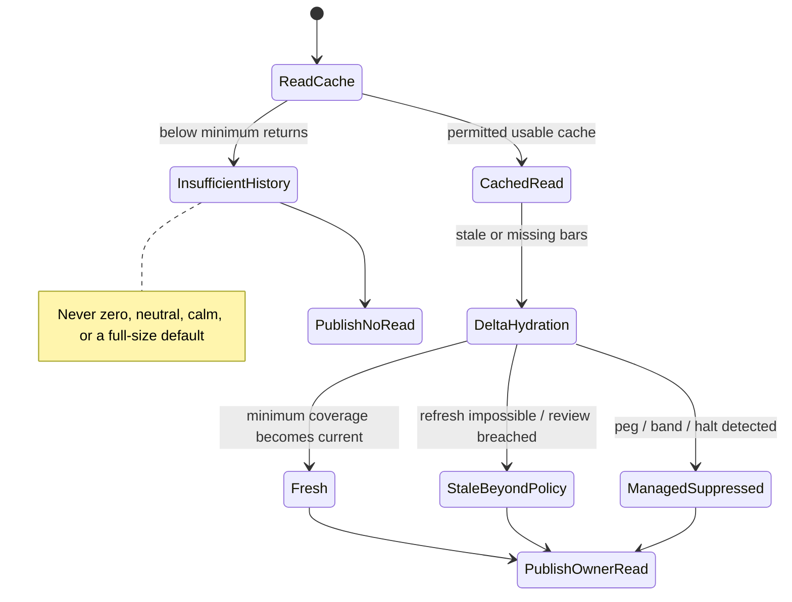
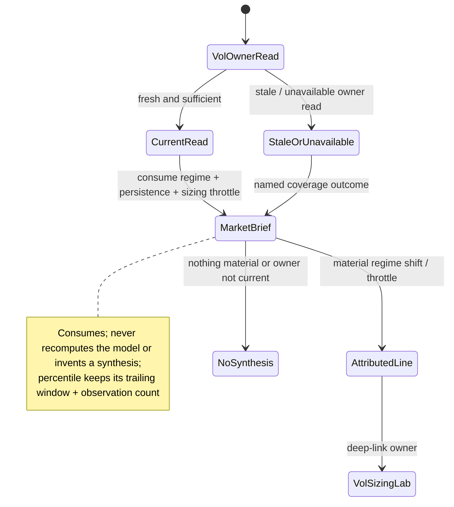
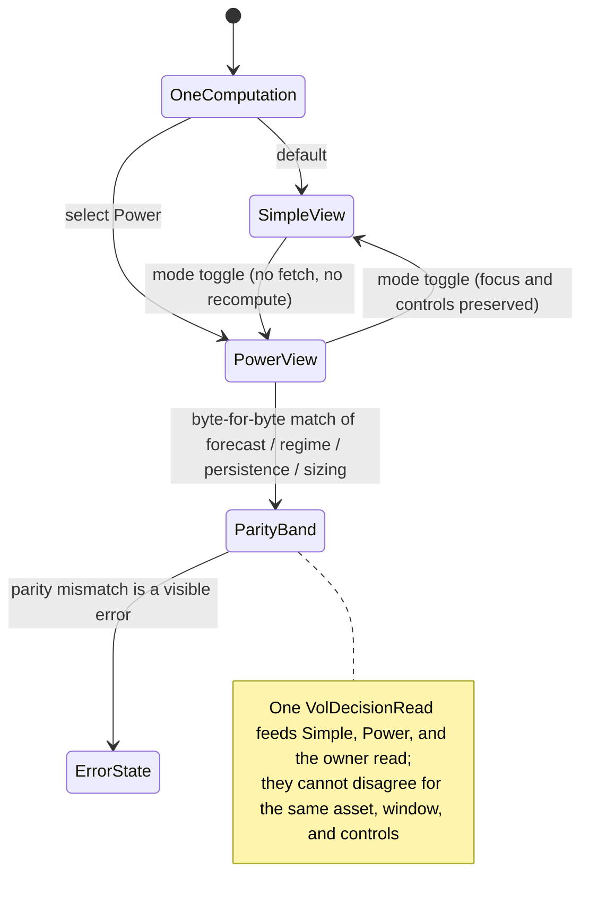
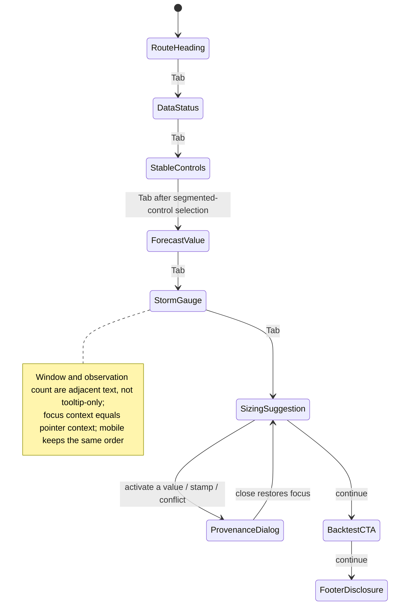

# Feature: 011 Volatility Regime and Vol-Targeting Sizing Lab

> **Analyst artifact status.** This file currently contains only the
> **analyst-owned** business sections (Problem Statement through
> Cross-Product Applicability). `design.md`, `scopes.md`, `test-plan.json`,
> `scenario-manifest.json`, `report.md`, `uservalidation.md`, and the
> UX-owned `UI Wireframes` / `User Flows` sections are **not yet written**
> and are owned by `bubbles.design`, `bubbles.plan`, and `bubbles.ux`
> respectively. See **Downstream Owner Handoffs** at the end.

## Problem Statement

Research Lab can measure realized risk in many places but has no tool whose primary job is to **forecast** conditional volatility, express that forecast as a **volatility regime**, and turn it into a **volatility-targeted position-sizing multiplier**. Realized volatility, drawdown, VaR, Sharpe, and Sortino already exist in [etf-momentum-lab.html](../../etf-momentum-lab.html); vol-targeting as a strategy lever and the fixed-vs-targeted equity-curve comparison already exist in [strategy-validation-lab.html](../../strategy-validation-lab.html) and [strategy-self-improvement-lab.html](../../strategy-self-improvement-lab.html); sizing-for-survival already exists in [portfolio-survival-allocation-lab.html](../../portfolio-survival-allocation-lab.html). What none of them owns is the **forward-looking conditional-volatility model** — the recursive `σ²_t = ω + α·shock²_{t-1} + β·σ²_{t-1}` engine that produces a one-day-ahead and multi-day volatility term structure, decomposes persistence (`α` shock weight vs `β` memory weight), and drives a sizing decision.

This gap matters because a widely-circulated public method (the "GARCH / storm gauge / violence score" quant-sizing framework popularized in retail trading media) packages exactly this: fit a GARCH(1,1)/EWMA volatility model, read where current volatility sits versus its own trailing history (a percentile "storm gauge"), and size positions inversely to forecast volatility so account risk — not position count — is the controlled variable. The framework is economically real and Nobel-lineage: Engle's ARCH (2003 Nobel) and Bollerslev's GARCH extension are standard risk-desk tools, and volatility clustering (violence arrives in persistent bursts, direction does not) is one of the most reproducible regularities in financial data. But the retail packaging couples the honest core (a forecast-only, magnitude-only model) to three things that do not belong in Research Lab: a proprietary Claude "skill", a TradingView Pine Script overlay, and headline multi-decade backtest claims (15-year Bitcoin, 50-year Nasdaq, 150-year S&P) presented as single-path evidence of outperformance.

The need is therefore to extract **only** the durable analytical primitive — a truthful in-browser conditional-volatility forecaster plus a regime read and a capped sizing multiplier — reuse Research Lab's existing backtest/validation tooling by deep-link instead of re-implementing it, and stay honest about what a browser-side GARCH fit can and cannot claim. The delivery mechanisms (Claude skill, Pine Script) are out of scope; the multi-decade single-path performance claims are explicitly not reproduced.

## Outcome Contract

**Intent:** Give a research user one truthful volatility workspace that forecasts an asset's conditional volatility, states the current volatility regime relative to the asset's own recent history, and converts the forecast into a conditional, capped, vol-targeting sizing multiplier — while making clear that the model carries zero directional information and does not generate entries.

**Success Signal:** With sufficient valid daily-bar history for a chosen asset, the user can read (1) the one-day-ahead annualized volatility forecast and a short forecast term structure, (2) the current volatility regime as an explicit percentile band versus a declared trailing window ("calmer than / rougher than X% of the past N observations"), (3) the model's persistence decomposition (shock weight, memory weight, and the implied half-life), and (4) a conditional sizing multiplier `min(cap, targetVol / forecastVol)` with a worked cash example — each carrying its data-coverage, model-method, and freshness provenance. The same forecast read is published as one normalized owner read that [market-brief.html](../../market-brief.html) can consume without recomputing the model.

**Hard Constraints:**

- The model forecasts **magnitude only**. No panel, label, badge, or summary may imply a price direction, target, top, or bottom.
- The default estimator is **EWMA / RiskMetrics** (a no-fit, closed-form conditional-variance recursion). Any GARCH(1,1) fit is an **optional, explicitly-labeled lightweight optimizer**, never presented as `arch`/R-grade maximum-likelihood estimation.
- Every volatility number is a typed **forecast** or a typed **realized/pricing** estimate; a realized estimate may never be relabeled a forecast, and a forecast may never be presented as an observed fact.
- The sizing multiplier is **conditional and capped**. It applies only "if a signal fires elsewhere", never generates an entry, and must be bounded so that `forecastVol → 0` cannot produce unbounded size.
- Regime is a **window-relative percentile** against a **declared** trailing window and observation count; it may not be presented as an absolute or cross-asset-comparable "danger score" without that window shown.
- The tool does **not** re-implement a backtest. Any "does vol-targeting make money" question deep-links to [strategy-validation-lab.html](../../strategy-validation-lab.html) (out-of-sample, embargoed folds, deflated Sharpe), and no multi-decade single-path outperformance claim is reproduced.
- Insufficient, stale, non-finite, or unavailable history remains explicitly unavailable; it never becomes a zero, a neutral, a flat "calm" regime, or an implicit full-size sizing multiplier.
- Low realized volatility produced by a peg, band, halt, or managed regime is a **first-class limitation**, not automatically "safe / full size".
- Simple and Power views consume one computation and cannot disagree for the same asset, window, and controls.
- The tool remains educational research. It provides no personalized position size in currency for a real account, no order, no broker connection, and no claim of executable pricing.

**Failure Condition:** The feature fails even if every panel renders when it implies direction, presents a browser GARCH fit as institutional-grade MLE, lets `forecastVol → 0` blow the sizing multiplier to infinity, calls a realized estimate a forecast, shows a regime percentile without its window, re-implements a naive single-path multi-decade backtest and headlines the outperformance, treats a peg-suppressed volatility as genuinely safe, lets Simple and Power disagree, or causes Market Brief to invent a volatility synthesis the owning tool never published.

## Goals

- Establish one reusable, source-aware **conditional-volatility forecast capability** (EWMA default, optional lightweight GARCH(1,1)) for the Volatility Sizing Lab and Market Brief.
- Provide a dedicated tool with a volatility-regime "storm gauge" percentile, a forecast term structure, a persistence/half-life decomposition, and a capped vol-targeting sizing multiplier with a worked example.
- Keep the framework honest: forecast-only, magnitude-only, method-labeled, coverage-aware, and explicit about browser-side estimation limits.
- Reuse rather than duplicate: deep-link backtest/validation to [strategy-validation-lab.html](../../strategy-validation-lab.html) and realized-risk detail to [etf-momentum-lab.html](../../etf-momentum-lab.html).
- Preserve Research Lab's one-file, cache-first, automatic-delta, Simple/Power, tooltip, ticker-link, normalized-read, and educational-only contracts.
- Publish one normalized owner read that Market Brief can surface (regime shift, persistence, sizing throttle) without duplicating model logic.

## Non-Goals

- A Claude "skill", a TradingView Pine Script indicator, or any non-Research-Lab delivery artifact from the source method.
- A directional signal, entry generator, top/bottom caller, or price target of any kind.
- A brokerage-grade or account-specific position size in currency, hedge ratio, leverage recommendation, or order.
- Institutional-grade GARCH maximum-likelihood estimation, EGARCH/GJR leverage modeling, or multivariate/regime-switching volatility as a first release.
- Re-implementing a strategy backtest, walk-forward engine, or equity-curve comparison already owned by [strategy-validation-lab.html](../../strategy-validation-lab.html) / [strategy-self-improvement-lab.html](../../strategy-self-improvement-lab.html).
- Reproducing the source video's multi-decade single-path outperformance claims (15y BTC / 50y Nasdaq / 150y S&P) as evidence of edge.
- Options-implied volatility, VRP, or the full greek surface already owned by [options-structure-lab.html](../../options-structure-lab.html).

## Current Capability Map

| Capability | Current Working-Tree Evidence | Status | Gap Owned By Feature 011 |
| --- | --- | --- | --- |
| Realized volatility, drawdown, VaR, Sharpe, Sortino | [etf-momentum-lab.html](../../etf-momentum-lab.html) computes performance/risk/drawdown/correlation/beta/VaR over a universe | Complete for realized/backward-looking risk | No forward conditional-volatility forecast or regime percentile owned here |
| Vol-targeting as a strategy lever | [strategy-validation-lab.html](../../strategy-validation-lab.html) and [strategy-self-improvement-lab.html](../../strategy-self-improvement-lab.html) list "vol targeting" among trend/momentum/trailing-stop levers | Complete for backtest use | These validate a *strategy*; neither exposes a standalone forecast + regime + sizing cockpit |
| Fixed-vs-vol-targeted performance comparison | [strategy-validation-lab.html](../../strategy-validation-lab.html) runs OOS walk-forward with embargoed folds and a Deflated Sharpe | Complete and more rigorous than the source method | Feature 011 must deep-link here, not re-implement |
| Sizing for survival / avoiding blow-up | [portfolio-survival-allocation-lab.html](../../portfolio-survival-allocation-lab.html) models allocation and survival | Adjacent | No per-asset conditional-vol sizing multiplier |
| Regime engines (Fear/Greed, VIX, trend) | [swing-structure-lab.html](../../swing-structure-lab.html), [sector-research-lab.html](../../sector-research-lab.html), [bond-regime-lab.html](../../bond-regime-lab.html), [market-brief.html](../../market-brief.html) | Existing pattern | No volatility-percentile "storm gauge" regime |
| Shared market cache | [rldata.js](../../rldata.js) stores provider-tagged interval bars, freshness, request status, and compact `toolReads` | Complete generic foundation | No conditional-volatility model contract, forecast/realized typing, or vol-regime owner read |
| Default daily history reach | `RLDATA.ensureBars(...)` defaults `interval "1d"` to `range "5y"` ([rldata.js](../../rldata.js)) | ~1,250 daily bars available by default | Sufficient for a stable fit; the source method's 15y/50y/150y claims are **not** reachable at default reach |
| Simple and Power views | Global Rotation, Real Assets, Bond Regime use Simple default + Power drilldown | Existing pattern | No volatility decision hierarchy / evidence anatomy |
| Market Brief owner-read reuse | `putToolRead` requires each tool to publish one compact owning read | Existing pattern | No volatility-regime owner read exists |
| Registered volatility tool | Current `tools.json`, `index.html`, `rlnav.js` register no dedicated volatility-forecast/sizing tool | Missing | New tool + parity registration required at implementation |
| Canvas rendering discipline | Existing tools draw charts synchronously in `render()` (rAF does not fire in hidden tabs) | Known repo constraint | New forecast/term/regime canvases must draw synchronously |

## Honest Findings, Contradictions, And Limitations

1. **~60% of the source method is already in Research Lab.** Vol-targeting + the fixed-vs-targeted backtest are owned by [strategy-validation-lab.html](../../strategy-validation-lab.html); realized-vol / VaR / drawdown / Sharpe by [etf-momentum-lab.html](../../etf-momentum-lab.html); sizing-for-survival by [portfolio-survival-allocation-lab.html](../../portfolio-survival-allocation-lab.html). The **only** uncovered primitive is the forward conditional-volatility **forecaster** and its regime/sizing read. The feature must be scoped to that, not to a full clone.
2. **The honest antidote already exists and is stronger.** [strategy-validation-lab.html](../../strategy-validation-lab.html) tests "does vol-targeting make money" with out-of-sample embargoed folds and a Deflated Sharpe. The source method's headline evidence is a **single-path** 15-year backtest — precisely the curve-fit story that lab exists to discipline. Re-implementing a naive backtest here would regress the repo's statistical hygiene.
3. **A faithful "GARCH" label requires MLE.** True GARCH(1,1) estimates `ω, α, β` by maximizing a Gaussian log-likelihood (numerical optimization). In ES5, no-dependency, single-file, this is heavy and fragile. The honest default is **EWMA / RiskMetrics** (`σ²_t = (1−λ)·shock²_{t-1} + λ·σ²_{t-1}`, `λ≈0.94`) — a closed-form, no-fit special case that is essentially what the source method's "85% memory / 15% shock" already approximates. A GARCH(1,1) fit may be offered as an **optional, explicitly-labeled lightweight optimizer** (e.g. bounded coordinate descent), never as institutional MLE.
4. **Persistence is the reason the forecast "works", and it must be shown honestly.** When `α+β` (or `λ`) is near 1, volatility is near-integrated: tomorrow ≈ today. That is why one-day-ahead forecasts are informative and why the multi-day term structure decays slowly toward the long-run level. The tool must display persistence and the implied half-life, and must not oversell a near-random-walk forecast as prediction skill.
5. **Direction is not forecast — at all.** The model earned its Nobel lineage precisely by restricting its claims to magnitude. Any UI element that nudges the user toward a directional read is a failure, not a feature.
6. **The sizing multiplier is conditional and must be capped.** `targetVol / forecastVol` → ∞ as forecast volatility → 0 (e.g. a halted or pegged asset). A cap (and a floor on forecast vol) is mandatory. The multiplier is also explicitly "apply only if a separate signal fires"; the tool never generates entries.
7. **Regime is window-relative, not absolute.** "96th percentile" only means anything against a stated trailing window and observation count. Two assets' "storm" percentiles are not directly comparable, and the window must be visible everywhere the percentile is.
8. **Data reach caps the honest claims.** [rldata.js](../../rldata.js) defaults daily bars to `range "5y"`. A 5-year (~1,250-bar) fit is statistically fine, but the source method's 15y BTC / 50y Nasdaq / 150y S&P numbers are **not** reproducible at default reach; a longer `range` is Yahoo-only, best-effort, and must never headline multi-decade outperformance.
9. **Low volatility can be manufactured.** A peg, band, circuit-breaker, or thin/managed market can suppress realized volatility. Low vol under management is a limitation, not a green light for full size.
10. **EWMA and a fitted GARCH can disagree, and that is information.** When a fit implies materially different persistence than the RiskMetrics prior, the disagreement should be shown, not averaged into a false single number.
11. **The source method's non-Research-Lab parts do not transfer.** The Claude skill and the TradingView Pine Script are delivery mechanisms for other platforms; only the math is portable to a single-file HTML tool.
12. **QuantitativeFinance already owns this method end-to-end** (see **Cross-Product Applicability**). This tool is a retail/educational + repo-completeness addition, not a source of new capability for QF. Any "quant firms have secret sauce" framing from the source video is false relative to your own platform.

## Domain Capability Model

### Capability

**Conditional-Volatility Forecasting And Vol-Targeting Sizing** turns a daily return series into a forward volatility forecast, a window-relative volatility regime, a persistence decomposition, and a capped, conditional sizing multiplier — while preserving the estimator method, forecast/realized typing, data coverage, freshness, and unavailable states, and while explicitly carrying no directional claim. The capability is shared by the dedicated tool and Market Brief's cross-tool synthesis.

### Domain Primitives

| Primitive | Purpose | Lifecycle |
| --- | --- | --- |
| ReturnSeries | Log-returns derived from exact-date daily bars for one asset | loading -> sufficient, insufficient, or unavailable -> superseded when bars change |
| ConditionalVolModel | An estimator instance (`ewma` or `garch11`) with its parameters and fit diagnostics | unconfigured -> fitted or closed-form -> stale or superseded |
| VolForecast | One-day-ahead and N-day forward annualized volatility (a decaying term toward the long-run level) | insufficient -> current -> stale -> superseded; always typed `forecast` |
| RealizedVolRead | Trailing realized volatility over a declared rolling window, annualized by √252 | insufficient -> current -> stale; always typed `realized`, never `forecast` |
| VolRegimeRead | Window-relative percentile band of current forecast/realized vol vs a declared trailing window | insufficient -> calm, normal, elevated, or storm -> stale or superseded |
| PersistenceRead | Shock weight (`α`/`1−λ`), memory weight (`β`/`λ`), `α+β`, and implied half-life | unavailable -> current -> superseded |
| RiskBudget | User-declared target annualized volatility (the controlled account-risk variable) | default -> user-set -> applied |
| SizingRead | Conditional, capped multiplier `min(cap, targetVol / max(floor, forecastVol))` with a worked example | unavailable -> current -> superseded |
| ModelDiagnostics | Convergence flag, residual sanity, EWMA-vs-GARCH agreement, and coverage counts | unavailable -> pass, degraded, or fail -> superseded |
| BacktestHandoff | A deep-link + prefilled context into strategy-validation-lab; never an in-tool backtest result | inert -> linked |
| EvidenceConflict | Explicit disagreement (EWMA vs GARCH persistence, realized vs forecast, managed-vol caveat) | opened -> retained, resolved, or superseded |
| VolDecisionRead | One decision-first projection consumed by Simple, Power, and the normalized owner read | unavailable -> current -> stale -> superseded |

### Reusable Volatility Observation Contract

Every published volatility value must carry the fields below. A consumer may project fewer fields for display but may not discard the lineage needed to interpret method, typing, coverage, or freshness.

| Field | Required Meaning |
| --- | --- |
| `observationId` | Stable identity for the asset, measure, horizon, and estimator |
| `kind` | `forecast` or `realized` — never interchangeable |
| `subject` | Asset symbol the value describes |
| `estimator` | `ewma`, `garch11`, or `realized-rolling` |
| `value` / `unit` | Finite annualized volatility (decimal or %); unavailable values carry no number |
| `horizon` | `1d`, `Nd` term point, or the rolling window length for realized |
| `annualization` | The factor used (√252 trading-day default), stated explicitly |
| `params` | `{lambda}` for EWMA or `{omega, alpha, beta}` for GARCH; absent for pure realized |
| `persistence` | `alpha+beta` (or `lambda`) and implied half-life, when applicable |
| `coverageObs` | Count of valid observations used; the declared minimum for the horizon |
| `windowRef` | The exact trailing window/observation set a percentile is measured against |
| `source` / `sourceUrl` | Price provider and inspectable reference |
| `observedAsOf` | As-of date of the last bar used |
| `retrievedAt` | Time Research Lab obtained the bars |
| `reviewWindow` | Max age / next-review rule after which the value is stale |
| `availability` | `loading`, `fresh`, `stale`, or `unavailable` |
| `unavailableReason` | Closed reason code, required whenever unavailable |
| `quality` | `observed`, `derived`, `closed-form`, `fitted`, or `user-assumption` |
| `limitations` | Managed/pegged-market, short-history, provider, or method limitations |

### Closed Availability And Unavailable Vocabulary

`unavailable` must carry exactly one primary reason:

| Reason | Meaning | Required Behavior |
| --- | --- | --- |
| `INSUFFICIENT_HISTORY` | Fewer valid returns than the declared minimum for the horizon | Show exact required vs available coverage; publish no forecast |
| `NONFINITE` | Required numeric inputs are null, infinite, or malformed | Publish no numeric result |
| `NO_COMMON_DATES` | Bars for a multi-asset comparison lack a sufficient exact-date intersection | Do not calculate or forward-fill |
| `FIT_NONCONVERGENT` | The optional GARCH optimizer failed stationarity/convergence | Fall back to the EWMA closed form and label it |
| `MANAGED_SUPPRESSED` | History indicates a peg/band/halt regime, not free-float volatility | Show the regime but mark the read managed-suppressed, not "calm" |
| `SOURCE_ERROR` | Approved provider retrieval or parsing failed | Preserve valid cache as stale when allowed; otherwise unavailable |
| `STALE_BEYOND_POLICY` | Cached bars exceed the review window and no refresh is possible | Show unavailable or explicitly stale; never present as current |

### Relationships

- A VolForecast is produced by exactly one ConditionalVolModel and is always typed `forecast`; a RealizedVolRead can inform the regime window but can never be relabeled a forecast.
- A VolRegimeRead consumes a VolForecast (or RealizedVolRead) plus a declared `windowRef`; the percentile is meaningless without the window.
- A SizingRead consumes a VolForecast and a RiskBudget and is always capped and conditional; it never consumes a directional input and never emits an entry.
- A PersistenceRead is derived from the ConditionalVolModel parameters and governs how slowly the VolForecast term structure decays.
- A BacktestHandoff links to strategy-validation-lab and never carries an in-tool performance verdict.
- An EvidenceConflict opens when EWMA and GARCH persistence disagree materially, when a managed-suppressed regime is detected, or when realized and forecast diverge beyond a declared band.
- Market Brief consumes the VolDecisionRead and preserves its regime/persistence/sizing-throttle framing without recomputing the model.

### Business Policies

1. **Forecast-only policy:** The tool forecasts magnitude. No directional claim, target, or top/bottom may appear anywhere.
2. **Estimator-honesty policy:** EWMA/RiskMetrics is the default. A GARCH(1,1) fit is optional and labeled a lightweight optimizer; it is never called institutional MLE.
3. **Typing policy:** Every value is typed `forecast` or `realized`; the two are never interchanged.
4. **Cap-and-floor policy:** The sizing multiplier is `min(cap, targetVol / max(floor, forecastVol))`; `forecastVol → 0` can never produce unbounded size.
5. **Conditional-sizing policy:** Sizing applies only "if a separate signal fires"; the tool never generates an entry or a directional trigger.
6. **Window-visibility policy:** A regime percentile is always shown with its trailing window and observation count; it is not a cross-asset-comparable absolute score.
7. **No-backtest-here policy:** The tool never re-implements a backtest; the "does it make money" question deep-links to strategy-validation-lab.
8. **No-multidecade-claim policy:** No single-path multi-decade outperformance number is reproduced; long history is best-effort and clearly caveated.
9. **Managed-market policy:** Peg/band/halt-suppressed volatility is a first-class limitation, never automatically "safe / full size".
10. **Coverage policy:** Below the declared minimum observations, the affected read is Unavailable with exact required-vs-available counts.
11. **One-decision policy:** One VolDecisionRead feeds Simple, Power, and the owner read.
12. **Owner policy:** This tool owns volatility forecast, regime, persistence, and sizing. strategy-validation-lab owns backtest evidence. etf-momentum-lab owns realized multi-asset risk detail. Market Brief owns cross-tool synthesis only.

### Capability Ownership Boundaries

| Surface | Owns | Must Not Own |
| --- | --- | --- |
| Volatility Regime and Vol-Targeting Sizing Lab | Conditional-vol forecast (EWMA/GARCH), volatility regime percentile, persistence/half-life, capped conditional sizing multiplier, volatility owner read | Directional signals, entries, in-tool backtest, options-implied vol surface, personalized account sizing |
| Strategy Validation Lab | Out-of-sample walk-forward backtest, deflated Sharpe, cross-instrument robustness for vol-targeting and other rules | The standalone forecast/regime/sizing cockpit |
| ETF Momentum Lab | Realized multi-asset performance, drawdown, VaR, Sharpe/Sortino, correlation | Forward conditional-vol forecast and regime percentile |
| Market Brief | Cross-tool synthesis, regime-shift attribution, deep-links | Recomputing the volatility model or inventing a synthesis the owner never published |

## Actors And Personas

| Actor | Description | Key Goals | Permission Boundary |
| --- | --- | --- | --- |
| Risk-First Trader | Sizes by risk, treats direction as a separate, weaker question | Know current volatility regime and the throttle it implies for any signal | Receives a conditional, capped, generic multiplier; no account-specific currency size or order |
| Quant-Curious Retail User | Learning why sizing, not direction, drives survival | Understand vol clustering, persistence, and vol-targeting from a truthful tool | Inspects generic reads; is not told what or when to trade |
| Multi-Asset Researcher | Compares volatility regimes across assets | See each asset's regime with its own window and persistence | Uses per-asset reads; is not shown a false cross-asset absolute danger score |
| Strategy Validator | Wants to know whether vol-targeting actually pays on an asset | Move from this tool's forecast to a rigorous backtest | Is deep-linked to strategy-validation-lab; receives no in-tool performance verdict |
| Data-Constrained Public User | Uses the static site with partial cache, no paid entitlement | Get the strongest honest partial read with explicit unavailable reasons | Uses approved public/cached bars; no credential prompt on the tool page |
| Market Brief Analyst | Produces the low-noise cross-tool synthesis | Surface a material volatility regime shift or sizing throttle with attribution | Consumes the normalized owner read; cannot recompute or override it |

## Use Cases

### UC-001: Read the current volatility regime (storm gauge)

- **Actor:** Risk-First Trader
- **Preconditions:** The chosen asset has at least the declared minimum of valid daily returns.
- **Main Flow:**
  1. The user opens Simple view and sees the current annualized volatility and its regime band (calm / normal / elevated / storm).
  2. The regime is expressed as a percentile against a declared trailing window and observation count.
  3. The read shows source, as-of date, and freshness.
- **Alternative Flows:** Below minimum coverage, the regime is Unavailable with exact required-vs-available counts. A managed/pegged history shows the regime marked managed-suppressed rather than "calm".
- **Postconditions:** The user can state whether the asset is quiet or violent relative to its own recent history, and against what window.

### UC-002: Get a one-day-ahead and term volatility forecast

- **Actor:** Quant-Curious Retail User
- **Preconditions:** A fitted or closed-form ConditionalVolModel exists for the asset.
- **Main Flow:**
  1. The user views the one-day-ahead annualized forecast and a short forward term structure decaying toward the long-run level.
  2. Every point is typed `forecast` and carries its estimator and coverage.
- **Alternative Flows:** If the optional GARCH fit is non-convergent, the tool uses the EWMA closed form and labels the fallback.
- **Postconditions:** The user understands tomorrow's expected magnitude (not direction) and how quickly the forecast reverts.

### UC-003: Compute a vol-targeting sizing multiplier

- **Actor:** Risk-First Trader
- **Preconditions:** A VolForecast and a user RiskBudget (target annualized volatility) are available.
- **Main Flow:**
  1. The user sets or accepts a target annualized volatility (the controlled variable).
  2. The tool computes `min(cap, targetVol / max(floor, forecastVol))` and shows a worked cash example on a user-entered notional.
  3. The tool states the multiplier is conditional ("apply only if a separate signal fires") and generates no entry.
- **Alternative Flows:** A near-zero forecast volatility is floored so the multiplier hits its cap rather than exploding.
- **Postconditions:** The user knows the throttle to apply to any independently-generated signal and why.

### UC-004: Inspect model persistence and half-life

- **Actor:** Multi-Asset Researcher
- **Preconditions:** A ConditionalVolModel is available.
- **Main Flow:**
  1. The user opens Power view and sees the shock weight, memory weight, `α+β` (or `λ`), and implied half-life.
  2. The tool explains that high persistence is why the one-day forecast is informative and the term structure decays slowly.
- **Alternative Flows:** If EWMA and a GARCH fit disagree materially, both are shown as an EvidenceConflict rather than averaged.
- **Postconditions:** The user can judge how much of the forecast is genuine structure versus near-random-walk persistence.

### UC-005: Hand off to a rigorous backtest

- **Actor:** Strategy Validator
- **Preconditions:** The asset and target volatility are selected.
- **Main Flow:**
  1. The user clicks the backtest hand-off.
  2. The tool deep-links to [strategy-validation-lab.html](../../strategy-validation-lab.html) with the asset/target context.
  3. No in-tool performance verdict is shown.
- **Alternative Flows:** If the hand-off target is unavailable, the tool states so and shows no fabricated result.
- **Postconditions:** The user tests "does vol-targeting pay" under out-of-sample, deflated-Sharpe discipline, not a single-path fit.

### UC-006: Operate with partial, stale, or short history

- **Actor:** Data-Constrained Public User
- **Preconditions:** The shared cache may hold a mixture of fresh, stale, short, and missing bars.
- **Main Flow:**
  1. The tool paints from valid cache immediately (synchronous canvas draw).
  2. Missing/stale bars hydrate automatically through approved no-credential paths.
  3. Each read shows coverage, as-of, retrieval, review window, and availability.
- **Alternative Flows:** Insufficient history yields Unavailable, not a flat "calm" default.
- **Postconditions:** The user gets the strongest honest partial read and every limitation.

### UC-007: Surface a volatility regime shift in Market Brief

- **Actor:** Market Brief Analyst
- **Preconditions:** The registry includes a current normalized volatility owner read, or an explicit unavailable outcome.
- **Main Flow:**
  1. Market Brief consumes the VolDecisionRead and its provenance.
  2. It surfaces a material regime shift or sizing throttle and deep-links the owner.
  3. It does not recompute the model.
- **Alternative Flows:** A stale/unavailable owner read is stated as such; no synthesis is invented.
- **Postconditions:** The brief is attributable, low-noise, and consistent with the owner.

## Business Scenarios

### BS-001: Volatility clustering makes tomorrow's forecast persist

Given an asset had a violent move today
And its estimated persistence (`α+β` or `λ`) is high
When the one-day-ahead forecast is produced
Then tomorrow's forecast volatility must be elevated relative to the long-run level
And the forecast must be typed `forecast`, not presented as an observed fact

### BS-002: The regime percentile is always shown with its window

Given the current forecast volatility is at a high percentile
When the storm-gauge regime is rendered
Then the percentile must display its trailing window and observation count
And it must not be presented as an absolute, cross-asset-comparable danger score

### BS-003: The sizing multiplier throttles in a storm

Given a user target annualized volatility of 15%
And a forecast annualized volatility of 30%
When the sizing multiplier is computed
Then it must be approximately 0.5
And a worked cash example on the user notional must be shown
And the read must state it applies only if a separate signal fires

### BS-004: A near-zero forecast cannot explode the multiplier

Given a forecast annualized volatility approaching zero (e.g. a halted or pegged asset)
When the sizing multiplier is computed
Then a floor on forecast volatility (or a hard cap) must bound the multiplier
And the multiplier must not diverge toward infinity

### BS-005: No directional claim is ever emitted

Given any asset, regime, forecast, or sizing output
When the tool renders Simple or Power view
Then no panel, label, badge, or summary may imply price direction, a target, a top, or a bottom

### BS-006: A GARCH fit is labeled as a lightweight optimizer

Given the user enables the optional GARCH(1,1) fit
When the fitted parameters are displayed
Then the method must be labeled a lightweight in-browser optimizer
And it must not be presented as institutional maximum-likelihood estimation

### BS-007: The backtest question is a link-out, not an in-tool result

Given the user wants to know whether vol-targeting makes money on the asset
When the user requests a backtest
Then the tool must deep-link to strategy-validation-lab with context
And it must not display any in-tool single-path performance verdict

### BS-008: Managed-market low volatility is not "safe"

Given an asset whose history indicates a peg, band, or halt regime
When the regime is computed
Then the read must be marked managed-suppressed
And low realized volatility must not be presented as automatically full-size / safe

### BS-009: Insufficient history yields an explicit unavailable state

Given an asset with fewer valid returns than the declared minimum
When the forecast, regime, or sizing read is requested
Then the read must be Unavailable with exact required-versus-available observation counts
And it must not default to zero, neutral, calm, or full size

### BS-010: Simple and Power cannot disagree

Given the same asset, window, and controls
When both Simple and Power views render
Then they must consume one computation
And they must not show a different regime, forecast, persistence, or multiplier

### BS-011: A non-convergent GARCH falls back to EWMA

Given the optional GARCH optimizer fails stationarity or convergence
When the model is resolved
Then the tool must fall back to the EWMA closed form
And it must label the fallback rather than showing a broken or silent result

### BS-012: EWMA and GARCH disagreement is shown, not averaged

Given the EWMA prior and a GARCH fit imply materially different persistence
When persistence is rendered
Then both must be shown as an explicit evidence conflict
And they must not be silently averaged into one number

### BS-013: A realized estimate is never relabeled a forecast

Given a trailing realized-volatility read over a rolling window
When it is displayed or published to the owner read
Then it must be typed `realized`
And it must never be presented as a forward forecast

### BS-014: Long history is best-effort and never headlines a multi-decade claim

Given the user requests more than the default 5-year history reach
When longer bars are fetched best-effort
Then any multi-decade coverage must be caveated as best-effort
And no single-path multi-decade outperformance number may be reproduced as evidence of edge

## Competitive Analysis

The primary "competitor" is the **source method itself** (the public "GARCH / storm gauge" retail package) and the **existing Research Lab tools** that already cover parts of it.

| Capability | This Tool (proposed) | Source Method (Claude skill + Pine Script) | strategy-validation-lab | etf-momentum-lab | Gap / Edge |
| --- | --- | --- | --- | --- | --- |
| Conditional-vol forecast (EWMA/GARCH) | ✅ owned, typed, method-labeled | ✅ (opaque skill) | ❌ | ❌ | **Edge:** the only in-repo forward forecaster; typed and honest about method |
| Volatility regime percentile ("storm gauge") | ✅ window-visible | ✅ (TradingView overlay) | ❌ | Partial (realized risk only) | **Edge:** window-relative, not an absolute danger score |
| Vol-targeting sizing multiplier | ✅ capped + conditional | ✅ (uncapped framing) | Lever inside a backtest | ❌ | **Edge:** explicit cap/floor + "only if a signal fires" |
| Backtest / does-it-pay | Deep-link only | ✅ single-path 15y | ✅ OOS + deflated Sharpe | ❌ | **Reuse:** delegate to the more rigorous lab |
| Honesty about method limits | ✅ first-class | ❌ oversells | ✅ | ✅ | **Edge:** no MLE/multi-decade over-claim |
| Directional claim | ❌ (by design) | ❌ (correctly avoids) | ❌ | ❌ | Parity — all correctly magnitude-only |
| Delivery | Single-file HTML | Claude skill + Pine Script | HTML | HTML | Source's delivery does not transfer |

**Net:** the differentiated edge is a **truthful, typed, window-visible forecaster + capped sizing** that plugs the one uncovered slot and delegates everything already owned. The tool competes on **honesty and integration**, not on novelty of math.

## Platform Direction And Market Trends

| Trend | Status | Relevance | Impact On Research Lab |
| --- | --- | --- | --- |
| AI-packaged retail quant "skills" (Claude/GPT skills, TradingView scripts) | Growing | High | Users arrive with opaque, over-claimed tools; a truthful, inspectable single-file counterpart is differentiating |
| Volatility-targeting / risk-parity sizing going retail | Established (institutional) → Growing (retail) | High | A forecast + sizing cockpit is table stakes for a credible quant-education catalog |
| "Direction is weak, sizing is controllable" framing | Growing | Medium | Reinforces Research Lab's honest-first positioning versus signal-selling content |
| Forecast/realized typing and provenance discipline | Emerging as a trust differentiator | Medium | The typed forecast contract is a reusable trust primitive across future tools |

**Strategic opportunities:**

1. **Table stakes:** a truthful conditional-vol forecaster closes an obvious catalog gap (realized risk everywhere, forecast nowhere).
2. **Differentiator:** the honesty layer (method labels, caps, window-visible percentiles, no multi-decade single-path claims) directly contrasts the over-claiming AI-skill content users have seen.
3. **Reusable primitive:** the typed VolForecast owner read can feed Market Brief and any future regime-aware tool.

## Improvement Proposals

### IP-001: Conditional-volatility forecaster + capped sizing ⭐ Competitive Edge

- **Impact:** High
- **Effort:** M
- **Competitive Advantage:** The only in-repo forward vol forecast; typed, method-labeled, capped, window-visible — the honest counter to opaque AI-skill packages.
- **Actors Affected:** Risk-First Trader, Quant-Curious Retail, Multi-Asset Researcher
- **Business Scenarios:** BS-001..BS-014

### IP-002: Cross-asset volatility-regime strip (Power)

- **Impact:** Medium
- **Effort:** S
- **Competitive Advantage:** A small multiples strip of each watchlist asset's regime (each with its own window) — quick triage without a false absolute score.
- **Actors Affected:** Multi-Asset Researcher, Market Brief Analyst
- **Business Scenarios:** BS-002, BS-008

### IP-003: Persistence / half-life explainer with regime-shift markers

- **Impact:** Medium
- **Effort:** S
- **Competitive Advantage:** Teaches *why* the forecast works (persistence) and marks when persistence itself shifts — a genuine education edge.
- **Actors Affected:** Quant-Curious Retail
- **Business Scenarios:** BS-001, BS-004, BS-012

### IP-004: Market Brief volatility-regime line

- **Impact:** Medium
- **Effort:** S
- **Competitive Advantage:** One low-noise attributable line ("BTC vol regime flipped calm→storm; sizing throttle ≈0.5") deep-linking the owner.
- **Actors Affected:** Market Brief Analyst
- **Business Scenarios:** BS-002, BS-007

## UI Scenario Matrix

> Analyst-level flow map for `bubbles.ux` to expand into wireframes; not the UX contract itself.

| Scenario | Actor | Entry Point | Steps | Expected Outcome | Screen(s) |
| --- | --- | --- | --- | --- | --- |
| Read regime | Risk-First Trader | Simple cockpit | Pick asset → read regime band + percentile(window) | Knows calm/storm vs own history | Simple storm-gauge |
| Get forecast | Quant-Curious Retail | Power → Forecast | View 1-day + term, typed forecast | Understands tomorrow's magnitude + reversion | Forecast term panel |
| Size a signal | Risk-First Trader | Simple sizing | Set target vol → read capped multiplier + cash example | Knows conditional throttle | Sizing card |
| Inspect persistence | Multi-Asset Researcher | Power → Model | Read α/β or λ, half-life, EWMA-vs-GARCH | Judges structure vs random walk | Persistence panel |
| Backtest hand-off | Strategy Validator | Sizing card CTA | Click → deep-link strategy-validation-lab | Rigorous OOS test, no in-tool verdict | Link-out |
| Partial-data state | Data-Constrained User | Any panel | See coverage + unavailable reason | Honest partial read | Degraded-state chips |

## Non-Functional Requirements

- **Performance:** Closed-form EWMA + regime render on a cached 5-year series completes well within an interactive frame budget; the optional GARCH fit is bounded (capped iterations) and never blocks first paint. Canvases draw **synchronously** in `render()` (no `requestAnimationFrame` for chart draws — rAF does not fire in hidden/Simple-Browser tabs).
- **Accessibility:** Every `<canvas>` carries an `aria-label` and a text fallback (regime, forecast, and multiplier are also available as text/table, not chart-only).
- **Offline / cache-first:** First paint from the shared `rldata` cache with no refetch; automatic delta hydration only for stale/missing bars; no external CDN dependency; works from `file://`.
- **Portability:** ES5 style (`var`/`function`/string-concat), single self-contained HTML file, shared `.rlnav` nav, no build step.
- **Determinism:** For the same bars, window, and controls, the forecast, regime, persistence, and multiplier are reproducible; Simple and Power share one computation path.
- **Validation:** Pure helpers (`logReturns`, `ewmaVar`, `garch11Fit`, `annualizeVol`, `volPercentile`, `sizingMultiplier`, `halfLife`) are extractable top-level `function` declarations covered by a new `scripts/selftest.mjs` group.
- **Educational-only:** A persistent disclaimer; no personalized currency size for a real account, no order, no broker, no executable-pricing claim.

## Cross-Product Applicability — QuantitativeFinance

**Question asked:** is this also useful to QuantitativeFinance (QF), and if so — right away, or only after research-tool validation?

**Grounded answer: QF already implements this entire method in production Rust.** This is not a capability QF lacks, so there is nothing to "port up" from Research Lab. Working-tree evidence in the QF repo:

- `libs/algo-volatility/src/impls/algorithms.rs` — a registered **`garch`** algorithm implementing the exact model this tool is built on (`σ²_t = ω + α·ε²_{t-1} + β·σ²_{t-1}`, stationarity `α+β<1`, annualized by √252, "α+β close to 1 implies high vol persistence", Bollerslev 1986 citation), alongside **`ewma_vol`**, **`egarch`**, and **`gjr_garch`** (the leverage-aware variants this tool explicitly defers).
- `libs/algo-volatility/src/vol_model.rs` — realized volatility over a selectable rolling window annualized by √252, **IV-rank / IV-percentile** over a history window (the same "storm gauge" percentile idea), and a typed **`VolKind`** (`pricing`/`realized` vs `forecast`) with insufficient-history as a typed error — i.e. QF already enforces the forecast/realized typing this spec requires.
- `libs/algo-core/src/catalog.rs` — a **"WS-D: Volatility Modeling (16 items)"** catalog workstream registering `ewma_vol`, `garch`, `egarch`, `gjr_garch`, and more.
- `libs/algo-portfolio/src/impls/algorithms.rs` — **`kelly_criterion`** optimal bet sizing (`f* = μ/σ²`, half-Kelly), and `services/gateway/src/ai_factory/ranking.rs` references a **`position_sizing: "vol_target"`** mode — so QF already has both Kelly and vol-target sizing.

**Implications:**

- **Not a capability port.** Every pillar of the source method — GARCH/EWMA forecast, realized-vol percentile regime, vol-target + Kelly sizing — is already shipping in QF with typing, validation, and tests. The retail video's "quant firms have secret sauce you can't get" framing is false relative to your own platform.
- **The only genuinely useful QF-facing artifact is a UX / presentation reference**, not code. If QF ever wants a user-facing "volatility regime + sizing cockpit" dashboard panel, this tool's Simple/Power "storm gauge" (window-visible percentile band → persistence → capped conditional multiplier with a worked example) is a clean **design reference** for a panel that would **consume QF's existing `algo-volatility` + `vol_target` outputs** — it would not re-implement the math.
- **Timing:** useful to QF **right away, but only as a design/explainer reference** — and **not gated on Research Lab validation**, because QF's models are already implemented and tested. There is no "validate here first, then port" dependency, because there is no port.
- **Direction of value is lateral, not upward.** Research Lab benefits from QF's rigor (the typed forecast/pricing separation, the stationarity guard, the annualization convention are all worth mirroring here); QF benefits at most from Research Lab's *presentation* of a method it already owns.

**Recommendation:** build this in Research Lab for the retail/educational audience and catalog completeness (it fills the one in-repo forecaster gap), mirror QF's typing/annualization/stationarity conventions for consistency, and — separately and optionally — capture the Simple/Power "storm gauge" layout as a UX reference if a QF dashboard panel is ever scoped. Do **not** frame this feature as delivering new quant capability to QF.

## Downstream Owner Handoffs

This analyst spec defines **what** to build and why. The remaining artifacts are owned by other agents and are **not** authored here:

- **`bubbles.design` → `design.md`:** the browser/Node-safe `RLVOL` capability contract — EWMA closed form, bounded GARCH(1,1) optimizer, forecast term structure, percentile regime, capped sizing, the `rldata` observation/owner-read envelopes, longer-`range` fetch handling, synchronous-canvas rendering, and the strategy-validation-lab deep-link contract.
- **`bubbles.ux` → `UI Wireframes` / `User Flows` (in spec.md):** the Simple storm-gauge cockpit, Power model/persistence/term panels, sizing card with worked example, degraded-state chips, accessibility and responsive behavior.
- **`bubbles.plan` → `scopes.md`, `test-plan.json`, `scenario-manifest.json`, `report.md`:** decompose into sequential scopes (foundation `RLVOL` + universe/registration + tool UI + owner-read/Market-Brief wiring), map BS-001..BS-014 to concrete tests and DoD.
- **Registration (at implementation):** proposed identity — file `volatility-sizing-lab.html`, id `volatility-sizing-lab`, universe `volatility-sizing-universe.json`, notes `notes/volatility-sizing-lab.md`, nav label "Vol Sizing" (icon 🌪️), registered in `tools.json`, `index.html`, `rlnav.js`, `README.md`, and `notes/README.md`.

## UI Wireframes

### UX Direction

- **Surface:** one self-contained tool route at `volatility-sizing-lab.html`, with Simple as the first usable, decision-first view and Power as a denser projection of the same `VolDecisionRead`. Simple is a **curated decision cockpit**, not the Power dashboard with panels hidden.
- **Visual posture:** the established Research Lab model-desk language shared with `bond-regime-lab.html` and `global-rotation-lab.html`: the `rlnav` shell, a compact title row, a stable control rail, full-width decision bands, thin separators, tabular numerals, and dense evidence tables. No marketing hero, no nested cards, no tutorial panels.
- **Local conventions:** the shared `#modeSeg` Simple/Power pattern, the shared data-status control, cache-first automatic delta hydration, `RLTKR` ticker links, glossary/context surfaces, and a persistent educational-only + magnitude-only disclosure. Mode, asset, estimator, and control values may persist locally; every read keeps its own clock.
- **Magnitude-only rule:** no panel, label, badge, chart, axis, marker, or sentence in any view may imply a price direction, target, top, or bottom. The tool renders expected *magnitude* and its throttle, never a call.
- **Typing rule:** every volatility value carries a visible `forecast` or `realized` typing badge; the two are never interchanged and never conveyed by color alone.
- **Decision parity:** Simple and Power render one immutable decision identity for the active asset, window, and controls. Power exposes lineage, the term structure, persistence, the estimator comparison, and the full sizing card; it never computes a second answer.

### Screen Inventory

| Screen / State | Actor(s) | Status | Scenarios Served |
| --- | --- | --- | --- |
| Vol Sizing — Simple storm-gauge cockpit (default) | Risk-First Trader, Quant-Curious Retail User, Multi-Asset Researcher | New | BS-001, BS-002, BS-003, BS-004, BS-005, BS-009, BS-013 |
| Vol Sizing — Power model, persistence & sizing | Quant-Curious Retail User, Multi-Asset Researcher, Risk-First Trader | New | BS-001, BS-002, BS-004, BS-005, BS-006, BS-010, BS-012, BS-013, BS-014 |
| Loading with usable cache | Data-Constrained Public User | New state | BS-009, BS-014 |
| Insufficient history | Data-Constrained Public User | New state | BS-009 |
| Managed-suppressed regime | Multi-Asset Researcher, Risk-First Trader | New state | BS-008 |
| Non-convergent GARCH fallback | Quant-Curious Retail User | New state | BS-011 |
| Stale cache beyond policy | Data-Constrained Public User | New state | BS-009, BS-014 |
| Backtest hand-off | Strategy Validator | New | BS-007 |
| Source and provenance inspector | All research actors | New overlay | BS-002, BS-006, BS-013, BS-014 |
| Market Brief volatility owner item | Market Brief Analyst, Risk-First Trader | Existing - Modify | BS-002, BS-007 |
| Mobile Simple | All research actors | New responsive projection | BS-001, BS-002, BS-003, BS-004, BS-005, BS-009 |
| Mobile Power | Quant-Curious Retail User, Multi-Asset Researcher | New responsive projection | BS-004, BS-006, BS-010, BS-012 |

### Scenario-To-Screen Coverage

| Business Scenarios | Primary UX Contract | Secondary / Exception Surface |
| --- | --- | --- |
| BS-001 | Simple forecast value + storm gauge | Power term structure and persistence |
| BS-002 | Storm gauge percentile with trailing window + obs count | Provenance inspector; Market Brief owner item |
| BS-003 | Simple conditional sizing suggestion | Power sizing card with worked example |
| BS-004 | Power sizing card cap/floor expression | Simple suggestion line; managed-suppressed state |
| BS-005 | Every screen — no directional element anywhere | Power decision-parity band |
| BS-006 | Power estimator comparison strip | GARCH optimizer label; provenance inspector |
| BS-007 | Backtest hand-off CTA | Market Brief owner deep-link |
| BS-008 | Managed-suppressed regime state | Provenance inspector limitations |
| BS-009 | Insufficient-history state | Loading-with-cache; stale-cache state |
| BS-010 | Power decision-parity band | Mobile Power parity strip |
| BS-011 | Non-convergent GARCH fallback state | Estimator comparison strip |
| BS-012 | Estimator comparison EvidenceConflict | Persistence panel |
| BS-013 | Typing badge (forecast vs realized) | Provenance inspector `kind` field |
| BS-014 | Stale-cache state + long-history caveat | Loading-with-cache; provenance inspector |

### UI Primitives

| Primitive | Used By Screens / Consumers | Composition Rule |
| --- | --- | --- |
| `ResearchLabShell` | All screens | Reuse `rlnav`, one `h1`, compact title (🌪️ Vol Sizing), the shared data-status band, one persistent educational-research + magnitude-only disclosure, and one content column. Never wrap the route in a decorative card. |
| `StableControlRail` | Simple, Power, mobile | Contains asset, mode, estimator, term length, target vol, and notional in fixed order and dimensions. A mode change cannot move, resize, or reorder it. |
| `ModeSegment` | Simple, Power, mobile | Two equal segments: Simple and Power. It changes presentation only, preserves every other control, retains keyboard focus, and exposes `aria-selected`; the decision identity is unchanged. |
| `AssetSelector` | All screens | Asset picker rendering the symbol through `RLTKR`. A managed/reference asset carries its limitation label and cannot silently become a free-float read. |
| `EstimatorSegment` | Simple, Power | EWMA is labeled the default closed form; GARCH(1,1) is labeled a lightweight optimizer. No affordance may present GARCH as institutional MLE, and selecting it never hides a fallback. |
| `TypingBadge` | Every forecast/realized value | A text badge `forecast` or `realized`; the two are never interchanged and never encoded by color alone. |
| `ForecastValueCell` | Simple, Power parity, mobile | The current one-day-ahead annualized forecast with its estimator and √252 annualization; typed `forecast`; magnitude only. |
| `StormGauge` | Simple, Power parity, mobile, owner item | The regime band (calm / normal / elevated / storm) rendered as a percentile that ALWAYS displays its trailing window and observation count. It is never an absolute or cross-asset-comparable danger score. |
| `ForecastTermChart` | Power, Mobile Power | An `AccessibleVolPlot` of the 1-day…N-day forecast decaying toward the long-run level; every point typed `forecast`. |
| `PersistencePanel` | Power, Mobile Power | Shock weight (`1−λ` / `α`), memory weight (`λ` / `β`), `α+β` (or `λ`), and implied half-life. It explains why decay is slow without overselling near-random-walk persistence as skill. |
| `EstimatorCompareStrip` | Power, Mobile Power | EWMA and GARCH side by side. A material persistence disagreement is shown as an `EvidenceConflict`, never averaged into one number. |
| `SizingCard` | Power, Mobile Power (Simple shows a one-line projection) | A target-annualized-vol control plus notional, the full `min(cap, targetVol / max(floor, forecastVol))` expression, and a worked cash example. It is always conditional ("apply only if a separate signal fires") and never an entry, order, or account-specific size. |
| `AccessibleVolPlot` | Term structure, regime history | The canvas always has an `aria-label`, an adjacent current-value summary, and a text/table fallback. It draws synchronously in `render()`; pointer and focus expose equivalent context; direction/state use words and marks in addition to color. |
| `ObservationStamp` | Every value, chip, table row | Fixed order: kind, estimator, coverage obs, window ref, observed as-of, retrieved at, review window, availability. Unavailable values carry no number. No color-only status. |
| `UnavailableDetail` | Degraded states, Power | Expands the exact closed reason, the affected read, required-versus-available coverage, and the last permitted cache state. It never shows a zero, neutral, calm, or full-size substitute. |
| `BacktestHandoffCTA` | Simple, Power, mobile | Deep-links `strategy-validation-lab.html` with asset/target context. It carries no in-tool performance verdict and states an unavailable target honestly. |
| `ProvenanceInspector` | Simple values, Power ledger, owner item | Modal sheet/drawer opened from a value, stamp, or conflict control. Shows the full observation contract (kind, estimator, params, persistence, coverage, window, source, clocks, availability, quality, limitations). Restricted payloads remain absent. |
| `OwnerReadLink` | Power owner band, Market Brief | Shows owner name, owner as-of/freshness, the attributed read, and a deep link. It never merges values or strips unavailable state. |
| `TickerLink` | Every asset symbol in every screen, table, legend, axis, or sentence | Render only through `RLTKR`; focus/hover context names the instrument. A bare ticker is invalid. |
| `EducationalDisclosure` | Route metadata, sizing card, owner read, footer | Keeps the exact meaning visible: educational research, magnitude only, no personalized sizing, order, or broker. It is concise and never hidden behind hover. |

#### Primitive Dimensions And Responsive Stability

| Primitive | Desktop / Tablet Contract | Mobile Contract |
| --- | --- | --- |
| Control rail | 40 px minimum control height; 8 px gaps; mode reserves 168 px; estimator reserves 240 px; asset selector reserves 220 px; target-vol and notional numeric fields reserve 120 px each | 44 px minimum target height; full-width rows; each segmented control uses equal-width tracks and wraps labels inside its fixed block rather than widening the page |
| Route / status row | Minimum 48 px; status and refresh reserve fixed end columns; coverage chip reserves 132 px; long timestamps truncate visually only when full text remains in the accessible name | Two rows with stable 44 px actions; status text wraps below the title without covering the mode control |
| Forecast value cell | Value column minimum 9 characters (`100.0% fcast`); typing badge reserves 84 px; a forecast update cannot shift the storm-gauge band | Value and badge stack; values never use viewport-scaled type |
| Storm gauge | Full-width band minimum 96 px; percentile marker track minimum 320 px; the window + observation-count caption reserves two text lines and never collapses | Band minimum 88 px; the regime word, percentile, trailing window, and observation count stack as text lines, none omitted |
| Forecast term chart | Canvas minimum 280 px height with a fixed-height caption and table toggle; the loading label reserves the same height so layout does not shift | Canvas minimum 220 px behind an "Open plot" toggle that never precedes its text summary |
| Persistence panel | 2 x 2 metric grid, each cell minimum 88 px; half-life value column minimum 7 characters | One metric per row: label then value |
| Estimator comparison | Five-column table (method, 1-day vol, persistence, half-life, convergence); rows minimum 44 px; the conflict row spans full width | Stacked row definitions per method; the conflict becomes its own labeled row |
| Sizing card | Target-vol and notional fields minimum 120 px; multiplier result minimum 7rem; the worked example occupies its own full-width line | Fields stack full-width; multiplier and worked example each occupy their own line |
| Provenance inspector | Right sheet width `min(42rem, 48vw)` with fixed heading/action rows | Bottom sheet / full-screen dialog; long identifiers and source URLs wrap at safe break points |

#### Primitive Accessibility And Context Rules

- Focus order is route title and disclosure, shared data status, mode, asset, estimator, term length, target vol, notional, forecast value, storm gauge, sizing, then in Power the term chart, persistence, estimator comparison, provenance, backtest hand-off, owner link, and footer.
- Arrow keys move within segmented controls; Tab leaves the control. Selecting a mode moves no focus and announces only the new mode label. Recalculation announces one concise `aria-live="polite"` summary (forecast, regime with its window, and multiplier) after controls settle.
- Every changing state uses text and a mark. Regime band, `forecast`/`realized` typing, fresh/stale, converged/fallback, and available/unavailable never rely on hue alone.
- Every `<canvas>` carries an `aria-label` plus an adjacent current-value summary and a text/table fallback. Chart draws happen **synchronously** inside `render()`; a hidden or Simple-Browser tab must still yield the table, because `requestAnimationFrame` does not fire in hidden tabs — the implementer must not defer a canvas draw to rAF.
- Tooltip and focus content answer domain questions (what the measure is, what a percentile means against which window, what the multiplier throttles). Visible text never explains how to operate a control.
- The regime percentile's trailing window and observation count are text adjacent to the band — not tooltip-only — so a screen-reader user receives them together with the band state.
- Dynamic values reserve width for the longest vocabulary item (`INSUFFICIENT_HISTORY`, `MANAGED_SUPPRESSED`, `FIT_NONCONVERGENT`, `STALE_BEYOND_POLICY`) and may wrap at word boundaries on mobile.

### Evidence And Typing Semantics Contract

| Display Label | Semantic Meaning | Must Never Be Presented As |
| --- | --- | --- |
| Forecast volatility | Typed one-day / N-day conditional-vol forecast (magnitude) | An observed fact, a realized estimate, or any directional, target, top, or bottom claim |
| Realized volatility | Typed trailing rolling-window realized estimate, annualized by √252 | A forward forecast |
| Storm-gauge regime | Window-relative percentile band shown with its trailing window and observation count | An absolute or cross-asset-comparable danger score, or "calm / safe" without its window |
| Persistence / half-life | `α+β` (or `λ`) and implied decay derived from the model | Prediction skill; a near-random-walk persistence is not "the model predicts direction" |
| EWMA (default) | Closed-form RiskMetrics conditional-variance recursion | A fitted maximum-likelihood result |
| GARCH(1,1) | Optional in-browser lightweight optimizer | Institutional maximum-likelihood estimation |
| Sizing multiplier | Conditional, capped-and-floored vol-target throttle with a worked example | An entry signal, a directional trigger, or a personalized real-account currency size |
| Managed-suppressed | A peg / band / halt limitation on a low-vol read | Genuinely calm or automatically full-size |
| Backtest hand-off | A deep-link to `strategy-validation-lab.html` | An in-tool performance verdict or a single-path multi-decade outperformance claim |

### Screen: Vol Sizing — Simple Storm-Gauge Cockpit

**Actor:** Risk-First Trader, Quant-Curious Retail User, Multi-Asset Researcher | **Route:** `volatility-sizing-lab.html` | **Status:** New

```text
┌────────────────────────────────────────────────────────────────────────────────────────┐
│ Research Lab / Vol Sizing 🌪️      [Data: Fresh 14:05Z] [Simple|Power] [↻]              │
│ Educational research · magnitude only · not investment advice   [Coverage 1,204/1,250]  │
├────────────────────────────────────────────────────────────────────────────────────────┤
│ Asset [SPY ▾]   Estimator [EWMA · default | GARCH · optimizer]   As of [Jul 16, 2026]   │
├────────────────────────────────────────────────────────────────────────────────────────┤
│ FORECAST VOLATILITY · 1-day ahead · annualized √252                       [forecast]     │
│   18.4%   EWMA λ=0.94                                       [Source: Yahoo · window ↓]    │
├────────────────────────────────────────────────────────────────────────────────────────┤
│ STORM GAUGE · regime versus this asset's own history                                    │
│ calm ──────── normal ──────[ ● ]── elevated ──────────── storm                          │
│ [Elevated] · 78th percentile of forecast vol                                            │
│ Window: trailing 252 obs (Jul 2025 – Jul 2026) · 1,204 valid                            │
│ "Rougher than 78% of the past 252 observations"                   [Window & method ↗]    │
├────────────────────────────────────────────────────────────────────────────────────────┤
│ CONDITIONAL SIZING SUGGESTION                                                           │
│ Target 15% ÷ forecast 18.4% → ×0.82   (cap ≤ 2.0 · floor vol 5%)                       │
│ Apply ONLY if a separate signal fires · no entry · no direction · no account size       │
│ [Open sizing card in Power →]                                                           │
├────────────────────────────────────────────────────────────────────────────────────────┤
│ PROVENANCE                                                                              │
│ [forecast ✓ EWMA] [as-of Jul 16] [retrieved 14:05Z] [review ≤ 1 trading day] [fresh]    │
├────────────────────────────────────────────────────────────────────────────────────────┤
│ Backtest the throttle? → [Open Strategy Validation Lab ↗]   (no in-tool performance)    │
└────────────────────────────────────────────────────────────────────────────────────────┘
```

**Interactions:**

- Mode segment -> swaps Simple/Power presentation in place, retains focus and all controls, and preserves the displayed decision identity; no fetch.
- Asset selector -> recomputes the forecast, regime, and sizing from cached bars for the chosen symbol; a managed/reference asset keeps its limitation label.
- Estimator segment -> switches EWMA (default) and the GARCH lightweight optimizer using the same bars; a non-convergent fit resolves to the EWMA fallback state below rather than a broken value.
- Storm-gauge "Window & method" -> opens the `ProvenanceInspector` at the regime read with its exact trailing window, observation count, and estimator.
- "Open sizing card in Power" -> switches to Power and focuses the sizing card with the same asset and target vol.
- Backtest CTA -> follows the deep-link contract to `strategy-validation-lab.html`; it never renders an in-tool verdict.
- Any ticker -> follows the shared `RLTKR` destination.

**State Behavior:**

- Ready shows the fixed hierarchy: forecast value, storm gauge with window and observation count, conditional sizing suggestion, provenance chips, backtest CTA.
- Below minimum coverage the forecast, regime, and sizing become the Insufficient-history state; none defaults to zero, neutral, calm, or full size.
- A managed/pegged history routes the regime to the managed-suppressed state instead of "calm".
- Control changes recompute one `VolDecisionRead`; only refresh or automatic delta hydration may request bars.

**Responsive:**

- Tablet keeps a two-row control rail, a full-width forecast value, and a full-width storm gauge.
- Mobile uses the dedicated Mobile Simple projection: stacked forecast, regime, sizing, and provenance, with the trailing window and observation count preserved as text lines.

**Accessibility:**

- The route uses one `h1`; each decision band has an `h2`, and each value follows its label in DOM order with its typing badge.
- Recomputation announces one polite summary: forecast, regime band with its trailing window and observation count, and the multiplier.
- The regime band uses the word plus a marker position, never hue alone; the percentile's window and count are adjacent text.

### Screen: Vol Sizing — Power Model, Persistence & Sizing

**Actor:** Quant-Curious Retail User, Multi-Asset Researcher, Risk-First Trader | **Route:** `volatility-sizing-lab.html` with `body.power` | **Status:** New

```text
┌────────────────────────────────────────────────────────────────────────────────────────┐
│ Research Lab / Vol Sizing 🌪️      [Data: Fresh 14:05Z] [Simple|Power] [↻]              │
├────────────────────────────────────────────────────────────────────────────────────────┤
│ [same fixed control rail, same values, same dimensions as Simple]                       │
├────────────────────────────────────────────────────────────────────────────────────────┤
│ DECISION PARITY  ID [vol-read-SPY-1d-ewma-…]   Forecast [18.4% · forecast]             │
│ Regime [Elevated · 78th pct / 252 obs]   Persistence [λ=0.94]   Sizing [×0.82]          │
├───────────────────────────────────────────┬────────────────────────────────────────────┤
│ FORECAST TERM STRUCTURE                    │ PERSISTENCE / HALF-LIFE                     │
│ [accessible canvas: 1d…Nd decays → LR]     │ Shock weight (1−λ / α)   [0.06 / 0.04]     │
│  1d 18.4% · 5d 17.8% · 10d 17.1% ·         │ Memory weight (λ / β)    [0.94 / 0.92]     │
│  21d 16.3% → long-run 15.1%                │ Persistence (α+β or λ)   [0.96]           │
│ [aria-label + same-data table]             │ Implied half-life        [~17 trading days]│
│ slow decay ⇐ high persistence (magnitude)  │ High persistence ⇒ 1-day forecast informative│
├───────────────────────────────────────────┴────────────────────────────────────────────┤
│ ESTIMATOR COMPARISON · EWMA (default) vs GARCH(1,1) (lightweight optimizer)             │
│ Method        1-day vol   Persistence   Half-life   Convergence   Note                  │
│ EWMA λ=0.94   18.4%       0.96          ~17d        closed-form    RiskMetrics default   │
│ GARCH(1,1)    19.1%       0.972         ~24d        converged      lightweight optimizer │
│ [EvidenceConflict: persistence differs materially → shown, not averaged]                │
├────────────────────────────────────────────────────────────────────────────────────────┤
│ SIZING CARD · vol-targeting throttle                                                    │
│ Target annualized vol [ 15 ]%    Forecast vol 18.4%    Notional [ $10,000 ]            │
│ Multiplier = min(cap 2.0, 0.15 / max(floor 0.05, 0.184)) = ×0.82                       │
│ Worked example: $10,000 × 0.82 = $8,152 conditional exposure                            │
│ Conditional · apply only if a separate signal fires · no entry · no order · generic     │
├────────────────────────────────────────────────────────────────────────────────────────┤
│ PROVENANCE LEDGER                                                                       │
│ Field | value | kind | estimator | coverageObs | windowRef | observedAsOf | retrievedAt │
│ [rows; selecting a row opens the Source & Provenance Inspector]                         │
├───────────────────────────────────────────┬────────────────────────────────────────────┤
│ BACKTEST HAND-OFF                          │ MARKET BRIEF OWNER READ                     │
│ [Open Strategy Validation Lab ↗]           │ [regime / persistence / sizing throttle]    │
│ context: SPY · target 15% · no verdict     │ [as-of Jul 16 · fresh] [Open ↗]            │
└───────────────────────────────────────────┴────────────────────────────────────────────┘
```

**Interactions:**

- The fixed controls perform the same local recomputation as Simple and update the parity band before the detail areas; no Power-only control may alter a hidden model input.
- Term length -> extends or shortens the forecast term structure locally from the current model; every point stays typed `forecast`.
- Target vol / notional -> recompute the sizing multiplier and the worked cash example locally; the cap and floor are always visible in the expression.
- Estimator comparison row -> opens the `ProvenanceInspector` for that method; a material persistence disagreement remains an explicit `EvidenceConflict`.
- Provenance-ledger row -> opens the inspector with the full observation contract.
- Market Brief owner read -> follows its deep link; the band cannot recompute the model.

**State Behavior:**

- The parity band must byte-for-byte match the Simple decision fields for the same decision identity; a mismatch is a visible error state, not silently reconciled.
- A non-convergent GARCH fit resolves to the EWMA fallback and labels it; the comparison strip shows the fallback rather than a broken GARCH value.
- Hidden Power canvases are not drawn in Simple; entering Power draws them synchronously from the current computation and redraws on size changes.

**Responsive:**

- Tablet stacks the term chart over persistence and keeps the estimator/provenance tables in bounded horizontal regions.
- Mobile uses the dedicated Mobile Power projection: parity first, then term structure, persistence, estimator comparison, and the sizing card, with accessible summaries before optional plots.

**Accessibility:**

- Power sections use headings and tables with scoped headers; the term chart and any regime-history canvas have a keyboard-focusable summary and a full non-canvas data representation.
- The sizing expression is text (not an image), so the cap, floor, and multiplier are read in order.
- The estimator conflict is conveyed with text and a mark, plus `aria-describedby` for the persistence difference.

### Screen: Loading With Usable Cache

**Actor:** Data-Constrained Public User | **Route:** Simple default during automatic hydration | **Status:** New state

```text
┌──────────────────────────────────────────────────────────────────────────────┐
│ Vol Sizing 🌪️   [Data: Refreshing 1 delta] [Simple|Power] [↻]               │
│ Cached forecast as of [Jul 15] · Coverage [1,190/1,250] · [1 stale bar set]  │
├──────────────────────────────────────────────────────────────────────────────┤
│ [controls remain enabled; cached asset/estimator and fixed dimensions kept]  │
├──────────────────────────────────────────────────────────────────────────────┤
│ FORECAST [18.2% · cached/stale]   STORM GAUGE [Elevated · 76th pct / 252 obs]│
│ SIZING [×0.82 · cached]           PERSISTENCE [λ=0.94 · cached]              │
├──────────────────────────────────────────────────────────────────────────────┤
│ DELTA ACTIVITY                                                              │
│ [SPY daily bars: refreshing newest session] [term/regime redraw on arrival] │
└──────────────────────────────────────────────────────────────────────────────┘
```

**Interactions:**

- Controls remain available and recompute from cache; changing them does not restart or expand network work.
- Refresh while hydration is active does not duplicate requests; its context reports the active delta set.
- A delta item -> opens the exact resource status, source clock, and whether cache is permitted.

**State Behavior:**

- Cached values stay visible with `cached/stale` labels. Only missing bars use loading treatment; no full-page skeleton replaces a usable read.
- Each completed delta triggers one consolidated synchronous render and one owner-read update; a failed delta becomes an explicit unavailable state while valid cache remains.

**Responsive:**

- Desktop/tablet shows compact delta chips below the status row.
- Mobile turns delta activity into a short status list below the controls; cached decision bands remain ahead of it.

**Accessibility:**

- Shared status uses `aria-live="polite"` with a throttled summary such as "one resource refreshing" rather than announcing every mutation.
- Loading marks include text; motion honors reduced-motion preference and is never the only activity signal.

### Screen: Insufficient History

**Actor:** Data-Constrained Public User | **Route:** Simple default below minimum coverage | **Status:** New state

```text
┌──────────────────────────────────────────────────────────────────────────────┐
│ Vol Sizing 🌪️     [Data: Unavailable] [Simple|Power] [↻]                    │
├──────────────────────────────────────────────────────────────────────────────┤
│ [same stable controls; current asset/estimator remain inspectable]           │
├──────────────────────────────────────────────────────────────────────────────┤
│ FORECAST: [Unavailable · INSUFFICIENT_HISTORY]                               │
│ Required [≥ 60 valid returns for a 1-day forecast] · Available [23]          │
│ Latest usable date [Jun 30, 2026]                        [Inspect coverage]  │
├──────────────────────────────────────────────────────────────────────────────┤
│ STORM GAUGE [Unavailable] · not "calm", not 0, not a neutral band            │
│ SIZING [Unavailable] · no full-size default, no ×1.0 substitute             │
├──────────────────────────────────────────────────────────────────────────────┤
│ No forecast, regime, percentile, or multiplier is published below minimum.   │
└──────────────────────────────────────────────────────────────────────────────┘
```

**Interactions:**

- Inspect coverage -> opens `UnavailableDetail` with the exact required-versus-available observation counts for the active horizon.
- Estimator/asset changes recompute required-versus-available counts locally; a shorter horizon becomes available only if it independently satisfies coverage.
- Refresh requests only approved missing/stale bars; there is no credential input on this route.

**State Behavior:**

- Structure and the latest usable date remain visible. The forecast, regime, and sizing stay absent; none is replaced by zero, neutral, calm, or full size.
- `INSUFFICIENT_HISTORY` stays distinct from `NONFINITE` and from a source failure (`SOURCE_ERROR`).

**Responsive:**

- Desktop shows required/available inline; mobile stacks each count with its read and reason.
- Long reason codes wrap inside bounded detail rows; no status word is clipped.

**Accessibility:**

- `Unavailable` is announced as a state before its reason. Exact required/available counts are text, not a visual-only ring.
- Focus on each unavailable read exposes the same coverage detail shown in the inspector.

### Screen: Managed-Regime Low Volatility

**Actor:** Multi-Asset Researcher, Risk-First Trader | **Route:** Simple/Power regime read on a peg/band/halt history | **Status:** New state

```text
┌──────────────────────────────────────────────────────────────────────────────┐
│ REGIME AVAILABILITY · [MANAGED_SUPPRESSED]                                   │
├──────────────────────────────────────────────────────────────────────────────┤
│ Asset [HKD-proxy]   History indicates a peg / band / halt regime             │
│ Observed realized vol [1.2% · low · realized]   Interpreted [managed-suppressed]│
│ Low volatility here is a LIMITATION — not "calm", not automatically full size.│
│ Forecast [shown · marked managed-suppressed]   Sizing [withheld / caveated]  │
│ [Inspect management / band / halt evidence ↗]                                │
└──────────────────────────────────────────────────────────────────────────────┘
```

**Interactions:**

- Inspect evidence -> opens the `ProvenanceInspector` limitations for the peg/band/halt indication.
- Asset change to a free-float symbol -> leaves the managed-suppressed state and recomputes a normal regime.

**State Behavior:**

- The read is marked managed-suppressed; low realized volatility never becomes a "calm" regime or an automatic full-size multiplier.
- The forecast may be shown with the managed-suppressed mark; the sizing multiplier is withheld or explicitly caveated rather than presented as safe full size.

**Responsive:**

- Desktop shows a flat band; mobile stacks the observed value, interpretation, and limitation as text lines.

**Accessibility:**

- `MANAGED_SUPPRESSED` and the limitation sentence are text, announced before any numeric value; the low-vol number is never the headline.

### Screen: Non-Convergent GARCH Fallback

**Actor:** Quant-Curious Retail User | **Route:** Simple/Power when the optional GARCH fit fails | **Status:** New state

```text
┌──────────────────────────────────────────────────────────────────────────────┐
│ ESTIMATOR RESOLUTION · [FIT_NONCONVERGENT → EWMA fallback]                    │
├──────────────────────────────────────────────────────────────────────────────┤
│ Requested [GARCH(1,1) · lightweight optimizer]                               │
│ Outcome   [stationarity / convergence not met after capped iterations]       │
│ Active model [EWMA λ=0.94 · closed form] · labeled fallback                   │
│ Forecast 18.4% · regime and sizing recomputed on the EWMA read               │
│ Not shown as a broken or silent GARCH result.        [Why did the fit fail? ↗]│
└──────────────────────────────────────────────────────────────────────────────┘
```

**Interactions:**

- "Why did the fit fail?" -> opens the inspector with the convergence/stationarity diagnostic.
- Re-selecting EWMA -> is a no-op on the value (already the active model) and simply drops the fallback label.

**State Behavior:**

- The tool falls back to the EWMA closed form and labels the fallback; it never shows a broken, silent, or partially-fitted GARCH value.
- The regime and sizing are recomputed on the EWMA read so Simple and Power stay in parity.

**Responsive:**

- Desktop shows a flat band; mobile stacks requested, outcome, and active model as text lines.

**Accessibility:**

- `FIT_NONCONVERGENT` and the active-model label are text, announced together so the user knows which estimator produced the visible numbers.

### Screen: Stale Cache Beyond Policy

**Actor:** Data-Constrained Public User | **Route:** Simple/Power when cached bars exceed the review window | **Status:** New state

```text
┌──────────────────────────────────────────────────────────────────────────────┐
│ FRESHNESS · [STALE_BEYOND_POLICY]                                            │
├──────────────────────────────────────────────────────────────────────────────┤
│ Cached bars as of [May 2, 2026] · review window [≤ 1 trading day] · breached │
│ FORECAST [18.4% · STALE — not current]   STORM GAUGE [Elevated · stale]     │
│ No refresh path available now · value shown as explicitly stale, never fresh │
│ SIZING [suppressed while stale beyond policy]        [Inspect cache status ↗] │
└──────────────────────────────────────────────────────────────────────────────┘
```

**Interactions:**

- Inspect cache status -> opens the inspector with the observed-as-of date and the breached review window.
- Refresh -> attempts an approved delta; if none is available, the state persists as explicitly stale.

**State Behavior:**

- The value is shown as explicitly stale, never relabeled fresh or current. The sizing multiplier is suppressed while stale beyond policy.
- `STALE_BEYOND_POLICY` stays distinct from a live-but-old `stale` mark that policy still permits.

**Responsive:**

- Desktop shows a flat band; mobile stacks the cache date, review window, and stale reads as text lines.

**Accessibility:**

- The stale state and the breached review window are text, announced before the numeric value so the number is never read as current.

### Screen: Backtest Hand-Off

**Actor:** Strategy Validator | **Route:** CTA from the Simple cockpit or the Power sizing area | **Status:** New

```text
┌──────────────────────────────────────────────────────────────────────────────┐
│ BACKTEST HAND-OFF                                                           │
├──────────────────────────────────────────────────────────────────────────────┤
│ Question: "does vol-targeting actually pay on SPY?"                         │
│ This tool forecasts and sizes — it does NOT backtest.                        │
│ Deep-link context: asset [SPY] · target vol [15%] · estimator [EWMA]        │
│ [Open Strategy Validation Lab ↗]   (OOS walk-forward · embargoed folds ·    │
│  deflated Sharpe — no single-path multi-decade claim, no in-tool verdict)   │
│ If the target is unavailable: state so; show no fabricated result.          │
└──────────────────────────────────────────────────────────────────────────────┘
```

**Interactions:**

- Open Strategy Validation Lab -> deep-links `strategy-validation-lab.html` with the asset, target vol, and estimator context; it passes no in-tool verdict.
- If the hand-off target is unavailable -> the CTA states so and shows no fabricated performance result.

**State Behavior:**

- The tool renders no in-tool backtest, equity curve, or performance verdict, and reproduces no single-path multi-decade outperformance number.
- The deep-link carries context only; the owning lab produces the out-of-sample, deflated-Sharpe evidence.

**Responsive:**

- Desktop shows the CTA inline under sizing; mobile stacks the question, the non-goal statement, and the CTA.

**Accessibility:**

- The CTA names its destination and purpose; the "no in-tool verdict" statement is visible text, not hover-only.

### Screen: Source And Provenance Inspector

**Actor:** All research actors | **Route:** overlay from a value, stamp, or conflict control | **Status:** New

```text
┌──────────────────────────────────────────────────────────────────────────────┐
│ SOURCE & PROVENANCE: [forecast · SPY · 1-day]                       [Close] │
├──────────────────────────────────────────────────────────────────────────────┤
│ Kind                [forecast]   (never relabeled from realized)            │
│ Estimator           [ewma λ=0.94 / garch11 / realized-rolling]             │
│ Value / unit        [18.4% annualized · √252]  or  [— when unavailable]     │
│ Horizon             [1d / Nd term point / rolling-window length]            │
│ Persistence         [α+β or λ · implied half-life]                          │
│ Coverage obs        [1,204 used · minimum 60 required]                      │
│ Window ref          [trailing 252 obs · Jul 2025 – Jul 2026]                │
│ Source / URL        [Yahoo]  [Open source ↗]                                │
│ Observed as of      [Jul 16, 2026]                                          │
│ Retrieved at        [14:05Z]                                                │
│ Review window       [≤ 1 trading day]                                       │
│ Availability        [fresh / stale / unavailable]                           │
│ Quality             [closed-form / fitted / observed / derived]             │
│ Limitations         [managed-market / short-history / provider / method]    │
└──────────────────────────────────────────────────────────────────────────────┘
```

**Interactions:**

- Open source -> follows the recorded source URL without exposing credentials or a restricted payload.
- Close/Back -> returns focus to the invoking value, stamp, or conflict control.

**State Behavior:**

- Unavailable reads show no numeric value and require one closed reason plus detail; a `realized` read is never shown with `kind: forecast`.
- A percentile read always shows its `windowRef`; the inspector cannot render a percentile without it.

**Responsive:**

- Desktop/tablet uses a right sheet with a fixed heading and scrollable definitions.
- Mobile uses a full-screen dialog with wrapped identifiers, one definition per row, and actions in a stable bottom region.

**Accessibility:**

- Dialog naming includes the read kind and subject; definitions use semantic term/description structure.
- Focus is contained and restored; the source URL purpose, availability, quality, limitations, and absence of value are available without hover.

### Screen: Market Brief Volatility Owner Item

**Actor:** Market Brief Analyst, Risk-First Trader | **Route:** `market-brief.html` registry-derived volatility item | **Status:** Existing - Modify

```text
┌──────────────────────────────────────────────────────────────────────────────┐
│ VOLATILITY REGIME  (owner: Vol Sizing 🌪️)          [Regime shift · throttle] │
│ Material read: "SPY vol regime calm → elevated; sizing throttle ≈ ×0.82"     │
├──────────────────────────────────────────────────────────────────────────────┤
│ Owner read     [Elevated · 78th pct / 252 obs · forecast 18.4%]             │
│ As-of / state  [Jul 16 · Fresh]                       [Open Vol Sizing ↗]    │
│ Consumed, not recomputed · no model re-run in the brief                      │
├──────────────────────────────────────────────────────────────────────────────┤
│ Educational research · magnitude only · not investment advice               │
└──────────────────────────────────────────────────────────────────────────────┘
```

**Interactions:**

- Open Vol Sizing -> deep-links the owning tool and preserves owner attribution; the brief offers no local forecast, regime, or sizing controls.
- Source/freshness -> opens the owner-read provenance summary, not the underlying model.
- Ticker references -> render through `RLTKR` and keep full contextual meaning on focus.

**State Behavior:**

- A regime shift or sizing throttle appears only when the current owner read provides sufficient evidence; the percentile always carries its trailing window and observation count.
- A stale or unavailable owner read produces a named coverage outcome; the brief never recomputes the model or invents a synthesis the owner never published.

**Responsive:**

- Desktop shows the owner row above the synthesis line; mobile stacks owner, state, as-of, and the deep link before the material read.

**Accessibility:**

- Regime shift and owner availability are text, not color-only; the deep link names the owner and destination.

### Screen: Mobile Simple

**Actor:** All research actors | **Route:** `volatility-sizing-lab.html` at a narrow viewport | **Status:** New responsive projection

```text
┌──────────────────────────────────────┐
│ Vol Sizing 🌪️              [↻]      │
│ [Data: Fresh] [Cov 1,204/1,250]      │
│ Educational · magnitude only         │
├──────────────────────────────────────┤
│ [     Simple | Power     ]           │
│ Asset [SPY ▾]                        │
│ [ EWMA · default | GARCH · opt ]     │
├──────────────────────────────────────┤
│ FORECAST 18.4%              [forecast]│
│ 1-day ahead · annualized · √252      │
├──────────────────────────────────────┤
│ STORM GAUGE [Elevated]               │
│ 78th pct · trailing 252 obs          │
│ 1,204 valid · Jul 2025 – Jul 2026    │
├──────────────────────────────────────┤
│ SIZING ×0.82                         │
│ 15% ÷ 18.4% · cap 2.0 · floor 5%     │
│ apply only if a signal fires         │
├──────────────────────────────────────┤
│ [forecast ✓][as-of Jul 16][fresh]    │
│ Backtest? [Strategy Validation ↗]    │
└──────────────────────────────────────┘
```

**Interactions:**

- Controls preserve desktop order and semantics with 44 px targets; segments use equal tracks and wrapped labels within fixed blocks.
- The storm gauge keeps its regime word, percentile, trailing window, and observation count as stacked text lines; none is dropped for width.
- Source, ticker, backtest, and inspector actions use the same destinations and focus-return contract as desktop.

**State Behavior:**

- Only the active asset's read is shown; switching assets replaces it without pooling reads.
- Loading, insufficient-history, managed-suppressed, fallback, and stale states retain visible reasons under the same rules as desktop.
- A mode change does not change toolbar height after initial layout and does not scroll implicitly.

**Responsive:**

- This is the narrow-layout contract: no horizontal page scroll, viewport-scaled font, clipped control label, or overlapping status.
- The percentile window and observation count wrap in semantic order and are never truncated away.

**Accessibility:**

- The forecast typing badge, regime word, and freshness are text plus marks; focus order follows visual order.
- The active asset/mode/estimator states are programmatically exposed.

### Screen: Mobile Power

**Actor:** Quant-Curious Retail User, Multi-Asset Researcher | **Route:** narrow viewport with Power selected | **Status:** New responsive projection

```text
┌──────────────────────────────────────┐
│ [same title/status/control stack]    │
├──────────────────────────────────────┤
│ DECISION PARITY                      │
│ Fcast [18.4%] · Regime [Elevated]    │
│ Persist [λ=0.94] · Size [×0.82]      │
├──────────────────────────────────────┤
│ TERM STRUCTURE                       │
│ 1d 18.4 · 10d 17.1 · LR 15.1         │
│ [Open plot] [Open data table]        │
├──────────────────────────────────────┤
│ PERSISTENCE                          │
│ shock 0.06 · memory 0.94             │
│ α+β 0.96 · half-life ~17d            │
├──────────────────────────────────────┤
│ EWMA vs GARCH                        │
│ [conflict: persistence differs]      │
├──────────────────────────────────────┤
│ SIZING CARD                          │
│ target [15]% · notional [$10,000]    │
│ ×0.82 → $8,152 conditional           │
├──────────────────────────────────────┤
│ PROVENANCE [Open ledger]             │
│ BACKTEST [Strategy Validation ↗]     │
│ BRIEF [owner read] [Open ↗]          │
└──────────────────────────────────────┘
```

**Interactions:**

- Open plot -> reveals a bounded canvas after its current text summary; Open data table remains available independently.
- The estimator conflict expands into the per-method rows; provenance opens the full-screen inspector.
- The sizing card recomputes the multiplier and worked example locally; the cap and floor stay visible.

**State Behavior:**

- Parity remains first and identical to Mobile Simple. Optional plots never precede or replace the accessible summary.
- Unavailable, managed-suppressed, fallback, and stale reads retain their exact reasons; no collapsed group hides a conflict from its summary.
- Power detail does not fetch on entry; it draws synchronously from the current computation.

**Responsive:**

- This is the mobile Power contract: dense tables become stacked row definitions; the page stays within viewport width.
- Stable control dimensions match Mobile Simple; long identifiers wrap only in provenance.

**Accessibility:**

- Collapsed groups announce contained conflict/unavailable counts.
- Plot controls, source links, and row selectors are independent focus targets; the summary/table provides equivalent non-canvas access.

### UX Decisions And Open Questions

- **Decision:** Simple is a curated decision view (forecast value -> storm gauge -> one-line conditional sizing -> provenance -> backtest CTA), not the Power dashboard with panels hidden. Power adds the term chart, persistence, estimator comparison, and the full sizing card but computes no second answer.
- **Decision:** the estimator control labels EWMA "default" and GARCH "lightweight optimizer" permanently; no UI affordance can present GARCH as institutional MLE.
- **Decision:** the regime percentile and its trailing window plus observation count are one inseparable primitive (`StormGauge`); the window can never be dropped for compactness, in any view or the owner read.
- **Decision:** the sizing card always shows the full `min(cap, targetVol / max(floor, forecastVol))` expression with the named cap and floor, so a near-zero forecast visibly hits the cap rather than exploding.
- **Decision:** the tool exposes no in-tool backtest; the only "does it pay" path is the deep-link to `strategy-validation-lab.html`.
- **Decision:** no directional element, price target, or top/bottom appears in any screen; the magnitude-only rule is a UI invariant, not a per-panel choice.
- **Open question for technical design:** the default term-structure horizon (N days), the regime trailing-window length, the minimum observation counts per horizon, the cap, and the floor come from the implementation's versioned model/universe contract. UX reserves honest unavailable and fallback states rather than assuming values; the numbers shown in these wireframes are illustrative.
- **Open question for technical design:** choose the narrowest shared canvas implementation that provides a synchronous draw, an `aria-label`, a focus-synchronized summary, and a same-data table without creating a second model path.

## User Flows

### Flow Coverage

| Flow | Use Case | Scenarios Covered | Primary Screen(s) |
| --- | --- | --- | --- |
| UF-001 Read the volatility regime (storm gauge) | UC-001 | BS-001, BS-002, BS-008, BS-009 | Simple storm-gauge cockpit |
| UF-002 Forecast term structure | UC-002 | BS-001, BS-011, BS-013 | Power forecast term chart |
| UF-003 Size a conditional signal | UC-003 | BS-003, BS-004, BS-005 | Sizing card |
| UF-004 Inspect persistence and half-life | UC-004 | BS-006, BS-010, BS-012 | Persistence panel + estimator comparison |
| UF-005 Backtest hand-off | UC-005 | BS-007, BS-014 | Backtest hand-off CTA |
| UF-006 Partial, stale, or short history | UC-006 | BS-009, BS-014 | Loading / insufficient / managed-suppressed / stale states |
| UF-007 Market Brief volatility consumer | UC-007 | BS-002, BS-007 | Market Brief owner item |

### User Flow: UF-001 Read The Volatility Regime (Storm Gauge)



### User Flow: UF-002 Forecast Term Structure



### User Flow: UF-003 Size A Conditional Signal



### User Flow: UF-004 Inspect Persistence And Half-Life



### User Flow: UF-005 Backtest Hand-Off



### User Flow: UF-006 Partial, Stale, Or Short History



### User Flow: UF-007 Market Brief Volatility Consumer



### User Flow: Simple/Power Parity And Mode Toggle



### User Flow: Keyboard And Mobile Inspection



### Flow Invariants

- Every journey enters a usable Simple state first from cache or a structured unavailable state; no journey begins on a marketing page or waits for a manual fetch.
- Asset, mode, estimator, term length, target-vol, and notional changes preserve stable control geometry and recompute from cache; only refresh or automatic delta hydration requests bars.
- One `VolDecisionRead` feeds Simple, Power, and the owner read; Simple and Power can never show a different forecast, regime, persistence, or multiplier for the same asset, window, and controls.
- The regime percentile never appears without its trailing window and observation count — in any view, degraded state, or the owner read.
- No screen, badge, chart, axis, marker, or sentence introduces a directional element, price target, or top/bottom; the model is magnitude-only everywhere.
- The sizing multiplier is always capped and floored, always conditional, and never becomes an entry, an order, or a personalized real-account currency size.
- EWMA is labeled the default closed form; GARCH is labeled a lightweight optimizer and never institutional MLE; a non-convergent fit falls back to EWMA with a visible label.
- Unavailable, managed-suppressed, and stale-beyond-policy reads never degrade to zero, neutral, calm, or full size; each shows its exact closed reason.
- Backtest questions leave the tool by deep-link; no in-tool verdict and no single-path multi-decade outperformance claim is shown.
- Every `<canvas>` has an `aria-label` and a text/table fallback drawn synchronously in `render()`; understanding never requires hover, pointer precision, animation, or color; the educational-only and magnitude-only disclosure stays visible.
