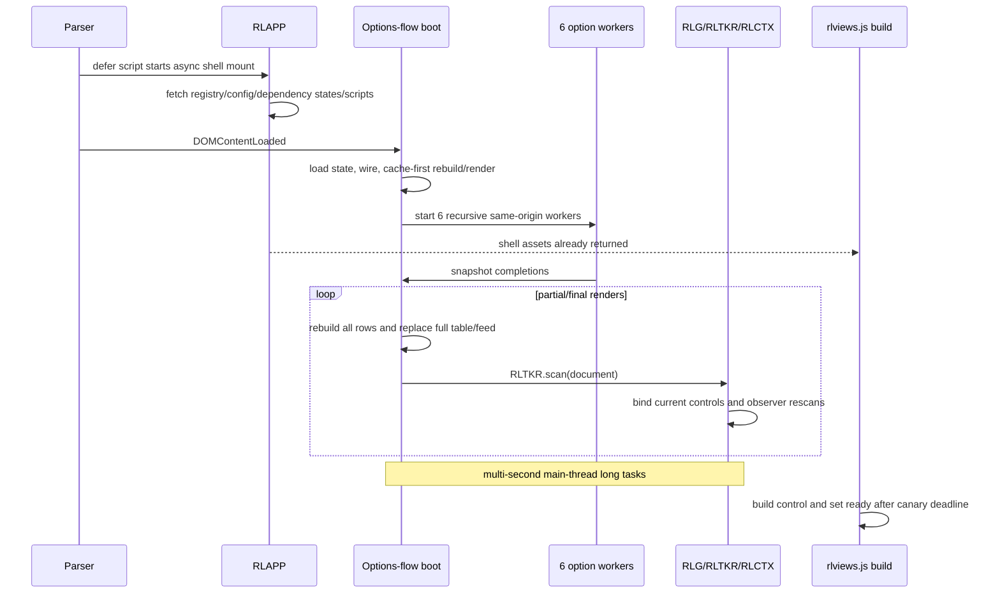
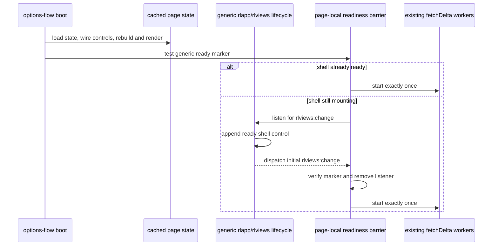

# Bug Fix Design: BUG-001 Options-Flow Shell Startup Starvation

Links: [bug.md](bug.md) | [spec.md](spec.md) | [scopes.md](scopes.md) | [report.md](report.md)

> **Design adoption:** `bubbles.design` adopts the measured RCA and the
> page-local startup-sequencing repair in this document. Planning and the
> persistent pre-fix adversarial RED remain required before implementation;
> this adoption does not authorize source or test changes by itself.

## Design Brief

### Current State

`rlapp.js::mountExperienceShell()` begins the generic asynchronous shell
lifecycle on `DOMContentLoaded`. It resolves the registry, shell config,
dependency states, `rlexperience.js`, and then `rlviews.js`. In
`rlviews.js::build()`, `buildControl()` writes
`#rlviews[data-rlexperience-shell="ready"]` before `apply(..., "boot")`
dispatches the initial `rlviews:change` event.

`options-flow-feed-lab.html::boot()` also runs on `DOMContentLoaded`. It paints
cached rows immediately with `rebuild(); render()`, then immediately starts
`fetchDelta()`. The delta path starts six recursive workers over twelve
same-origin option snapshots. Current snapshots lead to 12,055 rendered rows,
12,093 contextual ticker controls, and render/decorator long tasks that delay
the already-downloaded shell build until about 13.4 seconds. Holding only
hydration leaves the immediate cache-first paint intact and moves shell
readiness to about 147 ms.

### Target State

Keep state load, control wiring, cached `rebuild(); render()`, and the first
useful page paint in their current immediate position. Start the existing
heavy delta hydration exactly once, and only after the generic shell ready
marker exists. Use the existing initial `rlviews:change` event as the
notification path when the marker is not present yet.

### Patterns to Follow

- Consume `rlviews.js::buildControl()` as the readiness owner; do not create a
   second shell-ready state.
- Consume the existing `rlviews:change` lifecycle from the page; keep
   `rlapp.js`, `rlviews.js`, and `rlexperience.js` generic and byte-protected.
- Preserve the page's cache-first startup and existing `fetchDelta()` owner
   path, including its worker count, source order, rendering, and decorators.
- Follow the existing real-page Playwright style in
   `tests/tool-experience.spec.mjs` and the System Chrome/static-server contract.

### Patterns to Avoid

- Do not increase the 10,000 ms canary or add a sleep, polling deadline,
   route exclusion, or manual fetch control.
- Do not branch on `options-flow-feed-lab` in a shared module or add a new
   shared readiness API for one consumer.
- Do not suppress RLG, RLTKR, RLCTX, observers, rows, workers, or option
   snapshots to make the shell appear sooner.
- Do not change provider, source, storage, producer, option-universe, snapshot,
   fallback-order, parent Feature 012, Scope 04, or certification ownership.

### Resolved Decisions

- The controlling defect is the missing shell-ready dependency before heavy
   hydration, not shell network I/O or option-source failure.
- The repair owner is one production page:
   `options-flow-feed-lab.html` startup sequencing.
- The generic ready marker plus initial `rlviews:change` event is sufficient;
   shared production modules require no change.
- A page-local boolean guard and listener removal provide exactly-once start
   across both the already-ready and asynchronously-ready paths.
- The named persistent adversarial E2E must be created and observed RED against
   unchanged production before any implementation edit.

### Open Questions

None found - the current spec, measured diagnosis, and existing shell lifecycle
determine the smallest testable repair without a new architecture decision.

## Purpose and Scope

This design restores the Feature 012 shell startup contract on one page while
preserving the page's immediate cached view and every existing data/context
owner. It changes ordering only: mandatory shared-shell registration precedes
optional heavy delta hydration.

| Surface | Design treatment |
|---|---|
| `options-flow-feed-lab.html` | One page-local readiness barrier around the existing `fetchDelta()` start |
| `rlapp.js`, `rlviews.js`, `rlexperience.js` | Read-only lifecycle foundation; no page-specific branch or API change |
| RLG, RLTKR, RLCTX | Remain enabled and unchanged |
| Option source, snapshots, storage, producer, universe, workers | Remain unchanged |
| Feature 012 parent and Scope 04 artifacts | Remain unchanged |
| Tests | Planning must require a persistent adversarial RED before implementation |

## Root Cause Analysis

### Investigation Summary

The investigation traced the exact current route, shared bootstrap, provider
decorators, and canary rather than treating the 10-second timeout as a generic
performance failure.

| Evidence | Observation | Diagnostic consequence |
|---|---|---|
| Exact full command | 22 routes log shell success; only `options-flow-feed-lab` times out | Failure is route-specific and deterministic |
| Exact filtered command | The same all-23 canary fails alone on the same route | Not collateral load from later test cases |
| Scope 02 report | The same page previously logged success under the same canary | Regression crossed a later shared-provider change |
| Current source | Inline page boot calls cache-first render and immediately starts six recursive workers | Heavy work has no shell-readiness dependency |
| Current shared source | `rlapp.js` mounts shell asynchronously; `rlviews.js` sets ready only during its later build | Network completion alone does not expose the shell |
| Baseline browser trace | Shell resources respond around 140 ms, but shell ready is about 13,428 ms | Main-thread starvation, not slow shell I/O |
| Hydration-held trace | Holding only `data/options/*` leaves shell ready at about 147 ms | Option hydration controls the failure |
| Baseline DOM/long tasks | 12,055 rows, 12,093 context controls, long tasks up to 5,743 ms | Full renders and decoration monopolize the main thread |
| Decorator split | No explicit rescan: about 5,805 ms; no repeated decorators: about 1,769 ms | RLTKR/RLCTX decoration is the dominant multiplier, but raw render also contributes |

### Controlling Path



### Root Cause

The page has no dependency edge from mandatory shared-shell readiness to its
optional heavy delta-hydration phase. The asynchronous shell mount begins first,
but the page starts hydration before that mount settles. Current snapshots then
create enough synchronous DOM and contextual-decoration work to delay
`rlviews.js::build()` past the existing deadline.

Scope 03's contextual provider work is an amplifier, not an independent defect:
RLTKR now creates a separate RLCTX control for each ticker and both providers
retain required observers. Disabling that work would violate Feature 012. The
repair belongs at the options page's startup boundary.

### Impact Analysis

- **Affected component:** `options-flow-feed-lab.html` startup only.
- **Shared contract affected:** Scope 02 all-route shell readiness.
- **Shared provider interaction:** Scope 03 RLTKR/RLCTX decoration multiplies
  the cost of repeated full renders.
- **Unaffected routes:** 22 of 23 current registry routes pass.
- **Affected data:** None; no corruption or owner change observed.
- **User impact:** The mandatory shell can appear after approximately 13.4
  seconds on the affected page instead of promptly.
- **Workflow impact:** Scope 04 validation is blocked by a regression outside
  Scope 04's allowed paths.

## Architecture Overview

### Existing Generic Readiness Lifecycle

The design consumes this verified ordering from the current shared modules:

1. `rlapp.js::boot()` calls `mountExperienceShell()` without blocking the
   page's own cache-first boot.
2. `mountExperienceShell()` resolves registry, config, dependency states, and
   the generic shell scripts.
3. `rlviews.js::build()` calls `buildControl()`.
4. `buildControl()` appends `#rlviews` with
   `data-rlexperience-shell="ready"`.
5. `build()` then calls `apply(initialMode, "boot")`.
6. `apply()` dispatches `rlviews:change`. Later view selections dispatch the
   same event, so the page must remove its initial listener and retain a
   start-once guard.

No asynchronous callback can interleave between the page's marker check and
listener registration because that page code runs to completion on the browser
main thread. If the shell is already ready, the marker path starts hydration.
If it is not ready, the initial shared event supplies the notification.

### Target Startup Sequence



The immediate cached render remains ahead of the barrier. Only the current
`fetchDelta()` invocation moves behind it.

## Fix Design

### Solution Approach

Preserve the immediate cache-first path, but sequence only the heavy delta path
behind the existing generic shared-shell lifecycle:

1. `boot()` continues to load state, synchronize controls, wire handlers,
   rebuild cached state, and render once immediately.
2. A page-local hydration starter owns a boolean initialized to `false`.
3. Before calling the existing `fetchDelta()` chain, test the generic marker
   `#rlviews[data-rlexperience-shell="ready"]`.
4. If the marker exists, invoke the guarded starter immediately.
5. Otherwise register a window listener for `rlviews:change`. The handler
   rechecks the marker, removes itself when readiness is confirmed, and invokes
   the guarded starter.
6. The guarded starter sets its boolean before calling `fetchDelta()`. This
   prevents duplicate starts from the marker path, the initial event, later
   view changes, or a re-entrant callback.
7. Keep the existing promise continuation, worker count, universe, cache,
   same-origin snapshot path, fallback path, render output, and decorators
   unchanged.

The intended implementation shape is equivalent to this pseudocode:

```javascript
var deltaHydrationStarted = false;

function startDeltaHydrationOnce() {
  if (deltaHydrationStarted) return;
  deltaHydrationStarted = true;
  fetchDelta().then(function () { rebuild(); render(); });
}

function onShellReady() {
  if (!document.querySelector('#rlviews[data-rlexperience-shell="ready"]')) return;
  window.removeEventListener("rlviews:change", onShellReady);
  startDeltaHydrationOnce();
}

rebuild();
render();
if (document.querySelector('#rlviews[data-rlexperience-shell="ready"]')) {
  startDeltaHydrationOnce();
} else {
  window.addEventListener("rlviews:change", onShellReady);
}
```

This is a contract illustration, not a claim that production has been edited.

### Failure Semantics

- If generic shell readiness succeeds, hydration starts exactly once.
- If generic shell readiness never occurs, cached content remains painted and
  heavy hydration does not start. There is no timer fallback, larger deadline,
  or alternate manual gate that can violate the readiness dependency.
- Existing per-symbol `ensureChain` failure handling and `RLAPP.report` status
  behavior remain owned by the current delta path.
- An unexpected delta rejection does not trigger a second worker group; the
  start-at-most-once requirement takes precedence over implicit retry.

## Data Model and Storage

No data model, cache schema, persistence key, snapshot schema, or storage owner
changes. The page continues to read its current cache before network activity.

| Data surface | Owner after repair |
|---|---|
| Cached option chains | Existing page/RLDATA path, unchanged |
| Same-origin snapshots | `data/options/<ticker>.json`, unchanged |
| Snapshot producer | `scripts/fetch-options.mjs`, unchanged |
| Conditional provider fallback | Existing `ensureChain` path, unchanged |
| Page state and mode controls | Existing page storage/state path, unchanged |

## Contracts and Error Model

### Startup Contract

| Input / signal | Required interpretation |
|---|---|
| Immediate page boot | Load state, wire controls, and paint cached content now |
| `#rlviews[data-rlexperience-shell="ready"]` present | Generic shell is built; guarded hydration may start |
| Initial `rlviews:change` | Notification to recheck the ready marker, not permission to restart hydration |
| Later `rlviews:change` | No hydration effect after listener removal/start guard |
| No ready marker | No heavy hydration and no timing workaround |

### Network and API Contract

No endpoint, request, response, content type, source order, or provider contract
changes. The first delta request remains the existing
`data/options/<ticker>.json` request produced by `ensureChain`; only its start
time moves after shell readiness.

## UI and Accessibility

- Cached Simple/Power content remains available on first paint.
- The shared four-view control becomes available before the page begins the
  large delta render/decorator workload.
- Existing rows, ticker links, contextual controls, keyboard behavior, labels,
  view routing, and reduced-motion behavior remain unchanged.
- No loading button or user action is introduced; hydration remains automatic.

## Security, Privacy, and Compliance

No credential, authentication, authorization, payment, personal-data, or
provider-key surface changes. The regression observes native fetch ordering
without reading credentials or changing requests. Existing local provider and
same-origin snapshot boundaries remain intact.

## Configuration, Migration, and Rollout

- No configuration value, feature flag, dependency, migration, generated
  artifact, or release-train bundle changes.
- Delivery is one atomic page startup edit after the test-owned RED gate.
- The 10,000 ms shell contract remains unchanged.
- Parent Feature 012 and Scope 04 coordination bytes are protected throughout.

## Observability and Failure Handling

Production continues to use the existing shell marker/event and
`RLAPP.report("options:flow", ...)` lifecycle. No new timer, logging channel,
metric, storage record, or production instrumentation is introduced.

The persistent browser regression is the ordering observability surface. It
records whether the ready marker exists at the first native
`data/options/<ticker>.json` request and asserts that the request still occurs.

This is sequencing through the shared shell contract, not a page-specific
shell bypass: no tool ID enters shared code, no route is omitted, and the
unchanged all-23 canary remains the primary before/after reproduction.

## Testing and Validation Strategy

### Mandatory Pre-Implementation RED Gate

The persistent test does not exist at design-adoption time. `bubbles.test`
must create it and execute it against unchanged production before
`bubbles.implement` may edit `options-flow-feed-lab.html`. The required RED is
specific: the first native option delta request observes that the ready shell
is absent. The existing all-23 timeout is supporting reproduction evidence but
does not replace this scenario-specific persistent RED.

### Required Adversarial Regression

Extend the existing real-page Playwright suite with the persistent title:

`Regression: BUG-001 options flow shell is ready before heavy hydration begins`

The test must:

1. use `page.addInitScript` only to observe `fetch` calls; it must not intercept,
   fulfill, abort, or rewrite a request;
2. record whether the ready shell exists when the first
   `data/options/<ticker>.json` request starts;
3. load the real `options-flow-feed-lab.html` through the existing same-origin
   static server;
4. retain the current 10,000 ms shell assertion;
5. assert the first option delta request observed the shell as ready;
6. assert option hydration still starts and contextual ticker controls remain
   enabled;
7. contain no bailout return, optional assertion, skip, retry, timeout increase,
   service worker, `page.route`, or `context.route`.

Current production fails this discriminator because the first six option
requests begin while the shell is absent. A timeout-only or route-skip change
cannot make the ordering assertion pass.

### Scenario-to-Test Mapping

| Scenario | Required validation | Exact assertion |
|---|---|---|
| SCN-BUG001-001 | Named adversarial real-page E2E plus unchanged all-23 functional canary | First option delta request observes ready shell; hydration starts once; shell appears within existing 10 seconds |
| SCN-BUG001-002 | Named E2E plus changed-path ownership check and broad selftest | Native option requests still occur; RLTKR/RLCTX controls render; protected owner paths are unchanged |
| SCN-BUG001-003 | Existing ordinary/Center/mobile shell E2E and all-23 canary | All 23 route records exist, each has one ready shell/four panels, zero skips or page exceptions |

The plan owner must keep the persistent adversarial test, pre-fix RED ordering,
and Test Plan/DoD parity explicit. No test may claim implementation success
until the source repair exists and the same discriminator turns GREEN.

### Exact Before/After Reproduction

Run the same command before and after the repair:

```bash
node --test tests/tool-experience-shell.functional.mjs
```

Before: one failure, `options-flow-feed-lab` selector timeout. After: all three
tests pass, all 23 route records are present, and there are zero skips. The test
timeout remains 10 seconds.

### Change Boundary

Expected implementation/test files:

- `options-flow-feed-lab.html` - startup sequencing only;
- `tests/tool-experience.spec.mjs` - focused adversarial no-interception E2E;
- `tests/tool-experience-shell.functional.mjs` - only if needed to retain a
  machine-readable startup-order discriminator in the unchanged all-23 command.

Protected byte families:

- `rldata.js`;
- `rlapp.js`, `rlviews.js`, `rlexperience.js`, `rlg.js`, `rlticker.js`, and
  `rlcontext.js` unless `bubbles.design` proves the existing shared event is
  insufficient;
- `scripts/fetch-options.mjs` and `data/options/**`;
- Feature 012 parent scope/state/certification artifacts;
- Scope 04 files;
- framework-managed files.

## Alternatives and Tradeoffs

1. **Raise the canary timeout.** Rejected: measured shell readiness is 13.4
   seconds because of starvation; a larger timeout hides the contract failure.
2. **Exclude options-flow from the canary.** Rejected: registry completeness and
   one-shell ownership are mandatory.
3. **Disable RLTKR/RLCTX or their observers.** Rejected: Scope 03 requires
   contextual ticker controls; diagnostics used suppression only to attribute
   cost.
4. **Reduce worker count.** Rejected as the primary fix: it changes throughput
   but leaves the missing readiness dependency and can regress again with data
   size.
5. **Cap or paginate rows.** Rejected for this repair: it changes Power behavior
   and needs a separate product/design decision.
6. **Change option source order or snapshot size.** Rejected: provider and
   option-publication ownership are protected.
7. **Add a new shared readiness API.** Not selected because the existing ready
   marker plus initial `rlviews:change` event provide the required generic
   signal. A new API would add shared blast radius without changing the result.

### Single-Implementation Justification

This is a narrow bug fix in one production page consuming an existing generic
shell foundation. It adds no second provider, source, storage strategy, screen,
service, component variant, or shared contract. A capability foundation or new
readiness API would increase shared blast radius without removing real
complexity.

## Rollback

Restore the exact pre-fix startup lines in `options-flow-feed-lab.html` and
remove only the BUG-001 test additions. Do not clear local option cache, rewrite
snapshots, modify provider settings, or alter shared context modules. Re-run the
focused adversarial test and all-23 command to prove the rollback reproduces the
known failure rather than silently changing owner data.

## Complexity Tracking

None - simplest viable approach used. One page-local startup dependency and one
persistent adversarial E2E are sufficient. No new runtime module, store,
provider, source, worker, timeout, or shared API is required.

## Risks and Open Questions

| Risk | Design control |
|---|---|
| Initial shell event occurs before listener registration | Marker-first check starts immediately when readiness already exists |
| Later view changes restart workers | Listener removal plus boolean set before `fetchDelta()` |
| Shell never becomes ready | Cache-first content remains; hydration has no timeout/manual fallback |
| Ordering test passes without exercising hydration | Test must observe at least one native option request and the marker state at its first occurrence |
| Fix suppresses required context work | E2E asserts contextual controls after hydration; shared decorators are protected paths |
| Narrow repair expands into owner changes | Complete changed-path classification protects source, provider, storage, worker, parent, and Scope 04 surfaces |

Open questions: None found - the measured system behavior and current spec
fully determine this design. Exact post-fix timing remains an execution result,
not a design assumption.