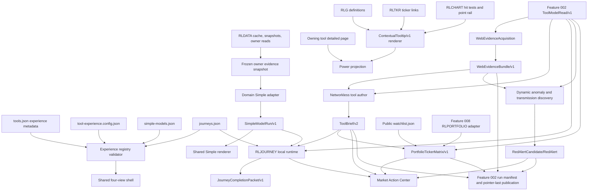

# Design: 012 Market Action Center and Guided Tools

## Design Brief

### Current State

Research Lab is a build-free static site with 23 entries in `tools.json`: 22
ordinary tools and the `market-brief` final aggregator. `rlviews.js` currently
provides only Simple/Power/Brief or Tool/Brief through a legacy-toggle facade;
`rlapp.js` owns shared status and Brief mounting; `rldata.js` owns provider,
cache, snapshot, and owner-read truth; and `rlbrief.js` already verifies a
Feature 002 pointer/manifest/hash graph before rendering published reads.

The existing tooltip stack is split across `rlg.js`, `rlticker.js`, and
`rlchart.js`. Those modules provide useful glossary, ticker-link, and canvas
hit-test primitives, but their current floating disclosures are pointer-first
and do not implement one keyboard/touch/current-interpretation contract. The
current `market-brief.html` is a monolithic page that renders one long cockpit
from `market-brief.payload.json`, while `scripts/brief-narrative-parallel.mjs`
still permits its two research author lanes to browse allowlisted web domains.

### Target State

Introduce a Research Lab-owned capability foundation that resolves every tool
through `ToolExperience/v1`. Ordinary tools expose exactly Simple, Power,
Brief, and Journey; `market-brief` specializes the same four-slot shell as
Market Action Center Brief, Portfolio, Red Alert, and Journey. Registry
metadata selects adapters and definitions; no runtime switch enumerates 23
tool IDs.

Simple becomes a strict, deterministic, parameterized model contract over a
frozen owner-evidence identity. Power keeps the owning page's deep analysis but
uses one shared `ContextualTooltip/v1` renderer. Brief extends Feature 002 with
bounded web acquisition before a networkless author. Journey uses one local,
non-sensitive definition/session/packet lifecycle. Market Action Center
composes public Brief, public/private-safe Portfolio projections, dynamically
qualified Red Alerts, and global Journeys without becoming a model, portfolio,
provider, or execution owner.

### Patterns To Follow

- `tools.json` for registry membership/order and existing `briefing` metadata.
- `rlvol.js` for a pure, deeply frozen, explicit-policy model whose controls
  recompute locally and whose decision identity is shared by Simple and Power.
- `rldata.js` for cache-first source ownership, provider isolation, source
  status, immutable owner reads, and same-origin daily snapshots.
- `rlbrief.js` and Feature 002's `design.md` for content-addressed objects,
  bounded parsers, pointer-last publication, safe text, safe links, and lazy
  evidence/history loading.
- `rlcompany.js`/`company-fundamentals-lab.html` for source-qualified partial,
  unavailable, disputed, clock-separated, and dependency-path states.
- `scripts/fetch-options.mjs` plus `data/options/<ticker>.json` for the single
  scheduled options publication owner.
- The UX-owned `FixedViewControl`, `EvidenceIdentityStrip`, parameter,
  tooltip, Journey, matrix, alert, focus, hash, and responsive contracts in
  `spec.md`.

### Patterns To Avoid

- The legacy `rlviews.js` `view` alias, auto-detected mode sets, page-local mode
  controls, or a central `switch (toolId)`.
- Inline behavioral fallbacks such as the representative Heatmap and Options
  fallback universes or `value || implicitDefault` for model parameters.
- Treating an existing compact Simple verdict as compliance with
  `SimpleModelContract/v1`.
- Creating another tooltip DOM engine in a page, `RLG`, `RLTKR`, or `RLCHART`.
- Giving an author web access, allowing web content to supply instructions, or
  treating search snippets as evidence.
- Reading or copying private portfolio values into public artifacts, URLs,
  queries, telemetry, or publisher inputs.
- Copying QF React/Rust/protobuf/auth/storage code into Research Lab or copying
  Research Lab DOM/storage/fetch code into QF.

### Resolved Decisions

- `market-brief.html` remains the canonical route and `market-brief` remains
  the registry ID; its visible title becomes Market Action Center.
- `tools.json` receives explicit `experience` metadata and safe adapter-module
  references. Detailed model and Journey definitions live in versioned
  registries referenced by that metadata.
- `rlapp.js` bootstraps one shared experience runtime from the existing
  declarative Brief mount, minimizing per-page edits.
- Simple and Journey use injected shared panels; Power exposes the owning
  page's existing detailed surface; Brief uses the Feature 002 publication
  graph. The shared shell is the only visible mode control.
- Feature 002's run manifest and current pointer remain the sole public atomic
  publication selector. Feature 012 adds objects to that generation rather
  than adding a competing current pointer.
- Journey sessions and private matrix overlays are local-only and are never
  members of the public publication generation.
- QF alignment is contract-semantic only in Phase A. A QF adapter requires a
  separately approved authenticated trust boundary and version negotiation.

### Open Questions

None blocking. BUG-004, Feature 002, and Feature 008 are unresolved delivery
dependencies with explicit refusal gates; they are not unresolved design
choices.

## Purpose And Scope

This design turns the analyst and UX contracts into a static, testable,
capability-first architecture. It covers:

- registry-driven four-view resolution for all current and later tools;
- a strict Simple model definition, run, adapter, sensitivity, calibration,
  and provenance boundary;
- one contextual disclosure model across glossary terms, tickers, DOM values,
  tables, and canvases;
- bounded online evidence acquisition and powerless authorship;
- local Journey definitions, sessions, steps, completion packets, mechanism
  adapters, and goal inventory;
- Market Action Center view composition, public ticker matrix, dynamic Red
  Alert qualification, and route compatibility;
- current provider, daily-bar, option, owner-read, and static publication
  ownership preservation;
- atomic publication, versioning, migration, failure, security, privacy,
  accessibility, performance, validation, and rollback.

It does not implement a broker, order, hedge, allocation, remote portfolio,
account, authentication system, database, application server, service worker,
or new package/runtime dependency.

## Architecture Overview



### Runtime Separation

| Runtime | Reads | Writes | Authority Boundary |
|---|---|---|---|
| Static browser shell | Registry/config, public current generation, local mode state | DOM and non-sensitive route mode | Cannot fetch provider data directly, author prose, or publish |
| Simple adapter | Frozen owner evidence, explicit parameters, explicit seed/policy | Immutable `SimpleModelRun/v1` in memory | Cannot fetch, persist private state, or alter owner evidence |
| Context renderer | Validated context object plus RLG/RLTKR/RLCHART projections | One shared disclosure DOM | Cannot infer missing interpretation or compute owner values |
| Scheduled evidence acquirer | Frozen read, validated query plan, exact allowlists | Run-staged `WebEvidenceBundle/v1` objects | Network only; no authorship or public pointer authority |
| Tool/final author | Frozen validated read and web bundle | Structured stdout only | No web, shell, repository, owner-model, key, or private-state authority |
| Feature 002 publisher | Complete validated generation inventory | Public objects, history, manifest, compatibility projection, pointer last | Cannot publish a partial run or local Journey/private matrix state |
| Journey runtime | Committed definitions, frozen public evidence refs, local-safe context | Versioned local sessions and safe exports | No remote sync, publication, portfolio mutation, or execution |
| Matrix private adapter | Opaque Feature 008 scope refs and local owner projections | In-memory private rows only | Cannot create or modify portfolio/ticker storage |
| Later QF adapter | Portable contract objects after explicit consent/version negotiation | QF-owned authenticated storage/compute | Not present or emulated in Phase A |

## Capability Foundation

### Foundation Contracts

| Contract | Responsibility | Consumers |
|---|---|---|
| `ToolExperience/v1` | Resolves one registry entry to one exact four-view set and its adapters/definitions | Registry validator, shell, release gate |
| `SimpleModelDefinition/v1` | Declares question, parameters, explicit defaults, inputs, scenarios, seed, sensitivity, calibration, budgets, and adapter | Simple controller and adapter |
| `NormalizedSimpleInput/v1` | Deep-frozen owner evidence plus validated parameters and explicit seed | Domain adapter compute |
| `SimpleModelRun/v1` | Baseline/current/scenario/sensitivity/calibration/provenance result with stable compute identity | Simple UI, Power link, Journey |
| `ContextualTooltip/v1` | One definition/current interpretation/basis/bounds/provenance/as-of/limitation model | DOM, table, chart, ticker renderers |
| `WebEvidenceQueryPlan/v1` | Bounded validated queries, allowlisted domains, purpose, and cutoff | Acquisition runner |
| `WebEvidenceBundle/v1` | Immutable sources, excerpts, hashes, claim map, origin groups, rejections, freshness, and policy | Tool author, Red Alert discovery, audit |
| `ToolBrief/v2` | Concise owner-grounded authored result referencing one read and one web bundle | Brief UI, Journey, matrix, final aggregator |
| `JourneyDefinition/v1` | Goal, mechanism, prerequisites, steps, branches, evidence, stale policy, completion, privacy, no execution | Goal chooser and session runtime |
| `JourneyStep/v1` | One evidence-completable unit with dependencies, input schema, branch rules, and completion predicate | Mechanism adapters |
| `JourneySession/v1` | Local progress/context/evidence/audit state bound to one definition and cutoff | Resume/backtrack/packet builder |
| `JourneyCompletionPacket/v1` | Typed complete/partial/refused research result with provenance, calibration, conflicts, unresolved items, trace, and signoff | Review/export and later portable adapter |
| `RedAlertCandidate/v1` | Dynamic discovered threat hypothesis and evidence/score work state | Qualification pipeline |
| `RedAlert/v1` | Qualified, falsifiable, cited, market-confirmed non-executing alert | Red Alert view and Journeys |
| `PortfolioTickerMatrix/v1` | Scope-labeled per-ticker owner/read/brief/applicability projection | Portfolio view and stress Journey |
| `MarketActionCenterProjection/v1` | One public generation's Brief, public matrix, alerts, and view truth | `market-brief.html` |

### Extension Points

1. **Experience adapter module:** registers named Simple and Power adapters by
   adapter ID. Module paths are safe registry values, not inferred from tool ID.
2. **Simple adapter:** normalizes a frozen evidence snapshot, computes an owner
   model, and projects sensitivity without source access.
3. **Context provider:** supplies definition and current interpretation for a
   DOM item, ticker, table datum, or canvas point.
4. **Search adapter:** receives a validated public query plan and returns
   untrusted URL candidates under the acquisition process boundary.
5. **Source verifier:** fetches allowlisted candidates under robots, byte,
   timeout, redirect, media, and content-safety policy.
6. **Journey mechanism adapter:** implements wizard, checklist, decision-tree,
   or scenario-lab transitions against the common step/session contracts.
7. **Portfolio scope provider:** public watchlist, Feature 008 local workspace,
   or a separately approved QF provider; the foundation owns privacy labels.
8. **Publication projector:** adds validated Feature 012 public objects to one
   Feature 002 run generation.

### Foundation-Owned Behavior

1. Every registry entry resolves exactly once and has exactly four top-level
   views. Unknown or missing experience metadata fails release validation.
2. Only `market-brief` may use the Market Action Center specialization.
3. Model parameters, initial/default values, ranges/options, seeds, and budgets
   are required registry/config data. Code contains no behavioral fallback.
4. Parameter changes compute only over frozen inputs and never initiate fetch,
   author, publication, private-storage, or portfolio operations.
5. Owner values and authored claims retain exact source, cutoff, provenance,
   calibration, uncertainty, and unavailable states across every view.
6. A shared renderer owns all contextual disclosures. Existing glossary,
   ticker, and canvas modules provide inputs/adapters, not competing popovers.
7. Search acquisition completes and freezes before authorship. The author has
   data-in/JSON-out authority only.
8. Journey step completion requires declared evidence; a click or route visit
   cannot satisfy it. Backtracking invalidates only transitive dependents.
9. Public watchlist, private workspace, and actual holding semantics remain
   distinct. Feature 012 owns no portfolio membership.
10. Red Alert has no topic seed list and no minimum visible count. Empty is a
    valid qualified result.
11. No view, packet, alert, review, or signoff can execute, size, submit, or
    mutate a trade or portfolio.
12. No public pointer advances until every declared Feature 012 public object
    and every Feature 002 object in the generation validates by bytes and refs.

## ToolExperience/v1 Registry Contract

### `tools.json` Additive Metadata

Every entry retains its existing fields and `briefing` block and adds this
closed object:

```json
{
  "experience": {
    "contractVersion": "tool-experience/v1",
    "kind": "ordinary",
    "viewSetId": "ordinary-four-view/v1",
    "viewIds": ["simple", "power", "brief", "journey"],
    "simpleModelDefinitionId": "simple-model/market-heatmap/v1",
    "simpleAdapterId": "simple-adapter/market-breadth/v1",
    "simpleAdapterModule": "rlexperience-adapters/market-structure.js",
    "powerAdapterId": "power-adapter/existing-owner-page/v1",
    "briefPolicyId": "web-evidence-policy/live-market/v1",
    "journeyDefinitionIds": [
      "journey/market-heatmap/breadth/v1",
      "journey/market-heatmap/outlier/v1"
    ],
    "contextPolicyId": "contextual-tooltip/v1",
    "matrixDomains": ["technical", "macro-rotation"],
    "publicAliases": []
  }
}
```

`market-brief` uses the same keys with these exact differences:

```json
{
  "contractVersion": "tool-experience/v1",
  "kind": "market-action-center",
  "viewSetId": "market-action-center-four-view/v1",
  "viewIds": ["brief", "portfolio", "red-alert", "journey"],
  "simpleModelDefinitionId": null,
  "simpleAdapterId": "simple-adapter/market-action-triage/v1",
  "simpleAdapterModule": "rlexperience-adapters/market-action.js",
  "powerAdapterId": "power-adapter/in-view-evidence-disclosures/v1",
  "briefPolicyId": "web-evidence-policy/final-aggregator/v1",
  "journeyDefinitionIds": [
    "journey/market-action/prepare-session/v1",
    "journey/market-action/triage/v1",
    "journey/market-action/latent-risk/v1",
    "journey/market-action/portfolio-stress/v1"
  ],
  "contextPolicyId": "contextual-tooltip/v1",
  "matrixDomains": [],
  "publicAliases": ["Actionable Market Brief", "Market Brief"]
}
```

The `viewIds` arrays are exact ordered enums, not arbitrary labels. An ordinary
entry with any other order/value, or a non-`market-brief` entry with the
specialization, fails `E012-VIEWSET`.

### Global Experience Configuration

`tool-experience.config.json` is required and exact. It contains:

- `contractVersion: "tool-experience-config/v1"`;
- the two exact view-set definitions and labels;
- hash, history, focus, local-mode-key, and invalid-target policies;
- `simpleModelRegistryPath: "simple-models.json"`;
- `journeyRegistryPath: "journeys.json"`;
- context policy and renderer budgets;
- local Journey storage namespace, byte, session-count, and expiry budgets;
- Red Alert scoring policy and public matrix domain map;
- dependency gate IDs and accepted terminal-certification predicates;
- every performance and artifact budget in this design.

Missing config or an unknown field/version disables the shared experience with
an explicit registry/config error; it does not fall back to legacy modes.

## Shared Four-View Shell

### Resolution And Bootstrap

`rlapp.js` uses the existing unique `[data-rlbrief-mount][data-tool-id]` anchor
to identify a registered page, loads `tools.json` and
`tool-experience.config.json`, validates `ToolExperience/v1`, then loads
`rlexperience.js` and the allowlisted adapter module. `rlexperience.js` injects
shared Simple and Journey hosts beside the existing Brief mount and asks
`rlviews.js` to render the registry-resolved view set.

No HTML page contains a mode list. No shared module contains a page-ID switch.
Adapter module paths must match `^rlexperience-adapters/[a-z0-9-]+\.js$`, be
same-origin, appear in the committed module allowlist, and register exactly the
adapter IDs declared by that entry.

### Power Preservation

Power is the owning page's detailed surface. During migration, the shell may
drive an existing hidden legacy Power control, but the bridge is compatibility
only:

- the old control is absent from layout, accessibility tree, and tab order;
- only the shared shell updates hash/history/focus;
- the bridge cannot fetch or recompute on a view-only transition;
- each adapter declares `powerReady` and an exact unavailable reason;
- the bridge is removed after the owning page exposes a direct Power
  projection hook.

### Hash, History, Focus, And Local State

- Ordinary public hashes are `#simple`, `#power`, `#brief`, `#journey`, or
  `#<mode>/<stable-public-target-id>`.
- Market Action Center hashes are `#brief`, `#portfolio`, `#red-alert`, and
  `#journey` with the same public-target suffix rule.
- A valid explicit hash wins. With no hash, a valid locally stored route mode
  wins. Otherwise the explicit registry default is Simple for ordinary tools
  and Brief for Market Action Center.
- User mode changes push one history entry. Boot normalization and invalid
  target cleanup replace the current entry. Back/Forward never fetches.
- Arrow Left/Right wraps; Home/End choose endpoints; Enter/Space selects;
  the selected tab alone has `tabindex=0`.
- Public nested targets may receive focus after render. Private ticker IDs,
  portfolio refs, Journey answers/session IDs, costs, quantities, assumptions,
  and P&L never enter URL/history/title/referrer state.
- Mode persistence stores only `{contractVersion, toolId, mode, savedAt}` under
  the explicit configured namespace. Unsupported/invalid records are ignored
  with a visible recovery state, not coerced.

## SimpleModelContract/v1

### Definition Schema

`simple-models.json` contains one `SimpleModelDefinition/v1` for each ordinary
tool and the Market Action Center action-triage model used inside Brief. Each
definition has exactly:

```text
SimpleModelDefinition/v1 {
  contractVersion, definitionId, toolId, modelId, modelVersion,
  researchQuestion, resultSchemaId, adapterId, adapterModule,
  inputRequirements[], parameterDefinitions[], scenarioDefinitions[],
  seedPolicy, sensitivityPolicy, calibrationPolicy, provenancePolicy,
  performancePolicy, limitations[], deepLinkTargets,
  definitionFingerprint
}
```

Each `parameterDefinitions[]` entry has:

```text
ParameterDefinition/v1 {
  parameterId,
  label,
  kind: number | integer | enum | boolean | seed,
  unit,
  domain: { min, max, step } | { options: [{ value, label }] },
  defaultValue,
  defaultSource: registry | tool-config | evidence-derived,
  interpretation,
  affectsOutputPaths[],
  disabledWhen[],
  identityBearing: true
}
```

`defaultValue` is mandatory, including `null` when evidence-derived. A null
evidence-derived default makes the control unavailable until the named evidence
exists. Code cannot substitute a value. Numeric domains require finite
`min <= default <= max`, a positive step, and unit. Enum defaults must equal one
declared option. Every enabled parameter must name at least one output path.

`seedPolicy` is exact:

```text
{
  required: boolean,
  defaultSeed: integer | null,
  defaultSource: registry | tool-config | null,
  randomnessClass: none | seeded-path | seeded-resampling,
  commonRandomNumbersForSensitivity: boolean
}
```

Deterministic models require `required=false`, `defaultSeed=null`, and
`randomnessClass=none`. Stochastic models require an integer seed from registry
or tool config; no ambient random seed or `Date.now()` participates in compute.

### Adapter Interface

Every domain adapter registers this interface under its exact adapter ID:

```text
SimpleModelAdapter/v1 {
  adapterId,
  supportedDefinitionIds,
  validateDefinition(definition) -> Result<ValidatedDefinition>,
  captureEvidence(ownerContext) -> Result<FrozenEvidenceSnapshot>,
  normalizeInputs(definition, evidence, parameterValues, seed)
    -> Result<NormalizedSimpleInput/v1>,
  compute(normalizedInput) -> Result<SimpleModelOutput/v1>,
  compareSensitivity(baselineInput, currentInput, sharedRandomness)
    -> Result<SimpleSensitivity/v1>,
  projectOwnerEvidence(output) -> Result<OwnerEvidenceProjection/v1>
}
```

`captureEvidence` may read already loaded owner state, `RLDATA`, or a validated
same-origin publication. It cannot call `fetch`, `providerFetch`, storage
mutation, an LLM, or another adapter. Boot hydration is owned by the source/tool
before the evidence snapshot freezes.

`normalizeInputs` deep-clones and deep-freezes exact values, rejects unknown or
out-of-domain parameters, records every provenance class, and produces:

```text
NormalizedSimpleInput/v1 {
  contractVersion, toolId, definitionId, modelId, modelVersion,
  evidenceIdentity, evidenceCutoff, evidenceRefs[],
  parameters: [{parameterId, value, unit, sourceClass}],
  seed, scenarios[], policyFingerprints[], limitations[], inputFingerprint
}
```

### Run And Compute Identity

`computeIdentity` is SHA-256 over canonical JSON containing contract/model
versions, evidence semantic fingerprints and cutoff, ordered parameter values,
seed, scenario definitions, and policy fingerprints. It excludes render time,
DOM state, local save time, and view mode. Identical complete inputs produce
identical identity and semantic output bytes in browser and Node.

`SimpleModelRun/v1` contains:

```text
{
  contractVersion, computeIdentity, toolId, definitionId,
  modelId, modelVersion, state,
  researchQuestion,
  baseline: SimpleModelOutput/v1,
  current: SimpleModelOutput/v1,
  changedParameters[],
  scenarios: ScenarioResult/v1[],
  sensitivity: SimpleSensitivity/v1,
  calibration: ModelCalibration/v1,
  provenance: ModelProvenance/v1,
  uncertainty: UncertaintyEnvelope/v1,
  assumptions[], limitations[], invalidationConditions[],
  evidenceRefs[], evidenceCutoff, computedAt,
  deepLinks
}
```

Allowed states are `ready`, `partial`, `stale`, `unavailable`, `disputed`, and
`rejected`. `computedAt` is occurrence metadata and cannot alter the semantic
identity. Observed facts, user assumptions, model estimates, simulations, LLM
interpretation, and unavailable values are separate provenance classes.

### Baseline, Recompute, And Sensitivity

1. Opening Simple validates the explicit definition, freezes owner evidence,
   validates explicit defaults, computes the baseline once, and copies the same
   validated values into the initial current input.
2. A parameter change creates a new normalized input against the same frozen
   evidence. No source acquisition or author call occurs.
3. The baseline remains immutable until `Reset baseline` explicitly creates a
   new baseline from the current validated parameter set.
4. Stochastic sensitivity uses common random numbers: baseline and changed
   runs share the same seed/path stream. A seed change is a different path run
   and appears outside parameter sensitivity.
5. Sensitivity records changed parameter, old/new values, absolute/relative
   delta, supported direction, magnitude, nonlinear/unstable region, and result
   paths. A changed enabled parameter with no output change fails
   `E012-SIMPLE-NO-EFFECT` unless the output explicitly proves a flat modeled
   region.
6. Missing/non-finite/stale-disallowed evidence yields partial/unavailable and
   cannot become zero, neutral, average, or an unlabeled prior result.

### Simple Versus Power

Simple answers the registry question through a model/scenario/sensitivity
interaction. Power investigates source rows, diagnostics, conflicts, charts,
tables, and formulas. Sharing evidence facts is required; sharing the same
presentation question is not. Release validation rejects a Simple adapter when
its output is only a subset of Power fields, when all controls are decorative,
or when removing hidden Power panels would produce the same DOM/result.

## Concrete Implementations

The adapter modules register functions by adapter ID. They do not branch on
tool ID; `tools.json` resolves the exact definition and adapter.

| Registry ID | Simple Adapter / Module | Owner Logic And Distinct Simple Question | Journey Goals / Mechanism |
|---|---|---|---|
| `market-brief` | `market-action-triage/v1` / `market-action.js` | Recompute bounded action/no-action triage by window, horizon, evidence threshold, catalyst horizon, and risk posture inside Brief; no top-level Simple | Prepare next session / wizard; triage actions / decision tree; investigate latent risk / checklist+tree; stress portfolio / scenario lab |
| `market-heatmap-lab` | `market-breadth/v1` / `market-structure.js` | Wrap owning breadth/treemap inputs to test broad versus narrow leadership under window, grouping, size, breadth threshold, and outlier sigma | Decide broad/narrow / checklist; investigate sector outlier / decision tree |
| `options-flow-feed-lab` | `options-anomaly/v1` / `options.js` | Recompute EOD unusualness under expiry, vol/OI, premium, IV, and call/put aggregation without trade-side inference | Triage unusual contracts / wizard; catalyst versus noise / decision tree |
| `intraday-tape-lab` | `session-auction/v1` / `market-structure.js` | Recompute session type/support-resistance under opening range, VWAP band, profile, control, and gamma context | Classify session / wizard; define level trigger/invalidation / scenario lab |
| `swing-structure-lab` | `swing-transition/v1` / `market-structure.js` | Simulate trend/reversal state under MA horizons, breakout tolerance, volume/OBV confirmation, pattern threshold, and regime window | Trend versus range/reversal / decision tree; test support thesis / scenario lab |
| `options-structure-lab` | `options-surface/v1` / `options.js` | Recompute walls/flip/expected move/skew under expiry, spot shock, IV shock, sign convention, OI weighting, rate, and time | Map support/resistance / wizard; stress walls/flip / scenario lab |
| `gamma-trading-lab` | `dealer-gamma-playbook/v1` / `options.js` | Recompute pin/trend/overextension playbooks under spot path, time, sign, OVI threshold, aggressiveness, and horizon | Gamma-flip setup / decision tree; OPEX plan / checklist |
| `sector-research-lab` | `sector-rotation-transition/v1` / `macro-rotation.js` | Recompute into/out candidates under lookbacks, acceleration, breadth, risk, benchmark, and ETF-fit weights | Identify sector transition / decision tree; select ETF vehicle / wizard |
| `global-rotation-lab` | `country-rotation/v1` / `macro-rotation.js` | Recompute country queue under horizon weights, FX, local-close freshness, volatility, and diversification | Compare countries / wizard; test FX/risk penalty / scenario lab |
| `real-assets-lab` | `real-asset-driver/v1` / `macro-rotation.js` | Recompute the selected asset-specific driver model under USD, rates, risk, volatility, drawdown, and breadth | Build driver thesis / wizard; stress reversals / scenario lab |
| `bond-regime-lab` | `fixed-income-sleeve/v1` / `macro-rotation.js` | Recompute sleeve outcomes under horizon, rate/spread shock, carry, convexity, inflation/real-yield, and confirmation | Classify regime / checklist; compare sleeves / scenario lab |
| `ai-capex-strategy-lab` | `ai-capex-portfolio/v1` / `fundamental-models.js` | Recompute beneficiary/portfolio distributions under horizon, theme weights, crowding, dampers, correlation, and objective | Identify beneficiaries / wizard; build/stress barbell / scenario lab |
| `msft-july-print-model` | `msft-margin-eps/v1` / `fundamental-models.js` | Recompute margin/EPS/valuation bridge under depreciation, mix, FX, memory, capex phase, anchor, and multiple | Build earnings tree / wizard; identify valuation driver / scenario lab |
| `company-fundamentals-lab` | `company-scenario-bridge/v1` / `fundamental-models.js` | Recompute a bounded source-qualified company scenario while preserving evidence gaps and accepted-state lineage | Audit evidence sufficiency / checklist; revise linked scenario / wizard |
| `etf-momentum-lab` | `etf-ranking/v1` / `macro-rotation.js` | Recompute ranking/basket under horizon, momentum blend, risk penalty, benchmark, weighting, and constraints | Select ETF for objective / wizard; test ranking robustness / scenario lab |
| `strategy-self-improvement-lab` | `strategy-evolution/v1` / `strategy-research.js` | Reuse seeded path/walk-forward logic with explicit goal, one-variable search, budget, overfit penalty, seed, and acceptance | Improve one variable / wizard; explain OOS failure / checklist |
| `strategy-validation-lab` | `walk-forward-validation/v1` / `strategy-research.js` | Recompute OOS/deflated evidence under rule, universe, folds, embargo, costs, trials, and robustness | Decide whether edge survives / decision tree; compare variants / scenario lab |
| `smart-money-flow-lab` | `disclosure-decay/v1` / `strategy-research.js` | Recompute surviving conviction under source mix, lag half-life, cluster, consensus, and decay | Evaluate cluster / wizard; compare lag classes / scenario lab |
| `waterfront-polo-lab` | `location-suitability/v1` / `property-research.js` | Recompute market suitability under budget, property, water, travel, insurance/flood, and club verification | Shortlist markets / wizard; verify finalist / checklist |
| `volatility-sizing-lab` | `conditional-volatility/v1` / `market-structure.js` | Wrap `RLVOL` to recompute forecast/regime/throttle under estimator, window, target, cap/floor, notional, and horizon | Explain throttle / wizard; investigate estimator conflict / decision tree |
| `palm-springs-rental-market-lab` | `str-scenario/palm-springs/v1` / `property-research.js` | Reuse the owning rental engine for cash-flow sensitivity under segment, ADR, occupancy, financing, costs, insurance/regulation, and horizon | Evaluate acquisition / wizard; stress luxury/regulation / scenario lab |
| `ocean-shores-rental-market-lab` | `str-scenario/ocean-shores/v1` / `property-research.js` | Reuse the owning rental engine for seasonal cash-flow sensitivity under segment, ADR, occupancy, financing, costs, storm/insurance, regulation, and horizon | Evaluate large-luxury / wizard; stress season/weather / scenario lab |
| `technical-analysis-decision-lab` | `technical-five-gate/v1` / `market-structure.js` | Recompute setup state/expectancy under timeframe, data tier, five gate thresholds, entry/stop/cost, and family requirements; until the owner model exists, return explicit unavailable rather than use the current foundation receipt as a signal | Qualify/refuse setup / wizard; investigate family conflict / decision tree |

Adapters may extract pure owner functions into an owner/shared module, but must
prove pre/post semantic parity and may not copy a formula into an experience
module. If no pure owner path exists, the adapter remains unavailable and the
release gate remains closed for that tool.

### Variation Axes

| Axis | Variants | Foundation-Owned Policy |
|---|---|---|
| Evidence profile | live market, same-origin options, static publication, local seeded model, off-theme domain | Truth/provenance states and no fabricated substitution |
| Model execution | deterministic formula, seeded path, seeded resampling, scenario bridge | Explicit parameters/seed, canonical identity, repeatability |
| UI projection | shared Simple, owning Power, published Brief, shared Journey | Exact four-view shell and one evidence identity |
| Journey mechanism | wizard, checklist, decision tree, scenario lab, declared composition | Step/evidence/backtrack/packet lifecycle |
| Portfolio scope | public watchlist, private local workspace, later authenticated QF | Scope label, storage ownership, privacy barrier |
| Publication | static committed object, local-only session/packet | Public pointer membership and no private publication |
| Source path | RLDATA cache/snapshot/provider, Feature 002 object graph, options snapshot owner | Existing ordered source owner; no adapter-local transport |

## ContextualTooltip/v1

### Contract

Every analytical trigger resolves this exact deep-frozen object:

```text
ContextualTooltip/v1 {
  contractVersion,
  contextId,
  triggerKind: term | section | kpi | badge | chart | axis | legend |
               chart-point | table-header | table-value | ticker | conclusion,
  label,
  definition,
  displayed: { valueText, numericValue, unit, truthState },
  interpretation: {
    text,
    direction: higher-supports | lower-supports | bidirectional |
               threshold-dependent | not-directional,
    comparisonBasis,
    window,
    thresholdsOrBounds[]
  },
  provenance: {
    ownerId, modelId, evidenceIdentity, sourceRefs[],
    observedAsOf, retrievedOrPublishedAt, freshness, dataTier
  },
  uncertainty: { state, rangeOrBand, reason },
  limitation,
  triggerCondition,
  invalidationCondition,
  links: { owner, citation, sameDataTable, ticker },
  accessibility: { conciseLabel, longDescriptionId },
  contextFingerprint
}
```

`numericValue` is null when unavailable. `valueText`, truth state, definition,
interpretation text, basis, provenance owner/as-of/freshness, uncertainty, and
limitation are mandatory. Direction is `not-directional` unless the owning
model explicitly declares another value. Thresholds/bounds are explicit model
data; the renderer does not infer bullish/bearish meaning from sign or color.

### Shared Renderer

`rlcontext.js` is the sole floating/pinned disclosure renderer. It owns one
`#rlcontext-disclosure` element, viewport placement, pinned state, Escape/outside
dismissal, focus return, mobile bottom-sheet mode, live-region discipline, and
safe text/link construction.

- `rlg.js` remains the glossary/alias resolver and supplies definitions. Its
  private tooltip DOM is removed after parity; it delegates contexts to
  `RLCTX`.
- `rlticker.js` remains ticker normalization, company/kind lookup, and Yahoo
  link ownership. `RLTKR.tag` composes a ticker `ContextualTooltip/v1`; touch
  follows the link while an adjacent context control opens the disclosure.
- `rlchart.js` remains geometry/hit-test helper ownership. Its additive
  structured attach form is:

```text
RLCHART.attach(canvas, {
  hitTest(mx, my) -> pointId | null,
  orderedPointIds,
  contextFor(pointId) -> ContextualTooltip/v1,
  tableTargetFor(pointId) -> elementId,
  seriesOrder
})
```

The current function-style `attach(canvas, hitFn)` remains a compatibility
overload during migration, but it cannot satisfy Feature 012 completion. The
structured form adds `tabindex=0`, point-rail Arrow navigation, identical
pointer/touch/keyboard content, `aria-activedescendant`, and same-data-table
focus. Canvas failure promotes the table/text projection; it never removes the
conclusion.

No page may create `rlgtip`, `rltkrtip`, `rlcharttip`, or another tooltip
container after cutover. A source scan and DOM canary enforce one engine.

## Feature 002 Extension: Web Evidence Before Powerless Authorship

### Boundary

Feature 012 does not replace ToolModelRead, Feature 002 history, or the atomic
publisher. It adds a stage between frozen owner reads and authorship:

```text
ToolModelRead/v1
  -> WebEvidenceQueryPlan/v1
  -> bounded SearchCandidate/v1 acquisition
  -> deterministic source verification and claim extraction
  -> frozen WebEvidenceBundle/v1
  -> networkless ToolAuthorRequest/v2
  -> ToolBrief/v2
  -> existing all-source/final/publication barriers
```

The current `brief-narrative-parallel.mjs` web-enabled core/signals lanes are
not reused as authors. During migration they become evidence-acquisition
workers or are replaced by `scripts/web-evidence-acquire.mjs`. The authored
lane always runs with web and shell denied.

### Query Plan

`WebEvidenceQueryPlan/v1` contains bundle/tool/run/cutoff identities, search
policy ID, ordered query records, and a plan fingerprint. Every query record
contains `queryId`, `templateId`, rendered public terms, purpose, allowed host
IDs, required source classes, freshness window, and maximum results.

Queries are rendered from registry templates plus public owner-read facts. The
renderer rejects private values, control instructions, URLs, credentials,
shell syntax, unbounded wildcards, more than 240 UTF-8 characters, and any host
not named by the policy. A model may propose candidates only inside the
validated plan; it cannot add queries or domains.

### Acquisition Policies And Budgets

All values below live in `market-brief.config.json` policy objects and are
fingerprinted into the run. Code has no fallback values.

| Policy | Tool Brief | Red Alert Discovery |
|---|---:|---:|
| Maximum queries | 4 | 8 |
| Maximum candidate URLs | 24 | 48 |
| Maximum retained source origins | 10 | 16 |
| Maximum retained excerpts | 24 | 48 |
| Maximum excerpt UTF-8 bytes | 1,200 | 1,200 |
| Maximum response bytes per URL | 1 MiB | 1 MiB |
| Maximum bundle bytes | 256 KiB | 512 KiB |
| Per-request timeout | 10 seconds | 10 seconds |
| Total acquisition ceiling | 60 seconds | 90 seconds |
| Maximum concurrent fetches | 4 | 4 |
| Redirects | none | none |
| Schemes | HTTPS only | HTTPS only |

The acquisition user agent is the explicit configured
`ResearchLabEvidenceBot/1.0`. Before a content request, the verifier obtains and
parses the same origin's `robots.txt` within the same timeout/byte policy. A
missing, failed, ambiguous, or disallowing robots result rejects that URL; it
does not authorize a fetch. Robots results are cached only inside the run.

Host policies are per tool and contain exact HTTPS host, port 443, path-prefix,
media-type, source class, and freshness rules. Environment variables cannot add
hosts or relax budgets.

### WebEvidenceBundle/v1

```text
WebEvidenceBundle/v1 {
  contractVersion, bundleId, toolId, runId, cutoffAt,
  queryPlanRef, policyId, acquisitionStartedAt, frozenAt,
  sources: [{
    sourceId, canonicalUrl, title, publisher, publishedAt, fetchedAt,
    sourceClass, mediaType, contentSha256, robotsPolicyRef,
    independentOriginGroup, canonicalOriginRef, freshnessState,
    excerpts: [{excerptId, text, byteLength, contentOffsetRef}]
  }],
  claims: [{
    claimId, materiality, normalizedClaim, sourceExcerptRefs[],
    independentOriginGroups[], ownerEvidenceRefs[],
    corroborationState, conflictState, freshnessState
  }],
  rejected: [{candidateId, reasonCode, safeHost}],
  coverage, byteInventory, bundleFingerprint
}
```

Exact page bytes are hashed and discarded after bounded text extraction unless
an existing approved source-use policy explicitly permits a normalized object.
The bundle stores safe plain-text excerpts and hashes, never scripts, styles,
forms, embedded objects, cookies, auth headers, or raw HTML.

### Independent Corroboration And Claim Mapping

- Every material claim requires at least two current independent origin groups.
- A wire story, syndication copy, reprint, aggregation page, quoted article, or
  pages whose text/source hashes identify one upstream report count as one
  origin.
- A primary source and an independent analysis may count as two only when the
  analysis contributes independently sourced evidence rather than repeating
  the primary statement.
- Market-state claims additionally require one compatible current owner-read
  evidence reference.
- Source conflict that changes direction, severity, likelihood, trigger, or
  invalidation rejects the material claim; it is not averaged.
- Search snippets, page titles, social posts without an approved source policy,
  and author-generated citations never count as evidence.

ToolBrief validation maps every material authored sentence to one or more
`claimId` values. Unmapped material text, a claim below two independent origins,
or a citation not present in the frozen bundle rejects the draft.

### Prompt-Injection And Content Safety

All remote content is hostile data. Acquisition:

1. rejects executable media, forms, scripts, data URLs, credentialed URLs,
   non-HTTPS, redirects, encoded traversal, and IP-literal hosts;
2. strips markup before instruction detection;
3. rejects excerpts containing tool-control, role-change, secret-request,
   file/shell, prompt-override, or output-schema override instructions;
4. wraps accepted excerpts in a typed data array, never in the author
   instruction channel;
5. gives authors only claim IDs, plain excerpts, source metadata, and owner
   facts; and
6. validates author output independently, with safe text rendering and
   separately constructed links.

Rejected content is not echoed into prompts, logs, artifacts, or DOM. Safe
diagnostics record candidate ID, host, and closed reason only.

### ToolAuthorRequest/v2 And ToolBrief/v2

The request contains exact read and bundle refs/hashes plus bounded display
summaries. The process has no web URL allowlist, shell, repository write,
provider key, owner model, localStorage, or private matrix/Journey input.

`ToolBrief/v2` retains Feature 002 identity/outcome/authorship fields and adds:

- `webEvidenceBundleRef`;
- `claimMappings[]` from authored content IDs to bundle claim IDs;
- exact `actionOrCatalyst` with horizon, trigger, invalidation, owner ref, and
  cited claims;
- `qualityOrCalibration` and provenance labels;
- `noActionReason` or `unavailableReason` when applicable; and
- closed-detail projections for methodology, evidence, history, and conflicts.

Feature 002 certification remains a hard integration gate. Before it passes,
ordinary Brief renders the exact dependency-pending state and cannot invoke
this author path.

## Journey Capability

### JourneyDefinition/v1

```text
JourneyDefinition/v1 {
  contractVersion, definitionId, definitionVersion, toolId,
  goalId, title, outcomeDescription,
  mechanism: wizard | checklist | decision-tree | scenario-lab | composition,
  prerequisiteRules[], contextSchema, stepIds[],
  evidencePolicy, backtrackPolicy, staleEvidencePolicy,
  completionPolicy, packetPolicy,
  privacyClass: public-safe | local-nonsensitive | local-private-ref,
  noExecution: true,
  accessibility, limitations[], definitionFingerprint
}
```

Every `journeyDefinitionIds` reference in `tools.json` resolves to exactly one
definition in `journeys.json`. Every ordinary tool resolves at least two goals;
Market Action Center resolves the four global goals. Duplicate goal IDs, an
unknown mechanism, `noExecution != true`, or an unresolved step fails the
registry.

### JourneyStep/v1

```text
JourneyStep/v1 {
  contractVersion, stepId, definitionId, title, purpose,
  mechanismRole, dependsOnStepIds[],
  inputSchema, allowedInputProvenance[],
  requiredEvidenceSlots[], optionalEvidenceSlots[],
  completionPredicate, branchRules[],
  staleWhen[], invalidatesStepIds[],
  ownerDeepLinks[],
  sideEffectPolicy: none,
  accessibility, stepFingerprint
}
```

Completion predicates are closed declarative operations over validated inputs
and evidence slots: `all-required-evidence-current`, `explicit-choice-recorded`,
`scenario-comparison-complete`, `branch-terminal-reached`, and declared
compositions. Arbitrary JavaScript from config is forbidden.

### Mechanism Adapter Interface

```text
JourneyMechanismAdapter/v1 {
  mechanismId,
  initialize(definition, context) -> JourneySession/v1,
  validateStep(session, step, candidateInputs, evidence) -> StepValidation,
  next(session, validatedStep) -> JourneyTransition,
  backtrack(session, targetStepId, replacementContext) -> JourneyTransition,
  refreshEvidence(session, changedEvidenceRefs) -> JourneyTransition,
  evaluateCompletion(session) -> CompletionEvaluation,
  project(session) -> AccessibleJourneyProjection
}
```

- Wizard enforces ordered required steps.
- Checklist permits independent completion but requires each evidence predicate.
- Decision tree records each branch reason and invalidates descendants after a
  changed answer.
- Scenario lab freezes a baseline and compares named deterministic runs using
  the owning Simple adapter; it never changes owner evidence or portfolio state.
- A composition explicitly lists mechanism phases and transition rules.

### JourneySession/v1 And Local Store

```text
JourneySession/v1 {
  contractVersion, sessionId, definitionId, definitionVersion,
  toolId, goalId, traceId,
  contextEnvelope, evidenceIdentity, evidenceCutoff,
  storageState: durable-local | session-only | memory-only,
  state: active | paused | stale | complete | partial | refused | abandoned,
  currentStepId,
  stepStates: [{stepId, state, inputRefs[], evidenceRefs[], outcome,
                completedAt, staleReason, supersededOutcomeRef}],
  transitionEvents[], createdAt, updatedAt,
  sessionFingerprint
}
```

The `RLJOURNEY` store uses configured keys
`rlJourneySessionsV1.pointer`, `slotA`, and `slotB`. It validates a complete
inactive slot, re-reads its bytes/hash, then swaps the small pointer. Maximum
per-session bytes are 128 KiB, maximum retained sessions are 20, and abandoned
or completed sessions expire from active storage after 90 days only when a safe
export exists or the user confirms removal. These values are required config.

Stored context is non-sensitive by contract. Forbidden fields include auth,
tokens, account IDs, quantities, costs, P&L, holdings, private ticker values,
free-form secrets, and payment data. Portfolio stress stores only an opaque
local RLPORTFOLIO revision reference and scope class; it re-resolves data
through Feature 008 at render/compute time. Unknown/forbidden data rejects the
candidate and preserves the last valid session.

If localStorage is unavailable, the user sees and acknowledges `Session only`
before starting. Session/memory state is never described as durable.

### Backtracking And Evidence Refresh

The runtime computes a dependency graph from `dependsOnStepIds`. Replacing an
earlier input creates a transition event, restores that step's prior context,
and marks only transitive descendants stale. Prior outcomes remain in audit
history but cannot enter completion. Evidence refresh compares semantic refs;
only steps whose required evidence changed reopen.

### JourneyCompletionPacket/v1

```text
JourneyCompletionPacket/v1 {
  contractVersion, packetId, packetVersion,
  definitionId, definitionVersion, sessionId,
  toolId, goalId, intent, traceId,
  outcome: complete | partial | refused,
  contextEnvelope,
  stepOutcomes[], evidenceRefs[], provenance,
  calibrationOrQuality[], assumptions[], conflicts[], unresolvedItems[],
  limitations[], evidenceCutoff,
  advisoryDisclaimer,
  humanSignoff: { required: true, state: pending | reviewed, reviewedAt },
  noExecution: true,
  packetFingerprint
}
```

The packet aligns semantically with QF's intent/scenario/packet/trace,
CalibrationBadge, DataProvenanceBadge, evidence link, disclaimer, and human
review semantics. It is not QF's wire envelope: it has no approval API,
entitlement, account save, PostgreSQL ID, protobuf dependency, or execution
transition. `reviewed` means the research process was reviewed and causes no
external side effect.

### Context Carry And Deep Links

Cross-tool Journey handoff uses `sessionStorage.rlJourneyHandoffV1` with one
short-lived, validated public-reference envelope. URLs contain only mode and
stable public goal/target IDs. Return consumes the handoff, verifies target
tool/expiry/evidence identity, and restores focus. Private local refs never
leave the current origin or enter URL/referrer/public history.

## Dynamic Red Alert Pipeline

### Discovery

Discovery starts only from current public owner-read anomaly records:

```text
AnomalySeed/v1 {
  seedId, ownerToolId, evidenceRefs[], observedCondition,
  normalizedEntities[], transmissionChannels[],
  magnitudeOrState, cutoffAt, freshness, limitations[]
}
```

Allowed transmission channels are classification labels only:
`rates-liquidity`, `fx-carry`, `credit-funding`, `volatility-options`,
`commodities-energy`, `breadth-market-structure`,
`geopolitical-supply-chain`, and `counterparty-operational`. The registry does
not contain named threats. A channel cannot create a candidate without an
AnomalySeed.

Seeds are clustered by overlapping entities/channels/evidence, converted to
bounded public query plans, and passed through WebEvidenceAcquisition. The
pipeline then builds claim graphs and searches for observable owner evidence
along the proposed propagation path.

### Candidate Contract

`RedAlertCandidate/v1` contains candidate/cluster IDs, normalized threat thesis,
claim IDs, independent origin groups, owner market-evidence refs, channels,
propagation edges, affected public assets/exposure classes, severity level
1-5, likelihood interval, horizon, uncertainty, why-now, trigger,
invalidation, monitoring/resolution conditions, research actions, score
components, lifecycle state, cutoff, and fingerprint.

No candidate title, entity, country, asset, or topic is supplied by a static
candidate list. Illustrative terms in documentation are not runtime data.

### Hard Admission Gates

A candidate is visible only when all are true:

1. every material claim has at least two current independent origin groups;
2. at least one current owner-tool market-evidence ref confirms an observable
   transmission condition;
3. severity is 4 or 5 and a finite likelihood interval is present;
4. propagation, affected assets/exposures, why-now, trigger, invalidation,
   horizon, uncertainty, monitoring, resolution, and at least one research
   action are complete;
5. no unresolved conflict changes the thesis or required fields;
6. every source and owner ref is cutoff-compatible; and
7. the configured admission score is at least 75 of 100.

### Admission Score

The score is an explainable policy index, not a probability:

| Component | Weight | Calculation |
|---|---:|---|
| Severity | 25 | `severity / 5 * 25` |
| Likelihood | 15 | likelihood interval midpoint times 15 |
| Observable transmission | 20 | verified distinct channels, capped at 3, divided by 3 |
| Evidence strength | 20 | mean independent-origin count per material claim, capped at 3, divided by 3 |
| Imminence | 10 | configured horizon band score |
| Falsifiability/actionability | 10 | complete trigger, invalidation, monitoring, resolution, and research actions |

Weights, horizon bands, severity labels, threshold 75, visible cap 5, and
staleness windows are exact `red-alert-policy/v1` config fields. The UI shows
component values and does not call the total confidence or crash probability.

### De-Duplication And Lifecycle

The candidate semantic key hashes normalized thesis, sorted propagation
channels/edges, affected public assets/classes, and claim-origin groups. Same
key plus same evidence is duplicate; changed evidence appends an observation.
A materially changed thesis/path creates a new key and supersedes the old.

Lifecycle is `discovered -> evidence-building -> qualified | rejected`, then
`qualified -> acknowledged -> monitoring -> invalidated | resolved | stale`.
Every transition appends an immutable event. Rejected candidates are represented
only by safe counts/reason classes in the qualification disclosure; dramatic
titles/text do not occupy the visible alert list. If no candidate qualifies,
the projection is a successful empty state with cutoff, channels reviewed,
owner coverage, and rejection counts.

### No-Alarmism Validation

Visible text must state evidence, uncertainty, trigger, and falsifier before
research actions. It cannot claim certainty, inevitability, safety, guaranteed
loss, or urgency unsupported by horizon/trigger. Severity is text and restrained
color; there is no flashing, siren, pulse, auto-announced alert role, or
execution-shaped control.

## PortfolioTickerMatrix/v1

### Contract

```text
PortfolioTickerMatrix/v1 {
  contractVersion, matrixId, cutoffAt, generationRef,
  scopeSummary,
  rows: [{
    rowId,
    scopeClass: public-watchlist | private-workspace,
    ticker,
    scopeLabel,
    scopeRef,
    cells: [{
      domainId, ownerToolId,
      applicability: applicable | not-applicable,
      state: current | partial | stale | disputed | unavailable | not-applicable,
      read, asOf, provenance, gapReason, ownerDeepLink,
      publicBriefRef, localOverlayRef
    }],
    catalyst, gaps[], publicBriefState, localOverlayState
  }],
  domainMapVersion, privacyAssertion, matrixFingerprint
}
```

Matrix domains and owner precedence are registry metadata, not page code:

- fundamentals: `company-fundamentals-lab`, then a ticker-specific registered
  static model when applicable;
- options: `options-structure-lab`, `options-flow-feed-lab`, and
  `gamma-trading-lab` under their declared applicability;
- technical: `technical-analysis-decision-lab`, `swing-structure-lab`, and
  `intraday-tape-lab` by horizon;
- macro/rotation: `sector-research-lab`, `global-rotation-lab`,
  `real-assets-lab`, and `bond-regime-lab` when the ticker maps to their owner
  domain;
- volatility: `volatility-sizing-lab`;
- catalyst: validated ToolBrief/public evidence owner.

Each tool's `matrixDomains` plus an applicability adapter decides whether a
cell applies. A missing read is unavailable, never neutral. Non-applicable is
explicit and does not count as missing coverage.

### Public Watchlist Projection

The scheduled publisher reads committed ticker-only `watchlist.json` and may
publish public matrix rows. Public per-ticker LLM Briefs are allowed only after
Feature 002 certification and use public evidence only. The public object is a
member of the Feature 002 atomic generation.

### Private RLPORTFOLIO Overlay

Feature 012 calls a narrow Feature 008 adapter:

```text
PortfolioScopeProvider/v1.listResearchScope() -> {
  providerId: "feature-008-rlportfolio",
  revisionRef,
  entries: [{publicTicker, scopeClass, opaqueLocalRef}],
  privacyState
}
```

It cannot create, save, remove, infer, or migrate a ticker/holding. The private
overlay resolves owner reads and deterministic Simple scenarios locally. No
scheduled personalized LLM Brief exists in Phase A, and every private row says
so. Same ticker in both scopes produces two explicitly labeled rows or lanes;
membership is never silently merged.

The private barrier rejects serialization to public artifacts, URL/query/hash,
referrer, `RLDATA.toolReads`, `RLAPP.report`, author/search inputs, console,
request logs, or telemetry. The only permitted remote field is the public symbol
lookup explicitly authorized by Feature 008's network policy; no local scope
fact accompanies it.

### Later QF Provider Seam

A QF `PortfolioScopeProvider/v1` may later return the same portable projection
only after explicit consent, auth/access, encryption, deletion, audit,
version negotiation, and no-execution controls. Absence, denial, or version
mismatch leaves the local Feature 008 provider authoritative and blocks remote
compute; it does not silently route to QF. QF never becomes a second browser
portfolio store.

## Market Action Center Composition

### Route And Title Strategy

- `market-brief.html` remains canonical. No redirect, duplicate HTML route, or
  new registry ID is introduced.
- `<title>`, visible `h1`, navigation label, and product references become
  `Market Action Center` in one consumer-traced change.
- `tools.json.id` remains `market-brief`; `file`, notes/history identities,
  scheduler ownership, payload tool ID, and existing bookmarks remain valid.
- Legacy names are retained only in `publicAliases`/migration metadata and
  historical immutable records, not as a second visible product title.
- A legacy `#simple` maps to `#brief` using `replaceState` and announces the
  compatibility mapping. A legacy `#power` maps to `#brief` and focuses the
  evidence-details disclosure. Neither becomes a fifth mode.

The rename consumer sweep covers `tools.json`, `index.html`, `rlnav.js`,
`market-brief.html`, Brief mounts/pointers, config/payload IDs, scripts,
scheduled wrappers, prompts/runbook, history readers, docs, and tests.

### View Composition

`MarketActionCenterProjection/v1` references one Feature 002 generation and
contains:

- Brief: window/cutoff/source truth, bounded actions or no-action, imminent
  catalysts, visible blocking limitations, and closed detail refs;
- Portfolio: public matrix ref and browser capability declaration for an
  optional private local overlay;
- Red Alert: qualified current alert refs or an explicit empty projection;
- Journey: four committed global Journey definition refs.

Brief preserves the four configured ET windows and existing structural,
persistence, corroboration, and action caps. Window is an in-view segmented
control, not a top-level mode. Backdrop, methodology, full owner reads,
watch/group detail, history, citations, and experiments are native closed
disclosures; trigger/invalidation and any blocking limitation remain visible.

The existing root payload may remain as a generated compatibility projection
from the accepted generation. Before Feature 002 certification/cutover, the
current legacy payload may be shown only under its actual legacy provenance;
the UI cannot label it frozen-bundle/networkless-author output.

## Data And Source Ownership

### Keyed Providers And BUG-004

All keyed acquisition remains in `RLDATA.providerFetch`. Feature 012 adapters
never read `rlProviderConfig`, local keys, provider hosts, or proxy URLs.

After BUG-004 terminal certification, the accepted contract is:

1. own-property provider validation;
2. proxy health and same-provider route first unless force-local;
3. one same-provider direct attempt only after route HTTP/transport/timeout/
   decode failure and only when that browser has the matching local key;
4. no cross-provider fallback, retry loop, or global health mutation; and
5. key presence only in the registered direct provider request.

Until the exact required browser evidence and terminal certification exist,
Feature 012 shows `E012-DEPENDENCY:BUG004` and does not claim that behavior
certified.

### Yahoo And Keyless Data

Yahoo/keyless acquisition remains the separate `rldata.js::proxied/fetchJson`
chain: configured tailnet Yahoo route first when active, then direct Yahoo and
the approved public CORS sequence in existing order. A keyed provider key is
never consulted. Feature 012 consumes RLDATA results and does not recreate this
chain.

### Daily Bars

Simple adapters request owner hydration, then capture `RLDATA` evidence. The
owner path reads memory/cache and same-origin `data/bars/<symbol>.json` before
remote delta policy. Every captured evidence ref preserves symbol, interval,
provider/source, observed-through/as-of, retrieval/publication, adjustment,
freshness, and gaps. A same-origin Git load is `pages-snapshot`, never live by
load success alone.

### Options

`scripts/fetch-options.mjs` remains the only scheduled producer and continues
to reuse canonical bars, CBOE delayed chains, bounded trimming, last-good
carry, and `data/options/index.json`. Feature 012 reads the owning option tool
projection or same-origin snapshot through its adapter; it does not schedule,
move, rewrite, or browser-publish a second chain. Existing option pages may
retain their conditional interactive live path, but matrix/Brief/Red Alert
publication cannot use that browser-local path as scheduled evidence.

## Static Artifact And Atomic Publication Model

### One Public Generation

Feature 002's current pointer remains the single selector. The first integrated
version is `brief-current-pointer/v2`, whose v1 fields remain and whose new
`experienceRef` points to one immutable `ExperiencePublication/v1` object. A v2
manifest inventory includes:

```text
briefs/objects/web-evidence/<tool-id>/<fingerprint>.json
briefs/objects/tool-briefs/<tool-id>/<fingerprint>.json
briefs/objects/market-action/<fingerprint>.json
briefs/objects/red-alert-candidates/<fingerprint>.json
briefs/objects/red-alerts/<fingerprint>.json
briefs/objects/public-ticker-matrix/<fingerprint>.json
briefs/runs/<YYYY-MM>/<run-id>/manifest.json
briefs/current.json
```

Journey definitions are committed product config and referenced by fingerprint;
Journey sessions/packets and private matrix rows are not public run objects.

Publication order is evidence bundles, reads/briefs, candidate/alert/matrix
objects, Market Action projection, histories/indexes, manifest, root
compatibility payload, then `briefs/current.json` last. Every object is schema,
byte-cap, path, hash, run, cutoff, registry, source, privacy, and reference
validated before promotion. A missing Feature 012 object keeps the prior
pointer byte-identical.

### Compatibility

- v1 pointer readers continue to read v1 generations.
- The new loader explicitly supports v1 and v2; an unknown major version is an
  integrity error.
- `market-brief.payload.json` remains a complete generated compatibility
  projection with run/manifest identity until every consumer is migrated.
- Existing Feature 002 histories remain append-only. New web/alert/matrix
  lifecycle rows are separate bounded streams and contain refs, not repeated
  bodies.

### Static Operation And Authorization Matrix

| Operation | Anonymous Browser | Local User Gesture | Publisher | Later QF Adapter |
|---|---|---|---|---|
| GET registry/config/current public objects | Allowed | Same | Generates/commits only | Read only after contract approval |
| Provider/data fetch | RLDATA policy only | Data Settings/network policy | Existing bounded public adapters | QF-owned connectors only |
| Simple recompute | Local pure compute | Parameter/seed change | Not applicable | QF may implement its own adapter |
| Journey session write | No automatic write | Validated local start/step/save/clear | Structurally inaccessible | QF-owned auth store only after approval |
| Private matrix read | Feature 008 adapter only | Explicit local workspace | Structurally inaccessible | Consent/auth scoped provider |
| Public publication | Read-only | No write path | Exact manifest inventory | No direct write into Research Lab |
| Human review | Local packet state only | Explicit review | Not applicable | QF approval remains QF-owned |

There is no public write API and no application role/authorization layer in
Research Lab.

## Configuration, Versioning, And Migration

### Contract Version Rules

- Contract strings use exact `<name>/v<major>` identifiers.
- Readers accept only explicitly coded major versions. Unknown major versions
  fail closed; they are not coerced.
- Additive fields require a new exact validator version unless the current
  contract explicitly declares them optional.
- Definitions and policy changes alter fingerprints and model/Journey result
  identities.
- Public immutable objects are never rewritten. Corrections/supersession append
  new objects/events.

### Controlled Migration

1. **Contract shadow:** add validators, config, definitions, adapter registry,
   and tests without changing visible modes.
2. **Adapter shadow:** resolve all 23 registry entries and compute each ordinary
   Simple adapter beside current pages. Compare owner evidence and mark any
   unavailable adapter; do not expose a partial four-view cutover.
3. **Context shadow:** generate `ContextualTooltip/v1` models and compare
   glossary/ticker/chart/table coverage while current tooltip DOM remains.
4. **Shell cutover:** enable the registry shell only after all 22 ordinary
   adapters, four mode panels, hash/focus behavior, and no-duplicate-control
   canaries pass. Suppress legacy controls atomically.
5. **Market Action rename:** update title/nav/consumer inventory while keeping
   `market-brief.html` and registry identity.
6. **Feature 002 v2 publication:** only after Feature 002 certification, publish
   web bundles and ToolBrief v2 through the same pointer graph.
7. **Feature 008 private lane:** only after its named certified milestones,
   enable the RLPORTFOLIO provider and local stress goal.

No migration rewrites provider config, `rlData`, option snapshots, Feature 008
storage, Feature 002 immutable objects, or existing historical titles.

## Failure Semantics

All modules return `{ok:true,value}` or this safe closed shape:

```text
ExperienceError/v1 {
  code,
  phase,
  toolId,
  contractId,
  reason,
  fieldPath,
  recoverable,
  dependencyGateId,
  valueEchoed: false
}
```

Closed codes are:

| Code | Meaning | User/Publication Effect |
|---|---|---|
| `E012-REGISTRY` | Unknown/duplicate/missing experience metadata or adapter | Tool release blocked; no silent mode omission |
| `E012-VIEWSET` | Wrong view labels/order/kind | Shared shell blocked |
| `E012-VIEW-TARGET` | Invalid public hash/target | Keep valid mode, remove target, show link state |
| `E012-SIMPLE-DEFINITION` | Invalid parameter/default/seed/scenario/policy definition | Simple unavailable; release blocked |
| `E012-SIMPLE-INPUT` | Missing, stale-disallowed, non-finite, or out-of-domain input | Last valid run preserved; no new identity |
| `E012-SIMPLE-NONDETERMINISTIC` | Same identity produces different semantic output | Adapter rejected |
| `E012-SIMPLE-NO-EFFECT` | Enabled control is decorative or unproven flat region | Adapter rejected |
| `E012-CONTEXT-MISSING` | Context absent or label-only | Exact item validation failure |
| `E012-WEB-POLICY` | Query/domain/source policy mismatch | Candidate/source rejected |
| `E012-WEB-ROBOTS` | Robots absent/failed/disallowed/ambiguous | URL rejected without content fetch |
| `E012-WEB-BUDGET` | Query, URL, byte, cardinality, or timeout cap exceeded | Bundle rejected; no truncation of material evidence |
| `E012-WEB-UNSAFE` | Unsafe URL/media/content/instruction shape | Content discarded and redacted |
| `E012-WEB-CORROBORATION` | Claim lacks independent current origins/owner evidence | Claim and dependent authored text rejected |
| `E012-AUTHOR-BOUNDARY` | Author received/attempted forbidden authority or invalid output | Draft rejected; prior current remains |
| `E012-JOURNEY-DEFINITION` | Goal/step/mechanism/dependency invalid | Goal unavailable; registry release blocked |
| `E012-JOURNEY-STORE` | Durable/session storage write or verification failure | Explicit session/memory state; prior slot preserved |
| `E012-JOURNEY-STALE` | Changed prerequisite/evidence has unresolved dependent steps | Current packet blocked; audit retained |
| `E012-REDALERT-QUALIFICATION` | Candidate misses hard gate or score threshold | No visible alert; safe rejection count only |
| `E012-PRIVACY` | Private/sensitive data reaches forbidden surface | Operation/publication refused |
| `E012-DEPENDENCY` | BUG-004/F002/F008 gate not certified | Exact dependent capability withheld |
| `E012-PUBLICATION` | Object/ref/hash/run/cutoff/privacy graph invalid | Current pointer unchanged |
| `E012-VERSION` | Unsupported contract/policy/definition version | Affected capability unavailable; no downgrade |

One tool/model/cell/candidate/step failure is isolated when its contract permits
partial state. Registry shape, privacy, author authority, and public generation
integrity failures are blocking.

## Security And Privacy Threat Model

| Threat | Control | Verification |
|---|---|---|
| Local provider key leakage | Feature 012 never reads keys; RLDATA owner and BUG-004 exact gate | Sentinel request/status/error/DOM/artifact scans |
| SSRF/domain bypass | Exact HTTPS host/path policy, no redirects/IP literals/userinfo | URL mutation contract tests |
| Prompt injection | Web content treated as typed hostile data; instruction-shaped excerpts rejected; author networkless | Adversarial content fixtures and author capability ledger |
| Citation laundering | Claim-level refs, independent-origin grouping, hashes, owner evidence | Syndication/common-origin mutations |
| Unsafe authored HTML/link | JSON schema, text nodes, separately constructed allowlisted links | DOM injection/browser tests |
| Private portfolio leakage | RLPORTFOLIO sole owner, opaque local refs, no URL/search/telemetry/public serialization | Sentinel public tree/request/referrer scan |
| Journey storage abuse | Closed non-sensitive schema, byte/count caps, two-slot verification | Forbidden-field and fault-injection tests |
| Execution confusion | Closed research verbs, `noExecution:true`, no side-effect adapter, visible disclaimer/signoff | Source/DOM event and state mutation tests |
| Mixed public generation | Manifest refs/hashes/run/cutoff checks and pointer-last promotion | Partial deployment/mixed-cache tests |
| Stale evidence upgrade | Exact state precedence and cutoff compatibility | Later-evidence and stale-source mutations |
| Cross-tool formula drift | Owner adapter parity; no formula in registry/shell | Pre/post owner canaries and result fingerprint comparisons |
| Ticker-link privacy | RLTKR receives public symbol/label only; private fields excluded | URL/referrer/request ledger assertions |

## Accessibility, Mobile, And Shared UI

- The UX-owned component/state/focus/hash rules in `spec.md` are binding.
- The fixed view control is one native tablist, top-centered on wide screens and
  safe-area bottom-docked on narrow screens. Full labels remain present.
- At 320 CSS px and 200% zoom there is no body horizontal scroll, overlap,
  clipped longest word, hidden mode, or covered focused control.
- Simple DOM order is question, parameters, baseline/current/delta,
  sensitivity, uncertainty, assumptions, source/limitations.
- Power charts expose keyboard point rails and adjacent same-data tables.
- Context disclosures are equivalent by hover, focus, and touch; modal mobile
  sheets trap focus and return it, while nonmodal popovers do not trap.
- Journey progress is an ordered list with `aria-current=step`; stale/branch
  updates announce once. Dialogs start on Cancel.
- Matrix headers/cells retain programmatic associations; mobile converts one
  selected row to ordered labeled owner sections.
- Red Alert never flashes/pulses or auto-announces as an alert; severity and
  likelihood are text, not color alone.
- Reduced motion disables view/disclosure transitions. Dynamic recompute and
  background refresh never steal focus.

## Performance And Artifact Budgets

Every value is required in `tool-experience.config.json` or the web/publication
policy and is test-visible.

| Surface | Budget | Failure Behavior |
|---|---:|---|
| Cache-valid operational shell first paint | 500 ms p95 on reference desktop | Show reserved geometry and exact loading state; no blank shell |
| View switch over loaded state | 100 ms p95 | Keep prior view/focus; report local failure |
| Standard Simple recompute | 100 ms p95 | Preserve last valid run while updating |
| Heavy seeded/scenario recompute | 1,000 ms p95 total, cooperative chunks <=16 ms | Cancellable token; stale result discarded |
| Context disclosure open | 50 ms p95 | Keep trigger usable; no partial content |
| Registry/config parse+validate | 100 ms and 512 KiB combined | Entire experience gate fails |
| One Simple definition | 64 KiB | Definition rejected |
| Journey registry | 512 KiB; one definition 64 KiB | Registry/definition rejected |
| One Journey session | 128 KiB; 20 active sessions | Candidate save rejected; prior slot retained |
| Public matrix | 100 rows, 23 tool cells per row, 1 MiB object | Publication refused, never truncate rows silently |
| Visible Red Alerts | 5 | Lower qualified alerts remain history/disclosure refs |
| Web evidence | Exact policy table above | Bundle rejected |
| Public generation | Feature 002 16 MiB / 2,000 files cap | Pointer unchanged |

No parameter change waits for network or LLM. Boot/source refresh may run in
parallel, but an older completion token cannot replace a newer evidence/model
identity.

## Observability And Integrity

Research Lab has no remote telemetry plane. Diagnostics are local/public-safe:

- `RLAPP.report` receives only public tool/contract/resource IDs, truth state,
  source family, counts, and public cutoffs. It never receives private tickers,
  Journey answers/session IDs, portfolio refs, or web excerpts.
- `rlexperience.js` exposes a read-only local diagnostic projection containing
  registry fingerprint, resolved view set, adapter/definition IDs, current
  compute identity/state, context coverage counts, and dependency gates.
- The publisher emits structured safe events for query plan validation, source
  attempts, bundle freeze, claims accepted/rejected, author completion,
  candidate qualification, matrix counts, object graph validation, pointer
  promotion, and refusal codes. It logs no content body, URL query value,
  credential, private data, or rejected excerpt.
- Every Simple run, web bundle, ToolBrief, Journey definition/session/packet,
  Red Alert candidate/alert, matrix, and Market Action projection has a stable
  semantic fingerprint. Public occurrences additionally carry run/cutoff refs.
- Integrity UI distinguishes loading, current, partial, stale, unavailable,
  disputed, rejected, dependency pending, superseded, and last verified.

## Dependency And Integration Matrix

Observed states are taken from the dependency `state.json` files read on
2026-07-22. Narrative claims cannot satisfy these gates.

| Implementation Slice | May Proceed Before Gates | Required Refusal / Integration Gate |
|---|---|---|
| Pure ToolExperience, Simple, Context, Journey, Red Alert, matrix contracts/validators | Yes | No integrated capability claim |
| Explicit registry/config/definition inventories and all 23 adapter declarations | Yes | Release remains blocked for any unavailable adapter |
| Shared shell shadow, hash/history/focus logic, legacy-control suppression canaries | Yes | Visible all-tool cutover waits for complete 22 ordinary adapters |
| Simple adapters over currently certified owner evidence and same-origin fixtures | Yes | Cannot claim BUG-004 fallback or unavailable owner model |
| Contextual renderer and accessibility/canvas/ticker composition | Yes | No page/context completion until exact item coverage passes |
| Journey definitions, local store, mechanism adapters, non-portfolio goals | Yes | Portfolio-stress context waits for Feature 008 |
| Market Action Center rename, route compatibility, static four-view shell | Yes | Legacy payload keeps legacy provenance; no new Brief claim |
| Public watchlist deterministic matrix from existing public owner reads | Yes | Scheduled public ticker LLM Brief cells wait for Feature 002 |
| Red Alert discovery/qualification over recorded public fixtures | Yes | Live web acquisition and public alert generation wait for Feature 002 |
| Keyed-provider integration status | No certification claim | BUG-004 must be terminally certified; TP-09 and TP-12 exact system-Chrome evidence must pass; same-provider/key containment current |
| Dynamic per-tool/public-ticker ToolBrief v2 | No | Feature 002 must be terminally certified with current graph, all-source coverage, powerless-author, and atomic-publication gates passing |
| Live WebEvidenceBundle and Red Alert publication | No | Same Feature 002 author/publication gate plus accepted source policies |
| Private matrix save/scope/local overlay | No | Feature 008 RLPORTFOLIO import/store/privacy clear, public-evidence barrier, and local brief/ticker-scope milestones must be certified |
| Portfolio-stress Journey | No | Feature 008 gate plus one current qualified Red Alert |
| Private scheduled personalized LLM work | No Phase A path | Separate approved QF/private-service product decision, consent, auth/access, deletion, audit, and version negotiation |

Dependency-gated views remain selectable and name dependency, observed state,
withheld capability, preserved capability, and mechanically observable gate.
They offer no alternate provider, direct author browsing, generic personal
brief, or parallel private store.

## File And Module Map

### Shared Foundation First

| File | Change | Ownership And Boundary |
|---|---|---|
| `tool-experience.config.json` | New | Exact view, storage, context, alert, matrix, performance, dependency, and migration policies |
| `simple-models.json` | New | Explicit 23 model definitions/defaults/parameters/scenarios/seeds/policies |
| `journeys.json` | New | All tool/global definitions and steps |
| `rlexperience.js` | New | Dual-runtime registry validation, adapter registry, evidence freeze, Simple orchestration, panel bootstrap; no owner formulas/network |
| `rlcontext.js` | New | Sole ContextualTooltip validator/renderer and accessible disclosure controller |
| `rljourney.js` | New | Pure/local Journey validators, mechanism reducers, atomic session store, packet builder |
| `rlmarketaction.js` | New | Pure Market Action projection, Red Alert scoring/lifecycle, public/private matrix composition; no source fetch/store ownership |
| `rlviews.js` | Reconcile | Registry-driven exact four-view shell, hash/history/focus/mobile behavior, compatibility bridge |
| `rlapp.js` | Additive bootstrap | Discover existing mount, load/validate shared experience once; no page switch |
| `rlg.js`, `rlticker.js`, `rlchart.js` | Reconcile adapters | Delegate disclosure to RLCTX; preserve definition/ticker/geometry ownership and compatibility APIs |
| `rlbrief.js` | Reconcile | Parse/render ToolBrief v2 and Market Action projection; retain v1 loader and Feature 002 integrity behavior |

### Domain Adapter Modules

| Module | Registered Adapters |
|---|---|
| `rlexperience-adapters/market-structure.js` | market breadth, session auction, swing transition, conditional volatility, technical five-gate |
| `rlexperience-adapters/options.js` | options anomaly, options surface, dealer-gamma playbook |
| `rlexperience-adapters/macro-rotation.js` | sector, country, real-assets, fixed-income, ETF ranking |
| `rlexperience-adapters/fundamental-models.js` | AI capex, MSFT bridge, company scenario |
| `rlexperience-adapters/strategy-research.js` | self-improvement, validation, disclosure decay |
| `rlexperience-adapters/property-research.js` | waterfront/polo and both place-based rental models |
| `rlexperience-adapters/market-action.js` | Market Action triage specialization |

Each module registers exact adapter IDs through
`RLEXPERIENCE.registerAdapter`. Registering the same ID twice, registering an
undeclared ID, importing another domain module for formula access, or failing
to resolve a declared ID is a contract error.

### Publisher And Validation

| File | Change | Boundary |
|---|---|---|
| `scripts/web-evidence-acquire.mjs` | New | Query-plan/search-candidate/source verification and bundle freeze only |
| `scripts/brief-author.mjs` | Extend after F002 gate | ToolAuthorRequest v2, web denied, frozen refs only |
| `scripts/brief-publication.mjs` | Extend after F002 gate | Feature 012 objects/history in same run inventory/pointer-last transaction |
| `scripts/validate-tool-experience.mjs` | New | Registry/view/model/Journey/adapter/goal/context completeness |
| `scripts/validate-web-evidence.mjs` | New | Policy, robots, source, claim, origin, citation, byte, and safety graph |
| `scripts/validate-market-action.mjs` | New | Alert score/lifecycle, matrix privacy/applicability, route/title projection |
| `market-brief.config.json` | Additive | Web acquisition, Red Alert, matrix, Market Action view/publisher policies; existing source/schedule ownership retained |
| `tools.json` | Additive | One explicit `experience` block per registry entry |
| `market-brief.html` | Reconcile | Route-compatible Market Action host; composition delegates to shared modules |

### Minimal HTML Boundary

The existing Brief mount already identifies all current pages. Ordinary HTML
changes are limited to owner-function extraction/export where needed and removal
of duplicate page-local tooltip/mode engines after shared cutover. Shared hosts,
mode controls, Brief, and Journey are injected by the common bootstrap. There
is no repeated four-tab markup or 23-page switch edit.

### Planning Boundary Recommendations

The downstream scope DAG should keep these boundaries independent and ordered:

1. contracts/config/registry validators and adapter registration foundation;
2. Simple adapter extraction by domain with owner-parity canaries;
3. shared shell and ContextualTooltip accessibility cutover;
4. Journey foundation/definitions/mechanisms/local store;
5. Market Action static shell, public matrix, and fixture-qualified Red Alert;
6. Feature 002 WebEvidence/ToolBrief/publication integration after its gate;
7. Feature 008 private matrix/stress integration after its gate;
8. integrated all-route/mobile/security/publication acceptance.

Planning should tag the first boundary `foundation:true`; every domain overlay
depends on it. High-fan-out edits to `rlapp.js`, `rlviews.js`, `rlbrief.js`,
`rldata.js`, `rlg.js`, `rlticker.js`, or `rlchart.js` require independent
current-page boot, provider, owner-read, chart, mode, and rollback canaries
before broad suites.

## Research Lab First / QF Later ADR

### Decision

Implement and own Phase A source in Research Lab. Keep the portable contract
semantics versioned and runtime-neutral, and permit a later QF adapter only
through a separate approved product/trust decision.

### Research Lab Source Ownership

- static registry/config and view shell;
- current owner adapters and model definitions;
- RLDATA/source integration seams;
- ContextualTooltip renderer;
- WebEvidenceBundle acquisition/validation and Feature 002 publication
  extension;
- local Journey definitions/sessions/packets;
- Red Alert and matrix projections;
- `market-brief.html`/Market Action Center static composition.

### Portable Semantics

- explicit intent/goal/scenario/trace identities;
- context envelope and step/outcome vocabularies;
- complete/partial/refused outcomes;
- evidence/provenance/as-of and calibration/quality surfaces;
- thesis/why-now/quantified model impact and evidence refs;
- advisory disclaimer, human review, and no-execution invariant;
- contract-version negotiation, consent, and deletion requirements.

### QF-Owned Later Adapter

QF owns bearer authentication, entitlement, PostgreSQL persistence, generated
contracts, gateway orchestration, server evidence resolution, account save/
export/approval, and its `DecisionPacket`/protobuf wire shape. A QF adapter maps
portable Research Lab contracts into those QF-owned surfaces; it does not import
Research Lab DOM/storage/fetch code.

### Why Immediate Move Is Rejected

Research Lab has anonymous static GETs, same-origin files, browser-local state,
and no build/server/database. QF has authenticated React, Rust gateway,
PostgreSQL, protobuf/OpenAPI, entitlement, owner-scoped reads, and append-only
approval events. Moving now would either add an application service runtime to
Research Lab or strip QF's trust boundaries. Direct code reuse would also mix
portfolio/privacy and deployment ownership. Contract alignment preserves the
useful semantics without creating either defect.

## Testing And Validation Strategy

### Test Architecture

| Layer | Planned Location | Production Behavior |
|---|---|---|
| Pure contract/unit | `tests/tool-experience.unit.mjs`, `tests/simple-models.unit.mjs`, `tests/journey.unit.mjs`, `tests/red-alert.unit.mjs` | Exact schemas, identities, parameters/defaults, reducers, score, lifecycle, no execution |
| Adapter integration | `tests/simple-model-adapters.integration.mjs` plus domain files | Every declared adapter executes owning functions and proves parameter effect/parity |
| Context functional | `tests/contextual-tooltip.functional.mjs` | One renderer, content completeness, RLCHART/RLTKR/RLG composition |
| Web evidence functional/security | `tests/web-evidence.functional.mjs`, `tests/web-evidence.security.mjs` | Query/domain/robots/budget/source/claim/origin/injection/citation validation |
| Publication integration | `tests/market-action-publication.integration.mjs` | One run graph, pointer-last, v1/v2 compatibility, failure preservation |
| Local privacy/functional | `tests/journey-storage.functional.mjs`, `tests/portfolio-matrix-privacy.functional.mjs` | Two-slot resume, backtrack, forbidden fields, RLPORTFOLIO-only private scope |
| Browser E2E | `tests/tool-experience.spec.mjs`, `tests/market-action-center.spec.mjs`, `tests/contextual-tooltip.spec.mjs`, `tests/journey.spec.mjs` | Real static pages, all routes/modes, hash/focus/mobile/touch/keyboard, no interception |
| Baseline/integrity | `node scripts/selftest.mjs` and new validators | Current helper/registry/source/security behavior remains green |

Browser tests use the existing ephemeral same-origin static server and
`system-chrome` project, execute production HTML/JS, and do not use
`page.route`, `context.route`, a service worker, or external live providers.
Recorded exact-format public source fixtures model the external boundary;
assertions must prove production transformation/validation rather than echo
fixture values.

### Technical Scenario And Test Mapping

| Scenario | Exact Technical Exercise | Test Type / Primary Assertion |
|---|---|---|
| BS-012-001 | Load one validated ordinary definition, freeze owner evidence, change a parameter, call adapter normalize/compute/sensitivity | unit + E2E: identity changes, baseline fixed, output/sensitivity changes, no Power-subset DOM |
| BS-012-002 | Run identical normalized stochastic input/seed twice, then change seed | unit: semantic bytes/identity equal, new seed identity differs, parameter delta kept separate |
| BS-012-003 | Focus a structured RLCHART point and open RLCTX | functional + E2E: definition/value/interpretation/basis/as-of/uncertainty/limitation equals pointer/touch/table |
| BS-012-004 | Remove `interpretation.text` or repeat label/value only | adversarial contract: `E012-CONTEXT-MISSING`, item coverage fails |
| BS-012-005 | Freeze validated read + WebEvidenceBundle, invoke author capability harness | integration: web/shell/write/model/key/private capabilities absent; refs exact |
| BS-012-006 | Bundle one material claim with one origin group | security/contract: claim and dependent Brief text rejected |
| BS-012-007 | Supply two syndicated pages with shared canonical origin/content lineage | unit: one independent group; second origin still required |
| BS-012-008 | Render ToolBrief v2 with long detail | E2E: action/catalyst, trigger, invalidation, horizon, citations first; details closed |
| BS-012-009 | Commit JourneySession to verified inactive slot, reload runtime | functional + E2E: context/branch/evidence/current step restored; visits do not complete |
| BS-012-010 | Replace early step input in a branching dependency graph | unit + E2E: transitive dependents stale, unrelated complete, packet excludes stale outcomes |
| BS-012-011 | Record packet human review | functional + E2E: only local review state changes; request/public/portfolio ledgers unchanged |
| BS-012-012 | Dependency predicate accepted plus BUG-004 request history | gated integration: health -> proxy route -> same-provider direct once; key only direct |
| BS-012-013 | Proxy route fails with no local key | gated integration: no direct request; sanitized unavailable |
| BS-012-014 | Exercise existing Yahoo chain with keyed sentinels installed | regression: existing order, zero keyed reads/attachments |
| BS-012-015 | Serve old same-origin daily snapshot and later remote delta | integration/E2E: immediate stale snapshot paint, source label, missing/stale delta only |
| BS-012-016 | Serve `data/options/TICKER.json` and inspect request/changed paths | regression: snapshot first, no second producer/storage/browser publication |
| BS-012-017 | Open `market-brief.html` with no hash and old bookmark | E2E: title Market Action Center, exact four views, registry ID/route intact |
| BS-012-018 | Load qualified current Market Action projection | E2E: bounded actions/catalysts precede closed details and carry all required fields |
| BS-012-019 | Load complete coverage with zero admitted action | E2E: exact no-action copy, no manufactured row |
| BS-012-020 | Publisher fixture contains public `watchlist.json` ticker | gated integration: public cited ticker Brief only, private sentinel absent |
| BS-012-021 | RLPORTFOLIO fixture has private-only opaque ticker ref | gated functional/E2E: local overlays only, no scheduled Brief, no URL/query/commit/public output |
| BS-012-022 | Public ticker absent from private scope | E2E: public label, no holding/quantity/cost/P&L fields |
| BS-012-023 | Dynamic anomaly seeds plus qualified sources/owner evidence clear all gates and score >=75 | unit + integration + E2E: full alert fields and no static topic source |
| BS-012-024 | Dramatic candidate lacks second origin or owner transmission | adversarial: rejected, zero visible slot, safe count only |
| BS-012-025 | No candidate reaches threshold | E2E: explicit empty state with cutoff/coverage, no named example |
| BS-012-026 | Run Prepare-session definition through all evidence predicates | E2E: actions/catalysts accepted/refused/blocked and packet includes triggers/gaps/no execution |
| BS-012-027 | Apply qualified alert scenario to opaque local portfolio ref | gated integration/E2E: deterministic local outcomes, provenance retained, portfolio/public state byte-identical |
| BS-012-028 | Feature 002 certification predicate false | E2E: exact Brief dependency gate; Simple/Power/Journey usable; zero author request |
| BS-012-029 | Feature 008 milestone predicate false | E2E: public matrix usable; private gate exact; no alternate local store key |
| BS-012-030 | Feed portable packet to QF adapter contract fixture without approved provider | contract: refused; no Research Lab/QF source import or hidden remote call |
| BS-012-031 | Traverse ordinary views at 320px, 200% zoom, keyboard and touch | E2E: all labels/controls/context/progress fit, no body overflow/overlap/covered focus |
| BS-012-032 | Validate current `tools.json` against definitions/adapters/goals | contract: 23 unique entries; 22 ordinary with >=2 goals; market-brief exactly 4 global goals |

### Cross-Cutting Test Requirements

- Every new/changed behavior receives a scenario-specific persistent E2E
  regression in the owning feature file.
- Shared bootstrap/renderer changes run independent all-current-page boot,
  provider status, owner-read, legacy Power, tooltip, chart, and rollback
  canaries before broader E2E.
- Source and privacy tests use sentinels and assert absence from URL, referrer,
  request body, logs, DOM, local public cache, artifacts, and Git inventory.
- Determinism tests run browser and Node adapters over canonical inputs and
  compare semantic output hashes.
- Failure tests replace production logic with controlled mutations that would
  fail the exact assertion; pass-through/self-validating fixtures are invalid.

## Rollout And Rollback

### Rollout Gates

1. Contract/config/registry validators pass with all current IDs and one
   synthetic added-tool mutation without runtime-list edits.
2. Every domain adapter has deterministic owner-parity and meaningful parameter
   sensitivity, including explicit unavailable state where owner implementation
   is not yet complete.
3. Shared ContextualTooltip coverage is complete across DOM/table/canvas/ticker
   items with one renderer and keyboard/touch parity.
4. The shared shell passes all-page focus/hash/history/mobile canaries before
   legacy controls are suppressed.
5. Market Action rename passes the full consumer sweep and keeps route/ID.
6. Feature 002 and Feature 008 integrations remain disabled until their named
   certification predicates pass.
7. Public pointer cutover occurs only with one complete v2 generation and
   compatibility projection.

### Rollback

- View-shell rollback disables the shared experience bootstrap through a
  committed config version and restores the prior visible page controls/code;
  it does not rewrite local source/portfolio/provider state.
- Public run rollback selects the previous validated Feature 002 manifest,
  verifies all refs/hashes, appends rollback history, regenerates compatibility
  payload, and commits a pointer/projection change. It never reauthors or
  deletes objects/history.
- Context rollback restores the compatibility renderer but retains definition
  and context artifacts for diagnosis; no page-specific engine is silently
  re-enabled without its canary.
- Journey rollback leaves local v1 slots inert and untouched. Older code rejects
  newer versions and never downgrades them; users may clear through the shipped
  control before rollback.
- Feature 008/QF adapter rollback removes only the adapter registration. It
  cannot delete or migrate the owning portfolio/account data.
- The scheduler never stashes, resets, cleans, or stages unrelated user worktree
  paths.

## Alternatives And Tradeoffs

### Put Four Modes Directly In Every HTML File

Rejected. It repeats mode/hash/focus/dependency logic 23 times, preserves
legacy drift, and makes a future registry entry require global edits.

### One Giant Tool-ID Switch

Rejected. It makes concrete pages the hidden capability foundation, couples all
models, and violates registry-driven extension. Safe module paths plus adapter
registration keep ownership explicit without a plugin framework.

### Use Existing Simple Views As-Is

Rejected. Several are compact verdicts, hidden-panel projections, inline
fallback models, or foundation-only receipts. The spec requires a distinct
parameterized model with sensitivity and explicit provenance.

### Replace RLG, RLTKR, And RLCHART

Rejected. They own useful definitions, ticker identity/links, and canvas
geometry. One ContextualTooltip renderer composes them and removes duplicate
popover ownership without discarding their domain roles.

### Let Authors Browse Under A Domain Allowlist

Rejected. The current runner demonstrates that this collapses acquisition and
authorship. A frozen bundle makes claims, citations, budgets, injection
rejection, and independent corroboration independently testable.

### Hardcode A Red Alert Topic Catalog

Rejected. It guarantees stale fear lists and pressure to fill the UI. Current
owner anomalies generate candidates; channels only classify propagation.

### Publish Private Tickers For Scheduled Personal Briefs

Rejected. The static publisher cannot access browser-local RLPORTFOLIO state
without an upload/leak. Phase A keeps private overlays local; authenticated QF
is an explicit later trust-zone decision.

### Move The Feature Into QF Now

Rejected by the ADR. It would either import a server/build/auth stack into the
static site or bypass QF's service trust model. Portable contracts achieve
alignment without source copying.

## Complexity Tracking

| Decision | Simpler Alternative Considered | Why Rejected |
|---|---|---|
| Registry plus adapter modules | Page-local setup or one ID switch | Required all-tool consistency, owner separation, and add-tool scaling |
| Separate definition/run/input contracts | Call each page compute function directly | Explicit defaults, determinism, sensitivity, provenance, and validation need stable boundaries |
| One contextual renderer over three providers | Keep existing three hover engines | Keyboard/touch equivalence and exact current interpretation cannot be enforced across separate DOM owners |
| Acquisition worker plus deterministic verifier plus networkless author | Keep web-enabled author lanes | Required authority separation, robots/budgets, claim mapping, injection safety, and corroboration |
| Versioned local Journey store and dependency reducer | In-memory wizard only | Resume, backtrack, stale evidence, safe export, and audit are explicit requirements |
| Explainable Red Alert hard gates plus score | Show any high-severity narrative | Prevents alarmism, hardcoded fear lists, and uncited/unconfirmed promotion |
| Public matrix plus local overlay | One merged ticker table/store | Public scheduling and private RLPORTFOLIO have incompatible trust zones |
| Feature 002 pointer v2 integration | Independent Market Action pointer | One atomic public truth and rollback boundary is required |
| Dual v1/v2 reader during migration | Immediate replacement | Existing Feature 002/root payload consumers remain active and must not break |

## Risks And Open Questions

### Risks

1. Some owner pages do not yet expose pure model functions. Their adapters must
   extract owner logic with parity tests or remain unavailable; central formula
   copies are prohibited.
2. The current options page contains browser-local fallback/provider paths and
   an inline glossary copy. Feature 012 must consume its same-origin/owner
   projection and remove only duplicate presentation ownership, not rewrite the
   scheduled producer.
3. `rlapp.js`, `rlviews.js`, `rlbrief.js`, and tooltip helpers are high-fan-out.
   Hunk-level changes, independent canaries, and a tested bootstrap rollback are
   required before broad rollout.
4. A strict robots fail-closed policy can reduce web coverage. The honest result
   is insufficient evidence/no current Brief or alert, not a bypass.
5. Independent-origin detection is imperfect when syndication metadata is poor.
   Conservative grouping may reject valid claims; it must not split one origin
   merely to satisfy the count.
6. Local Journey state is not secret from same-origin code or browser/device
   users. The closed non-sensitive schema, no third-party runtime scripts, and
   explicit local/session labels bound that risk.
7. Feature 002 has implementation claims but no certification, and Feature 008
   is early in delivery. The dependency-gated UX may remain visible for an
   extended period; this is preferable to a parallel author/store.
8. Contract growth can pressure static bytes. Per-object/run caps, lazy loading,
   content addressing, and reference-based histories keep Pages bounded.

### Open Questions

None blocking. New providers, report types, private compute, or contract-major
changes require an explicit new design/policy decision rather than a runtime
fallback.

## Requirement Traceability

| Requirement Range | Design Authority |
|---|---|
| FR-001..008 | ToolExperience registry and Shared Four-View Shell |
| FR-009..020 | SimpleModelContract and adapter/run identity |
| FR-021..028 | ContextualTooltip and shared renderer/accessibility |
| FR-029..042 | Feature 002 WebEvidence/ToolBrief extension |
| FR-043..055 | Journey contracts, mechanisms, local store, packet |
| FR-056..065 | Data and source ownership |
| FR-066..074 | Market Action Center route/Brief composition |
| FR-075..086 | PortfolioTickerMatrix and privacy/QF seam |
| FR-087..098 | Dynamic Red Alert pipeline |
| FR-099..104 | Global Journey definitions and packet behavior |
| FR-105..112 | Research Lab-first/QF-later ADR and versioning |
| FR-113..120 | Dependency matrix, refusal gates, consumer sweep |
| NFR-001..003 | Shared shell, accessibility, mobile, stable geometry |
| NFR-004..006 | Performance, determinism, cutoff integrity |
| NFR-007..012 | Provenance, privacy, security, low noise, explainability, isolation |
| NFR-013..018 | Static portability, registry scale, audit, citation/source/education boundaries |

All BS-012-001 through BS-012-032 have exact technical exercises and planned
test locations in the scenario mapping above. No requirement is satisfied by a
render-only or narrative-only proxy.