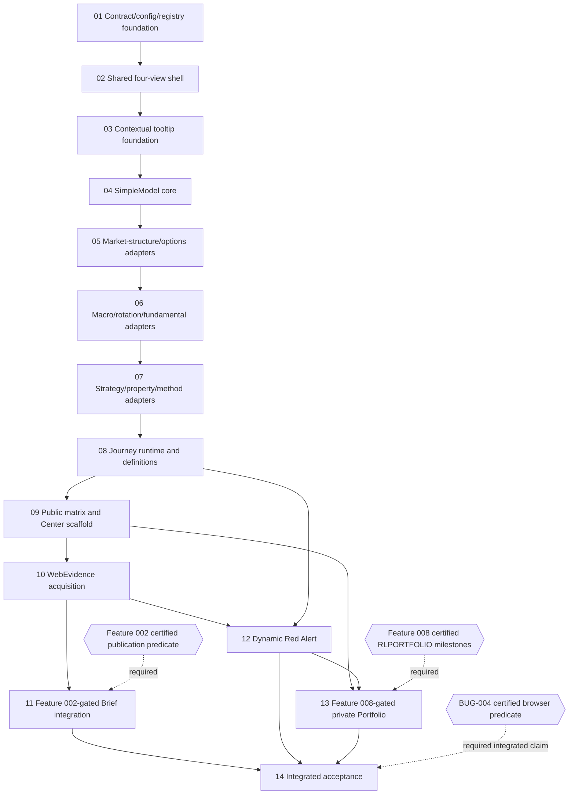

# Feature 012 Scope Index

## Execution Outline

### Phase Order

1. **Scope 01 - Contract, configuration, and registry foundation:** introduce the versioned ToolExperience, model, Journey, dependency-gate, and validator contracts in shadow mode; no visible integration claim.
2. **Scope 02 - Shared four-view shell:** extend the shared view/application shell for ordinary and Market Action Center view sets, including hash, history, focus, mobile, legacy-control suppression, and dependency-pending projections.
3. **Scope 03 - Contextual tooltip foundation:** create one accessible contextual disclosure engine over RLG, RLTKR, and RLCHART, with DOM, table, ticker, and canvas canaries.
4. **Scope 04 - SimpleModel core runtime:** implement deterministic input normalization, identity, baseline/current comparison, seeded execution, sensitivity, provenance, calibration, and truth-state handling without domain formulas.
5. **Scope 05 - Market-structure and options adapters:** deliver the first owner-model adapter rollout for eight ordinary tools with owner-parity and parameter-effect proof.
6. **Scope 06 - Macro, rotation, and fundamental adapters:** deliver eight additional ordinary-tool adapters with source-qualified owner parity and parameter-effect proof.
7. **Scope 07 - Strategy, property, and method adapters:** deliver the remaining six ordinary-tool adapters, completing all 22 ordinary Simple experiences and the Market Action triage definition.
8. **Scope 08 - Journey capability and all-tool definitions:** deliver shared Journey reducers/store/packet/runtime plus at least two concrete goals for every ordinary tool and four global goals for `market-brief`.
9. **Scope 09 - Public matrix and Market Action Center scaffold:** preserve `market-brief.html` and registry identity while shipping the renamed four-view shell and a public-watchlist-only matrix; private integration remains gated.
10. **Scope 10 - Bounded WebEvidence acquisition:** implement query-plan, source, robots, budget, safety, origin, claim, and frozen-bundle validation independently of Feature 002 authorship.
11. **Scope 11 - Feature 002-gated authored Brief integration:** only after the exact Feature 002 certification predicate passes, integrate frozen WebEvidence with powerless ToolBrief v2 authorship and atomic public publication.
12. **Scope 12 - Dynamic Red Alert and latent-risk Journey:** deliver fixture-driven anomaly discovery, qualification, lifecycle, empty state, and global latent-risk Journey without a hardcoded topic catalog; live publication remains behind the Feature 002 predicate.
13. **Scope 13 - Feature 008-gated private Portfolio integration:** only after named RLPORTFOLIO milestones are certified, add opaque private-scope overlays and local portfolio-stress Journey behavior without a second store or leak.
14. **Scope 14 - Integrated acceptance and release handoff:** validate all 23 consumers, all four Market Action Center views, dependency activations/refusals, migration, accessibility, privacy, performance, rollback, docs handoff, and QF contract-only portability.

### New Types And Signatures

- `ToolExperience/v1`, `ToolExperienceConfig/v1`, exact ordinary and Market Action Center view-set enums.
- `SimpleModelDefinition/v1`, `NormalizedSimpleInput/v1`, `SimpleModelRun/v1`, `SimpleModelAdapter/v1`.
- `ContextualTooltip/v1` and structured `RLCHART.attach(canvas, adapter)` context projection.
- `WebEvidenceQueryPlan/v1`, `WebEvidenceBundle/v1`, `ToolAuthorRequest/v2`, `ToolBrief/v2`.
- `JourneyDefinition/v1`, `JourneyStep/v1`, `JourneySession/v1`, `JourneyCompletionPacket/v1`, `JourneyMechanismAdapter/v1`.
- `RedAlertCandidate/v1`, `RedAlert/v1`, `PortfolioTickerMatrix/v1`, `MarketActionCenterProjection/v1`.
- `ExperienceError/v1` with the closed `E012-*` refusal vocabulary.
- Exact dependency predicates for BUG-004, Feature 002, and Feature 008; narrative status never satisfies a predicate.

### Validation Checkpoints

- Scope 01 gates every later scope with schema, registry-parity, added-tool, source-lock, protected-owner, dependency-predicate, and broad selftest canaries.
- Scopes 02 and 03 each run high-fan-out boot/focus/provider/owner-read/chart rollback canaries before any domain rollout.
- Scope 04 proves deterministic runtime semantics before adapter work; each adapter scope then adds owner-parity and adversarial parameter-effect proof before the next group starts.
- Scope 08 cannot start until all 22 ordinary Simple adapters are accounted for, preventing generic or example-only Journey definitions.
- Scope 09 proves route/rename/public-private truth before external integrations; Scope 10 proves acquisition safety before any author receives evidence.
- Scope 11 is externally gated by Feature 002. Scope 12 can proceed from Scope 10 without Scope 11, preserving dependency-independent Red Alert qualification.
- Scope 13 is externally gated by Feature 008. Scope 14 requires Scopes 11-13 and the BUG-004 predicate for any corresponding integrated claim.
- Every behavioral scope begins with a narrow scenario-specific RED test, runs the narrowest relevant check after implementation, and finishes with `node scripts/selftest.mjs`; browser evidence uses the repository-declared real-page Playwright command with no request interception.

## Dependency Graph

| # | Scope | Depends On | Status |
|---|---|---|---|
| 01 | Contract, configuration, and registry foundation | - | Done |
| 02 | Shared four-view shell | 01 | Done |
| 03 | Contextual tooltip foundation | 02 | Not Started |
| 04 | SimpleModel core runtime | 03 | Not Started |
| 05 | Market-structure and options adapters | 04 | Not Started |
| 06 | Macro, rotation, and fundamental adapters | 05 | Not Started |
| 07 | Strategy, property, and method adapters | 06 | Not Started |
| 08 | Journey capability and all-tool definitions | 07 | Not Started |
| 09 | Public matrix and Market Action Center scaffold | 08 | Not Started |
| 10 | Bounded WebEvidence acquisition | 09 | Not Started |
| 11 | Feature 002-gated authored Brief integration | 10 + Feature 002 predicate | Not Started |
| 12 | Dynamic Red Alert and latent-risk Journey | 08, 10 | Not Started |
| 13 | Feature 008-gated private Portfolio integration | 09, 12 + Feature 008 predicate | Not Started |
| 14 | Integrated acceptance and release handoff | 11, 12, 13 + BUG-004 predicate | Not Started |

## Active Scope Inventory

| # | Scope | Depends On | Surfaces | Primary Scenario Coverage | Status |
|---|---|---|---|---|---|
| 01 | Contract, configuration, and registry foundation | - | JSON contracts, registry metadata, validators, dependency resolver, Node-safe runtime | SCN-012-033 plus contract predicates used by SCN-012-028/029 | Done |
| 02 | Shared four-view shell | 01 | `rlviews.js`, `rlapp.js`, shared shell, hash/history/focus/mobile/gate bands | SCN-012-017, 028, 029, 031 | Done |
| 03 | Contextual tooltip foundation | 02 | `rlcontext.js`, RLG/RLTKR/RLCHART adapters, representative pages | SCN-012-003, 004 | Not Started |
| 04 | SimpleModel core runtime | 03 | pure runtime, validator, renderer, identity/sensitivity/seed/truth states | SCN-012-001, 002 | Not Started |
| 05 | Market-structure and options adapters | 04 | eight tool definitions/adapters and owner canaries | SCN-012-001, 002, 014, 015, 016 | Not Started |
| 06 | Macro, rotation, and fundamental adapters | 05 | eight tool definitions/adapters and owner canaries | SCN-012-001, 002, 015 | Not Started |
| 07 | Strategy, property, and method adapters | 06 | six tool definitions/adapters plus Center triage definition | SCN-012-001, 002, 032 | Not Started |
| 08 | Journey capability and all-tool definitions | 07 | `rljourney.js`, definitions, local store, mechanisms, packet, tool shell | SCN-012-009, 010, 011, 032 | Not Started |
| 09 | Public matrix and Market Action Center scaffold | 08 | `market-brief.html`, rename consumers, public matrix, route compatibility | SCN-012-017, 019, 022, 029, 030 | Not Started |
| 10 | Bounded WebEvidence acquisition | 09 | acquisition/validation scripts, policies, static hostile-source fixtures | SCN-012-005, 006, 007 | Not Started |
| 11 | Feature 002-gated authored Brief integration | 10 + Feature 002 predicate | ToolBrief v2, networkless author, public ticker briefs, atomic publication, concise UI | SCN-012-005, 006, 007, 008, 018, 019, 020, 028 | Not Started |
| 12 | Dynamic Red Alert and latent-risk Journey | 08, 10 | anomaly discovery, qualification, lifecycle, empty view, global Journey | SCN-012-023, 024, 025 | Not Started |
| 13 | Feature 008-gated private Portfolio integration | 09, 12 + Feature 008 predicate | RLPORTFOLIO adapter, private overlays, local stress Journey | SCN-012-021, 027, 029 | Not Started |
| 14 | Integrated acceptance and release handoff | 11, 12, 13 + BUG-004 predicate | all 23 routes, sources, publication, privacy, accessibility, performance, rollback, docs/QF handoff | SCN-012-012 through 032 integration sweep | Not Started |

## External Dependency Predicates

| Gate | Observed Planning-Time State (reconciled 2026-07-23) | Exact Required Predicate | Independent Work Preserved |
|---|---|---|---|
| BUG-004 | Terminally certified; current system-Chrome evidence clears the prior browser-execution blocker | Satisfied: terminal certified state plus current exact browser evidence proving proxy route then one same-provider direct attempt and key containment | contracts, shell, adapters, Journey, matrix, WebEvidence, fixture Red Alert |
| Feature 002 | top-level and certification `not_started`; implementation claims are not certification | terminal full-delivery certification plus current pointer/manifest graph, all registry owner outcomes, powerless author, and atomic publication gates | Scopes 01-10 and 12; dependency-pending Brief/publication states |
| Feature 008 | `not_started`; Scope 1 in progress and later milestones uncertified | certified RLPORTFOLIO import/store/privacy clear, public-evidence barrier, and four-window local brief/ticker-scope milestones | public matrix, all non-private Center views, private dependency gate |

## Scheduling Rules

1. A scope is eligible only when every numbered dependency is Done and every external predicate listed directly on that scope is mechanically true.
2. Select the lowest-numbered eligible scope. A blocked external gate does not block an independent higher-numbered node whose own numbered dependencies are Done.
3. Scope 01 is Done: its current isolated replay contains the provenance-backed ordered `RED-stage` / `GREEN-stage` bridge, and the independent closure rerun of G060, artifact lint, G094, and DAG/status consistency exits 0. Scope 02 is now the lowest-numbered eligible scope and routes to `bubbles.implement`; it remains Not Started until that owner begins execution.
4. No scope may amend Feature 002, Feature 008, BUG-004, options-publication, QF, or Bubbles framework artifacts.
5. No integration claim is implied by a contract, fixture, dependency-pending UI, or shadow-mode canary.
6. Each scope owns only its declared files and tests. Collateral edits require plan-owner reconciliation before execution continues.

## Plan-Wide Protected Surfaces

- Feature 002 and Feature 008 artifacts and source; BUG-004 artifacts and source.
- `rldata.js` provider/cache/source ownership except an explicitly planned additive consumer seam; no provider fallback implementation belongs to Feature 012.
- `scripts/fetch-options.mjs`, `data/options/**`, and their scheduled publication ownership.
- Existing Feature 002 pointer/manifest/history ownership and all immutable published objects.
- Existing RLPORTFOLIO storage, privacy, revision, and clearing ownership.
- QF source and contracts; Feature 012 supplies only a Research Lab portability handoff.
- Framework-managed `.github/bubbles/**`, `.github/agents/bubbles*`, `.github/prompts/bubbles.*`, `.github/instructions/bubbles-*`, and `.github/skills/bubbles-*`.
- Unrelated Research Lab tools, data, notes, histories, and publication artifacts outside a scope's explicit change boundary.

## Rollback Order

Rollback proceeds in reverse dependency order. External integrations unregister their adapters/projectors first; public pointer rollback selects the prior validated Feature 002 generation without reauthoring; private integration removes only the Feature 012 adapter; Red Alert and Journey state remain version-rejected/inert rather than rewritten; domain adapters unregister without changing owner logic; ContextualTooltip and shell compatibility bridges restore the prior renderer/control only through their tested committed rollback path; contract/config artifacts remain available for diagnosis unless their own Scope 01 rollback is explicitly invoked.
