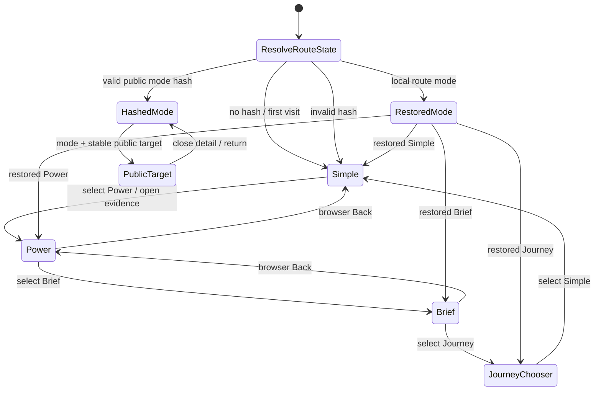
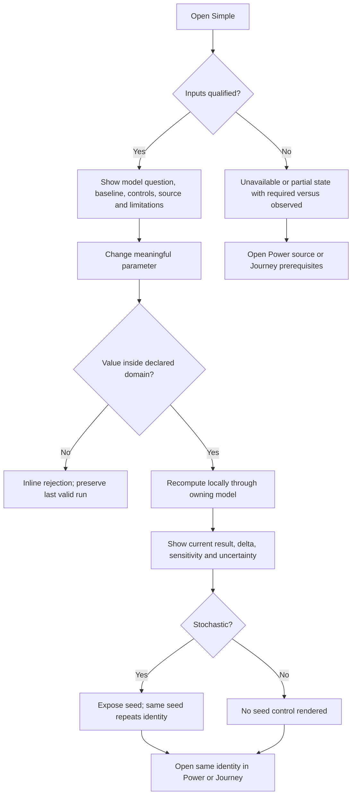
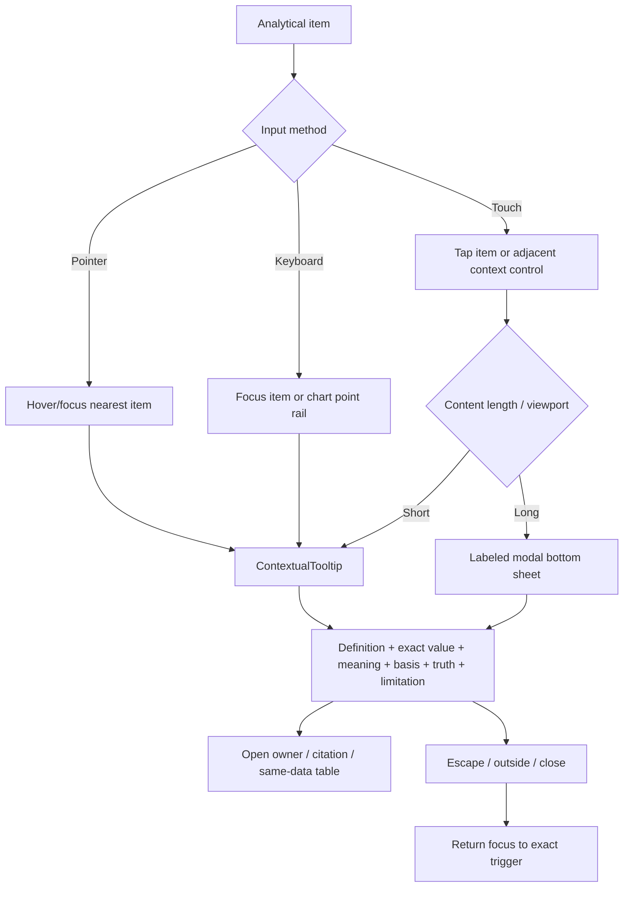
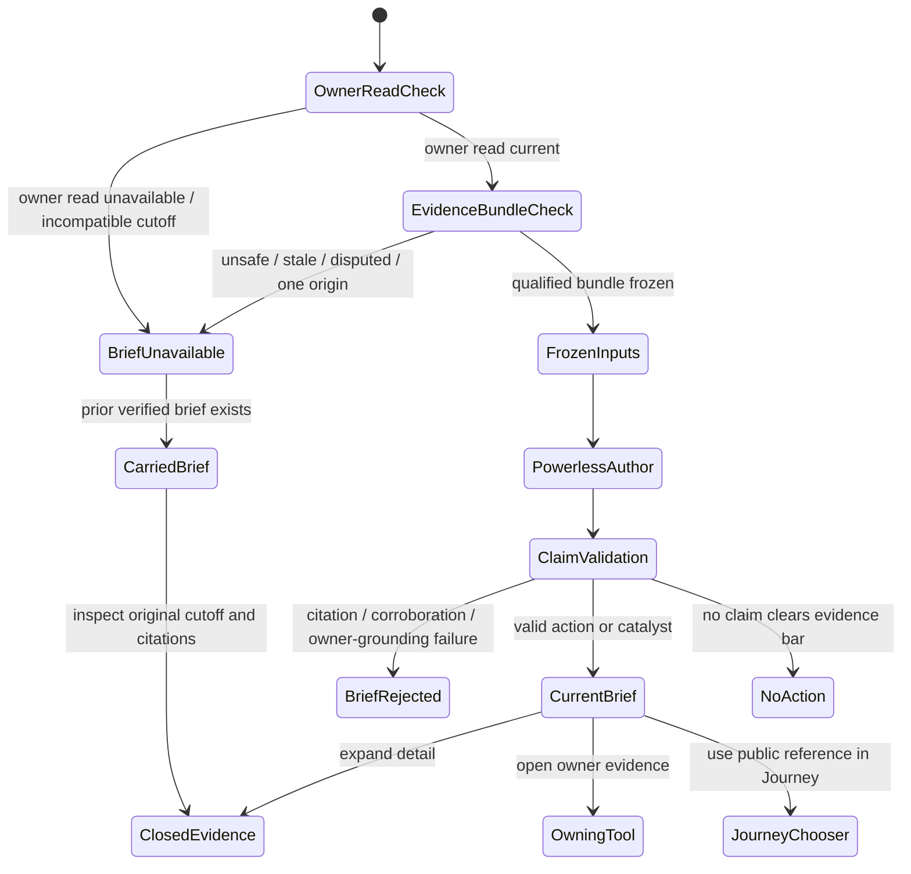
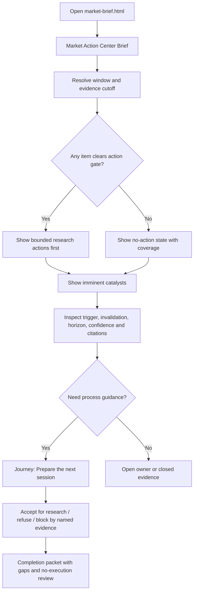
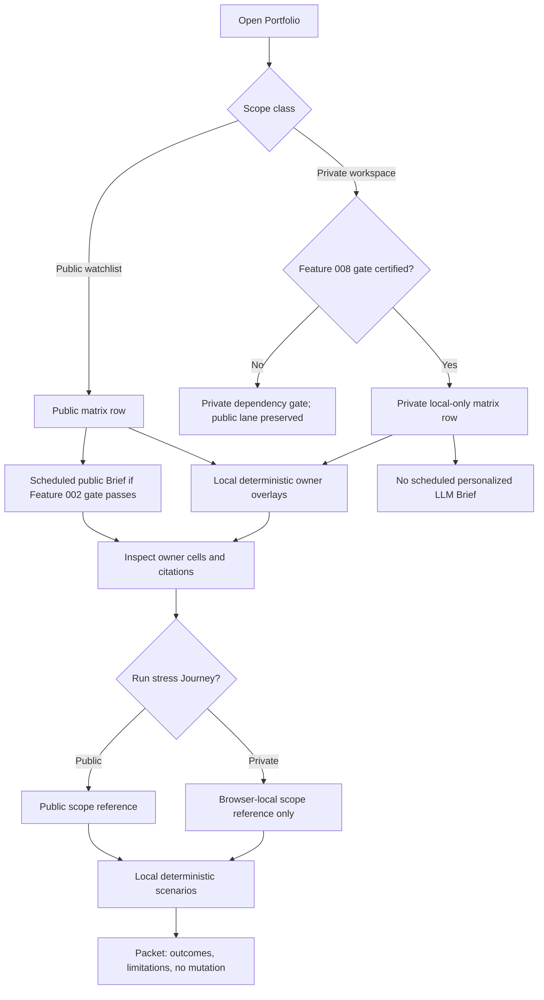
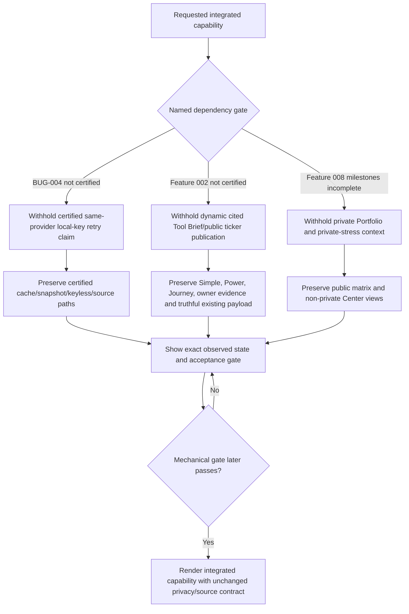

# Feature: 012 Market Action Center and Guided Tools

> **Analyst-owned packet boundary.** This greenfield artifact defines the
> business, capability, source, privacy, experience, and migration contracts for
> Feature 012. The current Research Lab registry contains exactly 23 entries.
> `design.md`, `scopes.md`, `report.md`, `uservalidation.md`, `test-plan.json`,
> `scenario-manifest.json`, implementation files, and tests are owned by later
> Bubbles specialists and are intentionally absent from this analyst packet.

## Problem Statement

Research Lab has 23 registered tools, but it does not yet provide one coherent
way to move from a tool's model to evidence, an online-researched brief, and a
guided goal completion.

The current shared view layer in [rlviews.js](../../rlviews.js) standardizes
`Simple / Power / Brief` for tools that already have Simple and Power, or
`Tool / Brief` for single-view tools. It has no Journey mode. More importantly,
many existing Simple experiences are compact conclusions or filtered versions
of Power. The requested redesign raises the bar: Simple must be a materially
distinct, steerable model or simulation tied to the owning tool's real purpose,
not a summary card with fewer panels.

The current Actionable Market Brief has the opposite problem. It is a long,
single-flow cockpit whose default page mixes current actions, structural
backdrop, catalysts, watchlist detail, owner reads, and experimental material.
Its current payload can be extremely verbose even though action gating exists.
There is no first-class private ticker matrix, dynamic systemic-threat
discovery, or cross-tool guided workflow. The product name also understates the
new role: the target is a **Market Action Center**, while preserving the
existing `market-brief.html` route for bookmarks and deep links.

The data and authorship boundaries are uneven:

- [rldata.js](../../rldata.js) owns central provider access, browser cache,
  same-origin daily snapshots, Yahoo's keyless chain, and owner reads.
- [BUG-004](../_bugs/BUG-004-proxy-route-local-key-fallback/spec.md) repairs the
  proxy-route-to-same-provider-local-key path, but its current state remains
  `in_progress` because required browser verification is blocked by the absent
  Linux system-Chrome channel.
- [Feature 002](../002-distributed-tool-briefs-and-history/spec.md) defines the
  registry-wide ToolModelRead, ToolBrief, powerless-author, provenance,
  history, and atomic-publication foundations. Its current state remains
  `not_started` and uncertified despite implementation claims across ten scopes.
- [Feature 008](../008-portfolio-survival-and-brief-lab/spec.md) defines the
  private `RLPORTFOLIO` workspace and generic/public versus personal/local
  barrier. Its current state remains `not_started`; Scope 1 is in progress and
  later portfolio-brief milestones are not certified.
- [scripts/brief-narrative-parallel.mjs](../../scripts/brief-narrative-parallel.mjs)
  currently grants two narrative lanes a curated web-fetch allowlist. The
  Feature 002 target boundary instead requires web acquisition before the
  powerless author receives frozen evidence.

The static-site privacy model creates a hard scheduling contradiction. An
unattended evo-x2 or GitHub publisher can read committed ticker-only
`watchlist.json`, but it cannot see browser-local `RLPORTFOLIO` tickers without
uploading private state. A design that promises scheduled private per-ticker
LLM briefs in Phase A would therefore be dishonest or a hidden data leak.

QuantitativeFinance (QF) offers useful contract semantics, but not reusable
front-end code. Its `GuidedAnalysisPanel` and `guidedApi` are authenticated
React clients over a Rust gateway. QF captures a durable intent and context,
emits a typed `DecisionPacket` with calibration and provenance badges, requires
human signoff, and explicitly triggers no execution. Research Lab is a
build-free static browser application. Immediate migration or direct code reuse
would collapse two different ownership, authentication, persistence, and
runtime models.

Feature 012 must therefore create shared, versioned Research Lab foundations
for four-mode tools and the Market Action Center first, preserve current data
owners, make every source and inference honest, and define a portable contract
boundary for a later authenticated private-compute adapter in QF.

## Outcome Contract

**Intent:** Turn every registered Research Lab tool into a four-part research
experience that lets a user steer a real model, inspect the evidence, read a
cited current brief, and complete an explicit goal through a durable guided
journey. Replace the Actionable Market Brief surface with a concise Market
Action Center that coordinates current actions, a private/public-safe ticker
matrix, dynamic high-severity alerts, and cross-tool journeys without becoming
an execution system.

**Success Signal:** A user can open any of the 23 current registry entries and
find exactly four coherent modes. For the 22 ordinary tools those modes are
Simple, Power, Brief, and Journey. Simple visibly recomputes a tool-specific
parameterized model or seeded simulation; Power exposes complete contextual
evidence with accessible current-value interpretation; Brief is LLM-authored
only from the tool's validated owner read plus a frozen, cited online evidence
bundle; and Journey guides the user through at least two explicit tool-specific
goals to a provenance-complete, non-executing completion packet. The
`market-brief` registry entry becomes the Market Action Center and satisfies its
four-mode obligation through exactly four top-level views: Brief, Portfolio,
Red Alert, and Journey. The existing `market-brief.html` URL remains usable.

**Hard Constraints:**

- Keyed provider requests use the evo-x2/tailnet proxy first. A failed provider
  route may retry exactly once through the same registered provider's direct
  CORS path only when that browser has a local key. No key reaches a proxy,
  status, error, log, DOM, committed artifact, or different provider.
- Yahoo/keyless data retains RLDATA's separate proxy-first then direct/public
  CORS chain. Keyed-provider fallback and Yahoo's keyless chain are never
  conflated.
- Daily bars may paint from committed same-origin Git-backed snapshots before
  remote delta refresh, but source, as-of, retrieval, and freshness state stay
  visible and truthful.
- Options remain server-fetched by `scripts/fetch-options.mjs`, published under
  `data/options/<ticker>.json`, and consumed same-origin snapshot-first. Feature
  012 cannot fork, move, or replace that owner.
- Every ordinary registered tool exposes exactly `Simple / Power / Brief /
  Journey`; no fifth top-level mode, hidden duplicate toggle, or `Tool` alias is
  permitted after cutover.
- The Market Action Center exposes exactly `Brief / Portfolio / Red Alert /
  Journey`; it has no top-level Simple or Power label. Its deeper evidence lives
  in disclosures inside those four views.
- Simple is a materially distinct, user-steerable model or simulation related
  to the owning tool. It is not a summary, filtered Power dashboard, renamed
  verdict, or panel-hiding exercise.
- Power tooltips explain both what an item is and precisely what its current
  value means in context. Label repetition is not interpretation.
- Online search occurs in a separate bounded acquisition stage. LLM authors
  receive a frozen ToolModelRead plus WebEvidenceBundle and have no web, shell,
  repository-write, or model-recompute authority.
- Material web claims require current citations, claim-level source links, and
  at least two independent corroborating sources. Syndication or two pages that
  trace to one origin count as one source. A claim that cannot clear the
  evidence bar is rejected, not softened into uncited prose.
- Journeys preserve context, prerequisites, progress, evidence, backtracking,
  and completion. They never place trades, change holdings, submit orders, or
  convert user signoff into execution.
- Feature 008 `RLPORTFOLIO` is the only private portfolio workspace. Feature
  012 cannot create a second portfolio store or infer holdings from a public
  watchlist.
- Unattended scheduled ticker LLM briefs in Phase A cover only the explicitly
  public ticker-only `watchlist.json`. Private `RLPORTFOLIO` tickers receive
  browser-local deterministic overlays and are never committed or uploaded.
- Red Alert candidates are discovered dynamically from current transmission
  evidence. USD/JPY, private credit, capex, war, or any other example is not a
  hardcoded topic, seed, required candidate, or permanent alert.
- An empty Red Alert view is a valid success state. Alarmist copy, unsupported
  severity, and attention inflation are failures.
- Research Lab remains educational and non-executing. It produces research
  actions and completion packets, not personalized advice, guaranteed
  outcomes, broker instructions, or autonomous allocation.
- The shared foundations are implemented and owned in Research Lab first.
  Portable contracts may later be consumed by QF, but Research Lab source is
  not copied into QF and QF service/auth code is not copied into Research Lab.

**Failure Condition:** The feature fails even if all views render when any
ordinary tool lacks one of its four modes; Simple is only a shortened Power
view; a tooltip merely repeats a label; a tool brief browses directly or emits
an uncited/stale material claim; a Journey loses context or implies execution;
the Market Action Center has more or fewer than four top-level views; a public
watchlist is presented as holdings; private portfolio state reaches a
publisher; Red Alert relies on a hardcoded fear list or publishes an
uncorroborated alarm; provider fallback crosses providers or leaks a key; the
options publication owner is forked; or Research Lab is prematurely moved into
QF's authenticated service architecture.

## Goals

- Establish versioned, provider-neutral capability contracts for SimpleModel,
  ContextualTooltip, WebEvidenceBundle, ToolBriefProjection, JourneyDefinition,
  JourneySession, JourneyCompletionPacket, RedAlertCandidate, RedAlert,
  PortfolioTickerMatrix, and MarketActionCenterViewState.
- Give all 22 ordinary current tools exactly four meaningful modes with a
  strict tool-specific experience contract.
- Rename the Actionable Market Brief product surface to Market Action Center
  while preserving `market-brief.html` compatibility.
- Make Brief concise and immediately actionable by default while retaining
  backdrop, methodology, owner reads, and experimental details in
  closed-by-default disclosures.
- Reuse the Feature 008 private workspace for portfolio ticker scope and keep
  scheduled public versus browser-local private regeneration honest.
- Discover and qualify systemic threats dynamically across transmission
  channels with citations, market confirmation, falsifiers, and valid empty
  state.
- Provide global journeys for next-session preparation, current-action triage,
  latent-risk investigation, and portfolio stress against current alerts.
- Preserve Research Lab's build-free, cache-first, auto-hydrating, source-aware,
  tooltip-rich, ticker-linked, responsive, accessible, educational posture.
- Define a later QF private-compute/migration seam using intent, context,
  provenance/calibration, typed outcomes, human signoff, and no-execution
  semantics without direct code reuse.

## Non-Goals

- Moving the current Research Lab source, routes, or data ownership into QF as
  part of Feature 012 Phase A.
- Creating a second portfolio store, remote portfolio account, cross-device
  profile, or hidden publisher upload.
- Replacing Feature 002's ToolModelRead, ToolBrief, history, or atomic
  publication ownership.
- Replacing Feature 008's portfolio identity, mandate, behavior, privacy,
  clearing, or dossier ownership.
- Replacing BUG-004 or claiming its browser certification from Feature 012.
- Replacing `scripts/fetch-options.mjs`, its scheduled publication, or
  `data/options/<ticker>.json`.
- Creating a trade ticket, broker connection, auto-rebalance, order router,
  personalized target weight, or autonomous hedge.
- Treating online search excerpts as instructions, executable content, model
  inputs without validation, or a substitute for an owning tool read.
- Hardcoding a Red Alert candidate list, geopolitical topic list, ticker list,
  threat narrative, or required minimum alert count.
- Adding an application build, server, database, service worker, or runtime
  dependency to Research Lab.
- Writing implementation architecture, formal scopes, test plans, UX
  wireframes, execution evidence, or certification in this analyst artifact.

## Current Capability Map

| Capability | Current Repository Evidence | Current Status | Feature 012 Gap |
|---|---|---|---|
| Registered experience inventory | [tools.json](../../tools.json) contains 23 entries in registry order | Complete current inventory | Four-mode contract and 23-row experience definition are missing |
| Shared mode switch | [rlviews.js](../../rlviews.js) supports `simple,power,brief` or `view,brief` | Partial | No Journey; some tools still depend on hidden legacy toggles; Market Action Center needs a distinct four-view contract |
| Shared data/status shell | [rldata.js](../../rldata.js) plus [rlapp.js](../../rlapp.js) | Live | Must carry model, brief, journey, alert, and matrix freshness without leaking private state |
| Keyed provider access | `providerFetch` is proxy-first and the working tree contains the BUG-004 same-provider direct helper | Implemented but uncertified | Integration claim waits for BUG-004 browser verification and terminal certification |
| Yahoo/keyless bars | `proxied`, `fetchJson`, `pagesBars`, and `ensureBars` in [rldata.js](../../rldata.js) | Live | Preserve chain; make source/freshness visible in every new projection |
| Same-origin daily snapshots | `pagesBars` reads `data/bars/<symbol>.json` before remote delta | Live | Matrix and Simple models must label snapshot versus remote augmentation honestly |
| Options snapshots | [scripts/fetch-options.mjs](../../scripts/fetch-options.mjs) publishes 22 current ticker snapshots under `data/options/` | Live owner | New modes consume; they do not fork/move the producer |
| Simple/Power tools | Tool blurbs and current pages provide varying Simple/Power depth | Partial and inconsistent | Every Simple must become a distinct parameterized model/simulation; every Power item needs contextual interpretation |
| Per-tool owner read and brief | [Feature 002](../002-distributed-tool-briefs-and-history/spec.md), [rlbrief.js](../../rlbrief.js), and declarative mounts | Implementation present, certification absent | Dynamic Brief mode waits for certified current read/brief graph and separate WebEvidenceBundle acquisition |
| Current web research | [scripts/brief-narrative-parallel.mjs](../../scripts/brief-narrative-parallel.mjs) gives core/signals author lanes curated URL access | Live for current Market Brief | Move web acquisition before powerless authorship; author receives frozen cited excerpts only |
| Generic Market Brief | [market-brief.html](../../market-brief.html), config, payload, and runbook | Live, long single-flow cockpit | Rename, preserve route, and split into exactly four top-level views |
| Private portfolio | [Feature 008](../008-portfolio-survival-and-brief-lab/spec.md) and its `RLPORTFOLIO` design | Scope 1 in progress; later milestones not certified | Reuse only after observable store/evidence/brief gates pass |
| Dynamic threat discovery | No registered owner or candidate/alert contract found | Missing | Add channel-neutral candidate discovery, corroboration, market evidence, qualification, and empty state |
| Guided tool workflow | No shared Research Lab JourneyDefinition/Session/CompletionPacket | Missing | Add durable goal-specific wizard/checklist/decision-tree/scenario-lab capability |
| QF guided semantics | QF GuidedAnalysisPanel/guidedApi, journey context tests, DecisionPacket, 471-algorithm catalog, 28-model catalog, and simulation service | Service/authenticated platform capability | Reuse semantics conceptually through portable contracts; no immediate code migration |

## Honest Findings And Contradictions

1. **The requested source contract is partly implemented but not certifiable
   yet.** The working-tree `rldata.js` contains one same-provider direct helper
   and a proxy failure continuation, but BUG-004 remains `in_progress` because
   TP-09 and TP-12 require Linux system Chrome at `/opt/google/chrome/chrome`.
   Feature 012 may specify and consume the eventual contract; it cannot call it
   certified.
2. **The current narrative runner violates the target powerless-author shape.**
   `brief-narrative-parallel.mjs` denies shell but enables curated web URLs for
   two author lanes. Feature 002's target design says external research belongs
   in a read adapter before input freeze. Feature 012 must use the latter
   boundary: acquisition first, author second, no author browsing.
3. **Feature 002 is not a certified dependency.** Its state records extensive
   implementation claims but top-level and certification status remain
   `not_started`. Feature 012 can define portable contracts and deterministic
   local projections, but cannot claim a current distributed-brief integration
   until Feature 002's observable gate passes.
4. **Feature 008 is not a usable integration foundation yet.** Its state shows
   Scope 1 in progress, all later portfolio milestones not started, and open
   implementation findings. A second portfolio store would create a privacy and
   migration defect, so Feature 012 must wait for named RLPORTFOLIO milestones.
5. **The current Simple principle is insufficient for this redesign.** Existing
   policy says Simple is a decision-first cockpit from one compute. The new
   requirement is stronger: it must expose a separate parameterized
   model/simulation experience, not merely select fewer fields from Power.
6. **Market Action Center cannot use the ordinary four labels.** The user
   explicitly requires Brief, Portfolio, Red Alert, and Journey at the global
   surface. This is a deliberate registry-specific specialization, not a fifth
   mode or an exception that permits ordinary tools to drift.
7. **Private scheduled LLM personalization is impossible in the current static
   trust model.** Browser-local tickers are invisible to an unattended
   publisher. Phase A can schedule only public watchlist tickers and can compute
   private deterministic overlays locally. Anything else requires an explicit
   authenticated private sync/compute adapter.
8. **Current Market Brief payload density undermines immediate action.** The
   live payload contains extensive structural, psychology, event, group,
   coverage, and watchlist narratives. The target keeps those facts but moves
   non-immediate context behind closed disclosures.
9. **QF is a semantics source, not a code source.** QF's DecisionPacket carries
   intent, scenario, trace, thesis, why-now, quantified impact, calibration,
   provenance, as-of truth, advisory disclaimer, and human signoff. Its
   simulation service adds deterministic seeds, scenarios, stress, and
   provenance isolation. Those are valuable contract ideas. Its authenticated
   React/Rust architecture is not portable into one-file static tools.
10. **No external competitor claim is needed to justify this feature.** The
    concrete gap is internal and observable across the 23-entry registry. The
    strategic comparison is Research Lab's current fragmented surfaces versus
    its own QF sibling's typed journey semantics; no unverified competitor
    capability is asserted here.

## Competitive And Strategic Analysis

No new external competitor capability is asserted in this greenfield run. The
user supplied an exact redesign and a closed evidence set, and no current
competitor URLs were provided. The grounded strategic comparison is therefore
between real alternatives already present in this workspace.

| Alternative | Grounded Strength | Grounded Gap Or Risk | Feature 012 Decision |
|---|---|---|---|
| Current ordinary Research Lab tools | Deep, inspectable specialist models; cache-first static delivery; many Simple/Power precedents | Simple quality varies, no shared Journey, and contextual tooltip coverage is not contract-complete | Keep each owning model; add a shared strict four-mode experience foundation |
| Current Actionable Market Brief | Four ET windows, action gating, owner deep links, public scheduling, and broad cross-tool coverage | Default experience is long and single-flow; no private-safe matrix, dynamic alert qualification, or cross-tool journey | Rename to Market Action Center and specialize its exactly four top-level views |
| Current `rlviews.js` | One consistent cross-tool mode control and legacy-toggle bridge | Only Simple/Power/Brief or Tool/Brief; no Journey and no global four-view specialization | Extend the shared capability rather than adding page-local mode switches |
| Feature 002 distributed briefs | Registry-driven owner reads/briefs, powerless-author target, citations/provenance/history, atomic publication | Not certified; current parallel runner still lets two author lanes browse curated web URLs | Depend on certification and insert frozen WebEvidenceBundle acquisition before authoring |
| Feature 008 RLPORTFOLIO | Strong local/private workspace, explicit public/private barrier, local brief and privacy semantics | Only Scope 1 is in progress; required private matrix/brief milestones are not certified | Reuse it exclusively and gate private Portfolio integration; never fork storage |
| Current public `watchlist.json` publisher scope | Honest ticker-only committed scope that an unattended publisher can read | Cannot represent private holdings or browser-only research scope | Permit scheduled LLM ticker briefs only for this public scope in Phase A |
| QF guided analysis and DecisionPacket | Typed intent/context/packet, calibration/provenance, trace, human signoff, no-execution semantics | Authenticated React/Rust service architecture cannot be directly reused in a build-free static site | Align portable semantics now; implement a QF-owned adapter only after a separate private-service decision |
| Hardcoded alert/topic dashboard | Simple to implement and easy to demonstrate | Produces stale fear lists, confirmation bias, alarmism, and false minimum-alert pressure | Reject; discover candidates dynamically and accept an empty alert state |

### Strategic Gaps

1. No shared contract proves that every Simple experience is a real
   parameterized model rather than a condensed dashboard.
2. No cross-tool contract guarantees exact current-value interpretation for
   every Power analytical item across pointer, keyboard, and touch.
3. Current online research and LLM authorship are not separated by the intended
   powerless-author boundary.
4. No shared JourneyDefinition/Session/CompletionPacket foundation exists for
   any of the 23 registered tools.
5. The global brief has no privacy-safe per-ticker owner matrix spanning public
   and private scope without conflating the two.
6. No capability discovers, corroborates, and falsifies latent systemic threats
   dynamically across transmission channels.
7. The static publisher cannot honestly schedule private personalized LLM work.
8. Research Lab and QF have compatible semantic goals but no versioned portable
   seam that preserves their distinct runtimes and ownership.

## Improvement Proposals

### IP-001: Four-Mode Tool Experience Foundation

- **Impact:** High
- **Effort:** Large
- **Competitive Advantage:** Turns 22 heterogeneous tools into one learnable
  operating model while strengthening Simple from a summary convention into a
  model/simulation contract.
- **Grounding:** `tools.json` has 23 entries and `rlviews.js` currently lacks
  Journey and supports multiple legacy shapes.
- **Actors Affected:** Tool-Specific Researcher, Returning Journey User,
  Evidence Skeptic
- **Business Scenarios:** BS-012-001 through BS-012-004, BS-012-031,
  BS-012-032

### IP-002: Evidence-First Cited Tool Briefs

- **Impact:** High
- **Effort:** Large
- **Competitive Advantage:** Produces current, independently corroborated
  interpretation without giving an LLM web/shell/write authority or letting
  citations become decorative.
- **Grounding:** Feature 002 defines the powerless-author target while
  `brief-narrative-parallel.mjs` currently grants curated URL access to two
  author lanes.
- **Actors Affected:** Market Action Planner, Tool-Specific Researcher,
  Evidence Skeptic, Operator
- **Business Scenarios:** BS-012-005 through BS-012-008, BS-012-028

### IP-003: Durable Goal-Oriented Journey Foundation

- **Impact:** High
- **Effort:** Large
- **Competitive Advantage:** Converts a collection of analytical pages into
  repeatable user outcomes with prerequisites, backtracking, evidence, and
  honest completion packets.
- **Grounding:** No Research Lab JourneyDefinition or JourneySession exists;
  QF demonstrates useful intent/context/packet/signoff semantics without a
  portable static implementation.
- **Actors Affected:** Returning Journey User, Tool-Specific Researcher, Market
  Action Planner
- **Business Scenarios:** BS-012-009 through BS-012-011, BS-012-026,
  BS-012-027

### IP-004: Market Action Center Four-View Redesign

- **Impact:** High
- **Effort:** Large
- **Competitive Advantage:** Keeps the proven four-window action cockpit while
  making immediate actions, private/public ticker research, systemic risk, and
  guided completion first-class rather than adding more drawers to one page.
- **Grounding:** `market-brief.html` and its current payload mix action,
  backdrop, events, groups, watchlist, owner reads, and experiments in one
  surface.
- **Actors Affected:** Market Action Planner, Portfolio Researcher, Systemic-Risk
  Investigator
- **Business Scenarios:** BS-012-017 through BS-012-019, BS-012-026

### IP-005: Dynamic Red Alert Qualification

- **Impact:** High
- **Effort:** Medium
- **Competitive Advantage:** Finds evidence-backed latent threats without a
  stale hardcoded fear list and treats no alert as an honest outcome.
- **Grounding:** No current Research Lab candidate/alert owner exists; current
  Market Brief backdrop is analyst-maintained and is not a dynamic qualification
  system.
- **Actors Affected:** Systemic-Risk Investigator, Market Action Planner,
  Portfolio Researcher
- **Business Scenarios:** BS-012-023 through BS-012-025, BS-012-027

### IP-006: Privacy-Safe Portfolio Ticker Matrix

- **Impact:** High
- **Effort:** Medium
- **Competitive Advantage:** Brings specialist evidence together per ticker
  while making public watch scope, private research scope, and actual holdings
  impossible to confuse.
- **Grounding:** `watchlist.json` is intentionally public/ticker-only and
  Feature 008 is the sole planned owner of private RLPORTFOLIO state.
- **Actors Affected:** Portfolio Researcher, Privacy/Evidence Auditor, Operator
- **Business Scenarios:** BS-012-020 through BS-012-022, BS-012-029

### IP-007: Versioned Research Lab To QF Private-Compute Seam

- **Impact:** Medium
- **Effort:** Medium
- **Competitive Advantage:** Preserves a fast static research/prototyping loop
  now while creating an honest route to authenticated private scheduled
  personalization when its operational value is proven.
- **Grounding:** QF already has typed intent, context, DecisionPacket,
  provenance/calibration, human signoff, no-execution, catalog, and simulation
  surfaces, but its service runtime is incompatible with direct static-site code
  reuse.
- **Actors Affected:** Cross-Product Platform Owner, Portfolio Researcher,
  Evidence Skeptic
- **Business Scenarios:** BS-012-021, BS-012-027, BS-012-030

## Product Principle Alignment

| Existing Research Lab Rule | Feature 012 Alignment |
|---|---|
| Provider access only on `index.html#data-settings` | All keyed access continues through `RLDATA.providerFetch`; no tool, mode, brief, journey, alert, or matrix receives a key input |
| Proxy tier then browser-local provider key | BUG-004 remains the owner; Feature 012 consumes only the certified same-provider, exactly-once contract |
| Shared data status on every page | Every model, web bundle, brief, journey, alert, and matrix row exposes scoped freshness through the existing shared status vocabulary |
| Every page loads `rldata.js` then `rlapp.js` then `rlnav.js` | New experiences preserve the shared shell order; no route-local data or credential shell is introduced |
| Cache-first, delta-only, automatic hydration | Simple and Power paint from valid cache/snapshots, then refresh only missing/stale deltas; no manual fetch gate blocks first paint |
| One compute feeds Simple and Power | One validated evidence set feeds both; Simple owns a distinct model contract while Power investigates the same truth without contradicting it |
| No black-box numbers | Every model exposes parameters, assumptions, sensitivity, source, as-of, provenance class, and limitations |
| Universal rich tooltips | ContextualTooltip strengthens the rule by requiring exact current-value interpretation and keyboard/touch parity for every Power item |
| Every ticker is a rich Yahoo link | All visible tickers continue through the shared ticker contract; no private holdings metadata enters a URL or tooltip |
| Canvas hover plus accessible fallback | Every Power chart point has pointer, keyboard, and touch context plus equivalent text/table; Simple models cannot rely on canvas alone |
| Same-origin option snapshot first | Feature 012 preserves `scripts/fetch-options.mjs` and `data/options/<ticker>.json` ownership exactly |
| Single self-contained HTML per tool, no build step | Ordinary tool integration remains static and dependency-free; shared pure foundations are plain browser/Node-safe JavaScript |
| Registry parity across `tools.json`, `index.html`, and `rlnav.js` | The Tool Experience Matrix is keyed to all 23 current IDs; future registry additions require one valid four-mode declaration before release |
| Public watchlist is tickers only | Scheduled ticker briefs use only public `watchlist.json`; private RLPORTFOLIO scope remains local and cannot be inferred from watch status |
| Educational only, not investment advice | Every action is research, every completion requires human interpretation, and no mode executes, sizes, or guarantees a trade |

## Domain Capability Model

### Capability

**Four-Mode Guided Research And Market Action Coordination** turns an owning
tool's qualified evidence into four bounded experiences: a steerable model,
evidence investigation, cited current interpretation, and goal completion. At
the global level it coordinates those owner outputs into a concise current
brief, a privacy-safe ticker matrix, dynamically qualified alerts, and
cross-tool journeys.

### Domain Primitives

| Primitive | Purpose | Lifecycle |
|---|---|---|
| SimpleModel | Versioned tool-specific parameterized model or seeded simulation with visible assumptions, evidence, and sensitivity | unconfigured -> ready -> recomputed -> partial/stale/unavailable -> superseded |
| SimpleModelRun | One immutable baseline/parameter/result/provenance identity | requested -> validated -> computed -> displayed -> superseded or rejected |
| PowerEvidenceProjection | Detailed evidence, charts, tables, diagnostics, conflicts, and owner truth for one evidence identity | loading -> current/partial/stale/unavailable -> superseded |
| ContextualTooltip | Accessible explanation of one term or current value, including meaning, basis, as-of, and limitation | absent -> valid -> updated with current value -> stale/invalid |
| WebEvidenceBundle | Bounded, immutable, cited online-search evidence acquired before authorship | planned -> acquiring -> qualified/rejected -> frozen -> stale/superseded |
| ToolBriefProjection | Concise LLM-authored interpretation of one validated owner read plus one frozen WebEvidenceBundle | unavailable -> authored -> validated -> current -> stale/superseded/rejected |
| JourneyDefinition | Versioned tool-specific goal, prerequisites, mechanism, steps, evidence requirements, completion criteria, and no-execution policy | draft -> valid -> active -> revised/superseded |
| JourneySession | Durable local progress and context for one JourneyDefinition and evidence identity | not-started -> active -> paused -> backtracked -> completed/abandoned/stale |
| JourneyCompletionPacket | Human-readable and machine-checkable result of a completed journey | assembling -> complete/partial/refused -> signed-off/archived; never executed |
| RedAlertCandidate | Dynamically discovered possible high-severity threat with channel, claims, citations, and market observations | discovered -> evidence-building -> qualified/rejected/stale/superseded |
| RedAlert | Candidate that clears corroboration, observable-market-evidence, severity, and actionability thresholds | current -> acknowledged -> monitoring -> invalidated/resolved/stale |
| PortfolioTickerMatrix | Per-ticker cross-tool evidence and brief projection with explicit public/private scope | empty -> loading -> partial/current/stale -> superseded |
| MarketActionCenterViewState | Exactly one active global view plus selected window, evidence cutoff, disclosure state, and privacy mode | Brief/Portfolio/RedAlert/Journey -> changed explicitly; no fifth state |
| EvidenceReference | Immutable reference to owner read, source snapshot, web claim, model run, or journey step evidence | current -> stale/revised/disputed/superseded |

### Strict SimpleModelContract

Every ordinary tool must publish one SimpleModel contract with all fields below.
Tool-specific values are defined in versioned product configuration or the
owning page and are visible; code cannot silently supply a behavioral default.

| Field | Required Meaning |
|---|---|
| `toolId`, `modelId`, `contractVersion`, `modelVersion` | Stable owner and model identity |
| `researchQuestion` | The exact question the model/simulation answers; it must differ from Power's investigation purpose |
| `parameterDefinitions` | At least two meaningful user-steerable parameters with units, domain, allowed range/options, initial value source, and interpretation |
| `inputEvidenceRefs` | Exact owner data/model evidence, source, as-of, retrieval, freshness, data tier, and gaps |
| `assumptions` | Explicit model assumptions and non-applicable conditions |
| `seed` | Required and visible for stochastic output; absent only for deterministic models |
| `baselineResult` | Result before a user change, labeled estimate/simulation/model output rather than fact |
| `currentResult` | Live recomputation after controls change |
| `sensitivity` | Which parameter changed, baseline-versus-current delta, direction/magnitude of impact, and any nonlinear/unstable region |
| `uncertainty` | Interval/range, scenario dispersion, model conflict, or explicit unavailable reason |
| `limitations` | What the model omits, what would invalidate it, and why it must not be treated as execution advice |
| `deepLinks` | Power evidence, Brief evidence, and Journey goal handoffs that preserve the same owner/evidence identity |

SimpleModel business rules:

1. Hiding Power panels does not satisfy the contract.
2. A static verdict with decorative sliders does not satisfy the contract.
3. Every control must change a real model input and recompute production logic.
4. A control that cannot affect the result is disabled with an exact reason.
5. Stochastic models use a visible deterministic seed and separate path
   randomness from parameter sensitivity.
6. The baseline and changed result remain visible together so sensitivity is
   inspectable.
7. Observed facts, user assumptions, model estimates, simulations, and LLM
   interpretation remain distinct provenance classes.
8. Missing/stale inputs yield partial or unavailable; they never become zero,
   neutral, average, or a fabricated model result.

### ContextualTooltip Contract

Every Power term, section, KPI, badge, chart, axis, point/value, table cell with
analytical meaning, diagnostic, conflict, and final output has one tooltip or
equivalent focus/tap disclosure containing:

- the term/value name and concise definition;
- the exact current displayed value and unit;
- the precise current interpretation, including direction only when the owner
  model supports direction;
- comparison basis, threshold/window, model/evidence identity, and as-of state;
- limitation, proxy status, uncertainty, or unavailable reason;
- accessible relationship to the triggering element.

The disclosure is available by hover, keyboard focus, and touch; is dismissible;
does not trap focus unless opened as a modal on mobile; fits the viewport; and
does not cover the value it explains. Repeating `VIX 17.05 means VIX is 17.05`
is invalid. A valid interpretation states what 17.05 means under the current
named regime/window and what it does not prove.

### WebEvidenceBundle Contract

Online search is a separate acquisition capability. For each tool brief or Red
Alert discovery run, the acquisition stage receives a bounded search plan and
produces an immutable bundle before any author runs.

Each bundle records:

- bundle, tool, run, query-plan, policy, and cutoff identities;
- every executed query and its domain/purpose;
- for every retained source: exact HTTPS URL, title, publisher, published-at,
  fetched-at, source class, source-content hash, and independent-origin group;
- bounded claim excerpts, each tied to a claim ID and exact source;
- source freshness/review window and stale/disputed state;
- claim-level corroboration map and market-evidence links;
- rejected source/claim reason codes without retaining unsafe content;
- complete byte/hash inventory and no credential-bearing URL.

Material claims require two independent current source origins plus the owning
tool's validated read where the claim concerns market state. A primary source
and a report quoting only that primary source are one origin. Search-result
snippets alone are not evidence. Unsafe schemes, redirects outside policy,
credentialed URLs, unbounded pages, instruction-shaped content, missing
publisher/title/time, uncited claims, stale claims beyond policy, and unresolved
source conflicts are rejected. The LLM author receives only the frozen owner
read and qualified bundle and has no web or shell capability.

### ToolBriefProjection Contract

A current tool Brief must:

- state one concise owner-grounded read;
- state the concrete action to research now or one upcoming catalyst with
  trigger, invalidation, and horizon;
- cite every material claim inline to WebEvidenceBundle claim IDs;
- preserve owner read, source, as-of, provenance, calibration/quality,
  limitations, and conflicts;
- distinguish new, carried, stale, unavailable, no-action, and rejected states;
- keep methodology, long context, full citations, and history in
  closed-by-default disclosures;
- refuse a current authored brief when either the owner read or required web
  evidence is unavailable rather than authoring from a tool description.

### Journey Capability Contract

The shared Journey capability supports four mechanisms chosen per goal:

- **wizard:** ordered input/evidence/decision steps;
- **checklist:** independently completable prerequisites or reviews;
- **decision tree:** evidence-dependent branches with visible reasons;
- **scenario lab:** user-steered alternatives sharing one frozen basis.

Every JourneyDefinition includes at least two concrete goals, prerequisites,
entry context, mechanism, ordered/branching steps, required evidence, optional
steps, completion conditions, backtracking rules, stale-evidence policy,
accessible labels, and a no-execution invariant. JourneySession persists local
progress across reloads under a versioned namespace. If durable browser storage
is unavailable, the session is explicitly `session-only` before work begins;
the product does not claim persistence.

Backtracking restores prior context and marks dependent later steps stale; it
does not silently keep conclusions based on changed prerequisites. A completed
step requires its declared user-visible evidence, not a click. A stale source
reopens only dependent steps. The user may pause, resume, abandon, clear, and
export a safe completion packet.

JourneyCompletionPacket conceptually reuses QF semantics without copying its
wire contract. It records goal/intent, journey and session IDs, context
envelope, step outcomes, evidence/provenance references, model quality or
calibration labels where available, assumptions, conflicts, unresolved items,
completion/refusal outcome, trace identity, educational disclaimer, and human
signoff state. Signoff records acceptance of the research process only and
triggers no trade, order, portfolio mutation, or external workflow.

### Red Alert Contracts

RedAlertCandidate is discovered from current abnormalities and cross-channel
transmission evidence, not from a topic catalog. Transmission channels may
classify evidence (rates/liquidity, FX/carry, credit/funding, volatility/options,
commodities/energy, breadth/market structure, geopolitical/supply-chain, and
counterparty/operational), but they cannot seed named events or guarantee a
candidate.

A candidate becomes RedAlert only when it has:

- at least two independent, current citations supporting each material threat
  claim;
- at least one current observable market-evidence reference from an owning tool
  or qualified shared evidence;
- explicit severity, likelihood, horizon, affected assets/exposures, why-now,
  trigger, invalidation, propagation path, and confidence/uncertainty;
- concrete attention, validation, scenario, or hedging-research steps that do
  not execute;
- no unresolved source conflict that changes the alert conclusion.

Candidates below the bar are rejected or retained in a non-visible audit
disclosure; they do not consume alert slots. No alert is a valid outcome.

### PortfolioTickerMatrix Contract

One matrix row represents one public-watchlist or private-workspace ticker and
one frozen evidence cutoff. It records scope class, ticker identity, relevant
tool columns, per-tool state/read/as-of/provenance/deep link, current catalyst,
gaps, and deterministic local overlay. Relevant columns include fundamentals,
options, technical, macro/rotation, volatility, and any additional owning tool
that declares the ticker applicable. Non-applicable and unavailable remain
explicit; a missing tool cannot become neutral.

`public-watchlist` rows may consume scheduled per-ticker LLM briefs and public
history. `private-workspace` rows consume browser-local deterministic overlays
only in Phase A. The matrix never serializes private scope into a URL, public
tool read, publisher input, committed file, or external request beyond the
explicit public symbol lookup already governed by Feature 008.

### MarketActionCenterViewState Contract

The global state has exactly one active view from `brief`, `portfolio`,
`red-alert`, or `journey`, plus selected Market Brief window, evidence cutoff,
public/private scope state, and disclosure state. No extra top-level mode may be
derived from URL, screen size, or legacy toggle. Brief and Red Alert are public
evidence views; Portfolio may combine public and local-private projections;
Journey may carry local context but cannot upload it.

### Relationships

- One SimpleModelRun and one PowerEvidenceProjection share an owning tool and
  compatible evidence identity but answer different questions.
- One ToolBriefProjection references exactly one validated owner read and one
  frozen WebEvidenceBundle; it cannot recompute either.
- One JourneyDefinition may consume SimpleModelRun, Power evidence, and Tool
  Brief citations as step evidence.
- One JourneySession produces at most one current JourneyCompletionPacket for
  its goal/context identity; revisions supersede rather than rewrite it.
- Many RedAlertCandidates may be discovered; only evidence-qualified candidates
  become visible RedAlerts.
- One RedAlert may seed a global Journey or portfolio-stress goal but cannot
  mutate a portfolio.
- One PortfolioTickerMatrix uses Feature 008 local scope and owner reads; it
  owns no portfolio facts or specialist formulas.
- The Market Action Center coordinates projections and deep links. It never
  becomes the owner of a tool's model, source data, or private workspace.

### Business Policies

1. **Registry completeness:** every current and newly registered tool must
   declare a valid four-mode experience before release.
2. **One specialization:** only `market-brief` maps its four modes to
   Brief/Portfolio/Red Alert/Journey; every other tool uses the ordinary labels.
3. **Owner truth:** shared surfaces consume owner reads and never recompute
   specialist models.
4. **Distinct Simple:** a model/simulation and sensitivity proof are mandatory.
5. **Contextual Power:** no analytical item lacks current-value interpretation.
6. **Evidence-before-author:** search acquisition completes and freezes before
   LLM authorship; author authority is data-in, JSON-out only.
7. **No citation laundering:** correlated/syndicated sources count once and
   uncited material claims are removed.
8. **Durable, reversible Journey:** progress is inspectable, backtrackable, and
   clearable; changed prerequisites invalidate dependent steps.
9. **No execution:** actions, alerts, packets, approvals, and signoff are
   educational research states only.
10. **Private/public separation:** public watchlist and private workspace are
    never conflated.
11. **Dynamic alerts:** transmission channels organize discovery but do not
    supply a hardcoded candidate list.
12. **Empty is honest:** no brief action, no alert, no applicable matrix cell,
    and no completed journey are all valid states.
13. **Portable semantics:** cross-product contracts are versioned and neutral;
    runtime/auth/storage implementations remain product-owned.

## Actors And Personas

| Actor | Description | Key Goals | Permission Boundary |
|---|---|---|---|
| Market Action Planner | Uses current cross-tool evidence to prepare the next session | Identify actions now, imminent catalysts, and falsifiers quickly | Receives research actions only; no order or personalized sizing authority |
| Tool-Specific Researcher | Works deeply in one registered tool | Steer a meaningful model, inspect evidence, read current research, complete a concrete goal | Controls local parameters and journey state; cannot change source truth or owner model policy |
| Portfolio Researcher | Uses public watch scope and private local portfolio scope | Compare per-ticker evidence and stress private scope without disclosure | Private state remains inside RLPORTFOLIO; public watch status never implies ownership |
| Systemic-Risk Investigator | Looks for latent threats before they become obvious | Trace transmission, evidence, affected assets, triggers, and invalidations | Cannot promote a candidate without citations and observable market confirmation |
| Evidence Skeptic And Auditor | Challenges provenance, calibration, sensitivity, and authored claims | Reconstruct model and web evidence; verify no blackbox or citation laundering | Read/inspect/export safe evidence; cannot rewrite owner facts or prior packets |
| Returning Journey User | Pauses and resumes goal-oriented research | Preserve context, backtrack safely, and know what remains incomplete | Local progress only; signoff does not execute or mutate holdings |
| Research Lab Operator | Maintains the static registry, snapshots, schedules, and publication | Keep all 23 tools coherent, source-safe, accessible, and low-noise | May publish public artifacts; cannot access browser-local private workspace |
| Cross-Product Platform Owner | Decides when private personalized computation moves to QF | Reuse portable semantics without duplicating products | QF owns auth/services/private sync; Research Lab owns Phase A static source |

## Use Cases

### UC-001: Steer A Tool-Specific Simple Model

- **Actor:** Tool-Specific Researcher
- **Preconditions:** The owning tool has valid model inputs or an explicit partial
  state.
- **Main Flow:**
  1. The user opens Simple and sees the baseline model question, result, source,
     as-of, assumptions, and uncertainty.
  2. The user changes a meaningful tool-specific parameter.
  3. The model recomputes locally and shows baseline-versus-current sensitivity.
  4. The user opens Power or Journey with the same evidence identity.
- **Alternative Flows:** Stale/insufficient input yields partial/unavailable;
  stochastic output requires a visible seed.
- **Postconditions:** The user understands how a real model result changes and
  what the change does not prove.

### UC-002: Investigate Power Evidence With Context

- **Actor:** Evidence Skeptic And Auditor
- **Preconditions:** Power has one current or qualified partial evidence set.
- **Main Flow:** The user traverses terms, charts, axes, points, tables, badges,
  conflicts, and outputs by pointer or keyboard and receives definition plus
  exact current interpretation, basis, freshness, and limitation.
- **Alternative Flows:** An unavailable item explains required versus observed
  evidence and renders no synthetic value.
- **Postconditions:** Every visible analytical value is interpretable without
  label repetition, color, or pointer-only access.

### UC-003: Read A Cited Tool Brief

- **Actor:** Market Action Planner or Tool-Specific Researcher
- **Preconditions:** A validated owner read and qualified WebEvidenceBundle share
  a compatible cutoff.
- **Main Flow:** The author receives only frozen inputs, creates a concise cited
  brief, and validation proves each material claim, trigger, invalidation, and
  horizon.
- **Alternative Flows:** Missing, stale, unsafe, disputed, or insufficiently
  corroborated evidence produces no current authored claim and preserves a
  clearly labeled prior verified brief when available.
- **Postconditions:** The user sees an actionable current interpretation and can
  audit every material claim.

### UC-004: Complete A Tool-Specific Journey Goal

- **Actor:** Returning Journey User
- **Preconditions:** A valid goal and prerequisites exist.
- **Main Flow:** The user selects a goal, follows wizard/checklist/decision-tree/
  scenario-lab steps, pauses/resumes, backtracks when needed, and completes the
  goal with required evidence.
- **Alternative Flows:** A changed prerequisite marks dependent steps stale;
  blocked storage is declared session-only; an unmet completion bar yields a
  partial/refused packet.
- **Postconditions:** A provenance-complete non-executing completion packet is
  available for human review.

### UC-005: Prepare The Next Session In Market Action Center

- **Actor:** Market Action Planner
- **Preconditions:** One of the four ET windows has a coherent current public
  evidence set.
- **Main Flow:** Brief shows bounded current actions and imminent catalysts
  first, each with trigger/invalidation/horizon and owner link. The user opens
  closed disclosures for backdrop, methodology, owner reads, citations, and
  experiments only as needed.
- **Alternative Flows:** If no action clears the gate, Brief says so without
  manufacturing one.
- **Postconditions:** The user has a concise next-session plan and falsifiers.

### UC-006: Review A Public Or Private Ticker Matrix

- **Actor:** Portfolio Researcher
- **Preconditions:** Public watchlist and/or valid RLPORTFOLIO scope exists.
- **Main Flow:** The user adds/saves ticker research scope through the owning
  store, selects a ticker, and compares relevant fundamentals, options,
  technical, macro/rotation, volatility, catalyst, and gap columns.
- **Alternative Flows:** Public scheduled LLM briefs exist only for
  `watchlist.json`; private rows use deterministic local overlays and may be
  partial.
- **Postconditions:** The user sees cross-tool evidence without leaking or
  misclassifying private holdings.

### UC-007: Discover And Qualify A Red Alert

- **Actor:** Systemic-Risk Investigator
- **Preconditions:** Current public owner reads and bounded online search are
  available.
- **Main Flow:** Dynamic discovery finds an anomaly, traces possible
  transmission, acquires citations, links observable market evidence, assigns
  severity/likelihood/horizon, identifies affected assets, and defines trigger,
  invalidation, why-now, and research actions.
- **Alternative Flows:** Insufficient evidence rejects the candidate. No
  candidate produces an explicit no-alert state.
- **Postconditions:** Any visible alert is falsifiable, corroborated, current,
  and non-alarmist.

### UC-008: Run A Global Cross-Tool Journey

- **Actor:** Market Action Planner
- **Preconditions:** Market Action Center Journey has current public evidence.
- **Main Flow:** The user chooses next-session preparation, current-action
  triage, latent-risk investigation, or portfolio stress against current alerts
  and follows cross-tool steps with owner deep links.
- **Alternative Flows:** Missing owner evidence blocks only dependent steps and
  remains explicit.
- **Postconditions:** A global completion packet states completed, unresolved,
  and refused conclusions with provenance.

### UC-009: Preserve Provider And Snapshot Truth

- **Actor:** Tool-Specific Researcher or Operator
- **Preconditions:** A requested source may have proxy, local-key, Yahoo, cache,
  or Git snapshot paths.
- **Main Flow:** The source owner follows its exact ordered policy and reports
  source, as-of, retrieval, freshness, and any bounded same-provider fallback.
- **Alternative Flows:** No key, failed chain, stale snapshot, or unsupported
  source yields stale/unavailable rather than another provider's data.
- **Postconditions:** Every model/brief/journey/alert can state exactly what data
  it used.

### UC-010: Regenerate Public Ticker Briefs Without Private Leakage

- **Actor:** Research Lab Operator
- **Preconditions:** The unattended publisher has a clean public checkout.
- **Main Flow:** It reads the committed ticker-only watchlist, acquires public
  evidence, authors/validates public ticker briefs, and publishes only declared
  public artifacts.
- **Alternative Flows:** Browser-local private tickers are absent by design;
  the publisher neither requests nor guesses them.
- **Postconditions:** Public watch scope is refreshed and private scope remains
  local.

### UC-011: Preserve Route And Registry Compatibility

- **Actor:** Returning User or Operator
- **Preconditions:** Existing bookmarks, navigation, payload consumers, and
  owner deep links reference `market-brief`.
- **Main Flow:** The user opens `market-brief.html` and receives Market Action
  Center with the same registry identity. Consumer-visible old labels are
  migrated consistently or retained only as explicit compatibility metadata.
- **Alternative Flows:** If design introduces a new canonical file, the old
  route provides an equivalent safe redirect/compatibility shell.
- **Postconditions:** No bookmark, nav item, deep link, test, doc, payload ID, or
  history reference silently breaks.

### UC-012: Hand Off Private Personalized Compute To QF

- **Actor:** Cross-Product Platform Owner
- **Preconditions:** Research Lab portable contracts are stable and an
  authenticated QF/private-service product decision is approved.
- **Main Flow:** A versioned adapter maps intent, context, provenance,
  calibration, typed outcome, completion packet, and signoff semantics into
  QF-owned auth/storage/compute without copying Research Lab source.
- **Alternative Flows:** Contract mismatch or absent consent blocks handoff and
  preserves local Phase A behavior.
- **Postconditions:** Private scheduled personalized LLM work can occur only in
  an explicit authenticated trust zone with no execution authority.

## Tool Experience Matrix

The matrix is keyed one-for-one to the current 23 entries in
`tools.json`. Each Simple proposal is a real parameterized model/simulation and
is deliberately different from its Power investigation purpose. Every Journey
cell names at least two concrete goals and a suggested shared mechanism.

| Registry Tool | Simple Parameterized Model Or Simulation | Power Investigation Purpose | Online Search Domain For Brief | Concrete Journey Goals And Mechanism |
|---|---|---|---|---|
| `market-brief` | **Market Action Center specialization:** Brief contains a steerable action-triage scenario model over window, horizon, evidence threshold, catalyst horizon, and risk posture. It recomputes bounded current actions/no-action; it is not labeled top-level Simple. | No top-level Power. Full evidence, methodology, owner reads, long backdrop, and experiments live in closed disclosures inside the four global views. | Official macro releases, central-bank/exchange calendars, issuer IR, market structure/volatility sources, and independently corroborated current financial reporting. | Prepare the next session (wizard); triage actions needed now (decision tree); investigate a latent risk (evidence checklist); stress portfolio scope against current alerts (scenario lab). |
| `market-heatmap-lab` | Breadth/concentration regime simulator: steer return window, grouping, size metric, breadth threshold, and outlier sigma to see broad/narrow leadership sensitivity. | Inspect full treemap, sector/constituent breadth, liquidity sizing, sortable rows, and sector-relative outliers. | Index constituent changes, issuer catalysts, sector-level news, exchange/index provider releases. | Decide whether a move is broad or narrow (checklist); investigate one sector/outlier and its confirmation (decision tree). |
| `options-flow-feed-lab` | EOD anomaly model: steer expiry window, vol/OI threshold, premium weighting, IV threshold, and call/put aggregation to recompute unusualness without inferring trade side. | Audit chain-level volume, OI, premium, IV, per-ticker lean, source gaps, and proxy limitations. | Exchange option statistics, issuer catalysts/earnings, official corporate events, independently sourced options-market context. | Triage unusual contracts for research (wizard); test whether positioning is catalyst-linked or noise (decision tree). |
| `intraday-tape-lab` | Session-auction scenario model: steer opening-range length, VWAP band width, profile binning, control threshold, and gamma context to recompute session type/support-resistance. | Investigate full tape, VWAP bands, volume profile, delta proxy, opening range, prior value, analogs, and 0DTE context. | Exchange session/halts, current issuer/macro catalysts, official releases, market-structure reporting. | Classify the current session and control regime (wizard); define a level, trigger, and invalidation plan (scenario lab). |
| `swing-structure-lab` | Swing-regime transition simulator: steer MA horizons, breakout tolerance, volume/OBV confirmation, pattern threshold, and regime window to test trend/reversal states. | Inspect MA stack, composite profile, market structure, patterns, OBV, regime, VIX/Fear-and-Greed, and option magnets. | Issuer/sector catalysts, macro regime evidence, exchange history, independently corroborated technical context. | Determine trend versus range/reversal regime (decision tree); test a support/resistance thesis and invalidation (scenario lab). |
| `options-structure-lab` | Option-surface scenario lab: steer expiry, spot shock, IV shock, dealer-sign convention, OI weighting, and rate/time inputs to recompute walls, flip, expected move, and skew sensitivity. | Investigate full strikes/expiries, GEX, walls, max pain, expected-move cones, smile, term, skew, VRP, short interest, and squeeze evidence. | Exchange/issuer event calendars, current volatility research, corporate events, primary options-market sources. | Map option-implied support/resistance (wizard); stress wall/flip behavior across spot/IV/expiry scenarios (scenario lab). |
| `gamma-trading-lab` | Dealer-gamma playbook simulator: steer spot path, time-to-expiry, sign convention, OVI threshold, aggressiveness, and horizon to recompute pin/trend/overextension playbooks. | Inspect net GEX by strike, OVI history, expiry ladder, dealer-sign sensitivity, and playbook diagnostics. | OPEX/exchange calendars, current index/issuer catalysts, volatility/market-structure reporting. | Evaluate a gamma-flip waterfall setup (decision tree); prepare an OPEX/expiration-cycle research plan (checklist). |
| `sector-research-lab` | Rotation transition simulator: steer momentum lookbacks, acceleration weight, breadth floor, risk penalty, benchmark, and ETF-fit weights to recompute into/out candidates and sensitivity. | Investigate RRG trajectories, acceleration, breadth, flow proxies, correlations, company heatmap, and ETF vehicle diagnostics. | Sector/industry news, ETF/issuer facts, macro releases, official constituent/holdings changes. | Identify the next credible sector transition (decision tree); select and justify an ETF vehicle (wizard). |
| `global-rotation-lab` | Country-allocation scenario model: steer 21/63/126-day weights, FX confirmation, local-close freshness, volatility penalty, and diversification cap to recompute the queue. | Inspect country momentum, trend, FX, local sessions, risk, drawdown, and cross-country diversification evidence. | Central banks, official country macro releases, FX policy, geopolitical/trade evidence, country ETF facts. | Compare two country opportunities with FX context (wizard); test whether a local-market move survives currency/risk penalties (scenario lab). |
| `real-assets-lab` | Asset-specific driver scenario model: select gold/silver/bitcoin/energy/broad/copper/agriculture/platinum and steer that model's USD, rates, risk appetite, volatility, drawdown, and breadth drivers. | Investigate every underlying score, trend, confirmation, risk input, model-specific assumptions, and cross-asset conflict. | Commodity agencies/exchanges, central banks/rates, energy inventories, crypto market evidence, geopolitical supply shocks. | Build a driver-based thesis for one real asset (wizard); stress the thesis under USD/rate/risk reversals (scenario lab). |
| `bond-regime-lab` | Fixed-income sleeve scenario model: steer horizon, rate shock, spread shock, carry, convexity, inflation/real-yield assumption, and confirmation policy to recompute sleeve outcomes. | Investigate credit ratios, duration confounds, curve level/impulse, real yields, breakevens, source rights, and seven sleeve decompositions. | Federal Reserve/Treasury/BLS/BEA releases, auctions, credit-market evidence, official fund facts. | Classify credit/duration/inflation regime (checklist); compare two sleeves under explicit rate/spread scenarios (scenario lab). |
| `ai-capex-strategy-lab` | AI supply-chain portfolio simulator: steer horizon, theme weights, crowding friction, ETF dampers, correlation policy, and risk objective to recompute beneficiary/portfolio distributions. | Investigate 80 assets, 13 themes, optimizer objectives, theme correlations, crowding, risk model, and horizon playbooks. | Issuer filings/earnings/capex guidance, semiconductor/power supply chain, energy/grid policy, ETF facts. | Identify a theme's primary and second-order beneficiaries (wizard); build and stress an AI-capex barbell (scenario lab). |
| `msft-july-print-model` | Margin/EPS bridge simulation: steer depreciation, price/mix, FX, memory cost, capex/cost phase, Q4 anchor, and valuation multiple to recompute margin, EPS, and valuation sensitivity. | Investigate reported-period reconciliation, margin bridge, valuation ladder, heatmap, evidence clocks, and cost-cycle overlay. | Microsoft IR/SEC filings, earnings consensus from qualified sources, cloud/AI capex reporting, FX/memory evidence. | Prepare an earnings scenario tree (wizard); test which operating assumption drives valuation risk (scenario lab). |
| `company-fundamentals-lab` | Source-qualified company scenario bridge: steer explicit revenue, margin, capital intensity, evidence cutoff, and valuation assumptions to recompute a bounded scenario while preserving evidence gaps. | Audit company identity, filings, statement coverage, source clocks, scenario lineage, peers, gaps, and brief history. | SEC/issuer filings, official IR, qualified estimates/news, industry/peer evidence. | Audit whether evidence is sufficient for a conclusion (checklist); create or revise a source-linked company scenario (wizard). |
| `etf-momentum-lab` | Multi-factor ETF ranking simulation: steer horizon, momentum blend, volatility/drawdown penalty, benchmark, basket weighting, and holdings/factor constraints to recompute ranking and basket sensitivity. | Investigate full performance/risk/drawdown/correlation/CAPM, holdings, sectors, Monte Carlo, and leaderboard evidence. | ETF issuer facts/holdings, index methodology, fund flows only when qualified, macro/factor catalysts. | Select an ETF for a stated factor objective (wizard); test ranking robustness across horizons/risk penalties (scenario lab). |
| `strategy-self-improvement-lab` | Seeded strategy-evolution experiment: steer numeric goal, one allowed variable, search budget, overfit penalty, path seed, and acceptance rule to recompute accepted/rejected changes. | Investigate all trials, walk-forward splits, goal scorecard, multiple-testing penalty, ledger, and rejected candidates. | Methodology/academic evidence, strategy assumptions, no live-market claim required; current external claims need citations. | Improve one variable without data snooping (wizard); explain why a candidate failed out-of-sample (checklist). |
| `strategy-validation-lab` | Real-data walk-forward validation model: steer rule, universe, folds, embargo, costs, trial count, and robustness threshold to recompute OOS/deflated evidence. | Investigate fold results, embargo, cross-instrument hold rate, Deflated Sharpe, costs, failures, and curve-fit diagnostics. | Academic/methodology sources, instrument/corporate-event context, qualified data provenance. | Decide whether an apparent edge survives validation (decision tree); compare two variants on one frozen basis (scenario lab). |
| `smart-money-flow-lab` | Disclosure-lag decay model: steer source mix, lag half-life, cluster minimum, consensus threshold, and edge-decay rule to recompute surviving conviction. | Investigate Form 4/STOCK Act/13F records, disclosure clocks, cluster breadth, source quality, and decay haircut. | SEC filings, congressional disclosures, institutional filings, issuer events, qualified current reporting. | Evaluate whether a disclosed cluster retains research value (wizard); compare insider versus congressional/institutional lag effects (scenario lab). |
| `waterfront-polo-lab` | Location suitability model: steer budget, square footage, land/privacy, water type, maximum travel time, insurance/flood sensitivity, and club verification to recompute market rankings. | Investigate all market rows, approximate distance, water access, insurance/flood/storm evidence, and unverified club data. | Municipal/property/flood/insurance sources, club schedules, mapping/travel evidence, local market facts. | Shortlist markets that satisfy property and polo constraints (wizard); verify commute and hazard evidence for a finalist (checklist). |
| `volatility-sizing-lab` | Volatility/sizing scenario model: steer estimator, history/regime window, target volatility, cap, floor, notional, and term horizon to recompute forecast, regime, persistence, and throttle sensitivity. | Investigate forecast term structure, persistence/half-life, EWMA-vs-GARCH conflict, sizing math, provenance, and unavailable states. | Volatility/market-structure evidence, current catalysts, exchange/index facts, model methodology. | Set and explain a conditional risk throttle (wizard); investigate estimator disagreement or managed-suppressed volatility (decision tree). |
| `palm-springs-rental-market-lab` | STR acquisition/operations scenario: steer segment, ADR, occupancy, financing, expenses, insurance/regulatory shock, and horizon to recompute cash-flow and evidence sensitivity. | Investigate nine research categories, whole-market versus luxury evidence, acquisition baseline, sources, scenarios, and missing property economics. | City/county rules, registries, tourism, insurance/climate, financing, qualified STR market sources. | Evaluate a Palm Springs acquisition scenario (wizard); stress luxury demand, financing, regulation, and insurance (scenario lab). |
| `ocean-shores-rental-market-lab` | Coastal STR scenario model: steer segment, seasonal occupancy, ADR, financing, operating costs, storm/insurance shock, regulation, and horizon to recompute cash-flow and sensitivity. | Investigate nine categories, local seasonality, whole-market/luxury evidence, acquisition baseline, sources, and missing economics. | City/county rules, coastal hazard/insurance, tourism/seasonality, financing, qualified STR market sources. | Evaluate an Ocean Shores large-luxury scenario (wizard); stress seasonality, weather, insurance, and financing (scenario lab). |
| `technical-analysis-decision-lab` | Five-gate setup state machine: steer timeframe, data tier, context/location/confirmation/validation/risk thresholds, entry/stop/cost assumptions, and family requirements to recompute setup state/expectancy. | Investigate all specialist families, correlated-indicator clustering, evidence conflicts, setup state, confidence quality, risk/cost, and provenance. | Issuer/macro catalysts, exchange/market data context, independently sourced technical/positioning evidence. | Qualify or refuse a setup through all five gates (wizard); investigate contradicting model families and define invalidation (decision tree). |

## Market Action Center Contract

### Product Rename And Compatibility

- The visible product/surface name becomes **Market Action Center** everywhere
  the current feature is presented as a product name.
- The registry identity remains `market-brief` unless a later design proves a
  compatible versioned identity migration is necessary.
- `market-brief.html` remains a valid first-party entry point. A design may keep
  it canonical or make it a safe compatibility route, but cannot break it.
- Navigation, titles, breadcrumbs, deep links, payload IDs, docs, tests,
  bookmarks, history references, brief mounts, and scheduler contracts form a
  mandatory consumer inventory for the rename.

### Exactly Four Top-Level Views

1. **Brief** retains pre-market, morning, pre-close, and after-hours ET windows
   plus current action gating. It leads with concrete actions needed now or
   upcoming catalysts. Long backdrop, methodology, latest owner reads, citation
   detail, history, and experiments are closed by default.
2. **Portfolio** lets the user add/save ticker research scope through Feature
   008 and renders a per-ticker matrix across applicable owners. It separates
   public watchlist, private workspace scope, and non-applicable tools.
3. **Red Alert** discovers and qualifies current high-severity latent/systemic
   threats dynamically. It may be empty.
4. **Journey** provides global cross-tool goals using the same Journey
   foundation as ordinary tools.

No additional top-level tab, Simple/Power toggle, experimental mode, or hidden
legacy mode is permitted. Detail is a disclosure or in-view control, not a
fifth view.

### Brief Default Hierarchy

The first viewport prioritizes:

1. current window, cutoff, source/freshness truth;
2. actions needed now, capped by the existing low-noise action policy;
3. imminent catalysts with horizon, trigger, invalidation, and owner links;
4. concise no-action or conflict state.

Backdrop, psychology methodology, full events, group/watchlist details, latest
owner reads, experimental analysis, and long citations remain accessible but
closed by default. Closing detail cannot hide a blocking gap or invalidate a
visible action's immediate trigger/invalidation.

### Portfolio Privacy And Regeneration Truth

- `watchlist.json` remains public and ticker-only. It may drive unattended
  scheduled per-ticker LLM briefs.
- Feature 008 `RLPORTFOLIO` owns all private saved ticker/holding scope,
  revisions, privacy inventory, clear operations, and local network policy.
- A public-watchlist matrix row can show scheduled public brief plus local owner
  overlays.
- A private-workspace row shows local deterministic owner overlays only in
  Phase A. It explicitly states that no scheduled personalized LLM brief exists.
- The browser must never infer that a watchlist ticker is held, or that a
  private research ticker is a holding without RLPORTFOLIO's explicit scope
  class.
- Private scheduled personalized LLM briefs require a later authenticated
  private sync/compute adapter in QF or a separately approved private service.
  That adapter requires explicit consent, encryption/access policy, deletion,
  audit, and no-execution contracts. It is not emulated through hidden commits,
  query strings, local key exfiltration, or publisher access to browser storage.

### Red Alert Qualification

Discovery starts from current cross-tool anomalies, evidence gaps, and
transmission-channel interactions. Search queries are generated from observed
conditions, not named threat templates. Each visible alert states:

- threat and propagation path;
- independent citations and observable market evidence;
- severity, likelihood, horizon, uncertainty, and evidence cutoff;
- affected assets/exposures and why now;
- trigger, invalidation, monitoring condition, and resolution condition;
- concrete attention, source verification, scenario, and hedging-research
  steps;
- educational/no-execution boundary.

Illustrative topics such as USD/JPY, private credit, capex, or war may appear
only when discovered from current evidence and must clear the same bar as any
other candidate. They cannot be hardcoded candidates or required examples.

### Global Journey Goals

| Goal | Mechanism | Required Completion Outcome |
|---|---|---|
| Prepare the next session | Wizard | Window/cutoff verified; owner actions reviewed; catalysts, triggers, invalidations, and no-action gaps recorded |
| Triage actions needed now | Decision tree | Every visible action accepted for research, refused, or routed to missing evidence with reason |
| Investigate a latent risk | Evidence checklist plus decision tree | Transmission claims corroborated, observable market evidence linked, trigger/invalidation defined, or candidate rejected |
| Stress portfolio scope against current alerts | Scenario lab | Public/private scope preserved; selected alert shocks applied locally; outcomes and limitations captured with no portfolio mutation |

## Data And Source Contract

### Keyed Providers

1. Provider identity must be one own property of RLDATA's frozen provider
   registry before config or transport access.
2. Unless force-local is explicit, the evo-x2/tailnet proxy health and provider
   route are attempted first without a browser key.
3. A provider-route non-2xx, transport rejection, timeout, or decode failure may
   lead to exactly one direct HTTPS/CORS attempt only for the same validated
   provider and only when that browser has its local key.
4. The direct helper is the sole key lookup/URL/error-sanitization owner.
5. No cross-provider attempt, proxy retry loop, global proxy-health mutation, or
   caller-specific fallback is allowed.
6. No key appears outside the registered direct provider request. Missing key
   and failed request errors remain provider-scoped and sanitized.
7. Feature 012 integration must not claim this behavior certified until BUG-004
   reaches a terminal certified state and its exact browser commands pass.

### Yahoo And Keyless Sources

Yahoo/keyless acquisition remains a distinct RLDATA path: reachable tailnet
Yahoo proxy first, then the direct Yahoo URL and approved public CORS proxies in
the existing order. A keyed-provider local key is never used for Yahoo. Failed
keyless sources retain valid cache/snapshot as stale when policy permits or
return unavailable; they do not substitute Twelve Data or another provider
unless the existing owning `ensure*` contract explicitly does so and labels it.

### Daily Bars

Daily-bar consumers read the shared cache and committed same-origin
`data/bars/<symbol>.json` before requesting remote deltas. A snapshot must carry
or be accompanied by symbol, interval, source, observed-through/as-of,
retrieved/published time, adjustment basis, and freshness. Remote results append
and deduplicate through RLDATA. A Git snapshot is never labeled live merely
because the page loaded it successfully.

### Options

`scripts/fetch-options.mjs` remains the server-side scheduled producer. It reads
CBOE delayed chains, reuses canonical bars, carries last-good snapshots under
its existing best-effort rules, and publishes compact
`data/options/<ticker>.json` plus the index. Browsers consume that same-origin
snapshot first. Feature 012 may project freshness, provenance, gaps, and model
results from it but may not fetch another scheduled chain, move publication to
the browser, or introduce a competing option history owner.

## Hosting And Migration Decision

### Recommendation

Implement and prototype the shared four-mode, SimpleModel, ContextualTooltip,
WebEvidenceBundle, Journey, Red Alert, PortfolioTickerMatrix, and Market Action
Center foundations in Research Lab first. Keep their source ownership in
Research Lab, use static/browser-local state and current public publication
owners, and version every portable contract from the start.

Do **not** move the feature immediately to QF. QF's guided surface is an
authenticated React client over Rust services with entitlement gates,
server-owned intent/packet storage, account save/export/approval, and typed
gateway errors. Research Lab is a build-free static site with same-origin files
and browser-local state. Direct code reuse is not currently possible without
either importing a build/service runtime into Research Lab or stripping QF of
its trust boundaries.

### QF Semantic Alignment

Feature 012 should conceptually align with these QF semantics:

- explicit intent capture rather than inferred intent;
- a versioned context envelope carried across steps;
- stable journey/goal/scenario/trace identities;
- typed ready/partial/unavailable/refused outcomes;
- provenance and as-of honesty comparable to DataProvenanceBadge;
- model quality/calibration explanation comparable to CalibrationBadge;
- decision/completion packet with thesis, why-now, quantified/model impact,
  evidence references, limitations, and advisory disclaimer;
- explicit human signoff that records review only;
- no execution, order placement, risk binding, or portfolio mutation.

### Extractable Later, Not Copied Now

The following portable specifications may later move into a neutral contract
package or be implemented by a QF adapter after separate approval:

- JourneyDefinition, context envelope, step and completion outcome vocabularies;
- provenance/as-of/calibration label semantics;
- JourneyCompletionPacket logical fields;
- WebEvidenceBundle citation and corroboration semantics;
- RedAlert and PortfolioTickerMatrix public/private-safe projections;
- migration/version negotiation and consent/deletion rules.

Research Lab DOM, storage, source fetchers, one-file route code, and current
owner-model implementations remain Research Lab source. QF reimplements
adapters against its own generated contracts, auth, database, and service APIs.

## Dependencies And Observable Integration Gates

### Current Dependency State (2026-07-22)

| Dependency | Current Observed State | Feature 012 Integration Gate |
|---|---|---|
| [BUG-004 Proxy Route Local-Key Fallback](../_bugs/BUG-004-proxy-route-local-key-fallback/state.json) | `in_progress`; source repair and non-browser matrix recorded; exact system-Chrome TP-09/TP-12 blocked | Terminal certified state; required browser commands pass; same-provider order and key-containment evidence current |
| [Feature 002 Distributed Tool Briefs](../002-distributed-tool-briefs-and-history/state.json) | top-level/certification `not_started`; ten implementation scope claims; not certified | Certification terminal for full delivery; current pointer/manifest graph validates; every current registry source has one owner read/brief outcome; powerless author and atomic publication gates pass |
| [Feature 008 Portfolio Survival](../008-portfolio-survival-and-brief-lab/state.json) | `not_started`; Scope 1 in progress; later scopes not started | RLPORTFOLIO import/store/privacy clear milestone certified; public-evidence barrier certified; four-window local brief/ticker scope milestone certified before Portfolio view integration |

### Dependency-Independent Delivery Boundaries

These are business-safe slices that planning may turn into formal scopes before
all dependencies are terminal:

1. Versioned pure contracts and validation for SimpleModel,
   ContextualTooltip, WebEvidenceBundle, JourneyDefinition/Session/Packet,
   RedAlertCandidate/Alert, PortfolioTickerMatrix, and view-state enums.
2. The 22 ordinary-tool JourneyDefinition inventory and tool-specific
   SimpleModel definitions, using existing owner evidence without claiming new
   provider fallback or Brief publication.
3. ContextualTooltip behavior, accessibility semantics, and source-neutral
   fixtures.
4. Market Action Center rename/consumer inventory and static four-view shell,
   provided current Brief and Portfolio integrations remain visibly
   unavailable until their dependency gates pass.
5. Dynamic Red Alert candidate/qualification logic over recorded public
   evidence fixtures, with live web acquisition and publication held behind
   Feature 002's author/evidence gate.
6. Public-watchlist matrix projection from existing public owner reads, without
   private RLPORTFOLIO integration.

The following integration boundaries cannot proceed honestly before their
gates:

- keyed provider fallback certification -> BUG-004;
- dynamic per-tool/public-watchlist LLM Brief publication and author security ->
  Feature 002;
- private ticker save/scope, deterministic private overlays, and privacy clear ->
  Feature 008;
- private scheduled personalized LLM computation -> approved QF/private-service
  adapter after Phase A.

## Requirements

### Registry And Four-Mode Experience

- **FR-001:** The current baseline must account for every one of the 23
  `tools.json` IDs exactly once in the Tool Experience Matrix.
- **FR-002:** Registry membership, not a hardcoded runtime count, must drive
  four-mode coverage after the baseline.
- **FR-003:** A new registry entry must declare its SimpleModel, Power purpose,
  Brief search domain, and at least two Journey goals before release.
- **FR-004:** Each ordinary tool must expose exactly Simple, Power, Brief, and
  Journey as its top-level mode set.
- **FR-005:** `market-brief` must expose exactly Brief, Portfolio, Red Alert, and
  Journey as the Market Action Center top-level set.
- **FR-006:** No tool may expose a fifth mode or retain a second visible legacy
  mode control after cutover.
- **FR-007:** Mode selection must retain owner/evidence identity and cause no
  unrelated fetch or private publication.
- **FR-008:** Missing mode capability must fail registry/experience validation
  rather than silently omit the mode.

### SimpleModel

- **FR-009:** Every ordinary tool must implement one versioned SimpleModel
  related to the tool's actual registered purpose.
- **FR-010:** Every SimpleModel must have at least two meaningful steerable
  parameters and live recomputation.
- **FR-011:** Each parameter must expose units/options, range/domain, initial
  value source, and current meaning.
- **FR-012:** A SimpleModel must show baseline and changed result together.
- **FR-013:** Sensitivity must identify the changed parameter and the resulting
  direction/magnitude or unstable region.
- **FR-014:** Stochastic Simple models must expose a deterministic seed and
  separate parameter sensitivity from path randomness.
- **FR-015:** Simple must label inputs as observed fact, user assumption, model
  estimate, simulation, or unavailable.
- **FR-016:** Simple must expose source, as-of, retrieval/publication,
  freshness, data tier, gaps, and limitations.
- **FR-017:** Simple must not be a subset, summary, filtered Power dashboard,
  renamed verdict, or panel-hiding facade.
- **FR-018:** A parameter that is inapplicable or cannot affect the result must
  be disabled with a reason, not accepted as decorative input.
- **FR-019:** Missing/non-finite/stale evidence must not become zero, neutral,
  average, or a fabricated result.
- **FR-020:** Simple and Power may answer different questions but must not
  contradict shared evidence facts.

### Power And Contextual Interpretation

- **FR-021:** Power must expose detailed charts, tables, diagnostics, source
  lineage, model conflicts, and unavailable states appropriate to the tool.
- **FR-022:** Every term, section, KPI, badge, chart, axis, point/value, table
  output, diagnostic, and conclusion with analytical meaning must satisfy the
  ContextualTooltip contract.
- **FR-023:** Tooltip content must define the item and interpret the exact
  current value under its basis/window/evidence state.
- **FR-024:** Tooltip content must be concise, accurate, contextual, and must not
  restate only the label or number.
- **FR-025:** Tooltip/disclosure access must support hover, keyboard focus, and
  touch with equivalent content and dismiss behavior.
- **FR-026:** Essential state, unit, source, uncertainty, trigger, and
  invalidation must remain visible outside hover-only content.
- **FR-027:** Canvas points must have keyboard/touch inspection and adjacent
  same-data text/table alternatives.
- **FR-028:** Power cannot upgrade a stale, partial, disputed, or unavailable
  owner result through presentation.

### Brief And Online Evidence

- **FR-029:** Every ordinary tool Brief must be dynamically LLM-authored from
  exactly one validated current owner read plus one qualified frozen
  WebEvidenceBundle.
- **FR-030:** Web evidence acquisition must occur before authorship and under a
  bounded query/source/byte/time policy.
- **FR-031:** The LLM author must have no web, shell, repository-write, owner
  model, provider-key, or private-state authority.
- **FR-032:** Each retained web source must include URL, title, publisher,
  publishedAt, fetchedAt, query, bounded claim excerpts, and content hash.
- **FR-033:** Each material authored claim must cite claim IDs that resolve to
  exact WebEvidenceBundle sources.
- **FR-034:** Each material claim must have at least two independent current
  source origins; syndication/common-origin sources count once.
- **FR-035:** Market-state claims must also reference the validated owning tool
  read or be rejected as unsupported by the tool.
- **FR-036:** Unsafe, credentialed, redirected-outside-policy, instruction-shaped,
  unbounded, missing-metadata, stale, uncited, or disputed claims must be
  rejected before authorship/publication.
- **FR-037:** A tool Brief must lead with a concise actionable research step now
  or a concrete upcoming catalyst with trigger, invalidation, and horizon.
- **FR-038:** Methodology, full source list, long context, history, owner details,
  and experimental material must be closed by default.
- **FR-039:** A no-action or insufficient-evidence Brief is valid and must not be
  padded with generic advice.
- **FR-040:** A prior verified Brief may remain visible only with its original
  cutoff and stale/carried label.
- **FR-041:** An unavailable owner read or WebEvidenceBundle must produce no
  current LLM claim.
- **FR-042:** Tool descriptions, tags, and prior prose cannot substitute for a
  current owner read.

### Journey

- **FR-043:** Every ordinary tool must declare at least two concrete
  tool-specific Journey goals from the Tool Experience Matrix.
- **FR-044:** Every JourneyDefinition must select wizard, checklist,
  decision-tree, scenario-lab, or a declared composition of them.
- **FR-045:** JourneyDefinition must declare prerequisites, context, steps,
  branches, evidence requirements, completion, backtracking, stale policy, and
  no-execution semantics.
- **FR-046:** JourneySession must preserve progress and context across reloads in
  a versioned local namespace when storage is available.
- **FR-047:** Storage failure must be declared session-only before progress is
  relied upon and must never be called durable.
- **FR-048:** A step must complete only when its declared outcome/evidence exists;
  clicks and page visits alone do not count.
- **FR-049:** Backtracking must restore prior context and mark dependent later
  steps stale.
- **FR-050:** Changed/stale evidence must reopen only dependent steps and retain
  an audit of why.
- **FR-051:** Users must be able to pause, resume, abandon, clear, and safely
  export a journey.
- **FR-052:** JourneyCompletionPacket must record intent/goal, context, step
  outcomes, evidence/provenance, quality/calibration where available, conflicts,
  unresolved items, trace, disclaimer, and signoff.
- **FR-053:** Completion outcomes must be typed complete, partial, or refused;
  no missing prerequisite may be hidden.
- **FR-054:** Signoff must record human acceptance of research only and trigger
  no execution, order, portfolio mutation, or external side effect.
- **FR-055:** Journey mode must retain accessible progress, branch, backtrack,
  and completion state on desktop and mobile.

### Data And Source Ownership

- **FR-056:** Keyed provider access must remain centralized in RLDATA and use
  proxy-first, same-provider one-direct-attempt semantics after BUG-004
  certification.
- **FR-057:** No key may reach proxy URLs, logs, status, errors, DOM, tool reads,
  bundles, packets, or committed data.
- **FR-058:** Cross-provider fallback and tool-specific provider routing are
  forbidden.
- **FR-059:** Yahoo/keyless acquisition must retain its existing proxy-first then
  direct/public-CORS chain separately from keyed providers.
- **FR-060:** Daily bars must hydrate cache/same-origin snapshot first and append
  only missing/stale remote deltas.
- **FR-061:** Daily-bar source, as-of, retrieval/publication, adjustment, and
  freshness must be visible in every consuming experience.
- **FR-062:** Git-backed daily snapshots must never be labeled live solely due
  to successful same-origin load.
- **FR-063:** Options must remain produced by `scripts/fetch-options.mjs` and
  published under `data/options/<ticker>.json`.
- **FR-064:** Browser option consumers must remain same-origin snapshot-first.
- **FR-065:** Feature 012 must not fork option fetching, ownership, storage, or
  scheduled publication.

### Market Action Center Brief

- **FR-066:** The visible product name must be Market Action Center.
- **FR-067:** The `market-brief.html` entry point must remain functional.
- **FR-068:** The four ET windows and existing action-gating semantics must be
  preserved.
- **FR-069:** Brief default must prioritize source/cutoff truth, actions needed
  now, imminent catalysts, and no-action/conflict state.
- **FR-070:** Every visible action/catalyst must include owner, horizon, trigger,
  invalidation, freshness, and evidence state.
- **FR-071:** Long backdrop, methodology, full owner reads, watch/group detail,
  history, citations, and experimental analysis must be closed by default.
- **FR-072:** A closed disclosure may not hide a blocking limitation required to
  interpret a visible action.
- **FR-073:** If nothing clears the action bar, Brief must publish a concise
  truthful no-action state.
- **FR-074:** Tactical changes must retain the existing structural/persistence/
  corroboration gates and cannot become action through prose emphasis.

### Portfolio View

- **FR-075:** Feature 012 must reuse Feature 008 `RLPORTFOLIO` as the sole
  private workspace and ticker-scope owner.
- **FR-076:** No parallel portfolio, watch, holding, preference, behavior, or
  private ticker store may be introduced.
- **FR-077:** Public watchlist and private workspace rows must have distinct
  visible scope labels.
- **FR-078:** Public watchlist status must never imply a holding; private ticker
  scope must never be inferred from public watch status.
- **FR-079:** PortfolioTickerMatrix must show per-ticker applicable fundamentals,
  options, technical, macro/rotation, volatility, catalyst, gaps, and owner
  links.
- **FR-080:** Non-applicable, partial, stale, disputed, and unavailable cells
  must remain explicit rather than neutral or omitted.
- **FR-081:** Add/save ticker scope must flow through RLPORTFOLIO's validated
  local revision contract.
- **FR-082:** Scheduled LLM ticker briefs may cover only committed public
  `watchlist.json` scope in Phase A.
- **FR-083:** Private workspace tickers may receive only browser-local
  deterministic overlays in Phase A.
- **FR-084:** Private tickers, holdings, quantities, costs, P&L, goals, and local
  behavior must not enter publisher inputs, commits, public reads, URLs,
  referrers, telemetry, or online-search queries without a later explicit
  private adapter contract.
- **FR-085:** The private matrix must state when no scheduled personalized LLM
  brief exists rather than displaying a public or generic brief as personal.
- **FR-086:** Private scheduled personalized LLM briefs require an approved
  authenticated QF/private-service adapter with consent, access, deletion,
  audit, and no-execution controls.

### Red Alert

- **FR-087:** Red Alert discovery must start from current anomalies and
  cross-channel evidence, not a hardcoded topic/candidate list.
- **FR-088:** Transmission-channel categories may classify discoveries but may
  not force a named alert.
- **FR-089:** Illustrative topics such as USD/JPY, private credit, capex, or war
  must have no privileged or permanent status.
- **FR-090:** Every visible Red Alert must cite at least two independent current
  source origins per material claim.
- **FR-091:** Every visible Red Alert must link at least one current observable
  market-evidence reference from an owner tool or qualified shared evidence.
- **FR-092:** Every visible Red Alert must include severity, likelihood,
  horizon, uncertainty, affected assets/exposures, propagation path, why-now,
  trigger, invalidation, monitoring, and resolution.
- **FR-093:** Every visible Red Alert must provide concrete attention,
  verification, scenario, or hedging-research steps and no execution command.
- **FR-094:** Source conflict, stale evidence, uncited material claim, missing
  market confirmation, or insufficient corroboration must block promotion.
- **FR-095:** Rejected candidates must not consume alert space or be phrased as
  alarms.
- **FR-096:** Red Alert must support a valid, explicit empty state with evidence
  cutoff and discovery coverage.
- **FR-097:** Alert updates must append/supersede state and preserve prior
  trigger/invalidation rather than rewrite history.
- **FR-098:** A Red Alert may seed Journey/scenario research but may not mutate
  private scope or place a hedge.

### Global Journey

- **FR-099:** Market Action Center Journey must expose next-session preparation,
  current-action triage, latent-risk investigation, and portfolio stress against
  current alerts as explicit goals.
- **FR-100:** Global journeys must use the same JourneyDefinition/Session/Packet
  contract as tool-specific journeys.
- **FR-101:** Cross-tool steps must deep-link owning tools and preserve context
  without copying owner formulas.
- **FR-102:** Missing owner evidence must block only dependent steps and remain
  visible in the completion packet.
- **FR-103:** Portfolio-stress journeys must preserve public/private scope and
  run local deterministic stress only in Phase A.
- **FR-104:** Global completion/signoff must trigger no execution or portfolio
  mutation.

### Hosting, Migration, And QF Boundary

- **FR-105:** Phase A foundations and source ownership must remain in Research
  Lab.
- **FR-106:** Research Lab must remain build-free, static, and compatible with
  its current browser/Node-safe source pattern.
- **FR-107:** Direct Research Lab DOM/storage/fetch code must not be copied into
  QF.
- **FR-108:** QF React/Rust/auth/service code must not be copied into Research
  Lab.
- **FR-109:** Portable contracts must be versioned and runtime-neutral from the
  first release.
- **FR-110:** Portable semantics must cover intent, context, typed outcomes,
  provenance/as-of, calibration/quality, packet, trace, disclaimer, signoff,
  and no-execution.
- **FR-111:** A later QF/private adapter must require explicit product approval,
  consent, access control, deletion, audit, and contract-version negotiation.
- **FR-112:** Contract mismatch or absent consent must preserve local Research
  Lab behavior and block private sync/compute.

### Dependency And Release Integrity

- **FR-113:** `state.json.specDependsOn` must name BUG-004, Feature 002, and
  Feature 008.
- **FR-114:** BUG-004 integration may not be claimed until terminal
  certification and required browser evidence exist.
- **FR-115:** Dynamic Brief integration may not be claimed until Feature 002's
  current graph, owner coverage, powerless author, and publication gates are
  certified.
- **FR-116:** Private Portfolio integration may not be claimed until Feature
  008's RLPORTFOLIO store/privacy, public-evidence barrier, and local brief scope
  milestones are certified.
- **FR-117:** Dependency-independent contracts, definitions, tooltip behavior,
  and fixture-based candidate logic may proceed without implying integration.
- **FR-118:** The Market Action Center rename must include a complete consumer
  impact sweep for route, registry, nav, docs, payloads, history, and tests.
- **FR-119:** Each integration gate must be mechanically observable and cannot
  be waived by narrative status.
- **FR-120:** A partial dependency must render an explicit unavailable or
  dependency-pending state while independently valid experiences remain usable.

## User Scenarios (Gherkin)

### BS-012-001: Simple is a distinct steerable model

```gherkin
Scenario: An ordinary tool opens in Simple mode
  Given the tool has a valid SimpleModel contract and qualified inputs
  When the user changes a meaningful model parameter
  Then production model logic recomputes the current result
  And baseline-versus-current sensitivity, source, as-of, uncertainty, and limitations are visible
  And the experience is not a summary or filtered Power dashboard
```

### BS-012-002: Stochastic Simple results are reproducible

```gherkin
Scenario: A Simple simulation is repeated with one seed
  Given model inputs, parameters, evidence identity, and seed are unchanged
  When the simulation runs twice
  Then result identity and output summary are identical
  And changing the seed creates a distinct run
  And parameter sensitivity remains separate from path randomness
```

### BS-012-003: Power explains the current value

```gherkin
Scenario: A user inspects a Power chart point by keyboard
  Given the point represents a current analytical value
  When the point receives keyboard focus
  Then the disclosure defines the measure and interprets the exact current value in context
  And it states basis, as-of, uncertainty, and limitation
  And equivalent content is available by pointer, touch, and adjacent table
```

### BS-012-004: Label repetition fails the tooltip contract

```gherkin
Scenario: A Power tooltip contains no contextual interpretation
  Given the tooltip only repeats the label and displayed number
  When experience validation runs
  Then the tool fails ContextualTooltip validation
  And the affected Power item is not accepted as complete
```

### BS-012-005: Web evidence is frozen before authorship

```gherkin
Scenario: A current tool Brief is authored
  Given the owner read is validated
  And the bounded online-search stage froze a qualified WebEvidenceBundle
  When the LLM author runs
  Then it receives only the owner read and frozen qualified evidence
  And it has no web, shell, repository-write, or model-recompute authority
```

### BS-012-006: Uncorroborated material claims are rejected

```gherkin
Scenario: Online search finds one current source for a material market claim
  Given no independent corroborating source origin exists
  When WebEvidenceBundle and ToolBrief validation run
  Then the material claim is rejected
  And the current Brief does not imply that the claim is verified
```

### BS-012-007: Syndication counts as one source

```gherkin
Scenario: Two articles repeat one original report
  Given both articles trace to the same publisher or primary source
  When corroboration is calculated
  Then they count as one independent origin
  And a second independent source is still required for a material claim
```

### BS-012-008: Tool Brief is concise by default

```gherkin
Scenario: A qualified tool Brief renders
  Given a current owner read and WebEvidenceBundle support one research action or upcoming catalyst
  When Brief opens
  Then the concise action, trigger, invalidation, horizon, citations, and owner link are visible first
  And methodology, full evidence, long context, and history remain closed by default
```

### BS-012-009: Journey resumes durable progress

```gherkin
Scenario: A user pauses a tool-specific journey and reloads
  Given durable local storage contains a valid current JourneySession
  When the user reopens Journey and selects the same goal
  Then prior context, completed steps, evidence, current branch, and next required step are restored
  And no click or page visit is misclassified as a completed step
```

### BS-012-010: Journey backtracking invalidates dependent steps

```gherkin
Scenario: A user changes an earlier journey assumption
  Given later completed steps depend on that assumption
  When the user backtracks and confirms a new value
  Then dependent later steps become stale with a reason
  And unrelated completed steps remain intact
  And the completion packet cannot use stale dependent conclusions
```

### BS-012-011: Journey completion never executes

```gherkin
Scenario: A user signs off a completed JourneyCompletionPacket
  Given all required steps and evidence are complete
  When the user records human signoff
  Then the packet records acceptance of the research process
  And no trade, order, holding change, rebalance, hedge, or external execution is triggered
```

### BS-012-012: Keyed provider route falls back once to the same provider

```gherkin
Scenario: A reachable proxy cannot serve one keyed provider route
  Given BUG-004 is certified
  And that browser has a local key for the same registered provider
  When the keyless proxy provider route fails
  Then one direct CORS attempt to that provider's registered host follows
  And no other provider is attempted
  And the key appears only in the registered direct request
```

### BS-012-013: Keyed provider without local key fails closed

```gherkin
Scenario: A proxy provider route fails without a same-provider local key
  Given the proxy is reachable
  And that browser has no local key for the provider
  When the provider route fails
  Then no direct request is made
  And the user receives a sanitized unavailable state
```

### BS-012-014: Yahoo retains its keyless chain

```gherkin
Scenario: Yahoo data is not available through the tailnet proxy
  Given the request is a keyless Yahoo request
  When RLDATA follows its approved keyless chain
  Then direct and approved public CORS paths are attempted in the existing order
  And no keyed-provider local key is read or attached
```

### BS-012-015: Daily snapshot paints before a remote delta

```gherkin
Scenario: A committed daily-bar snapshot is present but old
  Given the snapshot contains valid bars and source metadata
  When a tool opens
  Then it paints the valid cached snapshot with its Git-backed source and stale state
  And only the missing or stale delta is requested remotely
  And a successful same-origin load is not labeled live
```

### BS-012-016: Options ownership remains unchanged

```gherkin
Scenario: An options tool or matrix cell needs chain evidence
  Given scripts/fetch-options.mjs published data/options/TICKER.json
  When the browser resolves the chain
  Then it consumes the same-origin snapshot before any existing conditional live path
  And Feature 012 creates no second scheduled or browser-owned chain publication
```

### BS-012-017: Market Brief route becomes Market Action Center

```gherkin
Scenario: A user opens an existing market-brief.html bookmark
  Given the Market Action Center rename has shipped
  When the page loads
  Then the visible product is Market Action Center
  And exactly Brief, Portfolio, Red Alert, and Journey are top-level
  And the existing bookmark and registry identity remain functional
```

### BS-012-018: Market Action Center Brief prioritizes now

```gherkin
Scenario: A current window has actionable research and imminent catalysts
  Given those items clear existing action and evidence gates
  When the Brief view opens
  Then actions needed now and imminent catalysts appear before long context
  And each carries horizon, trigger, invalidation, freshness, citations, and owner link
  And backdrop, methodology, owner detail, and experiments remain closed by default
```

### BS-012-019: No action is a valid Brief

```gherkin
Scenario: No item clears the current action gate
  Given registry and evidence coverage are complete for the window
  When Brief renders
  Then it states that no current action clears the bar
  And it does not manufacture a trade, catalyst, or confidence claim
```

### BS-012-020: Public ticker receives scheduled brief

```gherkin
Scenario: A ticker is explicitly listed in public watchlist.json
  Given the public scheduled brief pipeline is certified
  When the unattended publisher runs
  Then it may author and publish a cited per-ticker brief for that public ticker
  And no private portfolio field is present in inputs or outputs
```

### BS-012-021: Private ticker remains browser-local

```gherkin
Scenario: A ticker exists only in the local RLPORTFOLIO workspace
  Given it is absent from public watchlist.json
  When PortfolioTickerMatrix renders in Phase A
  Then it shows browser-local deterministic owner overlays only
  And it states that no scheduled personalized LLM brief exists
  And the ticker is absent from commits, publisher input, URLs, and remote queries beyond approved public symbol lookup
```

### BS-012-022: Watchlist never implies holdings

```gherkin
Scenario: A public watchlist ticker is not in the private workspace
  When the Portfolio view renders its row
  Then the row is labeled public watchlist
  And no holding, quantity, cost, P&L, mandate, or personal exposure is inferred
```

### BS-012-023: Red Alert qualifies dynamically

```gherkin
Scenario: A latent threat emerges across multiple transmission channels
  Given dynamic discovery finds current independent citations
  And an owning tool shows observable market transmission evidence
  When candidate qualification runs
  Then a Red Alert appears with severity, likelihood, horizon, affected assets, propagation path, why-now, trigger, invalidation, and research steps
  And the threat was not required by a hardcoded candidate list
```

### BS-012-024: Alarmist candidate is rejected

```gherkin
Scenario: A dramatic threat narrative lacks corroboration or market evidence
  Given fewer than two independent current citations or no observable market evidence exists
  When Red Alert qualification runs
  Then no visible alert is published
  And the candidate consumes no alert slot
```

### BS-012-025: Empty Red Alert is valid

```gherkin
Scenario: No discovered candidate clears the alert threshold
  Given discovery coverage and cutoff are known
  When Red Alert renders
  Then it states that no current high-severity threat cleared the evidence bar
  And it does not pad the view with illustrative topics
```

### BS-012-026: Global next-session journey completes

```gherkin
Scenario: A user selects Prepare the next session
  Given current Brief and owner evidence are available
  When the user completes the guided steps
  Then every current action and catalyst is accepted for research, refused, or blocked by named evidence
  And the completion packet records triggers, invalidations, gaps, and no-execution signoff
```

### BS-012-027: Portfolio stress uses current alerts without mutation

```gherkin
Scenario: A private portfolio user selects Stress against current alerts
  Given a qualified Red Alert and valid local RLPORTFOLIO scope exist
  When the scenario lab applies the alert's declared shocks locally
  Then outcomes retain alert and portfolio provenance
  And no holding, target weight, hedge, order, or public artifact is changed
```

### BS-012-028: Feature 002 gate blocks dynamic Brief integration

```gherkin
Scenario: Feature 002 is not terminally certified
  Given Simple, Power, and Journey foundations are independently available
  When an ordinary tool opens Brief
  Then the tool states that certified dynamic brief publication is unavailable
  And it does not bypass the dependency with direct author browsing or fabricated current prose
```

### BS-012-029: Feature 008 gate blocks private Portfolio integration

```gherkin
Scenario: Required RLPORTFOLIO milestones are not certified
  Given public watchlist matrix projection is available
  When the user requests private save or private ticker scope
  Then the private integration remains unavailable with the exact dependency gate
  And no parallel private store is created
```

### BS-012-030: QF migration remains contract-only

```gherkin
Scenario: A later authenticated private adapter is proposed
  Given Research Lab portable contracts are stable
  When the platform owner evaluates QF integration
  Then the adapter maps contract semantics through QF-owned auth, storage, and services
  And no Research Lab DOM/storage/fetch source is copied
  And no QF service implementation is inserted into the static site
```

### BS-012-031: Mobile preserves all four ordinary modes

```gherkin
Scenario: An ordinary tool is used at a narrow mobile viewport
  When the user traverses Simple, Power, Brief, and Journey by touch and keyboard
  Then all labels, controls, contextual explanations, progress, and conclusions fit without overlap or body-level horizontal scrolling
  And no mode is removed or renamed for mobile
```

### BS-012-032: Every current registry tool has explicit Journey goals

```gherkin
Scenario: The 23-entry experience registry is validated
  Given tools.json contains the current registered inventory
  When Feature 012 experience validation runs
  Then every ordinary tool has at least two concrete goals and a mechanism
  And market-brief maps to the four explicit global goals
  And there is no generic example-only or missing goal row
```

## UI Scenario Matrix

This is an analyst-level flow map for `bubbles.ux`; it is not a wireframe or
layout specification.

| Scenario | Actor | Entry Point | Business Steps | Expected Outcome | Surface |
|---|---|---|---|---|---|
| Steer one model | Tool Researcher | Ordinary tool Simple | Inspect baseline -> change parameter -> compare sensitivity -> open evidence | Distinct model result with truth/provenance | Simple |
| Audit a value | Evidence Skeptic | Power chart/table/KPI | Focus/tap value -> read definition/current interpretation -> inspect source | Full contextual understanding without pointer-only access | Power |
| Read current cited interpretation | Market Planner | Tool Brief | Review action/catalyst -> inspect citations -> open owner | Concise current brief with no uncited material claim | Brief |
| Complete a tool goal | Returning User | Tool Journey | Select goal -> satisfy prerequisites -> step/branch -> backtrack/resume -> sign off | Durable non-executing completion packet | Journey |
| Prepare next session | Market Planner | Market Action Center Brief/Journey | Select window -> triage actions/catalysts -> verify gaps/falsifiers | Bounded plan or explicit no-action | Brief and Journey |
| Compare public ticker | Portfolio Researcher | Portfolio public lane | Add public watch ticker -> inspect matrix -> open scheduled brief/owners | Public cross-tool matrix with no holding inference | Portfolio |
| Compare private ticker | Portfolio Researcher | Portfolio private lane | Select RLPORTFOLIO ticker -> inspect local overlays/gaps | No scheduled personal LLM claim and no leakage | Portfolio |
| Investigate alert | Risk Investigator | Red Alert | Open alert -> trace claims/citations/market evidence -> run journey | Qualified falsifiable risk research | Red Alert and Journey |
| Empty alert state | Risk Investigator | Red Alert | Review cutoff/coverage -> see no qualified candidate | Honest no-alert state | Red Alert |
| Resume on mobile | Returning User | Any Journey | Reopen -> resume -> backtrack -> complete with touch/keyboard | Same context/progress with no overlap | Journey mobile |
| Follow owner and return | Any researcher | Brief/matrix/journey deep link | Open owner tool -> inspect -> return | Context restored without private URL state | Cross-tool |
| Dependency unavailable | Any user | Brief or Portfolio | Open blocked integration -> read exact gate -> use independent modes | Honest partial capability without parallel workaround | Shared state |

## Edge, Error, And Degraded States

| Condition | Required User-Visible State | Preserved Capability | Forbidden Behavior |
|---|---|---|---|
| Simple inputs insufficient | Exact required-versus-observed evidence and unavailable reason | Power/source inspection and Journey prerequisites | Neutral/default model result |
| Model parameter outside domain | Rejected value with allowed domain and unchanged last valid run | Last valid model and evidence | Silent clipping unless the model contract explicitly models clipping |
| Stochastic seed missing | Model unavailable until an explicit seed source exists | Deterministic evidence inspection | Hidden random seed |
| Power tooltip missing/label-only | Experience validation failure on exact item | Other valid items | Calling the tooltip complete |
| Web source unsafe | Rejected source category and no retained unsafe excerpt | Other qualified sources | Echoing instruction-shaped content or URL |
| One material source origin | Uncorroborated claim removed | Owner read and non-material context | Publishing the claim as likely/verified |
| Web bundle stale | Current Brief unavailable; prior verified brief labeled stale if present | Owner read and citations | Reauthoring stale claims as current |
| Owner read/web cutoff mismatch | Incompatible evidence state | Independent owner evidence | Merging cutoffs into one current claim |
| Journey durable storage blocked | Session-only warning before start | In-memory journey and safe export | Claiming resume after tab close |
| Backtracked prerequisite | Dependent steps stale with reason | Independent completed steps | Keeping dependent conclusion complete |
| BUG-004 uncertified | Dependency-gated keyed integration | Existing certified source paths | Claiming fallback certified |
| Feature 002 uncertified | Dynamic Brief unavailable | Simple, Power, Journey, deterministic local evidence | Direct author web access as bypass |
| Feature 008 milestones incomplete | Private Portfolio integration unavailable | Public matrix and other global views | Parallel private store |
| Git daily snapshot old | Cached/stale with source and age | Immediate partial paint and remote delta | Labeling it live |
| Options publication missing ticker | Unavailable/last-good according to owner evidence | Other matrix/tool evidence | Browser-created replacement snapshot |
| Public watchlist empty | Public ticker matrix empty state | Private local scope if available | Padding public scope or inferring holdings |
| Private workspace empty | Explicit no-private-scope state | Public watchlist matrix | Treating watchlist as holdings |
| Red Alert no candidate | No qualified alert with cutoff/coverage | Brief, Portfolio, Journey | Hardcoded illustrative alarm |
| Alert source disagreement | Candidate disputed/rejected | Separate source/market evidence rows | Averaging into certainty |
| QF adapter unavailable | Phase A local/static state | All Research Lab local/public capabilities | Hidden sync/upload |
| Route rename stale consumer | Compatibility failure naming stale reference | Existing canonical route | Removing old route without consumer sweep |
| Mobile tooltip cannot fit | Bounded disclosure/sheet with focus return | Full content | Clipping/covering current value |
| Canvas unavailable | Equivalent table/text becomes primary | All non-canvas evidence | Blank plot or missing conclusion |

## Non-Functional Requirements

- **NFR-001 Accessibility:** All four modes, controls, disclosures, tooltips,
  journey steps, matrix cells, alert evidence, and completion packets meet
  keyboard, touch, screen-reader, visible-focus, non-color, reduced-motion, and
  200% zoom expectations.
- **NFR-002 Mobile:** At narrow viewports, top-level modes remain exactly four,
  text/controls do not overlap or clip, and Simple/Brief/Journey require no
  body-level horizontal scroll.
- **NFR-003 Stable geometry:** Loading, long titles, state words, focus rings,
  tooltips, dynamic values, and progress cannot resize fixed controls or cover
  adjacent content.
- **NFR-004 Performance:** Valid cache/snapshot first paint is immediate enough
  to remain usable; local parameter changes and journey navigation do not wait
  for network or LLM calls.
- **NFR-005 Determinism:** Same model inputs/parameters/seed and same journey
  context/evidence produce identical semantic result identities.
- **NFR-006 Temporal integrity:** No evidence first available after a model,
  brief, alert, journey, matrix, or global-window cutoff enters that outcome.
- **NFR-007 Provenance:** Every material value and claim retains owner, source,
  as-of, retrieval/publication, data tier, freshness, gaps, fallbacks, and model
  quality/limitations where applicable.
- **NFR-008 Privacy:** No private RLPORTFOLIO or Journey personal context reaches
  committed artifacts, public reads, publisher inputs, URLs/referrers, remote
  telemetry, or online-search queries in Phase A.
- **NFR-009 Security:** Keys, unsafe authored content, instruction-shaped web
  input, credentialed URLs, executable markup, and cross-provider routing are
  fail-closed.
- **NFR-010 Low noise:** No-action/no-alert/insufficient-interest states remain
  valid; visible action and alert counts are bounded by explicit policies.
- **NFR-011 Explainability:** No blackbox score, combined confidence, or hidden
  parameter may replace component evidence and sensitivity.
- **NFR-012 Failure isolation:** One tool/source/model/claim/journey step/matrix
  cell/alert candidate failure cannot corrupt independently valid current truth.
- **NFR-013 Static portability:** The feature remains plain static HTML/JS/JSON
  plus existing Node publication/testing, with no application build or runtime
  service dependency.
- **NFR-014 Registry scalability:** Adding one valid tool adds one four-mode row
  and participates through generic foundations without modifying a hardcoded
  list in each global consumer.
- **NFR-015 Auditability:** Model runs, web bundles, authored briefs, journey
  sessions/packets, alert candidate decisions, and matrix projections have
  stable identities and supersession/history semantics.
- **NFR-016 Citation safety:** Citations are HTTPS, separately validated,
  no-referrer, claim-bound, and never author-supplied executable markup.
- **NFR-017 Source ownership:** Existing bar, option, owner-read, brief,
  portfolio, and QF surfaces remain under their declared owners.
- **NFR-018 Educational boundary:** Every mode states that outputs are research,
  not advice, execution, guarantees, legal/tax determinations, or suitability.

## Measurable Success Criteria

- **SC-001:** The baseline Tool Experience Matrix contains 23 unique IDs and
  exactly matches the current `tools.json` ID set.
- **SC-002:** All 22 ordinary tools expose exactly Simple/Power/Brief/Journey;
  `market-brief` exposes exactly Brief/Portfolio/Red Alert/Journey.
- **SC-003:** Experience validation proves every ordinary Simple has at least
  two meaningful parameters, a baseline/current sensitivity comparison, and no
  summary-only/hidden-panel implementation.
- **SC-004:** Automated/static and browser checks account for 100% of required
  Power analytical items under ContextualTooltip, including keyboard/touch
  access and current-value meaning.
- **SC-005:** Every current tool Brief material claim resolves to a qualified
  WebEvidenceBundle claim with at least two independent origins and an owner
  read reference when market-state related.
- **SC-006:** Author process evidence shows zero web, shell, repository-write,
  key, private-state, or owner-model access.
- **SC-007:** Every current ordinary tool has at least two concrete Journey
  goals and every goal can produce complete/partial/refused packet states.
- **SC-008:** Backtracking and stale-evidence tests prove dependent journey steps
  cannot remain complete after their prerequisite changes.
- **SC-009:** Existing `market-brief.html` bookmarks render Market Action Center
  and the consumer sweep finds zero stale first-party route/name references that
  violate the compatibility policy.
- **SC-010:** Brief's first viewport contains current truth plus actions/imminent
  catalysts or an explicit no-action state; long context is closed by default.
- **SC-011:** Public ticker scheduled briefs contain zero private sentinel
  fields; private-only ticker rows create zero committed/publisher artifacts and
  state that no scheduled personalized LLM brief exists.
- **SC-012:** Red Alert promotion always has two independent current citation
  origins, one observable market-evidence reference, and all required severity,
  likelihood, horizon, asset, trigger, invalidation, why-now, and research-step
  fields.
- **SC-013:** A no-candidate fixture and a real no-candidate run both render a
  valid empty Red Alert state with zero padded examples.
- **SC-014:** BUG-004, Feature 002, and Feature 008 integrations remain visibly
  gated until their exact observable conditions pass; no bypass store, author,
  or source path appears.
- **SC-015:** Desktop, tablet, and narrow-mobile checks show no overlap, clipping,
  missing top-level mode, inaccessible tooltip, blank canvas-only result, or
  body-level horizontal scroll in Simple/Brief/Journey.
- **SC-016:** Phase A contains no Research Lab source copied into QF and no QF
  service/auth source copied into Research Lab; portable contracts remain
  versioned and runtime-neutral.
- **SC-017:** Source-order checks prove keyed same-provider behavior only after
  BUG-004 certification, preserve Yahoo's keyless chain, paint daily snapshots
  honestly, and leave the option publisher owner unchanged.
- **SC-018:** No visible action, alert, journey signoff, packet approval, or
  matrix control can place an order, alter holdings, execute a hedge, or publish
  private context.

## Acceptance Criteria

- **AC-001 / BS-012-001..004:** Simple and Power satisfy distinct-model,
  sensitivity, tooltip, and accessibility contracts without blackbox or
  label-only behavior.
- **AC-002 / BS-012-005..008:** Tool Brief authorship is powerless,
  independently corroborated, owner-grounded, cited, concise, and honest under
  stale/insufficient evidence.
- **AC-003 / BS-012-009..011:** Journey progress is durable or explicitly
  session-only, backtracking invalidates dependents, and completion/signoff is
  non-executing.
- **AC-004 / BS-012-012..016:** Keyed provider, Yahoo, daily bars, and options
  preserve their exact ownership, ordering, secrecy, snapshot, and freshness
  contracts.
- **AC-005 / BS-012-017..019:** Market Action Center rename/route and exactly
  four global views work; Brief prioritizes now and accepts a no-action state.
- **AC-006 / BS-012-020..022:** Scheduled public ticker briefs and local private
  overlays remain separate; watchlist never implies holdings.
- **AC-007 / BS-012-023..025:** Red Alert is dynamic, corroborated, observable,
  falsifiable, non-alarmist, and honestly empty when appropriate.
- **AC-008 / BS-012-026..027:** Global journeys complete with owner evidence and
  can stress private scope locally without mutation or execution.
- **AC-009 / BS-012-028..029:** Feature 002 and Feature 008 gates block only
  dependent integrations and cannot be bypassed by direct authorship or a
  parallel store.
- **AC-010 / BS-012-030:** QF migration remains adapter/contract-based with
  product-owned runtime implementations.
- **AC-011 / BS-012-031..032:** Mobile preserves all modes and every current
  registry entry has explicit, concrete journey goals.
- **AC-012 / Outcome Contract:** All 23 registered experiences and the global
  Market Action Center meet privacy, provenance, accessibility, educational,
  and no-execution invariants under current, partial, stale, unavailable,
  disputed, and empty states.

## Release Train

Not applicable. Research Lab has no release-train registry or train-specific
feature bundles. Feature 012 introduces no release flag.

## Analyst Evidence Notes

- `tools.json` was read as the current registry authority: 23 entries in the
  exact order used by the Tool Experience Matrix.
- `rlviews.js` currently supports Simple/Power/Brief or Tool/Brief and has no
  Journey mode.
- `rlapp.js`, `rlbrief.js`, and `rldata.js` were read for provider settings,
  status, owner reads, current Brief contracts, safe rendering, daily snapshot,
  Yahoo, and tool-read behavior.
- `market-brief.html`, `market-brief.config.json`,
  `market-brief.payload.json`, and `notes/market-brief.md` were read for the
  current page hierarchy, four windows, action gates, long-context behavior,
  payload density, data owners, and scheduling contract.
- `scripts/brief-narrative-parallel.mjs` was read for its current four-lane
  authoring process, protected-file checks, shell denial, and curated web access.
- `scripts/fetch-options.mjs` and the current `data/options/` inventory were read
  for server-side publication and same-origin ownership.
- Feature 002 spec/design/state were read. Its design now reflects the live
  23-participant/22-source registry and powerless-author target, while its state
  remains uncertified.
- Feature 008 spec/design/state were read for RLPORTFOLIO, public/private trust
  zones, local composition, ticker scope, and current milestone state.
- BUG-004 bug/spec/design/state were read. Its exact same-provider repair is
  implemented in the worktree but browser certification remains operator-blocked.
- QF `GuidedAnalysisPanel`, `guidedApi`, journey-context E2E tests,
  DecisionPacket Rust/TypeScript/view contracts, model catalog, algorithm
  catalog, and simulation-service surfaces were read for conceptual alignment.
- No new external competitor claim was introduced. This redesign is grounded
  in observed repository and cross-product evidence.

## Downstream Owner Handoffs

1. **Next: `bubbles.ux`.** Author UX-owned `## UI Wireframes` and
   `## User Flows` inline in this spec for the ordinary four-mode shell, Market
   Action Center four views, mobile mode control, ContextualTooltip, Brief
   citations/disclosures, Journey progress/backtracking/packet, Red Alert empty
   and evidence states, Portfolio public/private matrix, route compatibility,
   and dependency-gated states.
2. **Then: `bubbles.design`.** Define contract-grade static architecture,
   versioned pure modules, source acquisition/author isolation, storage,
   registry migration, route consumer trace, Red Alert discovery/qualification,
   Feature 002/008/BUG-004 integration seams, and QF adapter boundary.
3. **Then: `bubbles.plan`.** Create the formal foundation-first scope DAG,
   `scenario-manifest.json`, `test-plan.json`, report/uservalidation templates,
   dependency-independent versus gated integration scopes, and exact persistent
   regression coverage.

No design, scope, test, evidence, user-acceptance, implementation, audit, or
certification claim is made by this analyst packet.

## UI Wireframes

### UX Direction And Visual Contract

- **Visual language:** Preserve the current Research Lab model-desk language from
  `market-brief.html`, `rlviews.js`, `rlnav.js`, and the registered tools: graphite
  page (`--bg`), full-width ink panels (`--panel` / `--panel2`), thin slate rules,
  teal active/focus treatment, amber caution, red only for qualified adverse state,
  compact system typography, tabular numerals, and low-motion state changes. This
  feature introduces no marketing hero, decorative illustration, floating section
  cards, or cards nested inside cards.
- **Operational masthead:** Each route begins with one compact product/tool title,
  source/cutoff truth, and the persistent educational/no-execution boundary. The
  title is not oversized and does not displace the current model, action, or state
  below the first viewport.
- **One fixed view control:** Ordinary tools expose exactly `Simple / Power / Brief /
  Journey`. Market Action Center exposes exactly `Brief / Portfolio / Red Alert /
  Journey`. The shared control is the only top-level mode control; legacy toggles are
  neither visible nor focusable after cutover.
- **One truth, distinct projections:** Simple, Power, Brief, and Journey preserve the
  owning tool/evidence identity. Simple computes a distinct parameterized model or
  seeded simulation; Power audits the evidence; Brief interprets a frozen owner read
  plus qualified citations; Journey guides a goal. Presentation never upgrades
  partial, stale, disputed, unavailable, or dependency-pending evidence.
- **Universal contextual meaning:** Every term, section title, KPI, badge, chart,
  axis, point, table header, table value, diagnostic, and conclusion in Power has a
  rich contextual disclosure. Every ticker is a Yahoo Finance link with company/kind
  context and a same-screen owner-tool deep link where one exists. No ticker is bare.
- **No black-box state:** Inputs, assumptions, baseline, changed result, sensitivity,
  seed, source, cutoff, freshness, uncertainty, limitation, and provenance class stay
  visible as text. Color, tooltip-only content, or a score without components cannot
  carry required meaning.
- **Responsive posture:** Desktop uses a fixed top-center view control and dense
  evidence rows. At narrow width the same control becomes a fixed safe-area bottom
  dock; content becomes ordered full-width bands and definition rows. No top-level
  mode disappears, and no screen requires body-level horizontal scrolling.

### Screen Inventory

| Screen / Surface | Actor(s) | Route / Mount | Status | Scenarios Served |
| --- | --- | --- | --- | --- |
| Shared ordinary-tool shell and four-view control | Tool-Specific Researcher, Evidence Skeptic, Returning Journey User | Every ordinary registry tool route | Existing - replace shared control contract | BS-012-001 through BS-012-011, BS-012-031, BS-012-032 |
| Ordinary tool Simple model/simulation | Tool-Specific Researcher | `[tool.file]#simple` | New shared composition | BS-012-001, BS-012-002, BS-012-015, BS-012-031 |
| Ordinary tool Power evidence workspace | Evidence Skeptic And Auditor | `[tool.file]#power` | Existing - strengthen | BS-012-003, BS-012-004, BS-012-014 through BS-012-016, BS-012-031 |
| Ordinary tool Brief | Market Action Planner, Tool-Specific Researcher | `[tool.file]#brief` | Existing - replace hierarchy | BS-012-005 through BS-012-008, BS-012-028, BS-012-031 |
| Journey goal chooser | Tool-Specific Researcher, Returning Journey User | `[tool.file]#journey` | New | BS-012-009 through BS-012-011, BS-012-032 |
| Active Journey shared shell and completion packet | Returning Journey User, Evidence Skeptic | `[tool.file]#journey/<public-goal-id>` | New | BS-012-009 through BS-012-011, BS-012-026, BS-012-027 |
| Market Action Center Brief | Market Action Planner | `market-brief.html#brief` | Existing - redesign and rename | BS-012-017 through BS-012-019, BS-012-028 |
| Market Action Center Portfolio | Portfolio Researcher, Privacy/Evidence Auditor | `market-brief.html#portfolio` | New, dependency-gated | BS-012-020 through BS-012-022, BS-012-027, BS-012-029 |
| Market Action Center Red Alert | Systemic-Risk Investigator, Market Action Planner | `market-brief.html#red-alert` | New | BS-012-023 through BS-012-025 |
| Market Action Center Journey | Market Action Planner, Portfolio Researcher | `market-brief.html#journey` | New | BS-012-026, BS-012-027 |
| Narrow ordinary-tool projection | All ordinary-tool actors | Same ordinary routes at narrow viewport | New responsive projection | BS-012-003, BS-012-009 through BS-012-011, BS-012-031 |
| Narrow Market Action Center projection | All Market Action Center actors | `market-brief.html` at narrow viewport | New responsive projection | BS-012-017 through BS-012-027, BS-012-031 |
| Dependency-gated prototype states | All actors, Operator | Brief, Portfolio, and source-status bands | New explicit states | BS-012-012, BS-012-013, BS-012-028, BS-012-029 |

### UI Primitives

| Primitive | Consuming Screens | Composition Rule | Accessibility And Responsive Constraint |
| --- | --- | --- | --- |
| `FixedViewControl` | Every screen | One route-level tablist with exactly four labels. Ordinary labels are Simple/Power/Brief/Journey; Market Action Center labels are Brief/Portfolio/Red Alert/Journey. It never appears inside a content panel. | Roving tab index; Arrow Left/Right, Home/End, Enter/Space; 44px mobile targets; selected text and `aria-selected`; fixed top on desktop and safe-area bottom on narrow view. |
| `OperationalMasthead` | Every route | Compact title, current source/cutoff/freshness truth, data-settings link, educational/no-execution statement. It is a page band, not a hero or card. | One `h1`; status wraps below title; no viewport-scaled type; status changes never move focus. |
| `EvidenceIdentityStrip` | All four ordinary modes and all Market Action Center views | Fixed order: owner, model/evidence identity, observed as-of, retrieved/published at, source tier, freshness, gaps. Private scope adds `local only`. | Text and icon/shape, never color alone. At narrow width each item becomes a label/value row. |
| `TickerLink` | Every ticker in prose, table, axis, legend, catalyst, action, alert, or packet | Uses the shared ticker contract to Yahoo Finance and exposes company name + kind. An owner-tool link is separate and explicit. Private quantities/costs never enter either URL. | Visible focus; rich hover/focus context; on touch an adjacent `ⓘ` context control opens the same disclosure while the ticker tap remains a link. |
| `ProvenanceLabel` | Simple, Power, Brief, Journey, Portfolio, Red Alert | Closed vocabulary: Observed fact, User assumption, Model estimate, Simulation, LLM interpretation, Public source, Private local context, Unavailable. | Always visible next to the value/claim; not tooltip-only. |
| `TruthStateLabel` | Every dynamic item | Closed vocabulary: Current, Partial, Stale, Unavailable, Disputed, Rejected, Dependency pending, Superseded. Missing data never becomes neutral or zero. | State included in accessible name; widest state reserves space; mobile wraps without overlap. |
| `ParameterControl` | Simple and Journey scenario lab | Label, current value, unit/options, allowed domain, initial-value source, and contextual meaning form one control group. Every enabled change affects production model logic. | Persistent visible label; described error/reason; keyboard-operable native control; 44px touch target; disabled control retains exact reason. |
| `BaselineCurrentCompare` | Simple, Journey scenario lab | Baseline and changed result remain adjacent with absolute/relative delta, changed parameter, direction/magnitude, uncertainty, and unstable-region warning. | Reading order baseline -> current -> sensitivity; not encoded only by arrow or color. |
| `SeedControl` | Stochastic Simple models and scenario labs | Visible deterministic seed, rerun-same-seed, and new-seed actions. A seed change is a new run, not parameter sensitivity. | Full seed value available to assistive technology; regenerate action names the consequence. |
| `ContextualTooltip` | Every analytical Power item | Anatomy is Definition -> Current value/unit -> Current interpretation -> Basis/threshold/window -> Owner/source/as-of/freshness -> Uncertainty/limitation -> owner/citation link. Label repetition is invalid. | Equivalent hover, focus, and touch content; Escape/outside dismiss; focus return; viewport bounded; nonmodal unless a mobile bottom sheet is required. |
| `AccessibleChartInspector` | Every Power chart and Simple sensitivity plot | Canvas/visual plot plus nearest-point pointer inspection, keyboard point rail, and adjacent same-data table. Axis and legend items have their own contextual disclosures. | Arrow keys traverse points; current point announces label/value/meaning; table remains available when canvas fails or is hidden. |
| `ActionCatalystRow` | Ordinary Brief and Market Action Center Brief | Research action or catalyst, owner, horizon, trigger, invalidation, confidence/quality basis, freshness, citations, and owner link appear in one row. | Trigger and invalidation remain visible; citations have descriptive labels; no action relies on hover. |
| `ClosedEvidenceDisclosure` | Brief, Red Alert, Portfolio, completion packet | Native closed-by-default disclosure for backdrop, methodology, owner read, full citations, history, experiments, qualification detail, or packet evidence. Blocking limitations stay outside. | Native summary semantics; expansion does not move focus; content follows trigger in DOM order; expanded state persists only locally. |
| `GoalRow` | Tool and Market Action Center goal choosers | Goal, mechanism, outcome, prerequisites, evidence state, estimated step count, and Start/Resume action form a full-width row. It is not a decorative card. | Goal title is the row heading; unavailable prerequisite is announced before Start; mobile stacks metadata below title. |
| `JourneyProgressRail` | Active Journey | Step name, state, dependency, evidence, and stale reason; current step is distinct. The rail never marks a visit as completion. | Ordered-list semantics; current step uses `aria-current="step"`; mobile becomes a compact progress summary plus step list disclosure. |
| `JourneyEvidenceSlot` | Active Journey and packet | Names required evidence, owner, cutoff, state, selected reference, and why it satisfies or fails the step. It accepts references, not arbitrary executable content. | Evidence requirement is visible before action; status changes announce once; owner link is keyboard reachable. |
| `LocalResumeStatus` | Journey and private Portfolio | Exact label: `Saved in this browser`, `Session only`, or `Local save unavailable`; includes saved time and clear/export controls. | Never says cloud/synced; private status cannot enter URL; clear action requires confirmation and returns focus. |
| `CompletionPacketPreview` | Tool and global Journey | Goal/intent, context, step outcomes, evidence/provenance, quality, assumptions, conflicts, unresolved items, outcome, trace, disclaimer, and human-review state. No execute control exists. | Heading/definition-list structure; safe text export; signoff checkbox names research-process acceptance only. |
| `ScopeClassLabel` | Portfolio and portfolio-stress Journey | Exact visible labels `Public watchlist` and `Private workspace - local only`; neither implies holding. | Repeated on each row/detail view; never color only; private label remains visible while horizontally inspecting matrix cells. |
| `MatrixCell` | PortfolioTickerMatrix | Tool owner, read, state, as-of, provenance, gap/non-applicable reason, and deep link. Missing is not neutral. | Table headers remain associated; keyboard focus opens context; mobile converts a selected ticker row to labeled owner sections. |
| `QualifiedAlertRow` | Red Alert | Threat, severity, likelihood, horizon, uncertainty, propagation, affected scope, why-now, trigger, invalidation, monitoring/resolution, citations, owner market evidence, and research actions. | Severity is text; no flashing/pulsing; citations and trigger/invalidation visible; mobile uses ordered bands. |
| `DependencyGateBand` | Source status, Brief, Portfolio | Names dependency, observed status, exact capability withheld, preserved capability, and acceptance gate. It offers no bypass control. | `role="status"`, not alert unless an active user action failed; dependency link and preserved action are keyboard reachable. |

### Shared Composition Rules

1. **Full-width bands, never nested cards.** A screen may use one bordered tool
   surface and row separators; a panel cannot contain another decorative card.
   Repeated actions, goals, alerts, and tickers are rows with stable headings.
2. **Fixed first viewport.** The view control, operational masthead, evidence
   identity, and the active mode's primary question/action appear before long
   context. Loading copy reserves final geometry.
3. **Independent modes remain coherent.** Simple, Power, Brief, and Journey may
   have different layouts and purposes, but owner, cutoff, source facts, and
   unavailable/conflict states cannot disagree.
4. **No manual-fetch gate.** Valid cache/snapshot content paints first; missing or
   stale delta refresh begins automatically. Refresh is an explicit retry/status
   action, not the only path to first content.
5. **Ticker universality.** Every dynamic or static ticker uses `TickerLink`,
   including axes, legends, prose, packet evidence, alert exposures, and matrix
   labels. A tooltip or table renderer cannot bypass the rule.
6. **Focus stability.** Local recompute, background refresh, tooltip updates, and
   dependency-state changes never steal focus. Dialog/sheet close returns focus to
   its trigger. Backtracking returns focus to the changed prerequisite heading.
7. **No execution affordance.** Valid commands are research verbs: Inspect,
   Compare, Verify, Run scenario, Save locally, Export packet, Record review. Buy,
   Sell, Submit, Execute, Rebalance, Apply hedge, and Change holdings do not appear
   as controls.

### Fixed View Control: Desktop, Mobile, Keyboard, Hash, And Focus

#### Desktop Ordinary Tool

```text
             ┌───────────────────────────────────────────┐  fixed, top-center
             │ [Simple] [Power] [Brief] [Journey]        │  one tablist
             └───────────────────────────────────────────┘
┌──────────────────────────────────────────────────────────────────────────────┐
│ [Tool name]  [Owner]  [As of] [Source/Freshness]  [Data settings]           │
│ Educational research · no execution                                         │
├──────────────────────────────────────────────────────────────────────────────┤
│ [Active mode panel heading]                                                  │
│ [Mode-specific full-width bands and rows]                                    │
└──────────────────────────────────────────────────────────────────────────────┘
```

#### Narrow Ordinary Tool

```text
┌──────────────────────────────────────┐
│ [Tool name]                          │
│ [As of] [Freshness] [Data status]    │
├──────────────────────────────────────┤
│ [Active mode heading]                │
│ [Full-width ordered content bands]   │
│                                      │
│ [content clears fixed dock]          │
└──────────────────────────────────────┘
┌──────────────────────────────────────┐  fixed above safe-area inset
│ [Simple] [Power] [Brief] [Journey]   │
└──────────────────────────────────────┘
```

**Interactions:**

- Pointer/touch activation selects one mode and writes its canonical public hash:
  `#simple`, `#power`, `#brief`, or `#journey`. Market Action Center uses
  `#brief`, `#portfolio`, `#red-alert`, or `#journey`.
- A public deep link may use `#<mode>/<stable-public-target-id>`. Private ticker,
  quantity, cost, P&L, Journey answer, session ID, or assumption is never encoded
  in a hash, query, title, referrer, or history label.
- First visit without a valid hash opens Simple for ordinary tools and Brief for
  Market Action Center. A locally restored route mode may override that default;
  an explicit valid hash always wins. Dependency-pending mode content still opens
  as an honest gate state rather than redirecting elsewhere.
- User-initiated mode changes create one browser-history entry only when the mode
  changes. Back/Forward restores the prior mode without a fetch or model rerun.
  Boot normalization and invalid-target cleanup replace rather than add history.
- Arrow Left/Right wraps through tabs; Home/End selects first/last; Enter/Space
  selects the focused tab; Tab exits the tablist into the active panel. The selected
  tab is the single `tabindex="0"` tab.
- Direct hash load with a public target focuses that target after it exists. A
  mode-only direct load announces the mode heading without forcing focus away from
  browser chrome. In-page tab activation leaves focus on the selected tab. A
  Back/Forward mode restoration returns focus to the restored tab only when focus
  was already inside the view control.
- Invalid mode hashes resolve to the route default and expose `View link not
  available` in the evidence strip. Invalid nested targets keep the valid mode,
  remove the invalid target from the visible hash, and focus the mode heading.

**States:**

- Selected tab: teal fill plus selected text; hover/focus/selected are visually
  distinct. Disabled modes are not silently removed; dependency-pending content is
  selectable and explains the gate.
- While the active panel initializes, the final heading and geometry remain; only
  values use `Loading source truth...` or `Restoring local session...`.
- A legacy toggle discovered after cutover is suppressed from layout, accessibility
  tree, and tab order; it cannot become a second source of truth.

**Responsive:**

- Desktop/tablet reserves at least the fixed control's height above the masthead.
  At narrow width the dock moves to the bottom, spans the viewport minus safe-area
  margins, and the page reserves its full height plus inset.
- Labels remain full words. The dock may reduce inter-tab padding but cannot use
  icons alone, abbreviate Red Alert, or wrap one tab to a second row.

**Accessibility:**

- The control uses tablist/tab/panel relationships and stable accessible labels.
  Selection is announced once; mode changes do not announce all refreshed content.
- At 200% zoom and 320 CSS px, all four labels remain available with no overlap.
  The dock never covers a focused control, error, tooltip trigger, or Journey action.
- Reduced-motion removes tab and panel transitions. No mode state relies on color.

### View-Control State Matrix

| Event / Input | Active Mode | Hash / History | Focus Outcome | Fetch / Private-State Outcome |
| --- | --- | --- | --- | --- |
| First ordinary-tool visit, no local state | Simple | Canonical hash may replace empty fragment | Browser default; Simple heading is first panel heading | Cache/snapshot paint and delta policy only; no unrelated fetch |
| First Market Action Center visit | Brief | `#brief` normalization | Browser default | Current public brief owners only |
| Valid explicit hash | Named mode | Hash retained | Public nested target focused; mode-only load does not steal focus | No private value decoded |
| Pointer/touch selects another tab | Selected mode | One history entry | Selected tab retains focus | No model rerun unless that mode's owned first render requires it |
| Arrow/Home/End selects mode | Selected mode | One history entry | New selected tab focused | Same as pointer |
| Back/Forward | Historical mode | Existing entry restored | Focus stays put unless it was within tablist | No refetch; local state preserved |
| Invalid mode | Ordinary Simple / Center Brief | Invalid fragment replaced | Mode heading is recoverable first target | No provider or private lookup |
| Valid mode, invalid target | Valid mode | Target removed, mode retained | Mode heading focused | No private fallback/search |
| Dependency pending | Requested mode | Requested hash retained | Gate heading reachable after selected tab | No bypass path; preserved modes remain usable |

### Screen: Ordinary Tool Simple Model Or Simulation

**Actor:** Tool-Specific Researcher | **Route:** `[tool.file]#simple` | **Status:** New shared composition for 22 ordinary tools

```text
┌────────────────────────────────────────────────────────────────────────────────┐
│ [Tool name]  SIMPLE MODEL                     [Owner] [As of] [Current/Stale]   │
│ Research question: [exact question this model or simulation answers]            │
├───────────────────────────────┬────────────────────────────────────────────────┤
│ PARAMETERS                    │ BASELINE AND CURRENT                            │
│ [Parameter A] [value][unit]   │ Baseline [result][unit]  [Model estimate]       │
│ domain [min..max]             │ Current  [result][unit]  [Simulation/Estimate]  │
│ initial source [observed/user]│ Delta    [value][unit/%] [direction + magnitude]│
│                               │                                                │
│ [Parameter B] [option ▾]      │ SENSITIVITY                                    │
│ allowed [options]             │ [baseline]──────────●[current]                  │
│ meaning [current meaning]     │ Changed: [parameter] from [x] to [y]            │
│                               │ Effect: [magnitude/direction/nonlinear region]   │
│ [Seed 482901] [Run same]      │ Uncertainty [range/dispersion/conflict]          │
│ [New seed] (stochastic only)  │                                                │
│ [Reset baseline]              │ [Open evidence in Power] [Use in Journey]       │
├───────────────────────────────┴────────────────────────────────────────────────┤
│ ASSUMPTIONS / LIMITATIONS / SOURCE                                              │
│ [assumption] · invalid when [condition] · omits [limitation]                    │
│ [source] [observed as-of] [retrieved] [tier] [freshness] [gaps]                 │
└────────────────────────────────────────────────────────────────────────────────┘
```

**Interactions:**

- Each enabled parameter change recomputes locally through the owning model and
  updates Current, Delta, sensitivity, uncertainty, and result identity together.
  The baseline remains fixed until `Reset baseline` is explicitly activated.
- `Run same` proves deterministic repeatability for the visible seed. `New seed`
  changes only path randomness and creates a separately identified run.
- `Open evidence in Power` switches to Power and focuses the evidence item that
  owns the changed result. `Use in Journey` opens the Journey goal chooser with
  the public model-run reference, never with private answers in the hash.
- Parameter help opens the same ContextualTooltip contract used in Power but does
  not hide the visible unit, domain, or initial-value source.

**States:**

- `Ready`: baseline and current are finite, source-qualified, and comparable.
- `Recomputing`: last valid baseline/current remain visible; the affected result is
  labeled `Updating locally`, then one polite summary announces the new delta.
- `Invalid parameter`: inline error states allowed domain; Current remains the last
  valid run and no new run identity is created.
- `Disabled parameter`: control remains visible with `Unavailable for this evidence`
  and the exact missing/inapplicable reason.
- `Partial/Stale`: source and age are explicit; the model runs only when owner policy
  permits and cannot be labeled current.
- `Unavailable`: required versus observed inputs and the owner link replace numeric
  output. No zero, neutral, average, or prior unlabeled result appears.
- `Seed required`: stochastic output is withheld until an explicit seed exists.
  Deterministic tools omit the entire seed row rather than showing a disabled fake.

**Responsive:**

- Tablet stacks Parameters above Baseline/Current while retaining side-by-side
  baseline/current result rows.
- Mobile uses one control per row, then baseline, current, delta, sensitivity,
  uncertainty, and assumptions. The sensitivity plot has a same-data text row and
  never creates horizontal page overflow.

**Accessibility:**

- Parameter groups use visible labels, unit text, help association, and described
  errors. Keyboard changes invoke the same production recompute as touch/pointer.
- Results announce once after a settled change; intermediate slider ticks do not
  flood the live region. Baseline/current/delta are read in that order.
- Provenance classes and unstable regions are words plus marks, never hue alone.

### Simple Model State Matrix

| State | Result Area | Controls | Required Copy | Allowed Handoff |
| --- | --- | --- | --- | --- |
| Ready deterministic | Baseline/current/delta + uncertainty | Valid parameters; no seed row | `Model estimate` | Power, Brief owner basis, Journey |
| Ready stochastic | Baseline/current/delta + dispersion + seed | Parameters + explicit seed | `Simulation · seed [id]` | Power, Journey |
| Local recompute | Last valid result + updating state | Changed control remains operable | `Updating locally` | Handoff waits for settled run |
| Partial | Qualified partial result only if owner permits | Unsupported controls disabled with reason | `Partial · [exact gap]` | Power and prerequisite review |
| Stale | Stale result with original cutoff | Controls follow owner stale policy | `Stale · observed [time]` | Power; Brief cannot call it current |
| Invalid parameter | Last valid run unchanged | Offending control invalid | `Enter [allowed domain]` | No new run |
| Missing/insufficient input | No numeric result | Only controls independent of missing input remain | `Unavailable · requires [x], observed [y]` | Power/source and Journey prerequisite |
| Missing seed | No stochastic result | Seed action enabled | `Simulation unavailable · seed required` | No result handoff |
| Conflicting owner evidence | No synthesized result unless model defines conflict | Conflict-dependent controls disabled | `Disputed · sources disagree on [field]` | Power conflict inspector |

### Screen: Ordinary Tool Power Evidence And Contextual Tooltip

**Actor:** Evidence Skeptic And Auditor | **Route:** `[tool.file]#power` | **Status:** Existing - strengthen across 22 ordinary tools

```text
┌────────────────────────────────────────────────────────────────────────────────┐
│ [Tool name]  POWER EVIDENCE        [same evidence identity as Simple]           │
├────────────────────────────────────────────────────────────────────────────────┤
│ CURRENT CONCLUSION [state] [value/claim] [unit] [owner] [as-of] [ⓘ]             │
│ Conflicts [count] · Gaps [count] · Model quality [label + basis]                │
├─────────────────────────────────────────┬──────────────────────────────────────┤
│ CHART / MODEL DIAGNOSTIC                │ CURRENT POINT CONTEXT                │
│ [y-axis term ⓘ]                         │ [point label] [value][unit]          │
│  ┌───────────────────────────────────┐  │ Interpretation [current meaning]    │
│  │       •────•                     │  │ Basis [window/threshold/comparison] │
│  │   •──•       •  [focus point]    │  │ Source/as-of/freshness             │
│  │ •                               │  │ Uncertainty/limitation             │
│  └───────────────────────────────────┘  │ [Owner evidence] [Same-data table] │
│ [x-axis term ⓘ] [legend item ⓘ]          │                                      │
├─────────────────────────────────────────┴──────────────────────────────────────┤
│ DETAILED EVIDENCE TABLE                                                        │
│ Term ⓘ       Current value ⓘ   Meaning/state        As of       Source/owner    │
│ [metric]     [value][unit]      [contextual read]    [time]      [link]          │
│ [metric]     Unavailable        [required/observed]  [time]      [link]          │
├────────────────────────────────────────────────────────────────────────────────┤
│ [Conflicts ▾] [Diagnostics ▾] [Provenance ▾] [Assumptions ▾] [Full table ▾]    │
└────────────────────────────────────────────────────────────────────────────────┘

Rich contextual disclosure for focused/hovered/tapped item:
┌──────────────────────────────────────────────────────────────┐
│ [TERM OR VALUE NAME]                         [Current/Stale]  │
│ Definition: [what this measure is]                            │
│ Current: [exact displayed value + unit]                       │
│ Meaning now: [specific interpretation in this context]        │
│ Basis: [comparison / threshold / window / model identity]     │
│ Truth: [owner] · [source] · [as-of] · [freshness]             │
│ Uncertainty / limitation: [what it does not prove]            │
│ [Open owner evidence] [Open citation]                         │
└──────────────────────────────────────────────────────────────┘
```

**Interactions:**

- Hover/focus opens a nonmodal contextual disclosure after intent is clear; moving
  between trigger and disclosure keeps it open. Escape, outside pointer action, or
  focus leaving both closes it.
- Touch on an analytical value pins the disclosure. Short content uses a bounded
  popover; long content uses a labeled bottom sheet. Closing returns focus to the
  exact trigger. Ticker touch follows the ticker link; adjacent `ⓘ` opens context.
- Focusing a chart enters point inspection. Arrow Left/Right traverses ordered
  points; Up/Down changes series when multiple series exist; Escape leaves point
  inspection. Pointer resolves the nearest point. Touch selects a point and pins its
  context. All three expose identical text.
- `Same-data table` opens/focuses the adjacent table at the corresponding point.
  Disclosures reveal source/conflict detail without recomputing or changing the
  conclusion.

**States:**

- Current/partial/stale/disputed/unavailable is repeated at conclusion, item, and
  disclosure level as appropriate. A stale tooltip cannot use present-tense current
  language.
- Missing contextual interpretation is a visible validation failure state:
  `Context unavailable - this item does not yet explain its current value`. The
  item cannot be accepted as Power-complete.
- Canvas failure promotes the same-data table and text conclusion to primary. An
  unavailable point has no fabricated coordinate.

**Responsive:**

- Desktop uses chart/context columns and a full-width evidence table. Tablet stacks
  context beneath the chart. Mobile defaults to text conclusion and selected-point
  summary, then an `Open plot` disclosure and stacked labeled evidence rows.
- Tooltips stay inside viewport margins and never cover the triggering value. Mobile
  bottom sheets leave the fixed view dock visible only when nonmodal; modal sheets
  cover it and restore focus on close.

**Accessibility:**

- Every section title and table header with analytical meaning has a focusable
  context trigger; every data cell exposes its current interpretation through an
  associated control or focusable cell.
- Modal sheets trap focus and label title/content; nonmodal popovers do not trap.
  All dismiss with Escape. Hover-only, canvas-only, and color-only meaning is invalid.
- Native `title` text alone does not satisfy the rich disclosure. Screen readers
  receive the same definition, current value, interpretation, basis, truth, and
  limitation as pointer and touch users.

### Contextual Tooltip State Matrix

| Trigger | Pointer | Keyboard | Touch | Dismiss / Focus Return | Required Content |
| --- | --- | --- | --- | --- | --- |
| Term / section / KPI / badge | Hover or click | Focus or Enter/Space | Tap pins | Escape/outside; return to trigger | Definition + current contextual meaning |
| Chart / axis / legend | Hover context target | Focus target | Tap context target | Escape/outside | Definition + scale/basis + current implication |
| Chart point | Nearest point | Arrow point rail | Tap point | Escape leaves inspector | Point value + time/category + interpretation + truth |
| Table header | Hover/focus trigger | Focus trigger | Tap `ⓘ` | Escape/outside | Column definition + unit/basis |
| Table value | Hover/focus cell | Focus cell | Tap cell | Escape/outside | Exact value + row context + meaning + source |
| Ticker link | Hover anchor | Focus anchor | Tap anchor follows link; `ⓘ` opens context | Context returns to `ⓘ` | Company name + instrument kind + owner relevance |
| Unavailable item | Hover/focus state | Focus state | Tap state | Escape/outside | Required evidence + observed gap; no fake value |
| Long/mobile content | Click/focus | Enter/Space | Tap | Modal close; focus returns | Same full contract in bottom sheet |

### Screen: Ordinary Tool Brief - Action Or Catalyst First

**Actor:** Market Action Planner, Tool-Specific Researcher | **Route:** `[tool.file]#brief` | **Status:** Existing - replace hierarchy

```text
┌────────────────────────────────────────────────────────────────────────────────┐
│ [Tool name]  BRIEF               [Owner read current] [Web bundle current]      │
│ Cutoff [time] · Authored [time] · Confidence/quality [label + basis]            │
├────────────────────────────────────────────────────────────────────────────────┤
│ OWNER-GROUNDED READ                                                             │
│ [one concise current read, or exact no-action / unavailable statement]          │
├────────────────────────────────────────────────────────────────────────────────┤
│ RESEARCH ACTION NOW / UPCOMING CATALYST                                         │
│ [Research action or catalyst]                         Horizon [time/window]      │
│ Trigger [observable condition]                                                  │
│ Invalidation [observable falsifier]                                             │
│ Confidence [label] because [quality/corroboration basis]                        │
│ Citations [1 Publisher · date] [2 Publisher · date]  [Open owner tool]          │
├────────────────────────────────────────────────────────────────────────────────┤
│ Blocking limitation/conflict [visible whenever required to interpret above]    │
├────────────────────────────────────────────────────────────────────────────────┤
│ ▸ Why this read / owner evidence                                                │
│ ▸ Full claim-to-citation evidence                                               │
│ ▸ Methodology and author boundary                                               │
│ ▸ Longer context and backdrop                                                   │
│ ▸ Brief history / carried or superseded reads                                   │
│ ▸ Experimental analysis                                                        │
└────────────────────────────────────────────────────────────────────────────────┘
```

**Interactions:**

- Citation opens the exact qualified HTTPS source with descriptive publisher/date
  text and no referrer. Owner link opens the owning tool/evidence identity and gives
  a context-preserving return action.
- Closed disclosures expand in place, one or many at the user's choice. Expanding
  detail never changes the visible claim, confidence, trigger, or invalidation.
- `Use in Journey` appears only when a valid public evidence reference can satisfy a
  Journey step; it transfers references, not authored HTML or private context.

**States:**

- `Current action`, `Current catalyst`, and `No action clears the evidence bar` are
  equally valid primary states.
- `Insufficient evidence` names owner-read, web-bundle, corroboration, conflict, or
  cutoff failure and emits no current LLM claim.
- `Carried verified brief` remains visible only with original cutoff and `Stale` or
  `Carried` label. It is never visually merged with current evidence.
- Feature 002 dependency pending renders the dedicated gate state below. It cannot
  invoke a browsing author, tool description, or prior prose as substitute evidence.

**Responsive:**

- Desktop keeps the primary read and action/catalyst within the first viewport.
  Mobile stacks horizon, confidence, citations, and owner link beneath trigger and
  invalidation; all disclosure summaries remain full width.

**Accessibility:**

- Read, action/catalyst, trigger, invalidation, confidence basis, and limitation have
  explicit headings/labels. Citation links name claim and publisher, not `source 1`.
- Disclosure state is announced by native semantics; authored text is escaped plain
  text; essential state is never hidden in a tooltip.

### Brief State Matrix

| Owner Read | Web Evidence | Result | Primary Copy | Disclosures |
| --- | --- | --- | --- | --- |
| Current | Qualified/current | Current action/catalyst | Action/catalyst + trigger + invalidation + horizon + confidence + citations | Closed by default |
| Current | Qualified/current, no action | Valid no-action | `No action clears the evidence bar for this cutoff` | Coverage and rejected claims available |
| Current | One origin / disputed / unsafe | No current material claim | `Insufficient corroboration for a current Brief` | Rejection reason, safe source metadata only |
| Missing/unavailable | Any | No current authored claim | `Owner read unavailable - current Brief withheld` | Required/observed owner state |
| Current | Missing/stale/incompatible cutoff | No current authored claim | `Current web evidence unavailable for this owner cutoff` | Last qualified bundle metadata |
| Prior verified | Current inputs unavailable | Carried prior read | `Carried verified Brief · cutoff [time] · stale` | Prior citations/history |
| Feature 002 pending | Any | Dependency gate | `Dynamic cited Brief unavailable - Feature 002 publication gate is not certified` | Exact gate and preserved owner evidence |

### Screen: Journey Goal Chooser

**Actor:** Tool-Specific Researcher, Returning Journey User | **Route:** `[tool.file]#journey` | **Status:** New shared capability

```text
┌────────────────────────────────────────────────────────────────────────────────┐
│ [Tool name]  JOURNEY GOALS                 [Saved in this browser · 14:32]      │
│ Choose a concrete research outcome. Completion records review; it executes none.│
├────────────────────────────────────────────────────────────────────────────────┤
│ [Goal 1 from Tool Experience Matrix]                       [Wizard] [5 steps]   │
│ Outcome [specific completion outcome]                                           │
│ Prerequisites [✓ owner evidence] [✓ source] [! one named gap]                  │
│ Evidence cutoff [time]                                      [Start / Resume]    │
├────────────────────────────────────────────────────────────────────────────────┤
│ [Goal 2 from Tool Experience Matrix]                [Decision tree] [4 steps]   │
│ Outcome [specific completion outcome]                                           │
│ Prerequisites [✓ model run] [✓ evidence]                    [Start / Resume]    │
├────────────────────────────────────────────────────────────────────────────────┤
│ Existing sessions                                                              │
│ [Goal] [Active 3/5] [last saved] [evidence current/stale] [Resume] [Clear…]     │
└────────────────────────────────────────────────────────────────────────────────┘
```

**Interactions:**

- `Start` first opens prerequisite review. A required missing prerequisite blocks
  only that goal and names the owner/dependency; optional evidence is labeled.
- `Resume` restores definition version, context, completed steps, evidence,
  branch, and next required step. A version/evidence mismatch enters review before
  any step is treated as current.
- `Clear` opens a confirmation naming local session and packet effects. Goal rows
  come from the Tool Experience Matrix; no generic sample-only goal is rendered.

**States:**

- Not started, active, paused, stale evidence, completed, partial packet, refused
  packet, abandoned, and local-save unavailable are distinct.
- If durable storage is unavailable, a blocking pre-start notice reads `Session
  only - progress will be lost when this tab closes`; Start requires acknowledgment.
- A completed current session offers Review packet; it does not remain in the active
  progress count.

**Responsive:**

- Desktop rows keep goal/outcome left and mechanism/progress/action right. Mobile
  stacks mechanism, prerequisites, cutoff, and action under the goal heading.

**Accessibility:**

- Each goal is an article/row with one heading and a button named for the goal.
  Prerequisites are a list with text states. Save-state changes use a polite status.
- Clear confirmation is a labeled dialog; cancel is initial focus; closing returns to
  the exact session row.

### Screen: Active Journey Shared Shell And Completion Packet

**Actor:** Returning Journey User, Evidence Skeptic | **Route:** `[tool.file]#journey/<public-goal-id>` | **Status:** New shared capability

```text
┌────────────────────────────────────────────────────────────────────────────────┐
│ [Goal] · [Wizard / Checklist / Decision tree / Scenario lab]                   │
│ Progress [3 of 5 evidence-complete]  [Saved locally 14:32]  [Pause] [Abandon…] │
│ Evidence cutoff [time] · Definition v[version] · NO EXECUTION                   │
├──────────────────────────────┬─────────────────────────────────────────────────┤
│ PROGRESS                     │ CURRENT STEP                                    │
│ ✓ 1 [step] [evidence ✓]      │ Step 3: [specific evidence/decision task]       │
│ ✓ 2 [step] [evidence ✓]      │ Why required [completion relevance]             │
│ ● 3 [current]                │ Prerequisite [state + owner link]                │
│ ○ 4 [depends on 3]           │ Required evidence [slot + current state]         │
│ ○ 5 [depends on 3,4]         │                                                 │
│                              │ [Mechanism-specific working area]                │
│ [View all step evidence]     │ [Back] [Save and pause] [Complete step]          │
├──────────────────────────────┴─────────────────────────────────────────────────┤
│ CHANGES AND STALE DEPENDENCIES                                                 │
│ [Earlier assumption changed -> Steps 4,5 stale; Step 2 remains complete]       │
└────────────────────────────────────────────────────────────────────────────────┘

Mechanism-specific working area:
┌────────────────────────────────────────────────────────────────────────────────┐
│ Wizard        Ordered input/evidence; Back/Continue; required steps not skipped │
│ Checklist     Independent evidence tasks; each completion requires its outcome   │
│ Decision tree Current question + visible branch reason + path + revise answer    │
│ Scenario lab  Frozen baseline + parameters + named scenarios + outcome compare   │
└────────────────────────────────────────────────────────────────────────────────┘

Completion packet review:
┌────────────────────────────────────────────────────────────────────────────────┐
│ JOURNEY COMPLETION PACKET                    Outcome [Complete/Partial/Refused] │
│ Goal / intent [text] · Trace [id] · Context cutoff [time]                       │
│ Step outcomes [complete / unresolved / refused with reasons]                    │
│ Evidence and provenance [owner references]                                     │
│ Model quality / calibration [labels + basis]                                   │
│ Assumptions [list] · Conflicts [list] · Unresolved [list]                       │
│ Educational research · no order, holding change, hedge, or external side effect │
│ [ ] I reviewed this research process     [Record review] [Export safe packet]   │
└────────────────────────────────────────────────────────────────────────────────┘
```

**Interactions:**

- Wizard Back restores the prior answer/context. Checklist items complete only when
  their evidence slot validates. Decision-tree answer changes show the branch reason
  before committing. Scenario Lab preserves a frozen baseline and compares named
  local runs without modifying source or portfolio state.
- `Complete step` validates declared outcome/evidence; visiting the step or clicking
  the button is insufficient. `Save and pause` persists locally when available.
- Backtracking previews dependent steps that will become stale and asks for
  confirmation. Confirming marks only transitive dependents stale with reasons;
  unrelated completed steps remain intact.
- Evidence refresh reopens only steps that depend on revised/stale evidence.
  Packet generation excludes stale conclusions and states complete/partial/refused.
- `Record review` changes only human-review state. `Export safe packet` exports text
  or structured data allowed by current privacy class. No Execute/Submit control or
  automatic external effect exists.

**States:**

- Active, paused, locally restored, session-only, dependency blocked, evidence stale,
  branch changed, packet assembling, complete, partial, refused, signed-off, and
  abandoned are explicit.
- A stale dependent step retains its prior outcome as audit history but not as a
  current completion input. A completion bar failure cannot be hidden by signoff.

**Responsive:**

- Tablet/mobile move progress above the current step. The compact summary reads
  `[3/5 complete · Step 3 current · 2 blocked/stale]`; the full ordered rail is a
  disclosure. Back/Save/Complete remain a stable bottom action row above the view dock.
- Scenario comparison becomes stacked labeled scenarios; no body-level horizontal
  scrolling. Packet fields become definition rows.

**Accessibility:**

- Progress is an ordered list with `aria-current="step"`. Mechanism controls use
  native inputs/buttons. Branch changes and stale dependents announce once with count
  and reason, not every affected field.
- Backtracking and abandon confirmations are dialogs with cancel first. Completion
  outcome and unresolved items precede review control in DOM order.

### Journey Lifecycle Matrix

| Session State | Entry Condition | Visible Status | Permitted Actions | Packet Eligibility |
| --- | --- | --- | --- | --- |
| Not started | Goal selected | Prerequisites not yet accepted | Review prerequisites, Start, Cancel | None |
| Active durable | Local save available | `Saved in this browser` + time | Step, backtrack, pause, export draft, abandon | Draft only |
| Active session-only | Storage unavailable and acknowledged | `Session only` | Step, export draft, abandon | Draft; no reload claim |
| Paused | User saves/pauses | Last completed/current step | Resume, clear | Draft |
| Evidence stale | Referenced evidence revised/expired | Affected steps and reasons | Refresh evidence, revisit affected steps | Current packet blocked |
| Backtracked | Earlier context changed | Dependent steps stale | Recomplete dependents, restore prior answer | Current packet blocked until resolved |
| Complete | All required outcomes/evidence valid | `Complete · ready for human review` | Review, export, archive | Complete |
| Partial | Some optional/allowed unresolved items remain | `Partial · [count] unresolved` | Review, export, revisit | Partial |
| Refused | Required completion condition failed | `Refused · [exact reason]` | Review evidence, export, restart goal | Refused |
| Signed off | Human review recorded | `Research process reviewed · no execution` | Export, archive | Same typed outcome; no side effect |
| Abandoned/cleared | User confirms | Local active state removed | Start new session | Prior exported packet only |

### Screen: Market Action Center Brief

**Actor:** Market Action Planner | **Route:** `market-brief.html#brief` | **Status:** Existing - redesign and rename

```text
             ┌─────────────────────────────────────────────────────┐
             │ [Brief] [Portfolio] [Red Alert] [Journey]           │
             └─────────────────────────────────────────────────────┘
┌────────────────────────────────────────────────────────────────────────────────┐
│ MARKET ACTION CENTER                       [As of] [Cutoff] [Source/Freshness]  │
│ Educational research · current public evidence · no execution                  │
├────────────────────────────────────────────────────────────────────────────────┤
│ WINDOW [Pre-market 07:30] [Morning 11:00] [Pre-close 15:00] [After-hours 17:00]│
│ Focus [window-specific focus]                                                   │
├────────────────────────────────────────────────────────────────────────────────┤
│ ACTIONS NEEDED NOW                                                [0..policy cap]│
│ [Research action] [Owner] [Horizon] [Confidence + basis]                       │
│ Trigger [condition] · Invalidation [condition]                                 │
│ Citations [publisher/date] [publisher/date] [Open owner] [Use in Journey]      │
├────────────────────────────────────────────────────────────────────────────────┤
│ IMMINENT CATALYSTS                                                             │
│ [Catalyst] [when/horizon] [affected public scope] [evidence state]             │
│ Trigger [condition] · Invalidation/falsifier [condition] [Citations] [Owner]   │
├────────────────────────────────────────────────────────────────────────────────┤
│ [No-action/conflict state appears here when applicable]                        │
├────────────────────────────────────────────────────────────────────────────────┤
│ ▸ Structural backdrop and persistence map                                      │
│ ▸ Methodology and action gate                                                  │
│ ▸ Latest owner reads                                                           │
│ ▸ Full events, groups, and public watchlist detail                             │
│ ▸ Full claim-to-citation evidence and history                                  │
│ ▸ Experimental analysis                                                        │
└────────────────────────────────────────────────────────────────────────────────┘
```

**Interactions:**

- Window change updates visible public cutoff and bounded actions/catalysts without
  creating a fifth top-level view. Owner/citation/Journey interactions follow the
  shared contracts.
- Refresh retries current shared-cache deltas and preserves current content with an
  updating label. Data settings remains the only provider-credential route.
- Disclosures open in place and are closed by default on first entry. Their local
  open state may persist per window but does not enter the hash.

**States:**

- `Actionable`, `No action clears the evidence bar`, `Conflict`, `Partial window`,
  and `Stale carried public brief` are first-class.
- Each visible action/catalyst always shows owner, horizon, trigger, invalidation,
  freshness/evidence state, confidence basis, and citations. A blocking limitation
  stays outside closed disclosures.
- The existing Market Brief payload may remain visible under its truthful current
  provenance while Feature 002-dependent authored projections are gated; the UI
  cannot relabel the legacy author boundary as the new frozen-bundle boundary.

**Responsive:**

- Desktop first viewport ends after bounded actions and at least the start of
  imminent catalysts. Mobile stacks window selector in a horizontally contained
  two-by-two grid, then actions and catalysts as full-width rows.

**Accessibility:**

- Window selector is a labeled segmented control separate from top-level view tabs.
  Action rows use headings; trigger/invalidation are explicit definition terms.
- No action or conflict state is a status message, not an error alert. Refresh never
  steals focus or clears readable content.

### Screen: Market Action Center Portfolio

**Actor:** Portfolio Researcher, Privacy/Evidence Auditor | **Route:** `market-brief.html#portfolio` | **Status:** New, Feature 008-gated private lane

```text
┌────────────────────────────────────────────────────────────────────────────────┐
│ PORTFOLIO TICKER RESEARCH              [Cutoff] [Public + local-private truth]  │
│ This is research scope, not inferred holdings or personalized advice.           │
├────────────────────────────────────────────────────────────────────────────────┤
│ Scope [All | Public watchlist | Private workspace - local only]                │
│ [Add/save through RLPORTFOLIO]  [Privacy inventory]                             │
├────────────────────────────────────────────────────────────────────────────────┤
│ Ticker / Scope       Fundamentals Options Technical Macro/Rotation Vol Catalyst│
│ [AAA ⓘ ↗]            [read/state] [read] [read] [read] [read] [catalyst/gap]   │
│ Public watchlist     [owner/as-of] ...              [Scheduled public brief ↗] │
│────────────────────────────────────────────────────────────────────────────────│
│ [BBB ⓘ ↗]            [read/state] [N/A]  [read] [partial] [read] [local gap]   │
│ Private workspace - local only     [No scheduled personalized LLM Brief]       │
├────────────────────────────────────────────────────────────────────────────────┤
│ Selected ticker [BBB] · local deterministic overlay                            │
│ Applicable owners [rows with read/state/as-of/provenance/deep link]            │
│ Gaps [explicit] · No quantity/cost/P&L inferred or published                   │
│ [Run local stress Journey] [Open owner tool]                                    │
└────────────────────────────────────────────────────────────────────────────────┘
```

**Interactions:**

- Scope filter changes projection only. Public add/remove follows public watchlist
  ownership; private save/edit/clear routes exclusively through Feature 008
  RLPORTFOLIO. Feature 012 has no parallel save control.
- Keyboard selects a row then traverses cells; Enter/Space opens cell context. Owner
  link opens the source tool. Mobile row selection opens the same ticker detail.
- `Run local stress Journey` transfers only a local scope reference inside the
  browser. No ticker, holding, or scenario answer is put into the hash or publisher.

**States:**

- Public-only, private-only, mixed, public empty, private empty, per-cell current,
  partial, stale, disputed, unavailable, and non-applicable are explicit.
- Public scheduled authored briefs appear only on public-watchlist rows. Private rows
  say `No scheduled personalized LLM Brief` and use deterministic local overlays.
- Until Feature 008 gates pass, public matrix content may remain usable while the
  private lane renders the exact dependency gate. No watchlist row is relabeled a
  holding.

**Responsive:**

- Desktop matrix scrolls inside its labeled table region when necessary; the body
  never scrolls horizontally and scope/ticker columns remain visible.
- Mobile shows a ticker list with scope/state, then a selected-ticker detail of
  labeled owner rows in the same column order. Private label repeats at top and in
  detail.

**Accessibility:**

- Table headers and row scope labels remain programmatically associated. Cell
  context contains owner/read/state/as-of/provenance/gap and is keyboard/touch
  equivalent.
- Public/private distinction is text, not color. Privacy inventory and clear
  confirmations return focus and announce what local data changed.

### Portfolio Privacy And Publication Matrix

| Scope State | Visible Label | Scheduled LLM Brief | Browser-Local Overlay | URL / Referrer | Commit / Publisher | Holding Inference |
| --- | --- | --- | --- | --- | --- | --- |
| Public ticker only | `Public watchlist` | Allowed after Feature 002 gate | Allowed from public owner reads | Public ticker link allowed | Ticker-only public artifacts allowed | Forbidden |
| Private ticker only | `Private workspace - local only` | `No scheduled personalized LLM Brief` | Required Phase A projection | No private scope/session data; public Yahoo symbol link only under Feature 008 policy | Forbidden | Only explicit Feature 008 scope class; no quantity inference |
| Same ticker in both | Two explicit scope labels; never merged silently | Public brief labeled public | Private overlay labeled local | Public ticker link only | Public record cannot include private membership | Forbidden unless Feature 008 explicitly stores holding class |
| Public empty | `No public watchlist tickers` | None | Private lane remains independent | None | No padded ticker | Forbidden |
| Private empty | `No private workspace research scope` | Public lane unaffected | None | None | None | Public list remains research watch scope |
| Feature 008 pending | `Private workspace unavailable - Feature 008 gate pending` | Public lane governed separately | No parallel overlay store | None | None | Forbidden |

### Screen: Market Action Center Red Alert

**Actor:** Systemic-Risk Investigator, Market Action Planner | **Route:** `market-brief.html#red-alert` | **Status:** New

```text
┌────────────────────────────────────────────────────────────────────────────────┐
│ RED ALERT                         [Discovery cutoff] [Coverage] [Current/Empty] │
│ Dynamically qualified transmission threats · no named-topic seed list           │
├────────────────────────────────────────────────────────────────────────────────┤
│ [Severity text] [Dynamically discovered threat]                                │
│ Likelihood [label/range] · Horizon [window] · Uncertainty [range/reason]        │
│ Why now [current anomaly + observable market confirmation]                      │
│ Propagation [channel] → [channel] → [affected assets/exposures]                 │
│ Trigger [observable condition]                                                  │
│ Invalidation [observable falsifier]                                             │
│ Monitor until [condition] · Resolved when [condition]                           │
│ Citations [independent origin 1] [independent origin 2] [Owner market evidence]│
│ Research actions [Verify source] [Run scenario] [Investigate in Journey]       │
│ ▸ Qualification evidence, conflicts, and history                               │
├────────────────────────────────────────────────────────────────────────────────┤
│ [Additional qualified alert rows, bounded by policy]                            │
└────────────────────────────────────────────────────────────────────────────────┘

Valid empty state:
┌────────────────────────────────────────────────────────────────────────────────┐
│ NO QUALIFIED RED ALERT                                                          │
│ No current high-severity threat cleared the evidence bar.                       │
│ Discovery cutoff [time] · Channels reviewed [coverage] · Owner evidence [state]│
│ [Review qualification method] [Open Market Action Center Brief]                 │
└────────────────────────────────────────────────────────────────────────────────┘
```

**Interactions:**

- Citation/owner evidence opens exact source truth. `Run scenario` enters a local
  scenario-lab Journey with the alert reference; `Investigate in Journey` opens the
  latent-risk goal. Neither mutates alert, portfolio, or market state.
- Qualification disclosure shows evidence and conflict/history without exposing
  rejected alarmist narratives as visible alerts. Acknowledgment is a local review
  state, not resolution or suppression of evidence.

**States:**

- Qualified current, monitoring, acknowledged, invalidated, resolved, stale,
  disputed/rejected candidate, and valid empty are distinct. Only qualified current
  alerts consume visible alert rows.
- Missing two independent origins, owner market evidence, trigger, invalidation, or
  required fields blocks promotion. No illustrative named topic fills empty space.

**Responsive:**

- Desktop uses one full-width alert row followed by ordered evidence bands. Mobile
  preserves severity, likelihood, horizon, uncertainty, why-now, propagation,
  trigger, invalidation, citations, and actions in that order.

**Accessibility:**

- No flashing, pulsing, siren icon, or automatic alert-role announcement. Severity
  and likelihood are text plus restrained marks. Propagation has an ordered text
  equivalent.
- Empty state is a normal status, not a warning. Research-action buttons name the
  alert and outcome; no control is labeled Hedge/Execute.

### Red Alert Presentation Matrix

| Qualification State | Visible In Alert List | Primary Copy | User Actions | Forbidden Presentation |
| --- | --- | --- | --- | --- |
| Qualified/current | Yes | Threat + complete falsifiable fields | Verify, inspect owner, run local scenario/Journey | Alarmist certainty or execution |
| Acknowledged/monitoring | Yes with state | `Monitoring · reviewed locally` | Review updates, inspect history | Treating acknowledgment as resolved |
| Invalidated/resolved | History/current-status disclosure | Exact invalidation/resolution condition and time | Inspect prior evidence | Silent deletion or rewritten prior trigger |
| Stale | Not current; history/disclosure | `Stale · cutoff [time]` | Refresh evidence, inspect history | Present tense alarm |
| Disputed/insufficient | No visible alert row | Qualification coverage count only | Inspect safe audit reasons when authorized by UX | Dramatic candidate title in empty space |
| No candidate clears bar | Empty state | `No current high-severity threat cleared the evidence bar` | Review coverage/method | Hardcoded example alert |

### Screen: Market Action Center Journey

**Actor:** Market Action Planner, Portfolio Researcher, Systemic-Risk Investigator | **Route:** `market-brief.html#journey` | **Status:** New

```text
┌────────────────────────────────────────────────────────────────────────────────┐
│ MARKET ACTION CENTER JOURNEYS            [Public evidence] [Local state truth]  │
│ Complete a research process. No goal executes or changes portfolio state.       │
├────────────────────────────────────────────────────────────────────────────────┤
│ Prepare the next session                              [Wizard] [Start/Resume]   │
│ Verify window/cutoff; review actions/catalysts; record triggers, invalidations. │
├────────────────────────────────────────────────────────────────────────────────┤
│ Triage actions needed now                      [Decision tree] [Start/Resume]   │
│ Accept for research, refuse, or route each action to named missing evidence.    │
├────────────────────────────────────────────────────────────────────────────────┤
│ Investigate a latent risk              [Checklist + decision tree] [Start]      │
│ Corroborate transmission; link market evidence; qualify or reject candidate.    │
├────────────────────────────────────────────────────────────────────────────────┤
│ Stress portfolio scope against current alerts          [Scenario lab] [Start]  │
│ [Private workspace - local only / dependency gate] · local deterministic runs.  │
└────────────────────────────────────────────────────────────────────────────────┘
```

**Interactions:**

- Each goal enters the same shared Journey shell and packet contract. Cross-tool
  steps deep-link owners and preserve public reference context without copying owner
  formulas. Returning restores the current Journey step, not an inferred completion.
- Portfolio-stress Start first verifies Feature 008 scope and a qualified current
  alert. Scenario parameters and outcomes stay local and cannot update holdings.

**States:**

- Each goal independently shows available, prerequisite blocked, active, paused,
  stale, complete, partial, or refused. Missing owner evidence blocks only dependent
  steps and remains in the packet.
- No current actions or no current alerts can complete a goal honestly with a
  no-action/no-alert outcome when the required coverage was verified.

**Responsive:**

- Desktop goal rows align mechanism/progress/actions. Mobile stacks each as heading,
  outcome, prerequisites, save state, and action; no nested card wrapper.

**Accessibility:**

- Exact goal names are headings and button names. Mechanism is text. Goal status and
  prerequisite gaps are announced before Start/Resume.

### Screen: Narrow Ordinary Tool Projection

**Actor:** All ordinary-tool actors | **Route:** Any ordinary tool at 320-560 CSS px | **Status:** New responsive contract

```text
┌──────────────────────────────────────┐
│ [Tool name]                          │
│ [Owner] [As of] [Truth state]        │
│ Educational research · no execution │
├──────────────────────────────────────┤
│ [Active mode heading]                │
│                                      │
│ SIMPLE: controls -> baseline ->      │
│ current -> delta -> sensitivity      │
│                                      │
│ POWER: conclusion -> selected point  │
│ -> table -> diagnostics/disclosures  │
│                                      │
│ BRIEF: read -> action/catalyst ->    │
│ trigger -> invalidation -> citations │
│                                      │
│ JOURNEY: progress summary -> current │
│ step -> evidence -> stable actions   │
│                                      │
│ [content padding clears dock]        │
└──────────────────────────────────────┘
┌──────────────────────────────────────┐
│ [Simple] [Power] [Brief] [Journey]   │
└──────────────────────────────────────┘
```

**Interactions:**

- Touch, physical-keyboard, hash, Back/Forward, tooltip sheet, chart point, and
  Journey resume use the same contracts as desktop. Stable step actions sit above,
  never behind, the fixed dock.

**States:**

- Long tool/goal/state labels wrap inside their band. Loading reserves final height.
  Bottom sheet context can cover the dock only when modal and closes to its trigger.

**Responsive:**

- This is the narrow projection. At landscape/tablet width, two-column Simple or
  chart/context layouts return only when each column retains readable minimum width.

**Accessibility:**

- DOM order follows the visible sequences above. At 200% zoom there is no overlap,
  clipped longest word, hidden mode, or body-level horizontal scroll.

### Screen: Narrow Market Action Center Projection

**Actor:** All Market Action Center actors | **Route:** `market-brief.html` at 320-560 CSS px | **Status:** New responsive contract

```text
┌──────────────────────────────────────┐
│ MARKET ACTION CENTER                 │
│ [Cutoff] [Freshness] [Public/local]  │
├──────────────────────────────────────┤
│ BRIEF                                │
│ [2 x 2 window selector]              │
│ [actions] -> [catalysts] -> details  │
│                                      │
│ PORTFOLIO                            │
│ [scope filter] -> [ticker list] ->   │
│ [selected ticker owner rows]         │
│                                      │
│ RED ALERT                            │
│ [state] -> [why now] -> [path] ->    │
│ [trigger] -> [invalidation] -> refs  │
│                                      │
│ JOURNEY                              │
│ [goal list] -> [active shared shell] │
│                                      │
│ [content padding clears dock]        │
└──────────────────────────────────────┘
┌──────────────────────────────────────┐
│ [Brief] [Portfolio] [Red Alert]      │
│                 [Journey]            │
└──────────────────────────────────────┘
```

**Interactions:**

- The fixed control remains one row in the rendered UI: labels may use tighter
  padding and smaller fixed type, but the conceptual line break above only documents
  available width. If one row cannot fit at 320 CSS px, the control becomes a
  horizontally self-contained tab scroller with all labels and selected tab visible;
  the page body does not scroll horizontally.
- Portfolio selects one ticker detail rather than exposing a wide matrix. Alert and
  Journey actions remain above the dock.

**States:**

- Public/private labels repeat in Portfolio detail. Empty/no-action/no-alert and
  dependency gates use the same exact copy as desktop.

**Responsive:**

- This is the narrow projection. The mode dock honors safe-area inset and reserves
  enough body padding for the tallest allowed label/focus ring.

**Accessibility:**

- Scrollable tablist exposes its role, position, selected tab, and keyboard traversal
  without trapping horizontal page navigation. Focused tab scrolls fully into view.

### Screen: Dependency-Gated Prototype States

**Actor:** All actors, Operator | **Route:** Source status, Brief, and Portfolio surfaces | **Status:** New explicit prototype states

```text
┌────────────────────────────────────────────────────────────────────────────────┐
│ DEPENDENCY PENDING: [Feature / Bug]                          [Observed status]  │
│ Withheld: [exact integration capability]                                       │
│ Available now: [independently valid capability]                                │
│ Acceptance gate: [mechanically observable condition]                           │
│ [Open dependency evidence] [Use available capability]                          │
└────────────────────────────────────────────────────────────────────────────────┘

BUG-004 source state
  Withheld: certified same-provider direct-key retry claim
  Available: existing certified cache/snapshot/keyless/provider paths

Feature 002 Brief state
  Withheld: dynamic owner-read + frozen WebEvidenceBundle LLM publication
  Available: Simple, Power, Journey, owner evidence, truthfully labeled current
             Market Brief payload under its existing provenance

Feature 008 Portfolio state
  Withheld: private save/scope, private matrix overlay, portfolio-stress context
  Available: public-watchlist matrix and all non-private Center views
```

**Interactions:**

- Dependency evidence opens the named local artifact/state; available-capability
  action focuses the preserved screen. No Retry anyway, Use another provider, Save
  elsewhere, or Author now control exists.

**States:**

- Pending, accepted/certified, regressed, and incompatible-version are distinct. The
  band disappears only after the named observable gate is satisfied; absence of a
  failure message is not certification.

**Responsive:**

- Desktop uses one compact full-width band. Mobile stacks Dependency, Withheld,
  Available, Acceptance gate, then actions.

**Accessibility:**

- Gate is a status region with a specific heading. Links name the dependency and
  artifact. Preserved capability is not hidden or disabled by the blocked integration.

### Dependency Integration State Matrix

| Dependency | Observed Feature 012 Prototype State | Capability Withheld | Capability Preserved | Gate Copy | Transition Outcome |
| --- | --- | --- | --- | --- | --- |
| BUG-004 `in_progress` | Source status shows dependency pending | Certified proxy-route -> same-provider local-key retry and any claim of key containment certification | Existing certified RLDATA cache/snapshot and keyless paths; Data Settings | `Same-provider local-key retry is not certified` | On terminal certification and required browser evidence, state may become available without changing provider identity or key UX |
| Feature 002 `not_started` / uncertified | Ordinary Brief gate; public scheduled ticker-brief gate | New dynamic current ToolBriefProjection and frozen-bundle powerless-author claim | Simple, Power, Journey, owner evidence; existing Market Brief payload labeled by actual provenance | `Dynamic cited Brief unavailable - Feature 002 publication gate is not certified` | On full observable gate, Brief renders qualified current/no-action states |
| Feature 008 milestones incomplete | Portfolio private lane and portfolio-stress prerequisite gate | Private save/scope, private deterministic matrix overlays, local brief scope | Public-watchlist matrix and non-private views | `Private workspace unavailable - Feature 008 RLPORTFOLIO gate is pending` | On named store/privacy/barrier/local-scope milestones, private local-only lane becomes available |

### Copy Vocabulary

| Intent | Required Copy | Do Not Use |
| --- | --- | --- |
| Provenance | `Observed fact`, `User assumption`, `Model estimate`, `Simulation`, `LLM interpretation` | `Truth score`, unlabeled blended confidence |
| Evidence state | `Current`, `Partial`, `Stale`, `Unavailable`, `Disputed`, `Rejected`, `Dependency pending`, `Superseded` | `Probably live`, `Good enough`, unlabeled carry |
| Public scope | `Public watchlist` / `Public ticker research` | `Portfolio`, `Holding`, `Position` when only public watch scope exists |
| Private scope | `Private workspace - local only` | `Synced`, `Cloud`, `Account portfolio` |
| Private authored gap | `No scheduled personalized LLM Brief` | A public/generic brief labeled personal |
| Brief no-action | `No action clears the evidence bar for this cutoff` | `Nothing to do`, generic trade advice |
| Alert empty | `No current high-severity threat cleared the evidence bar` | `All clear`, `Markets are safe`, illustrative alarm |
| Dependency | `[Capability] unavailable - [dependency] gate is not certified` | `Try anyway`, `Fallback`, silent omission |
| Journey completion | `Complete`, `Partial`, `Refused` with reason | `Done` when evidence is missing |
| Human signoff | `Research process reviewed · no execution` | `Approved trade`, `Authorize`, `Execute` |
| Actions | `Research action`, `Inspect`, `Compare`, `Verify`, `Run scenario`, `Record review`, `Export safe packet` | `Buy`, `Sell`, `Submit order`, `Apply hedge`, `Rebalance` |
| Confidence | `[quality/calibration label] because [basis]` | Standalone percentage with no basis |

### UX Acceptance Outcomes

| Outcome ID | Observable User Outcome | Requirement / Scenario Anchor |
| --- | --- | --- |
| UXO-012-001 | Every ordinary route shows exactly one fixed four-label control; Market Action Center shows its exact four specialized labels; no legacy control is visible/focusable. | FR-004 through FR-008; BS-012-017, BS-012-031 |
| UXO-012-002 | At desktop, mobile, 200% zoom, keyboard, touch, direct hash, and Back/Forward, all four modes remain reachable with stable focus and no covered content. | FR-007, FR-025, FR-055; BS-012-031 |
| UXO-012-003 | Changing any enabled Simple parameter visibly changes production output or sensitivity; baseline/current/delta, parameter meaning, source, uncertainty, and limitations remain visible. | FR-009 through FR-020; BS-012-001 |
| UXO-012-004 | Repeating one stochastic run with unchanged seed yields the same displayed identity; changing seed is visibly separate from parameter sensitivity. | FR-014; BS-012-002 |
| UXO-012-005 | Hover, focus, and touch on every Power analytical item expose identical definition plus exact current interpretation, basis, truth, and limitation; label-only content renders a validation-failure state. | FR-021 through FR-028; BS-012-003, BS-012-004 |
| UXO-012-006 | Every chart remains understandable through keyboard point inspection and an adjacent same-data table when canvas/pointer is unavailable. | FR-027; BS-012-003 |
| UXO-012-007 | A qualified Brief places owner read and one action/catalyst with trigger, invalidation, horizon, confidence basis, citations, and owner link before all closed detail. | FR-029 through FR-042; BS-012-005 through BS-012-008 |
| UXO-012-008 | Missing or unqualified Brief inputs produce explicit unavailable/no-action/carried states with no fabricated current authored claim. | FR-039 through FR-042; BS-012-006, BS-012-028 |
| UXO-012-009 | Every ordinary tool offers at least two concrete matrix-defined goals; all Journey mechanisms use one prerequisite/progress/evidence/backtrack/resume/packet shell. | FR-043 through FR-055; BS-012-009, BS-012-032 |
| UXO-012-010 | Reload restores durable Journey context/branch/evidence, or the user saw and acknowledged session-only status before starting. | FR-046, FR-047; BS-012-009 |
| UXO-012-011 | Changing an earlier Journey answer previews and marks only dependent steps stale; stale conclusions cannot enter a current packet. | FR-049, FR-050; BS-012-010 |
| UXO-012-012 | Recording Journey review changes only review state; no order, holding, hedge, portfolio, or external state changes and no such control exists. | FR-052 through FR-054, FR-104; BS-012-011 |
| UXO-012-013 | Market Action Center Brief's first viewport shows source/cutoff plus bounded actions/catalysts or a truthful no-action state; long context is closed. | FR-066 through FR-074; BS-012-017 through BS-012-019 |
| UXO-012-014 | Portfolio rows visibly distinguish public watchlist from private local scope; no public row implies holdings and no private row claims a scheduled personalized LLM Brief. | FR-075 through FR-086; BS-012-020 through BS-012-022 |
| UXO-012-015 | Every visible Red Alert includes complete corroborated/falsifiable fields and research actions; when none qualifies, the explicit empty state contains no padded example topic. | FR-087 through FR-098; BS-012-023 through BS-012-025 |
| UXO-012-016 | Global Journey exposes exactly the four named goals and produces complete/partial/refused non-executing packets while preserving owner links and public/private scope. | FR-099 through FR-104; BS-012-026, BS-012-027 |
| UXO-012-017 | BUG-004, Feature 002, and Feature 008 each render the exact withheld/preserved/gate state; no bypass provider, author, or store affordance appears. | FR-113 through FR-120; BS-012-012, BS-012-013, BS-012-028, BS-012-029 |
| UXO-012-018 | Every visible ticker across all wireframed surfaces is a rich Yahoo link with company/kind context and no private values in URL/referrer. | Product Principle Alignment; NFR-008, NFR-016 |

## User Flows

### Stable Scenario UX Mapping

| Scenario Set | Primary Screen(s) | Acceptance-Ready UX Assertion |
| --- | --- | --- |
| BS-012-001..002 | Ordinary Simple | Distinct model/simulation recomputes from meaningful controls; baseline/current/sensitivity and deterministic seed behavior are visible. |
| BS-012-003..004 | Ordinary Power | Every analytical item has pointer/keyboard/touch current-value meaning and a same-data non-canvas alternative; label-only content fails visibly. |
| BS-012-005..008 | Ordinary Brief | Frozen evidence and owner truth lead to one concise cited current/no-action state; long detail stays closed. |
| BS-012-009..011 | Goal Chooser, Active Journey, Packet | Local resume, evidence-based completion, backtracking invalidation, typed packet, and non-executing signoff are observable. |
| BS-012-012..016 | Dependency/source bands across modes | Source ownership, key separation, snapshot truth, and option ownership remain visible without a bypass. |
| BS-012-017..019 | Market Action Center Brief | Existing route opens renamed four-view Center and prioritizes bounded now/catalyst/no-action truth. |
| BS-012-020..022 | Portfolio | Public scheduled and private local-only lanes remain visibly separate; watchlist never implies holdings. |
| BS-012-023..025 | Red Alert | Only dynamically qualified, corroborated, market-confirmed alerts render; empty is valid and non-alarmist. |
| BS-012-026..027 | Market Action Center Journey | Global goals use owner evidence and local scenario stress without portfolio mutation. |
| BS-012-028..030 | Dependency-gated states | Uncertified Brief/private/source integration is withheld while independent modes remain usable; QF remains contract-only. |
| BS-012-031..032 | Narrow projections and goal inventory | All modes, controls, context, goals, and progress survive narrow/keyboard use with no generic missing goal. |

### User Flow: Open And Traverse An Ordinary Tool



**Observable outcomes:** The selected mode, canonical hash, browser history,
roving tab stop, and active panel agree. No mode change triggers an unrelated
provider request, model rerun, or private-state serialization. A direct public
target receives focus; ordinary tab changes leave focus on the selected tab.

### User Flow: Steer Simple And Carry One Evidence Identity



**Observable outcomes:** Every enabled control affects production output; baseline
and changed result remain together; a missing input/seed never becomes neutral or
zero; the handoff preserves owner/evidence/run identity.

### User Flow: Inspect Any Power Value Across Input Methods



**Observable outcomes:** Hover, focus, and touch expose equivalent content. Chart
points can be traversed and read without pointer/canvas. A label-only tooltip shows
the validation-failure state and cannot count as completed context.

### User Flow: Acquire Evidence Then Read A Tool Brief



**Observable outcomes:** The author never browses or recomputes. Current action or
catalyst always carries trigger, invalidation, horizon, confidence basis, citations,
and owner. A gated/unqualified run emits no current authored claim.

### User Flow: Start, Pause, Resume, Backtrack, And Complete A Journey

```mermaid
stateDiagram-v2
    [*] --> GoalChooser
    GoalChooser --> PrerequisiteReview: Start / Resume
    PrerequisiteReview --> GoalBlocked: required prerequisite missing
    PrerequisiteReview --> StorageNotice: prerequisites valid
    StorageNotice --> ActiveDurable: browser-local save available
    StorageNotice --> ActiveSessionOnly: storage unavailable + user acknowledges
    ActiveDurable --> Paused: Save and pause
    Paused --> ActiveDurable: Resume and identity/version valid
    Paused --> StaleReview: evidence or definition changed
    ActiveDurable --> BacktrackPreview: revise earlier context
    ActiveSessionOnly --> BacktrackPreview: revise earlier context
    BacktrackPreview --> ActiveDurable: confirm; dependents stale
    BacktrackPreview --> ActiveDurable: cancel; preserve context
    StaleReview --> ActiveDurable: recomplete affected steps
    ActiveDurable --> PacketReview: all completion rules evaluated
    ActiveSessionOnly --> PacketReview: all completion rules evaluated
    PacketReview --> Complete: all required evidence valid
    PacketReview --> Partial: allowed unresolved items remain
    PacketReview --> Refused: required condition fails
    Complete --> SignedOff: record human research review
    Partial --> SignedOff: record human research review
    Refused --> SignedOff: record human research review
    SignedOff --> [*]: export / archive, no execution
```



**Observable outcomes:** A click/visit cannot complete a step. Reload either restores
the exact local session or was preceded by a session-only warning. Backtracking
invalidates only dependent steps. Packet and signoff cause no external or portfolio
side effect.

### User Flow: Prepare The Next Session In Market Action Center



**Observable outcomes:** The first viewport contains cutoff truth and bounded actions
or no-action, then catalysts. Backdrop/method/history remain closed. Existing route
and registry identity work, with exactly four Center views.

### User Flow: Review Public And Private Ticker Research Without Leakage



**Observable outcomes:** Every row repeats scope class. Public watch never implies a
holding. Private membership/answers never enter URL, referrer, publisher, commit, or
online-search query, and private rows never receive a public Brief relabeled personal.

### User Flow: Dynamically Qualify Or Reject A Red Alert

```mermaid
stateDiagram-v2
    [*] --> DynamicDiscovery
    DynamicDiscovery --> Empty: no candidate from current anomalies
    DynamicDiscovery --> Candidate: anomaly and transmission interaction found
    Candidate --> EvidenceBuild
    EvidenceBuild --> Rejected: fewer than two independent origins
    EvidenceBuild --> Rejected: no current owner market evidence
    EvidenceBuild --> Rejected: conflict changes conclusion
    EvidenceBuild --> Qualification: evidence bar clears
    Qualification --> Rejected: trigger / invalidation / required field absent
    Qualification --> QualifiedAlert: complete falsifiable alert
    QualifiedAlert --> Monitoring: reviewed locally
    QualifiedAlert --> Invalidated: invalidation condition occurs
    Monitoring --> Resolved: resolution condition occurs
    QualifiedAlert --> AlertJourney: investigate / run scenario
    Empty --> [*]: show cutoff and coverage; no padded topic
    Rejected --> Empty: no other candidate clears bar
```



**Observable outcomes:** Only qualified alerts consume alert space. Visible alerts
carry citations, owner evidence, severity, likelihood, horizon, uncertainty,
propagation, why-now, trigger, invalidation, monitoring/resolution, and research
actions. Empty state is non-alarmist and contains no named example.

### User Flow: Dependency Gates Preserve Independent Capability



**Observable outcomes:** A blocked integration is selectable and explains exactly
what is withheld, available, and required. There is no cross-provider retry, direct
browsing author, generic current prose, or parallel private store affordance.

### Cross-Screen Flow Invariants

1. Every mode transition preserves owner/evidence identity and explicitly labels any
   cutoff/version incompatibility; it never silently recomputes another truth.
2. Every return from owner, citation, tooltip/sheet, disclosure, or Journey restores
   the triggering mode and a meaningful focus target without private URL state.
3. Every model, brief, alert, matrix cell, Journey step, and packet exposes its
   current/partial/stale/unavailable/disputed/dependency state in text.
4. Every dynamic ticker is a rich Yahoo link and contextualized instrument; private
   quantities, costs, P&L, goals, and session answers never enter that link.
5. Every empty/no-action/no-alert/non-applicable state is an honest successful UX
   outcome when coverage is known. The layout never pads the state with examples.
6. Every user-visible action remains research-only. Human review and packet export
   never trigger execution, portfolio mutation, remote sync, or publication.