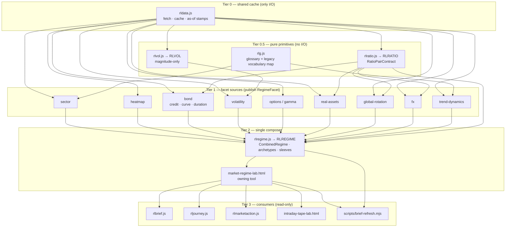

# Design — Market Regime Stack And Strategy Playbook

> Scope of this document chunk: `## Architecture Overview`, `## Capability Foundation`,
> `## Concrete Implementations` (including `### Variation Axes`). Remaining design sections are
> authored in subsequent passes.

## Architecture Overview

Research Lab is a build-free static site: every tool is one self-contained `.html`, and all shared
logic lives in root-level UMD modules that expose a frozen `globalThis.RL*` API (`rlvol.js`→`RLVOL`,
`rlfx.js`→`RLFX`, `rljourney.js`→`RLJOURNEY`, `rlcontracts.js`, `rlcontext.js`→`RLCTX`,
`rlmarketaction.js`→`RLMARKETACTIONCENTER`). The regime stack adds exactly two new root-level UMD
modules — `rlratio.js` (`RLRATIO`) and `rlregime.js` (`RLREGIME`) — and introduces **no** new
`rlexperience-adapters/*` module, so the FR-049 `adapterPolicy.moduleAllowlist` (7 entries:
`market-structure.js`, `options.js`, `macro-rotation.js`, `fundamental-models.js`,
`strategy-research.js`, `property-research.js`, `market-action.js`) is untouched by this feature.

The stack is a strict layered DAG. Every dependency edge points **upward in tier number only**;
there is no edge from a higher tier back to a lower one. This is the mechanical form of BP-1
(facet DAG, no cycles) and BP-2 (one composer).

| Tier | Members | Allowed to do I/O? | May import |
|---|---|---|---|
| **Tier 0 — shared cache** | `rldata.js` | Yes (the only tier that fetches, caches, and stamps as-of) | nothing in this stack |
| **Tier 0.5 — pure primitives** | `rlratio.js` (NEW), `rlvol.js`, `rlg.js` | No | Tier 0 data passed in as frozen arguments |
| **Tier 1 — facet sources** | sector, heatmap, bond, volatility, options/gamma, real-assets, global-rotation, fx, trend-dynamics | Reads Tier 0 only | Tier 0, Tier 0.5 |
| **Tier 2 — composer** | `rlregime.js` (NEW) + its owning tool `market-regime-lab.html` | No (accepts frozen facets + explicit `decisionTime`) | Tier 0.5, published Tier 1 facet readings |
| **Tier 3 — consumers** | `rlbrief.js`, `rljourney.js`, `rlmarketaction.js`, `intraday-tape-lab.html`, every other reading tool, `scripts/brief-refresh.mjs` | Reads published result only | Tier 2 published result, Tier 0.5 |

A Tier 1 facet source **MUST NOT** import or read Tier 2. A trend facet that consulted the combined
fingerprint to decide its own trend value would make the composed regime self-confirming and would
destroy the meaning of the confirmation ratio. Consumers (Tier 3) read the composed result freely;
sources never do. The mechanical no-cycle lint from IP-002 asserts exactly this edge direction and
hooks into the existing `scripts/validate-tool-experience.mjs` validation path.



### Why `rlratio.js` MUST be separate from `rlregime.js`

The generic ratio primitive currently trapped at
`real-assets-lab.html:1249 realRatioTrailingPct(rowsA, rowsB, lookback)` is needed by **facet
sources**, not only by the composer. `bond-regime-lab` needs ratios for its credit-quality pulse
and its curve/duration axes (`bond-regime-lab.html:1419`, `:1455`, `:1709`); `real-assets-lab`
needs them for gold/silver and its other proxy pairs; `global-rotation` and `fx` need them for
international and dollar pairs.

Those are all **Tier 1 facet sources**. If ratio math lived inside `rlregime.js` (Tier 2), each of
those sources would have to import Tier 2 to compute its own facet — a Tier 1 → Tier 2 edge. Tier 2
already consumes Tier 1 facets, so that edge closes the loop: `bond → rlregime → bond`. That is
precisely the cycle BP-1 forbids, and it would reintroduce the self-confirming composition the
whole capability exists to eliminate.

Extracting ratios into `rlratio.js` at **Tier 0.5** keeps every edge monotonic: sources depend
downward on a pure primitive, the composer depends upward-only on published sources, and the DAG
stays acyclic by construction rather than by convention. `rlratio.js` therefore carries no
vocabulary, no classification, and no regime opinion — it produces typed ratio readings and nothing
else. Classification of a ratio reading into a `ratio-derived` facet happens in the Tier 1 source
that owns the pair, not in the primitive.

---

## Capability Foundation

The foundation defines *what a regime facet is*, *how facets compose*, and *how contradiction,
unavailability, and horizon are represented*. Every implementation named in
`## Concrete Implementations` layers on these contracts; none of them redefines them.

### Foundation Contracts

| Contract | Responsibility | Consumers |
|---|---|---|
| **`RatioPairContract`** | Declares a named relative-strength relationship: `{ pairId, numeratorSeries, denominatorSeries, lookbackBars, semanticClass, decisionTime }` → frozen reading `{ pairId, trailingPct, availability, unavailableReason, asOf, provenanceCaveat, comparability }`. Owns date-intersection, as-of-safe truncation, `not-comparable` marking, and caveat propagation. Never classifies, never names a regime. | `rlratio.js`; bond, real-assets, global-rotation, fx and any future ratio-consuming facet source |
| **`RegimeFacetContract`** | The shape of one published facet reading: `{ facetId, kind, value, valueVocabularyId, horizon, state, asOf, sourceAttribution, coverageNote, unavailableReason }` where `kind ∈ {sentiment-stress, trend-structure, breadth-participation, credit, curve, duration-posture, volatility-magnitude, ratio-derived}` and `state ∈ {unavailable, computed, persistent, stale}`. Requires a closed, documented `valueVocabularyId` and — where a legacy vocabulary is retained — an explicit, lossless-or-declared-lossy mapping (BP-3). | every Tier 1 facet-source publication shim; `rlregime.js` on ingest |
| **`FacetHorizonClass`** | The closed enum `structural` (months) \| `swing` (days–weeks) \| `tactical` (intraday), declared once per facet and immutable thereafter. Carries the isolation rule: a facet of one class may never write into another class's slot, value, or persistence counter. | facet declarations; composer grouping; the lab's horizon lever; the horizon-separation UI contract |
| **`RegimeCompositionContract`** | `compose(frozenFacetSet, decisionTime)` → frozen `CombinedRegime`: horizon-grouped readings, contradiction records, confirmation ratio `k/m` with an available-only denominator, archetype match result, and the deterministic fingerprint. Pure; refuses I/O; refuses to accept a mutable input. | `rlregime.js`; `market-regime-lab.html`; `RegimeOwnerReadContract` |
| **`ArchetypeRegistryContract`** | A closed registry mapping fully-enumerated facet-value tuples → archetype name. Exposes `match(combinedRegime)` → `{ archetypeId }` \| `{ unmatched: 'Mixed' \| 'Unresolved', unresolvedFacetPair }`. Forbids nearest-neighbour, majority, and any generated name. | `rlregime.js`; the lab surface; the compatibility projection |
| **`SleeveFitContract`** | A relative research-fit reading: `{ sleeveId, family, subType, ordinal, rationaleFacetIds, rationaleText, discriminated }`. Ordinal-only. Enforces the forbidden-output vocabulary (weight, allocation, exposure, target, position size, buy/sell/hold, over/underweight) and the sub-type separation invariant (BP-7). | the sleeve registry inside `rlregime.js`; the playbook surface |
| **`RegimeOwnerReadContract`** | The single published one-line owner read: `{ id, asOf, read, metrics, deepLink, source: 'DERIVED', evidenceFamilyId, availability }`, shaped for the Tier 0 shared cache and for the deterministic headless owner-read set at `scripts/brief-refresh.mjs:1173` using the existing `DERIVED` source concept at `scripts/brief-refresh.mjs:561`. `evidenceFamilyId` names the constituent facet family so a consumer counting independent evidence cannot double-count the composed read alongside its own inputs (R-5). | `scripts/brief-refresh.mjs`; `rlbrief.js`; `rlmarketaction.js`; the shared cache |
| **`CompatibilityProjectionContract`** | A dated, declared-lossy, **read-only** projection from the fingerprint back into both live band vocabularies — `rlg.js:262-274 macroRegime()` and `rlexperience-adapters/market-structure.js:1296-1300 regimeBand(fg, trend, vix)` — carrying `{ projectedValue, lossyFields, deprecationDate, sourceFingerprintId }`. It projects; it never composes, and it is never a second source of truth. | legacy consumers during migration; the retirement shims |

### Extension Points

**Adding a new facet source** must supply, at declaration time:
1. `facetId` and `kind` drawn from the closed `RegimeFacetContract` kind set.
2. A closed, documented `valueVocabularyId` with every member enumerated — plus an explicit
   mapping table if it retains an existing tool vocabulary (BP-3); silent re-labeling is rejected.
3. Exactly one `FacetHorizonClass`, declared immutably.
4. An as-of stamp derived from the Tier 0 cache entry it read, never from an ambient clock.
5. An `unavailableReason` enum covering at least insufficient history, non-finite input, and no
   common dates, so a missing facet is explicit rather than neutral.
6. `sourceAttribution` and a `coverageNote` (what the facet does and does not observe).
7. A declaration — verified by the IP-002 no-cycle lint — that the module imports no Tier 2 member.

**Adding a new ratio pair** must supply:
1. `pairId`, `numeratorSeries`, `denominatorSeries`, and `lookbackBars` in bars (not calendar days).
2. A `semanticClass` from the ratio-pair semantics axis below.
3. A comparability predicate that yields `not-comparable` for cross-currency, cross-venue, or
   mismatched-calendar pairs instead of a number.
4. The `provenanceCaveat` text that must travel with every reading derived from it — the honest
   proxy disclosure at `real-assets-lab.html:1170` may not be shed when the primitive is reused
   beyond its original gold/silver invocation (BP-8).

**Adding a new archetype** must supply:
1. `archetypeId` and display name.
2. The **exact** qualifying facet-value tuple, fully enumerated — no wildcards, no ranges standing
   in for a set, no "any other value" clause.
3. The horizon set the archetype is defined over.
4. Registration as a registry data edit. There is no rule-generation path; a combination that is
   not enumerated resolves to `Mixed` or `Unresolved` with the specific unresolved facet pair named.

**Adding a new sleeve sub-type** must supply:
1. `sleeveId`, `family`, and a `subType` identity that remains distinct at all times (BP-7) —
   dividend, bond, and commodity are never collapsed into one defensive bucket.
2. The `rationaleFacetIds` it is sensitive to, by facet id.
3. A rationale template that cites those facet ids by name in its rendered text.
4. A `discriminated: false` / no-advantage state for regimes in which no available facet
   distinguishes it, so the playbook can say "no advantage" rather than inventing an ordering.

### Foundation-Owned Behavior

Every implementation inherits the following without restating or overriding it:

- **Horizon isolation.** Composition groups readings by `FacetHorizonClass`. A `tactical` facet
  can change only the tactical slot; it can never alter a `structural` facet's value, its state,
  or its persistence counter. This formalizes the existing horizon frame at `rlbrief.js:1060-1103`.
- **Hysteresis and persistence gating.** Run-length is computed with the existing persistence
  primitive `consecutiveRun` / `isPersistentSignal` at `rlbrief.js:137-145`. A facet reaches
  `persistent` only after its declared run threshold; a `RegimeTransition` stays `candidate` until
  the threshold confirms it, then becomes `confirmed`, then `historical`.
- **Confirmation denominator arithmetic.** The confirmation ratio is `k / m` where `m` counts only
  facets **not** in the `unavailable` state (BP-5). An `unavailable` facet shrinks `m`; it never
  contributes a neutral vote. When `m === 0`, confirmation itself is reported as `unavailable` —
  it is never coerced to `0`, `1`, or a `0/0` sentinel.
- **Contradiction preservation.** Disagreeing facets emit a contradiction record naming both
  facet ids and both values (BP-6). Contradictions are never averaged, vote-counted, smoothed, or
  resolved by silent precedence. The `rlg.js:262-274` vs `market-structure.js:1296-1300` split is
  the canonical case and must render as a visible disagreement.
- **As-of-safe filtering.** Every input series is filtered to observations with `asOf <=
  decisionTime` before use (AC-008, R-4). No revised, smoothed, or look-ahead-labeled history.
  Where point-in-time inputs cannot be obtained, the history is honestly shortened or omitted —
  never reconstructed.
- **Deterministic fingerprinting.** Every public compute entry point takes an explicit ISO
  `decisionTime`. Canonical key ordering and canonical numeric formatting mean identical frozen
  inputs produce byte-identical `CombinedRegime` output and one identical fingerprint in both
  browser and Node. The fingerprint is the only fallback identity when no archetype matches.
- **Null safety.** Every numeric guard uses `Number.isFinite(x)` — **never** the global
  `isFinite(x)`, which returns `true` for `null` and lets a not-yet-fetched value reach
  `.toFixed()` and throw. The first paint runs against a half-empty Tier 0 cache by design, so a
  missing value must render `—` and must not halt the render pass.
- **No defaults, no fallbacks, no stubs.** A missing, stale, or non-finite facet is `unavailable`
  with a reason code. It is never Neutral, never zero, never an in-vocabulary placeholder.
- **Deep freeze.** All published readings and all composed output are deeply frozen. Adapters and
  consumers compute over frozen owner state; they never fetch, never mutate owner state, and never
  import another domain adapter module.
- **Educational-only output.** No order routing, no broker integration, no execution surface, no
  personalized recommendation, and no weight/allocation/exposure language anywhere in the stack
  (BP-9).

---

## Concrete Implementations

### `rlratio.js` — `RLRATIO` (Tier 0.5 pure primitive)

**Foundation contract used:** `RatioPairContract`.

**Implementation-specific behavior.** Generalizes the trapped primitive
`realRatioTrailingPct(rowsA, rowsB, lookback)` at `real-assets-lab.html:1249` — currently reachable
only from its single gold/silver invocation at `real-assets-lab.html:1371` — into a shared,
declared-pair capability. Mirrors the `rlvol.js` UMD module pattern exactly: an IIFE factory whose
return value is `Object.freeze`d, exported as `module.exports` under Node, assigned to
`globalThis.RLRATIO` in the browser, and throwing `RLRATIO_BROWSER_GLOBAL_UNAVAILABLE` when no
global object exists. No DOM, storage, network, timer, or ambient-clock code; every entry point
takes an explicit `decisionTime`.

Owns date intersection between the two series and emits `NO_COMMON_DATES` as an
`unavailableReason` rather than returning a number from mismatched calendars. Emits
`comparability: 'not-comparable'` for declared cross-currency and international pairs instead of a
misleading percentage. Attaches the `real-assets-lab.html:1170` proxy caveat to every reading so
the disclosure travels with reuse (BP-8). Carries **no** vocabulary and performs **no**
classification — a ratio reading becomes a `ratio-derived` facet only inside the Tier 1 source that
declared the pair.

### `rlregime.js` — `RLREGIME` (Tier 2 sole composer)

**Foundation contracts used:** `RegimeFacetContract` (ingest), `FacetHorizonClass`,
`RegimeCompositionContract`, `ArchetypeRegistryContract`, `SleeveFitContract`,
`RegimeOwnerReadContract`, `CompatibilityProjectionContract`.

**Implementation-specific behavior.** The single composition owner (BP-2). Same UMD, deep-freeze,
explicit-`decisionTime`, deterministic-output pattern as `rlvol.js`; `globalThis.RLREGIME` in the
browser, `module.exports` under Node, throwing `RLREGIME_BROWSER_GLOBAL_UNAVAILABLE` when no global
exists. Accepts a **frozen** facet set and refuses I/O outright, which is what structurally
prevents it from becoming a facet source.

Holds two closed registries as module data: the archetype registry (fully-enumerated facet-value
tuples) and the sleeve registry (family + sub-type + sensitivity facet ids). Produces the
horizon-grouped `CombinedRegime`, contradiction records, the available-only confirmation ratio, the
archetype match result (`Mixed` / `Unresolved` with the named unresolved facet pair when no tuple
matches), the deterministic fingerprint, the ordered `SleeveFitRead` set, and the
`RegimeOwnerRead` carrying `source: 'DERIVED'` and `evidenceFamilyId` for R-5 double-count
suppression. Also exposes the compatibility projection as a read-only, dated-deprecation function —
it projects the already-composed fingerprint and never re-derives anything.

### Facet-source publication shims (Tier 1, one per owner tool)

**Foundation contract used:** `RegimeFacetContract` (publish side); `RatioPairContract` where the
source declares ratio pairs.

**Implementation-specific behavior.** Each owner tool gains a small publication shim that is
**publication-only**: it reads its tool's already-computed frozen model output, maps it into a
`RegimeFacetContract` reading with an explicit vocabulary mapping, stamps `asOf`,
`sourceAttribution`, and `coverageNote`, and writes it into the Tier 0 shared-cache facet slot. A
shim performs no new fetching and imports no Tier 2 module; the IP-002 no-cycle lint asserts both.

Per-source specifics:

- **sector** — breadth-participation and trend-structure facets from the existing sector model.
- **heatmap** — breadth-participation facet over the constituent grid.
- **bond** — three *separately identifiable* facets: `credit` (`bond-regime-lab.html:1419`),
  `curve` (`:1455`), and `duration-posture` (`:1709`). They are never blended into one score,
  because inflationary and disinflationary risk-off imply opposite bond consequences (BP-7).
  Consumes `RLRATIO` for its credit-quality pulse pair.
- **volatility** — publishes strictly `kind: 'volatility-magnitude'` from `rlvol.js:335
  regimeBand()`. Per BP-4 this name collides with
  `rlexperience-adapters/market-structure.js:1296-1300 regimeBand()` while meaning something
  different: `rlvol.js:13` is explicit that the model is magnitude-only with zero direction. The
  facet is therefore typed so the composer rejects it wherever a directional regime is expected.
- **options / gamma** — volatility-magnitude and positioning context facets.
- **real-assets** — `ratio-derived` facets over `RLRATIO` pairs, carrying the `:1170` proxy caveat.
- **global-rotation** — `ratio-derived` facets for international pairs, emitting `not-comparable`
  where the pair fails the comparability predicate.
- **fx** — `ratio-derived` dollar facets via `RLFX` plus `RLRATIO`.
- **trend-dynamics** — trend-structure facet; retains its existing vocabulary with an explicit,
  declared mapping into the facet vocabulary rather than a silent re-label.

### `market-regime-lab.html` — the new surface

**Foundation contracts used:** `RegimeCompositionContract`, `FacetHorizonClass`,
`ArchetypeRegistryContract`, `SleeveFitContract`, `RegimeOwnerReadContract`.

**Implementation-specific behavior.** The owning tool of the composer and the only surface that
renders the full fingerprint. Ships the four Feature-012 views — `Simple` (default, decision-first),
`Power` (drill-into-detail), `Brief`, and `Journey` — with the horizon selector as a steerable lever
that recomputes the read live from **one** compute pass, with no refetch. Structural, swing, and
tactical facets are structurally separated in the layout so a tactical flip cannot read as a
structural change (AC-003). Contradictions render as first-class disagreements, not as resolved
verdicts or dismissible warnings. Designed states exist for `unavailable` facets, a shrunken
confirmation denominator (AC-005), a fully-`unavailable` owner read (AC-016), `not-comparable`
international pairs, and the no-advantage sleeve state (AC-013) — none render as a confident-looking
blank or a zero. Any growth/inflation quadrant carries the `market-implied` qualifier inline with
the value, never only in a footnote.

Registration touches, **in the same change** (FR-051): `tools.json`, the `TOOLS` array in
`index.html`, the `TOOLS` array in `rlnav.js`, `tool-experience.config.json`, `simple-models.json`,
`journeys.json`, `notes/market-regime-lab.md`, and the exact-count assertions in
`scripts/validate-tool-experience.mjs` (22 ordinary tools, 4 Market Action Center goals, 48 total
goals, 48 journey definitions). It composes via the root-level `rlregime.js` UMD and therefore
introduces no new `rlexperience-adapters/*` module: the FR-049 `adapterPolicy.moduleAllowlist`
stays at its exact 7 entries. If a future need for a new adapter module arises, it is escalated as
a contract change to `tool-experience.config.json`, never absorbed as an implementation detail.

### Consumer-migration shims (retire the duplicates)

**Foundation contract used:** `CompatibilityProjectionContract` (read-only).

**Implementation-specific behavior.** These shims exist to delete the duplicate and inline regime
copies, not to preserve them:

- **`rlg.js:262-274 macroRegime()`** becomes a thin reader over the compatibility projection,
  carrying its declared-lossy field list and a deprecation date. It stops classifying.
- **`rlexperience-adapters/market-structure.js:1296-1300 regimeBand(fg, trend, vix)`** likewise
  becomes a projection reader. The live divergence between these two — the canonical BP-6 case —
  is resolved by both projecting from one fingerprint, and any residual mapping loss is surfaced
  as a declared contradiction rather than as a silent difference.
- **`intraday-tape-lab.html:1772`** — the inline third copy is deleted. The tool delegates to the
  published composed read exactly the way `intraday-tape-lab.html:1424-1431` already delegates its
  four other structure primitives.

Each shim is a **projection**, never a re-composition. None of them may hold registry data, match
archetypes, or compute a confirmation ratio; that would recreate a second source of truth, which is
the failure condition this feature exists to eliminate. Each shim is a dated deprecation surface
scheduled for removal, and the compatibility projection is schedulable **before or with** consumer
migration, never after it (R-7).

### Variation Axes

| Axis | Options | Owned By Foundation? |
|---|---|---|
| **Facet horizon class** | `structural` (months) · `swing` (days–weeks) · `tactical` (intraday) | **Yes** — the enum, the immutability of a facet's declared class, and the isolation rule (a tactical facet may never move a structural value or persistence counter) are foundation-owned. *Which* class a given facet declares is implementation-owned and fixed at declaration. |
| **Facet state vocabulary** | Per-source typed closed vocabularies keyed by `kind`: sentiment-stress · trend-structure · breadth-participation · credit · curve · duration-posture · volatility-magnitude · ratio-derived. Explicitly **not** a shared numeric score. | **Partly** — the foundation owns the requirement that every vocabulary is closed, documented, versioned by `valueVocabularyId`, and mapped explicitly (lossless-or-declared-lossy) from any retained legacy vocabulary. The vocabulary *members* are implementation-owned by the facet source. |
| **Ratio-pair semantics** | risk-appetite · breadth · style · credit · safety · global · dollar | **Partly** — the foundation owns the `RatioPair` shape, lookback-in-bars, as-of-safe truncation, date intersection, `not-comparable` marking, and caveat propagation. The `semanticClass` and the specific numerator/denominator pair are implementation-owned by the declaring facet source. |
| **Sleeve family** | dividend · bond · commodity · equity · cash-barbell | **Partly** — the foundation owns the sub-type separation invariant (dividend/bond/commodity never collapse), the ordinal-only output shape, the mandatory `rationaleFacetIds`, the no-advantage state, and the forbidden-output vocabulary (weight, allocation, exposure, target, position size, buy/sell/hold). Family membership and rationale templates are implementation-owned. |
| **Archetype enumeration** | Closed-registry match · `Mixed` · `Unresolved` with named unresolved facet pair · deterministic fingerprint as identity of last resort | **Yes** — the foundation owns match-or-`Mixed`/`Unresolved` semantics and forbids nearest-neighbour, majority-vote, and any generated name. Registry entries are implementation-owned data added by registry edit only. |
| **Owner-read publication mode** | Browser shared-cache slot (`rldata.js`) · deterministic headless `DERIVED` read in `scripts/brief-refresh.mjs` | **Yes** — the foundation owns the `RegimeOwnerReadContract` shape, the `source: 'DERIVED'` marking per `scripts/brief-refresh.mjs:561`, the `evidenceFamilyId` double-count guard (R-5), and the requirement that both modes emit byte-identical output for identical frozen inputs. The publication site is implementation-owned. |

---

## RESULT-ENVELOPE

```yaml
agent: bubbles.design
outcome: completed_owned
spec: specs/013-market-regime-stack-and-strategy-playbook
artifactsWritten:
  - specs/013-market-regime-stack-and-strategy-playbook/design.md
artifactsNotTouched:
  - spec.md
  - scopes.md
  - report.md
  - uservalidation.md
  - state.json (certification.* untouched)
sectionsDelivered:
  - "## Architecture Overview"
  - "## Capability Foundation"
  - "### Extension Points"
  - "### Foundation-Owned Behavior"
  - "## Concrete Implementations"
  - "### Variation Axes"
sectionsDeferredToLaterChunks:
  - "## Design Brief"
  - "## Data Model"
  - "## API / Contracts And Error Model"
  - "## UI Component Specifications"
  - "## Security And Compliance"
  - "## Configuration And Migrations"
  - "## Observability And Failure Handling"
  - "## Testing And Validation Strategy"
  - "## Alternatives And Tradeoffs"
  - "## Complexity Tracking"
  - "## Open Questions"
de4Compliance:
  proportionalityTriggerApplies: true
  triggerReason: "New reusable capability with multiple provider-style facet sources, an adapter/registry vocabulary, and shared contracts spanning nine owner tools."
  foundationSectionPresent: true
  concreteImplementationsSectionPresent: true
  variationAxesCount: 6
findings: 0
unresolvedFindings: []
nextOwner: bubbles.design
nextAction: "Author the remaining design.md sections in the next bounded chunk."
```
