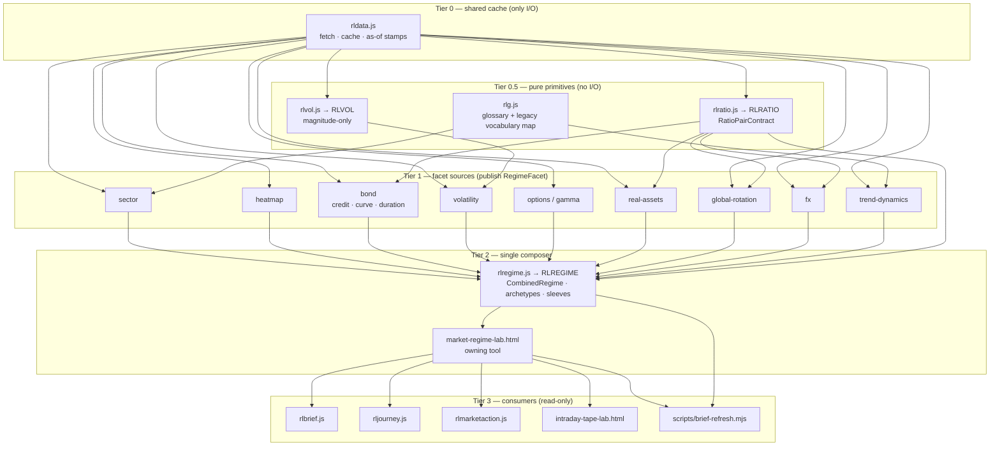

# Design — Market Regime Stack And Strategy Playbook

> Scope of this document chunk: `## Architecture Overview`, `## Capability Foundation`,
> `## Concrete Implementations` (including `### Variation Axes`). Remaining design sections are
> authored in subsequent passes.

## Architecture Overview

Research Lab is a build-free static site: every tool is one self-contained `.html`, and all shared
logic lives in root-level UMD modules that expose a frozen `globalThis.RL*` API (`rlvol.js`→`RLVOL`,
`rlfx.js`→`RLFX`, `rljourney.js`→`RLJOURNEY`, `rlcontracts.js`, `rlcontext.js`→`RLCTX`,
`rlmarketaction.js`→`RLMARKETACTIONCENTER`). The regime stack adds exactly two new root-level UMD
modules — `rlratio.js` (`RLRATIO`) and `rlregime.js` (`RLREGIME`) — and introduces **no** new
`rlexperience-adapters/*` module, so the FR-049 `adapterPolicy.moduleAllowlist` (7 entries:
`market-structure.js`, `options.js`, `macro-rotation.js`, `fundamental-models.js`,
`strategy-research.js`, `property-research.js`, `market-action.js`) is untouched by this feature.

The stack is a strict layered DAG. Every dependency edge points **upward in tier number only**;
there is no edge from a higher tier back to a lower one. This is the mechanical form of BP-1
(facet DAG, no cycles) and BP-2 (one composer).

| Tier | Members | Allowed to do I/O? | May import |
|---|---|---|---|
| **Tier 0 — shared cache** | `rldata.js` | Yes (the only tier that fetches, caches, and stamps as-of) | nothing in this stack |
| **Tier 0.5 — pure primitives** | `rlratio.js` (NEW), `rlvol.js`, `rlg.js` | No | Tier 0 data passed in as frozen arguments |
| **Tier 1 — facet sources** | sector, heatmap, bond, volatility, options/gamma, real-assets, global-rotation, fx, trend-dynamics | Reads Tier 0 only | Tier 0, Tier 0.5 |
| **Tier 2 — composer** | `rlregime.js` (NEW) + its owning tool `market-regime-lab.html` | No (accepts frozen facets + explicit `decisionTime`) | Tier 0.5, published Tier 1 facet readings |
| **Tier 3 — consumers** | `rlbrief.js`, `rljourney.js`, `rlmarketaction.js`, `intraday-tape-lab.html`, every other reading tool, `scripts/brief-refresh.mjs` | Reads published result only | Tier 2 published result, Tier 0.5 |

A Tier 1 facet source **MUST NOT** import or read Tier 2. A trend facet that consulted the combined
fingerprint to decide its own trend value would make the composed regime self-confirming and would
destroy the meaning of the confirmation ratio. Consumers (Tier 3) read the composed result freely;
sources never do. The mechanical no-cycle lint from IP-002 asserts exactly this edge direction and
hooks into the existing `scripts/validate-tool-experience.mjs` validation path.



### Why `rlratio.js` MUST be separate from `rlregime.js`

The generic ratio primitive currently trapped at
`real-assets-lab.html:1249 realRatioTrailingPct(rowsA, rowsB, lookback)` is needed by **facet
sources**, not only by the composer. `bond-regime-lab` needs ratios for its credit-quality pulse
and its curve/duration axes (`bond-regime-lab.html:1419`, `:1455`, `:1709`); `real-assets-lab`
needs them for gold/silver and its other proxy pairs; `global-rotation` and `fx` need them for
international and dollar pairs.

Those are all **Tier 1 facet sources**. If ratio math lived inside `rlregime.js` (Tier 2), each of
those sources would have to import Tier 2 to compute its own facet — a Tier 1 → Tier 2 edge. Tier 2
already consumes Tier 1 facets, so that edge closes the loop: `bond → rlregime → bond`. That is
precisely the cycle BP-1 forbids, and it would reintroduce the self-confirming composition the
whole capability exists to eliminate.

Extracting ratios into `rlratio.js` at **Tier 0.5** keeps every edge monotonic: sources depend
downward on a pure primitive, the composer depends upward-only on published sources, and the DAG
stays acyclic by construction rather than by convention. `rlratio.js` therefore carries no
vocabulary, no classification, and no regime opinion — it produces typed ratio readings and nothing
else. Classification of a ratio reading into a `ratio-derived` facet happens in the Tier 1 source
that owns the pair, not in the primitive.

---

## Capability Foundation

The foundation defines *what a regime facet is*, *how facets compose*, and *how contradiction,
unavailability, and horizon are represented*. Every implementation named in
`## Concrete Implementations` layers on these contracts; none of them redefines them.

### Foundation Contracts

| Contract | Responsibility | Consumers |
|---|---|---|
| **`RatioPairContract`** | Declares a named relative-strength relationship: `{ pairId, numeratorSeries, denominatorSeries, lookbackBars, semanticClass, decisionTime }` → frozen reading `{ pairId, trailingPct, availability, unavailableReason, asOf, provenanceCaveat, comparability }`. Owns date-intersection, as-of-safe truncation, `not-comparable` marking, and caveat propagation. Never classifies, never names a regime. | `rlratio.js`; bond, real-assets, global-rotation, fx and any future ratio-consuming facet source |
| **`RegimeFacetContract`** | The shape of one published facet reading: `{ facetId, kind, value, valueVocabularyId, horizon, state, asOf, sourceAttribution, coverageNote, unavailableReason }` where `kind ∈ {sentiment-stress, trend-structure, breadth-participation, credit, curve, duration-posture, volatility-magnitude, ratio-derived}` and `state ∈ {unavailable, computed, persistent, stale}`. Requires a closed, documented `valueVocabularyId` and — where a legacy vocabulary is retained — an explicit, lossless-or-declared-lossy mapping (BP-3). | every Tier 1 facet-source publication shim; `rlregime.js` on ingest |
| **`FacetHorizonClass`** | The closed enum `structural` (months) \| `swing` (days–weeks) \| `tactical` (intraday), declared once per facet and immutable thereafter. Carries the isolation rule: a facet of one class may never write into another class's slot, value, or persistence counter. | facet declarations; composer grouping; the lab's horizon lever; the horizon-separation UI contract |
| **`RegimeCompositionContract`** | `compose(frozenFacetSet, decisionTime)` → frozen `CombinedRegime`: horizon-grouped readings, contradiction records, confirmation ratio `k/m` with an available-only denominator, archetype match result, and the deterministic fingerprint. Pure; refuses I/O; refuses to accept a mutable input. | `rlregime.js`; `market-regime-lab.html`; `RegimeOwnerReadContract` |
| **`ArchetypeRegistryContract`** | A closed registry mapping fully-enumerated facet-value tuples → archetype name. Exposes `match(combinedRegime)` → `{ archetypeId }` \| `{ unmatched: 'Mixed' \| 'Unresolved', unresolvedFacetPair }`. Forbids nearest-neighbour, majority, and any generated name. | `rlregime.js`; the lab surface; the compatibility projection |
| **`SleeveFitContract`** | A relative research-fit reading: `{ sleeveId, family, subType, ordinal, rationaleFacetIds, rationaleText, discriminated }`. Ordinal-only. Enforces the forbidden-output vocabulary (weight, allocation, exposure, target, position size, buy/sell/hold, over/underweight) and the sub-type separation invariant (BP-7). | the sleeve registry inside `rlregime.js`; the playbook surface |
| **`RegimeOwnerReadContract`** | The single published one-line owner read: `{ id, asOf, read, metrics, deepLink, source: 'DERIVED', evidenceFamilyId, availability }`, shaped for the Tier 0 shared cache and for the deterministic headless owner-read set at `scripts/brief-refresh.mjs:1173` using the existing `DERIVED` source concept at `scripts/brief-refresh.mjs:561`. `evidenceFamilyId` names the constituent facet family so a consumer counting independent evidence cannot double-count the composed read alongside its own inputs (R-5). | `scripts/brief-refresh.mjs`; `rlbrief.js`; `rlmarketaction.js`; the shared cache |
| **`CompatibilityProjectionContract`** | A dated, declared-lossy, **read-only** projection from the fingerprint back into both live band vocabularies — `rlg.js:262-274 macroRegime()` and `rlexperience-adapters/market-structure.js:1296-1300 regimeBand(fg, trend, vix)` — carrying `{ projectedValue, lossyFields, deprecationDate, sourceFingerprintId }`. It projects; it never composes, and it is never a second source of truth. | legacy consumers during migration; the retirement shims |

### Extension Points

**Adding a new facet source** must supply, at declaration time:
1. `facetId` and `kind` drawn from the closed `RegimeFacetContract` kind set.
2. A closed, documented `valueVocabularyId` with every member enumerated — plus an explicit
   mapping table if it retains an existing tool vocabulary (BP-3); silent re-labeling is rejected.
3. Exactly one `FacetHorizonClass`, declared immutably.
4. An as-of stamp derived from the Tier 0 cache entry it read, never from an ambient clock.
5. An `unavailableReason` enum covering at least insufficient history, non-finite input, and no
   common dates, so a missing facet is explicit rather than neutral.
6. `sourceAttribution` and a `coverageNote` (what the facet does and does not observe).
7. A declaration — verified by the IP-002 no-cycle lint — that the module imports no Tier 2 member.

**Adding a new ratio pair** must supply:
1. `pairId`, `numeratorSeries`, `denominatorSeries`, and `lookbackBars` in bars (not calendar days).
2. A `semanticClass` from the ratio-pair semantics axis below.
3. A comparability predicate that yields `not-comparable` for cross-currency, cross-venue, or
   mismatched-calendar pairs instead of a number.
4. The `provenanceCaveat` text that must travel with every reading derived from it — the honest
   proxy disclosure at `real-assets-lab.html:1170` may not be shed when the primitive is reused
   beyond its original gold/silver invocation (BP-8).

**Adding a new archetype** must supply:
1. `archetypeId` and display name.
2. The **exact** qualifying facet-value tuple, fully enumerated — no wildcards, no ranges standing
   in for a set, no "any other value" clause.
3. The horizon set the archetype is defined over.
4. Registration as a registry data edit. There is no rule-generation path; a combination that is
   not enumerated resolves to `Mixed` or `Unresolved` with the specific unresolved facet pair named.

**Adding a new sleeve sub-type** must supply:
1. `sleeveId`, `family`, and a `subType` identity that remains distinct at all times (BP-7) —
   dividend, bond, and commodity are never collapsed into one defensive bucket.
2. The `rationaleFacetIds` it is sensitive to, by facet id.
3. A rationale template that cites those facet ids by name in its rendered text.
4. A `discriminated: false` / no-advantage state for regimes in which no available facet
   distinguishes it, so the playbook can say "no advantage" rather than inventing an ordering.

### Foundation-Owned Behavior

Every implementation inherits the following without restating or overriding it:

- **Horizon isolation.** Composition groups readings by `FacetHorizonClass`. A `tactical` facet
  can change only the tactical slot; it can never alter a `structural` facet's value, its state,
  or its persistence counter. This formalizes the existing horizon frame at `rlbrief.js:1060-1103`.
- **Hysteresis and persistence gating.** Run-length is computed with the existing persistence
  primitive `consecutiveRun` / `isPersistentSignal` at `rlbrief.js:137-145`. A facet reaches
  `persistent` only after its declared run threshold; a `RegimeTransition` stays `candidate` until
  the threshold confirms it, then becomes `confirmed`, then `historical`.
- **Confirmation denominator arithmetic.** The confirmation ratio is `k / m` where `m` counts only
  facets **not** in the `unavailable` state (BP-5). An `unavailable` facet shrinks `m`; it never
  contributes a neutral vote. When `m === 0`, confirmation itself is reported as `unavailable` —
  it is never coerced to `0`, `1`, or a `0/0` sentinel.
- **Contradiction preservation.** Disagreeing facets emit a contradiction record naming both
  facet ids and both values (BP-6). Contradictions are never averaged, vote-counted, smoothed, or
  resolved by silent precedence. The `rlg.js:262-274` vs `market-structure.js:1296-1300` split is
  the canonical case and must render as a visible disagreement.
- **As-of-safe filtering.** Every input series is filtered to observations with `asOf <=
  decisionTime` before use (AC-008, R-4). No revised, smoothed, or look-ahead-labeled history.
  Where point-in-time inputs cannot be obtained, the history is honestly shortened or omitted —
  never reconstructed.
- **Deterministic fingerprinting.** Every public compute entry point takes an explicit ISO
  `decisionTime`. Canonical key ordering and canonical numeric formatting mean identical frozen
  inputs produce byte-identical `CombinedRegime` output and one identical fingerprint in both
  browser and Node. The fingerprint is the only fallback identity when no archetype matches.
- **Null safety.** Every numeric guard uses `Number.isFinite(x)` — **never** the global
  `isFinite(x)`, which returns `true` for `null` and lets a not-yet-fetched value reach
  `.toFixed()` and throw. The first paint runs against a half-empty Tier 0 cache by design, so a
  missing value must render `—` and must not halt the render pass.
- **No defaults, no fallbacks, no stubs.** A missing, stale, or non-finite facet is `unavailable`
  with a reason code. It is never Neutral, never zero, never an in-vocabulary placeholder.
- **Deep freeze.** All published readings and all composed output are deeply frozen. Adapters and
  consumers compute over frozen owner state; they never fetch, never mutate owner state, and never
  import another domain adapter module.
- **Educational-only output.** No order routing, no broker integration, no execution surface, no
  personalized recommendation, and no weight/allocation/exposure language anywhere in the stack
  (BP-9).

---

## Concrete Implementations

### `rlratio.js` — `RLRATIO` (Tier 0.5 pure primitive)

**Foundation contract used:** `RatioPairContract`.

**Implementation-specific behavior.** Generalizes the trapped primitive
`realRatioTrailingPct(rowsA, rowsB, lookback)` at `real-assets-lab.html:1249` — currently reachable
only from its single gold/silver invocation at `real-assets-lab.html:1371` — into a shared,
declared-pair capability. Mirrors the `rlvol.js` UMD module pattern exactly: an IIFE factory whose
return value is `Object.freeze`d, exported as `module.exports` under Node, assigned to
`globalThis.RLRATIO` in the browser, and throwing `RLRATIO_BROWSER_GLOBAL_UNAVAILABLE` when no
global object exists. No DOM, storage, network, timer, or ambient-clock code; every entry point
takes an explicit `decisionTime`.

Owns date intersection between the two series and emits `NO_COMMON_DATES` as an
`unavailableReason` rather than returning a number from mismatched calendars. Emits
`comparability: 'not-comparable'` for declared cross-currency and international pairs instead of a
misleading percentage. Attaches the `real-assets-lab.html:1170` proxy caveat to every reading so
the disclosure travels with reuse (BP-8). Carries **no** vocabulary and performs **no**
classification — a ratio reading becomes a `ratio-derived` facet only inside the Tier 1 source that
declared the pair.

### `rlregime.js` — `RLREGIME` (Tier 2 sole composer)

**Foundation contracts used:** `RegimeFacetContract` (ingest), `FacetHorizonClass`,
`RegimeCompositionContract`, `ArchetypeRegistryContract`, `SleeveFitContract`,
`RegimeOwnerReadContract`, `CompatibilityProjectionContract`.

**Implementation-specific behavior.** The single composition owner (BP-2). Same UMD, deep-freeze,
explicit-`decisionTime`, deterministic-output pattern as `rlvol.js`; `globalThis.RLREGIME` in the
browser, `module.exports` under Node, throwing `RLREGIME_BROWSER_GLOBAL_UNAVAILABLE` when no global
exists. Accepts a **frozen** facet set and refuses I/O outright, which is what structurally
prevents it from becoming a facet source.

Holds two closed registries as module data: the archetype registry (fully-enumerated facet-value
tuples) and the sleeve registry (family + sub-type + sensitivity facet ids). Produces the
horizon-grouped `CombinedRegime`, contradiction records, the available-only confirmation ratio, the
archetype match result (`Mixed` / `Unresolved` with the named unresolved facet pair when no tuple
matches), the deterministic fingerprint, the ordered `SleeveFitRead` set, and the
`RegimeOwnerRead` carrying `source: 'DERIVED'` and `evidenceFamilyId` for R-5 double-count
suppression. Also exposes the compatibility projection as a read-only, dated-deprecation function —
it projects the already-composed fingerprint and never re-derives anything.

### Facet-source publication shims (Tier 1, one per owner tool)

**Foundation contract used:** `RegimeFacetContract` (publish side); `RatioPairContract` where the
source declares ratio pairs.

**Implementation-specific behavior.** Each owner tool gains a small publication shim that is
**publication-only**: it reads its tool's already-computed frozen model output, maps it into a
`RegimeFacetContract` reading with an explicit vocabulary mapping, stamps `asOf`,
`sourceAttribution`, and `coverageNote`, and writes it into the Tier 0 shared-cache facet slot. A
shim performs no new fetching and imports no Tier 2 module; the IP-002 no-cycle lint asserts both.

Per-source specifics:

- **sector** — breadth-participation and trend-structure facets from the existing sector model.
- **heatmap** — breadth-participation facet over the constituent grid.
- **bond** — three *separately identifiable* facets: `credit` (`bond-regime-lab.html:1419`),
  `curve` (`:1455`), and `duration-posture` (`:1709`). They are never blended into one score,
  because inflationary and disinflationary risk-off imply opposite bond consequences (BP-7).
  Consumes `RLRATIO` for its credit-quality pulse pair.
- **volatility** — publishes strictly `kind: 'volatility-magnitude'` from `rlvol.js:335
  regimeBand()`. Per BP-4 this name collides with
  `rlexperience-adapters/market-structure.js:1296-1300 regimeBand()` while meaning something
  different: `rlvol.js:13` is explicit that the model is magnitude-only with zero direction. The
  facet is therefore typed so the composer rejects it wherever a directional regime is expected.
- **options / gamma** — volatility-magnitude and positioning context facets.
- **real-assets** — `ratio-derived` facets over `RLRATIO` pairs, carrying the `:1170` proxy caveat.
- **global-rotation** — `ratio-derived` facets for international pairs, emitting `not-comparable`
  where the pair fails the comparability predicate.
- **fx** — `ratio-derived` dollar facets via `RLFX` plus `RLRATIO`. **Declared facet slot with no
  shim host in this feature** (OQ-1, resolved): the slot exists in the contract, no publication shim
  is authorized here, and the facet is therefore always absent at runtime and composes through the
  already-specified absent-facet path.
- **trend-dynamics** — trend-structure facet; retains its existing vocabulary with an explicit,
  declared mapping into the facet vocabulary rather than a silent re-label.

#### Shim host surfaces

A shim lives in the surface that already owns and renders that source's model, so publication is a
local read of frozen output rather than a new dependency. The host is the file the shim edit lands
in; the *consumed* column is read as input and is **not** modified by the shim.

| Facet source (Tier 1 node) | Shim host surface | Consumed as delivered (not modified) |
|---|---|---|
| `sector` | `sector-research-lab.html` | `rlg.js` vocabulary map |
| `heatmap` | `market-heatmap-lab.html` | — |
| `bond` | `bond-regime-lab.html` | `RLRATIO` credit-quality pulse pair |
| `volatility` | `volatility-sizing-lab.html` | `rlvol.js:335 regimeBand()` reading |
| `options / gamma` | `gamma-trading-lab.html`, `options-structure-lab.html` | `rlexperience-adapters/options.js` owner formulas |
| `real-assets` | `real-assets-lab.html` | `RLRATIO` proxy pairs |
| `global-rotation` | `global-rotation-lab.html` | `RLRATIO` international pairs |
| `trend-dynamics` | `trend-dynamics-cycle-lab.html` | `rlg.js` vocabulary map |
| `fx` | **none — declared slot, no host in this feature** (OQ-1, resolved) | `RLFX`, `RLRATIO` dollar pairs |

`rlvol.js` and `rlexperience-adapters/options.js` are read as **inputs** by their hosts' shims and
are not themselves shim hosts. `rlvol.js` is an enumerated Tier 0.5 pure primitive whose
`regimeBand()` reading already exists and is mapped by the host, and an `rlexperience-adapters/*`
change is a `tool-experience.config.json` contract change under FR-049, never an implementation
detail absorbed here. `rlfx.js` is likewise **consumed, not modified**: it is a pure frozen UMD
module that Tier 0 `rldata.js` already calls — `rldata.js:309` invokes
`root.RLFX.normalizeSourceEnvelope(raw, policy || {}, decisionTime)`, guarded at `rldata.js:298` and
`rldata.js:312` by `typeof root.RLFX.normalizeSourceEnvelope !== "function"`. Placing a shared-cache
**write** inside `rlfx.js` would therefore put one module on both sides of the Tier 0 boundary and
close the `rldata.js → RLFX → rldata.js` edge BP-1 forbids. `RLFX` is consumed as a reading input
exactly the way `RLRATIO` is, and `rlfx.js` is absent from every authorized-edit list in
`## Implementation Boundary`.

**The `fx` slot with no host is a runtime state, not a hole in the design** (OQ-1, resolved). `fx`
stays a first-class declared facet slot: it keeps its Tier 1 node in the DAG, its entry in the tier
table, its per-source bullet above, and its `fx.dollar` appearances in the `absentFacetIds` /
`excludedFacetIds` examples. Because no shim host is authorized here, the slot is simply **always
absent at runtime**, which is a state the composer already specifies end to end: the facet is
excluded from `m`, named in `confirmation.excludedFacetIds`, and named in the owner read's
`absentFacetIds` under `availability: 'partial'` with `unavailableReason: 'SOURCE_UNAVAILABLE'`. A
composition with `fx` absent is a **valid, expected** composition that degrades honestly — the
absent slot is stated, never filled with a neutral vote, a zero, a stale value, or an omitted line
that reads as agreement, and it MUST never be presented as a live FX reading. When a future host
publishes a `RegimeFacetContract` reading into this existing slot through the same Tier 1
publication path every other source uses, the contract, the DAG, the tier table, the composer, and
the archetype registry require zero change.

`trend-dynamics-cycle-lab.html` exists in the repository and is the `trend-dynamics` node's owner,
so its shim lands in a file that is present. It is absent from `tools.json`, `rlnav.js`,
`index.html`, `simple-models.json`, and `journeys.json`, so it carries no registry deep link: the
registry-coherence obligation that binds *registered* facet-source owner tools does not reach it,
and this feature neither registers it nor alters that condition.

### `market-regime-lab.html` — the new surface

**Foundation contracts used:** `RegimeCompositionContract`, `FacetHorizonClass`,
`ArchetypeRegistryContract`, `SleeveFitContract`, `RegimeOwnerReadContract`.

**Implementation-specific behavior.** The owning tool of the composer and the only surface that
renders the full fingerprint. Ships the four Feature-012 views — `Simple` (default, decision-first),
`Power` (drill-into-detail), `Brief`, and `Journey` — with the horizon selector as a steerable lever
that recomputes the read live from **one** compute pass, with no refetch. Structural, swing, and
tactical facets are structurally separated in the layout so a tactical flip cannot read as a
structural change (AC-003). Contradictions render as first-class disagreements, not as resolved
verdicts or dismissible warnings. Designed states exist for `unavailable` facets, a shrunken
confirmation denominator (AC-005), a fully-`unavailable` owner read (AC-016), `not-comparable`
international pairs, and the no-advantage sleeve state (AC-013) — none render as a confident-looking
blank or a zero. Any growth/inflation quadrant carries the `market-implied` qualifier inline with
the value, never only in a footnote.

Registration touches, **in the same change** (FR-051): `tools.json`, the `TOOLS` array in
`index.html`, the `TOOLS` array in `rlnav.js`, `tool-experience.config.json`, `simple-models.json`,
`journeys.json`, `notes/market-regime-lab.md`, and the exact-count assertions in
`scripts/validate-tool-experience.mjs` (22 ordinary tools, 4 Market Action Center goals, 48 total
goals, 48 journey definitions). It composes via the root-level `rlregime.js` UMD and therefore
introduces no new `rlexperience-adapters/*` module: the FR-049 `adapterPolicy.moduleAllowlist`
stays at its exact 7 entries. If a future need for a new adapter module arises, it is escalated as
a contract change to `tool-experience.config.json`, never absorbed as an implementation detail.

### Consumer-migration shims (retire the duplicates)

**Foundation contract used:** `CompatibilityProjectionContract` (read-only).

**Implementation-specific behavior.** These shims exist to delete the duplicate and inline regime
copies, not to preserve them:

- **`rlg.js:262-274 macroRegime()`** becomes a thin reader over the compatibility projection,
  carrying its declared-lossy field list and a deprecation date. It stops classifying.
- **`rlexperience-adapters/market-structure.js:1296-1300 regimeBand(fg, trend, vix)`** likewise
  becomes a projection reader. The live divergence between these two — the canonical BP-6 case —
  is resolved by both projecting from one fingerprint, and any residual mapping loss is surfaced
  as a declared contradiction rather than as a silent difference.
- **`intraday-tape-lab.html:1772`** — the inline third copy is deleted. The tool delegates to the
  published composed read exactly the way `intraday-tape-lab.html:1424-1431` already delegates its
  four other structure primitives.

Each shim is a **projection**, never a re-composition. None of them may hold registry data, match
archetypes, or compute a confirmation ratio; that would recreate a second source of truth, which is
the failure condition this feature exists to eliminate. Each shim is a dated deprecation surface
scheduled for removal, and the compatibility projection is schedulable **before or with** consumer
migration, never after it (R-7).

### Variation Axes

| Axis | Options | Owned By Foundation? |
|---|---|---|
| **Facet horizon class** | `structural` (months) · `swing` (days–weeks) · `tactical` (intraday) | **Yes** — the enum, the immutability of a facet's declared class, and the isolation rule (a tactical facet may never move a structural value or persistence counter) are foundation-owned. *Which* class a given facet declares is implementation-owned and fixed at declaration. |
| **Facet state vocabulary** | Per-source typed closed vocabularies keyed by `kind`: sentiment-stress · trend-structure · breadth-participation · credit · curve · duration-posture · volatility-magnitude · ratio-derived. Explicitly **not** a shared numeric score. | **Partly** — the foundation owns the requirement that every vocabulary is closed, documented, versioned by `valueVocabularyId`, and mapped explicitly (lossless-or-declared-lossy) from any retained legacy vocabulary. The vocabulary *members* are implementation-owned by the facet source. |
| **Ratio-pair semantics** | risk-appetite · breadth · style · credit · safety · global · dollar | **Partly** — the foundation owns the `RatioPair` shape, lookback-in-bars, as-of-safe truncation, date intersection, `not-comparable` marking, and caveat propagation. The `semanticClass` and the specific numerator/denominator pair are implementation-owned by the declaring facet source. |
| **Sleeve family** | dividend · bond · commodity · equity · cash-barbell | **Partly** — the foundation owns the sub-type separation invariant (dividend/bond/commodity never collapse), the ordinal-only output shape, the mandatory `rationaleFacetIds`, the no-advantage state, and the forbidden-output vocabulary (weight, allocation, exposure, target, position size, buy/sell/hold). Family membership and rationale templates are implementation-owned. |
| **Archetype enumeration** | Closed-registry match · `Mixed` · `Unresolved` with named unresolved facet pair · deterministic fingerprint as identity of last resort | **Yes** — the foundation owns match-or-`Mixed`/`Unresolved` semantics and forbids nearest-neighbour, majority-vote, and any generated name. Registry entries are implementation-owned data added by registry edit only. |
| **Owner-read publication mode** | Browser shared-cache slot (`rldata.js`) · deterministic headless `DERIVED` read in `scripts/brief-refresh.mjs` | **Yes** — the foundation owns the `RegimeOwnerReadContract` shape, the `source: 'DERIVED'` marking per `scripts/brief-refresh.mjs:561`, the `evidenceFamilyId` double-count guard (R-5), and the requirement that both modes emit byte-identical output for identical frozen inputs. The publication site is implementation-owned. |

---

## Module Contracts

Both modules mirror the `rlvol.js` module shape exactly. There is one shape, stated once here, and
neither module deviates from it.

### Shared UMD wrapper shape

A single IIFE takes the factory, deep-freezes the factory's return value **before** publication, and
exports it to exactly one host. Node wins when `module.exports` exists; otherwise the browser global
is assigned; a host with neither is a hard, named throw — never a silent no-op and never a partial
export.

```js
(function (factory) {
    "use strict";

    var api = Object.freeze(factory());
    if (typeof module === "object" && module && module.exports) {
        module.exports = api;
        return;
    }
    if (typeof globalThis === "undefined") {
        throw new Error("RLRATIO_BROWSER_GLOBAL_UNAVAILABLE");   // RLREGIME_BROWSER_GLOBAL_UNAVAILABLE in rlregime.js
    }
    globalThis.RLRATIO = api;                                    // globalThis.RLREGIME in rlregime.js
})(function () {
    "use strict";
    /* closed vocabularies, pure helpers, validators, entry points, then the frozen api literal */
});
```

Invariants that hold for both modules, inherited from `## Capability Foundation` → *Foundation-Owned
Behavior* and not restated per entry point below:

- No DOM, `localStorage`, `fetch`, `setTimeout`, or ambient clock. `Date.now()` and `new Date()`
  with no argument are absent from both files. Every compute entry point takes an explicit ISO
  `decisionTime` validated the way `rlvol.js:135 requireIsoInstant` validates it — the string must
  round-trip through `new Date(epoch).toISOString()` byte-for-byte, or the entry point throws
  `RLRATIO_DECISION_TIME_INVALID` / `RLREGIME_DECISION_TIME_INVALID`.
- Every numeric guard is `Number.isFinite(x)`. The global `isFinite(x)` appears nowhere in either
  file: `isFinite(null) === true`, which is exactly how a not-yet-fetched Tier 0 cache value reaches
  `.toFixed()` and throws mid-render on the half-empty first paint.
- Every returned reading, every nested array, and every composed result is deeply frozen before it
  leaves the module. Callers compute over frozen state.
- Deterministic: identical frozen inputs and an identical `decisionTime` produce canonically
  key-ordered, canonically number-formatted output and one identical fingerprint under Node and in
  the browser.
- No defaults, no fallbacks, no stubs. A missing input never becomes a neutral value; it becomes a
  typed unavailable state carrying exactly one closed reason code.

### Shared error contract

Both modules carry a private `schemaError(code, path, message)` identical in shape to
`rlvol.js:128`:

```js
function schemaError(code, path, message) {
    var error = new Error(message || code);
    error.code = code;
    error.path = path || "$";
    return error;
}
```

Rules, mirroring the `RLVOL_SCHEMA_INVALID` discipline:

- The value **thrown** is always an `Error` instance carrying a machine-readable `.code` and a
  `.path` locating the offending field. A bare string is never thrown, and a thrown value is never
  a plain object.
- Codes are a closed set per module. `RLRATIO_SCHEMA_INVALID` and `RLREGIME_SCHEMA_INVALID` cover
  shape and vocabulary violations; `RLRATIO_CONTRACT_VERSION` and `RLREGIME_CONTRACT_VERSION` cover
  a `contractVersion` mismatch on an ingested document; `RLRATIO_DECISION_TIME_INVALID` and
  `RLREGIME_DECISION_TIME_INVALID` cover a non-round-tripping instant;
  `RLRATIO_BROWSER_GLOBAL_UNAVAILABLE` and `RLREGIME_BROWSER_GLOBAL_UNAVAILABLE` cover the host
  failure in the wrapper.
- **A throw means the caller passed a malformed contract.** It never means "the data was not
  available." Absent, short, stale, or non-finite *data* is not an exception — it is a returned
  reading with `availability` set and exactly one `unavailableReason`. Conflating the two is what
  produces a silent default, so the split is structural.
- No entry point ever substitutes a default, coerces `null` to `0`, or returns a neutral in-vocabulary
  value in place of a failed guard.

### `rlratio.js` — `RLRATIO` exported surface

All functions are pure. `RLRATIO` holds **no** classification vocabulary and **never** names a
regime; a reading becomes a `ratio-derived` facet only inside the Tier 1 source that declared the
pair.

| Export | Arguments | Returns | Throws |
|---|---|---|---|
| `validatePairRegistry(registry)` | `registry`: `ratio-pair-registry/v1` document | frozen `{ contractVersion, pairs: [frozen RatioPairDeclaration], familyIndex: { [ratioFamilyId]: [pairId] } }` | `RLRATIO_CONTRACT_VERSION` on version mismatch; `RLRATIO_SCHEMA_INVALID` at `pairs[i].<field>` for a missing `pairId`/`numeratorSeries`/`denominatorSeries`, a non-integer or `< 2` `lookbackBars`, a `semanticClass` outside the closed set, a duplicate `pairId`, or a missing `ratioFamilyId` |
| `ratioSeries(rowsA, rowsB, opts)` | `rowsA`, `rowsB`: bare daily-bar row arrays; `opts`: `{ pairId, lookbackBars, semanticClass, ratioFamilyId, decisionTime, sessionRef, currencyRef, adjustmentRef, provenanceCaveat }` | frozen `{ pairId, ratioFamilyId, points: [{ date, ratio }], observedCount, asOf, availability, unavailableReason, comparability, provenanceCaveat, windowRef }` | `RLRATIO_SCHEMA_INVALID` when `rowsA`/`rowsB` are not arrays, `lookbackBars` is not an integer `>= 2`, or a required `opts` field is absent; `RLRATIO_DECISION_TIME_INVALID` on a bad instant |
| `trailingChange(series, opts)` | `series`: a frozen `ratioSeries` result; `opts`: `{ lookbackBars, decisionTime }` | frozen `{ pairId, ratioFamilyId, trailingPct, asOf, availability, unavailableReason, windowRef, comparability, provenanceCaveat }` — the `RatioPairContract` reading | `RLRATIO_SCHEMA_INVALID` at `series` / `lookbackBars` |
| `windowStats(values, opts)` | `values`: finite numbers; `opts`: `{ windowRef, decisionTime }` where `windowRef = { observations, startDate, endDate }` | frozen `{ zScore, percentile, windowRef, availability, unavailableReason }` | `RLRATIO_SCHEMA_INVALID` at `windowRef` when `windowRef` is absent or missing any of `observations` / `startDate` / `endDate` — mirroring `rlvol.js:321` and `rlvol.js:429`, a z-score or percentile with an undeclared window is refused outright; `RLRATIO_SCHEMA_INVALID` at `values[i]` for a non-finite member |
| `groupByFamily(readings)` | array of frozen `trailingChange` readings | frozen `[{ ratioFamilyId, memberPairIds, representativePairId, memberAgreement, confirmationWeight: 1 }]` | `RLRATIO_SCHEMA_INVALID` at `readings[i].ratioFamilyId` when a reading carries no family |
| `checkAdjustmentParity(rowsA, rowsB, adjustmentRef)` | two row arrays + `{ numeratorAdjustment, denominatorAdjustment }` from the closed set `price-return · total-return · split-only · unadjusted` | frozen `{ parity: true }` \| `{ parity: false, unavailableReason: 'ADJUSTMENT_MISMATCH', numeratorAdjustment, denominatorAdjustment }` | `RLRATIO_SCHEMA_INVALID` at `adjustmentRef` for a value outside the closed set |
| `checkComparability(opts)` | `{ sessionRef, currencyRef, calendarRef }` for both legs | frozen `{ comparability: 'comparable' }` \| `{ comparability: 'not-comparable', unavailableReason }` | `RLRATIO_SCHEMA_INVALID` at the offending ref when a required ref is absent |

**`ratioSeries` behavior.** Both row arrays are filtered to `asOf <= decisionTime` before anything
else, then intersected on date. Rows with a non-finite or non-positive close are dropped
deterministically and counted. If the intersection is empty the result is `availability:
'unavailable'` with `unavailableReason: 'NO_COMMON_DATES'`; if the intersection is shorter than
`lookbackBars` it is `'unavailable'` with `'INSUFFICIENT_HISTORY'`. It never returns a number
computed across mismatched calendars.

**`trailingChange` behavior.** Generalizes the trapped `realRatioTrailingPct(rowsA, rowsB,
lookback)` at `real-assets-lab.html:1249`. `trailingPct` is present **only** when `availability` is
`current` or `stale` and `comparability` is `comparable`; in every other state `trailingPct` is
absent and exactly one `unavailableReason` is set. The `real-assets-lab.html:1170` proxy caveat is
copied onto every reading derived from a pair that declared it, so the disclosure travels with reuse
(BP-8).

**Family grouping behavior.** `SOXX/SPY` and `SMH/SPY` declare the same `ratioFamilyId`
(semiconductor-leadership) and therefore contribute `confirmationWeight: 1` **once**, not twice.
`memberAgreement` is `agree` \| `disagree` \| `partial` so a family whose members disagree is
visible rather than averaged away. The composer consumes `confirmationWeight`, never the raw member
count, which is what prevents a correlated pair from inflating `k` in the `k/m` ratio.

**Comparability behavior.** A cross-currency, cross-venue, or mismatched-calendar pair returns
`comparability: 'not-comparable'` with a reason from `CURRENCY_MISMATCH · SESSION_MISMATCH ·
CALENDAR_MISMATCH · ADJUSTMENT_MISMATCH`. It returns **`not-comparable`, never a number** — a
percentage across a currency boundary is a wrong answer, not a caveated one.

### `rlregime.js` — `RLREGIME` exported surface

`RLREGIME` has **exactly two** entry points into regime state, and the split is the mechanical form
of the IP-002 no-cycle rule (BP-2):

- **`composeRegime(facets, policy)` — Tier 2 composition ONLY.** The single place a
  `CombinedRegime` is ever produced. Accepts a frozen facet set; refuses I/O; refuses a mutable
  input.
- **`readPublishedContext(publishedRegime, opts)` — display and qualification ONLY.** Reads an
  already-composed frozen result to render it or to qualify another tool's claim. It **never**
  recomputes: it holds no registry, matches no archetype, and computes no confirmation ratio. A
  consumer that needs regime context calls this one and structurally cannot re-enter composition.

| Export | Arguments | Returns | Throws |
|---|---|---|---|
| `validateFacet(facet)` | one `regime-facet/v1` reading | the frozen reading | `RLREGIME_CONTRACT_VERSION`; `RLREGIME_SCHEMA_INVALID` at `kind` / `horizon` / `state` / `persistenceState` / `availability` / `valueVocabularyId` for a member outside its closed vocabulary, at `value` when a `current`/`stale` facet carries no in-vocabulary value, at `value` when an `unavailable` facet carries one, and at `unavailableReason` when it is absent on `unavailable` or present otherwise (mirrors `rlvol.js:404-429`) |
| `validateFacetSet(facets)` | array of readings | frozen `{ facets, byHorizon: { structural, swing, tactical } }` | `RLREGIME_SCHEMA_INVALID` at `facets[i].facetId` on a duplicate id, and at `facets[i].horizon` when a facet's declared `FacetHorizonClass` differs from its registered class |
| `applyPersistence(facet, runState, policy)` | one facet, its prior `{ runLength, priorValue, priorPersistenceState }`, `policy.runThresholds` | frozen `{ facetId, persistenceState, runLength, thresholdBars, transitionedFrom }` | `RLREGIME_SCHEMA_INVALID` at `policy.runThresholds.<horizon>` when a threshold is not an integer `>= 1` |
| `confirmationRatio(facets)` | frozen facet set | frozen `{ k, m, ratio, availability, unavailableReason, excludedFacetIds }` | `RLREGIME_SCHEMA_INVALID` at `facets` when not an array |
| `matchArchetype(combinedRegime, registry)` | composed result + `regime-archetype-registry/v1` | frozen `{ archetypeId, matchedTuple }` \| `{ unmatched: 'Mixed' \| 'Unresolved', unresolvedFacetPair, fingerprintId }` | `RLREGIME_CONTRACT_VERSION`; `RLREGIME_SCHEMA_INVALID` at `registry.entries[i].tuple` for a wildcard, a range, or an "any other value" clause |
| `extractContradictions(facets)` | frozen facet set | frozen `[{ contradictionId, facetIdA, valueA, facetIdB, valueB, horizon, note }]` | `RLREGIME_SCHEMA_INVALID` at `facets` |
| `composeRegime(facets, policy)` | frozen facet set + `{ decisionTime, runThresholds, archetypeRegistryVersion, sleeveRegistryVersion }` | frozen `combined-regime/v1` | every code above, plus `RLREGIME_DECISION_TIME_INVALID`, plus `RLREGIME_SCHEMA_INVALID` at `facets` when the input is not frozen |
| `sleeveFits(combinedRegime, sleeveRegistry)` | composed result + registry | frozen `[sleeve-fit/v1]`, ordinal-only | `RLREGIME_SCHEMA_INVALID` at `sleeveRegistry.entries[i].subType` on a collapsed sub-type, and at `rationaleText` when it contains a forbidden-output token (weight, allocation, exposure, target, position size, buy/sell/hold, over/underweight) |
| `ownerRead(combinedRegime, opts)` | composed result + `{ deepLink, evidenceFamilyId }` | frozen `regime-owner-read/v1` with `source: 'DERIVED'` | `RLREGIME_SCHEMA_INVALID` at `opts.evidenceFamilyId` when absent (the R-5 double-count guard is mandatory) |
| `projectCompatibility(combinedRegime, targetVocabularyId)` | composed result + `macro-regime-legacy/v1` \| `market-structure-band-legacy/v1` | frozen `{ projectedValue, lossyFields, deprecationDate, sourceFingerprintId }` | `RLREGIME_SCHEMA_INVALID` at `targetVocabularyId` outside the closed set |
| `readPublishedContext(publishedRegime, opts)` | frozen published `combined-regime/v1` + `{ horizon, decisionTime }` | frozen `{ archetypeId \| unmatched, horizonReadings, contradictions, confirmation, asOf, availability, unavailableReason, fingerprintId, isRecomputation: false }` | `RLREGIME_CONTRACT_VERSION`; `RLREGIME_SCHEMA_INVALID` at `publishedRegime` when the argument is a raw facet array rather than a composed result — passing facets here is the attempted cycle and is refused by shape |

**Confirmation-denominator arithmetic.** `m` counts only facets **not** in the `unavailable` state,
after family collapse (BP-5): a family contributes its `confirmationWeight` of `1`, never its member
count. `k` counts confirming facets among that same available set. When `m === 0`, `ratio` is absent
and `availability` is `'unavailable'` — it is never coerced to `0`, `1`, or a `0/0` sentinel, and
`excludedFacetIds` names every facet that shrank the denominator so the shrinkage is visible.

**Archetype lookup with fingerprint fallback.** `matchArchetype` is an exact lookup of a
fully-enumerated facet-value tuple. There is no nearest-neighbour, no majority vote, and no generated
name. A tuple that is not enumerated returns `Mixed` (facets available but no registry row) or
`Unresolved` (a contradicting pair blocks a match) with `unresolvedFacetPair` naming both facet ids,
and the deterministic `fingerprintId` becomes the identity of last resort.

---

## Data Contracts

Every document below carries an explicit `contractVersion` and is validated on ingest exactly the way
`rlvol.js:405` validates `rlvol-observation/v1` — a mismatch throws `RLRATIO_CONTRACT_VERSION` /
`RLREGIME_CONTRACT_VERSION` rather than being coerced or best-effort parsed.

### Closed vocabularies

Named once, referenced everywhere. Membership outside a set is a `*_SCHEMA_INVALID` throw, never a
silent pass-through.

| Vocabulary id | Members |
|---|---|
| `facet-horizon-class/v1` | `structural` (months) · `swing` (days–weeks) · `tactical` (intraday) |
| `facet-persistence-state/v1` | `candidate` · `confirmed` · `fading` · `transitioned` |
| `regime-availability/v1` | `current` · `stale` · `partial` · `unavailable` · `not-applicable` |
| `facet-state/v1` | `unavailable` · `computed` · `persistent` · `stale` (the `RegimeFacetContract` reading-lifecycle field; **distinct from** `facet-persistence-state/v1`, which tracks run-length confirmation) |
| `facet-kind/v1` | `sentiment-stress` · `trend-structure` · `breadth-participation` · `credit` · `curve` · `duration-posture` · `volatility-magnitude` · `ratio-derived` |
| `ratio-semantic-class/v1` | `risk-appetite` · `breadth` · `style` · `credit` · `safety` · `global` · `dollar` |
| `ratio-comparability/v1` | `comparable` · `not-comparable` |
| `ratio-adjustment/v1` | `price-return` · `total-return` · `split-only` · `unadjusted` |
| `freshness-state/v1` | `fresh` · `aging` · `stale` · `expired` |
| `unavailable-reason/v1` | `INSUFFICIENT_HISTORY` · `NONFINITE` · `NO_COMMON_DATES` · `CURRENCY_MISMATCH` · `SESSION_MISMATCH` · `CALENDAR_MISMATCH` · `ADJUSTMENT_MISMATCH` · `SOURCE_UNAVAILABLE` · `CUTOFF_EXCLUDED` · `NOT_APPLICABLE` |
| `sleeve-family/v1` | `dividend` · `bond` · `commodity` · `equity` · `cash-barbell` |
| `legacy-projection-target/v1` | `macro-regime-legacy/v1` · `market-structure-band-legacy/v1` |

`regime-availability/v1` is deliberately **not** `rlvol.js`'s `AVAILABILITIES`
(`loading · fresh · stale · unavailable`). The two vocabularies are mapped explicitly at the
volatility facet shim (`loading → unavailable/SOURCE_UNAVAILABLE`, `fresh → current`,
`stale → stale`, `unavailable → unavailable` with its reason preserved). Silently reusing one
vocabulary's member names inside the other is exactly the re-labeling BP-3 forbids.

### Observation-bearing envelope

Every shape below that carries an observation embeds this block verbatim. It is the mechanical form
of "a number always travels with when it was true, when we got it, what cut it off, and whether it is
there at all."

```jsonc
{
  "source": "bond-regime-lab",                 // owner tool or feed id, never inferred
  "observedAsOf": "2026-07-24",                // when the observation was TRUE
  "retrievedAt": "2026-07-25T13:02:11.000Z",   // when WE obtained it
  "cutoff": "2026-07-25T13:00:00.000Z",        // the decisionTime the read was filtered to
  "freshness": "fresh",                        // freshness-state/v1
  "availability": "current",                   // regime-availability/v1
  "unavailableReason": null                    // unavailable-reason/v1; non-null iff availability is unavailable or partial
}
```

Validation, mirroring `rlvol.js:414-423`: a `current` or `stale` document **must** carry a value and
**must not** carry an `unavailableReason`; an `unavailable` or `partial` document **must** carry
exactly one `unavailableReason` and **must not** carry a value. `not-applicable` carries neither and
means the facet is undefined for this horizon, which is a different statement from missing data.

### `ratio-pair-registry/v1`

```jsonc
{
  "contractVersion": "ratio-pair-registry/v1",
  "pairs": [
    {
      "pairId": "soxx-spy",
      "ratioFamilyId": "semiconductor-leadership",   // SOXX/SPY and SMH/SPY share this id → one confirmation
      "numeratorSeries": "SOXX",
      "denominatorSeries": "SPY",
      "lookbackBars": 63,                            // BARS, never calendar days
      "semanticClass": "breadth",                    // ratio-semantic-class/v1
      "sessionRef": "us-equity-rth",
      "currencyRef": "USD",
      "calendarRef": "xnys",
      "adjustmentRef": { "numeratorAdjustment": "total-return", "denominatorAdjustment": "total-return" },
      "provenanceCaveat": null                       // required non-null for declared proxy pairs (real-assets-lab.html:1170)
    }
  ]
}
```

### `regime-facet/v1`

```jsonc
{
  "contractVersion": "regime-facet/v1",
  "facetId": "bond.credit",
  "kind": "credit",                              // facet-kind/v1
  "value": "spreads-widening",
  "valueVocabularyId": "bond-credit-pulse/v1",   // closed, documented, versioned
  "horizon": "swing",                            // facet-horizon-class/v1 — immutable after declaration
  "state": "persistent",                         // facet-state/v1
  "persistenceState": "confirmed",               // facet-persistence-state/v1
  "runLength": 4,
  "thresholdBars": 3,
  "ratioFamilyId": null,                         // set for ratio-derived facets; drives confirmationWeight collapse
  "comparability": "not-applicable",             // ratio-comparability/v1 for ratio-derived facets
  "sourceAttribution": "bond-regime-lab.html:1419",
  "coverageNote": "Investment-grade and high-yield spread pulse only; does not observe issuance or duration posture.",
  "legacyVocabularyMapping": { "targetVocabularyId": null, "lossy": false, "lossyFields": [] },
  "source": "bond-regime-lab", "observedAsOf": "2026-07-24", "retrievedAt": "2026-07-25T13:02:11.000Z",
  "cutoff": "2026-07-25T13:00:00.000Z", "freshness": "fresh", "availability": "current", "unavailableReason": null
}
```

### `combined-regime/v1`

```jsonc
{
  "contractVersion": "combined-regime/v1",
  "decisionTime": "2026-07-25T13:00:00.000Z",
  "fingerprintId": "sha256:…",                  // canonical key order + canonical number formatting
  "facetSetId": "sha256:…",                     // identity of the INPUT facet id set — browser and headless sets differ legitimately
  "archetypeRegistryVersion": "regime-archetype-registry/v1#7",
  "byHorizon": {
    "structural": [ /* regime-facet/v1 */ ], "swing": [ /* … */ ], "tactical": [ /* … */ ]
  },
  "contradictions": [
    { "contradictionId": "c1", "facetIdA": "sentiment.fear-greed", "valueA": "greed",
      "facetIdB": "trend.structure", "valueB": "distribution", "horizon": "swing",
      "note": "Preserved as a disagreement; never averaged, vote-counted, or silently precedence-resolved." }
  ],
  "confirmation": { "k": 3, "m": 5, "ratio": 0.6, "availability": "current",
                    "unavailableReason": null, "excludedFacetIds": ["fx.dollar", "options.gamma"] },
  "archetype": { "archetypeId": null, "unmatched": "Unresolved",
                 "unresolvedFacetPair": ["sentiment.fear-greed", "trend.structure"] },
  "source": "market-regime-lab", "observedAsOf": "2026-07-25", "retrievedAt": "2026-07-25T13:02:11.000Z",
  "cutoff": "2026-07-25T13:00:00.000Z", "freshness": "fresh", "availability": "partial",
  "unavailableReason": "SOURCE_UNAVAILABLE"
}
```

### `regime-archetype-registry/v1`

```jsonc
{
  "contractVersion": "regime-archetype-registry/v1",
  "registryVersion": 7,
  "entries": [
    {
      "archetypeId": "risk-on-broad-participation",
      "displayName": "Risk-on, broad participation",
      "horizons": ["structural", "swing"],
      "tuple": [                                  // FULLY enumerated; no wildcard, no range, no "any other value"
        { "facetId": "trend.structure", "value": "uptrend" },
        { "facetId": "breadth.participation", "value": "broad" },
        { "facetId": "bond.credit", "value": "spreads-tightening" }
      ],
      "projections": {                            // BOTH cells required — see ## Compatibility Projection
        "macro-regime-legacy/v1": { "projectedValue": "Greed·risk-on", "risk": 1, "lossy": true,
                                    "lossyFields": ["horizon", "confirmation", "contradictions"] },
        "market-structure-band-legacy/v1": { "projectedValue": "Risk-on trend", "lossy": true,
                                    "lossyFields": ["horizon", "confirmation", "contradictions"] }
      }
    }
  ]
}
```

A registry row missing either projection cell fails validation with `RLREGIME_SCHEMA_INVALID` at
`entries[i].projections`. This is what keeps the compatibility mapping total as the registry grows,
instead of letting a new archetype silently fall out of the legacy vocabularies.

### `sleeve-fit/v1`

```jsonc
{
  "contractVersion": "sleeve-fit/v1",
  "sleeveId": "dividend-quality",
  "family": "dividend",                        // sleeve-family/v1
  "subType": "quality-dividend-growth",        // never collapsed with bond or commodity (BP-7)
  "ordinal": 2,                                 // ordinal ONLY — no weight, allocation, exposure, target, position size
  "rationaleFacetIds": ["bond.curve", "trend.structure"],
  "rationaleText": "Cited facets bond.curve and trend.structure currently differentiate this sleeve.",
  "discriminated": true,                        // false ⇒ "no advantage": no available facet distinguishes it (AC-013)
  "source": "market-regime-lab", "observedAsOf": "2026-07-25", "retrievedAt": "2026-07-25T13:02:11.000Z",
  "cutoff": "2026-07-25T13:00:00.000Z", "freshness": "fresh", "availability": "current", "unavailableReason": null
}
```

### `regime-owner-read/v1`

```jsonc
{
  "contractVersion": "regime-owner-read/v1",
  "id": "market-regime-lab",
  "asOf": "2026-07-25T13:00:00.000Z",
  "read": "Unresolved: swing trend and sentiment disagree; 3 of 5 available facets confirm.",
  "metrics": { "confirmationK": 3, "confirmationM": 5, "contradictionCount": 1, "horizon": "swing" },
  "deepLink": "market-regime-lab.html#horizon=swing",
  "source": "DERIVED",                          // scripts/brief-refresh.mjs:561
  "evidenceFamilyId": "regime-composite",       // R-5: a consumer counting independent evidence cannot double-count
  "fingerprintId": "sha256:…",
  "facetSetId": "sha256:…",
  "availability": "partial",
  "unavailableReason": "SOURCE_UNAVAILABLE",
  "absentFacetIds": ["fx.dollar", "options.gamma"]
}
```

---

## As-Of-Safe History

The regime history series is the highest-risk surface in this feature: a smoothed label looks better
and is wrong, because it encodes information that did not exist at the decision it appears to
justify. The mechanics below make the wrong version structurally unpublishable rather than merely
discouraged.

### Two series, one publishable

| Series | Definition | Publishable? | May condition a downstream claim? |
|---|---|---|---|
| **Filtered** (`regime-history-filtered/v1`) | For each historical `decisionTime` *t*, the state composed **only** from facet observations with `observedAsOf <= t` **and** `retrievedAt <= t`. Both guards are required: an observation about last Tuesday that we only obtained on Thursday was not available on Tuesday. | **Yes — the only publishable series.** | Yes |
| **Smoothed / hindsight-revised** (`regime-history-retrospective/v1`) | The same timeline recomputed with everything known now, including later revisions and later-arriving observations. | Only inside an explicitly labelled retrospective view, visually and structurally separate, carrying `isRetrospective: true` and the note that it was not knowable at the time. | **No — never.** |

Hard rules:

- A retrospective label **may never backfill** the published filtered series. There is no merge path,
  no "fill the gap", and no preference for the smoothed value when the filtered value is
  `unavailable`. An `unavailable` point stays `unavailable`.
- A retrospective label **may never condition a downstream claim** — not a confirmation count, not an
  archetype match, not a sleeve ordinal, not an owner read, not a brief sentence.
- The two series carry different `contractVersion` values and different shapes, so a consumer cannot
  accidentally read one where it expected the other; ingesting the retrospective shape where the
  filtered shape is required throws `RLREGIME_CONTRACT_VERSION`.
- Where point-in-time inputs cannot be obtained for a historical window, the filtered series is
  **honestly shortened or omitted** with `unavailableReason: 'CUTOFF_EXCLUDED'`. It is never
  reconstructed from current data.

### Replay contract

`replayFiltered(observationLedger, decisionTimes, policy)` produces the filtered series and is bound
by:

1. **Append-only ledger input.** Replay reads an append-only observation ledger in which every entry
   carries `source`, `observedAsOf`, `retrievedAt`, `cutoff`, `freshness`, `availability`, and
   `unavailableReason`. Ledger entries are never edited or deleted.
2. **Dual cutoff filter.** For target time *t*, an entry is admissible only when
   `observedAsOf <= t` **and** `retrievedAt <= t`. Ties at exactly *t* are admitted; the comparison
   is on the canonical ISO instant, and a non-round-tripping instant throws
   `RLREGIME_DECISION_TIME_INVALID` rather than sorting arbitrarily.
3. **Per-point independence.** Each historical point is a fresh `composeRegime` call with its own
   `decisionTime`. No state, no persistence counter, and no run-length carries backwards from a later
   point to an earlier one; run-length at *t* is computed only from points `<= t`.
4. **Registry version pinning.** Each replayed point records the `archetypeRegistryVersion` and
   `sleeveRegistryVersion` in force **at that point**. Replaying an old date against today's registry
   is a different, separately labelled exercise and is marked `isRetrospective: true`.
5. **Determinism.** Replaying the same frozen ledger over the same `decisionTimes` yields
   byte-identical output and identical per-point `fingerprintId` values, in browser and in Node. A
   replay that does not reproduce the stored fingerprints is a defect, not a revision.
6. **No ambient clock.** `decisionTimes` are supplied explicitly. Replay never reads the wall clock,
   so "now" cannot leak into a historical point.

### Recording a revision without rewriting a decision record

When a source revises an observation that a published point already used, the prior decision record
is **left intact** and a new append-only record is added:

```jsonc
{
  "contractVersion": "regime-revision/v1",
  "revisionId": "rev-2026-07-28-001",
  "appliesToDecisionTime": "2026-07-25T13:00:00.000Z",
  "priorFingerprintId": "sha256:…",        // the published point — unchanged, still the record of what was decided
  "revisedFingerprintId": "sha256:…",       // retrospective only
  "revisedFacetIds": ["bond.credit"],
  "revisionObservedAsOf": "2026-07-24",
  "revisionRetrievedAt": "2026-07-28T11:04:00.000Z",
  "reason": "Upstream source restated the 2026-07-24 credit observation.",
  "publishedSeriesMutated": false            // ALWAYS false; a true value is a contract violation
}
```

The published filtered point for `2026-07-25T13:00:00.000Z` keeps `priorFingerprintId` forever. The
revision is visible as an annotation on the history view and as a retrospective series entry; it does
not change what the record says was known at the time, and it does not change any claim that was
conditioned on it.

---

## Compatibility Projection

IP-005. Both live vocabularies keep working for the whole consumer-migration window. The projection
is schedulable **before or with** consumer migration, never after it (R-7).

### Target vocabularies (unchanged, live today)

| Target vocabulary id | Site | Members |
|---|---|---|
| `macro-regime-legacy/v1` | `rlg.js:262-274 macroRegime()` | `Extreme greed` · `Greed·risk-on` · `Neutral` · `Fear·risk-off` · `Extreme fear`, each with `risk: 1 \| 0 \| -1` |
| `market-structure-band-legacy/v1` | `rlexperience-adapters/market-structure.js:1296-1300 regimeBand(fg, trend, vix)` | `Risk-on trend` · `Greed (late)` · `Distribution·topping` · `Accumulation·basing` · `Risk-off·fear` · `Fear (early)` |

### Mapping table

Projection is keyed on the composed `archetypeId` (or the `Mixed` / `Unresolved` outcome) at the
**swing** horizon, because both legacy vocabularies are swing-scoped single labels with no horizon
concept. Every row is lossy; the lossy columns name exactly what is dropped.

| Composed model result | → `macro-regime-legacy/v1` | `risk` | → `market-structure-band-legacy/v1` | Lossy | Fields lost |
|---|---|---|---|---|---|
| `risk-on-broad-participation` | `Greed·risk-on` | `1` | `Risk-on trend` | **Lossy** | horizon, confirmation `k/m`, contradictions, facet attribution |
| `risk-on-narrow-leadership` | `Greed·risk-on` | `1` | `Greed (late)` | **Lossy** | horizon, confirmation, contradictions, breadth/trend split |
| `late-cycle-euphoria` | `Extreme greed` | `1` | `Greed (late)` | **Lossy** | horizon, confirmation, contradictions, persistence state |
| `distribution-topping` | `Neutral` | `0` | `Distribution·topping` | **Lossy** | direction-vs-magnitude split, confirmation, contradictions; `Neutral` here means *unmappable*, not *balanced* |
| `accumulation-basing` | `Neutral` | `0` | `Accumulation·basing` | **Lossy** | same as above; `Neutral` again overloads two distinct states |
| `risk-off-credit-led` | `Fear·risk-off` | `-1` | `Risk-off·fear` | **Lossy** | credit / curve / duration-posture separation collapses to one band (BP-7) |
| `risk-off-duration-led` | `Fear·risk-off` | `-1` | `Risk-off·fear` | **Lossy** | **collapses with the row above** — inflationary vs disinflationary risk-off are opposite bond consequences and become indistinguishable |
| `capitulation-stress` | `Extreme fear` | `-1` | `Risk-off·fear` | **Lossy** | intensity distinction absent from the band vocabulary |
| `early-deterioration` | `Fear·risk-off` | `-1` | `Fear (early)` | **Lossy** | horizon, persistence state (`candidate` vs `confirmed` both map here) |
| `Mixed` (facets available, no registry row) | `Neutral` | `0` | `Distribution·topping` **only if** a trend facet is available and `current`; otherwise the projection is `availability: 'unavailable'` with `SOURCE_UNAVAILABLE` | **Lossy** | the entire fingerprint; `Neutral` is a projection artifact, **not** a claim of balance |
| `Unresolved` (contradiction blocks the match) | `Neutral` | `0` | `availability: 'unavailable'`, `unavailableReason: 'SOURCE_UNAVAILABLE'` | **Lossy — worst case** | the contradiction itself. This is the canonical BP-6 failure: the legacy vocabularies have no way to say "these two facets disagree", so the disagreement disappears in projection and must remain visible on `market-regime-lab.html` |
| any result with `availability: 'unavailable'` | not projected — `availability: 'unavailable'` + reason | — | not projected — `availability: 'unavailable'` + reason | n/a | nothing is invented; a legacy consumer receives an explicit unavailable, never `Neutral` |

**`Neutral` is never a fallback.** It appears only where a registry row explicitly maps to it. An
unavailable or unmappable state projects as `unavailable` with a reason, so a legacy consumer can
tell "balanced" apart from "we do not know".

### Projection rules

1. **Read-only downgrade.** `projectCompatibility` reads an already-composed frozen
   `combined-regime/v1` and emits `{ projectedValue, lossyFields, deprecationDate,
   sourceFingerprintId }`. It performs no composition, holds no registry logic beyond the lookup, and
   computes no confirmation ratio.
2. **Never re-composed back into a facet.** A projected value must not be ingested by
   `validateFacet`, must not appear as a `regime-facet/v1` `value`, and must not seed another
   projection. A `regime-facet/v1` whose `sourceAttribution` names a projection site is rejected with
   `RLREGIME_SCHEMA_INVALID` at `sourceAttribution`. This is the structural block against the
   round-trip that would recreate a second source of truth.
3. **One fingerprint, two views.** `rlg.js:262-274` and
   `rlexperience-adapters/market-structure.js:1296-1300` both project from the **same**
   `sourceFingerprintId`. Their live divergence disappears by construction; any residual difference
   is a declared mapping loss listed in `lossyFields`, never a silent disagreement.
4. **Dated deprecation.** Every projection carries `deprecationDate`. The projection surface is a
   scheduled-removal shim, not a permanent compatibility layer.
5. **Totality is enforced.** A registry row missing either projection cell fails validation, so the
   mapping cannot silently develop holes as archetypes are added.

---

## Registration And Integration Constraints

### FR-049 — `adapterPolicy.moduleAllowlist` is EXACT

`tool-experience.config.json` declares `registrationPolicy: exact-declared-adapter-ids` with an exact
7-entry `moduleAllowlist`. Exact means an id present in the allowlist and absent from the tree fails,
and a module present in the tree and absent from the allowlist fails. There is no additive escape.

- **The new Simple model registers through the existing `rlexperience-adapters/market-structure.js`
  adapter module.** That module is already on the allowlist and is already the owner of the live
  `regimeBand(fg, trend, vix)` surface being retired, so it is the correct — and only — adapter home
  for a composed regime read.
- **No allowlist change is required.** Composition lives in the root-level `rlregime.js` UMD, which
  is loaded as a shared module the way `rlvol.js` is, **not** as an `rlexperience-adapters/*` module.
  The allowlist stays at exactly 7 entries and `tool-experience.config.json`'s `moduleAllowlist` is
  edited only for the Simple-model / journey registry fields described below.
- **A widening is a contract change.** If a future need for a new `rlexperience-adapters/*` module
  arises, adding it to `moduleAllowlist` is a change to the adapter contract and requires its own
  scope with its own validation evidence. It is never absorbed as an implementation detail of this
  feature, and it is never justified by "the validator accepted it".
- The adapter continues to compute over frozen owner state: it does not fetch, does not mutate owner
  state, and does not import another domain adapter module.

### FR-051 — hard-asserted registry counts move together

`scripts/validate-tool-experience.mjs` hard-asserts ordinary-tool / center-goal / total-goal /
journey-definition counts, currently **22 / 4 / 48 / 48**. Adding this tool changes the ordinary-tool
count and the goal and journey counts; the assertions are updated **in the same change** as the
registries, because a registry edit without the assertion edit (or the reverse) fails the validator
and leaves the repo unshippable.

Every registry that must move in the SAME change:

| # | Registry | What changes |
|---|---|---|
| 1 | `tools.json` | New tool entry (`market-regime-lab`): id, title, description, tags, ordering. This entry is also what makes the tool brief-covered automatically. |
| 2 | `simple-models.json` | The Simple-view model declaration for `market-regime-lab`, bound to the `market-structure` adapter module. |
| 3 | `journeys.json` | New journey definition(s) for the tool; the journey-definition count moves off 48 by the number added. |
| 4 | `tool-experience.config.json` | Tool → adapter binding and goal declarations. `adapterPolicy.moduleAllowlist` itself is **unchanged** (stays at 7). |
| 5 | `index.html` `TOOLS` array | Landing-page tile entry. |
| 6 | `rlnav.js` `TOOLS` array | Shared-nav entry (load order `rldata.js` → `rlapp.js` → `rlnav.js` is preserved on the new page). |
| 7 | `notes/market-regime-lab.md` | The required per-tool handoff doc. |
| 8 | `scripts/validate-tool-experience.mjs` | The four hard-asserted counts, updated to the new exact values. |

The new page loads `rldata.js` → `rlapp.js` → `rlnav.js` in that order, plus `rlg.js`, `rlchart.js`,
and `rlticker.js`. Every ticker is linked via `RLTKR.tag` / `data-tkr-auto`; every canvas registers a
`RLCHART.attach` hit-test closure; every dynamic value carries a contextual tooltip stating what the
current reading means. A chart without a hover tooltip, or a value without a contextual tooltip, is a
defect.

### Feature 012 dependency — delivered-by-scope, not certified

Feature 012 is `blocked` / `blocked`. The following are consumed **as delivered-by-scope**:

- the Simple / Power two-view paradigm with `#modeSeg` and the `body.power` class,
- the four-view frame (`Simple` default, `Power`, `Brief`, `Journey`),
- the journey-definition registry shape in `journeys.json`,
- the goal registry and its center-goal / total-goal split,
- the `simple-models.json` model-declaration shape,
- the `tool-experience.config.json` adapter-binding shape and `validate-tool-experience.mjs`
  assertion mechanics.

**NONE of these may be described as certified.** No artifact, report line, DoD item, or user-facing
string in this feature may state or imply that Feature 012 is validated, certified, complete, or
proven. They are dependencies delivered by their scope with certification outstanding, and any claim
in this feature that rests on them must say so explicitly.

### Headless publisher path — `scripts/brief-refresh.mjs`

Today `scripts/brief-refresh.mjs:1173` gives deterministic reads to only **5** tools; the `DERIVED`
source concept lives at `scripts/brief-refresh.mjs:561`.

**Decision: this tool DOES add a deterministic adapter, and its owner read is published as a
`DERIVED` source per `:561`.** `rlregime.js` is a pure Node-safe UMD taking a frozen facet set and an
explicit `decisionTime`, with no DOM, network, storage, or ambient clock, so the headless path can
compose without a browser. Adding it takes the deterministic set from 5 to 6.

**Honesty consequences, which are mandatory and not optional polish:**

1. **The headless facet set is smaller than the browser facet set.** Only facet sources with their
   own deterministic headless reads can contribute. Facets whose owner tool is still
   `browser-or-agent-read` are absent from the 4×/day composition.
2. **Absent facets shrink `m`; they never vote neutral.** The headless owner read therefore publishes
   `availability: 'partial'` with `unavailableReason: 'SOURCE_UNAVAILABLE'` and `absentFacetIds`
   naming every missing facet, and `confirmation.excludedFacetIds` carrying the same ids. If no facet
   source is available headlessly, `m === 0`, confirmation is `unavailable`, and the read is
   `availability: 'unavailable'` — never `Neutral`, never `0`, never an omitted line that reads as
   agreement.
3. **Fingerprints legitimately differ between planes and must be labelled.** The browser read and the
   headless read compose over different input sets, so their `fingerprintId` values differ. Both
   carry `facetSetId`, and the brief must not present a partial headless composition as equivalent to
   the full browser composition. Determinism still holds where it is claimed: identical frozen inputs
   at an identical `decisionTime` produce byte-identical output and an identical fingerprint within
   each plane.
4. **Double-count suppression stays on.** `evidenceFamilyId: 'regime-composite'` travels with the
   headless read so the brief cannot count the composed regime as independent evidence alongside the
   same constituent facets it already reports (R-5).
5. **The brief states coverage, not just the verdict.** The 4×/day brief renders the composed read
   with its `k/m`, its `absentFacetIds`, and its `availability`. A partial composition presented as a
   confident regime call is the exact dishonesty this constraint exists to prevent.

---

## UI Primitive Realization

`spec.md` → `### UI Primitives` declares **12** primitives and states that a per-screen copy of any
of them is a defect. This section binds each declared primitive to its technical realization: the
module/function that supplies its data, the shared helper that renders it, and the composition rule
that the four views (Simple, Power, Brief, Journey) must obey.

**The hard rule — define once, reuse everywhere.** Each primitive below is authored **exactly once**
in `market-regime-lab.html` as a named render function over a frozen input, and every view calls
that one function. A second implementation of any primitive — a "Power variant" of `FacetRow`, a
"Brief-shaped" `ConfirmationDenominator`, a Journey-local `UnavailableDetail` — is a **defect**, not
an optimization, and is rejected in review. This is the identical single-source discipline that
`rlexperience-adapters/options.js` already enforces for owner formulas: the formula lives in one
adapter, and any consumer that wants the number calls the adapter rather than re-deriving it. The
same reasoning applies here for one reason: a duplicated primitive is a place where the honesty
contract (shrunken denominator, unavailable reason, `market-implied` qualifier, proxy caveat) can
silently drift out of one copy while remaining correct in the other.

| Primitive | Data supplied by | Rendered by (shared helper) | Composition rule |
|---|---|---|---|
| **RegimeVerdictHeader** | `RLREGIME.composeRegime` → `combined-regime/v1`; archetype identity from `RLREGIME.matchArchetype` (`{ archetypeId, matchedTuple }` \| `{ unmatched, unresolvedFacetPair, fingerprintId }`) | `market-regime-lab.html` `renderVerdictHeader(view, regime)`; every term/state word tooltip via `RLCTX` (`rlcontext.js`), glossary "what it is" half via `RLG` (`rlg.js`) | Renders an enumerated archetype name **or** an unnamed fingerprint — never both fused, never a fingerprint styled as a name. On `unmatched` it renders `Mixed` or `Unresolved` **plus** `unresolvedFacetPair` by facet id. The `market-implied` qualifier is emitted inline whenever any contributing facet carries a sentiment/stress proxy caveat. It is a hard precondition that `ConfirmationDenominator` and `DataTruthBand` are composed adjacent in the same call — `renderVerdictHeader` refuses to emit a verdict without both. |
| **FacetRow** | one validated `regime-facet/v1` from `RLREGIME.validateFacetSet`; persistence fields from `RLREGIME.applyPersistence` | `renderFacetRow(facet)`; contextual tooltip per field via `RLCTX`; any instrument symbol inside the row auto-linked by `RLTKR` (`rlticker.js`) | Always five text fields in fixed order: facet name · `horizon` (`structural`/`swing`/`tactical`) · `state` (closed-vocabulary word) · `cutoff` as-of stamp · `persistenceState` (`forming`/`persistent`/`fading`). None inferred from position or colour. `availability: 'unavailable'` delegates the whole row body to `UnavailableDetail` — never a blank, dash, zero, or Neutral. |
| **HorizonLane** | `RLREGIME.validateFacetSet` → `byHorizon: { structural, swing, tactical }`; per-lane counts from `RLREGIME.confirmationRatio` restricted to that lane's facets | `renderHorizonLane(horizon, facets, laneConfirmation)`, which calls `renderFacetRow` per member | Three separate lanes, fixed order structural → swing → tactical, each with its own heading and its own `ConfirmationDenominator`. A tactical reading is never rendered inside, above, or as a modifier of the structural lane. Lane order is a constant, not a sort. |
| **ConfirmationDenominator** | `RLREGIME.confirmationRatio` → `{ k, m, ratio, availability, unavailableReason, excludedFacetIds }` | `renderConfirmation(confirmation)`; the shrink explanation carries a `RLCTX` current-reading tooltip | `m` counts only non-`unavailable` facets **after** family collapse (`RLRATIO.groupByFamily` `confirmationWeight: 1`). Any shrink is stated inline with `excludedFacetIds` named. When `m === 0`, `ratio` is absent and the primitive renders the `unavailable` state with its reason — never `0`, never `0/0`, never a fixed denominator that hides missing evidence. |
| **ContradictionCallout** | `RLREGIME.extractContradictions` → `[{ contradictionId, facetIdA, valueA, facetIdB, valueB, horizon, note }]` | `renderContradictions(list, viewMode)` | A first-class block naming both facets, both values, both horizons. Never averaged into the headline, never resolved by majority or precedence, never collapsed into a confidence number. Simple renders the strongest with a link into Power; Power renders all. An empty list renders the literal `No facet contradictions detected` — not an empty region. |
| **RatioPairRow** | `RLRATIO.trailingChange` reading + `RLRATIO.windowStats` (`{ zScore, percentile, windowRef }`) + the pair's `ratioFamilyId` from `RLRATIO.validatePairRegistry` | `renderRatioPairRow(reading, stats, declaration)`; both legs auto-linked by `RLTKR`; window/direction tooltips via `RLCTX` | Always: level · trend · **window-declared** z-score · direction convention · family tag. `windowRef` is adjacent visible text (`z = +1.8 (252d window)`), never tooltip-only — matching `RLRATIO.windowStats` refusing an undeclared window outright. The direction convention states which leg rising means what. The family tag is the visible form of the collapse that made the pair count once. `comparability: 'not-comparable'` or `availability: 'unavailable'` delegates the value cell to `UnavailableDetail`. |
| **SleeveFitRow** | `RLREGIME.sleeveFits` → `[sleeve-fit/v1]`, ordinal-only | `renderSleeveFitRow(fit)` | Ordinal relative rank · sleeve name with `subType` kept distinct (dividend / bond / commodity never merged into "defensive") · rationale naming the driving facet ids · invalidation condition. Carries **zero** weight, allocation, exposure, position size, target, or direction — not as a number, not as a bar length, not as wording; the forbidden-output token check in `sleeveFits` is the upstream guard and the renderer adds no numeric channel. With no clear relative advantage the list renders the explicit no-advantage state rather than a forced ranking. |
| **DataTruthBand** | per-resource state reported through `RLAPP.report(resource, state, { label })` from `rlapp.js`, plus the `observedAsOf` / `retrievedAt` / `cutoff` / `freshness` fields of the observation-bearing envelope on each contributing document | the shared `rlapp.js` "Data behind this page" control — **not** re-implemented in `market-regime-lab.html` | Per-resource source · freshness · cutoff · state (`refreshing`/`ready`/`cached`/`unavailable`/`local`). A cached fallback is never labeled live. Scope is the resources actually behind the **active view**, so switching Simple ↔ Power re-scopes the band rather than repeating a global claim. |
| **ProvenanceLine** | `combined-regime/v1` composer version + `facetSetId` + `fingerprintId`; per-value `source` and `provenanceCaveat` carried on the `regime-facet/v1` / `RatioPairContract` reading | `renderProvenance(value)` | One line under any derived value: which facet source produced it, which composer version composed it, and the proxy caveat when a generalized primitive is reused (BP-8). A reused primitive whose caveat is absent renders `ProvenanceLine` in its **unavailable** form rather than silently omitting the disclosure. |
| **UnavailableDetail** | the `unavailableReason` code on any `regime-facet/v1`, `RatioPairContract`, `sleeve-fit/v1`, or `regime-owner-read/v1` (e.g. `NO_COMMON_DATES`, `INSUFFICIENT_HISTORY`, `ADJUSTMENT_MISMATCH`, `CURRENCY_MISMATCH`, `SESSION_MISMATCH`, `CALENDAR_MISMATCH`, `SOURCE_UNAVAILABLE`) | `renderUnavailable(reason)` — the single rendering, consumed identically by `FacetRow`, `RatioPairRow`, `SleeveFitRow`, and the Brief payload | Always a **reason** plus **what would resolve it**. Never a zero, neutral, bare dash, or empty cell. Because exactly one reason code is set on any unavailable reading, the mapping reason → resolution text is total: an unmapped code is a validation failure, not a blank render. |
| **ContextualTooltip** | the rendered value itself plus its surrounding frozen contract fields | `RLCTX` (`rlcontext.js`) for the two-part attachment; `RLG` (`rlg.js`) supplies part (1) for known glossary terms; `RLCHART` (`rlchart.js`) supplies the same two-part content for canvas pixels via the `RLCHART.attach(canvas, hitTest)` closure returning `RLCHART.tip(title, rows, meaning)` | Attached to **every** term, KPI, badge, state word, axis, and dynamic value. Both parts mandatory: (1) what the thing **is**, (2) what the **current reading** means here. A glossary-only tooltip with no current-reading clause is a defect. A `<canvas>` cannot DOM-link its pixels, so every chart registers a hit-test at the end of its draw and returns the same two-part content — a chart with no hover tooltip is a defect. |
| **TickerLink** | the `numeratorSeries` / `denominatorSeries` symbols on `ratio-pair-registry/v1`, and any symbol appearing in facet text or chart labels | `RLTKR` (`rlticker.js`) — `RLTKR.tag(symbol)` in renderers, `class="tkr"` / `data-tkr` for static symbols, `data-tkr-auto` on any container (including chart wrappers and canvas-adjacent fallback tables) | Every instrument symbol anywhere — cards, tables, prose, chart labels, legends, axis ticks — renders as a quote-page link with a rich tooltip (instrument name + kind). A bare unlinked ticker is a defect. Applies inside `RatioPairRow` legs and inside canvas-adjacent fallback tables. |

**Composition invariant across the four views.** Simple, Power, Brief, and Journey differ only in
*which* primitives they compose and *how much* they show — never in how a primitive renders. Simple
composes `RegimeVerdictHeader` + `HorizonLane`×3 + strongest `ContradictionCallout` +
`SleeveFitRow`s + `DataTruthBand`; Power adds `RatioPairRow`s and the full contradiction set; Brief
composes `RegimeVerdictHeader` + `ConfirmationDenominator` + `SleeveFitRow`s + `DataTruthBand` +
`ProvenanceLine` from the same frozen result; Journey composes the Simple set inside the journey
frame. Because all four call the same functions, an honesty fix lands in all four at once.

---

## Failure Handling And Degradation

Every failure resolves to a **typed** state with a reason — `unavailable`, `not-comparable`, `Mixed`,
or `Unresolved`. There is no default value, no zero, no neutral vote, no silent omission, and no
thrown exception reaching the user. Contract violations (malformed documents, wrong versions,
attempted cycles) throw typed errors at the **module boundary during development**; data absence
never throws and always returns a typed reading.

| Failure | Detection | User-visible result | Reason code |
|---|---|---|---|
| Missing or stale facet | `RLREGIME.validateFacet` sets `availability` from the reading's `cutoff` vs `decisionTime`; a facet past its cutoff is `stale`, an absent one is `unavailable` and MUST carry exactly one reason | `FacetRow` body delegates to `UnavailableDetail` (reason + what resolves it); `ConfirmationDenominator` shrinks `m` and names the facet in `excludedFacetIds`; `DataTruthBand` shows that resource as `cached` or `unavailable` | `SOURCE_UNAVAILABLE` (facet absent) / `availability: 'stale'` with the cutoff shown (facet present but past cutoff) |
| Insufficient ratio history | `RLRATIO.ratioSeries` intersects both legs on date after the `asOf <= decisionTime` filter; intersection shorter than `lookbackBars`, or empty | `RatioPairRow` value cell renders `UnavailableDetail`; no `trailingPct`, no z-score, no percentile is emitted; the pair contributes **nothing** to `k` and is excluded from `m` | `INSUFFICIENT_HISTORY`; `NO_COMMON_DATES` when the intersection is empty |
| Distribution/adjustment mismatch | `RLRATIO.checkAdjustmentParity(rowsA, rowsB, adjustmentRef)` compares `numeratorAdjustment` vs `denominatorAdjustment` across `price-return · total-return · split-only · unadjusted` | `RatioPairRow` renders `UnavailableDetail` naming both adjustment bases; no ratio number is shown, because a total-return leg over a price-return leg is a wrong number rather than a caveated one | `ADJUSTMENT_MISMATCH` |
| Session / FX incomparability | `RLRATIO.checkComparability({ sessionRef, currencyRef, calendarRef })` | `RatioPairRow` renders the `not-comparable` state with the specific mismatch named; the pair is excluded from confirmation entirely (not counted as disagreement) | `CURRENCY_MISMATCH` / `SESSION_MISMATCH` / `CALENDAR_MISMATCH` |
| No archetype match | `RLREGIME.matchArchetype` finds no exact fully-enumerated tuple in `regime-archetype-registry/v1` (no nearest-neighbour, no majority vote, no generated name) | `RegimeVerdictHeader` renders `Mixed` (facets available, no registry row) or `Unresolved` (a contradicting pair blocks a match) **plus** `unresolvedFacetPair` by name, with the deterministic `fingerprintId` as the identity of last resort | `unmatched: 'Mixed'` / `unmatched: 'Unresolved'` |
| All facets unavailable | `RLREGIME.confirmationRatio` computes `m === 0` after excluding `unavailable` facets and collapsing families | No verdict is rendered. `RegimeVerdictHeader` renders the composed result's `availability: 'unavailable'` state; `ConfirmationDenominator` omits `ratio` and states the reason; `SleeveFitRow` list renders the explicit no-advantage state; `ownerRead` publishes `availability: 'unavailable'` | `availability: 'unavailable'` with `unavailableReason: 'SOURCE_UNAVAILABLE'` and every id in `excludedFacetIds` |
| Published read stale for a consumer | `RLREGIME.readPublishedContext(publishedRegime, { horizon, decisionTime })` compares the published `asOf` against the consumer's `decisionTime` | The consuming tool renders the regime context as `stale` with the published `asOf` and cutoff visible, or as `unavailable` past cutoff. It does **not** recompute — `readPublishedContext` holds no registry and sets `isRecomputation: false`, so a stale read degrades rather than forking a second composition | `availability: 'stale'` \| `'unavailable'` with `SOURCE_UNAVAILABLE` |
| Legacy-projection request for an unmappable state | `RLREGIME.projectCompatibility(combinedRegime, targetVocabularyId)` finds the composed state has no total mapping cell for the requested target (`macro-regime-legacy/v1` / `market-structure-band-legacy/v1`) | The legacy consumer receives the target vocabulary's own unavailable state, never a nearest legacy word. `lossyFields` and `deprecationDate` accompany every successful projection so the loss is never invisible | `RLREGIME_SCHEMA_INVALID` at `targetVocabularyId` for an out-of-set target (contract error); an unmappable in-set state resolves to the projected `unavailable` value with `lossyFields` populated |
| Hidden-tab canvas draw | The view-mode flag (`body.power`) and the active-view state are read **before** any draw; a hidden `<canvas>` has no layout box | No draw is attempted while the owning view is inactive; on activation and on `resize`, `render()` redraws synchronously. No blank canvas is ever presented as a rendered chart, and the a11y fallback table (Power) carries the same values | not applicable — this is a render-scheduling guard, not a data state |
| Cache-miss on first paint | `rldata.js` cache read returns absent or partial series; contract fields are `null`/absent rather than numeric | First paint renders `UnavailableDetail` / `—` for every not-yet-hydrated value and `DataTruthBand` reports `refreshing`; the delta fetch then re-renders. **`Number.isFinite(x)` guards every value before `.toFixed()` or arithmetic** — never the global `isFinite`, which returns `true` for `null` and lets `null.toFixed()` throw and freeze the first paint | `availability: 'unavailable'` with `SOURCE_UNAVAILABLE` until the delta lands |

**Throw vs. degrade, restated.** A malformed contract (bad `contractVersion`, out-of-vocabulary
member, wildcard in an archetype tuple, a raw facet array passed to `readPublishedContext`) throws a
typed `RLRATIO_*` / `RLREGIME_*` error with `.code` and `.path`. That is a build-time and
selftest-time failure surface, and `market-regime-lab.html` never catches such an error to substitute
a value — it surfaces the failure. Absent, stale, or incomparable **data** never throws; it returns a
typed reading whose single reason code drives `UnavailableDetail`.

**An unhosted facet slot degrades on this same path.** A declared facet slot with no publication host
is not a distinct failure mode and gets no special handling: it resolves through the *Missing or
stale facet* row above as `availability: 'unavailable'` with `SOURCE_UNAVAILABLE`, shrinking `m` and
naming itself in `excludedFacetIds` / `absentFacetIds`. `fx` is exactly this case under this feature
(OQ-1, resolved) — the `fx.dollar` id already carried in the `combined-regime/v1` and
`regime-owner-read/v1` samples is the live shape of that state. Composing with `fx` absent is a
**valid, expected** composition: the absent slot is stated with its reason, and it is never rendered
as a live FX reading, never a neutral vote, never `0`, never a value carried forward from an earlier
read, and never an omitted line that reads as agreement.

---

## Performance And Rendering

**Cache-first auto-hydrate, delta-only refresh.** On load, `market-regime-lab.html` reads the
`rldata.js` (`RLDATA`) cache **first** and paints immediately from whatever is cached — no manual
"fetch" click, no empty shell. It then requests only the **delta**: the series and macro inputs that
are missing, or stale past their freshness TTL, for the pairs declared in `ratio-pairs.json` and the
facets its lane composition needs. A series another tool has already cached is reused, never
refetched. Re-render follows the delta.

**One compute, four consumers.** A single `render()` pass computes: `RLRATIO.ratioSeries` →
`trailingChange` → `windowStats` → `groupByFamily`, then `RLREGIME.validateFacetSet` →
`applyPersistence` → `confirmationRatio` → `extractContradictions` → `composeRegime` →
`matchArchetype` → `sleeveFits` → `ownerRead`. The single frozen `combined-regime/v1` result feeds
Simple, Power, the Brief payload, and the published owner read. Switching Simple ↔ Power or moving a
parameter lever recomputes through that **one** `render()` call and **never refetches**. Two computes
of the same state in one paint would be two chances to disagree, which is why there is one.

**Canvas draws are synchronous inside `render()`.** `requestAnimationFrame` does not fire in a hidden
tab, so any draw deferred to rAF silently never happens and the user sees a blank chart. Every chart
therefore draws synchronously at the end of `render()`, guarded by the active-view check (no draw
while its view is inactive), and redraws on `resize` and on view activation. Each draw ends with
`RLCHART.attach(canvas, hitTest)` so the chart's hover tooltip is registered in the same pass that
produced its pixels — a draw without an attached hit-test is incomplete.

**Compute budget.** `rlratio.js` and `rlregime.js` are pure composition over already-cached arrays:
no network, no storage, no DOM, no ambient clock. The dominant cost is the per-pair date
intersection in `ratioSeries`, linear in bar count. Over the cached inputs for the declared pair set
and facet set, a full `render()` compute (all `RLRATIO` + all `RLREGIME` stages) is budgeted to
complete within a single animation frame's worth of main-thread work — comfortably under **50 ms** —
so lever changes feel immediate and no compute is moved off the paint path. `groupByFamily` collapses
correlated pairs **before** `confirmationRatio`, which reduces the composition input as well as
preventing double-counting.

**Null-safe first paint.** The first paint runs against a half-empty cache by design. Every value is
guarded with **`Number.isFinite(x)`** before any `.toFixed()` or arithmetic. The global `isFinite` is
forbidden in both modules and in `market-regime-lab.html`: `isFinite(null) === true`, so a
not-yet-fetched value slips past that guard and the subsequent `null.toFixed()` throws, halting
`render()` and freezing the tool on a blank panel. Missing data renders `UnavailableDetail` or `—`;
it never crashes the paint.

---

## Security And Privacy

**No credentials anywhere in the data path.** No API key, token, or provider secret appears in any
`RatioPairContract` reading, `regime-facet/v1` document, `combined-regime/v1` result, published
`regime-owner-read/v1`, exported payload, or journey packet. `ratio-pairs.json` and
`regime-archetypes.json` declare **symbols, windows, and vocabularies only** — never an endpoint
carrying a key, never a tokenized URL.

**Provider access stays central.** Provider configuration lives **exclusively** on
`index.html#data-settings` and flows through the two tiers (tailnet proxy holding keys server-side,
or a per-browser local key in `localStorage.rlProviderConfig`). `market-regime-lab.html` fetches only
via `RLDATA.providerFetch(provider, urlOrPath)`. It introduces **no** page-local key input, reads no
`rlApiKeys` and no `RLDATA.key`, and builds no tokenized URL. A missing provider deep-links to
`index.html#data-settings` rather than prompting for a key in-page.

**No private portfolio scope (Feature 008 boundary).** Neither `rlratio.js`, `rlregime.js`, nor
`market-regime-lab.html` reads position sizes, cost basis, P&L, or any private holdings scope. Sleeve
fits are **ordinal, instrument-agnostic relative ranks** derived only from public facet state; they
are computed without knowledge of what the reader owns, which is exactly why they can carry no
weight, allocation, exposure, or position size.

**The published owner read is public-safe.** `regime-owner-read/v1` contains the composed state, its
`k/m` confirmation, its `availability`, its `absentFacetIds`, its `evidenceFamilyId`, its
`fingerprintId`, and a deep link. It contains no credential, no private scope, and no per-user
identifier, so publishing it into the brief cache and the 4×/day headless path leaks nothing.

**Journeys are `noExecution`.** Every journey registered by this tool is declared `noExecution`: it
composes and displays regime context and ordinal sleeve fits and performs no order placement, no
broker call, no mandate change, and no state-mutating provider write. Educational only — not
investment advice.

---

## Testing Strategy

Categories are the canonical taxonomy: `unit`, `functional`, `integration`, `ui-unit`, `e2e-api`,
`e2e-ui`, `stress`, `load`. This repo is build-free and browser-first, so the concrete surfaces are
`scripts/selftest.mjs` (Node, pure modules) and Playwright `system-chrome` live-stack specs under
`tests/`.

| Category | Surface | What it proves |
|---|---|---|
| `unit` | new `scripts/selftest.mjs` groups `rlratio` and `rlregime` | Every exported function of `RLRATIO` and `RLREGIME` against its contract table: return shape frozen, closed-vocabulary members enforced, each typed error code raised at its declared `.path`, `windowStats` refusing an undeclared `windowRef`, `Number.isFinite` rejection of non-finite members. |
| `functional` | `scripts/selftest.mjs` group `rlregime-compose` | Multi-stage composition over fixture facet sets: family collapse before `confirmationRatio`, denominator shrink with `excludedFacetIds`, `m === 0` producing `unavailable` rather than `0`, contradiction extraction, ordinal-only `sleeveFits` with forbidden-output tokens rejected, exact-tuple archetype matching with `Mixed`/`Unresolved` + `unresolvedFacetPair` fallback, and byte-identical output + `fingerprintId` for identical frozen inputs at an identical `decisionTime`. |
| `integration` | `scripts/selftest.mjs` groups `rlregime-projection`, `rlregime-history`, and a `brief-refresh` group exercising the deterministic adapter | As-of-safe replay (dual `observedAsOf`/`retrievedAt` filter), the read-only downgrade of `projectCompatibility`, registry-count coherence across `tools.json` / `simple-models.json` / `journeys.json` / `index.html` / `rlnav.js`, and the headless publisher emitting `availability: 'partial'` with `absentFacetIds` and a distinct `facetSetId`. |
| `ui-unit` | `scripts/selftest.mjs` group `regime-primitives` over the pure primitive render inputs | Each of the 12 primitives given an `unavailable`/`not-comparable`/`Mixed`/`Unresolved` input produces the typed rendering with a reason — never a zero, dash, neutral, or empty cell — and the reason → resolution mapping is total. |
| `e2e-api` | not applicable | This tool has no server API; all analytics are recomputed in-browser from shared cached data. |
| `e2e-ui` | Playwright `system-chrome` live-stack specs under `tests/` for `market-regime-lab.html` (Simple, Power, Brief, Journey) and for each migrated consumer | Cache-first auto-hydrate paints without a manual fetch click; lever changes recompute live; `RegimeVerdictHeader` never emits without `ConfirmationDenominator` + `DataTruthBand`; shrunken denominator is visible inline; contradictions are never averaged; sleeve rows carry no weight/allocation/exposure token; every ticker is linked (`RLTKR`); every dynamic value carries a two-part `RLCTX` tooltip; every canvas answers a hover hit-test; `market-implied` appears inline. |
| `stress` | Playwright `system-chrome` spec driving the maximum declared pair set and facet set with rapid lever/view toggling | One compute per `render()` holds under churn, no refetch on view switch, no unhandled rejection, no frozen paint, and canvas redraw correctness across resize and hidden→visible transitions. |
| `load` | `scripts/selftest.mjs` group `rlratio-scale` over long synthetic bar histories | The `ratioSeries` date intersection and `windowStats` stay within the stated compute budget and stay deterministic at the largest declared `lookbackBars`. |

**Adversarial / RED-bite requirement (mandatory).** A regression test that passes both before and
after the bug is worthless. Each of the following mutations **MUST** cause a **named** test to fail;
the test name is recorded next to the assertion:

1. **No-cycle rule neutralized** — make `readPublishedContext` accept a raw facet array and recompute
   (or let it hold a registry / compute a confirmation ratio). A named `rlregime` test asserting the
   `RLREGIME_SCHEMA_INVALID` at `publishedRegime` and `isRecomputation: false` MUST fail.
2. **Denominator shrink neutralized** — make `confirmationRatio` count `unavailable` facets in `m`,
   or coerce `m === 0` to `0`/`1`. A named `rlregime-compose` test asserting the shrunken `m`, the
   populated `excludedFacetIds`, and the absent `ratio` MUST fail.
3. **Family collapse neutralized** — make `groupByFamily` return per-pair weight instead of
   `confirmationWeight: 1` per family. A named `rlratio` test asserting that two same-family pairs
   contribute `1` to `k` MUST fail.
4. **Archetype fallback neutralized** — let `matchArchetype` return a nearest-neighbour, a
   majority-vote, or a generated name instead of `Mixed`/`Unresolved` + `unresolvedFacetPair` +
   `fingerprintId`. A named `rlregime-compose` test asserting the exact-lookup-only behavior MUST
   fail.

**Request interception is forbidden in live-stack specs.** No `page.route`, `context.route`,
`intercept(`, `cy.intercept`, `msw`, `nock`, or equivalent may appear in any Playwright
`system-chrome` spec for this feature. A spec that intercepts is a mocked test and cannot satisfy an
`e2e-ui` or `stress` obligation; it must be reclassified to `ui-unit`. Silent-pass bailouts
(`if (…) { return; }` inside a required scenario) are likewise forbidden — a missing primitive must
fail the assertion, not skip it.

---

## Implementation Boundary

Implementation may create or modify **only** the files listed below. Every other path in the
repository is out of bounds for this feature.

**New files (created by this feature):**

| File | Role |
|---|---|
| `./rlratio.js` | Tier 0.5 pure `RLRATIO` primitive — ratio math, window stats, family grouping, comparability/adjustment parity. Holds no regime vocabulary. |
| `./rlregime.js` | Tier 2 sole composer `RLREGIME` — facet validation, persistence, confirmation, contradictions, `composeRegime`, archetype match, sleeve fits, owner read, compatibility projection, `readPublishedContext`. |
| `./market-regime-lab.html` | The new single-file surface: Simple / Power / Brief / Journey views composing the 12 primitives once each. |
| `./ratio-pairs.json` | `ratio-pair-registry/v1` — declared pairs with `pairId`, legs, `lookbackBars`, `semanticClass`, `ratioFamilyId`, refs. |
| `./regime-archetypes.json` | `regime-archetype-registry/v1` — fully-enumerated facet-value tuples, plus the `sleeve-fit` and legacy-projection cells. No wildcards, no ranges. |
| `notes/market-regime-lab.md` | Required per-tool handoff doc. |
| `tests/market-regime-lab.spec.mjs` | The feature's Playwright `system-chrome` live-stack spec for `market-regime-lab.html`, covering the four views (Simple, Power, Brief, Journey) and carrying the persistent named regression cases for the migrated consumers. This is the concrete `e2e-ui` surface the `## Testing Strategy` table names generically. |
| `tests/market-regime-lab.stress.spec.mjs` | The feature's Playwright `system-chrome` `stress` spec — the maximum declared pair set and facet set under rapid lever and view churn. This is the concrete surface the `## Testing Strategy` `stress` row names generically. |
| `tests/market-regime-consumer-migration.spec.mjs` | The feature's Playwright `system-chrome` live-stack spec for the *Consumer migration* table below — each migrated consumer renders exactly one published read and no locally recomposed verdict. |

The three specs above are discovered by the existing `playwright.config.mjs` `testMatch: '**/*.spec.mjs'` glob, so `playwright.config.mjs` itself is **not** modified by this feature and is absent from every table here.

**Modified in the SAME change (registry coherence — these move together or the change is incoherent):**

| File | Change |
|---|---|
| `tools.json` | Register the new tool. |
| `simple-models.json` | Register the tool's Simple model entry. |
| `journeys.json` | Register the tool's `noExecution` journeys. |
| `index.html` | Add the tool to the `TOOLS` array. |
| `rlnav.js` | Add the tool to the `TOOLS` array. |
| `scripts/selftest.mjs` | Add the `rlratio`, `rlregime`, `rlregime-compose`, `rlregime-projection`, `rlregime-history`, `regime-primitives`, and `rlratio-scale` groups, and update the hard-asserted registry counts. |
| `scripts/brief-refresh.mjs` | Add the deterministic `DERIVED` adapter for the composed owner read (deterministic set 5 → 6). |
| `README.md` | Add `./market-regime-lab.html` to `## Live tools`, and the new `./rlratio.js`, `./rlregime.js`, `./ratio-pairs.json`, `./regime-archetypes.json` files to `## Layout`. |
| `scripts/validate-tool-experience.mjs` | Move its hard-asserted registry counts (ordinary tools, Market Action Center goals, total goals, journey definitions) in the same coherent change as the registration above, so no registry and its assertion disagree. Its `invariant(…)` count assertions are the tool-experience analogue of the `scripts/selftest.mjs` count update in the row above. |

`README.md` is the effective path for BOTH `required: true` managed-doc keys — `architecture` and `development` — via `docsRegistryOverrides` in `.github/bubbles-project.yaml`, published under `publishManagedDocsOnCloseout: true`. SCOPE-5 (registry registration) writes those two sections as part of its delivery, in the same coherent change as the other registries; the packet records the boundary, the section text itself is authored at delivery.

**Tier 1 facet-source publication shims (publication-only edit, one per facet source):**

Every path below is an existing repository file that already owns and renders its source's model.
The permitted edit is bounded to adding that source's publication shim: read the host's
already-computed frozen model output, map it through the declared versioned `valueVocabularyId`
mapping, stamp `asOf`, `sourceAttribution`, and `coverageNote`, and write exactly one
`RegimeFacetContract` reading per owned facet into the Tier 0 shared-cache facet slot through the
existing `rldata.js` append API. Nothing else in these files may change.

| File | Facet source | Permitted edit |
|---|---|---|
| `sector-research-lab.html` | `sector` | Publish breadth-participation and trend-structure facets from the existing sector model. |
| `market-heatmap-lab.html` | `heatmap` | Publish a breadth-participation facet over the existing constituent grid. |
| `bond-regime-lab.html` | `bond` | Publish `credit` (`:1419`), `curve` (`:1455`), and `duration-posture` (`:1709`) as three separately identifiable facets, never blended into one score. |
| `volatility-sizing-lab.html` | `volatility` | Publish strictly `kind: 'volatility-magnitude'` from the `rlvol.js:335 regimeBand()` reading the tool already renders. |
| `gamma-trading-lab.html` | `options / gamma` | Publish volatility-magnitude and positioning-context facets from the owner formulas the tool already renders. |
| `options-structure-lab.html` | `options / gamma` | Publish volatility-magnitude and positioning-context facets from the call/put lean and unusualness values the tool already renders. |
| `real-assets-lab.html` | `real-assets` | Publish `ratio-derived` facets over `RLRATIO` pairs, carrying the `:1170` proxy caveat onto the published reading. |
| `global-rotation-lab.html` | `global-rotation` | Publish `ratio-derived` international-pair facets, emitting `not-comparable` where the comparability predicate fails. |
| `trend-dynamics-cycle-lab.html` | `trend-dynamics` | Publish a trend-structure facet through the declared versioned mapping from the tool's existing vocabulary. |

`rlvol.js`, `rlfx.js`, and `rlexperience-adapters/options.js` are deliberately **absent** from this
table. Each is consumed as a reading input by a shim hosted elsewhere and is not itself modified;
`## Concrete Implementations` → *Shim host surfaces* records why for each. `rlfx.js` in particular is
**consumed-not-modified**: `rldata.js:309` already calls `root.RLFX.normalizeSourceEnvelope` (guarded
at `rldata.js:298` and `rldata.js:312`), so a shared-cache write inside `rlfx.js` would close the
`rldata.js → RLFX → rldata.js` cycle BP-1 forbids.

The `fx` node is a **declared facet slot with no shim host in this feature** — OQ-1, resolved. It is
not a shim host, it authorizes no shim edit, and it appears nowhere in any table above. The slot
remains in the contract, the DAG, and the tier table, and the facet is always absent at runtime,
which `## Failure Handling And Degradation` types as a normal `SOURCE_UNAVAILABLE` state rather than
an error. Adding any `fx` publication edit under this feature is out of bounds exactly as if the
file were unlisted.

**The limit that keeps the DAG acyclic.** These edits are publication-only in the strict sense: the
shim publishes and never consumes. Neither the shim nor the model computation path feeding it may
import `rlregime.js`, call `composeRegime`, read the composed regime, or declare the composed regime
as a facet input — `composeRegime` stays Tier-2-only, the Tier 1 → Tier 2 edge stays one-way, and
the IP-002 no-cycle lint asserts both mechanically. Where a host also renders composed context as a
Tier 3 consumer, it does so exclusively through `RLREGIME.readPublishedContext` on a path that is
separate from, and never feeds, its facet computation; the two-entry-point `RLREGIME` contract is
unchanged and no third entry point is introduced. A shim performs no new fetching, adds no provider
call, changes no `rldata.js` cache schema, and alters no existing rendered output of its host. An
edit to a file in this table that is not that file's publication shim is out of bounds exactly as if
the file were unlisted.

**Consumer migration (retire the duplicated logic in the same feature):**

| File | Migration |
|---|---|
| `rlg.js` | Legacy macro-regime vocabulary consumers read the projected value via `RLREGIME.projectCompatibility(…, 'macro-regime-legacy/v1')` instead of holding their own regime naming. |
| `rlexperience-adapters/market-structure.js` | Band vocabulary consumers read `market-structure-band-legacy/v1` through the projection; the adapter stops deriving its own band. |
| `intraday-tape-lab.html` | Consumes regime context via `RLREGIME.readPublishedContext` — no local recomposition. |
| `swing-structure-lab.html` | Same — publishes its facet, reads context, never recomposes. |
| `market-brief.html` | Renders the published composed read with its `k/m`, `absentFacetIds`, and `availability`; drops any local regime derivation. |

**Protected surfaces — implementation MUST NOT touch:**

| Protected | Why |
|---|---|
| `rldata.js` cache schema | The shared cache contract is consumed by every tool; this feature appends deltas through the existing API and changes no schema. |
| `rlcontracts.js` | Shared contract definitions are owned elsewhere; this feature adds its own versioned documents rather than editing shared ones. |
| `rlexperience.js` | The experience framework is a Feature 012 surface consumed as delivered, not modified. |
| `rljourney.js` | The journey framework is consumed as delivered; this feature registers journeys, it does not alter the runtime. |
| `data/**` snapshots | Same-origin cached snapshots are produced by their own pipelines; this feature reads them and writes none. |
| `watchlist.json` | Tickers-only, user-owned; not a regime input and never rewritten here. |
| Every Feature 012 gated surface | The Simple/Power paradigm, the four-view frame, and the journey/goal/model registry **shapes** are consumed as delivered-by-scope. This feature conforms to them; it does not modify or re-derive them. |

---

## Open Questions

No open question remains. OQ-1 is recorded below as a resolved owner decision.

### OQ-1 — RESOLVED — `fx` is a declared facet slot with no shim host in this feature

**Resolution (owner decision).** `fx` **remains a first-class declared facet slot** in the regime
contract. This feature authorizes **no** `fx` publication shim and **no** `fx` shim host, so the
`fx` facet is **always absent at runtime** until a future host publishes a `RegimeFacetContract`
reading into the existing slot. This is neither of the two alternatives originally offered; both
were rejected for the reasons recorded under *Alternatives rejected*.

**Observed condition that produced the question.** `fx` is a first-class Tier 1 node in the layered
DAG (`RLDATA → FX`, `RLRATIO → FX`, `FX → RLREGIME`), is enumerated in the Tier 1 row of the tier
table, carries its own bullet under `## Concrete Implementations` → *Facet-source publication
shims*, and appears in the `absentFacetIds` / `excludedFacetIds` examples as `fx.dollar`. No FX
owner tool page exists in the repository: the root `.html` inventory contains no FX tool and
`fx-regime-relative-value-lab.html` is absent. `rlfx.js` (`RLFX`) is the only FX surface on disk,
and it is a pure frozen UMD module that Tier 0 `rldata.js` already calls — `rldata.js:309` invokes
`root.RLFX.normalizeSourceEnvelope(raw, policy || {}, decisionTime)`, guarded at `rldata.js:298`
and `rldata.js:312`. Placing a shared-cache **write** inside `rlfx.js` would put one module on both
sides of the Tier 0 boundary and close the `rldata.js → RLFX → rldata.js` edge BP-1 forbids. The FX
tool page is owned by `specs/004-fx-regime-relative-value-lab`, whose `state.json` reports
`status: "not_started"`.

**Alternatives rejected.**

- **Rejected — declare a prerequisite on `specs/004-fx-regime-relative-value-lab`.** That couples a
  **foundation** to an unbuilt tool and blocks the foundation on it. Spec 004 is `not_started`, so
  the whole regime stack would be gated behind a surface that does not exist. A foundation must not
  be held behind one of its own consumers.
- **Rejected — drop `fx` from the contract.** `fx` is a real, already-modelled facet slot with a
  declared semantic class (`dollar` ratio pairs), declared inputs (`RLFX` + `RLRATIO`), and existing
  identity (`fx.dollar`) in the published shapes. Removing it would discard modelled work and force
  a **breaking contract change** at the point an FX surface lands — a new facet id, a changed facet
  set, a changed `facetSetId`, and a re-versioned archetype registry.

**Why the resolution needs no new machinery.** The design already specifies this exact runtime
state. `RLREGIME.confirmationRatio` excludes an `unavailable` facet from `m` and names it in
`excludedFacetIds`; the composed read carries `availability: 'partial'` with
`unavailableReason: 'SOURCE_UNAVAILABLE'` and `absentFacetIds`; `## Failure Handling And
Degradation` types the case in its *Missing or stale facet* row. `fx.dollar` is already the leading
id in both the `combined-regime/v1` `excludedFacetIds` sample and the `regime-owner-read/v1`
`absentFacetIds` sample. An unhosted facet slot is a **normal, already-specified runtime state** —
not an error and not a gap.

**Mandatory honesty consequence.** A composition with `fx` absent is a **valid, expected**
composition and MUST degrade honestly. The absent slot is stated with its single reason code and
shrinks the confirmation denominator visibly. It is never rendered as a live FX reading, never a
neutral vote, never `0`, never a value carried forward from an earlier read, and never an omitted
line that reads as agreement.

**Extensibility consequence.** When a future host publishes into the existing `fx` slot, it does so
through the same Tier 1 publication path every other facet source uses, and this feature requires
**zero** change: the slot, the facet id, the DAG edge, the tier-table membership, the composer, the
`facetSetId` computation, and the archetype registry are already in place. That host adds its own
shim-host row and its own authorized-edit entry under its own feature's boundary; nothing in this
design is re-opened.

**Boundary consequence, restated.** `rlfx.js` is **consumed-not-modified** and is absent from every
authorized-edit list in `## Implementation Boundary`. `fx` is **not** a shim host and does **not**
appear in the *Tier 1 facet-source publication shims* table. The nine authorized shim-host files
are unchanged by this resolution.

---

## RESULT-ENVELOPE

```yaml
agent: bubbles.design
outcome: completed_owned
spec: specs/013-market-regime-stack-and-strategy-playbook
artifactsWritten:
  - specs/013-market-regime-stack-and-strategy-playbook/design.md
artifactsNotTouched:
  - spec.md
  - scopes.md
  - report.md
  - uservalidation.md
  - state.json (certification.* untouched)
sectionsDelivered:
  - "## Architecture Overview"
  - "## Capability Foundation"
  - "### Extension Points"
  - "### Foundation-Owned Behavior"
  - "## Concrete Implementations"
  - "### Variation Axes"
  - "## Module Contracts"
  - "## Data Contracts"
  - "## As-Of-Safe History"
  - "## Compatibility Projection"
  - "## Registration And Integration Constraints"
  - "## UI Primitive Realization"
  - "## Failure Handling And Degradation"
  - "## Performance And Rendering"
  - "## Security And Privacy"
  - "## Testing Strategy"
  - "## Implementation Boundary"
  - "## Open Questions"
sectionsDeferredToLaterChunks: []
openQuestions: []
resolvedQuestions:
  - id: OQ-1
    question: "Which surface hosts the fx facet source's publication shim?"
    resolution: "fx remains a first-class DECLARED FACET SLOT in the regime contract with NO shim host in this feature, so the facet is always absent at runtime until a future host publishes into the existing slot."
    resolvedBy: product owner
    alternativesRejected:
      - "Declare a prerequisite on specs/004-fx-regime-relative-value-lab (status not_started) — couples a foundation to an unbuilt tool and blocks the foundation on it."
      - "Drop fx from the contract — discards a modelled facet slot and forces a breaking contract change when an FX surface lands."
    machineryAlreadyPresent: "absent-facet handling — confirmationRatio excludes the facet from m, excludedFacetIds/absentFacetIds name it, availability partial with SOURCE_UNAVAILABLE; fx.dollar is already the leading id in the combined-regime/v1 and regime-owner-read/v1 samples."
    honestyConsequence: "Composing with fx absent is a valid, expected state that degrades honestly — never a live FX reading, never a neutral vote, never 0, never an omitted line that reads as agreement."
    extensibilityConsequence: "A future host publishes into the existing slot through the standard Tier 1 publication path; this feature requires zero change."
    boundaryConsequence: "rlfx.js is consumed-not-modified and absent from every authorized-edit list; fx is not a shim host and appears in no shim table. The nine authorized shim-host files are unchanged."
finalChunkDecisions:
  uiPrimitiveRealization:
    primitivesMapped: 12
    sharedHelpers:
      contextualTooltip: "rlcontext.js / RLCTX (two-part: what it is + what the current reading means)"
      glossaryTerms: "rlg.js / RLG (supplies part 1 only)"
      tickerLinks: "rlticker.js / RLTKR (RLTKR.tag, class=tkr, data-tkr, data-tkr-auto)"
      canvasHitTest: "rlchart.js / RLCHART (RLCHART.attach(canvas, hitTest) -> RLCHART.tip)"
      dataTruthBand: "rlapp.js / RLAPP.report(resource, state, {label}) — shared band, not re-implemented"
    singleSourceRule: "each primitive authored once as a named render function; a per-screen copy is a defect — same discipline rlexperience-adapters/options.js enforces for owner formulas"
  failureHandling:
    rowsCovered: ["missing/stale facet", "insufficient ratio history", "distribution-adjustment mismatch", "session/FX incomparability", "no archetype match", "all-facets-unavailable", "published-read stale for a consumer", "legacy-projection for an unmappable state", "hidden-tab canvas draw", "cache-miss on first paint"]
    everyRowTyped: true
    resolvesTo: ["unavailable", "not-comparable", "Mixed", "Unresolved"]
    neverDefaultZeroNeutralOrThrowToUser: true
    throwVsDegrade: "malformed contract throws typed RLRATIO_*/RLREGIME_* with .code/.path; data absence never throws and returns exactly one reason code"
  performanceAndRendering:
    firstPaint: "cache-first auto-hydrate from rldata.js, then delta-only refresh; no manual fetch click"
    oneCompute: "single render() pass feeds Simple, Power, Brief and the published owner read; lever/view change recomputes, never refetches"
    canvas: "synchronous draws inside render() (rAF does not fire in hidden tabs); no draw while a view is inactive; redraw on resize and on activation; RLCHART.attach in the same pass"
    computeBudget: "pure composition over cached arrays; full render() compute budgeted under 50 ms of main-thread work; groupByFamily collapses before confirmationRatio"
    nullSafety: "Number.isFinite only; global isFinite forbidden (isFinite(null) === true would let null.toFixed() throw and freeze the first paint)"
  securityAndPrivacy:
    noCredentialsInAnyPayload: true
    providerAccess: "exclusively index.html#data-settings via RLDATA.providerFetch; no page-local key input, no rlApiKeys, no RLDATA.key, no tokenized URL"
    feature008Boundary: "no private portfolio scope read — no positions, cost basis, or P&L; sleeve fits are ordinal and instrument-agnostic"
    publishedOwnerRead: "public-safe — state, k/m, availability, absentFacetIds, evidenceFamilyId, fingerprintId, deep link only"
    journeys: "noExecution"
  testingStrategy:
    taxonomyMapped: ["unit", "functional", "integration", "ui-unit", "e2e-api", "e2e-ui", "stress", "load"]
    surfaces: ["scripts/selftest.mjs groups for the pure modules", "Playwright system-chrome live-stack specs under tests/ for the screens"]
    e2eApi: "not applicable — no server API; analytics recomputed in-browser"
    adversarialRedBiteMutations: ["no-cycle rule neutralized", "denominator shrink neutralized", "family collapse neutralized", "archetype fallback neutralized"]
    interceptionForbidden: "page.route / context.route / intercept( / cy.intercept / msw / nock forbidden in every live-stack spec; silent-pass bailouts forbidden"
  implementationBoundary:
    new: ["./rlratio.js", "./rlregime.js", "./market-regime-lab.html", "./ratio-pairs.json", "./regime-archetypes.json", "notes/market-regime-lab.md"]
    modifiedSameChange: ["tools.json", "simple-models.json", "journeys.json", "index.html", "rlnav.js", "scripts/selftest.mjs", "scripts/brief-refresh.mjs"]
    facetSourceShims: ["sector-research-lab.html", "market-heatmap-lab.html", "bond-regime-lab.html", "volatility-sizing-lab.html", "gamma-trading-lab.html", "options-structure-lab.html", "real-assets-lab.html", "global-rotation-lab.html", "trend-dynamics-cycle-lab.html"]
    facetSourceShimCount: 9
    declaredSlotWithNoShimHost: ["fx"]
    facetSourceShimLimit: "publication-only; neither a shim nor its model computation path imports rlregime.js, calls composeRegime, reads the composed regime, or declares it a facet input; composeRegime stays Tier-2-only and the two-entry-point RLREGIME contract is unchanged"
    consumedNotModified: ["rlvol.js", "rlfx.js", "rlexperience-adapters/options.js"]
    rlfxCycleReason: "rldata.js:309 already calls root.RLFX.normalizeSourceEnvelope (guarded at :298 and :312), so a shared-cache write inside rlfx.js would close the rldata.js -> RLFX -> rldata.js cycle BP-1 forbids."
    consumerMigration: ["rlg.js", "rlexperience-adapters/market-structure.js", "intraday-tape-lab.html", "swing-structure-lab.html", "market-brief.html"]
    protected: ["rldata.js cache schema", "rlcontracts.js", "rlexperience.js", "rljourney.js", "data/** snapshots", "watchlist.json", "every Feature 012 gated surface"]
appendedChunkDecisions:
  moduleContracts:
    umdShape: "rlvol.js IIFE-factory + Object.freeze(factory()) + module.exports-or-globalThis + named *_BROWSER_GLOBAL_UNAVAILABLE throw"
    errorContract: "schemaError(code, path, message) -> Error with .code and .path; typed *_SCHEMA_INVALID / *_CONTRACT_VERSION / *_DECISION_TIME_INVALID; never a thrown string, never a silent default"
    throwVsUnavailable: "malformed contract throws; absent data returns a typed unavailable reading with exactly one reason code"
    rlregimeEntryPoints: ["composeRegime(facets, policy) — Tier 2 composition only", "readPublishedContext(publishedRegime, opts) — display/qualification only, isRecomputation:false"]
  dataContracts:
    versionedShapes: ["ratio-pair-registry/v1", "regime-facet/v1", "combined-regime/v1", "regime-archetype-registry/v1", "sleeve-fit/v1", "regime-owner-read/v1"]
    closedVocabularies: ["facet-horizon-class/v1", "facet-persistence-state/v1", "regime-availability/v1", "facet-state/v1", "facet-kind/v1", "ratio-semantic-class/v1", "ratio-comparability/v1", "ratio-adjustment/v1", "freshness-state/v1", "unavailable-reason/v1", "sleeve-family/v1", "legacy-projection-target/v1"]
    observationEnvelope: "source, observedAsOf, retrievedAt, cutoff, freshness, availability, unavailableReason on every observation-bearing shape"
  asOfSafeHistory:
    publishableSeries: "regime-history-filtered/v1 only (dual guard: observedAsOf <= t AND retrievedAt <= t)"
    retrospectiveSeries: "regime-history-retrospective/v1 — separately labelled; never backfills, never conditions a downstream claim"
    revisionRecord: "regime-revision/v1 append-only; publishedSeriesMutated always false"
  compatibilityProjection:
    targets: ["macro-regime-legacy/v1 (rlg.js:262-274)", "market-structure-band-legacy/v1 (rlexperience-adapters/market-structure.js:1296-1300)"]
    everyEdgeLossy: true
    readOnlyDowngrade: "a projected value may never be ingested as a facet or seed another projection"
    totalityEnforced: "a registry row missing either projection cell fails validation"
  registrationAndIntegration:
    fr049AdapterModule: "rlexperience-adapters/market-structure.js (already allowlisted)"
    fr049AllowlistChangeRequired: false
    fr049WideningRule: "adding a module to moduleAllowlist is a contract change requiring its own scope"
    fr051RegistriesMovingTogether: ["tools.json", "simple-models.json", "journeys.json", "tool-experience.config.json", "index.html TOOLS array", "rlnav.js TOOLS array", "notes/market-regime-lab.md", "scripts/validate-tool-experience.mjs counts (22/4/48/48)"]
    feature012: "blocked/blocked — Simple/Power paradigm, four-view frame, journey/goal/model registry shapes consumed as delivered-by-scope; NONE described as certified"
    headlessPublisher: "adds a deterministic DERIVED adapter per scripts/brief-refresh.mjs:561 (5 -> 6); headless facet set is smaller, so the 4x/day read publishes availability:partial with absentFacetIds, a shrunken m, and a distinct facetSetId/fingerprintId"
  hardRules:
    noDefaultsFallbacksStubs: true
    numericGuard: "Number.isFinite only; global isFinite absent from both modules"
    deterministic: "identical frozen inputs + identical decisionTime -> identical output and fingerprint in browser and Node"
de4Compliance:
  proportionalityTriggerApplies: true
  triggerReason: "New reusable capability with multiple provider-style facet sources, an adapter/registry vocabulary, and shared contracts spanning nine owner tools."
  foundationSectionPresent: true
  concreteImplementationsSectionPresent: true
  variationAxesCount: 6
findings: 0
unresolvedFindings: []
nextOwner: bubbles.plan
nextAction: "Author scopes.md from the completed spec.md + design.md; the Implementation Boundary section is the authoritative file allowlist for scoping."
```
