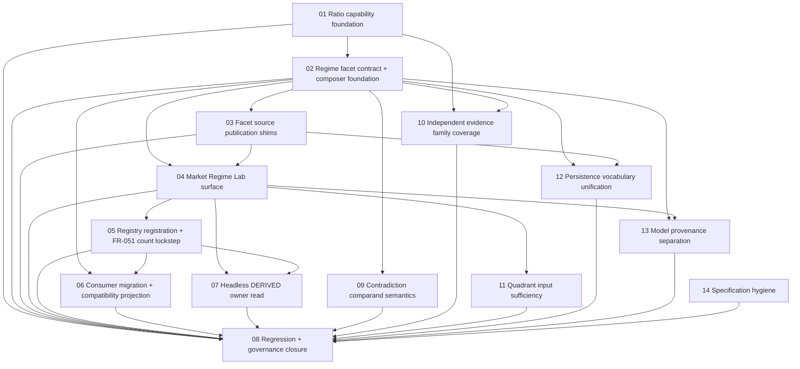

# Scope Index — Market Regime Stack and Strategy Playbook

**Feature:** `specs/013-market-regime-stack-and-strategy-playbook`
**Scope layout:** per-scope directory (`scopes/NN-name/scope.md`) — 8 scopes exceed the single-file threshold.
**Authority:** every implementation file named in any scope is drawn from `design.md` → `## Implementation Boundary`. No scope names a path outside that boundary, and no scope names a protected surface.

---

## Execution Outline

### Phase Order

1. **SCOPE-1 — Ratio capability foundation.** Ship the Tier 0.5 `RLRATIO` primitive and the declared pair registry so every ratio-derived facet has one comparability-safe math source.
2. **SCOPE-2 — Regime facet contract + composer foundation.** Ship the Tier 2 sole composer `RLREGIME` and the closed archetype/sleeve registry so there is exactly one place a regime is named.
3. **SCOPE-3 — Facet source publication shims.** Turn the Tier 1 owner tools into publication-only facet sources that never consume the composed regime.
4. **SCOPE-4 — Market Regime Lab surface.** Ship `./market-regime-lab.html` with the four Feature-012 views composing the 12 declared UI primitives once each.
5. **SCOPE-5 — Registry registration + FR-051 count lockstep.** Register the tool across every registry in one coherent change and move the hard-asserted counts together.
6. **SCOPE-6 — Consumer migration + compatibility projection.** Delete the duplicate and inline regime copies; the survivors read one published read or one declared projection.
7. **SCOPE-7 — Headless DERIVED owner read.** Publish the same owner read deterministically from `scripts/brief-refresh.mjs`, byte-identical to the browser publication for identical frozen inputs.
8. **SCOPE-8 — Regression + governance closure.** Protected-scenario regression, selftest group wiring, and artifact/traceability closure across the whole feature.
9. **SCOPE-9 — Contradiction comparand semantics.** Gate contradiction records on matched subject, facet kind, horizon class, and as-of cutoff; report every other disagreement as divergence and let no lane win the headline by precedence.
10. **SCOPE-10 — Independent evidence family coverage.** Extend family collapse from ratio pairs to a declared independent-origin map, count confirmation over families, and render `Unresolved` below the declared minimum coverage.
11. **SCOPE-11 — Quadrant input sufficiency.** Permit a growth or inflation axis name only when axis-identifying inputs are present; otherwise render a sentiment/stress state or `Unresolved` with explicit input attribution.
12. **SCOPE-12 — Persistence vocabulary unification.** Bind every surface, contract, and published read to exactly one declared closed persistence vocabulary and refuse out-of-vocabulary values rather than mapping them.
13. **SCOPE-13 — Model provenance separation.** Verify model-derived claims by reproducible inputs, lineage, version, and deterministic recomputation; keep the two-origin requirement for externally-observed facts only.
14. **SCOPE-14 — Specification hygiene.** Remove the embedded agent result-envelope blocks and the stale authoring claims from the active specification and guard against their return.

### New Types & Signatures Introduced

| Scope | Surface | Introduced identity |
|---|---|---|
| SCOPE-1 | `./rlratio.js` | `globalThis.RLRATIO` UMD (deep-frozen); ratio math, window stats, `groupByFamily`, comparability/adjustment parity; typed `RLRATIO_*` throws carrying `.code` and `.path` |
| SCOPE-1 | `./ratio-pairs.json` | `ratio-pair-registry/v1` — `pairId`, legs, `lookbackBars`, `semanticClass`, `ratioFamilyId`, refs |
| SCOPE-2 | `./rlregime.js` | `globalThis.RLREGIME` UMD (deep-frozen); `RegimeFacetContract`, `FacetHorizonClass`, `composeRegime`, archetype match, sleeve fits, `RegimeOwnerReadContract`, `projectCompatibility`, `readPublishedContext`; typed `RLREGIME_*` throws |
| SCOPE-2 | `./regime-archetypes.json` | `regime-archetype-registry/v1` — fully-enumerated facet-value tuples plus `sleeve-fit` and legacy-projection cells (no wildcards, no ranges) |
| SCOPE-3 | owner-tool shims | Per-source `RegimeFacetContract` readings with explicit vocabulary mapping, `asOf`, `sourceAttribution`, `coverageNote` |
| SCOPE-4 | `./market-regime-lab.html` | Simple / Power / Brief / Journey views over one compute pass |
| SCOPE-5 | registries | `tools.json`, `simple-models.json`, `journeys.json`, `index.html` `TOOLS`, `rlnav.js` `TOOLS`, `notes/market-regime-lab.md` |
| SCOPE-6 | projections | `macro-regime-legacy/v1` and `market-structure-band-legacy/v1` read paths |
| SCOPE-7 | `scripts/brief-refresh.mjs` | Deterministic `DERIVED` adapter for the composed owner read (deterministic set 5 → 6) |

### Validation Checkpoints

- **After SCOPE-1 and SCOPE-2** — the pure modules are verifiable in isolation through `scripts/selftest.mjs` before any surface consumes them; a composer defect cannot hide behind a rendered page.
- **After SCOPE-3** — the no-cycle rule is provable before the surface exists: a shim that imports a Tier 2 module fails here, not at integration.
- **After SCOPE-4** — the four views render live before any registry or consumer depends on them.
- **After SCOPE-5** — the registry counts move in lockstep; an incoherent registration is caught before consumers migrate onto the tool.
- **After SCOPE-6 and SCOPE-7** — the single-source claim is checkable end to end: browser publication, headless publication, and every migrated consumer resolve to one read.
- **SCOPE-8** — whole-feature closure gate covering protected-scenario regression and traceability.

---

## Dependency Graph

| # | Scope | Depends On | Status |
|---|---|---|---|
| 01 | Ratio capability foundation | — | Not Started |
| 02 | Regime facet contract + composer foundation | 01 | Not Started |
| 03 | Facet source publication shims | 02 | Not Started |
| 04 | Market Regime Lab surface | 02, 03 | Not Started |
| 05 | Registry registration + FR-051 count lockstep | 04 | Not Started |
| 06 | Consumer migration + compatibility projection | 02, 05 | Not Started |
| 07 | Headless DERIVED owner read | 04, 05 | Not Started |
| 08 | Regression + governance closure | 01, 02, 03, 04, 05, 06, 07, 09, 10, 11, 12, 13, 14 | Not Started |
| 09 | Contradiction comparand semantics | 02 | Not Started |
| 10 | Independent evidence family coverage | 01, 02 | Not Started |
| 11 | Quadrant input sufficiency | 04 | Not Started |
| 12 | Persistence vocabulary unification | 02, 03 | Not Started |
| 13 | Model provenance separation | 02, 04 | Not Started |
| 14 | Specification hygiene — process metadata removal | — | Not Started |

---

## Scope Table

| ID | Name | Status | Tags | Depends On | Business scenarios owned |
|---|---|---|---|---|---|
| SCOPE-1 | Ratio capability foundation | Not Started | `foundation:true` | — | BS-013-013, BS-013-014, BS-013-015, BS-013-016 |
| SCOPE-2 | Regime facet contract + composer foundation | Not Started | `foundation:true` | SCOPE-1 | BS-013-001, BS-013-002, BS-013-004, BS-013-006, BS-013-007, BS-013-008, BS-013-009 |
| SCOPE-3 | Facet source publication shims | Not Started | `overlay:true` | SCOPE-2 | BS-013-010 |
| SCOPE-4 | Market Regime Lab surface | Not Started | `overlay:true` | SCOPE-2, SCOPE-3 | BS-013-003, BS-013-005, BS-013-017, BS-013-018, BS-013-019, BS-013-020 |
| SCOPE-5 | Registry registration + FR-051 count lockstep | Not Started | `overlay:true` | SCOPE-4 | BS-013-023 |
| SCOPE-6 | Consumer migration + compatibility projection | Not Started | `overlay:true` | SCOPE-2, SCOPE-5 | BS-013-011, BS-013-012 |
| SCOPE-7 | Headless DERIVED owner read | Not Started | `overlay:true` | SCOPE-4, SCOPE-5 | BS-013-021, BS-013-022 |
| SCOPE-8 | Regression + governance closure | Not Started | `closure:true` | SCOPE-1, SCOPE-2, SCOPE-3, SCOPE-4, SCOPE-5, SCOPE-6, SCOPE-7, SCOPE-9, SCOPE-10, SCOPE-11, SCOPE-12, SCOPE-13, SCOPE-14 | BS-013-024 |
| SCOPE-9 | Contradiction comparand semantics | Not Started | `overlay:true` | SCOPE-2 | BS-013-025 |
| SCOPE-10 | Independent evidence family coverage | Not Started | `overlay:true` | SCOPE-1, SCOPE-2 | BS-013-026 |
| SCOPE-11 | Quadrant input sufficiency | Not Started | `overlay:true` | SCOPE-4 | BS-013-027 |
| SCOPE-12 | Persistence vocabulary unification | Not Started | `overlay:true` | SCOPE-2, SCOPE-3 | BS-013-028 |
| SCOPE-13 | Model provenance separation | Not Started | `overlay:true` | SCOPE-2, SCOPE-4 | BS-013-029 |
| SCOPE-14 | Specification hygiene — process metadata removal | Not Started | `closure:true` | — | BS-013-030 |

---

## Business Scenario Ownership Map

Every business scenario `BS-013-001` … `BS-013-024` is owned by **exactly one** scope. There are no orphaned scenarios and no scenario is claimed by two scopes.

| Scenario | Title | Owning scope |
|---|---|---|
| BS-013-001 | Combined regime composes from current facets and names an enumerated archetype | SCOPE-2 |
| BS-013-002 | A non-enumerated combination renders as a fingerprint with no invented label | SCOPE-2 |
| BS-013-003 | An intraday facet changes tactical context without moving the structural quadrant | SCOPE-4 |
| BS-013-004 | A facet shorter than the requested horizon is excluded from that read | SCOPE-2 |
| BS-013-005 | The growth-inflation quadrant renders as market-implied, never as a macro regime | SCOPE-4 |
| BS-013-006 | A stale facet degrades to unavailable and shrinks the denominator | SCOPE-2 |
| BS-013-007 | A facet contradiction stays visible and is never averaged into the headline | SCOPE-2 |
| BS-013-008 | A regime label does not flip until the persistence gate is met | SCOPE-2 |
| BS-013-009 | Historical regime series are as-of-safe and a hindsight-smoothed label is refused | SCOPE-2 |
| BS-013-010 | A facet source publishes its facet and never consumes the composed regime | SCOPE-3 |
| BS-013-011 | A consumer reads the published owner read and cannot recompute or upgrade it | SCOPE-6 |
| BS-013-012 | A migrated consumer renders the single published read | SCOPE-6 |
| BS-013-013 | A named ratio pair reports level, trend, and a window-declared z-score | SCOPE-1 |
| BS-013-014 | Overlapping ratio pairs count as one evidence family | SCOPE-1 |
| BS-013-015 | A pair with mismatched adjustment or short history reports unavailable | SCOPE-1 |
| BS-013-016 | An international pair honors session and FX alignment or reports not-comparable | SCOPE-1 |
| BS-013-017 | Sleeve output ranks relative research fit and emits nothing else | SCOPE-4 |
| BS-013-018 | Inflationary and disinflationary risk-off produce different bond sub-type fit | SCOPE-4 |
| BS-013-019 | Commodity sub-types stay separate rather than moving as one block | SCOPE-4 |
| BS-013-020 | No clear relative advantage produces an explicit no-advantage state | SCOPE-4 |
| BS-013-021 | The tool publishes exactly one owner read with the full payload | SCOPE-7 |
| BS-013-022 | The owner read is unavailable rather than fabricated when facets are missing | SCOPE-7 |
| BS-013-023 | A registry entry and its hard-asserted count are refused unless they move together | SCOPE-5 |
| BS-013-024 | One regression inside the protected scenario set refuses governance closure | SCOPE-8 |
| BS-013-025 | A contradiction requires matched comparands and no lane silently wins the headline | SCOPE-9 |
| BS-013-026 | Correlated facets collapse to one evidence family and thin coverage renders Unresolved | SCOPE-10 |
| BS-013-027 | A growth or inflation axis name requires inputs capable of identifying that axis | SCOPE-11 |
| BS-013-028 | Persistence is expressed in exactly one declared closed vocabulary | SCOPE-12 |
| BS-013-029 | Model-derived claims are verified by recomputation, never by independent origins | SCOPE-13 |
| BS-013-030 | The active specification carries no embedded process metadata | SCOPE-14 |

**Coverage arithmetic:** SCOPE-1 owns 4, SCOPE-2 owns 7, SCOPE-3 owns 1, SCOPE-4 owns 6, SCOPE-5 owns 1, SCOPE-6 owns 2, SCOPE-7 owns 2, SCOPE-8 owns 1 — 24 of 24, each exactly once.

**Amendment — review-finding scenarios BS-013-025 … BS-013-030.** The analyst review pass appended six scenarios to `spec.md` under `## Additional Business Scenarios — Review Findings`. Each is owned by exactly one of the six scopes added here, one scenario per scope: SCOPE-9 owns BS-013-025, SCOPE-10 owns BS-013-026, SCOPE-11 owns BS-013-027, SCOPE-12 owns BS-013-028, SCOPE-13 owns BS-013-029, and SCOPE-14 owns BS-013-030. Extending the arithmetic above, the feature now covers `BS-013-001` … `BS-013-030` — 30 of 30, each owned exactly once, with no orphaned scenario and no scenario claimed by two scopes.

**Ownership note for SCOPE-5 and SCOPE-8.** These two scopes own zero business scenarios by design, and that is not an orphaning gap. SCOPE-5 delivers the FR-051 registry-count lockstep, which is a functional-requirement coupling across `tools.json`, `simple-models.json`, `journeys.json`, `index.html`, `rlnav.js`, and the hard-asserted counts — no business scenario describes registry arithmetic. SCOPE-8 is the whole-feature closure gate; it re-verifies scenarios already owned upstream rather than claiming ownership of any, because a second owner for an already-owned scenario would be a duplicate claim.

---

## Foundation Ordering (P4)

`design.md` splits `## Capability Foundation` from `## Concrete Implementations`. The two foundation scopes therefore precede every overlay in the dependency chain:

- **SCOPE-1** (`foundation:true`) has no dependencies and ships the Tier 0.5 ratio primitive that the ratio-derived facet sources and the composer both consume.
- **SCOPE-2** (`foundation:true`) depends only on SCOPE-1 and ships the Tier 2 sole composer plus the closed registry.
- Every overlay scope — SCOPE-3, SCOPE-4, SCOPE-5, SCOPE-6, SCOPE-7 — reaches SCOPE-2 (and through it SCOPE-1) transitively via its `Depends On` chain. No overlay scope can start before both foundations are done.

**Amendment — the review-finding scopes.** The five overlay scopes added for the review findings hold the same ordering. SCOPE-9, SCOPE-10, and SCOPE-12 name SCOPE-2 directly, and SCOPE-10 also names SCOPE-1 because it generalizes the `RLRATIO.groupByFamily` primitive. SCOPE-11 and SCOPE-13 reach SCOPE-2 transitively through SCOPE-4, and SCOPE-13 also names SCOPE-2 directly because the recomputation evidence carries the composer version. SCOPE-14 is the one exception and takes no dependency: it is a specification-hygiene change that touches no runtime surface, no contract, and no consumer, so no foundation constrains it and it constrains nothing.

## Sequential Gating

Scope N does not begin until scope N-1 and every scope named in its `Depends On` are Done. A scope that reveals a gap in `spec.md` or `design.md` routes that gap to the owning agent before the next scope starts, rather than absorbing it as an undeclared implementation detail.
