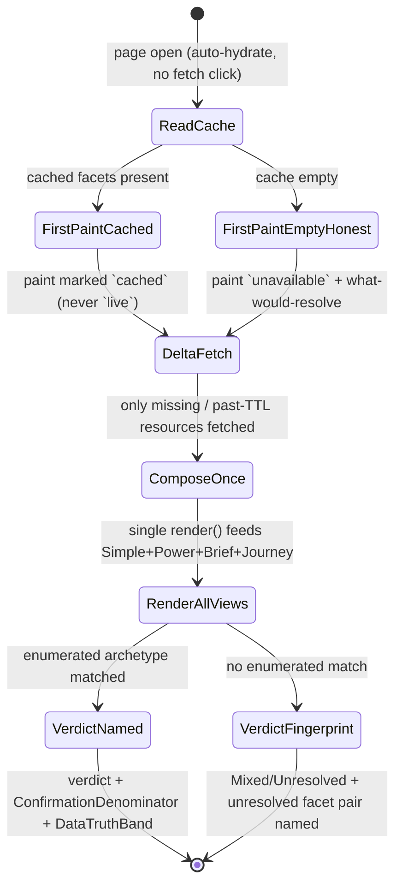
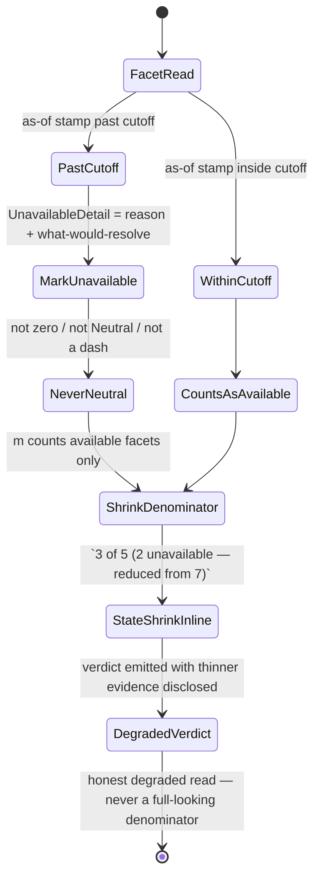
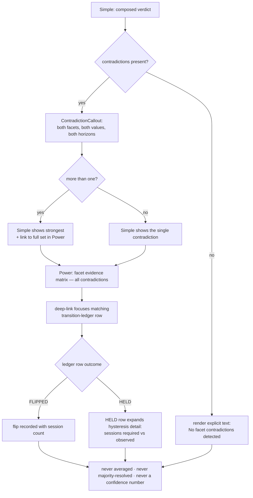
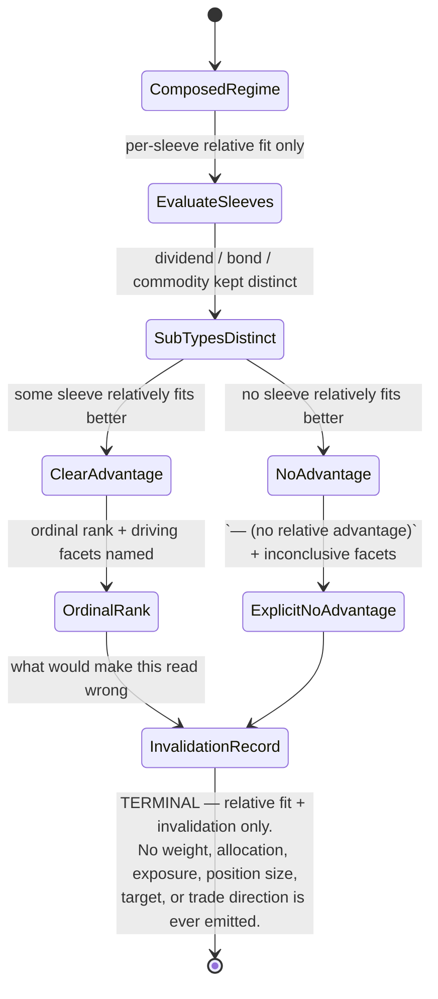
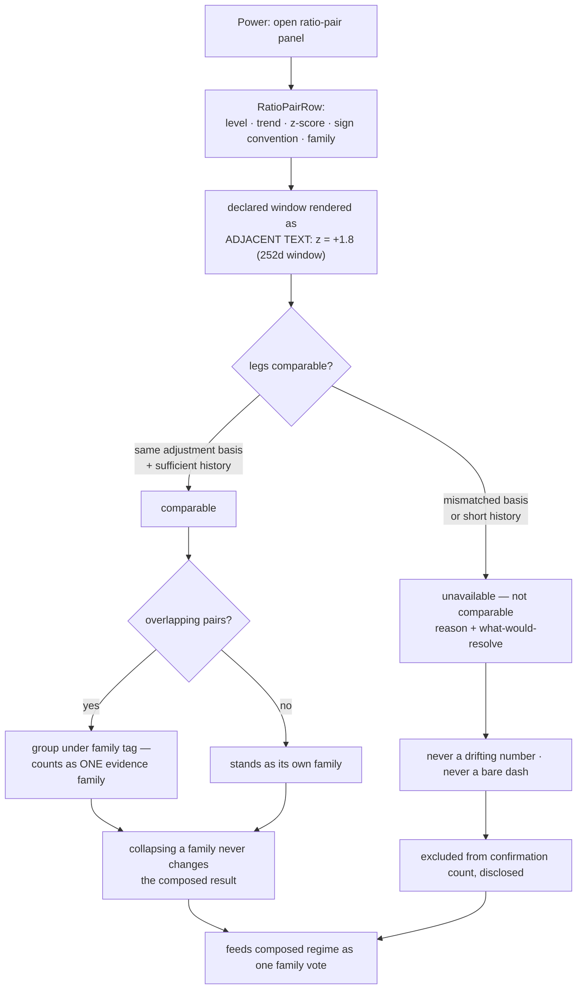
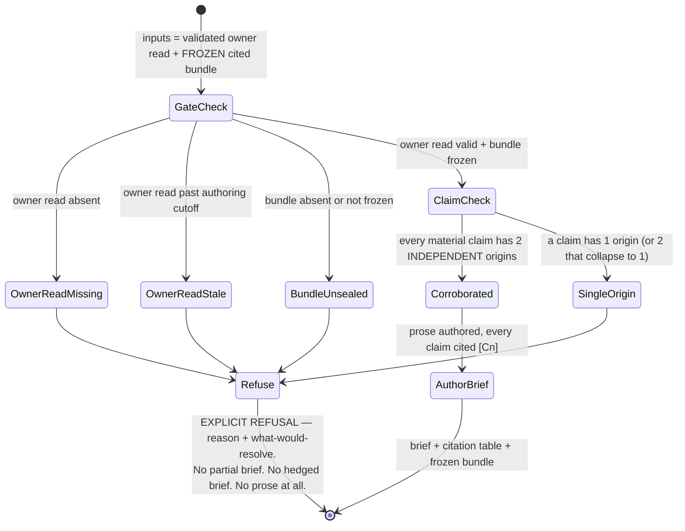
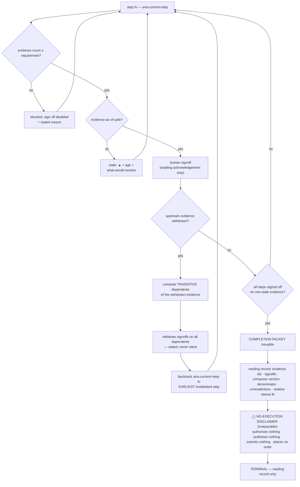

# Feature: 013 Market Regime Stack and Strategy Playbook

## Problem

Research Lab already answers "what regime are we in?" — **at least seven times, in four
incompatible vocabularies, with no single owner.** The regime read is simultaneously the
most-consumed and least-governed primitive in the catalog: `rlbrief.js:90` weights it as the
**highest-value evidence class in the entire brief** (`W={regime:1.3,gamma:1.2,rotation:1.15,event:1.1,momentum:1.0,flows:0.9}`),
yet no artifact defines what "the regime" *is*, which facet wins when two disagree, or how a
regime read maps to what a user should actually research next.

**Two nominally-shared classifiers already disagree today.**

- `rlg.js:262-274` `macroRegime()` emits a five-band sentiment ladder —
  `Extreme greed` / `Greed · risk-on` / `Neutral` / `Fear · risk-off` / `Extreme fear` —
  paired with a coarse direction flag `risk: 1 | 0 | -1`. It is consumed by
  `intraday-tape-lab.html:1609` and `market-brief.html:837`.
- `rlexperience-adapters/market-structure.js:1296-1300` `regimeBand(fg, trend, vix)` emits a
  *different, six-band, structurally-aware* ladder — `Risk-on trend` / `Greed (late)` /
  `Distribution · topping` / `Accumulation · basing` / `Risk-off · fear` / `Fear (early)` —
  consumed by `swing-structure-lab.html:1473`.

These are not two views of one model; they are two models. `macroRegime()` cannot express
"Distribution · topping" at all, and `regimeBand()` cannot express the `risk` integer the brief
consumes. A user who reads the brief and then opens `swing-structure-lab` can be told two
different things about the same tape on the same day, with no surfaced contradiction and no
way to tell which read is stale, narrower, or simply differently-defined.

Worse, the delegation is already **partial and inconsistent**: `intraday-tape-lab.html:1424-1431`
correctly delegates four structure primitives to `RLMARKETSTRUCTURE`, but
`intraday-tape-lab.html:1776-1777` keeps an **inline third copy** of a regime decision beside
that delegation. The tool half-migrated and stopped, which is the strongest available evidence
that the shared surface never had a contract worth migrating *to*.

**Beyond those three, the catalog carries at least four more independent regime notions**, each
correct in its own frame and none reconciled with the others:

- `sector-research-lab.html:2022` `absMomRegime()` (absolute-momentum participation) and
  `sector-research-lab.html:2894` `cycleLean()` (business-cycle lean from sector leadership).
- `market-heatmap-lab.html:488` breadth bias — a participation-derived regime, not a
  sentiment-derived one.
- `bond-regime-lab.html:1419` `classifyCreditRegime`, `:1455` `classifyCurveState`, and
  `:1709` `classifyDurationPosture` — three *separate* fixed-income regime axes that no equity
  regime read consumes.
- `rlvol.js:335` `regimeBand()` — a **window-relative** volatility band whose own header at
  `rlvol.js:13` explicitly declares it **MAGNITUDE ONLY / zero direction**. It shares the
  function name `regimeBand` with the market-structure classifier while meaning something
  categorically different, which is a live naming collision waiting to be mis-wired.

**The brief already has the scaffolding but not the model.** It carries a structural / swing /
tactical horizon frame at `rlbrief.js:1060-1103` and a persistence primitive at
`rlbrief.js:137-145` (`consecutiveRun` / `isPersistentSignal`) — so the concepts of *horizon* and
*durability* exist. What is missing is the layer that says which facet belongs to which horizon,
so a 15-minute tape flip cannot silently overwrite a months-scale structural read that the brief
weights at 1.3.

**A generic relative-strength primitive already exists and is trapped in one tool.**
`real-assets-lab.html:1249` `realRatioTrailingPct(rowsA, rowsB, lookback)` is fully generic — it
takes two arbitrary bar series — but is invoked for exactly one pair, gold/silver, at
`real-assets-lab.html:1371`, and carries an honest proxy caveat at `real-assets-lab.html:1170`
that must travel with any reuse. Adjacent fragments exist but are likewise siloed:
`macro-rotation.js:52` `rollZ100`, `:65` `rrgQuadrant`, `:282` `globalPairCorrelation`;
`bond-regime-lab.html:1338` `classifyRelativeCreditPulse`; and
`sector-research-lab.html:1725`'s benchmark set `['SPY','RSP','QQQ','IWM','ACWI']`, which is
precisely the raw material for growth-vs-value, equal-weight-vs-cap-weight, and
small-vs-large ratio facets that nothing currently computes.

**Finally, the regime read is largely invisible to the deterministic pipeline.**
`scripts/brief-refresh.mjs:1173` grants deterministic headless owner reads to only **five** tools;
every other tool is typed `browser-or-agent-read`, meaning most regime evidence reaches the brief
only if a human or an agent opens a page. The mechanism to fix this already exists — `:561`
shows a **DERIVED** source concept is already modeled — but no derived regime read is published.

The net effect: the single most heavily weighted input to the product's flagship output is
duplicated, self-contradictory, horizon-blind, mostly non-deterministic, and connected to no
"so what?" layer telling the user which research sleeve the current regime actually favors.

## Outcome Contract

**Intent:**
Establish one governed **regime stack** for Research Lab: a set of independently-computed,
explicitly-typed regime *facets* (sentiment/stress, trend/structure, breadth/participation,
credit, curve, volatility magnitude, cross-asset ratios), each bound to a declared horizon, all
composed by a single owner into one typed **combined regime fingerprint**; and, on top of that
fingerprint, a **strategy playbook** that ranks research sleeves by *relative fit to the current
regime* so a user learns what to study next instead of merely what label to recite.

**Success Signal:**
1. Every regime facet in the catalog resolves through the shared stack, and opening two
   different tools on the same data yields either the *same* facet value or an *explicitly
   surfaced disagreement* — never two silently-different answers to the same question.
2. The combined fingerprint renders with each contributing facet, that facet's horizon, its
   as-of freshness, and its `unavailable` state where applicable — a user can always see *which*
   facets produced the read and which are missing.
3. A named `RegimeArchetype` appears only for combinations explicitly defined in the model;
   every other combination renders as `Mixed` or `Unresolved` with the specific unresolved
   facet pair named.
4. The sleeve playbook orders research sleeves by relative fit with an explicit rationale per
   sleeve tied to named facets, and shows the sub-type distinction (dividend vs bond vs
   commodity) rather than collapsing them into one "defensive" bucket.
5. The regime read is published as a deterministic owner read consumable by the headless
   pipeline, joining the small deterministic set at `scripts/brief-refresh.mjs:1173` rather than
   remaining a `browser-or-agent-read`.

**Hard Constraints:**
1. **Horizon separation is structural, not cosmetic.** Every facet declares a horizon
   (structural = months, swing = days-to-weeks, tactical = intraday). A tactical facet MUST NOT
   alter a structural facet's value or its persistence state. An intraday tape flip may change
   the tactical facet and the fingerprint's tactical slot; it may never move the structural read.
   This preserves and formalizes the existing horizon frame at `rlbrief.js:1060-1103`.
2. **The growth-inflation quadrant is labeled `market-implied`, always.** Fear & Greed plus VIX
   is a **sentiment/stress proxy**. It is never presented, named, or exported as a macro
   growth/inflation regime. Any quadrant surface carries the `market-implied` qualifier inline
   with the value, not only in a footnote.
3. **The combined regime is a typed fingerprint, not a scalar.** Only explicitly-enumerated
   facet combinations receive an archetype name. Everything else stays `Mixed` or `Unresolved`.
   Inventing a name for an undefined combination is a defect, not a fallback.
4. **Sleeves rank relative research fit only.** The playbook orders sleeves for *study*. It
   never emits weights, allocations, position sizes, target exposures, buy/sell language, or
   advice of any kind.
5. **Dividend, bond, and commodity sub-types stay separate.** They are not one "defensive"
   sleeve. Inflationary risk-off and disinflationary risk-off have **opposite** bond
   consequences; collapsing them would make the playbook wrong in exactly the regimes where it
   matters most. The credit/curve/duration axes at `bond-regime-lab.html:1419` / `:1455` /
   `:1709` remain distinguishable inputs, not a single blended score.
6. **Contradictions are preserved, never averaged.** When two facets disagree — the live
   `rlg.js:262-274` vs `rlexperience-adapters/market-structure.js:1296-1300` split is the
   canonical case — the disagreement is surfaced as a first-class output. No mean, no vote-count
   smoothing, no silent precedence that hides the conflict.
7. **`unavailable` is a first-class facet state.** A missing or stale facet is `unavailable`;
   it is never coerced to Neutral, zero, or any other value that reads as a signal. An
   `unavailable` facet **reduces the confirmation denominator** rather than contributing a
   neutral vote, so confirmation strength honestly reflects how much evidence actually exists.
8. **As-of-safe filtered history only.** Any historical regime series is built from data
   filtered to information available at each point in time. No hindsight-smoothed, revised, or
   look-ahead-labeled regime history — the same discipline `real-assets-lab.html:1170` already
   applies to its proxy caveat.
9. **Educational only, no execution.** No order routing, no broker integration, no execution
   surface, no personalized recommendation. Consistent with the repository-wide
   educational-only posture.

**Failure Condition:**
This feature has failed — even with every test green — if any of the following is true:
- Two tools still answer the same regime question differently without surfacing it, i.e. the
  `rlg.js` / `market-structure.js` split survives as a silent divergence.
- A tactical/intraday input is observed changing a structural read.
- A quadrant is shown without the `market-implied` qualifier, letting a sentiment proxy read as
  a macro growth/inflation call.
- An unnamed facet combination is given an invented archetype name.
- The sleeve playbook is read as allocation guidance because it emitted anything weight-like.
- `unavailable` facets are counted as neutral agreement, inflating confirmation.
- A regime history is drawn from smoothed or revised data.
- The stack ships as another tool-local classifier — an eighth vocabulary — instead of replacing
  the duplicated ones.

## Domain Capability Model

**Capability:** *Composed, horizon-typed market regime classification and regime-conditioned
research-sleeve ranking.* This is a new reusable capability, not a single tool. It owns the
definition of what a regime facet is, how facets compose into one fingerprint, how contradiction
and unavailability are represented, and how a fingerprint maps to relative research fit. Every
existing regime computation named in `## Problem` becomes either a *facet source* that publishes
into this capability or a *consumer* that reads its published result — never both for the same
facet.

### Domain Primitives

| Primitive | Definition | Lifecycle |
|---|---|---|
| **RatioPair** | A named relative-strength relationship between two instrument series (numerator, denominator) with a lookback and an as-of stamp — e.g. growth/value, equal-weight/cap-weight, small/large, gold/silver, credit-quality pulse. Generalizes the already-generic-but-trapped `realRatioTrailingPct(rowsA, rowsB, lookback)` at `real-assets-lab.html:1249`. | `declared` → `computed` → `stale` → `unavailable` |
| **RegimeFacet** | One independently-computed regime dimension with a closed value vocabulary, a declared `FacetHorizon`, a source attribution, an as-of stamp, and a confidence/coverage note. Facet kinds: sentiment-stress, trend-structure, breadth-participation, credit, curve, duration-posture, volatility-magnitude, ratio-derived. | `unavailable` → `computed` → `persistent` → `stale` → `unavailable` |
| **FacetHorizon** | The declared time frame a facet is valid over: `structural` (months), `swing` (days–weeks), `tactical` (intraday). A required, immutable property of every facet declaration. | `declared` (immutable per facet) |
| **CombinedRegime** | The typed fingerprint: an ordered set of facet readings grouped by horizon, plus derived contradiction records, plus a confirmation ratio whose denominator counts only *available* facets. Not a scalar and not reducible to one. | `empty` → `partial` → `composed` → `stale` |
| **RegimeArchetype** | A human-meaningful name attached to an **explicitly enumerated** facet combination (definition includes the exact qualifying facet values). Absent an enumerated match, the fingerprint resolves to `Mixed` or `Unresolved`. | `defined` → `matched` \| `unmatched` |
| **SleeveFitRead** | A relative research-fit ranking of a research sleeve under a given `CombinedRegime`, carrying an ordinal position, a rationale citing the specific facets that drove it, and its sub-type identity (dividend / bond / commodity kept distinct). Carries no weight, allocation, or advice. | `derived` → `ranked` → `superseded` |
| **RegimeTransition** | A durable, as-of-safe change record for a facet or archetype: prior value, new value, transition timestamp, and run-length context sourced from the existing persistence primitive `consecutiveRun` / `isPersistentSignal` at `rlbrief.js:137-145`. | `candidate` → `confirmed` → `historical` |
| **RegimeOwnerRead** | The published, deterministic one-line owner read for the regime stack, shaped for the shared cache and the headless pipeline. Targets promotion into the deterministic owner-read set at `scripts/brief-refresh.mjs:1173`, using the existing `DERIVED` source concept at `scripts/brief-refresh.mjs:561`. | `unpublished` → `published` → `stale` |

### Relationships

- A **RatioPair** is an *input* to a ratio-derived **RegimeFacet**; it is never itself a facet.
  One RatioPair may feed multiple facets; one facet may consume multiple RatioPairs.
- Every **RegimeFacet** declares exactly one **FacetHorizon**, and that binding is immutable.
- A **CombinedRegime** is composed from many **RegimeFacet** readings, grouped by horizon. Its
  confirmation denominator counts only facets not in the `unavailable` state.
- A **CombinedRegime** matches at most one **RegimeArchetype**. No match ⇒ `Mixed`/`Unresolved`;
  it never *becomes* an archetype by nearest-neighbour or by majority.
- A **CombinedRegime** produces an ordered set of **SleeveFitRead**s. Each SleeveFitRead's
  rationale must name the specific facets that produced its rank.
- A **RegimeTransition** is emitted by a **RegimeFacet** or by archetype matching, and is
  computed only over as-of-safe filtered history.
- A **RegimeOwnerRead** is derived from the **CombinedRegime** and is the only regime artifact
  the brief pipeline consumes directly.

### Business Policies

**BP-1 — Facet DAG, no cycles (the composition rule).**
Regime flows in exactly one direction: **facet SOURCES** publish facets → a **single COMPOSER**
combines them into the `CombinedRegime` → **CONSUMERS** read the published result.
A facet source **MUST NOT** consume the composed regime inside its own model computation. A
trend facet may not read the combined fingerprint to decide its trend value; a breadth facet may
not read it to decide breadth. Any such read is a cycle and is a defect, because it makes the
composed regime self-confirming and destroys the meaning of the confirmation ratio. Consumers
may read the composed result freely; sources may not.

**BP-2 — One composer.** There is exactly one composition owner. A tool that needs the combined
regime reads the published result; it does not re-compose locally. This is what retires the
current duplication — including the inline third copy at `intraday-tape-lab.html:1776-1777`,
which must delegate the same way `intraday-tape-lab.html:1424-1431` already delegates its four
other structure primitives.

**BP-3 — Closed vocabularies, explicit mapping.** Every facet has a closed, documented value set.
Where an existing classifier's vocabulary is retained (`rlg.js:262-274`,
`rlexperience-adapters/market-structure.js:1296-1300`), the mapping into the facet vocabulary is
explicit and lossless-or-declared-lossy. Silent re-labeling between vocabularies is forbidden.

**BP-4 — Name collisions must be resolved, not tolerated.** `rlvol.js:335` `regimeBand()` and
`rlexperience-adapters/market-structure.js:1296-1300` `regimeBand()` share a name while meaning
different things — the former is explicitly **magnitude-only, zero direction**
(`rlvol.js:13`). The volatility facet is typed as `volatility-magnitude` and MUST NOT be
consumed anywhere a directional regime is expected.

**BP-5 — Unavailability shrinks the denominator.** An `unavailable` facet contributes nothing to
agreement and removes itself from the confirmation denominator. It is never mapped to Neutral,
zero, or any other in-vocabulary value.

**BP-6 — Contradiction is data.** Facet disagreement produces a contradiction record on the
`CombinedRegime`. It is displayed, not resolved by averaging, precedence, or majority vote.

**BP-7 — Sub-type separation is a modeling invariant.** Dividend, bond, and commodity sleeves are
distinct `SleeveFitRead` sub-types at all times, because inflationary and disinflationary risk-off
imply opposite bond outcomes. The credit / curve / duration axes at `bond-regime-lab.html:1419`,
`:1455`, and `:1709` remain separately identifiable facets feeding those sub-types.

**BP-8 — Provenance and caveats travel with reuse.** When the generic ratio primitive at
`real-assets-lab.html:1249` is generalized beyond its single gold/silver invocation at
`real-assets-lab.html:1371`, the honest proxy caveat at `real-assets-lab.html:1170` travels with
every derived facet. A reused primitive may not shed the disclosure that justified it.

**BP-9 — Ranking, never prescribing.** `SleeveFitRead` expresses relative research fit and
rationale only. Emitting a weight, allocation, exposure target, or directional instruction
violates the capability's contract regardless of how it is worded.

## RESULT-ENVELOPE

```
Analyzed: specs/013-market-regime-stack-and-strategy-playbook
Chunk: 1 of N (bounded task — first three analyst-owned sections ONLY)
Sections written: 3 (Problem, Outcome Contract, Domain Capability Model)
Domain Primitives: 8 (RatioPair, RegimeFacet, FacetHorizon, CombinedRegime,
  RegimeArchetype, SleeveFitRead, RegimeTransition, RegimeOwnerRead)
Business Policies: 9 (BP-1 encodes the facet DAG no-cycle rule)
Hard Constraints: 9 | Failure Conditions: 8
Artifacts created: spec.md (partial, by instruction), state.json (v3, not_started)
Artifacts NOT created (correct — not analyst-owned or out of chunk scope):
  design.md, scopes.md, report.md, uservalidation.md
Certification written: not_started only (certifiedAt: null) — no other cert value touched
Actors / Use Cases / Business Scenarios / FRs / UI Scenario Matrix / NFRs: NOT YET WRITTEN
  (owned by subsequent analyst chunks — spec.md is deliberately incomplete)
Outcome: completed_owned
Next required owner: bubbles.analyst (chunk 2 — actors, use cases, business scenarios)
```

## Capability Inventory

Every row below is a capability that already exists somewhere in the repo. The feature does not
invent regime logic; it composes what is already owned, and closes the gap that today prevents
those owners from being read as one thing.

| Capability | Current owner (file:line) | Completeness | Gap this feature closes |
|---|---|---|---|
| Canonical regime classification (shared classifier A) | `rlg.js:262` `macroRegime(macro)` | Partial — F&G-score + VIX only; emits a 5-band vocabulary (`Extreme greed` … `Unknown`) with a `risk` sign | No single canonical classifier exists. This one is score-driven and horizon-free, so a consumer cannot tell whether its band is a structural or a tactical claim |
| Canonical regime classification (shared classifier B, divergent) | `rlexperience-adapters/market-structure.js:1296` `regimeBand(fg, trend, vix)` | Partial — same inputs plus a trend term, therefore a *different* band vocabulary than classifier A for identical market data | Two shared classifiers disagree by construction. The feature makes the divergence an explicit, displayed contradiction instead of a silent per-tool coin flip |
| Canonical regime classification (inline duplicate copy) | `intraday-tape-lab.html:1772` `marketRegime()` (with tactical VIX-only fallback at `intraday-tape-lab.html:1766` `activeRegime()`) | Duplicate — reimplements the F&G + session-trend + VIX ladder inline rather than importing either shared classifier | A third copy drifts independently. The feature gives this tool a facet contract to publish into, so the inline copy can be retired without losing its intraday-specific read |
| Leadership / cycle regime | `sector-research-lab.html:2022` `absMomRegime()`; `sector-research-lab.html:2894` `cycleLean()` | Complete for its own tool — absolute-momentum regime and cycle lean are both computed and rendered | Trapped inside one page. No contract exposes leadership/cycle as a named facet another surface can consume |
| Breadth bias | `market-heatmap-lab.html:488` (`b.bias` → `Risk-on` / `Risk-off` / `Mixed`) | Complete but presentational — the bias is computed then immediately stringified for display | Breadth exists only as a rendered word. There is no structured facet carrying its own horizon, cutoff, or unavailability state |
| Credit / curve / duration regime | `bond-regime-lab.html:1419` `classifyCreditRegime(...)`; `bond-regime-lab.html:1455` `classifyCurveState(...)`; `bond-regime-lab.html:1709` `classifyDurationPosture(...)` | Strong — three separately identifiable axes with an explicit classifier/policy seam | Three high-quality facets that no cross-asset read can see. Their separation must survive composition, because inflationary and disinflationary risk-off imply opposite bond outcomes |
| Volatility regime | `rlvol.js:335` `regimeBand(percentile, thresholds)`, surfaced via `rlvol.js:716` / `:923` | Complete for magnitude — percentile-banded with an observation count | **Magnitude only.** `rlvol.js:13` states the model "carries zero directional information". Composition must therefore never let this facet vote on risk-on/risk-off direction |
| Cross-asset ratio pairs (generic primitive, trapped) | `real-assets-lab.html:1249` `realRatioTrailingPct(rowsA, rowsB, lookback)` | Generic in shape, single-use in fact — invoked once, for gold/silver, at `real-assets-lab.html:1371` | A genuinely reusable primitive is locked in one page. Generalizing it must carry its honest proxy caveat (`real-assets-lab.html:1170`) to every derived facet |
| Cross-asset ratio pairs (rotation/correlation math) | `rlexperience-adapters/macro-rotation.js:52` `rollZ100(a, L)`; `:65` `rrgQuadrant(rsRatio, rsMom)`; `:282` `globalPairCorrelation(rowsA, rowsB, windowDays)` | Complete as adapter-local math — normalization, RRG quadrant, and pair correlation all exist | No named `RatioPair` identity. Pairs are computed ad hoc per caller, so two surfaces can name the same pair differently and neither can cite the other |
| Cross-asset ratio pairs (credit pulse ratio) | `bond-regime-lab.html:1338` `classifyRelativeCreditPulse(input, ratioPolicy)` | Complete — a ratio-policy-driven relative pulse classifier | A fourth independent ratio implementation. The feature needs one pair identity so a credit pulse and a gold/silver read are the same kind of citable object |
| Brief regime weighting and horizon frame | `rlbrief.js:90` (`W = { regime: 1.3, gamma: 1.2, rotation: 1.15, … }`); `rlbrief.js:1060`–`1103` (horizon pill: structural / swing / tactical) | Complete for the brief — regime is already the highest-weighted input and a three-level horizon frame already exists | The horizon frame is brief-local. Facets themselves carry no horizon, so a tactical facet can silently outrank a structural one inside the weighting |
| Regime persistence primitive | `rlbrief.js:137`–`145` `consecutiveRun(values, eps)` | Complete as a primitive — consecutive-run detection over a value series | Persistence is computed for brief internals only. No facet or combined read exposes "how long has this held", which is what separates a transition from noise |
| Deterministic headless owner reads | `scripts/brief-refresh.mjs:1173` `buildToolCoverage(toolReads)`; DERIVED-source contract at `scripts/brief-refresh.mjs:561` | Strong — headless refresh already validates that every DERIVED source ID has a validated owner read *and* a validated source brief | The owner-read discipline exists but has no regime-shaped payload to validate. The feature supplies one so a composed regime is refreshable headlessly, not just renderable in a browser |
| Four-view shell, SimpleModel, and journey fundamentals | Feature 012 (`specs/012-market-action-center-and-guided-tools`) | Delivered by scope, **not terminally certified** — `state.json` `status: blocked`, `certification.status: blocked`, `certifiedAt: null` | This feature depends on the view/journey substrate 012 delivered. It must be consumed as an in-scope dependency with a live blocker, never cited as certified or complete |

## Actors And Personas

| Actor | Primary need | Decision authority | Grounding evidence |
|---|---|---|---|
| Cross-Asset Regime Researcher | One combined regime read in which each contributing facet — and any disagreement between facets — stays individually visible | Reads and interprets. May cite the combined regime in research. **No** authority to collapse a contradiction into a single verdict | Today the three canonical classifiers (`rlg.js:262`, `rlexperience-adapters/market-structure.js:1296`, `intraday-tape-lab.html:1772`) can each return a different band for the same day with no surface where that divergence is visible |
| Sleeve Allocator-Researcher | Relative research fit across dividend, bond, commodity, and equity sub-types, with the sub-types kept distinct | Ranks relative research fit and records rationale. **No allocation, weighting, exposure, or advice authority** — ranking never becomes prescription | The bond axes at `bond-regime-lab.html:1419`, `:1455`, `:1709` already prove sub-types diverge: inflationary and disinflationary risk-off imply opposite bond outcomes, so a merged "risk-off sleeve" would be wrong |
| Tactical Trader | Regime as *context* around an intraday decision — never as the driver of a structural claim | Acts on intraday reads inside their own tool. **No** authority to let an intraday facet promote or overwrite a structural read | `intraday-tape-lab.html:1766` `activeRegime()` is an explicitly session-scoped VIX ladder, and `rlbrief.js:1060`–`1103` already distinguishes structural / swing / tactical horizons — the two must not be conflated |
| Facet Owner Maintainer | To own, evolve, and version exactly one upstream tool's facet without coordinating with every consumer | Full authority over their own facet's computation, thresholds, and horizon. **Must not** consume the composed regime inside that computation | Facet owners today are single-tool functions (`sector-research-lab.html:2022`, `market-heatmap-lab.html:488`, `rlvol.js:335`). Letting an owner read the composed regime would create the feedback cycle the facet DAG forbids |
| Market Brief / Action Center Consumer | To consume the published owner read as-is, with its horizon and cutoff intact | Renders, weights, and deep-links the published read. **No** authority to recompute a facet, upgrade a stale read to fresh, or substitute a value for `unavailable` | `scripts/brief-refresh.mjs:561` already requires every DERIVED source ID to have a validated owner read; `rlbrief.js:90` shows regime is the brief's heaviest weight, so a silently-upgraded stale read would corrupt the top-weighted input |
| Model Auditor | To see, for any published read: each facet's horizon, its data cutoff, its persistence state, and every recorded contradiction | Accepts or rejects a published read on provenance grounds. **No** authority to author or amend facet logic | `rlbrief.js:137`–`145` `consecutiveRun` already computes persistence but never exposes it; `real-assets-lab.html:1170` shows a caveat that must travel with any reuse of the ratio primitive |

## Use Cases

### UC-001: Read the combined cross-asset regime
- **Actor:** Cross-Asset Regime Researcher
- **Preconditions:** At least one regime facet has published a read within its declared freshness window.
- **Main Flow:**
  1. Actor opens the combined regime surface.
  2. System lists every registered facet with its current value, horizon, and data cutoff.
  3. System presents the composed regime archetype together with the agreement denominator, counting only facets that are not `unavailable`.
  4. System displays any recorded contradictions alongside the archetype rather than beneath it.
  5. Actor reads the archetype and can immediately see which facets produced it.
- **Alternative Flows:**
  - *A1 — No facet is fresh:* system renders the combined regime as `unavailable` with the reason, and does not emit an archetype.
  - *A2 — Facets are unanimous:* system still renders the per-facet list; unanimity is shown, never used to hide the facets.
- **Postconditions:** Actor has an archetype plus the exact facet set that justified it. No facet has been silently dropped, defaulted, or neutralized.

### UC-002: Inspect a single facet and its horizon
- **Actor:** Cross-Asset Regime Researcher (also Tactical Trader)
- **Preconditions:** The facet is registered and has published at least once.
- **Main Flow:**
  1. Actor selects one facet from the combined view (for example the volatility facet owned at `rlvol.js:335`).
  2. System shows the facet's current value, its declared horizon (structural / swing / tactical), its data cutoff, and its persistence state.
  3. System shows the facet's owning surface and links to it.
  4. System shows any standing caveat attached to the facet — for the volatility facet, the magnitude-only disclosure recorded at `rlvol.js:13`.
- **Alternative Flows:**
  - *A1 — Facet is stale:* value is shown with an explicit staleness marker and the age; it is not refreshed in place.
  - *A2 — Facet is `unavailable`:* system shows the reason and the fact that this facet was excluded from the agreement denominator.
- **Postconditions:** Actor can state the facet's horizon and its directional validity. A magnitude-only facet is never read as a direction.

### UC-003: Investigate a facet contradiction
- **Actor:** Model Auditor (also Cross-Asset Regime Researcher)
- **Preconditions:** At least two fresh facets disagree, and the system has recorded a contradiction.
- **Main Flow:**
  1. Actor opens the contradiction record on the combined regime.
  2. System names each conflicting facet, its value, its horizon, and its cutoff.
  3. System states which horizons are in conflict — for example a tactical breadth bias from `market-heatmap-lab.html:488` against a structural credit read from `bond-regime-lab.html:1419`.
  4. System shows the persistence of each side so the actor can distinguish a durable divergence from a one-print blip.
  5. Actor records an interpretation without the system resolving the conflict.
- **Alternative Flows:**
  - *A1 — Conflict is between the two shared classifiers* (`rlg.js:262` vs `rlexperience-adapters/market-structure.js:1296`)*:* system identifies it as a classifier-definition divergence, not a market signal.
  - *A2 — One side is stale:* system marks the stale side rather than discarding it.
- **Postconditions:** The contradiction is visible and attributed. It has not been averaged, out-voted, or hidden behind a precedence rule.

### UC-004: Compare relative research fit across sleeves
- **Actor:** Sleeve Allocator-Researcher
- **Preconditions:** The combined regime is available, and at least two sleeve sub-types have inputs.
- **Main Flow:**
  1. Actor opens the sleeve comparison.
  2. System lists dividend, bond, commodity, and equity as distinct sub-types — never merged.
  3. System shows a relative research-fit ranking per sub-type with its rationale and the facets behind it.
  4. For the bond sub-type, system keeps the credit, curve, and duration axes (`bond-regime-lab.html:1419`, `:1455`, `:1709`) separately identifiable.
  5. Actor uses the ranking to prioritize which sleeve to research next.
- **Alternative Flows:**
  - *A1 — A sub-type's inputs are unavailable:* that sub-type is ranked `unavailable`, not ranked last.
  - *A2 — Two sub-types tie:* the tie is shown as a tie; no arbitrary ordering is invented.
- **Postconditions:** Actor has a relative research-fit ordering and rationale. **No weight, allocation, exposure target, position size, or directional instruction has been produced or implied.**

### UC-005: Inspect a named cross-asset ratio pair
- **Actor:** Cross-Asset Regime Researcher
- **Preconditions:** The pair is registered with a stable identity and both legs have bars.
- **Main Flow:**
  1. Actor selects a named pair (for example gold/silver, currently computed at `real-assets-lab.html:1371` via the primitive at `real-assets-lab.html:1249`).
  2. System shows the pair's trailing behavior over the declared lookback.
  3. System shows the pair's identity so the same pair is citable by the same name from any surface.
  4. System renders any proxy caveat that travels with the pair — for gold/silver, the ETF-price-proxy disclosure at `real-assets-lab.html:1170`.
  5. Actor cites the pair by its stable identity in a facet or a note.
- **Alternative Flows:**
  - *A1 — One leg has insufficient history for the lookback:* pair reports `unavailable` with the shortfall, rather than silently shortening the window.
  - *A2 — Pair is derived from rotation math* (`rlexperience-adapters/macro-rotation.js:52`, `:65`, `:282`) *or a credit pulse* (`bond-regime-lab.html:1338`)*:* the same pair identity and caveat contract applies.
- **Postconditions:** The pair is identified consistently across surfaces and its caveat has not been shed by reuse.

### UC-006: Publish the regime owner read for the brief
- **Actor:** Facet Owner Maintainer (producing), Market Brief / Action Center Consumer (consuming)
- **Preconditions:** The composing surface has a fresh-enough facet set and a valid owner-read payload shape.
- **Main Flow:**
  1. Owner surface composes its read and publishes it as an owner read.
  2. Headless refresh validates the read via `scripts/brief-refresh.mjs:1173` `buildToolCoverage(toolReads)`.
  3. Refresh confirms the DERIVED-source requirements at `scripts/brief-refresh.mjs:561` — a validated owner read *and* a validated source brief.
  4. Brief consumes the read at its declared horizon and applies its regime weight (`rlbrief.js:90`) and horizon pill (`rlbrief.js:1060`–`1103`).
  5. Consumer renders and deep-links back to the owning surface.
- **Alternative Flows:**
  - *A1 — Read fails validation:* refresh fails loudly; the brief shows the prior state as stale rather than publishing an invalid read.
  - *A2 — Read is `unavailable`:* the brief renders `unavailable` and does not substitute a neutral value.
- **Postconditions:** The brief's top-weighted input is a validated, horizon-tagged owner read. The consumer performed no recomputation.

### UC-007: Degrade honestly when facets are stale or unavailable
- **Actor:** Market Brief / Action Center Consumer (also Model Auditor)
- **Preconditions:** One or more facets are past their freshness window or cannot be computed.
- **Main Flow:**
  1. System evaluates each facet's cutoff against its freshness window.
  2. Stale facets are marked stale, with age, and remain visible.
  3. `unavailable` facets are excluded from the agreement denominator and shown with a reason.
  4. System recomputes the combined read over the surviving facets and reports the reduced denominator.
  5. If no facet survives, the combined regime itself is `unavailable`.
- **Alternative Flows:**
  - *A1 — Consumer requests a value anyway:* system returns `unavailable`; it does not fall back to a neutral, zero, or last-known band.
  - *A2 — Only magnitude-only facets survive* (for example `rlvol.js:335`)*:* system reports that no directional facet is available rather than inferring direction.
- **Postconditions:** Every degraded state is labeled at the point of display. `unavailable` has been treated as a first-class outcome, never as an absence to be filled.

### UC-008: Migrate a consumer off a duplicate regime copy
- **Actor:** Facet Owner Maintainer
- **Preconditions:** A tool computes its own regime inline instead of publishing or consuming a facet.
- **Main Flow:**
  1. Maintainer identifies the inline duplicate — for example `intraday-tape-lab.html:1772` `marketRegime()`, which reimplements the F&G + session-trend + VIX ladder.
  2. Maintainer registers the tool's genuinely tool-specific read as a facet with an explicit horizon (tactical, given `intraday-tape-lab.html:1766` `activeRegime()` is session-scoped).
  3. Maintainer replaces the inline canonical portion with consumption of the registered facet contract.
  4. Maintainer verifies the tool's compute path does not read the composed regime, preserving the facet DAG.
  5. Maintainer confirms the tool's published read still validates through the headless refresh path.
- **Alternative Flows:**
  - *A1 — The inline copy diverges from both shared classifiers:* the divergence is registered as a contradiction rather than deleted, so the tool-specific signal is not lost.
  - *A2 — The tool needs the composed regime for display only:* display-side consumption is permitted; compute-side consumption is not.
- **Postconditions:** One fewer independent regime copy exists. The tool's distinct signal survives as a first-class facet, and no compute cycle has been introduced.

## RESULT-ENVELOPE

```
Analyzed: specs/013-market-regime-stack-and-strategy-playbook
Chunk: 2 of N (bounded task — Capability Inventory, Actors And Personas, Use Cases ONLY)
Sections appended: 3 (Capability Inventory, Actors And Personas, Use Cases)
Existing content: preserved byte-for-byte (append-only; chunk-1 envelope retained above)
Capability Inventory rows: 14 (incl. 3 canonical-classifier rows: 2 divergent shared + 1 inline copy)
Actors: 6 | Use Cases: 8 (UC-001 … UC-008)
File:line anchors: all verified against the working tree before writing (no placeholders)
Feature 012 dependency: recorded as delivered-by-scope, status blocked / certification blocked,
  certifiedAt null — NOT claimed as certified
Sleeve authority: relative research fit only — zero allocation/weight/exposure/advice authority
Outcome Contract / Domain Capability Model: NOT restated or duplicated
Artifacts NOT touched (correct — not analyst-owned or out of chunk scope):
  design.md, scopes.md, report.md, uservalidation.md, state.json certification.*
Business Scenarios / FRs / UI Scenario Matrix / NFRs: NOT YET WRITTEN (subsequent analyst chunk)
Outcome: completed_owned
Next required owner: bubbles.analyst (chunk 3 — business scenarios, UI scenario matrix, NFRs)
```

## Business Scenarios

Each scenario below tests exactly one falsifiable behavior. None asserts an execution,
allocation, exposure, direction, win rate, or probability of outcome — ranking and labeling
behavior only.

### BS-013-001: Combined regime composes from current facets and names an enumerated archetype

```gherkin
Scenario: An enumerated facet combination resolves to its defined archetype
  Given the trend-structure facet reads "risk-on" at the structural horizon
  And the credit facet reads "spreads-tightening" at the structural horizon
  And the breadth-participation facet reads "broadening" at the swing horizon
  And an archetype is enumerated for exactly that combination of facet values
  When the researcher opens the combined regime surface
  Then the composed regime displays that enumerated archetype by name
  And the archetype cites each contributing facet with its value and horizon
  And the confirmation ratio counts three available facets in its denominator
```

### BS-013-002: A non-enumerated combination renders as a fingerprint with no invented label

```gherkin
Scenario: An unmatched facet combination refuses to be named
  Given the current set of facet values matches no enumerated archetype definition
  When the researcher opens the combined regime surface
  Then the composed regime renders the ordered facet fingerprint
  And the archetype field reads "Mixed" or "Unresolved"
  And no nearest-neighbour, majority-vote, or approximate archetype name is displayed
  And the fingerprint remains individually readable facet by facet
```

### BS-013-003: An intraday facet changes tactical context without moving the structural quadrant

```gherkin
Scenario: A tactical dealer/auction facet is scoped to the tactical horizon only
  Given the structural quadrant is composed from structural-horizon facets
  And the intraday dealer/auction facet is declared at the tactical horizon
  When the tactical facet flips from "balanced-auction" to "trend-day"
  Then the tactical context section reflects the new tactical value
  And the structural quadrant value is unchanged
  And no structural facet has been recomputed or re-ranked by the tactical change
```

### BS-013-004: A facet shorter than the requested horizon is excluded from that read

```gherkin
Scenario: A tactical facet cannot participate in a structural read
  Given the researcher requests the combined regime at the structural horizon
  And the volatility facet is declared at the tactical horizon
  When the system composes the structural read
  Then the tactical facet is excluded from that read
  And the exclusion is shown with the reason "horizon shorter than requested read"
  And the structural confirmation denominator does not count the excluded facet
```

### BS-013-005: The growth-inflation quadrant renders as market-implied, never as a macro regime

```gherkin
Scenario: A sentiment-derived quadrant is labeled by its actual inputs
  Given the growth-inflation quadrant's only inputs are a Fear & Greed score and VIX
  When the quadrant is rendered on any surface
  Then it is labeled "market-implied"
  And it is not labeled a macro growth regime, an inflation regime, or an economic regime
  And its input attribution names the Fear & Greed score and VIX explicitly
```

### BS-013-006: A stale facet degrades to unavailable and shrinks the denominator

```gherkin
Scenario: An expired facet is removed from agreement rather than defaulted
  Given the credit facet's data cutoff is older than its declared freshness window
  And four other facets are fresh
  When the system composes the combined regime
  Then the credit facet is marked stale with its age and then reported unavailable
  And the confirmation denominator counts four facets, not five
  And the credit facet is not mapped to Neutral, zero, or any in-vocabulary value
```

### BS-013-007: A facet contradiction stays visible and is never averaged into the headline

```gherkin
Scenario: Disagreeing facets produce a displayed contradiction record
  Given the breadth-participation facet reads "narrowing"
  And the trend-structure facet reads "risk-on"
  And both facets are fresh
  When the system composes the combined regime
  Then a contradiction record names both facets, their values, and their horizons
  And the contradiction is displayed alongside the headline archetype
  And no average, precedence rule, or majority vote has collapsed the two values
```

### BS-013-008: A regime label does not flip until the persistence gate is met

```gherkin
Scenario: A one-print change stays a candidate transition
  Given the confirmed archetype has held for twelve consecutive observations
  And the persistence gate requires a minimum confirmed run length
  When a single new observation would imply a different archetype
  Then the transition is recorded with state "candidate"
  And the displayed archetype remains the previously confirmed one
  And the candidate transition is visible with its current run length
```

### BS-013-009: Historical regime series are as-of-safe and a hindsight-smoothed label is refused

```gherkin
Scenario: A historical label is computed only from data available at its own timestamp
  Given the auditor requests the regime series for a past date
  And later observations exist after that date
  When the system builds the historical series
  Then each historical label uses only observations at or before its own as-of stamp
  And a label produced by smoothing across later observations is rejected
  And the rejection states that the label was not as-of-safe
```

### BS-013-010: A facet source publishes its facet and never consumes the composed regime

```gherkin
Scenario: A facet source's model computation contains no read of the composed regime
  Given the breadth-participation facet source computes its own facet value
  When the facet source's model computation path is inspected
  Then it reads only its own inputs and publishes its facet value
  And it performs no read of the composed regime inside that computation
  And any such compute-side read is reported as a facet DAG cycle defect
```

### BS-013-011: A consumer reads the published owner read and cannot recompute or upgrade it

```gherkin
Scenario: A consumer is refused a locally recomputed or freshened regime
  Given the published regime owner read is marked stale
  When a consumer surface renders the regime
  Then it renders the published read with its stale marker and original cutoff intact
  And it does not recompute any facet locally
  And it does not present the stale read as fresh or substitute a newer value
```

### BS-013-012: A migrated consumer renders the single published read

```gherkin
Scenario: An inline duplicate is replaced by consumption of the published read
  Given a tool previously computed its own inline copy of the canonical regime
  And that tool has been migrated to consume the published owner read
  When the tool renders its regime section
  Then it displays the single published read with the composer's cutoff and horizon
  And no second, locally computed regime value is rendered on that surface
  And the tool's genuinely tool-specific signal remains registered as its own facet
```

### BS-013-013: A named ratio pair reports level, trend, and a window-declared z-score

```gherkin
Scenario: A pair read carries its full measurement contract
  Given the ratio pair "gold/silver" is registered with a declared lookback window
  And the pair declares its direction convention
  When the researcher inspects the pair
  Then the read reports the current level, the trend over the declared window, and a z-score
  And the z-score names the exact window it was normalized over
  And the declared direction convention is displayed with the read
  And any proxy caveat attached to the pair is displayed with the read
```

### BS-013-014: Overlapping ratio pairs count as one evidence family

```gherkin
Scenario: Two semiconductor-versus-market pairs do not double-count as confirmation
  Given the ratio pair "SOXX/SPY" is available
  And the ratio pair "SMH/SPY" is available
  And both pairs are assigned to the same evidence family
  When the system computes the confirmation ratio for the composed regime
  Then the two pairs contribute one unit to the confirmation denominator
  And the surface states that the two pairs are one evidence family
  And the composed regime does not report two independent confirmations
```

### BS-013-015: A pair with mismatched adjustment or short history reports unavailable

```gherkin
Scenario: An incomparable pair refuses to emit a number
  Given one leg of a ratio pair uses total-return adjusted series
  And the other leg uses price-only series
  When the pair is computed
  Then the pair reports "unavailable" with the adjustment mismatch as the reason
  And no ratio level, trend, or z-score is emitted for that pair
  And the same "unavailable" outcome applies when either leg has less history than the declared lookback
```

### BS-013-016: An international pair honors session and FX alignment or reports not-comparable

```gherkin
Scenario: A cross-session pair without alignment is refused
  Given a ratio pair whose legs trade in different market sessions
  And the pair declares a required session and FX alignment rule
  When the alignment rule cannot be satisfied for the requested window
  Then the pair reports "not-comparable" with the failing alignment named
  And no ratio value is emitted from misaligned observations
  And when alignment is satisfied the pair emits its read with the alignment basis shown
```

### BS-013-017: Sleeve output ranks relative research fit and emits nothing else

```gherkin
Scenario: A sleeve ranking carries no weight, allocation, exposure, or direction
  Given the composed regime is available
  When the sleeve comparison is produced
  Then each sleeve carries an ordinal relative research-fit position and a rationale
  And each rationale names the specific facets that produced that position
  And no weight, allocation, exposure target, position size, or directional instruction appears in the output
```

### BS-013-018: Inflationary and disinflationary risk-off produce different bond sub-type fit

```gherkin
Scenario: Bond sub-type fit differs by the inflation character of the risk-off state
  Given a composed regime whose credit and curve facets indicate disinflationary risk-off
  When the bond sub-type fit is derived
  Then the resulting bond sub-type fit is recorded with its driving facets
  And given instead a composed regime indicating inflationary risk-off
  Then the bond sub-type fit differs from the disinflationary case
  And long nominal duration is not automatically favored in the inflationary case
```

### BS-013-019: Commodity sub-types stay separate rather than moving as one block

```gherkin
Scenario: Gold and industrial/energy commodities are ranked as distinct sub-types
  Given the composed regime is available
  When the commodity sleeve fit is produced
  Then gold appears as its own sub-type with its own rank and rationale
  And industrial/energy commodities appear as a separate sub-type with their own rank and rationale
  And the two sub-types are permitted to hold different relative positions in the same read
```

### BS-013-020: No clear relative advantage produces an explicit no-advantage state

```gherkin
Scenario: An indistinct regime refuses to force a sleeve ordering
  Given the composed regime resolves to "Mixed" with an active contradiction
  And no sleeve's rationale is distinguishable from another's on the available facets
  When the sleeve comparison is produced
  Then the result is an explicit "no relative advantage" state
  And no arbitrary or tie-broken ordering of sleeves is displayed
  And the reason names the facets that were indistinguishable
```

### BS-013-021: The tool publishes exactly one owner read with the full payload

```gherkin
Scenario: A single published owner read carries the complete regime contract
  Given the composing surface has a fresh-enough facet set
  When the surface publishes its regime owner read
  Then exactly one owner read is published for the regime stack
  And that read contains the regime state, the horizon, the data cutoff, the archetype or fingerprint, the confirmation count, the recorded contradictions, and a deep link to the owning surface
  And no second owner read for the same regime stack is published
```

### BS-013-022: The owner read is unavailable rather than fabricated when facets are missing

```gherkin
Scenario: A missing required facet set blocks publication of a value
  Given every facet required by the owner read is stale or unavailable
  When the composing surface attempts to publish its owner read
  Then the published read's state is "unavailable" with the missing facets named
  And no archetype, fingerprint, or confirmation count is emitted
  And no last-known, neutral, or zero value is substituted into the read
```

### BS-013-023: A registry entry and its hard-asserted count are refused unless they move together

```gherkin
Scenario: Registry entries and asserted counts move in lockstep or the change is refused
  Given `scripts/validate-tool-experience.mjs` hard-asserts the ordinary-tool count, the Market Action Center goal count, the total goal count, and the journey-definition count
  And the registration surfaces for this feature are `tools.json`, `simple-models.json`, `journeys.json`, `tool-experience.config.json`, the `index.html` TOOLS array, and the `rlnav.js` TOOLS array
  When a change adds this surface to the registration surfaces without raising the asserted counts in the same change
  Then the registry validation refuses the change and names the asserted count that did not move
  And the half-registered surface is not reported as registered
  When a change raises an asserted count above the number of entries actually present across the registration surfaces
  Then the registry validation refuses the change and names the asserted count that overstates the entries
  And no absent entry is inferred, defaulted, or backfilled to satisfy the declared count
```

### BS-013-024: One regression inside the protected scenario set refuses governance closure

```gherkin
Scenario: The protected scenario set re-runs as a set and a single regression blocks closure
  Given the protected scenario set is BS-013-001 through BS-013-022
  And governance closure for this feature requires that protected set to re-run as one set rather than scenario by scenario
  When the protected set is re-run and every scenario in it holds
  Then closure is reported only with the whole set holding and the number of scenarios re-run named
  When the protected set is re-run and exactly one scenario within it regresses
  Then closure is refused and the regressing scenario is named
  And closure is not reported as partial, provisional, or passing-with-exceptions
  And the scenarios that still hold do not offset the single regression
```

## RESULT-ENVELOPE

```
Analyzed: specs/013-market-regime-stack-and-strategy-playbook
Chunk: 3 of N (bounded task — Business Scenarios ONLY)
Sections appended: 1 (Business Scenarios)
Existing content: preserved byte-for-byte (append-only; chunk-1 and chunk-2 envelopes retained)
Business Scenarios: 22 (BS-013-001 … BS-013-022), each a single fenced Gherkin block
Testability: every scenario asserts one falsifiable behavior; zero execution, allocation,
  exposure, direction, win-rate, or probability claims
Mode gates addressed: requireDetailedStoriesAndGherkin, requireScenarioCoverageAcrossDeclaredUseCases

UC → BS coverage map (all 8 declared use cases covered):
  UC-001 Read combined regime          → BS-013-001, BS-013-002, BS-013-005, BS-013-014
  UC-002 Inspect facet and horizon     → BS-013-003, BS-013-004, BS-013-005
  UC-003 Investigate contradiction     → BS-013-003, BS-013-007, BS-013-008, BS-013-009
  UC-004 Compare sleeve research fit   → BS-013-017, BS-013-018, BS-013-019, BS-013-020
  UC-005 Inspect named ratio pair      → BS-013-013, BS-013-014, BS-013-015, BS-013-016
  UC-006 Publish regime owner read     → BS-013-011, BS-013-021, BS-013-022
  UC-007 Degrade honestly when stale   → BS-013-006, BS-013-011, BS-013-022
  UC-008 Migrate off duplicate copy    → BS-013-010, BS-013-012
  Uncovered use cases: 0

Required coverage clusters: composition+horizon (4), honesty+provenance (5), DAG+ownership (3),
  ratio pairs (4), sleeves (4), publication (2)
Outcome Contract / Domain Capability Model / Capability Inventory / Actors / Use Cases:
  NOT restated or duplicated
Artifacts NOT touched (correct — not analyst-owned or out of chunk scope):
  design.md, scopes.md, report.md, uservalidation.md, state.json certification.*
UI Scenario Matrix / FRs / NFRs: NOT YET WRITTEN (subsequent analyst chunk)
Outcome: completed_owned
Next required owner: bubbles.analyst (chunk 4 — UI scenario matrix, functional + non-functional requirements)
```

## Functional Requirements

Requirements are numbered continuously `FR-001`…`FR-051` and grouped by capability area. Each
requirement states one falsifiable behavior and names the Business Scenario(s) it is proven by.
Requirements describe *what must be true*, never how a module is shaped.

### Ratio-Pair Capability

**FR-001 — Named-pair registry.** Every ratio pair MUST be registered under a stable pair id
carrying: numerator series identity, denominator series identity, the declared meaning of the
relationship in plain language, the direction convention (which way a rising ratio reads), the
declared horizon, and a minimum history requirement expressed in the same unit as the lookback.
An unregistered ad-hoc pair MUST NOT be readable or citable as evidence.
*Traces: BS-013-013, BS-013-015.*

**FR-002 — Level, trend, and window-declared z-score.** A pair read MUST report the current
level, the trend over its declared window, and a z-score that names the exact normalization
window on the read itself. A z-score presented without its window MUST be treated as an
incomplete read and refused.
*Traces: BS-013-013.*

**FR-003 — Explicit evidence-family grouping.** Every pair MUST declare the evidence family it
belongs to. Pairs in the same family MUST contribute exactly one unit to any confirmation
denominator, and the surface MUST state that they are one family. Two pairs expressing the same
underlying relationship — such as `SOXX/SPY` and `SMH/SPY` — MUST NOT be reported as two
independent confirmations.
*Traces: BS-013-014.*

**FR-004 — Distribution-adjustment parity between legs.** Both legs of a pair MUST use the same
distribution-adjustment basis (total-return adjusted with total-return adjusted, price-only with
price-only). A mismatch MUST be detected before any value is computed and MUST name the mismatch
as the reason for refusal.
*Traces: BS-013-015.*

**FR-005 — Non-stationarity handled by declared windows.** Because a ratio relationship's mean
and dispersion drift over time, every normalized statistic MUST be produced over an explicitly
declared, bounded window rather than over the full available history, and the window MUST travel
with the read so two reads over different windows are never compared as equals.
*Traces: BS-013-013.*

**FR-006 — Session and FX alignment for international pairs.** A pair whose legs trade in
different market sessions or different settlement currencies MUST declare a session and FX
alignment rule. When alignment is satisfied, the read MUST display the alignment basis it used.
When the rule cannot be satisfied for the requested window, the pair MUST report
`not-comparable` naming the failing alignment, and MUST emit no value derived from misaligned
observations.
*Traces: BS-013-016.*

**FR-007 — Unavailable rather than a drifting number.** When either leg has less history than the
declared minimum, or the adjustment bases are incomparable, or alignment fails, the pair MUST
report `unavailable` (or `not-comparable`) with the specific reason, and MUST emit no level, no
trend, and no z-score. A shortened, back-filled, interpolated, or otherwise degraded number is
forbidden.
*Traces: BS-013-015, BS-013-016.*

**FR-008 — Caveats travel with the pair.** Any proxy, coverage, or data-quality caveat attached to
a pair or to either leg MUST be displayed with every read derived from that pair, including reads
consumed downstream as facet inputs. A derived read MUST NOT shed a disclosure that its source
carried.
*Traces: BS-013-013.*

### Facet Contract

**FR-009 — Complete facet declaration.** Every regime facet MUST declare: a stable facet id, its
owning tool, its horizon class (`structural` | `swing` | `tactical`), its closed state vocabulary,
its data cutoff, its freshness window, its persistence state, and a confidence/coverage note. A
facet missing any declared field MUST NOT be admitted into composition.
*Traces: BS-013-004, BS-013-006, BS-013-008.*

**FR-010 — Persistence state vocabulary.** Facet persistence MUST be expressed in the closed
vocabulary `candidate` | `confirmed` | `fading` | `transitioned`, and the current run length MUST
be readable alongside it, so a one-print move is distinguishable from an established state.
*Traces: BS-013-008.*

**FR-011 — Typed facets, never a shared numeric score.** Facet values MUST remain in their own
declared vocabulary throughout composition, display, and publication. Coercing facets of
different kinds into one shared numeric score, index, or scalar rating — for ranking, averaging,
or headline generation — is forbidden.
*Traces: BS-013-003, BS-013-007.*

**FR-012 — Magnitude facets excluded from directional reads.** A facet declared as
magnitude-only MUST be typed as such and MUST NOT contribute to any risk-on / risk-off or other
directional determination. Attempted directional consumption of a magnitude facet MUST be
refused rather than silently accepted.
*Traces: BS-013-007.*

**FR-013 — Confidence and coverage are readable per facet.** Every admitted facet MUST expose its
confidence/coverage note on the composed read, so a reader can distinguish a well-covered facet
from a thinly-covered one without leaving the surface.
*Traces: BS-013-001.*

### Composition

**FR-014 — Deterministic combination of current facets.** Composition MUST be a deterministic
function of the current admitted facet set. The same facet set with the same cutoffs MUST always
produce the same composed result, with no dependence on call order, render order, or wall-clock
time beyond the declared cutoffs.
*Traces: BS-013-001.*

**FR-015 — Confirmation count with an explicit denominator.** The composed read MUST report a
confirmation count together with the denominator it was computed against, and that denominator
MUST count only admitted, available facets. The denominator MUST be visible with the count, never
implied.
*Traces: BS-013-001, BS-013-006, BS-013-014.*

**FR-016 — Enumerated archetype naming from a closed registry.** An archetype name MUST be
attached only when the current facet values match an explicitly enumerated definition in a closed
archetype registry. Each enumerated definition MUST state the exact qualifying facet values, and
a matched archetype MUST cite each contributing facet with its value and horizon.
*Traces: BS-013-001.*

**FR-017 — Non-enumerated combinations render as a fingerprint.** When no enumerated definition
matches, the composed read MUST render the ordered facet fingerprint and set the archetype field
to `Mixed` or `Unresolved`. Nearest-neighbour matching, majority vote, approximate naming, and
any other invented label are forbidden, and the fingerprint MUST remain individually readable
facet by facet.
*Traces: BS-013-002.*

**FR-018 — Contradiction is preserved and surfaced.** Disagreement between admitted facets MUST
produce a contradiction record naming both facets, their values, and their horizons, and that
record MUST be displayed alongside the headline. Resolving a contradiction by averaging,
precedence, majority vote, or suppression is forbidden.
*Traces: BS-013-007.*

**FR-019 — Hysteresis gate before a label change.** A displayed archetype or facet label MUST NOT
change until a declared persistence gate is met. Until then the change MUST be recorded as a
`candidate` transition, the previously confirmed label MUST remain displayed, and the candidate
transition MUST be visible with its current run length.
*Traces: BS-013-008.*

**FR-020 — Horizon isolation.** A read requested at a given horizon MUST admit only facets whose
declared horizon is equal to or longer than the requested horizon. A shorter-horizon facet MUST
NOT alter, promote, overwrite, or re-rank a longer-horizon read, and a change in a shorter-horizon
facet MUST NOT trigger recomputation of longer-horizon facets.
*Traces: BS-013-003, BS-013-004.*

**FR-021 — Exclusions are shown with their reason.** Any facet excluded from a read MUST be
displayed as excluded with a stated reason (for example, horizon shorter than the requested read),
and MUST NOT be counted in that read's confirmation denominator.
*Traces: BS-013-004.*

### Provenance And Honesty

**FR-022 — Market-implied labeling while inputs are proxies.** While a growth-inflation quadrant's
only inputs are sentiment and stress proxies, it MUST be labeled `market-implied` on every
surface, MUST name those inputs explicitly in its attribution, and MUST NOT be labeled a macro
growth regime, an inflation regime, or an economic regime.
*Traces: BS-013-005.*

**FR-023 — Per-facet cutoff and staleness are visible.** Every facet on a composed read MUST
display its own data cutoff and, when past its freshness window, its staleness with the observed
age. A single surface-level timestamp MUST NOT stand in for per-facet cutoffs.
*Traces: BS-013-006.*

**FR-024 — `unavailable` shrinks the denominator and is never substituted.** A stale or missing
facet MUST become `unavailable`, MUST be removed from the confirmation denominator, and MUST NOT
be mapped to Neutral, zero, last-known, or any other in-vocabulary value.
*Traces: BS-013-006.*

**FR-025 — As-of-safe filtered history only.** Every historical label, transition, run length, and
normalized statistic MUST be computed using only observations at or before its own as-of stamp.
No later observation may influence an earlier label.
*Traces: BS-013-009.*

**FR-026 — Hindsight-smoothed labels are refused.** A historical label produced by smoothing,
centering, or otherwise incorporating observations after its own timestamp MUST be rejected, and
the rejection MUST state that the label was not as-of-safe rather than silently dropping it.
*Traces: BS-013-009.*

**FR-027 — No probability, win-rate, or certainty language.** No read, rationale, label, tooltip,
export, or owner read may state or imply a probability of outcome, a win rate, a hit rate, an
expected return, a confidence-of-being-right, or any equivalent certainty claim. Confidence
fields express data coverage only, never likelihood of a market outcome.
*Traces: BS-013-017, BS-013-020.*

**FR-028 — Stale reads render stale.** A stale composed read MUST render with its stale marker and
its original cutoff intact. Presenting a stale read as fresh, or substituting a newer value for
it, is forbidden.
*Traces: BS-013-011.*

### Sleeve Relative Fit

**FR-029 — Sleeve registry with separated sub-types.** Research sleeves MUST be registered with
dividend, bond, commodity, and equity kept as distinct sub-types at all times. Merging sub-types
into a single block for ranking or display is forbidden.
*Traces: BS-013-018, BS-013-019.*

**FR-030 — Regime-conditioned relative fit with stated rationale.** Each sleeve MUST receive an
ordinal relative research-fit position under the current composed regime, together with a
rationale that names the specific facets that produced that position.
*Traces: BS-013-017.*

**FR-031 — Invalidation condition per fit.** Each sleeve fit MUST state the condition under which
it would no longer hold — the facet change that would invalidate the stated rationale — so a fit
is falsifiable rather than merely asserted.
*Traces: BS-013-017.*

**FR-032 — Inflation character changes bond sub-type fit.** A composed regime indicating
inflationary risk-off MUST produce a different bond sub-type fit than one indicating
disinflationary risk-off, each recorded with its driving facets, and long nominal duration MUST
NOT be automatically favored in the inflationary case.
*Traces: BS-013-018.*

**FR-033 — Commodity sub-types rank independently.** Gold and industrial/energy commodities MUST
appear as separate sub-types with their own ranks and rationales, and MUST be permitted to hold
different relative positions within the same read.
*Traces: BS-013-019.*

**FR-034 — Explicit no-advantage state.** When no sleeve's rationale is distinguishable from
another's on the available facets, the result MUST be an explicit "no relative advantage" state
naming the indistinguishable facets. Arbitrary ordering, tie-breaking, and forced ranking are
forbidden.
*Traces: BS-013-020.*

**FR-035 — Ranking only, never prescription.** Sleeve output MUST contain no weight, allocation,
exposure target, position size, directional instruction, entry, exit, or advice, in any field,
label, tooltip, rationale, or export, regardless of wording.
*Traces: BS-013-017.*

### Ownership And Migration

**FR-036 — One composer owns the combined regime.** Exactly one owner MUST compose the combined
regime. Any other surface needing it MUST read the published result rather than composing its
own, and a second composed regime for the same stack MUST NOT exist.
*Traces: BS-013-011, BS-013-012.*

**FR-037 — Facet sources must not consume the composed regime.** A facet source's model
computation MUST read only its own inputs and MUST perform no read of the composed regime. Any
compute-side read of the composed regime by a facet source MUST be reported as a facet DAG cycle
defect.
*Traces: BS-013-010.*

**FR-038 — Mechanically-checkable role declaration.** Every participating surface MUST declare its
role — facet source, composer, or consumer — in a form that can be checked mechanically rather
than by reviewer judgement, so a source that starts consuming the composed regime is detectable
without reading the whole implementation.
*Traces: BS-013-010.*

**FR-039 — Two distinct APIs.** The capability MUST expose two separate reads: one that composes
the regime (available to the composer only) and one that returns the published regime context
(available to consumers). A consumer MUST NOT be able to reach the composing read, and the
distinction MUST be visible at the call site.
*Traces: BS-013-010, BS-013-011.*

**FR-040 — Consumers migrate off duplicate and inline copies.** Every surface that today computes
a duplicate or inline copy of the canonical regime MUST be migrated to render the single published
read with the composer's cutoff and horizon, and MUST NOT render a second, locally computed regime
value on the same surface.
*Traces: BS-013-012.*

**FR-041 — Declared compatibility projection between divergent band vocabularies.** Where existing
consumers display bands from the previously divergent classifier vocabularies, the migration MUST
define an explicit compatibility projection from the facet vocabulary into each legacy band
vocabulary, declared as lossless or declared-lossy. Silent re-labeling — a consumer's displayed
band changing meaning without a declared projection — is forbidden.
*Traces: BS-013-012.*

**FR-042 — Tool-specific signal survives migration as its own facet.** When a surface is migrated
off its inline copy, any genuinely tool-specific signal that copy carried MUST be preserved by
registering it as that tool's own declared facet, so migration removes duplication without
removing information.
*Traces: BS-013-012.*

### Publication And Registration

**FR-043 — Exactly one owner read with the full payload.** The composing surface MUST publish
exactly one owner read for the regime stack, containing the regime state, the horizon, the data
cutoff, the archetype or fingerprint, the confirmation count, the recorded contradictions, and a
deep link to the owning surface. A second owner read for the same stack MUST NOT be published.
*Traces: BS-013-021.*

**FR-044 — `unavailable` rather than fabricated.** When every facet required by the owner read is
stale or unavailable, the published read's state MUST be `unavailable` with the missing facets
named, and it MUST emit no archetype, no fingerprint, and no confirmation count. Substituting a
last-known, neutral, or zero value is forbidden.
*Traces: BS-013-022.*

**FR-045 — Four-view registration.** The surface MUST register all four Feature 012 views —
`Simple`, `Power`, `Brief`, `Journey` — with Simple as the default decision-first view and Power
as the drill-into-detail view.
*Traces: BS-013-021.*

**FR-046 — `tools.json` experience block.** The surface MUST carry a complete Feature 012
experience block in `tools.json`, so it participates in registry membership rather than existing
as an unregistered page.
*Traces: BS-013-021.*

**FR-047 — `simple-models.json` registration.** The surface MUST register its Simple model in
`simple-models.json` so its Simple view is produced through the shared Simple runtime rather than
a tool-specific branch.
*Traces: BS-013-021.*

**FR-048 — `journeys.json` registration.** The surface MUST register its journey goals and
definitions in `journeys.json` so its Journey view resolves through the shared journey substrate.
*Traces: BS-013-021.*

**FR-049 — Exact `adapterPolicy.moduleAllowlist` conformance.** Any adapter this feature requires
MUST resolve to a module already present in the EXACT
`tool-experience.config.json` `adapterPolicy.moduleAllowlist`:
`rlexperience-adapters/market-structure.js`, `rlexperience-adapters/options.js`,
`rlexperience-adapters/macro-rotation.js`, `rlexperience-adapters/fundamental-models.js`,
`rlexperience-adapters/strategy-research.js`, `rlexperience-adapters/property-research.js`,
`rlexperience-adapters/market-action.js`. Introducing a module outside that allowlist, or
widening the allowlist to accommodate this feature, MUST be treated as a contract change rather
than an implementation detail.
*Traces: BS-013-021.*

**FR-050 — Closed `matrixDomains` vocabulary.** Every domain this feature declares MUST come from
the closed `matrixDomains` vocabulary
`technical | macro-rotation | options | volatility | catalyst | fundamentals | gaps`. A new domain
value MUST NOT be introduced by this feature.
*Traces: BS-013-021.*

**FR-051 — Registry COUNT coupling moves in lockstep.** `scripts/validate-tool-experience.mjs`
asserts exact registry counts — 22 ordinary tools with concrete goals, 4 Market Action Center
goals, 48 total goals, and 48 journey definitions. Registering this surface MUST update those
asserted counts in the same change that adds the registry entries, so the registry, the goals,
the definitions, and the assertions never disagree.
*Traces: BS-013-021, BS-013-023.*

## Non-Functional Requirements

**NFR-001 — Build-free single-file constraint.** The surface MUST remain a single self-contained
HTML file requiring no build step, no bundler, and no server-side rendering, consistent with
every other tool in the repository.

**NFR-002 — Cache-first auto-hydrate first paint.** The surface MUST paint a meaningful first view
automatically on load without a manual fetch action: read the shared cache first and render
immediately from whatever facets are already cached, then fetch only the missing or stale delta
and re-render. An empty shell awaiting a user click is a defect.

**NFR-003 — Null-safe first paint.** Because the first paint runs against a partially-populated
cache, every numeric guard MUST use `Number.isFinite(x)` and MUST NOT use the global `isFinite(x)`
(which admits `null`). A missing facet, an absent z-score, or an unavailable pair MUST render as
`—` and MUST NOT throw; a single throw during first paint would halt the render and freeze the
surface.

**NFR-004 — Deterministic and reproducible composition.** For identical cached inputs and
identical cutoffs, composition MUST produce byte-identical output across repeated renders, across
reloads, and between the browser render path and the headless refresh path.

**NFR-005 — Synchronous canvas draws inside `render()`.** All canvas drawing MUST occur
synchronously within the render pass rather than being deferred to a requestAnimationFrame
callback, because rAF does not fire in a hidden tab and a deferred draw would leave the headless
and background-tab paths blank.

**NFR-006 — Chart fallback and labeling.** Every canvas chart MUST have an equivalent text or table
fallback conveying the same reading, and MUST carry an `aria-label` describing what the chart
shows, so the surface remains usable without canvas rendering or with assistive technology.

**NFR-007 — Universal contextual tooltips.** Every term, section, KPI, badge, chart, axis, and
dynamic value MUST carry a tooltip stating both what the value IS and what the CURRENT reading
means in this context. A dynamic value with only a generic definition, or with no tooltip, is a
defect.

**NFR-008 — Shared ticker links.** Every ticker rendered anywhere on the surface — in cards,
tables, prose, rationales, chart labels, legends, and axes — MUST be rendered through the shared
ticker link helper with its company-name tooltip. A bare, unlinked ticker is a defect.

**NFR-009 — Responsive scroll containment.** The Simple view MUST have no body-level horizontal
scroll on a narrow mobile viewport. Power-view tables MUST scroll only inside their own labeled,
focusable scroll containers, never by pushing the page body sideways.

**NFR-010 — Keyboard, focus, and live-region behavior.** All interactive controls — view toggle,
horizon selector, facet expanders, sleeve comparison, and scroll containers — MUST be reachable
and operable by keyboard with a visible focus indicator, and asynchronous state changes such as a
facet becoming unavailable or a candidate transition appearing MUST be announced through an
appropriate live region rather than changing silently.

**NFR-011 — No credentials in any read, export, or owner read.** No facet read, composed read,
export, deep link, or published owner read may contain, embed, or tokenize a provider credential.
Provider access flows through the central configuration and proxy path only.

**NFR-012 — Educational-only notice placement.** The educational-only, not-investment-advice
notice MUST appear adjacent to the decision surface itself — beside the sleeve relative-fit
comparison and the composed regime headline — and MUST also be carried in the published owner
read's context, not only in a page footer.

**NFR-013 — Composition performance budget from cached inputs.** Composition from already-cached
facet inputs MUST complete within the repository's Simple recompute budget so a lever change
re-renders without a perceptible stall, and any longer-running work MUST yield cooperatively
rather than blocking the first paint or the interaction.

## RESULT-ENVELOPE

```
Analyzed: specs/013-market-regime-stack-and-strategy-playbook
Chunk: 4 (bounded task — Functional + Non-Functional Requirements ONLY)
Sections appended: 2 (## Functional Requirements, ## Non-Functional Requirements)
Everything above the append point: preserved byte-for-byte

Functional Requirements: 51 (FR-001 … FR-051), continuously numbered across 7 groups
  Ratio-Pair Capability      FR-001 … FR-008   (8)
  Facet Contract             FR-009 … FR-013   (5)
  Composition                FR-014 … FR-021   (8)
  Provenance And Honesty     FR-022 … FR-028   (7)
  Sleeve Relative Fit        FR-029 … FR-035   (7)
  Ownership And Migration    FR-036 … FR-042   (7)
  Publication And Registration FR-043 … FR-051 (9)

Non-Functional Requirements: 13 (NFR-001 … NFR-013)
  build-free single file; cache-first auto-hydrate first paint; Number.isFinite null-safety;
  deterministic composition; synchronous canvas draws; chart fallback + aria-label;
  universal contextual tooltips; shared ticker links; responsive scroll containment;
  keyboard/focus/live-region; no credentials in any read or export;
  educational-only notice adjacent to the decision surface and in owner-read context;
  composition performance budget from cached inputs

BS → FR traceability coverage: 22 of 22 business scenarios covered (100%)
  BS-013-001 → FR-013, FR-014, FR-015, FR-016
  BS-013-002 → FR-017
  BS-013-003 → FR-011, FR-020
  BS-013-004 → FR-009, FR-020, FR-021
  BS-013-005 → FR-022
  BS-013-006 → FR-009, FR-015, FR-023, FR-024
  BS-013-007 → FR-011, FR-012, FR-018
  BS-013-008 → FR-009, FR-010, FR-019
  BS-013-009 → FR-025, FR-026
  BS-013-010 → FR-037, FR-038, FR-039
  BS-013-011 → FR-028, FR-036, FR-039
  BS-013-012 → FR-036, FR-040, FR-041, FR-042
  BS-013-013 → FR-001, FR-002, FR-005, FR-008
  BS-013-014 → FR-003, FR-015
  BS-013-015 → FR-001, FR-004, FR-007
  BS-013-016 → FR-006, FR-007
  BS-013-017 → FR-027, FR-030, FR-031, FR-035
  BS-013-018 → FR-029, FR-032
  BS-013-019 → FR-029, FR-033
  BS-013-020 → FR-027, FR-034
  BS-013-021 → FR-043, FR-045, FR-046, FR-047, FR-048, FR-049, FR-050, FR-051
  BS-013-022 → FR-044
  Uncovered business scenarios: 0
  FRs with no scenario trace: 0

Problem / Outcome Contract / Domain Capability Model / Capability Inventory /
  Actors / Use Cases / Business Scenarios: NOT restated or duplicated
Artifacts NOT touched (correct — not analyst-owned or out of chunk scope):
  design.md, scopes.md, report.md, uservalidation.md, state.json certification.*
No implementation design (module shapes, function signatures) written — owned by bubbles.design
UI Scenario Matrix: NOT YET WRITTEN (subsequent analyst chunk)
Outcome: completed_owned
Next required owner: bubbles.analyst (UI scenario matrix), then bubbles.design
```

## Competitive Landscape

The question this feature answers is narrow and specific: *"what regime are we in, and what does
that regime favor studying next?"* Several classes of surface answer some part of it. None of the
claims below assert proprietary methodology; each row states only what is publicly observable
about the product class, and explicitly marks where the answer is **not publicly inspectable**.

| Surface class | How it answers the regime question | Horizon handling | Disagreement handling | Missing-data handling | What Feature 013 does differently |
|---|---|---|---|---|---|
| **TradingView — technical ratings** | Per-symbol summary gauge aggregating moving-average and oscillator constituents into a Buy / Neutral / Sell reading (publicly documented; the constituent-averaging shape is the same one Feature 007 already analysed) | Multiple timeframes are offered per symbol, but the rating is a per-symbol technical read, not a cross-asset regime with a declared structural / swing / tactical binding | Constituents are averaged into one score; a split between families is absorbed by the average rather than surfaced as a named conflict | A constituent that cannot be computed drops out of the average silently; the gauge still renders a confident-looking verdict | Publishes a **typed fingerprint, never a scalar** — facets are listed individually with horizon, cutoff, and `unavailable` state, and a facet disagreement becomes a first-class contradiction record (BP-6) rather than being averaged away |
| **Koyfin / YCharts-class macro dashboards** | Assemble many macro and market series into user-composed dashboards and templates; the regime read is *the user's own synthesis* of the panels | Series carry their own native frequency; there is no product-level contract binding a panel to a research horizon | Two panels that imply opposite conclusions simply sit side by side; reconciliation is left entirely to the reader | A series without data renders as a gap in a chart; nothing propagates that gap into a confidence measure | Composes the panels **for** the reader into one owned read whose confirmation denominator counts only *available* facets (BP-5), so "less evidence" is visible as weaker confirmation instead of an equally-confident-looking dashboard |
| **Bloomberg / Refinitiv-class terminals** | Regime, factor, and cross-asset analytics exist within these platforms as vendor analytics. **Methodology is largely proprietary and entitlement-gated; it is not publicly inspectable, so no specific model claim is made here.** | Not publicly verifiable | Not publicly verifiable | Not publicly verifiable | Competes only on **inspectability and cost of access**, not on data quality or model sophistication. Every facet's inputs, thresholds, horizon, and cutoff are readable in a single build-free HTML file with no entitlement |
| **Retail newsletters and regime blogs** | A narrative regime call in prose ("we are late-cycle", "risk-off has begun"), usually with supporting charts | Horizon is usually implicit in the prose and shifts between paragraphs | Contradictory evidence is typically resolved rhetorically by the author, or omitted | An unavailable input is usually just not mentioned | Makes horizon a **required, immutable property** of every facet (Hard Constraint 1) and forbids resolving a contradiction by precedence or narrative — the conflict is rendered, not argued away |
| **Research Lab today (the honest internal baseline)** | At least seven independent regime notions across four vocabularies with **no owner**: `rlg.js:262` (5-band + `risk` sign), `rlexperience-adapters/market-structure.js:1296` (divergent 6-band), the inline third copy at `intraday-tape-lab.html:1772`, plus `sector-research-lab.html:2022`/`:2894`, `market-heatmap-lab.html:488`, `bond-regime-lab.html:1419`/`:1455`/`:1709`, and the magnitude-only `rlvol.js:335` | Only the brief has a horizon frame (`rlbrief.js:1060`–`1103`); facets themselves carry none, so a tactical read can outrank a structural one inside the `regime: 1.3` weighting at `rlbrief.js:90` | None. Two shared classifiers disagree **by construction** and a user can be told two different things on the same day with nothing surfaced | Ad hoc per tool; no shared `unavailable` state and no shared denominator discipline | Replaces the duplicated classifiers with one composer and one published read, and — critically — does **not** ship as an eighth vocabulary (that outcome is an explicit Failure Condition) |

**Honest positioning.** Feature 013 does **not** compete on data quality, universe breadth,
latency, or predictive power. Every input it uses is already in the repository or already
reachable through the existing central provider path; nothing here forecasts better than the
alternatives, and nothing here has been validated as predictive. Its only differentiator is
**transparent facet composition**: named facets with declared horizons, contradictions preserved
as output rather than smoothed into a verdict, `unavailable` treated as a real state that shrinks
the confirmation denominator, and a "so what" layer that ranks *research sleeves to study* rather
than emitting anything that could be read as allocation. A user choosing between this and a
vendor terminal should choose the terminal for data. They would choose this only to be able to
see exactly which evidence produced a read, and exactly how much of it was missing.

## Improvement Proposals

Ranked by expected value = (impact on the regime-duplication problem) × (leverage for other
Research Lab tools) ÷ (effort). IP-001 through IP-004 are the capability core and are ordered
foundation-first; IP-005 is the migration-safety proposal that makes the core landable without
breaking live consumers; IP-006 is the pipeline reach multiplier.

### IP-001: Shared Ratio-Pair Capability

- **Problem:** A genuinely generic relative-strength primitive already exists —
  `real-assets-lab.html:1249` `realRatioTrailingPct(rowsA, rowsB, lookback)` takes two arbitrary
  bar series — but it is invoked for exactly **one** pair (gold/silver) at
  `real-assets-lab.html:1371`. Meanwhile three *other* ratio implementations exist independently:
  `macro-rotation.js:52` `rollZ100`, `:65` `rrgQuadrant`, `:282` `globalPairCorrelation`, and
  `bond-regime-lab.html:1338` `classifyRelativeCreditPulse`. Nothing gives a pair a **name**, so
  two surfaces can compute the same relationship, call it different things, and neither can cite
  the other.
- **Proposal:** Promote `RatioPair` to a first-class named, citable object with a declared
  numerator, denominator, lookback, adjustment basis, session/FX alignment, and as-of stamp — and
  make the existing benchmark set at `sector-research-lab.html:1725`
  (`['SPY','RSP','QQQ','IWM','ACWI']`) the immediate raw material for growth-vs-value,
  equal-weight-vs-cap-weight, and small-vs-large pairs that nothing currently computes. Overlapping
  pairs collapse into one **evidence family** so near-duplicate expressions of the same
  relationship cannot be counted twice.
- **Evidence Basis:** `real-assets-lab.html:1249` (generic in shape, single-use in fact),
  `real-assets-lab.html:1371` (the sole invocation), `real-assets-lab.html:1170` (the honest proxy
  caveat that must travel with reuse per BP-8), and the three parallel implementations above.
- **Competitive Advantage:** Vendor screeners expose ratio charts; almost none expose a *named,
  citable pair identity with a declared window* that a second surface can reference without
  recomputing. This is the smallest change with the widest reuse — every ratio-derived facet, and
  several unrelated tools, gain a shared vocabulary.
- **Impact:** High — **Effort:** Small-to-Medium (the math exists; the identity, family grouping,
  and caveat propagation are new).
- **Business Scenarios:** BS-013-013, BS-013-014, BS-013-015, BS-013-016

### IP-002: Facet DAG With Declared Roles And A Mechanical No-Cycle Lint

- **Problem:** BP-1 forbids a facet source from consuming the composed regime inside its own model
  computation, because that makes the composed read self-confirming and destroys the meaning of
  the confirmation ratio. But a prose prohibition is unenforceable: the repository already
  demonstrates that a half-migration can sit undetected for a long time —
  `intraday-tape-lab.html:1424-1431` correctly delegates four structure primitives to
  `RLMARKETSTRUCTURE` while `intraday-tape-lab.html:1776-1777` keeps an inline third regime copy
  right beside that delegation.
- **Proposal:** Require every participating module to **declare its role** — `source`,
  `composer`, or `consumer` — as data, and add a **mechanical lint** that walks the declared
  dependency edges and fails the existing build-free check on (a) any cycle, (b) any module
  declaring both `source` and `composer` for the same facet, and (c) any `source` module that
  references the composed-regime read. The lint is the enforcement; the policy is the
  specification.
- **Evidence Basis:** BP-1 and BP-2 in this spec; the live half-migration at
  `intraday-tape-lab.html:1424-1431` vs `:1776-1777`; the precedent that this repository already
  enforces registry invariants mechanically via `scripts/validate-tool-experience.mjs` (FR-051).
- **Competitive Advantage:** Nothing observable in the competitive set publishes a *directional
  dependency contract* for its regime inputs. This is what makes "the confirmation count means
  something" a checkable claim rather than an assertion.
- **Impact:** High — **Effort:** Medium (the declaration is cheap; the lint and its wiring into
  the existing validation path are the work).
- **Business Scenarios:** BS-013-010, BS-013-011

### IP-003: Combined-Regime Fingerprint With A Closed Archetype Registry

- **Problem:** Today the regime is answered with a single band string, and the band vocabularies
  disagree (`rlg.js:262-274` cannot express "Distribution · topping";
  `market-structure.js:1296-1300` cannot express the `risk` integer the brief consumes). Any
  attempt to reconcile them by mapping one onto the other loses information silently — and the
  natural failure mode of a composed model is to invent a plausible-sounding name for a
  combination nobody defined.
- **Proposal:** Make the combined regime a **typed fingerprint** — an ordered set of facet
  readings grouped by horizon, plus contradiction records, plus a confirmation ratio whose
  denominator counts only available facets — and attach human-meaningful `RegimeArchetype` names
  **only** through a closed, explicitly enumerated registry that lists the exact qualifying facet
  values. Any combination absent from the registry renders as `Mixed` or `Unresolved` with the
  specific unresolved facet pair named. Nearest-neighbour matching and majority-vote naming are
  defects, not fallbacks.
- **Evidence Basis:** Hard Constraint 3 and Failure Condition 4 in this spec; the two divergent
  vocabularies at `rlg.js:262-274` and
  `rlexperience-adapters/market-structure.js:1296-1300`; the magnitude-only, explicitly
  direction-free `rlvol.js:335` / `rlvol.js:13`, which proves at least one facet must be
  structurally barred from directional naming (BP-4).
- **Competitive Advantage:** Vendor gauges and newsletter narratives both always produce *a*
  label. Refusing to name an undefined state — and saying precisely which facet pair is
  unresolved — is the differentiator, and it is a differentiator most competing surfaces have a
  commercial reason not to adopt.
- **Impact:** High — **Effort:** Medium.
- **Business Scenarios:** BS-013-001, BS-013-002, BS-013-007, BS-013-020

### IP-004: Sleeve Relative-Fit Registry With Separated Sub-Types

- **Problem:** The "so what" layer is entirely absent today — no artifact maps a regime read to
  what a user should study next. The obvious naive implementation is a single "defensive" bucket,
  and that implementation would be **wrong in exactly the regimes where it matters most**:
  inflationary and disinflationary risk-off imply opposite bond outcomes.
- **Proposal:** A registry of research sleeves emitting `SleeveFitRead`s that rank **relative
  research fit** with a rationale naming the specific facets that drove each rank, keeping
  dividend, bond, and commodity as permanently distinct sub-types (and commodity sub-types
  separate from each other rather than moving as one block). The output contract is negative as
  much as positive: **zero** weights, allocations, position sizes, exposure targets, and buy/sell
  or directional language, in any wording. Where no clear relative advantage exists, the correct
  output is an explicit no-advantage state, not a forced ordering.
- **Evidence Basis:** BP-7 and BP-9; the three already-separate fixed-income axes at
  `bond-regime-lab.html:1419` (credit), `:1455` (curve), `:1709` (duration posture), which prove
  the sub-types genuinely diverge; the repository-wide educational-only posture.
- **Competitive Advantage:** Most surfaces that attempt a "what does this favor" layer drift into
  allocation language. Ranking strictly for *study*, with a named no-advantage state, is both the
  honest and the compliant position — and the sub-type separation is a substantive modeling claim,
  not a disclaimer.
- **Impact:** High — **Effort:** Medium.
- **Business Scenarios:** BS-013-017, BS-013-018, BS-013-019, BS-013-020

### IP-005: Compatibility Projection For The Two Live Band Vocabularies

- **Problem:** The two divergent classifiers are **live and consumed right now**:
  `rlg.js:262-274` by `intraday-tape-lab.html:1609` and `market-brief.html:837`, and
  `market-structure.js:1296-1300` by `swing-structure-lab.html:1473` — three pages, plus the brief
  payload, which weights regime at `1.3`, the heaviest weight in
  `rlbrief.js:90`. A big-bang cutover to the facet contract would break all four consumers
  simultaneously, and the realistic consequence is that the migration stalls exactly the way
  `intraday-tape-lab.html` already stalled at `:1776-1777`.
- **Proposal:** Ship a **compatibility projection** from the composed fingerprint back into each
  existing band vocabulary — the 5-band ladder plus `risk: 1|0|-1`, and the 6-band structural
  ladder — with the mapping declared explicitly and any lossiness declared rather than hidden
  (BP-3). Consumers migrate one at a time off the projection and onto the published read; the
  projection is a **declared, dated deprecation surface**, not a permanent second answer, and it
  never becomes a competing source of truth.
- **Evidence Basis:** The consumer inventory above (`intraday-tape-lab.html:1609`,
  `market-brief.html:837`, `swing-structure-lab.html:1473`, plus `rlbrief.js:90` weighting); BP-3
  (explicit, lossless-or-declared-lossy mapping); FR-040 through FR-042 on migration; the stalled
  half-migration as direct evidence that all-or-nothing migration does not complete here.
- **Competitive Advantage:** Not user-facing — this is the proposal that determines whether the
  feature ships at all. Its value is that it removes the single largest reason a composition layer
  gets abandoned mid-migration.
- **Impact:** High (enabling) — **Effort:** Small-to-Medium.
- **Business Scenarios:** BS-013-011, BS-013-012

### IP-006: Deterministic Published Regime Owner Read

- **Problem:** `scripts/brief-refresh.mjs:1173` grants deterministic headless owner reads to only
  **five** tools; everything else is `browser-or-agent-read`, so most regime evidence reaches the
  brief only if a human or agent opens a page — even though regime is the brief's
  highest-weighted evidence class.
- **Proposal:** Publish exactly one `RegimeOwnerRead` carrying regime state, horizon, data cutoff,
  archetype-or-fingerprint, confirmation count, contradictions, and a deep link, shaped for the
  existing `DERIVED` source contract at `scripts/brief-refresh.mjs:561` so the composed regime
  refreshes headlessly. When every required facet is stale or unavailable, the published state is
  `unavailable` with the missing facets named — never a last-known or neutral substitute.
- **Evidence Basis:** `scripts/brief-refresh.mjs:1173` (five deterministic tools),
  `scripts/brief-refresh.mjs:561` (the DERIVED concept already exists), `rlbrief.js:90`
  (`regime: 1.3`), FR-043 and FR-044.
- **Competitive Advantage:** Makes the top-weighted brief input reproducible without a browser —
  the mechanism already exists and is simply unused for regime.
- **Impact:** Medium-to-High — **Effort:** Small (the contract exists; the payload does not).
- **Business Scenarios:** BS-013-021, BS-013-022

## Acceptance Criteria

- **AC-001:** BS-013-001 proves the combined regime composes from *current* facet readings grouped
  by horizon and names an archetype only when the facet values match an explicitly enumerated
  registry entry.
- **AC-002:** BS-013-002 proves a **non-enumerated facet combination never receives an invented
  archetype name** — it renders as `Mixed` or `Unresolved` with the specific unresolved facet pair
  named, and neither nearest-neighbour matching nor majority vote may produce a name.
- **AC-003:** BS-013-003 and BS-013-004 prove horizon separation is structural: a tactical facet
  changes only the tactical slot and never moves the structural read or its persistence state, and
  a facet whose declared horizon is shorter than the requested horizon is **excluded** from that
  read rather than being reused at the wrong scale.
- **AC-004:** BS-013-005 proves the growth-inflation quadrant is **labeled `market-implied` inline
  with the value whenever sentiment/stress proxies (Fear & Greed plus VIX) are the only inputs** —
  it is never presented, named, or exported as a macro growth/inflation regime, and the qualifier
  is not relegated to a footnote.
- **AC-005:** BS-013-006 proves an `unavailable` facet **reduces the confirmation denominator**
  rather than contributing a neutral vote, so confirmation strength falls when evidence is missing
  and is never coerced to Neutral, zero, or last-known.
- **AC-006:** BS-013-007 proves a facet contradiction is emitted as a first-class contradiction
  record and stays visible — never averaged, vote-smoothed, or hidden behind silent precedence.
- **AC-007:** BS-013-008 proves a regime label does not flip until the persistence gate is met, so
  a single-observation excursion cannot register as a transition.
- **AC-008:** BS-013-009 proves **historical regime labels are built from as-of-safe filtered
  data** and that a hindsight-smoothed, revised, or look-ahead-labeled regime series is refused
  rather than rendered.
- **AC-009:** BS-013-010 proves **a facet source never consumes the composed regime inside its own
  model computation** — the declared-role DAG has no cycle, and a source module that references
  the composed read fails the mechanical check.
- **AC-010:** BS-013-011 and BS-013-012 prove a consumer reads the published owner read as-is and
  cannot recompute a facet, upgrade a stale read to fresh, or substitute a value for
  `unavailable`; and that a migrated consumer renders exactly one published read while any
  genuinely tool-specific signal survives as that tool's own declared facet.
- **AC-011:** BS-013-013, BS-013-015, and BS-013-016 prove a named ratio pair reports level, trend,
  and a **window-declared** z-score; reports `unavailable` on mismatched adjustment basis or
  insufficient history; and reports `not-comparable` when an international pair's session or FX
  alignment cannot be honored.
- **AC-012:** BS-013-014 proves overlapping pairs count as **one evidence family** — `SOXX/SPY` and
  `SMH/SPY` contribute a single family to the confirmation count, not two independent
  confirmations.
- **AC-013:** BS-013-017 and BS-013-020 prove sleeve output contains **zero weights, allocations,
  exposures, position sizes, and directional or buy/sell language** in any wording, ranks relative
  research fit with a facet-citing rationale, and emits an explicit no-advantage state when no
  clear relative advantage exists.
- **AC-014:** BS-013-018 and BS-013-019 prove **inflationary and disinflationary risk-off yield
  different bond sub-type fit**, and that commodity sub-types remain individually ranked rather
  than collapsing into a single block.
- **AC-015:** BS-013-021 proves exactly one owner read is published with the full payload, that all
  four Feature 012 views are registered, that any required adapter resolves to a module already in
  the exact `adapterPolicy.moduleAllowlist` (FR-049), and that the asserted registry counts
  (FR-051) move in the same change as the registry entries.
- **AC-016:** BS-013-022 proves the owner read is `unavailable` with the missing facets named —
  emitting no archetype, no fingerprint, and no confirmation count — rather than substituting a
  last-known, neutral, or zero value.
- **AC-017:** BS-013-023 proves the FR-051 registry COUNT coupling is enforced in **both**
  directions — a change that adds a registration entry without raising the asserted count is
  refused with the stale count named, and a change that declares a count exceeding the entries
  actually present across `tools.json`, `simple-models.json`, `journeys.json`,
  `tool-experience.config.json`, the `index.html` TOOLS array, and the `rlnav.js` TOOLS array is
  refused with the overstating count named — and no absent entry is inferred, defaulted, or
  backfilled to satisfy a declared count.
- **AC-018:** BS-013-024 proves the protected scenario set BS-013-001 … BS-013-022 **re-runs as a
  set**, that a single regression anywhere within it **refuses** governance closure and names the
  regressing scenario, and that closure is never reported as partial, provisional, or
  passing-with-exceptions on the strength of the scenarios that still hold.

Coverage: AC-001 … AC-018 map to all 24 business scenarios (BS-013-001 … BS-013-024); zero
business scenarios are unmapped.

## Known Risks And Honest Limitations

These are real, named, and unresolved by this specification. They constrain what downstream owners
may claim, and several of them must be carried into design and scope decisions rather than
discovered later.

**R-1 — Multiplicity: regime slicing multiplies trials.** Partitioning history into regimes and
then evaluating anything *conditional on regime* multiplies the number of effective trials by the
number of regime states. Any downstream out-of-sample or validation claim that consumes a regime
label MUST count the regime partition in its trial count and apply the corresponding discount —
the repository's existing walk-forward and deflated-Sharpe discipline in the strategy-validation
surface is the correct home for that arithmetic, not this feature. **This feature publishes labels;
it does not license conditional performance claims.** Ignoring this converts an honest
classification layer into a data-mining amplifier.

**R-2 — Small per-regime samples.** Some archetypes will be genuinely rare. A closed archetype
registry guarantees that rarity is *visible* rather than smoothed away, but it does not create
observations. Any per-regime statistic will rest on a small and unevenly distributed sample, and
that sample size must be surfaced alongside the statistic wherever one is shown.

**R-3 — Label instability without hysteresis.** Threshold-banded classifiers flip when an input
sits near a boundary. The persistence gate (AC-007, sourced from `rlbrief.js:137-145`) mitigates
this but does not remove it: hysteresis trades flip-frequency for **lag**, and a genuine regime
change will be reported late by construction. The tuning of that trade-off is a real, unresolved
design decision, and it cannot be tuned to be simultaneously stable and fast.

**R-4 — Look-ahead contamination in historical regime series.** As-of-safe filtering (AC-008) is
required, but macro and sentiment inputs can be **revised** after publication, and any series
assembled from a current snapshot silently embeds those revisions. Producing a genuinely as-of-safe
history therefore requires point-in-time input handling, not merely truncating a current series at
each date. Where point-in-time inputs are unavailable, the honest outcome is a **shorter or absent
history**, not a reconstructed one.

**R-5 — Coupling risk: regime becoming a vote that collapses independent evidence.** This is the
most dangerous risk in the feature. If the composed regime is fed back into consumers that also
count independent evidence families, one underlying input can be counted twice — once as itself and
once inside the regime — inflating apparent confirmation. That is precisely the vote-inflation
failure the repository already prohibits in Feature 007's independent-family counting discipline.
The facet DAG (IP-002, AC-009) blocks the *source-side* cycle, but it does **not** by itself stop a
consumer from double-counting on the consumption side. Downstream design MUST treat the composed
regime as belonging to the same evidence family as its constituent facets wherever confirmation is
counted.

**R-6 — Freshness cascade across many consumers.** One composed read fanning out to many consumers
means a single stale or unavailable facet degrades every consumer at once, and the degradation is
correlated rather than independent. This is strictly better than today's silent per-tool divergence,
but it concentrates a failure mode: the blast radius of one bad facet grows with adoption. Cutoff
and staleness must be visible at every consumption point, not only at the composer.

**R-7 — Migration blast radius of two live divergent band vocabularies.** The 5-band
`rlg.js:262-274` ladder and the 6-band `market-structure.js:1296-1300` ladder are consumed *right
now* by three pages (`intraday-tape-lab.html:1609`, `market-brief.html:837`,
`swing-structure-lab.html:1473`) **plus the brief payload**, where regime carries the heaviest
weight (`rlbrief.js:90`). Migration touches all four at once unless the compatibility projection
(IP-005) lands first. The repository already contains direct evidence that an all-or-nothing
migration does not complete here: `intraday-tape-lab.html` delegated four primitives at
`:1424-1431` and then stopped, leaving an inline copy at `:1776-1777`.

**R-8 — Dependency on a non-certified substrate.** The four-view shell, SimpleModel, and journey
fundamentals come from Feature 012, whose `state.json` records `status: blocked` /
`certification.status: blocked` / `certifiedAt: null`. That dependency is real and must be consumed
as an in-scope dependency with a live blocker. **It must never be cited as certified or complete.**

**R-9 — No predictive claim is made or implied.** Nothing in this feature has been validated as
predictive, and the sleeve ranking is a relative *research-fit* ordering, not evidence that studying
a higher-ranked sleeve produces better outcomes. Any surface, rationale, or export that implies
otherwise is a defect.

## Downstream Owner Handoffs

This analyst pass is complete for its owned sections. The following work is explicitly **not**
analyst-owned and is handed off with its constraints attached.

### Handoff → `bubbles.ux`

Owns all user-visible surface design. Required scope:

1. **The four Feature 012 views** — `Simple` (default, decision-first), `Power`
   (drill-into-detail), `Brief`, and `Journey` — including which facets appear in Simple versus
   Power, and the steerable levers (at minimum the horizon selector) that recompute the read
   live from one compute pass without a refetch.
2. **Facet disagreement display.** A contradiction is a first-class output (BP-6, AC-006). UX must
   design how a disagreement is shown *as a disagreement* — not as a resolved verdict, not as an
   average, and not as a warning icon that a reader can dismiss.
3. **Horizon separation in the interface.** Structural / swing / tactical facets must be visually
   and structurally separated so a tactical flip cannot read as a structural change (AC-003).
4. **Unavailable and degraded states.** `unavailable` facets, a shrunken confirmation denominator
   (AC-005), a fully-`unavailable` owner read (AC-016), `not-comparable` international pairs, and
   the no-advantage sleeve state (AC-013) all need designed states — none may render as a
   confident-looking blank or a zero.
5. **UI primitives and the `## UI Scenario Matrix`.** The matrix was deliberately **not** authored
   in this analyst pass because the bounding task scoped user flows to `bubbles.ux`; it remains an
   open, required artifact. UX must also honor the repository-wide primitives already binding on
   every tool: universal contextual tooltips (NFR-007), shared ticker links (NFR-008), canvas hover
   tooltips with text/table fallbacks and `aria-label`s (NFR-006), responsive scroll containment
   (NFR-009), keyboard/focus/live-region behavior (NFR-010), and the educational-only notice placed
   adjacent to the decision surface (NFR-012).

### Handoff → `bubbles.design`

Owns module boundaries and technical structure. Required scope and hard constraints:

1. **Module boundaries** for the ratio capability, the facet contract, the composer, the archetype
   registry, the sleeve registry, and the publication path — respecting the one-composer rule
   (BP-2) and the source/composer/consumer role separation.
2. **The FR-049 adapter-allowlist constraint.** Any adapter this feature needs MUST resolve to a
   module already in the exact `tool-experience.config.json` `adapterPolicy.moduleAllowlist`
   (`market-structure.js`, `options.js`, `macro-rotation.js`, `fundamental-models.js`,
   `strategy-research.js`, `property-research.js`, `market-action.js`). Introducing a new module —
   or widening the allowlist — is a **contract change**, not an implementation detail, and must be
   surfaced as such rather than absorbed.
3. **The FR-051 registry count coupling.** `scripts/validate-tool-experience.mjs` asserts exact
   counts (22 ordinary tools, 4 Market Action Center goals, 48 total goals, 48 journey
   definitions). Registration must move those assertions **in the same change** as the registry
   entries. Design must also specify the mechanical no-cycle lint from IP-002 and where it hooks
   into the existing validation path.
4. **The compatibility projection** (IP-005): the explicit, declared-lossy mapping from the
   fingerprint back into both live band vocabularies, its status as a dated deprecation surface,
   and the guarantee that it never becomes a second source of truth.
5. **As-of-safe history mechanics** (AC-008, R-4): how point-in-time inputs are obtained or, where
   they cannot be, how the history is honestly shortened or omitted rather than reconstructed.
6. **R-5 mitigation on the consumption side:** how the composed regime is marked so consumers that
   count independent evidence families cannot double-count it alongside its own constituent facets.

### Handoff → `bubbles.plan`

Owns scope decomposition and ordering. Required scope:

1. **Foundation-first scope ordering**, in this dependency order:
   **(1)** shared ratio-pair capability → **(2)** facet contract + declared roles + no-cycle lint →
   **(3)** composer, archetype registry, and contradiction/denominator semantics → **(4)** sleeve
   relative-fit registry and the tool surface with its four-view registration → **(5)** consumer
   migration behind the compatibility projection. The compatibility projection must be schedulable
   **before or with** step 5, never after it (R-7).
2. **Scenario, test, and DoD mapping:** every one of BS-013-001 … BS-013-022 assigned to exactly
   one scope, with AC-001 … AC-016 as the DoD evidence anchors, and the negative-output criteria
   (AC-002 no invented name, AC-009 no source-side cycle, AC-013 zero weight/allocation/direction
   language) expressed as tests that **fail loudly** rather than as review checklist items.
3. **Dependency handling for Feature 012** (`status: blocked`, `certification.status: blocked`,
   `certifiedAt: null`) as an in-scope dependency with a live blocker — never cited as certified.

## RESULT-ENVELOPE

```
Analyzed: specs/013-market-regime-stack-and-strategy-playbook
Chunk: 5 (final analyst chunk — bounded task)
Sections appended: 5
  ## Competitive Landscape
  ## Improvement Proposals
  ## Acceptance Criteria
  ## Known Risks And Honest Limitations
  ## Downstream Owner Handoffs
Everything above the append point: preserved byte-for-byte

Competitive Landscape: 5 surface classes (TradingView ratings, Koyfin/YCharts-class macro
  dashboards, Bloomberg/Refinitiv-class terminals, retail newsletters, Research Lab's own
  fragmented state). Bloomberg/Refinitiv row explicitly marked NOT publicly inspectable —
  no proprietary-methodology claim made. Stated differentiator: transparent facet composition
  with preserved contradiction, declared horizons, and honest unavailable — explicitly NOT
  superior data, universe breadth, latency, or predictive power.

Improvement Proposals: 6 (IP-001 … IP-006), ranked, each with
  Problem / Proposal / Evidence Basis / Competitive Advantage / Impact / Effort / Business Scenarios
  IP-001 shared ratio-pair capability
  IP-002 facet DAG + declared roles + mechanical no-cycle lint
  IP-003 combined-regime fingerprint + closed archetype registry
  IP-004 sleeve relative-fit registry with separated sub-types
  IP-005 compatibility projection for the two live divergent band vocabularies
  IP-006 deterministic published regime owner read

Acceptance Criteria: 16 (AC-001 … AC-016); BS coverage 22 of 22 (100%), 0 unmapped
  Required explicit criteria all present:
    market-implied quadrant w/ sentiment-stress-only inputs  → AC-004  (BS-013-005)
    no invented archetype for non-enumerated combination     → AC-002  (BS-013-002)
    facet source never consumes composed regime              → AC-009  (BS-013-010)
    sleeve output zero weight/allocation/exposure/direction  → AC-013  (BS-013-017, -020)
    inflationary vs disinflationary bond sub-type fit differ → AC-014  (BS-013-018, -019)
    unavailable reduces confirmation denominator             → AC-005  (BS-013-006)
    SOXX/SPY and SMH/SPY count as one family                 → AC-012  (BS-013-014)
    historical regime labels as-of-safe filtered             → AC-008  (BS-013-009)

Known Risks: 9 (R-1 … R-9), all required risks named:
  R-1 multiplicity (regime slicing multiplies trials; must be counted in downstream
      out-of-sample discount — this feature publishes labels, licenses no conditional claim)
  R-2 small per-regime samples
  R-3 label instability without hysteresis (and hysteresis's lag trade-off)
  R-4 look-ahead contamination via input REVISIONS, not just truncation
  R-5 coupling risk — regime becoming a vote that collapses independent evidence
      (contrary to Feature 007's independent-family / no-vote-inflation discipline);
      DAG blocks source-side cycle only, NOT consumer-side double counting
  R-6 freshness cascade across many consumers (correlated, concentrated degradation)
  R-7 migration blast radius — 2 live divergent vocabularies × 3 pages + brief payload
  R-8 dependency on non-certified Feature 012 substrate (blocked, certifiedAt null)
  R-9 no predictive claim made or implied

Downstream Owner Handoffs: 3 (bubbles.ux, bubbles.design, bubbles.plan) with constraints attached
  bubbles.ux     → 4 views, facet disagreement display, horizon separation, unavailable states,
                   UI primitives, and the UI Scenario Matrix (openly flagged as NOT authored here)
  bubbles.design → module boundaries, FR-049 adapter-allowlist constraint, FR-051 count coupling,
                   compatibility projection, as-of-safe history, R-5 consumer-side mitigation
  bubbles.plan   → foundation-first ordering (ratio → facet contract → composer → tool surface →
                   consumer migration), scenario/test/DoD mapping, 012 blocked-dependency handling

Honest gap deliberately left open: `## UI Scenario Matrix` was NOT authored — the bounding task
  scoped user flows to bubbles.ux. It remains a required, unwritten section and is named as such
  in the bubbles.ux handoff rather than silently dropped.

No UX wireframes or user flows authored (correct — owned by bubbles.ux)
No fabricated competitor claims; non-public methodology explicitly marked as not inspectable
No placeholders, TODOs, or TBDs written
Artifacts NOT touched (correct — not analyst-owned):
  design.md, scopes.md, report.md, uservalidation.md, state.json certification.*
state.json: executionHistory appended; status/certification.status/certifiedAt untouched
  (not_started / not_started / null); nextRequiredOwner set to bubbles.ux
Outcome: completed_owned
Next required owner: bubbles.ux
```

## UI Scenario Matrix

Analyst-owned. Maps every user-visible flow implied by the 22 business scenarios onto the five
declared screens (`Simple — Regime Cockpit`, `Power — Facet And Composition Evidence`,
`Brief — Cited Regime Interpretation`, `Journey — Guided Regime Goals`,
`Mobile — Simple (< 600px)`). Every **Expected user-visible outcome** cell asserts what a person
sees on screen — never an internal object, field, or return value; a row that can only be proven by
inspecting a JS value is a defect, not a shortcut. `Test Type` values are drawn from the repo's
canonical taxonomy (`unit`, `functional`, `integration`, `ui-unit`, `e2e-api`, `e2e-ui`, `stress`,
`load`); the overwhelming majority here are `e2e-ui` because these are rendered-outcome assertions.
Every one of BS-013-001 … BS-013-022 is referenced by at least one row.

| Scenario | Actor | Entry point | Steps | Expected user-visible outcome | Screen | Test Type | BS ref |
|---|---|---|---|---|---|---|---|
| UX-M-01 Cache-first first paint needs no fetch click | Regime reader | Cold navigation to the tool page with a warm `rlData` cache | 1) Open the page → 2) click nothing → 3) read the first painted frame | A composed verdict header renders immediately with an archetype-or-fingerprint label, all three lane headings, and an `n of m` confirmation denominator; no Fetch/Refresh control is a precondition for content and no empty shell or bare "loading…" state persists into the first paint | Simple — Regime Cockpit | e2e-ui | BS-013-001 |
| UX-M-02 Non-enumerated combination shows a fingerprint, never an invented name | Regime reader | Simple, facet set with no entry in the closed archetype registry | 1) Load an unmatched facet combination → 2) read the verdict header | The header renders the visible fingerprint string plus the literal word `Mixed` or `Unresolved` and names the specific unresolved facet pair; no archetype name, nearest-neighbour name, or majority-vote name appears anywhere in the header | Simple — Regime Cockpit | e2e-ui | BS-013-002 |
| UX-M-03 Tactical facet change leaves the structural lane visually unchanged | Regime reader | Simple with structural, swing, and tactical lanes rendered | 1) Capture the structural lane verdict text and its lane count → 2) flip an intraday/tactical facet → 3) re-read both lanes | The tactical lane text changes; the structural lane verdict text and its lane confirmation count render identically to the pre-change capture, and no tactical reading appears inside, above, or as a modifier of the structural lane | Simple — Regime Cockpit | e2e-ui | BS-013-003 |
| UX-M-04 Stale facet renders unavailable and visibly shrinks the denominator | Regime reader | Simple with one facet past its cutoff | 1) Load with the credit facet stale → 2) read that facet row → 3) read the denominator | The facet row renders `unavailable` with a reason **and** what would resolve it; the denominator renders its shrink inline (e.g. `3 of 5 (2 unavailable — denominator reduced from 7)`); no zero, dash, blank, or `Neutral` renders in place of the missing facet | Simple — Regime Cockpit | e2e-ui | BS-013-006 |
| UX-M-05 Facet contradiction renders as its own callout, absent from the headline | Regime reader | Simple with two facets disagreeing across horizons | 1) Load contradicting facets → 2) read the headline verdict → 3) read the contradiction callout | The contradiction renders as a first-class block naming both facets, both values, and both horizons; the headline verdict text contains no averaged or blended value, no majority resolution, and no confidence number standing in for the conflict | Simple — Regime Cockpit | e2e-ui | BS-013-007 |
| UX-M-06 Growth-inflation quadrant carries the literal market-implied qualifier inline | Regime reader | Simple quadrant panel fed by sentiment/stress proxies | 1) Load → 2) read the quadrant label text | The literal string `market-implied` renders inline on the quadrant label itself, not in a footnote, caption, or tooltip; no wording presenting the quadrant as an observed macro regime renders | Simple — Regime Cockpit | e2e-ui | BS-013-005 |
| UX-M-07 Z-score renders its declared window as adjacent text | Facet investigator | Power → ratio pair table | 1) Switch to Power → 2) read any ratio row with hover/tooltips suppressed | The declared window renders as visible adjacent text (e.g. `z = +1.8 (252d window)`) with tooltips disabled, and the direction convention renders as text on the same row so the sign is never ambiguous | Power — Facet And Composition Evidence | e2e-ui | BS-013-013 |
| UX-M-08 Overlapping pairs render as one family contributing one confirmation | Facet investigator | Power with SOXX/SPY and SMH/SPY both live | 1) Read the ratio family grouping → 2) read the confirmation count contributed by that group | Both pairs render inside a single family group under one shared family tag, and the group's visible contribution to the confirmation count reads exactly `1`, not `2` | Power — Facet And Composition Evidence | e2e-ui | BS-013-014 |
| UX-M-09 Sleeve row shows rank, rationale, invalidation — and no allocation language | Sleeve researcher | Simple → sleeve fit list | 1) Read every sleeve row end-to-end including bar/graphic elements | Each row renders an ordinal relative rank, a rationale naming the specific driving facets, and an invalidation condition; no weight, allocation, exposure, position size, target, or direction renders as text, as a number, or as a bar length | Simple — Regime Cockpit | e2e-ui | BS-013-017 |
| UX-M-10 Inflationary vs disinflationary risk-off order bond sub-types differently | Sleeve researcher | Simple, two risk-off fixtures | 1) Load the inflationary risk-off fixture → 2) capture bond sub-type order → 3) load the disinflationary fixture → 4) compare orders | The two renders show a visibly different bond sub-type ordering, and each sub-type stays individually named on screen rather than collapsing into a single "defensive" row | Simple — Regime Cockpit | e2e-ui | BS-013-018 |
| UX-M-11 No relative advantage renders an explicit no-advantage state | Sleeve researcher | Simple with a flat/undifferentiated sleeve fixture | 1) Load the flat fixture → 2) read the sleeve list region | An explicit no-advantage state renders in place of the list; no forced `1..n` ranking, no arbitrary tie-break ordering, and no empty region render | Simple — Regime Cockpit | e2e-ui | BS-013-020 |
| UX-M-12 Brief renders a corroborated cited interpretation or an explicit refusal | Brief pipeline consumer | Brief view, two bundle fixtures | 1) Load with a corroborated two-origin cited bundle → 2) load with a single-origin bundle → 3) read the rendered body in each | Case A renders authored prose with inline `[Cn]` markers plus a citation table naming both origins per material claim; Case B renders an explicit refusal block; neither case renders hedged partial prose, and no claim renders without a citation | Brief — Cited Regime Interpretation | e2e-ui | BS-013-021 |
| UX-M-13 Brief renders unavailable rather than fabricating a read | Brief pipeline consumer | Brief view with required facets missing | 1) Load with facets missing → 2) read the Brief body | The Brief renders `unavailable` with a reason and what would resolve it; no interpretation prose, no partial narrative, and no placeholder verdict renders | Brief — Cited Regime Interpretation | e2e-ui | BS-013-022 |
| UX-M-14 Journey step with stale transitive evidence blocks completion | New reader | Journey, step whose upstream evidence is stale | 1) Advance to the affected step → 2) attempt to complete it | The step renders a stale marker naming the stale upstream evidence, the completion control renders visibly blocked with the blocking reason on screen, and the journey does not advance to the next step | Journey — Guided Regime Goals | e2e-ui | BS-013-011 |
| UX-M-15 Journey completion packet renders the no-execution disclaimer | New reader | Journey final step | 1) Complete all steps → 2) read the completion packet | The packet renders the no-execution disclaimer as visible text alongside the ranked sleeve reads; no weight, allocation, exposure, or direction renders anywhere in the packet | Journey — Guided Regime Goals | e2e-ui | BS-013-012, BS-013-017 |
| UX-M-16 Mobile Simple fits the viewport and keeps lane labels and denominator as text | Regime reader | Simple at a 375px-wide viewport | 1) Set the viewport to 375px → 2) load → 3) compare body scroll width against client width → 4) read lane headings and denominator | No body-level horizontal scroll is present (body scroll width ≤ client width); all three lane labels and the `n of m` denominator render as readable text rather than being truncated, icon-only, or collapsed behind a control | Mobile — Simple (< 600px) | e2e-ui | BS-013-001, BS-013-006 |
| UX-M-17 Migrated consumer renders the single published read | Migration owner | A consumer page that previously carried its own duplicate regime copy | 1) Open the migrated page → 2) read every regime-bearing block on it | Exactly one regime read renders and its label matches the published owner read verbatim; the legacy locally-computed band no longer renders anywhere on the page, and no second divergent vocabulary appears | Power — Facet And Composition Evidence | e2e-ui | BS-013-012 |
| UX-M-18 Facet shorter than the requested horizon is visibly excluded | Facet investigator | Power, facet whose history is shorter than the requested horizon | 1) Request the longer horizon → 2) read the facet row and that lane's counts | The facet renders as excluded-from-this-read with the shortfall stated, and it is visibly absent from both the numerator and the denominator of that horizon lane | Power — Facet And Composition Evidence | e2e-ui | BS-013-004 |
| UX-M-19 Persistence gate holds the label instead of flipping it | Regime reader | Simple, sub-threshold facet move | 1) Capture the header label → 2) apply a move below the persistence threshold → 3) re-read the header and the facet persistence state | The header label renders unchanged, and the facet row's persistence state renders `forming` rather than the label flipping; no transient label flicker is rendered at any point | Simple — Regime Cockpit | e2e-ui | BS-013-008 |
| UX-M-20 History renders as-of stamps and refuses a hindsight-smoothed series | Facet investigator | Power → historical regime series | 1) Open the history view → 2) read the per-point stamps → 3) request a smoothed series | Every historical point renders its own as-of cutoff, and the smoothing request renders an explicit refusal with its reason instead of a smoothed line or a silently re-labelled series | Power — Facet And Composition Evidence | e2e-ui | BS-013-009 |
| UX-M-21 Provenance line shows a source that never consumes the composed regime | Facet investigator | Power → provenance line under each facet-derived value | 1) Read each provenance line → 2) load a fixture containing a source-side cycle | Each line renders the producing facet source and composer version, and never names the composed regime as an input to a facet; the cycle fixture renders an explicit lint-failure state on screen instead of a value | Power — Facet And Composition Evidence | e2e-ui | BS-013-010 |
| UX-M-22 Pair with mismatched adjustment or short history renders unavailable | Facet investigator | Power ratio table, unadjusted/short-history leg | 1) Load the mismatched pair → 2) read the row and its family group contribution | The row renders `unavailable` naming the adjustment mismatch or the history shortfall, no z-score number renders on it, and the family group's visible contribution excludes it | Power — Facet And Composition Evidence | e2e-ui | BS-013-015 |
| UX-M-23 International pair renders not-comparable on session or FX misalignment | Facet investigator | Power ratio table, cross-session pair | 1) Load a pair with misaligned sessions or unaligned FX → 2) read the row | The row renders `not-comparable` with the session or FX misalignment named as the reason; no level, trend, or z-score number renders on that row | Power — Facet And Composition Evidence | e2e-ui | BS-013-016 |
| UX-M-24 Commodity sub-types render as separate rows, not one block | Sleeve researcher | Simple → sleeve fit list with commodity exposure present | 1) Read the commodity-related rows | Energy, metals, and agriculture render as separately named rows each with its own rank and rationale; no single merged "commodities" row renders and no sub-type is silently folded into another | Simple — Regime Cockpit | e2e-ui | BS-013-019 |
| UX-M-25 Brief renders values identical to the one published owner read | Brief pipeline consumer | Headless owner read feeding the Brief payload | 1) Run the headless owner read → 2) load Brief → 3) compare the rendered verdict, denominator, and sleeve order against the published payload | Exactly one owner read is published, and the Brief's rendered verdict, denominator, and sleeve ordering match it with no recomputed or upgraded value appearing on screen | Brief — Cited Regime Interpretation | e2e-api | BS-013-021, BS-013-011 |

## UI Wireframes

**Surface:** one Research Lab tool page, shared shell, four views —
`Simple` / `Power` / `Brief` / `Journey` — through the standard `#rlviews` control
(Feature-012 four-view contract). The view control is the `#modeSeg`-style persisted
segmented control; **`Simple` is the default view** on first open and after any cache
reset. View choice persists per browser in `localStorage`; a persisted view that no
longer exists falls back to `Simple` rather than rendering blank.

**Compute-once rule.** All four views read one composed `CombinedRegime` result plus one
ordered `SleeveFitRead` list. Changing a lever recomputes through a single `render()`
call — never a refetch, never a per-view recomputation. `Power` panels are
`class="panel pw"` and their canvases are only drawn while that view is active and are
redrawn on resize (a hidden canvas does not render; a `requestAnimationFrame` callback
does not fire in a hidden tab, so every chart draw path is invoked **synchronously**
from `render()`, never deferred behind `rAF` alone).

### Screen Inventory

| Screen | View | Actor(s) | Status | Scenarios Served |
|---|---|---|---|---|
| Regime Cockpit | Simple (default) | Regime reader, sleeve researcher | New | BS-013-001, -002, -003, -005, -006, -007, -008, -017, -020 |
| Facet And Composition Evidence | Power | Facet investigator, migration owner | New | BS-013-002, -004, -006, -007, -008, -009, -013, -014, -015, -016, -018, -019 |
| Brief Read | Brief | Brief pipeline consumer | New | BS-013-021, -022 |
| Guided Regime Journey | Journey | New reader | New | BS-013-001, -003, -011, -012 |
| Mobile — Simple (< 600px) | Simple @ narrow | Regime reader, sleeve researcher | New | BS-013-001, -002, -003, -005, -006, -007, -008, -017, -020 |

### UI Primitives

Required by UX9 — this surface shares interaction and display behavior across ≥2 screens,
so the reusable primitives are declared once here and composed by each screen. Every
primitive below is used by at least two of the four views. Implementation MUST build these
as shared components; a per-screen copy of any row below is a defect, not a shortcut.

| Primitive | Used By Screens | Composition Rule |
|---|---|---|
| **RegimeVerdictHeader** | Simple, Power, Brief, Journey | Renders **either** an enumerated `RegimeArchetype` name **or** an unnamed `CombinedRegime` fingerprint — never both fused into one label, and never a fingerprint dressed as a name. When no enumerated match exists it renders `Mixed` or `Unresolved` **plus the specific unresolved facet pair by name**. Always carries the `market-implied` qualifier inline (not in a footnote) whenever a sentiment/stress proxy contributes. Always renders with a `ConfirmationDenominator` and a `DataTruthBand` adjacent; a verdict without both is never emitted. |
| **FacetRow** | Simple, Power, Journey | One row per `RegimeFacet`, always five fields in fixed order: facet name · horizon class (`structural` / `swing` / `tactical`) · state (closed vocabulary word) · cutoff (as-of stamp) · persistence state (`forming` / `persistent` / `fading`). All five are text; none may be inferred from position or colour. An `unavailable` facet renders as `UnavailableDetail`, never as a blank, dash, zero, or Neutral. |
| **HorizonLane** | Simple, Power, Journey | Groups `FacetRow`s into three visually and semantically separate lanes — structural, swing, tactical — each with its own heading and its own confirmation count. A tactical reading is never rendered inside, above, or as a modifier of the structural lane. Lane order is fixed (structural → swing → tactical) so a reader's eye habit is stable across views. |
| **ConfirmationDenominator** | Simple, Power, Brief, Journey | Renders `n of m` where **m counts only available facets**. When any facet is `unavailable`, m is shown *shrunk* with the shrink stated inline: `3 of 5 (2 unavailable — denominator reduced from 7)`. Never renders a fixed denominator that hides missing evidence, and never counts an `unavailable` facet as agreement or as a neutral vote. |
| **ContradictionCallout** | Simple, Power, Journey | Surfaces a `CombinedRegime` contradiction record as a first-class block naming **both** disagreeing facets, both values, and both horizons. It is never averaged into the headline verdict, never resolved by majority or precedence, and never collapsed into a confidence number. When more than one contradiction exists, Simple shows the strongest and links to the full set in Power; Power shows all. Zero contradictions renders the explicit text `No facet contradictions detected`, not an empty region. |
| **RatioPairRow** | Power, Journey | One row per `RatioPair`, always: level · trend · window-declared z-score · direction convention · family tag. The **declared window is adjacent visible text** (`z = +1.8 (252d window)`), never tooltip-only. The direction convention states which leg rising means what (`numerator↑ = growth over value`) so sign is never ambiguous. The family tag groups overlapping pairs so they count as **one** evidence family, not several. |
| **SleeveFitRow** | Simple, Power, Brief, Journey | One row per `SleeveFitRead`: ordinal relative rank · sleeve name **with its sub-type kept distinct** (dividend / bond / commodity never merged into "defensive") · rationale naming the specific driving facets · invalidation condition. Carries **zero** weight, allocation, exposure, position size, target, or direction — not as a number, not as a bar length, not as wording. When no sleeve has a clear relative advantage the list renders the explicit no-advantage state instead of a forced ranking. |
| **DataTruthBand** | Simple, Power, Brief, Journey | The shared "Data behind this page" honesty band: per-resource source · freshness · cutoff · state (`refreshing` / `ready` / `cached` / `unavailable` / `local`). A cached fallback is **never** labeled live. Scoped to the resources actually behind the active view, not a global claim. |
| **ProvenanceLine** | Simple, Power, Brief, Journey | A one-line attribution under any derived value: which facet source produced it, which composer version composed it, and — when a generalized primitive is reused — the proxy caveat that travels with it. A reused primitive that has shed its caveat renders `ProvenanceLine` in its unavailable form rather than silently omitting the disclosure. |
| **UnavailableDetail** | Simple, Power, Brief, Journey | The single rendering for `unavailable`: a **reason** plus **what would resolve it** (`unavailable — credit series stale past 5d cutoff; resolves on next credit refresh`). Never a zero, never a neutral value, never a bare dash, never an empty cell. Consumed by `FacetRow`, `RatioPairRow`, `SleeveFitRow`, and the Brief payload identically. |
| **ContextualTooltip** | Simple, Power, Brief, Journey | Attached to **every** term, KPI, badge, state word, axis, and dynamic value. Content is two-part and both parts are mandatory: (1) what the thing **is**, (2) what the **current reading** means in this context — e.g. `Confirmation 3 of 5 — a minority-agreement read; two facets are unavailable so this is thinner evidence than it looks`. A value with only the generic glossary definition and no current-reading clause is a defect. |
| **TickerLink** | Simple, Power, Brief, Journey | Every instrument symbol anywhere — cards, tables, prose, chart labels, legends, axis ticks — renders as a link to its quote page with a rich tooltip (company/instrument name + kind). A bare unlinked ticker is a defect. Applies inside `RatioPairRow` legs and inside canvas-adjacent fallback tables. |

### Screen: Simple — Regime Cockpit

**Actor:** Regime reader, sleeve researcher | **View:** `Simple` (default) | **Status:** New

```
┌──────────────────────────────────────────────────────────────────────────────┐
│ Regime Stack & Strategy Playbook      [Simple][Power][Brief][Journey]  (?)    │
├──────────────────────────────────────────────────────────────────────────────┤
│ ┌── RegimeVerdictHeader ─────────────────────────────────────────────────┐   │
│ │ RISK-OFF / DISINFLATIONARY            ◆ enumerated archetype           │   │
│ │ market-implied  ·  quadrant from sentiment/stress proxy, not macro     │   │
│ │ Confirmation: 4 of 6  (1 unavailable — denominator reduced from 7)     │   │
│ │ Persistence: persistent · 9 consecutive sessions                       │   │
│ └────────────────────────────────────────────────────────────────────────┘   │
│                                                                              │
│ ┌── DataTruthBand ───────────────────────────────────────────────────────┐   │
│ │ ● ready  quotes 4m ago  ·  ▲ cached  credit 2d ago  ·  ✕ unavailable   │   │
│ │   breadth (see reason)          [ details ▾ ]                          │   │
│ └────────────────────────────────────────────────────────────────────────┘   │
│                                                                              │
│ ── HorizonLane: STRUCTURAL (months) ──────────────────  confirmation 2 of 2   │
│  Facet             Horizon      State           Cutoff      Persistence      │
│  Trend/Structure   structural    ▼ Down          2026-07-25  ● persistent     │
│  Credit            structural    ▼ Widening      2026-07-25  ● persistent     │
│                                                                              │
│ ── HorizonLane: SWING (days–weeks) ───────────────────  confirmation 2 of 3   │
│  Curve            swing          ▲ Steepening    2026-07-26  ○ forming        │
│  Volatility-mag   swing          ■ Elevated      2026-07-26  ● persistent     │
│                                  (magnitude only — no direction)              │
│  Breadth          swing          ✕ unavailable — participation feed stale     │
│                                    past 3d cutoff; resolves on next breadth   │
│                                    refresh. Not counted as agreement.         │
│                                                                              │
│ ── HorizonLane: TACTICAL (intraday) ──────────────────  confirmation 0 of 1   │
│  Sentiment/Stress tactical       ▲ Improving     2026-07-27  ○ forming        │
│                                  ↑ tactical only — does NOT move structural   │
│                                                                              │
│ ┌── ContradictionCallout ────────────────────────────────────────────────┐   │
│ │ ⚠ CONTRADICTION — preserved, not averaged                              │   │
│ │  Sentiment/Stress (tactical) = Improving                               │   │
│ │  Trend/Structure  (structural) = Down                                  │   │
│ │  Different horizons; neither overrides the other. Headline reflects     │   │
│ │  the structural lane. 1 more contradiction → see Power.  [ Power ▸ ]   │   │
│ └────────────────────────────────────────────────────────────────────────┘   │
│                                                                              │
│ ── RELATIVE RESEARCH FIT (ranked for study — no weights, no advice) ────────  │
│  #  Sleeve (sub-type)         Rationale (driving facets)      Invalidated if  │
│  1  Bond — long duration      Credit widening + curve         credit tightens │
│                               steepening, disinflationary     2 sessions      │
│  2  Dividend equity           Trend down + vol elevated       trend flips up  │
│  3  Commodity — energy        Independent of metals sub-type; trend + vol     │
│                               ranks on its own facets         both reverse    │
│  ✕  Commodity — metals        unavailable — breadth facet     breadth refresh │
│                               missing; fit not derivable                       │
│  ── ranking = relative study order only. No weight / allocation / direction.  │
│                                                                              │
│ ── LEVERS (recompute live, no refetch) ─────────────────────────────────────  │
│  Horizon focus       [ All ▾ ] structural · swing · tactical · all            │
│  Confirmation        ( ) any  (•) majority  ( ) unanimous                     │
│    strictness                                                                 │
│  Research objective  [ Understand the read ▾ ] · Find what to study ·         │
│                      Check a contradiction                                    │
│  Facet inclusion     [x] trend  [x] credit  [x] curve  [x] vol-mag            │
│                      [x] sentiment  [ ] breadth (unavailable)                 │
│                                                                              │
│ ProvenanceLine: composed by regime-composer v1 · facet sources: rlg,          │
│ bond-regime, rlvol · proxy caveat travels: sentiment quadrant is market-      │
│ implied, not a macro growth/inflation measurement.                            │
└──────────────────────────────────────────────────────────────────────────────┘
```

**Interactions**

- `#rlviews` segment (`Simple` / `Power` / `Brief` / `Journey`) → switches view → persists choice to `localStorage`; unknown persisted value falls back to `Simple`.
- **Horizon focus** select → filters which `HorizonLane`s render and recomputes each lane's `ConfirmationDenominator` → `render()` only, no refetch. Selecting a single horizon never merges lanes.
- **Confirmation strictness** radio (`any` / `majority` / `unanimous`) → re-evaluates whether the headline verdict qualifies → if the current facets no longer meet the chosen strictness, `RegimeVerdictHeader` degrades to `Unresolved` **with the shortfall stated** (`unanimous requires 6 of 6; have 4 of 6`), never to a weaker label silently.
- **Research objective** select → reorders the cockpit emphasis (verdict-first / sleeve-first / contradiction-first). It never changes any computed value, only presentation order; the underlying `CombinedRegime` is identical across all three.
- **Facet inclusion** checkboxes → include/exclude a facet from composition → denominator shrinks or grows and the change is announced inline. An `unavailable` facet's checkbox is disabled with its `UnavailableDetail` reason as the disabled explanation — it cannot be force-included.
- `ContradictionCallout` **[ Power ▸ ]** → switches to `Power` and deep-links to the transition ledger row for that contradiction.
- `DataTruthBand` **[ details ▾ ]** → expands the per-resource source / freshness / cutoff list in place (no navigation, no modal trap).
- Every state word, count, facet name, sleeve name and lever exposes a `ContextualTooltip` (what it is **and** what the current reading means).
- Every instrument symbol renders as a `TickerLink`.

**Responsive behavior**

- **No body-level horizontal scroll at any narrow-mobile width.** Lane tables reflow from five columns to stacked label/value pairs below the narrow breakpoint; they do **not** become a horizontally-scrolling table on Simple.
- Levers collapse from a single row into a stacked list, each lever full-width, retaining its visible label (labels are never replaced by icons).
- `RegimeVerdictHeader` keeps archetype name, `market-implied` qualifier, and `ConfirmationDenominator` all visible at the narrowest width — none of the three is truncated, ellipsised, or moved behind a disclosure.
- `ContradictionCallout` stays inline and above the sleeve list on mobile; it is never collapsed into a badge or pushed below the fold, because hiding a contradiction is the exact failure this feature exists to prevent.
- Tablet renders lanes stacked full-width; wide desktop may render swing and tactical side-by-side but **never merges** two lanes into one table.

**Accessibility**

- Every state is **text plus a mark**, never colour alone: `▼ Down`, `▲ Improving`, `■ Elevated`, `✕ unavailable`, `● persistent`, `○ forming`. Removing all colour leaves the read fully intelligible.
- Lanes are `<section>`s with an accessible name (`Structural facets, months horizon`); each lane's confirmation count is inside that section so screen-reader users get the lane-scoped denominator, not just the global one.
- `ContradictionCallout` is an `aria-live="polite"` region — a contradiction appearing after a lever change is announced, not silently painted.
- Confirmation strictness radios are a labeled `role="radiogroup"`; facet-inclusion checkboxes are a labeled `fieldset`/`legend` group. Disabled `unavailable` checkboxes carry `aria-describedby` pointing at their `UnavailableDetail` reason.
- Full keyboard path: view segment → levers → lanes → contradiction → sleeve list, in DOM order matching visual order. Visible focus ring on every interactive element.
- Tooltips are keyboard-reachable and their text is also available to assistive tech via `aria-describedby` — no information exists **only** in a hover tooltip.
- All target sizes meet the minimum touch target on mobile; the view segment is not shrunk below it.

**States**

| State | Rendering |
|---|---|
| **current** | Full verdict, all lanes, live `DataTruthBand` marked `● ready` with per-resource freshness. |
| **stale** | Verdict renders with a `▲ stale` mark and the age inline (`composed 2d ago — stale`). Not hidden, not silently refreshed, never presented as live. Sleeve list inherits the stale mark. |
| **partial** | Some lanes composed, others empty. `RegimeVerdictHeader` shows `Partial` with which horizon lanes are missing named explicitly; `ConfirmationDenominator` counts only what composed. |
| **unavailable** | `UnavailableDetail` everywhere it applies — reason plus what would resolve it. Never zero, never neutral, never a bare dash. A fully-unavailable composition renders one `UnavailableDetail` for the whole cockpit rather than an empty shell. |
| **recomputing** | Prior values stay on screen dimmed with an explicit `recomputing…` text mark and `aria-busy="true"`; the page does not blank out and does not show a spinner in place of the last honest read. |
| **no-advantage** | Sleeve list renders the explicit text `No sleeve shows a clear relative research advantage under this regime` plus the facets that were inconclusive. It does **not** fall back to an arbitrary or alphabetical ranking. |
| **non-enumerated fingerprint** | `RegimeVerdictHeader` renders `Mixed` or `Unresolved` **and names the specific unresolved facet pair** (`Unresolved — trend/structure Down vs breadth Expanding not an enumerated pair`). No invented archetype name, no nearest-neighbour match, no majority-vote label. |

### Screen: Power — Facet And Composition Evidence

**Actor:** Facet investigator, migration owner | **View:** `Power` | **Status:** New

```
┌──────────────────────────────────────────────────────────────────────────────┐
│ Regime Stack & Strategy Playbook      [Simple][Power][Brief][Journey]  (?)    │
├──────────────────────────────────────────────────────────────────────────────┤
│ RegimeVerdictHeader (same primitive, full form)  ·  DataTruthBand             │
│ RISK-OFF / DISINFLATIONARY · market-implied · 4 of 6 (1 unavailable,          │
│ denominator reduced from 7) · persistent 9 sessions                           │
├──────────────────────────────────────────────────────────────────────────────┤
│ ── PANEL: FACET EVIDENCE MATRIX ─────────────── [scroll region ↔ labeled] ──  │
│  Facet          Horizon     State        Cutoff      Persist   Coverage  Src  │
│  Trend/Struct   structural  ▼ Down       2026-07-25  ● persist  92%      rlg  │
│  Credit         structural  ▼ Widening   2026-07-25  ● persist  88%      bond │
│  Curve          swing       ▲ Steepen    2026-07-26  ○ forming  95%      bond │
│  Vol-magnitude  swing       ■ Elevated   2026-07-26  ● persist  99%      rlvol│
│                 (magnitude only · excluded from directional reads)            │
│  Breadth        swing       ✕ unavailable — participation feed stale past 3d  │
│                   cutoff; resolves on next breadth refresh. Excluded from     │
│                   denominator (does not count as neutral agreement).          │
│  Sentiment      tactical    ▲ Improving  2026-07-27  ○ forming  90%      rlg  │
│                                                                              │
│ ── PANEL: MARKET-IMPLIED QUADRANT PLANE ────────────────────────────────────  │
│  <canvas aria-label="Market-implied sentiment/stress quadrant. Current        │
│   position: risk-off, disinflationary.">                                      │
│      stress ↑                                                                │
│   RISK-OFF   │  RISK-OFF                 ⊕ current  (2026-07-27)             │
│   INFLATION  │  DISINFLATION                                                 │
│  ────────────┼────────────  → sentiment                                      │
│   RISK-ON    │  RISK-ON                                                      │
│   INFLATION  │  DISINFLATION                                                 │
│  ⚠ market-implied — sentiment/stress proxy, NOT a macro growth/inflation      │
│    regime. Inline qualifier, not a footnote.                                  │
│  Current: risk-off / disinflationary · x=-0.62 · y=+1.41 (252d window)        │
│  [ show as table ▾ ]  ← text fallback, always available                       │
│                                                                              │
│ ── PANEL: REGIME TIMELINE (as-of-safe filtered) ────────────────────────────  │
│  <canvas aria-label="Regime timeline, as-of-safe filtered. 4 marks in         │
│   window; latest RISK-OFF/DISINFLATIONARY since 2026-07-16.">                 │
│   2026-04 ──── 2026-05 ──── 2026-06 ──── 2026-07                             │
│    ▲risk-on     ▲mixed        ▲risk-off      ▲risk-off/disinfl               │
│  ✎ marks are as-of-safe: each label uses only data available at that point.   │
│    Hindsight-smoothed or revised labels are refused, not drawn.               │
│  Latest mark: RISK-OFF/DISINFLATIONARY since 2026-07-16 (9 sessions)          │
│  [ show as table ▾ ]                                                          │
│                                                                              │
│ ── PANEL: TRANSITION LEDGER ─────────────────── [scroll region ↔ labeled] ──  │
│  When        Facet/Archetype   From        To          Gate       Run         │
│  2026-07-16  archetype         Mixed       Risk-off/D  passed(3)  9 sess      │
│  2026-07-14  archetype         Mixed       Risk-off/D  HELD —     2 sess      │
│                                 hysteresis gate not met; label did not flip   │
│  2026-07-09  Credit            Stable      Widening    passed(2)  14 sess     │
│                                                                              │
│ ── PANEL: RATIO PAIRS (grouped by evidence family) ── [scroll ↔ labeled] ──   │
│  Family: BREADTH-CONCENTRATION  (counts as ONE evidence family)               │
│   Pair                Level   Trend   z-score           Direction conv.       │
│   RSP / SPY           0.612   ▼ down  -1.42 (252d win)  num↑ = equal-wt lead  │
│   IWM / SPY           0.418   ▼ down  -1.18 (252d win)  num↑ = small-cap lead │
│  Family: STYLE                                                                │
│   IWF / IWD           1.284   ▲ up    +0.91 (504d win)  num↑ = growth > value │
│  Family: METALS                                                               │
│   GLD / SLV           ✕ unavailable — SLV adjustment basis differs from GLD;  │
│                        resolves when both legs share a distribution basis.    │
│  ⚠ each z-score states its declared window as adjacent text, never tooltip.   │
│                                                                              │
│ ── PANEL: SLEEVE DECOMPOSITION ──────────────── [scroll region ↔ labeled] ──  │
│  #  Sleeve (sub-type)     Driving facets           Rationale     Invalidation │
│  1  Bond — long duration  credit▼ curve▲ disinfl   duration fit  credit tight │
│                                                     under disinfl 2 sessions  │
│  2  Dividend equity       trend▼ vol■              defensive     trend flips  │
│                                                     equity study  up          │
│  3  Commodity — energy    trend▼ vol■              own facets;   trend + vol  │
│                                                     not metals    both revert │
│  ✕  Commodity — metals    breadth ✕                unavailable — breadth      │
│                                                     missing; fit not derivable│
│  ── sub-types stay separate: inflationary vs disinflationary risk-off imply    │
│     OPPOSITE bond outcomes. No merged "defensive" bucket exists.               │
│  ── relative study rank ONLY. No weight / allocation / exposure / direction.   │
│                                                                              │
│ ── PANEL: COMPATIBILITY PROJECTION (legacy band vocabularies) ──────────────  │
│  Two legacy vocabularies are projected side-by-side. Projection is a READ of  │
│  the composed facet — neither legacy vocabulary is a second source of truth.  │
│   Legacy vocabulary        Legacy term      Projected from       Lossy?       │
│   rlg regimeBand           "Risk-Off"       Trend/Structure ▼    no           │
│   market-structure         "Defensive"      Trend/Structure ▼    declared —   │
│     regimeBand                               + Breadth ✕          breadth leg  │
│                                                                  unavailable  │
│   rlvol regimeBand         "Elevated"       Vol-magnitude ■      n/a —        │
│     (MAGNITUDE ONLY)                                             different    │
│                                                                  meaning;     │
│                                                                  same name    │
│  ⚠ name collision: three `regimeBand()` functions, three meanings. The         │
│    volatility one is magnitude-only with zero direction and MUST NOT be       │
│    consumed where a directional regime is expected.                           │
│                                                                              │
│ ProvenanceLine per panel · DataTruthBand scoped to Power resources            │
└──────────────────────────────────────────────────────────────────────────────┘
```

**Interactions**

- Every wide table (facet matrix, transition ledger, ratio pairs, sleeve decomposition, compatibility projection) lives in a **labeled, focusable scroll container** (`role="region"` + accessible name + `tabindex="0"`), so the table scrolls **inside** its container and the page body never scrolls horizontally.
- Facet matrix row → expands that facet's `ProvenanceLine`, its source module, and its full `UnavailableDetail` when applicable. Expansion is in-place; it never navigates away or opens a modal.
- Quadrant plane and regime timeline canvases → hover/tap registers a hit-test that reports the nearest point's date, facet values, and window; every canvas also has a `[ show as table ▾ ]` toggle rendering the identical data as a real table.
- Transition ledger `HELD` row → expands the hysteresis detail (how many sessions were required, how many were observed) so a non-flip is auditable rather than invisible.
- Ratio-pair family header → collapses/expands the family. Collapsing states the family still counts as **one** evidence family, so collapsing never changes the composed result.
- Compatibility-projection row → expands the exact mapping rule and, where the projection is declared lossy, which leg was lost and why.
- Deep-link inbound from Simple's `ContradictionCallout` → scrolls to and focuses the matching transition-ledger row.
- All symbols render as `TickerLink`; all values and axis labels carry `ContextualTooltip`.

**Responsive behavior**

- Panels stack single-column below the wide breakpoint; each keeps its heading and its own `ProvenanceLine`.
- Wide tables **scroll only inside their labeled container** at every width — the body never gains a horizontal scrollbar. The scroll container announces its scrollability in its accessible name (`Facet evidence matrix, scrollable table`).
- Canvases resize to container width and are **redrawn on resize**; a canvas in an inactive view is not drawn, and is drawn synchronously on view activation rather than waiting on a frame callback.
- On mobile, canvas panels default to their **table fallback expanded** so the data is readable without pinch-zoom; the canvas remains available above it.
- The compatibility-projection table reflows to stacked vocabulary blocks on mobile, keeping `Legacy term` and `Lossy?` adjacent so the lossy declaration never separates from the term it qualifies.

**Accessibility**

- Every canvas has an `aria-label` **and** an adjacent current-value text summary **and** a `[ show as table ▾ ]` text/table fallback. The canvas is never the sole carrier of any value.
- Scroll containers are focusable (`tabindex="0"`) with an accessible name, so keyboard-only users can scroll them without a pointer.
- Tables use real `<th scope>` headers; the facet matrix's horizon and state columns are text-first so no meaning depends on colour or on a mark alone.
- `unavailable` cells are read as their full `UnavailableDetail` sentence by assistive tech, not as an empty cell or a symbol.
- The name-collision warning in the compatibility panel is a `role="note"` with an accessible name, ensuring the `regimeBand()` ambiguity is announced and not merely visually flagged.
- Panel headings form a correct heading hierarchy under the screen heading, so screen-reader users can jump panel to panel.
- Charts draw synchronously from `render()`; the table fallback is present in the DOM regardless of whether the canvas ever painted, so a hidden-tab or zero-size render never removes access to the data.

**States**

| State | Rendering |
|---|---|
| **current** | All panels populated; `DataTruthBand` `● ready`; timeline shows marks through the latest as-of-safe point. |
| **stale** | Each affected panel carries its own `▲ stale` mark and age; the timeline's most recent mark is annotated `stale — last as-of-safe point 2d ago`. Panels are not hidden and are never redrawn as if current. |
| **partial** | Panels whose inputs composed render normally; panels whose inputs did not render `UnavailableDetail` in place of the panel body, keeping the panel heading and `ProvenanceLine` visible. |
| **unavailable** | Every affected row/cell/panel shows reason + what-would-resolve. Ratio pairs with mismatched adjustment basis or short history render `unavailable` rather than a drifting number. Never zero, neutral, or a bare dash. |
| **recomputing** | Panels keep their prior values dimmed with `recomputing…` text and `aria-busy="true"`; canvases retain the last painted frame rather than clearing to blank. |
| **no-advantage** | Sleeve decomposition renders the explicit no-advantage text plus the inconclusive facets, and the ranking column renders `—  (no relative advantage)` rather than a forced order. |
| **non-enumerated fingerprint** | `RegimeVerdictHeader` shows `Mixed`/`Unresolved` with the unresolved facet pair named; the quadrant plane plots the position but renders **no archetype label**, and the timeline mark for that period is drawn as `Unresolved`, not back-filled with a later name. |

### Screen: Brief — Cited Regime Interpretation

**Actor:** Brief pipeline consumer | **View:** `Brief` (via `#rlviews`) | **Status:** New
**Scenarios:** BS-013-021, BS-013-022

The Brief view is **not** a second opinion and **not** a model of its own. It is an
LLM-authored prose interpretation whose only two permitted inputs are (1) **this tool's
validated owner read** — the same single composed `CombinedRegime` + `SleeveFitRead` list
every other view renders — and (2) a **FROZEN, cited `WebEvidenceBundle`** sealed at a
stated cutoff. Every material claim requires **two independent origins**. A stale or
missing owner read, or evidence that fails the independence/qualification test, produces
an **explicit refusal** — never an authored brief, never a hedged brief, never a partial
brief with the weak claims quietly dropped.

```
┌───────────────────────────────────────────────────────────────────────────────────┐
│  Market Regime Stack       [ Simple ][ Power ]( Brief )[ Journey ]        #rlviews │
├───────────────────────────────────────────────────────────────────────────────────┤
│  Data behind this page   ● ready  ·  owner read VALIDATED  ·  evidence FROZEN   ▾  │
│    regime.facets  ● ready 2026-07-27 13:05Z │ web.evidence ◼ frozen 12:40Z         │
│    regime.ratios  ▲ stale 2d (1 pair)       │ sleeve.fit   ● ready 13:05Z          │
├───────────────────────────────────────────────────────────────────────────────────┤
│  AUTHORING GATE                                                    [ re-check ]   │
│  ┌─────────────────────────────────────────────────────────────────────────────┐  │
│  │ ✔ owner read present         CombinedRegime@2026-07-27T13:05Z               │  │
│  │ ✔ owner read validated       composer v4 · as-of-safe · 3 of 5 confirmation │  │
│  │ ✔ owner read within cutoff    age 06m  (limit 60m)                          │  │
│  │ ✔ evidence bundle FROZEN     web-ev-2026-07-27T12:40Z · sealed · 9 items    │  │
│  │ ✔ evidence cutoff declared   2026-07-27 12:40 UTC — no post-hoc additions   │  │
│  │ ✔ material claims corroborated  4 of 4 have ≥2 independent origins          │  │
│  │  → GATE PASSED — brief authored below                                       │  │
│  └─────────────────────────────────────────────────────────────────────────────┘  │
├───────────────────────────────────────────────────────────────────────────────────┤
│  REGIME VERDICT (from owner read — not re-derived by the author)                   │
│  Mixed / Unresolved  ·  unresolved pair: growth-momentum × credit-stress           │
│  Confirmation 3 of 5 (2 unavailable — denominator reduced from 7)                  │
│  market-implied (sentiment + stress proxies contribute)                            │
│  ProvenanceLine: facets=facet-svc v4 · composer=combine v4 · proxy caveat travels  │
├───────────────────────────────────────────────────────────────────────────────────┤
│  AUTHORED BRIEF                                    ⓘ LLM-authored · sources below  │
│  ┌─────────────────────────────────────────────────────────────────────────────┐  │
│  │ The structural lane reads `expansion` and has been `persistent` for 14      │  │
│  │ sessions [C1][C2]. The tactical lane reads `risk-off` and is `forming`      │  │
│  │ [C3][C4]; the two lanes disagree and that disagreement is reported, not     │  │
│  │ averaged. Credit stress is `unavailable` — the credit series is stale past  │  │
│  │ its 5d cutoff — so the composed confirmation denominator is shrunk rather   │  │
│  │ than filled with a neutral vote [C5][C6].                                   │  │
│  │                                                                             │  │
│  │ Relative sleeve fit is reported as ordinal fit with invalidation conditions │  │
│  │ only. This brief carries no weight, no allocation, no exposure, no position │  │
│  │ size, no target, and no trade direction. [C7][C8]                           │  │
│  └─────────────────────────────────────────────────────────────────────────────┘  │
├───────────────────────────────────────────────────────────────────────────────────┤
│  CITATIONS — every material claim, both origins named                              │
│  ┌────┬───────────────────────────┬──────────────────┬──────────┬───────────────┐ │
│  │ #  │ Claim                     │ Origin           │ Origin   │ Independent?  │ │
│  │    │                           │ A                │ B        │               │ │
│  ├────┼───────────────────────────┼──────────────────┼──────────┼───────────────┤ │
│  │ C1 │ structural = expansion    │ owner read (v4)  │ src-A ⧉  │ ✔ distinct    │ │
│  │ C2 │ persistent 14 sessions    │ owner read (v4)  │ src-B ⧉  │ ✔ distinct    │ │
│  │ C3 │ tactical = risk-off       │ owner read (v4)  │ src-C ⧉  │ ✔ distinct    │ │
│  │ C4 │ tactical = forming        │ owner read (v4)  │ src-C ⧉  │ ✔ distinct    │ │
│  │ C5 │ credit unavailable        │ owner read (v4)  │ src-D ⧉  │ ✔ distinct    │ │
│  │ C6 │ denominator shrunk to 5   │ owner read (v4)  │ src-D ⧉  │ ✔ distinct    │ │
│  │ C7 │ sleeve fit is ordinal     │ owner read (v4)  │ src-E ⧉  │ ✔ distinct    │ │
│  │ C8 │ invalidation stated       │ owner read (v4)  │ src-E ⧉  │ ✔ distinct    │ │
│  └────┴───────────────────────────┴──────────────────┴──────────┴───────────────┘ │
│  Origin independence rule: two citations sharing one publisher, one syndication    │
│  feed, or one upstream wire count as ONE origin. Collapsed pairs are shown         │
│  struck-through with `same-origin — does not corroborate`.                         │
├───────────────────────────────────────────────────────────────────────────────────┤
│  EVIDENCE BUNDLE (frozen — read-only)                          [ show all 9 ▾ ]   │
│  cutoff 2026-07-27 12:40 UTC · sealed digest sha256:9f3c… · 9 items, 5 origins     │
│  Items retrieved after the cutoff are NOT admitted and are listed under            │
│  `excluded — post-cutoff` so the exclusion is visible, not silent.                 │
└───────────────────────────────────────────────────────────────────────────────────┘
```

**Refusal rendering** — when the gate does not pass, the authored-brief block and the
citation table are **replaced** (not merely hidden) by the refusal block. No prose is
emitted at all:

```
┌───────────────────────────────────────────────────────────────────────────────────┐
│  AUTHORING GATE                                                    [ re-check ]   │
│  ┌─────────────────────────────────────────────────────────────────────────────┐  │
│  │ ✔ owner read present         CombinedRegime@2026-07-27T09:02Z               │  │
│  │ ✘ owner read within cutoff   age 4h 09m  (limit 60m) — STALE                │  │
│  │ ✔ evidence bundle FROZEN     web-ev-2026-07-27T12:40Z · sealed · 9 items    │  │
│  │ ✘ material claims corroborated  2 of 4 — C3, C4 have a single origin        │  │
│  │  → GATE FAILED                                                              │  │
│  └─────────────────────────────────────────────────────────────────────────────┘  │
├───────────────────────────────────────────────────────────────────────────────────┤
│  ✘  BRIEF REFUSED — no interpretation authored                                     │
│                                                                                    │
│  Reason 1: owner read is stale (4h 09m old; limit 60m).                            │
│            Resolves on: next successful facet + composer refresh.                  │
│  Reason 2: claims C3 and C4 have one origin only (src-C). One origin cannot        │
│            corroborate itself.                                                     │
│            Resolves on: a second, independent origin for tactical state, or        │
│            removal of those claims from the material set.                          │
│                                                                                    │
│  No partial brief is produced. No hedged wording is produced. The owner read       │
│  and the frozen bundle remain readable above and in Simple / Power.                │
│                                            [ open Simple ]  [ open Power ]         │
└───────────────────────────────────────────────────────────────────────────────────┘
```

**Interactions**

- View segment `Brief` → switches view only; **never** triggers a refetch and never
  recomputes the owner read. The brief reads the same single composed result as Simple.
- `[ re-check ]` → re-runs the authoring gate against the **current** owner read and the
  **same frozen** bundle. It never unfreezes, extends, or re-fetches the bundle; a newer
  bundle is a new sealed bundle with a new cutoff, surfaced as such.
- Citation marker `[C n]` in the prose → scrolls to and focuses row `Cn` in the citation
  table; the row announces its two origins and its independence verdict.
- Origin cell `⧉` → opens the cited source in a new context and states its retrieval
  timestamp relative to the bundle cutoff.
- `[ show all 9 ▾ ]` → expands the frozen bundle, including the `excluded — post-cutoff`
  items, so exclusion is auditable.
- `DataTruthBand ▾` → expands per-resource source · freshness · cutoff · state for the
  resources behind **this** view only.
- Refusal-state `[ open Simple ]` / `[ open Power ]` → switch views without discarding the
  refusal; returning to `Brief` re-renders the same refusal, not a stale prior brief.
- Every instrument symbol in prose, citations, and tables renders as `TickerLink`; every
  state word, badge, count, and cutoff carries a two-part `ContextualTooltip`.

**Responsive behavior**

- Below the wide breakpoint the gate block, verdict block, prose block, citation table,
  and bundle block stack single-column in that order; each keeps its own heading.
- The citation table reflows to **stacked citation cards** on narrow widths — one card per
  claim with `Claim`, `Origin A`, `Origin B`, and `Independent?` as labeled text lines, so
  the independence verdict never separates from the claim it qualifies.
- The frozen-bundle digest and cutoff wrap rather than truncate; a truncated cutoff is a
  defect because the cutoff is load-bearing evidence.
- The body never gains a horizontal scrollbar at any width; the wide citation table
  scrolls only inside its own labeled, focusable container.
- The refusal block is never collapsed, never behind a disclosure, and never shortened on
  mobile — both the reason and the what-would-resolve line render in full.

**Accessibility**

- The authored prose is inside a `<section>` with an accessible name that states it is
  LLM-authored; the `ⓘ LLM-authored` marker is real text, not an icon-only affordance.
- Gate rows are a real list with text pass/fail words (`passed` / `failed`) in addition to
  the `✔`/`✘` marks — the mark alone never carries the state.
- The refusal block is `role="status"` with `aria-live="polite"` so a gate transition from
  authored → refused is announced, not silently swapped.
- Citation markers are links with accessible names of the form
  `citation C3, tactical equals risk-off, two independent origins`.
- The citation table uses real `<th scope="col">` / `<th scope="row">`; the
  `Independent?` column is text-first (`distinct` / `same-origin — does not corroborate`).
- Struck-through same-origin pairs also carry the literal text `same-origin — does not
  corroborate`, because strikethrough styling is not exposed to all assistive tech.
- `unavailable` values inside the brief and its citations are read as their full
  `UnavailableDetail` sentence, never as an empty cell, a dash, a zero, or `Neutral`.
- Focus order is gate → verdict → prose → citations → bundle, matching visual order.

**States**

| State | Rendering |
|---|---|
| **current** | Gate all-pass; brief authored; every material claim carries two independent origins; `DataTruthBand` `● ready`; bundle `◼ frozen` with cutoff shown. |
| **stale** | Owner read past its authoring cutoff → gate row `✘ owner read within cutoff` with the measured age and the limit; **refusal**, no prose. The stale owner read is still readable and still marked `▲ stale` with its age. |
| **partial** | Some facets `unavailable`: the brief may still author **iff** every claim it makes is corroborated. It states the shrunken denominator inline (`3 of 5 (2 unavailable — denominator reduced from 7)`) and renders `UnavailableDetail` for each missing facet. It never substitutes a neutral value to reach a fuller-looking denominator. |
| **unavailable** | Owner read missing entirely, or the bundle is absent/unsealed → refusal naming which input is missing and what would resolve it. Never an authored brief from one input alone. |
| **uncorroborated** | ≥1 material claim has a single origin (including two citations that collapse to one publisher/feed/wire) → refusal listing each offending claim id, its single origin, and the two resolutions: obtain an independent origin, or drop the claim from the material set. |
| **post-cutoff evidence present** | Items retrieved after the sealed cutoff are listed under `excluded — post-cutoff` and are **not** admitted. The brief neither cites them nor silently drops them. |
| **recomputing** | Gate block shows `re-checking…` with `aria-busy="true"`; the prior brief (or prior refusal) stays visible and dimmed rather than clearing to blank. |

### Screen: Journey — Guided Regime Goals

**Actor:** New reader | **View:** `Journey` (via `#rlviews`) | **Status:** New
**Scenarios:** BS-013-001, BS-013-003, BS-013-011, BS-013-012

A journey is an ordered, human-signed-off, evidence-gated reading path. It is
`noExecution: true` by contract: no step and no terminal state may express or imply an
order, a publication, a trade, a submission, or any market action. Each step declares the
evidence it requires and how many qualifying items it has; a step advances only on an
explicit human signoff. When an upstream step's evidence goes stale, every step that
**transitively** depends on it is invalidated and the journey backtracks to the earliest
invalidated step rather than letting downstream signoffs stand on withdrawn ground.

```
┌───────────────────────────────────────────────────────────────────────────────────┐
│  Market Regime Stack     [ Simple ][ Power ][ Brief ]( Journey )          #rlviews │
├───────────────────────────────────────────────────────────────────────────────────┤
│  Data behind this page   ▲ partial  ·  1 facet unavailable  ·  1 step stale     ▾  │
├───────────────────────────────────────────────────────────────────────────────────┤
│  GUIDED REGIME GOALS                                    noExecution: true          │
│  Goal: "Understand what the current regime is and which sleeves relatively fit."   │
│  Progress: 3 of 6 steps signed off · 1 step invalidated by transitive staleness    │
├───────────────────────────────────────────────────────────────────────────────────┤
│  ┌── ordered steps ──────────────────────────────────────────────────────────────┐│
│  │ ① Read the horizon lanes                            ✔ signed off  14:02Z      ││
│  │    requires: facet reads (structural, swing, tactical)                        ││
│  │    evidence: 3 of 3 qualifying  ·  all as-of-safe                             ││
│  │    ├─ HorizonLane preview: structural expansion · swing neutral ·             ││
│  │    │                       tactical risk-off                                  ││
│  │    └─ signed off by: reader (local) — signoff is a reading acknowledgement,    ││
│  │                      not an approval of any action                            ││
│  │                                                                                ││
│  │ ② Read the confirmation denominator                 ✔ signed off  14:05Z      ││
│  │    requires: composed confirmation count                                      ││
│  │    evidence: 1 of 1 qualifying                                                ││
│  │    └─ 3 of 5 (2 unavailable — denominator reduced from 7)                     ││
│  │                                                                                ││
│  │ ③ Inspect the contradiction                         ✔ signed off  14:09Z      ││
│  │    requires: contradiction record naming both facets                          ││
│  │    evidence: 1 of 1 qualifying                                                ││
│  │    └─ structural `expansion` vs tactical `risk-off` — reported, not averaged  ││
│  │                                                                                ││
│  │ ④ Read credit stress                     ⛔ INVALIDATED — depends on ③ ← ②     ││
│  │  ▸ aria-current="step"  ◂  (journey backtracked here)                         ││
│  │    requires: credit-stress facet                                              ││
│  │    evidence: 0 of 1 qualifying                                                ││
│  │    ⛔ transitively stale: credit series stale past its 5d cutoff, which        ││
│  │       invalidated ② denominator inputs, which this step depends on.           ││
│  │       Resolves on: next credit refresh producing an as-of-safe read.          ││
│  │    ⚠ your earlier signoff on ④ was WITHDRAWN at 14:31Z, not silently kept.    ││
│  │                                                                                ││
│  │ ⑤ Compare relative sleeve fit                       ◻ blocked by ④            ││
│  │    requires: ordered SleeveFitRead list + invalidation conditions             ││
│  │    evidence: 2 of 3 qualifying  (1 pending step ④)                            ││
│  │    └─ preview withheld while ④ is invalidated — a preview computed on         ││
│  │       withdrawn evidence would be a fabricated read                           ││
│  │                                                                                ││
│  │ ⑥ Record what would change your reading              ◻ blocked by ⑤           ││
│  │    requires: at least one invalidation condition from ⑤                       ││
│  │    evidence: 0 of 1 qualifying                                                ││
│  └────────────────────────────────────────────────────────────────────────────────┘│
├───────────────────────────────────────────────────────────────────────────────────┤
│  COMPLETION PACKET                                        ◻ not issuable yet       │
│  ┌─────────────────────────────────────────────────────────────────────────────┐  │
│  │ Issues only when steps ①–⑥ are each signed off on non-stale evidence.       │  │
│  │ Contents: per-step evidence ids · signoff timestamps · composer version ·   │  │
│  │           confirmation denominator · contradictions · sleeve relative fit   │  │
│  │           with invalidation conditions.                                     │  │
│  │                                                                             │  │
│  │ ⓘ NO-EXECUTION DISCLAIMER — this packet is a reading record. It contains    │  │
│  │   no weight, no allocation, no exposure, no position size, no target, and   │  │
│  │   no trade direction. It authorises nothing, publishes nothing, submits     │  │
│  │   nothing, and places no order. Signoff acknowledges that the evidence was  │  │
│  │   read, not that any action was approved.                                   │  │
│  │                                                       [ copy record ]       │  │
│  └─────────────────────────────────────────────────────────────────────────────┘  │
└───────────────────────────────────────────────────────────────────────────────────┘
```

**Interactions**

- Step header → expands/collapses that step's requirement list, evidence roster, and
  preview. Collapsing never changes signoff state and never suppresses a `⛔` marker.
- `[ sign off ]` (rendered on the current, unblocked step only) → records a local
  reading acknowledgement with a timestamp and the evidence ids it was based on. It is
  disabled with a stated reason whenever evidence count is below the requirement.
- Evidence-count chip (`3 of 3 qualifying`) → expands the roster naming each qualifying
  item, its as-of stamp, and — for non-qualifying items — why it did not qualify.
- `⛔ transitively stale` marker → expands the **dependency chain** that caused the
  invalidation (`④ ← ② ← credit facet`), so backtracking is explained, not asserted.
- Withdrawal notice → links to the withdrawn signoff's original timestamp and evidence
  ids, so a reader can see exactly what was retracted.
- Any facet/lane/sleeve preview inside a step deep-links to the same record in `Power`;
  the deep link never re-derives the value, it scrolls to the existing one.
- `[ copy record ]` (enabled only when the packet is issuable) → copies the reading
  record **including** the no-execution disclaimer; the disclaimer is not separable.
- Every symbol renders as `TickerLink`; every state word, count, and stamp carries a
  two-part `ContextualTooltip`.

**Responsive behavior**

- Steps stack single-column at every width; the step list is already vertical, so narrow
  widths change padding and preview density only — never step order.
- Step previews (`HorizonLane`, `SleeveFitRow`, `ConfirmationDenominator`) collapse to
  labeled text lines on mobile, keeping lane labels and the confirmation denominator as
  readable text rather than a chart or a bar.
- The evidence roster reflows from a table to labeled cards; `qualifying?` stays adjacent
  to the item it qualifies.
- The `⛔` invalidation block and its what-would-resolve line are **never** collapsed on
  small screens; the dependency chain wraps onto multiple lines instead of truncating.
- The completion packet's no-execution disclaimer renders in full at every width and is
  never behind a disclosure control.
- The body never gains a horizontal scrollbar; long dependency chains wrap.

**Accessibility**

- The step list is an ordered list; the active step carries `aria-current="step"` and its
  accessible name states its position and state (`step 4 of 6, invalidated`).
- Step state is text plus a mark (`✔ signed off`, `⛔ INVALIDATED`, `◻ blocked by ④`) —
  the mark and its colour never carry the state alone.
- Signoff withdrawal is announced through an `aria-live="polite"` region so a reader who
  is not looking at step ④ still learns their signoff was withdrawn.
- Disabled `[ sign off ]` controls expose their reason through `aria-describedby`, so the
  blocking condition is announced rather than inferred from a greyed-out control.
- The dependency chain is real text (`step 4 depends on step 2, which depends on the
  credit-stress facet`), not an image or a purely visual connector.
- Evidence counts are announced as `0 of 1 qualifying` rather than as a bare numeral.
- The no-execution disclaimer is inside the packet's labeled region and is read before the
  `[ copy record ]` control in focus order.
- `unavailable` evidence renders as the full `UnavailableDetail` sentence.

**States**

| State | Rendering |
|---|---|
| **current** | All prerequisite steps signed off on as-of-safe evidence; the active step carries `aria-current="step"`; each step shows `n of m qualifying`. |
| **stale** | A step whose own evidence aged past its cutoff shows `▲ stale` with the age and the what-would-resolve line; its `[ sign off ]` is disabled with that reason. |
| **transitively stale** | Every step that depends — directly or through a chain — on withdrawn evidence shows `⛔ INVALIDATED — depends on <chain>`; prior signoffs on those steps are **withdrawn and stated as withdrawn**, and `aria-current="step"` moves back to the earliest invalidated step. |
| **partial** | Some facets `unavailable`: steps that do not require them proceed; steps that do show `UnavailableDetail` plus a reduced evidence count. The confirmation denominator preview shows its shrink inline. |
| **unavailable** | A step's required evidence is entirely absent → reason + what-would-resolve; the step is not skipped, not auto-passed, and not filled with a neutral placeholder. |
| **blocked** | A step whose prerequisite is unsigned or invalidated renders `◻ blocked by <step>` and withholds its preview rather than computing one on withdrawn evidence. |
| **recomputing** | Step previews dim with `recomputing…` and `aria-busy="true"`; signoff state and `⛔` markers persist unchanged through the recompute. |
| **complete** | All six steps signed off on non-stale evidence → the completion packet becomes issuable and renders its full contents plus the no-execution disclaimer. The packet's terminal state is a **reading record only** — no order, no submission, no publication, no action is offered anywhere in it. |

### Screen: Mobile — Simple (under 600px)

**Actor:** Regime reader, sleeve researcher | **View:** `Simple` at viewport < 600px
**Status:** New | **Scenarios:** BS-013-001, -002, -003, -005, -006, -007, -008, -017, -020

The mobile rendering of `Simple` is the same single composed result rendered single-column.
Nothing is dropped to make it fit: the horizon lanes **stack** while preserving their lane
labels, and the confirmation denominator — including its shrink statement — is preserved as
a **text line**, never reduced to a bar, a ring, or a bare numeral. The body never gains a
horizontal scrollbar at any width.

```
┌───────────────────────────────────┐  ← viewport < 600px, single column
│ ☰  Market Regime Stack            │
│ ( Simple ) Power  Brief  Journey  │  ← #rlviews scrolls INSIDE its own
│  ◂ ─────────────────────────── ▸  │     labeled, focusable container
├───────────────────────────────────┤
│ Data behind this page             │
│ ▲ partial · 2 facets unavailable ▾│
├───────────────────────────────────┤
│ REGIME VERDICT                    │
│ Mixed / Unresolved                │
│ unresolved pair:                  │
│   growth-momentum ×               │
│   credit-stress                   │
│ market-implied (sentiment +       │
│   stress proxies contribute)      │
│                                   │
│ Confirmation                      │
│   3 of 5                          │
│   (2 unavailable — denominator    │
│    reduced from 7)                │
│   ← preserved as TEXT LINES       │
│                                   │
│ from: facet-svc v4 ·              │
│       composer combine v4         │
├───────────────────────────────────┤
│ ⚠ CONTRADICTION                   │
│ structural `expansion` (14 sess,  │
│   persistent)                     │
│   vs                              │
│ tactical `risk-off` (2 sess,      │
│   forming)                        │
│ Reported, not averaged. Not       │
│ resolved by majority or           │
│ precedence.            [ more ▸ ] │
├───────────────────────────────────┤
│ ── STRUCTURAL LANE ──             │  ← lane 1 of 3, label preserved
│ confirmation in lane: 2 of 2      │
│ ┌───────────────────────────────┐ │
│ │ growth-momentum               │ │
│ │ structural · expansion        │ │
│ │ as-of 2026-07-27 13:05Z       │ │
│ │ persistent                    │ │
│ └───────────────────────────────┘ │
│ ┌───────────────────────────────┐ │
│ │ real-rates                    │ │
│ │ structural · easing           │ │
│ │ as-of 2026-07-27 13:05Z       │ │
│ │ persistent                    │ │
│ └───────────────────────────────┘ │
│                                   │
│ ── SWING LANE ──                  │  ← lane 2 of 3, label preserved
│ confirmation in lane: 1 of 2      │
│ ┌───────────────────────────────┐ │
│ │ breadth                       │ │
│ │ swing · neutral               │ │
│ │ as-of 2026-07-27 13:05Z       │ │
│ │ fading                        │ │
│ └───────────────────────────────┘ │
│ ┌───────────────────────────────┐ │
│ │ credit-stress                 │ │
│ │ swing · unavailable           │ │
│ │ reason: credit series stale   │ │
│ │   past 5d cutoff              │ │
│ │ resolves on: next credit      │ │
│ │   refresh                     │ │
│ └───────────────────────────────┘ │
│                                   │
│ ── TACTICAL LANE ──               │  ← lane 3 of 3, label preserved
│ confirmation in lane: 0 of 1      │
│ ┌───────────────────────────────┐ │
│ │ short-term-sentiment          │ │
│ │ tactical · risk-off           │ │
│ │ as-of 2026-07-27 13:05Z       │ │
│ │ forming · market-implied      │ │
│ └───────────────────────────────┘ │
│  ⓘ Lane order is fixed:           │
│    structural → swing → tactical. │
│    A tactical read is never       │
│    nested inside the structural   │
│    lane.                          │
├───────────────────────────────────┤
│ RELATIVE SLEEVE FIT               │
│ ordinal fit only — no weight, no  │
│ allocation, no exposure, no       │
│ position size, no target, no      │
│ trade direction                   │
│ ┌───────────────────────────────┐ │
│ │ 1. dividend-equity            │ │
│ │    (sub-type kept distinct;   │ │
│ │     not merged as defensive)  │ │
│ │  driven by: real-rates        │ │
│ │             easing            │ │
│ │  invalidated if: real-rates   │ │
│ │    flips to tightening        │ │
│ └───────────────────────────────┘ │
│ ┌───────────────────────────────┐ │
│ │ 2. long-duration-bond         │ │
│ │  driven by: growth-momentum   │ │
│ │  invalidated if: credit       │ │
│ │    stress resolves to widening│ │
│ └───────────────────────────────┘ │
│ ┌───────────────────────────────┐ │
│ │ —  broad-commodity            │ │
│ │  no relative advantage        │ │
│ │  inconclusive facets:         │ │
│ │    credit-stress (unavailable)│ │
│ └───────────────────────────────┘ │
└───────────────────────────────────┘
```

**Interactions**

- `#rlviews` segmented control scrolls **inside its own container** when the four view
  labels exceed the viewport; the body itself never scrolls horizontally. The container is
  focusable and announces its scrollability.
- Lane heading → collapses/expands that lane. Collapsing preserves the lane label and the
  lane's confirmation count in the collapsed header, so a collapsed lane never hides its
  denominator.
- Facet card → expands the full `ProvenanceLine` and, for `unavailable` facets, the full
  reason + what-would-resolve sentence (already visible in the card by default; expanding
  adds source and composer detail).
- `[ more ▸ ]` on the contradiction block → switches to `Power` and focuses the matching
  transition-ledger row; it does not recompute anything.
- `DataTruthBand ▾` → expands per-resource source · freshness · cutoff · state.
- Sleeve card → expands the full rationale and invalidation condition; the card never
  gains a numeric field of any kind on expansion.
- Tap-and-hold / focus on any value opens its two-part `ContextualTooltip`; on touch the
  tooltip is dismissible by tapping elsewhere and by `Esc` on an attached keyboard.
- All symbols render as `TickerLink`, including inside collapsed cards.

**Responsive behavior**

- Single column at all widths below 600px; no multi-column fallback and no side-by-side
  lane rendering, because side-by-side lanes at this width would truncate lane labels.
- **Horizon lanes stack** in the fixed order structural → swing → tactical, each retaining
  its own heading and its own per-lane confirmation count as text.
- The confirmation denominator renders as wrapped **text lines** (`3 of 5` /
  `(2 unavailable — denominator reduced from 7)`), never as a ring, bar, gauge, or a
  numeral stripped of its shrink statement.
- Any element wider than the viewport — the view segment, a wide evidence table reached by
  deep link — scrolls only inside its own labeled container. `body` overflow-x is never
  permitted; a horizontal body scrollbar at any width below 600px is a defect.
- Long facet names, reasons, and invalidation conditions **wrap**; they are never
  ellipsised, because the truncated tail carries the load-bearing qualification.
- Charts are not rendered in mobile `Simple`; where a chart exists in the wide layout, its
  table/text fallback renders instead so no value is chart-only.
- Tap targets are ≥44×44px, and adjacent tappable rows keep ≥8px separation.

**Accessibility**

- Lane headings form a correct heading hierarchy under the screen heading, so a
  screen-reader user can jump lane to lane and always hear which lane they are in.
- Each lane's confirmation count is inside that lane's labeled region, so a count is never
  heard detached from the lane it belongs to.
- The composed confirmation denominator is a single announced phrase including its shrink
  clause: `3 of 5, 2 unavailable, denominator reduced from 7`.
- Every state word is text (`expansion`, `risk-off`, `unavailable`, `persistent`,
  `forming`, `fading`) and additionally carries a non-colour mark; no state is conveyed by
  colour alone at any width.
- `unavailable` cards are announced as the full `UnavailableDetail` sentence — reason and
  what-would-resolve — never as an empty cell, a dash, a zero, or `Neutral`.
- The scrollable `#rlviews` container is `tabindex="0"` with an accessible name so it is
  reachable and scrollable without a pointer.
- Collapsed lanes expose `aria-expanded` and keep their label and count in the accessible
  name of the toggle.
- Text reflows without loss of content or function at 320px width and at 200% zoom
  (WCAG 1.4.10 reflow, 1.4.4 resize text).
- Focus order follows visual order: view control → truth band → verdict → contradiction →
  structural lane → swing lane → tactical lane → sleeve fit.

**States**

| State | Rendering |
|---|---|
| **current** | All lanes populated; `DataTruthBand` `● ready`; confirmation denominator full and unshrunk. |
| **stale** | The affected facet card carries `▲ stale` with its age as text inside the card; the lane heading also carries the stale count so a collapsed lane still discloses it. |
| **partial** | Available facets render normally; `unavailable` facets render as `UnavailableDetail` cards; the denominator text line states the shrink explicitly. Lanes are never hidden for being incomplete. |
| **unavailable** | Reason + what-would-resolve inside the card. Never zero, never neutral, never a bare dash, never an omitted card. |
| **recomputing** | Cards keep their prior values dimmed with `recomputing…` and `aria-busy="true"`; lane headings and counts stay readable throughout. |
| **no-advantage** | The sleeve list renders the explicit `— no relative advantage` card naming the inconclusive facets, instead of forcing an ordinal ranking. |
| **non-enumerated fingerprint** | Verdict card shows `Mixed` / `Unresolved` with the unresolved facet pair named on its own wrapped lines; no archetype name is invented to fill the slot. |

## User Flows

### Flow 1 — Boot: cache-first first paint, then delta refresh, then composed verdict



### Flow 2 — Facet staleness → unavailable → shrunken denominator → honest degraded verdict



### Flow 3 — Contradiction discovery → Power facet matrix → transition ledger



### Flow 4 — Sleeve relative-fit comparison → invalidation record (no-allocation terminal state)



### Flow 5 — Ratio-pair inspection → family grouping → not-comparable branch



### Flow 6 — Brief authoring gate → corroborated brief OR explicit refusal



### Flow 7 — Journey step → evidence check → transitive-stale backtrack → completion packet


