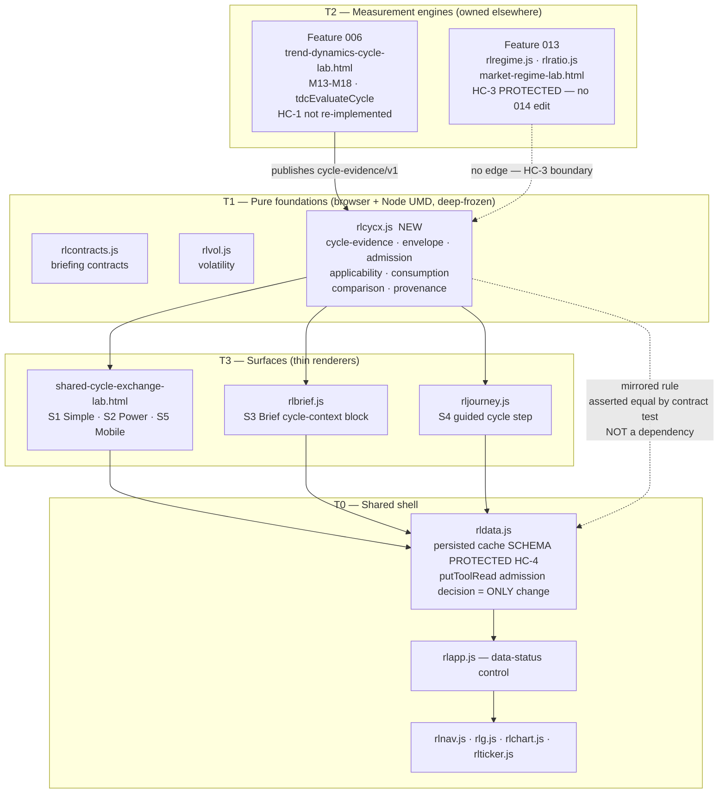
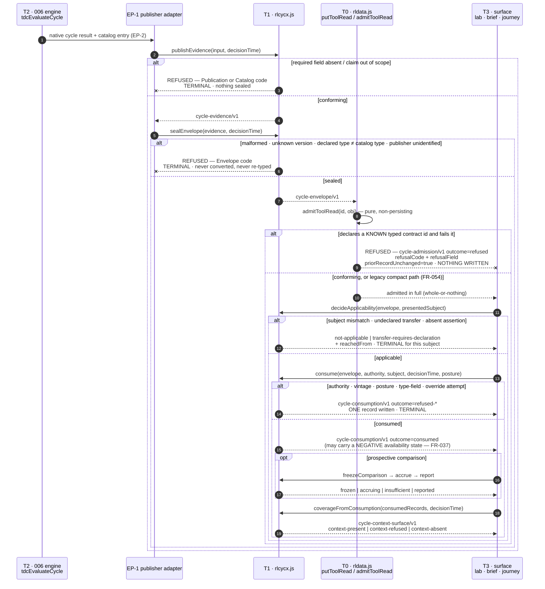
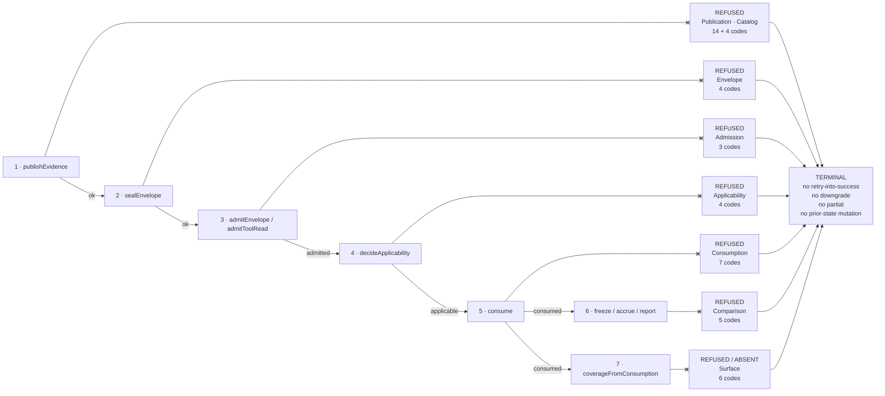

# Design — Shared Cycle And Seasonality Exchange

**Feature:** `specs/014-shared-cycle-and-seasonality-exchange`
**Spec:** [spec.md](spec.md) — Outcome Contract HC-1…HC-8, Domain Capability Model P1–P15 / BP-014-001…015,
FR-001…FR-062, NFR-001…NFR-023, UI Primitives P-UX-01…P-UX-13.
**Authoring status:** part 1 of 2. This pass writes Architecture Overview, Capability Foundation, Concrete
Implementations, Contracts And Schemas, and Implementation Boundary. Test strategy, failure and rollout
handling, performance budgets, and observability are owned by part 2.

> This document designs **to** the spec's contract. It does not restate HC-1…HC-8, P1–P15, BP-014-001…015,
> FR-001…FR-062, NFR-001…NFR-023, or P-UX-01…P-UX-13; it cites them.

---

## Architecture Overview

014 is a **one-way evidence exchange layer**. It sits above the shared runtime and below the surfaces, and it
owns exactly the space between "the Feature 006 engine measured a cycle on a subject" and "another surface
consumed that measurement correctly, or refused correctly." It measures nothing (HC-1) and composes no regime
(HC-3).

### Tier model

| Tier | Members | 014's relationship |
|---|---|---|
| **T0 — Shared shell** | `rldata.js` (cache + typed-read admission), `rlapp.js` (data-status control), `rlnav.js`, `rlg.js`, `rlchart.js`, `rlticker.js` | **Consumed unchanged**, except one admission-decision change inside `rldata.js::putToolRead` (HC-4, see below). Load order `rldata.js` → `rlapp.js` → `rlnav.js` is preserved (NFR-002). |
| **T1 — Pure foundations** | `rlcontracts.js` (briefing contracts), `rlvol.js` (volatility), **`rlcycx.js` (NEW — this feature)** | 014 **adds one sibling** at this tier. `rlcycx.js` follows the `rlvol.js` precedent exactly: browser + Node UMD, deeply frozen, zero DOM / storage / network / timer / ambient-clock, explicit `decisionTime` on every compute entry point, deterministic identity. |
| **T2 — Measurement engines** | Feature 006 `trend-dynamics-cycle-lab.html` (M13–M18, `tdcEvaluateCycle`); Feature 013 `rlregime.js` / `rlratio.js` | 006 is 014's **upstream publisher** (evidence source). 013 is a **peer 014 must not touch** — no trend-structure facet, no regime composition, no ratio/archetype/sleeve registry edits. |
| **T3 — Surfaces** | `shared-cycle-exchange-lab.html` (NEW), `rlbrief.js`, `rljourney.js`, `rlexperience.js` | Surfaces are **thin renderers over `rlcycx.js` result objects**. All thirteen UI primitives (P-UX-01…P-UX-13) render from one foundation result; a per-screen re-implementation of a state is a defect (BP-014-012). |

### One-way dependency direction (explicit)

```
T3 surfaces  ──depends on──▶  T1 rlcycx.js  ──depends on──▶  (nothing)
T3 surfaces  ──depends on──▶  T0 shared shell
T2 006 engine ──publishes into──▶  T1 rlcycx.js contract shapes
```

Three invariants make that direction enforceable, not aspirational:

1. **`rlcycx.js` has zero dependencies.** It imports nothing, reads no global, touches no DOM, opens no network
   connection, reads no clock, and sets no timer. Every entry point takes an explicit `decisionTime`. This is what
   makes NFR-007 determinism a structural property rather than a discipline (identical inputs + identical cutoff ⇒
   byte-identical output in browser and Node).
2. **`rldata.js` gains no new dependency.** The HC-4 fail-closed hardening is implemented **inside `rldata.js`**,
   using the validator that already lives in that file (`validateToolModelRead`). It is deliberately **not**
   delegated to `rlcycx.js`. Delegating it would create an optional dependency whose absence would silently
   re-open the fail-open hole — the check would skip and report success. A guard that can skip is a guard that
   lies. `rlcycx.js` mirrors the identical rule for the Node/envelope path, and a contract test asserts the two
   agree; neither is the other's fallback.
3. **Nothing in T1 or T0 depends on a T3 surface.** There is no back-edge, so `rlcycx.js` is testable headless and
   the same code path serves the lab page, the Market Brief, the guided Journey, and `scripts/`.

### Diagram



### Where the HC-4 change lands, exactly

`rldata.js::putToolRead` today has three admission branches. Verified against the working tree:

| Branch | Declared `contractVersion` | Today | After 014 |
|---|---|---|---|
| 1 | `rl-tool-read/v1` | Already fail-closed — every validation failure `return null` | **Unchanged** |
| 2 | `tool-model-read/v1` | **Fail-open** — a declared-but-non-conforming payload falls through to the legacy compact store (the in-file comment says so explicitly) | **Refused** — declaring the typed contract commits to it (FR-049, FR-050, FR-051, BS-014-020) |
| 3 | anything else, including no `contractVersion` | Legacy compact store | **Unchanged** (FR-054, BS-014-022) |

The change is a **conditional split**, not a rewrite: `src.contractVersion === "tool-model-read/v1"` enters the
typed branch and stays there; `src.toolId !== id` and `!validateToolModelRead(src).ok` each `return null` instead
of falling through. Persisted record shape, `load()`, `save()`, the `rl-tool-read/v1` accepted shape, and the
compact shape are all untouched (FR-055, HC-4).

**Branch 3 stays permissive by design, and that is load-bearing.** `contractVersion` is a repo-wide field name,
not a `putToolRead` field name: at least `sector-rotation-owner-state/v1`, `volatility-owner-state/v1`,
`ai-capex-portfolio-owner-state/v1`, `real-asset-driver-owner-state/v1`, and `str-scenario-owner-state/v1` are
in-repo producers carrying their own `contractVersion`. Refusing *any* unrecognised `contractVersion` would be a
wide breaking change dressed up as hardening. FR-054 scopes the rule correctly and the design honours that scope
literally: **the fail-closed rule fires only on a payload that declares a known typed contract id and then fails
it.**

**Observability without changing the return contract.** `putToolRead` signals refusal by returning `null` today
(branch 1 already does), and that stays. FR-049 additionally requires the refusal to carry a field-attributable
reason. Rather than widen `putToolRead`'s return type — which every existing caller would have to be re-audited
for — 014 adds a sibling **pure, non-persisting** predicate `admitToolRead(id, obj) → { admitted, reason }`.
`putToolRead` calls it; callers that want the reason call it directly. No ambient state, no last-error global, no
persisted change.

---

## Capability Foundation

`rlcycx.js` is the single foundation. Every closed vocabulary, every refusal code, every type-invariance rule,
every determinism guarantee, and every state transition lives here **once**. A surface that hand-rolls any of them
has re-opened a closed vocabulary (BP-014-012) and is a defect.

### Foundation Contract

| Contract | Responsibility | Consumers |
|---|---|---|
| `RLCYCX.publishEvidence(input, decisionTime)` | Build a `cycle-evidence/v1` record or return a refusal. Enforces FR-001 (exactly one catalog entry / subject / vintage / posture), FR-004 (breadth mandatory), FR-005 (family identity), FR-008 (applicability assertion mandatory), FR-009/FR-010 (point-in-time vintage), FR-012 (provenance mandatory), FR-003/FR-014 (no trend-structure, regime, or predictive claim). | 006 publisher adapter; `shared-cycle-exchange-lab.html` Power publication panel (S2); fixtures |
| `RLCYCX.sealEnvelope(evidence, decisionTime)` | Package `cycle-evidence/v1` + `cycle-catalog-entry/v1` + provenance into a `cycle-envelope/v1`. The envelope is the **only** path across a tool boundary (P11). | Publisher adapter; transport layer |
| `RLCYCX.admitEnvelope(envelope, decisionTime)` | Whole-or-nothing admission → `cycle-admission/v1`. Enforces FR-022 (declared type ≠ catalog type ⇒ refuse, never coerce), FR-049/FR-051 (validation failure ⇒ refuse in full), FR-053 (refusal inert w.r.t. prior admitted state). Mirrors the `rldata.js` in-file rule; asserted equal by contract test. | Transport; admission log panel (S2); brief and journey consumers |
| `RLCYCX.decideApplicability(envelope, presentedSubject)` | → `cycle-applicability/v1`. Enforces FR-023 (four subject dimensions), FR-026 (absent assertion ⇒ `not-applicable`, and says so), FR-027/FR-028 (declared transfer labelled as such). | Every consumer; P-UX-06 |
| `RLCYCX.consume(envelope, consumerAuthority, presentedSubject, decisionTime, posture)` | → exactly one `cycle-consumption/v1` per attempt, consumed **or** refused (FR-032, FR-042). Enforces FR-029/FR-031 (authority), FR-033 (vintage), FR-041 (undeterminable posture ⇒ refuse), FR-034 (no consumer-side correction override), FR-036/FR-038/FR-039 (negative states are terminal and un-upgradable). | Lab, Brief, Journey; P-UX-07 |
| `RLCYCX.freezeComparison / accrue / report` | `cycle-comparison/v1` lifecycle `frozen → accruing → reported \| insufficient`. Enforces FR-043 (freeze before window), FR-044 (only post-freeze observations), FR-046 (retrospective freeze refused **and** recordable as an audit finding regardless of the numbers), FR-047 (identical unadjusted baseline; posture mismatch refused), FR-048 (`insufficient`, never partial/early/preliminary). | S2 comparison panel |
| `RLCYCX.recomputeIdentity(record)` / `verifyProvenance(record, recomputed)` | Canonicalise → deterministic identity → `reproducible` \| `not-reproducible` (FR-012, FR-013, FR-062). Verdict is a function of recomputation only; external corroboration cannot change it (BP-014-011). | S1/S2/S3 provenance panel; P-UX-08 |
| `RLCYCX.VOCAB` / `RLCYCX.REFUSALS` | The frozen closed vocabularies (P6–P15) and the frozen refusal-code registry. An unrecognised value refuses; it never passes through (design handoff constraint 5). | Every consumer, every renderer, every test |
| `RLCYCX.coverageFromConsumption(records, decisionTime)` | Derive a `cycle-context-surface/v1` coverage claim **exclusively** from `consumed` consumption records (FR-056, FR-057, FR-058). Key, file, or envelope existence is structurally unable to reach this function. | `rlbrief.js`, `rljourney.js`; P-UX-09 |

### Extension Points

Five, and only five. Each is a **pure data or pure function** seam — no subclassing, no registry of live objects,
no runtime patching.

| # | Extension point | Shape | Why it is an extension point, not foundation |
|---|---|---|---|
| **EP-1** | **Publisher adapter** | `(engineOutput, subject, decisionTime) → publishEvidence input` | Each measurement engine's native output shape differs. Feature 006's `tdcEvaluateCycle` result is the first and currently only implementation. The adapter is a pure mapper; it may not decide eligibility, type, or availability — those come from the engine and are carried, not computed (HC-1, HC-2). |
| **EP-2** | **Catalog source** | a provider returning `cycle-catalog-entry/v1` records | The closed 006 catalog (10 domains × 6 types) is owned by 006. 014 reads it and never authors or extends it. A second engine with its own catalog plugs in here. |
| **EP-3** | **Consumer authority descriptor** | declarative `{ consumerId, evidenceClasses[], subjectClasses[] }` | Authority is configuration, not code (FR-029). Lives in `shared-cycle-exchange-universe.json`. Adding a consumer is a config edit; it can never become a code path that grants itself authority. |
| **EP-4** | **Surface renderer binding** | `(foundationResult) → DOM` | P-UX-01…P-UX-13 are five screens × one vocabulary. The binding chooses layout; the foundation chooses the words. A renderer cannot invent a state (BP-014-012). |
| **EP-5** | **Subject-scope predicate** | `(measuredSubject, presentedSubject) → applicable \| not-applicable \| transfer-requires-declaration` | The four dimensions (instrument, sector, geography, population) are fixed by P1, but a domain may need a stricter scope test. The predicate may only **narrow**: it can turn `applicable` into a refusal, never a refusal into `applicable`. Silent transfer is structurally unreachable (BP-014-005). |

### Foundation-Owned Behavior

The following are **never** re-implemented by an extension point, an adapter, a surface, or a test helper. If a
concrete implementation appears to need its own version of one of these, the design is wrong.

1. **Type invariance (HC-2, BP-014-004, FR-016…FR-022).** The catalog type is read before any measurement field.
   Type dispatch is authoritative: a `lifecycle` yields a stage and **refuses** period / amplitude / phase; a
   `deterministic-calendar` yields an occurrence and **refuses** phase / turn / direction. A declared type that
   differs from the catalog type is refused at admission — never converted, coerced, best-effort re-typed, or
   partially accepted.
2. **Closed-vocabulary enforcement (BP-014-012, HC-7).** One frozen vocabulary for availability (P7),
   applicability (P6), admission (P11), consumption (P13), comparison (P14), and surface state (P15). Unrecognised
   value ⇒ refusal. No local synonym, no free text, no private alias.
3. **Refusal-code assignment.** Every refusal returns a code from the single frozen registry below. A surface may
   choose the wording around a code; it may not mint a code.
4. **Evidence-family identity and multiplicity accounting (BP-014-003, FR-005, FR-006).** Family id is derived
   from series identity + mechanism identity + sweep identity **together**. Breadth is accounted exactly once per
   family. Members of one family are surfaced as one family, never as N confirmations.
5. **Vintage resolution (BP-014-007, FR-009).** Point-in-time, accounting for row revisions — not truncation of
   later rows. A truncation-assembled history containing a post-cutoff revision resolves `unresolved-at-cutoff`.
   No earlier vintage is ever substituted to reach a positive reading.
6. **Adjustment-posture matching (BP-014-009, FR-047).** Two values only. Undeterminable is a refusal, never a
   default. Cross-posture pairing refuses; it is never reconciled, rescaled, or converted.
7. **Negative-state terminality (BP-014-006, FR-035…FR-039).** `unavailable`, `ineligible`, `not-applicable` are
   values. They are identical at publication, in transport, and at the consumer. They are never rendered or
   computed as `candidate`, `contextual`, `drifting`, neutral, zero, or last-known, and never resolved by
   substituting a nearby subject.
8. **Whole-or-nothing admission and refusal inertness (FR-051, FR-053).** Admitted in full or refused in full.
   A refusal writes nothing and leaves any previously admitted record for that identity byte-identical.
9. **Canonicalisation and recomputation identity (NFR-007, FR-012).** Stable key ordering, no wall-clock read, no
   iteration-order dependence, fixed floating-point accumulation order. Non-determinism is designed out, not
   documented around.
10. **Strict finite guards (NFR-006).** `Number.isFinite` **only**, everywhere a partially populated cache value
    can appear. The global `isFinite` is banned in all 014-authored code — `isFinite(null) === true`, which is
    exactly how a `null` slips a guard and aborts a first paint. Absent ⇒ explicit no-value marker, never a throw.
11. **Consumption-record writing.** Exactly one record per attempt, consumption or refusal, with the same named
    fields. A refusal is never aggregated into a count, summarised into prose, or omitted (FR-042).
12. **Descriptive-only enforcement (HC-5, BP-014-001, FR-014).** No forecast, expected return, probability of
    profit, directional signal, exposure, allocation, position size, or recommendation may be constructed. A
    comparison is a comparison.

---

## Concrete Implementations

Six implementations layer on the foundation. Each names the foundation contract it uses and the behaviour that is
genuinely its own.

### CI-1 — Publisher: Feature 006 trend-dynamics cycle engine

- **Foundation contract:** `publishEvidence` + `sealEnvelope`, via **EP-1** publisher adapter and **EP-2** catalog
  source.
- **Implementation-specific:** maps `tdcEvaluateCycle`'s native result to the `publishEvidence` input shape;
  supplies 006's catalog entry, its search-breadth and correction record (hypotheses searched, Benjamini–Hochberg
  discovery correction, Holm activation correction, held-out gate outcome — FR-007), and its engine and
  configuration versions.
- **Owns nothing the foundation owns.** It may not compute eligibility, type, or availability; it carries them.
- **Sequencing:** the positive path is **blocked on 006 Scope 4** (publication) and 006 Scope 5 (as-of replay);
  both are `Not Started` and the 006 validator currently prints `owner-publication=false`. See *Feature 006
  dependency* below.

### CI-2 — Consumer surface: `shared-cycle-exchange-lab.html` (S1 Simple, S2 Power, S5 Mobile)

- **Foundation contract:** every contract; **EP-4** renderer binding.
- **Implementation-specific:** the seven Power panels (publication control, evidence family, evidence detail,
  admission log, consumption ledger, comparison panel, provenance panel) and the two Simple regions; the Simple
  steerable levers (presented subject, decision-time cutoff, posture filter) that recompute from cache without a
  refetch; canvas hit-tests registered through `rlchart.js`; `rlticker.js` decoration.
- **One compute, four views (NFR-008).** A single `rlcycx.js` result object feeds Simple, Power, and the mobile
  variant. Canvas draws execute synchronously inside the render pass and redraw on view activation and resize
  (NFR-009), because a hidden canvas does not render.

### CI-3 — Consumer surface: Market Brief cycle-context block (`rlbrief.js`, S3)

- **Foundation contract:** `admitEnvelope`, `decideApplicability`, `consume`, `coverageFromConsumption`.
- **Implementation-specific:** brief-shaped layout and the staleness sentence; coverage is asserted **only** from
  `consumed` records (FR-056…FR-058) and states `context-absent` / `context-refused` with a reason when no
  admitted, applicable, as-of-valid envelope exists (FR-060). Never a neutral value, a zero, or a last-known
  reading.

### CI-4 — Consumer surface: guided Journey cycle step (`rljourney.js`, S4)

- **Foundation contract:** `decideApplicability`, `consume`.
- **Implementation-specific:** step gating, withdrawal, transitive invalidation, and backtrack. A refused step
  states plainly that the context is not applicable or not available for that subject (FR-061). **No override
  affordance exists** — not disabled, not hidden-but-reachable: if a control could be clicked to obtain the
  refused value, the implementation is wrong.

### CI-5 — Transport: `rldata.js` fail-closed admission

- **Foundation contract:** the admission **rule**, mirrored — deliberately **not** a call into `rlcycx.js` (see
  Architecture Overview invariant 2).
- **Implementation-specific:** the in-file conditional split on the `tool-model-read/v1` branch, plus the pure
  non-persisting `admitToolRead(id, obj) → { admitted, reason }` predicate. Persisted schema untouched (HC-4,
  FR-055); `rl-tool-read/v1` untouched; legacy compact path untouched (FR-054).

### CI-6 — Headless publisher/consumer for the Node path (`scripts/`)

- **Foundation contract:** the identical `rlcycx.js` entry points the browser uses.
- **Implementation-specific:** 014's **own** owner-read adapter in `scripts/brief-refresh.mjs` and its validator
  `scripts/validate-shared-cycle-exchange.mjs`. It touches **no part of Feature 013's regime owner-read adapter**.
- **Determinism is the point:** the same inputs and the same cutoff must produce byte-identical output here and in
  the browser (NFR-007), which is what makes the headless path a real check rather than a second implementation.

### Variation Axes

| # | Axis | Values | Varies across implementations | Owned By Foundation? |
|---|---|---|---|---|
| **VA-1** | **Cycle type** | `deterministic-calendar`, `empirical-seasonality`, `quasi-periodic-oscillation`, `lifecycle`, `regime`, `event` | Rendering and permitted field set differ per type (a lifecycle ladder vs a calendar occurrence strip vs repetitions-against-minimum) | **YES** — the dispatch rule, the permitted-field set, and the refusal on a type-inappropriate request are foundation-owned (HC-2, FR-016…FR-022). Only the *pixels* vary. |
| **VA-2** | **Consumer surface class** | standalone lab (CI-2), Market Brief (CI-3), guided Journey (CI-4), headless Node (CI-6) | Layout, density, interaction model, and gating semantics differ substantially | **NO** — genuinely per-implementation. The **vocabulary** they render is foundation-owned; the surface is not. |
| **VA-3** | **Publisher engine** | Feature 006 TDC today; any future measurement engine | Native result shape, catalog, correction machinery, and version identifiers all differ | **NO** — that is exactly what EP-1 and EP-2 exist for. The record shape they must produce **is** foundation-owned. |
| **VA-4** | **Admission outcome** | `admitted`, `refused` | Nothing varies — every implementation must behave identically | **YES** — whole-or-nothing admission and refusal inertness are foundation-owned (FR-051, FR-053). A per-surface admission policy is a contract violation. |
| **VA-5** | **Presentation view** | `simple`, `power`, `brief`, `journey`, mobile ≤560 px | Which panels exist, how much detail, and what is the sole rendering below 560 px | **NO** — per-implementation. But *one compute feeds all views* (NFR-008), so the values cannot disagree between them. |
| **VA-6** | **Execution environment** | browser, Node | I/O, storage, and rendering availability differ | **YES** for compute — `rlcycx.js` is UMD, dependency-free, and must produce byte-identical output in both (NFR-007). **NO** for I/O, which never enters the foundation. |
| **VA-7** | **Adjustment posture** | `adjusted`, `unadjusted` | Comparison eligibility and baseline pairing | **YES** — posture matching, and the refusal on undeterminable or mismatched posture, are foundation-owned (FR-041, FR-047). No implementation may reconcile a mismatch. |

Four of seven axes are foundation-owned, which is the intended shape: the axes that carry **correctness** (type,
admission, environment, posture) are centralised; the axes that carry **presentation and integration** (surface,
engine, view) are the extension surface.

### Single-implementation note

VA-3 currently has exactly one concrete publisher (Feature 006). That is **not** a single-implementation
exemption: EP-1 and EP-2 exist because the foundation must not encode 006's native result shape — encoding it
would violate HC-1 by fusing the exchange layer to one engine's internals. The seam is load-bearing today
regardless of the member count, because it is the boundary that keeps `rlcycx.js` free of measurement logic.

---

## Contracts And Schemas

Seven versioned contracts. Every one is a plain frozen object, canonicalisable, and serialisable without loss.

**Refusal-code format.** Codes are lowercase-kebab, `cyc-` namespaced, and conform to the repo's existing
`SAFE_REASON_PATTERN` (`^[a-z0-9][a-z0-9-]*$`) used by `rlcontracts.js`. This is deliberate: a 014 refusal code
must be able to travel through the existing reason-code channels without re-encoding. The registry below is
**closed** — a surface may choose wording around a code, never mint one.

### C-1 · `cycle-evidence/v1` — the shareable evidence record

Carries P1 (subject), P2 (catalog entry ref + type), P3 (measurement), P4 (family), P5 (breadth + corrections),
P6 (applicability assertion), P7 (availability), P8 (posture), P9 (vintage), P10 (provenance).

| Field | Required | Closed vocabulary | Notes |
|---|---|---|---|
| `contractVersion` | ✔ | `"cycle-evidence/v1"` | |
| `evidenceId` | ✔ | — | deterministic; derived from canonical content |
| `subject` | ✔ | `kind ∈ {instrument, aggregate, sector, geography, population}` | plus `instrumentId`, `sectorId`, `geographyId`, `populationId` (nullable per kind). **No default subject exists** (P1). |
| `catalogEntryRef` | ✔ | — | id into `cycle-catalog-entry/v1` |
| `cycleType` | ✔ | `deterministic-calendar` \| `empirical-seasonality` \| `quasi-periodic-oscillation` \| `lifecycle` \| `regime` \| `event` | must equal the referenced catalog entry's type (FR-022) |
| `measurement` | ✔ | type-dispatched union | oscillatory ⇒ `{period, phase, amplitude, strength}`; `lifecycle` ⇒ `{stage}` from that entry's own vocabulary; `deterministic-calendar` ⇒ `{occurrence, state ∈ {scheduled, observed, expired}}`. Fields outside the type's union are **absent**, not null. |
| `availability` | ✔ | `active` \| `contextual` \| `candidate` \| `drifting` \| `unavailable` \| `ineligible` \| `not-applicable` | negative states are complete, publishable records (FR-011) |
| `eligibility` | ✔ | `{ repetitions, catalogMinimumEvidence, eligible: boolean }` | `eligible=false` is terminal for the phase (BP-014-006); no phase, amplitude, or next-turn date may exist alongside it |
| `asOf` | ✔ | `{ vintage: ISO, resolution ∈ {resolved, unresolved-at-cutoff}, decisionTime: ISO }` | point-in-time, revision-aware (FR-009) |
| `adjustmentPosture` | ✔ | `adjusted` \| `unadjusted` | two values; no third (FR-041) |
| `family` | ✔ | `{ familyId, seriesIdentity, mechanismIdentity, sweepIdentity, memberCount }` | id derived from the three identities together (FR-005) |
| `searchBreadth` | ✔ | `{ hypothesesSearched, discoveryCorrection, activationCorrection, heldOutGate ∈ {held-out-gated, held-out-failed, not-applicable} }` | accounted once per family; **absence makes the record unpublishable** (FR-004, BP-014-002) |
| `applicabilityAssertion` | ✔ | `{ declaredSubjects[], transferPolicy ∈ {native-scope-only, transfer-requires-declaration} }` | **absence is unpublishable** (FR-008); at consumption, absence ⇒ `not-applicable` (FR-026) |
| `provenance` | ✔ | `{ recordedInputs, lineage, engineVersion, configVersion, recomputationIdentity, verdict ∈ {reproducible, not-reproducible} }` | verdict from recomputation only (FR-012, FR-013) |

**Refusals:** `cyc-subject-unresolved`, `cyc-catalog-entry-unresolved`, `cyc-vintage-multiple`,
`cyc-posture-multiple`, `cyc-breadth-missing`, `cyc-family-unresolved`, `cyc-applicability-assertion-missing`,
`cyc-vintage-unresolved-at-cutoff`, `cyc-provenance-missing`, `cyc-trend-structure-claim`, `cyc-regime-claim`,
`cyc-predictive-claim`, `cyc-availability-unknown`, `cyc-eligibility-contradicts-measurement`.

### C-2 · `cycle-catalog-entry/v1` — the exchanged typed catalog entry

Required: `contractVersion`, `entryId`, `domain` (one of 006's ten), `cycleType` (C-1 vocabulary), `mechanism`
(nullable for calendar types), `observables[]`, `minimumEvidence`, `stateVocabulary[]`, `invalidationCondition`.
The entry's `cycleType` and `minimumEvidence` are **immutable across exchange** (P2). 014 reads this catalog; it
never authors or extends it (HC-1).

**Refusals:** `cyc-catalog-type-unknown`, `cyc-catalog-domain-unknown`, `cyc-catalog-entry-immutable-violation`,
`cyc-catalog-state-vocabulary-unknown`.

### C-3 · `cycle-envelope/v1` — the transport artifact

Required: `contractVersion`, `envelopeId`, `evidence` (C-1), `catalogEntry` (C-2), `declaredCycleType`,
`publisherId`, `sealedAt` (explicit `decisionTime`, never a clock read). The envelope is the **only** path across
a tool boundary (P11).

**Refusals:** `cyc-envelope-malformed`, `cyc-envelope-unrecognized-version`, `cyc-type-mismatch` (declared type ≠
catalog type — refused, never converted: FR-022, BS-014-019), `cyc-publisher-unidentified`.

### C-4 · `cycle-admission/v1` — the transport admission result

| Field | Required | Closed vocabulary |
|---|---|---|
| `contractVersion` | ✔ | `"cycle-admission/v1"` |
| `outcome` | ✔ | `admitted` \| `refused` — **no third value; no partial** (FR-051) |
| `envelopeRef` | ✔ | — |
| `refusalCode` | ✔ when refused | from the registry |
| `refusalField` | ✔ when refused | the specific failing field (FR-049) |
| `priorRecordUnchanged` | ✔ | boolean — asserts refusal inertness (FR-053) |

**Refusals:** `cyc-typed-contract-invalid` (declared a known typed contract and failed a required field —
BS-014-020), `cyc-typed-contract-partial` (any attempt at partial admission), `cyc-identity-mismatch`
(`toolId`/`id` disagreement), `cyc-envelope-unrecognized-version`, `cyc-type-mismatch`.

**Scope note (FR-054, BS-014-022).** A payload with an unrecognised or absent `contractVersion` is **not** a
014 refusal. It is the legacy compact path and is admitted unchanged. Widening the rule beyond declared-known-typed
contracts would break in-repo producers that legitimately carry their own `contractVersion`
(`sector-rotation-owner-state/v1`, `volatility-owner-state/v1`, `ai-capex-portfolio-owner-state/v1`,
`real-asset-driver-owner-state/v1`, `str-scenario-owner-state/v1`, among others).

### C-5 · `cycle-applicability/v1` — the applicability decision

Required: `contractVersion`, `decision` ∈ `applicable` \| `not-applicable` \| `transfer-requires-declaration`,
`measuredSubject`, `presentedSubject`, `dimensionsCompared[]` (instrument, sector, geography, population),
`reachedFrom` ∈ `explicit-declaration` \| `absent-assertion` \| `negative-declaration`, `reliedOnDeclaredTransfer`
(boolean).

`reachedFrom` exists because FR-026 requires the record to state that a `not-applicable` was reached from an
**absent** assertion rather than a negative declaration — the user-visible difference between "nobody said" and
"someone said no" (P-UX-06, BS-014-013).

**Refusals:** `cyc-subject-not-applicable`, `cyc-transfer-undeclared`, `cyc-applicability-absent-assertion`,
`cyc-subject-dimension-unknown`.

### C-6 · `cycle-consumption/v1` — the consumption record

Exactly one written per attempt, consumed **or** refused (FR-032, FR-042).

| Field | Required | Closed vocabulary |
|---|---|---|
| `contractVersion` | ✔ | `"cycle-consumption/v1"` |
| `consumerId` | ✔ | — |
| `evidenceRef` | ✔ | — |
| `asOfUsed` | ✔ | ISO, or `null` **only** when `outcome = refused-vintage` |
| `cycleTypeConsumed` | ✔ | C-1 vocabulary — every record names the type (FR-021) |
| `applicabilityDecision` | ✔ | C-5 |
| `outcome` | ✔ | `consumed` \| `refused-applicability` \| `refused-authority` \| `refused-transport` \| `refused-vintage` |
| `adjustmentPostureRead` | ✔ | `adjusted` \| `unadjusted` — **no default.** Undeterminable ⇒ the consumption is refused and the posture is left unrecorded rather than assumed (FR-041, BS-014-024) |
| `availabilityStateConsumed` | ✔ | P7 vocabulary — an `ineligible` record consumed successfully is still `outcome: consumed` carrying `ineligible` (FR-037) |
| `refusalCode` | ✔ when refused | from the registry |

**Refusals:** `cyc-authority-undeclared`, `cyc-authority-class-mismatch`, `cyc-vintage-unserviceable` (no earlier
vintage may be substituted or returned — FR-033), `cyc-posture-undeterminable`,
`cyc-correction-override-attempted` (FR-034 — a consumer may not recompute or write a corrected significance),
`cyc-negative-state-upgrade-attempted` (FR-038/FR-039), `cyc-type-field-unsupported` (phase/amplitude/period
against a `lifecycle`, or phase/turn/direction against a `deterministic-calendar` — FR-018, FR-020).

### C-7 · `cycle-comparison/v1` — the prospective comparison record

Required: `contractVersion`, `comparisonId`, `readingRef` (C-1), `baselineRef`, `baselinePosture`,
`readingPosture`, `observationWindow` `{opensAt, closesAt, declaredObservationCount}`, `freezeTime`, `state` ∈
`frozen` \| `accruing` \| `insufficient` \| `reported`, `accruedObservations`, `firstAccruedObservationAt`.

**Invariants.** `freezeTime` must be **strictly before** `observationWindow.opensAt` and before every accrued
observation (FR-043, FR-046). Only post-freeze observations accrue (FR-044). `baselinePosture` must equal
`readingPosture` and the baseline must be the identical unadjusted baseline (FR-047). A closed window short of
`declaredObservationCount` reaches `insufficient` — never partial, early, or preliminary (FR-048), and never a
progress bar or percentage in the UI. `reported` is presented as a comparison, never as validated superiority
(FR-045, HC-5).

**Refusals:** `cyc-freeze-retrospective` (recordable as an audit finding regardless of the underlying numbers —
FR-046), `cyc-baseline-posture-mismatch`, `cyc-baseline-not-identical`, `cyc-superiority-claim`,
`cyc-comparison-window-invalid`.

### Consumer-surface state (carried on `cycle-context-surface/v1`)

`state` ∈ `context-present` \| `context-refused` \| `context-absent` (P15). A coverage claim cites the
consumption records it rests on (FR-058); envelope, key, or file existence cannot reach the coverage function at
all (FR-057).

**Refusals:** `cyc-context-absent`, `cyc-context-refused`, `cyc-coverage-unbacked` (a coverage claim attempted
from key presence), `cyc-provenance-not-reproducible` (FR-062), `cyc-override-attempted` (a Journey participant
attempting to override a refusal or re-scope evidence — FR-061), `cyc-stale-presented-as-current` (FR-059).

### Refusal-code registry (closed — 47 codes)

```
Publication ....... cyc-subject-unresolved · cyc-catalog-entry-unresolved · cyc-vintage-multiple
                    cyc-posture-multiple · cyc-breadth-missing · cyc-family-unresolved
                    cyc-applicability-assertion-missing · cyc-vintage-unresolved-at-cutoff
                    cyc-provenance-missing · cyc-trend-structure-claim · cyc-regime-claim
                    cyc-predictive-claim · cyc-availability-unknown
                    cyc-eligibility-contradicts-measurement
Catalog ........... cyc-catalog-type-unknown · cyc-catalog-domain-unknown
                    cyc-catalog-entry-immutable-violation · cyc-catalog-state-vocabulary-unknown
Envelope .......... cyc-envelope-malformed · cyc-envelope-unrecognized-version
                    cyc-type-mismatch · cyc-publisher-unidentified
Admission ......... cyc-typed-contract-invalid · cyc-typed-contract-partial · cyc-identity-mismatch
Applicability ..... cyc-subject-not-applicable · cyc-transfer-undeclared
                    cyc-applicability-absent-assertion · cyc-subject-dimension-unknown
Consumption ....... cyc-authority-undeclared · cyc-authority-class-mismatch
                    cyc-vintage-unserviceable · cyc-posture-undeterminable
                    cyc-correction-override-attempted · cyc-negative-state-upgrade-attempted
                    cyc-type-field-unsupported
Comparison ........ cyc-freeze-retrospective · cyc-baseline-posture-mismatch
                    cyc-baseline-not-identical · cyc-superiority-claim
                    cyc-comparison-window-invalid
Surface ........... cyc-context-absent · cyc-context-refused · cyc-coverage-unbacked
                    cyc-provenance-not-reproducible · cyc-override-attempted
                    cyc-stale-presented-as-current
```

Every code is a **rendered** state (P-UX-03): a named reason plus a what-would-resolve line, occupying the exact
region the positive value would have occupied. Never blank, never a spinner, never a dash, never a zero, never a
greyed placeholder, and exposing no control that would yield the refused value.

---

## Implementation Boundary

`bubbles.plan` draws every scope's file list from this section. It is exhaustive: a file not listed here is
out of boundary and requires a routed design amendment.

### Files 014 MAY CREATE

| Path | Purpose |
|---|---|
| `rlcycx.js` | The T1 foundation. UMD, browser + Node, deeply frozen, zero dependencies, no DOM/storage/network/timer/ambient-clock, explicit `decisionTime` on every entry point. Follows the `rlvol.js` precedent. |
| `shared-cycle-exchange-lab.html` | The 014 tool page — S1 Simple, S2 Power (seven panels), S5 mobile variant. Shared-shell order `rldata.js` → `rlapp.js` → `rlnav.js`, plus `rlg.js`, `rlchart.js`, `rlticker.js`. |
| `shared-cycle-exchange-universe.json` | Subject registry, consumer-authority descriptors (EP-3), and catalog-source binding (EP-2). Follows the `<tool>-universe.json` precedent. |
| `scripts/validate-shared-cycle-exchange.mjs` | Node validator. Follows the `scripts/validate-trend-dynamics-cycle.mjs` precedent. |
| `notes/shared-cycle-exchange.md` | Per-tool handoff doc (house rule: every tool has one). |
| `tests/shared-cycle-exchange.unit.mjs` | — |
| `tests/shared-cycle-exchange.functional.mjs` | — |
| `tests/shared-cycle-exchange.integration.mjs` | — |
| `tests/shared-cycle-exchange.e2e.mjs` | — |
| `tests/shared-cycle-exchange.spec.mjs` | Playwright. |
| `tests/shared-cycle-exchange.stress.mjs` | — |
| `tests/shared-cycle-exchange.support.mjs` | Shared fixtures/helpers for the above. |
| `tests/rldata-admission-fail-closed.integration.mjs` | The HC-4 regression: compact path still admitted (FR-054), refusal leaves a prior admitted record byte-identical (FR-053), persisted shape unchanged (FR-055). |
| `tests/fixtures/shared-cycle-exchange/**` | Contract fixtures — the pre-006 demonstration substrate. |

*(File names are the boundary. Test **strategy** — categories, adversarial construction, coverage mapping — is
part 2.)*

### Files 014 MAY MODIFY (narrowly, as named)

| Path | Permitted change | Forbidden in the same file |
|---|---|---|
| `rldata.js` | **Only** the `putToolRead` `tool-model-read/v1` admission branch (conditional split), plus the new pure non-persisting `admitToolRead(id, obj)` sibling. | Any change to the persisted record shape, to `load()`/`save()`, to the `rl-tool-read/v1` branch, or to the legacy compact branch (HC-4, FR-055). |
| `rlbrief.js` | Add the cycle-context block (S3) consuming `rlcycx.js`. | Any change to existing brief contracts or to another tool's read handling. |
| `rljourney.js` | Add the guided cycle step (S4) and its gating. | Any change to existing journey step semantics. |
| `scripts/brief-refresh.mjs` | Add **014's own** cycle owner-read adapter. | **Feature 013's regime owner-read adapter — untouchable.** |
| `scripts/selftest.mjs` | Register `validate-shared-cycle-exchange.mjs`. | Any change to another feature's registration. |
| `tools.json` | Register the tool. | **SEQUENCED — see the 013 rule below.** |
| `index.html` (`TOOLS` array) | Register the tool. | **SEQUENCED.** |
| `rlnav.js` (`TOOLS` array) | Register the tool. | **SEQUENCED.** Nothing else in `rlnav.js`. |
| `simple-models.json` | Register the Simple-model adapter. | **SEQUENCED** + see the adapter-allowlist decision below. |
| `rlexperience-adapters/market-structure.js` | **Only** 014's own Simple-model adapter registration inside this existing module: (a) the new adapter id, (b) the single declared definition id that adapter supports, (c) its factory function and the one line that wires that factory into the module's adapter map, and (d) appending **only** the new adapter id to the module's `supportedAdapterIds` array. Nothing else in the file. | Any change to an **existing** adapter (breadth, conditional-volatility, session-auction, swing-transition, technical-five-gate), to any **existing** `supportedAdapterIds` entry or its ordering, or to any owner primitive / shared helper in this module used by other tools. **SEQUENCED** — this registration is part of the atomic registry group and reverts with it (reversal row #9), never on its own. |
| `journeys.json` | Register 014's journey definitions. | **SEQUENCED.** |

**Why this file is in boundary.** The adapter-allowlist decision below chooses registration inside the existing
`rlexperience-adapters/market-structure.js` module precisely *because* it avoids widening
`tool-experience.config.json` `adapterPolicy.moduleAllowlist` — which is a contract change. That chosen path is
only plannable if the file it touches is named here, since `bubbles.plan` may draw scope file lists from this
section alone. The module already hosts five `simple-adapter/*/v1` registrations, so 014 adds a sixth alongside
them without altering any of them. This file is **not** a Protected Surface: the protected peer foundation is
`rlexperience.js` (the runtime), which is a different file and remains untouched. Listing this file does **not**
pre-decide **OQ-2** — it makes the already-chosen default executable; if review routes the allowlist alternative
instead, this row is withdrawn with it.

### Protected Surfaces — 014 MUST NOT modify

**HC-4 · the persisted cache schema**
- `rldata.js` persisted record shape (`d.toolReads[id]`), `load()`, `save()`, the `rl-tool-read/v1` accepted
  shape, the legacy compact shape. Existing stored records must remain byte-identical and readable.

**HC-3 · Feature 013 (concurrently in flight — 30 modified files in the working tree)**
- `rlratio.js` · `ratio-pairs.json` · `rlregime.js` · `regime-archetypes.json` · `market-regime-lab.html`
- Feature 013's regime owner-read adapter inside `scripts/brief-refresh.mjs`
- The archetype, sleeve, and ratio-pair registries
- 014 claims **no** trend-structure facet and names **no** regime.

**HC-1 · Feature 006 (the measurement engine)**
- `trend-dynamics-cycle-lab.html` (M13–M18, `tdcEvaluateCycle`, the correction machinery, the closed catalog, the
  state vocabularies) · `trend-dynamics-cycle-universe.json` · `scripts/validate-trend-dynamics-cycle.mjs`

**Shared shell and peer foundations (consumed, never modified)**
- `rlcontracts.js` · `rlvol.js` · `rlexperience.js` · `rlapp.js` · `rlg.js` · `rlchart.js` · `rlticker.js` ·
  `rlviews.js` · `rlcontext.js` · `rlsession.js` · `rlvalidation.js`
- `rlnav.js` beyond its `TOOLS` array entry

**Contract surfaces (change requires routing, not an edit)**
- `tool-experience.config.json` — in particular `adapterPolicy.moduleAllowlist`
- `scripts/validate-tool-experience.mjs` count assertions (22 / 4 / 48 / 48)

**Generated artifacts**
- `market-brief.payload.json` · `market-brief.snapshot.json` · `brief-history.jsonl` ·
  `causal-rotation-observations.json`

**Governance and other features**
- `specs/001-*` … `specs/013-*` · `specs/_bugs/*` · `.github/bubbles/**` · `.specify/**`
- `specs/014-shared-cycle-and-seasonality-exchange/spec.md` (analyst/UX-owned; defects are routed, not edited)

### Cross-feature sequencing rule — registry-count coupling (named risk)

`scripts/validate-tool-experience.mjs` hard-asserts exact counts — **22 ordinary tools, 4 Market Action Center
goals, 48 total goals, 48 journey definitions**. Feature 013 SCOPE-5 already moves those counts in lockstep and is
in flight in a separate session. Two features registering into the same counted registries concurrently will
collide.

**The rule (binding, not an implementation detail):**

1. **014's registration work is a single, isolated, LAST scope.** All five counted registries — `tools.json`,
   `index.html` `TOOLS`, `rlnav.js` `TOOLS`, `simple-models.json`, `journeys.json` — are touched by that one scope
   and by nothing else.
2. **That scope is serialised strictly after 013 SCOPE-5 lands on the mainline.** It may not be scheduled in
   parallel and may not be started on the assumption that 013's counts are final.
3. **Counts are re-read, never hardcoded forward.** The scope reads the then-current asserted counts and increments
   from them. Writing `23 / 49` today against an in-flight 013 is how both features end up wrong.
4. **Until that scope runs, 014 ships unregistered.** The lab page is reachable by direct URL and validated by its
   own `scripts/validate-shared-cycle-exchange.mjs`. Counts stay at 22 / 48 and
   `scripts/validate-tool-experience.mjs` stays green throughout — 014 cannot break 013's validator by existing.
5. **The `rldata.js` admission change rebases onto 013's merged state** and carries the coordination regression
   (compact path still admitted; prior admitted record byte-identical after a refusal; persisted shape unchanged).
6. **Every 014 scope that touches a shared file states its 013 interaction explicitly** in its DoD rather than
   assuming isolation.

### Adapter-allowlist decision (contract-change surface)

`tool-experience.config.json` `adapterPolicy.moduleAllowlist` is **exact** — seven modules
(`market-structure.js`, `options.js`, `macro-rotation.js`, `fundamental-models.js`, `strategy-research.js`,
`property-research.js`, `market-action.js`) with `registrationPolicy: "exact-declared-adapter-ids"`. 014's Simple
cockpit needs a Simple-model adapter.

- **Default (chosen):** register 014's adapter **inside the existing `rlexperience-adapters/market-structure.js`**
  module. No new module, no allowlist change, **no contract change**.
- **Alternative:** add `rlexperience-adapters/cycle-exchange.js` to the allowlist. This is a **contract change**,
  not an implementation detail — it widens an exact allowlist and alters
  `adapterPolicy` (`experience-adapter-policy/v1`). It requires a routed amendment and owner sign-off before any
  code is written; 014 may not widen the allowlist unilaterally.

The default is chosen because it is reversible and non-contractual. If review judges the semantic fit of a cycle
adapter inside `market-structure.js` to be wrong, that judgement **routes** the alternative — it does not
authorise a silent allowlist edit.

### Feature 006 dependency — deliverable now vs blocked

006 Scope 4 (publication) and Scope 5 (as-of replay) are both `Not Started`; 006's own state is `not_started`; the
006 validator currently prints `owner-publication=false`. The dependency is real and is named here rather than
absorbed.

**Deliverable and demonstrable BEFORE 006 Scope 4 lands** — the entire refusal, admission, and consumption-record
machinery, driven by `cycle-evidence/v1`-conforming fixtures:

- The whole `rlcycx.js` foundation: all seven contracts, all 47 refusal codes, the closed vocabularies,
  canonicalisation, and the recomputation identity.
- The complete HC-4 fail-closed transport hardening and its regressions. **This needs no 006 publication at all** —
  it is testable today against the live `putToolRead`.
- Every refusal path: publication refusals, type-invariance refusals, applicability refusals, authority and
  vintage refusals, posture refusals, comparison-freeze refusals, surface refusals, and the Journey no-override
  guarantee.
- The applicability decision and the consumption ledger, including the `absent-assertion` vs `negative-declaration`
  distinction and the declared-transfer labelling.
- Comparison freeze / accrue / `insufficient` mechanics on fixture readings.
- Provenance recomputation on a fixture record, both verdicts.
- S1, S2, and S5 rendering every negative and refusal state; S3 and S4 rendering `context-absent` /
  `context-refused` with reasons.

**BLOCKED on 006 Scope 4 (publication)** — every positive end-to-end exchange:

- A real published finding surviving the boundary with full fidelity.
- A real evidence family from a real hypothesis sweep.
- A real engine-published negative availability state.
- Publisher and consumer resolving identical type / availability / vintage.
- Positive consumption of real evidence, and the consumption ledger over it.
- Comparison frozen against a real published reading.
- Real coverage and staleness assertions in the Brief.
- Deterministic recomputation of a real model-derived claim.

**BLOCKED on 006 Scope 5 (as-of replay)** — real revision-contaminated history refused at publication, and a real
unresolvable-at-cutoff vintage.

**The rule:** fixtures prove the **contract**. They do not substitute for the dependency and they may not be
presented as end-to-end evidence. Any scope requiring real published 006 evidence is marked
`blocked-on-006-scope-4` (or `-scope-5`) in `scopes.md` and is **not** scheduled as though the dependency were
satisfied. A design or plan that assumes published 006 evidence is fabricating a precondition.

---

*Educational research context only — not investment advice.*

---

# Part 2 — Flow, Failure, Determinism, Test, Performance, Observability, Rollout

**Authoring status:** part 2 of 2. This pass writes Data Flow And Sequencing, Failure Handling And Degradation,
Determinism And Reproducibility, Test Strategy, Performance And Resource Budgets, Observability And Diagnostics,
Rollout And Reversibility, and Open Design Questions.

Part 2 **reuses part 1 verbatim** and invents nothing: the same contracts (`cycle-evidence/v1`,
`cycle-catalog-entry/v1`, `cycle-envelope/v1`, `cycle-admission/v1`, `cycle-applicability/v1`,
`cycle-consumption/v1`, `cycle-comparison/v1`, `cycle-context-surface/v1`), the same extension points (EP-1…EP-5),
the same concrete implementations (CI-1…CI-6), the same variation axes (VA-1…VA-7), the same closed `cyc-*`
refusal registry, and the same Implementation Boundary file names. No new contract, refusal code, extension point,
or file is introduced below.

---

## Data Flow And Sequencing

The exchange is a **single directed pipeline with seven stages**. There is no loop, no retry edge, and no path by
which a later stage rehabilitates an earlier refusal. Every stage either emits its contract record or emits a
refusal — and a refusal at stage *N* ends the pipeline for that attempt.

### The seven stages

| # | Stage | Foundation entry point | Emits | Refuses with (group) |
|---|---|---|---|---|
| 1 | **Publication** | `RLCYCX.publishEvidence(input, decisionTime)` | `cycle-evidence/v1` | Publication (14) + Catalog (4) |
| 2 | **Sealing** | `RLCYCX.sealEnvelope(evidence, decisionTime)` | `cycle-envelope/v1` | Envelope (4) |
| 3 | **Admission** | `RLCYCX.admitEnvelope(envelope, decisionTime)` · mirrored by `rldata.js::admitToolRead` | `cycle-admission/v1` | Admission (3) + `cyc-type-mismatch`, `cyc-envelope-unrecognized-version` |
| 4 | **Applicability** | `RLCYCX.decideApplicability(envelope, presentedSubject)` | `cycle-applicability/v1` | Applicability (4) |
| 5 | **Consumption** | `RLCYCX.consume(envelope, consumerAuthority, presentedSubject, decisionTime, posture)` | `cycle-consumption/v1` — **exactly one per attempt** | Consumption (7) |
| 6 | **Comparison** | `RLCYCX.freezeComparison` → `accrue` → `report` | `cycle-comparison/v1` | Comparison (5) |
| 7 | **Surface** | `RLCYCX.coverageFromConsumption(records, decisionTime)` + EP-4 renderer binding | `cycle-context-surface/v1` | Surface (6) |

Stage 6 is **not** on the critical path to stage 7: a comparison is an optional prospective artifact frozen from
an already-consumed reading. Stage 7's coverage claim rests **only** on stage 5 records with `outcome: consumed`
(FR-056, FR-057, FR-058) — envelope existence, cache-key existence, and file existence are structurally unable to
reach `coverageFromConsumption`, because that function's only parameter is a consumption-record array.

### Sequence



### Where each refusal class fires — and why it is terminal



**Terminality is structural, not procedural.** Four properties make it so:

1. **No refusal record carries a resume token.** `cycle-admission/v1`, `cycle-applicability/v1`, and
   `cycle-consumption/v1` have no continuation field, no `retryAfter`, no partial payload. There is nothing for a
   caller to feed back in. The only way to obtain a positive outcome is a **new attempt with different inputs**,
   which produces a **new record** — never an amendment of the refusal.
2. **No stage accepts a refusal record as input.** `decideApplicability` takes an envelope, not an admission
   result; `consume` takes an envelope, not an applicability refusal; `coverageFromConsumption` takes consumption
   records and filters to `outcome: consumed` before anything else. A refused artifact has no downstream socket.
3. **Downgrade is unreachable because there is no lower rung.** The availability vocabulary (P7) is flat, not
   ordered: `unavailable`, `ineligible`, and `not-applicable` are *values*, not degraded forms of `active`. There
   is no "reduced-confidence active" to fall back to, so a fail-open downgrade cannot be expressed in the
   contract even by mistake (BP-014-006, FR-035…FR-039).
4. **A refusal is inert with respect to prior state.** `cycle-admission/v1` carries the boolean
   `priorRecordUnchanged`, and it is asserted `true` on every refusal path (FR-053). A refusal never writes,
   never clears, never marks-stale, and never touches the previously admitted record for that identity.

**Retry semantics, stated plainly.** A user may re-attempt — that is a *new* attempt with a new decision time and
a new consumption record. It is never the same attempt succeeding on a second pass. The consumption ledger
therefore shows two records (one refused, one consumed), not one record that changed its mind. Collapsing them
would erase the refusal, which FR-042 forbids.

---

## Failure Handling And Degradation

### Four laws that bind every failure path

| # | Law | Structural expression |
|---|---|---|
| **L-1** | **Refusal ≠ loading ≠ empty ≠ zero.** | Four distinct surface renderings, never substituted for one another. A refusal renders a **named reason + a what-would-resolve line** in the exact region the positive value would have occupied (P-UX-03). It is never a spinner, never a blank, never `—`, never `0`, never a greyed placeholder, and never a control that would yield the refused value. |
| **L-2** | **Negative states are non-upgradable.** | `unavailable` / `ineligible` / `not-applicable` are byte-identical at publication, in transport, and at the consumer. `cyc-negative-state-upgrade-attempted` fires on any attempt to render or compute one as `candidate`, `contextual`, `drifting`, neutral, zero, or last-known, or to resolve one by substituting a nearby subject (FR-036, FR-038, FR-039). |
| **L-3** | **A refusal never mutates prior admitted state.** | `priorRecordUnchanged: true` on every refusal; asserted by a byte-comparison regression, not by inspection (FR-053). |
| **L-4** | **Whole-or-nothing admission.** | `cycle-admission/v1.outcome` has exactly two values. There is no `partial`, no `degraded`, no `best-effort`. `cyc-typed-contract-partial` exists specifically to refuse an attempt at partial admission (FR-051). |

### Per-group failure handling

| Refusal group | What the system does | What the user sees | What would resolve it |
|---|---|---|---|
| **Publication** (14 codes) | Emits no `cycle-evidence/v1`. Nothing is sealed, nothing enters transport. Where the engine supplied a genuine negative availability, that is **published as a complete record** (FR-011) — a negative reading is not a publication failure. | On S2's publication panel: the failing field named, the code, and the rule it violated. On S1/S3/S4: nothing appears, because nothing was published — the surface shows `context-absent`, not a blank slot. | Supply the missing field at the **source**. `cyc-breadth-missing` resolves only by the engine supplying its hypothesis-sweep and correction record — never by the exchange layer defaulting or inferring it (BP-014-002). |
| **Catalog** (4 codes) | Rejects the catalog entry before any measurement field is read. Type dispatch never runs on an unknown type. | S2 evidence panel: "catalog entry not recognised" with the unknown value quoted and the closed vocabulary listed. | A catalog fix in **Feature 006**, which owns the catalog (HC-1, EP-2). 014 must not extend the vocabulary to make a record pass. |
| **Envelope** (4 codes) | Refuses transport. `cyc-type-mismatch` is the sharp one: a declared type differing from the catalog type is **refused, never converted, coerced, or best-effort re-typed** (FR-022). | S2 admission log: the declared type and the catalog type shown side by side, with "refused — types disagree". | Correct the declaration at the publisher. There is no reconciliation affordance, by design. |
| **Admission** (3 codes) | `putToolRead` returns `null`; `admitToolRead` returns `{ admitted: false, reason }`. Nothing is persisted. The **legacy compact path is unaffected** (FR-054) — a payload with an unrecognised or absent `contractVersion` is admitted exactly as today. | S2 admission log row: outcome `refused`, the code, the failing field, and `priorRecordUnchanged: true`. The prior admitted reading remains visible and unchanged. | Fix the payload so it conforms to the typed contract it declares — or stop declaring the typed contract. Both are publisher-side. |
| **Applicability** (4 codes) | Emits `cycle-applicability/v1` with `decision` and `reachedFrom`. No consumption is attempted. | P-UX-06 states which of the four dimensions failed, **and** distinguishes "nobody said" (`absent-assertion`) from "someone said no" (`negative-declaration`) — the two are never collapsed (FR-026, BS-014-013). | For `cyc-applicability-absent-assertion`: the publisher declares an applicability assertion. For `cyc-transfer-undeclared`: the publisher declares the transfer explicitly, which then renders **as a declared transfer**, never as a native reading. |
| **Consumption** (7 codes) | Writes **exactly one** `cycle-consumption/v1` with `outcome: refused-*` (FR-032, FR-042). The record is never aggregated into a count, summarised into prose, or omitted. `adjustmentPostureRead` is left **unrecorded** on `cyc-posture-undeterminable` rather than defaulted (FR-041, BS-014-024). | P-UX-07 consumption ledger: the refused row sits alongside consumed rows with the same named fields. A refused row is never hidden behind a "show failures" toggle. | Authority codes: an EP-3 config edit (a declarative descriptor), never a code path granting itself authority. `cyc-vintage-unserviceable`: no earlier vintage may be substituted or returned (FR-033) — only a genuinely serviceable vintage resolves it. |
| **Comparison** (5 codes) | Refuses the freeze or the pairing. `cyc-freeze-retrospective` is **recorded as an audit finding regardless of the underlying numbers** (FR-046) — a favourable result does not soften it. A window closing short of `declaredObservationCount` reaches `insufficient`, never partial/early/preliminary (FR-048). | S2 comparison panel: `insufficient` is a **terminal named state**, not a progress bar and not a percentage. `reported` is presented as a comparison, never as validated superiority (FR-045, HC-5). | Freeze **before** the window opens, on an identical unadjusted baseline with matching posture. A retrospective freeze is not resolvable — it is a finding. |
| **Surface** (6 codes) | Renders `context-refused` or `context-absent` with the reason. `cyc-coverage-unbacked` fires if a coverage claim is attempted from key presence rather than consumption records. `cyc-override-attempted` fires if a Journey participant tries to obtain a refused value. | S3 brief block and S4 journey step state plainly that context is not available or not applicable **for that subject**, with the reason (FR-060, FR-061). **No override affordance exists** — not disabled, not hidden-but-reachable. | A conforming, admitted, applicable, as-of-valid, consumed envelope. Nothing else produces `context-present`. |

### Degradation policy: there isn't one

014 has **no graceful-degradation path**, and that is the design, not an omission. The failure mode this feature
exists to prevent is precisely "the check could not run, so we proceeded and reported success." Concretely:

- **`rlcycx.js` absent ⇒ the surface refuses, it does not fall back.** A consumer that cannot load the foundation
  renders `context-refused` with a reason. It does not hand-roll a local vocabulary (BP-014-012).
- **`rldata.js` admission is not delegated to `rlcycx.js`.** Stated in part 1's Architecture Overview invariant 2
  and restated here because it is a failure-handling property: if the admission rule lived in `rlcycx.js`, then
  `rlcycx.js` being absent would make the check *skip* — and a guard that can skip is a guard that lies. The rule
  is in-file in `rldata.js`, mirrored in `rlcycx.js`, and a contract test asserts the two agree. Neither is the
  other's fallback.
- **A missing optional field never becomes a default.** `Number.isFinite` guards everywhere (NFR-006); absent ⇒ an
  explicit no-value marker, never a throw and never a substituted zero. The global `isFinite` is banned in all
  014-authored code — `isFinite(null) === true` is exactly how a `null` slips a guard and aborts a first paint.
- **First paint cannot be aborted by a refusal.** Every stage returns a record; no stage throws on a contract
  violation. A refusal is data, and data renders.

---

## Determinism And Reproducibility

NFR-007 requires identical inputs plus an identical cutoff to produce **byte-identical output in browser and
Node**. `rlcycx.js`'s zero-dependency, zero-ambient-state shape (part 1, Architecture Overview invariant 1) makes
that a structural property. This section states the rules that keep it one.

### Canonicalisation rules (applied before any identity is computed)

| # | Rule | Rationale |
|---|---|---|
| **CR-1** | **Key ordering is lexicographic by code unit** (`Array.prototype.sort()` default on `Object.keys`), applied recursively. | `JSON.stringify` preserves insertion order, which differs between a literal, a parse, and a rebuild. Sorting removes the difference. |
| **CR-2** | **Arrays keep declaration order; sets are sorted.** Ordered concepts (`dimensionsCompared`, `observables`, `stateVocabulary`, accrued observations) keep their meaningful order. Unordered collections (`declaredSubjects`, family members) are sorted by their own id before serialisation. | Order that carries meaning must survive; order that does not must not leak into the identity. |
| **CR-3** | **Absent ≠ null ≠ omitted-key.** A field outside a type's permitted union is **absent** (key not present), not `null` (part 1, C-1). Canonicalisation drops no key and adds no key. | A `lifecycle` record with `phase: null` and one with no `phase` key would otherwise hash the same, defeating type invariance. |
| **CR-4** | **No wall-clock read anywhere in the canonical path.** Every timestamp is an explicit `decisionTime` / `sealedAt` / `freezeTime` argument. `Date.now()` and `new Date()` with no argument are banned in `rlcycx.js`. | An ambient clock makes byte-identity impossible by construction. |
| **CR-5** | **No iteration-order dependence.** No `for…in` over a plain object, no reliance on `Map`/`Set` insertion order, no `Object.keys` consumed unsorted. | V8 integer-key reordering makes raw key order environment-sensitive. |
| **CR-6** | **No locale-sensitive formatting in the canonical path.** No `toLocaleString`, no `Intl`, no locale collation. Timestamps are ISO-8601 UTC with a fixed shape. | Locale is host state; host state is not input. |
| **CR-7** | **Serialisation is `JSON.stringify` over the canonicalised tree with no replacer and no spacing.** | One representation, no whitespace variance between environments. |

### Float and precision handling

| # | Rule |
|---|---|
| **FP-1** | **Fixed accumulation order.** Any sum, mean, or product over a collection accumulates in the collection's canonical order (CR-2). Floating-point addition is not associative, so accumulation order *is* part of the result. |
| **FP-2** | **No parallel or chunked reduction that changes order.** The cooperative-yield rule (below) may split *work* across frames; it may not split an accumulation into independently-summed partials that are then combined in a different order. |
| **FP-3** | **`Number.isFinite` only.** A non-finite intermediate is a refusal, never a coerced `0` and never `NaN` propagating into an identity. |
| **FP-4** | **Identity hashes the canonical JSON, not the floats.** `JSON.stringify` on a double emits the shortest round-trip representation, which is spec-mandated (ECMA-262 `Number::toString`) and therefore identical in every conformant engine. 014 does **not** round, truncate, or `toFixed` before hashing — rounding would make two genuinely different measurements collide. |
| **FP-5** | **Display rounding is a rendering concern only.** `rendererBudgets.maxValueTextChars` (160) governs the displayed string; the displayed string never feeds an identity. |

### Recomputation identity — how a claim is proven reproducible

`provenance` on `cycle-evidence/v1` (part 1, C-1) carries five fields, and all five are inputs to the verdict:

```
recomputationIdentity = H( canonical({
    recordedInputs,      // the exact inputs the engine consumed, point-in-time
    lineage,             // the ordered derivation chain
    engineVersion,       // the measurement engine's version
    configVersion,       // the engine configuration's version
    decisionTime         // the explicit cutoff
}) )
```

`RLCYCX.recomputeIdentity(record)` recomputes that value from the record's own declared inputs.
`RLCYCX.verifyProvenance(record, recomputed)` compares it to the stored `recomputationIdentity` and yields:

- **`reproducible`** — the recomputed identity equals the stored identity, byte for byte.
- **`not-reproducible`** — it does not, **or** any of the five inputs is absent, **or** the recomputation cannot be
  performed at all.

**Why "cannot recompute" is `not-reproducible` and not a third state.** A third value ("unverified") would
immediately become the place every unverifiable claim lands, and it would render as something softer than a
failure. There are two values because there are two useful answers: the claim survived recomputation, or it did
not. `cyc-provenance-missing` refuses publication when provenance is absent; `cyc-provenance-not-reproducible`
renders the negative verdict at the surface (FR-012, FR-013, FR-062).

**The verdict cannot be overridden by external corroboration (BP-014-011).** `verifyProvenance` takes exactly two
arguments — the record and the recomputation — and has no parameter through which a corroborating source, an
attestation, a second opinion, or an operator assertion could enter. This is enforced by the function signature,
not by policy. A claim that matches an external source but fails recomputation is `not-reproducible`, and the
surface says so. Agreement with something else is not reproducibility.

### Browser/Node byte-identity

`rlcycx.js` is UMD and dependency-free, so the **same file** executes in both environments — there is no second
implementation to drift. Byte-identity is asserted, not assumed: for every fixture, the Node test computes the
canonical serialisation and the identity, the Playwright test computes the same values in-page, and the two are
compared as strings. A divergence fails the suite. This is what makes CI-6 (the headless path) a real check
rather than a parallel codebase.

---

## Test Strategy

### Category mapping — repo-real surfaces only

The repo is build-free. There is no bundler, no test runner package, and no `npm test` script (`package.json`
declares only `playwright` as a devDependency and `node >= 20`). The real surfaces are exactly three: Node's
built-in test runner, Playwright, and the repo self-test.

| Category | Surface | Files (from part 1's MAY CREATE) | Verified command |
|---|---|---|---|
| **`unit`** | `node --test` | `tests/shared-cycle-exchange.unit.mjs` | `node --test tests/shared-cycle-exchange.unit.mjs` |
| **`functional`** | `node --test` | `tests/shared-cycle-exchange.functional.mjs` | `node --test tests/shared-cycle-exchange.functional.mjs` |
| **`integration`** | `node --test` | `tests/shared-cycle-exchange.integration.mjs`, `tests/rldata-admission-fail-closed.integration.mjs` | `node --test tests/shared-cycle-exchange.integration.mjs` · `node --test tests/rldata-admission-fail-closed.integration.mjs` |
| **`e2e`** (headless) | `node --test` | `tests/shared-cycle-exchange.e2e.mjs` | `node --test tests/shared-cycle-exchange.e2e.mjs` |
| **`e2e-ui`** | Playwright | `tests/shared-cycle-exchange.spec.mjs` | `npx --no-install playwright test tests/shared-cycle-exchange.spec.mjs --config=playwright.config.mjs --project=system-chrome` |
| **`stress`** | `node --test` | `tests/shared-cycle-exchange.stress.mjs` | `node --test tests/shared-cycle-exchange.stress.mjs` |
| **project check** | repo self-test | registers `scripts/validate-shared-cycle-exchange.mjs` | `node scripts/selftest.mjs` |
| **tool validator** | Node | `scripts/validate-shared-cycle-exchange.mjs` | `node scripts/validate-shared-cycle-exchange.mjs` |
| **shared helpers** | — | `tests/shared-cycle-exchange.support.mjs` | (imported; not run directly) |

Command forms verified against the working tree: `playwright.config.mjs` exists and declares the projects
`system-chrome` and `chromium`; `scripts/selftest.mjs` exists; the `.unit.mjs` / `.functional.mjs` /
`.integration.mjs` / `.e2e.mjs` / `.stress.mjs` / `.spec.mjs` / `.support.mjs` suffixes are the repo's existing
convention across 116 files in `tests/`.

### Refusal-code coverage — the mapping method

**Method.** Every refusal code in the closed registry is bound to a **named negative test** that (a) constructs an
input which violates exactly one rule, (b) asserts the returned `refusalCode` **string-equals** the expected code,
and (c) asserts the accompanying `refusalField` / `reachedFrom` / `priorRecordUnchanged` where the contract
defines one. Asserting only "some refusal occurred" is **not** coverage — a wrong-code refusal would pass, and the
whole value of a closed registry is that the code is the diagnosis.

**Enumeration.** The registry's fenced block enumerates **47 distinct `cyc-*` codes** (14 Publication + 4 Catalog +
4 Envelope + 3 Admission + 4 Applicability + 7 Consumption + 5 Comparison + 6 Surface). Part 1's section heading
reads "closed — 47 codes" and now **agrees with the enumeration**: the count was re-derived by counting the
enumerated `cyc-*` codes in the fenced block directly (no duplicates, none missing), and the former "44 codes"
label was corrected to 47. The mismatch previously carried as **OQ-1** is therefore resolved. The mapping below
covers all 47.

| # | Code | Group | Primary negative test | Adversarial construction (what makes it non-tautological) |
|---|---|---|---|---|
| 1 | `cyc-subject-unresolved` | Publication | `.unit` | Subject omitted entirely **and** a second case with a `kind` the closed vocabulary lacks — no default subject may resolve either (P1). |
| 2 | `cyc-catalog-entry-unresolved` | Publication | `.unit` | `catalogEntryRef` points at an id absent from the EP-2 catalog source; the source is non-empty, so an empty-catalog short-circuit cannot mask it. |
| 3 | `cyc-vintage-multiple` | Publication | `.unit` | Two vintages in one record; both are individually valid, so a "valid vintage" check alone would pass. |
| 4 | `cyc-posture-multiple` | Publication | `.unit` | Both `adjusted` and `unadjusted` asserted; each alone is legal. |
| 5 | `cyc-breadth-missing` | Publication | `.unit` | `searchBreadth` absent on an otherwise complete, **positive, significant-looking** record — the case a fail-open would most want to let through (BP-014-002). |
| 6 | `cyc-family-unresolved` | Publication | `.unit` | Series and mechanism identities present, sweep identity absent — a two-of-three check would pass (FR-005). |
| 7 | `cyc-applicability-assertion-missing` | Publication | `.unit` | Assertion absent while `declaredSubjects` **would have matched** the presented subject — proves absence is refused on its own terms, not because the subject mismatched (FR-008). |
| 8 | `cyc-vintage-unresolved-at-cutoff` | Publication | `.unit` + `.functional` | A truncation-assembled history containing a post-cutoff **revision**. Truncation alone looks clean; only revision-awareness catches it (BP-014-007). |
| 9 | `cyc-provenance-missing` | Publication | `.unit` | Provenance absent on a record whose identity would otherwise compute — proves the check is on presence, not on hashability. |
| 10 | `cyc-trend-structure-claim` | Publication | `.unit` | A trend-structure field smuggled into `measurement` on a `quasi-periodic-oscillation` where every other field is legal (HC-1, FR-003). |
| 11 | `cyc-regime-claim` | Publication | `.unit` | A named regime attached to an otherwise valid `regime`-**type** cycle — the near-miss that HC-3 exists to separate. |
| 12 | `cyc-predictive-claim` | Publication | `.unit` | A forward-looking field on a record that is otherwise purely descriptive (HC-5, BP-014-001, FR-014). |
| 13 | `cyc-availability-unknown` | Publication | `.unit` | An availability value one character off a legal one (e.g. `actives`) — a prefix or `startsWith` check would pass. |
| 14 | `cyc-eligibility-contradicts-measurement` | Publication | `.unit` | `eligible: false` **with** a phase, amplitude, and next-turn date present — the exact contradiction a permissive publisher emits (BP-014-006). |
| 15 | `cyc-catalog-type-unknown` | Catalog | `.unit` | A `cycleType` outside the six; asserted **before** any measurement field is read, so a measurement-shaped payload cannot reach dispatch. |
| 16 | `cyc-catalog-domain-unknown` | Catalog | `.unit` | An eleventh domain against 006's closed ten. |
| 17 | `cyc-catalog-entry-immutable-violation` | Catalog | `.functional` | Same `entryId`, mutated `cycleType` **and** a separate case with mutated `minimumEvidence` — both are immutable across exchange (P2). |
| 18 | `cyc-catalog-state-vocabulary-unknown` | Catalog | `.unit` | A `lifecycle` stage outside **that entry's own** `stateVocabulary`, but legal in a different entry's — proves the check is per-entry, not global. |
| 19 | `cyc-envelope-malformed` | Envelope | `.unit` | Envelope missing `evidence`, and separately missing `catalogEntry`; each case is otherwise well-formed JSON. |
| 20 | `cyc-envelope-unrecognized-version` | Envelope | `.unit` | `cycle-envelope/v2` with a v1-valid body — proves version is checked before shape. |
| 21 | `cyc-type-mismatch` | Envelope | `.unit` + `.integration` | `declaredCycleType: lifecycle`, catalog type `empirical-seasonality`, with a **valid lifecycle measurement attached** — the case a coercing implementation would happily convert (FR-022, BS-014-019). |
| 22 | `cyc-publisher-unidentified` | Envelope | `.unit` | `publisherId` absent, and separately empty-string — an `if (publisherId)` check treats them alike but a presence-only check misses the empty case. |
| 23 | `cyc-typed-contract-invalid` | Admission | `.integration` (`rldata-admission-fail-closed`) | Declares `contractVersion: "tool-model-read/v1"` and **fails a required field**. **This test would PASS today's fail-open behaviour if it asserted only "no throw" — so it asserts `putToolRead` returns `null` AND nothing was persisted AND `admitToolRead` reports the field.** This is the single most important adversarial case in the feature (FR-049, FR-050, FR-051, BS-014-020). |
| 24 | `cyc-typed-contract-partial` | Admission | `.integration` | A payload whose valid subset would be individually storable; asserts **nothing** was written, not "less was written" (FR-051). |
| 25 | `cyc-identity-mismatch` | Admission | `.integration` | `src.toolId !== id` where both ids are individually valid registered tool ids — an existence check on either passes. |
| 26 | `cyc-subject-not-applicable` | Applicability | `.unit` | Three of four dimensions match; only geography differs. A three-of-four or any-match rule would pass (P1, FR-023). |
| 27 | `cyc-transfer-undeclared` | Applicability | `.unit` | `transferPolicy: native-scope-only` with a presented subject outside native scope — asserts refusal, **and** asserts no `applicable` decision is reachable by a second call with the same inputs (BP-014-005). |
| 28 | `cyc-applicability-absent-assertion` | Applicability | `.unit` + `.spec` | Assertion absent; asserts `decision: not-applicable` **and** `reachedFrom: absent-assertion`. A test asserting only `not-applicable` would pass a negative-declaration bug (FR-026, BS-014-013). |
| 29 | `cyc-subject-dimension-unknown` | Applicability | `.unit` | A fifth dimension supplied; asserts it is refused rather than ignored — silently dropping an unknown dimension is the fail-open here. |
| 30 | `cyc-authority-undeclared` | Consumption | `.functional` | A consumer id absent from the EP-3 descriptor set attempts consumption of an otherwise perfectly consumable envelope (FR-029). |
| 31 | `cyc-authority-class-mismatch` | Consumption | `.functional` | A declared consumer with authority over a **different** evidence class — proves class is checked, not merely presence in the descriptor list (FR-031). |
| 32 | `cyc-vintage-unserviceable` | Consumption | `.functional` | Requested vintage unavailable **while an earlier vintage exists and would satisfy the request**. Asserts the earlier vintage is neither substituted nor returned. Without the earlier vintage present, the test proves nothing (FR-033). |
| 33 | `cyc-posture-undeterminable` | Consumption | `.functional` | Posture underivable; asserts `outcome: refused-*` **and** that `adjustmentPostureRead` is left unrecorded — not defaulted to `adjusted` (FR-041, BS-014-024). |
| 34 | `cyc-correction-override-attempted` | Consumption | `.functional` | Consumer supplies a recomputed significance that is **more conservative** than the publisher's — proves the rule is "no consumer-side correction", not "no weakening" (FR-034). |
| 35 | `cyc-negative-state-upgrade-attempted` | Consumption | `.functional` + `.spec` | Six cases against an `ineligible` record: render as `candidate`, as `contextual`, as `drifting`, as neutral, as zero, as last-known. Also a nearby-subject substitution attempt (FR-036, FR-038, FR-039). |
| 36 | `cyc-type-field-unsupported` | Consumption | `.unit` | Phase/amplitude/period requested against a `lifecycle`; phase/turn/direction against a `deterministic-calendar`. Both records are otherwise fully valid (FR-018, FR-020, HC-2). |
| 37 | `cyc-freeze-retrospective` | Comparison | `.functional` | Freeze after the window opened, on a reading whose **outcome is favourable**. Asserts refusal **and** an audit finding — proves the numbers do not soften it (FR-046). |
| 38 | `cyc-baseline-posture-mismatch` | Comparison | `.functional` | `adjusted` reading vs `unadjusted` baseline; asserts refusal and asserts **no rescaling/conversion** path exists (FR-047). |
| 39 | `cyc-baseline-not-identical` | Comparison | `.functional` | A baseline that is *equivalent* but not identical — a value-equality check would pass; identity is required. |
| 40 | `cyc-superiority-claim` | Comparison | `.functional` + `.spec` | A `reported` comparison whose result is favourable; asserts the rendering is a comparison and contains no validated-superiority language (FR-045, HC-5). |
| 41 | `cyc-comparison-window-invalid` | Comparison | `.unit` | `closesAt <= opensAt`; and separately `declaredObservationCount: 0`. |
| 42 | `cyc-context-absent` | Surface | `.spec` (e2e-ui) + `.e2e` | No admitted envelope for the subject. Asserts the region renders a **named reason + resolve line**, and asserts it is **not** a spinner, not blank, not `—`, not `0` (L-1, FR-060). |
| 43 | `cyc-context-refused` | Surface | `.spec` + `.e2e` | An admitted envelope refused at consumption. Asserts `context-refused` is visually and textually distinct from `context-absent` — collapsing the two is the fail-open. |
| 44 | `cyc-coverage-unbacked` | Surface | `.integration` | A cache **key** exists with no `consumed` consumption record; asserts no coverage is claimed. Adversarial because the key is genuinely present — an existence-based implementation passes without it (FR-057). |
| 45 | `cyc-provenance-not-reproducible` | Surface | `.unit` + `.spec` | Recomputed identity ≠ stored identity **while an external corroborating source agrees with the claim**. Asserts the verdict stays `not-reproducible` — the corroboration must not rescue it (BP-014-011, FR-062). |
| 46 | `cyc-override-attempted` | Surface | `.spec` (e2e-ui) | Asserts **no control exists** that would yield the refused value: not present, not merely `disabled`, not `hidden` but reachable, not reachable via keyboard focus or DOM query. Asserting "the button is disabled" would pass a hidden-but-clickable bug (FR-061). |
| 47 | `cyc-stale-presented-as-current` | Surface | `.functional` + `.spec` | A stale reading whose values are plausible and current-looking; asserts the staleness sentence renders and the reading is not presented as current (FR-059). |

**Coverage result: 47 of 47 codes have at least one planned negative test.** No code is covered only by a
positive-path test, and no code is covered only by an "a refusal happened" assertion.

### Adversarial requirement (binding)

> **A test that would PASS if the fail-open downgrade were reintroduced is not a valid test for this feature.**

Every negative test above must be constructed so that reverting the behaviour it guards makes it **fail**. Three
concrete anti-patterns are banned in 014's suite:

| Banned | Why it is invalid | Required instead |
|---|---|---|
| Asserting "did not throw" / "returned something" | Today's fail-open `tool-model-read/v1` branch throws nothing and returns a stored record. The test passes on the bug. | Assert the **exact** `refusalCode`, and assert **nothing was persisted**. |
| Fixtures that all already satisfy the broken filter | If every fixture would be admitted by the old code path, the suite cannot detect the regression. | At least one fixture per code that the **old** path would have accepted. |
| Early-exit bailouts (`if (!el) return;`, `if (url.includes('/login')) return;`) | Converts a missing feature into a green test. | Direct `expect(locator).toBeVisible()` with no escape path. |

**Pre-fix demonstration is mandatory for the HC-4 change.** `tests/rldata-admission-fail-closed.integration.mjs`
must be shown **failing against the unmodified `rldata.js`** before the conditional split lands. A regression test
for a fail-open hole that was never observed failing has not been shown to detect anything.

### Coordination regressions (must pass unchanged after the HC-4 edit)

Three assertions live in `tests/rldata-admission-fail-closed.integration.mjs` alongside the refusal cases, and
they are the guardrails on the change itself:

1. **The legacy compact path is still admitted** — a payload with an absent `contractVersion`, and separately one
   with `sector-rotation-owner-state/v1`, `volatility-owner-state/v1`, `ai-capex-portfolio-owner-state/v1`,
   `real-asset-driver-owner-state/v1`, and `str-scenario-owner-state/v1`. **If any of these is refused, HC-4 has
   been over-applied and the change is wrong** (FR-054, BS-014-022).
2. **`rl-tool-read/v1` behaviour is byte-identical** before and after — that branch was already fail-closed and is
   not in scope.
3. **The persisted record shape is unchanged** — a record written before the change is read identically after it;
   `load()` and `save()` round-trip byte-identically (FR-055, HC-4).

### Fixture strategy

Fixtures live under `tests/fixtures/shared-cycle-exchange/**` and are the **pre-006 demonstration substrate**.

- **Shape.** Every fixture is a `cycle-evidence/v1`- or `cycle-envelope/v1`-conforming literal, checked in as JSON,
  with a sibling `*.expected.json` naming the expected outcome and, for negatives, the expected `refusalCode` and
  `refusalField`.
- **One rule violated per negative fixture.** A fixture violating two rules cannot prove which code fired.
- **Determinism.** Every fixture carries an explicit `decisionTime`. No fixture reads a clock, so the suite is
  stable across runs and machines.
- **Byte-identity pairing.** Each fixture is executed in **both** the Node suite and the Playwright suite, and the
  canonical serialisation + recomputation identity are string-compared across the two environments (NFR-007).
- **What fixtures prove, and what they do not.** Fixtures prove the **contract**: the refusal machinery, the
  vocabularies, the type invariance, the admission rule, the ledger, the comparison lifecycle, and the provenance
  verdicts. **Fixtures do not substitute for the Feature 006 dependency and may never be presented as end-to-end
  evidence.** Every scope requiring real published 006 evidence carries `blocked-on-006-scope-4` (or `-scope-5`),
  exactly as part 1's *Feature 006 dependency* section specifies. A fixture-backed pass reported as an end-to-end
  exchange would be fabricated evidence.

### Test-to-contract map

| Contract | `unit` | `functional` | `integration` | `e2e` | `e2e-ui` | `stress` |
|---|:--:|:--:|:--:|:--:|:--:|:--:|
| `cycle-evidence/v1` (C-1) | ● | ● | | ● | | |
| `cycle-catalog-entry/v1` (C-2) | ● | ● | | | | |
| `cycle-envelope/v1` (C-3) | ● | | ● | ● | | |
| `cycle-admission/v1` (C-4) | ● | | ● | | ● | |
| `cycle-applicability/v1` (C-5) | ● | ● | | ● | ● | |
| `cycle-consumption/v1` (C-6) | | ● | ● | ● | ● | ● |
| `cycle-comparison/v1` (C-7) | ● | ● | | | ● | |
| `cycle-context-surface/v1` | | ● | ● | ● | ● | |
| Canonicalisation / identity | ● | | | ● | ● | ● |

`stress` covers the consumption ledger at volume (every attempt writes exactly one record — the ledger must not
aggregate, summarise, or drop refusals under load, FR-042) and canonicalisation stability over large families.

---

## Performance And Resource Budgets

Budgets are **not invented here**. They are the repo's existing `performanceBudgets`
(`experience-performance-policy/v2`), `contextPolicy.rendererBudgets`, and `artifactBudgets`
(`experience-artifact-budget/v1`) in `tool-experience.config.json`, read from the working tree. 014 adopts them
unchanged — part 1's Protected Surfaces list forbids editing that file, so a budget 014 could not meet would be a
routed contract change, never a local relaxation.

### Adopted budgets (verbatim values)

| Budget key | Value | 014's binding obligation |
|---|---|---|
| `validationMaxMs` | **100** | `node scripts/validate-shared-cycle-exchange.mjs` and every in-page contract validation completes within 100 ms per invocation. Applies to `publishEvidence`, `sealEnvelope`, `admitEnvelope`, `admitToolRead`, `decideApplicability`, and `consume` — the whole point of a fail-closed admission check is that it is cheap enough that nobody is ever tempted to skip it. |
| `interactionMaxMs` | **100** | Every S1 steerable lever (presented subject, decision-time cutoff, posture filter) and every S2 panel toggle responds within 100 ms. |
| `localRecomputeMaxMs` | **250** | A lever change recomputes from the **cache** — no refetch — within 250 ms end-to-end, including re-render. |
| `standardSimpleMaxMs` | **100** | The S1 Simple cockpit's default compute is a *standard* Simple view: first meaningful paint within 100 ms of cache read. |
| `heavySimpleMaxMs` | **1000** | The ceiling if the S1 view is classified heavy (large evidence family, full ledger). 014 targets `standard`; `heavy` is the ceiling, not the goal. |
| `cooperativeChunkMaxMs` | **16** | **No synchronous work unit may exceed 16 ms.** See the cooperative-yield rule below. |
| `layoutShiftMax` | **0.1** | Refusal states occupy the **exact region** the positive value would have occupied (P-UX-03), so a refusal causes no reflow. This is why "reserve the space, render the reason" is a performance property as well as an honesty property. |
| `rendererBudgets.maxValueTextChars` | **160** | Every rendered value string, including refusal reasons. |
| `rendererBudgets.maxInterpretationChars` | **360** | The "what this means" line. |
| `rendererBudgets.maxLimitationChars` | **240** | The "what would resolve it" line on every refusal. |
| `artifactBudgets.configMaxBytes` | **65536** | `shared-cycle-exchange-universe.json` stays within the config budget. |
| `artifactBudgets.simpleModelsMaxBytes` | **524288** | 014's `simple-models.json` addition must not push the file past 512 KiB. |
| `artifactBudgets.journeysMaxBytes` | **1048576** | 014's `journeys.json` additions must not push the file past 1 MiB. |

### Canvas-draw budget

Canvas work is bound by `cooperativeChunkMaxMs` (16) — one frame at 60 Hz. Concretely:

- Every canvas draw executes **synchronously inside the render pass** and completes within one 16 ms chunk. A draw
  that cannot is split into cooperative chunks (below), never allowed to run long.
- Draws are re-issued on **view activation and on resize** (NFR-009). A hidden canvas does not render, so the
  Simple↔Power↔mobile switch must redraw rather than assume a retained bitmap.
- Hit-tests are registered through `rlchart.js` at the end of every draw function, per the repo's house rule; the
  hit-test closure captures the scale functions and data and performs no recomputation, so hover stays inside
  `interactionMaxMs` (100).

### Cooperative-yield rule (first paint is never blocked)

> **No single synchronous work unit may exceed `cooperativeChunkMaxMs` (16 ms). A computation that would exceed it
> is split into chunks that yield to the event loop between them.**

Rules that make this safe rather than merely fast:

1. **Yield boundaries are between whole records, never inside one.** A family, an envelope, a consumption record,
   or a comparison accrual is computed atomically. Chunking never produces a half-computed record that a render
   could observe.
2. **Chunking may not change accumulation order (FP-2).** Chunks are processed in canonical order and their
   results appended in that order. Determinism is not negotiable for performance, so no parallel reduce, no
   out-of-order combine.
3. **First paint precedes long work, always.** The surface paints the shell, the honesty band, and every
   already-known state within `standardSimpleMaxMs` (100) from the cache read, then continues chunked work. A long
   computation therefore **cannot** block first paint — this is the repo's cache-first/delta-only auto-hydrate
   rule expressed as a budget.
4. **A pending chunk renders as `loading`, and `loading` is a distinct state from refusal, empty, and zero**
   (L-1). A region still computing says so; it never shows a placeholder that could be mistaken for a value, and
   it never shows a refusal it has not yet reached.
5. **Refusals are cheap and immediate.** Every refusal is decided by a field-presence or vocabulary-membership
   check before any measurement work, so a refusal always lands well inside `validationMaxMs` (100). A fail-closed
   path is never the slow path — if it were, it would eventually be "optimised" into a fail-open one.

### Measurement

Budgets are asserted in `tests/shared-cycle-exchange.stress.mjs` (compute-side: validation, recompute,
canonicalisation over large families) and in `tests/shared-cycle-exchange.spec.mjs` (render-side: first paint,
interaction latency, layout stability). A budget assertion that only logs a timing is not an assertion — each one
compares against the config value read from `tool-experience.config.json`, so a future config change moves the
test with it rather than leaving a stale hardcoded number.

---

## Observability And Diagnostics

014's diagnostics are **in-page and user-facing**. There is no telemetry endpoint, no log shipper, no analytics
call, and no network egress of any kind — consistent with the repo's build-free, single-file, in-browser model.
What is inspectable is inspectable *by the person looking at the page*.

### The three inspection surfaces

| Surface | Where | What it exposes | Contract backing |
|---|---|---|---|
| **Honesty band** | Top of S1/S2/S5; inline in S3; on the step in S4 | The single current state from the closed surface vocabulary — `context-present` \| `context-refused` \| `context-absent` — plus, when negative, the `cyc-*` code, its named reason, and its what-would-resolve line. It is the one place a user learns whether the page is showing evidence, refusing, or has nothing. | `cycle-context-surface/v1` (P15, P-UX-03) |
| **Provenance line** | S1 (compact), S2 (full panel), S3 (one line) | `verdict` (`reproducible` \| `not-reproducible`), `engineVersion`, `configVersion`, the `decisionTime` cutoff, the lineage chain, and the `recomputationIdentity`. On `not-reproducible` it states that the verdict is a recomputation result and that external agreement does not change it. | `cycle-evidence/v1.provenance` (P10, P-UX-08, FR-012, FR-013, FR-062) |
| **Consumption ledger** | S2 panel; summarised count-free in S3/S4 | Every attempt as its own row — consumed **and** refused, with identical named fields: `consumerId`, `evidenceRef`, `asOfUsed`, `cycleTypeConsumed`, `applicabilityDecision`, `outcome`, `adjustmentPostureRead`, `availabilityStateConsumed`, and `refusalCode` when refused. Refusals are never hidden behind a toggle, never aggregated into a count, and never summarised into prose (FR-042). | `cycle-consumption/v1` (P13, P-UX-07) |

Two supporting surfaces sit alongside them: the **admission log** (S2) showing each `cycle-admission/v1` outcome
with `refusalField` and `priorRecordUnchanged`, and the **evidence family panel** showing the family as *one*
family with its member count — never as N independent confirmations (BP-014-003, FR-006).

### Diagnostic invariants

1. **Every displayed state is a foundation value.** A surface renders `RLCYCX` output; it does not compute a state.
   A renderer that derives its own status has re-opened a closed vocabulary (BP-014-012).
2. **A refusal is as inspectable as a success.** Same panel, same region, same field names, same prominence. If a
   refusal is harder to see than a value, the honesty property is decorative.
3. **The ledger is append-only within a session.** A later attempt never rewrites an earlier row. Two attempts
   produce two rows (see *Retry semantics* above).
4. **No hidden diagnostic channel.** There is no debug flag, no verbose mode, and no console-only detail that the
   UI withholds. What the developer can see, the user can see.
5. **`node scripts/selftest.mjs` and `node scripts/validate-shared-cycle-exchange.mjs` are the headless
   equivalents.** The validator prints the same states and codes the UI renders, so a CI-side and an eyes-on
   diagnosis agree.

### Credential and secret prohibition (absolute)

> **No credential, token, API key, provider key, proxy URL bearing a key, session identifier, or any other secret
> may appear in any 014 read, export, log, rendered surface, fixture, or published evidence record — ever.**

Enforcement is structural, not procedural:

- **No contract has a field for one.** `cycle-evidence/v1`, `cycle-envelope/v1`, `cycle-admission/v1`,
  `cycle-applicability/v1`, `cycle-consumption/v1`, `cycle-comparison/v1`, and `cycle-context-surface/v1` have no
  credential, auth, token, or key field. Since publication is whole-record and schema-checked, and unknown fields
  are refused rather than carried, a secret has no slot to travel in.
- **`rlcycx.js` cannot reach a credential.** It has zero dependencies, no network access, no storage access, and
  no global reads. It could not obtain one if a caller wanted it to.
- **Provenance records *identity*, never *access*.** `recordedInputs` and `lineage` name **what** was consumed
  (series identity, mechanism identity, sweep identity, engine and config versions) — not **how** it was
  retrieved. A provider name is identity; a provider key is access. The former may appear; the latter may not.
- **Consumer authority is a declarative descriptor, not a credential.** EP-3 carries
  `{ consumerId, evidenceClasses[], subjectClasses[] }` and nothing else. Authority in 014 is *configuration*
  (FR-029), so there is no secret to leak.
- **Fixtures carry no secrets.** `tests/fixtures/shared-cycle-exchange/**` contains contract-shaped literals only.
- **Any export inherits the same shape.** An exported envelope or ledger is the canonical serialisation of the
  same contracts, so it cannot contain a field the contract lacks.

The repo's central provider access (proxy tier and per-browser local key) is **T0 concern and stays there**. 014
never reads `rlProviderConfig`, never touches a key, and never proxies a fetch — it consumes evidence that has
already been measured.

---

## Rollout And Reversibility

014 must land **without destabilising Feature 013 (in flight, concurrent session) or Feature 006 (unpublished)**.
The strategy is: ship the whole feature unregistered first, register last and atomically, and keep every shared-file
change independently revertible.

### Phase order

| Phase | What lands | Touches shared files? | 013 / 006 exposure |
|---|---|---|---|
| **R-0 · Foundation** | `rlcycx.js`, `shared-cycle-exchange-universe.json`, all fixtures, all `tests/shared-cycle-exchange.*` | **No** — all new files | **Zero.** Nothing 013 or 006 owns is opened. |
| **R-1 · Surface (unregistered)** | `shared-cycle-exchange-lab.html`, `notes/shared-cycle-exchange.md`, `scripts/validate-shared-cycle-exchange.mjs` | **No** — all new files | **Zero.** The page is reachable **by direct URL only**. Registry counts stay at 22 / 4 / 48 / 48 and `scripts/validate-tool-experience.mjs` stays green throughout — 014 cannot break 013's validator by existing. |
| **R-2 · Self-test wiring** | `scripts/selftest.mjs` — one registration line | Yes (additive) | Minimal. Adds 014's validator to the repo check; touches no other feature's registration. |
| **R-3 · HC-4 transport hardening** | `rldata.js` conditional split + `admitToolRead`; `tests/rldata-admission-fail-closed.integration.mjs` | **Yes — the sensitive one** | **Rebase-and-recoordinate rule applies (below).** |
| **R-4 · Consumer surfaces** | `rlbrief.js` cycle-context block; `rljourney.js` cycle step; `scripts/brief-refresh.mjs` 014-owned owner-read adapter | Yes (additive) | 013's regime owner-read adapter in the same file is a **separate function** and is untouched. |
| **R-5 · Registration (LAST, single scope, serialised)** | `tools.json`, `index.html` `TOOLS`, `rlnav.js` `TOOLS`, `simple-models.json`, `journeys.json` + the adapter inside `rlexperience-adapters/market-structure.js` | Yes — five counted registries | **Strictly after 013 SCOPE-5 lands on the mainline.** Counts are **re-read**, never hardcoded forward. |

R-0 through R-4 are independently useful: the entire refusal, admission, applicability, consumption, comparison,
and provenance machinery is demonstrable on fixtures with the tool unregistered. **Unregistered-first is what makes
014 safe to develop beside an in-flight 013.**

### The rebase-and-recoordinate rule (R-3, binding)

`rldata.js` is the one file where 014 and 013 could genuinely collide.

1. **R-3 rebases onto 013's merged state before it is written** — never onto a snapshot taken earlier.
2. **The coordination regression runs after the rebase and must be green**: the legacy compact path is still
   admitted (including all five named in-repo `*-owner-state/v1` producers); a refusal leaves a prior admitted
   record byte-identical; the persisted shape round-trips unchanged; `rl-tool-read/v1` is untouched.
3. **The change stays a conditional split.** If the rebase reveals that 013 has restructured `putToolRead` such
   that a conditional split is no longer expressible, that is a **routed design amendment**, not an improvised
   rewrite. HC-4 protects the persisted schema; a restructure is not a licence to widen the change.
4. **HC-4 scope is literal and non-negotiable.** The fail-closed rule fires **only** on a payload that declares a
   **known typed contract id and then fails validation**. A blanket unknown-`contractVersion` refusal is forbidden —
   it would break `sector-rotation-owner-state/v1`, `volatility-owner-state/v1`,
   `ai-capex-portfolio-owner-state/v1`, `real-asset-driver-owner-state/v1`, and `str-scenario-owner-state/v1`.
   Any implementation that refuses an unrecognised `contractVersion` is wrong regardless of how clean it looks.

### Reversal path per modified shared file

Every entry is a **code-only revert with no data migration**, because no 014 change alters a persisted schema.

| # | File | Reversal | Post-reversal state | Data risk |
|---|---|---|---|---|
| 1 | `rldata.js` | Revert the `tool-model-read/v1` conditional split; delete the `admitToolRead` sibling. | `putToolRead` returns to its prior three-branch behaviour. | **None.** HC-4 forbids any persisted-shape change, so records written under 014 are byte-identical to records written without it. Reversal needs no migration and loses no cache. |
| 2 | `rlbrief.js` | Delete the cycle-context block registration. | Brief renders its prior block set. | **None.** No brief payload schema change, so `market-brief.payload.json` consumers are unaffected. |
| 3 | `rljourney.js` | Delete the cycle step and its gating. | Journeys render their prior steps. | **None** — but **paired with #10**: revert together, or `journeys.json` references a step that no longer exists. |
| 4 | `scripts/brief-refresh.mjs` | Delete 014's owner-read adapter function and its single call site. | Headless brief refresh returns to its prior adapter set. | **None.** 013's regime adapter is a separate function; the revert is textually disjoint from it. |
| 5 | `scripts/selftest.mjs` | Remove the `validate-shared-cycle-exchange.mjs` registration line. | Self-test returns to its prior validator list. | **None.** No other feature's registration is touched. |
| 6 | `tools.json` | Remove the 014 entry. | Tool count returns to its pre-014 value. | **Atomic group — see below.** |
| 7 | `index.html` `TOOLS` | Remove the 014 entry. | Landing page returns to its prior tool list. | **Atomic group.** |
| 8 | `rlnav.js` `TOOLS` | Remove the 014 entry. Nothing else in `rlnav.js` was touched. | Nav returns to its prior tool list. | **Atomic group.** |
| 9 | `simple-models.json` + the adapter in `rlexperience-adapters/market-structure.js` | Remove 014's adapter definition **and** its registration in the same revert. | Adapter counts return to their pre-014 values; the allowlist was never widened, so nothing contractual unwinds. | **Atomic group + paired.** |
| 10 | `journeys.json` | Remove 014's journey definitions. | Journey count returns to its pre-014 value. | **Atomic group + paired with #3.** |

**Atomicity rule for #6–#10.** `scripts/validate-tool-experience.mjs` hard-asserts exact counts (22 ordinary tools,
4 Market Action Center goals, 48 total goals, 48 journey definitions). A **partial** revert of the registration
group leaves the counts inconsistent and fails the validator. Therefore:

- Registration lands as **one scope, one commit** (part 1's sequencing rule, item 1).
- Registration reverts as **one revert of that same commit** — never file-by-file.
- Reverting #1–#5 individually is safe and needs no coordination; reverting #6–#10 is all-or-nothing.

**Reversal to R-1 is always available.** Reverting #1–#10 leaves 014 in its unregistered state: `rlcycx.js`, the lab
page, the universe file, the validator, and the full test suite remain, reachable by direct URL and green under
`node scripts/validate-shared-cycle-exchange.mjs`, with every shared file back to its pre-014 content. That is the
safe resting point, and it is reachable at any time without touching 013 or 006.

---

## Open Design Questions

Four recorded items: **three genuinely unresolved** (OQ-2, OQ-3, OQ-4) and **one resolved in place** (OQ-1, kept
as a record rather than deleted). Each names its decision owner. Part 1's three routed items are carried forward
**unchanged and un-decided** — this section does not re-decide them.

| # | Question | Why it is open | Decision owner |
|---|---|---|---|
| **OQ-1** — **RESOLVED** | **Refusal-code registry count label.** The registry heading formerly read "closed — 44 codes" while the enumeration contained 47. | **Resolved — no longer open.** The enumerated `cyc-*` codes in the fenced block were counted directly rather than either stated number being trusted: 14 Publication + 4 Catalog + 4 Envelope + 3 Admission + 4 Applicability + 7 Consumption + 5 Comparison + 6 Surface = **47 distinct codes**, with no duplicates and none missing. The heading now reads "closed — 47 codes", the Feature-006 dependency line now reads "all 47 refusal codes", and part 2's enumeration note records agreement instead of a mismatch. This was a **count-label defect only** — no contract, no code, and no test mapping changed. | **`bubbles.design`** — discharged in this pass. No downstream action: heading, dependency line, and enumeration all read 47. |
| **OQ-2** | **Adapter-allowlist alternative** — register 014's Simple-model adapter inside the existing `rlexperience-adapters/market-structure.js` (part 1's chosen default, no contract change), or add `rlexperience-adapters/cycle-exchange.js` to `tool-experience.config.json` `adapterPolicy.moduleAllowlist` (a contract change to `experience-adapter-policy/v1`). | *Carried forward from part 1, undecided.* The default is chosen and is reversible; the alternative widens an exact allowlist and requires a routed amendment. If review judges the semantic fit of a cycle adapter inside `market-structure.js` to be wrong, that judgement **routes** the alternative — it does not authorise a silent allowlist edit. | **Repo owner** (contract change + owner sign-off before any code is written). |
| **OQ-3** | **Feature 006 Scope 4 / Scope 5 scheduling.** Every positive end-to-end exchange is `blocked-on-006-scope-4`; revision-contaminated and unresolvable-at-cutoff vintage cases are `blocked-on-006-scope-5`. Both 006 scopes are `Not Started` and the 006 validator prints `owner-publication=false`. | *Carried forward from part 1, undecided.* This is a scheduling and prioritisation decision, not a design decision. 014's contract work proceeds on fixtures; the blocked scopes may not be scheduled as though the dependency were satisfied. | **Repo owner** (scheduling). `bubbles.plan` marks the blocked scopes; it does not resolve the dependency. |
| **OQ-4** | **013 registry-count coupling — the serialisation point.** 014's registration scope (R-5) must land strictly after 013 SCOPE-5 reaches the mainline, re-reading the then-current asserted counts rather than hardcoding forward. The exact landing point is not yet known because 013 is in flight in a separate session. | *Carried forward from part 1, undecided.* The **rule** is settled and binding (part 1's six-item sequencing rule); the **timing** depends on another session's completion and cannot be fixed by this design. | **Repo owner** + **`bubbles.plan`** (scope ordering). `bubbles.plan` must schedule R-5 as the last, isolated, non-parallel scope. |

One item explicitly **not** open, recorded to prevent it being reopened as a question: **`admitToolRead` is a public
sibling export on `rldata.js`, not a module-private helper.** FR-049 requires the refusal to carry a
field-attributable reason, and widening `putToolRead`'s return type would force a re-audit of every existing
caller. A pure, non-persisting predicate alongside the existing function is the minimal change that satisfies
FR-049 without touching the persisted schema (HC-4) or any caller's contract.

---

*Educational research context only — not investment advice.*
