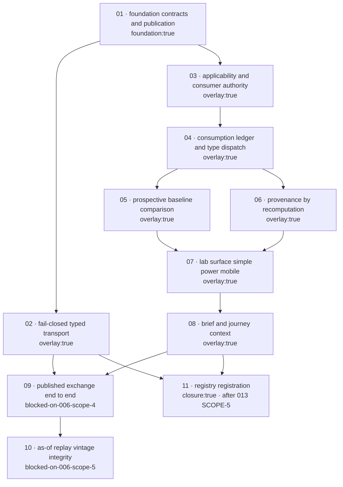

# Scopes — 014 Shared Cycle And Seasonality Exchange

**Layout:** per-scope directory mode. This feature plans 11 scopes, which exceeds the 6-scope threshold for the
single-file layout, so each scope owns its own directory `scopes/NN-name/scope.md`. This file is the index and the
only place where cross-scope ordering, dependencies, and Business-Scenario ownership are recorded. A scope's own
`scope.md` is authoritative for that scope's Gherkin, Implementation Plan, Test Plan, and Definition of Done.

**File boundary:** every file named in any scope below is drawn from `design.md` → `## Implementation Boundary`
(`### Files 014 MAY CREATE` and `### Files 014 MAY MODIFY`). No scope names a Protected Surface. A file that does
not appear in that section is out of boundary and requires a routed design amendment before it can be planned.

**Authoring status:** this index is complete for all 11 scopes. `scopes/01-*` through `scopes/04-*` carry authored
`scope.md` files. The companion planning pass authors `scopes/05-*` through `scopes/11-*`, `report.md`, and
`uservalidation.md` against this index without changing the ordering, the dependency graph, or the ownership map
recorded here.

---

## Execution Outline

### Phase order

| # | Scope | Design phase | One-line rationale |
|---|---|---|---|
| 1 | `01-foundation-contracts-and-publication` | R-0 | `rlcycx.js` is the single foundation; every closed vocabulary, refusal code, and type-invariance rule lives here once, so nothing else can be built correctly until it exists. |
| 2 | `02-fail-closed-typed-transport` | R-3 | The HC-4 hardening needs no Feature 006 publication and is demonstrable against the live `putToolRead` today, so it is sequenced immediately after the foundation while the `rldata.js` rebase surface is smallest. |
| 3 | `03-applicability-and-consumer-authority` | R-0 | Applicability and authority decide whether consumption may begin at all; the consumption ledger cannot be planned before the gate that precedes it. |
| 4 | `04-consumption-ledger-and-type-dispatch` | R-0 | The consumption record and the per-type permitted-field dispatch are the widest foundation surface and depend on the applicability decision landing first. |
| 5 | `05-prospective-baseline-comparison` | R-0 | The comparison lifecycle consumes admitted evidence and a resolved posture, both of which are settled by scopes 1 and 4. |
| 6 | `06-provenance-by-recomputation` | R-0 | Recomputation identity is verified against complete records, so it follows the contracts that produce them. |
| 7 | `07-lab-surface-simple-power-mobile` | R-1 | The lab renders every state the foundation produces; it is the first scope that can render a negative state, and it ships unregistered and reachable by direct URL. |
| 8 | `08-brief-and-journey-context` | R-2 + R-4 | The Brief and Journey consume `coverageFromConsumption`, which requires the consumption ledger and a proven renderer vocabulary. |
| 9 | `09-published-exchange-end-to-end` | R-4 | Every positive end-to-end exchange requires real published Feature 006 evidence; it is tagged `blocked-on-006-scope-4` and is not schedulable on fixtures. |
| 10 | `10-as-of-replay-vintage-integrity` | R-4 | Real revision-contaminated history and a real unresolvable-at-cutoff vintage require Feature 006 as-of replay; tagged `blocked-on-006-scope-5`. |
| 11 | `11-registry-registration` | R-5 | All five counted registries are touched by this one isolated scope, strictly serialised after Feature 013 SCOPE-5 lands on the mainline, with counts re-read at execution time. |

### New types and signatures introduced

| Scope | Surface introduced |
|---|---|
| 01 | `RLCYCX.VOCAB`, `RLCYCX.REFUSALS`, `RLCYCX.publishEvidence(input, decisionTime)`, `RLCYCX.sealEnvelope(evidence, decisionTime)`, `RLCYCX.admitEnvelope(envelope, decisionTime)`; contracts `cycle-evidence/v1`, `cycle-catalog-entry/v1`, `cycle-envelope/v1`, `cycle-admission/v1` |
| 02 | `admitToolRead(id, obj) → { admitted, reason }` — a pure, non-persisting public sibling export on `rldata.js`; the `tool-model-read/v1` conditional split inside `putToolRead` |
| 03 | `RLCYCX.decideApplicability(envelope, presentedSubject)`; contract `cycle-applicability/v1`; the EP-3 consumer-authority descriptor set and EP-5 subject-scope predicate seam in `shared-cycle-exchange-universe.json` |
| 04 | `RLCYCX.consume(envelope, consumerAuthority, presentedSubject, decisionTime, posture)`; contract `cycle-consumption/v1`; the per-type permitted-field dispatch table |
| 05 | `RLCYCX.freezeComparison / accrue / report`; contract `cycle-comparison/v1` |
| 06 | `RLCYCX.recomputeIdentity(record)`, `RLCYCX.verifyProvenance(record, recomputed)` |
| 07 | `shared-cycle-exchange-lab.html` S1/S2/S5 renderer binding (EP-4); `scripts/validate-shared-cycle-exchange.mjs` |
| 08 | `RLCYCX.coverageFromConsumption(records, decisionTime)`; contract `cycle-context-surface/v1`; the `rlbrief.js` cycle-context block and the `rljourney.js` cycle step |
| 09 | The EP-1 publisher adapter binding against Feature 006's `tdcEvaluateCycle` result shape |
| 10 | The EP-2 catalog-source binding against Feature 006 as-of replay |
| 11 | Registry entries in `tools.json`, `index.html` `TOOLS`, `rlnav.js` `TOOLS`, `simple-models.json`, `journeys.json`, plus the Simple-model adapter inside the existing `rlexperience-adapters/market-structure.js` module |

### Validation checkpoints

| After scope | Gate that must be green before the next scope starts |
|---|---|
| 01 | `node --test tests/shared-cycle-exchange.unit.mjs` and `node --test tests/shared-cycle-exchange.functional.mjs` cover all 22 publication, catalog, and envelope refusal codes with exact-code assertions; `node scripts/selftest.mjs` unchanged. |
| 02 | `node --test tests/rldata-admission-fail-closed.integration.mjs` is recorded failing against unmodified `rldata.js` and passing after the conditional split; the five compact-path publishers and the absent-`contractVersion` case are all still admitted. |
| 03 | Every applicability and authority code asserts its exact `refusalCode` plus `reachedFrom` or the authority class field; the earlier-vintage substitution case proves non-substitution with the earlier vintage genuinely present. |
| 04 | `node --test tests/shared-cycle-exchange.integration.mjs` and `node --test tests/shared-cycle-exchange.stress.mjs` prove exactly one ledger record per attempt with refusals neither aggregated nor dropped under load. |
| 05 | Retrospective freeze is refused on a favourable reading and recorded as an audit finding. |
| 06 | `not-reproducible` survives agreeing external corroboration. |
| 07 | `npx --no-install playwright test tests/shared-cycle-exchange.spec.mjs --config=playwright.config.mjs --project=system-chrome` renders every negative and refusal state with a named reason plus a resolve line, and no control yields a refused value. |
| 08 | Coverage is claimed only from `consumed` records; a present cache key with no consumed record claims nothing. |
| 09 | Real published Feature 006 evidence traverses the boundary with declared fidelity. |
| 10 | Real revision-contaminated history refuses at publication under as-of replay. |
| 11 | `node scripts/validate-tool-experience.mjs` is green against the then-current re-read counts. |

---

## Dependency Graph

| Scope | Depends On | Blocking reason |
|---|---|---|
| 01 | — | Foundation. Nothing precedes it. |
| 02 | 01 | The `rldata.js` admission rule is mirrored from `RLCYCX.admitEnvelope` and asserted equal by a contract test, so the foundation rule must exist first. |
| 03 | 01 | Applicability reads the admitted envelope produced by `admitEnvelope`. |
| 04 | 01, 03 | A consumption record names the applicability decision that preceded it. |
| 05 | 01, 04 | A comparison freezes against a consumed reading with a resolved adjustment posture. |
| 06 | 01, 04 | Recomputation identity is verified against a complete evidence and consumption record. |
| 07 | 01, 03, 04, 05, 06 | The lab renders every state the foundation produces; a missing state cannot be rendered. |
| 08 | 01, 04, 07 | `coverageFromConsumption` consumes ledger records, and the Brief and Journey reuse the renderer vocabulary proven in the lab. |
| 09 | 01, 02, 03, 04, 05, 06, 07, 08 | Every positive end-to-end path exercises the whole stack, and the real publisher only becomes available with Feature 006 Scope 4. |
| 10 | 09 | As-of replay integrity is proven against the real publisher established in scope 09, using Feature 006 Scope 5. |
| 11 | 01, 02, 03, 04, 05, 06, 07, 08 | Registration exposes the tool; it also touches five counted registries and is serialised strictly after Feature 013 SCOPE-5 lands on the mainline. |

### Dependency diagram

---

## Scope table

| ID | Name | Status | Tags | Depends On | Business Scenarios owned |
|---|---|---|---|---|---|
| 01 | `01-foundation-contracts-and-publication` | Not Started | `foundation:true` | — | BS-014-002, 003, 004, 005, 007, 019 |
| 02 | `02-fail-closed-typed-transport` | Not Started | `overlay:true` | 01 | BS-014-020, 021, 022 |
| 03 | `03-applicability-and-consumer-authority` | Not Started | `overlay:true` | 01 | BS-014-009, 010, 012, 013, 014 |
| 04 | `04-consumption-ledger-and-type-dispatch` | Not Started | `overlay:true` | 01, 03 | BS-014-011, 015, 017, 018, 023, 024, 025 |
| 05 | `05-prospective-baseline-comparison` | Not Started | `overlay:true` | 01, 04 | BS-014-026, 027, 028, 029 |
| 06 | `06-provenance-by-recomputation` | Not Started | `overlay:true` | 01, 04 | BS-014-034, 035 |
| 07 | `07-lab-surface-simple-power-mobile` | Not Started | `overlay:true` | 01, 03, 04, 05, 06 | BS-014-016 |
| 08 | `08-brief-and-journey-context` | Not Started | `overlay:true` | 01, 04, 07 | BS-014-030, 031, 032, 033 |
| 09 | `09-published-exchange-end-to-end` | Not Started | `overlay:true`, `blocked-on-006-scope-4` | 01, 02, 03, 04, 05, 06, 07, 08 | BS-014-001, 008 |
| 10 | `10-as-of-replay-vintage-integrity` | Not Started | `overlay:true`, `blocked-on-006-scope-5` | 09 | BS-014-006 |
| 11 | `11-registry-registration` | Not Started | `closure:true` | 01, 02, 03, 04, 05, 06, 07, 08 | — (registry wiring; originates no business scenario) |

**Scope count: 11. Business Scenarios owned: 35 of 35.**

---

## Business-Scenario ownership map

Every `BS-014-001` … `BS-014-035` from `spec.md` → `## Business Scenarios` is owned by **exactly one** scope. Zero
orphans and zero duplicate owners.

| BS | Title (from `spec.md`) | Owning scope | Deliverable now? |
|---|---|---|---|
| BS-014-001 | A published cycle finding survives the exchange boundary with full fidelity | 09 | Blocked on 006 Scope 4 |
| BS-014-002 | Publication without multiplicity context is refused | 01 | Yes — fixtures |
| BS-014-003 | Correlated findings are counted as one evidence family, not as multiple confirmations | 01 | Yes — fixtures |
| BS-014-004 | A data-mined periodicity cannot be re-shared as confirmed evidence | 01 | Yes — fixtures |
| BS-014-005 | Publication without a declared subject scope is refused | 01 | Yes — fixtures |
| BS-014-006 | A revision-contaminated cycle history is refused at publication | 10 | Blocked on 006 Scope 5 |
| BS-014-007 | A negative availability state is published, not withheld | 01 | Yes — fixtures |
| BS-014-008 | An authorised consumer resolves the publisher's exact state | 09 | Blocked on 006 Scope 4 |
| BS-014-009 | A consumer without declared authority is refused | 03 | Yes — fixtures |
| BS-014-010 | An unresolvable vintage is refused without substituting an earlier one | 03 | Yes — fixtures |
| BS-014-011 | A consumer may not re-derive a corrected p-value | 04 | Yes — fixtures |
| BS-014-012 | Evidence measured on one subject is not transferred to another | 03 | Yes — fixtures |
| BS-014-013 | An absent applicability assertion is treated as not-applicable | 03 | Yes — fixtures |
| BS-014-014 | A declared transfer is consumed and recorded as a declared transfer | 03 | Yes — fixtures |
| BS-014-015 | An insufficient-repetition long cycle is ineligible, terminal, and yields no phase and no next-turn date | 04 | Yes — fixtures |
| BS-014-016 | A consumer may not upgrade a negative state into a value | 07 | Yes — fixtures |
| BS-014-017 | A lifecycle entry is never rendered as an oscillation | 04 | Yes — fixtures |
| BS-014-018 | A deterministic calendar date is never a turn signal | 04 | Yes — fixtures |
| BS-014-019 | A coerced cycle type is refused at transport rather than converted | 01 | Yes — fixtures |
| BS-014-020 | A malformed typed read is refused, never downgraded to the legacy compact shape | 02 | Yes — live `putToolRead` |
| BS-014-021 | A refused submission leaves a previously admitted record untouched | 02 | Yes — live `putToolRead` |
| BS-014-022 | The fail-closed rule is additive to admission and does not retire the compact path | 02 | Yes — live `putToolRead` |
| BS-014-023 | A consumption record captures which inputs the consumer actually read | 04 | Yes — fixtures |
| BS-014-024 | An unknown adjustment posture refuses the consumption instead of defaulting | 04 | Yes — fixtures |
| BS-014-025 | A refusal is recorded with the same completeness as a consumption | 04 | Yes — fixtures |
| BS-014-026 | A prospective comparison is frozen ex ante against the identical unadjusted baseline | 05 | Yes — fixtures |
| BS-014-027 | An in-sample or retrospective superiority claim is refused | 05 | Yes — fixtures |
| BS-014-028 | A baseline with a mismatched adjustment posture refuses the comparison | 05 | Yes — fixtures |
| BS-014-029 | An accruing comparison that closes short is reported as insufficient | 05 | Yes — fixtures |
| BS-014-030 | Consumer context coverage is asserted from consumption records, never from key presence | 08 | Yes — fixtures |
| BS-014-031 | Stale evidence is stated as stale rather than presented as current | 08 | Yes — fixtures |
| BS-014-032 | Unavailable context degrades to an honest refusal, never to a neutral value | 08 | Yes — fixtures |
| BS-014-033 | A guided Journey participant cannot override a refusal | 08 | Yes — fixtures |
| BS-014-034 | A model-derived claim is verified by deterministic recomputation | 06 | Yes — fixtures |
| BS-014-035 | External corroboration is not provenance for a model-derived claim | 06 | Yes — fixtures |

**Ownership audit:** 35 scenarios listed, 35 distinct owners assigned, 0 scenarios unowned, 0 scenarios owned by
more than one scope. Owner counts — 01: 6, 02: 3, 03: 5, 04: 7, 05: 4, 06: 2, 07: 1, 08: 4, 09: 2, 10: 1, 11: 0.
Sum = 35.

---

## Refusal-code ownership

`design.md` → `## Test Strategy` → *Refusal-code coverage* records that the closed registry's fenced enumeration
contains **47 distinct `cyc-*` codes** and that the enumeration is authoritative over the part-1 heading count of
44 (routed as **OQ-1**; the plan consumes the enumeration and does not edit `design.md`). Each code is owned by
exactly one scope, which carries the named negative test asserting the exact `refusalCode` string plus its
companion field.

| Group | Codes | Owning scope |
|---|---|---|
| Publication (14) | `cyc-subject-unresolved`, `cyc-catalog-entry-unresolved`, `cyc-vintage-multiple`, `cyc-posture-multiple`, `cyc-breadth-missing`, `cyc-family-unresolved`, `cyc-applicability-assertion-missing`, `cyc-vintage-unresolved-at-cutoff`, `cyc-provenance-missing`, `cyc-trend-structure-claim`, `cyc-regime-claim`, `cyc-predictive-claim`, `cyc-availability-unknown`, `cyc-eligibility-contradicts-measurement` | 01 |
| Catalog (4) | `cyc-catalog-type-unknown`, `cyc-catalog-domain-unknown`, `cyc-catalog-entry-immutable-violation`, `cyc-catalog-state-vocabulary-unknown` | 01 |
| Envelope (4) | `cyc-envelope-malformed`, `cyc-envelope-unrecognized-version`, `cyc-type-mismatch`, `cyc-publisher-unidentified` | 01 |
| Admission (3) | `cyc-typed-contract-invalid`, `cyc-typed-contract-partial`, `cyc-identity-mismatch` | 02 |
| Applicability (4) | `cyc-subject-not-applicable`, `cyc-transfer-undeclared`, `cyc-applicability-absent-assertion`, `cyc-subject-dimension-unknown` | 03 |
| Consumption — authority and vintage (3) | `cyc-authority-undeclared`, `cyc-authority-class-mismatch`, `cyc-vintage-unserviceable` | 03 |
| Consumption — posture, correction, type (3) | `cyc-posture-undeterminable`, `cyc-correction-override-attempted`, `cyc-type-field-unsupported` | 04 |
| Consumption — negative-state upgrade (1) | `cyc-negative-state-upgrade-attempted` | 07 |
| Comparison (5) | `cyc-freeze-retrospective`, `cyc-baseline-posture-mismatch`, `cyc-baseline-not-identical`, `cyc-superiority-claim`, `cyc-comparison-window-invalid` | 05 |
| Surface — provenance (1) | `cyc-provenance-not-reproducible` | 06 |
| Surface — context and coverage (4) | `cyc-context-absent`, `cyc-context-refused`, `cyc-coverage-unbacked`, `cyc-stale-presented-as-current` | 08 |
| Surface — override (1) | `cyc-override-attempted` | 07 |

**Total: 14 + 4 + 4 + 3 + 4 + 3 + 3 + 1 + 5 + 1 + 4 + 1 = 47 codes, each owned exactly once.**

---

## Cross-cutting sequencing rules (binding on every scope)

1. **Foundation first.** Scope 01 carries `foundation:true` and appears in the `Depends On` chain of every other
   scope, directly or transitively. No scope re-implements a foundation-owned behaviour from `design.md` →
   `### Foundation-Owned Behavior`.
2. **HC-4 red-then-green.** Scope 02's regression is recorded failing against unmodified `rldata.js` before the
   conditional split lands. A regression for a fail-open hole that was never observed failing has not been shown to
   detect anything.
3. **HC-4 is literal.** The fail-closed rule fires only on a payload that declares a **known** typed contract id and
   then fails validation. A blanket unknown-`contractVersion` refusal is wrong, however clean it looks, because it
   would break `sector-rotation-owner-state/v1`, `volatility-owner-state/v1`, `ai-capex-portfolio-owner-state/v1`,
   `real-asset-driver-owner-state/v1`, and `str-scenario-owner-state/v1`.
4. **Fixtures prove the contract, never the dependency.** Scopes 09 and 10 carry `blocked-on-006-scope-4` and
   `blocked-on-006-scope-5` and are **not** schedulable as satisfied by fixtures. A fixture-backed pass reported as
   an end-to-end exchange is fabricated evidence.
5. **Registration is last, isolated, and serialised.** Scope 11 is the only scope that touches `tools.json`,
   `index.html` `TOOLS`, `rlnav.js` `TOOLS`, `simple-models.json`, or `journeys.json`. It runs strictly after
   Feature 013 SCOPE-5 lands on the mainline and re-reads the then-current asserted counts in
   `scripts/validate-tool-experience.mjs` at execution time rather than incrementing a count recorded here. While
   scope 11 is unscheduled, 014 runs unregistered, reachable by direct URL and validated by
   `scripts/validate-shared-cycle-exchange.mjs`, with `scripts/validate-tool-experience.mjs` green throughout.
6. **013 interaction is stated per scope.** Every scope that opens a shared file states its Feature 013 interaction
   in its Definition of Done rather than assuming isolation.
7. **Adapter allowlist is not widened.** Scope 11 registers 014's Simple-model adapter inside the existing
   `rlexperience-adapters/market-structure.js` module. `tool-experience.config.json`
   `adapterPolicy.moduleAllowlist` is a Protected Surface; the alternative recorded as **OQ-2** requires a routed
   amendment and owner sign-off before any code is written.

---

## Verified command surface

Only these command forms appear in any scope's Test Plan, per `design.md` → `## Test Strategy` →
*Category mapping — repo-real surfaces only*:

| Category | Command |
|---|---|
| `unit` | `node --test tests/shared-cycle-exchange.unit.mjs` |
| `functional` | `node --test tests/shared-cycle-exchange.functional.mjs` |
| `integration` | `node --test tests/shared-cycle-exchange.integration.mjs` · `node --test tests/rldata-admission-fail-closed.integration.mjs` |
| `e2e` (headless) | `node --test tests/shared-cycle-exchange.e2e.mjs` |
| `e2e-ui` | `npx --no-install playwright test tests/shared-cycle-exchange.spec.mjs --config=playwright.config.mjs --project=system-chrome` |
| `stress` | `node --test tests/shared-cycle-exchange.stress.mjs` |
| project check | `node scripts/selftest.mjs` |
| tool validator | `node scripts/validate-shared-cycle-exchange.mjs` |

---

*Educational research context only — not investment advice.*
