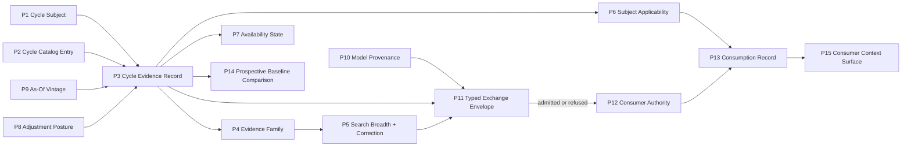
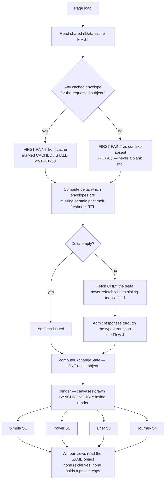
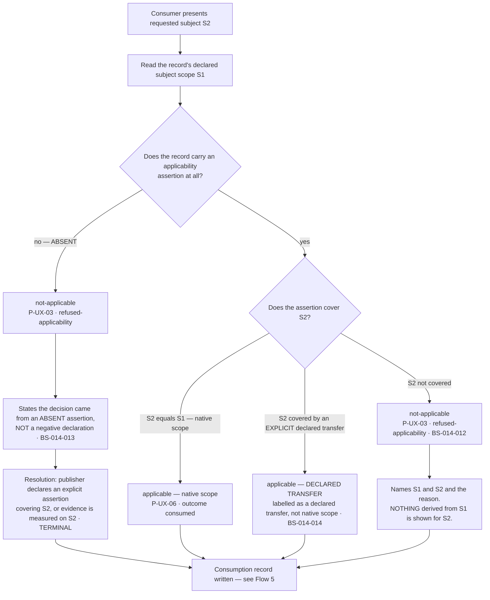
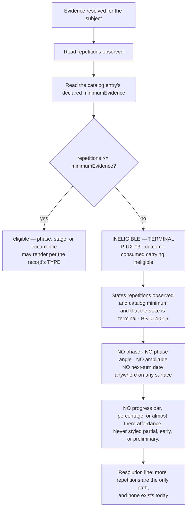
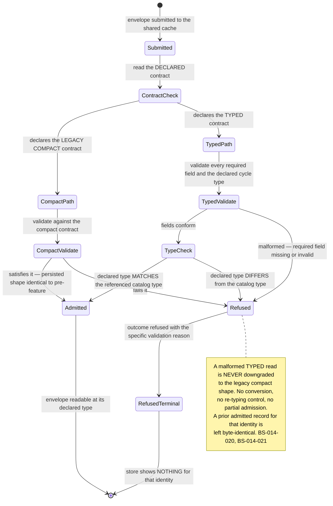
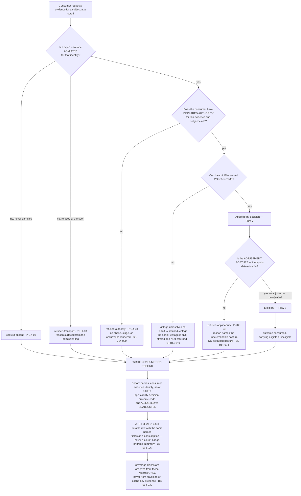
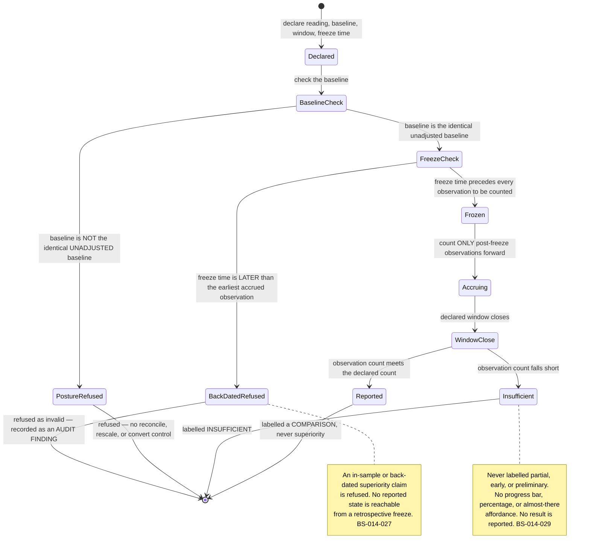
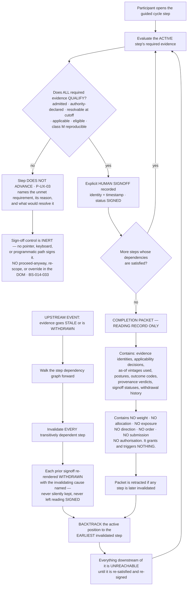

# Feature: 014 Shared Cycle And Seasonality Exchange

## Problem

Research Lab can already **measure** cycles and seasonality across many domains, and it can already **refuse** to
conclude anything from that measurement. What it cannot do is **share** the result. The measurement engine exists,
is exercised, and is deliberately terminated before publication — so every other tool, model, and brief that could
reason about cycle or seasonal context is left to either re-derive it or ignore it.

### The engine exists

Feature 006 shipped a full cross-domain cycle and seasonality engine inside
[trend-dynamics-cycle-lab.html](../../trend-dynamics-cycle-lab.html):

| Method | Symbol | Line |
|---|---|---|
| M13 harmonic decomposition | `tdcHarmonicDecomposition` | [trend-dynamics-cycle-lab.html#L2177](../../trend-dynamics-cycle-lab.html#L2177) |
| M14 Welch spectrum | `tdcWelchSpectrum` | [trend-dynamics-cycle-lab.html#L2317](../../trend-dynamics-cycle-lab.html#L2317) |
| M15 generalized Lomb–Scargle (irregular sampling) | `tdcGeneralizedLombScargle` | [trend-dynamics-cycle-lab.html#L2385](../../trend-dynamics-cycle-lab.html#L2385) |
| M16 rolling spectrum (stability over time) | `tdcRollingSpectrum` | [trend-dynamics-cycle-lab.html#L2436](../../trend-dynamics-cycle-lab.html#L2436) |
| M17 lead/lag association | `tdcLeadLag` | [trend-dynamics-cycle-lab.html#L2498](../../trend-dynamics-cycle-lab.html#L2498) |
| M18 event study | `tdcEventStudy` | [trend-dynamics-cycle-lab.html#L2593](../../trend-dynamics-cycle-lab.html#L2593) |
| Typed cycle evaluator | `tdcEvaluateCycle` | [trend-dynamics-cycle-lab.html#L2656](../../trend-dynamics-cycle-lab.html#L2656) |

The engine already carries the statistical hygiene that shared evidence needs: search breadth, Benjamini–Hochberg
discovery correction, and Holm activation correction are computed and returned together
([trend-dynamics-cycle-lab.html#L2818](../../trend-dynamics-cycle-lab.html#L2818)), with the correction constants
declared in the closed configuration (`evaluation.discoveryCorrection = "benjamini-hochberg"`,
`discoveryQ = 0.1`, `activationCorrection = "holm"`, `activationAlpha = 0.05`, `heldOutMinimumGain = 0.05` in
[trend-dynamics-cycle-universe.json](../../trend-dynamics-cycle-universe.json)).

The domain breadth is already declared and closed. `trend-dynamics-cycle-universe.json` declares **18 methods**,
**8 transforms**, and a `cycleCatalog` of **10 entries spanning 10 cycle domains** — `market/trading`,
`economic/business`, `financial/credit`, `technology/innovation`,
`industry/inventory/capital-spending`, `demographic/social`, `political/institutional`,
`climate/weather/ocean-atmosphere`, `biological/agricultural/health`, `astronomical/physical` — under **6 distinct
cycle types**: `deterministic-calendar`, `empirical-seasonality`, `quasi-periodic-oscillation`, `lifecycle`,
`regime`, `event`. Each entry already declares its own subject `scope` (`geography`, `population`, `season`),
`evidenceTier`, `minimumEvidence` (history, repetitions, events, pairs), a closed `stateVocabulary`, and an
explicit `invalidation` condition.

### The engine is never published

The production path terminates before any conclusion leaves the tool.
`tdcRenderProduction` ([trend-dynamics-cycle-lab.html#L3434](../../trend-dynamics-cycle-lab.html#L3434)) validates
source, as-of vintage, transform, and quality, then states outright that
*"No trend, turn, or cycle conclusion is emitted by the foundation alone."*
([trend-dynamics-cycle-lab.html#L3453](../../trend-dynamics-cycle-lab.html#L3453)), sets
`publicationState` to *"No owner read has been published."*
([trend-dynamics-cycle-lab.html#L3460](../../trend-dynamics-cycle-lab.html#L3460)), and freezes diagnostics with
`ownerReadPublished: false` ([trend-dynamics-cycle-lab.html#L3461](../../trend-dynamics-cycle-lab.html#L3461)).
The repository validator agrees and prints the same verdict as a first-class signal:
`fixture-posture=PASS owner-publication=false`
([scripts/validate-trend-dynamics-cycle.mjs#L511](../../scripts/validate-trend-dynamics-cycle.mjs#L511)).

This is not an accident of implementation — it is planned-but-unbuilt work. In
[specs/006-trend-dynamics-cycle-lab/scopes.md](../006-trend-dynamics-cycle-lab/scopes.md), Scopes 1–3 (foundation,
trend engine, cycle engine) are `Done`, while **Scope 4 "Complete Simple/Power Experience, Registration, And
Publication"** ([scopes.md#L1617](../006-trend-dynamics-cycle-lab/scopes.md#L1617), status `Not Started` at
[#L1619](../006-trend-dynamics-cycle-lab/scopes.md#L1619)) and **Scope 5 "As-Of Replay, Progress, And Regression
Closure"** ([scopes.md#L1725](../006-trend-dynamics-cycle-lab/scopes.md#L1725), status `Not Started` at
[#L1727](../006-trend-dynamics-cycle-lab/scopes.md#L1727)) remain unstarted, and
[specs/006-trend-dynamics-cycle-lab/state.json](../006-trend-dynamics-cycle-lab/state.json) carries top-level
`status: "not_started"`.

### The coverage is one series wide

`trend-dynamics-cycle-universe.json` declares exactly **one production series**, `spy-daily`, and the shared-bar
adapter `tdcSharedBarsEnvelope` ([trend-dynamics-cycle-lab.html#L3168](../../trend-dynamics-cycle-lab.html#L3168))
hardcodes the `'1d'` interval on both the bar read and the bar-info read
([#L3170](../../trend-dynamics-cycle-lab.html#L3170),
[#L3171](../../trend-dynamics-cycle-lab.html#L3171)). A capability that claims to cover ten cycle domains for
"the whole market or a single instrument" currently reaches one symbol at one interval.

### The transport would silently degrade the evidence

Even if the engine published, the shared read path is **fail-open** for exactly the typed contract this feature
needs. `putToolRead` ([rldata.js#L433](../../rldata.js#L433)) admits a conforming `tool-model-read/v1` through a
typed branch ([rldata.js#L448](../../rldata.js#L448)) gated by `validateToolModelRead`
([rldata.js#L378](../../rldata.js#L378)) — and the comment immediately below states the defect plainly:
*"A non-conforming `tool-model-read/v1` falls through to the legacy compact store."*
([rldata.js#L450](../../rldata.js#L450)). A malformed typed cycle read is therefore not rejected; it is **silently
downgraded** into an untyped compact record that no longer carries evidence refs, adjustment posture, search
breadth, or subject scope — and consumers cannot tell the difference.

### Consumers cannot tell whether they consumed anything

The Market Brief's coverage builder, `buildToolCoverage`
([scripts/brief-refresh.mjs#L1173](../../scripts/brief-refresh.mjs#L1173)), maps every registered tool to
`fresh-headless` or `browser-or-agent-read` based purely on whether a key **exists** in `toolReads`. It validates
no contract, no as-of vintage, no adjustment posture, and no applicability. Key presence is treated as coverage.

### What this feature is, and is not

**014 is the sharing and exchange capability. It is not a re-implementation of the 006 engine.** The measurement
methods, the correction machinery, the typed catalog, and the state vocabularies already exist and stay where they
are. What is missing is everything between "a cycle was measured on a subject" and "another tool, model, brief, or
guided journey correctly consumed that measurement, or correctly refused to."

That missing middle is what this feature owns:

1. **Publication** of cycle and seasonality evidence as typed, subject-scoped, shareable evidence.
2. **Cross-domain catalog exchange** that preserves 006's type invariants across the boundary — a `lifecycle` is
   never re-read as a `quasi-periodic-oscillation`, and a `deterministic-calendar` date is never re-read as a turn
   signal.
3. **Subject applicability** — evidence measured on one subject, geography, or population is not automatically
   applicable to another; silent transfer is refused.
4. **Consumer authority and a consumption record**, including whether the consumer read adjusted or unadjusted
   inputs.
5. **Prospective baseline comparison**, frozen ex ante against the identical unadjusted baseline, as-of-safe, with
   no in-sample superiority claim.
6. **Fail-closed typed transport** — a malformed typed read is REFUSED, not downgraded — added to the admission
   path without changing the persisted cache schema that Feature 013 depends on.
7. **Market Brief and guided Journey consumption** of cycle and seasonal context as first-class, checked context
   rather than key presence.

### Boundary against Feature 013 (concurrent)

Feature 013 (Market Regime Stack and Strategy Playbook) owns the ratio-pair capability, the **sole** regime
composer, the archetype and sleeve registries, `market-regime-lab.html`, registry lockstep, consumer migration,
and the headless DERIVED **regime** owner read
([specs/013-market-regime-stack-and-strategy-playbook/scopes/_index.md](../013-market-regime-stack-and-strategy-playbook/scopes/_index.md)).
013 SCOPE-3 maps `trend-dynamics-cycle-lab.html` to a **trend-structure facet only**. 014 therefore MUST NOT claim
the trend-structure facet, MUST NOT compose or name a regime, and MUST NOT alter the archetype, sleeve, or
ratio-pair registries. 013 additionally declares the `rldata.js` persisted cache schema **protected and unchanged**,
which is a binding constraint on how 014 may harden the typed transport.

## Outcome Contract

**Intent:** A cycle or seasonality finding measured anywhere in Research Lab — for the whole market or for a single
instrument, in any of the ten declared cycle domains — becomes shareable evidence that another tool, model, brief,
or guided journey can consume with its type, its subject scope, its search breadth, its correction, its
availability state, and its as-of vintage intact; and that any consumer which cannot legitimately use it is made to
refuse rather than approximate.

**Success Signal:** For a published cycle evidence record, an independent consumer (a second tool, the Market
Brief, or a guided Journey) resolves the same subject, the same cycle type, the same availability state, and the
same as-of vintage as the publisher; a consumption record exists naming the consumer, the evidence consumed, the
as-of used, and whether adjusted or unadjusted inputs were read; a malformed typed read is observably REFUSED
rather than admitted in downgraded form; an evidence record whose subject scope does not cover the consumer's
subject is observably refused rather than transferred; and a frozen prospective baseline comparison is reproducible
from its recorded inputs, lineage, and engine version by deterministic recomputation.

**Hard Constraints:**

- **HC-1 — Engine boundary.** 014 exchanges evidence produced by the Feature 006 engine. It does not re-implement,
  fork, or substitute the measurement methods, the correction machinery, the cycle catalog, or the typed
  evaluator.
- **HC-2 — Type invariance across the boundary.** The 006 cycle type of an evidence record survives publication and
  consumption unchanged. A lifecycle is never exchanged as an oscillation; a deterministic-calendar occurrence is
  never exchanged as a turn signal.
- **HC-3 — No trend-structure claim.** 014 must not publish, claim, or shadow the trend-structure facet owned by
  Feature 013 SCOPE-3, and must not compose or name a regime.
- **HC-4 — Persisted cache schema unchanged (named risk: 013 interaction).** The fail-closed typed transport is
  **additive to the admission path only**. It must not change the persisted `rldata.js` cache schema that Feature
  013 declares protected. Feature 013 is being authored concurrently and depends on that schema; any change to the
  stored shape — not merely to what is admitted — is a breaking cross-feature interaction and is out of contract.
- **HC-5 — Descriptive only.** No predictive claim, no execution, no allocation, no position sizing, no advice. A
  comparison is a comparison, never a validated edge.
- **HC-6 — As-of-safe, point-in-time.** Every published and consumed record resolves against a decision-time
  vintage that accounts for revisions, not merely truncation of later rows.
- **HC-7 — One closed persistence vocabulary.** Availability, applicability, and consumption states are drawn from
  a single closed vocabulary used identically by publisher, transport, and every consumer.
- **HC-8 — Multiplicity travels with the evidence.** Search breadth and the applied discovery/activation correction
  are carried by the shared record; evidence stripped of its multiplicity context is not publishable.

**Failure Condition:** The feature has failed — even with every test green — if any of the following is true: a
consumer silently applies evidence measured on a different subject, geography, or population; a malformed typed
read reaches a consumer in downgraded form instead of being refused; `unavailable`, `ineligible`, or
`not-applicable` is rendered or consumed as neutral, zero, or last-known; a shared record is used to assert a
predictive edge or an action; a prospective comparison is presented as validated superiority, or is compared
against a differently-adjusted baseline; the Market Brief reports cycle coverage on key presence rather than on a
checked, applicable, as-of-valid record; or the persisted cache schema Feature 013 depends on is altered.

## Domain Capability Model

The capability is a one-way evidence exchange: an owning engine **publishes** typed subject-scoped cycle evidence,
a **fail-closed transport** admits or refuses it, and **authorised consumers** either consume it under a recorded
applicability decision or refuse it. Every primitive below is neutral with respect to which tool publishes, which
cycle domain is involved, and which surface consumes.

### Domain Primitives

| # | Primitive | Definition | State / Vocabulary | Invariant |
|---|---|---|---|---|
| P1 | **Cycle Subject** | The entity a cycle claim is measured on: a single instrument, a market aggregate, a sector, or a declared geography/population/season. | `instrument`, `aggregate`, `sector`, `geography`, `population` (declared per record) | A subject is always explicit. There is no "the market" default subject. |
| P2 | **Cycle Catalog Entry** | The typed definition of a cycle or seasonal phenomenon: its domain, its cycle type, its mechanism or calendar, its observables, its minimum evidence, its state vocabulary, and its invalidation condition. Sourced from the owning engine's closed catalog. | 10 domains × 6 types (`deterministic-calendar`, `empirical-seasonality`, `quasi-periodic-oscillation`, `lifecycle`, `regime`, `event`) | The entry's type and minimum-evidence requirement are immutable across exchange. |
| P3 | **Cycle Evidence Record** | A single measured finding about one catalog entry on one subject at one as-of vintage: period/phase/amplitude/strength, or lifecycle stage, or calendar occurrence, as the type dictates. | Publication state drawn from P7 | An evidence record is inseparable from its subject (P1), its catalog entry (P2), and its family (P4). |
| P4 | **Evidence Family** | The grouping identity for findings that are not independent — findings derived from the same underlying series, the same mechanism, or the same hypothesis sweep. Family identity is the unit at which multiplicity is accounted. | `family-id` derived from series identity + mechanism identity + sweep identity | Correlated findings are ONE family. Counting them as independent evidence is a contract violation. |
| P5 | **Search Breadth And Correction Record** | How many hypotheses were searched to produce the finding, which discovery correction was applied, which activation correction was applied, and the held-out gate outcome. | `searched`, `discovery-corrected`, `activation-corrected`, `held-out-gated`, `held-out-failed` | Travels with the evidence record; a record without it is not publishable. |
| P6 | **Subject Applicability Assertion** | The explicit declaration of which subjects an evidence record may be consumed for, and the consumer-side decision when the requested subject differs from the measured subject. | `applicable`, `not-applicable`, `transfer-requires-declaration` | Absence of an assertion means NOT applicable. Silence never authorises transfer. |
| P7 | **Availability State** | The single closed vocabulary describing whether a record can be used at all. | `active`, `contextual`, `candidate`, `drifting`, `unavailable`, `ineligible`, `not-applicable` | Negative states are first-class values, never rendered or computed as neutral, zero, or last-known. |
| P8 | **Adjustment Posture** | Whether the inputs behind a record — and behind anything compared to it — were seasonally/otherwise adjusted or unadjusted. | `adjusted`, `unadjusted` | Recorded at publication and again at consumption. Cross-posture comparison is refused. |
| P9 | **As-Of Vintage** | The point-in-time state of the inputs at the decision time, accounting for revisions rather than row truncation alone. | `resolved`, `unresolved-at-cutoff` | Every publication and every consumption resolves a vintage or refuses. |
| P10 | **Model Provenance Record** | The reproducibility basis of a model-derived claim: its exact inputs, its lineage, its engine/config version, and the deterministic recomputation identity that regenerates it. | `reproducible`, `not-reproducible` | Provenance is established by deterministic recomputation, never by counting external origins. |
| P11 | **Typed Exchange Envelope** | The transport artifact that carries a Cycle Evidence Record plus P1–P10 across the tool boundary, and the admission decision applied to it. | `admitted`, `refused` | A malformed envelope is REFUSED. It is never downgraded, coerced, or partially admitted. |
| P12 | **Consumer Authority** | The declared right of a named consumer to consume a class of evidence for a class of subject. | `authorised`, `unauthorised` | Consumption without declared authority is refused. |
| P13 | **Consumption Record** | The durable record that a named consumer consumed a named evidence record at a named as-of under a named applicability decision and a named adjustment posture. | `consumed`, `refused-applicability`, `refused-authority`, `refused-transport`, `refused-vintage` | A refusal is recorded with the same rigour as a consumption. |
| P14 | **Prospective Baseline Comparison** | A comparison frozen ex ante between a cycle-informed reading and the identical unadjusted baseline, evaluated only on data after the freeze. | `frozen`, `accruing`, `insufficient`, `reported` | Frozen before observation, as-of-safe, and never reported as validated superiority. |
| P15 | **Consumer Context Surface** | A surface that consumes cycle context for presentation or guidance — the Market Brief and the guided Journey being the named instances. | `context-present`, `context-refused`, `context-absent` | Coverage is asserted from a checked, applicable, as-of-valid record — never from key presence. |

### Relationships

- A **Cycle Evidence Record (P3)** is always about exactly one **Cycle Catalog Entry (P2)** measured on exactly one
  **Cycle Subject (P1)** at exactly one **As-Of Vintage (P9)**, under exactly one **Adjustment Posture (P8)**.
- Many **Cycle Evidence Records (P3)** belong to one **Evidence Family (P4)**; the **Search Breadth And Correction
  Record (P5)** is accounted at family level, not at record level.
- A **Cycle Evidence Record (P3)** carries exactly one **Availability State (P7)** and exactly one **Subject
  Applicability Assertion (P6)**; a record with a negative P7 is still a complete, publishable record.
- A **Cycle Evidence Record (P3)** plus its **Model Provenance Record (P10)** are packaged into a **Typed Exchange
  Envelope (P11)**; the envelope is the only path across the tool boundary.
- A consumer holding **Consumer Authority (P12)** presents a subject to an admitted **Typed Exchange Envelope
  (P11)**; the **Subject Applicability Assertion (P6)** decides consume-or-refuse, and either outcome writes one
  **Consumption Record (P13)**.
- A **Prospective Baseline Comparison (P14)** references one **Cycle Evidence Record (P3)** and one identical
  unadjusted baseline sharing the same **Adjustment Posture (P8)** reference and the same **As-Of Vintage (P9)**
  discipline.
- A **Consumer Context Surface (P15)** derives its stated coverage from **Consumption Records (P13)** only, never
  from envelope or key existence.



### Business Policies

**BP-014-001 — Evidence is descriptive, never predictive.** A shared cycle or seasonality record describes what
was measured on stated inputs at a stated vintage. It carries no forecast, no expected return, no signal, no
action, and no recommendation. A comparison is a comparison; it is never a validated edge.

**BP-014-002 — Multiplicity is mandatory and travels with the evidence.** Every publishable record carries the
search breadth that produced it and the discovery and activation corrections that were applied to it. Evidence
stripped of its multiplicity context is not publishable, and a consumer must be able to read the breadth and the
correction it is relying on.

**BP-014-003 — Correlated findings are one evidence family.** Findings derived from the same underlying series, the
same mechanism, or the same hypothesis sweep share one family identity, and multiplicity is accounted at that
family. Family identity is derived from series identity, mechanism identity, and sweep identity together.
Presenting members of one family as independent corroboration is a contract violation.

**BP-014-004 — Cycle type is invariant across the exchange boundary.** The catalog type assigned by the owning
engine survives publication, transport, and consumption unchanged. A `lifecycle` is never exchanged, re-read, or
rendered as a `quasi-periodic-oscillation`; a `deterministic-calendar` occurrence is never exchanged, re-read, or
rendered as a turn signal. Type coercion at any hop is a refusal, not a conversion.

**BP-014-005 — Subject applicability is explicit; silent transfer is refused.** Evidence measured on one subject,
geography, or population is not automatically applicable to another. Consumption for a subject other than the
measured subject requires an explicit applicability declaration. Absence of a declaration means not applicable, and
the consumer refuses.

**BP-014-006 — Negative states are first-class and terminal where declared.** `unavailable`, `ineligible`, and
`not-applicable` are values, not gaps. They are never rendered or computed as neutral, zero, or last-known, and
they are never silently substituted by a nearby subject or an earlier vintage. Insufficient repetitions relative to
the catalog entry's declared minimum evidence is terminal for the phase: the record is published in its negative
state rather than downgraded into a weaker positive claim.

**BP-014-007 — As-of-safe, point-in-time only.** Every publication and every consumption resolves the inputs as
they stood at the decision time, accounting for revisions and not merely truncating later rows. A record whose
vintage cannot be resolved at the requested cutoff is refused, not approximated.

**BP-014-008 — Prospective comparison is frozen ex ante against an identical unadjusted baseline.** A comparison is
declared and frozen before the observation window it will be judged on, is evaluated only on data after the freeze,
and is compared against the identical unadjusted baseline. In-sample superiority is never claimed, and an
accruing-but-insufficient comparison is reported as insufficient rather than as an early result.

**BP-014-009 — Adjustment posture is recorded at publication and at consumption.** Whether the inputs were adjusted
or unadjusted is carried by the record and re-recorded by the consumer. Comparing an adjusted reading to an
unadjusted baseline, or vice versa, is refused rather than reconciled.

**BP-014-010 — Typed transport fails closed and is additive to the admission path only.** A malformed typed read is
REFUSED. It is never downgraded into an untyped or compact form, never partially admitted, and never coerced into a
weaker contract. The refusal is observable to the publisher and to the consumer. **Named risk (Feature 013
interaction):** this hardening changes only what the admission path accepts. It must not change the persisted cache
schema, which Feature 013 declares protected and depends on, and which is being authored concurrently.

**BP-014-011 — Model provenance is reproducibility, not external corroboration.** A model-derived claim is verified
by its recorded inputs, its lineage, its engine and configuration version, and a deterministic recomputation that
regenerates it. It is not verified by counting independent external origins; agreement between two web sources is
not provenance for a model-derived claim, and provenance for a model-derived claim does not require one.

**BP-014-012 — One closed persistence vocabulary, used consistently.** Availability, applicability, and consumption
outcomes are drawn from a single closed vocabulary shared by publisher, transport, and every consumer. No surface
invents a local synonym, a free-text state, or a private alias for a declared state.

**BP-014-013 — Consumption requires declared authority and leaves a record.** A consumer consumes only evidence it
is declared authorised to consume, for a subject class it is declared authorised for. Every consumption and every
refusal writes a consumption record naming the consumer, the evidence, the as-of used, the applicability decision,
and the adjustment posture. Refusals are recorded with the same rigour as consumptions.

**BP-014-014 — Coverage is asserted from checked records, never from key presence.** A consumer context surface
states that cycle or seasonal context is present only when a checked, applicable, as-of-valid record was actually
consumed. The existence of a key, a file, or an envelope is not coverage.

**BP-014-015 — This capability exchanges; it does not measure, compose, or advise.** 014 does not re-implement the
Feature 006 measurement engine, does not claim the trend-structure facet owned by Feature 013 SCOPE-3, does not
compose or name a regime, and does not touch the ratio-pair, archetype, or sleeve registries. All output is
educational research context: no execution, no allocation, no advice.

## Capability Inventory

Every row below was verified against the working tree during this analysis run. "Owner" is the file and line that
currently holds the capability; "Gap 014 closes" is the specific deficit this feature is accountable for, expressed
against the primitives (P1–P15) and policies (BP-014-*) declared above. Rows marked **Absent** were searched for
repo-wide and produced no non-spec match.

### A. Measurement and catalog (Feature 006 — kept, not rebuilt)

| # | Capability | Current owner (`file:line`) | Completeness | Gap 014 closes |
|---|---|---|---|---|
| CI-01 | Cross-domain cycle measurement: harmonic decomposition, Welch spectrum, generalized Lomb–Scargle, rolling spectrum, lead/lag, event study, typed evaluator | [trend-dynamics-cycle-lab.html#L2177](../../trend-dynamics-cycle-lab.html#L2177), [#L2317](../../trend-dynamics-cycle-lab.html#L2317), [#L2385](../../trend-dynamics-cycle-lab.html#L2385), [#L2436](../../trend-dynamics-cycle-lab.html#L2436), [#L2498](../../trend-dynamics-cycle-lab.html#L2498), [#L2593](../../trend-dynamics-cycle-lab.html#L2593), [#L2656](../../trend-dynamics-cycle-lab.html#L2656) | **Complete** for measurement | None — 014 consumes it (HC-1). No gap; listed to fix the boundary. |
| CI-02 | Closed typed cycle catalog: 10 entries across 10 domains under 6 types, each carrying `type`, `scope`, `minimumEvidence`, `stateVocabulary`, `invalidation`, `evidenceTier` | [trend-dynamics-cycle-universe.json](../../trend-dynamics-cycle-universe.json) `cycleCatalog` (verified this run: `deterministic-calendar` ×2, `empirical-seasonality` ×2, `quasi-periodic-oscillation` ×3, `lifecycle` ×1, `regime` ×1, `event` ×1) | **Complete** as a definition | The catalog's `type` and `scope` never cross a tool boundary. 014 makes P2 and P1 travel with the record and enforces BP-014-004 type invariance at every hop. |
| CI-03 | Multiplicity accounting: search breadth, Benjamini–Hochberg discovery correction (`discoveryQ = 0.1`), Holm activation correction (`activationAlpha = 0.05`), held-out minimum gain (`0.05`) | [trend-dynamics-cycle-lab.html#L2818](../../trend-dynamics-cycle-lab.html#L2818); constants in [trend-dynamics-cycle-universe.json](../../trend-dynamics-cycle-universe.json) `evaluation` | **Complete** in-tool | The breadth and correction are computed and then discarded at the tool edge. 014 makes P5 a non-optional field of the shared record (BP-014-002). |
| CI-04 | Revision-aware as-of vintage resolution: per-row `observedAt` / `availableAt` / `vintageId` / `revisedAt`, duplicate-vintage rejection, and an explicit `replayPosture` of `revision-safe` vs `observation-cutoff-only` | [trend-dynamics-cycle-lab.html#L1138](../../trend-dynamics-cycle-lab.html#L1138), [#L1152](../../trend-dynamics-cycle-lab.html#L1152), [#L1179](../../trend-dynamics-cycle-lab.html#L1179) | **Complete** in-tool | The resolved vintage and replay posture stay inside the lab. 014 carries P9 on the envelope so a consumer can refuse an unresolvable cutoff (BP-014-007). |
| CI-05 | Production-series coverage | [trend-dynamics-cycle-universe.json](../../trend-dynamics-cycle-universe.json) `series` = `['spy-daily']`; interval hardcoded `'1d'` at [trend-dynamics-cycle-lab.html#L3170](../../trend-dynamics-cycle-lab.html#L3170), [#L3171](../../trend-dynamics-cycle-lab.html#L3171) | **Partial** — one series, one interval | 014 does not add series (HC-1), but the exchange contract must be subject-general (P1) so a second subject is a data addition, not a contract change. |

### B. Publication and discoverability (deliberately absent today)

| # | Capability | Current owner (`file:line`) | Completeness | Gap 014 closes |
|---|---|---|---|---|
| CI-06 | Owner-read publication of a cycle finding | [trend-dynamics-cycle-lab.html#L3453](../../trend-dynamics-cycle-lab.html#L3453) (*"No trend, turn, or cycle conclusion is emitted by the foundation alone."*), [#L3460](../../trend-dynamics-cycle-lab.html#L3460) (`publicationState`), [#L3461](../../trend-dynamics-cycle-lab.html#L3461) (`ownerReadPublished: false`) | **Deliberately absent** | The entire publication step. 014 defines the P11 Typed Exchange Envelope as the only path across the boundary. |
| CI-07 | Repository-level publication signal | [scripts/validate-trend-dynamics-cycle.mjs#L511](../../scripts/validate-trend-dynamics-cycle.mjs#L511) prints `fixture-posture=PASS owner-publication=false` | **Complete as a signal**, negative as a state | The validator already asserts the absence as a first-class fact. 014 must give it a positive state to assert without weakening the negative one. |
| CI-08 | Discoverability / registration of the cycle surface | `trend-dynamics-cycle-lab` has **0** matches in [tools.json](../../tools.json), **0** in [journeys.json](../../journeys.json), **0** in [simple-models.json](../../simple-models.json), **0** in [tool-experience.config.json](../../tool-experience.config.json) (all verified this run) | **Absent** | Nothing can currently address the evidence by identity. 014 requires an addressable publisher identity for P3/P11 without claiming 013's trend-structure facet (HC-3). |

### C. Typed transport (exists, but fail-open and cycle-blind)

| # | Capability | Current owner (`file:line`) | Completeness | Gap 014 closes |
|---|---|---|---|---|
| CI-09 | Typed tool-model read contract: validates `contractVersion`, `toolId`, `role`, `profile`, `status`, adapter provenance, `deepLink`, `evidenceCutoff`, `evidenceRefs`, `evidenceApplicability`, `evidenceInterpretations`, `recommendationEligibility` | [rldata.js#L378](../../rldata.js#L378) `validateToolModelRead` | **Substantial but cycle-blind** | The contract has no cycle type, no subject scope, no search breadth, and no adjustment posture. 014 adds P1/P2/P5/P6/P8 as first-class carried fields. |
| CI-10 | Typed admission behaviour on the shared cache | [rldata.js#L433](../../rldata.js#L433) `putToolRead`; typed branch [#L448](../../rldata.js#L448); documented fall-through [#L450](../../rldata.js#L450); legacy compact write [#L454](../../rldata.js#L454)–[#L461](../../rldata.js#L461) | **Fail-OPEN** | A malformed `tool-model-read/v1` is silently rewritten into an untyped `{id, asOf, read, metrics, deepLink}` record. 014 makes the malformed typed read a REFUSAL (BP-014-010), **additive to the admission path only** — the persisted `toolReads` shape stays as-is (HC-4). |
| CI-11 | Persisted cache schema and reader surface | [rldata.js#L77](../../rldata.js#L77)–[#L78](../../rldata.js#L78) (`SCHEMA`, `toolReads` bucket), [#L363](../../rldata.js#L363) `getToolRead`, [#L465](../../rldata.js#L465) `freshness()` | **Complete and protected** | No gap — 014 must leave this shape untouched because Feature 013 depends on it (HC-4, named risk). Listed so the boundary is explicit rather than assumed. |
| CI-12 | Deterministic content identity and provenance primitives: canonicalization, contract-scoped identity hashing, `contentSha256`, `source-provenance/v1` | [rlcontracts.js#L403](../../rlcontracts.js#L403), [#L421](../../rlcontracts.js#L421), [#L426](../../rlcontracts.js#L426), [#L519](../../rlcontracts.js#L519) | **Complete** as a primitive | Never applied to a cycle evidence record. 014 uses it to make P10 reproducibility-by-recomputation rather than corroboration-by-count (BP-014-011). |

### D. Applicability, authority, and consumption (partial or absent)

| # | Capability | Current owner (`file:line`) | Completeness | Gap 014 closes |
|---|---|---|---|---|
| CI-13 | Evidence applicability declaration with a closed status set (`applicable` / `not-applicable` / `not-integrated`) and a mandatory reason | [rldata.js#L405](../../rldata.js#L405)–[#L408](../../rldata.js#L408); producers at [scripts/brief-refresh.mjs#L262](../../scripts/brief-refresh.mjs#L262), [#L295](../../scripts/brief-refresh.mjs#L295) | **Partial** — applicability is per **evidence type** (market-session), never per **subject** | 014 adds P6 Subject Applicability: geography, population, and instrument scope, with absence meaning not-applicable (BP-014-005). |
| CI-14 | Consumer authority boundary | [scripts/brief-refresh.mjs#L265](../../scripts/brief-refresh.mjs#L265)–[#L270](../../scripts/brief-refresh.mjs#L270) `recommendationEligibility.permittedActionFamilies` / `permittedSubjectBoundary` | **Partial** — the "subject boundary" is the consuming `toolId`, not a subject class | 014 defines P12 as authority over an *evidence class × subject class*, so authority and applicability are separately decidable (BP-014-013). |
| CI-15 | Non-owner applicability read: an explicit typed result instead of silent omission for sources outside the owner set | [scripts/brief-refresh.mjs#L285](../../scripts/brief-refresh.mjs#L285) `buildNonOwnerApplicabilityRead` | **Complete** as a pattern | The pattern proves refusal-as-a-record is already accepted practice. 014 generalizes it to cycle evidence and to every refusal reason in P13. |
| CI-16 | Consumption record (who consumed what, at which as-of, under which applicability decision and adjustment posture) | **None.** Repo-wide search for `consumptionRecord` / `consumption-record` / `consumedBy` / `consumerAuthority` outside `specs/` returned zero matches | **Absent** | The whole of P13. Today a consumption is unobservable and a refusal leaves no trace. |
| CI-17 | Adjustment posture (`adjusted` vs `unadjusted`) as a carried, comparable field | **None.** Repo-wide search for `adjustmentPosture` / `seasonallyAdjusted` outside `specs/` returned only incidental prose in three unrelated labs ([sector-research-lab.html#L2066](../../sector-research-lab.html#L2066), [company-fundamentals-lab.html#L1058](../../company-fundamentals-lab.html#L1058), [etf-momentum-lab.html#L1519](../../etf-momentum-lab.html#L1519)) | **Absent** | The whole of P8. Nothing prevents an adjusted reading being compared to an unadjusted baseline (BP-014-009). |
| CI-18 | Ex-ante freeze machinery | `frozen-briefing-registry/v1` in [rlcontracts.js](../../rlcontracts.js), [scripts/brief-refresh.mjs#L315](../../scripts/brief-refresh.mjs#L315), [#L350](../../scripts/brief-refresh.mjs#L350), [#L597](../../scripts/brief-refresh.mjs#L597), [#L740](../../scripts/brief-refresh.mjs#L740), [tests/distributed-briefs.contract.mjs](../../tests/distributed-briefs.contract.mjs) | **Complete** for briefing publication, **absent** for comparison | The freeze concept exists and is contract-tested, but there is no frozen *baseline comparison*. 014 defines P14 reusing this freeze discipline (BP-014-008). |

### E. Consumer context surfaces (present, but coverage is unchecked)

| # | Capability | Current owner (`file:line`) | Completeness | Gap 014 closes |
|---|---|---|---|---|
| CI-19 | Market Brief tool-coverage assertion | [scripts/brief-refresh.mjs#L1173](../../scripts/brief-refresh.mjs#L1173) `buildToolCoverage` — maps every registered tool to `fresh-headless` or `browser-or-agent-read` on `toolReads[tool.id] ? … : …` | **Present but unchecked** | Key presence is treated as coverage: no contract check, no vintage check, no applicability check. 014 makes P15 coverage derive from P13 consumption records only (BP-014-014). |
| CI-20 | Cycle or seasonal context in the Brief surface | [market-brief.html](../../market-brief.html) — **0** matches for `cycle` or `seasonal` (verified this run) | **Absent** | There is no cycle context to consume or to degrade honestly. 014 supplies the consumable record and the honest-degradation states. |
| CI-21 | Closed-vocabulary state rendering for consumers (`readStatus`, `aggregateState`, `comparableState`, `unusualness`, `reportState`, `reactionState`, `loadState`) | [rlbrief.js#L236](../../rlbrief.js#L236)–[#L247](../../rlbrief.js#L247); human labels at [#L485](../../rlbrief.js#L485)–[#L542](../../rlbrief.js#L542) | **Complete** as a pattern | No cycle availability or applicability vocabulary exists in it. 014 supplies P7 as one closed vocabulary reused identically by publisher, transport, and consumer (BP-014-012). |
| CI-22 | Guided Journey mechanism | [journeys.json](../../journeys.json) `journey-registry/v1`, **48** definitions; `experience.viewIds` includes `journey` in [tools.json](../../tools.json) | **Complete** as a mechanism | **0** cycle journeys exist. 014 supplies the consumable cycle context a journey step can request and honestly refuse. |

**Net position.** The measurement, correction, vintage, identity-hash, freeze, applicability-as-a-record, and
closed-vocabulary-rendering capabilities all already exist and are reused. What does not exist anywhere in the
repository is: a publication of cycle evidence (CI-06), an addressable cycle publisher identity (CI-08), a
fail-closed typed admission (CI-10), subject-scoped applicability (CI-13), consumer authority over a subject class
(CI-14), a consumption record (CI-16), an adjustment posture (CI-17), a frozen baseline comparison (CI-18), and
checked consumer coverage (CI-19). Those nine gaps are the whole of Feature 014.

## Actors And Personas

Each actor's **decision authority** is stated as a matched pair: what the actor may decide, and — explicitly —
what the actor may **not** decide. The negative half is binding; it is the mechanism by which BP-014-005,
BP-014-006, BP-014-010, and BP-014-013 are enforced at the human boundary rather than only in code.

| Actor | Primary need | May decide | May **NOT** decide (non-authority) | Grounding evidence (`file:line`) |
|---|---|---|---|---|
| **A1 — Cycle and Seasonality Researcher** | Measure a cycle or seasonal effect on a chosen subject in a chosen domain, and see honestly whether the evidence supports a phase claim at all | Which catalog entry, subject, transform, and decision time to evaluate; whether to attempt publication; the reason text attached to a negative state | May **not** lower a catalog entry's `minimumEvidence`; may **not** re-run a sweep and publish only the surviving hypothesis without its full search breadth; may **not** re-label an `ineligible` result as `contextual` or `candidate`; may **not** hand-author a corrected p-value | Catalog thresholds and state vocabularies are closed per entry in [trend-dynamics-cycle-universe.json](../../trend-dynamics-cycle-universe.json) `cycleCatalog[].minimumEvidence` / `.stateVocabulary`; corrections are computed by the engine at [trend-dynamics-cycle-lab.html#L2818](../../trend-dynamics-cycle-lab.html#L2818) |
| **A2 — Evidence Producer / Owning-Surface Maintainer** | Turn a measured finding into a typed, subject-scoped, addressable record that other surfaces can consume or refuse | The publisher identity, the subject scope declared on the record, the adjustment posture recorded at publication, and whether a record is publishable at all | May **not** publish a record without its search breadth and correction (BP-014-002); may **not** publish without an explicit subject scope; may **not** re-type a finding across the exchange boundary; may **not** claim the trend-structure facet or name a regime (HC-3); may **not** alter the persisted cache schema (HC-4) | Current non-publication is asserted at [trend-dynamics-cycle-lab.html#L3453](../../trend-dynamics-cycle-lab.html#L3453), [#L3460](../../trend-dynamics-cycle-lab.html#L3460), [#L3461](../../trend-dynamics-cycle-lab.html#L3461) and confirmed by [scripts/validate-trend-dynamics-cycle.mjs#L511](../../scripts/validate-trend-dynamics-cycle.mjs#L511); the 013 facet boundary is declared in [specs/013-market-regime-stack-and-strategy-playbook/scopes/_index.md](../013-market-regime-stack-and-strategy-playbook/scopes/_index.md) |
| **A3 — Consuming-Tool Maintainer** | Consume shared cycle or seasonal evidence inside another lab, for that lab's own subject, without re-deriving the measurement | Whether their tool requests cycle context at all; which subject their tool presents; how a refusal is rendered to their user | May **not** upgrade a negative availability state into a phase; may **not** consume evidence for a subject the record does not cover (BP-014-005); may **not** re-derive or re-correct a p-value; may **not** re-type a `lifecycle` or `deterministic-calendar` record as an oscillation; may **not** consume without declared authority (BP-014-013) | The existing authority field is a per-tool boundary only — `recommendationEligibility.permittedSubjectBoundary` at [scripts/brief-refresh.mjs#L265](../../scripts/brief-refresh.mjs#L265)–[#L270](../../scripts/brief-refresh.mjs#L270); the existing applicability status set is at [rldata.js#L405](../../rldata.js#L405)–[#L408](../../rldata.js#L408) |
| **A4 — Shared-Transport Maintainer** | Keep the shared cache admission path correct for every reader, present and future | Whether an envelope is admitted or refused; the refusal reason code; validation strictness on the admission path | May **not** downgrade a malformed typed read into a compact record (BP-014-010); may **not** partially admit; may **not** change the persisted `toolReads` shape that Feature 013 depends on (HC-4) | The fail-open fall-through is documented in place at [rldata.js#L450](../../rldata.js#L450), with the typed branch at [#L448](../../rldata.js#L448) and the compact rewrite at [#L454](../../rldata.js#L454)–[#L461](../../rldata.js#L461); the protected shape is at [#L77](../../rldata.js#L77)–[#L78](../../rldata.js#L78) |
| **A5 — Market Brief Operator** | State honestly, per scheduled run, whether cycle or seasonal context was actually available and applicable for the subjects the brief covers | Whether cycle context appears in a run; how absence, staleness, and inapplicability are worded | May **not** report coverage from key presence (BP-014-014); may **not** substitute a nearby subject or an earlier vintage for a missing record; may **not** promote a `contextual` record into a directional call; may **not** author a cycle conclusion the publisher did not publish | Coverage is currently key-presence-only at [scripts/brief-refresh.mjs#L1173](../../scripts/brief-refresh.mjs#L1173); the brief page today has zero cycle or seasonal content ([market-brief.html](../../market-brief.html), 0 matches) |
| **A6 — Guided Journey Participant** | Follow a guided step that uses cycle or seasonal context, and be told plainly when that context cannot be used for their subject | Which journey to run and which subject to run it on; whether to proceed after a refusal | May **not** override a refusal; may **not** re-scope evidence to their own subject; may **not** convert a `not-applicable` or `unavailable` step into a neutral or zero value | The journey mechanism exists — [journeys.json](../../journeys.json) `journey-registry/v1`, 48 definitions — and `journey` is a declared view in [tools.json](../../tools.json) `experience.viewIds`; no cycle journey exists (0 matches) |
| **A7 — Model Auditor** | Establish that a shared model-derived cycle claim is reproducible, and that every consumption and refusal is accounted for | Whether a claim is `reproducible` or `not-reproducible`; whether a consumption record is complete; whether a comparison was legitimately frozen | May **not** accept external agreement as provenance for a model-derived claim (BP-014-011); may **not** accept an in-sample superiority claim (BP-014-008); may **not** waive a missing consumption record; may **not** re-run and back-date a freeze | Deterministic identity and canonicalization primitives exist at [rlcontracts.js#L403](../../rlcontracts.js#L403), [#L421](../../rlcontracts.js#L421), [#L426](../../rlcontracts.js#L426); the ex-ante freeze pattern exists as `frozen-briefing-registry/v1` at [scripts/brief-refresh.mjs#L315](../../scripts/brief-refresh.mjs#L315) and is contract-tested in [tests/distributed-briefs.contract.mjs](../../tests/distributed-briefs.contract.mjs) |

**Cross-actor invariant.** No actor in this table has the authority to convert a negative state into a positive
one. Producers publish negatives, transport refuses malformed envelopes, consumers record refusals, operators
report absence, and auditors reject unreproducible claims. There is no role that can override P7 (BP-014-006).

## Use Cases

### UC-001: Publish a measured cycle finding as shareable evidence

- **Actor:** A2 — Evidence Producer / Owning-Surface Maintainer (on a finding produced by A1)
- **Preconditions:** A cycle evidence record (P3) exists for one catalog entry (P2) on one subject (P1) at one
  resolved as-of vintage (P9); the search breadth and correction record (P5) for the finding's family (P4) is
  available; an adjustment posture (P8) is known for the inputs.
- **Main Flow:**
  1. The producer selects the finding and its owning catalog entry, carrying the entry's declared `type` unchanged.
  2. The producer declares the subject scope the evidence covers — instrument, aggregate, sector, geography, or
     population — as an explicit Subject Applicability Assertion (P6).
  3. The producer attaches the search breadth and the applied discovery and activation corrections (P5).
  4. The producer records the adjustment posture (P8) of the inputs.
  5. The producer resolves and attaches the as-of vintage (P9) and its replay posture.
  6. The producer computes the availability state (P7) from the catalog entry's declared minimum evidence and the
     engine's held-out gate outcome.
  7. The producer attaches a model provenance record (P10) sufficient for deterministic recomputation.
  8. The producer packages P3 + P5–P10 into a Typed Exchange Envelope (P11) under an addressable publisher identity.
  9. The transport admits the envelope.
- **Alternative Flows:**
  - **A1 — Multiplicity missing.** Step 3 cannot be satisfied → publication is refused; the record is not
    publishable (BP-014-002). No partial publication occurs.
  - **A2 — Subject scope not declarable.** Step 2 cannot be satisfied → publication is refused; absence of a
    declaration is never treated as universal applicability (BP-014-005).
  - **A3 — Vintage unresolvable at the requested cutoff.** Step 5 fails → publication is refused rather than
    approximated (BP-014-007).
  - **A4 — Negative availability state.** Step 6 yields `unavailable`, `ineligible`, or `not-applicable` → the
    record is published **in that state**, complete and shareable. It is not withheld and not downgraded into a
    weaker positive claim (BP-014-006).
- **Postconditions:** Either an admitted envelope exists carrying P3 with its type, subject scope, breadth,
  correction, posture, vintage, availability state, and provenance intact; or no envelope exists and the refusal
  reason is observable to the producer. No trend-structure facet is claimed and no regime is named (HC-3).

### UC-002: Consume shared cycle evidence for an eligible subject

- **Actor:** A3 — Consuming-Tool Maintainer
- **Preconditions:** An admitted Typed Exchange Envelope (P11) exists; the consumer holds declared Consumer
  Authority (P12) for that evidence class and subject class; the consumer presents a concrete subject and a
  decision-time cutoff.
- **Main Flow:**
  1. The consumer presents its subject and cutoff to the envelope.
  2. The transport confirms the envelope is admitted, not merely present.
  3. Consumer Authority (P12) is checked for the evidence class and subject class.
  4. The Subject Applicability Assertion (P6) is evaluated against the presented subject and returns `applicable`.
  5. The As-Of Vintage (P9) is resolved against the presented cutoff.
  6. The Availability State (P7) is read and rendered as the exact declared state.
  7. The cycle type (P2) is read and rendered under its own semantics — a lifecycle stage as a stage, a calendar
     occurrence as an occurrence, an oscillation phase as a phase.
  8. The adjustment posture (P8) of the inputs the consumer read is recorded.
  9. A Consumption Record (P13) is written with outcome `consumed`, naming the consumer, the evidence, the as-of
     used, the applicability decision, and the adjustment posture.
- **Alternative Flows:**
  - **A1 — Unauthorised consumer.** Step 3 fails → refusal; P13 written with `refused-authority`.
  - **A2 — Vintage unresolvable.** Step 5 fails → refusal; P13 written with `refused-vintage`. No earlier vintage is
    substituted.
  - **A3 — Negative availability state.** Step 6 yields `unavailable`, `ineligible`, or `not-applicable` → the
    consumer renders that exact state. It is never rendered as neutral, zero, or last-known (BP-014-006).
- **Postconditions:** Exactly one Consumption Record (P13) exists for the attempt, whether it succeeded or was
  refused. The consumer's rendered state matches the publisher's state and type exactly.

### UC-003: Refuse consumption because the evidence does not cover the requested subject

- **Actor:** A3 — Consuming-Tool Maintainer (equally applicable to A5 and A6)
- **Preconditions:** An admitted envelope (P11) exists carrying evidence measured on subject **S1** with a declared
  scope covering S1 only; the consumer presents subject **S2**, where S2 differs in instrument, sector, geography,
  or population.
- **Main Flow:**
  1. The consumer presents S2 and its cutoff.
  2. Consumer Authority (P12) is checked and passes for the evidence class.
  3. The Subject Applicability Assertion (P6) is evaluated against S2.
  4. P6 returns `not-applicable`, or returns `transfer-requires-declaration` with no declaration present.
  5. The consumer refuses. No value, phase, stage, or occurrence is produced for S2.
  6. A Consumption Record (P13) is written with outcome `refused-applicability`, naming S1, S2, and the reason.
  7. The consumer's surface states plainly that the evidence was measured on a different subject and was not
     transferred.
- **Alternative Flows:**
  - **A1 — Explicit transfer declaration present.** Step 4 finds an explicit applicability declaration covering S2 →
    consumption proceeds as UC-002 from step 5, and P13 records that the consumption relied on a declared transfer
    rather than on native scope.
  - **A2 — No applicability assertion at all on the record.** Absence is treated as `not-applicable` and the flow
    proceeds to step 5. Silence never authorises transfer (BP-014-005).
- **Postconditions:** S2 receives no cycle claim derived from S1's evidence. The refusal is durable and auditable.

### UC-004: Consume an ineligible long cycle where insufficient repetitions is terminal

- **Actor:** A3 — Consuming-Tool Maintainer, on evidence produced by A1/A2
- **Preconditions:** The catalog entry is a long quasi-periodic oscillation whose declared `minimumEvidence`
  requires **4 complete repetitions over roughly 32 years of history** (verified this run in
  [trend-dynamics-cycle-universe.json](../../trend-dynamics-cycle-universe.json) for the `financial/credit` entry,
  whose declared state vocabulary begins with `ineligible` and whose declared invalidation is *"Fewer than four
  complete repetitions or unstable held-out phase"*). The available history yields fewer than the required
  repetitions.
- **Main Flow:**
  1. The producer evaluates the entry and finds repetitions below the declared minimum.
  2. The availability state (P7) resolves to `ineligible`.
  3. The record is published in the `ineligible` state, complete with subject, type, breadth, correction, posture,
     vintage, and provenance.
  4. A consumer requests cycle context for the covered subject and is authorised.
  5. The consumer reads `ineligible` and renders exactly that: the phase is not merely unknown, it is not
     obtainable from this evidence at this vintage.
  6. No phase, no amplitude, no turn, and no direction is produced or displayed.
  7. A Consumption Record (P13) is written with outcome `consumed` and the `ineligible` state recorded.
- **Alternative Flows:**
  - **A1 — Consumer attempts a weaker positive claim.** Any attempt to render `ineligible` as `candidate`,
    `contextual`, `drifting`, or as a low-confidence phase is a contract violation and is refused. Insufficient
    repetitions is terminal for the phase (BP-014-006).
  - **A2 — Consumer substitutes a shorter analogue.** Substituting a shorter cycle, a different subject, or an
    earlier vintage to obtain a phase is refused and recorded as `refused-applicability`.
- **Postconditions:** `ineligible` has propagated intact from catalog threshold, through publication and transport,
  to the consumer's rendered surface, without becoming a weaker positive claim anywhere on the path.

### UC-005: Consume catalog context that is calendar-typed or lifecycle-typed rather than oscillatory

- **Actor:** A3 — Consuming-Tool Maintainer
- **Preconditions:** The admitted envelope carries a `deterministic-calendar` entry (verified this run: the
  `market/trading` and `political/institutional` entries, whose `minimumEvidence` is expressed in **events**, not
  repetitions) or a `lifecycle` entry (the `technology/innovation` entry). The consumer is authorised and the
  subject is applicable.
- **Main Flow:**
  1. The consumer reads the catalog type (P2) from the envelope before reading any measurement field.
  2. For `deterministic-calendar`, the consumer renders the occurrence and its declared state from that entry's own
     vocabulary — `scheduled`, `observed`, or `expired` — as a schedule fact.
  3. For `lifecycle`, the consumer renders the stage from that entry's own vocabulary as a stage.
  4. The consumer does not compute or display a period, an amplitude, a phase angle, or a turn for either type.
  5. A Consumption Record (P13) is written naming the type consumed.
- **Alternative Flows:**
  - **A1 — Consumer requests a phase for a calendar entry.** The request is refused. A calendar date is not a turn
    signal (BP-014-004).
  - **A2 — Consumer requests a period for a lifecycle entry.** The request is refused. A lifecycle is not an
    oscillation (BP-014-004).
  - **A3 — Envelope arrives with a coerced type.** Any type mismatch between the catalog entry and the envelope is a
    transport refusal, not a conversion; P13 records `refused-transport`.
- **Postconditions:** Every consumed record was rendered under the semantics of its own declared type, using that
  entry's own closed state vocabulary. No cross-type re-reading occurred at any hop.

### UC-006: Refuse a malformed typed read instead of downgrading it

- **Actor:** A4 — Shared-Transport Maintainer (observed by A2 and A3)
- **Preconditions:** A publisher submits an envelope declaring the typed contract, but the payload fails validation
  — for example a missing adapter provenance, an invalid status, an invalid evidence reference, an interpretation
  whose provenance does not match its adapter, or a missing subject scope.
- **Main Flow:**
  1. The admission path detects the declared typed contract.
  2. Validation runs and fails with a specific reason.
  3. The envelope is **refused**. Nothing is written to the shared store for that identity.
  4. The refusal and its reason are observable to the publisher.
  5. Any consumer that subsequently requests that identity observes absence — not a compact stand-in — and writes a
     Consumption Record (P13) with outcome `refused-transport`.
- **Alternative Flows:**
  - **A1 — Legacy compact contract submitted deliberately.** A record that declares the compact contract and
    satisfies it is admitted unchanged. The fail-closed rule applies to reads that *declare* the typed contract and
    then fail it — it does not retire the compact path (HC-4).
  - **A2 — Prior good record exists for the same identity.** The refused submission does not overwrite, mutate, or
    invalidate the previously admitted record; the store is left exactly as it was.
  - **A3 — Partial validity.** Partial admission is not available. The envelope is admitted whole or refused whole
    (BP-014-010).
- **Postconditions:** No downgraded record exists anywhere. The persisted cache shape is unchanged (HC-4 — Feature
  013 depends on it). The refusal is attributable to a specific validation reason.

### UC-007: Record a consumption including which inputs were read

- **Actor:** A3 — Consuming-Tool Maintainer; audited by A7
- **Preconditions:** A consumption attempt has reached a decision — consumed or refused — under UC-002 through
  UC-006.
- **Main Flow:**
  1. The consumer identity is captured.
  2. The consumed or refused evidence identity is captured.
  3. The as-of vintage actually used is captured.
  4. The applicability decision that produced the outcome is captured.
  5. The adjustment posture (P8) of the inputs the consumer actually read — `adjusted` or `unadjusted` — is
     captured.
  6. The outcome is captured from the closed set: `consumed`, `refused-applicability`, `refused-authority`,
     `refused-transport`, `refused-vintage`.
  7. The Consumption Record (P13) is written.
- **Alternative Flows:**
  - **A1 — Adjustment posture unknown.** The record cannot be completed and the consumption is refused. An unknown
    posture is not recorded as `unadjusted` by default (BP-014-009).
  - **A2 — Refusal outcome.** A refusal is recorded with the same completeness as a consumption; refusals are not
    summarised, aggregated, or omitted (BP-014-013).
- **Postconditions:** Every consumption attempt in the system is represented by exactly one durable record naming
  consumer, evidence, as-of, applicability decision, adjustment posture, and outcome.

### UC-008: Freeze and later report a prospective baseline comparison

- **Actor:** A2 — Evidence Producer; adjudicated by A7 — Model Auditor
- **Preconditions:** A published cycle evidence record (P3) exists; an identical unadjusted baseline exists sharing
  the same subject, the same input series, and the same vintage discipline.
- **Main Flow:**
  1. The comparison is declared: the cycle-informed reading, the identical unadjusted baseline, the observation
     window, and the freeze time.
  2. The comparison is frozen ex ante. Its state is `frozen`.
  3. Only data available after the freeze time accrues to the comparison; its state becomes `accruing`.
  4. When the declared window closes with sufficient observations, the state becomes `reported` and the comparison
     is presented as a comparison — never as validated superiority.
  5. The comparison remains reproducible from its recorded inputs, lineage, and engine version by deterministic
     recomputation.
- **Alternative Flows:**
  - **A1 — Window closes with insufficient observations.** The state becomes `insufficient` and is reported as
    insufficient. It is not reported as an early or partial result (BP-014-008).
  - **A2 — Baseline posture mismatch.** If the baseline is not the identical unadjusted baseline, the comparison is
    refused rather than reconciled (BP-014-009).
  - **A3 — Retroactive freeze attempted.** A freeze time later than the earliest accrued observation invalidates the
    comparison. Back-dating is refused (BP-014-008).
- **Postconditions:** Either a `reported` or `insufficient` comparison exists, reproducible from its recorded
  inputs; or no comparison exists. In no case is an in-sample superiority claim produced.

### UC-009: Consume cycle context in the Market Brief or a guided Journey, degrading honestly

- **Actor:** A5 — Market Brief Operator; A6 — Guided Journey Participant
- **Preconditions:** The consumer context surface (P15) requests cycle or seasonal context for the subjects it
  covers, at the run's decision time.
- **Main Flow:**
  1. The surface requests context for each covered subject.
  2. For each subject, UC-002 runs and produces a Consumption Record (P13).
  3. The surface asserts context present **only** for subjects whose P13 outcome is `consumed` and whose record is
     applicable and as-of-valid.
  4. The surface renders the exact availability state and the exact cycle type for each such subject.
  5. Subjects with a refusal outcome are stated as refused, with the refusal reason, and are excluded from any
     coverage claim.
- **Alternative Flows:**
  - **A1 — Evidence stale relative to the run.** The surface states staleness explicitly and does not present the
    stale reading as current.
  - **A2 — Evidence unavailable.** The surface states `context-absent` or `context-refused`. It does not fall back
    to a nearby subject, an earlier vintage, or a neutral value (BP-014-006).
  - **A3 — Envelope present but never consumed.** A key, file, or envelope that exists but produced no `consumed`
    P13 contributes nothing to coverage. Presence is not coverage (BP-014-014).
  - **A4 — Journey step cannot proceed.** The step states plainly that cycle context is not available or not
    applicable for the participant's subject, and the participant may not override the refusal.
- **Postconditions:** The surface's stated cycle coverage is exactly the set of subjects with a `consumed`,
  applicable, as-of-valid Consumption Record. No coverage was inferred from key presence. No regime was named and
  no trend-structure facet was claimed (HC-3).

### UC-010: Audit a shared model-derived cycle claim for reproducibility

- **Actor:** A7 — Model Auditor
- **Preconditions:** An admitted envelope (P11) carrying a Model Provenance Record (P10) exists, together with the
  Consumption Records (P13) generated against it.
- **Main Flow:**
  1. The auditor reads the recorded inputs, lineage, engine version, and configuration version from P10.
  2. The auditor deterministically recomputes the claim from those recorded inputs.
  3. The recomputation reproduces the published record exactly, including its availability state and type.
  4. The auditor marks the claim `reproducible`.
  5. The auditor reconciles the Consumption Records against the envelope: every consumption and every refusal is
     accounted for.
- **Alternative Flows:**
  - **A1 — Recomputation diverges.** The claim is marked `not-reproducible`. It is not rescued by agreement with an
    external source; external corroboration is not provenance for a model-derived claim (BP-014-011).
  - **A2 — Consumption record missing for an observed consumption.** The gap is a finding; it is not waived on the
    grounds that the consumption "obviously" occurred (BP-014-013).
  - **A3 — Comparison presented as validated superiority.** The presentation is a finding regardless of the
    underlying numbers (BP-014-008, HC-5).
- **Postconditions:** Every audited claim carries a `reproducible` or `not-reproducible` verdict established by
  recomputation, and the consumption ledger for that evidence is complete.

## Business Scenarios

Each scenario asserts exactly one falsifiable behaviour of the exchange capability, using only the closed
vocabularies declared in the Domain Capability Model: subject kinds (`instrument`, `aggregate`, `sector`,
`geography`, `population`), the six cycle types (`deterministic-calendar`, `empirical-seasonality`,
`quasi-periodic-oscillation`, `lifecycle`, `regime`, `event`), availability states P7 (`active`, `contextual`,
`candidate`, `drifting`, `unavailable`, `ineligible`, `not-applicable`), applicability states P6 (`applicable`,
`not-applicable`, `transfer-requires-declaration`), adjustment postures P8 (`adjusted`, `unadjusted`), vintage
states P9 (`resolved`, `unresolved-at-cutoff`), provenance verdicts P10 (`reproducible`, `not-reproducible`),
admission outcomes P11 (`admitted`, `refused`), authority states P12 (`authorised`, `unauthorised`), consumption
outcomes P13 (`consumed`, `refused-applicability`, `refused-authority`, `refused-transport`, `refused-vintage`),
comparison states P14 (`frozen`, `accruing`, `insufficient`, `reported`), and context states P15
(`context-present`, `context-refused`, `context-absent`).

**No scenario in this section asserts a market outcome, a win rate, a probability of profit, an allocation, an
exposure, or a direction (HC-5, BP-014-001).** Every assertion is about whether evidence was exchanged, refused,
or recorded correctly.

### BS-014-001: A published cycle finding survives the exchange boundary with full fidelity

```gherkin
Scenario: An admitted envelope carries type, subject scope, breadth, correction, posture, vintage, state, and provenance
  Given A2 holds a cycle evidence record for one catalog entry measured on one subject at one resolved as-of vintage
  And the record carries its evidence family identity, its search breadth, its applied discovery and activation corrections, its adjustment posture, its availability state, and its model provenance record
  When A2 packages the record into a typed exchange envelope under an addressable publisher identity
  Then the transport records the admission outcome as admitted
  And the admitted envelope exposes the same catalog cycle type, the same subject scope, the same search breadth, the same applied corrections, the same adjustment posture, the same as-of vintage, and the same availability state that A2 declared
  And no trend-structure facet is claimed and no regime is named by the envelope
```

### BS-014-002: Publication without multiplicity context is refused

```gherkin
Scenario: A finding whose search breadth and correction record cannot be attached is not publishable
  Given A2 holds a cycle evidence record whose evidence family has no search breadth and no applied discovery or activation correction available
  When A2 attempts to package the record into a typed exchange envelope
  Then the publication is refused
  And no envelope exists for that publisher identity
  And no partial or breadth-stripped record is written to the shared store
  And the refusal reason names the missing search breadth and correction record
```

### BS-014-003: Correlated findings are counted as one evidence family, not as multiple confirmations

```gherkin
Scenario: Findings sharing series, mechanism, and sweep identity resolve to a single family
  Given A1 produced three cycle evidence records derived from the same underlying series, the same mechanism, and the same hypothesis sweep
  When A2 resolves the evidence family identity for those three records
  Then all three records resolve to one and the same family identity
  And the search breadth and correction record is accounted once at that family
  And a consumer reading the envelope sees one evidence family rather than three independent confirmations
```

### BS-014-004: A data-mined periodicity cannot be re-shared as confirmed evidence

```gherkin
Scenario: Breadth and correction travel with the record so a swept hypothesis stays labelled as swept
  Given A1 ran a hypothesis sweep across many candidate periodicities and one candidate survived
  When A2 publishes the surviving candidate as a cycle evidence record
  Then the envelope carries the number of hypotheses searched, the applied benjamini-hochberg discovery correction, the applied holm activation correction, and the held-out gate outcome
  And a consumer that requests the record reads the breadth and the applied corrections alongside the finding
  And the record cannot be presented as confirmed evidence stripped of the breadth that produced it
```

### BS-014-005: Publication without a declared subject scope is refused

```gherkin
Scenario: Silence about subject scope never becomes universal applicability
  Given A2 holds a cycle evidence record with no explicit subject applicability assertion
  When A2 attempts to publish the record
  Then the publication is refused
  And no envelope is created that would be readable for an undeclared subject
  And the refusal reason names the missing subject applicability assertion
```

### BS-014-006: A revision-contaminated cycle history is refused at publication

```gherkin
Scenario: Hindsight-smoothed inputs cannot become as-of-safe shared evidence
  Given A2 holds a cycle evidence record whose input history was assembled by truncating later rows rather than by resolving each row to the value available at the decision time
  And at least one input row was revised after the requested decision-time cutoff
  When A2 attempts to resolve the as-of vintage for the record
  Then the vintage resolves to unresolved-at-cutoff
  And the publication is refused rather than approximated
  And no envelope carrying the hindsight-smoothed history exists
```

### BS-014-007: A negative availability state is published, not withheld

```gherkin
Scenario: An unavailable finding is a complete shareable record in its declared negative state
  Given A2 evaluated a catalog entry on a covered subject and the availability state resolved to unavailable
  When A2 publishes the record
  Then the transport admits the envelope
  And the admitted envelope carries the availability state unavailable together with its subject scope, cycle type, search breadth, applied corrections, adjustment posture, as-of vintage, and model provenance record
  And the record is not withheld and is not rewritten into a weaker positive availability state
```

### BS-014-008: An authorised consumer resolves the publisher's exact state

```gherkin
Scenario: A second surface reads the same subject, type, availability state, and vintage as the publisher
  Given an admitted envelope published by A2 for a named subject at a resolved as-of vintage
  And A3 holds declared consumer authority for that evidence class and that subject class
  When A3 presents the same subject and the same decision-time cutoff to the envelope
  Then the applicability assertion returns applicable
  And A3 resolves the same catalog cycle type, the same availability state, and the same as-of vintage that A2 published
  And exactly one consumption record is written with outcome consumed, naming the consumer, the evidence, the as-of used, the applicability decision, and the adjustment posture read
```

### BS-014-009: A consumer without declared authority is refused

```gherkin
Scenario: Consumption without declared authority produces a recorded refusal, not a read
  Given an admitted envelope exists for a named subject
  And A3 holds no declared consumer authority for that evidence class and subject class
  When A3 presents that subject and a decision-time cutoff to the envelope
  Then the consumption is refused
  And no cycle value, phase, stage, or occurrence is produced for the consumer
  And exactly one consumption record is written with outcome refused-authority
```

### BS-014-010: An unresolvable vintage is refused without substituting an earlier one

```gherkin
Scenario: A cutoff the evidence cannot serve produces a vintage refusal
  Given an admitted envelope whose inputs cannot be resolved at the cutoff A3 presents
  And an earlier admitted vintage of the same evidence exists in the shared store
  When A3 presents the unservable cutoff to the envelope
  Then the vintage resolves to unresolved-at-cutoff
  And the consumption is refused
  And the earlier vintage is not substituted and is not returned to the consumer
  And exactly one consumption record is written with outcome refused-vintage
```

### BS-014-011: A consumer may not re-derive a corrected p-value

```gherkin
Scenario: Re-deriving or overriding the applied correction is refused at the consumer
  Given an admitted envelope carrying a search breadth and a benjamini-hochberg discovery correction and a holm activation correction applied by the owning engine
  When A3 attempts to recompute or replace the corrected significance carried by the record
  Then the attempt is refused
  And the consumer renders the correction exactly as the owning engine applied it
  And no consumer-authored corrected significance is written to the shared store or to the consumption record
```

### BS-014-012: Evidence measured on one subject is not transferred to another

```gherkin
Scenario: A subject-inapplicable transfer is refused rather than approximated
  Given an admitted envelope carrying evidence measured on subject S1 with a declared scope covering S1 only
  And A3 holds declared consumer authority for that evidence class
  When A3 presents subject S2, which differs from S1 in instrument, sector, geography, or population
  Then the subject applicability assertion returns not-applicable
  And no phase, stage, occurrence, or availability value derived from S1 is produced for S2
  And exactly one consumption record is written with outcome refused-applicability naming S1, S2, and the reason
```

### BS-014-013: An absent applicability assertion is treated as not-applicable

```gherkin
Scenario: Silence never authorises transfer at the consumer
  Given an admitted envelope carrying evidence for which no subject applicability assertion is present for the presented subject
  And A3 holds declared consumer authority for that evidence class
  When A3 presents that subject and a decision-time cutoff
  Then the applicability decision is not-applicable
  And the consumption is refused
  And exactly one consumption record is written with outcome refused-applicability recording that the decision was reached from an absent assertion
```

### BS-014-014: A declared transfer is consumed and recorded as a declared transfer

```gherkin
Scenario: An explicit applicability declaration authorises consumption and is named in the record
  Given an admitted envelope carrying evidence measured on subject S1 with an explicit applicability declaration covering subject S2
  And A3 holds declared consumer authority for that evidence class and subject class
  When A3 presents subject S2 and a resolvable decision-time cutoff
  Then the applicability decision is applicable
  And exactly one consumption record is written with outcome consumed
  And that consumption record states that the consumption relied on a declared transfer rather than on native subject scope
```

### BS-014-015: An insufficient-repetition long cycle is ineligible, terminal, and yields no phase and no next-turn date

```gherkin
Scenario: Repetitions below the catalog minimum terminate the phase claim end to end
  Given a quasi-periodic-oscillation catalog entry whose declared minimum evidence requires four complete repetitions
  And the available as-of-safe history for the covered subject yields fewer than four complete repetitions
  When A2 publishes the record and A3 consumes it for the covered subject under declared authority
  Then the availability state is ineligible at publication, in transport, and at the consumer
  And no phase, no phase angle, no amplitude, and no next-turn date is produced or displayed for that subject
  And exactly one consumption record is written with outcome consumed carrying the ineligible state
```

### BS-014-016: A consumer may not upgrade a negative state into a value

```gherkin
Scenario: ineligible, unavailable, and not-applicable are refused as inputs to a positive reading
  Given admitted envelopes whose availability states are ineligible, unavailable, and not-applicable respectively
  And A3 holds declared consumer authority and presents a covered subject for each
  When A3 attempts to render any of those states as candidate, contextual, drifting, neutral, zero, or last-known
  Then each attempt is refused
  And each state is rendered as the exact declared availability state
  And no substitute nearby subject and no earlier vintage is used to obtain a positive reading
```

### BS-014-017: A lifecycle entry is never rendered as an oscillation

```gherkin
Scenario: A lifecycle record yields a stage and refuses a period or phase request
  Given an admitted envelope whose catalog cycle type is lifecycle
  And A3 holds declared consumer authority and presents a covered subject
  When A3 reads the record and then requests a period, an amplitude, or a phase angle from it
  Then A3 renders the lifecycle stage using that catalog entry's own declared state vocabulary
  And the period, amplitude, and phase angle request is refused
  And exactly one consumption record is written naming the consumed cycle type as lifecycle
```

### BS-014-018: A deterministic calendar date is never a turn signal

```gherkin
Scenario: A deterministic-calendar record yields a schedule fact and refuses a turn reading
  Given an admitted envelope whose catalog cycle type is deterministic-calendar and whose minimum evidence is expressed in events
  And A3 holds declared consumer authority and presents a covered subject
  When A3 reads the record and then requests a phase, a turn, or a cycle direction from it
  Then A3 renders the occurrence and its declared state as scheduled, observed, or expired
  And the phase, turn, and direction request is refused
  And exactly one consumption record is written naming the consumed cycle type as deterministic-calendar
```

### BS-014-019: A coerced cycle type is refused at transport rather than converted

```gherkin
Scenario: A type mismatch between catalog entry and envelope is a transport refusal
  Given an envelope declaring a cycle type that differs from the catalog type of the entry it references
  When the envelope is presented to the admission path
  Then the envelope admission outcome is refused
  And no type conversion, coercion, or best-effort re-typing is performed
  And a consumer that subsequently requests that identity writes a consumption record with outcome refused-transport
```

### BS-014-020: A malformed typed read is refused, never downgraded to the legacy compact shape

```gherkin
Scenario: Declaring the typed contract and failing it produces a refusal with nothing written
  Given a submission that declares the typed shared-read contract but fails validation on a required field
  When the submission reaches the shared admission path
  Then the admission outcome is refused with a specific validation reason
  And nothing is written to the shared store for that identity
  And no untyped compact stand-in record is created for that identity
  And a consumer that subsequently requests that identity observes absence and writes a consumption record with outcome refused-transport
```

### BS-014-021: A refused submission leaves a previously admitted record untouched

```gherkin
Scenario: Refusal is inert with respect to existing state
  Given an admitted envelope already exists in the shared store for a given identity
  When a malformed typed submission for that same identity reaches the admission path and is refused
  Then the previously admitted envelope remains readable, unchanged, and unexpired
  And its availability state, cycle type, subject scope, adjustment posture, and as-of vintage are byte-identical to their pre-refusal values
```

### BS-014-022: The fail-closed rule is additive to admission and does not retire the compact path

```gherkin
Scenario: A record that declares the compact contract and satisfies it is still admitted
  Given a submission that declares the legacy compact shared-read contract and satisfies that contract
  When the submission reaches the shared admission path
  Then the submission is admitted unchanged
  And the persisted shared-cache record shape is identical to the shape that existed before this capability was introduced
  And no field of the persisted cache schema that Feature 013 depends on is added, removed, or renamed
```

### BS-014-023: A consumption record captures which inputs the consumer actually read

```gherkin
Scenario: Adjusted versus unadjusted is recorded at consumption, not inferred later
  Given A3 consumes an admitted envelope for a covered subject under declared authority
  And the inputs A3 actually read carry a known adjustment posture
  When the consumption reaches its decision
  Then exactly one consumption record is written naming the consumer, the evidence, the as-of used, the applicability decision, and the outcome
  And that consumption record states whether the consumer read adjusted or unadjusted inputs
```

### BS-014-024: An unknown adjustment posture refuses the consumption instead of defaulting

```gherkin
Scenario: Posture is never assumed to be unadjusted
  Given A3 attempts to consume an admitted envelope where the adjustment posture of the inputs actually read cannot be determined
  When the consumption reaches its decision
  Then the consumption is refused
  And no consumption record records the posture as adjusted or as unadjusted by default
  And the refusal reason names the undeterminable adjustment posture
```

### BS-014-025: A refusal is recorded with the same completeness as a consumption

```gherkin
Scenario: Refusals are first-class records, not omissions or summaries
  Given a set of consumption attempts that produced the outcomes refused-applicability, refused-authority, refused-transport, and refused-vintage
  When A7 reads the consumption ledger for the evidence involved
  Then each refusal appears as its own durable record naming the consumer, the evidence, the as-of used, the applicability decision, and the adjustment posture where determinable
  And no refusal is aggregated into a count, summarised into prose, or omitted from the ledger
```

### BS-014-026: A prospective comparison is frozen ex ante against the identical unadjusted baseline

```gherkin
Scenario: Only post-freeze data accrues, and the result is reported as a comparison
  Given a published cycle evidence record and an identical unadjusted baseline sharing the same subject, the same input series, and the same vintage discipline
  When A2 declares the comparison with its observation window and freezes it before that window opens
  Then the comparison state is frozen and then accruing
  And only observations dated after the freeze time accrue to the comparison
  And when the window closes with sufficient observations the state becomes reported and the result is presented as a comparison rather than as validated superiority
```

### BS-014-027: An in-sample or retrospective superiority claim is refused

```gherkin
Scenario: A back-dated freeze invalidates the comparison instead of producing a result
  Given a proposed comparison whose declared freeze time is later than the earliest observation already accrued to it
  When A2 submits the comparison for reporting
  Then the comparison is refused as invalid
  And no reported state is reached and no superiority claim is produced
  And A7 records the retrospective freeze as a finding regardless of the underlying numbers
```

### BS-014-028: A baseline with a mismatched adjustment posture refuses the comparison

```gherkin
Scenario: Cross-posture comparison is refused rather than reconciled
  Given a cycle-informed reading whose inputs carry the adjusted posture
  And a candidate baseline whose inputs carry the unadjusted posture and which is not the identical unadjusted baseline for that reading
  When A2 attempts to freeze the comparison between them
  Then the comparison is refused
  And no reconciliation, rescaling, or posture conversion is performed
  And the refusal reason names the adjustment posture mismatch
```

### BS-014-029: An accruing comparison that closes short is reported as insufficient

```gherkin
Scenario: Too few post-freeze observations yields insufficient, not an early result
  Given a frozen comparison whose observation window has closed with fewer observations than it declared
  When A2 reports the comparison
  Then the comparison state is insufficient
  And the comparison is presented as insufficient rather than as a partial, early, or preliminary result
```

### BS-014-030: Consumer context coverage is asserted from consumption records, never from key presence

```gherkin
Scenario: An envelope that exists but was never consumed contributes nothing to stated coverage
  Given a consumer context surface covering three subjects
  And admitted envelopes exist for all three subjects
  And only one of the three produced a consumption record with outcome consumed for an applicable, as-of-valid record
  When the surface states its cycle and seasonal coverage for the run
  Then exactly one subject is stated as context-present
  And the two subjects whose envelopes exist but produced no consumed record are not counted in the coverage claim
  And the coverage claim cites the consumption records rather than the existence of the envelopes
```

### BS-014-031: Stale evidence is stated as stale rather than presented as current

```gherkin
Scenario: A consumer context surface names staleness explicitly
  Given a consumer context surface running at a decision time later than the as-of vintage of the only available admitted envelope for a covered subject
  When the surface renders cycle context for that subject
  Then the surface states the as-of vintage of the evidence and states that it is stale relative to the run
  And the stale reading is not presented as current
  And the stale reading is not silently refreshed by substituting a later vintage that was never consumed
```

### BS-014-032: Unavailable context degrades to an honest refusal, never to a neutral value

```gherkin
Scenario: Brief and Journey consumption states absence instead of inventing a value
  Given a consumer context surface requesting cycle context for a covered subject
  And no admitted, applicable, as-of-valid envelope exists for that subject at the run's decision time
  When the surface renders cycle context for that subject
  Then the surface states context-absent or context-refused with its reason
  And no neutral value, no zero, and no last-known reading is rendered in place of the missing context
  And no nearby subject and no earlier vintage is substituted for the missing evidence
```

### BS-014-033: A guided Journey participant cannot override a refusal

```gherkin
Scenario: A refused journey step states the refusal and does not proceed on an overridden value
  Given a guided journey step that requests cycle context for the participant's subject
  And the consumption attempt produced the outcome refused-applicability
  When A6 attempts to proceed by overriding the refusal or by re-scoping the evidence to their own subject
  Then the override is refused
  And the step states plainly that the context is not applicable for the participant's subject
  And no cycle value derived from another subject's evidence is presented to the participant
```

### BS-014-034: A model-derived claim is verified by deterministic recomputation

```gherkin
Scenario: Recorded inputs, lineage, and version reproduce the published record exactly
  Given an admitted envelope carrying a model provenance record with its recorded inputs, its lineage, its engine version, and its configuration version
  When A7 deterministically recomputes the claim from those recorded inputs alone
  Then the recomputation reproduces the published record exactly, including its cycle type and its availability state
  And A7 marks the claim reproducible
  And the verdict cites the recomputation identity rather than any external source
```

### BS-014-035: External corroboration is not provenance for a model-derived claim

```gherkin
Scenario: Two agreeing independent origins do not rescue a claim that fails recomputation
  Given an admitted envelope whose model-derived claim diverges when deterministically recomputed from its recorded inputs
  And two independent external web origins publish figures that agree with the claim
  When A7 adjudicates the claim
  Then A7 marks the claim not-reproducible
  And the agreement of the two external origins does not change the verdict
  And no consuming surface is permitted to present the claim as verified on the basis of that external agreement
```

### UC → BS coverage map

| Use case | Covering business scenarios | Count |
|---|---|---|
| UC-001 — Publish a measured cycle finding as shareable evidence | BS-014-001, BS-014-002, BS-014-003, BS-014-004, BS-014-005, BS-014-006, BS-014-007 | 7 |
| UC-002 — Consume shared cycle evidence for an eligible subject | BS-014-008, BS-014-009, BS-014-010, BS-014-011 | 4 |
| UC-003 — Refuse consumption because the evidence does not cover the requested subject | BS-014-012, BS-014-013, BS-014-014 | 3 |
| UC-004 — Consume an ineligible long cycle where insufficient repetitions is terminal | BS-014-015, BS-014-016 | 2 |
| UC-005 — Consume catalog context that is calendar-typed or lifecycle-typed rather than oscillatory | BS-014-017, BS-014-018, BS-014-019 | 3 |
| UC-006 — Refuse a malformed typed read instead of downgrading it | BS-014-020, BS-014-021, BS-014-022 | 3 |
| UC-007 — Record a consumption including which inputs were read | BS-014-023, BS-014-024, BS-014-025 | 3 |
| UC-008 — Freeze and later report a prospective baseline comparison | BS-014-026, BS-014-027, BS-014-028, BS-014-029 | 4 |
| UC-009 — Consume cycle context in the Market Brief or a guided Journey, degrading honestly | BS-014-030, BS-014-031, BS-014-032, BS-014-033 | 4 |
| UC-010 — Audit a shared model-derived cycle claim for reproducibility | BS-014-034, BS-014-035 | 2 |

**Total business scenarios: 35. Use cases covered: 10 of 10. Uncovered use cases: 0.**

**Refusal coverage.** The mandated refusal behaviours are each carried by at least one dedicated scenario:
subject-inapplicable transfer (BS-014-012, BS-014-013); terminal `ineligible` with no phase and no next-turn date
(BS-014-015); lifecycle never rendered as an oscillation and a deterministic calendar date never read as a turn
signal (BS-014-017, BS-014-018); malformed typed read refused rather than downgraded (BS-014-020, BS-014-021);
negative state never upgraded into a value and corrected significance never re-derived by a consumer (BS-014-016,
BS-014-011); correlated findings counted as one evidence family (BS-014-003); breadth and multiplicity correction
travelling with the evidence so a swept periodicity cannot be reused as confirmed (BS-014-004); prospective
comparison frozen ex ante against the identical unadjusted baseline with in-sample superiority refused
(BS-014-026, BS-014-027, BS-014-028); model provenance established by deterministic recomputation and not by
external corroboration (BS-014-034, BS-014-035); as-of-safe only, with revision-contaminated history refused
(BS-014-006, BS-014-010); the consumption record capturing whether adjusted or unadjusted inputs were read
(BS-014-023, BS-014-024); and honest degradation in the Brief and the guided Journey with no neutral, zero, or
last-known substitution (BS-014-031, BS-014-032, BS-014-033).

## Functional Requirements

Each requirement below states one falsifiable behaviour in MUST language, describes only **what must be true**
(never which module, function, or file makes it true), and uses only the closed vocabularies declared in the Domain
Capability Model. The seven `###` groups mirror the seven surfaces this feature owns, as enumerated in *What this
feature is, and is not*. Every requirement ends with the business scenarios it is falsifiable against.

### A. Evidence publication

**FR-001.** A publishable cycle evidence record MUST resolve to exactly one catalog entry, exactly one cycle
subject, exactly one as-of vintage, and exactly one adjustment posture. A record that resolves to zero or to more
than one of any of those MUST NOT be publishable.
*Traces: BS-014-001.*

**FR-002.** An admitted envelope MUST expose the catalog cycle type, subject scope, search breadth, applied
discovery correction, applied activation correction, adjustment posture, as-of vintage, and availability state that
the publisher declared, unaltered and individually readable by a consumer.
*Traces: BS-014-001.*

**FR-003.** A published cycle evidence record and its envelope MUST NOT claim, imply, or shadow the
trend-structure facet, and MUST NOT compose or name a regime.
*Traces: BS-014-001.*

**FR-004.** Publication MUST be refused when the search breadth and the applied discovery and activation
corrections for the record's evidence family cannot be attached. On that refusal no envelope, no partial record, and
no breadth-stripped record may exist for the publisher identity, and the refusal reason MUST name the missing
search-breadth-and-correction record.
*Traces: BS-014-002.*

**FR-005.** Cycle evidence records derived from the same underlying series, the same mechanism, and the same
hypothesis sweep MUST resolve to one and the same evidence family identity, where that identity is determined by
series identity, mechanism identity, and sweep identity together.
*Traces: BS-014-003.*

**FR-006.** Search breadth and correction MUST be accounted exactly once per evidence family, and a consumer
reading an envelope MUST observe the members of one family as one family rather than as independent confirmations.
*Traces: BS-014-003.*

**FR-007.** A record produced as the surviving candidate of a hypothesis sweep MUST carry the number of hypotheses
searched, the applied Benjamini–Hochberg discovery correction, the applied Holm activation correction, and the
held-out gate outcome alongside the finding; and it MUST NOT be presentable as confirmed evidence with that breadth
removed.
*Traces: BS-014-004.*

**FR-008.** Publication MUST be refused when no explicit subject applicability assertion is present. On that
refusal no envelope readable for an undeclared subject may be created, and the refusal reason MUST name the missing
subject applicability assertion.
*Traces: BS-014-005.*

**FR-009.** An as-of vintage MUST be resolved point-in-time, accounting for revisions to individual input rows and
not by truncation of later rows alone. An input history assembled by truncation, in which at least one row was
revised after the requested decision-time cutoff, MUST resolve to `unresolved-at-cutoff`.
*Traces: BS-014-006.*

**FR-010.** Publication MUST be refused when the as-of vintage resolves to `unresolved-at-cutoff`, and no envelope
carrying the hindsight-smoothed history may exist afterwards.
*Traces: BS-014-006.*

**FR-011.** A record whose availability state is `unavailable`, `ineligible`, or `not-applicable` MUST be
publishable and MUST be published complete in that state, carrying its subject scope, cycle type, search breadth,
applied corrections, adjustment posture, as-of vintage, and model provenance record. Such a record MUST NOT be
withheld and MUST NOT be rewritten into a weaker positive availability state.
*Traces: BS-014-007.*

**FR-012.** Every published record MUST carry a model provenance record containing its recorded inputs, its
lineage, its engine version, and its configuration version, sufficient for a third party to deterministically
recompute the claim from those recorded inputs alone. A recomputation that reproduces the published record exactly —
including its cycle type and its availability state — MUST yield the verdict `reproducible`, and that verdict MUST
cite the recomputation identity rather than any external source.
*Traces: BS-014-034.*

**FR-013.** A model-derived claim that diverges when deterministically recomputed from its recorded inputs MUST be
marked `not-reproducible`, and agreement between independent external origins MUST NOT change that verdict.
*Traces: BS-014-035.*

**FR-014.** No published record, envelope, consumption record, or comparison may carry or produce a forecast, an
expected return, a probability of profit, a directional signal, an exposure, an allocation, a position size, or an
advisory recommendation. A comparison MUST be presented as a comparison and never as a validated edge or
superiority.
*Traces: BS-014-001, BS-014-026, BS-014-027.*

**FR-015.** Whenever a required element is missing, unresolvable, mismatched, malformed, or undeterminable, the
capability MUST refuse and record the refusal. It MUST NOT coerce a value, approximate it, default it, downgrade it,
partially accept it, or substitute a nearby subject or an adjacent vintage in its place.
*Traces: BS-014-002, BS-014-005, BS-014-006, BS-014-010, BS-014-016, BS-014-019, BS-014-020, BS-014-024, BS-014-028.*

### B. Cycle-catalog exchange

**FR-016.** A consumer MUST read the catalog cycle type carried by the envelope before reading any measurement
field, and MUST render the record under the semantics of that type only.
*Traces: BS-014-017, BS-014-018.*

**FR-017.** A record whose catalog cycle type is `lifecycle` MUST render a lifecycle stage drawn from that catalog
entry's own declared state vocabulary.
*Traces: BS-014-017.*

**FR-018.** A request for a period, an amplitude, or a phase angle against a record whose catalog cycle type is
`lifecycle` MUST be refused, and no such value may be computed or displayed for that record.
*Traces: BS-014-017.*

**FR-019.** A record whose catalog cycle type is `deterministic-calendar` MUST render the occurrence and its
declared state — `scheduled`, `observed`, or `expired` — as a schedule fact.
*Traces: BS-014-018.*

**FR-020.** A request for a phase, a turn, or a cycle direction against a record whose catalog cycle type is
`deterministic-calendar` MUST be refused, and no such value may be computed or displayed for that record.
*Traces: BS-014-018.*

**FR-021.** Every consumption record MUST name the catalog cycle type that was consumed.
*Traces: BS-014-017, BS-014-018.*

**FR-022.** An envelope declaring a cycle type that differs from the catalog type of the entry it references MUST
be refused at admission. No type conversion, coercion, best-effort re-typing, or partial acceptance may be performed
on such an envelope.
*Traces: BS-014-019.*

### C. Subject applicability

**FR-023.** The subject applicability decision MUST be evaluated against the concrete subject the consumer
presents, across the instrument, sector, geography, and population dimensions of that subject, and MUST return one
of `applicable`, `not-applicable`, or `transfer-requires-declaration`.
*Traces: BS-014-012.*

**FR-024.** When the applicability decision is `not-applicable`, or is `transfer-requires-declaration` with no
declaration present, no phase, stage, occurrence, or availability value derived from the measured subject may be
produced or displayed for the presented subject.
*Traces: BS-014-012.*

**FR-025.** A refusal on applicability MUST be recorded with outcome `refused-applicability` and MUST name the
measured subject, the presented subject, and the reason.
*Traces: BS-014-012.*

**FR-026.** An absent subject applicability assertion for the presented subject MUST resolve the decision to
`not-applicable`, and the resulting record MUST state that the decision was reached from an absent assertion rather
than from a negative declaration.
*Traces: BS-014-013.*

**FR-027.** An explicit applicability declaration covering the presented subject MUST resolve the decision to
`applicable` and MUST permit consumption to proceed.
*Traces: BS-014-014.*

**FR-028.** A consumption authorised by an explicit applicability declaration rather than by the record's native
subject scope MUST be recorded as relying on a declared transfer.
*Traces: BS-014-014.*

### D. Consumer authority and consumption record

**FR-029.** Consumption MUST require declared consumer authority over both an evidence class and a subject class,
and that authority MUST be decidable separately from the subject applicability decision.
*Traces: BS-014-008, BS-014-009.*

**FR-030.** An authorised consumer presenting the same subject and the same decision-time cutoff as the publisher
MUST resolve the same catalog cycle type, the same availability state, and the same as-of vintage that the publisher
declared.
*Traces: BS-014-008.*

**FR-031.** A consumption attempted without declared authority MUST be refused with outcome `refused-authority`,
and no cycle value, phase, stage, or occurrence may be produced for that consumer.
*Traces: BS-014-009.*

**FR-032.** Exactly one consumption record MUST be written for each consumption attempt, whether the outcome is
`consumed`, `refused-applicability`, `refused-authority`, `refused-transport`, or `refused-vintage`.
*Traces: BS-014-008, BS-014-009, BS-014-025.*

**FR-033.** A decision-time cutoff the evidence cannot serve MUST resolve the vintage to `unresolved-at-cutoff` and
MUST refuse the consumption with outcome `refused-vintage`. An earlier admitted vintage of the same evidence MUST
NOT be substituted for, nor returned to, the consumer.
*Traces: BS-014-010.*

**FR-034.** A consumer MUST NOT recompute, replace, or override the corrected significance carried by a record; the
correction MUST be rendered exactly as the owning engine applied it; and no consumer-authored corrected significance
may be written to the shared store or to a consumption record.
*Traces: BS-014-011.*

**FR-035.** An availability state of `ineligible`, derived from repetitions below the catalog entry's declared
minimum evidence, MUST be identical at publication, in transport, and at the consumer.
*Traces: BS-014-015.*

**FR-036.** For a record whose availability state is `ineligible`, no phase, phase angle, amplitude, or next-turn
date may be produced or displayed for the covered subject.
*Traces: BS-014-015.*

**FR-037.** A successful consumption of an `ineligible` record MUST still be recorded with outcome `consumed`,
carrying the `ineligible` state.
*Traces: BS-014-015.*

**FR-038.** An availability state of `ineligible`, `unavailable`, or `not-applicable` MUST NOT be rendered or
computed as `candidate`, `contextual`, `drifting`, neutral, zero, or last-known; the exact declared state MUST be
rendered instead.
*Traces: BS-014-016.*

**FR-039.** No nearby subject and no earlier vintage may be substituted in order to obtain a positive reading in
place of a negative availability state.
*Traces: BS-014-016.*

**FR-040.** A consumption record MUST name the consumer, the evidence consumed or refused, the as-of vintage
actually used, the applicability decision, the outcome, and whether the consumer read `adjusted` or `unadjusted`
inputs.
*Traces: BS-014-023.*

**FR-041.** When the adjustment posture of the inputs the consumer actually read cannot be determined, the
consumption MUST be refused, the posture MUST NOT be recorded as `adjusted` or `unadjusted` by default, and the
refusal reason MUST name the undeterminable adjustment posture.
*Traces: BS-014-024.*

**FR-042.** Each refusal MUST appear in the consumption ledger as its own durable record carrying the same named
fields as a consumption, with the adjustment posture recorded wherever determinable. No refusal may be aggregated
into a count, summarised into prose, or omitted from the ledger.
*Traces: BS-014-025.*

### E. Prospective baseline comparison

**FR-043.** A prospective baseline comparison MUST declare the cycle-informed reading, the identical unadjusted
baseline, the observation window, and the freeze time, and MUST enter state `frozen` before that observation window
opens.
*Traces: BS-014-026.*

**FR-044.** Only observations dated after the freeze time may accrue to a frozen comparison, and its state MUST
progress from `frozen` to `accruing` as those observations arrive.
*Traces: BS-014-026.*

**FR-045.** A comparison whose declared window closes with sufficient observations MUST reach state `reported` and
MUST be presented as a comparison, never as validated superiority.
*Traces: BS-014-026.*

**FR-046.** A comparison whose declared freeze time is later than the earliest observation already accrued to it
MUST be refused as invalid: no `reported` state may be reached, no superiority claim may be produced, and the
retrospective freeze MUST be recordable as an audit finding regardless of the underlying numbers.
*Traces: BS-014-027.*

**FR-047.** A candidate baseline that is not the identical unadjusted baseline for the reading — including any
baseline whose adjustment posture differs from the reading's — MUST cause the comparison to be refused. No
reconciliation, rescaling, or posture conversion may be performed, and the refusal reason MUST name the adjustment
posture mismatch.
*Traces: BS-014-028.*

**FR-048.** A comparison whose declared window closes with fewer observations than it declared MUST reach state
`insufficient` and MUST be presented as insufficient, never as a partial, early, or preliminary result.
*Traces: BS-014-029.*

### F. Fail-closed typed transport

**FR-049.** A submission that declares the typed shared-read contract and then fails validation on a required
field MUST be refused, and the refusal MUST carry a specific validation reason attributable to the failing field.
*Traces: BS-014-020.*

**FR-050.** A refused typed submission MUST write nothing to the shared store for that identity, and MUST NOT
create an untyped or compact stand-in record for that identity.
*Traces: BS-014-020.*

**FR-051.** Admission MUST be whole-or-nothing: an envelope is admitted in full or refused in full, and partial
admission MUST NOT be available.
*Traces: BS-014-020.*

**FR-052.** A consumer that subsequently requests an identity whose submission was refused MUST observe absence
rather than a stand-in record, and MUST write a consumption record with outcome `refused-transport`.
*Traces: BS-014-019, BS-014-020.*

**FR-053.** A refusal MUST be inert with respect to existing state: a previously admitted record for the same
identity MUST remain readable, unchanged, and unexpired, with its availability state, cycle type, subject scope,
adjustment posture, and as-of vintage identical to their pre-refusal values.
*Traces: BS-014-021.*

**FR-054.** A submission that declares the legacy compact shared-read contract and satisfies that contract MUST
still be admitted unchanged; the fail-closed rule MUST apply only to submissions that declare the typed contract and
then fail it.
*Traces: BS-014-022.*

**FR-055.** The persisted shared-cache record shape MUST be identical to the shape that existed before this
capability was introduced. No field of the persisted cache schema that Feature 013 depends on may be added, removed,
renamed, or re-typed; the hardening MUST change only what the admission path accepts.
*Traces: BS-014-022.*

### G. Consumer surfaces — Market Brief and guided Journey

**FR-056.** A consumer context surface MUST derive its stated cycle and seasonal coverage exclusively from
consumption records whose outcome is `consumed` and whose underlying record was applicable and as-of-valid at the
run's decision time.
*Traces: BS-014-030.*

**FR-057.** A subject for which an envelope, key, or file exists but which produced no `consumed` consumption
record MUST NOT be counted in a coverage claim.
*Traces: BS-014-030.*

**FR-058.** A coverage claim MUST cite the consumption records it rests on rather than the existence of the
envelopes.
*Traces: BS-014-030.*

**FR-059.** When the run's decision time is later than the as-of vintage of the only available admitted envelope
for a covered subject, the surface MUST state that vintage and state that it is stale relative to the run, MUST NOT
present the reading as current, and MUST NOT silently substitute a later vintage that was never consumed.
*Traces: BS-014-031.*

**FR-060.** When no admitted, applicable, as-of-valid envelope exists for a covered subject at the run's decision
time, the surface MUST state `context-absent` or `context-refused` together with the reason, and MUST NOT render a
neutral value, a zero, or a last-known reading, nor substitute a nearby subject or an earlier vintage.
*Traces: BS-014-032.*

**FR-061.** A guided Journey participant MUST NOT be able to override a refusal or re-scope evidence to their own
subject; a refused step MUST state plainly that the context is not applicable or not available for that subject, and
MUST NOT present a cycle value derived from another subject's evidence.
*Traces: BS-014-033.*

**FR-062.** No consumer surface may present a model-derived claim marked `not-reproducible` as verified, including
on the basis of agreement between independent external origins.
*Traces: BS-014-035.*

### FR → BS traceability

| Group | Requirements | Count |
|---|---|---|
| A. Evidence publication | FR-001 … FR-015 | 15 |
| B. Cycle-catalog exchange | FR-016 … FR-022 | 7 |
| C. Subject applicability | FR-023 … FR-028 | 6 |
| D. Consumer authority and consumption record | FR-029 … FR-042 | 14 |
| E. Prospective baseline comparison | FR-043 … FR-048 | 6 |
| F. Fail-closed typed transport | FR-049 … FR-055 | 7 |
| G. Consumer surfaces — Market Brief and guided Journey | FR-056 … FR-062 | 7 |
| **Total** | **FR-001 … FR-062** | **62** |

| Business scenario | Covering requirements |
|---|---|
| BS-014-001 | FR-001, FR-002, FR-003, FR-014 |
| BS-014-002 | FR-004, FR-015 |
| BS-014-003 | FR-005, FR-006 |
| BS-014-004 | FR-007 |
| BS-014-005 | FR-008, FR-015 |
| BS-014-006 | FR-009, FR-010, FR-015 |
| BS-014-007 | FR-011 |
| BS-014-008 | FR-029, FR-030, FR-032 |
| BS-014-009 | FR-029, FR-031, FR-032 |
| BS-014-010 | FR-015, FR-033 |
| BS-014-011 | FR-034 |
| BS-014-012 | FR-023, FR-024, FR-025 |
| BS-014-013 | FR-026 |
| BS-014-014 | FR-027, FR-028 |
| BS-014-015 | FR-035, FR-036, FR-037 |
| BS-014-016 | FR-015, FR-038, FR-039 |
| BS-014-017 | FR-016, FR-017, FR-018, FR-021 |
| BS-014-018 | FR-016, FR-019, FR-020, FR-021 |
| BS-014-019 | FR-015, FR-022, FR-052 |
| BS-014-020 | FR-015, FR-049, FR-050, FR-051, FR-052 |
| BS-014-021 | FR-053 |
| BS-014-022 | FR-054, FR-055 |
| BS-014-023 | FR-040 |
| BS-014-024 | FR-015, FR-041 |
| BS-014-025 | FR-032, FR-042 |
| BS-014-026 | FR-014, FR-043, FR-044, FR-045 |
| BS-014-027 | FR-014, FR-046 |
| BS-014-028 | FR-015, FR-047 |
| BS-014-029 | FR-048 |
| BS-014-030 | FR-056, FR-057, FR-058 |
| BS-014-031 | FR-059 |
| BS-014-032 | FR-060 |
| BS-014-033 | FR-061 |
| BS-014-034 | FR-012 |
| BS-014-035 | FR-013, FR-062 |

**Business scenarios covered: 35 of 35. Uncovered business scenarios: 0. Requirements without a business-scenario
trace: 0.**

## Non-Functional Requirements

These requirements constrain **how the capability must behave as a surface**, independent of which behaviour it is
exposing. They are binding on every surface that publishes, transports, consumes, or renders cycle evidence:
the owning publisher surface, any consuming lab, the Market Brief, and any guided Journey step.

**NFR-001 — Build-free single-file delivery.** Every surface introduced or modified by this capability MUST remain
a self-contained page requiring no build step, no bundler, and no server-side rendering, and MUST run correctly when
served as a static file.

**NFR-002 — Shared-shell participation.** Every surface MUST participate in the shared shell in the required
order — the shared data layer before the shared app layer, and the shared app layer before the shared navigation
layer — and MUST expose the shared "data behind this page" status control so the provenance of every displayed
record is inspectable.

**NFR-003 — Data-status honesty.** The status control MUST distinguish refreshing, ready, cached, unavailable, and
refused, MUST scope its detail to the resources actually behind the current view, and MUST NEVER label a cached
fallback as live.

**NFR-004 — Cache-first auto-hydrate.** Every surface MUST paint a meaningful first view automatically on load from
the shared cache, without requiring the user to press a fetch control, and MUST then fetch only the missing or
stale delta and re-render.

**NFR-005 — Static-first evidence read.** Reading published evidence MUST work when the page is served as a static
file, so a same-origin cached snapshot MUST be attempted before any proxied network path, and no surface may depend
on a public request proxy as its only data path.

**NFR-006 — Null-safe first paint.** Every numeric guard MUST use the strict finite check `Number.isFinite`, and
MUST NEVER use the global `isFinite`, so that an absent, `null`, or not-yet-fetched value cannot pass the guard.
A partially populated cache MUST render an explicit no-value marker rather than throwing; a first paint against a
half-empty cache MUST NOT be able to abort rendering.

**NFR-007 — Determinism.** Identical inputs, an identical decision-time cutoff, and identical engine and
configuration versions MUST produce an identical rendered state and an identical recomputation identity across runs,
browsers, and machines.

**NFR-008 — Simple is the default; Power drills in.** Every surface MUST default to a decision-first Simple view
carrying the verdict, the availability state, and the refusal reason where applicable, with a Power view exposing
the full record, the ledger, and the diagnostics. One computation MUST feed both views, and the selected view and
lever values MUST persist across reloads.

**NFR-009 — Synchronous canvas draws.** Every canvas draw MUST execute synchronously inside the render pass and
MUST NOT defer to an animation frame, so a view that is hidden, inactive, or in a background tab cannot silently
skip its draw. Every chart MUST redraw on view activation and on resize.

**NFR-010 — Chart fallback and labelling.** Every chart MUST have an equivalent text or table representation
carrying the same values, and MUST carry an accessible label describing what the chart shows and what its current
reading means.

**NFR-011 — Chart hover discoverability.** Every canvas chart MUST support a pointer and touch hover that maps the
cursor position to the underlying datum and reports its label, its value, and what that value means in context.

**NFR-012 — Universal two-part contextual tooltips.** Every term, section, KPI, badge, chart, axis, and displayed
value MUST carry a tooltip with two parts: what the item **is**, and what its **current reading means in this
context**. A displayed value with only a definitional tooltip, or with no tooltip, is a defect.

**NFR-013 — Shared ticker links.** Every ticker rendered anywhere — in cards, tables, prose, chart labels, legends,
and axes — MUST be a shared, tooltipped link to its external reference. A bare, unlinked ticker is a defect.

**NFR-014 — Scroll containment.** Wide tables, ledgers, and matrices MUST scroll inside their own container. No
surface may introduce body-level horizontal scrolling at any supported viewport width, and no content may be
clipped without a reachable scroll affordance.

**NFR-015 — Keyboard operability.** Every interactive control — view toggles, subject selectors, ledger filters,
comparison controls, and refusal detail disclosures — MUST be reachable and operable by keyboard alone, in a logical
order, with a visible focus indicator.

**NFR-016 — Live-region announcement.** A change of availability state, applicability decision, admission outcome,
staleness, or refusal reason MUST be announced to assistive technology, so a user who is not watching the surface
learns that the reading changed or was refused.

**NFR-017 — State is never carried by colour alone.** Every availability state, applicability decision, admission
outcome, and consumption outcome MUST be conveyed by its text label in addition to any colour, shape, or icon.

**NFR-018 — Refusal is visually distinct from loading and from zero.** A refused, unavailable, ineligible, or
not-applicable reading MUST be visually and textually distinguishable from a still-loading reading and from a
legitimate zero value, on both the Simple and the Power view.

**NFR-019 — No credentials anywhere in the evidence path.** No published evidence record, envelope, consumption
record, comparison, export, or copied payload may contain a credential, token, key, proxy base URL, or any other
access material; provider access MUST remain confined to the shared access layer.

**NFR-020 — Educational-only notice adjacent to the decision surface.** An explicit educational-only,
not-investment-advice notice MUST be visible adjacent to the surface where a reading or comparison is presented — in
both the Simple and the Power view — and MUST travel with any export or copy of that reading.

**NFR-021 — Export fidelity.** Any export or copy of an evidence record, consumption record, or comparison MUST
preserve the closed-vocabulary values verbatim, including negative availability states and refusal outcomes, and
MUST NOT normalise, translate, or omit them.

**NFR-022 — First-paint budget.** A cache-warm first paint MUST complete within a budget short enough that the user
sees the decision-first Simple view without an intermediate blank state; a slower path MUST show an explicit
loading state rather than an empty one.

**NFR-023 — Recompute budget.** Adjusting a Simple-view lever, changing the presented subject, or changing the
decision-time cutoff MUST recompute and re-render from already-cached inputs without a refetch, within a budget that
keeps the interaction responsive; a recompute that must fetch MUST show the refreshing status rather than a stale
reading presented as current.

## UI Scenario Matrix

Every row maps a user-visible scenario to the business scenarios it exercises, the actor, the entry point, the user
action, the observable outcome, and the surface it appears on. **Surface** is one of `Simple` (decision-first view),
`Power` (drill-in view), `Brief` (Market Brief run output), or `Journey` (guided Journey step). Rows cover the
eligible-evidence path, every refusal and degraded state declared in the Business Scenarios, and the
consumption-record path.

| # | Scenario | BS id(s) | Actor | Entry point | User action | Expected observable outcome | Surface |
|---|---|---|---|---|---|---|---|
| UI-01 | Publish a finding as an envelope | BS-014-001 | A2 | Publication control on the owning surface | Declare subject scope, attach breadth, corrections, posture, vintage, and provenance, then submit | Admission outcome shows `admitted`; the declared cycle type, subject scope, breadth, corrections, posture, vintage, and availability state are echoed back verbatim; no regime name and no trend-structure facet appears | Power |
| UI-02 | Consume eligible evidence for a covered subject | BS-014-001, BS-014-008 | A3 | Consuming lab's cycle context panel | Present the lab's own subject and a decision-time cutoff | Panel shows the publisher's exact cycle type, availability state, and as-of vintage; one consumption record is written with outcome `consumed` | Simple |
| UI-03 | Publication refused for missing multiplicity | BS-014-002 | A2 | Publication control | Submit a record whose family has no breadth and no applied correction | Refusal banner names the missing search-breadth-and-correction record; no envelope appears for that publisher identity; no partial record is listed | Power |
| UI-04 | Publication refused for missing subject scope | BS-014-005 | A2 | Publication control | Submit a record with no subject applicability assertion | Refusal names the missing subject applicability assertion; no envelope readable for an undeclared subject is created | Power |
| UI-05 | Publication refused for revision-contaminated history | BS-014-006 | A2 | Publication control | Request a decision-time cutoff the inputs cannot serve point-in-time | Vintage renders as `unresolved-at-cutoff`; publication is refused; no envelope carrying the hindsight-smoothed history appears | Power |
| UI-06 | Correlated findings shown as one family | BS-014-003 | A1, A2 | Evidence family panel | Inspect three findings sharing series, mechanism, and sweep | One family identity is displayed; breadth is accounted once at the family; the panel states one evidence family rather than three confirmations | Power |
| UI-07 | Swept survivor shows its breadth | BS-014-004 | A1 | Evidence detail | Open the surviving candidate of a hypothesis sweep | Hypotheses-searched count, applied Benjamini–Hochberg discovery correction, applied Holm activation correction, and held-out gate outcome appear adjacent to the finding; no breadth-stripped presentation is offered | Power |
| UI-08 | Negative state published, not withheld | BS-014-007 | A2 | Publication control | Publish a record whose availability state resolved to `unavailable` | Envelope is admitted and listed carrying `unavailable` with full subject, type, breadth, correction, posture, vintage, and provenance; no "nothing to publish" state appears | Power |
| UI-09 | Refused: no declared authority | BS-014-009 | A3 | Consuming lab's cycle context panel | Present a subject without declared authority for that evidence and subject class | Panel states `refused-authority` with its reason; no phase, stage, or occurrence is rendered; one consumption record is written | Simple |
| UI-10 | Refused: unresolvable vintage | BS-014-010 | A3 | Consuming lab's cycle context panel | Present a cutoff the evidence cannot serve while an earlier vintage exists | Vintage renders `unresolved-at-cutoff`; outcome `refused-vintage`; the earlier vintage is visibly not offered and not returned | Simple |
| UI-11 | Consumer cannot re-derive corrected significance | BS-014-011 | A3 | Evidence detail | Attempt to recompute or override the carried corrected significance | The attempt is refused with a reason; the engine-applied correction stays displayed unchanged; no consumer-authored corrected significance is stored | Power |
| UI-12 | Refused: subject transfer | BS-014-012 | A3 | Consuming lab's cycle context panel | Present subject S2 against evidence measured on subject S1 | Applicability renders `not-applicable`; outcome `refused-applicability`; the surface names S1, S2, and the reason; nothing derived from S1 is shown for S2 | Simple |
| UI-13 | Refused: absent applicability assertion | BS-014-013 | A3 | Consuming lab's cycle context panel | Present a subject for which the record carries no applicability assertion | Decision renders `not-applicable`; the surface states the decision was reached from an absent assertion, not from a negative declaration | Simple |
| UI-14 | Declared transfer consumed and labelled | BS-014-014 | A3 | Consuming lab's cycle context panel | Present subject S2 covered by an explicit applicability declaration | Decision renders `applicable`; outcome `consumed`; the record and the surface state that the consumption relied on a declared transfer rather than native scope | Simple |
| UI-15 | Terminal `ineligible` long cycle | BS-014-015 | A3 | Consuming lab's cycle context panel | Request cycle context for a subject whose repetitions fall below the catalog minimum | `ineligible` is rendered end to end; no phase, phase angle, amplitude, or next-turn date appears anywhere on the surface; outcome `consumed` carries `ineligible` | Simple |
| UI-16 | Negative state cannot be upgraded | BS-014-016 | A3 | Evidence detail | Attempt to render a negative state as `candidate`, `contextual`, `drifting`, neutral, zero, or last-known | Each attempt is refused; the exact declared state is rendered; no nearby-subject and no earlier-vintage substitute is offered | Power |
| UI-17 | Lifecycle renders a stage, refuses a period | BS-014-017 | A3 | Consuming lab's cycle context panel | Open a `lifecycle` record and request a period, amplitude, or phase angle | The lifecycle stage renders from that entry's own vocabulary; the period, amplitude, and phase-angle request is refused; the record names the consumed type as `lifecycle` | Simple |
| UI-18 | Calendar renders a schedule fact, refuses a turn | BS-014-018 | A3 | Consuming lab's cycle context panel | Open a `deterministic-calendar` record and request a phase, turn, or direction | The occurrence renders as `scheduled`, `observed`, or `expired`; the phase, turn, and direction request is refused; the record names the consumed type as `deterministic-calendar` | Simple |
| UI-19 | Coerced type refused at transport | BS-014-019 | A4 | Admission log | Submit an envelope whose declared cycle type differs from the referenced catalog type | Admission outcome `refused`; no conversion or re-typing control is offered; a later consumer read shows absence and writes `refused-transport` | Power |
| UI-20 | Malformed typed read refused, not downgraded | BS-014-020 | A4 | Admission log | Submit a typed-declared payload that fails validation on a required field | Outcome `refused` with the specific validation reason; the store shows nothing for that identity; no untyped compact stand-in is listed | Power |
| UI-21 | Refusal leaves the prior record untouched | BS-014-021 | A4 | Admission log and evidence detail | Submit a malformed typed payload for an identity that already holds an admitted record | The prior record remains readable and unexpired with identical availability state, cycle type, subject scope, adjustment posture, and as-of vintage | Power |
| UI-22 | Compact path still admitted | BS-014-022 | A4 | Admission log | Submit a record that declares the legacy compact contract and satisfies it | The submission is admitted unchanged; the persisted record shape is shown to be identical to the pre-feature shape | Power |
| UI-23 | Consumption record shows the posture read | BS-014-023 | A3, A7 | Consumption ledger | Open the record for a completed consumption | Consumer, evidence, as-of used, applicability decision, outcome, and `adjusted` versus `unadjusted` are all displayed on the record | Power |
| UI-24 | Unknown posture refuses the consumption | BS-014-024 | A3 | Consuming lab's cycle context panel | Consume inputs whose adjustment posture cannot be determined | Consumption is refused; the reason names the undeterminable adjustment posture; the ledger shows no defaulted posture | Simple |
| UI-25 | Refusal ledger is complete | BS-014-025 | A7 | Consumption ledger | Filter the ledger to refusals | Each of `refused-applicability`, `refused-authority`, `refused-transport`, and `refused-vintage` appears as its own durable row with the same named fields; no counts-only or prose summary replaces a row | Power |
| UI-26 | Prospective comparison frozen and reported | BS-014-026 | A2 | Comparison panel | Declare the reading, the identical unadjusted baseline, the window, and the freeze time | State shows `frozen` then `accruing`; only post-freeze observations are counted; on a sufficient close the state shows `reported` and the result is labelled a comparison, not superiority | Power |
| UI-27 | Back-dated freeze refused | BS-014-027 | A2, A7 | Comparison panel | Submit a freeze time later than the earliest already-accrued observation | The comparison is refused as invalid; no `reported` state is reachable; no superiority claim is produced; the retrospective freeze is recorded as an audit finding | Power |
| UI-28 | Posture-mismatched baseline refused | BS-014-028 | A2 | Comparison panel | Select a baseline that is not the identical unadjusted baseline for the reading | The freeze is refused; the reason names the adjustment posture mismatch; no reconcile, rescale, or posture-conversion control is offered | Power |
| UI-29 | Short window reported as insufficient | BS-014-029 | A2 | Comparison panel | Close a window with fewer observations than declared | State shows `insufficient` and is labelled insufficient; it is not labelled partial, early, or preliminary | Power |
| UI-30 | Brief coverage derives from consumption records | BS-014-030 | A5 | Market Brief cycle context block | Run the brief across three covered subjects where envelopes exist for all three but only one produced a `consumed` record | Exactly one subject is stated `context-present`; the other two are excluded from the coverage claim; the claim cites the consumption records rather than envelope existence | Brief |
| UI-31 | Brief states staleness explicitly | BS-014-031 | A5 | Market Brief cycle context block | Run the brief at a decision time later than the only available admitted vintage | The as-of vintage is stated and labelled stale relative to the run; the reading is not presented as current; no later vintage is silently substituted | Brief |
| UI-32 | Brief degrades to an honest refusal | BS-014-032 | A5 | Market Brief cycle context block | Run the brief with no admitted, applicable, as-of-valid envelope for a covered subject | The block states `context-absent` or `context-refused` with its reason; no neutral value, zero, or last-known reading appears; no nearby subject or earlier vintage is substituted | Brief |
| UI-33 | Journey refusal cannot be overridden | BS-014-033 | A6 | Guided Journey cycle step | Attempt to proceed past a `refused-applicability` step, or re-scope the evidence to the participant's own subject | The override is refused; the step states plainly that the context is not applicable for that subject; no cycle value derived from another subject's evidence is shown | Journey |
| UI-34 | Provenance verified by recomputation | BS-014-034 | A7 | Provenance panel | Deterministically recompute the claim from its recorded inputs, lineage, engine version, and configuration version alone | The recomputation reproduces the published record exactly, including cycle type and availability state; the verdict shows `reproducible` citing the recomputation identity | Power |
| UI-35 | External agreement does not rescue a claim | BS-014-035 | A7 | Provenance panel | Adjudicate a claim that diverges under recomputation while two independent external origins agree with it | The verdict shows `not-reproducible` and is unchanged by the external agreement; no consuming surface offers a "verified" presentation of that claim | Power, Simple |

**Matrix coverage.** 35 rows. Eligible-evidence path: UI-01, UI-02, UI-14, UI-26, UI-34. Publication refusals:
UI-03, UI-04, UI-05. Transport refusals: UI-19, UI-20, UI-21. Consumption refusals: UI-09, UI-10, UI-12, UI-13,
UI-24. Terminal and non-upgradable negative states: UI-08, UI-15, UI-16. Type-invariance refusals: UI-17, UI-18.
Comparison refusals: UI-27, UI-28, UI-29. Consumer-surface degradation: UI-30, UI-31, UI-32, UI-33.
Consumption-record path: UI-02, UI-09, UI-10, UI-12, UI-13, UI-14, UI-15, UI-19, UI-20, UI-23, UI-24, UI-25.
Every business scenario BS-014-001 through BS-014-035 appears in at least one row.

## Competitive Landscape

**Scope of this comparison.** The question this feature competes on is narrow and specific: *"what is the
seasonal or cyclical context for this subject, and can another surface reuse that answer without corrupting it?"*
It is **not** "who has better cycle data" or "whose seasonality signal makes more money." The comparison below is
therefore about **exchange properties** — subject scoping, multiplicity handling, missing-data behaviour, and
whether a consumed reading is citable and reproducible — not about data quality or predictive skill.

**Evidence discipline.** No competitor was fetched, instrumented, or measured during this run. Rows describing
external products are stated at the level of **publicly observable product behaviour only** — what a surface class
presents to a user. Where a methodology is behind an entitlement, a login, or a licence, it is marked
**not publicly inspectable** and **no claim is made about it in either direction**. There is no committed
competitive-research artifact in this repository to cite: `None found — no competitive research document exists
under docs/ or notes/ in this repo`. Any cell that would require reading non-public methodology reads
`Not publicly inspectable`.

| Surface class | How it answers the question | Subject / applicability handling | Multiplicity handling | Missing-data handling | Reuse / citability by another surface | What 014 does differently |
|---|---|---|---|---|---|---|
| **Dedicated seasonality products** (Seasonax-class) | Presents a per-instrument seasonal pattern chart plus summary statistics over a chosen lookback | Subject is implicitly the instrument the user selected; publicly observable UI does not present a *declared* applicability assertion that travels with the result | `Not publicly inspectable` — whether any discovery/activation correction is applied across the searched universe is not published in the user-facing surface | Publicly observable behaviour is to shorten or narrow the window; a first-class terminal "insufficient repetitions, no phase, no next turn" state is not an observable output | Human reads the chart and retypes the conclusion elsewhere; no machine-consumable typed evidence record with vintage and posture | 014 emits a **typed, subject-scoped evidence record** whose applicability, correction context, and availability state are part of the record itself, and whose insufficiency is a **terminal published state** (BS-014-015) rather than a narrower window |
| **Community cycle / seasonality indicators** (TradingView-class scripts) | Author-written scripts overlay a cycle or seasonal construct on a chart | Subject is whatever chart the script is attached to; nothing prevents applying an indicator authored for one market to an unrelated one | Effectively none as a platform property — each script is authored independently, and the number of variants tried before publication is not recorded | Typically silently degrades: fewer bars produce a smaller sample and the overlay still draws a value | Script source is often readable, but the *result* is not a citable evidence record — reuse means re-running the script | 014 **refuses** cross-subject transfer unless declared (BS-014-012, BS-014-013) and refuses to emit a value where evidence is insufficient (BS-014-016) instead of drawing a thinner one |
| **Macro / market dashboards** (Koyfin-, YCharts-class) | Presents macro and market series with derived overlays and comparison views | Subject scoping is series-level; applicability of one series' pattern to another entity is a user judgement, not a product assertion | Not presented as a product property in the observable surface | Commonly renders gaps as gaps or carries the last known point forward in a chart context | Export is typically tabular data, not a typed evidence contract with as-of vintage, adjustment posture, and search-breadth context | 014 makes **as-of vintage, adjustment posture, and search breadth mandatory fields of the exchanged record** (BS-014-002, BS-014-006), so a consumer that cannot resolve them **refuses** (BS-014-010, BS-014-024) |
| **Institutional terminals** (Bloomberg-, Refinitiv-class) | Extensive seasonality/cycle analytics plus contributor research, integrated with entitlements | Entitlement-scoped by data licence; subject scoping of an *analytic conclusion* is `Not publicly inspectable` | `Not publicly inspectable` — correction posture behind proprietary analytics is not published | `Not publicly inspectable` | Rich internal reuse within the terminal; reuse **outside** the entitlement boundary is restricted by licence, so an outside surface generally cannot cite or reproduce the conclusion | 014 targets a **fully inspectable, self-hosted** exchange: the record, its lineage, its engine version, and its configuration version are all local and the claim must be **deterministically recomputable** to count as verified (BS-014-034) |
| **Retail cycle newsletters / research notes** | Prose narrative asserting a cycle or seasonal setup with selected charts | Subject is stated in prose; applicability boundaries are rhetorical, not structural | None as a structural property; the number of cycles considered before the published one is not disclosed | Absence is usually simply not written about | Not machine-reusable at all; a downstream surface can only quote prose | 014 forbids prose-only assertion: every consumed reading produces a **structured consumption record** naming what was actually read (BS-014-023), and coverage claims must cite those records rather than narrative (BS-014-030) |
| **Research Lab today (honest internal baseline)** | **It does not answer the question across tools at all.** Feature 006's engine measures cycles and seasonality (M13–M18, `tdcEvaluateCycle` at [trend-dynamics-cycle-lab.html#L2656](../../trend-dynamics-cycle-lab.html#L2656)) but **terminates before publication** — `publicationState` is `"No owner read has been published."` ([#L3460](../../trend-dynamics-cycle-lab.html#L3460)), `ownerReadPublished: false` ([#L3461](../../trend-dynamics-cycle-lab.html#L3461)), and the validator prints `owner-publication=false` ([scripts/validate-trend-dynamics-cycle.mjs#L511](../../scripts/validate-trend-dynamics-cycle.mjs#L511)) | The 006 catalog **already declares** per-entry subject `scope` (`geography`, `population`, `season`) in [trend-dynamics-cycle-universe.json](../../trend-dynamics-cycle-universe.json) — but because nothing is published, no scope ever crosses a boundary to be honoured or violated | **Strongest of any row, and unpublished.** Benjamini–Hochberg discovery correction (`discoveryQ = 0.1`) and Holm activation correction (`activationAlpha = 0.05`) with `heldOutMinimumGain = 0.05` are computed and returned together ([trend-dynamics-cycle-lab.html#L2818](../../trend-dynamics-cycle-lab.html#L2818)) | The engine declares `minimumEvidence` and an `invalidation` condition per catalog entry, and refuses to conclude — but the refusal is **invisible outside the tool** | **Zero.** No cross-tool cycle exchange exists. `buildToolCoverage` ([scripts/brief-refresh.mjs#L1173](../../scripts/brief-refresh.mjs#L1173)) treats **key presence** in `toolReads` as coverage, validating no contract, vintage, posture, or applicability | 014 is exactly this gap: it publishes the existing evidence, moves it across the boundary **with its type, scope, and correction context intact**, and makes the consumption itself a record |

### Positioning — what 014 does *not* claim

014 does **not** compete on data quality: the repository reaches one production series, `spy-daily`, at one
hardcoded `'1d'` interval ([trend-dynamics-cycle-lab.html#L3170](../../trend-dynamics-cycle-lab.html#L3170)),
which is narrower than every commercial row above. It does **not** compete on universe breadth: ten cycle domains
are *declared* in a closed catalog, not *measured*. It does **not** compete on latency, on data vendor coverage,
on refresh frequency, or on institutional entitlement scope. Most importantly it does **not** claim predictive
power — nothing in this feature is validated as predictive, and the prospective comparison it introduces
(BS-014-026 … BS-014-029) is a **comparison against an identical unadjusted baseline**, not a demonstration of
edge.

The only differentiator 014 asserts is **inspectable, subject-scoped, multiplicity-corrected, refusal-capable
reuse**: a cycle reading that crosses a tool boundary carrying its own subject scope, its own correction context,
its own as-of vintage, and its own adjustment posture; that **refuses** rather than degrades when any of those
cannot be resolved; that records what a consumer actually read; and that is verified by deterministic
recomputation rather than by agreement with an outside source. That is a *plumbing and honesty* differentiator,
not an *alpha* differentiator, and this specification should not be read as claiming otherwise.

## Improvement Proposals

Ordered foundation-first: each proposal depends only on those above it. Every Evidence Basis entry was read
during this analysis run.

### IP-001: Typed, subject-scoped cycle-evidence contract (publish what already exists) ⭐ Competitive Edge

- **Problem:** The measurement is complete and the conclusion is deliberately discarded. `tdcRenderProduction`
  validates source, vintage, transform, and quality and then states outright that *"No trend, turn, or cycle
  conclusion is emitted by the foundation alone."* Every downstream surface must therefore re-derive or ignore
  cycle context.
- **Proposal:** Define one typed cycle-evidence record — cycle type, subject scope, availability state, as-of
  vintage, adjustment posture, search breadth, corrected significance, and evidence-family identity — and publish
  it from the existing engine without re-implementing any measurement method. Negative and terminal states
  (`ineligible`, `unavailable`, `not-applicable`) are **published**, not withheld.
- **Evidence Basis:** [trend-dynamics-cycle-lab.html#L3453](../../trend-dynamics-cycle-lab.html#L3453) (no
  conclusion emitted); [#L3460](../../trend-dynamics-cycle-lab.html#L3460) (`publicationState`);
  [#L3461](../../trend-dynamics-cycle-lab.html#L3461) (`ownerReadPublished: false`);
  [scripts/validate-trend-dynamics-cycle.mjs#L511](../../scripts/validate-trend-dynamics-cycle.mjs#L511)
  (`owner-publication=false`); [trend-dynamics-cycle-lab.html#L2818](../../trend-dynamics-cycle-lab.html#L2818)
  (BH + Holm + held-out computed together); [trend-dynamics-cycle-lab.html#L2656](../../trend-dynamics-cycle-lab.html#L2656)
  (`tdcEvaluateCycle`).
- **Competitive Advantage:** No row in the landscape table publishes a machine-consumable evidence record whose
  *negative* states are first-class. Publishing "ineligible, terminal, no phase, no next turn" as a citable value
  is the honesty property none of the commercial surfaces expose.
- **Impact:** High — nothing else in this feature is reachable without it.
- **Effort:** M
- **Business Scenarios:** BS-014-001, BS-014-002, BS-014-005, BS-014-006, BS-014-007, BS-014-015.

### IP-002: Cross-domain catalog exchange that preserves type invariants ⭐ Competitive Edge

- **Problem:** The 006 catalog already separates six cycle types across ten domains with per-entry state
  vocabularies and invalidation conditions. The moment evidence crosses a tool boundary, nothing structurally
  prevents a `lifecycle` entry being rendered as an oscillation phase, or a `deterministic-calendar` date being
  read as a turn signal.
- **Proposal:** Make the cycle type a load-bearing, non-coercible field of the exchange. A consumer requesting a
  phase or next-turn date from a `lifecycle` or `deterministic-calendar` record is **refused**, and each type
  resolves only against its own declared `stateVocabulary`.
- **Evidence Basis:** [trend-dynamics-cycle-universe.json](../../trend-dynamics-cycle-universe.json) (10-entry
  `cycleCatalog`, 6 cycle types, per-entry `scope`, `stateVocabulary`, `minimumEvidence`, `invalidation`);
  Capability Inventory group A of this document.
- **Competitive Advantage:** Community-indicator and dashboard surfaces have no notion of a cycle *type* that can
  refuse a question. Type invariance across a boundary is a structural property no observed row offers.
- **Impact:** High — this is what makes "cross-domain" a real claim rather than a catalog listing.
- **Effort:** M
- **Business Scenarios:** BS-014-017, BS-014-018, BS-014-019.

### IP-003: Applicability assertions and a consumption record ⭐ Competitive Edge

- **Problem:** Consumers cannot currently tell whether they consumed anything. `buildToolCoverage` maps every
  registered tool to `fresh-headless` or `browser-or-agent-read` purely on whether a key exists in `toolReads` —
  validating no contract, no vintage, no adjustment posture, and no applicability. Key presence is treated as
  coverage.
- **Proposal:** Require an explicit applicability assertion on every exchange (absence means **not applicable**,
  never "probably fine"), require declared consumer authority, and emit a durable consumption record naming the
  consumer, the evidence, the as-of used, the applicability decision, the adjustment posture actually read, and
  the outcome — including each refusal reason as its own row, with the same completeness as a success.
- **Evidence Basis:** [scripts/brief-refresh.mjs#L1173](../../scripts/brief-refresh.mjs#L1173)
  (`buildToolCoverage` key-presence coverage); [rldata.js#L378](../../rldata.js#L378)
  (`validateToolModelRead`); the existing per-evidence-type applicability status set and
  `buildNonOwnerApplicabilityRead` refusal-as-a-record pattern recorded in the Capability Inventory (group D).
- **Competitive Advantage:** A refusal that is *recorded as completely as a success* is a property no landscape
  row exposes. It converts "we have no context here" from a silent gap into an auditable fact.
- **Impact:** High — without it, coverage claims in the Brief and Journey remain unfalsifiable.
- **Effort:** M
- **Business Scenarios:** BS-014-009, BS-014-011, BS-014-012, BS-014-013, BS-014-014, BS-014-023, BS-014-024,
  BS-014-025, BS-014-030.

### IP-004: Ex-ante frozen prospective baseline comparison

- **Problem:** Any statement that a cycle reading "helps" is, today, unfalsifiable. There is no mechanism that
  fixes a claim *before* the observations that would judge it, and no mechanism that forces the comparison
  baseline to be the identical unadjusted series rather than a conveniently chosen alternative.
- **Proposal:** A comparison must be **frozen ex ante** against the identical unadjusted baseline, with the
  window and freeze time declared before accrual. Only post-freeze observations count. A freeze time later than
  the earliest accrued observation is refused as invalid and recorded as an audit finding. A window that closes
  short is reported **`insufficient`** — never "partial", "early", or "preliminary". The output is labelled a
  comparison, never superiority.
- **Evidence Basis:** [trend-dynamics-cycle-lab.html#L2818](../../trend-dynamics-cycle-lab.html#L2818)
  (correction machinery exists to be honoured); the revision-aware `replayPosture` distinction between
  revision-safe and observation-cutoff-only recorded in the Capability Inventory (group A); Feature 006 Scope 5
  "As-Of Replay, Progress, And Regression Closure" is `Not Started`
  ([specs/006-trend-dynamics-cycle-lab/scopes.md#L1725](../006-trend-dynamics-cycle-lab/scopes.md#L1725),
  status at [#L1727](../006-trend-dynamics-cycle-lab/scopes.md#L1727)).
- **Competitive Advantage:** Retail newsletters and community indicators are structurally incapable of an
  ex-ante freeze; institutional analytics may perform one but it is `Not publicly inspectable`. Making the freeze
  a *refusable, auditable* artifact is the differentiator — not the statistics.
- **Impact:** Medium-High — it is the only mechanism that keeps the feature honest over time, but nothing else
  depends on it.
- **Effort:** M
- **Business Scenarios:** BS-014-026, BS-014-027, BS-014-028, BS-014-029.

### IP-005: Fail-closed typed transport hardening (additive to the admission path only)

- **Problem:** The shared read path is **fail-open** for exactly the typed contract this feature needs.
  `putToolRead` admits a conforming `tool-model-read/v1` through a typed branch gated by `validateToolModelRead`,
  and its own comment states the defect: *"A non-conforming `tool-model-read/v1` falls through to the legacy
  compact store."* A malformed typed cycle read is therefore **silently downgraded** into an untyped compact
  record that no longer carries evidence refs, adjustment posture, search breadth, or subject scope — and
  consumers cannot tell the difference.
- **Proposal:** Make a malformed **typed-declared** submission a **refusal** at admission. A refusal must leave
  any previously admitted record for that identity byte-identical and unexpired. The legitimate legacy compact
  path stays admitted unchanged. The change is confined to the admission decision; the **persisted cache schema
  is not modified** (HC-4).
- **Evidence Basis:** [rldata.js#L433](../../rldata.js#L433) (`putToolRead`);
  [rldata.js#L448](../../rldata.js#L448) (typed branch); [rldata.js#L450](../../rldata.js#L450) (fall-through
  comment); [rldata.js#L378](../../rldata.js#L378) (`validateToolModelRead`);
  [specs/013-market-regime-stack-and-strategy-playbook/scopes/_index.md](../013-market-regime-stack-and-strategy-playbook/scopes/_index.md)
  (013 declares the persisted cache schema protected and unchanged).
- **Competitive Advantage:** Not a market differentiator — an integrity precondition. Without it, every property
  IP-001 through IP-004 establish can be erased in transit while the consumer still reports success.
- **Impact:** High as a precondition, and the highest-risk item in the feature because it touches a surface
  Feature 013 is concurrently depending on.
- **Effort:** S-M (small code surface, high coordination cost)
- **Business Scenarios:** BS-014-019, BS-014-020, BS-014-021, BS-014-022.

### IP-006: Checked consumer context in the Market Brief and guided Journey

- **Problem:** The Brief asserts coverage from key presence, so a subject with an envelope but no successful
  consumption is counted as covered. A guided Journey participant has no structural barrier against overriding a
  not-applicable refusal by re-scoping the evidence to their own subject.
- **Proposal:** Coverage claims derive **only** from consumption records. Stale vintages are stated as stale, not
  presented as current. Unavailable context degrades to an explicit `context-absent` / `context-refused` with a
  reason — never to a neutral value, zero, last-known reading, nearby subject, or earlier vintage. A Journey
  refusal cannot be overridden.
- **Evidence Basis:** [scripts/brief-refresh.mjs#L1173](../../scripts/brief-refresh.mjs#L1173)
  (`buildToolCoverage` presence test); the frozen-brief consumer surfaces recorded in the Capability Inventory
  (group E).
- **Competitive Advantage:** Honest degradation as a *product behaviour* rather than a blank panel. No landscape
  row presents "we refuse to give you seasonal context here, and here is precisely why" as an output.
- **Impact:** Medium — user-visible payoff of IP-001 … IP-003, but depends entirely on them.
- **Effort:** S-M
- **Business Scenarios:** BS-014-030, BS-014-031, BS-014-032, BS-014-033.

### IP-007: Provenance by deterministic recomputation, not corroboration

- **Problem:** A model-derived cycle claim can be "confirmed" by pointing at other sources that agree with it.
  Agreement is not provenance, and correlated agreement is the specific failure mode this domain produces.
- **Proposal:** A claim counts as verified only when it is deterministically reproduced from its recorded inputs,
  lineage, engine version, and configuration version **alone**. External agreement never changes a
  `not-reproducible` verdict, and no consuming surface may present a non-reproducible claim as verified.
  Correlated findings are counted as **one evidence family**, not as multiple confirmations.
- **Evidence Basis:** the canonicalization and content-hash primitives in `rlcontracts.js` and the engine- and
  configuration-version fields recorded in the Capability Inventory (groups A and C);
  [trend-dynamics-cycle-lab.html#L2818](../../trend-dynamics-cycle-lab.html#L2818) (search breadth is already
  carried alongside the correction, making evidence-family identity computable).
- **Competitive Advantage:** Directly inverts the newsletter and community-indicator convention, where
  independent agreement *is* the argument.
- **Impact:** Medium — it is what prevents the exchange from laundering weak claims into strong-looking ones.
- **Effort:** S-M
- **Business Scenarios:** BS-014-003, BS-014-004, BS-014-008, BS-014-010, BS-014-016, BS-014-034, BS-014-035.

## Acceptance Criteria

Each criterion is a falsifiable statement about observable system behaviour and names the business scenarios it
discharges. Criteria phrased as refusals are **negative acceptance criteria**: they are satisfied only when the
system actively refuses, and are violated by any silent success, default, substitution, or downgrade.

### A. Evidence publication

- **AC-001:** A published cycle finding, read back through the exchange boundary by a second surface, resolves
  with identical cycle type, subject scope, availability state, as-of vintage, adjustment posture, search
  breadth, and corrected significance to the publisher's own record. → BS-014-001
- **AC-002:** A publication attempt that omits search breadth or corrected significance is refused; no record is
  created and no uncorrected significance is admitted as a substitute. → BS-014-002
- **AC-003:** Two findings sharing an evidence family resolve to **one** family identity and are never counted or
  presented as independent confirmations. → BS-014-003
- **AC-004:** A periodicity discovered by search and not surviving the declared discovery/activation correction
  and held-out gate cannot be re-published as confirmed evidence. → BS-014-004
- **AC-005:** A publication attempt without a declared subject scope is refused; no default, inferred, or
  repository-wide scope is applied. → BS-014-005
- **AC-006:** A cycle history whose inputs are revision-contaminated relative to the declared as-of vintage is
  refused at publication rather than published with a caveat. → BS-014-006
- **AC-007:** Negative and terminal availability states are published as first-class records — including an
  insufficient-repetition long cycle that is `ineligible`, terminal, and yields **no** phase and **no** next-turn
  date — and are never withheld, blanked, or replaced by a nearest positive state. → BS-014-007, BS-014-015

### B. Cross-domain catalog exchange (type invariance)

- **AC-008:** A `lifecycle` record requested as an oscillation phase is refused; no phase, amplitude, or period
  is synthesised from a lifecycle entry. → BS-014-017
- **AC-009:** A `deterministic-calendar` record resolves only within its own declared state vocabulary
  (`scheduled` / `observed` / `expired`); a phase, turn, or direction request against it is refused. → BS-014-018

### C. Subject applicability

- **AC-010:** Evidence measured on one subject does not resolve for a different subject; the consumption is
  refused with `refused-applicability` and no re-scoped value is produced. → BS-014-012
- **AC-011:** An absent applicability assertion is treated as **not-applicable**; absence never resolves as
  permission. → BS-014-013
- **AC-012:** A declared cross-subject transfer is consumed **and recorded as a declared transfer**, so a later
  reader can distinguish it from a same-subject consumption. → BS-014-014

### D. Consumer authority, vintage, and the consumption record

- **AC-013:** An authorised consumer resolves the publisher's exact availability state — not a nearest,
  smoothed, or interpreted variant of it. → BS-014-008
- **AC-014:** A consumer without declared authority is refused with `refused-authority`; no read-only or
  degraded fallback view of the evidence is served. → BS-014-009
- **AC-015:** An unresolvable as-of vintage is refused with `refused-vintage`; no earlier vintage is silently
  substituted. → BS-014-010
- **AC-016:** A consumer cannot re-derive or recompute a corrected significance value; only the publisher's
  corrected value is resolvable. → BS-014-011
- **AC-017:** A consumer cannot upgrade a negative availability state into a value by any route — no imputation,
  interpolation, neutral default, or last-known reading. → BS-014-016
- **AC-018:** Every completed consumption produces a durable record naming the consumer, the evidence, the as-of
  used, the applicability decision, the outcome, and whether adjusted or unadjusted inputs were read. →
  BS-014-023
- **AC-019:** An adjustment posture that cannot be determined refuses the consumption; no posture is defaulted,
  assumed, or inferred. → BS-014-024
- **AC-020:** Each of `refused-applicability`, `refused-authority`, `refused-transport`, and `refused-vintage`
  is recorded as its own durable row with the same named fields as a successful consumption; a count or prose
  summary never replaces a row. → BS-014-025

### E. Prospective baseline comparison

- **AC-021:** A comparison is frozen ex ante against the **identical unadjusted baseline** with the window and
  freeze time declared before accrual; only post-freeze observations are counted, and the closed result is
  labelled a comparison, never superiority. → BS-014-026
- **AC-022:** A freeze time later than the earliest already-accrued observation is refused as invalid; no
  `reported` state is reachable and the retrospective freeze is recorded as an audit finding. → BS-014-027
- **AC-023:** A baseline whose adjustment posture differs from the reading refuses the freeze; no reconcile,
  rescale, or posture-conversion path is offered. → BS-014-028
- **AC-024:** A window closing with fewer observations than declared is reported `insufficient` and is **not**
  labelled partial, early, or preliminary. → BS-014-029

### F. Fail-closed typed transport

- **AC-025:** An envelope whose declared cycle type differs from the referenced catalog type is refused at
  transport; no conversion or re-typing path exists, and a later consumer read shows absence with
  `refused-transport`. → BS-014-019
- **AC-026:** A typed-declared payload that fails validation on a required field is refused with the specific
  validation reason; it is **never** written through to the legacy compact store. → BS-014-020
- **AC-027:** A refused submission leaves any previously admitted record for that identity readable and
  unexpired with identical availability state, cycle type, subject scope, adjustment posture, and as-of vintage.
  → BS-014-021
- **AC-028:** A submission that declares and satisfies the legacy compact contract is admitted unchanged and its
  persisted shape is identical to the pre-feature shape. → BS-014-022

### G. Consumer surfaces — Market Brief and guided Journey

- **AC-029:** A coverage claim counts only subjects with a `consumed` consumption record; envelope or key
  existence alone never establishes coverage. → BS-014-030
- **AC-030:** When the only available admitted vintage precedes the decision time, the as-of vintage is stated
  and labelled stale; it is not presented as current and no later vintage is substituted. → BS-014-031
- **AC-031:** With no admitted, applicable, as-of-valid evidence for a covered subject, the surface states
  `context-absent` or `context-refused` with its reason; no neutral value, zero, last-known reading, nearby
  subject, or earlier vintage appears. → BS-014-032
- **AC-032:** A guided Journey participant cannot proceed past a `refused-applicability` step, and cannot
  re-scope the evidence to their own subject to obtain a value. → BS-014-033

### H. Provenance

- **AC-033:** A model-derived claim is verified **only** by deterministic recomputation from its recorded inputs,
  lineage, engine version, and configuration version alone, reproducing the published record exactly including
  cycle type and availability state. → BS-014-034
- **AC-034:** Independent external agreement never changes a `not-reproducible` verdict, and no consuming surface
  presents a non-reproducible claim as verified. → BS-014-035

**Coverage.** 34 acceptance criteria. Every business scenario BS-014-001 through BS-014-035 is referenced by at
least one criterion: A covers 001–007 and 015; B covers 017–018; C covers 012–014; D covers 008–011, 016,
023–025; E covers 026–029; F covers 019–022; G covers 030–033; H covers 034–035. **Zero unmapped business
scenarios.** 20 of the 34 criteria (AC-002, AC-004, AC-005, AC-006, AC-008, AC-009, AC-010, AC-011, AC-014,
AC-015, AC-016, AC-017, AC-019, AC-022, AC-023, AC-024, AC-025, AC-026, AC-031, AC-032) are negative criteria
satisfied only by an active refusal.

## Known Risks And Honest Limitations

These are real, currently unresolved, and stated because omitting them would misrepresent the feature. None of
them is discharged by this specification.

**R-1 — Dependency risk: the evidence this feature exchanges is not published today.** Feature 006 is
implemented-but-unpublished. Scope 4 "Complete Simple/Power Experience, Registration, And Publication"
([specs/006-trend-dynamics-cycle-lab/scopes.md#L1617](../006-trend-dynamics-cycle-lab/scopes.md#L1617), status
`Not Started` at [#L1619](../006-trend-dynamics-cycle-lab/scopes.md#L1619)) and Scope 5 "As-Of Replay, Progress,
And Regression Closure" ([#L1725](../006-trend-dynamics-cycle-lab/scopes.md#L1725), status `Not Started` at
[#L1727](../006-trend-dynamics-cycle-lab/scopes.md#L1727)) are both unstarted;
[specs/006-trend-dynamics-cycle-lab/state.json](../006-trend-dynamics-cycle-lab/state.json) carries top-level
`status: "not_started"`; and the repository validator prints `owner-publication=false`
([scripts/validate-trend-dynamics-cycle.mjs#L511](../../scripts/validate-trend-dynamics-cycle.mjs#L511)).
**Consequence, stated plainly: 014 cannot exchange evidence that is never published.** Until 006 Scope 4 lands,
every consumption path in this feature resolves to `context-absent` or a refusal, and the only thing 014 can
demonstrate end-to-end is its refusal behaviour. This is a genuine sequencing dependency on another feature's
unstarted work, not a scheduling detail, and it must be sequenced honestly rather than assumed away.

**R-2 — Single production series: cross-domain breadth is declared, not measured.**
[trend-dynamics-cycle-universe.json](../../trend-dynamics-cycle-universe.json) declares exactly one production
series, `spy-daily`, and `tdcSharedBarsEnvelope` hardcodes the `'1d'` interval on both the bar read and the
bar-info read ([trend-dynamics-cycle-lab.html#L3170](../../trend-dynamics-cycle-lab.html#L3170),
[#L3171](../../trend-dynamics-cycle-lab.html#L3171)). The ten cycle domains and six cycle types exist as a
**closed catalog declaration**. No claim in this specification should be read as evidence that ten domains have
been measured — the exchange machinery is designed for them, and exactly one series currently feeds it.

**R-3 — Multiplicity and data-mining risk survive the correction machinery.** Benjamini–Hochberg discovery
correction (`discoveryQ = 0.1`), Holm activation correction (`activationAlpha = 0.05`), and
`heldOutMinimumGain = 0.05` are computed together ([trend-dynamics-cycle-lab.html#L2818](../../trend-dynamics-cycle-lab.html#L2818)),
and this feature makes them mandatory travel companions of the evidence (AC-002, AC-004). That reduces the risk;
it does not remove it. Slicing by regime, by subject, by transform, and by window multiplies the effective number
of trials, and the declared search breadth captures only the breadth the publisher chose to declare. A discovered
periodicity that survives correction within one declared search can still be an artifact of an undeclared wider
search. The evidence-family rule (AC-003) mitigates correlated re-counting but does not detect an undeclared
search.

**R-4 — Small-sample and long-cycle risk is terminal, not estimable.** A long cycle with insufficient
repetitions cannot be rescued by widening a window or by a wider confidence interval — the feature therefore
treats it as an `ineligible`, terminal state yielding no phase and no next-turn date (AC-007, BS-014-015). The
honest limitation is that this state is **common** for exactly the long-horizon cycles that are most interesting,
and users will experience it as the system refusing to answer the question they asked. That is the intended
behaviour and it is also a real product cost.

**R-5 — Revision and point-in-time contamination beyond simple truncation.** The engine distinguishes a
revision-safe posture from an observation-cutoff-only posture, and AC-006 refuses revision-contaminated
histories. But truncating at a cutoff is not the same as reconstructing what was actually knowable at that
instant: a series that is silently back-revised at the vendor, a composition change in an aggregate, or a
methodology restatement can contaminate a history that passes a naive cutoff test. Feature 006 Scope 5 — the
as-of replay scope that would exercise this — is `Not Started`. This risk is **not fully mitigated** by anything
in this specification.

**R-6 — Cross-feature contention with Feature 013 over the protected persisted cache schema.** HC-4 forbids
modifying the `rldata.js` persisted cache schema, and Feature 013 declares that schema **protected and
unchanged** ([specs/013-market-regime-stack-and-strategy-playbook/scopes/_index.md](../013-market-regime-stack-and-strategy-playbook/scopes/_index.md)).
IP-005 must therefore land as **additive admission-path hardening only** — changing the admission *decision* at
[rldata.js#L433](../../rldata.js#L433)/[#L448](../../rldata.js#L448)/[#L450](../../rldata.js#L450) without
altering the persisted record shape, and leaving the legacy compact path admitted unchanged (AC-028). Feature 013
is **concurrently in flight** in this repository — its spec, design, report, `_index.md`, `test-plan.json`,
`state.json`, and eight scope directories are all modified in the working tree by a separate session at the time
of writing. Any 014 change to the shared transport therefore risks colliding with unmerged 013 work that this
analysis did not read for mutation and did not modify. This is a live coordination risk, not a hypothetical one.

**R-7 — No predictive claim is made or supported.** Nothing in this feature is validated as predictive. The
prospective baseline comparison (AC-021 … AC-024) produces a **comparison against an identical unadjusted
baseline over a declared window** — that is a comparison, not an edge, not a strategy, and not evidence of
skill. A `reported` comparison result is a measurement of what happened after a frozen claim; it does not
establish that the claim will hold again. Any downstream surface that presents a comparison outcome as
predictive skill is misusing this feature.

**R-8 — Coupling risk: shared cycle evidence can be double-counted downstream.** The moment cycle evidence
becomes reusable, a consumer can count it *and* separately count its constituent inputs — for example a
composite that consumes a shared seasonality reading while also consuming the same underlying series that
produced it. The evidence-family rule (AC-003) prevents double-counting **within** the exchange, but it cannot
see what a consumer does with the reading afterwards. The consumption record (AC-018) makes the double-count
**auditable after the fact**; it does not prevent it. Consumers that aggregate multiple shared readings are
therefore exposed to a correlated-input inflation this feature detects only retrospectively.

**R-9 — Refusal-heavy design has an adoption cost.** 20 of 34 acceptance criteria are negative criteria. In the
current repository state (R-1 plus R-2), the honest expected first-run experience of this feature for most
subjects is a refusal or `context-absent`. That is correct behaviour and it is also a real risk to adoption:
a surface that mostly refuses is easy to route around, and the pressure to add a "just show something" path will
be real. HC-8's educational-research-only boundary and the negative criteria above exist precisely to make that
pressure visible rather than silently accommodated.

## Downstream Owner Handoffs

This analyst pass produced business requirements only. `design.md`, `scopes.md`, `report.md`, and
`uservalidation.md` are **not** created here and are owned downstream. The immediate next owner is
`bubbles.ux`.

### Handoff → bubbles.ux

**Required scope.** Turn the 35-row UI Scenario Matrix (UI-01 … UI-35) into concrete surface designs across the
four declared presentation contexts — Simple, Power, Brief, and Journey — covering the consuming lab's cycle
context panel, the admission log, the consumption ledger, the comparison panel, the provenance panel, the Market
Brief cycle context block, and the guided Journey cycle step.

**Constraints that travel with it.**

1. **Refusal is a first-class rendered state, not an empty panel.** Every refusal in AC-010, AC-011, AC-014,
   AC-015, AC-019, AC-025, AC-026, AC-031, and AC-032 must have a designed appearance that names *what* was
   refused and *why*. A blank region, a spinner that never resolves, or a dash is a design failure.
2. **Negative and terminal states must be visually distinguishable from "loading" and from "zero".**
   `ineligible`, `unavailable`, `not-applicable`, `context-absent`, and `context-refused` are different facts
   with different user actions; they must not collapse into one grey state (AC-007, AC-031).
3. **`insufficient` must never be styled as progress.** AC-024 forbids the words partial, early, and
   preliminary; the design must not reintroduce them visually via a progress bar, percentage, or "almost there"
   affordance.
4. **No override affordance may exist** for a `refused-applicability` Journey step, a posture-mismatched
   comparison baseline, or a cycle-type coercion (AC-032, AC-023, AC-008, AC-009). If a control could be clicked
   to obtain the refused value, the design is wrong.
5. **Repository UI doctrine applies unchanged.** Simple-first with a steerable Simple cockpit and a Power
   drill-down; every ticker linked and tooltipped; every value carrying a contextual tooltip that states what the
   current reading means; canvas charts carrying hover tooltips. Cycle-context surfaces are not exempt.
6. **Honest labelling of vintage and posture is a design requirement**, not a Power-only detail: as-of vintage,
   staleness relative to the decision time, and `adjusted` vs `unadjusted` must be visible wherever a reading is
   presented (AC-018, AC-030).

### Handoff → bubbles.design

**Required scope.** The typed cycle-evidence contract, the catalog exchange with type invariance, the
applicability and consumption-record layer, the ex-ante comparison mechanism, the fail-closed admission
hardening, and the consumer-surface integration — as a technical design that satisfies FR-001 … FR-062 and
NFR-001 … NFR-023.

**Constraints that travel with it.**

1. **The `rldata.js` persisted cache schema is PROTECTED (HC-4). Additive admission-path hardening ONLY.** The
   design must change the admission *decision* in `putToolRead` ([rldata.js#L433](../../rldata.js#L433),
   typed branch [#L448](../../rldata.js#L448), fall-through comment [#L450](../../rldata.js#L450)) so a malformed
   typed-declared payload is **refused** rather than written to the legacy compact store — **without** altering
   the persisted record shape and **without** retiring the legitimate compact path (AC-026, AC-027, AC-028). A
   design that migrates, versions, or reshapes the persisted cache violates HC-4 and must be rejected.
2. **Feature 013 is CONCURRENTLY IN FLIGHT on that exact surface.** 19 files under
   `specs/013-market-regime-stack-and-strategy-playbook/` are modified in the working tree by a separate session.
   013 owns the sole regime composer, the ratio-pair capability, the archetype and sleeve registries,
   `market-regime-lab.html`, registry lockstep, and the headless DERIVED regime owner read, and 013 SCOPE-3 maps
   `trend-dynamics-cycle-lab.html` to a **trend-structure facet only**. The design MUST NOT claim the
   trend-structure facet, MUST NOT compose or name a regime, and MUST NOT alter the archetype, sleeve, or
   ratio-pair registries. Transport changes must be coordinated against unmerged 013 work (R-6).
3. **The Feature 006 publication dependency must be sequenced honestly (R-1).** 006 Scope 4 (publication) and
   Scope 5 (as-of replay) are both `Not Started` and 006's own state is `not_started`. The design must state
   explicitly which parts of 014 are demonstrable **before** 006 publishes (the refusal, admission, and
   consumption-record paths) and which are **blocked** until it does (any positive end-to-end exchange). A design
   that assumes published 006 evidence without naming the dependency is fabricating a precondition.
4. **014 does not re-implement the 006 engine.** M13–M18, `tdcEvaluateCycle`, the correction machinery, the
   closed catalog, and the state vocabularies stay where they are. 014 owns only the space between "a cycle was
   measured on a subject" and "another surface correctly consumed it, or correctly refused to."
5. **Every closed vocabulary in the Domain Capability Model is closed.** Availability states, applicability
   decisions, admission outcomes, consumption outcomes, comparison states, and consumer-surface states are
   enumerated in P6–P15; the design may not widen them, and an unrecognised value must refuse rather than pass
   through.
6. **Determinism is a design property.** AC-033 requires a claim to be reproducible from recorded inputs,
   lineage, engine version, and configuration version **alone** — so anything non-deterministic in the
   publication path (wall-clock reads, iteration order, floating-point accumulation order, ambient state) must be
   designed out, not documented around.

### Handoff → bubbles.plan

**Required scope.** Decompose 014 into scopes with a Definition of Done per scope, a test plan per scope, and an
explicit dependency ordering.

**Constraints that travel with it.**

1. **Foundation-first ordering, matching the IP order.** IP-001 (typed contract) → IP-002 (type-invariant catalog
   exchange) → IP-003 (applicability + consumption record) → IP-005 (fail-closed transport, sequenced against
   013) → IP-004 (ex-ante comparison) → IP-006 (consumer surfaces) → IP-007 (provenance). A scope that depends on
   an unbuilt predecessor must declare the dependency rather than stub it.
2. **One owning scope per business scenario.** Each of BS-014-001 … BS-014-035 must have exactly one scope that
   owns proving it. Shared or ambiguous ownership is how a scenario ends up with no test.
3. **Refusal and negative criteria MUST become tests that FAIL LOUDLY — never review checklist items.** The 20
   negative acceptance criteria (AC-002, AC-004, AC-005, AC-006, AC-008, AC-009, AC-010, AC-011, AC-014, AC-015,
   AC-016, AC-017, AC-019, AC-022, AC-023, AC-024, AC-025, AC-026, AC-031, AC-032) are satisfied **only** by an
   observed active refusal. A test that passes when the system silently succeeds, defaults, substitutes, or
   downgrades is a false negative and is worse than no test. Each such test must be **adversarial**: it must be
   demonstrated to fail if the refusal is removed.
4. **The 006 dependency must be visible in the plan, not absorbed by it (R-1).** Scopes that require published
   006 evidence must be explicitly marked as blocked on 006 Scope 4, and must not be scheduled as though the
   dependency were satisfied.
5. **Transport hardening needs a coordination gate.** The IP-005 scope must state how it will be sequenced
   against unmerged Feature 013 work and must include a regression proving the legacy compact path is admitted
   unchanged (AC-028) and that a refusal leaves a prior admitted record byte-identical (AC-027).
6. **No scope may weaken a closed vocabulary or introduce a fallback value** to make a test pass. Under repo
   policy, a fallback, default, or neutral substitute introduced to satisfy a cycle-context test is a blocking
   violation, not a workaround.

## UI Wireframes

014 ships as **one Research Lab tool page** on the shared shell (`rldata.js` → `rlapp.js` → `rlnav.js`, plus
`rlg.js`, `rlchart.js`, `rlticker.js`). It exposes **four views** — `Simple`, `Power`, `Brief`, `Journey` —
through the standard `#rlviews` control, which owns tab markup, `aria-selected`, keyboard handling,
`:focus-visible` outline, the `body[data-rlview]` attribute, the `rlviews:change` event, and mode persistence.
No view switcher is hand-rolled on this page.

**`Simple` is the persisted default, with a blank-proof fallback.** Mode resolves as: route hash → persisted
local mode record → `simple`. If the persisted record is missing, unparseable, or names a mode outside the
declared `viewIds`, resolution falls through to `simple` and the page renders. All four view panels are mounted
in the DOM at all times and toggled by `hidden`, so a failed toggle can never produce an empty body. This is the
structural guarantee behind every refusal state below: a refusal is a *rendered* fact, and a blank page is never
a legal outcome of any code path on this page.

**Compute-once rule.** One `computeExchangeState()` produces exactly ONE result object per input set — the
resolved subject, the as-of vintage decision, the admission outcomes, the applicability decisions, the
consumption records, the comparison states, and the provenance verdicts. All four views read that same object;
none re-derives it, and none holds a private copy. A lever change recomputes through a single `render()` call
and **never refetches**. Canvases are drawn **synchronously from inside `render()`** — never deferred behind
`requestAnimationFrame` — because a hidden view never fires rAF and would otherwise paint an empty canvas the
moment the user switches to it.

**Repository doctrine that is not optional here.** Cache-first auto-hydrate on page load (paint from the shared
`rlData` cache first, then fetch only the missing or stale delta and re-render); null-safe numerics using
`Number.isFinite` — never the global `isFinite`, which lets `null` through and throws on `.toFixed()` during the
half-empty first paint; every ticker linked and tooltipped; every value carrying a contextual tooltip that says
what the current reading *means*; every canvas carrying a hover tooltip registered through `RLCHART.attach`.
The repo has no enabled framework design language, so this feature renders under the repository's local UI
skills only.

**Refusal-first rendering.** This feature's dominant path is a refusal. Consequently no view is permitted to
render a refusal, a negative availability state, or an unresolved vintage as a blank region, a spinner, a dash,
a zero, a neutral midpoint, or a last-known value. Every such state renders through `P-UX-03` with a named
reason and a named resolution path.

### Screen Inventory

| # | Screen | View | Actor(s) | Status | Business scenarios served | Authored in |
|---|---|---|---|---|---|---|
| S1 | Simple — Cycle Context Cockpit | `simple` | A3, A6 | New | BS-014-001, 008, 009, 010, 012, 013, 014, 015, 017, 018, 024, 035 | this pass |
| S2 | Power — Cycle Evidence Exchange Workbench | `power` | A1, A2, A4, A7 | New | BS-014-001, 002, 003, 004, 005, 006, 007, 011, 016, 019, 020, 021, 022, 023, 025, 026, 027, 028, 029, 034, 035 | this pass |
| S3 | Brief — Market Brief Cycle Context Block | `brief` | A5 | New | BS-014-030, 031, 032 | part 2 |
| S4 | Journey — Guided Cycle Step | `journey` | A6 | New | BS-014-033 | part 2 |
| S5 | Mobile Simple — Cycle Context Cockpit at 560 px and below | `simple` | A3, A6 | New (responsive variant of S1) | same set as S1 | part 2 |

The five screens jointly cover BS-014-001 through BS-014-035 with no gap and no scenario owned by two screens
in the same view.

**Power panel map.** S2 is one screen composed of seven named, individually addressable panels. Each panel is a
tab-panel region inside the `power` view, not a separate page, so the compute-once rule holds across all seven.

| Panel | UI matrix rows | Business scenarios |
|---|---|---|
| Publication control | UI-01, UI-03, UI-04, UI-05, UI-08 | BS-014-001, 002, 005, 006, 007 |
| Evidence family panel | UI-06 | BS-014-003 |
| Evidence detail | UI-07, UI-11, UI-16 | BS-014-004, 011, 016 |
| Admission log | UI-19, UI-20, UI-21, UI-22 | BS-014-019, 020, 021, 022 |
| Consumption ledger | UI-23, UI-25 | BS-014-023, 025 |
| Comparison panel | UI-26, UI-27, UI-28, UI-29 | BS-014-026, 027, 028, 029 |
| Provenance panel | UI-34, UI-35 | BS-014-034, 035 |

**Simple region map.** S1 is one screen with two regions: the cycle context panel (verdict, findings, refusals,
consumption confirmation) covering UI-02, UI-09, UI-10, UI-12, UI-13, UI-14, UI-15, UI-17, UI-18, UI-24; and the
read-only provenance echo covering UI-35.

### UI Primitives

Every primitive below is defined once, in one shared module, and consumed by two or more screens. **A per-screen
copy of any primitive is a defect**, not a local optimisation: the whole point of the closed vocabulary in P6–P15
is that a `not-applicable` looks and reads identically in the Simple cockpit, the Power ledger, the Brief block,
and the Journey step. A screen that hand-renders its own version of a state has re-opened a closed vocabulary
(BP-014-012) and must be rejected in review.

| id | Primitive | What it renders | Composition rule | Used by |
|---|---|---|---|---|
| P-UX-01 | Evidence verdict header | The single top-line answer for the requested subject: outcome glyph plus outcome word, the consumed cycle type, the availability state, the applicability decision, the as-of vintage, and the adjustment posture | Renders exactly one outcome drawn from the closed P13 consumption vocabulary. It never composes a summary from parts, never averages, and never shows a positive verdict beside an unresolved sub-fact. Always composes `P-UX-06`, `P-UX-09`, and `P-UX-12` inside itself | S1, S2, S3, S4, S5 |
| P-UX-02 | Finding row | One evidence record as a row: subject identity (via `P-UX-11` when the subject is an instrument), catalog entry, cycle type, as-of vintage, availability state, and eligibility | Subject identity, type, as-of, and eligibility are all four mandatory and non-collapsible. A row missing any of the four is not rendered at all — it is replaced in place by `P-UX-03`. Type dispatch is authoritative: a `lifecycle` row renders a stage, a `deterministic-calendar` row renders an occurrence, and neither renders a period, amplitude, or phase angle | S1, S2, S5 |
| P-UX-03 | Refusal and negative-state block | The refused, unavailable, ineligible, not-applicable, or absent fact: outcome glyph, closed-vocabulary state word, the named reason, and a what-would-resolve line | Two mandatory parts — the reason and the resolution path — and it occupies the exact region the positive value would have occupied. It may never render as blank, spinner, dash, zero, neutral midpoint, greyed placeholder, or last-known value, and it exposes **no control that would yield the refused value**. Where the state is terminal (`ineligible`, `not-applicable`), the resolution line says so explicitly rather than implying a retry | S1, S2, S3, S4, S5 |
| P-UX-04 | Multiplicity and search-breadth disclosure | Hypotheses searched, the applied discovery correction, the applied activation correction, and the held-out gate outcome | Rendered adjacent to the finding it qualifies, never behind a disclosure toggle and never on a separate panel. A finding whose breadth record is absent is not renderable as a finding at all (BP-014-002) and is replaced by `P-UX-03`. The disclosure is read-only: it exposes no recompute, override, or re-correct affordance (BS-014-011) | S1, S2, S5 |
| P-UX-05 | Evidence-family grouping indicator | The family identity shared by correlated findings, the member count, and the statement that the group is one evidence family rather than N confirmations | Members of one family are rendered as one group with breadth accounted once at the family. The indicator carries explicit anti-confirmation wording; a bare member count is not sufficient, because a count reads as corroboration (BP-014-003) | S1, S2 |
| P-UX-06 | Subject-applicability badge | The applicability decision for the requested subject: `applicable`, `not-applicable`, or `transfer-requires-declaration`, plus the measured subject and the requested subject when they differ | Always names both subjects when they differ. When the decision was reached from an **absent** assertion rather than a negative declaration, it says so in those words (BS-014-013). When consumption relied on a declared transfer, it labels the consumption a declared transfer rather than native scope (BS-014-014) | S1, S2, S3, S4, S5 |
| P-UX-07 | Consumption-record row | One durable consumption or refusal: consumer identity, evidence identity, as-of used, applicability decision, outcome, and `adjusted` versus `unadjusted` | The posture cell is mandatory and has no default rendering: an undeterminable posture renders `P-UX-03` with `refused-applicability` reasoning rather than an assumed value (BS-014-024). Refusals render as full rows with the same named fields as consumptions — never as a count, a badge, or a prose summary (BS-014-025) | S1, S2, S3 |
| P-UX-08 | Provenance line | The reproducibility basis of a model-derived claim: recorded inputs, lineage, engine version, configuration version, and the deterministic recomputation identity, ending in `reproducible` or `not-reproducible` | The verdict is a function of recomputation only. External corroboration, if shown at all, is rendered in a visually subordinate position and explicitly labelled as not constituting provenance (BS-014-035). A `not-reproducible` claim exposes no verified presentation anywhere on the page | S1, S2, S3 |
| P-UX-09 | Data-freshness and truth band | The as-of vintage, the requested decision-time cutoff, the signed distance between them, and the resulting band: `CURRENT`, `STALE`, `PARTIAL`, `UNRESOLVED-AT-CUTOFF`, or `ABSENT` | Wherever a reading is presented, the band is presented with it — this is not a Power-only detail. The band never silently substitutes an earlier vintage to reach `CURRENT`; an unresolvable cutoff renders `UNRESOLVED-AT-CUTOFF` and hands off to `P-UX-03` (BS-014-010, BS-014-031) | S1, S2, S3, S4, S5 |
| P-UX-10 | Two-part contextual tooltip | Part one, what the term or value **is**; part two, what the **current** reading means in this context | Both parts are mandatory on every state chip, every metric, every band, every badge, and every axis and legend label. Part one may be sourced from the shared `rlg.js` glossary; part two is always computed from the current result object. No information may exist only in the hover layer — the same text is exposed to assistive technology through the accessible description | S1, S2, S3, S4, S5 |
| P-UX-11 | Ticker link | An instrument subject as a link to its external quote page, with a rich tooltip carrying company name and instrument kind | Applied through the shared ticker helper wherever an instrument identifier appears, including chart legends and axis labels. A bare unlinked ticker anywhere on the page is a defect | S1, S2, S3, S5 |
| P-UX-12 | Adjustment-posture marker | `adjusted` or `unadjusted`, stated as a word | Rendered at publication, at consumption, and beside every presented reading and every comparison baseline. It has no third value: an undeterminable posture is a refusal, not a marker (BS-014-024). A cross-posture pairing renders the mismatch through `P-UX-03` and offers no reconcile, rescale, or convert control (BS-014-028) | S1, S2, S3, S4, S5 |
| P-UX-13 | Canvas and text-fallback pair | A type-dispatched visual (evidence repetitions against the catalog minimum, a calendar occurrence strip, or a lifecycle stage ladder) bound to an always-present equivalent data table | The canvas and the table are generated from the same result slice, so they cannot disagree. The canvas registers a hit-test through the shared chart helper so every plotted element has a hover tooltip; the table is always in the DOM, never `display:none`, and is the sole rendering below 560 px. The canvas is type-dispatched and **refuses** to draw an oscillation for a `lifecycle` or `deterministic-calendar` record (BS-014-017, BS-014-018) | S1, S2, S5 |

Thirteen primitives, each used by two or more screens; the five screens in the inventory are the consumers.
Composition dependencies: `P-UX-01` composes `P-UX-06`, `P-UX-09`, `P-UX-12`; `P-UX-02` composes `P-UX-04`,
`P-UX-06`, `P-UX-09`, `P-UX-11`, `P-UX-12`; `P-UX-05` groups `P-UX-02`; `P-UX-07` composes `P-UX-12`; every one
of the thirteen composes `P-UX-10`; and any of them may degrade in place to `P-UX-03`, which is the single
rendering path for every negative fact on the page.

### Screen: Simple — Cycle Context Cockpit

**View:** `simple` (persisted default) · **Actors:** A3 Consuming-Tool Maintainer, A6 Guided Journey Participant
· **Status:** New · **UI matrix rows:** UI-02, UI-09, UI-10, UI-12, UI-13, UI-14, UI-15, UI-17, UI-18, UI-24,
UI-35

Decision-first cockpit. One verdict, a small set of steerable levers, and the evidence that justifies the
verdict. The wireframe below shows a consumed subject and a refused subject side by side so both renderings are
specified; in the running page only the requested subject's block is present, and every other block is
`P-UX-03`.

```text
┌─ #rlviews ── shared shell control ── persisted ── Simple is the default ────────────────┐
│  ▐ Simple ▌    Power       Brief       Journey                                          │
└─────────────────────────────────────────────────────────────────────────────────────────┘
┌─────────────────────────────────────────────────────────────────────────────────────────┐
│  Shared Cycle & Seasonality Exchange        Data behind this page: [ ready ▾ ]  P-UX-09  │
├─────────────────────────────────────────────────────────────────────────────────────────┤
│  LEVERS — a change recomputes in place through render(); it never refetches              │
│   Subject [ SPY ▾ ]   As-of cutoff [ 2026-07-24 ▾ ]   Domain [ all 10 ▾ ]                │
│   Posture to read [ unadjusted ▾ ]   Consumer [ research-lab/cycle-context ]  (authority)│
├─────────────────────────────────────────────────────────────────────────────────────────┤
│  ╔═ VERDICT ══════════════════════════════════════════════════════════════ P-UX-01 ═══╗ │
│  ║  ◆ CONSUMED — cycle context is usable for SPY                                      ║ │
│  ║    type quasi-periodic-oscillation · availability active                           ║ │
│  ║    ⊙ APPLICABLE (native scope)                                            P-UX-06  ║ │
│  ║    as-of 2026-07-24 · unadjusted                                 P-UX-09 / P-UX-12 ║ │
│  ║    freshness ▮▮▮▮▮ CURRENT — vintage equals the requested cutoff                   ║ │
│  ╚════════════════════════════════════════════════════════════════════════════════════╝ │
│                                                                                          │
│  EVIDENCE FOR THIS VERDICT                                                               │
│  ┌── family FAM-9c31 ── ONE evidence family, not 3 confirmations ────────── P-UX-05 ──┐ │
│  │ Subject     Catalog entry              Type       As-of        State    Eligibility  │ │
│  │ ─────────── ─────────────────────────  ─────────  ──────────   ───────  ──────────   │ │
│  │ SPY↗        equity-seasonal-turn-of-mo  quasi-per  2026-07-24   active   eligible    │ │ P-UX-02
│  │   breadth 148 searched · BH discovery · Holm activation · held-out GATED    P-UX-04 │ │
│  │ SPY↗        equity-seasonal-monthend-d  quasi-per  2026-07-24   active   eligible    │ │
│  │   breadth accounted ONCE at family FAM-9c31 — not counted again              P-UX-04 │ │
│  └──────────────────────────────────────────────────────────────────────────────────────┘ │
│                                                                                          │
│  ┌── EVIDENCE TIMELINE ─────────────────────── canvas + text fallback ── P-UX-13 ─────┐ │
│  │  repetitions observed vs catalog minimum (type-dispatched; no oscillation drawn     │ │
│  │  for lifecycle or deterministic-calendar entries)                                    │ │
│  │  ▁▃▅▃▁▃▅▃▁▃▅▃▁▃▅▃▁▃▅▃▁▃▅▃▁    hover any mark for a two-part tooltip                 │ │
│  │  ── always-present text fallback ──                                                  │ │
│  │  Repetitions observed 26  ·  Catalog minimum 12  ·  Held-out window 2025-01→2026-07 │ │
│  └──────────────────────────────────────────────────────────────────────────────────────┘ │
│                                                                                          │
│  CONSUMPTION RECORD WRITTEN                                              P-UX-07         │
│   consumer research-lab/cycle-context · evidence EV-4471 · as-of used 2026-07-24         │
│   applicability applicable (native scope) · outcome consumed · posture UNADJUSTED        │
│                                                                                          │
│  PROVENANCE (read-only echo of the Power verdict)                        P-UX-08         │
│   inputs IN-88a1 · lineage LIN-20d · engine 006@4.2.1 · config CFG-7e                    │
│   deterministic recomputation RC-3f90 → ✓ REPRODUCIBLE                                   │
├─────────────────────────────────────────────────────────────────────────────────────────┤
│  ── the same cockpit for a subject that cannot be served ──                              │
│  ╔═ VERDICT ══════════════════════════════════════════════════════════════ P-UX-01 ═══╗ │
│  ║  ⊠ NOT-APPLICABLE — cycle context is NOT usable for XLF                            ║ │
│  ║    ✕ refused-applicability                                               P-UX-03   ║ │
│  ║    measured subject SPY↗  ·  requested subject XLF↗                      P-UX-06   ║ │
│  ║    Reason: the record carries no applicability assertion covering XLF. The          ║ │
│  ║      decision was reached from an ABSENT assertion, not a negative declaration.     ║ │
│  ║    What would resolve this: the publisher declares an explicit applicability         ║ │
│  ║      assertion covering XLF, or evidence is measured on XLF directly.               ║ │
│  ║    Nothing derived from SPY is shown for XLF. There is no control on this screen    ║ │
│  ║      that would yield the refused value.                                            ║ │
│  ╚════════════════════════════════════════════════════════════════════════════════════╝ │
│  CONSUMPTION RECORD WRITTEN — refusals are recorded with the same completeness   P-UX-07 │
│   consumer research-lab/cycle-context · evidence EV-4471 · as-of used 2026-07-24         │
│   applicability not-applicable · outcome refused-applicability · posture UNADJUSTED      │
└─────────────────────────────────────────────────────────────────────────────────────────┘
```

**Interactions**

| # | Element | Action | Result | Serves |
|---|---|---|---|---|
| 1 | Subject lever | Select a different subject | `render()` recomputes the applicability decision, the verdict, the findings, and the consumption record from the existing result object. No refetch. A subject the record does not cover flips the verdict to `refused-applicability` in place | UI-02, UI-12, UI-13 |
| 2 | As-of cutoff lever | Select a decision-time cutoff | Vintage is re-resolved point-in-time. A cutoff the evidence cannot serve renders `UNRESOLVED-AT-CUTOFF` and `refused-vintage`; the existing earlier vintage is visibly **not** offered and not returned | UI-10 |
| 3 | Domain lever | Narrow to one of the ten declared cycle domains | Filters which catalog entries are in scope. Filtering never changes a type, a correction, or an availability state | UI-02 |
| 4 | Posture lever | Choose `adjusted` or `unadjusted` | Re-records the posture on the consumption. There is no `auto` option; if the posture of the underlying inputs cannot be determined, consumption is refused with the undeterminable posture named | UI-24 |
| 5 | Consumer identity field | Presented as the declared consuming identity | An identity without declared authority for that evidence and subject class renders `refused-authority`; no phase, stage, or occurrence is rendered, and a consumption record is still written | UI-09 |
| 6 | Finding row | Activate a row | Expands the breadth and correction disclosure in place. The disclosure is read-only; there is no recompute, override, or re-correct control | UI-11 |
| 7 | Lifecycle record | Request period, amplitude, or phase angle | The request is refused through `P-UX-03`; the lifecycle stage renders from that entry's own vocabulary and the consumed type is named `lifecycle` | UI-17 |
| 8 | Deterministic-calendar record | Request phase, turn, or direction | The request is refused; the occurrence renders as `scheduled`, `observed`, or `expired`, and the consumed type is named `deterministic-calendar` | UI-18 |
| 9 | Ineligible subject | Any interaction | No phase, phase angle, amplitude, or next-turn date appears anywhere on the screen; the outcome is `consumed` carrying `ineligible`, and the state is stated as terminal | UI-15 |
| 10 | Canvas mark | Hover or focus | Two-part tooltip: what the mark is, and what this reading means for the current subject and cutoff. The same text is in the fallback table | UI-02 |
| 11 | Provenance echo | Read | Mirrors the Power verdict verbatim. A `not-reproducible` claim shows no verified presentation and offers no path to one | UI-35 |

**Responsive behavior**

| Breakpoint | Layout |
|---|---|
| 1024 px and above | Lever bar on one row; verdict card full width; evidence family table and evidence timeline side by side in two columns; consumption record and provenance as a two-column footer |
| 560 px to 1024 px | Lever bar wraps to two rows; evidence family table and evidence timeline stack to a single column; the canvas keeps its hover tooltip and the fallback table remains present below it |
| 560 px and below | `#rlviews` docks to the bottom edge with 44 px minimum tap targets and safe-area inset; single column; the evidence family table reflows to stacked record blocks that retain their real field labels; the canvas is hidden and the always-present text fallback table becomes the sole rendering of `P-UX-13`. Detailed in S5 |

The verdict card and every `P-UX-03` block are never truncated, collapsed behind a toggle, or moved below the
fold at any breakpoint. A refusal that requires scrolling to discover is a design failure.

**Accessibility**

- **State is text plus a non-colour mark, never colour alone.** Every state carries a distinct glyph and the
  literal closed-vocabulary word: `◆ CURRENT`, `◷ STALE`, `◑ PARTIAL`, `◌ RECOMPUTING`, `⊘ UNAVAILABLE`,
  `⊗ INELIGIBLE`, `⊠ NOT-APPLICABLE`, `✕ REFUSED`, `∅ CONTEXT-ABSENT`. Removing all colour from the page leaves
  every state unambiguously readable.
- **Keyboard reachability with visible focus.** Every lever, every finding row, every disclosure, and every
  canvas is reachable in DOM order by keyboard, with a 2 px `:focus-visible` outline at 2 px offset matching the
  shell control. No interaction is hover-only or pointer-only. The view tablist follows the shell's own arrow-key
  and `aria-selected` behaviour.
- **Live-region announcement for async state changes.** The verdict card is a `role="status"` region with
  `aria-live="polite"` and `aria-atomic="true"`, so an entry into `RECOMPUTING` and the resulting terminal state
  are both announced as a single complete sentence. A refusal that replaces a value announces the outcome word,
  the reason, and the resolution path.
- **Real table headers.** The evidence family table and the `P-UX-13` fallback table use real `th` cells with
  `scope="col"` and `scope="row"`, plus a `caption`. Stacked mobile record blocks retain the same field labels as
  visible text, not as placeholder attributes.
- **Canvas has an `aria-label` and an always-present text fallback.** The canvas carries a descriptive
  `aria-label` naming what is plotted and the current reading; the `P-UX-13` fallback table is always in the DOM
  and is never `display:none`, so assistive technology and mobile both reach the same numbers.
- **Tooltip content is exposed to assistive technology.** Both parts of every `P-UX-10` tooltip are wired through
  `aria-describedby` on the element they qualify. No information — no reason, no resolution path, no unit, no
  meaning-of-the-current-reading sentence — exists only in the hover layer.
- **Ticker links** carry an accessible name of company name plus instrument kind, so a screen reader user is not
  handed a bare symbol.

**States**

| State | Trigger | Rendering | Non-colour mark | User action offered | Forbidden rendering |
|---|---|---|---|---|---|
| `current` | Resolved vintage equals the requested cutoff | Full verdict, findings, breadth, consumption record, provenance | `◆ CURRENT` | Change subject, cutoff, domain, or posture | none |
| `stale` | Resolved vintage precedes the requested cutoff | Same content, with the vintage stated and explicitly labelled stale relative to the cutoff, and the signed distance shown | `◷ STALE` | Move the cutoff back to the resolvable vintage, or wait for a newer admitted vintage | Presenting the reading as current; silently substituting a later vintage |
| `partial` | Some findings in the family resolved and others refused | Resolved findings render normally; each unresolved finding is replaced in place by `P-UX-03`; the verdict names the count resolved and the count refused | `◑ PARTIAL` | Inspect each refused finding's named reason | A blended or averaged verdict; hiding the refused members; presenting the partial set as complete |
| `recomputing` | A lever changed and `render()` is in flight | Prior values remain visible and are marked as being recomputed; the live region announces entry and exit | `◌ RECOMPUTING` | Wait, or change another lever | A spinner that replaces the content; an indefinite spinner; a spinner that never resolves |
| `unavailable` | The record's availability state resolved to `unavailable` | `P-UX-03` with the availability state, the reason, and what would resolve it. The record still carries its full subject, type, breadth, correction, posture, vintage, and provenance | `⊘ UNAVAILABLE` | Inspect the record's carried context in Power | Neutral value, zero, last-known, blank, dash; any control that would upgrade the state to `candidate`, `contextual`, or `drifting` |
| `ineligible` | Repetitions fall below the catalog entry's declared minimum evidence | `P-UX-03` stating `ineligible`, the repetitions observed, the catalog minimum, and that the state is **terminal**. Outcome is `consumed` carrying `ineligible` | `⊗ INELIGIBLE` | None on this screen — the resolution line states plainly that more repetitions are the only path and that none exists today | **No phase, no phase angle, no amplitude, and no next-turn date anywhere on the screen.** No progress bar, percentage, or "almost there" affordance. Not styled as loading, partial, early, or preliminary |
| `not-applicable` | The requested subject is not covered, or the applicability assertion is absent | `P-UX-03` naming the measured subject, the requested subject, whether the decision came from an absent assertion or a negative declaration, and what would resolve it. Terminal for this subject | `⊠ NOT-APPLICABLE` | Switch to a covered subject, or obtain an explicit applicability declaration | Anything derived from the measured subject shown for the requested subject; any re-scope, apply-anyway, or override control |
| `refused` | Umbrella for the four closed refusal outcomes below; a consumption record is written for every one | `P-UX-03` with the exact outcome code, the reason, and the resolution path | `✕ REFUSED` | Per sub-code below | Downgrading to a weaker contract; approximating; substituting a nearby subject or an earlier vintage |
| `refused-applicability` | Subject transfer without a declaration | Names S1, S2, and the reason; nothing derived from S1 is shown for S2 | `✕ REFUSED` | Obtain an explicit declared transfer | Silent transfer; partial transfer |
| `refused-authority` | Consumer has no declared authority for that evidence and subject class | States `refused-authority` with its reason; a consumption record is still written | `✕ REFUSED` | Declare authority for the consumer and subject class | Rendering any phase, stage, or occurrence |
| `refused-vintage` | The requested cutoff cannot be served point-in-time | Vintage renders `unresolved-at-cutoff`; the existing earlier vintage is visibly not offered and not returned | `✕ REFUSED` | Request a cutoff the inputs can serve | Offering, defaulting to, or returning the earlier vintage |
| `refused-transport` | A malformed typed read was rejected at admission and never downgraded | The screen shows absence for that identity and writes `refused-transport`; the specific validation reason is surfaced from the admission log | `✕ REFUSED` | Inspect the admission log in Power | Any untyped or compact stand-in; a partially admitted record; a coerced type |
| `context-absent` | No admitted envelope exists for the requested subject at all | `P-UX-03` stating `context-absent`, distinct in wording and glyph from `context-refused` | `∅ CONTEXT-ABSENT` | Publish evidence for this subject, or select a covered subject | Collapsing `context-absent` and `context-refused` into one grey state; neutral value; zero |

No state in this table renders as a confident-looking blank, a zero, or a neutral value, and no state exposes a
control that would produce the value it withheld.

### Screen: Power — Cycle Evidence Exchange Workbench

**View:** `power` · **Actors:** A1 Researcher, A2 Evidence Producer, A4 Shared-Transport Maintainer, A7 Model
Auditor · **Status:** New · **UI matrix rows:** UI-01, UI-03, UI-04, UI-05, UI-06, UI-07, UI-08, UI-11, UI-16,
UI-19, UI-20, UI-21, UI-22, UI-23, UI-25, UI-26, UI-27, UI-28, UI-29, UI-34, UI-35

Drill-in workbench over the same single computed result. Seven panels in one tablist: publication control,
evidence family, evidence detail, admission log, consumption ledger, comparison, provenance.

```text
┌─ #rlviews ──────────────────────────────────────────────────────────────────────────────┐
│    Simple    ▐ Power ▌    Brief       Journey                                            │
└─────────────────────────────────────────────────────────────────────────────────────────┘
┌─────────────────────────────────────────────────────────────────────────────────────────┐
│ Cycle Evidence Exchange Workbench            Data behind this page: [ ready ▾ ]  P-UX-09 │
├─────────────────────────────────────────────────────────────────────────────────────────┤
│ [Publication] [Family] [Detail] [Admission log] [Ledger] [Comparison] [Provenance]       │
├─────────────────────────────────────────────────────────────────────────────────────────┤
│ ▼ PUBLICATION CONTROL                                              UI-01/03/04/05/08     │
│  Subject scope   [ SPY (instrument) ▾ ]     REQUIRED — no default subject exists         │
│  Catalog entry   [ equity-seasonal-turn-of-month ▾ ]   type quasi-periodic-oscillation   │
│  Breadth+correction  searched [148]  discovery [BH]  activation [Holm]  held-out [GATED] │
│  Posture [ unadjusted ▾ ]      As-of cutoff [ 2026-07-24 ]      P-UX-12 / P-UX-09        │
│  Provenance  inputs [IN-88a1] lineage [LIN-20d] engine [006@4.2.1] config [CFG-7e]       │
│                                                     [ Submit for admission ]             │
│  ┌─ outcome ────────────────────────────────────────────────────────────── P-UX-01 ──┐  │
│  │ ◆ ADMITTED — echoed back verbatim                                                   │  │
│  │   type quasi-periodic-oscillation · subject SPY (instrument) · breadth 148/BH/Holm  │  │
│  │   held-out GATED · posture unadjusted · as-of 2026-07-24 · availability active      │  │
│  │   No regime name and no trend-structure facet appears on this record.               │  │
│  └─────────────────────────────────────────────────────────────────────────────────────┘  │
│  ┌─ refusal examples, rendered in the same region ───────────────────────── P-UX-03 ──┐  │
│  │ ✕ REFUSED — missing search-breadth-and-correction record            UI-03           │  │
│  │    Reason: the family carries no breadth and no applied correction.                 │  │
│  │    Resolves when: the producing sweep attaches searched, discovery, activation,     │  │
│  │      and held-out gate outcome. No envelope exists for this publisher identity;     │  │
│  │      no partial record is listed.                                                   │  │
│  │ ✕ REFUSED — missing subject applicability assertion                 UI-04           │  │
│  │    Resolves when: an explicit subject scope is declared. No envelope readable for   │  │
│  │      an undeclared subject was created.                                             │  │
│  │ ✕ REFUSED — vintage unresolved-at-cutoff                            UI-05           │  │
│  │    Resolves when: a cutoff the inputs can serve point-in-time is requested. No      │  │
│  │      envelope carrying the hindsight-smoothed history appears.                      │  │
│  │ ⊘ UNAVAILABLE — PUBLISHED, not withheld                             UI-08           │  │
│  │    Admitted and listed carrying unavailable with full subject, type, breadth,       │  │
│  │      correction, posture, vintage, and provenance. There is no "nothing to          │  │
│  │      publish" state on this screen.                                                 │  │
│  └─────────────────────────────────────────────────────────────────────────────────────┘  │
├─────────────────────────────────────────────────────────────────────────────────────────┤
│ ▼ EVIDENCE FAMILY  FAM-9c31                            UI-06                  P-UX-05    │
│  ONE evidence family — 3 members — NOT 3 independent confirmations                        │
│  identity = series SER-11a + mechanism MEC-turn-of-month + sweep SWP-77                   │
│  breadth accounted ONCE at the family: 148 searched · BH · Holm · held-out GATED          │
│  member  entry                              type       as-of       state    eligibility   │
│  ─────── ──────────────────────────────────  ─────────  ──────────  ───────  ──────────   │
│   1/3    equity-seasonal-turn-of-month       quasi-per  2026-07-24  active   eligible     │
│   2/3    equity-seasonal-monthend-drift      quasi-per  2026-07-24  active   eligible     │
│   3/3    equity-seasonal-firstday-carry      quasi-per  2026-07-24  active   eligible     │
├─────────────────────────────────────────────────────────────────────────────────────────┤
│ ▼ EVIDENCE DETAIL  EV-4471                             UI-07/11/16                        │
│  breadth 148 searched · BH discovery applied · Holm activation applied · held-out GATED   │
│    — rendered adjacent to the finding; there is no breadth-stripped presentation  P-UX-04 │
│  corrected significance: engine-applied, READ-ONLY                                        │
│    ✕ REFUSED — consumer recompute or override of corrected significance      UI-11        │
│      Reason: correction is engine-owned. Resolves when: the owning engine republishes.    │
│      The engine-applied correction stays displayed unchanged. Nothing consumer-authored   │
│      is stored.                                                                           │
│  state upgrade attempts (candidate / contextual / drifting / neutral / zero / last-known) │
│    ✕ REFUSED — each attempt. The exact declared state is rendered.            UI-16       │
│      No nearby-subject substitute and no earlier-vintage substitute is offered. P-UX-03   │
├─────────────────────────────────────────────────────────────────────────────────────────┤
│ ▼ ADMISSION LOG                                        UI-19/20/21/22                     │
│  outcome  identity     declared type        reason                                        │
│  ───────  ───────────  ───────────────────  ───────────────────────────────────────────   │
│  ✕ refused ENV-902     quasi-per (catalog:   type coercion: declared type differs from    │ UI-19
│                        lifecycle)            referenced catalog type. NO conversion or     │
│                                              re-typing control is offered. A later        │
│                                              consumer read shows ABSENCE and writes       │
│                                              refused-transport.                            │
│  ✕ refused ENV-903     quasi-per             validation: required field asOfVintage       │ UI-20
│                                              missing. The store shows NOTHING for this    │
│                                              identity. No untyped compact stand-in is     │
│                                              listed.                                       │
│  ✕ refused ENV-904     quasi-per             malformed typed payload for an identity      │ UI-21
│                                              that already holds an admitted record →      │
│                                              the prior record remains readable and        │
│                                              unexpired with IDENTICAL availability        │
│                                              state, cycle type, subject scope, posture,   │
│                                              and as-of vintage.                            │
│  ◆ admitted ENV-905    legacy compact        satisfies the declared compact contract →    │ UI-22
│                                              admitted UNCHANGED; the persisted record     │
│                                              shape is identical to the pre-feature shape. │
├─────────────────────────────────────────────────────────────────────────────────────────┤
│ ▼ CONSUMPTION LEDGER      filter [ all ▾ ] [ refusals ]           UI-23/25    P-UX-07     │
│  consumer               evidence  as-of used   applicability      outcome        posture  │
│  ──────────────────────  ────────  ──────────   ────────────────   ─────────────  ──────  │
│  research-lab/cycle-ctx  EV-4471   2026-07-24   applicable         consumed       UNADJ.  │
│  research-lab/cycle-ctx  EV-4471   2026-07-24   not-applicable     refused-appli. UNADJ.  │
│  market-brief            EV-4471   2026-07-24   applicable         refused-autho. UNADJ.  │
│  heatmap-lab             EV-4471   2026-07-31   applicable         refused-vinta. UNADJ.  │
│  options-flow-feed       ENV-903   2026-07-24   applicable         refused-trans. UNADJ.  │
│  Each refusal is its OWN durable row with the same named fields. No counts-only row and   │
│  no prose summary replaces a row.                                              UI-25      │
├─────────────────────────────────────────────────────────────────────────────────────────┤
│ ▼ COMPARISON PANEL                                     UI-26/27/28/29                     │
│  reading [ EV-4471 ▾ ]  identical unadjusted baseline [ BL-4471-u ▾ ]  P-UX-12            │
│  window [ 2026-08-01 → 2026-11-01 ]   freeze time [ 2026-07-28T00:00Z ]                   │
│  state:  frozen → accruing → reported            (only post-freeze observations counted)  │
│   ◆ REPORTED — this is a COMPARISON. It is not superiority and not a validated edge.      │
│   ✕ REFUSED — back-dated freeze                                              UI-27        │
│      freeze time is later than the earliest already-accrued observation. No reported      │
│      state is reachable. No superiority claim is produced. Recorded as an audit finding.  │
│   ✕ REFUSED — posture-mismatched baseline                                    UI-28        │
│      Reason names the adjustment posture mismatch. NO reconcile, rescale, or posture-     │
│      conversion control is offered anywhere in this panel.                     P-UX-03    │
│   ⊘ INSUFFICIENT — window closed with fewer observations than declared        UI-29       │
│      Labelled insufficient. NOT labelled partial, early, or preliminary. No progress bar, │
│      no percentage, no "almost there" affordance.                                          │
├─────────────────────────────────────────────────────────────────────────────────────────┤
│ ▼ PROVENANCE PANEL                                     UI-34/35              P-UX-08      │
│  inputs IN-88a1 · lineage LIN-20d · engine 006@4.2.1 · config CFG-7e                      │
│  [ Recompute deterministically from recorded inputs, lineage, and versions alone ]        │
│   ✓ REPRODUCIBLE — recomputation RC-3f90 reproduced the published record exactly,         │ UI-34
│     including cycle type quasi-periodic-oscillation and availability state active.        │
│   ✗ NOT-REPRODUCIBLE — claim CLM-77 diverges under recomputation.                         │ UI-35
│     External corroboration (2 independent origins agree) is shown SUBORDINATE and is      │
│     explicitly labelled: external agreement is NOT provenance for a model-derived claim.  │
│     The verdict is unchanged by it. No consuming surface offers a "verified" presentation │
│     of this claim.                                                                         │
└─────────────────────────────────────────────────────────────────────────────────────────┘
```

**Interactions**

| # | Element | Action | Result | Serves |
|---|---|---|---|---|
| 1 | Panel tablist | Select a panel | Shows that panel from the already-computed result. No refetch, no recompute; canvases in the newly shown panel were already drawn synchronously by `render()` | all |
| 2 | Publication submit | Declare subject scope, breadth, corrections, posture, vintage, provenance, then submit | `admitted` echoes the declared cycle type, subject scope, breadth, corrections, posture, vintage, and availability state verbatim. No regime name and no trend-structure facet appears | UI-01 |
| 3 | Publication submit, breadth absent | Submit a record whose family has no breadth and no applied correction | Refusal names the missing search-breadth-and-correction record. No envelope appears for that publisher identity and no partial record is listed | UI-03 |
| 4 | Publication submit, scope absent | Submit with no subject applicability assertion | Refusal names the missing assertion. No envelope readable for an undeclared subject is created | UI-04 |
| 5 | Publication submit, contaminated vintage | Request a cutoff the inputs cannot serve point-in-time | Vintage renders `unresolved-at-cutoff`; publication refused; no envelope carrying the hindsight-smoothed history appears | UI-05 |
| 6 | Publication submit, negative state | Publish a record whose availability resolved to `unavailable` | Envelope is admitted and listed carrying `unavailable` with full context. There is no "nothing to publish" state | UI-08 |
| 7 | Family panel | Inspect three findings sharing series, mechanism, and sweep | One family identity displayed; breadth accounted once at the family; wording states one evidence family rather than three confirmations | UI-06 |
| 8 | Evidence detail | Open the surviving candidate of a sweep | Hypotheses searched, applied discovery correction, applied activation correction, and held-out gate outcome appear adjacent to the finding. No breadth-stripped presentation is offered | UI-07 |
| 9 | Evidence detail | Attempt to recompute or override the carried corrected significance | Refused with a reason; the engine-applied correction stays displayed unchanged; nothing consumer-authored is stored | UI-11 |
| 10 | Evidence detail | Attempt to render a negative state as `candidate`, `contextual`, `drifting`, neutral, zero, or last-known | Each attempt refused; the exact declared state renders; no nearby-subject and no earlier-vintage substitute is offered | UI-16 |
| 11 | Admission log | Submit an envelope whose declared type differs from the catalog type | Outcome `refused`; no conversion or re-typing control is offered; a later consumer read shows absence and writes `refused-transport` | UI-19 |
| 12 | Admission log | Submit a typed-declared payload failing a required field | Outcome `refused` with the specific validation reason; the store shows nothing for that identity; no untyped compact stand-in is listed | UI-20 |
| 13 | Admission log | Submit a malformed typed payload for an identity that already holds an admitted record | The prior record remains readable and unexpired with identical availability state, cycle type, subject scope, posture, and as-of vintage | UI-21 |
| 14 | Admission log | Submit a record declaring the legacy compact contract and satisfying it | Admitted unchanged; the persisted record shape is shown identical to the pre-feature shape | UI-22 |
| 15 | Consumption ledger | Open a completed consumption record | Consumer, evidence, as-of used, applicability decision, outcome, and `adjusted` versus `unadjusted` all displayed on the record | UI-23 |
| 16 | Consumption ledger | Filter to refusals | Each of `refused-applicability`, `refused-authority`, `refused-transport`, and `refused-vintage` appears as its own durable row with the same named fields; no counts-only or prose summary replaces a row | UI-25 |
| 17 | Comparison panel | Declare reading, identical unadjusted baseline, window, and freeze time | State shows `frozen` then `accruing`; only post-freeze observations counted; a sufficient close shows `reported`, labelled a comparison and never superiority | UI-26 |
| 18 | Comparison panel | Submit a freeze later than the earliest accrued observation | Comparison refused as invalid; no `reported` state is reachable; no superiority claim produced; recorded as an audit finding | UI-27 |
| 19 | Comparison panel | Select a baseline that is not the identical unadjusted baseline | Freeze refused; reason names the posture mismatch; no reconcile, rescale, or posture-conversion control is offered | UI-28 |
| 20 | Comparison panel | Close a window with fewer observations than declared | State shows `insufficient`, labelled insufficient — never partial, early, or preliminary, and never as progress | UI-29 |
| 21 | Provenance panel | Recompute deterministically from recorded inputs, lineage, engine version, and configuration version alone | Recomputation reproduces the published record exactly including cycle type and availability state; verdict `reproducible` citing the recomputation identity | UI-34 |
| 22 | Provenance panel | Adjudicate a claim that diverges under recomputation while two external origins agree | Verdict `not-reproducible`, unchanged by the external agreement; no consuming surface offers a verified presentation of that claim | UI-35 |

**Responsive behavior**

| Breakpoint | Layout |
|---|---|
| 1280 px and above | Panel tablist horizontal; publication form in three columns; admission log, ledger, and comparison tables at full width with no horizontal scroll |
| 1024 px to 1280 px | Publication form drops to two columns; the ledger table keeps all six columns and gains a horizontal scroll region with sticky first column and a visible scroll affordance |
| 560 px to 1024 px | Panel tablist scrolls horizontally with visible overflow; publication form single column; all tables reflow to stacked record blocks that retain real field labels; the `P-UX-13` text fallback replaces the canvas |
| 560 px and below | Power remains fully reachable and is not hidden or redirected to Simple; the tablist docks above the shell control; every panel is single column and every table is a stacked record list. No panel, refusal, or ledger row is dropped at any width |

**Accessibility**

- **State is text plus a non-colour mark, never colour alone.** The same glyph-plus-word vocabulary as S1
  (`◆ ADMITTED`, `✕ REFUSED`, `⊘ UNAVAILABLE`, `⊗ INELIGIBLE`, `⊠ NOT-APPLICABLE`, `◷ STALE`, `◑ PARTIAL`,
  `◌ RECOMPUTING`, `∅ CONTEXT-ABSENT`) is used in every panel, including the admission log outcome column and
  the consumption ledger outcome column, so those columns are readable with all colour removed.
- **Keyboard reachability with visible focus.** The panel tablist implements roving tabindex with arrow-key
  navigation, `aria-selected`, and `aria-controls` onto each panel. Every form field, submit control, ledger
  filter, comparison field, and recompute control is keyboard reachable in DOM order with a 2 px
  `:focus-visible` outline at 2 px offset. Horizontally scrolling table regions are focusable so keyboard users
  can scroll them.
- **Live-region announcement for async state changes.** The publication outcome region, the admission log's
  newest row, the comparison state, and the provenance verdict are each `role="status"` with `aria-live="polite"`
  and `aria-atomic="true"`. A submission announces entry into `RECOMPUTING` and then announces the terminal
  outcome word together with its reason and resolution path as one sentence. A refusal is never announced as
  merely "done" or "updated".
- **Real table headers.** The family table, admission log, consumption ledger, and comparison observation table
  each use a `caption` and real `th` cells with `scope="col"` and `scope="row"`. Stacked mobile record blocks
  keep those same labels as visible text.
- **Canvas has an `aria-label` and an always-present text fallback.** Each `P-UX-13` canvas in the family and
  comparison panels carries a descriptive `aria-label` naming what is plotted and the current reading, and is
  paired with an equivalent data table that is always in the DOM and never `display:none`.
- **Tooltip content is exposed to assistive technology.** Every refusal reason, resolution path, correction name,
  posture marker, vintage band, and state chip wires both parts of its `P-UX-10` tooltip through
  `aria-describedby`. Nothing in a refusal exists only on hover; a keyboard-only or screen-reader user reads the
  same reason and the same resolution path as a pointer user.
- **No override affordance exists** for a refused applicability decision, a posture-mismatched baseline, or a
  cycle-type coercion — in the DOM, not merely visually. There is no disabled-but-present button, no hidden
  control, and no keyboard-only path to the refused value.

**States**

| State | Trigger | Rendering | Non-colour mark | User action offered | Forbidden rendering |
|---|---|---|---|---|---|
| `current` | Every panel resolved at the requested cutoff | All seven panels render their resolved content | `◆ CURRENT` | Operate any panel | none |
| `stale` | The newest admitted vintage precedes the requested cutoff | Vintage stated in every panel that presents a reading, labelled stale, with the signed distance shown | `◷ STALE` | Move the cutoff back, or publish a newer vintage | Presenting as current; substituting a later vintage |
| `partial` | Some panels resolved and others refused | Resolved panels render; each unresolved panel shows `P-UX-03` in its own region; the tablist marks which panels are refused | `◑ PARTIAL` | Open each refused panel for its named reason | A workbench-level summary that hides which panels failed; averaging across panels |
| `recomputing` | A submission or a lever change is in flight | Prior panel content stays visible and marked as recomputing; the live region announces entry and exit | `◌ RECOMPUTING` | Wait, or operate another panel | Replacing panel content with a spinner; an indefinite spinner |
| `unavailable` | A published record's availability state is `unavailable` | Listed in publication and in evidence detail carrying `unavailable` with its full subject, type, breadth, correction, posture, vintage, and provenance | `⊘ UNAVAILABLE` | Inspect the carried context | A "nothing to publish" state; withholding the record; any upgrade control |
| `ineligible` | Repetitions below the catalog minimum | Evidence detail states `ineligible`, the repetitions observed, the catalog minimum, and that the state is terminal | `⊗ INELIGIBLE` | None — the resolution line states more repetitions are the only path and none exists | No phase, phase angle, amplitude, or next-turn date anywhere in any panel; no progress bar or percentage; never styled as partial, early, or preliminary |
| `not-applicable` | Requested subject not covered, or the assertion is absent | Evidence detail and ledger name both subjects and whether the decision came from an absent assertion or a negative declaration | `⊠ NOT-APPLICABLE` | Obtain an explicit applicability declaration | Any re-scope, apply-anyway, or transfer-anyway control; anything derived from the measured subject shown for the requested subject |
| `refused` | Umbrella for the publication, transport, consumption, and comparison refusals below | `P-UX-03` in the originating panel with the exact outcome code, reason, and resolution path; a durable row is written where the vocabulary requires one | `✕ REFUSED` | Per sub-code | Downgrading, coercing, partially admitting, or approximating |
| `refused-transport` | A malformed typed read failed validation at admission | Admission log shows `refused` with the specific validation reason; the store shows nothing for that identity; the prior admitted record for that identity is untouched and byte-identical | `✕ REFUSED` | Fix the payload and resubmit | Any untyped or compact stand-in; partial admission; type conversion; a re-typing control |
| `refused-authority` | A consumer without declared authority appears in the ledger | Its own durable ledger row with all named fields | `✕ REFUSED` | Declare authority | Counts-only or prose summary in place of a row |
| `refused-vintage` | A cutoff that cannot be served point-in-time | Vintage renders `unresolved-at-cutoff`; the earlier vintage is visibly not offered and not returned | `✕ REFUSED` | Request a servable cutoff | Offering or defaulting to the earlier vintage |
| `refused-applicability` | Subject transfer without declaration, or an undeterminable adjustment posture | Its own durable ledger row naming both subjects, or naming the undeterminable posture | `✕ REFUSED` | Obtain a declared transfer, or determine the posture | A defaulted posture in the ledger; silent transfer |
| `insufficient` | A comparison window closed short of its declared observation count | Comparison panel states `insufficient` and labels it insufficient | `⊘ INSUFFICIENT` | Declare a longer window and freeze a new comparison | The words partial, early, or preliminary; a progress bar, a percentage, or an "almost there" affordance; any reported result |
| `not-reproducible` | Deterministic recomputation diverges from the published record | Provenance panel states `not-reproducible`; external agreement is rendered subordinate and labelled as not constituting provenance | `✗ NOT-REPRODUCIBLE` | Republish from a deterministic path | Any "verified" presentation on any surface; letting external agreement change the verdict |
| `context-absent` | No admitted envelope exists for the requested identity | `P-UX-03` stating `context-absent`, worded and marked distinctly from `context-refused` | `∅ CONTEXT-ABSENT` | Publish evidence for this identity | Collapsing absent and refused into one grey state; neutral value; zero |

As in S1, no state renders as a confident-looking blank, a zero, or a neutral value, and no state exposes a
control — visible, disabled, or keyboard-only — that would produce the value it withheld.

### Screen: Brief — Market Brief Cycle Context Block

**View:** `brief` · **Actor:** A5 Market Brief Operator · **Status:** New · **UI matrix rows:** UI-30, UI-31,
UI-32 (plus the read-only provenance echo of UI-34 / UI-35)

**This screen is a pure consumer.** It reads the *published* cycle evidence and its provenance and renders them.
It has **no** measurement path, **no** re-derivation path, **no** correction path, and **no** freshening path: it
cannot recompute a corrected significance, cannot upgrade an availability state, cannot re-resolve a vintage to
reach `CURRENT`, and cannot fetch a newer envelope to rescue a run. Whatever the publisher published, at the
vintage the run's decision time can actually resolve, is exactly what the block states. Everything else is a
refusal.

**Two verification classes, rendered as two visually distinct bands.** Conflating them is the specific failure
this screen is designed to prevent.

| Class | What it is | How it is verified | Rendered as |
|---|---|---|---|
| **M — model-derived claim** | Every cycle, seasonal, phase, stage, occurrence, eligibility, and availability fact on this block. Produced by the measurement engine | **Reproducible inputs + lineage + engine version + configuration version + deterministic recomputation identity**, ending in `reproducible` or `not-reproducible`. Independent web origins are **not** provenance for these and never change the verdict (BS-014-035) | `P-UX-08`, in the **REPRODUCIBILITY** band, with a solid rule and the heading word `RECOMPUTED` |
| **O — externally-observed factual claim** | An external calendar or schedule fact the brief prints beside the cycle block, if any appears at all. Not produced by the engine | **Independent-origin corroboration**: two or more independent origins, each with its own `source_url` and `as_of_date`. Deterministic recomputation is meaningless for these and is not claimed | A separate **EXTERNAL OBSERVATION** band with a dashed rule and the heading word `CORROBORATED`, listing each origin and its as-of |

The two bands never share a rule, a heading, a glyph, or a verdict word. An `M` claim that is
`not-reproducible` is **not** rescued by anything in the `O` band, and the `O` band carries that sentence in
literal text. An `O` claim with fewer than two independent origins renders `P-UX-03` in the `O` band; it does
not borrow the `M` band's `reproducible` verdict.

**Coverage is asserted from consumption records only.** The block counts a subject as `context-present` if and
only if a `consumed` consumption record exists for it in this run. Envelope existence, cache-key presence, and a
non-empty `toolReads` slot are all explicitly **not** coverage (BP-014-014, BS-014-030). The coverage line
states the basis in words, so a reader can tell which question was answered.

```text
┌─ #rlviews ── shared shell control ─────────────────────────────────────────────────────┐
│    Simple       Power     ▐ Brief ▌     Journey                                        │
└────────────────────────────────────────────────────────────────────────────────────────┘
┌────────────────────────────────────────────────────────────────────────────────────────┐
│  MARKET BRIEF · CYCLE & SEASONALITY CONTEXT          run 2026-07-28 15:00 ET  P-UX-09   │
│  READ-ONLY CONSUMER — this block re-derives nothing, corrects nothing, freshens nothing │
├────────────────────────────────────────────────────────────────────────────────────────┤
│  ╔═ COVERAGE ═══════════════════════════════════════════════════════════════ P-UX-01 ═╗│
│  ║  ◑ PARTIAL — cycle context is present for 1 of the 3 covered subjects              ║│
│  ║    Basis: 1 `consumed` consumption record. Envelopes exist for 3 subjects;         ║│
│  ║      envelope existence is NOT coverage and is not counted here.       BS-014-030  ║│
│  ║    Covered and consumed:  SPY↗                                                     ║│
│  ║    Covered and NOT consumed:  XLF↗ (refused-applicability) · IWM↗ (context-absent) ║│
│  ╚════════════════════════════════════════════════════════════════════════════════════╝│
│                                                                                         │
│  ── SPY↗ ── consumed ───────────────────────────────────────────────────────  P-UX-02 ─│
│  │ ◷ STALE — as-of 2026-07-24, run decision time 2026-07-28 · −4 d          P-UX-09  │ │
│  │   Stated stale relative to this run. The reading is NOT presented as current.      │ │
│  │   No later vintage was substituted; none is admitted.                  BS-014-031  │ │
│  │ ⊙ APPLICABLE (native scope)  ·  UNADJUSTED             P-UX-06 / P-UX-12           │ │
│  │ type quasi-periodic-oscillation · availability active · eligible                   │ │
│  │ breadth 148 searched · BH discovery · Holm activation · held-out GATED   P-UX-04   │ │
│  │ family FAM-9c31 — ONE evidence family, not 2 confirmations               P-UX-05   │ │
│  │ ── repetitions observed vs catalog minimum ── text fallback is the sole  P-UX-13   │ │
│  │    rendering in this block; no canvas is drawn in a brief run                      │ │
│  │    Repetitions 26 · Catalog minimum 12 · Held-out 2025-01 → 2026-07                │ │
│  │ consumption record: consumer market-brief/cycle-context · EV-4471 ·      P-UX-07   │ │
│  │   as-of used 2026-07-24 · applicable (native) · consumed · UNADJUSTED              │ │
│  └────────────────────────────────────────────────────────────────────────────────────┘│
│                                                                                         │
│  ── XLF↗ ── refused ────────────────────────────────────────────────────────  P-UX-03 ─│
│  │ ⊠ NOT-APPLICABLE  ·  ✕ refused-applicability                                       │ │
│  │   measured subject SPY↗  ·  requested subject XLF↗                       P-UX-06   │ │
│  │   Reason: the record carries no applicability assertion covering XLF. The          │ │
│  │     decision came from an ABSENT assertion, not a negative declaration.            │ │
│  │   What would resolve this: the publisher declares an explicit applicability        │ │
│  │     assertion covering XLF, or evidence is measured on XLF directly. Terminal      │ │
│  │     for this subject in this run.                                                  │ │
│  │   No neutral value, no zero, no last-known reading, and nothing derived from       │ │
│  │     SPY appears for XLF anywhere in this block.                         BS-014-032 │ │
│  │ consumption record: outcome refused-applicability · UNADJUSTED           P-UX-07   │ │
│  └────────────────────────────────────────────────────────────────────────────────────┘│
│                                                                                         │
│  ── IWM↗ ── absent ─────────────────────────────────────────────────────────  P-UX-03 ─│
│  │ ∅ CONTEXT-ABSENT — no admitted envelope exists for IWM at any vintage              │ │
│  │   Worded and marked distinctly from `context-refused`; the two are never collapsed │ │
│  │     into one grey state.                                                           │ │
│  │   What would resolve this: publish cycle evidence for IWM.                         │ │
│  └────────────────────────────────────────────────────────────────────────────────────┘│
├────────────────────────────────────────────────────────────────────────────────────────┤
│  ╔═ REPRODUCIBILITY — class M, model-derived ═══════ RECOMPUTED ═══════════ P-UX-08 ══╗│
│  ║  Every cycle, phase, stage, eligibility, and availability fact above is class M.   ║│
│  ║  SPY↗ EV-4471  inputs IN-88a1 · lineage LIN-20d · engine 006@4.2.1 · config CFG-7e ║│
│  ║                deterministic recomputation RC-3f90  →  ✓ REPRODUCIBLE              ║│
│  ║  Verified by deterministic recomputation from the recorded inputs, lineage,        ║│
│  ║  engine version, and configuration version ALONE.                       BS-014-034 ║│
│  ╚════════════════════════════════════════════════════════════════════════════════════╝│
│  ╭─ EXTERNAL OBSERVATION — class O, externally observed ─ CORROBORATED ─ ─ ─ ─ ─ ─ ─ ─╮│
│  ┊  Class O covers externally observed schedule facts only. It is verified by two or  ┊│
│  ┊  more INDEPENDENT origins, each with its own source_url and as_of_date.            ┊│
│  ┊  Independent-origin agreement is NOT provenance for any class M claim above and    ┊│
│  ┊  cannot change a `not-reproducible` verdict.                            BS-014-035 ┊│
│  ┊    FOMC decision date 2026-07-29 — origin 1 <source_url> as-of 2026-07-25          ┊│
│  ┊                                  — origin 2 <source_url> as-of 2026-07-25          ┊│
│  ╰─ ─ ─ ─ ─ ─ ─ ─ ─ ─ ─ ─ ─ ─ ─ ─ ─ ─ ─ ─ ─ ─ ─ ─ ─ ─ ─ ─ ─ ─ ─ ─ ─ ─ ─ ─ ─ ─ ─ ─ ─ ─╯│
└────────────────────────────────────────────────────────────────────────────────────────┘
```

**Interactions**

| # | Element | Action | Result | Serves |
|---|---|---|---|---|
| 1 | Coverage line | Read | States the count of `context-present` subjects and the literal basis sentence naming consumption records. A subject with an envelope but no `consumed` record is listed under "covered and NOT consumed" with its outcome code, never folded into the coverage count | UI-30 |
| 2 | Subject block | Read | Renders the publisher's exact cycle type, availability state, eligibility, breadth, posture, and as-of vintage. There is no control anywhere on this block that recomputes, re-corrects, re-types, re-scopes, or re-resolves any of them | UI-30, UI-31 |
| 3 | Vintage band | Read | When the resolved vintage precedes the run's decision time, the band states the vintage, labels it stale relative to the run, and shows the signed distance. A later vintage is never silently substituted, and the reading is never presented as current | UI-31 |
| 4 | Vintage band, unresolvable cutoff | Read | Renders `UNRESOLVED-AT-CUTOFF` and hands to `P-UX-03` with `refused-vintage`. The existing earlier vintage is visibly not offered and not used to fill the block | UI-31 |
| 5 | Refused subject block | Read | Occupies the exact region the reading would have occupied, naming the outcome code, the reason, and the resolution path. It exposes no proceed-anyway, re-scope, apply-anyway, or substitute-subject control | UI-32 |
| 6 | Absent subject block | Read | `context-absent` renders with its own wording and glyph, distinct from `context-refused`. The two are never merged into a single grey state | UI-32 |
| 7 | Ineligible subject block | Read | States `ineligible`, the repetitions observed, the catalog minimum, and that the state is terminal. No phase, phase angle, amplitude, or next-turn date appears anywhere in the block | UI-32 |
| 8 | Reproducibility band (class M) | Read | Shows inputs, lineage, engine version, configuration version, and the deterministic recomputation identity, ending in `reproducible` or `not-reproducible`. This band is the sole provenance authority for every model-derived fact on the screen | UI-34 |
| 9 | External observation band (class O) | Read | Lists each independent origin with its own `source_url` and `as_of_date` for externally observed schedule facts only, and carries the literal sentence that independent-origin agreement is not provenance for a class M claim | UI-35 |
| 10 | A `not-reproducible` class M claim | Read | The subject block is replaced in place by `P-UX-03` carrying `not-reproducible`. No verified presentation of that claim appears anywhere in the run, and the class O band cannot restore it | UI-35 |
| 11 | Any ticker in the block | Activate | Opens the external quote page through the shared ticker helper with an accessible name of company plus instrument kind. No bare unlinked ticker appears | UI-30 |
| 12 | Any state chip, band, or posture marker | Hover or focus | Two-part tooltip: what it is, and what this reading means for this run. Identical text is exposed through the accessible description | all |

**Responsive behavior**

| Breakpoint | Layout |
|---|---|
| 1024 px and above | Coverage card full width; the three subject blocks in a single column at full width so no refusal is pushed off-screen; the class M and class O bands side by side as two clearly separated columns, each keeping its own rule style and heading word |
| 560 px to 1024 px | Coverage card full width; subject blocks single column; the class M and class O bands stack vertically, retaining the solid-versus-dashed rule and the `RECOMPUTED` / `CORROBORATED` headings so the two classes stay distinguishable when stacked |
| 560 px and below | Single column throughout; every subject block is a stacked record with real field labels as visible text; the `P-UX-13` text fallback is the only rendering; the two verification bands remain separately headed and separately ruled and are never merged, collapsed, or reduced to a single "verified" line |

Refusal, `ineligible`, `not-applicable`, and `context-absent` blocks are never collapsed behind a disclosure,
never truncated, and never moved below the covered-subject blocks at any breakpoint. In a brief run the refusals
are the load-bearing content.

**Accessibility**

- **State is text plus a non-colour mark, never colour alone.** The block reuses the S1/S2 vocabulary verbatim —
  `◆ CURRENT`, `◷ STALE`, `◑ PARTIAL`, `◌ RECOMPUTING`, `⊘ UNAVAILABLE`, `⊗ INELIGIBLE`, `⊠ NOT-APPLICABLE`,
  `✕ REFUSED`, `∅ CONTEXT-ABSENT`, `✗ NOT-REPRODUCIBLE` — so a fully desaturated brief is still unambiguous.
- **The two verification classes are distinguishable without colour.** The distinction is carried by three
  redundant non-colour signals: a different rule style (solid versus dashed), a different heading word
  (`RECOMPUTED` versus `CORROBORATED`), and a literal class label in the band heading text. A screen-reader user
  reaches the class label first, before any claim inside the band.
- **Each band is a labelled landmark.** The coverage card, each subject block, the class M band, and the class O
  band are `region`s with `aria-labelledby` pointing at their visible headings, so a screen-reader user can
  enumerate the block's structure and jump directly to a refusal.
- **Live-region announcement for run updates.** The coverage card is `role="status"` with `aria-live="polite"`
  and `aria-atomic="true"`. A scheduled run that changes coverage announces the new count, its basis, and any
  newly refused subject as one complete sentence; it is never announced as merely "updated".
- **Real table headers.** The `P-UX-13` fallback table and any per-subject field table use a `caption` and real
  `th` cells with `scope="col"` and `scope="row"`. Stacked mobile record blocks retain the same labels as visible
  text, not as placeholder attributes.
- **Tooltip content is exposed to assistive technology.** Both parts of every `P-UX-10` tooltip — including every
  refusal reason and every what-would-resolve line — are wired through `aria-describedby`. No reason and no
  resolution path exists only in the hover layer.
- **Ticker links (`P-UX-11`)** carry an accessible name of company name plus instrument kind, applied through
  the shared ticker helper. No bare unlinked ticker appears in the block.
- **No override affordance exists in the DOM.** There is no disabled-but-present proceed button, no hidden
  re-scope control, and no keyboard-only path to a refused reading anywhere in the block.

**States**

| State | Trigger | Rendering | Non-colour mark | User action offered | Forbidden rendering |
|---|---|---|---|---|---|
| `current` | Resolved vintage equals the run's decision time for every covered subject | Full coverage card, subject blocks, and both verification bands | `◆ CURRENT` | Read; open a subject's ticker | none |
| `stale` | Resolved vintage precedes the run's decision time | Same content, with the vintage stated, explicitly labelled stale relative to the run, and the signed distance shown | `◷ STALE` | None on this block — the resolution line names publishing a newer vintage | Presenting the reading as current; silently substituting a later vintage; omitting the distance |
| `partial` | Some covered subjects consumed and others refused or absent | Consumed subjects render normally; every unconsumed subject renders its own `P-UX-03` block; the coverage card names the consumed count and the unconsumed count with their outcome codes | `◑ PARTIAL` | Read each refused subject's named reason | A blended coverage claim; hiding the unconsumed subjects; counting envelope existence as coverage |
| `recomputing` | A scheduled run is in flight and `render()` has not resolved | Prior run content stays visible and is marked as being recomputed; the live region announces entry and exit | `◌ RECOMPUTING` | Wait | A spinner that replaces the block; an indefinite spinner; presenting the prior run as the current run |
| `unavailable` | A consumed record's availability state is `unavailable` | `P-UX-03` with the availability state, the reason, and what would resolve it; the record still carries its full subject, type, breadth, correction, posture, vintage, and provenance | `⊘ UNAVAILABLE` | Read the carried context | Neutral value, zero, last-known, blank, dash; promoting `unavailable` to `candidate`, `contextual`, or `drifting`; any directional call |
| `ineligible` | Repetitions fall below the catalog entry's declared minimum evidence | `P-UX-03` stating `ineligible`, the repetitions observed, the catalog minimum, and that the state is **terminal** | `⊗ INELIGIBLE` | None — the resolution line states more repetitions are the only path and none exists today | **No phase, no phase angle, no amplitude, no next-turn date anywhere in the block.** No progress bar, percentage, or "almost there" wording; never styled as partial, early, or preliminary |
| `not-applicable` | The requested subject is not covered, or the applicability assertion is absent | `P-UX-03` naming the measured subject, the requested subject, whether the decision came from an absent assertion or a negative declaration, and the resolution path. Terminal for that subject in this run | `⊠ NOT-APPLICABLE` | None on this block | Anything derived from the measured subject shown for the requested subject; substituting a nearby subject; any re-scope or apply-anyway control |
| `refused` | Umbrella for the four closed refusal outcomes below; a consumption record exists for every one | `P-UX-03` with the exact outcome code, the reason, and the resolution path, in the region the reading would have occupied | `✕ REFUSED` | Per sub-code below | Downgrading to a weaker contract; approximating; substituting a nearby subject or an earlier vintage; a neutral, zero, or last-known reading |
| `refused-applicability` | Subject transfer without a declaration, or an undeterminable adjustment posture | Names both subjects, or names the undeterminable posture, plus the reason and resolution path | `✕ REFUSED` | None on this block | Silent transfer; a defaulted posture; partial transfer |
| `refused-authority` | The brief's consumer identity has no declared authority for that evidence and subject class | States `refused-authority` with its reason; the subject is excluded from the coverage count | `✕ REFUSED` | None on this block | Rendering any phase, stage, or occurrence for that subject |
| `refused-vintage` | The run's decision time cannot be served point-in-time | Vintage renders `unresolved-at-cutoff`; the existing earlier vintage is visibly not offered and not used to fill the block | `✕ REFUSED` | None on this block | Offering, defaulting to, or returning the earlier vintage |
| `refused-transport` | A malformed typed read was refused at admission and never downgraded | The block shows absence for that identity and cites `refused-transport` with the admission reason | `✕ REFUSED` | None on this block | Any untyped or compact stand-in; a partially admitted record; a coerced type |
| `context-absent` | No admitted envelope exists for the requested subject at any vintage | `P-UX-03` stating `context-absent`, worded and marked distinctly from `context-refused` | `∅ CONTEXT-ABSENT` | None on this block | Collapsing `context-absent` and `context-refused` into one grey state; neutral value; zero |
| `not-reproducible` | Deterministic recomputation of a class M claim diverges from the published record | The subject block is replaced by `P-UX-03` carrying `not-reproducible`; the class O band renders subordinate and explicitly states it cannot change this verdict | `✗ NOT-REPRODUCIBLE` | None on this block | Any "verified" presentation of that claim; letting independent-origin agreement rescue it; showing the claim without the verdict |

No state on this block renders as a blank, a zero, a dash, a neutral midpoint, or a last-known value, and no
state exposes a control that would produce the value it withheld.

### Screen: Journey — Guided Cycle Step

**View:** `journey` · **Actor:** A6 Guided Journey Participant · **Status:** New · **UI matrix rows:** UI-33
(with the S1 consumption vocabulary reused verbatim)

**`noExecution: true`.** This screen executes nothing. It has no order path, no submission path, no publication
path, no allocation path, and no authorisation path. It is a *reading* surface: an ordered sequence of
evidence-gated steps, each requiring an explicit human signoff, terminating in a completion packet that is a
**reading record only**. The packet authorises nothing, publishes nothing, submits nothing, and contains no
weight, no allocation, no exposure, no position size, and no direction. That prohibition is structural, not
stylistic: no control producing any of those exists in the DOM at any step, including disabled and keyboard-only
paths.

**Evidence gating.** A step advances **only** when its own required evidence qualifies — admitted, applicable
for the participant's subject, authority-declared, resolvable at the declared cutoff, eligible where eligibility
applies, and `reproducible` where the claim is class M. A step whose evidence does not qualify does not advance,
and the participant cannot override it (BS-014-033).

**Signoff status is a separate axis from the closed evidence-state vocabulary.** A signoff is `PENDING`,
`SIGNED`, or `WITHDRAWN`; those three words describe a human act, not an evidence state, and they do not extend
the closed state vocabulary in `P-UX-03` / P6–P15.

**Transitive invalidation and backtrack.** When upstream evidence becomes `stale` or is withdrawn, the journey
walks the step dependency graph forward from the affected step and invalidates **every transitively dependent
step**. Their prior signoffs are re-rendered as `WITHDRAWN` with the invalidating cause named — they are never
silently retained, never greyed into ambiguity, and never left reading `SIGNED`. The journey then backtracks the
active position to the **earliest** invalidated step. Nothing downstream of that step is reachable until it is
re-satisfied and re-signed.

```text
┌─ #rlviews ── shared shell control ─────────────────────────────────────────────────────┐
│    Simple       Power       Brief     ▐ Journey ▌                                      │
└────────────────────────────────────────────────────────────────────────────────────────┘
┌────────────────────────────────────────────────────────────────────────────────────────┐
│  GUIDED CYCLE STEP · journey cycle-context-read · subject [ XLF ▾ ]                     │
│  noExecution — this journey reads evidence. It executes, submits, and authorises        │
│  nothing. The completion packet is a reading record only.                               │
├────────────────────────────────────────────────────────────────────────────────────────┤
│  STEP LADDER — active position is the EARLIEST invalidated step                         │
│                                                                                         │
│  ① Resolve subject & cutoff              signoff SIGNED    2026-07-28 14:02  by A6      │
│     ◆ CURRENT · as-of 2026-07-24 = cutoff 2026-07-24            P-UX-09 / P-UX-12       │
│     depends on: —                                                                       │
│                                                                                         │
│  ② Admit the cycle envelope              signoff WITHDRAWN  ← was SIGNED 14:05          │
│     ◷ STALE — the vintage this step was signed against is no longer the newest          │
│       resolvable vintage for the declared cutoff.                        P-UX-09        │
│     Invalidating cause: upstream evidence EV-4471 went STALE at 15:00.                  │
│     Prior signoff is shown WITHDRAWN, not removed and not silently kept.                │
│     depends on: ①            ← ACTIVE POSITION (earliest invalidated step)              │
│                                                                                         │
│  ③ Check applicability for XLF           signoff WITHDRAWN  ← was SIGNED 14:07          │
│     ⊠ NOT-APPLICABLE · ✕ refused-applicability                  P-UX-03 / P-UX-06       │
│     measured subject SPY↗ · requested subject XLF↗                                      │
│     Reason: the record carries no applicability assertion covering XLF. The decision     │
│       came from an ABSENT assertion, not a negative declaration.                        │
│     What would resolve this: an explicit applicability declaration covering XLF, or     │
│       evidence measured on XLF directly. Terminal for this subject.                     │
│     Invalidated transitively by ②. This step does not advance.                          │
│     There is NO proceed-anyway, re-scope, apply-to-my-subject, or override control on   │
│       this step — not visible, not disabled, not keyboard-reachable.        BS-014-033  │
│     depends on: ②                                                                       │
│                                                                                         │
│  ④ Read the cycle context                signoff WITHDRAWN  ← was SIGNED 14:11          │
│     ⊘ BLOCKED BY ③ — invalidated transitively; no cycle value is rendered here.         │
│     depends on: ③                                                                       │
│                                                                                         │
│  ⑤ Record the reading                    signoff PENDING — unreachable                  │
│     depends on: ④                                                                       │
├────────────────────────────────────────────────────────────────────────────────────────┤
│  ┌── SIGNOFF PANEL — active step ② ──────────────────────────────────────────────────┐ │
│  │  Required evidence for this step:                                                  │ │
│  │    admitted ✓ · authority-declared ✓ · resolvable at cutoff ✕ (vintage moved)      │ │
│  │    applicable — deferred to ③ · eligible ✓ · class M reproducible ✓     P-UX-08    │ │
│  │  Gate outcome: DOES NOT QUALIFY → this step cannot be signed.                      │ │
│  │  [ Sign off ]  ← rendered INERT and labelled "unavailable: evidence does not       │ │
│  │                   qualify". Signing is impossible while the gate is unmet; there   │ │
│  │                   is no keyboard-only or hidden path around it.                    │ │
│  │  What would resolve this: re-resolve the cutoff to a vintage the inputs can serve, │ │
│  │    or wait for a newer admitted vintage. Nothing on this screen fabricates one.    │ │
│  └────────────────────────────────────────────────────────────────────────────────────┘ │
│                                                                                         │
│  ┌── COMPLETION PACKET — READING RECORD ONLY ────────────────────────────── P-UX-07 ─┐ │
│  │  STATUS: NOT ISSUED — the journey is backtracked to step ②.                        │ │
│  │  When issued, this packet contains ONLY:                                           │ │
│  │    journey id · subject requested · cutoff declared · per-step evidence identity,  │ │
│  │    applicability decision, as-of vintage used, adjustment posture, outcome code,    │ │
│  │    provenance verdict · per-step signoff status and timestamp · withdrawal history │ │
│  │  It contains NO weight, NO allocation, NO exposure, NO position size, NO direction,│ │
│  │    NO order, NO submission, and NO authorisation. It grants nothing and triggers   │ │
│  │    nothing. It is a record of what was read and what was refused.                  │ │
│  └────────────────────────────────────────────────────────────────────────────────────┘ │
└────────────────────────────────────────────────────────────────────────────────────────┘
```

**Interactions**

| # | Element | Action | Result | Serves |
|---|---|---|---|---|
| 1 | Subject lever | Select the participant's subject | Re-evaluates every step gate from the single computed result object. No refetch. A subject the record does not cover flips the applicability step to `refused-applicability` in place | UI-33 |
| 2 | Cutoff lever | Declare a decision-time cutoff | Re-resolves the vintage point-in-time. An unservable cutoff renders `UNRESOLVED-AT-CUTOFF` and `refused-vintage`; the existing earlier vintage is visibly not offered and is not used to satisfy any gate | UI-33 |
| 3 | Step row | Activate | Expands that step's required-evidence checklist and its gate outcome. Read-only: no control on the expansion recomputes, re-corrects, re-types, or re-scopes anything | UI-33 |
| 4 | Sign-off control, gate met | Activate | Records an explicit human signoff with identity and timestamp, and advances the active position to the next step whose dependencies are satisfied | UI-33 |
| 5 | Sign-off control, gate unmet | Activate or focus | The control is inert and labelled with the literal reason it is unavailable. It cannot be activated by pointer, keyboard, or programmatic focus, and there is no alternate path that signs the step | UI-33 |
| 6 | Refused step | Attempt to proceed past it | Refused. The step states plainly that the context is not applicable for that subject, names both subjects, and offers no proceed-anyway control. No cycle value derived from another subject's evidence is shown anywhere in the journey | UI-33 |
| 7 | Refused step | Attempt to re-scope the evidence to the participant's own subject | Refused. There is no re-scope, apply-anyway, transfer-anyway, or convert control in the DOM — not visible, not disabled, not keyboard-reachable | UI-33 |
| 8 | Upstream evidence goes `stale` or is withdrawn | System event | Every transitively dependent step is invalidated; each prior signoff is re-rendered `WITHDRAWN` with the invalidating cause named; the active position backtracks to the earliest invalidated step; every step downstream of it becomes unreachable | UI-33 |
| 9 | A `WITHDRAWN` signoff | Read | Shows the previous status, the previous timestamp, and the invalidating cause. It is never removed from the ladder and never left reading `SIGNED` | UI-33 |
| 10 | Ineligible evidence at any step | Read | The step states `ineligible`, the repetitions observed, the catalog minimum, and that the state is terminal. No phase, phase angle, amplitude, or next-turn date is rendered anywhere in the journey, and the step never advances | UI-33 |
| 11 | A class M claim that is `not-reproducible` | Read | The step's gate fails on provenance; the step does not advance and shows `not-reproducible`. No verified presentation of that claim appears at any step | UI-33 |
| 12 | Completion packet | Read, when issued | Renders the reading record: evidence identities, applicability decisions, vintages used, postures, outcome codes, provenance verdicts, signoff statuses, and withdrawal history. It exposes no export-as-order, no submit, no publish, and no authorise control | UI-33 |
| 13 | Any state chip, badge, or posture marker | Hover or focus | Two-part tooltip: what it is, and what this reading means for this step. Identical text is exposed through the accessible description | all |

**Responsive behavior**

| Breakpoint | Layout |
|---|---|
| 1024 px and above | Step ladder in the left column at fixed width; the active step's signoff panel and the completion packet in the right column; the full dependency chain is visible without scrolling the ladder |
| 560 px to 1024 px | Ladder and signoff panel stack to a single column with the ladder first; each step keeps its dependency line, its gate outcome, and its full refusal text; the completion packet moves to the foot of the column |
| 560 px and below | Single column; each step is a stacked record block with real field labels as visible text; signoff controls meet the 44 px minimum tap target; `#rlviews` docks to the bottom edge with safe-area inset |

At every breakpoint the active invalidated step, its full refusal text, and its what-would-resolve line are
rendered in place and in full. A refusal is never collapsed behind a step-expander, never truncated to a badge,
and never pushed below the completion packet.

**Accessibility**

- **State is text plus a non-colour mark, never colour alone.** The journey reuses the S1 vocabulary verbatim —
  `◆ CURRENT`, `◷ STALE`, `◑ PARTIAL`, `◌ RECOMPUTING`, `⊘ UNAVAILABLE`, `⊗ INELIGIBLE`, `⊠ NOT-APPLICABLE`,
  `✕ REFUSED`, `∅ CONTEXT-ABSENT`, `✗ NOT-REPRODUCIBLE` — plus the three signoff words `PENDING`, `SIGNED`, and
  `WITHDRAWN` rendered as literal text with their own glyphs. Removing all colour leaves both axes readable.
- **The ladder is an ordered list with programmatic position.** Steps are list items carrying `aria-posinset`,
  `aria-setsize`, and `aria-current="step"` on the active position, so a screen-reader user hears where the
  journey is and why, without inferring it from layout.
- **The dependency relation is programmatic, not visual.** Each step names its dependencies as visible text and
  wires `aria-describedby` to the step it depends on, so an invalidation cascade is traceable by assistive
  technology in the same order it is drawn.
- **An unmet gate is inert, not merely styled.** The sign-off control for a step whose evidence does not qualify
  is exposed with an accessible name that states the reason it is unavailable, and there is no focusable,
  activatable, or programmatic path that signs it.
- **Live-region announcement for invalidation.** The ladder is `role="status"` with `aria-live="polite"` and
  `aria-atomic="true"`. An upstream withdrawal announces, as one sentence: the invalidating cause, the count of
  transitively invalidated steps, which signoffs moved to `WITHDRAWN`, and the step the journey backtracked to.
  It is never announced as merely "updated".
- **Keyboard reachability with visible focus.** Every lever, every step row, every expansion, and every active
  sign-off control is reachable in DOM order with a 2 px `:focus-visible` outline at 2 px offset matching the
  shell control. The view tablist follows the shell's own arrow-key and `aria-selected` behaviour.
- **Tooltip content is exposed to assistive technology.** Both parts of every `P-UX-10` tooltip, every refusal
  reason, and every what-would-resolve line are wired through `aria-describedby`. Nothing in a refusal exists
  only on hover.
- **No override affordance exists in the DOM** for a refused applicability decision, an unmet gate, or a
  withdrawn signoff — no disabled-but-present proceed button, no hidden control, no keyboard-only path.

**States**

| State | Trigger | Rendering | Non-colour mark | User action offered | Forbidden rendering |
|---|---|---|---|---|---|
| `current` | Every gate on the active step is met at the declared cutoff | Step renders its evidence checklist and an active sign-off control | `◆ CURRENT` | Sign off and advance | none |
| `stale` | The vintage a signed step was satisfied against is no longer the newest resolvable vintage | The step is invalidated, its signoff becomes `WITHDRAWN` with the cause named, the vintage and signed distance are stated, and the journey backtracks here | `◷ STALE` | Re-resolve the cutoff, or wait for a newer admitted vintage | Silently keeping the prior signoff; leaving the step reading `SIGNED`; substituting a later vintage; advancing past it |
| `partial` | Some required evidence for the active step qualifies and some does not | The checklist shows each requirement's own outcome; the gate outcome is `DOES NOT QUALIFY`; the step does not advance | `◑ PARTIAL` | Read each unmet requirement's named reason | A blended "mostly satisfied" gate; signing on a partial gate; hiding the unmet requirements |
| `recomputing` | A lever changed and `render()` is in flight | Prior ladder content stays visible and is marked as recomputing; the live region announces entry and exit | `◌ RECOMPUTING` | Wait, or change another lever | Replacing the ladder with a spinner; an indefinite spinner; signing during recompute |
| `unavailable` | Required evidence's availability state resolved to `unavailable` | `P-UX-03` with the availability state, the reason, and what would resolve it; the step does not advance; the record's full carried context is shown | `⊘ UNAVAILABLE` | Read the carried context | Neutral value, zero, last-known, blank; upgrading to `candidate`, `contextual`, or `drifting`; advancing the step |
| `ineligible` | Repetitions fall below the catalog entry's declared minimum evidence | `P-UX-03` stating `ineligible`, the repetitions observed, the catalog minimum, and that the state is **terminal**; the step does not advance | `⊗ INELIGIBLE` | None — the resolution line states more repetitions are the only path and none exists today | **No phase, no phase angle, no amplitude, no next-turn date anywhere in the journey.** No progress bar or percentage; never styled as partial, early, or preliminary |
| `not-applicable` | The participant's subject is not covered, or the applicability assertion is absent | `P-UX-03` naming both subjects, whether the decision came from an absent assertion or a negative declaration, and the resolution path. Terminal for that subject | `⊠ NOT-APPLICABLE` | None — obtaining an explicit declaration is the stated path and is not performable here | Any proceed-anyway, re-scope, apply-to-my-subject, or override control; any cycle value derived from another subject's evidence |
| `refused` | Umbrella for the four closed refusal outcomes below | `P-UX-03` at the step with the exact outcome code, the reason, and the resolution path; the step does not advance | `✕ REFUSED` | Per sub-code below | Advancing past it; downgrading; approximating; substituting a nearby subject or an earlier vintage |
| `refused-applicability` | Subject transfer without a declaration, or an undeterminable adjustment posture | Names both subjects, or names the undeterminable posture; the step does not advance | `✕ REFUSED` | None on this screen | Silent transfer; a defaulted posture; a re-scope control |
| `refused-authority` | The participant's consuming identity has no declared authority for that evidence and subject class | States `refused-authority` with its reason; no phase, stage, or occurrence is rendered; the step does not advance | `✕ REFUSED` | None on this screen | Rendering any phase, stage, or occurrence |
| `refused-vintage` | The declared cutoff cannot be served point-in-time | Vintage renders `unresolved-at-cutoff`; the existing earlier vintage is visibly not offered and is not used to satisfy the gate | `✕ REFUSED` | Declare a cutoff the inputs can serve | Offering, defaulting to, or returning the earlier vintage |
| `refused-transport` | A malformed typed read was refused at admission and never downgraded | The step shows absence for that identity and cites `refused-transport` with the admission reason | `✕ REFUSED` | None on this screen | Any untyped or compact stand-in; a partially admitted record; a coerced type |
| `context-absent` | No admitted envelope exists for the participant's subject at any vintage | `P-UX-03` stating `context-absent`, worded and marked distinctly from `context-refused`; the step does not advance | `∅ CONTEXT-ABSENT` | None on this screen | Collapsing `context-absent` and `context-refused` into one grey state; neutral value; zero |
| `not-reproducible` | Deterministic recomputation of a required class M claim diverges from the published record | The step's provenance requirement fails; `P-UX-03` carries `not-reproducible`; the step does not advance | `✗ NOT-REPRODUCIBLE` | None on this screen | Any "verified" presentation of that claim; letting external agreement rescue the gate; advancing the step |

No state advances a step, issues a completion packet, or renders a value it withheld. The completion packet is
reachable only when every step is `SIGNED` against evidence that currently qualifies, and even then it remains a
reading record with no weight, allocation, exposure, direction, submission, or authorisation in it.

### Screen: Mobile — Simple (560 px and below)

**View:** `simple` · **Actors:** A3 Consuming-Tool Maintainer, A6 Guided Journey Participant · **Status:** New
(responsive variant of S1) · **UI matrix rows:** same set as S1 — UI-02, UI-09, UI-10, UI-12, UI-13, UI-14,
UI-15, UI-17, UI-18, UI-24, UI-35

**Declared narrow breakpoint: 560 px and below.** This is the same breakpoint S1 and S2 name, so there is one
narrow layout contract for the page, not three.

**Four non-negotiable mobile rules.**

1. **Single column.** Every region is full-width and stacked in reading order. No side-by-side pairs, no
   two-column footers, no horizontally scrolling card carousels.
2. **No body-level horizontal scroll at any width.** The document body never scrolls sideways. Any element wide
   enough to overflow is contained, not permitted to widen the page. This is verified at the narrowest supported
   width and at every width above it, not only at the breakpoint.
3. **Refusal, `ineligible`, and `not-applicable` blocks are never collapsed, truncated, ellipsised, or hidden
   behind a disclosure.** Hiding a refusal is the exact failure this feature exists to prevent. Long reasons and
   long what-would-resolve lines **wrap** to as many lines as they need. There is no "show more", no clamp, no
   `text-overflow: ellipsis`, and no accordion on any `P-UX-03` block.
4. **Wide tables scroll only inside their own labelled, focusable container**, never by widening the page, and
   the container is announced and keyboard-scrollable. Tap targets meet the 44 px minimum.

```text
┌──────────────────────────────────┐  ← viewport 360 px; body NEVER scrolls sideways
│ Shared Cycle & Seasonality       │
│ Exchange                         │
│ Data behind this page  [ready ▾] │
│                        P-UX-09   │
├──────────────────────────────────┤
│ LEVERS — stacked, full width,    │
│ 44 px min tap target each        │
│ ┌──────────────────────────────┐ │
│ │ Subject          [ XLF  ▾ ]  │ │
│ ├──────────────────────────────┤ │
│ │ As-of cutoff [ 2026-07-24 ▾ ]│ │
│ ├──────────────────────────────┤ │
│ │ Domain           [ all 10 ▾ ]│ │
│ ├──────────────────────────────┤ │
│ │ Posture      [ unadjusted ▾ ]│ │
│ ├──────────────────────────────┤ │
│ │ Consumer                     │ │
│ │ research-lab/cycle-context   │ │
│ └──────────────────────────────┘ │
├──────────────────────────────────┤
│ ╔═ VERDICT ══════════ P-UX-01 ═╗ │
│ ║ ⊠ NOT-APPLICABLE             ║ │
│ ║ cycle context is NOT usable  ║ │
│ ║ for XLF                      ║ │
│ ║ ✕ refused-applicability      ║ │
│ ║                     P-UX-03  ║ │
│ ║ measured subject   SPY↗      ║ │
│ ║ requested subject  XLF↗      ║ │
│ ║                     P-UX-06  ║ │
│ ║ Reason: the record carries   ║ │  ← FULL text, wrapped over as many
│ ║ no applicability assertion   ║ │     lines as it needs. Never clamped,
│ ║ covering XLF. The decision   ║ │     never ellipsised, never behind a
│ ║ was reached from an ABSENT   ║ │     "show more".
│ ║ assertion, not a negative    ║ │
│ ║ declaration.                 ║ │
│ ║ What would resolve this:     ║ │  ← resolution path is ALSO full text
│ ║ the publisher declares an    ║ │
│ ║ explicit applicability       ║ │
│ ║ assertion covering XLF, or   ║ │
│ ║ evidence is measured on XLF  ║ │
│ ║ directly. Terminal for this  ║ │
│ ║ subject.                     ║ │
│ ║ Nothing derived from SPY is  ║ │
│ ║ shown for XLF. No control on ║ │
│ ║ this screen would yield the  ║ │
│ ║ refused value.               ║ │
│ ╚══════════════════════════════╝ │
├──────────────────────────────────┤
│ EVIDENCE — stacked record blocks │
│ real field labels as VISIBLE text│
│ ┌── family FAM-9c31 ─ P-UX-05 ─┐ │
│ │ ONE evidence family, not 2   │ │
│ │ confirmations                │ │
│ │ ┌──────────────────────────┐ │ │
│ │ │ Subject      SPY↗        │ │ │ P-UX-02
│ │ │ Catalog      equity-     │ │ │
│ │ │              seasonal-   │ │ │
│ │ │              turn-of-mo  │ │ │
│ │ │ Type         quasi-per   │ │ │
│ │ │ As-of        2026-07-24  │ │ │
│ │ │ State        active      │ │ │
│ │ │ Eligibility  eligible    │ │ │
│ │ │ Breadth      148 searched│ │ │ P-UX-04
│ │ │              BH · Holm   │ │ │
│ │ │              held-out    │ │ │
│ │ │              GATED       │ │ │
│ │ └──────────────────────────┘ │ │
│ └──────────────────────────────┘ │
├──────────────────────────────────┤
│ ┌ EVIDENCE TABLE ── P-UX-13 ───┐ │
│ │ region label: "Evidence      │ │  ← labelled, focusable, keyboard-
│ │ repetitions table —          │ │     scrollable container. The PAGE
│ │ scrollable"            [tab] │ │     does not widen; only this box
│ │ ┌ ← ─────── scrolls ───── → ┐│ │     scrolls sideways.
│ │ │ Reps │ Min │ Held-out    ▏││ │
│ │ │  26  │ 12  │ 2025-01 →   ▏││ │
│ │ └───────────────────────────┘│ │
│ │ canvas hidden at this width; │ │
│ │ this table is the SOLE       │ │
│ │ rendering of P-UX-13         │ │
│ └──────────────────────────────┘ │
├──────────────────────────────────┤
│ CONSUMPTION RECORD    P-UX-07    │
│ consumer research-lab/           │
│          cycle-context           │
│ evidence EV-4471                 │
│ as-of used 2026-07-24            │
│ applicability not-applicable     │
│ outcome refused-applicability    │
│ posture UNADJUSTED    P-UX-12    │
├──────────────────────────────────┤
│ PROVENANCE            P-UX-08    │
│ inputs IN-88a1 · lineage LIN-20d │
│ engine 006@4.2.1 · config CFG-7e │
│ recomputation RC-3f90            │
│ → ✓ REPRODUCIBLE                 │
├──────────────────────────────────┤
│ ▐Simple▌ Power  Brief  Journey   │  ← #rlviews docked to bottom edge,
│ 44 px tap targets · safe-area    │     safe-area inset honoured
└──────────────────────────────────┘
```

**Interactions**

| # | Element | Action | Result | Serves |
|---|---|---|---|---|
| 1 | Any lever | Tap | Full-width native control with a 44 px minimum tap target; `render()` recomputes in place from the existing result object. No refetch. Behaviour is identical to S1 — the mobile variant changes layout, never semantics | UI-02, UI-10, UI-24 |
| 2 | Verdict card | Read | Rendered first, full width, above the fold, never collapsed and never behind a disclosure. On a refusal the outcome word, the reason, and the what-would-resolve line all render in full | UI-09, UI-12, UI-13 |
| 3 | Refusal reason, long | Read | Wraps to as many lines as it needs. There is no clamp, no ellipsis, no "show more", and no accordion on any `P-UX-03` block at this width | UI-09, UI-12, UI-13, UI-24 |
| 4 | Finding record block | Tap | Expands the breadth and correction disclosure in place, pushing the following blocks down rather than opening an overlay. The disclosure is read-only; there is no recompute, override, or re-correct control | UI-02 |
| 5 | Scrollable table container | Swipe or focus and use arrow keys | Only the container scrolls horizontally. The container is focusable, carries a visible label naming what it holds and that it scrolls, and shows a visible overflow affordance at each end. The page body does not move sideways | UI-02 |
| 6 | Canvas | — | Hidden at this width. The always-present `P-UX-13` fallback table is the sole rendering, so every number reachable on desktop is reachable here | UI-02 |
| 7 | Ineligible subject | Read | The `ineligible` block renders in full: repetitions observed, catalog minimum, and the terminal statement. It is never truncated to a badge and never collapsed. No phase, phase angle, amplitude, or next-turn date appears anywhere | UI-15 |
| 8 | Lifecycle record | Tap for period, amplitude, or phase angle | Refused through `P-UX-03`; the lifecycle stage renders from that entry's own vocabulary; the consumed type is named `lifecycle` | UI-17 |
| 9 | Deterministic-calendar record | Tap for phase, turn, or direction | Refused; the occurrence renders as `scheduled`, `observed`, or `expired`; the consumed type is named `deterministic-calendar` | UI-18 |
| 10 | Provenance echo | Read | Mirrors the Power verdict verbatim. A `not-reproducible` claim shows no verified presentation and offers no path to one | UI-35 |
| 11 | `#rlviews` bottom dock | Tap | Switches view; targets are 44 px minimum with safe-area inset applied so the dock is not overlapped by the home indicator | all |
| 12 | Any state chip or marker | Tap-and-hold or focus | Two-part tooltip rendered as an inline expansion rather than a hover layer, since hover does not exist here. The same text is exposed through the accessible description | all |

**Responsive behavior**

| Width | Layout |
|---|---|
| 560 px | Entry into the narrow contract. Every region becomes full-width and single-column; the desktop two-column footer collapses to stacked blocks; tables convert to stacked record blocks or to a labelled scroll container; the canvas is hidden and the `P-UX-13` fallback becomes the sole rendering; `#rlviews` docks to the bottom edge |
| 480 px | Field labels and values stack vertically inside each record block. Long catalog identifiers wrap mid-token rather than widening their block. Levers remain full width at 44 px minimum height |
| 360 px | The narrowest supported width. All rules above still hold: single column, no body-level horizontal scroll, no collapsed or truncated refusal, full-text reasons, contained table scroll, 44 px targets |
| Below 360 px | The same contract continues to hold by construction, because no fixed pixel width is used for any region: text wraps, blocks stack, and only the labelled table container scrolls |

**No body-level horizontal scroll at any width** is a global invariant, not a breakpoint behaviour. It holds
above 560 px too: the S1 and S2 wide layouts contain their overflow in the same labelled, focusable table
regions rather than widening the document.

**Accessibility**

- **Tap targets meet the 44 px minimum** on every lever, every record block expander, every ticker link, and
  every `#rlviews` tab, with adequate spacing so adjacent targets are not mis-hit.
- **Safe-area insets are honoured** on the docked `#rlviews` control, so no target sits under a home indicator
  or notch.
- **State is text plus a non-colour mark, never colour alone.** The same vocabulary as S1 — `◆ CURRENT`,
  `◷ STALE`, `◑ PARTIAL`, `◌ RECOMPUTING`, `⊘ UNAVAILABLE`, `⊗ INELIGIBLE`, `⊠ NOT-APPLICABLE`, `✕ REFUSED`,
  `∅ CONTEXT-ABSENT` — at the same size and weight as on desktop. Nothing is abbreviated to a bare glyph to save
  space.
- **Refusal text is never abbreviated for the viewport.** The full reason and the full resolution path are
  present in the accessible tree exactly as they are on desktop; there is no mobile-shortened variant of either.
- **Stacked record blocks retain real field labels as visible text**, not as placeholder attributes, so a
  screen-reader user hears the label with every value.
- **Ticker links (`P-UX-11`)** keep their full accessible name of company name plus instrument kind and their
  44 px target; the name is never shortened to the bare symbol to save width.
- **The scrollable table container is a labelled, focusable region** with `role="region"`, an accessible name
  naming what it holds and that it scrolls, and `tabindex="0"` so keyboard and switch users can scroll it. It is
  the only horizontally scrolling element on the page.
- **No information is hover-only.** Because hover does not exist here, both parts of every `P-UX-10` tooltip
  render as inline expansions and are wired through `aria-describedby`.
- **Live-region announcement behaves identically to S1.** The verdict card is `role="status"` with
  `aria-live="polite"` and `aria-atomic="true"`, announcing an entry into `RECOMPUTING` and the resulting
  terminal state — outcome word, reason, resolution path — as one complete sentence.
- **The `P-UX-13` fallback table is always in the DOM and never `display:none`**, so hiding the canvas at this
  width removes no information.

**States**

| State | Trigger | Rendering at 560 px and below | Non-colour mark | User action offered | Forbidden rendering |
|---|---|---|---|---|---|
| `current` | Resolved vintage equals the requested cutoff | Full verdict card, stacked evidence blocks, `P-UX-13` fallback table, consumption record, provenance — all single column | `◆ CURRENT` | Change any lever | none |
| `stale` | Resolved vintage precedes the requested cutoff | Same content, with the vintage, the stale label, and the signed distance all rendered in full text inside the verdict card | `◷ STALE` | Move the cutoff back, or wait for a newer admitted vintage | Presenting as current; abbreviating the stale label to a glyph; substituting a later vintage |
| `partial` | Some findings resolved and others refused | Resolved blocks render; each unresolved finding is replaced in place by a full-text `P-UX-03` block; the verdict names both counts | `◑ PARTIAL` | Read each refused finding's reason | A blended verdict; collapsing the refused members into a count; hiding them behind a disclosure |
| `recomputing` | A lever changed and `render()` is in flight | Prior values stay visible and are marked as recomputing; the live region announces entry and exit | `◌ RECOMPUTING` | Wait, or change another lever | A full-screen spinner; content replaced by a spinner; an indefinite spinner |
| `unavailable` | The record's availability state resolved to `unavailable` | Full-text `P-UX-03` with the availability state, the reason, and the resolution path; the record's carried context stacks below it | `⊘ UNAVAILABLE` | Read the carried context; open Power | Neutral value, zero, last-known, blank, dash; any upgrade control; truncating the reason |
| `ineligible` | Repetitions fall below the catalog entry's declared minimum evidence | Full-text `P-UX-03` stating `ineligible`, repetitions observed, catalog minimum, and that the state is **terminal**. Rendered at full length in place | `⊗ INELIGIBLE` | None — the resolution line states more repetitions are the only path and none exists today | **No phase, no phase angle, no amplitude, no next-turn date anywhere.** No progress bar or percentage; no collapse, clamp, ellipsis, or "show more" on the block |
| `not-applicable` | The requested subject is not covered, or the applicability assertion is absent | Full-text `P-UX-03` naming both subjects, the absent-versus-negative distinction, and the resolution path — all wrapped, none truncated | `⊠ NOT-APPLICABLE` | Switch to a covered subject | Anything derived from the measured subject; a re-scope or apply-anyway control; hiding the block behind a disclosure |
| `refused` | Umbrella for the four closed refusal outcomes below | Full-text `P-UX-03` in the region the value would have occupied, above the fold, never collapsed | `✕ REFUSED` | Per sub-code below | Downgrading; approximating; substituting a nearby subject or an earlier vintage; abbreviating the reason for the viewport |
| `refused-applicability` | Subject transfer without a declaration, or an undeterminable adjustment posture | Names both subjects, or names the undeterminable posture, in full text | `✕ REFUSED` | Obtain an explicit declared transfer, or determine the posture | Silent transfer; a defaulted posture; partial transfer |
| `refused-authority` | Consumer has no declared authority for that evidence and subject class | States `refused-authority` and its reason in full; a consumption record is still written | `✕ REFUSED` | Declare authority for the consumer and subject class | Rendering any phase, stage, or occurrence |
| `refused-vintage` | The requested cutoff cannot be served point-in-time | Vintage renders `unresolved-at-cutoff`; the earlier vintage is visibly not offered and not returned | `✕ REFUSED` | Request a cutoff the inputs can serve | Offering, defaulting to, or returning the earlier vintage |
| `refused-transport` | A malformed typed read was refused at admission and never downgraded | The screen shows absence for that identity and writes `refused-transport`; the validation reason is surfaced in full text | `✕ REFUSED` | Inspect the admission log in Power | Any untyped or compact stand-in; a partially admitted record; a coerced type |
| `context-absent` | No admitted envelope exists for the requested subject at all | Full-text `P-UX-03` stating `context-absent`, worded and marked distinctly from `context-refused` | `∅ CONTEXT-ABSENT` | Publish evidence for this subject, or select a covered subject | Collapsing `context-absent` and `context-refused` into one grey state; neutral value; zero |

Every state above renders at full length in a single column, with no body-level horizontal scroll, no collapsed
or truncated refusal, and no control that would produce the value it withheld.

## User Flows

Seven flows. Together they cover the boot path, the three decision gates that produce this feature's dominant
refusals, the transport admission boundary, the consumption-record path, the prospective-comparison discipline,
and the guided-Journey invalidation cascade. Every terminal refusal node in these diagrams renders through
`P-UX-03` with a named reason and a named resolution path; none of them is ever a blank, a zero, a neutral
midpoint, or a last-known value.

### Flow 1 — Boot: cache-first auto-hydrate, one compute, four views



**Invariant.** The first paint is never labelled live. A reading served from cache carries `CACHED` and its
`P-UX-09` band until the delta refresh resolves; a lever change recomputes through one `render()` call and never
refetches.

### Flow 2 — Applicability decision



**Invariant.** There is no re-scope, apply-anyway, or transfer-anyway control on any surface. An absent assertion
is a refusal, never a permission.

### Flow 3 — Eligibility



**Invariant.** `ineligible` is terminal, not a loading state and not a near-miss. The consumption outcome is
`consumed` *carrying* `ineligible`, so the refusal is durably recorded rather than silently dropped.

### Flow 4 — Transport admission



**Invariant.** Fail-closed is additive to the admission path only. The compact path still admits records that
declare and satisfy the compact contract (BS-014-022); the persisted `toolReads` shape is unchanged.

### Flow 5 — Consumption and the consumption record



**Invariant.** Every path in this flow terminates in a written record. There is no path that consumes without
recording, and no path that refuses without recording.

### Flow 6 — Prospective baseline comparison



**Invariant.** The comparison is frozen ex ante against the identical unadjusted baseline, accrues only forward,
and produces a comparison — never a superiority claim.

### Flow 7 — Journey: gating, withdrawal, transitive invalidation, backtrack



**Invariant.** `noExecution: true`. The journey reads and records; it never executes, submits, publishes, or
authorises. Signoff status (`PENDING`, `SIGNED`, `WITHDRAWN`) is a human-act axis and is not part of the closed
evidence-state vocabulary.
