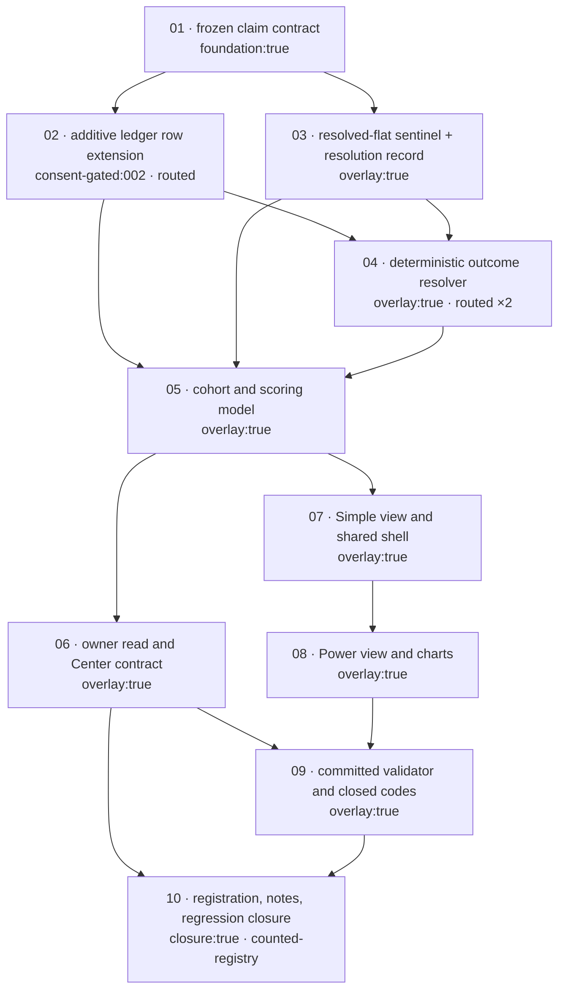

# Scopes — 015 Recommendation Outcome Ledger And Track Record

**Layout:** per-scope directory mode. This feature plans **10 scopes**, which exceeds the 6-scope threshold for the
single-file layout, so each scope owns its own directory `scopes/NN-name/scope.md` and its own `report.md`. This
file is the index and the only place where cross-scope ordering, dependencies, Business-Scenario ownership, UI-row
ownership, and refusal-code ownership are recorded. A scope's own `scope.md` is authoritative for that scope's
Gherkin, Implementation Plan, Test Plan, and Definition of Done.

**Design boundary:** every contract, constant, error code, and file named in any scope below is drawn from
`design.md` sections `D1`–`D8`. A surface that does not appear there is out of boundary and requires a routed
design amendment before it can be planned. `spec.md` (analyst/UX-owned) and `design.md` (design-owned) are
read-only to planning; defects found in either are recorded under `## Routed findings` and are **not** fixed here.

**Authoring status:** this index is complete for all 10 scopes. `scopes/01-*` through `scopes/04-*` carry authored
`scope.md` files (planning chunk 1). Planning chunks 2 and 3 author `scopes/05-*` through `scopes/10-*`,
`report.md`, and `uservalidation.md` against this index **without** changing the ordering, the dependency graph, or
any ownership map recorded here.

---

## Execution Outline

### Phase order

| # | Scope | Design section | One-line rationale | Status |
|---|---|---|---|---|
| 1 | `01-frozen-claim-contract` | D1 | Nothing downstream can exist until a recommendation persists what it actually claimed; the claim is the only object every later stage reads. | Not Started |
| 2 | `02-additive-ledger-row-extension` | D2 | The row's `claimRef` is the sole pointer from an event to a claim, and its **absence** is the permanent unresolvable-legacy marker — both the resolver and the scorer key off it. | Not Started |
| 3 | `03-resolved-flat-sentinel-and-resolution-record` | D3 | The outcome classes and the zero-free array convention must exist before anything computes an outcome, because HC-7 is satisfied at the source or not at all. | Not Started |
| 4 | `04-deterministic-outcome-resolver` | D4 | Converts a frozen claim plus committed bars into one signed outcome and exactly one existing closure event; it is the only stage that writes lifecycle state. | Not Started |
| 5 | `05-cohort-and-scoring-model` | D5 | Turns resolved outcomes into the track record through the seven `RLVALID` primitives and fixes the denominator, the sufficiency branch, and the derived legacy count. | Not Started |
| 6 | `06-owner-read-and-center-contract` | D6 | The `rl-tool-read/v1` read is a third rendering of the same frozen scorecard, and its `read` string is the only place HC-8 can be met on the Center surface. | Not Started |
| 7 | `07-simple-view-and-shared-shell` | D7 | The default decision-first cockpit plus the page scaffold, mode toggle, levers, coverage line, and no-advice notice that both views share. | Not Started |
| 8 | `08-power-view-and-charts` | D7 | Drill-in panels — calibration, distribution canvas, multiplicity, raw ledger — reusing the shell and the single `compute()` the Simple view established. | Not Started |
| 9 | `09-committed-validator-and-closed-codes` | D8 | The consolidated 16-code `RTR-*` register plus the source scans that can only run once the whole surface exists. | Not Started |
| 10 | `10-registration-notes-and-regression-closure` | D6 (FR-019) | Registration is what makes the Center look the read up at all; it mutates five counted registries and is therefore isolated, serialised, and last. | Not Started |

### New types and contracts introduced

| Scope | Surface introduced |
|---|---|
| 01 | Contract `brief-recommendation-claim/v1`; the nine-term `claimHash` list and the content-only hashing rule; content-addressed store `briefs/objects/claims/<hex>.json`; the closed seven-reason mint-refusal set; the unhashed `citedToolId` provenance field and the unhashed `notEvaluable` mint-verdict field; `RTR-PREDICATE-AMEND` |
| 02 | Contract `brief-recommendation-history-row/v2` (strict superset of `v1`, one optional `claimRef`); the dual-version reader that accepts both; the publisher mint hook; `RTR-LEGACY-BACKFILL` |
| 03 | The `outcomeClass` vocabulary (`win`, `loss`, `resolved-flat`, `unresolved`, `not-evaluable`, `unresolvable-legacy`); contract `brief-recommendation-resolution/v1`; `resolutionHash`; the zero-free directional-array convention; `RTR-FLAT-ZERO` |
| 04 | `scripts/brief-resolve-outcomes.mjs`; the fenced as-of read slice; the four predicate evaluators; the closure-event selection table; the derived `lifecycleBinding.originRecommendationKey` bridge; the `state === "active"` due-set gate; `RTR-LOOKAHEAD`, `RTR-SESSION-PREDICATE`, `RTR-CALENDAR-COVERAGE`, `RTR-CLOSURE-VOCAB`, `RTR-NETWORK`, `RTR-RESOLUTION-CONFLICT` |
| 05 | Module constants `Z_SCORE = 1.96`, `MIN_COHORT_RESOLVED = 20`, `ANNUALIZATION = 252`; the five-lever cohort model; the `resolvedDirectional` denominator; the three-state sufficiency branch; the withdrawal-bound pair; `briefs/history/record-start.json`; `RTR-LEGACY-GROWTH`, `RTR-COHORT-MIX` |
| 06 | `buildOwnerRead(scorecard)` and `buildMetrics(scorecard)`; the three `read`-string templates keyed by sufficiency state; the `putToolRead` non-`null` return check; `RTR-RATE-BARE` |
| 07 | `recommendation-track-record-lab.html` scaffold and load order (`rlcontext.js` first); `compute(MODEL, state)` returning one deep-frozen `scorecard`; `renderSimple`; the `#modeSeg` / `body.power` mechanism; `localStorage.rlTrackRecordLab`; the single rate-emitting helper |
| 08 | `renderPower`; the structured `RLCHART` adapter for `#distChart` (exact five-key shape) with `contextual-tooltip/v1` contexts; `#calibTable`, `#multiplicity`, `#cohortsViewed`, `#ledgerTable`; the `data-chart-fallback` table convention |
| 09 | `scripts/validate-recommendation-track-record.mjs` with a named export and an argv-guarded `main()`; the consolidated 16-code `RTR-*` register; the four source scans `RTR-LOCAL-STATISTIC`, `RTR-REDUCER-FORK`, `RTR-CENTER-VIEW`, `RTR-ACTION-EMITTED` |
| 10 | Registry entries in `tools.json`, `index.html` `TOOLS`, `rlnav.js` `TOOLS`, `journeys.json` `definitions`, plus the `experience.journeyDefinitionIds` block and `notes/recommendation-track-record-lab.md` |

### Validation checkpoints

| After scope | Gate that must be green before the next scope starts |
|---|---|
| 01 | `node --test tests/recommendation-track-record.unit.mjs` and `node --test tests/recommendation-track-record.functional.mjs` prove content-only hashing, that any hashed-field change — `thesisFamily` included — yields a different `claimHash`, and that `RTR-PREDICATE-AMEND` fires on a **hashed-term-changing** write at an existing path — never on a re-mint whose hashed terms match, which reuses the existing object; `node scripts/selftest.mjs` still reports `baseline + N passed, 0 failed` against the scope-start baseline captured in `report.md`. |
| 02 | Every committed pre-contract row — count derived at test time, never asserted as a literal, per F-015-D5-02 — validates unchanged under the dual-version reader, `eventId` and `recommendationKey` are byte-identical before and after the extension, and `RTR-LEGACY-BACKFILL` fires on a resolution written against a row with no `claimRef`. |
| 03 | The array handed to `rlvSummarizeOutcomes` contains only strictly non-zero finite elements, the primitive's own `unresolved` is structurally `0` and is consumed-and-discarded, and the class partition identity sums to the total proposed count. |
| 04 | The **two-case** idempotence pair both pass: pass 2 over an unchanged ledger emits zero closures with a byte-identical `indexFingerprint`, **and** the reducer is shown to *accept* a double closure when the due-set gate is bypassed. |
| 05 | Every displayed quantity traces to a named `RLVALID` primitive; the empty branch is proven to be taken **before** any primitive call; the legacy count is derived from the ledger and no literal appears in any 015-authored source. |
| 06 | `putToolRead` returns a non-`null` object for all three sufficiency states, and each generated `read` string carries a rate only when its range and sample count are in the same string. |
| 07 | `npx --no-install playwright test tests/recommendation-track-record-lab.spec.mjs --config=playwright.config.mjs --project=system-chrome` renders the empty, insufficient and sufficient states with the range drawn in all but empty, and no element matching `rlg.js`'s `GLOSSARY_SELECTOR` lacks a `title`. |
| 08 | The structured adapter validates against the exact five-key shape, every chart point resolves to a same-data table row, and the page-wide UI-27 / UI-28 / UI-33 assertions are re-run with all Power panels rendered. |
| 09 | `node scripts/validate-recommendation-track-record.mjs` exits 0 standalone and all sixteen `expectRejected` cases fail closed with exactly their named code. |
| 10 | `node scripts/validate-tool-experience.mjs` is green against the **then-current** re-read counts, and the Center still composes exactly four views with no `RLMKT-VIEW` refusal. |

---

## Dependency Graph

| Scope | Depends On | Blocking reason |
|---|---|---|
| 01 | — | Foundation. The claim object is the only artifact every later stage reads. |
| 02 | 01 | The row's `claimRef` is a `claimHash`; the pointer cannot exist before the thing it points at. |
| 03 | 01 | `outcomeClass` is a classification against `magnitude.flatBand`, which is frozen inside the claim. |
| 04 | 01, 02, 03 | The resolver reads claims, writes resolution records in the scope-03 contract, and selects its due set from rows carrying a `claimRef`. |
| 05 | 02, 03, 04 | Scoring consumes resolution records and outcome classes, and derives the legacy count from rows **lacking** a `claimRef`. |
| 06 | 05 | The owner read is a rendering of the frozen scorecard; there is nothing to publish before the scorecard exists. |
| 07 | 05 | The Simple view is a second rendering of the same frozen scorecard. |
| 08 | 07 | Power reuses the scaffold, the mode mechanism, the levers, and the single `compute()` established by 07. |
| 09 | 01, 02, 03, 04, 05, 06, 07, 08 | Four of the sixteen codes are **source scans** over the finished surface; they cannot be authored against code that does not exist yet. |
| 10 | 06, 09 | Registration exposes a validated tool. It mutates five counted registries with hard count assertions and is serialised last. |

### Dependency diagram

---

## Scope table

| ID | Name | Status | Tags | Depends On | Business Scenarios owned |
|---|---|---|---|---|---|
| 01 | `01-frozen-claim-contract` | Not Started | `foundation:true` | — | BS-001, BS-008 |
| 02 | `02-additive-ledger-row-extension` | Not Started | `overlay:true`, `consent-gated:002`, `routed:P-015-01`, `routed:P-015-02` | 01 | — |
| 03 | `03-resolved-flat-sentinel-and-resolution-record` | Not Started | `overlay:true` | 01 | BS-004 |
| 04 | `04-deterministic-outcome-resolver` | Not Started | `overlay:true`, `routed:P-015-03`, `routed:P-015-07` | 01, 02, 03 | BS-002, BS-003, BS-007, BS-009, BS-010 |
| 05 | `05-cohort-and-scoring-model` | Not Started | `overlay:true` | 02, 03, 04 | BS-005 |
| 06 | `06-owner-read-and-center-contract` | Not Started | `overlay:true` | 05 | — |
| 07 | `07-simple-view-and-shared-shell` | Not Started | `overlay:true` | 05 | BS-006, BS-012 |
| 08 | `08-power-view-and-charts` | Not Started | `overlay:true` | 07 | BS-011 |
| 09 | `09-committed-validator-and-closed-codes` | Not Started | `overlay:true` | 01–08 | — |
| 10 | `10-registration-notes-and-regression-closure` | Not Started | `closure:true`, `counted-registry` | 06, 09 | — |

**Scope count: 10. Business Scenarios owned: 12 of 12. UI rows owned: 35 of 35.**

---

## Business-Scenario ownership map

Every `BS-001` … `BS-012` from `spec.md` → `## Business Scenarios` is owned by **exactly one** scope. Zero orphans,
zero duplicate owners.

| BS | Title (from `spec.md`) | Owning scope | Why that scope |
|---|---|---|---|
| BS-001 | A claim is proposed with a frozen predicate | 01 | Two of its three `Then` clauses — the claim object persisting subject/direction/predicate/horizon/magnitude, and the predicate being immutable thereafter — are pure claim-contract properties. The remaining clause (*"the ledger row references that claim by hash"*) is carried as a named cross-referencing DoD item in scope 02, so it is delivered but not co-owned. |
| BS-002 | A satisfied claim resolves to a positive outcome | 04 | Predicate evaluation and closure emission are the resolver's only job. |
| BS-003 | An invalidated claim resolves to a negative outcome | 04 | Same evaluator, same closure path, opposite branch. |
| BS-004 | A resolved-flat outcome is not reported as unresolved | 03 | HC-7 is satisfied at classification time, upstream of every consumer. |
| BS-005 | Legacy anonymous rows are never back-filled | 05 | The scenario's `Then` clauses are all about **computing** the count at render time and refusing to impute — that is the scorer. |
| BS-006 | A hit rate is never shown without its interval | 07 | The `When` is *"a hit rate is rendered"*; HC-8 is enforced by the single rate-emitting DOM helper. |
| BS-007 | Resolution never reads the future | 04 | The as-of fence is a property of the slice handed to the evaluator. |
| BS-008 | A predicate amended after the fact is refused | 01 | Amendment is structurally impossible because every predicate field is inside `claimHash`. |
| BS-009 | Re-running the resolver changes nothing | 04 | Idempotence rests entirely on the resolver's due-set gate. |
| BS-010 | A claim with no committed series is not-evaluable | 04 | `not-evaluable` is a resolver closure with a closed reason code. |
| BS-011 | An apparent edge is discounted for multiplicity | 08 | The family/trial counts and the discounted statistic live in the Power multiplicity panel. |
| BS-012 | The tool emits no action | 07 | `#noAdviceNotice` and the absence of any action control are properties of the shared shell that 07 builds. |

**Ownership audit:** 12 scenarios listed, 12 distinct owners assigned, 0 unowned, 0 owned by more than one scope.
Owner counts — 01: 2, 02: 0, 03: 1, 04: 5, 05: 1, 06: 0, 07: 2, 08: 1, 09: 0, 10: 0. Sum = 12.

---

## UI Scenario ownership map

Every `UI-01` … `UI-35` from `spec.md` → `## UI Scenario Matrix` is owned by **exactly one** scope. A row's owner
is the scope whose surface makes the row's `e2e-ui` assertion satisfiable for the first time.

| UI | Scenario | View | Owning scope |
|---|---|---|---|
| UI-01 | Honest empty state, zero resolved | Simple | 07 |
| UI-02 | Sufficient sample first paint | Simple | 07 |
| UI-03 | Rate never renders bare | Simple | 07 |
| UI-04 | Interval is given a job | Simple | 07 |
| UI-05 | Distance-to-precision is labelled arithmetic | Both | 07 |
| UI-06 | Cohort steering recomputes live | Simple | 07 |
| UI-07 | Steering into a sparse cohort | Simple | 07 |
| UI-08 | Insufficient copy states both extremes | Simple | 07 |
| UI-09 | Forecast quality and economic value are separated | Simple | 07 |
| UI-10 | Non-implication is stated, not implied | Both | 07 |
| UI-11 | Null payoff renders as an em dash | Simple | 07 |
| UI-12 | Legacy disclosure is permanent | Both | 07 |
| UI-13 | Legacy disclosure cannot be dismissed | Both | 07 |
| UI-14 | Legacy explanation on demand | Both | 07 |
| UI-15 | Denominator composition is visible | Both | 07 |
| UI-16 | Withdrawn survivorship is boundable | Both | 07 |
| UI-17 | Withdrawn bound is not a steerable what-if | Both | 07 |
| UI-18 | Not-evaluable is counted and explained | Both | 07 |
| UI-19 | Resolved-flat is distinguishable from unresolved | Power | 08 |
| UI-20 | Calibration drill | Power | 08 |
| UI-21 | Empty calibration bucket renders, never omitted | Power | 08 |
| UI-22 | Multiplicity panel | Power | 08 |
| UI-23 | Session cohort-shopping is counted | Power | 08 |
| UI-24 | Distribution chart hover | Power | 08 |
| UI-25 | Every chart has a table equivalent | Power | 08 |
| UI-26 | Raw ledger audit | Power | 08 |
| UI-27 | Tickers are linked, never bare | Both | 07 |
| UI-28 | Every value carries a contextual tooltip | Both | 07 |
| UI-29 | Auto-hydrate, no fetch click | Simple | 07 |
| UI-30 | Shared data-status reporting | Both | 07 |
| UI-31 | Mode toggle and persistence | Both | 07 |
| UI-32 | Narrow reflow keeps the honesty furniture | Simple | 07 |
| UI-33 | No action is emitted | Both | 07 |
| UI-34 | Deep link out to the owning tool | Power | 08 |
| UI-35 | Center still composes exactly four views | Both | 10 |

**Ownership audit:** 35 rows listed, 35 distinct owners assigned, 0 unowned, 0 owned by more than one scope.
Owner counts — 07: 25, 08: 9, 10: 1. Sum = 35.

**Page-wide re-run obligation.** `UI-27`, `UI-28` and `UI-33` are page-wide assertions owned by scope 07, which is
where the mechanism (exhaustive `title` coverage, `RLTKR` linking, the no-advice notice) is established. Scope 08
carries a named DoD item re-running all three with every Power panel rendered, because a Power-only element that
lacks a `title` re-opens the `rlg.js` hole that scope 07 closed. Re-running is not co-ownership: the assertions
themselves remain scope 07's.

---

## Refusal-code ownership

`design.md` → `## D8` declares the consolidated **15-code** `RTR-*` register as the FR-020 surface, superseding the
resolver-scoped subset in `D4` (finding F-015-D8-01, resolved below). Each code is owned by exactly one scope,
which carries the named adversarial test asserting the exact code string.

| Code | Fires when | Owning scope |
|---|---|---|
| `RTR-PREDICATE-AMEND` | A write would change a frozen claim's predicate / horizon / magnitude | 01 |
| `RTR-LEGACY-BACKFILL` | A resolution is written against a ledger row that carries no `claimRef` | 02 |
| `RTR-FLAT-ZERO` | A bare `0` reaches the array passed to `rlvSummarizeOutcomes` | 03 |
| `RTR-LOOKAHEAD` | An observation dated after `horizon.resolutionDate` is consulted | 04 |
| `RTR-CALENDAR-COVERAGE` | A resolution date falls outside the committed calendar window | 04 |
| `RTR-CLOSURE-VOCAB` | A closure event outside `CLOSE_EVENT_TYPES` is constructed | 04 |
| `RTR-NETWORK` | Network or provider-credential surface is reachable from the resolver | 04 |
| `RTR-RESOLUTION-CONFLICT` | A content-addressed write would change existing bytes | 04 |
| `RTR-LEGACY-GROWTH` | The asserted unresolvable-legacy count drifts from the derived count | 05 |
| `RTR-COHORT-MIX` | A rate is rendered without its cohort label and sample count | 05 |
| `RTR-RATE-BARE` | A rate is emitted without its range and count — in the DOM or in the `read` string | 06 |
| `RTR-LOCAL-STATISTIC` | A source scan finds an estimator, interval, mean or discount computed outside `RLVALID` | 09 |
| `RTR-REDUCER-FORK` | A source scan finds a local re-implementation of the lifecycle reducer | 09 |
| `RTR-CENTER-VIEW` | 015 source writes Center `viewOrder` / `views` / `viewState`, or declares a view id | 09 |
| `RTR-ACTION-EMITTED` | Action vocabulary reaches the rendered surface, **or** an element matching `rlg.js`'s `GLOSSARY_SELECTOR` lacks a `title` | 09 |

**Total: 1 + 1 + 1 + 5 + 2 + 1 + 4 = 15 codes, each owned exactly once.** Scope 07 and scope 08 own no code of
their own; scope 07 applies scope 06's `RTR-RATE-BARE` at the DOM level through a single rate-emitting helper, and
scope 09's `RTR-ACTION-EMITTED` scan is what makes scope 07's exhaustive-`title` mechanism checkable.

---

## Resolution of `design.md` → `## D11` open questions

All eleven findings routed to planning are addressed. **Nine are resolved. One is resolved in part with its
remainder escalated. One is resolved by plan with an advisory amendment routed to the owning agent.**

| # | Finding | Disposition | Planning decision |
|---|---|---|---|
| **F-015-D4-01** | Key-space bridge — the reducer keys on `originRecommendationKey` over `{originToolId, thesisFamily, subjects, actionFamily, horizon}`; D1 binds to the publisher key over `{subject, family}`. | **Resolved.** The original planning placement below was **superseded by design's Claim-Identity Reconciliation of 2026-08-18**; P-015-03 is no longer an open escalation. | **Placement (current, binding):** `thesisFamily` is a **top-level, hashed** claim field — the one `origin-recommendation-key/v1` term that varies per claim and is not already carried by `subject` / `actionFamily` / `horizon`, so hashing it is what makes `claimHash` a *refinement* of the reducer key rather than a colliding sibling. `originToolId` is **not a claim field at all**: it is the `market-brief` pipeline constant asserted against the registry (D4). The per-action `deepLink` resolves the new **unhashed** `citedToolId` citation field through `tools.json` `file` → `id`; an absent or unmatched `deepLink` sets `citedToolId: null` and does **not** refuse the mint. Verified live `deepLink` values on `market-brief.payload.json`: `etf-momentum-lab.html`, `sector-research-lab.html`, `msft-july-print-model.html`, `gamma-trading-lab.html`. The bridge stays *derived, never authored*: scope 04 calls `deriveRecommendationKeys` (`rlcontracts.js#L1034`) on the claim's hashed `thesisFamily` / `subject` / `actionFamily` / `horizon` plus the `originToolId` constant, per the foundation's own rule at `rlcontracts.js#L1031` (*"Authors never own identity"*). **Superseded planning text, retained as history:** this row previously placed `originToolId` and `thesisFamily` in an unhashed `lifecycleTerms` block and asserted *"the `claimHash` term list is therefore unchanged and D1 needs no revisit"* — false on its own terms, because D1's term list already contained `thesisFamily`, so the move changed the very list it claimed to leave alone. That block is **withdrawn**. |
| **F-015-D4-02** | Reducer idempotence is not self-enforcing; FR-006 rests entirely on the due-set gate. | **Resolved.** | The two-case pair is a **named DoD item pair** in scope 04, not an implied one: `T-04-I2` asserts pass 2 emits zero closures with a byte-identical `indexFingerprint`, and `T-04-I3` asserts — as an **acceptance**, not a refusal — that the reducer *accepts* a second closure for an already-closed entry when the gate is bypassed, and that the fingerprint changes. Case 2 is what pins the invariant to its actual location; case 1 alone would not distinguish "the gate held" from "the reducer protected us". |
| **F-015-D5-01** | Lever-set discrepancy — P7 names *action type*; the Interaction And Steering Model names *claim family*. | **Resolved — the discrepancy collapses on live data.** | Verified this run against `market-brief.payload.json`: the publisher's `family` term at `scripts/brief-distributed-publish.mjs#L404` is `action.action`, whose live values are `hold`, `trim`, `rotate`, `hedge` — every one a member of `MARKET_ACTIONS` (`rlcontracts.js#L708`). The union of authored-action keys is `action, subject, rationale, horizon, structuralAnchor, trigger, invalidation, confidence, deepLink`; **there is no `thesisFamily` field at all.** P7's *action type* and the Interaction Model's *claim family* therefore name the **same axis**. Decision: keep the **five** levers with the DOM ids `UI-06` / `UI-07` / `UI-31` assert against, bind `select#leverFamily` to `claim.actionFamily`, add **no** sixth lever, and leave the persisted `localStorage.rlTrackRecordLab` shape `{ mode, cohort, bucket, horizon, family, window }` unchanged. Owned by scope 07. |
| **F-015-D5-02** | The legacy count is a moving target and must not be hardcoded. | **Resolved.** | The count is **derived** (`rows lacking a claimRef`), **asserted once** at contract activation into `briefs/history/record-start.json`, and **guarded** by `RTR-LEGACY-GROWTH`. No literal ships in any 015-authored source; scope 09's source scan makes that checkable. *Independently recounted on 2026-08-18:* the committed ledger holds **two** partitions — `briefs/history/recommendations/2026-07.jsonl` at 749 rows and `2026-08.jsonl` at 539 rows. The 2026-07-29 planning run recorded 165 rows for the July partition alone, so that partition grew by 584 rows and a second partition appeared in three weeks — the finding's *"moving target"* is a measured fact, not a caution. Both figures are **dated observations, not constants**, and neither is carried into any scope, test, or DoD as a literal. Owned by scope 05; the activation-sequencing rule is a cross-cutting rule below. |
| **F-015-D6-01** | `metrics` is not rendered by the Center; registration gates whether the read is looked up at all. | **Resolved, with the ordering inverted and justified.** | The finding's literal instruction — *register before publish* — is **not** adopted, and the reason is mechanical. `putToolRead` writes `d.toolReads[id]` and returns the stored object regardless of registration (`rldata.js#L433`–`#L453`), so scope 06 can prove FR-018 contract compliance standalone, including the non-`null` return check. What registration actually gates is `RLBRIEF.renderToolReads`' **by-id lookup** (`rlbrief.js#L689`) — i.e. **UI-35 only**. Registration is therefore deferred to scope 10 because it mutates five counted registries whose coverage counts are cross-asserted in `scripts/validate-tool-experience.mjs`, plus a per-ordinary-tool `journeyDefinitionIds.length >= 2` rule; registering early would leave a live nav entry pointing at an unfinished surface. **Re-read on 2026-08-18:** those expectations are **derived from the inventory at run time**, not typed as literals — `expectedOrdinaryTools` / `expectedCenterGoals` / `expectedTotalGoals` are computed from the registry rows and `definitionCount` is compared against `packet.journeys.definitions.length`, so there is no literal for a scope to bump. `node scripts/validate-tool-experience.mjs` reported `ordinaryTools=27 centerGoals=4 totalGoals=58 definitions=58`, exit 0; the 2026-07-29 planning run recorded 22 / 4 / 48 / 48 against a then-literal form. Both figure sets are **dated observations, not constants**. **Consequence recorded in the UI map: UI-35 is owned by scope 10, not scope 06.** |
| **F-015-D7-01** | `data-chart-fallback` has no repo precedent. | **Resolved; advisory routed.** | Independently verified this run: **zero occurrences** of `data-chart-fallback` across `*.html`, `*.js`, `*.mjs` and `*.json` in the source tree. Scope 08 carries **both** — the contractual `tableTargetFor` / `links.sameDataTable` id binding that `validateStructuredAdapter` (`rlchart.js#L98`) enforces, **and** the `data-chart-fallback` attribute on the same `<table>` that UI-25 asserts. An advisory amendment note is routed to `bubbles.analyst` (P-015-06); planning does **not** edit `spec.md`. |
| **F-015-D7-02** | `rlcontext.js` must join the load order. | **Resolved.** | D7's amended order is adopted: `rlcontext.js` loads **first**, ahead of `rldata.js`. Precedent verified this run — `market-heatmap-lab.html#L412` loads `rlcontext.js`, and its structured adapter attaches at `#L784` with `tableTargetFor` at `#L794` and `links.sameDataTable` at `#L641`. FR-014's ordering constraint binds only the `rldata → rlapp → rlnav` trio, so this is an addition, not a contradiction. Owned by scope 07. |
| **F-015-D7-03** | `rlg.js` glossary pre-emption. | **Resolved.** | FR-016 and HC-9 are **one** DoD item in scope 07, not two, because exhaustive `title` coverage *is* the mechanism that delivers HC-9: `decorate()` returns early at `rlg.js#L241` when the element already carries a `title`, so an element without one is an element the shared glossary may claim. Scope 09's `RTR-ACTION-EMITTED` scan asserts the **precondition** (any element matching `GLOSSARY_SELECTOR`, declared at `rlg.js#L251`, that lacks a `title`), not only the token match. |
| **F-015-D7-04** | UI-33's assertion has a gap — it reads page text; `rlg.js` writes `aria-label` (`#L243`). | **Resolved.** | The UI-33 assertion is **widened inside scope 07** to scan `aria-label` and `title` in addition to text content. This is an assertion amendment within the scope, not a spec change. |
| **F-015-D8-01** | D4's error-code table is not the complete FR-020 register. | **Resolved.** | D8's 15-code table is adopted as the FR-020 surface; D4's remains correct as a resolver-scoped subset. The `## Refusal-code ownership` table above assigns each of the fifteen to exactly one owning scope, so no code is orphaned and none is claimed twice. Scope 09 owns the consolidated register and the four source scans. |
| **F-015-D8-02** | FR-017 names the deprecated `attach(canvas, hitFn)` closure form. | **Resolved by plan; advisory routed.** | The structured adapter's `hitTest` member satisfies FR-017's intent, and every scope-08 DoD item is worded against the **structured** adapter. Verified this run: `attach` dispatches on argument type at `rlchart.js#L365`; the function form routes to `attachLegacy` at `#L351`, which stamps `data-rlchart-migration-required="true"` at `#L360`. An advisory amendment note is routed to `bubbles.analyst` (P-015-05); planning does **not** edit `spec.md`. |

**No D11 finding is left unaddressed.** The one escalation raised by this planning run — the `thesisFamily` half of
F-015-D4-01, recorded below as **P-015-03** — was subsequently **resolved by design**: on 2026-08-13 as
authored-or-not-evaluable, and on 2026-08-18 as a top-level hashed field when the Claim-Identity Reconciliation
withdrew the `lifecycleTerms` placement. The routed-findings table below is preserved as the record of what planning
found and escalated; it is not a live blocker list.

---

## Routed findings

Defects and gaps found **during planning** in artifacts planning does not own. Recorded here and in the
RESULT-ENVELOPE; **not** fixed by this agent. Each names the surface it blocks and the scope that carries the tag.

| # | Finding | Owner | Severity | Blocks | Evidence |
|---|---|---|---|---|---|
| **P-015-01** | **The authored `subject` is prose, not a resolvable identifier.** `design.md` → `D1` specifies `subject.id` as *"the publisher's `subject` string, verbatim"* with the illustrative value `"SPY"` and `seriesRef: "bars/SPY/1d"`. On the live payload every authored `subject` is a multi-clause prose sentence — e.g. `"SPY / SPMO longer-term structural core — do NOT add index beta while the SPY 50-day is overhead and unreclaimed and SPMO has just lost its 50-day stack"`. A prose subject cannot key `data/bars/` and cannot populate `seriesRef`. D1's positional-fallback guard does **not** catch this: a prose subject is a genuine `string` and passes the `typeof action.subject === 'string'` test at `scripts/brief-distributed-publish.mjs#L403`, so it never falls back to `action-${index}` and never trips `non-semantic-subject`. Under D1 as written, **every one of the five live actions would mint a claim whose subject resolves to nothing**, or refuse — and a resolver that refuses every claim produces a permanently empty, honest, useless track record. | `bubbles.design` (+ Feature 002 owner) | **Blocking** the live claim binding | Scope 02 (`routed:P-015-01`) | `market-brief.payload.json` → `nextSession.actions[]`, all 5 subjects verified prose this run; `scripts/brief-distributed-publish.mjs#L403`; `design.md` → `## D1` → *Contract* and *Field Semantics That Are Load-Bearing* |
| **P-015-02** | **The horizon vocabularies do not intersect.** `design.md` → `D1` declares `horizon.kind ∈ { intraday, next-session, multi-session, event-bound }` and `D4` derives `resolutionDate` from that set. The live authored `action.horizon` vocabulary is `{ structural, swing, tactical }`. Neither set maps onto the other, and no mapping is declared anywhere in `spec.md` or `design.md`. Without one, `D4`'s calendar-session `resolutionDate` derivation table has no input. | `bubbles.design` | **Blocking** the live claim binding | Scope 02 (`routed:P-015-02`) | `market-brief.payload.json` → distinct `action.horizon` values verified `["structural","swing","tactical"]` this run; `design.md` → `## D1` (`horizon.kind`) and `## D4` (*Horizon expiry is calendar arithmetic*) |
| **P-015-03** | **`thesisFamily` has no live source.** `design.md` → `D5`'s lever table sources *Claim family* from `claim.thesisFamily`, and `F-015-D4-01`'s reducer-key bridge requires `thesisFamily` as a `deriveRecommendationKeys` term. **No such field exists on the authored action** — the verified key union is `action, subject, rationale, horizon, structuralAnchor, trigger, invalidation, confidence, deepLink`. Planning resolved `originToolId` (from `deepLink`) but **will not invent** a `thesisFamily` value: setting it to `actionFamily` would flatten two different theses on the same subject and action onto one reducer entry key, and the reducer's closure path keys entries by exactly that value (`rlcontracts.js#L1275`–`#L1281`). The decision — author a `thesisFamily` into the action shape (a Feature 002 contract change, same class as the `D2` row change), accept the flattening explicitly, or bind the reducer differently — is an ownership call, not a planning inference. | `bubbles.design` (+ Feature 002 owner) | **Blocking** the reducer bridge in scope 04 | Scope 04 (`routed:P-015-03`) | `market-brief.payload.json` action key union verified this run; `rlcontracts.js#L1034`–`#L1041`, `#L1275`–`#L1281`; `design.md` → `## D5` lever table and `## D11` F-015-D4-01 |
| **P-015-04** | **`design.md` → `D6`'s registration table is incomplete.** It lists `tools.json`, `index.html` `TOOLS`, `rlnav.js` `TOOLS` and `notes/` as the registration surface. Registering one more tool additionally requires a `journeys.json` `definitions` entry and an `experience.journeyDefinitionIds` block with **at least two** goals, and it participates in the coverage-count cross-assertions in `scripts/validate-tool-experience.mjs`. The coupling is not named in `design.md`, so a scope written from that table alone would fail the repo check. | `bubbles.design` | Advisory | Scope 10 (`counted-registry`) | `node scripts/validate-tool-experience.mjs` run 2026-08-18, exit 0, reporting `tools=28 ordinary=27 marketAction=1` and `journeyCoverage=PASS ordinaryTools=27 centerGoals=4 totalGoals=58 definitions=58`; the expectations are **derived from the inventory at run time** rather than typed, so the registry ordinal and the goal totals are dated observations and no literal is carried into any scope, test, or DoD |
| **P-015-05** | **FR-017 names the deprecated chart-attach form.** Its wording — *"register a hit-test closure via `RLCHART.attach`"* — describes `attachLegacy`, which stamps `data-rlchart-migration-required="true"`. A literal reading would have a brand-new tool ship pre-flagged migration debt. Planning adopts the structured adapter (whose `hitTest` member satisfies FR-017's intent) and words scope 08's DoD accordingly. An `spec.md` amendment is **suggested, not applied**. | `bubbles.analyst` | Advisory | Scope 08 | `rlchart.js#L365` (dispatch), `#L351`–`#L360` (`attachLegacy` + the stamp); `design.md` → `## D11` F-015-D8-02 |
| **P-015-06** | **UI-25 asserts an attribute with no repo precedent.** `table[data-chart-fallback]` has **zero occurrences** repo-wide; the repo's real chart-to-table mechanism is the structured adapter's `tableTargetFor` / `links.sameDataTable` binding. Planning carries both rather than choosing, so the row passes without abandoning the enforced binding — but the new convention is being introduced by assertion rather than by decision. | `bubbles.analyst` | Advisory | Scope 08 | Repo-wide grep verified zero source occurrences this run; `rlchart.js#L98`; `market-heatmap-lab.html#L641`, `#L794` |
| **P-015-07** | **The horizon session predicate skips real trading sessions.** `design.md` → `D4` derives `resolutionDate` by counting sessions where `dateState === "regular"`. The committed calendar's `dateState` vocabulary has **four** members; re-counted 2026-08-18 across its 365 rows as a dated observation, not a constant: `regular` 249, `weekend` 104, `holiday` 10, **`early-close` 2**. Both early-close rows — `2026-11-27` and `2026-12-24` — carry a **non-null `regular` block** (09:30–13:00 ET), so they are genuine trading sessions. Under the rule as written, a `next-session` claim proposed on the session before either date resolves **one session too far out**, reading a full extra session of price movement. That is a silent one-session **lookahead produced by the horizon derivation itself** — precisely the class of error D4's own rationale says calendar arithmetic exists to prevent (*"Adding calendar days would resolve a Friday `next-session` claim on a Saturday"*). Proposed correction, **routed not applied**: define a session as a row with a non-null `regular` block, i.e. `dateState ∈ { regular, early-close }`. | `bubbles.design` | **Blocking** the resolver's horizon derivation | Scope 04 (`routed:P-015-07`) | `data/calendars/xnys/calendar.json` `dateState` counts and both `early-close` rows with their non-null `regular` blocks re-verified 2026-08-18; `design.md` → `## D4` → *Horizon expiry is calendar arithmetic, never date arithmetic* |

---

## Cross-cutting sequencing rules (binding on every scope)

1. **Foundation first.** Scope 01 carries `foundation:true` and appears in the `Depends On` chain of every other
   scope, directly or transitively. No scope re-implements a scope-01-owned behaviour.
2. **No statistic is ever written.** Every displayed number traces to one of the seven `RLVALID` primitives
   (`rlvalidation.js#L156`–`#L162`). Where the loop needs a number the seven do not provide, the answer is to **not
   display that number** — never to write an eighth. `rlvBuildPurgedFolds`, `rlvAdjustBenjaminiHochberg` and
   `rlvAdjustHolm` are deliberately **unused**: 015 fits and selects nothing, and it produces no p-values.
   Manufacturing one to feed a correction is fabrication wearing a primitive's name.
3. **`rlvalidation.js` and `rlcontracts.js` are read-only.** They are Feature 007- and Feature 002-owned. No scope
   modifies, forks, shadows, or monkey-patches either. A needed change is a routed packet to the owning feature.
4. **No literal count anywhere.** The unresolvable-legacy figure, the family count, and the trial count are derived
   at render time. The partition observations recorded above exist to size the problem and are **not** carried into
   any scope, fixture, test name, or DoD item as a constant. The same rule governs the committed `data/bars` set,
   whose membership is read from the `data/bars/index.json` manifest at run time rather than counted — the raw glob,
   the glob minus the manifest, and the manifest's own ticker list gave three different answers on 2026-08-18.
5. **Consent before contract change.** Scope 02 carries `consent-gated:002`. `brief-recommendation-history-row/v1`
   is Feature 002-owned; the `v2` superset, the `claimRef` field, and the publisher mint hook require recorded
   Feature 002-owner consent **before** any scope emitting a `v2` row is implemented. The `design.md` → `D2`
   fallback (a fully 015-owned side-index keyed by `eventId`) is the recorded alternative if consent is withheld.
6. **Routed findings gate specific decisions, not whole scopes.** Scopes 02 and 04 carry `routed:*` tags. Their
   fixture-driven contract and refusal tests are schedulable now. What is **not** schedulable is the live-publisher
   binding (blocked on P-015-01 and P-015-02), the reducer key bridge (blocked on P-015-03), and the horizon session
   predicate (blocked on P-015-07). A fixture-backed pass reported as live-publisher evidence is fabricated
   evidence, and a scope that silently picks one side of a routed decision has made a design change it does not own.
7. **Activation writes once.** `briefs/history/record-start.json` is written exactly once, at claim-contract
   activation, and never updated. `RTR-LEGACY-GROWTH` fires if the derived count later exceeds the asserted one,
   which is the signal that the publisher emitted a claimless row after activation.
8. **Registration is last, isolated, and serialised.** Scope 10 is the only scope that touches `tools.json`,
   `index.html` `TOOLS`, `rlnav.js` `TOOLS`, `journeys.json`, or `scripts/validate-tool-experience.mjs`. It re-reads
   the then-current asserted counts at execution time rather than incrementing a count recorded here. While scope 10
   is unscheduled, 015 runs **unregistered**, reachable by direct URL and validated by
   `scripts/validate-recommendation-track-record.mjs`, with `node scripts/validate-tool-experience.mjs` green
   throughout.
9. **No Center mutation, ever.** No scope writes Center `viewOrder`, `views`, `viewState`, or declares a view id.
   `CENTER_VIEW_IDS` is frozen at four (`rlmarketaction.js#L77`) and `RLMKT-VIEW` refuses a fifth at five
   checkpoints. 015 holds HC-3 by **non-participation**, and scope 09's `RTR-CENTER-VIEW` scan proves it.
10. **No cache-schema change.** 015 writes only through `putToolRead` into the existing `d.toolReads[id]` slot. UI
    state persists under the separate `localStorage` key `rlTrackRecordLab`; resolver and scorer state are committed
    repository artifacts under `briefs/`, never `localStorage`. No derived statistic is persisted anywhere.
11. **`Number.isFinite` only.** The global `isFinite` appears nowhere in 015-authored code. `rlvSummarizeOutcomes`
    returns `averageWin` / `averageLoss` as `null` for a cohort with no wins / no losses (`rlvalidation.js#L148`,
    `#L149`), and `isFinite(null) === true` would throw on `.toFixed()` and halt the first paint.
12. **Every negative test asserts an exact code.** "Some refusal occurred" is not coverage. Every adversarial case
    names its `RTR-*` string and uses at least one input a permissive implementation would have accepted, so
    reverting the behaviour under test makes the row fail.

---

## Verified command surface

Only these command forms appear in any scope's Test Plan. Every one was executed or inspected during this planning
run; none is invented. **There is no `./research-lab.sh` project CLI and no `package.json` `scripts` block.**

| Category | Command |
|---|---|
| `unit` | `node --test tests/recommendation-track-record.unit.mjs` |
| `functional` | `node --test tests/recommendation-track-record.functional.mjs` |
| `integration` | `node --test tests/recommendation-track-record.integration.mjs` |
| `e2e` (headless) | `node --test tests/recommendation-track-record.e2e.mjs` |
| `stress` | `node --test tests/recommendation-track-record.stress.mjs` |
| `e2e-ui` | `npx --no-install playwright test tests/recommendation-track-record-lab.spec.mjs --config=playwright.config.mjs --project=system-chrome` |
| project check | `node scripts/selftest.mjs` |
| tool validator | `node scripts/validate-recommendation-track-record.mjs` |
| registry check | `node scripts/validate-tool-experience.mjs` |
| resolver | `node scripts/brief-resolve-outcomes.mjs` |

**Baseline is captured, never pinned.** `node scripts/selftest.mjs` was re-measured on 2026-08-18 at
`2487 passed, 0 failed`, exit 0; the 2026-07-29 planning run recorded `952 passed, 0 failed`. Per AC-018 every scope
asserts `baseline + N passed, 0 failed` with **no pre-existing assertion count decreasing**, where `baseline` is the
total captured immediately before that scope's first change and recorded in its `report.md`. It is stated as
arithmetic because *"selftest still passes"* is satisfiable by deleting an assertion, and it is captured rather than
pinned because a literal drifted by 1535 assertions in three weeks and would fail every scope for a reason having
nothing to do with that scope. Both figures above are dated observations, **not** constants, and neither is carried
into any scope, fixture, test name, or DoD item.

**`node --test` is a real surface**, not an assumption: re-measured 2026-08-18, 91 committed files under `tests/`
import `node:test`, and `node --test tests/market-action.unit.mjs` reported `# pass 13 / # fail 0`, exit 0. The
file count is a dated observation, not a constant — the 2026-07-29 planning run recorded 78 — and nothing asserts
it; what the row establishes is that the surface exists, which the passing run proves independently of any count.

---

*Educational research context only — not investment advice.*
