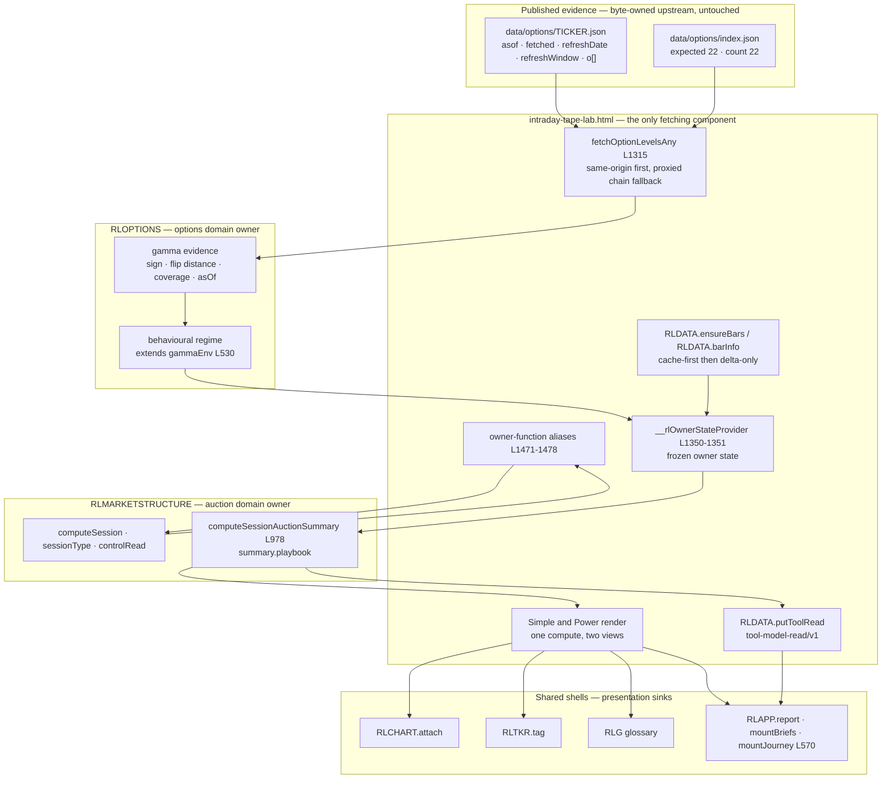

# Feature 016 — Auction × Gamma Playbook — Design

**Status:** planning
**Workflow mode:** product-to-planning (status ceiling `specs_hardened`)
**Host surface:** lens inside the registered `intraday-tape-lab` tool
**Educational only — not investment advice.**

This document carries the architecture, the capability foundation and the module
contracts. `bubbles.design` continues it with the remaining design sections.

Every file path and line number cited below was read out of the working tree
during this design pass. Nothing here is inherited on trust from `spec.md`.

---

## Design Brief

### Current State

`intraday-tape-lab.html` already computes both halves of the fusion and then
throws away the two quantities that carry behaviour. `computeOptLevels`
(intraday-tape-lab.html lines 1283–1302) derives `netGEX` at line 1295 and the
gamma `flip` at lines 1293–1298, and `normOpt` (lines 1774–1777) keeps both on
`state.opt`. The auction half is single-sourced properly: the page's owner
functions at lines 1471–1478 are thin aliases over `RLMARKETSTRUCTURE`, so one
formula serves the Power path and the registered Simple adapter. The gamma half
has no equivalent discipline — its chain math is inline on the page and copied
again in `gamma-trading-lab.html` (`bsmGamma` at line 1053, the identical
`spot * 0.9 … spot * 1.1`, `N = 60` band at line 1074, `netGEX` at line 1076).

Three separate seams silently drop evidence.

| Seam | Where | What is lost | What it blocks |
|---|---|---|---|
| A — owner boundary | intraday-tape-lab.html line 1373 publishes `gamma: { callWall, putWall, flip }` | `netGEX` never crosses into the adapter | Sign-based regime resolution is structurally impossible in the adapter |
| B — adapter consumer | `sessionGammaTag` at rlexperience-adapters/market-structure.js lines 959–967 reads only `gamma.callWall` and `gamma.putWall` | `flip` crosses the boundary and is never read | Flip distance never reaches the read |
| C — acquisition | `parsePagesChain` at intraday-tape-lab.html lines 1305–1312 returns only `{ spot, name, epoch, calls, puts }` | The snapshot's `asof`, `fetched`, `refreshDate` and `refreshWindow` are discarded | The same-cutoff rule, staleness and the as-of stamp have no input at all |

Seam C is the deepest. The published snapshot carries the fields — the top-level
keys of `data/options/SPY.json` are `asof`, `bars`, `fetched`, `o`,
`refreshDate`, `refreshWindow`, `spot`, `sym` — but the string `asof` occurs
**zero** times in `intraday-tape-lab.html`, **zero** times in
`gamma-trading-lab.html` and **zero** times in
`rlexperience-adapters/options.js`. No surface in this workspace can currently
state the as-of of the gamma evidence it is showing. Worse, `computeOptLevels`
persists its result under today's calendar key — `optTodayKey()` at line 1281,
used at line 1301 — so a prior-session snapshot is already filed as though it
were current. That is exactly the condition the Outcome Contract names as a
failure, and it is present before this feature adds anything.

### Target State

The two discarded quantities become the explicit behavioural regime, and the
discarded as-of becomes the evidence cutoff the fusion is asserted against. One
shared owner module produces a gamma evidence record that carries sign, flip
distance, usable-contract coverage, the snapshot as-of and an availability state
with its reason. The session-auction adapter fuses that record with the auction
state it already computes and emits a playbook cell — or, when any input is
unqualified, a reduced read that names which of five causes removed the gamma
half. Both are first-class outputs of the same compute path, so degradation is
never an error branch bolted onto an assertion path.

### Patterns To Follow

- **Owner-parity aliasing.** intraday-tape-lab.html lines 1465–1478 keeps
  `computeSession`, `adherence`, `controlRead` and `sessionType` in
  `RLMARKETSTRUCTURE` and aliases them on the page. The gamma half adopts the
  identical shape against `RLOPTIONS`.
- **Pure compute over frozen owner state.** market-structure.js lines 12–17 and
  options.js lines 13–19 both forbid adapters from fetching and from importing
  another domain adapter module. `captureEvidence` deep-freezes a structural
  clone (market-structure.js line 1155). The lens does not relax either rule.
- **Declared output paths.** `RLOPTIONS` already routes a fused verdict to
  `summary.playbook` (options.js lines 545, 551–558). The session-auction model
  reuses that name rather than inventing a parallel one.
- **State travels with reason.** `calibrationPolicy` in simple-models.json line
  109 declares `requiredFields: ["state","reason"]`. Every absence in this lens
  is a `{ state, reason }` pair for that reason, not a new convention.
- **Null-safe numeric guards.** `isFiniteNumber` at market-structure.js line 110
  and `isNum` at intraday-tape-lab.html line 1233 both test
  `typeof value === "number"` before calling the global `isFinite`, so a `null`
  cannot slip through. Every new numeric path reuses those helpers.
- **Same-origin first, proxy fallback.** `fetchOptionLevelsAny` at line 1315
  reads `data/options/<TICKER>.json` first and falls back to the proxied chain.
  The lens keeps that order and records which one answered.

### Patterns To Avoid

- **Inline duplication of the gamma model.** `bsmGamma` is byte-identical on
  three pages — intraday-tape-lab.html line 1278, gamma-trading-lab.html line
  1053 and swing-structure-lab.html line 1266 — all sharing one md5 over the
  untrimmed function line, `424f3017b656e6f3ea0979244292dcf2`. The same line
  stripped of its leading indentation hashes to
  `f7d5400d052232c2d5d146887f456e98`, which is the form scope 09's assertion
  uses; both values describe the identical line under a different convention.
  The `0.9 / 1.1 / N = 60`
  band is duplicated at lines 1293, 1074 and 1281, and the `r = 0.045, q = 0`
  literal at lines 1285, 1064 and 1273. Three surfaces agreeing because they
  hold identical copies is agreement by coincidence. AC-016-043 needs agreement
  by construction, and a closure that converges only two of the three leaves the
  claim false.
- **Persisting under a wall-clock key.** `RLDATA.putOptions(tk, optTodayKey(), ...)`
  keys evidence by today's date rather than by the evidence's own as-of, and it
  is written that way on all three surfaces: intraday-tape-lab.html line 1301,
  swing-structure-lab.html line 1289, and gamma-trading-lab.html line 1114 inside
  `mirrorSnap` (line 1112). `rldata.js` `putOptions` (line 351) writes one global
  `sym -> day` slot, so all three pages are co-writers of the same slot for the
  13 tickers common to all three universes — `SPY`, `QQQ`, `IWM`, `DIA`, `NVDA`,
  `TSLA`, `AAPL`, `MSFT`, `AMZN`, `META`, `GOOGL`, `AMD`, `AVGO`, of which six
  including `SPY` and `QQQ` are default-on in both the intraday and swing
  universes. Nothing in the lens may read a key of that shape as a currency
  claim, and re-keying one co-writer leaves the others free to re-file the same
  ticker under the calendar date, which would silently undo the repair for
  exactly the tickers the tool cares about most.
- **A neutral regime value.** `sessionGammaTag` returns `"wall-context"` (line
  966) when neither wall is comparable — a present-looking label produced by
  absence. FR-016-018 forbids that shape for the regime.
- **Widening the cutoff.** `inputRequirements` in simple-models.json line 98
  declares `stalePolicy: "reject"`. Nothing may soften it to make a stale
  snapshot qualify.
- **A generic flat-region reason.** `compareSensitivity` emits
  `flatRegionProof.reason` as one fixed sentence — for the session model, the
  object at market-structure.js lines 1201–1205 with its `reason` at line 1204.
  When `gamma-context` changes and the output does not move because gamma was
  already unavailable, that sentence hides the cause.

### Resolved Decisions

- **The regime resolves inside `RLOPTIONS`, not `RLMARKETSTRUCTURE`.** Both
  module headers forbid importing another domain adapter module
  (market-structure.js line 15, options.js line 18). Sign, flip and coverage are
  options-domain primitives; `RLOPTIONS` already owns `gammaEnv` (options.js
  line 530). The regime therefore crosses into the auction domain as *data on
  frozen owner state*, exactly as `gamma` does today at line 1373.
- **The fusion resolves inside `RLMARKETSTRUCTURE`.** `computeSessionAuctionSummary`
  (market-structure.js line 978) already owns the auction state and already
  branches on the `gamma-context` parameter at line 1006. The fused cell is a new
  output path on that function.
- **The page is the only composition point.** It already consumes
  `RLMARKETSTRUCTURE` (lines 1471–1478) and performs all acquisition. It gains a
  second consumption of `RLOPTIONS`. Neither module learns about the other.
- **The regime extends `gammaEnv`'s sign precedence rather than replacing it.**
  `gammaEnv` (options.js lines 530–536) prefers `spot >= flip` and falls back to
  the raw `netGEX` sign. A regime that inverted that precedence would make the
  converging surfaces disagree on identical evidence. The regime keeps the
  precedence and adds only the hinge band on top of it.
- **A third structural precondition exists beyond the two the UX phase declared.**
  The UX phase declared a Journey mount anchor and a tool-read write. Neither is
  reachable until the snapshot as-of survives acquisition, because the cutoff,
  the staleness state and the as-of stamp all read from a field that is currently
  discarded at line 1305–1312. Preserving it is a field-preservation change on an
  existing path, not a new surface.
- **The assertion record is self-contained and browser-local.**
  `specs/015-recommendation-outcome-ledger-and-track-record/state.json` reports
  `status: not_started`, `certification.status: not_started`. There is no shipped
  ledger to build on, so this lens owns its own immutable record and does not
  claim a dependency on one that does not exist.

### Open Questions

- The hinge band that separates a stable regime from a hinge-proximate one is a
  numeric threshold on flip distance as a percentage of spot. `spec.md` fixes the
  three regime values (FR-016-002) and requires lower confidence at the hinge
  (FR-016-010) without fixing the band width. The threshold is an owner decision
  and is carried as a declared, inspectable constant rather than an implicit one.
- The usable-contract coverage ratio below which the gamma half is unavailable
  rather than merely low-confidence (FR-016-026 versus FR-016-027) is likewise a
  declared threshold awaiting an owner value.
- `journeys.json` line 13 registers `journey/intraday-tape-lab/level-plan/v1`
  with the goal "Define a level trigger and invalidation" and the outcome
  "record a falsifiable plan". Whether the assertion record is created through
  that registered journey packet or through a direct control in the Power view is
  a presentation decision the remaining design sections settle.

---

## Architecture Overview

### Where the lens sits

The lens is not a new surface. It is a set of contracts threaded through four
places that already exist:

1. **The published snapshot** — `data/options/<TICKER>.json`, 22 ticker files
   plus `index.json`, which declares `"expected":22,"count":22`. This is byte-owned
   upstream and this design does not touch its producer, which is the boundary
   NFR-016-006 draws.
2. **The host page** — `intraday-tape-lab.html`, the only component permitted to
   fetch. It acquires bars and the options chain, composes frozen owner state,
   and renders.
3. **Two sibling owner modules** — `RLOPTIONS`
   (`rlexperience-adapters/options.js`, global at line 40) owns options
   primitives; `RLMARKETSTRUCTURE` (`rlexperience-adapters/market-structure.js`,
   global at line 37) owns auction primitives and the session-auction adapter.
   Neither imports the other.
4. **The shared shells** — `RLDATA`, `RLAPP`, `RLCHART`, `RLTKR`, `RLG`, `RLNAV`,
   loaded at intraday-tape-lab.html lines 1226–1227 and 2175–2179.

### Dependency diagram



### Dependency direction, stated explicitly

| Edge | Direction | Enforced by |
|---|---|---|
| published snapshot → page | one way | Only the page fetches; both adapter headers forbid `fetch` and `providerFetch` (market-structure.js lines 12–14, options.js lines 16–18) |
| page → `RLOPTIONS` | one way | `RLOPTIONS` receives an already-parsed chain and returns a plain value; it holds no page reference |
| page → `RLMARKETSTRUCTURE` | one way | Same contract; `captureEvidence` receives a deep-frozen structural clone (market-structure.js line 1155) |
| `RLOPTIONS` ↔ `RLMARKETSTRUCTURE` | **no edge in either direction** | "they never import another domain adapter module" — market-structure.js line 15, options.js line 18 |
| page → shared shells | one way | `RLCHART`, `RLTKR`, `RLG`, `RLAPP` are presentation sinks; none calls back into a tool page |
| page → `RLDATA` | one way | `RLDATA` is a storage leaf; the adapter headers place cache reads on the page |

### Proof that the graph is acyclic

The graph is a DAG, and the proof is structural rather than conventional.

1. **No module may call back into a consumer.** Both owner modules are pure
   functions of their arguments. `captureEvidence` receives
   `deepFreeze(JSON.parse(JSON.stringify(ownerState)))` (market-structure.js line
   1155) — a structural clone, so the module cannot even reach a live page object
   through an aliased reference, let alone invoke one. The module's only output is
   a returned value.
2. **The two owner modules cannot form a cycle with each other** because neither
   may import the other. The regime therefore cannot travel by function call; it
   travels as inert data on frozen owner state across the single boundary at
   intraday-tape-lab.html line 1373 — the same channel `gamma` already uses.
3. **The page is the unique composition vertex.** It has out-edges to both owner
   modules, to `RLDATA` and to the shells, and in-edges from none of them. The
   apparent two-way arrow between the page and `RLMARKETSTRUCTURE` in the diagram
   is the alias indirection at lines 1471–1478: the page calls the module and the
   module returns. There is no inbound invocation.
4. **The shells are sinks.** `RLAPP.mountJourney` (rlapp.js line 570) queries the
   DOM for `[data-rljourney-mount]` and returns when the query is empty (line
   571, with the inert-by-design note on line 572). It reaches the page through
   the DOM, never through a module reference.
5. **The published snapshot is a source with no in-edges.** Nothing in this design
   writes to `data/options/`.

Every vertex therefore sits on a path that runs source → page → owner module →
value, and no returned value re-enters an earlier vertex. Adding the lens does
not add an edge that reverses any of these directions.

### The two declared host additions

Both were established during the UX phase and both were re-verified against the
working tree during this design pass. Neither is a mode, and neither changes the
two-button `data-m="simple"` / `data-m="power"` segment at intraday-tape-lab.html
lines 1070–1071.

**Addition 1 — a Journey mount anchor.** `simple-models.json` line 113 declares
`deepLinkTargets.journey` as `intraday-tape-lab.html#journey`. The page contains
zero occurrences of `id="journey"` and zero occurrences of
`data-rljourney-mount`, so that declared deep link resolves to nothing and
`mountJourney` (rlapp.js lines 570–572) returns immediately on this page. This is
not a hypothetical capability: `tools.json` line 225 registers two journey
definitions for the tool, and `journeys.json` lines 12–13 define them —
`journey/intraday-tape-lab/session-classification/v1` and
`journey/intraday-tape-lab/level-plan/v1`, the latter titled "Define a level
trigger and invalidation" with the outcome "Compare bounded support-resistance
scenarios and record a falsifiable plan", carrying
`packetPolicy.contractVersion: "journey-completion-packet/v1"` with
`humanSignoffRequired: true` and `noExecution: true`. Two registered goals are
unreachable purely because the anchor is missing. The lens adds one section
carrying both `id="journey"` and `data-rljourney-mount` inside the existing Power
view — the same shape the Brief mount already has at lines 2180–2181. AC-016-036
still counts zero additional top-level views, because a mounted section inside an
existing view is not a view.

**Addition 2 — a tool-read write.** `rldata.js` exposes `putToolRead(id, obj)`
(line 433, exported at line 624) and validates the `tool-model-read/v1` contract
at line 379. The page contains zero occurrences of `putToolRead` and zero
occurrences of `toolReads`, so the Brief section mounted at lines 2180–2181 has
no read of this lens to render and the registry-derived brief coverage cannot
include it. The lens writes its Simple-view read on every render.

### The third structural precondition this design identifies

Seam C above is a precondition neither addition can substitute for. The snapshot
as-of exists in the published file and is discarded during parsing at
intraday-tape-lab.html lines 1305–1312. Until it survives, FR-016-021 (classify a
snapshot outside the cutoff as stale), FR-016-022 (never widen the cutoff) and
FR-016-023 (display the snapshot as-of on every gamma-derived element) have no
input to operate on, and AC-016-043 cannot compare the surfaces' as-of values
because no surface has one. This is a field-preservation change on an
existing acquisition path, and it is the enabling precondition for the honest
half of the capability.

---

## Capability Foundation

Six contracts. Each is a plain data record — no behaviour, no hidden state — so
that determinism (AC-016-045) is a property of the producing function rather than
of an object's lifecycle. Every one carries an availability state with a reason,
satisfying the `requiredFields: ["state","reason"]` declaration at
simple-models.json line 109 and AC-016-046.

### C1 — `gamma-evidence/v1`

The normalized, as-of-preserving gamma record. This is the contract that closes
Seam C and removes the duplication between the two gamma surfaces.

| Field | Meaning |
|---|---|
| `spot` | Underlying reference price from the consumed chain |
| `netGEX` | Modelled net gamma exposure at spot |
| `sign` | `positive` \| `negative` \| `unknown`, resolved by the existing `gammaEnv` precedence (options.js lines 530–536) |
| `flip` | Located sign-change price, or `null` |
| `flipLocatable` | `true` only when a sign change occurred inside the sampled band |
| `flipDistancePct` | Signed distance from spot as a fraction of spot; `null` when `flipLocatable` is false |
| `searchBand` | `{ loPct: -0.10, hiPct: 0.10, samples: 61 }`, mirroring intraday-tape-lab.html line 1293 |
| `callWall`, `putWall`, `maxPain`, `pcOI`, `atmIV` | Existing context primitives, carried unchanged |
| `coverage` | `{ usableContracts, totalContracts, ratio }` — a contract is usable when it satisfies the exclusion already applied inside `gammaAt`: strike present, `iv > 0`, `openInterest > 0` |
| `modelAssumptions` | `{ riskFreeRate: 0.045, dividendYield: 0 }`, read from the literal at intraday-tape-lab.html line 1285, so FR-016-033 is inspectable rather than asserted |
| `asOf` | The snapshot's own `asof`, preserved verbatim |
| `retrievedAt` | The snapshot's `fetched` |
| `refreshWindow`, `refreshDate` | Carried verbatim |
| `sourceKind` | `same-origin-snapshot` \| `proxied-chain` |
| `provenanceClass` | `model-estimate` for every derived figure; `observed-fact` for the snapshot's own timestamps |
| `availability` | `{ state, reason }` |

**States, including the honest-degradation state:**

| `availability.state` | Meaning |
|---|---|
| `ready` | Chain parsed, coverage above the declared floor, `asOf` present |
| `partial` | Parsed and usable, but `coverage.ratio` below the confidence-bounding threshold. Consumable; it bounds confidence and names itself in the basis (FR-016-026) |
| `stale` | `asOf` falls outside the binding cutoff. Never consumable as a regime input (FR-016-021) |
| `unavailable` | No usable chain, coverage below the regime floor, or a ticker the snapshot set does not cover |

There is no fifth state and no neutral value. An unavailable record does not
carry a `sign` of `positive` or `negative`; it carries `unknown` plus a reason.

**Producer:** `RLOPTIONS` only. **Consumers:** `intraday-tape-lab.html` and
`gamma-trading-lab.html`.

**Why this is a shared capability and not a one-off.** Two further consumers are
already present and already duplicating the producer. `gamma-trading-lab.html`
reads the same file (`pagesUrl` at line 1119), holds a byte-identical `bsmGamma`
(line 1053), and repeats the identical `spot * 0.9 … spot * 1.1`, `N = 60` band
at line 1074 with `netGEX` at line 1076. `swing-structure-lab.html` holds the
same byte-identical `bsmGamma` (line 1266), the same band at line 1281 with
`netGEX` at line 1283, and the same `r = 0.045, q = 0` literal at line 1273.
`options.js` lines 7–10 already names `gamma-trading-lab.html` as an owning page
of the options owner module; it does not yet name `swing-structure-lab.html`,
which is why that third copy went unnoticed. Building this as a lens-local
helper would leave all three copies in place and make AC-016-043 an accident of
copied source. Building it as one producer makes the agreement structural — but
only if every surface holding a copy converges, because a closure that leaves
one private copy standing cannot claim structural agreement.

### C2 — `evidence-cutoff/v1`

The single boundary both halves are asserted against. This contract exists in
embryo today: `buildSessionEvidence` sets
`evidenceCutoff: String(ownerState.asOf || "unavailable")` (market-structure.js
line 1073), and `ownerState.asOf` is the last observed bar of the selected
session (intraday-tape-lab.html lines 1368–1369).

| Field | Meaning |
|---|---|
| `declaredAsOf` | The auction half's as-of. This *is* the cutoff |
| `policy` | The named reconciliation rule the cutoff applies |
| `boundBy` | `auction-observation` — the cutoff is never taken from the gamma half |

**States:** `binding` (declared and in force) and `exceeded` (a candidate as-of
falls outside it). There is no `widened` state, because FR-016-022 forbids one:
a candidate that does not reconcile is classified `stale` and excluded, and the
displayed cutoff is unchanged.

**Producer:** the auction half, through the owner state's `asOf`.
**Consumers:** the regime resolver and the fusion. Neither may write it.

**Invariant.** The reconciliation is a pure predicate over
`(declaredAsOf, candidateAsOf)`. It returns `{ state, reason }` and never
returns a modified cutoff. A function that could return a different cutoff would
make FR-016-022 unenforceable by construction.

### C3 — `behavioural-regime/v1`

| Field | Meaning |
|---|---|
| `state` | `ready` \| `unavailable` |
| `value` | `suppressive` \| `amplifying` \| `hinge-proximate` — present only when `state` is `ready` |
| `sign` | Carried from C1 |
| `flipDistancePct` | Carried from C1 |
| `hingeBandPct` | The declared threshold that separates a stable regime from a hinge-proximate one, carried on the record so it is inspectable |
| `regimeChangeWatch` | The observation indicating the regime itself has changed, distinct from the expectation's falsifier (FR-016-016) |
| `confidenceCeiling` | The highest confidence this regime permits a cell to state |
| `provenanceClass` | `model-estimate`, never stronger |
| `conventionDisclosure` | The `{ riskFreeRate, dividendYield }` pair from C1 |
| `asOf` | The gamma snapshot as-of, carried through unchanged |
| `availability` | `{ state, reason }` |

**Exactly three values plus an honest absence.** FR-016-002 fixes the value set.
The degradation state is `state: "unavailable"` with a reason — never a fourth
value, never a neutral-looking `value`. This is the precise shape
`sessionGammaTag` does not have today: its `"wall-context"` return at
market-structure.js line 966 is a present-looking label produced by missing
inputs, which FR-016-018 forbids for the regime.

**Resolution rule, in order:**

1. If C1 is not `ready` or `partial`, or the cutoff reconciliation reports
   `exceeded`, the regime is `unavailable` with the reason carried from C1.
2. If `flipLocatable` is false, the regime is `unavailable` with reason
   `flip-not-locatable`. FR-016-028 forbids claiming a regime on a flip distance
   that does not exist, and forbids presenting a distance in that case.
3. If `abs(flipDistancePct) <= hingeBandPct`, the regime is `hinge-proximate`
   with a `confidenceCeiling` strictly below the stable ceiling (FR-016-010).
4. Otherwise the regime is `suppressive` when `sign` is `positive` and
   `amplifying` when `sign` is `negative`, using `gammaEnv`'s existing precedence
   unchanged.

**Producer:** `RLOPTIONS`. **Consumer:** the fusion, which receives it as data on
frozen owner state and never by importing `RLOPTIONS`.

### C4 — `playbook-cell/v1`

A discriminated union with three arms, so that a reduced read is a peer of a
fused cell rather than a fused cell with fields missing. This is what makes
NFR-016-008 achievable — a consumer distinguishes the arms by `kind` before
reading any value.

| `kind` | When | Carries |
|---|---|---|
| `fused` | Auction `ready` and regime `ready` under one binding cutoff | `expectation`, `tradeShape`, `falsifier`, `regimeChangeWatch`, `confidence`, `basis`, `cutoff` |
| `reduced` | Auction `ready`, regime not `ready` | `expectation` (auction-only), `falsifier`, `absenceCause`, `cutoff`. Carries **no** `regime` field and **no** fused-cell confidence |
| `context-only` | Regime `ready`, auction not `ready` | `regime`, `cutoff`, and the named absent auction state. Carries **no** `expectation`, **no** direction, **no** `tradeShape` (FR-016-011) |

**Shared invariants across all three arms:**

- Every arm carries a `falsifier`. A pairing for which no observable falsifier can
  be stated produces no cell at all and names the missing falsifier as the reason
  (FR-016-014). The `fused` and `reduced` arms each carry one; the `context-only`
  arm asserts nothing and therefore has nothing to falsify.
- Every level, target and direction in `basis` is tagged with its originating
  primitive, and only auction primitives may appear as origins (FR-016-012). A
  gamma primitive appears in `basis` only under a `qualifier` role.
- `confidence` is `{ bound, boundingPrimitive, reason }`. It is never a bare
  score. `bound` cannot exceed any participating primitive's ceiling, and
  `boundingPrimitive` names the one that imposed it (FR-016-025).
- `provenance` is the set union of the participating primitives' classes, drawn
  from exactly the four declared in simple-models.json line 110. Fusion never
  removes a class and never promotes one.

**Producer:** `RLMARKETSTRUCTURE`. **Consumers:** the Simple render, the Power
render, the tool read, and the assertion record.

### C5 — `absence-cause/v1`

A closed enumeration. The four causes FR-016-036 and AC-016-039 require to be
individually attributable, plus the bounded-locatability cause FR-016-028
requires to be distinct from all of them.

| `cause` | Origin | Distinguishing fact |
|---|---|---|
| `parameter-excluded` | The `gamma-context` value `exclude` (simple-models.json line 104) | The user's own selection. Reversible by selecting `include` (FR-016-035, FR-016-036) |
| `snapshot-stale` | C2 reconciliation reports `exceeded` | Names the snapshot as-of and the cutoff it failed (FR-016-021) |
| `coverage-thin` | C1 `coverage.ratio` below the regime floor | Names the usable and total contract counts (FR-016-027) |
| `ticker-uncovered` | Ticker absent from the published snapshot set — 22 tickers, `data/options/index.json` declaring `"expected":22,"count":22` | No same-origin gamma evidence exists for the ticker at all (FR-016-029) |
| `flip-not-locatable` | No sign change inside the sampled band | States the search was bounded to ten percent either side of spot rather than implying no flip exists (FR-016-028) |

Each record is `{ cause, reason, namedInput, recoverable }`. `recoverable` is
`true` only for `parameter-excluded`, which is the one cause the user can reverse
without new evidence — the fact AC-016-039 asks a reader to observe.

**Producers:** `RLOPTIONS` for the four evidence-side causes; the fusion for
`parameter-excluded`, since the parameter is read at the fusion boundary
(market-structure.js line 1006). **Consumers:** the reduced arm of C4 and every
rendering surface.

### C6 — `playbook-assertion/v1`

The recoverable, immutable record FR-016-037, FR-016-038 and NFR-016-010 require.

| Field | Meaning |
|---|---|
| `assertedAt` | When the user asserted the cell |
| `cutoff` | The C2 record the cell was asserted against |
| `cell` | A structural clone of the C4 record at assertion time |
| `assertionFingerprint` | A digest over the frozen `cell` and `cutoff` |
| `outcomes` | An append-only list |

Each `outcomes` entry is
`{ recordedAt, outcome, observation }` where `outcome` is
`falsifier-triggered` \| `survived-to-session-end` \| `invalidated-by-regime-change`.
The third value is the one AC-016-042 requires to be distinguishable from the
first, and its `observation` names what indicated the regime had changed.

**States:** `asserted` → `graded`. There is no `edited` state.

**Immutability invariant.** Grading appends to `outcomes` and touches nothing
else. `assertionFingerprint` is computed once at assertion and is recomputed on
read; a mismatch means the record was mutated and the record is presented as
untrustworthy rather than silently accepted. That makes AC-016-041's byte-identity
requirement checkable from the record alone rather than by trusting a caller.

**Producer:** the page, at the moment the user asserts.
**Consumers:** the Power view's record surface and the recovery path.

---

## Concrete Implementations

Each capability contract above is realized by exactly one producer. This table is
the authoritative capability-to-module map; the entry-point signatures live in
§ *Module Contracts* below.

| Capability | Concrete producer | Consumers | Change to the producer |
|---|---|---|---|
| C1 `gamma-evidence/v1` | `RLOPTIONS` (`rlexperience-adapters/options.js`) | `intraday-tape-lab.html` and `gamma-trading-lab.html` | **Extended** — gamma evidence resolution |
| C2 `evidence-cutoff/v1` | The auction half, through the owner state's `asOf` | The regime resolver and the fusion; neither may write it | **Extended** — as-of-preserving acquisition |
| C3 `behavioural-regime/v1` | `RLOPTIONS` (`rlexperience-adapters/options.js`) | The fusion, which receives it as data | **Extended** — regime resolution |
| C4 `playbook-cell/v1` | `RLMARKETSTRUCTURE` (`rlexperience-adapters/market-structure.js`) | The Simple render and the Power basis surface | **Extended** — fusion, `summary.playbook` |
| C5 `absence-cause/v1` | `RLOPTIONS` for the four evidence-side causes; the fusion for `parameter-excluded` | The reduced arm of C4 and every rendering surface | **Extended** — closed cause enumeration |
| C6 `playbook-assertion/v1` | `intraday-tape-lab.html`, at the moment the user asserts | The Power view's record surface and the recovery path | **Extended** — assertion record |

No capability has two producers. That single-producer rule is what scope 09
closes and what the duplicate-`bsmGamma` assertions protect.

### Variation Axes

The foundation is shaped by three axes along which concrete implementations
differ, which is why these are contracts rather than a single function.

| Axis | How implementations differ | Owned By Foundation? |
|---|---|---|
| **Evidence source** | The same-origin published snapshot carries `asof`, `fetched`, `refreshDate` and `refreshWindow`; the proxied live chain (`parseOptChain` at `intraday-tape-lab.html` line 1280) carries none of them. Two acquisition shapes normalize into one C1 record. | **Yes** — the foundation owns the single normalized C1 shape and the rule that a proxied read cannot supply an `asOf` and therefore cannot reconcile against C2. `sourceKind` on C1 records which one answered, so the difference stays visible rather than averaged away. Which acquisition path a caller uses is implementation-owned. |
| **Consumer surface** | The auction lens needs sign, flip distance, coverage and as-of. The dealer-flow playbook needs the full by-strike GEX profile, a vanna flip and the OVI series that `computeGammaPlaybookSummary` (`options.js` line 562) consumes. One evidence record, two projections. | **Partly** — the foundation owns the one-evidence-record rule and forbids a second producer. The two projections over that record are implementation-owned; a helper shaped only for the lens's four fields would force the second consumer to keep its duplicate. |
| **Compute versus presentation** | C1 through C4 are produced by pure functions inside the two owner modules, bound by `performancePolicy: {"maxComputeMs":250,"deterministic":true}` (`simple-models.json` line 111) and by the deep-frozen input contract. C5 and C6 cross into the page, which owns the DOM, the canvases and browser-local persistence. | **Yes** — the foundation owns the split itself, which is why determinism can be asserted about the compute side without making a claim about render timing. Where a given surface renders is implementation-owned. |

---

## Module Contracts

### Ownership summary

| Surface | Kind | Owner | Change |
|---|---|---|---|
| `rlexperience-adapters/options.js` (`RLOPTIONS`) | Owner module | Options domain | **Extended** — gamma evidence and regime resolution |
| `rlexperience-adapters/market-structure.js` (`RLMARKETSTRUCTURE`) | Owner module | Auction domain | **Extended** — fusion, `summary.playbook` |
| `intraday-tape-lab.html` | Host page | Tool | **Extended** — as-of-preserving acquisition, owner state v2, render, tool read, journey anchor |
| `gamma-trading-lab.html` | Sibling page | Tool | **Extended** — consumes C1 instead of its duplicate |
| `simple-models.json` | Registry | Declaration | **Extended** — output-path declarations |
| `data/options/**` and its producer | Published evidence | Upstream | **Unchanged** — NFR-016-006 |
| `rldata.js`, `rlapp.js`, `rlchart.js`, `rlticker.js`, `rlg.js`, `rlnav.js` | Shared shells | Framework | **Unchanged** — consumed through existing APIs |

### `RLOPTIONS` — new entry points

```
RLOPTIONS.readGammaEvidence(chainSource, opts) -> GammaEvidenceV1
```

- `chainSource` is an already-fetched, already-parsed snapshot object. The
  function does not fetch. This is the rule at options.js lines 16–18, not a
  preference.
- `opts` carries `{ sourceKind, riskFreeRate, dividendYield, coverageFloor }`.
  The rate and dividend are passed in rather than hardcoded inside the module, so
  the value the page supplies from intraday-tape-lab.html line 1285 is the value
  the record discloses. A module-internal default would make FR-016-033's
  disclosure a restatement of the module rather than of the caller.
- Returns a complete C1 record in every path. An unusable chain returns
  `availability: { state: "unavailable", reason }` — never `null`, because a
  `null` return carries no reason and NFR-016-005 requires one.

```
RLOPTIONS.resolveBehaviouralRegime(gammaEvidence, cutoffRead, opts) -> BehaviouralRegimeV1
```

- Pure over its three arguments. Consumes the C2 reconciliation result rather
  than re-deriving it, so the cutoff has exactly one evaluator.
- `opts` carries `{ hingeBandPct, dealerSign }`. `dealerSign` preserves
  `gammaEnv`'s existing signature shape (options.js line 530), so the sign
  convention stays a caller-declared input rather than becoming a module secret.
- Returns a complete C3 record in every path.

```
RLOPTIONS.gammaEvidenceFingerprint(gammaEvidence) -> string
```

- A digest over the fields that determine the regime. Used by the cross-surface
  reconciliation to answer AC-016-043 without either surface re-deriving the
  other's numbers.

**Invariants on `RLOPTIONS`:**

- **No fetch, no credentials, no cross-domain import.** Unchanged from options.js
  lines 16–18.
- **`gammaEnv`'s sign precedence is preserved exactly.** `resolveBehaviouralRegime`
  delegates the sign question to the existing precedence — `spot >= flip` first,
  raw `netGEX` sign second, `unknown` third. Changing it here would make the
  surfaces disagree on identical evidence, which is the outcome AC-016-043 exists
  to prevent.
- **The band is a declared field, not a literal.** `searchBand` on C1 states the
  ten-percent bounds and the sample count. `flipLocatable: false` is the only
  representation of an unfound flip; the record never carries `flip: 0` and never
  carries an interpolated guess. FR-016-028 is enforced by the record's shape.
- **Coverage is counted, not estimated.** `coverage.usableContracts` counts
  contracts passing the exclusion already applied inside `gammaAt` — strike
  present, `iv > 0`, `openInterest > 0`. The same predicate that decides what
  enters the model decides what is counted, so the ratio cannot drift from the
  model it describes.
- **Nothing is inferred when a field is absent.** A chain without `asof` yields
  `asOf: null` and an availability reason naming the omission. The module never
  substitutes the retrieval time, the calendar date, or the current time for a
  missing as-of. That substitution is precisely the laundering at
  intraday-tape-lab.html line 1301.

### `RLMARKETSTRUCTURE` — new and extended entry points

```
RLMARKETSTRUCTURE.reconcileEvidenceCutoff(declaredAsOf, candidateAsOf, policy) -> CutoffReconciliationV1
```

- **New.** Pure predicate returning `{ state, reason, declaredAsOf }`. Note the
  returned `declaredAsOf` is the input, echoed. The function has no return shape
  capable of expressing a widened cutoff, which is how FR-016-022 becomes
  structural rather than a rule someone must remember.

```
RLMARKETSTRUCTURE.resolvePlaybookCell(auctionSummary, regimeRead, cutoffRead, opts) -> PlaybookCellV1
```

- **New.** Selects the C4 arm and populates it. Returns a `context-only` arm when
  the auction half is not ready, a `reduced` arm when the regime is not ready, and
  a `fused` arm only when both are ready under one binding cutoff.
- Never returns `null`. Every input combination maps to a named arm.

```
RLMARKETSTRUCTURE.computeSessionAuctionSummary(ownerState, params) -> summary
```

- **Extended.** Line 978 today. Gains `summary.playbook`, populated by
  `resolvePlaybookCell`. The existing `summary.sessionType`, `summary.levels` and
  `summary.control` keep their current shapes so existing consumers are
  unaffected.
- The `gammaTag` assignment at line 1006 stays. `sessionGammaTag` (lines 959–967)
  remains the wall-position context primitive it is today, feeding P-05 as
  context only. The regime does not replace it and does not inherit its
  semantics — FR-016-001 forbids resolving a regime from wall position, and the
  cleanest way to honour that is to leave the wall tag as an unambiguously
  separate reading rather than to overload it.

```
RLMARKETSTRUCTURE.sessionSummaryPath(summary, path) -> value | null
```

- **Extended.** Lines 1101–1106 today enumerate exactly three paths. Gains
  `summary.playbook`. Without this, `compareSensitivity` at line 1185 cannot
  fingerprint the new path and every parameter change touching the cell would
  report `outputChanged: false`.

```
RLMARKETSTRUCTURE.SESSION_OUTPUT_PATHS
```

- **Extended.** Line 934 today maps `gamma-context` to `["summary.sessionType"]`.
  It gains `summary.playbook` for `gamma-context`, and for every other parameter
  whose change moves the cell. `sensitivityPolicy` at simple-models.json line 108
  declares `requireOutputEffect: true`, so a parameter that moves the cell without
  declaring the path would be reported as having no effect — a false negative in
  the exact mechanism meant to prove the lever works.

**Invariants on `RLMARKETSTRUCTURE`:**

- **The regime arrives as data, never by import.** `resolvePlaybookCell` receives
  a C3 record; the module never calls `RLOPTIONS`. The channel is
  `ownerState.gamma`, which is the channel line 1373 already uses.
- **Backward compatibility degrades honestly.** Owner state carrying the v1
  `gamma: { callWall, putWall, flip }` shape — no `netGEX`, no `asOf` — yields a
  `reduced` arm with an absence cause naming the missing evidence. It does not
  throw and it does not synthesize a regime. An older page shape produces a
  truthful reduced read.
- **The flat-region proof names the cause.** When `gamma-context` changes and
  `summary.playbook` does not move because the gamma half was already
  unavailable, the `flatRegionProof.reason` emitted at lines 1206–1209 states the
  C5 cause rather than the current generic sentence. `flatRegionPolicy:
  "explicit-proof"` (simple-models.json line 108) is only meaningful if the proof
  is specific.
- **Determinism and budget.** All additions are pure functions of the deep-frozen
  owner state and the parameter map, with no clock read, no randomness and no I/O.
  `seedPolicy.randomnessClass` is `"none"` (simple-models.json line 107) and the
  additions keep it so. AC-016-045 follows from the absence of nondeterministic
  inputs rather than from a test observation.
- **Only auction primitives may originate a level.** `resolvePlaybookCell`
  populates `basis` entries with an `origin` drawn from the auction summary for
  every level, target and direction, and with a `qualifier` role for every gamma
  primitive. A gamma primitive has no path into an `origin` slot, so FR-016-012 is
  enforced by the assembly rather than by review.

### `intraday-tape-lab.html` — extended

```
parsePagesChain(j) -> { spot, name, epoch, calls, puts, asof, fetched, refreshDate, refreshWindow }
```

- **Extended.** Lines 1305–1312 today. Preserves the four snapshot fields it
  currently drops. This is the Seam C fix and the precondition for the cutoff, the
  staleness state and the as-of stamp.

```
parseOptChain(j) -> { ..., asof: null, fetched: null, refreshDate: null, refreshWindow: null }
```

- **Extended.** Line 1280 today. The proxied live chain genuinely has no as-of, so
  it returns explicit `null`s rather than omitting the keys. An omitted key and a
  known-absent value are different facts, and only the second can carry a reason.

```
computeOptLevels(tk, c) -> GammaEvidenceV1
```

- **Extended.** Lines 1283–1302 today. Delegates to
  `RLOPTIONS.readGammaEvidence`, passing `r = 0.045` and `q = 0` from line 1285
  and the `sourceKind` the caller used. The inline `bsmGamma` (line 1278), the
  band (line 1293) and the flip search (lines 1296–1298) move into `RLOPTIONS`,
  matching the owner-parity shape the auction half already has at lines 1471–1478.

```
normOpt(s) -> GammaEvidenceV1
```

- **Extended.** Lines 1774–1777 today. Carries the as-of, coverage and
  availability fields through the cache round-trip instead of the current
  eight-field projection.

```
RLDATA.putOptions(tk, key, snap)
```

- **Extended call site.** Line 1301 today keys by `optTodayKey()` — the current
  calendar date. The key becomes the evidence's own as-of date. A snapshot filed
  under today's date is indistinguishable from a snapshot taken today, which is
  the failure FR-016-023 names.

```
__rlOwnerStateProvider["intraday-tape-lab"]() -> OwnerStateV2 | null
```

- **Extended.** Lines 1351–1379 today, `contractVersion: 'session-auction-owner-state/v1'`
  at line 1366. Becomes `/v2`. The `gamma` field at line 1373 changes from the
  three-field projection to the full C1 record, and gains a sibling `regime`
  field holding the C3 record. Both are plain data; neither is a function.
- The `null` return when no regular-hours session has hydrated is unchanged. The
  provider's own comment already records that returning `null` yields an honest
  unavailable panel rather than an invented signal, and that behaviour is
  preserved.
- Adding fields changes `ownerStateFingerprint` (market-structure.js line 321) and
  therefore `evidenceIdentity`. That is correct: different evidence is a different
  identity. It is named here because `ownerByIdentity` (line 1156) keys the frozen
  state by it, and a stale identity would surface as
  `"frozen owner state is unavailable for this evidence identity"` rather than as
  a wrong answer.

```
RLDATA.putToolRead("intraday-tape-lab", read)
```

- **New call site.** Zero occurrences today. The `read` satisfies
  `tool-model-read/v1` as validated at rldata.js line 379:
  `contractVersion`, `toolId`, `role: "source"`, `profile: "live-market"`,
  `status`, `adapter: { adapterId, owningModelVersion }`, `deepLink`, and
  `evidenceCutoff` as a parseable timestamp.
- `role` and `profile` take the values the registry already declares for this tool
  at tools.json lines 207–208. `adapter.adapterId` takes the registry's declared
  `readAdapter`, `intraday-tape-owning-model-v1` (tools.json line 209), so the
  read's provenance matches its declaration.
- `status` maps from the C4 arm: `fresh` for `fused`, `stale` when the absence
  cause is `snapshot-stale`, `unavailable` for the remaining reduced and
  context-only cases. A reduced read is never published as `fresh`.

```
<section id="journey" data-rljourney-mount>
```

- **New anchor.** Placed inside the existing Power view. `mountJourney`
  (rlapp.js line 570) discovers it through `[data-rljourney-mount]` at line 571.
  The two-button segment at lines 1070–1071 is untouched.

**Invariants on the page:**

- **The page is the only fetching component.** Both owner modules receive parsed
  input. `fetchOptionLevelsAny` (line 1315) keeps its same-origin-first order and
  records which source answered in `sourceKind`.
- **Auto-hydration keeps its cache-first, delta-only shape.** `boot()` reaches
  `doFetch` without a click, and the lens renders from cached evidence on first
  paint. A first paint with a half-empty cache renders a reduced read, not an
  empty panel and not a crash.
- **Null-safe numerics.** Every new numeric path guards through `isNum` (line
  1233) or `isFiniteNumber` (market-structure.js line 110), both of which test
  `typeof value === "number"` before the global `isFinite`. The global returns
  `true` for `null`, so a bare global guard would let a `null` reach `.toFixed()`
  and halt the first paint. Absent values render as an em dash.
- **One compute, two views.** Simple and Power both read the single C4 record.
  Neither recomputes and neither holds a divergent copy.
- **No fifth mode.** The lens adds no `data-m` button, no duplicate toggle and no
  registry entry. `tools.json` line 219 keeps
  `"viewIds": ["simple", "power", "brief", "journey"]` unchanged.
- **Shell binding.** Every ticker renders through `RLTKR.tag`, every canvas
  registers a hit-test through `RLCHART.attach`, and every state reports through
  `RLAPP.report`. No parallel tooltip, hover or status mechanism is introduced.

### `gamma-trading-lab.html` — extended

```
computeGamma(...) -> GammaEvidenceV1 projection
```

- **Extended.** Consumes `RLOPTIONS.readGammaEvidence` in place of its inline
  duplicate. That duplicate is not a single line: `bsmGamma` is defined at line
  1053 and called at lines 1068, 1069, 1075, 1097 and 1098, beside the identical
  band at line 1074 — six lines carrying seven tokens, because `gammaAt` at line
  1075 calls it twice. Retiring the definition necessarily reaches every one of
  those call sites, so all six lines are authorized in § Implementation Boundary.
- **Its vanna, charm, OVI and term-structure work keeps its results, not its
  lines.** Lines 1068 and 1069 carry the `vaCall`/`vaPut` and `chCall`/`chPut`
  accumulation on the same physical line as the gamma call, and lines 1097 and
  1098 carry the `vv` and `cc` accumulation inside the `T2` second-expiry block
  on the same physical line, so those four lines do change. What does not change
  is what they produce: the `bsmVanna` and `bsmCharm` models, the OVI series,
  `netVanna` and `netCharm` at line 1102, and the term-structure rows keep their
  current values and behaviour. Only the gamma primitive they consume is
  re-sourced from `RLOPTIONS.readGammaEvidence`, and because the model that moves
  is byte-identical to the one retired, re-sourcing it moves no result.
- This is part of what makes AC-016-043 structural. Surfaces reading one producer
  agree on sign and flip whenever they consume one snapshot, and their as-of
  values are comparable because each now carries one. Where the as-of values differ,
  the divergence is attributable to the stated cutoff difference rather than to a
  modelling contradiction, because the model is literally the same function.

### `swing-structure-lab.html` — extended

```
computeOptLevels(...) -> GammaEvidenceV1 projection
```

- **Extended.** Consumes `RLOPTIONS.readGammaEvidence` in place of its inline
  duplicate — `bsmGamma` at line 1266, the band at line 1281, `netGEX` at line
  1283 and the `r = 0.045, q = 0` literal at line 1273 — and writes the shared
  options cache under the evidence's own as-of instead of `optTodayKey()` at
  line 1289. Its swing structure, MA stack, composite volume profile, pattern
  and regime work is untouched.
- **Why this page is in scope at all, and why narrowing it later would be a
  regression.** It was not visible in the first design pass, and admitting it is
  load-bearing for two separate claims that would otherwise be false:
  1. **The closure claim.** AC-016-043 asks for agreement that is structural
     rather than coincidental. Converging only intraday-tape-lab.html and
     gamma-trading-lab.html would leave `RLOPTIONS` plus one surviving private
     copy of the same function. Agreement would then hold by construction for
     two of the three surfaces and by coincidence for the third, so the closure
     claim would be true only of the surfaces it happened to name.
  2. **The as-of guarantee.** `rldata.js` `putOptions` (line 351) writes a single
     global `sym -> day` slot, and three pages write it: intraday-tape-lab.html
     line 1301, swing-structure-lab.html line 1289, and gamma-trading-lab.html
     line 1114. Re-keying only intraday-tape-lab.html by the evidence's own as-of
     leaves the other two re-filing the same shared tickers under `optTodayKey()`
     — the calendar-date key the re-keying exists to eliminate. All three
     universes share 13 tickers, and six of the intraday/swing shared set are
     default-on in both, including `SPY` and `QQQ`, which are the two symbols
     `scripts/brief-refresh.mjs` declares for this tool at line 143. The
     reconciliation would then compare an evidence cutoff against an as-of the
     cache had already overwritten with a wall-clock date, and the resulting
     staleness verdict would be wrong in the direction that looks fresh.
- **What this does not license.** Nothing on this page outside the gamma model
  and the options-cache write is reachable. Its ticker universe load (line 1986),
  its `normOpt` (line 1609), its `tryOptions` (line 1611), its rendering and its
  swing analytics keep their current behaviour. This page publishes no tool read,
  gains no Journey anchor, and receives no playbook cell — it converges on the
  shared producer and the honest key, and stops there.

### `simple-models.json` — extended

- `gamma-context.affectsOutputPaths` (line 104) extends from
  `["summary.sessionType"]` to include `"summary.playbook"`.
- Any other parameter whose change moves the cell declares `"summary.playbook"`
  in its own `affectsOutputPaths`.
- `provenancePolicy` (line 110) is unchanged: the four classes are reused exactly,
  satisfying NFR-016-004. No parallel vocabulary is introduced anywhere in this
  design.
- `calibrationPolicy` (line 109), `inputRequirements.stalePolicy` (line 98),
  `performancePolicy` (line 111) and `deepLinkTargets` (line 113) are unchanged.
  The declared journey deep link becomes reachable because the page gains the
  anchor, not because the declaration changes.

### What may never be inferred or defaulted

These are the invariants that keep the contracts honest. Each names a value that
a reasonable implementation might be tempted to supply and states why it must
not be.

| Value | Never | Instead |
|---|---|---|
| Gamma snapshot as-of | Substituted by retrieval time, calendar date, or current time | `asOf: null` with a reason; the read degrades |
| Flip distance when no sign change is found | Reported as `0`, as the band edge, or as an extrapolation | `flipLocatable: false`, no distance, no regime claimed on distance |
| Regime when gamma is absent | Rendered as balanced, neutral, mid-range, or `wall-context` | `state: "unavailable"` with a named cause |
| Confidence when a primitive is unqualified | Averaged across primitives or taken from the strongest | Bounded by the weakest, which is named on the record |
| Provenance class after fusion | Promoted because several inputs agree | Carried unchanged from each input |
| Evidence cutoff | Widened, relaxed, or taken from the gamma half | Fixed at the auction observation; a non-reconciling input is excluded |
| Coverage ratio | Estimated from strike count or assumed complete | Counted with the same predicate the model applies |
| Buy/sell delta | Described or drawn as order flow | Labelled an up/down-volume proxy from `b.c >= b.o` (market-structure.js lines 856, 862) |
| Value area | Presented as tick or time-price-opportunity data | Labelled a 44-bucket reconstruction at bar typical price (`var nb = 44`, market-structure.js line 860) |
| Early-session balance | Presented as the classical initial-balance interval | Labelled a declared window parameter, 5–60 minutes, default 30 (simple-models.json line 100) |
| Rate and dividend | Left implicit | Disclosed literally as `0.045` and `0` from intraday-tape-lab.html line 1285, and disclosed as *this capability's* assumption rather than the repository's, because a sibling options surface assumes a different rate — see the known limit below |
| Ticker outside the published set | Served from a substituted source | `ticker-uncovered`, no same-origin gamma evidence, reduced read |
| A recorded assertion | Edited when graded | Outcomes appended; the fingerprint detects mutation |

### Known limit — the assumed risk-free rate is not repository-wide

The three gamma surfaces this capability converges hardcode `r = 0.045, q = 0` —
intraday-tape-lab.html line 1285, gamma-trading-lab.html line 1064,
swing-structure-lab.html line 1273. A fourth options surface,
options-structure-lab.html, reads `defaultRate: 0.043` and `defaultDividend: 0.0`
from options-structure-universe.json lines 5–6 (applied at options-structure-lab.html
line 2388, with an inline fallback copy at line 1243 and a state default at line
1247). The same option chains under `data/options/**` are therefore evaluated at
two different assumed rates, twenty basis points apart, depending on which page
is asked.

This is recorded, not repaired. This capability changes no number in either
place: `0.045` stays on the gamma surfaces and `0.043` stays in the
options-structure universe. Two things follow, and both are load-bearing for what
the surfaces may claim.

- **The divergence is not what the single-source work removes.** Converging the
  three gamma surfaces on `RLOPTIONS.readGammaEvidence` makes them share one
  *function*; it does not make them share one *rate* with a page that never held
  the duplicate. options-structure-lab.html already delegates to `RLOPTIONS.bsm`
  at line 1349 and does not write the shared options cache, so it is neither a
  duplicating surface nor a co-writer, and it is correspondingly absent from
  every edit-target row in § *Implementation Boundary*.
- **So the disclosure must be scoped.** P-16 and the C1 `modelAssumptions` fields
  state `0.045` as the rate *this capability assumed for this evidence*, which is
  true and inspectable. Stating or implying that `0.045` is the repository's
  assumed rate would be false while options-structure-universe.json line 5 reads
  `0.043`. Reconciling the two rates is a decision about the options universe
  registry, which no requirement in this feature asks for and no scope here may
  take.

---

## Data Contracts

Every payload this capability reads or writes, with its field-level shape, units,
allowed values and required provenance fields. Three rules govern the whole
register and are stated once here rather than repeated per contract.

**Rule D1 — absence is a value, never an omission.** Every contract below has an
explicit representation for "this figure does not exist". No field may be dropped
from a record to indicate absence, and no field may fall back to `0`, `""`, the
current time, or a mid-range placeholder. An omitted key and a known-absent value
are different facts, and only the second can carry a reason (NFR-016-005).

**Rule D2 — every displayed figure carries an as-of and a class.** The four
provenance classes are exactly those declared at simple-models.json line 110 —
`observed-fact`, `user-assumption`, `model-estimate`, `unavailable`. No parallel
vocabulary appears in any contract below (NFR-016-004, NFR-016-003).

**Rule D3 — a contract records what it observed, not what it inferred.** A parser
that receives a payload without a field emits `null` for that field plus a reason.
It never substitutes a sibling value, a retrieval time, or a calendar date.

### Contract register

| ID | Contract | Version | Direction | Producer | Consumer | Storage |
|---|---|---|---|---|---|---|
| R1 | Published option snapshot | `data/options/<SYM>.json` as published | Read | Upstream snapshot job (unchanged, NFR-016-006) | `parsePagesChain`, intraday-tape-lab.html line 1305 | Same-origin static file |
| R2 | Snapshot coverage registry | `data/options/index.json` as published | Read | Upstream snapshot job | Ticker-coverage test | Same-origin static file |
| R3 | Proxied live chain | none — provider-shaped | Read | External provider via proxy | `parseOptChain`, intraday-tape-lab.html line 1280 | Network, not persisted raw |
| R4 | Intraday bar cache | `rlData` schema, rldata.js lines 77–78 | Read | `RLDATA.putBars` / `RLDATA.ensureBars` | `doFetch`, intraday-tape-lab.html line 1749 | `localStorage` |
| R5 | Frozen owner state | `session-auction-owner-state/v2` | Read (module side) | `__rlOwnerStateProvider`, intraday-tape-lab.html lines 1351–1379 | `RLMARKETSTRUCTURE` | In-memory, deep-frozen |
| W1 | Options cache slot | `rlData.options[sym][key]`, rldata.js line 351 | Write | `RLDATA.putOptions`, intraday-tape-lab.html line 1301 | `RLDATA.options`, rldata.js line 345 | `localStorage` |
| W2 | Tool read slot | `tool-model-read/v1`, validated rldata.js line 378 | Write | `RLDATA.putToolRead`, rldata.js line 433 | Brief coverage layer, `RLDATA.toolRead` line 363 | `localStorage` |
| W3 | Data-status report | `RLDATA.reportData` record, rldata.js line 239 | Write | `RLAPP.report`, rlapp.js line 73 | Shared "Data behind this page" control | In-memory activity map |
| W4 | Assertion store | `playbook-assertion/v1` (C6) | Write | The page, at assertion time | Power record surface, recovery path | `localStorage` |

The six capability records C1–C6 are contracted in `## Capability Foundation`
above. This section supplies the units, allowed values and absent-representations
that section left as prose, and adds the four transport contracts (R1–R4, W1–W4)
that cross a process or storage boundary.

### R1 — Published option snapshot

The file as actually published today. Verified against `data/options/SPY.json`:
top-level keys are `sym, spot, asof, fetched, refreshDate, refreshWindow, o, bars`,
`o` is a flat array of 3442 contract records, `bars` is a 502-element daily series.

| Field | Type | Unit | Allowed values | Absent representation |
|---|---|---|---|---|
| `sym` | string | — | An uppercase ticker in the published set | Record unusable; `ticker-uncovered` |
| `spot` | number | price, quote currency | Finite positive | `null` → C1 `unavailable`, reason `spot-missing` |
| `asof` | string | ISO-8601 instant | Parseable timestamp | `null` → C1 `asOf: null`, reason `as-of-missing`. Never replaced by `fetched` |
| `fetched` | string | ISO-8601 instant | Parseable timestamp | `null` → C1 `retrievedAt: null` |
| `refreshDate` | string | calendar date | `YYYY-MM-DD` | `null`, carried as `null` |
| `refreshWindow` | string | — | The publisher's window label, carried verbatim | `null`, carried as `null` |
| `o[]` | array | — | Contract records | Empty or absent → C1 `unavailable`, reason `chain-empty` |
| `o[].e` | number | seconds since epoch | Expiry, finite | Record skipped by `parsePagesChain` line 1307 |
| `o[].t` | string | — | `"C"` \| `"P"` | Record contributes to neither side |
| `o[].k` | number | strike price | Finite positive | Record skipped |
| `o[].iv` | number | annualized volatility, decimal fraction | `> 0` to be usable | `0` or absent → excluded from `coverage.usableContracts` |
| `o[].oi` | number | contracts | `> 0` to be usable | `0` or absent → excluded from `coverage.usableContracts` |
| `o[].v`, `o[].b`, `o[].a`, `o[].l` | number | contracts, price, price, price | Finite | Not consumed by the lens; carried by the dealer-flow consumer |
| `bars[]` | array | — | Daily bar series | Not consumed by the lens |

**Provenance.** `asof`, `fetched`, `refreshDate`, `refreshWindow`, `spot` and every
`o[]` field are `observed-fact` — they are what the publisher recorded. Every
quantity C1 derives from them is `model-estimate`. The class is assigned at the
boundary and never promoted afterwards.

**Contract change.** `parsePagesChain` (line 1305) currently returns
`{ spot, name, epoch, calls, puts }` and drops `asof`, `fetched`, `refreshDate`
and `refreshWindow`. Preserving those four is the Seam C fix; the per-contract
projection to `{ strike, openInterest, impliedVolatility }` at line 1310 is
retained unchanged, because the lens consumes exactly those three.

### R2 — Snapshot coverage registry

| Field | Type | Unit | Allowed values | Absent representation |
|---|---|---|---|---|
| `updated` | string | ISO-8601 instant | Parseable timestamp | `null` → registry treated as unreadable |
| `refreshDate` | string | calendar date | `YYYY-MM-DD` | `null` |
| `refreshWindow` | string | — | Publisher window label | `null` |
| `expected` | number | tickers | Non-negative integer, presently `22` | Registry unreadable → coverage test falls back to a direct fetch attempt for the requested ticker |
| `count` | number | tickers | Non-negative integer, presently `22` | As above |
| `freshCount`, `carriedCount` | number | tickers | Non-negative integers | As above |
| `missing[]` | array of string | — | Tickers the publisher expected and did not produce | Empty array means nothing missing — not the same as absent |
| `tickers[]` | array | — | `{ sym, spot, asof, … }` per covered ticker | Ticker absent from this array is the sole determinant of `ticker-uncovered` |

**Why the registry is read at all.** `ticker-uncovered` (C5) must be attributable
to the ticker rather than to a transport error. A fetch failure on
`data/options/<SYM>.json` is ambiguous between "not published" and "network
failed". Membership in `tickers[]` disambiguates them, so the absence cause names
the correct fact (FR-016-029).

### R3 — Proxied live chain

`parseOptChain` (line 1280) consumes a provider-shaped payload that carries no
publication metadata. The contract records that honestly.

| Field | Type | Absent representation |
|---|---|---|
| `spot` | number, price | `null` → C1 `unavailable` |
| `calls[]`, `puts[]` | arrays of `{ strike, openInterest, impliedVolatility }` | Empty → C1 `unavailable`, reason `chain-empty` |
| `asof`, `fetched`, `refreshDate`, `refreshWindow` | `null` | Explicit `null`, always. These keys are present and null-valued rather than omitted |

**Consequence, stated rather than hidden.** A C1 record with
`sourceKind: "proxied-chain"` has `asOf: null` by construction. It therefore
cannot reconcile against the C2 cutoff, so it cannot produce a `ready` regime.
It yields a reduced read with reason `as-of-missing`. This is not a degradation of
the proxy path — it is the accurate consequence of a source that publishes no
as-of, and Axis 1 of the variation axes exists precisely so this difference stays
visible instead of being averaged into the same record shape as the snapshot.

### R4 — Intraday bar cache

Read through `RLDATA.bars(tk, interval, maxAgeH)` at intraday-tape-lab.html line
1749 and through `RLDATA.ensureBars` on the delta pass.

| Field | Type | Unit | Absent representation |
|---|---|---|---|
| `t` | number | milliseconds since epoch | Bar skipped |
| `o`, `h`, `l`, `c` | number | price | Bar skipped |
| `v` | number | shares | Treated as absent, not as `0`, in bucket totals |
| `vwap` | number | price | Rendered as an em dash; no VWAP-relative read is stated |

**The up/down attribution this feeds is a proxy.** `market-structure.js` line 862
classifies a bar's volume by `b.c >= b.o`. That is an up-volume / down-volume
split of bar volume, not buy-initiated versus sell-initiated order flow. No
contract in this register carries a field named or typed as order flow, and the
proxy disclosure is a required companion of every surface that renders it
(FR-016-030, P-06).

### R5 — Frozen owner state, `session-auction-owner-state/v2`

The module-facing boundary. Produced by `__rlOwnerStateProvider` (lines 1351–1379,
`contractVersion` at line 1366), consumed by `RLMARKETSTRUCTURE`. Deep-frozen; the
module never mutates it and never calls back into the page.

| Field | Type | Change from v1 | Absent representation |
|---|---|---|---|
| `contractVersion` | string | `"session-auction-owner-state/v2"` | A v1 value is accepted and produces a reduced read (see `## Failure Handling And Degradation`) |
| `asOf` | string, ISO-8601 | Unchanged — the last observed regular-hours bar | `null` → no cutoff can be declared |
| `bars`, `session`, `levels` | as today | Unchanged | as today |
| `gamma` | object | **Changed** — was the three-field projection at line 1373, becomes the full C1 record | The whole field is `null` only when no chain was ever read; a read that failed carries a C1 record with `availability.state: "unavailable"` and a reason |
| `regime` | object | **New** — the C3 record | Never omitted. A regime that cannot be resolved is `{ state: "unavailable", reason }` |

**Fingerprint consequence.** Adding `regime` and widening `gamma` changes
`ownerStateFingerprint` (market-structure.js line 321) and therefore
`evidenceIdentity`. That is correct — different evidence is a different identity —
and it is named here because `ownerByIdentity` (line 1156) keys the frozen state by
it. A mismatch surfaces as an explicit unavailable-for-this-identity message
rather than as a stale answer.

### C1–C6 units and allowed values

The Capability Foundation states each record's meaning. These are the units and
value sets that make the records checkable.

**C1 `gamma-evidence/v1`**

| Field | Unit | Allowed values | Absent representation |
|---|---|---|---|
| `spot` | price | Finite positive | `null` + `availability.state: "unavailable"` |
| `netGEX` | modelled gamma exposure, contract-scaled | Finite, signed | `null`; never `0` to mean "unknown" |
| `sign` | — | `positive` \| `negative` \| `unknown` | `unknown` — a fourth value is not permitted |
| `flip` | price | Finite positive | `null` whenever `flipLocatable` is `false` |
| `flipLocatable` | — | `true` \| `false` | Never absent; `false` is the honest state |
| `flipDistancePct` | fraction of spot, signed | Finite, within the sampled band | `null` whenever `flipLocatable` is `false`. Never `0`, never a band edge, never an extrapolation |
| `searchBand` | — | `{ loPct: -0.10, hiPct: 0.10, samples: 61 }`, mirroring intraday-tape-lab.html line 1293 | Never absent — the bound is part of the claim |
| `callWall`, `putWall`, `maxPain` | price | Finite positive | `null` each, independently |
| `pcOI` | ratio | Finite non-negative | `null` |
| `atmIV` | annualized volatility, decimal fraction | Finite positive | `null` |
| `coverage.usableContracts` | contracts | Non-negative integer | Never absent; `0` here is a genuine count, not a placeholder |
| `coverage.totalContracts` | contracts | Non-negative integer | Never absent |
| `coverage.ratio` | fraction | `0`–`1` inclusive | `null` only when `totalContracts` is `0`, which is itself the `chain-empty` reason |
| `modelAssumptions.riskFreeRate` | annualized rate, decimal fraction | The caller-supplied value, `0.045` from line 1285 | Never absent — an undisclosed rate makes FR-016-033 unverifiable. It is disclosed as a caller-supplied assumption, not as a repository-wide constant, because it is not one |
| `modelAssumptions.dividendYield` | annualized yield, decimal fraction | The caller-supplied value, `0` from line 1285 | Never absent |
| `asOf` | ISO-8601 instant | Parseable timestamp | `null` + reason `as-of-missing` |
| `retrievedAt` | ISO-8601 instant | Parseable timestamp | `null` |
| `refreshWindow`, `refreshDate` | publisher label, calendar date | Carried verbatim | `null` |
| `sourceKind` | — | `same-origin-snapshot` \| `proxied-chain` | Never absent |
| `provenanceClass` | — | One of the four at simple-models.json line 110 | Never absent |
| `availability` | — | `{ state: ready \| partial \| stale \| unavailable, reason: non-empty string }` | Never absent; a state without a reason is invalid (NFR-016-005) |

**C2 `evidence-cutoff/v1`**

| Field | Unit | Allowed values | Absent representation |
|---|---|---|---|
| `declaredAsOf` | ISO-8601 instant | Parseable timestamp | `null` → the cutoff cannot be declared and no fused cell is possible |
| `policy` | — | The named reconciliation rule | Never absent |
| `boundBy` | — | `auction-observation`, and only that | Never absent |
| Reconciliation result | — | `{ state: binding \| exceeded, reason, declaredAsOf }` | The returned `declaredAsOf` is the input echoed. No return shape can express a widened cutoff (FR-016-022) |

**C3 `behavioural-regime/v1`**

| Field | Unit | Allowed values | Absent representation |
|---|---|---|---|
| `state` | — | `ready` \| `unavailable` | Never absent |
| `value` | — | `suppressive` \| `amplifying` \| `hinge-proximate` | Key present with value `null` when `state` is `unavailable`. Never a fourth value, never a neutral-looking label |
| `sign` | — | Carried from C1, same value set | `unknown` |
| `flipDistancePct` | fraction of spot, signed | Carried from C1 | `null` |
| `hingeBandPct` | fraction of spot, unsigned | The declared threshold, carried so it is inspectable | Never absent when `state` is `ready` |
| `regimeChangeWatch` | — | `{ observation, direction }` — an observable session condition | `null` only when `state` is `unavailable` |
| `confidenceCeiling` | bound label | A member of the declared confidence ladder | Never absent when `state` is `ready` |
| `provenanceClass` | — | `model-estimate`, and never stronger | Never absent |
| `conventionDisclosure` | — | `{ riskFreeRate, dividendYield }` from C1 | Never absent |
| `asOf` | ISO-8601 instant | Carried unchanged from C1 | `null` |
| `availability` | — | `{ state, reason }` | Never absent |

**C4 `playbook-cell/v1`** — the arm is selected by `kind`, and a consumer reads
`kind` before any value. Field presence per arm is exactly as tabulated in
`## Capability Foundation`; the additions here are the value sets.

| Field | Unit | Allowed values | Absent representation |
|---|---|---|---|
| `kind` | — | `fused` \| `reduced` \| `context-only` | Never absent; there is no fourth arm |
| `expectation` | — | A stated session expectation in observable terms | Absent by arm on `context-only`, which asserts nothing |
| `tradeShape` | — | The shape that fits the expectation | Absent by arm on `reduced` and `context-only` |
| `falsifier` | — | `{ level, direction, confirmingCondition }`. `level` is a price, `direction` is `above` \| `below` | Present on `fused` and `reduced`. A pairing with no statable falsifier produces no cell at all and names that as the reason (FR-016-014) |
| `regimeChangeWatch` | — | Carried from C3 | Present on `fused` only |
| `confidence` | — | `{ bound, boundingPrimitive, reason }`. Never a bare score | Absent by arm on `reduced` and `context-only` |
| `basis[]` | — | `{ value, unit, origin, role }` where `role` is `origin` \| `qualifier`. Only auction primitives may occupy `role: "origin"` (FR-016-012) | Empty array is invalid — a cell with no basis is not producible |
| `provenance[]` | — | Set union of participating classes, drawn from the four at simple-models.json line 110 | Never empty |
| `absenceCause` | — | A C5 record | Present on `reduced` and `context-only`; absent on `fused` |
| `cutoff` | — | The C2 record | Never absent on any arm |

**C5 `absence-cause/v1`**

| Field | Unit | Allowed values | Absent representation |
|---|---|---|---|
| `cause` | — | `parameter-excluded` \| `snapshot-stale` \| `coverage-thin` \| `ticker-uncovered` \| `flip-not-locatable`. A closed set of five | Never absent |
| `reason` | — | Non-empty human-readable string | Never absent (NFR-016-005) |
| `namedInput` | — | The specific value that produced the cause: the snapshot as-of, the usable/total counts, the ticker, or the band bounds | Never absent |
| `recoverable` | — | `true` only for `parameter-excluded` | Never absent |

**C6 `playbook-assertion/v1`**

| Field | Unit | Allowed values | Absent representation |
|---|---|---|---|
| `assertedAt` | ISO-8601 instant | Parseable timestamp | Never absent — a record without it is not producible |
| `cutoff` | — | The C2 record at assertion time | Never absent |
| `cell` | — | A structural clone of the C4 record at assertion time | Never absent |
| `assertionFingerprint` | hex digest | A digest over the frozen `cell` and `cutoff` | Never absent |
| `outcomes[]` | — | Append-only. Each entry `{ recordedAt, outcome, observation }`, `outcome` ∈ `falsifier-triggered` \| `survived-to-session-end` \| `invalidated-by-regime-change` | Empty array means ungraded — a legitimate state, distinct from absent |

### W1 — Options cache slot

`RLDATA.putOptions(sym, day, snap)` at rldata.js line 351 writes
`rlData.options[sym][day] = snap`. The call site is intraday-tape-lab.html line
1301.

| Aspect | Today | Under this design |
|---|---|---|
| Key | `optTodayKey()` — the current calendar date | The evidence's own as-of date, taken from R1 `asof` |
| Value | The eight-field projection produced by `normOpt` (line 1774) | The full C1 record, including `asOf`, `coverage`, `searchBand`, `modelAssumptions`, `sourceKind` and `availability` |
| Key when `asOf` is `null` | — | The record is not filed under a date at all; it is held in memory for the session and is not promoted into the shared cache. A record with no as-of has no date to be keyed by, and keying it by today's date is the exact laundering FR-016-023 names |

**Round-trip requirement.** `normOpt` currently projects a cached snapshot down to
eight fields. Under this design it returns a complete C1 record, so a cache read
and a fresh read are the same shape. A cached record that predates this change
lacks `availability`; it is normalized to
`{ state: "unavailable", reason: "legacy-cache-shape" }` rather than being assumed
ready.

### W2 — Tool read slot, `tool-model-read/v1`

Written through `RLDATA.putToolRead("intraday-tape-lab", read)` (rldata.js line
433). The page writes no `toolReads` slot today, so this is a new call site.

`putToolRead` accepts three shapes. The strict `rl-tool-read/v1` form requires
exactly the nine keys `asOf, availability, computedAt, contractVersion, deepLink,
freshUntil, id, metrics, read`. The legacy compact form is the five-key
`{ id, asOf, read, metrics, deepLink }` fallback at lines 454–460. This design
uses neither: it writes the richer `tool-model-read/v1` owner-read form validated
by `validateToolModelRead` at line 378, because that is the only accepted shape
that can carry an evidence cutoff and evidence provenance — both of which this
capability is required to publish.

| Field | Type | Allowed values | Absent representation |
|---|---|---|---|
| `contractVersion` | string | `"tool-model-read/v1"` exactly | Rejected by the validator |
| `toolId` | string | `"intraday-tape-lab"`, matching the `putToolRead` id argument | Rejected |
| `role` | string | `"source"` — the value tools.json line 207 declares | Rejected |
| `profile` | string | `"live-market"` — the value tools.json line 208 declares | Rejected |
| `status` | string | `fresh` \| `stale` \| `unavailable` \| `not-run` \| `not-applicable` | Rejected |
| `adapter.adapterId` | string | `"intraday-tape-owning-model-v1"`, the registry's declared `readAdapter` at tools.json line 209 | Rejected |
| `adapter.owningModelVersion` | string | Non-empty | Rejected |
| `deepLink` | string | Non-empty. The Simple-view anchor for this lens | Rejected |
| `evidenceCutoff` | string \| `null` | A parseable timestamp, or explicit `null` | `null` is accepted and means no cutoff could be declared. It is never replaced by the current time |
| `evidenceRefs[]` | array \| `null` | Each `{ evidenceType, fingerprint }` with a hash-shaped fingerprint | `null` or omitted is accepted; an empty-fingerprint entry is rejected |
| `evidenceApplicability` | object \| `null` | `{ status: applicable \| not-applicable \| not-integrated, reason }` | `null` accepted; a status without a reason is rejected |
| `evidenceInterpretations[]` | array \| `null` | Each `{ kind, ownerAdapterId, ownerModelVersion, evidenceRefs, actionEligibilityEffect, summary }`. `kind` ∈ `supporting` \| `contradicting` \| `context` \| `insufficient` \| `not-applicable` | `null` accepted |
| `recommendationEligibility` | object \| `null` | `eligible: true` requires `role: "source"` and at least one interpretation whose `actionEligibilityEffect` is `permits-owner-action` | Omitted or `eligible: false` |

**Status mapping, stated so a reduced read is never published as fresh.**

| C4 arm and cause | `status` | `evidenceCutoff` |
|---|---|---|
| `fused` | `fresh` | The C2 `declaredAsOf` |
| `reduced`, cause `snapshot-stale` | `stale` | The C2 `declaredAsOf` |
| `reduced`, any other cause | `unavailable` | The C2 `declaredAsOf` when one exists, else `null` |
| `context-only` | `unavailable` | `null` |
| No auction session hydrated — the provider returns `null` | `not-run` | `null` |

**`read` content.** The one-line human read states the C4 arm in words a brief
consumer can render unchanged. A `reduced` arm's `read` names the absence cause,
so a downstream reader cannot mistake a reduced read for a fused one without
opening the record. `metrics` carries only figures the lens actually computed,
each keyed by its C1/C3/C4 field name, with `null` for every absent value.

**Freshness surface.** `RLDATA.freshness()` (line 465) projects
`toolReads[id].asOf` into the shared freshness map at line 468. A read with a
`null` cutoff therefore appears with a `null` freshness rather than a fabricated
recency.

### W3 — Data-status report

`RLAPP.report(resource, state, detail)` (rlapp.js line 73) delegates to
`RLDATA.reportData` (line 237), which stamps `{ resource, state, at }` merged with
`detail`. The state vocabulary is fixed by the counter map at rldata.js line 245.

| `state` | Meaning for this capability |
|---|---|
| `refreshing` | A chain or bar fetch is in flight |
| `ready` | The resource resolved and the lens can render from it |
| `fresh` | Cached evidence within its declared window |
| `stale` | Evidence present but outside the binding cutoff |
| `error` | The fetch or the parse failed |
| `missing` | No evidence exists for this resource — the `ticker-uncovered` and `chain-empty` cases |

The page reports `bars:intraday` today through `setStatus` at line 1384. This
design adds one resource, `options:gamma`, reported on the same API with the same
vocabulary. No parallel status mechanism is introduced. The resource label carries
the ticker so the shared control's detail line identifies what is behind the page.

### W4 — Assertion store

C6 records persist browser-locally. The store is a keyed map from
`assertionFingerprint` to the C6 record.

| Aspect | Contract |
|---|---|
| Write on assert | The complete C6 record, `outcomes: []` |
| Write on grade | An append to `outcomes`. No other field is touched |
| Read | The fingerprint is recomputed over `cell` and `cutoff`. A mismatch presents the record as untrustworthy rather than accepting it |
| Absent | A ticker with no assertions yields an empty list, not a placeholder record |
| Privacy | The record holds the cell, the cutoff and the graded outcome. It holds no position size, no cost basis and no realized result — the workspace rule that the committed surface carries tickers only |

---

## Failure Handling And Degradation

Two failure classes exist and they must never render the same way.

**Evidence-side failure** means the capability wanted gamma evidence and could not
honestly obtain or use it. The user did not choose this. It renders through the
absence-cause chip (P-11) inside a reduced-read frame (P-14) with the specific
cause named.

**Parameter-side exclusion** means the user set `gamma-context` to `exclude`
(simple-models.json line 104) and the capability complied. Nothing failed. It
renders through the gamma-participation lever (P-15) in its excluded position,
with the absence-cause chip (P-11) carrying `cause: "parameter-excluded"` and
`recoverable: true`.

The distinguishing fact is `recoverable`, which is `true` for exactly one of the
five C5 causes. A user reading the surface can tell whether flipping the lever
would restore the gamma half, which is the observation AC-016-039 asks for. Making
the two classes look alike would tell a user that their own setting is a data
problem, or that a data problem is their own setting.

### Failure and absence register

| # | Mode | Detection | Class | User-visible result | Primitive |
|---|---|---|---|---|---|
| F1 | Same-origin snapshot missing and proxy also fails | `fetchOptionLevelsAny` (line 1315) resolves `null` after both attempts | Evidence | Reduced read; the gamma half is named absent, the auction half stands unchanged | P-14, P-11, P-02, P-12 |
| F2 | Snapshot present, `asof` outside the binding cutoff | `reconcileEvidenceCutoff` returns `state: "exceeded"` | Evidence | Reduced read; the snapshot as-of and the cutoff it failed are both shown, so the gap is inspectable | P-07, P-08, P-11, P-14 |
| F3 | Snapshot present, `asof` absent | R1 `asof` is `null`; C1 emits `asOf: null`, reason `as-of-missing` | Evidence | Reduced read; the read states that this evidence carries no as-of and therefore cannot be reconciled | P-07, P-11, P-14 |
| F4 | Ticker outside the published 22-symbol set | Ticker absent from R2 `tickers[]`; `data/options/index.json` declares `"expected":22,"count":22` | Evidence | Reduced read; `ticker-uncovered` states that no same-origin gamma evidence exists for this ticker at all | P-11, P-14, P-17 |
| F5 | Flip outside the sampled band | `flipLocatable: false` from the ±10% search at line 1293 | Evidence | The flip-distance readout shows its not-locatable state and states the search was bounded to ten percent either side of spot. No distance is shown. No regime is claimed | P-04, P-11, P-14 |
| F6 | Coverage thin | C1 `coverage.ratio` below the regime floor, counted with the same predicate `gammaAt` applies | Evidence | Below the confidence-bounding threshold but above the regime floor: a fused cell whose confidence is bounded, with the usable and total counts named. Below the regime floor: a reduced read | P-10, P-11, P-16, P-14 |
| F7 | `gamma-context` set to `exclude` | The parameter read at market-structure.js line 1006 | **Parameter** | Auction-only read presented as a complete auction read, not as a broken fused read. The lever shows its excluded position and the cause is marked recoverable | P-15, P-11, P-14 |
| F8 | Cutoff cannot be declared | Owner state `asOf` is `null` — no regular-hours bar observed | Evidence | The provider returns `null` (lines 1351–1379, unchanged). The panel states no session has hydrated. No cell of any arm is produced | P-14, P-07 |
| F9 | Malformed snapshot payload | `parsePagesChain` (line 1305) returns `null` on absent `o`, empty `o`, or non-numeric `spot`; a JSON parse throw is caught by the existing `.catch` at line 1313 | Evidence | Reduced read; the reason names the parse failure rather than presenting a partially-built record | P-11, P-14 |
| F10 | Chain parses but no contract is usable | `coverage.usableContracts` is `0` after the `iv > 0` and `openInterest > 0` exclusion | Evidence | Reduced read, reason `chain-empty`. The counts are shown, so `0 of 3442 usable` is distinguishable from `no chain at all` | P-11, P-16, P-14 |
| F11 | Null numeric reaches a formatter | Guarded before formatting, never caught afterwards | Render | An em dash. Never `0`, never `NaN`, never a blank cell | Whichever primitive owns the figure |
| F12 | Owner state carries the v1 `gamma` shape | `contractVersion` is `session-auction-owner-state/v1` at line 1366 | Evidence | Reduced read with an absence cause naming the missing evidence fields. The module does not throw and does not synthesize a regime |  P-11, P-14 |
| F13 | No falsifier can be stated for a pairing | `resolvePlaybookCell` finds no observable level and direction | Evidence | No cell is produced. The surface states that the missing falsifier is the reason, rather than showing an unfalsifiable expectation | P-12, P-14 |
| F14 | Assertion fingerprint mismatch on read | Recomputed digest over `cell` and `cutoff` differs from the stored `assertionFingerprint` | Render | The record renders as untrustworthy with the mismatch named. It is not silently accepted and it is not silently dropped | P-18 |
| F15 | Browser-local write fails | The `localStorage` write throws — quota, or storage disabled | Render | The assertion is held for the session and the surface states that it was not persisted. A failed write is never reported as a successful assert | P-18 |
| F16 | No intraday bars obtainable on first paint | The cache read at line 1753 yields nothing and the TTL-gated `ensureBars` pass resolves empty; caught at line 1760 | Render | The existing explicit no-data status is shown and `render()` is never reached. No panel is painted from an absent session, and no placeholder stands in for one | Shared status control via `RLAPP.report` |
| F16b | Bars present but no regular-hours session parses | `segment()` leaves `state.sel` unset; caught at line 1764 | Render | The existing no-regular-hours-bars status is shown. `__rlOwnerStateProvider` returns `null` for the same reason, so no cell of any arm is produced | Shared status control, P-14 |
| F16c | Explicit cache-only invocation with an empty cache | `doFetch(true, …)` returns at line 1754 | Render | The lens stays idle rather than auto-hitting an often-blocked network path on load | Shared status control via `RLAPP.report` |
| F17 | Both halves unavailable | Auction not ready and regime not ready | Evidence | No cell. The panel states which half is missing and why, for each half separately | P-14, P-11 |
| F18 | Regime ready, auction not ready | Gamma resolved under a cutoff the auction half cannot supply | Evidence | `context-only` arm. It carries the regime and the cutoff and carries no expectation, no direction and no trade shape | P-01, P-03, P-14 |
| F19 | Canvas is hidden when a draw is requested | The canvas sits inside a `.pw` element and `body.power` is not set (styles at lines 535–543) | Render | The draw is skipped, not attempted against a zero-size context. The redraw fires on mode switch (line 2158) | P-05, P-16 |
| F20 | Approximation bounds not shown | Any surface rendering value-area, buy/sell attribution or early-session balance | Render | The bucket count (`nb = 44`, market-structure.js line 860), the up/down-volume proxy (`b.c >= b.o`, line 862) and the declared window (5–60 minutes, default 30, simple-models.json line 100) are stated wherever the figures they produce are shown | P-16, P-06 |

Every primitive cited above is defined in spec.md `## UI Primitives`: P-01 regime
badge, P-02 expectation verdict, P-03 net-gamma sign indicator, P-04 flip-distance
readout, P-05 wall-proximity meter, P-06 proxy-disclosure chip, P-07
snapshot-staleness chip, P-08 evidence-cutoff stamp, P-10 confidence-bound bar,
P-11 absence-cause chip, P-12 falsifier card, P-14 reduced-read frame, P-15
gamma-participation lever, P-16 approximation footnote row, P-17 ticker chip, P-18
assertion record row.

### The binding numeric rule

**`Number.isFinite` is the guard. The global `isFinite` is not.**

The global `isFinite` coerces its argument before testing, so `isFinite(null)` is
`true`, `isFinite("")` is `true`, and `isFinite([])` is `true`. A guard written as
`if (isFinite(x)) x.toFixed(2)` therefore admits `null` and throws
`TypeError: Cannot read properties of null`. Because the first paint runs against a
half-empty cache by design, a single such throw halts `render()` (line 1789) and
the lens freezes mid-paint with a blank panel — the failure this rule exists to
make impossible.

Three forms are acceptable, and no fourth is:

1. `Number.isFinite(x)` — the direct form, preferred in new code.
2. `isNum(x)` — intraday-tape-lab.html line 1233,
   `typeof x === 'number' && isFinite(x)`. Safe because the `typeof` test runs
   first and rejects `null` before the global sees it.
3. `isFiniteNumber(value)` — market-structure.js line 110, the same composite.

A bare global `isFinite(x)` on a value that can be `null` is a defect regardless of
how the surrounding code reads. Every new numeric path in this capability — C1's
`netGEX`, `flip`, `flipDistancePct`, `coverage.ratio`, `atmIV`, `pcOI`; C3's
`flipDistancePct` and `hingeBandPct`; every `basis[].value` and every
`falsifier.level` — passes through one of the three forms before any arithmetic,
comparison or `.toFixed()`.

### First-paint crash-proofing

The first paint is a hard requirement, not an optimization. It runs with whatever
the cache holds, which on a cold browser is nothing and on a warm browser is
partial.

| Requirement | How it is met |
|---|---|
| The lens renders something meaningful without a click | `boot()` (line 1734) reaches `doFetch(false, true)` at line 1741 with no user interaction |
| A half-empty cache renders a reduced read, not a crash and not an empty shell | Every C-record is complete in every path. `readGammaEvidence` returns a record with `availability.state: "unavailable"` rather than `null`, and `resolvePlaybookCell` returns a named arm for every input combination |
| A missing figure renders as an em dash | The three-form numeric guard above, applied before formatting rather than after |
| A throw in one panel cannot blank the page | Each panel renderer guards its own inputs. No renderer assumes a sibling panel succeeded |
| Bars arrive before options, routinely | `doFetch` calls `render()` at line 1770 on bars alone, then `tryOptions` (line 1778, invoked at line 1771) re-renders the affected panels when the chain resolves. The intermediate state is a reduced read, correctly labelled — not a placeholder awaiting replacement |

---

## Performance And Rendering

### First-paint budget under cache-first, delta-only hydration

The page already hydrates cache-first: `boot()` at line 1734 calls
`doFetch(false, true)` at line 1741, which reads `RLDATA.bars` at line 1753 before
any network work and then hands the delta decision to the TTL-gated
`RLDATA.ensureBars` at line 1756. An explicit cache-only invocation returns at line
1754 without touching the network at all. This design preserves that shape exactly
and adds no synchronous work before the first paint.

| Stage | Work | Budget |
|---|---|---|
| Cached read | `RLDATA.bars` plus `RLDATA.options` — two `localStorage` reads and a JSON parse | Bounded by the existing cache read; unchanged |
| Normalize | `normOpt` (line 1774) produces a complete C1 record from the cached snapshot | Within the declared per-recompute budget below |
| Resolve | `readGammaEvidence` → `resolveBehaviouralRegime` → `reconcileEvidenceCutoff` → `resolvePlaybookCell` | Within the declared per-recompute budget below |
| Paint | `render()` at line 1789, Simple panels only when `state.mode` is `simple` | Canvas work skipped for hidden panels — see the redraw rules below |
| Delta | `RLDATA.ensureBars` (line 1756) for stale or absent bars; `tryOptions` (line 1778) for an absent chain. Both resolve after the first paint and trigger a targeted re-render | Off the first-paint path by construction |

**The declared budget.** `performancePolicy` at simple-models.json line 111 is
`{"maxComputeMs":250,"deterministic":true}`. That budget governs the compute side —
C1 through C4, produced by pure functions of the frozen owner state and the
parameter map. It is the budget NFR-016-002 refers to. It does not govern DOM or
canvas paint, and this design makes no timing claim about paint.

**What keeps the compute side inside the budget.** The flip search is 61 samples
across a fixed ±10% band (line 1293) — a bounded scan, not a search that widens
when it fails. Coverage counting is one pass over the parsed chain with the same
predicate `gammaAt` already applies, so it adds no second traversal. The value-area
reconstruction is 44 buckets (market-structure.js line 860), fixed. Cutoff
reconciliation is a pure predicate over two timestamps. Cell selection is a
three-way branch. Nothing in the chain is quadratic in chain size and nothing
iterates to convergence.

**Determinism, and why it is structural rather than observed.**
`seedPolicy.randomnessClass` is `"none"` (line 107). The additions read no clock,
draw no random value and perform no I/O — the page fetches, the modules receive
parsed input, and the fetch boundary is the page's alone (options.js lines 16–18).
Identical inputs under one cutoff therefore produce an identical read because there
is no nondeterministic input available to them, which is what NFR-016-001 requires.

### Recompute when a Simple lever is steered

The Simple view carries steerable levers, of which `gamma-context` (line 104) is
the one this capability adds behaviour to. Steering any lever follows one path.

1. The lever writes its value into the parameter map.
2. `render()` (line 1789) is called once.
3. `render()` recomputes the auction summary and the C4 cell from the already-held
   owner state and the new parameter map.
4. The Simple panels repaint from the single recomputed cell.

**No refetch.** A lever change consumes no network. Every input the recompute needs
is already in the frozen owner state — the bars, the C1 record and the C3 record.
`gamma-context` set to `exclude` does not discard the gamma evidence; it excludes
it from participation and marks the cause `parameter-excluded`, `recoverable: true`.
Setting it back to `include` restores the fused cell from the same held evidence,
with no fetch, which is the reversibility FR-016-035 and FR-016-036 require and
what makes the lever legible as a control rather than as a reload.

**One compute, two views.** Simple and Power both read the single C4 record. Neither
recomputes it, neither holds a divergent copy, and switching views repaints from the
record that is already resolved. A figure cannot differ between the two views
because there is only one value.

**Sensitivity accounting.** `SESSION_OUTPUT_PATHS` (market-structure.js line 934)
gains `summary.playbook` for `gamma-context`, and `sessionSummaryPath` (lines
1101–1106) gains the path so `compareSensitivity` (line 1185) can fingerprint it.
Without both, `sensitivityPolicy.requireOutputEffect: true` (line 108) would report
a lever that visibly moves the cell as having no effect. Where the cell genuinely
does not move — because the gamma half was already unavailable — the
`flatRegionProof.reason` at lines 1206–1209 states the specific C5 cause, which is
what `flatRegionPolicy: "explicit-proof"` (line 108) is for.

### Canvas redraw rules

The page draws two canvases: `drawSession` (line 2013) and `drawProfile` (line
2079). Both are subject to the same three rules.

**A hidden canvas does not render.** Power-only panels carry `class="pw"` and are
displayed only when `body.power` is set (styles at lines 535–543). A `<canvas>`
inside a hidden element has no usable layout box, so a draw against it produces
nothing and wastes the pass. Every draw is guarded by the active mode before it
runs; a draw requested for a hidden canvas is skipped rather than attempted.

**Redraw on mode switch.** `setMode` (line 2158) toggles `body.power` and calls
`drawSession(state.today)` and `drawProfile(state.today)` when a session is loaded.
This is what makes the skip rule safe: a canvas that was hidden at first paint is
drawn the moment it becomes visible, so it is never blank on reveal. New canvases
this capability introduces register in the same `setMode` redraw path. The `silent`
argument preserves the existing behaviour where `boot()` restores the persisted mode
without a spurious redraw.

**Redraw on resize, debounced.** The resize listener at line 2169 debounces at 150 ms
and redraws both canvases. Canvas backing-store sizing already accounts for
`devicePixelRatio` at line 2005, so a redraw after a resize or a display change
produces a correctly-scaled surface rather than a stretched one. New canvases use
the same debounced handler; no capability-specific resize listener is added.

**No draw before data.** Every draw path checks `state.today` before running, so a
resize or a mode switch during the pre-hydration window is a no-op rather than a
draw against an absent session.

### Hover tooltips on every canvas

A `<canvas>` cannot DOM-link its pixels, so a chart with no hit-test has no hover
affordance at all. Every canvas this capability renders registers one through the
shared helper, at the end of its draw function:

```
RLCHART.attach(canvas, function (mx, my) { … return RLCHART.tip(title, rows, note) OR null … })
```

`RLCHART.attach` (rlchart.js line 365) dispatches on argument type: a function
argument routes to `attachLegacy` (line 351), an adapter object routes to
`attachStructured` (line 317). The helper owns the floating tooltip element, its
positioning and the mouse and touch wiring; the chart supplies only the closure
that maps a cursor position in CSS pixels inside the canvas to tooltip content,
capturing its scale functions and its data. Returning `null` means "nothing under
the cursor here" and suppresses the tooltip.

The two existing attachments show both patterns this capability reuses: the session
chart at line 2076 maps `mx` to the nearest bar index, and the profile chart at line
2095 maps `my` to the nearest price bucket. New charts follow the same mapping
patterns — nearest point by x for a time series, index by x or y for bars and rows,
cell for a matrix, nearest dot for a scatter.

`RLCHART.tip(title, rows, note)` (line 41) is the only tooltip constructor used. The
`note` argument carries the contextual reading — what the value under the cursor
means right now, not merely what the axis is. A chart with no registered hit-test,
or a tooltip built by any mechanism other than `RLCHART.tip`, is a defect.

**Tooltips are required on the DOM side too.** Every ticker renders through
`RLTKR.tag` (P-17) and every dynamic value carries a contextual tooltip stating both
what the figure is and what the current reading implies. `RLCHART.logTicks` (line 33)
is used for any log-scaled axis. No parallel tooltip, hover or status mechanism is
introduced anywhere in this capability.

---

## UI Primitive Realization

The eighteen primitives in `spec.md` § *UI Primitives* are atoms, not screens.
Each one binds to a DOM surface that already exists on `intraday-tape-lab.html`,
or to the single new mount anchor placed inside the existing Power view. Every
anchor below was read out of the working tree during this design pass.

### The four modes the primitives may occupy

`tools.json` declares `"viewIds": ["simple", "power", "brief", "journey"]` for
this tool. Feature 012 permits no fifth mode, and this lens introduces none.

This relationship is a **conformance constraint, not a build prerequisite**, and
`state.json` `specDependsOn` is therefore empty by deliberate decision. The
distinction is load-bearing: `specDependsOn` declares work that cannot be correct
until the named spec reaches `done`, and Gate G089 enforces exactly that. Feature
016 does not meet that description. The host contract it conforms to is already
shipped and was read out of the working tree during this design pass —
`intraday-tape-lab.html` exists, `#modeSeg` carries the Simple/Power shell, and
the Brief section is mounted. The two host elements this page still lacks, the
Journey mount anchor and the shared `toolReads` slot, are neither of them awaited
from feature 012: feature 016 adds both itself, and they are listed as authorized
edits in § *Implementation Boundary*. Declaring a hard dependency would instead
chain this feature behind `012` (`blocked`), which is itself behind `002`
(`in_progress`) and `008` (`not_started`), stalling it for a prerequisite that
does not exist. The binding force of the constraint is carried where it belongs —
`BS-016-031`, `FR-016-034` through `FR-016-036`, and the boundary rules below — so
adding a fifth top-level view, a duplicate top-level toggle, or a parallel tool
entry remains refused regardless of feature 012's status.

| Mode | How it is entered | Host surface verified on disk |
|---|---|---|
| **Simple** | `document.body` without the `power` class — `setMode` at intraday-tape-lab.html line 2158 toggles it | `#simpleView` (line 1119, populated at line 1948, delegated input and click handlers at lines 2167–2168), `#verdict` (line 1124), `#ribbon` (line 1115), `#cSession` (line 1113) |
| **Power** | `body.power` set by the same `setMode` call | `.pw` panels (CSS rule at line 535), `#levels` (line 1133), `#cProfile` (line 1143), `#ctlPin` (line 1153), `#control` (line 1156), `#stype` (line 1158), `#regime` (line 1162), `#kpis` (line 1169), `#optbox` (line 1187), `#analogs` (line 1195) |
| **Brief** | `RLAPP.mountBriefs` (rlapp.js line 338) renders into the existing mount at intraday-tape-lab.html lines 2180–2181, `data-simple-target="rlbrief-simple"` and `data-power-target="rlbrief-power"` | A section rendered *inside* both existing views — it is not a view |
| **Journey** | `RLAPP.mountJourney` (rlapp.js line 570) discovers `[data-rljourney-mount]` at line 571 | **The anchor does not exist yet.** `grep -c 'data-rljourney-mount' intraday-tape-lab.html` returns `0` and `grep -c 'id="journey"' intraday-tape-lab.html` returns `0`. The lens adds one section carrying both, inside the existing Power view, in the same shape the Brief mount already has |

Because Brief and Journey are sections rendered inside the two existing views,
the `data-m` segment at lines 1070–1071 keeps exactly two buttons and AC-016-036
still counts zero additional top-level views. Mobile is a narrow-viewport reflow
of Simple and Power, not a mode, so it appears in no row below.

### Primitive-to-surface map

| Primitive | Concrete realization | Modes |
|---|---|---|
| P-01 Regime badge | A badge row inside `#verdict` (line 1124) in Simple; the existing `#regime` container (line 1162) in Power; carried as the regime term of the `read` string in the Brief section | Simple · Power · Brief |
| P-02 Expectation verdict | The verdict line inside `#verdict` (line 1124); the one-line `read` the Brief section renders unchanged | Simple · Brief |
| P-03 Net-gamma sign indicator | Badge face plus its contextual tooltip in Simple; an inline row in `#optbox` (line 1187) in Power | Simple · Power |
| P-04 Flip-distance readout | Same pairing as P-03 — badge tooltip in Simple, inline `#optbox` row in Power, including the `flipLocatable: false` state | Simple · Power |
| P-05 Wall-proximity meter | `#optbox` (line 1187) only. Composition rule 3 forbids it entering P-01's basis, and `sessionGammaTag` (market-structure.js lines 959–967) stays the wall-position primitive it is today | Power |
| P-06 Proxy-disclosure chip | Attached wherever the up/down-volume series is drawn or cited: the `#cProfile` hover tip already names `up / down` (line 2095), and the chip attaches to the same figure in `#verdict` and `#levels` text | Simple · Power |
| P-07 Snapshot-staleness chip | The `#optbox` header (line 1187) in Power; on the badge in Simple; the `status` field of the published `tool-model-read/v1` in Brief | Simple · Power · Brief |
| P-08 Evidence-cutoff stamp | Once per read — the footer of the `#verdict` block in Simple, the header of the Power basis panel, and `evidenceCutoff` on the published read. Composition rule 9 forbids two visible cutoff values in one read | Simple · Power · Brief |
| P-09 Provenance tag | Attached to every displayed figure in every surface, including each recovered P-18 row. The four classes are `simple-models.json` line 110's `provenancePolicy.allowedClasses`, reused exactly | Simple · Power · Brief · Journey |
| P-10 Confidence-bound bar | Inside `#verdict` (line 1124) in Simple; a bound column in the Power basis table | Simple · Power |
| P-11 Absence-cause chip | Wherever P-01 is in an absent state: `#verdict` in Simple, `#regime` and `#optbox` in Power, and the `read` string in Brief, which names the cause so a reduced read cannot be mistaken for a fused one | Simple · Power · Brief |
| P-12 Falsifier card | The `#verdict` block in Simple, where composition rule 1 binds it to P-02 and P-01; the record panel in Power; the packet body at the new Journey anchor, whose registered definition `journey/intraday-tape-lab/level-plan/v1` is titled "Define a level trigger and invalidation" | Simple · Power · Journey |
| P-13 Regime-change watch item | Adjacent to P-12 in the same containers and visually distinguishable from it, per composition rule 8 | Simple · Power |
| P-14 Reduced-read frame | The structural wrapper around `#verdict` in Simple and around the Power basis panel; the Brief section inherits the reduced framing through the `status` and `read` fields | Simple · Power · Brief |
| P-15 Gamma-participation lever | A steerable control in the Simple cockpit inside `#simpleView` (line 1119), bound to the declared `gamma-context` enum at simple-models.json line 104 — `exclude` / `include`, default `include`, `identityBearing: true`. Steering it recomputes through the page's single `render()` path, which the existing delegated handler at line 2168 already demonstrates | Simple |
| P-16 Approximation footnote row | A `.pw` assumptions panel (CSS line 535) in Power, stating the 44-bucket reconstruction (`var nb = 44`, market-structure.js line 860), the declared opening-range window (simple-models.json line 100) and the literal `r = 0.045`, `q = 0` from intraday-tape-lab.html line 1285. The rate is stated as this capability's assumption, not as a repository constant, per the known limit recorded under the Data Contracts disclosure table | Power |
| P-17 Ticker chip | Every ticker in every surface, through `RLTKR.tag`. No bare ticker is printed anywhere | Simple · Power · Brief · Journey |
| P-18 Assertion record row | The record panel in Power; the same recovered rows are reachable from the packet at the new Journey anchor. Each row carries its own P-08 cutoff, P-12 falsifier and P-09 tags so it stays interrogable after the session | Power · Journey |

### Why this fits inside four modes

Ten of the eighteen primitives already have a container on the page. P-01, P-02,
P-10, P-11, P-12, P-13 and P-14 compose into the existing `#verdict` block rather
than a new panel. P-03, P-04, P-05 and P-07 compose into the existing `#optbox`
panel. P-06 and P-16 attach to figures the page already draws. P-09 and P-17 are
attachments, never containers. Only P-15 adds a control, and it adds it to the
Simple lever set the cockpit already owns. P-18 is the one genuinely new panel,
and it lands inside Power alongside the existing `.pw` panels. The Journey anchor
is a mount point, not a view, and the Brief mount already exists.

---

## Registration And Integration Constraints

Six registry surfaces describe this tool. They move together or the workspace is
incoherent. Every count below was read from the working tree during this design
pass; none is inherited from `spec.md`.

### Verified current counts

| Registry | Current value | How it was verified |
|---|---|---|
| `tools.json` `.tools` | **23** entries | `jq '.tools \| length' tools.json` → `23` |
| `rlnav.js` `TOOLS` | **23** entries | 24 `file: "` occurrences in the file; one of them is the `HOME` constant, leaving 23 tool entries |
| `index.html` `TOOLS` | **23** entries | 23 `id:` and 23 `file:` fields between lines 476 and 762 |
| `simple-models.json` `.definitions` | **23** definitions | `jq '.definitions \| length'` → `23`; `session-auction` is this tool's, at lines 90–116 |
| `journeys.json` `.definitions` / `.steps` | **48** / **48** | `jq '{definitions: (.definitions\|length), steps: (.steps\|length)}'`; two of the definitions belong to `intraday-tape-lab` |
| `tool-experience.config.json` `adapterPolicy.moduleAllowlist` | **7** entries | Both `rlexperience-adapters/market-structure.js` and `rlexperience-adapters/options.js` are already present |
| `data/options/index.json` | `expected: 22`, `count: 22` | 23 files in `data/options/` — 22 ticker snapshots plus `index.json` |

### The assertions that pin those counts

Two validators hard-assert the numbers above. A registry edit that moved any of
them without moving the assertion would fail immediately, which is the mechanism
that makes the lockstep real rather than conventional.

| Assertion | File | Line | Asserted value |
|---|---|---|---|
| `summary.toolCount` | `scripts/selftest.mjs` | 3833 | `23` |
| `summary.ordinaryCount` | `scripts/selftest.mjs` | 3834 | `22` |
| `summary.marketActionCount` | `scripts/selftest.mjs` | 3835 | `1` |
| `summary.simpleModelDefinitionCount` | `scripts/selftest.mjs` | 3836 | `23` |
| `summary.journeyDefinitionCount` | `scripts/selftest.mjs` | 3837 | `48` |
| `summary.journeyStepCount` | `scripts/selftest.mjs` | 3838 | `48` |
| `participantCount` / `sourceCount` | `scripts/selftest.mjs` | 3547 | `23` / `22` |
| Unique `briefing.readAdapter` across every entry | `scripts/selftest.mjs` | 3551 | `23` |
| `completeness.value.ordinaryTools` | `scripts/validate-tool-experience.mjs` | 493 | `22` |
| `completeness.value.totalGoals` | `scripts/validate-tool-experience.mjs` | 495 | `48` |
| `completeness.value.definitionCount` | `scripts/validate-tool-experience.mjs` | 496 | `48` |

### What MUST NOT change

This lens registers no new tool, declares no new view, and defines no new
journey. Every count in the two tables above therefore stays exactly as it is.

| Surface | Why it stays fixed |
|---|---|
| `tools.json` registration identity — `id`, `file`, `status`, the whole `experience` block including `viewIds`, `simpleModelDefinitionId`, `simpleAdapterModule`, `journeyDefinitionIds`, and the whole `briefing` block including `readAdapter: "intraday-tape-owning-model-v1"` and `readContractVersion: "tool-model-read/v1"` | The tool is already registered with all four views and both journeys. The published tool read takes its `role`, `profile` and `adapter.adapterId` values *from* this block, so changing it would break the provenance match the read asserts |
| `rlnav.js` `TOOLS` | Its entries carry only `label`, `full`, `icon` and `file`. None of those changes, and the entry count stays 23 |
| `journeys.json` | `journey/intraday-tape-lab/session-classification/v1` and `journey/intraday-tape-lab/level-plan/v1` are already defined with `packetPolicy.contractVersion: "journey-completion-packet/v1"`, `humanSignoffRequired: true` and `noExecution: true`. The lens makes them reachable by adding the page anchor, not by editing the registry. 48 definitions and 48 steps stay 48 and 48 |
| `tool-experience.config.json` `adapterPolicy.moduleAllowlist` | Both modules this lens extends are already among the 7 allowlisted entries. Adding entry points to an allowlisted module requires no allowlist edit, and `modulePattern` `^rlexperience-adapters/[a-z0-9-]+\.js$` already admits both paths |
| `data/options/**` and its producer | NFR-016-006. The snapshot is read, never written |

### What MUST change

| Surface | Bounded change | Why it is required |
|---|---|---|
| `simple-models.json` | `gamma-context.affectsOutputPaths` (line 104) extends from `["summary.sessionType"]` to include `"summary.playbook"`, and any other parameter whose change moves the cell declares the same path in its own `affectsOutputPaths` | `sensitivityPolicy.requireOutputEffect: true` (line 108). A parameter that moves the cell without declaring the path is reported as having no effect — a false negative in the exact mechanism that proves the lever works |
| `tools.json` `.blurb`, `.tags`, `.updated` for this tool only | Descriptive text | The tool gains a resolved behavioural regime, a fused playbook cell with a falsifier, an evidence-cutoff stamp and a recorded assertion. Leaving the description behind makes the registry state something the tool no longer does |
| `index.html` `TOOLS` entry for this tool only — `blurb`, `tags`, `updated` | Descriptive text | `index.html` line 774 renders `t.blurb` from its own inline array, which is a separate copy of the same description. The two copies drift unless they move together |

### The byte budgets that bound the registry edits

`tool-experience.config.json` `artifactBudgets` caps the three registries, and
`scripts/selftest.mjs` asserts `artifact.bytes <= artifact.budget` for all three.

| Artifact | Current bytes | Budget | Headroom |
|---|---|---|---|
| `tool-experience.config.json` | 6,007 | 65,536 | 59,529 |
| `simple-models.json` | 94,130 | 524,288 | 430,158 |
| `journeys.json` | 117,975 | 1,048,576 | 930,601 |

The `simple-models.json` change adds one string to one array, so the budget is
not a live constraint here. It is recorded because it is asserted.

---

## Security And Privacy

This is a client-side static site served from GitHub Pages. There is no server,
no session, no account and no server-side state. That shapes the entire threat
model, and the shape was verified rather than assumed.

### No key material reaches this page

`intraday-tape-lab.html` contains **zero** occurrences of `providerFetch`. Its
only credential-shaped string is the CSS selector `input[type=password]` at line
225 — a style rule, not a value. The page reaches provider data exclusively
through `RLDATA.ensureBars` and `RLDATA.ensureMacro` (lines 1756–1757), and
`RLDATA` performs the credentialed call internally through `providerFetch`
(rldata.js line 221, exported at line 629). The two-tier provider access this
workspace mandates — a tailnet proxy set through `RLDATA.setProxyBaseUrl`
(rldata.js line 133), or a per-browser key set through `RLDATA.setKey` (line 138)
— is configured only on `index.html#data-settings`. This lens adds no key input,
no tokenized URL, and no second credential path.

### The two same-origin fetches this lens touches carry no credentials

`fetchOptionLevelsPages` (line 1313) reads `data/options/<TICKER>.json` from the
same origin, and `fetchOptionLevelsAny` (line 1315) falls back to
`fetchJSONproxy`, whose proxy list at line 1385 is three unauthenticated public
CORS proxies. Neither path attaches a credential, and neither becomes credentialed
by this design. The `sourceKind` field on the C1 record records which of the two
answered, so the lens can disclose its own provenance without inspecting a
credential.

### Storage is browser-local and namespaced

`RLDATA` owns exactly two live `localStorage` keys — `rlData` (rldata.js line 49,
`SCHEMA = 1`, `CAP_BYTES = 4 MB`) and `rlProviderConfig` (line 65) — plus one
legacy read-only key, `optSnaps` (line 348). `intraday-tape-lab.html` makes
**zero** direct `localStorage` calls of its own. The lens keeps that property: the
W1 options cache slot, the W2 tool-read slot and the W4 assertion store all reach
storage through the `RLDATA` API, so nothing this feature writes escapes the
`rlData` namespace or the 4 MB cap. `rlProviderConfig` is written only by the
central data-settings surface and is never read by this lens.

### The assertion record carries no personal or financial data

W4 records the playbook cell, the binding cutoff, the falsifier and the graded
outcome. It carries no position size, no cost basis and no realized result. That
is the same rule the committed watchlist already follows — tickers only, because
the repository is public. The record never leaves the browser: there is no
transport for it, since the site has no server. Deleting the browser's site data
deletes it, and the design offers no recovery path that would imply otherwise.

### What the published read discloses

The `tool-model-read/v1` written through `RLDATA.putToolRead` carries a status, an
evidence cutoff, hash-shaped evidence fingerprints and a one-line human read. It
carries no raw chain, no user input and no credential. It is written into the same
browser-local `rlData` object, so publishing a read moves no data off the device.

---

## Testing Strategy

Three real command surfaces exist in this repository. This section names only
those three; it invents none.

| Command | What it is | Where it lives |
|---|---|---|
| `node scripts/selftest.mjs` | The build-free project self-test — 73 `group(...)` blocks of pure-function assertions, run from the repository root | `scripts/selftest.mjs` |
| `node scripts/validate-tool-experience.mjs` | The tool-experience registry validator, whose `invariant(...)` calls assert the registry counts at lines 493–496 | `scripts/validate-tool-experience.mjs` |
| `npx --no-install playwright test tests/<spec>.spec.mjs --config=playwright.config.mjs --project=system-chrome --reporter=list` | The live-stack browser spec runner. `playwright.config.mjs` declares `testMatch: '**/*.spec.mjs'` and the `system-chrome` project (`browserName: chromium`, `channel: chrome`, `headless: true`) | `playwright.config.mjs`, `tests/*.spec.mjs` |

### Category coverage

| Category | Surface it proves | Command |
|---|---|---|
| `unit` | The new pure entry points on both owner modules — `RLOPTIONS.readGammaEvidence`, `RLOPTIONS.resolveBehaviouralRegime`, `RLOPTIONS.gammaEvidenceFingerprint`, `RLMARKETSTRUCTURE.reconcileEvidenceCutoff`, `RLMARKETSTRUCTURE.resolvePlaybookCell` — plus the extended `sessionSummaryPath` and `SESSION_OUTPUT_PATHS`. `scripts/selftest.mjs` already `require`s both modules through `createRequire` (lines 1073–1074 and 1176–1177) and already carries the group `Feature 012 Scope 05 session-auction single-source owner parity (intraday-tape-lab)` at line 4011, so these assertions land on an existing, proven surface | `node scripts/selftest.mjs` |
| `unit` — determinism | `seedPolicy.randomnessClass` is `"none"` and `performancePolicy.deterministic` is `true` (simple-models.json lines 107 and 111). The additions read no clock, draw no randomness and perform no I/O, so AC-016-045 is asserted by running the same inputs twice through the same pure functions | `node scripts/selftest.mjs` |
| `unit` — cross-surface agreement | AC-016-043 is asserted by feeding one snapshot through `RLOPTIONS.readGammaEvidence` and checking that the delegating call on each of the three surfaces holding the duplicate today — `intraday-tape-lab.html`, `gamma-trading-lab.html` and `swing-structure-lab.html` — produces one fingerprint. The assertion is written over the enumerated surface set rather than over a named pair, so a fourth page that later acquires a copy fails the group instead of silently escaping it. A companion assertion proves the negative, and it asserts at **token level, not definition level**: no committed page source still contains the token `bsmGamma` at all, not merely `function bsmGamma`. A definition-level assertion is too weak to be a closure, because a page can drop the definition and keep calls to it. Token-level zero is reachable precisely because § Implementation Boundary authorizes every call site alongside each definition on all three pages, so this section and TP-09-01 assert the same thing rather than two different strengths of the same claim. Verified counts to drive to zero: `gamma-trading-lab.html` holds 7 tokens across 6 lines, `intraday-tape-lab.html` 3 across 2, and `swing-structure-lab.html` 3 across 2 — one `function bsmGamma` definition each, and one `gammaAt` line on each page carrying two call tokens. `rlexperience-adapters/options.js` holds none today and becomes the single holder. The existing `market-heatmap-lab.html` single-source group (lines 1138–1139) is the established shape for this assertion — a regex over the page source proving delegation, paired with a value assertion over the module | `node scripts/selftest.mjs` |
| `registry` | That the six registry surfaces still agree after the `simple-models.json` and descriptive-text edits, and that all eleven hard-asserted counts still hold | `node scripts/validate-tool-experience.mjs` and `node scripts/selftest.mjs` |
| `e2e-ui` | The live-stack browser behaviour: the fused read in Simple, both reduced forms, the Power basis and record panels, the Brief mounted section, the Journey shell at the new anchor, the P-15 lever recomputing through one `render()` call, the canvas hover tips, and the narrow-viewport reflow of Simple and Power | `npx --no-install playwright test tests/auction-gamma-playbook.spec.mjs --config=playwright.config.mjs --project=system-chrome --reporter=list` |
| `e2e-ui` — degradation | That an absent, empty, uncovered or stale snapshot renders a reduced read with a named cause rather than an empty panel or a halted first paint, and that no reduced read is published with `status: "fresh"` | Same command |

### Constraints the tests inherit

- The twenty-seven existing specs under `tests/` contain no `intraday-tape` spec,
  so the browser coverage above is a new file. `playwright.config.mjs`
  `testMatch: '**/*.spec.mjs'` discovers it without any config edit.
- Live-stack specs assert against the real page. A spec that intercepts requests
  is a mocked spec and cannot satisfy a live-stack claim.
- Every required scenario asserts directly. A bail-out early return that converts
  a missing surface into a pass is a defect, not a guard.
- The first paint runs against a half-empty cache by design, so every browser
  assertion begins from the auto-hydrated state rather than from a click.

---

## Implementation Boundary

Implementation may create or modify **only** the paths listed below. Every other
path in the repository is out of bounds for this feature. Each existing path was
confirmed present on disk during this design pass; each new path is declared as
new.

### Owner modules — extended, bounded to the declared entry points

| Path | Exists | Nature and limit of the permitted edit |
|---|---|---|
| `rlexperience-adapters/options.js` | Yes — 66,017 bytes | Add `readGammaEvidence`, `resolveBehaviouralRegime` and `gammaEvidenceFingerprint`, and receive the gamma model (`bsmGamma`, the `spot * 0.9 … spot * 1.1` band with `N = 60`, and the flip search) moved in from the three pages that hold byte-identical copies of it. The owning-page list in the module header at lines 7–10 gains `swing-structure-lab.html`, which it does not name today. **Limit:** `gammaEnv`'s existing sign precedence at line 530 is preserved exactly, not replaced. No fetch, no credential, and no import of another domain adapter module is introduced — the rule at lines 16–18 holds unchanged. No existing exported behaviour changes shape |
| `rlexperience-adapters/market-structure.js` | Yes — 98,694 bytes | Add `reconcileEvidenceCutoff` and `resolvePlaybookCell`; extend `computeSessionAuctionSummary` (line 978) with `summary.playbook`; extend `sessionSummaryPath` (lines 1099–1104) and `SESSION_OUTPUT_PATHS` (line 934) with that path; make `flatRegionProof.reason` name the specific absence cause. **Anchor precision:** this file holds five `flatRegionProof` object literals — at lines 480, 790, 1201, 1635 and 1898, whose `reason` strings are at lines 483, 793, 1204, 1638 and 1901. The one this feature edits is the **session** block, object at lines 1201–1205 with its `reason` at line 1204, identifiable by its current text `"The frozen owner session yields an identical value on these paths for this parameter change."`. The other four belong to the snapshot, decision, bars and five-gate models and are out of bounds. **Also permitted, and required:** `sessionGammaTag` (lines 959–967) is repaired at the consumer end — it currently reads only `gamma.callWall` and `gamma.putWall`, discarding the net-gamma sign that never crossed the boundary and the `flip` that crossed and was never read. **Limit:** `sessionGammaTag` stays the wall-position context primitive feeding P-05; it does not become the regime resolver, because FR-016-001 forbids resolving a regime from wall position. Its `"wall-context"` return keeps its meaning for the wall reading and is never reused as a regime value. `summary.sessionType`, `summary.levels` and `summary.control` keep their current shapes. No import of `RLOPTIONS` is added — the regime arrives as data on frozen owner state |

### Host and sibling pages — extended, bounded

| Path | Exists | Nature and limit of the permitted edit |
|---|---|---|
| `intraday-tape-lab.html` | Yes — 134,773 bytes | Four bounded changes plus the lens render. **(1) As-of preservation:** `parsePagesChain` (lines 1305–1312) preserves `asof`, `fetched`, `refreshDate` and `refreshWindow`; `parseOptChain` (line 1280) returns explicit `null` for all four; `RLDATA.putOptions` (line 1301) keys by the evidence's own as-of instead of `optTodayKey()`. Verified precondition: `grep -c 'asof' intraday-tape-lab.html` returns `0`. **(2) The missing Journey mount anchor:** one `<section id="journey" data-rljourney-mount>` inside the existing Power view. Verified absent — both `id="journey"` and `data-rljourney-mount` return `0`. **(3) The missing tool-read publication slot:** a `RLDATA.putToolRead("intraday-tape-lab", read)` call site writing `tool-model-read/v1` on every render. Verified absent — both `putToolRead` and `toolReads` return `0`. **(4) Owner state v2 and delegation:** `__rlOwnerStateProvider` (registered at line 1351, provider function body lines 1351–1376, closing `};` at line 1376 with `saveState` beginning at line 1378) moves to `session-auction-owner-state/v2`, carrying the full C1 record at line 1373 plus a sibling `regime` field; `computeOptLevels` and `normOpt` delegate to `RLOPTIONS`, which retires this page's duplicated gamma model: the standalone `bsmGamma` definition at line 1278 and the `gammaAt` call site at line 1294 (3 tokens across those 2 lines), re-sourced from `RLOPTIONS.readGammaEvidence` with results unchanged. Plus the lens render itself across `#verdict`, `#optbox`, `#simpleView` and one new `.pw` record panel. **Limit:** the existing auction math is not changed. `computeSession`, `adherence`, `controlRead` and `sessionType` keep their alias shape at lines 1471–1478. The `data-m` segment at lines 1070–1071 keeps exactly two buttons. The `null` return when no regular-hours session has hydrated is preserved. `fetchOptionLevelsAny` keeps its same-origin-first order. No new canvas is introduced — `#cSession` and `#cProfile` are extended in place |
| `gamma-trading-lab.html` | Yes — 112,612 bytes | Two bounded changes. **(1) Single source:** replace the duplicated gamma model with a call to `RLOPTIONS.readGammaEvidence`, and surface the resulting snapshot as-of. **The definition and every call site of it are authorized by name**, because retiring a definition necessarily reaches its callers and there is no version of single-source closure that removes `function bsmGamma` while lines still call it: the definition at line 1053, the identical band at line 1074, the by-strike call and put accumulation at lines 1068 and 1069, `gammaAt` at line 1075, and the `T2` second-expiry accumulation at lines 1097 and 1098. Verified on disk during this pass: `bsmGamma` appears on exactly those six lines and nowhere else on this page — seven tokens, because `gammaAt` at line 1075 calls it twice — and `function bsmGamma` matches once. **(2) As-of key:** this page is the third co-writer of the shared options slot — `mirrorSnap` (line 1112) calls `RLDATA.putOptions(tk, optTodayKey(), slim)` at line 1114 — so it keys by the evidence's own as-of on the same terms as the other two. Re-keying two of three co-writers would leave the third re-filing the same 13 shared tickers under the calendar date, which is the defect the re-keying exists to remove. **Limit — results unchanged, not lines untouched.** Four of the authorized lines are shared: 1068 and 1069 also carry the `vaCall`/`vaPut` and `chCall`/`chPut` vanna and charm accumulation, and 1097 and 1098 also carry the `vv` and `cc` accumulation inside the `T2` block, so calling them untouched would be literally false. The enforceable constraint is that their **results** do not move: the `bsmVanna` and `bsmCharm` models, the OVI series, `netVanna` and `netCharm` at line 1102, and the term-structure rows keep their current values and behaviour, and only the gamma primitive they consume is re-sourced from `RLOPTIONS.readGammaEvidence` — which moves no result, because the model that moves is byte-identical to the one retired. Change (1) authorizes lines 1053, 1068, 1069, 1074, 1075, 1097 and 1098 and reaches nothing else on this page: line 1114 is authorized only by change (2), the `slim` projection at line 1113 keeps its current field set and only its key changes, and every other computation, render, lever and registry-visible property of this page stays out of bounds. These edits exist to make AC-016-043's cross-surface agreement structural rather than coincidental, and to keep the as-of repair true of every writer of the slot |
| `swing-structure-lab.html` | Yes — 125,533 bytes | **The third surface holding the duplicate, admitted here so the closure and the as-of repair are true of every surface rather than of the two that were noticed first.** Two bounded changes, both confined to the gamma / options-cache seam. **(1) Single source:** replace the duplicated gamma model — `bsmGamma` at line 1266 (md5 of the untrimmed function line `424f3017b656e6f3ea0979244292dcf2`, identical to the other two pages), the `gCoef` / `spot * 0.9 … spot * 1.1` / `N = 60` band at line 1281, `gammaAt` at line 1282, `netGEX` at line 1283 and the `r = 0.045, q = 0` literal at line 1273 — with a call to `RLOPTIONS.readGammaEvidence`. **(2) As-of key:** `RLDATA.putOptions(tk, optTodayKey(), snap)` at line 1289 keys by the evidence's own as-of, never `optTodayKey()`, because `rldata.js` `putOptions` (line 351) writes one global `sym -> day` slot that this page, `intraday-tape-lab.html` (line 1301) and `gamma-trading-lab.html` (line 1114) all write for the 13 tickers common to all three universes. **Limit — the seam and nothing beyond it:** the reachable surface is `computeOptLevels` (line 1271) and the `optTodayKey` argument at line 1289. `optTodayKey` itself (line 1269) may be left in place or removed only if it becomes unreferenced. `parseOptChain` (line 1268), `parsePagesChain` (line 1293), `fetchOptionLevels` (line 1291), `fetchOptionLevelsPages` (line 1301) and `fetchOptionLevelsAny` (line 1303) keep their current behaviour and their same-origin-first order. `normOpt` (line 1609), `tryOptions` (line 1611), `loadUniverse` (line 1986), the swing structure, MA stack, composite volume profile, pattern, accumulation/distribution and regime work, the rendering, the view modes and every registry-visible property of this tool are out of bounds. This page gains no tool-read publication, no Journey anchor, no playbook cell and no owner-state provider — it is not a lens surface, it is a co-owner of the gamma model and of the shared cache slot, and only that co-ownership is in scope |

### Registries — extended, bounded

| Path | Exists | Nature and limit of the permitted edit |
|---|---|---|
| `simple-models.json` | Yes — 94,130 bytes | Extend `gamma-context.affectsOutputPaths` (line 104) with `"summary.playbook"`, and add the same path to any other parameter whose change moves the cell. **Limit:** `inputRequirements.stalePolicy: "reject"` (line 98), `seedPolicy` (line 107), `sensitivityPolicy` (line 108), `calibrationPolicy` (line 109), `provenancePolicy` (line 110), `performancePolicy` (line 111) and `deepLinkTargets` (line 113) are unchanged. No definition is added or removed — the count stays 23 |
| `tools.json` | Yes — 62,737 bytes | Descriptive text only: this tool's `blurb`, `tags` and `updated`. **Limit:** the registration identity is frozen — `id`, `file`, `status`, the entire `experience` block including `viewIds`, `simpleModelDefinitionId`, `simpleAdapterModule` and both `journeyDefinitionIds`, and the entire `briefing` block including `readAdapter` and `readContractVersion`. The entry count stays 23. No other tool's entry is touched |
| `index.html` | Yes — 37,914 bytes | Descriptive text only: this tool's `blurb`, `tags` and `updated` inside the inline `TOOLS` array, keeping it identical in substance to the `tools.json` copy that line 774 renders from. **Anchor precision:** the `intraday-tape-lab` entry is lines 513–524 — opening brace at 513, `id` at 514, `updated` at 521, `blurb` at 522, `tags` at 523, closing `},` at 524. The very next entry, lines 525–536, is `swing-structure-lab`; its descriptive text is **not** an edit target under this row. **Limit:** the entry count stays 23; `id`, `file`, `notes`, `icon` and `accent` are unchanged; no other entry and no other part of the page is touched |

### Tests and documentation

| Path | Exists | Nature and limit of the permitted edit |
|---|---|---|
| `tests/auction-gamma-playbook.spec.mjs` | **NEW file created by this feature** | The `system-chrome` live-stack spec covering the fused read, both reduced forms, the Power basis and record panels, the Brief mounted section, the Journey shell at the new anchor, the P-15 lever, the canvas hover tips and the narrow-viewport reflow. Discovered by the existing `testMatch: '**/*.spec.mjs'`, so `playwright.config.mjs` is not modified and is absent from every table here |
| `scripts/selftest.mjs` | Yes — 461,369 bytes | Add assertion groups for the new pure entry points on both owner modules, and the cross-surface single-source agreement assertion for the shared gamma model. **Limit:** the hard-asserted registry counts at lines 3547, 3551 and 3833–3838 are **not** changed, because this feature registers no new tool, model or journey. The existing 73 groups are not rewritten |
| `notes/intraday-tape-lab.md` | Yes — 27,122 bytes | Update this tool's handoff doc where the lens changes it — the signal engine, the input levers, the known limitations and the version history. **Limit:** the doc's existing section structure is preserved; no other tool's notes are touched |
| `README.md` | Yes — 23,728 bytes | Update the `## Live tools` row for this tool (line 31) so the published description matches what the tool now does. `README.md` is this repository's managed doc for both `architecture` and `development` per `.github/bubbles-project.yaml` lines 33–38. **Limit:** `## Layout` is unchanged because this feature adds no root-level file; `## Live site`, `## Add a new tool` and `## Deploy mechanism` are unchanged; no other tool's row is touched |

### Consumed, never modified

Each path below is read, called or relied on by this feature and is **not** an
authorized edit target. Naming them here is what stops an implementation from
reaching for one.

| Path | Why it is consumed only |
|---|---|
| `rldata.js` | `putOptions` (line 351), `putToolRead` (line 433), `validateToolModelRead` (line 378), `reportData` (line 237), `freshness` (line 464), `ensureBars` and `ensureMacro` are all called through their existing signatures. `putOptions` writes one global `sym -> day` slot, which is why all three co-writing pages must key by the evidence's own as-of rather than only the one this lens is built on. The cache schema, the `rlData` key (line 49) and the `rlProviderConfig` key (line 65) are unchanged. The provider seam — `setProxyBaseUrl` (line 133), `setKey` (line 138), `providerFetch` (line 221) — is not touched and gains no second path |
| `rlapp.js` | `report` (line 73), `mountBriefs` (line 338) and `mountJourney` (line 570) are consumed as delivered. `mountJourney` becomes effective on this page because the page gains the anchor its line-571 query looks for, not because the shell changes |
| `rlchart.js` | `RLCHART.attach`, `RLCHART.tip` and `RLCHART.logTicks` are the only tooltip and axis constructors used. No parallel hover mechanism is introduced |
| `rlticker.js` | `RLTKR.tag` renders every ticker. Unchanged |
| `rlg.js` | The shared glossary supplies the "what it is" half of every tooltip. Unchanged |
| `rlnav.js` | Its `TOOLS` entries carry only `label`, `full`, `icon` and `file` — none of which this feature changes. The entry count stays 23 |
| `journeys.json` | Both journeys for this tool are already defined. The lens makes them reachable through the page anchor, not through a registry edit. 48 definitions and 48 steps stay 48 and 48 |
| `tool-experience.config.json` | Both owner modules are already among the 7 `adapterPolicy.moduleAllowlist` entries, and `modulePattern` already admits their paths. Extending an allowlisted module needs no allowlist edit. The `artifactBudgets` this feature's registry edits must respect are read from here, never rewritten |
| `scripts/validate-tool-experience.mjs` | Its `invariant(...)` count assertions at lines 493–496 stay correct because no count moves. It is run, not edited |
| `scripts/brief-refresh.mjs` | It already declares this tool in `OWNER_EVIDENCE_DECLARATIONS` at lines 141–142 with `adapterId: 'intraday-tape-owning-model-v1'`, `owningModelVersion: 'intraday-tape/v1'`, `profile: 'live-market'` and `deepLink: 'intraday-tape-lab.html'`. Its `buildToolCoverage` (line 1173) consumes any browser-written tool read generically, so the new W2 write is picked up without a deterministic-adapter edit |
| `playwright.config.mjs` | `testMatch: '**/*.spec.mjs'` already discovers the new spec, and the `system-chrome` project already exists |
| `tests/simple-model-adapters-market.spec.mjs` | Yes — 38,654 bytes. It is the existing adapter spec covering both owner modules this feature extends, so it is the spec most likely to detect an unintended shape change. Every scope's broader-regression gate runs it. It is run, never edited: this feature adds no assertion to it and changes no assertion in it, because a regression suite that a feature is allowed to rewrite cannot witness that feature's regressions. New assertions for the new entry points go to `scripts/selftest.mjs` and new browser cases to `tests/auction-gamma-playbook.spec.mjs`, both of which are authorized edit targets above |
| `data/options/**` and its producer | NFR-016-006. 22 ticker snapshots plus `index.json` declaring `expected: 22, count: 22`. Read only; this feature writes nothing here |
| `watchlist.json`, `intraday-tape-universe.json`, `swing-structure-universe.json`, `gamma-trading-universe.json` | Ticker lists, user-owned. The three page universes are named here because this feature edits all three pages and their 13-ticker common overlap is what makes the shared-slot collision real; the overlap is evidence, not something this feature reconciles. Read by the pages today; not rewritten by this feature |

### The rule that keeps the boundary honest

An edit to a listed file that is not the edit described in its row is out of
bounds exactly as if the file were unlisted. A file that appears in the
consumed-never-modified table is out of bounds entirely. Adding a fifth mode, a
second tooltip mechanism, a parallel status vocabulary, a cross-import between
the two owner modules, or a write into `data/options/` is out of bounds under
every row above.
