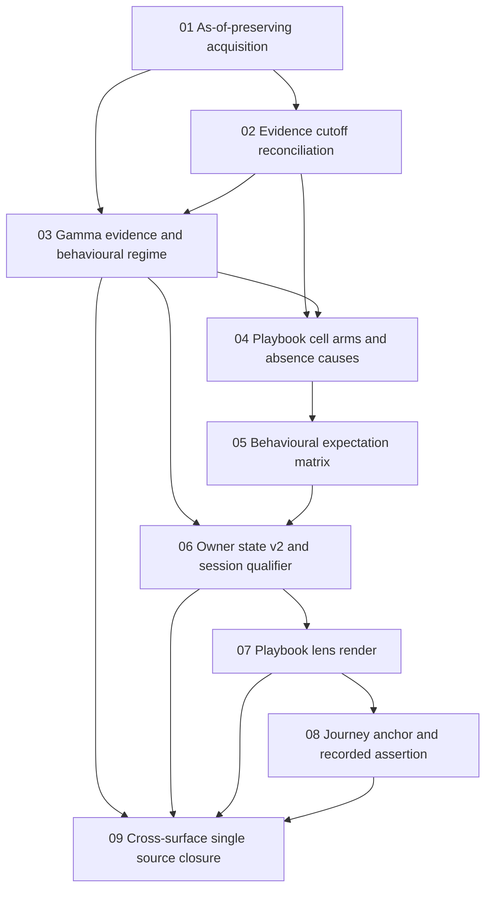

# Scope Index — Auction × Gamma Playbook

**Feature:** `specs/016-auction-gamma-playbook`
**Scope layout:** per-scope directory (`scopes/NN-name/scope.md`) — 9 scopes exceed the single-file threshold, matching `state.json` `scopeLayout: "per-scope-directory"`.
**Authority:** every path named in any scope's `## Implementation Files` table is drawn from `design.md` → `## Implementation Boundary`. No scope names a path outside that boundary, and no scope names a path from the boundary's *Consumed, never modified* table.

**Heading convention.** Each scope carries a `## Implementation Files` section containing a nested `### Implementation Files` heading with the table beneath it. The nested h3 is deliberate: `implementation-reality-scan.sh` anchors on `/^### Implementation Files$/` exactly, and terminates the section on the next `##` or `###`. A table placed directly under the h2 alone resolves zero paths and drops the scanner into filesystem-search fallback.

---

## Execution Outline

### Phase Order

1. **SCOPE-01 — As-of-preserving evidence acquisition.** Preserve `asof`, `fetched`, `refreshDate` and `refreshWindow` through acquisition and stop the cache keying snapshots by the current calendar date. This is the enabling precondition named in `design.md` § *The third structural precondition this design identifies*.
2. **SCOPE-02 — Evidence cutoff reconciliation.** Add the single evaluator of the cutoff, with a return shape structurally incapable of expressing a widened bound.
3. **SCOPE-03 — Gamma evidence and behavioural regime.** Move the duplicated Black-Scholes gamma model into the options owner module and add the C1 evidence record, the C3 regime resolver and the evidence fingerprint.
4. **SCOPE-04 — Playbook cell arms and absence causes.** Add the fusion vertex so every input combination lands on a named arm, and move the three sensitivity declarations in lockstep.
5. **SCOPE-05 — Behavioural expectation matrix, origin rule and falsifiers.** Fill the fused arm: what each auction-class × regime pairing expects, where every level may originate, and the falsifier that gates assertion.
6. **SCOPE-06 — Owner state v2 boundary and session-qualifier repair.** Widen the one page-to-module channel to carry the full record and the regime, and repair the consumer that was discarding what crossed.
7. **SCOPE-07 — Playbook lens render across Simple and Power.** Compose the eighteen primitives into containers that already exist, so a reduced read is structurally distinguishable and every approximation is labelled.
8. **SCOPE-08 — Journey anchor, recorded assertion and published tool read.** Close the three verified host absences: the missing journey anchor, the missing tool-read slot, and the absence of any durable assertion record.
9. **SCOPE-09 — Cross-surface single source and published-surface closure.** Retire every remaining duplicate gamma model across the enumerated surface set — `intraday-tape-lab.html`, `gamma-trading-lab.html` and `swing-structure-lab.html` — and align the three published descriptions of the tool.

### Foundation And Overlay Split

`design.md` separates `## Capability Foundation` (six contracts C1–C6) from the surfaces that consume them. Scopes 01–05 are the foundation and must precede the surfaces; scopes 06–08 are the consuming overlays; scope 09 is closure.

| Contract | Defined in | Produced by |
|---|---|---|
| C1 `gamma-evidence/v1` | `design.md` line 329 | SCOPE-03 (`RLOPTIONS.readGammaEvidence`), fed by SCOPE-01's preserved as-of |
| C2 `evidence-cutoff/v1` | `design.md` line 378 | SCOPE-02 (`RLMARKETSTRUCTURE.reconcileEvidenceCutoff`) |
| C3 `behavioural-regime/v1` | `design.md` line 405 | SCOPE-03 (`RLOPTIONS.resolveBehaviouralRegime`), consuming C2 |
| C4 `playbook-cell/v1` | `design.md` line 444 | SCOPE-04 (arms) and SCOPE-05 (the fused arm's content) |
| C5 `absence-cause/v1` | `design.md` line 476 | SCOPE-04 |
| C6 `playbook-assertion/v1` | `design.md` line 499 | SCOPE-08 |

### New Entry Points Introduced

| Scope | Surface | Introduced identity |
|---|---|---|
| SCOPE-02 | `rlexperience-adapters/market-structure.js` | `reconcileEvidenceCutoff(declaredAsOf, candidateAsOf, policy) -> CutoffReconciliationV1` |
| SCOPE-03 | `rlexperience-adapters/options.js` | `readGammaEvidence(chainSource, opts) -> GammaEvidenceV1`; `resolveBehaviouralRegime(gammaEvidence, cutoffRead, opts) -> BehaviouralRegimeV1`; `gammaEvidenceFingerprint(gammaEvidence) -> string` |
| SCOPE-04 | `rlexperience-adapters/market-structure.js` | `resolvePlaybookCell(auctionSummary, regimeRead, cutoffRead, opts) -> PlaybookCellV1`; `summary.playbook` on `computeSessionAuctionSummary`; the same path added to `sessionSummaryPath` and `SESSION_OUTPUT_PATHS` |
| SCOPE-06 | `intraday-tape-lab.html` | `session-auction-owner-state/v2` replacing `/v1` at line 1366, carrying the full C1 record plus a sibling `regime` field |
| SCOPE-08 | `intraday-tape-lab.html` | `<section id="journey" data-rljourney-mount>`; the `RLDATA.putToolRead("intraday-tape-lab", read)` call site writing `tool-model-read/v1`; the W4 browser-local assertion store |
| SCOPE-01 | `tests/auction-gamma-playbook.spec.mjs` | The feature's `system-chrome` live-stack spec, extended by scopes 06 through 09 |

### Validation Checkpoints

- **After SCOPE-01** — the snapshot as-of is observable on the page before any consumer depends on it. Every later honesty claim reads this field, so a preservation defect surfaces here rather than as a wrong regime three scopes later.
- **After SCOPE-02 and SCOPE-03** — both owner modules are pure and verifiable in isolation through `scripts/selftest.mjs` before any surface consumes them. A regime or cutoff defect cannot hide behind a rendered page.
- **After SCOPE-04 and SCOPE-05** — the full cell contract is assertable headlessly: arm selection, absence causes, the expectation matrix, the origin rule and the falsifier gate, all before a pixel is drawn.
- **After SCOPE-06** — the one page-to-module channel is proven end to end, and the two consumers of the retired page-local gamma model are proven to read the relocated one.
- **After SCOPE-07** — the lens renders live in both existing views, so the reduced-versus-qualified distinction is checked against a real DOM rather than against a record shape.
- **After SCOPE-08** — the four-view contract still counts four, an assertion survives the session, and the published read carries an honest status.
- **SCOPE-09** — whole-feature closure: one gamma producer repository-wide, and three published descriptions that agree.

---

## Dependency Graph

| # | Scope | Directory | Tags | Depends On | Status |
|---|---|---|---|---|---|
| 01 | As-of-preserving evidence acquisition | `scopes/01-as-of-preserving-acquisition` | `foundation:true` | — | Not Started |
| 02 | Evidence cutoff reconciliation | `scopes/02-evidence-cutoff-reconciliation` | `foundation:true` | 01 | Not Started |
| 03 | Gamma evidence and behavioural regime | `scopes/03-gamma-evidence-and-behavioural-regime` | `foundation:true` | 01, 02 | Not Started |
| 04 | Playbook cell arms and absence causes | `scopes/04-playbook-cell-arms-and-absence-causes` | `foundation:true` | 02, 03 | Not Started |
| 05 | Behavioural expectation matrix, origin rule and falsifiers | `scopes/05-behavioural-expectation-matrix` | `foundation:true` | 04 | Not Started |
| 06 | Owner state v2 boundary and session-qualifier repair | `scopes/06-owner-state-v2-and-session-qualifier` | `overlay:true` | 03, 05 | Not Started |
| 07 | Playbook lens render across Simple and Power | `scopes/07-playbook-lens-render` | `overlay:true` | 06 | Not Started |
| 08 | Journey anchor, recorded assertion and published tool read | `scopes/08-journey-anchor-and-recorded-assertion` | `overlay:true` | 07 | Not Started |
| 09 | Cross-surface single source and published-surface closure | `scopes/09-cross-surface-single-source-closure` | `closure:true` | 03, 06, 07, 08 | Not Started |

---

## Scope Table

| ID | Name | Status | Tags | Depends On | Business scenarios owned | Count |
|---|---|---|---|---|---|---|
| SCOPE-01 | As-of-preserving evidence acquisition | Not Started | `foundation:true` | — | BS-016-020, BS-016-027 | 2 |
| SCOPE-02 | Evidence cutoff reconciliation | Not Started | `foundation:true` | SCOPE-01 | BS-016-018, BS-016-019 | 2 |
| SCOPE-03 | Gamma evidence and behavioural regime | Not Started | `foundation:true` | SCOPE-01, SCOPE-02 | BS-016-013, BS-016-023, BS-016-024, BS-016-025, BS-016-026 | 5 |
| SCOPE-04 | Playbook cell arms and absence causes | Not Started | `foundation:true` | SCOPE-02, SCOPE-03 | BS-016-008, BS-016-010, BS-016-014, BS-016-015, BS-016-021, BS-016-022, BS-016-032, BS-016-033 | 8 |
| SCOPE-05 | Behavioural expectation matrix, origin rule and falsifiers | Not Started | `foundation:true` | SCOPE-04 | BS-016-001, BS-016-002, BS-016-003, BS-016-004, BS-016-005, BS-016-006, BS-016-007, BS-016-009, BS-016-011, BS-016-012 | 10 |
| SCOPE-06 | Owner state v2 boundary and session-qualifier repair | Not Started | `overlay:true` | SCOPE-03, SCOPE-05 | BS-016-017 | 1 |
| SCOPE-07 | Playbook lens render across Simple and Power | Not Started | `overlay:true` | SCOPE-06 | BS-016-016, BS-016-028, BS-016-029, BS-016-030 | 4 |
| SCOPE-08 | Journey anchor, recorded assertion and published tool read | Not Started | `overlay:true` | SCOPE-07 | BS-016-031, BS-016-034, BS-016-035 | 3 |
| SCOPE-09 | Cross-surface single source and published-surface closure | Not Started | `closure:true` | SCOPE-03, SCOPE-06, SCOPE-07, SCOPE-08 | BS-016-036 | 1 |

**Total: 36.** `spec.md` declares 36 business scenarios, BS-016-001 through BS-016-036, confirmed by `grep -cE '^### BS-016-' spec.md`. Each is owned by exactly one scope: none appears in two rows above and none is absent from all of them.

---

## Scenario Ownership Register

Ordered by scenario so single ownership is checkable by reading down one column.

| Scenario | Owning scope | Why that scope owns it |
|---|---|---|
| BS-016-001 | SCOPE-05 | Balancing × suppressive is a cell of the expectation matrix |
| BS-016-002 | SCOPE-05 | Balancing × amplifying is a cell of the expectation matrix |
| BS-016-003 | SCOPE-05 | Balancing × hinge-proximate is a cell of the expectation matrix |
| BS-016-004 | SCOPE-05 | Imbalanced × suppressive is a cell of the expectation matrix |
| BS-016-005 | SCOPE-05 | Imbalanced × amplifying is a cell of the expectation matrix |
| BS-016-006 | SCOPE-05 | Imbalanced × hinge-proximate is a cell of the expectation matrix |
| BS-016-007 | SCOPE-05 | The opposite-regime comparison is a property of the matrix assembly |
| BS-016-008 | SCOPE-04 | The `context-only` arm is selected by `resolvePlaybookCell` |
| BS-016-009 | SCOPE-05 | The `origin` versus `qualifier` role is populated during fused-arm assembly |
| BS-016-010 | SCOPE-04 | The transition from `context-only` to `fused` is arm selection |
| BS-016-011 | SCOPE-05 | The falsifier gate decides whether the fused arm asserts at all |
| BS-016-012 | SCOPE-05 | The falsifier is populated during fused-arm assembly |
| BS-016-013 | SCOPE-03 | The regime-level observation is a field on the C3 record |
| BS-016-014 | SCOPE-04 | The `reduced` arm with a named cause is arm selection |
| BS-016-015 | SCOPE-04 | No neutral value exists in the regime slot of a `reduced` arm |
| BS-016-016 | SCOPE-07 | Structural distinguishability is a property of the rendered frame |
| BS-016-017 | SCOPE-06 | Re-qualification follows from the widened v2 boundary and the identity change |
| BS-016-018 | SCOPE-02 | The stale classification is the cutoff evaluator's verdict |
| BS-016-019 | SCOPE-02 | The echoed `declaredAsOf` is what makes widening unexpressible |
| BS-016-020 | SCOPE-01 | The as-of survives parsing and the cache stops keying by calendar date |
| BS-016-021 | SCOPE-04 | Provenance carry-through is a rule of the fusion |
| BS-016-022 | SCOPE-04 | The weakest-input confidence bound is a rule of the fusion |
| BS-016-023 | SCOPE-03 | Coverage is counted in C1 and bounds confidence on the C3 record |
| BS-016-024 | SCOPE-03 | The coverage floor is evaluated by the regime resolver |
| BS-016-025 | SCOPE-03 | Hinge proximity is resolved by the regime resolver |
| BS-016-026 | SCOPE-03 | `flipLocatable: false` is a field of the C1 record shape |
| BS-016-027 | SCOPE-01 | Coverage of the published snapshot set is an acquisition fact |
| BS-016-028 | SCOPE-07 | The proxy-disclosure chip attaches to a drawn figure |
| BS-016-029 | SCOPE-07 | The value-area labelling attaches to a drawn figure |
| BS-016-030 | SCOPE-07 | The declared-window labelling attaches to a drawn figure |
| BS-016-031 | SCOPE-08 | The four-view count is settled by how the journey anchor mounts |
| BS-016-032 | SCOPE-04 | `parameter-excluded` is a C5 cause selected during arm resolution |
| BS-016-033 | SCOPE-04 | The `recoverable` flag separating exclusion from unavailability is a C5 field |
| BS-016-034 | SCOPE-08 | Recoverability and gradeability are properties of the W4 store |
| BS-016-035 | SCOPE-08 | The two outcome kinds are separate recorded values in the W4 store |
| BS-016-036 | SCOPE-09 | Agreement is claimed over the enumerated surface set — `intraday-tape-lab.html`, `gamma-trading-lab.html` and `swing-structure-lab.html` — rather than over a named pair, so every duplicate in that set is retired |

---

## Consumer Impact Sweeps

Three scopes change an existing interface and each carries a `## Consumer Impact Sweep` section enumerating the affected surfaces.

| Scope | Interface change | Sweep covers |
|---|---|---|
| SCOPE-03 | The Black-Scholes gamma model relocates into `RLOPTIONS` | Both duplicate sites, the `gammaEnv` sign precedence, the dealer-flow projection, and the no-cross-import rule |
| SCOPE-06 | `session-auction-owner-state/v1` becomes `/v2`; the page's gamma model is retired | The provider, `captureEvidence`, `ownerStateFingerprint` and `evidenceIdentity`, `sessionGammaTag`, the v1-shape degradation path, the `null` no-session return, `computeOptLevels` and `normOpt` |
| SCOPE-09 | Every remaining page-local gamma model is retired across the enumerated surface set | `gamma-trading-lab.html`'s model with its vanna/OVI/term-structure results held unchanged, the standalone definition on `intraday-tape-lab.html` that sits outside the delegation SCOPE-06 declares, `swing-structure-lab.html`'s model, the dealer-flow projection, and the three published descriptions |

---

## Paths This Feature Never Modifies

Named here so no scope reaches for one. Drawn verbatim from `design.md` §
Implementation Boundary → *Consumed, never modified*.

`rldata.js` · `rlapp.js` · `rlchart.js` · `rlticker.js` · `rlg.js` · `rlnav.js` ·
`journeys.json` · `tool-experience.config.json` ·
`scripts/validate-tool-experience.mjs` · `scripts/brief-refresh.mjs` ·
`playwright.config.mjs` · `data/options/**` and its producer · `watchlist.json` ·
`intraday-tape-universe.json`

An edit to a listed edit-target file that is not the edit described in its
boundary row is outside the boundary exactly as if the file were unlisted.
