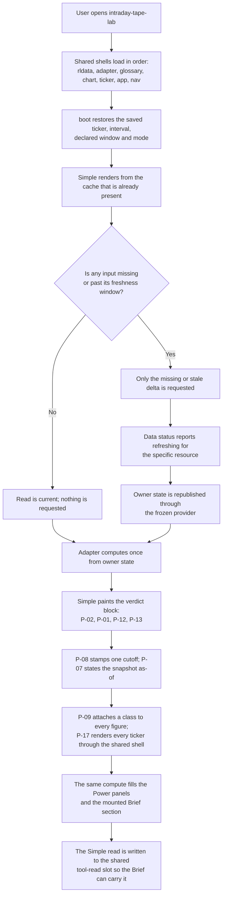
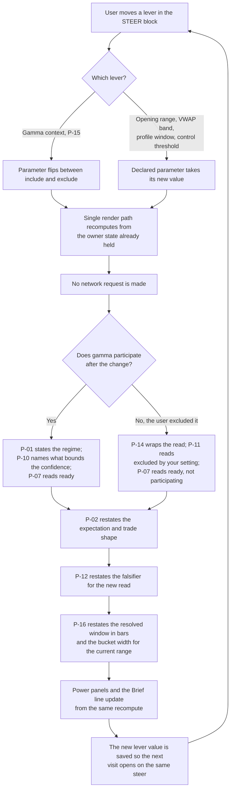
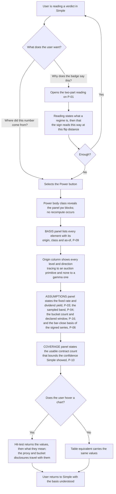
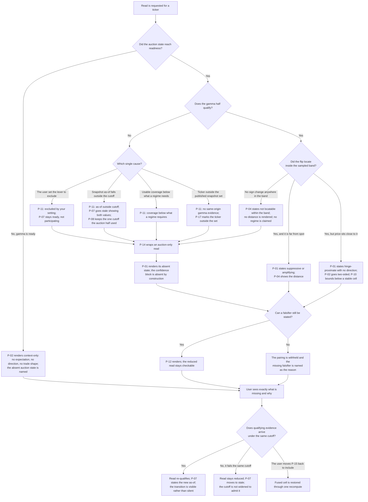
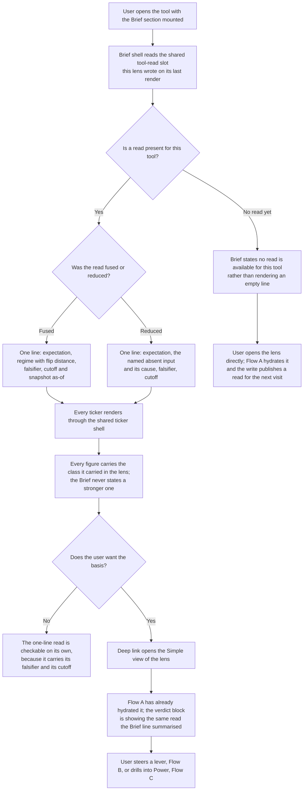

# Feature 016 — Auction × Gamma Playbook

**Status:** planning
**Workflow mode:** product-to-planning (status ceiling `specs_hardened`)
**Host surface:** lens inside the registered `intraday-tape-lab` tool
**Educational only — not investment advice.**

---

## Problem

A trader reading intraday structure today gets two half-answers from two
different places, and has to fuse them in their head under time pressure.

**Auction structure supplies levels but says nothing about behaviour.** The
session read already tells a user where value sits (point of control, the 70%
value area edges), where the early-session balance formed (the opening range),
whether the open accepted or rejected the prior session's value, and what shape
the distribution took. What it cannot tell them is the question that actually
decides the trade: *will this level hold or break?* A value-area low is a
mean-reversion buy in one regime and a liquidation trapdoor in another. The
level is identical in both. Nothing in the auction read distinguishes them, so
the same evidence supports opposite actions and the user resolves the tie with
narrative rather than evidence.

**Gamma context supplies behaviour but has no levels of its own.** A dealer
positioning read describes how flow is likely to respond to movement —
suppressive and mean-reverting when net gamma is positive, amplifying and
trend-extending when negative — but it produces no auction levels worth
trading. Knowing "we are in negative gamma" without knowing which level is
about to be tested is unactionable.

**The two are already in the same tool and still do not meet.** The host tool
computes both sides: it derives the session profile, value area, opening range
and open-versus-prior-value read from bars, and it separately derives net gamma
exposure, the call wall, the put wall, the gamma flip level, max pain and
at-the-money implied volatility from the options chain. The registered Simple
model for this tool already declares a `gamma-context` parameter whose stated
purpose is to select whether current same-cutoff gamma evidence participates.
But when gamma does participate, its entire contribution collapses to a
positional label describing which side of a wall price sits on — above the call
wall, below the put wall, between the walls, or merely "wall context."

That is the gap. **The sign of net gamma and the distance to the flip level are
computed and then discarded.** Those two quantities are precisely what carry
the behavioural expectation. The user is shown a location and denied the
regime, so the tool tells them *where* the walls are while withholding *how
price is likely to behave when it reaches them*.

**The consequence is an unfalsifiable read.** Because the two halves never
combine into a single stated expectation, there is nothing concrete to be wrong
about. A user cannot write down "I expect this value-area edge to hold because
suppressive positioning dominates, and I am wrong the moment price accepts
below the flip on expanding volume" — because the tool never asserts the first
clause, so it never has to surrender the second. Structure without regime
produces levels nobody can grade; regime without structure produces opinions
nobody can test.

**A fusion that lies would be worse than the gap.** The honest obstacle is that
no real-time dealer-positioning feed exists here. The gamma surface is a
prior-session open-interest snapshot with a stated as-of, the dealer sign is a
convention-dependent estimate rather than a measurement, the volume-at-price
distribution is reconstructed from bars rather than observed tick-by-tick, and
the buy/sell delta is an up/down-volume proxy rather than order flow. A
playbook that quietly presented any of those as live, measured, or certain
would convert four disclosed approximations into one invisible fabrication —
and would be a direct violation of the standing product rule that every
analytic is recomputed from fetched data with estimates labelled as estimates
and proxies labelled as proxies.

**So the problem is a fusion problem with an honesty constraint attached.**
Combine an auction state that supplies levels with a gamma context that
supplies behaviour, produce one expectation the user can act on and one
falsifier they can grade themselves against, and carry every approximation's
provenance and as-of visibly through the fusion instead of laundering it away.

---

## Outcome Contract

**Intent:** Fuse the session's auction state — where price is trying to do
business — with the dealer-gamma context — how price is likely to behave around
those levels — into one decision playbook that names the expected behaviour,
the trade shape that fits it, and the specific observation that would prove the
read wrong. Elevate the already-computed net-gamma sign and gamma-flip distance
from discarded intermediates into the explicit behavioural regime that
qualifies every auction level, while carrying each input's provenance,
as-of and availability visibly through the fusion.

**Success Signal:** A user reading the session sees a single stated expectation
that names both halves of its own basis — the auction state that supplied the
level and the behavioural regime that supplied the expectation — together with
the trade shape that fits and at least one concrete, observable falsifier
phrased so the user can check it themselves during the session. Every element
of that read carries its own source, provenance class and as-of. When the gamma
half is unavailable or does not share the auction half's evidence cutoff, the
user sees an explicitly auction-only read that names the missing input and the
reason, and never a neutral-looking regime standing in for an absent one. A
user who returns after the session can reconstruct exactly which expectation
was asserted, on what evidence, and whether the falsifier triggered.

**Hard Constraints:**

- **No real-time dealer-positioning feed exists.** Gamma context is derived
  from the same options surfaces already published and consumed by this
  workspace — the same-origin snapshot per ticker and the equivalent chain
  read. It is a daily snapshot qualifier, not a live intraday reading. Every
  gamma-derived element carries its snapshot as-of and its staleness state, and
  is labelled a convention-dependent estimate from prior-session open interest
  rather than measured dealer positioning.
- **The buy/sell delta is an up/down-volume proxy, not order flow.** The signed
  volume series is derived from whether each bar closed at or above its open.
  It never sees bid/ask, level-two depth, or trade-level aggression. The
  playbook may use it as corroborating evidence and must always present it as a
  proxy. Presenting it as real order flow is prohibited.
- **Value area and early-session balance are bar-derived approximations.** The
  volume-at-price distribution is reconstructed by assigning each bar's whole
  volume to a single price bucket at that bar's typical price, across a fixed
  bucket count spanning the session range. Intrabar distribution is not
  observed. The early-session balance window is an explicit declared parameter,
  not a fixed classical interval. Both are labelled approximations and their
  governing parameters remain visible.
- **Gamma is a qualifier, never a standalone trigger.** Auction structure
  supplies the setup and the level. Gamma modulates the expectation about that
  level. A gamma reading alone never produces an action, a direction, or a
  trade shape. Any playbook cell with no auction state is not a playbook cell.
- **Missing or stale gamma degrades honestly.** When gamma evidence is absent,
  unusable, or does not share the auction evidence cutoff, the playbook states
  the unavailable condition and the reason, and presents an auction-only read.
  It never substitutes a neutral regime for a missing one, never renders a
  stale value as current, and never silently widens the cutoff to make a stale
  input appear qualified.
- **Every asserted expectation carries a falsifier.** An expectation stated
  without an observable condition that would disprove it is incomplete and is
  not presented.
- **The playbook adds no top-level mode.** The host tool's mode contract is
  exactly Simple, Power, Brief and Journey. This capability is expressed inside
  those existing modes and does not introduce a fifth top-level view, a
  duplicate toggle, or a parallel tool registration.
- **The options snapshot owner is not forked.** Gamma evidence is consumed from
  the existing published snapshot and chain-read path. This capability does not
  fork, move, replace or re-derive that publication mechanism.
- **No blackbox numbers.** Every figure the playbook displays is recomputed in
  the browser from fetched evidence, is attributable to a named source with an
  as-of, and is labelled an observed fact, a user assumption, a model estimate,
  or unavailable.

**Failure Condition:** The capability has failed — even with every test passing
— if any of the following is true. A user acts on a stated expectation and
cannot say what would have proved it wrong. A gamma-derived regime is presented
without its snapshot as-of, or a stale snapshot renders as a current reading. A
missing gamma input silently produces a neutral or balanced-looking regime
indistinguishable from a measured one. The up/down-volume proxy is described,
labelled, or visually presented as order flow. A gamma reading alone yields a
direction or a trade shape with no auction state behind it. The playbook
asserts a behavioural regime that the underlying evidence — the net-gamma sign,
the flip distance, and their usable-contract coverage — does not support. Or
the fusion reads as more certain than the four disclosed approximations
underneath it, so a user trusts a reconstructed, convention-dependent,
prior-session estimate as though it were a live measurement.

---

## Domain Capability Model

### Capability

**Auction × Gamma Fusion** takes a qualified session auction state and a
qualified dealer-gamma context that share one evidence cutoff, and resolves
them into a single behavioural expectation with a trade shape and an observable
falsifier. The auction half is the sole supplier of levels and setup. The gamma
half is a qualifier that modulates the expectation about those levels and
supplies no levels or direction of its own. Where either half is unqualified,
the fusion resolves to an explicitly reduced read that names what is missing
and why.

### Cross-Cutting Semantics

Every primitive in this model carries three properties, applied uniformly.

- **As-of** — the evidence timestamp the primitive was derived from. Auction
  primitives take the observation time of the last bar in the session under
  read. Gamma primitives take the options snapshot's stated as-of, which is
  normally a prior-session close and is never the current time.
- **Provenance class** — exactly one of *observed fact*, *user assumption*,
  *model estimate*, or *unavailable*. This vocabulary is already the declared
  provenance vocabulary for this tool's Simple model and is reused unchanged.
- **Availability state** — *ready*, *partial*, *stale*, or *unavailable*. Every
  non-ready state carries a machine-readable state plus a human-readable
  reason, matching the tool's existing calibration requirement that a state is
  never reported without its reason.

**Same-cutoff rule.** Two primitives may participate in one fusion only when
their evidence cutoffs are reconcilable under the declared cutoff policy. A
gamma primitive whose snapshot as-of falls outside the auction read's cutoff is
*stale*, not *ready*, and cannot silently qualify the fusion.

### Domain Primitives

| Primitive | Definition | Lifecycle |
|---|---|---|
| `EvidenceCutoff` | The single evidence boundary a fused read is asserted against. Every participating primitive declares its as-of relative to this boundary; the fusion inherits the oldest qualifying as-of among its inputs. | declared -> binding -> exceeded -> superseded |
| `ValueAreaRead` | Where the session did business: the highest-volume price and the upper and lower edges of the price band containing the majority of the session's volume. | unavailable -> forming -> ready -> superseded by a newer session |
| `InitialBalanceRead` | The early-session balance: the high and low established during the declared opening window, and whether price currently sits inside it, above it, or below it. | unavailable -> forming (window incomplete) -> ready -> broken up / broken down |
| `OpenType` | How the session opened relative to the prior session's accepted value: above it, inside it, or below it, together with the magnitude of the gap from the prior close. | unavailable -> classified -> confirmed / repaired by a return to prior value |
| `AcceptanceRead` | Whether price is doing business at a level or merely visiting it: distribution shape, thin fast-move shelves, and extremes that printed without completion. | unavailable -> provisional -> accepted / rejected -> superseded |
| `AuctionState` | The composite structural state assembled from the four reads above plus the session-type classification: whether the session is balancing or imbalanced, and where the actionable levels sit. | unavailable -> forming -> ready -> invalidated by structural change |
| `GammaContext` | The dealer-positioning qualifier for the session: the sign and magnitude of net gamma exposure, the call-side and put-side open-interest concentrations, and the snapshot's own coverage quality. | unavailable -> snapshot-loaded -> ready -> stale -> superseded by a newer snapshot |
| `GammaFlipLevel` | The price at which the modelled net gamma profile changes sign — the hinge between the suppressive and the amplifying regime — together with price's current distance from it. | unavailable -> located -> ready -> stale -> not-locatable within the modelled range |
| `BehaviouralRegime` | The expected behavioural character around auction levels, resolved from the net-gamma sign and the flip distance: suppressive and mean-reverting, amplifying and trend-extending, or hinge-proximate and unstable. | unavailable -> resolved -> ready -> invalidated by a regime change or a superseding snapshot |
| `PlaybookCell` | One fused decision unit: an `AuctionState` combined with a `BehaviouralRegime` under one `EvidenceCutoff`, yielding a stated expectation, the trade shape that fits it, and its confidence basis. | candidate -> qualified -> asserted -> invalidated / expired |
| `FalsifierRead` | The specific observable condition that would disprove an asserted `PlaybookCell` — a level, a direction, and a confirming condition, phrased so a user can check it during the session. | required -> defined -> armed -> triggered / survived to session end |
| `ReducedRead` | The honest degraded output when the gamma half is unqualified: the auction-only expectation plus the named missing input, its availability state, and its reason. | not-applicable -> issued -> superseded when gamma qualifies | 

### Relationships

- `ValueAreaRead`, `InitialBalanceRead`, `OpenType` and `AcceptanceRead`
  compose into exactly one `AuctionState` per session under one
  `EvidenceCutoff`.
- `GammaContext` and `GammaFlipLevel` compose into exactly one
  `BehaviouralRegime`. `GammaContext` supplies the sign; `GammaFlipLevel`
  supplies the proximity that determines whether the regime is stable or
  hinge-proximate.
- One `AuctionState` combined with one `BehaviouralRegime` yields exactly one
  `PlaybookCell`. The pairing is the matrix.
- Every asserted `PlaybookCell` owns at least one `FalsifierRead`. A cell with
  no falsifier is not asserted.
- When `BehaviouralRegime` is not *ready*, the `AuctionState` yields a
  `ReducedRead` instead of a `PlaybookCell`.
- No `BehaviouralRegime` produces any output without an `AuctionState`. Gamma
  alone terminates in no read at all.

### Business Policies

Every concrete expression of this capability obeys all of the following.

1. **Auction supplies levels; gamma supplies expectation.** No level, target,
   direction or trade shape originates from a gamma primitive.
2. **A cell without a falsifier is not a cell.** Assertion requires a defined,
   observable `FalsifierRead`.
3. **Same-cutoff or reduced.** Inputs whose as-of values do not reconcile under
   the declared cutoff policy yield a `ReducedRead`, never a fused assertion.
4. **State always travels with reason.** Every *partial*, *stale* or
   *unavailable* state names the missing or disqualified input and why.
5. **Absence is never neutrality.** An unavailable regime is rendered as
   unavailable. It is never rendered as balanced, neutral, or mid-range.
6. **Approximations stay labelled through fusion.** Proxy-derived,
   bar-reconstructed, and convention-dependent inputs retain those labels in
   the fused output. Fusion never upgrades an estimate's provenance class.
7. **Confidence is bounded by the weakest input.** A fused cell's stated
   confidence cannot exceed that of its least-qualified participating
   primitive, including the coverage quality of the gamma snapshot.
8. **The regime is falsifiable in its own terms.** A stated behavioural regime
   names the observation that would indicate the regime itself has changed,
   distinct from the falsifier of the individual expectation.

### Behaviour Vocabulary

The following vocabulary is provider-neutral and describes behaviour, not any
particular computation, screen, or data source.

- **Suppressive** — movement away from concentration tends to be dampened;
  levels tend to hold; extension tends to retrace toward value.
- **Amplifying** — movement away from concentration tends to be extended;
  levels tend to break; retracement tends to be shallow.
- **Hinge-proximate** — price sits close enough to the sign-change level that
  the prevailing character is unstable and can invert on modest movement.
- **Balancing** — the auction is rotating within accepted value.
- **Imbalanced** — the auction is seeking value in one direction and has not
  yet established acceptance.
- **Acceptance** — price is doing sustained business at a level.
- **Rejection** — price visited a level and left without doing business there.

---

## Capability Inventory

Each row states what the capability needs, where the truth for it already
lives in this workspace, how that truth is classified, and the honest limit on
what it can support. No row asserts a source that does not exist.

| Capability | Source of truth | Provenance | Honest limitation |
|---|---|---|---|
| Volume-at-price distribution, point of control, value-area edges | Session computation in the shared market-structure module, consumed by the host tool | Model estimate from observed bars | Reconstructed by assigning each bar's whole volume to one bucket at that bar's typical price, across a fixed bucket count spanning the session range. Intrabar distribution is unobserved. Bucket resolution scales with session range, so a wide-range session yields coarser price granularity. Not tick or time-price-opportunity data. |
| Early-session balance high and low, and price's position relative to them | Opening-range computation in the shared market-structure module | Observed fact from bars, under a user-declared window | The window is an explicit parameter across a bounded minute range, not a fixed classical interval. Bar granularity bounds precision: the window resolves to a whole number of bars at the selected interval, so window and interval interact. |
| Open relative to prior accepted value, and gap magnitude | Open-versus-prior-value read in the host tool | Observed fact from bars | Requires a usable prior session in the shared cache. With no qualifying prior session the read is unavailable, not neutral. Prior value inherits every value-area limitation above. |
| Session-type classification and structural character | Session-type classification in the shared market-structure module | Model estimate | Threshold-based classification over adherence, net change, close location and crossing frequency. Category boundaries are conventions, not measurements. An intraday session in progress can reclassify as it develops. |
| Distribution shape and unfinished-auction marks | Profile-shape and profile-tag reads in the host tool | Model estimate | Derived from the same bucketed reconstruction, so shape inherits its resolution limits. Shape labels are heuristic conventions over bucket geometry. |
| Signed volume series used as corroborating flow evidence | Cumulative signed-volume series in the shared session computation | Model estimate, explicitly a proxy | Signed solely by whether a bar closed at or above its open. It never observes bid/ask, depth, or trade-level aggression. The host tool already discloses this as an up/down-volume proxy and not real order flow. It corroborates; it never establishes. |
| Tape control character | Control read in the shared market-structure module | Model estimate | Inferred from adherence, range, gap and crossing frequency against tuned thresholds. It infers character; it does not identify participants. |
| Net gamma exposure sign and magnitude | Options-level computation in the host tool, from the consumed chain snapshot | Model estimate, convention-dependent | Modelled from open interest and implied volatility under a fixed assumed rate and zero assumed dividend. The magnitude is scaled toward a conventional exposure-per-one-percent-move interpretation, but it is an inference from open interest under an assumed dealer sign convention, not a measurement of any dealer's book. The sign — which is what the behavioural regime depends on — is therefore convention-dependent, and the sibling gamma tool already discloses dealer-gamma sign, walls and flip as convention-dependent estimates from prior-session open interest rather than order flow. |
| Call-side and put-side open-interest concentrations | Same options-level computation | Model estimate | Selected as the largest single-strike open-interest concentration on each side of spot. Concentration is not a commitment: open interest reveals neither position age, holder side, nor hedging intent. |
| Gamma flip level and price's distance from it | Same options-level computation | Model estimate | Located as a sign change in a modelled gamma profile sampled at fixed intervals across a bounded band around spot. A flip outside that band is not locatable. The sampled resolution bounds precision, and the level inherits every assumption of the gamma model. |
| Gamma snapshot as-of, retrieval time and refresh window | Published per-ticker options snapshot fields | Observed fact | The snapshot's stated as-of is normally a prior-session close, and its retrieval occurs in a stated refresh window. It is a daily artifact. It is never a live intraday reading and must never be rendered as one. |
| Gamma snapshot coverage quality | Contract-level fields within the consumed snapshot | Observed fact | Contracts lacking usable implied volatility or open interest are excluded from the gamma model. Coverage therefore varies by ticker and expiry, and a thin usable set weakens every gamma-derived primitive built on it. Coverage must bound stated confidence. |
| Ticker availability for gamma context | Published snapshot set | Observed fact | The published snapshot set covers a bounded ticker list. A ticker outside it has no same-origin gamma evidence, and the chain read is subject to the workspace's documented reliability limits on published hosting. Absence yields a reduced read. |
| Freshness and staleness state per cached input | Shared data-layer freshness reporting | Observed fact | Reports the as-of of what is cached. It reports retrieval recency, not market currency: a freshly retrieved prior-session snapshot is recent and still not live. |
| Gamma participation switch | Declared `gamma-context` parameter of the tool's registered Simple model | Declared contract | Already declared with the stated meaning of selecting whether current same-cutoff gamma evidence participates, and already bound to the session-type output path. Its current expression reduces to a positional label relative to the open-interest concentrations; the net-gamma sign and flip distance are computed and not carried into the read. |
| Provenance vocabulary and evidence-cutoff requirement | Declared provenance policy of the tool's registered Simple model | Declared contract | The four provenance classes and the requirement that evidence cutoff be stated are already declared. This capability reuses them unchanged rather than introducing parallel vocabulary. |
| Degraded-state reporting shape | Declared calibration policy of the tool's registered Simple model | Declared contract | A state is already required to travel with its reason. This capability reuses that requirement as the honest-degradation contract. |
| Stale-input handling | Declared input requirement of the tool's registered Simple model | Declared contract | Owner evidence already carries a reject-on-stale policy. Stale evidence is rejected rather than quietly consumed, which this capability preserves. |
| Host mode structure | Declared four-view shell contract for ordinary tools | Declared contract | Exactly Simple, Power, Brief and Journey. This capability is expressed within those views and adds no fifth top-level view. |
| Determinism and compute budget | Declared performance policy of the tool's registered Simple model | Declared contract | The model is declared deterministic under a bounded per-recompute budget. The fusion must recompute within that budget without introducing nondeterminism. |

---

## Actors

| Actor | Description | Key Goals | Permission Boundary |
|---|---|---|---|
| Session Trader | Reads the developing session in real time and needs one actionable expectation with a level to act at and a condition to abandon it | Know whether the level in front of them is likely to hold or break, and know immediately when that expectation dies | Receives a research read and a falsifier only. No order routing, no position sizing, no personalized recommendation. |
| Level Planner | Prepares before the session opens, using the prior session's structure and the current gamma snapshot | Identify which levels matter, which behavioural regime is expected around each, and what would invalidate the plan | Plans against a stated snapshot as-of. Cannot treat a prior-session snapshot as a live reading. |
| Regime Skeptic | Distrusts fused reads and interrogates the basis of any stated expectation | Reconstruct which auction inputs and which gamma inputs produced a cell, verify their as-of values reconcile, and confirm no approximation was silently upgraded | May inspect and export evidence. Cannot rewrite owner facts, override a provenance class, or force a stale input to qualify. |
| Falsifier Grader | Returns after the session to grade whether asserted expectations survived | Recover exactly what was asserted, on what evidence, and whether the falsifier triggered | Reads recorded assertions. Cannot retroactively edit an assertion or its falsifier. |
| Degradation Auditor | Verifies the capability fails honestly when inputs are missing | Confirm that an absent or stale gamma half yields a named reduced read rather than a neutral-looking regime | Can force and inspect degraded states. Cannot suppress a degraded state or widen a cutoff to manufacture qualification. |
| Cross-Tool Researcher | Moves between the session read and the sibling options and gamma surfaces | Reconcile the session's gamma qualifier against the deeper options evidence without re-fetching or contradicting it | Consumes the shared snapshot. Cannot fork the snapshot owner or introduce a competing gamma derivation. |
| Research Lab Operator | Maintains the registry, published snapshots and refresh schedule | Keep gamma coverage, as-of honesty and ticker availability coherent across the tools that consume them | Publishes shared artifacts. Cannot access a user's browser-local state or parameter selections. |

---

## Use Cases

### UC-016-001: Qualify A Level Before Acting On It

- **Actor:** Session Trader
- **Preconditions:** A session auction state is ready and a gamma context has
  been consumed under a reconcilable evidence cutoff.
- **Main Flow:**
  1. The user identifies the level price is approaching from the auction read.
  2. The playbook states the behavioural regime that qualifies that level and
     names its basis — the net-gamma sign and the price's distance from the
     flip.
  3. The playbook states the expectation for that level under that regime and
     the trade shape that fits it.
  4. The playbook states the observable falsifier for the expectation.
  5. The user acts, or declines, holding a level and an abandonment condition.
- **Alternative Flows:** Price sits close to the flip, so the regime resolves
  as hinge-proximate and the stated confidence is reduced with the instability
  named. The auction state is still forming, so the level is presented without
  an asserted expectation.
- **Postconditions:** The user holds one expectation, one trade shape, and one
  condition that would end it, each traceable to its inputs.

### UC-016-002: Distinguish A Hold From A Break At Identical Structure

- **Actor:** Session Trader
- **Preconditions:** Price is testing a value-area edge, and gamma context is
  ready.
- **Main Flow:**
  1. The user observes that the structural evidence alone is ambiguous — the
     same edge supports both a rotation back into value and a breakdown out of
     it.
  2. The playbook resolves the ambiguity by naming the behavioural regime and
     stating which of the two the regime favours and why.
  3. The playbook states the falsifier that separates them — the observation
     that would confirm the opposite case.
  4. The user monitors that single falsifier rather than re-reading the whole
     structure.
- **Alternative Flows:** The regime is hinge-proximate, so neither case is
  favoured, and the playbook states that the structure is genuinely two-sided
  and names both conditions.
- **Postconditions:** The user knows which case the evidence favours, by how
  much, and exactly what would flip it.

### UC-016-003: Build A Pre-Session Level Plan

- **Actor:** Level Planner
- **Preconditions:** A prior session's auction state and a current gamma
  snapshot are available, with both as-of values stated.
- **Main Flow:**
  1. The user reviews the prior session's accepted value and its unfinished
     marks.
  2. The playbook presents the gamma snapshot's as-of and its coverage quality
     before presenting any regime derived from it.
  3. The playbook pairs each prior-session level with the behavioural regime
     expected around it and the falsifier for that pairing.
  4. The user records the plan with its stated evidence cutoff.
- **Alternative Flows:** The snapshot's as-of does not reconcile with the
  planning cutoff, so the plan is presented as auction-only with the gamma gap
  named. The ticker has no published snapshot, so no gamma half is offered.
- **Postconditions:** The user holds a level plan whose every gamma-qualified
  element is stamped with the snapshot as-of it depended on.

### UC-016-004: Interrogate A Fused Read

- **Actor:** Regime Skeptic
- **Preconditions:** A playbook cell has been asserted.
- **Main Flow:**
  1. The user opens the cell's basis.
  2. The cell enumerates each participating primitive with its source,
     provenance class, as-of and availability state.
  3. The user verifies the auction as-of and the gamma as-of reconcile under
     the declared cutoff policy.
  4. The user verifies that proxy-derived, bar-reconstructed and
     convention-dependent inputs retain those labels in the fused output, and
     that the cell's stated confidence does not exceed its weakest input.
- **Alternative Flows:** An input's provenance appears upgraded by the fusion,
  or confidence exceeds the weakest input, and the user records the
  contradiction against the cell.
- **Postconditions:** The user can reconstruct the full basis of the assertion
  and confirm no approximation was laundered.

### UC-016-005: Confirm Honest Degradation With No Gamma

- **Actor:** Degradation Auditor
- **Preconditions:** A ticker or condition exists for which gamma evidence is
  absent, unusable, or outside the evidence cutoff.
- **Main Flow:**
  1. The user requests the playbook for that condition.
  2. The playbook issues a reduced read: the auction-only expectation, the
     named missing input, its availability state, and the reason.
  3. The user confirms no behavioural regime is asserted and no neutral or
     balanced regime is displayed in place of the missing one.
  4. The user confirms the reduced read is visually and structurally
     distinguishable from a fully qualified read.
- **Alternative Flows:** Gamma evidence exists but has thin usable coverage, so
  a regime is stated with coverage-bounded confidence and the coverage
  weakness named.
- **Postconditions:** Absence is legible as absence.

### UC-016-006: Detect A Stale Snapshot Rendered As Current

- **Actor:** Degradation Auditor
- **Preconditions:** A gamma snapshot exists whose as-of falls outside the
  current evidence cutoff.
- **Main Flow:**
  1. The user requests the playbook against the stale snapshot.
  2. The playbook classifies the gamma half as stale, states the snapshot's
     as-of and the cutoff it failed, and issues a reduced read.
  3. The user confirms no regime derived from the stale snapshot is presented
     as a current reading and the cutoff was not widened to admit it.
- **Alternative Flows:** A newer snapshot supersedes the stale one during the
  session, so the read re-qualifies and states the new as-of.
- **Postconditions:** Staleness is surfaced as staleness, never resolved by
  relaxation.

### UC-016-007: Refuse A Gamma-Only Action

- **Actor:** Session Trader
- **Preconditions:** Gamma context is ready but no auction state has formed —
  for example before enough of the session has developed to establish value.
- **Main Flow:**
  1. The user requests a read.
  2. The playbook presents the gamma context as context only, with its as-of
     and provenance.
  3. The playbook asserts no expectation, no direction, and no trade shape, and
     names the missing auction state as the reason.
- **Alternative Flows:** The auction state reaches readiness during the
  session, at which point a full cell becomes available.
- **Postconditions:** The user cannot mistake a positioning reading for a
  setup.

### UC-016-008: Grade An Asserted Expectation After The Session

- **Actor:** Falsifier Grader
- **Preconditions:** One or more cells were asserted during a completed
  session.
- **Main Flow:**
  1. The user recovers what was asserted, its basis, and its falsifier.
  2. The user determines whether the falsifier triggered during the session.
  3. The user records the outcome against the assertion without altering the
     original assertion or its falsifier.
- **Alternative Flows:** The regime changed mid-session and invalidated the
  cell before its falsifier could trigger, and the grader records the
  invalidation cause distinctly from a falsified expectation.
- **Postconditions:** The read is gradeable, so the playbook accumulates a
  record of whether its expectations survived contact with the session.

### UC-016-009: Reconcile The Session Qualifier Against Deeper Options Evidence

- **Actor:** Cross-Tool Researcher
- **Preconditions:** A behavioural regime has been stated in the session read,
  and the sibling options surfaces are available.
- **Main Flow:**
  1. The user notes the regime and the snapshot as-of behind it.
  2. The user opens the deeper options evidence for the same ticker.
  3. The user confirms both surfaces derive from the same consumed snapshot and
     agree on the sign and the flip, or identifies the divergence.
- **Alternative Flows:** The surfaces disagree because they consumed snapshots
  with different as-of values, and the user identifies the cutoff difference as
  the cause rather than a modelling contradiction.
- **Postconditions:** The session qualifier and the deeper options evidence are
  reconcilable, and any divergence is attributable to a stated cutoff
  difference.

### UC-016-010: Verify Coverage Bounds The Stated Confidence

- **Actor:** Regime Skeptic
- **Preconditions:** A gamma-qualified cell exists for a ticker whose snapshot
  has limited usable contract coverage.
- **Main Flow:**
  1. The user inspects the snapshot's coverage quality.
  2. The user confirms the cell's stated confidence is bounded by that
     coverage.
  3. The user confirms the coverage limitation is named in the cell's own
     basis, not only in a general disclosure.
- **Alternative Flows:** Coverage is too thin to support any regime, so the
  gamma half is unavailable and a reduced read is issued.
- **Postconditions:** A thin-evidence regime cannot present with the confidence
  of a well-covered one.

---

## Business Scenarios

Each scenario is independently testable and asserts user-visible behaviour —
what is shown, what is refused, and how it is labelled — rather than any
internal computation. The refusal directions are as load-bearing as the happy
paths: this capability is defined as much by what it declines to assert as by
what it asserts.

Several scenarios pin concrete, already-established properties of the host
surface so the assertion is checkable rather than vague. Those properties are:
the published options snapshot set covers a bounded list of twenty-two tickers;
the gamma flip is located by sampling the modelled profile across a band
spanning ten percent either side of spot; the volume-at-price distribution is
reconstructed across a fixed count of forty-four buckets spanning the session
range; the early-session balance window is a declared parameter across a
bounded minute range rather than a fixed classical interval; the host tool's
top-level view contract is exactly Simple, Power, Brief and Journey; and the
provenance vocabulary is exactly observed fact, user assumption, model estimate
and unavailable.

### Scenario Clusters

| Cluster | Scenarios | Traces to |
|---|---|---|
| A — Playbook matrix cells | BS-016-001 … BS-016-007 | UC-016-001, UC-016-002; Policies 1, 2, 7 |
| B — Gamma alone terminates in no read | BS-016-008 … BS-016-010 | UC-016-007; Policy 1 |
| C — A cell without a falsifier is not a cell | BS-016-011 … BS-016-013 | UC-016-001, UC-016-008; Policies 2, 8 |
| D — Reduced read as first-class output | BS-016-014 … BS-016-017 | UC-016-005; Policies 4, 5 |
| E — Same-cutoff rule | BS-016-018 … BS-016-020 | UC-016-006; Policies 3, 4 |
| F — Provenance and confidence bounds | BS-016-021 … BS-016-024 | UC-016-004, UC-016-010; Policies 6, 7 |
| G — Hinge proximity refuses overstatement | BS-016-025 | UC-016-001, UC-016-002; Policy 7 |
| H — Flip not locatable | BS-016-026 | UC-016-001; Policies 4, 5 |
| I — Ticker outside the snapshot set | BS-016-027 | UC-016-003, UC-016-005; Policies 4, 5 |
| J — Approximations stay labelled | BS-016-028 … BS-016-030 | UC-016-004; Policy 6 |
| K — Four-view constraint | BS-016-031 | UC-016-001; host mode contract |
| L — Declared gamma-context parameter | BS-016-032, BS-016-033 | UC-016-005, UC-016-007; Policies 4, 5 |
| M — Grading and cross-surface reconciliation | BS-016-034 … BS-016-036 | UC-016-008, UC-016-009; Policy 8 |

---

### BS-016-001: Balancing auction under a suppressive regime expects the value-area edge to hold

```gherkin
Scenario: Price tests the lower value-area edge while net gamma is positive and the flip is distant
  Given the session auction state is ready and classified balancing
  And the behavioural regime resolves as suppressive because the modelled net gamma is positive and price sits far enough from the gamma flip that the sign is stable
  And the auction half and the gamma half share one stated evidence cutoff
  When the user reads the playbook for the lower value-area edge
  Then the read states an expectation that the edge holds and price rotates back toward the point of control
  And the read names both halves of its basis: the balancing auction state that supplied the level and the suppressive regime that supplied the expectation
  And the read states a trade shape consistent with rotation back into value
  And the read states one observable falsifier the user can check against the developing session
  And every figure in the read carries its source, its provenance class and its as-of
```

### BS-016-002: Balancing auction under an amplifying regime downgrades the rotation expectation

```gherkin
Scenario: Price tests the lower value-area edge while net gamma is negative and the flip is distant
  Given the session auction state is ready and classified balancing
  And the behavioural regime resolves as amplifying because the modelled net gamma is negative and price sits far enough from the gamma flip that the sign is stable
  And the auction half and the gamma half share one stated evidence cutoff
  When the user reads the playbook for the lower value-area edge
  Then the read states that the edge is more likely to break than to hold, despite the balancing structure
  And the read names the amplifying regime as the reason the structural rotation expectation is downgraded
  And the read states a trade shape consistent with acceptance below the edge rather than rotation back into value
  And the read states the observable condition that would restore the rotation case
```

### BS-016-003: Balancing auction near the flip asserts neither hold nor break

```gherkin
Scenario: Price tests the lower value-area edge while sitting close to the gamma flip
  Given the session auction state is ready and classified balancing
  And the behavioural regime resolves as hinge-proximate because price sits close enough to the gamma flip that modest movement would invert the modelled net-gamma sign
  When the user reads the playbook for the lower value-area edge
  Then the read states that the structure is genuinely two-sided
  And the read does not claim the edge holds and does not claim the edge breaks
  And the read names the flip proximity as the reason the behavioural character is unstable
  And the read states the observable condition on each side that would resolve the ambiguity
  And the stated confidence is lower than that of a comparable cell whose regime is stable
```

### BS-016-004: Imbalanced auction under a suppressive regime expects the extension to be dampened

```gherkin
Scenario: The session is seeking value in one direction while net gamma is positive and the flip is distant
  Given the session auction state is ready and classified imbalanced with no acceptance established
  And the behavioural regime resolves as suppressive
  When the user reads the playbook for the level the session is extending toward
  Then the read states that extension is likely to be dampened and to retrace toward value
  And the read names the suppressive regime as the reason the directional structure is qualified rather than confirmed
  And the read states a trade shape that respects the dampening rather than one that assumes continuation
  And the read states the observable condition that would confirm genuine acceptance beyond the level
```

### BS-016-005: Imbalanced auction under an amplifying regime expects continuation

```gherkin
Scenario: The session is seeking value in one direction while net gamma is negative and the flip is distant
  Given the session auction state is ready and classified imbalanced with no acceptance established
  And the behavioural regime resolves as amplifying
  When the user reads the playbook for the level the session is extending toward
  Then the read states that the level is likely to break and that retracement is likely to be shallow
  And the read names the imbalanced auction state as the supplier of the level and the direction, and the amplifying regime as the supplier of the behavioural expectation
  And the read states a trade shape consistent with continuation
  And the read states one observable falsifier that would end the continuation case
```

### BS-016-006: Imbalanced auction near the flip withholds the behavioural expectation

```gherkin
Scenario: The session is seeking value in one direction while price sits close to the gamma flip
  Given the session auction state is ready and classified imbalanced
  And the behavioural regime resolves as hinge-proximate
  When the user reads the playbook for the level the session is extending toward
  Then the read presents the auction direction and the level without asserting that the move will be dampened or extended
  And the read names the flip proximity as the reason the behavioural expectation is withheld
  And the instability is named in the cell's own basis rather than only in a general disclosure
  And the stated confidence is lower than that of a comparable cell whose regime is stable
```

### BS-016-007: Identical structure under opposite regimes yields opposite expectations

```gherkin
Scenario: The same value-area edge is read under a suppressive regime and under an amplifying regime
  Given two reads share an identical auction state, an identical level, and one stated evidence cutoff
  And the first read's behavioural regime is suppressive and the second read's behavioural regime is amplifying
  When the user compares the two reads
  Then the two reads state opposite expectations for the same level
  And each read attributes the difference to its behavioural regime rather than to any structural difference
  And each read states its own falsifier, and the two falsifiers name different observations
  And the user can act on one read while monitoring a single named condition rather than re-reading the whole structure
```

### BS-016-008: A ready gamma context with no auction state asserts nothing

```gherkin
Scenario: A gamma context is ready before the session has established an auction state
  Given the gamma context is ready and carries its snapshot as-of and its provenance class
  And no session auction state has reached readiness
  When the user requests a playbook read
  Then the gamma context is presented as context only
  And no expectation, no direction and no trade shape is asserted
  And the read names the absent auction state as the reason nothing is asserted
  And the read is distinguishable from a read in which an expectation was asserted
```

### BS-016-009: No level, target or direction originates from a gamma primitive

```gherkin
Scenario: A user traces the origin of every level in a fully qualified playbook cell
  Given a playbook cell has been asserted with both halves qualified
  When the user inspects the origin of each level, target and direction in the cell
  Then every level, target and direction traces to an auction primitive
  And no level, target or direction traces to a gamma primitive
  And every gamma primitive in the cell's basis appears only as a qualifier of the expectation
```

### BS-016-010: A forming auction state converts gamma context into an asserted cell on readiness

```gherkin
Scenario: The session develops enough structure to establish an auction state
  Given the gamma context is ready and no auction state has reached readiness
  And the read presents gamma as context only with no asserted expectation
  When the auction state reaches readiness under the same evidence cutoff
  Then a fully qualified playbook cell becomes available
  And the cell states the expectation, the trade shape and the falsifier
  And the change from a context-only read to an asserted cell is visible to the user
```

### BS-016-011: A pairing with no definable falsifier is not asserted

```gherkin
Scenario: An auction state and a behavioural regime qualify but no observable falsifier can be stated
  Given an auction state and a behavioural regime both qualify under one evidence cutoff
  And no observable condition can be stated that would disprove the resulting expectation
  When the user requests the playbook read
  Then no expectation is asserted for that pairing
  And the read names the missing falsifier as the reason the pairing was not asserted
  And the read does not present a partial expectation stripped of its falsifier
```

### BS-016-012: Every asserted cell exposes a falsifier the user can check unaided

```gherkin
Scenario: A user checks whether an asserted expectation can be graded during the session
  Given a playbook cell has been asserted
  When the user reads the cell's falsifier
  Then the falsifier names a level, a direction and a confirming condition
  And the falsifier is phrased so the user can check it against the developing session without re-deriving the model
  And the falsifier is presented alongside the expectation rather than only in a separate disclosure
```

### BS-016-013: The regime carries its own falsifier, distinct from the expectation's

```gherkin
Scenario: A user asks what would indicate the behavioural regime itself has changed
  Given a playbook cell has been asserted with a stated behavioural regime
  When the user reads the cell's basis
  Then the cell states the observation that would indicate the regime itself has changed
  And that regime-level observation is stated distinctly from the falsifier of the individual expectation
  And the user can tell which of the two a given observation would trigger
```

### BS-016-014: A missing gamma half yields a named auction-only read

```gherkin
Scenario: The gamma half is unavailable for a ticker whose auction state is ready
  Given the session auction state is ready
  And no usable gamma evidence exists for that ticker under the stated evidence cutoff
  When the user requests the playbook read
  Then the read is presented as an explicitly auction-only expectation
  And the read names the missing input, its availability state and the reason it is unavailable
  And no behavioural regime is asserted
  And the auction-only expectation still carries its own falsifier
```

### BS-016-015: An absent regime is never rendered as a neutral one

```gherkin
Scenario: A user compares an unavailable gamma half against a measured stable regime
  Given one read has no usable gamma evidence
  And a second read has usable gamma evidence that resolves to a stable regime
  When the user views both reads
  Then the first read displays the gamma half as unavailable
  And the first read does not display a balanced, neutral or mid-range regime in place of the missing one
  And the two reads are distinguishable without the user inspecting their underlying evidence
```

### BS-016-016: A reduced read is structurally distinguishable from a qualified cell

```gherkin
Scenario: A user scans a set of reads containing both fully qualified cells and reduced reads
  Given some reads have both halves qualified and others have an unqualified gamma half
  When the user scans the set
  Then each reduced read is visually and structurally distinguishable from each fully qualified cell
  And no reduced read presents with the confidence presentation of a fully qualified cell
  And each reduced read states its auction-only expectation, the named missing input and that input's reason
```

### BS-016-017: A reduced read re-qualifies when usable gamma evidence arrives

```gherkin
Scenario: Usable gamma evidence becomes available for a read that was auction-only
  Given a reduced read is showing with a named missing gamma input
  When usable gamma evidence becomes available under the same evidence cutoff
  Then the read re-qualifies into a fully asserted playbook cell
  And the cell states the newly available snapshot's as-of
  And the reduced read no longer presents as the current read
```

### BS-016-018: A cutoff mismatch reduces the read instead of silently fusing

```gherkin
Scenario: The gamma snapshot's as-of does not reconcile with the auction read's evidence cutoff
  Given the session auction state is ready under a stated evidence cutoff
  And the gamma snapshot's stated as-of falls outside that cutoff
  When the user requests the playbook read
  Then the gamma half is classified stale rather than ready
  And the read states the snapshot's as-of and the cutoff it failed
  And an auction-only reduced read is issued instead of a fused assertion
  And no behavioural regime derived from the stale snapshot is asserted
```

### BS-016-019: The declared cutoff is never widened to admit a stale input

```gherkin
Scenario: A user checks whether a stale gamma input was admitted by relaxing the cutoff
  Given a gamma snapshot's as-of falls outside the stated evidence cutoff
  When the user inspects the read and its declared cutoff
  Then the declared cutoff shown is the same one the auction half was asserted against
  And the stale gamma input is excluded rather than admitted
  And the read presents staleness as staleness rather than resolving it by relaxation
```

### BS-016-020: A prior-session snapshot never renders as a current reading

```gherkin
Scenario: A user views a gamma-derived element sourced from a prior-session snapshot
  Given the gamma evidence is a prior-session open-interest snapshot with a stated as-of
  When the user views any gamma-derived element in the read
  Then the element displays its snapshot as-of
  And the element is labelled a convention-dependent estimate from prior-session open interest rather than measured dealer positioning
  And no gamma-derived element is displayed as a live intraday reading
```

### BS-016-021: Fusion never upgrades an input's provenance class

```gherkin
Scenario: A user traces each approximation through a fused playbook cell
  Given a playbook cell fuses a bar-reconstructed auction input, an up/down-volume proxy input and a convention-dependent gamma input
  When the user inspects the cell's basis
  Then each participating primitive retains the provenance class it carried before the fusion
  And the bar-reconstructed input remains labelled a model estimate
  And the up/down-volume input remains labelled a proxy
  And the gamma input remains labelled a convention-dependent estimate
  And the fused cell carries no provenance class stronger than that of any of its inputs
```

### BS-016-022: Stated confidence cannot exceed the weakest participating input

```gherkin
Scenario: A user compares a cell's stated confidence against its least-qualified primitive
  Given a playbook cell enumerates each participating primitive with its provenance class and availability state
  When the user identifies the least-qualified participating primitive
  Then the cell's stated confidence does not exceed the confidence that primitive supports
  And the cell names which primitive bounds its confidence
```

### BS-016-023: Thin snapshot coverage bounds confidence and is named in the cell's own basis

```gherkin
Scenario: A gamma snapshot has few contracts carrying usable implied volatility and open interest
  Given a behavioural regime is derived from a snapshot whose usable contract coverage is thin
  When the user reads the resulting playbook cell
  Then the cell's stated confidence is bounded by that coverage quality
  And the coverage limitation is named in the cell's own basis rather than only in a general disclosure
  And the cell does not present with the confidence of a comparable well-covered cell
```

### BS-016-024: Coverage too thin to support any regime yields a reduced read

```gherkin
Scenario: A gamma snapshot has too few usable contracts to support a behavioural regime
  Given the usable contract coverage falls below what a behavioural regime requires
  When the user requests the playbook read
  Then the gamma half is presented as unavailable with coverage named as the reason
  And no behavioural regime is asserted
  And an auction-only reduced read is issued
```

### BS-016-025: Hinge proximity refuses a suppressive or amplifying claim

```gherkin
Scenario: Price sits close enough to the gamma flip that the modelled sign is unstable
  Given the modelled net-gamma sign would read as one regime at the current price
  And price sits close enough to the gamma flip that modest movement would invert that sign
  When the user reads the behavioural regime
  Then the regime is presented as hinge-proximate
  And the read does not present the regime as suppressive and does not present it as amplifying
  And the read names the flip distance that makes the sign unstable
  And any expectation stated under this regime is presented as two-sided rather than directional
```

### BS-016-026: A flip outside the sampled band is stated as not locatable

```gherkin
Scenario: The modelled net-gamma profile changes sign outside the band sampled around spot
  Given the gamma flip is located by sampling the modelled profile across a band spanning ten percent either side of spot
  And no sign change occurs within that band
  When the user reads the gamma flip element
  Then the flip is presented as not locatable within the modelled band
  And the read states that the search was bounded to that band rather than implying no flip exists
  And no flip distance is presented
  And no behavioural regime is claimed on the basis of a flip distance
```

### BS-016-027: A ticker outside the published snapshot set has no same-origin gamma evidence

```gherkin
Scenario: The user reads a ticker the published options snapshot set does not cover
  Given the published options snapshot set covers a bounded list of twenty-two tickers
  And the requested ticker is not in that list
  When the user requests the playbook read
  Then the read states that no same-origin gamma evidence exists for that ticker
  And the missing input and the reason are named
  And an auction-only reduced read is issued rather than a regime derived from a substituted source
  And no behavioural regime is asserted
```

### BS-016-028: The signed-volume series is never presented as order flow

```gherkin
Scenario: A user reads the corroborating flow evidence inside a playbook cell
  Given the cell cites a signed volume series derived solely from whether each bar closed at or above its open
  When the user reads that evidence
  Then it is labelled an up/down-volume proxy
  And it is stated as not being bid/ask, depth or trade-level aggression data
  And it appears as corroborating evidence only, never as the sole basis of an asserted expectation
  And it is not described or visually presented as real order flow
```

### BS-016-029: The value area is labelled a bar-derived bucket approximation

```gherkin
Scenario: A user inspects how the value-area edges in a cell were derived
  Given the volume-at-price distribution is reconstructed by assigning each bar's whole volume to a single price bucket at that bar's typical price, across a fixed count of forty-four buckets spanning the session range
  When the user inspects the value-area element
  Then the element is labelled a model estimate reconstructed from bars
  And the element states that intrabar distribution is not observed
  And the element states that bucket resolution scales with the session range, so a wider-range session yields coarser price granularity
  And the element is not presented as tick or time-price-opportunity data
```

### BS-016-030: The early-session balance is labelled a declared window, not a classical interval

```gherkin
Scenario: A user inspects the early-session balance used by a playbook cell
  Given the early-session balance window is a declared parameter across a bounded minute range rather than a fixed classical interval
  When the user inspects the early-session balance element
  Then the element states the window value it was computed against
  And the element states that the window is a declared parameter and not the classical initial-balance interval
  And the element states that the window resolves to a whole number of bars at the selected interval, so window and interval interact
  And changing the declared window changes the element and that change is visible in the read
```

### BS-016-031: The playbook adds no fifth top-level view

```gherkin
Scenario: A user moves through the host tool's top-level views with the playbook present
  Given the host tool's top-level view contract is exactly Simple, Power, Brief and Journey
  When the user moves through those four views
  Then the playbook is expressed inside those existing views
  And no fifth top-level view, duplicate top-level toggle or parallel tool entry is presented
  And the playbook's expression in each view suits that view's purpose rather than repeating one view's content verbatim
```

### BS-016-032: Excluding gamma context yields a labelled auction-only read

```gherkin
Scenario: The user selects the declared parameter value that excludes gamma context
  Given usable gamma evidence exists under the stated evidence cutoff
  And the user selects the parameter value that excludes gamma context from participating
  When the user reads the playbook
  Then the read presents an auction-only expectation
  And the read states that gamma context was excluded by the user's own parameter selection
  And no behavioural regime is asserted
  And the auction-only expectation still carries its own falsifier
```

### BS-016-033: An excluded gamma half is distinguishable from an unavailable one

```gherkin
Scenario: A user compares a parameter-excluded gamma half against an unavailable one
  Given one read excluded gamma context by the user's parameter selection
  And a second read has no usable gamma evidence
  When the user views both reads
  Then the first read attributes the absence to the user's parameter selection
  And the second read attributes the absence to the missing or disqualified evidence and names it
  And the two reads are distinguishable from each other
  And selecting the parameter value that includes gamma context restores a fused cell for the first read
```

### BS-016-034: An asserted expectation is recoverable and gradeable after the session

```gherkin
Scenario: A user returns after a completed session to grade what the playbook asserted
  Given one or more playbook cells were asserted during the session
  When the user recovers the record of those assertions
  Then each recovered assertion states what was expected, the evidence cutoff it was asserted against and its falsifier
  And the user can determine whether each falsifier triggered during the session
  And recording the outcome does not alter the original assertion or its falsifier
```

### BS-016-035: A regime-change invalidation is recorded distinctly from a falsified expectation

```gherkin
Scenario: The behavioural regime changes mid-session before an expectation's falsifier could trigger
  Given a playbook cell was asserted under a stated behavioural regime
  And the regime changed mid-session and invalidated the cell
  When the user grades that cell after the session
  Then the record shows the cell as invalidated by a regime change
  And that outcome is distinguishable from an expectation whose falsifier triggered
  And the record names the observation that indicated the regime had changed
```

### BS-016-036: The session qualifier reconciles with the deeper options evidence

```gherkin
Scenario: A user compares the session read's behavioural regime against the deeper options surfaces for the same ticker
  Given a behavioural regime is stated in the session read with its snapshot as-of
  When the user opens the deeper options evidence for the same ticker
  Then both surfaces state the snapshot as-of they consumed
  And where both consumed the same snapshot they agree on the net-gamma sign and on the flip
  And where they consumed snapshots with different as-of values the divergence is attributable to that stated cutoff difference rather than presented as a modelling contradiction
  And neither surface re-derives the gamma evidence independently of the consumed snapshot
```

---

## Requirements

Every requirement below is stated in user-visible, provider-neutral terms —
what the capability must do, not how any screen, module or computation
achieves it — and every one traces to at least one business scenario or use
case already stated above. No requirement introduces capability that no
scenario asserts.

### Functional Requirements

#### Regime resolution

**FR-016-001:** The behavioural regime shall be resolved from the sign of the
modelled net gamma exposure together with price's distance from the gamma flip
level. A regime shall not be resolved from price's position relative to the
call-side and put-side open-interest concentrations alone.
— *Traces to:* BS-016-001, BS-016-002, BS-016-025; UC-016-001.

**FR-016-002:** A resolved regime shall take exactly one of three values —
suppressive, amplifying, or hinge-proximate. No fourth value and no unlabelled
intermediate shall be presented.
— *Traces to:* BS-016-001, BS-016-002, BS-016-003, BS-016-025; UC-016-001.

**FR-016-003:** A fused playbook cell shall combine exactly one ready auction
state with exactly one ready behavioural regime under one stated evidence
cutoff, and shall yield a stated expectation, the trade shape that fits it, a
confidence basis, and a falsifier.
— *Traces to:* BS-016-001, BS-016-005, BS-016-010; UC-016-001.

**FR-016-004:** Every asserted cell shall name both halves of its own basis:
the auction state that supplied the level and the behavioural regime that
supplied the expectation.
— *Traces to:* BS-016-001, BS-016-005, BS-016-007; UC-016-004.

#### The playbook matrix

**FR-016-005:** A balancing auction state under a suppressive regime shall
state an expectation that the tested value-area edge holds and that price
rotates back toward the highest-volume price, together with a trade shape
consistent with rotation back into value.
— *Traces to:* BS-016-001; UC-016-001.

**FR-016-006:** A balancing auction state under an amplifying regime shall
state that the tested edge is more likely to break than to hold despite the
balancing structure, shall name the amplifying regime as the reason the
structural rotation expectation is downgraded, shall state a trade shape
consistent with acceptance beyond the edge, and shall state the observable
condition that would restore the rotation case.
— *Traces to:* BS-016-002; UC-016-002.

**FR-016-007:** An imbalanced auction state under a suppressive regime shall
state that extension is likely to be dampened and to retrace toward value,
shall name the suppressive regime as the reason the directional structure is
qualified rather than confirmed, shall state a trade shape that respects the
dampening rather than one assuming continuation, and shall state the observable
condition that would confirm genuine acceptance beyond the level.
— *Traces to:* BS-016-004; UC-016-001.

**FR-016-008:** An imbalanced auction state under an amplifying regime shall
state that the level is likely to break and that retracement is likely to be
shallow, shall attribute the level and the direction to the auction state and
the behavioural expectation to the regime, shall state a trade shape consistent
with continuation, and shall state one observable falsifier that would end the
continuation case.
— *Traces to:* BS-016-005; UC-016-001.

**FR-016-009:** Two reads sharing an identical auction state, an identical
level and one stated evidence cutoff, differing only in behavioural regime,
shall state opposite expectations, shall each attribute the difference to the
regime rather than to any structural difference, and shall each state its own
falsifier naming a different observation.
— *Traces to:* BS-016-007; UC-016-002.

**FR-016-010:** A hinge-proximate regime shall present the structure as
genuinely two-sided: the read shall claim neither that the level holds nor that
it breaks, shall name the flip proximity as the reason the behavioural
character is unstable, shall state the observable condition on each side that
would resolve the ambiguity, and shall state a confidence lower than that of a
comparable cell whose regime is stable.
— *Traces to:* BS-016-003, BS-016-006, BS-016-025; UC-016-001, UC-016-002.

#### Gamma is a qualifier, never a trigger

**FR-016-011:** A ready gamma context with no ready auction state shall be
presented as context only. No expectation, no direction and no trade shape
shall be asserted, the absent auction state shall be named as the reason, and
the result shall be distinguishable from a read in which an expectation was
asserted.
— *Traces to:* BS-016-008; UC-016-007.

**FR-016-012:** Every level, target and direction in an asserted cell shall
originate from an auction primitive. No level, target or direction shall
originate from a gamma primitive, and every gamma primitive in a cell's basis
shall appear only as a qualifier of the expectation.
— *Traces to:* BS-016-009; UC-016-007.

**FR-016-013:** When a forming auction state reaches readiness under the same
evidence cutoff as a ready gamma context, the context-only read shall become a
fully qualified cell stating the expectation, the trade shape and the
falsifier, and the change from context-only to asserted shall be visible to the
user.
— *Traces to:* BS-016-010; UC-016-007.

#### Falsifiability

**FR-016-014:** A pairing for which no observable falsifier can be stated shall
not be asserted. The read shall name the missing falsifier as the reason the
pairing was not asserted, and shall not present a partial expectation stripped
of its falsifier.
— *Traces to:* BS-016-011; UC-016-001.

**FR-016-015:** Every asserted cell's falsifier shall name a level, a direction
and a confirming condition, shall be phrased so the user can check it against
the developing session without re-deriving the model, and shall be presented
alongside the expectation rather than only in a separate disclosure.
— *Traces to:* BS-016-012; UC-016-001, UC-016-008.

**FR-016-016:** Every asserted cell shall state the observation that would
indicate the behavioural regime itself has changed, stated distinctly from the
falsifier of the individual expectation, such that the user can tell which of
the two a given observation would trigger.
— *Traces to:* BS-016-013; UC-016-008.

#### Reduced read as a first-class output

**FR-016-017:** When the gamma half is not ready, the read shall be an
explicitly auction-only reduced read that names the missing input, its
availability state and the reason it is not ready, asserts no behavioural
regime, and still carries its own falsifier.
— *Traces to:* BS-016-014, BS-016-024, BS-016-027; UC-016-005.

**FR-016-018:** An unavailable regime shall be rendered as unavailable. It
shall never be rendered as balanced, neutral or mid-range, and a read with an
unavailable gamma half shall be distinguishable from a read with a measured
stable regime without the user inspecting the underlying evidence.
— *Traces to:* BS-016-015; UC-016-005.

**FR-016-019:** A reduced read shall be visually and structurally
distinguishable from a fully qualified cell, shall not present with the
confidence presentation of a fully qualified cell, and shall state its
auction-only expectation together with the named missing input and that input's
reason.
— *Traces to:* BS-016-016; UC-016-005.

**FR-016-020:** A reduced read shall re-qualify into a fully asserted cell when
usable gamma evidence becomes available under the same evidence cutoff. The
re-qualified cell shall state the newly available snapshot's as-of, and the
reduced read shall no longer present as the current read.
— *Traces to:* BS-016-017; UC-016-006.

#### The same-cutoff rule

**FR-016-021:** Gamma evidence whose stated as-of falls outside the auction
read's declared evidence cutoff shall be classified stale rather than ready.
The read shall state the snapshot's as-of and the cutoff it failed, shall issue
an auction-only reduced read instead of a fused assertion, and shall assert no
behavioural regime derived from the stale snapshot.
— *Traces to:* BS-016-018; UC-016-006.

**FR-016-022:** The declared evidence cutoff shown to the user shall be the
same one the auction half was asserted against. The cutoff shall never be
widened to admit a stale input; a stale gamma input shall be excluded and
staleness shall be presented as staleness rather than resolved by relaxation.
— *Traces to:* BS-016-019; UC-016-006.

**FR-016-023:** Every gamma-derived element shall display its snapshot as-of
and shall be labelled a convention-dependent estimate derived from
prior-session open interest rather than measured dealer positioning. No
gamma-derived element shall be displayed as a live intraday reading.
— *Traces to:* BS-016-020; UC-016-003, UC-016-006.

#### Provenance and confidence bounds

**FR-016-024:** Each participating primitive shall retain through fusion the
provenance class it carried before fusion, drawn from exactly the four declared
classes — observed fact, user assumption, model estimate, unavailable. A
bar-reconstructed input shall remain labelled a model estimate, an
up/down-volume input shall remain labelled a proxy, a convention-dependent
gamma input shall remain labelled a convention-dependent estimate, and the
fused cell shall carry no provenance class stronger than that of any of its
inputs.
— *Traces to:* BS-016-021; UC-016-004.

**FR-016-025:** A cell's stated confidence shall not exceed the confidence
supported by its least-qualified participating primitive, and the cell shall
name which primitive bounds its confidence.
— *Traces to:* BS-016-022; UC-016-004, UC-016-010.

**FR-016-026:** Where the gamma snapshot's usable contract coverage is thin,
the resulting cell's stated confidence shall be bounded by that coverage
quality, the coverage limitation shall be named in the cell's own basis rather
than only in a general disclosure, and the cell shall not present with the
confidence of a comparable well-covered cell.
— *Traces to:* BS-016-023; UC-016-010.

**FR-016-027:** Where usable contract coverage falls below what a behavioural
regime requires, the gamma half shall be presented as unavailable with coverage
named as the reason, no behavioural regime shall be asserted, and an
auction-only reduced read shall be issued.
— *Traces to:* BS-016-024; UC-016-010.

#### Bounded locatability and bounded universe

**FR-016-028:** The gamma flip shall be located by sampling the modelled
profile across a band spanning ten percent either side of spot. Where no sign
change occurs within that band, the flip shall be presented as not locatable
within the modelled band, the read shall state that the search was bounded to
that band rather than implying no flip exists, no flip distance shall be
presented, and no behavioural regime shall be claimed on the basis of a flip
distance.
— *Traces to:* BS-016-026; UC-016-001.

**FR-016-029:** For a ticker the published options snapshot set does not cover
— that set covering a bounded list of twenty-two tickers — the read shall state
that no same-origin gamma evidence exists for that ticker, shall name the
missing input and the reason, shall issue an auction-only reduced read rather
than a regime derived from a substituted source, and shall assert no
behavioural regime.
— *Traces to:* BS-016-027; UC-016-003, UC-016-005.

#### Approximations stay labelled through fusion

**FR-016-030:** The signed volume series shall be labelled an up/down-volume
proxy derived solely from whether each bar closed at or above its open, shall
be stated as not being bid/ask, depth or trade-level aggression data, shall
appear as corroborating evidence only and never as the sole basis of an
asserted expectation, and shall not be described or visually presented as real
order flow.
— *Traces to:* BS-016-028; UC-016-004.

**FR-016-031:** The value-area element shall be labelled a model estimate
reconstructed from bars by assigning each bar's whole volume to a single price
bucket at that bar's typical price across a fixed count of forty-four buckets
spanning the session range, shall state that intrabar distribution is not
observed, shall state that bucket resolution scales with the session range so a
wider-range session yields coarser price granularity, and shall not be
presented as tick or time-price-opportunity data.
— *Traces to:* BS-016-029; UC-016-004.

**FR-016-032:** The early-session balance element shall state the declared
window value it was computed against, shall state that the window is a declared
parameter across a bounded minute range and not the classical initial-balance
interval, shall state that the window resolves to a whole number of bars at the
selected interval so window and interval interact, and shall reflect a change
to the declared window visibly in the read.
— *Traces to:* BS-016-030; UC-016-004.

**FR-016-033:** Every gamma-derived element shall disclose that the gamma model
is evaluated under a fixed assumed risk-free rate of 0.045 and an assumed
dividend yield of zero, so that the convention-dependence the element is
labelled with is inspectable rather than merely asserted.
— *Traces to:* BS-016-020, BS-016-021; UC-016-004.

#### Host surface constraints

**FR-016-034:** The capability shall be expressed inside the host tool's
existing top-level view contract of exactly Simple, Power, Brief and Journey.
No fifth top-level view, duplicate top-level toggle or parallel tool entry
shall be presented, and the expression in each view shall suit that view's
purpose rather than repeat another view's content verbatim.
— *Traces to:* BS-016-031; UC-016-001.

**FR-016-035:** Selecting the declared gamma-participation parameter value that
excludes gamma context shall yield an auction-only read that states the
exclusion was the user's own parameter selection, asserts no behavioural
regime, and still carries its own falsifier. The parameter's declared default
is the including value, so gamma context participates unless the user selects
otherwise.
— *Traces to:* BS-016-032; UC-016-005.

**FR-016-036:** A gamma half excluded by the user's parameter selection shall
be distinguishable from a gamma half that is unavailable: the first shall
attribute the absence to the parameter selection and the second shall attribute
it to the missing or disqualified evidence and name it. Selecting the value
that includes gamma context shall restore a fused cell where evidence qualifies.
— *Traces to:* BS-016-033; UC-016-005.

#### Grading and cross-surface reconciliation

**FR-016-037:** Each asserted cell shall be recoverable after the session,
stating what was expected, the evidence cutoff it was asserted against and its
falsifier. The user shall be able to determine whether that falsifier triggered
during the session, and recording an outcome shall not alter the original
assertion or its falsifier.
— *Traces to:* BS-016-034; UC-016-008.

**FR-016-038:** A cell invalidated by a regime change before its falsifier
could trigger shall be recorded as invalidated by a regime change,
distinguishable from a cell whose falsifier triggered, and the record shall
name the observation that indicated the regime had changed.
— *Traces to:* BS-016-035; UC-016-008.

**FR-016-039:** The session read's behavioural regime and the deeper options
evidence for the same ticker shall each state the snapshot as-of they consumed.
Where both consumed the same snapshot they shall agree on the net-gamma sign
and on the flip; where they consumed snapshots with different as-of values the
divergence shall be attributable to that stated cutoff difference rather than
presented as a modelling contradiction; and neither shall re-derive the gamma
evidence independently of the consumed snapshot.
— *Traces to:* BS-016-036; UC-016-009.

**FR-016-040:** For pre-session planning the read shall present the gamma
snapshot's as-of and its coverage quality before presenting any regime derived
from it, shall pair each prior-session level with the behavioural regime
expected around it and the falsifier for that pairing, and shall record the
plan with its stated evidence cutoff.
— *Traces to:* BS-016-023, BS-016-027; UC-016-003.

### Non-Functional Requirements

**NFR-016-001:** The fusion shall be deterministic: identical inputs under one
stated evidence cutoff shall produce an identical read, so that two reads that
differ can be attributed to a difference in evidence rather than to
nondeterminism.
— *Traces to:* BS-016-007; UC-016-004.

**NFR-016-002:** The fusion shall recompute within the host model's declared
per-recompute budget, so that a user reading a developing session receives the
qualified expectation while it is still actionable.
— *Traces to:* BS-016-010, BS-016-017; UC-016-001.

**NFR-016-003:** Every figure the playbook displays shall be recomputed from
fetched evidence and attributable to a named source with an as-of. No displayed
figure shall be unattributed.
— *Traces to:* BS-016-001, BS-016-020; UC-016-004.

**NFR-016-004:** The provenance vocabulary shall be exactly the four declared
classes — observed fact, user assumption, model estimate, unavailable. No
parallel or extended provenance vocabulary shall be introduced.
— *Traces to:* BS-016-021; UC-016-004.

**NFR-016-005:** Every partial, stale or unavailable state shall carry both a
machine-readable state and a human-readable reason. A state shall never be
reported without its reason.
— *Traces to:* BS-016-014, BS-016-016, BS-016-018, BS-016-024; UC-016-005.

**NFR-016-006:** Gamma evidence shall be consumed from the existing published
snapshot and chain-read path. The capability shall not fork, move, replace or
independently re-derive that publication mechanism, and shall introduce no
competing gamma derivation.
— *Traces to:* BS-016-036; UC-016-009.

**NFR-016-007:** Each falsifier shall be legible to the user unaided: it shall
be phrased in observable session terms the user can check during the session
without re-deriving the model or opening a separate surface.
— *Traces to:* BS-016-012; UC-016-001, UC-016-008.

**NFR-016-008:** Degradation shall be legible at a glance: a reduced read and a
fully qualified cell shall be distinguishable without the user opening either
read's basis or inspecting its underlying evidence.
— *Traces to:* BS-016-015, BS-016-016; UC-016-005.

**NFR-016-009:** The playbook shall present research output only — an
expectation, a trade shape and a falsifier. It shall present no order routing,
no position sizing and no personalized recommendation.
— *Traces to:* UC-016-001, UC-016-002; Actors (Session Trader permission
boundary).

**NFR-016-010:** A recorded assertion and its falsifier shall be immutable once
asserted. Grading an outcome shall append the outcome without editing the
original assertion, its basis or its falsifier.
— *Traces to:* BS-016-034, BS-016-035; UC-016-008.

**NFR-016-011:** Stated confidence shall be monotonic in coverage quality: for
two otherwise-comparable cells, the one derived from the thinner usable
contract coverage shall never state the higher confidence.
— *Traces to:* BS-016-022, BS-016-023; UC-016-010.

---

## Acceptance Criteria

Each criterion below is checkable by observation of the read alone: a reader
can determine pass or fail without exercising judgement about intent. The
refusal criteria are stated as explicitly as the assertion criteria, because
this capability is defined as much by what it declines to assert.

### Regime resolution and the matrix

**AC-016-001:** With the auction half ready and the gamma half ready under one
cutoff, changing only the sign of the modelled net gamma exposure — holding the
auction state, the level and the flip distance fixed — changes the stated
regime between suppressive and amplifying. The regime is not identical across
the two cases.
— *Verifies:* FR-016-001. *Traces to:* BS-016-001, BS-016-002.

**AC-016-002:** Across every read the capability produces, the stated regime
value belongs to the set {suppressive, amplifying, hinge-proximate} or the
regime is stated as unavailable. The count of reads carrying any other regime
value is zero.
— *Verifies:* FR-016-002, FR-016-018. *Traces to:* BS-016-001, BS-016-003, BS-016-015, BS-016-025.

**AC-016-003:** Every asserted cell contains all four of an expectation, a
trade shape, a confidence basis and a falsifier. The count of asserted cells
missing any one of the four is zero.
— *Verifies:* FR-016-003, FR-016-014. *Traces to:* BS-016-001, BS-016-011.

**AC-016-004:** Every asserted cell's basis names the auction state that
supplied the level and names the regime that supplied the expectation. The
count of asserted cells naming only one half is zero.
— *Verifies:* FR-016-004. *Traces to:* BS-016-001, BS-016-005, BS-016-007.

**AC-016-005:** Given a balancing auction state and a suppressive regime, the
read states that the tested value-area edge holds and price rotates toward the
highest-volume price, and the stated trade shape is a rotation-back-into-value
shape rather than a breakout shape.
— *Verifies:* FR-016-005. *Traces to:* BS-016-001.

**AC-016-006:** Given a balancing auction state and an amplifying regime, the
read states the edge is more likely to break than hold, names the amplifying
regime as the reason the rotation expectation is downgraded, states an
acceptance-beyond-the-edge trade shape, and states the observable condition
that would restore the rotation case.
— *Verifies:* FR-016-006. *Traces to:* BS-016-002.

**AC-016-007:** Given an imbalanced auction state and a suppressive regime, the
read states that extension is likely to be dampened and to retrace toward
value, names the suppressive regime as the qualifying reason, states a trade
shape that respects the dampening, and states the observable condition that
would confirm genuine acceptance beyond the level.
— *Verifies:* FR-016-007. *Traces to:* BS-016-004.

**AC-016-008:** Given an imbalanced auction state and an amplifying regime, the
read states the level is likely to break with shallow retracement, attributes
the level and direction to the auction state and the behavioural expectation to
the regime, states a continuation trade shape, and states one falsifier that
would end the continuation case.
— *Verifies:* FR-016-008. *Traces to:* BS-016-005.

**AC-016-009:** Two reads built on an identical auction state, an identical
level and one cutoff, differing only in regime, state opposite expectations;
each names its regime as the source of the difference; and the two falsifiers
name different observations. The count of shared falsifier observations between
the two is zero.
— *Verifies:* FR-016-009. *Traces to:* BS-016-007.

### Refusals — hinge proximity

**AC-016-010:** Under a hinge-proximate regime the read contains zero claims
that the level holds and zero claims that the level breaks, names the flip
proximity as the reason the character is unstable, and states one resolving
condition on each side.
— *Verifies:* FR-016-010. *Traces to:* BS-016-003, BS-016-006, BS-016-025.

**AC-016-011:** A hinge-proximate cell's stated confidence is strictly lower
than that of an otherwise-identical cell whose regime is stable, and the
instability is named in the hinge-proximate cell's own basis rather than only
in a general disclosure.
— *Verifies:* FR-016-010, FR-016-025. *Traces to:* BS-016-003, BS-016-006.

### Refusals — gamma alone asserts nothing

**AC-016-012:** With a ready gamma context and no ready auction state, the read
contains zero asserted expectations, zero stated directions and zero stated
trade shapes, and contains a stated reason naming the absent auction state.
— *Verifies:* FR-016-011. *Traces to:* BS-016-008.

**AC-016-013:** In every asserted cell, each stated level, target and direction
is attributable to an auction primitive. The count of levels, targets or
directions attributable to a gamma primitive is zero, and every gamma primitive
in the basis is presented as a qualifier of the expectation.
— *Verifies:* FR-016-012. *Traces to:* BS-016-009.

**AC-016-014:** When the auction state transitions from forming to ready under
an unchanged cutoff and an unchanged ready gamma context, the read transitions
from context-only to a fully asserted cell carrying an expectation, a trade
shape and a falsifier, and the transition is observable in the read without
inspecting the basis.
— *Verifies:* FR-016-013. *Traces to:* BS-016-010.

### Refusals — falsifiability

**AC-016-015:** For a pairing with no statable observable falsifier, the read
contains zero asserted expectations for that pairing and contains a stated
reason naming the missing falsifier. No partial expectation without a falsifier
appears.
— *Verifies:* FR-016-014. *Traces to:* BS-016-011.

**AC-016-016:** Every asserted cell's falsifier contains all three of a level,
a direction and a confirming condition, and is presented adjacent to the
expectation rather than only in a separate disclosure. The count of falsifiers
missing any one of the three is zero.
— *Verifies:* FR-016-015, NFR-016-007. *Traces to:* BS-016-012.

**AC-016-017:** Every asserted cell states a regime-change observation, that
observation is presented as a separate item from the expectation's falsifier,
and the two are individually addressable so a reader can say which of the two a
given observation would trigger.
— *Verifies:* FR-016-016. *Traces to:* BS-016-013.

### Refusals — reduced read

**AC-016-018:** When the gamma half is not ready, the read is labelled
auction-only, names the missing input, states that input's availability state,
states the reason, asserts zero behavioural regimes, and still carries a
falsifier.
— *Verifies:* FR-016-017. *Traces to:* BS-016-014, BS-016-024, BS-016-027, BS-016-032.

**AC-016-019:** In a read whose gamma half is unavailable, the gamma half is
displayed as unavailable. The count of occurrences of a balanced, neutral or
mid-range regime standing in for the missing one is zero, and the read is
distinguishable from a measured stable-regime read without opening either
read's basis.
— *Verifies:* FR-016-018, NFR-016-008. *Traces to:* BS-016-015.

**AC-016-020:** In a set containing both fully qualified cells and reduced
reads, every reduced read is distinguishable from every fully qualified cell
without opening its basis, no reduced read carries a fully qualified cell's
confidence presentation, and every reduced read states its auction-only
expectation, its named missing input and that input's reason.
— *Verifies:* FR-016-019, NFR-016-008. *Traces to:* BS-016-016.

**AC-016-021:** When usable gamma evidence becomes available under an unchanged
cutoff for a read that was auction-only, the read becomes a fully asserted
cell, that cell states the newly available snapshot's as-of, and the prior
reduced read is no longer presented as the current read.
— *Verifies:* FR-016-020. *Traces to:* BS-016-017.

### Refusals — the same-cutoff rule

**AC-016-022:** When the gamma snapshot's as-of falls outside the auction
read's declared cutoff, the gamma half's state reads stale rather than ready,
the read states both the snapshot as-of and the cutoff it failed, an
auction-only reduced read is issued, and the count of behavioural regimes
derived from the stale snapshot is zero.
— *Verifies:* FR-016-021. *Traces to:* BS-016-018.

**AC-016-023:** The declared cutoff displayed in a read with a stale gamma
input is identical to the cutoff the auction half was asserted against, and the
stale input is absent from the asserted basis rather than present within a
widened cutoff.
— *Verifies:* FR-016-022. *Traces to:* BS-016-019.

**AC-016-024:** Every gamma-derived element displays a snapshot as-of and
carries the convention-dependent prior-session open-interest label. The count
of gamma-derived elements displayed as a live intraday reading, or displayed
with no as-of, is zero.
— *Verifies:* FR-016-023, NFR-016-003. *Traces to:* BS-016-020.

### Provenance and confidence bounds

**AC-016-025:** In a cell fusing a bar-reconstructed input, an up/down-volume
input and a gamma input, each of the three carries the same provenance class
after fusion as before it, and the fused cell's provenance class is no stronger
than the weakest of the three.
— *Verifies:* FR-016-024, NFR-016-004. *Traces to:* BS-016-021.

**AC-016-026:** Every provenance label appearing in a cell's basis belongs to
the set {observed fact, user assumption, model estimate, unavailable}. The
count of labels outside that set is zero.
— *Verifies:* NFR-016-004. *Traces to:* BS-016-021.

**AC-016-027:** Every asserted cell enumerates its participating primitives
with provenance class and availability state, names which primitive bounds its
confidence, and its stated confidence does not exceed what that named primitive
supports.
— *Verifies:* FR-016-025. *Traces to:* BS-016-022.

**AC-016-028:** A cell derived from a thin-coverage snapshot names the coverage
limitation inside its own basis and states a confidence no higher than an
otherwise-comparable well-covered cell.
— *Verifies:* FR-016-026, NFR-016-011. *Traces to:* BS-016-023.

**AC-016-029:** When usable contract coverage falls below what a regime
requires, the gamma half is presented as unavailable with coverage stated as
the reason, the count of asserted regimes is zero, and an auction-only reduced
read is issued.
— *Verifies:* FR-016-027. *Traces to:* BS-016-024.

### Refusals — bounded locatability and bounded universe

**AC-016-030:** When no sign change occurs within the band spanning ten percent
either side of spot, the read states the flip is not locatable within the
modelled band, states that the search was bounded to that band, presents no
flip distance, and asserts zero regimes on the basis of a flip distance.
— *Verifies:* FR-016-028. *Traces to:* BS-016-026.

**AC-016-031:** For a ticker outside the published options snapshot set of
twenty-two tickers, the read states that no same-origin gamma evidence exists,
names the missing input and the reason, issues an auction-only reduced read,
and asserts zero behavioural regimes. The count of regimes derived from any
substituted source is zero.
— *Verifies:* FR-016-029. *Traces to:* BS-016-027.

### Approximations stay labelled

**AC-016-032:** The signed volume series is labelled an up/down-volume proxy,
is stated as not being bid/ask, depth or trade-level aggression data, and the
count of asserted expectations resting solely on it is zero. The count of
occurrences describing or visually presenting it as real order flow is zero.
— *Verifies:* FR-016-030. *Traces to:* BS-016-028.

**AC-016-033:** The value-area element is labelled a model estimate
reconstructed from bars across forty-four buckets spanning the session range,
states that intrabar distribution is not observed, states that bucket
resolution scales with the session range, and the count of occurrences
presenting it as tick or time-price-opportunity data is zero.
— *Verifies:* FR-016-031. *Traces to:* BS-016-029.

**AC-016-034:** The early-session balance element states the declared window
value it was computed against, states that the window is a declared parameter
and not the classical initial-balance interval, states that the window resolves
to a whole number of bars at the selected interval, and changing the declared
window changes the displayed element.
— *Verifies:* FR-016-032. *Traces to:* BS-016-030.

**AC-016-035:** Every gamma-derived element discloses the assumed risk-free
rate of 0.045 and the assumed dividend yield of zero under which the gamma
model was evaluated. The count of gamma-derived elements omitting those
assumptions is zero.
— *Verifies:* FR-016-033. *Traces to:* BS-016-020, BS-016-021.

### Host surface constraints

**AC-016-036:** With the playbook present, the host tool exposes exactly four
top-level views — Simple, Power, Brief and Journey. The count of additional
top-level views, duplicate top-level toggles and parallel tool registrations
introduced by this capability is zero.
— *Verifies:* FR-016-034. *Traces to:* BS-016-031.

**AC-016-037:** The playbook's expression differs between at least two of the
four views rather than reproducing one view's content verbatim in another.
— *Verifies:* FR-016-034. *Traces to:* BS-016-031.

**AC-016-038:** Selecting the gamma-participation parameter value that excludes
gamma context yields a read that is labelled auction-only, states the exclusion
was the user's own parameter selection, asserts zero behavioural regimes, and
carries a falsifier.
— *Verifies:* FR-016-035. *Traces to:* BS-016-032.

**AC-016-039:** A parameter-excluded gamma half and an unavailable gamma half
attribute their absence to different named causes, are distinguishable from
each other in the read, and selecting the including parameter value restores a
fused cell where the evidence qualifies.
— *Verifies:* FR-016-036. *Traces to:* BS-016-033.

### Grading and cross-surface reconciliation

**AC-016-040:** For each cell asserted during a completed session, the recovered
record states what was expected, the evidence cutoff it was asserted against
and its falsifier, and permits a determination of whether that falsifier
triggered.
— *Verifies:* FR-016-037. *Traces to:* BS-016-034.

**AC-016-041:** Recording an outcome against an asserted cell leaves the
original expectation, its basis and its falsifier byte-identical to their
pre-grading state.
— *Verifies:* FR-016-037, NFR-016-010. *Traces to:* BS-016-034, BS-016-035.

**AC-016-042:** A cell invalidated by a regime change is recorded with an
outcome distinguishable from a cell whose falsifier triggered, and the record
names the observation that indicated the regime had changed.
— *Verifies:* FR-016-038. *Traces to:* BS-016-035.

**AC-016-043:** The session read and the deeper options evidence for one ticker
each state the snapshot as-of they consumed. Where those as-of values are
identical, the stated net-gamma sign and the stated flip agree between the two
surfaces. Where they differ, the read attributes the divergence to the stated
cutoff difference.
— *Verifies:* FR-016-039, NFR-016-006. *Traces to:* BS-016-036.

**AC-016-044:** A pre-session plan presents the gamma snapshot's as-of and its
coverage quality ahead of any regime derived from it, pairs every prior-session
level it lists with a regime and a falsifier, and records the plan's stated
evidence cutoff.
— *Verifies:* FR-016-040. *Traces to:* BS-016-023, BS-016-027.

### Cross-cutting properties

**AC-016-045:** Two evaluations of the capability over identical inputs under
one stated evidence cutoff produce identical reads — identical regime,
expectation, trade shape, confidence and falsifier.
— *Verifies:* NFR-016-001. *Traces to:* BS-016-007.

**AC-016-046:** Every partial, stale and unavailable state in a read carries
both a machine-readable state value and a human-readable reason. The count of
such states presented without a reason is zero.
— *Verifies:* NFR-016-005. *Traces to:* BS-016-014, BS-016-016, BS-016-018, BS-016-024.

**AC-016-047:** The playbook presents an expectation, a trade shape and a
falsifier and nothing beyond them: the count of order-routing controls,
position-sizing outputs and personalized recommendations is zero.
— *Verifies:* NFR-016-009. *Traces to:* UC-016-001, UC-016-002.

---

## Competitive Landscape

### Verification basis and its limits

Every claim attributed below to a named product was read directly from that
product's own public pages on 2026-07-28 and is quoted or closely paraphrased
from what those pages state. Claims about internal methodology that the pages
do not state are recorded here as **unverified** rather than asserted. That
distinction is not a formality: asserting an unverified competitor claim would
reproduce, in this document, precisely the failure mode this capability exists
to prevent in the product.

What was **not** verified, and is therefore not claimed anywhere below:

- The internal derivation used by any commercial gamma service. Those models
  are proprietary and the public pages describe outcomes, not conventions. No
  statement here characterises how any vendor computes a flip, a wall or an
  exposure figure.
- Any accuracy comparison. No empirical benchmark of any competing surface was
  run against this capability or against market outcomes. Nothing below claims
  one produces better reads than another.
- Per-study calculation text for the market-structure platform whose studies
  index was read. The index lists study names; the individual study pages were
  not read, so only the existence of a named study is claimed, never its
  method.
- Pricing beyond the figures displayed on the page on the date read. Pricing
  changes and is cited only to characterise the access model, not as a current
  quote.

### The comparison set

Three adjacent categories are relevant, because this capability spans the first
two and inherits its honesty constraint from the third.

| Category | Surfaces read | What the category supplies |
|---|---|---|
| Dealer-positioning / gamma analytics | SpotGamma, MenthorQ | The behavioural half — net gamma exposure, call-side and put-side concentrations, a flip level |
| Volume-profile / market-profile tooling | TradingView volume-profile documentation, Sierra Chart studies reference | The auction half — point of control, value area, initial balance, TPO structure |
| Order-flow / liquidity platforms | Bookmap | The measurement standard that an up/down-volume series is a proxy *for* |

### Dealer-positioning analytics — strong levels, asserted without a falsifier

**What this category does genuinely well.** Both services examined publish
positioning levels across a breadth this capability does not attempt.
SpotGamma's page advertises key levels on 3,500-plus US stocks and indices, a
real-time indicator described as showing options trades impacting markets "down
to the second", and a heatmap for identifying support, resistance and
volatility zones. MenthorQ advertises gamma levels on stocks, ETFs, indices and
futures across indices, commodities, metals, rates and forex, a net gamma
exposure model, and ten native integrations into charting platforms including
TradingView, NinjaTrader, Sierra Chart, ATAS and Bookmap. Breadth, refresh
rate, asset coverage and workflow integration are all decisively stronger than
anything a browser-computed, same-origin snapshot over a bounded ticker set can
offer. That advantage is real and this capability does not contest it.

SpotGamma also does something notably honest that deserves recording: its own
site subtitle describes the product as gamma trading levels **based on options
open interest**, and its footer states that all its materials are for
educational purposes and are not specific investment advice. It names its
evidence class in its own strapline.

**Where certainty is overstated.**

- MenthorQ's page markets "True Call Resistance, Put Support & HVL" and
  describes its gamma flip levels as reflecting "actual futures market maker
  positioning — not approximations". Open interest discloses neither the side a
  contract is held on, nor the age of the position, nor whether any holder is
  hedging — and that remains so whether the chain is native futures options or
  mapped from equities. Deriving a dealer sign from open interest is an
  inference under an assumed convention. Describing the output as *actual*
  positioning and explicitly *not* an approximation claims a measurement where
  the evidence class supports an estimate. The same page states that every one
  of its models is quantitative with "no opinions, no narrative — pure data",
  which frames a convention-dependent inference as though convention played no
  part.
- SpotGamma's marketing contrast panel sets "Without Positional Analysis — uses
  data from the past, guessing" against "With Positional Analysis — real-time
  data right now, see buyers and sellers". A print on an options tape does not
  disclose which counterparty initiated it; buyer and seller must be inferred
  from trade-side heuristics. "See buyers and sellers" reads as observation
  where the underlying step is classification. The site also lists "Directional
  Guidance" as a product feature, and nothing on the public page presents a
  per-read falsifier alongside that guidance.

**The structural gap common to the category.** Both surfaces sell the *level*.
Neither, on the pages read, pairs a level with a stated expectation about how
price is likely to behave at that level, under a named regime, carrying an
observable condition that would prove the expectation wrong. The user is given
a price and left to supply the behavioural thesis and its falsifier
themselves — which is the same fusion-in-the-head burden described in this
spec's Problem statement, merely with a better level.

### Volume-profile and market-profile tooling — the same approximation, disclosed further from the point of use

**What this category does genuinely well.** TradingView's volume-profile
documentation is unusually candid about what the tool is. It states plainly
that volume profile is a *reactive* tool that "shows you what already happened
rather than predicting what's coming next", it publishes its full value-area
construction algorithm step by step including its tie-breaking rules, and it
warns that on non-standard chart types the underlying volume data "will also be
distorted". Publishing the algorithm and warning about a distortion case is
better disclosure practice than most analytics products manage.

Sierra Chart's studies reference lists a genuinely deeper market-structure
inventory than this capability has: a named **Initial Balance** study, a **TPO
and Volume Profile Chart**, **TPO Value Area Lines**, **Volume Value Area
Lines**, **Rotation Factor** and **One Time Framing** — the classical Market
Profile vocabulary, present as first-class studies. It also carries true
bid/ask primitives that no bar-derived surface can reconstruct: Ask Volume, Bid
Volume, Bid Ask Volume Ratio, Numbers Bars footprint, Depth Of Market Data,
Market Depth Historical Graph and Time and Sales Bid Ask. Notably, it ships
**three separate cumulative-delta studies** — one over trades, one over up/down
tick volume and one over volume — which is itself an honest admission that
"delta" denotes several distinct methodologies rather than one measured
quantity. Its studies page also states that default study inputs "are not
necessarily the recommended or optimized values to use", which is a fair
warning most tools omit.

**The single most important finding in this whole comparison.** TradingView's
own documentation states, verbatim, that it uses **up/down volume instead of
buy/sell volume**, computed from price direction inside bars: if the close is
at or above the open the volume counts as up, otherwise down. That is the
*identical* convention this capability's signed-volume series uses. The
category-leading, most widely used volume-profile implementation in retail
trading rests on exactly the approximation this spec labels a proxy. The
difference is not the method — the method is shared. The difference is *where
the disclosure lives*: in a help-centre article a user must go looking for,
rather than travelling with the read at the moment a decision is made.

**Where certainty is overstated.**

- The same TradingView document that discloses the close-versus-open
  convention, and that warns of distortion on non-standard charts, also
  asserts that "the data that is provided by volume profile is indisputable".
  Data assembled from lower-timeframe bars under a directional convention is
  not indisputable; it is a well-specified reconstruction. The two statements
  sit in one document.
- That document's worked example strategy states that when the session opens
  above the prior day's value area a trader should "look for price to retrace
  back toward the point of control and then proceed to rise", and calls the
  retracement "a buying opportunity" — with no behavioural qualifier and no
  stated condition that would disprove it. That single example is the clearest
  external illustration of this capability's Problem statement: the identical
  structural setup supports the stated rotation case in one behavioural regime
  and the opposite in another, and nothing in the read distinguishes them.

### Order-flow platforms — the honest measurement standard

Bookmap is the category this capability's signed-volume series is explicitly
*not*. Its page describes a platform that displays market liquidity and shows
"what candlesticks are hiding", rendering the evolving order book in real time,
with volume delta, cumulative volume delta and volume-profile columns, and with
market-by-order data available for CME, CBOT, COMEX and NYMEX. That is genuine
book observation rather than bar reconstruction.

No comparable certainty overstatement was found on the pages read. Its honest
constraints are commercial and structural rather than epistemic: subscription
tiers were displayed at free, 16, 39 and 79 US dollars monthly, the page states
plainly that "data is not included", real-time futures and stock data is sold
separately with the free tier delayed, and exchange market-by-order coverage is
futures-centric. It is stated here as the measurement standard precisely
because it does not overclaim — which is why describing a bar-derived
up/down-volume series as order flow, in a product sitting alongside a platform
like this, would be indefensible.

### Where this capability actually sits

It is smaller in every dimension that money buys: fewer tickers, a
prior-session snapshot rather than a live feed, a bar reconstruction rather than
a book, no integrations, no proprietary model. It is not competing on coverage,
latency or breadth and should never be positioned as though it were.

The one dimension where the landscape leaves genuine room is the one this
capability is built on: **every surface examined supplies half of the answer and
asserts it without a falsifier.** The gamma services supply behaviour and no
auction levels worth trading. The profile tools supply levels and no behavioural
expectation. Where either category does venture a directional read, the read
arrives without a stated condition that would disprove it, and — for the
profile category — on top of an approximation disclosed in a document rather
than at the point of use.

---

## Innovation Proposals

Each proposal below is a defensible edge grounded in a verified fact about the
host tool or a verified observation about the landscape above. None depends on
out-competing any vendor on coverage, latency or data quality.

**IP-016-001:** Elevate the two behavioural quantities the tool already computes
and then discards. The host tool computes the net gamma exposure at spot and
locates a flip level on every options snapshot it consumes, and the session's
gamma qualifier consumes neither: it resolves to a four-value positional label
describing which side of the call-side and put-side concentrations price sits
on. The sign and the flip distance — the only two quantities in the whole gamma
set that carry a behavioural expectation — are computed and dropped. Recovering
them costs no new data source, no new fetch and no new vendor. Every surface in
the competitive set sells the level; none observed pairs a level with a named
behavioural regime resolved from the sign and the hinge distance. The edge is
the pairing, not the level. Realised by FR-016-001 and checked by AC-016-001.

**IP-016-002:** Make the falsifier a precondition of assertion rather than a
disclosure beside it. A pairing for which no observable falsifier can be stated
is not asserted at all, and the read says which falsifier was missing. Against a
landscape in which a market-leading volume-profile document asserts "there is a
buying opportunity" with no disproving condition, and a leading gamma service
lists "Directional Guidance" with no per-read falsifier on its public page, a
product that structurally cannot state an expectation without also stating what
would kill it is a category difference rather than a feature difference.
Realised by FR-016-014 and FR-016-015, checked by AC-016-003, AC-016-015 and
AC-016-016.

**IP-016-003:** Turn the evidence cutoff into a visible, enforced object. Every
gamma-positioning surface in this space fuses a live intraday price against a
positioning estimate derived from prior-session open interest, and none of the
pages read presents a single stated evidence boundary that both halves were
asserted against. This capability states one cutoff, classifies a gamma
snapshot outside it as stale rather than ready, and refuses to widen the cutoff
to admit it — issuing a reduced read instead. Refusing to relax an evidence
boundary in order to keep a fused read alive is an unusual thing for a product
to do and is directly demonstrable to a sceptical user. Realised by FR-016-021
and FR-016-022, checked by AC-016-022 and AC-016-023.

**IP-016-004:** Render absence as absence, and make that visible without
inspection. When gamma evidence is missing, unusable or disqualified, the read
shows an explicitly auction-only reduced read naming the missing input and its
reason, never a neutral or balanced-looking regime standing in for a measured
one, and the two are distinguishable at a glance. A blank or an implied neutral
is the industry default; a named, reasoned, visually distinct degraded state is
the differentiator, and it is the single behaviour that makes every other
honesty claim in the product credible. Realised by FR-016-017, FR-016-018 and
FR-016-019, checked by AC-016-018, AC-016-019 and AC-016-020.

**IP-016-005:** Move a shared industry approximation from a help article to the
point of decision. The verified finding that TradingView's volume profile uses
the identical up/down-volume convention — up when the close is at or above the
open — establishes that this approximation is the category norm rather than a
weakness peculiar to this tool. The differentiator available here costs nothing
but discipline: carry the proxy label, and the statement that the series never
observes bid/ask, depth or trade-level aggression, in the read itself, and never
allow an asserted expectation to rest on that series alone. Being the surface
that says so where the user is looking, rather than where the user would have to
go looking, is an edge that requires no data advantage whatsoever. Realised by
FR-016-030, checked by AC-016-032.

**IP-016-006:** Publish the model conventions the estimate depends on, at the
element that depends on them. The gamma model here is evaluated under a fixed
assumed risk-free rate of 0.045 and an assumed dividend yield of zero. Every
gamma-derived element discloses both. Against a competitor page that markets its
flip levels as "actual" positioning and explicitly "not approximations", a
surface that shows the two assumptions underneath its own number converts a
claimed limitation into an inspectable one. A user can disagree with a stated
convention; they cannot audit an undisclosed one. Realised by FR-016-033,
checked by AC-016-035.

**IP-016-007:** Treat proximity to the hinge as a reason to claim less. When
price sits close to the flip, the read claims neither that the level holds nor
that it breaks, names the hinge proximity as the reason the behavioural
character is unstable, states the resolving condition on each side, and carries
a strictly lower confidence than a comparable cell with a stable regime. Every
commercial incentive in this category pushes toward presenting the flip as a
clean actionable level; presenting nearness to it as grounds for a two-sided
read and reduced confidence inverts that incentive. Realised by FR-016-010,
checked by AC-016-010 and AC-016-011.

**IP-016-008:** Bind stated confidence to snapshot coverage quality, monotonically.
Contracts lacking usable implied volatility or open interest are excluded from
the gamma model, so usable coverage varies by ticker and expiry — and a thin
usable set weakens every gamma-derived quantity built on it. Here the coverage
limitation is named inside the cell's own basis, bounds that cell's confidence,
and where coverage falls below what a regime needs the gamma half is presented
as unavailable rather than asserted weakly. A confidence figure that provably
never rises as evidence thins is checkable by a sceptic in a way that an
unexplained confidence score is not. Realised by FR-016-026, FR-016-027 and
NFR-016-011, checked by AC-016-028 and AC-016-029.

**IP-016-009:** Replace the vendor track record with a user-owned grading
record. The gamma services examined evidence their value with testimonials;
none of the pages read published a hit rate against a pre-stated falsifier.
Because every assertion here carries an immutable expectation, its evidence
cutoff and its falsifier, and because grading appends an outcome without editing
any of them, a user accumulates their own record of whether the reads survived —
including a distinct outcome for a cell invalidated by a regime change before
its falsifier could trigger. A self-graded record a user owns is a stronger and
cheaper trust mechanism than a vendor-published statistic they cannot verify.
Realised by FR-016-037, FR-016-038 and NFR-016-010, checked by AC-016-041 and
AC-016-042.

**IP-016-010:** State the bounded universe as a product property rather than
letting it look like a gap. Same-origin gamma evidence exists for a published
snapshot set covering 22 tickers. For any ticker outside it the read states that
no same-origin gamma evidence exists, names the reason, issues an auction-only
reduced read, and never substitutes a different source to fill the hole. A
declared boundary that the product refuses to paper over is more trustworthy
than an unstated one, and it removes any possibility of a user assuming
positioning evidence was consulted when none existed. Realised by FR-016-029,
checked by AC-016-031.

**IP-016-011:** Forbid a second opinion inside one workspace. The session read
and the deeper options surface for the same ticker consume the same published
snapshot and must agree on the net-gamma sign and the flip where their stated
as-of values match — and where those differ, the divergence must be attributable
to the stated cutoff difference rather than presented as a modelling
disagreement. Neither re-derives the gamma evidence independently. Multi-model
vendors routinely surface several positioning views without reconciling them;
guaranteeing that two surfaces cannot silently contradict each other is a
coherence property a user can test in a minute. Realised by FR-016-039 and
NFR-016-006, checked by AC-016-043.

**IP-016-012:** Keep the whole thing auditable, free and account-free. This runs
in the browser against a same-origin snapshot, recomputes every displayed figure
from fetched evidence, requires no subscription, no account and no market-data
entitlement, and can be read line by line by anyone who wants to check it. The
order-flow platform examined displayed monthly tiers at 16, 39 and 79 US
dollars with real-time data sold separately on top. For a user whose question is
"why does this read say that", an inspectable estimate is worth more than an
unauditable proprietary model — and that is the only ground on which a
browser-computed tool can honestly beat a funded one. Realised by NFR-016-003.

---

## Known Risks

Every risk below names a mitigation already required by a requirement or
acceptance criterion stated earlier in this document. No risk is recorded here
whose mitigation does not already exist above.

**RISK-016-001:** *The up/down-volume proxy is read as real order flow.* The
signed volume series is derived solely from whether each bar closed at or above
its open. It never observes bid/ask, depth or trade-level aggression. A user
who reads it as measured aggression will over-trust an imbalance shelf and will
believe they are seeing participants that the data does not identify — and the
risk is heightened precisely because a well-known order-flow platform sits one
category away rendering genuine market-by-order data.
**Impact:** A structurally weak corroboration is promoted to primary evidence,
and a read that should have been qualified is acted on as though a book had been
observed.
**Mitigation already required:** FR-016-030 requires the series to be labelled a
proxy, to state explicitly that it is not bid/ask, depth or aggression data, to
appear only as corroborating evidence and never as the sole basis of an asserted
expectation, and to never be described or visually presented as real order flow.
AC-016-032 checks all four with zero-count assertions.

**RISK-016-002:** *Gamma is read as a trigger rather than a qualifier.* A user
who internalises "negative gamma means sell" will act on a positioning reading
with no auction level behind it, or will take a level supplied by a gamma
primitive as a trade level. Both invert the capability's central relationship.
**Impact:** Trades placed on a prior-session, convention-dependent estimate with
no structural setup, at levels the auction never validated.
**Mitigation already required:** FR-016-011 requires a ready gamma context with
no ready auction state to be presented as context only, with no expectation, no
direction and no trade shape, naming the absent auction state as the reason.
FR-016-012 requires every level, target and direction in an asserted cell to
originate from an auction primitive and every gamma primitive to appear only as
a qualifier. AC-016-012 and AC-016-013 check both as zero counts.

**RISK-016-003:** *The declared opening window is read as the classical initial
balance.* The early-session balance here is computed against a declared
parameter across a bounded minute range, and that window resolves to a whole
number of bars at the selected interval, so window and interval interact. A user
carrying classical Market Profile habits — reinforced by platforms that ship a
named Initial Balance study — will assume the fixed classical interval and will
compare this read against literature and against other tools that mean something
different by the same words.
**Impact:** Levels are compared across incompatible definitions, and a
window-driven difference is misattributed to market behaviour.
**Mitigation already required:** FR-016-032 requires the element to state the
declared window value it was computed against, to state that the window is a
declared parameter and not the classical initial-balance interval, to state the
whole-bar resolution interaction, and to reflect a window change visibly.
AC-016-034 checks each of those and that changing the window changes the
displayed element.

**RISK-016-004:** *A stale or absent snapshot is read as a live reading.* Gamma
evidence is a prior-session open-interest snapshot with a stated as-of, and
freshness reporting describes retrieval recency, not market currency — a freshly
retrieved prior-session snapshot is recent and still not live. A user who reads
positioning as current will act on evidence that predates the session in front
of them.
**Impact:** A prior-session estimate is trusted as an intraday measurement,
which is named in the Outcome Contract as a failure condition of the capability.
**Mitigation already required:** FR-016-023 requires every gamma-derived element
to display its snapshot as-of and to be labelled a convention-dependent estimate
from prior-session open interest, and prohibits displaying any of them as a live
intraday reading; AC-016-024 checks this as a zero count. FR-016-021 classifies
a snapshot outside the declared cutoff as stale, states the as-of and the cutoff
it failed, and issues a reduced read; AC-016-022 checks it.

**RISK-016-005:** *An unavailable regime is read as a balanced one.* A missing
gamma half rendered as neutral, balanced or mid-range is indistinguishable from
a measured stable regime, and is the most dangerous single failure available to
this design because it produces confident-looking output from no evidence.
**Impact:** A user acts on a regime that was never measured, with no signal that
anything was missing.
**Mitigation already required:** FR-016-018 requires an unavailable regime to be
rendered as unavailable, never as balanced, neutral or mid-range, and requires
the two cases to be distinguishable without inspecting the underlying evidence.
AC-016-019 checks the substitution count is zero and that the distinction holds
without opening either read's basis. NFR-016-008 requires that legibility at a
glance.

**RISK-016-006:** *A flip outside the modelled band is read as "no flip
exists".* The flip is located by sampling the modelled profile across a band
spanning 10 percent either side of spot. Where no sign change occurs inside that
band the correct statement is that the search was bounded, not that the market
has no hinge.
**Impact:** A bounded-search result is read as a structural fact, and a regime
is inferred from a flip distance that was never established.
**Mitigation already required:** FR-016-028 requires the read to state that the
flip is not locatable within the modelled band, to state that the search was
bounded to that band rather than implying no flip exists, to present no flip
distance, and to claim no regime on the basis of a flip distance. AC-016-030
checks all four.

**RISK-016-007:** *Value-area precision is over-read.* The distribution is
reconstructed by assigning each bar's whole volume to a single bucket at that
bar's typical price across 44 buckets spanning the session range. Intrabar
distribution is unobserved, and because the bucket count is fixed while the
range is not, a wider-range session yields coarser price granularity — a
sensitivity that is invisible unless stated.
**Impact:** A value-area edge is treated as a precise price on a wide-range day
when it is a coarse band, and a rotation or breakout read is anchored to
false precision.
**Mitigation already required:** FR-016-031 requires the element to be labelled
a model estimate reconstructed from bars across 44 buckets spanning the session
range, to state that intrabar distribution is not observed, to state that bucket
resolution scales with the session range, and to never be presented as tick or
time-price-opportunity data. AC-016-033 checks each and the zero count on
tick-data presentation.

**RISK-016-008:** *A ticker outside the snapshot set is silently under-served.*
Same-origin gamma evidence covers a published set of 22 tickers. Absence could
present as an empty gamma panel that a user reads as "nothing notable" rather
than "no evidence exists", or could invite substitution from another source.
**Impact:** An auction-only read is mistaken for a fused one, or a regime is
derived from a source that does not reconcile with the rest of the workspace.
**Mitigation already required:** FR-016-029 requires the read to state that no
same-origin gamma evidence exists for that ticker, name the missing input and
the reason, issue an auction-only reduced read rather than a regime derived from
a substituted source, and assert no behavioural regime. AC-016-031 checks all of
those including a zero count on substituted-source regimes.

**RISK-016-009:** *Convention-dependence is invisible, so the estimate reads as
a measurement.* The gamma model is evaluated under a fixed assumed risk-free
rate of 0.045 and an assumed dividend yield of zero, and the dealer sign the
whole behavioural regime rests on is an inference under an assumed convention
rather than an observation of any book. Undisclosed, this is indistinguishable
from a measured quantity — which is exactly how the strongest overclaims in the
competitive landscape read.
**Impact:** A user attributes measurement authority to a modelled inference and
cannot tell which assumptions would change the answer.
**Mitigation already required:** FR-016-033 requires every gamma-derived element
to disclose the assumed rate of 0.045 and the assumed dividend yield of zero, so
the convention-dependence the element is labelled with is inspectable rather
than merely asserted; AC-016-035 checks the omission count is zero. FR-016-023
requires the convention-dependent label itself.

**RISK-016-010:** *Thin contract coverage produces a confident-looking read.*
Contracts lacking usable implied volatility or open interest are excluded from
the model, so a thin usable set can still yield a sign and a flip that render
identically to a well-covered one.
**Impact:** Two visually identical cells carry materially different evidential
weight, and the user has no way to tell them apart.
**Mitigation already required:** FR-016-026 requires the coverage limitation to
be named in the cell's own basis and to bound that cell's stated confidence;
FR-016-027 requires the gamma half to be presented as unavailable, with coverage
named as the reason, once coverage falls below what a regime requires; and
NFR-016-011 requires confidence to be monotonic in coverage quality. AC-016-028
and AC-016-029 check all three.

**RISK-016-011:** *The fused read reads as more certain than its inputs.* Fusing
a bar-reconstructed value area, an up/down-volume proxy and a convention-dependent
gamma estimate into one clean sentence is exactly the operation that can launder
four disclosed approximations into one invisible assertion.
**Impact:** The capability's own Failure Condition is met — a user trusts a
reconstructed, convention-dependent, prior-session estimate as though it were a
live measurement — while every individual test still passes.
**Mitigation already required:** FR-016-024 requires each primitive to retain
through fusion the provenance class it carried before fusion, and requires the
fused cell to carry no provenance class stronger than any of its inputs.
FR-016-025 requires stated confidence not to exceed what the least-qualified
participating primitive supports and requires the cell to name which primitive
bounds it. AC-016-025 and AC-016-027 check both.

**RISK-016-012:** *A hinge-proximate read is forced into a direction.* A
two-sided read is commercially and psychologically unsatisfying, and the
pressure to resolve it into a directional call is constant.
**Impact:** The one situation where the behavioural character is genuinely
unstable is presented with the confidence of a stable one, which is where a
regime-based read does the most damage.
**Mitigation already required:** FR-016-010 requires a hinge-proximate regime to
claim neither that the level holds nor that it breaks, to name the flip
proximity as the reason, to state a resolving condition on each side, and to
state a confidence lower than a comparable stable-regime cell. AC-016-010 checks
the zero counts on hold and break claims, and AC-016-011 checks the confidence
is strictly lower and the instability named in the cell's own basis.

**RISK-016-013:** *A user's own exclusion of gamma is confused with unavailable
gamma.* The gamma-participation parameter defaults to including gamma context,
so a user who selects the excluding value produces an auction-only read that
could be mistaken for a degraded one — or the reverse, where a genuinely
unavailable input is assumed to be a parameter choice.
**Impact:** A user misdiagnoses why the behavioural half is missing, and either
distrusts working evidence or fails to notice missing evidence.
**Mitigation already required:** FR-016-035 requires the excluded case to state
that the exclusion was the user's own parameter selection; FR-016-036 requires
the parameter-excluded and unavailable cases to attribute their absence to
different named causes and to be distinguishable from each other, and requires
selecting the including value to restore a fused cell where the evidence
qualifies. AC-016-038 and AC-016-039 check both.

**RISK-016-014:** *The capability grows a fifth top-level view.* The playbook is
substantial enough to justify its own surface, and the host tool's view contract
is exactly Simple, Power, Brief and Journey.
**Impact:** The tool's declared view contract is broken, the capability
fragments away from the reads it must sit beside, and the same content is
duplicated across surfaces.
**Mitigation already required:** FR-016-034 requires the capability to be
expressed inside the existing four-view contract with no fifth top-level view,
duplicate top-level toggle or parallel tool entry, and requires each view's
expression to suit that view's purpose rather than repeat another verbatim.
AC-016-036 checks the additions count is zero and AC-016-037 checks the
expressions differ across at least two views.

**RISK-016-015:** *The session read and the deeper options surface contradict
each other.* Two surfaces in one workspace showing different signs or different
flips for the same ticker destroys trust in both, regardless of which is right.
**Impact:** A user cannot tell whether they are looking at a modelling
disagreement or an evidence-age difference, and stops trusting the workspace's
gamma evidence entirely.
**Mitigation already required:** FR-016-039 requires both surfaces to state the
snapshot as-of they consumed, to agree on the net-gamma sign and the flip where
that as-of is shared, to attribute divergence to a stated cutoff difference
where it is not, and forbids either from re-deriving the gamma evidence
independently. NFR-016-006 forbids forking or re-deriving the publication path.
AC-016-043 checks the agreement and the attribution.

**RISK-016-016:** *A graded record is edited to look better than it was.* A
self-grading loop is only worth having if the record cannot be rewritten after
the outcome is known, and the temptation to adjust an expectation or soften a
falsifier after the fact is real.
**Impact:** The grading record becomes worthless as evidence, and with it the
main trust mechanism this capability offers in place of a vendor track record.
**Mitigation already required:** NFR-016-010 requires a recorded assertion and
its falsifier to be immutable once asserted and requires grading to append the
outcome without editing the original assertion, its basis or its falsifier.
AC-016-041 checks the original expectation, basis and falsifier are byte-identical
to their pre-grading state. FR-016-038 and AC-016-042 preserve the distinct
regime-change outcome so an invalidated cell cannot be recorded as a survived one.

**RISK-016-017:** *A degraded state is reported without its reason.* A state
value alone — partial, stale, unavailable — tells a user that something is
wrong but not what, which produces distrust without producing understanding.
**Impact:** Users cannot distinguish a transient snapshot gap from a permanent
coverage boundary, and treat all degradation as equivalent.
**Mitigation already required:** NFR-016-005 requires every partial, stale or
unavailable state to carry both a machine-readable state and a human-readable
reason, and forbids reporting a state without its reason. AC-016-046 checks the
count of such states presented without a reason is zero.

**RISK-016-018:** *Nondeterminism makes two reads incomparable.* If identical
inputs under one cutoff can produce different reads, a user cannot attribute a
difference between two reads to a difference in evidence, and the whole
falsification loop loses its meaning.
**Impact:** A user cannot tell whether the read changed because the market
changed, and every graded outcome becomes unattributable.
**Mitigation already required:** NFR-016-001 requires the fusion to be
deterministic so that two differing reads can be attributed to differing
evidence rather than nondeterminism. AC-016-045 checks two evaluations over
identical inputs under one cutoff produce identical regime, expectation, trade
shape, confidence and falsifier.

**RISK-016-019:** *A research read is taken as advice.* The output names an
expectation and a trade shape, which is close enough to a recommendation that a
user under time pressure may not draw the line — and this workspace is
educational only.
**Impact:** The capability's stated permission boundary for its primary actor is
breached in the user's understanding even though the product never crossed it.
**Mitigation already required:** NFR-016-009 restricts the playbook to research
output — an expectation, a trade shape and a falsifier — with no order routing,
no position sizing and no personalized recommendation, and the Session Trader
actor's permission boundary states the same. AC-016-047 checks the count of
order-routing controls, position-sizing outputs and personalized recommendations
is zero.

---

## Downstream Handoffs

This spec is the business-requirements surface only. It states what the
capability must do and what it must refuse to do, and states nothing about
screens, architecture or sequencing. The three owners below each need a
different subset of it.

### For bubbles.ux

**What to consume.** The Actors table and its permission boundaries, the ten use
cases and their main and alternative flows, the UI Scenario Matrix, the Business
Scenarios covering refusal and degradation, and the host-surface requirements
FR-016-034 through FR-016-036.

**The design problems this spec creates and does not solve.**

1. *Legibility of degradation at a glance.* NFR-016-008 and AC-016-019 require a
   reduced read and a fully qualified cell to be distinguishable without the user
   opening either read's basis, and AC-016-020 requires the same across a mixed
   set. This spec states the requirement; the visual language that satisfies it —
   without the degraded state reading as an error, and without the qualified cell
   reading as a certainty — is a design problem.
2. *Four distinguishable absence causes.* A gamma half can be absent because the
   user excluded it by parameter, because the snapshot is stale against the
   cutoff, because coverage is too thin, or because the ticker is outside the
   published set. FR-016-036, AC-016-029, AC-016-031 and AC-016-039 require these
   to be individually attributable. Expressing four distinct causes without four
   competing visual treatments is the hardest presentation problem here.
3. *Adjacency of falsifier to expectation.* AC-016-016 requires each falsifier to
   carry a level, a direction and a confirming condition and to sit alongside the
   expectation rather than only in a separate disclosure, and AC-016-017 requires
   the regime-change observation to be a separately addressable item. Two
   distinct disproving conditions must be present at once without crowding the
   expectation itself.
4. *Confidence that reads as bounded rather than scored.* AC-016-011,
   AC-016-027 and AC-016-028 require confidence to be lower for hinge-proximate
   and thin-coverage cells and to name the primitive that bounds it. A bare score
   invites exactly the over-trust this capability exists to prevent.
5. *Expression across four views without duplication.* AC-016-037 requires the
   playbook's expression to differ between at least two of Simple, Power, Brief
   and Journey. Which half of the read belongs in a decision-first cockpit and
   which belongs in the drill-down is a design judgement this spec does not make.
6. *The steerable lever.* The gamma-participation parameter defaults to including
   gamma context and FR-016-036 requires selecting the including value to restore
   a fused cell. Its presentation as a live lever whose effect on the verdict is
   immediately visible is a design decision.

**What must not be redesigned.** The four provenance classes are fixed by
NFR-016-004. The three regime values are fixed by FR-016-002. Nothing may make a
reduced read look like a qualified one, and no confidence presentation may
exceed what AC-016-027 permits.

### For bubbles.design

**What to consume.** The Domain Capability Model in full — the primitives, their
lifecycles, the relationships and the eight business policies — plus the
Capability Inventory's source-of-truth column, all 40 functional and 11
non-functional requirements, and the Hard Constraints in the Outcome Contract.

**The architectural problems this spec creates and does not solve.**

1. *Where the regime resolution lives.* FR-016-001 requires the regime to be
   resolved from the net-gamma sign together with the flip distance, replacing a
   qualifier that today consumes only the call-side and put-side concentrations.
   Whether that resolution belongs in the shared market-structure computation or
   in the host tool's own options path, and how the sign and flip distance reach
   it, is a design decision this spec deliberately does not make.
2. *The evidence-cutoff mechanism.* FR-016-021 and FR-016-022 require a single
   declared cutoff that both halves are asserted against, that classifies a
   snapshot outside it as stale, and that is never widened. How the cutoff is
   declared, propagated through fusion and surfaced is unspecified here.
3. *Provenance carried through fusion.* FR-016-024 and NFR-016-004 require each
   primitive to retain its class through fusion using exactly the four existing
   classes, with no parallel vocabulary. The mechanism that carries class and
   as-of alongside every value through the fusion is a design concern.
4. *Confidence bounding.* FR-016-025 and NFR-016-011 require a cell's confidence
   to be bounded by its least-qualified primitive, to name that primitive, and to
   be monotonic in coverage quality. The bounding rule must be expressible as
   something AC-016-028 can check.
5. *Consuming the snapshot without forking it.* NFR-016-006 forbids forking,
   moving, replacing or re-deriving the existing snapshot and chain-read path,
   and FR-016-039 requires this read and the deeper options surface to agree
   where they share an as-of. Consumption must be single-source by construction.
6. *Determinism inside the recompute budget.* NFR-016-001 and NFR-016-002
   require an identical read from identical inputs, produced within the host
   model's declared per-recompute budget, in a browser, with no build step.
7. *Recording and grading.* FR-016-037, FR-016-038 and NFR-016-010 require an
   assertion and its falsifier to be recoverable after the session and immutable
   once asserted, with outcomes appended. Where that record lives, and how it
   relates to the workspace's existing outcome-ledger work, is a design decision.
8. *The bounded flip search.* FR-016-028 requires the not-locatable case to be
   distinguishable from a located one, which constrains how the sampled result is
   represented rather than merely how it is displayed.

**What must not be redesigned.** No competing gamma derivation may be
introduced. No fifth top-level view may be added. No level, target or direction
may originate anywhere other than an auction primitive. No parallel provenance
vocabulary may be created.

### For bubbles.plan

**What to consume.** The full Requirements and Acceptance Criteria sections, the
Business Scenarios they trace to, this Known Risks section, and the workflow
mode and status ceiling stated in this document's header.

**What the scope decomposition must satisfy.**

1. *Every requirement traces to a scope, and every scope's Definition of Done
   traces to acceptance criteria.* There are 40 functional requirements, 11
   non-functional requirements and 47 acceptance criteria stated above. None may
   be left without a scope that owns it.
2. *Refusal behaviour is scoped as delivered behaviour, not as validation.* Of
   the 47 acceptance criteria, a substantial share assert a zero count — no
   asserted expectation, no substituted regime, no level from a gamma primitive,
   no fifth view. Refusals are the capability's product surface and need scopes
   that build them, not only tests that check them.
3. *The regime resolution is the enabling scope.* FR-016-001 replaces a
   wall-position qualifier with a sign-and-distance resolution. Almost every
   matrix requirement, FR-016-005 through FR-016-010, depends on it, so the
   dependency ordering is real rather than nominal.
4. *Degradation scopes cannot trail the assertion scopes.* If reduced reads
   arrive after fused cells, there is an interval in which the product asserts
   without being able to degrade honestly — which is the condition the Outcome
   Contract names as failure. FR-016-017 through FR-016-020 and FR-016-027 need
   to land with, not behind, the assertion path.
5. *Test-plan categories must match the host's build-free reality.* This
   workspace is static, browser-computed and has no build step. Determinism
   (AC-016-045), zero-count refusals and provenance-through-fusion (AC-016-025)
   are all checkable without a live market; coverage-bounded confidence
   (AC-016-028) and the not-locatable flip (AC-016-030) need snapshot fixtures
   that exercise thin coverage and an absent sign change inside the 10 percent
   band.
6. *The 22-ticker boundary needs a scope of its own.* AC-016-031 requires a named
   reduced read for any ticker outside the published set, which is a distinct
   path from a stale snapshot and from thin coverage and should not be folded
   into either.
7. *Cross-surface reconciliation touches a second surface.* AC-016-043 asserts
   agreement between this read and the deeper options evidence. That scope's
   Definition of Done spans two surfaces and needs its ownership stated
   explicitly.
8. *The status ceiling is `specs_hardened`.* This document's header declares the
   workflow mode as product-to-planning. Planning output must respect that
   ceiling rather than claiming implementation state.

**What must not be planned away.** No requirement above may be dropped to reduce
scope count, and no acceptance criterion may be weakened into an existence check.
The zero-count criteria are the capability's substance; softening one converts a
refusal into a silent assertion.

---

## UI Primitives

The playbook is not one panel. It is a small set of display atoms that recur
across every surface the host tool already has, and the honesty constraints in
the Outcome Contract are enforced inside those atoms rather than restated once
per screen. Defining them once is what makes a reduced read look reduced
everywhere it appears, and what stops a convention-dependent estimate from
acquiring the visual weight of a measurement in one view while carrying its
disclosure only in another.

### Host Surface The Primitives Bind To

These primitives are designed against the host surface as it stands, not against
an assumed one.

- The tool's top-level mode control is a two-button segment — `simple` and
  `power` — that toggles a `power` class on the document body. Simple is the
  declared default.
- The Brief is a mounted section that the shared brief shell renders into a
  Simple target and a Power target inside this same page. It is a surface, not a
  third mode button.
- Journey is the workspace's shared capability shell, provided by the app shell
  to a tool that anchors it. It is a shell capability, not a mode button either.
- This capability adds no top-level view, no duplicate toggle and no parallel
  tool registration, which is exactly the zero that AC-016-036 counts.
- The tool already loads the shared glossary, chart-hover, ticker and app
  shells. Every primitive below binds to those shared shells rather than
  introducing a parallel tooltip, hover or decoration mechanism.

### Rules Every Primitive Obeys

1. **State travels with reason.** Any state other than ready renders its
   machine-readable state and its human-readable reason together, per
   NFR-016-005 and AC-016-046.
2. **Two-part tooltip.** Every primitive's tooltip states what the element is
   *and* what its current value means in this session's context. An atom whose
   tooltip carries only a definition is incomplete.
3. **Absence owns its own treatment.** No primitive renders an absent input in a
   treatment a present input could also occupy, per FR-016-018 and AC-016-019.
4. **No primitive upgrades provenance.** A primitive displays the provenance
   class its input carried before fusion and never a stronger one, per
   FR-016-024 and AC-016-025.
5. **No primitive claims live measurement.** Nothing in this roster presents
   real-time dealer positioning or real order flow, because neither exists in
   this workspace. Gamma atoms present a prior-session open-interest snapshot;
   flow atoms present an up/down-volume proxy.

### UI Primitives

| ID | Primitive | Role in the read | Governing requirements |
|---|---|---|---|
| P-01 | Regime badge | The resolved behavioural regime and the two quantities that produced it | FR-016-001, FR-016-002, FR-016-018 |
| P-02 | Expectation verdict | The single stated expectation plus the trade shape that fits it | FR-016-003, FR-016-005 … FR-016-008, NFR-016-009 |
| P-03 | Net-gamma sign indicator | The sign and magnitude of modelled net gamma, as a convention-dependent estimate | FR-016-001, FR-016-023, FR-016-033 |
| P-04 | Flip-distance readout | Price's distance from the gamma flip, including the not-locatable state | FR-016-001, FR-016-028 |
| P-05 | Wall-proximity meter | Position relative to the call-side and put-side open-interest concentrations, as context only | FR-016-001, FR-016-012 |
| P-06 | Proxy-disclosure chip | The up/down-volume series marked as a proxy wherever it corroborates | FR-016-030 |
| P-07 | Snapshot-staleness chip | The gamma snapshot's as-of and its availability against the declared cutoff | FR-016-021 … FR-016-023 |
| P-08 | Evidence-cutoff stamp | The one declared cutoff both halves are asserted against | FR-016-022, AC-016-023 |
| P-09 | Provenance tag | Exactly one of the four declared classes, per displayed figure | FR-016-024, NFR-016-004 |
| P-10 | Confidence-bound bar | Confidence expressed as a bound and the primitive that imposes it | FR-016-025, FR-016-026, NFR-016-011 |
| P-11 | Absence-cause chip | Which of the four distinct causes removed the gamma half | FR-016-017, FR-016-027, FR-016-029, FR-016-036 |
| P-12 | Falsifier card | The level, direction and confirming condition that would disprove the expectation | FR-016-015, NFR-016-007 |
| P-13 | Regime-change watch item | The separate observation indicating the regime itself has changed | FR-016-016, AC-016-017 |
| P-14 | Reduced-read frame | The structural wrapper that makes an auction-only read legible as one | FR-016-019, NFR-016-008 |
| P-15 | Gamma-participation lever | The steerable control that includes or excludes gamma context | FR-016-035, FR-016-036 |
| P-16 | Approximation footnote row | The bucket count, the declared window and their consequences | FR-016-031, FR-016-032 |
| P-17 | Ticker chip | Every ticker rendered through the shared ticker shell | Workspace ticker rule |
| P-18 | Assertion record row | One recovered assertion with its cutoff, falsifier and graded outcome | FR-016-037, FR-016-038, NFR-016-010 |

---

### P-01 — Regime Badge

**Shows.** The resolved `BehaviouralRegime` in one of exactly three declared
values, with the two quantities that produced it named on the badge's own face —
the net-gamma sign and the flip distance — so the badge is never a bare label.

**States.**

| State | Rendering | Why it is distinct |
|---|---|---|
| `suppressive` | Regime name plus "net gamma positive · flip {distance} away" | Movement away from concentration tends to be dampened |
| `amplifying` | Regime name plus "net gamma negative · flip {distance} away" | Movement away from concentration tends to be extended |
| `hinge-proximate` | Regime name plus "flip only {distance} away — sign unstable", carrying no directional character | Modest movement would invert the modelled sign, so neither character is claimed |
| `unavailable — {cause}` *(honest degradation)* | The unavailable treatment, never a balanced, neutral or mid-range treatment, always paired with P-11 | An absent regime is not a third measured character |
| `excluded by your setting` *(honest degradation)* | The excluded treatment, paired with P-11 and P-15 | The user removed the input; the evidence did not fail |

A fourth regime value and an unlabelled intermediate are both prohibited by
FR-016-002, so the badge has no gradient between suppressive and amplifying.

**Tooltip contract.**

- *What it is:* "The behavioural regime is the expected character of price around
  auction levels. It is resolved from the sign of modelled net gamma together
  with how far price sits from the gamma flip. It is a convention-dependent
  estimate built from a prior-session open-interest snapshot, not a measurement
  of any dealer's positioning."
- *What this value means now:* the template resolves against the current state —
  for `suppressive`: "Net gamma reads {sign} and the flip sits {distance} away,
  far enough that the sign is stable. Around the level in front of you, movement
  away from concentration tends to be dampened, so the edge is more likely to
  hold than to break." For `hinge-proximate`: "Price sits {distance} from the
  flip. A move of that size would invert the modelled sign, so this read claims
  neither hold nor break and its confidence is bounded below a stable cell's."
  For `unavailable`: "No regime is stated because {cause}. The read below is
  auction-only and still carries its own falsifier."

---

### P-02 — Expectation Verdict

**Shows.** The one stated expectation for the level in front of the user, the
trade shape that fits it, and the named pairing that produced it — the auction
state that supplied the level and the regime that supplied the expectation, per
FR-016-004.

**States.**

| State | Rendering |
|---|---|
| `asserted` | Expectation, trade shape, and the two-half basis line; always accompanied by P-12 |
| `two-sided` | Both conditions stated with neither favoured, used under a hinge-proximate regime per FR-016-010 |
| `auction-only` *(honest degradation)* | Expectation drawn from auction structure alone, wrapped in P-14, with P-11 naming what is missing |
| `context-only` *(honest degradation)* | No expectation, no direction, no trade shape; the absent auction state named as the reason, per FR-016-011 |
| `not asserted — no statable falsifier` *(honest degradation)* | The pairing is withheld and the missing falsifier is named as the reason, per FR-016-014 |

The verdict never presents order routing, position sizing or a personalized
recommendation, per NFR-016-009. It presents research output.

**Tooltip contract.**

- *What it is:* "The expectation is what this read asserts about the level, and
  the trade shape is the structure consistent with that expectation. Both are
  research output; neither is advice, an order or a size."
- *What this value means now:* "This expectation rests on {auction state} for the
  level and {regime} for the behaviour, both asserted against {cutoff}. It is
  wrong the moment {falsifier}."

---

### P-03 — Net-Gamma Sign Indicator

**Shows.** The sign of modelled net gamma exposure and its magnitude, with the
snapshot as-of the sign was derived from. The sign is the load-bearing quantity
this capability elevates; the magnitude is supporting context.

**States.** `positive`, `negative`, `coverage-bounded` (a sign is shown but the
usable contract count that produced it is named as bounding confidence, per
FR-016-026), and `unavailable — {cause}` for the honest-degradation case, in
which no sign is shown at all rather than a zero or a midpoint.

**Tooltip contract.**

- *What it is:* "Net gamma exposure is modelled from open interest and implied
  volatility under a fixed assumed risk-free rate of 0.045 and an assumed
  dividend yield of zero. The dealer sign is a convention, not an observation.
  This is a prior-session snapshot with a stated as-of; it is not a live
  intraday reading and no real-time positioning feed exists here."
- *What this value means now:* "Net gamma reads {sign} as of {as-of}. On its own
  that supplies no level and no direction — it qualifies how price is expected to
  behave around the levels the auction read supplies."

Because FR-016-033 requires the rate and dividend assumptions to be inspectable
rather than merely asserted, the tooltip states them literally rather than
describing the model as convention-dependent without saying which conventions.

---

### P-04 — Flip-Distance Readout

**Shows.** Price's distance from the gamma flip level, which is the second of the
two quantities that resolve the regime. The flip is located by sampling the
modelled profile across a band spanning ten percent either side of spot.

**States.**

| State | Rendering |
|---|---|
| `located — stable` | The distance, with the band it was found in named |
| `located — hinge-proximate` | The distance, marked as close enough that modest movement inverts the sign |
| `not locatable within the modelled band` *(honest degradation)* | The words "not locatable within ±10% of spot", the statement that the search was bounded to that band, **no distance figure at all**, and no regime claimed from a distance, per FR-016-028 |
| `unavailable — {cause}` *(honest degradation)* | No flip element, with P-11 naming the cause |

The not-locatable state renders neither a zero, nor a dash implying a nearby
level, nor an extrapolated price. A bounded search that found nothing is a
different fact from a flip at distance zero, and the readout says which one it is.

**Tooltip contract.**

- *What it is:* "The gamma flip is the price at which the modelled net-gamma
  profile changes sign — the hinge between the suppressive and the amplifying
  character. It is located by sampling that modelled profile at fixed intervals
  across a band spanning ten percent either side of spot, so the sampling
  interval bounds its precision."
- *What this value means now:* for a located flip, "The flip sits {distance}
  away. That is far enough that the modelled sign is stable, so the regime badge
  states a directional character." For the bounded-search case, "No sign change
  occurs anywhere within ten percent either side of spot. The search was bounded
  to that band, so this states that no flip was found inside it — not that no
  flip exists. No distance is shown and no regime is claimed from one."

---

### P-05 — Wall-Proximity Meter

**Shows.** Where price sits relative to the call-side and put-side open-interest
concentrations. This is positional context and nothing else.

**States.** `above the call-side concentration`, `below the put-side
concentration`, `between the two concentrations`, `one side only`, and
`unavailable — {cause}`.

**Tooltip contract.**

- *What it is:* "These are the largest single-strike open-interest
  concentrations on each side of spot. Concentration is not commitment: open
  interest reveals neither the age of a position, which side holds it, nor any
  hedging intent."
- *What this value means now:* "Price sits {position}. This describes where price
  is relative to those concentrations. It does not resolve the behavioural
  regime — the regime badge is resolved from the net-gamma sign and the flip
  distance, and this meter contributes no level, no target and no direction."

That closing clause is the primitive's reason for existing in this shape. The
host tool's current gamma qualifier resolves entirely from wall position and
discards the sign and the flip; this meter keeps wall position visible as
context while FR-016-001 moves the behavioural claim onto the two quantities
that carry it.

---

### P-06 — Proxy-Disclosure Chip

**Shows.** A chip attached to every appearance of the signed volume series,
wherever that series corroborates a read.

**States.** `proxy — corroborating`, and `proxy — insufficient to corroborate`
for the honest-degradation case where the series exists but does not support the
expectation it sits beside. There is no state in which the chip is absent while
the series is displayed.

**Tooltip contract.**

- *What it is:* "This series is signed solely by whether each bar closed at or
  above its open. It is an up/down-volume proxy. It never observes bid/ask,
  order-book depth, or trade-level aggression, so it is not order flow and not a
  footprint imbalance."
- *What this value means now:* "The proxy leans {direction} into this level. It
  corroborates the expectation stated above; it never establishes one on its
  own."

The words "order flow", "aggression", "buying pressure" and "selling pressure"
are prohibited on this element and in its tooltip, because FR-016-030 forbids the
series being described *or visually presented* as real order flow. Visual
presentation is included: the chip's treatment does not borrow the vocabulary or
iconography of a depth or footprint display.

---

### P-07 — Snapshot-Staleness Chip

**Shows.** The gamma snapshot's stated as-of and its availability against the
declared evidence cutoff.

**States.**

| State | Rendering |
|---|---|
| `ready` | The as-of, with the note that it is normally a prior-session close |
| `stale — as-of {as-of} falls outside cutoff {cutoff}` *(honest degradation)* | Both values shown, the failed cutoff named, and the gamma half excluded rather than admitted, per FR-016-021 and FR-016-022 |
| `superseded` | The new snapshot's as-of after a re-qualification, per FR-016-020 |
| `unavailable — {cause}` *(honest degradation)* | No as-of to show; P-11 carries the cause |

**Tooltip contract.**

- *What it is:* "This is the as-of of the options snapshot the gamma half was
  derived from. It is normally a prior-session close. Retrieval recency and
  market currency are different things: a snapshot fetched minutes ago can still
  be a prior-session artifact."
- *What this value means now:* for `ready`, "This snapshot's as-of reconciles
  with the cutoff this read is asserted against, so the gamma half participates."
  For `stale`, "This snapshot's as-of is {as-of}, which falls outside the cutoff
  {cutoff} the auction half was asserted against. The cutoff was not widened to
  admit it. The gamma half is excluded and the read below is auction-only."

---

### P-08 — Evidence-Cutoff Stamp

**Shows.** The one declared cutoff the read is asserted against, displayed as a
single value rather than one per half.

**States.** `declared` and `superseded`. There is no state in which two different
cutoffs are displayed for one read, because AC-016-023 requires the cutoff shown
in a read with a stale gamma half to be the same one the auction half was
asserted against.

**Tooltip contract.**

- *What it is:* "The evidence cutoff is the single boundary this read is
  asserted against. Every participating input declares its as-of relative to it."
- *What this value means now:* "This read is asserted against {cutoff}. Inputs
  whose as-of falls outside it are excluded rather than admitted, so a stale
  input reduces the read instead of quietly qualifying it."

---

### P-09 — Provenance Tag

**Shows.** Exactly one of the four declared classes — observed fact, user
assumption, model estimate, unavailable — against every displayed figure.

**States.** The four classes and nothing else. NFR-016-004 forbids a parallel or
extended vocabulary, so this primitive has no fifth value, no compound value and
no "partially observed" intermediate. Sub-qualifiers such as *proxy*,
*bar-reconstructed* and *convention-dependent* are carried by P-06, P-16 and P-03
respectively, alongside the class rather than in place of it.

**Tooltip contract.**

- *What it is:* "Provenance says what kind of thing this figure is: something
  observed, something you assumed, something the model estimated, or something
  unavailable."
- *What this value means now:* "This figure is a {class}, derived from {source}
  as of {as-of}. It carried that class before it entered this read and it carries
  the same class here — fusion does not promote an estimate to an observation."

---

### P-10 — Confidence-Bound Bar

**Shows.** Confidence expressed as a bound with the primitive that imposes it
named, rather than as a bare score.

**States.** `bounded by {named primitive}` for every asserted cell,
`bounded by flip proximity` for hinge-proximate cells whose confidence must sit
strictly below a comparable stable cell per AC-016-011, and `bounded by snapshot
coverage` where the usable contract set is thin per FR-016-026. There is no
unbounded state: every asserted cell names something that limits it.

**Tooltip contract.**

- *What it is:* "Confidence here is a ceiling, not a score. It cannot exceed what
  the least-qualified input supports."
- *What this value means now:* "This cell's confidence is held down by {named
  primitive}, because {reason}. A comparable cell with {stronger condition} would
  state a higher ceiling; this one cannot."

Presenting confidence as a named bound rather than a number is what keeps it from
inviting the over-trust this capability exists to prevent. The element states
what limits the read, so the user learns which input to strengthen rather than
reading a figure that looks measured.

---

### P-11 — Absence-Cause Chip

**Shows.** Which single cause removed the gamma half. The four causes are
individually attributable and are never collapsed into a shared "no data" label.

**States.**

| Cause | Chip text | Requirement |
|---|---|---|
| Parameter exclusion | "gamma context excluded by your setting" | FR-016-035, FR-016-036 |
| Cutoff failure | "snapshot as-of {as-of} outside cutoff {cutoff}" | FR-016-021 |
| Thin coverage | "usable contract coverage below what a regime requires" | FR-016-027 |
| Outside the published set | "no same-origin gamma evidence for {ticker}" | FR-016-029 |

One shared chip shape carrying four distinct texts is what satisfies the
requirement that the causes be individually attributable without spending four
competing visual treatments on them. The chip's treatment separates *you removed
it* from *the evidence could not qualify*; within the second, the text carries
which of the three evidence conditions applied.

**Tooltip contract.**

- *What it is:* "This says why no behavioural regime is stated in this read."
- *What this value means now:* for the parameter case, "You set gamma context to
  excluded, so usable evidence was available and did not participate. Selecting
  the including value restores a fused cell." For the published-set case, "The
  published options snapshot set covers twenty-two tickers and {ticker} is not
  among them, so no same-origin gamma evidence exists. No regime was substituted
  from another source."

---

### P-12 — Falsifier Card

**Shows.** The observable condition that would disprove the expectation,
carrying all three of a level, a direction and a confirming condition, placed
adjacent to the expectation rather than only inside a separate disclosure.

**States.** `armed`, `triggered`, and `survived to session end`. A pairing for
which no falsifier can be stated produces no card and no expectation at all, per
FR-016-014 — the absence of this card removes the verdict rather than reducing it.

**Tooltip contract.**

- *What it is:* "A falsifier is the specific thing you can watch for that would
  prove this expectation wrong. It names a level, a direction and what would
  confirm it."
- *What this value means now:* "Watch {level}. If price {direction} it and
  {confirming condition}, this expectation is wrong. You can check that against
  the session yourself without re-deriving anything."

NFR-016-007 requires the falsifier to be legible unaided, so its phrasing uses
session-observable terms — a price, a direction across it, and a confirmation —
rather than model quantities the user would have to recompute.

---

### P-13 — Regime-Change Watch Item

**Shows.** The separate observation that would indicate the behavioural regime
itself has changed, distinct from the falsifier of the individual expectation.

**States.** `armed`, `triggered — regime changed`. When it triggers, the cell is
recorded as invalidated by a regime change, which AC-016-042 requires to be
distinguishable from an expectation whose own falsifier triggered.

**Tooltip contract.**

- *What it is:* "This is what would indicate the regime itself changed, rather
  than this one expectation being wrong. They are different events and they are
  graded differently."
- *What this value means now:* "If {observation} occurs, the {regime} character
  behind this read no longer holds and every expectation resting on it is
  invalidated — separately from whether the level above was reached."

P-12 and P-13 sit adjacent and are visually distinguishable so a user can tell
which of the two a given observation would trigger, which is the discrimination
AC-016-017 requires.

---

### P-14 — Reduced-Read Frame

**Shows.** The structural wrapper that makes an auction-only read legible as one
without the user opening its basis.

**States.** `reduced` and `qualified`. The frame is the primitive that satisfies
NFR-016-008: the difference between a reduced read and a fully qualified cell is
carried by structure — a named missing input and the absence of a regime badge
and confidence-bound bar — rather than by colour alone, so it survives on a small
screen, in a high-contrast rendering and in a text-only reading.

The frame's treatment is deliberately not an error treatment. A reduced read is
the correct, complete output for its inputs; presenting it as a fault would teach
users to dismiss the honest case.

**Tooltip contract.**

- *What it is:* "This read is auction-only. It states an expectation drawn from
  session structure alone, with no behavioural regime qualifying it."
- *What this value means now:* "The gamma half is absent because {cause}. The
  expectation and its falsifier below are still asserted; what is missing is the
  qualifier that would say whether the level is likely to hold or break."

---

### P-15 — Gamma-Participation Lever

**Shows.** The steerable control bound to the declared `gamma-context` parameter,
whose declared options are excluding and including gamma context and whose
declared default is including.

**States.** `include` (default) and `exclude`. Moving the lever recomputes through
the tool's single render path with no refetch, so the verdict, the regime badge,
the confidence bound and the absence-cause chip all change in front of the user.

**Tooltip contract.**

- *What it is:* "This selects whether current same-cutoff gamma evidence
  participates in the read. Its declared default includes it."
- *What this value means now:* at `include`, "Gamma context is participating, so
  the verdict above carries a behavioural regime." At `exclude`, "You have
  removed gamma context, so the verdict above is auction-only and says so.
  Nothing failed; switch back to see the regime that the available evidence
  supports."

This is the lens's primary Simple-view lever: the user moves one control and
watches an identical auction structure resolve into a qualified expectation or an
honest auction-only one, which is the clearest demonstration the surface can give
that gamma is a qualifier and never a trigger.

---

### P-16 — Approximation Footnote Row

**Shows.** The governing parameters behind the bar-derived reads, kept visible
rather than buried in a general disclosure.

**States.** One row per approximation, each always present when its element is:

| Element | Row text | Requirement |
|---|---|---|
| Value area | "Reconstructed by assigning each bar's whole volume to one of forty-four price buckets at that bar's typical price. Intrabar distribution is not observed. Bucket resolution scales with the session range, so a wider-range session gives coarser price granularity. This is not tick or time-price-opportunity data." | FR-016-031 |
| Early-session balance | "Computed against a declared window of {window} minutes. This is a declared parameter, not the classical initial-balance interval. The window resolves to a whole number of bars at the {interval} interval, so window and interval interact." | FR-016-032 |

Changing the declared window changes the element visibly in the read, which
AC-016-034 checks.

**Tooltip contract.**

- *What it is:* "These are the approximations behind the levels above and the
  parameters that govern them."
- *What this value means now:* "At the current {window}-minute window and
  {interval} interval, the early-session balance resolves to {n} bars. The value
  area's forty-four buckets span the current session range, so each bucket is
  about {width} wide."

---

### P-17 — Ticker Chip

**Shows.** Every ticker anywhere in the lens — verdict lines, basis rows, the
absence-cause chip, the record table and chart labels — rendered through the
shared ticker shell so it carries the company name, the instrument kind and its
external link.

**States.** `in the published snapshot set` and `outside the published snapshot
set`. The second state is what P-11's published-set cause attaches to, so a user
scanning tickers can see which ones can carry a gamma half at all before
requesting a read.

**Tooltip contract.** The shared shell supplies the name and kind; this lens adds
the context clause — "This ticker {is / is not} covered by the published options
snapshot set of twenty-two, so a gamma half {can / cannot} be derived from
same-origin evidence."

A bare ticker anywhere in this lens is a defect.

---

### P-18 — Assertion Record Row

**Shows.** One recovered assertion: what was expected, the cutoff it was asserted
against, its falsifier, and its graded outcome.

**States.** `asserted`, `falsifier triggered`, `survived to session end`, and
`invalidated by regime change`. The last is recorded distinctly from the second,
per FR-016-038 and AC-016-042, and names the observation that indicated the
change.

**Tooltip contract.**

- *What it is:* "This is what the playbook asserted during the session, on what
  evidence, and what would have proved it wrong."
- *What this value means now:* "This assertion {outcome}. The original assertion,
  its basis and its falsifier are unchanged; the outcome was appended to them."

Recording an outcome appends and never edits, per NFR-016-010, so the row's
assertion columns are non-editable by construction and the outcome column is the
only writable one.

---

### Composition Rules

1. **The Simple verdict block is P-02 + P-01 + P-12, in that order, always
   together.** An expectation without its regime badge hides what qualified it;
   an expectation without its falsifier is prohibited outright by FR-016-014. The
   three atoms compose as one unit and no surface renders a proper subset of them.
2. **P-01 never appears without P-03 and P-04 reachable from it.** The regime is a
   conclusion; the sign and the flip distance are its two premises. Whichever
   surface shows the badge makes both premises available — inline in Power, and
   on the badge face plus its tooltip in Simple.
3. **P-05 never composes into P-01's basis.** Wall position is context that sits
   beside the regime, never an input to it. This composition rule is the
   structural expression of FR-016-001.
4. **P-11 is mandatory wherever P-01 is in an absent state.** A missing regime is
   never rendered without its cause, per NFR-016-005.
5. **P-14 wraps whenever P-11 is present.** The frame and the cause travel
   together: the frame says *this read is reduced*, the chip says *by what*.
6. **P-09 attaches to every displayed figure, without exception**, including
   figures inside P-18's recovered rows, so a recovered assertion is as
   interrogable after the session as it was during it.
7. **P-06 attaches wherever the signed volume series is displayed or cited**,
   including inside P-12's confirming condition when a falsifier leans on it.
8. **P-12 and P-13 are adjacent and distinguishable.** They are never merged into
   one list of conditions, because the user must be able to tell which of the two
   a given observation would trigger.
9. **P-08 appears once per read, never once per half.** Two visible cutoff values
   in one read is the exact appearance AC-016-023 forbids.
10. **Every canvas that renders any primitive registers a hover hit-test** through
    the shared chart shell and returns the same two-part content the primitive's
    DOM tooltip carries. A chart whose pixels state a level with no hover reading
    is a defect, and the two-part rule applies to hover content identically.

### Accessibility And Responsive Constraints

These belong to the primitives rather than to any one screen, so they hold
wherever the atoms are composed.

- **Degradation is never colour-only.** P-14's reduced state, P-01's unavailable
  state and P-04's not-locatable state each carry a text label and a structural
  difference — a missing badge, a named cause, an absent figure — so
  NFR-016-008's at-a-glance legibility survives a monochrome rendering, a
  high-contrast mode and a screen reader.
- **Every primitive is reachable by keyboard and readable in sequence.** The
  Simple verdict block reads in the order expectation, regime, falsifier, so a
  linear reading delivers the same three facts a sighted scan delivers.
- **Canvas content has a non-canvas equivalent.** Each chart's aria-label states
  what it plots, and the Power view's tables carry the same values the hover
  readings carry, so no figure exists only as pixels.
- **The two-part tooltip is available without hover.** Tooltip content is
  reachable on focus and on tap, because a touch user and a keyboard user need
  the *what this value means now* half as much as a mouse user does.
- **P-04's not-locatable state renders no numeric field at all** in every
  viewport. Compressing it to a dash on a narrow screen would make a bounded
  search that found nothing indistinguishable from a missing value.
- **On narrow viewports the Simple verdict block stacks before it truncates.**
  P-02, P-01 and P-12 stack vertically at full text; none of the three is
  abbreviated, collapsed behind a control, or dropped, because the falsifier's
  adjacency to the expectation is a requirement rather than a layout preference.
- **P-16's rows wrap rather than truncate.** An approximation disclosure cut off
  mid-sentence is a disclosure that failed.

---

## UI Scenario Matrix

Every row cites a scenario stated in the Business Scenarios section above. The
surface column names the host surfaces that exist today: the `simple` and
`power` top-level mode buttons, the Brief section the shared brief shell mounts
into both of them, the shared Journey capability shell the app shell provides,
and Mobile as the narrow-viewport rendering of Simple and Power rather than a
separate surface. No row introduces a fifth top-level view.

Where a row names two surfaces, the expression differs between them rather than
repeating: Simple carries the decision and the levers, Power carries the basis
and the evidence tables. That difference is what AC-016-037 checks.

| Scenario | Surface | Preconditions | User action | Expected user-visible outcome | Degradation / absent-data behaviour |
|---|---|---|---|---|---|
| BS-016-001 | Simple (verdict) · Power (basis) | Auction state ready and balancing; regime resolves suppressive; both halves share one cutoff | Reads the playbook for the lower value-area edge | P-02 states the edge holds and price rotates toward the point of control, with a rotation-consistent trade shape; P-01 names net gamma positive and the flip distance; P-12 states one checkable falsifier; P-09 stamps every figure; P-08 shows the one cutoff | If any figure loses its source, class or as-of, the figure is withheld rather than shown unattributed |
| BS-016-002 | Simple (verdict) · Power (basis) | Auction state ready and balancing; regime resolves amplifying; one shared cutoff | Reads the playbook for the lower value-area edge | P-02 states the edge is more likely to break than hold despite the balancing structure, names the amplifying regime as the reason the rotation expectation is downgraded, states an acceptance-below trade shape, and states the observable condition that would restore the rotation case | If the regime cannot resolve, P-14 wraps an auction-only read rather than the verdict reverting to the structural default |
| BS-016-003 | Simple (verdict) · Power (basis) | Auction state ready and balancing; price close enough to the flip that modest movement inverts the sign | Reads the playbook for the lower value-area edge | P-01 renders hinge-proximate with no directional character; P-02 states the structure is genuinely two-sided, claiming neither hold nor break; the resolving condition on each side is stated; P-10 shows confidence bounded by flip proximity, strictly below a comparable stable cell | If the flip distance itself is unavailable, hinge-proximity cannot be asserted and P-04 falls to its not-locatable or unavailable state |
| BS-016-004 | Simple (verdict) · Power (basis) | Auction state ready and imbalanced with no acceptance; regime resolves suppressive | Reads the playbook for the level the session is extending toward | P-02 states extension is likely to be dampened and to retrace toward value, names the suppressive regime as the reason the directional structure is qualified rather than confirmed, states a dampening-respecting trade shape, and states what would confirm genuine acceptance beyond the level | An unresolvable regime produces an auction-only read carrying the direction without the dampening claim |
| BS-016-005 | Simple (verdict) · Power (basis) | Auction state ready and imbalanced; regime resolves amplifying | Reads the playbook for the level the session is extending toward | P-02 states the level is likely to break with shallow retracement, attributes level and direction to the auction state and the behavioural expectation to the regime, states a continuation trade shape, and P-12 states one falsifier that would end the continuation case | Same as BS-016-004: the direction survives an absent regime; the continuation claim does not |
| BS-016-006 | Simple (verdict) · Power (basis) | Auction state ready and imbalanced; regime hinge-proximate | Reads the playbook for the level the session is extending toward | The direction and the level are presented with no claim that the move will be dampened or extended; P-01 names the flip proximity as the reason the expectation is withheld; the instability is named in this cell's own basis rather than only in a general disclosure; P-10 bounds confidence below a stable cell | The withheld behavioural claim is stated as withheld, never rendered as a neutral expectation |
| BS-016-007 | Simple (side-by-side) · Power (both bases) | Two reads share an identical auction state, level and cutoff, differing only in regime | Compares the two reads | The two reads state opposite expectations for the same level; each attributes the difference to its regime rather than to structure; each carries its own falsifier naming a different observation; the user can act on one while watching one named condition | If either regime is unresolvable, that side becomes a reduced read and the comparison states that the pair is no longer regime-differentiated |
| BS-016-008 | Simple · Power | Gamma context ready with its as-of and class; no auction state has reached readiness | Requests a playbook read | The gamma context renders as context only; P-02 is in its context-only state asserting no expectation, no direction and no trade shape; the absent auction state is named as the reason; the result is visibly distinguishable from a read carrying an assertion | This *is* the honest-degradation path for a gamma-only condition; the read is never upgraded by treating positioning as a setup |
| BS-016-009 | Power (origin column) | A cell is asserted with both halves qualified | Inspects the origin of each level, target and direction | Every level, target and direction traces to an auction primitive; none traces to a gamma primitive; each gamma primitive appears only as a qualifier of the expectation | Any element whose origin cannot be traced to an auction primitive is not displayed as a level, target or direction |
| BS-016-010 | Simple · Brief | Gamma context ready; auction state forming; the context-only read is showing | Continues reading as the session develops | On readiness under the same cutoff, a fully qualified cell becomes available stating expectation, trade shape and falsifier; the transition from context-only to asserted is visible rather than silent | If readiness arrives under a different cutoff, the read reduces rather than fusing across the mismatch |
| BS-016-011 | Simple · Power | An auction state and a regime both qualify under one cutoff; no observable falsifier can be stated | Requests the playbook read | No expectation is asserted for that pairing; the missing falsifier is named as the reason; no partial expectation stripped of its falsifier is shown | The withheld pairing is the correct output; the surface never presents the expectation alone with the falsifier omitted |
| BS-016-012 | Simple (adjacent to verdict) · Mobile (stacked, unabbreviated) | A cell is asserted | Reads the cell's falsifier | P-12 names a level, a direction and a confirming condition, phrased so the user can check it against the developing session without re-deriving the model, and sits alongside the expectation rather than only in a separate disclosure | On a narrow viewport the card stacks below the verdict at full text; it is never collapsed behind a control or truncated |
| BS-016-013 | Simple (adjacent to P-12) · Power (basis) | A cell is asserted with a stated regime | Asks what would indicate the regime itself changed | P-13 states the regime-change observation distinctly from P-12, and the two are visually separable so the user can tell which a given observation would trigger | If no regime is stated, P-13 is absent rather than empty, and P-14's frame explains why |
| BS-016-014 | Simple · Power | Auction state ready; no usable gamma evidence for that ticker under the stated cutoff | Requests the playbook read | P-14 wraps an explicitly auction-only expectation; P-11 names the missing input, its availability state and the reason; no regime is asserted; the auction-only expectation still carries its own falsifier | This row *is* the degradation contract: the read remains useful and states exactly what it lacks |
| BS-016-015 | Simple · Mobile | One read has no usable gamma evidence; a second has evidence resolving to a stable regime | Views both reads | The first shows the gamma half as unavailable and displays no balanced, neutral or mid-range regime in its place; the two are distinguishable without inspecting either read's evidence | Distinguishability is carried by structure and text, not colour alone, so it holds in monochrome, high contrast and screen-reader order |
| BS-016-016 | Simple (scan) · Mobile | A set contains both fully qualified cells and reduced reads | Scans the set | Each reduced read is visually and structurally distinguishable from each qualified cell; no reduced read carries the confidence presentation of a qualified one; each states its auction-only expectation, the named missing input and that input's reason | The reduced treatment is not an error treatment — a reduced read is a complete, correct output for its inputs |
| BS-016-017 | Simple · Brief | A reduced read is showing with a named missing gamma input | Continues reading when usable gamma evidence arrives under the same cutoff | The read re-qualifies into a fully asserted cell; P-07 states the newly available snapshot's as-of; the reduced read no longer presents as the current read | If the arriving evidence fails the same cutoff, the read stays reduced and P-07 moves to its stale state rather than re-qualifying |
| BS-016-018 | Simple (chip) · Power (detail) | Auction state ready under a stated cutoff; the gamma snapshot's as-of falls outside it | Requests the playbook read | P-07 classifies the gamma half stale rather than ready and states both the snapshot as-of and the cutoff it failed; an auction-only reduced read is issued instead of a fused assertion; no regime derived from the stale snapshot is asserted | Explicit staleness row: staleness is displayed as staleness and the stale half is excluded, never admitted |
| BS-016-019 | Power (cutoff inspection) | A gamma snapshot's as-of falls outside the stated cutoff | Inspects the read and its declared cutoff | P-08 shows the same cutoff the auction half was asserted against; the stale gamma input is excluded rather than admitted; staleness is presented as staleness rather than resolved by relaxation | Two differing cutoff values are never displayed for one read |
| BS-016-020 | Simple · Power · Brief | Gamma evidence is a prior-session open-interest snapshot with a stated as-of | Views any gamma-derived element | The element displays its snapshot as-of, is labelled a convention-dependent estimate from prior-session open interest rather than measured dealer positioning, and is not displayed as a live intraday reading | Explicit staleness row: no gamma element anywhere in the lens renders without its as-of, in any surface |
| BS-016-021 | Power (basis table) | A cell fuses a bar-reconstructed input, an up/down-volume proxy input and a convention-dependent gamma input | Traces each approximation through the cell | Each primitive keeps the class it carried before fusion; the bar-reconstructed input stays a model estimate; the up/down-volume input stays labelled a proxy; the gamma input stays a convention-dependent estimate; the fused cell carries no class stronger than any input's | A figure whose pre-fusion class cannot be established is not displayed rather than shown with an assumed class |
| BS-016-022 | Simple (bound) · Power (enumeration) | A cell enumerates each participating primitive with its class and availability state | Compares stated confidence against the least-qualified primitive | P-10 states a ceiling that does not exceed what that primitive supports and names which primitive bounds it | No asserted cell renders an unbounded confidence; the bound is always attributed |
| BS-016-023 | Simple (bound) · Power (coverage detail) | A regime derives from a snapshot whose usable contract coverage is thin | Reads the resulting cell | Confidence is bounded by that coverage quality; the coverage limitation is named in this cell's own basis rather than only in a general disclosure; the cell does not present with the confidence of a comparable well-covered cell | Thin coverage bounds the read rather than removing it, so long as coverage still supports a regime |
| BS-016-024 | Simple · Power | Usable contract coverage falls below what a regime requires | Requests the playbook read | P-11 presents the gamma half as unavailable with coverage named as the reason; no regime is asserted; P-14 wraps an auction-only reduced read | The coverage cause is distinguishable from the stale cause and from the outside-the-set cause |
| BS-016-025 | Simple (badge) · Power (flip detail) | The modelled sign would read as one regime at the current price, but price sits close enough to the flip that modest movement inverts it | Reads the behavioural regime | P-01 renders hinge-proximate; the read presents the regime as neither suppressive nor amplifying; the flip distance making the sign unstable is named; any expectation under this regime is two-sided rather than directional | The unstable sign is stated as unstable rather than resolved to whichever side it currently reads |
| BS-016-026 | Simple (readout) · Power (band detail) | The modelled profile changes sign nowhere inside the band spanning ten percent either side of spot | Reads the gamma flip element | P-04 states not locatable within the modelled band; the read states the search was bounded to that band rather than implying no flip exists; **no flip distance is presented**; no regime is claimed on the basis of a flip distance | Explicit not-locatable row: no zero, no dash implying proximity, and no extrapolated level is rendered in any viewport |
| BS-016-027 | Simple · Power | The requested ticker is not among the twenty-two the published options snapshot set covers | Requests the playbook read | The read states no same-origin gamma evidence exists for that ticker; P-11 names the missing input and the reason; an auction-only reduced read is issued rather than a regime from a substituted source; no regime is asserted | No alternate gamma source is substituted, and P-17 marks the ticker as outside the published set wherever it appears |
| BS-016-028 | Simple (chip) · Power (evidence row) | A cell cites a signed volume series derived solely from whether each bar closed at or above its open | Reads that corroborating evidence | P-06 labels it an up/down-volume proxy and states it is not bid/ask, depth or trade-level aggression data; it appears as corroboration only, never as the sole basis of an assertion; it is neither described nor visually presented as real order flow | Explicit proxy-disclosure row: the chip is inseparable from the series, so the series cannot appear anywhere without it |
| BS-016-029 | Power (value-area detail) · Simple (footnote row) | The distribution is reconstructed by assigning each bar's whole volume to one of forty-four buckets at that bar's typical price | Inspects the value-area element | P-16 labels it a model estimate reconstructed from bars, states intrabar distribution is not observed, states bucket resolution scales with the session range so a wider-range session gives coarser granularity, and does not present it as tick or time-price-opportunity data | The footnote wraps rather than truncating; a disclosure cut off mid-sentence is a failed disclosure |
| BS-016-030 | Power (balance detail) · Simple (footnote row) | The early-session balance window is a declared parameter across a bounded minute range | Inspects the early-session balance element, then changes the declared window | P-16 states the window value it was computed against, states the window is a declared parameter and not the classical initial-balance interval, and states it resolves to a whole number of bars at the selected interval so window and interval interact; changing the window changes the element visibly | If the window and interval combination yields too few bars for a balance, the element is unavailable with that reason rather than computed from a partial window |
| BS-016-031 | Simple · Power · Brief · Journey | The playbook is present in the host tool | Moves through the host tool's top-level views | The playbook is expressed inside the existing views; no fifth top-level view, duplicate top-level toggle or parallel tool entry appears; the expression in each view suits that view's purpose rather than repeating another's verbatim | Simple carries the verdict and the levers; Power carries the basis and the tables; the Brief mount carries the one-line read; the Journey shell carries the recorded assertions |
| BS-016-032 | Simple (lever) | Usable gamma evidence exists under the stated cutoff; the user selects the excluding value of the gamma-participation parameter | Moves P-15 to exclude | The read presents an auction-only expectation; it states gamma context was excluded by the user's own parameter selection; no regime is asserted; the auction-only expectation still carries its own falsifier | Explicit gamma-context-excluded row: the verdict recomputes through one render with no refetch, so the user watches the regime leave the read as they move the lever |
| BS-016-033 | Simple (comparison) | One read excluded gamma context by parameter; a second has no usable gamma evidence | Views both reads | The first attributes the absence to the user's parameter selection; the second attributes it to the missing or disqualified evidence and names it; the two are distinguishable from each other; moving P-15 back to include restores a fused cell for the first | Explicit gamma-context-excluded row: P-11's four texts keep *you removed it* separable from each of the three evidence conditions |
| BS-016-034 | Journey (shared shell) · Power (record table) | One or more cells were asserted during a completed session | Recovers the record of those assertions | Each recovered assertion states what was expected, the cutoff it was asserted against and its falsifier; the user can determine whether each falsifier triggered; recording the outcome does not alter the original assertion or its falsifier | Assertion columns are non-editable by construction; the outcome column is the only writable one |
| BS-016-035 | Journey (shared shell) · Power (record table) | A cell was asserted under a stated regime; the regime changed mid-session before the falsifier could trigger | Grades that cell after the session | P-18 records the cell as invalidated by a regime change, distinguishable from an expectation whose falsifier triggered, and the record names the observation that indicated the change | The two outcomes are separate record states, never collapsed into one "did not hold" label |
| BS-016-036 | Power (reconciliation) · Journey (cross-surface step) | A regime is stated in the session read with its snapshot as-of; the deeper options surfaces are available | Opens the deeper options evidence for the same ticker | Both surfaces state the snapshot as-of they consumed; where both consumed the same snapshot they agree on the net-gamma sign and on the flip; where the as-of values differ, the divergence is attributable to that stated cutoff difference rather than presented as a modelling contradiction; neither re-derives the gamma evidence independently | If the two consumed different snapshots, the surfaces show both as-of values so the user attributes the divergence to the cutoff rather than to the model |

### Mobile Rendering Constraints

Mobile is the narrow-viewport rendering of Simple and Power, so it inherits every
row above. Four rows carry constraints that only become visible there, and they
are stated here rather than duplicated per row.

- **BS-016-012** — the verdict block stacks at full text. The falsifier's
  adjacency to the expectation is a requirement, so the card is never collapsed
  behind a control on a small screen.
- **BS-016-015 and BS-016-016** — reduced-versus-qualified distinguishability
  survives the narrow layout because it is carried by a missing badge, a named
  cause and a frame, none of which depend on horizontal space or colour.
- **BS-016-026** — the not-locatable state renders no numeric field in any
  viewport. A dash substituted for space would make a bounded search that found
  nothing look like a missing value.
- **BS-016-029 and BS-016-030** — approximation footnotes wrap rather than
  truncate, at every width.

### Scenario Coverage

All thirty-six business scenarios appear above, because every one of them is
written as user-visible behaviour — what is shown, what is refused, and how it is
labelled. The refusal rows are as load-bearing as the assertion rows: BS-016-008,
BS-016-011, BS-016-014 through BS-016-020, BS-016-024, BS-016-026, BS-016-027 and
BS-016-032 each describe an output the surface must build, not a check it must
pass.

The four rows the honesty constraints turn on are BS-016-028 for the
up/down-volume proxy, BS-016-026 for the not-locatable flip, BS-016-018 with
BS-016-020 for snapshot staleness, and BS-016-032 with BS-016-033 for the
excluded gamma context.

---

## UI Wireframes

These wireframes place the eighteen primitives onto the host surfaces that exist
in `intraday-tape-lab.html` today. Every region carries the identifier of the
primitive that renders it, so a wireframe never introduces a display atom the
roster has not already constrained. The honesty states are drawn as their own
screens rather than described as exceptions, because a reduced read is a normal
output of this lens and a layout that only works when every input is present is
a layout that has not been designed for the evidence this workspace actually has.

### Host Surface These Wireframes Bind To

Each anchor below was read out of the working tree rather than assumed.

| Anchor | Where it lives | What the wireframes may rely on |
|---|---|---|
| Two mode buttons `data-m="simple"` (carrying `class="on"`) and `data-m="power"` | `intraday-tape-lab.html` lines 1070–1071 | Simple is the default view; Power is the drill-in view; there is no third button and these wireframes add none |
| Brief mount `data-rlbrief-mount data-tool-id="intraday-tape-lab"` with `data-simple-target="rlbrief-simple"` and `data-power-target="rlbrief-power"` | `intraday-tape-lab.html` lines 2180–2181 | The Brief is a section rendered inside both existing views, not a view of its own |
| Journey capability shell, boot hook querying `[data-rljourney-mount]` | `rlapp.js` lines 359–366 and 571 | One shared, lazy, non-executing controller; the hook is inert on a page carrying no anchor |
| Frozen owner state published under `__rlOwnerStateProvider["intraday-tape-lab"]` | `intraday-tape-lab.html` lines 1350–1351 | Single source the adapter reads, so Simple and Power render from one compute |
| Flip search band `lo = spot * 0.9`, `hi = spot * 1.1`, `N = 60` | `intraday-tape-lab.html` line 1293 | Sixty-one samples across ten percent either side of spot; `flip` stays null when no sign change occurs inside it |
| Fixed `r = 0.045`, `q = 0` | `intraday-tape-lab.html` line 1285 | The rate and dividend assumptions P-03 must state literally |
| Forty-four buckets at bar typical price, up/down split on `b.c >= b.o` | `rlexperience-adapters/market-structure.js` lines 860–863 | The value-area reconstruction and the proxy sign P-16 and P-06 disclose |
| `sessionGammaTag` resolving only from `callWall` and `putWall` | `rlexperience-adapters/market-structure.js` lines 959–967 | Today's qualifier is wall position alone; it discards the net-gamma sign and the flip distance, which is the behaviour FR-016-001 moves onto P-01 |
| `gamma-context` enum, options exclude and include, default include, identity-bearing | `simple-models.json` line 104 | The declared binding for P-15 |
| `opening-range` 5–60 minutes step 5 default 30; `vwap-band` 0.5–4 sigma step 0.25 default 1; `profile-window` 1–20 sessions step 1 default 5; `control-threshold` 0–1 step 0.05 default 0.6 | `simple-models.json` lines 100–103 | The four remaining declared, steerable parameters the Simple cockpit exposes beside P-15 |
| Two canvases `#cSession` and `#cProfile`, both `role="img"`, both already registering `RLCHART.attach` hit-tests | `intraday-tape-lab.html` lines 1113, 1143, 2076, 2095 | The chart surfaces the lens extends; no new canvas is introduced |
| Shell load order `rldata.js` → adapter → `rlg.js` → `rlchart.js` → `rlticker.js` → `rlapp.js` → `rlnav.js` | `intraday-tape-lab.html` lines 1226–1227, 2175–2179 | Glossary, chart-hover, ticker and app shells are all present, so every primitive binds to a shared shell |
| `boot()` calling `doFetch(false, true)` with `RLDATA.ensureBars` and `RLDATA.ensureMacro` | `intraday-tape-lab.html` lines 1734–1745 | First paint is cache-first and then delta-only, with no click on the path |

### Two Declared Host Additions

Two anchors the lens needs are absent from the page today. They are named here as
additions rather than drawn as if they existed, and neither is a mode.

**A Journey mount anchor.** `simple-models.json` already declares
`deepLinkTargets.journey` as `intraday-tape-lab.html#journey`, and the page
carries no element with that identifier and no `[data-rljourney-mount]`
attribute, so that declared deep link resolves to nothing and the shared shell's
boot hook stays inert on this page. The lens adds one section carrying both
`id="journey"` and `data-rljourney-mount`, placed inside the existing Power view
beside the assertion record. The two-button segment is untouched; the shared
shell renders into the anchor exactly as it does on any other anchoring tool.
This is the addition AC-016-036 still counts as zero new top-level views,
because a mounted section inside an existing view is the same shape the Brief
already has on this page.

**A tool-read write.** `rldata.js` exposes `RLDATA.putToolRead(id, obj)` with a
`tool-model-read/v1` contract at lines 433–452, and the page writes no
`toolReads` slot at all. The Brief section therefore has no read of this lens to
mount, and the brief's registry-derived tool coverage cannot include it. The
lens writes its Simple-view read into `toolReads["intraday-tape-lab"]` on every
render, carrying the verdict line, the metrics behind it, its as-of and its deep
link. Without that write the Brief screen below has nothing to render, so the
write is part of this capability rather than an adjacent nicety.

### Screen Inventory

| Screen | Surface | Status | Scenarios served |
|---|---|---|---|
| Simple — fused read | `data-m="simple"` | Modify | BS-016-001 … 007, 010, 012, 013, 021, 022, 023, 025, 031 |
| Simple — reduced read, evidence-side cause | `data-m="simple"` | Modify | BS-016-014 … 020, 024, 026, 027 |
| Simple — reduced read, parameter cause | `data-m="simple"` | Modify | BS-016-032, BS-016-033 |
| Power — basis, evidence tables and record | `data-m="power"` | Modify | BS-016-009, 019, 021, 029, 030, 034, 035, 036 |
| Brief — mounted section contribution | `rlbrief-simple`, `rlbrief-power` | Modify | BS-016-010, 017, 020, 031 |
| Journey — shared shell at the declared anchor | `#journey` section | New anchor | BS-016-034, 035, 036 |
| Mobile — narrow-viewport reflow | Simple and Power at narrow width | Modify | BS-016-012, 015, 016, 026, 029, 030 |

---

### Screen: Simple — Fused Read

**Surface.** `data-m="simple"`, the default view. **Precondition.** Auction state
ready and balancing, gamma half qualifying under the same cutoff, regime
resolving suppressive with a located, stable flip.

```
┌────────────────────────────────────────────────────────────────────────┐
│ ● Simple — steer your plan  │  ⚙ Power — full evidence & charts        │
├────────────────────────────────────────────────────────────────────────┤
│ SPY  S&P 500 ETF Trust · ETF          ▸ Data behind this page        ▾ │ ◀ P-17
├────────────────────────────────────────────────────────────────────────┤
│ ┌ THE READ ──────────────────────────────────────────────────────────┐ │
│ │ Lower value-area edge 578.40 holds; price rotates back toward the  │ │ ◀ P-02
│ │ point of control at 581.10.                                        │ │
│ │ Trade shape · fade toward value                                    │ │
│ │ Basis · balancing auction state  ×  suppressive regime             │ │
│ │                                                                    │ │
│ │ ┌ REGIME ────────────────────┐ ┌ CONFIDENCE ────────────────────┐  │ │
│ │ │ SUPPRESSIVE                │ │ bounded by snapshot coverage   │  │ │ ◀ P-01 / P-10
│ │ │ net gamma positive         │ │ ▓▓▓▓▓▓▒▒▒▒                     │  │ │
│ │ │ flip 6.20 away             │ │ 1,840 usable contracts         │  │ │
│ │ └────────────────────────────┘ └────────────────────────────────┘  │ │
│ │                                                                    │ │
│ │ ┌ WRONG WHEN ────────────────────────────────────────────────────┐ │ │
│ │ │ Watch 578.40. If price trades below it and a 5m bar closes     │ │ │ ◀ P-12
│ │ │ under it, this expectation is wrong.                    armed  │ │ │
│ │ └────────────────────────────────────────────────────────────────┘ │ │
│ │ ┌ REGIME CHANGES WHEN ───────────────────────────────────────────┐ │ │
│ │ │ If price closes beyond 584.60 the modelled sign inverts and    │ │ │ ◀ P-13
│ │ │ the suppressive character no longer holds.              armed  │ │ │
│ │ └────────────────────────────────────────────────────────────────┘ │ │
│ └────────────────────────────────────────────────────────────────────┘ │
│                                                                        │
│ evidence cutoff 2026-07-28 13:45Z                                      │ ◀ P-08
│ gamma snapshot as-of 2026-07-25 close · ready                          │ ◀ P-07
├────────────────────────────────────────────────────────────────────────┤
│ ┌ STEER ─────────────────────────────────────────────────────────────┐ │
│ │ Gamma context     ( ) exclude        (•) include                   │ │ ◀ P-15
│ │ Opening range     5 ├────●───────┤ 60      30 min                  │ │ ◀ P-16
│ │ VWAP band       0.5 ├─●──────────┤ 4.0     1.00 σ                  │ │
│ │ Profile window    1 ├──●─────────┤ 20      5 sessions              │ │
│ │ Control threshold 0 ├──────●─────┤ 1.0     0.60                    │ │
│ └────────────────────────────────────────────────────────────────────┘ │
├────────────────────────────────────────────────────────────────────────┤
│ context · price sits between the two open-interest concentrations      │ ◀ P-05
│          585.00 call side · 574.00 put side — context, not a target    │
│ proxy — corroborating · up/down volume leans up into this level        │ ◀ P-06
│ approximations · 44 buckets at each bar's typical price; 30-minute     │ ◀ P-16
│          declared window, resolving to 6 bars at the 5m interval       │
├────────────────────────────────────────────────────────────────────────┤
│ ┌ Brief (mounted section, rlbrief-simple) ───────────────────────────┐ │
│ │ one-line read · deep link into this lens                           │ │
│ └────────────────────────────────────────────────────────────────────┘ │
└────────────────────────────────────────────────────────────────────────┘
```

**Region map.**

| Region | Primitive | Note |
|---|---|---|
| Ticker line | P-17 | Rendered through the shared ticker shell; carries the in-set marker because SPY is among the twenty-two |
| Verdict, trade shape, basis line | P-02 | The `asserted` state; the basis line names both halves per FR-016-004 |
| Regime block | P-01 | Badge face carries both premises, so the sign and the flip distance are never one tap away in the default view |
| Confidence block | P-10 | Names the bounding primitive rather than showing a bare score |
| Wrong when | P-12 | Adjacent to the verdict, not behind a disclosure |
| Regime changes when | P-13 | Adjacent to and visually separable from P-12 |
| Cutoff line | P-08 | One value for the whole read |
| Snapshot line | P-07 | `ready` state carrying the as-of |
| Steer block | P-15 plus the four remaining declared parameters | P-15 leads because it is the lens's primary lever |
| Context line | P-05 | Placed below the verdict block, never inside the regime block, which is composition rule 3 made visible |
| Proxy line | P-06 | Inseparable from any display of the signed volume series |
| Approximations line | P-16 | One row per approximation, resolved against the current lever values |
| Brief block | The mounted section | Renders the read the lens writes into `toolReads` |

P-09 attaches to every figure on this screen — 578.40, 581.10, 6.20, 585.00,
574.00, 1,840 and the up/down lean each carry exactly one of the four declared
classes. P-03 and P-04 do not occupy their own regions here because the badge
face and its tooltip carry both premises; both have full regions in Power, which
is composition rule 2 satisfied across the two views rather than inside one.

**Interactions.**

- Moving P-15 to exclude, or dragging any of the four sliders, recomputes through
  the tool's single render path from the already-hydrated owner state. The
  verdict, badge, confidence bound, context line and approximation rows all
  change in place with no network call.
- Hovering, focusing or tapping any figure opens its two-part reading: what the
  element is, then what this value means in this session.
- The existing explicit re-fetch control on the page requests fresh bars on
  demand. It sits outside the first-paint path, which hydrates on its own.
- Selecting the Power button reveals the basis for every figure shown here.

**States.** `asserted` as drawn; `two-sided` when P-01 resolves hinge-proximate,
in which case the verdict states both conditions with neither favoured and P-10
reads bounded by flip proximity; `context-only` when gamma is ready and no
auction state has reached readiness, in which case the verdict block states no
expectation, no direction and no trade shape and names the absent auction state;
`not asserted — no statable falsifier`, in which case the whole verdict block is
withheld and the missing falsifier is named as the reason.

**Accessibility.** The verdict block reads in the order expectation, regime,
falsifier, so a linear reading delivers the same three facts a sighted scan
delivers. Every steer control is a labelled form control reachable by keyboard,
and each announces its declared unit and its resolved effect.

---

### Screen: Simple — Reduced Read, Evidence-Side Cause

**Surface.** `data-m="simple"`. **Precondition.** Auction state ready; the gamma
half disqualified on the evidence side; the modelled profile changes sign nowhere
inside the sampled band. This is the degraded screen the honest path is designed
against rather than assumed into.

```
┌────────────────────────────────────────────────────────────────────────┐
│ ● Simple — steer your plan  │  ⚙ Power — full evidence & charts        │
├────────────────────────────────────────────────────────────────────────┤
│ IWM  iShares Russell 2000 ETF · ETF    ▸ Data behind this page       ▾ │ ◀ P-17
├────────────────────────────────────────────────────────────────────────┤
│ ╔ THE READ · auction-only ═══════════════════════════════════════════╗ │ ◀ P-14
│ ║ ▤ reduced — this read states no behavioural regime                 ║ │
│ ║                                                                    ║ │
│ ║ gamma context unavailable · usable contract coverage below what a  ║ │ ◀ P-11
│ ║ regime requires                                                    ║ │
│ ║                                                                    ║ │
│ ║ Lower value-area edge 214.80 is the level this session is working, ║ │ ◀ P-02
│ ║ with the point of control at 216.35.                               ║ │
│ ║ Trade shape · fade toward value                                    ║ │
│ ║ Basis · balancing auction state  ·  no regime qualifier            ║ │
│ ║                                                                    ║ │
│ ║ REGIME    not stated                                               ║ │ ◀ P-01
│ ║ FLIP      not locatable within ±10% of spot                        ║ │ ◀ P-04
│ ║           the search was bounded to that band; no distance is      ║ │
│ ║           shown and no regime is claimed from one                  ║ │
│ ║                                                                    ║ │
│ ║ ┌ WRONG WHEN ────────────────────────────────────────────────────┐ ║ │
│ ║ │ Watch 214.80. If price trades below it and a 5m bar closes     │ ║ │ ◀ P-12
│ ║ │ under it, this expectation is wrong.                    armed  │ ║ │
│ ║ └────────────────────────────────────────────────────────────────┘ ║ │
│ ╚════════════════════════════════════════════════════════════════════╝ │
│                                                                        │
│ evidence cutoff 2026-07-28 13:45Z                                      │ ◀ P-08
├────────────────────────────────────────────────────────────────────────┤
│ ┌ STEER ─────────────────────────────────────────────────────────────┐ │
│ │ Gamma context     ( ) exclude        (•) include                   │ │ ◀ P-15
│ │   including — the evidence available could not qualify             │ │
│ │ Opening range     5 ├────●───────┤ 60      30 min                  │ │ ◀ P-16
│ │ VWAP band       0.5 ├─●──────────┤ 4.0     1.00 σ                  │ │
│ │ Profile window    1 ├──●─────────┤ 20      5 sessions              │ │
│ │ Control threshold 0 ├──────●─────┤ 1.0     0.60                    │ │
│ └────────────────────────────────────────────────────────────────────┘ │
├────────────────────────────────────────────────────────────────────────┤
│ proxy — corroborating · up/down volume leans down into this level      │ ◀ P-06
│ approximations · 44 buckets at each bar's typical price; 30-minute     │ ◀ P-16
│          declared window, resolving to 6 bars at the 5m interval       │
└────────────────────────────────────────────────────────────────────────┘
```

**What this screen proves about the layout.** Four things are structural rather
than colour-borne, so they survive a monochrome rendering, a high-contrast mode
and a screen-reader pass: the doubled frame border, the named cause line, the
missing regime value, and the absent confidence block.

| Region | Primitive | Why it renders this way |
|---|---|---|
| Doubled frame and reduced label | P-14 | `reduced` state; deliberately not an error treatment, because a reduced read is the correct complete output for these inputs |
| Cause line | P-11 | Thin-coverage text, individually attributable and distinct from the stale, published-set and parameter texts |
| Verdict | P-02 | `auction-only` state; the expectation survives, the qualifier does not |
| Regime row | P-01 | `unavailable` state showing no balanced, neutral or mid-range value in place of a regime |
| Flip row | P-04 | `not locatable within the modelled band`; **no numeric field is rendered at all**, so a bounded search that found nothing cannot be read as a flip at distance zero |
| Confidence | P-10, absent by construction | P-14 carries the reduced state partly through the absence of the confidence block, so a reduced read never wears the confidence presentation of a qualified one |
| Regime changes when | P-13, absent | No regime is stated, so the watch item is absent rather than empty |
| Wrong when | P-12 | Still present; a reduced read remains falsifiable |
| Lever annotation | P-15 | Reads `including` with a clause separating *the evidence could not qualify* from *you removed it* |

**Variant — cutoff failure.** The same layout with P-11 reading
`snapshot as-of 2026-07-24 close outside cutoff 2026-07-28 13:45Z` and P-07 in
its `stale` state showing both values. The cutoff in P-08 stays the single value
the auction half was asserted against; two cutoff values are never on screen at
once.

**Variant — outside the published set.** The same layout with P-11 reading
`no same-origin gamma evidence for {ticker}` and P-17 marking that ticker as
outside the published snapshot set of twenty-two wherever it appears, so a user
can see before requesting a read which tickers can carry a gamma half at all.

---

### Screen: Simple — Reduced Read, Parameter Cause

**Surface.** `data-m="simple"`. **Precondition.** Usable gamma evidence exists
under the stated cutoff and the user has moved P-15 to exclude. The screen is
drawn separately because BS-016-033 requires *you removed it* to be
distinguishable from every evidence-side cause.

```
┌────────────────────────────────────────────────────────────────────────┐
│ ╔ THE READ · auction-only ═══════════════════════════════════════════╗ │ ◀ P-14
│ ║ ▤ reduced — this read states no behavioural regime                 ║ │
│ ║                                                                    ║ │
│ ║ gamma context excluded by your setting                             ║ │ ◀ P-11
│ ║ Nothing failed. Usable evidence was available under this cutoff    ║ │
│ ║ and did not participate. Move the lever to include to restore a    ║ │
│ ║ fused read.                                                        ║ │
│ ║                                                                    ║ │
│ ║ Lower value-area edge 578.40 is the level this session is working, ║ │ ◀ P-02
│ ║ with the point of control at 581.10.                               ║ │
│ ║ Trade shape · fade toward value                                    ║ │
│ ║ Basis · balancing auction state  ·  no regime qualifier            ║ │
│ ║                                                                    ║ │
│ ║ REGIME    not stated — excluded by your setting                    ║ │ ◀ P-01
│ ║                                                                    ║ │
│ ║ ┌ WRONG WHEN ────────────────────────────────────────────────────┐ ║ │
│ ║ │ Watch 578.40. If price trades below it and a 5m bar closes     │ ║ │ ◀ P-12
│ ║ │ under it, this expectation is wrong.                    armed  │ ║ │
│ ║ └────────────────────────────────────────────────────────────────┘ ║ │
│ ╚════════════════════════════════════════════════════════════════════╝ │
│ evidence cutoff 2026-07-28 13:45Z                                      │ ◀ P-08
│ gamma snapshot as-of 2026-07-25 close · ready, not participating       │ ◀ P-07
├────────────────────────────────────────────────────────────────────────┤
│ ┌ STEER ─────────────────────────────────────────────────────────────┐ │
│ │ Gamma context     (•) exclude        ( ) include                   │ │ ◀ P-15
│ │   ◀ move to include and the regime returns to the read above       │ │
│ └────────────────────────────────────────────────────────────────────┘ │
└────────────────────────────────────────────────────────────────────────┘
```

The distinguishing detail is P-07: the snapshot line stays present and reads
`ready, not participating`, which is the visible difference between evidence that
could not qualify and evidence the user removed. P-01 renders its
`excluded by your setting` state rather than its `unavailable` state, and the
two carry different text on the badge face.

Moving the lever back to include recomputes through the same render path with no
network call, so the user watches the regime, the confidence block and the
snapshot participation state return together. That single reversible gesture is
the clearest demonstration the surface can give that gamma qualifies an
expectation and never triggers one.

---

### Screen: Power — Basis, Evidence Tables And Record

**Surface.** `data-m="power"`, which toggles the `power` body class and reveals
the `panel pw` blocks. **Precondition.** Any read; the panels render the basis of
whatever Simple is showing, from the same compute.

```
┌────────────────────────────────────────────────────────────────────────┐
│ ○ Simple — steer your plan  │  ⚙ Power — full evidence & charts  (on)  │
├────────────────────────────────────────────────────────────────────────┤
│ panel pw · SESSION TAPE                            #cSession  role=img │
│ ┌────────────────────────────────────────────────────────────────────┐ │
│ │  price · VWAP · band · value-area edges · point of control ·        │ │
│ │  declared-window bounds                                            │ │
│ │  hover → what the bar is, then what it means at this level         │ │ ◀ chart hover
│ └────────────────────────────────────────────────────────────────────┘ │
│ table equivalent · bar, O/H/L/C, VWAP, volume, up/down class           │ ◀ P-06 / a11y
├────────────────────────────────────────────────────────────────────────┤
│ panel pw · VOLUME PROFILE                          #cProfile  role=img │
│ ┌────────────────────────────────────────────────────────────────────┐ │
│ │  44 buckets spanning the session range, split up/down              │ │
│ │  hover → volume at price, up/down split, bucket-width disclosure   │ │ ◀ P-16 / P-06
│ └────────────────────────────────────────────────────────────────────┘ │
│ table equivalent · bucket mid, up, down, total, share of session       │ ◀ a11y
├────────────────────────────────────────────────────────────────────────┤
│ panel pw · BASIS — origin of every displayed element                   │
│ ┌ element ─────────── value ── origin ─────── class ────── as-of ───┐  │
│ │ lower value-area edge 578.40  auction prim. model est.  13:45Z    │  │ ◀ P-09
│ │ point of control      581.10  auction prim. model est.  13:45Z    │  │
│ │ declared-window high  580.90  auction prim. model est.  13:45Z    │  │
│ │ net gamma sign      positive  gamma prim.   model est.  07-25 cl  │  │ ◀ P-03
│ │ flip distance           6.20  gamma prim.   model est.  07-25 cl  │  │ ◀ P-04
│ │ call-side concentr.   585.00  gamma prim.   model est.  07-25 cl  │  │ ◀ P-05
│ │ put-side concentr.    574.00  gamma prim.   model est.  07-25 cl  │  │
│ │ up/down volume lean       up  proxy         model est.  13:45Z    │  │ ◀ P-06
│ └───────────────────────────────────────────────────────────────────┘  │
│ origin column · no level, target or direction traces to a gamma        │
│ primitive; every gamma row appears only as a qualifier                 │
├────────────────────────────────────────────────────────────────────────┤
│ panel pw · MODEL ASSUMPTIONS, INSPECTABLE                              │
│  risk-free rate 0.045, fixed · dividend yield 0, fixed                 │ ◀ P-03
│  dealer sign is a convention, not an observation                       │
│  flip search band ±10% of spot, 61 samples; sampling interval bounds   │ ◀ P-04
│  the located flip's precision                                          │
│  value area · 44 buckets at each bar's typical price; intrabar         │ ◀ P-16
│  distribution is not observed; bucket width scales with session range  │
│  early-session balance · declared 30-minute window, not the classical  │ ◀ P-16
│  initial-balance interval; resolves to 6 bars at the 5m interval       │
│  signed volume · derived solely from whether each bar closed at or     │ ◀ P-06
│  above its open; never bid/ask, depth or trade-level data              │
├────────────────────────────────────────────────────────────────────────┤
│ panel pw · CUTOFF AND COVERAGE                                         │
│  evidence cutoff 2026-07-28 13:45Z, one value for this read            │ ◀ P-08
│  gamma snapshot as-of 2026-07-25 close · ready                         │ ◀ P-07
│  usable contracts 1,840 · bounds the confidence stated in Simple       │ ◀ P-10
│  published snapshot set covers 22 tickers · SPY is among them          │ ◀ P-17
├────────────────────────────────────────────────────────────────────────┤
│ panel pw · ASSERTION RECORD                                            │
│ ┌ asserted ────── cutoff ─── falsifier ────── outcome (writable) ───┐  │
│ │ edge 578.40    13:45Z    close below 578.40  survived to close    │  │ ◀ P-18
│ │  holds                                                            │  │
│ │ edge 214.80    13:45Z    close below 214.80  invalidated by       │  │
│ │  holds                                        regime change       │  │
│ └───────────────────────────────────────────────────────────────────┘  │
│ assertion columns are non-editable by construction                     │
├────────────────────────────────────────────────────────────────────────┤
│ ┌ Brief (mounted section, rlbrief-power) ────────────────────────────┐ │
│ └────────────────────────────────────────────────────────────────────┘ │
│ ┌ Journey (declared anchor: id="journey" data-rljourney-mount) ──────┐ │ ◀ new anchor
│ └────────────────────────────────────────────────────────────────────┘ │
└────────────────────────────────────────────────────────────────────────┘
```

**Region map and the differentiation AC-016-037 checks.** Power carries the
basis; Simple carries the decision and the levers. No panel here repeats a Simple
region verbatim. The basis table is the only surface where the origin column is
displayed, which is the mechanism BS-016-009 relies on. The assumptions panel is
the only surface where the rate, the dividend yield, the sample count and the
bucket width are stated literally, which is what FR-016-033 means by inspectable.
The record panel is the only surface where an outcome can be written, and its
`invalidated by regime change` row is a distinct state from a triggered
falsifier.

**Degraded rendering.** When the gamma half is absent, the four gamma rows in the
basis table render their `unavailable` class with P-11's cause in the origin
column rather than disappearing, so the user can see which inputs were sought and
what happened to each. The flip row shows the not-locatable text and no numeric
value, matching the Simple screen exactly.

**Accessibility.** Both canvases keep their `role="img"` and carry an aria-label
naming what they plot. Each has a table equivalent carrying the same values the
hover readings carry, so no figure exists only as pixels.

---

### Screen: Brief — Mounted Section Contribution

**Surface.** The existing `data-rlbrief-mount` section, rendering into
`rlbrief-simple` inside Simple and `rlbrief-power` inside Power. It is a section
in both existing views, so it adds no view of its own.

```
┌ Brief (mounted section) ───────────────────────────────────────────────┐
│ Intraday tape · auction × gamma playbook                               │
│                                                                        │
│ SPY — lower value-area edge 578.40 holds into rotation; suppressive    │ ◀ P-02 / P-01
│ regime, flip 6.20 away.  Wrong below 578.40 on a 5m close.             │ ◀ P-12
│ cutoff 13:45Z · gamma snapshot 2026-07-25 close                        │ ◀ P-08 / P-07
│                                                        open the lens ▸ │
│                                                                        │
│ IWM — auction-only; no regime stated, gamma coverage below what a      │ ◀ P-14 / P-11
│ regime requires. Wrong below 214.80 on a 5m close.                     │ ◀ P-12
│ cutoff 13:45Z                                                          │ ◀ P-08
│                                                        open the lens ▸ │
└────────────────────────────────────────────────────────────────────────┘
```

**What the Brief contributes.** One line per read, drawn from the
`toolReads["intraday-tape-lab"]` slot the lens writes on every Simple render. The
line carries the expectation, the regime or the named absence, and the falsifier,
because those are the three facts that make a one-line read checkable rather than
merely informative. A reduced read appears as a reduced read in the Brief with
its cause named, so the Brief never presents a lens output as more qualified than
the lens itself does.

**Region map.** P-02 supplies the expectation clause, P-01 the regime clause,
P-14 and P-11 the reduced form and its cause, P-12 the falsifier clause, P-08 and
P-07 the cutoff and snapshot clauses, P-17 the ticker. The deep link resolves
into the Simple view of the lens.

**Rules this screen inherits.** Every ticker renders through the shared ticker
shell. Every figure carries its class through P-09. No clause on this screen
claims real-time dealer positioning or real order flow, because the underlying
read makes neither claim and a summary cannot be stronger than its source.

---

### Screen: Journey — Shared Shell At The Declared Anchor

**Surface.** One section inside the existing Power view carrying `id="journey"`
and `data-rljourney-mount`. The shared controller in `rlapp.js` renders the goal
chooser, progress, evidence, backtrack, packet and review into it. The lens
supplies no parallel controller and no mode button; adding the anchor is what
makes the already-declared `deepLinkTargets.journey` value resolve.

```
┌ Journey (shared shell, rendered into the declared anchor) ─────────────┐
│ capability · local · durable                                           │
│                                                                        │
│ goal ▸ review what this lens asserted this session                     │
│                                                                        │
│  step 1  recover the session's assertions                              │
│  ┌ what was expected ── cutoff ── falsifier ── outcome ─────────────┐  │
│  │ SPY edge 578.40 holds  13:45Z  close below 578.40  survived      │  │ ◀ P-18
│  │ IWM edge 214.80 holds  13:45Z  close below 214.80  invalidated   │  │
│  │                                                     by regime    │  │
│  │                                                     change       │  │
│  └──────────────────────────────────────────────────────────────────┘  │
│  step 2  grade each outcome            [ record outcome ]              │
│          assertion, cutoff and falsifier are non-editable              │
│  step 3  reconcile a stated regime against the deeper options surface  │
│          both surfaces state the snapshot as-of they consumed          │ ◀ P-07
└────────────────────────────────────────────────────────────────────────┘
```

**Region map.** P-18 renders each recovered row with all four of its states.
P-09 attaches to every figure inside a recovered row, so an assertion stays as
interrogable after the session as during it. P-07 supplies the as-of on both
sides of the reconciliation step, which is how BS-016-036 makes a divergence
attributable to a cutoff difference rather than to a modelling contradiction.
P-17 renders every ticker in the table.

**What the shell does not do.** The controller is non-executing by construction:
recording an outcome mutates local packet state and nothing else. Nothing on this
screen places an order, changes a holding or calls out. Recording appends and
never edits, so the assertion columns are non-editable by construction and the
outcome column is the only writable one.

---

### Screen: Mobile — Narrow-Viewport Reflow

Mobile is the narrow rendering of Simple and Power, not a surface of its own, so
every constraint above holds here. The reflow is drawn because three of the
honesty constraints are the ones a narrow layout would be tempted to compromise.

```
┌──────────────────────────────┐   ┌──────────────────────────────┐
│ ● Simple  │  ⚙ Power         │   │ ● Simple  │  ⚙ Power         │
├──────────────────────────────┤   ├──────────────────────────────┤
│ SPY  S&P 500 ETF Trust · ETF │◀P-17  ╔ THE READ · auction-only ═╗│◀P-14
├──────────────────────────────┤   │ ║ ▤ reduced — no regime     ║│
│ Lower value-area edge 578.40 │◀P-02  ║                          ║│
│ holds; price rotates back    │   │ ║ gamma context unavailable ║│◀P-11
│ toward the point of control  │   │ ║ · usable contract         ║│
│ at 581.10.                   │   │ ║ coverage below what a     ║│
│ Trade shape · fade toward    │   │ ║ regime requires           ║│
│ value                        │   │ ║                          ║│
│ Basis · balancing × supp.    │   │ ║ Lower value-area edge     ║│◀P-02
├──────────────────────────────┤   │ ║ 214.80 is the level this  ║│
│ SUPPRESSIVE                  │◀P-01  ║ session is working.      ║│
│ net gamma positive           │   │ ║ Trade shape · fade        ║│
│ flip 6.20 away               │   │ ║ toward value              ║│
├──────────────────────────────┤   │ ║                          ║│
│ CONFIDENCE                   │◀P-10  ║ REGIME  not stated       ║│◀P-01
│ bounded by snapshot coverage │   │ ║ FLIP    not locatable     ║│◀P-04
├──────────────────────────────┤   │ ║         within ±10% of    ║│
│ WRONG WHEN                   │◀P-12  ║         spot; the search ║│
│ Watch 578.40. If price       │   │ ║         was bounded to    ║│
│ trades below it and a 5m bar │   │ ║         that band         ║│
│ closes under it, this        │   │ ║                          ║│
│ expectation is wrong.        │   │ ║ WRONG WHEN               ║│◀P-12
├──────────────────────────────┤   │ ║ Watch 214.80. If price    ║│
│ REGIME CHANGES WHEN          │◀P-13  ║ trades below it and a 5m ║│
│ If price closes beyond       │   │ ║ bar closes under it, this ║│
│ 584.60 the modelled sign     │   │ ║ expectation is wrong.     ║│
│ inverts.                     │   │ ╚══════════════════════════╝│
├──────────────────────────────┤   ├──────────────────────────────┤
│ cutoff 13:45Z                │◀P-08  cutoff 13:45Z              │◀P-08
│ snapshot 07-25 close · ready │◀P-07├──────────────────────────────┤
├──────────────────────────────┤   │ STEER                        │
│ STEER                        │   │ Gamma context                │◀P-15
│ Gamma context                │◀P-15  ( ) exclude  (•) include   │
│  ( ) exclude   (•) include   │   │  including — the evidence    │
│ Opening range   30 min       │◀P-16  available could not qualify│
│ VWAP band      1.00 σ        │   │ Opening range   30 min       │◀P-16
│ Profile window  5 sessions   │   │ VWAP band      1.00 σ        │
│ Control thresh. 0.60         │   │ Profile window  5 sessions   │
├──────────────────────────────┤   │ Control thresh. 0.60         │
│ context · between the two    │◀P-05├──────────────────────────────┤
│ concentrations               │   │ proxy — corroborating ·      │◀P-06
├──────────────────────────────┤   │ up/down volume leans down    │
│ proxy — corroborating ·      │◀P-06  into this level            │
│ up/down volume leans up      │   ├──────────────────────────────┤
├──────────────────────────────┤   │ approximations · 44 buckets  │◀P-16
│ approximations · 44 buckets  │◀P-16  at each bar's typical      │
│ at each bar's typical price; │   │ price; 30-minute declared    │
│ 30-minute declared window,   │   │ window, resolving to 6 bars  │
│ resolving to 6 bars at 5m    │   │ at the 5m interval           │
└──────────────────────────────┘   └──────────────────────────────┘
     fused read, stacked              reduced read, stacked
```

**Constraints this reflow holds.**

- The verdict block stacks at full text in the order expectation, regime,
  falsifier. None of P-02, P-01 or P-12 is abbreviated, collapsed behind a
  control, or dropped, because the falsifier's adjacency to the expectation is a
  requirement rather than a layout preference.
- P-04's not-locatable state renders no numeric field at this width either. A
  dash substituted for horizontal space would make a bounded search that found
  nothing indistinguishable from a missing value.
- P-16's rows wrap onto additional lines rather than truncating. A disclosure cut
  off mid-sentence is a disclosure that failed.
- The reduced-versus-qualified difference survives the narrow layout because it is
  carried by the doubled frame, the named cause, the missing regime value and the
  absent confidence block — none of which depend on horizontal space or colour.
- Every two-part tooltip is reachable on tap as well as on hover and focus, since
  a touch user needs the *what this value means now* half as much as a mouse user.
- Power's canvases keep their table equivalents at this width; when a canvas is
  too narrow to read, the table carries the same values the hover readings carry.

---

### Chart Hover Contract

Both existing canvases already register a hit-test through the shared chart
shell. The lens extends the content each returns so the hover reading carries the
same two parts the DOM tooltip carries, which is composition rule 10 applied to
the two charts this tool actually has.

| Canvas | Hit-test maps | Hover content the lens requires | Primitives |
|---|---|---|---|
| `#cSession` | Cursor x to the nearest bar index | The bar's values, then what that bar means against the level in front of the user; where the up/down class is shown, the proxy disclosure travels with it | P-06, P-12 when the falsifier leans on the series |
| `#cProfile` | Cursor y to the nearest bucket mid | Volume at that price and its up/down split, then that this is one of forty-four reconstructed buckets whose width scales with the session range and that intrabar distribution is not observed | P-16, P-06 |

Where a level drawn on either canvas corresponds to a primitive — a value-area
edge, the point of control, the declared-window bounds — the hover reading names
the primitive and its class, so a level stated in pixels is as attributable as
the same level stated in the basis table. A chart whose pixels state a level with
no hover reading is a defect.

### Wireframe Coverage

Every surface named in the UI Scenario Matrix has a screen above: Simple in its
fused and both reduced forms, Power with its basis, assumptions, coverage and
record panels, the Brief as a mounted section in both views, the Journey shell at
its declared anchor, and Mobile as the narrow rendering of Simple and Power. The
count AC-016-036 checks is unchanged — two mode buttons, no duplicate toggle, no
parallel tool registration, and no fifth top-level view. The two host additions
are a section inside Power and a write into the shared cache, neither of which is
a view.

---

## User Flows

These flows describe how a user moves through the screens above. Each reflects
the hydration the host already performs — the cache is read first, and only the
missing or stale delta is requested — so no flow contains a step where the user
must ask for data before the lens will render.

### Flow A — First Paint And Auto-Hydration



The first paint is drawn from what is already cached, so a user sees a read
before any request completes. When the delta arrives the read re-renders in
place. The verdict never appears with a partially populated basis, because the
adapter computes once and both views draw from that one result.

### Flow B — Steering A Lever With Live Recompute



The loop is what makes the cockpit steerable: a user changes one control and
watches an identical auction structure resolve into a qualified expectation or an
honest auction-only one. Moving P-15 to exclude and back is reversible in both
directions with no request, which is what proves the gamma half is a qualifier
rather than a trigger.

### Flow C — Drilling From Simple Into Power



Nothing recomputes on the way in or out, because Power reveals panels drawn from
the compute Simple already ran. Every figure the user questioned in Simple has
exactly one row in Power that names its origin, its class and its as-of.

### Flow D — Encountering A Degraded Or Absent-Data State



Each branch ends in an output the surface renders, not a check it passes. The
four causes stay individually attributable the whole way through, so a user who
excluded the gamma context themselves never reads that as an evidence failure,
and a bounded search that found nothing never reads as a flip at distance zero.

### Flow E — Reading The Lens From The Brief



The Brief line is a summary of a read the lens already made, never a second
derivation of it. Because the shared slot carries the metrics behind the line as
well as the line itself, the Brief can present the read without recomputing the
model, and the read it shows cannot drift from the read the lens shows.

### Flow Coverage

The five flows cover the paths the scenario matrix describes: Flow A covers the
hydration every row assumes; Flow B covers BS-016-030, BS-016-032 and BS-016-033;
Flow C covers BS-016-009, BS-016-019, BS-016-021, BS-016-029 and BS-016-036;
Flow D covers BS-016-003, BS-016-006, BS-016-008, BS-016-011, BS-016-014 through
BS-016-020, BS-016-024 through BS-016-027; Flow E covers BS-016-010, BS-016-017,
BS-016-020 and BS-016-031. The record and grading paths in BS-016-034 and
BS-016-035 are drawn on the Journey screen, whose steps are the flow.

No flow contains a step in which the user requests data before the lens will
render, and no flow contains a step in which a read is upgraded, a cutoff is
widened, or an absent input is substituted from another source.
