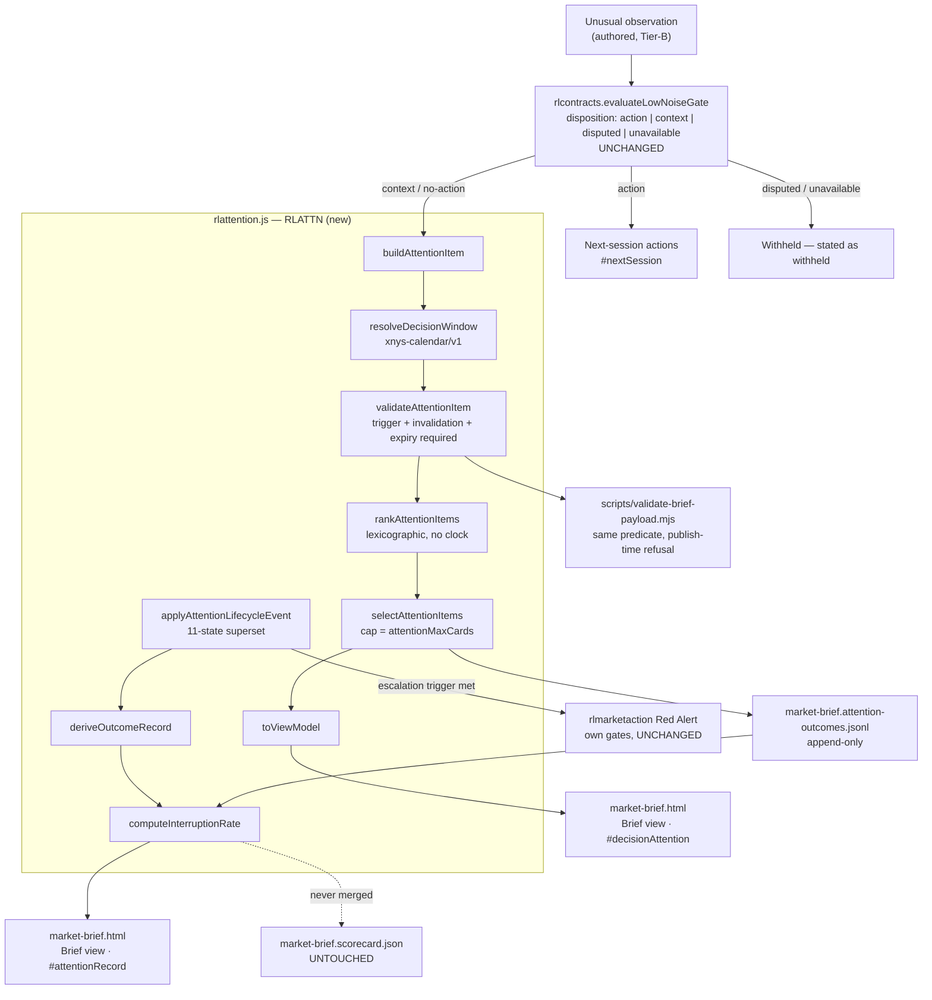

# Design — Decision Attention and Developing Situations

**Feature:** `specs/017-decision-attention-and-developing-situations`
**Requirements source:** `spec.md` (40 FR, 8 NFR, 10 UC, business policies 1-9)
**Design scope:** one new shared UMD module, one additive payload field group, one
append-only outcome artifact, one derived published aggregate, one render section
and one record section inside the existing Brief view of `market-brief.html`.

---

## Design Brief

**Current State.** `market-brief.html` renders a Brief view containing
`#scorecard` (recommendation track record), `#nextSession` (actions only),
`#attention` (an "actionable changes and catalysts" feed), `#events`, and
drawers. The attention feed's items carry nine keys, none of them falsifiable:
there is no escalation trigger, no invalidation, no expiry, and no decision
window. `scripts/validate-brief-payload.mjs` applies a full field contract to
actions (~L146-155) and applies only a length cap to attention (~L182). The
certified `low-noise-gate/v1` in `rlcontracts.js` (~L1514) already routes an
observation to `action | context | disputed | unavailable`, and
`validateFinalBrief` (~L1835-1920) already restricts an attention item's
destination to `context | no-action` (~L1907) and already refuses a subject that
is also carried by a published action (~L1910). `rlmarketaction.js` owns the Red
Alert engine, the nine `LIFECYCLE_STATES`, the eight `TRANSMISSION_CHANNELS` and
the six `RESEARCH_VERBS`.

**Target State.** A Decision Attention tier *inside* the same Brief view that
adds an **urgency axis** on top of the certified disposition: each item declares
one decision window resolved to a real exchange-session instant, a transmission
path, an escalation trigger, an invalidation and an expiry — so the tier can
publish its own interruption rate. The Red Alert bar is untouched, no fifth view
appears, and no fifth disposition value is created.

**Patterns to Follow.**

| Pattern | Where it lives today | How this design uses it |
|---|---|---|
| UMD wrapper, `Object.freeze(factory())`, browser-global fallback with a `*_BROWSER_GLOBAL_UNAVAILABLE` throw | `rlmarketaction.js` header | Copied verbatim into `rlattention.js` with `RLATTN` as the global |
| Frozen closed vocabularies exported as constants | `rlmarketaction.js` `LIFECYCLE_STATES` L799 / L1523, `TRANSMISSION_CHANNELS`, `RESEARCH_VERBS` | Imported and referenced, never re-declared |
| Prefixed refusal codes (`RLMKT-SEED`, `RLMKT-LIFECYCLE`, …) | `rlmarketaction.js` | Mirrored as an `RLATTN-*` namespace |
| Append-only JSONL ledger at repository root | `brief-history.jsonl`, `causal-rotation-ledger.jsonl` | `market-brief.attention-outcomes.jsonl` |
| Derived scorecard JSON with `contractVersion`, `policy`, `windows.{30d,90d,all}`, `insufficientSample` | `market-brief.scorecard.json` | Mirrored key-for-key in `market-brief.attention-scorecard.json`, with disjoint metrics |
| Module returns data, the page escapes at the sink via `esc()` | `market-brief.html` inline IIFE | `RLATTN.toViewModel()` returns raw strings; the page escapes |

**Patterns to Avoid.**

| Anti-pattern present in the tree | Why it is not followed |
|---|---|
| Extending `rlbrief.js` for new brief sections | `rlbrief.js`, `rlexperience.js`, `rlfx.js`, `rljourney.js` are uncommitted in a concurrent session's working tree. Editing any of them corrupts that session. FR-040 requires a new module. |
| Blended `confidence × domain weight` ordering | It is the exact defect this feature exists to remove: it collapses evidence quality and urgency into one unreadable number. Ranking here is lexicographic over declared fields. |
| Length-cap-only validation of attention items | `validate-brief-payload.mjs` ~L182 is why the 400-character-headline and missing-invalidation defects shipped. The asymmetry with actions (~L146-155) is closed. |
| Mutating a frozen exported constant to gain two states | `LIFECYCLE_STATES` is exported at L1523 and consumed by `applyLifecycleEvent` (L1261) which refuses an unknown `event.to` with `RLMKT-LIFECYCLE`. See H-1. |
| Writing attention outcomes into the recommendation ledger | `notEvaluableShare` is already 0.6816 against a ≤ 0.25 target; attention items are structurally not directional calls. |

**Resolved Decisions.**

- H-1 — superset vocabulary owned by `rlattention.js`, with a load-time identity assertion against the certified nine. `rlmarketaction.js` is unmodified.
- H-2 — `rlattention.js`, global `RLATTN`, 14 exported members, consumed by `market-brief.html` via a `defer` script tag and two call sites.
- H-3 — `market-brief.attention-outcomes.jsonl` (append-only) → `market-brief.attention-scorecard.json` (derived), disjoint from the recommendation ledger at every level.
- The decision-attention fields are **additive keys on the existing `final.attention[]` entries**, not a parallel array, so `rlcontracts.js` needs no change and no existing consumer breaks.
- The published cap reuses the committed `thresholds.attentionMaxCards: 7`.
- Ranking reference instant is `payload.asOf`, never the wall clock.

**Open Questions.** None blocking. Three items are routed with owners in
*Open Questions Routed*.

---

## Architecture Overview

Decision Attention is a **triage layer** that sits strictly downstream of the
certified low-noise gate and strictly upstream of the Brief render. It consumes
an already-classified observation, adds an urgency determination anchored to a
real session boundary, refuses anything that is not falsifiable, ranks
deterministically, caps the published set, and emits an append-only outcome
record when an item terminates.



**Layering rule.** `rlattention.js` depends on `rlmarketaction.js` and
`rlcontracts.js` for vocabularies and gate results. Neither depends on
`rlattention.js`. `market-brief.html` depends on all three. There is no cycle and
no new data source (NFR-004).

---

## Capability Foundation

The capability is *decision-relevance triage for unusual developments*: given
observations already classified for evidence quality, decide which could change a
decision inside a bounded calendar-anchored window, express that as a compact
falsifiable expiring item, and record what happened to it.

| Contract | Responsibility | Consumers |
|---|---|---|
| `decision-attention/v1` — item envelope | Field shape, falsifiability triple, transmission path, provenance class | `market-brief.html` Brief view; `scripts/validate-brief-payload.mjs`; the outcome writer |
| `decision-window/v1` — window vocabulary + resolution | Map a closed window id to a UTC session-boundary instant for a trading date, including the next-session fallback | `rlattention.buildAttentionItem`; render (renders the boundary, never the id) |
| `attention-lifecycle/v1` — 11-state superset | State legality and append-only transitions, including `escalated` and `superseded` | `rlattention.applyAttentionLifecycleEvent`; the outcome writer |
| `attention-outcome/v1` — append-only record | One record per terminated item: terminal class, date, closing condition, item reference | `market-brief.attention-outcomes.jsonl` writer; the rate computation |
| `interruption-rate/v1` — derived aggregate | Shares by terminal class over closed evaluable records, with a minimum-sample withhold | `market-brief.attention-scorecard.json`; Brief `#attentionRecord` |
| `attention-ranking/v1` — deterministic order | Total order over an item set with a reader-legible rationale for any adjacent pair | `rlattention.rankAttentionItems`; `rlattention.rankRationale` |

### Extension Points

| Extension point | Shape | Why it is an extension point |
|---|---|---|
| `calendarSource` | `{ isTradingDate(dateIso), sessionBoundaries(dateIso) → { openUtc, closeUtc }, nextTradingDate(dateIso) }` | The exchange is a variation axis. XNYS is the only implementation today; the resolver never reads a calendar file directly. |
| `windowVocabulary` | ordered array of `{ id, etTime, label }` | Supplied by the caller from the committed generation-window contract, so the vocabulary is never a second definition inside this module. |
| `consumerSurface` | caller invokes `toViewModel(item, ctx)` and owns all markup and escaping | A per-tool brief or the Red Alert escalation path consumes the same view-model with different chrome. |
| `outcomeSink` | `appendOutcomeRecord(record) → serialized line` | The module produces the record; the caller owns persistence, so the same records can be written by the pipeline or replayed by a validator. |
| `ratePolicy` | `{ minClosedSample, windowDays[], recentMissCount }` | Threshold tuning is a maintainer action (A-4) against a declared policy block, not a code edit. |

### Foundation-Owned Behavior

Behavior below is owned by the foundation and is **not** overridable by any
consumer or implementation:

1. **Disposition is read, never re-decided.** Only `context` and `no-action` are
   eligible; `action`, `disputed` and `unavailable` are never converted (FR-004,
   FR-005, policies 1-2).
2. **Falsifiability is binary.** An item missing an escalation trigger, an
   invalidation, or an expiry is refused. There is no partially-scoreable item
   (FR-024, policy 4).
3. **A window that does not resolve is not urgent.** Refusal, not downgrade
   (FR-009, policy 3).
4. **Severity never derives urgency and urgency never derives severity.** No code
   path reads one to compute the other (FR-004).
5. **The cap is a ceiling.** Zero published items is a success state; padding to
   the cap is a defect (FR-034, policy 7).
6. **Ranking is a pure function of the item set.** No clock, no randomness, total
   order, stable tie-break (FR-035, NFR-001, policy 8).
7. **Outcome records are append-only.** A correction is a new record referencing
   the prior `recordId` (FR-026, policy 6).
8. **Attention outcomes never touch the recommendation ledger.** No write path
   exists from this module to `market-brief.scorecard.json` or its inputs
   (FR-027).
9. **Absence renders as a named absence.** No transmission path, no market
   confirmation, no qualifying item and no available figure each render as an
   explicit statement, never as zero or blank (FR-015, FR-017, FR-034, FR-039).
10. **Reader-visible strings carry no framework vocabulary.** The module emits no
    contract id, gate code, scope number or digest into any view-model field
    (FR-038, D13).

---

## Concrete Implementations

| # | Implementation | Layered on | What varies | What it inherits unchanged |
|---|---|---|---|---|
| I-1 | **XNYS session-boundary resolver** | `decision-window/v1` | Trading-date calendar, ET boundary times, holiday and half-day handling | Vocabulary closure, next-session fallback rule, refusal on non-resolution |
| I-2 | **Global Brief consumer** (`market-brief.html`, `#decisionAttention`) | `decision-attention/v1` view-model | Section chrome, disclosure affordance, tooltip copy, cap of 7 | Field contract, ranking order, empty-state text contract, escaping at sink |
| I-3 | **Interruption-rate consumer** (`market-brief.html`, `#attentionRecord`) | `interruption-rate/v1` | Placement beside `#scorecard`, label copy | Withhold rule, equal-prominence rule for expired-without-effect |
| I-4 | **Publish-time validator** (`scripts/validate-brief-payload.mjs`) | `decision-attention/v1` | Process exit code, per-field CLI message | The exact same `validateAttentionItem` predicate as the browser path |
| I-5 | **Escalation hand-off** to `rlmarketaction` Red Alert | `attention-lifecycle/v1` | Which certified alert gates then apply | Terminal `escalated` state, one-live-surface rule (FR-031) |
| I-6 | **Supersession closer** | `attention-lifecycle/v1` | Which later item supersedes which | Same-generation closure and back-reference (FR-032, policy 6) |

I-1 and I-2 exist at delivery; I-4 is the second consumer of the identical
predicate, which is what makes the field contract a foundation rather than a
render detail. I-5 and I-6 are lifecycle terminals produced by the same
transition table.

### Variation Axes

| # | Axis | Values today | Values the foundation admits | Owned By Foundation? |
|---|---|---|---|---|
| VA-1 | **Exchange calendar** | XNYS | Any calendar satisfying `calendarSource` | **Yes** — the resolver contract, the next-session fallback and the refusal-on-non-resolution are foundation-owned; only the boundary data varies |
| VA-2 | **Consuming surface** | Global Brief section (I-2); interruption-rate block (I-3) | Per-tool brief; Red Alert escalation view | **Yes** — the view-model shape, ordering and empty-state contract are foundation-owned; chrome and placement are not |
| VA-3 | **Enforcement host** | Browser render path (I-2); Node publish path (I-4) | Any host that can load a UMD module | **Yes** — one predicate, two hosts; a host may not weaken a field rule |
| VA-4 | **Terminal outcome class** | `escalated`, `confirmed`, `resolved`, `expired-without-effect` (+ `superseded`, excluded from the denominator) | Additional terminals appended to the transition table | **Yes** — legality and append-only transition rules are foundation-owned; the denominator rule is foundation-owned |
| VA-5 | **Rate policy thresholds** | `minClosedSample: 20`, `windowDays: [30, 90]` | Maintainer-tuned values within the declared policy block | **Partly** — the withhold *rule* is foundation-owned; the *values* are a declared policy the maintainer may tune (A-4), and may not be tuned to suppress a miss |

Five axes, all with an explicit ownership answer.

---

## Contracts

### `decision-attention/v1` — item envelope

Additive keys on an existing `final.attention[]` entry. Existing keys are
retained verbatim so no current consumer breaks (NFR-006).

| Field | Type | Rule | FR |
|---|---|---|---|
| `id` | string | stable, unique within payload, `attn-<window>-<nn>` | — |
| `headline` | string | 1-120 characters after trim; refusal above | FR-012 |
| `whatChanged` | string | non-empty; states the change and its qualifying comparison | FR-013 |
| `whyUnusual` | string | non-empty; the comparison that makes it unusual | FR-013 |
| `whyNow` | string | non-empty; must reference the decision window in reader language | FR-014 |
| `destination` | `"context" \| "no-action"` | from the gate result; no other value accepted | FR-005 |
| `suppressionReason` | string | non-empty | FR-005 |
| `decisionWindow` | one of `DECISION_WINDOWS` | closed vocabulary | FR-007 |
| `decisionBoundaryUtc` | ISO-8601 instant | produced by the resolver, never authored | FR-008 |
| `boundaryResolvedFrom` | `"current-session" \| "next-session"` | records the FR-010 fallback | FR-010 |
| `horizon` | `"structural" \| "swing" \| "tactical"` | separate field; never derived from `decisionWindow` | FR-011 |
| `subjects` | string[] | 0..n, each within the committed public watchlist scope; tickers only | FR-015, P13 |
| `channel` | one of `TRANSMISSION_CHANNELS` or `null` | at most one | FR-015 |
| `transmissionAbsent` | boolean | `true` required when `subjects` empty and `channel` null | FR-015 |
| `evidenceState` | `"corroborated" \| "single-origin" \| "asserted"` | declared, not computed from confidence | FR-016 |
| `independentOrigins` | integer ≥ 0 | count | FR-016 |
| `marketConfirmation` | `{ toolId, deepLink, read }` or `null` | `null` requires `marketConfirmationAbsentNote` non-empty | FR-017 |
| `deepLink` | string | resolves to an owning tool page; the item does not restate its math | FR-018 |
| `investigationStep` | `{ verb, text }` | `verb` ∈ `RESEARCH_VERBS`; `text` contains no direction, size or execution verb | FR-019 |
| `figures[]` | `{ label, value, provenance }` | `provenance` required on every entry; an entry without it does not render | FR-020 |
| `escalationTrigger` | string | non-empty; reader-checkable observation | FR-021 |
| `invalidation` | string | non-empty; reader-checkable observation | FR-022 |
| `expiryUtc` | ISO-8601 instant | ≥ `decisionBoundaryUtc` | FR-023 |
| `lifecycleState` | one of `ATTENTION_LIFECYCLE_STATES` | see *Lifecycle Design* | FR-030 |
| `supersedes` | item id or `null` | when set, the referenced item is closed in the same generation | FR-032 |
| `rankKey` | array | emitted for audit; never rendered | FR-036 |

**Refused, not downgraded:** any violation above refuses the *item*; a refused
item never publishes. A payload containing a refused item refuses the *payload*
at publish time (FR-037, UC-017-006).

### `interruption-rate/v1` — published aggregate

Mirrors `market-brief.scorecard.json` conventions so a reader already fluent in
the recommendation track record reads this one with no new grammar.

| Key | Mirrors | Meaning here |
|---|---|---|
| `contractVersion` | same | `"interruption-rate/v1"` |
| `generatedAt` | same | derivation instant |
| `openItems` | `openCalls` | published items not yet terminal |
| `policy` | same shape | `{ minClosedSample: 20, recentMissCount: 3, windowDays: [30, 90], note }` |
| `recentExpiries` | `recentMisses` | the last 3 `expired-without-effect` records, named |
| `windows.{30d,90d,all}` | same | `days, closed, evaluable, escalated, confirmed, resolved, expiredWithoutEffect, supersededExcluded, warrantedShare, expiredWithoutEffectShare, insufficientSample, byDecisionWindow, byChannel` |

`warrantedShare` and `expiredWithoutEffectShare` publish `null` with
`insufficientSample: true` below `minClosedSample` (FR-029, P5). `byDomain`,
`byDirection` and `calibration` are deliberately absent: an attention item has no
direction, so those keys would be structurally empty and would invite a reader to
compare this record with the recommendation record.

---

## Module Decomposition (H-2)

**Resolution.** The capability ships as **`rlattention.js`**, browser global
**`RLATTN`**, at the repository root beside the other shared modules. It is
Node-loadable with no build step via the same UMD wrapper `rlmarketaction.js`
uses, and its production consumer at delivery is `market-brief.html` (FR-040,
P10, P18/D3).

**Why a new module rather than an extension.** `rlbrief.js`, `rlexperience.js`,
`rlfx.js` and `rljourney.js` are uncommitted in a concurrent session's working
tree. Any edit to those files would land inside another session's in-flight
changes. The four files are named in *Change Boundary* as hard exclusions.

**UMD wrapper — verbatim form, `<NAME>` = `RLATTN`, `<GLOBAL>` = `RLATTN`:**

```js
(function (factory) {
  "use strict";
  var api = Object.freeze(factory());
  if (typeof module === "object" && module && module.exports) { module.exports = api; return; }
  if (typeof globalThis === "undefined") { throw new Error("RLATTN_BROWSER_GLOBAL_UNAVAILABLE"); }
  globalThis.RLATTN = api;
})(function () { "use strict"; /* … */ });
```

### Public surface — function by function

| Member | Signature | Returns | Purity |
|---|---|---|---|
| `CONTRACT_VERSION` | constant | `"decision-attention/v1"` | frozen |
| `ATTENTION_LIFECYCLE_STATES` | constant | frozen array of 11 states | frozen |
| `ATTENTION_LIFECYCLE_TRANSITIONS` | constant | frozen map, state → frozen array of legal next states | frozen |
| `DECISION_WINDOWS` | constant | frozen array of the 4 window ids | frozen |
| `TERMINAL_OUTCOME_CLASSES` | constant | frozen `["escalated","confirmed","resolved","expired-without-effect"]` | frozen |
| `REFUSAL_CODES` | constant | frozen array of the `RLATTN-*` codes | frozen |
| `resolveDecisionWindow(windowId, tradingDateIso, calendarSource, windowVocabulary)` | — | `{ ok: true, windowId, boundaryUtc, tradingDate, resolvedFrom }` or `{ ok: false, code, detail }` | pure given `calendarSource` |
| `buildAttentionItem(gateResult, authored, ctx)` | `ctx = { tradingDateIso, calendarSource, windowVocabulary, watchlistScope }` | `{ ok: true, item }` or `{ ok: false, code, field, detail }` | pure |
| `validateAttentionItem(item, ctx)` | — | `{ ok, violations: [{ code, field, detail }] }` | pure |
| `rankAttentionItems(items)` | — | new array, total deterministic order | pure |
| `selectAttentionItems(items, cap)` | — | `{ published, suppressed, capApplied }` | pure |
| `rankRationale(higher, lower)` | — | one reader-language sentence, no internal identifiers | pure |
| `applyAttentionLifecycleEvent(item, event)` | `event = { to, at, condition, ref }` | `{ ok: true, item }` or `{ ok: false, code, detail }` | pure |
| `deriveOutcomeRecord(item, closure)` | `closure = { to, at, condition, ref, correctionOf }` | `{ ok: true, record }` or `{ ok: false, code, detail }` | pure |
| `computeInterruptionRate(records, policy, asOfIso)` | — | the `interruption-rate/v1` object | pure |
| `toViewModel(item, ctx)` | — | plain object of raw strings and booleans for the caller to escape | pure |

Sixteen exported members. No member reads `Date.now()`, `Math.random()`, the
network, or the DOM. `toViewModel` returns raw strings only — the module never
produces markup, so text remains data at every boundary (FR-038, D1/BI-7).

### Consumption in `market-brief.html`

**Script tag** — inserted with the other shared-module tags, after
`rlcontracts.js` and `rlmarketaction.js` (it reads their frozen vocabularies at
factory time) and before the page's inline IIFE:

```html
<script src="rlcontracts.js" defer></script>
<script src="rlmarketaction.js" defer></script>
<script src="rlattention.js" defer></script>
```

**Call site 1 — the tier**, a new `renderDecisionAttention()` inside the existing
inline IIFE, called from the same place the current `#attention` render is
called, writing into a new `<div class="feed" id="decisionAttention">` placed
immediately above the existing `#attention` feed:

```js
function renderDecisionAttention() {
  var host = el("decisionAttention"); if (!host) return;
  var raw = (PAYLOAD && PAYLOAD.attention) || [];
  var ctx = { tradingDateIso: (PAYLOAD && PAYLOAD.tradingDate) || null,
              calendarSource: CAL, windowVocabulary: CFG.windows,
              watchlistScope: WL };
  var built = raw.map(function (a) { return RLATTN.buildAttentionItem(a.gate || a, a, ctx); })
                 .filter(function (r) { return r.ok; })
                 .map(function (r) { return r.item; });
  var sel = RLATTN.selectAttentionItems(RLATTN.rankAttentionItems(built),
                                        CFG.thresholds.attentionMaxCards);
  if (!sel.published.length) {
    host.innerHTML = '<div class="sub" data-attention-state="none">Nothing requires your attention this window.</div>';
    return;
  }
  host.innerHTML = sel.published.map(function (item) {
    var vm = RLATTN.toViewModel(item, ctx);
    return '<div class="acard" data-attention-item><b title="' + esc(vm.headlineTip) + '">'
         + esc(vm.headline) + '</b><div class="ay">' + esc(vm.whyNow) + '</div>'
         + '<div class="sub">' + esc(vm.decisionBoundaryLabel) + ' · ' + esc(vm.transmissionLabel) + '</div></div>';
  }).join("");
}
```

**Call site 2 — the record**, a new `renderAttentionRecord()` writing into
`<div id="attentionRecord">` placed immediately after the existing `#scorecard`:

```js
function renderAttentionRecord() {
  var host = el("attentionRecord"); if (!host || !ATTNSCORE) return;
  host.innerHTML = RLATTN.toViewModel === undefined ? "" : renderRateBlock(ATTNSCORE.windows["30d"]);
}
```

`ATTNSCORE` is loaded with the existing `j()` helper from
`market-brief.attention-scorecard.json`, alongside the existing `SCORECARD`
load. Both renders paint from committed data with no credentials (FR-039,
NFR-002, UC-017-009).

---

## Lifecycle Design (H-1)

**Resolution.** `rlattention.js` **owns a superset vocabulary that references the
certified states**. `rlmarketaction.js` is not modified.

**Reason.** `LIFECYCLE_STATES` is frozen at L799 and publicly exported at L1523,
and `applyLifecycleEvent` at L1261 refuses an unknown `event.to` with
`RLMKT-LIFECYCLE`. Adding two members to that frozen constant would (a) mutate an
exported constant that already has a live validator consumer, (b) silently widen
what every existing `applyLifecycleEvent` caller accepts, and (c) pull the Red
Alert engine — whose thresholds this feature is required to leave untouched —
into this feature's change boundary. The superset keeps the alert engine outside
the blast radius while still reusing, not redefining, the certified nine
(policy 5, P19/D4).

**Compatibility consequence.** `rlattention.js` asserts at factory time that
every one of the certified nine states is present in
`RLMKT.LIFECYCLE_STATES`; a mismatch throws `RLATTN-LIFECYCLE-DRIFT` at load, so
an upstream change to the certified vocabulary is detected loudly rather than
diverging quietly. `escalated` and `superseded` are **terminal inside this
module and are never passed to `rlmarketaction.applyLifecycleEvent`** — the
escalation hand-off (I-5) passes the *observation*, not the attention state, into
the alert engine, which then applies its own unchanged gates. Any state this
module hands to the alert engine is one of the certified nine.

### Transition table — `attention-lifecycle/v1` (append-only)

| From | Legal `to` | Origin |
|---|---|---|
| `discovered` | `evidence-building`, `rejected` | certified |
| `evidence-building` | `qualified`, `rejected` | certified |
| `qualified` | `acknowledged`, `stale`, **`superseded`** | certified + appended |
| `acknowledged` | `monitoring`, `stale`, **`escalated`**, **`superseded`** | certified + appended |
| `monitoring` | `invalidated`, `resolved`, `stale`, **`escalated`**, **`superseded`** | certified + appended |
| `rejected` | — terminal | certified |
| `invalidated` | — terminal | certified |
| `resolved` | — terminal | certified |
| `stale` | — terminal | certified |
| **`escalated`** | — terminal | appended |
| **`superseded`** | — terminal | appended |

Every certified transition is preserved verbatim; the appended edges only add
new destinations to non-terminal states and add two new terminals. No certified
edge is removed and no certified terminal gains an outbound edge — the set stays
append-only (FR-030).

**Semantics of the two additions.**

- `escalated` — the item's declared escalation trigger was met **and** the
  underlying observation then cleared the Red Alert admission bar under
  `rlmarketaction`'s own unchanged gates. The item leaves the live tier in the
  same generation, so one development occupies exactly one live surface
  (FR-031, UC-017-007).
- `superseded` — a later item covers the same development. The superseding item
  carries `supersedes: <priorId>` and the prior item is closed in the same
  generation with a back-reference (FR-032, policy 6, P24/D8).

**Mapping to render.** `qualified`, `acknowledged` and `monitoring` are the live
states shown in the tier. All six terminals are absent from the live tier and
present only in the outcome record.

---

## Outcome Record And Interruption Rate (H-3)

**Resolution — artifact.** `market-brief.attention-outcomes.jsonl`, at the
repository root beside `brief-history.jsonl` and `causal-rotation-ledger.jsonl`,
one JSON object per line, append-only, loaded with the existing `jl()` helper.

**Resolution — derived aggregate.** `market-brief.attention-scorecard.json`, at
the repository root beside `market-brief.scorecard.json`, regenerated from the
JSONL by `scripts/build-attention-scorecard.mjs`.

**Disjointness.** The ledger, the aggregate and the render block are disjoint
from the recommendation track record at three separate levels, so the two can
never be summed or merged:

| Level | Recommendation | Decision Attention | Enforcement |
|---|---|---|---|
| Input | recommendation ledger | `market-brief.attention-outcomes.jsonl` | The attention builder has no write path to the recommendation ledger; a guard asserts zero references |
| Aggregate | `market-brief.scorecard.json` (`hitRate`, `notEvaluableShare`, `byDirection`, `calibration`) | `market-brief.attention-scorecard.json` (`warrantedShare`, `expiredWithoutEffectShare`) | Disjoint filenames, disjoint metric names, no shared key that invites addition |
| Render | `#scorecard` | `#attentionRecord` | Two DOM hosts, two headings, no combined figure anywhere in the page |

An attention item carries no instrument, direction or level, so it is
structurally not a directional call. It never becomes a `not-evaluable`
recommendation and therefore cannot move `notEvaluableShare` (currently 0.6816
against a ≤ 0.25 target) in either direction (FR-027, D16).

### Record shape — `attention-outcome/v1`

| Field | Type | Meaning |
|---|---|---|
| `recordId` | string | `ao-<generatedDate>-<nn>`, unique across the file |
| `contractVersion` | string | `"attention-outcome/v1"` |
| `itemId` | string | the published item's `id` |
| `publishedAt` | ISO-8601 | when the item first published |
| `publishedWindow` | one of `DECISION_WINDOWS` | the generation window that published it |
| `decisionWindow` | one of `DECISION_WINDOWS` | the declared decision window |
| `decisionBoundaryUtc` | ISO-8601 | the resolved boundary |
| `expiryUtc` | ISO-8601 | the declared expiry |
| `terminalState` | one of the six terminals | lifecycle terminal reached |
| `outcomeClass` | `escalated` \| `confirmed` \| `resolved` \| `expired-without-effect` \| `superseded` \| `not-published` | see the mapping below |
| `closedAt` | ISO-8601 | when the terminal state was reached |
| `closingCondition` | `"escalation-trigger"` \| `"invalidation"` \| `"expiry"` \| `"supersession"` \| `"staleness"` | which declared condition closed it |
| `closingConditionText` | string | the exact declared trigger/invalidation/expiry text as published |
| `subjects` | string[] | as published, tickers only |
| `channel` | channel or `null` | as published |
| `evidenceState` | string | as published |
| `independentOrigins` | integer | as published |
| `supersededBy` | item id or `null` | set when `outcomeClass = superseded` |
| `correctionOf` | `recordId` or `null` | a correction is a new record referencing the prior one; edits and deletions do not occur |

### Terminal state → outcome class

| Terminal state | `outcomeClass` | In evaluable denominator? | Reader meaning |
|---|---|---|---|
| `escalated` | `escalated` | **Yes** | The interruption was warranted — it grew into an alert |
| `resolved` | `confirmed` when `closingCondition = "escalation-trigger"`; `resolved` otherwise | **Yes** | The declared trigger happened, or the situation closed out |
| `invalidated` | `resolved` | **Yes** | The reader's declared invalidation fired; the item was correctly disposable |
| `stale` | `expired-without-effect` | **Yes** | Nothing happened before expiry — the tier's own noise |
| `superseded` | `superseded` | **No** — reported as `supersededExcluded` | Bookkeeping closure, not an outcome about the development |
| `rejected` | `not-published` | **No** | Never reached the reader |

Superseded records are excluded from the denominator because counting them would
let a generation improve its own rate by re-issuing the same item. They are
published as a visible count so the exclusion is legible rather than silent.

### Rate computation

For each window in `policy.windowDays` plus `all`:

```
closed      = records where closedAt within window
evaluable   = closed where outcomeClass ∈ TERMINAL_OUTCOME_CLASSES
escalated / confirmed / resolved / expiredWithoutEffect = counts within evaluable
supersededExcluded = closed where outcomeClass = "superseded"

if evaluable < policy.minClosedSample:
    warrantedShare = null
    expiredWithoutEffectShare = null
    insufficientSample = true
else:
    warrantedShare            = (escalated + confirmed) / evaluable
    expiredWithoutEffectShare = expiredWithoutEffect / evaluable
    insufficientSample        = false
```

`byDecisionWindow` and `byChannel` apply the identical rule per bucket, so a
thin bucket withholds independently rather than borrowing the parent's sample
(P5).

### Render

`#attentionRecord` sits immediately below `#scorecard` under its own heading —
*"How often this tier was right to interrupt you"*. The four class shares render
in one row **at equal weight, equal type size and equal colour**;
expired-without-effect is not visually de-emphasised, is not placed last by
default, and carries no negative styling (FR-028, P4/BI-5). Below the minimum
sample the block renders *"Not enough closed items yet to state a rate —
N closed so far"* with the raw counts still shown (FR-029). The three most recent
`expired-without-effect` records render by headline beneath, mirroring
`recentMisses`. No figure in this block is ever added to, averaged with, or
displayed adjacent to a recommendation `hitRate` figure.

---

## Data Flow

| # | Step | Actor / component | Input | Output | Failure behaviour |
|---|---|---|---|---|---|
| 1 | Author an observation | A-2 research agent | evidence, citations | candidate with basis and as-of | out of scope for this module |
| 2 | Classify evidence quality | `rlcontracts.evaluateLowNoiseGate` | candidate | `disposition`, `reasons[]` | unchanged |
| 3 | Filter eligibility | `RLATTN.buildAttentionItem` | gate result | `context`/`no-action` proceed | `action` → next-session action; `disputed`/`unavailable` → withheld and stated |
| 4 | Resolve the window | `RLATTN.resolveDecisionWindow` | `decisionWindow`, `tradingDate`, calendar | `decisionBoundaryUtc`, `boundaryResolvedFrom` | `RLATTN-WINDOW` — item refused (FR-009) |
| 5 | Validate the envelope | `RLATTN.validateAttentionItem` | candidate item | ok or violations | first violation refuses the item, naming the field |
| 6 | Rank | `RLATTN.rankAttentionItems` | valid items | total order | none — pure |
| 7 | Cap | `RLATTN.selectAttentionItems` | ordered items, cap 7 | published + suppressed | none; zero published is valid |
| 8 | Enforce at publish | `scripts/validate-brief-payload.mjs` | payload | exit 0 or non-zero | non-zero refuses the **whole payload** (FR-037, UC-017-006) |
| 9 | Render the tier | `market-brief.html` | view-models | `#decisionAttention` | empty → explicit nothing-requires-attention state |
| 10 | Terminate | `RLATTN.applyAttentionLifecycleEvent` | item + event | new state | `RLATTN-LIFECYCLE` on an illegal edge |
| 11 | Record | `RLATTN.deriveOutcomeRecord` | terminated item | one record | `RLATTN-OUTCOME` on a missing closing condition |
| 12 | Append | pipeline | record | one line appended | append-only; a correction is a new line |
| 13 | Aggregate | `scripts/build-attention-scorecard.mjs` | JSONL | attention scorecard | withhold below sample |
| 14 | Render the record | `market-brief.html` | scorecard | `#attentionRecord` | withheld → sample size shown |

**Staleness.** When the newest generation is older than the declared staleness
threshold, the existing `#freshbar` states in plain language that the read is
old, and every item whose `expiryUtc` has elapsed at read time renders with an
explicit *expired* marker rather than as current (UC-017-010, P6).

---

## Determinism And Ranking

**Reference instant.** Composition, resolution, ranking and selection use
`payload.asOf` / `payload.tradingDate` as the only time reference. `Date.now()`
appears in exactly one place in this feature: the read-time *expired* decoration
on an already-published, already-ordered item. That decoration cannot change the
set, the order, the cap or the outcome record (NFR-001, FR-035).

**Rank key** — lexicographic, first difference wins:

| Position | Component | Order | Reader-language rationale |
|---|---|---|---|
| 1 | `decisionWindowOrdinal` | earlier boundary first, from the committed window order | "you have to decide about this one sooner" |
| 2 | `evidenceTierOrdinal` | `corroborated` (0) → `single-origin` (1) → `asserted` (2) | "more independent sources back it" |
| 3 | `independentOrigins` | descending | "more separate sources saw it" |
| 4 | `transmissionSpecificity` | subjects present (0) → channel only (1) → none (2) | "it names something you hold" |
| 5 | `channelOrdinal` | committed `TRANSMISSION_CHANNELS` order | fixed vocabulary order |
| 6 | `subjectsJoined` | ascending, `LC_ALL=C` byte order over the sorted ticker list | stable |
| 7 | `id` | ascending byte order | absolute tie-break; guarantees a total order |

Positions 6 and 7 are pure tie-breaks and are never surfaced as a reason.
`rankRationale(higher, lower)` returns the sentence for the **first differing
position ≤ 5**, and returns *"both are equally urgent on every stated measure"*
when only 6 or 7 differ — so the reason one item outranks another is always
stateable without an internal identifier (FR-036, P7).

**Independence of the axes.** No rank-key position reads a severity value, and no
severity computation reads a rank key or a decision window. A high-severity item
with `transmissionAbsent: true` sorts below a moderate item with an imminent
boundary purely through positions 1 and 4 — which is exactly UC-017-003 (FR-004).

---

## Error And Refusal Codes

Namespace mirrors the `RLMKT-*` convention. Every code names the field it
refused; none reaches reader-visible copy.

| Code | Raised by | Condition | Effect |
|---|---|---|---|
| `RLATTN-DISPOSITION` | `buildAttentionItem` | disposition is not `context` or `no-action`, or `suppressionReason` empty | item refused |
| `RLATTN-WINDOW` | `resolveDecisionWindow` | window id outside the closed vocabulary, or no boundary resolvable for the trading date | item refused (FR-009) |
| `RLATTN-HEADLINE` | `validateAttentionItem` | headline empty or > 120 characters | item refused (FR-012) |
| `RLATTN-FALSIFIABILITY` | `validateAttentionItem` | missing escalation trigger, invalidation, or expiry | item refused (FR-024) |
| `RLATTN-EXPIRY` | `validateAttentionItem` | `expiryUtc` earlier than `decisionBoundaryUtc` | item refused |
| `RLATTN-TRANSMISSION` | `validateAttentionItem` | subject outside public watchlist scope, more than one channel, or empty path without `transmissionAbsent` | item refused (FR-015) |
| `RLATTN-EVIDENCE` | `validateAttentionItem` | no `marketConfirmation` and no absence note, or negative origin count | item refused (FR-017) |
| `RLATTN-PROVENANCE` | `validateAttentionItem` | a `figures[]` entry has no provenance class | item refused (FR-020) |
| `RLATTN-VERB` | `validateAttentionItem` | verb outside `RESEARCH_VERBS`, or the step text carries a direction, size or execution instruction | item refused (FR-019) |
| `RLATTN-OVERLAP` | `validateAttentionItem` | subject also carried by a published next-session action | item refused (FR-006) |
| `RLATTN-LIFECYCLE` | `applyAttentionLifecycleEvent` | `event.to` outside the 11 states, or the edge is not in the transition table | transition refused |
| `RLATTN-LIFECYCLE-DRIFT` | factory | a certified state is absent from `RLMKT.LIFECYCLE_STATES` at load | module throws at load |
| `RLATTN-SUPERSESSION` | `applyAttentionLifecycleEvent` | `supersedes` set without closing the referenced item in the same generation | transition refused (FR-032) |
| `RLATTN-OUTCOME` | `deriveOutcomeRecord` | terminal state with no closing condition, or a correction with no `correctionOf` | record refused |
| `RLATTN-CAP` | `selectAttentionItems` | cap is absent, non-integer, or < 0 | selection refused |
| `RLATTN-PRIVACY` | `validateAttentionItem` | a non-ticker subject, a size, a cost basis or a P&L figure appears in any field | item refused (P13/BI-4) |

A payload carrying any refused item is refused whole; publication is atomic
(FR-037, actor A-3).

---

## Performance Budgets

Each budget is asserted by a test that can fail, and a red build is fixed by
fixing the code, never by widening the budget (NFR-003, P22/D7, D18).

| Budget | Value | Measured by |
|---|---|---|
| `rlattention.js` raw source | ≤ 42 KB | byte-size assertion in `scripts/selftest.mjs` |
| Added first-load bytes (module + section markup) | ≤ 46 KB | first-load budget assertion, same test as the existing page budget |
| Build + validate + rank + select, cap 7 | ≤ 8 ms | timed assertion over a fixture of 40 candidates |
| `computeInterruptionRate` over 500 records | ≤ 5 ms | timed assertion over a synthetic ledger |
| Ledger read (`jl()`) at 2,000 lines | ≤ 25 ms parse | timed assertion |
| Tier render, 7 items | ≤ 6 ms `innerHTML` composition | timed assertion in the browser check |

The module performs no network I/O and adds no provider, feed or credential
(NFR-004).

---

## Test Strategy

| # | Test | Category | Validates | Adversarial case (must fail on reintroduction) |
|---|---|---|---|---|
| T-01 | UMD loads in Node and exposes 16 frozen members | unit | H-2, P10 | export dropped or object unfrozen |
| T-02 | Load-time assertion against `RLMKT.LIFECYCLE_STATES` | unit | H-1 drift detection | a certified state removed upstream → `RLATTN-LIFECYCLE-DRIFT` |
| T-03 | Every certified transition is preserved; only appended edges are new | unit | FR-030, append-only | a certified edge removed |
| T-04 | `escalated` / `superseded` are terminal and never passed to `applyLifecycleEvent` | unit | H-1 compatibility | a call path that hands `escalated` to the alert engine |
| T-05 | Headline of 121 characters refuses `RLATTN-HEADLINE` | unit | FR-012, NFR-005 | **the 400-character headline from the recorded defect** |
| T-06 | Missing invalidation refuses `RLATTN-FALSIFIABILITY` | unit | FR-024, NFR-005 | **an item with trigger + expiry but no invalidation** |
| T-07 | Missing escalation trigger and missing expiry each refuse | unit | FR-021, FR-023 | either field silently defaulted |
| T-08 | Window outside the closed vocabulary refuses; unresolvable date refuses | unit | FR-007, FR-009 | an unresolvable window downgraded instead of refused |
| T-09 | Non-trading date and elapsed session resolve to the next session's open | unit | FR-010 | fallback resolving to the same elapsed boundary |
| T-10 | `decisionWindow` and `horizon` are independent | unit | FR-011 | horizon derived from window |
| T-11 | `action` / `disputed` / `unavailable` never become attention items | unit | FR-004, FR-005, policy 2 | an `action` observation admitted |
| T-12 | Subject overlap with a published action refuses | unit | FR-006 | overlap admitted |
| T-13 | Subject outside the public watchlist, or any size / cost-basis / P&L field, refuses | unit | P13/BI-4 | a private field admitted |
| T-14 | Empty transmission path without `transmissionAbsent` refuses; with it, renders the explicit absence | unit | FR-015 | absence rendered as blank |
| T-15 | Absent market confirmation without a note refuses | unit | FR-017 | absence rendered as zero |
| T-16 | A figure with no provenance does not render | unit | FR-020 | unprovenanced figure rendered |
| T-17 | Verb outside `RESEARCH_VERBS`, or a direction/size/execution word in the step, refuses | unit | FR-019 | an execution verb admitted |
| T-18 | Ranking is a total order and is byte-identical across 100 shuffled inputs | unit | FR-035, NFR-001 | any clock or random source introduced |
| T-19 | Severe-unmapped ranks below moderate-imminent | unit | FR-004, UC-017-003 | severity leaking into the rank key |
| T-20 | `rankRationale` returns reader language with no contract id, gate code, scope number or digest | unit | FR-036, D13 | an internal identifier in the sentence |
| T-21 | Zero qualifying items yields the explicit nothing-requires-attention state | unit | FR-034, policy 7 | a padded or placeholder item |
| T-22 | Cap of 7 is a ceiling: 3 valid items publish 3 | unit | FR-034, FR-035 | padding to the cap |
| T-23 | Illegal lifecycle edge refuses `RLATTN-LIFECYCLE` | unit | FR-030 | an unlisted edge admitted |
| T-24 | Supersession closes the prior item in the same generation with a back-reference | unit | FR-032, policy 6 | a superseding item published with the prior still live |
| T-25 | Escalation produces one live surface, not two | unit | FR-031, UC-017-007 | duplicate live publication |
| T-26 | Exactly one outcome record per terminated item; correction appends with `correctionOf` | unit | FR-025, FR-026 | an in-place edit or a deletion |
| T-27 | `superseded` is excluded from the evaluable denominator and reported as a count | unit | H-3 | supersessions inflating the rate |
| T-28 | Below `minClosedSample` the rate is `null` with `insufficientSample: true` and the sample size shown | unit | FR-029, P5 | a rate published on a thin sample |
| T-29 | `byDecisionWindow` and `byChannel` withhold independently | unit | P5 | a thin bucket borrowing the parent sample |
| T-30 | No write path from the attention module to the recommendation ledger or `market-brief.scorecard.json` | unit | FR-027 | any reference introduced |
| T-31 | `market-brief.scorecard.json` is byte-identical before and after a full attention generation | integration | FR-027, H-3 disjointness | any coupling introduced |
| T-32 | `validate-brief-payload.mjs` refuses an over-length headline and a missing invalidation, naming the field, exit non-zero | integration | FR-037, UC-017-006 | the length-cap-only asymmetry at ~L182 reintroduced |
| T-33 | The validator and the browser path apply the identical predicate on the same fixture | integration | VA-3 | a host weakening a rule |
| T-34 | The Brief renders the tier and the record from committed data with no key or proxy | browser | FR-039, NFR-002, UC-017-009 | a credential requirement introduced |
| T-35 | Attention items carry no alert severity label and no alert styling class | browser | FR-003, UC-017-002 | alert affordances applied |
| T-36 | Every rendered field and control has a contextual tooltip stating what it is and what the value implies | browser | FR-038, P15/D15 | a bare value with no tooltip |
| T-37 | Authored text with markup renders escaped at every sink | browser | FR-038, D1/BI-7 | an unescaped sink |
| T-38 | `audit-reader-legibility.mjs` reports 0 leaks across the tier and the record | integration | D13 | any contract id, gate code, scope number or digest reaching the reader |
| T-39 | `viewIds` remain `[brief, portfolio, red-alert, journey]`; no fifth view; `RLMKT-VIEW` unchanged | integration | FR-001 | a fifth view added |
| T-40 | Red Alert thresholds and the seven hard gates are byte-identical after this change | integration | FR-002 | any threshold moved |
| T-41 | Elapsed items render as expired and a stale generation is declared in plain language | browser | UC-017-010, P6 | a stale read presented as current |
| T-42 | All six performance budgets hold | unit + browser | NFR-003, P22 | a budget widened instead of a regression fixed |
| T-43 | Existing `#attention` consumers still parse the payload unchanged | integration | NFR-006 | a breaking payload change |
| T-44 | `node scripts/selftest.mjs` exits 0 with the new module registered | integration | repository check | the module not wired into the selftest |

Test-type honesty: T-34 to T-37 and T-41 run in a real browser against the
committed payload with no request interception; they are not asserted from a
static search (D17).

---

## Complexity Tracking

| Deviation from the simplest viable approach | Simpler alternative considered | Why it was rejected |
|---|---|---|
| A new module rather than extending the brief renderer | Add the section to `rlbrief.js` | That file is uncommitted in a concurrent session's working tree; editing it corrupts that session. FR-040 makes the new module mandatory. |
| An 11-state superset rather than 9 | Reuse only the certified nine and encode escalation as `resolved` | `resolved` and `escalated` have different reader meanings and different denominators in the interruption rate; collapsing them would make the tier's own accuracy unmeasurable, which is the failure condition the feature exists to close. |
| A second scorecard artifact rather than one | Add attention rows to `market-brief.scorecard.json` | Would push `notEvaluableShare` further from its ≤ 0.25 target while telling the reader nothing about directional skill (FR-027, D16). |
| Additive keys on `final.attention[]` rather than a new array | A parallel `decisionAttention[]` array | The parallel array would require a `rlcontracts.js` change and a second subject-overlap check; the additive form reuses the certified overlap refusal at ~L1910 and leaves `rlcontracts.js` unmodified. |

---

## Change Boundary

### Create

| Path | Purpose |
|---|---|
| `rlattention.js` | The capability module, UMD, global `RLATTN` |
| `market-brief.attention-outcomes.jsonl` | Append-only outcome ledger (H-3) |
| `market-brief.attention-scorecard.json` | Derived interruption-rate aggregate (H-3) |
| `scripts/build-attention-scorecard.mjs` | Deterministic ledger → aggregate derivation |
| `scripts/build-attention-items.mjs` | Publish-time build step (F-017-06). Supplies `gateResult` from the payload's own observed tool reads and `ctx` from the committed calendar, watchlist and window vocabulary, calls `RLATTN.buildAttentionItem` once per candidate, and records a named `RLATTN-*` exclusion reason for every candidate it refuses. The lane never serializes an envelope itself |
| `tests/rlattention.test.mjs` | T-01 to T-30, T-42 unit budgets |
| `tests/attention-payload-contract.test.mjs` | T-31 to T-33, T-43 |
| `tests/attention-browser.spec.mjs` | T-34 to T-37, T-41, T-42 browser budgets (Playwright `testMatch: '**/*.spec.mjs'`) |
| `notes/decision-attention.md` | Runbook section for the authoring agent (A-2) |

### Modify

| Path | Change |
|---|---|
| `market-brief.html` | One `<script src="rlattention.js" defer>` tag; `<div id="decisionAttention">` above `#attention`; `<div id="attentionRecord">` below `#scorecard`; `renderDecisionAttention()` and `renderAttentionRecord()` inside the existing inline IIFE; one `j()` load of the attention scorecard |
| `scripts/validate-brief-payload.mjs` | Replace the length-cap-only attention check (~L182) with the full `RLATTN.validateAttentionItem` predicate, matching the field-level rigour already applied to actions (~L146-155) |
| `market-brief.payload.json` | Additive keys on existing `attention[]` entries; no key removed, no key renamed |
| `scripts/selftest.mjs` | Register the three new test files and the new byte budget |
| `notes/market-brief.md` | Runbook pointer to `notes/decision-attention.md` |
| `scripts/brief-narrative-parallel.mjs` | Extend the `attention` authoring instruction (the lane that owns the `['attention', 'recommendations', 'events']` key group) so every authored item carries the full `decision-attention/v1` field set: the falsifiability triple (escalation trigger, invalidation, expiry), the decision window, the transmission path, and the provenance class. The current instruction demands only `rank` and the `config.thresholds.attentionMaxCards` cap. **Superseded in part by F-017-06:** the instruction does not grow to cover the full field set — it SHRINKS to the `authored` argument of `buildAttentionItem` (headline, the falsifiability triple, and the judgement enums: verb, horizon, severity, imminence). The window, transmission path, provenance class, lifecycle state and every other serialized field are constructed by the publish-time build step, not authored |

**Atomicity (NON-NEGOTIABLE).** Four edits form one indivisible change and MUST
land in a single scope: the validator predicate in
`scripts/validate-brief-payload.mjs`, the payload migration in
`market-brief.payload.json`, the reduced authoring instruction in
`scripts/brief-narrative-parallel.mjs`, and the publish-time build step in
`scripts/build-attention-items.mjs`. Each edit is individually incomplete.
Tightening the validator without migrating the payload makes the validator exit
non-zero and refuse the whole payload, which blocks the next publication.
Migrating the payload without changing the lane is reverted by the next 4x/day
cron run, which re-emits the pre-migration item shape within hours and silently
undoes the fix.

**An authoring instruction alone is NOT sufficient (F-017-06).** Updating the
instruction does not make the lane comply. Three consecutive cron publishes
emitted zero conforming items while the instruction already named every required
field. A prose instruction to a language model is advisory; it is not a
mechanical guarantee. The lane is therefore ROUTED THROUGH `buildAttentionItem`:
it authors only the `authored` argument and never emits a
`decision-attention/v1` envelope directly. The instruction shrinks accordingly —
it is a narrowing of the ask, not a restatement of the schema. Compliance becomes
structural rather than advisory, because the lane cannot emit a non-conforming
envelope when it no longer emits the envelope at all.

**Cutover posture: hard cutover.** There is no dual-shape acceptance window and
no soft fallback, consistent with the repository no-defaults and fail-loud
policy. The validator refuses an attention item that is missing a required
`decision-attention/v1` field. It never substitutes a default for the missing
field.

**F-017-06 (recorded decision) — route the authoring lane through the certified
composer.** Supersedes the assumption inside F-017-02.

*Executed evidence — three consecutive cron publishes, zero compliance:*

| Commit | Publish | `decision-attention/v1` markers |
|---|---|---|
| `348c9f88` | market-brief 2026-08-07 07:28 EDT (pre-market) | 0 |
| `d2f85159` | market-brief 2026-08-07 00:16 EDT (after-hours) | 0 |
| `1412f3e0` | market-brief (earlier) | 0 |

Enforcement was intact throughout: `grep -c validateAttentionItem
scripts/validate-brief-payload.mjs` = 3, and the authoring instruction still
named the required fields (`escalation trigger` present, `decision-attention/v1`
twice in `scripts/brief-narrative-parallel.mjs`). So the gate works and the
instruction exists; compliance is nonetheless zero. Consequence: `node
scripts/validate-brief-payload.mjs` exits 1 and the brief cannot publish.

*What F-017-02 got right, and what it assumed wrongly.* It correctly identified
`scripts/brief-narrative-parallel.mjs` as a required part of the atomic change.
It then ASSUMED that updating the instruction would make the lane comply. Three
publishes falsify that assumption.

*Root cause, precisely.* `rlattention.js` already exposes the correct separation
in `buildAttentionItem(gateResult, authored, ctx)`:

| Argument | Origin | Character |
|---|---|---|
| `gateResult` | the OBSERVED gate result — disposition, subject, observed market facts | machine-derived, deterministic |
| `authored` | headline, escalation trigger, invalidation | genuine judgement |
| `ctx` | calendar, `watchlistScope`, `publishedActionSubjects` | deterministic, from committed contracts |

The lane asks the model for the OUTPUT of that composer instead of for its
`authored` argument. That makes a prose author responsible for schema
serialization — closed vocabularies, ISO instants, lifecycle enums, provenance
arrays, window resolution. That is the wrong job for the wrong component, and it
fails.

*The decision.* Route the authoring lane through `buildAttentionItem` at publish
time.

1. The lane authors ONLY the `authored` argument: headline plus the
   falsifiability triple, and the judgement enums it is genuinely suited to
   (verb, horizon, severity, imminence). A materially smaller ask.
2. A publish-time build step supplies `gateResult` from the payload's own
   observed tool reads, and `ctx` from the committed calendar, watchlist and
   window vocabulary.
3. `buildAttentionItem` constructs each envelope, or REFUSES that candidate with
   a named `RLATTN-*` code, field and detail.
4. A candidate that cannot be built is EXCLUDED and its exclusion reason
   RECORDED — never defaulted, never silently dropped. This mirrors the committed
   `toolCoverage[].reason` contract, where a registered tool that was not
   material must still state why.
5. If every candidate is excluded, `attention` is EMPTY and the tier renders its
   declared empty state. The brief still publishes.

*Why point 5 is not the banned soft fallback.* The prohibition is on substituting
a DEFAULT for a MISSING value. Nothing here is defaulted. Every field is
observed, derived from a committed contract, or authored. A candidate lacking
genuine judgement is refused outright and the refusal is stated in the payload.
This is fail-loud at ITEM granularity rather than PAYLOAD granularity, and it
preserves the hard-cutover posture: no dual-shape acceptance window, no default
substitution, no relaxed predicate. It also leaves *Error And Refusal Codes*
intact — exclusion happens BEFORE the payload is formed, so a published payload
still carries only conforming envelopes, and a payload carrying a refused item is
still refused whole (FR-037).

*Why this is the durable choice.* It adds no parallel vocabulary and no second
implementation of any rule — the certified composer stays the single source of
truth. Compliance becomes structural rather than advisory: the lane cannot emit a
non-conforming envelope because it no longer emits the envelope at all.

### Explicitly NOT modified

| Path | Reason |
|---|---|
| **`rlbrief.js`** | **Uncommitted in a concurrent session's working tree — hard exclusion** |
| **`rlexperience.js`** | **Uncommitted in a concurrent session's working tree — hard exclusion** |
| **`rlfx.js`** | **Uncommitted in a concurrent session's working tree — hard exclusion** |
| **`rljourney.js`** | **Uncommitted in a concurrent session's working tree — hard exclusion** |
| **`specs/004*`** | **Another session's scope — hard exclusion** |
| **`specs/_bugs/BUG-002*`** | **Another session's scope — hard exclusion** |
| **`specs/012*/bugs/*`** | **Another session's scope — hard exclusion** |
| `rlmarketaction.js` | H-1 resolution: the superset lives in the new module, so the frozen exported constant and the Red Alert engine stay outside this change |
| `rlcontracts.js` | The additive-keys decision means `evaluateLowNoiseGate` and `validateFinalBrief` need no change; the certified destination restriction and subject-overlap refusal are reused as-is |
| `market-brief.scorecard.json` | Disjointness is the point (FR-027) — T-31 asserts it is byte-identical after generation |
| `tool-experience.config.json` | No fifth view; `viewIds` unchanged (FR-001) |
| `data/calendars/xnys/calendar.json` | Read-only input; no new data source (NFR-004) |
| `watchlist.json` | Read-only scope bound; public tickers only |
| `tools.json`, `index.html`, `rlnav.js` | This is a tier inside an existing tool, not a new tool — no registry entry |

---

## Rollback

Rollback is a single-commit revert with no data migration, because every change
is additive and the ledger is append-only.

| Step | Action | Effect |
|---|---|---|
| 1 | Remove the `<script src="rlattention.js">` tag and the two render call sites from `market-brief.html` | The tier and the record stop rendering; the Brief returns to its prior four sections |
| 2 | Remove `<div id="decisionAttention">` and `<div id="attentionRecord">` | No empty hosts remain |
| 3 | Restore the prior attention check in `scripts/validate-brief-payload.mjs` | Publication validation returns to its prior behaviour |
| 4 | Leave the additive payload keys in place | Existing consumers ignore unknown keys (NFR-006), so no payload rewrite is needed |
| 5 | Leave `market-brief.attention-outcomes.jsonl` in place | Append-only history is never deleted (FR-026); it simply stops growing |
| 6 | Leave `rlattention.js` on disk, unreferenced | No consumer, no bytes on first load |
| 7 | Restore the prior `attention` authoring instruction in `scripts/brief-narrative-parallel.mjs` in the same revert commit as step 3 | Authoring and validation return to the prior shape together, so the next cron run cannot author items the reverted validator rejects |
| 8 | Remove `scripts/build-attention-items.mjs` from the publish path in the same revert commit as steps 3 and 7 | Envelope construction returns to the lane. The restored instruction and the reverted validator again describe one shape, so no cron run can author items the reverted validator rejects. The file may be left on disk unreferenced, like `rlattention.js` in step 6 |

**Partial rollback.** The record block (`#attentionRecord`) can be removed
independently of the tier, and the tier can be removed independently of the
ledger. Removing the tier while leaving the ledger produces a frozen, still-valid
aggregate rather than a broken one.

**What rollback cannot break.** `market-brief.scorecard.json`, the recommendation
ledger, the Red Alert thresholds, `tool-experience.config.json` and the four
excluded modules are untouched at every step, so no rollback path can regress
them.

---

## Open Questions Routed

| # | Question | Owner | Decision needed by | Default if unanswered |
|---|---|---|---|---|
| OQ-1 | Should `minClosedSample` be 20 (matching the recommendation scorecard's `minResolvedSample`) or higher, given that attention items close faster than directional calls? | A-4 maintainer, via `bubbles.plan` | Before the first rate publication | 20, matching the committed convention, with the value declared in the `policy` block so tuning is a data change |
| OQ-2 | Should the tier's cap remain the shared `attentionMaxCards: 7`, or take its own declared threshold once both feeds render on the same page? | A-4 maintainer, via `bubbles.plan` | Before the tier ships beside the legacy feed | Reuse `attentionMaxCards: 7` — one definition per concept (P19/D4) |
| OQ-3 | The spec names a split seam between the publication contract (FR-001 to FR-024, FR-033 to FR-040) and the outcome record (FR-025 to FR-032). Does planning execute it as one feature or two? | `bubbles.plan` | At scope decomposition | One feature, two scope clusters along the named seam — the seam is a scope boundary in this design, not a spec boundary, because the interruption rate is the only part a competitor cannot copy and shipping the tier without it would fail the §1 admission test |

All three are answerable from committed evidence and none blocks implementation:
each carries a working default drawn from an existing committed convention.
