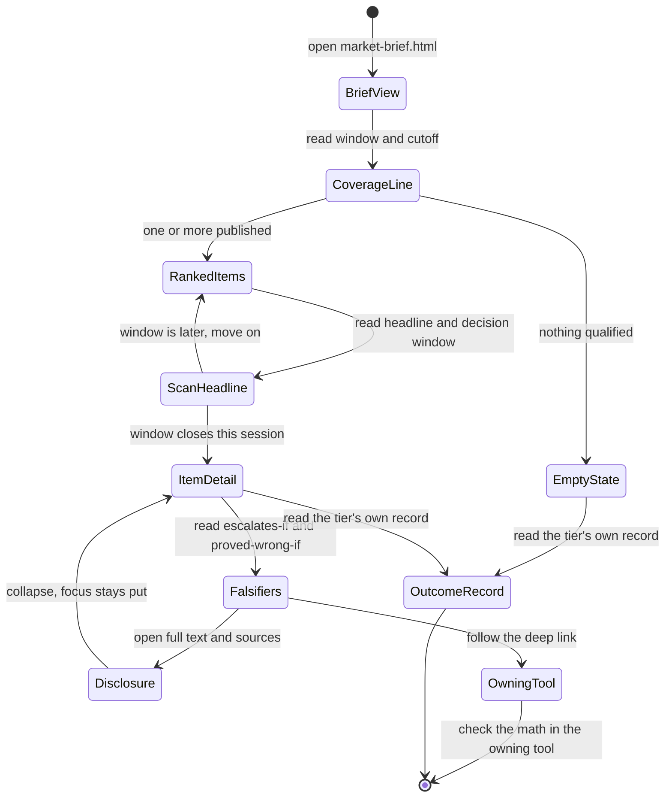
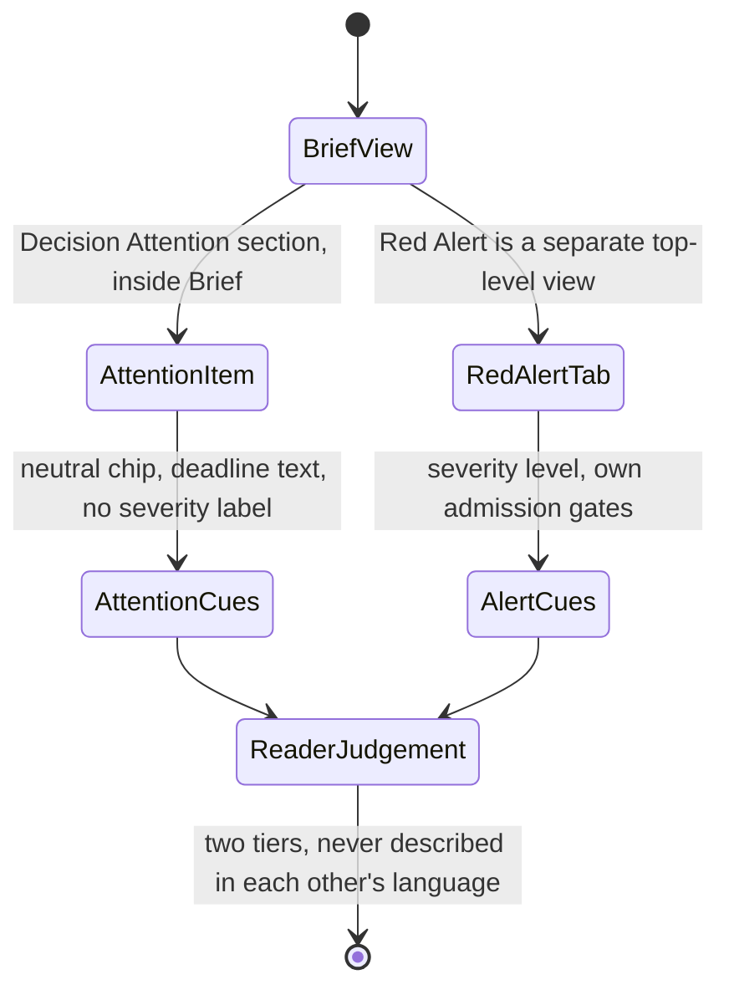
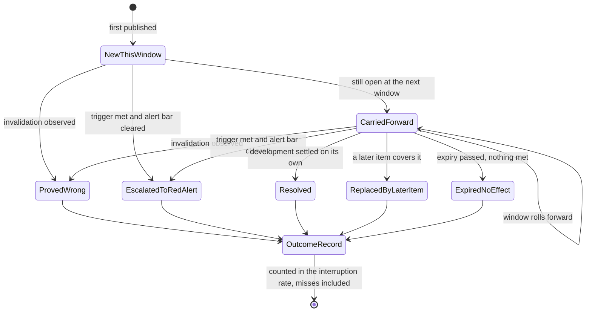
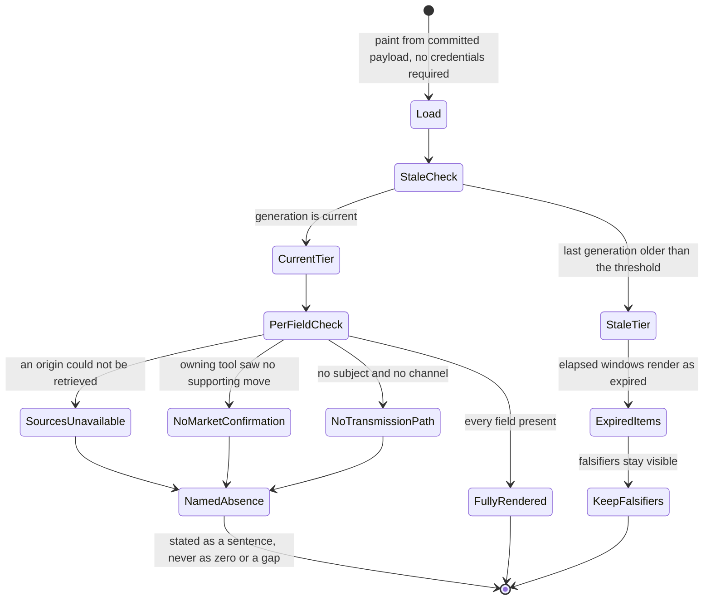

# Feature 017 — Decision Attention & Developing Situations

**Status:** planning
**Workflow mode:** product-to-planning (status ceiling `specs_hardened`)
**Host surface:** a first-class tier inside the existing **Brief** view of the
Market Action Center (`market-brief.html`). **Not** a new tool. **Not** a fifth
top-level view.
**Educational only — not investment advice.**

---

## Problem

A reader opens the brief at 07:30 ET. Overnight, an earnings print landed far
outside its implied move, a supplier region moved a step closer to a shutdown,
and a funding spread widened for the third session running. None of the three
is a systemic threat. All three could change what this reader does before
today's close. **The product has no surface that will tell them.**

That is not a rendering gap. It is a missing tier, and every part of the
existing machinery confirms it by refusing the material at a different point.

**Red Alert refuses it on severity, and correctly.** A visible Red Alert must be
`severityLevel` 4 or 5 — `rlmarketaction.js` line 1291 rejects anything else with
`RLMKT-REDALERT` — and must clear seven hard gates plus an admission score of
75 (`rlmarketaction.js` line 1142; `market-brief.config.json`
`red-alert-policy/v1` `scoreThreshold: 75`, `minSeverity: 4`,
`minIndependentOrigins: 2`). The policy's own `severityLabels` map defines five
levels — `1 informational`, `2 low`, `3 elevated`, `4 high`, `5 severe`. Levels
1 through 3 are *named in the contract and shown nowhere.* A level-3 "elevated"
observation is classified, scored, and then discarded. When a candidate is
rejected, `rlmarketaction.js` line 1492 renders only a safe count —
*"Screened out this window (safe counts only, no rejected title shown)"* — from
the closed `REJECTION_REASON_CLASSES` vocabulary, one of whose members is
literally `low-severity`. The reader is told a number and never the thing.

**The attention feed refuses it on shape, by having no shape at all.** The brief
already renders a feed — `market-brief.html` line 800 titles it *"Actionable
changes and catalysts"* over `<div class="feed" id="attention">` at line 801 —
but nothing in the pipeline asks an attention item to be about *now*.
`rlbrief.js` `rankAttention` (line 96) orders cards by exactly one expression:
`confidence × a fixed domain weight` from `{regime: 1.3, gamma: 1.2,
rotation: 1.15, event: 1.1, momentum: 1.0, flows: 0.9}`. There is no urgency
term, no decision-window term, no novelty term, and no corroboration term. The
only filter is
`rlexperience-adapters/market-action.js` `actionableAttention` (line 100), which
keeps a card if it has a `structuralAnchor`, clears
`minimumAttentionConfidence` (55), and does not match
`/\bwatch(?:list)?\b|intraday noise|not yet a trend/i`. That is a noise filter.
It is not an attention model, and its own comment says so: *"Lower-confidence
material belongs in owning tools, not the brief."*

**The validator refuses to hold it to any standard.** This is the mechanical
root cause. `scripts/validate-brief-payload.mjs` enforces, for every
`nextSession.actions[i]` (lines 146-155): an action family from
`hold|trim|add|hedge|rotate`; six required text fields — `subject`, `rationale`,
`structuralAnchor`, `trigger`, `invalidation`, `deepLink`; a horizon from
`structural|swing|tactical`; a confidence floor; and a tactical confidence cap.
For the entire `attention` array it enforces **two lines** (182-183): it must be
an array, and it must not exceed `attentionMaxCards`. There is no per-item field
contract. None.

**The measured consequence is exactly what an absent contract predicts.**
`docs/Product-Review-and-Roadmap.md` §14 recorded two OPEN defects on
2026-08-04: claim 8, *"each is one scannable line"*, measured card titles of
**401-496 characters** against §10.1's **≤ 120-character headline** target; and
claim 10, *"then the level that would prove it wrong"*, measured **0 of 7** cards
carrying an invalidation field. Re-measured against the committed
`market-brief.payload.json` in this pass, both are **worse or unchanged**: the
five current cards carry titles of **572, 612, 515, 559 and 574 characters** —
the miss has widened from ~4× to ~5× — and **0 of 5** carry an invalidation. The
card keys are `confidence, deepLink, domain, horizon, rank, structuralAnchor,
title, what, why`. The keys that make a claim checkable — `trigger`,
`invalidation` — exist one object away, on `recommendations[]`
(`confidence, deepLink, direction, horizon, instrument, invalidation, levels,
rationale, structuralAnchor, trigger`). The reader of a card is shown the
narrative promise and denied the falsifier.

**And the horizon vocabulary cannot express the question being asked.** The
operator's question is *"does this change what I do today, or in the next
session?"* The finest available horizon is `tactical`, and the finest Red Alert
`horizonBands` entry is `0-2w` — **fourteen days**. Neither can say *"decide
before the close."* The concept does not exist in the product today: a
repository-wide search for `decisionWindow`, `beforeClose`, `sessionPhase` and
their variants returns nothing outside the exchange-calendar data file.

**The gap is therefore precise, and the material to close it is already
committed.** It is not a severity gap and not an evidence gap — it is a missing
*urgency* axis, and the inputs for it are on disk:
`market-brief.config.page.json` (`market-brief-config-page/v1`) already declares
the four generation windows — `pre-market` 07:30, `morning` 11:00, `pre-close`
15:00, `after-hours` 17:00, each with a stated focus, the last being *"next-
trading-day plan"* — and `data/calendars/xnys/calendar.json` (`xnys-calendar/v1`)
supplies concrete `preMarket` / `regular` / `afterHours` boundaries with UTC
instants and a `dateState` / `closureCode` per trading date. A decision window
is computable from committed data. Nothing new must be fetched.

**The honest obstacle is that lowering the Red Alert bar would destroy the
alert.** An alert that fires on an elevated-but-not-severe observation is an
alert nobody reads, and the first time it is ignored during a real level-5 event
the product has done active harm. The correct move is the adjacent tier, not the
lower threshold — and the certified vocabulary already anticipates it.
`rlcontracts.js` `evaluateLowNoiseGate` (line 1514) routes every unusual
observation to `action`, `context`, `disputed` or `unavailable` with a sorted
`reasons[]`, and `validateFinalBrief` (lines 1904-1910) already requires each
attention item to carry a `suppressionReason`, to declare a `destination` of
`context` or `no-action`, and never to consume an action slot. That is Feature
002, status `done`. **What is missing is not a disposition. It is the second
axis — urgency — that says which of the many `context` items the reader must
look at before the close.**

---

## Outcome Contract

**Intent:** Give the reader a first-class, bounded tier inside the Brief that
names the unusual developments which could change a decision **today or in the
next session** — an earnings print far outside its implied move, a supply
disruption, a tightening geopolitical situation, a funding stress building for a
third session — without lowering the Red Alert bar and without asking the reader
to infer urgency from a confidence score. Each item states what changed, why it
is unusual, why it matters *now*, by when the reader must decide, what would
escalate it, what would prove it irrelevant, and when it expires — so the tier
can later publish how often it was right to interrupt.

**Success Signal:** A reader opening any of the four generation windows sees a
Decision Attention section in which every item is a headline of **120 characters
or fewer**, carries an explicit decision window resolved to a real session
boundary from the exchange calendar, names the public subjects or transmission
channel it would act through, states an escalation trigger and an invalidation
the reader can check unaided, and deep-links to the tool that owns the
underlying math. When nothing qualifies, the reader sees an explicit
*"nothing requires your attention this window"* state rather than a padded feed.
After a number of windows have closed, the reader can see what share of Decision
Attention items escalated, were confirmed, resolved, or expired without effect —
published on the same surface, misses included, or withheld with the sample size
shown when the sample is too small to state a rate.

**Hard Constraints:**

- **The Red Alert bar does not move.** `minSeverity: 4`, `scoreThreshold: 75`,
  `minIndependentOrigins: 2`, `minOwnerEvidence: 1` and the seven hard gates in
  `rlmarketaction.js` are unchanged by this feature. Decision Attention is an
  adjacent tier, never a demoted alert, and never uses alert affordances.
- **No fifth top-level view.** `tool-experience.config.json` declares
  `market-action-center-four-view/v1` with `viewIds: ["brief", "portfolio",
  "red-alert", "journey"]` and `defaultViewId: "brief"`; `rlmarketaction.js`
  line 47 rejects a fifth view or a top-level Simple/Power mode with
  `RLMKT-VIEW`. Decision Attention lives **inside** the Brief view.
- **No new disposition value.** `rlcontracts.js` line 1907 restricts
  `final.attention[].destination` to `context` or `no-action`. Decision
  Attention is an **urgency axis layered on** the certified
  `low-noise-gate/v1` disposition, not a fifth destination. The gate stays the
  single definition of promote-versus-suppress.
- **Severity and urgency are independent.** A severe development with no mapped
  market transmission may be low-urgency context; a moderate earnings surprise
  two hours before the open may be high-urgency. Neither axis may be derived
  from the other, and neither may be rendered as the other.
- **No hardcoded topic or fear list.** Discovery is evidence-driven. The eight
  `TRANSMISSION_CHANNELS` in `rlmarketaction.js` are classification labels only
   — its own comment states *"the registry contains no named threat; a channel
  cannot seed a candidate."* Named subjects such as a currency pair, a conflict,
  a credit market or a capex cycle are examples with no privileged status.
- **An empty tier is a valid success state.** There is no minimum item count and
  no padding. Rendering a weak item to avoid an empty section is a defect.
- **Research only.** Items produce investigation steps drawn from the closed
  `RESEARCH_VERBS` vocabulary — `monitor`, `verify`, `investigate`,
  `scenario-test`, `review-hedge-research`, `trace-claims`. No trade
  instruction, no direction, no sizing, no execution verb.
- **Public scope only.** Subjects are bounded by the committed public
  `watchlist.json` (12 tickers at `asOf` 2026-08-04) and public market objects.
  No private portfolio state, no sizes, no cost basis, no P&L. *(BI-4, P13)*
- **Decision Attention outcomes never enter the recommendation ledger.** A
  Decision Attention item carries no instrument, direction or level, so it is
  structurally `not-evaluable` as a directional call. `market-brief.scorecard.json`
  currently reports `notEvaluableShare` **0.6816** on 71 resolved of 223 closed,
  against an Improvement-Plan target of **≤ 0.25**. Writing attention outcomes
  into that ledger would push the figure away from its target while telling the
  reader nothing about directional skill. The tier keeps its own outcome record
  and publishes its own rate.
- **The capability cannot be delivered by extending `rlbrief.js`.** That file is
  uncommitted in a concurrent session's working tree, verified by `git status
  --short` in this pass, alongside `rlexperience.js`, `rlfx.js` and `rljourney.js`.
  Decision Attention ships as a **new shared module consumed directly by
  `market-brief.html`**, UMD per P10, with a production consumer per P18.

**Failure Condition:** The feature has failed — even with every test green — if
any of the following is true. The reader cannot tell, in one line, why an item
is in front of them *this window* rather than any other. An item is published
with no invalidation, reproducing the §14 claim-10 defect this feature exists to
close. A headline exceeds 120 characters, reproducing claim 8. The tier fills to
its cap on a quiet day because an empty section felt like a bug. An item is
rendered with alert styling and the reader learns to discount the Red Alert view.
Framework vocabulary — a contract id, a gate code, a scope number, a
`sha256:` digest — reaches the reader (D13). Or the tier ships with no way to
count how often it was wrong to interrupt, which is precisely the failure
`docs/Product-Principles.md` §1 admits nothing past.

---

## Domain Capability Model

### Capability

**Decision-relevance triage for unusual developments.** Given a set of unusual
observations that have already been classified for evidence quality by the
certified low-noise gate, determine which of them could change a reader's
decision within a bounded, calendar-anchored decision window; express that
determination as a compact, falsifiable, expiring item; and record what
subsequently happened to it so the tier's own interruption accuracy can be
published.

The capability is reusable by construction. It has **more than one disposition**
(an observation is routed to one of several tiers) and **more than one consuming
surface** (the global Brief today; a per-tool brief and the Red Alert escalation
path are named consumers). It is therefore specified as a capability with a
provider-neutral vocabulary, not as a rendering change to one page.

### Cross-Cutting Semantics

- **Two axes, never collapsed.** *Disposition* answers "is this good enough
  evidence to act on?" and is owned entirely by the certified
  `low-noise-gate/v1`. *Urgency* answers "must the reader deal with it before a
  named boundary?" and is what this capability adds. A single blended score
  would reintroduce exactly the defect it exists to fix, because the current
  `confidence × domain weight` ordering is such a blend.
- **A window is an instant, not an adjective.** Every decision window resolves
  to a concrete UTC instant derived from `xnys-calendar/v1`. "Urgent" that
  cannot be resolved to a boundary is not urgent; it is unqualified.
- **Absence is a value.** No market confirmation observed, no mapped subject, no
  independent corroboration, and no qualifying item are each stated explicitly.
  None of them renders as zero, as neutral, or as silence. *(P2, BI-2)*
- **Every item is disposable.** An item expires. Expiry without effect is a
  recorded outcome, not a deletion, because the rate of expiring-without-effect
  is the tier's own noise rate and the reason it can pass the admission test.

### Domain Primitives

**Unusual Observation** — a normalized candidate development with a basis, an
as-of, an unusualness claim and its qualifying comparison. Already produced and
classified upstream; this capability consumes it and never invents one.
*Lifecycle:* owned by the certified gate; enters this capability already carrying
a disposition and `reasons[]`.

**Decision Window** — a named, closed-vocabulary period by which the reader must
decide, resolved to a UTC instant from the exchange calendar for the current
trading date. *Lifecycle:* open → elapsed. An elapsed window expires every item
bound to it.

**Transmission Path** — how a development would reach the reader's book: zero or
more public subjects from the watchlist scope, plus at most one channel from the
certified eight-label vocabulary. *Lifecycle:* asserted → corroborated by owning-
tool evidence → or explicitly recorded as *market confirmation not observed*.

**Decision Attention Item** — the published unit: one headline of ≤ 120
characters, what changed and why it is unusual, why it matters now, its decision
window, its transmission path, its evidence state, its investigation step, its
escalation trigger, its invalidation, its expiry, and its lifecycle state.
*Lifecycle:* reuses the certified append-only `LIFECYCLE_STATES` —
`discovered → evidence-building → qualified | rejected`, then
`qualified → acknowledged → monitoring → invalidated | resolved | stale` — with
two states this capability requires and the certified vocabulary does not
contain (see Business Policies).

**Attention Outcome Record** — the append-only record of what happened to a
published item: which terminal state it reached, on what date, and against which
declared trigger, invalidation or expiry. *Lifecycle:* append-only; a correction
is a new record referencing the prior one, never an edit. *(P21, D6)*

**Interruption Rate** — the published aggregate over closed outcome records:
what share of items escalated, were confirmed, resolved, or expired without
effect. *Lifecycle:* withheld with the sample size shown below the declared
minimum sample; published with misses at equal prominence above it. *(P4, P5)*

### Relationships

- One **Unusual Observation** yields at most one **Decision Attention Item**.
  An observation the gate routed to `action` becomes a next-session action and
  **must not** also occupy an attention slot — `rlcontracts.js` line 1910
  already refuses the subject overlap.
- One **Decision Attention Item** has exactly one **Decision Window** and
  exactly one **Transmission Path**.
- One **Decision Attention Item** produces exactly one **Attention Outcome
  Record** when it reaches a terminal state.
- Many **Attention Outcome Records** aggregate to one **Interruption Rate**,
  which is disjoint from the recommendation `hitRate`. The two are never summed,
  averaged, or displayed as one number.
- A **Decision Attention Item** that later clears the Red Alert admission bar
  **transitions**; it is never duplicated into both tiers.

### Business Policies

1. **The gate is upstream and unmodified.** This capability reads a
   `low-noise-gate/v1` result; it never re-decides evidence quality and never
   adds a destination value.
2. **Only `context` and `no-action` are eligible.** An `action` observation is a
   next-session action; a `disputed` or `unavailable` one is withheld.
3. **Urgency requires a resolvable boundary.** An item whose decision window
   cannot be resolved against the calendar is not published.
4. **Falsifiability is mandatory, not graded.** An item with no escalation
   trigger, or no invalidation, or no expiry, is not published. There is no
   partially-scoreable item.
5. **Lifecycle states are reused, not reinvented.** The nine certified
   `LIFECYCLE_STATES` and their append-only transitions are authoritative.
   `escalated` (transition to Red Alert) and `superseded` (replaced by a later
   item covering the same development) are **not** present in that vocabulary —
   confirmed by search across product code — and are the only additions this
   capability requires. Whether they extend the frozen vocabulary or are
   expressed as a reference from an existing terminal state is a design decision
   routed to `bubbles.design`; either way the transition set stays append-only.
6. **Supersession closes the superseded** in the same change. *(P24, D8)*
7. **The cap is a ceiling, not a quota.** Publishing fewer items than the cap,
   including zero, is correct behaviour.
8. **Ranking is deterministic and explainable.** No clock, no randomness. Order
   is reproducible from the item set alone, and the reason an item outranks
   another is stateable in the reader's language. *(P7)*
9. **One definition per concept.** Decision window vocabulary derives from the
   committed `market-brief-config-page/v1` windows; channels from
   `TRANSMISSION_CHANNELS`; investigation verbs from `RESEARCH_VERBS`; lifecycle
   from `LIFECYCLE_STATES`. This capability defines none of them a second time.
   *(P19, D4)*

### Behaviour Vocabulary

| Term | Meaning | Source of truth |
|---|---|---|
| `disposition` | evidence-quality routing of an observation | `low-noise-gate/v1` — `action` / `context` / `disputed` / `unavailable` |
| `decisionWindow` | by when the reader must decide | `market-brief-config-page/v1` windows, resolved via `xnys-calendar/v1` |
| `horizon` | how long the read is expected to hold | existing `structural` / `swing` / `tactical` |
| `channel` | how a development would transmit to the book | the eight `TRANSMISSION_CHANNELS` |
| `investigationStep` | what the reader should do to find out more | the six `RESEARCH_VERBS` |
| `escalationTrigger` | the observation that would raise the item's tier | this capability |
| `invalidation` | the observation that would prove it irrelevant | this capability |
| `expiry` | the instant after which it is stale by construction | this capability |
| `lifecycleState` | where the item is in its life | `LIFECYCLE_STATES` (+ escalation / supersession, see policy 5) |

---

## Capability Inventory

| # | Capability | New or existing | Grounding |
|---|---|---|---|
| C-1 | Evidence-quality classification of an unusual observation | **Existing, certified** | `rlcontracts.js` `evaluateLowNoiseGate` (line 1514); Feature 002 status `done` |
| C-2 | Attention-item envelope validation | **Existing, certified** | `rlcontracts.js` `validateFinalBrief` lines 1904-1910 |
| C-3 | Red Alert admission and severity gating | **Existing** | `rlmarketaction.js` lines 1142, 1291; `red-alert-policy/v1` |
| C-4 | Four-window generation cadence | **Existing** | `market-brief-config-page/v1` |
| C-5 | Exchange session boundaries | **Existing** | `xnys-calendar/v1`, `data/calendars/xnys/calendar.json` |
| C-6 | Per-tool read channel for deep-linking | **Existing** | `market-brief.payload.json` `toolReads` — 15 entries, keys `asOf, deepLink, id, metrics, read, source` |
| C-7 | Payload field-contract enforcement | **Existing, applied only to actions** | `scripts/validate-brief-payload.mjs` lines 146-155 vs 182-183 |
| C-8 | **Urgency determination against a decision window** | **NEW** | absent — no `decisionWindow` / `sessionPhase` concept in product code |
| C-9 | **Decision Attention item contract and render** | **NEW** | absent — attention items carry 9 keys, none falsifiable |
| C-10 | **Attention outcome record and interruption rate** | **NEW** | absent — no outcome record exists for attention items |

---

## Exposure Contract

| Capability | Surface class | Surface id | Status | Plan |
|---|---|---|---|---|
| Decision Attention tier render | `uiRoute` | `market-brief.html` — Brief view, Decision Attention section | planned | this spec |
| Existing attention feed (legacy tier) | `uiRoute` | `market-brief.html` `#attention` | delivered | retained; re-scoped by this spec |
| Decision-relevance triage | `internal` | new shared UMD module, consumed by `market-brief.html` | planned | this spec; module identity owned by `bubbles.design` |
| Item field-contract enforcement | `cliCommand` | `node scripts/validate-brief-payload.mjs` | delivered | extended by this spec to cover attention items |
| Interruption rate publication | `uiRoute` | `market-brief.html` — Brief view, alongside the existing scorecard | planned | this spec |
| Attention outcome record | `internal` | append-only committed artifact, consumed by the interruption-rate computation | planned | this spec; artifact identity owned by `bubbles.design` |

No capability in this spec is left without a `delivered` or `planned` row.

---

## Actors

| Actor | Description | Goals | Boundaries |
|---|---|---|---|
| **A-1 · The self-directed investor** | The single reader described in `docs/Product-Review-and-Roadmap.md` §3.1 — running a small public book, discretionary allocation decisions, **limited attention**, strong aversion to being sold to | Learn, in seconds, whether anything unusual should change today's or the next session's decision; check the claim without leaving the page; know later whether the interruption was warranted | Reads only. Never enters an order through this product. Sees no private position data. |
| **A-2 · The research agent** | The AI agent doing real research four times a day (§3.1), authoring narrative into the generation windows | Surface genuinely unusual developments with citations, without inventing urgency or dramatising a rejected candidate | Cannot bypass the low-noise gate, cannot raise an item's tier, cannot emit an execution verb. Its text is data, never markup. *(BI-7, D1)* |
| **A-3 · The automated generation pipeline** | The scheduled Tier-A process that composes and validates the payload before publication | Refuse to publish a payload whose attention items violate the field contract | Deterministic. No clock-dependent or random ordering. Publishes atomically or not at all. |
| **A-4 · The maintainer** | The single operator reviewing calibration and tuning thresholds | Judge whether the tier interrupts too often or too rarely, from its published outcome record | May tune a declared threshold. May **not** suppress a miss, lower a bar to make a rate look better, or raise a budget to make a red build green. *(P22, D7)* |

---

## Use Cases

### UC-017-001: Read the tier before the open

**Actor:** A-1 · The self-directed investor
**Preconditions:** The `pre-market` window has generated; at least one observation qualified.
**Main flow:**
1. The reader opens the Brief view.
2. The Decision Attention section lists items ordered by urgency then evidence.
3. Each item shows a headline of ≤ 120 characters and its decision window.
4. The reader opens one item and reads what changed, why it matters now, its subjects or channel, its escalation trigger and its invalidation.
5. The reader follows the deep link into the tool that owns the underlying math.
**Alternative flows:** No item qualified — the section states that explicitly and the reader moves on.
**Postconditions:** The reader knows what, if anything, needs attention before the open, and how to check it.

### UC-017-002: Distinguish an attention item from an alert

**Actor:** A-1
**Preconditions:** A Red Alert is visible and a Decision Attention item is present in the same window.
**Main flow:**
1. The reader sees the Red Alert in its own view with its severity.
2. The reader sees the Decision Attention item inside the Brief, structurally and visually distinct.
3. Neither surface describes the other's item.
**Postconditions:** The reader's trust in the Red Alert bar is intact; the attention item was not read as an alarm.

### UC-017-003: Judge urgency independently of severity

**Actor:** A-1
**Preconditions:** Two items — one high-severity with no mapped transmission path, one moderate-severity with a hard boundary two hours away.
**Main flow:**
1. The reader sees the moderate, imminent item ranked above the severe, unmapped one.
2. Each item states its own decision window, and the severe item states that market confirmation was not observed.
**Postconditions:** The reader acted on the axis that matters for the next few hours without being told the severe item is unimportant.

### UC-017-004: Check a claim unaided

**Actor:** A-1
**Preconditions:** An item is published.
**Main flow:**
1. The reader reads the escalation trigger and the invalidation.
2. Both are phrased as observations the reader can check themselves during the session.
3. The reader observes the invalidation condition and disregards the item.
**Postconditions:** The reader resolved the item without waiting for the next generation window.

### UC-017-005: Author an item without inventing urgency

**Actor:** A-2 · The research agent
**Preconditions:** An observation has been routed `context` by the gate with a non-empty `reasons[]`.
**Main flow:**
1. The agent supplies the required fields, including a decision window from the closed vocabulary.
2. The agent supplies an escalation trigger, an invalidation and an expiry.
3. The agent supplies an investigation step from the closed research verbs.
4. The pipeline resolves the window against the exchange calendar and accepts the item.
**Alternative flows:** The window does not resolve, or a falsifiability field is missing — the item is refused and never published.
**Postconditions:** A published item is falsifiable by construction.

### UC-017-006: Refuse to publish a malformed tier

**Actor:** A-3 · The automated generation pipeline
**Preconditions:** A generated payload contains an attention item with a 400-character headline and no invalidation.
**Main flow:**
1. The payload validator applies the attention field contract.
2. It reports the specific violated field and exits non-zero.
3. Publication does not occur.
**Postconditions:** The §14 claim-8 and claim-10 defects cannot recur silently.

### UC-017-007: Escalate an item that grows into an alert

**Actor:** A-3, observed by A-1
**Preconditions:** A published item's escalation trigger is met and the observation now clears the Red Alert admission bar.
**Main flow:**
1. The item transitions to its escalated terminal state.
2. The Red Alert view publishes the alert under its own unchanged gates.
3. The Decision Attention tier no longer carries a live duplicate.
**Postconditions:** One development, one live surface, and a recorded transition between them.

### UC-017-008: Review whether the tier earns its interruptions

**Actor:** A-4 · The maintainer
**Preconditions:** A number of items have reached terminal states.
**Main flow:**
1. The maintainer reads the published interruption rate on the Brief.
2. Escalated, confirmed, resolved and expired-without-effect shares are shown together.
3. Below the declared minimum sample the rate is withheld and the sample size is shown instead.
**Postconditions:** The maintainer can tune a threshold against evidence rather than impression.

### UC-017-009: Read the tier with no credentials

**Actor:** A-1
**Preconditions:** No provider key, no proxy, no account.
**Main flow:**
1. The reader opens the Brief from the committed payload.
2. The Decision Attention section renders from cached committed data.
3. Anything genuinely unavailable is named as unavailable.
**Postconditions:** The tier degrades honestly rather than breaking. *(BI-6, P9)*

### UC-017-010: Read the tier when generation has stopped

**Actor:** A-1
**Preconditions:** No generation has run for longer than the declared staleness threshold.
**Main flow:**
1. The Brief states in plain language that the read is old.
2. Items whose decision windows have elapsed are shown as expired, not as current.
**Postconditions:** A stale tier is never presented as a current one. *(P6)*

---

## Business Scenarios

Each scenario is independently testable and maps one-to-one to a stable
`SCN-017-NNN` identifier at planning time.

### Cluster 1 — Tier boundary and Red Alert integrity

#### BS-017-001: The Red Alert admission bar is unchanged by this feature

```gherkin
Scenario: An elevated-severity development does not become a Red Alert
  Given a development classified at severity 3 "elevated"
  And the Red Alert policy requires minimum severity 4
  When the generation window composes its output
  Then no Red Alert is published for that development
  And the Red Alert admission thresholds are identical to those before this feature
```

#### BS-017-002: A qualifying development still becomes a Red Alert

```gherkin
Scenario: A severe, corroborated development is unaffected by the new tier
  Given a development at severity 5 that clears every Red Alert admission gate
  When the generation window composes its output
  Then it is published as a Red Alert on the Red Alert view
  And it does not also occupy a Decision Attention slot
```

#### BS-017-003: The Center still exposes exactly four top-level views

```gherkin
Scenario: Decision Attention does not add a view
  Given the Market Action Center declares four top-level views
  When the Decision Attention tier is present
  Then the top-level view set is unchanged
  And the tier renders inside the Brief view
```

#### BS-017-004: An attention item is never styled as an alert

```gherkin
Scenario: The reader can tell the two tiers apart
  Given a Decision Attention item and a Red Alert are both present
  When the reader views the Brief
  Then the attention item is structurally distinguishable from an alert
  And it carries no alert severity label
```

### Cluster 2 — Disposition reuse

#### BS-017-005: Only suppressed dispositions are eligible

```gherkin
Scenario: An actionable observation is not diverted into attention
  Given an observation the low-noise gate routed to "action"
  When the tier is composed
  Then it is published as a next-session action
  And it does not appear as a Decision Attention item
```

#### BS-017-006: A disputed or unavailable observation is withheld

```gherkin
Scenario: Weak evidence does not reach the reader through the new tier
  Given an observation routed to "disputed" or to "unavailable"
  When the tier is composed
  Then no Decision Attention item is published for it
```

#### BS-017-007: The certified attention envelope still holds

```gherkin
Scenario: An attention item carries its suppression reason and consumes no action slot
  Given a published Decision Attention item
  Then it declares a destination of "context" or "no-action"
  And it carries a non-empty suppression reason
  And its subjects do not overlap any next-session action subject
```

### Cluster 3 — Decision window and urgency

#### BS-017-008: Every item declares a resolvable decision window

```gherkin
Scenario: An item names when the reader must decide
  Given a Decision Attention item
  Then it declares a decision window from the closed window vocabulary
  And that window resolves to a concrete session boundary for the current trading date
```

#### BS-017-009: An unresolvable window refuses publication

```gherkin
Scenario: Unqualified urgency is not published
  Given a candidate item whose decision window cannot be resolved against the exchange calendar
  When the tier is composed
  Then the item is not published
  And the reason is recorded
```

#### BS-017-010: A non-trading date rolls the window to the next open

```gherkin
Scenario: A closure does not produce a phantom window
  Given the current date is a non-trading date on the exchange calendar
  When an item declares a same-session decision window
  Then the window resolves to the next trading session's open
```

#### BS-017-011: Urgency and severity are independent

```gherkin
Scenario: An imminent moderate item outranks a distant severe one
  Given a moderate-severity item whose decision window closes within the current session
  And a high-severity item whose decision window is the next session
  When the tier is ordered
  Then the moderate, imminent item is ranked first
  And neither item's severity is rendered as its urgency
```

#### BS-017-012: Decision window and horizon are distinct fields

```gherkin
Scenario: How long a read holds is not when a decision is due
  Given an item with a structural horizon
  And a decision window that closes before today's close
  Then both are stated
  And neither is derived from or substituted for the other
```

### Cluster 4 — Item contract and falsifiability

#### BS-017-013: A headline over 120 characters is refused

```gherkin
Scenario: The scannable-line defect cannot recur
  Given a candidate item with a headline longer than 120 characters
  When the payload is validated
  Then validation fails naming the headline field
  And the payload is not published
```

#### BS-017-014: An item without an invalidation is refused

```gherkin
Scenario: The missing-falsifier defect cannot recur
  Given a candidate item with no invalidation
  When the payload is validated
  Then validation fails naming the invalidation field
  And the payload is not published
```

#### BS-017-015: An item without an escalation trigger or expiry is refused

```gherkin
Scenario: Partial scoreability is not accepted
  Given a candidate item missing an escalation trigger or an expiry
  When the payload is validated
  Then validation fails naming the missing field
```

#### BS-017-016: An item names its transmission path or states its absence

```gherkin
Scenario: A development with no mapped route says so
  Given an item with no public subject and no applicable channel
  Then it states explicitly that no transmission path was identified
  And it is not rendered with an empty or inferred subject list
```

#### BS-017-017: Absent market confirmation is stated, never implied

```gherkin
Scenario: The tier does not fabricate corroboration
  Given an item whose owning tool reports no supporting market evidence
  Then the item states that market confirmation was not observed
  And no neutral or zero value stands in for the missing evidence
```

#### BS-017-018: Every item deep-links to the tool that owns the math

```gherkin
Scenario: The tier links rather than reimplements
  Given a published item derived from a tool's read
  Then it carries a deep link to that tool
  And it does not restate that tool's computation
```

#### BS-017-019: Only research verbs are permitted

```gherkin
Scenario: The tier never instructs a trade
  Given a published item
  Then its investigation step is drawn from the closed research-verb vocabulary
  And it contains no direction, no size, and no execution instruction
```

### Cluster 5 — Discovery honesty and boundedness

#### BS-017-020: An empty tier is a valid published state

```gherkin
Scenario: A quiet window publishes nothing rather than padding
  Given no observation qualifies for the tier in this window
  When the Brief renders
  Then the tier states explicitly that nothing requires attention this window
  And no item is published to fill the section
```

#### BS-017-021: No topic is privileged by configuration

```gherkin
Scenario: Discovery is evidence-driven
  Given the configured vocabularies of channels, windows and research verbs
  Then none of them names a specific threat, region, instrument or narrative
  And no configured label can by itself cause an item to be published
```

#### BS-017-022: The cap is enforced and is a ceiling only

```gherkin
Scenario: The tier is bounded
  Given more qualifying candidates than the configured maximum
  When the tier is composed
  Then no more than the maximum are published
  And the ordering that selected them is reproducible from the candidate set alone
```

#### BS-017-023: Ordering is deterministic

```gherkin
Scenario: The same candidates always produce the same order
  Given an identical candidate set composed twice
  Then the published order is identical
  And no wall clock or random source participated
```

### Cluster 6 — Lifecycle and outcome

#### BS-017-024: An item that escalates leaves the tier

```gherkin
Scenario: One development has one live surface
  Given a published item whose escalation trigger is met
  And the development now clears the Red Alert admission bar
  When the next window composes
  Then the item records its escalation
  And it is not published as a live attention item alongside the alert
```

#### BS-017-025: An elapsed expiry closes the item as expired

```gherkin
Scenario: Expiry without effect is recorded, not deleted
  Given a published item whose expiry has passed with no trigger and no invalidation met
  Then it is recorded as expired without effect
  And the record is retained for the interruption rate
```

#### BS-017-026: A superseding item closes the item it replaces

```gherkin
Scenario: The same development is not published twice
  Given a later item covering a development already published
  Then the earlier item is closed as superseded in the same generation
  And the later item references it
```

#### BS-017-027: Outcome history is append-only

```gherkin
Scenario: A correction never rewrites the record
  Given an outcome record that was wrong
  When it is corrected
  Then a new record is appended referencing the original
  And no prior record is modified or removed
```

#### BS-017-028: Attention outcomes never enter the recommendation ledger

```gherkin
Scenario: The scorecard's evaluability figures are not diluted
  Given a Decision Attention item reaching a terminal state
  Then no recommendation-ledger event is written for it
  And the published recommendation hit rate and not-evaluable share are unchanged by it
```

#### BS-017-029: The interruption rate publishes misses with its hits

```gherkin
Scenario: The tier publishes its own noise rate
  Given a sufficient sample of closed outcome records
  When the Brief renders
  Then the escalated, confirmed, resolved and expired-without-effect shares are shown together
  And the expired-without-effect share is shown at equal prominence
```

#### BS-017-030: A thin sample withholds the rate

```gherkin
Scenario: A rate over a handful of items is not published
  Given fewer closed outcome records than the declared minimum sample
  Then no interruption rate is stated
  And the sample size is shown instead
```

### Cluster 7 — Reader legibility and degradation

#### BS-017-031: No framework vocabulary reaches the reader

```gherkin
Scenario: Governance stays out of product copy
  Given the Decision Attention tier rendered in the Brief view
  Then no contract identifier, gate code, spec or scope number, capability slug or content digest is visible
```

#### BS-017-032: Every rendered element carries a contextual tooltip

```gherkin
Scenario: The reader is told what a value means here
  Given any rendered field or control in the tier
  Then it carries a tooltip stating what it is and what the current value implies
```

#### BS-017-033: Authored text renders as text

```gherkin
Scenario: Model-authored content is data, never markup
  Given an item whose authored text contains markup characters
  When it renders
  Then the characters are displayed literally and no markup is interpreted
```

#### BS-017-034: The tier works with no key, proxy or account

```gherkin
Scenario: Honest degradation without credentials
  Given no provider access is configured
  When the reader opens the Brief
  Then the tier renders from committed cached data
  And anything genuinely unavailable is named as unavailable
```

#### BS-017-035: A stale generation is declared

```gherkin
Scenario: An old read is never presented as current
  Given no generation has run within the declared staleness threshold
  When the reader opens the Brief
  Then the page states in plain language that the read is old
  And items whose windows have elapsed render as expired
```

---

## Functional Requirements

Forty requirements, at the `P25` / `D9` cap. See *Cap Compliance* below.

### Tier definition and boundary

- **FR-001** — Decision Attention is published as a distinct tier inside the Brief view of the Market Action Center. It introduces no new top-level view and no new tool.
- **FR-002** — The Red Alert admission contract is unchanged: minimum severity, score threshold, minimum independent origins, minimum owner evidence and the seven hard gates retain their current values and semantics.
- **FR-003** — A Decision Attention item is structurally and visually distinguishable from a Red Alert and carries no alert severity label.
- **FR-004** — Urgency is expressed as an axis independent of the evidence-quality disposition. The feature adds no value to the certified disposition vocabulary.
- **FR-005** — Every published item declares a destination of `context` or `no-action` and carries a non-empty suppression reason.
- **FR-006** — No published item's subjects overlap the subjects of a published next-session action.

### Decision window

- **FR-007** — Every published item declares exactly one decision window from a closed vocabulary derived from the committed generation-window contract.
- **FR-008** — Every declared decision window resolves to a concrete session boundary instant for the current trading date, derived from the committed exchange calendar.
- **FR-009** — An item whose decision window cannot be resolved is refused publication, with the refusal reason recorded.
- **FR-010** — On a non-trading date, or after the current session's boundaries have elapsed, a same-session window resolves to the next trading session's open.
- **FR-011** — Decision window and horizon are separate declared fields. Neither is derived from the other, and neither may be rendered in place of the other.

### Item field contract

- **FR-012** — Every published item carries a headline of 120 characters or fewer.
- **FR-013** — Every published item states what changed and why it is unusual, with its qualifying comparison.
- **FR-014** — Every published item states why it matters now, referencing its decision window.
- **FR-015** — Every published item declares its transmission path: zero or more public subjects within the committed public watchlist scope and at most one channel from the certified channel vocabulary; when neither applies, it states explicitly that no transmission path was identified.
- **FR-016** — Every published item declares its evidence state and the count of independent origins supporting it.
- **FR-017** — Every published item either cites the owning tool's supporting market evidence or states explicitly that market confirmation was not observed.
- **FR-018** — Every published item carries a deep link to the tool that owns the underlying computation and does not restate that computation.
- **FR-019** — Every published item carries exactly one investigation step drawn from the closed research-verb vocabulary, containing no direction, size, or execution instruction.
- **FR-020** — Every published item carries a provenance class on every displayed figure; a figure without provenance does not render.

### Scoreability and outcome

- **FR-021** — Every published item declares an escalation trigger phrased as an observation the reader can check unaided.
- **FR-022** — Every published item declares an invalidation phrased as an observation the reader can check unaided.
- **FR-023** — Every published item declares an expiry instant.
- **FR-024** — An item missing an escalation trigger, an invalidation, or an expiry is refused publication. There is no partially scoreable item.
- **FR-025** — Each published item produces exactly one append-only outcome record when it reaches a terminal state, naming the state, the date and the declared condition that closed it.
- **FR-026** — Outcome records are append-only; a correction is a new record referencing the original, never an edit or a deletion.
- **FR-027** — No Decision Attention outcome is written into the recommendation ledger, and no Decision Attention item contributes to the published recommendation hit rate or not-evaluable share.
- **FR-028** — The tier publishes its own interruption rate — the shares of items that escalated, were confirmed, resolved, or expired without effect — on the Brief view, with the expired-without-effect share at equal prominence to the others.
- **FR-029** — Below a declared minimum closed sample, the interruption rate is withheld and the closed sample size is shown instead.

### Lifecycle

- **FR-030** — Item lifecycle states reuse the certified append-only lifecycle vocabulary; only escalation and supersession, which that vocabulary does not contain, are added, and their transitions remain append-only.
- **FR-031** — An item whose escalation trigger is met and which then clears the Red Alert admission bar transitions to escalated and is not simultaneously published as a live item in both tiers.
- **FR-032** — A superseding item closes the item it replaces in the same generation and references it.

### Discovery honesty and boundedness

- **FR-033** — No configured vocabulary names a specific threat, region, instrument, or narrative, and no configured label can by itself cause an item to be published.
- **FR-034** — Publishing zero items is a valid outcome. When no candidate qualifies, the tier renders an explicit nothing-requires-attention state and publishes no item.
- **FR-035** — The number of published items never exceeds a declared maximum, and the selection and ordering are reproducible from the candidate set alone, with no wall clock and no random source.
- **FR-036** — The reason one item outranks another is stateable in reader-facing language without reference to internal scoring identifiers.

### Enforcement, legibility and degradation

- **FR-037** — Payload validation enforces every field requirement above per item, names the specific violated field on failure, and refuses publication of the whole payload.
- **FR-038** — No contract identifier, gate code, spec or scope number, capability slug, or content digest renders in the tier's default view; every rendered field and control carries a contextual tooltip stating what it is and what the current value implies; and all authored text is escaped at every rendering sink.
- **FR-039** — The tier renders from committed cached data with no provider key, proxy, or account, naming anything genuinely unavailable as unavailable rather than as zero or a placeholder.
- **FR-040** — The capability ships as a new shared module in the repository's existing shared-module convention, consumed by at least one production surface at delivery; it does not extend the brief-rendering module that is currently held by a concurrent working tree.

**Cap compliance.** Exactly 40 functional requirements, at the `P25` / `D9`
ceiling and requiring no written exception. Two mergers were made deliberately to
stay inside it: FR-038 groups the three reader-legibility obligations (no
framework vocabulary, contextual tooltips, escaping at sinks) that are enforced
by existing shared guards rather than by new per-item logic; FR-039 groups
credential-free degradation with honest-absence rendering. If planning determines
either merger obscures a distinct test obligation, the honest resolution is a
**split of this spec** — a natural seam runs between the *publication contract*
(FR-001 to FR-024, FR-033 to FR-040) and the *outcome and interruption-rate
record* (FR-025 to FR-032) — rather than a 41st requirement.

---

## Non-Functional Requirements

- **NFR-001 · Determinism.** Composition, selection and ordering are pure functions of the candidate set and the committed calendar. No wall clock, no randomness, no network at compose time.
- **NFR-002 · Offline first paint.** The tier paints from the committed payload on load, with no click required and no credentials configured.
- **NFR-003 · Bounded payload.** The tier's contribution respects the repository's existing first-load byte budget, and that budget is asserted by a test that can fail.
- **NFR-004 · No new data source.** The decision window derives from the committed exchange calendar and generation-window contract. No new provider, feed, or credential is introduced.
- **NFR-005 · Adversarial guards.** Every guard introduced for this feature carries a case that fails when the guard's target defect is reintroduced — specifically an over-length headline and a missing invalidation. *(P23)*
- **NFR-006 · Additive contracts.** All payload and configuration changes are additive; no existing consumer of the current attention array breaks.
- **NFR-007 · Accessibility parity.** The tier meets the same in-place explanation standard as the rest of the product, including for any non-DOM rendering.
- **NFR-008 · Single-operator scope.** The feature introduces no account, no multi-user state, and no private data path.

---

## Product Principle Alignment

| Principle | How this feature satisfies it |
|---|---|
| **§1 Admission test** | The tier improves decision quality *and* its measurement: FR-025 to FR-029 make the tier's own interruption accuracy countable, so it cannot become an unmeasured feed. Without those requirements this feature would fail the test outright. |
| **P1 / BI-1 Provenance** | FR-020 — every displayed figure carries a provenance class or does not render. |
| **P2 / BI-2 Missing renders as missing** | FR-015, FR-017, FR-039 — no transmission path, no market confirmation, and no available data each render explicitly, never as zero or a neutral value. |
| **P3 / BI-3 Confidence is evidence quality** | FR-016 states evidence state and origin count. FR-028 keeps the interruption rate as a realised frequency published only from counted outcomes. |
| **P4 / BI-5 Misses at equal prominence** | FR-028 — expired-without-effect is published alongside escalated and confirmed, at equal prominence. |
| **P5 Withhold below minimum sample** | FR-029. |
| **P6 Say when the read is old** | BS-017-035. |
| **P7 No blackbox numbers** | FR-035, FR-036 — reproducible selection and a reader-legible ranking rationale. |
| **P8 / BI-7 / D1 Text is data** | FR-038. |
| **P9 / BI-6 Works with nothing** | FR-039, NFR-002. |
| **P10 UMD, never ESM** | FR-040 — the new module follows the existing shared-module convention. |
| **P13 / BI-4 Tickers only** | FR-015 bounds subjects to the committed public watchlist; no private state. |
| **P14 Simple-first cockpit** | FR-012 caps the headline at 120 characters; detail is disclosed on demand, not in the headline. |
| **P15 / D15 Explained in place** | FR-038. |
| **P16 / D4 Deep-link, never duplicate** | FR-018. |
| **P17 / D2 Reachable or removed** | The Exposure Contract carries a surface row for every capability. |
| **P18 / D3 Wired or not shipped** | FR-040 requires a production consumer at delivery; tests do not count. |
| **P19 / D4 One definition per concept** | Business Policy 9 — windows, channels, verbs and lifecycle states are reused from their existing owners, not redefined. |
| **P20 / D5 Every claim is scoreable** | FR-021 to FR-024, with FR-024 refusing the partially scoreable item. |
| **P21 / D6 Additive, append-only** | FR-026, NFR-006. |
| **P22 / D7 Budgets are assertions** | NFR-003. |
| **P23 Guards must be able to fail** | NFR-005. |
| **P24 / D8 Supersession closes** | FR-032. |
| **P25 / D9 Spec cap** | Exactly 40 FR with the split seam stated rather than exceeded. |
| **D10 No status-blocking** | This spec declares no dependency on another spec's status. Its dependencies are named capabilities that exist in committed code today. |
| **D13 No framework vocabulary** | FR-038. |
| **D16 No unscoreable call published** | FR-024 refuses the item outright rather than emitting it unscoreable; FR-027 keeps attention items out of the recommendation ledger entirely, so this feature cannot raise the not-evaluable share. |
| **D17 Reach measured in a browser** | Any reach or coverage claim about this tier is measured in a browser, never asserted from a static search. |
| **D18 No timeout widening** | Any intermittency encountered while validating this tier is measured before any readiness threshold is touched. |
| **N10 Tool pages are scoped** | The tier is a global-surface capability. It renders on the Market Action Center. A per-tool consumer, if later built, shows only that tool's items. |

---

## Competitive Landscape

Assessed from the repository's own recorded competitive position
(`docs/Product-Review-and-Roadmap.md` §6). **No competitor web research was
performed in this pass** — the finding below rests on the committed analysis and
is marked accordingly rather than presented as fresh measurement.

| Competitor | Their equivalent surface | Position of this feature |
|---|---|---|
| SpotGamma ($99-$1,999/mo) | Founder's Note — a human-authored daily read | Cannot match real-time data. This tier competes on falsifiability, not latency: every item ships an invalidation the reader can check. |
| Unusual Whales ($50-$200/mo) | Real-time flow alerts and an AI daily brief | Has the live feed and the ecosystem. It does not publish how often its alerts were noise. |
| Quiver ($25/mo) | Published strategy performance | Publishes a track record for strategies, not for its own attention surface. |
| OpenBB (free/OSS) | Governed-data agent workspace | Closest philosophically; solved integration first, tools second. |
| Composer (flat fee) | Strategy to live execution | Deliberately out of scope — execution converts an educational tool into a regulated one. |

**The differentiating position, restated for this tier.** §6 records the one
defensible edge as a posture rather than a feature: *calibrated honesty with a
published track record*, available to a single-operator project and structurally
unavailable to a subscription competitor. Every product in the table above ships
an attention or alert surface. **None of them publishes how often that surface
was wrong to interrupt.** FR-028 is therefore not an accessory to this feature;
it is the only part of it that a competitor cannot copy.

---

## UI Scenario Matrix

Analyst-owned scenario-to-surface mapping. Wireframes and flows are owned by
`bubbles.ux` and are deliberately absent here.

| Scenario | Actor | Entry point | Steps | Expected outcome | Surface |
|---|---|---|---|---|---|
| Scan the tier pre-open | A-1 | Brief view, default | Open Brief → read the section | Items ordered by urgency, each ≤ 120-character headline with its decision window | Brief view, Decision Attention section |
| Open one item | A-1 | Decision Attention item | Expand an item | What changed, why now, subjects or channel, trigger, invalidation, expiry, investigation step | Brief view, item disclosure |
| Follow the evidence | A-1 | Item deep link | Activate the deep link | Lands in the owning tool showing the underlying math | Owning tool page |
| Quiet window | A-1 | Brief view | Open Brief when nothing qualifies | Explicit nothing-requires-attention state; no padded item | Brief view, Decision Attention section |
| Distinguish from an alert | A-1 | Brief view with a live alert | Compare the two | Structurally distinct; no alert severity label on the attention item | Brief view and Red Alert view |
| Read the tier's own record | A-1, A-4 | Brief view | Read the interruption rate | Escalated / confirmed / resolved / expired-without-effect shown together, or the sample size when withheld | Brief view, alongside the existing scorecard |
| Read with no credentials | A-1 | Brief view | Open with no key or proxy | Renders from committed data; unavailable named as unavailable | Brief view |
| Read a stale generation | A-1 | Brief view | Open after a missed window | Plain-language stale declaration; elapsed items shown expired | Brief view |
| Hover any value | A-1 | Any tier element | Hover or focus | Tooltip states what it is and what the current value implies | Brief view |

---

## UI Wireframes

Owned by `bubbles.ux`. Realises the analyst's *UI Scenario Matrix* above and
closes handoff **H-7** (*"presentation of the two tiers so that an attention item
is never mistaken for an alert, including the empty state and the interruption-
rate surface"*). Nothing here contradicts that matrix; every row of it maps to a
screen below.

**Design language.** None is configured — `.github/bubbles-project.yaml` declares
no `designLanguages` block, so this tier uses the repository's own UI conventions
only: the Simple-first cockpit and universal-tooltip rules in
`.github/copilot-instructions.md`, and the committed visual vocabulary already in
`market-brief.html`.

### Where The Tier Sits

Read from `market-brief.html` in this pass, the Brief view's committed DOM order
is:

| Line | Element | Role |
|---|---|---|
| 777 | `<section id="mac-center">` | Center band |
| 779-783 | `h2.sec` *"Track record — this brief's own error rate"* → `#freshbar` → `#scorecard` | Recommendation ledger's record |
| 785 | `.strip#regimeStrip` → `.sub#liveNote` | Regime strip |
| 788-791 | `h2.sec` *"Next trading session — actions only"* → `#nextSession` | **Immediate-action block** |
| 793 | `details.drawer` *"⌄ Structural backdrop and invalidation map"* | **Long closed context begins** |
| 798-801 | `h2.sec` *"Actionable changes and catalysts"* → `.feed#attention` | Legacy attention feed |
| 803-806 | `h2.sec` *"Events — recent & upcoming"* → `#events` | Events |
| 808-823 | three further `details.drawer` bands | Groups, owning-tool reads, experimental |

The Decision Attention tier is inserted **between line 791 and line 793** — after
the immediate-action block, before the first closed drawer. It is a new sibling
band, not a rewrite of `#attention`. The legacy feed at line 801 keeps its
position and its own heading; whether it is migrated, re-scoped or retired stays
with handoff **H-4** and is not settled by these wireframes.

### DOM Contract For The New Shared Module

`rlbrief.js` is held by a concurrent working tree, so the tier renders from a new
shared module consumed directly by `market-brief.html` (FR-040). Module identity,
internals and naming are **H-2**, owned by `bubbles.design`. The DOM contract
below is the UX-owned half — the mount points and landmarks the module must fill.

```html
<h2 class="sec" title="…contextual tooltip, see Tooltip Contract…">
  Decision attention — what could change today's decision</h2>
<section id="decisionAttention" data-decision-attention data-tkr-auto>
  <!-- module fills exactly these four landmarks, in this order -->
  <p class="sub" data-da-coverage></p>   <!-- window + cutoff truth: always present -->
  <ol class="feed" data-da-items></ol>   <!-- ranked items, or absent when empty -->
  <p class="sub" data-da-unpublished></p><!-- safe not-published count, when any -->
  <div data-da-record></div>             <!-- the tier's own outcome record -->
</section>
```

Four rules bind the module:

1. **`<ol>`, not `<div>`.** Rank is carried by list order, so no rank number is
   rendered. FR-036's rank *reason* is a sentence on the item, never a score.
2. **No live region anywhere in the subtree.** `#mac-center` at line 777 carries
   `aria-live="polite"`; this section deliberately carries none. A live region
   would reintroduce an interruption affordance by another route, which is the
   Failure Condition's *"rendered with alert styling"* in a different costume.
3. **`data-da-coverage` always renders**, populated or empty. The reader must
   never have to infer whether the tier ran.
4. **The tier never writes into `#scorecard`.** FR-027 keeps attention outcomes
   out of the recommendation ledger; a shared surface would invite the reader to
   read one rate as the other.

### Two Axes, Never One Badge

The Failure Condition names alarm styling as a way this feature fails even with
green tests. The tier therefore renders **no composite score and no alert level**,
and separates what a single badge would fuse:

| Axis | Question it answers | Rendered as | Never rendered as |
|---|---|---|---|
| **Urgency** | *By when must I decide?* | `DecisionWindowChip` — a neutral chip whose **text** is the deadline: `Decide before today's close · 16:00 ET` | a colour, a siren, a number, a severity level |
| **Evidence strength** | *How well established is this?* | `EvidenceIdentityStrip` — evidence state + independent-origin count + as-of | a win probability *(P3)* |
| **Reach** | *How far would it travel?* | the transmission-path line — public subjects and/or one channel — or a `NamedAbsenceLine` | an alert severity label *(FR-003)* |

FR-003 forbids an alert severity label on a Decision Attention item, and the
Domain Primitives list carries no severity field. Where an underlying observation
*was* severe, the tier expresses that as **reach**, not as an alert level — a
severe development with no mapped transmission path renders *"No transmission
path identified"* and sits below a moderate one whose window closes first
(BS-017-011, UC-017-003).

**Colour rules, grounded in the committed stylesheet.** `market-brief.html`
defines `.pill.warn` (amber, line 116) and `.pill.bad` (red, line 122). **This
tier uses neither.** Every chip is the base `.pill`. The item's left border uses
`var(--teal)`, never `var(--red)` or `var(--amber)`. No `role="alert"`, no
`@keyframes`, no pulse, no flash. Urgency reaches the reader through the deadline
text and the list order — nowhere else.

### The 120-Character Headline, Enforced Visually

`docs/Product-Review-and-Roadmap.md` §14 claim 8 measured card titles of
**401-496 characters** against a **≤ 120-character** target; this spec's Problem
section re-measured **515-612** on the current five cards. The rendering rule that
keeps the defect visible rather than tidy:

- The headline is an `<h3>` capped at `max-width:940px` — the width `.tag`
  already uses at line 82 of `market-brief.html`.
- **No `text-overflow: ellipsis`. No `-webkit-line-clamp`. No truncation of any
  kind.** A truncated headline hides the exact defect the 120-character rule
  exists to expose, and would let a 600-character title look correct.
- Space is reserved for **2 lines at ≥ 760px** and **3 lines below it**. A
  headline needing a fourth line is a payload defect and must *look* wrong.
- Enforcement is FR-037 at the validator; the renderer's only job is to refuse to
  disguise a violation.

### Reader Vocabulary Mapping (D13)

`docs/Improvement-Plan.md` **N1** measured 157 framework-vocabulary leaks across
23 tools — dependency slugs, gate codes, `Withheld:`, `Acceptance gate:`, scope
numbers, `sha256:` digests, contract versions, generic headings — and **D13**
requires zero. The internal vocabularies this tier consumes are machine slugs; the
reader never sees one. The mapping is UX-owned and normative:

| Internal value | Source | Reader-visible string |
|---|---|---|
| `qualified` | `LIFECYCLE_STATES` | `New this window` |
| `acknowledged` | `LIFECYCLE_STATES` | `Carried from {windowLabel}` |
| `monitoring` | `LIFECYCLE_STATES` | `Being watched` |
| `invalidated` | `LIFECYCLE_STATES` | `Proved wrong` |
| `resolved` | `LIFECYCLE_STATES` | `Resolved` |
| `stale` | `LIFECYCLE_STATES` | `Evidence aged out` |
| escalation (new, policy 5) | this capability | `Escalated to Red Alert` |
| supersession (new, policy 5) | this capability | `Replaced by a later item` |
| expiry reached, nothing met | this capability | `Expired with no effect` |
| `rates-liquidity` | `TRANSMISSION_CHANNELS` | `Rates & liquidity` |
| `fx-carry` | `TRANSMISSION_CHANNELS` | `Currencies & carry` |
| `credit-funding` | `TRANSMISSION_CHANNELS` | `Credit & funding` |
| `volatility-options` | `TRANSMISSION_CHANNELS` | `Volatility & options` |
| `commodities-energy` | `TRANSMISSION_CHANNELS` | `Commodities & energy` |
| `breadth-market-structure` | `TRANSMISSION_CHANNELS` | `Market breadth & structure` |
| `geopolitical-supply-chain` | `TRANSMISSION_CHANNELS` | `Geopolitics & supply chains` |
| `counterparty-operational` | `TRANSMISSION_CHANNELS` | `Counterparty & operations` |
| `monitor` / `verify` / `investigate` | `RESEARCH_VERBS` | `Monitor` / `Verify` / `Investigate` |
| `scenario-test` | `RESEARCH_VERBS` | `Run a scenario` |
| `review-hedge-research` | `RESEARCH_VERBS` | `Review hedge research` |
| `trace-claims` | `RESEARCH_VERBS` | `Trace the claims` |
| `pre-market` / `morning` / `pre-close` / `after-hours` | `market-brief-config-page/v1` `windows[].id` | the committed `windows[].label`: `Pre-market` / `Morning` / `Pre-close` / `After-hours` |

The literal token `Withheld:` — an N1 leak class — appears **nowhere** in this
tier. Where a rate cannot be stated the copy is *"No rate yet"* (see Screen 5).

### Screen: Decision Attention — populated

**Actor:** A-1 · The self-directed investor  ·  **Route:** `market-brief.html`
(Brief view), between `#nextSession` and the backdrop drawer  ·  **Status:** New
**Serves:** BS-017-003, BS-017-004, BS-017-008, BS-017-011, BS-017-012,
BS-017-016 through BS-017-019, BS-017-022, BS-017-032

```
DECISION ATTENTION — WHAT COULD CHANGE TODAY'S DECISION                (h2.sec)
┌──────────────────────────────────────────────────────────────────────────────┐
│ Pre-market window, 07:30 ET · 6 Aug 2026 · 14 developments reviewed · 3 shown │
└──────────────────────────────────────────────────────────────────────────────┘

 1 ┌────────────────────────────────────────────────────────────────────────┐
   │ Supplier region moved a step closer to shutdown; two of our names       │  h3, ≤120 chars
   │ source there                                             [ 78 / 120 ]  │  (budget shown here
   │                                                                        │   for the spec only —
   │ (Decide before today's close · 16:00 ET) (New this window)             │   never rendered)
   │ Two independent sources · Public reporting · Seen 05:40 ET             │  DecisionWindowChip
   │                                                                        │  + lifecycle + evidence
   │ Why now   A shutdown decision is expected before this session closes,   │
   │           so waiting for tomorrow's brief forecloses the choice.        │
   │ What      Restrictions widened from one port to the whole province —    │
   │           first time in the 3-year comparison window.                   │
   │ Reaches   NVDA · AVGO   through  Geopolitics & supply chains            │  TickerLink ×2
   │ Market    Sector research lab, 07:30 ET: semis −1.4% vs SPY on the day  │  → owning tool
   │           → Open sector research lab                                    │
   │                                                                        │
   │ ┌── Escalates if ────────────────┐ ┌── Proved wrong if ───────────────┐│  both ALWAYS visible
   │ │ A second province is added, or │ │ The restriction is lifted, or    ││
   │ │ any named supplier halts       │ │ both names trade flat-to-up vs   ││
   │ │ shipment.                      │ │ SPY through the close.           ││
   │ └────────────────────────────────┘ └──────────────────────────────────┘│
   │                                                                        │
   │ Expires   Tomorrow's open, 09:30 ET 7 Aug 2026                         │
   │ Do this   Verify — check both filings pages for a shipment notice.     │  RESEARCH_VERBS
   │ Order     First because its decision window closes soonest.            │  FR-036, plain words
   │                                                                        │
   │ ⌄ Full text, sources and history                                       │  ClosedEvidenceDisclosure
   └────────────────────────────────────────────────────────────────────────┘

 2 ┌────────────────────────────────────────────────────────────────────────┐
   │ Funding spread widened a third straight session, past its 12-month band │
   │ (Decide before tomorrow's open · 09:30 ET) (Carried from Pre-close)     │
   │ One independent source · Public source · Seen 06:05 ET                  │
   │ …same field order…                                                      │
   │ Market    Market confirmation not observed.                             │  NamedAbsenceLine —
   │           The tool that owns this reading found no supporting move in    │  OUTSIDE the drawer
   │           prices, spreads or positioning at its last run — 07:30 ET,     │
   │           6 Aug 2026. This is an absence of evidence, not evidence       │
   │           against.                                                      │
   │ Order     Second because its window closes after item 1's.              │
   │ ⌄ Full text, sources and history                                        │
   └────────────────────────────────────────────────────────────────────────┘

 3 ┌────────────────────────────────────────────────────────────────────────┐
   │ …third item, same structure…                                            │
   └────────────────────────────────────────────────────────────────────────┘

┌──────────────────────────────────────────────────────────────────────────────┐
│ Not shown this window: 11 developments were reviewed and not published — 6    │  UnpublishedCountLine
│ had no decision due before the next window, 3 because their sources disagree, │  safe counts only
│ 2 because the evidence could not be corroborated. Titles are withheld; a      │
│ development that has not cleared the bar has not earned a description.        │
└──────────────────────────────────────────────────────────────────────────────┘

┌──────────────────────────────────────────────────────────────────────────────┐
│ HOW OFTEN THIS TIER WAS RIGHT TO INTERRUPT              (see Screen 5)        │  InterruptionRateBand
└──────────────────────────────────────────────────────────────────────────────┘
```

**Field order is normative** and is also the DOM order: headline → chips →
evidence strip → *Why now* → *What* → *Reaches* → *Market* → falsifier pair →
*Expires* → *Do this* → *Order* → disclosure. The two blocking limitations — an
absent transmission path (*Reaches*) and absent market confirmation (*Market*) —
sit at positions 5 and 6, **outside** the disclosure, per the
`ClosedEvidenceDisclosure` rule inherited from spec 012.

**Interactions**

| Element | Action | Result |
|---|---|---|
| `DecisionWindowChip` | hover / focus / `ⓘ` tap | `ContextualTooltip`: what a decision window is, plus *"this one closes in 6h 12m; after that the item expires whether or not anything happened"* |
| Lifecycle chip | hover / focus / tap | Tooltip: what the state means, plus which window the item first appeared in |
| Evidence strip item | hover / focus / tap | Tooltip: what an independent origin is, plus *"two origins agree; this is corroborated, not confirmed by the market"* |
| Ticker (`NVDA`) | click | Yahoo Finance in a new tab, per the shared ticker contract; hover/focus shows company name + kind |
| *"Open sector research lab"* | click | Navigates to the owning tool (FR-018). Same-tab; the brief is a page the reader returns to |
| Falsifier pair | — | **Not interactive and not collapsible.** Always rendered |
| `⌄ Full text, sources and history` | click / `Enter` / `Space` | Native `<details>` expands in place. Focus stays on the summary |
| *Not shown this window* count | hover / focus | Tooltip: why an unpublished development is not named |
| Whole item | — | **The card is not a link.** Only the named links navigate; a whole-card click target would make the deep link ambiguous |

**Responsive**

- **≥ 760px** — one column, full-width band; falsifier pair is a two-column grid;
  *Why now / What / Reaches / Market / Expires / Do this / Order* are label-value
  rows with the label in a fixed 84px gutter.
- **< 760px** (the single breakpoint already in `market-brief.html`, line 309) —
  falsifier pair stacks: **Escalates if** above **Proved wrong if**, in that
  order, each keeping its own heading. Label gutter collapses; each label becomes
  a line above its value. Chips wrap using the `.strip>.pill` rule already at
  line 102 (`overflow-wrap:anywhere; white-space:normal`). Headline reserves 3
  lines. See Screen 6 for the full narrow projection.
- The item never becomes a horizontally scrolling row and never truncates.

**Accessibility**

- `<ol>` with one `<li>` per item; each headline is an `<h3>` under the section's
  `<h2>`. Rank is list position, announced natively — no rank badge to read out.
- **No `role="alert"`, no `aria-live`, no `aria-atomic`** anywhere in the subtree.
- Every state is in the accessible name as **text**, never colour alone: the
  window chip's name is `Decision window: decide before today's close, 16:00 ET`;
  the lifecycle chip's is `Status: new this window`.
- Falsifier pair uses two `<h4>` headings (*Escalates if*, *Proved wrong if*) so a
  screen-reader user can reach them from the heading list without expanding
  anything.
- Every interactive target is ≥ 44 × 44 px, including the `ⓘ` touch affordance
  that pairs with each hover tooltip.
- Tooltip content is identical across hover, keyboard focus and touch; `Escape`
  and outside-click dismiss; focus returns to the trigger.
- Expanding the disclosure does not move focus; disclosure content follows its
  summary in DOM order.
- Visible focus ring on every chip, link and summary.
- Reading order equals DOM order equals visual order at both widths.

### Screen: Decision Attention — empty

**Actor:** A-1  ·  **Route:** same  ·  **Status:** New
**Serves:** BS-017-020, FR-034 — *"an empty tier is a valid success state"*

```
DECISION ATTENTION — WHAT COULD CHANGE TODAY'S DECISION                (h2.sec)
┌──────────────────────────────────────────────────────────────────────────────┐
│ Pre-market window, 07:30 ET · 6 Aug 2026 · 14 developments reviewed · 0 shown │
├──────────────────────────────────────────────────────────────────────────────┤
│                                                                              │
│  Nothing requires your attention this window.                                │
│                                                                              │
│  Fourteen unusual developments were reviewed. None has a decision due before  │
│  the next window at 11:00 ET. An empty section here is a normal result, not   │
│  a failure to load.                                                          │
│                                                                              │
└──────────────────────────────────────────────────────────────────────────────┘

┌──────────────────────────────────────────────────────────────────────────────┐
│ HOW OFTEN THIS TIER WAS RIGHT TO INTERRUPT              (see Screen 5)        │
└──────────────────────────────────────────────────────────────────────────────┘
```

**Exact reader-visible copy** — `{n}` and `{nextWindowEtTime}` are the only
substituted values; `{nextWindowEtTime}` comes from
`market-brief-config-page/v1` `windows[].etTime`:

> **Nothing requires your attention this window.**
>
> {n} unusual developments were reviewed. None has a decision due before the next
> window at {nextWindowEtTime} ET. An empty section here is a normal result, not a
> failure to load.

When `{n}` is `0` the second sentence is replaced, because *"zero developments
were reviewed"* would read as a pipeline failure and it is not one:

> **Nothing requires your attention this window.**
>
> No unusual development was reviewed this window. An empty section here is a
> normal result, not a failure to load.

**Interactions** — the coverage line's tooltip explains what *reviewed* means and
that the count is deliberately unnamed. Nothing else in the empty state is
interactive; there is no retry control, because there is nothing that failed. The
outcome-record band below remains present and interactive exactly as in Screen 5.

**Responsive** — the copy block is a single full-width band at both widths; at
< 760px the coverage line wraps to two lines and the sentences reflow. No layout
change, no separate mobile string.

**Accessibility** — the empty state is a `<p>` inside the section, not a
`role="status"` and not a live region: it is present at first paint, so there is
nothing to announce. The heading level and section landmark are unchanged from
the populated screen, so a screen-reader user's heading map does not shift
between a quiet window and a busy one. It carries no warning icon, no colour
accent, and no `.pill.warn` — the state is neutral, and the copy says so.

### Screen: A single item, expanded

**Actor:** A-1  ·  **Route:** same, one `<details>` open  ·  **Status:** New
**Serves:** BS-017-013 through BS-017-019, BS-017-033, UC-017-004

```
 1 ┌────────────────────────────────────────────────────────────────────────┐
   │ Supplier region moved a step closer to shutdown; two of our names       │
   │ source there                                                           │
   │ (Decide before today's close · 16:00 ET) (New this window)              │
   │ Two independent sources · Public reporting · Seen 05:40 ET              │
   │                                                                        │
   │ Why now   … │ What … │ Reaches … │ Market …                            │  ── ALWAYS VISIBLE ──
   │ ┌── Escalates if ──┐ ┌── Proved wrong if ──┐                           │  ── ALWAYS VISIBLE ──
   │ Expires … │ Do this … │ Order …                                        │  ── ALWAYS VISIBLE ──
   │                                                                        │
   │ ⌃ Full text, sources and history                          [expanded]   │
   │ ┌──────────────────────────────────────────────────────────────────┐   │
   │ │ FULL TEXT                                                        │   │
   │ │ The restriction order published 05:40 ET extends the existing    │   │
   │ │ port-level measure to the whole province. In the 3-year          │   │
   │ │ comparison window used here, no prior order covered more than    │   │
   │ │ one port. …                                                      │   │
   │ │                                                                  │   │
   │ │ SOURCES — 2 independent origins                                  │   │
   │ │ • Provincial notice, published 05:40 ET  → open source           │   │
   │ │ • Wire report, published 06:02 ET        → open source           │   │
   │ │                                                                  │   │
   │ │ OWNING-TOOL EVIDENCE                                             │   │
   │ │ Sector research lab · read at 07:30 ET · semis −1.4% vs SPY      │   │
   │ │ → Open sector research lab                                       │   │
   │ │                                                                  │   │
   │ │ HISTORY                                                          │   │
   │ │ 6 Aug 07:30  New this window                                     │   │
   │ └──────────────────────────────────────────────────────────────────┘   │
   └────────────────────────────────────────────────────────────────────────┘
```

**What is visible by default versus disclosed** — the rule, not a preference:

| Field | Default | Why |
|---|---|---|
| Headline, window chip, lifecycle chip, evidence strip | **Visible** | The scan layer; the reader decides whether to open on these alone |
| *Why now*, *What*, *Reaches* | **Visible** | *Reaches* is a blocking limitation when it is an absence |
| *Market* — evidence **or** its named absence | **Visible** | FR-017; a missing corroboration hidden behind a click is a missing corroboration the reader will not find |
| *Escalates if* / *Proved wrong if* | **Visible** | FR-021, FR-022, and the §14 claim-10 defect this feature exists to close. Hiding the falsifier reproduces the defect with extra steps |
| *Expires*, *Do this*, *Order* | **Visible** | Short, and each changes whether the reader acts |
| Full authored text, source list, owning-tool evidence detail, lifecycle history | **Disclosed** | Long context; `ClosedEvidenceDisclosure` |

**Interactions** — `Enter`/`Space` on the summary toggles; the caret flips `⌄`→`⌃`;
open state persists only for the current page session and never enters the URL.
Every source link opens in a new tab with a descriptive accessible name (*"Open
provincial notice, published 05:40 ET"*), never *"link"* or *"here"*. The
owning-tool link is separate from the source links and is labelled as the tool.

**Responsive** — at < 760px the disclosure body's four blocks stack in the same
order; the source list becomes one link per line; the history table becomes
`date — state` lines. The disclosure never becomes a modal or a bottom sheet;
it expands in place at both widths so the reader keeps their scroll position.

**Accessibility** — native `<details>`/`<summary>` semantics, no ARIA
substitute. Expanding does **not** move focus (spec 012 composition rule 6), and
the expanded content follows the summary in DOM order so the next `Tab` lands
inside it. The four disclosure blocks use `<h4>` headings. All authored strings
are escaped at the rendering sink (FR-038, BS-017-033) — a headline containing
`<b>` renders those five characters literally.

### Screen: Degraded states

**Actor:** A-1  ·  **Route:** same  ·  **Status:** New
**Serves:** BS-017-016, BS-017-017, BS-017-034, BS-017-035, UC-017-009,
UC-017-010, and P2 / P6

Four degradations, each rendering honestly and none rendering as zero, neutral or
silence. **Exact reader-visible copy** follows each.

#### D-a · Stale generation

`market-brief.html` already owns the page-level declaration: `#freshbar`
(line 784, `role="status"`, hidden when current) fires against
`freshness-policy/v1` — `warnAfterHours: 18`, `staleAfterHours: 72`. The tier
**does not** raise a second stale banner; it adds only the tier-specific
consequence to its own coverage line.

```
DECISION ATTENTION — WHAT COULD CHANGE TODAY'S DECISION
┌──────────────────────────────────────────────────────────────────────────────┐
│ Not reviewed since the After-hours window, 17:00 ET on 1 Aug 2026 — 4 days    │
│ ago. Items below stand as they did at that window. Any whose decision window  │
│ has passed are marked expired.                                               │
└──────────────────────────────────────────────────────────────────────────────┘
 1 ┌────────────────────────────────────────────────────────────────────────┐
   │ Funding spread widened a third straight session, past its 12-month band │
   │ (Window passed · was 09:30 ET, 4 Aug 2026) (Expired with no effect)     │
   │ …fields unchanged, still showing their falsifiers…                      │
   └────────────────────────────────────────────────────────────────────────┘
```

> **Not reviewed since the {windowLabel} window, {etTime} ET on {date} — {n} days
> ago.** Items below stand as they did at that window. Any whose decision window
> has passed are marked expired.

An expired item keeps its falsifiers visible: the reader may still be able to
check them, and removing them would hide what the item claimed.

#### D-b · Evidence unavailable

```
   │ One of two sources unavailable · Public reporting · Seen 05:40 ET       │
   │ Supporting sources unavailable. One of two independent origins could    │
   │ not be retrieved this window. The item is shown with the evidence that  │
   │ was retrieved; the missing origin is named below rather than counted    │
   │ as agreement.                                                          │
```

> **Supporting sources unavailable.** {retrieved} of {declared} independent
> origins could not be retrieved this window. The item is shown with the evidence
> that was retrieved; the missing origin is named below rather than counted as
> agreement.

The origin count **never** renders as the lower number silently. An unretrieved
origin is `Unavailable` in the `ProvenanceLabel` vocabulary, never absent and
never zero *(P2)*.

#### D-c · Market confirmation absent

Rendered in the *Market* row, **outside** the disclosure:

> **Market confirmation not observed.** The tool that owns this reading found no
> supporting move in prices, spreads or positioning at its last run —
> {etTime} ET, {date}. This is an absence of evidence, not evidence against.

The final sentence is load-bearing: without it a reader reasonably infers the
market has *rejected* the development, which is a different and unsupported claim
*(P2, P3)*.

#### D-d · Sources disagree

A `disputed` observation is **withheld and never published** (BS-017-006), so no
live item can carry a disputed state. The reader learns of it as a safe count in
the *Not shown this window* line — matching the precedent already in
`rlmarketaction.js` line 1492, which renders *"screened out this window (safe
counts only, no rejected title shown)"*:

> **Not shown this window:** {total} developments were reviewed and not
> published — {a} had no decision due before the next window, {b} because their
> sources disagree, {c} because the evidence could not be corroborated. Titles are
> withheld; a development that has not cleared the bar has not earned a
> description.

#### D-e · No credentials, no proxy, no account

The tier paints from the committed payload with no provider access configured
(FR-039, NFR-002, P9/P12). Nothing about the section changes; only genuinely
unavailable *fields* carry the `Unavailable` provenance label. There is **no**
"configure access to see this" empty shell — that would fail P9 rather than
report it.

**Interactions (all degraded states)** — every degradation string carries its own
`ContextualTooltip` explaining what is absent and what it does not imply. None of
them exposes a retry, refresh or configure control inside the tier: refresh is a
page-level action, and offering it here would suggest the reader can fix an
authored-narrative gap by clicking.

**Responsive** — every degradation string is a full-width paragraph that reflows;
none is a chip, none is truncated, and none moves into a tooltip at narrow width.
At < 760px they sit in exactly the same position in the reading order.

**Accessibility** — degradation text is ordinary prose in DOM order, not an
`aria-label` and not tooltip-only, so it is available to a screen reader without
hovering. None uses `role="alert"`; the stale line is plain text because the
page-level `#freshbar` already owns the `role="status"` announcement and two
statuses for one fact would announce twice. Each carries a text label as well as
any icon or shape, never colour alone.

### Screen: The tier's own outcome record

**Actor:** A-1 and A-4 · The maintainer  ·  **Route:** foot of the Decision
Attention section  ·  **Status:** New
**Serves:** BS-017-029, BS-017-030, FR-028, FR-029, and P4 / P5

**Placement, and why not inside `#scorecard`.** `#scorecard` (line 783) renders
above the attention feed and is the **recommendation ledger's** record — it
publishes `hitRate` and `notEvaluableShare` over directional calls. FR-027 keeps
Decision Attention outcomes out of that ledger entirely, and the two rates measure
different things: one is *"were the calls right"*, the other is *"was the
interruption warranted"*. Merging them into one surface invites the reader to read
one as the other, which is the P3 error in a new place. The tier's record
therefore renders as its own band at the **foot of its own section**, on the same
Brief view — *alongside* the scorecard, never inside it. The rejected alternative
(a second column in `#scorecard`) is recorded here so the choice is not re-opened
silently.

#### Published — at or above the minimum closed sample

```
HOW OFTEN THIS TIER WAS RIGHT TO INTERRUPT                             (h3)
┌──────────────────────────────────────────────────────────────────────────────┐
│  Of the last 34 closed items:                                                │
│                                                                              │
│   ESCALATED       CONFIRMED       RESOLVED        EXPIRED, NO EFFECT         │
│      6               9               7                  12                   │
│     18%             26%             21%                 35%                  │
│   ─────────────  ─────────────  ─────────────  ─────────────                 │
│   ← identical type size, weight and column width across all four →           │
│                                                                              │
│  Twelve of thirty-four interruptions changed nothing. That is this tier's    │
│  own noise rate.                                                             │
│                                                                              │
│  Closed items are counted against the trigger, invalidation and expiry each  │
│  one published for itself. This is separate from the track record above,     │
│  which scores directional calls.                                            │
└──────────────────────────────────────────────────────────────────────────────┘
```

> **Of the last {closed} closed items: {a} escalated, {b} were confirmed, {c}
> resolved on their own, {d} expired with no effect.**
>
> {D-in-words} of {closed-in-words} interruptions changed nothing. That is this
> tier's own noise rate.
>
> Closed items are counted against the trigger, invalidation and expiry each one
> published for itself. This is separate from the track record above, which scores
> directional calls.

**Equal prominence is geometric, not chromatic** *(P4)*. The four figures are
four sibling cells with identical type size, weight, column width and vertical
position. `EXPIRED, NO EFFECT` is **not** placed last-and-smaller, is **not**
behind a toggle, and takes **no** alert colour — `market-brief.html` line 351
gives `.scorecard-body .acard` a red left border for recommendation misses, and
this band deliberately does not reuse it. The sentence restating the miss count in
words exists because a percentage is easy to skim past and a sentence is not.

#### Withheld — below the minimum closed sample

`scorecard-policy/v1` sets `minResolvedSample: 20` for the recommendation ledger;
this tier declares its own minimum, and the value is **H-3**, owned by
`bubbles.design`. The state, not the number, is fixed here:

```
HOW OFTEN THIS TIER WAS RIGHT TO INTERRUPT
┌──────────────────────────────────────────────────────────────────────────────┐
│  No rate yet — 7 of the 20 closed items needed.                              │
│                                                                              │
│  Seven Decision Attention items have reached an end state. Four of those      │
│  seven expired with no effect. No rate is stated until twenty have closed,   │
│  because a rate over seven items is noise dressed as evidence.               │
└──────────────────────────────────────────────────────────────────────────────┘
```

> **No rate yet — {closed} of the {minimum} closed items needed.**
>
> {Closed-in-words} Decision Attention items have reached an end state.
> {D-in-words} of those {closed-in-words} expired with no effect. No rate is
> stated until {minimum} have closed, because a rate over {closed} items is noise
> dressed as evidence.

Two rules hold in the withheld state. The **sample size is shown** *(P5)*, and the
**miss count is still shown** *(P4)* — withholding the rate must not become a way
to withhold the misses. When `{closed}` is `0` the second paragraph is:

> No Decision Attention item has reached an end state yet. No rate is stated until
> {minimum} have closed.

**Interactions** — each of the four outcome labels carries a `ContextualTooltip`
giving both the definition and the current reading, e.g. *"Expired with no
effect — the item's expiry passed without its escalation trigger or its
invalidation being met. 12 of the last 34. Just over a third of this tier's
interruptions were not worth making."* The band heading's tooltip states that this
record is separate from the recommendation track record and why. Nothing in the
band is a control; there is no filter, no window selector and no drill-down —
selective slicing is how a published miss rate quietly becomes a favourable one.

**Responsive** — at ≥ 760px the four figures are a four-column grid; at < 760px
they become a two-by-two grid, **still four equal cells in the same order**, so
`EXPIRED, NO EFFECT` never falls below a fold that the other three sit above. The
two prose paragraphs reflow unchanged.

**Accessibility** — the band is a `<h3>` plus a `<dl>`; each figure is a `<dd>`
whose `<dt>` is the full label, so a screen reader reads *"Expired with no effect:
12 of 34, 35 percent"* rather than a bare number. Reading order is escalated →
confirmed → resolved → expired, identical at both widths, and the summary sentence
follows all four so it is never read before the figures it summarises. No live
region: the record changes only between generations, and announcing it would be an
interruption about interruptions.

### Screen: Narrow projection (< 760px)

**Actor:** A-1  ·  **Route:** `market-brief.html` at narrow viewport
**Status:** New responsive projection  ·  **Serves:** BS-017-031-equivalent
reader-legibility obligations at narrow width, and every scenario above

Uses the single breakpoint already present in `market-brief.html` (line 309,
`@media (max-width:760px)`). No second breakpoint is introduced.

```
┌────────────────────────────────┐  ~360px
│ DECISION ATTENTION — WHAT      │  h2.sec wraps, never truncates
│ COULD CHANGE TODAY'S DECISION  │
├────────────────────────────────┤
│ Pre-market window, 07:30 ET ·  │
│ 6 Aug 2026 · 14 reviewed ·     │
│ 3 shown                        │
├────────────────────────────────┤
│ 1                              │
│ Supplier region moved a step   │  h3, 3 lines reserved
│ closer to shutdown; two of our │
│ names source there             │
│                                │
│ (Decide before today's close · │  chips wrap via .strip>.pill
│  16:00 ET)                     │  (white-space:normal)
│ (New this window)              │
│ Two independent sources ·      │
│ Public reporting · Seen 05:40  │
│                                │
│ WHY NOW                        │  label becomes a line above
│ A shutdown decision is         │  its value
│ expected before this session   │
│ closes, so waiting for         │
│ tomorrow's brief forecloses    │
│ the choice.                    │
│                                │
│ WHAT                           │
│ Restrictions widened from one  │
│ port to the whole province —   │
│ first time in the 3-year       │
│ comparison window.             │
│                                │
│ REACHES                        │
│ NVDA · AVGO  ⓘ                │  ⓘ = 44px touch affordance
│ through Geopolitics & supply   │  opening the same tooltip
│ chains                         │  the desktop hover gives
│                                │
│ MARKET                         │
│ Sector research lab, 07:30 ET: │
│ semis −1.4% vs SPY on the day  │
│ → Open sector research lab     │  ≥44px tap target
│                                │
│ ESCALATES IF                   │  falsifiers STACK,
│ A second province is added, or │  never collapse
│ any named supplier halts       │
│ shipment.                      │
│                                │
│ PROVED WRONG IF                │
│ The restriction is lifted, or  │
│ both names trade flat-to-up    │
│ vs SPY through the close.      │
│                                │
│ EXPIRES                        │
│ Tomorrow's open, 09:30 ET      │
│                                │
│ DO THIS                        │
│ Verify — check both filings    │
│ pages for a shipment notice.   │
│                                │
│ ORDER                          │
│ First because its decision     │
│ window closes soonest.         │
│                                │
│ ⌄ Full text, sources and       │  ≥44px summary row
│   history                      │
├────────────────────────────────┤
│ 2  …                           │
├────────────────────────────────┤
│ Not shown this window: 11 …    │
├────────────────────────────────┤
│ HOW OFTEN THIS TIER WAS RIGHT  │
│ TO INTERRUPT                   │
│ ┌────────────┬───────────────┐ │  2×2, four equal cells,
│ │ ESCALATED  │ CONFIRMED     │ │  order preserved
│ │ 6 · 18%    │ 9 · 26%       │ │
│ ├────────────┼───────────────┤ │
│ │ RESOLVED   │ EXPIRED,      │ │
│ │ 7 · 21%    │ NO EFFECT     │ │
│ │            │ 12 · 35%      │ │
│ └────────────┴───────────────┘ │
│ Twelve of thirty-four          │
│ interruptions changed nothing. │
└────────────────────────────────┘
```

**Interactions** — every hover tooltip on desktop has a touch equivalent: an
adjacent `ⓘ` control opens the identical `ContextualTooltip` content, while the
ticker tap itself remains a plain link (the `TickerLink` rule from spec 012). The
tooltip opens as a non-modal popover bounded to the viewport, or as a bottom sheet
only when the content cannot fit; either way `Escape`, outside-tap and a visible
close return focus to the `ⓘ`. Nothing in the tier requires hover.

**Responsive** — this *is* the responsive projection. Its rules: no horizontal
scroll at 320px; no field moves into a tooltip to save space; the falsifier pair
stacks rather than collapsing; the outcome record stays a four-cell grid rather
than becoming a list, so equal prominence survives the reflow; the headline
reserves three lines and still never truncates.

**Accessibility** — DOM order is identical to the desktop order, so the reading
order does not change with width. Every target — chip, `ⓘ`, link, summary, and
each outcome cell's tooltip trigger — is ≥ 44 × 44 px. Focus order follows the
visual order. Chips wrap without overlap using the committed
`.strip>.pill { overflow-wrap:anywhere; white-space:normal }` rule. No content is
hidden at narrow width that is visible at wide width; the tier has one content
set and one reading order.

### UI Primitives

Required by UX9: the tier shares primitives across six surfaces and with the
existing Brief, Red Alert and Portfolio views. **Seven are reused unchanged** from
`specs/012-market-action-center-and-guided-tools/spec.md` § *UI Primitives*;
**five are new**, each with the reason no existing primitive fits.

| Primitive | Status | Consuming Screens | Composition Rule | Accessibility And Responsive Constraint |
|---|---|---|---|---|
| `EvidenceIdentityStrip` | Reused | Populated, Expanded, Degraded, Narrow | Fixed order: independent-origin count, source tier, observed as-of. The tier adds no field to the strip and reorders nothing. | Text and shape, never colour alone. At < 760px each element becomes its own label/value line. |
| `TickerLink` | Reused | Populated, Expanded, Narrow, and every ticker in the outcome record | Every subject in *Reaches*, in prose and inside the disclosure uses it. Section carries `data-tkr-auto` so no renderer can bypass the rule. | Visible focus; hover/focus gives company name + kind; on touch an adjacent `ⓘ` opens the same content while the ticker tap stays a link. |
| `ProvenanceLabel` | Reused | Populated, Expanded, Degraded | Closed vocabulary; every displayed figure carries one or does not render (FR-020). An unretrieved origin is `Unavailable`, never absent. | Always visible next to its value; never tooltip-only. |
| `TruthStateLabel` | Reused | Populated, Expanded, Degraded, Narrow | Carries the item's **lifecycle** state only, in the reader words mapped above. It never carries urgency and never carries an alert level. | State in the accessible name as text; widest state reserves width; wraps without overlap at narrow width. |
| `ContextualTooltip` | Reused | **All six screens, every value** | Anatomy unchanged: definition → current value → **what this value means here** → basis → owner/as-of → limitation → link. A tooltip that only repeats the label is invalid (P15, D15). | Identical hover / focus / touch content; `Escape` and outside dismiss; focus returns to trigger; viewport-bounded; non-modal unless a mobile sheet is unavoidable. |
| `ActionCatalystRow` | Reused (rule only) | Populated, Expanded, Narrow | `DecisionAttentionItem` inherits this row's binding rule — **trigger and invalidation stay visible, no field relies on hover** — rather than restating it. | Falsifiers reachable from the heading list without expanding anything. |
| `ClosedEvidenceDisclosure` | Reused | Expanded, Narrow | Native closed-by-default `<details>` for full text, sources, owning-tool detail and history. **Blocking limitations stay outside** — the absent-transmission-path and absent-market-confirmation lines are never disclosed. | Native summary semantics; expansion does not move focus; content follows trigger in DOM order; open state local only, never in the URL. |
| `DecisionWindowChip` | **New** | Populated, Expanded, Degraded, Narrow | One chip per item carrying the reader-facing window label and its resolved session boundary — `Decide before today's close · 16:00 ET`. Resolved from `xnys-calendar/v1`; an unresolvable window means the item is not published (FR-009), so this chip is never empty. On a non-trading date it reads `Decide before the next open · {instant}` (FR-010). **No existing primitive fits:** `TruthStateLabel` describes data truth-state, not a deadline, and `ActionCatalystRow`'s `horizon` answers how long a read holds, not by when a decision is due (FR-011). | Base `.pill` only — never `.pill.warn`, never `.pill.bad`, no colour coding, no countdown animation. Accessible name is the full sentence `Decision window: decide before today's close, 16:00 ET`. Wraps at narrow width via the committed `.strip>.pill` rule. |
| `NamedAbsenceLine` | **New** | Populated, Expanded, Degraded, Narrow | A full sentence rendered **in place of** a value, naming what is absent, when that was established, and what it does not imply. Used for *no transmission path identified* (FR-015) and *market confirmation not observed* (FR-017). **No existing primitive fits:** `ProvenanceLabel` and `TruthStateLabel` are labels attached *to* a value; there is no value here, and a bare `Unavailable` chip reads as a data gap rather than as the finding it is. | Ordinary prose in DOM order, never an `aria-label`, never tooltip-only, never truncated at narrow width. Carries no icon and no colour accent. |
| `UnpublishedCountLine` | **New** | Populated, Degraded | One line of **safe counts only**, grouped by reason, with titles withheld — following the precedent already in `rlmarketaction.js` line 1492. It names no unpublished development and quotes no unpublished text. **No existing primitive fits:** `DependencyGateBand` names a dependency and its acceptance gate, which is exactly the framework vocabulary D13 purged. | Plain paragraph, `role` unset; tooltip explains why an unpublished development is not named. Reflows at narrow width; the reason breakdown never becomes a table. |
| `InterruptionRateBand` | **New** | Outcome record, Narrow | Four sibling outcome figures — escalated, confirmed, resolved, expired-with-no-effect — at identical type size, weight and column width, followed by a sentence restating the miss count in words. Below the declared minimum it renders `No rate yet — {closed} of the {minimum} closed items needed` **and still states the miss count**. It never renders inside `#scorecard` and never sums with `hitRate`. **No existing primitive fits:** the recommendation scorecard is a separate surface for a separate ledger (FR-027). | `<h3>` + `<dl>`; each figure's `<dt>` is the full label so it is announced with its meaning. No live region. 4-column at ≥ 760px, 2×2 in the same order below it, so the miss cell never falls below a fold the others sit above. |
| `DecisionAttentionItem` | **New** (composite) | Populated, Expanded, Degraded, Narrow | The `<li>` that binds the others in one normative order: headline (≤ 120 chars, no truncation, no clamp) → `DecisionWindowChip` → `TruthStateLabel` → `EvidenceIdentityStrip` → *Why now* → *What* → *Reaches* → *Market* → falsifier pair → *Expires* → *Do this* → *Order* → `ClosedEvidenceDisclosure`. Renders **no** alert severity label, **no** composite score and **no** rank badge. **No existing primitive fits:** `ActionCatalystRow` carries a research action or catalyst with owner/horizon/trigger/invalidation, but has no decision window, no why-now, no expiry, no lifecycle state and no capped headline. | `<li>` inside `<ol>` under a single `<h3>`; no `role="alert"`, no `aria-live`; left accent `var(--teal)`, never `var(--red)` or `var(--amber)`; the card as a whole is not a link; every interactive child ≥ 44 × 44 px. |

### Shared Composition Rules For This Tier

These extend — and never contradict — the seven *Shared Composition Rules* in
spec 012.

1. **No alarm affordance, anywhere.** No `role="alert"`, no `aria-live`, no
   flashing, pulsing or animated element, no siren glyph, no red or amber accent
   on any item, chip or outcome figure. Urgency reaches the reader only through
   the deadline text in `DecisionWindowChip` and through list order.
2. **Falsifiers are never disclosed.** *Escalates if* and *Proved wrong if* render
   at the same level as the headline. This is the single rule that closes the §14
   claim-10 defect, and no width, density or length argument overrides it.
3. **Never truncate a headline.** No ellipsis, no line clamp, no *"show more"*. An
   over-length headline must look wrong so the §14 claim-8 defect stays visible.
4. **Absence is a sentence, not a gap.** Every missing input renders as a
   `NamedAbsenceLine` or a `ProvenanceLabel: Unavailable`. Never an empty row,
   never a dash, never a zero *(P2)*.
5. **One stale declaration per page.** `#freshbar` owns the *"this read is old"*
   announcement; the tier adds only what staleness means for its own items.
6. **Reader words only.** Every internal slug passes through the vocabulary
   mapping above before it renders. No contract id, gate code, spec or scope
   number, capability slug or `sha256:` digest reaches the reader *(D13, FR-038)*.
7. **Every value carries a contextual tooltip** stating what it is **and** what
   the current reading implies — including the window label, the evidence-state
   label, the lifecycle label and each of the four outcome figures. A tooltip that
   repeats its label is a defect *(P15, D15)*.
8. **No filter, no slice, no window selector on the outcome record.** Selective
   slicing is how a published miss rate quietly becomes a favourable one, and
   `docs/Product-Principles.md` P4 names selective reporting as the one
   unrecoverable failure.

---

## User Flows

Complementary visualisation of the wireframes above; the ASCII wireframes remain
the machine-readable contract.

### Flow: Reading the tier before the open (UC-017-001, UC-017-003)



### Flow: Distinguishing an attention item from an alert (UC-017-002)



### Flow: What the reader sees an item become (UC-017-004, UC-017-007, BS-017-025, BS-017-026)



### Flow: Honest degradation (UC-017-009, UC-017-010, BS-017-034, BS-017-035)



### Competitor UI Insights

**None found — no competitor UI research was performed in this pass.** The
analyst's *Competitive Landscape* section above records the same limitation for
the business analysis, and fabricating a UI benchmark here would state a
measurement that was not taken. The one UX-relevant observation that *is*
grounded, from the committed `docs/Product-Review-and-Roadmap.md` §6 analysis
already cited in that section: every competitor in the table ships an attention or
alert surface, and none publishes how often that surface was wrong to interrupt.
The `InterruptionRateBand` at the foot of this tier is the surface that difference
becomes visible on.

---

## Known Risks And Honest Limitations

- **The tier can become the thing it replaces.** A Decision Attention section that fills every window is a second Red Alert with a lower bar. FR-034 and FR-028 are the defences: publishing zero must be normal, and the expired-without-effect share must be visible. If that share climbs and the cap still fills, the threshold is wrong and the record will say so.
- **Urgency is authored, not measured.** A decision window is stated by the author and resolved against the calendar; the calendar proves the boundary exists, not that the development actually needed deciding by it. This is the tier's principal soft spot, and FR-025 to FR-029 exist so it is measured rather than assumed.
- **The existing feed is a separate open defect.** The five current attention cards carry 515-612 character titles and no invalidation. This spec governs the Decision Attention tier. Whether the legacy *"Actionable changes and catalysts"* feed is migrated, re-scoped, or retired is a planning decision, and leaving it unchanged would mean two attention surfaces with different standards on one page.
- **Two lifecycle states are genuinely new.** Escalation and supersession are absent from the certified nine-state vocabulary. Extending a frozen vocabulary consumed by an existing validator is a real contract decision, routed below rather than assumed here.
- **Live Red Alert publication is itself refused in committed code.** The Red Alert composer refuses a projection asserting `published: true` and carries publication as a declared dependency-pending gate. The escalation path in FR-031 therefore has a downstream dependency that planning must confirm before scheduling BS-017-024.
- **The reader-legibility figure was not re-measured.** The audit renders every page in a real browser, and the working tree currently carries another session's uncommitted changes, so a run now would measure their in-flight state rather than `HEAD`. The recorded measurement is 157 leaks against a target of 0. This spec requires 0 for its own surface and does not claim the current repository-wide figure. *(D17)*
- **No competitor research was performed this pass.** The competitive section rests on the committed §6 analysis and is labelled as such.

---

## Downstream Owner Handoffs

| # | Finding | Owner | Why it cannot be settled here |
|---|---|---|---|
| H-1 | Lifecycle vocabulary extension — express escalation and supersession either by extending the frozen nine-state vocabulary or by referencing a transition from an existing terminal state. The existing validator consumes that vocabulary. | `bubbles.design` | A contract-shape decision with an existing consumer. |
| H-2 | Module identity and boundary for the new shared module, and its production consumer wiring into `market-brief.html`, given that the brief-rendering module is held by a concurrent working tree. | `bubbles.design` | Module decomposition is design, not requirement. |
| H-3 | Outcome-record artifact shape and location, and how the interruption rate is computed and rendered without touching the recommendation scorecard's inputs. | `bubbles.design` | Requires a data-shape decision adjacent to an existing published artifact. |
| H-4 | Disposition of the legacy *"Actionable changes and catalysts"* feed — migrate, re-scope, or retire. Two attention surfaces with different standards on one page is not a stable end state. | `bubbles.plan` | A scoping decision with a user-visible consequence. |
| H-5 | Escalation-path scheduling, given that live Red Alert publication is a declared dependency-pending gate in committed code. | `bubbles.plan` | A sequencing decision against another feature's delivery. |
| H-6 | Whether this spec is split at the stated seam — publication contract versus outcome record — if planning finds the two grouped requirements obscure distinct test obligations. | `bubbles.plan` | A cap-compliance decision belonging to scope planning. |
| H-7 | Presentation of the two tiers so that an attention item is never mistaken for an alert, including the empty state and the interruption-rate surface. | `bubbles.ux` | Wireframes and flows are UX-owned and deliberately absent here. |

---

## Out Of Scope

- Lowering, tuning, or re-weighting any Red Alert admission threshold.
- Any fifth top-level view, any new tool, or any change to the four-view set.
- Any private portfolio state, position size, cost basis, or P&L.
- Any execution, order, sizing, or hedge-placement capability.
- Any new provider, feed, credential, or real-time data source.
- Authoring per-tool briefs, which belongs to the existing authored-brief integration work.
- Rewriting the recommendation scorecard or its evaluability figures.

---

*Educational models — not investment advice. Every figure in these tools is a
hypothetical output from editable assumptions, not a forecast. Do your own due
diligence and size positions yourself.*
