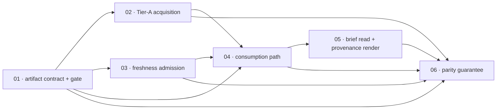

# Scopes Index — Headless Official Curve Publication

Feature directory: `specs/018-headless-official-curve-publication`
Repository: `research-lab` (root `~/research-lab`)

The headless publication path acquires the two official, key-free Treasury
yield-curve families server-side, publishes them as one validated committed
artifact with intact provenance, and hands them to the **unchanged**
`computeBondLabViewModel` through the injection seam `bondRegimeOwnerState`
already exposes. The duration axis, the curve level, the curve impulse and the
inflation family resolve. The credit axis does not, and the published `state`
stays `unavailable` — the outcome `scripts/selftest.mjs:5670-5682` already
asserts. Every scope below is written to satisfy that committed assertion, not
to contradict it.

## Scope Ordering Rationale

The artifact contract lands first because every other scope is a producer or a
consumer of one shape: the acquisition step writes it, the freshness rule judges
it, the consumption path reads it, the renderer paints it, and the parity test
compares two compositions that both depend on its `coverageYears` field. Building
any of those before the shape is frozen would mean five definitions of one
record.

Acquisition comes second because a contract with no producer cannot be exercised
against a real response, and because the whole-family rejection this feature
relies on for BS-018-005 is the parser's existing behaviour observed through a
real fetch rather than asserted in prose.

The freshness admission is third, and deliberately **not** folded into
acquisition. It is a function of `(artifact, runDate)` evaluated at read time, so
a committed artifact self-reports stale as it ages without being rewritten. A
verdict baked in at write time would go wrong the moment the file sat still.

The consumption path is fourth because it is the first scope in which the model
runs over real acquired rows, and it is where the committed live-read assertions
in `scripts/selftest.mjs` are reconciled. That reconciliation cannot happen
earlier — there is no artifact to branch on — and it must land in this scope
rather than any downstream one, because a red suite would block every scope after
it.

The brief read and the provenance render are fifth: the reader-visible surfaces
can only be exercised against a published payload the earlier four scopes
produce.

The one-model parity guarantee is last because it compares the browser
composition against the *whole* headless path, and that path is only complete
once acquisition, admission, consumption and publication all exist. Ordering it
earlier would mean comparing the browser against a partial pipeline and calling
the resulting agreement meaningful.

## Scope Inventory

| # | Scope | Artifact | Depends On | Status |
| --- | --- | --- | --- | --- |
| 1 | Official Curve Artifact Contract And Validation Gate | [`01-official-curve-artifact-contract/scope.md`](01-official-curve-artifact-contract/scope.md) | none | Done |
| 2 | Tier-A Official Curve Acquisition | [`02-tier-a-official-curve-acquisition/scope.md`](02-tier-a-official-curve-acquisition/scope.md) | 1 | Done |
| 3 | Observed-Cadence Freshness Admission | [`03-observed-cadence-freshness-admission/scope.md`](03-observed-cadence-freshness-admission/scope.md) | 1 | Not started |
| 4 | Headless Consumption Path | [`04-headless-consumption-path/scope.md`](04-headless-consumption-path/scope.md) | 1, 2, 3 | Not started |
| 5 | Brief Read And Provenance Render | [`05-brief-read-and-provenance-render/scope.md`](05-brief-read-and-provenance-render/scope.md) | 4 | Not started |
| 6 | One-Model Parity Guarantee | [`06-one-model-parity-guarantee/scope.md`](06-one-model-parity-guarantee/scope.md) | 1, 2, 3, 4, 5 | Not started |

---

## Dependency Graph

| ## | Scope Directory | Depends On | Unblocks | Why the edge exists |
| ---- | ----------------- | ------------ | ---------- | --------------------- |
| 01 | `01-official-curve-artifact-contract` | none | 02, 03, 04, 06 | The foundation. The writer, the admission rule, the reader and the parity comparison all consume one artifact shape and one provenance envelope. |
| 02 | `02-tier-a-official-curve-acquisition` | 01 | 04, 06 | The acquisition step writes the record scope 1 defines and is validated by scope 1's gate. |
| 03 | `03-observed-cadence-freshness-admission` | 01 | 04, 06 | The rule reads `freshnessPolicy` and the family row history, both declared by scope 1. |
| 04 | `04-headless-consumption-path` | 01, 02, 03 | 05, 06 | The read resolves an artifact (01), needs one to exist (02), and admits it only through the freshness verdict (03). |
| 05 | `05-brief-read-and-provenance-render` | 04 | 06 | The three publication states can only be rendered from a payload the consumption path published. |
| 06 | `06-one-model-parity-guarantee` | 01, 02, 03, 04, 05 | none | Parity compares the browser composition against the complete headless path, including the `coverageYears` field scope 1 declares and the parity line scope 5 renders. |



Two properties this graph makes explicit. **Scope 1 is the only root** and carries
`foundation:true` — there is exactly one definition of the published artifact and
its provenance envelope, and no downstream scope may restate it. **Scope 6 is the
only leaf**, because the one-model guarantee is the feature's hardest constraint
and it is asserted against the finished path rather than against a stage of it.

---

## Execution Outline

### Phase Order

1. **Official Curve Artifact Contract And Validation Gate** — freeze
   `official-curve-artifact/v1`, the family record, the per-response
   `source-provenance/v1` envelope array, the additive `rlcontracts.js`
   `SOURCE_IDS` / `SOURCE_POLICIES` entries for `us-treasury-nominal` and
   `us-treasury-real`, and `scripts/validate-official-curves.mjs`. Nothing is
   fetched and nothing is published yet.
2. **Tier-A Official Curve Acquisition** — `scripts/acquire-official-curves.mjs`
   fetches four responses (two families × two calendar years) from the URLs
   derived from the committed `urlTemplate` values, hashes each body, parses with
   the page's own `parseTreasuryCurveCsv`, merges by date, and writes one
   artifact. A failed family carries the prior record forward verbatim.
3. **Observed-Cadence Freshness Admission** — `admitCurveFamily(artifact, family,
   runDate)` derives `windowDays` from the family's own observed gap history and
   returns `current`, `stale` or `undetermined`. No calendar file is read.
4. **Headless Consumption Path** — `officialCurveArtifact(root)` and the exported
   `unavailableCurveFamily` in `scripts/owner-state.mjs`; artifact resolution
   inside `buildBondRegimeToolRead`; the additive `curveAdmission` metric; and
   the reconciliation of the committed live-read assertions in
   `scripts/selftest.mjs`.
5. **Brief Read And Provenance Render** — the three publication states on the
   `.toolread` bond card, the two-axis split that never fuses, and the extended
   *Source, freshness and rights* table carrying source id, source URL, observed
   as-of and retrieval time.
6. **One-Model Parity Guarantee** — the frozen-input differential test proving
   the browser composition and the headless composition reach identical
   `curveState`, `curveImpulse`, `inflationState` and `durationPosture`, plus the
   coverage-window variation and the perturbation adversarial that keeps the
   comparison honest.

### New Types And Signatures

Committed artifact — `data/curves/us-treasury/curve.json`,
`contractVersion: "official-curve-artifact/v1"`:

```text
{
  contractVersion   "official-curve-artifact/v1"
  artifactId        "us-treasury-daily-curves"
  generator         "acquire-official-curves/v1"
  writtenAt         canonical timestamp
  coverageYears     [Y-1, Y]                     two consecutive UTC years
  freshnessPolicy   { policyId: "observed-cadence/v1",
                      cadenceWindowRows, minCadenceObservations,
                      publicationLagDays }
  families          { nominal: FamilyRecord, real: FamilyRecord }
}

FamilyRecord {
  familyId          "nominal" | "real"
  sourceId          "us-treasury-nominal" | "us-treasury-real"
  state             "fresh" | "unavailable"
  rows              [ { date, y3m, y2, y5, y10, y30 } ]  nominal
                    [ { date,      y5, y10, y20, y30 } ]  real
  observedAt        newest row date, or null when rows is empty
  retrievedAt       canonical timestamp, never restamped on carry-forward
  rights            carried verbatim from bond-regime-universe.json
  persistence       "same-origin-artifact"        what THIS copy is
  declaredPolicy    the universe's policy block, verbatim
  carriedForward    boolean
  errorCode         null when state is "fresh", a BRL-* code otherwise
  diagnostics       [ lowercase-hyphen reasons ]
  provenance        [ source-provenance/v1 envelope, one per fetched year ]
}
```

New modules and exports:

```text
scripts/acquire-official-curves.mjs
  acquireOfficialCurves({ root, now, fetchImpl })  -> artifact object
  (also runnable as `node scripts/acquire-official-curves.mjs`)

scripts/validate-official-curves.mjs
  validateOfficialCurves(artifact, { universe })   -> { ok, errors[] }
  (also runnable as `node scripts/validate-official-curves.mjs`, exit 0 / 1)

scripts/owner-state.mjs
  unavailableCurveFamily(policy, errorCode)        promoted to an export
  officialCurveArtifact(root)                      -> artifact | null

scripts/brief-refresh.mjs
  admitCurveFamily(artifact, familyId, runDate)    -> family record | named absence
```

Additive `rlcontracts.js` entries, `pathPrefix` form because the official path
embeds the year:

```text
SOURCE_IDS       + "us-treasury-nominal", "us-treasury-real"
SOURCE_POLICIES  + { sourceKind: "official-report", accessClass: "public-official",
                     host: "home.treasury.gov", method: "GET",
                     pathPrefix: "/resource-center/data-chart-center/interest-rates/daily-treasury-rates.csv/" }
SOURCE_KINDS       unchanged — "official-report" already admits a daily yield curve
```

New error codes, all in the existing uppercase `BRL-*` family-record vocabulary:
`BRL-CURVE-ARTIFACT-ABSENT`, `BRL-CURVE-ARTIFACT-INVALID`,
`BRL-CURVE-FAMILY-STALE`, `BRL-CURVE-FRESHNESS-UNDERIVABLE`,
`BRL-CURVE-FETCH-FAILED`, `BRL-CURVE-PARSE-FAILED`,
`BRL-CURVE-MATURITY-MISSING`. `BRL-CURVE-NOMINAL-UNAVAILABLE` and
`BRL-OPTIONAL-UNAVAILABLE` keep their exact current meaning.

Additive published metric on `toolReads["bond-regime-lab"]`: `curveAdmission`
carrying `verdict`, `errorCode`, `lastGoodObservedAt`, `elapsedDays`,
`windowDays` and `basis`. No existing metric is renamed, retyped or removed.

### Validation Checkpoints

| After scope | Gate that must pass before the next scope starts |
| --- | --- |
| 1 | `node scripts/validate-official-curves.mjs` exits non-zero on each of the seven adversarial fixtures with a named error, and exits 0 on the conformant fixture; `node scripts/selftest.mjs` exits 0 with the new group registered |
| 2 | `node scripts/acquire-official-curves.mjs` writes an artifact that `node scripts/validate-official-curves.mjs` accepts with exit 0; a one-family failure leaves the other family fresh with full provenance |
| 3 | The admission verdict is proven at its exact boundary from both sides in `node scripts/selftest.mjs`, and the equity calendar file is proven unread during a freshness evaluation |
| 4 | `node scripts/selftest.mjs` exits 0 with the live-read assertions branching on the admission verdict; the ADVERSARIAL 2 shape at `scripts/selftest.mjs:5670-5682` still passes unmodified |
| 5 | `npx --no-install playwright test tests/bond-regime-lab.spec.mjs --config=playwright.config.mjs --project=system-chrome` green; `node scripts/validate-brief-payload.mjs` exits 0 against the committed payload |
| 6 | The differential rows pass with pairwise equality, the coverage-variation row proves the two-year window is load-bearing, and the perturbation row proves the comparison can fail |

### Scope Table

| # | Scope | Depends On | Surfaces | Test Plan rows | Scenarios |
| --- | --- | --- | --- | --- | --- |
| 1 | Official Curve Artifact Contract And Validation Gate | none | artifact contract, gate, shared provenance allowlist | 11 | SCN-018-001 … 004, 018, 019 … 022 |
| 2 | Tier-A Official Curve Acquisition | 1 | acquisition module | 8 | SCN-018-005, 006, 023 … 026 |
| 3 | Observed-Cadence Freshness Admission | 1 | admission rule | 7 | SCN-018-007 … 010, 027, 028 |
| 4 | Headless Consumption Path | 1, 2, 3 | owner-state, brief-refresh, selftest | 10 | SCN-018-013 … 017, 029 … 031 |
| 5 | Brief Read And Provenance Render | 4 | brief card, tool source table | 8 | SCN-018-032 … 035 |
| 6 | One-Model Parity Guarantee | 1, 2, 3, 4, 5 | differential test, parity line | 7 | SCN-018-011, 012, 036 … 038 |

Total Test Plan rows: **51**. Scenario id range: **SCN-018-001 … SCN-018-038**,
of which **SCN-018-001 … SCN-018-018 map one-to-one to BS-018-001 … BS-018-018**
and SCN-018-019 … SCN-018-038 are planning-added scenarios covering the design's
named adversarial cases and its two routed items. `test-plan.json` and
`scenario-manifest.json` are authoritative for both.

---

## Test Surface Decision — R-5, The Spec-Test-Path Guard

`design.md` routes **R-5** to this plan: `scripts/validate-spec-test-paths.mjs:59`
scans every artifact under `specs/**` for a repo-root-relative `tests/….mjs`
token and fails on any path that is neither on disk nor in
`scripts/validate-spec-test-paths.baseline`. The baseline's own header states it
must shrink and never grow.

**Decision: this feature names no new `tests/*.mjs` path anywhere in its
planning artifacts, so the baseline neither grows nor needs an entry.** Every
test row below lands on a surface that already exists:

| Surface | What lands there | Command |
| --- | --- | --- |
| `scripts/selftest.mjs` | every pure-Node structural group — contract, gate, acquisition, freshness, consumption, parity — registered as named groups beside the existing bond groups | `node scripts/selftest.mjs` |
| `tests/bond-regime-lab.spec.mjs` | every browser row; the file already drives both `bond-regime-lab.html` and the published `toolReads` entry | `npx --no-install playwright test tests/bond-regime-lab.spec.mjs --config=playwright.config.mjs --project=system-chrome` |
| `scripts/validate-official-curves.mjs` | the gate's own refusal rows, run as a command against committed fixtures | `node scripts/validate-official-curves.mjs` |
| `scripts/validate-brief-payload.mjs` | the publication-gate row for the changed payload | `node scripts/validate-brief-payload.mjs` |
| `scripts/validate-spec-test-paths.mjs` | the guard row that proves this decision held | `node scripts/validate-spec-test-paths.mjs` |

Fixture files under `tests/fixtures/` carry no `.mjs` extension and are therefore
outside the guard's token pattern; they are named freely.

This is the same surface split the repository already uses for the bond tool:
`parseTreasuryCurveCsv` is exercised in Node at `scripts/selftest.mjs:1755-1765`
against `tests/fixtures/bond-regime/*.csv`, and the browser behaviour is
exercised in `tests/bond-regime-lab.spec.mjs`. SCN-018-022 asserts the decision
mechanically: `node scripts/validate-spec-test-paths.mjs` exits 0 and the
baseline file is byte-identical before and after this feature.

---

## Routed Item R-4 — The `persistence` Field Interpretation

`design.md` routes **R-4** to this plan and it is recorded here so an implementer
cannot rediscover it as a judgement call.

`bond-regime-universe.json` declares `persistence: "browser-cache"` for both
Treasury sources. That is a true statement about the browser copy and a false one
about a file on disk. FR-018-011 requires the declared rights and persistence
classes to travel unaltered.

**Both facts are carried, in two fields, and neither is edited:**

- `family.declaredPolicy` holds the universe's policy block **verbatim**,
  including `persistence: "browser-cache"`. FR-018-011's "unaltered" is satisfied
  here, and the gate compares it byte-for-byte against the committed universe.
- `family.persistence` states what **this copy** actually is —
  `"same-origin-artifact"` — following `scripts/owner-state.mjs:466`, which
  already writes `persistence: 'same-origin-snapshot'` for committed bars.
- `family.rights` carries `"public-official"` unaltered in both places.

Writing `persistence: "browser-cache"` onto a committed file is a refusal, not a
style preference: it asserts a retention class the artifact does not have.
SCN-018-020 and TP-01-08 enforce it, and it is a Core Delivery DoD item in
scope 1.
