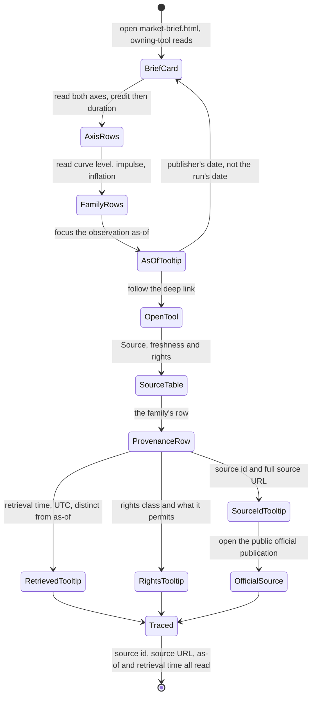
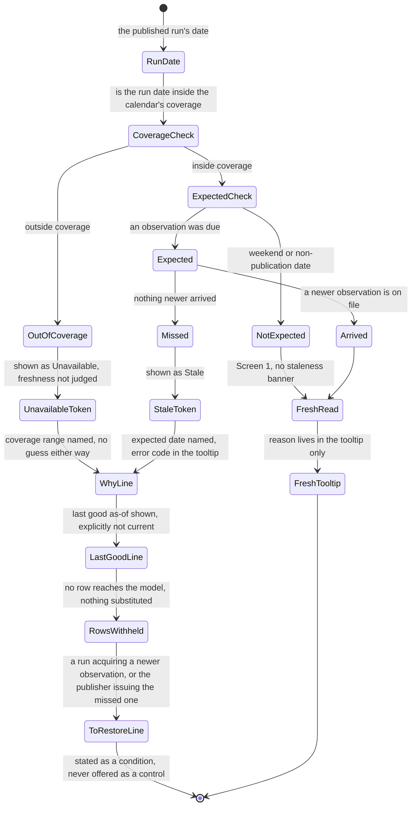

# Feature 018 — Headless Official Curve Publication

## Problem Statement

The Bond Regime Lab reaches a real duration and credit verdict in the browser. The
headless publication path cannot, because two of the three evidence families the
model requires exist only inside a browser tab. The published Market Brief therefore
reports the bond regime as unresolved on both axes.

The full evidence model is implemented and committed. `bond-regime-lab.html` defines
`classifyCurveState` (line 1456), `classifyCurveImpulse` (line 1477),
`deriveBreakevenRows` (line 1493), `classifyInflationState` (line 1694),
`classifyDurationPosture` (line 1707), `selectResearchExpression` (line 1933), and a
seven-sleeve scenario engine. `bond-regime-universe.json` declares both official
Treasury sources under `sourcePolicies` — `us-treasury-nominal` (lines 21-26) and
`us-treasury-real` (lines 28-33) — each `mode: "public-official-live"`,
`rights: "public-official"`, `persistence: "browser-cache"`, pointing at the
`home.treasury.gov` daily nominal and daily real yield-curve CSVs.

`persistence: "browser-cache"` is the whole problem. `bond-regime-lab.html:1662`
`loadTreasuryCurves` fetches both families live and writes them to a versioned browser
cache. `scripts/owner-state.mjs:405` `unavailableCurveFamily` is what the server run
gets instead, because no same-origin file holds those rows. The consequence is stated
in the code that publishes the read, at `scripts/brief-refresh.mjs:1495-1507`: the
model refuses a verdict until three independent evidence families are current at once,
the repo commits only the credit price ratio, and neither Treasury family has a file a
server run could read.

The published result today, in `market-brief.payload.json` under
`toolReads["bond-regime-lab"]`, is `state: "unavailable"` with
`creditRegime: "Indeterminate"`, `durationPosture: "Indeterminate"`,
`curveState: "Unavailable"`, `curveImpulse: "Unavailable"`,
`inflationState: "Unavailable"`, `preferredSleeveId: null`, `curveAsOf: null`, and
`evidenceGaps: ["the Treasury yield curve", "real yields and inflation break-evens",
"an independent credit-spread reading"]`.

That refusal is correct. It is computed by the model rather than asserted, and
`scripts/selftest.mjs:5615-5622` says so explicitly: an adapter that hard-coded
"unresolved" would pass a committed-evidence-only suite forever, so the suite drives
the same builder with each family present and absent. This feature does not weaken the
refusal. It supplies the missing official evidence so the same unchanged model can
resolve the families that evidence actually covers.

## Outcome Contract

**Intent.** The headless publication path acquires the two official, key-free Treasury
yield-curve families server-side, publishes them as a validated static artifact with
intact provenance, and hands them to the existing bond model. The curve, curve-impulse
and inflation families stop reading `Unavailable` in the published brief, and the
duration axis resolves, without the browser tool, its source policy, or the
three-family refusal rule changing at all.

**Success signal.** A run of the headless pipeline with no browser involved produces a
`toolReads["bond-regime-lab"]` entry whose `curveState`, `curveImpulse` and
`inflationState` are the model's real classifications rather than `"Unavailable"`,
whose `durationPosture` is not `"Indeterminate"`, whose `curveAsOf` is a real date, and
whose `evidenceGaps` no longer contains `"the Treasury yield curve"` or
`"real yields and inflation break-evens"`. The identical inputs handed to the browser
composition produce the identical classifications.

**Hard constraints.**

- No API key, no credential, no FRED endpoint, no licensed or restricted endpoint
  reaches any published artifact or any committed source policy.
- OAS and financial-conditions observations remain `restricted-local-view`,
  `memory-only`, current-tab only. Nothing about them is persisted, committed, or
  published.
- Breakeven remains derived only on exact common dates as nominal minus real. No
  forward-fill, no interpolation, no nearest-date match.
- Curve level and curve impulse remain separate records. An inverted curve alone cannot
  create a duration posture.
- Absent, stale or invalid data publishes as a named absence with an error code. Never
  a zero, never a neutral placeholder.
- One model, two compositions. The browser and the headless path must never publish two
  different verdicts from the same inputs.

**Failure condition.** The feature has failed, even with every test green, if any of
these is true: a published artifact carries a credential, a licensed payload, or a
restricted observation; the headless path reaches a verdict the browser would not reach
from the same rows; a missing or stale artifact produces a verdict instead of a named
absence; the three-family refusal rule is relaxed to make the brief look resolved; or
the published brief claims the bond regime is resolved while the credit axis is still
`Indeterminate`.

## Exposure Contract

| Capability | Surface class | Surface id | Status | Plan |
| --- | --- | --- | --- | --- |
| Published bond regime read | internal | `market-brief.payload.json` → `toolReads["bond-regime-lab"]` | delivered | Consumed by `market-brief.html`; this feature changes its content, not its shape |
| Browser bond regime verdict | uiRoute | `bond-regime-lab.html#simple` | delivered | Unchanged by this feature |
| Server-side official curve acquisition | cliCommand | a Node command under `scripts/`, invoked by the existing refresh path | planned | This spec; exact command name is a design decision, and no such command exists today |
| Published official curve artifact | internal | a committed JSON artifact read by `scripts/owner-state.mjs` `bondRegimeOwnerState` | planned | This spec; the in-repo caller is `bondRegimeOwnerState` at `scripts/owner-state.mjs:440` |
| Curve artifact validation gate | cliCommand | a `scripts/validate-*.mjs` gate joining the existing validator family | planned | This spec; peers are `scripts/validate-brief-payload.mjs` and `scripts/validate-brief-cache.mjs` |
| Treasury source allowlist entries | internal | `rlcontracts.js` `SOURCE_IDS` / `SOURCE_POLICIES` | planned | This spec; required additively because neither Treasury source is allowlisted today (see H-4) |

## Goals

1. Acquire the nominal and real daily Treasury yield-curve CSVs server-side, from the
   same key-free public URLs already declared in `bond-regime-universe.json`.
2. Publish them as a committed, validated static artifact carrying source id, source
   URL, observation as-of, and retrieval time.
3. Let the existing headless read consume that artifact through the injection seam
   `bondRegimeOwnerState` already exposes, without reimplementing a single classifier.
4. Keep the browser and headless compositions provably in agreement.
5. Keep every existing refusal intact, and make the artifact's own absence a named
   absence rather than a gap in the evidence chain.

## Non-Goals

1. **No OAS or financial-conditions persistence.** `bond-regime-universe.json:41-50`
   marks both `persistence: "memory-only"`, `rights: "restricted-local-view"`, and
   `scripts/selftest.mjs:1776` asserts they cannot use persistent storage. Unchanged.
2. **No licensed, keyed, or restricted data.** `scripts/selftest.mjs:1775` asserts the
   bond source policy matches none of `api_key`, `fredgraph`, `series/BAML`,
   `series/NFCI`. `notes/bond-regime-lab.md:95` says no FRED API key, FRED observation
   endpoint, ICE observation payload, or committed OAS/NFCI observation is part of this
   tool. Unchanged.
3. **No change to the browser tool's own source policy.** `nominalCurve` and
   `realCurve` stay `mode: "public-official-live"`, `persistence: "browser-cache"` for
   the browser. This feature adds a server-side acquisition path beside it, not
   instead of it.
4. **No weakening of the three-family refusal rule.** The rule described at
   `scripts/brief-refresh.mjs:1495-1499` stands. This feature supplies evidence; it
   does not lower the bar.
5. **No resolution of the credit axis.** See H-1. The independent credit family is a
   current-tab user observation by policy and stays that way.
6. **No new classifier, threshold, ratio or sleeve.** `scripts/owner-state.mjs:419-420`
   states the server module assembles inputs only and computes not one classification.
   That boundary holds.
7. **No build step.** `.specify/memory/constitution.md:116` — no bundler, no build
   step, `scripts/*.mjs` Node-only as the sole exception.

## Current Capability Map

| Capability | Browser | Headless | Status |
| --- | --- | --- | --- |
| Treasury CSV parsing | `bond-regime-lab.html:1507` `parseTreasuryCurveCsv` | Same function, extracted and exercised in Node at `scripts/selftest.mjs:1755-1765` against `tests/fixtures/bond-regime/*.csv` | Complete on both sides |
| Treasury acquisition | `bond-regime-lab.html:1662` `loadTreasuryCurves`, live fetch to browser cache | None | Missing headless |
| Curve level / impulse | `classifyCurveState` :1456, `classifyCurveImpulse` :1477 | Same functions loaded by `scripts/brief-refresh.mjs:1520` | Complete, starved of input |
| Breakeven derivation | `deriveBreakevenRows` :1493 | Same function, listed at `scripts/brief-refresh.mjs:1520` | Complete, starved of input |
| Inflation state | `classifyInflationState` :1694 | Same function | Complete, starved of input |
| Duration posture | `classifyDurationPosture` :1707 | Same function | Complete, starved of input |
| Credit price ratio | `computeCreditView` | Committed bars under `data/bars/` via `scripts/owner-state.mjs:440` | Complete on both sides |
| Independent credit confirmation | current-tab user observation, `normalizeManualObservation` :1555 | None, and none permitted | Missing by policy, permanently |
| Curve injection seam | n/a | `bondRegimeOwnerState(root, { nominalCurve, realCurve, confirmations })` at `scripts/owner-state.mjs:440-489` | Present and unused in production |
| Named absence for curves | n/a | `unavailableCurveFamily` at `scripts/owner-state.mjs:405-411` | Complete |
| Server-side public fetch | n/a | `scripts/brief-refresh.mjs:1090`, `:1114`, `:1127`; `scripts/fetch-bars.mjs:111` | Complete, unused for Treasury |
| Committed snapshot with provenance | n/a | `data/bars/*.json` (`asof`, `fetched`, `src`); `data/calendars/xnys/calendar.json` (`sourceUrl`, `sourceContentSha256`, `retrievedAt`, `sourceRef`) | Complete precedent |

## Honest Findings And Constraints

### H-1 — This feature half-resolves the bond regime, and the published state most likely stays `unavailable`

This is the primary finding and it should be read before anything else in this
document.

`bond-regime-lab.html:1934` opens `selectResearchExpression` with:

```js
if (!creditRegime || !durationPosture || creditRegime.state === "Indeterminate" || durationPosture.state === "Indeterminate") return null;
```

Either axis being `Indeterminate` returns `null`. `scripts/brief-refresh.mjs:1571`
then branches on `if (!normalized.metrics.preferredSleeveId)` and returns
`state: 'unavailable'`.

The credit axis needs an independent credit-spread family. The live published payload
records `modelMissing: ["independent-credit-confirmation"]` — the price-ratio leg is
already satisfied, and the confirmation leg is the one that is missing. That leg is a
current-tab user observation by policy
(`bond-regime-universe.json:41-50`; `notes/bond-regime-lab.md:22, 92-95`), and
Non-Goal 1 forbids changing that.

The repo has already executed this exact scenario. `scripts/selftest.mjs:5670-5682`,
labelled ADVERSARIAL 2, drives the same builder with both curves present and no
credit-spread observation, and asserts:

```js
assert(bondCurveOnly.state === 'unavailable' && !bondCurveOnly.metrics.evidenceGaps.includes('the Treasury yield curve')
  && bondCurveOnly.metrics.evidenceGaps.includes('an independent credit-spread reading') && !/Treasury yield curve/.test(bondCurveOnly.read), ...);
assert(/so the credit call cannot be made/.test(bondCurveOnly.read) && !/duration call/.test(bondCurveOnly.read)
  && bondCurveOnly.metrics.durationPosture !== 'Indeterminate', ...);
```

So the realistic post-feature outcome is already a committed, passing assertion in this
repo: `state` stays `"unavailable"`, `durationPosture` resolves, `curveState`,
`curveImpulse` and `inflationState` resolve, the gap list drops from three entries to
one, and the read narrows from "the credit call and the duration call cannot be made"
to "the credit call cannot be made".

That is a real improvement and it is worth building. It is not a resolved bond regime.
Any framing of this feature as "the brief will finally publish a bond verdict" is
false. This spec resolves the duration axis, the curve level, the curve impulse and the
inflation family. It does not resolve the credit axis, and no in-scope work can.

### H-2 — The committed equity calendar is not the Treasury publication calendar

The freshness requirement below needs to know which days a new Treasury observation is
expected. The obvious candidate is the committed calendar at
`data/calendars/xnys/calendar.json` (`contractVersion: "xnys-calendar/v1"`,
`calendarId: "XNYS"`, generated by `scripts/generate-xnys-calendar.mjs` from
`https://www.nyse.com/markets/hours-calendars`). It cannot be used as-is.

Read directly, that calendar marks `2026-10-12` and `2026-11-11` as
`dateState: "regular"` with `closureCode: null`, because NYSE equities trade Columbus
Day and Veterans Day. The US bond market is closed on both, and Treasury publishes no
daily yield-curve observation. A refresh window keyed to the XNYS calendar would raise
a false staleness alarm on at least those two 2026 dates, and would publish `stale`
when nothing is actually wrong.

The calendar also carries `coverageStart: "2026-01-01"` and
`coverageEnd: "2026-12-31"`, so any freshness rule that depends on it inherits a hard
coverage cliff at the end of 2026.

The requirements below therefore treat the expected-publication calendar as its own
named input with its own coverage bound, and require the out-of-coverage case to
produce a named absence rather than a guess.

### H-3 — The sleeve characteristics expire on 2026-08-24

Even a fully-resolved regime can fail to rank a sleeve. Every instrument's `carry`,
`rateDuration`, `spreadDuration` and `convexity` in `bond-regime-universe.json` carries
`asOf: "2026-07-10"` with `reviewWindowDays: 45`, which expires on 2026-08-24.
`notes/bond-regime-lab.md:70` states that missing or stale characteristics make a
sleeve Not rankable, and `scripts/selftest.mjs:5630-5636` re-stamps those review dates
in its own fixture precisely because "the page's scenario engine refuses to rank a
stale characteristic".

This is outside this feature's scope and is not a reason to change the staleness rule.
It is recorded because a reader who sees the bond read still unresolved after this
feature ships needs to know there are two independent causes, not one.

### H-4 — Neither Treasury source is allowlisted in the shared provenance contract

`rlcontracts.js:51-57` freezes `SOURCE_IDS` to exactly `bls-cpi-schedule`,
`bls-public-api-v2`, `manual-consensus-artifact`, `nyse-hours-calendar`, and
`yahoo-chart`. `rlcontracts.js:58-64` freezes the matching `SOURCE_POLICIES` with a
per-source `host`, `method`, and `path` or `pathPrefix`. `validateSourceProvenance`
at `rlcontracts.js:515-560` rejects an unknown `sourceId` with
`source-id-not-allowlisted` and rejects a URL whose host or path does not match the
policy with `source-url-not-allowlisted`.

`home.treasury.gov` appears nowhere in that allowlist. So a published curve artifact
carrying the repo's own `source-provenance/v1` envelope requires additive entries for
`us-treasury-nominal` and `us-treasury-real`. Two further details follow from reading
the validator: the Treasury URL path embeds the year
(`.../daily-treasury-rates.csv/{YEAR}/all`), so it needs the `pathPrefix` form that
`yahoo-chart` uses rather than the exact-`path` form; and `SOURCE_KINDS` at
`rlcontracts.js:65-70` admits only `best-effort-public-chart`, `official-calendar`,
`official-report`, `sourced-consensus`, so the daily yield curve either reuses
`official-report` or needs an additive kind. `.specify/memory/constitution.md:130`
(D6) requires schemas to extend rather than change, which these additions satisfy.

### H-5 — The browser keeps two calendar years; the artifact must match or the impulse window breaks

`bond-regime-lab.html:1665-1668` fetches the current and prior UTC year for each
family and merges them by date. `classifyCurveImpulse` uses
`impulseLookbackDays: 21` (`bond-regime-universe.json` `classifier.curve`), and
`classifyInflationState` compares across the breakeven series. An artifact holding only
the current calendar year would silently starve the impulse window every January and
produce a different classification from the browser for the same trading day. Parity
is therefore a coverage requirement, not only a formula requirement.

### H-6 — `loadTreasuryCurves` degrades to `stale` from cache; a server run has no equivalent

`bond-regime-lab.html:1687-1688` falls back to the prior cached family marked
`state: "stale"` when a live fetch returns nothing. The headless path has no browser
cache to fall back to. Its equivalent is the previously committed artifact, which
means "what the headless path does when acquisition fails" is a distinct decision from
"what the browser does", and the two must be shown to converge on the same published
classification rather than assumed to.

### H-7 — Findings with no content

- **Competitive analysis: None found — this is an internal data-acquisition path with
  no competitor-facing surface.** No product competes on how this repo reaches its own
  Treasury CSVs. The applicable bar is the repo's own admission test,
  `.specify/memory/constitution.md:114-115` (D12): does this improve decision quality,
  or its measurement? It improves decision quality, by removing two named evidence
  gaps from a published read. No web research was performed, and none is claimed.
- **Market-trend research: None found — no trend claim is derivable from a file in
  this repository, and inventing one would be fabrication.**

## Domain Capability Model

The proportionality trigger that applies is *a second implementation of an existing
capability*: official curve acquisition already exists in the browser, and this feature
adds a second acquisition path for the same evidence families. The capability is
therefore defined once, above both paths.

### Capability

**Official curve evidence supply.** Turning a public official daily yield-curve
publication into dated, provenanced, policy-classified rows that the bond model can
consume, independently of which runtime performed the acquisition.

### Domain primitives

| Primitive | Definition |
| --- | --- |
| Official curve family | A named set of dated par-yield rows from one official publication, with a rights class and a persistence class. Today: nominal and real. |
| Curve row | One trading date with a closed set of maturity yields. `parseTreasuryCurveCsv` emits `date,y3m,y2,y5,y10,y30` for nominal and `date,y5,y10,y20,y30` for real (`scripts/selftest.mjs:1758, 1763`). |
| Derived breakeven row | A row existing only on a date present in both families, valued nominal minus real. |
| Family availability state | `fresh`, `stale`, or `unavailable`, each carrying an error code when not `fresh`. |
| Provenance record | Source id, source URL, observation as-of, retrieval time, content hash, access class, retention mode. |
| Expected-publication date | A calendar date on which the official publisher is expected to produce a new observation. |
| Acquisition path | A runtime that turns a publication into a family. Two exist: browser-live and server-published. |

### Relationships

- An official curve family has zero or more curve rows and exactly one availability
  state and one provenance record.
- A derived breakeven row depends on exactly two curve rows sharing one exact date, one
  per family. It exists on no other basis.
- Curve level, curve impulse and inflation state are three separate derivations over
  families. None of them substitutes for another.
- Duration posture depends on curve level, curve impulse, inflation state and credit
  regime jointly. It is not a function of curve level alone.
- An acquisition path produces a family. It never produces a classification.

### Business policies every acquisition path must obey

1. A family is `unavailable` unless the publication actually yielded usable rows. An
   empty or unparsable response is a named absence, never an empty-but-plausible
   family.
2. A family's rights and persistence classes come from the declared source policy and
   travel with the family. An acquisition path may not upgrade a restricted family.
3. A restricted family may not be produced by the server path at all.
4. Breakeven derivation is exact-common-date only, in every path.
5. Every family carries source id, source URL, observation as-of and retrieval time to
   whatever consumes it.
6. Two acquisition paths handed the same publication must produce the same rows, and
   therefore the same classifications.

## Actors And Personas

| Actor | Description | Key goals | Boundaries |
| --- | --- | --- | --- |
| A-1 Brief reader | Reads the published Market Brief without opening any tool | Know whether the bond regime read is a verdict or a named absence, and which evidence is missing | Reads only; sees `toolReads["bond-regime-lab"]` rendered by `market-brief.html` |
| A-2 Tool reader | Opens `bond-regime-lab.html` directly | Reach a duration and credit verdict with live evidence | May supply a current-tab credit observation; that observation never leaves the tab |
| A-3 Publication pipeline | The scheduled headless refresh (`scripts/brief-refresh.mjs` and its callers) | Publish a brief whose every claim is backed by evidence it could actually read | Runs in Node, no browser, no credentials |
| A-4 Repository maintainer | Adds, reviews and repairs acquisition and validation code | Keep one model, two compositions, and no fabricated data | May extend allowlists additively; may not relax a refusal to make a gate green |
| A-5 Evidence reviewer | Audits whether a published claim is legitimate | Trace any published number to a source, a date and a retrieval time | Reads artifacts and provenance only |

## Use Cases

### UC-018-001: Publish a bond read with the curve families present

**Actor:** A-3.
**Preconditions:** A validated official curve artifact exists and is within its
declared freshness window.
**Main flow:**

1. The pipeline reads the artifact.
2. It hands both families to the existing observed-snapshot builder through the
   `nominalCurve` / `realCurve` seam.
3. The page's own classifiers run over them.
4. The pipeline publishes the classifications the model returned.
**Alternative flows:** Any family `unavailable` → UC-018-003.
**Postconditions:** `curveState`, `curveImpulse` and `inflationState` carry model
classifications; `curveAsOf` carries a real date; the curve entries are gone from
`evidenceGaps`.

### UC-018-002: Acquire the official curves server-side

**Actor:** A-3.
**Preconditions:** Network reachable; the two declared source URLs are the ones already
in `bond-regime-universe.json`.
**Main flow:**

1. The acquisition command requests the current and prior calendar year for each family.
2. It parses each response with the same parser the browser uses.
3. It merges by date and sorts.
4. It writes one artifact carrying rows and provenance for both families.
**Alternative flows:** A response is unusable → that family is written `unavailable`
with its error code, and the other family is unaffected.
**Postconditions:** An artifact exists whose every row traces to a source URL and a
retrieval time.

### UC-018-003: Publish honestly when the artifact is absent, stale or invalid

**Actor:** A-3.
**Preconditions:** The artifact is missing, past its freshness window, or fails
validation.
**Main flow:**

1. The pipeline does not read rows from it.
2. It supplies the existing named-absence family shape instead.
3. The model classifies the curve families `Unavailable`, exactly as today.
4. The published read names the missing evidence and the reason.
**Postconditions:** The published read is byte-comparable in kind to today's named
absence. No verdict is invented.

### UC-018-004: Confirm the two compositions agree

**Actor:** A-4.
**Preconditions:** A set of curve rows.
**Main flow:**

1. The rows are handed to the browser composition.
2. The same rows are handed to the headless composition.
3. Both are compared on curve level, curve impulse, inflation state and duration
   posture.
**Postconditions:** Any divergence is a defect in the composition, never a licensed
difference of opinion.

### UC-018-005: Refresh on the publisher's calendar

**Actor:** A-3.
**Preconditions:** An expected-publication calendar covering the run date.
**Main flow:**

1. The pipeline determines whether a new observation is expected for the run date.
2. On a non-publication date it treats the last observation as current.
3. On a publication date past the publication time it treats a missing new observation
   as stale.
**Alternative flows:** The run date falls outside calendar coverage → the freshness
verdict is a named absence, not an assumption.

### UC-018-006: Audit a published curve number

**Actor:** A-5.
**Preconditions:** A published bond read whose curve families resolved.
**Main flow:**

1. The reviewer opens the artifact.
2. Every family names its source id, source URL, observation as-of and retrieval time.
3. No restricted observation appears anywhere in it.
**Postconditions:** The claim is traceable end to end, or it is a defect.

## Business Scenarios

Each scenario is independently testable and maps one-to-one to a stable
`SCN-018-NNN` identifier at planning time.

### Cluster 1 — Acquisition and rights

#### BS-018-001: Both official families are acquired without a credential

```gherkin
Scenario: Server-side acquisition uses only the declared key-free official sources
  Given the declared source policies for us-treasury-nominal and us-treasury-real
  When the headless acquisition command runs
  Then it requests only those declared home.treasury.gov URLs
  And it sends no API key, token, or credential of any kind
  And the written artifact contains no credential
```

#### BS-018-002: A restricted family is never acquired server-side

```gherkin
Scenario: The server path refuses to touch restricted observation families
  Given the oas and financialConditions source policies are restricted-local-view and memory-only
  When the headless acquisition command runs
  Then it acquires neither family
  And no OAS value, financial-conditions value, or restricted source URL is written to any artifact
```

#### BS-018-003: A licensed or keyed endpoint cannot enter the source policy

```gherkin
Scenario: The source policy still rejects credentials and restricted endpoints
  Given the committed bond source policy
  When it is scanned for api_key, fredgraph, series/BAML, and series/NFCI
  Then no match is found
```

### Cluster 2 — Artifact contract and provenance

#### BS-018-004: Every published family carries full provenance

```gherkin
Scenario: A published curve family is traceable
  Given a published official curve artifact whose nominal family is fresh
  When a reviewer inspects that family
  Then it carries a source id, a source URL, an observation as-of date, and a retrieval time
  And the source URL is an https URL on the declared official host
```

#### BS-018-005: An unusable response is written as a named absence

```gherkin
Scenario: An unparsable official response does not become an empty family
  Given the official real-yield response is missing a configured maturity column
  When the artifact is written
  Then the real family state is unavailable with its declared error code
  And it carries zero rows rather than partial or substituted rows
  And the nominal family is unaffected
```

#### BS-018-006: A partial acquisition does not corrupt the other family

```gherkin
Scenario: One family failing leaves the other intact
  Given the nominal acquisition succeeds and the real acquisition fails
  When the artifact is written
  Then the nominal family is fresh with its rows and provenance
  And the real family is unavailable with its error code
```

### Cluster 3 — Freshness and the publication calendar

#### BS-018-007: A weekend is not staleness

```gherkin
Scenario: No new observation is expected on a weekend
  Given the last official observation is the preceding Friday
  And the run date is a Sunday
  When freshness is evaluated
  Then the family is treated as current
  And no staleness reason is published
```

#### BS-018-008: A bond-market holiday is not staleness

```gherkin
Scenario: No new observation is expected on a US bond-market holiday
  Given the run date is a date on which the US bond market is closed and Treasury publishes no curve
  And the equity calendar marks that date as a regular trading day
  When freshness is evaluated
  Then the family is treated as current
  And the equity calendar's regular-session marking does not create a false staleness verdict
```

#### BS-018-009: A missed publication is staleness with a reason

```gherkin
Scenario: An expected observation that never arrived is reported stale
  Given the run date is an expected publication date past the publication time
  And the artifact's newest observation predates it
  When freshness is evaluated
  Then the family is stale with a named reason and an error code
  And the published read does not present the older observation as current
```

#### BS-018-010: A date outside calendar coverage is a named absence

```gherkin
Scenario: Freshness cannot be assumed beyond the calendar's coverage
  Given the run date falls outside the expected-publication calendar's coverage range
  When freshness is evaluated
  Then the freshness verdict is a named absence with a reason
  And the pipeline does not assume the date is a publication date
  And the pipeline does not assume the date is a holiday
```

### Cluster 4 — Model parity, one verdict

#### BS-018-011: Both compositions reach the same classifications

```gherkin
Scenario: One model, two compositions
  Given one set of nominal and real curve rows
  When the browser composition and the headless composition each classify them
  Then the curve level, curve impulse, inflation state, and duration posture are identical
```

#### BS-018-012: Two calendar years of coverage keep the impulse window intact

```gherkin
Scenario: The impulse lookback survives a January run
  Given the run date is early in a calendar year
  And the artifact carries the current and prior calendar years
  When the curve impulse is classified
  Then it has a full lookback window
  And it matches the classification the browser reaches from its own two-year merge
```

#### BS-018-013: Curve level alone still cannot set a duration posture

```gherkin
Scenario: An inverted curve with no impulse and no inflation state
  Given the published curve level is Inverted
  And the curve impulse carries no directional change
  And the inflation state is Unavailable
  When the duration posture is classified
  Then it is not Shorten and not Extend on the level alone
```

#### BS-018-014: Breakeven exists only on exact common dates

```gherkin
Scenario: A missing real observation removes that date's breakeven
  Given a nominal observation exists on a date with no matching real observation
  When breakeven rows are derived
  Then no breakeven row exists for that date
  And no value is forward-filled, interpolated, or matched to a nearby date
```

### Cluster 5 — Absence and refusal preservation

#### BS-018-015: A missing artifact publishes today's named absence

```gherkin
Scenario: No artifact on file
  Given no published official curve artifact exists
  When the headless bond read is composed
  Then the curve, curve impulse, and inflation families are Unavailable
  And the published read names the Treasury yield curve and the real-yield break-evens as gaps
  And no verdict, zero, or neutral placeholder is published in their place
```

#### BS-018-016: An artifact failing validation is not consumed

```gherkin
Scenario: A malformed artifact is refused rather than partially trusted
  Given a published artifact that fails its validation gate
  When the headless bond read is composed
  Then no row from that artifact reaches the model
  And the published read is the named-absence form with a reason naming the validation failure
```

#### BS-018-017: The three-family refusal rule is unchanged

```gherkin
Scenario: Curves alone do not produce a bond verdict
  Given both official curve families are published, fresh, and valid
  And no independent credit-spread observation exists
  When the headless bond read is composed
  Then the duration posture is not Indeterminate
  And the credit regime is still Indeterminate
  And the published state is unavailable
  And the published read names the credit-spread gap alone and no longer names the curve
```

#### BS-018-018: Restricted observations never reach the published brief

```gherkin
Scenario: Publication carries no restricted value
  Given a published bond read of any state
  When the published payload is inspected
  Then it contains no OAS value, no financial-conditions value, and no restricted source URL
```

## Requirements

### Official curve acquisition

- **FR-018-001** The headless path must acquire the nominal and real daily Treasury
  yield-curve families server-side, in Node, with no browser involved.
- **FR-018-002** Acquisition must use only the source URLs derivable from the already
  committed `sourcePolicies.nominalCurve.urlTemplate` and
  `sourcePolicies.realCurve.urlTemplate` in `bond-regime-universe.json`. It must not
  introduce a second URL definition.
- **FR-018-003** Acquisition must send no API key, token, credential, or authenticated
  header, and must not contact any FRED, ICE, or otherwise licensed or restricted
  endpoint.
- **FR-018-004** Acquisition must parse responses with the same
  `parseTreasuryCurveCsv` logic the browser uses, including its closed maturity shapes
  and its whole-family rejection when a configured maturity is missing.
- **FR-018-005** Acquisition must cover the current and prior calendar years for each
  family and merge them by date, matching the browser's two-year window.
- **FR-018-006** Acquisition must never acquire, read, or write the `oas` or
  `financialConditions` families.
- **FR-018-007** A failure in one family must leave the other family's result intact.

### Published artifact contract and provenance

- **FR-018-008** The published artifact must be a committed static file readable by a
  Node run with no network access.
- **FR-018-009** Each family in the artifact must carry a state of `fresh`, `stale`, or
  `unavailable`, and an error code whenever the state is not `fresh`.
- **FR-018-010** Each family must carry its source id, its source URL, its observation
  as-of date, and its retrieval time.
- **FR-018-011** Each family must carry the rights and persistence classes declared for
  it in `bond-regime-universe.json`, unaltered.
- **FR-018-012** The artifact must carry a content integrity value for each acquired
  response, following the `sourceContentSha256` precedent in
  `data/calendars/xnys/calendar.json`.
- **FR-018-013** The artifact must carry a versioned contract identifier, following the
  `contractVersion` precedent used by `xnys-calendar/v1` and
  `bond-regime-observed-snapshot/v1`.
- **FR-018-014** Provenance carried in the repo's shared `source-provenance/v1`
  envelope requires additive `SOURCE_IDS` and `SOURCE_POLICIES` entries in
  `rlcontracts.js` for `us-treasury-nominal` and `us-treasury-real`, using the
  `pathPrefix` form because the official path embeds the year. No existing entry may be
  changed or removed.
- **FR-018-015** The artifact must contain no OAS value, no financial-conditions value,
  no restricted source URL, and no credential.

### Freshness and the publication calendar

- **FR-018-016** The artifact must declare its own freshness window explicitly rather
  than leaving freshness to a consumer's assumption.
- **FR-018-017** Freshness must be evaluated against an expected-publication calendar
  for US Treasury daily yield-curve publication, not against elapsed wall-clock days
  alone.
- **FR-018-018** On a weekend, and on any date the expected-publication calendar marks
  as a non-publication date, the absence of a new observation must not produce a
  staleness verdict.
- **FR-018-019** The expected-publication calendar must account for US bond-market
  holidays on which the equity calendar at `data/calendars/xnys/calendar.json` marks a
  regular session. Reusing that equity calendar unmodified is not sufficient, and
  `2026-10-12` and `2026-11-11` are the concrete counterexamples in the committed file.
- **FR-018-020** When the run date falls outside the expected-publication calendar's
  declared coverage range, the freshness verdict must be a named absence with a reason.
  It must not default to current and must not default to stale.
- **FR-018-021** A stale family must publish a named reason and an error code, and its
  rows must not be presented as a current observation.

### Headless composition and model parity

- **FR-018-022** The headless path must supply the artifact's families through the
  existing `nominalCurve` and `realCurve` parameters of `bondRegimeOwnerState`. It must
  not add a second injection route.
- **FR-018-023** The headless path must not define, duplicate, or approximate any
  classifier, threshold, ratio, sleeve, or scenario term. Classification remains the
  page's own functions loaded by `scripts/brief-refresh.mjs`.
- **FR-018-024** The browser composition and the headless composition, given the same
  curve rows and the same configuration, must produce identical curve level, curve
  impulse, inflation state, and duration posture.
- **FR-018-025** Curve level and curve impulse must remain separate published records.
- **FR-018-026** Curve level alone must not produce a directional duration posture.
- **FR-018-027** Breakeven rows must be derived only on exact common dates as nominal
  minus real, with no forward-fill, interpolation, or nearest-date match, in both
  compositions.
- **FR-018-028** Real yield and derived breakeven must remain separate evidence
  families in the artifact and in the published read.
- **FR-018-029** The published read must carry a real `curveAsOf` whenever the nominal
  family is consumed, and `null` whenever it is not.

### Absence, validation, and refusal preservation

- **FR-018-030** When the artifact is absent, the headless read must supply the existing
  named-absence family shape produced by `unavailableCurveFamily`, and must publish the
  same named-absence form the brief publishes today.
- **FR-018-031** When the artifact is stale beyond its declared window, the headless
  read must not consume its rows as current evidence, and must publish a named absence
  with the staleness reason.
- **FR-018-032** A validation gate must exist for the artifact, joining the existing
  `scripts/validate-*.mjs` family, and must fail on a missing required field, an
  unparsable file, a non-https or off-host source URL, a credential, or a restricted
  observation.
- **FR-018-033** An artifact that fails validation must not have any row reach the
  model.
- **FR-018-034** No absence, staleness, or validation failure may be published as a
  zero, an empty-but-plausible family, or a neutral placeholder.
- **FR-018-035** The three-family refusal rule must be unchanged. With both curve
  families present and no independent credit-spread observation, the credit regime must
  remain `Indeterminate` and the published state must remain `unavailable`.
- **FR-018-036** The browser tool's own source policy entries must remain
  `mode: "public-official-live"` with `persistence: "browser-cache"`. The server path
  is added beside them.
- **FR-018-037** Browser code introduced or modified by this feature must remain
  ES5-style single-file HTML with no build step, and must use `Number.isFinite` rather
  than the global `isFinite`.
- **FR-018-038** Every contract change must be additive. No existing field, source id,
  error code, cache key, or contract version may be renamed or removed.

## Non-Functional Requirements

- **Determinism.** Given the same artifact and configuration, the headless read must be
  reproducible across runs.
- **Offline composition.** Composition of the published read must require no network
  access. Only acquisition touches the network.
- **Repository weight.** The artifact holds two calendar years of daily rows for two
  families. It must not grow unbounded, and its retention must be stated rather than
  implicit.
- **Auditability.** Any published curve number must be traceable to a source id, a
  source URL, an observation date, and a retrieval time without leaving the repository.
- **Failure isolation.** An acquisition failure must degrade the bond read only. It
  must not fail the wider brief publication.
- **Secret hygiene.** No command in this feature may echo a credential value; there are
  no credentials in scope, and none may be introduced.

## UI Scenario Matrix

| Scenario | Actor | Entry point | Steps | Expected outcome | Surface |
| --- | --- | --- | --- | --- | --- |
| BS-018-015 | A-1 Brief reader | Market Brief bond card | Read the bond entry with no artifact on file | Named absence listing all three gaps, unchanged from today | `market-brief.html` |
| BS-018-017 | A-1 Brief reader | Market Brief bond card | Read the bond entry with curves published | Duration axis resolved, credit gap named alone, state still unavailable | `market-brief.html` |
| BS-018-009 | A-1 Brief reader | Market Brief bond card | Read after a missed publication | Staleness named with a reason, older observation not shown as current | `market-brief.html` |
| BS-018-011 | A-2 Tool reader | `bond-regime-lab.html#simple` | Compare the tool's verdict with the published read for the same date | Same curve level, impulse, inflation state and duration posture | Both |
| BS-018-013 | A-2 Tool reader | Duration card | Inspect an inverted curve with no impulse | Level shown as Inverted, posture not driven by level alone | Both |
| BS-018-004 | A-5 Reviewer | Published artifact | Inspect a fresh family | Source id, source URL, as-of, retrieval time all present | Artifact |
| BS-018-018 | A-5 Reviewer | Published payload | Search for restricted values | None present | `market-brief.payload.json` |

## UI Wireframes

Owned by `bubbles.ux`. Realises the *UI Scenario Matrix* above and answers the
presentation half of finding **H-1**: publishing the curves resolves the duration
axis and leaves the credit axis `Indeterminate`, so the reader-visible outcome of
this feature is a **partial resolution**. Nothing below contradicts the analyst's
matrix, adds a requirement id, or claims any of this is built.

**Design language.** None is configured — `.github/bubbles-project.yaml` declares
no `designLanguages` block, so these screens use the repository's own conventions
only: the Simple-first cockpit and universal contextual-tooltip rules, the
committed *Source, freshness and rights* table in `bond-regime-lab.html`
(lines 575-633), and the `.toolread` card `rlbrief.js` `renderToolReads` already
renders at line 1230.

**Illustrative values.** Every date, yield, classification and count drawn inside
a wireframe below is a **placeholder in the shape the field takes**, not a
measurement. The only values read from a committed file during authoring are the
ones cited in *Research Evidence*. A renderer substitutes whatever the model
returned; it never substitutes an example from this document.

### Screen Inventory

| Screen | Actor(s) | Surface | Status | Scenarios served |
| --- | --- | --- | --- | --- |
| Bond read — curve artifact fresh, duration resolved | A-1 | `market-brief.html` bond card | Modify | BS-018-007, BS-018-008, BS-018-011, BS-018-012, BS-018-017 |
| Bond read — curve artifact stale beyond its window | A-1 | `market-brief.html` bond card | New | BS-018-009, BS-018-010 |
| Bond read — curve artifact absent | A-1 | `market-brief.html` bond card | Existing — unchanged | BS-018-015, BS-018-016, BS-018-018 |
| Curve artifact provenance row | A-5, A-2 | `bond-regime-lab.html` *Source, freshness and rights*; artifact review | Modify | BS-018-004, BS-018-005, BS-018-006, BS-018-018 |
| Separation guarantee — level, impulse, real yield, breakeven | A-2 | `bond-regime-lab.html#simple` duration card; mirrored rows on the brief card | Modify | BS-018-013, BS-018-014 |
| One-model guarantee — browser view and published brief | A-2, A-4 | `bond-regime-lab.html#simple` parity line; `ParityLine` on the brief card | New | BS-018-011, BS-018-012 |

**Scenarios with no screen, and why.** BS-018-001, BS-018-002 and BS-018-003 are
acquisition-command and source-policy scenarios. They have no reader-visible
surface: their outcomes are an artifact's contents and a policy file's contents,
both of which reach a reader only through the provenance screen above. Nothing is
deferred by this — they are simply not UI scenarios, and inventing a screen for
them would create a surface the spec does not ask for.

### The Central Rendering Problem

Today's published card carries `state: "unavailable"`, `durationPosture:
"Indeterminate"`, `creditRegime: "Indeterminate"` and three `evidenceGaps`. After
this feature the same card carries `state: "unavailable"`, a **resolved**
`durationPosture`, `creditRegime: "Indeterminate"` and **one** gap — the outcome
`scripts/selftest.mjs:5670-5682` already asserts.

That intermediate state is the normal result, and it is the one a reader is most
likely to misread. Three rendering rules follow, and they bind every screen below.

1. **Both axes are always rendered, always separately.** A resolved duration axis
   and an unresolved credit axis appear as two labelled rows, never fused into
   one verdict line, one badge or one status word. A reader must be able to see
   *which* axis resolved without opening anything.
2. **The `state` slug is never shown.** `unavailable` is a machine value meaning
   *no sleeve was ranked*. Rendered literally beside a resolved duration axis it
   reads as a load failure, which it is not. The reader-visible line states the
   axis count and the consequence in words: *"One axis resolved, one not — no
   sleeve is ranked."*
3. **Partial resolution is a success shape, not a degraded one.** It uses the
   same card geometry, the same base chip and the same type scale as a fully
   resolved read. Nothing about it is styled as an error, a warning or a
   near-miss. The single visual difference from a full resolution is that one
   axis row reads *Not resolved* and carries its named gap.

The exclusivity clause `scripts/brief-refresh.mjs:1568` computes — *"The one
thing that does read is"* — stops being true the moment the curve families
publish, and the same line already switches itself to *"What does read is"* when
`soleReadableSignal` is false. The card renders that sentence verbatim from
`read`; it never re-derives, re-orders or paraphrases it. Where the wireframes
below show that sentence, they show the published string.

### UI Primitives (UX9)

Five surfaces share this feature's evidence vocabulary — the brief's bond card,
the tool's *Source, freshness and rights* table, the tool's duration card, the
artifact review view and the parity line. The primitives are defined once here;
each screen composes them rather than restating them.

| Primitive | What it renders | Composition rule | Consumed by |
| --- | --- | --- | --- |
| `FamilyStateToken` | One family's availability state, from `fresh` / `stale` / `unavailable` | **Shape glyph + word, never colour alone**: `● Fresh`, `◐ Stale`, `○ Unavailable`. The word is part of the accessible name. When not `fresh` the token is immediately followed by `NamedReasonLine`; a bare non-fresh token is a defect | Screens 1, 2, 3, 4 |
| `NamedReasonLine` | The declared error code rendered as a sentence, plus the last good observation date where one exists | Never a code alone, never an empty string, never a zero. Reader-visible words; the raw error code lives in the tooltip, never in the line | Screens 2, 3, 4 |
| `AxisRow` | One of the two regime axes — credit, duration — as `label · state · basis` | Always rendered in pairs, always in the order credit then duration, always both present even when one is unresolved. Never merged, never conditionally hidden | Screens 1, 2, 3, 5 |
| `ProvenanceRow` | Source id, source URL, observation as-of, retrieval time, rights class for one family | Column order is fixed and identical in the tool table and the artifact review. A missing cell renders the reason, never a dash that could be read as zero | Screens 2, 4 |
| `ParityLine` | Whether the browser view and the published brief agree for a stated as-of | Three states only — *Agree*, *Differ*, *Cannot be compared* — each with its basis stated. Absence of a comparison never renders as *Agree* | Screens 1, 6 |

Two vocabulary rules apply to every primitive. The internal slugs `fresh`,
`stale`, `unavailable`, `Indeterminate`, `us-treasury-nominal` and the
`evidenceGaps` strings are machine values; the mapping to reader-visible strings
is given per screen and no unmapped slug is ever painted. And every rendered term
and every dynamic value carries a two-part contextual tooltip — *what the field
is*, then *what this reading of it means* — reachable by keyboard focus and by an
explicit `ⓘ` target, never by hover alone.

### Screen: Bond read — curve artifact fresh, duration resolved

**Actor:** A-1 Brief reader · **Route:** `market-brief.html`, *Latest owning-tool
reads* drawer, `.toolread` card for `bond-regime-lab` · **Status:** Modify
**Serves:** BS-018-007, BS-018-008, BS-018-011, BS-018-012, BS-018-017 ·
FR-018-021, FR-018-024, FR-018-025, FR-018-029, FR-018-035

```
BOND REGIME & SCENARIO LAB                                  [Tier-A]   .toolread
┌──────────────────────────────────────────────────────────────────────────────┐
│ One axis resolved, one not — no sleeve is ranked.                            │  status line, words only
│                                                                              │  (never the slug "unavailable")
│  Credit     Not resolved   · no independent credit-spread reading on file     │  AxisRow 1 of 2
│  Duration   {DurationPosture}  · curve level, curve impulse and inflation     │  AxisRow 2 of 2
│                                  state all read for {curveAsOf}               │
│                                                                              │
│ "The bond regime is unresolved: nothing on file covers an independent         │  published `read`, verbatim
│  credit-spread reading, so the credit call cannot be made. What does read     │  — the exclusivity clause has
│  is the high-yield versus investment-grade price ratio, which the model       │    already switched itself off
│  reads as {pricePulse} across both aligned pairs through {ratioAsOf}."        │
│                                                                              │
│  Curve level     {CurveState}     as of {curveAsOf}    ● Fresh                │  FamilyStateToken ×3
│  Curve impulse   {CurveImpulse}   21-session lookback  ● Fresh                │  level and impulse are
│  Inflation       {InflationState} from break-evens     ● Fresh                │  SEPARATE rows — see Screen 5
│                                                                              │
│  Still missing   An independent credit-spread reading. It is a current-tab    │  the ONE remaining gap,
│                  observation in the tool and is never published, so this      │  named, with why it cannot
│                  gap does not close from the brief.                          │  close here
│                                                                              │
│  Agrees with the tool for {curveAsOf}.                                        │  ParityLine — see Screen 6
│  as of {asOf} · open tool ▸                                                   │  existing .toolread footer
└──────────────────────────────────────────────────────────────────────────────┘
```

**Reader vocabulary mapping.** `state: "unavailable"` with one axis resolved →
*One axis resolved, one not — no sleeve is ranked.* · `Indeterminate` →
*Not resolved* · `"an independent credit-spread reading"` → the *Still missing*
sentence above · `preferredSleeveId: null` → the *no sleeve is ranked* clause,
never a blank row. When the model reports a sleeve-side reason rather than an
axis-side one, the consequence clause is the model's own
`metrics.indeterminateReason`, so a reader can tell an unresolved axis apart from
a rankability failure. No slug reaches the reader.

**Interactions**

| Element | Action | Result |
| --- | --- | --- |
| `AxisRow` label *Credit* / *Duration* | focus, `ⓘ` tap, hover | Tooltip: what the axis is, then *"this one is not resolved because the model has no independent credit-spread reading"* / *"this one resolved from curve level, curve impulse and inflation state together"* |
| `{DurationPosture}` value | focus, `ⓘ` tap, hover | Tooltip: what the posture means, then what this posture is saying about duration now |
| `● Fresh` token | focus, `ⓘ` tap, hover | Tooltip: what the freshness state is, then *"the newest official observation on file is {curveAsOf} and one is not expected again before {nextExpectedDate}"* |
| `{curveAsOf}` | focus, `ⓘ` tap, hover | Tooltip: what an observation as-of is, then *"this is the publisher's date, not the run's date"*; activates the drill to the provenance row (Flow 1) |
| *Still missing* sentence | focus, `ⓘ` tap, hover | Tooltip: why the gap cannot close from the brief, naming the memory-only policy without naming a restricted value |
| `Agrees with the tool` | click / `Enter` | Opens the tool at the parity line, Screen 6 |
| `open tool ▸` | click | Existing deep link, `bond-regime-lab.html#simple` |
| Card body | — | Not a link. Only the named targets navigate |

**Responsive**

- **≥ 760px** — one column inside the existing drawer; `AxisRow` and the three
  family rows are label-value rows with the label in a fixed gutter; the state
  token sits at the row end.
- **< 760px** — the single breakpoint already in `market-brief.html`. Each label
  becomes a line above its value; the state token moves under its family name and
  keeps glyph and word together on one line. The published `read` never truncates
  and never clamps. No horizontal scroll.
- The card never becomes a row of side-by-side tiles at any width; fusing the two
  axes into adjacent tiles is what rule 1 forbids.

**Accessibility**

- The two `AxisRow`s are a `<dl>`; each axis label is a `<dt>` and its state a
  `<dd>`, so both axes are reachable in reading order without inference.
- Freshness is **never colour alone**: the accessible name of each token is
  `Nominal Treasury curve: fresh`, and the visual carries the `●` glyph beside
  the word `Fresh`. Removing all colour leaves the state fully readable.
- No `role="alert"`, no `aria-live` in the card. A partial resolution is not an
  interruption.
- Tooltip content is identical across focus, `ⓘ` activation and hover; `Escape`
  and outside click dismiss; focus returns to the trigger. Every `ⓘ` target is
  at least 44 × 44 px.
- Visible focus ring on every tooltip carrier and link. Reading order equals DOM
  order equals visual order at both widths.
- The published `read` is plain text in a paragraph, not an image, and is not
  duplicated into an `aria-label`.

### Screen: Bond read — curve artifact stale beyond its window

**Actor:** A-1 Brief reader · **Route:** same card · **Status:** New
**Serves:** BS-018-009, BS-018-010 · FR-018-016, FR-018-020, FR-018-021,
FR-018-031, FR-018-034

```
BOND REGIME & SCENARIO LAB                                  [Tier-A]   .toolread
┌──────────────────────────────────────────────────────────────────────────────┐
│ Neither axis is resolved — no sleeve is ranked.                              │
│                                                                              │
│  Credit     Not resolved   · no independent credit-spread reading on file     │
│  Duration   Not resolved   · the curve families are not current               │
│                                                                              │
│ "{published read, naming the Treasury yield curve and the real-yield          │  named absence, published
│  break-evens as gaps again}"                                                  │  by the model, not restyled
│                                                                              │
│  Curve level     Not read           ◐ Stale                                   │  FamilyStateToken + reason,
│  Curve impulse   Not read           ◐ Stale                                   │  never a value beside Stale
│  Inflation       Not read           ◐ Stale                                   │
│                                                                              │
│  Why            A new official observation was expected on {expectedDate}     │  NamedReasonLine
│                 and none arrived. The newest observation on file is           │
│                 {lastGoodAsOf}, which is older than this family's declared    │
│                 freshness window, so it is not used as a current reading.     │
│                                                                              │
│  Last good      {lastGoodAsOf} — shown as the last good observation, not      │  the stale date is SHOWN,
│                 as today's curve. No classification is derived from it.       │  and explicitly not current
│                                                                              │
│  To restore     A run that acquires a newer official observation, or the      │  what would fix it
│                 publisher issuing the missed one. Nothing here is a           │
│                 setting a reader can change.                                  │
│                                                                              │
│  as of {asOf} · open tool ▸                                                   │
└──────────────────────────────────────────────────────────────────────────────┘
```

**Out-of-coverage variant (BS-018-010).** When the run date falls outside the
expected-publication calendar's coverage, the *Why* line does **not** say stale
and does **not** say current. It reads:

> Freshness could not be judged. The expected-publication calendar covers
> {coverageStart} to {coverageEnd} and this run is outside it, so whether a new
> observation was due on {runDate} is unknown. The families are not used.

The token for that case is `○ Unavailable`, not `◐ Stale`, because the state is
an absence of a freshness verdict rather than a verdict of staleness.

**Weekend and bond-holiday cases (BS-018-007, BS-018-008).** These render as
Screen 1, unchanged. There is no staleness banner, no amber, no "last updated"
nag. The freshness tooltip carries the reason the family is still current —
*"no new official observation was expected on {runDate}"* — and that is the only
place the non-publication date is mentioned. A reader who never opens a tooltip
sees a normal fresh read, which is the correct outcome.

**Interactions**

| Element | Action | Result |
| --- | --- | --- |
| `◐ Stale` token | focus, `ⓘ` tap, hover | Tooltip: what stale means here, then *"the declared window has passed for this family and its rows are held back from the model"*; the raw error code appears in the tooltip, never in the line |
| `{lastGoodAsOf}` | focus, `ⓘ` tap, hover | Tooltip: what a last-good observation is, then *"this date is what was last published, and it is not being read as today's curve"* |
| *Why* sentence | focus | Tooltip naming the expected-publication date and that the equity calendar is not the bond publication calendar |
| *To restore* sentence | focus | Tooltip: this is a description of what would change the state, not a control. It is deliberately not a button |
| `open tool ▸` | click | Existing deep link |

**Responsive**

- **≥ 760px** — label-value rows as Screen 1; *Why*, *Last good* and *To restore*
  are full-width sentences under the family block.
- **< 760px** — labels stack above values; the three sentences keep their own
  labels as their first line so they cannot be mistaken for the published `read`.
  No truncation, no clamping, no "show more" that could hide the reason.

**Accessibility**

- Stale is **word plus shape**: accessible name `Nominal Treasury curve: stale,
  last good observation {lastGoodAsOf}`. Colour is not used to distinguish stale
  from fresh; the `◐` glyph and the word carry it. In a monochrome rendering the
  three states remain distinguishable.
- The *Why*, *Last good* and *To restore* lines are ordinary text in DOM order,
  not a tooltip-only disclosure. A screen-reader user reaches the reason without
  activating anything.
- No `role="alert"`. A stale artifact is a named absence, not an alarm.
- `{lastGoodAsOf}` is announced with its qualifier in the same accessible name,
  so it can never be read out as the current curve date.

### Screen: Bond read — curve artifact absent

**Actor:** A-1 Brief reader · **Route:** same card · **Status:** Existing —
unchanged by this feature
**Serves:** BS-018-015, BS-018-016, BS-018-018 · FR-018-030, FR-018-033,
FR-018-034

```
BOND REGIME & SCENARIO LAB                                  [Tier-A]   .toolread
┌──────────────────────────────────────────────────────────────────────────────┐
│ Neither axis is resolved — no sleeve is ranked.                              │
│                                                                              │
│  Credit     Not resolved   · no independent credit-spread reading on file     │
│  Duration   Not resolved   · no Treasury curve and no break-evens on file     │
│                                                                              │
│ "The bond regime is unresolved: nothing on file covers the Treasury yield     │  today's published string,
│  curve, real yields and inflation break-evens, or an independent credit-      │  rendered verbatim and
│  spread reading, so the credit call and the duration call cannot be made.     │  UNCHANGED by this feature
│  The one thing that does read is the high-yield versus investment-grade       │
│  price ratio, which the model reads as {pricePulse} across both aligned       │
│  pairs through {ratioAsOf}."                                                  │
│                                                                              │
│  Curve level     Not read           ○ Unavailable                             │
│  Curve impulse   Not read           ○ Unavailable                             │
│  Inflation       Not read           ○ Unavailable                             │
│                                                                              │
│  Why            No published official curve artifact is on file, so no        │  NamedReasonLine
│                 curve row reached the model. Nothing was substituted for      │
│                 it — no zero, no neutral placeholder, no carried-forward      │
│                 value.                                                       │
│                                                                              │
│  as of {asOf} · open tool ▸                                                   │
└──────────────────────────────────────────────────────────────────────────────┘
```

**Validation-failure variant (BS-018-016).** Identical geometry. The *Why* line
names the validation failure instead of the absence:

> A published artifact was on file and did not pass its validation gate, so no
> row from it reached the model. The gate reported {namedFailure}. A partially
> trusted artifact is not used.

`{namedFailure}` is the gate's own reason rendered as words. It never contains a
source URL fragment, a credential, or a restricted observation, because a
restricted value cannot legitimately be in the artifact and echoing one would
publish it (BS-018-018, FR-018-015).

**Interactions**

| Element | Action | Result |
| --- | --- | --- |
| `○ Unavailable` token | focus, `ⓘ` tap, hover | Tooltip: what unavailable means here, then *"nothing was read for this family this run, and nothing was substituted for it"* |
| *Why* sentence | focus | Tooltip distinguishing *absent* from *stale* from *failed validation*, and stating that all three withhold rows rather than degrade them |
| `open tool ▸` | click | Existing deep link |

**Responsive** — identical to Screen 2. The three states share one geometry
precisely so a reader who has learned one has learned all three.

**Accessibility**

- Accessible name `Nominal Treasury curve: unavailable, nothing read this run`.
  Shape `○` plus the word; never colour alone, and distinguishable from `◐ Stale`
  in monochrome and at 200% zoom.
- The card is not marked as an error region, does not take focus on load, and
  carries no live region. This is the brief's normal published state today.

### Screen: Curve artifact provenance row

**Actor:** A-5 Evidence reviewer, A-2 Tool reader · **Route:** the *Source,
freshness and rights* table in `bond-regime-lab.html` (existing `<table
id="sourceStatusTable">`), and the same column order in an artifact review
**Status:** Modify
**Serves:** BS-018-004, BS-018-005, BS-018-006, BS-018-018 · FR-018-009,
FR-018-010, FR-018-011, FR-018-012, FR-018-015

The committed table has four columns — *Family*, *State*, *Observed as of*,
*Source / rights*. This feature needs two more facts on the two official rows:
where the row came from and when it was retrieved. Both are added as columns so
one reading order serves every family, and the memory-only rows state their
absence in the same columns rather than leaving them blank.

```
SOURCE, FRESHNESS AND RIGHTS                                       <table>
Missing or restricted families remain explicit and are never replaced with zero.

┌────────────────────┬───────────────┬─────────────┬────────────┬───────────────────────────┐
│ Family             │ State         │ Observed    │ Retrieved  │ Source / rights           │
│                    │               │ as of       │            │                           │
├────────────────────┼───────────────┼─────────────┼────────────┼───────────────────────────┤
│ Adjusted ETF bars  │ ● Fresh       │ {barsAsOf}  │ {retrieved}│ Shared RLDATA cache       │
├────────────────────┼───────────────┼─────────────┼────────────┼───────────────────────────┤
│ Nominal Treasury   │ ● Fresh       │ {asOf}      │ {retrieved}│ us-treasury-nominal ▸     │
│ curve              │               │             │  UTC       │ home.treasury.gov         │
│                    │               │             │            │ Public official           │
├────────────────────┼───────────────┼─────────────┼────────────┼───────────────────────────┤
│ Real Treasury      │ ○ Unavailable │ Not read    │ Not        │ us-treasury-real ▸        │
│ curve              │ — a configured│             │ retrieved  │ home.treasury.gov         │
│                    │ maturity was  │             │            │ Public official           │
│                    │ missing, so   │             │            │                           │
│                    │ the whole     │             │            │                           │
│                    │ family was    │             │            │                           │
│                    │ rejected      │             │            │                           │
├────────────────────┼───────────────┼─────────────┼────────────┼───────────────────────────┤
│ Derived breakeven  │ ○ Unavailable │ Not derived │ Not        │ Common-date nominal minus │
│                    │ — needs both  │             │ applicable │ real; derived, both source│
│                    │ families      │             │ (derived)  │ ids retained              │
├────────────────────┼───────────────┼─────────────┼────────────┼───────────────────────────┤
│ Credit OAS         │ ○ Unavailable │ Not read    │ Not        │ Current-tab observation;  │
│                    │               │             │ retrieved  │ restricted, memory-only   │
├────────────────────┼───────────────┼─────────────┼────────────┼───────────────────────────┤
│ Financial          │ ○ Unavailable │ Not read    │ Not        │ Current-tab observation;  │
│ conditions         │               │             │ retrieved  │ restricted, memory-only   │
└────────────────────┴───────────────┴─────────────┴────────────┴───────────────────────────┘

Rights classes on this page: Public official · Derived · Restricted, memory-only
```

The row above shows BS-018-006 directly: nominal fresh with full provenance while
real is unavailable with its own reason, side by side, neither contaminating the
other. BS-018-005 is the reason text on the real row — the whole family is
rejected rather than partially kept.

**Column rules.**

- *Retrieved* is the wall-clock time the response was fetched, always UTC and
  always labelled UTC. It is a different fact from *Observed as of*, which is the
  publisher's date, and the two are never merged into one column.
- The source id is shown as text and the host is shown beside it; the full source
  URL is the link target and the tooltip content, so a long query string never
  breaks the table layout.
- A restricted family renders *Not retrieved* in the *Retrieved* column and names
  its rights class. It never renders a source URL, because it has none that may
  be shown.
- No cell is ever an empty string or a bare dash. Every absent cell states which
  kind of absence it is.

**Interactions**

| Element | Action | Result |
| --- | --- | --- |
| Source id `us-treasury-nominal ▸` | click / `Enter` | Opens the official source URL in a new tab. The URL is `https` on the declared official host, and is visible in the tooltip before activation |
| Source id | focus, `ⓘ` tap, hover | Tooltip: what a source id is, then the full source URL and *"this is the public official publication this family's rows came from"* |
| `{retrieved}` | focus, `ⓘ` tap, hover | Tooltip: what retrieval time is, then *"this is when the file was fetched, not when the publisher observed the data"* |
| State token | focus, `ⓘ` tap, hover | Tooltip: the state, then its reason and the declared error code for a non-fresh state |
| Rights class | focus, `ⓘ` tap, hover | Tooltip: what the class permits, then *"public official rows may be published; restricted rows may not leave this tab"* |
| Content integrity value | focus in the artifact review | Tooltip: what the hash covers, then whether the file on disk still matches it |
| Restricted row | — | Carries no link, no copy affordance and no expandable value |

**Responsive**

- **≥ 900px** — six columns as drawn, inside the existing `.ratio-table-wrap`.
- **600-900px** — *Retrieved* moves under *Observed as of* in the same cell, each
  keeping its own inline label, so no fact is dropped to save width.
- **< 600px** — each family becomes a stacked label-value block in the same field
  order. The table never scrolls horizontally to hide provenance, and no column
  is removed at any width. Provenance that has to be scrolled to is provenance a
  reviewer will not read.

**Accessibility**

- Real `<table>` with `<caption>`, `<th scope="col">` per column and
  `<th scope="row">` per family, as the committed markup already does.
- State remains word plus shape in every cell; the row's accessible content reads
  *"Real Treasury curve, unavailable, a configured maturity was missing"* with no
  colour dependency.
- The source id link's accessible name includes the host, so a link list does not
  show several identical *"official source"* entries.
- Tooltips are focus-reachable on every cell that carries one, including the
  non-interactive `{retrieved}` and state cells; touch users reach the same
  content through the `ⓘ` target.
- Column headers are not abbreviated; *Observed as of* and *Retrieved* are spelled
  out because their difference is the entire point of the row.

### Screen: Separation guarantee — level, impulse, real yield, breakeven

**Actor:** A-2 Tool reader · **Route:** the duration card in
`bond-regime-lab.html#simple`, and the same four rows in the brief card
**Status:** Modify
**Serves:** BS-018-013, BS-018-014 · FR-018-025, FR-018-026, FR-018-027,
FR-018-028

Two fusions are forbidden and this screen exists to make both structurally
impossible: curve **level** must not stand in for curve **impulse**, and real
yield must not stand in for derived **breakeven**.

```
DURATION                                                        Not resolved
┌──────────────────────────────────────────────────────────────────────────────┐
│ Duration posture is read from four inputs together. It is never read from     │
│ the shape of the curve alone.                                                 │
│                                                                              │
│  Curve level      Inverted            as of {curveAsOf}      ● Fresh          │  what the curve IS
│    ↳ what it is:  the shape of the curve on one day                          │
│    ↳ reading now: inverted, which on its own sets no posture                 │
│                                                                              │
│  Curve impulse    No directional      21-session lookback    ● Fresh          │  how the curve is MOVING
│                   change                                                     │
│    ↳ what it is:  the direction the curve has moved over the lookback        │
│    ↳ reading now: no direction, so nothing here pushes the posture           │
│                                                                              │
│  Inflation state  Unavailable         from break-evens       ○ Unavailable    │
│    ↳ reading now: not read, so the fourth input is missing                   │
│                                                                              │
│  Credit regime    Not resolved        no independent spread  ○ Unavailable    │
│                                                                              │
│  Posture          Not resolved. An inverted curve with no impulse and no      │  BS-018-013 rendered:
│                   inflation state is not a reason to shorten or extend.      │  level alone → no posture
└──────────────────────────────────────────────────────────────────────────────┘

EVIDENCE FAMILIES — real yield and breakeven are separate rows, always
┌────────────────────┬────────────────────────────────┬────────────────────────┐
│ Real Treasury curve│ observed rows from the official│ ● Fresh  {asOf}        │  a SOURCE family
│                    │ real-yield publication          │                        │
├────────────────────┼────────────────────────────────┼────────────────────────┤
│ Derived breakeven  │ nominal minus real, only on     │ ● Fresh  {commonAsOf}  │  a DERIVED family
│                    │ dates present in BOTH families  │                        │
│                    │ {n} dates common of {m} nominal │                        │  the gap is shown, not
│                    │ — the {m−n} unmatched dates have│                        │  filled
│                    │ no breakeven row                │                        │
└────────────────────┴────────────────────────────────┴────────────────────────┘
```

**Rules that make the fusion impossible rather than discouraged.**

- Level and impulse are two rows with two labels, two as-of contexts and two
  state tokens. There is no combined "curve" row anywhere, in either composition.
- The posture line always states its basis. When the posture is unresolved it
  states which inputs were missing; when it resolves it names all four inputs.
  A posture line with no basis is a defect.
- The breakeven row always shows its common-date count against the nominal count.
  A date with no matching real observation is visibly absent, never carried,
  interpolated or nearest-matched — BS-018-014 is a rendering guarantee as well
  as a derivation rule.
- Real yield and breakeven never share a row, a token or an as-of. Their as-of
  dates legitimately differ, and showing one date for both would assert a
  common-date set that may not exist.

**Interactions**

| Element | Action | Result |
| --- | --- | --- |
| *Curve level* value | focus, `ⓘ` tap, hover | Tooltip: what curve level is, then *"inverted describes today's shape and on its own sets no duration posture"* |
| *Curve impulse* value | focus, `ⓘ` tap, hover | Tooltip: what impulse is and over what lookback, then what this reading contributes |
| *Posture* line | focus, `ⓘ` tap, hover | Tooltip: what determines the posture, then which of the four inputs were present this run |
| Breakeven common-date count | focus, `ⓘ` tap, hover | Tooltip: what a common date is, then *"{m−n} nominal dates have no matching real observation and therefore no breakeven"* |
| Any row | — | Not collapsible. None of these four rows may be behind a disclosure; hiding one is how the fusion returns |

**Responsive**

- **≥ 760px** — four label-value rows plus the posture line; the two-family table
  is two columns plus the state column.
- **< 760px** — rows stack with labels above values; the *what it is / reading
  now* pair stays attached to its own row and never merges with the neighbouring
  row's pair. The two-family table becomes two stacked blocks, still two blocks,
  never one.
- No width collapses level and impulse into one line.

**Accessibility**

- The four inputs are a `<dl>` in fixed order; the posture is a separate paragraph
  that names its basis in text, so the dependency is audible and not only visual.
- Level and impulse have distinct accessible names — *"Curve level"* and
  *"Curve impulse"* — and are never abbreviated to *"Curve"* in any label,
  tooltip or accessible name.
- The breakeven row's accessible name carries the common-date count, so a
  screen-reader user learns the coverage gap without opening a tooltip.
- Every state token is word plus shape. No input's contribution is conveyed by
  colour, position or size alone.

### Screen: One-model guarantee — browser view and published brief

**Actor:** A-2 Tool reader, A-4 Repository maintainer · **Route:**
`bond-regime-lab.html#simple`, a parity line beneath the decision read; mirrored
as the `ParityLine` on the brief card · **Status:** New
**Serves:** BS-018-011, BS-018-012 · FR-018-024, FR-018-029

The Outcome Contract's hard constraint is *one model, two compositions*. A reader
can only trust it if they can check it, so the comparison is rendered rather than
asserted. It has exactly three states and no fourth.

```
AGREES WITH THE PUBLISHED BRIEF                                  parity line
┌──────────────────────────────────────────────────────────────────────────────┐
│ ✓ Agree — for {curveAsOf}                                                     │
│   Curve level, curve impulse, inflation state and duration posture are the    │
│   same in this tab and in the published brief for the same observation date.  │
│   Compared: 4 of 4 · published {publishedAsOf} · this tab {tabAsOf}           │
└──────────────────────────────────────────────────────────────────────────────┘

┌──────────────────────────────────────────────────────────────────────────────┐
│ ✗ Differ — for {curveAsOf}                                                    │
│   Curve impulse differs: this tab reads {tabValue}, the published brief reads │
│   {publishedValue}. Two compositions of one model must not disagree, so this  │
│   is a defect in the compositions and not a difference of opinion.            │
│   Compared: 4 of 4 · 1 differs                                                │
└──────────────────────────────────────────────────────────────────────────────┘

┌──────────────────────────────────────────────────────────────────────────────┐
│ — Cannot be compared                                                          │
│   {one of the named reasons below}. No agreement is claimed, and this line     │
│   does not read as agreement.                                                 │
└──────────────────────────────────────────────────────────────────────────────┘
```

**The named reasons for *Cannot be compared*.** Each is rendered as a sentence;
none of them ever renders as *Agree*.

| Reason | Rendered as |
| --- | --- |
| No published bond read is on file | *The brief has not published a bond read, so there is nothing to compare this tab against.* |
| The published read carries no curve as-of | *The published brief read no curve this run, so there is no common observation date to compare on.* |
| This tab has read no curve | *This tab has not loaded a curve yet, so it has nothing to compare.* |
| The two observation dates differ | *This tab is on {tabAsOf} and the brief published {publishedAsOf}. Different observation dates are not a disagreement, and comparing them would manufacture one.* |
| The published payload is unreadable | *The published brief could not be read this run, so the comparison did not happen.* |

**Rules.**

- Silence is never agreement. If the comparison did not run, the line renders
  *Cannot be compared* with its reason. There is no empty state and no absent
  line.
- The four compared fields are named and counted. *Compared: 4 of 4* is part of
  the line, so a comparison that silently narrowed to one field is visible.
- Differing observation dates are a *cannot compare*, not a *differ*. This is the
  distinction H-5 makes concrete: a January run whose artifact lacked the prior
  calendar year would produce a genuine `Differ` on impulse, and that must not be
  hidden behind a date excuse — but two runs on honestly different dates are not
  evidence of divergence either.
- `Differ` is stated as a defect in words. It carries no severity level and no
  alarm styling; the sentence carries the weight.

**Interactions**

| Element | Action | Result |
| --- | --- | --- |
| Parity verdict | focus, `ⓘ` tap, hover | Tooltip: what the comparison is, then what this verdict means for trusting the brief's bond read |
| *Compared: 4 of 4* | focus, `ⓘ` tap, hover | Tooltip: names the four compared fields, then which of them differ |
| `{publishedAsOf}` / `{tabAsOf}` | focus, `ⓘ` tap, hover | Tooltip: which observation date each is, then why comparing across dates is refused |
| The `Differ` sentence | — | Not dismissible. It cannot be collapsed, snoozed or hidden |
| The brief-side `ParityLine` | click / `Enter` | Opens the tool at this line |

**Responsive**

- **≥ 760px** — verdict, sentence and the compared-count footer on three lines.
- **< 760px** — the compared-count footer wraps to its own block; the verdict word
  and its glyph stay on one line together. The reason sentence never truncates.

**Accessibility**

- The verdict is a word plus a shape — `✓ Agree`, `✗ Differ`, `— Cannot be
  compared` — and the word is the accessible name. Colour is not used to
  distinguish the three, and they remain distinguishable in monochrome.
- The parity line is a `<p>` in normal reading order with no live region. It does
  not announce on change; a reader who returns to the page reads it.
- *Cannot be compared* carries its reason in the same accessible name, so it can
  never be heard as a neutral or positive verdict.
- The line is reachable by keyboard, and its tooltip is reachable by focus without
  a pointer.

## User Flows

Complementary visualisation. The ASCII wireframes above remain the machine-readable
contract.

### Flow: From the bond read to the curve's provenance and as-of (UC-018-006, BS-018-004)



### Flow: A stale artifact and what would restore a current read (UC-018-005, BS-018-009, BS-018-010)



### Competitor UI Insights

**None found — no competitor UI research was performed in this pass.** The
analyst's finding H-7 records the same absence for the business analysis, and the
surfaces designed above are an internal evidence-provenance path with no
competitor-facing equivalent that was examined. Stating a benchmark here would be
a measurement that was not taken.

## Assumptions And Open Questions

**Assumptions.**

1. The two `home.treasury.gov` CSV endpoints already committed in
   `bond-regime-universe.json` remain reachable server-side without a credential. They
   are declared `public-official`; this feature does not verify their live behavior and
   does not claim to have.
2. `parseTreasuryCurveCsv` is already exercised in Node against committed fixtures
   (`scripts/selftest.mjs:1755-1765`), so reuse in a server run is a wiring problem
   rather than a portability problem.
3. The `bondRegimeOwnerState` `nominalCurve` / `realCurve` seam is the intended
   injection point. `scripts/owner-state.mjs:434-437` states it exists so the
   indeterminacy can be proven computed rather than hard-coded.

**Open questions, each with a named owner rather than a deferral.**

1. What is the authoritative, committable source for US bond-market publication dates?
   `data/calendars/xnys/calendar.json` is equity-only (H-2). Resolving this is a
   design decision and it blocks FR-018-019.
2. Does the artifact carry a full `source-provenance/v1` envelope, or a lighter
   family-level provenance record matching the existing `data/bars/*.json` shape? The
   heavier envelope forces the `rlcontracts.js` allowlist extension in FR-018-014; the
   lighter one does not. Both satisfy FR-018-010. This is a design decision.
3. What is the retention rule for the two-year row set as calendar years roll over?
   FR-018-005 fixes the coverage; the trimming rule is unspecified here.
4. Does acquisition run inside the existing scheduled refresh, or as a separate
   scheduled command? Both satisfy FR-018-001. This is a design and operations
   decision.

## Research Evidence

Every claim in this document was read from a file in this repository during authoring.

| Claim | Evidence |
| --- | --- |
| The evidence model is implemented in the browser | `bond-regime-lab.html:1456, 1477, 1493, 1694, 1707, 1933` |
| Both Treasury sources are declared, key-free, browser-cached | `bond-regime-universe.json:20-33` |
| The headless path cannot read either family | `scripts/brief-refresh.mjs:1495-1507`; `scripts/owner-state.mjs:405-411, 423` |
| The published read is a named absence on both axes | `market-brief.payload.json` → `toolReads["bond-regime-lab"]`, read at authoring time |
| Only the credit confirmation leg is missing on the credit axis | same payload, `modelMissing: ["independent-credit-confirmation"]` |
| Either Indeterminate axis suppresses the sleeve, so state stays unavailable | `bond-regime-lab.html:1934`; `scripts/brief-refresh.mjs:1571` |
| Curves alone resolve duration and not credit, already asserted | `scripts/selftest.mjs:5670-5682` |
| The refusal is computed, not asserted | `scripts/selftest.mjs:5615-5622` |
| Server-side Node fetch already exists | `scripts/brief-refresh.mjs:1090, 1114, 1127`; `scripts/fetch-bars.mjs:111` |
| The parser already runs in Node against fixtures | `scripts/selftest.mjs:1755-1765` |
| The injection seam exists | `scripts/owner-state.mjs:440`, `:487-488` |
| No keys, no FRED, no licensed endpoints | `scripts/selftest.mjs:1775`; `notes/bond-regime-lab.md:95` |
| Restricted families are memory-only | `bond-regime-universe.json:41-50`; `scripts/selftest.mjs:1776`; `notes/bond-regime-lab.md:92-93` |
| Breakeven is exact-common-date, nominal minus real | `notes/bond-regime-lab.md:14, 30`; `scripts/selftest.mjs:1686-1689` |
| Curve level cannot alone set duration posture | `scripts/selftest.mjs:1680-1683` |
| The browser merges two calendar years | `bond-regime-lab.html:1665-1668` |
| The browser degrades to cached-stale | `bond-regime-lab.html:1687-1688` |
| Committed provenance precedent | `data/calendars/xnys/calendar.json`; `data/bars/SPY.json` |
| Treasury sources are not allowlisted | `rlcontracts.js:51-64, 515-560` |
| Equity calendar marks bond holidays as regular sessions | `data/calendars/xnys/calendar.json` rows for `2026-10-12` and `2026-11-11` |
| Calendar coverage ends 2026-12-31 | same file, `coverageEnd` |
| Sleeve characteristics expire 2026-08-24 | `bond-regime-universe.json` instrument `asOf: "2026-07-10"`, `reviewWindowDays: 45`; `scripts/selftest.mjs:5630-5636`; `notes/bond-regime-lab.md:70` |
| No build step, UMD not ESM, additive contracts, spec cap | `.specify/memory/constitution.md:114-133` |
